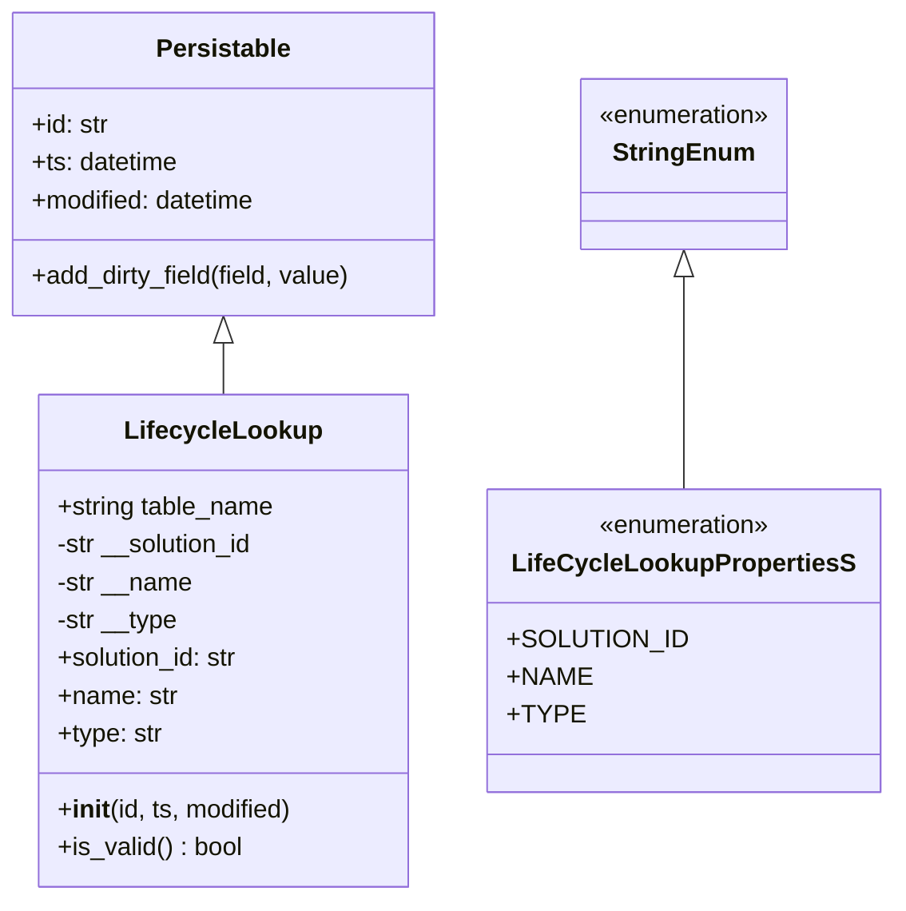
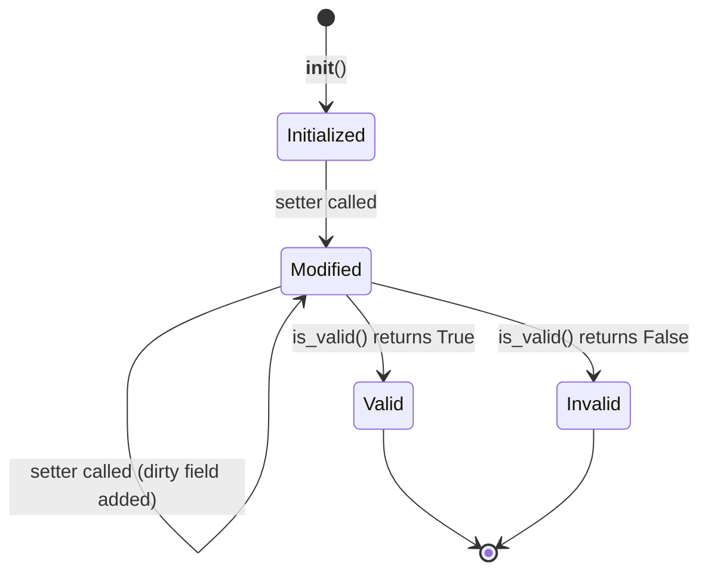

# Diagram: platform/partview_core/partview_service/partview_service/core/datamodel/LifecycleLookup.py


> Auto-generated by Obscura crawlers

## Diagram 1

```mermaid
classDiagram
      Persistable <|-- LifecycleLookup
      StringEnum <|-- LifeCycleLookupPropertiesS...
  └ 84 lines...
```

> SVG rendering failed for this diagram.

## Diagram 2



### SVG

<svg id="container" width="548.53515625" xmlns="http://www.w3.org/2000/svg" class="classDiagram" height="570" viewBox="0 0 548.53515625 570" role="graphics-document document" aria-roledescription="class"><style>#container{font-family:"trebuchet ms",verdana,arial,sans-serif;font-size:16px;fill:#333;}@keyframes edge-animation-frame{from{stroke-dashoffset:0;}}@keyframes dash{to{stroke-dashoffset:0;}}#container .edge-animation-slow{stroke-dasharray:9,5!important;stroke-dashoffset:900;animation:dash 50s linear infinite;stroke-linecap:round;}#container .edge-animation-fast{stroke-dasharray:9,5!important;stroke-dashoffset:900;animation:dash 20s linear infinite;stroke-linecap:round;}#container .error-icon{fill:#552222;}#container .error-text{fill:#552222;stroke:#552222;}#container .edge-thickness-normal{stroke-width:1px;}#container .edge-thickness-thick{stroke-width:3.5px;}#container .edge-pattern-solid{stroke-dasharray:0;}#container .edge-thickness-invisible{stroke-width:0;fill:none;}#container .edge-pattern-dashed{stroke-dasharray:3;}#container .edge-pattern-dotted{stroke-dasharray:2;}#container .marker{fill:#333333;stroke:#333333;}#container .marker.cross{stroke:#333333;}#container svg{font-family:"trebuchet ms",verdana,arial,sans-serif;font-size:16px;}#container p{margin:0;}#container g.classGroup text{fill:#9370DB;stroke:none;font-family:"trebuchet ms",verdana,arial,sans-serif;font-size:10px;}#container g.classGroup text .title{font-weight:bolder;}#container .nodeLabel,#container .edgeLabel{color:#131300;}#container .edgeLabel .label rect{fill:#ECECFF;}#container .label text{fill:#131300;}#container .labelBkg{background:#ECECFF;}#container .edgeLabel .label span{background:#ECECFF;}#container .classTitle{font-weight:bolder;}#container .node rect,#container .node circle,#container .node ellipse,#container .node polygon,#container .node path{fill:#ECECFF;stroke:#9370DB;stroke-width:1px;}#container .divider{stroke:#9370DB;stroke-width:1;}#container g.clickable{cursor:pointer;}#container g.classGroup rect{fill:#ECECFF;stroke:#9370DB;}#container g.classGroup line{stroke:#9370DB;stroke-width:1;}#container .classLabel .box{stroke:none;stroke-width:0;fill:#ECECFF;opacity:0.5;}#container .classLabel .label{fill:#9370DB;font-size:10px;}#container .relation{stroke:#333333;stroke-width:1;fill:none;}#container .dashed-line{stroke-dasharray:3;}#container .dotted-line{stroke-dasharray:1 2;}#container #compositionStart,#container .composition{fill:#333333!important;stroke:#333333!important;stroke-width:1;}#container #compositionEnd,#container .composition{fill:#333333!important;stroke:#333333!important;stroke-width:1;}#container #dependencyStart,#container .dependency{fill:#333333!important;stroke:#333333!important;stroke-width:1;}#container #dependencyStart,#container .dependency{fill:#333333!important;stroke:#333333!important;stroke-width:1;}#container #extensionStart,#container .extension{fill:transparent!important;stroke:#333333!important;stroke-width:1;}#container #extensionEnd,#container .extension{fill:transparent!important;stroke:#333333!important;stroke-width:1;}#container #aggregationStart,#container .aggregation{fill:transparent!important;stroke:#333333!important;stroke-width:1;}#container #aggregationEnd,#container .aggregation{fill:transparent!important;stroke:#333333!important;stroke-width:1;}#container #lollipopStart,#container .lollipop{fill:#ECECFF!important;stroke:#333333!important;stroke-width:1;}#container #lollipopEnd,#container .lollipop{fill:#ECECFF!important;stroke:#333333!important;stroke-width:1;}#container .edgeTerminals{font-size:11px;line-height:initial;}#container .classTitleText{text-anchor:middle;font-size:18px;fill:#333;}#container .label-icon{display:inline-block;height:1em;overflow:visible;vertical-align:-0.125em;}#container .node .label-icon path{fill:currentColor;stroke:revert;stroke-width:revert;}#container :root{--mermaid-font-family:"trebuchet ms",verdana,arial,sans-serif;}</style><g><defs><marker id="container_class-aggregationStart" class="marker aggregation class" refX="18" refY="7" markerWidth="190" markerHeight="240" orient="auto"><path d="M 18,7 L9,13 L1,7 L9,1 Z"></path></marker></defs><defs><marker id="container_class-aggregationEnd" class="marker aggregation class" refX="1" refY="7" markerWidth="20" markerHeight="28" orient="auto"><path d="M 18,7 L9,13 L1,7 L9,1 Z"></path></marker></defs><defs><marker id="container_class-extensionStart" class="marker extension class" refX="18" refY="7" markerWidth="190" markerHeight="240" orient="auto"><path d="M 1,7 L18,13 V 1 Z"></path></marker></defs><defs><marker id="container_class-extensionEnd" class="marker extension class" refX="1" refY="7" markerWidth="20" markerHeight="28" orient="auto"><path d="M 1,1 V 13 L18,7 Z"></path></marker></defs><defs><marker id="container_class-compositionStart" class="marker composition class" refX="18" refY="7" markerWidth="190" markerHeight="240" orient="auto"><path d="M 18,7 L9,13 L1,7 L9,1 Z"></path></marker></defs><defs><marker id="container_class-compositionEnd" class="marker composition class" refX="1" refY="7" markerWidth="20" markerHeight="28" orient="auto"><path d="M 18,7 L9,13 L1,7 L9,1 Z"></path></marker></defs><defs><marker id="container_class-dependencyStart" class="marker dependency class" refX="6" refY="7" markerWidth="190" markerHeight="240" orient="auto"><path d="M 5,7 L9,13 L1,7 L9,1 Z"></path></marker></defs><defs><marker id="container_class-dependencyEnd" class="marker dependency class" refX="13" refY="7" markerWidth="20" markerHeight="28" orient="auto"><path d="M 18,7 L9,13 L14,7 L9,1 Z"></path></marker></defs><defs><marker id="container_class-lollipopStart" class="marker lollipop class" refX="13" refY="7" markerWidth="190" markerHeight="240" orient="auto"><circle stroke="black" fill="transparent" cx="7" cy="7" r="6"></circle></marker></defs><defs><marker id="container_class-lollipopEnd" class="marker lollipop class" refX="1" refY="7" markerWidth="190" markerHeight="240" orient="auto"><circle stroke="black" fill="transparent" cx="7" cy="7" r="6"></circle></marker></defs><g class="root"><g class="clusters"></g><g class="edgePaths"><path d="M143.715,217.25L143.715,218.542C143.715,219.833,143.715,222.417,143.715,227.875C143.715,233.333,143.715,241.667,143.715,245.833L143.715,250" id="id_Persistable_LifecycleLookup_1" class="edge-thickness-normal edge-pattern-solid relation" style=";;;" data-edge="true" data-et="edge" data-id="id_Persistable_LifecycleLookup_1" data-points="W3sieCI6MTQzLjcxNDg0Mzc1LCJ5IjoyMDB9LHsieCI6MTQzLjcxNDg0Mzc1LCJ5IjoyMjV9LHsieCI6MTQzLjcxNDg0Mzc1LCJ5IjoyNTB9XQ==" marker-start="url(#container_class-extensionStart)"></path><path d="M425.598,175.25L425.598,183.542C425.598,191.833,425.598,208.417,425.598,230.875C425.598,253.333,425.598,281.667,425.598,295.833L425.598,310" id="id_StringEnum_LifeCycleLookupPropertiesS_2" class="edge-thickness-normal edge-pattern-solid relation" style=";;;" data-edge="true" data-et="edge" data-id="id_StringEnum_LifeCycleLookupPropertiesS_2" data-points="W3sieCI6NDI1LjU5NzY1NjI1LCJ5IjoxNTh9LHsieCI6NDI1LjU5NzY1NjI1LCJ5IjoyMjV9LHsieCI6NDI1LjU5NzY1NjI1LCJ5IjozMTB9XQ==" marker-start="url(#container_class-extensionStart)"></path></g><g class="edgeLabels"><g class="edgeLabel"><g class="label" data-id="id_Persistable_LifecycleLookup_1" transform="translate(0, 0)"><foreignObject width="0" height="0"><div xmlns="http://www.w3.org/1999/xhtml" class="labelBkg" style="display: table-cell; white-space: nowrap; line-height: 1.5; max-width: 200px; text-align: center;"><span class="edgeLabel"></span></div></foreignObject></g></g><g class="edgeLabel"><g class="label" data-id="id_StringEnum_LifeCycleLookupPropertiesS_2" transform="translate(0, 0)"><foreignObject width="0" height="0"><div xmlns="http://www.w3.org/1999/xhtml" class="labelBkg" style="display: table-cell; white-space: nowrap; line-height: 1.5; max-width: 200px; text-align: center;"><span class="edgeLabel"></span></div></foreignObject></g></g></g><g class="nodes"><g class="node default" id="classId-Persistable-0" transform="translate(143.71484375, 104)"><g class="basic label-container"><path d="M-135.71484375 -96 L135.71484375 -96 L135.71484375 96 L-135.71484375 96" stroke="none" stroke-width="0" fill="#ECECFF" style=""></path><path d="M-135.71484375 -96 C-62.39929407300254 -96, 10.916255603994927 -96, 135.71484375 -96 M-135.71484375 -96 C-31.501428180106686 -96, 72.71198738978663 -96, 135.71484375 -96 M135.71484375 -96 C135.71484375 -46.873745757392655, 135.71484375 2.2525084852146904, 135.71484375 96 M135.71484375 -96 C135.71484375 -28.18968056201348, 135.71484375 39.62063887597304, 135.71484375 96 M135.71484375 96 C31.633619437198178 96, -72.44760487560364 96, -135.71484375 96 M135.71484375 96 C61.64440729689389 96, -12.426029156212223 96, -135.71484375 96 M-135.71484375 96 C-135.71484375 22.376083720146852, -135.71484375 -51.247832559706296, -135.71484375 -96 M-135.71484375 96 C-135.71484375 25.049908655813226, -135.71484375 -45.90018268837355, -135.71484375 -96" stroke="#9370DB" stroke-width="1.3" fill="none" stroke-dasharray="0 0" style=""></path></g><g class="annotation-group text" transform="translate(0, -72)"></g><g class="label-group text" transform="translate(-40.9765625, -72)"><g class="label" style="font-weight: bolder" transform="translate(0,-12)"><foreignObject width="81.953125" height="24"><div xmlns="http://www.w3.org/1999/xhtml" style="display: table-cell; white-space: nowrap; line-height: 1.5; max-width: 130px; text-align: center;"><span class="nodeLabel markdown-node-label" style=""><p>Persistable</p></span></div></foreignObject></g></g><g class="members-group text" transform="translate(-123.71484375, -24)"><g class="label" style="" transform="translate(0,-12)"><foreignObject width="49.578125" height="24"><div xmlns="http://www.w3.org/1999/xhtml" style="display: table-cell; white-space: nowrap; line-height: 1.5; max-width: 108px; text-align: center;"><span class="nodeLabel markdown-node-label" style=""><p>+id: str</p></span></div></foreignObject></g><g class="label" style="" transform="translate(0,12)"><foreignObject width="94.484375" height="24"><div xmlns="http://www.w3.org/1999/xhtml" style="display: table-cell; white-space: nowrap; line-height: 1.5; max-width: 152px; text-align: center;"><span class="nodeLabel markdown-node-label" style=""><p>+ts: datetime</p></span></div></foreignObject></g><g class="label" style="" transform="translate(0,36)"><foreignObject width="145.9375" height="24"><div xmlns="http://www.w3.org/1999/xhtml" style="display: table-cell; white-space: nowrap; line-height: 1.5; max-width: 203px; text-align: center;"><span class="nodeLabel markdown-node-label" style=""><p>+modified: datetime</p></span></div></foreignObject></g></g><g class="methods-group text" transform="translate(-123.71484375, 72)"><g class="label" style="" transform="translate(0,-12)"><foreignObject width="206.453125" height="24"><div xmlns="http://www.w3.org/1999/xhtml" style="display: table-cell; white-space: nowrap; line-height: 1.5; max-width: 264px; text-align: center;"><span class="nodeLabel markdown-node-label" style=""><p>+add_dirty_field(field, value)</p></span></div></foreignObject></g></g><g class="divider" style=""><path d="M-135.71484375 -48 C-64.24512909261043 -48, 7.224585564779147 -48, 135.71484375 -48 M-135.71484375 -48 C-61.78618133418266 -48, 12.142481081634685 -48, 135.71484375 -48" stroke="#9370DB" stroke-width="1.3" fill="none" stroke-dasharray="0 0" style=""></path></g><g class="divider" style=""><path d="M-135.71484375 48 C-70.57976450364264 48, -5.444685257285272 48, 135.71484375 48 M-135.71484375 48 C-34.55956421490666 48, 66.59571532018668 48, 135.71484375 48" stroke="#9370DB" stroke-width="1.3" fill="none" stroke-dasharray="0 0" style=""></path></g></g><g class="node default" id="classId-LifecycleLookup-1" transform="translate(143.71484375, 406)"><g class="basic label-container"><path d="M-116.9453125 -156 L116.9453125 -156 L116.9453125 156 L-116.9453125 156" stroke="none" stroke-width="0" fill="#ECECFF" style=""></path><path d="M-116.9453125 -156 C-52.48567588508189 -156, 11.973960729836222 -156, 116.9453125 -156 M-116.9453125 -156 C-46.27846131044299 -156, 24.388389879114015 -156, 116.9453125 -156 M116.9453125 -156 C116.9453125 -75.27270223922908, 116.9453125 5.454595521541847, 116.9453125 156 M116.9453125 -156 C116.9453125 -37.997085055683854, 116.9453125 80.00582988863229, 116.9453125 156 M116.9453125 156 C45.37810233562966 156, -26.189107828740674 156, -116.9453125 156 M116.9453125 156 C54.77358648785479 156, -7.398139524290414 156, -116.9453125 156 M-116.9453125 156 C-116.9453125 39.199374534432096, -116.9453125 -77.60125093113581, -116.9453125 -156 M-116.9453125 156 C-116.9453125 60.82383093920943, -116.9453125 -34.35233812158114, -116.9453125 -156" stroke="#9370DB" stroke-width="1.3" fill="none" stroke-dasharray="0 0" style=""></path></g><g class="annotation-group text" transform="translate(0, -132)"></g><g class="label-group text" transform="translate(-58.984375, -132)"><g class="label" style="font-weight: bolder" transform="translate(0,-12)"><foreignObject width="117.96875" height="24"><div xmlns="http://www.w3.org/1999/xhtml" style="display: table-cell; white-space: nowrap; line-height: 1.5; max-width: 166px; text-align: center;"><span class="nodeLabel markdown-node-label" style=""><p>LifecycleLookup</p></span></div></foreignObject></g></g><g class="members-group text" transform="translate(-104.9453125, -84)"><g class="label" style="" transform="translate(0,-12)"><foreignObject width="139.578125" height="24"><div xmlns="http://www.w3.org/1999/xhtml" style="display: table-cell; white-space: nowrap; line-height: 1.5; max-width: 197px; text-align: center;"><span class="nodeLabel markdown-node-label" style=""><p>+string table_name</p></span></div></foreignObject></g><g class="label" style="" transform="translate(0,12)"><foreignObject width="128.828125" height="24"><div xmlns="http://www.w3.org/1999/xhtml" style="display: table-cell; white-space: nowrap; line-height: 1.5; max-width: 186px; text-align: center;"><span class="nodeLabel markdown-node-label" style=""><p>-str __solution_id</p></span></div></foreignObject></g><g class="label" style="" transform="translate(0,36)"><foreignObject width="87.109375" height="24"><div xmlns="http://www.w3.org/1999/xhtml" style="display: table-cell; white-space: nowrap; line-height: 1.5; max-width: 144px; text-align: center;"><span class="nodeLabel markdown-node-label" style=""><p>-str __name</p></span></div></foreignObject></g><g class="label" style="" transform="translate(0,60)"><foreignObject width="78.078125" height="24"><div xmlns="http://www.w3.org/1999/xhtml" style="display: table-cell; white-space: nowrap; line-height: 1.5; max-width: 135px; text-align: center;"><span class="nodeLabel markdown-node-label" style=""><p>-str __type</p></span></div></foreignObject></g><g class="label" style="" transform="translate(0,84)"><foreignObject width="117.71875" height="24"><div xmlns="http://www.w3.org/1999/xhtml" style="display: table-cell; white-space: nowrap; line-height: 1.5; max-width: 176px; text-align: center;"><span class="nodeLabel markdown-node-label" style=""><p>+solution_id: str</p></span></div></foreignObject></g><g class="label" style="" transform="translate(0,108)"><foreignObject width="76.015625" height="24"><div xmlns="http://www.w3.org/1999/xhtml" style="display: table-cell; white-space: nowrap; line-height: 1.5; max-width: 134px; text-align: center;"><span class="nodeLabel markdown-node-label" style=""><p>+name: str</p></span></div></foreignObject></g><g class="label" style="" transform="translate(0,132)"><foreignObject width="67.203125" height="24"><div xmlns="http://www.w3.org/1999/xhtml" style="display: table-cell; white-space: nowrap; line-height: 1.5; max-width: 125px; text-align: center;"><span class="nodeLabel markdown-node-label" style=""><p>+type: str</p></span></div></foreignObject></g></g><g class="methods-group text" transform="translate(-104.9453125, 108)"><g class="label" style="" transform="translate(0,-12)"><foreignObject width="150.90625" height="24"><div xmlns="http://www.w3.org/1999/xhtml" style="display: table-cell; white-space: nowrap; line-height: 1.5; max-width: 240px; text-align: center;"><span class="nodeLabel markdown-node-label" style=""><p>+<strong>init</strong>(id, ts, modified)</p></span></div></foreignObject></g><g class="label" style="" transform="translate(0,12)"><foreignObject width="117.984375" height="24"><div xmlns="http://www.w3.org/1999/xhtml" style="display: table-cell; white-space: nowrap; line-height: 1.5; max-width: 176px; text-align: center;"><span class="nodeLabel markdown-node-label" style=""><p>+is_valid() : bool</p></span></div></foreignObject></g></g><g class="divider" style=""><path d="M-116.9453125 -108 C-54.270198775769 -108, 8.404914948461993 -108, 116.9453125 -108 M-116.9453125 -108 C-50.67135999090786 -108, 15.60259251818428 -108, 116.9453125 -108" stroke="#9370DB" stroke-width="1.3" fill="none" stroke-dasharray="0 0" style=""></path></g><g class="divider" style=""><path d="M-116.9453125 84 C-64.35834198749086 84, -11.77137147498172 84, 116.9453125 84 M-116.9453125 84 C-46.67793721918551 84, 23.589438061628982 84, 116.9453125 84" stroke="#9370DB" stroke-width="1.3" fill="none" stroke-dasharray="0 0" style=""></path></g></g><g class="node default" id="classId-StringEnum-2" transform="translate(425.59765625, 104)"><g class="basic label-container"><path d="M-67.5546875 -54 L67.5546875 -54 L67.5546875 54 L-67.5546875 54" stroke="none" stroke-width="0" fill="#ECECFF" style=""></path><path d="M-67.5546875 -54 C-18.115649938139725 -54, 31.32338762372055 -54, 67.5546875 -54 M-67.5546875 -54 C-20.068190807851302 -54, 27.418305884297396 -54, 67.5546875 -54 M67.5546875 -54 C67.5546875 -24.87782750550893, 67.5546875 4.244344988982142, 67.5546875 54 M67.5546875 -54 C67.5546875 -13.709706838792087, 67.5546875 26.580586322415826, 67.5546875 54 M67.5546875 54 C16.46354490424882 54, -34.62759769150236 54, -67.5546875 54 M67.5546875 54 C37.9802809725029 54, 8.405874445005793 54, -67.5546875 54 M-67.5546875 54 C-67.5546875 17.988461277786705, -67.5546875 -18.02307744442659, -67.5546875 -54 M-67.5546875 54 C-67.5546875 24.926711932513527, -67.5546875 -4.146576134972946, -67.5546875 -54" stroke="#9370DB" stroke-width="1.3" fill="none" stroke-dasharray="0 0" style=""></path></g><g class="annotation-group text" transform="translate(-55.5546875, -30)"><g class="label" style="" transform="translate(0,-12)"><foreignObject width="111.109375" height="24"><div xmlns="http://www.w3.org/1999/xhtml" style="display: table-cell; white-space: nowrap; line-height: 1.5; max-width: 161px; text-align: center;"><span class="nodeLabel markdown-node-label" style=""><p>«enumeration»</p></span></div></foreignObject></g></g><g class="label-group text" transform="translate(-42.234375, -6)"><g class="label" style="font-weight: bolder" transform="translate(0,-12)"><foreignObject width="84.46875" height="24"><div xmlns="http://www.w3.org/1999/xhtml" style="display: table-cell; white-space: nowrap; line-height: 1.5; max-width: 134px; text-align: center;"><span class="nodeLabel markdown-node-label" style=""><p>StringEnum</p></span></div></foreignObject></g></g><g class="members-group text" transform="translate(-55.5546875, 42)"></g><g class="methods-group text" transform="translate(-55.5546875, 72)"></g><g class="divider" style=""><path d="M-67.5546875 18 C-33.791214076531645 18, -0.02774065306329021 18, 67.5546875 18 M-67.5546875 18 C-31.17777953079009 18, 5.1991284384198195 18, 67.5546875 18" stroke="#9370DB" stroke-width="1.3" fill="none" stroke-dasharray="0 0" style=""></path></g><g class="divider" style=""><path d="M-67.5546875 36 C-27.68128787852983 36, 12.192111742940341 36, 67.5546875 36 M-67.5546875 36 C-35.84151009974076 36, -4.128332699481511 36, 67.5546875 36" stroke="#9370DB" stroke-width="1.3" fill="none" stroke-dasharray="0 0" style=""></path></g></g><g class="node default" id="classId-LifeCycleLookupPropertiesS-3" transform="translate(425.59765625, 406)"><g class="basic label-container"><path d="M-114.9375 -96 L114.9375 -96 L114.9375 96 L-114.9375 96" stroke="none" stroke-width="0" fill="#ECECFF" style=""></path><path d="M-114.9375 -96 C-62.82427560040855 -96, -10.711051200817096 -96, 114.9375 -96 M-114.9375 -96 C-29.933524798218528 -96, 55.070450403562944 -96, 114.9375 -96 M114.9375 -96 C114.9375 -26.128833617648368, 114.9375 43.742332764703264, 114.9375 96 M114.9375 -96 C114.9375 -42.06506144542054, 114.9375 11.86987710915892, 114.9375 96 M114.9375 96 C61.334983039070465 96, 7.732466078140931 96, -114.9375 96 M114.9375 96 C64.56479045629607 96, 14.192080912592147 96, -114.9375 96 M-114.9375 96 C-114.9375 32.572009729226, -114.9375 -30.855980541548007, -114.9375 -96 M-114.9375 96 C-114.9375 49.18681768047449, -114.9375 2.373635360948981, -114.9375 -96" stroke="#9370DB" stroke-width="1.3" fill="none" stroke-dasharray="0 0" style=""></path></g><g class="annotation-group text" transform="translate(-55.5546875, -72)"><g class="label" style="" transform="translate(0,-12)"><foreignObject width="111.109375" height="24"><div xmlns="http://www.w3.org/1999/xhtml" style="display: table-cell; white-space: nowrap; line-height: 1.5; max-width: 161px; text-align: center;"><span class="nodeLabel markdown-node-label" style=""><p>«enumeration»</p></span></div></foreignObject></g></g><g class="label-group text" transform="translate(-102.234375, -48)"><g class="label" style="font-weight: bolder" transform="translate(0,-12)"><foreignObject width="204.46875" height="24"><div xmlns="http://www.w3.org/1999/xhtml" style="display: table-cell; white-space: nowrap; line-height: 1.5; max-width: 250px; text-align: center;"><span class="nodeLabel markdown-node-label" style=""><p>LifeCycleLookupPropertiesS</p></span></div></foreignObject></g></g><g class="members-group text" transform="translate(-102.9375, 0)"><g class="label" style="" transform="translate(0,-12)"><foreignObject width="103.640625" height="24"><div xmlns="http://www.w3.org/1999/xhtml" style="display: table-cell; white-space: nowrap; line-height: 1.5; max-width: 161px; text-align: center;"><span class="nodeLabel markdown-node-label" style=""><p>+SOLUTION_ID</p></span></div></foreignObject></g><g class="label" style="" transform="translate(0,12)"><foreignObject width="49.09375" height="24"><div xmlns="http://www.w3.org/1999/xhtml" style="display: table-cell; white-space: nowrap; line-height: 1.5; max-width: 106px; text-align: center;"><span class="nodeLabel markdown-node-label" style=""><p>+NAME</p></span></div></foreignObject></g><g class="label" style="" transform="translate(0,36)"><foreignObject width="42.125" height="24"><div xmlns="http://www.w3.org/1999/xhtml" style="display: table-cell; white-space: nowrap; line-height: 1.5; max-width: 99px; text-align: center;"><span class="nodeLabel markdown-node-label" style=""><p>+TYPE</p></span></div></foreignObject></g></g><g class="methods-group text" transform="translate(-102.9375, 96)"></g><g class="divider" style=""><path d="M-114.9375 -24 C-24.696580743753827 -24, 65.54433851249235 -24, 114.9375 -24 M-114.9375 -24 C-35.14596426217942 -24, 44.64557147564116 -24, 114.9375 -24" stroke="#9370DB" stroke-width="1.3" fill="none" stroke-dasharray="0 0" style=""></path></g><g class="divider" style=""><path d="M-114.9375 72 C-48.98153367775663 72, 16.97443264448674 72, 114.9375 72 M-114.9375 72 C-26.036489715801906 72, 62.86452056839619 72, 114.9375 72" stroke="#9370DB" stroke-width="1.3" fill="none" stroke-dasharray="0 0" style=""></path></g></g></g></g></g></svg>

## Diagram 3



### SVG

<svg id="container" width="595.953125" xmlns="http://www.w3.org/2000/svg" class="statediagram" height="484" viewBox="0 0 595.953125 484" role="graphics-document document" aria-roledescription="stateDiagram"><style>#container{font-family:"trebuchet ms",verdana,arial,sans-serif;font-size:16px;fill:#333;}@keyframes edge-animation-frame{from{stroke-dashoffset:0;}}@keyframes dash{to{stroke-dashoffset:0;}}#container .edge-animation-slow{stroke-dasharray:9,5!important;stroke-dashoffset:900;animation:dash 50s linear infinite;stroke-linecap:round;}#container .edge-animation-fast{stroke-dasharray:9,5!important;stroke-dashoffset:900;animation:dash 20s linear infinite;stroke-linecap:round;}#container .error-icon{fill:#552222;}#container .error-text{fill:#552222;stroke:#552222;}#container .edge-thickness-normal{stroke-width:1px;}#container .edge-thickness-thick{stroke-width:3.5px;}#container .edge-pattern-solid{stroke-dasharray:0;}#container .edge-thickness-invisible{stroke-width:0;fill:none;}#container .edge-pattern-dashed{stroke-dasharray:3;}#container .edge-pattern-dotted{stroke-dasharray:2;}#container .marker{fill:#333333;stroke:#333333;}#container .marker.cross{stroke:#333333;}#container svg{font-family:"trebuchet ms",verdana,arial,sans-serif;font-size:16px;}#container p{margin:0;}#container defs #statediagram-barbEnd{fill:#333333;stroke:#333333;}#container g.stateGroup text{fill:#9370DB;stroke:none;font-size:10px;}#container g.stateGroup text{fill:#333;stroke:none;font-size:10px;}#container g.stateGroup .state-title{font-weight:bolder;fill:#131300;}#container g.stateGroup rect{fill:#ECECFF;stroke:#9370DB;}#container g.stateGroup line{stroke:#333333;stroke-width:1;}#container .transition{stroke:#333333;stroke-width:1;fill:none;}#container .stateGroup .composit{fill:white;border-bottom:1px;}#container .stateGroup .alt-composit{fill:#e0e0e0;border-bottom:1px;}#container .state-note{stroke:#aaaa33;fill:#fff5ad;}#container .state-note text{fill:black;stroke:none;font-size:10px;}#container .stateLabel .box{stroke:none;stroke-width:0;fill:#ECECFF;opacity:0.5;}#container .edgeLabel .label rect{fill:#ECECFF;opacity:0.5;}#container .edgeLabel{background-color:rgba(232,232,232, 0.8);text-align:center;}#container .edgeLabel p{background-color:rgba(232,232,232, 0.8);}#container .edgeLabel rect{opacity:0.5;background-color:rgba(232,232,232, 0.8);fill:rgba(232,232,232, 0.8);}#container .edgeLabel .label text{fill:#333;}#container .label div .edgeLabel{color:#333;}#container .stateLabel text{fill:#131300;font-size:10px;font-weight:bold;}#container .node circle.state-start{fill:#333333;stroke:#333333;}#container .node .fork-join{fill:#333333;stroke:#333333;}#container .node circle.state-end{fill:#9370DB;stroke:white;stroke-width:1.5;}#container .end-state-inner{fill:white;stroke-width:1.5;}#container .node rect{fill:#ECECFF;stroke:#9370DB;stroke-width:1px;}#container .node polygon{fill:#ECECFF;stroke:#9370DB;stroke-width:1px;}#container #statediagram-barbEnd{fill:#333333;}#container .statediagram-cluster rect{fill:#ECECFF;stroke:#9370DB;stroke-width:1px;}#container .cluster-label,#container .nodeLabel{color:#131300;}#container .statediagram-cluster rect.outer{rx:5px;ry:5px;}#container .statediagram-state .divider{stroke:#9370DB;}#container .statediagram-state .title-state{rx:5px;ry:5px;}#container .statediagram-cluster.statediagram-cluster .inner{fill:white;}#container .statediagram-cluster.statediagram-cluster-alt .inner{fill:#f0f0f0;}#container .statediagram-cluster .inner{rx:0;ry:0;}#container .statediagram-state rect.basic{rx:5px;ry:5px;}#container .statediagram-state rect.divider{stroke-dasharray:10,10;fill:#f0f0f0;}#container .note-edge{stroke-dasharray:5;}#container .statediagram-note rect{fill:#fff5ad;stroke:#aaaa33;stroke-width:1px;rx:0;ry:0;}#container .statediagram-note rect{fill:#fff5ad;stroke:#aaaa33;stroke-width:1px;rx:0;ry:0;}#container .statediagram-note text{fill:black;}#container .statediagram-note .nodeLabel{color:black;}#container .statediagram .edgeLabel{color:red;}#container #dependencyStart,#container #dependencyEnd{fill:#333333;stroke:#333333;stroke-width:1;}#container .statediagramTitleText{text-anchor:middle;font-size:18px;fill:#333;}#container :root{--mermaid-font-family:"trebuchet ms",verdana,arial,sans-serif;}</style><g><defs><marker id="container_stateDiagram-barbEnd" refX="19" refY="7" markerWidth="20" markerHeight="14" markerUnits="userSpaceOnUse" orient="auto"><path d="M 19,7 L9,13 L14,7 L9,1 Z"></path></marker></defs><g class="root"><g class="clusters"></g><g class="edgePaths"><path d="M277.453,22L277.453,28.167C277.453,34.333,277.453,46.667,277.536,59.083C277.62,71.5,277.786,84,277.87,90.25L277.953,96.5" id="edge0" class="edge-thickness-normal edge-pattern-solid transition" style="fill:none;;;fill:none" data-edge="true" data-et="edge" data-id="edge0" data-points="W3sieCI6Mjc3LjQ1MzEyNSwieSI6MjJ9LHsieCI6Mjc3LjQ1MzEyNSwieSI6NTl9LHsieCI6Mjc3Ljk1MzEyNSwieSI6OTYuNX1d" marker-end="url(#container_stateDiagram-barbEnd)"></path><path d="M277.953,136.5L277.87,142.583C277.786,148.667,277.62,160.833,277.62,173.167C277.62,185.5,277.786,198,277.87,204.25L277.953,210.5" id="edge1" class="edge-thickness-normal edge-pattern-solid transition" style="fill:none;;;fill:none" data-edge="true" data-et="edge" data-id="edge1" data-points="W3sieCI6Mjc3Ljk1MzEyNSwieSI6MTM2LjV9LHsieCI6Mjc3LjQ1MzEyNSwieSI6MTczfSx7IngiOjI3Ny45NTMxMjUsInkiOjIxMC41fV0=" marker-end="url(#container_stateDiagram-barbEnd)"></path><path d="M238.266,243.85L216.555,251.042C194.844,258.233,151.422,272.617,129.711,289.3C108,305.983,108,324.967,108,334.458L108,343.95" id="Modified-cyclic-special-1" class="edge-thickness-normal edge-pattern-solid transition" style="fill:none;;;fill:none" data-edge="true" data-et="edge" data-id="Modified-cyclic-special-1" data-points="W3sieCI6MjM4LjI2NTYyNSwieSI6MjQzLjg0OTkzMDg0MzcwNjc3fSx7IngiOjEwOCwieSI6Mjg3fSx7IngiOjEwOCwieSI6MzQzLjk0OTk5OTk5OTI1NDk0fV0="></path><path d="M108,344.05L108,355.542C108,367.033,108,390.017,117.992,410.834C127.983,431.651,147.967,450.302,157.958,459.628L167.95,468.953" id="Modified-cyclic-special-mid" class="edge-thickness-normal edge-pattern-solid transition" style="fill:none;;;fill:none" data-edge="true" data-et="edge" data-id="Modified-cyclic-special-mid" data-points="W3sieCI6MTA4LCJ5IjozNDQuMDUwMDAwMDAwNzQ1MDZ9LHsieCI6MTA4LCJ5Ijo0MTN9LHsieCI6MTY3Ljk0OTk5OTk5OTI1NDk0LCJ5Ijo0NjguOTUzMzMzMzMyNjM3OTV9XQ=="></path><path d="M168.05,468.953L178.042,459.628C188.033,450.302,208.017,431.651,218.008,410.826C228,390,228,367,228,346C228,325,228,306,233.434,290.417C238.867,274.833,249.734,262.667,255.168,256.583L260.601,250.5" id="Modified-cyclic-special-2" class="edge-thickness-normal edge-pattern-solid transition" style="fill:none;;;fill:none" data-edge="true" data-et="edge" data-id="Modified-cyclic-special-2" data-points="W3sieCI6MTY4LjA1MDAwMDAwMDc0NTA2LCJ5Ijo0NjguOTUzMzMzMzMyNjM3OTV9LHsieCI6MjI4LCJ5Ijo0MTN9LHsieCI6MjI4LCJ5IjozNDR9LHsieCI6MjI4LCJ5IjoyODd9LHsieCI6MjYwLjYwMTE1MTMxNTc4OTUsInkiOjI1MC41fV0=" marker-end="url(#container_stateDiagram-barbEnd)"></path><path d="M295.305,250.5L300.572,256.583C305.839,262.667,316.373,274.833,321.723,287.167C327.073,299.5,327.24,312,327.323,318.25L327.406,324.5" id="edge3" class="edge-thickness-normal edge-pattern-solid transition" style="fill:none;;;fill:none" data-edge="true" data-et="edge" data-id="edge3" data-points="W3sieCI6Mjk1LjMwNTA5ODY4NDIxMDUsInkiOjI1MC41fSx7IngiOjMyNi45MDYyNSwieSI6Mjg3fSx7IngiOjMyNy40MDYyNSwieSI6MzI0LjV9XQ==" marker-end="url(#container_stateDiagram-barbEnd)"></path><path d="M317.641,240.36L349.181,248.133C380.721,255.907,443.802,271.453,475.426,285.477C507.049,299.5,507.216,312,507.299,318.25L507.383,324.5" id="edge4" class="edge-thickness-normal edge-pattern-solid transition" style="fill:none;;;fill:none" data-edge="true" data-et="edge" data-id="edge4" data-points="W3sieCI6MzE3LjY0MDYyNSwieSI6MjQwLjM2MDA0Njk5MTUyMTF9LHsieCI6NTA2Ljg4MjgxMjUsInkiOjI4N30seyJ4Ijo1MDcuMzgyODEyNSwieSI6MzI0LjV9XQ==" marker-end="url(#container_stateDiagram-barbEnd)"></path><path d="M327.406,364.5L327.323,372.583C327.24,380.667,327.073,396.833,340.997,413.634C354.921,430.434,382.936,447.868,396.944,456.585L410.951,465.302" id="edge5" class="edge-thickness-normal edge-pattern-solid transition" style="fill:none;;;fill:none" data-edge="true" data-et="edge" data-id="edge5" data-points="W3sieCI6MzI3LjQwNjI1LCJ5IjozNjQuNX0seyJ4IjozMjYuOTA2MjUsInkiOjQxM30seyJ4Ijo0MTAuOTUxMzUxMDQ2MDYwNiwieSI6NDY1LjMwMTUzOTYzNjA3Nzg1fV0=" marker-end="url(#container_stateDiagram-barbEnd)"></path><path d="M507.383,364.5L507.299,372.583C507.216,380.667,507.049,396.833,492.959,413.634C478.868,430.434,450.853,447.868,436.845,456.585L422.838,465.302" id="edge6" class="edge-thickness-normal edge-pattern-solid transition" style="fill:none;;;fill:none" data-edge="true" data-et="edge" data-id="edge6" data-points="W3sieCI6NTA3LjM4MjgxMjUsInkiOjM2NC41fSx7IngiOjUwNi44ODI4MTI1LCJ5Ijo0MTN9LHsieCI6NDIyLjgzNzcxMTQ1MzkzOTQsInkiOjQ2NS4zMDE1Mzk2MzYwNzc4NX1d" marker-end="url(#container_stateDiagram-barbEnd)"></path></g><g class="edgeLabels"><g class="edgeLabel" transform="translate(277.453125, 59)"><g class="label" data-id="edge0" transform="translate(-17.40625, -12)"><foreignObject width="34.8125" height="24"><div xmlns="http://www.w3.org/1999/xhtml" class="labelBkg" style="display: table-cell; white-space: nowrap; line-height: 1.5; max-width: 200px; text-align: center;"><span class="edgeLabel"><p><strong>init</strong>()</p></span></div></foreignObject></g></g><g class="edgeLabel" transform="translate(277.453125, 173)"><g class="label" data-id="edge1" transform="translate(-45.1328125, -12)"><foreignObject width="90.265625" height="24"><div xmlns="http://www.w3.org/1999/xhtml" class="labelBkg" style="display: table-cell; white-space: nowrap; line-height: 1.5; max-width: 200px; text-align: center;"><span class="edgeLabel"><p>setter called</p></span></div></foreignObject></g></g><g class="edgeLabel"><g class="label" data-id="Modified-cyclic-special-1" transform="translate(0, 0)"><foreignObject width="0" height="0"><div xmlns="http://www.w3.org/1999/xhtml" class="labelBkg" style="display: table-cell; white-space: nowrap; line-height: 1.5; max-width: 200px; text-align: center;"><span class="edgeLabel"></span></div></foreignObject></g></g><g class="edgeLabel" transform="translate(108, 413)"><g class="label" data-id="Modified-cyclic-special-mid" transform="translate(-100, -24)"><foreignObject width="200" height="48"><div xmlns="http://www.w3.org/1999/xhtml" class="labelBkg" style="display: table; white-space: break-spaces; line-height: 1.5; max-width: 200px; text-align: center; width: 200px;"><span class="edgeLabel"><p>setter called (dirty field added)</p></span></div></foreignObject></g></g><g class="edgeLabel"><g class="label" data-id="Modified-cyclic-special-2" transform="translate(0, 0)"><foreignObject width="0" height="0"><div xmlns="http://www.w3.org/1999/xhtml" class="labelBkg" style="display: table-cell; white-space: nowrap; line-height: 1.5; max-width: 200px; text-align: center;"><span class="edgeLabel"></span></div></foreignObject></g></g><g class="edgeLabel" transform="translate(326.90625, 287)"><g class="label" data-id="edge3" transform="translate(-78.90625, -12)"><foreignObject width="157.8125" height="24"><div xmlns="http://www.w3.org/1999/xhtml" class="labelBkg" style="display: table-cell; white-space: nowrap; line-height: 1.5; max-width: 200px; text-align: center;"><span class="edgeLabel"><p>is_valid() returns True</p></span></div></foreignObject></g></g><g class="edgeLabel" transform="translate(506.8828125, 287)"><g class="label" data-id="edge4" transform="translate(-81.0703125, -12)"><foreignObject width="162.140625" height="24"><div xmlns="http://www.w3.org/1999/xhtml" class="labelBkg" style="display: table-cell; white-space: nowrap; line-height: 1.5; max-width: 200px; text-align: center;"><span class="edgeLabel"><p>is_valid() returns False</p></span></div></foreignObject></g></g><g class="edgeLabel"><g class="label" data-id="edge5" transform="translate(0, 0)"><foreignObject width="0" height="0"><div xmlns="http://www.w3.org/1999/xhtml" class="labelBkg" style="display: table-cell; white-space: nowrap; line-height: 1.5; max-width: 200px; text-align: center;"><span class="edgeLabel"></span></div></foreignObject></g></g><g class="edgeLabel"><g class="label" data-id="edge6" transform="translate(0, 0)"><foreignObject width="0" height="0"><div xmlns="http://www.w3.org/1999/xhtml" class="labelBkg" style="display: table-cell; white-space: nowrap; line-height: 1.5; max-width: 200px; text-align: center;"><span class="edgeLabel"></span></div></foreignObject></g></g></g><g class="nodes"><g class="node default" id="state-root_start-0" transform="translate(277.453125, 15)"><circle class="state-start" r="7" width="14" height="14"></circle></g><g class="node  statediagram-state" id="state-Initialized-1" transform="translate(277.453125, 116)"><g class="basic label-container outer-path"><path d="M-38.90625 -20 C-17.002853488044128 -20, 4.9005430239117445 -20, 38.90625 -20 C38.90625 -20, 38.90625 -20, 38.90625 -20 C39.0656683138914 -19.993406409764493, 39.2250866277828 -19.986812819528982, 39.31914672736166 -19.982922465033347 C39.422084157658226 -19.970091327728042, 39.52502158795479 -19.957260190422737, 39.72922295140367 -19.931806517013612 C39.88060420478007 -19.900065206069637, 40.03198545815647 -19.868323895125663, 40.133677435703994 -19.847001329696653 C40.236233209929196 -19.8164691528466, 40.338788984154405 -19.785936975996552, 40.52974734602342 -19.729086208503173 C40.663151734742755 -19.677031654493735, 40.796556123462096 -19.624977100484298, 40.914727123264846 -19.578866633275286 C40.98959488032702 -19.54226601708576, 41.0644626373892 -19.505665400896234, 41.285986965185366 -19.397368756032446 C41.407450985543974 -19.32499190972657, 41.52891500590258 -19.25261506342069, 41.640990790612136 -19.185832391312644 C41.768033080835686 -19.09512593953856, 41.89507537105924 -19.004419487764473, 41.97731356344834 -18.94570254698197 C42.0513967360918 -18.882957300405476, 42.125479908735265 -18.820212053828982, 42.292657858128706 -18.678619553365657 C42.36225230428167 -18.609025107212698, 42.43184675043462 -18.539430661059736, 42.58486955336566 -18.386407858128706 C42.67032229521538 -18.285513996478286, 42.7557750370651 -18.18462013482787, 42.85195254698197 -18.07106356344834 C42.90832511820366 -17.99210886492666, 42.96469768942536 -17.913154166404983, 43.092082391312644 -17.734740790612136 C43.14006340529515 -17.65421825948986, 43.18804441927765 -17.57369572836758, 43.30361875603245 -17.37973696518537 C43.35103857631583 -17.28273817241849, 43.39845839659921 -17.185739379651608, 43.48511663327529 -17.008477123264846 C43.516093895573526 -16.92908920380739, 43.54707115787176 -16.849701284349933, 43.635336208503176 -16.623497346023417 C43.6651069132504 -16.523499311504754, 43.69487761799762 -16.42350127698609, 43.75325132969665 -16.227427435703994 C43.7867025302318 -16.067891344932775, 43.82015373076694 -15.908355254161552, 43.83805651701361 -15.82297295140367 C43.85330612249633 -15.700633429654669, 43.868555727979036 -15.57829390790567, 43.88917246503335 -15.412896727361662 C43.89482278072517 -15.276284689250271, 43.90047309641699 -15.139672651138879, 43.90625 -15 C43.90625 -15, 43.90625 -15, 43.90625 -15 C43.90625 -8.054309339329691, 43.90625 -1.1086186786593846, 43.90625 15 C43.90625 15, 43.90625 15, 43.90625 15 C43.902780105216124 15.08389432100994, 43.899310210432255 15.16778864201988, 43.88917246503335 15.412896727361662 C43.873549274877625 15.538233321413962, 43.85792608472191 15.66356991546626, 43.83805651701361 15.822972951403669 C43.80437187172601 15.983622391251217, 43.77068722643841 16.144271831098767, 43.75325132969665 16.227427435703994 C43.72138628891447 16.33446022095819, 43.68952124813229 16.441493006212383, 43.635336208503176 16.623497346023417 C43.60013892428193 16.71370025478843, 43.564941640060674 16.803903163553446, 43.48511663327529 17.008477123264846 C43.4210525864529 17.139522225595417, 43.35698853963051 17.27056732792599, 43.30361875603245 17.379736965185366 C43.236950020051935 17.491621540401546, 43.170281284071415 17.60350611561773, 43.092082391312644 17.734740790612133 C43.01871123567977 17.83750348792461, 42.9453400800469 17.94026618523709, 42.85195254698197 18.07106356344834 C42.78094604812704 18.154900778225468, 42.709939549272114 18.238737993002594, 42.58486955336566 18.386407858128706 C42.47991377229582 18.491363639198543, 42.37495799122598 18.596319420268376, 42.292657858128706 18.678619553365657 C42.226023649329086 18.73505584938774, 42.159389440529466 18.79149214540983, 41.97731356344834 18.94570254698197 C41.857090501697634 19.031540163209087, 41.736867439946934 19.1173777794362, 41.640990790612136 19.185832391312644 C41.5458191689643 19.242542368574632, 41.450647547316464 19.299252345836624, 41.285986965185366 19.397368756032446 C41.15868966600948 19.459600613535947, 41.031392366833586 19.521832471039453, 40.914727123264846 19.578866633275286 C40.81690792370536 19.61703580338664, 40.71908872414586 19.65520497349799, 40.52974734602342 19.729086208503173 C40.42515658160245 19.760224228183766, 40.32056581718148 19.79136224786436, 40.133677435703994 19.847001329696653 C39.97776467121301 19.87969279860356, 39.82185190672202 19.91238426751047, 39.72922295140367 19.931806517013612 C39.578224454240704 19.950628460056205, 39.42722595707773 19.969450403098797, 39.31914672736166 19.982922465033347 C39.22960786422483 19.9866258198065, 39.14006900108801 19.99032917457965, 38.90625 20 C38.90625 20, 38.90625 20, 38.90625 20 C20.094781486545468 20, 1.2833129730909363 20, -38.90625 20 C-38.90625 20, -38.90625 20, -38.90625 20 C-39.018090834829614 19.995374228854498, -39.129931669659236 19.990748457708992, -39.31914672736166 19.982922465033347 C-39.42604857167754 19.969597164035882, -39.53295041599342 19.956271863038413, -39.72922295140367 19.931806517013612 C-39.8226462367406 19.91221771402019, -39.91606952207754 19.892628911026772, -40.133677435703994 19.847001329696653 C-40.28195266102605 19.802857882521533, -40.4302278863481 19.758714435346413, -40.52974734602342 19.729086208503173 C-40.67088474365034 19.674014225054574, -40.81202214127727 19.61894224160597, -40.914727123264846 19.578866633275286 C-41.019519598272566 19.527636713910624, -41.124312073280294 19.476406794545962, -41.285986965185366 19.397368756032446 C-41.357726416918496 19.354621321386144, -41.429465868651626 19.311873886739843, -41.640990790612136 19.185832391312644 C-41.750941015638276 19.107329439529156, -41.860891240664415 19.02882648774567, -41.97731356344834 18.94570254698197 C-42.09922723500491 18.842446934271145, -42.22114090656148 18.73919132156032, -42.292657858128706 18.67861955336566 C-42.394155541204675 18.57712187028969, -42.495653224280645 18.475624187213718, -42.58486955336566 18.386407858128706 C-42.67461296984045 18.280448006521286, -42.76435638631524 18.174488154913863, -42.85195254698197 18.07106356344834 C-42.906091129482064 17.995237760809754, -42.96022971198215 17.919411958171164, -43.092082391312644 17.734740790612133 C-43.165853774254686 17.610936435809414, -43.23962515719673 17.487132081006695, -43.30361875603244 17.37973696518537 C-43.344378891814614 17.296360774802157, -43.385139027596786 17.212984584418944, -43.48511663327528 17.00847712326485 C-43.53087242747041 16.89121507249667, -43.57662822166555 16.773953021728495, -43.635336208503176 16.623497346023417 C-43.67168217290695 16.50141340364036, -43.70802813731073 16.379329461257303, -43.75325132969665 16.227427435703994 C-43.77303820459355 16.133059502143198, -43.792825079490434 16.038691568582404, -43.83805651701361 15.82297295140367 C-43.85078373968587 15.720869173264457, -43.863510962358134 15.618765395125244, -43.88917246503335 15.412896727361664 C-43.89431668266469 15.288521012191703, -43.899460900296035 15.164145297021742, -43.90625 15 C-43.90625 15, -43.90625 15, -43.90625 15 C-43.90625 6.235461257788854, -43.90625 -2.5290774844222916, -43.90625 -15 C-43.90625 -15, -43.90625 -15, -43.90625 -15 C-43.90202603883553 -15.102125965176969, -43.89780207767106 -15.204251930353937, -43.88917246503335 -15.41289672736166 C-43.87716443570649 -15.509230797555222, -43.86515640637963 -15.605564867748784, -43.83805651701361 -15.822972951403669 C-43.813899209217965 -15.938184435225455, -43.789741901422325 -16.05339591904724, -43.75325132969665 -16.227427435703994 C-43.70909576755697 -16.37574335447469, -43.66494020541728 -16.524059273245385, -43.635336208503176 -16.623497346023417 C-43.58544225873247 -16.751364580631698, -43.53554830896177 -16.879231815239976, -43.48511663327529 -17.008477123264846 C-43.4314472385551 -17.118259624870234, -43.37777784383491 -17.228042126475625, -43.30361875603245 -17.379736965185366 C-43.22694764785667 -17.508407686827784, -43.15027653968089 -17.637078408470202, -43.092082391312644 -17.734740790612133 C-43.0195001457759 -17.83639855058627, -42.946917900239164 -17.938056310560412, -42.85195254698197 -18.07106356344834 C-42.774929507158944 -18.162004494723146, -42.69790646733591 -18.25294542599795, -42.58486955336566 -18.386407858128706 C-42.515300290397086 -18.455977121097277, -42.445731027428515 -18.525546384065848, -42.292657858128706 -18.678619553365657 C-42.198912865184795 -18.75801751227713, -42.105167872240884 -18.837415471188606, -41.97731356344834 -18.945702546981966 C-41.87261913257023 -19.020452933870857, -41.76792470169211 -19.095203320759747, -41.640990790612136 -19.185832391312644 C-41.532389745616904 -19.250544567964393, -41.42378870062167 -19.31525674461614, -41.285986965185366 -19.397368756032446 C-41.15588231847318 -19.46097304211827, -41.025777671761006 -19.524577328204092, -40.914727123264846 -19.578866633275286 C-40.80161100497316 -19.623004679598036, -40.68849488668147 -19.66714272592079, -40.52974734602342 -19.729086208503173 C-40.41881281230493 -19.76211285013169, -40.30787827858644 -19.795139491760203, -40.133677435703994 -19.847001329696653 C-40.048334146629095 -19.864895935634234, -39.9629908575542 -19.882790541571815, -39.72922295140367 -19.931806517013612 C-39.64578407626338 -19.942207161953366, -39.562345201123094 -19.95260780689312, -39.31914672736166 -19.982922465033347 C-39.219862618460404 -19.987028886152807, -39.12057850955914 -19.99113530727227, -38.90625 -20 C-38.90625 -20, -38.90625 -20, -38.90625 -20" stroke="none" stroke-width="0" fill="#ECECFF" style=""></path><path d="M-38.90625 -20 C-12.438463160815385 -20, 14.02932367836923 -20, 38.90625 -20 M-38.90625 -20 C-8.802881681261233 -20, 21.300486637477533 -20, 38.90625 -20 M38.90625 -20 C38.90625 -20, 38.90625 -20, 38.90625 -20 M38.90625 -20 C38.90625 -20, 38.90625 -20, 38.90625 -20 M38.90625 -20 C39.01594798862845 -19.995462857628965, 39.12564597725689 -19.990925715257934, 39.31914672736166 -19.982922465033347 M38.90625 -20 C38.992903304278954 -19.996415992824026, 39.0795566085579 -19.992831985648056, 39.31914672736166 -19.982922465033347 M39.31914672736166 -19.982922465033347 C39.47682230464961 -19.96326822482115, 39.63449788193756 -19.94361398460895, 39.72922295140367 -19.931806517013612 M39.31914672736166 -19.982922465033347 C39.450361695256284 -19.96656653634233, 39.581576663150905 -19.950210607651314, 39.72922295140367 -19.931806517013612 M39.72922295140367 -19.931806517013612 C39.8685700226946 -19.902588508704618, 40.007917093985526 -19.873370500395623, 40.133677435703994 -19.847001329696653 M39.72922295140367 -19.931806517013612 C39.86941066342451 -19.902412244879308, 40.00959837544536 -19.873017972745004, 40.133677435703994 -19.847001329696653 M40.133677435703994 -19.847001329696653 C40.23291827122135 -19.817456052859203, 40.332159106738715 -19.78791077602175, 40.52974734602342 -19.729086208503173 M40.133677435703994 -19.847001329696653 C40.276488845354834 -19.804484530924412, 40.419300255005666 -19.761967732152172, 40.52974734602342 -19.729086208503173 M40.52974734602342 -19.729086208503173 C40.66026104230698 -19.678159606182337, 40.790774738590535 -19.627233003861505, 40.914727123264846 -19.578866633275286 M40.52974734602342 -19.729086208503173 C40.61688286017647 -19.69508582537363, 40.704018374329515 -19.66108544224409, 40.914727123264846 -19.578866633275286 M40.914727123264846 -19.578866633275286 C41.00061866148155 -19.5368768188671, 41.08651019969826 -19.494887004458917, 41.285986965185366 -19.397368756032446 M40.914727123264846 -19.578866633275286 C40.98998263527607 -19.542076455242015, 41.065238147287296 -19.505286277208743, 41.285986965185366 -19.397368756032446 M41.285986965185366 -19.397368756032446 C41.39994933150088 -19.32946192529261, 41.5139116978164 -19.261555094552772, 41.640990790612136 -19.185832391312644 M41.285986965185366 -19.397368756032446 C41.42767896060044 -19.312938652824496, 41.569370956015504 -19.22850854961655, 41.640990790612136 -19.185832391312644 M41.640990790612136 -19.185832391312644 C41.738935873718965 -19.11590094610881, 41.83688095682579 -19.045969500904974, 41.97731356344834 -18.94570254698197 M41.640990790612136 -19.185832391312644 C41.72139779546458 -19.12842289330129, 41.80180480031702 -19.071013395289935, 41.97731356344834 -18.94570254698197 M41.97731356344834 -18.94570254698197 C42.090187089152685 -18.850103547242014, 42.20306061485704 -18.75450454750206, 42.292657858128706 -18.678619553365657 M41.97731356344834 -18.94570254698197 C42.058398014560886 -18.877027520021915, 42.139482465673424 -18.80835249306186, 42.292657858128706 -18.678619553365657 M42.292657858128706 -18.678619553365657 C42.40052847885631 -18.570748932638054, 42.50839909958391 -18.46287831191045, 42.58486955336566 -18.386407858128706 M42.292657858128706 -18.678619553365657 C42.360494081957604 -18.61078332953676, 42.4283303057865 -18.542947105707857, 42.58486955336566 -18.386407858128706 M42.58486955336566 -18.386407858128706 C42.67556665895733 -18.27932198790874, 42.766263764549 -18.172236117688776, 42.85195254698197 -18.07106356344834 M42.58486955336566 -18.386407858128706 C42.64059744107668 -18.32061006544145, 42.696325328787694 -18.254812272754194, 42.85195254698197 -18.07106356344834 M42.85195254698197 -18.07106356344834 C42.91123404421999 -17.98803466054564, 42.970515541458006 -17.905005757642943, 43.092082391312644 -17.734740790612136 M42.85195254698197 -18.07106356344834 C42.91401408045522 -17.984140977535002, 42.976075613928465 -17.897218391621667, 43.092082391312644 -17.734740790612136 M43.092082391312644 -17.734740790612136 C43.15732530366539 -17.625249056186775, 43.22256821601813 -17.515757321761413, 43.30361875603245 -17.37973696518537 M43.092082391312644 -17.734740790612136 C43.13733131898309 -17.658803291918968, 43.18258024665354 -17.582865793225803, 43.30361875603245 -17.37973696518537 M43.30361875603245 -17.37973696518537 C43.34854744725243 -17.287833858364408, 43.393476138472415 -17.195930751543447, 43.48511663327529 -17.008477123264846 M43.30361875603245 -17.37973696518537 C43.34916418556082 -17.286572299990524, 43.394709615089184 -17.19340763479568, 43.48511663327529 -17.008477123264846 M43.48511663327529 -17.008477123264846 C43.51722200256835 -16.926198113355863, 43.54932737186142 -16.843919103446883, 43.635336208503176 -16.623497346023417 M43.48511663327529 -17.008477123264846 C43.542883274538205 -16.860433909511602, 43.60064991580113 -16.71239069575836, 43.635336208503176 -16.623497346023417 M43.635336208503176 -16.623497346023417 C43.68074808828986 -16.470961530663185, 43.72615996807654 -16.318425715302954, 43.75325132969665 -16.227427435703994 M43.635336208503176 -16.623497346023417 C43.67844567246423 -16.47869520909513, 43.72155513642529 -16.333893072166838, 43.75325132969665 -16.227427435703994 M43.75325132969665 -16.227427435703994 C43.785479940275486 -16.073722143801742, 43.81770855085432 -15.920016851899488, 43.83805651701361 -15.82297295140367 M43.75325132969665 -16.227427435703994 C43.77274275718744 -16.1344685554341, 43.79223418467822 -16.04150967516421, 43.83805651701361 -15.82297295140367 M43.83805651701361 -15.82297295140367 C43.855302491338996 -15.684617617985072, 43.87254846566438 -15.546262284566474, 43.88917246503335 -15.412896727361662 M43.83805651701361 -15.82297295140367 C43.85728234894833 -15.668734267210374, 43.87650818088306 -15.514495583017075, 43.88917246503335 -15.412896727361662 M43.88917246503335 -15.412896727361662 C43.892674756241014 -15.328219133040465, 43.896177047448674 -15.243541538719265, 43.90625 -15 M43.88917246503335 -15.412896727361662 C43.89352268498901 -15.30771810606154, 43.89787290494468 -15.202539484761417, 43.90625 -15 M43.90625 -15 C43.90625 -15, 43.90625 -15, 43.90625 -15 M43.90625 -15 C43.90625 -15, 43.90625 -15, 43.90625 -15 M43.90625 -15 C43.90625 -4.561016583549131, 43.90625 5.877966832901738, 43.90625 15 M43.90625 -15 C43.90625 -3.156672480625973, 43.90625 8.686655038748054, 43.90625 15 M43.90625 15 C43.90625 15, 43.90625 15, 43.90625 15 M43.90625 15 C43.90625 15, 43.90625 15, 43.90625 15 M43.90625 15 C43.90153634407382 15.11396569291945, 43.89682268814763 15.227931385838898, 43.88917246503335 15.412896727361662 M43.90625 15 C43.90241639578588 15.092688004275848, 43.89858279157176 15.185376008551696, 43.88917246503335 15.412896727361662 M43.88917246503335 15.412896727361662 C43.87810838313412 15.501658006443803, 43.867044301234884 15.590419285525941, 43.83805651701361 15.822972951403669 M43.88917246503335 15.412896727361662 C43.8787064547092 15.496859994419752, 43.868240444385066 15.580823261477843, 43.83805651701361 15.822972951403669 M43.83805651701361 15.822972951403669 C43.81947056145853 15.91161343799518, 43.80088460590345 16.00025392458669, 43.75325132969665 16.227427435703994 M43.83805651701361 15.822972951403669 C43.80722300713939 15.97002470295203, 43.77638949726518 16.11707645450039, 43.75325132969665 16.227427435703994 M43.75325132969665 16.227427435703994 C43.708941064127394 16.376262994134624, 43.664630798558136 16.525098552565254, 43.635336208503176 16.623497346023417 M43.75325132969665 16.227427435703994 C43.717335062098144 16.34806805196057, 43.681418794499635 16.468708668217143, 43.635336208503176 16.623497346023417 M43.635336208503176 16.623497346023417 C43.59622205479573 16.723738330984506, 43.55710790108829 16.823979315945593, 43.48511663327529 17.008477123264846 M43.635336208503176 16.623497346023417 C43.575710186561274 16.776305744064505, 43.51608416461937 16.929114142105593, 43.48511663327529 17.008477123264846 M43.48511663327529 17.008477123264846 C43.446851998356145 17.086748685043062, 43.408587363437 17.16502024682128, 43.30361875603245 17.379736965185366 M43.48511663327529 17.008477123264846 C43.441383155407344 17.097935382097067, 43.3976496775394 17.187393640929283, 43.30361875603245 17.379736965185366 M43.30361875603245 17.379736965185366 C43.23133982014898 17.50103667065395, 43.159060884265514 17.62233637612253, 43.092082391312644 17.734740790612133 M43.30361875603245 17.379736965185366 C43.2601363026143 17.452709937576337, 43.21665384919615 17.52568290996731, 43.092082391312644 17.734740790612133 M43.092082391312644 17.734740790612133 C43.00389317850387 17.85825746830275, 42.915703965695094 17.981774145993363, 42.85195254698197 18.07106356344834 M43.092082391312644 17.734740790612133 C43.02292809887997 17.83159740353882, 42.9537738064473 17.928454016465505, 42.85195254698197 18.07106356344834 M42.85195254698197 18.07106356344834 C42.76727810059519 18.1710384933821, 42.682603654208414 18.271013423315857, 42.58486955336566 18.386407858128706 M42.85195254698197 18.07106356344834 C42.77961097766515 18.156477092941177, 42.70726940834834 18.241890622434013, 42.58486955336566 18.386407858128706 M42.58486955336566 18.386407858128706 C42.4863720732753 18.484905338219065, 42.38787459318494 18.583402818309427, 42.292657858128706 18.678619553365657 M42.58486955336566 18.386407858128706 C42.490853474706064 18.480423936788295, 42.39683739604648 18.574440015447884, 42.292657858128706 18.678619553365657 M42.292657858128706 18.678619553365657 C42.194840358020585 18.76146674989865, 42.09702285791246 18.84431394643164, 41.97731356344834 18.94570254698197 M42.292657858128706 18.678619553365657 C42.22767948880253 18.733653424891802, 42.162701119476345 18.78868729641795, 41.97731356344834 18.94570254698197 M41.97731356344834 18.94570254698197 C41.89230483499946 19.00639761249013, 41.807296106550574 19.067092677998286, 41.640990790612136 19.185832391312644 M41.97731356344834 18.94570254698197 C41.863673315113914 19.026840124768103, 41.75003306677949 19.107977702554233, 41.640990790612136 19.185832391312644 M41.640990790612136 19.185832391312644 C41.53459936933269 19.24922791801654, 41.428207948053235 19.312623444720433, 41.285986965185366 19.397368756032446 M41.640990790612136 19.185832391312644 C41.55664730525348 19.236090199828144, 41.47230381989481 19.286348008343644, 41.285986965185366 19.397368756032446 M41.285986965185366 19.397368756032446 C41.17725058722976 19.45052673206327, 41.06851420927415 19.50368470809409, 40.914727123264846 19.578866633275286 M41.285986965185366 19.397368756032446 C41.17216783294149 19.453011539224462, 41.05834870069761 19.50865432241648, 40.914727123264846 19.578866633275286 M40.914727123264846 19.578866633275286 C40.81790455937036 19.616646914943388, 40.721081995475885 19.65442719661149, 40.52974734602342 19.729086208503173 M40.914727123264846 19.578866633275286 C40.76778302331021 19.636204399003137, 40.62083892335558 19.69354216473099, 40.52974734602342 19.729086208503173 M40.52974734602342 19.729086208503173 C40.42235188893588 19.761059221368235, 40.31495643184833 19.793032234233298, 40.133677435703994 19.847001329696653 M40.52974734602342 19.729086208503173 C40.417008416175925 19.762650042134133, 40.30426948632843 19.796213875765094, 40.133677435703994 19.847001329696653 M40.133677435703994 19.847001329696653 C39.98668740580829 19.877821897901242, 39.839697375912586 19.908642466105835, 39.72922295140367 19.931806517013612 M40.133677435703994 19.847001329696653 C40.04891215303617 19.864774740435454, 39.964146870368346 19.882548151174255, 39.72922295140367 19.931806517013612 M39.72922295140367 19.931806517013612 C39.63762196645527 19.94322456787993, 39.546020981506864 19.95464261874625, 39.31914672736166 19.982922465033347 M39.72922295140367 19.931806517013612 C39.56916226030408 19.951758061352383, 39.409101569204495 19.971709605691153, 39.31914672736166 19.982922465033347 M39.31914672736166 19.982922465033347 C39.18571573686587 19.98844121162257, 39.05228474637008 19.993959958211786, 38.90625 20 M39.31914672736166 19.982922465033347 C39.1640979879704 19.98933532833069, 39.00904924857914 19.995748191628028, 38.90625 20 M38.90625 20 C38.90625 20, 38.90625 20, 38.90625 20 M38.90625 20 C38.90625 20, 38.90625 20, 38.90625 20 M38.90625 20 C21.742276347676455 20, 4.57830269535291 20, -38.90625 20 M38.90625 20 C23.28009951531621 20, 7.653949030632415 20, -38.90625 20 M-38.90625 20 C-38.90625 20, -38.90625 20, -38.90625 20 M-38.90625 20 C-38.90625 20, -38.90625 20, -38.90625 20 M-38.90625 20 C-39.03608971227032 19.994629789776912, -39.16592942454064 19.989259579553828, -39.31914672736166 19.982922465033347 M-38.90625 20 C-39.04156320450679 19.994403404463434, -39.17687640901357 19.98880680892687, -39.31914672736166 19.982922465033347 M-39.31914672736166 19.982922465033347 C-39.411567765352444 19.9714021946619, -39.50398880334323 19.95988192429045, -39.72922295140367 19.931806517013612 M-39.31914672736166 19.982922465033347 C-39.471446446562695 19.96393832483286, -39.62374616576373 19.944954184632373, -39.72922295140367 19.931806517013612 M-39.72922295140367 19.931806517013612 C-39.83882174762711 19.908826066050086, -39.948420543850546 19.88584561508656, -40.133677435703994 19.847001329696653 M-39.72922295140367 19.931806517013612 C-39.85542218343185 19.905345320694032, -39.981621415460026 19.878884124374448, -40.133677435703994 19.847001329696653 M-40.133677435703994 19.847001329696653 C-40.26371879704149 19.808286339027685, -40.39376015837899 19.769571348358713, -40.52974734602342 19.729086208503173 M-40.133677435703994 19.847001329696653 C-40.22269306564458 19.820500228453966, -40.31170869558515 19.793999127211276, -40.52974734602342 19.729086208503173 M-40.52974734602342 19.729086208503173 C-40.66995871122044 19.674375564029994, -40.810170076417464 19.61966491955682, -40.914727123264846 19.578866633275286 M-40.52974734602342 19.729086208503173 C-40.62140983997191 19.693319392376008, -40.713072333920394 19.657552576248843, -40.914727123264846 19.578866633275286 M-40.914727123264846 19.578866633275286 C-41.03997418271948 19.517637076896843, -41.16522124217411 19.456407520518404, -41.285986965185366 19.397368756032446 M-40.914727123264846 19.578866633275286 C-41.03654761710507 19.519312222751648, -41.1583681109453 19.45975781222801, -41.285986965185366 19.397368756032446 M-41.285986965185366 19.397368756032446 C-41.40174488324583 19.32839200868442, -41.51750280130631 19.259415261336397, -41.640990790612136 19.185832391312644 M-41.285986965185366 19.397368756032446 C-41.37157000404964 19.3463723339481, -41.4571530429139 19.295375911863754, -41.640990790612136 19.185832391312644 M-41.640990790612136 19.185832391312644 C-41.76099782563475 19.10014901520477, -41.88100486065738 19.014465639096898, -41.97731356344834 18.94570254698197 M-41.640990790612136 19.185832391312644 C-41.76729745118295 19.095651169015312, -41.89360411175376 19.005469946717984, -41.97731356344834 18.94570254698197 M-41.97731356344834 18.94570254698197 C-42.10170345796913 18.840349680401957, -42.22609335248992 18.73499681382194, -42.292657858128706 18.67861955336566 M-41.97731356344834 18.94570254698197 C-42.09746486561361 18.84393958500505, -42.21761616777887 18.742176623028126, -42.292657858128706 18.67861955336566 M-42.292657858128706 18.67861955336566 C-42.376482843357614 18.594794568136752, -42.46030782858652 18.510969582907844, -42.58486955336566 18.386407858128706 M-42.292657858128706 18.67861955336566 C-42.40115080720939 18.570126604284976, -42.50964375629007 18.461633655204295, -42.58486955336566 18.386407858128706 M-42.58486955336566 18.386407858128706 C-42.65646246585281 18.30187826608434, -42.72805537833997 18.21734867403997, -42.85195254698197 18.07106356344834 M-42.58486955336566 18.386407858128706 C-42.675674536652245 18.279194616955035, -42.766479519938834 18.171981375781368, -42.85195254698197 18.07106356344834 M-42.85195254698197 18.07106356344834 C-42.947810128538265 17.936806667075263, -43.04366771009456 17.802549770702186, -43.092082391312644 17.734740790612133 M-42.85195254698197 18.07106356344834 C-42.937025252374916 17.951911825978208, -43.022097957767855 17.832760088508074, -43.092082391312644 17.734740790612133 M-43.092082391312644 17.734740790612133 C-43.164192925959924 17.613723698882946, -43.23630346060721 17.49270660715376, -43.30361875603244 17.37973696518537 M-43.092082391312644 17.734740790612133 C-43.16725070976669 17.608592075532197, -43.24241902822074 17.482443360452258, -43.30361875603244 17.37973696518537 M-43.30361875603244 17.37973696518537 C-43.33997305853567 17.305373050821675, -43.376327361038896 17.231009136457985, -43.48511663327528 17.00847712326485 M-43.30361875603244 17.37973696518537 C-43.34264198631064 17.29991367179815, -43.38166521658884 17.220090378410934, -43.48511663327528 17.00847712326485 M-43.48511663327528 17.00847712326485 C-43.51705805386981 16.926618277860698, -43.548999474464345 16.84475943245655, -43.635336208503176 16.623497346023417 M-43.48511663327528 17.00847712326485 C-43.518633044587745 16.922581922579933, -43.5521494559002 16.83668672189502, -43.635336208503176 16.623497346023417 M-43.635336208503176 16.623497346023417 C-43.66790194427808 16.51411096777691, -43.70046768005299 16.404724589530403, -43.75325132969665 16.227427435703994 M-43.635336208503176 16.623497346023417 C-43.668094924204716 16.513462759629697, -43.70085363990626 16.403428173235977, -43.75325132969665 16.227427435703994 M-43.75325132969665 16.227427435703994 C-43.77048023507117 16.14525901819595, -43.78770914044568 16.06309060068791, -43.83805651701361 15.82297295140367 M-43.75325132969665 16.227427435703994 C-43.78380996868722 16.08168660351108, -43.814368607677785 15.93594577131817, -43.83805651701361 15.82297295140367 M-43.83805651701361 15.82297295140367 C-43.85004878360485 15.726765337303629, -43.86204105019609 15.630557723203589, -43.88917246503335 15.412896727361664 M-43.83805651701361 15.82297295140367 C-43.85071912686988 15.7213875277239, -43.86338173672616 15.619802104044131, -43.88917246503335 15.412896727361664 M-43.88917246503335 15.412896727361664 C-43.89402967916094 15.295460117142879, -43.89888689328853 15.178023506924092, -43.90625 15 M-43.88917246503335 15.412896727361664 C-43.89492524855527 15.273807245533169, -43.90067803207718 15.134717763704673, -43.90625 15 M-43.90625 15 C-43.90625 15, -43.90625 15, -43.90625 15 M-43.90625 15 C-43.90625 15, -43.90625 15, -43.90625 15 M-43.90625 15 C-43.90625 3.4949429333457704, -43.90625 -8.01011413330846, -43.90625 -15 M-43.90625 15 C-43.90625 7.64770294607728, -43.90625 0.2954058921545606, -43.90625 -15 M-43.90625 -15 C-43.90625 -15, -43.90625 -15, -43.90625 -15 M-43.90625 -15 C-43.90625 -15, -43.90625 -15, -43.90625 -15 M-43.90625 -15 C-43.90009665405048 -15.148774188420216, -43.89394330810096 -15.297548376840432, -43.88917246503335 -15.41289672736166 M-43.90625 -15 C-43.90195171160853 -15.10392303184038, -43.89765342321706 -15.207846063680757, -43.88917246503335 -15.41289672736166 M-43.88917246503335 -15.41289672736166 C-43.86966811637738 -15.569369803947222, -43.850163767721426 -15.725842880532785, -43.83805651701361 -15.822972951403669 M-43.88917246503335 -15.41289672736166 C-43.87510814801734 -15.525727306448807, -43.861043831001325 -15.638557885535954, -43.83805651701361 -15.822972951403669 M-43.83805651701361 -15.822972951403669 C-43.81841973860093 -15.916625042006759, -43.798782960188255 -16.01027713260985, -43.75325132969665 -16.227427435703994 M-43.83805651701361 -15.822972951403669 C-43.81325522893682 -15.94125571801785, -43.78845394086002 -16.059538484632032, -43.75325132969665 -16.227427435703994 M-43.75325132969665 -16.227427435703994 C-43.709243851939036 -16.375245947803414, -43.665236374181426 -16.523064459902834, -43.635336208503176 -16.623497346023417 M-43.75325132969665 -16.227427435703994 C-43.71954899766094 -16.340631573492548, -43.68584666562523 -16.4538357112811, -43.635336208503176 -16.623497346023417 M-43.635336208503176 -16.623497346023417 C-43.5812259435582 -16.762170070356383, -43.52711567861322 -16.90084279468935, -43.48511663327529 -17.008477123264846 M-43.635336208503176 -16.623497346023417 C-43.5895936124842 -16.740725572764937, -43.543851016465226 -16.857953799506454, -43.48511663327529 -17.008477123264846 M-43.48511663327529 -17.008477123264846 C-43.4336966727799 -17.11365833361881, -43.382276712284515 -17.218839543972777, -43.30361875603245 -17.379736965185366 M-43.48511663327529 -17.008477123264846 C-43.442384475886136 -17.095887148319804, -43.39965231849699 -17.183297173374765, -43.30361875603245 -17.379736965185366 M-43.30361875603245 -17.379736965185366 C-43.25247963279847 -17.46555948747879, -43.20134050956448 -17.551382009772208, -43.092082391312644 -17.734740790612133 M-43.30361875603245 -17.379736965185366 C-43.236875612462 -17.49174641244944, -43.17013246889155 -17.60375585971352, -43.092082391312644 -17.734740790612133 M-43.092082391312644 -17.734740790612133 C-43.03779646098634 -17.810772966721792, -42.98351053066004 -17.88680514283145, -42.85195254698197 -18.07106356344834 M-43.092082391312644 -17.734740790612133 C-43.04031425953869 -17.80724657043844, -42.98854612776474 -17.87975235026475, -42.85195254698197 -18.07106356344834 M-42.85195254698197 -18.07106356344834 C-42.773743402336635 -18.163404926040556, -42.69553425769129 -18.255746288632775, -42.58486955336566 -18.386407858128706 M-42.85195254698197 -18.07106356344834 C-42.772420777628916 -18.16496654608208, -42.69288900827586 -18.25886952871582, -42.58486955336566 -18.386407858128706 M-42.58486955336566 -18.386407858128706 C-42.503419725420855 -18.467857686073508, -42.42196989747605 -18.549307514018313, -42.292657858128706 -18.678619553365657 M-42.58486955336566 -18.386407858128706 C-42.478056890034225 -18.49322052146014, -42.371244226702785 -18.600033184791574, -42.292657858128706 -18.678619553365657 M-42.292657858128706 -18.678619553365657 C-42.2198223155991 -18.740308111137697, -42.14698677306951 -18.80199666890974, -41.97731356344834 -18.945702546981966 M-42.292657858128706 -18.678619553365657 C-42.208550449678036 -18.749854894588758, -42.12444304122737 -18.82109023581186, -41.97731356344834 -18.945702546981966 M-41.97731356344834 -18.945702546981966 C-41.904167873617276 -18.997927565717607, -41.83102218378622 -19.050152584453247, -41.640990790612136 -19.185832391312644 M-41.97731356344834 -18.945702546981966 C-41.850476222818 -19.036262667559093, -41.723638882187664 -19.12682278813622, -41.640990790612136 -19.185832391312644 M-41.640990790612136 -19.185832391312644 C-41.536277545029286 -19.248227942352074, -41.43156429944643 -19.310623493391503, -41.285986965185366 -19.397368756032446 M-41.640990790612136 -19.185832391312644 C-41.542641032961434 -19.24443612658083, -41.44429127531073 -19.30303986184901, -41.285986965185366 -19.397368756032446 M-41.285986965185366 -19.397368756032446 C-41.14722841916616 -19.46520367569817, -41.008469873146964 -19.533038595363895, -40.914727123264846 -19.578866633275286 M-41.285986965185366 -19.397368756032446 C-41.15294809421618 -19.46240749694981, -41.019909223247 -19.527446237867178, -40.914727123264846 -19.578866633275286 M-40.914727123264846 -19.578866633275286 C-40.80292804891432 -19.62249076745747, -40.69112897456379 -19.666114901639656, -40.52974734602342 -19.729086208503173 M-40.914727123264846 -19.578866633275286 C-40.7689659369095 -19.635742824684378, -40.62320475055415 -19.69261901609347, -40.52974734602342 -19.729086208503173 M-40.52974734602342 -19.729086208503173 C-40.38631379430937 -19.77178822699262, -40.24288024259533 -19.814490245482062, -40.133677435703994 -19.847001329696653 M-40.52974734602342 -19.729086208503173 C-40.43584921948523 -19.757040891962117, -40.341951092947035 -19.78499557542106, -40.133677435703994 -19.847001329696653 M-40.133677435703994 -19.847001329696653 C-40.01936195935474 -19.87097076448187, -39.905046483005485 -19.89494019926709, -39.72922295140367 -19.931806517013612 M-40.133677435703994 -19.847001329696653 C-40.04372948137083 -19.865861432408078, -39.95378152703768 -19.884721535119503, -39.72922295140367 -19.931806517013612 M-39.72922295140367 -19.931806517013612 C-39.61819454422265 -19.945646193535794, -39.50716613704164 -19.959485870057975, -39.31914672736166 -19.982922465033347 M-39.72922295140367 -19.931806517013612 C-39.62675954705471 -19.944578567046168, -39.524296142705744 -19.957350617078728, -39.31914672736166 -19.982922465033347 M-39.31914672736166 -19.982922465033347 C-39.235924587903384 -19.986364558182593, -39.152702448445105 -19.989806651331843, -38.90625 -20 M-39.31914672736166 -19.982922465033347 C-39.18871010003214 -19.988317363845905, -39.058273472702616 -19.993712262658462, -38.90625 -20 M-38.90625 -20 C-38.90625 -20, -38.90625 -20, -38.90625 -20 M-38.90625 -20 C-38.90625 -20, -38.90625 -20, -38.90625 -20" stroke="#9370DB" stroke-width="1.3" fill="none" stroke-dasharray="0 0" style=""></path></g><g class="label" style="" transform="translate(-35.90625, -12)"><rect></rect><foreignObject width="71.8125" height="24"><div xmlns="http://www.w3.org/1999/xhtml" style="display: table-cell; white-space: nowrap; line-height: 1.5; max-width: 200px; text-align: center;"><span class="nodeLabel"><p>Initialized</p></span></div></foreignObject></g></g><g class="node  statediagram-state" id="state-Modified-4" transform="translate(277.453125, 230)"><g class="basic label-container outer-path"><path d="M-34.6875 -20 C-20.095721991937797 -20, -5.503943983875594 -20, 34.6875 -20 C34.6875 -20, 34.6875 -20, 34.6875 -20 C34.813163166044454 -19.994802533006602, 34.9388263320889 -19.989605066013205, 35.10039672736166 -19.982922465033347 C35.25162354633333 -19.96407206170698, 35.402850365304985 -19.945221658380614, 35.51047295140367 -19.931806517013612 C35.62782914472886 -19.907199510924993, 35.745185338054036 -19.882592504836374, 35.914927435703994 -19.847001329696653 C36.00059476478978 -19.821497060808046, 36.08626209387557 -19.795992791919442, 36.31099734602342 -19.729086208503173 C36.446461582042325 -19.676227899583303, 36.58192581806122 -19.623369590663437, 36.695977123264846 -19.578866633275286 C36.831109088386796 -19.512804640977883, 36.96624105350875 -19.446742648680484, 37.067236965185366 -19.397368756032446 C37.2013484328576 -19.31745566691427, 37.33545990052984 -19.2375425777961, 37.422240790612136 -19.185832391312644 C37.53972098592497 -19.10195314408086, 37.6572011812378 -19.01807389684907, 37.75856356344834 -18.94570254698197 C37.868384024066195 -18.852689361467167, 37.978204484684056 -18.759676175952364, 38.073907858128706 -18.678619553365657 C38.141855816467114 -18.610671595027252, 38.209803774805515 -18.542723636688848, 38.36611955336566 -18.386407858128706 C38.45852335272802 -18.277306898381447, 38.55092715209038 -18.16820593863419, 38.63320254698197 -18.07106356344834 C38.69188932018825 -17.988867623378653, 38.75057609339454 -17.906671683308968, 38.873332391312644 -17.734740790612136 C38.948357918245414 -17.608831710624536, 39.02338344517818 -17.48292263063694, 39.08486875603245 -17.37973696518537 C39.15696957551831 -17.232252381611726, 39.22907039500417 -17.08476779803808, 39.26636663327529 -17.008477123264846 C39.322546624226156 -16.86450014577121, 39.378726615177015 -16.72052316827757, 39.416586208503176 -16.623497346023417 C39.448948025819604 -16.514795917804896, 39.48130984313603 -16.40609448958638, 39.53450132969665 -16.227427435703994 C39.563690365770036 -16.08821853934061, 39.59287940184342 -15.949009642977224, 39.61930651701361 -15.82297295140367 C39.6395532318562 -15.66054426341971, 39.659799946698776 -15.49811557543575, 39.67042246503335 -15.412896727361662 C39.674423733238854 -15.316154981519851, 39.67842500144435 -15.219413235678038, 39.6875 -15 C39.6875 -15, 39.6875 -15, 39.6875 -15 C39.6875 -3.2067745498887597, 39.6875 8.58645090022248, 39.6875 15 C39.6875 15, 39.6875 15, 39.6875 15 C39.68313286581358 15.105587569695608, 39.678765731627166 15.211175139391214, 39.67042246503335 15.412896727361662 C39.658390676492736 15.509421405164769, 39.646358887952125 15.605946082967876, 39.61930651701361 15.822972951403669 C39.596878606911744 15.929936559423101, 39.57445069680987 16.036900167442536, 39.53450132969665 16.227427435703994 C39.50615191188244 16.32265145156927, 39.47780249406822 16.41787546743455, 39.416586208503176 16.623497346023417 C39.36089198906482 16.766229397824834, 39.30519776962647 16.90896144962625, 39.26636663327529 17.008477123264846 C39.21446423458493 17.1146451767198, 39.16256183589457 17.220813230174752, 39.08486875603245 17.379736965185366 C39.028209571436726 17.474823345740713, 38.97155038684101 17.569909726296064, 38.873332391312644 17.734740790612133 C38.78482609960254 17.858701564935547, 38.69631980789244 17.98266233925896, 38.63320254698197 18.07106356344834 C38.56533372092697 18.15119613495098, 38.497464894871975 18.231328706453617, 38.36611955336566 18.386407858128706 C38.26696471844833 18.485562693046038, 38.16780988353099 18.58471752796337, 38.073907858128706 18.678619553365657 C38.010625490593654 18.732216984647934, 37.94734312305861 18.785814415930208, 37.75856356344834 18.94570254698197 C37.68282507777581 18.999778786366576, 37.60708659210328 19.053855025751183, 37.422240790612136 19.185832391312644 C37.343883118553656 19.23252342929014, 37.265525446495175 19.279214467267636, 37.067236965185366 19.397368756032446 C36.94901699546153 19.455162977571717, 36.83079702573769 19.51295719911099, 36.695977123264846 19.578866633275286 C36.59928537165767 19.616595871830487, 36.5025936200505 19.654325110385688, 36.31099734602342 19.729086208503173 C36.19698914835859 19.763027919535595, 36.08298095069375 19.796969630568015, 35.914927435703994 19.847001329696653 C35.820384642120864 19.866824868884645, 35.725841848537726 19.886648408072634, 35.51047295140367 19.931806517013612 C35.37924591801302 19.94816394966714, 35.248018884622375 19.96452138232067, 35.10039672736166 19.982922465033347 C34.98487819120451 19.987700347030927, 34.869359655047354 19.992478229028503, 34.6875 20 C34.6875 20, 34.6875 20, 34.6875 20 C14.049978904585856 20, -6.587542190828287 20, -34.6875 20 C-34.6875 20, -34.6875 20, -34.6875 20 C-34.83152034175497 19.994043274602962, -34.975540683509934 19.98808654920592, -35.10039672736166 19.982922465033347 C-35.23362090407248 19.966316088724575, -35.36684508078331 19.9497097124158, -35.51047295140367 19.931806517013612 C-35.61530310971196 19.909825944274555, -35.72013326802025 19.887845371535498, -35.914927435703994 19.847001329696653 C-35.99480014004124 19.823222195340342, -36.0746728443785 19.79944306098403, -36.31099734602342 19.729086208503173 C-36.437608767300226 19.679682278614997, -36.56422018857703 19.630278348726822, -36.695977123264846 19.578866633275286 C-36.79984087312353 19.528090739970164, -36.90370462298221 19.477314846665045, -37.067236965185366 19.397368756032446 C-37.19432631198171 19.321639942734183, -37.32141565877805 19.24591112943592, -37.422240790612136 19.185832391312644 C-37.55237870511482 19.092915706285584, -37.68251661961751 18.999999021258528, -37.75856356344834 18.94570254698197 C-37.83416742318917 18.881669344133016, -37.909771282929995 18.817636141284066, -38.073907858128706 18.67861955336566 C-38.13707992830813 18.615447483186234, -38.20025199848756 18.552275413006804, -38.36611955336566 18.386407858128706 C-38.431420773259426 18.30930685349211, -38.49672199315319 18.232205848855518, -38.63320254698197 18.07106356344834 C-38.69393786487046 17.985998458033052, -38.75467318275895 17.900933352617766, -38.873332391312644 17.734740790612133 C-38.94922110785188 17.607383091552478, -39.02510982439112 17.480025392492827, -39.08486875603244 17.37973696518537 C-39.142213240255685 17.262436947845494, -39.199557724478936 17.14513693050562, -39.26636663327528 17.00847712326485 C-39.30752408618518 16.90299961123593, -39.34868153909509 16.79752209920701, -39.416586208503176 16.623497346023417 C-39.46365724240505 16.46538853022898, -39.51072827630693 16.307279714434546, -39.53450132969665 16.227427435703994 C-39.56021098643697 16.10481246028299, -39.58592064317728 15.982197484861983, -39.61930651701361 15.82297295140367 C-39.63465425448333 15.699846168609, -39.65000199195305 15.576719385814329, -39.67042246503335 15.412896727361664 C-39.67488759334435 15.304939878175661, -39.679352721655356 15.19698302898966, -39.6875 15 C-39.6875 15, -39.6875 15, -39.6875 15 C-39.6875 3.1427198392976887, -39.6875 -8.714560321404623, -39.6875 -15 C-39.6875 -15, -39.6875 -15, -39.6875 -15 C-39.683512651883824 -15.096405189111636, -39.67952530376765 -15.192810378223271, -39.67042246503335 -15.41289672736166 C-39.65197849593754 -15.560862939398556, -39.633534526841736 -15.708829151435452, -39.61930651701361 -15.822972951403669 C-39.594221017609186 -15.942611183993307, -39.56913551820475 -16.062249416582947, -39.53450132969665 -16.227427435703994 C-39.4887337215734 -16.38115812148405, -39.44296611345015 -16.534888807264103, -39.416586208503176 -16.623497346023417 C-39.38389303188459 -16.70728277700233, -39.351199855266 -16.791068207981244, -39.26636663327529 -17.008477123264846 C-39.21609691937398 -17.111305466603643, -39.165827205472674 -17.21413380994244, -39.08486875603245 -17.379736965185366 C-39.00161025600867 -17.519462756762085, -38.91835175598489 -17.659188548338804, -38.873332391312644 -17.734740790612133 C-38.780754174840254 -17.864404650408538, -38.68817595836786 -17.994068510204947, -38.63320254698197 -18.07106356344834 C-38.55257577544132 -18.166259412721946, -38.47194900390067 -18.261455261995547, -38.36611955336566 -18.386407858128706 C-38.28338266896194 -18.46914474253242, -38.200645784558226 -18.551881626936137, -38.073907858128706 -18.678619553365657 C-37.96987501948757 -18.766730873111715, -37.865842180846435 -18.854842192857774, -37.75856356344834 -18.945702546981966 C-37.65251690131779 -19.021418408427955, -37.54647023918724 -19.097134269873948, -37.422240790612136 -19.185832391312644 C-37.33912247668707 -19.23536015611408, -37.25600416276201 -19.284887920915516, -37.067236965185366 -19.397368756032446 C-36.93445161394099 -19.46228355870846, -36.80166626269662 -19.52719836138447, -36.695977123264846 -19.578866633275286 C-36.58933651948215 -19.620477925995825, -36.482695915699466 -19.662089218716368, -36.31099734602342 -19.729086208503173 C-36.16429650660034 -19.772760940688226, -36.01759566717725 -19.816435672873276, -35.914927435703994 -19.847001329696653 C-35.81711911609435 -19.867509577689013, -35.7193107964847 -19.888017825681374, -35.51047295140367 -19.931806517013612 C-35.39263723339881 -19.946494723945083, -35.274801515393946 -19.96118293087655, -35.10039672736166 -19.982922465033347 C-34.98706638113928 -19.987609842825762, -34.873736034916895 -19.992297220618177, -34.6875 -20 C-34.6875 -20, -34.6875 -20, -34.6875 -20" stroke="none" stroke-width="0" fill="#ECECFF" style=""></path><path d="M-34.6875 -20 C-17.17949355255227 -20, 0.32851289489546076 -20, 34.6875 -20 M-34.6875 -20 C-18.7704561172087 -20, -2.853412234417398 -20, 34.6875 -20 M34.6875 -20 C34.6875 -20, 34.6875 -20, 34.6875 -20 M34.6875 -20 C34.6875 -20, 34.6875 -20, 34.6875 -20 M34.6875 -20 C34.809083641269275 -19.994971263399407, 34.93066728253855 -19.989942526798814, 35.10039672736166 -19.982922465033347 M34.6875 -20 C34.84379150137963 -19.993535735686606, 35.000083002759254 -19.987071471373213, 35.10039672736166 -19.982922465033347 M35.10039672736166 -19.982922465033347 C35.217568884724535 -19.968316970849642, 35.33474104208741 -19.95371147666594, 35.51047295140367 -19.931806517013612 M35.10039672736166 -19.982922465033347 C35.208046779281865 -19.969503900055265, 35.31569683120207 -19.95608533507718, 35.51047295140367 -19.931806517013612 M35.51047295140367 -19.931806517013612 C35.65734037170077 -19.901011657338362, 35.80420779199787 -19.87021679766311, 35.914927435703994 -19.847001329696653 M35.51047295140367 -19.931806517013612 C35.657955845761784 -19.900882605998696, 35.8054387401199 -19.86995869498378, 35.914927435703994 -19.847001329696653 M35.914927435703994 -19.847001329696653 C36.02416068086938 -19.814481183615257, 36.133393926034756 -19.78196103753386, 36.31099734602342 -19.729086208503173 M35.914927435703994 -19.847001329696653 C36.06454277449751 -19.802458913455002, 36.21415811329103 -19.75791649721335, 36.31099734602342 -19.729086208503173 M36.31099734602342 -19.729086208503173 C36.46335054017028 -19.669637807671975, 36.61570373431714 -19.610189406840778, 36.695977123264846 -19.578866633275286 M36.31099734602342 -19.729086208503173 C36.42225823163436 -19.685672076218836, 36.5335191172453 -19.6422579439345, 36.695977123264846 -19.578866633275286 M36.695977123264846 -19.578866633275286 C36.775887938713154 -19.539800616068614, 36.85579875416147 -19.500734598861943, 37.067236965185366 -19.397368756032446 M36.695977123264846 -19.578866633275286 C36.812963573957994 -19.521675442444778, 36.92995002465115 -19.46448425161427, 37.067236965185366 -19.397368756032446 M37.067236965185366 -19.397368756032446 C37.1800898384613 -19.330123039645372, 37.292942711737226 -19.262877323258298, 37.422240790612136 -19.185832391312644 M37.067236965185366 -19.397368756032446 C37.14226007598715 -19.352664685280807, 37.21728318678893 -19.307960614529172, 37.422240790612136 -19.185832391312644 M37.422240790612136 -19.185832391312644 C37.5078442935807 -19.124712664959727, 37.59344779654928 -19.06359293860681, 37.75856356344834 -18.94570254698197 M37.422240790612136 -19.185832391312644 C37.51887771002158 -19.116834957036353, 37.61551462943102 -19.047837522760066, 37.75856356344834 -18.94570254698197 M37.75856356344834 -18.94570254698197 C37.83993615392505 -18.876783478429093, 37.92130874440177 -18.807864409876213, 38.073907858128706 -18.678619553365657 M37.75856356344834 -18.94570254698197 C37.849699254808414 -18.86851455378104, 37.940834946168486 -18.79132656058011, 38.073907858128706 -18.678619553365657 M38.073907858128706 -18.678619553365657 C38.135719949670936 -18.616807461823427, 38.197532041213165 -18.554995370281194, 38.36611955336566 -18.386407858128706 M38.073907858128706 -18.678619553365657 C38.1610479109081 -18.591479500586264, 38.24818796368749 -18.50433944780687, 38.36611955336566 -18.386407858128706 M38.36611955336566 -18.386407858128706 C38.45247580769647 -18.284447221307662, 38.53883206202729 -18.182486584486618, 38.63320254698197 -18.07106356344834 M38.36611955336566 -18.386407858128706 C38.45538253497812 -18.281015254891354, 38.54464551659058 -18.175622651654002, 38.63320254698197 -18.07106356344834 M38.63320254698197 -18.07106356344834 C38.68137973503578 -18.003587213230922, 38.7295569230896 -17.936110863013507, 38.873332391312644 -17.734740790612136 M38.63320254698197 -18.07106356344834 C38.68729934109956 -17.99529628908105, 38.74139613521715 -17.919529014713756, 38.873332391312644 -17.734740790612136 M38.873332391312644 -17.734740790612136 C38.919509202082935 -17.657246103156503, 38.96568601285323 -17.579751415700873, 39.08486875603245 -17.37973696518537 M38.873332391312644 -17.734740790612136 C38.95667398810021 -17.594875544672263, 39.04001558488778 -17.45501029873239, 39.08486875603245 -17.37973696518537 M39.08486875603245 -17.37973696518537 C39.15690238075806 -17.23238983069073, 39.22893600548367 -17.085042696196094, 39.26636663327529 -17.008477123264846 M39.08486875603245 -17.37973696518537 C39.13592359869549 -17.275302615294883, 39.18697844135854 -17.170868265404394, 39.26636663327529 -17.008477123264846 M39.26636663327529 -17.008477123264846 C39.305061712282296 -16.909310134715856, 39.34375679128931 -16.81014314616687, 39.416586208503176 -16.623497346023417 M39.26636663327529 -17.008477123264846 C39.30946357614144 -16.898029124465566, 39.352560519007596 -16.787581125666286, 39.416586208503176 -16.623497346023417 M39.416586208503176 -16.623497346023417 C39.45928191210813 -16.48008500563246, 39.50197761571309 -16.336672665241508, 39.53450132969665 -16.227427435703994 M39.416586208503176 -16.623497346023417 C39.45930261546368 -16.48001546428704, 39.50201902242418 -16.33653358255066, 39.53450132969665 -16.227427435703994 M39.53450132969665 -16.227427435703994 C39.56616128927053 -16.076434164802265, 39.597821248844404 -15.925440893900538, 39.61930651701361 -15.82297295140367 M39.53450132969665 -16.227427435703994 C39.5617163116278 -16.097633235249422, 39.58893129355895 -15.967839034794851, 39.61930651701361 -15.82297295140367 M39.61930651701361 -15.82297295140367 C39.63535564858014 -15.694219254623716, 39.651404780146656 -15.565465557843762, 39.67042246503335 -15.412896727361662 M39.61930651701361 -15.82297295140367 C39.635589033350584 -15.692346932009679, 39.651871549687556 -15.561720912615689, 39.67042246503335 -15.412896727361662 M39.67042246503335 -15.412896727361662 C39.677082006322564 -15.25188386400535, 39.68374154761179 -15.090871000649038, 39.6875 -15 M39.67042246503335 -15.412896727361662 C39.67513865064957 -15.2988698721761, 39.6798548362658 -15.184843016990538, 39.6875 -15 M39.6875 -15 C39.6875 -15, 39.6875 -15, 39.6875 -15 M39.6875 -15 C39.6875 -15, 39.6875 -15, 39.6875 -15 M39.6875 -15 C39.6875 -4.739495408802586, 39.6875 5.5210091823948275, 39.6875 15 M39.6875 -15 C39.6875 -3.7657044766611136, 39.6875 7.468591046677773, 39.6875 15 M39.6875 15 C39.6875 15, 39.6875 15, 39.6875 15 M39.6875 15 C39.6875 15, 39.6875 15, 39.6875 15 M39.6875 15 C39.681096853415575 15.154813810932763, 39.67469370683116 15.309627621865525, 39.67042246503335 15.412896727361662 M39.6875 15 C39.681847335518604 15.136668826607597, 39.6761946710372 15.273337653215194, 39.67042246503335 15.412896727361662 M39.67042246503335 15.412896727361662 C39.652234350962665 15.558810349812163, 39.63404623689198 15.704723972262663, 39.61930651701361 15.822972951403669 M39.67042246503335 15.412896727361662 C39.65435119820192 15.541828003668186, 39.6382799313705 15.670759279974709, 39.61930651701361 15.822972951403669 M39.61930651701361 15.822972951403669 C39.60216558720116 15.90472179421692, 39.585024657388715 15.986470637030173, 39.53450132969665 16.227427435703994 M39.61930651701361 15.822972951403669 C39.593431742757815 15.946375408365425, 39.567556968502025 16.06977786532718, 39.53450132969665 16.227427435703994 M39.53450132969665 16.227427435703994 C39.49156989200012 16.3716315929507, 39.44863845430359 16.515835750197404, 39.416586208503176 16.623497346023417 M39.53450132969665 16.227427435703994 C39.48960287488044 16.37823868698839, 39.44470442006422 16.529049938272788, 39.416586208503176 16.623497346023417 M39.416586208503176 16.623497346023417 C39.38473848754931 16.70511605982862, 39.35289076659546 16.786734773633825, 39.26636663327529 17.008477123264846 M39.416586208503176 16.623497346023417 C39.36371756480395 16.758988067811895, 39.31084892110472 16.894478789600374, 39.26636663327529 17.008477123264846 M39.26636663327529 17.008477123264846 C39.21178684586912 17.120121862874427, 39.15720705846296 17.231766602484008, 39.08486875603245 17.379736965185366 M39.26636663327529 17.008477123264846 C39.22054232311587 17.102212247908422, 39.174718012956454 17.195947372551995, 39.08486875603245 17.379736965185366 M39.08486875603245 17.379736965185366 C39.01955052287141 17.48935510423678, 38.954232289710376 17.598973243288192, 38.873332391312644 17.734740790612133 M39.08486875603245 17.379736965185366 C39.03572016173392 17.46221894890214, 38.9865715674354 17.544700932618916, 38.873332391312644 17.734740790612133 M38.873332391312644 17.734740790612133 C38.78224356837111 17.862318624977018, 38.69115474542957 17.989896459341903, 38.63320254698197 18.07106356344834 M38.873332391312644 17.734740790612133 C38.79847716869044 17.839582053070554, 38.72362194606823 17.944423315528976, 38.63320254698197 18.07106356344834 M38.63320254698197 18.07106356344834 C38.572859841783746 18.14231006084673, 38.51251713658553 18.213556558245116, 38.36611955336566 18.386407858128706 M38.63320254698197 18.07106356344834 C38.566012285383174 18.150394955411475, 38.49882202378437 18.229726347374605, 38.36611955336566 18.386407858128706 M38.36611955336566 18.386407858128706 C38.25508017131158 18.497447240182776, 38.14404078925752 18.608486622236846, 38.073907858128706 18.678619553365657 M38.36611955336566 18.386407858128706 C38.30416617113056 18.448361240363802, 38.242212788895465 18.510314622598894, 38.073907858128706 18.678619553365657 M38.073907858128706 18.678619553365657 C38.00817278577809 18.734294319661277, 37.94243771342748 18.789969085956898, 37.75856356344834 18.94570254698197 M38.073907858128706 18.678619553365657 C37.98821757464628 18.751195521354912, 37.90252729116386 18.823771489344168, 37.75856356344834 18.94570254698197 M37.75856356344834 18.94570254698197 C37.65653895637886 19.018546716310414, 37.554514349309386 19.091390885638855, 37.422240790612136 19.185832391312644 M37.75856356344834 18.94570254698197 C37.65178023231828 19.021944379984046, 37.54499690118821 19.09818621298612, 37.422240790612136 19.185832391312644 M37.422240790612136 19.185832391312644 C37.29434359019608 19.262042580882653, 37.16644638978002 19.338252770452662, 37.067236965185366 19.397368756032446 M37.422240790612136 19.185832391312644 C37.319144233171414 19.247264605317437, 37.216047675730685 19.30869681932223, 37.067236965185366 19.397368756032446 M37.067236965185366 19.397368756032446 C36.93734330422962 19.46086989746701, 36.807449643273884 19.524371038901574, 36.695977123264846 19.578866633275286 M37.067236965185366 19.397368756032446 C36.94267675433761 19.45826253258754, 36.81811654348986 19.519156309142634, 36.695977123264846 19.578866633275286 M36.695977123264846 19.578866633275286 C36.593530039549606 19.618841609387832, 36.49108295583436 19.65881658550038, 36.31099734602342 19.729086208503173 M36.695977123264846 19.578866633275286 C36.60264802967283 19.61528375860134, 36.50931893608081 19.65170088392739, 36.31099734602342 19.729086208503173 M36.31099734602342 19.729086208503173 C36.16158017203424 19.77356962852645, 36.01216299804507 19.81805304854973, 35.914927435703994 19.847001329696653 M36.31099734602342 19.729086208503173 C36.16047029465032 19.773900053339915, 36.009943243277206 19.818713898176657, 35.914927435703994 19.847001329696653 M35.914927435703994 19.847001329696653 C35.7836974153789 19.874517371395463, 35.652467395053804 19.90203341309427, 35.51047295140367 19.931806517013612 M35.914927435703994 19.847001329696653 C35.80075069085271 19.870941675545716, 35.686573946001424 19.89488202139478, 35.51047295140367 19.931806517013612 M35.51047295140367 19.931806517013612 C35.405767469750785 19.944858041690647, 35.3010619880979 19.957909566367686, 35.10039672736166 19.982922465033347 M35.51047295140367 19.931806517013612 C35.374448062456224 19.948762001738608, 35.238423173508785 19.965717486463603, 35.10039672736166 19.982922465033347 M35.10039672736166 19.982922465033347 C34.983008710801165 19.98777766931236, 34.86562069424067 19.99263287359138, 34.6875 20 M35.10039672736166 19.982922465033347 C34.99330223079657 19.98735192617612, 34.88620773423148 19.99178138731889, 34.6875 20 M34.6875 20 C34.6875 20, 34.6875 20, 34.6875 20 M34.6875 20 C34.6875 20, 34.6875 20, 34.6875 20 M34.6875 20 C18.18381880243103 20, 1.680137604862061 20, -34.6875 20 M34.6875 20 C10.782360430665609 20, -13.122779138668783 20, -34.6875 20 M-34.6875 20 C-34.6875 20, -34.6875 20, -34.6875 20 M-34.6875 20 C-34.6875 20, -34.6875 20, -34.6875 20 M-34.6875 20 C-34.82738780403399 19.99421419762742, -34.96727560806797 19.988428395254843, -35.10039672736166 19.982922465033347 M-34.6875 20 C-34.84462235130615 19.993501371479454, -35.00174470261229 19.987002742958904, -35.10039672736166 19.982922465033347 M-35.10039672736166 19.982922465033347 C-35.21773616886402 19.968296118903403, -35.33507561036638 19.953669772773456, -35.51047295140367 19.931806517013612 M-35.10039672736166 19.982922465033347 C-35.22352022546454 19.967575137000036, -35.346643723567425 19.95222780896672, -35.51047295140367 19.931806517013612 M-35.51047295140367 19.931806517013612 C-35.64115886774928 19.90440456192205, -35.7718447840949 19.877002606830487, -35.914927435703994 19.847001329696653 M-35.51047295140367 19.931806517013612 C-35.666023661653234 19.899190962897997, -35.8215743719028 19.86657540878238, -35.914927435703994 19.847001329696653 M-35.914927435703994 19.847001329696653 C-36.00015150961254 19.821629023591843, -36.0853755835211 19.796256717487033, -36.31099734602342 19.729086208503173 M-35.914927435703994 19.847001329696653 C-36.06940590572806 19.801011096558316, -36.22388437575213 19.755020863419976, -36.31099734602342 19.729086208503173 M-36.31099734602342 19.729086208503173 C-36.42911385168744 19.68299700497308, -36.54723035735146 19.63690780144298, -36.695977123264846 19.578866633275286 M-36.31099734602342 19.729086208503173 C-36.39555293602641 19.696092514900855, -36.480108526029404 19.663098821298533, -36.695977123264846 19.578866633275286 M-36.695977123264846 19.578866633275286 C-36.82889086175603 19.513889065898837, -36.96180460024721 19.448911498522392, -37.067236965185366 19.397368756032446 M-36.695977123264846 19.578866633275286 C-36.79874973655557 19.528624164134335, -36.90152234984629 19.478381694993388, -37.067236965185366 19.397368756032446 M-37.067236965185366 19.397368756032446 C-37.17073410601099 19.335697846140626, -37.27423124683661 19.27402693624881, -37.422240790612136 19.185832391312644 M-37.067236965185366 19.397368756032446 C-37.170667299455204 19.335737654207293, -37.27409763372504 19.274106552382143, -37.422240790612136 19.185832391312644 M-37.422240790612136 19.185832391312644 C-37.53026886973486 19.108701825325916, -37.63829694885759 19.03157125933919, -37.75856356344834 18.94570254698197 M-37.422240790612136 19.185832391312644 C-37.518929927766315 19.116797674283216, -37.61561906492049 19.04776295725379, -37.75856356344834 18.94570254698197 M-37.75856356344834 18.94570254698197 C-37.856134650814916 18.863064051395178, -37.95370573818149 18.780425555808385, -38.073907858128706 18.67861955336566 M-37.75856356344834 18.94570254698197 C-37.87769718192238 18.84480151912402, -37.99683080039642 18.74390049126607, -38.073907858128706 18.67861955336566 M-38.073907858128706 18.67861955336566 C-38.18487209264174 18.567655318852626, -38.29583632715477 18.456691084339596, -38.36611955336566 18.386407858128706 M-38.073907858128706 18.67861955336566 C-38.136192456999545 18.616334954494818, -38.198477055870384 18.55405035562398, -38.36611955336566 18.386407858128706 M-38.36611955336566 18.386407858128706 C-38.45119081761454 18.28596440623049, -38.53626208186343 18.185520954332276, -38.63320254698197 18.07106356344834 M-38.36611955336566 18.386407858128706 C-38.424206949002574 18.317824199697583, -38.48229434463949 18.249240541266463, -38.63320254698197 18.07106356344834 M-38.63320254698197 18.07106356344834 C-38.70116888795425 17.975870780064646, -38.76913522892654 17.88067799668095, -38.873332391312644 17.734740790612133 M-38.63320254698197 18.07106356344834 C-38.72751431178364 17.93897171814862, -38.82182607658531 17.806879872848896, -38.873332391312644 17.734740790612133 M-38.873332391312644 17.734740790612133 C-38.9228225406868 17.651685603519173, -38.97231269006096 17.568630416426213, -39.08486875603244 17.37973696518537 M-38.873332391312644 17.734740790612133 C-38.945858946986334 17.613025525516736, -39.01838550266002 17.491310260421344, -39.08486875603244 17.37973696518537 M-39.08486875603244 17.37973696518537 C-39.13931981735114 17.268355538996367, -39.19377087866984 17.15697411280737, -39.26636663327528 17.00847712326485 M-39.08486875603244 17.37973696518537 C-39.138225038587336 17.2705949447512, -39.19158132114223 17.16145292431703, -39.26636663327528 17.00847712326485 M-39.26636663327528 17.00847712326485 C-39.303303011609046 16.91381729826224, -39.340239389942816 16.81915747325963, -39.416586208503176 16.623497346023417 M-39.26636663327528 17.00847712326485 C-39.305618706137416 16.90788268180271, -39.34487077899956 16.807288240340572, -39.416586208503176 16.623497346023417 M-39.416586208503176 16.623497346023417 C-39.46227091609687 16.47004511821359, -39.50795562369057 16.316592890403765, -39.53450132969665 16.227427435703994 M-39.416586208503176 16.623497346023417 C-39.44106967600677 16.541258828348102, -39.46555314351036 16.459020310672784, -39.53450132969665 16.227427435703994 M-39.53450132969665 16.227427435703994 C-39.55623559625827 16.12377196542043, -39.57796986281989 16.020116495136865, -39.61930651701361 15.82297295140367 M-39.53450132969665 16.227427435703994 C-39.56479311659126 16.08295927951441, -39.59508490348587 15.938491123324823, -39.61930651701361 15.82297295140367 M-39.61930651701361 15.82297295140367 C-39.63399690649026 15.70511972399281, -39.648687295966916 15.587266496581949, -39.67042246503335 15.412896727361664 M-39.61930651701361 15.82297295140367 C-39.63397824757993 15.705269414564713, -39.64864997814626 15.587565877725753, -39.67042246503335 15.412896727361664 M-39.67042246503335 15.412896727361664 C-39.676109890345636 15.27538746134972, -39.681797315657924 15.137878195337773, -39.6875 15 M-39.67042246503335 15.412896727361664 C-39.674527620941085 15.313643208459478, -39.67863277684883 15.214389689557292, -39.6875 15 M-39.6875 15 C-39.6875 15, -39.6875 15, -39.6875 15 M-39.6875 15 C-39.6875 15, -39.6875 15, -39.6875 15 M-39.6875 15 C-39.6875 8.36371767822049, -39.6875 1.7274353564409815, -39.6875 -15 M-39.6875 15 C-39.6875 7.306726858035681, -39.6875 -0.386546283928638, -39.6875 -15 M-39.6875 -15 C-39.6875 -15, -39.6875 -15, -39.6875 -15 M-39.6875 -15 C-39.6875 -15, -39.6875 -15, -39.6875 -15 M-39.6875 -15 C-39.68400584196779 -15.084480952268605, -39.680511683935585 -15.16896190453721, -39.67042246503335 -15.41289672736166 M-39.6875 -15 C-39.680992255656946 -15.15734275157397, -39.67448451131389 -15.31468550314794, -39.67042246503335 -15.41289672736166 M-39.67042246503335 -15.41289672736166 C-39.659484237327916 -15.500648344790811, -39.64854600962248 -15.588399962219963, -39.61930651701361 -15.822972951403669 M-39.67042246503335 -15.41289672736166 C-39.65937285815554 -15.501541881000417, -39.64832325127773 -15.590187034639174, -39.61930651701361 -15.822972951403669 M-39.61930651701361 -15.822972951403669 C-39.59745831882198 -15.927171786546388, -39.57561012063035 -16.031370621689106, -39.53450132969665 -16.227427435703994 M-39.61930651701361 -15.822972951403669 C-39.588644284049956 -15.969207845909146, -39.5579820510863 -16.115442740414622, -39.53450132969665 -16.227427435703994 M-39.53450132969665 -16.227427435703994 C-39.500394674842774 -16.341989669898762, -39.466288019988895 -16.45655190409353, -39.416586208503176 -16.623497346023417 M-39.53450132969665 -16.227427435703994 C-39.505647483654634 -16.324345796119214, -39.47679363761261 -16.421264156534438, -39.416586208503176 -16.623497346023417 M-39.416586208503176 -16.623497346023417 C-39.38582934033235 -16.702320443739453, -39.355072472161524 -16.78114354145549, -39.26636663327529 -17.008477123264846 M-39.416586208503176 -16.623497346023417 C-39.3859434469305 -16.702028013590645, -39.355300685357825 -16.78055868115787, -39.26636663327529 -17.008477123264846 M-39.26636663327529 -17.008477123264846 C-39.22818854299141 -17.086571655162075, -39.19001045270753 -17.164666187059304, -39.08486875603245 -17.379736965185366 M-39.26636663327529 -17.008477123264846 C-39.20842834195366 -17.126991792438808, -39.15049005063204 -17.245506461612774, -39.08486875603245 -17.379736965185366 M-39.08486875603245 -17.379736965185366 C-39.02006914410994 -17.488484745497896, -38.95526953218743 -17.597232525810426, -38.873332391312644 -17.734740790612133 M-39.08486875603245 -17.379736965185366 C-39.03703831380793 -17.460006804293403, -38.98920787158342 -17.540276643401437, -38.873332391312644 -17.734740790612133 M-38.873332391312644 -17.734740790612133 C-38.778918289945544 -17.86697596718975, -38.684504188578444 -17.999211143767365, -38.63320254698197 -18.07106356344834 M-38.873332391312644 -17.734740790612133 C-38.78548002931157 -17.85778567939207, -38.6976276673105 -17.980830568172003, -38.63320254698197 -18.07106356344834 M-38.63320254698197 -18.07106356344834 C-38.556171215765396 -18.162014284353006, -38.47913988454882 -18.25296500525767, -38.36611955336566 -18.386407858128706 M-38.63320254698197 -18.07106356344834 C-38.55940136645028 -18.158200452646074, -38.48560018591859 -18.245337341843804, -38.36611955336566 -18.386407858128706 M-38.36611955336566 -18.386407858128706 C-38.25209705027857 -18.500430361215795, -38.13807454719148 -18.61445286430288, -38.073907858128706 -18.678619553365657 M-38.36611955336566 -18.386407858128706 C-38.296831693061954 -18.45569571843241, -38.22754383275825 -18.52498357873611, -38.073907858128706 -18.678619553365657 M-38.073907858128706 -18.678619553365657 C-38.0096415334776 -18.73305035381484, -37.94537520882649 -18.78748115426402, -37.75856356344834 -18.945702546981966 M-38.073907858128706 -18.678619553365657 C-37.972466683913915 -18.764535845311585, -37.871025509699116 -18.85045213725751, -37.75856356344834 -18.945702546981966 M-37.75856356344834 -18.945702546981966 C-37.67135730759754 -19.00796661689766, -37.584151051746744 -19.070230686813353, -37.422240790612136 -19.185832391312644 M-37.75856356344834 -18.945702546981966 C-37.65373598151562 -19.020548001896568, -37.54890839958289 -19.09539345681117, -37.422240790612136 -19.185832391312644 M-37.422240790612136 -19.185832391312644 C-37.28032440538261 -19.27039620182804, -37.13840802015308 -19.354960012343433, -37.067236965185366 -19.397368756032446 M-37.422240790612136 -19.185832391312644 C-37.294615778316505 -19.26188039196695, -37.16699076602088 -19.33792839262126, -37.067236965185366 -19.397368756032446 M-37.067236965185366 -19.397368756032446 C-36.95420248985979 -19.452627943831274, -36.84116801453422 -19.507887131630106, -36.695977123264846 -19.578866633275286 M-37.067236965185366 -19.397368756032446 C-36.94476544240756 -19.457241435210143, -36.82229391962975 -19.517114114387844, -36.695977123264846 -19.578866633275286 M-36.695977123264846 -19.578866633275286 C-36.573336510419765 -19.626721148905396, -36.45069589757468 -19.674575664535507, -36.31099734602342 -19.729086208503173 M-36.695977123264846 -19.578866633275286 C-36.59968414479069 -19.616440270071134, -36.50339116631653 -19.654013906866982, -36.31099734602342 -19.729086208503173 M-36.31099734602342 -19.729086208503173 C-36.177501252114126 -19.768829717621237, -36.044005158204826 -19.808573226739302, -35.914927435703994 -19.847001329696653 M-36.31099734602342 -19.729086208503173 C-36.201628875127234 -19.7616466130289, -36.092260404231055 -19.794207017554626, -35.914927435703994 -19.847001329696653 M-35.914927435703994 -19.847001329696653 C-35.75373073681533 -19.88080072313836, -35.59253403792666 -19.914600116580065, -35.51047295140367 -19.931806517013612 M-35.914927435703994 -19.847001329696653 C-35.80310845157812 -19.870447305109167, -35.69128946745224 -19.893893280521684, -35.51047295140367 -19.931806517013612 M-35.51047295140367 -19.931806517013612 C-35.38501641438282 -19.94744465804477, -35.259559877361966 -19.96308279907593, -35.10039672736166 -19.982922465033347 M-35.51047295140367 -19.931806517013612 C-35.38952519826272 -19.94688263872025, -35.26857744512177 -19.961958760426892, -35.10039672736166 -19.982922465033347 M-35.10039672736166 -19.982922465033347 C-35.002672732264585 -19.98696435936856, -34.9049487371675 -19.991006253703773, -34.6875 -20 M-35.10039672736166 -19.982922465033347 C-34.96259685687756 -19.988621909835512, -34.82479698639345 -19.994321354637677, -34.6875 -20 M-34.6875 -20 C-34.6875 -20, -34.6875 -20, -34.6875 -20 M-34.6875 -20 C-34.6875 -20, -34.6875 -20, -34.6875 -20" stroke="#9370DB" stroke-width="1.3" fill="none" stroke-dasharray="0 0" style=""></path></g><g class="label" style="" transform="translate(-31.6875, -12)"><rect></rect><foreignObject width="63.375" height="24"><div xmlns="http://www.w3.org/1999/xhtml" style="display: table-cell; white-space: nowrap; line-height: 1.5; max-width: 200px; text-align: center;"><span class="nodeLabel"><p>Modified</p></span></div></foreignObject></g></g><g class="node  statediagram-state" id="state-Valid-5" transform="translate(326.90625, 344)"><g class="basic label-container outer-path"><path d="M-20.7890625 -20 C-11.956935590274107 -20, -3.124808680548213 -20, 20.7890625 -20 C20.7890625 -20, 20.7890625 -20, 20.7890625 -20 C20.915885842922652 -19.994754547735972, 21.042709185845307 -19.98950909547194, 21.201959227361662 -19.982922465033347 C21.318753000216873 -19.968364136429336, 21.43554677307208 -19.953805807825326, 21.61203545140367 -19.931806517013612 C21.76346959436117 -19.900054116290672, 21.914903737318667 -19.868301715567732, 22.016489935703998 -19.847001329696653 C22.153254145810607 -19.806284860231337, 22.29001835591722 -19.765568390766017, 22.412559846023417 -19.729086208503173 C22.491680471893808 -19.698213244486258, 22.5708010977642 -19.667340280469343, 22.797539623264846 -19.578866633275286 C22.913798964500526 -19.522030904598648, 23.0300583057362 -19.46519517592201, 23.16879946518537 -19.397368756032446 C23.2905052066709 -19.32484787519848, 23.41221094815643 -19.252326994364513, 23.523803290612136 -19.185832391312644 C23.643962856654955 -19.100040110149585, 23.764122422697774 -19.014247828986527, 23.86012606344834 -18.94570254698197 C23.933089416744743 -18.88390573901232, 24.00605277004114 -18.82210893104267, 24.175470358128706 -18.678619553365657 C24.272068354718645 -18.582021556775718, 24.368666351308587 -18.485423560185776, 24.467682053365657 -18.386407858128706 C24.556768201823758 -18.28122404140218, 24.64585435028186 -18.176040224675656, 24.73476504698197 -18.07106356344834 C24.79607356455388 -17.98519564192557, 24.857382082125785 -17.899327720402802, 24.974894891312644 -17.734740790612136 C25.034903174516245 -17.63403389738936, 25.094911457719846 -17.533327004166587, 25.186431256032446 -17.37973696518537 C25.244270339849585 -17.261425228205393, 25.30210942366672 -17.14311349122542, 25.367929133275286 -17.008477123264846 C25.40245231416265 -16.920001793285245, 25.436975495050014 -16.83152646330564, 25.518148708503173 -16.623497346023417 C25.564519766362288 -16.467739708310937, 25.610890824221407 -16.311982070598457, 25.636063829696653 -16.227427435703994 C25.657084367512862 -16.127175893892122, 25.678104905329068 -16.02692435208025, 25.720869017013612 -15.82297295140367 C25.73337740075193 -15.722624802323136, 25.745885784490245 -15.622276653242599, 25.771984965033347 -15.412896727361662 C25.778581102303296 -15.25341683185517, 25.785177239573244 -15.093936936348676, 25.7890625 -15 C25.7890625 -15, 25.7890625 -15, 25.7890625 -15 C25.7890625 -5.623437651859067, 25.7890625 3.7531246962818656, 25.7890625 15 C25.7890625 15, 25.7890625 15, 25.7890625 15 C25.782542402661328 15.157641419471512, 25.776022305322655 15.315282838943022, 25.771984965033347 15.412896727361662 C25.760669656155216 15.503673467662383, 25.749354347277087 15.594450207963101, 25.720869017013612 15.822972951403669 C25.687216704460738 15.983468189368491, 25.65356439190786 16.14396342733331, 25.636063829696653 16.227427435703994 C25.601917253383853 16.34212376371552, 25.567770677071053 16.456820091727046, 25.518148708503173 16.623497346023417 C25.464024330231688 16.762206239712388, 25.409899951960202 16.900915133401362, 25.367929133275286 17.008477123264846 C25.30798100778526 17.13110297394122, 25.248032882295227 17.253728824617596, 25.186431256032446 17.379736965185366 C25.132278352283468 17.470617263777616, 25.07812544853449 17.56149756236987, 24.974894891312644 17.734740790612133 C24.89735722160989 17.84333905396576, 24.819819551907134 17.95193731731939, 24.73476504698197 18.07106356344834 C24.649340970130147 18.171923580399692, 24.56391689327833 18.27278359735104, 24.467682053365657 18.386407858128706 C24.38305879662598 18.47103111486838, 24.298435539886306 18.555654371608057, 24.175470358128706 18.678619553365657 C24.092826809884524 18.748615068237754, 24.01018326164034 18.81861058310985, 23.86012606344834 18.94570254698197 C23.727771472419825 19.040201908628248, 23.595416881391305 19.13470127027453, 23.523803290612136 19.185832391312644 C23.42452041375186 19.24499214494262, 23.325237536891585 19.304151898572595, 23.16879946518537 19.397368756032446 C23.08911115263219 19.436325998201834, 23.009422840079008 19.47528324037122, 22.797539623264846 19.578866633275286 C22.681028771604456 19.62432930866898, 22.564517919944066 19.66979198406267, 22.412559846023417 19.729086208503173 C22.277895238487293 19.769177599200557, 22.143230630951173 19.809268989897944, 22.016489935703998 19.847001329696653 C21.880933923549847 19.875424436495827, 21.745377911395696 19.903847543295, 21.61203545140367 19.931806517013612 C21.508599136923415 19.944699840167562, 21.405162822443163 19.957593163321516, 21.201959227361662 19.982922465033347 C21.052190418052216 19.989116948807144, 20.902421608742774 19.99531143258094, 20.7890625 20 C20.7890625 20, 20.7890625 20, 20.7890625 20 C10.16803297433021 20, -0.45299655133958083 20, -20.7890625 20 C-20.7890625 20, -20.7890625 20, -20.7890625 20 C-20.940185619370045 19.993749501547754, -21.09130873874009 19.987499003095508, -21.201959227361662 19.982922465033347 C-21.300055016772703 19.97069483763504, -21.398150806183747 19.958467210236737, -21.61203545140367 19.931806517013612 C-21.764162652286224 19.899908797325406, -21.916289853168777 19.8680110776372, -22.016489935703994 19.847001329696653 C-22.096065299768657 19.82331071737487, -22.17564066383332 19.79962010505309, -22.412559846023417 19.729086208503173 C-22.522239960285916 19.686288895113055, -22.631920074548415 19.64349158172294, -22.797539623264846 19.578866633275286 C-22.873988047851263 19.541493275819718, -22.95043647243768 19.504119918364147, -23.16879946518537 19.397368756032446 C-23.295627575034924 19.321795606166788, -23.42245568488448 19.24622245630113, -23.523803290612133 19.185832391312644 C-23.622610996420054 19.115285045338297, -23.72141870222798 19.04473769936395, -23.86012606344834 18.94570254698197 C-23.942683449856155 18.875780007462783, -24.02524083626397 18.8058574679436, -24.175470358128706 18.67861955336566 C-24.247300391170015 18.60678952032435, -24.319130424211323 18.534959487283043, -24.467682053365657 18.386407858128706 C-24.56600120244517 18.270322658168002, -24.664320351524683 18.154237458207298, -24.734765046981966 18.07106356344834 C-24.828074749702097 17.94037519341741, -24.92138445242223 17.809686823386482, -24.974894891312644 17.734740790612133 C-25.02811508162352 17.645425787135892, -25.08133527193439 17.55611078365965, -25.186431256032446 17.37973696518537 C-25.2514814259933 17.246674715734056, -25.31653159595416 17.113612466282742, -25.367929133275286 17.00847712326485 C-25.41328575796434 16.892238056267583, -25.458642382653395 16.775998989270317, -25.518148708503173 16.623497346023417 C-25.558364552277133 16.48841470797196, -25.598580396051094 16.3533320699205, -25.636063829696653 16.227427435703994 C-25.656973726640818 16.127703564406872, -25.67788362358498 16.027979693109753, -25.720869017013612 15.82297295140367 C-25.731878835121595 15.734647002027394, -25.74288865322958 15.646321052651118, -25.771984965033347 15.412896727361664 C-25.77867108639434 15.251241217120445, -25.785357207755332 15.089585706879223, -25.7890625 15 C-25.7890625 15, -25.7890625 15, -25.7890625 15 C-25.7890625 3.06836749941227, -25.7890625 -8.86326500117546, -25.7890625 -15 C-25.7890625 -15, -25.7890625 -15, -25.7890625 -15 C-25.785450877709675 -15.087320976186138, -25.781839255419353 -15.174641952372276, -25.771984965033347 -15.41289672736166 C-25.753802794050788 -15.558762671558487, -25.735620623068225 -15.704628615755315, -25.720869017013612 -15.822972951403669 C-25.699153826170168 -15.926537445415605, -25.677438635326723 -16.03010193942754, -25.636063829696653 -16.227427435703994 C-25.611764117187573 -16.309048731232895, -25.587464404678492 -16.3906700267618, -25.518148708503173 -16.623497346023417 C-25.487361179868355 -16.70239901977443, -25.456573651233537 -16.781300693525445, -25.36792913327529 -17.008477123264846 C-25.296108699981794 -17.155388167714857, -25.2242882666883 -17.30229921216487, -25.186431256032446 -17.379736965185366 C-25.13035123508851 -17.473851383722717, -25.074271214144577 -17.567965802260073, -24.974894891312644 -17.734740790612133 C-24.891625733437355 -17.851366502615626, -24.80835657556207 -17.96799221461912, -24.73476504698197 -18.07106356344834 C-24.628195044012568 -18.196890528188558, -24.521625041043166 -18.32271749292877, -24.46768205336566 -18.386407858128706 C-24.402886484897845 -18.45120342659652, -24.33809091643003 -18.515998995064336, -24.175470358128706 -18.678619553365657 C-24.0961905535 -18.745766122720948, -24.016910748871297 -18.81291269207624, -23.86012606344834 -18.945702546981966 C-23.767105241358415 -19.01211813739708, -23.674084419268492 -19.078533727812196, -23.523803290612136 -19.185832391312644 C-23.429736593821055 -19.241883976268003, -23.33566989702997 -19.29793556122336, -23.168799465185366 -19.397368756032446 C-23.045316433802633 -19.457735931635227, -22.9218334024199 -19.51810310723801, -22.79753962326485 -19.578866633275286 C-22.698080899217835 -19.61767554782687, -22.598622175170817 -19.656484462378454, -22.41255984602342 -19.729086208503173 C-22.27027373412859 -19.771446619357654, -22.12798762223376 -19.813807030212132, -22.016489935703994 -19.847001329696653 C-21.92467626278724 -19.866252632456796, -21.832862589870484 -19.885503935216942, -21.612035451403674 -19.931806517013612 C-21.455278452127327 -19.95134625659607, -21.298521452850984 -19.97088599617853, -21.201959227361662 -19.982922465033347 C-21.105546077199172 -19.98691014242102, -21.009132927036678 -19.990897819808698, -20.7890625 -20 C-20.7890625 -20, -20.7890625 -20, -20.7890625 -20" stroke="none" stroke-width="0" fill="#ECECFF" style=""></path><path d="M-20.7890625 -20 C-9.43866211940376 -20, 1.911738261192479 -20, 20.7890625 -20 M-20.7890625 -20 C-12.139865336952754 -20, -3.490668173905508 -20, 20.7890625 -20 M20.7890625 -20 C20.7890625 -20, 20.7890625 -20, 20.7890625 -20 M20.7890625 -20 C20.7890625 -20, 20.7890625 -20, 20.7890625 -20 M20.7890625 -20 C20.949949945994703 -19.993345646011228, 21.110837391989406 -19.986691292022456, 21.201959227361662 -19.982922465033347 M20.7890625 -20 C20.911808709212313 -19.994923179233602, 21.034554918424625 -19.989846358467204, 21.201959227361662 -19.982922465033347 M21.201959227361662 -19.982922465033347 C21.359839670255276 -19.963242688350036, 21.517720113148886 -19.943562911666724, 21.61203545140367 -19.931806517013612 M21.201959227361662 -19.982922465033347 C21.2875404713881 -19.972254774090427, 21.373121715414534 -19.96158708314751, 21.61203545140367 -19.931806517013612 M21.61203545140367 -19.931806517013612 C21.74118544257184 -19.904726611565295, 21.87033543374001 -19.87764670611698, 22.016489935703998 -19.847001329696653 M21.61203545140367 -19.931806517013612 C21.7290858184362 -19.90726363595523, 21.84613618546873 -19.882720754896845, 22.016489935703998 -19.847001329696653 M22.016489935703998 -19.847001329696653 C22.15090336492139 -19.806984718024694, 22.28531679413878 -19.766968106352735, 22.412559846023417 -19.729086208503173 M22.016489935703998 -19.847001329696653 C22.154546090827505 -19.805900231535052, 22.292602245951016 -19.764799133373455, 22.412559846023417 -19.729086208503173 M22.412559846023417 -19.729086208503173 C22.515792234153377 -19.688804805657128, 22.61902462228334 -19.64852340281108, 22.797539623264846 -19.578866633275286 M22.412559846023417 -19.729086208503173 C22.521813301620803 -19.686455377840797, 22.63106675721819 -19.643824547178422, 22.797539623264846 -19.578866633275286 M22.797539623264846 -19.578866633275286 C22.889117015558057 -19.534097174185202, 22.980694407851264 -19.489327715095115, 23.16879946518537 -19.397368756032446 M22.797539623264846 -19.578866633275286 C22.872854505893958 -19.54204743071552, 22.948169388523073 -19.505228228155758, 23.16879946518537 -19.397368756032446 M23.16879946518537 -19.397368756032446 C23.308144350808025 -19.314337226691944, 23.44748923643068 -19.23130569735144, 23.523803290612136 -19.185832391312644 M23.16879946518537 -19.397368756032446 C23.299267645423896 -19.31962659501182, 23.429735825662426 -19.241884433991192, 23.523803290612136 -19.185832391312644 M23.523803290612136 -19.185832391312644 C23.611846686929784 -19.12297061459199, 23.699890083247436 -19.060108837871333, 23.86012606344834 -18.94570254698197 M23.523803290612136 -19.185832391312644 C23.645187888731527 -19.099165454058454, 23.76657248685092 -19.012498516804264, 23.86012606344834 -18.94570254698197 M23.86012606344834 -18.94570254698197 C23.950732632533065 -18.868962697488325, 24.041339201617788 -18.792222847994676, 24.175470358128706 -18.678619553365657 M23.86012606344834 -18.94570254698197 C23.924669355184733 -18.891037167377497, 23.98921264692112 -18.83637178777303, 24.175470358128706 -18.678619553365657 M24.175470358128706 -18.678619553365657 C24.26172900014912 -18.592360911345242, 24.347987642169535 -18.506102269324828, 24.467682053365657 -18.386407858128706 M24.175470358128706 -18.678619553365657 C24.26143204265074 -18.592657868843624, 24.34739372717277 -18.506696184321594, 24.467682053365657 -18.386407858128706 M24.467682053365657 -18.386407858128706 C24.541246525285757 -18.299550450260558, 24.614810997205858 -18.212693042392413, 24.73476504698197 -18.07106356344834 M24.467682053365657 -18.386407858128706 C24.561924406242053 -18.275136122349384, 24.65616675911845 -18.16386438657006, 24.73476504698197 -18.07106356344834 M24.73476504698197 -18.07106356344834 C24.82199829829985 -17.94888579313194, 24.909231549617726 -17.826708022815538, 24.974894891312644 -17.734740790612136 M24.73476504698197 -18.07106356344834 C24.81414489892452 -17.95988516333293, 24.893524750867073 -17.848706763217525, 24.974894891312644 -17.734740790612136 M24.974894891312644 -17.734740790612136 C25.04432661957436 -17.61821931605834, 25.113758347836075 -17.501697841504544, 25.186431256032446 -17.37973696518537 M24.974894891312644 -17.734740790612136 C25.0424275341559 -17.621406392612567, 25.10996017699916 -17.508071994612997, 25.186431256032446 -17.37973696518537 M25.186431256032446 -17.37973696518537 C25.234677575281424 -17.281047541762213, 25.282923894530402 -17.18235811833906, 25.367929133275286 -17.008477123264846 M25.186431256032446 -17.37973696518537 C25.22522613845485 -17.30038076480295, 25.26402102087725 -17.221024564420528, 25.367929133275286 -17.008477123264846 M25.367929133275286 -17.008477123264846 C25.427692015387507 -16.855317982667053, 25.487454897499727 -16.702158842069263, 25.518148708503173 -16.623497346023417 M25.367929133275286 -17.008477123264846 C25.40673568767686 -16.909024447763926, 25.44554224207843 -16.80957177226301, 25.518148708503173 -16.623497346023417 M25.518148708503173 -16.623497346023417 C25.544693155969874 -16.53433611868291, 25.571237603436575 -16.445174891342404, 25.636063829696653 -16.227427435703994 M25.518148708503173 -16.623497346023417 C25.55199861808753 -16.509797503987052, 25.585848527671892 -16.396097661950684, 25.636063829696653 -16.227427435703994 M25.636063829696653 -16.227427435703994 C25.6636260080073 -16.09597737978746, 25.691188186317948 -15.964527323870925, 25.720869017013612 -15.82297295140367 M25.636063829696653 -16.227427435703994 C25.655362271520328 -16.135388946284454, 25.674660713344 -16.043350456864918, 25.720869017013612 -15.82297295140367 M25.720869017013612 -15.82297295140367 C25.733911970577072 -15.718336231263146, 25.74695492414053 -15.613699511122624, 25.771984965033347 -15.412896727361662 M25.720869017013612 -15.82297295140367 C25.733948269984282 -15.718045020311948, 25.747027522954955 -15.613117089220225, 25.771984965033347 -15.412896727361662 M25.771984965033347 -15.412896727361662 C25.776466383706946 -15.304546013521538, 25.780947802380545 -15.196195299681413, 25.7890625 -15 M25.771984965033347 -15.412896727361662 C25.775967429188725 -15.31660962153511, 25.779949893344103 -15.220322515708556, 25.7890625 -15 M25.7890625 -15 C25.7890625 -15, 25.7890625 -15, 25.7890625 -15 M25.7890625 -15 C25.7890625 -15, 25.7890625 -15, 25.7890625 -15 M25.7890625 -15 C25.7890625 -4.19132886727437, 25.7890625 6.61734226545126, 25.7890625 15 M25.7890625 -15 C25.7890625 -4.243357848595609, 25.7890625 6.513284302808781, 25.7890625 15 M25.7890625 15 C25.7890625 15, 25.7890625 15, 25.7890625 15 M25.7890625 15 C25.7890625 15, 25.7890625 15, 25.7890625 15 M25.7890625 15 C25.782771854258247 15.152093791336624, 25.77648120851649 15.304187582673247, 25.771984965033347 15.412896727361662 M25.7890625 15 C25.785479359772175 15.08663234340529, 25.78189621954435 15.17326468681058, 25.771984965033347 15.412896727361662 M25.771984965033347 15.412896727361662 C25.759693206867567 15.511507004011806, 25.747401448701787 15.61011728066195, 25.720869017013612 15.822972951403669 M25.771984965033347 15.412896727361662 C25.752921455697734 15.56583318316835, 25.733857946362125 15.718769638975036, 25.720869017013612 15.822972951403669 M25.720869017013612 15.822972951403669 C25.69079708397539 15.96639257647248, 25.660725150937164 16.109812201541292, 25.636063829696653 16.227427435703994 M25.720869017013612 15.822972951403669 C25.70188971824426 15.913489377803982, 25.682910419474908 16.004005804204294, 25.636063829696653 16.227427435703994 M25.636063829696653 16.227427435703994 C25.59295602540348 16.372223997906122, 25.549848221110313 16.51702056010825, 25.518148708503173 16.623497346023417 M25.636063829696653 16.227427435703994 C25.599329911677447 16.350814491310494, 25.562595993658245 16.474201546916998, 25.518148708503173 16.623497346023417 M25.518148708503173 16.623497346023417 C25.463069681358267 16.764652795096907, 25.407990654213357 16.905808244170395, 25.367929133275286 17.008477123264846 M25.518148708503173 16.623497346023417 C25.483280457841953 16.712857014042655, 25.448412207180734 16.802216682061893, 25.367929133275286 17.008477123264846 M25.367929133275286 17.008477123264846 C25.303858563972113 17.13953556754311, 25.23978799466894 17.27059401182137, 25.186431256032446 17.379736965185366 M25.367929133275286 17.008477123264846 C25.323308492385916 17.099750103062924, 25.278687851496546 17.191023082861, 25.186431256032446 17.379736965185366 M25.186431256032446 17.379736965185366 C25.12466346632709 17.483396691316155, 25.062895676621732 17.587056417446945, 24.974894891312644 17.734740790612133 M25.186431256032446 17.379736965185366 C25.10445407531886 17.51731242550668, 25.022476894605276 17.654887885827993, 24.974894891312644 17.734740790612133 M24.974894891312644 17.734740790612133 C24.910594366507265 17.82479927900056, 24.846293841701886 17.914857767388984, 24.73476504698197 18.07106356344834 M24.974894891312644 17.734740790612133 C24.90044642801358 17.839012351191897, 24.82599796471452 17.943283911771662, 24.73476504698197 18.07106356344834 M24.73476504698197 18.07106356344834 C24.642983905460042 18.179429352472592, 24.551202763938118 18.28779514149684, 24.467682053365657 18.386407858128706 M24.73476504698197 18.07106356344834 C24.659188935159662 18.1602961100609, 24.583612823337354 18.249528656673462, 24.467682053365657 18.386407858128706 M24.467682053365657 18.386407858128706 C24.37171693788443 18.482372973609934, 24.2757518224032 18.57833808909116, 24.175470358128706 18.678619553365657 M24.467682053365657 18.386407858128706 C24.391620617659672 18.46246929383469, 24.315559181953684 18.53853072954068, 24.175470358128706 18.678619553365657 M24.175470358128706 18.678619553365657 C24.073216240598 18.765224373178164, 23.9709621230673 18.851829192990667, 23.86012606344834 18.94570254698197 M24.175470358128706 18.678619553365657 C24.07703308661015 18.761991669506987, 23.978595815091595 18.84536378564832, 23.86012606344834 18.94570254698197 M23.86012606344834 18.94570254698197 C23.777392064401322 19.0047734869141, 23.694658065354304 19.06384442684623, 23.523803290612136 19.185832391312644 M23.86012606344834 18.94570254698197 C23.759441275203862 19.01759010405616, 23.658756486959387 19.089477661130356, 23.523803290612136 19.185832391312644 M23.523803290612136 19.185832391312644 C23.402976848683842 19.257829323336725, 23.282150406755548 19.329826255360803, 23.16879946518537 19.397368756032446 M23.523803290612136 19.185832391312644 C23.431732472830063 19.240694690520225, 23.339661655047987 19.295556989727807, 23.16879946518537 19.397368756032446 M23.16879946518537 19.397368756032446 C23.02311659893593 19.46858876958992, 22.877433732686484 19.5398087831474, 22.797539623264846 19.578866633275286 M23.16879946518537 19.397368756032446 C23.073394076228542 19.44400960865905, 22.977988687271715 19.490650461285654, 22.797539623264846 19.578866633275286 M22.797539623264846 19.578866633275286 C22.70123681866766 19.616444104236237, 22.60493401407047 19.65402157519719, 22.412559846023417 19.729086208503173 M22.797539623264846 19.578866633275286 C22.707445903531028 19.614021311804354, 22.61735218379721 19.649175990333422, 22.412559846023417 19.729086208503173 M22.412559846023417 19.729086208503173 C22.263069682649945 19.773591358407643, 22.113579519276474 19.818096508312113, 22.016489935703998 19.847001329696653 M22.412559846023417 19.729086208503173 C22.29127730482728 19.765193585436357, 22.169994763631138 19.80130096236954, 22.016489935703998 19.847001329696653 M22.016489935703998 19.847001329696653 C21.904637092689043 19.870454404571635, 21.79278424967409 19.893907479446618, 21.61203545140367 19.931806517013612 M22.016489935703998 19.847001329696653 C21.923082599446865 19.866586788519708, 21.829675263189735 19.886172247342763, 21.61203545140367 19.931806517013612 M21.61203545140367 19.931806517013612 C21.498520046150254 19.945956197522225, 21.385004640896835 19.960105878030838, 21.201959227361662 19.982922465033347 M21.61203545140367 19.931806517013612 C21.46438216165873 19.950211480386404, 21.316728871913792 19.968616443759192, 21.201959227361662 19.982922465033347 M21.201959227361662 19.982922465033347 C21.071474010387096 19.98831937352849, 20.940988793412526 19.99371628202363, 20.7890625 20 M21.201959227361662 19.982922465033347 C21.057067962056458 19.988915212094877, 20.912176696751253 19.994907959156407, 20.7890625 20 M20.7890625 20 C20.7890625 20, 20.7890625 20, 20.7890625 20 M20.7890625 20 C20.7890625 20, 20.7890625 20, 20.7890625 20 M20.7890625 20 C11.743327511030126 20, 2.6975925220602512 20, -20.7890625 20 M20.7890625 20 C5.083333149278939 20, -10.622396201442122 20, -20.7890625 20 M-20.7890625 20 C-20.7890625 20, -20.7890625 20, -20.7890625 20 M-20.7890625 20 C-20.7890625 20, -20.7890625 20, -20.7890625 20 M-20.7890625 20 C-20.92299569457027 19.994460482096613, -21.056928889140547 19.988920964193227, -21.201959227361662 19.982922465033347 M-20.7890625 20 C-20.902846974611457 19.995293839318474, -21.016631449222913 19.990587678636953, -21.201959227361662 19.982922465033347 M-21.201959227361662 19.982922465033347 C-21.350542632914834 19.96440156284597, -21.49912603846801 19.94588066065859, -21.61203545140367 19.931806517013612 M-21.201959227361662 19.982922465033347 C-21.361092754189183 19.963086491600567, -21.520226281016708 19.943250518167783, -21.61203545140367 19.931806517013612 M-21.61203545140367 19.931806517013612 C-21.733332550116568 19.906373189960394, -21.85462964882947 19.880939862907173, -22.016489935703994 19.847001329696653 M-21.61203545140367 19.931806517013612 C-21.773803566157806 19.89788731026438, -21.935571680911945 19.863968103515152, -22.016489935703994 19.847001329696653 M-22.016489935703994 19.847001329696653 C-22.136591258678315 19.811245616664593, -22.25669258165264 19.775489903632536, -22.412559846023417 19.729086208503173 M-22.016489935703994 19.847001329696653 C-22.171077107131673 19.800978734748323, -22.32566427855935 19.754956139799994, -22.412559846023417 19.729086208503173 M-22.412559846023417 19.729086208503173 C-22.560417395731644 19.67139201357543, -22.708274945439868 19.613697818647687, -22.797539623264846 19.578866633275286 M-22.412559846023417 19.729086208503173 C-22.56284654632649 19.670444156072012, -22.71313324662956 19.61180210364085, -22.797539623264846 19.578866633275286 M-22.797539623264846 19.578866633275286 C-22.920951172714307 19.518534403060304, -23.04436272216377 19.458202172845322, -23.16879946518537 19.397368756032446 M-22.797539623264846 19.578866633275286 C-22.928615395970663 19.514787592620078, -23.059691168676483 19.450708551964873, -23.16879946518537 19.397368756032446 M-23.16879946518537 19.397368756032446 C-23.23981907881424 19.355050251794367, -23.31083869244311 19.312731747556292, -23.523803290612133 19.185832391312644 M-23.16879946518537 19.397368756032446 C-23.261299643915986 19.342250613231915, -23.353799822646604 19.287132470431388, -23.523803290612133 19.185832391312644 M-23.523803290612133 19.185832391312644 C-23.65623468116447 19.091278195860305, -23.788666071716808 18.996724000407966, -23.86012606344834 18.94570254698197 M-23.523803290612133 19.185832391312644 C-23.609179584008967 19.12487488947587, -23.6945558774058 19.063917387639098, -23.86012606344834 18.94570254698197 M-23.86012606344834 18.94570254698197 C-23.963868184628893 18.85783745236501, -24.067610305809445 18.769972357748056, -24.175470358128706 18.67861955336566 M-23.86012606344834 18.94570254698197 C-23.94606812111395 18.872913337137085, -24.03201017877956 18.800124127292197, -24.175470358128706 18.67861955336566 M-24.175470358128706 18.67861955336566 C-24.25132514263581 18.602764768858552, -24.327179927142918 18.526909984351448, -24.467682053365657 18.386407858128706 M-24.175470358128706 18.67861955336566 C-24.240656186479786 18.61343372501458, -24.305842014830866 18.5482478966635, -24.467682053365657 18.386407858128706 M-24.467682053365657 18.386407858128706 C-24.53982999716361 18.301222941853997, -24.611977940961562 18.216038025579287, -24.734765046981966 18.07106356344834 M-24.467682053365657 18.386407858128706 C-24.562110250800405 18.274916696093968, -24.656538448235153 18.16342553405923, -24.734765046981966 18.07106356344834 M-24.734765046981966 18.07106356344834 C-24.810639393189465 17.964794929598312, -24.886513739396968 17.858526295748284, -24.974894891312644 17.734740790612133 M-24.734765046981966 18.07106356344834 C-24.786462640812047 17.998656578159373, -24.83816023464213 17.926249592870406, -24.974894891312644 17.734740790612133 M-24.974894891312644 17.734740790612133 C-25.048624839506783 17.611005972288545, -25.122354787700925 17.487271153964958, -25.186431256032446 17.37973696518537 M-24.974894891312644 17.734740790612133 C-25.02452858080643 17.651444712116707, -25.074162270300214 17.56814863362128, -25.186431256032446 17.37973696518537 M-25.186431256032446 17.37973696518537 C-25.247970856976192 17.253855699435587, -25.309510457919938 17.127974433685807, -25.367929133275286 17.00847712326485 M-25.186431256032446 17.37973696518537 C-25.24105923176103 17.267993654786775, -25.295687207489618 17.15625034438818, -25.367929133275286 17.00847712326485 M-25.367929133275286 17.00847712326485 C-25.40463007416829 16.91442067271169, -25.441331015061287 16.820364222158528, -25.518148708503173 16.623497346023417 M-25.367929133275286 17.00847712326485 C-25.406010206669112 16.91088369624291, -25.44409128006294 16.813290269220964, -25.518148708503173 16.623497346023417 M-25.518148708503173 16.623497346023417 C-25.55083240241061 16.513714753394055, -25.583516096318043 16.403932160764693, -25.636063829696653 16.227427435703994 M-25.518148708503173 16.623497346023417 C-25.558205775245863 16.488948030618793, -25.59826284198855 16.35439871521417, -25.636063829696653 16.227427435703994 M-25.636063829696653 16.227427435703994 C-25.666413614919673 16.082682672802594, -25.696763400142693 15.937937909901196, -25.720869017013612 15.82297295140367 M-25.636063829696653 16.227427435703994 C-25.667555796188356 16.077235360549437, -25.69904776268006 15.927043285394884, -25.720869017013612 15.82297295140367 M-25.720869017013612 15.82297295140367 C-25.73694734518186 15.693985025725398, -25.753025673350113 15.564997100047126, -25.771984965033347 15.412896727361664 M-25.720869017013612 15.82297295140367 C-25.734496693067705 15.71364531188554, -25.748124369121793 15.604317672367408, -25.771984965033347 15.412896727361664 M-25.771984965033347 15.412896727361664 C-25.778534068827824 15.254553996448116, -25.7850831726223 15.096211265534569, -25.7890625 15 M-25.771984965033347 15.412896727361664 C-25.776946298009147 15.292942755488113, -25.781907630984946 15.172988783614564, -25.7890625 15 M-25.7890625 15 C-25.7890625 15, -25.7890625 15, -25.7890625 15 M-25.7890625 15 C-25.7890625 15, -25.7890625 15, -25.7890625 15 M-25.7890625 15 C-25.7890625 8.046280230282818, -25.7890625 1.092560460565636, -25.7890625 -15 M-25.7890625 15 C-25.7890625 4.440490628320465, -25.7890625 -6.119018743359071, -25.7890625 -15 M-25.7890625 -15 C-25.7890625 -15, -25.7890625 -15, -25.7890625 -15 M-25.7890625 -15 C-25.7890625 -15, -25.7890625 -15, -25.7890625 -15 M-25.7890625 -15 C-25.78471519686203 -15.105108099150227, -25.780367893724062 -15.210216198300454, -25.771984965033347 -15.41289672736166 M-25.7890625 -15 C-25.783104691648543 -15.144046525178762, -25.777146883297082 -15.288093050357526, -25.771984965033347 -15.41289672736166 M-25.771984965033347 -15.41289672736166 C-25.753164846326296 -15.563880588845182, -25.73434472761924 -15.714864450328701, -25.720869017013612 -15.822972951403669 M-25.771984965033347 -15.41289672736166 C-25.755979180988373 -15.541302669895703, -25.739973396943398 -15.669708612429746, -25.720869017013612 -15.822972951403669 M-25.720869017013612 -15.822972951403669 C-25.69169706641089 -15.962100363421069, -25.662525115808165 -16.101227775438467, -25.636063829696653 -16.227427435703994 M-25.720869017013612 -15.822972951403669 C-25.697867608284348 -15.932671699795144, -25.674866199555087 -16.04237044818662, -25.636063829696653 -16.227427435703994 M-25.636063829696653 -16.227427435703994 C-25.599914431640997 -16.348851123362433, -25.563765033585344 -16.47027481102087, -25.518148708503173 -16.623497346023417 M-25.636063829696653 -16.227427435703994 C-25.599417026582582 -16.35052187750224, -25.56277022346851 -16.47361631930048, -25.518148708503173 -16.623497346023417 M-25.518148708503173 -16.623497346023417 C-25.46409761959632 -16.762018415168036, -25.410046530689467 -16.900539484312656, -25.36792913327529 -17.008477123264846 M-25.518148708503173 -16.623497346023417 C-25.484890681168807 -16.70873036532367, -25.451632653834437 -16.793963384623925, -25.36792913327529 -17.008477123264846 M-25.36792913327529 -17.008477123264846 C-25.329213929461684 -17.0876703384479, -25.290498725648078 -17.16686355363095, -25.186431256032446 -17.379736965185366 M-25.36792913327529 -17.008477123264846 C-25.302291625356688 -17.14274079171157, -25.236654117438082 -17.2770044601583, -25.186431256032446 -17.379736965185366 M-25.186431256032446 -17.379736965185366 C-25.103511584803467 -17.518894128675477, -25.020591913574485 -17.65805129216559, -24.974894891312644 -17.734740790612133 M-25.186431256032446 -17.379736965185366 C-25.106814307062674 -17.513351445563313, -25.027197358092906 -17.64696592594126, -24.974894891312644 -17.734740790612133 M-24.974894891312644 -17.734740790612133 C-24.897810075496558 -17.842704792634027, -24.820725259680476 -17.950668794655922, -24.73476504698197 -18.07106356344834 M-24.974894891312644 -17.734740790612133 C-24.89141174069122 -17.851666218104754, -24.807928590069796 -17.96859164559737, -24.73476504698197 -18.07106356344834 M-24.73476504698197 -18.07106356344834 C-24.672605943374304 -18.144454678396237, -24.610446839766638 -18.217845793344136, -24.46768205336566 -18.386407858128706 M-24.73476504698197 -18.07106356344834 C-24.678060224245343 -18.138014821140718, -24.621355401508715 -18.204966078833095, -24.46768205336566 -18.386407858128706 M-24.46768205336566 -18.386407858128706 C-24.372341592022597 -18.48174831947177, -24.27700113067953 -18.577088780814833, -24.175470358128706 -18.678619553365657 M-24.46768205336566 -18.386407858128706 C-24.403910194646205 -18.45017971684816, -24.340138335926746 -18.513951575567617, -24.175470358128706 -18.678619553365657 M-24.175470358128706 -18.678619553365657 C-24.052717207803543 -18.782586168325057, -23.929964057478383 -18.886552783284458, -23.86012606344834 -18.945702546981966 M-24.175470358128706 -18.678619553365657 C-24.076137644364245 -18.76275007040303, -23.976804930599783 -18.846880587440403, -23.86012606344834 -18.945702546981966 M-23.86012606344834 -18.945702546981966 C-23.75592438416877 -19.020101115991697, -23.651722704889202 -19.094499685001427, -23.523803290612136 -19.185832391312644 M-23.86012606344834 -18.945702546981966 C-23.758727276754787 -19.01809988915035, -23.657328490061232 -19.090497231318736, -23.523803290612136 -19.185832391312644 M-23.523803290612136 -19.185832391312644 C-23.442140706892918 -19.234492729191604, -23.360478123173696 -19.283153067070565, -23.168799465185366 -19.397368756032446 M-23.523803290612136 -19.185832391312644 C-23.424860145365322 -19.244789708840965, -23.32591700011851 -19.303747026369283, -23.168799465185366 -19.397368756032446 M-23.168799465185366 -19.397368756032446 C-23.059768861479217 -19.450670570268006, -22.95073825777307 -19.50397238450357, -22.79753962326485 -19.578866633275286 M-23.168799465185366 -19.397368756032446 C-23.039792627652346 -19.460436355913252, -22.910785790119327 -19.523503955794062, -22.79753962326485 -19.578866633275286 M-22.79753962326485 -19.578866633275286 C-22.649937548685237 -19.636461141498504, -22.50233547410562 -19.694055649721722, -22.41255984602342 -19.729086208503173 M-22.79753962326485 -19.578866633275286 C-22.643771928930857 -19.638866973792233, -22.49000423459686 -19.69886731430918, -22.41255984602342 -19.729086208503173 M-22.41255984602342 -19.729086208503173 C-22.256449470692672 -19.775562280901198, -22.100339095361928 -19.82203835329922, -22.016489935703994 -19.847001329696653 M-22.41255984602342 -19.729086208503173 C-22.31334594625226 -19.758623466221536, -22.214132046481097 -19.7881607239399, -22.016489935703994 -19.847001329696653 M-22.016489935703994 -19.847001329696653 C-21.85637094982679 -19.880574750482946, -21.696251963949585 -19.91414817126924, -21.612035451403674 -19.931806517013612 M-22.016489935703994 -19.847001329696653 C-21.886453346626936 -19.874267135177377, -21.75641675754988 -19.901532940658097, -21.612035451403674 -19.931806517013612 M-21.612035451403674 -19.931806517013612 C-21.454321345053994 -19.951465559868346, -21.29660723870431 -19.97112460272308, -21.201959227361662 -19.982922465033347 M-21.612035451403674 -19.931806517013612 C-21.52248944862876 -19.942968414619138, -21.432943445853848 -19.954130312224663, -21.201959227361662 -19.982922465033347 M-21.201959227361662 -19.982922465033347 C-21.08101868743677 -19.987924602765585, -20.96007814751188 -19.992926740497822, -20.7890625 -20 M-21.201959227361662 -19.982922465033347 C-21.109479472966534 -19.98674745596869, -21.0169997185714 -19.99057244690403, -20.7890625 -20 M-20.7890625 -20 C-20.7890625 -20, -20.7890625 -20, -20.7890625 -20 M-20.7890625 -20 C-20.7890625 -20, -20.7890625 -20, -20.7890625 -20" stroke="#9370DB" stroke-width="1.3" fill="none" stroke-dasharray="0 0" style=""></path></g><g class="label" style="" transform="translate(-17.7890625, -12)"><rect></rect><foreignObject width="35.578125" height="24"><div xmlns="http://www.w3.org/1999/xhtml" style="display: table-cell; white-space: nowrap; line-height: 1.5; max-width: 200px; text-align: center;"><span class="nodeLabel"><p>Valid</p></span></div></foreignObject></g></g><g class="node  statediagram-state" id="state-Invalid-6" transform="translate(506.8828125, 344)"><g class="basic label-container outer-path"><path d="M-27.4609375 -20 C-6.512381541960348 -20, 14.436174416079304 -20, 27.4609375 -20 C27.4609375 -20, 27.4609375 -20, 27.4609375 -20 C27.602167072479553 -19.99415870167401, 27.743396644959105 -19.988317403348017, 27.873834227361662 -19.982922465033347 C28.00893459241438 -19.966082222091647, 28.144034957467102 -19.94924197914995, 28.28391045140367 -19.931806517013612 C28.423013093197337 -19.902639760180634, 28.562115734991 -19.873473003347655, 28.688364935703998 -19.847001329696653 C28.78462496559362 -19.818343477143884, 28.88088499548324 -19.78968562459111, 29.084434846023417 -19.729086208503173 C29.192825850978878 -19.686791907125567, 29.30121685593434 -19.644497605747958, 29.469414623264846 -19.578866633275286 C29.57531622270705 -19.527094496014353, 29.681217822149247 -19.475322358753424, 29.84067446518537 -19.397368756032446 C29.9251593912765 -19.347026667133953, 30.009644317367634 -19.29668457823546, 30.195678290612136 -19.185832391312644 C30.32117035761727 -19.096232777642257, 30.446662424622406 -19.00663316397187, 30.53200106344834 -18.94570254698197 C30.6179315659767 -18.87292312383911, 30.703862068505057 -18.800143700696257, 30.847345358128706 -18.678619553365657 C30.93072132888217 -18.59524358261219, 31.01409729963564 -18.511867611858722, 31.139557053365657 -18.386407858128706 C31.19859599155213 -18.31670071553229, 31.2576349297386 -18.246993572935867, 31.40664004698197 -18.07106356344834 C31.490284831924857 -17.95391175300307, 31.573929616867744 -17.836759942557798, 31.646769891312644 -17.734740790612136 C31.70661240237674 -17.634312098935233, 31.766454913440835 -17.53388340725833, 31.858306256032446 -17.37973696518537 C31.90484014941809 -17.28455036485293, 31.951374042803735 -17.18936376452049, 32.03980413327529 -17.008477123264846 C32.08668047326911 -16.88834335973011, 32.133556813262935 -16.768209596195376, 32.190023708503176 -16.623497346023417 C32.22365013481606 -16.51054817106344, 32.257276561128954 -16.39759899610347, 32.30793882969665 -16.227427435703994 C32.32665026140301 -16.138188525906774, 32.34536169310936 -16.048949616109553, 32.39274401701361 -15.82297295140367 C32.40403251160029 -15.73241132798554, 32.41532100618697 -15.641849704567408, 32.44385996503335 -15.412896727361662 C32.44984705426311 -15.268142255816473, 32.45583414349288 -15.123387784271282, 32.4609375 -15 C32.4609375 -15, 32.4609375 -15, 32.4609375 -15 C32.4609375 -6.199731252856969, 32.4609375 2.600537494286062, 32.4609375 15 C32.4609375 15, 32.4609375 15, 32.4609375 15 C32.45476274168423 15.149291891705056, 32.44858798336846 15.29858378341011, 32.44385996503335 15.412896727361662 C32.4271002726116 15.54735087818292, 32.410340580189846 15.681805029004177, 32.39274401701361 15.822972951403669 C32.36920460022601 15.93523757788194, 32.34566518343841 16.04750220436021, 32.30793882969665 16.227427435703994 C32.26826133145745 16.360701802979698, 32.22858383321825 16.493976170255404, 32.190023708503176 16.623497346023417 C32.155209494771405 16.712718529261082, 32.12039528103964 16.80193971249875, 32.03980413327529 17.008477123264846 C31.967413266050073 17.156555008972365, 31.895022398824857 17.304632894679887, 31.858306256032446 17.379736965185366 C31.814645075594907 17.453009880215866, 31.770983895157364 17.526282795246367, 31.646769891312644 17.734740790612133 C31.591018343331445 17.812825691967113, 31.535266795350246 17.890910593322097, 31.40664004698197 18.07106356344834 C31.32844262725819 18.163391082451835, 31.25024520753441 18.255718601455325, 31.139557053365657 18.386407858128706 C31.03871174660915 18.487253164885214, 30.93786643985264 18.58809847164172, 30.847345358128706 18.678619553365657 C30.751532640212034 18.759768785996098, 30.655719922295365 18.840918018626542, 30.53200106344834 18.94570254698197 C30.454863140142127 19.00077796563206, 30.37772521683591 19.05585338428215, 30.195678290612136 19.185832391312644 C30.064713511714636 19.26387046090529, 29.933748732817136 19.34190853049794, 29.84067446518537 19.397368756032446 C29.724961332246 19.453937459744036, 29.609248199306627 19.510506163455627, 29.469414623264846 19.578866633275286 C29.36755661972836 19.6186117495888, 29.265698616191877 19.658356865902313, 29.084434846023417 19.729086208503173 C28.95677594708578 19.76709190938441, 28.82911704814814 19.805097610265644, 28.688364935703998 19.847001329696653 C28.598483354555004 19.86584751541486, 28.50860177340601 19.884693701133063, 28.28391045140367 19.931806517013612 C28.12242064875907 19.95193619992069, 27.960930846114472 19.972065882827774, 27.873834227361662 19.982922465033347 C27.75322069666612 19.987911077563812, 27.632607165970576 19.99289969009428, 27.4609375 20 C27.4609375 20, 27.4609375 20, 27.4609375 20 C9.46741897426191 20, -8.526099551476179 20, -27.4609375 20 C-27.4609375 20, -27.4609375 20, -27.4609375 20 C-27.585534709953844 19.994846621276633, -27.710131919907685 19.989693242553262, -27.873834227361662 19.982922465033347 C-28.029088799138695 19.963570002843372, -28.184343370915723 19.944217540653398, -28.28391045140367 19.931806517013612 C-28.438412777022585 19.899410786038633, -28.5929151026415 19.86701505506365, -28.688364935703994 19.847001329696653 C-28.802705766268918 19.812960589559253, -28.91704659683384 19.778919849421857, -29.084434846023417 19.729086208503173 C-29.170108062717496 19.695656415612728, -29.255781279411575 19.66222662272228, -29.469414623264846 19.578866633275286 C-29.55005365648344 19.53944461209363, -29.630692689702034 19.50002259091197, -29.84067446518537 19.397368756032446 C-29.968342295865483 19.321295241158996, -30.096010126545593 19.245221726285546, -30.195678290612133 19.185832391312644 C-30.283663580623305 19.1230121016974, -30.37164887063448 19.060191812082156, -30.53200106344834 18.94570254698197 C-30.63793535002344 18.855980782985053, -30.74386963659854 18.766259018988137, -30.847345358128706 18.67861955336566 C-30.928822675955153 18.597142235539213, -31.010299993781597 18.515664917712765, -31.139557053365657 18.386407858128706 C-31.22663797688988 18.2835916060078, -31.313718900414102 18.180775353886894, -31.406640046981966 18.07106356344834 C-31.492563260747566 17.950720614885686, -31.57848647451317 17.83037766632303, -31.646769891312644 17.734740790612133 C-31.702329088311505 17.64150042743221, -31.75788828531037 17.548260064252286, -31.858306256032446 17.37973696518537 C-31.903101522630475 17.28810678279089, -31.947896789228505 17.19647660039641, -32.03980413327528 17.00847712326485 C-32.08506712045492 16.892478028637775, -32.13033010763456 16.776478934010697, -32.190023708503176 16.623497346023417 C-32.23009862388549 16.488888078095123, -32.270173539267795 16.35427881016683, -32.30793882969665 16.227427435703994 C-32.3383639637745 16.08232331763595, -32.36878909785234 15.937219199567908, -32.39274401701361 15.82297295140367 C-32.41184708866371 15.669719108065943, -32.430950160313806 15.516465264728213, -32.44385996503335 15.412896727361664 C-32.448617082108136 15.297880240749715, -32.453374199182925 15.182863754137765, -32.4609375 15 C-32.4609375 15, -32.4609375 15, -32.4609375 15 C-32.4609375 4.4037868980168255, -32.4609375 -6.192426203966349, -32.4609375 -15 C-32.4609375 -15, -32.4609375 -15, -32.4609375 -15 C-32.45730104668811 -15.08792133493592, -32.45366459337622 -15.17584266987184, -32.44385996503335 -15.41289672736166 C-32.42979729955159 -15.525714057062753, -32.41573463406983 -15.638531386763844, -32.39274401701361 -15.822972951403669 C-32.36100306005493 -15.9743525165468, -32.32926210309625 -16.12573208168993, -32.30793882969665 -16.227427435703994 C-32.26242435380743 -16.38030786529792, -32.21690987791821 -16.533188294891847, -32.190023708503176 -16.623497346023417 C-32.14755719188532 -16.732329700814464, -32.10509067526746 -16.841162055605512, -32.03980413327529 -17.008477123264846 C-31.977849020185847 -17.135208332693693, -31.915893907096404 -17.261939542122544, -31.858306256032446 -17.379736965185366 C-31.803056710806022 -17.472457665640107, -31.747807165579598 -17.565178366094848, -31.646769891312644 -17.734740790612133 C-31.563495789477283 -17.851373427062544, -31.480221687641922 -17.968006063512956, -31.40664004698197 -18.07106356344834 C-31.3207146931867 -18.172515436968432, -31.234789339391433 -18.273967310488526, -31.13955705336566 -18.386407858128706 C-31.04013429699649 -18.485830614497875, -30.940711540627323 -18.58525337086704, -30.847345358128706 -18.678619553365657 C-30.76830886061271 -18.745560052108203, -30.689272363096713 -18.81250055085075, -30.53200106344834 -18.945702546981966 C-30.405855674955667 -19.035768623228698, -30.279710286462997 -19.125834699475433, -30.195678290612136 -19.185832391312644 C-30.07706376705012 -19.25651130607396, -29.958449243488108 -19.327190220835277, -29.840674465185366 -19.397368756032446 C-29.705639968154042 -19.46338309908382, -29.57060547112272 -19.529397442135192, -29.46941462326485 -19.578866633275286 C-29.337371851786084 -19.63038988258875, -29.205329080307322 -19.681913131902217, -29.08443484602342 -19.729086208503173 C-28.933582572536267 -19.773996876158296, -28.782730299049113 -19.818907543813417, -28.688364935703994 -19.847001329696653 C-28.58621014013263 -19.868420937860332, -28.484055344561266 -19.889840546024008, -28.283910451403674 -19.931806517013612 C-28.12457411409203 -19.951667770746877, -27.965237776780384 -19.971529024480137, -27.873834227361662 -19.982922465033347 C-27.74089226526293 -19.98842098525845, -27.607950303164195 -19.99391950548355, -27.4609375 -20 C-27.4609375 -20, -27.4609375 -20, -27.4609375 -20" stroke="none" stroke-width="0" fill="#ECECFF" style=""></path><path d="M-27.4609375 -20 C-12.975725383894407 -20, 1.5094867322111867 -20, 27.4609375 -20 M-27.4609375 -20 C-11.269081859306262 -20, 4.922773781387477 -20, 27.4609375 -20 M27.4609375 -20 C27.4609375 -20, 27.4609375 -20, 27.4609375 -20 M27.4609375 -20 C27.4609375 -20, 27.4609375 -20, 27.4609375 -20 M27.4609375 -20 C27.55029597557401 -19.996304106111634, 27.63965445114802 -19.99260821222327, 27.873834227361662 -19.982922465033347 M27.4609375 -20 C27.600576609956 -19.994224483690573, 27.740215719912 -19.98844896738115, 27.873834227361662 -19.982922465033347 M27.873834227361662 -19.982922465033347 C27.96841355576123 -19.971133164043007, 28.0629928841608 -19.959343863052666, 28.28391045140367 -19.931806517013612 M27.873834227361662 -19.982922465033347 C28.008735854632146 -19.96610699473037, 28.14363748190263 -19.94929152442739, 28.28391045140367 -19.931806517013612 M28.28391045140367 -19.931806517013612 C28.407746689945018 -19.905840788325268, 28.53158292848637 -19.879875059636923, 28.688364935703998 -19.847001329696653 M28.28391045140367 -19.931806517013612 C28.380875901871757 -19.91147500009535, 28.477841352339844 -19.891143483177085, 28.688364935703998 -19.847001329696653 M28.688364935703998 -19.847001329696653 C28.796497622867516 -19.81480883392847, 28.90463031003103 -19.782616338160285, 29.084434846023417 -19.729086208503173 M28.688364935703998 -19.847001329696653 C28.7690822539381 -19.822970742888604, 28.849799572172202 -19.798940156080555, 29.084434846023417 -19.729086208503173 M29.084434846023417 -19.729086208503173 C29.220485744364005 -19.67599898323503, 29.356536642704594 -19.622911757966886, 29.469414623264846 -19.578866633275286 M29.084434846023417 -19.729086208503173 C29.204237096135188 -19.6823392254484, 29.324039346246963 -19.635592242393628, 29.469414623264846 -19.578866633275286 M29.469414623264846 -19.578866633275286 C29.56612664629471 -19.53158700617374, 29.662838669324575 -19.484307379072195, 29.84067446518537 -19.397368756032446 M29.469414623264846 -19.578866633275286 C29.600243359009227 -19.514908361631534, 29.731072094753603 -19.45095008998778, 29.84067446518537 -19.397368756032446 M29.84067446518537 -19.397368756032446 C29.94472586062901 -19.335367582074078, 30.048777256072654 -19.273366408115713, 30.195678290612136 -19.185832391312644 M29.84067446518537 -19.397368756032446 C29.913687916576535 -19.353862182365624, 29.986701367967704 -19.3103556086988, 30.195678290612136 -19.185832391312644 M30.195678290612136 -19.185832391312644 C30.271213088381913 -19.13190158229532, 30.346747886151693 -19.077970773278, 30.53200106344834 -18.94570254698197 M30.195678290612136 -19.185832391312644 C30.279847530206947 -19.125736709325697, 30.364016769801758 -19.06564102733875, 30.53200106344834 -18.94570254698197 M30.53200106344834 -18.94570254698197 C30.65460305273921 -18.84186395888793, 30.777205042030076 -18.738025370793892, 30.847345358128706 -18.678619553365657 M30.53200106344834 -18.94570254698197 C30.610108952771863 -18.87954853925932, 30.688216842095386 -18.813394531536673, 30.847345358128706 -18.678619553365657 M30.847345358128706 -18.678619553365657 C30.92539258946079 -18.60057232203357, 31.003439820792877 -18.522525090701485, 31.139557053365657 -18.386407858128706 M30.847345358128706 -18.678619553365657 C30.91020927636341 -18.615755635130952, 30.97307319459812 -18.552891716896244, 31.139557053365657 -18.386407858128706 M31.139557053365657 -18.386407858128706 C31.231023246269054 -18.27841392823568, 31.322489439172447 -18.170419998342656, 31.40664004698197 -18.07106356344834 M31.139557053365657 -18.386407858128706 C31.212119130767086 -18.300733975232337, 31.284681208168514 -18.215060092335968, 31.40664004698197 -18.07106356344834 M31.40664004698197 -18.07106356344834 C31.464167498972746 -17.99049135376875, 31.521694950963518 -17.90991914408916, 31.646769891312644 -17.734740790612136 M31.40664004698197 -18.07106356344834 C31.459428163564812 -17.997129206011724, 31.51221628014766 -17.92319484857511, 31.646769891312644 -17.734740790612136 M31.646769891312644 -17.734740790612136 C31.710322974463754 -17.628084955497474, 31.773876057614867 -17.521429120382816, 31.858306256032446 -17.37973696518537 M31.646769891312644 -17.734740790612136 C31.706204173055628 -17.634997196132765, 31.765638454798616 -17.535253601653395, 31.858306256032446 -17.37973696518537 M31.858306256032446 -17.37973696518537 C31.91264708452045 -17.268581023855578, 31.966987913008456 -17.157425082525787, 32.03980413327529 -17.008477123264846 M31.858306256032446 -17.37973696518537 C31.930365191685702 -17.2323380563607, 32.002424127338955 -17.08493914753603, 32.03980413327529 -17.008477123264846 M32.03980413327529 -17.008477123264846 C32.07398196924274 -16.920886836463804, 32.10815980521018 -16.83329654966276, 32.190023708503176 -16.623497346023417 M32.03980413327529 -17.008477123264846 C32.08859420908776 -16.883438875157825, 32.13738428490022 -16.758400627050804, 32.190023708503176 -16.623497346023417 M32.190023708503176 -16.623497346023417 C32.220359306012014 -16.52160187016586, 32.250694903520845 -16.419706394308303, 32.30793882969665 -16.227427435703994 M32.190023708503176 -16.623497346023417 C32.22288423122797 -16.513120795866605, 32.25574475395276 -16.402744245709794, 32.30793882969665 -16.227427435703994 M32.30793882969665 -16.227427435703994 C32.33934600433876 -16.077639751423256, 32.370753178980856 -15.927852067142513, 32.39274401701361 -15.82297295140367 M32.30793882969665 -16.227427435703994 C32.33345794305655 -16.105721203333985, 32.35897705641645 -15.98401497096398, 32.39274401701361 -15.82297295140367 M32.39274401701361 -15.82297295140367 C32.40298619258302 -15.740805392232978, 32.413228368152424 -15.658637833062285, 32.44385996503335 -15.412896727361662 M32.39274401701361 -15.82297295140367 C32.4082847987746 -15.698297476329866, 32.42382558053559 -15.573622001256062, 32.44385996503335 -15.412896727361662 M32.44385996503335 -15.412896727361662 C32.45018941731073 -15.259864680498497, 32.456518869588116 -15.106832633635333, 32.4609375 -15 M32.44385996503335 -15.412896727361662 C32.450601353225466 -15.249904988341079, 32.457342741417584 -15.086913249320496, 32.4609375 -15 M32.4609375 -15 C32.4609375 -15, 32.4609375 -15, 32.4609375 -15 M32.4609375 -15 C32.4609375 -15, 32.4609375 -15, 32.4609375 -15 M32.4609375 -15 C32.4609375 -7.553047599350714, 32.4609375 -0.10609519870142847, 32.4609375 15 M32.4609375 -15 C32.4609375 -3.2500956999260833, 32.4609375 8.499808600147833, 32.4609375 15 M32.4609375 15 C32.4609375 15, 32.4609375 15, 32.4609375 15 M32.4609375 15 C32.4609375 15, 32.4609375 15, 32.4609375 15 M32.4609375 15 C32.45604503476651 15.11828890337988, 32.45115256953303 15.236577806759762, 32.44385996503335 15.412896727361662 M32.4609375 15 C32.45422075691248 15.162395875328805, 32.447504013824954 15.32479175065761, 32.44385996503335 15.412896727361662 M32.44385996503335 15.412896727361662 C32.42992537580945 15.52468656896467, 32.415990786585546 15.636476410567676, 32.39274401701361 15.822972951403669 M32.44385996503335 15.412896727361662 C32.42847452445523 15.536325982259939, 32.413089083877125 15.659755237158217, 32.39274401701361 15.822972951403669 M32.39274401701361 15.822972951403669 C32.36331380971469 15.963332046083199, 32.333883602415774 16.103691140762727, 32.30793882969665 16.227427435703994 M32.39274401701361 15.822972951403669 C32.3644560780963 15.95788431836944, 32.336168139178994 16.092795685335208, 32.30793882969665 16.227427435703994 M32.30793882969665 16.227427435703994 C32.27498674043151 16.338111552448172, 32.24203465116637 16.44879566919235, 32.190023708503176 16.623497346023417 M32.30793882969665 16.227427435703994 C32.271892377971085 16.348505332735133, 32.235845926245524 16.46958322976627, 32.190023708503176 16.623497346023417 M32.190023708503176 16.623497346023417 C32.15008027323261 16.725863597488253, 32.11013683796205 16.828229848953093, 32.03980413327529 17.008477123264846 M32.190023708503176 16.623497346023417 C32.14415296078753 16.74105399741641, 32.098282213071876 16.858610648809407, 32.03980413327529 17.008477123264846 M32.03980413327529 17.008477123264846 C31.972333260895187 17.146490998658884, 31.904862388515088 17.28450487405292, 31.858306256032446 17.379736965185366 M32.03980413327529 17.008477123264846 C31.985701412231823 17.11914600803198, 31.931598691188356 17.229814892799112, 31.858306256032446 17.379736965185366 M31.858306256032446 17.379736965185366 C31.813299563872693 17.455267940238663, 31.768292871712944 17.53079891529196, 31.646769891312644 17.734740790612133 M31.858306256032446 17.379736965185366 C31.80995966263573 17.460873017726122, 31.761613069239015 17.54200907026688, 31.646769891312644 17.734740790612133 M31.646769891312644 17.734740790612133 C31.58602139747368 17.819824350094265, 31.52527290363471 17.9049079095764, 31.40664004698197 18.07106356344834 M31.646769891312644 17.734740790612133 C31.583400747457453 17.823494798815652, 31.520031603602263 17.91224880701917, 31.40664004698197 18.07106356344834 M31.40664004698197 18.07106356344834 C31.351102455084014 18.136636674293676, 31.295564863186062 18.20220978513901, 31.139557053365657 18.386407858128706 M31.40664004698197 18.07106356344834 C31.311019603888543 18.18396240727229, 31.215399160795112 18.296861251096242, 31.139557053365657 18.386407858128706 M31.139557053365657 18.386407858128706 C31.035906452200013 18.49005845929435, 30.932255851034366 18.593709060459997, 30.847345358128706 18.678619553365657 M31.139557053365657 18.386407858128706 C31.058081854231222 18.46788305726314, 30.976606655096784 18.54935825639758, 30.847345358128706 18.678619553365657 M30.847345358128706 18.678619553365657 C30.754470309114332 18.757280707353438, 30.661595260099958 18.83594186134122, 30.53200106344834 18.94570254698197 M30.847345358128706 18.678619553365657 C30.742340221742037 18.767554367295514, 30.63733508535537 18.856489181225374, 30.53200106344834 18.94570254698197 M30.53200106344834 18.94570254698197 C30.407167220805416 19.034832197490783, 30.282333378162487 19.123961847999595, 30.195678290612136 19.185832391312644 M30.53200106344834 18.94570254698197 C30.43556918209557 19.014553586899602, 30.3391373007428 19.083404626817238, 30.195678290612136 19.185832391312644 M30.195678290612136 19.185832391312644 C30.083478986063103 19.2526886652693, 29.971279681514073 19.319544939225953, 29.84067446518537 19.397368756032446 M30.195678290612136 19.185832391312644 C30.117833210219633 19.232217990954435, 30.03998812982713 19.27860359059623, 29.84067446518537 19.397368756032446 M29.84067446518537 19.397368756032446 C29.744264539814633 19.444500696587642, 29.647854614443897 19.491632637142835, 29.469414623264846 19.578866633275286 M29.84067446518537 19.397368756032446 C29.69558759851616 19.4682974031494, 29.55050073184695 19.53922605026635, 29.469414623264846 19.578866633275286 M29.469414623264846 19.578866633275286 C29.388994886836503 19.610246511804927, 29.30857515040816 19.64162639033457, 29.084434846023417 19.729086208503173 M29.469414623264846 19.578866633275286 C29.3363182973854 19.63080098079158, 29.203221971505958 19.682735328307878, 29.084434846023417 19.729086208503173 M29.084434846023417 19.729086208503173 C28.9520109099332 19.76851052240877, 28.81958697384298 19.807934836314374, 28.688364935703998 19.847001329696653 M29.084434846023417 19.729086208503173 C28.935468286759466 19.77343547471029, 28.786501727495516 19.817784740917403, 28.688364935703998 19.847001329696653 M28.688364935703998 19.847001329696653 C28.60426657162411 19.864634902312822, 28.52016820754422 19.88226847492899, 28.28391045140367 19.931806517013612 M28.688364935703998 19.847001329696653 C28.556639795459013 19.874621187125488, 28.424914655214028 19.902241044554327, 28.28391045140367 19.931806517013612 M28.28391045140367 19.931806517013612 C28.168231793674448 19.946225846662127, 28.052553135945228 19.960645176310642, 27.873834227361662 19.982922465033347 M28.28391045140367 19.931806517013612 C28.126842467815475 19.95138502075012, 27.96977448422728 19.970963524486624, 27.873834227361662 19.982922465033347 M27.873834227361662 19.982922465033347 C27.72558442589084 19.98905412217821, 27.57733462442002 19.995185779323073, 27.4609375 20 M27.873834227361662 19.982922465033347 C27.790921876488678 19.98635174523193, 27.708009525615697 19.98978102543051, 27.4609375 20 M27.4609375 20 C27.4609375 20, 27.4609375 20, 27.4609375 20 M27.4609375 20 C27.4609375 20, 27.4609375 20, 27.4609375 20 M27.4609375 20 C14.787544880985934 20, 2.114152261971867 20, -27.4609375 20 M27.4609375 20 C10.925266228550573 20, -5.610405042898854 20, -27.4609375 20 M-27.4609375 20 C-27.4609375 20, -27.4609375 20, -27.4609375 20 M-27.4609375 20 C-27.4609375 20, -27.4609375 20, -27.4609375 20 M-27.4609375 20 C-27.579236846932528 19.995107102817983, -27.69753619386506 19.990214205635965, -27.873834227361662 19.982922465033347 M-27.4609375 20 C-27.583017566254792 19.994950731110126, -27.705097632509585 19.989901462220253, -27.873834227361662 19.982922465033347 M-27.873834227361662 19.982922465033347 C-27.98118623511119 19.969541051222397, -28.08853824286071 19.956159637411442, -28.28391045140367 19.931806517013612 M-27.873834227361662 19.982922465033347 C-27.968652807345226 19.971103341364163, -28.06347138732879 19.95928421769498, -28.28391045140367 19.931806517013612 M-28.28391045140367 19.931806517013612 C-28.443615487222363 19.898319892427175, -28.603320523041056 19.864833267840737, -28.688364935703994 19.847001329696653 M-28.28391045140367 19.931806517013612 C-28.43449892042048 19.9002314354693, -28.585087389437295 19.86865635392499, -28.688364935703994 19.847001329696653 M-28.688364935703994 19.847001329696653 C-28.819946032775174 19.80782793983877, -28.951527129846358 19.768654549980887, -29.084434846023417 19.729086208503173 M-28.688364935703994 19.847001329696653 C-28.768000615280833 19.82329276066889, -28.847636294857672 19.799584191641127, -29.084434846023417 19.729086208503173 M-29.084434846023417 19.729086208503173 C-29.165831128477873 19.697325280531704, -29.247227410932332 19.66556435256023, -29.469414623264846 19.578866633275286 M-29.084434846023417 19.729086208503173 C-29.22733634294742 19.673325871372814, -29.370237839871425 19.617565534242452, -29.469414623264846 19.578866633275286 M-29.469414623264846 19.578866633275286 C-29.545250065032963 19.541792944859417, -29.62108550680108 19.504719256443547, -29.84067446518537 19.397368756032446 M-29.469414623264846 19.578866633275286 C-29.600914092924672 19.514580459800786, -29.732413562584497 19.45029428632629, -29.84067446518537 19.397368756032446 M-29.84067446518537 19.397368756032446 C-29.91866404823977 19.350897051493746, -29.99665363129417 19.304425346955046, -30.195678290612133 19.185832391312644 M-29.84067446518537 19.397368756032446 C-29.917345868202027 19.351682516306397, -29.994017271218688 19.305996276580352, -30.195678290612133 19.185832391312644 M-30.195678290612133 19.185832391312644 C-30.284680452154753 19.12228606937883, -30.37368261369737 19.058739747445017, -30.53200106344834 18.94570254698197 M-30.195678290612133 19.185832391312644 C-30.318457191764438 19.09816994082746, -30.44123609291674 19.010507490342277, -30.53200106344834 18.94570254698197 M-30.53200106344834 18.94570254698197 C-30.64839831658511 18.84711910234412, -30.764795569721876 18.74853565770627, -30.847345358128706 18.67861955336566 M-30.53200106344834 18.94570254698197 C-30.605968293435716 18.883055498826053, -30.679935523423094 18.820408450670136, -30.847345358128706 18.67861955336566 M-30.847345358128706 18.67861955336566 C-30.932880223634534 18.593084687859832, -31.018415089140362 18.507549822354, -31.139557053365657 18.386407858128706 M-30.847345358128706 18.67861955336566 C-30.93433937357428 18.591625537920088, -31.021333389019848 18.504631522474515, -31.139557053365657 18.386407858128706 M-31.139557053365657 18.386407858128706 C-31.213655962885493 18.298919440978924, -31.287754872405326 18.21143102382914, -31.406640046981966 18.07106356344834 M-31.139557053365657 18.386407858128706 C-31.243509034560386 18.263671985856842, -31.347461015755115 18.140936113584978, -31.406640046981966 18.07106356344834 M-31.406640046981966 18.07106356344834 C-31.47867335863137 17.97017463321966, -31.55070667028077 17.86928570299098, -31.646769891312644 17.734740790612133 M-31.406640046981966 18.07106356344834 C-31.47620796013919 17.973627638652395, -31.545775873296414 17.87619171385645, -31.646769891312644 17.734740790612133 M-31.646769891312644 17.734740790612133 C-31.705989323642317 17.635357759971125, -31.76520875597199 17.535974729330114, -31.858306256032446 17.37973696518537 M-31.646769891312644 17.734740790612133 C-31.718380280927562 17.614563050547105, -31.789990670542483 17.494385310482077, -31.858306256032446 17.37973696518537 M-31.858306256032446 17.37973696518537 C-31.895446640697365 17.3037650940592, -31.932587025362285 17.227793222933037, -32.03980413327528 17.00847712326485 M-31.858306256032446 17.37973696518537 C-31.896618627013677 17.301367757731438, -31.934930997994908 17.22299855027751, -32.03980413327528 17.00847712326485 M-32.03980413327528 17.00847712326485 C-32.092997041499245 16.872155382720592, -32.14618994972321 16.73583364217634, -32.190023708503176 16.623497346023417 M-32.03980413327528 17.00847712326485 C-32.09269304580402 16.872934456918166, -32.145581958332755 16.737391790571486, -32.190023708503176 16.623497346023417 M-32.190023708503176 16.623497346023417 C-32.222771044936046 16.513500981919414, -32.25551838136891 16.40350461781541, -32.30793882969665 16.227427435703994 M-32.190023708503176 16.623497346023417 C-32.215488784467446 16.537961663649853, -32.240953860431716 16.452425981276285, -32.30793882969665 16.227427435703994 M-32.30793882969665 16.227427435703994 C-32.325692504706836 16.142756277041933, -32.34344617971703 16.05808511837987, -32.39274401701361 15.82297295140367 M-32.30793882969665 16.227427435703994 C-32.325090207548506 16.14562876390596, -32.34224158540036 16.063830092107928, -32.39274401701361 15.82297295140367 M-32.39274401701361 15.82297295140367 C-32.41249709124515 15.664504481035797, -32.43225016547669 15.506036010667925, -32.44385996503335 15.412896727361664 M-32.39274401701361 15.82297295140367 C-32.40949483908812 15.688589962688297, -32.42624566116262 15.554206973972926, -32.44385996503335 15.412896727361664 M-32.44385996503335 15.412896727361664 C-32.44944657372577 15.27782498248415, -32.4550331824182 15.142753237606634, -32.4609375 15 M-32.44385996503335 15.412896727361664 C-32.44768817811286 15.320339068702994, -32.45151639119238 15.227781410044326, -32.4609375 15 M-32.4609375 15 C-32.4609375 15, -32.4609375 15, -32.4609375 15 M-32.4609375 15 C-32.4609375 15, -32.4609375 15, -32.4609375 15 M-32.4609375 15 C-32.4609375 3.997337327882846, -32.4609375 -7.005325344234308, -32.4609375 -15 M-32.4609375 15 C-32.4609375 6.267313171344949, -32.4609375 -2.465373657310103, -32.4609375 -15 M-32.4609375 -15 C-32.4609375 -15, -32.4609375 -15, -32.4609375 -15 M-32.4609375 -15 C-32.4609375 -15, -32.4609375 -15, -32.4609375 -15 M-32.4609375 -15 C-32.45490527888734 -15.145845659868609, -32.44887305777467 -15.291691319737218, -32.44385996503335 -15.41289672736166 M-32.4609375 -15 C-32.455696644471146 -15.126712204112787, -32.4504557889423 -15.253424408225573, -32.44385996503335 -15.41289672736166 M-32.44385996503335 -15.41289672736166 C-32.426383891405834 -15.553098025819107, -32.40890781777832 -15.693299324276554, -32.39274401701361 -15.822972951403669 M-32.44385996503335 -15.41289672736166 C-32.43178841233849 -15.509740411949489, -32.419716859643636 -15.606584096537318, -32.39274401701361 -15.822972951403669 M-32.39274401701361 -15.822972951403669 C-32.36418909282482 -15.959157629515946, -32.335634168636034 -16.095342307628226, -32.30793882969665 -16.227427435703994 M-32.39274401701361 -15.822972951403669 C-32.35986566871917 -15.979776984562301, -32.32698732042474 -16.136581017720935, -32.30793882969665 -16.227427435703994 M-32.30793882969665 -16.227427435703994 C-32.28048427913061 -16.319645645467862, -32.25302972856457 -16.41186385523173, -32.190023708503176 -16.623497346023417 M-32.30793882969665 -16.227427435703994 C-32.27017996140039 -16.354257238603704, -32.23242109310412 -16.481087041503418, -32.190023708503176 -16.623497346023417 M-32.190023708503176 -16.623497346023417 C-32.14049439135115 -16.750430107317555, -32.09096507419912 -16.87736286861169, -32.03980413327529 -17.008477123264846 M-32.190023708503176 -16.623497346023417 C-32.15714464324836 -16.707759168748613, -32.12426557799354 -16.79202099147381, -32.03980413327529 -17.008477123264846 M-32.03980413327529 -17.008477123264846 C-32.00187408077541 -17.08606428576538, -31.963944028275527 -17.16365144826592, -31.858306256032446 -17.379736965185366 M-32.03980413327529 -17.008477123264846 C-31.989961517237603 -17.11043182395976, -31.940118901199916 -17.212386524654676, -31.858306256032446 -17.379736965185366 M-31.858306256032446 -17.379736965185366 C-31.7831328998114 -17.505894134729193, -31.70795954359035 -17.632051304273023, -31.646769891312644 -17.734740790612133 M-31.858306256032446 -17.379736965185366 C-31.790834933748176 -17.492968454008793, -31.723363611463906 -17.606199942832216, -31.646769891312644 -17.734740790612133 M-31.646769891312644 -17.734740790612133 C-31.556454575997286 -17.86123526014008, -31.46613926068193 -17.98772972966803, -31.40664004698197 -18.07106356344834 M-31.646769891312644 -17.734740790612133 C-31.57702129718862 -17.832429774847327, -31.507272703064594 -17.930118759082525, -31.40664004698197 -18.07106356344834 M-31.40664004698197 -18.07106356344834 C-31.322406883402213 -18.170517471756387, -31.238173719822452 -18.269971380064433, -31.13955705336566 -18.386407858128706 M-31.40664004698197 -18.07106356344834 C-31.34282950879698 -18.146404523517205, -31.279018970611993 -18.221745483586073, -31.13955705336566 -18.386407858128706 M-31.13955705336566 -18.386407858128706 C-31.04117292333693 -18.484791988157433, -30.942788793308203 -18.583176118186163, -30.847345358128706 -18.678619553365657 M-31.13955705336566 -18.386407858128706 C-31.02923812877483 -18.496726782719538, -30.918919204183997 -18.60704570731037, -30.847345358128706 -18.678619553365657 M-30.847345358128706 -18.678619553365657 C-30.753700465658714 -18.757932731500414, -30.66005557318872 -18.837245909635172, -30.53200106344834 -18.945702546981966 M-30.847345358128706 -18.678619553365657 C-30.74516578114952 -18.76516124055144, -30.642986204170334 -18.85170292773722, -30.53200106344834 -18.945702546981966 M-30.53200106344834 -18.945702546981966 C-30.461456252616756 -18.996070573804747, -30.39091144178517 -19.046438600627525, -30.195678290612136 -19.185832391312644 M-30.53200106344834 -18.945702546981966 C-30.456434103450587 -18.99965631938869, -30.380867143452836 -19.053610091795413, -30.195678290612136 -19.185832391312644 M-30.195678290612136 -19.185832391312644 C-30.077782259765875 -19.256083177343275, -29.959886228919615 -19.326333963373905, -29.840674465185366 -19.397368756032446 M-30.195678290612136 -19.185832391312644 C-30.096425070748644 -19.24497447320829, -29.997171850885152 -19.30411655510394, -29.840674465185366 -19.397368756032446 M-29.840674465185366 -19.397368756032446 C-29.74255972541979 -19.445334129560504, -29.644444985654218 -19.49329950308856, -29.46941462326485 -19.578866633275286 M-29.840674465185366 -19.397368756032446 C-29.72017197671181 -19.456278832994425, -29.59966948823826 -19.515188909956404, -29.46941462326485 -19.578866633275286 M-29.46941462326485 -19.578866633275286 C-29.38858956679686 -19.610404668175175, -29.30776451032887 -19.641942703075063, -29.08443484602342 -19.729086208503173 M-29.46941462326485 -19.578866633275286 C-29.363244498105797 -19.620294344667208, -29.25707437294674 -19.661722056059133, -29.08443484602342 -19.729086208503173 M-29.08443484602342 -19.729086208503173 C-28.968111188321423 -19.763717261855692, -28.85178753061943 -19.798348315208212, -28.688364935703994 -19.847001329696653 M-29.08443484602342 -19.729086208503173 C-28.948261777547803 -19.76962668747983, -28.812088709072185 -19.810167166456484, -28.688364935703994 -19.847001329696653 M-28.688364935703994 -19.847001329696653 C-28.591753973262854 -19.86725851829197, -28.495143010821714 -19.887515706887285, -28.283910451403674 -19.931806517013612 M-28.688364935703994 -19.847001329696653 C-28.56593732474336 -19.872671700240932, -28.44350971378272 -19.898342070785212, -28.283910451403674 -19.931806517013612 M-28.283910451403674 -19.931806517013612 C-28.17172245046517 -19.945790736746925, -28.05953444952667 -19.959774956480235, -27.873834227361662 -19.982922465033347 M-28.283910451403674 -19.931806517013612 C-28.175960633924895 -19.945262447729604, -28.068010816446115 -19.958718378445596, -27.873834227361662 -19.982922465033347 M-27.873834227361662 -19.982922465033347 C-27.732965462980832 -19.988748840225988, -27.5920966986 -19.99457521541863, -27.4609375 -20 M-27.873834227361662 -19.982922465033347 C-27.75531416403067 -19.987824491113134, -27.63679410069967 -19.992726517192917, -27.4609375 -20 M-27.4609375 -20 C-27.4609375 -20, -27.4609375 -20, -27.4609375 -20 M-27.4609375 -20 C-27.4609375 -20, -27.4609375 -20, -27.4609375 -20" stroke="#9370DB" stroke-width="1.3" fill="none" stroke-dasharray="0 0" style=""></path></g><g class="label" style="" transform="translate(-24.4609375, -12)"><rect></rect><foreignObject width="48.921875" height="24"><div xmlns="http://www.w3.org/1999/xhtml" style="display: table-cell; white-space: nowrap; line-height: 1.5; max-width: 200px; text-align: center;"><span class="nodeLabel"><p>Invalid</p></span></div></foreignObject></g></g><g class="node default" id="state-root_end-6" transform="translate(416.89453125, 469)"><g><path d="M7 0 C7 0.40517908122283747, 6.964012880168563 0.816513743121899, 6.893654271085456 1.2155372436685123 C6.823295662002349 1.6145607442151257, 6.716427752933756 2.013397210557766, 6.5778483455013586 2.394141003279681 C6.439268938068961 2.7748847960015954, 6.26476736710249 3.149104622578984, 6.062177826491071 3.4999999999999996 C5.859588285879653 3.8508953774210153, 5.622755194947063 4.189128084166967, 5.362311101832846 4.499513267805774 C5.10186700871863 4.809898451444582, 4.809898451444583 5.10186700871863, 4.499513267805775 5.362311101832846 C4.189128084166968 5.622755194947063, 3.8508953774210166 5.859588285879652, 3.500000000000001 6.06217782649107 C3.149104622578985 6.264767367102489, 2.7748847960015963 6.439268938068961, 2.3941410032796817 6.5778483455013586 C2.013397210557767 6.716427752933756, 1.6145607442151264 6.823295662002349, 1.2155372436685128 6.893654271085456 C0.8165137431218992 6.964012880168563, 0.4051790812228379 7, 4.286263797015736e-16 7 C-0.405179081222837 7, -0.8165137431218985 6.964012880168563, -1.2155372436685121 6.893654271085456 C-1.6145607442151257 6.823295662002349, -2.0133972105577667 6.716427752933756, -2.394141003279681 6.5778483455013586 C-2.774884796001595 6.439268938068961, -3.149104622578983 6.26476736710249, -3.4999999999999982 6.062177826491071 C-3.8508953774210135 5.859588285879653, -4.189128084166966 5.6227551949470636, -4.499513267805773 5.362311101832848 C-4.809898451444581 5.101867008718632, -5.101867008718628 4.809898451444586, -5.3623111018328435 4.499513267805779 C-5.622755194947059 4.189128084166971, -5.859588285879649 3.8508953774210206, -6.062177826491068 3.5000000000000053 C-6.264767367102486 3.14910462257899, -6.439268938068958 2.774884796001602, -6.577848345501356 2.394141003279688 C-6.716427752933754 2.0133972105577738, -6.823295662002347 1.614560744215134, -6.893654271085454 1.215537243668521 C-6.9640128801685615 0.816513743121908, -6.999999999999999 0.4051790812228472, -7 1.0183126166254463e-14 C-7.000000000000001 -0.40517908122282686, -6.964012880168565 -0.8165137431218878, -6.893654271085459 -1.215537243668501 C-6.823295662002352 -1.6145607442151142, -6.716427752933759 -2.0133972105577542, -6.577848345501363 -2.394141003279669 C-6.439268938068967 -2.7748847960015834, -6.264767367102496 -3.149104622578972, -6.062177826491078 -3.4999999999999876 C-5.859588285879661 -3.8508953774210033, -5.6227551949470715 -4.1891280841669545, -5.362311101832856 -4.499513267805763 C-5.10186700871864 -4.809898451444571, -4.809898451444594 -5.10186700871862, -4.499513267805787 -5.362311101832836 C-4.189128084166979 -5.622755194947053, -3.850895377421028 -5.859588285879643, -3.5000000000000133 -6.062177826491062 C-3.1491046225789985 -6.264767367102482, -2.774884796001611 -6.439268938068954, -2.3941410032796973 -6.577848345501353 C-2.0133972105577835 -6.716427752933752, -1.6145607442151435 -6.823295662002345, -1.2155372436685306 -6.893654271085453 C-0.8165137431219176 -6.9640128801685615, -0.40517908122285695 -6.999999999999999, -1.9937625952807352e-14 -7 C0.4051790812228171 -7.000000000000001, 0.8165137431218781 -6.964012880168565, 1.2155372436684913 -6.89365427108546 C1.6145607442151044 -6.823295662002354, 2.013397210557745 -6.716427752933763, 2.3941410032796595 -6.5778483455013665 C2.774884796001574 -6.43926893806897, 3.149104622578963 -6.2647673671025, 3.499999999999979 -6.062177826491083 C3.8508953774209953 -5.859588285879665, 4.189128084166947 -5.622755194947077, 4.499513267805756 -5.362311101832862 C4.809898451444564 -5.1018670087186475, 5.101867008718613 -4.809898451444602, 5.362311101832829 -4.499513267805796 C5.622755194947046 -4.189128084166989, 5.859588285879637 -3.8508953774210393, 6.062177826491056 -3.500000000000025 C6.2647673671024755 -3.1491046225790105, 6.439268938068949 -2.774884796001623, 6.577848345501348 -2.3941410032797092 C6.716427752933747 -2.0133972105577955, 6.823295662002342 -1.6145607442151562, 6.893654271085451 -1.2155372436685434 C6.96401288016856 -0.8165137431219307, 6.982275711847575 -0.2025895406114567, 7 -3.2800750208310675e-14 C7.017724288152425 0.2025895406113911, 7.017724288152424 -0.2025895406114242, 7 0" stroke="none" stroke-width="0" fill="#ECECFF" style=""></path><path d="M7 0 C7 0.40517908122283747, 6.964012880168563 0.816513743121899, 6.893654271085456 1.2155372436685123 C6.823295662002349 1.6145607442151257, 6.716427752933756 2.013397210557766, 6.5778483455013586 2.394141003279681 C6.439268938068961 2.7748847960015954, 6.26476736710249 3.149104622578984, 6.062177826491071 3.4999999999999996 C5.859588285879653 3.8508953774210153, 5.622755194947063 4.189128084166967, 5.362311101832846 4.499513267805774 C5.10186700871863 4.809898451444582, 4.809898451444583 5.10186700871863, 4.499513267805775 5.362311101832846 C4.189128084166968 5.622755194947063, 3.8508953774210166 5.859588285879652, 3.500000000000001 6.06217782649107 C3.149104622578985 6.264767367102489, 2.7748847960015963 6.439268938068961, 2.3941410032796817 6.5778483455013586 C2.013397210557767 6.716427752933756, 1.6145607442151264 6.823295662002349, 1.2155372436685128 6.893654271085456 C0.8165137431218992 6.964012880168563, 0.4051790812228379 7, 4.286263797015736e-16 7 C-0.405179081222837 7, -0.8165137431218985 6.964012880168563, -1.2155372436685121 6.893654271085456 C-1.6145607442151257 6.823295662002349, -2.0133972105577667 6.716427752933756, -2.394141003279681 6.5778483455013586 C-2.774884796001595 6.439268938068961, -3.149104622578983 6.26476736710249, -3.4999999999999982 6.062177826491071 C-3.8508953774210135 5.859588285879653, -4.189128084166966 5.6227551949470636, -4.499513267805773 5.362311101832848 C-4.809898451444581 5.101867008718632, -5.101867008718628 4.809898451444586, -5.3623111018328435 4.499513267805779 C-5.622755194947059 4.189128084166971, -5.859588285879649 3.8508953774210206, -6.062177826491068 3.5000000000000053 C-6.264767367102486 3.14910462257899, -6.439268938068958 2.774884796001602, -6.577848345501356 2.394141003279688 C-6.716427752933754 2.0133972105577738, -6.823295662002347 1.614560744215134, -6.893654271085454 1.215537243668521 C-6.9640128801685615 0.816513743121908, -6.999999999999999 0.4051790812228472, -7 1.0183126166254463e-14 C-7.000000000000001 -0.40517908122282686, -6.964012880168565 -0.8165137431218878, -6.893654271085459 -1.215537243668501 C-6.823295662002352 -1.6145607442151142, -6.716427752933759 -2.0133972105577542, -6.577848345501363 -2.394141003279669 C-6.439268938068967 -2.7748847960015834, -6.264767367102496 -3.149104622578972, -6.062177826491078 -3.4999999999999876 C-5.859588285879661 -3.8508953774210033, -5.6227551949470715 -4.1891280841669545, -5.362311101832856 -4.499513267805763 C-5.10186700871864 -4.809898451444571, -4.809898451444594 -5.10186700871862, -4.499513267805787 -5.362311101832836 C-4.189128084166979 -5.622755194947053, -3.850895377421028 -5.859588285879643, -3.5000000000000133 -6.062177826491062 C-3.1491046225789985 -6.264767367102482, -2.774884796001611 -6.439268938068954, -2.3941410032796973 -6.577848345501353 C-2.0133972105577835 -6.716427752933752, -1.6145607442151435 -6.823295662002345, -1.2155372436685306 -6.893654271085453 C-0.8165137431219176 -6.9640128801685615, -0.40517908122285695 -6.999999999999999, -1.9937625952807352e-14 -7 C0.4051790812228171 -7.000000000000001, 0.8165137431218781 -6.964012880168565, 1.2155372436684913 -6.89365427108546 C1.6145607442151044 -6.823295662002354, 2.013397210557745 -6.716427752933763, 2.3941410032796595 -6.5778483455013665 C2.774884796001574 -6.43926893806897, 3.149104622578963 -6.2647673671025, 3.499999999999979 -6.062177826491083 C3.8508953774209953 -5.859588285879665, 4.189128084166947 -5.622755194947077, 4.499513267805756 -5.362311101832862 C4.809898451444564 -5.1018670087186475, 5.101867008718613 -4.809898451444602, 5.362311101832829 -4.499513267805796 C5.622755194947046 -4.189128084166989, 5.859588285879637 -3.8508953774210393, 6.062177826491056 -3.500000000000025 C6.2647673671024755 -3.1491046225790105, 6.439268938068949 -2.774884796001623, 6.577848345501348 -2.3941410032797092 C6.716427752933747 -2.0133972105577955, 6.823295662002342 -1.6145607442151562, 6.893654271085451 -1.2155372436685434 C6.96401288016856 -0.8165137431219307, 6.982275711847575 -0.2025895406114567, 7 -3.2800750208310675e-14 C7.017724288152425 0.2025895406113911, 7.017724288152424 -0.2025895406114242, 7 0" stroke="#333333" stroke-width="2" fill="none" stroke-dasharray="0 0" style=""></path><g><path d="M2.5 0 C2.5 0.14470681472244193, 2.487147457203058 0.29161205111496386, 2.46201938253052 0.4341204441673258 C2.436891307857982 0.5766288372196877, 2.3987241974763416 0.7190704323420595, 2.3492315519647713 0.8550503583141718 C2.299738906453201 0.991030284286284, 2.2374169168223177 1.124680222349637, 2.165063509461097 1.2499999999999998 C2.092710102099876 1.3753197776503625, 2.0081268553382365 1.496117172916774, 1.915111107797445 1.6069690242163481 C1.8220953602566536 1.7178208755159223, 1.7178208755159226 1.8220953602566536, 1.6069690242163484 1.915111107797445 C1.4961171729167742 2.0081268553382365, 1.375319777650363 2.0927101020998755, 1.2500000000000002 2.1650635094610964 C1.1246802223496375 2.2374169168223172, 0.9910302842862845 2.2997389064532, 0.8550503583141721 2.349231551964771 C0.7190704323420597 2.3987241974763416, 0.576628837219688 2.436891307857982, 0.43412044416732604 2.46201938253052 C0.291612051114964 2.487147457203058, 0.14470681472244212 2.5, 1.5308084989341916e-16 2.5 C-0.1447068147224418 2.5, -0.2916120511149638 2.487147457203058, -0.43412044416732576 2.46201938253052 C-0.5766288372196877 2.436891307857982, -0.7190704323420595 2.3987241974763416, -0.8550503583141718 2.3492315519647713 C-0.991030284286284 2.299738906453201, -1.124680222349637 2.2374169168223177, -1.2499999999999996 2.165063509461097 C-1.375319777650362 2.092710102099876, -1.4961171729167733 2.008126855338237, -1.6069690242163475 1.9151111077974459 C-1.7178208755159217 1.8220953602566548, -1.822095360256653 1.7178208755159234, -1.9151111077974443 1.6069690242163495 C-2.0081268553382357 1.4961171729167755, -2.0927101020998746 1.3753197776503645, -2.1650635094610955 1.250000000000002 C-2.2374169168223164 1.1246802223496395, -2.2997389064531992 0.9910302842862865, -2.34923155196477 0.8550503583141743 C-2.3987241974763407 0.7190704323420621, -2.436891307857981 0.5766288372196907, -2.4620193825305194 0.434120444167329 C-2.487147457203058 0.29161205111496724, -2.5 0.14470681472244545, -2.5 3.636830773662308e-15 C-2.5 -0.14470681472243818, -2.4871474572030587 -0.2916120511149599, -2.4620193825305208 -0.4341204441673218 C-2.436891307857983 -0.5766288372196837, -2.398724197476343 -0.7190704323420553, -2.3492315519647726 -0.8550503583141675 C-2.2997389064532023 -0.9910302842862798, -2.23741691682232 -1.1246802223496328, -2.165063509461099 -1.2499999999999956 C-2.092710102099878 -1.3753197776503583, -2.00812685533824 -1.4961171729167695, -1.9151111077974488 -1.606969024216344 C-1.8220953602566576 -1.7178208755159183, -1.7178208755159263 -1.82209536025665, -1.6069690242163523 -1.9151111077974416 C-1.4961171729167784 -2.0081268553382334, -1.3753197776503672 -2.0927101020998724, -1.2500000000000047 -2.1650635094610937 C-1.1246802223496422 -2.237416916822315, -0.9910302842862897 -2.299738906453198, -0.8550503583141776 -2.3492315519647686 C-0.7190704323420656 -2.3987241974763394, -0.5766288372196942 -2.4368913078579806, -0.43412044416733236 -2.462019382530519 C-0.29161205111497057 -2.4871474572030574, -0.1447068147224489 -2.4999999999999996, -7.120580697431198e-15 -2.5 C0.14470681472243463 -2.5000000000000004, 0.29161205111495647 -2.487147457203059, 0.4341204441673183 -2.4620193825305217 C0.5766288372196802 -2.436891307857984, 0.7190704323420518 -2.3987241974763442, 0.8550503583141642 -2.349231551964774 C0.9910302842862766 -2.2997389064532037, 1.1246802223496295 -2.2374169168223212, 1.2499999999999925 -2.165063509461101 C1.3753197776503554 -2.0927101020998804, 1.4961171729167668 -2.008126855338242, 1.6069690242163412 -1.915111107797451 C1.7178208755159157 -1.82209536025666, 1.8220953602566472 -1.7178208755159294, 1.915111107797439 -1.6069690242163557 C2.0081268553382308 -1.496117172916782, 2.09271010209987 -1.3753197776503712, 2.1650635094610915 -1.2500000000000089 C2.237416916822313 -1.1246802223496466, 2.299738906453196 -0.9910302842862939, 2.3492315519647673 -0.855050358314182 C2.3987241974763385 -0.71907043234207, 2.4368913078579792 -0.5766288372196986, 2.462019382530518 -0.4341204441673369 C2.487147457203057 -0.29161205111497523, 2.4936698970884197 -0.07235340736123454, 2.5 -1.1714553645825241e-14 C2.5063301029115803 0.07235340736121111, 2.50633010291158 -0.07235340736122292, 2.5 0" stroke="none" stroke-width="0" fill="#9370DB" style=""></path><path d="M2.5 0 C2.5 0.14470681472244193, 2.487147457203058 0.29161205111496386, 2.46201938253052 0.4341204441673258 C2.436891307857982 0.5766288372196877, 2.3987241974763416 0.7190704323420595, 2.3492315519647713 0.8550503583141718 C2.299738906453201 0.991030284286284, 2.2374169168223177 1.124680222349637, 2.165063509461097 1.2499999999999998 C2.092710102099876 1.3753197776503625, 2.0081268553382365 1.496117172916774, 1.915111107797445 1.6069690242163481 C1.8220953602566536 1.7178208755159223, 1.7178208755159226 1.8220953602566536, 1.6069690242163484 1.915111107797445 C1.4961171729167742 2.0081268553382365, 1.375319777650363 2.0927101020998755, 1.2500000000000002 2.1650635094610964 C1.1246802223496375 2.2374169168223172, 0.9910302842862845 2.2997389064532, 0.8550503583141721 2.349231551964771 C0.7190704323420597 2.3987241974763416, 0.576628837219688 2.436891307857982, 0.43412044416732604 2.46201938253052 C0.291612051114964 2.487147457203058, 0.14470681472244212 2.5, 1.5308084989341916e-16 2.5 C-0.1447068147224418 2.5, -0.2916120511149638 2.487147457203058, -0.43412044416732576 2.46201938253052 C-0.5766288372196877 2.436891307857982, -0.7190704323420595 2.3987241974763416, -0.8550503583141718 2.3492315519647713 C-0.991030284286284 2.299738906453201, -1.124680222349637 2.2374169168223177, -1.2499999999999996 2.165063509461097 C-1.375319777650362 2.092710102099876, -1.4961171729167733 2.008126855338237, -1.6069690242163475 1.9151111077974459 C-1.7178208755159217 1.8220953602566548, -1.822095360256653 1.7178208755159234, -1.9151111077974443 1.6069690242163495 C-2.0081268553382357 1.4961171729167755, -2.0927101020998746 1.3753197776503645, -2.1650635094610955 1.250000000000002 C-2.2374169168223164 1.1246802223496395, -2.2997389064531992 0.9910302842862865, -2.34923155196477 0.8550503583141743 C-2.3987241974763407 0.7190704323420621, -2.436891307857981 0.5766288372196907, -2.4620193825305194 0.434120444167329 C-2.487147457203058 0.29161205111496724, -2.5 0.14470681472244545, -2.5 3.636830773662308e-15 C-2.5 -0.14470681472243818, -2.4871474572030587 -0.2916120511149599, -2.4620193825305208 -0.4341204441673218 C-2.436891307857983 -0.5766288372196837, -2.398724197476343 -0.7190704323420553, -2.3492315519647726 -0.8550503583141675 C-2.2997389064532023 -0.9910302842862798, -2.23741691682232 -1.1246802223496328, -2.165063509461099 -1.2499999999999956 C-2.092710102099878 -1.3753197776503583, -2.00812685533824 -1.4961171729167695, -1.9151111077974488 -1.606969024216344 C-1.8220953602566576 -1.7178208755159183, -1.7178208755159263 -1.82209536025665, -1.6069690242163523 -1.9151111077974416 C-1.4961171729167784 -2.0081268553382334, -1.3753197776503672 -2.0927101020998724, -1.2500000000000047 -2.1650635094610937 C-1.1246802223496422 -2.237416916822315, -0.9910302842862897 -2.299738906453198, -0.8550503583141776 -2.3492315519647686 C-0.7190704323420656 -2.3987241974763394, -0.5766288372196942 -2.4368913078579806, -0.43412044416733236 -2.462019382530519 C-0.29161205111497057 -2.4871474572030574, -0.1447068147224489 -2.4999999999999996, -7.120580697431198e-15 -2.5 C0.14470681472243463 -2.5000000000000004, 0.29161205111495647 -2.487147457203059, 0.4341204441673183 -2.4620193825305217 C0.5766288372196802 -2.436891307857984, 0.7190704323420518 -2.3987241974763442, 0.8550503583141642 -2.349231551964774 C0.9910302842862766 -2.2997389064532037, 1.1246802223496295 -2.2374169168223212, 1.2499999999999925 -2.165063509461101 C1.3753197776503554 -2.0927101020998804, 1.4961171729167668 -2.008126855338242, 1.6069690242163412 -1.915111107797451 C1.7178208755159157 -1.82209536025666, 1.8220953602566472 -1.7178208755159294, 1.915111107797439 -1.6069690242163557 C2.0081268553382308 -1.496117172916782, 2.09271010209987 -1.3753197776503712, 2.1650635094610915 -1.2500000000000089 C2.237416916822313 -1.1246802223496466, 2.299738906453196 -0.9910302842862939, 2.3492315519647673 -0.855050358314182 C2.3987241974763385 -0.71907043234207, 2.4368913078579792 -0.5766288372196986, 2.462019382530518 -0.4341204441673369 C2.487147457203057 -0.29161205111497523, 2.4936698970884197 -0.07235340736123454, 2.5 -1.1714553645825241e-14 C2.5063301029115803 0.07235340736121111, 2.50633010291158 -0.07235340736122292, 2.5 0" stroke="#9370DB" stroke-width="2" fill="none" stroke-dasharray="0 0" style=""></path></g></g></g><g class="label edgeLabel" id="Modified---Modified---1" transform="translate(108, 344)"><rect width="0.1" height="0.1"></rect><g class="label" style="" transform="translate(0, 0)"><rect></rect><foreignObject width="0" height="0"><div xmlns="http://www.w3.org/1999/xhtml" style="display: table-cell; white-space: nowrap; line-height: 1.5; max-width: 10px; text-align: center;"><span class="nodeLabel"></span></div></foreignObject></g></g><g class="label edgeLabel" id="Modified---Modified---2" transform="translate(168, 469)"><rect width="0.1" height="0.1"></rect><g class="label" style="" transform="translate(0, 0)"><rect></rect><foreignObject width="0" height="0"><div xmlns="http://www.w3.org/1999/xhtml" style="display: table-cell; white-space: nowrap; line-height: 1.5; max-width: 10px; text-align: center;"><span class="nodeLabel"></span></div></foreignObject></g></g></g></g></g></svg>
