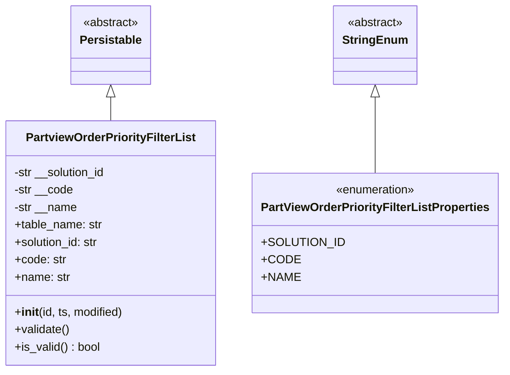
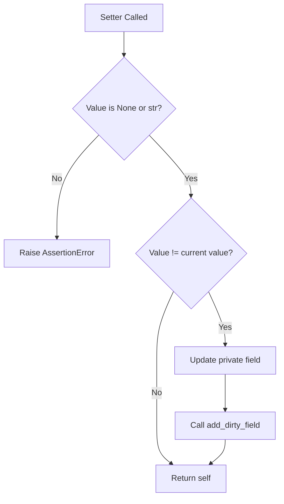
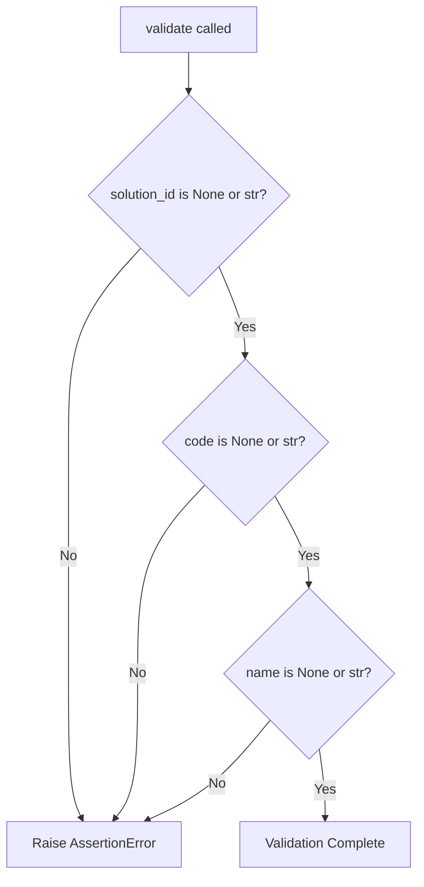
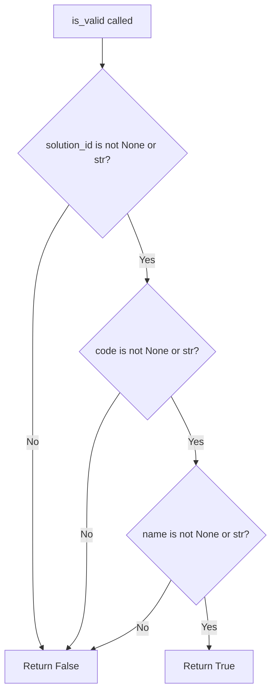

# Diagram: platform/partview_core/partview_service/partview_service/core/datamodel/OrderPriorityFilterList.py

> Auto-generated by Obscura crawlers

## Diagram 1

### SVG

<svg id="container" width="679.4765625" xmlns="http://www.w3.org/2000/svg" class="classDiagram" height="510" viewBox="0 0 679.4765625 510" role="graphics-document document" aria-roledescription="class"><g><defs><marker id="container_class-aggregationStart" class="marker aggregation class" refX="18" refY="7" markerWidth="190" markerHeight="240" orient="auto"><path d="M 18,7 L9,13 L1,7 L9,1 Z"></path></marker></defs><defs><marker id="container_class-aggregationEnd" class="marker aggregation class" refX="1" refY="7" markerWidth="20" markerHeight="28" orient="auto"><path d="M 18,7 L9,13 L1,7 L9,1 Z"></path></marker></defs><defs><marker id="container_class-extensionStart" class="marker extension class" refX="18" refY="7" markerWidth="190" markerHeight="240" orient="auto"><path d="M 1,7 L18,13 V 1 Z"></path></marker></defs><defs><marker id="container_class-extensionEnd" class="marker extension class" refX="1" refY="7" markerWidth="20" markerHeight="28" orient="auto"><path d="M 1,1 V 13 L18,7 Z"></path></marker></defs><defs><marker id="container_class-compositionStart" class="marker composition class" refX="18" refY="7" markerWidth="190" markerHeight="240" orient="auto"><path d="M 18,7 L9,13 L1,7 L9,1 Z"></path></marker></defs><defs><marker id="container_class-compositionEnd" class="marker composition class" refX="1" refY="7" markerWidth="20" markerHeight="28" orient="auto"><path d="M 18,7 L9,13 L1,7 L9,1 Z"></path></marker></defs><defs><marker id="container_class-dependencyStart" class="marker dependency class" refX="6" refY="7" markerWidth="190" markerHeight="240" orient="auto"><path d="M 5,7 L9,13 L1,7 L9,1 Z"></path></marker></defs><defs><marker id="container_class-dependencyEnd" class="marker dependency class" refX="13" refY="7" markerWidth="20" markerHeight="28" orient="auto"><path d="M 18,7 L9,13 L14,7 L9,1 Z"></path></marker></defs><defs><marker id="container_class-lollipopStart" class="marker lollipop class" refX="13" refY="7" markerWidth="190" markerHeight="240" orient="auto"><circle stroke="black" fill="transparent" cx="7" cy="7" r="6"></circle></marker></defs><defs><marker id="container_class-lollipopEnd" class="marker lollipop class" refX="1" refY="7" markerWidth="190" markerHeight="240" orient="auto"><circle stroke="black" fill="transparent" cx="7" cy="7" r="6"></circle></marker></defs><g class="root"><g class="clusters"></g><g class="edgePaths"><path d="M151.613,133.25L151.613,134.542C151.613,135.833,151.613,138.417,151.613,143.875C151.613,149.333,151.613,157.667,151.613,161.833L151.613,166" id="id_Persistable_PartviewOrderPriorityFilterList_1" class="edge-thickness-normal edge-pattern-solid relation" style=";;;" data-edge="true" data-et="edge" data-id="id_Persistable_PartviewOrderPriorityFilterList_1" data-points="W3sieCI6MTUxLjYxMzI4MTI1LCJ5IjoxMTZ9LHsieCI6MTUxLjYxMzI4MTI1LCJ5IjoxNDF9LHsieCI6MTUxLjYxMzI4MTI1LCJ5IjoxNjZ9XQ==" marker-start="url(#container_class-extensionStart)"></path><path d="M508.352,133.25L508.352,134.542C508.352,135.833,508.352,138.417,508.352,155.875C508.352,173.333,508.352,205.667,508.352,221.833L508.352,238" id="id_StringEnum_PartViewOrderPriorityFilterListProperties_2" class="edge-thickness-normal edge-pattern-solid relation" style=";;;" data-edge="true" data-et="edge" data-id="id_StringEnum_PartViewOrderPriorityFilterListProperties_2" data-points="W3sieCI6NTA4LjM1MTU2MjUsInkiOjExNn0seyJ4Ijo1MDguMzUxNTYyNSwieSI6MTQxfSx7IngiOjUwOC4zNTE1NjI1LCJ5IjoyMzh9XQ==" marker-start="url(#container_class-extensionStart)"></path></g><g class="edgeLabels"><g class="edgeLabel"><g class="label" data-id="id_Persistable_PartviewOrderPriorityFilterList_1" transform="translate(0, 0)"><foreignObject width="0" height="0">

</foreignObject></g></g><g class="edgeLabel"><g class="label" data-id="id_StringEnum_PartViewOrderPriorityFilterListProperties_2" transform="translate(0, 0)"><foreignObject width="0" height="0">

</foreignObject></g></g></g><g class="nodes"><g class="node default" id="classId-Persistable-0" transform="translate(151.61328125, 62)"><g class="basic label-container"><path d="M-52.9765625 -54 L52.9765625 -54 L52.9765625 54 L-52.9765625 54" stroke="none" stroke-width="0" fill="#ECECFF" style=""></path><path d="M-52.9765625 -54 C-17.555462029865083 -54, 17.865638440269834 -54, 52.9765625 -54 M-52.9765625 -54 C-11.854546819674702 -54, 29.267468860650595 -54, 52.9765625 -54 M52.9765625 -54 C52.9765625 -22.65570480032072, 52.9765625 8.68859039935856, 52.9765625 54 M52.9765625 -54 C52.9765625 -23.65010325872274, 52.9765625 6.699793482554519, 52.9765625 54 M52.9765625 54 C27.20773019137849 54, 1.438897882756983 54, -52.9765625 54 M52.9765625 54 C14.326505694206318 54, -24.323551111587363 54, -52.9765625 54 M-52.9765625 54 C-52.9765625 29.19208677999465, -52.9765625 4.3841735599893, -52.9765625 -54 M-52.9765625 54 C-52.9765625 31.164606502568585, -52.9765625 8.32921300513717, -52.9765625 -54" stroke="#9370DB" stroke-width="1.3" fill="none" stroke-dasharray="0 0" style=""></path></g><g class="annotation-group text" transform="translate(-38.609375, -30)"><g class="label" style="" transform="translate(0,-12)"><foreignObject width="77.21875" height="24">

«abstract»

</foreignObject></g></g><g class="label-group text" transform="translate(-40.9765625, -6)"><g class="label" style="font-weight: bolder" transform="translate(0,-12)"><foreignObject width="81.953125" height="24">

Persistable

</foreignObject></g></g><g class="members-group text" transform="translate(-40.9765625, 42)"></g><g class="methods-group text" transform="translate(-40.9765625, 72)"></g><g class="divider" style=""><path d="M-52.9765625 18 C-23.59005913393376 18, 5.79644423213248 18, 52.9765625 18 M-52.9765625 18 C-12.136923199259726 18, 28.702716101480547 18, 52.9765625 18" stroke="#9370DB" stroke-width="1.3" fill="none" stroke-dasharray="0 0" style=""></path></g><g class="divider" style=""><path d="M-52.9765625 36 C-17.221789362162383 36, 18.532983775675234 36, 52.9765625 36 M-52.9765625 36 C-31.373885775293054 36, -9.771209050586108 36, 52.9765625 36" stroke="#9370DB" stroke-width="1.3" fill="none" stroke-dasharray="0 0" style=""></path></g></g><g class="node default" id="classId-StringEnum-1" transform="translate(508.3515625, 62)"><g class="basic label-container"><path d="M-54.234375 -54 L54.234375 -54 L54.234375 54 L-54.234375 54" stroke="none" stroke-width="0" fill="#ECECFF" style=""></path><path d="M-54.234375 -54 C-26.063163418036627 -54, 2.108048163926746 -54, 54.234375 -54 M-54.234375 -54 C-29.061230470730443 -54, -3.8880859414608864 -54, 54.234375 -54 M54.234375 -54 C54.234375 -22.868706302132143, 54.234375 8.262587395735714, 54.234375 54 M54.234375 -54 C54.234375 -23.993978505156633, 54.234375 6.012042989686734, 54.234375 54 M54.234375 54 C13.155199599066762 54, -27.923975801866476 54, -54.234375 54 M54.234375 54 C21.777085589897368 54, -10.680203820205264 54, -54.234375 54 M-54.234375 54 C-54.234375 17.387978223083657, -54.234375 -19.224043553832686, -54.234375 -54 M-54.234375 54 C-54.234375 17.742344035180032, -54.234375 -18.515311929639935, -54.234375 -54" stroke="#9370DB" stroke-width="1.3" fill="none" stroke-dasharray="0 0" style=""></path></g><g class="annotation-group text" transform="translate(-38.609375, -30)"><g class="label" style="" transform="translate(0,-12)"><foreignObject width="77.21875" height="24">

«abstract»

</foreignObject></g></g><g class="label-group text" transform="translate(-42.234375, -6)"><g class="label" style="font-weight: bolder" transform="translate(0,-12)"><foreignObject width="84.46875" height="24">

StringEnum

</foreignObject></g></g><g class="members-group text" transform="translate(-42.234375, 42)"></g><g class="methods-group text" transform="translate(-42.234375, 72)"></g><g class="divider" style=""><path d="M-54.234375 18 C-26.19488622082828 18, 1.8446025583434391 18, 54.234375 18 M-54.234375 18 C-21.441532556788893 18, 11.351309886422214 18, 54.234375 18" stroke="#9370DB" stroke-width="1.3" fill="none" stroke-dasharray="0 0" style=""></path></g><g class="divider" style=""><path d="M-54.234375 36 C-14.344670771124086 36, 25.545033457751828 36, 54.234375 36 M-54.234375 36 C-24.284471147619758 36, 5.665432704760484 36, 54.234375 36" stroke="#9370DB" stroke-width="1.3" fill="none" stroke-dasharray="0 0" style=""></path></g></g><g class="node default" id="classId-PartViewOrderPriorityFilterListProperties-2" transform="translate(508.3515625, 334)"><g class="basic label-container"><path d="M-163.125 -96 L163.125 -96 L163.125 96 L-163.125 96" stroke="none" stroke-width="0" fill="#ECECFF" style=""></path><path d="M-163.125 -96 C-48.309536845270515 -96, 66.50592630945897 -96, 163.125 -96 M-163.125 -96 C-65.7775391632375 -96, 31.569921673524988 -96, 163.125 -96 M163.125 -96 C163.125 -27.779995202505802, 163.125 40.440009594988396, 163.125 96 M163.125 -96 C163.125 -44.31804500095549, 163.125 7.363909998089014, 163.125 96 M163.125 96 C90.88734395368012 96, 18.64968790736023 96, -163.125 96 M163.125 96 C63.49003589073479 96, -36.144928218530424 96, -163.125 96 M-163.125 96 C-163.125 30.002495418373798, -163.125 -35.995009163252405, -163.125 -96 M-163.125 96 C-163.125 27.11929210748822, -163.125 -41.76141578502356, -163.125 -96" stroke="#9370DB" stroke-width="1.3" fill="none" stroke-dasharray="0 0" style=""></path></g><g class="annotation-group text" transform="translate(-55.5546875, -72)"><g class="label" style="" transform="translate(0,-12)"><foreignObject width="111.109375" height="24">

«enumeration»

</foreignObject></g></g><g class="label-group text" transform="translate(-151.125, -48)"><g class="label" style="font-weight: bolder" transform="translate(0,-12)"><foreignObject width="302.25" height="24">

PartViewOrderPriorityFilterListProperties

</foreignObject></g></g><g class="members-group text" transform="translate(-151.125, 0)"><g class="label" style="" transform="translate(0,-12)"><foreignObject width="103.640625" height="24">

+SOLUTION_ID

</foreignObject></g><g class="label" style="" transform="translate(0,12)"><foreignObject width="46.5625" height="24">

+CODE

</foreignObject></g><g class="label" style="" transform="translate(0,36)"><foreignObject width="49.09375" height="24">

+NAME

</foreignObject></g></g><g class="methods-group text" transform="translate(-151.125, 96)"></g><g class="divider" style=""><path d="M-163.125 -24 C-79.4126994425457 -24, 4.299601114908597 -24, 163.125 -24 M-163.125 -24 C-88.48922240921067 -24, -13.853444818421337 -24, 163.125 -24" stroke="#9370DB" stroke-width="1.3" fill="none" stroke-dasharray="0 0" style=""></path></g><g class="divider" style=""><path d="M-163.125 72 C-44.091443435230275 72, 74.94211312953945 72, 163.125 72 M-163.125 72 C-93.64103443075906 72, -24.157068861518127 72, 163.125 72" stroke="#9370DB" stroke-width="1.3" fill="none" stroke-dasharray="0 0" style=""></path></g></g><g class="node default" id="classId-PartviewOrderPriorityFilterList-3" transform="translate(151.61328125, 334)"><g class="basic label-container"><path d="M-143.61328125 -168 L143.61328125 -168 L143.61328125 168 L-143.61328125 168" stroke="none" stroke-width="0" fill="#ECECFF" style=""></path><path d="M-143.61328125 -168 C-52.83492367452298 -168, 37.943433900954034 -168, 143.61328125 -168 M-143.61328125 -168 C-52.8753012085687 -168, 37.8626788328626 -168, 143.61328125 -168 M143.61328125 -168 C143.61328125 -45.39400310529166, 143.61328125 77.21199378941668, 143.61328125 168 M143.61328125 -168 C143.61328125 -81.92299135083822, 143.61328125 4.154017298323566, 143.61328125 168 M143.61328125 168 C83.36055526377255 168, 23.107829277545108 168, -143.61328125 168 M143.61328125 168 C67.63182644557986 168, -8.349628358840278 168, -143.61328125 168 M-143.61328125 168 C-143.61328125 83.81581528404165, -143.61328125 -0.36836943191670457, -143.61328125 -168 M-143.61328125 168 C-143.61328125 97.11107650411623, -143.61328125 26.222153008232453, -143.61328125 -168" stroke="#9370DB" stroke-width="1.3" fill="none" stroke-dasharray="0 0" style=""></path></g><g class="annotation-group text" transform="translate(0, -144)"></g><g class="label-group text" transform="translate(-112.3203125, -144)"><g class="label" style="font-weight: bolder" transform="translate(0,-12)"><foreignObject width="224.640625" height="24">

PartviewOrderPriorityFilterList

</foreignObject></g></g><g class="members-group text" transform="translate(-131.61328125, -96)"><g class="label" style="" transform="translate(0,-12)"><foreignObject width="128.828125" height="24">

-str __solution_id

</foreignObject></g><g class="label" style="" transform="translate(0,12)"><foreignObject width="81.234375" height="24">

-str __code

</foreignObject></g><g class="label" style="" transform="translate(0,36)"><foreignObject width="87.109375" height="24">

-str __name

</foreignObject></g><g class="label" style="" transform="translate(0,60)"><foreignObject width="121.125" height="24">

+table_name: str

</foreignObject></g><g class="label" style="" transform="translate(0,84)"><foreignObject width="117.71875" height="24">

+solution_id: str

</foreignObject></g><g class="label" style="" transform="translate(0,108)"><foreignObject width="70.453125" height="24">

+code: str

</foreignObject></g><g class="label" style="" transform="translate(0,132)"><foreignObject width="76.015625" height="24">

+name: str

</foreignObject></g></g><g class="methods-group text" transform="translate(-131.61328125, 96)"><g class="label" style="" transform="translate(0,-12)"><foreignObject width="150.90625" height="24">

+<strong>init</strong>(id, ts, modified)

</foreignObject></g><g class="label" style="" transform="translate(0,12)"><foreignObject width="76.09375" height="24">

+validate()

</foreignObject></g><g class="label" style="" transform="translate(0,36)"><foreignObject width="117.984375" height="24">

+is_valid() : bool

</foreignObject></g></g><g class="divider" style=""><path d="M-143.61328125 -120 C-65.59785659819103 -120, 12.417568053617941 -120, 143.61328125 -120 M-143.61328125 -120 C-63.247343407342 -120, 17.118594435316 -120, 143.61328125 -120" stroke="#9370DB" stroke-width="1.3" fill="none" stroke-dasharray="0 0" style=""></path></g><g class="divider" style=""><path d="M-143.61328125 72 C-55.200176497131366 72, 33.21292825573727 72, 143.61328125 72 M-143.61328125 72 C-56.70555888364093 72, 30.202163482718134 72, 143.61328125 72" stroke="#9370DB" stroke-width="1.3" fill="none" stroke-dasharray="0 0" style=""></path></g></g></g></g></g></svg>

## Diagram 2

### SVG

<svg id="container" width="551.421875" xmlns="http://www.w3.org/2000/svg" class="flowchart" height="972.875" viewBox="0 0 551.421875 972.875" role="graphics-document document" aria-roledescription="flowchart-v2"><g><marker id="container_flowchart-v2-pointEnd" class="marker flowchart-v2" viewBox="0 0 10 10" refX="5" refY="5" markerUnits="userSpaceOnUse" markerWidth="8" markerHeight="8" orient="auto"><path d="M 0 0 L 10 5 L 0 10 z" class="arrowMarkerPath" style="stroke-width: 1; stroke-dasharray: 1, 0;"></path></marker><marker id="container_flowchart-v2-pointStart" class="marker flowchart-v2" viewBox="0 0 10 10" refX="4.5" refY="5" markerUnits="userSpaceOnUse" markerWidth="8" markerHeight="8" orient="auto"><path d="M 0 5 L 10 10 L 10 0 z" class="arrowMarkerPath" style="stroke-width: 1; stroke-dasharray: 1, 0;"></path></marker><marker id="container_flowchart-v2-circleEnd" class="marker flowchart-v2" viewBox="0 0 10 10" refX="11" refY="5" markerUnits="userSpaceOnUse" markerWidth="11" markerHeight="11" orient="auto"><circle cx="5" cy="5" r="5" class="arrowMarkerPath" style="stroke-width: 1; stroke-dasharray: 1, 0;"></circle></marker><marker id="container_flowchart-v2-circleStart" class="marker flowchart-v2" viewBox="0 0 10 10" refX="-1" refY="5" markerUnits="userSpaceOnUse" markerWidth="11" markerHeight="11" orient="auto"><circle cx="5" cy="5" r="5" class="arrowMarkerPath" style="stroke-width: 1; stroke-dasharray: 1, 0;"></circle></marker><marker id="container_flowchart-v2-crossEnd" class="marker cross flowchart-v2" viewBox="0 0 11 11" refX="12" refY="5.2" markerUnits="userSpaceOnUse" markerWidth="11" markerHeight="11" orient="auto"><path d="M 1,1 l 9,9 M 10,1 l -9,9" class="arrowMarkerPath" style="stroke-width: 2; stroke-dasharray: 1, 0;"></path></marker><marker id="container_flowchart-v2-crossStart" class="marker cross flowchart-v2" viewBox="0 0 11 11" refX="-1" refY="5.2" markerUnits="userSpaceOnUse" markerWidth="11" markerHeight="11" orient="auto"><path d="M 1,1 l 9,9 M 10,1 l -9,9" class="arrowMarkerPath" style="stroke-width: 2; stroke-dasharray: 1, 0;"></path></marker><g class="root"><g class="clusters"></g><g class="edgePaths"><path d="M242.18,62L242.18,66.167C242.18,70.333,242.18,78.667,242.18,86.333C242.18,94,242.18,101,242.18,104.5L242.18,108" id="L_A_B_0" class="edge-thickness-normal edge-pattern-solid edge-thickness-normal edge-pattern-solid flowchart-link" style=";" data-edge="true" data-et="edge" data-id="L_A_B_0" data-points="W3sieCI6MjQyLjE3OTY4NzUsInkiOjYyfSx7IngiOjI0Mi4xNzk2ODc1LCJ5Ijo4N30seyJ4IjoyNDIuMTc5Njg3NSwieSI6MTEyfV0=" marker-end="url(#container_flowchart-v2-pointEnd)"></path><path d="M192.942,265.403L179.354,279.776C165.766,294.149,138.59,322.895,125.002,356.287C111.414,389.68,111.414,427.719,111.414,446.738L111.414,465.758" id="L_B_C_0" class="edge-thickness-normal edge-pattern-solid edge-thickness-normal edge-pattern-solid flowchart-link" style=";" data-edge="true" data-et="edge" data-id="L_B_C_0" data-points="W3sieCI6MTkyLjk0MTgzMzkyNjcwNSwieSI6MjY1LjQwMjc3MTQyNjcwNX0seyJ4IjoxMTEuNDE0MDYyNSwieSI6MzUxLjY0MDYyNX0seyJ4IjoxMTEuNDE0MDYyNSwieSI6NDY5Ljc1NzgxMjV9XQ==" marker-end="url(#container_flowchart-v2-pointEnd)"></path><path d="M291.418,265.403L305.006,279.776C318.593,294.149,345.769,322.895,359.357,342.768C372.945,362.641,372.945,373.641,372.945,379.141L372.945,384.641" id="L_B_D_0" class="edge-thickness-normal edge-pattern-solid edge-thickness-normal edge-pattern-solid flowchart-link" style=";" data-edge="true" data-et="edge" data-id="L_B_D_0" data-points="W3sieCI6MjkxLjQxNzU0MTA3MzI5NSwieSI6MjY1LjQwMjc3MTQyNjcwNX0seyJ4IjozNzIuOTQ1MzEyNSwieSI6MzUxLjY0MDYyNX0seyJ4IjozNzIuOTQ1MzEyNSwieSI6Mzg4LjY0MDYyNX1d" marker-end="url(#container_flowchart-v2-pointEnd)"></path><path d="M338.278,570.208L332.641,582.153C327.003,594.097,315.728,617.986,310.091,640.597C304.453,663.208,304.453,684.542,304.453,705.875C304.453,727.208,304.453,748.542,304.453,769.875C304.453,791.208,304.453,812.542,304.453,831.875C304.453,851.208,304.453,868.542,309.41,880.972C314.367,893.402,324.282,900.929,329.239,904.693L334.196,908.456" id="L_D_E_0" class="edge-thickness-normal edge-pattern-solid edge-thickness-normal edge-pattern-solid flowchart-link" style=";" data-edge="true" data-et="edge" data-id="L_D_E_0" data-points="W3sieCI6MzM4LjI3ODM3NTgxNjA1MjIzLCJ5Ijo1NzAuMjA4MDYzMzE2MDUyMn0seyJ4IjozMDQuNDUzMTI1LCJ5Ijo2NDEuODc1fSx7IngiOjMwNC40NTMxMjUsInkiOjcwNS44NzV9LHsieCI6MzA0LjQ1MzEyNSwieSI6NzY5Ljg3NX0seyJ4IjozMDQuNDUzMTI1LCJ5Ijo4MzMuODc1fSx7IngiOjMwNC40NTMxMjUsInkiOjg4NS44NzV9LHsieCI6MzM3LjM4MjA2MTI5ODA3NjksInkiOjkxMC44NzV9XQ==" marker-end="url(#container_flowchart-v2-pointEnd)"></path><path d="M407.612,570.208L413.25,582.153C418.887,594.097,430.162,617.986,435.8,635.431C441.438,652.875,441.438,663.875,441.438,669.375L441.438,674.875" id="L_D_F_0" class="edge-thickness-normal edge-pattern-solid edge-thickness-normal edge-pattern-solid flowchart-link" style=";" data-edge="true" data-et="edge" data-id="L_D_F_0" data-points="W3sieCI6NDA3LjYxMjI0OTE4Mzk0Nzc3LCJ5Ijo1NzAuMjA4MDYzMzE2MDUyMn0seyJ4Ijo0NDEuNDM3NSwieSI6NjQxLjg3NX0seyJ4Ijo0NDEuNDM3NSwieSI6Njc4Ljg3NX1d" marker-end="url(#container_flowchart-v2-pointEnd)"></path><path d="M441.438,732.875L441.438,739.042C441.438,745.208,441.438,757.542,441.438,769.208C441.438,780.875,441.438,791.875,441.438,797.375L441.438,802.875" id="L_F_G_0" class="edge-thickness-normal edge-pattern-solid edge-thickness-normal edge-pattern-solid flowchart-link" style=";" data-edge="true" data-et="edge" data-id="L_F_G_0" data-points="W3sieCI6NDQxLjQzNzUsInkiOjczMi44NzV9LHsieCI6NDQxLjQzNzUsInkiOjc2OS44NzV9LHsieCI6NDQxLjQzNzUsInkiOjgwNi44NzV9XQ==" marker-end="url(#container_flowchart-v2-pointEnd)"></path><path d="M441.438,860.875L441.438,865.042C441.438,869.208,441.438,877.542,436.48,885.472C431.523,893.402,421.609,900.929,416.652,904.693L411.694,908.456" id="L_G_E_0" class="edge-thickness-normal edge-pattern-solid edge-thickness-normal edge-pattern-solid flowchart-link" style=";" data-edge="true" data-et="edge" data-id="L_G_E_0" data-points="W3sieCI6NDQxLjQzNzUsInkiOjg2MC44NzV9LHsieCI6NDQxLjQzNzUsInkiOjg4NS44NzV9LHsieCI6NDA4LjUwODU2MzcwMTkyMzEsInkiOjkxMC44NzV9XQ==" marker-end="url(#container_flowchart-v2-pointEnd)"></path></g><g class="edgeLabels"><g class="edgeLabel"><g class="label" data-id="L_A_B_0" transform="translate(0, 0)"><foreignObject width="0" height="0">

</foreignObject></g></g><g class="edgeLabel" transform="translate(111.4140625, 351.640625)"><g class="label" data-id="L_B_C_0" transform="translate(-10.140625, -12)"><foreignObject width="20.28125" height="24">

No

</foreignObject></g></g><g class="edgeLabel" transform="translate(372.9453125, 351.640625)"><g class="label" data-id="L_B_D_0" transform="translate(-12.03125, -12)"><foreignObject width="24.0625" height="24">

Yes

</foreignObject></g></g><g class="edgeLabel" transform="translate(304.453125, 769.875)"><g class="label" data-id="L_D_E_0" transform="translate(-10.140625, -12)"><foreignObject width="20.28125" height="24">

No

</foreignObject></g></g><g class="edgeLabel" transform="translate(441.4375, 641.875)"><g class="label" data-id="L_D_F_0" transform="translate(-12.03125, -12)"><foreignObject width="24.0625" height="24">

Yes

</foreignObject></g></g><g class="edgeLabel"><g class="label" data-id="L_F_G_0" transform="translate(0, 0)"><foreignObject width="0" height="0">

</foreignObject></g></g><g class="edgeLabel"><g class="label" data-id="L_G_E_0" transform="translate(0, 0)"><foreignObject width="0" height="0">

</foreignObject></g></g></g><g class="nodes"><g class="node default" id="flowchart-A-0" transform="translate(242.1796875, 35)"><rect class="basic label-container" style="" x="-76.4140625" y="-27" width="152.828125" height="54"></rect><g class="label" style="" transform="translate(-46.4140625, -12)"><rect></rect><foreignObject width="92.828125" height="24">

Setter Called

</foreignObject></g></g><g class="node default" id="flowchart-B-1" transform="translate(242.1796875, 213.3203125)"><polygon points="101.3203125,0 202.640625,-101.3203125 101.3203125,-202.640625 0,-101.3203125" class="label-container" transform="translate(-100.8203125, 101.3203125)"></polygon><g class="label" style="" transform="translate(-74.3203125, -12)"><rect></rect><foreignObject width="148.640625" height="24">

Value is None or str?

</foreignObject></g></g><g class="node default" id="flowchart-C-3" transform="translate(111.4140625, 496.7578125)"><rect class="basic label-container" style="" x="-103.4140625" y="-27" width="206.828125" height="54"></rect><g class="label" style="" transform="translate(-73.4140625, -12)"><rect></rect><foreignObject width="146.828125" height="24">

Raise AssertionError

</foreignObject></g></g><g class="node default" id="flowchart-D-5" transform="translate(372.9453125, 496.7578125)"><polygon points="108.1171875,0 216.234375,-108.1171875 108.1171875,-216.234375 0,-108.1171875" class="label-container" transform="translate(-107.6171875, 108.1171875)"></polygon><g class="label" style="" transform="translate(-81.1171875, -12)"><rect></rect><foreignObject width="162.234375" height="24">

Value != current value?

</foreignObject></g></g><g class="node default" id="flowchart-E-7" transform="translate(372.9453125, 937.875)"><rect class="basic label-container" style="" x="-69.640625" y="-27" width="139.28125" height="54"></rect><g class="label" style="" transform="translate(-39.640625, -12)"><rect></rect><foreignObject width="79.28125" height="24">

Return self

</foreignObject></g></g><g class="node default" id="flowchart-F-9" transform="translate(441.4375, 705.875)"><rect class="basic label-container" style="" x="-101.984375" y="-27" width="203.96875" height="54"></rect><g class="label" style="" transform="translate(-71.984375, -12)"><rect></rect><foreignObject width="143.96875" height="24">

Update private field

</foreignObject></g></g><g class="node default" id="flowchart-G-11" transform="translate(441.4375, 833.875)"><rect class="basic label-container" style="" x="-100.125" y="-27" width="200.25" height="54"></rect><g class="label" style="" transform="translate(-70.125, -12)"><rect></rect><foreignObject width="140.25" height="24">

Call add_dirty_field

</foreignObject></g></g></g></g></g></svg>

## Diagram 3

### SVG

<svg id="container" width="497.375" xmlns="http://www.w3.org/2000/svg" class="flowchart" height="1043.09375" viewBox="0 0 497.375 1043.09375" role="graphics-document document" aria-roledescription="flowchart-v2"><g><marker id="container_flowchart-v2-pointEnd" class="marker flowchart-v2" viewBox="0 0 10 10" refX="5" refY="5" markerUnits="userSpaceOnUse" markerWidth="8" markerHeight="8" orient="auto"><path d="M 0 0 L 10 5 L 0 10 z" class="arrowMarkerPath" style="stroke-width: 1; stroke-dasharray: 1, 0;"></path></marker><marker id="container_flowchart-v2-pointStart" class="marker flowchart-v2" viewBox="0 0 10 10" refX="4.5" refY="5" markerUnits="userSpaceOnUse" markerWidth="8" markerHeight="8" orient="auto"><path d="M 0 5 L 10 10 L 10 0 z" class="arrowMarkerPath" style="stroke-width: 1; stroke-dasharray: 1, 0;"></path></marker><marker id="container_flowchart-v2-circleEnd" class="marker flowchart-v2" viewBox="0 0 10 10" refX="11" refY="5" markerUnits="userSpaceOnUse" markerWidth="11" markerHeight="11" orient="auto"><circle cx="5" cy="5" r="5" class="arrowMarkerPath" style="stroke-width: 1; stroke-dasharray: 1, 0;"></circle></marker><marker id="container_flowchart-v2-circleStart" class="marker flowchart-v2" viewBox="0 0 10 10" refX="-1" refY="5" markerUnits="userSpaceOnUse" markerWidth="11" markerHeight="11" orient="auto"><circle cx="5" cy="5" r="5" class="arrowMarkerPath" style="stroke-width: 1; stroke-dasharray: 1, 0;"></circle></marker><marker id="container_flowchart-v2-crossEnd" class="marker cross flowchart-v2" viewBox="0 0 11 11" refX="12" refY="5.2" markerUnits="userSpaceOnUse" markerWidth="11" markerHeight="11" orient="auto"><path d="M 1,1 l 9,9 M 10,1 l -9,9" class="arrowMarkerPath" style="stroke-width: 2; stroke-dasharray: 1, 0;"></path></marker><marker id="container_flowchart-v2-crossStart" class="marker cross flowchart-v2" viewBox="0 0 11 11" refX="-1" refY="5.2" markerUnits="userSpaceOnUse" markerWidth="11" markerHeight="11" orient="auto"><path d="M 1,1 l 9,9 M 10,1 l -9,9" class="arrowMarkerPath" style="stroke-width: 2; stroke-dasharray: 1, 0;"></path></marker><g class="root"><g class="clusters"></g><g class="edgePaths"><path d="M224.629,62L224.629,66.167C224.629,70.333,224.629,78.667,224.629,86.333C224.629,94,224.629,101,224.629,104.5L224.629,108" id="L_A_B_0" class="edge-thickness-normal edge-pattern-solid edge-thickness-normal edge-pattern-solid flowchart-link" style=";" data-edge="true" data-et="edge" data-id="L_A_B_0" data-points="W3sieCI6MjI0LjYyODkwNjI1LCJ5Ijo2Mn0seyJ4IjoyMjQuNjI4OTA2MjUsInkiOjg3fSx7IngiOjIyNC42Mjg5MDYyNSwieSI6MTEyfV0=" marker-end="url(#container_flowchart-v2-pointEnd)"></path><path d="M166.593,299.324L152.373,315.163C138.153,331.002,109.713,362.681,95.493,401.195C81.273,439.708,81.273,485.057,81.273,530.406C81.273,575.755,81.273,621.104,81.273,666.915C81.273,712.727,81.273,759,81.273,805.273C81.273,851.547,81.273,897.82,83.894,926.521C86.514,955.221,91.754,966.348,94.374,971.911L96.994,977.475" id="L_B_C_0" class="edge-thickness-normal edge-pattern-solid edge-thickness-normal edge-pattern-solid flowchart-link" style=";" data-edge="true" data-et="edge" data-id="L_B_C_0" data-points="W3sieCI6MTY2LjU5MzM4MjE2OTg5MjUsInkiOjI5OS4zMjM4NTA5MTk4OTI1fSx7IngiOjgxLjI3MzQzNzUsInkiOjM5NC4zNTkzNzV9LHsieCI6ODEuMjczNDM3NSwieSI6NTMwLjQwNjI1fSx7IngiOjgxLjI3MzQzNzUsInkiOjY2Ni40NTMxMjV9LHsieCI6ODEuMjczNDM3NSwieSI6ODA1LjI3MzQzNzV9LHsieCI6ODEuMjczNDM3NSwieSI6OTQ0LjA5Mzc1fSx7IngiOjk4LjY5ODQ4NjMyODEyNSwieSI6OTgxLjA5Mzc1fV0=" marker-end="url(#container_flowchart-v2-pointEnd)"></path><path d="M260.898,321.09L266.024,333.301C271.15,345.513,281.401,369.936,286.527,387.648C291.652,405.359,291.652,416.359,291.652,421.859L291.652,427.359" id="L_B_D_0" class="edge-thickness-normal edge-pattern-solid edge-thickness-normal edge-pattern-solid flowchart-link" style=";" data-edge="true" data-et="edge" data-id="L_B_D_0" data-points="W3sieCI6MjYwLjg5ODQyOTk2MTU3NTYsInkiOjMyMS4wODk4NTEyODg0MjQ0fSx7IngiOjI5MS42NTIzNDM3NSwieSI6Mzk0LjM1OTM3NX0seyJ4IjoyOTEuNjUyMzQzNzUsInkiOjQzMS4zNTkzNzV9XQ==" marker-end="url(#container_flowchart-v2-pointEnd)"></path><path d="M243.583,581.384L230.214,595.562C216.844,609.74,190.106,638.097,176.737,675.412C163.367,712.727,163.367,759,163.367,805.273C163.367,851.547,163.367,897.82,158.781,926.606C154.196,955.392,145.024,966.69,140.439,972.339L135.853,977.988" id="L_D_C_0" class="edge-thickness-normal edge-pattern-solid edge-thickness-normal edge-pattern-solid flowchart-link" style=";" data-edge="true" data-et="edge" data-id="L_D_C_0" data-points="W3sieCI6MjQzLjU4MzA4ODY3MTk3MzE0LCJ5Ijo1ODEuMzgzODY5OTIxOTczMX0seyJ4IjoxNjMuMzY3MTg3NSwieSI6NjY2LjQ1MzEyNX0seyJ4IjoxNjMuMzY3MTg3NSwieSI6ODA1LjI3MzQzNzV9LHsieCI6MTYzLjM2NzE4NzUsInkiOjk0NC4wOTM3NX0seyJ4IjoxMzMuMzMxNzg3MTA5Mzc1LCJ5Ijo5ODEuMDkzNzV9XQ==" marker-end="url(#container_flowchart-v2-pointEnd)"></path><path d="M327.251,593.854L334.04,605.954C340.829,618.054,354.407,642.254,361.196,659.853C367.984,677.453,367.984,688.453,367.984,693.953L367.984,699.453" id="L_D_E_0" class="edge-thickness-normal edge-pattern-solid edge-thickness-normal edge-pattern-solid flowchart-link" style=";" data-edge="true" data-et="edge" data-id="L_D_E_0" data-points="W3sieCI6MzI3LjI1MTIxNDE0MjU5NSwieSI6NTkzLjg1NDI1NDYwNzQwNX0seyJ4IjozNjcuOTg0Mzc1LCJ5Ijo2NjYuNDUzMTI1fSx7IngiOjM2Ny45ODQzNzUsInkiOjcwMy40NTMxMjV9XQ==" marker-end="url(#container_flowchart-v2-pointEnd)"></path><path d="M321.619,860.728L310.002,874.623C298.385,888.517,275.152,916.305,250.603,936.09C226.055,955.874,200.192,967.655,187.261,973.545L174.329,979.436" id="L_E_C_0" class="edge-thickness-normal edge-pattern-solid edge-thickness-normal edge-pattern-solid flowchart-link" style=";" data-edge="true" data-et="edge" data-id="L_E_C_0" data-points="W3sieCI6MzIxLjYxOTAwMjEyNzM2MiwieSI6ODYwLjcyODM3NzEyNzM2Mn0seyJ4IjoyNTEuOTE3OTY4NzUsInkiOjk0NC4wOTM3NX0seyJ4IjoxNzAuNjg5MTQ3OTQ5MjE4NzUsInkiOjk4MS4wOTM3NX1d" marker-end="url(#container_flowchart-v2-pointEnd)"></path><path d="M379.806,895.272L380.875,903.409C381.944,911.546,384.081,927.82,385.15,941.457C386.219,955.094,386.219,966.094,386.219,971.594L386.219,977.094" id="L_E_F_0" class="edge-thickness-normal edge-pattern-solid edge-thickness-normal edge-pattern-solid flowchart-link" style=";" data-edge="true" data-et="edge" data-id="L_E_F_0" data-points="W3sieCI6Mzc5LjgwNTkyNDQ4ODg4MjMsInkiOjg5NS4yNzIyMDA1MTExMTc3fSx7IngiOjM4Ni4yMTg3NSwieSI6OTQ0LjA5Mzc1fSx7IngiOjM4Ni4yMTg3NSwieSI6OTgxLjA5Mzc1fV0=" marker-end="url(#container_flowchart-v2-pointEnd)"></path></g><g class="edgeLabels"><g class="edgeLabel"><g class="label" data-id="L_A_B_0" transform="translate(0, 0)"><foreignObject width="0" height="0">

</foreignObject></g></g><g class="edgeLabel" transform="translate(81.2734375, 666.453125)"><g class="label" data-id="L_B_C_0" transform="translate(-10.140625, -12)"><foreignObject width="20.28125" height="24">

No

</foreignObject></g></g><g class="edgeLabel" transform="translate(291.65234375, 394.359375)"><g class="label" data-id="L_B_D_0" transform="translate(-12.03125, -12)"><foreignObject width="24.0625" height="24">

Yes

</foreignObject></g></g><g class="edgeLabel" transform="translate(163.3671875, 805.2734375)"><g class="label" data-id="L_D_C_0" transform="translate(-10.140625, -12)"><foreignObject width="20.28125" height="24">

No

</foreignObject></g></g><g class="edgeLabel" transform="translate(367.984375, 666.453125)"><g class="label" data-id="L_D_E_0" transform="translate(-12.03125, -12)"><foreignObject width="24.0625" height="24">

Yes

</foreignObject></g></g><g class="edgeLabel" transform="translate(258.14178, 936.64981)"><g class="label" data-id="L_E_C_0" transform="translate(-10.140625, -12)"><foreignObject width="20.28125" height="24">

No

</foreignObject></g></g><g class="edgeLabel" transform="translate(386.21875, 944.09375)"><g class="label" data-id="L_E_F_0" transform="translate(-12.03125, -12)"><foreignObject width="24.0625" height="24">

Yes

</foreignObject></g></g></g><g class="nodes"><g class="node default" id="flowchart-A-0" transform="translate(224.62890625, 35)"><rect class="basic label-container" style="" x="-82.875" y="-27" width="165.75" height="54"></rect><g class="label" style="" transform="translate(-52.875, -12)"><rect></rect><foreignObject width="105.75" height="24">

validate called

</foreignObject></g></g><g class="node default" id="flowchart-B-1" transform="translate(224.62890625, 234.6796875)"><polygon points="122.6796875,0 245.359375,-122.6796875 122.6796875,-245.359375 0,-122.6796875" class="label-container" transform="translate(-122.1796875, 122.6796875)"></polygon><g class="label" style="" transform="translate(-95.6796875, -12)"><rect></rect><foreignObject width="191.359375" height="24">

solution_id is None or str?

</foreignObject></g></g><g class="node default" id="flowchart-C-3" transform="translate(111.4140625, 1008.09375)"><rect class="basic label-container" style="" x="-103.4140625" y="-27" width="206.828125" height="54"></rect><g class="label" style="" transform="translate(-73.4140625, -12)"><rect></rect><foreignObject width="146.828125" height="24">

Raise AssertionError

</foreignObject></g></g><g class="node default" id="flowchart-D-5" transform="translate(291.65234375, 530.40625)"><polygon points="99.046875,0 198.09375,-99.046875 99.046875,-198.09375 0,-99.046875" class="label-container" transform="translate(-98.546875, 99.046875)"></polygon><g class="label" style="" transform="translate(-72.046875, -12)"><rect></rect><foreignObject width="144.09375" height="24">

code is None or str?

</foreignObject></g></g><g class="node default" id="flowchart-E-9" transform="translate(367.984375, 805.2734375)"><polygon points="101.8203125,0 203.640625,-101.8203125 101.8203125,-203.640625 0,-101.8203125" class="label-container" transform="translate(-101.3203125, 101.8203125)"></polygon><g class="label" style="" transform="translate(-74.8203125, -12)"><rect></rect><foreignObject width="149.640625" height="24">

name is None or str?

</foreignObject></g></g><g class="node default" id="flowchart-F-13" transform="translate(386.21875, 1008.09375)"><rect class="basic label-container" style="" x="-103.15625" y="-27" width="206.3125" height="54"></rect><g class="label" style="" transform="translate(-73.15625, -12)"><rect></rect><foreignObject width="146.3125" height="24">

Validation Complete

</foreignObject></g></g></g></g></g></svg>

## Diagram 4

### SVG

<svg id="container" width="445.78125" xmlns="http://www.w3.org/2000/svg" class="flowchart" height="1133.203125" viewBox="0 0 445.78125 1133.203125" role="graphics-document document" aria-roledescription="flowchart-v2"><g><marker id="container_flowchart-v2-pointEnd" class="marker flowchart-v2" viewBox="0 0 10 10" refX="5" refY="5" markerUnits="userSpaceOnUse" markerWidth="8" markerHeight="8" orient="auto"><path d="M 0 0 L 10 5 L 0 10 z" class="arrowMarkerPath" style="stroke-width: 1; stroke-dasharray: 1, 0;"></path></marker><marker id="container_flowchart-v2-pointStart" class="marker flowchart-v2" viewBox="0 0 10 10" refX="4.5" refY="5" markerUnits="userSpaceOnUse" markerWidth="8" markerHeight="8" orient="auto"><path d="M 0 5 L 10 10 L 10 0 z" class="arrowMarkerPath" style="stroke-width: 1; stroke-dasharray: 1, 0;"></path></marker><marker id="container_flowchart-v2-circleEnd" class="marker flowchart-v2" viewBox="0 0 10 10" refX="11" refY="5" markerUnits="userSpaceOnUse" markerWidth="11" markerHeight="11" orient="auto"><circle cx="5" cy="5" r="5" class="arrowMarkerPath" style="stroke-width: 1; stroke-dasharray: 1, 0;"></circle></marker><marker id="container_flowchart-v2-circleStart" class="marker flowchart-v2" viewBox="0 0 10 10" refX="-1" refY="5" markerUnits="userSpaceOnUse" markerWidth="11" markerHeight="11" orient="auto"><circle cx="5" cy="5" r="5" class="arrowMarkerPath" style="stroke-width: 1; stroke-dasharray: 1, 0;"></circle></marker><marker id="container_flowchart-v2-crossEnd" class="marker cross flowchart-v2" viewBox="0 0 11 11" refX="12" refY="5.2" markerUnits="userSpaceOnUse" markerWidth="11" markerHeight="11" orient="auto"><path d="M 1,1 l 9,9 M 10,1 l -9,9" class="arrowMarkerPath" style="stroke-width: 2; stroke-dasharray: 1, 0;"></path></marker><marker id="container_flowchart-v2-crossStart" class="marker cross flowchart-v2" viewBox="0 0 11 11" refX="-1" refY="5.2" markerUnits="userSpaceOnUse" markerWidth="11" markerHeight="11" orient="auto"><path d="M 1,1 l 9,9 M 10,1 l -9,9" class="arrowMarkerPath" style="stroke-width: 2; stroke-dasharray: 1, 0;"></path></marker><g class="root"><g class="clusters"></g><g class="edgePaths"><path d="M166.223,62L166.223,66.167C166.223,70.333,166.223,78.667,166.223,86.333C166.223,94,166.223,101,166.223,104.5L166.223,108" id="L_A_B_0" class="edge-thickness-normal edge-pattern-solid edge-thickness-normal edge-pattern-solid flowchart-link" style=";" data-edge="true" data-et="edge" data-id="L_A_B_0" data-points="W3sieCI6MTY2LjIyMjY1NjI1LCJ5Ijo2Mn0seyJ4IjoxNjYuMjIyNjU2MjUsInkiOjg3fSx7IngiOjE2Ni4yMjI2NTYyNSwieSI6MTEyfV0=" marker-end="url(#container_flowchart-v2-pointEnd)"></path><path d="M111.676,335.453L101.821,350.711C91.966,365.969,72.256,396.484,62.402,436.811C52.547,477.138,52.547,527.276,52.547,577.414C52.547,627.552,52.547,677.69,52.547,728.29C52.547,778.891,52.547,829.953,52.547,881.016C52.547,932.078,52.547,983.141,55.167,1014.235C57.787,1045.33,63.027,1056.457,65.648,1062.021L68.268,1067.584" id="L_B_C_0" class="edge-thickness-normal edge-pattern-solid edge-thickness-normal edge-pattern-solid flowchart-link" style=";" data-edge="true" data-et="edge" data-id="L_B_C_0" data-points="W3sieCI6MTExLjY3NTY5NTA3MzAzNzYyLCJ5IjozMzUuNDUzMDM4ODIzMDM3Nn0seyJ4Ijo1Mi41NDY4NzUsInkiOjQyN30seyJ4Ijo1Mi41NDY4NzUsInkiOjU3Ny40MTQwNjI1fSx7IngiOjUyLjU0Njg3NSwieSI6NzI3LjgyODEyNX0seyJ4Ijo1Mi41NDY4NzUsInkiOjg4MS4wMTU2MjV9LHsieCI6NTIuNTQ2ODc1LCJ5IjoxMDM0LjIwMzEyNX0seyJ4Ijo2OS45NzE5MjM4MjgxMjUsInkiOjEwNzEuMjAzMTI1fV0=" marker-end="url(#container_flowchart-v2-pointEnd)"></path><path d="M207.448,348.775L212.945,361.813C218.442,374.85,229.436,400.925,234.933,419.463C240.43,438,240.43,449,240.43,454.5L240.43,460" id="L_B_D_0" class="edge-thickness-normal edge-pattern-solid edge-thickness-normal edge-pattern-solid flowchart-link" style=";" data-edge="true" data-et="edge" data-id="L_B_D_0" data-points="W3sieCI6MjA3LjQ0NzYyNjE5Njc2MjgzLCJ5IjozNDguNzc1MDMwMDUzMjM3Mn0seyJ4IjoyNDAuNDI5Njg3NSwieSI6NDI3fSx7IngiOjI0MC40Mjk2ODc1LCJ5Ijo0NjR9XQ==" marker-end="url(#container_flowchart-v2-pointEnd)"></path><path d="M195.521,645.919L186.571,659.571C177.622,673.222,159.723,700.525,150.774,739.708C141.824,778.891,141.824,829.953,141.824,881.016C141.824,932.078,141.824,983.141,136.579,1014.349C131.333,1045.557,120.842,1056.911,115.596,1062.588L110.35,1068.265" id="L_D_C_0" class="edge-thickness-normal edge-pattern-solid edge-thickness-normal edge-pattern-solid flowchart-link" style=";" data-edge="true" data-et="edge" data-id="L_D_C_0" data-points="W3sieCI6MTk1LjUyMDU3MjM4MTUyNzU2LCJ5Ijo2NDUuOTE5MDA5ODgxNTI3Nn0seyJ4IjoxNDEuODI0MjE4NzUsInkiOjcyNy44MjgxMjV9LHsieCI6MTQxLjgyNDIxODc1LCJ5Ijo4ODEuMDE1NjI1fSx7IngiOjE0MS44MjQyMTg3NSwieSI6MTAzNC4yMDMxMjV9LHsieCI6MTA3LjYzNTgwMzIyMjY1NjI1LCJ5IjoxMDcxLjIwMzEyNX1d" marker-end="url(#container_flowchart-v2-pointEnd)"></path><path d="M280.02,651.238L286.866,664.003C293.711,676.768,307.402,702.298,314.248,720.563C321.094,738.828,321.094,749.828,321.094,755.328L321.094,760.828" id="L_D_E_0" class="edge-thickness-normal edge-pattern-solid edge-thickness-normal edge-pattern-solid flowchart-link" style=";" data-edge="true" data-et="edge" data-id="L_D_E_0" data-points="W3sieCI6MjgwLjAxOTkzMDA4OTUwOTEsInkiOjY1MS4yMzc4ODI0MTA0OTA5fSx7IngiOjMyMS4wOTM3NSwieSI6NzI3LjgyODEyNX0seyJ4IjozMjEuMDkzNzUsInkiOjc2NC44MjgxMjV9XQ==" marker-end="url(#container_flowchart-v2-pointEnd)"></path><path d="M280.093,956.203L273.004,969.203C265.915,982.203,251.737,1008.203,230.341,1027.115C208.946,1046.027,180.333,1057.851,166.027,1063.763L151.721,1069.675" id="L_E_C_0" class="edge-thickness-normal edge-pattern-solid edge-thickness-normal edge-pattern-solid flowchart-link" style=";" data-edge="true" data-et="edge" data-id="L_E_C_0" data-points="W3sieCI6MjgwLjA5MzI3NjYxNjcyMjUsInkiOjk1Ni4yMDI2NTE2MTY3MjI1fSx7IngiOjIzNy41NTg1OTM3NSwieSI6MTAzNC4yMDMxMjV9LHsieCI6MTQ4LjAyMzc0MjY3NTc4MTI1LCJ5IjoxMDcxLjIwMzEyNX1d" marker-end="url(#container_flowchart-v2-pointEnd)"></path><path d="M335.152,983.145L336.323,991.655C337.494,1000.165,339.837,1017.184,341.008,1031.193C342.18,1045.203,342.18,1056.203,342.18,1061.703L342.18,1067.203" id="L_E_F_0" class="edge-thickness-normal edge-pattern-solid edge-thickness-normal edge-pattern-solid flowchart-link" style=";" data-edge="true" data-et="edge" data-id="L_E_F_0" data-points="W3sieCI6MzM1LjE1MTY3MTg0MDY3NzgsInkiOjk4My4xNDUyMDMxNTkzMjIxfSx7IngiOjM0Mi4xNzk2ODc1LCJ5IjoxMDM0LjIwMzEyNX0seyJ4IjozNDIuMTc5Njg3NSwieSI6MTA3MS4yMDMxMjV9XQ==" marker-end="url(#container_flowchart-v2-pointEnd)"></path></g><g class="edgeLabels"><g class="edgeLabel"><g class="label" data-id="L_A_B_0" transform="translate(0, 0)"><foreignObject width="0" height="0">

</foreignObject></g></g><g class="edgeLabel" transform="translate(52.546875, 727.828125)"><g class="label" data-id="L_B_C_0" transform="translate(-10.140625, -12)"><foreignObject width="20.28125" height="24">

No

</foreignObject></g></g><g class="edgeLabel" transform="translate(240.4296875, 427)"><g class="label" data-id="L_B_D_0" transform="translate(-12.03125, -12)"><foreignObject width="24.0625" height="24">

Yes

</foreignObject></g></g><g class="edgeLabel" transform="translate(141.82421875, 881.015625)"><g class="label" data-id="L_D_C_0" transform="translate(-10.140625, -12)"><foreignObject width="20.28125" height="24">

No

</foreignObject></g></g><g class="edgeLabel" transform="translate(321.09375, 727.828125)"><g class="label" data-id="L_D_E_0" transform="translate(-12.03125, -12)"><foreignObject width="24.0625" height="24">

Yes

</foreignObject></g></g><g class="edgeLabel" transform="translate(233.84581, 1035.73742)"><g class="label" data-id="L_E_C_0" transform="translate(-10.140625, -12)"><foreignObject width="20.28125" height="24">

No

</foreignObject></g></g><g class="edgeLabel" transform="translate(342.1796875, 1034.203125)"><g class="label" data-id="L_E_F_0" transform="translate(-12.03125, -12)"><foreignObject width="24.0625" height="24">

Yes

</foreignObject></g></g></g><g class="nodes"><g class="node default" id="flowchart-A-0" transform="translate(166.22265625, 35)"><rect class="basic label-container" style="" x="-81.1484375" y="-27" width="162.296875" height="54"></rect><g class="label" style="" transform="translate(-51.1484375, -12)"><rect></rect><foreignObject width="102.296875" height="24">

is_valid called

</foreignObject></g></g><g class="node default" id="flowchart-B-1" transform="translate(166.22265625, 251)"><polygon points="139,0 278,-139 139,-278 0,-139" class="label-container" transform="translate(-138.5, 139)"></polygon><g class="label" style="" transform="translate(-100, -24)"><rect></rect><foreignObject width="200" height="48">

solution_id is not None or str?

</foreignObject></g></g><g class="node default" id="flowchart-C-3" transform="translate(82.6875, 1098.203125)"><rect class="basic label-container" style="" x="-74.6875" y="-27" width="149.375" height="54"></rect><g class="label" style="" transform="translate(-44.6875, -12)"><rect></rect><foreignObject width="89.375" height="24">

Return False

</foreignObject></g></g><g class="node default" id="flowchart-D-5" transform="translate(240.4296875, 577.4140625)"><polygon points="113.4140625,0 226.828125,-113.4140625 113.4140625,-226.828125 0,-113.4140625" class="label-container" transform="translate(-112.9140625, 113.4140625)"></polygon><g class="label" style="" transform="translate(-86.4140625, -12)"><rect></rect><foreignObject width="172.828125" height="24">

code is not None or str?

</foreignObject></g></g><g class="node default" id="flowchart-E-9" transform="translate(321.09375, 881.015625)"><polygon points="116.1875,0 232.375,-116.1875 116.1875,-232.375 0,-116.1875" class="label-container" transform="translate(-115.6875, 116.1875)"></polygon><g class="label" style="" transform="translate(-89.1875, -12)"><rect></rect><foreignObject width="178.375" height="24">

name is not None or str?

</foreignObject></g></g><g class="node default" id="flowchart-F-13" transform="translate(342.1796875, 1098.203125)"><rect class="basic label-container" style="" x="-72.5234375" y="-27" width="145.046875" height="54"></rect><g class="label" style="" transform="translate(-42.5234375, -12)"><rect></rect><foreignObject width="85.046875" height="24">

Return True

</foreignObject></g></g></g></g></g></svg>
