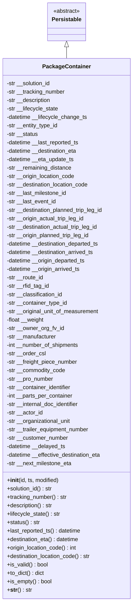
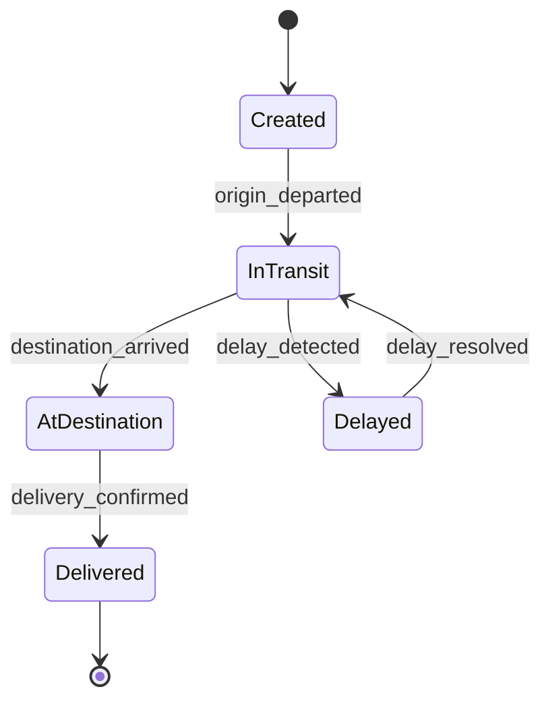
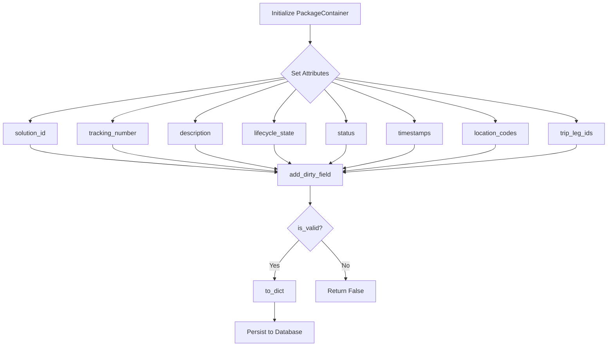

# Diagram: platform/partview_core/partview_service/partview_service/core/datamodel/PackageContainer.py

> Auto-generated by Obscura crawlers

## Diagram 1

### SVG

<svg id="container" width="388.96875" xmlns="http://www.w3.org/2000/svg" class="classDiagram" height="1710" viewBox="0 0 388.96875 1710" role="graphics-document document" aria-roledescription="class"><g><defs><marker id="container_class-aggregationStart" class="marker aggregation class" refX="18" refY="7" markerWidth="190" markerHeight="240" orient="auto"><path d="M 18,7 L9,13 L1,7 L9,1 Z"></path></marker></defs><defs><marker id="container_class-aggregationEnd" class="marker aggregation class" refX="1" refY="7" markerWidth="20" markerHeight="28" orient="auto"><path d="M 18,7 L9,13 L1,7 L9,1 Z"></path></marker></defs><defs><marker id="container_class-extensionStart" class="marker extension class" refX="18" refY="7" markerWidth="190" markerHeight="240" orient="auto"><path d="M 1,7 L18,13 V 1 Z"></path></marker></defs><defs><marker id="container_class-extensionEnd" class="marker extension class" refX="1" refY="7" markerWidth="20" markerHeight="28" orient="auto"><path d="M 1,1 V 13 L18,7 Z"></path></marker></defs><defs><marker id="container_class-compositionStart" class="marker composition class" refX="18" refY="7" markerWidth="190" markerHeight="240" orient="auto"><path d="M 18,7 L9,13 L1,7 L9,1 Z"></path></marker></defs><defs><marker id="container_class-compositionEnd" class="marker composition class" refX="1" refY="7" markerWidth="20" markerHeight="28" orient="auto"><path d="M 18,7 L9,13 L1,7 L9,1 Z"></path></marker></defs><defs><marker id="container_class-dependencyStart" class="marker dependency class" refX="6" refY="7" markerWidth="190" markerHeight="240" orient="auto"><path d="M 5,7 L9,13 L1,7 L9,1 Z"></path></marker></defs><defs><marker id="container_class-dependencyEnd" class="marker dependency class" refX="13" refY="7" markerWidth="20" markerHeight="28" orient="auto"><path d="M 18,7 L9,13 L14,7 L9,1 Z"></path></marker></defs><defs><marker id="container_class-lollipopStart" class="marker lollipop class" refX="13" refY="7" markerWidth="190" markerHeight="240" orient="auto"><circle stroke="black" fill="transparent" cx="7" cy="7" r="6"></circle></marker></defs><defs><marker id="container_class-lollipopEnd" class="marker lollipop class" refX="1" refY="7" markerWidth="190" markerHeight="240" orient="auto"><circle stroke="black" fill="transparent" cx="7" cy="7" r="6"></circle></marker></defs><g class="root"><g class="clusters"></g><g class="edgePaths"><path d="M194.484,133.25L194.484,134.542C194.484,135.833,194.484,138.417,194.484,143.875C194.484,149.333,194.484,157.667,194.484,161.833L194.484,166" id="id_Persistable_PackageContainer_1" class="edge-thickness-normal edge-pattern-solid relation" style=";;;" data-edge="true" data-et="edge" data-id="id_Persistable_PackageContainer_1" data-points="W3sieCI6MTk0LjQ4NDM3NSwieSI6MTE2fSx7IngiOjE5NC40ODQzNzUsInkiOjE0MX0seyJ4IjoxOTQuNDg0Mzc1LCJ5IjoxNjZ9XQ==" marker-start="url(#container_class-extensionStart)"></path></g><g class="edgeLabels"><g class="edgeLabel"><g class="label" data-id="id_Persistable_PackageContainer_1" transform="translate(0, 0)"><foreignObject width="0" height="0">

</foreignObject></g></g></g><g class="nodes"><g class="node default" id="classId-Persistable-0" transform="translate(194.484375, 62)"><g class="basic label-container"><path d="M-52.9765625 -54 L52.9765625 -54 L52.9765625 54 L-52.9765625 54" stroke="none" stroke-width="0" fill="#ECECFF" style=""></path><path d="M-52.9765625 -54 C-20.561143803968655 -54, 11.85427489206269 -54, 52.9765625 -54 M-52.9765625 -54 C-14.676900715799391 -54, 23.622761068401218 -54, 52.9765625 -54 M52.9765625 -54 C52.9765625 -17.285968467043837, 52.9765625 19.428063065912326, 52.9765625 54 M52.9765625 -54 C52.9765625 -11.837951341574595, 52.9765625 30.32409731685081, 52.9765625 54 M52.9765625 54 C20.77428180635338 54, -11.427998887293242 54, -52.9765625 54 M52.9765625 54 C17.288626463640924 54, -18.399309572718153 54, -52.9765625 54 M-52.9765625 54 C-52.9765625 16.894525842219913, -52.9765625 -20.210948315560174, -52.9765625 -54 M-52.9765625 54 C-52.9765625 12.737260205538668, -52.9765625 -28.525479588922664, -52.9765625 -54" stroke="#9370DB" stroke-width="1.3" fill="none" stroke-dasharray="0 0" style=""></path></g><g class="annotation-group text" transform="translate(-38.609375, -30)"><g class="label" style="" transform="translate(0,-12)"><foreignObject width="77.21875" height="24">

«abstract»

</foreignObject></g></g><g class="label-group text" transform="translate(-40.9765625, -6)"><g class="label" style="font-weight: bolder" transform="translate(0,-12)"><foreignObject width="81.953125" height="24">

Persistable

</foreignObject></g></g><g class="members-group text" transform="translate(-40.9765625, 42)"></g><g class="methods-group text" transform="translate(-40.9765625, 72)"></g><g class="divider" style=""><path d="M-52.9765625 18 C-18.29023474029723 18, 16.39609301940554 18, 52.9765625 18 M-52.9765625 18 C-10.927827161529294 18, 31.120908176941413 18, 52.9765625 18" stroke="#9370DB" stroke-width="1.3" fill="none" stroke-dasharray="0 0" style=""></path></g><g class="divider" style=""><path d="M-52.9765625 36 C-14.649016579702597 36, 23.678529340594807 36, 52.9765625 36 M-52.9765625 36 C-16.457070630666855 36, 20.06242123866629 36, 52.9765625 36" stroke="#9370DB" stroke-width="1.3" fill="none" stroke-dasharray="0 0" style=""></path></g></g><g class="node default" id="classId-PackageContainer-1" transform="translate(194.484375, 934)"><g class="basic label-container"><path d="M-186.484375 -768 L186.484375 -768 L186.484375 768 L-186.484375 768" stroke="none" stroke-width="0" fill="#ECECFF" style=""></path><path d="M-186.484375 -768 C-84.7072207438481 -768, 17.069933512303805 -768, 186.484375 -768 M-186.484375 -768 C-53.064185983977126 -768, 80.35600303204575 -768, 186.484375 -768 M186.484375 -768 C186.484375 -380.94553218620564, 186.484375 6.108935627588721, 186.484375 768 M186.484375 -768 C186.484375 -380.9138080114102, 186.484375 6.1723839771796065, 186.484375 768 M186.484375 768 C77.43368614044682 768, -31.617002719106353 768, -186.484375 768 M186.484375 768 C104.35528308483094 768, 22.226191169661888 768, -186.484375 768 M-186.484375 768 C-186.484375 267.70075376323206, -186.484375 -232.59849247353588, -186.484375 -768 M-186.484375 768 C-186.484375 452.2794891537811, -186.484375 136.55897830756226, -186.484375 -768" stroke="#9370DB" stroke-width="1.3" fill="none" stroke-dasharray="0 0" style=""></path></g><g class="annotation-group text" transform="translate(0, -744)"></g><g class="label-group text" transform="translate(-65.453125, -744)"><g class="label" style="font-weight: bolder" transform="translate(0,-12)"><foreignObject width="130.90625" height="24">

PackageContainer

</foreignObject></g></g><g class="members-group text" transform="translate(-174.484375, -696)"><g class="label" style="" transform="translate(0,-12)"><foreignObject width="128.828125" height="24">

-str __solution_id

</foreignObject></g><g class="label" style="" transform="translate(0,12)"><foreignObject width="169.609375" height="24">

-str __tracking_number

</foreignObject></g><g class="label" style="" transform="translate(0,36)"><foreignObject width="128.890625" height="24">

-str __description

</foreignObject></g><g class="label" style="" transform="translate(0,60)"><foreignObject width="150.09375" height="24">

-str __lifecycle_state

</foreignObject></g><g class="label" style="" transform="translate(0,84)"><foreignObject width="232.3125" height="24">

-datetime __lifecycle_change_ts

</foreignObject></g><g class="label" style="" transform="translate(0,108)"><foreignObject width="149.625" height="24">

-str __entity_type_id

</foreignObject></g><g class="label" style="" transform="translate(0,132)"><foreignObject width="91" height="24">

-str __status

</foreignObject></g><g class="label" style="" transform="translate(0,156)"><foreignObject width="211.5" height="24">

-datetime __last_reported_ts

</foreignObject></g><g class="label" style="" transform="translate(0,180)"><foreignObject width="206.328125" height="24">

-datetime __destination_eta

</foreignObject></g><g class="label" style="" transform="translate(0,204)"><foreignObject width="195.46875" height="24">

-datetime __eta_update_ts

</foreignObject></g><g class="label" style="" transform="translate(0,228)"><foreignObject width="188.9375" height="24">

-str __remaining_distance

</foreignObject></g><g class="label" style="" transform="translate(0,252)"><foreignObject width="198.796875" height="24">

-str __origin_location_code

</foreignObject></g><g class="label" style="" transform="translate(0,276)"><foreignObject width="239.6875" height="24">

-str __destination_location_code

</foreignObject></g><g class="label" style="" transform="translate(0,300)"><foreignObject width="175.234375" height="24">

-str __last_milestone_id

</foreignObject></g><g class="label" style="" transform="translate(0,324)"><foreignObject width="143.578125" height="24">

-str __last_event_id

</foreignObject></g><g class="label" style="" transform="translate(0,348)"><foreignObject width="283.515625" height="24">

-str __destination_planned_trip_leg_id

</foreignObject></g><g class="label" style="" transform="translate(0,372)"><foreignObject width="227.109375" height="24">

-str __origin_actual_trip_leg_id

</foreignObject></g><g class="label" style="" transform="translate(0,396)"><foreignObject width="268.015625" height="24">

-str __destination_actual_trip_leg_id

</foreignObject></g><g class="label" style="" transform="translate(0,420)"><foreignObject width="242.609375" height="24">

-str __origin_planned_trip_leg_id

</foreignObject></g><g class="label" style="" transform="translate(0,444)"><foreignObject width="270.828125" height="24">

-datetime __destination_departed_ts

</foreignObject></g><g class="label" style="" transform="translate(0,468)"><foreignObject width="256.15625" height="24">

-datetime __destination_arrived_ts

</foreignObject></g><g class="label" style="" transform="translate(0,492)"><foreignObject width="229.921875" height="24">

-datetime __origin_departed_ts

</foreignObject></g><g class="label" style="" transform="translate(0,516)"><foreignObject width="215.25" height="24">

-datetime __origin_arrived_ts

</foreignObject></g><g class="label" style="" transform="translate(0,540)"><foreignObject width="107.28125" height="24">

-str __route_id

</foreignObject></g><g class="label" style="" transform="translate(0,564)"><foreignObject width="124.53125" height="24">

-str __rfid_tag_id

</foreignObject></g><g class="label" style="" transform="translate(0,588)"><foreignObject width="163.171875" height="24">

-str __classification_id

</foreignObject></g><g class="label" style="" transform="translate(0,612)"><foreignObject width="176.078125" height="24">

-str __container_type_id

</foreignObject></g><g class="label" style="" transform="translate(0,636)"><foreignObject width="268.875" height="24">

-str __original_unit_of_measurement

</foreignObject></g><g class="label" style="" transform="translate(0,660)"><foreignObject width="107.84375" height="24">

-float __weight

</foreignObject></g><g class="label" style="" transform="translate(0,684)"><foreignObject width="164.90625" height="24">

-str __owner_org_fv_id

</foreignObject></g><g class="label" style="" transform="translate(0,708)"><foreignObject width="144.75" height="24">

-str __manufacturer

</foreignObject></g><g class="label" style="" transform="translate(0,732)"><foreignObject width="208.828125" height="24">

-int __number_of_shipments

</foreignObject></g><g class="label" style="" transform="translate(0,756)"><foreignObject width="112.3125" height="24">

-str __order_csl

</foreignObject></g><g class="label" style="" transform="translate(0,780)"><foreignObject width="205.9375" height="24">

-str __freight_piece_number

</foreignObject></g><g class="label" style="" transform="translate(0,804)"><foreignObject width="169.84375" height="24">

-str __commodity_code

</foreignObject></g><g class="label" style="" transform="translate(0,828)"><foreignObject width="135.9375" height="24">

-str __pro_number

</foreignObject></g><g class="label" style="" transform="translate(0,852)"><foreignObject width="189.078125" height="24">

-str __container_identifier

</foreignObject></g><g class="label" style="" transform="translate(0,876)"><foreignObject width="192.625" height="24">

-int __parts_per_container

</foreignObject></g><g class="label" style="" transform="translate(0,900)"><foreignObject width="212.96875" height="24">

-str __internal_doc_identifier

</foreignObject></g><g class="label" style="" transform="translate(0,924)"><foreignObject width="104.8125" height="24">

-str __actor_id

</foreignObject></g><g class="label" style="" transform="translate(0,948)"><foreignObject width="186.84375" height="24">

-str __organizational_unit

</foreignObject></g><g class="label" style="" transform="translate(0,972)"><foreignObject width="241.4375" height="24">

-str __trailer_equipment_number

</foreignObject></g><g class="label" style="" transform="translate(0,996)"><foreignObject width="177.875" height="24">

-str __customer_number

</foreignObject></g><g class="label" style="" transform="translate(0,1020)"><foreignObject width="170.8125" height="24">

-datetime __delayed_ts

</foreignObject></g><g class="label" style="" transform="translate(0,1044)"><foreignObject width="276.46875" height="24">

-datetime __effective_destination_eta

</foreignObject></g><g class="label" style="" transform="translate(0,1068)"><foreignObject width="189.171875" height="24">

-str __next_milestone_eta

</foreignObject></g></g><g class="methods-group text" transform="translate(-174.484375, 432)"><g class="label" style="" transform="translate(0,-12)"><foreignObject width="150.90625" height="24">

+<strong>init</strong>(id, ts, modified)

</foreignObject></g><g class="label" style="" transform="translate(0,12)"><foreignObject width="132.328125" height="24">

+solution_id() : str

</foreignObject></g><g class="label" style="" transform="translate(0,36)"><foreignObject width="173.359375" height="24">

+tracking_number() : str

</foreignObject></g><g class="label" style="" transform="translate(0,60)"><foreignObject width="132.71875" height="24">

+description() : str

</foreignObject></g><g class="label" style="" transform="translate(0,84)"><foreignObject width="153.75" height="24">

+lifecycle_state() : str

</foreignObject></g><g class="label" style="" transform="translate(0,108)"><foreignObject width="94.5" height="24">

+status() : str

</foreignObject></g><g class="label" style="" transform="translate(0,132)"><foreignObject width="215.15625" height="24">

+last_reported_ts() : datetime

</foreignObject></g><g class="label" style="" transform="translate(0,156)"><foreignObject width="210.15625" height="24">

+destination_eta() : datetime

</foreignObject></g><g class="label" style="" transform="translate(0,180)"><foreignObject width="202.859375" height="24">

+origin_location_code() : int

</foreignObject></g><g class="label" style="" transform="translate(0,204)"><foreignObject width="243.515625" height="24">

+destination_location_code() : str

</foreignObject></g><g class="label" style="" transform="translate(0,228)"><foreignObject width="117.984375" height="24">

+is_valid() : bool

</foreignObject></g><g class="label" style="" transform="translate(0,252)"><foreignObject width="108.171875" height="24">

+to_dict() : dict

</foreignObject></g><g class="label" style="" transform="translate(0,276)"><foreignObject width="128.734375" height="24">

+is_empty() : bool

</foreignObject></g><g class="label" style="" transform="translate(0,300)"><foreignObject width="70.4375" height="24">

+<strong>str</strong>() : str

</foreignObject></g></g><g class="divider" style=""><path d="M-186.484375 -720 C-75.53010049631973 -720, 35.424174007360534 -720, 186.484375 -720 M-186.484375 -720 C-84.44492229193716 -720, 17.59453041612568 -720, 186.484375 -720" stroke="#9370DB" stroke-width="1.3" fill="none" stroke-dasharray="0 0" style=""></path></g><g class="divider" style=""><path d="M-186.484375 408 C-76.84011745111299 408, 32.804140097774024 408, 186.484375 408 M-186.484375 408 C-95.08606880798126 408, -3.6877626159625265 408, 186.484375 408" stroke="#9370DB" stroke-width="1.3" fill="none" stroke-dasharray="0 0" style=""></path></g></g></g></g></g></svg>

## Diagram 2

### SVG

<svg id="container" width="416.6328125" xmlns="http://www.w3.org/2000/svg" class="statediagram" height="526" viewBox="1.8984375 0 416.6328125 526" role="graphics-document document" aria-roledescription="stateDiagram"><g><defs><marker id="container_stateDiagram-barbEnd" refX="19" refY="7" markerWidth="20" markerHeight="14" markerUnits="userSpaceOnUse" orient="auto"><path d="M 19,7 L9,13 L14,7 L9,1 Z"></path></marker></defs><g class="root"><g class="clusters"></g><g class="edgePaths"><path d="M226.203,22L226.203,26.167C226.203,30.333,226.203,38.667,226.286,47.083C226.37,55.5,226.536,64,226.62,68.25L226.703,72.5" id="edge0" class="edge-thickness-normal edge-pattern-solid transition" style="fill:none;;;fill:none" data-edge="true" data-et="edge" data-id="edge0" data-points="W3sieCI6MjI2LjIwMzEyNSwieSI6MjJ9LHsieCI6MjI2LjIwMzEyNSwieSI6NDd9LHsieCI6MjI2LjcwMzEyNSwieSI6NzIuNX1d" marker-end="url(#container_stateDiagram-barbEnd)"></path><path d="M226.703,112.5L226.62,118.583C226.536,124.667,226.37,136.833,226.37,149.167C226.37,161.5,226.536,174,226.62,180.25L226.703,186.5" id="edge1" class="edge-thickness-normal edge-pattern-solid transition" style="fill:none;;;fill:none" data-edge="true" data-et="edge" data-id="edge1" data-points="W3sieCI6MjI2LjcwMzEyNSwieSI6MTEyLjV9LHsieCI6MjI2LjIwMzEyNSwieSI6MTQ5fSx7IngiOjIyNi43MDMxMjUsInkiOjE4Ni41fV0=" marker-end="url(#container_stateDiagram-barbEnd)"></path><path d="M187.04,221.901L169.101,228.751C151.162,235.601,115.284,249.3,97.429,262.4C79.573,275.5,79.74,288,79.823,294.25L79.906,300.5" id="edge2" class="edge-thickness-normal edge-pattern-solid transition" style="fill:none;;;fill:none" data-edge="true" data-et="edge" data-id="edge2" data-points="W3sieCI6MTg3LjA0MDAxNjkyMTc5NjgyLCJ5IjoyMjEuOTAwODUzNDYxMzM5NTh9LHsieCI6NzkuNDA2MjUsInkiOjI2M30seyJ4Ijo3OS45MDYyNSwieSI6MzAwLjV9XQ==" marker-end="url(#container_stateDiagram-barbEnd)"></path><path d="M79.906,340.5L79.823,346.583C79.74,352.667,79.573,364.833,79.573,377.167C79.573,389.5,79.74,402,79.823,408.25L79.906,414.5" id="edge3" class="edge-thickness-normal edge-pattern-solid transition" style="fill:none;;;fill:none" data-edge="true" data-et="edge" data-id="edge3" data-points="W3sieCI6NzkuOTA2MjUsInkiOjM0MC41fSx7IngiOjc5LjQwNjI1LCJ5IjozNzd9LHsieCI6NzkuOTA2MjUsInkiOjQxNC41fV0=" marker-end="url(#container_stateDiagram-barbEnd)"></path><path d="M226.703,226.5L226.62,232.583C226.536,238.667,226.37,250.833,233.394,263.167C240.419,275.5,254.635,288,261.743,294.25L268.85,300.5" id="edge4" class="edge-thickness-normal edge-pattern-solid transition" style="fill:none;;;fill:none" data-edge="true" data-et="edge" data-id="edge4" data-points="W3sieCI6MjI2LjcwMzEyNSwieSI6MjI2LjV9LHsieCI6MjI2LjIwMzEyNSwieSI6MjYzfSx7IngiOjI2OC44NTA0NjYwMDg3NzE5NSwieSI6MzAwLjV9XQ==" marker-end="url(#container_stateDiagram-barbEnd)"></path><path d="M314.415,300.5L321.356,294.25C328.298,288,342.18,275.5,334.089,262.699C325.999,249.898,295.935,236.795,280.904,230.244L265.872,223.693" id="edge5" class="edge-thickness-normal edge-pattern-solid transition" style="fill:none;;;fill:none" data-edge="true" data-et="edge" data-id="edge5" data-points="W3sieCI6MzE0LjQxNTE1ODk5MTIyODA1LCJ5IjozMDAuNX0seyJ4IjozNTYuMDYyNSwieSI6MjYzfSx7IngiOjI2NS44NzE3MDg0NzY2MDQ1NywieSI6MjIzLjY5MjUxNTA0MzAzMzcyfV0=" marker-end="url(#container_stateDiagram-barbEnd)"></path><path d="M79.906,454.5L79.823,458.583C79.74,462.667,79.573,470.833,79.49,479.083C79.406,487.333,79.406,495.667,79.406,499.833L79.406,504" id="edge6" class="edge-thickness-normal edge-pattern-solid transition" style="fill:none;;;fill:none" data-edge="true" data-et="edge" data-id="edge6" data-points="W3sieCI6NzkuOTA2MjUsInkiOjQ1NC41fSx7IngiOjc5LjQwNjI1LCJ5Ijo0Nzl9LHsieCI6NzkuNDA2MjUsInkiOjUwNH1d" marker-end="url(#container_stateDiagram-barbEnd)"></path></g><g class="edgeLabels"><g class="edgeLabel"><g class="label" data-id="edge0" transform="translate(0, 0)"><foreignObject width="0" height="0">

</foreignObject></g></g><g class="edgeLabel" transform="translate(226.203125, 149)"><g class="label" data-id="edge1" transform="translate(-58.2890625, -12)"><foreignObject width="116.578125" height="24">

origin_departed

</foreignObject></g></g><g class="edgeLabel" transform="translate(115.70512, 249.13955)"><g class="label" data-id="edge2" transform="translate(-71.40625, -12)"><foreignObject width="142.8125" height="24">

destination_arrived

</foreignObject></g></g><g class="edgeLabel" transform="translate(79.40625, 377)"><g class="label" data-id="edge3" transform="translate(-69.5078125, -12)"><foreignObject width="139.015625" height="24">

delivery_confirmed

</foreignObject></g></g><g class="edgeLabel" transform="translate(226.203125, 263)"><g class="label" data-id="edge4" transform="translate(-55.390625, -12)"><foreignObject width="110.78125" height="24">

delay_detected

</foreignObject></g></g><g class="edgeLabel" transform="translate(356.0625, 263)"><g class="label" data-id="edge5" transform="translate(-54.46875, -12)"><foreignObject width="108.9375" height="24">

delay_resolved

</foreignObject></g></g><g class="edgeLabel"><g class="label" data-id="edge6" transform="translate(0, 0)"><foreignObject width="0" height="0">

</foreignObject></g></g></g><g class="nodes"><g class="node default" id="state-root_start-0" transform="translate(226.203125, 15)"><circle class="state-start" r="7" width="14" height="14"></circle></g><g class="node  statediagram-state" id="state-Created-1" transform="translate(226.203125, 92)"><g class="basic label-container outer-path"><path d="M-30.7578125 -20 C-7.4335482617672355 -20, 15.890715976465529 -20, 30.7578125 -20 C30.7578125 -20, 30.7578125 -20, 30.7578125 -20 C30.89844296277646 -19.99418348103462, 31.03907342555292 -19.988366962069243, 31.170709227361662 -19.982922465033347 C31.308944054176777 -19.965691511840426, 31.44717888099189 -19.9484605586475, 31.58078545140367 -19.931806517013612 C31.695079165771244 -19.90784164523611, 31.809372880138817 -19.883876773458606, 31.985239935703998 -19.847001329696653 C32.13801613949584 -19.80151788317312, 32.29079234328768 -19.756034436649582, 32.38130984602342 -19.729086208503173 C32.52961358618734 -19.671217909519353, 32.677917326351256 -19.613349610535536, 32.766289623264846 -19.578866633275286 C32.8752774913353 -19.525585711218966, 32.98426535940574 -19.472304789162646, 33.137549465185366 -19.397368756032446 C33.23331028539793 -19.340307692631228, 33.32907110561049 -19.283246629230014, 33.492553290612136 -19.185832391312644 C33.57362672869953 -19.127947069117234, 33.65470016678692 -19.070061746921823, 33.82887606344834 -18.94570254698197 C33.89333928187261 -18.891104986013413, 33.957802500296886 -18.836507425044857, 34.144220358128706 -18.678619553365657 C34.22659041226137 -18.596249499232986, 34.30896046639405 -18.513879445100315, 34.43643205336566 -18.386407858128706 C34.520532034768856 -18.287111197719383, 34.604632016172054 -18.18781453731006, 34.70351504698197 -18.07106356344834 C34.7983365178166 -17.938257830431688, 34.893157988651225 -17.805452097415035, 34.943644891312644 -17.734740790612136 C35.00883125230879 -17.625343961608607, 35.07401761330493 -17.515947132605074, 35.15518125603245 -17.37973696518537 C35.19183255919429 -17.304765526264127, 35.228483862356136 -17.229794087342885, 35.33667913327529 -17.008477123264846 C35.36789353065112 -16.928481478687612, 35.39910792802695 -16.84848583411038, 35.486898708503176 -16.623497346023417 C35.533399734589196 -16.4673031527322, 35.579900760675216 -16.311108959440983, 35.60481382969665 -16.227427435703994 C35.628202015162856 -16.115884064470126, 35.65159020062906 -16.00434069323626, 35.68961901701361 -15.82297295140367 C35.70847153396909 -15.671729175903195, 35.72732405092457 -15.52048540040272, 35.74073496503335 -15.412896727361662 C35.74503533529591 -15.30892336051908, 35.74933570555847 -15.204949993676495, 35.7578125 -15 C35.7578125 -15, 35.7578125 -15, 35.7578125 -15 C35.7578125 -5.281195967671028, 35.7578125 4.437608064657944, 35.7578125 15 C35.7578125 15, 35.7578125 15, 35.7578125 15 C35.75136653666996 15.155849024397414, 35.744920573339925 15.311698048794828, 35.74073496503335 15.412896727361662 C35.72632534736425 15.528497471015111, 35.71191572969515 15.64409821466856, 35.68961901701361 15.822972951403669 C35.66502834218292 15.94025125738832, 35.64043766735223 16.057529563372974, 35.60481382969665 16.227427435703994 C35.574225838583175 16.330170686735293, 35.5436378474697 16.43291393776659, 35.486898708503176 16.623497346023417 C35.4453051193224 16.730092579522083, 35.40371153014162 16.83668781302075, 35.33667913327529 17.008477123264846 C35.26883787335804 17.14724863847584, 35.200996613440786 17.286020153686835, 35.15518125603245 17.379736965185366 C35.10187170433351 17.469201936420813, 35.04856215263458 17.558666907656256, 34.943644891312644 17.734740790612133 C34.878983474114044 17.825304740246832, 34.81432205691545 17.91586868988153, 34.70351504698197 18.07106356344834 C34.63731032595948 18.149231329851837, 34.571105604936996 18.227399096255336, 34.43643205336566 18.386407858128706 C34.34995902113378 18.47288089036059, 34.26348598890189 18.559353922592468, 34.144220358128706 18.678619553365657 C34.0536143210881 18.755358952240925, 33.96300828404748 18.832098351116194, 33.82887606344834 18.94570254698197 C33.717478068346686 19.025239186731124, 33.60608007324503 19.104775826480278, 33.492553290612136 19.185832391312644 C33.38110922503955 19.252238640519902, 33.26966515946696 19.31864488972716, 33.137549465185366 19.397368756032446 C32.99215260488702 19.468448949800273, 32.84675574458868 19.5395291435681, 32.766289623264846 19.578866633275286 C32.62354824239959 19.634564492925648, 32.48080686153433 19.69026235257601, 32.38130984602342 19.729086208503173 C32.24468561836881 19.7697610033869, 32.108061390714205 19.81043579827063, 31.985239935703998 19.847001329696653 C31.904230107026848 19.863987304539695, 31.823220278349698 19.880973279382733, 31.58078545140367 19.931806517013612 C31.458859041237734 19.9470046281912, 31.3369326310718 19.962202739368784, 31.170709227361662 19.982922465033347 C31.050637821129826 19.987888655130135, 30.930566414897992 19.992854845226923, 30.7578125 20 C30.7578125 20, 30.7578125 20, 30.7578125 20 C7.646894565673556 20, -15.464023368652889 20, -30.7578125 20 C-30.7578125 20, -30.7578125 20, -30.7578125 20 C-30.85478178937358 19.99598932052441, -30.951751078747154 19.991978641048814, -31.170709227361662 19.982922465033347 C-31.325317627694375 19.963650548029907, -31.479926028027087 19.944378631026467, -31.58078545140367 19.931806517013612 C-31.726577001816967 19.901237243530545, -31.872368552230267 19.870667970047478, -31.985239935703994 19.847001329696653 C-32.120461821014025 19.80674403021767, -32.25568370632405 19.766486730738688, -32.38130984602342 19.729086208503173 C-32.48614635793242 19.688178874616213, -32.59098286984142 19.64727154072925, -32.766289623264846 19.578866633275286 C-32.875818299321345 19.525321326304734, -32.985346975377844 19.47177601933418, -33.137549465185366 19.397368756032446 C-33.21157378800232 19.35325983373923, -33.28559811081928 19.309150911446014, -33.492553290612136 19.185832391312644 C-33.56816546524957 19.131846336273686, -33.643777639887006 19.077860281234727, -33.82887606344834 18.94570254698197 C-33.950049799334046 18.843073627816555, -34.07122353521975 18.740444708651136, -34.144220358128706 18.67861955336566 C-34.20371254341493 18.619127368079436, -34.263204728701155 18.55963518279321, -34.43643205336566 18.386407858128706 C-34.53465202837386 18.270439752772727, -34.632872003382076 18.15447164741675, -34.70351504698197 18.07106356344834 C-34.78433065534093 17.95787426135434, -34.865146263699884 17.844684959260338, -34.943644891312644 17.734740790612133 C-35.00378433771002 17.633813777148532, -35.063923784107395 17.532886763684928, -35.15518125603244 17.37973696518537 C-35.218183215118344 17.250864398044428, -35.28118517420425 17.12199183090349, -35.33667913327528 17.00847712326485 C-35.37886191542752 16.900371917590054, -35.42104469757975 16.792266711915257, -35.486898708503176 16.623497346023417 C-35.51222025437419 16.538443772734663, -35.5375418002452 16.45339019944591, -35.60481382969665 16.227427435703994 C-35.622860292108186 16.141359909895446, -35.64090675451972 16.055292384086897, -35.68961901701361 15.82297295140367 C-35.707070862140796 15.682966025393833, -35.72452270726798 15.542959099383998, -35.74073496503335 15.412896727361664 C-35.745919482517195 15.287546651592017, -35.751104000001035 15.162196575822371, -35.7578125 15 C-35.7578125 15, -35.7578125 15, -35.7578125 15 C-35.7578125 8.678822207589782, -35.7578125 2.357644415179564, -35.7578125 -15 C-35.7578125 -15, -35.7578125 -15, -35.7578125 -15 C-35.75316552074138 -15.112353599729003, -35.74851854148276 -15.224707199458006, -35.74073496503335 -15.41289672736166 C-35.72842729476642 -15.511634658386013, -35.716119624499484 -15.610372589410366, -35.68961901701361 -15.822972951403669 C-35.66082512062903 -15.96029734017837, -35.632031224244436 -16.09762172895307, -35.60481382969665 -16.227427435703994 C-35.57120423316456 -16.340320080426775, -35.53759463663246 -16.453212725149555, -35.486898708503176 -16.623497346023417 C-35.444688382380846 -16.731673140843842, -35.402478056258516 -16.839848935664268, -35.33667913327529 -17.008477123264846 C-35.27322022089878 -17.138284403301675, -35.20976130852227 -17.268091683338504, -35.15518125603245 -17.379736965185366 C-35.08172697121866 -17.50300916066543, -35.00827268640487 -17.626281356145498, -34.943644891312644 -17.734740790612133 C-34.85235708519287 -17.862597318258302, -34.761069279073105 -17.990453845904472, -34.70351504698197 -18.07106356344834 C-34.63592000256575 -18.150872881580906, -34.568324958149525 -18.230682199713467, -34.43643205336566 -18.386407858128706 C-34.33070513933614 -18.492134772158224, -34.22497822530662 -18.59786168618774, -34.144220358128706 -18.678619553365657 C-34.060727283695385 -18.749334580217447, -33.977234209262065 -18.820049607069237, -33.82887606344834 -18.945702546981966 C-33.70436018499916 -19.03460517541998, -33.57984430654998 -19.12350780385799, -33.492553290612136 -19.185832391312644 C-33.41831796558425 -19.23006704363312, -33.34408264055636 -19.274301695953596, -33.137549465185366 -19.397368756032446 C-32.99043124708747 -19.469290470350888, -32.84331302898958 -19.541212184669327, -32.766289623264846 -19.578866633275286 C-32.67761018001084 -19.613469459409473, -32.58893073675683 -19.64807228554366, -32.38130984602342 -19.729086208503173 C-32.24909045708695 -19.768449626082656, -32.11687106815048 -19.807813043662136, -31.985239935703994 -19.847001329696653 C-31.88826108851954 -19.867335655610947, -31.791282241335082 -19.887669981525242, -31.580785451403674 -19.931806517013612 C-31.44806429468282 -19.948350191946027, -31.315343137961968 -19.964893866878437, -31.170709227361662 -19.982922465033347 C-31.014985135934786 -19.989363261097502, -30.859261044507907 -19.995804057161653, -30.7578125 -20 C-30.7578125 -20, -30.7578125 -20, -30.7578125 -20" stroke="none" stroke-width="0" fill="#ECECFF" style=""></path><path d="M-30.7578125 -20 C-14.792348510966733 -20, 1.173115478066535 -20, 30.7578125 -20 M-30.7578125 -20 C-6.312996054044728 -20, 18.131820391910544 -20, 30.7578125 -20 M30.7578125 -20 C30.7578125 -20, 30.7578125 -20, 30.7578125 -20 M30.7578125 -20 C30.7578125 -20, 30.7578125 -20, 30.7578125 -20 M30.7578125 -20 C30.855012411273268 -19.99597978193208, 30.95221232254654 -19.991959563864157, 31.170709227361662 -19.982922465033347 M30.7578125 -20 C30.889079145982848 -19.994570771362003, 31.020345791965692 -19.989141542724006, 31.170709227361662 -19.982922465033347 M31.170709227361662 -19.982922465033347 C31.25946573503758 -19.971858977889283, 31.348222242713497 -19.960795490745216, 31.58078545140367 -19.931806517013612 M31.170709227361662 -19.982922465033347 C31.28504834958793 -19.968670108311144, 31.399387471814205 -19.954417751588945, 31.58078545140367 -19.931806517013612 M31.58078545140367 -19.931806517013612 C31.739226583730137 -19.898584905120988, 31.897667716056603 -19.865363293228363, 31.985239935703998 -19.847001329696653 M31.58078545140367 -19.931806517013612 C31.666340756717577 -19.913867455945574, 31.751896062031488 -19.895928394877537, 31.985239935703998 -19.847001329696653 M31.985239935703998 -19.847001329696653 C32.081970541705516 -19.818203380565425, 32.17870114770704 -19.7894054314342, 32.38130984602342 -19.729086208503173 M31.985239935703998 -19.847001329696653 C32.08148710885531 -19.818347304760717, 32.177734282006625 -19.789693279824778, 32.38130984602342 -19.729086208503173 M32.38130984602342 -19.729086208503173 C32.47342364498736 -19.693143292612522, 32.56553744395131 -19.657200376721867, 32.766289623264846 -19.578866633275286 M32.38130984602342 -19.729086208503173 C32.49490009004094 -19.68476315774811, 32.60849033405846 -19.64044010699305, 32.766289623264846 -19.578866633275286 M32.766289623264846 -19.578866633275286 C32.86694544996865 -19.529658998039654, 32.96760127667245 -19.480451362804022, 33.137549465185366 -19.397368756032446 M32.766289623264846 -19.578866633275286 C32.862164209229206 -19.531996404208623, 32.95803879519357 -19.485126175141957, 33.137549465185366 -19.397368756032446 M33.137549465185366 -19.397368756032446 C33.23498997762187 -19.339306813312607, 33.33243049005838 -19.281244870592765, 33.492553290612136 -19.185832391312644 M33.137549465185366 -19.397368756032446 C33.27657699737914 -19.314526328289922, 33.41560452957292 -19.231683900547402, 33.492553290612136 -19.185832391312644 M33.492553290612136 -19.185832391312644 C33.59133651452953 -19.115302525072163, 33.69011973844692 -19.04477265883168, 33.82887606344834 -18.94570254698197 M33.492553290612136 -19.185832391312644 C33.57834186921935 -19.12458052349359, 33.66413044782657 -19.06332865567454, 33.82887606344834 -18.94570254698197 M33.82887606344834 -18.94570254698197 C33.90726001350837 -18.87931472774229, 33.98564396356841 -18.812926908502607, 34.144220358128706 -18.678619553365657 M33.82887606344834 -18.94570254698197 C33.91363194576057 -18.873917976414468, 33.998387828072794 -18.802133405846966, 34.144220358128706 -18.678619553365657 M34.144220358128706 -18.678619553365657 C34.22761308515117 -18.595226826343193, 34.31100581217363 -18.51183409932073, 34.43643205336566 -18.386407858128706 M34.144220358128706 -18.678619553365657 C34.24295403493513 -18.57988587655923, 34.34168771174156 -18.48115219975281, 34.43643205336566 -18.386407858128706 M34.43643205336566 -18.386407858128706 C34.5345466696995 -18.27056414952449, 34.63266128603334 -18.154720440920272, 34.70351504698197 -18.07106356344834 M34.43643205336566 -18.386407858128706 C34.53888994410939 -18.2654360551189, 34.64134783485313 -18.1444642521091, 34.70351504698197 -18.07106356344834 M34.70351504698197 -18.07106356344834 C34.75190920043843 -18.003283334277302, 34.8003033538949 -17.935503105106264, 34.943644891312644 -17.734740790612136 M34.70351504698197 -18.07106356344834 C34.764764835642055 -17.98527789688444, 34.82601462430215 -17.899492230320543, 34.943644891312644 -17.734740790612136 M34.943644891312644 -17.734740790612136 C34.99547792311835 -17.647753739478556, 35.04731095492406 -17.560766688344977, 35.15518125603245 -17.37973696518537 M34.943644891312644 -17.734740790612136 C35.01601302486402 -17.61329139214222, 35.088381158415395 -17.4918419936723, 35.15518125603245 -17.37973696518537 M35.15518125603245 -17.37973696518537 C35.22336858190228 -17.24025756075385, 35.29155590777211 -17.10077815632233, 35.33667913327529 -17.008477123264846 M35.15518125603245 -17.37973696518537 C35.19842606870862 -17.29127828697969, 35.24167088138479 -17.20281960877401, 35.33667913327529 -17.008477123264846 M35.33667913327529 -17.008477123264846 C35.36902344398236 -16.92558575899261, 35.40136775468943 -16.84269439472038, 35.486898708503176 -16.623497346023417 M35.33667913327529 -17.008477123264846 C35.367343599583904 -16.929890831226615, 35.39800806589252 -16.851304539188384, 35.486898708503176 -16.623497346023417 M35.486898708503176 -16.623497346023417 C35.52535400658856 -16.494328276697754, 35.56380930467394 -16.365159207372095, 35.60481382969665 -16.227427435703994 M35.486898708503176 -16.623497346023417 C35.512236296828306 -16.538389887081166, 35.537573885153435 -16.45328242813892, 35.60481382969665 -16.227427435703994 M35.60481382969665 -16.227427435703994 C35.62661664458779 -16.123445043446154, 35.64841945947894 -16.019462651188313, 35.68961901701361 -15.82297295140367 M35.60481382969665 -16.227427435703994 C35.63170370734623 -16.099183728665054, 35.658593584995806 -15.970940021626117, 35.68961901701361 -15.82297295140367 M35.68961901701361 -15.82297295140367 C35.70526304168943 -15.697469213012642, 35.72090706636524 -15.571965474621614, 35.74073496503335 -15.412896727361662 M35.68961901701361 -15.82297295140367 C35.70120844383068 -15.729997107815315, 35.71279787064774 -15.637021264226957, 35.74073496503335 -15.412896727361662 M35.74073496503335 -15.412896727361662 C35.74435354378065 -15.325407559552733, 35.74797212252795 -15.237918391743802, 35.7578125 -15 M35.74073496503335 -15.412896727361662 C35.744439626534934 -15.323326270444145, 35.74814428803652 -15.233755813526626, 35.7578125 -15 M35.7578125 -15 C35.7578125 -15, 35.7578125 -15, 35.7578125 -15 M35.7578125 -15 C35.7578125 -15, 35.7578125 -15, 35.7578125 -15 M35.7578125 -15 C35.7578125 -3.1629321873286287, 35.7578125 8.674135625342743, 35.7578125 15 M35.7578125 -15 C35.7578125 -8.829159557091907, 35.7578125 -2.658319114183815, 35.7578125 15 M35.7578125 15 C35.7578125 15, 35.7578125 15, 35.7578125 15 M35.7578125 15 C35.7578125 15, 35.7578125 15, 35.7578125 15 M35.7578125 15 C35.751371397876824 15.15573149125173, 35.744930295753655 15.31146298250346, 35.74073496503335 15.412896727361662 M35.7578125 15 C35.75181775829956 15.144939491227788, 35.74582301659911 15.289878982455578, 35.74073496503335 15.412896727361662 M35.74073496503335 15.412896727361662 C35.73037007165043 15.49604878666467, 35.720005178267506 15.579200845967677, 35.68961901701361 15.822972951403669 M35.74073496503335 15.412896727361662 C35.72668136592242 15.525641322363333, 35.71262776681148 15.638385917365003, 35.68961901701361 15.822972951403669 M35.68961901701361 15.822972951403669 C35.662054178313305 15.9544356953003, 35.63448933961299 16.085898439196928, 35.60481382969665 16.227427435703994 M35.68961901701361 15.822972951403669 C35.662044869837985 15.95448008945477, 35.63447072266235 16.08598722750587, 35.60481382969665 16.227427435703994 M35.60481382969665 16.227427435703994 C35.56024151510721 16.37714320127748, 35.515669200517756 16.526858966850966, 35.486898708503176 16.623497346023417 M35.60481382969665 16.227427435703994 C35.566008753340974 16.35777138952917, 35.527203676985295 16.488115343354348, 35.486898708503176 16.623497346023417 M35.486898708503176 16.623497346023417 C35.436814107464514 16.751853177957027, 35.38672950642586 16.88020900989064, 35.33667913327529 17.008477123264846 M35.486898708503176 16.623497346023417 C35.44607206541501 16.728127065137937, 35.40524542232685 16.83275678425246, 35.33667913327529 17.008477123264846 M35.33667913327529 17.008477123264846 C35.29524985179411 17.093222073052903, 35.25382057031293 17.17796702284096, 35.15518125603245 17.379736965185366 M35.33667913327529 17.008477123264846 C35.26997837106421 17.144915713129624, 35.20327760885313 17.281354302994398, 35.15518125603245 17.379736965185366 M35.15518125603245 17.379736965185366 C35.10916137979459 17.45696828251345, 35.06314150355674 17.534199599841536, 34.943644891312644 17.734740790612133 M35.15518125603245 17.379736965185366 C35.09147919971394 17.486642809533116, 35.02777714339542 17.593548653880863, 34.943644891312644 17.734740790612133 M34.943644891312644 17.734740790612133 C34.89418252662761 17.80401714269688, 34.844720161942575 17.87329349478162, 34.70351504698197 18.07106356344834 M34.943644891312644 17.734740790612133 C34.880528563574465 17.823140707812392, 34.81741223583629 17.911540625012652, 34.70351504698197 18.07106356344834 M34.70351504698197 18.07106356344834 C34.607587144676 18.184325423678565, 34.511659242370044 18.29758728390879, 34.43643205336566 18.386407858128706 M34.70351504698197 18.07106356344834 C34.63848321333043 18.147846504349758, 34.57345137967889 18.224629445251175, 34.43643205336566 18.386407858128706 M34.43643205336566 18.386407858128706 C34.35681194605251 18.46602796544185, 34.27719183873937 18.545648072754993, 34.144220358128706 18.678619553365657 M34.43643205336566 18.386407858128706 C34.33329346804403 18.489546443450333, 34.2301548827224 18.592685028771957, 34.144220358128706 18.678619553365657 M34.144220358128706 18.678619553365657 C34.04957631010178 18.75877897309012, 33.95493226207485 18.838938392814583, 33.82887606344834 18.94570254698197 M34.144220358128706 18.678619553365657 C34.03197746739627 18.773684432530047, 33.91973457666383 18.868749311694437, 33.82887606344834 18.94570254698197 M33.82887606344834 18.94570254698197 C33.7519962211507 19.000593699333674, 33.67511637885306 19.055484851685375, 33.492553290612136 19.185832391312644 M33.82887606344834 18.94570254698197 C33.70480370747068 19.03428850646193, 33.580731351493014 19.12287446594189, 33.492553290612136 19.185832391312644 M33.492553290612136 19.185832391312644 C33.41246173161673 19.2335566016483, 33.332370172621324 19.281280811983958, 33.137549465185366 19.397368756032446 M33.492553290612136 19.185832391312644 C33.40235689528459 19.239577777170055, 33.312160499957045 19.293323163027466, 33.137549465185366 19.397368756032446 M33.137549465185366 19.397368756032446 C33.019271688858154 19.455191237498102, 32.90099391253094 19.51301371896376, 32.766289623264846 19.578866633275286 M33.137549465185366 19.397368756032446 C33.02728189895555 19.45127528439791, 32.917014332725735 19.50518181276337, 32.766289623264846 19.578866633275286 M32.766289623264846 19.578866633275286 C32.63102082162123 19.63164868346528, 32.49575201997761 19.684430733655276, 32.38130984602342 19.729086208503173 M32.766289623264846 19.578866633275286 C32.628272906012484 19.632720923463093, 32.490256188760114 19.6865752136509, 32.38130984602342 19.729086208503173 M32.38130984602342 19.729086208503173 C32.256689428824984 19.766187314177383, 32.132069011626555 19.80328841985159, 31.985239935703998 19.847001329696653 M32.38130984602342 19.729086208503173 C32.246997475228596 19.769072733779186, 32.112685104433766 19.8090592590552, 31.985239935703998 19.847001329696653 M31.985239935703998 19.847001329696653 C31.902136697773383 19.864426246301406, 31.819033459842764 19.88185116290616, 31.58078545140367 19.931806517013612 M31.985239935703998 19.847001329696653 C31.90239835527821 19.864371382492074, 31.819556774852416 19.8817414352875, 31.58078545140367 19.931806517013612 M31.58078545140367 19.931806517013612 C31.494620508928037 19.942546965892348, 31.408455566452403 19.953287414771083, 31.170709227361662 19.982922465033347 M31.58078545140367 19.931806517013612 C31.433187000579245 19.95020464472209, 31.28558854975482 19.968602772430565, 31.170709227361662 19.982922465033347 M31.170709227361662 19.982922465033347 C31.009275100480902 19.989599429910818, 30.847840973600142 19.996276394788293, 30.7578125 20 M31.170709227361662 19.982922465033347 C31.06936830981056 19.987113956387834, 30.968027392259454 19.991305447742317, 30.7578125 20 M30.7578125 20 C30.7578125 20, 30.7578125 20, 30.7578125 20 M30.7578125 20 C30.7578125 20, 30.7578125 20, 30.7578125 20 M30.7578125 20 C10.032915530989065 20, -10.69198143802187 20, -30.7578125 20 M30.7578125 20 C6.236420615625377 20, -18.284971268749246 20, -30.7578125 20 M-30.7578125 20 C-30.7578125 20, -30.7578125 20, -30.7578125 20 M-30.7578125 20 C-30.7578125 20, -30.7578125 20, -30.7578125 20 M-30.7578125 20 C-30.91562638239826 19.993472769541913, -31.073440264796513 19.986945539083827, -31.170709227361662 19.982922465033347 M-30.7578125 20 C-30.903106395227002 19.993990600041723, -31.048400290454005 19.987981200083443, -31.170709227361662 19.982922465033347 M-31.170709227361662 19.982922465033347 C-31.262293455486606 19.971506502902894, -31.35387768361155 19.960090540772445, -31.58078545140367 19.931806517013612 M-31.170709227361662 19.982922465033347 C-31.274024594401663 19.9700442179621, -31.377339961441667 19.957165970890856, -31.58078545140367 19.931806517013612 M-31.58078545140367 19.931806517013612 C-31.713161272057988 19.90405022625015, -31.845537092712306 19.87629393548669, -31.985239935703994 19.847001329696653 M-31.58078545140367 19.931806517013612 C-31.69498642273962 19.9078610914049, -31.809187394075575 19.883915665796184, -31.985239935703994 19.847001329696653 M-31.985239935703994 19.847001329696653 C-32.1287167438046 19.804286433222963, -32.27219355190522 19.761571536749276, -32.38130984602342 19.729086208503173 M-31.985239935703994 19.847001329696653 C-32.075427480221244 19.820151334368006, -32.1656150247385 19.79330133903936, -32.38130984602342 19.729086208503173 M-32.38130984602342 19.729086208503173 C-32.4855795303827 19.688400051412447, -32.58984921474198 19.647713894321722, -32.766289623264846 19.578866633275286 M-32.38130984602342 19.729086208503173 C-32.48368078312412 19.68914094489182, -32.58605172022482 19.64919568128047, -32.766289623264846 19.578866633275286 M-32.766289623264846 19.578866633275286 C-32.90788225632118 19.509646212881822, -33.04947488937752 19.44042579248836, -33.137549465185366 19.397368756032446 M-32.766289623264846 19.578866633275286 C-32.90763031107109 19.509769381409384, -33.04897099887734 19.440672129543486, -33.137549465185366 19.397368756032446 M-33.137549465185366 19.397368756032446 C-33.23702703888974 19.33809298826495, -33.33650461259411 19.27881722049746, -33.492553290612136 19.185832391312644 M-33.137549465185366 19.397368756032446 C-33.26508303306584 19.321375244422395, -33.39261660094631 19.245381732812344, -33.492553290612136 19.185832391312644 M-33.492553290612136 19.185832391312644 C-33.59495304964926 19.112720368627638, -33.6973528086864 19.039608345942636, -33.82887606344834 18.94570254698197 M-33.492553290612136 19.185832391312644 C-33.589526861050174 19.11659459282192, -33.686500431488206 19.047356794331193, -33.82887606344834 18.94570254698197 M-33.82887606344834 18.94570254698197 C-33.91870441197569 18.869621816678567, -34.00853276050304 18.793541086375168, -34.144220358128706 18.67861955336566 M-33.82887606344834 18.94570254698197 C-33.89985102218047 18.885589823302652, -33.97082598091259 18.82547709962333, -34.144220358128706 18.67861955336566 M-34.144220358128706 18.67861955336566 C-34.259854902881926 18.562985008612436, -34.375489447635154 18.447350463859213, -34.43643205336566 18.386407858128706 M-34.144220358128706 18.67861955336566 C-34.2463954001188 18.576444511375566, -34.348570442108894 18.474269469385472, -34.43643205336566 18.386407858128706 M-34.43643205336566 18.386407858128706 C-34.51634648736781 18.292053064197525, -34.59626092136997 18.19769827026634, -34.70351504698197 18.07106356344834 M-34.43643205336566 18.386407858128706 C-34.512249762572296 18.29689005802349, -34.58806747177893 18.207372257918273, -34.70351504698197 18.07106356344834 M-34.70351504698197 18.07106356344834 C-34.79951765680371 17.936603542351182, -34.89552026662545 17.80214352125402, -34.943644891312644 17.734740790612133 M-34.70351504698197 18.07106356344834 C-34.767351464070956 17.98165509836088, -34.83118788115995 17.892246633273416, -34.943644891312644 17.734740790612133 M-34.943644891312644 17.734740790612133 C-34.99313436366681 17.651686739705315, -35.04262383602098 17.5686326887985, -35.15518125603244 17.37973696518537 M-34.943644891312644 17.734740790612133 C-34.99172215101086 17.654056738338134, -35.03979941070908 17.573372686064136, -35.15518125603244 17.37973696518537 M-35.15518125603244 17.37973696518537 C-35.213045187262615 17.26137440200965, -35.270909118492796 17.14301183883393, -35.33667913327528 17.00847712326485 M-35.15518125603244 17.37973696518537 C-35.20076189906137 17.28650026962384, -35.24634254209029 17.193263574062314, -35.33667913327528 17.00847712326485 M-35.33667913327528 17.00847712326485 C-35.37794279363804 16.902727424861556, -35.4192064540008 16.796977726458262, -35.486898708503176 16.623497346023417 M-35.33667913327528 17.00847712326485 C-35.37409713120062 16.912583013031455, -35.41151512912596 16.81668890279806, -35.486898708503176 16.623497346023417 M-35.486898708503176 16.623497346023417 C-35.521970515252924 16.50569322375719, -35.55704232200267 16.387889101490966, -35.60481382969665 16.227427435703994 M-35.486898708503176 16.623497346023417 C-35.52472339693551 16.496446457183882, -35.56254808536784 16.369395568344345, -35.60481382969665 16.227427435703994 M-35.60481382969665 16.227427435703994 C-35.625185464061644 16.130270656359194, -35.64555709842664 16.033113877014394, -35.68961901701361 15.82297295140367 M-35.60481382969665 16.227427435703994 C-35.62422701287464 16.134841719673037, -35.64364019605262 16.042256003642084, -35.68961901701361 15.82297295140367 M-35.68961901701361 15.82297295140367 C-35.705629529844394 15.694529072321407, -35.72164004267517 15.566085193239141, -35.74073496503335 15.412896727361664 M-35.68961901701361 15.82297295140367 C-35.70055430042509 15.735244954488191, -35.71148958383656 15.647516957572714, -35.74073496503335 15.412896727361664 M-35.74073496503335 15.412896727361664 C-35.746953453211596 15.26254754506162, -35.753171941389844 15.112198362761577, -35.7578125 15 M-35.74073496503335 15.412896727361664 C-35.74593669930889 15.287130387947235, -35.75113843358444 15.161364048532803, -35.7578125 15 M-35.7578125 15 C-35.7578125 15, -35.7578125 15, -35.7578125 15 M-35.7578125 15 C-35.7578125 15, -35.7578125 15, -35.7578125 15 M-35.7578125 15 C-35.7578125 8.762912909723283, -35.7578125 2.525825819446565, -35.7578125 -15 M-35.7578125 15 C-35.7578125 3.5290780496804253, -35.7578125 -7.9418439006391495, -35.7578125 -15 M-35.7578125 -15 C-35.7578125 -15, -35.7578125 -15, -35.7578125 -15 M-35.7578125 -15 C-35.7578125 -15, -35.7578125 -15, -35.7578125 -15 M-35.7578125 -15 C-35.75184665549798 -15.144240821385663, -35.74588081099596 -15.288481642771325, -35.74073496503335 -15.41289672736166 M-35.7578125 -15 C-35.75346436370127 -15.105128243120253, -35.74911622740254 -15.210256486240509, -35.74073496503335 -15.41289672736166 M-35.74073496503335 -15.41289672736166 C-35.730338305247976 -15.496303631715426, -35.719941645462605 -15.579710536069191, -35.68961901701361 -15.822972951403669 M-35.74073496503335 -15.41289672736166 C-35.727441506207825 -15.519543118768171, -35.7141480473823 -15.62618951017468, -35.68961901701361 -15.822972951403669 M-35.68961901701361 -15.822972951403669 C-35.65986041101663 -15.964898251291533, -35.63010180501965 -16.1068235511794, -35.60481382969665 -16.227427435703994 M-35.68961901701361 -15.822972951403669 C-35.65781220282231 -15.974666604091428, -35.62600538863101 -16.12636025677919, -35.60481382969665 -16.227427435703994 M-35.60481382969665 -16.227427435703994 C-35.57268870405227 -16.335333830610676, -35.54056357840788 -16.44324022551736, -35.486898708503176 -16.623497346023417 M-35.60481382969665 -16.227427435703994 C-35.56056152791375 -16.3760682972083, -35.51630922613084 -16.5247091587126, -35.486898708503176 -16.623497346023417 M-35.486898708503176 -16.623497346023417 C-35.443137818729056 -16.73564689491923, -35.39937692895493 -16.847796443815042, -35.33667913327529 -17.008477123264846 M-35.486898708503176 -16.623497346023417 C-35.42952798237324 -16.770525916249206, -35.372157256243305 -16.917554486474998, -35.33667913327529 -17.008477123264846 M-35.33667913327529 -17.008477123264846 C-35.27765061297333 -17.12922189146279, -35.21862209267138 -17.24996665966074, -35.15518125603245 -17.379736965185366 M-35.33667913327529 -17.008477123264846 C-35.27945717114437 -17.125526517659047, -35.22223520901345 -17.24257591205325, -35.15518125603245 -17.379736965185366 M-35.15518125603245 -17.379736965185366 C-35.09577508571627 -17.47943338260339, -35.03636891540009 -17.579129800021416, -34.943644891312644 -17.734740790612133 M-35.15518125603245 -17.379736965185366 C-35.08766470392324 -17.49304435944897, -35.02014815181402 -17.606351753712577, -34.943644891312644 -17.734740790612133 M-34.943644891312644 -17.734740790612133 C-34.87657052843029 -17.828684280950423, -34.80949616554794 -17.922627771288717, -34.70351504698197 -18.07106356344834 M-34.943644891312644 -17.734740790612133 C-34.849480656916505 -17.86662600672253, -34.75531642252037 -17.998511222832928, -34.70351504698197 -18.07106356344834 M-34.70351504698197 -18.07106356344834 C-34.60372147672562 -18.188889609202995, -34.50392790646926 -18.30671565495765, -34.43643205336566 -18.386407858128706 M-34.70351504698197 -18.07106356344834 C-34.604301830800175 -18.188204386441978, -34.50508861461838 -18.305345209435615, -34.43643205336566 -18.386407858128706 M-34.43643205336566 -18.386407858128706 C-34.33616539443539 -18.486674517058972, -34.235898735505124 -18.586941175989242, -34.144220358128706 -18.678619553365657 M-34.43643205336566 -18.386407858128706 C-34.35987808576637 -18.46296182572799, -34.28332411816709 -18.53951579332728, -34.144220358128706 -18.678619553365657 M-34.144220358128706 -18.678619553365657 C-34.05766700147828 -18.751926507040427, -33.97111364482785 -18.825233460715197, -33.82887606344834 -18.945702546981966 M-34.144220358128706 -18.678619553365657 C-34.06711535263823 -18.743924161809804, -33.99001034714776 -18.809228770253952, -33.82887606344834 -18.945702546981966 M-33.82887606344834 -18.945702546981966 C-33.72746579595613 -19.01810808628304, -33.626055528463915 -19.090513625584112, -33.492553290612136 -19.185832391312644 M-33.82887606344834 -18.945702546981966 C-33.713383554267075 -19.02816261359352, -33.59789104508582 -19.110622680205076, -33.492553290612136 -19.185832391312644 M-33.492553290612136 -19.185832391312644 C-33.40867678354148 -19.2358119411662, -33.324800276470825 -19.28579149101976, -33.137549465185366 -19.397368756032446 M-33.492553290612136 -19.185832391312644 C-33.414768934688 -19.232181807025228, -33.33698457876387 -19.27853122273781, -33.137549465185366 -19.397368756032446 M-33.137549465185366 -19.397368756032446 C-33.03529020438953 -19.44736026243092, -32.9330309435937 -19.497351768829393, -32.766289623264846 -19.578866633275286 M-33.137549465185366 -19.397368756032446 C-33.01965610697632 -19.455003306931577, -32.90176274876728 -19.512637857830704, -32.766289623264846 -19.578866633275286 M-32.766289623264846 -19.578866633275286 C-32.674072506012514 -19.61484986408717, -32.58185538876019 -19.65083309489905, -32.38130984602342 -19.729086208503173 M-32.766289623264846 -19.578866633275286 C-32.652892334505694 -19.623114392654895, -32.53949504574655 -19.667362152034503, -32.38130984602342 -19.729086208503173 M-32.38130984602342 -19.729086208503173 C-32.23064325929431 -19.77394159481526, -32.0799766725652 -19.818796981127345, -31.985239935703994 -19.847001329696653 M-32.38130984602342 -19.729086208503173 C-32.24229087053858 -19.770473950705725, -32.10327189505375 -19.811861692908273, -31.985239935703994 -19.847001329696653 M-31.985239935703994 -19.847001329696653 C-31.87810836172899 -19.869464458555832, -31.770976787753987 -19.89192758741501, -31.580785451403674 -19.931806517013612 M-31.985239935703994 -19.847001329696653 C-31.8537579505499 -19.87457020286439, -31.7222759653958 -19.90213907603213, -31.580785451403674 -19.931806517013612 M-31.580785451403674 -19.931806517013612 C-31.429933942162737 -19.950610138030832, -31.2790824329218 -19.969413759048052, -31.170709227361662 -19.982922465033347 M-31.580785451403674 -19.931806517013612 C-31.48717055461006 -19.94347560172964, -31.393555657816442 -19.95514468644567, -31.170709227361662 -19.982922465033347 M-31.170709227361662 -19.982922465033347 C-31.062993030199888 -19.987377639903002, -30.95527683303811 -19.99183281477266, -30.7578125 -20 M-31.170709227361662 -19.982922465033347 C-31.034025948414712 -19.98857572726792, -30.89734266946776 -19.994228989502496, -30.7578125 -20 M-30.7578125 -20 C-30.7578125 -20, -30.7578125 -20, -30.7578125 -20 M-30.7578125 -20 C-30.7578125 -20, -30.7578125 -20, -30.7578125 -20" stroke="#9370DB" stroke-width="1.3" fill="none" stroke-dasharray="0 0" style=""></path></g><g class="label" style="" transform="translate(-27.7578125, -12)"><rect></rect><foreignObject width="55.515625" height="24">

Created

</foreignObject></g></g><g class="node  statediagram-state" id="state-InTransit-5" transform="translate(226.203125, 206)"><g class="basic label-container outer-path"><path d="M-34.6796875 -20 C-15.070899713081428 -20, 4.537888073837145 -20, 34.6796875 -20 C34.6796875 -20, 34.6796875 -20, 34.6796875 -20 C34.82585366293482 -19.993954522782463, 34.97201982586964 -19.987909045564926, 35.09258422736166 -19.982922465033347 C35.24244242655174 -19.964242659984844, 35.39230062574181 -19.94556285493634, 35.50266045140367 -19.931806517013612 C35.6004106009248 -19.91131046600619, 35.698160750445936 -19.890814414998765, 35.907114935703994 -19.847001329696653 C36.06286183317407 -19.800633469346238, 36.21860873064415 -19.754265608995823, 36.30318484602342 -19.729086208503173 C36.38360253316424 -19.697707129608006, 36.46402022030506 -19.666328050712835, 36.688164623264846 -19.578866633275286 C36.79010524884493 -19.529030898141958, 36.892045874425015 -19.47919516300863, 37.059424465185366 -19.397368756032446 C37.18317129700928 -19.323631649345906, 37.306918128833196 -19.249894542659366, 37.414428290612136 -19.185832391312644 C37.492107439034164 -19.130370545357287, 37.569786587456186 -19.074908699401927, 37.75075106344834 -18.94570254698197 C37.837842074677184 -18.871940223107842, 37.92493308590603 -18.798177899233718, 38.066095358128706 -18.678619553365657 C38.12573824353844 -18.618976667955916, 38.18538112894819 -18.55933378254618, 38.35830705336566 -18.386407858128706 C38.41293104334824 -18.32191343502654, 38.46755503333081 -18.257419011924377, 38.62539004698197 -18.07106356344834 C38.71831673656302 -17.940911636695958, 38.81124342614407 -17.810759709943575, 38.865519891312644 -17.734740790612136 C38.911689129356816 -17.657258811830708, 38.95785836740099 -17.57977683304928, 39.07705625603245 -17.37973696518537 C39.131385556523156 -17.26860460475095, 39.18571485701387 -17.15747224431653, 39.25855413327529 -17.008477123264846 C39.298699927958715 -16.90559226907084, 39.33884572264215 -16.80270741487684, 39.408773708503176 -16.623497346023417 C39.45025303833334 -16.484170733120354, 39.4917323681635 -16.34484412021729, 39.52668882969665 -16.227427435703994 C39.55501847530219 -16.092317160421267, 39.58334812090772 -15.957206885138538, 39.61149401701361 -15.82297295140367 C39.6257325578573 -15.708744666665783, 39.639971098700975 -15.594516381927894, 39.66260996503335 -15.412896727361662 C39.6667433044542 -15.312961793937287, 39.670876643875054 -15.213026860512912, 39.6796875 -15 C39.6796875 -15, 39.6796875 -15, 39.6796875 -15 C39.6796875 -7.992869001932642, 39.6796875 -0.9857380038652845, 39.6796875 15 C39.6796875 15, 39.6796875 15, 39.6796875 15 C39.67345554630873 15.150674748388345, 39.66722359261747 15.301349496776691, 39.66260996503335 15.412896727361662 C39.64477248524152 15.555997396386411, 39.62693500544969 15.69909806541116, 39.61149401701361 15.822972951403669 C39.5884348718942 15.93294705726609, 39.56537572677479 16.042921163128508, 39.52668882969665 16.227427435703994 C39.50084497508628 16.31423541312228, 39.47500112047591 16.40104339054057, 39.408773708503176 16.623497346023417 C39.35843919551613 16.75249364739036, 39.30810468252908 16.881489948757306, 39.25855413327529 17.008477123264846 C39.19538084496143 17.137700149943125, 39.13220755664757 17.266923176621408, 39.07705625603245 17.379736965185366 C39.00792578055231 17.49575287233933, 38.938795305072176 17.611768779493296, 38.865519891312644 17.734740790612133 C38.78091841731081 17.85323252745408, 38.69631694330897 17.97172426429602, 38.62539004698197 18.07106356344834 C38.519213479127146 18.196426000226552, 38.41303691127233 18.321788437004766, 38.35830705336566 18.386407858128706 C38.24303916398602 18.501675747508344, 38.12777127460638 18.61694363688798, 38.066095358128706 18.678619553365657 C37.965236765676046 18.76404242372863, 37.86437817322339 18.8494652940916, 37.75075106344834 18.94570254698197 C37.622952138791064 19.03694922535818, 37.49515321413378 19.12819590373439, 37.414428290612136 19.185832391312644 C37.32216241648122 19.240810918876072, 37.22989654235031 19.295789446439503, 37.059424465185366 19.397368756032446 C36.935393802993374 19.458003652024484, 36.811363140801376 19.51863854801652, 36.688164623264846 19.578866633275286 C36.58337131652368 19.619757108453445, 36.47857800978252 19.660647583631604, 36.30318484602342 19.729086208503173 C36.21899708400892 19.754149991189774, 36.13480932199441 19.77921377387638, 35.907114935703994 19.847001329696653 C35.761003153514785 19.87763774872216, 35.61489137132558 19.90827416774767, 35.50266045140367 19.931806517013612 C35.3707501038846 19.948249124684423, 35.23883975636554 19.96469173235523, 35.09258422736166 19.982922465033347 C34.9377191300215 19.98932773283927, 34.782854032681335 19.995733000645192, 34.6796875 20 C34.6796875 20, 34.6796875 20, 34.6796875 20 C10.802450703372827 20, -13.074786093254346 20, -34.6796875 20 C-34.6796875 20, -34.6796875 20, -34.6796875 20 C-34.83275387119315 19.993669128057824, -34.985820242386296 19.987338256115653, -35.09258422736166 19.982922465033347 C-35.24927512928781 19.963390964476996, -35.40596603121396 19.94385946392065, -35.50266045140367 19.931806517013612 C-35.626659701868654 19.90580660831922, -35.75065895233364 19.87980669962483, -35.907114935703994 19.847001329696653 C-36.028947518374714 19.81073019832152, -36.150780101045434 19.774459066946388, -36.30318484602342 19.729086208503173 C-36.44800424282217 19.67257750451942, -36.592823639620924 19.616068800535665, -36.688164623264846 19.578866633275286 C-36.815836623503515 19.516451595584176, -36.943508623742176 19.454036557893062, -37.059424465185366 19.397368756032446 C-37.14947378361996 19.343711008980705, -37.239523102054555 19.290053261928964, -37.414428290612136 19.185832391312644 C-37.518211351411175 19.111732710153166, -37.62199441221021 19.03763302899369, -37.75075106344834 18.94570254698197 C-37.84746991121467 18.863785861516853, -37.944188758981 18.781869176051732, -38.066095358128706 18.67861955336566 C-38.17120444146396 18.573510470030403, -38.27631352479922 18.46840138669514, -38.35830705336566 18.386407858128706 C-38.41688972700336 18.317239426067058, -38.47547240064106 18.24807099400541, -38.62539004698197 18.07106356344834 C-38.710804931450895 17.95143257436348, -38.79621981591981 17.83180158527862, -38.865519891312644 17.734740790612133 C-38.91382015419449 17.6536824907076, -38.96212041707633 17.57262419080306, -39.07705625603244 17.37973696518537 C-39.11651081651446 17.299031371764016, -39.15596537699649 17.218325778342663, -39.25855413327528 17.00847712326485 C-39.315904408397465 16.8615009644801, -39.37325468351965 16.714524805695355, -39.408773708503176 16.623497346023417 C-39.4436144069557 16.506469502843604, -39.47845510540823 16.389441659663795, -39.52668882969665 16.227427435703994 C-39.557070597853475 16.08253013919698, -39.58745236601029 15.937632842689968, -39.61149401701361 15.82297295140367 C-39.62952957578061 15.678283199492917, -39.64756513454761 15.533593447582165, -39.66260996503335 15.412896727361664 C-39.66932089066061 15.250641505254071, -39.676031816287875 15.088386283146479, -39.6796875 15 C-39.6796875 15, -39.6796875 15, -39.6796875 15 C-39.6796875 5.521334110818085, -39.6796875 -3.95733177836383, -39.6796875 -15 C-39.6796875 -15, -39.6796875 -15, -39.6796875 -15 C-39.673272225943045 -15.155107026184758, -39.666856951886096 -15.310214052369515, -39.66260996503335 -15.41289672736166 C-39.645514874652655 -15.550041598670019, -39.62841978427196 -15.687186469978379, -39.61149401701361 -15.822972951403669 C-39.582965511795834 -15.959031631665647, -39.554437006578056 -16.095090311927628, -39.52668882969665 -16.227427435703994 C-39.491088701308506 -16.347006159071604, -39.45548857292036 -16.466584882439214, -39.408773708503176 -16.623497346023417 C-39.371941863824695 -16.717889274227197, -39.335110019146214 -16.812281202430977, -39.25855413327529 -17.008477123264846 C-39.21191092693176 -17.10388732682661, -39.16526772058822 -17.199297530388368, -39.07705625603245 -17.379736965185366 C-39.029276460366106 -17.459921808401937, -38.98149666469976 -17.540106651618505, -38.865519891312644 -17.734740790612133 C-38.80118515970846 -17.824847188603194, -38.73685042810428 -17.914953586594258, -38.62539004698197 -18.07106356344834 C-38.52460662925674 -18.19005831990107, -38.42382321153151 -18.309053076353802, -38.35830705336566 -18.386407858128706 C-38.299631182397206 -18.445083729097156, -38.240955311428756 -18.503759600065607, -38.066095358128706 -18.678619553365657 C-38.0024708134855 -18.73250679387529, -37.93884626884229 -18.786394034384926, -37.75075106344834 -18.945702546981966 C-37.678848344529676 -18.997040101543877, -37.606945625611004 -19.04837765610579, -37.414428290612136 -19.185832391312644 C-37.32470352381682 -19.239296747564005, -37.23497875702151 -19.292761103815362, -37.059424465185366 -19.397368756032446 C-36.9395612523572 -19.455966310174798, -36.81969803952904 -19.51456386431715, -36.688164623264846 -19.578866633275286 C-36.57158026733144 -19.62435799012531, -36.454995911398036 -19.669849346975337, -36.30318484602342 -19.729086208503173 C-36.165981410382784 -19.769933441075523, -36.02877797474214 -19.810780673647873, -35.907114935703994 -19.847001329696653 C-35.82006111522825 -19.86525459635254, -35.73300729475251 -19.883507863008422, -35.50266045140367 -19.931806517013612 C-35.38933896222307 -19.945932025908956, -35.27601747304247 -19.9600575348043, -35.09258422736166 -19.982922465033347 C-34.98996630318476 -19.987166773772568, -34.887348379007854 -19.991411082511785, -34.6796875 -20 C-34.6796875 -20, -34.6796875 -20, -34.6796875 -20" stroke="none" stroke-width="0" fill="#ECECFF" style=""></path><path d="M-34.6796875 -20 C-7.100055726757855 -20, 20.47957604648429 -20, 34.6796875 -20 M-34.6796875 -20 C-17.5076213463133 -20, -0.3355551926266003 -20, 34.6796875 -20 M34.6796875 -20 C34.6796875 -20, 34.6796875 -20, 34.6796875 -20 M34.6796875 -20 C34.6796875 -20, 34.6796875 -20, 34.6796875 -20 M34.6796875 -20 C34.84468989423841 -19.993175450492927, 35.00969228847682 -19.986350900985855, 35.09258422736166 -19.982922465033347 M34.6796875 -20 C34.812002155777215 -19.994527425356278, 34.94431681155442 -19.989054850712552, 35.09258422736166 -19.982922465033347 M35.09258422736166 -19.982922465033347 C35.20861565545776 -19.96845916260446, 35.324647083553856 -19.95399586017557, 35.50266045140367 -19.931806517013612 M35.09258422736166 -19.982922465033347 C35.21699882527337 -19.967414201576698, 35.34141342318508 -19.95190593812005, 35.50266045140367 -19.931806517013612 M35.50266045140367 -19.931806517013612 C35.62215733297404 -19.906750655801197, 35.74165421454441 -19.881694794588782, 35.907114935703994 -19.847001329696653 M35.50266045140367 -19.931806517013612 C35.6360440749431 -19.903838912206748, 35.76942769848253 -19.87587130739988, 35.907114935703994 -19.847001329696653 M35.907114935703994 -19.847001329696653 C35.98902282962741 -19.822616293148705, 36.07093072355082 -19.798231256600754, 36.30318484602342 -19.729086208503173 M35.907114935703994 -19.847001329696653 C36.028486306570535 -19.81086750702478, 36.14985767743707 -19.774733684352906, 36.30318484602342 -19.729086208503173 M36.30318484602342 -19.729086208503173 C36.41852744689408 -19.684079385982194, 36.53387004776474 -19.63907256346122, 36.688164623264846 -19.578866633275286 M36.30318484602342 -19.729086208503173 C36.451642223924594 -19.671157959888248, 36.60009960182576 -19.613229711273323, 36.688164623264846 -19.578866633275286 M36.688164623264846 -19.578866633275286 C36.78783588579851 -19.530140322133217, 36.887507148332176 -19.481414010991152, 37.059424465185366 -19.397368756032446 M36.688164623264846 -19.578866633275286 C36.825598369828555 -19.51167936859886, 36.963032116392256 -19.44449210392243, 37.059424465185366 -19.397368756032446 M37.059424465185366 -19.397368756032446 C37.171489104371645 -19.33059272521474, 37.28355374355793 -19.26381669439703, 37.414428290612136 -19.185832391312644 M37.059424465185366 -19.397368756032446 C37.1524670201232 -19.34192742716189, 37.24550957506102 -19.286486098291334, 37.414428290612136 -19.185832391312644 M37.414428290612136 -19.185832391312644 C37.497500841925685 -19.12651972970828, 37.58057339323924 -19.067207068103915, 37.75075106344834 -18.94570254698197 M37.414428290612136 -19.185832391312644 C37.49464850914136 -19.128556256172732, 37.57486872767059 -19.07128012103282, 37.75075106344834 -18.94570254698197 M37.75075106344834 -18.94570254698197 C37.86966512919239 -18.84498747080087, 37.98857919493645 -18.744272394619767, 38.066095358128706 -18.678619553365657 M37.75075106344834 -18.94570254698197 C37.86392162410467 -18.84985197147064, 37.97709218476099 -18.754001395959303, 38.066095358128706 -18.678619553365657 M38.066095358128706 -18.678619553365657 C38.13498947900391 -18.609725432490446, 38.20388359987913 -18.540831311615236, 38.35830705336566 -18.386407858128706 M38.066095358128706 -18.678619553365657 C38.1514135701257 -18.59330134136866, 38.236731782122696 -18.507983129371667, 38.35830705336566 -18.386407858128706 M38.35830705336566 -18.386407858128706 C38.41468207968109 -18.31984599033503, 38.47105710599653 -18.253284122541352, 38.62539004698197 -18.07106356344834 M38.35830705336566 -18.386407858128706 C38.44355397376649 -18.28575700940378, 38.52880089416733 -18.18510616067886, 38.62539004698197 -18.07106356344834 M38.62539004698197 -18.07106356344834 C38.71862574424912 -17.94047884450344, 38.811861441516264 -17.809894125558536, 38.865519891312644 -17.734740790612136 M38.62539004698197 -18.07106356344834 C38.7015355965758 -17.964415085622033, 38.777681146169634 -17.857766607795725, 38.865519891312644 -17.734740790612136 M38.865519891312644 -17.734740790612136 C38.946068764671374 -17.5995623393135, 39.02661763803011 -17.46438388801487, 39.07705625603245 -17.37973696518537 M38.865519891312644 -17.734740790612136 C38.92938544245275 -17.627560566551097, 38.99325099359286 -17.520380342490053, 39.07705625603245 -17.37973696518537 M39.07705625603245 -17.37973696518537 C39.14663943947777 -17.237402288446035, 39.216222622923084 -17.095067611706696, 39.25855413327529 -17.008477123264846 M39.07705625603245 -17.37973696518537 C39.14212530219222 -17.24663610385203, 39.20719434835198 -17.113535242518694, 39.25855413327529 -17.008477123264846 M39.25855413327529 -17.008477123264846 C39.29286572873091 -16.920544040274407, 39.32717732418653 -16.832610957283965, 39.408773708503176 -16.623497346023417 M39.25855413327529 -17.008477123264846 C39.31355271792193 -16.867527830646114, 39.36855130256857 -16.726578538027383, 39.408773708503176 -16.623497346023417 M39.408773708503176 -16.623497346023417 C39.44806665023422 -16.49151468128898, 39.48735959196526 -16.359532016554542, 39.52668882969665 -16.227427435703994 M39.408773708503176 -16.623497346023417 C39.446199956131174 -16.49778479625389, 39.48362620375918 -16.372072246484365, 39.52668882969665 -16.227427435703994 M39.52668882969665 -16.227427435703994 C39.55993557035742 -16.068866458786882, 39.59318231101818 -15.910305481869772, 39.61149401701361 -15.82297295140367 M39.52668882969665 -16.227427435703994 C39.557961465042816 -16.078281398747908, 39.58923410038897 -15.929135361791822, 39.61149401701361 -15.82297295140367 M39.61149401701361 -15.82297295140367 C39.62686839905362 -15.69963241330953, 39.64224278109363 -15.576291875215391, 39.66260996503335 -15.412896727361662 M39.61149401701361 -15.82297295140367 C39.623559894244906 -15.726174798059192, 39.6356257714762 -15.629376644714712, 39.66260996503335 -15.412896727361662 M39.66260996503335 -15.412896727361662 C39.66753853111433 -15.293734985962965, 39.672467097195316 -15.174573244564268, 39.6796875 -15 M39.66260996503335 -15.412896727361662 C39.669246171503715 -15.252448047908729, 39.675882377974084 -15.091999368455797, 39.6796875 -15 M39.6796875 -15 C39.6796875 -15, 39.6796875 -15, 39.6796875 -15 M39.6796875 -15 C39.6796875 -15, 39.6796875 -15, 39.6796875 -15 M39.6796875 -15 C39.6796875 -6.881478495306377, 39.6796875 1.2370430093872464, 39.6796875 15 M39.6796875 -15 C39.6796875 -4.409892507678229, 39.6796875 6.180214984643541, 39.6796875 15 M39.6796875 15 C39.6796875 15, 39.6796875 15, 39.6796875 15 M39.6796875 15 C39.6796875 15, 39.6796875 15, 39.6796875 15 M39.6796875 15 C39.67496307845164 15.114225981665669, 39.67023865690327 15.228451963331338, 39.66260996503335 15.412896727361662 M39.6796875 15 C39.672883583467936 15.16450353489631, 39.66607966693588 15.329007069792622, 39.66260996503335 15.412896727361662 M39.66260996503335 15.412896727361662 C39.65105096152178 15.50562850085593, 39.63949195801022 15.598360274350199, 39.61149401701361 15.822972951403669 M39.66260996503335 15.412896727361662 C39.642970269902314 15.570455617153952, 39.62333057477128 15.728014506946243, 39.61149401701361 15.822972951403669 M39.61149401701361 15.822972951403669 C39.5814391860609 15.96631101288665, 39.55138435510818 16.109649074369628, 39.52668882969665 16.227427435703994 M39.61149401701361 15.822972951403669 C39.58361555944311 15.955931412277335, 39.55573710187261 16.088889873151, 39.52668882969665 16.227427435703994 M39.52668882969665 16.227427435703994 C39.48873787020376 16.35490246155944, 39.45078691071087 16.48237748741489, 39.408773708503176 16.623497346023417 M39.52668882969665 16.227427435703994 C39.49621529376698 16.3297862385498, 39.4657417578373 16.432145041395607, 39.408773708503176 16.623497346023417 M39.408773708503176 16.623497346023417 C39.350858622971124 16.771920989834317, 39.292943537439065 16.92034463364522, 39.25855413327529 17.008477123264846 M39.408773708503176 16.623497346023417 C39.35497756193673 16.76136505394484, 39.30118141537028 16.899232761866262, 39.25855413327529 17.008477123264846 M39.25855413327529 17.008477123264846 C39.19153316079512 17.145570713704235, 39.124512188314945 17.28266430414362, 39.07705625603245 17.379736965185366 M39.25855413327529 17.008477123264846 C39.21502052678472 17.09752653865991, 39.17148692029414 17.186575954054973, 39.07705625603245 17.379736965185366 M39.07705625603245 17.379736965185366 C39.00936676647486 17.49333458593468, 38.941677276917275 17.606932206683993, 38.865519891312644 17.734740790612133 M39.07705625603245 17.379736965185366 C38.99525826013242 17.51701171458942, 38.91346026423238 17.65428646399347, 38.865519891312644 17.734740790612133 M38.865519891312644 17.734740790612133 C38.81744239988584 17.80207750701547, 38.76936490845904 17.869414223418804, 38.62539004698197 18.07106356344834 M38.865519891312644 17.734740790612133 C38.79208498407593 17.83759277760135, 38.71865007683921 17.940444764590573, 38.62539004698197 18.07106356344834 M38.62539004698197 18.07106356344834 C38.54394180845887 18.16722931695537, 38.462493569935766 18.2633950704624, 38.35830705336566 18.386407858128706 M38.62539004698197 18.07106356344834 C38.52336937441039 18.19151914393774, 38.421348701838824 18.311974724427138, 38.35830705336566 18.386407858128706 M38.35830705336566 18.386407858128706 C38.28680040686084 18.45791450463352, 38.215293760356026 18.529421151138333, 38.066095358128706 18.678619553365657 M38.35830705336566 18.386407858128706 C38.27243798854394 18.472276922950424, 38.18656892372222 18.558145987772143, 38.066095358128706 18.678619553365657 M38.066095358128706 18.678619553365657 C37.99941460719613 18.735095268563576, 37.932733856263546 18.791570983761495, 37.75075106344834 18.94570254698197 M38.066095358128706 18.678619553365657 C37.957686089429714 18.770437520293616, 37.84927682073072 18.862255487221574, 37.75075106344834 18.94570254698197 M37.75075106344834 18.94570254698197 C37.650759846083574 19.01709490396616, 37.550768628718814 19.08848726095035, 37.414428290612136 19.185832391312644 M37.75075106344834 18.94570254698197 C37.652192766530696 19.016071818431385, 37.55363446961305 19.0864410898808, 37.414428290612136 19.185832391312644 M37.414428290612136 19.185832391312644 C37.2916987337912 19.258963333669005, 37.16896917697027 19.332094276025362, 37.059424465185366 19.397368756032446 M37.414428290612136 19.185832391312644 C37.29738848331238 19.255572978851195, 37.18034867601263 19.325313566389745, 37.059424465185366 19.397368756032446 M37.059424465185366 19.397368756032446 C36.9438068401533 19.453890768773245, 36.82818921512124 19.51041278151404, 36.688164623264846 19.578866633275286 M37.059424465185366 19.397368756032446 C36.94677591281822 19.45243927759317, 36.83412736045107 19.5075097991539, 36.688164623264846 19.578866633275286 M36.688164623264846 19.578866633275286 C36.556372813197136 19.630291957142283, 36.42458100312943 19.681717281009284, 36.30318484602342 19.729086208503173 M36.688164623264846 19.578866633275286 C36.56997242044731 19.624985373926343, 36.45178021762976 19.6711041145774, 36.30318484602342 19.729086208503173 M36.30318484602342 19.729086208503173 C36.22058523456971 19.753677178282327, 36.13798562311601 19.778268148061485, 35.907114935703994 19.847001329696653 M36.30318484602342 19.729086208503173 C36.216487102775794 19.75489724497903, 36.12978935952817 19.780708281454892, 35.907114935703994 19.847001329696653 M35.907114935703994 19.847001329696653 C35.77812032404863 19.874048655487183, 35.64912571239327 19.901095981277713, 35.50266045140367 19.931806517013612 M35.907114935703994 19.847001329696653 C35.80327657597322 19.86877394414272, 35.69943821624244 19.890546558588788, 35.50266045140367 19.931806517013612 M35.50266045140367 19.931806517013612 C35.34462786090675 19.951505258875898, 35.186595270409825 19.971204000738187, 35.09258422736166 19.982922465033347 M35.50266045140367 19.931806517013612 C35.39263250385991 19.945521486372062, 35.282604556316144 19.95923645573051, 35.09258422736166 19.982922465033347 M35.09258422736166 19.982922465033347 C34.99434695781443 19.986985588556852, 34.8961096882672 19.991048712080357, 34.6796875 20 M35.09258422736166 19.982922465033347 C34.9752552746392 19.98777522641395, 34.85792632191674 19.992627987794556, 34.6796875 20 M34.6796875 20 C34.6796875 20, 34.6796875 20, 34.6796875 20 M34.6796875 20 C34.6796875 20, 34.6796875 20, 34.6796875 20 M34.6796875 20 C10.766935557811426 20, -13.145816384377149 20, -34.6796875 20 M34.6796875 20 C12.591095125439054 20, -9.497497249121892 20, -34.6796875 20 M-34.6796875 20 C-34.6796875 20, -34.6796875 20, -34.6796875 20 M-34.6796875 20 C-34.6796875 20, -34.6796875 20, -34.6796875 20 M-34.6796875 20 C-34.78812253362604 19.995515093834257, -34.896557567252074 19.991030187668517, -35.09258422736166 19.982922465033347 M-34.6796875 20 C-34.814948892559826 19.99440554742141, -34.950210285119645 19.988811094842827, -35.09258422736166 19.982922465033347 M-35.09258422736166 19.982922465033347 C-35.22029666880105 19.967003125809672, -35.348009110240426 19.951083786585993, -35.50266045140367 19.931806517013612 M-35.09258422736166 19.982922465033347 C-35.20716544501848 19.968639931147198, -35.3217466626753 19.95435739726105, -35.50266045140367 19.931806517013612 M-35.50266045140367 19.931806517013612 C-35.584403446788826 19.9146668132779, -35.66614644217398 19.89752710954219, -35.907114935703994 19.847001329696653 M-35.50266045140367 19.931806517013612 C-35.60300240252666 19.910767022358346, -35.703344353649655 19.889727527703084, -35.907114935703994 19.847001329696653 M-35.907114935703994 19.847001329696653 C-36.03568352202145 19.808724803148422, -36.16425210833891 19.770448276600188, -36.30318484602342 19.729086208503173 M-35.907114935703994 19.847001329696653 C-36.0021003656626 19.818722941984365, -36.097085795621204 19.790444554272078, -36.30318484602342 19.729086208503173 M-36.30318484602342 19.729086208503173 C-36.39075902625354 19.694914657339204, -36.47833320648366 19.660743106175232, -36.688164623264846 19.578866633275286 M-36.30318484602342 19.729086208503173 C-36.42630377519563 19.681045053263055, -36.549422704367835 19.633003898022938, -36.688164623264846 19.578866633275286 M-36.688164623264846 19.578866633275286 C-36.814262021213516 19.517221371737875, -36.94035941916218 19.45557611020046, -37.059424465185366 19.397368756032446 M-36.688164623264846 19.578866633275286 C-36.78931011500636 19.529419615389365, -36.89045560674787 19.479972597503448, -37.059424465185366 19.397368756032446 M-37.059424465185366 19.397368756032446 C-37.13106182196244 19.35468215677527, -37.202699178739515 19.311995557518088, -37.414428290612136 19.185832391312644 M-37.059424465185366 19.397368756032446 C-37.15365005236312 19.341222492957087, -37.24787563954087 19.285076229881724, -37.414428290612136 19.185832391312644 M-37.414428290612136 19.185832391312644 C-37.52681057569948 19.105592982021463, -37.63919286078682 19.025353572730285, -37.75075106344834 18.94570254698197 M-37.414428290612136 19.185832391312644 C-37.5466027276893 19.09146165711532, -37.67877716476645 18.997090922917995, -37.75075106344834 18.94570254698197 M-37.75075106344834 18.94570254698197 C-37.85346071327158 18.85871191099828, -37.95617036309481 18.77172127501459, -38.066095358128706 18.67861955336566 M-37.75075106344834 18.94570254698197 C-37.87135544062202 18.843555850047352, -37.991959817795696 18.741409153112734, -38.066095358128706 18.67861955336566 M-38.066095358128706 18.67861955336566 C-38.13809408851188 18.60662082298249, -38.21009281889504 18.53462209259932, -38.35830705336566 18.386407858128706 M-38.066095358128706 18.67861955336566 C-38.17507711096237 18.569637800531993, -38.28405886379604 18.460656047698325, -38.35830705336566 18.386407858128706 M-38.35830705336566 18.386407858128706 C-38.428492668787975 18.303539858589005, -38.4986782842103 18.220671859049304, -38.62539004698197 18.07106356344834 M-38.35830705336566 18.386407858128706 C-38.41801407584162 18.315911909902237, -38.47772109831758 18.245415961675764, -38.62539004698197 18.07106356344834 M-38.62539004698197 18.07106356344834 C-38.719037061361725 17.939902759043452, -38.81268407574148 17.808741954638563, -38.865519891312644 17.734740790612133 M-38.62539004698197 18.07106356344834 C-38.689635997457046 17.98108151116532, -38.75388194793212 17.891099458882305, -38.865519891312644 17.734740790612133 M-38.865519891312644 17.734740790612133 C-38.94072573242796 17.608529104381553, -39.01593157354326 17.48231741815097, -39.07705625603244 17.37973696518537 M-38.865519891312644 17.734740790612133 C-38.94816197508562 17.596049478981122, -39.03080405885859 17.457358167350108, -39.07705625603244 17.37973696518537 M-39.07705625603244 17.37973696518537 C-39.12433388155821 17.28302903644421, -39.17161150708397 17.186321107703048, -39.25855413327528 17.00847712326485 M-39.07705625603244 17.37973696518537 C-39.123375073715785 17.28499030923383, -39.16969389139912 17.19024365328229, -39.25855413327528 17.00847712326485 M-39.25855413327528 17.00847712326485 C-39.30632769162435 16.886043986149723, -39.35410124997341 16.7636108490346, -39.408773708503176 16.623497346023417 M-39.25855413327528 17.00847712326485 C-39.29036450305547 16.926954132313995, -39.32217487283566 16.845431141363136, -39.408773708503176 16.623497346023417 M-39.408773708503176 16.623497346023417 C-39.449918647686246 16.48529393150461, -39.491063586869316 16.34709051698581, -39.52668882969665 16.227427435703994 M-39.408773708503176 16.623497346023417 C-39.4517915183195 16.479003069940426, -39.49480932813582 16.334508793857434, -39.52668882969665 16.227427435703994 M-39.52668882969665 16.227427435703994 C-39.548670694765406 16.12259111399277, -39.57065255983416 16.01775479228154, -39.61149401701361 15.82297295140367 M-39.52668882969665 16.227427435703994 C-39.548134230644095 16.125149628706257, -39.56957963159154 16.022871821708517, -39.61149401701361 15.82297295140367 M-39.61149401701361 15.82297295140367 C-39.62657718597914 15.701968661830819, -39.64166035494467 15.580964372257968, -39.66260996503335 15.412896727361664 M-39.61149401701361 15.82297295140367 C-39.62333314900896 15.72799385519851, -39.635172281004294 15.63301475899335, -39.66260996503335 15.412896727361664 M-39.66260996503335 15.412896727361664 C-39.666239873312755 15.325133636721402, -39.66986978159216 15.23737054608114, -39.6796875 15 M-39.66260996503335 15.412896727361664 C-39.66915647702762 15.254616660399607, -39.67570298902189 15.096336593437549, -39.6796875 15 M-39.6796875 15 C-39.6796875 15, -39.6796875 15, -39.6796875 15 M-39.6796875 15 C-39.6796875 15, -39.6796875 15, -39.6796875 15 M-39.6796875 15 C-39.6796875 5.195906978053447, -39.6796875 -4.608186043893106, -39.6796875 -15 M-39.6796875 15 C-39.6796875 7.371609619889464, -39.6796875 -0.25678076022107277, -39.6796875 -15 M-39.6796875 -15 C-39.6796875 -15, -39.6796875 -15, -39.6796875 -15 M-39.6796875 -15 C-39.6796875 -15, -39.6796875 -15, -39.6796875 -15 M-39.6796875 -15 C-39.67425596908086 -15.131322310008825, -39.668824438161714 -15.262644620017648, -39.66260996503335 -15.41289672736166 M-39.6796875 -15 C-39.67448772564474 -15.125718952910818, -39.66928795128948 -15.251437905821637, -39.66260996503335 -15.41289672736166 M-39.66260996503335 -15.41289672736166 C-39.650596065425894 -15.509277891712623, -39.638582165818434 -15.605659056063585, -39.61149401701361 -15.822972951403669 M-39.66260996503335 -15.41289672736166 C-39.64818691033051 -15.52860526923213, -39.63376385562768 -15.6443138111026, -39.61149401701361 -15.822972951403669 M-39.61149401701361 -15.822972951403669 C-39.58430735336678 -15.952632095767438, -39.557120689719945 -16.08229124013121, -39.52668882969665 -16.227427435703994 M-39.61149401701361 -15.822972951403669 C-39.59049337932298 -15.923129585164736, -39.569492741632345 -16.023286218925804, -39.52668882969665 -16.227427435703994 M-39.52668882969665 -16.227427435703994 C-39.48046128554844 -16.382703019359024, -39.43423374140022 -16.537978603014057, -39.408773708503176 -16.623497346023417 M-39.52668882969665 -16.227427435703994 C-39.493236874121045 -16.339790573787877, -39.45978491854544 -16.45215371187176, -39.408773708503176 -16.623497346023417 M-39.408773708503176 -16.623497346023417 C-39.377833008186116 -16.702791565153554, -39.346892307869055 -16.78208578428369, -39.25855413327529 -17.008477123264846 M-39.408773708503176 -16.623497346023417 C-39.3688864255953 -16.725719691315927, -39.32899914268743 -16.827942036608437, -39.25855413327529 -17.008477123264846 M-39.25855413327529 -17.008477123264846 C-39.190237087742275 -17.148221873508547, -39.12192004220927 -17.28796662375225, -39.07705625603245 -17.379736965185366 M-39.25855413327529 -17.008477123264846 C-39.21217273962347 -17.103351780405813, -39.16579134597165 -17.198226437546783, -39.07705625603245 -17.379736965185366 M-39.07705625603245 -17.379736965185366 C-38.99441453548759 -17.51842766724094, -38.911772814942736 -17.65711836929651, -38.865519891312644 -17.734740790612133 M-39.07705625603245 -17.379736965185366 C-38.99973643024189 -17.509496375456685, -38.92241660445133 -17.639255785728004, -38.865519891312644 -17.734740790612133 M-38.865519891312644 -17.734740790612133 C-38.81200185315469 -17.8096974668229, -38.758483814996744 -17.884654143033668, -38.62539004698197 -18.07106356344834 M-38.865519891312644 -17.734740790612133 C-38.794117542413304 -17.834746002524803, -38.722715193513956 -17.934751214437473, -38.62539004698197 -18.07106356344834 M-38.62539004698197 -18.07106356344834 C-38.55262680046043 -18.156974966276003, -38.47986355393889 -18.242886369103662, -38.35830705336566 -18.386407858128706 M-38.62539004698197 -18.07106356344834 C-38.53125988019875 -18.18220284135774, -38.437129713415544 -18.293342119267137, -38.35830705336566 -18.386407858128706 M-38.35830705336566 -18.386407858128706 C-38.28666982174709 -18.458045089747273, -38.21503259012852 -18.52968232136584, -38.066095358128706 -18.678619553365657 M-38.35830705336566 -18.386407858128706 C-38.24478245914831 -18.499932452346048, -38.13125786493097 -18.613457046563394, -38.066095358128706 -18.678619553365657 M-38.066095358128706 -18.678619553365657 C-37.954017997453896 -18.77354423572271, -37.84194063677909 -18.868468918079763, -37.75075106344834 -18.945702546981966 M-38.066095358128706 -18.678619553365657 C-37.959916110701904 -18.7685487886208, -37.853736863275095 -18.858478023875943, -37.75075106344834 -18.945702546981966 M-37.75075106344834 -18.945702546981966 C-37.624994106202955 -19.035491288648714, -37.49923714895757 -19.125280030315462, -37.414428290612136 -19.185832391312644 M-37.75075106344834 -18.945702546981966 C-37.682846880407936 -18.994185201800097, -37.614942697367525 -19.04266785661823, -37.414428290612136 -19.185832391312644 M-37.414428290612136 -19.185832391312644 C-37.29744469472812 -19.255539484117648, -37.1804610988441 -19.325246576922652, -37.059424465185366 -19.397368756032446 M-37.414428290612136 -19.185832391312644 C-37.326526553964584 -19.238210457381726, -37.23862481731703 -19.290588523450808, -37.059424465185366 -19.397368756032446 M-37.059424465185366 -19.397368756032446 C-36.98279107553353 -19.43483253739857, -36.90615768588169 -19.472296318764695, -36.688164623264846 -19.578866633275286 M-37.059424465185366 -19.397368756032446 C-36.92623724004181 -19.462480022886336, -36.793050014898256 -19.527591289740226, -36.688164623264846 -19.578866633275286 M-36.688164623264846 -19.578866633275286 C-36.539314947272274 -19.636947957080487, -36.3904652712797 -19.695029280885684, -36.30318484602342 -19.729086208503173 M-36.688164623264846 -19.578866633275286 C-36.56229444567505 -19.627981328979264, -36.436424268085254 -19.67709602468324, -36.30318484602342 -19.729086208503173 M-36.30318484602342 -19.729086208503173 C-36.222950180840904 -19.75297310327204, -36.14271551565839 -19.776859998040905, -35.907114935703994 -19.847001329696653 M-36.30318484602342 -19.729086208503173 C-36.2028912256796 -19.758944912963294, -36.10259760533579 -19.788803617423415, -35.907114935703994 -19.847001329696653 M-35.907114935703994 -19.847001329696653 C-35.8147573802907 -19.866366672623954, -35.7223998248774 -19.88573201555126, -35.50266045140367 -19.931806517013612 M-35.907114935703994 -19.847001329696653 C-35.80247765832787 -19.868941459557174, -35.697840380951746 -19.890881589417692, -35.50266045140367 -19.931806517013612 M-35.50266045140367 -19.931806517013612 C-35.34526743312651 -19.951425536281846, -35.187874414849354 -19.97104455555008, -35.09258422736166 -19.982922465033347 M-35.50266045140367 -19.931806517013612 C-35.346600270053 -19.95125939833222, -35.19054008870234 -19.970712279650822, -35.09258422736166 -19.982922465033347 M-35.09258422736166 -19.982922465033347 C-34.938001324801355 -19.98931606117684, -34.783418422241056 -19.995709657320333, -34.6796875 -20 M-35.09258422736166 -19.982922465033347 C-35.00198133239201 -19.986669828488637, -34.911378437422364 -19.99041719194393, -34.6796875 -20 M-34.6796875 -20 C-34.6796875 -20, -34.6796875 -20, -34.6796875 -20 M-34.6796875 -20 C-34.6796875 -20, -34.6796875 -20, -34.6796875 -20" stroke="#9370DB" stroke-width="1.3" fill="none" stroke-dasharray="0 0" style=""></path></g><g class="label" style="" transform="translate(-31.6796875, -12)"><rect></rect><foreignObject width="63.359375" height="24">

InTransit

</foreignObject></g></g><g class="node  statediagram-state" id="state-AtDestination-3" transform="translate(79.40625, 320)"><g class="basic label-container outer-path"><path d="M-52.4140625 -20 C-28.30557091880436 -20, -4.19707933760872 -20, 52.4140625 -20 C52.4140625 -20, 52.4140625 -20, 52.4140625 -20 C52.52918933556426 -19.99523831885878, 52.64431617112853 -19.990476637717563, 52.82695922736166 -19.982922465033347 C52.97016027865861 -19.965072472604337, 53.113361329955566 -19.94722248017533, 53.23703545140367 -19.931806517013612 C53.38696319137175 -19.90036997578204, 53.536890931339826 -19.86893343455047, 53.641489935703994 -19.847001329696653 C53.79075896882888 -19.802562013119537, 53.94002800195376 -19.758122696542422, 54.03755984602342 -19.729086208503173 C54.14522919018571 -19.687073500040874, 54.252898534348 -19.64506079157858, 54.422539623264846 -19.578866633275286 C54.511070479478896 -19.535586534920935, 54.599601335692945 -19.492306436566583, 54.793799465185366 -19.397368756032446 C54.92008769595084 -19.3221173042744, 55.046375926716316 -19.246865852516358, 55.148803290612136 -19.185832391312644 C55.2417100284075 -19.119498255518227, 55.33461676620286 -19.05316411972381, 55.48512606344834 -18.94570254698197 C55.57987737081036 -18.865452283234667, 55.674628678172375 -18.78520201948736, 55.800470358128706 -18.678619553365657 C55.89064778897225 -18.588442122522107, 55.980825219815806 -18.49826469167856, 56.09268205336566 -18.386407858128706 C56.19737050355405 -18.262802438559145, 56.30205895374244 -18.139197018989584, 56.35976504698197 -18.07106356344834 C56.41318736750319 -17.99624094812902, 56.46660968802442 -17.921418332809697, 56.599894891312644 -17.734740790612136 C56.658579415656014 -17.63625545139946, 56.717263939999384 -17.537770112186784, 56.81143125603245 -17.37973696518537 C56.85914349178672 -17.28214002701235, 56.906855727540986 -17.184543088839327, 56.99292913327529 -17.008477123264846 C57.03114701803971 -16.910533078749182, 57.069364902804125 -16.81258903423352, 57.143148708503176 -16.623497346023417 C57.18651059480556 -16.47784733739655, 57.229872481107954 -16.332197328769684, 57.26106382969665 -16.227427435703994 C57.278341245113 -16.145027663197833, 57.29561866052934 -16.062627890691672, 57.34586901701361 -15.82297295140367 C57.366260676620975 -15.659381448209617, 57.38665233622834 -15.495789945015563, 57.39698496503335 -15.412896727361662 C57.40042647062589 -15.329688793714842, 57.40386797621843 -15.246480860068022, 57.4140625 -15 C57.4140625 -15, 57.4140625 -15, 57.4140625 -15 C57.4140625 -6.428331121631329, 57.4140625 2.143337756737342, 57.4140625 15 C57.4140625 15, 57.4140625 15, 57.4140625 15 C57.41011936815248 15.095336138299544, 57.406176236304965 15.19067227659909, 57.39698496503335 15.412896727361662 C57.38602848936341 15.500794738561599, 57.37507201369348 15.588692749761533, 57.34586901701361 15.822972951403669 C57.31396803460618 15.975115712907758, 57.28206705219874 16.12725847441185, 57.26106382969665 16.227427435703994 C57.22773865949311 16.33936470923007, 57.19441348928958 16.451301982756142, 57.143148708503176 16.623497346023417 C57.0943510214022 16.748555100191158, 57.04555333430122 16.8736128543589, 56.99292913327529 17.008477123264846 C56.925468008067234 17.146471060499785, 56.85800688285918 17.284464997734723, 56.81143125603245 17.379736965185366 C56.7620792573476 17.462560305506948, 56.712727258662746 17.545383645828533, 56.599894891312644 17.734740790612133 C56.506694456748185 17.86527612106899, 56.41349402218373 17.995811451525853, 56.35976504698197 18.07106356344834 C56.27255252360524 18.174035195221492, 56.18534000022851 18.27700682699464, 56.09268205336566 18.386407858128706 C55.994438348328565 18.4846515631658, 55.896194643291466 18.582895268202897, 55.800470358128706 18.678619553365657 C55.73206436107981 18.736556477487422, 55.663658364030915 18.794493401609188, 55.48512606344834 18.94570254698197 C55.377822324626536 19.022315943934217, 55.27051858580472 19.09892934088646, 55.148803290612136 19.185832391312644 C55.07467861368862 19.23000111167384, 55.00055393676511 19.27416983203504, 54.793799465185366 19.397368756032446 C54.675072686455636 19.455410741397348, 54.55634590772591 19.513452726762246, 54.422539623264846 19.578866633275286 C54.32649142743432 19.616344755587196, 54.2304432316038 19.653822877899106, 54.03755984602342 19.729086208503173 C53.884679474408884 19.774600667131182, 53.73179910279435 19.820115125759187, 53.641489935703994 19.847001329696653 C53.54024271968164 19.868230638440625, 53.438995503659285 19.8894599471846, 53.23703545140367 19.931806517013612 C53.10581915991465 19.9481626106905, 52.974602868425634 19.964518704367386, 52.82695922736166 19.982922465033347 C52.7173074751848 19.987457695050598, 52.607655723007944 19.991992925067848, 52.4140625 20 C52.4140625 20, 52.4140625 20, 52.4140625 20 C20.511162227617547 20, -11.391738044764907 20, -52.4140625 20 C-52.4140625 20, -52.4140625 20, -52.4140625 20 C-52.554783527443874 19.99417973525227, -52.69550455488775 19.98835947050454, -52.82695922736166 19.982922465033347 C-52.92824753501722 19.970296890650868, -53.02953584267278 19.95767131626839, -53.23703545140367 19.931806517013612 C-53.336513341738154 19.910948196853543, -53.43599123207264 19.890089876693473, -53.641489935703994 19.847001329696653 C-53.789295199841405 19.80299779602821, -53.93710046397882 19.75899426235977, -54.03755984602342 19.729086208503173 C-54.158529640682545 19.681883648152315, -54.27949943534167 19.634681087801454, -54.422539623264846 19.578866633275286 C-54.51003838093112 19.536091097155722, -54.5975371385974 19.49331556103616, -54.793799465185366 19.397368756032446 C-54.87851578747648 19.34688878492692, -54.963232109767596 19.296408813821397, -55.148803290612136 19.185832391312644 C-55.250366866089024 19.113317392214416, -55.351930441565905 19.040802393116188, -55.48512606344834 18.94570254698197 C-55.58158817452175 18.86400330640383, -55.678050285595155 18.78230406582569, -55.800470358128706 18.67861955336566 C-55.91044184270843 18.568648068785933, -56.02041332728815 18.45867658420621, -56.09268205336566 18.386407858128706 C-56.19160437807091 18.269610490052422, -56.29052670277616 18.152813121976138, -56.35976504698197 18.07106356344834 C-56.4290038034227 17.974088651317842, -56.49824255986343 17.877113739187344, -56.599894891312644 17.734740790612133 C-56.65566598512753 17.641144818691444, -56.71143707894242 17.547548846770752, -56.81143125603244 17.37973696518537 C-56.878841339076104 17.24184743636651, -56.946251422119765 17.10395790754765, -56.99292913327528 17.00847712326485 C-57.03228512368964 16.907616363940704, -57.071641114104 16.806755604616562, -57.143148708503176 16.623497346023417 C-57.172688893682164 16.52427361308535, -57.20222907886116 16.42504988014728, -57.26106382969665 16.227427435703994 C-57.29176948840692 16.080985434316176, -57.322475147117196 15.934543432928361, -57.34586901701361 15.82297295140367 C-57.35777899928834 15.727425460868188, -57.36968898156307 15.631877970332706, -57.39698496503335 15.412896727361664 C-57.4033993263343 15.257811769582332, -57.40981368763525 15.102726811803002, -57.4140625 15 C-57.4140625 15, -57.4140625 15, -57.4140625 15 C-57.4140625 6.584853978271559, -57.4140625 -1.8302920434568826, -57.4140625 -15 C-57.4140625 -15, -57.4140625 -15, -57.4140625 -15 C-57.40988922369352 -15.100900518294175, -57.40571594738704 -15.201801036588348, -57.39698496503335 -15.41289672736166 C-57.38163118309162 -15.536072001759322, -57.366277401149894 -15.659247276156984, -57.34586901701361 -15.822972951403669 C-57.31838629916481 -15.954044043000533, -57.290903581316 -16.085115134597395, -57.26106382969665 -16.227427435703994 C-57.23655314537285 -16.30975737306688, -57.21204246104905 -16.392087310429766, -57.143148708503176 -16.623497346023417 C-57.09867844942761 -16.737464852633707, -57.05420819035205 -16.851432359243997, -56.99292913327529 -17.008477123264846 C-56.935811598972144 -17.1253129071231, -56.87869406466899 -17.242148690981356, -56.81143125603245 -17.379736965185366 C-56.72887894221827 -17.518277623387004, -56.6463266284041 -17.656818281588645, -56.599894891312644 -17.734740790612133 C-56.510009067578586 -17.860633719752897, -56.42012324384453 -17.986526648893662, -56.35976504698197 -18.07106356344834 C-56.26813278210285 -18.179253574152586, -56.17650051722373 -18.287443584856828, -56.09268205336566 -18.386407858128706 C-56.00500642190035 -18.474083489594015, -55.91733079043504 -18.56175912105933, -55.800470358128706 -18.678619553365657 C-55.68666736801278 -18.7750057693061, -55.572864377896856 -18.871391985246547, -55.48512606344834 -18.945702546981966 C-55.37682208324119 -19.02303010255669, -55.26851810303404 -19.100357658131408, -55.148803290612136 -19.185832391312644 C-55.050494448935815 -19.244411745952057, -54.9521856072595 -19.30299110059147, -54.793799465185366 -19.397368756032446 C-54.71104263814187 -19.437826103528067, -54.628285811098365 -19.47828345102369, -54.422539623264846 -19.578866633275286 C-54.31260825998387 -19.621761984336636, -54.20267689670289 -19.664657335397983, -54.03755984602342 -19.729086208503173 C-53.91787294121586 -19.76471854390142, -53.7981860364083 -19.800350879299668, -53.641489935703994 -19.847001329696653 C-53.51329368195637 -19.873881257437365, -53.385097428208745 -19.900761185178077, -53.23703545140367 -19.931806517013612 C-53.07803856933957 -19.951625457694398, -52.91904168727547 -19.97144439837518, -52.82695922736166 -19.982922465033347 C-52.662697084721756 -19.98971639750783, -52.49843494208185 -19.996510329982314, -52.4140625 -20 C-52.4140625 -20, -52.4140625 -20, -52.4140625 -20" stroke="none" stroke-width="0" fill="#ECECFF" style=""></path><path d="M-52.4140625 -20 C-24.47777703287502 -20, 3.458508434249957 -20, 52.4140625 -20 M-52.4140625 -20 C-30.249646972127195 -20, -8.08523144425439 -20, 52.4140625 -20 M52.4140625 -20 C52.4140625 -20, 52.4140625 -20, 52.4140625 -20 M52.4140625 -20 C52.4140625 -20, 52.4140625 -20, 52.4140625 -20 M52.4140625 -20 C52.50728823795809 -19.996144154956266, 52.60051397591619 -19.99228830991253, 52.82695922736166 -19.982922465033347 M52.4140625 -20 C52.503916694361976 -19.996283603030903, 52.59377088872395 -19.992567206061807, 52.82695922736166 -19.982922465033347 M52.82695922736166 -19.982922465033347 C52.947795267606466 -19.967860268324692, 53.06863130785127 -19.952798071616034, 53.23703545140367 -19.931806517013612 M52.82695922736166 -19.982922465033347 C52.932685415227716 -19.969743709459525, 53.03841160309377 -19.9565649538857, 53.23703545140367 -19.931806517013612 M53.23703545140367 -19.931806517013612 C53.33121984644534 -19.91205812609724, 53.42540424148701 -19.892309735180863, 53.641489935703994 -19.847001329696653 M53.23703545140367 -19.931806517013612 C53.322285965110424 -19.913931364025075, 53.40753647881718 -19.896056211036537, 53.641489935703994 -19.847001329696653 M53.641489935703994 -19.847001329696653 C53.7970126740223 -19.80070020441714, 53.9525354123406 -19.75439907913763, 54.03755984602342 -19.729086208503173 M53.641489935703994 -19.847001329696653 C53.735607820582935 -19.818981221345016, 53.82972570546187 -19.790961112993376, 54.03755984602342 -19.729086208503173 M54.03755984602342 -19.729086208503173 C54.176314242249816 -19.674944075086486, 54.31506863847622 -19.6208019416698, 54.422539623264846 -19.578866633275286 M54.03755984602342 -19.729086208503173 C54.14323599887923 -19.687851245702095, 54.24891215173504 -19.646616282901018, 54.422539623264846 -19.578866633275286 M54.422539623264846 -19.578866633275286 C54.51789970442905 -19.53224793027882, 54.61325978559325 -19.485629227282356, 54.793799465185366 -19.397368756032446 M54.422539623264846 -19.578866633275286 C54.50795819548466 -19.53710803785378, 54.59337676770448 -19.495349442432275, 54.793799465185366 -19.397368756032446 M54.793799465185366 -19.397368756032446 C54.89582293031562 -19.33657596625384, 54.99784639544587 -19.275783176475233, 55.148803290612136 -19.185832391312644 M54.793799465185366 -19.397368756032446 C54.89306584191005 -19.3382188343492, 54.99233221863474 -19.27906891266595, 55.148803290612136 -19.185832391312644 M55.148803290612136 -19.185832391312644 C55.21924483978242 -19.135538091898937, 55.2896863889527 -19.085243792485233, 55.48512606344834 -18.94570254698197 M55.148803290612136 -19.185832391312644 C55.22701352810573 -19.129991355048507, 55.30522376559933 -19.074150318784366, 55.48512606344834 -18.94570254698197 M55.48512606344834 -18.94570254698197 C55.57039184360705 -18.87348611496787, 55.655657623765755 -18.801269682953773, 55.800470358128706 -18.678619553365657 M55.48512606344834 -18.94570254698197 C55.55137631848934 -18.889591443205287, 55.61762657353034 -18.833480339428608, 55.800470358128706 -18.678619553365657 M55.800470358128706 -18.678619553365657 C55.864849467160575 -18.614240444333788, 55.92922857619244 -18.549861335301916, 56.09268205336566 -18.386407858128706 M55.800470358128706 -18.678619553365657 C55.91000699343981 -18.569082918054555, 56.01954362875091 -18.45954628274345, 56.09268205336566 -18.386407858128706 M56.09268205336566 -18.386407858128706 C56.18310904258371 -18.279640913708423, 56.27353603180176 -18.172873969288144, 56.35976504698197 -18.07106356344834 M56.09268205336566 -18.386407858128706 C56.189113028327164 -18.272552021136477, 56.28554400328867 -18.158696184144244, 56.35976504698197 -18.07106356344834 M56.35976504698197 -18.07106356344834 C56.446184639337446 -17.9500253934142, 56.532604231692915 -17.828987223380064, 56.599894891312644 -17.734740790612136 M56.35976504698197 -18.07106356344834 C56.44483565899712 -17.951914757936226, 56.52990627101228 -17.832765952424115, 56.599894891312644 -17.734740790612136 M56.599894891312644 -17.734740790612136 C56.65902175592338 -17.635513108647825, 56.71814862053412 -17.536285426683516, 56.81143125603245 -17.37973696518537 M56.599894891312644 -17.734740790612136 C56.66123091566423 -17.631805660238108, 56.72256694001581 -17.528870529864083, 56.81143125603245 -17.37973696518537 M56.81143125603245 -17.37973696518537 C56.86244110075789 -17.275394660047443, 56.91345094548333 -17.171052354909516, 56.99292913327529 -17.008477123264846 M56.81143125603245 -17.37973696518537 C56.86068630345742 -17.278984155298147, 56.90994135088239 -17.178231345410925, 56.99292913327529 -17.008477123264846 M56.99292913327529 -17.008477123264846 C57.035486012093976 -16.89941319000012, 57.07804289091267 -16.790349256735396, 57.143148708503176 -16.623497346023417 M56.99292913327529 -17.008477123264846 C57.02833847593559 -16.917730755296837, 57.06374781859589 -16.826984387328825, 57.143148708503176 -16.623497346023417 M57.143148708503176 -16.623497346023417 C57.16824798739563 -16.539190354355192, 57.193347266288086 -16.454883362686967, 57.26106382969665 -16.227427435703994 M57.143148708503176 -16.623497346023417 C57.180627812112675 -16.497607256141656, 57.21810691572217 -16.371717166259895, 57.26106382969665 -16.227427435703994 M57.26106382969665 -16.227427435703994 C57.284934796285874 -16.113581575715376, 57.3088057628751 -15.999735715726755, 57.34586901701361 -15.82297295140367 M57.26106382969665 -16.227427435703994 C57.27834567601281 -16.145006531267626, 57.29562752232897 -16.062585626831257, 57.34586901701361 -15.82297295140367 M57.34586901701361 -15.82297295140367 C57.36278169375616 -15.687291488265169, 57.37969437049872 -15.551610025126667, 57.39698496503335 -15.412896727361662 M57.34586901701361 -15.82297295140367 C57.362465144017264 -15.689830999448624, 57.37906127102092 -15.556689047493578, 57.39698496503335 -15.412896727361662 M57.39698496503335 -15.412896727361662 C57.400917960267336 -15.317805669781446, 57.404850955501324 -15.222714612201228, 57.4140625 -15 M57.39698496503335 -15.412896727361662 C57.40205172281684 -15.290393818644088, 57.407118480600346 -15.167890909926511, 57.4140625 -15 M57.4140625 -15 C57.4140625 -15, 57.4140625 -15, 57.4140625 -15 M57.4140625 -15 C57.4140625 -15, 57.4140625 -15, 57.4140625 -15 M57.4140625 -15 C57.4140625 -6.872640725772699, 57.4140625 1.2547185484546013, 57.4140625 15 M57.4140625 -15 C57.4140625 -8.423972632569402, 57.4140625 -1.8479452651388026, 57.4140625 15 M57.4140625 15 C57.4140625 15, 57.4140625 15, 57.4140625 15 M57.4140625 15 C57.4140625 15, 57.4140625 15, 57.4140625 15 M57.4140625 15 C57.40786985823847 15.149724273558867, 57.40167721647694 15.299448547117734, 57.39698496503335 15.412896727361662 M57.4140625 15 C57.40981333051028 15.10273544628873, 57.40556416102056 15.20547089257746, 57.39698496503335 15.412896727361662 M57.39698496503335 15.412896727361662 C57.377000496642914 15.573221550719564, 57.35701602825248 15.733546374077466, 57.34586901701361 15.822972951403669 M57.39698496503335 15.412896727361662 C57.38388892279894 15.517959349839217, 57.37079288056454 15.62302197231677, 57.34586901701361 15.822972951403669 M57.34586901701361 15.822972951403669 C57.31938380213949 15.949286733171055, 57.29289858726536 16.075600514938444, 57.26106382969665 16.227427435703994 M57.34586901701361 15.822972951403669 C57.328595021293175 15.905356414632196, 57.31132102557274 15.987739877860726, 57.26106382969665 16.227427435703994 M57.26106382969665 16.227427435703994 C57.23181565950799 16.325670307579802, 57.20256748931933 16.423913179455614, 57.143148708503176 16.623497346023417 M57.26106382969665 16.227427435703994 C57.2227882460989 16.355992854706628, 57.18451266250115 16.484558273709258, 57.143148708503176 16.623497346023417 M57.143148708503176 16.623497346023417 C57.10281657069032 16.726859756729937, 57.06248443287746 16.830222167436457, 56.99292913327529 17.008477123264846 M57.143148708503176 16.623497346023417 C57.09782331431534 16.7396563761055, 57.0524979201275 16.85581540618758, 56.99292913327529 17.008477123264846 M56.99292913327529 17.008477123264846 C56.92307065070905 17.151374933356855, 56.853212168142804 17.294272743448865, 56.81143125603245 17.379736965185366 M56.99292913327529 17.008477123264846 C56.95136462597612 17.09349868188477, 56.90980011867695 17.178520240504692, 56.81143125603245 17.379736965185366 M56.81143125603245 17.379736965185366 C56.75393910049213 17.47622125135468, 56.69644694495182 17.57270553752399, 56.599894891312644 17.734740790612133 M56.81143125603245 17.379736965185366 C56.767019497625895 17.454269512575692, 56.72260773921934 17.52880205996602, 56.599894891312644 17.734740790612133 M56.599894891312644 17.734740790612133 C56.522522254001785 17.843107911719347, 56.44514961669092 17.951475032826565, 56.35976504698197 18.07106356344834 M56.599894891312644 17.734740790612133 C56.53227990617631 17.829441469529055, 56.46466492103998 17.924142148445977, 56.35976504698197 18.07106356344834 M56.35976504698197 18.07106356344834 C56.2942666130884 18.148397418214497, 56.228768179194844 18.225731272980656, 56.09268205336566 18.386407858128706 M56.35976504698197 18.07106356344834 C56.27386697347758 18.172483227189854, 56.18796889997319 18.27390289093137, 56.09268205336566 18.386407858128706 M56.09268205336566 18.386407858128706 C55.98794061363154 18.491149297862826, 55.88319917389742 18.59589073759695, 55.800470358128706 18.678619553365657 M56.09268205336566 18.386407858128706 C56.01774416701577 18.461345744478592, 55.942806280665884 18.536283630828475, 55.800470358128706 18.678619553365657 M55.800470358128706 18.678619553365657 C55.687297657630026 18.774471941231017, 55.57412495713134 18.870324329096377, 55.48512606344834 18.94570254698197 M55.800470358128706 18.678619553365657 C55.697064235655134 18.766200071594124, 55.593658113181554 18.853780589822595, 55.48512606344834 18.94570254698197 M55.48512606344834 18.94570254698197 C55.378857190270836 19.021577064066005, 55.27258831709333 19.097451581150036, 55.148803290612136 19.185832391312644 M55.48512606344834 18.94570254698197 C55.40148405893337 19.005421790357342, 55.3178420544184 19.065141033732715, 55.148803290612136 19.185832391312644 M55.148803290612136 19.185832391312644 C55.012098571315754 19.26729072299466, 54.87539385201937 19.348749054676674, 54.793799465185366 19.397368756032446 M55.148803290612136 19.185832391312644 C55.007072010060575 19.270285903380906, 54.86534072950902 19.354739415449167, 54.793799465185366 19.397368756032446 M54.793799465185366 19.397368756032446 C54.65082437910962 19.467265016525158, 54.50784929303388 19.537161277017873, 54.422539623264846 19.578866633275286 M54.793799465185366 19.397368756032446 C54.6905067326269 19.447865495989547, 54.58721400006843 19.498362235946644, 54.422539623264846 19.578866633275286 M54.422539623264846 19.578866633275286 C54.28484058075537 19.632596966393766, 54.147141538245904 19.686327299512243, 54.03755984602342 19.729086208503173 M54.422539623264846 19.578866633275286 C54.26942744949517 19.638611188874307, 54.1163152757255 19.69835574447333, 54.03755984602342 19.729086208503173 M54.03755984602342 19.729086208503173 C53.902515220033365 19.769290735596137, 53.76747059404332 19.8094952626891, 53.641489935703994 19.847001329696653 M54.03755984602342 19.729086208503173 C53.891988722069804 19.772424609820806, 53.74641759811618 19.815763011138436, 53.641489935703994 19.847001329696653 M53.641489935703994 19.847001329696653 C53.53172787391174 19.870016013850027, 53.421965812119495 19.8930306980034, 53.23703545140367 19.931806517013612 M53.641489935703994 19.847001329696653 C53.522461921673845 19.871958879724204, 53.4034339076437 19.89691642975175, 53.23703545140367 19.931806517013612 M53.23703545140367 19.931806517013612 C53.08377700379367 19.95091016258565, 52.93051855618367 19.970013808157688, 52.82695922736166 19.982922465033347 M53.23703545140367 19.931806517013612 C53.14442784224811 19.943350043456498, 53.051820233092556 19.954893569899383, 52.82695922736166 19.982922465033347 M52.82695922736166 19.982922465033347 C52.72892883766204 19.986977031943063, 52.630898447962416 19.991031598852775, 52.4140625 20 M52.82695922736166 19.982922465033347 C52.66194431504856 19.98974753229182, 52.496929402735454 19.99657259955029, 52.4140625 20 M52.4140625 20 C52.4140625 20, 52.4140625 20, 52.4140625 20 M52.4140625 20 C52.4140625 20, 52.4140625 20, 52.4140625 20 M52.4140625 20 C27.829464519490994 20, 3.244866538981988 20, -52.4140625 20 M52.4140625 20 C21.41782733974301 20, -9.57840782051398 20, -52.4140625 20 M-52.4140625 20 C-52.4140625 20, -52.4140625 20, -52.4140625 20 M-52.4140625 20 C-52.4140625 20, -52.4140625 20, -52.4140625 20 M-52.4140625 20 C-52.49791899118559 19.996531669869235, -52.58177548237118 19.99306333973847, -52.82695922736166 19.982922465033347 M-52.4140625 20 C-52.5757486521699 19.993312611279464, -52.7374348043398 19.986625222558928, -52.82695922736166 19.982922465033347 M-52.82695922736166 19.982922465033347 C-52.9390424158223 19.968951310161778, -53.05112560428293 19.954980155290205, -53.23703545140367 19.931806517013612 M-52.82695922736166 19.982922465033347 C-52.956585222790004 19.966764601553695, -53.086211218218345 19.950606738074047, -53.23703545140367 19.931806517013612 M-53.23703545140367 19.931806517013612 C-53.39301559293 19.89910092062803, -53.54899573445632 19.866395324242443, -53.641489935703994 19.847001329696653 M-53.23703545140367 19.931806517013612 C-53.32593497993021 19.913166246076514, -53.41483450845674 19.894525975139416, -53.641489935703994 19.847001329696653 M-53.641489935703994 19.847001329696653 C-53.770219081208964 19.80867700260725, -53.89894822671394 19.77035267551785, -54.03755984602342 19.729086208503173 M-53.641489935703994 19.847001329696653 C-53.78779730427791 19.803443738858764, -53.934104672851824 19.75988614802088, -54.03755984602342 19.729086208503173 M-54.03755984602342 19.729086208503173 C-54.131320495850964 19.692500689411474, -54.22508114567851 19.655915170319773, -54.422539623264846 19.578866633275286 M-54.03755984602342 19.729086208503173 C-54.13793000298114 19.689921651726234, -54.23830015993886 19.650757094949295, -54.422539623264846 19.578866633275286 M-54.422539623264846 19.578866633275286 C-54.562043220828 19.51066748010409, -54.70154681839115 19.442468326932893, -54.793799465185366 19.397368756032446 M-54.422539623264846 19.578866633275286 C-54.519378675003104 19.53152490562227, -54.61621772674136 19.48418317796925, -54.793799465185366 19.397368756032446 M-54.793799465185366 19.397368756032446 C-54.93375612309089 19.313972689536325, -55.073712780996416 19.230576623040207, -55.148803290612136 19.185832391312644 M-54.793799465185366 19.397368756032446 C-54.895697039951955 19.336650980628264, -54.99759461471854 19.27593320522408, -55.148803290612136 19.185832391312644 M-55.148803290612136 19.185832391312644 C-55.224847915116115 19.131537573003634, -55.30089253962009 19.077242754694623, -55.48512606344834 18.94570254698197 M-55.148803290612136 19.185832391312644 C-55.26266465699633 19.104536938273462, -55.376526023380514 19.02324148523428, -55.48512606344834 18.94570254698197 M-55.48512606344834 18.94570254698197 C-55.59254983957331 18.854719249687484, -55.69997361569827 18.763735952392995, -55.800470358128706 18.67861955336566 M-55.48512606344834 18.94570254698197 C-55.563171478887014 18.879601451940697, -55.641216894325694 18.81350035689942, -55.800470358128706 18.67861955336566 M-55.800470358128706 18.67861955336566 C-55.89845081421994 18.580639097274425, -55.99643127031118 18.482658641183185, -56.09268205336566 18.386407858128706 M-55.800470358128706 18.67861955336566 C-55.878449694686374 18.60064021680799, -55.95642903124405 18.522660880250317, -56.09268205336566 18.386407858128706 M-56.09268205336566 18.386407858128706 C-56.196127174281635 18.264270434657124, -56.299572295197606 18.142133011185543, -56.35976504698197 18.07106356344834 M-56.09268205336566 18.386407858128706 C-56.1586966202397 18.308464606304028, -56.22471118711374 18.230521354479354, -56.35976504698197 18.07106356344834 M-56.35976504698197 18.07106356344834 C-56.43095863172232 17.971350743932863, -56.50215221646267 17.871637924417385, -56.599894891312644 17.734740790612133 M-56.35976504698197 18.07106356344834 C-56.43436563640887 17.966578936969672, -56.50896622583578 17.862094310491003, -56.599894891312644 17.734740790612133 M-56.599894891312644 17.734740790612133 C-56.64372800348313 17.661179336904176, -56.68756111565362 17.587617883196224, -56.81143125603244 17.37973696518537 M-56.599894891312644 17.734740790612133 C-56.658001768684606 17.637224868099363, -56.71610864605656 17.53970894558659, -56.81143125603244 17.37973696518537 M-56.81143125603244 17.37973696518537 C-56.85916871059749 17.28208844111038, -56.90690616516253 17.18443991703539, -56.99292913327528 17.00847712326485 M-56.81143125603244 17.37973696518537 C-56.86985617750321 17.260226878131107, -56.928281098973976 17.140716791076844, -56.99292913327528 17.00847712326485 M-56.99292913327528 17.00847712326485 C-57.046509358330084 16.87116277475302, -57.10008958338488 16.733848426241188, -57.143148708503176 16.623497346023417 M-56.99292913327528 17.00847712326485 C-57.02383346540018 16.92927610782337, -57.05473779752507 16.850075092381886, -57.143148708503176 16.623497346023417 M-57.143148708503176 16.623497346023417 C-57.17908624225957 16.502785298001662, -57.215023776015975 16.382073249979907, -57.26106382969665 16.227427435703994 M-57.143148708503176 16.623497346023417 C-57.17513761567224 16.516048500909818, -57.207126522841314 16.40859965579622, -57.26106382969665 16.227427435703994 M-57.26106382969665 16.227427435703994 C-57.29428912530068 16.06896873495227, -57.327514420904706 15.910510034200545, -57.34586901701361 15.82297295140367 M-57.26106382969665 16.227427435703994 C-57.28961149550184 16.091277374410453, -57.31815916130702 15.955127313116915, -57.34586901701361 15.82297295140367 M-57.34586901701361 15.82297295140367 C-57.36034962104842 15.706802721671252, -57.37483022508324 15.590632491938834, -57.39698496503335 15.412896727361664 M-57.34586901701361 15.82297295140367 C-57.3619150733718 15.694243925394252, -57.377961129729975 15.565514899384832, -57.39698496503335 15.412896727361664 M-57.39698496503335 15.412896727361664 C-57.400688656950855 15.32334971282577, -57.40439234886837 15.233802698289875, -57.4140625 15 M-57.39698496503335 15.412896727361664 C-57.4014584180568 15.304738605185603, -57.40593187108025 15.19658048300954, -57.4140625 15 M-57.4140625 15 C-57.4140625 15, -57.4140625 15, -57.4140625 15 M-57.4140625 15 C-57.4140625 15, -57.4140625 15, -57.4140625 15 M-57.4140625 15 C-57.4140625 7.642788024912401, -57.4140625 0.2855760498248028, -57.4140625 -15 M-57.4140625 15 C-57.4140625 3.7184300497785365, -57.4140625 -7.563139900442927, -57.4140625 -15 M-57.4140625 -15 C-57.4140625 -15, -57.4140625 -15, -57.4140625 -15 M-57.4140625 -15 C-57.4140625 -15, -57.4140625 -15, -57.4140625 -15 M-57.4140625 -15 C-57.40883169495084 -15.126469205917664, -57.40360088990169 -15.252938411835325, -57.39698496503335 -15.41289672736166 M-57.4140625 -15 C-57.41006852478299 -15.096565417637095, -57.40607454956598 -15.19313083527419, -57.39698496503335 -15.41289672736166 M-57.39698496503335 -15.41289672736166 C-57.3858157945412 -15.50250107666048, -57.374646624049056 -15.592105425959298, -57.34586901701361 -15.822972951403669 M-57.39698496503335 -15.41289672736166 C-57.380086806839685 -15.54846171585893, -57.363188648646016 -15.684026704356203, -57.34586901701361 -15.822972951403669 M-57.34586901701361 -15.822972951403669 C-57.326304408584434 -15.916280847572624, -57.30673980015526 -16.009588743741578, -57.26106382969665 -16.227427435703994 M-57.34586901701361 -15.822972951403669 C-57.32589655315868 -15.918225999291693, -57.30592408930374 -16.013479047179718, -57.26106382969665 -16.227427435703994 M-57.26106382969665 -16.227427435703994 C-57.228718514733394 -16.33607343349534, -57.19637319977013 -16.444719431286682, -57.143148708503176 -16.623497346023417 M-57.26106382969665 -16.227427435703994 C-57.23673580844916 -16.309143818609062, -57.21240778720166 -16.390860201514133, -57.143148708503176 -16.623497346023417 M-57.143148708503176 -16.623497346023417 C-57.100992142409275 -16.73153536569877, -57.058835576315374 -16.839573385374123, -56.99292913327529 -17.008477123264846 M-57.143148708503176 -16.623497346023417 C-57.10533348854262 -16.72040944908766, -57.067518268582056 -16.817321552151903, -56.99292913327529 -17.008477123264846 M-56.99292913327529 -17.008477123264846 C-56.93343262066436 -17.13017918503167, -56.873936108053435 -17.25188124679849, -56.81143125603245 -17.379736965185366 M-56.99292913327529 -17.008477123264846 C-56.94314385217682 -17.110314543467055, -56.893358571078345 -17.212151963669264, -56.81143125603245 -17.379736965185366 M-56.81143125603245 -17.379736965185366 C-56.7363915603778 -17.50566982335633, -56.66135186472315 -17.631602681527298, -56.599894891312644 -17.734740790612133 M-56.81143125603245 -17.379736965185366 C-56.7535004651807 -17.47695737638799, -56.69556967432896 -17.574177787590617, -56.599894891312644 -17.734740790612133 M-56.599894891312644 -17.734740790612133 C-56.53706835683053 -17.82273482710356, -56.47424182234842 -17.910728863594983, -56.35976504698197 -18.07106356344834 M-56.599894891312644 -17.734740790612133 C-56.54575448785233 -17.8105691436642, -56.49161408439201 -17.886397496716267, -56.35976504698197 -18.07106356344834 M-56.35976504698197 -18.07106356344834 C-56.28766442509874 -18.156192606843913, -56.21556380321552 -18.24132165023948, -56.09268205336566 -18.386407858128706 M-56.35976504698197 -18.07106356344834 C-56.28216662507318 -18.16268384706808, -56.20456820316439 -18.254304130687824, -56.09268205336566 -18.386407858128706 M-56.09268205336566 -18.386407858128706 C-56.033783325503656 -18.44530658599071, -55.97488459764165 -18.504205313852715, -55.800470358128706 -18.678619553365657 M-56.09268205336566 -18.386407858128706 C-56.020299362173056 -18.45879054932131, -55.94791667098045 -18.531173240513912, -55.800470358128706 -18.678619553365657 M-55.800470358128706 -18.678619553365657 C-55.69473602145106 -18.76817196843797, -55.58900168477341 -18.857724383510277, -55.48512606344834 -18.945702546981966 M-55.800470358128706 -18.678619553365657 C-55.67842229772429 -18.78198898762454, -55.55637423731987 -18.88535842188342, -55.48512606344834 -18.945702546981966 M-55.48512606344834 -18.945702546981966 C-55.39690008563452 -19.008694684385258, -55.30867410782071 -19.07168682178855, -55.148803290612136 -19.185832391312644 M-55.48512606344834 -18.945702546981966 C-55.36270882005367 -19.033106778791357, -55.240291576659 -19.12051101060075, -55.148803290612136 -19.185832391312644 M-55.148803290612136 -19.185832391312644 C-55.04413865685136 -19.24819897599344, -54.93947402309058 -19.31056556067423, -54.793799465185366 -19.397368756032446 M-55.148803290612136 -19.185832391312644 C-55.01922480478447 -19.263044409535063, -54.88964631895681 -19.340256427757485, -54.793799465185366 -19.397368756032446 M-54.793799465185366 -19.397368756032446 C-54.70871670892738 -19.43896318103384, -54.6236339526694 -19.48055760603524, -54.422539623264846 -19.578866633275286 M-54.793799465185366 -19.397368756032446 C-54.70966973738703 -19.43849727380972, -54.6255400095887 -19.47962579158699, -54.422539623264846 -19.578866633275286 M-54.422539623264846 -19.578866633275286 C-54.33364197777951 -19.613554602184344, -54.24474433229417 -19.6482425710934, -54.03755984602342 -19.729086208503173 M-54.422539623264846 -19.578866633275286 C-54.29289530110487 -19.629454004760426, -54.163250978944895 -19.680041376245565, -54.03755984602342 -19.729086208503173 M-54.03755984602342 -19.729086208503173 C-53.90798175132906 -19.76766327871682, -53.7784036566347 -19.80624034893047, -53.641489935703994 -19.847001329696653 M-54.03755984602342 -19.729086208503173 C-53.90106651128734 -19.76972203487667, -53.764573176551266 -19.810357861250168, -53.641489935703994 -19.847001329696653 M-53.641489935703994 -19.847001329696653 C-53.5073925178684 -19.87511860142858, -53.3732951000328 -19.903235873160504, -53.23703545140367 -19.931806517013612 M-53.641489935703994 -19.847001329696653 C-53.49683176436801 -19.87733295857771, -53.35217359303203 -19.90766458745877, -53.23703545140367 -19.931806517013612 M-53.23703545140367 -19.931806517013612 C-53.13551614746193 -19.944460885053136, -53.03399684352019 -19.95711525309266, -52.82695922736166 -19.982922465033347 M-53.23703545140367 -19.931806517013612 C-53.10511355204113 -19.94825056462021, -52.97319165267859 -19.964694612226808, -52.82695922736166 -19.982922465033347 M-52.82695922736166 -19.982922465033347 C-52.706410621570384 -19.98790839224991, -52.58586201577911 -19.992894319466473, -52.4140625 -20 M-52.82695922736166 -19.982922465033347 C-52.70237941687857 -19.988075124109283, -52.57779960639547 -19.99322778318522, -52.4140625 -20 M-52.4140625 -20 C-52.4140625 -20, -52.4140625 -20, -52.4140625 -20 M-52.4140625 -20 C-52.4140625 -20, -52.4140625 -20, -52.4140625 -20" stroke="#9370DB" stroke-width="1.3" fill="none" stroke-dasharray="0 0" style=""></path></g><g class="label" style="" transform="translate(-49.4140625, -12)"><rect></rect><foreignObject width="98.828125" height="24">

AtDestination

</foreignObject></g></g><g class="node  statediagram-state" id="state-Delivered-6" transform="translate(79.40625, 434)"><g class="basic label-container outer-path"><path d="M-37.375 -20 C-19.681262803717065 -20, -1.9875256074341294 -20, 37.375 -20 C37.375 -20, 37.375 -20, 37.375 -20 C37.530743104536214 -19.993558417547828, 37.68648620907242 -19.987116835095655, 37.78789672736166 -19.982922465033347 C37.90644146998904 -19.96814587827485, 38.02498621261642 -19.953369291516353, 38.19797295140367 -19.931806517013612 C38.357681900544854 -19.898319071889734, 38.517390849686045 -19.86483162676586, 38.602427435703994 -19.847001329696653 C38.7410613469513 -19.805728226084543, 38.8796952581986 -19.764455122472437, 38.99849734602342 -19.729086208503173 C39.145957435129624 -19.6715471031836, 39.29341752423582 -19.61400799786403, 39.383477123264846 -19.578866633275286 C39.47218961580458 -19.53549773833208, 39.560902108344315 -19.49212884338887, 39.754736965185366 -19.397368756032446 C39.8676428527301 -19.330091449997887, 39.98054874027483 -19.262814143963332, 40.109740790612136 -19.185832391312644 C40.210322601107706 -19.114018358937972, 40.310904411603275 -19.0422043265633, 40.44606356344834 -18.94570254698197 C40.54990799744746 -18.857750797827954, 40.653752431446584 -18.76979904867394, 40.761407858128706 -18.678619553365657 C40.86093349507378 -18.579093916420586, 40.96045913201885 -18.479568279475515, 41.05361955336566 -18.386407858128706 C41.154857776013955 -18.26687611451801, 41.25609599866226 -18.147344370907312, 41.32070254698197 -18.07106356344834 C41.41277508216637 -17.942107954362807, 41.50484761735077 -17.813152345277274, 41.560832391312644 -17.734740790612136 C41.6039677835087 -17.6623502621034, 41.64710317570476 -17.58995973359466, 41.77236875603245 -17.37973696518537 C41.817456545331666 -17.287508418041675, 41.862544334630876 -17.195279870897977, 41.95386663327529 -17.008477123264846 C42.011071985676416 -16.86187236958349, 42.068277338077536 -16.715267615902132, 42.104086208503176 -16.623497346023417 C42.13720490942881 -16.512253590576737, 42.17032361035445 -16.401009835130054, 42.22200132969665 -16.227427435703994 C42.239612394853424 -16.1434364146201, 42.2572234600102 -16.059445393536212, 42.30680651701361 -15.82297295140367 C42.32640882995089 -15.665713959186482, 42.34601114288817 -15.508454966969293, 42.35792246503335 -15.412896727361662 C42.363139572239156 -15.28675870476177, 42.36835667944497 -15.160620682161879, 42.375 -15 C42.375 -15, 42.375 -15, 42.375 -15 C42.375 -8.907035703700394, 42.375 -2.814071407400789, 42.375 15 C42.375 15, 42.375 15, 42.375 15 C42.369306004535176 15.137668117654494, 42.36361200907035 15.275336235308986, 42.35792246503335 15.412896727361662 C42.33896414276276 15.564989322961967, 42.320005820492185 15.717081918562272, 42.30680651701361 15.822972951403669 C42.27307999895796 15.983822091639192, 42.2393534809023 16.144671231874714, 42.22200132969665 16.227427435703994 C42.1763765812389 16.380678264326388, 42.13075183278114 16.533929092948778, 42.104086208503176 16.623497346023417 C42.048877287533024 16.764985684441267, 41.99366836656287 16.906474022859122, 41.95386663327529 17.008477123264846 C41.90912011049564 17.100007598585155, 41.864373587716 17.191538073905463, 41.77236875603245 17.379736965185366 C41.729209782910374 17.452167067594104, 41.6860508097883 17.524597170002842, 41.560832391312644 17.734740790612133 C41.49258280474743 17.830330284131858, 41.424333218182205 17.92591977765158, 41.32070254698197 18.07106356344834 C41.22722208468174 18.18143573672422, 41.13374162238151 18.291807910000102, 41.05361955336566 18.386407858128706 C40.981179274257606 18.45884813723676, 40.90873899514955 18.531288416344815, 40.761407858128706 18.678619553365657 C40.65952683215953 18.76490838074441, 40.55764580619036 18.85119720812316, 40.44606356344834 18.94570254698197 C40.33124351646113 19.027682484815404, 40.216423469473916 19.10966242264884, 40.109740790612136 19.185832391312644 C39.98132681262449 19.262350513476708, 39.85291283463684 19.338868635640775, 39.754736965185366 19.397368756032446 C39.61058360803159 19.46784103815565, 39.46643025087781 19.538313320278856, 39.383477123264846 19.578866633275286 C39.2656102835972 19.624858416831295, 39.14774344392955 19.6708502003873, 38.99849734602342 19.729086208503173 C38.85466468887626 19.7719070458281, 38.7108320317291 19.814727883153033, 38.602427435703994 19.847001329696653 C38.45261946161031 19.87841275866515, 38.30281148751662 19.909824187633646, 38.19797295140367 19.931806517013612 C38.10714364988284 19.943128377640996, 38.01631434836201 19.95445023826838, 37.78789672736166 19.982922465033347 C37.640116585547 19.98903469691114, 37.49233644373233 19.995146928788937, 37.375 20 C37.375 20, 37.375 20, 37.375 20 C19.06153612815223 20, 0.7480722563044608 20, -37.375 20 C-37.375 20, -37.375 20, -37.375 20 C-37.50336358003512 19.994690843057775, -37.63172716007024 19.98938168611555, -37.78789672736166 19.982922465033347 C-37.89791696580719 19.96920845661299, -38.00793720425273 19.95549444819263, -38.19797295140367 19.931806517013612 C-38.28344545463763 19.91388481771599, -38.368917957871595 19.895963118418365, -38.602427435703994 19.847001329696653 C-38.68472411706183 19.822500546114522, -38.76702079841967 19.79799976253239, -38.99849734602342 19.729086208503173 C-39.12648169686766 19.67914655983539, -39.254466047711894 19.629206911167607, -39.383477123264846 19.578866633275286 C-39.46004039893983 19.54143712854382, -39.53660367461481 19.504007623812353, -39.754736965185366 19.397368756032446 C-39.84878996983063 19.341325329825093, -39.94284297447589 19.28528190361774, -40.109740790612136 19.185832391312644 C-40.20860466511108 19.11524494166373, -40.307468539610035 19.04465749201481, -40.44606356344834 18.94570254698197 C-40.550138883789394 18.85755524707144, -40.65421420413045 18.769407947160907, -40.761407858128706 18.67861955336566 C-40.87753936194009 18.56248804955428, -40.99367086575147 18.446356545742898, -41.05361955336566 18.386407858128706 C-41.15171559867844 18.270586076287614, -41.24981164399124 18.15476429444652, -41.32070254698197 18.07106356344834 C-41.40750148800678 17.94949408254487, -41.4943004290316 17.827924601641396, -41.560832391312644 17.734740790612133 C-41.622790216532756 17.630762143737883, -41.68474804175287 17.52678349686363, -41.77236875603244 17.37973696518537 C-41.843172267786244 17.234906066992753, -41.913975779540046 17.09007516880014, -41.95386663327528 17.00847712326485 C-42.00100229010533 16.887678787634943, -42.048137946935384 16.766880452005037, -42.104086208503176 16.623497346023417 C-42.13153336670642 16.53130396676847, -42.15898052490967 16.439110587513525, -42.22200132969665 16.227427435703994 C-42.248791963614785 16.099657043723855, -42.27558259753292 15.971886651743718, -42.30680651701361 15.82297295140367 C-42.325310148944226 15.674528095989109, -42.34381378087483 15.526083240574549, -42.35792246503335 15.412896727361664 C-42.36235613792765 15.305700400033109, -42.366789810821956 15.198504072704552, -42.375 15 C-42.375 15, -42.375 15, -42.375 15 C-42.375 5.432829625319673, -42.375 -4.134340749360653, -42.375 -15 C-42.375 -15, -42.375 -15, -42.375 -15 C-42.368368561353286 -15.160333404105113, -42.36173712270657 -15.320666808210227, -42.35792246503335 -15.41289672736166 C-42.34246128232659 -15.53693362131038, -42.32700009961982 -15.6609705152591, -42.30680651701361 -15.822972951403669 C-42.287554184197234 -15.914791536883886, -42.26830185138085 -16.0066101223641, -42.22200132969665 -16.227427435703994 C-42.18573129047459 -16.34925634989722, -42.149461251252525 -16.47108526409045, -42.104086208503176 -16.623497346023417 C-42.05875236378095 -16.73967803296908, -42.01341851905872 -16.855858719914746, -41.95386663327529 -17.008477123264846 C-41.882131426823435 -17.155213833423822, -41.81039622037157 -17.3019505435828, -41.77236875603245 -17.379736965185366 C-41.72623842364132 -17.457153651856476, -41.68010809125019 -17.534570338527587, -41.560832391312644 -17.734740790612133 C-41.48026386984581 -17.847584025981604, -41.39969534837897 -17.960427261351075, -41.32070254698197 -18.07106356344834 C-41.25176865744148 -18.152453653032058, -41.182834767901 -18.233843742615775, -41.05361955336566 -18.386407858128706 C-40.9831731597485 -18.456854251745856, -40.91272676613136 -18.527300645363006, -40.761407858128706 -18.678619553365657 C-40.64295960090494 -18.778940109854634, -40.524511343681176 -18.87926066634361, -40.44606356344834 -18.945702546981966 C-40.32625092191701 -19.031247128804793, -40.206438280385676 -19.116791710627616, -40.109740790612136 -19.185832391312644 C-39.989256009712136 -19.257625737553376, -39.868771228812136 -19.329419083794107, -39.754736965185366 -19.397368756032446 C-39.61866940268631 -19.46388813401697, -39.48260184018726 -19.530407512001496, -39.383477123264846 -19.578866633275286 C-39.246896125775265 -19.632160703873232, -39.110315128285684 -19.685454774471175, -38.99849734602342 -19.729086208503173 C-38.904899147904075 -19.75695159940306, -38.81130094978473 -19.784816990302946, -38.602427435703994 -19.847001329696653 C-38.454763029056586 -19.87796329983637, -38.30709862240918 -19.908925269976084, -38.19797295140367 -19.931806517013612 C-38.1099828679207 -19.942774469481655, -38.02199278443773 -19.953742421949702, -37.78789672736166 -19.982922465033347 C-37.63279688045406 -19.9893374421532, -37.477697033546455 -19.995752419273053, -37.375 -20 C-37.375 -20, -37.375 -20, -37.375 -20" stroke="none" stroke-width="0" fill="#ECECFF" style=""></path><path d="M-37.375 -20 C-13.599040155446556 -20, 10.176919689106889 -20, 37.375 -20 M-37.375 -20 C-13.03190900058696 -20, 11.311181998826079 -20, 37.375 -20 M37.375 -20 C37.375 -20, 37.375 -20, 37.375 -20 M37.375 -20 C37.375 -20, 37.375 -20, 37.375 -20 M37.375 -20 C37.47026754250454 -19.99605970529555, 37.56553508500907 -19.992119410591098, 37.78789672736166 -19.982922465033347 M37.375 -20 C37.46529252012751 -19.996265473743136, 37.555585040255025 -19.992530947486276, 37.78789672736166 -19.982922465033347 M37.78789672736166 -19.982922465033347 C37.88073354538978 -19.971350367734292, 37.97357036341789 -19.95977827043524, 38.19797295140367 -19.931806517013612 M37.78789672736166 -19.982922465033347 C37.93739830272003 -19.964287113099108, 38.0868998780784 -19.945651761164868, 38.19797295140367 -19.931806517013612 M38.19797295140367 -19.931806517013612 C38.35229344461973 -19.899448912284186, 38.50661393783579 -19.867091307554762, 38.602427435703994 -19.847001329696653 M38.19797295140367 -19.931806517013612 C38.32648007163398 -19.904861407425948, 38.4549871918643 -19.877916297838283, 38.602427435703994 -19.847001329696653 M38.602427435703994 -19.847001329696653 C38.725989990798254 -19.81021516321618, 38.849552545892514 -19.77342899673571, 38.99849734602342 -19.729086208503173 M38.602427435703994 -19.847001329696653 C38.73211777229393 -19.808390843622888, 38.86180810888388 -19.76978035754912, 38.99849734602342 -19.729086208503173 M38.99849734602342 -19.729086208503173 C39.13238699949139 -19.676842303601244, 39.266276652959355 -19.624598398699312, 39.383477123264846 -19.578866633275286 M38.99849734602342 -19.729086208503173 C39.099165550079476 -19.689805353387577, 39.19983375413553 -19.65052449827198, 39.383477123264846 -19.578866633275286 M39.383477123264846 -19.578866633275286 C39.46475635935004 -19.53913163598317, 39.546035595435235 -19.49939663869106, 39.754736965185366 -19.397368756032446 M39.383477123264846 -19.578866633275286 C39.47604043343783 -19.53361518830332, 39.568603743610815 -19.488363743331355, 39.754736965185366 -19.397368756032446 M39.754736965185366 -19.397368756032446 C39.89401592224858 -19.31437651158635, 40.033294879311796 -19.231384267140253, 40.109740790612136 -19.185832391312644 M39.754736965185366 -19.397368756032446 C39.85504241309034 -19.337599682316405, 39.95534786099531 -19.277830608600365, 40.109740790612136 -19.185832391312644 M40.109740790612136 -19.185832391312644 C40.223791604557135 -19.104401675314897, 40.337842418502134 -19.022970959317153, 40.44606356344834 -18.94570254698197 M40.109740790612136 -19.185832391312644 C40.189006695152095 -19.12923762326469, 40.26827259969205 -19.072642855216735, 40.44606356344834 -18.94570254698197 M40.44606356344834 -18.94570254698197 C40.52899096269993 -18.87546662256996, 40.61191836195152 -18.80523069815795, 40.761407858128706 -18.678619553365657 M40.44606356344834 -18.94570254698197 C40.56427947548826 -18.845578776825583, 40.68249538752818 -18.745455006669197, 40.761407858128706 -18.678619553365657 M40.761407858128706 -18.678619553365657 C40.84085201663353 -18.599175394860836, 40.92029617513835 -18.51973123635602, 41.05361955336566 -18.386407858128706 M40.761407858128706 -18.678619553365657 C40.87285059162842 -18.567176819865942, 40.984293325128135 -18.455734086366228, 41.05361955336566 -18.386407858128706 M41.05361955336566 -18.386407858128706 C41.11545183224332 -18.313402624410347, 41.177284111121 -18.240397390691985, 41.32070254698197 -18.07106356344834 M41.05361955336566 -18.386407858128706 C41.1299572356365 -18.296276126986676, 41.20629491790735 -18.206144395844646, 41.32070254698197 -18.07106356344834 M41.32070254698197 -18.07106356344834 C41.39683701718268 -17.964430603277595, 41.472971487383404 -17.85779764310685, 41.560832391312644 -17.734740790612136 M41.32070254698197 -18.07106356344834 C41.36977670800306 -18.00233092442453, 41.418850869024155 -17.93359828540072, 41.560832391312644 -17.734740790612136 M41.560832391312644 -17.734740790612136 C41.64312020596768 -17.596644019273352, 41.72540802062273 -17.45854724793457, 41.77236875603245 -17.37973696518537 M41.560832391312644 -17.734740790612136 C41.64397400914131 -17.59521115266813, 41.72711562696997 -17.455681514724123, 41.77236875603245 -17.37973696518537 M41.77236875603245 -17.37973696518537 C41.84327825866523 -17.234689259184456, 41.91418776129801 -17.089641553183547, 41.95386663327529 -17.008477123264846 M41.77236875603245 -17.37973696518537 C41.81395669096257 -17.29466748458037, 41.8555446258927 -17.209598003975366, 41.95386663327529 -17.008477123264846 M41.95386663327529 -17.008477123264846 C42.010775403453096 -16.86263244468086, 42.067684173630894 -16.71678776609687, 42.104086208503176 -16.623497346023417 M41.95386663327529 -17.008477123264846 C42.00376085904919 -16.880609181321002, 42.053655084823085 -16.75274123937716, 42.104086208503176 -16.623497346023417 M42.104086208503176 -16.623497346023417 C42.134165997412055 -16.522461116106648, 42.16424578632094 -16.421424886189875, 42.22200132969665 -16.227427435703994 M42.104086208503176 -16.623497346023417 C42.148198411040944 -16.47532706958823, 42.19231061357871 -16.327156793153037, 42.22200132969665 -16.227427435703994 M42.22200132969665 -16.227427435703994 C42.25260369139258 -16.08147808036754, 42.283206053088506 -15.93552872503108, 42.30680651701361 -15.82297295140367 M42.22200132969665 -16.227427435703994 C42.24476615603953 -16.118857000451225, 42.26753098238241 -16.010286565198452, 42.30680651701361 -15.82297295140367 M42.30680651701361 -15.82297295140367 C42.32275698382738 -15.695010789767311, 42.338707450641145 -15.56704862813095, 42.35792246503335 -15.412896727361662 M42.30680651701361 -15.82297295140367 C42.325454840696125 -15.673367310567563, 42.34410316437864 -15.523761669731456, 42.35792246503335 -15.412896727361662 M42.35792246503335 -15.412896727361662 C42.36392678904748 -15.267725557149053, 42.36993111306162 -15.122554386936443, 42.375 -15 M42.35792246503335 -15.412896727361662 C42.36166006820515 -15.322529814289872, 42.36539767137695 -15.232162901218084, 42.375 -15 M42.375 -15 C42.375 -15, 42.375 -15, 42.375 -15 M42.375 -15 C42.375 -15, 42.375 -15, 42.375 -15 M42.375 -15 C42.375 -6.904501401939807, 42.375 1.1909971961203851, 42.375 15 M42.375 -15 C42.375 -7.35511854593028, 42.375 0.2897629081394406, 42.375 15 M42.375 15 C42.375 15, 42.375 15, 42.375 15 M42.375 15 C42.375 15, 42.375 15, 42.375 15 M42.375 15 C42.37065372859898 15.105083154050707, 42.366307457197955 15.210166308101414, 42.35792246503335 15.412896727361662 M42.375 15 C42.371283845366094 15.089848335237248, 42.36756769073219 15.179696670474495, 42.35792246503335 15.412896727361662 M42.35792246503335 15.412896727361662 C42.34723701330007 15.49862045681839, 42.33655156156678 15.584344186275116, 42.30680651701361 15.822972951403669 M42.35792246503335 15.412896727361662 C42.344061315142994 15.524097404021735, 42.33020016525264 15.635298080681805, 42.30680651701361 15.822972951403669 M42.30680651701361 15.822972951403669 C42.287736078626004 15.913924042574717, 42.26866564023839 16.004875133745763, 42.22200132969665 16.227427435703994 M42.30680651701361 15.822972951403669 C42.27659485497731 15.967058974621548, 42.24638319294101 16.11114499783943, 42.22200132969665 16.227427435703994 M42.22200132969665 16.227427435703994 C42.18561018572292 16.349663133587445, 42.14921904174919 16.471898831470895, 42.104086208503176 16.623497346023417 M42.22200132969665 16.227427435703994 C42.18649775738515 16.346681832927274, 42.150994185073635 16.465936230150554, 42.104086208503176 16.623497346023417 M42.104086208503176 16.623497346023417 C42.06976417832134 16.711457170925264, 42.035442148139516 16.799416995827112, 41.95386663327529 17.008477123264846 M42.104086208503176 16.623497346023417 C42.059247790431975 16.738408363277472, 42.01440937236078 16.853319380531524, 41.95386663327529 17.008477123264846 M41.95386663327529 17.008477123264846 C41.89114559461412 17.136775058492372, 41.82842455595296 17.2650729937199, 41.77236875603245 17.379736965185366 M41.95386663327529 17.008477123264846 C41.883767486485 17.1518672198956, 41.8136683396947 17.295257316526353, 41.77236875603245 17.379736965185366 M41.77236875603245 17.379736965185366 C41.6983019132579 17.50403716556498, 41.62423507048336 17.628337365944592, 41.560832391312644 17.734740790612133 M41.77236875603245 17.379736965185366 C41.71887874856415 17.46950478027713, 41.66538874109585 17.5592725953689, 41.560832391312644 17.734740790612133 M41.560832391312644 17.734740790612133 C41.508839196858816 17.807561790334447, 41.45684600240499 17.88038279005676, 41.32070254698197 18.07106356344834 M41.560832391312644 17.734740790612133 C41.46816513531069 17.864529358028946, 41.37549787930873 17.99431792544576, 41.32070254698197 18.07106356344834 M41.32070254698197 18.07106356344834 C41.24645277913979 18.158730098682746, 41.172203011297604 18.246396633917147, 41.05361955336566 18.386407858128706 M41.32070254698197 18.07106356344834 C41.229041767736476 18.179287241001344, 41.13738098849098 18.287510918554347, 41.05361955336566 18.386407858128706 M41.05361955336566 18.386407858128706 C40.980622561043404 18.45940485045096, 40.90762556872115 18.53240184277321, 40.761407858128706 18.678619553365657 M41.05361955336566 18.386407858128706 C40.94824675293907 18.491780658555292, 40.842873952512484 18.59715345898188, 40.761407858128706 18.678619553365657 M40.761407858128706 18.678619553365657 C40.64223598566335 18.77955298070155, 40.52306411319799 18.880486408037445, 40.44606356344834 18.94570254698197 M40.761407858128706 18.678619553365657 C40.63919066846008 18.782132232804347, 40.51697347879146 18.885644912243034, 40.44606356344834 18.94570254698197 M40.44606356344834 18.94570254698197 C40.31275880625873 19.040880314227813, 40.179454049069115 19.136058081473653, 40.109740790612136 19.185832391312644 M40.44606356344834 18.94570254698197 C40.3333466632083 19.026180866900134, 40.220629762968265 19.106659186818302, 40.109740790612136 19.185832391312644 M40.109740790612136 19.185832391312644 C39.985607152357 19.259799984603696, 39.86147351410187 19.333767577894744, 39.754736965185366 19.397368756032446 M40.109740790612136 19.185832391312644 C40.01499649484119 19.24228773762118, 39.92025219907024 19.29874308392972, 39.754736965185366 19.397368756032446 M39.754736965185366 19.397368756032446 C39.6470439912685 19.45001664291073, 39.53935101735162 19.502664529789012, 39.383477123264846 19.578866633275286 M39.754736965185366 19.397368756032446 C39.640133888949386 19.453394786089266, 39.52553081271341 19.509420816146086, 39.383477123264846 19.578866633275286 M39.383477123264846 19.578866633275286 C39.26240198674846 19.6261102981464, 39.14132685023207 19.673353963017515, 38.99849734602342 19.729086208503173 M39.383477123264846 19.578866633275286 C39.28675909950449 19.61660612325647, 39.19004107574413 19.654345613237655, 38.99849734602342 19.729086208503173 M38.99849734602342 19.729086208503173 C38.88779376781206 19.762044091698126, 38.77709018960071 19.795001974893083, 38.602427435703994 19.847001329696653 M38.99849734602342 19.729086208503173 C38.900936018240316 19.75813147422423, 38.803374690457204 19.78717673994528, 38.602427435703994 19.847001329696653 M38.602427435703994 19.847001329696653 C38.45224023562876 19.878492273991718, 38.30205303555351 19.90998321828678, 38.19797295140367 19.931806517013612 M38.602427435703994 19.847001329696653 C38.490883715366415 19.870389588362208, 38.379339995028836 19.89377784702776, 38.19797295140367 19.931806517013612 M38.19797295140367 19.931806517013612 C38.06406105888524 19.948498617008404, 37.9301491663668 19.9651907170032, 37.78789672736166 19.982922465033347 M38.19797295140367 19.931806517013612 C38.05858069136464 19.949181744107438, 37.91918843132561 19.966556971201264, 37.78789672736166 19.982922465033347 M37.78789672736166 19.982922465033347 C37.67355298875082 19.98765175704499, 37.55920925013998 19.99238104905663, 37.375 20 M37.78789672736166 19.982922465033347 C37.64610637359162 19.98878695744508, 37.50431601982159 19.994651449856814, 37.375 20 M37.375 20 C37.375 20, 37.375 20, 37.375 20 M37.375 20 C37.375 20, 37.375 20, 37.375 20 M37.375 20 C12.051089120847237 20, -13.272821758305525 20, -37.375 20 M37.375 20 C17.055791572821345 20, -3.2634168543573097 20, -37.375 20 M-37.375 20 C-37.375 20, -37.375 20, -37.375 20 M-37.375 20 C-37.375 20, -37.375 20, -37.375 20 M-37.375 20 C-37.4717446960459 19.995998609773153, -37.56848939209181 19.991997219546306, -37.78789672736166 19.982922465033347 M-37.375 20 C-37.509508353740365 19.994436693337374, -37.64401670748074 19.988873386674747, -37.78789672736166 19.982922465033347 M-37.78789672736166 19.982922465033347 C-37.91232216198908 19.967412850781493, -38.03674759661649 19.951903236529642, -38.19797295140367 19.931806517013612 M-37.78789672736166 19.982922465033347 C-37.908195282240385 19.967927265805702, -38.0284938371191 19.952932066578057, -38.19797295140367 19.931806517013612 M-38.19797295140367 19.931806517013612 C-38.349372589535015 19.9000613511919, -38.50077222766635 19.86831618537019, -38.602427435703994 19.847001329696653 M-38.19797295140367 19.931806517013612 C-38.33278446262681 19.903539515643757, -38.46759597384996 19.875272514273902, -38.602427435703994 19.847001329696653 M-38.602427435703994 19.847001329696653 C-38.759572052405915 19.80021735030179, -38.916716669107835 19.753433370906922, -38.99849734602342 19.729086208503173 M-38.602427435703994 19.847001329696653 C-38.72975848187739 19.809093234812295, -38.857089528050786 19.771185139927933, -38.99849734602342 19.729086208503173 M-38.99849734602342 19.729086208503173 C-39.140726430357454 19.673588247579602, -39.28295551469149 19.61809028665603, -39.383477123264846 19.578866633275286 M-38.99849734602342 19.729086208503173 C-39.10297323260801 19.688319591054455, -39.207449119192596 19.647552973605737, -39.383477123264846 19.578866633275286 M-39.383477123264846 19.578866633275286 C-39.50507069184789 19.519423159749998, -39.626664260430935 19.459979686224713, -39.754736965185366 19.397368756032446 M-39.383477123264846 19.578866633275286 C-39.46198607705947 19.540485944470998, -39.54049503085409 19.502105255666713, -39.754736965185366 19.397368756032446 M-39.754736965185366 19.397368756032446 C-39.86401482115165 19.33225328757885, -39.97329267711793 19.26713781912526, -40.109740790612136 19.185832391312644 M-39.754736965185366 19.397368756032446 C-39.87151178426976 19.327786067197394, -39.98828660335414 19.258203378362342, -40.109740790612136 19.185832391312644 M-40.109740790612136 19.185832391312644 C-40.220872492783705 19.106485881061143, -40.332004194955275 19.02713937080964, -40.44606356344834 18.94570254698197 M-40.109740790612136 19.185832391312644 C-40.22820399851013 19.101251286585278, -40.34666720640813 19.016670181857908, -40.44606356344834 18.94570254698197 M-40.44606356344834 18.94570254698197 C-40.535589896128414 18.869877611053067, -40.62511622880849 18.794052675124163, -40.761407858128706 18.67861955336566 M-40.44606356344834 18.94570254698197 C-40.56563289860771 18.844432485916034, -40.68520223376707 18.743162424850095, -40.761407858128706 18.67861955336566 M-40.761407858128706 18.67861955336566 C-40.870431948708706 18.569595462785657, -40.97945603928871 18.460571372205653, -41.05361955336566 18.386407858128706 M-40.761407858128706 18.67861955336566 C-40.819871953283894 18.62015545821047, -40.87833604843908 18.56169136305528, -41.05361955336566 18.386407858128706 M-41.05361955336566 18.386407858128706 C-41.126801161786716 18.300002496339683, -41.199982770207775 18.213597134550657, -41.32070254698197 18.07106356344834 M-41.05361955336566 18.386407858128706 C-41.13545286726802 18.28978744698051, -41.21728618117039 18.193167035832317, -41.32070254698197 18.07106356344834 M-41.32070254698197 18.07106356344834 C-41.39654054251659 17.964845841883417, -41.47237853805122 17.858628120318492, -41.560832391312644 17.734740790612133 M-41.32070254698197 18.07106356344834 C-41.39498081707609 17.967030373283396, -41.469259087170215 17.862997183118452, -41.560832391312644 17.734740790612133 M-41.560832391312644 17.734740790612133 C-41.61920703600984 17.636775496546107, -41.677581680707036 17.538810202480082, -41.77236875603244 17.37973696518537 M-41.560832391312644 17.734740790612133 C-41.62158833034307 17.632779169016874, -41.6823442693735 17.530817547421613, -41.77236875603244 17.37973696518537 M-41.77236875603244 17.37973696518537 C-41.81775327465637 17.286901448506498, -41.863137793280295 17.19406593182763, -41.95386663327528 17.00847712326485 M-41.77236875603244 17.37973696518537 C-41.823685833079836 17.274766206288025, -41.87500291012723 17.16979544739068, -41.95386663327528 17.00847712326485 M-41.95386663327528 17.00847712326485 C-41.998321461943874 16.894549161398523, -42.04277629061246 16.7806211995322, -42.104086208503176 16.623497346023417 M-41.95386663327528 17.00847712326485 C-42.00014984109693 16.889863427212486, -42.04643304891858 16.77124973116012, -42.104086208503176 16.623497346023417 M-42.104086208503176 16.623497346023417 C-42.131176884305546 16.532501370045654, -42.158267560107916 16.441505394067892, -42.22200132969665 16.227427435703994 M-42.104086208503176 16.623497346023417 C-42.143422827993234 16.49136797028261, -42.182759447483285 16.3592385945418, -42.22200132969665 16.227427435703994 M-42.22200132969665 16.227427435703994 C-42.24646612079771 16.11074949675536, -42.27093091189878 15.994071557806727, -42.30680651701361 15.82297295140367 M-42.22200132969665 16.227427435703994 C-42.25461639079888 16.071879076743105, -42.2872314519011 15.916330717782216, -42.30680651701361 15.82297295140367 M-42.30680651701361 15.82297295140367 C-42.31913311334201 15.724083186595095, -42.331459709670405 15.62519342178652, -42.35792246503335 15.412896727361664 M-42.30680651701361 15.82297295140367 C-42.321691703378555 15.703556971554477, -42.3365768897435 15.584140991705283, -42.35792246503335 15.412896727361664 M-42.35792246503335 15.412896727361664 C-42.36435848068427 15.257288215670606, -42.370794496335186 15.101679703979547, -42.375 15 M-42.35792246503335 15.412896727361664 C-42.362271276786586 15.307752153257033, -42.36662008853983 15.202607579152401, -42.375 15 M-42.375 15 C-42.375 15, -42.375 15, -42.375 15 M-42.375 15 C-42.375 15, -42.375 15, -42.375 15 M-42.375 15 C-42.375 7.819579338655005, -42.375 0.6391586773100109, -42.375 -15 M-42.375 15 C-42.375 5.399610218896324, -42.375 -4.200779562207352, -42.375 -15 M-42.375 -15 C-42.375 -15, -42.375 -15, -42.375 -15 M-42.375 -15 C-42.375 -15, -42.375 -15, -42.375 -15 M-42.375 -15 C-42.369485908796676 -15.133318433642243, -42.36397181759336 -15.266636867284486, -42.35792246503335 -15.41289672736166 M-42.375 -15 C-42.370242938921805 -15.115015132739067, -42.36548587784361 -15.230030265478135, -42.35792246503335 -15.41289672736166 M-42.35792246503335 -15.41289672736166 C-42.34176931326524 -15.54248492321956, -42.32561616149713 -15.67207311907746, -42.30680651701361 -15.822972951403669 M-42.35792246503335 -15.41289672736166 C-42.33888385868371 -15.565633399679049, -42.31984525233406 -15.718370071996437, -42.30680651701361 -15.822972951403669 M-42.30680651701361 -15.822972951403669 C-42.27823111909071 -15.959255273231323, -42.249655721167805 -16.09553759505898, -42.22200132969665 -16.227427435703994 M-42.30680651701361 -15.822972951403669 C-42.27683527065093 -15.965912379697752, -42.246864024288236 -16.108851807991837, -42.22200132969665 -16.227427435703994 M-42.22200132969665 -16.227427435703994 C-42.18932572713285 -16.337182849989198, -42.15665012456904 -16.4469382642744, -42.104086208503176 -16.623497346023417 M-42.22200132969665 -16.227427435703994 C-42.18855674996583 -16.339765798761977, -42.155112170235 -16.452104161819957, -42.104086208503176 -16.623497346023417 M-42.104086208503176 -16.623497346023417 C-42.06548967439346 -16.722411785644933, -42.02689314028375 -16.82132622526645, -41.95386663327529 -17.008477123264846 M-42.104086208503176 -16.623497346023417 C-42.0492381711689 -16.764060818946614, -41.99439013383462 -16.904624291869816, -41.95386663327529 -17.008477123264846 M-41.95386663327529 -17.008477123264846 C-41.88371399213265 -17.15197664434231, -41.81356135099001 -17.295476165419768, -41.77236875603245 -17.379736965185366 M-41.95386663327529 -17.008477123264846 C-41.905234464128235 -17.107955815269765, -41.85660229498119 -17.20743450727468, -41.77236875603245 -17.379736965185366 M-41.77236875603245 -17.379736965185366 C-41.72277188117251 -17.46297126075347, -41.673175006312576 -17.546205556321574, -41.560832391312644 -17.734740790612133 M-41.77236875603245 -17.379736965185366 C-41.70155799587922 -17.498572753864394, -41.630747235726 -17.617408542543423, -41.560832391312644 -17.734740790612133 M-41.560832391312644 -17.734740790612133 C-41.47275414599525 -17.85810204866093, -41.384675900677856 -17.981463306709728, -41.32070254698197 -18.07106356344834 M-41.560832391312644 -17.734740790612133 C-41.501132189798874 -17.81835612534055, -41.4414319882851 -17.901971460068967, -41.32070254698197 -18.07106356344834 M-41.32070254698197 -18.07106356344834 C-41.21655721702715 -18.194027722169867, -41.112411887072334 -18.31699188089139, -41.05361955336566 -18.386407858128706 M-41.32070254698197 -18.07106356344834 C-41.22256826448014 -18.18693049185322, -41.124433981978314 -18.302797420258106, -41.05361955336566 -18.386407858128706 M-41.05361955336566 -18.386407858128706 C-40.95624526792641 -18.48378214356795, -40.85887098248717 -18.581156429007198, -40.761407858128706 -18.678619553365657 M-41.05361955336566 -18.386407858128706 C-40.942186382988375 -18.49784102850599, -40.830753212611086 -18.609274198883273, -40.761407858128706 -18.678619553365657 M-40.761407858128706 -18.678619553365657 C-40.661601821487665 -18.763150954430284, -40.56179578484662 -18.84768235549491, -40.44606356344834 -18.945702546981966 M-40.761407858128706 -18.678619553365657 C-40.68662565592672 -18.741956847777693, -40.61184345372474 -18.80529414218973, -40.44606356344834 -18.945702546981966 M-40.44606356344834 -18.945702546981966 C-40.346215213468675 -19.016992898613818, -40.24636686348901 -19.088283250245667, -40.109740790612136 -19.185832391312644 M-40.44606356344834 -18.945702546981966 C-40.313144527577734 -19.04060491449943, -40.18022549170712 -19.13550728201689, -40.109740790612136 -19.185832391312644 M-40.109740790612136 -19.185832391312644 C-40.002897445217656 -19.249497206338454, -39.89605409982318 -19.313162021364263, -39.754736965185366 -19.397368756032446 M-40.109740790612136 -19.185832391312644 C-40.00681443957369 -19.247163184315717, -39.90388808853523 -19.308493977318786, -39.754736965185366 -19.397368756032446 M-39.754736965185366 -19.397368756032446 C-39.66676114531178 -19.44037751365394, -39.578785325438204 -19.48338627127543, -39.383477123264846 -19.578866633275286 M-39.754736965185366 -19.397368756032446 C-39.666149433012585 -19.4406765615747, -39.577561900839804 -19.483984367116953, -39.383477123264846 -19.578866633275286 M-39.383477123264846 -19.578866633275286 C-39.25577131197199 -19.628697595472854, -39.128065500679135 -19.678528557670422, -38.99849734602342 -19.729086208503173 M-39.383477123264846 -19.578866633275286 C-39.2432353053261 -19.63358916044516, -39.10299348738735 -19.68831168761503, -38.99849734602342 -19.729086208503173 M-38.99849734602342 -19.729086208503173 C-38.88559496402616 -19.762698703947482, -38.7726925820289 -19.79631119939179, -38.602427435703994 -19.847001329696653 M-38.99849734602342 -19.729086208503173 C-38.895137713611575 -19.759857704304324, -38.79177808119974 -19.79062920010547, -38.602427435703994 -19.847001329696653 M-38.602427435703994 -19.847001329696653 C-38.4537469997695 -19.878176338774878, -38.305066563835 -19.909351347853107, -38.19797295140367 -19.931806517013612 M-38.602427435703994 -19.847001329696653 C-38.48382165001461 -19.87187034775109, -38.36521586432522 -19.89673936580553, -38.19797295140367 -19.931806517013612 M-38.19797295140367 -19.931806517013612 C-38.0413619210946 -19.951328061583276, -37.88475089078552 -19.970849606152942, -37.78789672736166 -19.982922465033347 M-38.19797295140367 -19.931806517013612 C-38.10373478932419 -19.943553291666504, -38.00949662724471 -19.955300066319396, -37.78789672736166 -19.982922465033347 M-37.78789672736166 -19.982922465033347 C-37.65992624658492 -19.98821536326998, -37.53195576580817 -19.993508261506616, -37.375 -20 M-37.78789672736166 -19.982922465033347 C-37.67176979663443 -19.987725510416478, -37.55564286590719 -19.99252855579961, -37.375 -20 M-37.375 -20 C-37.375 -20, -37.375 -20, -37.375 -20 M-37.375 -20 C-37.375 -20, -37.375 -20, -37.375 -20" stroke="#9370DB" stroke-width="1.3" fill="none" stroke-dasharray="0 0" style=""></path></g><g class="label" style="" transform="translate(-34.375, -12)"><rect></rect><foreignObject width="68.75" height="24">

Delivered

</foreignObject></g></g><g class="node  statediagram-state" id="state-Delayed-5" transform="translate(291.1328125, 320)"><g class="basic label-container outer-path"><path d="M-32.1015625 -20 C-18.42908781028894 -20, -4.756613120577878 -20, 32.1015625 -20 C32.1015625 -20, 32.1015625 -20, 32.1015625 -20 C32.230809949408055 -19.994654285950094, 32.36005739881612 -19.989308571900192, 32.51445922736166 -19.982922465033347 C32.654096561118195 -19.965516689532492, 32.79373389487473 -19.948110914031638, 32.92453545140367 -19.931806517013612 C33.01806220324663 -19.91219601937527, 33.11158895508958 -19.892585521736926, 33.328989935703994 -19.847001329696653 C33.43922627649514 -19.814182549108573, 33.549462617286295 -19.781363768520492, 33.72505984602342 -19.729086208503173 C33.827574125649676 -19.689085012464787, 33.93008840527593 -19.649083816426398, 34.110039623264846 -19.578866633275286 C34.20796607081629 -19.530993310201673, 34.305892518367735 -19.48311998712806, 34.481299465185366 -19.397368756032446 C34.583892128154666 -19.336236797960275, 34.686484791123966 -19.275104839888105, 34.836303290612136 -19.185832391312644 C34.91030471258181 -19.132996391573545, 34.98430613455149 -19.080160391834447, 35.17262606344834 -18.94570254698197 C35.24517395312748 -18.88425761874666, 35.31772184280661 -18.82281269051135, 35.487970358128706 -18.678619553365657 C35.57966575474382 -18.58692415675054, 35.67136115135894 -18.49522876013543, 35.78018205336566 -18.386407858128706 C35.86305470363079 -18.288560304855835, 35.94592735389592 -18.19071275158296, 36.04726504698197 -18.07106356344834 C36.12456592281314 -17.96279695054701, 36.20186679864431 -17.854530337645677, 36.287394891312644 -17.734740790612136 C36.33307907590731 -17.658072836550947, 36.37876326050198 -17.581404882489757, 36.49893125603245 -17.37973696518537 C36.53832048148452 -17.299165016703892, 36.57770970693659 -17.218593068222415, 36.68042913327529 -17.008477123264846 C36.719452244042905 -16.90846946136197, 36.75847535481052 -16.808461799459096, 36.830648708503176 -16.623497346023417 C36.873376058977975 -16.479978705670465, 36.91610340945278 -16.336460065317517, 36.94856382969665 -16.227427435703994 C36.98221246447828 -16.066949737834555, 37.0158610992599 -15.906472039965118, 37.03336901701361 -15.82297295140367 C37.05047320449295 -15.68575509888284, 37.06757739197229 -15.548537246362011, 37.08448496503335 -15.412896727361662 C37.08854435877072 -15.314749635728889, 37.0926037525081 -15.216602544096117, 37.1015625 -15 C37.1015625 -15, 37.1015625 -15, 37.1015625 -15 C37.1015625 -3.5930216304645235, 37.1015625 7.813956739070953, 37.1015625 15 C37.1015625 15, 37.1015625 15, 37.1015625 15 C37.0950436851119 15.157610412675519, 37.08852487022379 15.31522082535104, 37.08448496503335 15.412896727361662 C37.07403187962492 15.496756304654864, 37.0635787942165 15.580615881948065, 37.03336901701361 15.822972951403669 C37.005691278012 15.954974141527277, 36.9780135390104 16.086975331650883, 36.94856382969665 16.227427435703994 C36.90481911367726 16.374363346682863, 36.86107439765788 16.52129925766173, 36.830648708503176 16.623497346023417 C36.781581217708215 16.749246547799448, 36.73251372691325 16.87499574957548, 36.68042913327529 17.008477123264846 C36.613009484396414 17.146386219312383, 36.545589835517546 17.284295315359923, 36.49893125603245 17.379736965185366 C36.419590389229334 17.51288811990569, 36.34024952242622 17.646039274626013, 36.287394891312644 17.734740790612133 C36.19798984792904 17.859960344975015, 36.10858480454543 17.9851798993379, 36.04726504698197 18.07106356344834 C35.99297590044534 18.13516263764094, 35.938686753908705 18.199261711833536, 35.78018205336566 18.386407858128706 C35.678402646519075 18.488187264975284, 35.5766232396725 18.589966671821863, 35.487970358128706 18.678619553365657 C35.37602058489618 18.77343617467132, 35.26407081166366 18.86825279597699, 35.17262606344834 18.94570254698197 C35.038407261852306 19.041532929390247, 34.90418846025627 19.13736331179852, 34.836303290612136 19.185832391312644 C34.70144477396264 19.266190624999968, 34.56658625731315 19.346548858687292, 34.481299465185366 19.397368756032446 C34.35547078538952 19.458882649269796, 34.229642105593676 19.52039654250715, 34.110039623264846 19.578866633275286 C33.992007725332215 19.62492282276615, 33.873975827399576 19.670979012257014, 33.72505984602342 19.729086208503173 C33.5862863240595 19.77040087602645, 33.447512802095574 19.81171554354973, 33.328989935703994 19.847001329696653 C33.24685616476084 19.86422297045045, 33.164722393817684 19.881444611204248, 32.92453545140367 19.931806517013612 C32.82748024834078 19.94390443545889, 32.730425045277876 19.956002353904168, 32.51445922736166 19.982922465033347 C32.41750702751279 19.98693243768097, 32.320554827663926 19.990942410328593, 32.1015625 20 C32.1015625 20, 32.1015625 20, 32.1015625 20 C16.33371268619592 20, 0.5658628723918397 20, -32.1015625 20 C-32.1015625 20, -32.1015625 20, -32.1015625 20 C-32.21017538262191 19.995507737945378, -32.318788265243825 19.991015475890755, -32.51445922736166 19.982922465033347 C-32.67045891599981 19.963477124123493, -32.82645860463795 19.944031783213642, -32.92453545140367 19.931806517013612 C-33.04430024574998 19.90669448039944, -33.16406504009628 19.88158244378527, -33.328989935703994 19.847001329696653 C-33.41565478584262 19.82120008592363, -33.502319635981245 19.795398842150608, -33.72505984602342 19.729086208503173 C-33.859603405058046 19.676587148857358, -33.99414696409267 19.624088089211547, -34.110039623264846 19.578866633275286 C-34.21060597658444 19.52970273891187, -34.31117232990404 19.480538844548448, -34.481299465185366 19.397368756032446 C-34.55697120952493 19.352278183584797, -34.6326429538645 19.30718761113715, -34.836303290612136 19.185832391312644 C-34.93383850307356 19.11619358812483, -35.031373715534976 19.046554784937015, -35.17262606344834 18.94570254698197 C-35.286072967718376 18.849617920368843, -35.39951987198841 18.753533293755712, -35.487970358128706 18.67861955336566 C-35.58888215391235 18.577707757582015, -35.689793949695996 18.47679596179837, -35.78018205336566 18.386407858128706 C-35.862112241222526 18.289673068118564, -35.944042429079396 18.192938278108418, -36.04726504698197 18.07106356344834 C-36.123636557763945 17.964098607286903, -36.20000806854592 17.857133651125462, -36.287394891312644 17.734740790612133 C-36.353162967337944 17.62436771782691, -36.418931043363244 17.513994645041688, -36.49893125603244 17.37973696518537 C-36.541831788859746 17.29198252266668, -36.58473232168705 17.20422808014799, -36.68042913327528 17.00847712326485 C-36.72026645867105 16.906382808103253, -36.76010378406682 16.804288492941655, -36.830648708503176 16.623497346023417 C-36.85724773674827 16.53415278508003, -36.88384676499336 16.444808224136644, -36.94856382969665 16.227427435703994 C-36.970426186653256 16.12316107431475, -36.99228854360986 16.01889471292551, -37.03336901701361 15.82297295140367 C-37.04832694824631 15.702973377943405, -37.06328487947901 15.582973804483139, -37.08448496503335 15.412896727361664 C-37.09101829824653 15.254935293948948, -37.09755163145972 15.096973860536233, -37.1015625 15 C-37.1015625 15, -37.1015625 15, -37.1015625 15 C-37.1015625 8.448221090826815, -37.1015625 1.8964421816536294, -37.1015625 -15 C-37.1015625 -15, -37.1015625 -15, -37.1015625 -15 C-37.09771893134661 -15.09292892220532, -37.09387536269322 -15.185857844410641, -37.08448496503335 -15.41289672736166 C-37.07277156836731 -15.506867115500839, -37.06105817170126 -15.600837503640015, -37.03336901701361 -15.822972951403669 C-37.00787156950568 -15.94457585458753, -36.98237412199776 -16.06617875777139, -36.94856382969665 -16.227427435703994 C-36.9171824796647 -16.332835532367557, -36.885801129632746 -16.43824362903112, -36.830648708503176 -16.623497346023417 C-36.783262755589305 -16.74493713554139, -36.73587680267544 -16.866376925059367, -36.68042913327529 -17.008477123264846 C-36.63934617769347 -17.092513652102742, -36.59826322211165 -17.176550180940637, -36.49893125603245 -17.379736965185366 C-36.43227160082282 -17.491606300901676, -36.36561194561319 -17.603475636617983, -36.287394891312644 -17.734740790612133 C-36.193296996226074 -17.866533092738415, -36.099199101139504 -17.998325394864697, -36.04726504698197 -18.07106356344834 C-35.946841473469924 -18.189633452641406, -35.84641789995788 -18.308203341834467, -35.78018205336566 -18.386407858128706 C-35.68495227897836 -18.48163763251601, -35.58972250459105 -18.576867406903308, -35.487970358128706 -18.678619553365657 C-35.37014813040882 -18.77840988991151, -35.25232590268894 -18.878200226457366, -35.17262606344834 -18.945702546981966 C-35.085636052293886 -19.007812221152076, -34.99864604113942 -19.06992189532218, -34.836303290612136 -19.185832391312644 C-34.741627658506665 -19.24224682295733, -34.646952026401195 -19.298661254602017, -34.481299465185366 -19.397368756032446 C-34.33497283900983 -19.468903484640805, -34.18864621283429 -19.540438213249164, -34.110039623264846 -19.578866633275286 C-33.9643034492529 -19.635733064837698, -33.81856727524096 -19.692599496400106, -33.72505984602342 -19.729086208503173 C-33.5922286566395 -19.768631766967452, -33.45939746725558 -19.808177325431735, -33.328989935703994 -19.847001329696653 C-33.20676117713473 -19.872630005279067, -33.084532418565466 -19.89825868086148, -32.92453545140367 -19.931806517013612 C-32.79376501234268 -19.948107035243304, -32.66299457328169 -19.964407553472995, -32.51445922736166 -19.982922465033347 C-32.38935199479384 -19.988096938448066, -32.264244762226014 -19.99327141186279, -32.1015625 -20 C-32.1015625 -20, -32.1015625 -20, -32.1015625 -20" stroke="none" stroke-width="0" fill="#ECECFF" style=""></path><path d="M-32.1015625 -20 C-12.052638852004623 -20, 7.9962847959907535 -20, 32.1015625 -20 M-32.1015625 -20 C-11.716771381453835 -20, 8.66801973709233 -20, 32.1015625 -20 M32.1015625 -20 C32.1015625 -20, 32.1015625 -20, 32.1015625 -20 M32.1015625 -20 C32.1015625 -20, 32.1015625 -20, 32.1015625 -20 M32.1015625 -20 C32.22632567205998 -19.994839757033148, 32.35108884411996 -19.989679514066292, 32.51445922736166 -19.982922465033347 M32.1015625 -20 C32.221449304052946 -19.99504144510581, 32.34133610810589 -19.990082890211617, 32.51445922736166 -19.982922465033347 M32.51445922736166 -19.982922465033347 C32.64148772950277 -19.967088378754294, 32.76851623164388 -19.95125429247524, 32.92453545140367 -19.931806517013612 M32.51445922736166 -19.982922465033347 C32.60173132713753 -19.97204400914106, 32.689003426913395 -19.961165553248776, 32.92453545140367 -19.931806517013612 M32.92453545140367 -19.931806517013612 C33.007928761845335 -19.91432077859926, 33.09132207228699 -19.89683504018491, 33.328989935703994 -19.847001329696653 M32.92453545140367 -19.931806517013612 C33.043801599141666 -19.90679903559827, 33.163067746879655 -19.881791554182925, 33.328989935703994 -19.847001329696653 M33.328989935703994 -19.847001329696653 C33.413353103542946 -19.82188532643356, 33.4977162713819 -19.796769323170466, 33.72505984602342 -19.729086208503173 M33.328989935703994 -19.847001329696653 C33.46644465596414 -19.806079286451762, 33.603899376224284 -19.765157243206875, 33.72505984602342 -19.729086208503173 M33.72505984602342 -19.729086208503173 C33.819593537346435 -19.692199047683914, 33.91412722866945 -19.655311886864652, 34.110039623264846 -19.578866633275286 M33.72505984602342 -19.729086208503173 C33.85186648881826 -19.679606102942277, 33.97867313161311 -19.630125997381384, 34.110039623264846 -19.578866633275286 M34.110039623264846 -19.578866633275286 C34.24695078073138 -19.51193484684104, 34.38386193819791 -19.445003060406794, 34.481299465185366 -19.397368756032446 M34.110039623264846 -19.578866633275286 C34.18963117018319 -19.539956696942212, 34.26922271710154 -19.501046760609142, 34.481299465185366 -19.397368756032446 M34.481299465185366 -19.397368756032446 C34.57128297674075 -19.343750221369433, 34.66126648829612 -19.290131686706424, 34.836303290612136 -19.185832391312644 M34.481299465185366 -19.397368756032446 C34.56658469956846 -19.346549786901654, 34.651869933951545 -19.295730817770867, 34.836303290612136 -19.185832391312644 M34.836303290612136 -19.185832391312644 C34.942689556583375 -19.109874057384907, 35.04907582255461 -19.033915723457167, 35.17262606344834 -18.94570254698197 M34.836303290612136 -19.185832391312644 C34.91035270153794 -19.13296212811744, 34.98440211246374 -19.080091864922235, 35.17262606344834 -18.94570254698197 M35.17262606344834 -18.94570254698197 C35.2945115528422 -18.84247080334539, 35.416397042236056 -18.73923905970881, 35.487970358128706 -18.678619553365657 M35.17262606344834 -18.94570254698197 C35.245599909266325 -18.883896852299852, 35.31857375508431 -18.822091157617734, 35.487970358128706 -18.678619553365657 M35.487970358128706 -18.678619553365657 C35.585724783527326 -18.580865127967034, 35.68347920892595 -18.48311070256841, 35.78018205336566 -18.386407858128706 M35.487970358128706 -18.678619553365657 C35.54812472567157 -18.61846518582279, 35.60827909321444 -18.558310818279924, 35.78018205336566 -18.386407858128706 M35.78018205336566 -18.386407858128706 C35.854402726868834 -18.298775674515454, 35.92862340037202 -18.2111434909022, 36.04726504698197 -18.07106356344834 M35.78018205336566 -18.386407858128706 C35.87705935745924 -18.272025041326028, 35.97393666155281 -18.157642224523354, 36.04726504698197 -18.07106356344834 M36.04726504698197 -18.07106356344834 C36.14257728895977 -17.937570462677964, 36.23788953093757 -17.80407736190759, 36.287394891312644 -17.734740790612136 M36.04726504698197 -18.07106356344834 C36.11767807398949 -17.972443983058536, 36.18809110099701 -17.87382440266873, 36.287394891312644 -17.734740790612136 M36.287394891312644 -17.734740790612136 C36.363414860270645 -17.607162821572807, 36.43943482922865 -17.479584852533478, 36.49893125603245 -17.37973696518537 M36.287394891312644 -17.734740790612136 C36.3604388070985 -17.61215728322098, 36.43348272288435 -17.48957377582983, 36.49893125603245 -17.37973696518537 M36.49893125603245 -17.37973696518537 C36.57004052149723 -17.2342806377804, 36.641149786962025 -17.088824310375433, 36.68042913327529 -17.008477123264846 M36.49893125603245 -17.37973696518537 C36.56096734453694 -17.25284011789757, 36.623003433041426 -17.125943270609774, 36.68042913327529 -17.008477123264846 M36.68042913327529 -17.008477123264846 C36.725532846359776 -16.892886213160843, 36.77063655944427 -16.77729530305684, 36.830648708503176 -16.623497346023417 M36.68042913327529 -17.008477123264846 C36.71474951597798 -16.920521520490183, 36.74906989868067 -16.832565917715517, 36.830648708503176 -16.623497346023417 M36.830648708503176 -16.623497346023417 C36.87442030230165 -16.47647115417604, 36.91819189610012 -16.329444962328658, 36.94856382969665 -16.227427435703994 M36.830648708503176 -16.623497346023417 C36.86455634049021 -16.509603617854204, 36.89846397247725 -16.395709889684994, 36.94856382969665 -16.227427435703994 M36.94856382969665 -16.227427435703994 C36.97799668891995 -16.087055693417145, 37.00742954814326 -15.946683951130295, 37.03336901701361 -15.82297295140367 M36.94856382969665 -16.227427435703994 C36.97719150519032 -16.09089579070884, 37.00581918068398 -15.954364145713683, 37.03336901701361 -15.82297295140367 M37.03336901701361 -15.82297295140367 C37.04431177178091 -15.735185015750798, 37.05525452654821 -15.647397080097925, 37.08448496503335 -15.412896727361662 M37.03336901701361 -15.82297295140367 C37.04520542174445 -15.728015734599623, 37.057041826475285 -15.633058517795575, 37.08448496503335 -15.412896727361662 M37.08448496503335 -15.412896727361662 C37.09090335748322 -15.257714305387326, 37.0973217499331 -15.10253188341299, 37.1015625 -15 M37.08448496503335 -15.412896727361662 C37.0907916851813 -15.26041429271516, 37.097098405329255 -15.107931858068657, 37.1015625 -15 M37.1015625 -15 C37.1015625 -15, 37.1015625 -15, 37.1015625 -15 M37.1015625 -15 C37.1015625 -15, 37.1015625 -15, 37.1015625 -15 M37.1015625 -15 C37.1015625 -5.23410799634541, 37.1015625 4.531784007309181, 37.1015625 15 M37.1015625 -15 C37.1015625 -3.6493593724131514, 37.1015625 7.701281255173697, 37.1015625 15 M37.1015625 15 C37.1015625 15, 37.1015625 15, 37.1015625 15 M37.1015625 15 C37.1015625 15, 37.1015625 15, 37.1015625 15 M37.1015625 15 C37.094813450143164 15.163176980994553, 37.088064400286335 15.326353961989106, 37.08448496503335 15.412896727361662 M37.1015625 15 C37.09621087746217 15.12939030347524, 37.09085925492435 15.25878060695048, 37.08448496503335 15.412896727361662 M37.08448496503335 15.412896727361662 C37.066854880627965 15.554333572858699, 37.04922479622258 15.695770418355735, 37.03336901701361 15.822972951403669 M37.08448496503335 15.412896727361662 C37.072278474947126 15.510822943293931, 37.060071984860905 15.608749159226198, 37.03336901701361 15.822972951403669 M37.03336901701361 15.822972951403669 C37.006170650839174 15.952687907680806, 36.978972284664735 16.08240286395794, 36.94856382969665 16.227427435703994 M37.03336901701361 15.822972951403669 C37.01507485197055 15.910221825231883, 36.996780686927494 15.997470699060099, 36.94856382969665 16.227427435703994 M36.94856382969665 16.227427435703994 C36.91399044558225 16.34355738584976, 36.87941706146785 16.459687335995525, 36.830648708503176 16.623497346023417 M36.94856382969665 16.227427435703994 C36.90362311975637 16.378380619448194, 36.85868240981609 16.529333803192394, 36.830648708503176 16.623497346023417 M36.830648708503176 16.623497346023417 C36.77946225784496 16.754676976522866, 36.72827580718675 16.88585660702232, 36.68042913327529 17.008477123264846 M36.830648708503176 16.623497346023417 C36.78769430522066 16.73358004717708, 36.74473990193814 16.843662748330743, 36.68042913327529 17.008477123264846 M36.68042913327529 17.008477123264846 C36.61052125568569 17.15147597249209, 36.54061337809609 17.29447482171933, 36.49893125603245 17.379736965185366 M36.68042913327529 17.008477123264846 C36.63344163284721 17.10459159163314, 36.58645413241913 17.200706060001437, 36.49893125603245 17.379736965185366 M36.49893125603245 17.379736965185366 C36.423808673415806 17.50580892562664, 36.34868609079917 17.63188088606791, 36.287394891312644 17.734740790612133 M36.49893125603245 17.379736965185366 C36.439702749970934 17.479135223513197, 36.380474243909426 17.578533481841028, 36.287394891312644 17.734740790612133 M36.287394891312644 17.734740790612133 C36.196154121397136 17.86253143995532, 36.10491335148162 17.990322089298505, 36.04726504698197 18.07106356344834 M36.287394891312644 17.734740790612133 C36.22811620158486 17.817765761352096, 36.16883751185707 17.90079073209206, 36.04726504698197 18.07106356344834 M36.04726504698197 18.07106356344834 C35.98780839359546 18.141263901449495, 35.92835174020894 18.21146423945065, 35.78018205336566 18.386407858128706 M36.04726504698197 18.07106356344834 C35.941701524618956 18.195702178782124, 35.83613800225595 18.320340794115907, 35.78018205336566 18.386407858128706 M35.78018205336566 18.386407858128706 C35.70550516470345 18.461084746790906, 35.63082827604126 18.535761635453106, 35.487970358128706 18.678619553365657 M35.78018205336566 18.386407858128706 C35.685095051712274 18.48149485978209, 35.59000805005889 18.576581861435475, 35.487970358128706 18.678619553365657 M35.487970358128706 18.678619553365657 C35.395659951073476 18.756802480008552, 35.303349544018246 18.834985406651448, 35.17262606344834 18.94570254698197 M35.487970358128706 18.678619553365657 C35.368644533115834 18.779683371858003, 35.24931870810297 18.88074719035035, 35.17262606344834 18.94570254698197 M35.17262606344834 18.94570254698197 C35.06232399023438 19.024456713543028, 34.95202191702042 19.103210880104083, 34.836303290612136 19.185832391312644 M35.17262606344834 18.94570254698197 C35.081236802136225 19.010953225392203, 34.98984754082411 19.07620390380244, 34.836303290612136 19.185832391312644 M34.836303290612136 19.185832391312644 C34.694408113781506 19.270383564365332, 34.55251293695087 19.35493473741802, 34.481299465185366 19.397368756032446 M34.836303290612136 19.185832391312644 C34.733793365692854 19.24691504820812, 34.63128344077358 19.307997705103592, 34.481299465185366 19.397368756032446 M34.481299465185366 19.397368756032446 C34.38869919389953 19.442638270191452, 34.29609892261368 19.48790778435046, 34.110039623264846 19.578866633275286 M34.481299465185366 19.397368756032446 C34.355473274764506 19.458881432288525, 34.22964708434365 19.5203941085446, 34.110039623264846 19.578866633275286 M34.110039623264846 19.578866633275286 C33.989462650791694 19.625915913933536, 33.868885678318534 19.672965194591782, 33.72505984602342 19.729086208503173 M34.110039623264846 19.578866633275286 C34.016893586781705 19.6152123294958, 33.92374755029857 19.651558025716316, 33.72505984602342 19.729086208503173 M33.72505984602342 19.729086208503173 C33.59527756133023 19.767724068713314, 33.465495276637036 19.80636192892345, 33.328989935703994 19.847001329696653 M33.72505984602342 19.729086208503173 C33.61758495338734 19.76108287035567, 33.510110060751266 19.793079532208164, 33.328989935703994 19.847001329696653 M33.328989935703994 19.847001329696653 C33.23704494197021 19.866280167536562, 33.14509994823643 19.88555900537647, 32.92453545140367 19.931806517013612 M33.328989935703994 19.847001329696653 C33.20539300615148 19.872916880566695, 33.08179607659897 19.898832431436738, 32.92453545140367 19.931806517013612 M32.92453545140367 19.931806517013612 C32.800331058535804 19.947288578438872, 32.67612666566794 19.96277063986413, 32.51445922736166 19.982922465033347 M32.92453545140367 19.931806517013612 C32.83623192832628 19.942813539686355, 32.747928405248885 19.9538205623591, 32.51445922736166 19.982922465033347 M32.51445922736166 19.982922465033347 C32.41041688471001 19.987225688156474, 32.30637454205836 19.9915289112796, 32.1015625 20 M32.51445922736166 19.982922465033347 C32.39135115569782 19.98801425254145, 32.26824308403397 19.993106040049554, 32.1015625 20 M32.1015625 20 C32.1015625 20, 32.1015625 20, 32.1015625 20 M32.1015625 20 C32.1015625 20, 32.1015625 20, 32.1015625 20 M32.1015625 20 C7.019473821847278 20, -18.062614856305444 20, -32.1015625 20 M32.1015625 20 C13.953719408354925 20, -4.194123683290151 20, -32.1015625 20 M-32.1015625 20 C-32.1015625 20, -32.1015625 20, -32.1015625 20 M-32.1015625 20 C-32.1015625 20, -32.1015625 20, -32.1015625 20 M-32.1015625 20 C-32.23184217123526 19.99461159293952, -32.362121842470515 19.98922318587904, -32.51445922736166 19.982922465033347 M-32.1015625 20 C-32.25933497856744 19.993474482017024, -32.41710745713488 19.986948964034045, -32.51445922736166 19.982922465033347 M-32.51445922736166 19.982922465033347 C-32.609643214971655 19.97105779335103, -32.704827202581654 19.959193121668708, -32.92453545140367 19.931806517013612 M-32.51445922736166 19.982922465033347 C-32.621285300090264 19.969606608954386, -32.72811137281887 19.95629075287542, -32.92453545140367 19.931806517013612 M-32.92453545140367 19.931806517013612 C-33.011476569904595 19.913576881476818, -33.098417688405526 19.895347245940023, -33.328989935703994 19.847001329696653 M-32.92453545140367 19.931806517013612 C-33.08154025784977 19.898886070987757, -33.23854506429586 19.8659656249619, -33.328989935703994 19.847001329696653 M-33.328989935703994 19.847001329696653 C-33.437118665456765 19.814810012100697, -33.54524739520953 19.782618694504738, -33.72505984602342 19.729086208503173 M-33.328989935703994 19.847001329696653 C-33.422952958866496 19.819027325675552, -33.516915982029005 19.791053321654452, -33.72505984602342 19.729086208503173 M-33.72505984602342 19.729086208503173 C-33.81329225330318 19.694657816347426, -33.901524660582936 19.660229424191684, -34.110039623264846 19.578866633275286 M-33.72505984602342 19.729086208503173 C-33.836714992622944 19.685518235103704, -33.94837013922247 19.641950261704235, -34.110039623264846 19.578866633275286 M-34.110039623264846 19.578866633275286 C-34.20476478085098 19.53255832550238, -34.29948993843711 19.486250017729468, -34.481299465185366 19.397368756032446 M-34.110039623264846 19.578866633275286 C-34.191408421173826 19.539087851875482, -34.27277721908281 19.49930907047568, -34.481299465185366 19.397368756032446 M-34.481299465185366 19.397368756032446 C-34.608839186109876 19.321371578003966, -34.73637890703439 19.24537439997549, -34.836303290612136 19.185832391312644 M-34.481299465185366 19.397368756032446 C-34.554713093141004 19.353623728890952, -34.62812672109664 19.30987870174946, -34.836303290612136 19.185832391312644 M-34.836303290612136 19.185832391312644 C-34.94170263895046 19.110578703030995, -35.047101987288784 19.035325014749343, -35.17262606344834 18.94570254698197 M-34.836303290612136 19.185832391312644 C-34.92747747568857 19.12073527438312, -35.01865166076501 19.055638157453593, -35.17262606344834 18.94570254698197 M-35.17262606344834 18.94570254698197 C-35.265282305661735 18.8672267129014, -35.35793854787513 18.788750878820828, -35.487970358128706 18.67861955336566 M-35.17262606344834 18.94570254698197 C-35.26455892893498 18.867839381736548, -35.35649179442162 18.78997621649113, -35.487970358128706 18.67861955336566 M-35.487970358128706 18.67861955336566 C-35.59793642691285 18.568653484581514, -35.707902495697 18.458687415797367, -35.78018205336566 18.386407858128706 M-35.487970358128706 18.67861955336566 C-35.566451802648466 18.6001381088459, -35.644933247168225 18.521656664326137, -35.78018205336566 18.386407858128706 M-35.78018205336566 18.386407858128706 C-35.884126196965354 18.263681239687813, -35.988070340565045 18.14095462124692, -36.04726504698197 18.07106356344834 M-35.78018205336566 18.386407858128706 C-35.8794886219887 18.26915681411597, -35.978795190611734 18.151905770103234, -36.04726504698197 18.07106356344834 M-36.04726504698197 18.07106356344834 C-36.109335225464065 17.984128869446746, -36.17140540394617 17.897194175445154, -36.287394891312644 17.734740790612133 M-36.04726504698197 18.07106356344834 C-36.11275096823055 17.979344824041142, -36.17823688947913 17.887626084633943, -36.287394891312644 17.734740790612133 M-36.287394891312644 17.734740790612133 C-36.360062105959244 17.612789469302335, -36.432729320605844 17.490838147992537, -36.49893125603244 17.37973696518537 M-36.287394891312644 17.734740790612133 C-36.37156479494531 17.5934854664272, -36.45573469857797 17.452230142242268, -36.49893125603244 17.37973696518537 M-36.49893125603244 17.37973696518537 C-36.565761033919465 17.243034469537328, -36.63259081180648 17.106331973889283, -36.68042913327528 17.00847712326485 M-36.49893125603244 17.37973696518537 C-36.565283778612 17.244010710872463, -36.631636301191556 17.10828445655956, -36.68042913327528 17.00847712326485 M-36.68042913327528 17.00847712326485 C-36.72434997059263 16.895917663946477, -36.768270807909964 16.7833582046281, -36.830648708503176 16.623497346023417 M-36.68042913327528 17.00847712326485 C-36.73367057663479 16.872030997828393, -36.786912019994304 16.73558487239194, -36.830648708503176 16.623497346023417 M-36.830648708503176 16.623497346023417 C-36.85958791890711 16.52629225177097, -36.88852712931104 16.42908715751852, -36.94856382969665 16.227427435703994 M-36.830648708503176 16.623497346023417 C-36.874715711712845 16.47547889145507, -36.91878271492251 16.327460436886717, -36.94856382969665 16.227427435703994 M-36.94856382969665 16.227427435703994 C-36.96574426877567 16.145490164558215, -36.98292470785469 16.063552893412435, -37.03336901701361 15.82297295140367 M-36.94856382969665 16.227427435703994 C-36.981837019997435 16.06874031466938, -37.01511021029822 15.910053193634766, -37.03336901701361 15.82297295140367 M-37.03336901701361 15.82297295140367 C-37.05091246460453 15.682231147260994, -37.06845591219544 15.541489343118316, -37.08448496503335 15.412896727361664 M-37.03336901701361 15.82297295140367 C-37.052511791576 15.669400592593052, -37.07165456613839 15.515828233782432, -37.08448496503335 15.412896727361664 M-37.08448496503335 15.412896727361664 C-37.089530942789544 15.290896233382826, -37.094576920545734 15.168895739403988, -37.1015625 15 M-37.08448496503335 15.412896727361664 C-37.09060171969798 15.26500723464322, -37.0967184743626 15.117117741924773, -37.1015625 15 M-37.1015625 15 C-37.1015625 15, -37.1015625 15, -37.1015625 15 M-37.1015625 15 C-37.1015625 15, -37.1015625 15, -37.1015625 15 M-37.1015625 15 C-37.1015625 7.11002306873093, -37.1015625 -0.7799538625381395, -37.1015625 -15 M-37.1015625 15 C-37.1015625 3.1775573802280874, -37.1015625 -8.644885239543825, -37.1015625 -15 M-37.1015625 -15 C-37.1015625 -15, -37.1015625 -15, -37.1015625 -15 M-37.1015625 -15 C-37.1015625 -15, -37.1015625 -15, -37.1015625 -15 M-37.1015625 -15 C-37.096510536130616 -15.122145224851836, -37.09145857226124 -15.244290449703673, -37.08448496503335 -15.41289672736166 M-37.1015625 -15 C-37.09556898199724 -15.1449099049456, -37.08957546399448 -15.289819809891197, -37.08448496503335 -15.41289672736166 M-37.08448496503335 -15.41289672736166 C-37.065918273678086 -15.56184747519832, -37.047351582322825 -15.71079822303498, -37.03336901701361 -15.822972951403669 M-37.08448496503335 -15.41289672736166 C-37.06726352251429 -15.551055255068997, -37.05004207999524 -15.689213782776331, -37.03336901701361 -15.822972951403669 M-37.03336901701361 -15.822972951403669 C-37.01362600275599 -15.917131703983916, -36.99388298849838 -16.011290456564165, -36.94856382969665 -16.227427435703994 M-37.03336901701361 -15.822972951403669 C-37.00005191086053 -15.98186951674183, -36.96673480470745 -16.14076608207999, -36.94856382969665 -16.227427435703994 M-36.94856382969665 -16.227427435703994 C-36.91021849477556 -16.356227145271735, -36.871873159854474 -16.48502685483948, -36.830648708503176 -16.623497346023417 M-36.94856382969665 -16.227427435703994 C-36.911347647550215 -16.35243438795895, -36.87413146540378 -16.477441340213907, -36.830648708503176 -16.623497346023417 M-36.830648708503176 -16.623497346023417 C-36.776893173927014 -16.761260974333716, -36.72313763935085 -16.899024602644012, -36.68042913327529 -17.008477123264846 M-36.830648708503176 -16.623497346023417 C-36.77541003671982 -16.765061929241078, -36.720171364936455 -16.90662651245874, -36.68042913327529 -17.008477123264846 M-36.68042913327529 -17.008477123264846 C-36.61293077188439 -17.146547228329215, -36.5454324104935 -17.284617333393584, -36.49893125603245 -17.379736965185366 M-36.68042913327529 -17.008477123264846 C-36.63133790701624 -17.108894831601095, -36.58224668075719 -17.209312539937347, -36.49893125603245 -17.379736965185366 M-36.49893125603245 -17.379736965185366 C-36.42516869634065 -17.50352651266362, -36.35140613664885 -17.627316060141876, -36.287394891312644 -17.734740790612133 M-36.49893125603245 -17.379736965185366 C-36.44637326074731 -17.467940662018773, -36.393815265462166 -17.556144358852183, -36.287394891312644 -17.734740790612133 M-36.287394891312644 -17.734740790612133 C-36.197310095884376 -17.860912396949814, -36.1072253004561 -17.987084003287496, -36.04726504698197 -18.07106356344834 M-36.287394891312644 -17.734740790612133 C-36.20486531580449 -17.850330653060364, -36.122335740296336 -17.965920515508593, -36.04726504698197 -18.07106356344834 M-36.04726504698197 -18.07106356344834 C-35.956264302466145 -18.178507939468613, -35.865263557950314 -18.28595231548889, -35.78018205336566 -18.386407858128706 M-36.04726504698197 -18.07106356344834 C-35.99276390089249 -18.13541294504, -35.93826275480301 -18.199762326631657, -35.78018205336566 -18.386407858128706 M-35.78018205336566 -18.386407858128706 C-35.70828833428993 -18.458301577204427, -35.636394615214215 -18.530195296280148, -35.487970358128706 -18.678619553365657 M-35.78018205336566 -18.386407858128706 C-35.69675251222098 -18.469837399273384, -35.6133229710763 -18.55326694041806, -35.487970358128706 -18.678619553365657 M-35.487970358128706 -18.678619553365657 C-35.38934089629554 -18.762154446400164, -35.29071143446238 -18.84568933943467, -35.17262606344834 -18.945702546981966 M-35.487970358128706 -18.678619553365657 C-35.36826247805986 -18.780006955984295, -35.24855459799102 -18.881394358602932, -35.17262606344834 -18.945702546981966 M-35.17262606344834 -18.945702546981966 C-35.06608265499136 -19.021773078488003, -34.95953924653438 -19.09784360999404, -34.836303290612136 -19.185832391312644 M-35.17262606344834 -18.945702546981966 C-35.06918160191277 -19.019560472914044, -34.9657371403772 -19.093418398846122, -34.836303290612136 -19.185832391312644 M-34.836303290612136 -19.185832391312644 C-34.71199337475843 -19.259905023253175, -34.58768345890471 -19.33397765519371, -34.481299465185366 -19.397368756032446 M-34.836303290612136 -19.185832391312644 C-34.720453071099435 -19.254864138388175, -34.60460285158674 -19.32389588546371, -34.481299465185366 -19.397368756032446 M-34.481299465185366 -19.397368756032446 C-34.340239853752095 -19.466328598032593, -34.19918024231882 -19.535288440032744, -34.110039623264846 -19.578866633275286 M-34.481299465185366 -19.397368756032446 C-34.39047883489032 -19.44176825672484, -34.299658204595275 -19.48616775741723, -34.110039623264846 -19.578866633275286 M-34.110039623264846 -19.578866633275286 C-33.95722100549406 -19.63849664296809, -33.80440238772328 -19.698126652660893, -33.72505984602342 -19.729086208503173 M-34.110039623264846 -19.578866633275286 C-33.960416760382465 -19.637249655541094, -33.81079389750009 -19.6956326778069, -33.72505984602342 -19.729086208503173 M-33.72505984602342 -19.729086208503173 C-33.590773417623886 -19.769065010393476, -33.45648698922435 -19.80904381228378, -33.328989935703994 -19.847001329696653 M-33.72505984602342 -19.729086208503173 C-33.629672269037044 -19.757484320572907, -33.53428469205067 -19.785882432642644, -33.328989935703994 -19.847001329696653 M-33.328989935703994 -19.847001329696653 C-33.23336205806544 -19.867052387085447, -33.13773418042689 -19.887103444474242, -32.92453545140367 -19.931806517013612 M-33.328989935703994 -19.847001329696653 C-33.23120380774547 -19.86750492458909, -33.13341767978695 -19.888008519481524, -32.92453545140367 -19.931806517013612 M-32.92453545140367 -19.931806517013612 C-32.79428743848402 -19.9480419148927, -32.66403942556437 -19.96427731277178, -32.51445922736166 -19.982922465033347 M-32.92453545140367 -19.931806517013612 C-32.80030938938679 -19.94729127949548, -32.6760833273699 -19.962776041977346, -32.51445922736166 -19.982922465033347 M-32.51445922736166 -19.982922465033347 C-32.38605785746491 -19.98823318497581, -32.25765648756817 -19.993543904918276, -32.1015625 -20 M-32.51445922736166 -19.982922465033347 C-32.374706919446304 -19.988702663245004, -32.234954611530945 -19.99448286145666, -32.1015625 -20 M-32.1015625 -20 C-32.1015625 -20, -32.1015625 -20, -32.1015625 -20 M-32.1015625 -20 C-32.1015625 -20, -32.1015625 -20, -32.1015625 -20" stroke="#9370DB" stroke-width="1.3" fill="none" stroke-dasharray="0 0" style=""></path></g><g class="label" style="" transform="translate(-29.1015625, -12)"><rect></rect><foreignObject width="58.203125" height="24">

Delayed

</foreignObject></g></g><g class="node default" id="state-root_end-6" transform="translate(79.40625, 511)"><g><path d="M7 0 C7 0.40517908122283747, 6.964012880168563 0.816513743121899, 6.893654271085456 1.2155372436685123 C6.823295662002349 1.6145607442151257, 6.716427752933756 2.013397210557766, 6.5778483455013586 2.394141003279681 C6.439268938068961 2.7748847960015954, 6.26476736710249 3.149104622578984, 6.062177826491071 3.4999999999999996 C5.859588285879653 3.8508953774210153, 5.622755194947063 4.189128084166967, 5.362311101832846 4.499513267805774 C5.10186700871863 4.809898451444582, 4.809898451444583 5.10186700871863, 4.499513267805775 5.362311101832846 C4.189128084166968 5.622755194947063, 3.8508953774210166 5.859588285879652, 3.500000000000001 6.06217782649107 C3.149104622578985 6.264767367102489, 2.7748847960015963 6.439268938068961, 2.3941410032796817 6.5778483455013586 C2.013397210557767 6.716427752933756, 1.6145607442151264 6.823295662002349, 1.2155372436685128 6.893654271085456 C0.8165137431218992 6.964012880168563, 0.4051790812228379 7, 4.286263797015736e-16 7 C-0.405179081222837 7, -0.8165137431218985 6.964012880168563, -1.2155372436685121 6.893654271085456 C-1.6145607442151257 6.823295662002349, -2.0133972105577667 6.716427752933756, -2.394141003279681 6.5778483455013586 C-2.774884796001595 6.439268938068961, -3.149104622578983 6.26476736710249, -3.4999999999999982 6.062177826491071 C-3.8508953774210135 5.859588285879653, -4.189128084166966 5.6227551949470636, -4.499513267805773 5.362311101832848 C-4.809898451444581 5.101867008718632, -5.101867008718628 4.809898451444586, -5.3623111018328435 4.499513267805779 C-5.622755194947059 4.189128084166971, -5.859588285879649 3.8508953774210206, -6.062177826491068 3.5000000000000053 C-6.264767367102486 3.14910462257899, -6.439268938068958 2.774884796001602, -6.577848345501356 2.394141003279688 C-6.716427752933754 2.0133972105577738, -6.823295662002347 1.614560744215134, -6.893654271085454 1.215537243668521 C-6.9640128801685615 0.816513743121908, -6.999999999999999 0.4051790812228472, -7 1.0183126166254463e-14 C-7.000000000000001 -0.40517908122282686, -6.964012880168565 -0.8165137431218878, -6.893654271085459 -1.215537243668501 C-6.823295662002352 -1.6145607442151142, -6.716427752933759 -2.0133972105577542, -6.577848345501363 -2.394141003279669 C-6.439268938068967 -2.7748847960015834, -6.264767367102496 -3.149104622578972, -6.062177826491078 -3.4999999999999876 C-5.859588285879661 -3.8508953774210033, -5.6227551949470715 -4.1891280841669545, -5.362311101832856 -4.499513267805763 C-5.10186700871864 -4.809898451444571, -4.809898451444594 -5.10186700871862, -4.499513267805787 -5.362311101832836 C-4.189128084166979 -5.622755194947053, -3.850895377421028 -5.859588285879643, -3.5000000000000133 -6.062177826491062 C-3.1491046225789985 -6.264767367102482, -2.774884796001611 -6.439268938068954, -2.3941410032796973 -6.577848345501353 C-2.0133972105577835 -6.716427752933752, -1.6145607442151435 -6.823295662002345, -1.2155372436685306 -6.893654271085453 C-0.8165137431219176 -6.9640128801685615, -0.40517908122285695 -6.999999999999999, -1.9937625952807352e-14 -7 C0.4051790812228171 -7.000000000000001, 0.8165137431218781 -6.964012880168565, 1.2155372436684913 -6.89365427108546 C1.6145607442151044 -6.823295662002354, 2.013397210557745 -6.716427752933763, 2.3941410032796595 -6.5778483455013665 C2.774884796001574 -6.43926893806897, 3.149104622578963 -6.2647673671025, 3.499999999999979 -6.062177826491083 C3.8508953774209953 -5.859588285879665, 4.189128084166947 -5.622755194947077, 4.499513267805756 -5.362311101832862 C4.809898451444564 -5.1018670087186475, 5.101867008718613 -4.809898451444602, 5.362311101832829 -4.499513267805796 C5.622755194947046 -4.189128084166989, 5.859588285879637 -3.8508953774210393, 6.062177826491056 -3.500000000000025 C6.2647673671024755 -3.1491046225790105, 6.439268938068949 -2.774884796001623, 6.577848345501348 -2.3941410032797092 C6.716427752933747 -2.0133972105577955, 6.823295662002342 -1.6145607442151562, 6.893654271085451 -1.2155372436685434 C6.96401288016856 -0.8165137431219307, 6.982275711847575 -0.2025895406114567, 7 -3.2800750208310675e-14 C7.017724288152425 0.2025895406113911, 7.017724288152424 -0.2025895406114242, 7 0" stroke="none" stroke-width="0" fill="#ECECFF" style=""></path><path d="M7 0 C7 0.40517908122283747, 6.964012880168563 0.816513743121899, 6.893654271085456 1.2155372436685123 C6.823295662002349 1.6145607442151257, 6.716427752933756 2.013397210557766, 6.5778483455013586 2.394141003279681 C6.439268938068961 2.7748847960015954, 6.26476736710249 3.149104622578984, 6.062177826491071 3.4999999999999996 C5.859588285879653 3.8508953774210153, 5.622755194947063 4.189128084166967, 5.362311101832846 4.499513267805774 C5.10186700871863 4.809898451444582, 4.809898451444583 5.10186700871863, 4.499513267805775 5.362311101832846 C4.189128084166968 5.622755194947063, 3.8508953774210166 5.859588285879652, 3.500000000000001 6.06217782649107 C3.149104622578985 6.264767367102489, 2.7748847960015963 6.439268938068961, 2.3941410032796817 6.5778483455013586 C2.013397210557767 6.716427752933756, 1.6145607442151264 6.823295662002349, 1.2155372436685128 6.893654271085456 C0.8165137431218992 6.964012880168563, 0.4051790812228379 7, 4.286263797015736e-16 7 C-0.405179081222837 7, -0.8165137431218985 6.964012880168563, -1.2155372436685121 6.893654271085456 C-1.6145607442151257 6.823295662002349, -2.0133972105577667 6.716427752933756, -2.394141003279681 6.5778483455013586 C-2.774884796001595 6.439268938068961, -3.149104622578983 6.26476736710249, -3.4999999999999982 6.062177826491071 C-3.8508953774210135 5.859588285879653, -4.189128084166966 5.6227551949470636, -4.499513267805773 5.362311101832848 C-4.809898451444581 5.101867008718632, -5.101867008718628 4.809898451444586, -5.3623111018328435 4.499513267805779 C-5.622755194947059 4.189128084166971, -5.859588285879649 3.8508953774210206, -6.062177826491068 3.5000000000000053 C-6.264767367102486 3.14910462257899, -6.439268938068958 2.774884796001602, -6.577848345501356 2.394141003279688 C-6.716427752933754 2.0133972105577738, -6.823295662002347 1.614560744215134, -6.893654271085454 1.215537243668521 C-6.9640128801685615 0.816513743121908, -6.999999999999999 0.4051790812228472, -7 1.0183126166254463e-14 C-7.000000000000001 -0.40517908122282686, -6.964012880168565 -0.8165137431218878, -6.893654271085459 -1.215537243668501 C-6.823295662002352 -1.6145607442151142, -6.716427752933759 -2.0133972105577542, -6.577848345501363 -2.394141003279669 C-6.439268938068967 -2.7748847960015834, -6.264767367102496 -3.149104622578972, -6.062177826491078 -3.4999999999999876 C-5.859588285879661 -3.8508953774210033, -5.6227551949470715 -4.1891280841669545, -5.362311101832856 -4.499513267805763 C-5.10186700871864 -4.809898451444571, -4.809898451444594 -5.10186700871862, -4.499513267805787 -5.362311101832836 C-4.189128084166979 -5.622755194947053, -3.850895377421028 -5.859588285879643, -3.5000000000000133 -6.062177826491062 C-3.1491046225789985 -6.264767367102482, -2.774884796001611 -6.439268938068954, -2.3941410032796973 -6.577848345501353 C-2.0133972105577835 -6.716427752933752, -1.6145607442151435 -6.823295662002345, -1.2155372436685306 -6.893654271085453 C-0.8165137431219176 -6.9640128801685615, -0.40517908122285695 -6.999999999999999, -1.9937625952807352e-14 -7 C0.4051790812228171 -7.000000000000001, 0.8165137431218781 -6.964012880168565, 1.2155372436684913 -6.89365427108546 C1.6145607442151044 -6.823295662002354, 2.013397210557745 -6.716427752933763, 2.3941410032796595 -6.5778483455013665 C2.774884796001574 -6.43926893806897, 3.149104622578963 -6.2647673671025, 3.499999999999979 -6.062177826491083 C3.8508953774209953 -5.859588285879665, 4.189128084166947 -5.622755194947077, 4.499513267805756 -5.362311101832862 C4.809898451444564 -5.1018670087186475, 5.101867008718613 -4.809898451444602, 5.362311101832829 -4.499513267805796 C5.622755194947046 -4.189128084166989, 5.859588285879637 -3.8508953774210393, 6.062177826491056 -3.500000000000025 C6.2647673671024755 -3.1491046225790105, 6.439268938068949 -2.774884796001623, 6.577848345501348 -2.3941410032797092 C6.716427752933747 -2.0133972105577955, 6.823295662002342 -1.6145607442151562, 6.893654271085451 -1.2155372436685434 C6.96401288016856 -0.8165137431219307, 6.982275711847575 -0.2025895406114567, 7 -3.2800750208310675e-14 C7.017724288152425 0.2025895406113911, 7.017724288152424 -0.2025895406114242, 7 0" stroke="#333333" stroke-width="2" fill="none" stroke-dasharray="0 0" style=""></path><g><path d="M2.5 0 C2.5 0.14470681472244193, 2.487147457203058 0.29161205111496386, 2.46201938253052 0.4341204441673258 C2.436891307857982 0.5766288372196877, 2.3987241974763416 0.7190704323420595, 2.3492315519647713 0.8550503583141718 C2.299738906453201 0.991030284286284, 2.2374169168223177 1.124680222349637, 2.165063509461097 1.2499999999999998 C2.092710102099876 1.3753197776503625, 2.0081268553382365 1.496117172916774, 1.915111107797445 1.6069690242163481 C1.8220953602566536 1.7178208755159223, 1.7178208755159226 1.8220953602566536, 1.6069690242163484 1.915111107797445 C1.4961171729167742 2.0081268553382365, 1.375319777650363 2.0927101020998755, 1.2500000000000002 2.1650635094610964 C1.1246802223496375 2.2374169168223172, 0.9910302842862845 2.2997389064532, 0.8550503583141721 2.349231551964771 C0.7190704323420597 2.3987241974763416, 0.576628837219688 2.436891307857982, 0.43412044416732604 2.46201938253052 C0.291612051114964 2.487147457203058, 0.14470681472244212 2.5, 1.5308084989341916e-16 2.5 C-0.1447068147224418 2.5, -0.2916120511149638 2.487147457203058, -0.43412044416732576 2.46201938253052 C-0.5766288372196877 2.436891307857982, -0.7190704323420595 2.3987241974763416, -0.8550503583141718 2.3492315519647713 C-0.991030284286284 2.299738906453201, -1.124680222349637 2.2374169168223177, -1.2499999999999996 2.165063509461097 C-1.375319777650362 2.092710102099876, -1.4961171729167733 2.008126855338237, -1.6069690242163475 1.9151111077974459 C-1.7178208755159217 1.8220953602566548, -1.822095360256653 1.7178208755159234, -1.9151111077974443 1.6069690242163495 C-2.0081268553382357 1.4961171729167755, -2.0927101020998746 1.3753197776503645, -2.1650635094610955 1.250000000000002 C-2.2374169168223164 1.1246802223496395, -2.2997389064531992 0.9910302842862865, -2.34923155196477 0.8550503583141743 C-2.3987241974763407 0.7190704323420621, -2.436891307857981 0.5766288372196907, -2.4620193825305194 0.434120444167329 C-2.487147457203058 0.29161205111496724, -2.5 0.14470681472244545, -2.5 3.636830773662308e-15 C-2.5 -0.14470681472243818, -2.4871474572030587 -0.2916120511149599, -2.4620193825305208 -0.4341204441673218 C-2.436891307857983 -0.5766288372196837, -2.398724197476343 -0.7190704323420553, -2.3492315519647726 -0.8550503583141675 C-2.2997389064532023 -0.9910302842862798, -2.23741691682232 -1.1246802223496328, -2.165063509461099 -1.2499999999999956 C-2.092710102099878 -1.3753197776503583, -2.00812685533824 -1.4961171729167695, -1.9151111077974488 -1.606969024216344 C-1.8220953602566576 -1.7178208755159183, -1.7178208755159263 -1.82209536025665, -1.6069690242163523 -1.9151111077974416 C-1.4961171729167784 -2.0081268553382334, -1.3753197776503672 -2.0927101020998724, -1.2500000000000047 -2.1650635094610937 C-1.1246802223496422 -2.237416916822315, -0.9910302842862897 -2.299738906453198, -0.8550503583141776 -2.3492315519647686 C-0.7190704323420656 -2.3987241974763394, -0.5766288372196942 -2.4368913078579806, -0.43412044416733236 -2.462019382530519 C-0.29161205111497057 -2.4871474572030574, -0.1447068147224489 -2.4999999999999996, -7.120580697431198e-15 -2.5 C0.14470681472243463 -2.5000000000000004, 0.29161205111495647 -2.487147457203059, 0.4341204441673183 -2.4620193825305217 C0.5766288372196802 -2.436891307857984, 0.7190704323420518 -2.3987241974763442, 0.8550503583141642 -2.349231551964774 C0.9910302842862766 -2.2997389064532037, 1.1246802223496295 -2.2374169168223212, 1.2499999999999925 -2.165063509461101 C1.3753197776503554 -2.0927101020998804, 1.4961171729167668 -2.008126855338242, 1.6069690242163412 -1.915111107797451 C1.7178208755159157 -1.82209536025666, 1.8220953602566472 -1.7178208755159294, 1.915111107797439 -1.6069690242163557 C2.0081268553382308 -1.496117172916782, 2.09271010209987 -1.3753197776503712, 2.1650635094610915 -1.2500000000000089 C2.237416916822313 -1.1246802223496466, 2.299738906453196 -0.9910302842862939, 2.3492315519647673 -0.855050358314182 C2.3987241974763385 -0.71907043234207, 2.4368913078579792 -0.5766288372196986, 2.462019382530518 -0.4341204441673369 C2.487147457203057 -0.29161205111497523, 2.4936698970884197 -0.07235340736123454, 2.5 -1.1714553645825241e-14 C2.5063301029115803 0.07235340736121111, 2.50633010291158 -0.07235340736122292, 2.5 0" stroke="none" stroke-width="0" fill="#9370DB" style=""></path><path d="M2.5 0 C2.5 0.14470681472244193, 2.487147457203058 0.29161205111496386, 2.46201938253052 0.4341204441673258 C2.436891307857982 0.5766288372196877, 2.3987241974763416 0.7190704323420595, 2.3492315519647713 0.8550503583141718 C2.299738906453201 0.991030284286284, 2.2374169168223177 1.124680222349637, 2.165063509461097 1.2499999999999998 C2.092710102099876 1.3753197776503625, 2.0081268553382365 1.496117172916774, 1.915111107797445 1.6069690242163481 C1.8220953602566536 1.7178208755159223, 1.7178208755159226 1.8220953602566536, 1.6069690242163484 1.915111107797445 C1.4961171729167742 2.0081268553382365, 1.375319777650363 2.0927101020998755, 1.2500000000000002 2.1650635094610964 C1.1246802223496375 2.2374169168223172, 0.9910302842862845 2.2997389064532, 0.8550503583141721 2.349231551964771 C0.7190704323420597 2.3987241974763416, 0.576628837219688 2.436891307857982, 0.43412044416732604 2.46201938253052 C0.291612051114964 2.487147457203058, 0.14470681472244212 2.5, 1.5308084989341916e-16 2.5 C-0.1447068147224418 2.5, -0.2916120511149638 2.487147457203058, -0.43412044416732576 2.46201938253052 C-0.5766288372196877 2.436891307857982, -0.7190704323420595 2.3987241974763416, -0.8550503583141718 2.3492315519647713 C-0.991030284286284 2.299738906453201, -1.124680222349637 2.2374169168223177, -1.2499999999999996 2.165063509461097 C-1.375319777650362 2.092710102099876, -1.4961171729167733 2.008126855338237, -1.6069690242163475 1.9151111077974459 C-1.7178208755159217 1.8220953602566548, -1.822095360256653 1.7178208755159234, -1.9151111077974443 1.6069690242163495 C-2.0081268553382357 1.4961171729167755, -2.0927101020998746 1.3753197776503645, -2.1650635094610955 1.250000000000002 C-2.2374169168223164 1.1246802223496395, -2.2997389064531992 0.9910302842862865, -2.34923155196477 0.8550503583141743 C-2.3987241974763407 0.7190704323420621, -2.436891307857981 0.5766288372196907, -2.4620193825305194 0.434120444167329 C-2.487147457203058 0.29161205111496724, -2.5 0.14470681472244545, -2.5 3.636830773662308e-15 C-2.5 -0.14470681472243818, -2.4871474572030587 -0.2916120511149599, -2.4620193825305208 -0.4341204441673218 C-2.436891307857983 -0.5766288372196837, -2.398724197476343 -0.7190704323420553, -2.3492315519647726 -0.8550503583141675 C-2.2997389064532023 -0.9910302842862798, -2.23741691682232 -1.1246802223496328, -2.165063509461099 -1.2499999999999956 C-2.092710102099878 -1.3753197776503583, -2.00812685533824 -1.4961171729167695, -1.9151111077974488 -1.606969024216344 C-1.8220953602566576 -1.7178208755159183, -1.7178208755159263 -1.82209536025665, -1.6069690242163523 -1.9151111077974416 C-1.4961171729167784 -2.0081268553382334, -1.3753197776503672 -2.0927101020998724, -1.2500000000000047 -2.1650635094610937 C-1.1246802223496422 -2.237416916822315, -0.9910302842862897 -2.299738906453198, -0.8550503583141776 -2.3492315519647686 C-0.7190704323420656 -2.3987241974763394, -0.5766288372196942 -2.4368913078579806, -0.43412044416733236 -2.462019382530519 C-0.29161205111497057 -2.4871474572030574, -0.1447068147224489 -2.4999999999999996, -7.120580697431198e-15 -2.5 C0.14470681472243463 -2.5000000000000004, 0.29161205111495647 -2.487147457203059, 0.4341204441673183 -2.4620193825305217 C0.5766288372196802 -2.436891307857984, 0.7190704323420518 -2.3987241974763442, 0.8550503583141642 -2.349231551964774 C0.9910302842862766 -2.2997389064532037, 1.1246802223496295 -2.2374169168223212, 1.2499999999999925 -2.165063509461101 C1.3753197776503554 -2.0927101020998804, 1.4961171729167668 -2.008126855338242, 1.6069690242163412 -1.915111107797451 C1.7178208755159157 -1.82209536025666, 1.8220953602566472 -1.7178208755159294, 1.915111107797439 -1.6069690242163557 C2.0081268553382308 -1.496117172916782, 2.09271010209987 -1.3753197776503712, 2.1650635094610915 -1.2500000000000089 C2.237416916822313 -1.1246802223496466, 2.299738906453196 -0.9910302842862939, 2.3492315519647673 -0.855050358314182 C2.3987241974763385 -0.71907043234207, 2.4368913078579792 -0.5766288372196986, 2.462019382530518 -0.4341204441673369 C2.487147457203057 -0.29161205111497523, 2.4936698970884197 -0.07235340736123454, 2.5 -1.1714553645825241e-14 C2.5063301029115803 0.07235340736121111, 2.50633010291158 -0.07235340736122292, 2.5 0" stroke="#9370DB" stroke-width="2" fill="none" stroke-dasharray="0 0" style=""></path></g></g></g></g></g></g></svg>

## Diagram 3

### SVG

<svg id="container" width="1562.5" xmlns="http://www.w3.org/2000/svg" class="flowchart" height="879.203125" viewBox="0 0 1562.5 879.203125" role="graphics-document document" aria-roledescription="flowchart-v2"><g><marker id="container_flowchart-v2-pointEnd" class="marker flowchart-v2" viewBox="0 0 10 10" refX="5" refY="5" markerUnits="userSpaceOnUse" markerWidth="8" markerHeight="8" orient="auto"><path d="M 0 0 L 10 5 L 0 10 z" class="arrowMarkerPath" style="stroke-width: 1; stroke-dasharray: 1, 0;"></path></marker><marker id="container_flowchart-v2-pointStart" class="marker flowchart-v2" viewBox="0 0 10 10" refX="4.5" refY="5" markerUnits="userSpaceOnUse" markerWidth="8" markerHeight="8" orient="auto"><path d="M 0 5 L 10 10 L 10 0 z" class="arrowMarkerPath" style="stroke-width: 1; stroke-dasharray: 1, 0;"></path></marker><marker id="container_flowchart-v2-circleEnd" class="marker flowchart-v2" viewBox="0 0 10 10" refX="11" refY="5" markerUnits="userSpaceOnUse" markerWidth="11" markerHeight="11" orient="auto"><circle cx="5" cy="5" r="5" class="arrowMarkerPath" style="stroke-width: 1; stroke-dasharray: 1, 0;"></circle></marker><marker id="container_flowchart-v2-circleStart" class="marker flowchart-v2" viewBox="0 0 10 10" refX="-1" refY="5" markerUnits="userSpaceOnUse" markerWidth="11" markerHeight="11" orient="auto"><circle cx="5" cy="5" r="5" class="arrowMarkerPath" style="stroke-width: 1; stroke-dasharray: 1, 0;"></circle></marker><marker id="container_flowchart-v2-crossEnd" class="marker cross flowchart-v2" viewBox="0 0 11 11" refX="12" refY="5.2" markerUnits="userSpaceOnUse" markerWidth="11" markerHeight="11" orient="auto"><path d="M 1,1 l 9,9 M 10,1 l -9,9" class="arrowMarkerPath" style="stroke-width: 2; stroke-dasharray: 1, 0;"></path></marker><marker id="container_flowchart-v2-crossStart" class="marker cross flowchart-v2" viewBox="0 0 11 11" refX="-1" refY="5.2" markerUnits="userSpaceOnUse" markerWidth="11" markerHeight="11" orient="auto"><path d="M 1,1 l 9,9 M 10,1 l -9,9" class="arrowMarkerPath" style="stroke-width: 2; stroke-dasharray: 1, 0;"></path></marker><g class="root"><g class="clusters"></g><g class="edgePaths"><path d="M800.031,62L800.031,66.167C800.031,70.333,800.031,78.667,800.031,86.333C800.031,94,800.031,101,800.031,104.5L800.031,108" id="L_A_B_0" class="edge-thickness-normal edge-pattern-solid edge-thickness-normal edge-pattern-solid flowchart-link" style=";" data-edge="true" data-et="edge" data-id="L_A_B_0" data-points="W3sieCI6ODAwLjAzMTI1LCJ5Ijo2Mn0seyJ4Ijo4MDAuMDMxMjUsInkiOjg3fSx7IngiOjgwMC4wMzEyNSwieSI6MTEyfV0=" marker-end="url(#container_flowchart-v2-pointEnd)"></path><path d="M732.805,198.196L623.857,213.567C514.909,228.938,297.013,259.68,188.065,278.551C79.117,297.422,79.117,304.422,79.117,307.922L79.117,311.422" id="L_B_C_0" class="edge-thickness-normal edge-pattern-solid edge-thickness-normal edge-pattern-solid flowchart-link" style=";" data-edge="true" data-et="edge" data-id="L_B_C_0" data-points="W3sieCI6NzMyLjgwNTAwMDM4Mjg0OTQsInkiOjE5OC4xOTU2MjUzODI4NDkzfSx7IngiOjc5LjExNzE4NzUsInkiOjI5MC40MjE4NzV9LHsieCI6NzkuMTE3MTg3NSwieSI6MzE1LjQyMTg3NX1d" marker-end="url(#container_flowchart-v2-pointEnd)"></path><path d="M736.114,201.505L662.08,216.325C588.045,231.144,439.976,260.783,365.941,279.102C291.906,297.422,291.906,304.422,291.906,307.922L291.906,311.422" id="L_B_D_0" class="edge-thickness-normal edge-pattern-solid edge-thickness-normal edge-pattern-solid flowchart-link" style=";" data-edge="true" data-et="edge" data-id="L_B_D_0" data-points="W3sieCI6NzM2LjExNDQ3NzExMDI2MjgsInkiOjIwMS41MDUxMDIxMTAyNjI3NX0seyJ4IjoyOTEuOTA2MjUsInkiOjI5MC40MjE4NzV9LHsieCI6MjkxLjkwNjI1LCJ5IjozMTUuNDIxODc1fV0=" marker-end="url(#container_flowchart-v2-pointEnd)"></path><path d="M742.981,208.371L703.298,222.046C663.615,235.721,584.249,263.072,544.566,280.247C504.883,297.422,504.883,304.422,504.883,307.922L504.883,311.422" id="L_B_E_0" class="edge-thickness-normal edge-pattern-solid edge-thickness-normal edge-pattern-solid flowchart-link" style=";" data-edge="true" data-et="edge" data-id="L_B_E_0" data-points="W3sieCI6NzQyLjk4MDUyOTM0NTM5NzUsInkiOjIwOC4zNzExNTQzNDUzOTc0Nn0seyJ4Ijo1MDQuODgyODEyNSwieSI6MjkwLjQyMTg3NX0seyJ4Ijo1MDQuODgyODEyNSwieSI6MzE1LjQyMTg3NX1d" marker-end="url(#container_flowchart-v2-pointEnd)"></path><path d="M763.595,228.986L754.332,239.225C745.069,249.465,726.542,269.943,717.279,283.683C708.016,297.422,708.016,304.422,708.016,307.922L708.016,311.422" id="L_B_F_0" class="edge-thickness-normal edge-pattern-solid edge-thickness-normal edge-pattern-solid flowchart-link" style=";" data-edge="true" data-et="edge" data-id="L_B_F_0" data-points="W3sieCI6NzYzLjU5NTMzMzQ4Mjg4MSwieSI6MjI4Ljk4NTk1ODQ4Mjg4MX0seyJ4Ijo3MDguMDE1NjI1LCJ5IjoyOTAuNDIxODc1fSx7IngiOjcwOC4wMTU2MjUsInkiOjMxNS40MjE4NzV9XQ==" marker-end="url(#container_flowchart-v2-pointEnd)"></path><path d="M836.467,228.986L845.73,239.225C854.994,249.465,873.52,269.943,882.784,283.683C892.047,297.422,892.047,304.422,892.047,307.922L892.047,311.422" id="L_B_G_0" class="edge-thickness-normal edge-pattern-solid edge-thickness-normal edge-pattern-solid flowchart-link" style=";" data-edge="true" data-et="edge" data-id="L_B_G_0" data-points="W3sieCI6ODM2LjQ2NzE2NjUxNzExOSwieSI6MjI4Ljk4NTk1ODQ4Mjg4MX0seyJ4Ijo4OTIuMDQ2ODc1LCJ5IjoyOTAuNDIxODc1fSx7IngiOjg5Mi4wNDY4NzUsInkiOjMxNS40MjE4NzV9XQ==" marker-end="url(#container_flowchart-v2-pointEnd)"></path><path d="M855.572,209.881L890.789,223.305C926.006,236.728,996.441,263.575,1031.658,280.498C1066.875,297.422,1066.875,304.422,1066.875,307.922L1066.875,311.422" id="L_B_H_0" class="edge-thickness-normal edge-pattern-solid edge-thickness-normal edge-pattern-solid flowchart-link" style=";" data-edge="true" data-et="edge" data-id="L_B_H_0" data-points="W3sieCI6ODU1LjU3MjA4MjY3MDkwNjIsInkiOjIwOS44ODEwNDIzMjkwOTM4fSx7IngiOjEwNjYuODc1LCJ5IjoyOTAuNDIxODc1fSx7IngiOjEwNjYuODc1LCJ5IjozMTUuNDIxODc1fV0=" marker-end="url(#container_flowchart-v2-pointEnd)"></path><path d="M863.196,202.257L931.713,216.951C1000.23,231.645,1137.263,261.034,1205.78,279.228C1274.297,297.422,1274.297,304.422,1274.297,307.922L1274.297,311.422" id="L_B_I_0" class="edge-thickness-normal edge-pattern-solid edge-thickness-normal edge-pattern-solid flowchart-link" style=";" data-edge="true" data-et="edge" data-id="L_B_I_0" data-points="W3sieCI6ODYzLjE5NTkwNDc1NTg0OTUsInkiOjIwMi4yNTcyMjAyNDQxNTA1NX0seyJ4IjoxMjc0LjI5Njg3NSwieSI6MjkwLjQyMTg3NX0seyJ4IjoxMjc0LjI5Njg3NSwieSI6MzE1LjQyMTg3NX1d" marker-end="url(#container_flowchart-v2-pointEnd)"></path><path d="M866.784,198.67L969.286,213.962C1071.788,229.254,1276.792,259.838,1379.295,278.63C1481.797,297.422,1481.797,304.422,1481.797,307.922L1481.797,311.422" id="L_B_J_0" class="edge-thickness-normal edge-pattern-solid edge-thickness-normal edge-pattern-solid flowchart-link" style=";" data-edge="true" data-et="edge" data-id="L_B_J_0" data-points="W3sieCI6ODY2Ljc4MzU3MjU5OTM0MTgsInkiOjE5OC42Njk1NTI0MDA2NTgxMn0seyJ4IjoxNDgxLjc5Njg3NSwieSI6MjkwLjQyMTg3NX0seyJ4IjoxNDgxLjc5Njg3NSwieSI6MzE1LjQyMTg3NX1d" marker-end="url(#container_flowchart-v2-pointEnd)"></path><path d="M79.117,369.422L79.117,373.589C79.117,377.755,79.117,386.089,184.498,397.856C289.878,409.624,500.64,424.827,606.02,432.428L711.401,440.029" id="L_C_K_0" class="edge-thickness-normal edge-pattern-solid edge-thickness-normal edge-pattern-solid flowchart-link" style=";" data-edge="true" data-et="edge" data-id="L_C_K_0" data-points="W3sieCI6NzkuMTE3MTg3NSwieSI6MzY5LjQyMTg3NX0seyJ4Ijo3OS4xMTcxODc1LCJ5IjozOTQuNDIxODc1fSx7IngiOjcxNS4zOTA2MjUsInkiOjQ0MC4zMTY2OTE2OTMyMTcxNH1d" marker-end="url(#container_flowchart-v2-pointEnd)"></path><path d="M291.906,369.422L291.906,373.589C291.906,377.755,291.906,386.089,361.824,397.41C431.741,408.732,571.576,423.042,641.494,430.198L711.411,437.353" id="L_D_K_0" class="edge-thickness-normal edge-pattern-solid edge-thickness-normal edge-pattern-solid flowchart-link" style=";" data-edge="true" data-et="edge" data-id="L_D_K_0" data-points="W3sieCI6MjkxLjkwNjI1LCJ5IjozNjkuNDIxODc1fSx7IngiOjI5MS45MDYyNSwieSI6Mzk0LjQyMTg3NX0seyJ4Ijo3MTUuMzkwNjI1LCJ5Ijo0MzcuNzYwMDA1MzgxMzAzOH1d" marker-end="url(#container_flowchart-v2-pointEnd)"></path><path d="M504.883,369.422L504.883,373.589C504.883,377.755,504.883,386.089,539.311,396.321C573.739,406.553,642.595,418.684,677.023,424.75L711.451,430.816" id="L_E_K_0" class="edge-thickness-normal edge-pattern-solid edge-thickness-normal edge-pattern-solid flowchart-link" style=";" data-edge="true" data-et="edge" data-id="L_E_K_0" data-points="W3sieCI6NTA0Ljg4MjgxMjUsInkiOjM2OS40MjE4NzV9LHsieCI6NTA0Ljg4MjgxMjUsInkiOjM5NC40MjE4NzV9LHsieCI6NzE1LjM5MDYyNSwieSI6NDMxLjUwOTY3NTEwMDU4NDk2fV0=" marker-end="url(#container_flowchart-v2-pointEnd)"></path><path d="M708.016,369.422L708.016,373.589C708.016,377.755,708.016,386.089,714.808,394.094C721.601,402.099,735.186,409.777,741.979,413.615L748.772,417.454" id="L_F_K_0" class="edge-thickness-normal edge-pattern-solid edge-thickness-normal edge-pattern-solid flowchart-link" style=";" data-edge="true" data-et="edge" data-id="L_F_K_0" data-points="W3sieCI6NzA4LjAxNTYyNSwieSI6MzY5LjQyMTg3NX0seyJ4Ijo3MDguMDE1NjI1LCJ5IjozOTQuNDIxODc1fSx7IngiOjc1Mi4yNTM5MDYyNSwieSI6NDE5LjQyMTg3NX1d" marker-end="url(#container_flowchart-v2-pointEnd)"></path><path d="M892.047,369.422L892.047,373.589C892.047,377.755,892.047,386.089,885.254,394.094C878.462,402.099,864.876,409.777,858.084,413.615L851.291,417.454" id="L_G_K_0" class="edge-thickness-normal edge-pattern-solid edge-thickness-normal edge-pattern-solid flowchart-link" style=";" data-edge="true" data-et="edge" data-id="L_G_K_0" data-points="W3sieCI6ODkyLjA0Njg3NSwieSI6MzY5LjQyMTg3NX0seyJ4Ijo4OTIuMDQ2ODc1LCJ5IjozOTQuNDIxODc1fSx7IngiOjg0Ny44MDg1OTM3NSwieSI6NDE5LjQyMTg3NX1d" marker-end="url(#container_flowchart-v2-pointEnd)"></path><path d="M1066.875,369.422L1066.875,373.589C1066.875,377.755,1066.875,386.089,1037.162,396.045C1007.449,406.002,948.024,417.583,918.311,423.373L888.598,429.163" id="L_H_K_0" class="edge-thickness-normal edge-pattern-solid edge-thickness-normal edge-pattern-solid flowchart-link" style=";" data-edge="true" data-et="edge" data-id="L_H_K_0" data-points="W3sieCI6MTA2Ni44NzUsInkiOjM2OS40MjE4NzV9LHsieCI6MTA2Ni44NzUsInkiOjM5NC40MjE4NzV9LHsieCI6ODg0LjY3MTg3NSwieSI6NDI5LjkyNzkwNjE1MTE4ODY3fV0=" marker-end="url(#container_flowchart-v2-pointEnd)"></path><path d="M1274.297,369.422L1274.297,373.589C1274.297,377.755,1274.297,386.089,1210.022,397.303C1145.747,408.516,1017.198,422.611,952.923,429.658L888.648,436.706" id="L_I_K_0" class="edge-thickness-normal edge-pattern-solid edge-thickness-normal edge-pattern-solid flowchart-link" style=";" data-edge="true" data-et="edge" data-id="L_I_K_0" data-points="W3sieCI6MTI3NC4yOTY4NzUsInkiOjM2OS40MjE4NzV9LHsieCI6MTI3NC4yOTY4NzUsInkiOjM5NC40MjE4NzV9LHsieCI6ODg0LjY3MTg3NSwieSI6NDM3LjE0MTYwNjE2MzMxMTd9XQ==" marker-end="url(#container_flowchart-v2-pointEnd)"></path><path d="M1481.797,369.422L1481.797,373.589C1481.797,377.755,1481.797,386.089,1382.941,397.795C1284.085,409.502,1086.372,424.582,987.516,432.122L888.66,439.662" id="L_J_K_0" class="edge-thickness-normal edge-pattern-solid edge-thickness-normal edge-pattern-solid flowchart-link" style=";" data-edge="true" data-et="edge" data-id="L_J_K_0" data-points="W3sieCI6MTQ4MS43OTY4NzUsInkiOjM2OS40MjE4NzV9LHsieCI6MTQ4MS43OTY4NzUsInkiOjM5NC40MjE4NzV9LHsieCI6ODg0LjY3MTg3NSwieSI6NDM5Ljk2NjExOTAzNTQ3NzczfV0=" marker-end="url(#container_flowchart-v2-pointEnd)"></path><path d="M800.031,473.422L800.031,477.589C800.031,481.755,800.031,490.089,800.031,497.755C800.031,505.422,800.031,512.422,800.031,515.922L800.031,519.422" id="L_K_L_0" class="edge-thickness-normal edge-pattern-solid edge-thickness-normal edge-pattern-solid flowchart-link" style=";" data-edge="true" data-et="edge" data-id="L_K_L_0" data-points="W3sieCI6ODAwLjAzMTI1LCJ5Ijo0NzMuNDIxODc1fSx7IngiOjgwMC4wMzEyNSwieSI6NDk4LjQyMTg3NX0seyJ4Ijo4MDAuMDMxMjUsInkiOjUyMy40MjE4NzV9XQ==" marker-end="url(#container_flowchart-v2-pointEnd)"></path><path d="M771.874,611.045L761.589,621.905C751.305,632.765,730.737,654.484,720.452,670.844C710.168,687.203,710.168,698.203,710.168,703.703L710.168,709.203" id="L_L_M_0" class="edge-thickness-normal edge-pattern-solid edge-thickness-normal edge-pattern-solid flowchart-link" style=";" data-edge="true" data-et="edge" data-id="L_L_M_0" data-points="W3sieCI6NzcxLjg3MzU2OTIxNDIyMDgsInkiOjYxMS4wNDU0NDQyMTQyMjA4fSx7IngiOjcxMC4xNjc5Njg3NSwieSI6Njc2LjIwMzEyNX0seyJ4Ijo3MTAuMTY3OTY4NzUsInkiOjcxMy4yMDMxMjV9XQ==" marker-end="url(#container_flowchart-v2-pointEnd)"></path><path d="M828.189,611.045L838.473,621.905C848.757,632.765,869.326,654.484,879.61,670.844C889.895,687.203,889.895,698.203,889.895,703.703L889.895,709.203" id="L_L_N_0" class="edge-thickness-normal edge-pattern-solid edge-thickness-normal edge-pattern-solid flowchart-link" style=";" data-edge="true" data-et="edge" data-id="L_L_N_0" data-points="W3sieCI6ODI4LjE4ODkzMDc4NTc3OTIsInkiOjYxMS4wNDU0NDQyMTQyMjA4fSx7IngiOjg4OS44OTQ1MzEyNSwieSI6Njc2LjIwMzEyNX0seyJ4Ijo4ODkuODk0NTMxMjUsInkiOjcxMy4yMDMxMjV9XQ==" marker-end="url(#container_flowchart-v2-pointEnd)"></path><path d="M710.168,767.203L710.168,771.37C710.168,775.536,710.168,783.87,710.168,791.536C710.168,799.203,710.168,806.203,710.168,809.703L710.168,813.203" id="L_M_O_0" class="edge-thickness-normal edge-pattern-solid edge-thickness-normal edge-pattern-solid flowchart-link" style=";" data-edge="true" data-et="edge" data-id="L_M_O_0" data-points="W3sieCI6NzEwLjE2Nzk2ODc1LCJ5Ijo3NjcuMjAzMTI1fSx7IngiOjcxMC4xNjc5Njg3NSwieSI6NzkyLjIwMzEyNX0seyJ4Ijo3MTAuMTY3OTY4NzUsInkiOjgxNy4yMDMxMjV9XQ==" marker-end="url(#container_flowchart-v2-pointEnd)"></path></g><g class="edgeLabels"><g class="edgeLabel"><g class="label" data-id="L_A_B_0" transform="translate(0, 0)"><foreignObject width="0" height="0">

</foreignObject></g></g><g class="edgeLabel"><g class="label" data-id="L_B_C_0" transform="translate(0, 0)"><foreignObject width="0" height="0">

</foreignObject></g></g><g class="edgeLabel"><g class="label" data-id="L_B_D_0" transform="translate(0, 0)"><foreignObject width="0" height="0">

</foreignObject></g></g><g class="edgeLabel"><g class="label" data-id="L_B_E_0" transform="translate(0, 0)"><foreignObject width="0" height="0">

</foreignObject></g></g><g class="edgeLabel"><g class="label" data-id="L_B_F_0" transform="translate(0, 0)"><foreignObject width="0" height="0">

</foreignObject></g></g><g class="edgeLabel"><g class="label" data-id="L_B_G_0" transform="translate(0, 0)"><foreignObject width="0" height="0">

</foreignObject></g></g><g class="edgeLabel"><g class="label" data-id="L_B_H_0" transform="translate(0, 0)"><foreignObject width="0" height="0">

</foreignObject></g></g><g class="edgeLabel"><g class="label" data-id="L_B_I_0" transform="translate(0, 0)"><foreignObject width="0" height="0">

</foreignObject></g></g><g class="edgeLabel"><g class="label" data-id="L_B_J_0" transform="translate(0, 0)"><foreignObject width="0" height="0">

</foreignObject></g></g><g class="edgeLabel"><g class="label" data-id="L_C_K_0" transform="translate(0, 0)"><foreignObject width="0" height="0">

</foreignObject></g></g><g class="edgeLabel"><g class="label" data-id="L_D_K_0" transform="translate(0, 0)"><foreignObject width="0" height="0">

</foreignObject></g></g><g class="edgeLabel"><g class="label" data-id="L_E_K_0" transform="translate(0, 0)"><foreignObject width="0" height="0">

</foreignObject></g></g><g class="edgeLabel"><g class="label" data-id="L_F_K_0" transform="translate(0, 0)"><foreignObject width="0" height="0">

</foreignObject></g></g><g class="edgeLabel"><g class="label" data-id="L_G_K_0" transform="translate(0, 0)"><foreignObject width="0" height="0">

</foreignObject></g></g><g class="edgeLabel"><g class="label" data-id="L_H_K_0" transform="translate(0, 0)"><foreignObject width="0" height="0">

</foreignObject></g></g><g class="edgeLabel"><g class="label" data-id="L_I_K_0" transform="translate(0, 0)"><foreignObject width="0" height="0">

</foreignObject></g></g><g class="edgeLabel"><g class="label" data-id="L_J_K_0" transform="translate(0, 0)"><foreignObject width="0" height="0">

</foreignObject></g></g><g class="edgeLabel"><g class="label" data-id="L_K_L_0" transform="translate(0, 0)"><foreignObject width="0" height="0">

</foreignObject></g></g><g class="edgeLabel" transform="translate(710.16796875, 676.203125)"><g class="label" data-id="L_L_M_0" transform="translate(-12.03125, -12)"><foreignObject width="24.0625" height="24">

Yes

</foreignObject></g></g><g class="edgeLabel" transform="translate(889.89453125, 676.203125)"><g class="label" data-id="L_L_N_0" transform="translate(-10.140625, -12)"><foreignObject width="20.28125" height="24">

No

</foreignObject></g></g><g class="edgeLabel"><g class="label" data-id="L_M_O_0" transform="translate(0, 0)"><foreignObject width="0" height="0">

</foreignObject></g></g></g><g class="nodes"><g class="node default" id="flowchart-A-0" transform="translate(800.03125, 35)"><rect class="basic label-container" style="" x="-127.5234375" y="-27" width="255.046875" height="54"></rect><g class="label" style="" transform="translate(-97.5234375, -12)"><rect></rect><foreignObject width="195.046875" height="24">

Initialize PackageContainer

</foreignObject></g></g><g class="node default" id="flowchart-B-1" transform="translate(800.03125, 188.7109375)"><polygon points="76.7109375,0 153.421875,-76.7109375 76.7109375,-153.421875 0,-76.7109375" class="label-container" transform="translate(-76.2109375, 76.7109375)"></polygon><g class="label" style="" transform="translate(-49.7109375, -12)"><rect></rect><foreignObject width="99.421875" height="24">

Set Attributes

</foreignObject></g></g><g class="node default" id="flowchart-C-3" transform="translate(79.1171875, 342.421875)"><rect class="basic label-container" style="" x="-71.1171875" y="-27" width="142.234375" height="54"></rect><g class="label" style="" transform="translate(-41.1171875, -12)"><rect></rect><foreignObject width="82.234375" height="24">

solution_id

</foreignObject></g></g><g class="node default" id="flowchart-D-5" transform="translate(291.90625, 342.421875)"><rect class="basic label-container" style="" x="-91.671875" y="-27" width="183.34375" height="54"></rect><g class="label" style="" transform="translate(-61.671875, -12)"><rect></rect><foreignObject width="123.34375" height="24">

tracking_number

</foreignObject></g></g><g class="node default" id="flowchart-E-7" transform="translate(504.8828125, 342.421875)"><rect class="basic label-container" style="" x="-71.3046875" y="-27" width="142.609375" height="54"></rect><g class="label" style="" transform="translate(-41.3046875, -12)"><rect></rect><foreignObject width="82.609375" height="24">

description

</foreignObject></g></g><g class="node default" id="flowchart-F-9" transform="translate(708.015625, 342.421875)"><rect class="basic label-container" style="" x="-81.828125" y="-27" width="163.65625" height="54"></rect><g class="label" style="" transform="translate(-51.828125, -12)"><rect></rect><foreignObject width="103.65625" height="24">

lifecycle_state

</foreignObject></g></g><g class="node default" id="flowchart-G-11" transform="translate(892.046875, 342.421875)"><rect class="basic label-container" style="" x="-52.203125" y="-27" width="104.40625" height="54"></rect><g class="label" style="" transform="translate(-22.203125, -12)"><rect></rect><foreignObject width="44.40625" height="24">

status

</foreignObject></g></g><g class="node default" id="flowchart-H-13" transform="translate(1066.875, 342.421875)"><rect class="basic label-container" style="" x="-72.625" y="-27" width="145.25" height="54"></rect><g class="label" style="" transform="translate(-42.625, -12)"><rect></rect><foreignObject width="85.25" height="24">

timestamps

</foreignObject></g></g><g class="node default" id="flowchart-I-15" transform="translate(1274.296875, 342.421875)"><rect class="basic label-container" style="" x="-84.796875" y="-27" width="169.59375" height="54"></rect><g class="label" style="" transform="translate(-54.796875, -12)"><rect></rect><foreignObject width="109.59375" height="24">

location_codes

</foreignObject></g></g><g class="node default" id="flowchart-J-17" transform="translate(1481.796875, 342.421875)"><rect class="basic label-container" style="" x="-72.703125" y="-27" width="145.40625" height="54"></rect><g class="label" style="" transform="translate(-42.703125, -12)"><rect></rect><foreignObject width="85.40625" height="24">

trip_leg_ids

</foreignObject></g></g><g class="node default" id="flowchart-K-19" transform="translate(800.03125, 446.421875)"><rect class="basic label-container" style="" x="-84.640625" y="-27" width="169.28125" height="54"></rect><g class="label" style="" transform="translate(-54.640625, -12)"><rect></rect><foreignObject width="109.28125" height="24">

add_dirty_field

</foreignObject></g></g><g class="node default" id="flowchart-L-35" transform="translate(800.03125, 581.3125)"><polygon points="57.890625,0 115.78125,-57.890625 57.890625,-115.78125 0,-57.890625" class="label-container" transform="translate(-57.390625, 57.890625)"></polygon><g class="label" style="" transform="translate(-30.890625, -12)"><rect></rect><foreignObject width="61.78125" height="24">

is_valid?

</foreignObject></g></g><g class="node default" id="flowchart-M-37" transform="translate(710.16796875, 740.203125)"><rect class="basic label-container" style="" x="-55.0390625" y="-27" width="110.078125" height="54"></rect><g class="label" style="" transform="translate(-25.0390625, -12)"><rect></rect><foreignObject width="50.078125" height="24">

to_dict

</foreignObject></g></g><g class="node default" id="flowchart-N-39" transform="translate(889.89453125, 740.203125)"><rect class="basic label-container" style="" x="-74.6875" y="-27" width="149.375" height="54"></rect><g class="label" style="" transform="translate(-44.6875, -12)"><rect></rect><foreignObject width="89.375" height="24">

Return False

</foreignObject></g></g><g class="node default" id="flowchart-O-41" transform="translate(710.16796875, 844.203125)"><rect class="basic label-container" style="" x="-99.6875" y="-27" width="199.375" height="54"></rect><g class="label" style="" transform="translate(-69.6875, -12)"><rect></rect><foreignObject width="139.375" height="24">

Persist to Database

</foreignObject></g></g></g></g></g></svg>
