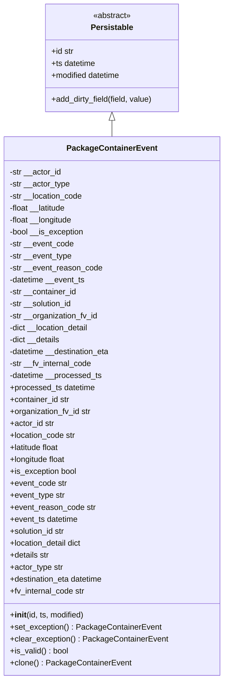
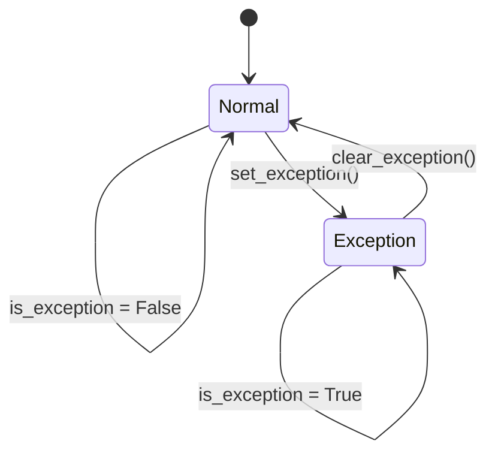

# Diagram: platform/partview_core/partview_service/partview_service/core/datamodel/PackageContainerEvent.py

> Auto-generated by Obscura crawlers

## Diagram 1

### SVG

<svg id="container" width="437.984375" xmlns="http://www.w3.org/2000/svg" class="classDiagram" height="1362" viewBox="0 0 437.984375 1362" role="graphics-document document" aria-roledescription="class"><g><defs><marker id="container_class-aggregationStart" class="marker aggregation class" refX="18" refY="7" markerWidth="190" markerHeight="240" orient="auto"><path d="M 18,7 L9,13 L1,7 L9,1 Z"></path></marker></defs><defs><marker id="container_class-aggregationEnd" class="marker aggregation class" refX="1" refY="7" markerWidth="20" markerHeight="28" orient="auto"><path d="M 18,7 L9,13 L1,7 L9,1 Z"></path></marker></defs><defs><marker id="container_class-extensionStart" class="marker extension class" refX="18" refY="7" markerWidth="190" markerHeight="240" orient="auto"><path d="M 1,7 L18,13 V 1 Z"></path></marker></defs><defs><marker id="container_class-extensionEnd" class="marker extension class" refX="1" refY="7" markerWidth="20" markerHeight="28" orient="auto"><path d="M 1,1 V 13 L18,7 Z"></path></marker></defs><defs><marker id="container_class-compositionStart" class="marker composition class" refX="18" refY="7" markerWidth="190" markerHeight="240" orient="auto"><path d="M 18,7 L9,13 L1,7 L9,1 Z"></path></marker></defs><defs><marker id="container_class-compositionEnd" class="marker composition class" refX="1" refY="7" markerWidth="20" markerHeight="28" orient="auto"><path d="M 18,7 L9,13 L1,7 L9,1 Z"></path></marker></defs><defs><marker id="container_class-dependencyStart" class="marker dependency class" refX="6" refY="7" markerWidth="190" markerHeight="240" orient="auto"><path d="M 5,7 L9,13 L1,7 L9,1 Z"></path></marker></defs><defs><marker id="container_class-dependencyEnd" class="marker dependency class" refX="13" refY="7" markerWidth="20" markerHeight="28" orient="auto"><path d="M 18,7 L9,13 L14,7 L9,1 Z"></path></marker></defs><defs><marker id="container_class-lollipopStart" class="marker lollipop class" refX="13" refY="7" markerWidth="190" markerHeight="240" orient="auto"><circle stroke="black" fill="transparent" cx="7" cy="7" r="6"></circle></marker></defs><defs><marker id="container_class-lollipopEnd" class="marker lollipop class" refX="1" refY="7" markerWidth="190" markerHeight="240" orient="auto"><circle stroke="black" fill="transparent" cx="7" cy="7" r="6"></circle></marker></defs><g class="root"><g class="clusters"></g><g class="edgePaths"><path d="M218.992,241.25L218.992,242.542C218.992,243.833,218.992,246.417,218.992,251.875C218.992,257.333,218.992,265.667,218.992,269.833L218.992,274" id="id_Persistable_PackageContainerEvent_1" class="edge-thickness-normal edge-pattern-solid relation" style=";;;" data-edge="true" data-et="edge" data-id="id_Persistable_PackageContainerEvent_1" data-points="W3sieCI6MjE4Ljk5MjE4NzUsInkiOjIyNH0seyJ4IjoyMTguOTkyMTg3NSwieSI6MjQ5fSx7IngiOjIxOC45OTIxODc1LCJ5IjoyNzR9XQ==" marker-start="url(#container_class-extensionStart)"></path></g><g class="edgeLabels"><g class="edgeLabel"><g class="label" data-id="id_Persistable_PackageContainerEvent_1" transform="translate(0, 0)"><foreignObject width="0" height="0">

</foreignObject></g></g></g><g class="nodes"><g class="node default" id="classId-Persistable-0" transform="translate(218.9921875, 116)"><g class="basic label-container"><path d="M-135.71484375 -108 L135.71484375 -108 L135.71484375 108 L-135.71484375 108" stroke="none" stroke-width="0" fill="#ECECFF" style=""></path><path d="M-135.71484375 -108 C-39.38525591366454 -108, 56.944331922670926 -108, 135.71484375 -108 M-135.71484375 -108 C-77.42627014850908 -108, -19.13769654701815 -108, 135.71484375 -108 M135.71484375 -108 C135.71484375 -46.19215914018013, 135.71484375 15.615681719639738, 135.71484375 108 M135.71484375 -108 C135.71484375 -42.55967683853878, 135.71484375 22.880646322922445, 135.71484375 108 M135.71484375 108 C41.496092919674425 108, -52.72265791065115 108, -135.71484375 108 M135.71484375 108 C66.62948091341109 108, -2.4558819231778273 108, -135.71484375 108 M-135.71484375 108 C-135.71484375 42.159852289864574, -135.71484375 -23.680295420270852, -135.71484375 -108 M-135.71484375 108 C-135.71484375 59.38724845072705, -135.71484375 10.7744969014541, -135.71484375 -108" stroke="#9370DB" stroke-width="1.3" fill="none" stroke-dasharray="0 0" style=""></path></g><g class="annotation-group text" transform="translate(-38.609375, -84)"><g class="label" style="" transform="translate(0,-12)"><foreignObject width="77.21875" height="24">

«abstract»

</foreignObject></g></g><g class="label-group text" transform="translate(-40.9765625, -60)"><g class="label" style="font-weight: bolder" transform="translate(0,-12)"><foreignObject width="81.953125" height="24">

Persistable

</foreignObject></g></g><g class="members-group text" transform="translate(-123.71484375, -12)"><g class="label" style="" transform="translate(0,-12)"><foreignObject width="45.734375" height="24">

+id str

</foreignObject></g><g class="label" style="" transform="translate(0,12)"><foreignObject width="90.640625" height="24">

+ts datetime

</foreignObject></g><g class="label" style="" transform="translate(0,36)"><foreignObject width="142.109375" height="24">

+modified datetime

</foreignObject></g></g><g class="methods-group text" transform="translate(-123.71484375, 84)"><g class="label" style="" transform="translate(0,-12)"><foreignObject width="206.453125" height="24">

+add_dirty_field(field, value)

</foreignObject></g></g><g class="divider" style=""><path d="M-135.71484375 -36 C-60.62983047116778 -36, 14.455182807664443 -36, 135.71484375 -36 M-135.71484375 -36 C-28.44097657666528 -36, 78.83289059666944 -36, 135.71484375 -36" stroke="#9370DB" stroke-width="1.3" fill="none" stroke-dasharray="0 0" style=""></path></g><g class="divider" style=""><path d="M-135.71484375 60 C-61.498944123914626 60, 12.716955502170748 60, 135.71484375 60 M-135.71484375 60 C-80.8442356140895 60, -25.973627478178997 60, 135.71484375 60" stroke="#9370DB" stroke-width="1.3" fill="none" stroke-dasharray="0 0" style=""></path></g></g><g class="node default" id="classId-PackageContainerEvent-1" transform="translate(218.9921875, 814)"><g class="basic label-container"><path d="M-210.9921875 -540 L210.9921875 -540 L210.9921875 540 L-210.9921875 540" stroke="none" stroke-width="0" fill="#ECECFF" style=""></path><path d="M-210.9921875 -540 C-113.13931356884719 -540, -15.286439637694372 -540, 210.9921875 -540 M-210.9921875 -540 C-59.943306732433655 -540, 91.10557403513269 -540, 210.9921875 -540 M210.9921875 -540 C210.9921875 -224.03931672909835, 210.9921875 91.92136654180331, 210.9921875 540 M210.9921875 -540 C210.9921875 -209.32966493999197, 210.9921875 121.34067012001606, 210.9921875 540 M210.9921875 540 C87.4790271238134 540, -36.03413325237321 540, -210.9921875 540 M210.9921875 540 C44.07811931135228 540, -122.83594887729544 540, -210.9921875 540 M-210.9921875 540 C-210.9921875 166.06073206581334, -210.9921875 -207.87853586837332, -210.9921875 -540 M-210.9921875 540 C-210.9921875 130.29758175552394, -210.9921875 -279.4048364889521, -210.9921875 -540" stroke="#9370DB" stroke-width="1.3" fill="none" stroke-dasharray="0 0" style=""></path></g><g class="annotation-group text" transform="translate(0, -516)"></g><g class="label-group text" transform="translate(-85.65625, -516)"><g class="label" style="font-weight: bolder" transform="translate(0,-12)"><foreignObject width="171.3125" height="24">

PackageContainerEvent

</foreignObject></g></g><g class="members-group text" transform="translate(-198.9921875, -468)"><g class="label" style="" transform="translate(0,-12)"><foreignObject width="104.8125" height="24">

-str __actor_id

</foreignObject></g><g class="label" style="" transform="translate(0,12)"><foreignObject width="122.203125" height="24">

-str __actor_type

</foreignObject></g><g class="label" style="" transform="translate(0,36)"><foreignObject width="148.546875" height="24">

-str __location_code

</foreignObject></g><g class="label" style="" transform="translate(0,60)"><foreignObject width="116.8125" height="24">

-float __latitude

</foreignObject></g><g class="label" style="" transform="translate(0,84)"><foreignObject width="129.375" height="24">

-float __longitude

</foreignObject></g><g class="label" style="" transform="translate(0,108)"><foreignObject width="150.46875" height="24">

-bool __is_exception

</foreignObject></g><g class="label" style="" transform="translate(0,132)"><foreignObject width="129.578125" height="24">

-str __event_code

</foreignObject></g><g class="label" style="" transform="translate(0,156)"><foreignObject width="126.40625" height="24">

-str __event_type

</foreignObject></g><g class="label" style="" transform="translate(0,180)"><foreignObject width="186.890625" height="24">

-str __event_reason_code

</foreignObject></g><g class="label" style="" transform="translate(0,204)"><foreignObject width="153.6875" height="24">

-datetime __event_ts

</foreignObject></g><g class="label" style="" transform="translate(0,228)"><foreignObject width="136.59375" height="24">

-str __container_id

</foreignObject></g><g class="label" style="" transform="translate(0,252)"><foreignObject width="128.828125" height="24">

-str __solution_id

</foreignObject></g><g class="label" style="" transform="translate(0,276)"><foreignObject width="179.78125" height="24">

-str __organization_fv_id

</foreignObject></g><g class="label" style="" transform="translate(0,300)"><foreignObject width="163.53125" height="24">

-dict __location_detail

</foreignObject></g><g class="label" style="" transform="translate(0,324)"><foreignObject width="103.6875" height="24">

-dict __details

</foreignObject></g><g class="label" style="" transform="translate(0,348)"><foreignObject width="206.328125" height="24">

-datetime __destination_eta

</foreignObject></g><g class="label" style="" transform="translate(0,372)"><foreignObject width="167.234375" height="24">

-str __fv_internal_code

</foreignObject></g><g class="label" style="" transform="translate(0,396)"><foreignObject width="187.34375" height="24">

-datetime __processed_ts

</foreignObject></g><g class="label" style="" transform="translate(0,420)"><foreignObject width="172.390625" height="24">

+processed_ts datetime

</foreignObject></g><g class="label" style="" transform="translate(0,444)"><foreignObject width="121.96875" height="24">

+container_id str

</foreignObject></g><g class="label" style="" transform="translate(0,468)"><foreignObject width="165.15625" height="24">

+organization_fv_id str

</foreignObject></g><g class="label" style="" transform="translate(0,492)"><foreignObject width="89.9375" height="24">

+actor_id str

</foreignObject></g><g class="label" style="" transform="translate(0,516)"><foreignObject width="133.765625" height="24">

+location_code str

</foreignObject></g><g class="label" style="" transform="translate(0,540)"><foreignObject width="102.265625" height="24">

+latitude float

</foreignObject></g><g class="label" style="" transform="translate(0,564)"><foreignObject width="114.828125" height="24">

+longitude float

</foreignObject></g><g class="label" style="" transform="translate(0,588)"><foreignObject width="135.53125" height="24">

+is_exception bool

</foreignObject></g><g class="label" style="" transform="translate(0,612)"><foreignObject width="114.953125" height="24">

+event_code str

</foreignObject></g><g class="label" style="" transform="translate(0,636)"><foreignObject width="111.78125" height="24">

+event_type str

</foreignObject></g><g class="label" style="" transform="translate(0,660)"><foreignObject width="172.265625" height="24">

+event_reason_code str

</foreignObject></g><g class="label" style="" transform="translate(0,684)"><foreignObject width="139.0625" height="24">

+event_ts datetime

</foreignObject></g><g class="label" style="" transform="translate(0,708)"><foreignObject width="113.875" height="24">

+solution_id str

</foreignObject></g><g class="label" style="" transform="translate(0,732)"><foreignObject width="148.75" height="24">

+location_detail dict

</foreignObject></g><g class="label" style="" transform="translate(0,756)"><foreignObject width="80.984375" height="24">

+details str

</foreignObject></g><g class="label" style="" transform="translate(0,780)"><foreignObject width="107.34375" height="24">

+actor_type str

</foreignObject></g><g class="label" style="" transform="translate(0,804)"><foreignObject width="191.703125" height="24">

+destination_eta datetime

</foreignObject></g><g class="label" style="" transform="translate(0,828)"><foreignObject width="152.375" height="24">

+fv_internal_code str

</foreignObject></g></g><g class="methods-group text" transform="translate(-198.9921875, 420)"><g class="label" style="" transform="translate(0,-12)"><foreignObject width="150.90625" height="24">

+<strong>init</strong>(id, ts, modified)

</foreignObject></g><g class="label" style="" transform="translate(0,12)"><foreignObject width="299.875" height="24">

+set_exception() : PackageContainerEvent

</foreignObject></g><g class="label" style="" transform="translate(0,36)"><foreignObject width="312.328125" height="24">

+clear_exception() : PackageContainerEvent

</foreignObject></g><g class="label" style="" transform="translate(0,60)"><foreignObject width="117.984375" height="24">

+is_valid() : bool

</foreignObject></g><g class="label" style="" transform="translate(0,84)"><foreignObject width="238.859375" height="24">

+clone() : PackageContainerEvent

</foreignObject></g></g><g class="divider" style=""><path d="M-210.9921875 -492 C-105.32688773335785 -492, 0.3384120332842997 -492, 210.9921875 -492 M-210.9921875 -492 C-71.99257012511757 -492, 67.00704724976487 -492, 210.9921875 -492" stroke="#9370DB" stroke-width="1.3" fill="none" stroke-dasharray="0 0" style=""></path></g><g class="divider" style=""><path d="M-210.9921875 396 C-102.64205671200891 396, 5.708074075982182 396, 210.9921875 396 M-210.9921875 396 C-109.68573147599427 396, -8.379275451988548 396, 210.9921875 396" stroke="#9370DB" stroke-width="1.3" fill="none" stroke-dasharray="0 0" style=""></path></g></g></g></g></g></svg>

## Diagram 2

### SVG

<svg id="container" width="412.1726379394531" xmlns="http://www.w3.org/2000/svg" class="statediagram" height="382.25" viewBox="0 0 412.1726379394531 382.25" role="graphics-document document" aria-roledescription="stateDiagram"><g><defs><marker id="container_stateDiagram-barbEnd" refX="19" refY="7" markerWidth="20" markerHeight="14" markerUnits="userSpaceOnUse" orient="auto"><path d="M 19,7 L9,13 L14,7 L9,1 Z"></path></marker></defs><g class="root"><g class="clusters"></g><g class="edgePaths"><path d="M208.992,22L208.992,26.167C208.992,30.333,208.992,38.667,209.076,47.083C209.159,55.5,209.326,64,209.409,68.25L209.492,72.5" id="edge0" class="edge-thickness-normal edge-pattern-solid transition" style="fill:none;;;fill:none" data-edge="true" data-et="edge" data-id="edge0" data-points="W3sieCI6MjA4Ljk5MjE4NzUsInkiOjIyfSx7IngiOjIwOC45OTIxODc1LCJ5Ijo0N30seyJ4IjoyMDkuNDkyMTg3NSwieSI6NzIuNX1d" marker-end="url(#container_stateDiagram-barbEnd)"></path><path d="M223.242,112.5L227.398,118.583C231.555,124.667,239.867,136.833,251.535,149.167C263.203,161.5,278.226,174,285.737,180.25L293.249,186.5" id="edge1" class="edge-thickness-normal edge-pattern-solid transition" style="fill:none;;;fill:none" data-edge="true" data-et="edge" data-id="edge1" data-points="W3sieCI6MjIzLjI0MjE4NzUsInkiOjExMi41fSx7IngiOjI0OC4xNzk2ODc1LCJ5IjoxNDl9LHsieCI6MjkzLjI0ODU2MDg1NTI2MzIsInkiOjE4Ni41fV0=" marker-end="url(#container_stateDiagram-barbEnd)"></path><path d="M341.431,186.5L348.776,180.25C356.121,174,370.81,161.5,354.604,147.701C338.398,133.902,291.297,118.804,267.746,111.256L244.195,103.707" id="edge2" class="edge-thickness-normal edge-pattern-solid transition" style="fill:none;;;fill:none" data-edge="true" data-et="edge" data-id="edge2" data-points="W3sieCI6MzQxLjQzMTEyNjY0NDczNjgsInkiOjE4Ni41fSx7IngiOjM4NS41LCJ5IjoxNDl9LHsieCI6MjQ0LjE5NTMxMjUsInkiOjEwMy43MDY3NDU0NTIxMzExOX1d" marker-end="url(#container_stateDiagram-barbEnd)"></path><path d="M174.801,107.783L158.936,114.653C143.07,121.522,111.34,135.261,95.475,151.622C79.609,167.983,79.609,186.967,79.609,196.458L79.609,205.95" id="Normal-cyclic-special-1" class="edge-thickness-normal edge-pattern-solid transition" style="fill:none;;;fill:none" data-edge="true" data-et="edge" data-id="Normal-cyclic-special-1" data-points="W3sieCI6MTc0LjgwMDc4NDIzNzQ3NTk0LCJ5IjoxMDcuNzgzNDA1NDgyOTY0NTN9LHsieCI6NzkuNjA5Mzc1LCJ5IjoxNDl9LHsieCI6NzkuNjA5Mzc1LCJ5IjoyMDUuOTQ5OTk5OTk5MjU0OTR9XQ=="></path><path d="M79.609,206.05L79.609,215.542C79.609,225.033,79.609,244.017,87.235,259.677C94.861,275.337,110.112,287.673,117.738,293.841L125.364,300.01" id="Normal-cyclic-special-mid" class="edge-thickness-normal edge-pattern-solid transition" style="fill:none;;;fill:none" data-edge="true" data-et="edge" data-id="Normal-cyclic-special-mid" data-points="W3sieCI6NzkuNjA5Mzc1LCJ5IjoyMDYuMDUwMDAwMDAwNzQ1MDZ9LHsieCI6NzkuNjA5Mzc1LCJ5IjoyNjN9LHsieCI6MTI1LjM2NDA2MjQ5OTI1NDk0LCJ5IjozMDAuMDA5NTU2NTQxMTYxNTR9XQ=="></path><path d="M125.464,300.01L133.09,293.841C140.716,287.673,155.967,275.337,163.593,259.668C171.219,244,171.219,225,171.219,206C171.219,187,171.219,168,175.389,152.417C179.559,136.833,187.898,124.667,192.068,118.583L196.238,112.5" id="Normal-cyclic-special-2" class="edge-thickness-normal edge-pattern-solid transition" style="fill:none;;;fill:none" data-edge="true" data-et="edge" data-id="Normal-cyclic-special-2" data-points="W3sieCI6MTI1LjQ2NDA2MjUwMDc0NTA2LCJ5IjozMDAuMDA5NTU2NTQxMTYxNTR9LHsieCI6MTcxLjIxODc1LCJ5IjoyNjN9LHsieCI6MTcxLjIxODc1LCJ5IjoyMDZ9LHsieCI6MTcxLjIxODc1LCJ5IjoxNDl9LHsieCI6MTk2LjIzODM0OTc4MDcwMTc1LCJ5IjoxMTIuNX1d" marker-end="url(#container_stateDiagram-barbEnd)"></path><path d="M288.784,226.5L279.896,232.583C271.008,238.667,253.232,250.833,244.344,263.083C235.456,275.333,235.456,287.667,235.456,293.833L235.456,300" id="Exception-cyclic-special-1" class="edge-thickness-normal edge-pattern-solid transition" style="fill:none;;;fill:none" data-edge="true" data-et="edge" data-id="Exception-cyclic-special-1" data-points="W3sieCI6Mjg4Ljc4NDE5NjgyMDQzNjksInkiOjIyNi41fSx7IngiOjIzNS40NTYyNTAwMDA3NDUwNiwieSI6MjYzfSx7IngiOjIzNS40NTYyNTAwMDA3NDUwNiwieSI6MzAwfV0="></path><path d="M235.456,300.1L235.456,306.267C235.456,312.433,235.456,324.767,249.012,337.105C262.567,349.442,289.679,361.785,303.234,367.956L316.79,374.127" id="Exception-cyclic-special-mid" class="edge-thickness-normal edge-pattern-solid transition" style="fill:none;;;fill:none" data-edge="true" data-et="edge" data-id="Exception-cyclic-special-mid" data-points="W3sieCI6MjM1LjQ1NjI1MDAwMDc0NTA2LCJ5IjozMDAuMTAwMDAwMDAxNDkwMX0seyJ4IjoyMzUuNDU2MjUwMDAwNzQ1MDYsInkiOjMzNy4xMDAwMDAwMDE0OTAxfSx7IngiOjMxNi43ODk4NDM3NDkyNTQ5NCwieSI6Mzc0LjEyNzIzNzQyODgxODR9XQ=="></path><path d="M316.89,374.109L324.336,367.94C331.782,361.772,346.674,349.436,354.12,337.093C361.566,324.75,361.566,312.4,361.566,300.05C361.566,287.7,361.566,275.35,356.811,263.092C352.055,250.833,342.544,238.667,337.789,232.583L333.033,226.5" id="Exception-cyclic-special-2" class="edge-thickness-normal edge-pattern-solid transition" style="fill:none;;;fill:none" data-edge="true" data-et="edge" data-id="Exception-cyclic-special-2" data-points="W3sieCI6MzE2Ljg4OTg0Mzc1MDc0NTA2LCJ5IjozNzQuMTA4NTgxNjYxMDA1OH0seyJ4IjozNjEuNTY2NDA2MjUsInkiOjMzNy4xMDAwMDAwMDE0OTAxfSx7IngiOjM2MS41NjY0MDYyNSwieSI6MzAwLjA1MDAwMDAwMDc0NTA2fSx7IngiOjM2MS41NjY0MDYyNSwieSI6MjYzfSx7IngiOjMzMy4wMzMzNzQ0NTE3NTQ0LCJ5IjoyMjYuNX1d" marker-end="url(#container_stateDiagram-barbEnd)"></path></g><g class="edgeLabels"><g class="edgeLabel"><g class="label" data-id="edge0" transform="translate(0, 0)"><foreignObject width="0" height="0">

</foreignObject></g></g><g class="edgeLabel" transform="translate(248.1796875, 149)"><g class="label" data-id="edge1" transform="translate(-55.546875, -12)"><foreignObject width="111.09375" height="24">

set_exception()

</foreignObject></g></g><g class="edgeLabel" transform="translate(342.3992, 135.18464)"><g class="label" data-id="edge2" transform="translate(-61.7734375, -12)"><foreignObject width="123.546875" height="24">

clear_exception()

</foreignObject></g></g><g class="edgeLabel"><g class="label" data-id="Normal-cyclic-special-1" transform="translate(0, 0)"><foreignObject width="0" height="0">

</foreignObject></g></g><g class="edgeLabel" transform="translate(79.609375, 263)"><g class="label" data-id="Normal-cyclic-special-mid" transform="translate(-71.609375, -12)"><foreignObject width="143.21875" height="24">

is_exception = False

</foreignObject></g></g><g class="edgeLabel"><g class="label" data-id="Normal-cyclic-special-2" transform="translate(0, 0)"><foreignObject width="0" height="0">

</foreignObject></g></g><g class="edgeLabel"><g class="label" data-id="Exception-cyclic-special-1" transform="translate(0, 0)"><foreignObject width="0" height="0">

</foreignObject></g></g><g class="edgeLabel" transform="translate(235.45625000074506, 337.1000000014901)"><g class="label" data-id="Exception-cyclic-special-mid" transform="translate(-69.453125, -12)"><foreignObject width="138.90625" height="24">

is_exception = True

</foreignObject></g></g><g class="edgeLabel"><g class="label" data-id="Exception-cyclic-special-2" transform="translate(0, 0)"><foreignObject width="0" height="0">

</foreignObject></g></g></g><g class="nodes"><g class="node default" id="state-root_start-0" transform="translate(208.9921875, 15)"><circle class="state-start" r="7" width="14" height="14"></circle></g><g class="node  statediagram-state" id="state-Normal-3" transform="translate(208.9921875, 92)"><g class="basic label-container outer-path"><path d="M-29.703125 -20 C-8.849871836708626 -20, 12.003381326582748 -20, 29.703125 -20 C29.703125 -20, 29.703125 -20, 29.703125 -20 C29.84008241159447 -19.994335399555254, 29.97703982318894 -19.98867079911051, 30.116021727361662 -19.982922465033347 C30.269225083749426 -19.963825686575, 30.422428440137192 -19.94472890811665, 30.52609795140367 -19.931806517013612 C30.648474125686306 -19.906146931606553, 30.77085029996894 -19.880487346199498, 30.930552435703998 -19.847001329696653 C31.031914143067247 -19.81682464195363, 31.133275850430493 -19.78664795421061, 31.326622346023417 -19.729086208503173 C31.421008147983667 -19.692256754292334, 31.515393949943917 -19.655427300081495, 31.711602123264846 -19.578866633275286 C31.856065774542813 -19.508242657598128, 32.00052942582078 -19.43761868192097, 32.082861965185366 -19.397368756032446 C32.21186514446098 -19.320499546106458, 32.340868323736586 -19.243630336180466, 32.437865790612136 -19.185832391312644 C32.567635518479044 -19.09317858649078, 32.69740524634595 -19.00052478166891, 32.77418856344834 -18.94570254698197 C32.85148202645859 -18.880238323160594, 32.92877548946884 -18.814774099339218, 33.089532858128706 -18.678619553365657 C33.181908029260384 -18.586244382233975, 33.27428320039207 -18.493869211102297, 33.38174455336566 -18.386407858128706 C33.46305854463892 -18.29040061005005, 33.544372535912174 -18.194393361971393, 33.64882754698197 -18.07106356344834 C33.71295308040344 -17.98125016574252, 33.7770786138249 -17.8914367680367, 33.888957391312644 -17.734740790612136 C33.93983150438199 -17.649363012759455, 33.99070561745133 -17.563985234906774, 34.10049375603245 -17.37973696518537 C34.152169603233325 -17.274032330209195, 34.203845450434194 -17.168327695233017, 34.28199163327529 -17.008477123264846 C34.313091211631736 -16.928775734615563, 34.34419078998819 -16.84907434596628, 34.432211208503176 -16.623497346023417 C34.47630257419981 -16.47539705930384, 34.52039393989645 -16.327296772584265, 34.55012632969665 -16.227427435703994 C34.578299303319 -16.09306436337156, 34.60647227694135 -15.958701291039127, 34.63493151701361 -15.82297295140367 C34.64796971495703 -15.71837438308827, 34.661007912900445 -15.613775814772868, 34.68604746503335 -15.412896727361662 C34.69123017303824 -15.287590400759429, 34.69641288104314 -15.162284074157194, 34.703125 -15 C34.703125 -15, 34.703125 -15, 34.703125 -15 C34.703125 -3.2615917246021375, 34.703125 8.476816550795725, 34.703125 15 C34.703125 15, 34.703125 15, 34.703125 15 C34.69807835334705 15.122016666411268, 34.69303170669411 15.244033332822534, 34.68604746503335 15.412896727361662 C34.67510845998645 15.500654580990377, 34.66416945493955 15.588412434619089, 34.63493151701361 15.822972951403669 C34.60636573889083 15.95920939430081, 34.57779996076805 16.09544583719795, 34.55012632969665 16.227427435703994 C34.5150026753736 16.345405710899037, 34.47987902105055 16.463383986094083, 34.432211208503176 16.623497346023417 C34.3893175726486 16.733424313606154, 34.34642393679403 16.843351281188895, 34.28199163327529 17.008477123264846 C34.23917654713667 17.096056781788167, 34.196361460998055 17.183636440311492, 34.10049375603245 17.379736965185366 C34.044948641626355 17.472953694725216, 33.98940352722027 17.56617042426507, 33.888957391312644 17.734740790612133 C33.8172326466607 17.83519754587114, 33.74550790200876 17.93565430113015, 33.64882754698197 18.07106356344834 C33.57840603360115 18.15421008718134, 33.507984520220326 18.23735661091434, 33.38174455336566 18.386407858128706 C33.29373439704682 18.474418014447547, 33.205724240727974 18.562428170766385, 33.089532858128706 18.678619553365657 C33.018597399799546 18.73869882191022, 32.94766194147038 18.798778090454785, 32.77418856344834 18.94570254698197 C32.66584483578105 19.02305848169776, 32.55750110811377 19.10041441641355, 32.437865790612136 19.185832391312644 C32.36125613115209 19.231481839864696, 32.28464647169204 19.277131288416747, 32.082861965185366 19.397368756032446 C31.96899349746514 19.453035657869194, 31.855125029744908 19.50870255970594, 31.711602123264846 19.578866633275286 C31.62947336933541 19.610913372503198, 31.547344615405976 19.642960111731107, 31.326622346023417 19.729086208503173 C31.23438447320649 19.756546613013743, 31.142146600389562 19.784007017524313, 30.930552435703998 19.847001329696653 C30.828054033651348 19.868492984563087, 30.725555631598702 19.889984639429517, 30.52609795140367 19.931806517013612 C30.41055691683655 19.94620869195286, 30.295015882269432 19.960610866892107, 30.116021727361662 19.982922465033347 C30.02601196549168 19.98664529632217, 29.936002203621698 19.990368127610992, 29.703125 20 C29.703125 20, 29.703125 20, 29.703125 20 C8.621283754510088 20, -12.460557490979824 20, -29.703125 20 C-29.703125 20, -29.703125 20, -29.703125 20 C-29.84650312112322 19.994069837044773, -29.98988124224644 19.988139674089545, -30.116021727361662 19.982922465033347 C-30.25724538253494 19.965318954774105, -30.398469037708217 19.947715444514866, -30.52609795140367 19.931806517013612 C-30.671347941676903 19.90135079675076, -30.81659793195013 19.8708950764879, -30.930552435703994 19.847001329696653 C-31.048498903572934 19.811887144824865, -31.166445371441874 19.776772959953075, -31.326622346023417 19.729086208503173 C-31.473724938483407 19.671686598807824, -31.620827530943398 19.614286989112472, -31.711602123264846 19.578866633275286 C-31.794259544210714 19.538457882459586, -31.876916965156585 19.49804913164388, -32.082861965185366 19.397368756032446 C-32.21013693339126 19.32152933638186, -32.337411901597164 19.245689916731276, -32.437865790612136 19.185832391312644 C-32.52875213060657 19.12094079182147, -32.619638470601 19.0560491923303, -32.77418856344834 18.94570254698197 C-32.848154030465096 18.883056991986003, -32.922119497481845 18.82041143699004, -33.089532858128706 18.67861955336566 C-33.20285927924263 18.565293132251732, -33.316185700356556 18.451966711137803, -33.38174455336566 18.386407858128706 C-33.45889365140102 18.295318090203843, -33.53604274943638 18.20422832227898, -33.64882754698197 18.07106356344834 C-33.74022996609765 17.94304651031357, -33.83163238521333 17.815029457178802, -33.888957391312644 17.734740790612133 C-33.96104226419732 17.613766764877326, -34.03312713708198 17.492792739142523, -34.10049375603244 17.37973696518537 C-34.15378826266433 17.27072130942146, -34.20708276929621 17.161705653657556, -34.28199163327528 17.00847712326485 C-34.32348869214945 16.9021292757402, -34.364985751023625 16.79578142821555, -34.432211208503176 16.623497346023417 C-34.46220132665206 16.522762314880065, -34.492191444800945 16.422027283736714, -34.55012632969665 16.227427435703994 C-34.575519814855895 16.106320351696457, -34.600913300015144 15.98521326768892, -34.63493151701361 15.82297295140367 C-34.65339716936964 15.674832786034745, -34.67186282172567 15.52669262066582, -34.68604746503335 15.412896727361664 C-34.69061152979968 15.302547815228543, -34.69517559456601 15.192198903095422, -34.703125 15 C-34.703125 15, -34.703125 15, -34.703125 15 C-34.703125 4.900338337925541, -34.703125 -5.199323324148917, -34.703125 -15 C-34.703125 -15, -34.703125 -15, -34.703125 -15 C-34.69875061159211 -15.105762960600144, -34.69437622318422 -15.211525921200288, -34.68604746503335 -15.41289672736166 C-34.669688260221946 -15.544137977837886, -34.65332905541055 -15.675379228314114, -34.63493151701361 -15.822972951403669 C-34.616782640110046 -15.909528914321674, -34.598633763206486 -15.99608487723968, -34.55012632969665 -16.227427435703994 C-34.521167861918705 -16.32469721433552, -34.492209394140765 -16.42196699296704, -34.432211208503176 -16.623497346023417 C-34.37328572870147 -16.77451040842551, -34.31436024889977 -16.925523470827603, -34.28199163327529 -17.008477123264846 C-34.228295400988145 -17.11831452199089, -34.17459916870101 -17.22815192071693, -34.10049375603245 -17.379736965185366 C-34.02907283715185 -17.499596732330804, -33.957651918271246 -17.619456499476243, -33.888957391312644 -17.734740790612133 C-33.83489282524802 -17.810462926782765, -33.780828259183394 -17.886185062953402, -33.64882754698197 -18.07106356344834 C-33.59480300483217 -18.13485021983176, -33.540778462682376 -18.198636876215172, -33.38174455336566 -18.386407858128706 C-33.26547243048624 -18.50267998100812, -33.149200307606826 -18.61895210388754, -33.089532858128706 -18.678619553365657 C-32.97839175838777 -18.772751263161467, -32.86725065864684 -18.86688297295728, -32.77418856344834 -18.945702546981966 C-32.6459398195589 -19.037270390116916, -32.517691075669454 -19.128838233251866, -32.437865790612136 -19.185832391312644 C-32.36012477397231 -19.232155982417165, -32.28238375733248 -19.27847957352169, -32.082861965185366 -19.397368756032446 C-31.992656209606356 -19.441467662792693, -31.902450454027345 -19.48556656955294, -31.71160212326485 -19.578866633275286 C-31.593943741280786 -19.62477707639075, -31.476285359296725 -19.670687519506213, -31.32662234602342 -19.729086208503173 C-31.200650360418454 -19.766589693525837, -31.074678374813484 -19.804093178548506, -30.930552435703994 -19.847001329696653 C-30.83075902977298 -19.867925806520336, -30.730965623841964 -19.88885028334402, -30.526097951403674 -19.931806517013612 C-30.368091978073824 -19.951501941049482, -30.210086004743975 -19.971197365085352, -30.116021727361662 -19.982922465033347 C-30.029667270219658 -19.986494111800305, -29.943312813077654 -19.990065758567262, -29.703125 -20 C-29.703125 -20, -29.703125 -20, -29.703125 -20" stroke="none" stroke-width="0" fill="#ECECFF" style=""></path><path d="M-29.703125 -20 C-16.423698430015026 -20, -3.1442718600300523 -20, 29.703125 -20 M-29.703125 -20 C-13.55775576338851 -20, 2.58761347322298 -20, 29.703125 -20 M29.703125 -20 C29.703125 -20, 29.703125 -20, 29.703125 -20 M29.703125 -20 C29.703125 -20, 29.703125 -20, 29.703125 -20 M29.703125 -20 C29.86656245255207 -19.99324017695986, 30.02999990510414 -19.986480353919717, 30.116021727361662 -19.982922465033347 M29.703125 -20 C29.797426797430067 -19.99609964880729, 29.89172859486013 -19.992199297614583, 30.116021727361662 -19.982922465033347 M30.116021727361662 -19.982922465033347 C30.255264612918236 -19.96556585744934, 30.394507498474812 -19.948209249865336, 30.52609795140367 -19.931806517013612 M30.116021727361662 -19.982922465033347 C30.213451040420125 -19.970777913825753, 30.31088035347859 -19.95863336261816, 30.52609795140367 -19.931806517013612 M30.52609795140367 -19.931806517013612 C30.655545883843338 -19.904664139850134, 30.784993816283006 -19.87752176268666, 30.930552435703998 -19.847001329696653 M30.52609795140367 -19.931806517013612 C30.672813505190728 -19.90104350039693, 30.81952905897779 -19.870280483780245, 30.930552435703998 -19.847001329696653 M30.930552435703998 -19.847001329696653 C31.086511759280818 -19.800570227354182, 31.242471082857634 -19.75413912501171, 31.326622346023417 -19.729086208503173 M30.930552435703998 -19.847001329696653 C31.088270921212718 -19.80004650215569, 31.245989406721435 -19.75309167461473, 31.326622346023417 -19.729086208503173 M31.326622346023417 -19.729086208503173 C31.443416824531816 -19.683512861569962, 31.560211303040212 -19.63793951463675, 31.711602123264846 -19.578866633275286 M31.326622346023417 -19.729086208503173 C31.467057204439456 -19.674288356705322, 31.607492062855492 -19.61949050490747, 31.711602123264846 -19.578866633275286 M31.711602123264846 -19.578866633275286 C31.85309047914903 -19.50969719088497, 31.994578835033213 -19.440527748494656, 32.082861965185366 -19.397368756032446 M31.711602123264846 -19.578866633275286 C31.80034463337981 -19.53548306363374, 31.889087143494777 -19.492099493992196, 32.082861965185366 -19.397368756032446 M32.082861965185366 -19.397368756032446 C32.217182751270144 -19.317330940213076, 32.351503537354915 -19.237293124393705, 32.437865790612136 -19.185832391312644 M32.082861965185366 -19.397368756032446 C32.16089540308592 -19.350870919677508, 32.23892884098647 -19.30437308332257, 32.437865790612136 -19.185832391312644 M32.437865790612136 -19.185832391312644 C32.52361142250646 -19.124611186857223, 32.60935705440079 -19.063389982401798, 32.77418856344834 -18.94570254698197 M32.437865790612136 -19.185832391312644 C32.5696264869328 -19.09175706233755, 32.70138718325346 -18.997681733362455, 32.77418856344834 -18.94570254698197 M32.77418856344834 -18.94570254698197 C32.89518758521797 -18.84322160312461, 33.016186606987596 -18.74074065926725, 33.089532858128706 -18.678619553365657 M32.77418856344834 -18.94570254698197 C32.88359473331129 -18.85304024783776, 32.99300090317424 -18.76037794869355, 33.089532858128706 -18.678619553365657 M33.089532858128706 -18.678619553365657 C33.15444201905052 -18.613710392443846, 33.21935117997233 -18.54880123152203, 33.38174455336566 -18.386407858128706 M33.089532858128706 -18.678619553365657 C33.168703134179985 -18.599449277314378, 33.247873410231264 -18.520279001263102, 33.38174455336566 -18.386407858128706 M33.38174455336566 -18.386407858128706 C33.48036216712448 -18.269970261587037, 33.5789797808833 -18.153532665045372, 33.64882754698197 -18.07106356344834 M33.38174455336566 -18.386407858128706 C33.485450327613904 -18.263962681849243, 33.58915610186216 -18.141517505569784, 33.64882754698197 -18.07106356344834 M33.64882754698197 -18.07106356344834 C33.697533195685345 -18.002847058039094, 33.746238844388714 -17.93463055262985, 33.888957391312644 -17.734740790612136 M33.64882754698197 -18.07106356344834 C33.71724781286659 -17.975235018668133, 33.785668078751215 -17.87940647388793, 33.888957391312644 -17.734740790612136 M33.888957391312644 -17.734740790612136 C33.94634637821876 -17.63842964375081, 34.00373536512489 -17.542118496889486, 34.10049375603245 -17.37973696518537 M33.888957391312644 -17.734740790612136 C33.963104507110295 -17.610305874717678, 34.03725162290795 -17.48587095882322, 34.10049375603245 -17.37973696518537 M34.10049375603245 -17.37973696518537 C34.15127029501514 -17.275871894572106, 34.202046833997834 -17.172006823958842, 34.28199163327529 -17.008477123264846 M34.10049375603245 -17.37973696518537 C34.15432344783808 -17.26962657065084, 34.20815313964371 -17.159516176116306, 34.28199163327529 -17.008477123264846 M34.28199163327529 -17.008477123264846 C34.32466195881445 -16.89912245097287, 34.36733228435361 -16.789767778680893, 34.432211208503176 -16.623497346023417 M34.28199163327529 -17.008477123264846 C34.33544406070485 -16.871490291997155, 34.388896488134414 -16.734503460729464, 34.432211208503176 -16.623497346023417 M34.432211208503176 -16.623497346023417 C34.46734282581787 -16.505492323610934, 34.50247444313256 -16.387487301198448, 34.55012632969665 -16.227427435703994 M34.432211208503176 -16.623497346023417 C34.47758532527437 -16.471088374396263, 34.52295944204556 -16.31867940276911, 34.55012632969665 -16.227427435703994 M34.55012632969665 -16.227427435703994 C34.57199110461884 -16.123149542508116, 34.59385587954102 -16.018871649312242, 34.63493151701361 -15.82297295140367 M34.55012632969665 -16.227427435703994 C34.57776708640738 -16.095602622213228, 34.60540784311811 -15.96377780872246, 34.63493151701361 -15.82297295140367 M34.63493151701361 -15.82297295140367 C34.64944639160074 -15.706527787150137, 34.66396126618787 -15.5900826228966, 34.68604746503335 -15.412896727361662 M34.63493151701361 -15.82297295140367 C34.65224810876902 -15.684051091682061, 34.669564700524425 -15.545129231960454, 34.68604746503335 -15.412896727361662 M34.68604746503335 -15.412896727361662 C34.69032553611188 -15.309462505081045, 34.69460360719041 -15.20602828280043, 34.703125 -15 M34.68604746503335 -15.412896727361662 C34.69123770594538 -15.287408271856638, 34.69642794685742 -15.161919816351611, 34.703125 -15 M34.703125 -15 C34.703125 -15, 34.703125 -15, 34.703125 -15 M34.703125 -15 C34.703125 -15, 34.703125 -15, 34.703125 -15 M34.703125 -15 C34.703125 -3.508338356718971, 34.703125 7.983323286562058, 34.703125 15 M34.703125 -15 C34.703125 -6.459508803920077, 34.703125 2.0809823921598465, 34.703125 15 M34.703125 15 C34.703125 15, 34.703125 15, 34.703125 15 M34.703125 15 C34.703125 15, 34.703125 15, 34.703125 15 M34.703125 15 C34.69825934371763 15.117640722702745, 34.693393687435254 15.23528144540549, 34.68604746503335 15.412896727361662 M34.703125 15 C34.69769610630399 15.131258547832358, 34.692267212607966 15.262517095664716, 34.68604746503335 15.412896727361662 M34.68604746503335 15.412896727361662 C34.67454506928878 15.505174366671945, 34.66304267354422 15.597452005982229, 34.63493151701361 15.822972951403669 M34.68604746503335 15.412896727361662 C34.671693465067094 15.528051279592392, 34.65733946510083 15.643205831823119, 34.63493151701361 15.822972951403669 M34.63493151701361 15.822972951403669 C34.61287729555746 15.92815435654996, 34.590823074101316 16.033335761696254, 34.55012632969665 16.227427435703994 M34.63493151701361 15.822972951403669 C34.61136398944001 15.935371644367939, 34.587796461866404 16.047770337332206, 34.55012632969665 16.227427435703994 M34.55012632969665 16.227427435703994 C34.506761357073735 16.373087811098785, 34.46339638445081 16.518748186493575, 34.432211208503176 16.623497346023417 M34.55012632969665 16.227427435703994 C34.51209023132959 16.355188437996706, 34.474054132962515 16.482949440289417, 34.432211208503176 16.623497346023417 M34.432211208503176 16.623497346023417 C34.37775460702747 16.76305765481566, 34.32329800555176 16.902617963607902, 34.28199163327529 17.008477123264846 M34.432211208503176 16.623497346023417 C34.375845460504024 16.76795037803233, 34.31947971250487 16.91240341004125, 34.28199163327529 17.008477123264846 M34.28199163327529 17.008477123264846 C34.211571367017825 17.152524080264605, 34.14115110076036 17.296571037264364, 34.10049375603245 17.379736965185366 M34.28199163327529 17.008477123264846 C34.21257329300049 17.150474607909388, 34.14315495272569 17.29247209255393, 34.10049375603245 17.379736965185366 M34.10049375603245 17.379736965185366 C34.0167786085038 17.520229110156283, 33.933063460975156 17.660721255127203, 33.888957391312644 17.734740790612133 M34.10049375603245 17.379736965185366 C34.0413042021648 17.479069853297304, 33.982114648297156 17.578402741409242, 33.888957391312644 17.734740790612133 M33.888957391312644 17.734740790612133 C33.81594885715087 17.836995604954087, 33.74294032298909 17.939250419296037, 33.64882754698197 18.07106356344834 M33.888957391312644 17.734740790612133 C33.81529470280385 17.83791180512265, 33.74163201429505 17.941082819633166, 33.64882754698197 18.07106356344834 M33.64882754698197 18.07106356344834 C33.58300648716772 18.14877834191925, 33.51718542735347 18.226493120390156, 33.38174455336566 18.386407858128706 M33.64882754698197 18.07106356344834 C33.555668833637384 18.18105584845014, 33.4625101202928 18.29104813345194, 33.38174455336566 18.386407858128706 M33.38174455336566 18.386407858128706 C33.299823035459205 18.468329376035157, 33.217901517552754 18.550250893941605, 33.089532858128706 18.678619553365657 M33.38174455336566 18.386407858128706 C33.31857572498195 18.449576686512415, 33.25540689659824 18.512745514896128, 33.089532858128706 18.678619553365657 M33.089532858128706 18.678619553365657 C33.016801273524884 18.740220063265912, 32.94406968892106 18.801820573166168, 32.77418856344834 18.94570254698197 M33.089532858128706 18.678619553365657 C33.01025954996123 18.745760620498952, 32.93098624179377 18.81290168763225, 32.77418856344834 18.94570254698197 M32.77418856344834 18.94570254698197 C32.65308597495569 19.032168133232787, 32.53198338646303 19.118633719483604, 32.437865790612136 19.185832391312644 M32.77418856344834 18.94570254698197 C32.64456429102503 19.038252498613247, 32.51494001860171 19.130802450244524, 32.437865790612136 19.185832391312644 M32.437865790612136 19.185832391312644 C32.35928667353481 19.23265538188027, 32.280707556457486 19.279478372447898, 32.082861965185366 19.397368756032446 M32.437865790612136 19.185832391312644 C32.31814265507743 19.257171895424808, 32.19841951954273 19.328511399536975, 32.082861965185366 19.397368756032446 M32.082861965185366 19.397368756032446 C31.954211519723454 19.460262126446263, 31.825561074261547 19.52315549686008, 31.711602123264846 19.578866633275286 M32.082861965185366 19.397368756032446 C31.941678119818107 19.46638933230211, 31.800494274450852 19.535409908571776, 31.711602123264846 19.578866633275286 M31.711602123264846 19.578866633275286 C31.58440576339689 19.62849880690999, 31.45720940352894 19.6781309805447, 31.326622346023417 19.729086208503173 M31.711602123264846 19.578866633275286 C31.622871605625388 19.613489388696514, 31.534141087985933 19.648112144117746, 31.326622346023417 19.729086208503173 M31.326622346023417 19.729086208503173 C31.21155849263215 19.76334220186222, 31.096494639240884 19.797598195221266, 30.930552435703998 19.847001329696653 M31.326622346023417 19.729086208503173 C31.21577931415716 19.76208560885, 31.104936282290907 19.795085009196825, 30.930552435703998 19.847001329696653 M30.930552435703998 19.847001329696653 C30.809331744649796 19.8724186357486, 30.6881110535956 19.89783594180054, 30.52609795140367 19.931806517013612 M30.930552435703998 19.847001329696653 C30.789858815610692 19.876501679598704, 30.649165195517387 19.90600202950076, 30.52609795140367 19.931806517013612 M30.52609795140367 19.931806517013612 C30.407338249892977 19.946609898368973, 30.288578548382283 19.961413279724333, 30.116021727361662 19.982922465033347 M30.52609795140367 19.931806517013612 C30.379452194226033 19.95008589158286, 30.232806437048396 19.96836526615211, 30.116021727361662 19.982922465033347 M30.116021727361662 19.982922465033347 C29.960811527704394 19.98934200637669, 29.805601328047125 19.99576154772003, 29.703125 20 M30.116021727361662 19.982922465033347 C29.96268567212231 19.98926449119018, 29.809349616882955 19.995606517347014, 29.703125 20 M29.703125 20 C29.703125 20, 29.703125 20, 29.703125 20 M29.703125 20 C29.703125 20, 29.703125 20, 29.703125 20 M29.703125 20 C13.393714164038627 20, -2.9156966719227455 20, -29.703125 20 M29.703125 20 C17.30286567477127 20, 4.902606349542538 20, -29.703125 20 M-29.703125 20 C-29.703125 20, -29.703125 20, -29.703125 20 M-29.703125 20 C-29.703125 20, -29.703125 20, -29.703125 20 M-29.703125 20 C-29.809941188282256 19.995582049772953, -29.91675737656451 19.991164099545905, -30.116021727361662 19.982922465033347 M-29.703125 20 C-29.85265981427483 19.993815194332424, -30.002194628549663 19.987630388664847, -30.116021727361662 19.982922465033347 M-30.116021727361662 19.982922465033347 C-30.267744614435916 19.96401022688248, -30.41946750151017 19.945097988731607, -30.52609795140367 19.931806517013612 M-30.116021727361662 19.982922465033347 C-30.23982433741141 19.967490485784136, -30.36362694746116 19.95205850653493, -30.52609795140367 19.931806517013612 M-30.52609795140367 19.931806517013612 C-30.67215793401857 19.901180959216678, -30.818217916633472 19.870555401419747, -30.930552435703994 19.847001329696653 M-30.52609795140367 19.931806517013612 C-30.662387222590848 19.90322966196325, -30.798676493778025 19.87465280691288, -30.930552435703994 19.847001329696653 M-30.930552435703994 19.847001329696653 C-31.06584279187764 19.806723645558368, -31.201133148051284 19.766445961420082, -31.326622346023417 19.729086208503173 M-30.930552435703994 19.847001329696653 C-31.05779492643084 19.809119598911003, -31.185037417157687 19.771237868125354, -31.326622346023417 19.729086208503173 M-31.326622346023417 19.729086208503173 C-31.44863068077902 19.681478408549165, -31.57063901553462 19.63387060859516, -31.711602123264846 19.578866633275286 M-31.326622346023417 19.729086208503173 C-31.429467497852322 19.68895590573068, -31.532312649681227 19.648825602958187, -31.711602123264846 19.578866633275286 M-31.711602123264846 19.578866633275286 C-31.811031166306638 19.53025873602731, -31.910460209348432 19.481650838779334, -32.082861965185366 19.397368756032446 M-31.711602123264846 19.578866633275286 C-31.824805167141125 19.52352503733351, -31.9380082110174 19.468183441391737, -32.082861965185366 19.397368756032446 M-32.082861965185366 19.397368756032446 C-32.18649868646202 19.33561467424477, -32.29013540773868 19.27386059245709, -32.437865790612136 19.185832391312644 M-32.082861965185366 19.397368756032446 C-32.17864364684367 19.340295261907727, -32.27442532850198 19.28322176778301, -32.437865790612136 19.185832391312644 M-32.437865790612136 19.185832391312644 C-32.530562663866924 19.11964809592015, -32.62325953712172 19.053463800527663, -32.77418856344834 18.94570254698197 M-32.437865790612136 19.185832391312644 C-32.51029531563553 19.1341187044215, -32.58272484065893 19.082405017530355, -32.77418856344834 18.94570254698197 M-32.77418856344834 18.94570254698197 C-32.84368053586351 18.88684584864291, -32.913172508278684 18.82798915030385, -33.089532858128706 18.67861955336566 M-32.77418856344834 18.94570254698197 C-32.87110169327809 18.863621313002795, -32.96801482310785 18.78154007902362, -33.089532858128706 18.67861955336566 M-33.089532858128706 18.67861955336566 C-33.197029757392514 18.571122654101853, -33.304526656656314 18.46362575483805, -33.38174455336566 18.386407858128706 M-33.089532858128706 18.67861955336566 C-33.172830611229536 18.595321800264827, -33.25612836433037 18.512024047163994, -33.38174455336566 18.386407858128706 M-33.38174455336566 18.386407858128706 C-33.44517955159301 18.311510297249967, -33.50861454982035 18.236612736371228, -33.64882754698197 18.07106356344834 M-33.38174455336566 18.386407858128706 C-33.48517223844161 18.264291021114538, -33.58859992351756 18.14217418410037, -33.64882754698197 18.07106356344834 M-33.64882754698197 18.07106356344834 C-33.72285887891348 17.967376231699287, -33.79689021084499 17.863688899950233, -33.888957391312644 17.734740790612133 M-33.64882754698197 18.07106356344834 C-33.74400730247837 17.93775602154055, -33.839187057974776 17.804448479632757, -33.888957391312644 17.734740790612133 M-33.888957391312644 17.734740790612133 C-33.93377026225734 17.659535089527147, -33.97858313320203 17.584329388442157, -34.10049375603244 17.37973696518537 M-33.888957391312644 17.734740790612133 C-33.97315475638649 17.593439380182478, -34.05735212146033 17.452137969752826, -34.10049375603244 17.37973696518537 M-34.10049375603244 17.37973696518537 C-34.1606450325351 17.2566955624707, -34.22079630903776 17.133654159756027, -34.28199163327528 17.00847712326485 M-34.10049375603244 17.37973696518537 C-34.139956762771064 17.299014094669996, -34.179419769509686 17.218291224154623, -34.28199163327528 17.00847712326485 M-34.28199163327528 17.00847712326485 C-34.31476860334527 16.924476948074297, -34.34754557341526 16.840476772883747, -34.432211208503176 16.623497346023417 M-34.28199163327528 17.00847712326485 C-34.3402932621906 16.859062853662635, -34.398594891105915 16.709648584060417, -34.432211208503176 16.623497346023417 M-34.432211208503176 16.623497346023417 C-34.47353079247134 16.484707310012237, -34.5148503764395 16.34591727400106, -34.55012632969665 16.227427435703994 M-34.432211208503176 16.623497346023417 C-34.47056491658364 16.494669511509116, -34.508918624664105 16.365841676994815, -34.55012632969665 16.227427435703994 M-34.55012632969665 16.227427435703994 C-34.58223040305595 16.074316089036653, -34.61433447641525 15.921204742369314, -34.63493151701361 15.82297295140367 M-34.55012632969665 16.227427435703994 C-34.57522990642929 16.107702988382798, -34.60033348316193 15.987978541061599, -34.63493151701361 15.82297295140367 M-34.63493151701361 15.82297295140367 C-34.647171302136016 15.724779627000462, -34.65941108725841 15.626586302597254, -34.68604746503335 15.412896727361664 M-34.63493151701361 15.82297295140367 C-34.649312397521456 15.707602750800522, -34.66369327802931 15.592232550197373, -34.68604746503335 15.412896727361664 M-34.68604746503335 15.412896727361664 C-34.69287804193236 15.24774860422198, -34.69970861883137 15.082600481082299, -34.703125 15 M-34.68604746503335 15.412896727361664 C-34.690408534669956 15.307455784961752, -34.69476960430656 15.20201484256184, -34.703125 15 M-34.703125 15 C-34.703125 15, -34.703125 15, -34.703125 15 M-34.703125 15 C-34.703125 15, -34.703125 15, -34.703125 15 M-34.703125 15 C-34.703125 6.636705875323196, -34.703125 -1.7265882493536076, -34.703125 -15 M-34.703125 15 C-34.703125 8.458195656241669, -34.703125 1.9163913124833378, -34.703125 -15 M-34.703125 -15 C-34.703125 -15, -34.703125 -15, -34.703125 -15 M-34.703125 -15 C-34.703125 -15, -34.703125 -15, -34.703125 -15 M-34.703125 -15 C-34.69967810834655 -15.08333815659331, -34.69623121669311 -15.16667631318662, -34.68604746503335 -15.41289672736166 M-34.703125 -15 C-34.698618255439825 -15.108963037322669, -34.69411151087965 -15.217926074645337, -34.68604746503335 -15.41289672736166 M-34.68604746503335 -15.41289672736166 C-34.66578191176358 -15.575476546086303, -34.64551635849382 -15.738056364810946, -34.63493151701361 -15.822972951403669 M-34.68604746503335 -15.41289672736166 C-34.67433703945096 -15.506843280067608, -34.662626613868575 -15.600789832773557, -34.63493151701361 -15.822972951403669 M-34.63493151701361 -15.822972951403669 C-34.61754623838062 -15.905887147178575, -34.60016095974762 -15.988801342953483, -34.55012632969665 -16.227427435703994 M-34.63493151701361 -15.822972951403669 C-34.61389115533539 -15.923319037548778, -34.592850793657156 -16.02366512369389, -34.55012632969665 -16.227427435703994 M-34.55012632969665 -16.227427435703994 C-34.50963411281411 -16.36343839466308, -34.46914189593158 -16.49944935362217, -34.432211208503176 -16.623497346023417 M-34.55012632969665 -16.227427435703994 C-34.521791265447995 -16.322603238792436, -34.49345620119934 -16.417779041880873, -34.432211208503176 -16.623497346023417 M-34.432211208503176 -16.623497346023417 C-34.39716892858567 -16.71330301280291, -34.362126648668166 -16.803108679582408, -34.28199163327529 -17.008477123264846 M-34.432211208503176 -16.623497346023417 C-34.39041889546471 -16.73060186512184, -34.34862658242624 -16.83770638422027, -34.28199163327529 -17.008477123264846 M-34.28199163327529 -17.008477123264846 C-34.21113786327315 -17.153410826347613, -34.14028409327101 -17.29834452943038, -34.10049375603245 -17.379736965185366 M-34.28199163327529 -17.008477123264846 C-34.216464264351956 -17.142515498795788, -34.15093689542862 -17.276553874326734, -34.10049375603245 -17.379736965185366 M-34.10049375603245 -17.379736965185366 C-34.0406361753851 -17.480190946886083, -33.98077859473776 -17.5806449285868, -33.888957391312644 -17.734740790612133 M-34.10049375603245 -17.379736965185366 C-34.03221557850198 -17.49432253182583, -33.96393740097152 -17.608908098466294, -33.888957391312644 -17.734740790612133 M-33.888957391312644 -17.734740790612133 C-33.81950431920853 -17.832015870505508, -33.75005124710441 -17.929290950398883, -33.64882754698197 -18.07106356344834 M-33.888957391312644 -17.734740790612133 C-33.83372023409181 -17.81210524288121, -33.77848307687097 -17.889469695150286, -33.64882754698197 -18.07106356344834 M-33.64882754698197 -18.07106356344834 C-33.55755037939256 -18.17883431157487, -33.466273211803156 -18.2866050597014, -33.38174455336566 -18.386407858128706 M-33.64882754698197 -18.07106356344834 C-33.56723778881579 -18.16739640888221, -33.48564803064961 -18.263729254316083, -33.38174455336566 -18.386407858128706 M-33.38174455336566 -18.386407858128706 C-33.27954113630275 -18.488611275191612, -33.177337719239844 -18.59081469225452, -33.089532858128706 -18.678619553365657 M-33.38174455336566 -18.386407858128706 C-33.28596791924566 -18.482184492248706, -33.19019128512566 -18.577961126368702, -33.089532858128706 -18.678619553365657 M-33.089532858128706 -18.678619553365657 C-32.96376213275384 -18.785141924022344, -32.83799140737898 -18.891664294679032, -32.77418856344834 -18.945702546981966 M-33.089532858128706 -18.678619553365657 C-32.966770182835965 -18.782594235561085, -32.84400750754322 -18.886568917756517, -32.77418856344834 -18.945702546981966 M-32.77418856344834 -18.945702546981966 C-32.671539310099206 -19.018992705181848, -32.568890056750064 -19.092282863381733, -32.437865790612136 -19.185832391312644 M-32.77418856344834 -18.945702546981966 C-32.64413144872277 -19.038561542077012, -32.51407433399719 -19.13142053717206, -32.437865790612136 -19.185832391312644 M-32.437865790612136 -19.185832391312644 C-32.35195258301374 -19.2370255512594, -32.266039375415346 -19.288218711206152, -32.082861965185366 -19.397368756032446 M-32.437865790612136 -19.185832391312644 C-32.30169256301868 -19.26697402268141, -32.16551933542523 -19.348115654050176, -32.082861965185366 -19.397368756032446 M-32.082861965185366 -19.397368756032446 C-31.963972600378483 -19.455490224887185, -31.8450832355716 -19.513611693741925, -31.71160212326485 -19.578866633275286 M-32.082861965185366 -19.397368756032446 C-31.997044992003403 -19.439322117816364, -31.911228018821443 -19.48127547960028, -31.71160212326485 -19.578866633275286 M-31.71160212326485 -19.578866633275286 C-31.57010764186296 -19.63407795124525, -31.428613160461076 -19.68928926921521, -31.32662234602342 -19.729086208503173 M-31.71160212326485 -19.578866633275286 C-31.631233010235768 -19.61022675849324, -31.550863897206682 -19.64158688371119, -31.32662234602342 -19.729086208503173 M-31.32662234602342 -19.729086208503173 C-31.22796434152455 -19.758457969028502, -31.12930633702568 -19.78782972955383, -30.930552435703994 -19.847001329696653 M-31.32662234602342 -19.729086208503173 C-31.178863129680074 -19.77307603314935, -31.03110391333673 -19.81706585779553, -30.930552435703994 -19.847001329696653 M-30.930552435703994 -19.847001329696653 C-30.797301512024283 -19.874941110268907, -30.664050588344576 -19.902880890841164, -30.526097951403674 -19.931806517013612 M-30.930552435703994 -19.847001329696653 C-30.827699430538846 -19.868567337016938, -30.7248464253737 -19.890133344337222, -30.526097951403674 -19.931806517013612 M-30.526097951403674 -19.931806517013612 C-30.392831986272594 -19.94841810224354, -30.259566021141513 -19.965029687473464, -30.116021727361662 -19.982922465033347 M-30.526097951403674 -19.931806517013612 C-30.387868320243246 -19.949036822568853, -30.24963868908282 -19.966267128124095, -30.116021727361662 -19.982922465033347 M-30.116021727361662 -19.982922465033347 C-29.96284497437072 -19.98925790240045, -29.80966822137978 -19.995593339767552, -29.703125 -20 M-30.116021727361662 -19.982922465033347 C-29.96676585534426 -19.989095733563815, -29.817509983326854 -19.995269002094286, -29.703125 -20 M-29.703125 -20 C-29.703125 -20, -29.703125 -20, -29.703125 -20 M-29.703125 -20 C-29.703125 -20, -29.703125 -20, -29.703125 -20" stroke="#9370DB" stroke-width="1.3" fill="none" stroke-dasharray="0 0" style=""></path></g><g class="label" style="" transform="translate(-26.703125, -12)"><rect></rect><foreignObject width="53.40625" height="24">

Normal

</foreignObject></g></g><g class="node  statediagram-state" id="state-Exception-4" transform="translate(316.83984375, 206)"><g class="basic label-container outer-path"><path d="M-38.375 -20 C-17.09778416206849 -20, 4.179431675863022 -20, 38.375 -20 C38.375 -20, 38.375 -20, 38.375 -20 C38.47927294069119 -19.99568723927141, 38.58354588138238 -19.991374478542816, 38.78789672736166 -19.982922465033347 C38.906386723254506 -19.968152702448194, 39.02487671914736 -19.953382939863037, 39.19797295140367 -19.931806517013612 C39.31190458008776 -19.90791756662011, 39.42583620877185 -19.884028616226605, 39.602427435703994 -19.847001329696653 C39.7258389125878 -19.810260141148188, 39.84925038947161 -19.77351895259972, 39.99849734602342 -19.729086208503173 C40.14359451341294 -19.672469118098565, 40.28869168080247 -19.615852027693954, 40.383477123264846 -19.578866633275286 C40.50051329891997 -19.521651133392126, 40.61754947457509 -19.46443563350897, 40.754736965185366 -19.397368756032446 C40.8863098679503 -19.318968323267903, 41.01788277071524 -19.240567890503364, 41.109740790612136 -19.185832391312644 C41.18868517322661 -19.129467185507128, 41.26762955584108 -19.07310197970161, 41.44606356344834 -18.94570254698197 C41.536756138755635 -18.868889853933577, 41.62744871406293 -18.79207716088518, 41.761407858128706 -18.678619553365657 C41.867076640323475 -18.57295077117089, 41.97274542251824 -18.467281988976126, 42.05361955336566 -18.386407858128706 C42.15333995467868 -18.268668202782205, 42.25306035599169 -18.1509285474357, 42.32070254698197 -18.07106356344834 C42.38420525043288 -17.98212249339212, 42.447707953883786 -17.893181423335896, 42.560832391312644 -17.734740790612136 C42.606146426413694 -17.658694027552258, 42.651460461514745 -17.58264726449238, 42.77236875603245 -17.37973696518537 C42.81744456413428 -17.28753292597265, 42.862520372236105 -17.19532888675993, 42.95386663327529 -17.008477123264846 C43.00449264302741 -16.87873377971306, 43.055118652779534 -16.748990436161275, 43.104086208503176 -16.623497346023417 C43.14942513493068 -16.471206576677083, 43.194764061358185 -16.318915807330754, 43.22200132969665 -16.227427435703994 C43.25194635936636 -16.084613040552057, 43.28189138903606 -15.941798645400121, 43.30680651701361 -15.82297295140367 C43.32588812879989 -15.669891269206754, 43.344969740586166 -15.51680958700984, 43.35792246503335 -15.412896727361662 C43.361764295111975 -15.320009840018654, 43.365606125190595 -15.227122952675646, 43.375 -15 C43.375 -15, 43.375 -15, 43.375 -15 C43.375 -4.83215284200509, 43.375 5.335694315989819, 43.375 15 C43.375 15, 43.375 15, 43.375 15 C43.37155620145543 15.083263372115729, 43.36811240291085 15.16652674423146, 43.35792246503335 15.412896727361662 C43.34107847725441 15.548027135263485, 43.32423448947548 15.683157543165308, 43.30680651701361 15.822972951403669 C43.28841306958221 15.910695324653874, 43.27001962215081 15.99841769790408, 43.22200132969665 16.227427435703994 C43.18632130039139 16.347274541521255, 43.15064127108613 16.46712164733852, 43.104086208503176 16.623497346023417 C43.04717161424509 16.76935695044599, 42.99025701998699 16.915216554868557, 42.95386663327529 17.008477123264846 C42.890065408502885 17.138984614499286, 42.82626418373047 17.269492105733725, 42.77236875603245 17.379736965185366 C42.704739142788256 17.493234100515377, 42.637109529544055 17.606731235845388, 42.560832391312644 17.734740790612133 C42.490073024808275 17.833845449648642, 42.41931365830391 17.932950108685155, 42.32070254698197 18.07106356344834 C42.22817287926663 18.18031313567914, 42.13564321155128 18.289562707909937, 42.05361955336566 18.386407858128706 C41.93895212469115 18.501075286803214, 41.82428469601664 18.615742715477722, 41.761407858128706 18.678619553365657 C41.671599155647044 18.754683644317144, 41.58179045316538 18.830747735268627, 41.44606356344834 18.94570254698197 C41.3528934892129 19.01222470138074, 41.259723414977465 19.078746855779514, 41.109740790612136 19.185832391312644 C40.99701817781051 19.253000489304572, 40.88429556500888 19.3201685872965, 40.754736965185366 19.397368756032446 C40.64858528376075 19.449263150924878, 40.54243360233614 19.501157545817314, 40.383477123264846 19.578866633275286 C40.24847775431267 19.63154355050284, 40.11347838536049 19.6842204677304, 39.99849734602342 19.729086208503173 C39.855291264076364 19.77172050630886, 39.71208518212931 19.81435480411455, 39.602427435703994 19.847001329696653 C39.48306649807707 19.87202868646163, 39.36370556045015 19.89705604322661, 39.19797295140367 19.931806517013612 C39.098338770078946 19.94422590476398, 38.99870458875422 19.95664529251434, 38.78789672736166 19.982922465033347 C38.66836846815272 19.987866190403096, 38.54884020894379 19.992809915772842, 38.375 20 C38.375 20, 38.375 20, 38.375 20 C13.869203924539526 20, -10.636592150920947 20, -38.375 20 C-38.375 20, -38.375 20, -38.375 20 C-38.49127929067567 19.995190652962787, -38.60755858135135 19.990381305925577, -38.78789672736166 19.982922465033347 C-38.9305624349486 19.9651392031282, -39.07322814253554 19.947355941223055, -39.19797295140367 19.931806517013612 C-39.319107177965094 19.9064073406593, -39.440241404526525 19.881008164304987, -39.602427435703994 19.847001329696653 C-39.75683512865512 19.801032167805882, -39.91124282160624 19.755063005915108, -39.99849734602342 19.729086208503173 C-40.117291088810234 19.68273274622774, -40.23608483159704 19.636379283952305, -40.383477123264846 19.578866633275286 C-40.52064984628604 19.511806975233153, -40.657822569307235 19.44474731719102, -40.754736965185366 19.397368756032446 C-40.89186507314877 19.315658139464833, -41.02899318111217 19.23394752289722, -41.109740790612136 19.185832391312644 C-41.206169541234885 19.11698358669328, -41.302598291857635 19.048134782073916, -41.44606356344834 18.94570254698197 C-41.5258312452328 18.878142766753754, -41.60559892701726 18.81058298652554, -41.761407858128706 18.67861955336566 C-41.83384021838147 18.6061871931129, -41.90627257863423 18.533754832860136, -42.05361955336566 18.386407858128706 C-42.11005422095888 18.319775572011412, -42.1664888885521 18.253143285894115, -42.32070254698197 18.07106356344834 C-42.41550390024279 17.93828600684693, -42.51030525350361 17.80550845024552, -42.560832391312644 17.734740790612133 C-42.62486984290021 17.627272080377463, -42.68890729448778 17.51980337014279, -42.77236875603244 17.37973696518537 C-42.83572284253951 17.25014410989174, -42.89907692904658 17.12055125459811, -42.95386663327528 17.00847712326485 C-42.98951155689683 16.917127013035927, -43.02515648051837 16.825776902807004, -43.104086208503176 16.623497346023417 C-43.13322750581242 16.52561345382163, -43.16236880312166 16.427729561619845, -43.22200132969665 16.227427435703994 C-43.24001759784229 16.14150391295268, -43.25803386598792 16.05558039020136, -43.30680651701361 15.82297295140367 C-43.32656354444071 15.664472766638017, -43.346320571867814 15.505972581872362, -43.35792246503335 15.412896727361664 C-43.361351974875134 15.329978824227915, -43.36478148471692 15.247060921094166, -43.375 15 C-43.375 15, -43.375 15, -43.375 15 C-43.375 5.5748848469781915, -43.375 -3.850230306043617, -43.375 -15 C-43.375 -15, -43.375 -15, -43.375 -15 C-43.36832226792201 -15.161452676079096, -43.36164453584402 -15.322905352158191, -43.35792246503335 -15.41289672736166 C-43.343989714434265 -15.524671818649875, -43.33005696383519 -15.63644690993809, -43.30680651701361 -15.822972951403669 C-43.278427659407896 -15.958317929477392, -43.25004880180218 -16.093662907551117, -43.22200132969665 -16.227427435703994 C-43.19241786659957 -16.326796536606448, -43.16283440350249 -16.426165637508902, -43.104086208503176 -16.623497346023417 C-43.06951368248739 -16.712099136729048, -43.03494115647161 -16.800700927434676, -42.95386663327529 -17.008477123264846 C-42.915152048951896 -17.08766907126042, -42.8764374646285 -17.166861019255997, -42.77236875603245 -17.379736965185366 C-42.69797475445114 -17.504586208884685, -42.62358075286982 -17.629435452584005, -42.560832391312644 -17.734740790612133 C-42.48751443973716 -17.837428971005828, -42.41419648816167 -17.940117151399523, -42.32070254698197 -18.07106356344834 C-42.23063322533357 -18.177408210567123, -42.14056390368516 -18.283752857685904, -42.05361955336566 -18.386407858128706 C-41.94803095188091 -18.491996459613453, -41.84244235039616 -18.597585061098197, -41.761407858128706 -18.678619553365657 C-41.6755211557332 -18.751361879688304, -41.589634453337695 -18.824104206010954, -41.44606356344834 -18.945702546981966 C-41.334138878239344 -19.025615236239812, -41.22221419303035 -19.105527925497658, -41.109740790612136 -19.185832391312644 C-41.01579536002612 -19.241811717294027, -40.9218499294401 -19.29779104327541, -40.754736965185366 -19.397368756032446 C-40.66372312812841 -19.44186270975529, -40.572709291071455 -19.48635666347814, -40.383477123264846 -19.578866633275286 C-40.23038011908265 -19.638605269682902, -40.07728311490047 -19.698343906090518, -39.99849734602342 -19.729086208503173 C-39.8970051806682 -19.759301735273176, -39.795513015312984 -19.78951726204318, -39.602427435703994 -19.847001329696653 C-39.51092677184713 -19.866187001358647, -39.41942610799027 -19.88537267302064, -39.19797295140367 -19.931806517013612 C-39.05631969849818 -19.949463576574328, -38.91466644559268 -19.967120636135046, -38.78789672736166 -19.982922465033347 C-38.67194434917619 -19.98771829086995, -38.55599197099071 -19.99251411670655, -38.375 -20 C-38.375 -20, -38.375 -20, -38.375 -20" stroke="none" stroke-width="0" fill="#ECECFF" style=""></path><path d="M-38.375 -20 C-10.798995149486196 -20, 16.77700970102761 -20, 38.375 -20 M-38.375 -20 C-8.433426511532584 -20, 21.50814697693483 -20, 38.375 -20 M38.375 -20 C38.375 -20, 38.375 -20, 38.375 -20 M38.375 -20 C38.375 -20, 38.375 -20, 38.375 -20 M38.375 -20 C38.46150803442987 -19.99642200122943, 38.54801606885974 -19.99284400245886, 38.78789672736166 -19.982922465033347 M38.375 -20 C38.50933288552772 -19.99444395075633, 38.64366577105544 -19.988887901512662, 38.78789672736166 -19.982922465033347 M38.78789672736166 -19.982922465033347 C38.927678283753835 -19.965498712199707, 39.067459840146 -19.94807495936607, 39.19797295140367 -19.931806517013612 M38.78789672736166 -19.982922465033347 C38.90645812372563 -19.96814380238875, 39.02501952008959 -19.95336513974415, 39.19797295140367 -19.931806517013612 M39.19797295140367 -19.931806517013612 C39.31415318435003 -19.90744608388703, 39.43033341729639 -19.88308565076045, 39.602427435703994 -19.847001329696653 M39.19797295140367 -19.931806517013612 C39.34756438405535 -19.900440492010862, 39.497155816707036 -19.86907446700811, 39.602427435703994 -19.847001329696653 M39.602427435703994 -19.847001329696653 C39.71860755839032 -19.812413008569752, 39.83478768107664 -19.77782468744285, 39.99849734602342 -19.729086208503173 M39.602427435703994 -19.847001329696653 C39.72416812260502 -19.81075755687752, 39.84590880950606 -19.77451378405838, 39.99849734602342 -19.729086208503173 M39.99849734602342 -19.729086208503173 C40.11785775031702 -19.68251163422165, 40.23721815461063 -19.63593705994013, 40.383477123264846 -19.578866633275286 M39.99849734602342 -19.729086208503173 C40.102709736791326 -19.688422407441177, 40.206922127559224 -19.64775860637918, 40.383477123264846 -19.578866633275286 M40.383477123264846 -19.578866633275286 C40.511036207150916 -19.51650679702529, 40.638595291036985 -19.454146960775297, 40.754736965185366 -19.397368756032446 M40.383477123264846 -19.578866633275286 C40.49174997431437 -19.52593526174083, 40.60002282536389 -19.473003890206375, 40.754736965185366 -19.397368756032446 M40.754736965185366 -19.397368756032446 C40.85235218250677 -19.339202711797064, 40.949967399828175 -19.281036667561683, 41.109740790612136 -19.185832391312644 M40.754736965185366 -19.397368756032446 C40.86140437089404 -19.333808778303812, 40.96807177660272 -19.270248800575175, 41.109740790612136 -19.185832391312644 M41.109740790612136 -19.185832391312644 C41.23452916874368 -19.096735201841035, 41.359317546875225 -19.007638012369423, 41.44606356344834 -18.94570254698197 M41.109740790612136 -19.185832391312644 C41.226884306156755 -19.10219352881499, 41.344027821701374 -19.018554666317335, 41.44606356344834 -18.94570254698197 M41.44606356344834 -18.94570254698197 C41.57079998055632 -18.840056190741592, 41.695536397664306 -18.73440983450121, 41.761407858128706 -18.678619553365657 M41.44606356344834 -18.94570254698197 C41.56915074214679 -18.84145302442159, 41.69223792084524 -18.737203501861213, 41.761407858128706 -18.678619553365657 M41.761407858128706 -18.678619553365657 C41.82915255468745 -18.610874856806912, 41.896897251246195 -18.54313016024817, 42.05361955336566 -18.386407858128706 M41.761407858128706 -18.678619553365657 C41.8247877055861 -18.61523970590827, 41.88816755304348 -18.551859858450882, 42.05361955336566 -18.386407858128706 M42.05361955336566 -18.386407858128706 C42.135457669365344 -18.28978177715492, 42.217295785365025 -18.193155696181137, 42.32070254698197 -18.07106356344834 M42.05361955336566 -18.386407858128706 C42.1366462675658 -18.288378401911494, 42.219672981765946 -18.19034894569428, 42.32070254698197 -18.07106356344834 M42.32070254698197 -18.07106356344834 C42.41194749613173 -17.94326706072339, 42.5031924452815 -17.815470557998438, 42.560832391312644 -17.734740790612136 M42.32070254698197 -18.07106356344834 C42.37358476501413 -17.996997408731588, 42.426466983046296 -17.922931254014834, 42.560832391312644 -17.734740790612136 M42.560832391312644 -17.734740790612136 C42.632232036277145 -17.614916725704507, 42.70363168124164 -17.49509266079688, 42.77236875603245 -17.37973696518537 M42.560832391312644 -17.734740790612136 C42.639726093301206 -17.60234007527831, 42.71861979528977 -17.469939359944483, 42.77236875603245 -17.37973696518537 M42.77236875603245 -17.37973696518537 C42.82274988244557 -17.27668072391106, 42.87313100885869 -17.173624482636754, 42.95386663327529 -17.008477123264846 M42.77236875603245 -17.37973696518537 C42.81255488137977 -17.297534931913756, 42.85274100672708 -17.215332898642146, 42.95386663327529 -17.008477123264846 M42.95386663327529 -17.008477123264846 C42.98647655962852 -16.924905044431043, 43.019086485981745 -16.841332965597235, 43.104086208503176 -16.623497346023417 M42.95386663327529 -17.008477123264846 C42.991435841930794 -16.91219549314179, 43.029005050586306 -16.815913863018736, 43.104086208503176 -16.623497346023417 M43.104086208503176 -16.623497346023417 C43.13139638205397 -16.53176409010517, 43.15870655560477 -16.440030834186924, 43.22200132969665 -16.227427435703994 M43.104086208503176 -16.623497346023417 C43.15094886454353 -16.466088459127754, 43.19781152058388 -16.308679572232087, 43.22200132969665 -16.227427435703994 M43.22200132969665 -16.227427435703994 C43.25308077923029 -16.079202744135507, 43.28416022876392 -15.93097805256702, 43.30680651701361 -15.82297295140367 M43.22200132969665 -16.227427435703994 C43.25465763647492 -16.0716823670941, 43.287313943253174 -15.915937298484204, 43.30680651701361 -15.82297295140367 M43.30680651701361 -15.82297295140367 C43.32411108595231 -15.684147544383613, 43.34141565489101 -15.545322137363556, 43.35792246503335 -15.412896727361662 M43.30680651701361 -15.82297295140367 C43.32442292425673 -15.681645830547861, 43.34203933149985 -15.540318709692054, 43.35792246503335 -15.412896727361662 M43.35792246503335 -15.412896727361662 C43.363506231685584 -15.277893696680575, 43.36908999833783 -15.142890665999486, 43.375 -15 M43.35792246503335 -15.412896727361662 C43.36454246881913 -15.252839792703975, 43.371162472604915 -15.092782858046286, 43.375 -15 M43.375 -15 C43.375 -15, 43.375 -15, 43.375 -15 M43.375 -15 C43.375 -15, 43.375 -15, 43.375 -15 M43.375 -15 C43.375 -8.099015313073409, 43.375 -1.1980306261468154, 43.375 15 M43.375 -15 C43.375 -6.813400823516883, 43.375 1.3731983529662344, 43.375 15 M43.375 15 C43.375 15, 43.375 15, 43.375 15 M43.375 15 C43.375 15, 43.375 15, 43.375 15 M43.375 15 C43.3710799754238 15.094777455988334, 43.367159950847594 15.189554911976668, 43.35792246503335 15.412896727361662 M43.375 15 C43.36910109543625 15.142622362896507, 43.3632021908725 15.285244725793012, 43.35792246503335 15.412896727361662 M43.35792246503335 15.412896727361662 C43.34510167595738 15.515751139285763, 43.332280886881406 15.618605551209862, 43.30680651701361 15.822972951403669 M43.35792246503335 15.412896727361662 C43.3431661888094 15.531278529309281, 43.32840991258546 15.6496603312569, 43.30680651701361 15.822972951403669 M43.30680651701361 15.822972951403669 C43.28066382950253 15.947653145269648, 43.25452114199145 16.07233333913563, 43.22200132969665 16.227427435703994 M43.30680651701361 15.822972951403669 C43.27377329097607 15.980515630389306, 43.240740064938514 16.13805830937494, 43.22200132969665 16.227427435703994 M43.22200132969665 16.227427435703994 C43.18028990044147 16.36753365683307, 43.138578471186285 16.507639877962145, 43.104086208503176 16.623497346023417 M43.22200132969665 16.227427435703994 C43.17876241250946 16.372664398353947, 43.13552349532226 16.517901361003897, 43.104086208503176 16.623497346023417 M43.104086208503176 16.623497346023417 C43.0723691205463 16.704781276149454, 43.04065203258941 16.78606520627549, 42.95386663327529 17.008477123264846 M43.104086208503176 16.623497346023417 C43.05482531783424 16.74974218919828, 43.00556442716532 16.875987032373146, 42.95386663327529 17.008477123264846 M42.95386663327529 17.008477123264846 C42.90751850902979 17.103283726747453, 42.861170384784295 17.198090330230055, 42.77236875603245 17.379736965185366 M42.95386663327529 17.008477123264846 C42.897646991056796 17.123476239507614, 42.84142734883831 17.23847535575038, 42.77236875603245 17.379736965185366 M42.77236875603245 17.379736965185366 C42.71597227642372 17.47438246988722, 42.65957579681499 17.569027974589076, 42.560832391312644 17.734740790612133 M42.77236875603245 17.379736965185366 C42.726847197333576 17.456131997778908, 42.6813256386347 17.532527030372453, 42.560832391312644 17.734740790612133 M42.560832391312644 17.734740790612133 C42.49635938615656 17.82504085276232, 42.43188638100049 17.915340914912512, 42.32070254698197 18.07106356344834 M42.560832391312644 17.734740790612133 C42.46977388441713 17.862276164712704, 42.378715377521615 17.989811538813278, 42.32070254698197 18.07106356344834 M42.32070254698197 18.07106356344834 C42.214230088345126 18.19677535781273, 42.10775762970829 18.322487152177118, 42.05361955336566 18.386407858128706 M42.32070254698197 18.07106356344834 C42.256182301226005 18.147242473662843, 42.19166205547005 18.223421383877344, 42.05361955336566 18.386407858128706 M42.05361955336566 18.386407858128706 C41.96213681427643 18.477890597217936, 41.8706540751872 18.569373336307166, 41.761407858128706 18.678619553365657 M42.05361955336566 18.386407858128706 C41.98941956410985 18.450607847384514, 41.92521957485404 18.514807836640323, 41.761407858128706 18.678619553365657 M41.761407858128706 18.678619553365657 C41.691150839801765 18.738124212539326, 41.62089382147482 18.797628871712995, 41.44606356344834 18.94570254698197 M41.761407858128706 18.678619553365657 C41.68766855321938 18.741073558827626, 41.61392924831005 18.8035275642896, 41.44606356344834 18.94570254698197 M41.44606356344834 18.94570254698197 C41.35319272479266 19.012011051283306, 41.26032188613699 19.078319555584642, 41.109740790612136 19.185832391312644 M41.44606356344834 18.94570254698197 C41.32132757904927 19.034762328047616, 41.19659159465019 19.123822109113263, 41.109740790612136 19.185832391312644 M41.109740790612136 19.185832391312644 C41.036823575127684 19.229281620825954, 40.96390635964324 19.272730850339265, 40.754736965185366 19.397368756032446 M41.109740790612136 19.185832391312644 C41.02707579374322 19.23509003777942, 40.94441079687431 19.28434768424619, 40.754736965185366 19.397368756032446 M40.754736965185366 19.397368756032446 C40.62780749841405 19.459420791230723, 40.50087803164274 19.521472826429, 40.383477123264846 19.578866633275286 M40.754736965185366 19.397368756032446 C40.63507827584217 19.455866324735553, 40.51541958649897 19.51436389343866, 40.383477123264846 19.578866633275286 M40.383477123264846 19.578866633275286 C40.27976329296802 19.619335895437793, 40.17604946267119 19.6598051576003, 39.99849734602342 19.729086208503173 M40.383477123264846 19.578866633275286 C40.24492841863297 19.63292850558273, 40.10637971400111 19.68699037789017, 39.99849734602342 19.729086208503173 M39.99849734602342 19.729086208503173 C39.90894672565014 19.7557465832985, 39.81939610527686 19.782406958093823, 39.602427435703994 19.847001329696653 M39.99849734602342 19.729086208503173 C39.880198569226955 19.764305280287104, 39.76189979243049 19.79952435207104, 39.602427435703994 19.847001329696653 M39.602427435703994 19.847001329696653 C39.46875533299765 19.875029422223985, 39.3350832302913 19.903057514751314, 39.19797295140367 19.931806517013612 M39.602427435703994 19.847001329696653 C39.4899144548058 19.870592820930003, 39.37740147390761 19.894184312163354, 39.19797295140367 19.931806517013612 M39.19797295140367 19.931806517013612 C39.05293735257067 19.94988518555451, 38.90790175373767 19.96796385409541, 38.78789672736166 19.982922465033347 M39.19797295140367 19.931806517013612 C39.1119189520618 19.942533136845146, 39.02586495271993 19.95325975667668, 38.78789672736166 19.982922465033347 M38.78789672736166 19.982922465033347 C38.650060094991275 19.988623430318377, 38.51222346262089 19.994324395603407, 38.375 20 M38.78789672736166 19.982922465033347 C38.64956385630537 19.988643954902248, 38.51123098524908 19.994365444771145, 38.375 20 M38.375 20 C38.375 20, 38.375 20, 38.375 20 M38.375 20 C38.375 20, 38.375 20, 38.375 20 M38.375 20 C18.815529798549807 20, -0.7439404029003853 20, -38.375 20 M38.375 20 C13.44228677270559 20, -11.490426454588821 20, -38.375 20 M-38.375 20 C-38.375 20, -38.375 20, -38.375 20 M-38.375 20 C-38.375 20, -38.375 20, -38.375 20 M-38.375 20 C-38.498843770752806 19.994877783752496, -38.622687541505606 19.989755567504993, -38.78789672736166 19.982922465033347 M-38.375 20 C-38.52950109612716 19.99360978739561, -38.684002192254326 19.98721957479122, -38.78789672736166 19.982922465033347 M-38.78789672736166 19.982922465033347 C-38.88231579545879 19.97115314046887, -38.97673486355592 19.9593838159044, -39.19797295140367 19.931806517013612 M-38.78789672736166 19.982922465033347 C-38.90208852944062 19.968688471748358, -39.01628033151957 19.95445447846337, -39.19797295140367 19.931806517013612 M-39.19797295140367 19.931806517013612 C-39.31417605072494 19.907441289312406, -39.430379150046214 19.8830760616112, -39.602427435703994 19.847001329696653 M-39.19797295140367 19.931806517013612 C-39.352888890278095 19.899324060458937, -39.50780482915252 19.866841603904266, -39.602427435703994 19.847001329696653 M-39.602427435703994 19.847001329696653 C-39.715944767652324 19.813205755719693, -39.82946209960065 19.779410181742737, -39.99849734602342 19.729086208503173 M-39.602427435703994 19.847001329696653 C-39.754403035511636 19.801756233306175, -39.90637863531928 19.756511136915698, -39.99849734602342 19.729086208503173 M-39.99849734602342 19.729086208503173 C-40.11562107570021 19.683384387365383, -40.23274480537701 19.637682566227593, -40.383477123264846 19.578866633275286 M-39.99849734602342 19.729086208503173 C-40.10248261402945 19.68851103101787, -40.20646788203547 19.64793585353257, -40.383477123264846 19.578866633275286 M-40.383477123264846 19.578866633275286 C-40.52178110489281 19.511253936599406, -40.660085086520766 19.443641239923522, -40.754736965185366 19.397368756032446 M-40.383477123264846 19.578866633275286 C-40.518055956543265 19.513075050658927, -40.65263478982168 19.447283468042563, -40.754736965185366 19.397368756032446 M-40.754736965185366 19.397368756032446 C-40.87417417529795 19.32619962649104, -40.993611385410546 19.255030496949633, -41.109740790612136 19.185832391312644 M-40.754736965185366 19.397368756032446 C-40.87844804122685 19.32365295516768, -41.00215911726832 19.249937154302916, -41.109740790612136 19.185832391312644 M-41.109740790612136 19.185832391312644 C-41.22444232443125 19.103937070254833, -41.339143858250374 19.02204174919702, -41.44606356344834 18.94570254698197 M-41.109740790612136 19.185832391312644 C-41.18398013355446 19.132826519264142, -41.2582194764968 19.07982064721564, -41.44606356344834 18.94570254698197 M-41.44606356344834 18.94570254698197 C-41.53393459606761 18.87127957868981, -41.62180562868688 18.79685661039765, -41.761407858128706 18.67861955336566 M-41.44606356344834 18.94570254698197 C-41.56835795267213 18.842124482855343, -41.69065234189593 18.738546418728717, -41.761407858128706 18.67861955336566 M-41.761407858128706 18.67861955336566 C-41.8653017469913 18.574725664503067, -41.96919563585389 18.470831775640473, -42.05361955336566 18.386407858128706 M-41.761407858128706 18.67861955336566 C-41.84517174908258 18.594855662411785, -41.92893564003646 18.511091771457906, -42.05361955336566 18.386407858128706 M-42.05361955336566 18.386407858128706 C-42.15098059118057 18.271453898000495, -42.24834162899549 18.156499937872283, -42.32070254698197 18.07106356344834 M-42.05361955336566 18.386407858128706 C-42.14098425396129 18.283256551052716, -42.22834895455692 18.180105243976726, -42.32070254698197 18.07106356344834 M-42.32070254698197 18.07106356344834 C-42.393132281912095 17.969619407869136, -42.46556201684222 17.86817525228993, -42.560832391312644 17.734740790612133 M-42.32070254698197 18.07106356344834 C-42.372724694019816 17.99820201310906, -42.42474684105767 17.925340462769785, -42.560832391312644 17.734740790612133 M-42.560832391312644 17.734740790612133 C-42.63979980405598 17.60221637267069, -42.71876721679933 17.469691954729246, -42.77236875603244 17.37973696518537 M-42.560832391312644 17.734740790612133 C-42.60519404087655 17.66029233671018, -42.64955569044046 17.58584388280823, -42.77236875603244 17.37973696518537 M-42.77236875603244 17.37973696518537 C-42.8268386107388 17.26831709650747, -42.88130846544515 17.156897227829575, -42.95386663327528 17.00847712326485 M-42.77236875603244 17.37973696518537 C-42.821808143501606 17.278607081710803, -42.87124753097077 17.17747719823624, -42.95386663327528 17.00847712326485 M-42.95386663327528 17.00847712326485 C-43.0092184162328 16.866622660951446, -43.064570199190314 16.724768198638042, -43.104086208503176 16.623497346023417 M-42.95386663327528 17.00847712326485 C-43.00417662679629 16.879543659903966, -43.054486620317284 16.75061019654308, -43.104086208503176 16.623497346023417 M-43.104086208503176 16.623497346023417 C-43.14304595674656 16.49263385848558, -43.18200570498995 16.361770370947742, -43.22200132969665 16.227427435703994 M-43.104086208503176 16.623497346023417 C-43.13896694036406 16.50633503299532, -43.173847672224944 16.389172719967224, -43.22200132969665 16.227427435703994 M-43.22200132969665 16.227427435703994 C-43.24042949548302 16.139539483026425, -43.25885766126938 16.051651530348856, -43.30680651701361 15.82297295140367 M-43.22200132969665 16.227427435703994 C-43.24954851768742 16.09604887190118, -43.27709570567819 15.964670308098363, -43.30680651701361 15.82297295140367 M-43.30680651701361 15.82297295140367 C-43.322405571884644 15.697829981979192, -43.338004626755676 15.572687012554713, -43.35792246503335 15.412896727361664 M-43.30680651701361 15.82297295140367 C-43.323997344189294 15.685060034408757, -43.341188171364976 15.547147117413841, -43.35792246503335 15.412896727361664 M-43.35792246503335 15.412896727361664 C-43.36210410937023 15.311793888745859, -43.36628575370711 15.210691050130054, -43.375 15 M-43.35792246503335 15.412896727361664 C-43.36317657298522 15.28586410920171, -43.36843068093709 15.158831491041754, -43.375 15 M-43.375 15 C-43.375 15, -43.375 15, -43.375 15 M-43.375 15 C-43.375 15, -43.375 15, -43.375 15 M-43.375 15 C-43.375 7.8874019527490615, -43.375 0.7748039054981231, -43.375 -15 M-43.375 15 C-43.375 4.556046735989758, -43.375 -5.887906528020483, -43.375 -15 M-43.375 -15 C-43.375 -15, -43.375 -15, -43.375 -15 M-43.375 -15 C-43.375 -15, -43.375 -15, -43.375 -15 M-43.375 -15 C-43.369039299727326 -15.144116445387267, -43.36307859945465 -15.288232890774536, -43.35792246503335 -15.41289672736166 M-43.375 -15 C-43.36891380425714 -15.147150646109942, -43.36282760851429 -15.294301292219883, -43.35792246503335 -15.41289672736166 M-43.35792246503335 -15.41289672736166 C-43.34701907586857 -15.50036885359953, -43.3361156867038 -15.587840979837402, -43.30680651701361 -15.822972951403669 M-43.35792246503335 -15.41289672736166 C-43.343485901034136 -15.528713647174072, -43.329049337034924 -15.644530566986482, -43.30680651701361 -15.822972951403669 M-43.30680651701361 -15.822972951403669 C-43.275743758735736 -15.971118038723246, -43.24468100045786 -16.11926312604282, -43.22200132969665 -16.227427435703994 M-43.30680651701361 -15.822972951403669 C-43.2743941948367 -15.977554404092908, -43.24198187265979 -16.13213585678215, -43.22200132969665 -16.227427435703994 M-43.22200132969665 -16.227427435703994 C-43.1911890986441 -16.330923895413367, -43.160376867591545 -16.434420355122736, -43.104086208503176 -16.623497346023417 M-43.22200132969665 -16.227427435703994 C-43.18595796060814 -16.348494978339794, -43.14991459151963 -16.469562520975593, -43.104086208503176 -16.623497346023417 M-43.104086208503176 -16.623497346023417 C-43.06115342878128 -16.73352463074059, -43.01822064905938 -16.843551915457763, -42.95386663327529 -17.008477123264846 M-43.104086208503176 -16.623497346023417 C-43.06533967415745 -16.72279620330395, -43.026593139811716 -16.82209506058448, -42.95386663327529 -17.008477123264846 M-42.95386663327529 -17.008477123264846 C-42.91755893213612 -17.082745713014756, -42.88125123099694 -17.15701430276466, -42.77236875603245 -17.379736965185366 M-42.95386663327529 -17.008477123264846 C-42.914957268290884 -17.08806750147082, -42.87604790330647 -17.167657879676796, -42.77236875603245 -17.379736965185366 M-42.77236875603245 -17.379736965185366 C-42.69570432373489 -17.50839648325856, -42.619039891437325 -17.63705600133176, -42.560832391312644 -17.734740790612133 M-42.77236875603245 -17.379736965185366 C-42.70660056208297 -17.4901102358729, -42.64083236813348 -17.600483506560437, -42.560832391312644 -17.734740790612133 M-42.560832391312644 -17.734740790612133 C-42.476379541118895 -17.853024366859195, -42.391926690925146 -17.971307943106257, -42.32070254698197 -18.07106356344834 M-42.560832391312644 -17.734740790612133 C-42.48850879009877 -17.836036296672823, -42.416185188884896 -17.937331802733514, -42.32070254698197 -18.07106356344834 M-42.32070254698197 -18.07106356344834 C-42.248182692973415 -18.15668759327895, -42.17566283896486 -18.242311623109558, -42.05361955336566 -18.386407858128706 M-42.32070254698197 -18.07106356344834 C-42.26394069302979 -18.13808215776968, -42.207178839077606 -18.205100752091024, -42.05361955336566 -18.386407858128706 M-42.05361955336566 -18.386407858128706 C-41.94152494491448 -18.498502466579886, -41.8294303364633 -18.61059707503107, -41.761407858128706 -18.678619553365657 M-42.05361955336566 -18.386407858128706 C-41.95622678642965 -18.483800625064713, -41.85883401949364 -18.58119339200072, -41.761407858128706 -18.678619553365657 M-41.761407858128706 -18.678619553365657 C-41.68679266718376 -18.741815396458453, -41.61217747623881 -18.80501123955125, -41.44606356344834 -18.945702546981966 M-41.761407858128706 -18.678619553365657 C-41.692496157492556 -18.736984786577658, -41.623584456856406 -18.79535001978966, -41.44606356344834 -18.945702546981966 M-41.44606356344834 -18.945702546981966 C-41.35008801973275 -19.014227768089132, -41.25411247601717 -19.082752989196297, -41.109740790612136 -19.185832391312644 M-41.44606356344834 -18.945702546981966 C-41.37503134690384 -18.99641857479493, -41.30399913035934 -19.047134602607894, -41.109740790612136 -19.185832391312644 M-41.109740790612136 -19.185832391312644 C-41.00656707997433 -19.24731057864411, -40.90339336933653 -19.308788765975578, -40.754736965185366 -19.397368756032446 M-41.109740790612136 -19.185832391312644 C-40.988305103707 -19.258192354544825, -40.86686941680186 -19.330552317777006, -40.754736965185366 -19.397368756032446 M-40.754736965185366 -19.397368756032446 C-40.64367099861771 -19.451665598539503, -40.53260503205006 -19.50596244104656, -40.383477123264846 -19.578866633275286 M-40.754736965185366 -19.397368756032446 C-40.63377311679504 -19.456504378114268, -40.512809268404716 -19.51564000019609, -40.383477123264846 -19.578866633275286 M-40.383477123264846 -19.578866633275286 C-40.23438757637254 -19.637041554996006, -40.085298029480235 -19.695216476716727, -39.99849734602342 -19.729086208503173 M-40.383477123264846 -19.578866633275286 C-40.276325514384745 -19.62067732080358, -40.16917390550465 -19.662488008331874, -39.99849734602342 -19.729086208503173 M-39.99849734602342 -19.729086208503173 C-39.874178160095866 -19.76609763374247, -39.74985897416831 -19.803109058981764, -39.602427435703994 -19.847001329696653 M-39.99849734602342 -19.729086208503173 C-39.884737582093855 -19.762953957608065, -39.77097781816429 -19.79682170671296, -39.602427435703994 -19.847001329696653 M-39.602427435703994 -19.847001329696653 C-39.495632472918764 -19.86939387861146, -39.38883751013354 -19.89178642752627, -39.19797295140367 -19.931806517013612 M-39.602427435703994 -19.847001329696653 C-39.51108871294917 -19.866153045880278, -39.41974999019435 -19.885304762063907, -39.19797295140367 -19.931806517013612 M-39.19797295140367 -19.931806517013612 C-39.0783314377387 -19.946719816139375, -38.95868992407372 -19.961633115265137, -38.78789672736166 -19.982922465033347 M-39.19797295140367 -19.931806517013612 C-39.1089000932167 -19.942909437207756, -39.019827235029716 -19.9540123574019, -38.78789672736166 -19.982922465033347 M-38.78789672736166 -19.982922465033347 C-38.65066341532442 -19.988598476804814, -38.513430103287185 -19.994274488576284, -38.375 -20 M-38.78789672736166 -19.982922465033347 C-38.704806459640665 -19.986359103927196, -38.621716191919674 -19.989795742821045, -38.375 -20 M-38.375 -20 C-38.375 -20, -38.375 -20, -38.375 -20 M-38.375 -20 C-38.375 -20, -38.375 -20, -38.375 -20" stroke="#9370DB" stroke-width="1.3" fill="none" stroke-dasharray="0 0" style=""></path></g><g class="label" style="" transform="translate(-35.375, -12)"><rect></rect><foreignObject width="70.75" height="24">

Exception

</foreignObject></g></g><g class="label edgeLabel" id="Normal---Normal---1" transform="translate(79.609375, 206)"><rect width="0.1" height="0.1"></rect><g class="label" style="" transform="translate(0, 0)"><rect></rect><foreignObject width="0" height="0">

</foreignObject></g></g><g class="label edgeLabel" id="Normal---Normal---2" transform="translate(125.4140625, 300.05000000074506)"><rect width="0.1" height="0.1"></rect><g class="label" style="" transform="translate(0, 0)"><rect></rect><foreignObject width="0" height="0">

</foreignObject></g></g><g class="label edgeLabel" id="Exception---Exception---1" transform="translate(235.45625000074506, 300.05000000074506)"><rect width="0.1" height="0.1"></rect><g class="label" style="" transform="translate(0, 0)"><rect></rect><foreignObject width="0" height="0">

</foreignObject></g></g><g class="label edgeLabel" id="Exception---Exception---2" transform="translate(316.83984375, 374.1500000022352)"><rect width="0.1" height="0.1"></rect><g class="label" style="" transform="translate(0, 0)"><rect></rect><foreignObject width="0" height="0">

</foreignObject></g></g></g></g></g></svg>
