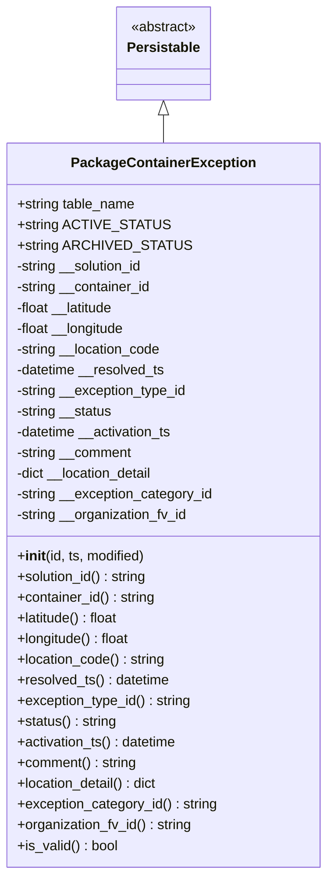
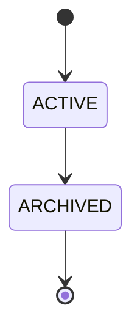
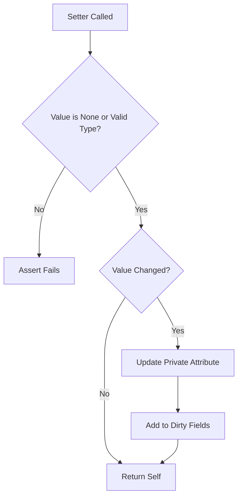

# Diagram: platform/partview_core/partview_service/partview_service/core/datamodel/PackageContainerException.py

> Auto-generated by Obscura crawlers

## Diagram 1

### SVG

<svg id="container" width="376.0390625" xmlns="http://www.w3.org/2000/svg" class="classDiagram" height="1014" viewBox="0 0 376.0390625 1014" role="graphics-document document" aria-roledescription="class"><g><defs><marker id="container_class-aggregationStart" class="marker aggregation class" refX="18" refY="7" markerWidth="190" markerHeight="240" orient="auto"><path d="M 18,7 L9,13 L1,7 L9,1 Z"></path></marker></defs><defs><marker id="container_class-aggregationEnd" class="marker aggregation class" refX="1" refY="7" markerWidth="20" markerHeight="28" orient="auto"><path d="M 18,7 L9,13 L1,7 L9,1 Z"></path></marker></defs><defs><marker id="container_class-extensionStart" class="marker extension class" refX="18" refY="7" markerWidth="190" markerHeight="240" orient="auto"><path d="M 1,7 L18,13 V 1 Z"></path></marker></defs><defs><marker id="container_class-extensionEnd" class="marker extension class" refX="1" refY="7" markerWidth="20" markerHeight="28" orient="auto"><path d="M 1,1 V 13 L18,7 Z"></path></marker></defs><defs><marker id="container_class-compositionStart" class="marker composition class" refX="18" refY="7" markerWidth="190" markerHeight="240" orient="auto"><path d="M 18,7 L9,13 L1,7 L9,1 Z"></path></marker></defs><defs><marker id="container_class-compositionEnd" class="marker composition class" refX="1" refY="7" markerWidth="20" markerHeight="28" orient="auto"><path d="M 18,7 L9,13 L1,7 L9,1 Z"></path></marker></defs><defs><marker id="container_class-dependencyStart" class="marker dependency class" refX="6" refY="7" markerWidth="190" markerHeight="240" orient="auto"><path d="M 5,7 L9,13 L1,7 L9,1 Z"></path></marker></defs><defs><marker id="container_class-dependencyEnd" class="marker dependency class" refX="13" refY="7" markerWidth="20" markerHeight="28" orient="auto"><path d="M 18,7 L9,13 L14,7 L9,1 Z"></path></marker></defs><defs><marker id="container_class-lollipopStart" class="marker lollipop class" refX="13" refY="7" markerWidth="190" markerHeight="240" orient="auto"><circle stroke="black" fill="transparent" cx="7" cy="7" r="6"></circle></marker></defs><defs><marker id="container_class-lollipopEnd" class="marker lollipop class" refX="1" refY="7" markerWidth="190" markerHeight="240" orient="auto"><circle stroke="black" fill="transparent" cx="7" cy="7" r="6"></circle></marker></defs><g class="root"><g class="clusters"></g><g class="edgePaths"><path d="M188.02,133.25L188.02,134.542C188.02,135.833,188.02,138.417,188.02,143.875C188.02,149.333,188.02,157.667,188.02,161.833L188.02,166" id="id_Persistable_PackageContainerException_1" class="edge-thickness-normal edge-pattern-solid relation" style=";;;" data-edge="true" data-et="edge" data-id="id_Persistable_PackageContainerException_1" data-points="W3sieCI6MTg4LjAxOTUzMTI1LCJ5IjoxMTZ9LHsieCI6MTg4LjAxOTUzMTI1LCJ5IjoxNDF9LHsieCI6MTg4LjAxOTUzMTI1LCJ5IjoxNjZ9XQ==" marker-start="url(#container_class-extensionStart)"></path></g><g class="edgeLabels"><g class="edgeLabel"><g class="label" data-id="id_Persistable_PackageContainerException_1" transform="translate(0, 0)"><foreignObject width="0" height="0">

</foreignObject></g></g></g><g class="nodes"><g class="node default" id="classId-Persistable-0" transform="translate(188.01953125, 62)"><g class="basic label-container"><path d="M-52.9765625 -54 L52.9765625 -54 L52.9765625 54 L-52.9765625 54" stroke="none" stroke-width="0" fill="#ECECFF" style=""></path><path d="M-52.9765625 -54 C-14.03573104242377 -54, 24.90510041515246 -54, 52.9765625 -54 M-52.9765625 -54 C-12.445872625236731 -54, 28.084817249526537 -54, 52.9765625 -54 M52.9765625 -54 C52.9765625 -24.834726292949256, 52.9765625 4.330547414101488, 52.9765625 54 M52.9765625 -54 C52.9765625 -17.948798857185253, 52.9765625 18.102402285629495, 52.9765625 54 M52.9765625 54 C11.78202438539077 54, -29.41251372921846 54, -52.9765625 54 M52.9765625 54 C28.669313920827395 54, 4.362065341654791 54, -52.9765625 54 M-52.9765625 54 C-52.9765625 25.91401906804907, -52.9765625 -2.1719618639018634, -52.9765625 -54 M-52.9765625 54 C-52.9765625 21.61909515415443, -52.9765625 -10.761809691691141, -52.9765625 -54" stroke="#9370DB" stroke-width="1.3" fill="none" stroke-dasharray="0 0" style=""></path></g><g class="annotation-group text" transform="translate(-38.609375, -30)"><g class="label" style="" transform="translate(0,-12)"><foreignObject width="77.21875" height="24">

«abstract»

</foreignObject></g></g><g class="label-group text" transform="translate(-40.9765625, -6)"><g class="label" style="font-weight: bolder" transform="translate(0,-12)"><foreignObject width="81.953125" height="24">

Persistable

</foreignObject></g></g><g class="members-group text" transform="translate(-40.9765625, 42)"></g><g class="methods-group text" transform="translate(-40.9765625, 72)"></g><g class="divider" style=""><path d="M-52.9765625 18 C-15.09083709946367 18, 22.79488830107266 18, 52.9765625 18 M-52.9765625 18 C-31.507786977783493 18, -10.039011455566985 18, 52.9765625 18" stroke="#9370DB" stroke-width="1.3" fill="none" stroke-dasharray="0 0" style=""></path></g><g class="divider" style=""><path d="M-52.9765625 36 C-24.014105741882062 36, 4.9483510162358755 36, 52.9765625 36 M-52.9765625 36 C-20.478532385211913 36, 12.019497729576173 36, 52.9765625 36" stroke="#9370DB" stroke-width="1.3" fill="none" stroke-dasharray="0 0" style=""></path></g></g><g class="node default" id="classId-PackageContainerException-1" transform="translate(188.01953125, 586)"><g class="basic label-container"><path d="M-180.01953125 -420 L180.01953125 -420 L180.01953125 420 L-180.01953125 420" stroke="none" stroke-width="0" fill="#ECECFF" style=""></path><path d="M-180.01953125 -420 C-99.85784540250879 -420, -19.696159555017573 -420, 180.01953125 -420 M-180.01953125 -420 C-37.2892013718498 -420, 105.4411285063004 -420, 180.01953125 -420 M180.01953125 -420 C180.01953125 -143.833041592675, 180.01953125 132.33391681465002, 180.01953125 420 M180.01953125 -420 C180.01953125 -87.68106060973503, 180.01953125 244.63787878052995, 180.01953125 420 M180.01953125 420 C89.98536970770964 420, -0.04879183458072589 420, -180.01953125 420 M180.01953125 420 C101.05324663503333 420, 22.086962020066665 420, -180.01953125 420 M-180.01953125 420 C-180.01953125 213.8797979469353, -180.01953125 7.759595893870596, -180.01953125 -420 M-180.01953125 420 C-180.01953125 160.5181997416678, -180.01953125 -98.96360051666443, -180.01953125 -420" stroke="#9370DB" stroke-width="1.3" fill="none" stroke-dasharray="0 0" style=""></path></g><g class="annotation-group text" transform="translate(0, -396)"></g><g class="label-group text" transform="translate(-101.1484375, -396)"><g class="label" style="font-weight: bolder" transform="translate(0,-12)"><foreignObject width="202.296875" height="24">

PackageContainerException

</foreignObject></g></g><g class="members-group text" transform="translate(-168.01953125, -348)"><g class="label" style="" transform="translate(0,-12)"><foreignObject width="139.578125" height="24">

+string table_name

</foreignObject></g><g class="label" style="" transform="translate(0,12)"><foreignObject width="161.796875" height="24">

+string ACTIVE_STATUS

</foreignObject></g><g class="label" style="" transform="translate(0,36)"><foreignObject width="183.921875" height="24">

+string ARCHIVED_STATUS

</foreignObject></g><g class="label" style="" transform="translate(0,60)"><foreignObject width="151.03125" height="24">

-string __solution_id

</foreignObject></g><g class="label" style="" transform="translate(0,84)"><foreignObject width="158.8125" height="24">

-string __container_id

</foreignObject></g><g class="label" style="" transform="translate(0,108)"><foreignObject width="116.8125" height="24">

-float __latitude

</foreignObject></g><g class="label" style="" transform="translate(0,132)"><foreignObject width="129.375" height="24">

-float __longitude

</foreignObject></g><g class="label" style="" transform="translate(0,156)"><foreignObject width="170.765625" height="24">

-string __location_code

</foreignObject></g><g class="label" style="" transform="translate(0,180)"><foreignObject width="175.53125" height="24">

-datetime __resolved_ts

</foreignObject></g><g class="label" style="" transform="translate(0,204)"><foreignObject width="201.109375" height="24">

-string __exception_type_id

</foreignObject></g><g class="label" style="" transform="translate(0,228)"><foreignObject width="113.203125" height="24">

-string __status

</foreignObject></g><g class="label" style="" transform="translate(0,252)"><foreignObject width="185.3125" height="24">

-datetime __activation_ts

</foreignObject></g><g class="label" style="" transform="translate(0,276)"><foreignObject width="136.453125" height="24">

-string __comment

</foreignObject></g><g class="label" style="" transform="translate(0,300)"><foreignObject width="163.53125" height="24">

-dict __location_detail

</foreignObject></g><g class="label" style="" transform="translate(0,324)"><foreignObject width="231.0625" height="24">

-string __exception_category_id

</foreignObject></g><g class="label" style="" transform="translate(0,348)"><foreignObject width="202" height="24">

-string __organization_fv_id

</foreignObject></g></g><g class="methods-group text" transform="translate(-168.01953125, 60)"><g class="label" style="" transform="translate(0,-12)"><foreignObject width="150.90625" height="24">

+<strong>init</strong>(id, ts, modified)

</foreignObject></g><g class="label" style="" transform="translate(0,12)"><foreignObject width="154.53125" height="24">

+solution_id() : string

</foreignObject></g><g class="label" style="" transform="translate(0,36)"><foreignObject width="162.625" height="24">

+container_id() : string

</foreignObject></g><g class="label" style="" transform="translate(0,60)"><foreignObject width="120.71875" height="24">

+latitude() : float

</foreignObject></g><g class="label" style="" transform="translate(0,84)"><foreignObject width="133.265625" height="24">

+longitude() : float

</foreignObject></g><g class="label" style="" transform="translate(0,108)"><foreignObject width="174.421875" height="24">

+location_code() : string

</foreignObject></g><g class="label" style="" transform="translate(0,132)"><foreignObject width="179.03125" height="24">

+resolved_ts() : datetime

</foreignObject></g><g class="label" style="" transform="translate(0,156)"><foreignObject width="204.9375" height="24">

+exception_type_id() : string

</foreignObject></g><g class="label" style="" transform="translate(0,180)"><foreignObject width="116.71875" height="24">

+status() : string

</foreignObject></g><g class="label" style="" transform="translate(0,204)"><foreignObject width="188.90625" height="24">

+activation_ts() : datetime

</foreignObject></g><g class="label" style="" transform="translate(0,228)"><foreignObject width="140.28125" height="24">

+comment() : string

</foreignObject></g><g class="label" style="" transform="translate(0,252)"><foreignObject width="167.1875" height="24">

+location_detail() : dict

</foreignObject></g><g class="label" style="" transform="translate(0,276)"><foreignObject width="234.890625" height="24">

+exception_category_id() : string

</foreignObject></g><g class="label" style="" transform="translate(0,300)"><foreignObject width="205.8125" height="24">

+organization_fv_id() : string

</foreignObject></g><g class="label" style="" transform="translate(0,324)"><foreignObject width="117.984375" height="24">

+is_valid() : bool

</foreignObject></g></g><g class="divider" style=""><path d="M-180.01953125 -372 C-72.25412708150864 -372, 35.511277086982716 -372, 180.01953125 -372 M-180.01953125 -372 C-38.302441902007615 -372, 103.41464744598477 -372, 180.01953125 -372" stroke="#9370DB" stroke-width="1.3" fill="none" stroke-dasharray="0 0" style=""></path></g><g class="divider" style=""><path d="M-180.01953125 36 C-52.345101252266446 36, 75.32932874546711 36, 180.01953125 36 M-180.01953125 36 C-85.50732146759536 36, 9.004888314809278 36, 180.01953125 36" stroke="#9370DB" stroke-width="1.3" fill="none" stroke-dasharray="0 0" style=""></path></g></g></g></g></g></svg>

## Diagram 2

### SVG

<svg id="container" width="103.03125" xmlns="http://www.w3.org/2000/svg" class="statediagram" height="274" viewBox="0 0 103.03125 274" role="graphics-document document" aria-roledescription="stateDiagram"><g><defs><marker id="container_stateDiagram-barbEnd" refX="19" refY="7" markerWidth="20" markerHeight="14" markerUnits="userSpaceOnUse" orient="auto"><path d="M 19,7 L9,13 L14,7 L9,1 Z"></path></marker></defs><g class="root"><g class="clusters"></g><g class="edgePaths"><path d="M51.516,22L51.516,26.167C51.516,30.333,51.516,38.667,51.599,47.083C51.682,55.5,51.849,64,51.932,68.25L52.016,72.5" id="edge0" class="edge-thickness-normal edge-pattern-solid transition" style="fill:none;;;fill:none" data-edge="true" data-et="edge" data-id="edge0" data-points="W3sieCI6NTEuNTE1NjI1LCJ5IjoyMn0seyJ4Ijo1MS41MTU2MjUsInkiOjQ3fSx7IngiOjUyLjAxNTYyNSwieSI6NzIuNX1d" marker-end="url(#container_stateDiagram-barbEnd)"></path><path d="M52.016,112.5L51.932,116.583C51.849,120.667,51.682,128.833,51.682,137.167C51.682,145.5,51.849,154,51.932,158.25L52.016,162.5" id="edge1" class="edge-thickness-normal edge-pattern-solid transition" style="fill:none;;;fill:none" data-edge="true" data-et="edge" data-id="edge1" data-points="W3sieCI6NTIuMDE1NjI1LCJ5IjoxMTIuNX0seyJ4Ijo1MS41MTU2MjUsInkiOjEzN30seyJ4Ijo1Mi4wMTU2MjUsInkiOjE2Mi41fV0=" marker-end="url(#container_stateDiagram-barbEnd)"></path><path d="M52.016,202.5L51.932,206.583C51.849,210.667,51.682,218.833,51.599,227.083C51.516,235.333,51.516,243.667,51.516,247.833L51.516,252" id="edge2" class="edge-thickness-normal edge-pattern-solid transition" style="fill:none;;;fill:none" data-edge="true" data-et="edge" data-id="edge2" data-points="W3sieCI6NTIuMDE1NjI1LCJ5IjoyMDIuNX0seyJ4Ijo1MS41MTU2MjUsInkiOjIyN30seyJ4Ijo1MS41MTU2MjUsInkiOjI1Mn1d" marker-end="url(#container_stateDiagram-barbEnd)"></path></g><g class="edgeLabels"><g class="edgeLabel"><g class="label" data-id="edge0" transform="translate(0, 0)"><foreignObject width="0" height="0">

</foreignObject></g></g><g class="edgeLabel"><g class="label" data-id="edge1" transform="translate(0, 0)"><foreignObject width="0" height="0">

</foreignObject></g></g><g class="edgeLabel"><g class="label" data-id="edge2" transform="translate(0, 0)"><foreignObject width="0" height="0">

</foreignObject></g></g></g><g class="nodes"><g class="node default" id="state-root_start-0" transform="translate(51.515625, 15)"><circle class="state-start" r="7" width="14" height="14"></circle></g><g class="node  statediagram-state" id="state-ACTIVE-1" transform="translate(51.515625, 92)"><g class="basic label-container outer-path"><path d="M-27.1328125 -20 C-11.479659684697893 -20, 4.173493130604214 -20, 27.1328125 -20 C27.1328125 -20, 27.1328125 -20, 27.1328125 -20 C27.260917712729327 -19.994701529208587, 27.389022925458658 -19.989403058417174, 27.545709227361662 -19.982922465033347 C27.667891096638314 -19.96769251091082, 27.79007296591497 -19.95246255678829, 27.95578545140367 -19.931806517013612 C28.04428515743626 -19.91325008003759, 28.132784863468846 -19.894693643061565, 28.360239935703998 -19.847001329696653 C28.483249288498918 -19.81037985867643, 28.606258641293838 -19.77375838765621, 28.756309846023417 -19.729086208503173 C28.89701537674265 -19.674182740044873, 29.037720907461882 -19.619279271586574, 29.141289623264846 -19.578866633275286 C29.285547582434358 -19.50834321434258, 29.429805541603873 -19.437819795409876, 29.51254946518537 -19.397368756032446 C29.627005990615988 -19.329167470373207, 29.74146251604661 -19.260966184713972, 29.867553290612136 -19.185832391312644 C29.94108696415974 -19.13333035752783, 30.014620637707345 -19.080828323743017, 30.20387606344834 -18.94570254698197 C30.289984381397446 -18.87277252185999, 30.37609269934655 -18.79984249673801, 30.519220358128706 -18.678619553365657 C30.599826547708215 -18.598013363786148, 30.680432737287727 -18.517407174206635, 30.811432053365657 -18.386407858128706 C30.8707064388979 -18.316422723376434, 30.92998082443015 -18.24643758862416, 31.07851504698197 -18.07106356344834 C31.156917852867988 -17.961253601478713, 31.235320658754006 -17.851443639509085, 31.318644891312644 -17.734740790612136 C31.38050377648819 -17.630928186556837, 31.442362661663736 -17.527115582501537, 31.530181256032446 -17.37973696518537 C31.58956563158317 -17.25826428344148, 31.648950007133895 -17.13679160169759, 31.711679133275286 -17.008477123264846 C31.750330089336124 -16.90942321213578, 31.78898104539696 -16.810369301006713, 31.861898708503173 -16.623497346023417 C31.894119341774328 -16.51527014665344, 31.926339975045487 -16.407042947283458, 31.979813829696653 -16.227427435703994 C32.00638823808418 -16.100688270565538, 32.0329626464717 -15.97394910542708, 32.06461901701361 -15.82297295140367 C32.083212182504674 -15.67380981557336, 32.101805347995736 -15.52464667974305, 32.11573496503335 -15.412896727361662 C32.12012519096456 -15.306750850751625, 32.12451541689576 -15.200604974141589, 32.1328125 -15 C32.1328125 -15, 32.1328125 -15, 32.1328125 -15 C32.1328125 -8.35502174377407, 32.1328125 -1.710043487548143, 32.1328125 15 C32.1328125 15, 32.1328125 15, 32.1328125 15 C32.12802071682507 15.115854635637932, 32.12322893365014 15.231709271275866, 32.11573496503335 15.412896727361662 C32.10177163086756 15.524917174434915, 32.087808296701766 15.636937621508167, 32.06461901701361 15.822972951403669 C32.03662288983049 15.956492604392997, 32.008626762647374 16.090012257382323, 31.979813829696653 16.227427435703994 C31.9521192885451 16.32045175963473, 31.92442474739354 16.413476083565463, 31.861898708503173 16.623497346023417 C31.80685257628076 16.764568492635554, 31.75180644405835 16.905639639247692, 31.711679133275286 17.008477123264846 C31.661120701515035 17.111896048423656, 31.610562269754787 17.215314973582462, 31.530181256032446 17.379736965185366 C31.45990121132857 17.49768209842091, 31.389621166624696 17.615627231656454, 31.318644891312644 17.734740790612133 C31.250626451422555 17.830006543070315, 31.182608011532462 17.925272295528497, 31.07851504698197 18.07106356344834 C30.98247758563225 18.184454779797093, 30.886440124282533 18.297845996145846, 30.811432053365657 18.386407858128706 C30.725197980415512 18.47264193107885, 30.638963907465364 18.558876004029, 30.519220358128706 18.678619553365657 C30.395776508398374 18.783171160880602, 30.272332658668045 18.887722768395548, 30.20387606344834 18.94570254698197 C30.080465649400416 19.033815889008157, 29.957055235352488 19.121929231034347, 29.867553290612136 19.185832391312644 C29.769686872475457 19.244148118744295, 29.67182045433878 19.30246384617595, 29.51254946518537 19.397368756032446 C29.429976421344925 19.437736257394818, 29.347403377504484 19.47810375875719, 29.141289623264846 19.578866633275286 C29.029452041529563 19.622505793085626, 28.91761445979428 19.66614495289597, 28.756309846023417 19.729086208503173 C28.635333214561197 19.765102512162652, 28.514356583098976 19.80111881582213, 28.360239935703998 19.847001329696653 C28.272292830502277 19.865441898463047, 28.184345725300556 19.88388246722944, 27.95578545140367 19.931806517013612 C27.860238002898512 19.943716494049266, 27.764690554393354 19.95562647108492, 27.545709227361662 19.982922465033347 C27.424634904328382 19.987930136075878, 27.303560581295102 19.99293780711841, 27.1328125 20 C27.1328125 20, 27.1328125 20, 27.1328125 20 C8.179840948630847 20, -10.773130602738306 20, -27.1328125 20 C-27.1328125 20, -27.1328125 20, -27.1328125 20 C-27.24393968086977 19.995403745800612, -27.35506686173954 19.990807491601227, -27.545709227361662 19.982922465033347 C-27.653405992834312 19.969498077217022, -27.76110275830696 19.9560736894007, -27.95578545140367 19.931806517013612 C-28.084971487531973 19.90471905373193, -28.214157523660276 19.87763159045025, -28.360239935703994 19.847001329696653 C-28.46438713406702 19.81599536535305, -28.568534332430048 19.784989401009447, -28.756309846023417 19.729086208503173 C-28.838132838724704 19.697158777676712, -28.919955831425987 19.665231346850252, -29.141289623264846 19.578866633275286 C-29.26283849028136 19.519445013014263, -29.38438735729787 19.460023392753236, -29.51254946518537 19.397368756032446 C-29.61505624643043 19.33628797236021, -29.717563027675496 19.275207188687972, -29.867553290612133 19.185832391312644 C-29.973876359799316 19.10991917902145, -30.080199428986504 19.034005966730255, -30.20387606344834 18.94570254698197 C-30.277368127229206 18.883457944074124, -30.350860191010074 18.821213341166274, -30.519220358128706 18.67861955336566 C-30.61416122256364 18.583678688930725, -30.709102086998577 18.488737824495786, -30.811432053365657 18.386407858128706 C-30.881211955814653 18.30401888299143, -30.95099185826365 18.221629907854155, -31.078515046981966 18.07106356344834 C-31.15639717586922 17.961982854989305, -31.234279304756473 17.85290214653027, -31.318644891312644 17.734740790612133 C-31.38107635671679 17.6299672729485, -31.44350782212094 17.525193755284867, -31.530181256032446 17.37973696518537 C-31.601905923650765 17.233021812554956, -31.673630591269085 17.086306659924546, -31.711679133275286 17.00847712326485 C-31.765306555239405 16.8710418194407, -31.81893397720353 16.73360651561655, -31.861898708503173 16.623497346023417 C-31.908273036148866 16.467728725291423, -31.954647363794564 16.311960104559432, -31.979813829696653 16.227427435703994 C-32.004963119008096 16.107484975097634, -32.03011240831954 15.987542514491278, -32.06461901701361 15.82297295140367 C-32.08411305375358 15.666582601867795, -32.103607090493554 15.510192252331917, -32.11573496503335 15.412896727361664 C-32.12222144489902 15.25606810344948, -32.12870792476469 15.099239479537294, -32.1328125 15 C-32.1328125 15, -32.1328125 15, -32.1328125 15 C-32.1328125 7.089196201295706, -32.1328125 -0.8216075974085886, -32.1328125 -15 C-32.1328125 -15, -32.1328125 -15, -32.1328125 -15 C-32.128643076746506 -15.100807360061987, -32.124473653493006 -15.201614720123974, -32.11573496503335 -15.41289672736166 C-32.102310705677716 -15.520592462262101, -32.088886446322086 -15.62828819716254, -32.06461901701361 -15.822972951403669 C-32.04243366843277 -15.928779730483694, -32.02024831985194 -16.034586509563717, -31.979813829696653 -16.227427435703994 C-31.95152449260632 -16.322449643975133, -31.92323515551599 -16.417471852246273, -31.861898708503173 -16.623497346023417 C-31.81555686415306 -16.742261314619387, -31.769215019802942 -16.861025283215355, -31.71167913327529 -17.008477123264846 C-31.644582733506603 -17.14572500268896, -31.577486333737916 -17.282972882113075, -31.530181256032446 -17.379736965185366 C-31.44830338443381 -17.51714576330771, -31.366425512835175 -17.65455456143005, -31.318644891312644 -17.734740790612133 C-31.259008359735322 -17.818266950046105, -31.199371828158 -17.901793109480078, -31.07851504698197 -18.07106356344834 C-30.981923290389297 -18.185109234953778, -30.885331533796624 -18.299154906459215, -30.81143205336566 -18.386407858128706 C-30.728367243952306 -18.46947266754206, -30.64530243453895 -18.55253747695541, -30.519220358128706 -18.678619553365657 C-30.43757445360211 -18.74777010711066, -30.355928549075514 -18.81692066085566, -30.20387606344834 -18.945702546981966 C-30.069715911957566 -19.041491054019964, -29.935555760466794 -19.137279561057962, -29.867553290612136 -19.185832391312644 C-29.728418739502978 -19.2687385884872, -29.589284188393815 -19.351644785661755, -29.512549465185366 -19.397368756032446 C-29.4346414742452 -19.43545565199929, -29.356733483305035 -19.473542547966137, -29.14128962326485 -19.578866633275286 C-29.048078956711052 -19.61523754822763, -28.954868290157258 -19.65160846317997, -28.75630984602342 -19.729086208503173 C-28.665917411609186 -19.75599720219702, -28.575524977194956 -19.78290819589086, -28.360239935703994 -19.847001329696653 C-28.21912308882436 -19.876590420923836, -28.078006241944724 -19.906179512151024, -27.955785451403674 -19.931806517013612 C-27.823710902536916 -19.948269592361065, -27.69163635367016 -19.96473266770852, -27.545709227361662 -19.982922465033347 C-27.394774064615568 -19.989165189542124, -27.24383890186947 -19.995407914050897, -27.1328125 -20 C-27.1328125 -20, -27.1328125 -20, -27.1328125 -20" stroke="none" stroke-width="0" fill="#ECECFF" style=""></path><path d="M-27.1328125 -20 C-16.2489008692787 -20, -5.364989238557396 -20, 27.1328125 -20 M-27.1328125 -20 C-12.305332923324855 -20, 2.5221466533502905 -20, 27.1328125 -20 M27.1328125 -20 C27.1328125 -20, 27.1328125 -20, 27.1328125 -20 M27.1328125 -20 C27.1328125 -20, 27.1328125 -20, 27.1328125 -20 M27.1328125 -20 C27.24358940740012 -19.995418233218484, 27.354366314800238 -19.990836466436964, 27.545709227361662 -19.982922465033347 M27.1328125 -20 C27.23828172237222 -19.995637760695086, 27.343750944744443 -19.991275521390172, 27.545709227361662 -19.982922465033347 M27.545709227361662 -19.982922465033347 C27.654647389210776 -19.96934333732007, 27.763585551059894 -19.955764209606794, 27.95578545140367 -19.931806517013612 M27.545709227361662 -19.982922465033347 C27.67445449483811 -19.96687438417841, 27.803199762314556 -19.950826303323474, 27.95578545140367 -19.931806517013612 M27.95578545140367 -19.931806517013612 C28.046317246427137 -19.912823995782855, 28.136849041450603 -19.8938414745521, 28.360239935703998 -19.847001329696653 M27.95578545140367 -19.931806517013612 C28.044827112035506 -19.913136444107984, 28.133868772667338 -19.894466371202352, 28.360239935703998 -19.847001329696653 M28.360239935703998 -19.847001329696653 C28.489084618516973 -19.808642605660346, 28.617929301329948 -19.77028388162404, 28.756309846023417 -19.729086208503173 M28.360239935703998 -19.847001329696653 C28.50395632731815 -19.804215106120605, 28.647672718932306 -19.761428882544553, 28.756309846023417 -19.729086208503173 M28.756309846023417 -19.729086208503173 C28.86720434166913 -19.685815042026906, 28.978098837314846 -19.64254387555064, 29.141289623264846 -19.578866633275286 M28.756309846023417 -19.729086208503173 C28.851562174375694 -19.691918634644942, 28.94681450272797 -19.65475106078671, 29.141289623264846 -19.578866633275286 M29.141289623264846 -19.578866633275286 C29.233590371439657 -19.533743547042757, 29.325891119614468 -19.488620460810232, 29.51254946518537 -19.397368756032446 M29.141289623264846 -19.578866633275286 C29.268610570896605 -19.516623214746172, 29.395931518528368 -19.45437979621706, 29.51254946518537 -19.397368756032446 M29.51254946518537 -19.397368756032446 C29.600438731005337 -19.34499812096366, 29.6883279968253 -19.292627485894876, 29.867553290612136 -19.185832391312644 M29.51254946518537 -19.397368756032446 C29.653376259773392 -19.313454200614682, 29.794203054361414 -19.22953964519692, 29.867553290612136 -19.185832391312644 M29.867553290612136 -19.185832391312644 C29.97149700129771 -19.111618008338834, 30.075440711983283 -19.037403625365027, 30.20387606344834 -18.94570254698197 M29.867553290612136 -19.185832391312644 C29.94268229053603 -19.132191316388376, 30.017811290459925 -19.07855024146411, 30.20387606344834 -18.94570254698197 M30.20387606344834 -18.94570254698197 C30.286574623527095 -18.875660439462695, 30.36927318360585 -18.80561833194342, 30.519220358128706 -18.678619553365657 M30.20387606344834 -18.94570254698197 C30.27920348202803 -18.881903477853275, 30.35453090060772 -18.818104408724576, 30.519220358128706 -18.678619553365657 M30.519220358128706 -18.678619553365657 C30.586003260794623 -18.61183665069974, 30.65278616346054 -18.545053748033823, 30.811432053365657 -18.386407858128706 M30.519220358128706 -18.678619553365657 C30.592545208189247 -18.605294703305116, 30.66587005824979 -18.531969853244572, 30.811432053365657 -18.386407858128706 M30.811432053365657 -18.386407858128706 C30.884306502067435 -18.300365159134937, 30.957180950769214 -18.21432246014117, 31.07851504698197 -18.07106356344834 M30.811432053365657 -18.386407858128706 C30.874133366161725 -18.31237655800177, 30.936834678957798 -18.238345257874837, 31.07851504698197 -18.07106356344834 M31.07851504698197 -18.07106356344834 C31.14829331257208 -17.973333021739204, 31.218071578162192 -17.87560248003007, 31.318644891312644 -17.734740790612136 M31.07851504698197 -18.07106356344834 C31.146888992278274 -17.97529989468863, 31.21526293757458 -17.879536225928916, 31.318644891312644 -17.734740790612136 M31.318644891312644 -17.734740790612136 C31.39819523785749 -17.601238083525093, 31.477745584402335 -17.467735376438053, 31.530181256032446 -17.37973696518537 M31.318644891312644 -17.734740790612136 C31.3835505578658 -17.625815027664643, 31.44845622441895 -17.516889264717147, 31.530181256032446 -17.37973696518537 M31.530181256032446 -17.37973696518537 C31.572922098063128 -17.292309175412214, 31.61566294009381 -17.20488138563906, 31.711679133275286 -17.008477123264846 M31.530181256032446 -17.37973696518537 C31.589145877400654 -17.259122904345563, 31.648110498768858 -17.138508843505754, 31.711679133275286 -17.008477123264846 M31.711679133275286 -17.008477123264846 C31.74944008677608 -16.911704093217956, 31.78720104027687 -16.81493106317107, 31.861898708503173 -16.623497346023417 M31.711679133275286 -17.008477123264846 C31.75255695856172 -16.903716235417757, 31.793434783848156 -16.798955347570672, 31.861898708503173 -16.623497346023417 M31.861898708503173 -16.623497346023417 C31.904398766861227 -16.48074216643263, 31.946898825219282 -16.33798698684184, 31.979813829696653 -16.227427435703994 M31.861898708503173 -16.623497346023417 C31.899997915916785 -16.49552436418006, 31.938097123330397 -16.3675513823367, 31.979813829696653 -16.227427435703994 M31.979813829696653 -16.227427435703994 C32.00207801226185 -16.12124468011243, 32.02434219482704 -16.01506192452086, 32.06461901701361 -15.82297295140367 M31.979813829696653 -16.227427435703994 C32.00234082164925 -16.119991284670316, 32.024867813601844 -16.012555133636642, 32.06461901701361 -15.82297295140367 M32.06461901701361 -15.82297295140367 C32.077959309349744 -15.715950839504155, 32.091299601685876 -15.608928727604637, 32.11573496503335 -15.412896727361662 M32.06461901701361 -15.82297295140367 C32.08417907248211 -15.666052968515428, 32.103739127950604 -15.509132985627184, 32.11573496503335 -15.412896727361662 M32.11573496503335 -15.412896727361662 C32.121421695361356 -15.275404264520466, 32.12710842568936 -15.137911801679268, 32.1328125 -15 M32.11573496503335 -15.412896727361662 C32.11919383997283 -15.329268841624463, 32.122652714912306 -15.245640955887263, 32.1328125 -15 M32.1328125 -15 C32.1328125 -15, 32.1328125 -15, 32.1328125 -15 M32.1328125 -15 C32.1328125 -15, 32.1328125 -15, 32.1328125 -15 M32.1328125 -15 C32.1328125 -7.572145525662156, 32.1328125 -0.14429105132431275, 32.1328125 15 M32.1328125 -15 C32.1328125 -6.07192424261463, 32.1328125 2.8561515147707404, 32.1328125 15 M32.1328125 15 C32.1328125 15, 32.1328125 15, 32.1328125 15 M32.1328125 15 C32.1328125 15, 32.1328125 15, 32.1328125 15 M32.1328125 15 C32.128023170592094 15.115795309021019, 32.12323384118419 15.23159061804204, 32.11573496503335 15.412896727361662 M32.1328125 15 C32.127525469677394 15.12782860769594, 32.12223843935479 15.255657215391881, 32.11573496503335 15.412896727361662 M32.11573496503335 15.412896727361662 C32.1024289008481 15.51964424490433, 32.08912283666285 15.626391762446996, 32.06461901701361 15.822972951403669 M32.11573496503335 15.412896727361662 C32.09959116220395 15.542409921627414, 32.08344735937455 15.671923115893163, 32.06461901701361 15.822972951403669 M32.06461901701361 15.822972951403669 C32.03080327851552 15.984247603440725, 31.996987540017432 16.14552225547778, 31.979813829696653 16.227427435703994 M32.06461901701361 15.822972951403669 C32.04186012427121 15.931515088018154, 32.01910123152881 16.040057224632637, 31.979813829696653 16.227427435703994 M31.979813829696653 16.227427435703994 C31.943488156276562 16.34944322187429, 31.90716248285647 16.471459008044583, 31.861898708503173 16.623497346023417 M31.979813829696653 16.227427435703994 C31.942262934085047 16.353558670670022, 31.90471203847344 16.47968990563605, 31.861898708503173 16.623497346023417 M31.861898708503173 16.623497346023417 C31.817237268171493 16.73795480820229, 31.772575827839812 16.85241227038116, 31.711679133275286 17.008477123264846 M31.861898708503173 16.623497346023417 C31.827924619655807 16.710565473706495, 31.793950530808438 16.797633601389578, 31.711679133275286 17.008477123264846 M31.711679133275286 17.008477123264846 C31.65365509941397 17.127167181607074, 31.595631065552652 17.245857239949302, 31.530181256032446 17.379736965185366 M31.711679133275286 17.008477123264846 C31.664337275496884 17.105316441178836, 31.61699541771848 17.202155759092825, 31.530181256032446 17.379736965185366 M31.530181256032446 17.379736965185366 C31.469019467918553 17.482379689423983, 31.407857679804657 17.585022413662596, 31.318644891312644 17.734740790612133 M31.530181256032446 17.379736965185366 C31.470073007641144 17.48061162163925, 31.409964759249842 17.58148627809314, 31.318644891312644 17.734740790612133 M31.318644891312644 17.734740790612133 C31.251661766125952 17.828556494606847, 31.18467864093926 17.922372198601558, 31.07851504698197 18.07106356344834 M31.318644891312644 17.734740790612133 C31.237366315224303 17.848578519355943, 31.156087739135966 17.962416248099757, 31.07851504698197 18.07106356344834 M31.07851504698197 18.07106356344834 C31.011013921443308 18.15076199177171, 30.943512795904645 18.230460420095074, 30.811432053365657 18.386407858128706 M31.07851504698197 18.07106356344834 C30.99081110121065 18.17461541654638, 30.903107155439333 18.278167269644424, 30.811432053365657 18.386407858128706 M30.811432053365657 18.386407858128706 C30.7381371556386 18.459702755855762, 30.66484225791154 18.53299765358282, 30.519220358128706 18.678619553365657 M30.811432053365657 18.386407858128706 C30.742162713735603 18.45567719775876, 30.67289337410555 18.524946537388814, 30.519220358128706 18.678619553365657 M30.519220358128706 18.678619553365657 C30.430736469267863 18.753561584416897, 30.34225258040702 18.828503615468136, 30.20387606344834 18.94570254698197 M30.519220358128706 18.678619553365657 C30.4444486715691 18.741947941482913, 30.36967698500949 18.805276329600172, 30.20387606344834 18.94570254698197 M30.20387606344834 18.94570254698197 C30.076925692472393 19.036343369674707, 29.949975321496446 19.12698419236744, 29.867553290612136 19.185832391312644 M30.20387606344834 18.94570254698197 C30.099000992599404 19.020581908331042, 29.994125921750467 19.09546126968011, 29.867553290612136 19.185832391312644 M29.867553290612136 19.185832391312644 C29.752910961189183 19.254144392119926, 29.63826863176623 19.322456392927208, 29.51254946518537 19.397368756032446 M29.867553290612136 19.185832391312644 C29.76536827327665 19.246721445310847, 29.663183255941163 19.30761049930905, 29.51254946518537 19.397368756032446 M29.51254946518537 19.397368756032446 C29.40180044232509 19.451510654202412, 29.29105141946481 19.505652552372382, 29.141289623264846 19.578866633275286 M29.51254946518537 19.397368756032446 C29.376528073079665 19.463865562687033, 29.24050668097396 19.530362369341617, 29.141289623264846 19.578866633275286 M29.141289623264846 19.578866633275286 C29.028616019666067 19.62283200982905, 28.91594241606729 19.666797386382814, 28.756309846023417 19.729086208503173 M29.141289623264846 19.578866633275286 C28.99673268480595 19.635272925697034, 28.85217574634705 19.691679218118782, 28.756309846023417 19.729086208503173 M28.756309846023417 19.729086208503173 C28.59811672805023 19.776182340251072, 28.439923610077045 19.823278471998975, 28.360239935703998 19.847001329696653 M28.756309846023417 19.729086208503173 C28.61376394626443 19.771523961555808, 28.471218046505445 19.813961714608443, 28.360239935703998 19.847001329696653 M28.360239935703998 19.847001329696653 C28.239654917473224 19.872285349173826, 28.11906989924245 19.897569368651002, 27.95578545140367 19.931806517013612 M28.360239935703998 19.847001329696653 C28.243120219133512 19.87155875182402, 28.126000502563027 19.896116173951384, 27.95578545140367 19.931806517013612 M27.95578545140367 19.931806517013612 C27.836952671613915 19.94661900756696, 27.718119891824163 19.9614314981203, 27.545709227361662 19.982922465033347 M27.95578545140367 19.931806517013612 C27.855195828235384 19.944345000465578, 27.754606205067095 19.95688348391754, 27.545709227361662 19.982922465033347 M27.545709227361662 19.982922465033347 C27.389088453460655 19.989400348158963, 27.23246767955965 19.995878231284582, 27.1328125 20 M27.545709227361662 19.982922465033347 C27.438391152525796 19.9873611734418, 27.33107307768993 19.991799881850255, 27.1328125 20 M27.1328125 20 C27.1328125 20, 27.1328125 20, 27.1328125 20 M27.1328125 20 C27.1328125 20, 27.1328125 20, 27.1328125 20 M27.1328125 20 C13.103585468898771 20, -0.9256415622024576 20, -27.1328125 20 M27.1328125 20 C10.23382512426895 20, -6.6651622514621 20, -27.1328125 20 M-27.1328125 20 C-27.1328125 20, -27.1328125 20, -27.1328125 20 M-27.1328125 20 C-27.1328125 20, -27.1328125 20, -27.1328125 20 M-27.1328125 20 C-27.254850783012746 19.9949524592778, -27.376889066025495 19.989904918555602, -27.545709227361662 19.982922465033347 M-27.1328125 20 C-27.234026036919424 19.99581377714741, -27.335239573838848 19.991627554294826, -27.545709227361662 19.982922465033347 M-27.545709227361662 19.982922465033347 C-27.640830850145026 19.97106556711856, -27.73595247292839 19.959208669203775, -27.95578545140367 19.931806517013612 M-27.545709227361662 19.982922465033347 C-27.677696722854943 19.96647024087758, -27.809684218348227 19.950018016721813, -27.95578545140367 19.931806517013612 M-27.95578545140367 19.931806517013612 C-28.068609685600034 19.908149762826632, -28.181433919796394 19.884493008639648, -28.360239935703994 19.847001329696653 M-27.95578545140367 19.931806517013612 C-28.11438478850714 19.898551733067595, -28.272984125610616 19.865296949121575, -28.360239935703994 19.847001329696653 M-28.360239935703994 19.847001329696653 C-28.499031609415983 19.805681258163837, -28.63782328312797 19.764361186631017, -28.756309846023417 19.729086208503173 M-28.360239935703994 19.847001329696653 C-28.45834766613569 19.817793392859084, -28.556455396567387 19.78858545602152, -28.756309846023417 19.729086208503173 M-28.756309846023417 19.729086208503173 C-28.841389715309646 19.695887940489715, -28.92646958459588 19.66268967247626, -29.141289623264846 19.578866633275286 M-28.756309846023417 19.729086208503173 C-28.882691872163203 19.67977178887522, -29.00907389830299 19.630457369247274, -29.141289623264846 19.578866633275286 M-29.141289623264846 19.578866633275286 C-29.263632975871076 19.51905661267641, -29.385976328477305 19.45924659207753, -29.51254946518537 19.397368756032446 M-29.141289623264846 19.578866633275286 C-29.22358540891376 19.5386346751835, -29.305881194562676 19.498402717091714, -29.51254946518537 19.397368756032446 M-29.51254946518537 19.397368756032446 C-29.598573063159343 19.34610981769944, -29.684596661133316 19.294850879366432, -29.867553290612133 19.185832391312644 M-29.51254946518537 19.397368756032446 C-29.612155316799992 19.33801655122156, -29.71176116841461 19.278664346410675, -29.867553290612133 19.185832391312644 M-29.867553290612133 19.185832391312644 C-29.988165554506615 19.099716890096026, -30.108777818401098 19.01360138887941, -30.20387606344834 18.94570254698197 M-29.867553290612133 19.185832391312644 C-29.98701304637241 19.10053976508758, -30.10647280213269 19.015247138862513, -30.20387606344834 18.94570254698197 M-30.20387606344834 18.94570254698197 C-30.26720207402622 18.89206815192795, -30.330528084604097 18.838433756873933, -30.519220358128706 18.67861955336566 M-30.20387606344834 18.94570254698197 C-30.324852341775994 18.843240865837366, -30.44582862010365 18.740779184692762, -30.519220358128706 18.67861955336566 M-30.519220358128706 18.67861955336566 C-30.619729029443334 18.578110882051032, -30.720237700757963 18.4776022107364, -30.811432053365657 18.386407858128706 M-30.519220358128706 18.67861955336566 C-30.623092619239653 18.574747292254713, -30.726964880350597 18.470875031143766, -30.811432053365657 18.386407858128706 M-30.811432053365657 18.386407858128706 C-30.91084872749004 18.269026812796184, -31.010265401614422 18.151645767463666, -31.078515046981966 18.07106356344834 M-30.811432053365657 18.386407858128706 C-30.906069396517463 18.274669758212454, -31.000706739669273 18.162931658296205, -31.078515046981966 18.07106356344834 M-31.078515046981966 18.07106356344834 C-31.16083229415441 17.955771085337393, -31.243149541326854 17.840478607226448, -31.318644891312644 17.734740790612133 M-31.078515046981966 18.07106356344834 C-31.173144586593832 17.938526646834806, -31.267774126205698 17.805989730221267, -31.318644891312644 17.734740790612133 M-31.318644891312644 17.734740790612133 C-31.39533377984829 17.606040229675752, -31.472022668383936 17.477339668739372, -31.530181256032446 17.37973696518537 M-31.318644891312644 17.734740790612133 C-31.377778941057592 17.635501050436776, -31.43691299080254 17.536261310261416, -31.530181256032446 17.37973696518537 M-31.530181256032446 17.37973696518537 C-31.570082015413018 17.29811865732869, -31.60998277479359 17.216500349472014, -31.711679133275286 17.00847712326485 M-31.530181256032446 17.37973696518537 C-31.58544982338789 17.266683303670078, -31.640718390743338 17.153629642154783, -31.711679133275286 17.00847712326485 M-31.711679133275286 17.00847712326485 C-31.7590171349879 16.88716022214374, -31.806355136700514 16.765843321022633, -31.861898708503173 16.623497346023417 M-31.711679133275286 17.00847712326485 C-31.745974515891994 16.920585590219567, -31.780269898508703 16.832694057174287, -31.861898708503173 16.623497346023417 M-31.861898708503173 16.623497346023417 C-31.89824498925412 16.501412341048933, -31.934591270005072 16.37932733607445, -31.979813829696653 16.227427435703994 M-31.861898708503173 16.623497346023417 C-31.897254162232787 16.5047404703466, -31.932609615962402 16.385983594669785, -31.979813829696653 16.227427435703994 M-31.979813829696653 16.227427435703994 C-32.00147126607495 16.12413838536663, -32.02312870245324 16.02084933502927, -32.06461901701361 15.82297295140367 M-31.979813829696653 16.227427435703994 C-32.00907867774746 16.087856975440996, -32.038343525798275 15.948286515177996, -32.06461901701361 15.82297295140367 M-32.06461901701361 15.82297295140367 C-32.081454315860995 15.68791225020551, -32.09828961470838 15.552851549007352, -32.11573496503335 15.412896727361664 M-32.06461901701361 15.82297295140367 C-32.07723449139213 15.72176567073961, -32.089849965770654 15.620558390075548, -32.11573496503335 15.412896727361664 M-32.11573496503335 15.412896727361664 C-32.12041769948373 15.299678646798881, -32.12510043393412 15.186460566236098, -32.1328125 15 M-32.11573496503335 15.412896727361664 C-32.11983839819738 15.313684860562025, -32.12394183136142 15.214472993762385, -32.1328125 15 M-32.1328125 15 C-32.1328125 15, -32.1328125 15, -32.1328125 15 M-32.1328125 15 C-32.1328125 15, -32.1328125 15, -32.1328125 15 M-32.1328125 15 C-32.1328125 7.608687883439788, -32.1328125 0.2173757668795755, -32.1328125 -15 M-32.1328125 15 C-32.1328125 3.2879657673506664, -32.1328125 -8.424068465298667, -32.1328125 -15 M-32.1328125 -15 C-32.1328125 -15, -32.1328125 -15, -32.1328125 -15 M-32.1328125 -15 C-32.1328125 -15, -32.1328125 -15, -32.1328125 -15 M-32.1328125 -15 C-32.12741517913704 -15.130495187109185, -32.12201785827408 -15.26099037421837, -32.11573496503335 -15.41289672736166 M-32.1328125 -15 C-32.12805588093597 -15.115004445821995, -32.123299261871935 -15.23000889164399, -32.11573496503335 -15.41289672736166 M-32.11573496503335 -15.41289672736166 C-32.10134559580971 -15.528335028443262, -32.08695622658608 -15.643773329524864, -32.06461901701361 -15.822972951403669 M-32.11573496503335 -15.41289672736166 C-32.09626254029161 -15.569113695262743, -32.076790115549876 -15.725330663163827, -32.06461901701361 -15.822972951403669 M-32.06461901701361 -15.822972951403669 C-32.04566931421257 -15.913348228158803, -32.02671961141152 -16.003723504913935, -31.979813829696653 -16.227427435703994 M-32.06461901701361 -15.822972951403669 C-32.04210209034233 -15.930361098909582, -32.01958516367105 -16.037749246415498, -31.979813829696653 -16.227427435703994 M-31.979813829696653 -16.227427435703994 C-31.937828430402696 -16.36845390597151, -31.895843031108736 -16.50948037623903, -31.861898708503173 -16.623497346023417 M-31.979813829696653 -16.227427435703994 C-31.954969322410836 -16.310878664630582, -31.93012481512502 -16.39432989355717, -31.861898708503173 -16.623497346023417 M-31.861898708503173 -16.623497346023417 C-31.82452769510368 -16.71927104523671, -31.787156681704182 -16.815044744450006, -31.71167913327529 -17.008477123264846 M-31.861898708503173 -16.623497346023417 C-31.804876106873746 -16.769633749616105, -31.747853505244315 -16.915770153208793, -31.71167913327529 -17.008477123264846 M-31.71167913327529 -17.008477123264846 C-31.643179052915485 -17.14859627723102, -31.57467897255568 -17.288715431197197, -31.530181256032446 -17.379736965185366 M-31.71167913327529 -17.008477123264846 C-31.673096214703875 -17.08739974465997, -31.63451329613246 -17.16632236605509, -31.530181256032446 -17.379736965185366 M-31.530181256032446 -17.379736965185366 C-31.472808892898794 -17.476020213756826, -31.415436529765145 -17.572303462328286, -31.318644891312644 -17.734740790612133 M-31.530181256032446 -17.379736965185366 C-31.450535914848512 -17.51339909384664, -31.370890573664575 -17.64706122250792, -31.318644891312644 -17.734740790612133 M-31.318644891312644 -17.734740790612133 C-31.26165580862105 -17.814558967172623, -31.204666725929457 -17.894377143733116, -31.07851504698197 -18.07106356344834 M-31.318644891312644 -17.734740790612133 C-31.224050630773963 -17.867228295809323, -31.12945637023528 -17.99971580100651, -31.07851504698197 -18.07106356344834 M-31.07851504698197 -18.07106356344834 C-30.97644899244475 -18.19157272632333, -30.87438293790753 -18.312081889198318, -30.81143205336566 -18.386407858128706 M-31.07851504698197 -18.07106356344834 C-31.008296859084712 -18.153970021236532, -30.938078671187455 -18.23687647902472, -30.81143205336566 -18.386407858128706 M-30.81143205336566 -18.386407858128706 C-30.735788489497775 -18.46205142199659, -30.660144925629886 -18.537694985864476, -30.519220358128706 -18.678619553365657 M-30.81143205336566 -18.386407858128706 C-30.74207746818811 -18.455762443306252, -30.672722883010564 -18.525117028483802, -30.519220358128706 -18.678619553365657 M-30.519220358128706 -18.678619553365657 C-30.444140668651155 -18.742208806647607, -30.369060979173604 -18.805798059929554, -30.20387606344834 -18.945702546981966 M-30.519220358128706 -18.678619553365657 C-30.394547207547824 -18.784212325590914, -30.269874056966945 -18.889805097816176, -30.20387606344834 -18.945702546981966 M-30.20387606344834 -18.945702546981966 C-30.094230818982112 -19.023987746831033, -29.984585574515886 -19.1022729466801, -29.867553290612136 -19.185832391312644 M-30.20387606344834 -18.945702546981966 C-30.11876952921907 -19.006467444475103, -30.033662994989793 -19.067232341968236, -29.867553290612136 -19.185832391312644 M-29.867553290612136 -19.185832391312644 C-29.777820864580775 -19.239301311478066, -29.688088438549414 -19.292770231643484, -29.512549465185366 -19.397368756032446 M-29.867553290612136 -19.185832391312644 C-29.764322260182595 -19.2473447338264, -29.661091229753055 -19.30885707634015, -29.512549465185366 -19.397368756032446 M-29.512549465185366 -19.397368756032446 C-29.41203474542903 -19.4465074082849, -29.311520025672696 -19.495646060537357, -29.14128962326485 -19.578866633275286 M-29.512549465185366 -19.397368756032446 C-29.36495607110495 -19.469522769733707, -29.217362677024536 -19.54167678343497, -29.14128962326485 -19.578866633275286 M-29.14128962326485 -19.578866633275286 C-29.041282939771026 -19.617889362266503, -28.941276256277202 -19.656912091257723, -28.75630984602342 -19.729086208503173 M-29.14128962326485 -19.578866633275286 C-29.018012983694614 -19.626969327303676, -28.894736344124382 -19.675072021332063, -28.75630984602342 -19.729086208503173 M-28.75630984602342 -19.729086208503173 C-28.654644717851408 -19.759353228534778, -28.552979589679396 -19.78962024856638, -28.360239935703994 -19.847001329696653 M-28.75630984602342 -19.729086208503173 C-28.66648388380343 -19.755828556117887, -28.57665792158344 -19.7825709037326, -28.360239935703994 -19.847001329696653 M-28.360239935703994 -19.847001329696653 C-28.254596721920773 -19.869152382241293, -28.148953508137556 -19.891303434785932, -27.955785451403674 -19.931806517013612 M-28.360239935703994 -19.847001329696653 C-28.268143865379873 -19.866311844966386, -28.176047795055748 -19.885622360236116, -27.955785451403674 -19.931806517013612 M-27.955785451403674 -19.931806517013612 C-27.813106731236726 -19.949591400935166, -27.670428011069777 -19.96737628485672, -27.545709227361662 -19.982922465033347 M-27.955785451403674 -19.931806517013612 C-27.8689029889296 -19.94263640466688, -27.782020526455526 -19.953466292320147, -27.545709227361662 -19.982922465033347 M-27.545709227361662 -19.982922465033347 C-27.458271300612445 -19.98653892443474, -27.370833373863228 -19.990155383836132, -27.1328125 -20 M-27.545709227361662 -19.982922465033347 C-27.408754787614086 -19.988586942561597, -27.271800347866513 -19.994251420089846, -27.1328125 -20 M-27.1328125 -20 C-27.1328125 -20, -27.1328125 -20, -27.1328125 -20 M-27.1328125 -20 C-27.1328125 -20, -27.1328125 -20, -27.1328125 -20" stroke="#9370DB" stroke-width="1.3" fill="none" stroke-dasharray="0 0" style=""></path></g><g class="label" style="" transform="translate(-24.1328125, -12)"><rect></rect><foreignObject width="48.265625" height="24">

ACTIVE

</foreignObject></g></g><g class="node  statediagram-state" id="state-ARCHIVED-2" transform="translate(51.515625, 182)"><g class="basic label-container outer-path"><path d="M-38.515625 -20 C-9.07370260884029 -20, 20.36821978231942 -20, 38.515625 -20 C38.515625 -20, 38.515625 -20, 38.515625 -20 C38.658645357011814 -19.994084634277876, 38.80166571402363 -19.98816926855575, 38.92852172736166 -19.982922465033347 C39.08066361264232 -19.963957998810518, 39.232805497922975 -19.944993532587688, 39.33859795140367 -19.931806517013612 C39.439752529935475 -19.910596632308792, 39.54090710846727 -19.88938674760397, 39.743052435703994 -19.847001329696653 C39.86715278474104 -19.81005505502243, 39.99125313377809 -19.773108780348206, 40.13912234602342 -19.729086208503173 C40.26020778366159 -19.681838524121865, 40.381293221299764 -19.634590839740557, 40.524102123264846 -19.578866633275286 C40.641422080245604 -19.521512401155594, 40.75874203722637 -19.464158169035905, 40.895361965185366 -19.397368756032446 C41.02291477803359 -19.32136377691071, 41.1504675908818 -19.245358797788978, 41.250365790612136 -19.185832391312644 C41.360676287893156 -19.107072210083317, 41.47098678517417 -19.028312028853986, 41.58668856344834 -18.94570254698197 C41.703716274928574 -18.846585131365213, 41.8207439864088 -18.74746771574846, 41.902032858128706 -18.678619553365657 C41.98493968547404 -18.595712726020327, 42.067846512819365 -18.512805898674998, 42.19424455336566 -18.386407858128706 C42.260933478964816 -18.307668392461828, 42.327622404563975 -18.228928926794953, 42.46132754698197 -18.07106356344834 C42.53915537668065 -17.96205890573475, 42.616983206379324 -17.853054248021156, 42.701457391312644 -17.734740790612136 C42.78171826744173 -17.60004566102687, 42.86197914357083 -17.465350531441597, 42.91299375603245 -17.37973696518537 C42.96763597558139 -17.26796451858655, 43.02227819513032 -17.15619207198773, 43.09449163327529 -17.008477123264846 C43.13661384575742 -16.900527144351077, 43.178736058239544 -16.792577165437308, 43.244711208503176 -16.623497346023417 C43.27998511629864 -16.505014378311063, 43.315259024094104 -16.386531410598714, 43.36262632969665 -16.227427435703994 C43.39300793817864 -16.082530900721174, 43.42338954666063 -15.937634365738353, 43.44743151701361 -15.82297295140367 C43.459986045099676 -15.722254610619437, 43.47254057318573 -15.621536269835204, 43.49854746503335 -15.412896727361662 C43.50206826794905 -15.327771561205276, 43.505589070864744 -15.24264639504889, 43.515625 -15 C43.515625 -15, 43.515625 -15, 43.515625 -15 C43.515625 -3.6160380021680076, 43.515625 7.767923995663985, 43.515625 15 C43.515625 15, 43.515625 15, 43.515625 15 C43.50929846818327 15.152961436634731, 43.50297193636653 15.305922873269461, 43.49854746503335 15.412896727361662 C43.4853155463926 15.519049414404334, 43.47208362775186 15.625202101447005, 43.44743151701361 15.822972951403669 C43.42016101771693 15.953031926315546, 43.39289051842024 16.083090901227425, 43.36262632969665 16.227427435703994 C43.33473751417079 16.32110431575501, 43.306848698644934 16.414781195806025, 43.244711208503176 16.623497346023417 C43.201031497558326 16.73543885140984, 43.157351786613475 16.84738035679626, 43.09449163327529 17.008477123264846 C43.04136478809437 17.117149822049164, 42.98823794291345 17.225822520833482, 42.91299375603245 17.379736965185366 C42.86444381647264 17.461214276619742, 42.815893876912824 17.54269158805412, 42.701457391312644 17.734740790612133 C42.60701036396313 17.867022082897424, 42.51256333661361 17.999303375182716, 42.46132754698197 18.07106356344834 C42.37874434944982 18.168569360525176, 42.296161151917666 18.266075157602007, 42.19424455336566 18.386407858128706 C42.08720639641897 18.49344601507539, 41.98016823947229 18.60048417202207, 41.902032858128706 18.678619553365657 C41.79423284581394 18.76992150645819, 41.68643283349917 18.86122345955072, 41.58668856344834 18.94570254698197 C41.46491718312361 19.032645641422825, 41.34314580279889 19.11958873586368, 41.250365790612136 19.185832391312644 C41.12221150336526 19.26219577138291, 40.99405721611837 19.338559151453175, 40.895361965185366 19.397368756032446 C40.818732499167176 19.43483061925096, 40.742103033148986 19.472292482469474, 40.524102123264846 19.578866633275286 C40.380286390788335 19.634983706225224, 40.23647065831183 19.691100779175166, 40.13912234602342 19.729086208503173 C40.059610376303894 19.752757947510684, 39.98009840658436 19.7764296865182, 39.743052435703994 19.847001329696653 C39.6093562777992 19.875034466068694, 39.4756601198944 19.903067602440732, 39.33859795140367 19.931806517013612 C39.22751107828066 19.94565348130786, 39.116424205157664 19.95950044560211, 38.92852172736166 19.982922465033347 C38.76930961581095 19.98950752667696, 38.61009750426023 19.996092588320572, 38.515625 20 C38.515625 20, 38.515625 20, 38.515625 20 C14.468492633427328 20, -9.578639733145344 20, -38.515625 20 C-38.515625 20, -38.515625 20, -38.515625 20 C-38.653144291619256 19.994312160025526, -38.79066358323851 19.988624320051052, -38.92852172736166 19.982922465033347 C-39.080483675766665 19.963980427918678, -39.23244562417167 19.945038390804005, -39.33859795140367 19.931806517013612 C-39.49600253876491 19.89880224574484, -39.653407126126154 19.86579797447607, -39.743052435703994 19.847001329696653 C-39.83425332220674 19.819849649387862, -39.92545420870949 19.79269796907907, -40.13912234602342 19.729086208503173 C-40.232193874068024 19.692769585565593, -40.32526540211262 19.656452962628013, -40.524102123264846 19.578866633275286 C-40.625583620857206 19.529255352138176, -40.727065118449566 19.47964407100107, -40.895361965185366 19.397368756032446 C-40.9787345802674 19.34768946063208, -41.062107195349434 19.298010165231712, -41.250365790612136 19.185832391312644 C-41.34107754921599 19.121065440538505, -41.431789307819834 19.056298489764366, -41.58668856344834 18.94570254698197 C-41.66960743650296 18.875473843890433, -41.75252630955757 18.8052451407989, -41.902032858128706 18.67861955336566 C-41.99097470626052 18.589677705233843, -42.079916554392334 18.50073585710203, -42.19424455336566 18.386407858128706 C-42.30025521018724 18.261241312137283, -42.40626586700881 18.136074766145864, -42.46132754698197 18.07106356344834 C-42.51619705955197 17.994214029550747, -42.57106657212198 17.91736449565315, -42.701457391312644 17.734740790612133 C-42.75233331115906 17.649359980596287, -42.80320923100548 17.563979170580442, -42.91299375603244 17.37973696518537 C-42.97358751075577 17.255790458803627, -43.03418126547909 17.131843952421885, -43.09449163327528 17.00847712326485 C-43.14149702405503 16.888012630910378, -43.18850241483477 16.767548138555906, -43.244711208503176 16.623497346023417 C-43.27795164615906 16.51184468410789, -43.311192083814944 16.40019202219236, -43.36262632969665 16.227427435703994 C-43.38023329276997 16.143455978353174, -43.39784025584329 16.059484521002354, -43.44743151701361 15.82297295140367 C-43.46409362571873 15.689301663144786, -43.480755734423845 15.5556303748859, -43.49854746503335 15.412896727361664 C-43.50250837739297 15.31713069591453, -43.5064692897526 15.221364664467394, -43.515625 15 C-43.515625 15, -43.515625 15, -43.515625 15 C-43.515625 8.04208869950314, -43.515625 1.084177399006279, -43.515625 -15 C-43.515625 -15, -43.515625 -15, -43.515625 -15 C-43.508935634230625 -15.161733952803782, -43.50224626846124 -15.323467905607563, -43.49854746503335 -15.41289672736166 C-43.48748236347092 -15.50166618666254, -43.47641726190848 -15.59043564596342, -43.44743151701361 -15.822972951403669 C-43.4246455172738 -15.931644367216792, -43.401859517534 -16.040315783029918, -43.36262632969665 -16.227427435703994 C-43.32468328264129 -16.354875884150267, -43.28674023558593 -16.48232433259654, -43.244711208503176 -16.623497346023417 C-43.206740253709185 -16.72080856326031, -43.168769298915194 -16.818119780497202, -43.09449163327529 -17.008477123264846 C-43.02608394214694 -17.148407292037444, -42.95767625101859 -17.288337460810038, -42.91299375603245 -17.379736965185366 C-42.837923959193 -17.505720339662442, -42.76285416235355 -17.631703714139523, -42.701457391312644 -17.734740790612133 C-42.6084142249852 -17.865055853198083, -42.515371058657756 -17.995370915784036, -42.46132754698197 -18.07106356344834 C-42.37902869343281 -18.16823363621885, -42.296729839883646 -18.265403708989364, -42.19424455336566 -18.386407858128706 C-42.117934192243744 -18.462718219250622, -42.041623831121825 -18.539028580372538, -41.902032858128706 -18.678619553365657 C-41.81077852783676 -18.75590802861627, -41.71952419754481 -18.833196503866883, -41.58668856344834 -18.945702546981966 C-41.47976253049253 -19.02204626712928, -41.37283649753672 -19.098389987276594, -41.250365790612136 -19.185832391312644 C-41.13291740593457 -19.25581643812408, -41.015469021257005 -19.325800484935513, -40.895361965185366 -19.397368756032446 C-40.796852601139534 -19.445527049615645, -40.69834323709371 -19.493685343198845, -40.524102123264846 -19.578866633275286 C-40.440802865183784 -19.611370104640454, -40.35750360710273 -19.64387357600562, -40.13912234602342 -19.729086208503173 C-40.03119064386768 -19.761218868442043, -39.923258941711936 -19.793351528380914, -39.743052435703994 -19.847001329696653 C-39.620799989680215 -19.87263497201598, -39.498547543656436 -19.89826861433531, -39.33859795140367 -19.931806517013612 C-39.17802626279496 -19.95182175712547, -39.017454574186246 -19.971836997237325, -38.92852172736166 -19.982922465033347 C-38.787445819557995 -19.988757407741332, -38.64636991175432 -19.994592350449317, -38.515625 -20 C-38.515625 -20, -38.515625 -20, -38.515625 -20" stroke="none" stroke-width="0" fill="#ECECFF" style=""></path><path d="M-38.515625 -20 C-8.603194179709504 -20, 21.30923664058099 -20, 38.515625 -20 M-38.515625 -20 C-8.591878407727812 -20, 21.331868184544376 -20, 38.515625 -20 M38.515625 -20 C38.515625 -20, 38.515625 -20, 38.515625 -20 M38.515625 -20 C38.515625 -20, 38.515625 -20, 38.515625 -20 M38.515625 -20 C38.605786225960415 -19.996270904110055, 38.69594745192084 -19.992541808220114, 38.92852172736166 -19.982922465033347 M38.515625 -20 C38.59852134216513 -19.996571381926472, 38.68141768433026 -19.993142763852944, 38.92852172736166 -19.982922465033347 M38.92852172736166 -19.982922465033347 C39.071650209814166 -19.965081518301364, 39.21477869226667 -19.947240571569385, 39.33859795140367 -19.931806517013612 M38.92852172736166 -19.982922465033347 C39.0871842317655 -19.963145204484448, 39.245846736169334 -19.94336794393555, 39.33859795140367 -19.931806517013612 M39.33859795140367 -19.931806517013612 C39.47041232375812 -19.904167949578948, 39.60222669611256 -19.876529382144287, 39.743052435703994 -19.847001329696653 M39.33859795140367 -19.931806517013612 C39.438185247632795 -19.910925256849787, 39.53777254386193 -19.89004399668596, 39.743052435703994 -19.847001329696653 M39.743052435703994 -19.847001329696653 C39.88347428525691 -19.80519593378841, 40.023896134809824 -19.763390537880174, 40.13912234602342 -19.729086208503173 M39.743052435703994 -19.847001329696653 C39.82564748554432 -19.822411717968638, 39.90824253538465 -19.797822106240627, 40.13912234602342 -19.729086208503173 M40.13912234602342 -19.729086208503173 C40.24925083052176 -19.68611394050413, 40.3593793150201 -19.64314167250508, 40.524102123264846 -19.578866633275286 M40.13912234602342 -19.729086208503173 C40.29089833311145 -19.669863034565235, 40.44267432019948 -19.6106398606273, 40.524102123264846 -19.578866633275286 M40.524102123264846 -19.578866633275286 C40.62826348839914 -19.52794524472759, 40.73242485353344 -19.477023856179894, 40.895361965185366 -19.397368756032446 M40.524102123264846 -19.578866633275286 C40.660080680755186 -19.512390767188148, 40.796059238245526 -19.44591490110101, 40.895361965185366 -19.397368756032446 M40.895361965185366 -19.397368756032446 C41.0263700272051 -19.319304895297073, 41.157378089224835 -19.241241034561696, 41.250365790612136 -19.185832391312644 M40.895361965185366 -19.397368756032446 C40.971729493336525 -19.35186358642388, 41.04809702148769 -19.306358416815318, 41.250365790612136 -19.185832391312644 M41.250365790612136 -19.185832391312644 C41.3509234355458 -19.11403561281754, 41.451481080479475 -19.042238834322433, 41.58668856344834 -18.94570254698197 M41.250365790612136 -19.185832391312644 C41.355634137448284 -19.110672236305767, 41.46090248428443 -19.035512081298894, 41.58668856344834 -18.94570254698197 M41.58668856344834 -18.94570254698197 C41.667056533332136 -18.877634348668167, 41.747424503215925 -18.809566150354367, 41.902032858128706 -18.678619553365657 M41.58668856344834 -18.94570254698197 C41.689297300471154 -18.85879737978045, 41.791906037493966 -18.771892212578937, 41.902032858128706 -18.678619553365657 M41.902032858128706 -18.678619553365657 C41.96713103921598 -18.61352137227838, 42.03222922030326 -18.548423191191105, 42.19424455336566 -18.386407858128706 M41.902032858128706 -18.678619553365657 C41.98401424932891 -18.59663816216545, 42.06599564052912 -18.51465677096525, 42.19424455336566 -18.386407858128706 M42.19424455336566 -18.386407858128706 C42.29246605220592 -18.270437953587624, 42.39068755104618 -18.154468049046546, 42.46132754698197 -18.07106356344834 M42.19424455336566 -18.386407858128706 C42.249083127832485 -18.32166007560474, 42.30392170229931 -18.256912293080774, 42.46132754698197 -18.07106356344834 M42.46132754698197 -18.07106356344834 C42.51992600380707 -17.98899131816674, 42.57852446063217 -17.906919072885138, 42.701457391312644 -17.734740790612136 M42.46132754698197 -18.07106356344834 C42.51258780694181 -17.999269102355623, 42.563848066901656 -17.927474641262904, 42.701457391312644 -17.734740790612136 M42.701457391312644 -17.734740790612136 C42.785059629834294 -17.594438131403923, 42.86866186835595 -17.454135472195706, 42.91299375603245 -17.37973696518537 M42.701457391312644 -17.734740790612136 C42.78098810254975 -17.60127103582325, 42.86051881378686 -17.467801281034365, 42.91299375603245 -17.37973696518537 M42.91299375603245 -17.37973696518537 C42.98106869158113 -17.240487458830337, 43.0491436271298 -17.101237952475305, 43.09449163327529 -17.008477123264846 M42.91299375603245 -17.37973696518537 C42.97885654088364 -17.245012485407667, 43.04471932573483 -17.110288005629968, 43.09449163327529 -17.008477123264846 M43.09449163327529 -17.008477123264846 C43.14945871540149 -16.867608564686822, 43.20442579752769 -16.726740006108795, 43.244711208503176 -16.623497346023417 M43.09449163327529 -17.008477123264846 C43.132701240648586 -16.910554291884594, 43.17091084802188 -16.812631460504342, 43.244711208503176 -16.623497346023417 M43.244711208503176 -16.623497346023417 C43.26906194130429 -16.54170467635451, 43.29341267410539 -16.459912006685602, 43.36262632969665 -16.227427435703994 M43.244711208503176 -16.623497346023417 C43.28439994332786 -16.490185235722368, 43.324088678152556 -16.35687312542132, 43.36262632969665 -16.227427435703994 M43.36262632969665 -16.227427435703994 C43.3895715615375 -16.098919732421514, 43.41651679337835 -15.970412029139037, 43.44743151701361 -15.82297295140367 M43.36262632969665 -16.227427435703994 C43.38119054527156 -16.13889063183225, 43.39975476084646 -16.050353827960507, 43.44743151701361 -15.82297295140367 M43.44743151701361 -15.82297295140367 C43.465011566881245 -15.681937506547884, 43.48259161674888 -15.540902061692096, 43.49854746503335 -15.412896727361662 M43.44743151701361 -15.82297295140367 C43.46009867828462 -15.721351014129976, 43.472765839555635 -15.61972907685628, 43.49854746503335 -15.412896727361662 M43.49854746503335 -15.412896727361662 C43.50255716929848 -15.315951016403277, 43.5065668735636 -15.21900530544489, 43.515625 -15 M43.49854746503335 -15.412896727361662 C43.50475835889738 -15.262731158650698, 43.510969252761406 -15.112565589939734, 43.515625 -15 M43.515625 -15 C43.515625 -15, 43.515625 -15, 43.515625 -15 M43.515625 -15 C43.515625 -15, 43.515625 -15, 43.515625 -15 M43.515625 -15 C43.515625 -6.57086877370288, 43.515625 1.8582624525942393, 43.515625 15 M43.515625 -15 C43.515625 -6.618133922434277, 43.515625 1.7637321551314464, 43.515625 15 M43.515625 15 C43.515625 15, 43.515625 15, 43.515625 15 M43.515625 15 C43.515625 15, 43.515625 15, 43.515625 15 M43.515625 15 C43.51103287260866 15.111027403850441, 43.50644074521732 15.222054807700884, 43.49854746503335 15.412896727361662 M43.515625 15 C43.50936332156179 15.151393426508971, 43.50310164312358 15.30278685301794, 43.49854746503335 15.412896727361662 M43.49854746503335 15.412896727361662 C43.486484609264565 15.509670641109958, 43.47442175349579 15.606444554858253, 43.44743151701361 15.822972951403669 M43.49854746503335 15.412896727361662 C43.480243461812066 15.559740067192472, 43.461939458590784 15.706583407023283, 43.44743151701361 15.822972951403669 M43.44743151701361 15.822972951403669 C43.42906180909842 15.910582105709512, 43.41069210118322 15.998191260015354, 43.36262632969665 16.227427435703994 M43.44743151701361 15.822972951403669 C43.42791731899461 15.916040429302308, 43.4084031209756 16.00910790720095, 43.36262632969665 16.227427435703994 M43.36262632969665 16.227427435703994 C43.337578530709386 16.31156150941883, 43.31253073172212 16.395695583133666, 43.244711208503176 16.623497346023417 M43.36262632969665 16.227427435703994 C43.334741347616756 16.321091439437, 43.30685636553686 16.414755443170005, 43.244711208503176 16.623497346023417 M43.244711208503176 16.623497346023417 C43.19488777620724 16.75118385983226, 43.1450643439113 16.878870373641103, 43.09449163327529 17.008477123264846 M43.244711208503176 16.623497346023417 C43.18977991115013 16.76427419608757, 43.13484861379709 16.905051046151723, 43.09449163327529 17.008477123264846 M43.09449163327529 17.008477123264846 C43.04296851493949 17.113869346354093, 42.99144539660369 17.21926156944334, 42.91299375603245 17.379736965185366 M43.09449163327529 17.008477123264846 C43.05531444221191 17.088615348471862, 43.01613725114852 17.168753573678874, 42.91299375603245 17.379736965185366 M42.91299375603245 17.379736965185366 C42.83869270784684 17.50443021295886, 42.76439165966123 17.62912346073235, 42.701457391312644 17.734740790612133 M42.91299375603245 17.379736965185366 C42.830899267697035 17.517509293097532, 42.74880477936162 17.655281621009703, 42.701457391312644 17.734740790612133 M42.701457391312644 17.734740790612133 C42.634751132968226 17.828168718466987, 42.5680448746238 17.921596646321845, 42.46132754698197 18.07106356344834 M42.701457391312644 17.734740790612133 C42.63841381561599 17.82303881223834, 42.57537023991934 17.91133683386455, 42.46132754698197 18.07106356344834 M42.46132754698197 18.07106356344834 C42.35461117437615 18.19706334649171, 42.247894801770336 18.323063129535075, 42.19424455336566 18.386407858128706 M42.46132754698197 18.07106356344834 C42.35502156927321 18.19657879415237, 42.24871559156446 18.322094024856394, 42.19424455336566 18.386407858128706 M42.19424455336566 18.386407858128706 C42.126278119310165 18.454374292184202, 42.058311685254665 18.522340726239698, 41.902032858128706 18.678619553365657 M42.19424455336566 18.386407858128706 C42.13010223009034 18.450550181404022, 42.065959906815024 18.51469250467934, 41.902032858128706 18.678619553365657 M41.902032858128706 18.678619553365657 C41.77918583456785 18.782665674900038, 41.656338811007 18.88671179643442, 41.58668856344834 18.94570254698197 M41.902032858128706 18.678619553365657 C41.83211698480669 18.73783527745881, 41.76220111148467 18.797051001551964, 41.58668856344834 18.94570254698197 M41.58668856344834 18.94570254698197 C41.4996607680657 19.00783919857247, 41.41263297268307 19.069975850162972, 41.250365790612136 19.185832391312644 M41.58668856344834 18.94570254698197 C41.471366751841245 19.02804073786811, 41.35604494023415 19.110378928754248, 41.250365790612136 19.185832391312644 M41.250365790612136 19.185832391312644 C41.147922916795814 19.24687509442296, 41.0454800429795 19.307917797533282, 40.895361965185366 19.397368756032446 M41.250365790612136 19.185832391312644 C41.15887609728879 19.240348415503888, 41.06738640396544 19.294864439695136, 40.895361965185366 19.397368756032446 M40.895361965185366 19.397368756032446 C40.779577619660934 19.45397227345552, 40.663793274136495 19.510575790878598, 40.524102123264846 19.578866633275286 M40.895361965185366 19.397368756032446 C40.75508250206091 19.465947206764277, 40.61480303893646 19.534525657496108, 40.524102123264846 19.578866633275286 M40.524102123264846 19.578866633275286 C40.40338664268067 19.625969959966167, 40.2826711620965 19.673073286657043, 40.13912234602342 19.729086208503173 M40.524102123264846 19.578866633275286 C40.42794077218229 19.616388908903552, 40.33177942109973 19.653911184531818, 40.13912234602342 19.729086208503173 M40.13912234602342 19.729086208503173 C40.010389875473756 19.76741152550127, 39.88165740492409 19.805736842499368, 39.743052435703994 19.847001329696653 M40.13912234602342 19.729086208503173 C40.00136737916367 19.770097639033636, 39.86361241230391 19.8111090695641, 39.743052435703994 19.847001329696653 M39.743052435703994 19.847001329696653 C39.65468777087361 19.865529451510174, 39.566323106043214 19.884057573323695, 39.33859795140367 19.931806517013612 M39.743052435703994 19.847001329696653 C39.64296637626265 19.867987169508574, 39.542880316821304 19.888973009320495, 39.33859795140367 19.931806517013612 M39.33859795140367 19.931806517013612 C39.242154850587866 19.94382813699336, 39.14571174977206 19.955849756973105, 38.92852172736166 19.982922465033347 M39.33859795140367 19.931806517013612 C39.190128456209045 19.950313220289605, 39.04165896101441 19.968819923565597, 38.92852172736166 19.982922465033347 M38.92852172736166 19.982922465033347 C38.84401840717169 19.986417548209626, 38.759515086981715 19.989912631385906, 38.515625 20 M38.92852172736166 19.982922465033347 C38.788195858929605 19.988726385883453, 38.64786999049755 19.99453030673356, 38.515625 20 M38.515625 20 C38.515625 20, 38.515625 20, 38.515625 20 M38.515625 20 C38.515625 20, 38.515625 20, 38.515625 20 M38.515625 20 C18.02000635137674 20, -2.4756122972465207 20, -38.515625 20 M38.515625 20 C20.002871192764744 20, 1.4901173855294871 20, -38.515625 20 M-38.515625 20 C-38.515625 20, -38.515625 20, -38.515625 20 M-38.515625 20 C-38.515625 20, -38.515625 20, -38.515625 20 M-38.515625 20 C-38.60084903702598 19.996475107754886, -38.68607307405197 19.99295021550977, -38.92852172736166 19.982922465033347 M-38.515625 20 C-38.63173955261619 19.995197466579327, -38.74785410523237 19.990394933158658, -38.92852172736166 19.982922465033347 M-38.92852172736166 19.982922465033347 C-39.04068037229614 19.968941904522122, -39.15283901723061 19.954961344010893, -39.33859795140367 19.931806517013612 M-38.92852172736166 19.982922465033347 C-39.065591201866305 19.965836772854438, -39.202660676370954 19.948751080675525, -39.33859795140367 19.931806517013612 M-39.33859795140367 19.931806517013612 C-39.43398195241776 19.911806595175598, -39.52936595343185 19.891806673337584, -39.743052435703994 19.847001329696653 M-39.33859795140367 19.931806517013612 C-39.491851603207806 19.89967260540489, -39.645105255011934 19.86753869379617, -39.743052435703994 19.847001329696653 M-39.743052435703994 19.847001329696653 C-39.83170533548041 19.82060821790268, -39.92035823525683 19.794215106108705, -40.13912234602342 19.729086208503173 M-39.743052435703994 19.847001329696653 C-39.89420503438317 19.802001251357982, -40.04535763306234 19.757001173019315, -40.13912234602342 19.729086208503173 M-40.13912234602342 19.729086208503173 C-40.26153965859361 19.681318824910704, -40.383956971163805 19.63355144131824, -40.524102123264846 19.578866633275286 M-40.13912234602342 19.729086208503173 C-40.267778544459944 19.67888440409138, -40.39643474289647 19.62868259967959, -40.524102123264846 19.578866633275286 M-40.524102123264846 19.578866633275286 C-40.60677288566063 19.538451360222147, -40.689443648056425 19.49803608716901, -40.895361965185366 19.397368756032446 M-40.524102123264846 19.578866633275286 C-40.64523466411842 19.519648542473366, -40.766367204972 19.46043045167145, -40.895361965185366 19.397368756032446 M-40.895361965185366 19.397368756032446 C-40.98906839378892 19.34153184432074, -41.08277482239248 19.285694932609037, -41.250365790612136 19.185832391312644 M-40.895361965185366 19.397368756032446 C-41.018700437409514 19.32387497885124, -41.14203890963366 19.250381201670038, -41.250365790612136 19.185832391312644 M-41.250365790612136 19.185832391312644 C-41.32933597769379 19.129448761471686, -41.40830616477543 19.07306513163073, -41.58668856344834 18.94570254698197 M-41.250365790612136 19.185832391312644 C-41.3472177640519 19.116681411409967, -41.44406973749166 19.04753043150729, -41.58668856344834 18.94570254698197 M-41.58668856344834 18.94570254698197 C-41.7009002660848 18.84897016919445, -41.815111968721254 18.752237791406927, -41.902032858128706 18.67861955336566 M-41.58668856344834 18.94570254698197 C-41.661392751043714 18.88243132757123, -41.736096938639086 18.819160108160492, -41.902032858128706 18.67861955336566 M-41.902032858128706 18.67861955336566 C-41.98579430444395 18.594858107050413, -42.06955575075919 18.51109666073517, -42.19424455336566 18.386407858128706 M-41.902032858128706 18.67861955336566 C-41.96944890702528 18.61120350446908, -42.03686495592186 18.543787455572506, -42.19424455336566 18.386407858128706 M-42.19424455336566 18.386407858128706 C-42.2638378785307 18.304239174374324, -42.333431203695746 18.22207049061994, -42.46132754698197 18.07106356344834 M-42.19424455336566 18.386407858128706 C-42.28711303028303 18.276758254628977, -42.379981507200405 18.16710865112925, -42.46132754698197 18.07106356344834 M-42.46132754698197 18.07106356344834 C-42.5380430179375 17.96361686108981, -42.614758488893024 17.856170158731278, -42.701457391312644 17.734740790612133 M-42.46132754698197 18.07106356344834 C-42.544367449934434 17.95475894294243, -42.6274073528869 17.83845432243652, -42.701457391312644 17.734740790612133 M-42.701457391312644 17.734740790612133 C-42.748010358866004 17.656614830622694, -42.794563326419365 17.57848887063325, -42.91299375603244 17.37973696518537 M-42.701457391312644 17.734740790612133 C-42.77953066523513 17.60371693122613, -42.857603939157606 17.47269307184013, -42.91299375603244 17.37973696518537 M-42.91299375603244 17.37973696518537 C-42.96817947915139 17.2668527642644, -43.02336520227034 17.15396856334343, -43.09449163327528 17.00847712326485 M-42.91299375603244 17.37973696518537 C-42.949789475658754 17.304470117664398, -42.986585195285066 17.229203270143426, -43.09449163327528 17.00847712326485 M-43.09449163327528 17.00847712326485 C-43.13301446209245 16.909751574119596, -43.171537290909605 16.811026024974343, -43.244711208503176 16.623497346023417 M-43.09449163327528 17.00847712326485 C-43.141156411847874 16.88888554518561, -43.187821190420465 16.769293967106364, -43.244711208503176 16.623497346023417 M-43.244711208503176 16.623497346023417 C-43.28262187842999 16.49615765043487, -43.32053254835681 16.368817954846328, -43.36262632969665 16.227427435703994 M-43.244711208503176 16.623497346023417 C-43.290788579995 16.468726183429457, -43.33686595148683 16.3139550208355, -43.36262632969665 16.227427435703994 M-43.36262632969665 16.227427435703994 C-43.385250879673315 16.119526009118637, -43.40787542964998 16.01162458253328, -43.44743151701361 15.82297295140367 M-43.36262632969665 16.227427435703994 C-43.39271036288898 16.08395010235411, -43.4227943960813 15.940472769004222, -43.44743151701361 15.82297295140367 M-43.44743151701361 15.82297295140367 C-43.4620882111125 15.705390044192562, -43.4767449052114 15.587807136981455, -43.49854746503335 15.412896727361664 M-43.44743151701361 15.82297295140367 C-43.45811544524701 15.737261444181014, -43.4687993734804 15.651549936958357, -43.49854746503335 15.412896727361664 M-43.49854746503335 15.412896727361664 C-43.50253102408079 15.31658314948565, -43.50651458312823 15.220269571609634, -43.515625 15 M-43.49854746503335 15.412896727361664 C-43.50363317972386 15.289935482889955, -43.50871889441438 15.166974238418248, -43.515625 15 M-43.515625 15 C-43.515625 15, -43.515625 15, -43.515625 15 M-43.515625 15 C-43.515625 15, -43.515625 15, -43.515625 15 M-43.515625 15 C-43.515625 5.571936195096457, -43.515625 -3.8561276098070856, -43.515625 -15 M-43.515625 15 C-43.515625 5.2255908915412075, -43.515625 -4.548818216917585, -43.515625 -15 M-43.515625 -15 C-43.515625 -15, -43.515625 -15, -43.515625 -15 M-43.515625 -15 C-43.515625 -15, -43.515625 -15, -43.515625 -15 M-43.515625 -15 C-43.51183483982758 -15.091637624190252, -43.50804467965516 -15.183275248380506, -43.49854746503335 -15.41289672736166 M-43.515625 -15 C-43.51048260078221 -15.124331749983776, -43.505340201564415 -15.24866349996755, -43.49854746503335 -15.41289672736166 M-43.49854746503335 -15.41289672736166 C-43.48767458021452 -15.500124133360835, -43.476801695395686 -15.587351539360007, -43.44743151701361 -15.822972951403669 M-43.49854746503335 -15.41289672736166 C-43.48296300958393 -15.537922573345782, -43.46737855413451 -15.662948419329902, -43.44743151701361 -15.822972951403669 M-43.44743151701361 -15.822972951403669 C-43.42857184412891 -15.912918855799175, -43.40971217124421 -16.002864760194683, -43.36262632969665 -16.227427435703994 M-43.44743151701361 -15.822972951403669 C-43.41405433157566 -15.982156047990058, -43.380677146137714 -16.14133914457645, -43.36262632969665 -16.227427435703994 M-43.36262632969665 -16.227427435703994 C-43.32081861088605 -16.36785708774842, -43.27901089207544 -16.508286739792847, -43.244711208503176 -16.623497346023417 M-43.36262632969665 -16.227427435703994 C-43.336543141516856 -16.315039320411017, -43.31045995333706 -16.402651205118037, -43.244711208503176 -16.623497346023417 M-43.244711208503176 -16.623497346023417 C-43.21045823382539 -16.71128019683567, -43.17620525914761 -16.799063047647927, -43.09449163327529 -17.008477123264846 M-43.244711208503176 -16.623497346023417 C-43.186087694901005 -16.773736535379644, -43.12746418129883 -16.92397572473587, -43.09449163327529 -17.008477123264846 M-43.09449163327529 -17.008477123264846 C-43.05100339061258 -17.097433745466862, -43.00751514794987 -17.186390367668874, -42.91299375603245 -17.379736965185366 M-43.09449163327529 -17.008477123264846 C-43.055151191294684 -17.088949283560478, -43.01581074931408 -17.16942144385611, -42.91299375603245 -17.379736965185366 M-42.91299375603245 -17.379736965185366 C-42.83858863571859 -17.504604868525515, -42.764183515404724 -17.629472771865665, -42.701457391312644 -17.734740790612133 M-42.91299375603245 -17.379736965185366 C-42.82928145303251 -17.52022433642117, -42.74556915003257 -17.66071170765697, -42.701457391312644 -17.734740790612133 M-42.701457391312644 -17.734740790612133 C-42.64757751180555 -17.810204257164635, -42.593697632298465 -17.885667723717138, -42.46132754698197 -18.07106356344834 M-42.701457391312644 -17.734740790612133 C-42.644454301506464 -17.81457858535724, -42.58745121170028 -17.894416380102342, -42.46132754698197 -18.07106356344834 M-42.46132754698197 -18.07106356344834 C-42.400776959818764 -18.142555506618983, -42.34022637265556 -18.21404744978963, -42.19424455336566 -18.386407858128706 M-42.46132754698197 -18.07106356344834 C-42.372222094957095 -18.17627017185309, -42.28311664293222 -18.28147678025784, -42.19424455336566 -18.386407858128706 M-42.19424455336566 -18.386407858128706 C-42.10361227126085 -18.47704014023351, -42.01297998915605 -18.567672422338315, -41.902032858128706 -18.678619553365657 M-42.19424455336566 -18.386407858128706 C-42.0894252621721 -18.491227149322267, -41.984605970978535 -18.596046440515824, -41.902032858128706 -18.678619553365657 M-41.902032858128706 -18.678619553365657 C-41.77599608278037 -18.785367256855587, -41.64995930743203 -18.89211496034552, -41.58668856344834 -18.945702546981966 M-41.902032858128706 -18.678619553365657 C-41.838823822991536 -18.732154875275143, -41.77561478785437 -18.78569019718463, -41.58668856344834 -18.945702546981966 M-41.58668856344834 -18.945702546981966 C-41.51262127398588 -18.998585575206995, -41.43855398452341 -19.051468603432024, -41.250365790612136 -19.185832391312644 M-41.58668856344834 -18.945702546981966 C-41.50388348123382 -19.004824239320193, -41.4210783990193 -19.06394593165842, -41.250365790612136 -19.185832391312644 M-41.250365790612136 -19.185832391312644 C-41.14228959279321 -19.250231826929628, -41.03421339497428 -19.31463126254661, -40.895361965185366 -19.397368756032446 M-41.250365790612136 -19.185832391312644 C-41.15544409669616 -19.242393443971427, -41.06052240278017 -19.298954496630206, -40.895361965185366 -19.397368756032446 M-40.895361965185366 -19.397368756032446 C-40.77330796403322 -19.457037321324922, -40.65125396288108 -19.5167058866174, -40.524102123264846 -19.578866633275286 M-40.895361965185366 -19.397368756032446 C-40.77166513659616 -19.45784045072066, -40.64796830800696 -19.51831214540887, -40.524102123264846 -19.578866633275286 M-40.524102123264846 -19.578866633275286 C-40.40168403297742 -19.62663432033396, -40.279265942689996 -19.674402007392633, -40.13912234602342 -19.729086208503173 M-40.524102123264846 -19.578866633275286 C-40.3833378625041 -19.633793018266896, -40.24257360174335 -19.688719403258506, -40.13912234602342 -19.729086208503173 M-40.13912234602342 -19.729086208503173 C-40.04719349219077 -19.756454614076098, -39.95526463835812 -19.783823019649024, -39.743052435703994 -19.847001329696653 M-40.13912234602342 -19.729086208503173 C-39.9909806598626 -19.77318989934748, -39.84283897370178 -19.817293590191785, -39.743052435703994 -19.847001329696653 M-39.743052435703994 -19.847001329696653 C-39.658498214487686 -19.864730485502882, -39.57394399327138 -19.88245964130911, -39.33859795140367 -19.931806517013612 M-39.743052435703994 -19.847001329696653 C-39.593913480390896 -19.878272480178424, -39.4447745250778 -19.909543630660195, -39.33859795140367 -19.931806517013612 M-39.33859795140367 -19.931806517013612 C-39.214333640419106 -19.947296047224327, -39.09006932943455 -19.962785577435046, -38.92852172736166 -19.982922465033347 M-39.33859795140367 -19.931806517013612 C-39.2219646485239 -19.946344843056046, -39.10533134564413 -19.960883169098476, -38.92852172736166 -19.982922465033347 M-38.92852172736166 -19.982922465033347 C-38.804598904406404 -19.98804795090413, -38.680676081451146 -19.993173436774914, -38.515625 -20 M-38.92852172736166 -19.982922465033347 C-38.81665354214086 -19.9875493673994, -38.70478535692006 -19.992176269765448, -38.515625 -20 M-38.515625 -20 C-38.515625 -20, -38.515625 -20, -38.515625 -20 M-38.515625 -20 C-38.515625 -20, -38.515625 -20, -38.515625 -20" stroke="#9370DB" stroke-width="1.3" fill="none" stroke-dasharray="0 0" style=""></path></g><g class="label" style="" transform="translate(-35.515625, -12)"><rect></rect><foreignObject width="71.03125" height="24">

ARCHIVED

</foreignObject></g></g><g class="node default" id="state-root_end-2" transform="translate(51.515625, 259)"><g><path d="M7 0 C7 0.40517908122283747, 6.964012880168563 0.816513743121899, 6.893654271085456 1.2155372436685123 C6.823295662002349 1.6145607442151257, 6.716427752933756 2.013397210557766, 6.5778483455013586 2.394141003279681 C6.439268938068961 2.7748847960015954, 6.26476736710249 3.149104622578984, 6.062177826491071 3.4999999999999996 C5.859588285879653 3.8508953774210153, 5.622755194947063 4.189128084166967, 5.362311101832846 4.499513267805774 C5.10186700871863 4.809898451444582, 4.809898451444583 5.10186700871863, 4.499513267805775 5.362311101832846 C4.189128084166968 5.622755194947063, 3.8508953774210166 5.859588285879652, 3.500000000000001 6.06217782649107 C3.149104622578985 6.264767367102489, 2.7748847960015963 6.439268938068961, 2.3941410032796817 6.5778483455013586 C2.013397210557767 6.716427752933756, 1.6145607442151264 6.823295662002349, 1.2155372436685128 6.893654271085456 C0.8165137431218992 6.964012880168563, 0.4051790812228379 7, 4.286263797015736e-16 7 C-0.405179081222837 7, -0.8165137431218985 6.964012880168563, -1.2155372436685121 6.893654271085456 C-1.6145607442151257 6.823295662002349, -2.0133972105577667 6.716427752933756, -2.394141003279681 6.5778483455013586 C-2.774884796001595 6.439268938068961, -3.149104622578983 6.26476736710249, -3.4999999999999982 6.062177826491071 C-3.8508953774210135 5.859588285879653, -4.189128084166966 5.6227551949470636, -4.499513267805773 5.362311101832848 C-4.809898451444581 5.101867008718632, -5.101867008718628 4.809898451444586, -5.3623111018328435 4.499513267805779 C-5.622755194947059 4.189128084166971, -5.859588285879649 3.8508953774210206, -6.062177826491068 3.5000000000000053 C-6.264767367102486 3.14910462257899, -6.439268938068958 2.774884796001602, -6.577848345501356 2.394141003279688 C-6.716427752933754 2.0133972105577738, -6.823295662002347 1.614560744215134, -6.893654271085454 1.215537243668521 C-6.9640128801685615 0.816513743121908, -6.999999999999999 0.4051790812228472, -7 1.0183126166254463e-14 C-7.000000000000001 -0.40517908122282686, -6.964012880168565 -0.8165137431218878, -6.893654271085459 -1.215537243668501 C-6.823295662002352 -1.6145607442151142, -6.716427752933759 -2.0133972105577542, -6.577848345501363 -2.394141003279669 C-6.439268938068967 -2.7748847960015834, -6.264767367102496 -3.149104622578972, -6.062177826491078 -3.4999999999999876 C-5.859588285879661 -3.8508953774210033, -5.6227551949470715 -4.1891280841669545, -5.362311101832856 -4.499513267805763 C-5.10186700871864 -4.809898451444571, -4.809898451444594 -5.10186700871862, -4.499513267805787 -5.362311101832836 C-4.189128084166979 -5.622755194947053, -3.850895377421028 -5.859588285879643, -3.5000000000000133 -6.062177826491062 C-3.1491046225789985 -6.264767367102482, -2.774884796001611 -6.439268938068954, -2.3941410032796973 -6.577848345501353 C-2.0133972105577835 -6.716427752933752, -1.6145607442151435 -6.823295662002345, -1.2155372436685306 -6.893654271085453 C-0.8165137431219176 -6.9640128801685615, -0.40517908122285695 -6.999999999999999, -1.9937625952807352e-14 -7 C0.4051790812228171 -7.000000000000001, 0.8165137431218781 -6.964012880168565, 1.2155372436684913 -6.89365427108546 C1.6145607442151044 -6.823295662002354, 2.013397210557745 -6.716427752933763, 2.3941410032796595 -6.5778483455013665 C2.774884796001574 -6.43926893806897, 3.149104622578963 -6.2647673671025, 3.499999999999979 -6.062177826491083 C3.8508953774209953 -5.859588285879665, 4.189128084166947 -5.622755194947077, 4.499513267805756 -5.362311101832862 C4.809898451444564 -5.1018670087186475, 5.101867008718613 -4.809898451444602, 5.362311101832829 -4.499513267805796 C5.622755194947046 -4.189128084166989, 5.859588285879637 -3.8508953774210393, 6.062177826491056 -3.500000000000025 C6.2647673671024755 -3.1491046225790105, 6.439268938068949 -2.774884796001623, 6.577848345501348 -2.3941410032797092 C6.716427752933747 -2.0133972105577955, 6.823295662002342 -1.6145607442151562, 6.893654271085451 -1.2155372436685434 C6.96401288016856 -0.8165137431219307, 6.982275711847575 -0.2025895406114567, 7 -3.2800750208310675e-14 C7.017724288152425 0.2025895406113911, 7.017724288152424 -0.2025895406114242, 7 0" stroke="none" stroke-width="0" fill="#ECECFF" style=""></path><path d="M7 0 C7 0.40517908122283747, 6.964012880168563 0.816513743121899, 6.893654271085456 1.2155372436685123 C6.823295662002349 1.6145607442151257, 6.716427752933756 2.013397210557766, 6.5778483455013586 2.394141003279681 C6.439268938068961 2.7748847960015954, 6.26476736710249 3.149104622578984, 6.062177826491071 3.4999999999999996 C5.859588285879653 3.8508953774210153, 5.622755194947063 4.189128084166967, 5.362311101832846 4.499513267805774 C5.10186700871863 4.809898451444582, 4.809898451444583 5.10186700871863, 4.499513267805775 5.362311101832846 C4.189128084166968 5.622755194947063, 3.8508953774210166 5.859588285879652, 3.500000000000001 6.06217782649107 C3.149104622578985 6.264767367102489, 2.7748847960015963 6.439268938068961, 2.3941410032796817 6.5778483455013586 C2.013397210557767 6.716427752933756, 1.6145607442151264 6.823295662002349, 1.2155372436685128 6.893654271085456 C0.8165137431218992 6.964012880168563, 0.4051790812228379 7, 4.286263797015736e-16 7 C-0.405179081222837 7, -0.8165137431218985 6.964012880168563, -1.2155372436685121 6.893654271085456 C-1.6145607442151257 6.823295662002349, -2.0133972105577667 6.716427752933756, -2.394141003279681 6.5778483455013586 C-2.774884796001595 6.439268938068961, -3.149104622578983 6.26476736710249, -3.4999999999999982 6.062177826491071 C-3.8508953774210135 5.859588285879653, -4.189128084166966 5.6227551949470636, -4.499513267805773 5.362311101832848 C-4.809898451444581 5.101867008718632, -5.101867008718628 4.809898451444586, -5.3623111018328435 4.499513267805779 C-5.622755194947059 4.189128084166971, -5.859588285879649 3.8508953774210206, -6.062177826491068 3.5000000000000053 C-6.264767367102486 3.14910462257899, -6.439268938068958 2.774884796001602, -6.577848345501356 2.394141003279688 C-6.716427752933754 2.0133972105577738, -6.823295662002347 1.614560744215134, -6.893654271085454 1.215537243668521 C-6.9640128801685615 0.816513743121908, -6.999999999999999 0.4051790812228472, -7 1.0183126166254463e-14 C-7.000000000000001 -0.40517908122282686, -6.964012880168565 -0.8165137431218878, -6.893654271085459 -1.215537243668501 C-6.823295662002352 -1.6145607442151142, -6.716427752933759 -2.0133972105577542, -6.577848345501363 -2.394141003279669 C-6.439268938068967 -2.7748847960015834, -6.264767367102496 -3.149104622578972, -6.062177826491078 -3.4999999999999876 C-5.859588285879661 -3.8508953774210033, -5.6227551949470715 -4.1891280841669545, -5.362311101832856 -4.499513267805763 C-5.10186700871864 -4.809898451444571, -4.809898451444594 -5.10186700871862, -4.499513267805787 -5.362311101832836 C-4.189128084166979 -5.622755194947053, -3.850895377421028 -5.859588285879643, -3.5000000000000133 -6.062177826491062 C-3.1491046225789985 -6.264767367102482, -2.774884796001611 -6.439268938068954, -2.3941410032796973 -6.577848345501353 C-2.0133972105577835 -6.716427752933752, -1.6145607442151435 -6.823295662002345, -1.2155372436685306 -6.893654271085453 C-0.8165137431219176 -6.9640128801685615, -0.40517908122285695 -6.999999999999999, -1.9937625952807352e-14 -7 C0.4051790812228171 -7.000000000000001, 0.8165137431218781 -6.964012880168565, 1.2155372436684913 -6.89365427108546 C1.6145607442151044 -6.823295662002354, 2.013397210557745 -6.716427752933763, 2.3941410032796595 -6.5778483455013665 C2.774884796001574 -6.43926893806897, 3.149104622578963 -6.2647673671025, 3.499999999999979 -6.062177826491083 C3.8508953774209953 -5.859588285879665, 4.189128084166947 -5.622755194947077, 4.499513267805756 -5.362311101832862 C4.809898451444564 -5.1018670087186475, 5.101867008718613 -4.809898451444602, 5.362311101832829 -4.499513267805796 C5.622755194947046 -4.189128084166989, 5.859588285879637 -3.8508953774210393, 6.062177826491056 -3.500000000000025 C6.2647673671024755 -3.1491046225790105, 6.439268938068949 -2.774884796001623, 6.577848345501348 -2.3941410032797092 C6.716427752933747 -2.0133972105577955, 6.823295662002342 -1.6145607442151562, 6.893654271085451 -1.2155372436685434 C6.96401288016856 -0.8165137431219307, 6.982275711847575 -0.2025895406114567, 7 -3.2800750208310675e-14 C7.017724288152425 0.2025895406113911, 7.017724288152424 -0.2025895406114242, 7 0" stroke="#333333" stroke-width="2" fill="none" stroke-dasharray="0 0" style=""></path><g><path d="M2.5 0 C2.5 0.14470681472244193, 2.487147457203058 0.29161205111496386, 2.46201938253052 0.4341204441673258 C2.436891307857982 0.5766288372196877, 2.3987241974763416 0.7190704323420595, 2.3492315519647713 0.8550503583141718 C2.299738906453201 0.991030284286284, 2.2374169168223177 1.124680222349637, 2.165063509461097 1.2499999999999998 C2.092710102099876 1.3753197776503625, 2.0081268553382365 1.496117172916774, 1.915111107797445 1.6069690242163481 C1.8220953602566536 1.7178208755159223, 1.7178208755159226 1.8220953602566536, 1.6069690242163484 1.915111107797445 C1.4961171729167742 2.0081268553382365, 1.375319777650363 2.0927101020998755, 1.2500000000000002 2.1650635094610964 C1.1246802223496375 2.2374169168223172, 0.9910302842862845 2.2997389064532, 0.8550503583141721 2.349231551964771 C0.7190704323420597 2.3987241974763416, 0.576628837219688 2.436891307857982, 0.43412044416732604 2.46201938253052 C0.291612051114964 2.487147457203058, 0.14470681472244212 2.5, 1.5308084989341916e-16 2.5 C-0.1447068147224418 2.5, -0.2916120511149638 2.487147457203058, -0.43412044416732576 2.46201938253052 C-0.5766288372196877 2.436891307857982, -0.7190704323420595 2.3987241974763416, -0.8550503583141718 2.3492315519647713 C-0.991030284286284 2.299738906453201, -1.124680222349637 2.2374169168223177, -1.2499999999999996 2.165063509461097 C-1.375319777650362 2.092710102099876, -1.4961171729167733 2.008126855338237, -1.6069690242163475 1.9151111077974459 C-1.7178208755159217 1.8220953602566548, -1.822095360256653 1.7178208755159234, -1.9151111077974443 1.6069690242163495 C-2.0081268553382357 1.4961171729167755, -2.0927101020998746 1.3753197776503645, -2.1650635094610955 1.250000000000002 C-2.2374169168223164 1.1246802223496395, -2.2997389064531992 0.9910302842862865, -2.34923155196477 0.8550503583141743 C-2.3987241974763407 0.7190704323420621, -2.436891307857981 0.5766288372196907, -2.4620193825305194 0.434120444167329 C-2.487147457203058 0.29161205111496724, -2.5 0.14470681472244545, -2.5 3.636830773662308e-15 C-2.5 -0.14470681472243818, -2.4871474572030587 -0.2916120511149599, -2.4620193825305208 -0.4341204441673218 C-2.436891307857983 -0.5766288372196837, -2.398724197476343 -0.7190704323420553, -2.3492315519647726 -0.8550503583141675 C-2.2997389064532023 -0.9910302842862798, -2.23741691682232 -1.1246802223496328, -2.165063509461099 -1.2499999999999956 C-2.092710102099878 -1.3753197776503583, -2.00812685533824 -1.4961171729167695, -1.9151111077974488 -1.606969024216344 C-1.8220953602566576 -1.7178208755159183, -1.7178208755159263 -1.82209536025665, -1.6069690242163523 -1.9151111077974416 C-1.4961171729167784 -2.0081268553382334, -1.3753197776503672 -2.0927101020998724, -1.2500000000000047 -2.1650635094610937 C-1.1246802223496422 -2.237416916822315, -0.9910302842862897 -2.299738906453198, -0.8550503583141776 -2.3492315519647686 C-0.7190704323420656 -2.3987241974763394, -0.5766288372196942 -2.4368913078579806, -0.43412044416733236 -2.462019382530519 C-0.29161205111497057 -2.4871474572030574, -0.1447068147224489 -2.4999999999999996, -7.120580697431198e-15 -2.5 C0.14470681472243463 -2.5000000000000004, 0.29161205111495647 -2.487147457203059, 0.4341204441673183 -2.4620193825305217 C0.5766288372196802 -2.436891307857984, 0.7190704323420518 -2.3987241974763442, 0.8550503583141642 -2.349231551964774 C0.9910302842862766 -2.2997389064532037, 1.1246802223496295 -2.2374169168223212, 1.2499999999999925 -2.165063509461101 C1.3753197776503554 -2.0927101020998804, 1.4961171729167668 -2.008126855338242, 1.6069690242163412 -1.915111107797451 C1.7178208755159157 -1.82209536025666, 1.8220953602566472 -1.7178208755159294, 1.915111107797439 -1.6069690242163557 C2.0081268553382308 -1.496117172916782, 2.09271010209987 -1.3753197776503712, 2.1650635094610915 -1.2500000000000089 C2.237416916822313 -1.1246802223496466, 2.299738906453196 -0.9910302842862939, 2.3492315519647673 -0.855050358314182 C2.3987241974763385 -0.71907043234207, 2.4368913078579792 -0.5766288372196986, 2.462019382530518 -0.4341204441673369 C2.487147457203057 -0.29161205111497523, 2.4936698970884197 -0.07235340736123454, 2.5 -1.1714553645825241e-14 C2.5063301029115803 0.07235340736121111, 2.50633010291158 -0.07235340736122292, 2.5 0" stroke="none" stroke-width="0" fill="#9370DB" style=""></path><path d="M2.5 0 C2.5 0.14470681472244193, 2.487147457203058 0.29161205111496386, 2.46201938253052 0.4341204441673258 C2.436891307857982 0.5766288372196877, 2.3987241974763416 0.7190704323420595, 2.3492315519647713 0.8550503583141718 C2.299738906453201 0.991030284286284, 2.2374169168223177 1.124680222349637, 2.165063509461097 1.2499999999999998 C2.092710102099876 1.3753197776503625, 2.0081268553382365 1.496117172916774, 1.915111107797445 1.6069690242163481 C1.8220953602566536 1.7178208755159223, 1.7178208755159226 1.8220953602566536, 1.6069690242163484 1.915111107797445 C1.4961171729167742 2.0081268553382365, 1.375319777650363 2.0927101020998755, 1.2500000000000002 2.1650635094610964 C1.1246802223496375 2.2374169168223172, 0.9910302842862845 2.2997389064532, 0.8550503583141721 2.349231551964771 C0.7190704323420597 2.3987241974763416, 0.576628837219688 2.436891307857982, 0.43412044416732604 2.46201938253052 C0.291612051114964 2.487147457203058, 0.14470681472244212 2.5, 1.5308084989341916e-16 2.5 C-0.1447068147224418 2.5, -0.2916120511149638 2.487147457203058, -0.43412044416732576 2.46201938253052 C-0.5766288372196877 2.436891307857982, -0.7190704323420595 2.3987241974763416, -0.8550503583141718 2.3492315519647713 C-0.991030284286284 2.299738906453201, -1.124680222349637 2.2374169168223177, -1.2499999999999996 2.165063509461097 C-1.375319777650362 2.092710102099876, -1.4961171729167733 2.008126855338237, -1.6069690242163475 1.9151111077974459 C-1.7178208755159217 1.8220953602566548, -1.822095360256653 1.7178208755159234, -1.9151111077974443 1.6069690242163495 C-2.0081268553382357 1.4961171729167755, -2.0927101020998746 1.3753197776503645, -2.1650635094610955 1.250000000000002 C-2.2374169168223164 1.1246802223496395, -2.2997389064531992 0.9910302842862865, -2.34923155196477 0.8550503583141743 C-2.3987241974763407 0.7190704323420621, -2.436891307857981 0.5766288372196907, -2.4620193825305194 0.434120444167329 C-2.487147457203058 0.29161205111496724, -2.5 0.14470681472244545, -2.5 3.636830773662308e-15 C-2.5 -0.14470681472243818, -2.4871474572030587 -0.2916120511149599, -2.4620193825305208 -0.4341204441673218 C-2.436891307857983 -0.5766288372196837, -2.398724197476343 -0.7190704323420553, -2.3492315519647726 -0.8550503583141675 C-2.2997389064532023 -0.9910302842862798, -2.23741691682232 -1.1246802223496328, -2.165063509461099 -1.2499999999999956 C-2.092710102099878 -1.3753197776503583, -2.00812685533824 -1.4961171729167695, -1.9151111077974488 -1.606969024216344 C-1.8220953602566576 -1.7178208755159183, -1.7178208755159263 -1.82209536025665, -1.6069690242163523 -1.9151111077974416 C-1.4961171729167784 -2.0081268553382334, -1.3753197776503672 -2.0927101020998724, -1.2500000000000047 -2.1650635094610937 C-1.1246802223496422 -2.237416916822315, -0.9910302842862897 -2.299738906453198, -0.8550503583141776 -2.3492315519647686 C-0.7190704323420656 -2.3987241974763394, -0.5766288372196942 -2.4368913078579806, -0.43412044416733236 -2.462019382530519 C-0.29161205111497057 -2.4871474572030574, -0.1447068147224489 -2.4999999999999996, -7.120580697431198e-15 -2.5 C0.14470681472243463 -2.5000000000000004, 0.29161205111495647 -2.487147457203059, 0.4341204441673183 -2.4620193825305217 C0.5766288372196802 -2.436891307857984, 0.7190704323420518 -2.3987241974763442, 0.8550503583141642 -2.349231551964774 C0.9910302842862766 -2.2997389064532037, 1.1246802223496295 -2.2374169168223212, 1.2499999999999925 -2.165063509461101 C1.3753197776503554 -2.0927101020998804, 1.4961171729167668 -2.008126855338242, 1.6069690242163412 -1.915111107797451 C1.7178208755159157 -1.82209536025666, 1.8220953602566472 -1.7178208755159294, 1.915111107797439 -1.6069690242163557 C2.0081268553382308 -1.496117172916782, 2.09271010209987 -1.3753197776503712, 2.1650635094610915 -1.2500000000000089 C2.237416916822313 -1.1246802223496466, 2.299738906453196 -0.9910302842862939, 2.3492315519647673 -0.855050358314182 C2.3987241974763385 -0.71907043234207, 2.4368913078579792 -0.5766288372196986, 2.462019382530518 -0.4341204441673369 C2.487147457203057 -0.29161205111497523, 2.4936698970884197 -0.07235340736123454, 2.5 -1.1714553645825241e-14 C2.5063301029115803 0.07235340736121111, 2.50633010291158 -0.07235340736122292, 2.5 0" stroke="#9370DB" stroke-width="2" fill="none" stroke-dasharray="0 0" style=""></path></g></g></g></g></g></g></svg>

## Diagram 3

### SVG

<svg id="container" width="485.37109375" xmlns="http://www.w3.org/2000/svg" class="flowchart" height="999.71875" viewBox="0 0 485.37109375 999.71875" role="graphics-document document" aria-roledescription="flowchart-v2"><g><marker id="container_flowchart-v2-pointEnd" class="marker flowchart-v2" viewBox="0 0 10 10" refX="5" refY="5" markerUnits="userSpaceOnUse" markerWidth="8" markerHeight="8" orient="auto"><path d="M 0 0 L 10 5 L 0 10 z" class="arrowMarkerPath" style="stroke-width: 1; stroke-dasharray: 1, 0;"></path></marker><marker id="container_flowchart-v2-pointStart" class="marker flowchart-v2" viewBox="0 0 10 10" refX="4.5" refY="5" markerUnits="userSpaceOnUse" markerWidth="8" markerHeight="8" orient="auto"><path d="M 0 5 L 10 10 L 10 0 z" class="arrowMarkerPath" style="stroke-width: 1; stroke-dasharray: 1, 0;"></path></marker><marker id="container_flowchart-v2-circleEnd" class="marker flowchart-v2" viewBox="0 0 10 10" refX="11" refY="5" markerUnits="userSpaceOnUse" markerWidth="11" markerHeight="11" orient="auto"><circle cx="5" cy="5" r="5" class="arrowMarkerPath" style="stroke-width: 1; stroke-dasharray: 1, 0;"></circle></marker><marker id="container_flowchart-v2-circleStart" class="marker flowchart-v2" viewBox="0 0 10 10" refX="-1" refY="5" markerUnits="userSpaceOnUse" markerWidth="11" markerHeight="11" orient="auto"><circle cx="5" cy="5" r="5" class="arrowMarkerPath" style="stroke-width: 1; stroke-dasharray: 1, 0;"></circle></marker><marker id="container_flowchart-v2-crossEnd" class="marker cross flowchart-v2" viewBox="0 0 11 11" refX="12" refY="5.2" markerUnits="userSpaceOnUse" markerWidth="11" markerHeight="11" orient="auto"><path d="M 1,1 l 9,9 M 10,1 l -9,9" class="arrowMarkerPath" style="stroke-width: 2; stroke-dasharray: 1, 0;"></path></marker><marker id="container_flowchart-v2-crossStart" class="marker cross flowchart-v2" viewBox="0 0 11 11" refX="-1" refY="5.2" markerUnits="userSpaceOnUse" markerWidth="11" markerHeight="11" orient="auto"><path d="M 1,1 l 9,9 M 10,1 l -9,9" class="arrowMarkerPath" style="stroke-width: 2; stroke-dasharray: 1, 0;"></path></marker><g class="root"><g class="clusters"></g><g class="edgePaths"><path d="M180.785,62L180.785,66.167C180.785,70.333,180.785,78.667,180.785,86.333C180.785,94,180.785,101,180.785,104.5L180.785,108" id="L_A_B_0" class="edge-thickness-normal edge-pattern-solid edge-thickness-normal edge-pattern-solid flowchart-link" style=";" data-edge="true" data-et="edge" data-id="L_A_B_0" data-points="W3sieCI6MTgwLjc4NTE1NjI1LCJ5Ijo2Mn0seyJ4IjoxODAuNzg1MTU2MjUsInkiOjg3fSx7IngiOjE4MC43ODUxNTYyNSwieSI6MTEyfV0=" marker-end="url(#container_flowchart-v2-pointEnd)"></path><path d="M129.717,338.932L121.193,353.61C112.668,368.288,95.619,397.644,87.095,427.299C78.57,456.953,78.57,486.906,78.57,501.883L78.57,516.859" id="L_B_C_0" class="edge-thickness-normal edge-pattern-solid edge-thickness-normal edge-pattern-solid flowchart-link" style=";" data-edge="true" data-et="edge" data-id="L_B_C_0" data-points="W3sieCI6MTI5LjcxNzIwMDY3Mzg1MTgzLCJ5IjozMzguOTMyMDQ0NDIzODUxODN9LHsieCI6NzguNTcwMzEyNSwieSI6NDI3fSx7IngiOjc4LjU3MDMxMjUsInkiOjUyMC44NTkzNzV9XQ==" marker-end="url(#container_flowchart-v2-pointEnd)"></path><path d="M231.853,338.932L240.378,353.61C248.902,368.288,265.951,397.644,274.476,417.822C283,438,283,449,283,454.5L283,460" id="L_B_D_0" class="edge-thickness-normal edge-pattern-solid edge-thickness-normal edge-pattern-solid flowchart-link" style=";" data-edge="true" data-et="edge" data-id="L_B_D_0" data-points="W3sieCI6MjMxLjg1MzExMTgyNjE0ODE3LCJ5IjozMzguOTMyMDQ0NDIzODUxODN9LHsieCI6MjgzLCJ5Ijo0Mjd9LHsieCI6MjgzLCJ5Ijo0NjR9XQ==" marker-end="url(#container_flowchart-v2-pointEnd)"></path><path d="M250.506,599.225L243.179,610.807C235.852,622.389,221.197,645.554,213.87,667.803C206.543,690.052,206.543,711.385,206.543,732.719C206.543,754.052,206.543,775.385,206.543,796.719C206.543,818.052,206.543,839.385,206.543,858.719C206.543,878.052,206.543,895.385,212.118,907.844C217.693,920.302,228.843,927.886,234.419,931.677L239.994,935.469" id="L_D_E_0" class="edge-thickness-normal edge-pattern-solid edge-thickness-normal edge-pattern-solid flowchart-link" style=";" data-edge="true" data-et="edge" data-id="L_D_E_0" data-points="W3sieCI6MjUwLjUwNTc5OTU1OTAyNDQsInkiOjU5OS4yMjQ1NDk1NTkwMjQ0fSx7IngiOjIwNi41NDI5Njg3NSwieSI6NjY4LjcxODc1fSx7IngiOjIwNi41NDI5Njg3NSwieSI6NzMyLjcxODc1fSx7IngiOjIwNi41NDI5Njg3NSwieSI6Nzk2LjcxODc1fSx7IngiOjIwNi41NDI5Njg3NSwieSI6ODYwLjcxODc1fSx7IngiOjIwNi41NDI5Njg3NSwieSI6OTEyLjcxODc1fSx7IngiOjI0My4zMDExNTY4NTA5NjE1NSwieSI6OTM3LjcxODc1fV0=" marker-end="url(#container_flowchart-v2-pointEnd)"></path><path d="M315.494,599.225L322.821,610.807C330.148,622.389,344.803,645.554,352.13,662.636C359.457,679.719,359.457,690.719,359.457,696.219L359.457,701.719" id="L_D_F_0" class="edge-thickness-normal edge-pattern-solid edge-thickness-normal edge-pattern-solid flowchart-link" style=";" data-edge="true" data-et="edge" data-id="L_D_F_0" data-points="W3sieCI6MzE1LjQ5NDIwMDQ0MDk3NTYsInkiOjU5OS4yMjQ1NDk1NTkwMjQ0fSx7IngiOjM1OS40NTcwMzEyNSwieSI6NjY4LjcxODc1fSx7IngiOjM1OS40NTcwMzEyNSwieSI6NzA1LjcxODc1fV0=" marker-end="url(#container_flowchart-v2-pointEnd)"></path><path d="M359.457,759.719L359.457,765.885C359.457,772.052,359.457,784.385,359.457,796.052C359.457,807.719,359.457,818.719,359.457,824.219L359.457,829.719" id="L_F_G_0" class="edge-thickness-normal edge-pattern-solid edge-thickness-normal edge-pattern-solid flowchart-link" style=";" data-edge="true" data-et="edge" data-id="L_F_G_0" data-points="W3sieCI6MzU5LjQ1NzAzMTI1LCJ5Ijo3NTkuNzE4NzV9LHsieCI6MzU5LjQ1NzAzMTI1LCJ5Ijo3OTYuNzE4NzV9LHsieCI6MzU5LjQ1NzAzMTI1LCJ5Ijo4MzMuNzE4NzV9XQ==" marker-end="url(#container_flowchart-v2-pointEnd)"></path><path d="M359.457,887.719L359.457,891.885C359.457,896.052,359.457,904.385,353.882,912.344C348.307,920.302,337.157,927.886,331.581,931.677L326.006,935.469" id="L_G_E_0" class="edge-thickness-normal edge-pattern-solid edge-thickness-normal edge-pattern-solid flowchart-link" style=";" data-edge="true" data-et="edge" data-id="L_G_E_0" data-points="W3sieCI6MzU5LjQ1NzAzMTI1LCJ5Ijo4ODcuNzE4NzV9LHsieCI6MzU5LjQ1NzAzMTI1LCJ5Ijo5MTIuNzE4NzV9LHsieCI6MzIyLjY5ODg0MzE0OTAzODQ1LCJ5Ijo5MzcuNzE4NzV9XQ==" marker-end="url(#container_flowchart-v2-pointEnd)"></path></g><g class="edgeLabels"><g class="edgeLabel"><g class="label" data-id="L_A_B_0" transform="translate(0, 0)"><foreignObject width="0" height="0">

</foreignObject></g></g><g class="edgeLabel" transform="translate(78.5703125, 427)"><g class="label" data-id="L_B_C_0" transform="translate(-10.140625, -12)"><foreignObject width="20.28125" height="24">

No

</foreignObject></g></g><g class="edgeLabel" transform="translate(283, 427)"><g class="label" data-id="L_B_D_0" transform="translate(-12.03125, -12)"><foreignObject width="24.0625" height="24">

Yes

</foreignObject></g></g><g class="edgeLabel" transform="translate(206.54296875, 796.71875)"><g class="label" data-id="L_D_E_0" transform="translate(-10.140625, -12)"><foreignObject width="20.28125" height="24">

No

</foreignObject></g></g><g class="edgeLabel" transform="translate(359.45703125, 668.71875)"><g class="label" data-id="L_D_F_0" transform="translate(-12.03125, -12)"><foreignObject width="24.0625" height="24">

Yes

</foreignObject></g></g><g class="edgeLabel"><g class="label" data-id="L_F_G_0" transform="translate(0, 0)"><foreignObject width="0" height="0">

</foreignObject></g></g><g class="edgeLabel"><g class="label" data-id="L_G_E_0" transform="translate(0, 0)"><foreignObject width="0" height="0">

</foreignObject></g></g></g><g class="nodes"><g class="node default" id="flowchart-A-0" transform="translate(180.78515625, 35)"><rect class="basic label-container" style="" x="-76.4140625" y="-27" width="152.828125" height="54"></rect><g class="label" style="" transform="translate(-46.4140625, -12)"><rect></rect><foreignObject width="92.828125" height="24">

Setter Called

</foreignObject></g></g><g class="node default" id="flowchart-B-1" transform="translate(180.78515625, 251)"><polygon points="139,0 278,-139 139,-278 0,-139" class="label-container" transform="translate(-138.5, 139)"></polygon><g class="label" style="" transform="translate(-100, -24)"><rect></rect><foreignObject width="200" height="48">

Value is None or Valid Type?

</foreignObject></g></g><g class="node default" id="flowchart-C-3" transform="translate(78.5703125, 547.859375)"><rect class="basic label-container" style="" x="-70.5703125" y="-27" width="141.140625" height="54"></rect><g class="label" style="" transform="translate(-40.5703125, -12)"><rect></rect><foreignObject width="81.140625" height="24">

Assert Fails

</foreignObject></g></g><g class="node default" id="flowchart-D-5" transform="translate(283, 547.859375)"><polygon points="83.859375,0 167.71875,-83.859375 83.859375,-167.71875 0,-83.859375" class="label-container" transform="translate(-83.359375, 83.859375)"></polygon><g class="label" style="" transform="translate(-56.859375, -12)"><rect></rect><foreignObject width="113.71875" height="24">

Value Changed?

</foreignObject></g></g><g class="node default" id="flowchart-E-7" transform="translate(283, 964.71875)"><rect class="basic label-container" style="" x="-70.265625" y="-27" width="140.53125" height="54"></rect><g class="label" style="" transform="translate(-40.265625, -12)"><rect></rect><foreignObject width="80.53125" height="24">

Return Self

</foreignObject></g></g><g class="node default" id="flowchart-F-9" transform="translate(359.45703125, 732.71875)"><rect class="basic label-container" style="" x="-117.9140625" y="-27" width="235.828125" height="54"></rect><g class="label" style="" transform="translate(-87.9140625, -12)"><rect></rect><foreignObject width="175.828125" height="24">

Update Private Attribute

</foreignObject></g></g><g class="node default" id="flowchart-G-11" transform="translate(359.45703125, 860.71875)"><rect class="basic label-container" style="" x="-96.3203125" y="-27" width="192.640625" height="54"></rect><g class="label" style="" transform="translate(-66.3203125, -12)"><rect></rect><foreignObject width="132.640625" height="24">

Add to Dirty Fields

</foreignObject></g></g></g></g></g></svg>
