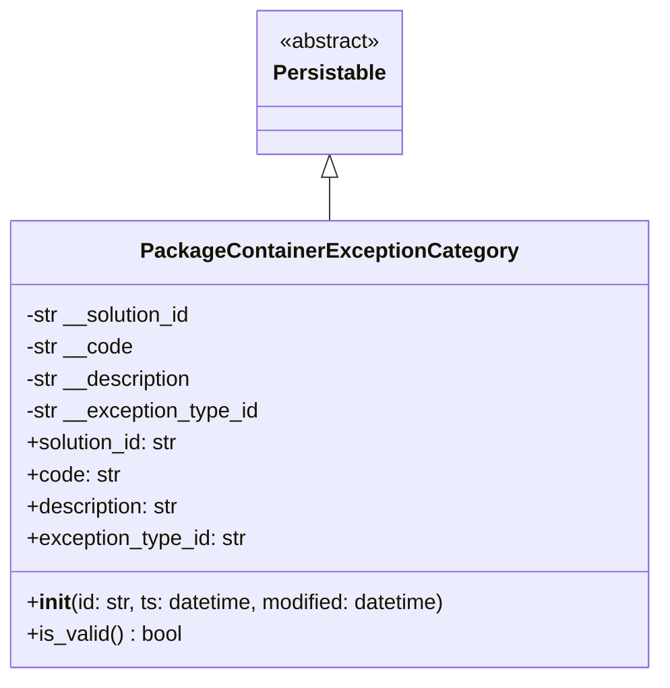

# Diagram: platform/partview_core/partview_service/partview_service/core/datamodel/PackageContainerExceptionCategory.py


> Auto-generated by Obscura crawlers

## Diagram 1



### SVG

<svg id="container" width="497.296875" xmlns="http://www.w3.org/2000/svg" class="classDiagram" height="510" viewBox="0 0 497.296875 510" role="graphics-document document" aria-roledescription="class"><style>#container{font-family:"trebuchet ms",verdana,arial,sans-serif;font-size:16px;fill:#333;}@keyframes edge-animation-frame{from{stroke-dashoffset:0;}}@keyframes dash{to{stroke-dashoffset:0;}}#container .edge-animation-slow{stroke-dasharray:9,5!important;stroke-dashoffset:900;animation:dash 50s linear infinite;stroke-linecap:round;}#container .edge-animation-fast{stroke-dasharray:9,5!important;stroke-dashoffset:900;animation:dash 20s linear infinite;stroke-linecap:round;}#container .error-icon{fill:#552222;}#container .error-text{fill:#552222;stroke:#552222;}#container .edge-thickness-normal{stroke-width:1px;}#container .edge-thickness-thick{stroke-width:3.5px;}#container .edge-pattern-solid{stroke-dasharray:0;}#container .edge-thickness-invisible{stroke-width:0;fill:none;}#container .edge-pattern-dashed{stroke-dasharray:3;}#container .edge-pattern-dotted{stroke-dasharray:2;}#container .marker{fill:#333333;stroke:#333333;}#container .marker.cross{stroke:#333333;}#container svg{font-family:"trebuchet ms",verdana,arial,sans-serif;font-size:16px;}#container p{margin:0;}#container g.classGroup text{fill:#9370DB;stroke:none;font-family:"trebuchet ms",verdana,arial,sans-serif;font-size:10px;}#container g.classGroup text .title{font-weight:bolder;}#container .nodeLabel,#container .edgeLabel{color:#131300;}#container .edgeLabel .label rect{fill:#ECECFF;}#container .label text{fill:#131300;}#container .labelBkg{background:#ECECFF;}#container .edgeLabel .label span{background:#ECECFF;}#container .classTitle{font-weight:bolder;}#container .node rect,#container .node circle,#container .node ellipse,#container .node polygon,#container .node path{fill:#ECECFF;stroke:#9370DB;stroke-width:1px;}#container .divider{stroke:#9370DB;stroke-width:1;}#container g.clickable{cursor:pointer;}#container g.classGroup rect{fill:#ECECFF;stroke:#9370DB;}#container g.classGroup line{stroke:#9370DB;stroke-width:1;}#container .classLabel .box{stroke:none;stroke-width:0;fill:#ECECFF;opacity:0.5;}#container .classLabel .label{fill:#9370DB;font-size:10px;}#container .relation{stroke:#333333;stroke-width:1;fill:none;}#container .dashed-line{stroke-dasharray:3;}#container .dotted-line{stroke-dasharray:1 2;}#container #compositionStart,#container .composition{fill:#333333!important;stroke:#333333!important;stroke-width:1;}#container #compositionEnd,#container .composition{fill:#333333!important;stroke:#333333!important;stroke-width:1;}#container #dependencyStart,#container .dependency{fill:#333333!important;stroke:#333333!important;stroke-width:1;}#container #dependencyStart,#container .dependency{fill:#333333!important;stroke:#333333!important;stroke-width:1;}#container #extensionStart,#container .extension{fill:transparent!important;stroke:#333333!important;stroke-width:1;}#container #extensionEnd,#container .extension{fill:transparent!important;stroke:#333333!important;stroke-width:1;}#container #aggregationStart,#container .aggregation{fill:transparent!important;stroke:#333333!important;stroke-width:1;}#container #aggregationEnd,#container .aggregation{fill:transparent!important;stroke:#333333!important;stroke-width:1;}#container #lollipopStart,#container .lollipop{fill:#ECECFF!important;stroke:#333333!important;stroke-width:1;}#container #lollipopEnd,#container .lollipop{fill:#ECECFF!important;stroke:#333333!important;stroke-width:1;}#container .edgeTerminals{font-size:11px;line-height:initial;}#container .classTitleText{text-anchor:middle;font-size:18px;fill:#333;}#container .label-icon{display:inline-block;height:1em;overflow:visible;vertical-align:-0.125em;}#container .node .label-icon path{fill:currentColor;stroke:revert;stroke-width:revert;}#container :root{--mermaid-font-family:"trebuchet ms",verdana,arial,sans-serif;}</style><g><defs><marker id="container_class-aggregationStart" class="marker aggregation class" refX="18" refY="7" markerWidth="190" markerHeight="240" orient="auto"><path d="M 18,7 L9,13 L1,7 L9,1 Z"></path></marker></defs><defs><marker id="container_class-aggregationEnd" class="marker aggregation class" refX="1" refY="7" markerWidth="20" markerHeight="28" orient="auto"><path d="M 18,7 L9,13 L1,7 L9,1 Z"></path></marker></defs><defs><marker id="container_class-extensionStart" class="marker extension class" refX="18" refY="7" markerWidth="190" markerHeight="240" orient="auto"><path d="M 1,7 L18,13 V 1 Z"></path></marker></defs><defs><marker id="container_class-extensionEnd" class="marker extension class" refX="1" refY="7" markerWidth="20" markerHeight="28" orient="auto"><path d="M 1,1 V 13 L18,7 Z"></path></marker></defs><defs><marker id="container_class-compositionStart" class="marker composition class" refX="18" refY="7" markerWidth="190" markerHeight="240" orient="auto"><path d="M 18,7 L9,13 L1,7 L9,1 Z"></path></marker></defs><defs><marker id="container_class-compositionEnd" class="marker composition class" refX="1" refY="7" markerWidth="20" markerHeight="28" orient="auto"><path d="M 18,7 L9,13 L1,7 L9,1 Z"></path></marker></defs><defs><marker id="container_class-dependencyStart" class="marker dependency class" refX="6" refY="7" markerWidth="190" markerHeight="240" orient="auto"><path d="M 5,7 L9,13 L1,7 L9,1 Z"></path></marker></defs><defs><marker id="container_class-dependencyEnd" class="marker dependency class" refX="13" refY="7" markerWidth="20" markerHeight="28" orient="auto"><path d="M 18,7 L9,13 L14,7 L9,1 Z"></path></marker></defs><defs><marker id="container_class-lollipopStart" class="marker lollipop class" refX="13" refY="7" markerWidth="190" markerHeight="240" orient="auto"><circle stroke="black" fill="transparent" cx="7" cy="7" r="6"></circle></marker></defs><defs><marker id="container_class-lollipopEnd" class="marker lollipop class" refX="1" refY="7" markerWidth="190" markerHeight="240" orient="auto"><circle stroke="black" fill="transparent" cx="7" cy="7" r="6"></circle></marker></defs><g class="root"><g class="clusters"></g><g class="edgePaths"><path d="M248.648,133.25L248.648,134.542C248.648,135.833,248.648,138.417,248.648,143.875C248.648,149.333,248.648,157.667,248.648,161.833L248.648,166" id="id_Persistable_PackageContainerExceptionCategory_1" class="edge-thickness-normal edge-pattern-solid relation" style=";;;" data-edge="true" data-et="edge" data-id="id_Persistable_PackageContainerExceptionCategory_1" data-points="W3sieCI6MjQ4LjY0ODQzNzUsInkiOjExNn0seyJ4IjoyNDguNjQ4NDM3NSwieSI6MTQxfSx7IngiOjI0OC42NDg0Mzc1LCJ5IjoxNjZ9XQ==" marker-start="url(#container_class-extensionStart)"></path></g><g class="edgeLabels"><g class="edgeLabel"><g class="label" data-id="id_Persistable_PackageContainerExceptionCategory_1" transform="translate(0, 0)"><foreignObject width="0" height="0"><div xmlns="http://www.w3.org/1999/xhtml" class="labelBkg" style="display: table-cell; white-space: nowrap; line-height: 1.5; max-width: 200px; text-align: center;"><span class="edgeLabel"></span></div></foreignObject></g></g></g><g class="nodes"><g class="node default" id="classId-Persistable-0" transform="translate(248.6484375, 62)"><g class="basic label-container"><path d="M-52.9765625 -54 L52.9765625 -54 L52.9765625 54 L-52.9765625 54" stroke="none" stroke-width="0" fill="#ECECFF" style=""></path><path d="M-52.9765625 -54 C-15.050630301425514 -54, 22.875301897148972 -54, 52.9765625 -54 M-52.9765625 -54 C-31.511008757395555 -54, -10.04545501479111 -54, 52.9765625 -54 M52.9765625 -54 C52.9765625 -15.75608765535992, 52.9765625 22.48782468928016, 52.9765625 54 M52.9765625 -54 C52.9765625 -21.329094327636483, 52.9765625 11.341811344727034, 52.9765625 54 M52.9765625 54 C18.455958767786143 54, -16.064644964427714 54, -52.9765625 54 M52.9765625 54 C14.672595597842701 54, -23.631371304314598 54, -52.9765625 54 M-52.9765625 54 C-52.9765625 27.032292343696867, -52.9765625 0.06458468739373302, -52.9765625 -54 M-52.9765625 54 C-52.9765625 32.38021343195996, -52.9765625 10.76042686391991, -52.9765625 -54" stroke="#9370DB" stroke-width="1.3" fill="none" stroke-dasharray="0 0" style=""></path></g><g class="annotation-group text" transform="translate(-38.609375, -30)"><g class="label" style="" transform="translate(0,-12)"><foreignObject width="77.21875" height="24"><div xmlns="http://www.w3.org/1999/xhtml" style="display: table-cell; white-space: nowrap; line-height: 1.5; max-width: 127px; text-align: center;"><span class="nodeLabel markdown-node-label" style=""><p>«abstract»</p></span></div></foreignObject></g></g><g class="label-group text" transform="translate(-40.9765625, -6)"><g class="label" style="font-weight: bolder" transform="translate(0,-12)"><foreignObject width="81.953125" height="24"><div xmlns="http://www.w3.org/1999/xhtml" style="display: table-cell; white-space: nowrap; line-height: 1.5; max-width: 130px; text-align: center;"><span class="nodeLabel markdown-node-label" style=""><p>Persistable</p></span></div></foreignObject></g></g><g class="members-group text" transform="translate(-40.9765625, 42)"></g><g class="methods-group text" transform="translate(-40.9765625, 72)"></g><g class="divider" style=""><path d="M-52.9765625 18 C-14.869541051407047 18, 23.237480397185905 18, 52.9765625 18 M-52.9765625 18 C-12.398699056920648 18, 28.179164386158703 18, 52.9765625 18" stroke="#9370DB" stroke-width="1.3" fill="none" stroke-dasharray="0 0" style=""></path></g><g class="divider" style=""><path d="M-52.9765625 36 C-19.687619642463012 36, 13.601323215073975 36, 52.9765625 36 M-52.9765625 36 C-29.34133467608893 36, -5.706106852177861 36, 52.9765625 36" stroke="#9370DB" stroke-width="1.3" fill="none" stroke-dasharray="0 0" style=""></path></g></g><g class="node default" id="classId-PackageContainerExceptionCategory-1" transform="translate(248.6484375, 334)"><g class="basic label-container"><path d="M-240.6484375 -168 L240.6484375 -168 L240.6484375 168 L-240.6484375 168" stroke="none" stroke-width="0" fill="#ECECFF" style=""></path><path d="M-240.6484375 -168 C-144.27608671345712 -168, -47.90373592691421 -168, 240.6484375 -168 M-240.6484375 -168 C-138.97163486381385 -168, -37.29483222762772 -168, 240.6484375 -168 M240.6484375 -168 C240.6484375 -75.86417694686499, 240.6484375 16.271646106270026, 240.6484375 168 M240.6484375 -168 C240.6484375 -83.64624010553119, 240.6484375 0.707519788937617, 240.6484375 168 M240.6484375 168 C50.95022654469244 168, -138.74798441061512 168, -240.6484375 168 M240.6484375 168 C114.75536190681568 168, -11.137713686368642 168, -240.6484375 168 M-240.6484375 168 C-240.6484375 88.39157774536447, -240.6484375 8.783155490728944, -240.6484375 -168 M-240.6484375 168 C-240.6484375 36.407973528674404, -240.6484375 -95.18405294265119, -240.6484375 -168" stroke="#9370DB" stroke-width="1.3" fill="none" stroke-dasharray="0 0" style=""></path></g><g class="annotation-group text" transform="translate(0, -144)"></g><g class="label-group text" transform="translate(-133.671875, -144)"><g class="label" style="font-weight: bolder" transform="translate(0,-12)"><foreignObject width="267.34375" height="24"><div xmlns="http://www.w3.org/1999/xhtml" style="display: table-cell; white-space: nowrap; line-height: 1.5; max-width: 313px; text-align: center;"><span class="nodeLabel markdown-node-label" style=""><p>PackageContainerExceptionCategory</p></span></div></foreignObject></g></g><g class="members-group text" transform="translate(-228.6484375, -96)"><g class="label" style="" transform="translate(0,-12)"><foreignObject width="128.828125" height="24"><div xmlns="http://www.w3.org/1999/xhtml" style="display: table-cell; white-space: nowrap; line-height: 1.5; max-width: 186px; text-align: center;"><span class="nodeLabel markdown-node-label" style=""><p>-str __solution_id</p></span></div></foreignObject></g><g class="label" style="" transform="translate(0,12)"><foreignObject width="81.234375" height="24"><div xmlns="http://www.w3.org/1999/xhtml" style="display: table-cell; white-space: nowrap; line-height: 1.5; max-width: 139px; text-align: center;"><span class="nodeLabel markdown-node-label" style=""><p>-str __code</p></span></div></foreignObject></g><g class="label" style="" transform="translate(0,36)"><foreignObject width="128.890625" height="24"><div xmlns="http://www.w3.org/1999/xhtml" style="display: table-cell; white-space: nowrap; line-height: 1.5; max-width: 186px; text-align: center;"><span class="nodeLabel markdown-node-label" style=""><p>-str __description</p></span></div></foreignObject></g><g class="label" style="" transform="translate(0,60)"><foreignObject width="178.90625" height="24"><div xmlns="http://www.w3.org/1999/xhtml" style="display: table-cell; white-space: nowrap; line-height: 1.5; max-width: 236px; text-align: center;"><span class="nodeLabel markdown-node-label" style=""><p>-str __exception_type_id</p></span></div></foreignObject></g><g class="label" style="" transform="translate(0,84)"><foreignObject width="117.71875" height="24"><div xmlns="http://www.w3.org/1999/xhtml" style="display: table-cell; white-space: nowrap; line-height: 1.5; max-width: 176px; text-align: center;"><span class="nodeLabel markdown-node-label" style=""><p>+solution_id: str</p></span></div></foreignObject></g><g class="label" style="" transform="translate(0,108)"><foreignObject width="70.453125" height="24"><div xmlns="http://www.w3.org/1999/xhtml" style="display: table-cell; white-space: nowrap; line-height: 1.5; max-width: 129px; text-align: center;"><span class="nodeLabel markdown-node-label" style=""><p>+code: str</p></span></div></foreignObject></g><g class="label" style="" transform="translate(0,132)"><foreignObject width="118.109375" height="24"><div xmlns="http://www.w3.org/1999/xhtml" style="display: table-cell; white-space: nowrap; line-height: 1.5; max-width: 176px; text-align: center;"><span class="nodeLabel markdown-node-label" style=""><p>+description: str</p></span></div></foreignObject></g><g class="label" style="" transform="translate(0,156)"><foreignObject width="168.125" height="24"><div xmlns="http://www.w3.org/1999/xhtml" style="display: table-cell; white-space: nowrap; line-height: 1.5; max-width: 226px; text-align: center;"><span class="nodeLabel markdown-node-label" style=""><p>+exception_type_id: str</p></span></div></foreignObject></g></g><g class="methods-group text" transform="translate(-228.6484375, 120)"><g class="label" style="" transform="translate(0,-12)"><foreignObject width="323.625" height="24"><div xmlns="http://www.w3.org/1999/xhtml" style="display: table-cell; white-space: nowrap; line-height: 1.5; max-width: 412px; text-align: center;"><span class="nodeLabel markdown-node-label" style=""><p>+<strong>init</strong>(id: str, ts: datetime, modified: datetime)</p></span></div></foreignObject></g><g class="label" style="" transform="translate(0,12)"><foreignObject width="117.984375" height="24"><div xmlns="http://www.w3.org/1999/xhtml" style="display: table-cell; white-space: nowrap; line-height: 1.5; max-width: 176px; text-align: center;"><span class="nodeLabel markdown-node-label" style=""><p>+is_valid() : bool</p></span></div></foreignObject></g></g><g class="divider" style=""><path d="M-240.6484375 -120 C-95.73875179677103 -120, 49.17093390645795 -120, 240.6484375 -120 M-240.6484375 -120 C-113.00865619921501 -120, 14.631125101569978 -120, 240.6484375 -120" stroke="#9370DB" stroke-width="1.3" fill="none" stroke-dasharray="0 0" style=""></path></g><g class="divider" style=""><path d="M-240.6484375 96 C-74.91474770731287 96, 90.81894208537426 96, 240.6484375 96 M-240.6484375 96 C-80.50569694881463 96, 79.63704360237074 96, 240.6484375 96" stroke="#9370DB" stroke-width="1.3" fill="none" stroke-dasharray="0 0" style=""></path></g></g></g></g></g></svg>

## Diagram 2

```mermaid
flowchart TD
    A[__init__] --> B[Initialize private attributes]
    B --> C[Call super().__init__]
    D[Property getter] --> E[Return private attribute]
    F[Property setter] --> G{Value changed?}
    G -->|Yes| H[Update private attribute]
    H --> I[Call add_dirty_field]
    G -->|No| J[Return self]
    I --> J
    K[is_valid] --> L{All attributes are strings?}
    L -->|Yes| M[Return True]
    L -->|No| N[Return False]
```

> SVG rendering failed for this diagram.
