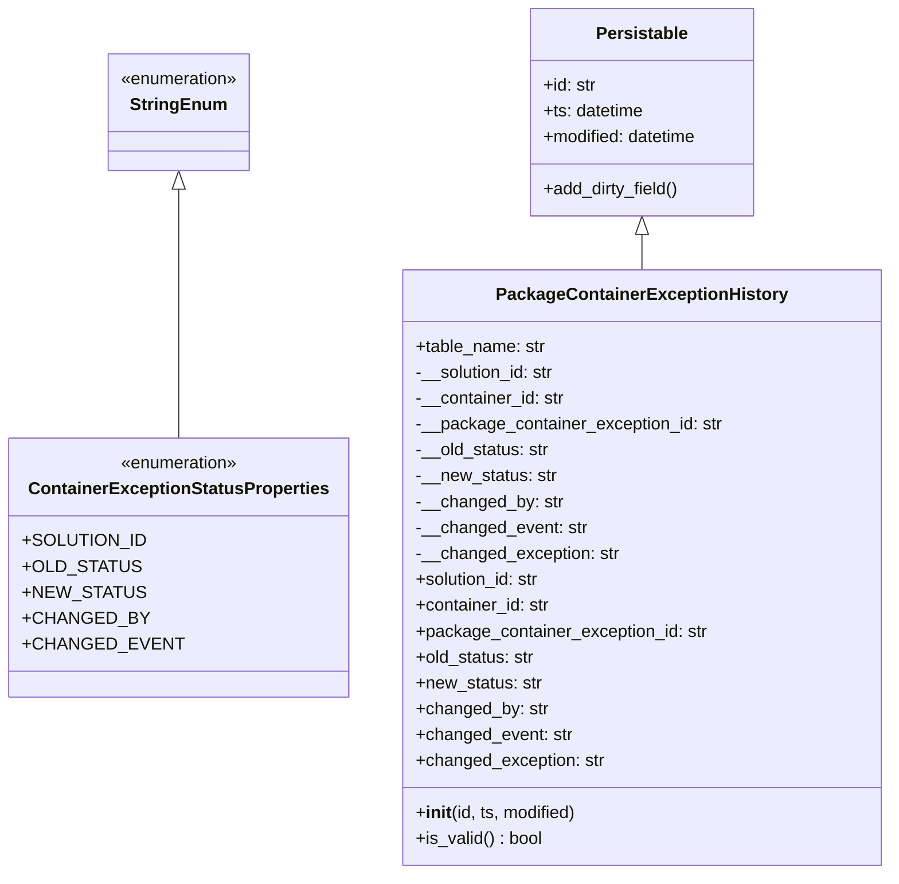
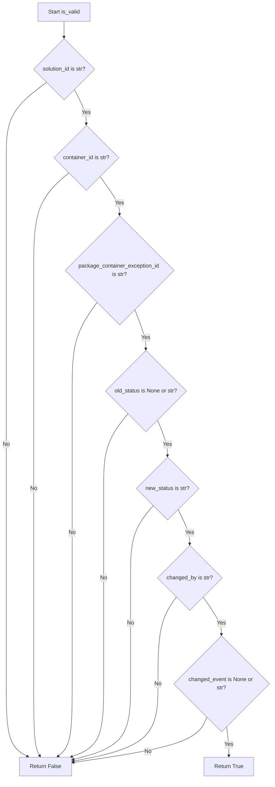
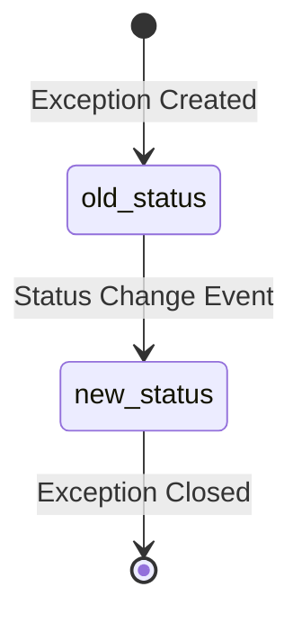

# Diagram: platform/partview_core/partview_service/partview_service/core/datamodel/PackageContainerExceptionHistory.py

> Auto-generated by Obscura crawlers

## Diagram 1

### SVG

<svg id="container" width="792.625" xmlns="http://www.w3.org/2000/svg" class="classDiagram" height="810" viewBox="0 0 792.625 810" role="graphics-document document" aria-roledescription="class"><g><defs><marker id="container_class-aggregationStart" class="marker aggregation class" refX="18" refY="7" markerWidth="190" markerHeight="240" orient="auto"><path d="M 18,7 L9,13 L1,7 L9,1 Z"></path></marker></defs><defs><marker id="container_class-aggregationEnd" class="marker aggregation class" refX="1" refY="7" markerWidth="20" markerHeight="28" orient="auto"><path d="M 18,7 L9,13 L1,7 L9,1 Z"></path></marker></defs><defs><marker id="container_class-extensionStart" class="marker extension class" refX="18" refY="7" markerWidth="190" markerHeight="240" orient="auto"><path d="M 1,7 L18,13 V 1 Z"></path></marker></defs><defs><marker id="container_class-extensionEnd" class="marker extension class" refX="1" refY="7" markerWidth="20" markerHeight="28" orient="auto"><path d="M 1,1 V 13 L18,7 Z"></path></marker></defs><defs><marker id="container_class-compositionStart" class="marker composition class" refX="18" refY="7" markerWidth="190" markerHeight="240" orient="auto"><path d="M 18,7 L9,13 L1,7 L9,1 Z"></path></marker></defs><defs><marker id="container_class-compositionEnd" class="marker composition class" refX="1" refY="7" markerWidth="20" markerHeight="28" orient="auto"><path d="M 18,7 L9,13 L1,7 L9,1 Z"></path></marker></defs><defs><marker id="container_class-dependencyStart" class="marker dependency class" refX="6" refY="7" markerWidth="190" markerHeight="240" orient="auto"><path d="M 5,7 L9,13 L1,7 L9,1 Z"></path></marker></defs><defs><marker id="container_class-dependencyEnd" class="marker dependency class" refX="13" refY="7" markerWidth="20" markerHeight="28" orient="auto"><path d="M 18,7 L9,13 L14,7 L9,1 Z"></path></marker></defs><defs><marker id="container_class-lollipopStart" class="marker lollipop class" refX="13" refY="7" markerWidth="190" markerHeight="240" orient="auto"><circle stroke="black" fill="transparent" cx="7" cy="7" r="6"></circle></marker></defs><defs><marker id="container_class-lollipopEnd" class="marker lollipop class" refX="1" refY="7" markerWidth="190" markerHeight="240" orient="auto"><circle stroke="black" fill="transparent" cx="7" cy="7" r="6"></circle></marker></defs><g class="root"><g class="clusters"></g><g class="edgePaths"><path d="M153.086,175.25L153.086,183.542C153.086,191.833,153.086,208.417,153.086,246.875C153.086,285.333,153.086,345.667,153.086,375.833L153.086,406" id="id_StringEnum_ContainerExceptionStatusProperties_1" class="edge-thickness-normal edge-pattern-solid relation" style=";;;" data-edge="true" data-et="edge" data-id="id_StringEnum_ContainerExceptionStatusProperties_1" data-points="W3sieCI6MTUzLjA4NTkzNzUsInkiOjE1OH0seyJ4IjoxNTMuMDg1OTM3NSwieSI6MjI1fSx7IngiOjE1My4wODU5Mzc1LCJ5Ijo0MDZ9XQ==" marker-start="url(#container_class-extensionStart)"></path><path d="M566.398,217.25L566.398,218.542C566.398,219.833,566.398,222.417,566.398,227.875C566.398,233.333,566.398,241.667,566.398,245.833L566.398,250" id="id_Persistable_PackageContainerExceptionHistory_2" class="edge-thickness-normal edge-pattern-solid relation" style=";;;" data-edge="true" data-et="edge" data-id="id_Persistable_PackageContainerExceptionHistory_2" data-points="W3sieCI6NTY2LjM5ODQzNzUsInkiOjIwMH0seyJ4Ijo1NjYuMzk4NDM3NSwieSI6MjI1fSx7IngiOjU2Ni4zOTg0Mzc1LCJ5IjoyNTB9XQ==" marker-start="url(#container_class-extensionStart)"></path></g><g class="edgeLabels"><g class="edgeLabel"><g class="label" data-id="id_StringEnum_ContainerExceptionStatusProperties_1" transform="translate(0, 0)"><foreignObject width="0" height="0">

</foreignObject></g></g><g class="edgeLabel"><g class="label" data-id="id_Persistable_PackageContainerExceptionHistory_2" transform="translate(0, 0)"><foreignObject width="0" height="0">

</foreignObject></g></g></g><g class="nodes"><g class="node default" id="classId-StringEnum-0" transform="translate(153.0859375, 104)"><g class="basic label-container"><path d="M-67.5546875 -54 L67.5546875 -54 L67.5546875 54 L-67.5546875 54" stroke="none" stroke-width="0" fill="#ECECFF" style=""></path><path d="M-67.5546875 -54 C-28.744722934443146 -54, 10.065241631113707 -54, 67.5546875 -54 M-67.5546875 -54 C-17.652255602169696 -54, 32.25017629566061 -54, 67.5546875 -54 M67.5546875 -54 C67.5546875 -27.632412772885154, 67.5546875 -1.2648255457703073, 67.5546875 54 M67.5546875 -54 C67.5546875 -16.121928564089053, 67.5546875 21.756142871821893, 67.5546875 54 M67.5546875 54 C13.730038483548853 54, -40.094610532902294 54, -67.5546875 54 M67.5546875 54 C30.10398460891208 54, -7.346718282175843 54, -67.5546875 54 M-67.5546875 54 C-67.5546875 30.765340109512795, -67.5546875 7.530680219025591, -67.5546875 -54 M-67.5546875 54 C-67.5546875 14.498984732317197, -67.5546875 -25.002030535365606, -67.5546875 -54" stroke="#9370DB" stroke-width="1.3" fill="none" stroke-dasharray="0 0" style=""></path></g><g class="annotation-group text" transform="translate(-55.5546875, -30)"><g class="label" style="" transform="translate(0,-12)"><foreignObject width="111.109375" height="24">

«enumeration»

</foreignObject></g></g><g class="label-group text" transform="translate(-42.234375, -6)"><g class="label" style="font-weight: bolder" transform="translate(0,-12)"><foreignObject width="84.46875" height="24">

StringEnum

</foreignObject></g></g><g class="members-group text" transform="translate(-55.5546875, 42)"></g><g class="methods-group text" transform="translate(-55.5546875, 72)"></g><g class="divider" style=""><path d="M-67.5546875 18 C-25.37394159241044 18, 16.80680431517912 18, 67.5546875 18 M-67.5546875 18 C-16.87543712098836 18, 33.80381325802328 18, 67.5546875 18" stroke="#9370DB" stroke-width="1.3" fill="none" stroke-dasharray="0 0" style=""></path></g><g class="divider" style=""><path d="M-67.5546875 36 C-18.013886854113892 36, 31.526913791772216 36, 67.5546875 36 M-67.5546875 36 C-20.943203887861102 36, 25.668279724277795 36, 67.5546875 36" stroke="#9370DB" stroke-width="1.3" fill="none" stroke-dasharray="0 0" style=""></path></g></g><g class="node default" id="classId-ContainerExceptionStatusProperties-1" transform="translate(153.0859375, 526)"><g class="basic label-container"><path d="M-145.0859375 -120 L145.0859375 -120 L145.0859375 120 L-145.0859375 120" stroke="none" stroke-width="0" fill="#ECECFF" style=""></path><path d="M-145.0859375 -120 C-48.41529991888426 -120, 48.25533766223148 -120, 145.0859375 -120 M-145.0859375 -120 C-34.35727050146717 -120, 76.37139649706566 -120, 145.0859375 -120 M145.0859375 -120 C145.0859375 -38.43306177986683, 145.0859375 43.133876440266334, 145.0859375 120 M145.0859375 -120 C145.0859375 -40.87860375327041, 145.0859375 38.24279249345918, 145.0859375 120 M145.0859375 120 C62.96197193689089 120, -19.16199362621822 120, -145.0859375 120 M145.0859375 120 C74.7015231922344 120, 4.317108884468809 120, -145.0859375 120 M-145.0859375 120 C-145.0859375 61.21784872816707, -145.0859375 2.4356974563341396, -145.0859375 -120 M-145.0859375 120 C-145.0859375 36.50750125700766, -145.0859375 -46.98499748598468, -145.0859375 -120" stroke="#9370DB" stroke-width="1.3" fill="none" stroke-dasharray="0 0" style=""></path></g><g class="annotation-group text" transform="translate(-55.5546875, -96)"><g class="label" style="" transform="translate(0,-12)"><foreignObject width="111.109375" height="24">

«enumeration»

</foreignObject></g></g><g class="label-group text" transform="translate(-133.0859375, -72)"><g class="label" style="font-weight: bolder" transform="translate(0,-12)"><foreignObject width="266.171875" height="24">

ContainerExceptionStatusProperties

</foreignObject></g></g><g class="members-group text" transform="translate(-133.0859375, -24)"><g class="label" style="" transform="translate(0,-12)"><foreignObject width="103.640625" height="24">

+SOLUTION_ID

</foreignObject></g><g class="label" style="" transform="translate(0,12)"><foreignObject width="96.375" height="24">

+OLD_STATUS

</foreignObject></g><g class="label" style="" transform="translate(0,36)"><foreignObject width="99.421875" height="24">

+NEW_STATUS

</foreignObject></g><g class="label" style="" transform="translate(0,60)"><foreignObject width="102.71875" height="24">

+CHANGED_BY

</foreignObject></g><g class="label" style="" transform="translate(0,84)"><foreignObject width="129.78125" height="24">

+CHANGED_EVENT

</foreignObject></g></g><g class="methods-group text" transform="translate(-133.0859375, 120)"></g><g class="divider" style=""><path d="M-145.0859375 -48 C-29.573242644069083 -48, 85.93945221186183 -48, 145.0859375 -48 M-145.0859375 -48 C-64.46141218141312 -48, 16.163113137173752 -48, 145.0859375 -48" stroke="#9370DB" stroke-width="1.3" fill="none" stroke-dasharray="0 0" style=""></path></g><g class="divider" style=""><path d="M-145.0859375 96 C-46.52020913878458 96, 52.04551922243084 96, 145.0859375 96 M-145.0859375 96 C-58.58073733428901 96, 27.924462831421977 96, 145.0859375 96" stroke="#9370DB" stroke-width="1.3" fill="none" stroke-dasharray="0 0" style=""></path></g></g><g class="node default" id="classId-Persistable-2" transform="translate(566.3984375, 104)"><g class="basic label-container"><path d="M-105.45703125 -96 L105.45703125 -96 L105.45703125 96 L-105.45703125 96" stroke="none" stroke-width="0" fill="#ECECFF" style=""></path><path d="M-105.45703125 -96 C-59.55691482438634 -96, -13.656798398772679 -96, 105.45703125 -96 M-105.45703125 -96 C-54.73782648996936 -96, -4.018621729938715 -96, 105.45703125 -96 M105.45703125 -96 C105.45703125 -30.51497106740237, 105.45703125 34.97005786519526, 105.45703125 96 M105.45703125 -96 C105.45703125 -23.56013095113471, 105.45703125 48.87973809773058, 105.45703125 96 M105.45703125 96 C35.58156722926847 96, -34.293896791463055 96, -105.45703125 96 M105.45703125 96 C42.38514283515646 96, -20.686745579687084 96, -105.45703125 96 M-105.45703125 96 C-105.45703125 28.170481989697763, -105.45703125 -39.659036020604475, -105.45703125 -96 M-105.45703125 96 C-105.45703125 36.90208882918171, -105.45703125 -22.195822341636585, -105.45703125 -96" stroke="#9370DB" stroke-width="1.3" fill="none" stroke-dasharray="0 0" style=""></path></g><g class="annotation-group text" transform="translate(0, -72)"></g><g class="label-group text" transform="translate(-40.9765625, -72)"><g class="label" style="font-weight: bolder" transform="translate(0,-12)"><foreignObject width="81.953125" height="24">

Persistable

</foreignObject></g></g><g class="members-group text" transform="translate(-93.45703125, -24)"><g class="label" style="" transform="translate(0,-12)"><foreignObject width="49.578125" height="24">

+id: str

</foreignObject></g><g class="label" style="" transform="translate(0,12)"><foreignObject width="94.484375" height="24">

+ts: datetime

</foreignObject></g><g class="label" style="" transform="translate(0,36)"><foreignObject width="145.9375" height="24">

+modified: datetime

</foreignObject></g></g><g class="methods-group text" transform="translate(-93.45703125, 72)"><g class="label" style="" transform="translate(0,-12)"><foreignObject width="127.40625" height="24">

+add_dirty_field()

</foreignObject></g></g><g class="divider" style=""><path d="M-105.45703125 -48 C-60.88573447462886 -48, -16.314437699257724 -48, 105.45703125 -48 M-105.45703125 -48 C-36.5888416409924 -48, 32.2793479680152 -48, 105.45703125 -48" stroke="#9370DB" stroke-width="1.3" fill="none" stroke-dasharray="0 0" style=""></path></g><g class="divider" style=""><path d="M-105.45703125 48 C-47.11979053613796 48, 11.217450177724075 48, 105.45703125 48 M-105.45703125 48 C-37.640760416050924 48, 30.175510417898153 48, 105.45703125 48" stroke="#9370DB" stroke-width="1.3" fill="none" stroke-dasharray="0 0" style=""></path></g></g><g class="node default" id="classId-PackageContainerExceptionHistory-3" transform="translate(566.3984375, 526)"><g class="basic label-container"><path d="M-218.2265625 -276 L218.2265625 -276 L218.2265625 276 L-218.2265625 276" stroke="none" stroke-width="0" fill="#ECECFF" style=""></path><path d="M-218.2265625 -276 C-86.09804603129714 -276, 46.03047043740571 -276, 218.2265625 -276 M-218.2265625 -276 C-55.747780217851016 -276, 106.73100206429797 -276, 218.2265625 -276 M218.2265625 -276 C218.2265625 -63.68749599657613, 218.2265625 148.62500800684774, 218.2265625 276 M218.2265625 -276 C218.2265625 -126.38803616351021, 218.2265625 23.223927672979585, 218.2265625 276 M218.2265625 276 C63.7430943081435 276, -90.740373883713 276, -218.2265625 276 M218.2265625 276 C115.45151566048011 276, 12.676468820960224 276, -218.2265625 276 M-218.2265625 276 C-218.2265625 86.15897487074568, -218.2265625 -103.68205025850864, -218.2265625 -276 M-218.2265625 276 C-218.2265625 137.25058025235285, -218.2265625 -1.4988394952943054, -218.2265625 -276" stroke="#9370DB" stroke-width="1.3" fill="none" stroke-dasharray="0 0" style=""></path></g><g class="annotation-group text" transform="translate(0, -252)"></g><g class="label-group text" transform="translate(-127.5625, -252)"><g class="label" style="font-weight: bolder" transform="translate(0,-12)"><foreignObject width="255.125" height="24">

PackageContainerExceptionHistory

</foreignObject></g></g><g class="members-group text" transform="translate(-206.2265625, -204)"><g class="label" style="" transform="translate(0,-12)"><foreignObject width="121.125" height="24">

+table_name: str

</foreignObject></g><g class="label" style="" transform="translate(0,12)"><foreignObject width="131.390625" height="24">

-__solution_id: str

</foreignObject></g><g class="label" style="" transform="translate(0,36)"><foreignObject width="139.15625" height="24">

-__container_id: str

</foreignObject></g><g class="label" style="" transform="translate(0,60)"><foreignObject width="284.890625" height="24">

-__package_container_exception_id: str

</foreignObject></g><g class="label" style="" transform="translate(0,84)"><foreignObject width="125.078125" height="24">

-__old_status: str

</foreignObject></g><g class="label" style="" transform="translate(0,108)"><foreignObject width="131.125" height="24">

-__new_status: str

</foreignObject></g><g class="label" style="" transform="translate(0,132)"><foreignObject width="135.984375" height="24">

-__changed_by: str

</foreignObject></g><g class="label" style="" transform="translate(0,156)"><foreignObject width="158.703125" height="24">

-__changed_event: str

</foreignObject></g><g class="label" style="" transform="translate(0,180)"><foreignObject width="189.046875" height="24">

-__changed_exception: str

</foreignObject></g><g class="label" style="" transform="translate(0,204)"><foreignObject width="117.71875" height="24">

+solution_id: str

</foreignObject></g><g class="label" style="" transform="translate(0,228)"><foreignObject width="125.8125" height="24">

+container_id: str

</foreignObject></g><g class="label" style="" transform="translate(0,252)"><foreignObject width="271.21875" height="24">

+package_container_exception_id: str

</foreignObject></g><g class="label" style="" transform="translate(0,276)"><foreignObject width="111.734375" height="24">

+old_status: str

</foreignObject></g><g class="label" style="" transform="translate(0,300)"><foreignObject width="117.46875" height="24">

+new_status: str

</foreignObject></g><g class="label" style="" transform="translate(0,324)"><foreignObject width="122.640625" height="24">

+changed_by: str

</foreignObject></g><g class="label" style="" transform="translate(0,348)"><foreignObject width="145.359375" height="24">

+changed_event: str

</foreignObject></g><g class="label" style="" transform="translate(0,372)"><foreignObject width="175.703125" height="24">

+changed_exception: str

</foreignObject></g></g><g class="methods-group text" transform="translate(-206.2265625, 228)"><g class="label" style="" transform="translate(0,-12)"><foreignObject width="150.90625" height="24">

+<strong>init</strong>(id, ts, modified)

</foreignObject></g><g class="label" style="" transform="translate(0,12)"><foreignObject width="117.984375" height="24">

+is_valid() : bool

</foreignObject></g></g><g class="divider" style=""><path d="M-218.2265625 -228 C-44.10864234896911 -228, 130.00927780206177 -228, 218.2265625 -228 M-218.2265625 -228 C-92.87250867075062 -228, 32.48154515849876 -228, 218.2265625 -228" stroke="#9370DB" stroke-width="1.3" fill="none" stroke-dasharray="0 0" style=""></path></g><g class="divider" style=""><path d="M-218.2265625 204 C-97.53640857533995 204, 23.153745349320104 204, 218.2265625 204 M-218.2265625 204 C-116.02782076062012 204, -13.829079021240233 204, 218.2265625 204" stroke="#9370DB" stroke-width="1.3" fill="none" stroke-dasharray="0 0" style=""></path></g></g></g></g></g></svg>

## Diagram 2

### SVG

<svg id="container" width="792.3828125" xmlns="http://www.w3.org/2000/svg" class="flowchart" height="2271.984375" viewBox="0 0 792.3828125 2271.984375" role="graphics-document document" aria-roledescription="flowchart-v2"><g><marker id="container_flowchart-v2-pointEnd" class="marker flowchart-v2" viewBox="0 0 10 10" refX="5" refY="5" markerUnits="userSpaceOnUse" markerWidth="8" markerHeight="8" orient="auto"><path d="M 0 0 L 10 5 L 0 10 z" class="arrowMarkerPath" style="stroke-width: 1; stroke-dasharray: 1, 0;"></path></marker><marker id="container_flowchart-v2-pointStart" class="marker flowchart-v2" viewBox="0 0 10 10" refX="4.5" refY="5" markerUnits="userSpaceOnUse" markerWidth="8" markerHeight="8" orient="auto"><path d="M 0 5 L 10 10 L 10 0 z" class="arrowMarkerPath" style="stroke-width: 1; stroke-dasharray: 1, 0;"></path></marker><marker id="container_flowchart-v2-circleEnd" class="marker flowchart-v2" viewBox="0 0 10 10" refX="11" refY="5" markerUnits="userSpaceOnUse" markerWidth="11" markerHeight="11" orient="auto"><circle cx="5" cy="5" r="5" class="arrowMarkerPath" style="stroke-width: 1; stroke-dasharray: 1, 0;"></circle></marker><marker id="container_flowchart-v2-circleStart" class="marker flowchart-v2" viewBox="0 0 10 10" refX="-1" refY="5" markerUnits="userSpaceOnUse" markerWidth="11" markerHeight="11" orient="auto"><circle cx="5" cy="5" r="5" class="arrowMarkerPath" style="stroke-width: 1; stroke-dasharray: 1, 0;"></circle></marker><marker id="container_flowchart-v2-crossEnd" class="marker cross flowchart-v2" viewBox="0 0 11 11" refX="12" refY="5.2" markerUnits="userSpaceOnUse" markerWidth="11" markerHeight="11" orient="auto"><path d="M 1,1 l 9,9 M 10,1 l -9,9" class="arrowMarkerPath" style="stroke-width: 2; stroke-dasharray: 1, 0;"></path></marker><marker id="container_flowchart-v2-crossStart" class="marker cross flowchart-v2" viewBox="0 0 11 11" refX="-1" refY="5.2" markerUnits="userSpaceOnUse" markerWidth="11" markerHeight="11" orient="auto"><path d="M 1,1 l 9,9 M 10,1 l -9,9" class="arrowMarkerPath" style="stroke-width: 2; stroke-dasharray: 1, 0;"></path></marker><g class="root"><g class="clusters"></g><g class="edgePaths"><path d="M185.563,62L185.563,66.167C185.563,70.333,185.563,78.667,185.563,86.333C185.563,94,185.563,101,185.563,104.5L185.563,108" id="L_A_B_0" class="edge-thickness-normal edge-pattern-solid edge-thickness-normal edge-pattern-solid flowchart-link" style=";" data-edge="true" data-et="edge" data-id="L_A_B_0" data-points="W3sieCI6MTg1LjU2MjUsInkiOjYyfSx7IngiOjE4NS41NjI1LCJ5Ijo4N30seyJ4IjoxODUuNTYyNSwieSI6MTEyfV0=" marker-end="url(#container_flowchart-v2-pointEnd)"></path><path d="M133.798,243.22L114.522,258.014C95.246,272.808,56.693,302.396,37.417,339.28C18.141,376.164,18.141,420.344,18.141,464.523C18.141,508.703,18.141,552.883,18.141,607.637C18.141,662.391,18.141,727.719,18.141,793.047C18.141,858.375,18.141,923.703,18.141,982.482C18.141,1041.26,18.141,1093.49,18.141,1145.719C18.141,1197.948,18.141,1250.177,18.141,1297.686C18.141,1345.195,18.141,1387.984,18.141,1430.773C18.141,1473.563,18.141,1516.352,18.141,1559.566C18.141,1602.781,18.141,1646.422,18.141,1690.063C18.141,1733.703,18.141,1777.344,18.141,1828.497C18.141,1879.651,18.141,1938.318,18.141,1996.984C18.141,2055.651,18.141,2114.318,28.546,2149.491C38.952,2184.665,59.763,2196.346,70.169,2202.186L80.575,2208.027" id="L_B_Z_0" class="edge-thickness-normal edge-pattern-solid edge-thickness-normal edge-pattern-solid flowchart-link" style=";" data-edge="true" data-et="edge" data-id="L_B_Z_0" data-points="W3sieCI6MTMzLjc5ODE2ODY2MTA2MDgsInkiOjI0My4yMjAwNDM2NjEwNjA4fSx7IngiOjE4LjE0MDYyNSwieSI6MzMxLjk4NDM3NX0seyJ4IjoxOC4xNDA2MjUsInkiOjQ2NC41MjM0Mzc1fSx7IngiOjE4LjE0MDYyNSwieSI6NTk3LjA2MjV9LHsieCI6MTguMTQwNjI1LCJ5Ijo3OTMuMDQ2ODc1fSx7IngiOjE4LjE0MDYyNSwieSI6OTg5LjAzMTI1fSx7IngiOjE4LjE0MDYyNSwieSI6MTE0NS43MTg3NX0seyJ4IjoxOC4xNDA2MjUsInkiOjEzMDIuNDA2MjV9LHsieCI6MTguMTQwNjI1LCJ5IjoxNDMwLjc3MzQzNzV9LHsieCI6MTguMTQwNjI1LCJ5IjoxNTU5LjE0MDYyNX0seyJ4IjoxOC4xNDA2MjUsInkiOjE2OTAuMDYyNX0seyJ4IjoxOC4xNDA2MjUsInkiOjE4MjAuOTg0Mzc1fSx7IngiOjE4LjE0MDYyNSwieSI6MTk5Ni45ODQzNzV9LHsieCI6MTguMTQwNjI1LCJ5IjoyMTcyLjk4NDM3NX0seyJ4Ijo4NC4wNjI2ODMxMDU0Njg3NSwieSI6MjIwOS45ODQzNzV9XQ==" marker-end="url(#container_flowchart-v2-pointEnd)"></path><path d="M216.382,264.165L222.124,275.468C227.865,286.771,239.349,309.378,245.09,326.181C250.832,342.984,250.832,353.984,250.832,359.484L250.832,364.984" id="L_B_C_0" class="edge-thickness-normal edge-pattern-solid edge-thickness-normal edge-pattern-solid flowchart-link" style=";" data-edge="true" data-et="edge" data-id="L_B_C_0" data-points="W3sieCI6MjE2LjM4MjA2NjU3NzM3NDM2LCJ5IjoyNjQuMTY0ODA4NDIyNjI1NjR9LHsieCI6MjUwLjgzMjAzMTI1LCJ5IjozMzEuOTg0Mzc1fSx7IngiOjI1MC44MzIwMzEyNSwieSI6MzY4Ljk4NDM3NX1d" marker-end="url(#container_flowchart-v2-pointEnd)"></path><path d="M199.74,508.971L182.864,523.653C165.987,538.335,132.234,567.699,115.357,615.045C98.48,662.391,98.48,727.719,98.48,793.047C98.48,858.375,98.48,923.703,98.48,982.482C98.48,1041.26,98.48,1093.49,98.48,1145.719C98.48,1197.948,98.48,1250.177,98.48,1297.686C98.48,1345.195,98.48,1387.984,98.48,1430.773C98.48,1473.563,98.48,1516.352,98.48,1559.566C98.48,1602.781,98.48,1646.422,98.48,1690.063C98.48,1733.703,98.48,1777.344,98.48,1828.497C98.48,1879.651,98.48,1938.318,98.48,1996.984C98.48,2055.651,98.48,2114.318,101.416,2149.228C104.351,2184.138,110.222,2195.291,113.158,2200.868L116.093,2206.445" id="L_C_Z_0" class="edge-thickness-normal edge-pattern-solid edge-thickness-normal edge-pattern-solid flowchart-link" style=";" data-edge="true" data-et="edge" data-id="L_C_Z_0" data-points="W3sieCI6MTk5Ljc0MDQwNDU4OTIwNjM4LCJ5Ijo1MDguOTcwODczMzM5MjA2NH0seyJ4Ijo5OC40ODA0Njg3NSwieSI6NTk3LjA2MjV9LHsieCI6OTguNDgwNDY4NzUsInkiOjc5My4wNDY4NzV9LHsieCI6OTguNDgwNDY4NzUsInkiOjk4OS4wMzEyNX0seyJ4Ijo5OC40ODA0Njg3NSwieSI6MTE0NS43MTg3NX0seyJ4Ijo5OC40ODA0Njg3NSwieSI6MTMwMi40MDYyNX0seyJ4Ijo5OC40ODA0Njg3NSwieSI6MTQzMC43NzM0Mzc1fSx7IngiOjk4LjQ4MDQ2ODc1LCJ5IjoxNTU5LjE0MDYyNX0seyJ4Ijo5OC40ODA0Njg3NSwieSI6MTY5MC4wNjI1fSx7IngiOjk4LjQ4MDQ2ODc1LCJ5IjoxODIwLjk4NDM3NX0seyJ4Ijo5OC40ODA0Njg3NSwieSI6MTk5Ni45ODQzNzV9LHsieCI6OTguNDgwNDY4NzUsInkiOjIxNzIuOTg0Mzc1fSx7IngiOjExNy45NTYwNTQ2ODc1LCJ5IjoyMjA5Ljk4NDM3NX1d" marker-end="url(#container_flowchart-v2-pointEnd)"></path><path d="M291.204,519.691L300.64,532.586C310.077,545.481,328.951,571.272,338.387,589.667C347.824,608.063,347.824,619.063,347.824,624.563L347.824,630.063" id="L_C_D_0" class="edge-thickness-normal edge-pattern-solid edge-thickness-normal edge-pattern-solid flowchart-link" style=";" data-edge="true" data-et="edge" data-id="L_C_D_0" data-points="W3sieCI6MjkxLjIwMzYyNjI0NDQ2OTA0LCJ5Ijo1MTkuNjkwOTA1MDA1NTMxfSx7IngiOjM0Ny44MjQyMTg3NSwieSI6NTk3LjA2MjV9LHsieCI6MzQ3LjgyNDIxODc1LCJ5Ijo2MzQuMDYyNX1d" marker-end="url(#container_flowchart-v2-pointEnd)"></path><path d="M282.334,886.541L270.369,903.623C258.404,920.705,234.473,954.868,222.508,998.064C210.543,1041.26,210.543,1093.49,210.543,1145.719C210.543,1197.948,210.543,1250.177,210.543,1297.686C210.543,1345.195,210.543,1387.984,210.543,1430.773C210.543,1473.563,210.543,1516.352,210.543,1559.566C210.543,1602.781,210.543,1646.422,210.543,1690.063C210.543,1733.703,210.543,1777.344,210.543,1828.497C210.543,1879.651,210.543,1938.318,210.543,1996.984C210.543,2055.651,210.543,2114.318,203.508,2149.396C196.472,2184.474,182.401,2195.964,175.366,2201.709L168.331,2207.454" id="L_D_Z_0" class="edge-thickness-normal edge-pattern-solid edge-thickness-normal edge-pattern-solid flowchart-link" style=";" data-edge="true" data-et="edge" data-id="L_D_Z_0" data-points="W3sieCI6MjgyLjMzNDE5NDg5NzQ5ODcsInkiOjg4Ni41NDEyMjYxNDc0OTg3fSx7IngiOjIxMC41NDI5Njg3NSwieSI6OTg5LjAzMTI1fSx7IngiOjIxMC41NDI5Njg3NSwieSI6MTE0NS43MTg3NX0seyJ4IjoyMTAuNTQyOTY4NzUsInkiOjEzMDIuNDA2MjV9LHsieCI6MjEwLjU0Mjk2ODc1LCJ5IjoxNDMwLjc3MzQzNzV9LHsieCI6MjEwLjU0Mjk2ODc1LCJ5IjoxNTU5LjE0MDYyNX0seyJ4IjoyMTAuNTQyOTY4NzUsInkiOjE2OTAuMDYyNX0seyJ4IjoyMTAuNTQyOTY4NzUsInkiOjE4MjAuOTg0Mzc1fSx7IngiOjIxMC41NDI5Njg3NSwieSI6MTk5Ni45ODQzNzV9LHsieCI6MjEwLjU0Mjk2ODc1LCJ5IjoyMTcyLjk4NDM3NX0seyJ4IjoxNjUuMjMyNDIxODc1LCJ5IjoyMjA5Ljk4NDM3NX1d" marker-end="url(#container_flowchart-v2-pointEnd)"></path><path d="M392.812,907.043L398.205,920.708C403.597,934.373,414.383,961.702,419.775,980.867C425.168,1000.031,425.168,1011.031,425.168,1016.531L425.168,1022.031" id="L_D_E_0" class="edge-thickness-normal edge-pattern-solid edge-thickness-normal edge-pattern-solid flowchart-link" style=";" data-edge="true" data-et="edge" data-id="L_D_E_0" data-points="W3sieCI6MzkyLjgxMjA3OTk2NTkxNDk2LCJ5Ijo5MDcuMDQzMzg4Nzg0MDg1MX0seyJ4Ijo0MjUuMTY3OTY4NzUsInkiOjk4OS4wMzEyNX0seyJ4Ijo0MjUuMTY3OTY4NzUsInkiOjEwMjYuMDMxMjV9XQ==" marker-end="url(#container_flowchart-v2-pointEnd)"></path><path d="M372.722,1212.96L361.094,1227.868C349.467,1242.776,326.212,1272.591,314.585,1308.893C302.957,1345.195,302.957,1387.984,302.957,1430.773C302.957,1473.563,302.957,1516.352,302.957,1559.566C302.957,1602.781,302.957,1646.422,302.957,1690.063C302.957,1733.703,302.957,1777.344,302.957,1828.497C302.957,1879.651,302.957,1938.318,302.957,1996.984C302.957,2055.651,302.957,2114.318,287.125,2149.584C271.293,2184.85,239.629,2196.715,223.797,2202.648L207.965,2208.581" id="L_E_Z_0" class="edge-thickness-normal edge-pattern-solid edge-thickness-normal edge-pattern-solid flowchart-link" style=";" data-edge="true" data-et="edge" data-id="L_E_Z_0" data-points="W3sieCI6MzcyLjcyMTkxODA5MDMxNzcsInkiOjEyMTIuOTYwMTk5MzQwMzE3Nn0seyJ4IjozMDIuOTU3MDMxMjUsInkiOjEzMDIuNDA2MjV9LHsieCI6MzAyLjk1NzAzMTI1LCJ5IjoxNDMwLjc3MzQzNzV9LHsieCI6MzAyLjk1NzAzMTI1LCJ5IjoxNTU5LjE0MDYyNX0seyJ4IjozMDIuOTU3MDMxMjUsInkiOjE2OTAuMDYyNX0seyJ4IjozMDIuOTU3MDMxMjUsInkiOjE4MjAuOTg0Mzc1fSx7IngiOjMwMi45NTcwMzEyNSwieSI6MTk5Ni45ODQzNzV9LHsieCI6MzAyLjk1NzAzMTI1LCJ5IjoyMTcyLjk4NDM3NX0seyJ4IjoyMDQuMjE5NjA0NDkyMTg3NSwieSI6MjIwOS45ODQzNzV9XQ==" marker-end="url(#container_flowchart-v2-pointEnd)"></path><path d="M459.562,1231.012L464.36,1242.911C469.159,1254.81,478.755,1278.608,483.553,1296.007C488.352,1313.406,488.352,1324.406,488.352,1329.906L488.352,1335.406" id="L_E_F_0" class="edge-thickness-normal edge-pattern-solid edge-thickness-normal edge-pattern-solid flowchart-link" style=";" data-edge="true" data-et="edge" data-id="L_E_F_0" data-points="W3sieCI6NDU5LjU2MjE1MDU3NzA2NDg3LCJ5IjoxMjMxLjAxMjA2ODE3MjkzNTJ9LHsieCI6NDg4LjM1MTU2MjUsInkiOjEzMDIuNDA2MjV9LHsieCI6NDg4LjM1MTU2MjUsInkiOjEzMzkuNDA2MjV9XQ==" marker-end="url(#container_flowchart-v2-pointEnd)"></path><path d="M446.785,1480.575L435.856,1493.669C424.927,1506.763,403.069,1532.952,392.14,1567.867C381.211,1602.781,381.211,1646.422,381.211,1690.063C381.211,1733.703,381.211,1777.344,381.211,1828.497C381.211,1879.651,381.211,1938.318,381.211,1996.984C381.211,2055.651,381.211,2114.318,352.797,2150.953C324.384,2187.588,267.557,2202.192,239.143,2209.493L210.73,2216.795" id="L_F_Z_0" class="edge-thickness-normal edge-pattern-solid edge-thickness-normal edge-pattern-solid flowchart-link" style=";" data-edge="true" data-et="edge" data-id="L_F_Z_0" data-points="W3sieCI6NDQ2Ljc4NTQ3ODI2MTMyMDMsInkiOjE0ODAuNTc0NTQwNzYxMzIwM30seyJ4IjozODEuMjEwOTM3NSwieSI6MTU1OS4xNDA2MjV9LHsieCI6MzgxLjIxMDkzNzUsInkiOjE2OTAuMDYyNX0seyJ4IjozODEuMjEwOTM3NSwieSI6MTgyMC45ODQzNzV9LHsieCI6MzgxLjIxMDkzNzUsInkiOjE5OTYuOTg0Mzc1fSx7IngiOjM4MS4yMTA5Mzc1LCJ5IjoyMTcyLjk4NDM3NX0seyJ4IjoyMDYuODU1NDY4NzUsInkiOjIyMTcuNzkwODk5OTc4NDMzfV0=" marker-end="url(#container_flowchart-v2-pointEnd)"></path><path d="M518.895,1491.597L524.548,1502.855C530.201,1514.112,541.507,1536.626,547.16,1553.383C552.813,1570.141,552.813,1581.141,552.813,1586.641L552.813,1592.141" id="L_F_G_0" class="edge-thickness-normal edge-pattern-solid edge-thickness-normal edge-pattern-solid flowchart-link" style=";" data-edge="true" data-et="edge" data-id="L_F_G_0" data-points="W3sieCI6NTE4Ljg5NDkwMDMxOTU2NDgsInkiOjE0OTEuNTk3Mjg3MTgwNDM1Mn0seyJ4Ijo1NTIuODEyNSwieSI6MTU1OS4xNDA2MjV9LHsieCI6NTUyLjgxMjUsInkiOjE1OTYuMTQwNjI1fV0=" marker-end="url(#container_flowchart-v2-pointEnd)"></path><path d="M514.033,1745.205L505.152,1757.835C496.27,1770.465,478.506,1795.725,469.624,1837.688C460.742,1879.651,460.742,1938.318,460.742,1996.984C460.742,2055.651,460.742,2114.318,419.082,2151.766C377.422,2189.214,294.102,2205.443,252.442,2213.557L210.782,2221.672" id="L_G_Z_0" class="edge-thickness-normal edge-pattern-solid edge-thickness-normal edge-pattern-solid flowchart-link" style=";" data-edge="true" data-et="edge" data-id="L_G_Z_0" data-points="W3sieCI6NTE0LjAzMzQ4OTQ5MzkyMTUsInkiOjE3NDUuMjA1MzY0NDkzOTIxNX0seyJ4Ijo0NjAuNzQyMTg3NSwieSI6MTgyMC45ODQzNzV9LHsieCI6NDYwLjc0MjE4NzUsInkiOjE5OTYuOTg0Mzc1fSx7IngiOjQ2MC43NDIxODc1LCJ5IjoyMTcyLjk4NDM3NX0seyJ4IjoyMDYuODU1NDY4NzUsInkiOjIyMjIuNDM2NjcyNDQ5OTE5Nn1d" marker-end="url(#container_flowchart-v2-pointEnd)"></path><path d="M591.592,1745.205L600.473,1757.835C609.355,1770.465,627.119,1795.725,636.001,1813.855C644.883,1831.984,644.883,1842.984,644.883,1848.484L644.883,1853.984" id="L_G_H_0" class="edge-thickness-normal edge-pattern-solid edge-thickness-normal edge-pattern-solid flowchart-link" style=";" data-edge="true" data-et="edge" data-id="L_G_H_0" data-points="W3sieCI6NTkxLjU5MTUxMDUwNjA3ODUsInkiOjE3NDUuMjA1MzY0NDkzOTIxNX0seyJ4Ijo2NDQuODgyODEyNSwieSI6MTgyMC45ODQzNzV9LHsieCI6NjQ0Ljg4MjgxMjUsInkiOjE4NTcuOTg0Mzc1fV0=" marker-end="url(#container_flowchart-v2-pointEnd)"></path><path d="M602.578,2093.68L596.796,2106.897C591.013,2120.115,579.448,2146.55,514.154,2168.508C448.86,2190.467,329.836,2207.95,270.325,2216.691L210.813,2225.433" id="L_H_Z_0" class="edge-thickness-normal edge-pattern-solid edge-thickness-normal edge-pattern-solid flowchart-link" style=";" data-edge="true" data-et="edge" data-id="L_H_Z_0" data-points="W3sieCI6NjAyLjU3ODQ2NDY3MzkxMywieSI6MjA5My42ODAwMjcxNzM5MTN9LHsieCI6NTY3Ljg4MjgxMjUsInkiOjIxNzIuOTg0Mzc1fSx7IngiOjIwNi44NTU0Njg3NSwieSI6MjIyNi4wMTM4OTcyNDcwMjZ9XQ==" marker-end="url(#container_flowchart-v2-pointEnd)"></path><path d="M659.754,2121.113L660.79,2129.758C661.826,2138.403,663.897,2155.694,664.933,2169.839C665.969,2183.984,665.969,2194.984,665.969,2200.484L665.969,2205.984" id="L_H_Y_0" class="edge-thickness-normal edge-pattern-solid edge-thickness-normal edge-pattern-solid flowchart-link" style=";" data-edge="true" data-et="edge" data-id="L_H_Y_0" data-points="W3sieCI6NjU5Ljc1NDIyMDExODgyMTEsInkiOjIxMjEuMTEyOTY3MzgxMTc5fSx7IngiOjY2NS45Njg3NSwieSI6MjE3Mi45ODQzNzV9LHsieCI6NjY1Ljk2ODc1LCJ5IjoyMjA5Ljk4NDM3NX1d" marker-end="url(#container_flowchart-v2-pointEnd)"></path></g><g class="edgeLabels"><g class="edgeLabel"><g class="label" data-id="L_A_B_0" transform="translate(0, 0)"><foreignObject width="0" height="0">

</foreignObject></g></g><g class="edgeLabel" transform="translate(18.140625, 1302.40625)"><g class="label" data-id="L_B_Z_0" transform="translate(-10.140625, -12)"><foreignObject width="20.28125" height="24">

No

</foreignObject></g></g><g class="edgeLabel" transform="translate(250.83203125, 331.984375)"><g class="label" data-id="L_B_C_0" transform="translate(-12.03125, -12)"><foreignObject width="24.0625" height="24">

Yes

</foreignObject></g></g><g class="edgeLabel" transform="translate(98.48046875, 1430.7734375)"><g class="label" data-id="L_C_Z_0" transform="translate(-10.140625, -12)"><foreignObject width="20.28125" height="24">

No

</foreignObject></g></g><g class="edgeLabel" transform="translate(347.82421875, 597.0625)"><g class="label" data-id="L_C_D_0" transform="translate(-12.03125, -12)"><foreignObject width="24.0625" height="24">

Yes

</foreignObject></g></g><g class="edgeLabel" transform="translate(210.54296875, 1559.140625)"><g class="label" data-id="L_D_Z_0" transform="translate(-10.140625, -12)"><foreignObject width="20.28125" height="24">

No

</foreignObject></g></g><g class="edgeLabel" transform="translate(425.16796875, 989.03125)"><g class="label" data-id="L_D_E_0" transform="translate(-12.03125, -12)"><foreignObject width="24.0625" height="24">

Yes

</foreignObject></g></g><g class="edgeLabel" transform="translate(302.95703125, 1690.0625)"><g class="label" data-id="L_E_Z_0" transform="translate(-10.140625, -12)"><foreignObject width="20.28125" height="24">

No

</foreignObject></g></g><g class="edgeLabel" transform="translate(488.3515625, 1302.40625)"><g class="label" data-id="L_E_F_0" transform="translate(-12.03125, -12)"><foreignObject width="24.0625" height="24">

Yes

</foreignObject></g></g><g class="edgeLabel" transform="translate(381.2109375, 1820.984375)"><g class="label" data-id="L_F_Z_0" transform="translate(-10.140625, -12)"><foreignObject width="20.28125" height="24">

No

</foreignObject></g></g><g class="edgeLabel" transform="translate(552.8125, 1559.140625)"><g class="label" data-id="L_F_G_0" transform="translate(-12.03125, -12)"><foreignObject width="24.0625" height="24">

Yes

</foreignObject></g></g><g class="edgeLabel" transform="translate(460.7421875, 1996.984375)"><g class="label" data-id="L_G_Z_0" transform="translate(-10.140625, -12)"><foreignObject width="20.28125" height="24">

No

</foreignObject></g></g><g class="edgeLabel" transform="translate(644.8828125, 1820.984375)"><g class="label" data-id="L_G_H_0" transform="translate(-12.03125, -12)"><foreignObject width="24.0625" height="24">

Yes

</foreignObject></g></g><g class="edgeLabel" transform="translate(430.19063, 2193.2093)"><g class="label" data-id="L_H_Z_0" transform="translate(-10.140625, -12)"><foreignObject width="20.28125" height="24">

No

</foreignObject></g></g><g class="edgeLabel" transform="translate(665.96875, 2172.984375)"><g class="label" data-id="L_H_Y_0" transform="translate(-12.03125, -12)"><foreignObject width="24.0625" height="24">

Yes

</foreignObject></g></g></g><g class="nodes"><g class="node default" id="flowchart-A-0" transform="translate(185.5625, 35)"><rect class="basic label-container" style="" x="-76.859375" y="-27" width="153.71875" height="54"></rect><g class="label" style="" transform="translate(-46.859375, -12)"><rect></rect><foreignObject width="93.71875" height="24">

Start is_valid

</foreignObject></g></g><g class="node default" id="flowchart-B-1" transform="translate(185.5625, 203.4921875)"><polygon points="91.4921875,0 182.984375,-91.4921875 91.4921875,-182.984375 0,-91.4921875" class="label-container" transform="translate(-90.9921875, 91.4921875)"></polygon><g class="label" style="" transform="translate(-64.4921875, -12)"><rect></rect><foreignObject width="128.984375" height="24">

solution_id is str?

</foreignObject></g></g><g class="node default" id="flowchart-Z-3" transform="translate(132.16796875, 2236.984375)"><rect class="basic label-container" style="" x="-74.6875" y="-27" width="149.375" height="54"></rect><g class="label" style="" transform="translate(-44.6875, -12)"><rect></rect><foreignObject width="89.375" height="24">

Return False

</foreignObject></g></g><g class="node default" id="flowchart-C-5" transform="translate(250.83203125, 464.5234375)"><polygon points="95.5390625,0 191.078125,-95.5390625 95.5390625,-191.078125 0,-95.5390625" class="label-container" transform="translate(-95.0390625, 95.5390625)"></polygon><g class="label" style="" transform="translate(-68.5390625, -12)"><rect></rect><foreignObject width="137.078125" height="24">

container_id is str?

</foreignObject></g></g><g class="node default" id="flowchart-D-9" transform="translate(347.82421875, 793.046875)"><polygon points="158.984375,0 317.96875,-158.984375 158.984375,-317.96875 0,-158.984375" class="label-container" transform="translate(-158.484375, 158.984375)"></polygon><g class="label" style="" transform="translate(-119.984375, -24)"><rect></rect><foreignObject width="239.96875" height="48">

package_container_exception_id is str?

</foreignObject></g></g><g class="node default" id="flowchart-E-13" transform="translate(425.16796875, 1145.71875)"><polygon points="119.6875,0 239.375,-119.6875 119.6875,-239.375 0,-119.6875" class="label-container" transform="translate(-119.1875, 119.6875)"></polygon><g class="label" style="" transform="translate(-92.6875, -12)"><rect></rect><foreignObject width="185.375" height="24">

old_status is None or str?

</foreignObject></g></g><g class="node default" id="flowchart-F-17" transform="translate(488.3515625, 1430.7734375)"><polygon points="91.3671875,0 182.734375,-91.3671875 91.3671875,-182.734375 0,-91.3671875" class="label-container" transform="translate(-90.8671875, 91.3671875)"></polygon><g class="label" style="" transform="translate(-64.3671875, -12)"><rect></rect><foreignObject width="128.734375" height="24">

new_status is str?

</foreignObject></g></g><g class="node default" id="flowchart-G-21" transform="translate(552.8125, 1690.0625)"><polygon points="93.921875,0 187.84375,-93.921875 93.921875,-187.84375 0,-93.921875" class="label-container" transform="translate(-93.421875, 93.921875)"></polygon><g class="label" style="" transform="translate(-66.921875, -12)"><rect></rect><foreignObject width="133.84375" height="24">

changed_by is str?

</foreignObject></g></g><g class="node default" id="flowchart-H-25" transform="translate(644.8828125, 1996.984375)"><polygon points="139,0 278,-139 139,-278 0,-139" class="label-container" transform="translate(-138.5, 139)"></polygon><g class="label" style="" transform="translate(-100, -24)"><rect></rect><foreignObject width="200" height="48">

changed_event is None or str?

</foreignObject></g></g><g class="node default" id="flowchart-Y-29" transform="translate(665.96875, 2236.984375)"><rect class="basic label-container" style="" x="-72.5234375" y="-27" width="145.046875" height="54"></rect><g class="label" style="" transform="translate(-42.5234375, -12)"><rect></rect><foreignObject width="85.046875" height="24">

Return True

</foreignObject></g></g></g></g></g></svg>

## Diagram 3

### SVG

<svg id="container" width="163.09375" xmlns="http://www.w3.org/2000/svg" class="statediagram" height="346" viewBox="0 0 163.09375 346" role="graphics-document document" aria-roledescription="stateDiagram"><g><defs><marker id="container_stateDiagram-barbEnd" refX="19" refY="7" markerWidth="20" markerHeight="14" markerUnits="userSpaceOnUse" orient="auto"><path d="M 19,7 L9,13 L14,7 L9,1 Z"></path></marker></defs><g class="root"><g class="clusters"></g><g class="edgePaths"><path d="M81.547,22L81.547,28.167C81.547,34.333,81.547,46.667,81.63,59.083C81.714,71.5,81.88,84,81.964,90.25L82.047,96.5" id="edge0" class="edge-thickness-normal edge-pattern-solid transition" style="fill:none;;;fill:none" data-edge="true" data-et="edge" data-id="edge0" data-points="W3sieCI6ODEuNTQ2ODc1LCJ5IjoyMn0seyJ4Ijo4MS41NDY4NzUsInkiOjU5fSx7IngiOjgyLjA0Njg3NSwieSI6OTYuNX1d" marker-end="url(#container_stateDiagram-barbEnd)"></path><path d="M82.047,136.5L81.964,142.583C81.88,148.667,81.714,160.833,81.714,173.167C81.714,185.5,81.88,198,81.964,204.25L82.047,210.5" id="edge1" class="edge-thickness-normal edge-pattern-solid transition" style="fill:none;;;fill:none" data-edge="true" data-et="edge" data-id="edge1" data-points="W3sieCI6ODIuMDQ2ODc1LCJ5IjoxMzYuNX0seyJ4Ijo4MS41NDY4NzUsInkiOjE3M30seyJ4Ijo4Mi4wNDY4NzUsInkiOjIxMC41fV0=" marker-end="url(#container_stateDiagram-barbEnd)"></path><path d="M82.047,250.5L81.964,256.583C81.88,262.667,81.714,274.833,81.63,287.083C81.547,299.333,81.547,311.667,81.547,317.833L81.547,324" id="edge2" class="edge-thickness-normal edge-pattern-solid transition" style="fill:none;;;fill:none" data-edge="true" data-et="edge" data-id="edge2" data-points="W3sieCI6ODIuMDQ2ODc1LCJ5IjoyNTAuNX0seyJ4Ijo4MS41NDY4NzUsInkiOjI4N30seyJ4Ijo4MS41NDY4NzUsInkiOjMyNH1d" marker-end="url(#container_stateDiagram-barbEnd)"></path></g><g class="edgeLabels"><g class="edgeLabel" transform="translate(81.546875, 59)"><g class="label" data-id="edge0" transform="translate(-65.2421875, -12)"><foreignObject width="130.484375" height="24">

Exception Created

</foreignObject></g></g><g class="edgeLabel" transform="translate(81.546875, 173)"><g class="label" data-id="edge1" transform="translate(-73.546875, -12)"><foreignObject width="147.09375" height="24">

Status Change Event

</foreignObject></g></g><g class="edgeLabel" transform="translate(81.546875, 287)"><g class="label" data-id="edge2" transform="translate(-61.75, -12)"><foreignObject width="123.5" height="24">

Exception Closed

</foreignObject></g></g></g><g class="nodes"><g class="node default" id="state-root_start-0" transform="translate(81.546875, 15)"><circle class="state-start" r="7" width="14" height="14"></circle></g><g class="node  statediagram-state" id="state-old_status-1" transform="translate(81.546875, 116)"><g class="basic label-container outer-path"><path d="M-41.125 -20 C-17.224009286962037 -20, 6.676981426075926 -20, 41.125 -20 C41.125 -20, 41.125 -20, 41.125 -20 C41.26585393378761 -19.994174238205233, 41.406707867575214 -19.98834847641046, 41.53789672736166 -19.982922465033347 C41.62994786858642 -19.971448302245697, 41.721999009811185 -19.95997413945805, 41.94797295140367 -19.931806517013612 C42.02961843451416 -19.914687259451796, 42.11126391762465 -19.89756800188998, 42.352427435703994 -19.847001329696653 C42.50517664932444 -19.80152591849529, 42.65792586294488 -19.756050507293924, 42.74849734602342 -19.729086208503173 C42.83489482252262 -19.695373808559804, 42.92129229902182 -19.66166140861644, 43.133477123264846 -19.578866633275286 C43.262555575614364 -19.51576402304403, 43.391634027963875 -19.452661412812773, 43.504736965185366 -19.397368756032446 C43.60084586465199 -19.340100282415438, 43.6969547641186 -19.28283180879843, 43.859740790612136 -19.185832391312644 C43.985282453449884 -19.09619736689839, 44.11082411628763 -19.006562342484138, 44.19606356344834 -18.94570254698197 C44.28130860267192 -18.873503681643843, 44.36655364189551 -18.801304816305716, 44.511407858128706 -18.678619553365657 C44.62087813025443 -18.569149281239934, 44.73034840238015 -18.45967900911421, 44.80361955336566 -18.386407858128706 C44.8851448051525 -18.290151175233, 44.96667005693934 -18.193894492337293, 45.07070254698197 -18.07106356344834 C45.13304625401274 -17.98374576887799, 45.1953899610435 -17.89642797430764, 45.310832391312644 -17.734740790612136 C45.353548472689006 -17.663053956455105, 45.39626455406537 -17.591367122298074, 45.52236875603245 -17.37973696518537 C45.57904676735482 -17.263800239954367, 45.635724778677194 -17.147863514723365, 45.70386663327529 -17.008477123264846 C45.7575522236402 -16.870892746605524, 45.81123781400511 -16.733308369946197, 45.854086208503176 -16.623497346023417 C45.889229492832015 -16.505453134801225, 45.924372777160855 -16.38740892357903, 45.97200132969665 -16.227427435703994 C45.99124594857047 -16.13564563970281, 46.01049056744429 -16.043863843701622, 46.05680651701361 -15.82297295140367 C46.07437862300915 -15.682001236033473, 46.09195072900469 -15.541029520663274, 46.10792246503335 -15.412896727361662 C46.11329428199601 -15.28301816770993, 46.118666098958684 -15.153139608058195, 46.125 -15 C46.125 -15, 46.125 -15, 46.125 -15 C46.125 -6.203778946807962, 46.125 2.592442106384077, 46.125 15 C46.125 15, 46.125 15, 46.125 15 C46.11873289140367 15.151524715627858, 46.11246578280733 15.303049431255715, 46.10792246503335 15.412896727361662 C46.09726257356652 15.498415400315311, 46.08660268209969 15.58393407326896, 46.05680651701361 15.822972951403669 C46.03243164429718 15.939222049911804, 46.00805677158075 16.055471148419937, 45.97200132969665 16.227427435703994 C45.93457783998109 16.353130721808938, 45.89715435026553 16.47883400791388, 45.854086208503176 16.623497346023417 C45.81136672713147 16.732977993917668, 45.768647245759766 16.84245864181192, 45.70386663327529 17.008477123264846 C45.667400757586876 17.083069264226694, 45.63093488189846 17.157661405188545, 45.52236875603245 17.379736965185366 C45.46009659899749 17.48424312890937, 45.39782444196252 17.588749292633373, 45.310832391312644 17.734740790612133 C45.245303944378655 17.826519090947595, 45.17977549744467 17.91829739128306, 45.07070254698197 18.07106356344834 C44.99297854392328 18.162832120451586, 44.915254540864595 18.254600677454835, 44.80361955336566 18.386407858128706 C44.691729365855714 18.49829804563865, 44.57983917834577 18.610188233148595, 44.511407858128706 18.678619553365657 C44.39554320794974 18.77675190630856, 44.27967855777077 18.874884259251466, 44.19606356344834 18.94570254698197 C44.09267013247889 19.01952403779015, 43.98927670150943 19.093345528598327, 43.859740790612136 19.185832391312644 C43.77546890185322 19.236047537514803, 43.69119701309432 19.286262683716963, 43.504736965185366 19.397368756032446 C43.37256528308749 19.461983554143348, 43.24039360098961 19.526598352254254, 43.133477123264846 19.578866633275286 C43.01711475629861 19.624271369761527, 42.90075238933238 19.66967610624777, 42.74849734602342 19.729086208503173 C42.6614908360775 19.754989168807885, 42.57448432613157 19.7808921291126, 42.352427435703994 19.847001329696653 C42.25374384074751 19.867693103629815, 42.15506024579103 19.888384877562974, 41.94797295140367 19.931806517013612 C41.80980412238955 19.94902924358922, 41.67163529337543 19.96625197016483, 41.53789672736166 19.982922465033347 C41.39711343330999 19.988745305147024, 41.256330139258324 19.994568145260704, 41.125 20 C41.125 20, 41.125 20, 41.125 20 C24.160481867182476 20, 7.195963734364952 20, -41.125 20 C-41.125 20, -41.125 20, -41.125 20 C-41.23566642482053 19.995422802811774, -41.34633284964106 19.99084560562355, -41.53789672736166 19.982922465033347 C-41.62240981295272 19.972387919900545, -41.706922898543766 19.961853374767742, -41.94797295140367 19.931806517013612 C-42.04142925035159 19.912210791793903, -42.13488554929951 19.892615066574194, -42.352427435703994 19.847001329696653 C-42.510692150075016 19.799883882777596, -42.66895686444604 19.75276643585854, -42.74849734602342 19.729086208503173 C-42.89022724671395 19.67378302964173, -43.03195714740447 19.618479850780286, -43.133477123264846 19.578866633275286 C-43.22263229098824 19.535281327621654, -43.31178745871162 19.491696021968025, -43.504736965185366 19.397368756032446 C-43.641103794406156 19.316111763133698, -43.77747062362695 19.234854770234946, -43.859740790612136 19.185832391312644 C-43.988332638890256 19.09401957635272, -44.116924487168376 19.0022067613928, -44.19606356344834 18.94570254698197 C-44.26489747540285 18.887403197422575, -44.33373138735735 18.82910384786318, -44.511407858128706 18.67861955336566 C-44.57231044825384 18.61771696324053, -44.63321303837897 18.556814373115397, -44.80361955336566 18.386407858128706 C-44.897269880035815 18.275835126370236, -44.990920206705965 18.165262394611766, -45.07070254698197 18.07106356344834 C-45.16275203241745 17.942140237544812, -45.25480151785293 17.813216911641284, -45.310832391312644 17.734740790612133 C-45.36625204754424 17.641734607055398, -45.42167170377584 17.548728423498662, -45.52236875603244 17.37973696518537 C-45.55869623911834 17.305427910816668, -45.595023722204246 17.231118856447967, -45.70386663327528 17.00847712326485 C-45.755742828292 16.87552982946928, -45.80761902330872 16.74258253567371, -45.854086208503176 16.623497346023417 C-45.89862762885462 16.473885352366135, -45.94316904920606 16.324273358708854, -45.97200132969665 16.227427435703994 C-45.99139886621134 16.134916342032074, -46.01079640272602 16.042405248360154, -46.05680651701361 15.82297295140367 C-46.07144980090537 15.70549762719391, -46.08609308479713 15.588022302984148, -46.10792246503335 15.412896727361664 C-46.11134108741063 15.330242058850018, -46.11475970978791 15.24758739033837, -46.125 15 C-46.125 15, -46.125 15, -46.125 15 C-46.125 3.132287377217189, -46.125 -8.735425245565622, -46.125 -15 C-46.125 -15, -46.125 -15, -46.125 -15 C-46.11906683740992 -15.143450645607343, -46.11313367481984 -15.286901291214686, -46.10792246503335 -15.41289672736166 C-46.092458364836936 -15.536957026787265, -46.076994264640526 -15.66101732621287, -46.05680651701361 -15.822972951403669 C-46.03550763774067 -15.924551964493, -46.01420875846773 -16.026130977582334, -45.97200132969665 -16.227427435703994 C-45.92792199127193 -16.375487323529356, -45.88384265284721 -16.523547211354717, -45.854086208503176 -16.623497346023417 C-45.820071775009154 -16.710668868174622, -45.78605734151513 -16.797840390325824, -45.70386663327529 -17.008477123264846 C-45.64408621336683 -17.130759926691024, -45.584305793458384 -17.2530427301172, -45.52236875603245 -17.379736965185366 C-45.46489989427523 -17.476182159342684, -45.40743103251801 -17.572627353500003, -45.310832391312644 -17.734740790612133 C-45.26155039690654 -17.80376451840306, -45.21226840250044 -17.872788246193988, -45.07070254698197 -18.07106356344834 C-44.98603497350307 -18.171030378555106, -44.901367400024164 -18.27099719366187, -44.80361955336566 -18.386407858128706 C-44.733511267586735 -18.456516143907628, -44.66340298180781 -18.526624429686553, -44.511407858128706 -18.678619553365657 C-44.40734337884242 -18.766757671371174, -44.303278899556126 -18.85489578937669, -44.19606356344834 -18.945702546981966 C-44.064494132834305 -19.039641314867335, -43.93292470222027 -19.133580082752704, -43.859740790612136 -19.185832391312644 C-43.774604703212695 -19.236562488131447, -43.68946861581325 -19.28729258495025, -43.504736965185366 -19.397368756032446 C-43.41879457571624 -19.439383430103128, -43.33285218624712 -19.481398104173806, -43.133477123264846 -19.578866633275286 C-42.980933476380166 -19.63838934899539, -42.82838982949548 -19.697912064715492, -42.74849734602342 -19.729086208503173 C-42.63466520888126 -19.762975504046995, -42.520833071739105 -19.796864799590818, -42.352427435703994 -19.847001329696653 C-42.235970325315876 -19.871419817917747, -42.11951321492775 -19.89583830613884, -41.94797295140367 -19.931806517013612 C-41.857380731988826 -19.943098825387306, -41.76678851257398 -19.954391133760996, -41.53789672736166 -19.982922465033347 C-41.418621855149674 -19.98785571023938, -41.29934698293768 -19.992788955445413, -41.125 -20 C-41.125 -20, -41.125 -20, -41.125 -20" stroke="none" stroke-width="0" fill="#ECECFF" style=""></path><path d="M-41.125 -20 C-18.889648189303223 -20, 3.345703621393554 -20, 41.125 -20 M-41.125 -20 C-8.415867392575308 -20, 24.293265214849384 -20, 41.125 -20 M41.125 -20 C41.125 -20, 41.125 -20, 41.125 -20 M41.125 -20 C41.125 -20, 41.125 -20, 41.125 -20 M41.125 -20 C41.21312722796751 -19.996355030889333, 41.301254455935016 -19.992710061778663, 41.53789672736166 -19.982922465033347 M41.125 -20 C41.27305777824879 -19.99387628499435, 41.42111555649758 -19.9877525699887, 41.53789672736166 -19.982922465033347 M41.53789672736166 -19.982922465033347 C41.69551621984425 -19.963275215784847, 41.85313571232683 -19.943627966536347, 41.94797295140367 -19.931806517013612 M41.53789672736166 -19.982922465033347 C41.63398108080039 -19.97094556286752, 41.73006543423911 -19.95896866070169, 41.94797295140367 -19.931806517013612 M41.94797295140367 -19.931806517013612 C42.04259211611429 -19.911966964484137, 42.13721128082492 -19.892127411954657, 42.352427435703994 -19.847001329696653 M41.94797295140367 -19.931806517013612 C42.04434451476303 -19.9115995251271, 42.140716078122395 -19.891392533240595, 42.352427435703994 -19.847001329696653 M42.352427435703994 -19.847001329696653 C42.44299348911381 -19.82003864738832, 42.53355954252362 -19.793075965079982, 42.74849734602342 -19.729086208503173 M42.352427435703994 -19.847001329696653 C42.45689628531523 -19.81589960562749, 42.56136513492647 -19.78479788155833, 42.74849734602342 -19.729086208503173 M42.74849734602342 -19.729086208503173 C42.85207614919523 -19.688669634088345, 42.955654952367034 -19.648253059673518, 43.133477123264846 -19.578866633275286 M42.74849734602342 -19.729086208503173 C42.83163443672914 -19.696646015044223, 42.91477152743486 -19.664205821585274, 43.133477123264846 -19.578866633275286 M43.133477123264846 -19.578866633275286 C43.250958913584356 -19.52143328565714, 43.36844070390387 -19.46399993803899, 43.504736965185366 -19.397368756032446 M43.133477123264846 -19.578866633275286 C43.23614433315133 -19.528675692718803, 43.338811543037814 -19.47848475216232, 43.504736965185366 -19.397368756032446 M43.504736965185366 -19.397368756032446 C43.64232703919515 -19.315382867450626, 43.779917113204945 -19.233396978868804, 43.859740790612136 -19.185832391312644 M43.504736965185366 -19.397368756032446 C43.62477407716285 -19.325842162569252, 43.74481118914032 -19.254315569106055, 43.859740790612136 -19.185832391312644 M43.859740790612136 -19.185832391312644 C43.97442546146298 -19.103949110182768, 44.08911013231381 -19.02206582905289, 44.19606356344834 -18.94570254698197 M43.859740790612136 -19.185832391312644 C43.94588991414709 -19.124323099363075, 44.03203903768203 -19.0628138074135, 44.19606356344834 -18.94570254698197 M44.19606356344834 -18.94570254698197 C44.2927020188088 -18.863853950411393, 44.389340474169245 -18.782005353840816, 44.511407858128706 -18.678619553365657 M44.19606356344834 -18.94570254698197 C44.31548105496336 -18.844561090922618, 44.43489854647837 -18.743419634863265, 44.511407858128706 -18.678619553365657 M44.511407858128706 -18.678619553365657 C44.62800280208847 -18.562024609405892, 44.744597746048235 -18.445429665446127, 44.80361955336566 -18.386407858128706 M44.511407858128706 -18.678619553365657 C44.61606707214117 -18.573960339353196, 44.72072628615363 -18.469301125340735, 44.80361955336566 -18.386407858128706 M44.80361955336566 -18.386407858128706 C44.89276284547219 -18.281156572023963, 44.981906137578726 -18.175905285919224, 45.07070254698197 -18.07106356344834 M44.80361955336566 -18.386407858128706 C44.90270552541478 -18.269417271998623, 45.001791497463906 -18.15242668586854, 45.07070254698197 -18.07106356344834 M45.07070254698197 -18.07106356344834 C45.14930439799168 -17.96097482143741, 45.22790624900139 -17.850886079426484, 45.310832391312644 -17.734740790612136 M45.07070254698197 -18.07106356344834 C45.16190566326833 -17.94332565129407, 45.25310877955469 -17.815587739139797, 45.310832391312644 -17.734740790612136 M45.310832391312644 -17.734740790612136 C45.381840653302255 -17.615573551085216, 45.452848915291874 -17.496406311558296, 45.52236875603245 -17.37973696518537 M45.310832391312644 -17.734740790612136 C45.37434288392118 -17.62815643165034, 45.437853376529716 -17.521572072688546, 45.52236875603245 -17.37973696518537 M45.52236875603245 -17.37973696518537 C45.57716501054242 -17.26764943503761, 45.631961265052404 -17.155561904889858, 45.70386663327529 -17.008477123264846 M45.52236875603245 -17.37973696518537 C45.58872425131309 -17.24400463011521, 45.65507974659373 -17.108272295045055, 45.70386663327529 -17.008477123264846 M45.70386663327529 -17.008477123264846 C45.735683205726296 -16.92693823623103, 45.7674997781773 -16.845399349197216, 45.854086208503176 -16.623497346023417 M45.70386663327529 -17.008477123264846 C45.74623991813825 -16.899883700984276, 45.78861320300121 -16.791290278703702, 45.854086208503176 -16.623497346023417 M45.854086208503176 -16.623497346023417 C45.893211837528625 -16.492076674760444, 45.93233746655408 -16.360656003497475, 45.97200132969665 -16.227427435703994 M45.854086208503176 -16.623497346023417 C45.89780812341213 -16.47663802262443, 45.94153003832108 -16.329778699225447, 45.97200132969665 -16.227427435703994 M45.97200132969665 -16.227427435703994 C45.993299298945715 -16.12585276271755, 46.014597268194784 -16.02427808973111, 46.05680651701361 -15.82297295140367 M45.97200132969665 -16.227427435703994 C45.99440679656969 -16.120570864350952, 46.01681226344273 -16.01371429299791, 46.05680651701361 -15.82297295140367 M46.05680651701361 -15.82297295140367 C46.07158230737128 -15.704434597879066, 46.08635809772895 -15.585896244354462, 46.10792246503335 -15.412896727361662 M46.05680651701361 -15.82297295140367 C46.07079152180385 -15.710778652368552, 46.084776526594084 -15.598584353333433, 46.10792246503335 -15.412896727361662 M46.10792246503335 -15.412896727361662 C46.112537920569494 -15.301305300971434, 46.11715337610564 -15.189713874581205, 46.125 -15 M46.10792246503335 -15.412896727361662 C46.11280236247876 -15.294911685082017, 46.11768225992418 -15.176926642802371, 46.125 -15 M46.125 -15 C46.125 -15, 46.125 -15, 46.125 -15 M46.125 -15 C46.125 -15, 46.125 -15, 46.125 -15 M46.125 -15 C46.125 -6.396824420603137, 46.125 2.2063511587937263, 46.125 15 M46.125 -15 C46.125 -5.068708648208469, 46.125 4.862582703583062, 46.125 15 M46.125 15 C46.125 15, 46.125 15, 46.125 15 M46.125 15 C46.125 15, 46.125 15, 46.125 15 M46.125 15 C46.11866899538803 15.153069578853183, 46.11233799077605 15.306139157706365, 46.10792246503335 15.412896727361662 M46.125 15 C46.118222926844766 15.163854521882088, 46.11144585368954 15.327709043764177, 46.10792246503335 15.412896727361662 M46.10792246503335 15.412896727361662 C46.093987912017525 15.524686278486422, 46.080053359001695 15.636475829611182, 46.05680651701361 15.822972951403669 M46.10792246503335 15.412896727361662 C46.094570787834314 15.520010173996615, 46.08121911063528 15.627123620631568, 46.05680651701361 15.822972951403669 M46.05680651701361 15.822972951403669 C46.03825442897406 15.911451916407163, 46.01970234093451 15.999930881410657, 45.97200132969665 16.227427435703994 M46.05680651701361 15.822972951403669 C46.03290332668489 15.936972493452943, 46.009000136356164 16.05097203550222, 45.97200132969665 16.227427435703994 M45.97200132969665 16.227427435703994 C45.939618148659804 16.336200623394465, 45.907234967622955 16.44497381108494, 45.854086208503176 16.623497346023417 M45.97200132969665 16.227427435703994 C45.93807144116445 16.3413959222906, 45.90414155263225 16.455364408877212, 45.854086208503176 16.623497346023417 M45.854086208503176 16.623497346023417 C45.81981228976473 16.711333871863033, 45.78553837102627 16.79917039770265, 45.70386663327529 17.008477123264846 M45.854086208503176 16.623497346023417 C45.8166050265358 16.719553383078892, 45.77912384456842 16.815609420134365, 45.70386663327529 17.008477123264846 M45.70386663327529 17.008477123264846 C45.637047517754155 17.14515780869486, 45.57022840223303 17.281838494124877, 45.52236875603245 17.379736965185366 M45.70386663327529 17.008477123264846 C45.64216250405398 17.134694936985593, 45.580458374832666 17.260912750706336, 45.52236875603245 17.379736965185366 M45.52236875603245 17.379736965185366 C45.4462419815538 17.507494177015673, 45.37011520707515 17.63525138884598, 45.310832391312644 17.734740790612133 M45.52236875603245 17.379736965185366 C45.45259463929161 17.49683304174686, 45.38282052255078 17.613929118308356, 45.310832391312644 17.734740790612133 M45.310832391312644 17.734740790612133 C45.25393563021013 17.81442966274186, 45.19703886910761 17.894118534871584, 45.07070254698197 18.07106356344834 M45.310832391312644 17.734740790612133 C45.22086852418224 17.86074302633049, 45.130904657051836 17.986745262048846, 45.07070254698197 18.07106356344834 M45.07070254698197 18.07106356344834 C44.9727174010242 18.186754406668385, 44.874732255066434 18.30244524988843, 44.80361955336566 18.386407858128706 M45.07070254698197 18.07106356344834 C44.99129636739541 18.16481826252498, 44.91189018780885 18.258572961601626, 44.80361955336566 18.386407858128706 M44.80361955336566 18.386407858128706 C44.74051514181699 18.44951226967737, 44.67741073026833 18.51261668122604, 44.511407858128706 18.678619553365657 M44.80361955336566 18.386407858128706 C44.71301565010684 18.477011761387523, 44.62241174684802 18.56761566464634, 44.511407858128706 18.678619553365657 M44.511407858128706 18.678619553365657 C44.44479956627324 18.735033898855743, 44.37819127441778 18.791448244345833, 44.19606356344834 18.94570254698197 M44.511407858128706 18.678619553365657 C44.40673180320603 18.767275649512985, 44.30205574828335 18.855931745660317, 44.19606356344834 18.94570254698197 M44.19606356344834 18.94570254698197 C44.08479747749045 19.025145005412714, 43.973531391532546 19.10458746384346, 43.859740790612136 19.185832391312644 M44.19606356344834 18.94570254698197 C44.07637622223655 19.031157666096185, 43.956688881024746 19.1166127852104, 43.859740790612136 19.185832391312644 M43.859740790612136 19.185832391312644 C43.783790994355876 19.231088646740158, 43.707841198099615 19.276344902167676, 43.504736965185366 19.397368756032446 M43.859740790612136 19.185832391312644 C43.752491139104116 19.24973931223159, 43.645241487596095 19.31364623315054, 43.504736965185366 19.397368756032446 M43.504736965185366 19.397368756032446 C43.418932376161 19.439316063570626, 43.33312778713665 19.481263371108803, 43.133477123264846 19.578866633275286 M43.504736965185366 19.397368756032446 C43.37630148384951 19.46015703688861, 43.247866002513646 19.522945317744774, 43.133477123264846 19.578866633275286 M43.133477123264846 19.578866633275286 C42.99692263010142 19.632150361853075, 42.86036813693799 19.68543409043086, 42.74849734602342 19.729086208503173 M43.133477123264846 19.578866633275286 C42.98351166773313 19.637383335607687, 42.83354621220142 19.69590003794009, 42.74849734602342 19.729086208503173 M42.74849734602342 19.729086208503173 C42.62532290485035 19.76575682846304, 42.50214846367728 19.802427448422904, 42.352427435703994 19.847001329696653 M42.74849734602342 19.729086208503173 C42.597219555731506 19.774123557999797, 42.44594176543959 19.81916090749642, 42.352427435703994 19.847001329696653 M42.352427435703994 19.847001329696653 C42.255395433058524 19.867346801139067, 42.15836343041306 19.887692272581482, 41.94797295140367 19.931806517013612 M42.352427435703994 19.847001329696653 C42.2635872475552 19.865629158264966, 42.17474705940641 19.884256986833282, 41.94797295140367 19.931806517013612 M41.94797295140367 19.931806517013612 C41.85238993406035 19.94372092770032, 41.756806916717025 19.955635338387026, 41.53789672736166 19.982922465033347 M41.94797295140367 19.931806517013612 C41.86403566160489 19.942269289275757, 41.78009837180611 19.9527320615379, 41.53789672736166 19.982922465033347 M41.53789672736166 19.982922465033347 C41.45128165777549 19.98650489081073, 41.36466658818932 19.99008731658811, 41.125 20 M41.53789672736166 19.982922465033347 C41.45080835437425 19.986524466784207, 41.36371998138684 19.99012646853507, 41.125 20 M41.125 20 C41.125 20, 41.125 20, 41.125 20 M41.125 20 C41.125 20, 41.125 20, 41.125 20 M41.125 20 C9.276323357780075 20, -22.57235328443985 20, -41.125 20 M41.125 20 C18.380768548076826 20, -4.363462903846347 20, -41.125 20 M-41.125 20 C-41.125 20, -41.125 20, -41.125 20 M-41.125 20 C-41.125 20, -41.125 20, -41.125 20 M-41.125 20 C-41.21421070031474 19.99631021814157, -41.30342140062947 19.99262043628314, -41.53789672736166 19.982922465033347 M-41.125 20 C-41.28508337359033 19.993378902691873, -41.445166747180664 19.986757805383746, -41.53789672736166 19.982922465033347 M-41.53789672736166 19.982922465033347 C-41.62676213604588 19.971845403392752, -41.715627544730104 19.96076834175216, -41.94797295140367 19.931806517013612 M-41.53789672736166 19.982922465033347 C-41.65838896717123 19.967903123004252, -41.77888120698079 19.952883780975156, -41.94797295140367 19.931806517013612 M-41.94797295140367 19.931806517013612 C-42.091068566490165 19.901802521724406, -42.23416418157666 19.8717985264352, -42.352427435703994 19.847001329696653 M-41.94797295140367 19.931806517013612 C-42.076041391187516 19.904953389042863, -42.20410983097136 19.878100261072113, -42.352427435703994 19.847001329696653 M-42.352427435703994 19.847001329696653 C-42.47691815095892 19.809938837964047, -42.601408866213845 19.772876346231442, -42.74849734602342 19.729086208503173 M-42.352427435703994 19.847001329696653 C-42.46543559147863 19.813357344034447, -42.57844374725327 19.77971335837224, -42.74849734602342 19.729086208503173 M-42.74849734602342 19.729086208503173 C-42.86899097933314 19.682069446887407, -42.98948461264286 19.63505268527164, -43.133477123264846 19.578866633275286 M-42.74849734602342 19.729086208503173 C-42.848669165700045 19.689999043173472, -42.94884098537668 19.650911877843768, -43.133477123264846 19.578866633275286 M-43.133477123264846 19.578866633275286 C-43.26258373179382 19.51575025832664, -43.39169034032278 19.452633883377995, -43.504736965185366 19.397368756032446 M-43.133477123264846 19.578866633275286 C-43.24118484809049 19.526211535117117, -43.34889257291614 19.473556436958948, -43.504736965185366 19.397368756032446 M-43.504736965185366 19.397368756032446 C-43.60190512188291 19.339469102107273, -43.69907327858045 19.2815694481821, -43.859740790612136 19.185832391312644 M-43.504736965185366 19.397368756032446 C-43.58009168512755 19.352467089122563, -43.655446405069725 19.307565422212676, -43.859740790612136 19.185832391312644 M-43.859740790612136 19.185832391312644 C-43.97975979872532 19.100140466582417, -44.09977880683851 19.014448541852193, -44.19606356344834 18.94570254698197 M-43.859740790612136 19.185832391312644 C-43.98882891131041 19.093665244655252, -44.11791703200868 19.00149809799786, -44.19606356344834 18.94570254698197 M-44.19606356344834 18.94570254698197 C-44.309699790243265 18.84945757236965, -44.423336017038196 18.753212597757337, -44.511407858128706 18.67861955336566 M-44.19606356344834 18.94570254698197 C-44.27480073824475 18.879015561651123, -44.353537913041166 18.812328576320272, -44.511407858128706 18.67861955336566 M-44.511407858128706 18.67861955336566 C-44.60620937544319 18.583818036051174, -44.70101089275768 18.489016518736687, -44.80361955336566 18.386407858128706 M-44.511407858128706 18.67861955336566 C-44.5717638916871 18.618263519807265, -44.6321199252455 18.55790748624887, -44.80361955336566 18.386407858128706 M-44.80361955336566 18.386407858128706 C-44.90738701161063 18.263889851691932, -45.01115446985561 18.141371845255158, -45.07070254698197 18.07106356344834 M-44.80361955336566 18.386407858128706 C-44.88016313973772 18.296033016473764, -44.95670672610977 18.205658174818822, -45.07070254698197 18.07106356344834 M-45.07070254698197 18.07106356344834 C-45.16210817687075 17.94304201334604, -45.25351380675954 17.815020463243744, -45.310832391312644 17.734740790612133 M-45.07070254698197 18.07106356344834 C-45.1304939106781 17.987320548139305, -45.190285274374226 17.903577532830273, -45.310832391312644 17.734740790612133 M-45.310832391312644 17.734740790612133 C-45.3605216762516 17.651351410921244, -45.41021096119055 17.56796203123036, -45.52236875603244 17.37973696518537 M-45.310832391312644 17.734740790612133 C-45.3796106687207 17.619315948086985, -45.448388946128766 17.503891105561838, -45.52236875603244 17.37973696518537 M-45.52236875603244 17.37973696518537 C-45.59134920839575 17.23863519458041, -45.660329660759054 17.09753342397545, -45.70386663327528 17.00847712326485 M-45.52236875603244 17.37973696518537 C-45.59281430164009 17.23563829844831, -45.66325984724774 17.091539631711257, -45.70386663327528 17.00847712326485 M-45.70386663327528 17.00847712326485 C-45.759341815710656 16.86630641519303, -45.81481699814603 16.72413570712121, -45.854086208503176 16.623497346023417 M-45.70386663327528 17.00847712326485 C-45.74630251038203 16.899723290811153, -45.78873838748878 16.790969458357456, -45.854086208503176 16.623497346023417 M-45.854086208503176 16.623497346023417 C-45.88053932271413 16.534642901681128, -45.90699243692507 16.445788457338843, -45.97200132969665 16.227427435703994 M-45.854086208503176 16.623497346023417 C-45.88017790398571 16.535856885790224, -45.906269599468246 16.44821642555703, -45.97200132969665 16.227427435703994 M-45.97200132969665 16.227427435703994 C-45.9909464392686 16.137074065062933, -46.00989154884054 16.046720694421868, -46.05680651701361 15.82297295140367 M-45.97200132969665 16.227427435703994 C-46.00053243125478 16.091356372927073, -46.02906353281292 15.955285310150153, -46.05680651701361 15.82297295140367 M-46.05680651701361 15.82297295140367 C-46.07048219717856 15.71326020028567, -46.084157877343515 15.60354744916767, -46.10792246503335 15.412896727361664 M-46.05680651701361 15.82297295140367 C-46.07126161065253 15.707007378089232, -46.08571670429144 15.591041804774793, -46.10792246503335 15.412896727361664 M-46.10792246503335 15.412896727361664 C-46.114375544908754 15.256875640760901, -46.12082862478417 15.10085455416014, -46.125 15 M-46.10792246503335 15.412896727361664 C-46.11242873955919 15.303945054421211, -46.116935014085044 15.194993381480758, -46.125 15 M-46.125 15 C-46.125 15, -46.125 15, -46.125 15 M-46.125 15 C-46.125 15, -46.125 15, -46.125 15 M-46.125 15 C-46.125 3.522132023432537, -46.125 -7.955735953134926, -46.125 -15 M-46.125 15 C-46.125 7.870351620199242, -46.125 0.7407032403984832, -46.125 -15 M-46.125 -15 C-46.125 -15, -46.125 -15, -46.125 -15 M-46.125 -15 C-46.125 -15, -46.125 -15, -46.125 -15 M-46.125 -15 C-46.119328150479674 -15.137132678082914, -46.11365630095934 -15.274265356165827, -46.10792246503335 -15.41289672736166 M-46.125 -15 C-46.11919482408519 -15.14035621309892, -46.11338964817038 -15.28071242619784, -46.10792246503335 -15.41289672736166 M-46.10792246503335 -15.41289672736166 C-46.093836370011516 -15.525902019874678, -46.07975027498968 -15.638907312387694, -46.05680651701361 -15.822972951403669 M-46.10792246503335 -15.41289672736166 C-46.08798996100698 -15.572804668102153, -46.06805745698062 -15.732712608842647, -46.05680651701361 -15.822972951403669 M-46.05680651701361 -15.822972951403669 C-46.03770291907647 -15.91408218771804, -46.01859932113934 -16.00519142403241, -45.97200132969665 -16.227427435703994 M-46.05680651701361 -15.822972951403669 C-46.02872154241141 -15.956916337164555, -46.00063656780922 -16.09085972292544, -45.97200132969665 -16.227427435703994 M-45.97200132969665 -16.227427435703994 C-45.94361120045632 -16.322788198839074, -45.91522107121599 -16.41814896197415, -45.854086208503176 -16.623497346023417 M-45.97200132969665 -16.227427435703994 C-45.9421268850926 -16.327773926259308, -45.912252440488544 -16.428120416814618, -45.854086208503176 -16.623497346023417 M-45.854086208503176 -16.623497346023417 C-45.81773407641053 -16.71665987623325, -45.78138194431789 -16.809822406443086, -45.70386663327529 -17.008477123264846 M-45.854086208503176 -16.623497346023417 C-45.8057834504272 -16.74728670580576, -45.75748069235122 -16.871076065588106, -45.70386663327529 -17.008477123264846 M-45.70386663327529 -17.008477123264846 C-45.64925962986707 -17.120177534096452, -45.594652626458846 -17.23187794492806, -45.52236875603245 -17.379736965185366 M-45.70386663327529 -17.008477123264846 C-45.651226158862016 -17.116154934742188, -45.59858568444874 -17.223832746219532, -45.52236875603245 -17.379736965185366 M-45.52236875603245 -17.379736965185366 C-45.47524062075303 -17.45882818116417, -45.428112485473605 -17.53791939714297, -45.310832391312644 -17.734740790612133 M-45.52236875603245 -17.379736965185366 C-45.47455299430474 -17.4599821672409, -45.42673723257702 -17.540227369296428, -45.310832391312644 -17.734740790612133 M-45.310832391312644 -17.734740790612133 C-45.21986765330772 -17.862144833210046, -45.128902915302795 -17.98954887580796, -45.07070254698197 -18.07106356344834 M-45.310832391312644 -17.734740790612133 C-45.219026282930685 -17.863323245743377, -45.127220174548725 -17.99190570087462, -45.07070254698197 -18.07106356344834 M-45.07070254698197 -18.07106356344834 C-45.01082303363742 -18.141763171258507, -44.95094352029288 -18.212462779068677, -44.80361955336566 -18.386407858128706 M-45.07070254698197 -18.07106356344834 C-45.011106556376355 -18.14142841659321, -44.95151056577075 -18.211793269738084, -44.80361955336566 -18.386407858128706 M-44.80361955336566 -18.386407858128706 C-44.71078279495198 -18.47924461654238, -44.61794603653831 -18.572081374956053, -44.511407858128706 -18.678619553365657 M-44.80361955336566 -18.386407858128706 C-44.69568335741287 -18.49434405408149, -44.587747161460086 -18.602280250034276, -44.511407858128706 -18.678619553365657 M-44.511407858128706 -18.678619553365657 C-44.41433869483826 -18.760832940944848, -44.31726953154781 -18.84304632852404, -44.19606356344834 -18.945702546981966 M-44.511407858128706 -18.678619553365657 C-44.41355531837702 -18.761496426962907, -44.31570277862534 -18.844373300560157, -44.19606356344834 -18.945702546981966 M-44.19606356344834 -18.945702546981966 C-44.07499195008171 -19.032146017417887, -43.95392033671508 -19.118589487853807, -43.859740790612136 -19.185832391312644 M-44.19606356344834 -18.945702546981966 C-44.0843111663567 -19.02549222488839, -43.97255876926506 -19.10528190279481, -43.859740790612136 -19.185832391312644 M-43.859740790612136 -19.185832391312644 C-43.75073486310201 -19.250785825576855, -43.64172893559189 -19.315739259841067, -43.504736965185366 -19.397368756032446 M-43.859740790612136 -19.185832391312644 C-43.723359124184356 -19.267098225267755, -43.586977457756575 -19.348364059222867, -43.504736965185366 -19.397368756032446 M-43.504736965185366 -19.397368756032446 C-43.41732198315196 -19.440103336740695, -43.32990700111855 -19.482837917448943, -43.133477123264846 -19.578866633275286 M-43.504736965185366 -19.397368756032446 C-43.39935604489317 -19.44888634876747, -43.29397512460097 -19.500403941502494, -43.133477123264846 -19.578866633275286 M-43.133477123264846 -19.578866633275286 C-43.014669500945836 -19.62522551136099, -42.895861878626825 -19.671584389446696, -42.74849734602342 -19.729086208503173 M-43.133477123264846 -19.578866633275286 C-43.03090979629938 -19.618888528449663, -42.92834246933392 -19.65891042362404, -42.74849734602342 -19.729086208503173 M-42.74849734602342 -19.729086208503173 C-42.658949553613624 -19.75574574137729, -42.56940176120382 -19.78240527425141, -42.352427435703994 -19.847001329696653 M-42.74849734602342 -19.729086208503173 C-42.632035503900795 -19.76375840114015, -42.51557366177816 -19.798430593777127, -42.352427435703994 -19.847001329696653 M-42.352427435703994 -19.847001329696653 C-42.2335171642305 -19.87193419170624, -42.11460689275701 -19.896867053715834, -41.94797295140367 -19.931806517013612 M-42.352427435703994 -19.847001329696653 C-42.245197425795745 -19.869485098400567, -42.13796741588749 -19.891968867104477, -41.94797295140367 -19.931806517013612 M-41.94797295140367 -19.931806517013612 C-41.84426625688038 -19.94473354300478, -41.74055956235709 -19.957660568995948, -41.53789672736166 -19.982922465033347 M-41.94797295140367 -19.931806517013612 C-41.82078362076167 -19.947660650544396, -41.69359429011966 -19.96351478407518, -41.53789672736166 -19.982922465033347 M-41.53789672736166 -19.982922465033347 C-41.441182381716445 -19.986922599958337, -41.34446803607123 -19.990922734883327, -41.125 -20 M-41.53789672736166 -19.982922465033347 C-41.40100871566502 -19.988584195077085, -41.26412070396838 -19.994245925120826, -41.125 -20 M-41.125 -20 C-41.125 -20, -41.125 -20, -41.125 -20 M-41.125 -20 C-41.125 -20, -41.125 -20, -41.125 -20" stroke="#9370DB" stroke-width="1.3" fill="none" stroke-dasharray="0 0" style=""></path></g><g class="label" style="" transform="translate(-38.125, -12)"><rect></rect><foreignObject width="76.25" height="24">

old_status

</foreignObject></g></g><g class="node  statediagram-state" id="state-new_status-2" transform="translate(81.546875, 230)"><g class="basic label-container outer-path"><path d="M-43.984375 -20 C-10.839271029347437 -20, 22.305832941305127 -20, 43.984375 -20 C43.984375 -20, 43.984375 -20, 43.984375 -20 C44.14882674538567 -19.993198225497945, 44.313278490771346 -19.986396450995887, 44.39727172736166 -19.982922465033347 C44.50311164773261 -19.969729532717572, 44.608951568103556 -19.9565366004018, 44.80734795140367 -19.931806517013612 C44.93275731879791 -19.905510937891606, 45.05816668619215 -19.879215358769596, 45.211802435703994 -19.847001329696653 C45.33251342563432 -19.811064110947722, 45.453224415564634 -19.77512689219879, 45.60787234602342 -19.729086208503173 C45.710226424676975 -19.68914752307831, 45.81258050333052 -19.64920883765345, 45.992852123264846 -19.578866633275286 C46.11186801282863 -19.52068331023595, 46.23088390239241 -19.462499987196615, 46.364111965185366 -19.397368756032446 C46.4488700707669 -19.34686388748997, 46.53362817634843 -19.2963590189475, 46.719115790612136 -19.185832391312644 C46.81938050213356 -19.114244763253854, 46.91964521365498 -19.042657135195064, 47.05543856344834 -18.94570254698197 C47.17541019789218 -18.844091755802825, 47.29538183233601 -18.74248096462368, 47.370782858128706 -18.678619553365657 C47.44334636203698 -18.606056049457376, 47.51590986594527 -18.533492545549098, 47.66299455336566 -18.386407858128706 C47.72808136264444 -18.309560007626857, 47.79316817192322 -18.23271215712501, 47.93007754698197 -18.07106356344834 C47.99806159877116 -17.975845974522183, 48.06604565056035 -17.880628385596026, 48.170207391312644 -17.734740790612136 C48.223305004341114 -17.64563149835827, 48.27640261736959 -17.556522206104404, 48.38174375603245 -17.37973696518537 C48.45408250244719 -17.23176569429974, 48.526421248861936 -17.083794423414112, 48.56324163327529 -17.008477123264846 C48.60458618660534 -16.902520113953617, 48.645930739935395 -16.796563104642388, 48.713461208503176 -16.623497346023417 C48.752357663256156 -16.49284645757224, 48.791254118009135 -16.36219556912107, 48.83137632969665 -16.227427435703994 C48.85484974833695 -16.11547756882327, 48.87832316697725 -16.00352770194255, 48.91618151701361 -15.82297295140367 C48.93286776012793 -15.689108045540566, 48.94955400324224 -15.555243139677462, 48.96729746503335 -15.412896727361662 C48.971549821289045 -15.310084232175253, 48.97580217754475 -15.207271736988842, 48.984375 -15 C48.984375 -15, 48.984375 -15, 48.984375 -15 C48.984375 -6.441193133088458, 48.984375 2.1176137338230845, 48.984375 15 C48.984375 15, 48.984375 15, 48.984375 15 C48.97968655026605 15.1133562633792, 48.9749981005321 15.226712526758401, 48.96729746503335 15.412896727361662 C48.9493207643467 15.55711429201423, 48.931344063660056 15.701331856666796, 48.91618151701361 15.822972951403669 C48.891674144719794 15.939853969372603, 48.867166772425975 16.056734987341535, 48.83137632969665 16.227427435703994 C48.799386088841594 16.33488076058986, 48.76739584798654 16.442334085475725, 48.713461208503176 16.623497346023417 C48.66854831076867 16.738599238295897, 48.62363541303416 16.853701130568375, 48.56324163327529 17.008477123264846 C48.50075940068064 17.136286572875616, 48.438277168085996 17.264096022486385, 48.38174375603245 17.379736965185366 C48.32382105239115 17.476943804297676, 48.26589834874986 17.574150643409986, 48.170207391312644 17.734740790612133 C48.10061193414925 17.832215293189012, 48.031016476985855 17.929689795765892, 47.93007754698197 18.07106356344834 C47.875617929083035 18.135363912798073, 47.8211583111841 18.199664262147806, 47.66299455336566 18.386407858128706 C47.55690882340589 18.49249358808847, 47.450823093446125 18.59857931804824, 47.370782858128706 18.678619553365657 C47.2992744566718 18.739184079986266, 47.22776605521491 18.799748606606872, 47.05543856344834 18.94570254698197 C46.97968516037243 18.999789437187875, 46.903931757296526 19.053876327393777, 46.719115790612136 19.185832391312644 C46.6229468144881 19.24313666284732, 46.52677783836406 19.300440934381992, 46.364111965185366 19.397368756032446 C46.22651603928893 19.46463530535348, 46.0889201133925 19.531901854674516, 45.992852123264846 19.578866633275286 C45.86135025975911 19.630178819642726, 45.72984839625337 19.681491006010166, 45.60787234602342 19.729086208503173 C45.50044102891592 19.76106989735873, 45.39300971180843 19.793053586214292, 45.211802435703994 19.847001329696653 C45.12014530988311 19.86621980798259, 45.02848818406221 19.88543828626852, 44.80734795140367 19.931806517013612 C44.65459103320986 19.950847647009116, 44.50183411501605 19.969888777004623, 44.39727172736166 19.982922465033347 C44.23740829676764 19.989534465431856, 44.077544866173625 19.996146465830364, 43.984375 20 C43.984375 20, 43.984375 20, 43.984375 20 C23.90964714677998 20, 3.834919293559963 20, -43.984375 20 C-43.984375 20, -43.984375 20, -43.984375 20 C-44.1424187156506 19.99346326356828, -44.300462431301206 19.98692652713656, -44.39727172736166 19.982922465033347 C-44.51746740407196 19.967940089556024, -44.63766308078225 19.9529577140787, -44.80734795140367 19.931806517013612 C-44.903675594924344 19.911608734148864, -45.00000323844501 19.891410951284115, -45.211802435703994 19.847001329696653 C-45.29291141844304 19.822854139313417, -45.37402040118209 19.79870694893018, -45.60787234602342 19.729086208503173 C-45.69687473208432 19.694357369694707, -45.785877118145216 19.65962853088624, -45.992852123264846 19.578866633275286 C-46.089077231521216 19.53182504430178, -46.185302339777586 19.484783455328273, -46.364111965185366 19.397368756032446 C-46.472168775737316 19.332980872719084, -46.580225586289274 19.268592989405718, -46.719115790612136 19.185832391312644 C-46.8006469351712 19.127620272977722, -46.88217807973027 19.069408154642797, -47.05543856344834 18.94570254698197 C-47.16685175755233 18.851340385016076, -47.278264951656325 18.756978223050183, -47.370782858128706 18.67861955336566 C-47.475792816432666 18.5736095950617, -47.58080277473662 18.468599636757745, -47.66299455336566 18.386407858128706 C-47.762961785271656 18.26837677045177, -47.86292901717765 18.150345682774837, -47.93007754698197 18.07106356344834 C-48.01548374988726 17.95144473364989, -48.100889952792556 17.831825903851435, -48.170207391312644 17.734740790612133 C-48.21957079155108 17.651898316014783, -48.268934191789505 17.569055841417434, -48.38174375603244 17.37973696518537 C-48.42131718237335 17.298788227763378, -48.46089060871426 17.217839490341387, -48.56324163327528 17.00847712326485 C-48.60227601053977 16.908440587805053, -48.64131038780426 16.808404052345256, -48.713461208503176 16.623497346023417 C-48.75651294274614 16.478889119800016, -48.7995646769891 16.334280893576615, -48.83137632969665 16.227427435703994 C-48.855391958781034 16.11289164863985, -48.87940758786541 15.998355861575703, -48.91618151701361 15.82297295140367 C-48.92926585709161 15.718004209139622, -48.9423501971696 15.613035466875571, -48.96729746503335 15.412896727361664 C-48.971636994764594 15.307976571858028, -48.97597652449584 15.203056416354393, -48.984375 15 C-48.984375 15, -48.984375 15, -48.984375 15 C-48.984375 6.989183036769093, -48.984375 -1.0216339264618135, -48.984375 -15 C-48.984375 -15, -48.984375 -15, -48.984375 -15 C-48.978148137208024 -15.150551661791797, -48.97192127441605 -15.301103323583591, -48.96729746503335 -15.41289672736166 C-48.94885737095696 -15.56083185216668, -48.93041727688056 -15.708766976971699, -48.91618151701361 -15.822972951403669 C-48.89385019618206 -15.92947590406993, -48.8715188753505 -16.035978856736193, -48.83137632969665 -16.227427435703994 C-48.7976275164333 -16.34078770118403, -48.76387870316995 -16.454147966664063, -48.713461208503176 -16.623497346023417 C-48.67724588267756 -16.71630927181884, -48.641030556851945 -16.809121197614264, -48.56324163327529 -17.008477123264846 C-48.51300260172255 -17.1112427048565, -48.462763570169805 -17.21400828644816, -48.38174375603245 -17.379736965185366 C-48.31909935895163 -17.484867828310012, -48.256454961870816 -17.589998691434655, -48.170207391312644 -17.734740790612133 C-48.09156195582608 -17.844890576481014, -48.01291652033952 -17.955040362349894, -47.93007754698197 -18.07106356344834 C-47.8666052217448 -18.1460051962443, -47.80313289650763 -18.22094682904026, -47.66299455336566 -18.386407858128706 C-47.5757675860561 -18.47363482543826, -47.48854061874655 -18.560861792747815, -47.370782858128706 -18.678619553365657 C-47.250930136486794 -18.780129630539022, -47.13107741484488 -18.881639707712388, -47.05543856344834 -18.945702546981966 C-46.938542570067945 -19.0291646820512, -46.82164657668755 -19.112626817120432, -46.719115790612136 -19.185832391312644 C-46.59054076202101 -19.262446478806535, -46.46196573342988 -19.33906056630042, -46.364111965185366 -19.397368756032446 C-46.26036898126749 -19.448085610466606, -46.156625997349614 -19.49880246490077, -45.992852123264846 -19.578866633275286 C-45.880261081033574 -19.62279979428348, -45.7676700388023 -19.66673295529168, -45.60787234602342 -19.729086208503173 C-45.47331549276103 -19.76914551936335, -45.33875863949865 -19.80920483022352, -45.211802435703994 -19.847001329696653 C-45.088714534115695 -19.87281014862644, -44.9656266325274 -19.898618967556224, -44.80734795140367 -19.931806517013612 C-44.67695913428565 -19.94805946611772, -44.54657031716763 -19.964312415221826, -44.39727172736166 -19.982922465033347 C-44.24330164725975 -19.989290714652473, -44.08933156715784 -19.995658964271595, -43.984375 -20 C-43.984375 -20, -43.984375 -20, -43.984375 -20" stroke="none" stroke-width="0" fill="#ECECFF" style=""></path><path d="M-43.984375 -20 C-12.142189754106468 -20, 19.699995491787064 -20, 43.984375 -20 M-43.984375 -20 C-22.64825639125741 -20, -1.3121377825148173 -20, 43.984375 -20 M43.984375 -20 C43.984375 -20, 43.984375 -20, 43.984375 -20 M43.984375 -20 C43.984375 -20, 43.984375 -20, 43.984375 -20 M43.984375 -20 C44.14047315910613 -19.99354373238219, 44.29657131821226 -19.98708746476438, 44.39727172736166 -19.982922465033347 M43.984375 -20 C44.092315705466426 -19.995535539398176, 44.20025641093285 -19.991071078796352, 44.39727172736166 -19.982922465033347 M44.39727172736166 -19.982922465033347 C44.51214581408028 -19.968603425056717, 44.62701990079889 -19.954284385080086, 44.80734795140367 -19.931806517013612 M44.39727172736166 -19.982922465033347 C44.51858757370895 -19.967800460556386, 44.639903420056235 -19.95267845607943, 44.80734795140367 -19.931806517013612 M44.80734795140367 -19.931806517013612 C44.93591417477029 -19.90484901480146, 45.064480398136915 -19.87789151258931, 45.211802435703994 -19.847001329696653 M44.80734795140367 -19.931806517013612 C44.94543334365405 -19.90285305497996, 45.08351873590444 -19.87389959294631, 45.211802435703994 -19.847001329696653 M45.211802435703994 -19.847001329696653 C45.3385178129523 -19.809276527392786, 45.4652331902006 -19.771551725088916, 45.60787234602342 -19.729086208503173 M45.211802435703994 -19.847001329696653 C45.319966709858235 -19.81479943007389, 45.42813098401248 -19.782597530451127, 45.60787234602342 -19.729086208503173 M45.60787234602342 -19.729086208503173 C45.72436589676978 -19.683630283947082, 45.84085944751614 -19.638174359390995, 45.992852123264846 -19.578866633275286 M45.60787234602342 -19.729086208503173 C45.75429226507166 -19.671952978799695, 45.9007121841199 -19.614819749096217, 45.992852123264846 -19.578866633275286 M45.992852123264846 -19.578866633275286 C46.13898783502401 -19.507425237037936, 46.28512354678317 -19.43598384080059, 46.364111965185366 -19.397368756032446 M45.992852123264846 -19.578866633275286 C46.111401480922844 -19.52091138378715, 46.22995083858085 -19.462956134299016, 46.364111965185366 -19.397368756032446 M46.364111965185366 -19.397368756032446 C46.45542686276407 -19.342956887497397, 46.546741760342776 -19.28854501896235, 46.719115790612136 -19.185832391312644 M46.364111965185366 -19.397368756032446 C46.44607992133668 -19.348526455680002, 46.52804787748799 -19.299684155327554, 46.719115790612136 -19.185832391312644 M46.719115790612136 -19.185832391312644 C46.84384017983149 -19.096780889046194, 46.96856456905084 -19.007729386779747, 47.05543856344834 -18.94570254698197 M46.719115790612136 -19.185832391312644 C46.8033585046233 -19.125684249600738, 46.88760121863446 -19.065536107888832, 47.05543856344834 -18.94570254698197 M47.05543856344834 -18.94570254698197 C47.12314950597057 -18.888354304015504, 47.19086044849279 -18.831006061049038, 47.370782858128706 -18.678619553365657 M47.05543856344834 -18.94570254698197 C47.12896562342889 -18.883428303804948, 47.20249268340944 -18.821154060627926, 47.370782858128706 -18.678619553365657 M47.370782858128706 -18.678619553365657 C47.46760862140803 -18.581793790086333, 47.56443438468735 -18.48496802680701, 47.66299455336566 -18.386407858128706 M47.370782858128706 -18.678619553365657 C47.429962839524435 -18.619439571969924, 47.48914282092017 -18.560259590574194, 47.66299455336566 -18.386407858128706 M47.66299455336566 -18.386407858128706 C47.755651448005516 -18.277008069351982, 47.84830834264538 -18.16760828057526, 47.93007754698197 -18.07106356344834 M47.66299455336566 -18.386407858128706 C47.74983250058325 -18.28387848759094, 47.83667044780084 -18.181349117053173, 47.93007754698197 -18.07106356344834 M47.93007754698197 -18.07106356344834 C48.01038481041458 -17.958586242722856, 48.09069207384718 -17.846108921997374, 48.170207391312644 -17.734740790612136 M47.93007754698197 -18.07106356344834 C47.986181344580196 -17.992485305808305, 48.04228514217843 -17.91390704816827, 48.170207391312644 -17.734740790612136 M48.170207391312644 -17.734740790612136 C48.23747530528711 -17.62185066497796, 48.30474321926159 -17.508960539343782, 48.38174375603245 -17.37973696518537 M48.170207391312644 -17.734740790612136 C48.24385217749781 -17.611148892580324, 48.31749696368298 -17.487556994548513, 48.38174375603245 -17.37973696518537 M48.38174375603245 -17.37973696518537 C48.43311067760285 -17.274664247686562, 48.484477599173246 -17.16959153018776, 48.56324163327529 -17.008477123264846 M48.38174375603245 -17.37973696518537 C48.425657640114345 -17.289909679544188, 48.46957152419624 -17.200082393903006, 48.56324163327529 -17.008477123264846 M48.56324163327529 -17.008477123264846 C48.59858839943228 -16.91789112513058, 48.63393516558927 -16.827305126996315, 48.713461208503176 -16.623497346023417 M48.56324163327529 -17.008477123264846 C48.60875626050778 -16.891833130452266, 48.65427088774027 -16.775189137639682, 48.713461208503176 -16.623497346023417 M48.713461208503176 -16.623497346023417 C48.75440433568619 -16.485971806063485, 48.79534746286921 -16.348446266103554, 48.83137632969665 -16.227427435703994 M48.713461208503176 -16.623497346023417 C48.73751182229207 -16.54271275834644, 48.76156243608097 -16.461928170669463, 48.83137632969665 -16.227427435703994 M48.83137632969665 -16.227427435703994 C48.85893738707396 -16.09598272576371, 48.88649844445126 -15.964538015823425, 48.91618151701361 -15.82297295140367 M48.83137632969665 -16.227427435703994 C48.85092922100974 -16.13417542102407, 48.870482112322826 -16.04092340634415, 48.91618151701361 -15.82297295140367 M48.91618151701361 -15.82297295140367 C48.92724732194755 -15.734197849325154, 48.938313126881475 -15.645422747246636, 48.96729746503335 -15.412896727361662 M48.91618151701361 -15.82297295140367 C48.9346773564268 -15.674590611236143, 48.95317319584 -15.526208271068613, 48.96729746503335 -15.412896727361662 M48.96729746503335 -15.412896727361662 C48.97175374166309 -15.30515389209693, 48.97621001829284 -15.197411056832197, 48.984375 -15 M48.96729746503335 -15.412896727361662 C48.97270235235568 -15.282218600131477, 48.97810723967802 -15.15154047290129, 48.984375 -15 M48.984375 -15 C48.984375 -15, 48.984375 -15, 48.984375 -15 M48.984375 -15 C48.984375 -15, 48.984375 -15, 48.984375 -15 M48.984375 -15 C48.984375 -7.198184006879468, 48.984375 0.603631986241064, 48.984375 15 M48.984375 -15 C48.984375 -8.796036493047538, 48.984375 -2.592072986095074, 48.984375 15 M48.984375 15 C48.984375 15, 48.984375 15, 48.984375 15 M48.984375 15 C48.984375 15, 48.984375 15, 48.984375 15 M48.984375 15 C48.978462876404336 15.142941969621067, 48.97255075280868 15.285883939242133, 48.96729746503335 15.412896727361662 M48.984375 15 C48.980591967182086 15.091465300645975, 48.97680893436418 15.182930601291948, 48.96729746503335 15.412896727361662 M48.96729746503335 15.412896727361662 C48.95043534641968 15.548172589364096, 48.933573227806015 15.68344845136653, 48.91618151701361 15.822972951403669 M48.96729746503335 15.412896727361662 C48.95019417702705 15.550107363885859, 48.933090889020754 15.687318000410055, 48.91618151701361 15.822972951403669 M48.91618151701361 15.822972951403669 C48.89417824896645 15.927911348599556, 48.872174980919276 16.032849745795446, 48.83137632969665 16.227427435703994 M48.91618151701361 15.822972951403669 C48.8940677687947 15.928438252699435, 48.87195402057579 16.033903553995202, 48.83137632969665 16.227427435703994 M48.83137632969665 16.227427435703994 C48.80164803684794 16.327283011166763, 48.77191974399924 16.427138586629532, 48.713461208503176 16.623497346023417 M48.83137632969665 16.227427435703994 C48.803844235174466 16.31990611102517, 48.77631214065228 16.41238478634634, 48.713461208503176 16.623497346023417 M48.713461208503176 16.623497346023417 C48.680002472054056 16.70924473870124, 48.646543735604936 16.79499213137906, 48.56324163327529 17.008477123264846 M48.713461208503176 16.623497346023417 C48.66555753993239 16.746263927059555, 48.617653871361604 16.869030508095697, 48.56324163327529 17.008477123264846 M48.56324163327529 17.008477123264846 C48.49862367543434 17.140655268693838, 48.434005717593394 17.272833414122825, 48.38174375603245 17.379736965185366 M48.56324163327529 17.008477123264846 C48.50571970492022 17.12614010837786, 48.448197776565145 17.243803093490875, 48.38174375603245 17.379736965185366 M48.38174375603245 17.379736965185366 C48.311618841445146 17.49742175649391, 48.24149392685784 17.615106547802455, 48.170207391312644 17.734740790612133 M48.38174375603245 17.379736965185366 C48.30102569955791 17.515199342386705, 48.22030764308337 17.650661719588044, 48.170207391312644 17.734740790612133 M48.170207391312644 17.734740790612133 C48.11816880413136 17.807625366804952, 48.06613021695007 17.880509942997772, 47.93007754698197 18.07106356344834 M48.170207391312644 17.734740790612133 C48.12004599699072 17.80499619461951, 48.06988460266879 17.87525159862689, 47.93007754698197 18.07106356344834 M47.93007754698197 18.07106356344834 C47.87099868276059 18.14081784662509, 47.811919818539224 18.21057212980184, 47.66299455336566 18.386407858128706 M47.93007754698197 18.07106356344834 C47.836679792137204 18.181338084216083, 47.74328203729244 18.291612604983825, 47.66299455336566 18.386407858128706 M47.66299455336566 18.386407858128706 C47.557228298012426 18.49217411348194, 47.45146204265919 18.59794036883517, 47.370782858128706 18.678619553365657 M47.66299455336566 18.386407858128706 C47.56941056745311 18.479991844041255, 47.47582658154056 18.5735758299538, 47.370782858128706 18.678619553365657 M47.370782858128706 18.678619553365657 C47.27472302757562 18.759978079723012, 47.17866319702253 18.841336606080368, 47.05543856344834 18.94570254698197 M47.370782858128706 18.678619553365657 C47.30118899644714 18.73756254751138, 47.23159513476557 18.79650554165711, 47.05543856344834 18.94570254698197 M47.05543856344834 18.94570254698197 C46.93934697302355 19.028590349380007, 46.823255382598745 19.111478151778044, 46.719115790612136 19.185832391312644 M47.05543856344834 18.94570254698197 C46.94436044449511 19.025010799550916, 46.83328232554189 19.104319052119866, 46.719115790612136 19.185832391312644 M46.719115790612136 19.185832391312644 C46.64074576276698 19.23253079174093, 46.56237573492183 19.279229192169222, 46.364111965185366 19.397368756032446 M46.719115790612136 19.185832391312644 C46.58346325887686 19.266663755295333, 46.44781072714159 19.34749511927802, 46.364111965185366 19.397368756032446 M46.364111965185366 19.397368756032446 C46.276579732504786 19.440160657089315, 46.189047499824206 19.482952558146184, 45.992852123264846 19.578866633275286 M46.364111965185366 19.397368756032446 C46.27816764070624 19.439384376071875, 46.192223316227114 19.481399996111303, 45.992852123264846 19.578866633275286 M45.992852123264846 19.578866633275286 C45.89812299439437 19.615830054062208, 45.803393865523894 19.652793474849133, 45.60787234602342 19.729086208503173 M45.992852123264846 19.578866633275286 C45.84071764140597 19.638229692306886, 45.6885831595471 19.697592751338483, 45.60787234602342 19.729086208503173 M45.60787234602342 19.729086208503173 C45.524997076916186 19.753759245121483, 45.442121807808945 19.778432281739793, 45.211802435703994 19.847001329696653 M45.60787234602342 19.729086208503173 C45.52543305984603 19.753629447379538, 45.44299377366865 19.778172686255907, 45.211802435703994 19.847001329696653 M45.211802435703994 19.847001329696653 C45.07764404842632 19.875131385376232, 44.94348566114865 19.903261441055815, 44.80734795140367 19.931806517013612 M45.211802435703994 19.847001329696653 C45.068787911636136 19.876988321987273, 44.92577338756828 19.906975314277894, 44.80734795140367 19.931806517013612 M44.80734795140367 19.931806517013612 C44.6433331973557 19.952250934784896, 44.47931844330773 19.97269535255618, 44.39727172736166 19.982922465033347 M44.80734795140367 19.931806517013612 C44.688993228863886 19.946559417792894, 44.570638506324094 19.961312318572173, 44.39727172736166 19.982922465033347 M44.39727172736166 19.982922465033347 C44.28523399438226 19.987556379946565, 44.17319626140285 19.992190294859785, 43.984375 20 M44.39727172736166 19.982922465033347 C44.24598923893439 19.989179555038557, 44.09470675050712 19.995436645043767, 43.984375 20 M43.984375 20 C43.984375 20, 43.984375 20, 43.984375 20 M43.984375 20 C43.984375 20, 43.984375 20, 43.984375 20 M43.984375 20 C12.268742155420206 20, -19.446890689159588 20, -43.984375 20 M43.984375 20 C11.928660252415156 20, -20.127054495169688 20, -43.984375 20 M-43.984375 20 C-43.984375 20, -43.984375 20, -43.984375 20 M-43.984375 20 C-43.984375 20, -43.984375 20, -43.984375 20 M-43.984375 20 C-44.11649029117704 19.994535671137132, -44.24860558235408 19.98907134227427, -44.39727172736166 19.982922465033347 M-43.984375 20 C-44.13874966099318 19.993615016791434, -44.293124321986355 19.98723003358287, -44.39727172736166 19.982922465033347 M-44.39727172736166 19.982922465033347 C-44.55171305812164 19.963671373230433, -44.706154388881615 19.944420281427515, -44.80734795140367 19.931806517013612 M-44.39727172736166 19.982922465033347 C-44.55100848067797 19.963759198717195, -44.704745233994274 19.944595932401043, -44.80734795140367 19.931806517013612 M-44.80734795140367 19.931806517013612 C-44.8924267170784 19.913967375800425, -44.97750548275312 19.896128234587234, -45.211802435703994 19.847001329696653 M-44.80734795140367 19.931806517013612 C-44.92645398634844 19.90683260772059, -45.04556002129321 19.88185869842757, -45.211802435703994 19.847001329696653 M-45.211802435703994 19.847001329696653 C-45.331613604067385 19.811331999434962, -45.45142477243078 19.775662669173272, -45.60787234602342 19.729086208503173 M-45.211802435703994 19.847001329696653 C-45.3464357010766 19.80691926996563, -45.48106896644921 19.766837210234602, -45.60787234602342 19.729086208503173 M-45.60787234602342 19.729086208503173 C-45.73238391951066 19.680501641765062, -45.85689549299791 19.63191707502695, -45.992852123264846 19.578866633275286 M-45.60787234602342 19.729086208503173 C-45.75559382631476 19.671445108026656, -45.903315306606096 19.613804007550144, -45.992852123264846 19.578866633275286 M-45.992852123264846 19.578866633275286 C-46.12066148508944 19.51638444359668, -46.24847084691404 19.45390225391808, -46.364111965185366 19.397368756032446 M-45.992852123264846 19.578866633275286 C-46.13022713430257 19.511708082647832, -46.267602145340305 19.44454953202038, -46.364111965185366 19.397368756032446 M-46.364111965185366 19.397368756032446 C-46.5037195017647 19.314180720692327, -46.64332703834404 19.23099268535221, -46.719115790612136 19.185832391312644 M-46.364111965185366 19.397368756032446 C-46.4649244189101 19.33729757242259, -46.56573687263483 19.277226388812732, -46.719115790612136 19.185832391312644 M-46.719115790612136 19.185832391312644 C-46.83023647596971 19.106493746915145, -46.94135716132729 19.027155102517646, -47.05543856344834 18.94570254698197 M-46.719115790612136 19.185832391312644 C-46.82726150702331 19.108617833916345, -46.935407223434474 19.031403276520045, -47.05543856344834 18.94570254698197 M-47.05543856344834 18.94570254698197 C-47.126615747422065 18.885418547259857, -47.19779293139579 18.825134547537747, -47.370782858128706 18.67861955336566 M-47.05543856344834 18.94570254698197 C-47.160323978374606 18.856869131956685, -47.26520939330088 18.7680357169314, -47.370782858128706 18.67861955336566 M-47.370782858128706 18.67861955336566 C-47.44339717351792 18.606005237976444, -47.51601148890714 18.533390922587227, -47.66299455336566 18.386407858128706 M-47.370782858128706 18.67861955336566 C-47.47394734626255 18.575455065231814, -47.5771118343964 18.47229057709797, -47.66299455336566 18.386407858128706 M-47.66299455336566 18.386407858128706 C-47.72894330756463 18.308542311182652, -47.794892061763605 18.2306767642366, -47.93007754698197 18.07106356344834 M-47.66299455336566 18.386407858128706 C-47.74694983459068 18.28728204489692, -47.83090511581571 18.188156231665133, -47.93007754698197 18.07106356344834 M-47.93007754698197 18.07106356344834 C-48.02072375503581 17.944105649804868, -48.11136996308964 17.81714773616139, -48.170207391312644 17.734740790612133 M-47.93007754698197 18.07106356344834 C-47.99129695576268 17.985320446552937, -48.05251636454338 17.899577329657532, -48.170207391312644 17.734740790612133 M-48.170207391312644 17.734740790612133 C-48.25205674303905 17.597379855010992, -48.33390609476546 17.46001891940985, -48.38174375603244 17.37973696518537 M-48.170207391312644 17.734740790612133 C-48.22500975300011 17.642770560967502, -48.279812114687566 17.550800331322872, -48.38174375603244 17.37973696518537 M-48.38174375603244 17.37973696518537 C-48.42383354251512 17.29364093082173, -48.465923328997796 17.207544896458092, -48.56324163327528 17.00847712326485 M-48.38174375603244 17.37973696518537 C-48.42026921094834 17.30093188757636, -48.45879466586424 17.222126809967353, -48.56324163327528 17.00847712326485 M-48.56324163327528 17.00847712326485 C-48.61410829079406 16.87811705234276, -48.66497494831283 16.74775698142067, -48.713461208503176 16.623497346023417 M-48.56324163327528 17.00847712326485 C-48.61032132144017 16.88782222303087, -48.657401009605046 16.767167322796887, -48.713461208503176 16.623497346023417 M-48.713461208503176 16.623497346023417 C-48.75638290424856 16.47932591141379, -48.79930459999394 16.335154476804167, -48.83137632969665 16.227427435703994 M-48.713461208503176 16.623497346023417 C-48.75820906674414 16.473191939718436, -48.80295692498511 16.322886533413456, -48.83137632969665 16.227427435703994 M-48.83137632969665 16.227427435703994 C-48.86108591922413 16.08573590607857, -48.89079550875161 15.944044376453144, -48.91618151701361 15.82297295140367 M-48.83137632969665 16.227427435703994 C-48.85928544471898 16.094322762738123, -48.8871945597413 15.961218089772252, -48.91618151701361 15.82297295140367 M-48.91618151701361 15.82297295140367 C-48.93321738469334 15.686303192511872, -48.950253252373074 15.549633433620073, -48.96729746503335 15.412896727361664 M-48.91618151701361 15.82297295140367 C-48.93246840623922 15.692311850636298, -48.94875529546482 15.561650749868923, -48.96729746503335 15.412896727361664 M-48.96729746503335 15.412896727361664 C-48.970982871099594 15.323791823947673, -48.97466827716584 15.234686920533681, -48.984375 15 M-48.96729746503335 15.412896727361664 C-48.97249274317992 15.287286482754222, -48.97768802132649 15.16167623814678, -48.984375 15 M-48.984375 15 C-48.984375 15, -48.984375 15, -48.984375 15 M-48.984375 15 C-48.984375 15, -48.984375 15, -48.984375 15 M-48.984375 15 C-48.984375 6.529308201067929, -48.984375 -1.9413835978641423, -48.984375 -15 M-48.984375 15 C-48.984375 6.08295810459342, -48.984375 -2.8340837908131604, -48.984375 -15 M-48.984375 -15 C-48.984375 -15, -48.984375 -15, -48.984375 -15 M-48.984375 -15 C-48.984375 -15, -48.984375 -15, -48.984375 -15 M-48.984375 -15 C-48.97860405988352 -15.139528467811378, -48.97283311976705 -15.279056935622755, -48.96729746503335 -15.41289672736166 M-48.984375 -15 C-48.97946563527375 -15.118697495443724, -48.974556270547495 -15.237394990887449, -48.96729746503335 -15.41289672736166 M-48.96729746503335 -15.41289672736166 C-48.95149519893849 -15.539669952989488, -48.93569293284363 -15.666443178617316, -48.91618151701361 -15.822972951403669 M-48.96729746503335 -15.41289672736166 C-48.94820777510181 -15.566043216246849, -48.92911808517026 -15.719189705132038, -48.91618151701361 -15.822972951403669 M-48.91618151701361 -15.822972951403669 C-48.8914643864348 -15.940854352505648, -48.86674725585598 -16.058735753607625, -48.83137632969665 -16.227427435703994 M-48.91618151701361 -15.822972951403669 C-48.895372189179554 -15.922217186621314, -48.874562861345495 -16.02146142183896, -48.83137632969665 -16.227427435703994 M-48.83137632969665 -16.227427435703994 C-48.79387597482677 -16.353388907311103, -48.756375619956884 -16.479350378918216, -48.713461208503176 -16.623497346023417 M-48.83137632969665 -16.227427435703994 C-48.789406089082 -16.368402988865284, -48.74743584846734 -16.509378542026575, -48.713461208503176 -16.623497346023417 M-48.713461208503176 -16.623497346023417 C-48.665482674266784 -16.746455791317086, -48.61750414003039 -16.869414236610755, -48.56324163327529 -17.008477123264846 M-48.713461208503176 -16.623497346023417 C-48.66926903215987 -16.736752187668735, -48.62507685581656 -16.85000702931405, -48.56324163327529 -17.008477123264846 M-48.56324163327529 -17.008477123264846 C-48.5193624013122 -17.098233526864067, -48.47548316934911 -17.18798993046329, -48.38174375603245 -17.379736965185366 M-48.56324163327529 -17.008477123264846 C-48.51948907734067 -17.0979744069062, -48.47573652140605 -17.18747169054755, -48.38174375603245 -17.379736965185366 M-48.38174375603245 -17.379736965185366 C-48.33238798284621 -17.462566639937606, -48.283032209659964 -17.545396314689842, -48.170207391312644 -17.734740790612133 M-48.38174375603245 -17.379736965185366 C-48.329851904343386 -17.4668227288199, -48.277960052654315 -17.55390849245443, -48.170207391312644 -17.734740790612133 M-48.170207391312644 -17.734740790612133 C-48.08246950605611 -17.857625344735396, -47.99473162079957 -17.98050989885866, -47.93007754698197 -18.07106356344834 M-48.170207391312644 -17.734740790612133 C-48.11526446358516 -17.81169314883546, -48.06032153585768 -17.888645507058783, -47.93007754698197 -18.07106356344834 M-47.93007754698197 -18.07106356344834 C-47.85192909307374 -18.163333268622658, -47.773780639165516 -18.25560297379697, -47.66299455336566 -18.386407858128706 M-47.93007754698197 -18.07106356344834 C-47.854639893634975 -18.16013263244801, -47.77920224028799 -18.249201701447678, -47.66299455336566 -18.386407858128706 M-47.66299455336566 -18.386407858128706 C-47.5909379993385 -18.458464412155863, -47.518881445311344 -18.530520966183023, -47.370782858128706 -18.678619553365657 M-47.66299455336566 -18.386407858128706 C-47.56415221184752 -18.485250199646845, -47.46530987032938 -18.584092541164985, -47.370782858128706 -18.678619553365657 M-47.370782858128706 -18.678619553365657 C-47.289787075197836 -18.74721948220661, -47.208791292266966 -18.81581941104756, -47.05543856344834 -18.945702546981966 M-47.370782858128706 -18.678619553365657 C-47.27855403633752 -18.756733380814676, -47.18632521454633 -18.8348472082637, -47.05543856344834 -18.945702546981966 M-47.05543856344834 -18.945702546981966 C-46.96765048814711 -19.00838202800076, -46.879862412845874 -19.071061509019557, -46.719115790612136 -19.185832391312644 M-47.05543856344834 -18.945702546981966 C-46.98595471047446 -18.99531306445424, -46.91647085750058 -19.044923581926515, -46.719115790612136 -19.185832391312644 M-46.719115790612136 -19.185832391312644 C-46.631492611244525 -19.238044473270726, -46.54386943187692 -19.290256555228808, -46.364111965185366 -19.397368756032446 M-46.719115790612136 -19.185832391312644 C-46.64665701023052 -19.229008452797423, -46.5741982298489 -19.272184514282202, -46.364111965185366 -19.397368756032446 M-46.364111965185366 -19.397368756032446 C-46.28206568263702 -19.43747873949082, -46.20001940008867 -19.4775887229492, -45.992852123264846 -19.578866633275286 M-46.364111965185366 -19.397368756032446 C-46.25291261836646 -19.451730804171074, -46.141713271547545 -19.5060928523097, -45.992852123264846 -19.578866633275286 M-45.992852123264846 -19.578866633275286 C-45.86339373688382 -19.62938145239434, -45.733935350502804 -19.679896271513396, -45.60787234602342 -19.729086208503173 M-45.992852123264846 -19.578866633275286 C-45.91365288231128 -19.609770272992847, -45.83445364135772 -19.640673912710405, -45.60787234602342 -19.729086208503173 M-45.60787234602342 -19.729086208503173 C-45.45194155020118 -19.775508817765125, -45.29601075437894 -19.821931427027078, -45.211802435703994 -19.847001329696653 M-45.60787234602342 -19.729086208503173 C-45.45391434013407 -19.77492149275516, -45.29995633424472 -19.820756777007144, -45.211802435703994 -19.847001329696653 M-45.211802435703994 -19.847001329696653 C-45.10500049045958 -19.869395342679194, -44.99819854521517 -19.891789355661732, -44.80734795140367 -19.931806517013612 M-45.211802435703994 -19.847001329696653 C-45.06155878664295 -19.878504110099364, -44.91131513758191 -19.91000689050208, -44.80734795140367 -19.931806517013612 M-44.80734795140367 -19.931806517013612 C-44.710162116377184 -19.94392071871617, -44.6129762813507 -19.95603492041873, -44.39727172736166 -19.982922465033347 M-44.80734795140367 -19.931806517013612 C-44.72515581332959 -19.94205175634013, -44.64296367525552 -19.95229699566665, -44.39727172736166 -19.982922465033347 M-44.39727172736166 -19.982922465033347 C-44.31356304888822 -19.986384681585115, -44.22985437041478 -19.989846898136882, -43.984375 -20 M-44.39727172736166 -19.982922465033347 C-44.300054283936525 -19.986943408236435, -44.202836840511395 -19.99096435143952, -43.984375 -20 M-43.984375 -20 C-43.984375 -20, -43.984375 -20, -43.984375 -20 M-43.984375 -20 C-43.984375 -20, -43.984375 -20, -43.984375 -20" stroke="#9370DB" stroke-width="1.3" fill="none" stroke-dasharray="0 0" style=""></path></g><g class="label" style="" transform="translate(-40.984375, -12)"><rect></rect><foreignObject width="81.96875" height="24">

new_status

</foreignObject></g></g><g class="node default" id="state-root_end-2" transform="translate(81.546875, 331)"><g><path d="M7 0 C7 0.40517908122283747, 6.964012880168563 0.816513743121899, 6.893654271085456 1.2155372436685123 C6.823295662002349 1.6145607442151257, 6.716427752933756 2.013397210557766, 6.5778483455013586 2.394141003279681 C6.439268938068961 2.7748847960015954, 6.26476736710249 3.149104622578984, 6.062177826491071 3.4999999999999996 C5.859588285879653 3.8508953774210153, 5.622755194947063 4.189128084166967, 5.362311101832846 4.499513267805774 C5.10186700871863 4.809898451444582, 4.809898451444583 5.10186700871863, 4.499513267805775 5.362311101832846 C4.189128084166968 5.622755194947063, 3.8508953774210166 5.859588285879652, 3.500000000000001 6.06217782649107 C3.149104622578985 6.264767367102489, 2.7748847960015963 6.439268938068961, 2.3941410032796817 6.5778483455013586 C2.013397210557767 6.716427752933756, 1.6145607442151264 6.823295662002349, 1.2155372436685128 6.893654271085456 C0.8165137431218992 6.964012880168563, 0.4051790812228379 7, 4.286263797015736e-16 7 C-0.405179081222837 7, -0.8165137431218985 6.964012880168563, -1.2155372436685121 6.893654271085456 C-1.6145607442151257 6.823295662002349, -2.0133972105577667 6.716427752933756, -2.394141003279681 6.5778483455013586 C-2.774884796001595 6.439268938068961, -3.149104622578983 6.26476736710249, -3.4999999999999982 6.062177826491071 C-3.8508953774210135 5.859588285879653, -4.189128084166966 5.6227551949470636, -4.499513267805773 5.362311101832848 C-4.809898451444581 5.101867008718632, -5.101867008718628 4.809898451444586, -5.3623111018328435 4.499513267805779 C-5.622755194947059 4.189128084166971, -5.859588285879649 3.8508953774210206, -6.062177826491068 3.5000000000000053 C-6.264767367102486 3.14910462257899, -6.439268938068958 2.774884796001602, -6.577848345501356 2.394141003279688 C-6.716427752933754 2.0133972105577738, -6.823295662002347 1.614560744215134, -6.893654271085454 1.215537243668521 C-6.9640128801685615 0.816513743121908, -6.999999999999999 0.4051790812228472, -7 1.0183126166254463e-14 C-7.000000000000001 -0.40517908122282686, -6.964012880168565 -0.8165137431218878, -6.893654271085459 -1.215537243668501 C-6.823295662002352 -1.6145607442151142, -6.716427752933759 -2.0133972105577542, -6.577848345501363 -2.394141003279669 C-6.439268938068967 -2.7748847960015834, -6.264767367102496 -3.149104622578972, -6.062177826491078 -3.4999999999999876 C-5.859588285879661 -3.8508953774210033, -5.6227551949470715 -4.1891280841669545, -5.362311101832856 -4.499513267805763 C-5.10186700871864 -4.809898451444571, -4.809898451444594 -5.10186700871862, -4.499513267805787 -5.362311101832836 C-4.189128084166979 -5.622755194947053, -3.850895377421028 -5.859588285879643, -3.5000000000000133 -6.062177826491062 C-3.1491046225789985 -6.264767367102482, -2.774884796001611 -6.439268938068954, -2.3941410032796973 -6.577848345501353 C-2.0133972105577835 -6.716427752933752, -1.6145607442151435 -6.823295662002345, -1.2155372436685306 -6.893654271085453 C-0.8165137431219176 -6.9640128801685615, -0.40517908122285695 -6.999999999999999, -1.9937625952807352e-14 -7 C0.4051790812228171 -7.000000000000001, 0.8165137431218781 -6.964012880168565, 1.2155372436684913 -6.89365427108546 C1.6145607442151044 -6.823295662002354, 2.013397210557745 -6.716427752933763, 2.3941410032796595 -6.5778483455013665 C2.774884796001574 -6.43926893806897, 3.149104622578963 -6.2647673671025, 3.499999999999979 -6.062177826491083 C3.8508953774209953 -5.859588285879665, 4.189128084166947 -5.622755194947077, 4.499513267805756 -5.362311101832862 C4.809898451444564 -5.1018670087186475, 5.101867008718613 -4.809898451444602, 5.362311101832829 -4.499513267805796 C5.622755194947046 -4.189128084166989, 5.859588285879637 -3.8508953774210393, 6.062177826491056 -3.500000000000025 C6.2647673671024755 -3.1491046225790105, 6.439268938068949 -2.774884796001623, 6.577848345501348 -2.3941410032797092 C6.716427752933747 -2.0133972105577955, 6.823295662002342 -1.6145607442151562, 6.893654271085451 -1.2155372436685434 C6.96401288016856 -0.8165137431219307, 6.982275711847575 -0.2025895406114567, 7 -3.2800750208310675e-14 C7.017724288152425 0.2025895406113911, 7.017724288152424 -0.2025895406114242, 7 0" stroke="none" stroke-width="0" fill="#ECECFF" style=""></path><path d="M7 0 C7 0.40517908122283747, 6.964012880168563 0.816513743121899, 6.893654271085456 1.2155372436685123 C6.823295662002349 1.6145607442151257, 6.716427752933756 2.013397210557766, 6.5778483455013586 2.394141003279681 C6.439268938068961 2.7748847960015954, 6.26476736710249 3.149104622578984, 6.062177826491071 3.4999999999999996 C5.859588285879653 3.8508953774210153, 5.622755194947063 4.189128084166967, 5.362311101832846 4.499513267805774 C5.10186700871863 4.809898451444582, 4.809898451444583 5.10186700871863, 4.499513267805775 5.362311101832846 C4.189128084166968 5.622755194947063, 3.8508953774210166 5.859588285879652, 3.500000000000001 6.06217782649107 C3.149104622578985 6.264767367102489, 2.7748847960015963 6.439268938068961, 2.3941410032796817 6.5778483455013586 C2.013397210557767 6.716427752933756, 1.6145607442151264 6.823295662002349, 1.2155372436685128 6.893654271085456 C0.8165137431218992 6.964012880168563, 0.4051790812228379 7, 4.286263797015736e-16 7 C-0.405179081222837 7, -0.8165137431218985 6.964012880168563, -1.2155372436685121 6.893654271085456 C-1.6145607442151257 6.823295662002349, -2.0133972105577667 6.716427752933756, -2.394141003279681 6.5778483455013586 C-2.774884796001595 6.439268938068961, -3.149104622578983 6.26476736710249, -3.4999999999999982 6.062177826491071 C-3.8508953774210135 5.859588285879653, -4.189128084166966 5.6227551949470636, -4.499513267805773 5.362311101832848 C-4.809898451444581 5.101867008718632, -5.101867008718628 4.809898451444586, -5.3623111018328435 4.499513267805779 C-5.622755194947059 4.189128084166971, -5.859588285879649 3.8508953774210206, -6.062177826491068 3.5000000000000053 C-6.264767367102486 3.14910462257899, -6.439268938068958 2.774884796001602, -6.577848345501356 2.394141003279688 C-6.716427752933754 2.0133972105577738, -6.823295662002347 1.614560744215134, -6.893654271085454 1.215537243668521 C-6.9640128801685615 0.816513743121908, -6.999999999999999 0.4051790812228472, -7 1.0183126166254463e-14 C-7.000000000000001 -0.40517908122282686, -6.964012880168565 -0.8165137431218878, -6.893654271085459 -1.215537243668501 C-6.823295662002352 -1.6145607442151142, -6.716427752933759 -2.0133972105577542, -6.577848345501363 -2.394141003279669 C-6.439268938068967 -2.7748847960015834, -6.264767367102496 -3.149104622578972, -6.062177826491078 -3.4999999999999876 C-5.859588285879661 -3.8508953774210033, -5.6227551949470715 -4.1891280841669545, -5.362311101832856 -4.499513267805763 C-5.10186700871864 -4.809898451444571, -4.809898451444594 -5.10186700871862, -4.499513267805787 -5.362311101832836 C-4.189128084166979 -5.622755194947053, -3.850895377421028 -5.859588285879643, -3.5000000000000133 -6.062177826491062 C-3.1491046225789985 -6.264767367102482, -2.774884796001611 -6.439268938068954, -2.3941410032796973 -6.577848345501353 C-2.0133972105577835 -6.716427752933752, -1.6145607442151435 -6.823295662002345, -1.2155372436685306 -6.893654271085453 C-0.8165137431219176 -6.9640128801685615, -0.40517908122285695 -6.999999999999999, -1.9937625952807352e-14 -7 C0.4051790812228171 -7.000000000000001, 0.8165137431218781 -6.964012880168565, 1.2155372436684913 -6.89365427108546 C1.6145607442151044 -6.823295662002354, 2.013397210557745 -6.716427752933763, 2.3941410032796595 -6.5778483455013665 C2.774884796001574 -6.43926893806897, 3.149104622578963 -6.2647673671025, 3.499999999999979 -6.062177826491083 C3.8508953774209953 -5.859588285879665, 4.189128084166947 -5.622755194947077, 4.499513267805756 -5.362311101832862 C4.809898451444564 -5.1018670087186475, 5.101867008718613 -4.809898451444602, 5.362311101832829 -4.499513267805796 C5.622755194947046 -4.189128084166989, 5.859588285879637 -3.8508953774210393, 6.062177826491056 -3.500000000000025 C6.2647673671024755 -3.1491046225790105, 6.439268938068949 -2.774884796001623, 6.577848345501348 -2.3941410032797092 C6.716427752933747 -2.0133972105577955, 6.823295662002342 -1.6145607442151562, 6.893654271085451 -1.2155372436685434 C6.96401288016856 -0.8165137431219307, 6.982275711847575 -0.2025895406114567, 7 -3.2800750208310675e-14 C7.017724288152425 0.2025895406113911, 7.017724288152424 -0.2025895406114242, 7 0" stroke="#333333" stroke-width="2" fill="none" stroke-dasharray="0 0" style=""></path><g><path d="M2.5 0 C2.5 0.14470681472244193, 2.487147457203058 0.29161205111496386, 2.46201938253052 0.4341204441673258 C2.436891307857982 0.5766288372196877, 2.3987241974763416 0.7190704323420595, 2.3492315519647713 0.8550503583141718 C2.299738906453201 0.991030284286284, 2.2374169168223177 1.124680222349637, 2.165063509461097 1.2499999999999998 C2.092710102099876 1.3753197776503625, 2.0081268553382365 1.496117172916774, 1.915111107797445 1.6069690242163481 C1.8220953602566536 1.7178208755159223, 1.7178208755159226 1.8220953602566536, 1.6069690242163484 1.915111107797445 C1.4961171729167742 2.0081268553382365, 1.375319777650363 2.0927101020998755, 1.2500000000000002 2.1650635094610964 C1.1246802223496375 2.2374169168223172, 0.9910302842862845 2.2997389064532, 0.8550503583141721 2.349231551964771 C0.7190704323420597 2.3987241974763416, 0.576628837219688 2.436891307857982, 0.43412044416732604 2.46201938253052 C0.291612051114964 2.487147457203058, 0.14470681472244212 2.5, 1.5308084989341916e-16 2.5 C-0.1447068147224418 2.5, -0.2916120511149638 2.487147457203058, -0.43412044416732576 2.46201938253052 C-0.5766288372196877 2.436891307857982, -0.7190704323420595 2.3987241974763416, -0.8550503583141718 2.3492315519647713 C-0.991030284286284 2.299738906453201, -1.124680222349637 2.2374169168223177, -1.2499999999999996 2.165063509461097 C-1.375319777650362 2.092710102099876, -1.4961171729167733 2.008126855338237, -1.6069690242163475 1.9151111077974459 C-1.7178208755159217 1.8220953602566548, -1.822095360256653 1.7178208755159234, -1.9151111077974443 1.6069690242163495 C-2.0081268553382357 1.4961171729167755, -2.0927101020998746 1.3753197776503645, -2.1650635094610955 1.250000000000002 C-2.2374169168223164 1.1246802223496395, -2.2997389064531992 0.9910302842862865, -2.34923155196477 0.8550503583141743 C-2.3987241974763407 0.7190704323420621, -2.436891307857981 0.5766288372196907, -2.4620193825305194 0.434120444167329 C-2.487147457203058 0.29161205111496724, -2.5 0.14470681472244545, -2.5 3.636830773662308e-15 C-2.5 -0.14470681472243818, -2.4871474572030587 -0.2916120511149599, -2.4620193825305208 -0.4341204441673218 C-2.436891307857983 -0.5766288372196837, -2.398724197476343 -0.7190704323420553, -2.3492315519647726 -0.8550503583141675 C-2.2997389064532023 -0.9910302842862798, -2.23741691682232 -1.1246802223496328, -2.165063509461099 -1.2499999999999956 C-2.092710102099878 -1.3753197776503583, -2.00812685533824 -1.4961171729167695, -1.9151111077974488 -1.606969024216344 C-1.8220953602566576 -1.7178208755159183, -1.7178208755159263 -1.82209536025665, -1.6069690242163523 -1.9151111077974416 C-1.4961171729167784 -2.0081268553382334, -1.3753197776503672 -2.0927101020998724, -1.2500000000000047 -2.1650635094610937 C-1.1246802223496422 -2.237416916822315, -0.9910302842862897 -2.299738906453198, -0.8550503583141776 -2.3492315519647686 C-0.7190704323420656 -2.3987241974763394, -0.5766288372196942 -2.4368913078579806, -0.43412044416733236 -2.462019382530519 C-0.29161205111497057 -2.4871474572030574, -0.1447068147224489 -2.4999999999999996, -7.120580697431198e-15 -2.5 C0.14470681472243463 -2.5000000000000004, 0.29161205111495647 -2.487147457203059, 0.4341204441673183 -2.4620193825305217 C0.5766288372196802 -2.436891307857984, 0.7190704323420518 -2.3987241974763442, 0.8550503583141642 -2.349231551964774 C0.9910302842862766 -2.2997389064532037, 1.1246802223496295 -2.2374169168223212, 1.2499999999999925 -2.165063509461101 C1.3753197776503554 -2.0927101020998804, 1.4961171729167668 -2.008126855338242, 1.6069690242163412 -1.915111107797451 C1.7178208755159157 -1.82209536025666, 1.8220953602566472 -1.7178208755159294, 1.915111107797439 -1.6069690242163557 C2.0081268553382308 -1.496117172916782, 2.09271010209987 -1.3753197776503712, 2.1650635094610915 -1.2500000000000089 C2.237416916822313 -1.1246802223496466, 2.299738906453196 -0.9910302842862939, 2.3492315519647673 -0.855050358314182 C2.3987241974763385 -0.71907043234207, 2.4368913078579792 -0.5766288372196986, 2.462019382530518 -0.4341204441673369 C2.487147457203057 -0.29161205111497523, 2.4936698970884197 -0.07235340736123454, 2.5 -1.1714553645825241e-14 C2.5063301029115803 0.07235340736121111, 2.50633010291158 -0.07235340736122292, 2.5 0" stroke="none" stroke-width="0" fill="#9370DB" style=""></path><path d="M2.5 0 C2.5 0.14470681472244193, 2.487147457203058 0.29161205111496386, 2.46201938253052 0.4341204441673258 C2.436891307857982 0.5766288372196877, 2.3987241974763416 0.7190704323420595, 2.3492315519647713 0.8550503583141718 C2.299738906453201 0.991030284286284, 2.2374169168223177 1.124680222349637, 2.165063509461097 1.2499999999999998 C2.092710102099876 1.3753197776503625, 2.0081268553382365 1.496117172916774, 1.915111107797445 1.6069690242163481 C1.8220953602566536 1.7178208755159223, 1.7178208755159226 1.8220953602566536, 1.6069690242163484 1.915111107797445 C1.4961171729167742 2.0081268553382365, 1.375319777650363 2.0927101020998755, 1.2500000000000002 2.1650635094610964 C1.1246802223496375 2.2374169168223172, 0.9910302842862845 2.2997389064532, 0.8550503583141721 2.349231551964771 C0.7190704323420597 2.3987241974763416, 0.576628837219688 2.436891307857982, 0.43412044416732604 2.46201938253052 C0.291612051114964 2.487147457203058, 0.14470681472244212 2.5, 1.5308084989341916e-16 2.5 C-0.1447068147224418 2.5, -0.2916120511149638 2.487147457203058, -0.43412044416732576 2.46201938253052 C-0.5766288372196877 2.436891307857982, -0.7190704323420595 2.3987241974763416, -0.8550503583141718 2.3492315519647713 C-0.991030284286284 2.299738906453201, -1.124680222349637 2.2374169168223177, -1.2499999999999996 2.165063509461097 C-1.375319777650362 2.092710102099876, -1.4961171729167733 2.008126855338237, -1.6069690242163475 1.9151111077974459 C-1.7178208755159217 1.8220953602566548, -1.822095360256653 1.7178208755159234, -1.9151111077974443 1.6069690242163495 C-2.0081268553382357 1.4961171729167755, -2.0927101020998746 1.3753197776503645, -2.1650635094610955 1.250000000000002 C-2.2374169168223164 1.1246802223496395, -2.2997389064531992 0.9910302842862865, -2.34923155196477 0.8550503583141743 C-2.3987241974763407 0.7190704323420621, -2.436891307857981 0.5766288372196907, -2.4620193825305194 0.434120444167329 C-2.487147457203058 0.29161205111496724, -2.5 0.14470681472244545, -2.5 3.636830773662308e-15 C-2.5 -0.14470681472243818, -2.4871474572030587 -0.2916120511149599, -2.4620193825305208 -0.4341204441673218 C-2.436891307857983 -0.5766288372196837, -2.398724197476343 -0.7190704323420553, -2.3492315519647726 -0.8550503583141675 C-2.2997389064532023 -0.9910302842862798, -2.23741691682232 -1.1246802223496328, -2.165063509461099 -1.2499999999999956 C-2.092710102099878 -1.3753197776503583, -2.00812685533824 -1.4961171729167695, -1.9151111077974488 -1.606969024216344 C-1.8220953602566576 -1.7178208755159183, -1.7178208755159263 -1.82209536025665, -1.6069690242163523 -1.9151111077974416 C-1.4961171729167784 -2.0081268553382334, -1.3753197776503672 -2.0927101020998724, -1.2500000000000047 -2.1650635094610937 C-1.1246802223496422 -2.237416916822315, -0.9910302842862897 -2.299738906453198, -0.8550503583141776 -2.3492315519647686 C-0.7190704323420656 -2.3987241974763394, -0.5766288372196942 -2.4368913078579806, -0.43412044416733236 -2.462019382530519 C-0.29161205111497057 -2.4871474572030574, -0.1447068147224489 -2.4999999999999996, -7.120580697431198e-15 -2.5 C0.14470681472243463 -2.5000000000000004, 0.29161205111495647 -2.487147457203059, 0.4341204441673183 -2.4620193825305217 C0.5766288372196802 -2.436891307857984, 0.7190704323420518 -2.3987241974763442, 0.8550503583141642 -2.349231551964774 C0.9910302842862766 -2.2997389064532037, 1.1246802223496295 -2.2374169168223212, 1.2499999999999925 -2.165063509461101 C1.3753197776503554 -2.0927101020998804, 1.4961171729167668 -2.008126855338242, 1.6069690242163412 -1.915111107797451 C1.7178208755159157 -1.82209536025666, 1.8220953602566472 -1.7178208755159294, 1.915111107797439 -1.6069690242163557 C2.0081268553382308 -1.496117172916782, 2.09271010209987 -1.3753197776503712, 2.1650635094610915 -1.2500000000000089 C2.237416916822313 -1.1246802223496466, 2.299738906453196 -0.9910302842862939, 2.3492315519647673 -0.855050358314182 C2.3987241974763385 -0.71907043234207, 2.4368913078579792 -0.5766288372196986, 2.462019382530518 -0.4341204441673369 C2.487147457203057 -0.29161205111497523, 2.4936698970884197 -0.07235340736123454, 2.5 -1.1714553645825241e-14 C2.5063301029115803 0.07235340736121111, 2.50633010291158 -0.07235340736122292, 2.5 0" stroke="#9370DB" stroke-width="2" fill="none" stroke-dasharray="0 0" style=""></path></g></g></g></g></g></g></svg>
