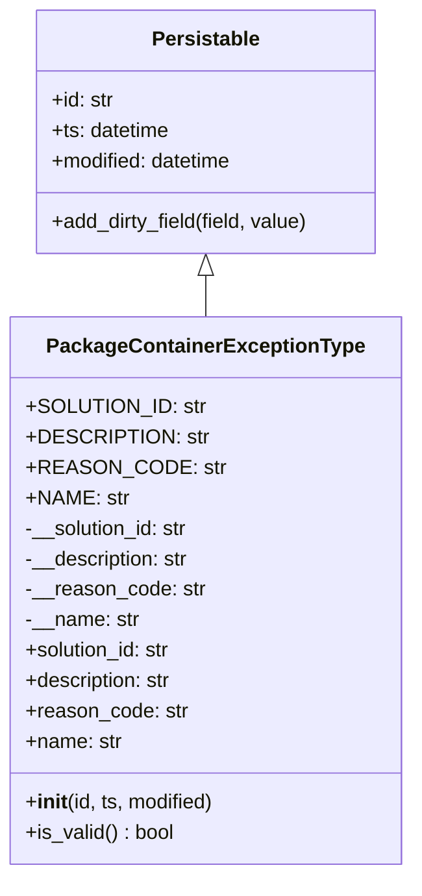
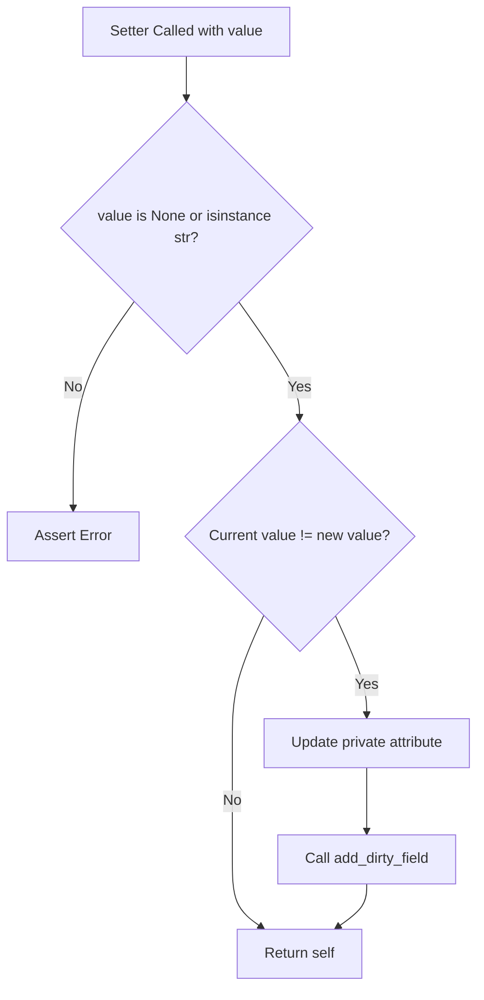
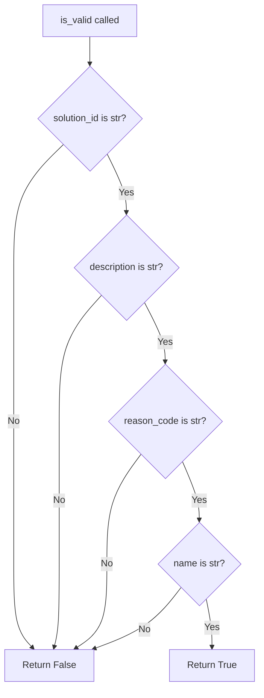
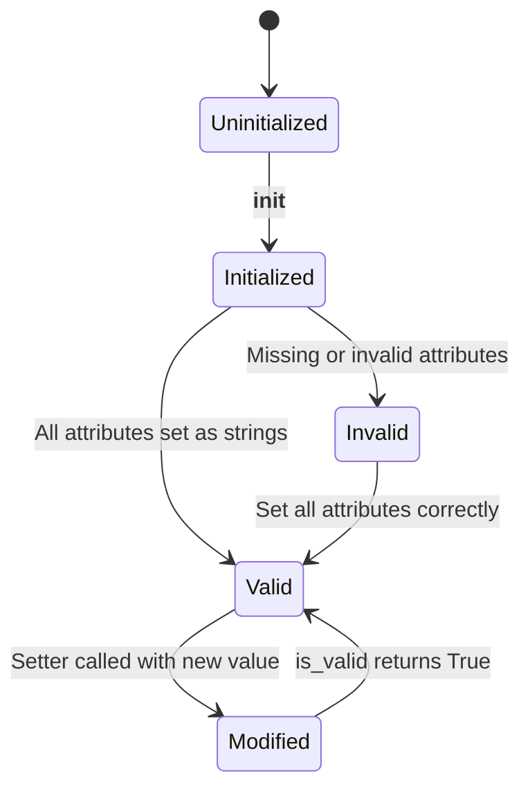

# Diagram: platform/partview_core/partview_service/partview_service/core/datamodel/PackageContainerExceptionType.py

> Auto-generated by Obscura crawlers

## Diagram 1

### SVG

<svg id="container" width="309.390625" xmlns="http://www.w3.org/2000/svg" class="classDiagram" height="690" viewBox="0 0 309.390625 690" role="graphics-document document" aria-roledescription="class"><g><defs><marker id="container_class-aggregationStart" class="marker aggregation class" refX="18" refY="7" markerWidth="190" markerHeight="240" orient="auto"><path d="M 18,7 L9,13 L1,7 L9,1 Z"></path></marker></defs><defs><marker id="container_class-aggregationEnd" class="marker aggregation class" refX="1" refY="7" markerWidth="20" markerHeight="28" orient="auto"><path d="M 18,7 L9,13 L1,7 L9,1 Z"></path></marker></defs><defs><marker id="container_class-extensionStart" class="marker extension class" refX="18" refY="7" markerWidth="190" markerHeight="240" orient="auto"><path d="M 1,7 L18,13 V 1 Z"></path></marker></defs><defs><marker id="container_class-extensionEnd" class="marker extension class" refX="1" refY="7" markerWidth="20" markerHeight="28" orient="auto"><path d="M 1,1 V 13 L18,7 Z"></path></marker></defs><defs><marker id="container_class-compositionStart" class="marker composition class" refX="18" refY="7" markerWidth="190" markerHeight="240" orient="auto"><path d="M 18,7 L9,13 L1,7 L9,1 Z"></path></marker></defs><defs><marker id="container_class-compositionEnd" class="marker composition class" refX="1" refY="7" markerWidth="20" markerHeight="28" orient="auto"><path d="M 18,7 L9,13 L1,7 L9,1 Z"></path></marker></defs><defs><marker id="container_class-dependencyStart" class="marker dependency class" refX="6" refY="7" markerWidth="190" markerHeight="240" orient="auto"><path d="M 5,7 L9,13 L1,7 L9,1 Z"></path></marker></defs><defs><marker id="container_class-dependencyEnd" class="marker dependency class" refX="13" refY="7" markerWidth="20" markerHeight="28" orient="auto"><path d="M 18,7 L9,13 L14,7 L9,1 Z"></path></marker></defs><defs><marker id="container_class-lollipopStart" class="marker lollipop class" refX="13" refY="7" markerWidth="190" markerHeight="240" orient="auto"><circle stroke="black" fill="transparent" cx="7" cy="7" r="6"></circle></marker></defs><defs><marker id="container_class-lollipopEnd" class="marker lollipop class" refX="1" refY="7" markerWidth="190" markerHeight="240" orient="auto"><circle stroke="black" fill="transparent" cx="7" cy="7" r="6"></circle></marker></defs><g class="root"><g class="clusters"></g><g class="edgePaths"><path d="M154.695,217.25L154.695,218.542C154.695,219.833,154.695,222.417,154.695,227.875C154.695,233.333,154.695,241.667,154.695,245.833L154.695,250" id="id_Persistable_PackageContainerExceptionType_1" class="edge-thickness-normal edge-pattern-solid relation" style=";;;" data-edge="true" data-et="edge" data-id="id_Persistable_PackageContainerExceptionType_1" data-points="W3sieCI6MTU0LjY5NTMxMjUsInkiOjIwMH0seyJ4IjoxNTQuNjk1MzEyNSwieSI6MjI1fSx7IngiOjE1NC42OTUzMTI1LCJ5IjoyNTB9XQ==" marker-start="url(#container_class-extensionStart)"></path></g><g class="edgeLabels"><g class="edgeLabel"><g class="label" data-id="id_Persistable_PackageContainerExceptionType_1" transform="translate(0, 0)"><foreignObject width="0" height="0">

</foreignObject></g></g></g><g class="nodes"><g class="node default" id="classId-Persistable-0" transform="translate(154.6953125, 104)"><g class="basic label-container"><path d="M-135.71484375 -96 L135.71484375 -96 L135.71484375 96 L-135.71484375 96" stroke="none" stroke-width="0" fill="#ECECFF" style=""></path><path d="M-135.71484375 -96 C-51.54291566803788 -96, 32.629012413924244 -96, 135.71484375 -96 M-135.71484375 -96 C-67.11304309606722 -96, 1.4887575578655685 -96, 135.71484375 -96 M135.71484375 -96 C135.71484375 -51.986938897545784, 135.71484375 -7.973877795091568, 135.71484375 96 M135.71484375 -96 C135.71484375 -21.896484212646897, 135.71484375 52.20703157470621, 135.71484375 96 M135.71484375 96 C27.53943021021962 96, -80.63598332956076 96, -135.71484375 96 M135.71484375 96 C55.109016485754196 96, -25.496810778491607 96, -135.71484375 96 M-135.71484375 96 C-135.71484375 46.202130467569134, -135.71484375 -3.595739064861732, -135.71484375 -96 M-135.71484375 96 C-135.71484375 21.96280088638305, -135.71484375 -52.0743982272339, -135.71484375 -96" stroke="#9370DB" stroke-width="1.3" fill="none" stroke-dasharray="0 0" style=""></path></g><g class="annotation-group text" transform="translate(0, -72)"></g><g class="label-group text" transform="translate(-40.9765625, -72)"><g class="label" style="font-weight: bolder" transform="translate(0,-12)"><foreignObject width="81.953125" height="24">

Persistable

</foreignObject></g></g><g class="members-group text" transform="translate(-123.71484375, -24)"><g class="label" style="" transform="translate(0,-12)"><foreignObject width="49.578125" height="24">

+id: str

</foreignObject></g><g class="label" style="" transform="translate(0,12)"><foreignObject width="94.484375" height="24">

+ts: datetime

</foreignObject></g><g class="label" style="" transform="translate(0,36)"><foreignObject width="145.9375" height="24">

+modified: datetime

</foreignObject></g></g><g class="methods-group text" transform="translate(-123.71484375, 72)"><g class="label" style="" transform="translate(0,-12)"><foreignObject width="206.453125" height="24">

+add_dirty_field(field, value)

</foreignObject></g></g><g class="divider" style=""><path d="M-135.71484375 -48 C-35.26255100680159 -48, 65.18974173639683 -48, 135.71484375 -48 M-135.71484375 -48 C-75.525369162803 -48, -15.33589457560602 -48, 135.71484375 -48" stroke="#9370DB" stroke-width="1.3" fill="none" stroke-dasharray="0 0" style=""></path></g><g class="divider" style=""><path d="M-135.71484375 48 C-68.57735047216435 48, -1.4398571943287095 48, 135.71484375 48 M-135.71484375 48 C-30.626805300859104 48, 74.46123314828179 48, 135.71484375 48" stroke="#9370DB" stroke-width="1.3" fill="none" stroke-dasharray="0 0" style=""></path></g></g><g class="node default" id="classId-PackageContainerExceptionType-1" transform="translate(154.6953125, 466)"><g class="basic label-container"><path d="M-146.6953125 -216 L146.6953125 -216 L146.6953125 216 L-146.6953125 216" stroke="none" stroke-width="0" fill="#ECECFF" style=""></path><path d="M-146.6953125 -216 C-54.41836367175365 -216, 37.858585156492694 -216, 146.6953125 -216 M-146.6953125 -216 C-39.5529543432811 -216, 67.5894038134378 -216, 146.6953125 -216 M146.6953125 -216 C146.6953125 -58.49866660800822, 146.6953125 99.00266678398356, 146.6953125 216 M146.6953125 -216 C146.6953125 -126.21559463343675, 146.6953125 -36.4311892668735, 146.6953125 216 M146.6953125 216 C44.23144221598933 216, -58.232428068021335 216, -146.6953125 216 M146.6953125 216 C64.51770592253028 216, -17.659900654939435 216, -146.6953125 216 M-146.6953125 216 C-146.6953125 108.96395972438671, -146.6953125 1.927919448773423, -146.6953125 -216 M-146.6953125 216 C-146.6953125 74.71127727443297, -146.6953125 -66.57744545113405, -146.6953125 -216" stroke="#9370DB" stroke-width="1.3" fill="none" stroke-dasharray="0 0" style=""></path></g><g class="annotation-group text" transform="translate(0, -192)"></g><g class="label-group text" transform="translate(-118.484375, -192)"><g class="label" style="font-weight: bolder" transform="translate(0,-12)"><foreignObject width="236.96875" height="24">

PackageContainerExceptionType

</foreignObject></g></g><g class="members-group text" transform="translate(-134.6953125, -144)"><g class="label" style="" transform="translate(0,-12)"><foreignObject width="131.140625" height="24">

+SOLUTION_ID: str

</foreignObject></g><g class="label" style="" transform="translate(0,12)"><foreignObject width="130.171875" height="24">

+DESCRIPTION: str

</foreignObject></g><g class="label" style="" transform="translate(0,36)"><foreignObject width="139.875" height="24">

+REASON_CODE: str

</foreignObject></g><g class="label" style="" transform="translate(0,60)"><foreignObject width="76.59375" height="24">

+NAME: str

</foreignObject></g><g class="label" style="" transform="translate(0,84)"><foreignObject width="131.390625" height="24">

-__solution_id: str

</foreignObject></g><g class="label" style="" transform="translate(0,108)"><foreignObject width="131.453125" height="24">

-__description: str

</foreignObject></g><g class="label" style="" transform="translate(0,132)"><foreignObject width="141.109375" height="24">

-__reason_code: str

</foreignObject></g><g class="label" style="" transform="translate(0,156)"><foreignObject width="89.671875" height="24">

-__name: str

</foreignObject></g><g class="label" style="" transform="translate(0,180)"><foreignObject width="117.71875" height="24">

+solution_id: str

</foreignObject></g><g class="label" style="" transform="translate(0,204)"><foreignObject width="118.109375" height="24">

+description: str

</foreignObject></g><g class="label" style="" transform="translate(0,228)"><foreignObject width="127.453125" height="24">

+reason_code: str

</foreignObject></g><g class="label" style="" transform="translate(0,252)"><foreignObject width="76.015625" height="24">

+name: str

</foreignObject></g></g><g class="methods-group text" transform="translate(-134.6953125, 168)"><g class="label" style="" transform="translate(0,-12)"><foreignObject width="150.90625" height="24">

+<strong>init</strong>(id, ts, modified)

</foreignObject></g><g class="label" style="" transform="translate(0,12)"><foreignObject width="117.984375" height="24">

+is_valid() : bool

</foreignObject></g></g><g class="divider" style=""><path d="M-146.6953125 -168 C-40.040754405209285 -168, 66.61380368958143 -168, 146.6953125 -168 M-146.6953125 -168 C-40.82263544952275 -168, 65.0500416009545 -168, 146.6953125 -168" stroke="#9370DB" stroke-width="1.3" fill="none" stroke-dasharray="0 0" style=""></path></g><g class="divider" style=""><path d="M-146.6953125 144 C-67.23640505233486 144, 12.222502395330281 144, 146.6953125 144 M-146.6953125 144 C-84.61254094014328 144, -22.529769380286567 144, 146.6953125 144" stroke="#9370DB" stroke-width="1.3" fill="none" stroke-dasharray="0 0" style=""></path></g></g></g></g></g></svg>

## Diagram 2

### SVG

<svg id="container" width="530.37109375" xmlns="http://www.w3.org/2000/svg" class="flowchart" height="1082.59375" viewBox="0 0 530.37109375 1082.59375" role="graphics-document document" aria-roledescription="flowchart-v2"><g><marker id="container_flowchart-v2-pointEnd" class="marker flowchart-v2" viewBox="0 0 10 10" refX="5" refY="5" markerUnits="userSpaceOnUse" markerWidth="8" markerHeight="8" orient="auto"><path d="M 0 0 L 10 5 L 0 10 z" class="arrowMarkerPath" style="stroke-width: 1; stroke-dasharray: 1, 0;"></path></marker><marker id="container_flowchart-v2-pointStart" class="marker flowchart-v2" viewBox="0 0 10 10" refX="4.5" refY="5" markerUnits="userSpaceOnUse" markerWidth="8" markerHeight="8" orient="auto"><path d="M 0 5 L 10 10 L 10 0 z" class="arrowMarkerPath" style="stroke-width: 1; stroke-dasharray: 1, 0;"></path></marker><marker id="container_flowchart-v2-circleEnd" class="marker flowchart-v2" viewBox="0 0 10 10" refX="11" refY="5" markerUnits="userSpaceOnUse" markerWidth="11" markerHeight="11" orient="auto"><circle cx="5" cy="5" r="5" class="arrowMarkerPath" style="stroke-width: 1; stroke-dasharray: 1, 0;"></circle></marker><marker id="container_flowchart-v2-circleStart" class="marker flowchart-v2" viewBox="0 0 10 10" refX="-1" refY="5" markerUnits="userSpaceOnUse" markerWidth="11" markerHeight="11" orient="auto"><circle cx="5" cy="5" r="5" class="arrowMarkerPath" style="stroke-width: 1; stroke-dasharray: 1, 0;"></circle></marker><marker id="container_flowchart-v2-crossEnd" class="marker cross flowchart-v2" viewBox="0 0 11 11" refX="12" refY="5.2" markerUnits="userSpaceOnUse" markerWidth="11" markerHeight="11" orient="auto"><path d="M 1,1 l 9,9 M 10,1 l -9,9" class="arrowMarkerPath" style="stroke-width: 2; stroke-dasharray: 1, 0;"></path></marker><marker id="container_flowchart-v2-crossStart" class="marker cross flowchart-v2" viewBox="0 0 11 11" refX="-1" refY="5.2" markerUnits="userSpaceOnUse" markerWidth="11" markerHeight="11" orient="auto"><path d="M 1,1 l 9,9 M 10,1 l -9,9" class="arrowMarkerPath" style="stroke-width: 2; stroke-dasharray: 1, 0;"></path></marker><g class="root"><g class="clusters"></g><g class="edgePaths"><path d="M204.141,62L204.141,66.167C204.141,70.333,204.141,78.667,204.141,86.333C204.141,94,204.141,101,204.141,104.5L204.141,108" id="L_A_B_0" class="edge-thickness-normal edge-pattern-solid edge-thickness-normal edge-pattern-solid flowchart-link" style=";" data-edge="true" data-et="edge" data-id="L_A_B_0" data-points="W3sieCI6MjA0LjE0MDYyNSwieSI6NjJ9LHsieCI6MjA0LjE0MDYyNSwieSI6ODd9LHsieCI6MjA0LjE0MDYyNSwieSI6MTEyfV0=" marker-end="url(#container_flowchart-v2-pointEnd)"></path><path d="M146.738,332.598L135.67,348.331C124.602,364.065,102.465,395.533,91.396,433.149C80.328,470.766,80.328,514.531,80.328,536.414L80.328,558.297" id="L_B_C_0" class="edge-thickness-normal edge-pattern-solid edge-thickness-normal edge-pattern-solid flowchart-link" style=";" data-edge="true" data-et="edge" data-id="L_B_C_0" data-points="W3sieCI6MTQ2LjczODI5MDIwNzQyMTMsInkiOjMzMi41OTc2NjUyMDc0MjEzfSx7IngiOjgwLjMyODEyNSwieSI6NDI3fSx7IngiOjgwLjMyODEyNSwieSI6NTYyLjI5Njg3NX1d" marker-end="url(#container_flowchart-v2-pointEnd)"></path><path d="M261.543,332.598L272.611,348.331C283.68,364.065,305.816,395.533,316.885,416.766C327.953,438,327.953,449,327.953,454.5L327.953,460" id="L_B_D_0" class="edge-thickness-normal edge-pattern-solid edge-thickness-normal edge-pattern-solid flowchart-link" style=";" data-edge="true" data-et="edge" data-id="L_B_D_0" data-points="W3sieCI6MjYxLjU0Mjk1OTc5MjU3ODcsInkiOjMzMi41OTc2NjUyMDc0MjEzfSx7IngiOjMyNy45NTMxMjUsInkiOjQyN30seyJ4IjozMjcuOTUzMTI1LCJ5Ijo0NjR9XQ==" marker-end="url(#container_flowchart-v2-pointEnd)"></path><path d="M287.823,674.464L281.766,687.319C275.709,700.174,263.595,725.884,257.538,749.405C251.48,772.927,251.48,794.26,251.48,815.594C251.48,836.927,251.48,858.26,251.48,879.594C251.48,900.927,251.48,922.26,251.48,941.594C251.48,960.927,251.48,978.26,257.057,990.719C262.633,1003.177,273.786,1010.761,279.362,1014.553L284.938,1018.345" id="L_D_E_0" class="edge-thickness-normal edge-pattern-solid edge-thickness-normal edge-pattern-solid flowchart-link" style=";" data-edge="true" data-et="edge" data-id="L_D_E_0" data-points="W3sieCI6Mjg3LjgyMzI3NzYwNzM2MTk0LCJ5Ijo2NzQuNDYzOTAyNjA3MzYyfSx7IngiOjI1MS40ODA0Njg3NSwieSI6NzUxLjU5Mzc1fSx7IngiOjI1MS40ODA0Njg3NSwieSI6ODE1LjU5Mzc1fSx7IngiOjI1MS40ODA0Njg3NSwieSI6ODc5LjU5Mzc1fSx7IngiOjI1MS40ODA0Njg3NSwieSI6OTQzLjU5Mzc1fSx7IngiOjI1MS40ODA0Njg3NSwieSI6OTk1LjU5Mzc1fSx7IngiOjI4OC4yNDYxNjg4NzAxOTIzLCJ5IjoxMDIwLjU5Mzc1fV0=" marker-end="url(#container_flowchart-v2-pointEnd)"></path><path d="M368.083,674.464L374.14,687.319C380.197,700.174,392.312,725.884,398.369,744.239C404.426,762.594,404.426,773.594,404.426,779.094L404.426,784.594" id="L_D_F_0" class="edge-thickness-normal edge-pattern-solid edge-thickness-normal edge-pattern-solid flowchart-link" style=";" data-edge="true" data-et="edge" data-id="L_D_F_0" data-points="W3sieCI6MzY4LjA4Mjk3MjM5MjYzODA2LCJ5Ijo2NzQuNDYzOTAyNjA3MzYyfSx7IngiOjQwNC40MjU3ODEyNSwieSI6NzUxLjU5Mzc1fSx7IngiOjQwNC40MjU3ODEyNSwieSI6Nzg4LjU5Mzc1fV0=" marker-end="url(#container_flowchart-v2-pointEnd)"></path><path d="M404.426,842.594L404.426,848.76C404.426,854.927,404.426,867.26,404.426,878.927C404.426,890.594,404.426,901.594,404.426,907.094L404.426,912.594" id="L_F_G_0" class="edge-thickness-normal edge-pattern-solid edge-thickness-normal edge-pattern-solid flowchart-link" style=";" data-edge="true" data-et="edge" data-id="L_F_G_0" data-points="W3sieCI6NDA0LjQyNTc4MTI1LCJ5Ijo4NDIuNTkzNzV9LHsieCI6NDA0LjQyNTc4MTI1LCJ5Ijo4NzkuNTkzNzV9LHsieCI6NDA0LjQyNTc4MTI1LCJ5Ijo5MTYuNTkzNzV9XQ==" marker-end="url(#container_flowchart-v2-pointEnd)"></path><path d="M404.426,970.594L404.426,974.76C404.426,978.927,404.426,987.26,398.849,995.219C393.273,1003.177,382.12,1010.761,376.544,1014.553L370.968,1018.345" id="L_G_E_0" class="edge-thickness-normal edge-pattern-solid edge-thickness-normal edge-pattern-solid flowchart-link" style=";" data-edge="true" data-et="edge" data-id="L_G_E_0" data-points="W3sieCI6NDA0LjQyNTc4MTI1LCJ5Ijo5NzAuNTkzNzV9LHsieCI6NDA0LjQyNTc4MTI1LCJ5Ijo5OTUuNTkzNzV9LHsieCI6MzY3LjY2MDA4MTEyOTgwNzcsInkiOjEwMjAuNTkzNzV9XQ==" marker-end="url(#container_flowchart-v2-pointEnd)"></path></g><g class="edgeLabels"><g class="edgeLabel"><g class="label" data-id="L_A_B_0" transform="translate(0, 0)"><foreignObject width="0" height="0">

</foreignObject></g></g><g class="edgeLabel" transform="translate(80.328125, 427)"><g class="label" data-id="L_B_C_0" transform="translate(-10.140625, -12)"><foreignObject width="20.28125" height="24">

No

</foreignObject></g></g><g class="edgeLabel" transform="translate(327.953125, 427)"><g class="label" data-id="L_B_D_0" transform="translate(-12.03125, -12)"><foreignObject width="24.0625" height="24">

Yes

</foreignObject></g></g><g class="edgeLabel" transform="translate(251.48046875, 879.59375)"><g class="label" data-id="L_D_E_0" transform="translate(-10.140625, -12)"><foreignObject width="20.28125" height="24">

No

</foreignObject></g></g><g class="edgeLabel" transform="translate(404.42578125, 751.59375)"><g class="label" data-id="L_D_F_0" transform="translate(-12.03125, -12)"><foreignObject width="24.0625" height="24">

Yes

</foreignObject></g></g><g class="edgeLabel"><g class="label" data-id="L_F_G_0" transform="translate(0, 0)"><foreignObject width="0" height="0">

</foreignObject></g></g><g class="edgeLabel"><g class="label" data-id="L_G_E_0" transform="translate(0, 0)"><foreignObject width="0" height="0">

</foreignObject></g></g></g><g class="nodes"><g class="node default" id="flowchart-A-0" transform="translate(204.140625, 35)"><rect class="basic label-container" style="" x="-115.65625" y="-27" width="231.3125" height="54"></rect><g class="label" style="" transform="translate(-85.65625, -12)"><rect></rect><foreignObject width="171.3125" height="24">

Setter Called with value

</foreignObject></g></g><g class="node default" id="flowchart-B-1" transform="translate(204.140625, 251)"><polygon points="139,0 278,-139 139,-278 0,-139" class="label-container" transform="translate(-138.5, 139)"></polygon><g class="label" style="" transform="translate(-100, -24)"><rect></rect><foreignObject width="200" height="48">

value is None or isinstance str?

</foreignObject></g></g><g class="node default" id="flowchart-C-3" transform="translate(80.328125, 589.296875)"><rect class="basic label-container" style="" x="-72.328125" y="-27" width="144.65625" height="54"></rect><g class="label" style="" transform="translate(-42.328125, -12)"><rect></rect><foreignObject width="84.65625" height="24">

Assert Error

</foreignObject></g></g><g class="node default" id="flowchart-D-5" transform="translate(327.953125, 589.296875)"><polygon points="125.296875,0 250.59375,-125.296875 125.296875,-250.59375 0,-125.296875" class="label-container" transform="translate(-124.796875, 125.296875)"></polygon><g class="label" style="" transform="translate(-98.296875, -12)"><rect></rect><foreignObject width="196.59375" height="24">

Current value != new value?

</foreignObject></g></g><g class="node default" id="flowchart-E-7" transform="translate(327.953125, 1047.59375)"><rect class="basic label-container" style="" x="-69.640625" y="-27" width="139.28125" height="54"></rect><g class="label" style="" transform="translate(-39.640625, -12)"><rect></rect><foreignObject width="79.28125" height="24">

Return self

</foreignObject></g></g><g class="node default" id="flowchart-F-9" transform="translate(404.42578125, 815.59375)"><rect class="basic label-container" style="" x="-117.9453125" y="-27" width="235.890625" height="54"></rect><g class="label" style="" transform="translate(-87.9453125, -12)"><rect></rect><foreignObject width="175.890625" height="24">

Update private attribute

</foreignObject></g></g><g class="node default" id="flowchart-G-11" transform="translate(404.42578125, 943.59375)"><rect class="basic label-container" style="" x="-100.125" y="-27" width="200.25" height="54"></rect><g class="label" style="" transform="translate(-70.125, -12)"><rect></rect><foreignObject width="140.25" height="24">

Call add_dirty_field

</foreignObject></g></g></g></g></g></svg>

## Diagram 3

### SVG

<svg id="container" width="439.671875" xmlns="http://www.w3.org/2000/svg" class="flowchart" height="1170.34375" viewBox="0 0 439.671875 1170.34375" role="graphics-document document" aria-roledescription="flowchart-v2"><g><marker id="container_flowchart-v2-pointEnd" class="marker flowchart-v2" viewBox="0 0 10 10" refX="5" refY="5" markerUnits="userSpaceOnUse" markerWidth="8" markerHeight="8" orient="auto"><path d="M 0 0 L 10 5 L 0 10 z" class="arrowMarkerPath" style="stroke-width: 1; stroke-dasharray: 1, 0;"></path></marker><marker id="container_flowchart-v2-pointStart" class="marker flowchart-v2" viewBox="0 0 10 10" refX="4.5" refY="5" markerUnits="userSpaceOnUse" markerWidth="8" markerHeight="8" orient="auto"><path d="M 0 5 L 10 10 L 10 0 z" class="arrowMarkerPath" style="stroke-width: 1; stroke-dasharray: 1, 0;"></path></marker><marker id="container_flowchart-v2-circleEnd" class="marker flowchart-v2" viewBox="0 0 10 10" refX="11" refY="5" markerUnits="userSpaceOnUse" markerWidth="11" markerHeight="11" orient="auto"><circle cx="5" cy="5" r="5" class="arrowMarkerPath" style="stroke-width: 1; stroke-dasharray: 1, 0;"></circle></marker><marker id="container_flowchart-v2-circleStart" class="marker flowchart-v2" viewBox="0 0 10 10" refX="-1" refY="5" markerUnits="userSpaceOnUse" markerWidth="11" markerHeight="11" orient="auto"><circle cx="5" cy="5" r="5" class="arrowMarkerPath" style="stroke-width: 1; stroke-dasharray: 1, 0;"></circle></marker><marker id="container_flowchart-v2-crossEnd" class="marker cross flowchart-v2" viewBox="0 0 11 11" refX="12" refY="5.2" markerUnits="userSpaceOnUse" markerWidth="11" markerHeight="11" orient="auto"><path d="M 1,1 l 9,9 M 10,1 l -9,9" class="arrowMarkerPath" style="stroke-width: 2; stroke-dasharray: 1, 0;"></path></marker><marker id="container_flowchart-v2-crossStart" class="marker cross flowchart-v2" viewBox="0 0 11 11" refX="-1" refY="5.2" markerUnits="userSpaceOnUse" markerWidth="11" markerHeight="11" orient="auto"><path d="M 1,1 l 9,9 M 10,1 l -9,9" class="arrowMarkerPath" style="stroke-width: 2; stroke-dasharray: 1, 0;"></path></marker><g class="root"><g class="clusters"></g><g class="edgePaths"><path d="M151.152,62L151.152,66.167C151.152,70.333,151.152,78.667,151.152,86.333C151.152,94,151.152,101,151.152,104.5L151.152,108" id="L_A_B_0" class="edge-thickness-normal edge-pattern-solid edge-thickness-normal edge-pattern-solid flowchart-link" style=";" data-edge="true" data-et="edge" data-id="L_A_B_0" data-points="W3sieCI6MTUxLjE1MjM0Mzc1LCJ5Ijo2Mn0seyJ4IjoxNTEuMTUyMzQzNzUsInkiOjg3fSx7IngiOjE1MS4xNTIzNDM3NSwieSI6MTEyfV0=" marker-end="url(#container_flowchart-v2-pointEnd)"></path><path d="M105.361,249.193L91.535,262.992C77.709,276.79,50.058,304.387,36.232,339.634C22.406,374.88,22.406,417.776,22.406,460.672C22.406,503.568,22.406,546.464,22.406,590.138C22.406,633.813,22.406,678.266,22.406,722.719C22.406,767.172,22.406,811.625,22.406,851.79C22.406,891.956,22.406,927.833,22.406,963.711C22.406,999.589,22.406,1035.466,27.758,1059.086C33.109,1082.706,43.811,1094.069,49.163,1099.751L54.514,1105.432" id="L_B_C_0" class="edge-thickness-normal edge-pattern-solid edge-thickness-normal edge-pattern-solid flowchart-link" style=";" data-edge="true" data-et="edge" data-id="L_B_C_0" data-points="W3sieCI6MTA1LjM2MTA5NjQ1OTYzMzU3LCJ5IjoyNDkuMTkzMTI3NzA5NjMzNn0seyJ4IjoyMi40MDYyNSwieSI6MzMxLjk4NDM3NX0seyJ4IjoyMi40MDYyNSwieSI6NDYwLjY3MTg3NX0seyJ4IjoyMi40MDYyNSwieSI6NTg5LjM1OTM3NX0seyJ4IjoyMi40MDYyNSwieSI6NzIyLjcxODc1fSx7IngiOjIyLjQwNjI1LCJ5Ijo4NTYuMDc4MTI1fSx7IngiOjIyLjQwNjI1LCJ5Ijo5NjMuNzEwOTM3NX0seyJ4IjoyMi40MDYyNSwieSI6MTA3MS4zNDM3NX0seyJ4Ijo1Ny4yNTYzNDc2NTYyNSwieSI6MTEwOC4zNDM3NX1d" marker-end="url(#container_flowchart-v2-pointEnd)"></path><path d="M181.363,264.774L186.885,275.976C192.407,287.177,203.452,309.581,208.974,326.283C214.496,342.984,214.496,353.984,214.496,359.484L214.496,364.984" id="L_B_D_0" class="edge-thickness-normal edge-pattern-solid edge-thickness-normal edge-pattern-solid flowchart-link" style=";" data-edge="true" data-et="edge" data-id="L_B_D_0" data-points="W3sieCI6MTgxLjM2MjgzNjc3NTg2MDMsInkiOjI2NC43NzM4ODE5NzQxMzk2N30seyJ4IjoyMTQuNDk2MDkzNzUsInkiOjMzMS45ODQzNzV9LHsieCI6MjE0LjQ5NjA5Mzc1LCJ5IjozNjguOTg0Mzc1fV0=" marker-end="url(#container_flowchart-v2-pointEnd)"></path><path d="M171.492,509.355L159.713,522.689C147.935,536.023,124.377,562.691,112.599,598.252C100.82,633.813,100.82,678.266,100.82,722.719C100.82,767.172,100.82,811.625,100.82,851.79C100.82,891.956,100.82,927.833,100.82,963.711C100.82,999.589,100.82,1035.466,99.255,1058.93C97.689,1082.394,94.559,1093.445,92.993,1098.97L91.428,1104.495" id="L_D_C_0" class="edge-thickness-normal edge-pattern-solid edge-thickness-normal edge-pattern-solid flowchart-link" style=";" data-edge="true" data-et="edge" data-id="L_D_C_0" data-points="W3sieCI6MTcxLjQ5MTg1NTg5ODQ0MDY2LCJ5Ijo1MDkuMzU1MTM3MTQ4NDQwNjN9LHsieCI6MTAwLjgyMDMxMjUsInkiOjU4OS4zNTkzNzV9LHsieCI6MTAwLjgyMDMxMjUsInkiOjcyMi43MTg3NX0seyJ4IjoxMDAuODIwMzEyNSwieSI6ODU2LjA3ODEyNX0seyJ4IjoxMDAuODIwMzEyNSwieSI6OTYzLjcxMDkzNzV9LHsieCI6MTAwLjgyMDMxMjUsInkiOjEwNzEuMzQzNzV9LHsieCI6OTAuMzM3MjgwMjczNDM3NSwieSI6MTEwOC4zNDM3NX1d" marker-end="url(#container_flowchart-v2-pointEnd)"></path><path d="M245.479,521.377L251.262,532.707C257.044,544.038,268.61,566.698,274.393,583.529C280.176,600.359,280.176,611.359,280.176,616.859L280.176,622.359" id="L_D_E_0" class="edge-thickness-normal edge-pattern-solid edge-thickness-normal edge-pattern-solid flowchart-link" style=";" data-edge="true" data-et="edge" data-id="L_D_E_0" data-points="W3sieCI6MjQ1LjQ3ODcyMjE3MTU2MDM1LCJ5Ijo1MjEuMzc2NzQ2NTc4NDM5N30seyJ4IjoyODAuMTc1NzgxMjUsInkiOjU4OS4zNTkzNzV9LHsieCI6MjgwLjE3NTc4MTI1LCJ5Ijo2MjYuMzU5Mzc1fV0=" marker-end="url(#container_flowchart-v2-pointEnd)"></path><path d="M239.215,778.117L229.607,791.11C220,804.104,200.785,830.091,191.178,861.023C181.57,891.956,181.57,927.833,181.57,963.711C181.57,999.589,181.57,1035.466,172.602,1059.209C163.634,1082.953,145.698,1094.561,136.73,1100.366L127.762,1106.17" id="L_E_C_0" class="edge-thickness-normal edge-pattern-solid edge-thickness-normal edge-pattern-solid flowchart-link" style=";" data-edge="true" data-et="edge" data-id="L_E_C_0" data-points="W3sieCI6MjM5LjIxNDU2ODM5MjM2NCwieSI6Nzc4LjExNjkxMjE0MjM2NH0seyJ4IjoxODEuNTcwMzEyNSwieSI6ODU2LjA3ODEyNX0seyJ4IjoxODEuNTcwMzEyNSwieSI6OTYzLjcxMDkzNzV9LHsieCI6MTgxLjU3MDMxMjUsInkiOjEwNzEuMzQzNzV9LHsieCI6MTI0LjQwMzY4NjUyMzQzNzUsInkiOjExMDguMzQzNzV9XQ==" marker-end="url(#container_flowchart-v2-pointEnd)"></path><path d="M309.342,789.912L314.129,800.94C318.916,811.967,328.489,834.023,333.276,850.55C338.063,867.078,338.063,878.078,338.063,883.578L338.063,889.078" id="L_E_F_0" class="edge-thickness-normal edge-pattern-solid edge-thickness-normal edge-pattern-solid flowchart-link" style=";" data-edge="true" data-et="edge" data-id="L_E_F_0" data-points="W3sieCI6MzA5LjM0MjAxMzc3MzY0MjI0LCJ5Ijo3ODkuOTExODkyNDc2MzU3OH0seyJ4IjozMzguMDYyNSwieSI6ODU2LjA3ODEyNX0seyJ4IjozMzguMDYyNSwieSI6ODkzLjA3ODEyNX1d" marker-end="url(#container_flowchart-v2-pointEnd)"></path><path d="M307.198,1003.479L298.419,1014.79C289.641,1026.101,272.084,1048.722,247.373,1065.967C222.662,1083.212,190.796,1095.08,174.864,1101.014L158.931,1106.948" id="L_F_C_0" class="edge-thickness-normal edge-pattern-solid edge-thickness-normal edge-pattern-solid flowchart-link" style=";" data-edge="true" data-et="edge" data-id="L_F_C_0" data-points="W3sieCI6MzA3LjE5Nzg5OTI2NjE3ODMsInkiOjEwMDMuNDc5MTQ5MjY2MTc4M30seyJ4IjoyNTQuNTI3MzQzNzUsInkiOjEwNzEuMzQzNzV9LHsieCI6MTU1LjE4MjQzNDA4MjAzMTI1LCJ5IjoxMTA4LjM0Mzc1fV0=" marker-end="url(#container_flowchart-v2-pointEnd)"></path><path d="M349.633,1022.773L351.219,1030.868C352.805,1038.963,355.977,1055.154,357.563,1068.749C359.148,1082.344,359.148,1093.344,359.148,1098.844L359.148,1104.344" id="L_F_G_0" class="edge-thickness-normal edge-pattern-solid edge-thickness-normal edge-pattern-solid flowchart-link" style=";" data-edge="true" data-et="edge" data-id="L_F_G_0" data-points="W3sieCI6MzQ5LjYzMzE0NTg0NDcxMzUsInkiOjEwMjIuNzczMTA0MTU1Mjg2NH0seyJ4IjozNTkuMTQ4NDM3NSwieSI6MTA3MS4zNDM3NX0seyJ4IjozNTkuMTQ4NDM3NSwieSI6MTEwOC4zNDM3NX1d" marker-end="url(#container_flowchart-v2-pointEnd)"></path></g><g class="edgeLabels"><g class="edgeLabel"><g class="label" data-id="L_A_B_0" transform="translate(0, 0)"><foreignObject width="0" height="0">

</foreignObject></g></g><g class="edgeLabel" transform="translate(22.40625, 722.71875)"><g class="label" data-id="L_B_C_0" transform="translate(-10.140625, -12)"><foreignObject width="20.28125" height="24">

No

</foreignObject></g></g><g class="edgeLabel" transform="translate(214.49609375, 331.984375)"><g class="label" data-id="L_B_D_0" transform="translate(-12.03125, -12)"><foreignObject width="24.0625" height="24">

Yes

</foreignObject></g></g><g class="edgeLabel" transform="translate(100.8203125, 856.078125)"><g class="label" data-id="L_D_C_0" transform="translate(-10.140625, -12)"><foreignObject width="20.28125" height="24">

No

</foreignObject></g></g><g class="edgeLabel" transform="translate(280.17578125, 589.359375)"><g class="label" data-id="L_D_E_0" transform="translate(-12.03125, -12)"><foreignObject width="24.0625" height="24">

Yes

</foreignObject></g></g><g class="edgeLabel" transform="translate(181.5703125, 963.7109375)"><g class="label" data-id="L_E_C_0" transform="translate(-10.140625, -12)"><foreignObject width="20.28125" height="24">

No

</foreignObject></g></g><g class="edgeLabel" transform="translate(338.0625, 856.078125)"><g class="label" data-id="L_E_F_0" transform="translate(-12.03125, -12)"><foreignObject width="24.0625" height="24">

Yes

</foreignObject></g></g><g class="edgeLabel" transform="translate(245.10668, 1074.85238)"><g class="label" data-id="L_F_C_0" transform="translate(-10.140625, -12)"><foreignObject width="20.28125" height="24">

No

</foreignObject></g></g><g class="edgeLabel" transform="translate(359.1484375, 1071.34375)"><g class="label" data-id="L_F_G_0" transform="translate(-12.03125, -12)"><foreignObject width="24.0625" height="24">

Yes

</foreignObject></g></g></g><g class="nodes"><g class="node default" id="flowchart-A-0" transform="translate(151.15234375, 35)"><rect class="basic label-container" style="" x="-81.1484375" y="-27" width="162.296875" height="54"></rect><g class="label" style="" transform="translate(-51.1484375, -12)"><rect></rect><foreignObject width="102.296875" height="24">

is_valid called

</foreignObject></g></g><g class="node default" id="flowchart-B-1" transform="translate(151.15234375, 203.4921875)"><polygon points="91.4921875,0 182.984375,-91.4921875 91.4921875,-182.984375 0,-91.4921875" class="label-container" transform="translate(-90.9921875, 91.4921875)"></polygon><g class="label" style="" transform="translate(-64.4921875, -12)"><rect></rect><foreignObject width="128.984375" height="24">

solution_id is str?

</foreignObject></g></g><g class="node default" id="flowchart-C-3" transform="translate(82.6875, 1135.34375)"><rect class="basic label-container" style="" x="-74.6875" y="-27" width="149.375" height="54"></rect><g class="label" style="" transform="translate(-44.6875, -12)"><rect></rect><foreignObject width="89.375" height="24">

Return False

</foreignObject></g></g><g class="node default" id="flowchart-D-5" transform="translate(214.49609375, 460.671875)"><polygon points="91.6875,0 183.375,-91.6875 91.6875,-183.375 0,-91.6875" class="label-container" transform="translate(-91.1875, 91.6875)"></polygon><g class="label" style="" transform="translate(-64.6875, -12)"><rect></rect><foreignObject width="129.375" height="24">

description is str?

</foreignObject></g></g><g class="node default" id="flowchart-E-9" transform="translate(280.17578125, 722.71875)"><polygon points="96.359375,0 192.71875,-96.359375 96.359375,-192.71875 0,-96.359375" class="label-container" transform="translate(-95.859375, 96.359375)"></polygon><g class="label" style="" transform="translate(-69.359375, -12)"><rect></rect><foreignObject width="138.71875" height="24">

reason_code is str?

</foreignObject></g></g><g class="node default" id="flowchart-F-13" transform="translate(338.0625, 963.7109375)"><polygon points="70.6328125,0 141.265625,-70.6328125 70.6328125,-141.265625 0,-70.6328125" class="label-container" transform="translate(-70.1328125, 70.6328125)"></polygon><g class="label" style="" transform="translate(-43.6328125, -12)"><rect></rect><foreignObject width="87.265625" height="24">

name is str?

</foreignObject></g></g><g class="node default" id="flowchart-G-17" transform="translate(359.1484375, 1135.34375)"><rect class="basic label-container" style="" x="-72.5234375" y="-27" width="145.046875" height="54"></rect><g class="label" style="" transform="translate(-42.5234375, -12)"><rect></rect><foreignObject width="85.046875" height="24">

Return True

</foreignObject></g></g></g></g></g></svg>

## Diagram 4

### SVG

<svg id="container" width="395.0859375" xmlns="http://www.w3.org/2000/svg" class="statediagram" height="624" viewBox="0 0 395.0859375 624" role="graphics-document document" aria-roledescription="stateDiagram"><g><defs><marker id="container_stateDiagram-barbEnd" refX="19" refY="7" markerWidth="20" markerHeight="14" markerUnits="userSpaceOnUse" orient="auto"><path d="M 19,7 L9,13 L14,7 L9,1 Z"></path></marker></defs><g class="root"><g class="clusters"></g><g class="edgePaths"><path d="M204.863,22L204.863,26.167C204.863,30.333,204.863,38.667,204.947,47.083C205.03,55.5,205.197,64,205.28,68.25L205.363,72.5" id="edge0" class="edge-thickness-normal edge-pattern-solid transition" style="fill:none;;;fill:none" data-edge="true" data-et="edge" data-id="edge0" data-points="W3sieCI6MjA0Ljg2MzI4MTI1LCJ5IjoyMn0seyJ4IjoyMDQuODYzMjgxMjUsInkiOjQ3fSx7IngiOjIwNS4zNjMyODEyNSwieSI6NzIuNX1d" marker-end="url(#container_stateDiagram-barbEnd)"></path><path d="M205.363,112.5L205.28,118.583C205.197,124.667,205.03,136.833,205.03,149.167C205.03,161.5,205.197,174,205.28,180.25L205.363,186.5" id="edge1" class="edge-thickness-normal edge-pattern-solid transition" style="fill:none;;;fill:none" data-edge="true" data-et="edge" data-id="edge1" data-points="W3sieCI6MjA1LjM2MzI4MTI1LCJ5IjoxMTIuNX0seyJ4IjoyMDQuODYzMjgxMjUsInkiOjE0OX0seyJ4IjoyMDUuMzYzMjgxMjUsInkiOjE4Ni41fV0=" marker-end="url(#container_stateDiagram-barbEnd)"></path><path d="M181.531,226.5L171.716,234.583C161.901,242.667,142.271,258.833,132.456,278.417C122.641,298,122.641,321,122.641,342C122.641,363,122.641,382,132.236,398.177C141.831,414.354,161.021,427.709,170.616,434.386L180.211,441.063" id="edge2" class="edge-thickness-normal edge-pattern-solid transition" style="fill:none;;;fill:none" data-edge="true" data-et="edge" data-id="edge2" data-points="W3sieCI6MTgxLjUzMDYyNzI2NDQ5Mjc1LCJ5IjoyMjYuNX0seyJ4IjoxMjIuNjQwNjI1LCJ5IjoyNzV9LHsieCI6MTIyLjY0MDYyNSwieSI6MzQ0fSx7IngiOjEyMi42NDA2MjUsInkiOjQwMX0seyJ4IjoxODAuMjEwNzkyOTE4ODA3ODQsInkiOjQ0MS4wNjMyOTk0NTcwNDA0NH1d" marker-end="url(#container_stateDiagram-barbEnd)"></path><path d="M229.196,226.5L238.844,234.583C248.493,242.667,267.789,258.833,277.521,275.167C287.253,291.5,287.419,308,287.503,316.25L287.586,324.5" id="edge3" class="edge-thickness-normal edge-pattern-solid transition" style="fill:none;;;fill:none" data-edge="true" data-et="edge" data-id="edge3" data-points="W3sieCI6MjI5LjE5NTkzNTIzNTUwNzI1LCJ5IjoyMjYuNX0seyJ4IjoyODcuMDg1OTM3NSwieSI6Mjc1fSx7IngiOjI4Ny41ODU5Mzc1LCJ5IjozMjQuNX1d" marker-end="url(#container_stateDiagram-barbEnd)"></path><path d="M180.415,476.272L168.346,484.727C156.277,493.181,132.138,510.091,131.617,526.795C131.096,543.5,154.191,560,165.739,568.25L177.287,576.5" id="edge4" class="edge-thickness-normal edge-pattern-solid transition" style="fill:none;;;fill:none" data-edge="true" data-et="edge" data-id="edge4" data-points="W3sieCI6MTgwLjQxNDg4MTExODY0Njg2LCJ5Ijo0NzYuMjcxODQ5MDEwNzc2MzV9LHsieCI6MTA4LCJ5Ijo1Mjd9LHsieCI6MTc3LjI4Njk2Nzg0NDIwMjksInkiOjU3Ni41fV0=" marker-end="url(#container_stateDiagram-barbEnd)"></path><path d="M233.44,576.5L244.821,568.25C256.202,560,278.964,543.5,278.443,526.795C277.922,510.091,254.117,493.181,242.214,484.727L230.312,476.272" id="edge5" class="edge-thickness-normal edge-pattern-solid transition" style="fill:none;;;fill:none" data-edge="true" data-et="edge" data-id="edge5" data-points="W3sieCI6MjMzLjQzOTU5NDY1NTc5NzEsInkiOjU3Ni41fSx7IngiOjMwMS43MjY1NjI1LCJ5Ijo1Mjd9LHsieCI6MjMwLjMxMTY4MTM4MTM1MjYsInkiOjQ3Ni4yNzE4NDkwMTA3NzU5NX1d" marker-end="url(#container_stateDiagram-barbEnd)"></path><path d="M287.586,364.5L287.503,370.583C287.419,376.667,287.253,388.833,277.741,401.594C268.229,414.354,249.372,427.709,239.944,434.386L230.516,441.063" id="edge6" class="edge-thickness-normal edge-pattern-solid transition" style="fill:none;;;fill:none" data-edge="true" data-et="edge" data-id="edge6" data-points="W3sieCI6Mjg3LjU4NTkzNzUsInkiOjM2NC41fSx7IngiOjI4Ny4wODU5Mzc1LCJ5Ijo0MDF9LHsieCI6MjMwLjUxNTc2OTU4MTE5MTI4LCJ5Ijo0NDEuMDYzMjk5NDU3MDQxfV0=" marker-end="url(#container_stateDiagram-barbEnd)"></path></g><g class="edgeLabels"><g class="edgeLabel"><g class="label" data-id="edge0" transform="translate(0, 0)"><foreignObject width="0" height="0">

</foreignObject></g></g><g class="edgeLabel" transform="translate(204.86328125, 149)"><g class="label" data-id="edge1" transform="translate(-12.21875, -12)"><foreignObject width="24.4375" height="24">

<strong>init</strong>

</foreignObject></g></g><g class="edgeLabel" transform="translate(122.640625, 344)"><g class="label" data-id="edge2" transform="translate(-96.984375, -12)"><foreignObject width="193.96875" height="24">

All attributes set as strings

</foreignObject></g></g><g class="edgeLabel" transform="translate(287.0859375, 275)"><g class="label" data-id="edge3" transform="translate(-100, -24)"><foreignObject width="200" height="48">

Missing or invalid attributes

</foreignObject></g></g><g class="edgeLabel" transform="translate(108, 527)"><g class="label" data-id="edge4" transform="translate(-100, -24)"><foreignObject width="200" height="48">

Setter called with new value

</foreignObject></g></g><g class="edgeLabel" transform="translate(301.7265625, 527)"><g class="label" data-id="edge5" transform="translate(-73.7265625, -12)"><foreignObject width="147.453125" height="24">

is_valid returns True

</foreignObject></g></g><g class="edgeLabel" transform="translate(287.0859375, 401)"><g class="label" data-id="edge6" transform="translate(-94.140625, -12)"><foreignObject width="188.28125" height="24">

Set all attributes correctly

</foreignObject></g></g></g><g class="nodes"><g class="node default" id="state-root_start-0" transform="translate(204.86328125, 15)"><circle class="state-start" r="7" width="14" height="14"></circle></g><g class="node  statediagram-state" id="state-Uninitialized-1" transform="translate(204.86328125, 92)"><g class="basic label-container outer-path"><path d="M-48.7890625 -20 C-18.397031612012675 -20, 11.99499927597465 -20, 48.7890625 -20 C48.7890625 -20, 48.7890625 -20, 48.7890625 -20 C48.91859898190145 -19.994642331477742, 49.048135463802886 -19.989284662955484, 49.20195922736166 -19.982922465033347 C49.296608958549875 -19.971124388344553, 49.39125868973809 -19.95932631165576, 49.61203545140367 -19.931806517013612 C49.71867425649088 -19.909446710924872, 49.82531306157808 -19.887086904836128, 50.016489935703994 -19.847001329696653 C50.0981888201706 -19.822678517960004, 50.179887704637196 -19.79835570622335, 50.41255984602342 -19.729086208503173 C50.52799372715874 -19.6840437683124, 50.64342760829406 -19.639001328121626, 50.797539623264846 -19.578866633275286 C50.889913906722825 -19.533707597833363, 50.9822881901808 -19.48854856239144, 51.168799465185366 -19.397368756032446 C51.266056218451915 -19.339416310010986, 51.36331297171847 -19.281463863989526, 51.523803290612136 -19.185832391312644 C51.649997052304144 -19.095731777265428, 51.77619081399615 -19.00563116321821, 51.86012606344834 -18.94570254698197 C51.930905038134526 -18.885755813322366, 52.00168401282071 -18.82580907966276, 52.175470358128706 -18.678619553365657 C52.2918127792666 -18.56227713222776, 52.4081552004045 -18.445934711089865, 52.46768205336566 -18.386407858128706 C52.53937403785724 -18.30176129198975, 52.61106602234882 -18.21711472585079, 52.73476504698197 -18.07106356344834 C52.82671586718772 -17.942278426797124, 52.918666687393475 -17.813493290145907, 52.974894891312644 -17.734740790612136 C53.032157516184995 -17.638641706605522, 53.089420141057346 -17.542542622598912, 53.18643125603245 -17.37973696518537 C53.238982148380366 -17.272242396751565, 53.29153304072829 -17.164747828317758, 53.36792913327529 -17.008477123264846 C53.41032876677115 -16.899816175225336, 53.45272840026701 -16.791155227185826, 53.518148708503176 -16.623497346023417 C53.54779124325222 -16.523929826939675, 53.57743377800126 -16.42436230785593, 53.63606382969665 -16.227427435703994 C53.66509086529544 -16.08899115503174, 53.69411790089423 -15.950554874359481, 53.72086901701361 -15.82297295140367 C53.740333584702476 -15.666819016483453, 53.75979815239134 -15.510665081563236, 53.77198496503335 -15.412896727361662 C53.77807388402274 -15.265680239220993, 53.78416280301213 -15.118463751080323, 53.7890625 -15 C53.7890625 -15, 53.7890625 -15, 53.7890625 -15 C53.7890625 -3.2306013487263243, 53.7890625 8.538797302547351, 53.7890625 15 C53.7890625 15, 53.7890625 15, 53.7890625 15 C53.78415176321104 15.118730668861415, 53.779241026422085 15.23746133772283, 53.77198496503335 15.412896727361662 C53.758019103981475 15.524937446305875, 53.74405324292961 15.636978165250087, 53.72086901701361 15.822972951403669 C53.68926321084062 15.973707952893818, 53.657657404667624 16.124442954383966, 53.63606382969665 16.227427435703994 C53.612419595792254 16.306847017410735, 53.58877536188786 16.386266599117477, 53.518148708503176 16.623497346023417 C53.46553454987277 16.758335878475343, 53.41292039124236 16.893174410927266, 53.36792913327529 17.008477123264846 C53.32704776006872 17.092101308763482, 53.286166386862156 17.175725494262114, 53.18643125603245 17.379736965185366 C53.126141803141394 17.4809157220273, 53.06585235025033 17.58209447886924, 52.974894891312644 17.734740790612133 C52.912784587017114 17.821731684312155, 52.85067428272159 17.908722578012174, 52.73476504698197 18.07106356344834 C52.65815789145477 18.161513461062928, 52.58155073592758 18.251963358677514, 52.46768205336566 18.386407858128706 C52.38427911007084 18.469810801423524, 52.30087616677602 18.55321374471834, 52.175470358128706 18.678619553365657 C52.10842421611967 18.735404739019156, 52.04137807411064 18.792189924672655, 51.86012606344834 18.94570254698197 C51.73827597784469 19.032701835911876, 51.61642589224103 19.119701124841786, 51.523803290612136 19.185832391312644 C51.428688765152465 19.242508346631155, 51.333574239692794 19.299184301949666, 51.168799465185366 19.397368756032446 C51.0545075253405 19.453242680776103, 50.94021558549563 19.509116605519765, 50.797539623264846 19.578866633275286 C50.69853241238818 19.61749936684109, 50.59952520151152 19.656132100406893, 50.41255984602342 19.729086208503173 C50.27977285988989 19.768618607089635, 50.146985873756364 19.8081510056761, 50.016489935703994 19.847001329696653 C49.90432504385247 19.87051983433213, 49.79216015200093 19.8940383389676, 49.61203545140367 19.931806517013612 C49.50633593094304 19.944981948498818, 49.4006364104824 19.95815737998402, 49.20195922736166 19.982922465033347 C49.071758663011124 19.988307600208874, 48.94155809866058 19.993692735384396, 48.7890625 20 C48.7890625 20, 48.7890625 20, 48.7890625 20 C22.501564628026173 20, -3.785933243947653 20, -48.7890625 20 C-48.7890625 20, -48.7890625 20, -48.7890625 20 C-48.90670451009276 19.995134290470784, -49.024346520185524 19.990268580941564, -49.20195922736166 19.982922465033347 C-49.34145214861963 19.965534690531666, -49.4809450698776 19.948146916029984, -49.61203545140367 19.931806517013612 C-49.73993310638192 19.904989198850867, -49.86783076136017 19.878171880688125, -50.016489935703994 19.847001329696653 C-50.12411783138335 19.81495911686459, -50.23174572706271 19.78291690403253, -50.41255984602342 19.729086208503173 C-50.528628190951025 19.683796199772416, -50.64469653587864 19.63850619104166, -50.797539623264846 19.578866633275286 C-50.91254990855848 19.52264153084054, -51.02756019385211 19.4664164284058, -51.168799465185366 19.397368756032446 C-51.264555806739025 19.340310361332676, -51.360312148292685 19.283251966632903, -51.523803290612136 19.185832391312644 C-51.607048990252764 19.126396104178923, -51.69029468989339 19.066959817045202, -51.86012606344834 18.94570254698197 C-51.9584706231772 18.86240895372104, -52.05681518290605 18.779115360460114, -52.175470358128706 18.67861955336566 C-52.27299597199793 18.581093939496434, -52.37052158586715 18.48356832562721, -52.46768205336566 18.386407858128706 C-52.564323071219825 18.27230402396173, -52.66096408907399 18.15820018979475, -52.73476504698197 18.07106356344834 C-52.78642964719998 17.998702788588275, -52.838094247417985 17.926342013728206, -52.974894891312644 17.734740790612133 C-53.03841478240718 17.628140658955704, -53.101934673501724 17.521540527299276, -53.18643125603244 17.37973696518537 C-53.25300022191712 17.2435679690153, -53.31956918780179 17.107398972845225, -53.36792913327528 17.00847712326485 C-53.41954628464968 16.876193701428488, -53.471163436024064 16.743910279592125, -53.518148708503176 16.623497346023417 C-53.563777541029296 16.47023279925721, -53.609406373555416 16.316968252491005, -53.63606382969665 16.227427435703994 C-53.659369087281014 16.116279565674066, -53.682674344865376 16.005131695644135, -53.72086901701361 15.82297295140367 C-53.73608133002877 15.700932607403962, -53.75129364304392 15.578892263404253, -53.77198496503335 15.412896727361664 C-53.7784086300938 15.257586825416897, -53.78483229515426 15.10227692347213, -53.7890625 15 C-53.7890625 15, -53.7890625 15, -53.7890625 15 C-53.7890625 4.046216360803536, -53.7890625 -6.9075672783929285, -53.7890625 -15 C-53.7890625 -15, -53.7890625 -15, -53.7890625 -15 C-53.78349908765932 -15.134510908800104, -53.77793567531864 -15.269021817600208, -53.77198496503335 -15.41289672736166 C-53.757392670294564 -15.529962992556982, -53.74280037555578 -15.647029257752301, -53.72086901701361 -15.822972951403669 C-53.69260934044512 -15.957749529047291, -53.664349663876614 -16.092526106690915, -53.63606382969665 -16.227427435703994 C-53.6112316461559 -16.310837269900613, -53.58639946261514 -16.394247104097236, -53.518148708503176 -16.623497346023417 C-53.47361373651886 -16.73763069760538, -53.42907876453453 -16.85176404918734, -53.36792913327529 -17.008477123264846 C-53.32493742876147 -17.096418060449125, -53.28194572424766 -17.184358997633403, -53.18643125603245 -17.379736965185366 C-53.1154436838877 -17.49886948267249, -53.044456111742946 -17.618002000159617, -52.974894891312644 -17.734740790612133 C-52.914957946557955 -17.81868770488018, -52.85502100180327 -17.902634619148227, -52.73476504698197 -18.07106356344834 C-52.645430842553125 -18.176540259306098, -52.556096638124274 -18.28201695516385, -52.46768205336566 -18.386407858128706 C-52.40317130614917 -18.450918605345194, -52.33866055893268 -18.515429352561682, -52.175470358128706 -18.678619553365657 C-52.08525823477333 -18.75502532436798, -51.995046111417956 -18.831431095370306, -51.86012606344834 -18.945702546981966 C-51.78428297346164 -18.99985347241137, -51.708439883474945 -19.05400439784077, -51.523803290612136 -19.185832391312644 C-51.388091861944275 -19.266698850249583, -51.252380433276414 -19.34756530918652, -51.168799465185366 -19.397368756032446 C-51.06914492000118 -19.446086894560345, -50.969490374817 -19.494805033088245, -50.797539623264846 -19.578866633275286 C-50.71075787657092 -19.61272897591392, -50.623976129877 -19.64659131855256, -50.41255984602342 -19.729086208503173 C-50.31074907479052 -19.759396588352647, -50.20893830355762 -19.789706968202122, -50.016489935703994 -19.847001329696653 C-49.867771624296154 -19.878184280426503, -49.719053312888306 -19.909367231156352, -49.61203545140367 -19.931806517013612 C-49.4745543464174 -19.948943518878547, -49.337073241431135 -19.966080520743485, -49.20195922736166 -19.982922465033347 C-49.05982624486209 -19.988801128674158, -48.91769326236251 -19.99467979231497, -48.7890625 -20 C-48.7890625 -20, -48.7890625 -20, -48.7890625 -20" stroke="none" stroke-width="0" fill="#ECECFF" style=""></path><path d="M-48.7890625 -20 C-18.778055858482553 -20, 11.232950783034894 -20, 48.7890625 -20 M-48.7890625 -20 C-16.343051400539743 -20, 16.102959698920515 -20, 48.7890625 -20 M48.7890625 -20 C48.7890625 -20, 48.7890625 -20, 48.7890625 -20 M48.7890625 -20 C48.7890625 -20, 48.7890625 -20, 48.7890625 -20 M48.7890625 -20 C48.90903383383536 -19.995037948928147, 49.02900516767072 -19.990075897856293, 49.20195922736166 -19.982922465033347 M48.7890625 -20 C48.947922902844006 -19.9934294851361, 49.106783305688005 -19.986858970272202, 49.20195922736166 -19.982922465033347 M49.20195922736166 -19.982922465033347 C49.2984559980769 -19.97089415510761, 49.394952768792145 -19.958865845181876, 49.61203545140367 -19.931806517013612 M49.20195922736166 -19.982922465033347 C49.29910990745602 -19.97081264538851, 49.39626058755039 -19.958702825743668, 49.61203545140367 -19.931806517013612 M49.61203545140367 -19.931806517013612 C49.72153540297515 -19.908846791594122, 49.831035354546636 -19.88588706617463, 50.016489935703994 -19.847001329696653 M49.61203545140367 -19.931806517013612 C49.69998692172924 -19.913365032976998, 49.787938392054805 -19.894923548940383, 50.016489935703994 -19.847001329696653 M50.016489935703994 -19.847001329696653 C50.10640604173461 -19.82023214510675, 50.19632214776523 -19.79346296051685, 50.41255984602342 -19.729086208503173 M50.016489935703994 -19.847001329696653 C50.13340324787918 -19.812194728601533, 50.250316560054365 -19.777388127506413, 50.41255984602342 -19.729086208503173 M50.41255984602342 -19.729086208503173 C50.517566247496575 -19.68811258350257, 50.62257264896973 -19.647138958501966, 50.797539623264846 -19.578866633275286 M50.41255984602342 -19.729086208503173 C50.522174370515536 -19.68631448832088, 50.63178889500765 -19.643542768138584, 50.797539623264846 -19.578866633275286 M50.797539623264846 -19.578866633275286 C50.88283426496615 -19.53716862379251, 50.96812890666745 -19.49547061430974, 51.168799465185366 -19.397368756032446 M50.797539623264846 -19.578866633275286 C50.91401394021131 -19.52192580937756, 51.03048825715778 -19.464984985479838, 51.168799465185366 -19.397368756032446 M51.168799465185366 -19.397368756032446 C51.287961070874374 -19.326363851081563, 51.40712267656338 -19.255358946130684, 51.523803290612136 -19.185832391312644 M51.168799465185366 -19.397368756032446 C51.30539805810975 -19.315973661942042, 51.441996651034145 -19.23457856785164, 51.523803290612136 -19.185832391312644 M51.523803290612136 -19.185832391312644 C51.598435358726874 -19.132546118880544, 51.67306742684162 -19.079259846448448, 51.86012606344834 -18.94570254698197 M51.523803290612136 -19.185832391312644 C51.59771326413623 -19.13306168450871, 51.67162323766033 -19.080290977704777, 51.86012606344834 -18.94570254698197 M51.86012606344834 -18.94570254698197 C51.939101141021986 -18.87881406827704, 52.018076218595624 -18.81192558957211, 52.175470358128706 -18.678619553365657 M51.86012606344834 -18.94570254698197 C51.98351874260037 -18.8411942787361, 52.106911421752386 -18.736686010490235, 52.175470358128706 -18.678619553365657 M52.175470358128706 -18.678619553365657 C52.24883094456053 -18.605258966933835, 52.32219153099235 -18.531898380502014, 52.46768205336566 -18.386407858128706 M52.175470358128706 -18.678619553365657 C52.28197318708442 -18.57211672440995, 52.38847601604012 -18.46561389545424, 52.46768205336566 -18.386407858128706 M52.46768205336566 -18.386407858128706 C52.525231413596444 -18.318459456901202, 52.58278077382723 -18.2505110556737, 52.73476504698197 -18.07106356344834 M52.46768205336566 -18.386407858128706 C52.55473761263476 -18.28362155352723, 52.64179317190386 -18.180835248925753, 52.73476504698197 -18.07106356344834 M52.73476504698197 -18.07106356344834 C52.81317542731923 -17.961242992799676, 52.8915858076565 -17.85142242215101, 52.974894891312644 -17.734740790612136 M52.73476504698197 -18.07106356344834 C52.80699673569485 -17.969896788854907, 52.87922842440773 -17.868730014261473, 52.974894891312644 -17.734740790612136 M52.974894891312644 -17.734740790612136 C53.04188871511179 -17.62231064764279, 53.10888253891093 -17.50988050467345, 53.18643125603245 -17.37973696518537 M52.974894891312644 -17.734740790612136 C53.032867770243165 -17.6374497464997, 53.09084064917369 -17.540158702387266, 53.18643125603245 -17.37973696518537 M53.18643125603245 -17.37973696518537 C53.23149945933247 -17.28754848184339, 53.27656766263248 -17.195359998501413, 53.36792913327529 -17.008477123264846 M53.18643125603245 -17.37973696518537 C53.23914953563711 -17.271900000645225, 53.291867815241766 -17.164063036105084, 53.36792913327529 -17.008477123264846 M53.36792913327529 -17.008477123264846 C53.414756078437534 -16.88846994783442, 53.46158302359978 -16.768462772403993, 53.518148708503176 -16.623497346023417 M53.36792913327529 -17.008477123264846 C53.40808802655446 -16.905558700246925, 53.44824691983362 -16.802640277229003, 53.518148708503176 -16.623497346023417 M53.518148708503176 -16.623497346023417 C53.55789355239291 -16.489996768695097, 53.597638396282655 -16.35649619136678, 53.63606382969665 -16.227427435703994 M53.518148708503176 -16.623497346023417 C53.563279083834026 -16.4719070874624, 53.60840945916488 -16.32031682890139, 53.63606382969665 -16.227427435703994 M53.63606382969665 -16.227427435703994 C53.66381767066594 -16.09506329865383, 53.69157151163523 -15.962699161603668, 53.72086901701361 -15.82297295140367 M53.63606382969665 -16.227427435703994 C53.65357998422554 -16.143889064160458, 53.671096138754415 -16.06035069261692, 53.72086901701361 -15.82297295140367 M53.72086901701361 -15.82297295140367 C53.737437584065546 -15.690052098369275, 53.75400615111749 -15.55713124533488, 53.77198496503335 -15.412896727361662 M53.72086901701361 -15.82297295140367 C53.740284066461946 -15.667216275145043, 53.75969911591029 -15.511459598886413, 53.77198496503335 -15.412896727361662 M53.77198496503335 -15.412896727361662 C53.77675549204651 -15.297556018332314, 53.78152601905968 -15.182215309302965, 53.7890625 -15 M53.77198496503335 -15.412896727361662 C53.77868793401616 -15.25083387918035, 53.785390902998984 -15.088771030999036, 53.7890625 -15 M53.7890625 -15 C53.7890625 -15, 53.7890625 -15, 53.7890625 -15 M53.7890625 -15 C53.7890625 -15, 53.7890625 -15, 53.7890625 -15 M53.7890625 -15 C53.7890625 -7.222451711418055, 53.7890625 0.5550965771638907, 53.7890625 15 M53.7890625 -15 C53.7890625 -5.270299923301623, 53.7890625 4.4594001533967536, 53.7890625 15 M53.7890625 15 C53.7890625 15, 53.7890625 15, 53.7890625 15 M53.7890625 15 C53.7890625 15, 53.7890625 15, 53.7890625 15 M53.7890625 15 C53.78453017789714 15.109581445289065, 53.77999785579428 15.219162890578131, 53.77198496503335 15.412896727361662 M53.7890625 15 C53.78265058601165 15.155025787215976, 53.776238672023304 15.310051574431952, 53.77198496503335 15.412896727361662 M53.77198496503335 15.412896727361662 C53.75216095824652 15.571934252115916, 53.73233695145969 15.730971776870172, 53.72086901701361 15.822972951403669 M53.77198496503335 15.412896727361662 C53.756430028943825 15.537685755129354, 53.7408750928543 15.662474782897045, 53.72086901701361 15.822972951403669 M53.72086901701361 15.822972951403669 C53.69029277357298 15.968797743068876, 53.659716530132336 16.11462253473408, 53.63606382969665 16.227427435703994 M53.72086901701361 15.822972951403669 C53.68892663742508 15.975313145117521, 53.65698425783655 16.127653338831372, 53.63606382969665 16.227427435703994 M53.63606382969665 16.227427435703994 C53.59817497713657 16.35469384804949, 53.560286124576486 16.48196026039498, 53.518148708503176 16.623497346023417 M53.63606382969665 16.227427435703994 C53.59400315769691 16.36870674253335, 53.55194248569716 16.509986049362706, 53.518148708503176 16.623497346023417 M53.518148708503176 16.623497346023417 C53.467093936595155 16.754339512807903, 53.416039164687135 16.88518167959239, 53.36792913327529 17.008477123264846 M53.518148708503176 16.623497346023417 C53.4764782981051 16.730289455429098, 53.43480788770702 16.83708156483478, 53.36792913327529 17.008477123264846 M53.36792913327529 17.008477123264846 C53.301527395463324 17.14430404894471, 53.235125657651366 17.280130974624576, 53.18643125603245 17.379736965185366 M53.36792913327529 17.008477123264846 C53.3051839888907 17.13682436753777, 53.242438844506104 17.265171611810693, 53.18643125603245 17.379736965185366 M53.18643125603245 17.379736965185366 C53.13427940019459 17.46725907208206, 53.08212754435673 17.554781178978757, 52.974894891312644 17.734740790612133 M53.18643125603245 17.379736965185366 C53.10694815908484 17.513126812886224, 53.02746506213723 17.646516660587086, 52.974894891312644 17.734740790612133 M52.974894891312644 17.734740790612133 C52.910698625565125 17.82465325510448, 52.84650235981761 17.91456571959683, 52.73476504698197 18.07106356344834 M52.974894891312644 17.734740790612133 C52.908678399008544 17.827482758447402, 52.842461906704436 17.92022472628267, 52.73476504698197 18.07106356344834 M52.73476504698197 18.07106356344834 C52.6585174574549 18.1610889222888, 52.58226986792782 18.25111428112926, 52.46768205336566 18.386407858128706 M52.73476504698197 18.07106356344834 C52.64779470996432 18.173749246327656, 52.560824372946676 18.27643492920697, 52.46768205336566 18.386407858128706 M52.46768205336566 18.386407858128706 C52.3982498987521 18.455840012742264, 52.32881774413854 18.52527216735582, 52.175470358128706 18.678619553365657 M52.46768205336566 18.386407858128706 C52.37060136064611 18.483488550848254, 52.27352066792656 18.580569243567798, 52.175470358128706 18.678619553365657 M52.175470358128706 18.678619553365657 C52.0677578143619 18.769847424377012, 51.96004527059509 18.861075295388368, 51.86012606344834 18.94570254698197 M52.175470358128706 18.678619553365657 C52.06767984920679 18.76991345749502, 51.959889340284874 18.86120736162438, 51.86012606344834 18.94570254698197 M51.86012606344834 18.94570254698197 C51.776920265359955 19.005110344954975, 51.69371446727156 19.06451814292798, 51.523803290612136 19.185832391312644 M51.86012606344834 18.94570254698197 C51.76413308921568 19.01424021323912, 51.668140114983025 19.082777879496266, 51.523803290612136 19.185832391312644 M51.523803290612136 19.185832391312644 C51.43622458175336 19.238017974599156, 51.348645872894586 19.29020355788567, 51.168799465185366 19.397368756032446 M51.523803290612136 19.185832391312644 C51.39910817391484 19.260134553135117, 51.274413057217544 19.334436714957594, 51.168799465185366 19.397368756032446 M51.168799465185366 19.397368756032446 C51.055169884860085 19.452918872938028, 50.941540304534804 19.508468989843614, 50.797539623264846 19.578866633275286 M51.168799465185366 19.397368756032446 C51.03171908015208 19.46438327278295, 50.8946386951188 19.531397789533454, 50.797539623264846 19.578866633275286 M50.797539623264846 19.578866633275286 C50.68148298351546 19.62415207463133, 50.56542634376607 19.669437515987372, 50.41255984602342 19.729086208503173 M50.797539623264846 19.578866633275286 C50.6615586270445 19.63192658265147, 50.52557763082415 19.684986532027658, 50.41255984602342 19.729086208503173 M50.41255984602342 19.729086208503173 C50.265289931016596 19.77293036182999, 50.11802001600977 19.816774515156805, 50.016489935703994 19.847001329696653 M50.41255984602342 19.729086208503173 C50.29088654376606 19.765309920044697, 50.16921324150869 19.80153363158622, 50.016489935703994 19.847001329696653 M50.016489935703994 19.847001329696653 C49.86960699311621 19.877799444054002, 49.72272405052842 19.908597558411348, 49.61203545140367 19.931806517013612 M50.016489935703994 19.847001329696653 C49.85857084500048 19.88011348097173, 49.700651754296956 19.913225632246807, 49.61203545140367 19.931806517013612 M49.61203545140367 19.931806517013612 C49.45620784555707 19.951230407825868, 49.300380239710464 19.970654298638127, 49.20195922736166 19.982922465033347 M49.61203545140367 19.931806517013612 C49.52442557526358 19.94272707668579, 49.436815699123486 19.95364763635797, 49.20195922736166 19.982922465033347 M49.20195922736166 19.982922465033347 C49.10459249746188 19.9869495827707, 49.00722576756209 19.99097670050805, 48.7890625 20 M49.20195922736166 19.982922465033347 C49.09856902726572 19.987198715340853, 48.99517882716978 19.991474965648354, 48.7890625 20 M48.7890625 20 C48.7890625 20, 48.7890625 20, 48.7890625 20 M48.7890625 20 C48.7890625 20, 48.7890625 20, 48.7890625 20 M48.7890625 20 C14.159987349947734 20, -20.469087800104532 20, -48.7890625 20 M48.7890625 20 C12.732009238917172 20, -23.325044022165656 20, -48.7890625 20 M-48.7890625 20 C-48.7890625 20, -48.7890625 20, -48.7890625 20 M-48.7890625 20 C-48.7890625 20, -48.7890625 20, -48.7890625 20 M-48.7890625 20 C-48.88155485228471 19.99617448801209, -48.974047204569416 19.992348976024182, -49.20195922736166 19.982922465033347 M-48.7890625 20 C-48.9027608726846 19.995297400520514, -49.016459245369205 19.990594801041027, -49.20195922736166 19.982922465033347 M-49.20195922736166 19.982922465033347 C-49.288214752751706 19.972170725006105, -49.37447027814175 19.961418984978863, -49.61203545140367 19.931806517013612 M-49.20195922736166 19.982922465033347 C-49.35965078247446 19.96326623318736, -49.51734233758726 19.943610001341373, -49.61203545140367 19.931806517013612 M-49.61203545140367 19.931806517013612 C-49.73841452305452 19.90530761229054, -49.864793594705375 19.878808707567465, -50.016489935703994 19.847001329696653 M-49.61203545140367 19.931806517013612 C-49.75079836293935 19.90271099412483, -49.889561274475035 19.87361547123605, -50.016489935703994 19.847001329696653 M-50.016489935703994 19.847001329696653 C-50.121400530955114 19.815768092252437, -50.226311126206234 19.78453485480822, -50.41255984602342 19.729086208503173 M-50.016489935703994 19.847001329696653 C-50.12889305641842 19.813537470776197, -50.241296177132845 19.78007361185574, -50.41255984602342 19.729086208503173 M-50.41255984602342 19.729086208503173 C-50.53784824391545 19.680198523941705, -50.66313664180748 19.631310839380237, -50.797539623264846 19.578866633275286 M-50.41255984602342 19.729086208503173 C-50.5035749910916 19.69357198869294, -50.59459013615977 19.65805776888271, -50.797539623264846 19.578866633275286 M-50.797539623264846 19.578866633275286 C-50.90524037520816 19.526214943951576, -51.012941127151464 19.47356325462787, -51.168799465185366 19.397368756032446 M-50.797539623264846 19.578866633275286 C-50.931253809731196 19.51349775072835, -51.064967996197545 19.448128868181417, -51.168799465185366 19.397368756032446 M-51.168799465185366 19.397368756032446 C-51.273364058107944 19.335061782752206, -51.37792865103053 19.272754809471966, -51.523803290612136 19.185832391312644 M-51.168799465185366 19.397368756032446 C-51.28963303472449 19.32536757687418, -51.41046660426361 19.253366397715908, -51.523803290612136 19.185832391312644 M-51.523803290612136 19.185832391312644 C-51.625688309113144 19.113087886306467, -51.72757332761415 19.040343381300286, -51.86012606344834 18.94570254698197 M-51.523803290612136 19.185832391312644 C-51.62116669487015 19.11631625682428, -51.71853009912817 19.046800122335913, -51.86012606344834 18.94570254698197 M-51.86012606344834 18.94570254698197 C-51.92638584960483 18.889583370762246, -51.99264563576132 18.833464194542525, -52.175470358128706 18.67861955336566 M-51.86012606344834 18.94570254698197 C-51.96260940213734 18.858903586751545, -52.06509274082634 18.77210462652112, -52.175470358128706 18.67861955336566 M-52.175470358128706 18.67861955336566 C-52.25637697894965 18.59771293254471, -52.33728359977061 18.51680631172376, -52.46768205336566 18.386407858128706 M-52.175470358128706 18.67861955336566 C-52.2702955195176 18.583794391976763, -52.36512068090649 18.48896923058787, -52.46768205336566 18.386407858128706 M-52.46768205336566 18.386407858128706 C-52.542237975984634 18.2983798466324, -52.6167938986036 18.210351835136095, -52.73476504698197 18.07106356344834 M-52.46768205336566 18.386407858128706 C-52.53219778069304 18.310234282812743, -52.59671350802043 18.23406070749678, -52.73476504698197 18.07106356344834 M-52.73476504698197 18.07106356344834 C-52.81288489638422 17.961649906692166, -52.89100474578646 17.852236249935988, -52.974894891312644 17.734740790612133 M-52.73476504698197 18.07106356344834 C-52.8144294966661 17.959486559394897, -52.894093946350225 17.847909555341452, -52.974894891312644 17.734740790612133 M-52.974894891312644 17.734740790612133 C-53.05343223945478 17.602938114196363, -53.13196958759691 17.471135437780593, -53.18643125603244 17.37973696518537 M-52.974894891312644 17.734740790612133 C-53.05120154505006 17.606681702435118, -53.127508198787474 17.478622614258104, -53.18643125603244 17.37973696518537 M-53.18643125603244 17.37973696518537 C-53.23680417586385 17.276697510742267, -53.287177095695256 17.17365805629916, -53.36792913327528 17.00847712326485 M-53.18643125603244 17.37973696518537 C-53.23692258001428 17.276455311181365, -53.287413903996125 17.173173657177365, -53.36792913327528 17.00847712326485 M-53.36792913327528 17.00847712326485 C-53.40702052808265 16.908294464365927, -53.44611192289002 16.808111805467004, -53.518148708503176 16.623497346023417 M-53.36792913327528 17.00847712326485 C-53.401528089446956 16.922370378235833, -53.43512704561863 16.836263633206816, -53.518148708503176 16.623497346023417 M-53.518148708503176 16.623497346023417 C-53.55471204305739 16.500683270175546, -53.5912753776116 16.377869194327676, -53.63606382969665 16.227427435703994 M-53.518148708503176 16.623497346023417 C-53.54230224606883 16.542367043474453, -53.56645578363448 16.461236740925493, -53.63606382969665 16.227427435703994 M-53.63606382969665 16.227427435703994 C-53.66981011871457 16.066484003425728, -53.70355640773249 15.905540571147464, -53.72086901701361 15.82297295140367 M-53.63606382969665 16.227427435703994 C-53.653810334650544 16.142790472608404, -53.67155683960444 16.058153509512813, -53.72086901701361 15.82297295140367 M-53.72086901701361 15.82297295140367 C-53.736729326200745 15.695734076736073, -53.75258963538788 15.568495202068474, -53.77198496503335 15.412896727361664 M-53.72086901701361 15.82297295140367 C-53.740631604434704 15.664428161746004, -53.760394191855795 15.505883372088338, -53.77198496503335 15.412896727361664 M-53.77198496503335 15.412896727361664 C-53.778407935497974 15.257603619195592, -53.78483090596261 15.10231051102952, -53.7890625 15 M-53.77198496503335 15.412896727361664 C-53.77792791672579 15.269209403080426, -53.783870868418234 15.125522078799188, -53.7890625 15 M-53.7890625 15 C-53.7890625 15, -53.7890625 15, -53.7890625 15 M-53.7890625 15 C-53.7890625 15, -53.7890625 15, -53.7890625 15 M-53.7890625 15 C-53.7890625 6.0398558742902235, -53.7890625 -2.920288251419553, -53.7890625 -15 M-53.7890625 15 C-53.7890625 3.736174397961607, -53.7890625 -7.527651204076786, -53.7890625 -15 M-53.7890625 -15 C-53.7890625 -15, -53.7890625 -15, -53.7890625 -15 M-53.7890625 -15 C-53.7890625 -15, -53.7890625 -15, -53.7890625 -15 M-53.7890625 -15 C-53.784319905403684 -15.114665365454936, -53.779577310807376 -15.229330730909872, -53.77198496503335 -15.41289672736166 M-53.7890625 -15 C-53.78285834564998 -15.150002622285605, -53.77665419129995 -15.300005244571208, -53.77198496503335 -15.41289672736166 M-53.77198496503335 -15.41289672736166 C-53.758673739215375 -15.51968565395451, -53.74536251339741 -15.62647458054736, -53.72086901701361 -15.822972951403669 M-53.77198496503335 -15.41289672736166 C-53.754463930584016 -15.553458722720102, -53.73694289613468 -15.694020718078544, -53.72086901701361 -15.822972951403669 M-53.72086901701361 -15.822972951403669 C-53.701690741924295 -15.914438339387866, -53.682512466834986 -16.00590372737206, -53.63606382969665 -16.227427435703994 M-53.72086901701361 -15.822972951403669 C-53.69597895438643 -15.941679103262688, -53.67108889175925 -16.06038525512171, -53.63606382969665 -16.227427435703994 M-53.63606382969665 -16.227427435703994 C-53.60648190342455 -16.32679137450233, -53.57689997715245 -16.42615531330067, -53.518148708503176 -16.623497346023417 M-53.63606382969665 -16.227427435703994 C-53.59009008909479 -16.381850508274578, -53.54411634849292 -16.536273580845158, -53.518148708503176 -16.623497346023417 M-53.518148708503176 -16.623497346023417 C-53.48526119638251 -16.707780816210523, -53.45237368426184 -16.79206428639763, -53.36792913327529 -17.008477123264846 M-53.518148708503176 -16.623497346023417 C-53.48690219778228 -16.70357529005071, -53.45565568706138 -16.783653234078006, -53.36792913327529 -17.008477123264846 M-53.36792913327529 -17.008477123264846 C-53.33146672892575 -17.083062163489544, -53.2950043245762 -17.157647203714237, -53.18643125603245 -17.379736965185366 M-53.36792913327529 -17.008477123264846 C-53.31054174751543 -17.125864897100524, -53.25315436175556 -17.2432526709362, -53.18643125603245 -17.379736965185366 M-53.18643125603245 -17.379736965185366 C-53.13124533226947 -17.472350895048052, -53.07605940850649 -17.56496482491074, -52.974894891312644 -17.734740790612133 M-53.18643125603245 -17.379736965185366 C-53.103200173142746 -17.519416744874285, -53.01996909025304 -17.659096524563203, -52.974894891312644 -17.734740790612133 M-52.974894891312644 -17.734740790612133 C-52.88816623661863 -17.856211829384293, -52.801437581924624 -17.97768286815645, -52.73476504698197 -18.07106356344834 M-52.974894891312644 -17.734740790612133 C-52.89553087217517 -17.845897015504292, -52.81616685303771 -17.957053240396455, -52.73476504698197 -18.07106356344834 M-52.73476504698197 -18.07106356344834 C-52.67878214464688 -18.137162451333282, -52.62279924231179 -18.20326133921822, -52.46768205336566 -18.386407858128706 M-52.73476504698197 -18.07106356344834 C-52.67879119761418 -18.137151762514986, -52.62281734824639 -18.20323996158163, -52.46768205336566 -18.386407858128706 M-52.46768205336566 -18.386407858128706 C-52.38381635292336 -18.470273558571005, -52.29995065248106 -18.5541392590133, -52.175470358128706 -18.678619553365657 M-52.46768205336566 -18.386407858128706 C-52.37931757137601 -18.47477234011835, -52.29095308938637 -18.563136822107992, -52.175470358128706 -18.678619553365657 M-52.175470358128706 -18.678619553365657 C-52.069512150293974 -18.768361577635996, -51.96355394245924 -18.85810360190634, -51.86012606344834 -18.945702546981966 M-52.175470358128706 -18.678619553365657 C-52.0976099825236 -18.744563927662263, -52.0197496069185 -18.81050830195887, -51.86012606344834 -18.945702546981966 M-51.86012606344834 -18.945702546981966 C-51.745505758257885 -19.027539871913646, -51.63088545306743 -19.109377196845323, -51.523803290612136 -19.185832391312644 M-51.86012606344834 -18.945702546981966 C-51.74030687739881 -19.031251801500975, -51.620487691349275 -19.116801056019984, -51.523803290612136 -19.185832391312644 M-51.523803290612136 -19.185832391312644 C-51.41488543437793 -19.250733346487312, -51.305967578143715 -19.31563430166198, -51.168799465185366 -19.397368756032446 M-51.523803290612136 -19.185832391312644 C-51.45065931372438 -19.22941674129362, -51.37751533683662 -19.273001091274594, -51.168799465185366 -19.397368756032446 M-51.168799465185366 -19.397368756032446 C-51.03297998980347 -19.463766851615667, -50.89716051442158 -19.530164947198887, -50.797539623264846 -19.578866633275286 M-51.168799465185366 -19.397368756032446 C-51.0480084440014 -19.456419888041438, -50.92721742281742 -19.515471020050427, -50.797539623264846 -19.578866633275286 M-50.797539623264846 -19.578866633275286 C-50.645270693105566 -19.6382821541965, -50.49300176294629 -19.69769767511771, -50.41255984602342 -19.729086208503173 M-50.797539623264846 -19.578866633275286 C-50.69317498396848 -19.619589841897433, -50.588810344672126 -19.660313050519584, -50.41255984602342 -19.729086208503173 M-50.41255984602342 -19.729086208503173 C-50.32440761856408 -19.755330263690198, -50.236255391104734 -19.781574318877226, -50.016489935703994 -19.847001329696653 M-50.41255984602342 -19.729086208503173 C-50.32895041090429 -19.753977815813204, -50.245340975785155 -19.778869423123236, -50.016489935703994 -19.847001329696653 M-50.016489935703994 -19.847001329696653 C-49.904868244444536 -19.8704059371453, -49.79324655318507 -19.893810544593947, -49.61203545140367 -19.931806517013612 M-50.016489935703994 -19.847001329696653 C-49.861423902146704 -19.8795152577968, -49.70635786858942 -19.91202918589695, -49.61203545140367 -19.931806517013612 M-49.61203545140367 -19.931806517013612 C-49.483119088952165 -19.947875924834946, -49.35420272650066 -19.963945332656284, -49.20195922736166 -19.982922465033347 M-49.61203545140367 -19.931806517013612 C-49.45377395117245 -19.951533792444522, -49.29551245094123 -19.97126106787543, -49.20195922736166 -19.982922465033347 M-49.20195922736166 -19.982922465033347 C-49.086346676009285 -19.987704235528163, -48.9707341246569 -19.99248600602298, -48.7890625 -20 M-49.20195922736166 -19.982922465033347 C-49.082555169214565 -19.98786105340918, -48.96315111106746 -19.992799641785012, -48.7890625 -20 M-48.7890625 -20 C-48.7890625 -20, -48.7890625 -20, -48.7890625 -20 M-48.7890625 -20 C-48.7890625 -20, -48.7890625 -20, -48.7890625 -20" stroke="#9370DB" stroke-width="1.3" fill="none" stroke-dasharray="0 0" style=""></path></g><g class="label" style="" transform="translate(-45.7890625, -12)"><rect></rect><foreignObject width="91.578125" height="24">

Uninitialized

</foreignObject></g></g><g class="node  statediagram-state" id="state-Initialized-3" transform="translate(204.86328125, 206)"><g class="basic label-container outer-path"><path d="M-38.90625 -20 C-22.28771793291583 -20, -5.669185865831658 -20, 38.90625 -20 C38.90625 -20, 38.90625 -20, 38.90625 -20 C39.0668626380317 -19.993357012152654, 39.2274752760634 -19.986714024305307, 39.31914672736166 -19.982922465033347 C39.465454683517706 -19.96468519731753, 39.61176263967374 -19.94644792960171, 39.72922295140367 -19.931806517013612 C39.84400615264472 -19.90773901063171, 39.95878935388576 -19.883671504249808, 40.133677435703994 -19.847001329696653 C40.28316179806507 -19.8024979068284, 40.43264616042616 -19.757994483960143, 40.52974734602342 -19.729086208503173 C40.66463777666952 -19.676451799134554, 40.79952820731563 -19.623817389765936, 40.914727123264846 -19.578866633275286 C40.99899141053481 -19.53767233338073, 41.08325569780477 -19.496478033486174, 41.285986965185366 -19.397368756032446 C41.42049377772475 -19.31722009250629, 41.55500059026413 -19.23707142898013, 41.640990790612136 -19.185832391312644 C41.760849336442206 -19.100255034450484, 41.880707882272276 -19.014677677588324, 41.97731356344834 -18.94570254698197 C42.07360579994254 -18.864147182833243, 42.169898036436734 -18.782591818684516, 42.292657858128706 -18.678619553365657 C42.37392684319602 -18.597350568298346, 42.45519582826333 -18.51608158323103, 42.58486955336566 -18.386407858128706 C42.67377225467477 -18.281440637041698, 42.7626749559839 -18.17647341595469, 42.85195254698197 -18.07106356344834 C42.94265958761649 -17.94402044847443, 43.03336662825102 -17.816977333500517, 43.092082391312644 -17.734740790612136 C43.14269340939278 -17.649804543121117, 43.19330442747292 -17.564868295630102, 43.30361875603245 -17.37973696518537 C43.375085812034165 -17.23354876553926, 43.44655286803588 -17.08736056589315, 43.48511663327529 -17.008477123264846 C43.538804777678244 -16.870886201166975, 43.5924929220812 -16.733295279069104, 43.635336208503176 -16.623497346023417 C43.6804995599391 -16.471796322677974, 43.72566291137503 -16.320095299332532, 43.75325132969665 -16.227427435703994 C43.7805916339153 -16.097035545853707, 43.80793193813394 -15.96664365600342, 43.83805651701361 -15.82297295140367 C43.851410950242915 -15.715837394595052, 43.864765383472225 -15.608701837786434, 43.88917246503335 -15.412896727361662 C43.89435012997727 -15.287712330732143, 43.89952779492119 -15.162527934102624, 43.90625 -15 C43.90625 -15, 43.90625 -15, 43.90625 -15 C43.90625 -8.864426756190856, 43.90625 -2.7288535123817113, 43.90625 15 C43.90625 15, 43.90625 15, 43.90625 15 C43.90099618324726 15.127025577614065, 43.895742366494524 15.254051155228128, 43.88917246503335 15.412896727361662 C43.86951047013664 15.570634516383274, 43.849848475239924 15.728372305404887, 43.83805651701361 15.822972951403669 C43.805320675156395 15.979097340198575, 43.77258483329918 16.13522172899348, 43.75325132969665 16.227427435703994 C43.729291129658044 16.307908328947157, 43.705330929619436 16.38838922219032, 43.635336208503176 16.623497346023417 C43.576596774091335 16.774033614954096, 43.517857339679495 16.92456988388478, 43.48511663327529 17.008477123264846 C43.436654864064195 17.107607256629585, 43.3881930948531 17.206737389994323, 43.30361875603245 17.379736965185366 C43.24686526950551 17.474981604801137, 43.19011178297858 17.570226244416908, 43.092082391312644 17.734740790612133 C43.00213883846793 17.86071457440312, 42.912195285623206 17.986688358194105, 42.85195254698197 18.07106356344834 C42.79634179831524 18.136723050327348, 42.74073104964852 18.202382537206354, 42.58486955336566 18.386407858128706 C42.50727320119759 18.46400421029677, 42.429676849029526 18.541600562464833, 42.292657858128706 18.678619553365657 C42.218438251231305 18.7414803538608, 42.144218644333904 18.804341154355942, 41.97731356344834 18.94570254698197 C41.85937233695156 19.029910964152204, 41.74143111045477 19.114119381322443, 41.640990790612136 19.185832391312644 C41.54341534645771 19.243974735884663, 41.44583990230328 19.302117080456682, 41.285986965185366 19.397368756032446 C41.17120090035507 19.453484243761977, 41.05641483552477 19.509599731491505, 40.914727123264846 19.578866633275286 C40.80695103929117 19.62092099174123, 40.699174955317496 19.662975350207176, 40.52974734602342 19.729086208503173 C40.401992116098484 19.767120588361898, 40.27423688617355 19.80515496822062, 40.133677435703994 19.847001329696653 C39.97262966684253 19.880769495795494, 39.811581897981064 19.91453766189434, 39.72922295140367 19.931806517013612 C39.618021410299356 19.945667774656826, 39.506819869195034 19.95952903230004, 39.31914672736166 19.982922465033347 C39.19348236119567 19.988119981664138, 39.067817995029685 19.99331749829493, 38.90625 20 C38.90625 20, 38.90625 20, 38.90625 20 C8.406373867693215 20, -22.09350226461357 20, -38.90625 20 C-38.90625 20, -38.90625 20, -38.90625 20 C-39.052779183552055 19.99393950813867, -39.19930836710411 19.98787901627734, -39.31914672736166 19.982922465033347 C-39.40595608927371 19.972101689355632, -39.49276545118575 19.96128091367792, -39.72922295140367 19.931806517013612 C-39.861663226127376 19.904036711652985, -39.99410350085108 19.876266906292354, -40.133677435703994 19.847001329696653 C-40.277859001092 19.80407661788787, -40.42204056647999 19.761151906079085, -40.52974734602342 19.729086208503173 C-40.67534117436954 19.672275320391925, -40.820935002715665 19.615464432280675, -40.914727123264846 19.578866633275286 C-41.06174787846656 19.506992565663463, -41.20876863366828 19.435118498051636, -41.285986965185366 19.397368756032446 C-41.41179354809041 19.322404304104186, -41.53760013099545 19.247439852175926, -41.640990790612136 19.185832391312644 C-41.76859329538459 19.094725954038662, -41.896195800157045 19.00361951676468, -41.97731356344834 18.94570254698197 C-42.05711012296437 18.878118308562733, -42.1369066824804 18.8105340701435, -42.292657858128706 18.67861955336566 C-42.37896880806315 18.592308603431213, -42.4652797579976 18.505997653496767, -42.58486955336566 18.386407858128706 C-42.67074777965519 18.285011627949494, -42.75662600594472 18.183615397770282, -42.85195254698197 18.07106356344834 C-42.93090874300872 17.960478530362032, -43.00986493903548 17.849893497275726, -43.092082391312644 17.734740790612133 C-43.14933584432092 17.638657098979476, -43.2065892973292 17.542573407346822, -43.30361875603244 17.37973696518537 C-43.37394475275498 17.23588283960142, -43.44427074947751 17.092028714017474, -43.48511663327528 17.00847712326485 C-43.53719874073392 16.875002121107023, -43.58928084819256 16.7415271189492, -43.635336208503176 16.623497346023417 C-43.68199409563286 16.46677626577429, -43.72865198276255 16.310055185525158, -43.75325132969665 16.227427435703994 C-43.77878294614112 16.105661573389384, -43.804314562585596 15.983895711074771, -43.83805651701361 15.82297295140367 C-43.85223417945053 15.709233061934572, -43.86641184188745 15.595493172465474, -43.88917246503335 15.412896727361664 C-43.893307117296416 15.312930052338956, -43.897441769559485 15.212963377316248, -43.90625 15 C-43.90625 15, -43.90625 15, -43.90625 15 C-43.90625 5.052316266850475, -43.90625 -4.895367466299049, -43.90625 -15 C-43.90625 -15, -43.90625 -15, -43.90625 -15 C-43.90077413709254 -15.132394158664393, -43.89529827418508 -15.264788317328785, -43.88917246503335 -15.41289672736166 C-43.86895680028271 -15.575076316875297, -43.84874113553207 -15.737255906388933, -43.83805651701361 -15.822972951403669 C-43.81005486970892 -15.956518931059971, -43.78205322240422 -16.090064910716276, -43.75325132969665 -16.227427435703994 C-43.724269047434966 -16.32477720577634, -43.695286765173286 -16.422126975848688, -43.635336208503176 -16.623497346023417 C-43.593045279893836 -16.7318797073146, -43.550754351284496 -16.840262068605785, -43.48511663327529 -17.008477123264846 C-43.42011171576232 -17.141446807354498, -43.355106798249345 -17.27441649144415, -43.30361875603245 -17.379736965185366 C-43.22671373094885 -17.50880025005074, -43.14980870586526 -17.637863534916114, -43.092082391312644 -17.734740790612133 C-43.00667164071243 -17.854365989853623, -42.92126089011222 -17.973991189095116, -42.85195254698197 -18.07106356344834 C-42.762113314066355 -18.177136545313665, -42.67227408115074 -18.28320952717899, -42.58486955336566 -18.386407858128706 C-42.495080043672374 -18.47619736782199, -42.40529053397909 -18.56598687751527, -42.292657858128706 -18.678619553365657 C-42.2091137326031 -18.749377818287023, -42.1255696070775 -18.82013608320839, -41.97731356344834 -18.945702546981966 C-41.870664177198336 -19.021848745177852, -41.76401479094833 -19.09799494337374, -41.640990790612136 -19.185832391312644 C-41.53813667082103 -19.24712014383449, -41.43528255102993 -19.30840789635634, -41.285986965185366 -19.397368756032446 C-41.18475167223825 -19.446859675052696, -41.08351637929113 -19.496350594072943, -40.914727123264846 -19.578866633275286 C-40.7737338311037 -19.633882386596653, -40.63274053894254 -19.688898139918024, -40.52974734602342 -19.729086208503173 C-40.406728672135465 -19.76571045453302, -40.28370999824752 -19.802334700562874, -40.133677435703994 -19.847001329696653 C-40.03588750131122 -19.86750572271442, -39.938097566918444 -19.88801011573219, -39.72922295140367 -19.931806517013612 C-39.605239972123165 -19.947260979263987, -39.48125699284267 -19.962715441514366, -39.31914672736166 -19.982922465033347 C-39.23238273528867 -19.986511050290346, -39.14561874321568 -19.990099635547345, -38.90625 -20 C-38.90625 -20, -38.90625 -20, -38.90625 -20" stroke="none" stroke-width="0" fill="#ECECFF" style=""></path><path d="M-38.90625 -20 C-19.76988975431738 -20, -0.6335295086347585 -20, 38.90625 -20 M-38.90625 -20 C-10.360341877960135 -20, 18.18556624407973 -20, 38.90625 -20 M38.90625 -20 C38.90625 -20, 38.90625 -20, 38.90625 -20 M38.90625 -20 C38.90625 -20, 38.90625 -20, 38.90625 -20 M38.90625 -20 C39.05470226488565 -19.99385996890636, 39.2031545297713 -19.987719937812717, 39.31914672736166 -19.982922465033347 M38.90625 -20 C39.0110874086865 -19.995663892702428, 39.115924817373 -19.991327785404852, 39.31914672736166 -19.982922465033347 M39.31914672736166 -19.982922465033347 C39.40561436108564 -19.972144285729854, 39.49208199480962 -19.96136610642636, 39.72922295140367 -19.931806517013612 M39.31914672736166 -19.982922465033347 C39.41503331414605 -19.970970214455274, 39.51091990093043 -19.959017963877198, 39.72922295140367 -19.931806517013612 M39.72922295140367 -19.931806517013612 C39.81159927250086 -19.914534018840637, 39.89397559359804 -19.897261520667662, 40.133677435703994 -19.847001329696653 M39.72922295140367 -19.931806517013612 C39.890243381784984 -19.898044083191255, 40.0512638121663 -19.864281649368902, 40.133677435703994 -19.847001329696653 M40.133677435703994 -19.847001329696653 C40.268071729636105 -19.806990414845945, 40.40246602356822 -19.76697949999524, 40.52974734602342 -19.729086208503173 M40.133677435703994 -19.847001329696653 C40.2886293408618 -19.800870148812177, 40.44358124601961 -19.7547389679277, 40.52974734602342 -19.729086208503173 M40.52974734602342 -19.729086208503173 C40.67671291267585 -19.671740066443846, 40.823678479328294 -19.61439392438452, 40.914727123264846 -19.578866633275286 M40.52974734602342 -19.729086208503173 C40.64655592150046 -19.68350736091573, 40.763364496977495 -19.637928513328287, 40.914727123264846 -19.578866633275286 M40.914727123264846 -19.578866633275286 C41.05369012564737 -19.51093176098409, 41.192653128029896 -19.442996888692896, 41.285986965185366 -19.397368756032446 M40.914727123264846 -19.578866633275286 C41.01071649199369 -19.531940290334337, 41.10670586072253 -19.485013947393387, 41.285986965185366 -19.397368756032446 M41.285986965185366 -19.397368756032446 C41.366772328737476 -19.3492311279158, 41.447557692289585 -19.30109349979915, 41.640990790612136 -19.185832391312644 M41.285986965185366 -19.397368756032446 C41.37420123866486 -19.344804458434194, 41.46241551214436 -19.292240160835938, 41.640990790612136 -19.185832391312644 M41.640990790612136 -19.185832391312644 C41.76851353983949 -19.094782898403352, 41.89603628906684 -19.00373340549406, 41.97731356344834 -18.94570254698197 M41.640990790612136 -19.185832391312644 C41.7338925464988 -19.119501812532672, 41.826794302385466 -19.053171233752696, 41.97731356344834 -18.94570254698197 M41.97731356344834 -18.94570254698197 C42.06091128178936 -18.874898891261342, 42.144509000130384 -18.80409523554071, 42.292657858128706 -18.678619553365657 M41.97731356344834 -18.94570254698197 C42.05756684660621 -18.877731483370162, 42.137820129764066 -18.809760419758355, 42.292657858128706 -18.678619553365657 M42.292657858128706 -18.678619553365657 C42.38238136497934 -18.588896046515025, 42.47210487182997 -18.49917253966439, 42.58486955336566 -18.386407858128706 M42.292657858128706 -18.678619553365657 C42.40617847277655 -18.56509893871781, 42.5196990874244 -18.451578324069963, 42.58486955336566 -18.386407858128706 M42.58486955336566 -18.386407858128706 C42.64590192690931 -18.31434707085357, 42.706934300452964 -18.242286283578434, 42.85195254698197 -18.07106356344834 M42.58486955336566 -18.386407858128706 C42.644775940585 -18.315676520394526, 42.704682327804335 -18.24494518266034, 42.85195254698197 -18.07106356344834 M42.85195254698197 -18.07106356344834 C42.917555693210076 -17.97918064024188, 42.98315883943818 -17.887297717035416, 43.092082391312644 -17.734740790612136 M42.85195254698197 -18.07106356344834 C42.91339360423516 -17.985010008551907, 42.97483466148836 -17.898956453655472, 43.092082391312644 -17.734740790612136 M43.092082391312644 -17.734740790612136 C43.156946688446226 -17.625884454508693, 43.22181098557981 -17.51702811840525, 43.30361875603245 -17.37973696518537 M43.092082391312644 -17.734740790612136 C43.135377338637284 -17.662082494048068, 43.178672285961916 -17.589424197484, 43.30361875603245 -17.37973696518537 M43.30361875603245 -17.37973696518537 C43.340694361622454 -17.303897601774878, 43.37776996721246 -17.228058238364383, 43.48511663327529 -17.008477123264846 M43.30361875603245 -17.37973696518537 C43.35440953887055 -17.275842758300165, 43.40520032170865 -17.171948551414964, 43.48511663327529 -17.008477123264846 M43.48511663327529 -17.008477123264846 C43.53096112500897 -16.89098776018679, 43.57680561674266 -16.77349839710873, 43.635336208503176 -16.623497346023417 M43.48511663327529 -17.008477123264846 C43.5347087543064 -16.881383409422796, 43.58430087533751 -16.754289695580745, 43.635336208503176 -16.623497346023417 M43.635336208503176 -16.623497346023417 C43.67011215110471 -16.506687013912895, 43.704888093706245 -16.38987668180237, 43.75325132969665 -16.227427435703994 M43.635336208503176 -16.623497346023417 C43.677506010171626 -16.481851479098474, 43.71967581184007 -16.340205612173527, 43.75325132969665 -16.227427435703994 M43.75325132969665 -16.227427435703994 C43.780336369223235 -16.098252958993818, 43.80742140874981 -15.96907848228364, 43.83805651701361 -15.82297295140367 M43.75325132969665 -16.227427435703994 C43.77218328528867 -16.137136799269847, 43.791115240880686 -16.046846162835703, 43.83805651701361 -15.82297295140367 M43.83805651701361 -15.82297295140367 C43.854792065574046 -15.688712494015988, 43.87152761413448 -15.554452036628307, 43.88917246503335 -15.412896727361662 M43.83805651701361 -15.82297295140367 C43.84868210488871 -15.737729478028884, 43.859307692763814 -15.652486004654097, 43.88917246503335 -15.412896727361662 M43.88917246503335 -15.412896727361662 C43.89350582763117 -15.308125679396902, 43.897839190228986 -15.20335463143214, 43.90625 -15 M43.88917246503335 -15.412896727361662 C43.89585631970637 -15.25129602058278, 43.902540174379396 -15.0896953138039, 43.90625 -15 M43.90625 -15 C43.90625 -15, 43.90625 -15, 43.90625 -15 M43.90625 -15 C43.90625 -15, 43.90625 -15, 43.90625 -15 M43.90625 -15 C43.90625 -3.775500292418636, 43.90625 7.448999415162728, 43.90625 15 M43.90625 -15 C43.90625 -6.322589825295912, 43.90625 2.3548203494081754, 43.90625 15 M43.90625 15 C43.90625 15, 43.90625 15, 43.90625 15 M43.90625 15 C43.90625 15, 43.90625 15, 43.90625 15 M43.90625 15 C43.90208797497692 15.100628487342027, 43.89792594995385 15.201256974684053, 43.88917246503335 15.412896727361662 M43.90625 15 C43.900764555205555 15.132625827332385, 43.89527911041111 15.26525165466477, 43.88917246503335 15.412896727361662 M43.88917246503335 15.412896727361662 C43.869168322444594 15.573379386410194, 43.84916417985584 15.733862045458725, 43.83805651701361 15.822972951403669 M43.88917246503335 15.412896727361662 C43.8697435341881 15.568764766728037, 43.850314603342866 15.724632806094412, 43.83805651701361 15.822972951403669 M43.83805651701361 15.822972951403669 C43.815555924003846 15.93028320010584, 43.79305533099408 16.037593448808014, 43.75325132969665 16.227427435703994 M43.83805651701361 15.822972951403669 C43.815440977925896 15.93083140308907, 43.79282543883817 16.03868985477447, 43.75325132969665 16.227427435703994 M43.75325132969665 16.227427435703994 C43.717861510885335 16.346299741655496, 43.68247169207402 16.465172047607002, 43.635336208503176 16.623497346023417 M43.75325132969665 16.227427435703994 C43.70733433396298 16.381659905622183, 43.66141733822931 16.53589237554037, 43.635336208503176 16.623497346023417 M43.635336208503176 16.623497346023417 C43.59955868031455 16.715187292632635, 43.563781152125934 16.806877239241853, 43.48511663327529 17.008477123264846 M43.635336208503176 16.623497346023417 C43.5936353120683 16.730367584445478, 43.55193441563343 16.837237822867543, 43.48511663327529 17.008477123264846 M43.48511663327529 17.008477123264846 C43.44868654945961 17.08299605078081, 43.41225646564393 17.157514978296778, 43.30361875603245 17.379736965185366 M43.48511663327529 17.008477123264846 C43.44629008546099 17.087898096241688, 43.407463537646684 17.167319069218525, 43.30361875603245 17.379736965185366 M43.30361875603245 17.379736965185366 C43.23865565147179 17.4887591215469, 43.173692546911134 17.597781277908428, 43.092082391312644 17.734740790612133 M43.30361875603245 17.379736965185366 C43.23451577557318 17.495706729740633, 43.1654127951139 17.611676494295903, 43.092082391312644 17.734740790612133 M43.092082391312644 17.734740790612133 C43.005910445068984 17.855432110685832, 42.91973849882532 17.976123430759536, 42.85195254698197 18.07106356344834 M43.092082391312644 17.734740790612133 C43.007817262652296 17.85276144649288, 42.92355213399195 17.97078210237363, 42.85195254698197 18.07106356344834 M42.85195254698197 18.07106356344834 C42.758644485826494 18.18123218307725, 42.66533642467102 18.29140080270616, 42.58486955336566 18.386407858128706 M42.85195254698197 18.07106356344834 C42.758690517189976 18.181177833949082, 42.66542848739799 18.291292104449823, 42.58486955336566 18.386407858128706 M42.58486955336566 18.386407858128706 C42.49086386393874 18.480413547555617, 42.396858174511834 18.574419236982532, 42.292657858128706 18.678619553365657 M42.58486955336566 18.386407858128706 C42.51768819944726 18.453589212047103, 42.450506845528864 18.5207705659655, 42.292657858128706 18.678619553365657 M42.292657858128706 18.678619553365657 C42.2022182962908 18.755217954936544, 42.1117787344529 18.831816356507435, 41.97731356344834 18.94570254698197 M42.292657858128706 18.678619553365657 C42.22475458738824 18.73613069002372, 42.15685131664777 18.793641826681785, 41.97731356344834 18.94570254698197 M41.97731356344834 18.94570254698197 C41.860283838981424 19.02926016421174, 41.74325411451451 19.11281778144151, 41.640990790612136 19.185832391312644 M41.97731356344834 18.94570254698197 C41.88872268225099 19.008955220393407, 41.80013180105364 19.07220789380484, 41.640990790612136 19.185832391312644 M41.640990790612136 19.185832391312644 C41.535402670133585 19.248749254635953, 41.42981454965504 19.311666117959266, 41.285986965185366 19.397368756032446 M41.640990790612136 19.185832391312644 C41.51451916994683 19.261193119731836, 41.38804754928152 19.33655384815103, 41.285986965185366 19.397368756032446 M41.285986965185366 19.397368756032446 C41.196363432063855 19.441183031577065, 41.10673989894235 19.484997307121684, 40.914727123264846 19.578866633275286 M41.285986965185366 19.397368756032446 C41.161797425562284 19.458081322467738, 41.0376078859392 19.518793888903026, 40.914727123264846 19.578866633275286 M40.914727123264846 19.578866633275286 C40.83281870797556 19.610827396099015, 40.75091029268628 19.642788158922745, 40.52974734602342 19.729086208503173 M40.914727123264846 19.578866633275286 C40.76453075606155 19.637473437621534, 40.61433438885825 19.696080241967785, 40.52974734602342 19.729086208503173 M40.52974734602342 19.729086208503173 C40.42836522440423 19.75926897383351, 40.32698310278505 19.789451739163844, 40.133677435703994 19.847001329696653 M40.52974734602342 19.729086208503173 C40.38448512805348 19.772332644524898, 40.239222910083534 19.815579080546623, 40.133677435703994 19.847001329696653 M40.133677435703994 19.847001329696653 C40.05030307191306 19.864483095416112, 39.96692870812213 19.881964861135568, 39.72922295140367 19.931806517013612 M40.133677435703994 19.847001329696653 C40.03034415617883 19.868668039960397, 39.92701087665366 19.89033475022414, 39.72922295140367 19.931806517013612 M39.72922295140367 19.931806517013612 C39.610590196690275 19.946594074467193, 39.49195744197688 19.96138163192077, 39.31914672736166 19.982922465033347 M39.72922295140367 19.931806517013612 C39.592682254000614 19.94882629719555, 39.45614155659756 19.96584607737748, 39.31914672736166 19.982922465033347 M39.31914672736166 19.982922465033347 C39.17631859866991 19.98882988013334, 39.033490469978155 19.99473729523334, 38.90625 20 M39.31914672736166 19.982922465033347 C39.2228903445165 19.986903658476816, 39.12663396167133 19.990884851920285, 38.90625 20 M38.90625 20 C38.90625 20, 38.90625 20, 38.90625 20 M38.90625 20 C38.90625 20, 38.90625 20, 38.90625 20 M38.90625 20 C10.444356018878224 20, -18.01753796224355 20, -38.90625 20 M38.90625 20 C22.527509229649347 20, 6.148768459298694 20, -38.90625 20 M-38.90625 20 C-38.90625 20, -38.90625 20, -38.90625 20 M-38.90625 20 C-38.90625 20, -38.90625 20, -38.90625 20 M-38.90625 20 C-39.068067350675534 19.99330718486913, -39.22988470135106 19.986614369738263, -39.31914672736166 19.982922465033347 M-38.90625 20 C-39.028609960350785 19.994939154604687, -39.15096992070157 19.98987830920937, -39.31914672736166 19.982922465033347 M-39.31914672736166 19.982922465033347 C-39.4461903983995 19.96708648795329, -39.57323406943735 19.951250510873226, -39.72922295140367 19.931806517013612 M-39.31914672736166 19.982922465033347 C-39.42476493009693 19.96975716979204, -39.53038313283219 19.956591874550732, -39.72922295140367 19.931806517013612 M-39.72922295140367 19.931806517013612 C-39.85922458878562 19.904548040132685, -39.98922622616757 19.877289563251757, -40.133677435703994 19.847001329696653 M-39.72922295140367 19.931806517013612 C-39.87875309669471 19.90045334261903, -40.028283241985754 19.86910016822445, -40.133677435703994 19.847001329696653 M-40.133677435703994 19.847001329696653 C-40.27273512769061 19.80560206109212, -40.411792819677224 19.764202792487584, -40.52974734602342 19.729086208503173 M-40.133677435703994 19.847001329696653 C-40.28530956017144 19.801858490345428, -40.436941684638896 19.756715650994202, -40.52974734602342 19.729086208503173 M-40.52974734602342 19.729086208503173 C-40.635866557224396 19.687678363799343, -40.741985768425366 19.64627051909551, -40.914727123264846 19.578866633275286 M-40.52974734602342 19.729086208503173 C-40.646874071036585 19.683383218581504, -40.76400079604975 19.637680228659836, -40.914727123264846 19.578866633275286 M-40.914727123264846 19.578866633275286 C-41.053613532879886 19.51096920490649, -41.19249994249492 19.443071776537696, -41.285986965185366 19.397368756032446 M-40.914727123264846 19.578866633275286 C-41.01859507872438 19.528088683977188, -41.122463034183916 19.477310734679094, -41.285986965185366 19.397368756032446 M-41.285986965185366 19.397368756032446 C-41.37934580800031 19.341738960494947, -41.47270465081525 19.286109164957452, -41.640990790612136 19.185832391312644 M-41.285986965185366 19.397368756032446 C-41.40336020856893 19.32742948371367, -41.52073345195249 19.257490211394888, -41.640990790612136 19.185832391312644 M-41.640990790612136 19.185832391312644 C-41.7521929824761 19.106435552388124, -41.86339517434007 19.027038713463604, -41.97731356344834 18.94570254698197 M-41.640990790612136 19.185832391312644 C-41.71277248591617 19.134581245950734, -41.7845541812202 19.08333010058882, -41.97731356344834 18.94570254698197 M-41.97731356344834 18.94570254698197 C-42.042210692318946 18.890737482611822, -42.10710782118955 18.835772418241678, -42.292657858128706 18.67861955336566 M-41.97731356344834 18.94570254698197 C-42.0594625488836 18.876125905442187, -42.141611534318855 18.806549263902404, -42.292657858128706 18.67861955336566 M-42.292657858128706 18.67861955336566 C-42.39767947891638 18.573597932577982, -42.50270109970406 18.468576311790304, -42.58486955336566 18.386407858128706 M-42.292657858128706 18.67861955336566 C-42.37565165401293 18.595625757481436, -42.458645449897155 18.51263196159721, -42.58486955336566 18.386407858128706 M-42.58486955336566 18.386407858128706 C-42.661268864108116 18.296203362387743, -42.73766817485057 18.20599886664678, -42.85195254698197 18.07106356344834 M-42.58486955336566 18.386407858128706 C-42.6641146382804 18.292843363171663, -42.74335972319515 18.19927886821462, -42.85195254698197 18.07106356344834 M-42.85195254698197 18.07106356344834 C-42.92491564648772 17.968872384301502, -42.997878745993475 17.866681205154663, -43.092082391312644 17.734740790612133 M-42.85195254698197 18.07106356344834 C-42.94569947881698 17.939762815940178, -43.03944641065198 17.80846206843201, -43.092082391312644 17.734740790612133 M-43.092082391312644 17.734740790612133 C-43.14334039131189 17.648718767365395, -43.19459839131113 17.562696744118657, -43.30361875603244 17.37973696518537 M-43.092082391312644 17.734740790612133 C-43.1713470923912 17.60171745847031, -43.25061179346975 17.468694126328487, -43.30361875603244 17.37973696518537 M-43.30361875603244 17.37973696518537 C-43.34495448020155 17.295183389937986, -43.38629020437065 17.210629814690602, -43.48511663327528 17.00847712326485 M-43.30361875603244 17.37973696518537 C-43.352637947051136 17.279466607288445, -43.40165713806983 17.17919624939152, -43.48511663327528 17.00847712326485 M-43.48511663327528 17.00847712326485 C-43.52159892914067 16.9149810118945, -43.55808122500606 16.821484900524148, -43.635336208503176 16.623497346023417 M-43.48511663327528 17.00847712326485 C-43.53791631608045 16.873163133101357, -43.590715998885614 16.73784914293787, -43.635336208503176 16.623497346023417 M-43.635336208503176 16.623497346023417 C-43.674999526404754 16.49027060966216, -43.71466284430633 16.357043873300903, -43.75325132969665 16.227427435703994 M-43.635336208503176 16.623497346023417 C-43.668077367866346 16.513521730330783, -43.700818527229515 16.40354611463815, -43.75325132969665 16.227427435703994 M-43.75325132969665 16.227427435703994 C-43.78109896586037 16.094615968859596, -43.808946602024086 15.961804502015202, -43.83805651701361 15.82297295140367 M-43.75325132969665 16.227427435703994 C-43.77616806612729 16.11813250802159, -43.79908480255793 16.008837580339186, -43.83805651701361 15.82297295140367 M-43.83805651701361 15.82297295140367 C-43.85033732261295 15.724450541403066, -43.86261812821228 15.62592813140246, -43.88917246503335 15.412896727361664 M-43.83805651701361 15.82297295140367 C-43.85827357387892 15.660782193690121, -43.878490630744224 15.498591435976573, -43.88917246503335 15.412896727361664 M-43.88917246503335 15.412896727361664 C-43.89404226575645 15.295155801320663, -43.89891206647955 15.177414875279663, -43.90625 15 M-43.88917246503335 15.412896727361664 C-43.89549093000969 15.26013032894537, -43.901809394986046 15.107363930529077, -43.90625 15 M-43.90625 15 C-43.90625 15, -43.90625 15, -43.90625 15 M-43.90625 15 C-43.90625 15, -43.90625 15, -43.90625 15 M-43.90625 15 C-43.90625 7.621060102531137, -43.90625 0.2421202050622746, -43.90625 -15 M-43.90625 15 C-43.90625 4.088952214547058, -43.90625 -6.8220955709058835, -43.90625 -15 M-43.90625 -15 C-43.90625 -15, -43.90625 -15, -43.90625 -15 M-43.90625 -15 C-43.90625 -15, -43.90625 -15, -43.90625 -15 M-43.90625 -15 C-43.90231923970769 -15.095037021672617, -43.89838847941537 -15.190074043345232, -43.88917246503335 -15.41289672736166 M-43.90625 -15 C-43.899939854908624 -15.152565242143723, -43.893629709817255 -15.305130484287446, -43.88917246503335 -15.41289672736166 M-43.88917246503335 -15.41289672736166 C-43.87172855157924 -15.552840021752182, -43.85428463812513 -15.692783316142703, -43.83805651701361 -15.822972951403669 M-43.88917246503335 -15.41289672736166 C-43.87418010966989 -15.533172467421682, -43.859187754306426 -15.653448207481704, -43.83805651701361 -15.822972951403669 M-43.83805651701361 -15.822972951403669 C-43.817627531559864 -15.920403250632818, -43.79719854610611 -16.01783354986197, -43.75325132969665 -16.227427435703994 M-43.83805651701361 -15.822972951403669 C-43.810232217874386 -15.955673118874701, -43.78240791873517 -16.088373286345732, -43.75325132969665 -16.227427435703994 M-43.75325132969665 -16.227427435703994 C-43.72888341739706 -16.30927781029113, -43.704515505097454 -16.39112818487827, -43.635336208503176 -16.623497346023417 M-43.75325132969665 -16.227427435703994 C-43.722326393256445 -16.33130246613719, -43.69140145681624 -16.435177496570386, -43.635336208503176 -16.623497346023417 M-43.635336208503176 -16.623497346023417 C-43.58844490345399 -16.743669461708148, -43.541553598404796 -16.863841577392876, -43.48511663327529 -17.008477123264846 M-43.635336208503176 -16.623497346023417 C-43.59565707370729 -16.725186253422336, -43.5559779389114 -16.826875160821256, -43.48511663327529 -17.008477123264846 M-43.48511663327529 -17.008477123264846 C-43.418425740019515 -17.14489552585889, -43.35173484676373 -17.281313928452935, -43.30361875603245 -17.379736965185366 M-43.48511663327529 -17.008477123264846 C-43.44409281074876 -17.092392693504813, -43.40306898822222 -17.17630826374478, -43.30361875603245 -17.379736965185366 M-43.30361875603245 -17.379736965185366 C-43.23670728471499 -17.4920289028581, -43.16979581339752 -17.604320840530832, -43.092082391312644 -17.734740790612133 M-43.30361875603245 -17.379736965185366 C-43.23971715875654 -17.4869776824676, -43.17581556148063 -17.59421839974984, -43.092082391312644 -17.734740790612133 M-43.092082391312644 -17.734740790612133 C-43.03577492975718 -17.813604297372343, -42.979467468201726 -17.892467804132558, -42.85195254698197 -18.07106356344834 M-43.092082391312644 -17.734740790612133 C-43.004963612978045 -17.856758231539832, -42.91784483464345 -17.97877567246753, -42.85195254698197 -18.07106356344834 M-42.85195254698197 -18.07106356344834 C-42.780709338896024 -18.155180260286418, -42.70946613081007 -18.2392969571245, -42.58486955336566 -18.386407858128706 M-42.85195254698197 -18.07106356344834 C-42.784947442054865 -18.150176341342302, -42.71794233712776 -18.229289119236263, -42.58486955336566 -18.386407858128706 M-42.58486955336566 -18.386407858128706 C-42.51167383744943 -18.459603574044934, -42.4384781215332 -18.53279928996116, -42.292657858128706 -18.678619553365657 M-42.58486955336566 -18.386407858128706 C-42.47797314836466 -18.4933042631297, -42.371076743363666 -18.600200668130697, -42.292657858128706 -18.678619553365657 M-42.292657858128706 -18.678619553365657 C-42.180278256492 -18.773800220759565, -42.0678986548553 -18.868980888153477, -41.97731356344834 -18.945702546981966 M-42.292657858128706 -18.678619553365657 C-42.17312376103583 -18.779859769311685, -42.05358966394295 -18.881099985257713, -41.97731356344834 -18.945702546981966 M-41.97731356344834 -18.945702546981966 C-41.890655828774214 -19.007574980305062, -41.803998094100095 -19.069447413628158, -41.640990790612136 -19.185832391312644 M-41.97731356344834 -18.945702546981966 C-41.88778611785366 -19.009623914520297, -41.79825867225898 -19.073545282058628, -41.640990790612136 -19.185832391312644 M-41.640990790612136 -19.185832391312644 C-41.51297126068353 -19.262115473450365, -41.38495173075493 -19.338398555588082, -41.285986965185366 -19.397368756032446 M-41.640990790612136 -19.185832391312644 C-41.559250165565665 -19.234539231728995, -41.47750954051919 -19.283246072145342, -41.285986965185366 -19.397368756032446 M-41.285986965185366 -19.397368756032446 C-41.159799158324304 -19.459058215793934, -41.03361135146324 -19.520747675555423, -40.914727123264846 -19.578866633275286 M-41.285986965185366 -19.397368756032446 C-41.184576144821264 -19.446945485178066, -41.08316532445716 -19.496522214323686, -40.914727123264846 -19.578866633275286 M-40.914727123264846 -19.578866633275286 C-40.82046665462802 -19.615647182271566, -40.72620618599119 -19.65242773126785, -40.52974734602342 -19.729086208503173 M-40.914727123264846 -19.578866633275286 C-40.83068538095129 -19.611659822887002, -40.746643638637735 -19.644453012498715, -40.52974734602342 -19.729086208503173 M-40.52974734602342 -19.729086208503173 C-40.37754729888542 -19.774398125759035, -40.22534725174741 -19.8197100430149, -40.133677435703994 -19.847001329696653 M-40.52974734602342 -19.729086208503173 C-40.373277630971025 -19.775669260971444, -40.21680791591862 -19.822252313439712, -40.133677435703994 -19.847001329696653 M-40.133677435703994 -19.847001329696653 C-40.04229486793121 -19.866162239213782, -39.95091230015842 -19.88532314873091, -39.72922295140367 -19.931806517013612 M-40.133677435703994 -19.847001329696653 C-40.037056595095976 -19.867260589525753, -39.94043575448796 -19.887519849354852, -39.72922295140367 -19.931806517013612 M-39.72922295140367 -19.931806517013612 C-39.59964549020276 -19.947958330708122, -39.47006802900186 -19.964110144402632, -39.31914672736166 -19.982922465033347 M-39.72922295140367 -19.931806517013612 C-39.629511791306506 -19.944235500157955, -39.52980063120934 -19.956664483302298, -39.31914672736166 -19.982922465033347 M-39.31914672736166 -19.982922465033347 C-39.18297418089104 -19.988554603216446, -39.04680163442041 -19.994186741399545, -38.90625 -20 M-39.31914672736166 -19.982922465033347 C-39.23100550163833 -19.98656801309548, -39.142864275914995 -19.99021356115761, -38.90625 -20 M-38.90625 -20 C-38.90625 -20, -38.90625 -20, -38.90625 -20 M-38.90625 -20 C-38.90625 -20, -38.90625 -20, -38.90625 -20" stroke="#9370DB" stroke-width="1.3" fill="none" stroke-dasharray="0 0" style=""></path></g><g class="label" style="" transform="translate(-35.90625, -12)"><rect></rect><foreignObject width="71.8125" height="24">

Initialized

</foreignObject></g></g><g class="node  statediagram-state" id="state-Valid-6" transform="translate(204.86328125, 458)"><g class="basic label-container outer-path"><path d="M-20.7890625 -20 C-7.491344615034825 -20, 5.806373269930351 -20, 20.7890625 -20 C20.7890625 -20, 20.7890625 -20, 20.7890625 -20 C20.90053092552476 -19.995389631817282, 21.011999351049518 -19.990779263634565, 21.201959227361662 -19.982922465033347 C21.35418326605115 -19.963947758398785, 21.50640730474064 -19.944973051764222, 21.61203545140367 -19.931806517013612 C21.767203899924773 -19.899271114753756, 21.92237234844588 -19.8667357124939, 22.016489935703998 -19.847001329696653 C22.171816134201517 -19.800758716856947, 22.327142332699037 -19.75451610401724, 22.412559846023417 -19.729086208503173 C22.535224605435968 -19.681222270853198, 22.65788936484852 -19.633358333203226, 22.797539623264846 -19.578866633275286 C22.910488976657554 -19.523649059053735, 23.02343833005026 -19.468431484832184, 23.16879946518537 -19.397368756032446 C23.2478656318723 -19.350255546891173, 23.32693179855923 -19.3031423377499, 23.523803290612136 -19.185832391312644 C23.649897291043896 -19.09580300543619, 23.775991291475655 -19.005773619559733, 23.86012606344834 -18.94570254698197 C23.943115971648492 -18.87541368019113, 24.02610587984864 -18.805124813400294, 24.175470358128706 -18.678619553365657 C24.258075702830546 -18.596014208663817, 24.34068104753238 -18.51340886396198, 24.467682053365657 -18.386407858128706 C24.522690951295214 -18.3214589750723, 24.57769984922477 -18.256510092015894, 24.73476504698197 -18.07106356344834 C24.8187256964126 -17.953469357262325, 24.902686345843225 -17.83587515107631, 24.974894891312644 -17.734740790612136 C25.035544631511666 -17.63295739365194, 25.096194371710688 -17.531173996691745, 25.186431256032446 -17.37973696518537 C25.256181230382744 -17.237061112196713, 25.325931204733042 -17.09438525920806, 25.367929133275286 -17.008477123264846 C25.41797241618967 -16.880227180608685, 25.468015699104054 -16.751977237952524, 25.518148708503173 -16.623497346023417 C25.55264240747843 -16.507635053541872, 25.58713610645369 -16.391772761060327, 25.636063829696653 -16.227427435703994 C25.667267054548557 -16.078612432574353, 25.698470279400457 -15.929797429444708, 25.720869017013612 -15.82297295140367 C25.73732259248103 -15.690974615051509, 25.753776167948445 -15.55897627869935, 25.771984965033347 -15.412896727361662 C25.775755548612047 -15.321732421568806, 25.779526132190743 -15.230568115775947, 25.7890625 -15 C25.7890625 -15, 25.7890625 -15, 25.7890625 -15 C25.7890625 -3.190531953537123, 25.7890625 8.618936092925754, 25.7890625 15 C25.7890625 15, 25.7890625 15, 25.7890625 15 C25.78331729509101 15.138906247861646, 25.777572090182023 15.277812495723293, 25.771984965033347 15.412896727361662 C25.7528220555078 15.566630618335592, 25.73365914598225 15.72036450930952, 25.720869017013612 15.822972951403669 C25.7002520950697 15.921299560854093, 25.67963517312579 16.019626170304516, 25.636063829696653 16.227427435703994 C25.602333018565016 16.340727233089503, 25.56860220743338 16.45402703047501, 25.518148708503173 16.623497346023417 C25.4802139968921 16.720715679942902, 25.44227928528103 16.817934013862388, 25.367929133275286 17.008477123264846 C25.327072656300594 17.09205038270721, 25.286216179325898 17.175623642149574, 25.186431256032446 17.379736965185366 C25.114045661628204 17.501215666747314, 25.04166006722396 17.622694368309265, 24.974894891312644 17.734740790612133 C24.89937515994174 17.840512755480987, 24.823855428570837 17.946284720349844, 24.73476504698197 18.07106356344834 C24.659179166620763 18.160307643752986, 24.583593286259553 18.249551724057635, 24.467682053365657 18.386407858128706 C24.364955277903487 18.489134633590876, 24.262228502441314 18.59186140905305, 24.175470358128706 18.678619553365657 C24.054415873358426 18.781147471988376, 23.933361388588143 18.883675390611096, 23.86012606344834 18.94570254698197 C23.746652148840525 19.02672136476996, 23.633178234232705 19.107740182557947, 23.523803290612136 19.185832391312644 C23.40490588704887 19.256679865967772, 23.286008483485606 19.3275273406229, 23.16879946518537 19.397368756032446 C23.07897319229667 19.441282145009822, 22.989146919407965 19.4851955339872, 22.797539623264846 19.578866633275286 C22.668298910420333 19.629296515916828, 22.53905819757582 19.67972639855837, 22.412559846023417 19.729086208503173 C22.290914303557653 19.765301655596666, 22.16926876109189 19.80151710269016, 22.016489935703998 19.847001329696653 C21.92848780366046 19.86545343637846, 21.84048567161692 19.883905543060262, 21.61203545140367 19.931806517013612 C21.469479676617432 19.949576075809443, 21.326923901831194 19.967345634605273, 21.201959227361662 19.982922465033347 C21.050625779915908 19.989181662719155, 20.89929233247015 19.99544086040496, 20.7890625 20 C20.7890625 20, 20.7890625 20, 20.7890625 20 C4.888084546959934 20, -11.012893406080131 20, -20.7890625 20 C-20.7890625 20, -20.7890625 20, -20.7890625 20 C-20.881922282722496 19.996159290976774, -20.97478206544499 19.992318581953544, -21.201959227361662 19.982922465033347 C-21.284413046809906 19.972644607157555, -21.36686686625815 19.962366749281763, -21.61203545140367 19.931806517013612 C-21.707088967626085 19.91187589054937, -21.8021424838485 19.891945264085127, -22.016489935703994 19.847001329696653 C-22.121967800180034 19.815599208886994, -22.227445664656077 19.78419708807733, -22.412559846023417 19.729086208503173 C-22.543043080301246 19.67817149249386, -22.673526314579075 19.627256776484543, -22.797539623264846 19.578866633275286 C-22.885065355519217 19.53607791008315, -22.97259108777359 19.493289186891012, -23.16879946518537 19.397368756032446 C-23.30738820898226 19.31478778942276, -23.445976952779148 19.232206822813076, -23.523803290612133 19.185832391312644 C-23.615982117925224 19.1200179736132, -23.708160945238316 19.05420355591376, -23.86012606344834 18.94570254698197 C-23.93587538821808 18.881546141538127, -24.011624712987818 18.817389736094285, -24.175470358128706 18.67861955336566 C-24.25218496873817 18.601904942756196, -24.328899579347635 18.525190332146728, -24.467682053365657 18.386407858128706 C-24.53138354909557 18.311195644243266, -24.59508504482548 18.235983430357827, -24.734765046981966 18.07106356344834 C-24.787647953648456 17.9969964442392, -24.84053086031495 17.92292932503006, -24.974894891312644 17.734740790612133 C-25.040300138284035 17.624976623545244, -25.105705385255426 17.51521245647836, -25.186431256032446 17.37973696518537 C-25.237754965655483 17.274752639137695, -25.28907867527852 17.169768313090017, -25.367929133275286 17.00847712326485 C-25.41904982623164 16.877466015312315, -25.470170519187995 16.746454907359777, -25.518148708503173 16.623497346023417 C-25.560915093302512 16.479847591685573, -25.60368147810185 16.336197837347733, -25.636063829696653 16.227427435703994 C-25.666023182535735 16.08454473022497, -25.695982535374817 15.941662024745947, -25.720869017013612 15.82297295140367 C-25.739909842255013 15.670218478090902, -25.758950667496414 15.517464004778132, -25.771984965033347 15.412896727361664 C-25.778074737388113 15.26565960674848, -25.784164509742883 15.118422486135298, -25.7890625 15 C-25.7890625 15, -25.7890625 15, -25.7890625 15 C-25.7890625 8.106677202896837, -25.7890625 1.2133544057936732, -25.7890625 -15 C-25.7890625 -15, -25.7890625 -15, -25.7890625 -15 C-25.78379073265584 -15.127459582900341, -25.77851896531168 -15.25491916580068, -25.771984965033347 -15.41289672736166 C-25.756363529244673 -15.538219247054736, -25.740742093456003 -15.663541766747812, -25.720869017013612 -15.822972951403669 C-25.6964005464371 -15.93966843857538, -25.67193207586059 -16.056363925747092, -25.636063829696653 -16.227427435703994 C-25.589493275608838 -16.38385516943648, -25.54292272152102 -16.54028290316896, -25.518148708503173 -16.623497346023417 C-25.466657613302097 -16.755457713574426, -25.41516651810102 -16.887418081125432, -25.36792913327529 -17.008477123264846 C-25.31429157854416 -17.11819449513161, -25.260654023813036 -17.227911866998376, -25.186431256032446 -17.379736965185366 C-25.13965929027431 -17.45823045158361, -25.092887324516177 -17.536723937981854, -24.974894891312644 -17.734740790612133 C-24.89187849718716 -17.851012484957206, -24.808862103061678 -17.967284179302276, -24.73476504698197 -18.07106356344834 C-24.645498745655164 -18.176460086265013, -24.55623244432836 -18.281856609081686, -24.46768205336566 -18.386407858128706 C-24.35424979643945 -18.499840115054912, -24.240817539513245 -18.61327237198112, -24.175470358128706 -18.678619553365657 C-24.065049484280358 -18.77214126294673, -23.954628610432014 -18.8656629725278, -23.86012606344834 -18.945702546981966 C-23.75030828120794 -19.024110936433996, -23.640490498967537 -19.10251932588603, -23.523803290612136 -19.185832391312644 C-23.419291062555494 -19.248108161905513, -23.314778834498856 -19.310383932498382, -23.168799465185366 -19.397368756032446 C-23.08874339146012 -19.436505785683607, -23.00868731773487 -19.47564281533477, -22.79753962326485 -19.578866633275286 C-22.650576907032676 -19.636211663097175, -22.503614190800498 -19.693556692919064, -22.41255984602342 -19.729086208503173 C-22.317441850306395 -19.757404062751704, -22.22232385458937 -19.785721917000235, -22.016489935703994 -19.847001329696653 C-21.919163901730204 -19.86740845302536, -21.82183786775641 -19.88781557635406, -21.612035451403674 -19.931806517013612 C-21.51891110128536 -19.943414455150332, -21.42578675116705 -19.955022393287052, -21.201959227361662 -19.982922465033347 C-21.075826882459857 -19.988139337407826, -20.949694537558052 -19.99335620978231, -20.7890625 -20 C-20.7890625 -20, -20.7890625 -20, -20.7890625 -20" stroke="none" stroke-width="0" fill="#ECECFF" style=""></path><path d="M-20.7890625 -20 C-5.9009026882653135 -20, 8.987257123469373 -20, 20.7890625 -20 M-20.7890625 -20 C-9.305169081373952 -20, 2.1787243372520955 -20, 20.7890625 -20 M20.7890625 -20 C20.7890625 -20, 20.7890625 -20, 20.7890625 -20 M20.7890625 -20 C20.7890625 -20, 20.7890625 -20, 20.7890625 -20 M20.7890625 -20 C20.939077528684884 -19.993795332517504, 21.089092557369767 -19.98759066503501, 21.201959227361662 -19.982922465033347 M20.7890625 -20 C20.885198120219094 -19.996023801335692, 20.98133374043819 -19.992047602671384, 21.201959227361662 -19.982922465033347 M21.201959227361662 -19.982922465033347 C21.328072060786383 -19.96720251674076, 21.454184894211107 -19.951482568448174, 21.61203545140367 -19.931806517013612 M21.201959227361662 -19.982922465033347 C21.310580266997956 -19.969382866562675, 21.41920130663425 -19.955843268092003, 21.61203545140367 -19.931806517013612 M21.61203545140367 -19.931806517013612 C21.757296923167456 -19.90134838933535, 21.90255839493124 -19.870890261657088, 22.016489935703998 -19.847001329696653 M21.61203545140367 -19.931806517013612 C21.71405935495097 -19.91041435402127, 21.81608325849827 -19.88902219102893, 22.016489935703998 -19.847001329696653 M22.016489935703998 -19.847001329696653 C22.11944597445235 -19.816349988935062, 22.222402013200703 -19.785698648173476, 22.412559846023417 -19.729086208503173 M22.016489935703998 -19.847001329696653 C22.107512712690976 -19.819902674888134, 22.19853548967795 -19.79280402007962, 22.412559846023417 -19.729086208503173 M22.412559846023417 -19.729086208503173 C22.494265901330664 -19.69720440678946, 22.57597195663791 -19.665322605075744, 22.797539623264846 -19.578866633275286 M22.412559846023417 -19.729086208503173 C22.55087069634781 -19.675117147234513, 22.689181546672202 -19.62114808596585, 22.797539623264846 -19.578866633275286 M22.797539623264846 -19.578866633275286 C22.901124119314485 -19.528227258838704, 23.004708615364127 -19.477587884402126, 23.16879946518537 -19.397368756032446 M22.797539623264846 -19.578866633275286 C22.915904989838403 -19.521001331547417, 23.034270356411962 -19.46313602981955, 23.16879946518537 -19.397368756032446 M23.16879946518537 -19.397368756032446 C23.283703163207935 -19.328901013344503, 23.398606861230505 -19.260433270656556, 23.523803290612136 -19.185832391312644 M23.16879946518537 -19.397368756032446 C23.251795997829973 -19.347913557123302, 23.334792530474573 -19.29845835821416, 23.523803290612136 -19.185832391312644 M23.523803290612136 -19.185832391312644 C23.640814361547307 -19.102288092448553, 23.757825432482477 -19.01874379358446, 23.86012606344834 -18.94570254698197 M23.523803290612136 -19.185832391312644 C23.605872343069954 -19.12723621411991, 23.687941395527773 -19.068640036927174, 23.86012606344834 -18.94570254698197 M23.86012606344834 -18.94570254698197 C23.985164935868184 -18.839800024159572, 24.110203808288027 -18.733897501337175, 24.175470358128706 -18.678619553365657 M23.86012606344834 -18.94570254698197 C23.9258053568907 -18.890075023011796, 23.991484650333057 -18.834447499041627, 24.175470358128706 -18.678619553365657 M24.175470358128706 -18.678619553365657 C24.235438377248304 -18.61865153424606, 24.295406396367905 -18.558683515126457, 24.467682053365657 -18.386407858128706 M24.175470358128706 -18.678619553365657 C24.244943541765398 -18.609146369728965, 24.314416725402094 -18.53967318609227, 24.467682053365657 -18.386407858128706 M24.467682053365657 -18.386407858128706 C24.539873860332154 -18.30117115270876, 24.612065667298648 -18.215934447288817, 24.73476504698197 -18.07106356344834 M24.467682053365657 -18.386407858128706 C24.528249015136208 -18.314896581495702, 24.588815976906755 -18.243385304862702, 24.73476504698197 -18.07106356344834 M24.73476504698197 -18.07106356344834 C24.798389865087895 -17.98195146117622, 24.862014683193816 -17.892839358904098, 24.974894891312644 -17.734740790612136 M24.73476504698197 -18.07106356344834 C24.821819535637278 -17.949136165818942, 24.90887402429259 -17.827208768189546, 24.974894891312644 -17.734740790612136 M24.974894891312644 -17.734740790612136 C25.050188661604867 -17.608381540182787, 25.12548243189709 -17.482022289753438, 25.186431256032446 -17.37973696518537 M24.974894891312644 -17.734740790612136 C25.028785346295642 -17.64430093787904, 25.08267580127864 -17.553861085145947, 25.186431256032446 -17.37973696518537 M25.186431256032446 -17.37973696518537 C25.227981787145392 -17.29474399531131, 25.26953231825834 -17.20975102543725, 25.367929133275286 -17.008477123264846 M25.186431256032446 -17.37973696518537 C25.232304292727292 -17.28590216882047, 25.27817732942214 -17.192067372455572, 25.367929133275286 -17.008477123264846 M25.367929133275286 -17.008477123264846 C25.424669507829105 -16.863064005678897, 25.48140988238292 -16.717650888092948, 25.518148708503173 -16.623497346023417 M25.367929133275286 -17.008477123264846 C25.42552777765229 -16.860864448631542, 25.483126422029294 -16.713251773998238, 25.518148708503173 -16.623497346023417 M25.518148708503173 -16.623497346023417 C25.55303620416252 -16.506312313796762, 25.58792369982187 -16.389127281570108, 25.636063829696653 -16.227427435703994 M25.518148708503173 -16.623497346023417 C25.559626801002945 -16.484174889239867, 25.60110489350272 -16.34485243245632, 25.636063829696653 -16.227427435703994 M25.636063829696653 -16.227427435703994 C25.66414488249707 -16.093502753873455, 25.692225935297486 -15.959578072042918, 25.720869017013612 -15.82297295140367 M25.636063829696653 -16.227427435703994 C25.66097264235748 -16.1086318608341, 25.6858814550183 -15.989836285964211, 25.720869017013612 -15.82297295140367 M25.720869017013612 -15.82297295140367 C25.738897373876046 -15.678340976565314, 25.75692573073848 -15.53370900172696, 25.771984965033347 -15.412896727361662 M25.720869017013612 -15.82297295140367 C25.731447738605322 -15.738105461440567, 25.742026460197028 -15.653237971477463, 25.771984965033347 -15.412896727361662 M25.771984965033347 -15.412896727361662 C25.776859242990092 -15.29504755179149, 25.781733520946837 -15.177198376221318, 25.7890625 -15 M25.771984965033347 -15.412896727361662 C25.777462100381378 -15.280471803920765, 25.782939235729405 -15.148046880479866, 25.7890625 -15 M25.7890625 -15 C25.7890625 -15, 25.7890625 -15, 25.7890625 -15 M25.7890625 -15 C25.7890625 -15, 25.7890625 -15, 25.7890625 -15 M25.7890625 -15 C25.7890625 -5.0439709910410215, 25.7890625 4.912058017917957, 25.7890625 15 M25.7890625 -15 C25.7890625 -5.146390727558767, 25.7890625 4.7072185448824655, 25.7890625 15 M25.7890625 15 C25.7890625 15, 25.7890625 15, 25.7890625 15 M25.7890625 15 C25.7890625 15, 25.7890625 15, 25.7890625 15 M25.7890625 15 C25.78312512387697 15.143552519441533, 25.777187747753942 15.287105038883066, 25.771984965033347 15.412896727361662 M25.7890625 15 C25.783048831924134 15.14539708879608, 25.777035163848268 15.290794177592161, 25.771984965033347 15.412896727361662 M25.771984965033347 15.412896727361662 C25.75249045359049 15.569290885187787, 25.73299594214763 15.725685043013913, 25.720869017013612 15.822972951403669 M25.771984965033347 15.412896727361662 C25.754474003680233 15.553377911595177, 25.736963042327115 15.693859095828694, 25.720869017013612 15.822972951403669 M25.720869017013612 15.822972951403669 C25.687765780632027 15.980849525030523, 25.654662544250446 16.138726098657376, 25.636063829696653 16.227427435703994 M25.720869017013612 15.822972951403669 C25.68764188175311 15.981440425879448, 25.654414746492606 16.139907900355226, 25.636063829696653 16.227427435703994 M25.636063829696653 16.227427435703994 C25.59967605261598 16.34965182439302, 25.563288275535303 16.47187621308205, 25.518148708503173 16.623497346023417 M25.636063829696653 16.227427435703994 C25.608651548048556 16.319503666675235, 25.58123926640046 16.411579897646476, 25.518148708503173 16.623497346023417 M25.518148708503173 16.623497346023417 C25.47546959328586 16.73287454432994, 25.43279047806855 16.84225174263646, 25.367929133275286 17.008477123264846 M25.518148708503173 16.623497346023417 C25.48012957203394 16.72093204231139, 25.442110435564704 16.81836673859936, 25.367929133275286 17.008477123264846 M25.367929133275286 17.008477123264846 C25.297024351007785 17.153515173604248, 25.22611956874028 17.298553223943653, 25.186431256032446 17.379736965185366 M25.367929133275286 17.008477123264846 C25.3197212785187 17.10708786631123, 25.271513423762112 17.20569860935761, 25.186431256032446 17.379736965185366 M25.186431256032446 17.379736965185366 C25.140082595178743 17.457520054292843, 25.093733934325044 17.535303143400316, 24.974894891312644 17.734740790612133 M25.186431256032446 17.379736965185366 C25.116435154324076 17.497205580590318, 25.046439052615707 17.61467419599527, 24.974894891312644 17.734740790612133 M24.974894891312644 17.734740790612133 C24.91442353969026 17.81943618826869, 24.85395218806788 17.904131585925242, 24.73476504698197 18.07106356344834 M24.974894891312644 17.734740790612133 C24.886414320571916 17.858665540476515, 24.797933749831184 17.9825902903409, 24.73476504698197 18.07106356344834 M24.73476504698197 18.07106356344834 C24.631364386285366 18.193148492838105, 24.52796372558876 18.31523342222787, 24.467682053365657 18.386407858128706 M24.73476504698197 18.07106356344834 C24.63294218980097 18.191285583747426, 24.531119332619976 18.31150760404651, 24.467682053365657 18.386407858128706 M24.467682053365657 18.386407858128706 C24.396795826544185 18.457294084950178, 24.325909599722713 18.52818031177165, 24.175470358128706 18.678619553365657 M24.467682053365657 18.386407858128706 C24.388505565250135 18.465584346244228, 24.309329077134613 18.54476083435975, 24.175470358128706 18.678619553365657 M24.175470358128706 18.678619553365657 C24.109115669171857 18.734819108157154, 24.042760980215004 18.791018662948648, 23.86012606344834 18.94570254698197 M24.175470358128706 18.678619553365657 C24.0518112646762 18.783353463014006, 23.92815217122369 18.88808737266235, 23.86012606344834 18.94570254698197 M23.86012606344834 18.94570254698197 C23.78703895674771 18.997885738166435, 23.71395185004708 19.050068929350903, 23.523803290612136 19.185832391312644 M23.86012606344834 18.94570254698197 C23.765553971356532 19.01322572288981, 23.670981879264723 19.080748898797655, 23.523803290612136 19.185832391312644 M23.523803290612136 19.185832391312644 C23.394793919767185 19.262705290613162, 23.26578454892223 19.339578189913677, 23.16879946518537 19.397368756032446 M23.523803290612136 19.185832391312644 C23.399989268420786 19.259609534767957, 23.276175246229435 19.333386678223267, 23.16879946518537 19.397368756032446 M23.16879946518537 19.397368756032446 C23.02596947613785 19.46719408291036, 22.883139487090325 19.537019409788275, 22.797539623264846 19.578866633275286 M23.16879946518537 19.397368756032446 C23.065811293205464 19.44771660539525, 22.962823121225558 19.498064454758058, 22.797539623264846 19.578866633275286 M22.797539623264846 19.578866633275286 C22.690778896514296 19.620524798123334, 22.58401816976375 19.662182962971382, 22.412559846023417 19.729086208503173 M22.797539623264846 19.578866633275286 C22.69142726445725 19.620271804166926, 22.585314905649653 19.661676975058562, 22.412559846023417 19.729086208503173 M22.412559846023417 19.729086208503173 C22.330879902472056 19.75340338128504, 22.249199958920695 19.777720554066903, 22.016489935703998 19.847001329696653 M22.412559846023417 19.729086208503173 C22.287968665991254 19.766178609895853, 22.163377485959092 19.803271011288533, 22.016489935703998 19.847001329696653 M22.016489935703998 19.847001329696653 C21.920053104751968 19.867222006758222, 21.82361627379994 19.887442683819792, 21.61203545140367 19.931806517013612 M22.016489935703998 19.847001329696653 C21.862564764789376 19.879276044056148, 21.708639593874757 19.91155075841564, 21.61203545140367 19.931806517013612 M21.61203545140367 19.931806517013612 C21.503315470501594 19.9453584485002, 21.39459548959952 19.958910379986794, 21.201959227361662 19.982922465033347 M21.61203545140367 19.931806517013612 C21.466253111458844 19.94997826673703, 21.320470771514017 19.968150016460445, 21.201959227361662 19.982922465033347 M21.201959227361662 19.982922465033347 C21.113137047390055 19.98659617757152, 21.024314867418443 19.990269890109694, 20.7890625 20 M21.201959227361662 19.982922465033347 C21.03996170110992 19.989622732281173, 20.877964174858178 19.996322999528996, 20.7890625 20 M20.7890625 20 C20.7890625 20, 20.7890625 20, 20.7890625 20 M20.7890625 20 C20.7890625 20, 20.7890625 20, 20.7890625 20 M20.7890625 20 C6.253151966758168 20, -8.282758566483665 20, -20.7890625 20 M20.7890625 20 C6.678475334971685 20, -7.4321118300566305 20, -20.7890625 20 M-20.7890625 20 C-20.7890625 20, -20.7890625 20, -20.7890625 20 M-20.7890625 20 C-20.7890625 20, -20.7890625 20, -20.7890625 20 M-20.7890625 20 C-20.952022573710494 19.993259921494797, -21.114982647420987 19.986519842989594, -21.201959227361662 19.982922465033347 M-20.7890625 20 C-20.93866717297185 19.99381230495534, -21.088271845943698 19.987624609910682, -21.201959227361662 19.982922465033347 M-21.201959227361662 19.982922465033347 C-21.28953801576339 19.972005780443716, -21.377116804165116 19.96108909585408, -21.61203545140367 19.931806517013612 M-21.201959227361662 19.982922465033347 C-21.325021165968554 19.967582810383206, -21.448083104575446 19.95224315573307, -21.61203545140367 19.931806517013612 M-21.61203545140367 19.931806517013612 C-21.697747565428077 19.913834576616544, -21.783459679452484 19.895862636219476, -22.016489935703994 19.847001329696653 M-21.61203545140367 19.931806517013612 C-21.752940248060384 19.902261888042563, -21.893845044717093 19.87271725907151, -22.016489935703994 19.847001329696653 M-22.016489935703994 19.847001329696653 C-22.101727309123998 19.821625064155732, -22.186964682544 19.796248798614815, -22.412559846023417 19.729086208503173 M-22.016489935703994 19.847001329696653 C-22.153734845326497 19.806141749784928, -22.290979754949 19.765282169873206, -22.412559846023417 19.729086208503173 M-22.412559846023417 19.729086208503173 C-22.49302927621406 19.697686939407312, -22.573498706404706 19.666287670311448, -22.797539623264846 19.578866633275286 M-22.412559846023417 19.729086208503173 C-22.530744185796117 19.68297053602173, -22.64892852556882 19.636854863540293, -22.797539623264846 19.578866633275286 M-22.797539623264846 19.578866633275286 C-22.877428899221968 19.539811146084215, -22.957318175179093 19.500755658893148, -23.16879946518537 19.397368756032446 M-22.797539623264846 19.578866633275286 C-22.945693429401825 19.506438650813706, -23.093847235538806 19.434010668352123, -23.16879946518537 19.397368756032446 M-23.16879946518537 19.397368756032446 C-23.305217522669434 19.316081237714506, -23.4416355801535 19.23479371939657, -23.523803290612133 19.185832391312644 M-23.16879946518537 19.397368756032446 C-23.29080229848185 19.3246708469042, -23.412805131778335 19.251972937775957, -23.523803290612133 19.185832391312644 M-23.523803290612133 19.185832391312644 C-23.62347417618849 19.114668746829352, -23.723145061764846 19.04350510234606, -23.86012606344834 18.94570254698197 M-23.523803290612133 19.185832391312644 C-23.647400048131516 19.097586002605095, -23.7709968056509 19.00933961389754, -23.86012606344834 18.94570254698197 M-23.86012606344834 18.94570254698197 C-23.943496218022716 18.875091627940137, -24.026866372597095 18.804480708898303, -24.175470358128706 18.67861955336566 M-23.86012606344834 18.94570254698197 C-23.975415557151543 18.848057326725264, -24.090705050854748 18.750412106468556, -24.175470358128706 18.67861955336566 M-24.175470358128706 18.67861955336566 C-24.251055687553052 18.603034223941314, -24.326641016977398 18.52744889451697, -24.467682053365657 18.386407858128706 M-24.175470358128706 18.67861955336566 C-24.25184251725683 18.602247394237537, -24.328214676384952 18.52587523510941, -24.467682053365657 18.386407858128706 M-24.467682053365657 18.386407858128706 C-24.53051131455643 18.312225489617607, -24.593340575747206 18.238043121106504, -24.734765046981966 18.07106356344834 M-24.467682053365657 18.386407858128706 C-24.557751050697288 18.280063593930013, -24.64782004802892 18.17371932973132, -24.734765046981966 18.07106356344834 M-24.734765046981966 18.07106356344834 C-24.828197569861448 17.940203173081215, -24.921630092740926 17.80934278271409, -24.974894891312644 17.734740790612133 M-24.734765046981966 18.07106356344834 C-24.801637640523655 17.977402668654616, -24.868510234065344 17.883741773860887, -24.974894891312644 17.734740790612133 M-24.974894891312644 17.734740790612133 C-25.022842213157674 17.654274802192127, -25.070789535002703 17.57380881377212, -25.186431256032446 17.37973696518537 M-24.974894891312644 17.734740790612133 C-25.023808737981195 17.652652764249975, -25.072722584649746 17.57056473788782, -25.186431256032446 17.37973696518537 M-25.186431256032446 17.37973696518537 C-25.244615451855076 17.260719290314828, -25.302799647677702 17.141701615444287, -25.367929133275286 17.00847712326485 M-25.186431256032446 17.37973696518537 C-25.248794615929466 17.25217067356411, -25.311157975826482 17.12460438194285, -25.367929133275286 17.00847712326485 M-25.367929133275286 17.00847712326485 C-25.420864122891167 16.872816371464136, -25.473799112507045 16.737155619663422, -25.518148708503173 16.623497346023417 M-25.367929133275286 17.00847712326485 C-25.41526079529453 16.887176469385405, -25.46259245731377 16.76587581550596, -25.518148708503173 16.623497346023417 M-25.518148708503173 16.623497346023417 C-25.558025966568813 16.4895519973185, -25.597903224634457 16.35560664861358, -25.636063829696653 16.227427435703994 M-25.518148708503173 16.623497346023417 C-25.556285628306203 16.49539769049696, -25.594422548109232 16.367298034970506, -25.636063829696653 16.227427435703994 M-25.636063829696653 16.227427435703994 C-25.66240885358702 16.101782255396394, -25.688753877477392 15.976137075088795, -25.720869017013612 15.82297295140367 M-25.636063829696653 16.227427435703994 C-25.66308398657456 16.098562398534472, -25.69010414345247 15.969697361364952, -25.720869017013612 15.82297295140367 M-25.720869017013612 15.82297295140367 C-25.732030033981285 15.733434013520617, -25.743191050948962 15.643895075637563, -25.771984965033347 15.412896727361664 M-25.720869017013612 15.82297295140367 C-25.740160356583743 15.668208734087841, -25.75945169615387 15.513444516772012, -25.771984965033347 15.412896727361664 M-25.771984965033347 15.412896727361664 C-25.776090485520342 15.313634393745806, -25.780196006007337 15.214372060129946, -25.7890625 15 M-25.771984965033347 15.412896727361664 C-25.778319061930677 15.25975238394171, -25.784653158828007 15.106608040521753, -25.7890625 15 M-25.7890625 15 C-25.7890625 15, -25.7890625 15, -25.7890625 15 M-25.7890625 15 C-25.7890625 15, -25.7890625 15, -25.7890625 15 M-25.7890625 15 C-25.7890625 6.396175960914183, -25.7890625 -2.2076480781716334, -25.7890625 -15 M-25.7890625 15 C-25.7890625 3.3709275696933307, -25.7890625 -8.258144860613339, -25.7890625 -15 M-25.7890625 -15 C-25.7890625 -15, -25.7890625 -15, -25.7890625 -15 M-25.7890625 -15 C-25.7890625 -15, -25.7890625 -15, -25.7890625 -15 M-25.7890625 -15 C-25.78417329537652 -15.11821006909831, -25.779284090753038 -15.236420138196621, -25.771984965033347 -15.41289672736166 M-25.7890625 -15 C-25.785289544352317 -15.091221657133257, -25.781516588704633 -15.182443314266516, -25.771984965033347 -15.41289672736166 M-25.771984965033347 -15.41289672736166 C-25.758861761110648 -15.51817725370299, -25.74573855718795 -15.623457780044319, -25.720869017013612 -15.822972951403669 M-25.771984965033347 -15.41289672736166 C-25.753771720235402 -15.559011960349427, -25.735558475437458 -15.705127193337193, -25.720869017013612 -15.822972951403669 M-25.720869017013612 -15.822972951403669 C-25.691459167083565 -15.963234957339099, -25.66204931715352 -16.10349696327453, -25.636063829696653 -16.227427435703994 M-25.720869017013612 -15.822972951403669 C-25.688140088273908 -15.979064370029324, -25.655411159534207 -16.135155788654977, -25.636063829696653 -16.227427435703994 M-25.636063829696653 -16.227427435703994 C-25.606214454042494 -16.327689721140946, -25.576365078388335 -16.427952006577893, -25.518148708503173 -16.623497346023417 M-25.636063829696653 -16.227427435703994 C-25.59391012739023 -16.369019225825138, -25.55175642508381 -16.51061101594628, -25.518148708503173 -16.623497346023417 M-25.518148708503173 -16.623497346023417 C-25.485524096385284 -16.707107061246482, -25.452899484267395 -16.790716776469544, -25.36792913327529 -17.008477123264846 M-25.518148708503173 -16.623497346023417 C-25.47306298866153 -16.739042143398027, -25.427977268819884 -16.85458694077264, -25.36792913327529 -17.008477123264846 M-25.36792913327529 -17.008477123264846 C-25.314032963612732 -17.11872350042919, -25.260136793950178 -17.22896987759353, -25.186431256032446 -17.379736965185366 M-25.36792913327529 -17.008477123264846 C-25.322201498953653 -17.102014494321452, -25.276473864632017 -17.195551865378057, -25.186431256032446 -17.379736965185366 M-25.186431256032446 -17.379736965185366 C-25.140183778467527 -17.457350246824348, -25.09393630090261 -17.534963528463333, -24.974894891312644 -17.734740790612133 M-25.186431256032446 -17.379736965185366 C-25.1036506800706 -17.518660696697967, -25.020870104108756 -17.657584428210573, -24.974894891312644 -17.734740790612133 M-24.974894891312644 -17.734740790612133 C-24.905804524544973 -17.831507870074258, -24.836714157777298 -17.928274949536384, -24.73476504698197 -18.07106356344834 M-24.974894891312644 -17.734740790612133 C-24.915263895522287 -17.818259196694054, -24.855632899731926 -17.901777602775976, -24.73476504698197 -18.07106356344834 M-24.73476504698197 -18.07106356344834 C-24.63612444428463 -18.18752830297843, -24.53748384158729 -18.303993042508512, -24.46768205336566 -18.386407858128706 M-24.73476504698197 -18.07106356344834 C-24.63652636240581 -18.187053759149457, -24.538287677829654 -18.303043954850573, -24.46768205336566 -18.386407858128706 M-24.46768205336566 -18.386407858128706 C-24.35941667249966 -18.494673238994704, -24.25115129163366 -18.6029386198607, -24.175470358128706 -18.678619553365657 M-24.46768205336566 -18.386407858128706 C-24.40298364490706 -18.451106266587306, -24.33828523644846 -18.515804675045903, -24.175470358128706 -18.678619553365657 M-24.175470358128706 -18.678619553365657 C-24.06637501889436 -18.771018592396413, -23.957279679660008 -18.863417631427165, -23.86012606344834 -18.945702546981966 M-24.175470358128706 -18.678619553365657 C-24.076766898840315 -18.762217119047794, -23.97806343955192 -18.845814684729934, -23.86012606344834 -18.945702546981966 M-23.86012606344834 -18.945702546981966 C-23.76192378267515 -19.015817627789975, -23.66372150190196 -19.08593270859798, -23.523803290612136 -19.185832391312644 M-23.86012606344834 -18.945702546981966 C-23.73210266878387 -19.037109493862832, -23.6040792741194 -19.1285164407437, -23.523803290612136 -19.185832391312644 M-23.523803290612136 -19.185832391312644 C-23.39908437297665 -19.26014873541593, -23.27436545534116 -19.33446507951922, -23.168799465185366 -19.397368756032446 M-23.523803290612136 -19.185832391312644 C-23.419706573697233 -19.247860571006125, -23.31560985678233 -19.309888750699606, -23.168799465185366 -19.397368756032446 M-23.168799465185366 -19.397368756032446 C-23.046172658723375 -19.45731734877759, -22.923545852261384 -19.517265941522737, -22.79753962326485 -19.578866633275286 M-23.168799465185366 -19.397368756032446 C-23.07147486157914 -19.44494785552959, -22.97415025797292 -19.492526955026737, -22.79753962326485 -19.578866633275286 M-22.79753962326485 -19.578866633275286 C-22.647571970850308 -19.637384192834027, -22.497604318435766 -19.695901752392768, -22.41255984602342 -19.729086208503173 M-22.79753962326485 -19.578866633275286 C-22.66011482362625 -19.632489956493487, -22.522690023987657 -19.686113279711684, -22.41255984602342 -19.729086208503173 M-22.41255984602342 -19.729086208503173 C-22.2858902397273 -19.766797384204178, -22.159220633431183 -19.804508559905184, -22.016489935703994 -19.847001329696653 M-22.41255984602342 -19.729086208503173 C-22.28299230953333 -19.76766013540322, -22.15342477304324 -19.806234062303265, -22.016489935703994 -19.847001329696653 M-22.016489935703994 -19.847001329696653 C-21.907745904695457 -19.869802555241808, -21.799001873686915 -19.89260378078696, -21.612035451403674 -19.931806517013612 M-22.016489935703994 -19.847001329696653 C-21.880494682766408 -19.87551653560305, -21.74449942982882 -19.90403174150945, -21.612035451403674 -19.931806517013612 M-21.612035451403674 -19.931806517013612 C-21.471130958849553 -19.949370243693863, -21.330226466295432 -19.966933970374114, -21.201959227361662 -19.982922465033347 M-21.612035451403674 -19.931806517013612 C-21.46876989277238 -19.94966455027346, -21.32550433414108 -19.96752258353331, -21.201959227361662 -19.982922465033347 M-21.201959227361662 -19.982922465033347 C-21.110741158629686 -19.986695272263656, -21.01952308989771 -19.990468079493965, -20.7890625 -20 M-21.201959227361662 -19.982922465033347 C-21.108049101824037 -19.986806616556756, -21.014138976286414 -19.99069076808016, -20.7890625 -20 M-20.7890625 -20 C-20.7890625 -20, -20.7890625 -20, -20.7890625 -20 M-20.7890625 -20 C-20.7890625 -20, -20.7890625 -20, -20.7890625 -20" stroke="#9370DB" stroke-width="1.3" fill="none" stroke-dasharray="0 0" style=""></path></g><g class="label" style="" transform="translate(-17.7890625, -12)"><rect></rect><foreignObject width="35.578125" height="24">

Valid

</foreignObject></g></g><g class="node  statediagram-state" id="state-Invalid-6" transform="translate(287.0859375, 344)"><g class="basic label-container outer-path"><path d="M-27.4609375 -20 C-12.574650276141984 -20, 2.311636947716032 -20, 27.4609375 -20 C27.4609375 -20, 27.4609375 -20, 27.4609375 -20 C27.591722546501163 -19.99459069046391, 27.722507593002327 -19.989181380927814, 27.873834227361662 -19.982922465033347 C28.033600699884392 -19.963007595001937, 28.193367172407118 -19.943092724970526, 28.28391045140367 -19.931806517013612 C28.402705586813227 -19.90689779649793, 28.52150072222278 -19.88198907598225, 28.688364935703998 -19.847001329696653 C28.779442848808333 -19.8198862601548, 28.870520761912672 -19.792771190612942, 29.084434846023417 -19.729086208503173 C29.234052902591017 -19.670705061667213, 29.38367095915862 -19.612323914831254, 29.469414623264846 -19.578866633275286 C29.572505587963988 -19.52846853161414, 29.675596552663126 -19.478070429953, 29.84067446518537 -19.397368756032446 C29.94009417627679 -19.338127466898477, 30.03951388736821 -19.27888617776451, 30.195678290612136 -19.185832391312644 C30.320185926246605 -19.09693564813122, 30.444693561881078 -19.00803890494979, 30.53200106344834 -18.94570254698197 C30.624156241182597 -18.867651092867487, 30.71631141891685 -18.789599638753007, 30.847345358128706 -18.678619553365657 C30.944059955887095 -18.581904955607268, 31.040774553645484 -18.48519035784888, 31.139557053365657 -18.386407858128706 C31.199028474509312 -18.316190083869643, 31.258499895652967 -18.245972309610583, 31.40664004698197 -18.07106356344834 C31.455600158742804 -18.00249066035222, 31.50456027050364 -17.933917757256097, 31.646769891312644 -17.734740790612136 C31.703292241962743 -17.63988404704714, 31.75981459261284 -17.54502730348214, 31.858306256032446 -17.37973696518537 C31.90306302558873 -17.288185529748432, 31.947819795145012 -17.1966340943115, 32.03980413327529 -17.008477123264846 C32.08104132333001 -16.90279526244714, 32.12227851338473 -16.797113401629428, 32.190023708503176 -16.623497346023417 C32.22898419958755 -16.492631363326673, 32.26794469067193 -16.361765380629933, 32.30793882969665 -16.227427435703994 C32.333715015650625 -16.104495167913836, 32.3594912016046 -15.981562900123674, 32.39274401701361 -15.82297295140367 C32.40683447433861 -15.709932662438911, 32.4209249316636 -15.596892373474153, 32.44385996503335 -15.412896727361662 C32.449520386785 -15.276040347251312, 32.45518080853665 -15.139183967140962, 32.4609375 -15 C32.4609375 -15, 32.4609375 -15, 32.4609375 -15 C32.4609375 -5.278544345960849, 32.4609375 4.442911308078301, 32.4609375 15 C32.4609375 15, 32.4609375 15, 32.4609375 15 C32.45431739513558 15.160059378513663, 32.44769729027117 15.320118757027327, 32.44385996503335 15.412896727361662 C32.432230772575956 15.506191589656753, 32.420601580118564 15.599486451951844, 32.39274401701361 15.822972951403669 C32.37384487722746 15.913107082083185, 32.35494573744131 16.003241212762703, 32.30793882969665 16.227427435703994 C32.26280588239339 16.379026333368067, 32.217672935090114 16.53062523103214, 32.190023708503176 16.623497346023417 C32.14277234774869 16.744592205398583, 32.095520986994195 16.86568706477375, 32.03980413327529 17.008477123264846 C31.991605199952904 17.10706961722589, 31.943406266630515 17.205662111186932, 31.858306256032446 17.379736965185366 C31.814251584325408 17.453670243771462, 31.770196912618367 17.52760352235756, 31.646769891312644 17.734740790612133 C31.55362726729251 17.865195152363828, 31.460484643272373 17.995649514115524, 31.40664004698197 18.07106356344834 C31.32092675077587 18.172265061046016, 31.235213454569777 18.273466558643687, 31.139557053365657 18.386407858128706 C31.05716444085377 18.46880047064059, 30.97477182834189 18.551193083152473, 30.847345358128706 18.678619553365657 C30.776596003241522 18.738541200335188, 30.705846648354335 18.79846284730472, 30.53200106344834 18.94570254698197 C30.46115972112323 18.99628229322172, 30.39031837879812 19.046862039461473, 30.195678290612136 19.185832391312644 C30.10563922975354 19.239484026175777, 30.015600168894938 19.293135661038914, 29.84067446518537 19.397368756032446 C29.72962673863189 19.451656681539927, 29.618579012078406 19.505944607047407, 29.469414623264846 19.578866633275286 C29.32781311738037 19.634119712327944, 29.18621161149589 19.689372791380602, 29.084434846023417 19.729086208503173 C28.952363607671526 19.76840551974264, 28.82029236931963 19.807724830982103, 28.688364935703998 19.847001329696653 C28.553219337803302 19.87533838167633, 28.41807373990261 19.903675433656, 28.28391045140367 19.931806517013612 C28.18579197761092 19.944036972017148, 28.087673503818163 19.956267427020688, 27.873834227361662 19.982922465033347 C27.758273136004615 19.987702107127014, 27.642712044647567 19.99248174922068, 27.4609375 20 C27.4609375 20, 27.4609375 20, 27.4609375 20 C8.530615300305925 20, -10.39970689938815 20, -27.4609375 20 C-27.4609375 20, -27.4609375 20, -27.4609375 20 C-27.556486120714304 19.9960480798148, -27.65203474142861 19.992096159629597, -27.873834227361662 19.982922465033347 C-27.96440927106387 19.971632297610004, -28.05498431476608 19.960342130186657, -28.28391045140367 19.931806517013612 C-28.37455921416408 19.912799470227505, -28.465207976924493 19.893792423441397, -28.688364935703994 19.847001329696653 C-28.795482048439837 19.815111183535446, -28.90259916117568 19.78322103737424, -29.084434846023417 19.729086208503173 C-29.201027064416035 19.683591783712043, -29.317619282808657 19.638097358920913, -29.469414623264846 19.578866633275286 C-29.604145146477247 19.513000893968897, -29.738875669689648 19.44713515466251, -29.84067446518537 19.397368756032446 C-29.970249599896807 19.320158734641872, -30.099824734608244 19.242948713251298, -30.195678290612133 19.185832391312644 C-30.286418532343106 19.121045103976623, -30.377158774074083 19.056257816640603, -30.53200106344834 18.94570254698197 C-30.634921719316548 18.85853319799439, -30.73784237518476 18.77136384900681, -30.847345358128706 18.67861955336566 C-30.955558102311855 18.57040680918251, -31.063770846495 18.462194064999363, -31.139557053365657 18.386407858128706 C-31.206093024032217 18.307848986009493, -31.27262899469878 18.22929011389028, -31.406640046981966 18.07106356344834 C-31.480865695390406 17.96710407453985, -31.555091343798846 17.863144585631364, -31.646769891312644 17.734740790612133 C-31.729925396468808 17.595187846725462, -31.81308090162497 17.455634902838792, -31.858306256032446 17.37973696518537 C-31.91167173026459 17.270576142874862, -31.965037204496735 17.161415320564355, -32.03980413327528 17.00847712326485 C-32.09823130350764 16.858741118840822, -32.156658473739995 16.709005114416794, -32.190023708503176 16.623497346023417 C-32.22435715444075 16.508173334006848, -32.25869060037832 16.392849321990283, -32.30793882969665 16.227427435703994 C-32.34119750043654 16.068809561630562, -32.374456171176426 15.910191687557132, -32.39274401701361 15.82297295140367 C-32.40426551560728 15.73054206003543, -32.41578701420095 15.63811116866719, -32.44385996503335 15.412896727361664 C-32.44767958994197 15.320546711531065, -32.451499214850585 15.228196695700467, -32.4609375 15 C-32.4609375 15, -32.4609375 15, -32.4609375 15 C-32.4609375 6.118243628282597, -32.4609375 -2.7635127434348057, -32.4609375 -15 C-32.4609375 -15, -32.4609375 -15, -32.4609375 -15 C-32.456057389982455 -15.117990181799959, -32.4511772799649 -15.235980363599918, -32.44385996503335 -15.41289672736166 C-32.43265938060682 -15.50275309404628, -32.421458796180296 -15.5926094607309, -32.39274401701361 -15.822972951403669 C-32.365345274122426 -15.95364354806323, -32.33794653123123 -16.084314144722793, -32.30793882969665 -16.227427435703994 C-32.27851558462595 -16.32625837374237, -32.24909233955525 -16.425089311780745, -32.190023708503176 -16.623497346023417 C-32.130923069685835 -16.774959302510837, -32.0718224308685 -16.92642125899826, -32.03980413327529 -17.008477123264846 C-31.984904727156678 -17.12077565340057, -31.93000532103807 -17.233074183536296, -31.858306256032446 -17.379736965185366 C-31.800569829253817 -17.476631191386307, -31.74283340247519 -17.57352541758725, -31.646769891312644 -17.734740790612133 C-31.59236316732533 -17.81094214877047, -31.537956443338018 -17.887143506928805, -31.40664004698197 -18.07106356344834 C-31.32450877099414 -18.168035777766068, -31.242377495006306 -18.2650079920838, -31.13955705336566 -18.386407858128706 C-31.067741983282456 -18.45822292821191, -30.995926913199252 -18.530037998295114, -30.847345358128706 -18.678619553365657 C-30.732453193443895 -18.775928253109793, -30.61756102875908 -18.873236952853926, -30.53200106344834 -18.945702546981966 C-30.430132533613598 -19.01843527930671, -30.328264003778855 -19.091168011631456, -30.195678290612136 -19.185832391312644 C-30.114131229197493 -19.23442389283942, -30.032584167782854 -19.283015394366192, -29.840674465185366 -19.397368756032446 C-29.703165251287714 -19.464592914440342, -29.56565603739006 -19.53181707284824, -29.46941462326485 -19.578866633275286 C-29.37789093989394 -19.614579285347002, -29.286367256523032 -19.650291937418718, -29.08443484602342 -19.729086208503173 C-28.993225131812935 -19.756240516934426, -28.902015417602453 -19.783394825365676, -28.688364935703994 -19.847001329696653 C-28.582769270710934 -19.869142412308427, -28.47717360571787 -19.8912834949202, -28.283910451403674 -19.931806517013612 C-28.13830626929334 -19.949956059386118, -27.99270208718301 -19.968105601758623, -27.873834227361662 -19.982922465033347 C-27.72802632422431 -19.988953124516055, -27.582218421086957 -19.994983783998762, -27.4609375 -20 C-27.4609375 -20, -27.4609375 -20, -27.4609375 -20" stroke="none" stroke-width="0" fill="#ECECFF" style=""></path><path d="M-27.4609375 -20 C-6.243451665652653 -20, 14.974034168694693 -20, 27.4609375 -20 M-27.4609375 -20 C-7.387030546328745 -20, 12.68687640734251 -20, 27.4609375 -20 M27.4609375 -20 C27.4609375 -20, 27.4609375 -20, 27.4609375 -20 M27.4609375 -20 C27.4609375 -20, 27.4609375 -20, 27.4609375 -20 M27.4609375 -20 C27.62378542213839 -19.99326456011813, 27.786633344276783 -19.986529120236263, 27.873834227361662 -19.982922465033347 M27.4609375 -20 C27.544927586194802 -19.99652614433878, 27.628917672389605 -19.993052288677564, 27.873834227361662 -19.982922465033347 M27.873834227361662 -19.982922465033347 C28.007015230402633 -19.96632147031691, 28.140196233443604 -19.949720475600472, 28.28391045140367 -19.931806517013612 M27.873834227361662 -19.982922465033347 C27.970496913936515 -19.97087347371728, 28.067159600511367 -19.958824482401212, 28.28391045140367 -19.931806517013612 M28.28391045140367 -19.931806517013612 C28.419385699795846 -19.90340034459452, 28.554860948188022 -19.874994172175427, 28.688364935703998 -19.847001329696653 M28.28391045140367 -19.931806517013612 C28.438833499764712 -19.899322569756357, 28.59375654812575 -19.866838622499102, 28.688364935703998 -19.847001329696653 M28.688364935703998 -19.847001329696653 C28.82007908214622 -19.80778832932481, 28.951793228588436 -19.768575328952974, 29.084434846023417 -19.729086208503173 M28.688364935703998 -19.847001329696653 C28.828303686819908 -19.805339758424577, 28.968242437935814 -19.763678187152504, 29.084434846023417 -19.729086208503173 M29.084434846023417 -19.729086208503173 C29.223176012606935 -19.674949237309157, 29.36191717919045 -19.620812266115145, 29.469414623264846 -19.578866633275286 M29.084434846023417 -19.729086208503173 C29.21148379454985 -19.67951155495242, 29.33853274307628 -19.629936901401667, 29.469414623264846 -19.578866633275286 M29.469414623264846 -19.578866633275286 C29.593669559665422 -19.518122096303586, 29.717924496065994 -19.45737755933189, 29.84067446518537 -19.397368756032446 M29.469414623264846 -19.578866633275286 C29.585197854680548 -19.52226366050678, 29.700981086096252 -19.46566068773828, 29.84067446518537 -19.397368756032446 M29.84067446518537 -19.397368756032446 C29.971767648876334 -19.319254173790423, 30.102860832567302 -19.2411395915484, 30.195678290612136 -19.185832391312644 M29.84067446518537 -19.397368756032446 C29.91498430039119 -19.353089705282866, 29.98929413559701 -19.308810654533286, 30.195678290612136 -19.185832391312644 M30.195678290612136 -19.185832391312644 C30.30314201130154 -19.109104769502423, 30.41060573199094 -19.032377147692202, 30.53200106344834 -18.94570254698197 M30.195678290612136 -19.185832391312644 C30.303474439017098 -19.108867420675534, 30.41127058742206 -19.031902450038423, 30.53200106344834 -18.94570254698197 M30.53200106344834 -18.94570254698197 C30.63208658688795 -18.860934432673762, 30.732172110327557 -18.776166318365554, 30.847345358128706 -18.678619553365657 M30.53200106344834 -18.94570254698197 C30.62352999185961 -18.868181498987894, 30.715058920270877 -18.79066045099382, 30.847345358128706 -18.678619553365657 M30.847345358128706 -18.678619553365657 C30.934064060571465 -18.591900850922897, 31.02078276301423 -18.505182148480134, 31.139557053365657 -18.386407858128706 M30.847345358128706 -18.678619553365657 C30.926487760777725 -18.599477150716638, 31.005630163426744 -18.52033474806762, 31.139557053365657 -18.386407858128706 M31.139557053365657 -18.386407858128706 C31.205275197386026 -18.308814592106017, 31.270993341406395 -18.231221326083332, 31.40664004698197 -18.07106356344834 M31.139557053365657 -18.386407858128706 C31.214680661534487 -18.297709581570235, 31.28980426970332 -18.209011305011764, 31.40664004698197 -18.07106356344834 M31.40664004698197 -18.07106356344834 C31.493502327551347 -17.949405369993055, 31.58036460812072 -17.82774717653777, 31.646769891312644 -17.734740790612136 M31.40664004698197 -18.07106356344834 C31.45646614948247 -18.00127776485551, 31.506292251982966 -17.931491966262676, 31.646769891312644 -17.734740790612136 M31.646769891312644 -17.734740790612136 C31.711769819273247 -17.625656836611874, 31.776769747233846 -17.51657288261161, 31.858306256032446 -17.37973696518537 M31.646769891312644 -17.734740790612136 C31.70969806642504 -17.629133686502083, 31.772626241537438 -17.52352658239203, 31.858306256032446 -17.37973696518537 M31.858306256032446 -17.37973696518537 C31.91510874022044 -17.26354562663813, 31.971911224408437 -17.147354288090895, 32.03980413327529 -17.008477123264846 M31.858306256032446 -17.37973696518537 C31.900397665456456 -17.29363761104217, 31.94248907488047 -17.207538256898967, 32.03980413327529 -17.008477123264846 M32.03980413327529 -17.008477123264846 C32.09880539668422 -16.857269844122467, 32.15780666009315 -16.706062564980083, 32.190023708503176 -16.623497346023417 M32.03980413327529 -17.008477123264846 C32.0926054553442 -16.873158932028414, 32.145406777413115 -16.737840740791984, 32.190023708503176 -16.623497346023417 M32.190023708503176 -16.623497346023417 C32.215945975586855 -16.53642598575011, 32.24186824267053 -16.449354625476804, 32.30793882969665 -16.227427435703994 M32.190023708503176 -16.623497346023417 C32.21936631318858 -16.524937274264538, 32.248708917873984 -16.42637720250566, 32.30793882969665 -16.227427435703994 M32.30793882969665 -16.227427435703994 C32.33050884604612 -16.11978609191264, 32.35307886239559 -16.01214474812129, 32.39274401701361 -15.82297295140367 M32.30793882969665 -16.227427435703994 C32.33058905260829 -16.119403569277363, 32.353239275519925 -16.01137970285073, 32.39274401701361 -15.82297295140367 M32.39274401701361 -15.82297295140367 C32.40332392570944 -15.738095937931906, 32.41390383440526 -15.653218924460141, 32.44385996503335 -15.412896727361662 M32.39274401701361 -15.82297295140367 C32.41091753108244 -15.677176457048512, 32.42909104515126 -15.531379962693354, 32.44385996503335 -15.412896727361662 M32.44385996503335 -15.412896727361662 C32.44953369439359 -15.275718598940163, 32.455207423753826 -15.138540470518663, 32.4609375 -15 M32.44385996503335 -15.412896727361662 C32.44836743767035 -15.303916086764191, 32.45287491030736 -15.194935446166719, 32.4609375 -15 M32.4609375 -15 C32.4609375 -15, 32.4609375 -15, 32.4609375 -15 M32.4609375 -15 C32.4609375 -15, 32.4609375 -15, 32.4609375 -15 M32.4609375 -15 C32.4609375 -6.343949173532183, 32.4609375 2.3121016529356346, 32.4609375 15 M32.4609375 -15 C32.4609375 -3.99527976790187, 32.4609375 7.00944046419626, 32.4609375 15 M32.4609375 15 C32.4609375 15, 32.4609375 15, 32.4609375 15 M32.4609375 15 C32.4609375 15, 32.4609375 15, 32.4609375 15 M32.4609375 15 C32.4554339713027 15.133063055791832, 32.44993044260541 15.266126111583663, 32.44385996503335 15.412896727361662 M32.4609375 15 C32.456583456337334 15.10527107001186, 32.45222941267467 15.210542140023719, 32.44385996503335 15.412896727361662 M32.44385996503335 15.412896727361662 C32.42751090972788 15.54405655371826, 32.4111618544224 15.675216380074858, 32.39274401701361 15.822972951403669 M32.44385996503335 15.412896727361662 C32.42437940845018 15.569178932726938, 32.40489885186702 15.725461138092216, 32.39274401701361 15.822972951403669 M32.39274401701361 15.822972951403669 C32.37332388348549 15.915591815174386, 32.35390374995737 16.008210678945105, 32.30793882969665 16.227427435703994 M32.39274401701361 15.822972951403669 C32.365621332118074 15.95232696711106, 32.33849864722253 16.08168098281845, 32.30793882969665 16.227427435703994 M32.30793882969665 16.227427435703994 C32.266815124792416 16.365559525537485, 32.22569141988817 16.503691615370975, 32.190023708503176 16.623497346023417 M32.30793882969665 16.227427435703994 C32.28059581755858 16.319270994492523, 32.2532528054205 16.411114553281056, 32.190023708503176 16.623497346023417 M32.190023708503176 16.623497346023417 C32.154407674715884 16.71477341795249, 32.11879164092859 16.80604948988156, 32.03980413327529 17.008477123264846 M32.190023708503176 16.623497346023417 C32.14681915675132 16.734221122761657, 32.103614604999464 16.844944899499897, 32.03980413327529 17.008477123264846 M32.03980413327529 17.008477123264846 C32.00254511292669 17.08469166756074, 31.965286092578083 17.160906211856638, 31.858306256032446 17.379736965185366 M32.03980413327529 17.008477123264846 C31.981863213172417 17.126997169696793, 31.923922293069545 17.24551721612874, 31.858306256032446 17.379736965185366 M31.858306256032446 17.379736965185366 C31.7943560800224 17.48705920810257, 31.730405904012358 17.594381451019775, 31.646769891312644 17.734740790612133 M31.858306256032446 17.379736965185366 C31.792303002622578 17.49050471654647, 31.726299749212714 17.601272467907574, 31.646769891312644 17.734740790612133 M31.646769891312644 17.734740790612133 C31.5708844702112 17.84102493581624, 31.494999049109758 17.947309081020343, 31.40664004698197 18.07106356344834 M31.646769891312644 17.734740790612133 C31.59169555221844 17.811877201906253, 31.53662121312424 17.889013613200373, 31.40664004698197 18.07106356344834 M31.40664004698197 18.07106356344834 C31.331860012253326 18.15935618361252, 31.257079977524683 18.2476488037767, 31.139557053365657 18.386407858128706 M31.40664004698197 18.07106356344834 C31.323059801630702 18.169746572660717, 31.239479556279434 18.268429581873093, 31.139557053365657 18.386407858128706 M31.139557053365657 18.386407858128706 C31.063857550182604 18.46210736131176, 30.988158046999548 18.537806864494815, 30.847345358128706 18.678619553365657 M31.139557053365657 18.386407858128706 C31.040127164978514 18.48583774651585, 30.94069727659137 18.585267634902994, 30.847345358128706 18.678619553365657 M30.847345358128706 18.678619553365657 C30.746546391642323 18.763991923111245, 30.645747425155935 18.849364292856833, 30.53200106344834 18.94570254698197 M30.847345358128706 18.678619553365657 C30.768851477199007 18.745100479302547, 30.690357596269305 18.81158140523944, 30.53200106344834 18.94570254698197 M30.53200106344834 18.94570254698197 C30.455907647795275 19.000032201501853, 30.37981423214221 19.054361856021735, 30.195678290612136 19.185832391312644 M30.53200106344834 18.94570254698197 C30.441224254375992 19.010515942897907, 30.350447445303644 19.075329338813845, 30.195678290612136 19.185832391312644 M30.195678290612136 19.185832391312644 C30.08956724172243 19.249060852334857, 29.983456192832726 19.312289313357073, 29.84067446518537 19.397368756032446 M30.195678290612136 19.185832391312644 C30.077174110013896 19.256445555939013, 29.958669929415652 19.327058720565383, 29.84067446518537 19.397368756032446 M29.84067446518537 19.397368756032446 C29.707205628875773 19.46261769419649, 29.573736792566173 19.527866632360528, 29.469414623264846 19.578866633275286 M29.84067446518537 19.397368756032446 C29.715237120552338 19.458691337166194, 29.589799775919307 19.52001391829994, 29.469414623264846 19.578866633275286 M29.469414623264846 19.578866633275286 C29.345518350236524 19.627211109029297, 29.221622077208202 19.675555584783307, 29.084434846023417 19.729086208503173 M29.469414623264846 19.578866633275286 C29.38478566131425 19.6118889567004, 29.300156699363658 19.644911280125516, 29.084434846023417 19.729086208503173 M29.084434846023417 19.729086208503173 C28.93395313944077 19.773886553610893, 28.78347143285813 19.818686898718617, 28.688364935703998 19.847001329696653 M29.084434846023417 19.729086208503173 C28.94224775270922 19.77141714024896, 28.800060659395026 19.81374807199475, 28.688364935703998 19.847001329696653 M28.688364935703998 19.847001329696653 C28.605975078580684 19.864276666075842, 28.52358522145737 19.881552002455035, 28.28391045140367 19.931806517013612 M28.688364935703998 19.847001329696653 C28.580686693902443 19.86957908274528, 28.47300845210089 19.8921568357939, 28.28391045140367 19.931806517013612 M28.28391045140367 19.931806517013612 C28.189438827300766 19.943582392677374, 28.09496720319786 19.955358268341136, 27.873834227361662 19.982922465033347 M28.28391045140367 19.931806517013612 C28.192160284797474 19.943243163354182, 28.100410118191277 19.95467980969475, 27.873834227361662 19.982922465033347 M27.873834227361662 19.982922465033347 C27.756585768142553 19.987771897178025, 27.639337308923444 19.992621329322706, 27.4609375 20 M27.873834227361662 19.982922465033347 C27.76118542240512 19.987581654070492, 27.648536617448574 19.99224084310764, 27.4609375 20 M27.4609375 20 C27.4609375 20, 27.4609375 20, 27.4609375 20 M27.4609375 20 C27.4609375 20, 27.4609375 20, 27.4609375 20 M27.4609375 20 C16.299192978209007 20, 5.13744845641801 20, -27.4609375 20 M27.4609375 20 C10.82109045963865 20, -5.818756580722699 20, -27.4609375 20 M-27.4609375 20 C-27.4609375 20, -27.4609375 20, -27.4609375 20 M-27.4609375 20 C-27.4609375 20, -27.4609375 20, -27.4609375 20 M-27.4609375 20 C-27.62065282721575 19.993394125202528, -27.7803681544315 19.986788250405056, -27.873834227361662 19.982922465033347 M-27.4609375 20 C-27.567143269112822 19.995607296896555, -27.673349038225645 19.991214593793107, -27.873834227361662 19.982922465033347 M-27.873834227361662 19.982922465033347 C-27.988590521848096 19.968618107843145, -28.103346816334533 19.954313750652943, -28.28391045140367 19.931806517013612 M-27.873834227361662 19.982922465033347 C-28.02504749916619 19.964073750359603, -28.17626077097072 19.94522503568586, -28.28391045140367 19.931806517013612 M-28.28391045140367 19.931806517013612 C-28.433463225516213 19.900448597854115, -28.583015999628756 19.869090678694622, -28.688364935703994 19.847001329696653 M-28.28391045140367 19.931806517013612 C-28.3991459106072 19.907644182109063, -28.514381369810728 19.883481847204514, -28.688364935703994 19.847001329696653 M-28.688364935703994 19.847001329696653 C-28.783705311564233 19.818617270011014, -28.879045687424473 19.790233210325376, -29.084434846023417 19.729086208503173 M-28.688364935703994 19.847001329696653 C-28.774096705014987 19.82147787612179, -28.859828474325983 19.79595442254693, -29.084434846023417 19.729086208503173 M-29.084434846023417 19.729086208503173 C-29.235008766643848 19.670332082356403, -29.385582687264282 19.61157795620963, -29.469414623264846 19.578866633275286 M-29.084434846023417 19.729086208503173 C-29.190214529640727 19.6878108478736, -29.29599421325804 19.646535487244027, -29.469414623264846 19.578866633275286 M-29.469414623264846 19.578866633275286 C-29.583332401667015 19.523175624915055, -29.697250180069187 19.467484616554824, -29.84067446518537 19.397368756032446 M-29.469414623264846 19.578866633275286 C-29.567425797870786 19.530951889668668, -29.665436972476726 19.48303714606205, -29.84067446518537 19.397368756032446 M-29.84067446518537 19.397368756032446 C-29.98004313320448 19.314323055459607, -30.119411801223592 19.231277354886767, -30.195678290612133 19.185832391312644 M-29.84067446518537 19.397368756032446 C-29.9755453710781 19.31700313995854, -30.110416276970827 19.23663752388464, -30.195678290612133 19.185832391312644 M-30.195678290612133 19.185832391312644 C-30.31639568161348 19.099641830784424, -30.43711307261482 19.013451270256205, -30.53200106344834 18.94570254698197 M-30.195678290612133 19.185832391312644 C-30.29740719980586 19.113199346209523, -30.399136108999585 19.040566301106402, -30.53200106344834 18.94570254698197 M-30.53200106344834 18.94570254698197 C-30.6095597531295 18.880013687629056, -30.687118442810657 18.814324828276145, -30.847345358128706 18.67861955336566 M-30.53200106344834 18.94570254698197 C-30.62578712946502 18.86626980095236, -30.7195731954817 18.786837054922753, -30.847345358128706 18.67861955336566 M-30.847345358128706 18.67861955336566 C-30.929500838908915 18.59646407258545, -31.01165631968912 18.514308591805243, -31.139557053365657 18.386407858128706 M-30.847345358128706 18.67861955336566 C-30.919247850520275 18.60671706097409, -30.991150342911844 18.534814568582522, -31.139557053365657 18.386407858128706 M-31.139557053365657 18.386407858128706 C-31.226581868439236 18.283657853130293, -31.313606683512816 18.18090784813188, -31.406640046981966 18.07106356344834 M-31.139557053365657 18.386407858128706 C-31.202068651858767 18.312600553256008, -31.264580250351873 18.238793248383313, -31.406640046981966 18.07106356344834 M-31.406640046981966 18.07106356344834 C-31.46845564736742 17.984485428256026, -31.530271247752875 17.89790729306371, -31.646769891312644 17.734740790612133 M-31.406640046981966 18.07106356344834 C-31.49751600997492 17.943783857990898, -31.58839197296787 17.816504152533454, -31.646769891312644 17.734740790612133 M-31.646769891312644 17.734740790612133 C-31.71802427822356 17.615160500172138, -31.78927866513448 17.495580209732147, -31.858306256032446 17.37973696518537 M-31.646769891312644 17.734740790612133 C-31.72735550937421 17.59950067374556, -31.807941127435775 17.464260556878987, -31.858306256032446 17.37973696518537 M-31.858306256032446 17.37973696518537 C-31.908979542614116 17.2760831007342, -31.959652829195782 17.172429236283033, -32.03980413327528 17.00847712326485 M-31.858306256032446 17.37973696518537 C-31.917891973807357 17.25785243133908, -31.977477691582266 17.135967897492794, -32.03980413327528 17.00847712326485 M-32.03980413327528 17.00847712326485 C-32.08699116100784 16.887547135294867, -32.1341781887404 16.76661714732488, -32.190023708503176 16.623497346023417 M-32.03980413327528 17.00847712326485 C-32.077700538194726 16.911356960982364, -32.11559694311417 16.814236798699877, -32.190023708503176 16.623497346023417 M-32.190023708503176 16.623497346023417 C-32.23488795852061 16.472800986632855, -32.27975220853805 16.32210462724229, -32.30793882969665 16.227427435703994 M-32.190023708503176 16.623497346023417 C-32.224646397981175 16.50720178208071, -32.259269087459174 16.390906218138003, -32.30793882969665 16.227427435703994 M-32.30793882969665 16.227427435703994 C-32.337436459888 16.086746786505802, -32.366934090079354 15.946066137307612, -32.39274401701361 15.82297295140367 M-32.30793882969665 16.227427435703994 C-32.33932405006562 16.07774445615298, -32.370709270434595 15.928061476601968, -32.39274401701361 15.82297295140367 M-32.39274401701361 15.82297295140367 C-32.4032876592186 15.738386884812444, -32.413831301423585 15.653800818221217, -32.44385996503335 15.412896727361664 M-32.39274401701361 15.82297295140367 C-32.41300825064805 15.660403719415502, -32.43327248428249 15.497834487427333, -32.44385996503335 15.412896727361664 M-32.44385996503335 15.412896727361664 C-32.45049647480172 15.252440714839034, -32.457132984570094 15.091984702316402, -32.4609375 15 M-32.44385996503335 15.412896727361664 C-32.450310128381744 15.256946155882735, -32.45676029173014 15.100995584403805, -32.4609375 15 M-32.4609375 15 C-32.4609375 15, -32.4609375 15, -32.4609375 15 M-32.4609375 15 C-32.4609375 15, -32.4609375 15, -32.4609375 15 M-32.4609375 15 C-32.4609375 8.308566399984098, -32.4609375 1.6171327999681964, -32.4609375 -15 M-32.4609375 15 C-32.4609375 5.549798224409717, -32.4609375 -3.900403551180567, -32.4609375 -15 M-32.4609375 -15 C-32.4609375 -15, -32.4609375 -15, -32.4609375 -15 M-32.4609375 -15 C-32.4609375 -15, -32.4609375 -15, -32.4609375 -15 M-32.4609375 -15 C-32.45571312266709 -15.126313798066967, -32.45048874533419 -15.252627596133932, -32.44385996503335 -15.41289672736166 M-32.4609375 -15 C-32.45740090808105 -15.085506909059266, -32.45386431616209 -15.171013818118533, -32.44385996503335 -15.41289672736166 M-32.44385996503335 -15.41289672736166 C-32.43347487984193 -15.496210774868041, -32.423089794650515 -15.579524822374422, -32.39274401701361 -15.822972951403669 M-32.44385996503335 -15.41289672736166 C-32.431257351363804 -15.514000833357526, -32.41865473769426 -15.615104939353392, -32.39274401701361 -15.822972951403669 M-32.39274401701361 -15.822972951403669 C-32.36739374026466 -15.94387396505331, -32.34204346351571 -16.06477497870295, -32.30793882969665 -16.227427435703994 M-32.39274401701361 -15.822972951403669 C-32.3590796434722 -15.98352571086044, -32.32541526993079 -16.144078470317208, -32.30793882969665 -16.227427435703994 M-32.30793882969665 -16.227427435703994 C-32.27307340530641 -16.344538331844554, -32.23820798091617 -16.461649227985117, -32.190023708503176 -16.623497346023417 M-32.30793882969665 -16.227427435703994 C-32.27492927134099 -16.33830458772048, -32.24191971298533 -16.44918173973696, -32.190023708503176 -16.623497346023417 M-32.190023708503176 -16.623497346023417 C-32.15908106053807 -16.70279655654771, -32.128138412572966 -16.782095767072004, -32.03980413327529 -17.008477123264846 M-32.190023708503176 -16.623497346023417 C-32.14899779559303 -16.72863774992426, -32.10797188268289 -16.833778153825108, -32.03980413327529 -17.008477123264846 M-32.03980413327529 -17.008477123264846 C-31.996613827728762 -17.09682430535474, -31.953423522182234 -17.185171487444634, -31.858306256032446 -17.379736965185366 M-32.03980413327529 -17.008477123264846 C-32.00154682929487 -17.08673368936822, -31.963289525314448 -17.16499025547159, -31.858306256032446 -17.379736965185366 M-31.858306256032446 -17.379736965185366 C-31.77655363948957 -17.5169355582018, -31.69480102294669 -17.65413415121824, -31.646769891312644 -17.734740790612133 M-31.858306256032446 -17.379736965185366 C-31.78018119562391 -17.510847733508648, -31.702056135215376 -17.641958501831933, -31.646769891312644 -17.734740790612133 M-31.646769891312644 -17.734740790612133 C-31.590175075074896 -17.8140067626461, -31.533580258837144 -17.89327273468006, -31.40664004698197 -18.07106356344834 M-31.646769891312644 -17.734740790612133 C-31.590458392517764 -17.81360995187797, -31.534146893722884 -17.89247911314381, -31.40664004698197 -18.07106356344834 M-31.40664004698197 -18.07106356344834 C-31.328837077291745 -18.162925356177265, -31.25103410760152 -18.254787148906185, -31.13955705336566 -18.386407858128706 M-31.40664004698197 -18.07106356344834 C-31.330523814069036 -18.160933829827556, -31.2544075811561 -18.25080409620677, -31.13955705336566 -18.386407858128706 M-31.13955705336566 -18.386407858128706 C-31.04920607013599 -18.476758841358375, -30.958855086906322 -18.567109824588044, -30.847345358128706 -18.678619553365657 M-31.13955705336566 -18.386407858128706 C-31.046249817241566 -18.4797150942528, -30.952942581117473 -18.573022330376894, -30.847345358128706 -18.678619553365657 M-30.847345358128706 -18.678619553365657 C-30.77174366911648 -18.74265091770127, -30.69614198010425 -18.80668228203688, -30.53200106344834 -18.945702546981966 M-30.847345358128706 -18.678619553365657 C-30.730851275620665 -18.777285008297603, -30.614357193112628 -18.875950463229554, -30.53200106344834 -18.945702546981966 M-30.53200106344834 -18.945702546981966 C-30.421538585639656 -19.024571240222368, -30.31107610783097 -19.103439933462774, -30.195678290612136 -19.185832391312644 M-30.53200106344834 -18.945702546981966 C-30.436323882456275 -19.014014741199073, -30.34064670146421 -19.08232693541618, -30.195678290612136 -19.185832391312644 M-30.195678290612136 -19.185832391312644 C-30.105185413340028 -19.239754442062843, -30.014692536067923 -19.29367649281304, -29.840674465185366 -19.397368756032446 M-30.195678290612136 -19.185832391312644 C-30.0789854313036 -19.255366242721742, -29.962292571995064 -19.324900094130843, -29.840674465185366 -19.397368756032446 M-29.840674465185366 -19.397368756032446 C-29.753897282698087 -19.439791535542025, -29.667120100210813 -19.482214315051603, -29.46941462326485 -19.578866633275286 M-29.840674465185366 -19.397368756032446 C-29.70421842262552 -19.464078050346245, -29.567762380065677 -19.530787344660045, -29.46941462326485 -19.578866633275286 M-29.46941462326485 -19.578866633275286 C-29.34850170212861 -19.62604700150865, -29.227588780992367 -19.673227369742015, -29.08443484602342 -19.729086208503173 M-29.46941462326485 -19.578866633275286 C-29.3240951582506 -19.635570464482228, -29.17877569323635 -19.69227429568917, -29.08443484602342 -19.729086208503173 M-29.08443484602342 -19.729086208503173 C-28.949540948247634 -19.76924586186251, -28.814647050471844 -19.80940551522185, -28.688364935703994 -19.847001329696653 M-29.08443484602342 -19.729086208503173 C-28.966685860900874 -19.764141600214035, -28.848936875778328 -19.7991969919249, -28.688364935703994 -19.847001329696653 M-28.688364935703994 -19.847001329696653 C-28.573925708847895 -19.870996712234515, -28.459486481991792 -19.894992094772377, -28.283910451403674 -19.931806517013612 M-28.688364935703994 -19.847001329696653 C-28.554436576954938 -19.87508315346581, -28.420508218205885 -19.903164977234965, -28.283910451403674 -19.931806517013612 M-28.283910451403674 -19.931806517013612 C-28.17715995190915 -19.94511295289877, -28.070409452414626 -19.95841938878393, -27.873834227361662 -19.982922465033347 M-28.283910451403674 -19.931806517013612 C-28.13877213252306 -19.949897989595094, -27.993633813642443 -19.967989462176575, -27.873834227361662 -19.982922465033347 M-27.873834227361662 -19.982922465033347 C-27.738963304500988 -19.988500767665716, -27.604092381640317 -19.994079070298085, -27.4609375 -20 M-27.873834227361662 -19.982922465033347 C-27.736772149717165 -19.988591394497945, -27.599710072072664 -19.99426032396254, -27.4609375 -20 M-27.4609375 -20 C-27.4609375 -20, -27.4609375 -20, -27.4609375 -20 M-27.4609375 -20 C-27.4609375 -20, -27.4609375 -20, -27.4609375 -20" stroke="#9370DB" stroke-width="1.3" fill="none" stroke-dasharray="0 0" style=""></path></g><g class="label" style="" transform="translate(-24.4609375, -12)"><rect></rect><foreignObject width="48.921875" height="24">

Invalid

</foreignObject></g></g><g class="node  statediagram-state" id="state-Modified-5" transform="translate(204.86328125, 596)"><g class="basic label-container outer-path"><path d="M-34.6875 -20 C-9.905568527623586 -20, 14.876362944752827 -20, 34.6875 -20 C34.6875 -20, 34.6875 -20, 34.6875 -20 C34.828330791530995 -19.994175195376044, 34.96916158306199 -19.988350390752093, 35.10039672736166 -19.982922465033347 C35.192988626277184 -19.97138089686984, 35.28558052519271 -19.959839328706334, 35.51047295140367 -19.931806517013612 C35.66346677030204 -19.89972708663603, 35.8164605892004 -19.86764765625845, 35.914927435703994 -19.847001329696653 C36.035414626188654 -19.811130738929474, 36.15590181667332 -19.775260148162296, 36.31099734602342 -19.729086208503173 C36.42629054919901 -19.684098661022624, 36.5415837523746 -19.639111113542075, 36.695977123264846 -19.578866633275286 C36.8054518059157 -19.52534772207234, 36.914926488566564 -19.471828810869393, 37.067236965185366 -19.397368756032446 C37.18533713047633 -19.32699633227497, 37.303437295767296 -19.25662390851749, 37.422240790612136 -19.185832391312644 C37.52821847231104 -19.110165780948208, 37.63419615400995 -19.03449917058377, 37.75856356344834 -18.94570254698197 C37.85547854267763 -18.863619746641287, 37.95239352190693 -18.7815369463006, 38.073907858128706 -18.678619553365657 C38.155321360691886 -18.597206050802477, 38.236734863255066 -18.515792548239297, 38.36611955336566 -18.386407858128706 C38.448265642842344 -18.28941815355774, 38.530411732319024 -18.192428448986774, 38.63320254698197 -18.07106356344834 C38.70464648241202 -17.9710001059754, 38.77609041784208 -17.870936648502457, 38.873332391312644 -17.734740790612136 C38.95276867579026 -17.601429504372554, 39.032204960267876 -17.46811821813297, 39.08486875603245 -17.37973696518537 C39.14429153173873 -17.25818573466781, 39.20371430744501 -17.136634504150248, 39.26636663327529 -17.008477123264846 C39.30145775682819 -16.91854628097579, 39.336548880381095 -16.82861543868673, 39.416586208503176 -16.623497346023417 C39.45512817306664 -16.494037169129406, 39.493670137630104 -16.364576992235396, 39.53450132969665 -16.227427435703994 C39.55940754738355 -16.108644236832255, 39.58431376507045 -15.989861037960512, 39.61930651701361 -15.82297295140367 C39.63097092931961 -15.729395538885253, 39.642635341625606 -15.635818126366836, 39.67042246503335 -15.412896727361662 C39.67492283136116 -15.304087901479585, 39.67942319768897 -15.195279075597506, 39.6875 -15 C39.6875 -15, 39.6875 -15, 39.6875 -15 C39.6875 -8.385278383158957, 39.6875 -1.7705567663179131, 39.6875 15 C39.6875 15, 39.6875 15, 39.6875 15 C39.68119380530589 15.15246973034389, 39.674887610611776 15.304939460687782, 39.67042246503335 15.412896727361662 C39.655555612170026 15.53216562722098, 39.6406887593067 15.651434527080298, 39.61930651701361 15.822972951403669 C39.592417496502414 15.951212570562223, 39.56552847599122 16.07945218972078, 39.53450132969665 16.227427435703994 C39.501166720244754 16.33939641510641, 39.467832110792855 16.45136539450883, 39.416586208503176 16.623497346023417 C39.36417561505339 16.757814185628252, 39.3117650216036 16.892131025233088, 39.26636663327529 17.008477123264846 C39.20302763224805 17.138039120716275, 39.139688631220814 17.2676011181677, 39.08486875603245 17.379736965185366 C39.012580286628996 17.501052669964842, 38.94029181722554 17.62236837474432, 38.873332391312644 17.734740790612133 C38.777413174530075 17.869084012490735, 38.68149395774751 18.003427234369337, 38.63320254698197 18.07106356344834 C38.55949595967914 18.158088766631803, 38.48578937237632 18.245113969815264, 38.36611955336566 18.386407858128706 C38.296517192216164 18.456010219278202, 38.226914831066665 18.525612580427698, 38.073907858128706 18.678619553365657 C38.00089616439932 18.740457303593566, 37.927884470669945 18.802295053821474, 37.75856356344834 18.94570254698197 C37.66642269089526 19.01148986550363, 37.57428181834218 19.077277184025295, 37.422240790612136 19.185832391312644 C37.28422723423566 19.268070620612946, 37.14621367785919 19.350308849913247, 37.067236965185366 19.397368756032446 C36.96655805269563 19.446587677221117, 36.86587914020589 19.49580659840979, 36.695977123264846 19.578866633275286 C36.56281425045201 19.63082694748557, 36.42965137763917 19.682787261695857, 36.31099734602342 19.729086208503173 C36.171713487085846 19.770552809926325, 36.032429628148265 19.812019411349482, 35.914927435703994 19.847001329696653 C35.8168263092691 19.86757097282401, 35.718725182834206 19.88814061595136, 35.51047295140367 19.931806517013612 C35.358371171318666 19.950765984129017, 35.20626939123366 19.969725451244425, 35.10039672736166 19.982922465033347 C34.945925597486266 19.989311438224394, 34.79145446761087 19.995700411415445, 34.6875 20 C34.6875 20, 34.6875 20, 34.6875 20 C9.075868158365978 20, -16.535763683268044 20, -34.6875 20 C-34.6875 20, -34.6875 20, -34.6875 20 C-34.77311002460758 19.99645914319042, -34.858720049215165 19.99291828638084, -35.10039672736166 19.982922465033347 C-35.22162969831653 19.96781079096328, -35.34286266927139 19.95269911689321, -35.51047295140367 19.931806517013612 C-35.61599556093874 19.90968075252054, -35.721518170473814 19.887554988027468, -35.914927435703994 19.847001329696653 C-36.0159355939458 19.816929898087505, -36.116943752187595 19.786858466478357, -36.31099734602342 19.729086208503173 C-36.39070088494217 19.697985791108973, -36.47040442386092 19.666885373714777, -36.695977123264846 19.578866633275286 C-36.82319092271884 19.516675596298445, -36.950404722172834 19.4544845593216, -37.067236965185366 19.397368756032446 C-37.20144165449524 19.317400118875273, -37.33564634380511 19.237431481718104, -37.422240790612136 19.185832391312644 C-37.52602260273056 19.111733601693984, -37.629804414849 19.03763481207533, -37.75856356344834 18.94570254698197 C-37.83480712024342 18.881127548365217, -37.911050677038496 18.81655254974847, -38.073907858128706 18.67861955336566 C-38.188752973329706 18.56377443816466, -38.3035980885307 18.44892932296366, -38.36611955336566 18.386407858128706 C-38.441251872361235 18.29769929671653, -38.51638419135681 18.20899073530435, -38.63320254698197 18.07106356344834 C-38.70687186501871 17.96788326370621, -38.780541183055455 17.864702963964078, -38.873332391312644 17.734740790612133 C-38.930841922598674 17.63822734417901, -38.98835145388471 17.541713897745886, -39.08486875603244 17.37973696518537 C-39.13574032129781 17.275677515204038, -39.18661188656318 17.171618065222706, -39.26636663327528 17.00847712326485 C-39.30843419918161 16.90066719152233, -39.35050176508795 16.792857259779815, -39.416586208503176 16.623497346023417 C-39.4615052693811 16.47261688019784, -39.50642433025902 16.32173641437226, -39.53450132969665 16.227427435703994 C-39.5588174578089 16.111458503060014, -39.58313358592115 15.99548957041603, -39.61930651701361 15.82297295140367 C-39.63746926412509 15.677262834654453, -39.655632011236555 15.531552717905234, -39.67042246503335 15.412896727361664 C-39.67552669060205 15.2894879311186, -39.680630916170756 15.166079134875536, -39.6875 15 C-39.6875 15, -39.6875 15, -39.6875 15 C-39.6875 8.72295117978313, -39.6875 2.4459023595662597, -39.6875 -15 C-39.6875 -15, -39.6875 -15, -39.6875 -15 C-39.68399518761711 -15.084738550718203, -39.680490375234214 -15.169477101436406, -39.67042246503335 -15.41289672736166 C-39.65857529382571 -15.507940317916395, -39.646728122618086 -15.60298390847113, -39.61930651701361 -15.822972951403669 C-39.59986028310902 -15.915716293577672, -39.58041404920442 -16.008459635751674, -39.53450132969665 -16.227427435703994 C-39.49061486996844 -16.374839455408157, -39.44672841024022 -16.52225147511232, -39.416586208503176 -16.623497346023417 C-39.37478955837984 -16.730612980117773, -39.33299290825651 -16.83772861421213, -39.26636663327529 -17.008477123264846 C-39.22871367378811 -17.085497482948433, -39.191060714300924 -17.162517842632024, -39.08486875603245 -17.379736965185366 C-39.01932294657963 -17.489737026533053, -38.95377713712681 -17.599737087880744, -38.873332391312644 -17.734740790612133 C-38.79903229631993 -17.838804548449463, -38.72473220132722 -17.94286830628679, -38.63320254698197 -18.07106356344834 C-38.53823155586568 -18.183195600771857, -38.443260564749394 -18.295327638095376, -38.36611955336566 -18.386407858128706 C-38.2818111849635 -18.470716226530865, -38.19750281656134 -18.55502459493302, -38.073907858128706 -18.678619553365657 C-37.98479208566468 -18.754096762529205, -37.89567631320065 -18.829573971692756, -37.75856356344834 -18.945702546981966 C-37.65748401965209 -19.01787195410276, -37.556404475855835 -19.09004136122355, -37.422240790612136 -19.185832391312644 C-37.30740981265952 -19.25425680224431, -37.192578834706914 -19.32268121317598, -37.067236965185366 -19.397368756032446 C-36.97285782532828 -19.443507906045156, -36.878478685471194 -19.489647056057866, -36.695977123264846 -19.578866633275286 C-36.564532289532295 -19.630156566556174, -36.43308745579974 -19.68144649983706, -36.31099734602342 -19.729086208503173 C-36.23118951133222 -19.752846030329103, -36.15138167664102 -19.776605852155033, -35.914927435703994 -19.847001329696653 C-35.81112633997355 -19.868766130703506, -35.707325244243094 -19.890530931710362, -35.51047295140367 -19.931806517013612 C-35.377567748561255 -19.948373133271154, -35.24466254571883 -19.964939749528693, -35.10039672736166 -19.982922465033347 C-34.93796961934415 -19.989640499914433, -34.77554251132664 -19.996358534795515, -34.6875 -20 C-34.6875 -20, -34.6875 -20, -34.6875 -20" stroke="none" stroke-width="0" fill="#ECECFF" style=""></path><path d="M-34.6875 -20 C-11.630362982065325 -20, 11.42677403586935 -20, 34.6875 -20 M-34.6875 -20 C-6.949360597627251 -20, 20.788778804745498 -20, 34.6875 -20 M34.6875 -20 C34.6875 -20, 34.6875 -20, 34.6875 -20 M34.6875 -20 C34.6875 -20, 34.6875 -20, 34.6875 -20 M34.6875 -20 C34.80236785953624 -19.99524903018653, 34.91723571907249 -19.990498060373064, 35.10039672736166 -19.982922465033347 M34.6875 -20 C34.81812726406934 -19.99459721639356, 34.94875452813868 -19.98919443278712, 35.10039672736166 -19.982922465033347 M35.10039672736166 -19.982922465033347 C35.25801106613316 -19.963275858194265, 35.41562540490466 -19.943629251355183, 35.51047295140367 -19.931806517013612 M35.10039672736166 -19.982922465033347 C35.25144877928054 -19.964093846397393, 35.40250083119941 -19.945265227761436, 35.51047295140367 -19.931806517013612 M35.51047295140367 -19.931806517013612 C35.61484752579821 -19.909921470175846, 35.719222100192745 -19.888036423338082, 35.914927435703994 -19.847001329696653 M35.51047295140367 -19.931806517013612 C35.67021883701302 -19.898311327126795, 35.82996472262237 -19.864816137239977, 35.914927435703994 -19.847001329696653 M35.914927435703994 -19.847001329696653 C36.03033671230441 -19.81264249939264, 36.145745988904835 -19.77828366908863, 36.31099734602342 -19.729086208503173 M35.914927435703994 -19.847001329696653 C36.061409349491406 -19.803391774497253, 36.20789126327882 -19.759782219297858, 36.31099734602342 -19.729086208503173 M36.31099734602342 -19.729086208503173 C36.42720226555478 -19.683742908196663, 36.54340718508614 -19.63839960789015, 36.695977123264846 -19.578866633275286 M36.31099734602342 -19.729086208503173 C36.462408134253586 -19.67000553560177, 36.61381892248376 -19.61092486270037, 36.695977123264846 -19.578866633275286 M36.695977123264846 -19.578866633275286 C36.791260784161494 -19.53228528987114, 36.88654444505814 -19.485703946466998, 37.067236965185366 -19.397368756032446 M36.695977123264846 -19.578866633275286 C36.82658542743027 -19.515016124064044, 36.95719373159569 -19.451165614852798, 37.067236965185366 -19.397368756032446 M37.067236965185366 -19.397368756032446 C37.18913258701019 -19.32473473107487, 37.31102820883502 -19.25210070611729, 37.422240790612136 -19.185832391312644 M37.067236965185366 -19.397368756032446 C37.14792130928274 -19.34929132244524, 37.228605653380114 -19.30121388885803, 37.422240790612136 -19.185832391312644 M37.422240790612136 -19.185832391312644 C37.53767061082599 -19.103417083763517, 37.653100431039846 -19.02100177621439, 37.75856356344834 -18.94570254698197 M37.422240790612136 -19.185832391312644 C37.54720895022853 -19.096606840328054, 37.672177109844924 -19.007381289343463, 37.75856356344834 -18.94570254698197 M37.75856356344834 -18.94570254698197 C37.826363518059054 -18.88827891462219, 37.89416347266976 -18.830855282262412, 38.073907858128706 -18.678619553365657 M37.75856356344834 -18.94570254698197 C37.88120885660223 -18.84182728238683, 38.003854149756116 -18.737952017791688, 38.073907858128706 -18.678619553365657 M38.073907858128706 -18.678619553365657 C38.17727499362429 -18.575252417870075, 38.28064212911987 -18.471885282374497, 38.36611955336566 -18.386407858128706 M38.073907858128706 -18.678619553365657 C38.159330368424655 -18.593197043069708, 38.244752878720604 -18.50777453277376, 38.36611955336566 -18.386407858128706 M38.36611955336566 -18.386407858128706 C38.423975120224654 -18.318097919418445, 38.48183068708365 -18.249787980708184, 38.63320254698197 -18.07106356344834 M38.36611955336566 -18.386407858128706 C38.450733977965285 -18.28650379578512, 38.53534840256492 -18.186599733441533, 38.63320254698197 -18.07106356344834 M38.63320254698197 -18.07106356344834 C38.697790540848125 -17.98060244958912, 38.76237853471429 -17.890141335729904, 38.873332391312644 -17.734740790612136 M38.63320254698197 -18.07106356344834 C38.70047715146391 -17.976839617299994, 38.767751755945845 -17.882615671151648, 38.873332391312644 -17.734740790612136 M38.873332391312644 -17.734740790612136 C38.95505712887944 -17.5975889845544, 39.036781866446226 -17.46043717849666, 39.08486875603245 -17.37973696518537 M38.873332391312644 -17.734740790612136 C38.940153990892576 -17.62259967717553, 39.00697559047251 -17.510458563738922, 39.08486875603245 -17.37973696518537 M39.08486875603245 -17.37973696518537 C39.15381059037339 -17.238714189007762, 39.22275242471433 -17.09769141283015, 39.26636663327529 -17.008477123264846 M39.08486875603245 -17.37973696518537 C39.14345267153405 -17.259901650642774, 39.20203658703565 -17.140066336100183, 39.26636663327529 -17.008477123264846 M39.26636663327529 -17.008477123264846 C39.31978850710139 -16.871568594172068, 39.37321038092749 -16.734660065079286, 39.416586208503176 -16.623497346023417 M39.26636663327529 -17.008477123264846 C39.313102428976194 -16.888703543883864, 39.3598382246771 -16.768929964502885, 39.416586208503176 -16.623497346023417 M39.416586208503176 -16.623497346023417 C39.45042553714138 -16.509833044758693, 39.48426486577958 -16.396168743493973, 39.53450132969665 -16.227427435703994 M39.416586208503176 -16.623497346023417 C39.45215730131146 -16.50401615144937, 39.48772839411974 -16.384534956875324, 39.53450132969665 -16.227427435703994 M39.53450132969665 -16.227427435703994 C39.56086386752137 -16.101698727613385, 39.58722640534609 -15.975970019522777, 39.61930651701361 -15.82297295140367 M39.53450132969665 -16.227427435703994 C39.5598054716924 -16.106746448781568, 39.58510961368815 -15.986065461859143, 39.61930651701361 -15.82297295140367 M39.61930651701361 -15.82297295140367 C39.63463712220581 -15.699983611813078, 39.649967727398 -15.576994272222485, 39.67042246503335 -15.412896727361662 M39.61930651701361 -15.82297295140367 C39.63532661732419 -15.694452157040265, 39.651346717634766 -15.565931362676858, 39.67042246503335 -15.412896727361662 M39.67042246503335 -15.412896727361662 C39.67399313317274 -15.32656593125267, 39.67756380131213 -15.240235135143678, 39.6875 -15 M39.67042246503335 -15.412896727361662 C39.67624629621979 -15.272089471379804, 39.682070127406234 -15.131282215397944, 39.6875 -15 M39.6875 -15 C39.6875 -15, 39.6875 -15, 39.6875 -15 M39.6875 -15 C39.6875 -15, 39.6875 -15, 39.6875 -15 M39.6875 -15 C39.6875 -8.810433261266, 39.6875 -2.620866522532001, 39.6875 15 M39.6875 -15 C39.6875 -7.2396650714279005, 39.6875 0.520669857144199, 39.6875 15 M39.6875 15 C39.6875 15, 39.6875 15, 39.6875 15 M39.6875 15 C39.6875 15, 39.6875 15, 39.6875 15 M39.6875 15 C39.68083027171785 15.16125916213708, 39.67416054343571 15.322518324274158, 39.67042246503335 15.412896727361662 M39.6875 15 C39.68389632462746 15.087128837428873, 39.68029264925492 15.174257674857744, 39.67042246503335 15.412896727361662 M39.67042246503335 15.412896727361662 C39.65862804247459 15.50751714339668, 39.64683361991583 15.602137559431698, 39.61930651701361 15.822972951403669 M39.67042246503335 15.412896727361662 C39.65396190192017 15.544951121901104, 39.637501338807 15.677005516440545, 39.61930651701361 15.822972951403669 M39.61930651701361 15.822972951403669 C39.59142365117944 15.955952436250833, 39.56354078534526 16.088931921098, 39.53450132969665 16.227427435703994 M39.61930651701361 15.822972951403669 C39.591642773743146 15.95490739282476, 39.56397903047267 16.086841834245853, 39.53450132969665 16.227427435703994 M39.53450132969665 16.227427435703994 C39.49066547547573 16.374669474505524, 39.4468296212548 16.521911513307057, 39.416586208503176 16.623497346023417 M39.53450132969665 16.227427435703994 C39.50564769391389 16.3243450898708, 39.476794058131134 16.421262744037602, 39.416586208503176 16.623497346023417 M39.416586208503176 16.623497346023417 C39.375034928512356 16.729984150360963, 39.33348364852154 16.836470954698513, 39.26636663327529 17.008477123264846 M39.416586208503176 16.623497346023417 C39.374310454308116 16.731840818623695, 39.332034700113056 16.840184291223974, 39.26636663327529 17.008477123264846 M39.26636663327529 17.008477123264846 C39.19865479527295 17.146983901717466, 39.13094295727062 17.285490680170085, 39.08486875603245 17.379736965185366 M39.26636663327529 17.008477123264846 C39.21239383635711 17.11888024398588, 39.15842103943893 17.229283364706916, 39.08486875603245 17.379736965185366 M39.08486875603245 17.379736965185366 C39.013062370413884 17.500243628984872, 38.941255984795326 17.62075029278438, 38.873332391312644 17.734740790612133 M39.08486875603245 17.379736965185366 C39.032002695156415 17.468457662787856, 38.97913663428038 17.55717836039035, 38.873332391312644 17.734740790612133 M38.873332391312644 17.734740790612133 C38.79255872784452 17.84787134523128, 38.71178506437639 17.961001899850423, 38.63320254698197 18.07106356344834 M38.873332391312644 17.734740790612133 C38.82385331317893 17.804040551338225, 38.774374235045215 17.87334031206432, 38.63320254698197 18.07106356344834 M38.63320254698197 18.07106356344834 C38.56757928000484 18.14854480835775, 38.50195601302771 18.226026053267166, 38.36611955336566 18.386407858128706 M38.63320254698197 18.07106356344834 C38.57643210046135 18.138092302996064, 38.51966165394073 18.205121042543787, 38.36611955336566 18.386407858128706 M38.36611955336566 18.386407858128706 C38.28681312676334 18.465714284731018, 38.207506700161034 18.54502071133333, 38.073907858128706 18.678619553365657 M38.36611955336566 18.386407858128706 C38.30160237817683 18.45092503331753, 38.237085202988006 18.515442208506357, 38.073907858128706 18.678619553365657 M38.073907858128706 18.678619553365657 C37.94784499453294 18.78538935247405, 37.82178213093719 18.892159151582444, 37.75856356344834 18.94570254698197 M38.073907858128706 18.678619553365657 C37.98854377845785 18.750919240819655, 37.903179698787 18.823218928273658, 37.75856356344834 18.94570254698197 M37.75856356344834 18.94570254698197 C37.66566438296387 19.01203128696012, 37.5727652024794 19.07836002693827, 37.422240790612136 19.185832391312644 M37.75856356344834 18.94570254698197 C37.66159547046499 19.01493643464522, 37.564627377481635 19.084170322308474, 37.422240790612136 19.185832391312644 M37.422240790612136 19.185832391312644 C37.3432146459571 19.23292175249925, 37.26418850130206 19.280011113685855, 37.067236965185366 19.397368756032446 M37.422240790612136 19.185832391312644 C37.29130202129798 19.263854962557627, 37.16036325198382 19.341877533802613, 37.067236965185366 19.397368756032446 M37.067236965185366 19.397368756032446 C36.94766763111723 19.455822641603387, 36.82809829704908 19.514276527174328, 36.695977123264846 19.578866633275286 M37.067236965185366 19.397368756032446 C36.9750418120573 19.442440219992193, 36.88284665892923 19.487511683951944, 36.695977123264846 19.578866633275286 M36.695977123264846 19.578866633275286 C36.611658791314326 19.61176774849825, 36.52734045936381 19.64466886372121, 36.31099734602342 19.729086208503173 M36.695977123264846 19.578866633275286 C36.543947849851904 19.638188639843893, 36.39191857643896 19.697510646412496, 36.31099734602342 19.729086208503173 M36.31099734602342 19.729086208503173 C36.16153252916075 19.773583812424434, 36.012067712298084 19.81808141634569, 35.914927435703994 19.847001329696653 M36.31099734602342 19.729086208503173 C36.20582801314181 19.76039647547743, 36.100658680260196 19.791706742451694, 35.914927435703994 19.847001329696653 M35.914927435703994 19.847001329696653 C35.80337656847787 19.870391086907148, 35.691825701251744 19.893780844117643, 35.51047295140367 19.931806517013612 M35.914927435703994 19.847001329696653 C35.82015183801192 19.86687368277306, 35.72537624031984 19.886746035849473, 35.51047295140367 19.931806517013612 M35.51047295140367 19.931806517013612 C35.40334807465074 19.945159618975364, 35.2962231978978 19.95851272093712, 35.10039672736166 19.982922465033347 M35.51047295140367 19.931806517013612 C35.39481407631509 19.946223380758543, 35.279155201226516 19.96064024450347, 35.10039672736166 19.982922465033347 M35.10039672736166 19.982922465033347 C34.967083606635235 19.988436336492843, 34.8337704859088 19.99395020795234, 34.6875 20 M35.10039672736166 19.982922465033347 C34.941159238667176 19.989508576283388, 34.78192174997269 19.996094687533432, 34.6875 20 M34.6875 20 C34.6875 20, 34.6875 20, 34.6875 20 M34.6875 20 C34.6875 20, 34.6875 20, 34.6875 20 M34.6875 20 C17.61630165676035 20, 0.5451033135206984 20, -34.6875 20 M34.6875 20 C12.794892993349812 20, -9.097714013300376 20, -34.6875 20 M-34.6875 20 C-34.6875 20, -34.6875 20, -34.6875 20 M-34.6875 20 C-34.6875 20, -34.6875 20, -34.6875 20 M-34.6875 20 C-34.78909650660214 19.99579793740417, -34.89069301320428 19.991595874808336, -35.10039672736166 19.982922465033347 M-34.6875 20 C-34.80192580515944 19.9952673136908, -34.916351610318884 19.990534627381603, -35.10039672736166 19.982922465033347 M-35.10039672736166 19.982922465033347 C-35.256199964503715 19.963501611776945, -35.41200320164577 19.944080758520542, -35.51047295140367 19.931806517013612 M-35.10039672736166 19.982922465033347 C-35.22585814358341 19.96728371581043, -35.351319559805155 19.951644966587516, -35.51047295140367 19.931806517013612 M-35.51047295140367 19.931806517013612 C-35.61622648804947 19.909632332197262, -35.72198002469526 19.887458147380908, -35.914927435703994 19.847001329696653 M-35.51047295140367 19.931806517013612 C-35.64817500324371 19.902933433011526, -35.785877055083745 19.874060349009437, -35.914927435703994 19.847001329696653 M-35.914927435703994 19.847001329696653 C-36.010855443282416 19.818442324468673, -36.10678345086083 19.78988331924069, -36.31099734602342 19.729086208503173 M-35.914927435703994 19.847001329696653 C-35.99472115459192 19.823245710327434, -36.074514873479856 19.799490090958216, -36.31099734602342 19.729086208503173 M-36.31099734602342 19.729086208503173 C-36.44445869061804 19.677009430242236, -36.577920035212664 19.624932651981297, -36.695977123264846 19.578866633275286 M-36.31099734602342 19.729086208503173 C-36.39650447076094 19.695721224895287, -36.482011595498456 19.6623562412874, -36.695977123264846 19.578866633275286 M-36.695977123264846 19.578866633275286 C-36.830739093126454 19.512985520638864, -36.96550106298807 19.447104408002442, -37.067236965185366 19.397368756032446 M-36.695977123264846 19.578866633275286 C-36.79033359147589 19.532738566754954, -36.884690059686946 19.486610500234626, -37.067236965185366 19.397368756032446 M-37.067236965185366 19.397368756032446 C-37.14616409778024 19.350338393227744, -37.225091230375114 19.303308030423043, -37.422240790612136 19.185832391312644 M-37.067236965185366 19.397368756032446 C-37.18415436090185 19.32770110996514, -37.30107175661834 19.25803346389783, -37.422240790612136 19.185832391312644 M-37.422240790612136 19.185832391312644 C-37.49066213628338 19.1369804894733, -37.55908348195462 19.088128587633953, -37.75856356344834 18.94570254698197 M-37.422240790612136 19.185832391312644 C-37.53662409121559 19.10416428440359, -37.65100739181904 19.02249617749454, -37.75856356344834 18.94570254698197 M-37.75856356344834 18.94570254698197 C-37.875531296306 18.846635930667247, -37.99249902916366 18.74756931435252, -38.073907858128706 18.67861955336566 M-37.75856356344834 18.94570254698197 C-37.85059406766945 18.86775668594679, -37.94262457189056 18.789810824911612, -38.073907858128706 18.67861955336566 M-38.073907858128706 18.67861955336566 C-38.1380425384121 18.614484873082265, -38.20217721869549 18.550350192798874, -38.36611955336566 18.386407858128706 M-38.073907858128706 18.67861955336566 C-38.16114785723134 18.59137955426302, -38.248387856333984 18.504139555160382, -38.36611955336566 18.386407858128706 M-38.36611955336566 18.386407858128706 C-38.43397132030431 18.306295428286678, -38.50182308724296 18.226182998444653, -38.63320254698197 18.07106356344834 M-38.36611955336566 18.386407858128706 C-38.43691689776511 18.30281759155052, -38.50771424216455 18.219227324972337, -38.63320254698197 18.07106356344834 M-38.63320254698197 18.07106356344834 C-38.72083802318606 17.948322442127356, -38.808473499390146 17.825581320806368, -38.873332391312644 17.734740790612133 M-38.63320254698197 18.07106356344834 C-38.70095681744218 17.976167803297454, -38.768711087902396 17.881272043146566, -38.873332391312644 17.734740790612133 M-38.873332391312644 17.734740790612133 C-38.927666763757266 17.64355594825392, -38.982001136201895 17.552371105895705, -39.08486875603244 17.37973696518537 M-38.873332391312644 17.734740790612133 C-38.928629442600496 17.641940364699504, -38.98392649388834 17.549139938786876, -39.08486875603244 17.37973696518537 M-39.08486875603244 17.37973696518537 C-39.12549027747677 17.29664431496217, -39.1661117989211 17.21355166473897, -39.26636663327528 17.00847712326485 M-39.08486875603244 17.37973696518537 C-39.13761331390476 17.271846247589576, -39.190357871777074 17.163955529993782, -39.26636663327528 17.00847712326485 M-39.26636663327528 17.00847712326485 C-39.324493510846196 16.85951070297613, -39.382620388417116 16.71054428268741, -39.416586208503176 16.623497346023417 M-39.26636663327528 17.00847712326485 C-39.302630440512814 16.915540950259086, -39.338894247750346 16.82260477725332, -39.416586208503176 16.623497346023417 M-39.416586208503176 16.623497346023417 C-39.44921791207084 16.513889385866975, -39.48184961563852 16.404281425710533, -39.53450132969665 16.227427435703994 M-39.416586208503176 16.623497346023417 C-39.44844710817405 16.516478470516912, -39.480308007844926 16.40945959501041, -39.53450132969665 16.227427435703994 M-39.53450132969665 16.227427435703994 C-39.56786197139965 16.06832323980752, -39.60122261310266 15.909219043911044, -39.61930651701361 15.82297295140367 M-39.53450132969665 16.227427435703994 C-39.5528185005974 16.140068841909333, -39.57113567149815 16.05271024811467, -39.61930651701361 15.82297295140367 M-39.61930651701361 15.82297295140367 C-39.63554705225935 15.692683724107678, -39.65178758750509 15.562394496811683, -39.67042246503335 15.412896727361664 M-39.61930651701361 15.82297295140367 C-39.638660845740596 15.667703405387114, -39.658015174467586 15.512433859370555, -39.67042246503335 15.412896727361664 M-39.67042246503335 15.412896727361664 C-39.67413350806184 15.323171979348812, -39.67784455109034 15.233447231335962, -39.6875 15 M-39.67042246503335 15.412896727361664 C-39.676316711731225 15.270386981278898, -39.68221095842911 15.12787723519613, -39.6875 15 M-39.6875 15 C-39.6875 15, -39.6875 15, -39.6875 15 M-39.6875 15 C-39.6875 15, -39.6875 15, -39.6875 15 M-39.6875 15 C-39.6875 4.2724783422748445, -39.6875 -6.455043315450311, -39.6875 -15 M-39.6875 15 C-39.6875 7.399842279153578, -39.6875 -0.20031544169284388, -39.6875 -15 M-39.6875 -15 C-39.6875 -15, -39.6875 -15, -39.6875 -15 M-39.6875 -15 C-39.6875 -15, -39.6875 -15, -39.6875 -15 M-39.6875 -15 C-39.68217433881811 -15.128762615760158, -39.67684867763621 -15.257525231520313, -39.67042246503335 -15.41289672736166 M-39.6875 -15 C-39.68235706660163 -15.124344665279388, -39.677214133203265 -15.248689330558777, -39.67042246503335 -15.41289672736166 M-39.67042246503335 -15.41289672736166 C-39.656409235255154 -15.52531746055152, -39.64239600547697 -15.63773819374138, -39.61930651701361 -15.822972951403669 M-39.67042246503335 -15.41289672736166 C-39.65014559695128 -15.57556731884282, -39.62986872886922 -15.73823791032398, -39.61930651701361 -15.822972951403669 M-39.61930651701361 -15.822972951403669 C-39.58931092449117 -15.96602849185787, -39.559315331968726 -16.10908403231207, -39.53450132969665 -16.227427435703994 M-39.61930651701361 -15.822972951403669 C-39.597548285050735 -15.926742717926825, -39.57579005308785 -16.03051248444998, -39.53450132969665 -16.227427435703994 M-39.53450132969665 -16.227427435703994 C-39.49626220724885 -16.35587038386283, -39.45802308480104 -16.484313332021664, -39.416586208503176 -16.623497346023417 M-39.53450132969665 -16.227427435703994 C-39.49228376591215 -16.369233732748782, -39.45006620212764 -16.51104002979357, -39.416586208503176 -16.623497346023417 M-39.416586208503176 -16.623497346023417 C-39.35653663413508 -16.777391215904224, -39.296487059766996 -16.93128508578503, -39.26636663327529 -17.008477123264846 M-39.416586208503176 -16.623497346023417 C-39.38259516461435 -16.71060892575377, -39.348604120725525 -16.797720505484122, -39.26636663327529 -17.008477123264846 M-39.26636663327529 -17.008477123264846 C-39.210528527647455 -17.1226957939372, -39.15469042201962 -17.23691446460956, -39.08486875603245 -17.379736965185366 M-39.26636663327529 -17.008477123264846 C-39.20913030896916 -17.125555895958012, -39.15189398466302 -17.24263466865118, -39.08486875603245 -17.379736965185366 M-39.08486875603245 -17.379736965185366 C-39.0383407225494 -17.457821080405676, -38.99181268906635 -17.535905195625986, -38.873332391312644 -17.734740790612133 M-39.08486875603245 -17.379736965185366 C-39.00895344793521 -17.50713929063739, -38.933038139837976 -17.634541616089415, -38.873332391312644 -17.734740790612133 M-38.873332391312644 -17.734740790612133 C-38.815193586812285 -17.816169252757042, -38.757054782311926 -17.897597714901956, -38.63320254698197 -18.07106356344834 M-38.873332391312644 -17.734740790612133 C-38.81037615047233 -17.82291649216134, -38.747419909632015 -17.911092193710545, -38.63320254698197 -18.07106356344834 M-38.63320254698197 -18.07106356344834 C-38.55141902833982 -18.167625181443892, -38.469635509697675 -18.264186799439443, -38.36611955336566 -18.386407858128706 M-38.63320254698197 -18.07106356344834 C-38.53573620888228 -18.18614185138786, -38.438269870782584 -18.301220139327373, -38.36611955336566 -18.386407858128706 M-38.36611955336566 -18.386407858128706 C-38.305028842602454 -18.447498568891906, -38.24393813183926 -18.508589279655105, -38.073907858128706 -18.678619553365657 M-38.36611955336566 -18.386407858128706 C-38.279063958673675 -18.473463452820692, -38.192008363981685 -18.560519047512674, -38.073907858128706 -18.678619553365657 M-38.073907858128706 -18.678619553365657 C-37.99818646344783 -18.742752303230912, -37.922465068766954 -18.806885053096163, -37.75856356344834 -18.945702546981966 M-38.073907858128706 -18.678619553365657 C-38.0067582976021 -18.7354923300355, -37.939608737075496 -18.79236510670534, -37.75856356344834 -18.945702546981966 M-37.75856356344834 -18.945702546981966 C-37.654978351290914 -19.01966096692648, -37.55139313913349 -19.09361938687099, -37.422240790612136 -19.185832391312644 M-37.75856356344834 -18.945702546981966 C-37.681952604209 -19.000401720520017, -37.60534164496966 -19.055100894058068, -37.422240790612136 -19.185832391312644 M-37.422240790612136 -19.185832391312644 C-37.33956743418079 -19.235095018997423, -37.25689407774944 -19.284357646682203, -37.067236965185366 -19.397368756032446 M-37.422240790612136 -19.185832391312644 C-37.29807379051692 -19.259819863945452, -37.173906790421704 -19.333807336578257, -37.067236965185366 -19.397368756032446 M-37.067236965185366 -19.397368756032446 C-36.937514772208345 -19.460786071880076, -36.807792579231325 -19.524203387727706, -36.695977123264846 -19.578866633275286 M-37.067236965185366 -19.397368756032446 C-36.964350026036676 -19.447667115679696, -36.861463086887994 -19.49796547532695, -36.695977123264846 -19.578866633275286 M-36.695977123264846 -19.578866633275286 C-36.59317726316914 -19.618979263158646, -36.490377403073424 -19.659091893042007, -36.31099734602342 -19.729086208503173 M-36.695977123264846 -19.578866633275286 C-36.57280290372552 -19.626929362883605, -36.44962868418619 -19.67499209249192, -36.31099734602342 -19.729086208503173 M-36.31099734602342 -19.729086208503173 C-36.18609224785022 -19.76627206737566, -36.06118714967702 -19.803457926248146, -35.914927435703994 -19.847001329696653 M-36.31099734602342 -19.729086208503173 C-36.21580636778552 -19.75742579058957, -36.120615389547616 -19.78576537267596, -35.914927435703994 -19.847001329696653 M-35.914927435703994 -19.847001329696653 C-35.77885663865109 -19.875532375538317, -35.6427858415982 -19.90406342137998, -35.51047295140367 -19.931806517013612 M-35.914927435703994 -19.847001329696653 C-35.807041032237656 -19.86962272965651, -35.699154628771325 -19.89224412961637, -35.51047295140367 -19.931806517013612 M-35.51047295140367 -19.931806517013612 C-35.35579266452974 -19.95108739466507, -35.20111237765581 -19.970368272316527, -35.10039672736166 -19.982922465033347 M-35.51047295140367 -19.931806517013612 C-35.39064783925921 -19.946742701665976, -35.27082272711475 -19.96167888631834, -35.10039672736166 -19.982922465033347 M-35.10039672736166 -19.982922465033347 C-34.97709042326935 -19.98802245149534, -34.85378411917704 -19.99312243795733, -34.6875 -20 M-35.10039672736166 -19.982922465033347 C-35.01319828883558 -19.98652901912856, -34.925999850309495 -19.990135573223775, -34.6875 -20 M-34.6875 -20 C-34.6875 -20, -34.6875 -20, -34.6875 -20 M-34.6875 -20 C-34.6875 -20, -34.6875 -20, -34.6875 -20" stroke="#9370DB" stroke-width="1.3" fill="none" stroke-dasharray="0 0" style=""></path></g><g class="label" style="" transform="translate(-31.6875, -12)"><rect></rect><foreignObject width="63.375" height="24">

Modified

</foreignObject></g></g></g></g></g></svg>
