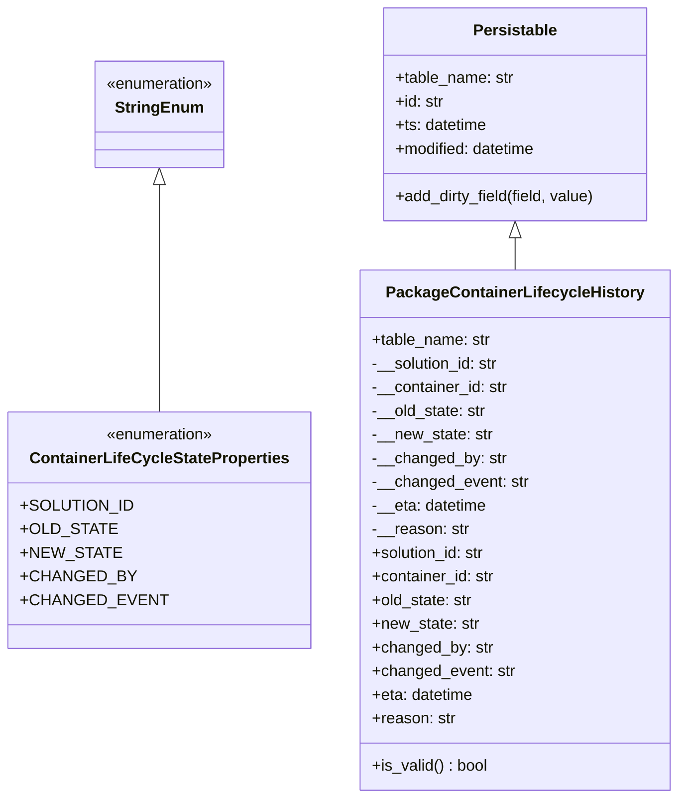
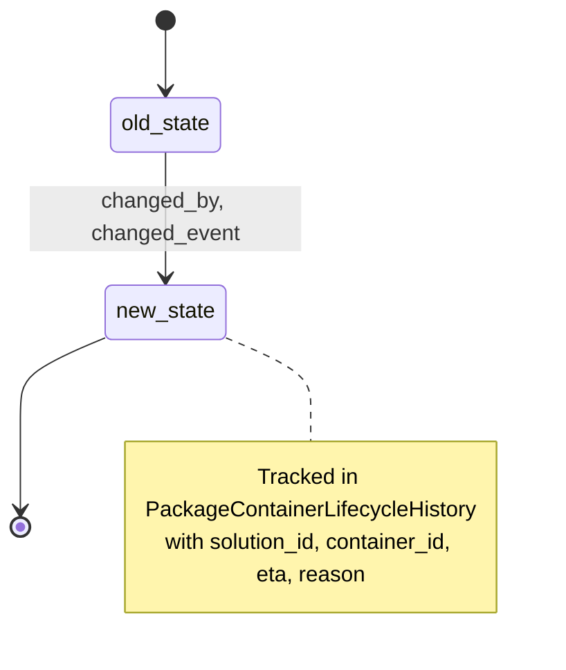
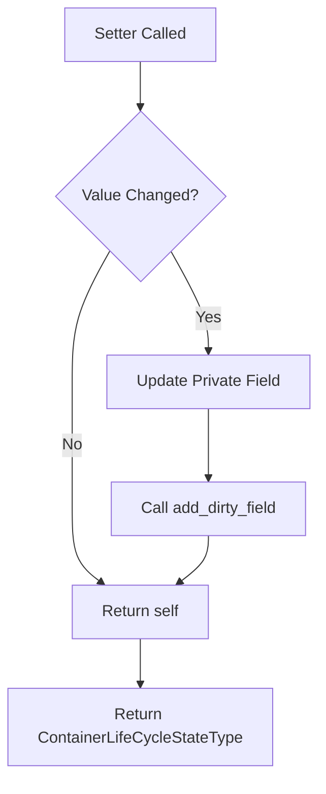

# Diagram: platform/partview_core/partview_service/partview_service/core/datamodel/PackageContainerLifecycleHistory.py

> Auto-generated by Obscura crawlers

## Diagram 1

### SVG

<svg id="container" width="652.015625" xmlns="http://www.w3.org/2000/svg" class="classDiagram" height="810" viewBox="0 0 652.015625 810" role="graphics-document document" aria-roledescription="class"><g><defs><marker id="container_class-aggregationStart" class="marker aggregation class" refX="18" refY="7" markerWidth="190" markerHeight="240" orient="auto"><path d="M 18,7 L9,13 L1,7 L9,1 Z"></path></marker></defs><defs><marker id="container_class-aggregationEnd" class="marker aggregation class" refX="1" refY="7" markerWidth="20" markerHeight="28" orient="auto"><path d="M 18,7 L9,13 L1,7 L9,1 Z"></path></marker></defs><defs><marker id="container_class-extensionStart" class="marker extension class" refX="18" refY="7" markerWidth="190" markerHeight="240" orient="auto"><path d="M 1,7 L18,13 V 1 Z"></path></marker></defs><defs><marker id="container_class-extensionEnd" class="marker extension class" refX="1" refY="7" markerWidth="20" markerHeight="28" orient="auto"><path d="M 1,1 V 13 L18,7 Z"></path></marker></defs><defs><marker id="container_class-compositionStart" class="marker composition class" refX="18" refY="7" markerWidth="190" markerHeight="240" orient="auto"><path d="M 18,7 L9,13 L1,7 L9,1 Z"></path></marker></defs><defs><marker id="container_class-compositionEnd" class="marker composition class" refX="1" refY="7" markerWidth="20" markerHeight="28" orient="auto"><path d="M 18,7 L9,13 L1,7 L9,1 Z"></path></marker></defs><defs><marker id="container_class-dependencyStart" class="marker dependency class" refX="6" refY="7" markerWidth="190" markerHeight="240" orient="auto"><path d="M 5,7 L9,13 L1,7 L9,1 Z"></path></marker></defs><defs><marker id="container_class-dependencyEnd" class="marker dependency class" refX="13" refY="7" markerWidth="20" markerHeight="28" orient="auto"><path d="M 18,7 L9,13 L14,7 L9,1 Z"></path></marker></defs><defs><marker id="container_class-lollipopStart" class="marker lollipop class" refX="13" refY="7" markerWidth="190" markerHeight="240" orient="auto"><circle stroke="black" fill="transparent" cx="7" cy="7" r="6"></circle></marker></defs><defs><marker id="container_class-lollipopEnd" class="marker lollipop class" refX="1" refY="7" markerWidth="190" markerHeight="240" orient="auto"><circle stroke="black" fill="transparent" cx="7" cy="7" r="6"></circle></marker></defs><g class="root"><g class="clusters"></g><g class="edgePaths"><path d="M147.703,187.25L147.703,197.542C147.703,207.833,147.703,228.417,147.703,266.875C147.703,305.333,147.703,361.667,147.703,389.833L147.703,418" id="id_StringEnum_ContainerLifeCycleStateProperties_1" class="edge-thickness-normal edge-pattern-solid relation" style=";;;" data-edge="true" data-et="edge" data-id="id_StringEnum_ContainerLifeCycleStateProperties_1" data-points="W3sieCI6MTQ3LjcwMzEyNSwieSI6MTcwfSx7IngiOjE0Ny43MDMxMjUsInkiOjI0OX0seyJ4IjoxNDcuNzAzMTI1LCJ5Ijo0MTh9XQ==" marker-start="url(#container_class-extensionStart)"></path><path d="M490.711,241.25L490.711,242.542C490.711,243.833,490.711,246.417,490.711,251.875C490.711,257.333,490.711,265.667,490.711,269.833L490.711,274" id="id_Persistable_PackageContainerLifecycleHistory_2" class="edge-thickness-normal edge-pattern-solid relation" style=";;;" data-edge="true" data-et="edge" data-id="id_Persistable_PackageContainerLifecycleHistory_2" data-points="W3sieCI6NDkwLjcxMDkzNzUsInkiOjIyNH0seyJ4Ijo0OTAuNzEwOTM3NSwieSI6MjQ5fSx7IngiOjQ5MC43MTA5Mzc1LCJ5IjoyNzR9XQ==" marker-start="url(#container_class-extensionStart)"></path></g><g class="edgeLabels"><g class="edgeLabel"><g class="label" data-id="id_StringEnum_ContainerLifeCycleStateProperties_1" transform="translate(0, 0)"><foreignObject width="0" height="0">

</foreignObject></g></g><g class="edgeLabel"><g class="label" data-id="id_Persistable_PackageContainerLifecycleHistory_2" transform="translate(0, 0)"><foreignObject width="0" height="0">

</foreignObject></g></g></g><g class="nodes"><g class="node default" id="classId-StringEnum-0" transform="translate(147.703125, 116)"><g class="basic label-container"><path d="M-67.5546875 -54 L67.5546875 -54 L67.5546875 54 L-67.5546875 54" stroke="none" stroke-width="0" fill="#ECECFF" style=""></path><path d="M-67.5546875 -54 C-20.340015938912003 -54, 26.874655622175993 -54, 67.5546875 -54 M-67.5546875 -54 C-29.967128999479726 -54, 7.620429501040547 -54, 67.5546875 -54 M67.5546875 -54 C67.5546875 -16.378757473124296, 67.5546875 21.24248505375141, 67.5546875 54 M67.5546875 -54 C67.5546875 -22.60781766749815, 67.5546875 8.7843646650037, 67.5546875 54 M67.5546875 54 C29.453190098045866 54, -8.648307303908268 54, -67.5546875 54 M67.5546875 54 C15.825337339546635 54, -35.90401282090673 54, -67.5546875 54 M-67.5546875 54 C-67.5546875 19.26899779523049, -67.5546875 -15.46200440953902, -67.5546875 -54 M-67.5546875 54 C-67.5546875 15.836576081270096, -67.5546875 -22.32684783745981, -67.5546875 -54" stroke="#9370DB" stroke-width="1.3" fill="none" stroke-dasharray="0 0" style=""></path></g><g class="annotation-group text" transform="translate(-55.5546875, -30)"><g class="label" style="" transform="translate(0,-12)"><foreignObject width="111.109375" height="24">

«enumeration»

</foreignObject></g></g><g class="label-group text" transform="translate(-42.234375, -6)"><g class="label" style="font-weight: bolder" transform="translate(0,-12)"><foreignObject width="84.46875" height="24">

StringEnum

</foreignObject></g></g><g class="members-group text" transform="translate(-55.5546875, 42)"></g><g class="methods-group text" transform="translate(-55.5546875, 72)"></g><g class="divider" style=""><path d="M-67.5546875 18 C-15.961562785731019 18, 35.63156192853796 18, 67.5546875 18 M-67.5546875 18 C-31.992288672279614 18, 3.570110155440773 18, 67.5546875 18" stroke="#9370DB" stroke-width="1.3" fill="none" stroke-dasharray="0 0" style=""></path></g><g class="divider" style=""><path d="M-67.5546875 36 C-19.61561150614701 36, 28.323464487705976 36, 67.5546875 36 M-67.5546875 36 C-16.008030044566425 36, 35.53862741086715 36, 67.5546875 36" stroke="#9370DB" stroke-width="1.3" fill="none" stroke-dasharray="0 0" style=""></path></g></g><g class="node default" id="classId-Persistable-1" transform="translate(490.7109375, 116)"><g class="basic label-container"><path d="M-135.71484375 -108 L135.71484375 -108 L135.71484375 108 L-135.71484375 108" stroke="none" stroke-width="0" fill="#ECECFF" style=""></path><path d="M-135.71484375 -108 C-76.32888730667615 -108, -16.942930863352302 -108, 135.71484375 -108 M-135.71484375 -108 C-53.00968070909988 -108, 29.695482331800235 -108, 135.71484375 -108 M135.71484375 -108 C135.71484375 -31.06806734968606, 135.71484375 45.86386530062788, 135.71484375 108 M135.71484375 -108 C135.71484375 -48.922654378981946, 135.71484375 10.154691242036108, 135.71484375 108 M135.71484375 108 C61.54773964598391 108, -12.61936445803218 108, -135.71484375 108 M135.71484375 108 C37.48350368554081 108, -60.74783637891838 108, -135.71484375 108 M-135.71484375 108 C-135.71484375 60.72900424725383, -135.71484375 13.458008494507666, -135.71484375 -108 M-135.71484375 108 C-135.71484375 64.78210488358405, -135.71484375 21.56420976716811, -135.71484375 -108" stroke="#9370DB" stroke-width="1.3" fill="none" stroke-dasharray="0 0" style=""></path></g><g class="annotation-group text" transform="translate(0, -84)"></g><g class="label-group text" transform="translate(-40.9765625, -84)"><g class="label" style="font-weight: bolder" transform="translate(0,-12)"><foreignObject width="81.953125" height="24">

Persistable

</foreignObject></g></g><g class="members-group text" transform="translate(-123.71484375, -36)"><g class="label" style="" transform="translate(0,-12)"><foreignObject width="121.125" height="24">

+table_name: str

</foreignObject></g><g class="label" style="" transform="translate(0,12)"><foreignObject width="49.578125" height="24">

+id: str

</foreignObject></g><g class="label" style="" transform="translate(0,36)"><foreignObject width="94.484375" height="24">

+ts: datetime

</foreignObject></g><g class="label" style="" transform="translate(0,60)"><foreignObject width="145.9375" height="24">

+modified: datetime

</foreignObject></g></g><g class="methods-group text" transform="translate(-123.71484375, 84)"><g class="label" style="" transform="translate(0,-12)"><foreignObject width="206.453125" height="24">

+add_dirty_field(field, value)

</foreignObject></g></g><g class="divider" style=""><path d="M-135.71484375 -60 C-76.53542268660141 -60, -17.35600162320283 -60, 135.71484375 -60 M-135.71484375 -60 C-57.828414305183955 -60, 20.05801513963209 -60, 135.71484375 -60" stroke="#9370DB" stroke-width="1.3" fill="none" stroke-dasharray="0 0" style=""></path></g><g class="divider" style=""><path d="M-135.71484375 60 C-58.82473358438244 60, 18.065376581235114 60, 135.71484375 60 M-135.71484375 60 C-52.095750430199445 60, 31.52334288960111 60, 135.71484375 60" stroke="#9370DB" stroke-width="1.3" fill="none" stroke-dasharray="0 0" style=""></path></g></g><g class="node default" id="classId-ContainerLifeCycleStateProperties-2" transform="translate(147.703125, 538)"><g class="basic label-container"><path d="M-139.703125 -120 L139.703125 -120 L139.703125 120 L-139.703125 120" stroke="none" stroke-width="0" fill="#ECECFF" style=""></path><path d="M-139.703125 -120 C-36.92452786944193 -120, 65.85406926111614 -120, 139.703125 -120 M-139.703125 -120 C-58.26093803143698 -120, 23.181248937126043 -120, 139.703125 -120 M139.703125 -120 C139.703125 -44.6749339040656, 139.703125 30.650132191868806, 139.703125 120 M139.703125 -120 C139.703125 -60.764065379762854, 139.703125 -1.528130759525709, 139.703125 120 M139.703125 120 C43.89411254318573 120, -51.914899913628545 120, -139.703125 120 M139.703125 120 C49.14922908534642 120, -41.40466682930716 120, -139.703125 120 M-139.703125 120 C-139.703125 38.29832886984525, -139.703125 -43.4033422603095, -139.703125 -120 M-139.703125 120 C-139.703125 33.72994083646094, -139.703125 -52.54011832707812, -139.703125 -120" stroke="#9370DB" stroke-width="1.3" fill="none" stroke-dasharray="0 0" style=""></path></g><g class="annotation-group text" transform="translate(-55.5546875, -96)"><g class="label" style="" transform="translate(0,-12)"><foreignObject width="111.109375" height="24">

«enumeration»

</foreignObject></g></g><g class="label-group text" transform="translate(-125.625, -72)"><g class="label" style="font-weight: bolder" transform="translate(0,-12)"><foreignObject width="251.25" height="24">

ContainerLifeCycleStateProperties

</foreignObject></g></g><g class="members-group text" transform="translate(-127.703125, -24)"><g class="label" style="" transform="translate(0,-12)"><foreignObject width="103.640625" height="24">

+SOLUTION_ID

</foreignObject></g><g class="label" style="" transform="translate(0,12)"><foreignObject width="85.734375" height="24">

+OLD_STATE

</foreignObject></g><g class="label" style="" transform="translate(0,36)"><foreignObject width="88.78125" height="24">

+NEW_STATE

</foreignObject></g><g class="label" style="" transform="translate(0,60)"><foreignObject width="102.71875" height="24">

+CHANGED_BY

</foreignObject></g><g class="label" style="" transform="translate(0,84)"><foreignObject width="129.78125" height="24">

+CHANGED_EVENT

</foreignObject></g></g><g class="methods-group text" transform="translate(-127.703125, 120)"></g><g class="divider" style=""><path d="M-139.703125 -48 C-40.46660099296557 -48, 58.769923014068866 -48, 139.703125 -48 M-139.703125 -48 C-50.14103580037616 -48, 39.42105339924768 -48, 139.703125 -48" stroke="#9370DB" stroke-width="1.3" fill="none" stroke-dasharray="0 0" style=""></path></g><g class="divider" style=""><path d="M-139.703125 96 C-63.88696710270453 96, 11.929190794590937 96, 139.703125 96 M-139.703125 96 C-79.15511938537264 96, -18.607113770745272 96, 139.703125 96" stroke="#9370DB" stroke-width="1.3" fill="none" stroke-dasharray="0 0" style=""></path></g></g><g class="node default" id="classId-PackageContainerLifecycleHistory-3" transform="translate(490.7109375, 538)"><g class="basic label-container"><path d="M-153.3046875 -264 L153.3046875 -264 L153.3046875 264 L-153.3046875 264" stroke="none" stroke-width="0" fill="#ECECFF" style=""></path><path d="M-153.3046875 -264 C-32.355176953772 -264, 88.594333592456 -264, 153.3046875 -264 M-153.3046875 -264 C-66.85719828231282 -264, 19.590290935374355 -264, 153.3046875 -264 M153.3046875 -264 C153.3046875 -102.84344200300495, 153.3046875 58.313115993990095, 153.3046875 264 M153.3046875 -264 C153.3046875 -135.5291503812648, 153.3046875 -7.058300762529598, 153.3046875 264 M153.3046875 264 C75.27813285818861 264, -2.7484217836227742 264, -153.3046875 264 M153.3046875 264 C86.22726725076515 264, 19.149847001530304 264, -153.3046875 264 M-153.3046875 264 C-153.3046875 87.87003674270534, -153.3046875 -88.25992651458932, -153.3046875 -264 M-153.3046875 264 C-153.3046875 138.84203378294612, -153.3046875 13.684067565892235, -153.3046875 -264" stroke="#9370DB" stroke-width="1.3" fill="none" stroke-dasharray="0 0" style=""></path></g><g class="annotation-group text" transform="translate(0, -240)"></g><g class="label-group text" transform="translate(-123.90625, -240)"><g class="label" style="font-weight: bolder" transform="translate(0,-12)"><foreignObject width="247.8125" height="24">

PackageContainerLifecycleHistory

</foreignObject></g></g><g class="members-group text" transform="translate(-141.3046875, -192)"><g class="label" style="" transform="translate(0,-12)"><foreignObject width="121.125" height="24">

+table_name: str

</foreignObject></g><g class="label" style="" transform="translate(0,12)"><foreignObject width="131.390625" height="24">

-__solution_id: str

</foreignObject></g><g class="label" style="" transform="translate(0,36)"><foreignObject width="139.15625" height="24">

-__container_id: str

</foreignObject></g><g class="label" style="" transform="translate(0,60)"><foreignObject width="116.78125" height="24">

-__old_state: str

</foreignObject></g><g class="label" style="" transform="translate(0,84)"><foreignObject width="122.828125" height="24">

-__new_state: str

</foreignObject></g><g class="label" style="" transform="translate(0,108)"><foreignObject width="135.984375" height="24">

-__changed_by: str

</foreignObject></g><g class="label" style="" transform="translate(0,132)"><foreignObject width="158.703125" height="24">

-__changed_event: str

</foreignObject></g><g class="label" style="" transform="translate(0,156)"><foreignObject width="117.75" height="24">

-__eta: datetime

</foreignObject></g><g class="label" style="" transform="translate(0,180)"><foreignObject width="98.15625" height="24">

-__reason: str

</foreignObject></g><g class="label" style="" transform="translate(0,204)"><foreignObject width="117.71875" height="24">

+solution_id: str

</foreignObject></g><g class="label" style="" transform="translate(0,228)"><foreignObject width="125.8125" height="24">

+container_id: str

</foreignObject></g><g class="label" style="" transform="translate(0,252)"><foreignObject width="103.4375" height="24">

+old_state: str

</foreignObject></g><g class="label" style="" transform="translate(0,276)"><foreignObject width="109.15625" height="24">

+new_state: str

</foreignObject></g><g class="label" style="" transform="translate(0,300)"><foreignObject width="122.640625" height="24">

+changed_by: str

</foreignObject></g><g class="label" style="" transform="translate(0,324)"><foreignObject width="145.359375" height="24">

+changed_event: str

</foreignObject></g><g class="label" style="" transform="translate(0,348)"><foreignObject width="104.40625" height="24">

+eta: datetime

</foreignObject></g><g class="label" style="" transform="translate(0,372)"><foreignObject width="84.484375" height="24">

+reason: str

</foreignObject></g></g><g class="methods-group text" transform="translate(-141.3046875, 240)"><g class="label" style="" transform="translate(0,-12)"><foreignObject width="117.984375" height="24">

+is_valid() : bool

</foreignObject></g></g><g class="divider" style=""><path d="M-153.3046875 -216 C-58.537648205863604 -216, 36.22939108827279 -216, 153.3046875 -216 M-153.3046875 -216 C-41.11997203412801 -216, 71.06474343174398 -216, 153.3046875 -216" stroke="#9370DB" stroke-width="1.3" fill="none" stroke-dasharray="0 0" style=""></path></g><g class="divider" style=""><path d="M-153.3046875 216 C-39.5368561105099 216, 74.2309752789802 216, 153.3046875 216 M-153.3046875 216 C-56.78075631992583 216, 39.74317486014834 216, 153.3046875 216" stroke="#9370DB" stroke-width="1.3" fill="none" stroke-dasharray="0 0" style=""></path></g></g></g></g></g></svg>

## Diagram 2

### SVG

<svg id="container" width="408.19415283203125" xmlns="http://www.w3.org/2000/svg" class="statediagram" height="484" viewBox="0.006646156311035156 0 408.19415283203125 484" role="graphics-document document" aria-roledescription="stateDiagram"><g><defs><marker id="container_stateDiagram-barbEnd" refX="19" refY="7" markerWidth="20" markerHeight="14" markerUnits="userSpaceOnUse" orient="auto"><path d="M 19,7 L9,13 L14,7 L9,1 Z"></path></marker></defs><g class="root"><g class="clusters"><g class="note-cluster" id="new_state----parent"><rect x="57.01329326629639" y="300" width="343.1875" height="176" fill="none"></rect></g></g><g class="edgePaths"><path d="M121.807,22L121.807,26.167C121.807,30.333,121.807,38.667,121.89,47.083C121.974,55.5,122.14,64,122.224,68.25L122.307,72.5" id="edge0" class="edge-thickness-normal edge-pattern-solid transition" style="fill:none;;;fill:none" data-edge="true" data-et="edge" data-id="edge0" data-points="W3sieCI6MTIxLjgwNjg0NDk0OTcyMjI5LCJ5IjoyMn0seyJ4IjoxMjEuODA2ODQ0OTQ5NzIyMjksInkiOjQ3fSx7IngiOjEyMi4zMDY4NDQ5NDk3MjIyOSwieSI6NzIuNX1d" marker-end="url(#container_stateDiagram-barbEnd)"></path><path d="M122.307,112.5L122.224,120.583C122.14,128.667,121.974,144.833,121.974,161.167C121.974,177.5,122.14,194,122.224,202.25L122.307,210.5" id="edge1" class="edge-thickness-normal edge-pattern-solid transition" style="fill:none;;;fill:none" data-edge="true" data-et="edge" data-id="edge1" data-points="W3sieCI6MTIyLjMwNjg0NDk0OTcyMjI5LCJ5IjoxMTIuNX0seyJ4IjoxMjEuODA2ODQ0OTQ5NzIyMjksInkiOjE2MX0seyJ4IjoxMjIuMzA2ODQ0OTQ5NzIyMjksInkiOjIxMC41fV0=" marker-end="url(#container_stateDiagram-barbEnd)"></path><path d="M78.76,248.848L68.134,253.207C57.509,257.566,36.258,266.283,25.632,274.808C15.007,283.333,15.007,291.667,15.007,309.333C15.007,327,15.007,354,15.007,367.5L15.007,381" id="edge2" class="edge-thickness-normal edge-pattern-solid transition" style="fill:none;;;fill:none" data-edge="true" data-et="edge" data-id="edge2" data-points="W3sieCI6NzguNzYwMDQzNzIxNjQ1NzcsInkiOjI0OC44NDgzMzcyMzI5OTY4N30seyJ4IjoxNS4wMDY2NDY2MzMxNDgxOTMsInkiOjI3NX0seyJ4IjoxNS4wMDY2NDY2MzMxNDgxOTMsInkiOjMwMH0seyJ4IjoxNS4wMDY2NDY2MzMxNDgxOTMsInkiOjM4MX1d" marker-end="url(#container_stateDiagram-barbEnd)"></path><path d="M165.854,248.848L176.313,253.207C186.771,257.566,207.689,266.283,218.148,274.808C228.607,283.333,228.607,291.667,228.607,300C228.607,308.333,228.607,316.667,228.607,320.833L228.607,325" id="new_state-new_state----note-3" class="edge-thickness-normal edge-pattern-solid transition note-edge" style="fill:none;;;fill:none" data-edge="true" data-et="edge" data-id="new_state-new_state----note-3" data-points="W3sieCI6MTY1Ljg1MzY0NjE3NzgwMTcsInkiOjI0OC44NDgzMzcyMzI5OTgwNn0seyJ4IjoyMjguNjA3MDQzMjY2Mjk2NCwieSI6Mjc1fSx7IngiOjIyOC42MDcwNDMyNjYyOTY0LCJ5IjozMDB9LHsieCI6MjI4LjYwNzA0MzI2NjI5NjQsInkiOjMyNX1d"></path></g><g class="edgeLabels"><g class="edgeLabel"><g class="label" data-id="edge0" transform="translate(0, 0)"><foreignObject width="0" height="0">

</foreignObject></g></g><g class="edgeLabel" transform="translate(121.80684494972229, 161)"><g class="label" data-id="edge1" transform="translate(-100, -24)"><foreignObject width="200" height="48">

changed_by, changed_event

</foreignObject></g></g><g class="edgeLabel"><g class="label" data-id="edge2" transform="translate(0, 0)"><foreignObject width="0" height="0">

</foreignObject></g></g><g class="edgeLabel"><g class="label" data-id="new_state-new_state----note-3" transform="translate(0, 0)"><foreignObject width="0" height="0">

</foreignObject></g></g></g><g class="nodes"><g class="node default" id="state-root_start-0" transform="translate(121.80684494972229, 15)"><circle class="state-start" r="7" width="14" height="14"></circle></g><g class="node  statediagram-state" id="state-old_state-1" transform="translate(121.80684494972229, 92)"><g class="basic label-container outer-path"><path d="M-36.96875 -20 C-14.464168241002891 -20, 8.040413517994217 -20, 36.96875 -20 C36.96875 -20, 36.96875 -20, 36.96875 -20 C37.10881343682487 -19.994206933401458, 37.248876873649735 -19.988413866802915, 37.38164672736166 -19.982922465033347 C37.51731939280901 -19.966010884921854, 37.65299205825635 -19.94909930481036, 37.79172295140367 -19.931806517013612 C37.87764462260625 -19.913790637096923, 37.96356629380883 -19.895774757180234, 38.196177435703994 -19.847001329696653 C38.33890135135076 -19.804510579018004, 38.48162526699753 -19.76201982833936, 38.59224734602342 -19.729086208503173 C38.67343836143559 -19.697405375980146, 38.75462937684777 -19.66572454345712, 38.977227123264846 -19.578866633275286 C39.070276391521546 -19.533377617872414, 39.16332565977825 -19.48788860246954, 39.348486965185366 -19.397368756032446 C39.41994683859521 -19.354787913906918, 39.49140671200505 -19.31220707178139, 39.703490790612136 -19.185832391312644 C39.83605523977015 -19.09118319384186, 39.968619688928165 -18.996533996371078, 40.03981356344834 -18.94570254698197 C40.14975619993672 -18.852585883783263, 40.25969883642509 -18.759469220584556, 40.355157858128706 -18.678619553365657 C40.41649089239453 -18.61728651909983, 40.477823926660356 -18.555953484834006, 40.64736955336566 -18.386407858128706 C40.71846452845237 -18.302466179662105, 40.78955950353909 -18.218524501195503, 40.91445254698197 -18.07106356344834 C40.97347560921322 -17.988396621293653, 41.03249867144447 -17.905729679138968, 41.154582391312644 -17.734740790612136 C41.20487626862489 -17.65033677400231, 41.25517014593714 -17.56593275739248, 41.36611875603245 -17.37973696518537 C41.412962987294186 -17.283915558580972, 41.45980721855592 -17.18809415197657, 41.54761663327529 -17.008477123264846 C41.5965181925785 -16.88315316745717, 41.645419751881704 -16.75782921164949, 41.697836208503176 -16.623497346023417 C41.73830911184447 -16.487551260105818, 41.77878201518576 -16.35160517418822, 41.81575132969665 -16.227427435703994 C41.846826987858826 -16.079220826015135, 41.877902646021 -15.931014216326272, 41.90055651701361 -15.82297295140367 C41.9135932095458 -15.718386460206576, 41.92662990207799 -15.613799969009479, 41.95167246503335 -15.412896727361662 C41.956840051918185 -15.287955995735386, 41.96200763880302 -15.16301526410911, 41.96875 -15 C41.96875 -15, 41.96875 -15, 41.96875 -15 C41.96875 -3.0518593420288376, 41.96875 8.896281315942325, 41.96875 15 C41.96875 15, 41.96875 15, 41.96875 15 C41.96235190906958 15.154691576488712, 41.95595381813916 15.309383152977423, 41.95167246503335 15.412896727361662 C41.932612349592276 15.565805955746916, 41.91355223415121 15.718715184132169, 41.90055651701361 15.822972951403669 C41.868352675966726 15.976560111991228, 41.83614883491984 16.130147272578785, 41.81575132969665 16.227427435703994 C41.78841860588488 16.319236436613664, 41.7610858820731 16.411045437523338, 41.697836208503176 16.623497346023417 C41.652260526749835 16.74029780816299, 41.606684844996494 16.857098270302558, 41.54761663327529 17.008477123264846 C41.478259110613735 17.150350203493087, 41.40890158795217 17.292223283721327, 41.36611875603245 17.379736965185366 C41.296905508094895 17.495891782446165, 41.22769226015734 17.612046599706968, 41.154582391312644 17.734740790612133 C41.10555128577418 17.803413126680493, 41.05652018023573 17.872085462748856, 40.91445254698197 18.07106356344834 C40.83676529798119 18.162788725017418, 40.75907804898041 18.25451388658649, 40.64736955336566 18.386407858128706 C40.54133110955148 18.492446301942888, 40.43529266573729 18.59848474575707, 40.355157858128706 18.678619553365657 C40.269929791393835 18.75080404373912, 40.18470172465896 18.82298853411258, 40.03981356344834 18.94570254698197 C39.93871424321718 19.01788607420589, 39.83761492298601 19.090069601429807, 39.703490790612136 19.185832391312644 C39.576901888365256 19.26126300438557, 39.450312986118384 19.336693617458494, 39.348486965185366 19.397368756032446 C39.20425850567178 19.467877753462133, 39.060030046158204 19.53838675089182, 38.977227123264846 19.578866633275286 C38.88738095317766 19.613924717632496, 38.79753478309047 19.648982801989703, 38.59224734602342 19.729086208503173 C38.48025215185437 19.76242862242924, 38.368256957685325 19.79577103635531, 38.196177435703994 19.847001329696653 C38.065467548118775 19.874408311028603, 37.93475766053356 19.901815292360556, 37.79172295140367 19.931806517013612 C37.62845436597344 19.952157924963693, 37.46518578054321 19.972509332913774, 37.38164672736166 19.982922465033347 C37.252331918252594 19.988270965101094, 37.12301710914352 19.99361946516884, 36.96875 20 C36.96875 20, 36.96875 20, 36.96875 20 C9.905622183205566 20, -17.15750563358887 20, -36.96875 20 C-36.96875 20, -36.96875 20, -36.96875 20 C-37.10558994904075 19.994340257842413, -37.2424298980815 19.988680515684827, -37.38164672736166 19.982922465033347 C-37.52268742042353 19.96534176097751, -37.6637281134854 19.94776105692167, -37.79172295140367 19.931806517013612 C-37.903444216814584 19.90838103106097, -38.015165482225505 19.884955545108326, -38.196177435703994 19.847001329696653 C-38.3161203186887 19.811292786293215, -38.4360632016734 19.775584242889778, -38.59224734602342 19.729086208503173 C-38.71558494432626 19.68095972830351, -38.838922542629106 19.632833248103843, -38.977227123264846 19.578866633275286 C-39.096521903987274 19.520546968656383, -39.21581668470971 19.462227304037484, -39.348486965185366 19.397368756032446 C-39.44038443983462 19.3426097469123, -39.53228191448386 19.28785073779215, -39.703490790612136 19.185832391312644 C-39.83382267186864 19.092777216685235, -39.96415455312514 18.999722042057826, -40.03981356344834 18.94570254698197 C-40.11403855671699 18.882837184463092, -40.188263549985635 18.819971821944215, -40.355157858128706 18.67861955336566 C-40.44744326901044 18.586334142483924, -40.53972867989218 18.494048731602184, -40.64736955336566 18.386407858128706 C-40.70577397412406 18.31744988884396, -40.76417839488245 18.248491919559214, -40.91445254698197 18.07106356344834 C-40.98636145024581 17.97034887800507, -41.05827035350965 17.869634192561797, -41.154582391312644 17.734740790612133 C-41.22705734736797 17.61311212084957, -41.29953230342329 17.49148345108701, -41.36611875603244 17.37973696518537 C-41.420811162748386 17.267861859095582, -41.47550356946433 17.155986753005795, -41.54761663327528 17.00847712326485 C-41.59977412191073 16.87480893570751, -41.65193161054617 16.741140748150166, -41.697836208503176 16.623497346023417 C-41.73929402104426 16.484243008420318, -41.78075183358534 16.34498867081722, -41.81575132969665 16.227427435703994 C-41.8458261231324 16.083994168773884, -41.875900916568135 15.940560901843773, -41.90055651701361 15.82297295140367 C-41.91586130993804 15.700190689989498, -41.93116610286246 15.577408428575323, -41.95167246503335 15.412896727361664 C-41.95840939926997 15.250012675056471, -41.96514633350659 15.087128622751278, -41.96875 15 C-41.96875 15, -41.96875 15, -41.96875 15 C-41.96875 8.51274139596498, -41.96875 2.02548279192996, -41.96875 -15 C-41.96875 -15, -41.96875 -15, -41.96875 -15 C-41.96524604762186 -15.084717757720307, -41.96174209524372 -15.169435515440616, -41.95167246503335 -15.41289672736166 C-41.93453919073104 -15.5503479280839, -41.91740591642872 -15.687799128806141, -41.90055651701361 -15.822972951403669 C-41.882302534926566 -15.910030183927061, -41.86404855283953 -15.997087416450452, -41.81575132969665 -16.227427435703994 C-41.79106265522826 -16.310355231423735, -41.76637398075987 -16.39328302714347, -41.697836208503176 -16.623497346023417 C-41.63846852406846 -16.775643681774575, -41.57910083963373 -16.927790017525737, -41.54761663327529 -17.008477123264846 C-41.47801490058156 -17.150849743098266, -41.408413167887836 -17.293222362931683, -41.36611875603245 -17.379736965185366 C-41.314023211343645 -17.467164569780508, -41.26192766665484 -17.55459217437565, -41.154582391312644 -17.734740790612133 C-41.071343010711956 -17.851324796947637, -40.98810363011127 -17.967908803283144, -40.91445254698197 -18.07106356344834 C-40.821820646000546 -18.18043384226831, -40.72918874501912 -18.28980412108828, -40.64736955336566 -18.386407858128706 C-40.5529261904304 -18.480851221063965, -40.45848282749514 -18.575294583999224, -40.355157858128706 -18.678619553365657 C-40.23079392898021 -18.78395042839713, -40.106429999831725 -18.889281303428604, -40.03981356344834 -18.945702546981966 C-39.95931170257172 -19.003179770892842, -39.878809841695094 -19.060656994803722, -39.703490790612136 -19.185832391312644 C-39.56204968397903 -19.27011299725582, -39.420608577345924 -19.354393603198993, -39.348486965185366 -19.397368756032446 C-39.230525130340915 -19.455036783118775, -39.112563295496464 -19.5127048102051, -38.977227123264846 -19.578866633275286 C-38.873157033435746 -19.619474908338656, -38.76908694360665 -19.660083183402026, -38.59224734602342 -19.729086208503173 C-38.46065626132442 -19.768262571806687, -38.32906517662542 -19.807438935110202, -38.196177435703994 -19.847001329696653 C-38.07982022835074 -19.871398870454154, -37.96346302099749 -19.895796411211656, -37.79172295140367 -19.931806517013612 C-37.64978202677183 -19.94949943481762, -37.507841102139984 -19.967192352621634, -37.38164672736166 -19.982922465033347 C-37.29779596803355 -19.986390558092733, -37.21394520870543 -19.98985865115212, -36.96875 -20 C-36.96875 -20, -36.96875 -20, -36.96875 -20" stroke="none" stroke-width="0" fill="#ECECFF" style=""></path><path d="M-36.96875 -20 C-11.365567326560903 -20, 14.237615346878194 -20, 36.96875 -20 M-36.96875 -20 C-13.685659860473969 -20, 9.597430279052062 -20, 36.96875 -20 M36.96875 -20 C36.96875 -20, 36.96875 -20, 36.96875 -20 M36.96875 -20 C36.96875 -20, 36.96875 -20, 36.96875 -20 M36.96875 -20 C37.08722080576267 -19.99510001122831, 37.20569161152534 -19.99020002245662, 37.38164672736166 -19.982922465033347 M36.96875 -20 C37.10038458089936 -19.99455555346129, 37.23201916179871 -19.98911110692258, 37.38164672736166 -19.982922465033347 M37.38164672736166 -19.982922465033347 C37.51555907659755 -19.966230308108784, 37.64947142583343 -19.949538151184218, 37.79172295140367 -19.931806517013612 M37.38164672736166 -19.982922465033347 C37.507073748169844 -19.967288003194263, 37.632500768978026 -19.951653541355174, 37.79172295140367 -19.931806517013612 M37.79172295140367 -19.931806517013612 C37.94155762198535 -19.900389490380228, 38.09139229256704 -19.868972463746843, 38.196177435703994 -19.847001329696653 M37.79172295140367 -19.931806517013612 C37.90111171416114 -19.908870105436755, 38.01050047691861 -19.8859336938599, 38.196177435703994 -19.847001329696653 M38.196177435703994 -19.847001329696653 C38.33290674559013 -19.80629525047715, 38.469636055476265 -19.765589171257645, 38.59224734602342 -19.729086208503173 M38.196177435703994 -19.847001329696653 C38.30045749586499 -19.815955810682016, 38.404737556025985 -19.78491029166738, 38.59224734602342 -19.729086208503173 M38.59224734602342 -19.729086208503173 C38.72765516401428 -19.67624991396616, 38.86306298200515 -19.623413619429144, 38.977227123264846 -19.578866633275286 M38.59224734602342 -19.729086208503173 C38.68493175912496 -19.69292063828511, 38.7776161722265 -19.656755068067046, 38.977227123264846 -19.578866633275286 M38.977227123264846 -19.578866633275286 C39.1193320224076 -19.509395781252085, 39.26143692155035 -19.439924929228884, 39.348486965185366 -19.397368756032446 M38.977227123264846 -19.578866633275286 C39.070888820287486 -19.533078219692406, 39.16455051731013 -19.487289806109523, 39.348486965185366 -19.397368756032446 M39.348486965185366 -19.397368756032446 C39.483121838263244 -19.31714378498835, 39.61775671134112 -19.23691881394425, 39.703490790612136 -19.185832391312644 M39.348486965185366 -19.397368756032446 C39.43228642997225 -19.347435113415575, 39.51608589475914 -19.2975014707987, 39.703490790612136 -19.185832391312644 M39.703490790612136 -19.185832391312644 C39.80040542768263 -19.116636670437583, 39.89732006475312 -19.047440949562517, 40.03981356344834 -18.94570254698197 M39.703490790612136 -19.185832391312644 C39.80422490461557 -19.11390961632347, 39.90495901861902 -19.04198684133429, 40.03981356344834 -18.94570254698197 M40.03981356344834 -18.94570254698197 C40.1459860043318 -18.85577907657497, 40.252158445215265 -18.765855606167968, 40.355157858128706 -18.678619553365657 M40.03981356344834 -18.94570254698197 C40.16254816088274 -18.84175164551949, 40.285282758317145 -18.73780074405701, 40.355157858128706 -18.678619553365657 M40.355157858128706 -18.678619553365657 C40.42911492368726 -18.604662487807104, 40.50307198924581 -18.530705422248555, 40.64736955336566 -18.386407858128706 M40.355157858128706 -18.678619553365657 C40.47139663202788 -18.56238077946648, 40.58763540592706 -18.446142005567303, 40.64736955336566 -18.386407858128706 M40.64736955336566 -18.386407858128706 C40.733230679608454 -18.285031817936524, 40.819091805851244 -18.18365577774434, 40.91445254698197 -18.07106356344834 M40.64736955336566 -18.386407858128706 C40.74930812576405 -18.26604921313061, 40.85124669816244 -18.145690568132515, 40.91445254698197 -18.07106356344834 M40.91445254698197 -18.07106356344834 C41.00742693227814 -17.940844834690534, 41.10040131757432 -17.81062610593273, 41.154582391312644 -17.734740790612136 M40.91445254698197 -18.07106356344834 C40.97677352407084 -17.983777604142393, 41.03909450115972 -17.89649164483644, 41.154582391312644 -17.734740790612136 M41.154582391312644 -17.734740790612136 C41.223956790202365 -17.618315527158476, 41.29333118909208 -17.50189026370482, 41.36611875603245 -17.37973696518537 M41.154582391312644 -17.734740790612136 C41.228644108817164 -17.610449191545438, 41.302705826321684 -17.48615759247874, 41.36611875603245 -17.37973696518537 M41.36611875603245 -17.37973696518537 C41.4146851732983 -17.280392770803186, 41.463251590564155 -17.181048576421, 41.54761663327529 -17.008477123264846 M41.36611875603245 -17.37973696518537 C41.4080864857207 -17.293890601985336, 41.450054215408954 -17.2080442387853, 41.54761663327529 -17.008477123264846 M41.54761663327529 -17.008477123264846 C41.57816652280731 -16.930184466339515, 41.60871641233932 -16.851891809414187, 41.697836208503176 -16.623497346023417 M41.54761663327529 -17.008477123264846 C41.601724023071846 -16.869811767305784, 41.65583141286841 -16.73114641134672, 41.697836208503176 -16.623497346023417 M41.697836208503176 -16.623497346023417 C41.738658947625304 -16.48637618243182, 41.77948168674743 -16.349255018840218, 41.81575132969665 -16.227427435703994 M41.697836208503176 -16.623497346023417 C41.72187510894791 -16.542752102775925, 41.74591400939265 -16.46200685952843, 41.81575132969665 -16.227427435703994 M41.81575132969665 -16.227427435703994 C41.84787926762799 -16.07420227367369, 41.88000720555932 -15.920977111643392, 41.90055651701361 -15.82297295140367 M41.81575132969665 -16.227427435703994 C41.83462046109086 -16.137436421608196, 41.85348959248506 -16.0474454075124, 41.90055651701361 -15.82297295140367 M41.90055651701361 -15.82297295140367 C41.91925415788985 -15.672971664798109, 41.9379517987661 -15.522970378192545, 41.95167246503335 -15.412896727361662 M41.90055651701361 -15.82297295140367 C41.92009161304906 -15.666253204849772, 41.939626709084514 -15.509533458295872, 41.95167246503335 -15.412896727361662 M41.95167246503335 -15.412896727361662 C41.95703640986462 -15.28320849829904, 41.96240035469589 -15.153520269236415, 41.96875 -15 M41.95167246503335 -15.412896727361662 C41.95802713174707 -15.259255051634149, 41.9643817984608 -15.105613375906637, 41.96875 -15 M41.96875 -15 C41.96875 -15, 41.96875 -15, 41.96875 -15 M41.96875 -15 C41.96875 -15, 41.96875 -15, 41.96875 -15 M41.96875 -15 C41.96875 -6.509659353398863, 41.96875 1.9806812932022737, 41.96875 15 M41.96875 -15 C41.96875 -5.1450338895662675, 41.96875 4.709932220867465, 41.96875 15 M41.96875 15 C41.96875 15, 41.96875 15, 41.96875 15 M41.96875 15 C41.96875 15, 41.96875 15, 41.96875 15 M41.96875 15 C41.96204285848109 15.162163730802822, 41.95533571696219 15.324327461605645, 41.95167246503335 15.412896727361662 M41.96875 15 C41.96507873042198 15.088763114640743, 41.961407460843965 15.177526229281487, 41.95167246503335 15.412896727361662 M41.95167246503335 15.412896727361662 C41.93453542507683 15.550378137936557, 41.91739838512031 15.687859548511453, 41.90055651701361 15.822972951403669 M41.95167246503335 15.412896727361662 C41.93639082782198 15.535493222733272, 41.921109190610615 15.658089718104884, 41.90055651701361 15.822972951403669 M41.90055651701361 15.822972951403669 C41.87184466509775 15.95990605216478, 41.84313281318188 16.096839152925888, 41.81575132969665 16.227427435703994 M41.90055651701361 15.822972951403669 C41.8806232140735 15.918039232324807, 41.8606899111334 16.013105513245943, 41.81575132969665 16.227427435703994 M41.81575132969665 16.227427435703994 C41.789100251538464 16.316946829223586, 41.762449173380276 16.40646622274318, 41.697836208503176 16.623497346023417 M41.81575132969665 16.227427435703994 C41.78013051601169 16.347075639758845, 41.74450970232672 16.466723843813696, 41.697836208503176 16.623497346023417 M41.697836208503176 16.623497346023417 C41.64661844034302 16.754757236401808, 41.59540067218286 16.8860171267802, 41.54761663327529 17.008477123264846 M41.697836208503176 16.623497346023417 C41.652946482841905 16.738539853361686, 41.60805675718063 16.853582360699953, 41.54761663327529 17.008477123264846 M41.54761663327529 17.008477123264846 C41.50416511550444 17.097358623499844, 41.460713597733594 17.18624012373484, 41.36611875603245 17.379736965185366 M41.54761663327529 17.008477123264846 C41.49157631680923 17.123109422818015, 41.43553600034317 17.237741722371187, 41.36611875603245 17.379736965185366 M41.36611875603245 17.379736965185366 C41.31707296393995 17.462046424539963, 41.26802717184745 17.544355883894557, 41.154582391312644 17.734740790612133 M41.36611875603245 17.379736965185366 C41.29506256894127 17.498984633410267, 41.22400638185009 17.618232301635167, 41.154582391312644 17.734740790612133 M41.154582391312644 17.734740790612133 C41.10169721605511 17.808811087180732, 41.048812040797564 17.88288138374933, 40.91445254698197 18.07106356344834 M41.154582391312644 17.734740790612133 C41.09084327726265 17.824012974314122, 41.027104163212655 17.91328515801611, 40.91445254698197 18.07106356344834 M40.91445254698197 18.07106356344834 C40.858842704172375 18.136721980783854, 40.80323286136278 18.202380398119367, 40.64736955336566 18.386407858128706 M40.91445254698197 18.07106356344834 C40.811443517893856 18.192686094271718, 40.70843448880574 18.314308625095098, 40.64736955336566 18.386407858128706 M40.64736955336566 18.386407858128706 C40.5401953672762 18.49358204421817, 40.43302118118673 18.60075623030763, 40.355157858128706 18.678619553365657 M40.64736955336566 18.386407858128706 C40.581785254677534 18.45199215681683, 40.51620095598941 18.51757645550495, 40.355157858128706 18.678619553365657 M40.355157858128706 18.678619553365657 C40.26600975468362 18.75412414547335, 40.17686165123854 18.829628737581046, 40.03981356344834 18.94570254698197 M40.355157858128706 18.678619553365657 C40.240537500175805 18.775698044550868, 40.1259171422229 18.87277653573608, 40.03981356344834 18.94570254698197 M40.03981356344834 18.94570254698197 C39.92992043106632 19.024164735401055, 39.82002729868431 19.102626923820143, 39.703490790612136 19.185832391312644 M40.03981356344834 18.94570254698197 C39.91481033278107 19.03495313821559, 39.789807102113805 19.124203729449214, 39.703490790612136 19.185832391312644 M39.703490790612136 19.185832391312644 C39.62121110228345 19.234860443724205, 39.53893141395477 19.283888496135766, 39.348486965185366 19.397368756032446 M39.703490790612136 19.185832391312644 C39.58611204856685 19.25577494012263, 39.46873330652155 19.32571748893262, 39.348486965185366 19.397368756032446 M39.348486965185366 19.397368756032446 C39.21538825680768 19.462436749676332, 39.08228954842998 19.52750474332022, 38.977227123264846 19.578866633275286 M39.348486965185366 19.397368756032446 C39.246407690693566 19.447272272488494, 39.144328416201766 19.497175788944542, 38.977227123264846 19.578866633275286 M38.977227123264846 19.578866633275286 C38.84415629945152 19.630791029854507, 38.711085475638185 19.682715426433724, 38.59224734602342 19.729086208503173 M38.977227123264846 19.578866633275286 C38.83598530804488 19.633979360595124, 38.69474349282491 19.689092087914965, 38.59224734602342 19.729086208503173 M38.59224734602342 19.729086208503173 C38.446047679552166 19.772611735035852, 38.299848013080904 19.816137261568535, 38.196177435703994 19.847001329696653 M38.59224734602342 19.729086208503173 C38.50699314510104 19.754467483808607, 38.42173894417866 19.77984875911404, 38.196177435703994 19.847001329696653 M38.196177435703994 19.847001329696653 C38.04456109553991 19.878791933156446, 37.89294475537582 19.910582536616243, 37.79172295140367 19.931806517013612 M38.196177435703994 19.847001329696653 C38.05235861470455 19.877156965319436, 37.90853979370512 19.907312600942223, 37.79172295140367 19.931806517013612 M37.79172295140367 19.931806517013612 C37.66947238179974 19.947045034623006, 37.54722181219581 19.9622835522324, 37.38164672736166 19.982922465033347 M37.79172295140367 19.931806517013612 C37.66132907607081 19.948060096623543, 37.53093520073794 19.964313676233473, 37.38164672736166 19.982922465033347 M37.38164672736166 19.982922465033347 C37.28654730633252 19.98685580618214, 37.19144788530338 19.990789147330933, 36.96875 20 M37.38164672736166 19.982922465033347 C37.234295931272015 19.9890169390406, 37.08694513518236 19.99511141304785, 36.96875 20 M36.96875 20 C36.96875 20, 36.96875 20, 36.96875 20 M36.96875 20 C36.96875 20, 36.96875 20, 36.96875 20 M36.96875 20 C20.43344942639394 20, 3.8981488527878767 20, -36.96875 20 M36.96875 20 C12.636561394604271 20, -11.695627210791457 20, -36.96875 20 M-36.96875 20 C-36.96875 20, -36.96875 20, -36.96875 20 M-36.96875 20 C-36.96875 20, -36.96875 20, -36.96875 20 M-36.96875 20 C-37.12166280418902 19.9936754796361, -37.27457560837804 19.9873509592722, -37.38164672736166 19.982922465033347 M-36.96875 20 C-37.1109989560163 19.994116539659053, -37.25324791203261 19.98823307931811, -37.38164672736166 19.982922465033347 M-37.38164672736166 19.982922465033347 C-37.49465157914461 19.96883642494846, -37.60765643092756 19.954750384863573, -37.79172295140367 19.931806517013612 M-37.38164672736166 19.982922465033347 C-37.498192284075174 19.96839507653913, -37.61473784078868 19.95386768804492, -37.79172295140367 19.931806517013612 M-37.79172295140367 19.931806517013612 C-37.92873550295632 19.903078006018617, -38.065748054508965 19.874349495023623, -38.196177435703994 19.847001329696653 M-37.79172295140367 19.931806517013612 C-37.893605228323544 19.910444050002237, -37.99548750524342 19.889081582990862, -38.196177435703994 19.847001329696653 M-38.196177435703994 19.847001329696653 C-38.33361566598145 19.806084195732314, -38.471053896258894 19.76516706176798, -38.59224734602342 19.729086208503173 M-38.196177435703994 19.847001329696653 C-38.335264043338974 19.80559345253062, -38.47435065097396 19.764185575364586, -38.59224734602342 19.729086208503173 M-38.59224734602342 19.729086208503173 C-38.73088786047637 19.67498851189238, -38.869528374929324 19.620890815281584, -38.977227123264846 19.578866633275286 M-38.59224734602342 19.729086208503173 C-38.710989178772735 19.682753001587226, -38.82973101152204 19.636419794671276, -38.977227123264846 19.578866633275286 M-38.977227123264846 19.578866633275286 C-39.094109354642974 19.521726392163302, -39.210991586021095 19.464586151051314, -39.348486965185366 19.397368756032446 M-38.977227123264846 19.578866633275286 C-39.09653196008674 19.520542052528917, -39.21583679690864 19.462217471782548, -39.348486965185366 19.397368756032446 M-39.348486965185366 19.397368756032446 C-39.463634971735395 19.328755437060337, -39.57878297828543 19.26014211808823, -39.703490790612136 19.185832391312644 M-39.348486965185366 19.397368756032446 C-39.481591680570794 19.318055561066593, -39.61469639595622 19.23874236610074, -39.703490790612136 19.185832391312644 M-39.703490790612136 19.185832391312644 C-39.796968806810945 19.11909037057802, -39.89044682300975 19.0523483498434, -40.03981356344834 18.94570254698197 M-39.703490790612136 19.185832391312644 C-39.78578558829812 19.127075035124978, -39.86808038598411 19.068317678937316, -40.03981356344834 18.94570254698197 M-40.03981356344834 18.94570254698197 C-40.16240171448194 18.84187567929398, -40.284989865515534 18.73804881160599, -40.355157858128706 18.67861955336566 M-40.03981356344834 18.94570254698197 C-40.1146830853084 18.88229129659206, -40.18955260716845 18.818880046202153, -40.355157858128706 18.67861955336566 M-40.355157858128706 18.67861955336566 C-40.439904130614885 18.59387328087948, -40.52465040310106 18.509127008393303, -40.64736955336566 18.386407858128706 M-40.355157858128706 18.67861955336566 C-40.4701443634471 18.56363304804727, -40.58513086876548 18.448646542728877, -40.64736955336566 18.386407858128706 M-40.64736955336566 18.386407858128706 C-40.75050520091876 18.264635829166206, -40.85364084847187 18.14286380020371, -40.91445254698197 18.07106356344834 M-40.64736955336566 18.386407858128706 C-40.740586988356185 18.276346240610557, -40.83380442334671 18.16628462309241, -40.91445254698197 18.07106356344834 M-40.91445254698197 18.07106356344834 C-40.998030454270136 17.954005420986483, -41.0816083615583 17.836947278524626, -41.154582391312644 17.734740790612133 M-40.91445254698197 18.07106356344834 C-40.982031046873935 17.976413985295615, -41.04960954676591 17.881764407142892, -41.154582391312644 17.734740790612133 M-41.154582391312644 17.734740790612133 C-41.23532937834803 17.59922986166516, -41.3160763653834 17.46371893271819, -41.36611875603244 17.37973696518537 M-41.154582391312644 17.734740790612133 C-41.19864312582475 17.660797337326308, -41.24270386033686 17.586853884040483, -41.36611875603244 17.37973696518537 M-41.36611875603244 17.37973696518537 C-41.419057531673445 17.271448968793823, -41.471996307314456 17.163160972402277, -41.54761663327528 17.00847712326485 M-41.36611875603244 17.37973696518537 C-41.42110256565462 17.26726578492354, -41.4760863752768 17.154794604661717, -41.54761663327528 17.00847712326485 M-41.54761663327528 17.00847712326485 C-41.60019179239201 16.873738538000673, -41.652766951508745 16.7389999527365, -41.697836208503176 16.623497346023417 M-41.54761663327528 17.00847712326485 C-41.58972209370391 16.900570076184803, -41.631827554132535 16.79266302910476, -41.697836208503176 16.623497346023417 M-41.697836208503176 16.623497346023417 C-41.72308593346631 16.53868501491171, -41.74833565842944 16.4538726838, -41.81575132969665 16.227427435703994 M-41.697836208503176 16.623497346023417 C-41.74141230033704 16.47712783369947, -41.784988392170895 16.330758321375523, -41.81575132969665 16.227427435703994 M-41.81575132969665 16.227427435703994 C-41.83289891827761 16.145646835767543, -41.85004650685856 16.063866235831092, -41.90055651701361 15.82297295140367 M-41.81575132969665 16.227427435703994 C-41.834560079274134 16.137724395697, -41.853368828851615 16.048021355690004, -41.90055651701361 15.82297295140367 M-41.90055651701361 15.82297295140367 C-41.91877261372689 15.67683483900714, -41.93698871044016 15.530696726610612, -41.95167246503335 15.412896727361664 M-41.90055651701361 15.82297295140367 C-41.91464077123652 15.709982426647151, -41.92872502545942 15.596991901890634, -41.95167246503335 15.412896727361664 M-41.95167246503335 15.412896727361664 C-41.95539179673597 15.322971577685093, -41.95911112843858 15.233046428008521, -41.96875 15 M-41.95167246503335 15.412896727361664 C-41.95803948972483 15.258956263279526, -41.96440651441632 15.105015799197385, -41.96875 15 M-41.96875 15 C-41.96875 15, -41.96875 15, -41.96875 15 M-41.96875 15 C-41.96875 15, -41.96875 15, -41.96875 15 M-41.96875 15 C-41.96875 8.513366944714235, -41.96875 2.0267338894284705, -41.96875 -15 M-41.96875 15 C-41.96875 3.420252019934898, -41.96875 -8.159495960130204, -41.96875 -15 M-41.96875 -15 C-41.96875 -15, -41.96875 -15, -41.96875 -15 M-41.96875 -15 C-41.96875 -15, -41.96875 -15, -41.96875 -15 M-41.96875 -15 C-41.963956727914386 -15.115890634179232, -41.95916345582877 -15.231781268358466, -41.95167246503335 -15.41289672736166 M-41.96875 -15 C-41.96280363127178 -15.143769940589253, -41.956857262543565 -15.287539881178507, -41.95167246503335 -15.41289672736166 M-41.95167246503335 -15.41289672736166 C-41.9339754833962 -15.554870253978015, -41.91627850175906 -15.69684378059437, -41.90055651701361 -15.822972951403669 M-41.95167246503335 -15.41289672736166 C-41.9316841544759 -15.573252374393997, -41.91169584391846 -15.733608021426333, -41.90055651701361 -15.822972951403669 M-41.90055651701361 -15.822972951403669 C-41.879901074939355 -15.921483271779644, -41.859245632865104 -16.01999359215562, -41.81575132969665 -16.227427435703994 M-41.90055651701361 -15.822972951403669 C-41.88225408369609 -15.910261258440986, -41.86395165037857 -15.997549565478305, -41.81575132969665 -16.227427435703994 M-41.81575132969665 -16.227427435703994 C-41.77763260988169 -16.355465958548148, -41.73951389006673 -16.4835044813923, -41.697836208503176 -16.623497346023417 M-41.81575132969665 -16.227427435703994 C-41.78091109529731 -16.34445372015662, -41.74607086089797 -16.461480004609246, -41.697836208503176 -16.623497346023417 M-41.697836208503176 -16.623497346023417 C-41.65524967507547 -16.73263727753775, -41.61266314164776 -16.841777209052086, -41.54761663327529 -17.008477123264846 M-41.697836208503176 -16.623497346023417 C-41.65051528222184 -16.744770486564587, -41.6031943559405 -16.86604362710576, -41.54761663327529 -17.008477123264846 M-41.54761663327529 -17.008477123264846 C-41.49026478509405 -17.12579220382156, -41.432912936912814 -17.243107284378272, -41.36611875603245 -17.379736965185366 M-41.54761663327529 -17.008477123264846 C-41.47815805359836 -17.150556918922064, -41.40869947392142 -17.29263671457928, -41.36611875603245 -17.379736965185366 M-41.36611875603245 -17.379736965185366 C-41.28737056961098 -17.511893473888126, -41.2086223831895 -17.64404998259089, -41.154582391312644 -17.734740790612133 M-41.36611875603245 -17.379736965185366 C-41.300044056857764 -17.490624618010475, -41.23396935768309 -17.60151227083558, -41.154582391312644 -17.734740790612133 M-41.154582391312644 -17.734740790612133 C-41.08381940974713 -17.833850512856813, -41.01305642818161 -17.93296023510149, -40.91445254698197 -18.07106356344834 M-41.154582391312644 -17.734740790612133 C-41.09432808055633 -17.819132203621972, -41.03407376980001 -17.903523616631816, -40.91445254698197 -18.07106356344834 M-40.91445254698197 -18.07106356344834 C-40.84753944182317 -18.150067717421116, -40.78062633666438 -18.22907187139389, -40.64736955336566 -18.386407858128706 M-40.91445254698197 -18.07106356344834 C-40.834590631632096 -18.165356348723943, -40.75472871628223 -18.259649133999545, -40.64736955336566 -18.386407858128706 M-40.64736955336566 -18.386407858128706 C-40.53616116940704 -18.497616242087325, -40.42495278544842 -18.608824626045944, -40.355157858128706 -18.678619553365657 M-40.64736955336566 -18.386407858128706 C-40.549203879452534 -18.484573532041825, -40.45103820553942 -18.582739205954947, -40.355157858128706 -18.678619553365657 M-40.355157858128706 -18.678619553365657 C-40.251224295065335 -18.766646790986403, -40.14729073200196 -18.85467402860715, -40.03981356344834 -18.945702546981966 M-40.355157858128706 -18.678619553365657 C-40.250006352179575 -18.767678335991242, -40.144854846230444 -18.856737118616824, -40.03981356344834 -18.945702546981966 M-40.03981356344834 -18.945702546981966 C-39.92481798977043 -19.027807808463745, -39.80982241609252 -19.109913069945524, -39.703490790612136 -19.185832391312644 M-40.03981356344834 -18.945702546981966 C-39.93747558230222 -19.01877046110059, -39.8351376011561 -19.091838375219215, -39.703490790612136 -19.185832391312644 M-39.703490790612136 -19.185832391312644 C-39.58813115433685 -19.25457181422939, -39.472771518061556 -19.323311237146136, -39.348486965185366 -19.397368756032446 M-39.703490790612136 -19.185832391312644 C-39.585306925468394 -19.256254689356865, -39.467123060324646 -19.32667698740109, -39.348486965185366 -19.397368756032446 M-39.348486965185366 -19.397368756032446 C-39.26356277501931 -19.438885662795034, -39.178638584853246 -19.48040256955762, -38.977227123264846 -19.578866633275286 M-39.348486965185366 -19.397368756032446 C-39.23882738371622 -19.450978058759695, -39.129167802247075 -19.504587361486948, -38.977227123264846 -19.578866633275286 M-38.977227123264846 -19.578866633275286 C-38.85074915202533 -19.628218490797327, -38.72427118078581 -19.677570348319364, -38.59224734602342 -19.729086208503173 M-38.977227123264846 -19.578866633275286 C-38.88798543433284 -19.613688848353817, -38.79874374540083 -19.648511063432345, -38.59224734602342 -19.729086208503173 M-38.59224734602342 -19.729086208503173 C-38.48272634487618 -19.761692023252124, -38.373205343728934 -19.79429783800107, -38.196177435703994 -19.847001329696653 M-38.59224734602342 -19.729086208503173 C-38.46695496301067 -19.766387367067967, -38.34166257999792 -19.803688525632758, -38.196177435703994 -19.847001329696653 M-38.196177435703994 -19.847001329696653 C-38.10459942750561 -19.866203218761658, -38.01302141930722 -19.88540510782666, -37.79172295140367 -19.931806517013612 M-38.196177435703994 -19.847001329696653 C-38.10080892382884 -19.86699800380376, -38.00544041195369 -19.886994677910867, -37.79172295140367 -19.931806517013612 M-37.79172295140367 -19.931806517013612 C-37.65747938663388 -19.94853995991142, -37.5232358218641 -19.96527340280923, -37.38164672736166 -19.982922465033347 M-37.79172295140367 -19.931806517013612 C-37.69763899212455 -19.943534070307482, -37.603555032845435 -19.955261623601356, -37.38164672736166 -19.982922465033347 M-37.38164672736166 -19.982922465033347 C-37.22160108375213 -19.989542001817924, -37.061555440142584 -19.996161538602504, -36.96875 -20 M-37.38164672736166 -19.982922465033347 C-37.28209233525403 -19.987040065148914, -37.18253794314639 -19.991157665264485, -36.96875 -20 M-36.96875 -20 C-36.96875 -20, -36.96875 -20, -36.96875 -20 M-36.96875 -20 C-36.96875 -20, -36.96875 -20, -36.96875 -20" stroke="#9370DB" stroke-width="1.3" fill="none" stroke-dasharray="0 0" style=""></path></g><g class="label" style="" transform="translate(-33.96875, -12)"><rect></rect><foreignObject width="67.9375" height="24">

old_state

</foreignObject></g></g><g class="node  statediagram-state" id="state-new_state-3" transform="translate(121.80684494972229, 230)"><g class="basic label-container outer-path"><path d="M-39.8359375 -20 C-18.91772826909249 -20, 2.000480961815022 -20, 39.8359375 -20 C39.8359375 -20, 39.8359375 -20, 39.8359375 -20 C39.99079274616864 -19.993595139641545, 40.145647992337274 -19.98719027928309, 40.24883422736166 -19.982922465033347 C40.3493138197831 -19.970397696899674, 40.449793412204535 -19.957872928766, 40.65891045140367 -19.931806517013612 C40.7851982397972 -19.905326752376844, 40.91148602819072 -19.87884698774008, 41.063364935703994 -19.847001329696653 C41.21164140690105 -19.802857511608472, 41.359917878098116 -19.758713693520292, 41.45943484602342 -19.729086208503173 C41.54291167340591 -19.69651344938158, 41.62638850078841 -19.663940690259984, 41.844414623264846 -19.578866633275286 C41.98155726818753 -19.511821679519514, 42.11869991311022 -19.444776725763745, 42.215674465185366 -19.397368756032446 C42.3014849847873 -19.346236784850195, 42.387295504389236 -19.295104813667944, 42.570678290612136 -19.185832391312644 C42.6906075667832 -19.100204533957672, 42.810536842954264 -19.014576676602697, 42.90700106344834 -18.94570254698197 C42.98130011202363 -18.882774462817814, 43.05559916059892 -18.819846378653654, 43.222345358128706 -18.678619553365657 C43.315777579718684 -18.585187331775682, 43.409209801308656 -18.491755110185704, 43.51455705336566 -18.386407858128706 C43.56890348902149 -18.32224114280089, 43.62324992467731 -18.258074427473076, 43.78164004698197 -18.07106356344834 C43.843803849440846 -17.983997740908514, 43.905967651899715 -17.896931918368686, 44.021769891312644 -17.734740790612136 C44.07184530765553 -17.65070339881376, 44.121920723998414 -17.566666007015385, 44.23330625603245 -17.37973696518537 C44.27686180275966 -17.29064267031892, 44.32041734948688 -17.20154837545247, 44.41480413327529 -17.008477123264846 C44.449549456939316 -16.91943249013987, 44.484294780603335 -16.830387857014887, 44.565023708503176 -16.623497346023417 C44.602343869943034 -16.498141133478484, 44.63966403138289 -16.37278492093355, 44.68293882969665 -16.227427435703994 C44.70921413247657 -16.102114770619398, 44.73548943525649 -15.9768021055348, 44.76774401701361 -15.82297295140367 C44.778543194308185 -15.736336861899686, 44.78934237160276 -15.649700772395699, 44.81885996503335 -15.412896727361662 C44.82282000424489 -15.31715180668889, 44.826780043456424 -15.22140688601612, 44.8359375 -15 C44.8359375 -15, 44.8359375 -15, 44.8359375 -15 C44.8359375 -7.385847477107377, 44.8359375 0.22830504578524646, 44.8359375 15 C44.8359375 15, 44.8359375 15, 44.8359375 15 C44.82941466752194 15.157707549044888, 44.82289183504388 15.315415098089778, 44.81885996503335 15.412896727361662 C44.80456545403508 15.527574031056288, 44.79027094303681 15.642251334750913, 44.76774401701361 15.822972951403669 C44.73865386272586 15.961710258906999, 44.709563708438104 16.100447566410327, 44.68293882969665 16.227427435703994 C44.65718871561662 16.313920544231266, 44.63143860153659 16.40041365275854, 44.565023708503176 16.623497346023417 C44.510290696119824 16.763766035261355, 44.45555768373647 16.904034724499297, 44.41480413327529 17.008477123264846 C44.37706744001822 17.08566876311238, 44.339330746761156 17.162860402959918, 44.23330625603245 17.379736965185366 C44.154478420814954 17.51202714181475, 44.07565058559746 17.644317318444138, 44.021769891312644 17.734740790612133 C43.96684836695495 17.8116631715509, 43.91192684259725 17.88858555248967, 43.78164004698197 18.07106356344834 C43.71393301494739 18.151005105112038, 43.646225982912824 18.230946646775735, 43.51455705336566 18.386407858128706 C43.430388172394466 18.470576739099894, 43.34621929142328 18.554745620071085, 43.222345358128706 18.678619553365657 C43.10596347408877 18.77718998104249, 42.989581590048836 18.875760408719323, 42.90700106344834 18.94570254698197 C42.7943827938968 19.026110445942088, 42.68176452434527 19.106518344902206, 42.570678290612136 19.185832391312644 C42.46644924534697 19.24793942158789, 42.36222020008181 19.310046451863133, 42.215674465185366 19.397368756032446 C42.1103062061175 19.44888015907206, 42.004937947049626 19.500391562111677, 41.844414623264846 19.578866633275286 C41.710034326033764 19.63130198796767, 41.57565402880269 19.68373734266006, 41.45943484602342 19.729086208503173 C41.3323949391873 19.766907627451427, 41.20535503235119 19.804729046399682, 41.063364935703994 19.847001329696653 C40.97380182985237 19.86578073816724, 40.88423872400074 19.884560146637824, 40.65891045140367 19.931806517013612 C40.54971936025102 19.945417172331695, 40.440528269098365 19.95902782764978, 40.24883422736166 19.982922465033347 C40.16466725138637 19.986403636910005, 40.08050027541107 19.989884808786663, 39.8359375 20 C39.8359375 20, 39.8359375 20, 39.8359375 20 C17.597012913540773 20, -4.641911672918454 20, -39.8359375 20 C-39.8359375 20, -39.8359375 20, -39.8359375 20 C-39.95266510347159 19.99517211060839, -40.06939270694317 19.99034422121678, -40.24883422736166 19.982922465033347 C-40.38169629422855 19.966361225669548, -40.51455836109544 19.94979998630575, -40.65891045140367 19.931806517013612 C-40.745868292907126 19.913573375031923, -40.83282613441058 19.89534023305023, -41.063364935703994 19.847001329696653 C-41.17135052508651 19.814852626835282, -41.279336114469025 19.782703923973912, -41.45943484602342 19.729086208503173 C-41.59747555761685 19.675222555694425, -41.73551626921028 19.62135890288568, -41.844414623264846 19.578866633275286 C-41.99283932729871 19.506306216901702, -42.141264031332575 19.433745800528122, -42.215674465185366 19.397368756032446 C-42.3026083051269 19.345567431215006, -42.38954214506843 19.29376610639757, -42.570678290612136 19.185832391312644 C-42.697423896684796 19.095337767950795, -42.82416950275746 19.00484314458895, -42.90700106344834 18.94570254698197 C-43.03266370937921 18.83927171494494, -43.15832635531007 18.732840882907905, -43.222345358128706 18.67861955336566 C-43.336356235102095 18.564608676392268, -43.45036711207549 18.450597799418876, -43.51455705336566 18.386407858128706 C-43.59770082462651 18.288240192901082, -43.68084459588736 18.190072527673454, -43.78164004698197 18.07106356344834 C-43.87667242879572 17.937962431225817, -43.97170481060948 17.804861299003296, -44.021769891312644 17.734740790612133 C-44.10579317515241 17.593731526188282, -44.18981645899217 17.452722261764432, -44.23330625603244 17.37973696518537 C-44.272669995748906 17.299217148609323, -44.31203373546537 17.21869733203328, -44.41480413327528 17.00847712326485 C-44.44862752535556 16.921795198296945, -44.48245091743584 16.83511327332904, -44.565023708503176 16.623497346023417 C-44.60979717118856 16.47310593590569, -44.654570633873945 16.322714525787962, -44.68293882969665 16.227427435703994 C-44.7093438032425 16.101496342379104, -44.735748776788334 15.975565249054215, -44.76774401701361 15.82297295140367 C-44.7789796321814 15.732835551604003, -44.79021524734918 15.642698151804336, -44.81885996503335 15.412896727361664 C-44.82431121368938 15.281097686428371, -44.82976246234541 15.149298645495078, -44.8359375 15 C-44.8359375 15, -44.8359375 15, -44.8359375 15 C-44.8359375 3.9225240763562343, -44.8359375 -7.154951847287531, -44.8359375 -15 C-44.8359375 -15, -44.8359375 -15, -44.8359375 -15 C-44.830183568373855 -15.139117240429453, -44.82442963674771 -15.278234480858906, -44.81885996503335 -15.41289672736166 C-44.80619160249893 -15.514528301736526, -44.793523239964514 -15.61615987611139, -44.76774401701361 -15.822972951403669 C-44.74538566573444 -15.929604818185899, -44.723027314455265 -16.03623668496813, -44.68293882969665 -16.227427435703994 C-44.639915512204375 -16.371940211744413, -44.59689219471209 -16.51645298778483, -44.565023708503176 -16.623497346023417 C-44.510725627340555 -16.76265140207045, -44.456427546177935 -16.90180545811748, -44.41480413327529 -17.008477123264846 C-44.36587160605182 -17.108570207535198, -44.31693907882835 -17.208663291805554, -44.23330625603245 -17.379736965185366 C-44.18544486318218 -17.46005874614537, -44.137583470331904 -17.540380527105373, -44.021769891312644 -17.734740790612133 C-43.95616785832426 -17.826622154629362, -43.89056582533587 -17.918503518646588, -43.78164004698197 -18.07106356344834 C-43.69659013052616 -18.171481810054903, -43.611540214070345 -18.271900056661465, -43.51455705336566 -18.386407858128706 C-43.41995652723888 -18.481008384255485, -43.3253560011121 -18.575608910382265, -43.222345358128706 -18.678619553365657 C-43.133075910880954 -18.754226918431733, -43.0438064636332 -18.82983428349781, -42.90700106344834 -18.945702546981966 C-42.78463053369576 -19.033073425891974, -42.66226000394318 -19.120444304801982, -42.570678290612136 -19.185832391312644 C-42.48333521617372 -19.23787756696094, -42.39599214173531 -19.28992274260923, -42.215674465185366 -19.397368756032446 C-42.10761013294904 -19.450198188930703, -41.99954580071272 -19.503027621828963, -41.844414623264846 -19.578866633275286 C-41.69432452216149 -19.637431972460668, -41.544234421058135 -19.69599731164605, -41.45943484602342 -19.729086208503173 C-41.37380092278617 -19.754580532039768, -41.28816699954891 -19.780074855576363, -41.063364935703994 -19.847001329696653 C-40.94733579037735 -19.871330083080792, -40.83130664505071 -19.895658836464936, -40.65891045140367 -19.931806517013612 C-40.513872008908415 -19.94988554001664, -40.368833566413166 -19.96796456301967, -40.24883422736166 -19.982922465033347 C-40.14433550704373 -19.987244564076377, -40.039836786725786 -19.991566663119407, -39.8359375 -20 C-39.8359375 -20, -39.8359375 -20, -39.8359375 -20" stroke="none" stroke-width="0" fill="#ECECFF" style=""></path><path d="M-39.8359375 -20 C-15.591502389169616 -20, 8.652932721660768 -20, 39.8359375 -20 M-39.8359375 -20 C-11.902537253886074 -20, 16.030862992227853 -20, 39.8359375 -20 M39.8359375 -20 C39.8359375 -20, 39.8359375 -20, 39.8359375 -20 M39.8359375 -20 C39.8359375 -20, 39.8359375 -20, 39.8359375 -20 M39.8359375 -20 C39.94810335752293 -19.995360785816462, 40.060269215045864 -19.990721571632925, 40.24883422736166 -19.982922465033347 M39.8359375 -20 C39.96314028673847 -19.99473885382366, 40.09034307347694 -19.98947770764732, 40.24883422736166 -19.982922465033347 M40.24883422736166 -19.982922465033347 C40.40114208671415 -19.963937310164038, 40.55344994606664 -19.94495215529473, 40.65891045140367 -19.931806517013612 M40.24883422736166 -19.982922465033347 C40.37307580281826 -19.967435768803238, 40.49731737827486 -19.951949072573125, 40.65891045140367 -19.931806517013612 M40.65891045140367 -19.931806517013612 C40.790903041106034 -19.904130581330705, 40.922895630808405 -19.876454645647794, 41.063364935703994 -19.847001329696653 M40.65891045140367 -19.931806517013612 C40.752530051732236 -19.912176551095104, 40.8461496520608 -19.892546585176596, 41.063364935703994 -19.847001329696653 M41.063364935703994 -19.847001329696653 C41.17041302289218 -19.81513173333134, 41.27746111008036 -19.783262136966034, 41.45943484602342 -19.729086208503173 M41.063364935703994 -19.847001329696653 C41.15240356759564 -19.82049338047643, 41.24144219948729 -19.79398543125621, 41.45943484602342 -19.729086208503173 M41.45943484602342 -19.729086208503173 C41.59114259906792 -19.67769368378841, 41.72285035211243 -19.62630115907364, 41.844414623264846 -19.578866633275286 M41.45943484602342 -19.729086208503173 C41.540069694792784 -19.6976223928776, 41.62070454356214 -19.666158577252027, 41.844414623264846 -19.578866633275286 M41.844414623264846 -19.578866633275286 C41.94099293606817 -19.531652373120394, 42.0375712488715 -19.484438112965506, 42.215674465185366 -19.397368756032446 M41.844414623264846 -19.578866633275286 C41.94964445516064 -19.527422903156488, 42.05487428705642 -19.475979173037693, 42.215674465185366 -19.397368756032446 M42.215674465185366 -19.397368756032446 C42.29087423089071 -19.352559421806355, 42.36607399659605 -19.307750087580263, 42.570678290612136 -19.185832391312644 M42.215674465185366 -19.397368756032446 C42.314240969147235 -19.33863586799619, 42.412807473109105 -19.27990297995993, 42.570678290612136 -19.185832391312644 M42.570678290612136 -19.185832391312644 C42.6612189364403 -19.121187612712106, 42.75175958226846 -19.056542834111568, 42.90700106344834 -18.94570254698197 M42.570678290612136 -19.185832391312644 C42.70323762615874 -19.09118684489023, 42.83579696170534 -18.99654129846782, 42.90700106344834 -18.94570254698197 M42.90700106344834 -18.94570254698197 C42.99159175912253 -18.87405788236025, 43.07618245479671 -18.80241321773853, 43.222345358128706 -18.678619553365657 M42.90700106344834 -18.94570254698197 C43.01616905677016 -18.853241973078035, 43.125337050091986 -18.7607813991741, 43.222345358128706 -18.678619553365657 M43.222345358128706 -18.678619553365657 C43.30298108141938 -18.59798383007498, 43.38361680471006 -18.5173481067843, 43.51455705336566 -18.386407858128706 M43.222345358128706 -18.678619553365657 C43.325845670679634 -18.575119240814733, 43.429345983230554 -18.471618928263805, 43.51455705336566 -18.386407858128706 M43.51455705336566 -18.386407858128706 C43.5787812722228 -18.31057846621318, 43.64300549107995 -18.234749074297653, 43.78164004698197 -18.07106356344834 M43.51455705336566 -18.386407858128706 C43.59073333664766 -18.296466690412714, 43.666909619929655 -18.206525522696722, 43.78164004698197 -18.07106356344834 M43.78164004698197 -18.07106356344834 C43.8768466537057 -17.937718414056764, 43.972053260429426 -17.804373264665188, 44.021769891312644 -17.734740790612136 M43.78164004698197 -18.07106356344834 C43.8634061547709 -17.956543004072444, 43.94517226255982 -17.842022444696546, 44.021769891312644 -17.734740790612136 M44.021769891312644 -17.734740790612136 C44.096017307174435 -17.610137549491387, 44.17026472303623 -17.48553430837064, 44.23330625603245 -17.37973696518537 M44.021769891312644 -17.734740790612136 C44.08949710901688 -17.62107985386321, 44.15722432672111 -17.507418917114286, 44.23330625603245 -17.37973696518537 M44.23330625603245 -17.37973696518537 C44.30377969523178 -17.23558124119455, 44.37425313443111 -17.091425517203728, 44.41480413327529 -17.008477123264846 M44.23330625603245 -17.37973696518537 C44.283826335433695 -17.27639649103082, 44.33434641483495 -17.17305601687627, 44.41480413327529 -17.008477123264846 M44.41480413327529 -17.008477123264846 C44.446349695908786 -16.927632774868993, 44.47789525854229 -16.84678842647314, 44.565023708503176 -16.623497346023417 M44.41480413327529 -17.008477123264846 C44.46602837134836 -16.877200651920706, 44.517252609421426 -16.74592418057657, 44.565023708503176 -16.623497346023417 M44.565023708503176 -16.623497346023417 C44.59798111380766 -16.51279537301785, 44.63093851911215 -16.40209340001228, 44.68293882969665 -16.227427435703994 M44.565023708503176 -16.623497346023417 C44.59495929782302 -16.522945473988155, 44.62489488714286 -16.42239360195289, 44.68293882969665 -16.227427435703994 M44.68293882969665 -16.227427435703994 C44.703344166834164 -16.13010992046663, 44.723749503971675 -16.032792405229262, 44.76774401701361 -15.82297295140367 M44.68293882969665 -16.227427435703994 C44.70315390678552 -16.131017312246428, 44.723368983874394 -16.03460718878886, 44.76774401701361 -15.82297295140367 M44.76774401701361 -15.82297295140367 C44.78663748495551 -15.671400647791469, 44.80553095289741 -15.519828344179265, 44.81885996503335 -15.412896727361662 M44.76774401701361 -15.82297295140367 C44.77807053042027 -15.740128794357283, 44.78839704382693 -15.657284637310893, 44.81885996503335 -15.412896727361662 M44.81885996503335 -15.412896727361662 C44.82466254435645 -15.27260329406202, 44.83046512367956 -15.132309860762374, 44.8359375 -15 M44.81885996503335 -15.412896727361662 C44.8249205595986 -15.266365060657671, 44.83098115416386 -15.11983339395368, 44.8359375 -15 M44.8359375 -15 C44.8359375 -15, 44.8359375 -15, 44.8359375 -15 M44.8359375 -15 C44.8359375 -15, 44.8359375 -15, 44.8359375 -15 M44.8359375 -15 C44.8359375 -8.857842543621608, 44.8359375 -2.715685087243216, 44.8359375 15 M44.8359375 -15 C44.8359375 -3.9468209671139363, 44.8359375 7.1063580657721275, 44.8359375 15 M44.8359375 15 C44.8359375 15, 44.8359375 15, 44.8359375 15 M44.8359375 15 C44.8359375 15, 44.8359375 15, 44.8359375 15 M44.8359375 15 C44.831494745854044 15.107415891750195, 44.82705199170809 15.21483178350039, 44.81885996503335 15.412896727361662 M44.8359375 15 C44.831948549236536 15.096443937550495, 44.82795959847308 15.192887875100991, 44.81885996503335 15.412896727361662 M44.81885996503335 15.412896727361662 C44.799153604863676 15.570990435510655, 44.779447244694005 15.72908414365965, 44.76774401701361 15.822972951403669 M44.81885996503335 15.412896727361662 C44.801253098502606 15.554147308126582, 44.78364623197187 15.695397888891502, 44.76774401701361 15.822972951403669 M44.76774401701361 15.822972951403669 C44.74613763511243 15.926018511774597, 44.724531253211254 16.029064072145527, 44.68293882969665 16.227427435703994 M44.76774401701361 15.822972951403669 C44.73885069397581 15.960771527631094, 44.70995737093801 16.098570103858517, 44.68293882969665 16.227427435703994 M44.68293882969665 16.227427435703994 C44.64677197593441 16.348909756047306, 44.610605122172174 16.470392076390613, 44.565023708503176 16.623497346023417 M44.68293882969665 16.227427435703994 C44.65933307638784 16.30671776336862, 44.635727323079024 16.386008091033247, 44.565023708503176 16.623497346023417 M44.565023708503176 16.623497346023417 C44.53360616654035 16.70401360555865, 44.50218862457753 16.78452986509388, 44.41480413327529 17.008477123264846 M44.565023708503176 16.623497346023417 C44.528690277612995 16.716611949158853, 44.492356846722814 16.80972655229429, 44.41480413327529 17.008477123264846 M44.41480413327529 17.008477123264846 C44.373568348395146 17.09282626942917, 44.332332563515 17.177175415593496, 44.23330625603245 17.379736965185366 M44.41480413327529 17.008477123264846 C44.35175532650697 17.137445518871846, 44.28870651973864 17.266413914478846, 44.23330625603245 17.379736965185366 M44.23330625603245 17.379736965185366 C44.173989250273074 17.479283745169667, 44.11467224451369 17.578830525153965, 44.021769891312644 17.734740790612133 M44.23330625603245 17.379736965185366 C44.15224182690133 17.515780630706907, 44.071177397770214 17.651824296228444, 44.021769891312644 17.734740790612133 M44.021769891312644 17.734740790612133 C43.92732787752567 17.867015060966178, 43.832885863738696 17.99928933132022, 43.78164004698197 18.07106356344834 M44.021769891312644 17.734740790612133 C43.936047556053914 17.85480239132058, 43.850325220795185 17.974863992029025, 43.78164004698197 18.07106356344834 M43.78164004698197 18.07106356344834 C43.720202173898606 18.143603123125313, 43.65876430081524 18.21614268280229, 43.51455705336566 18.386407858128706 M43.78164004698197 18.07106356344834 C43.677890914329275 18.1935599328992, 43.57414178167657 18.316056302350052, 43.51455705336566 18.386407858128706 M43.51455705336566 18.386407858128706 C43.41004257825871 18.49092233323565, 43.30552810315177 18.59543680834259, 43.222345358128706 18.678619553365657 M43.51455705336566 18.386407858128706 C43.40002605718759 18.500938854306778, 43.28549506100951 18.615469850484846, 43.222345358128706 18.678619553365657 M43.222345358128706 18.678619553365657 C43.108673526342756 18.77489468386711, 42.995001694556805 18.871169814368564, 42.90700106344834 18.94570254698197 M43.222345358128706 18.678619553365657 C43.125572475986765 18.76058200361245, 43.02879959384482 18.842544453859237, 42.90700106344834 18.94570254698197 M42.90700106344834 18.94570254698197 C42.80240519940656 19.020382558502387, 42.69780933536477 19.095062570022804, 42.570678290612136 19.185832391312644 M42.90700106344834 18.94570254698197 C42.77785638449534 19.037910075457074, 42.648711705542325 19.130117603932177, 42.570678290612136 19.185832391312644 M42.570678290612136 19.185832391312644 C42.49280296558554 19.2322360128446, 42.41492764055894 19.27863963437655, 42.215674465185366 19.397368756032446 M42.570678290612136 19.185832391312644 C42.44894703071713 19.258368477818177, 42.32721577082212 19.33090456432371, 42.215674465185366 19.397368756032446 M42.215674465185366 19.397368756032446 C42.118260297264925 19.444991640854777, 42.02084612934448 19.49261452567711, 41.844414623264846 19.578866633275286 M42.215674465185366 19.397368756032446 C42.1351257513385 19.436746622763796, 42.054577037491626 19.47612448949514, 41.844414623264846 19.578866633275286 M41.844414623264846 19.578866633275286 C41.740161068028875 19.619546496762567, 41.635907512792905 19.660226360249844, 41.45943484602342 19.729086208503173 M41.844414623264846 19.578866633275286 C41.73244913172261 19.62255570364718, 41.620483640180375 19.66624477401907, 41.45943484602342 19.729086208503173 M41.45943484602342 19.729086208503173 C41.30815634719681 19.774123768939717, 41.1568778483702 19.81916132937626, 41.063364935703994 19.847001329696653 M41.45943484602342 19.729086208503173 C41.333288136013444 19.766641711234975, 41.20714142600347 19.804197213966773, 41.063364935703994 19.847001329696653 M41.063364935703994 19.847001329696653 C40.94738360171026 19.8713200580985, 40.83140226771652 19.895638786500353, 40.65891045140367 19.931806517013612 M41.063364935703994 19.847001329696653 C40.908202719959355 19.879535425080714, 40.753040504214724 19.912069520464776, 40.65891045140367 19.931806517013612 M40.65891045140367 19.931806517013612 C40.56617988800601 19.94336536968679, 40.47344932460835 19.95492422235997, 40.24883422736166 19.982922465033347 M40.65891045140367 19.931806517013612 C40.56708017026024 19.943253149620833, 40.47524988911682 19.954699782228055, 40.24883422736166 19.982922465033347 M40.24883422736166 19.982922465033347 C40.130194541660096 19.987829438730977, 40.01155485595853 19.992736412428606, 39.8359375 20 M40.24883422736166 19.982922465033347 C40.16119028771289 19.986547445191295, 40.07354634806413 19.99017242534924, 39.8359375 20 M39.8359375 20 C39.8359375 20, 39.8359375 20, 39.8359375 20 M39.8359375 20 C39.8359375 20, 39.8359375 20, 39.8359375 20 M39.8359375 20 C12.768863491065297 20, -14.298210517869407 20, -39.8359375 20 M39.8359375 20 C19.58704867011892 20, -0.661840159762157 20, -39.8359375 20 M-39.8359375 20 C-39.8359375 20, -39.8359375 20, -39.8359375 20 M-39.8359375 20 C-39.8359375 20, -39.8359375 20, -39.8359375 20 M-39.8359375 20 C-39.99530907304013 19.9934083429804, -40.15468064608027 19.9868166859608, -40.24883422736166 19.982922465033347 M-39.8359375 20 C-39.98111425412942 19.993995445033356, -40.126291008258846 19.987990890066712, -40.24883422736166 19.982922465033347 M-40.24883422736166 19.982922465033347 C-40.39166988082633 19.965118019396634, -40.53450553429099 19.94731357375992, -40.65891045140367 19.931806517013612 M-40.24883422736166 19.982922465033347 C-40.39657689624254 19.96450636056288, -40.54431956512342 19.946090256092415, -40.65891045140367 19.931806517013612 M-40.65891045140367 19.931806517013612 C-40.76364898749673 19.909845155432862, -40.86838752358978 19.887883793852108, -41.063364935703994 19.847001329696653 M-40.65891045140367 19.931806517013612 C-40.81949557080164 19.89813535830605, -40.98008069019962 19.864464199598487, -41.063364935703994 19.847001329696653 M-41.063364935703994 19.847001329696653 C-41.20162373347268 19.805839902205705, -41.339882531241365 19.764678474714756, -41.45943484602342 19.729086208503173 M-41.063364935703994 19.847001329696653 C-41.160338174678024 19.818131145599796, -41.257311413652054 19.78926096150294, -41.45943484602342 19.729086208503173 M-41.45943484602342 19.729086208503173 C-41.56984707585204 19.68600322273268, -41.680259305680664 19.64292023696219, -41.844414623264846 19.578866633275286 M-41.45943484602342 19.729086208503173 C-41.551982160904714 19.69297413417665, -41.64452947578601 19.656862059850134, -41.844414623264846 19.578866633275286 M-41.844414623264846 19.578866633275286 C-41.924984323867655 19.539478506744135, -42.005554024470456 19.500090380212985, -42.215674465185366 19.397368756032446 M-41.844414623264846 19.578866633275286 C-41.952424968849975 19.52606359284259, -42.0604353144351 19.473260552409894, -42.215674465185366 19.397368756032446 M-42.215674465185366 19.397368756032446 C-42.33720942919731 19.324949636484842, -42.458744393209244 19.252530516937238, -42.570678290612136 19.185832391312644 M-42.215674465185366 19.397368756032446 C-42.35318177946847 19.31543218154381, -42.490689093751584 19.233495607055172, -42.570678290612136 19.185832391312644 M-42.570678290612136 19.185832391312644 C-42.68914901984416 19.101245916455998, -42.80761974907618 19.01665944159935, -42.90700106344834 18.94570254698197 M-42.570678290612136 19.185832391312644 C-42.649184615831714 19.129779952475467, -42.7276909410513 19.07372751363829, -42.90700106344834 18.94570254698197 M-42.90700106344834 18.94570254698197 C-43.006207385538545 18.861679078232132, -43.10541370762874 18.7776556094823, -43.222345358128706 18.67861955336566 M-42.90700106344834 18.94570254698197 C-42.979696769753325 18.884132424450762, -43.05239247605831 18.822562301919554, -43.222345358128706 18.67861955336566 M-43.222345358128706 18.67861955336566 C-43.3182074033387 18.582757508155666, -43.414069448548695 18.48689546294567, -43.51455705336566 18.386407858128706 M-43.222345358128706 18.67861955336566 C-43.28262938066775 18.618335530826617, -43.34291340320679 18.558051508287573, -43.51455705336566 18.386407858128706 M-43.51455705336566 18.386407858128706 C-43.58482054429379 18.303447911153036, -43.655084035221925 18.220487964177362, -43.78164004698197 18.07106356344834 M-43.51455705336566 18.386407858128706 C-43.606801533525335 18.27749500620861, -43.699046013685006 18.16858215428851, -43.78164004698197 18.07106356344834 M-43.78164004698197 18.07106356344834 C-43.873468045719 17.942450448967207, -43.96529604445603 17.813837334486074, -44.021769891312644 17.734740790612133 M-43.78164004698197 18.07106356344834 C-43.8502906785071 17.974912371513643, -43.918941310032224 17.878761179578948, -44.021769891312644 17.734740790612133 M-44.021769891312644 17.734740790612133 C-44.08290965726281 17.63213502433286, -44.14404942321298 17.52952925805359, -44.23330625603244 17.37973696518537 M-44.021769891312644 17.734740790612133 C-44.07134750619161 17.651538817462598, -44.12092512107057 17.56833684431306, -44.23330625603244 17.37973696518537 M-44.23330625603244 17.37973696518537 C-44.27423646187987 17.296012890923283, -44.3151666677273 17.212288816661196, -44.41480413327528 17.00847712326485 M-44.23330625603244 17.37973696518537 C-44.30087155862525 17.241529929703862, -44.368436861218065 17.103322894222355, -44.41480413327528 17.00847712326485 M-44.41480413327528 17.00847712326485 C-44.466576952159386 16.87579475979174, -44.51834977104349 16.743112396318633, -44.565023708503176 16.623497346023417 M-44.41480413327528 17.00847712326485 C-44.469388920270625 16.868588303140317, -44.523973707265974 16.72869948301578, -44.565023708503176 16.623497346023417 M-44.565023708503176 16.623497346023417 C-44.591693025919206 16.533916687916683, -44.618362343335235 16.44433602980995, -44.68293882969665 16.227427435703994 M-44.565023708503176 16.623497346023417 C-44.589175062842656 16.54237437680189, -44.61332641718214 16.461251407580367, -44.68293882969665 16.227427435703994 M-44.68293882969665 16.227427435703994 C-44.70298520378861 16.131821893732248, -44.72303157788056 16.0362163517605, -44.76774401701361 15.82297295140367 M-44.68293882969665 16.227427435703994 C-44.7005314217346 16.143524516963655, -44.718124013772545 16.05962159822332, -44.76774401701361 15.82297295140367 M-44.76774401701361 15.82297295140367 C-44.784528626765756 15.688318902015384, -44.801313236517906 15.553664852627096, -44.81885996503335 15.412896727361664 M-44.76774401701361 15.82297295140367 C-44.78152459401908 15.71241866839711, -44.79530517102455 15.601864385390549, -44.81885996503335 15.412896727361664 M-44.81885996503335 15.412896727361664 C-44.82532681902881 15.256542613242381, -44.83179367302427 15.1001884991231, -44.8359375 15 M-44.81885996503335 15.412896727361664 C-44.823446724579775 15.301999106035593, -44.8280334841262 15.191101484709522, -44.8359375 15 M-44.8359375 15 C-44.8359375 15, -44.8359375 15, -44.8359375 15 M-44.8359375 15 C-44.8359375 15, -44.8359375 15, -44.8359375 15 M-44.8359375 15 C-44.8359375 8.007056582564424, -44.8359375 1.0141131651288493, -44.8359375 -15 M-44.8359375 15 C-44.8359375 7.4227082963785325, -44.8359375 -0.15458340724293507, -44.8359375 -15 M-44.8359375 -15 C-44.8359375 -15, -44.8359375 -15, -44.8359375 -15 M-44.8359375 -15 C-44.8359375 -15, -44.8359375 -15, -44.8359375 -15 M-44.8359375 -15 C-44.82921957142514 -15.162424537769837, -44.82250164285029 -15.324849075539674, -44.81885996503335 -15.41289672736166 M-44.8359375 -15 C-44.83232347295923 -15.087379117691315, -44.82870944591847 -15.17475823538263, -44.81885996503335 -15.41289672736166 M-44.81885996503335 -15.41289672736166 C-44.80094110392782 -15.556650275636864, -44.78302224282229 -15.700403823912067, -44.76774401701361 -15.822972951403669 M-44.81885996503335 -15.41289672736166 C-44.802655544405376 -15.542896226174458, -44.786451123777404 -15.672895724987255, -44.76774401701361 -15.822972951403669 M-44.76774401701361 -15.822972951403669 C-44.73468531482712 -15.980637131714976, -44.70162661264063 -16.138301312026286, -44.68293882969665 -16.227427435703994 M-44.76774401701361 -15.822972951403669 C-44.74733933246549 -15.920287354299562, -44.72693464791735 -16.017601757195457, -44.68293882969665 -16.227427435703994 M-44.68293882969665 -16.227427435703994 C-44.65532066213385 -16.320195225272197, -44.62770249457105 -16.412963014840404, -44.565023708503176 -16.623497346023417 M-44.68293882969665 -16.227427435703994 C-44.64026337969008 -16.370771745457198, -44.597587929683506 -16.514116055210405, -44.565023708503176 -16.623497346023417 M-44.565023708503176 -16.623497346023417 C-44.51937593562129 -16.740482561891433, -44.473728162739405 -16.857467777759446, -44.41480413327529 -17.008477123264846 M-44.565023708503176 -16.623497346023417 C-44.52994777544661 -16.713389258406796, -44.49487184239003 -16.803281170790175, -44.41480413327529 -17.008477123264846 M-44.41480413327529 -17.008477123264846 C-44.35174193803638 -17.137472905426154, -44.28867974279748 -17.266468687587466, -44.23330625603245 -17.379736965185366 M-44.41480413327529 -17.008477123264846 C-44.34250304833923 -17.156371356364485, -44.27020196340318 -17.30426558946412, -44.23330625603245 -17.379736965185366 M-44.23330625603245 -17.379736965185366 C-44.1856359385224 -17.459738080349616, -44.13796562101235 -17.539739195513867, -44.021769891312644 -17.734740790612133 M-44.23330625603245 -17.379736965185366 C-44.1537534187327 -17.51324385229848, -44.07420058143294 -17.646750739411594, -44.021769891312644 -17.734740790612133 M-44.021769891312644 -17.734740790612133 C-43.96513468996151 -17.814063325516713, -43.90849948861037 -17.893385860421294, -43.78164004698197 -18.07106356344834 M-44.021769891312644 -17.734740790612133 C-43.925827704067146 -17.86911618462581, -43.82988551682165 -18.003491578639487, -43.78164004698197 -18.07106356344834 M-43.78164004698197 -18.07106356344834 C-43.71721554530182 -18.147129428846142, -43.652791043621676 -18.22319529424394, -43.51455705336566 -18.386407858128706 M-43.78164004698197 -18.07106356344834 C-43.6862828333573 -18.18365161282581, -43.59092561973264 -18.29623966220328, -43.51455705336566 -18.386407858128706 M-43.51455705336566 -18.386407858128706 C-43.401875700612244 -18.499089210882122, -43.289194347858825 -18.611770563635535, -43.222345358128706 -18.678619553365657 M-43.51455705336566 -18.386407858128706 C-43.44864995905209 -18.452314952442272, -43.38274286473852 -18.51822204675584, -43.222345358128706 -18.678619553365657 M-43.222345358128706 -18.678619553365657 C-43.10698830537642 -18.77632199321815, -42.99163125262413 -18.87402443307064, -42.90700106344834 -18.945702546981966 M-43.222345358128706 -18.678619553365657 C-43.10439272152608 -18.77852034060107, -42.986440084923466 -18.878421127836486, -42.90700106344834 -18.945702546981966 M-42.90700106344834 -18.945702546981966 C-42.7891133437034 -19.02987276106568, -42.67122562395846 -19.114042975149392, -42.570678290612136 -19.185832391312644 M-42.90700106344834 -18.945702546981966 C-42.79649945163225 -19.024599181366604, -42.68599783981617 -19.103495815751245, -42.570678290612136 -19.185832391312644 M-42.570678290612136 -19.185832391312644 C-42.48193695621677 -19.23871074904812, -42.393195621821405 -19.2915891067836, -42.215674465185366 -19.397368756032446 M-42.570678290612136 -19.185832391312644 C-42.49221667493608 -19.23258536624243, -42.41375505926002 -19.279338341172213, -42.215674465185366 -19.397368756032446 M-42.215674465185366 -19.397368756032446 C-42.118396959018895 -19.44492483099428, -42.021119452852425 -19.492480905956118, -41.844414623264846 -19.578866633275286 M-42.215674465185366 -19.397368756032446 C-42.089578679335126 -19.45901322946296, -41.96348289348488 -19.520657702893477, -41.844414623264846 -19.578866633275286 M-41.844414623264846 -19.578866633275286 C-41.72124127811316 -19.626929021696487, -41.59806793296147 -19.674991410117684, -41.45943484602342 -19.729086208503173 M-41.844414623264846 -19.578866633275286 C-41.70348684895173 -19.633856821453023, -41.5625590746386 -19.688847009630756, -41.45943484602342 -19.729086208503173 M-41.45943484602342 -19.729086208503173 C-41.315835370215346 -19.77183762473566, -41.172235894407265 -19.814589040968148, -41.063364935703994 -19.847001329696653 M-41.45943484602342 -19.729086208503173 C-41.353305066062255 -19.76068241296179, -41.24717528610109 -19.792278617420404, -41.063364935703994 -19.847001329696653 M-41.063364935703994 -19.847001329696653 C-40.93922688186058 -19.87303034239895, -40.81508882801715 -19.899059355101247, -40.65891045140367 -19.931806517013612 M-41.063364935703994 -19.847001329696653 C-40.907959091864754 -19.879586508520262, -40.752553248025514 -19.91217168734387, -40.65891045140367 -19.931806517013612 M-40.65891045140367 -19.931806517013612 C-40.51262145026514 -19.950041421988963, -40.366332449126595 -19.96827632696431, -40.24883422736166 -19.982922465033347 M-40.65891045140367 -19.931806517013612 C-40.57564380502735 -19.942185693660328, -40.492377158651024 -19.952564870307043, -40.24883422736166 -19.982922465033347 M-40.24883422736166 -19.982922465033347 C-40.09469957506572 -19.989297521408766, -39.940564922769774 -19.995672577784187, -39.8359375 -20 M-40.24883422736166 -19.982922465033347 C-40.10942118828841 -19.988688630981898, -39.97000814921516 -19.994454796930448, -39.8359375 -20 M-39.8359375 -20 C-39.8359375 -20, -39.8359375 -20, -39.8359375 -20 M-39.8359375 -20 C-39.8359375 -20, -39.8359375 -20, -39.8359375 -20" stroke="#9370DB" stroke-width="1.3" fill="none" stroke-dasharray="0 0" style=""></path></g><g class="label" style="" transform="translate(-36.8359375, -12)"><rect></rect><foreignObject width="73.671875" height="24">

new_state

</foreignObject></g></g><g class="node default" id="state-root_end-2" transform="translate(15.006646633148193, 388)"><g><path d="M7 0 C7 0.40517908122283747, 6.964012880168563 0.816513743121899, 6.893654271085456 1.2155372436685123 C6.823295662002349 1.6145607442151257, 6.716427752933756 2.013397210557766, 6.5778483455013586 2.394141003279681 C6.439268938068961 2.7748847960015954, 6.26476736710249 3.149104622578984, 6.062177826491071 3.4999999999999996 C5.859588285879653 3.8508953774210153, 5.622755194947063 4.189128084166967, 5.362311101832846 4.499513267805774 C5.10186700871863 4.809898451444582, 4.809898451444583 5.10186700871863, 4.499513267805775 5.362311101832846 C4.189128084166968 5.622755194947063, 3.8508953774210166 5.859588285879652, 3.500000000000001 6.06217782649107 C3.149104622578985 6.264767367102489, 2.7748847960015963 6.439268938068961, 2.3941410032796817 6.5778483455013586 C2.013397210557767 6.716427752933756, 1.6145607442151264 6.823295662002349, 1.2155372436685128 6.893654271085456 C0.8165137431218992 6.964012880168563, 0.4051790812228379 7, 4.286263797015736e-16 7 C-0.405179081222837 7, -0.8165137431218985 6.964012880168563, -1.2155372436685121 6.893654271085456 C-1.6145607442151257 6.823295662002349, -2.0133972105577667 6.716427752933756, -2.394141003279681 6.5778483455013586 C-2.774884796001595 6.439268938068961, -3.149104622578983 6.26476736710249, -3.4999999999999982 6.062177826491071 C-3.8508953774210135 5.859588285879653, -4.189128084166966 5.6227551949470636, -4.499513267805773 5.362311101832848 C-4.809898451444581 5.101867008718632, -5.101867008718628 4.809898451444586, -5.3623111018328435 4.499513267805779 C-5.622755194947059 4.189128084166971, -5.859588285879649 3.8508953774210206, -6.062177826491068 3.5000000000000053 C-6.264767367102486 3.14910462257899, -6.439268938068958 2.774884796001602, -6.577848345501356 2.394141003279688 C-6.716427752933754 2.0133972105577738, -6.823295662002347 1.614560744215134, -6.893654271085454 1.215537243668521 C-6.9640128801685615 0.816513743121908, -6.999999999999999 0.4051790812228472, -7 1.0183126166254463e-14 C-7.000000000000001 -0.40517908122282686, -6.964012880168565 -0.8165137431218878, -6.893654271085459 -1.215537243668501 C-6.823295662002352 -1.6145607442151142, -6.716427752933759 -2.0133972105577542, -6.577848345501363 -2.394141003279669 C-6.439268938068967 -2.7748847960015834, -6.264767367102496 -3.149104622578972, -6.062177826491078 -3.4999999999999876 C-5.859588285879661 -3.8508953774210033, -5.6227551949470715 -4.1891280841669545, -5.362311101832856 -4.499513267805763 C-5.10186700871864 -4.809898451444571, -4.809898451444594 -5.10186700871862, -4.499513267805787 -5.362311101832836 C-4.189128084166979 -5.622755194947053, -3.850895377421028 -5.859588285879643, -3.5000000000000133 -6.062177826491062 C-3.1491046225789985 -6.264767367102482, -2.774884796001611 -6.439268938068954, -2.3941410032796973 -6.577848345501353 C-2.0133972105577835 -6.716427752933752, -1.6145607442151435 -6.823295662002345, -1.2155372436685306 -6.893654271085453 C-0.8165137431219176 -6.9640128801685615, -0.40517908122285695 -6.999999999999999, -1.9937625952807352e-14 -7 C0.4051790812228171 -7.000000000000001, 0.8165137431218781 -6.964012880168565, 1.2155372436684913 -6.89365427108546 C1.6145607442151044 -6.823295662002354, 2.013397210557745 -6.716427752933763, 2.3941410032796595 -6.5778483455013665 C2.774884796001574 -6.43926893806897, 3.149104622578963 -6.2647673671025, 3.499999999999979 -6.062177826491083 C3.8508953774209953 -5.859588285879665, 4.189128084166947 -5.622755194947077, 4.499513267805756 -5.362311101832862 C4.809898451444564 -5.1018670087186475, 5.101867008718613 -4.809898451444602, 5.362311101832829 -4.499513267805796 C5.622755194947046 -4.189128084166989, 5.859588285879637 -3.8508953774210393, 6.062177826491056 -3.500000000000025 C6.2647673671024755 -3.1491046225790105, 6.439268938068949 -2.774884796001623, 6.577848345501348 -2.3941410032797092 C6.716427752933747 -2.0133972105577955, 6.823295662002342 -1.6145607442151562, 6.893654271085451 -1.2155372436685434 C6.96401288016856 -0.8165137431219307, 6.982275711847575 -0.2025895406114567, 7 -3.2800750208310675e-14 C7.017724288152425 0.2025895406113911, 7.017724288152424 -0.2025895406114242, 7 0" stroke="none" stroke-width="0" fill="#ECECFF" style=""></path><path d="M7 0 C7 0.40517908122283747, 6.964012880168563 0.816513743121899, 6.893654271085456 1.2155372436685123 C6.823295662002349 1.6145607442151257, 6.716427752933756 2.013397210557766, 6.5778483455013586 2.394141003279681 C6.439268938068961 2.7748847960015954, 6.26476736710249 3.149104622578984, 6.062177826491071 3.4999999999999996 C5.859588285879653 3.8508953774210153, 5.622755194947063 4.189128084166967, 5.362311101832846 4.499513267805774 C5.10186700871863 4.809898451444582, 4.809898451444583 5.10186700871863, 4.499513267805775 5.362311101832846 C4.189128084166968 5.622755194947063, 3.8508953774210166 5.859588285879652, 3.500000000000001 6.06217782649107 C3.149104622578985 6.264767367102489, 2.7748847960015963 6.439268938068961, 2.3941410032796817 6.5778483455013586 C2.013397210557767 6.716427752933756, 1.6145607442151264 6.823295662002349, 1.2155372436685128 6.893654271085456 C0.8165137431218992 6.964012880168563, 0.4051790812228379 7, 4.286263797015736e-16 7 C-0.405179081222837 7, -0.8165137431218985 6.964012880168563, -1.2155372436685121 6.893654271085456 C-1.6145607442151257 6.823295662002349, -2.0133972105577667 6.716427752933756, -2.394141003279681 6.5778483455013586 C-2.774884796001595 6.439268938068961, -3.149104622578983 6.26476736710249, -3.4999999999999982 6.062177826491071 C-3.8508953774210135 5.859588285879653, -4.189128084166966 5.6227551949470636, -4.499513267805773 5.362311101832848 C-4.809898451444581 5.101867008718632, -5.101867008718628 4.809898451444586, -5.3623111018328435 4.499513267805779 C-5.622755194947059 4.189128084166971, -5.859588285879649 3.8508953774210206, -6.062177826491068 3.5000000000000053 C-6.264767367102486 3.14910462257899, -6.439268938068958 2.774884796001602, -6.577848345501356 2.394141003279688 C-6.716427752933754 2.0133972105577738, -6.823295662002347 1.614560744215134, -6.893654271085454 1.215537243668521 C-6.9640128801685615 0.816513743121908, -6.999999999999999 0.4051790812228472, -7 1.0183126166254463e-14 C-7.000000000000001 -0.40517908122282686, -6.964012880168565 -0.8165137431218878, -6.893654271085459 -1.215537243668501 C-6.823295662002352 -1.6145607442151142, -6.716427752933759 -2.0133972105577542, -6.577848345501363 -2.394141003279669 C-6.439268938068967 -2.7748847960015834, -6.264767367102496 -3.149104622578972, -6.062177826491078 -3.4999999999999876 C-5.859588285879661 -3.8508953774210033, -5.6227551949470715 -4.1891280841669545, -5.362311101832856 -4.499513267805763 C-5.10186700871864 -4.809898451444571, -4.809898451444594 -5.10186700871862, -4.499513267805787 -5.362311101832836 C-4.189128084166979 -5.622755194947053, -3.850895377421028 -5.859588285879643, -3.5000000000000133 -6.062177826491062 C-3.1491046225789985 -6.264767367102482, -2.774884796001611 -6.439268938068954, -2.3941410032796973 -6.577848345501353 C-2.0133972105577835 -6.716427752933752, -1.6145607442151435 -6.823295662002345, -1.2155372436685306 -6.893654271085453 C-0.8165137431219176 -6.9640128801685615, -0.40517908122285695 -6.999999999999999, -1.9937625952807352e-14 -7 C0.4051790812228171 -7.000000000000001, 0.8165137431218781 -6.964012880168565, 1.2155372436684913 -6.89365427108546 C1.6145607442151044 -6.823295662002354, 2.013397210557745 -6.716427752933763, 2.3941410032796595 -6.5778483455013665 C2.774884796001574 -6.43926893806897, 3.149104622578963 -6.2647673671025, 3.499999999999979 -6.062177826491083 C3.8508953774209953 -5.859588285879665, 4.189128084166947 -5.622755194947077, 4.499513267805756 -5.362311101832862 C4.809898451444564 -5.1018670087186475, 5.101867008718613 -4.809898451444602, 5.362311101832829 -4.499513267805796 C5.622755194947046 -4.189128084166989, 5.859588285879637 -3.8508953774210393, 6.062177826491056 -3.500000000000025 C6.2647673671024755 -3.1491046225790105, 6.439268938068949 -2.774884796001623, 6.577848345501348 -2.3941410032797092 C6.716427752933747 -2.0133972105577955, 6.823295662002342 -1.6145607442151562, 6.893654271085451 -1.2155372436685434 C6.96401288016856 -0.8165137431219307, 6.982275711847575 -0.2025895406114567, 7 -3.2800750208310675e-14 C7.017724288152425 0.2025895406113911, 7.017724288152424 -0.2025895406114242, 7 0" stroke="#333333" stroke-width="2" fill="none" stroke-dasharray="0 0" style=""></path><g><path d="M2.5 0 C2.5 0.14470681472244193, 2.487147457203058 0.29161205111496386, 2.46201938253052 0.4341204441673258 C2.436891307857982 0.5766288372196877, 2.3987241974763416 0.7190704323420595, 2.3492315519647713 0.8550503583141718 C2.299738906453201 0.991030284286284, 2.2374169168223177 1.124680222349637, 2.165063509461097 1.2499999999999998 C2.092710102099876 1.3753197776503625, 2.0081268553382365 1.496117172916774, 1.915111107797445 1.6069690242163481 C1.8220953602566536 1.7178208755159223, 1.7178208755159226 1.8220953602566536, 1.6069690242163484 1.915111107797445 C1.4961171729167742 2.0081268553382365, 1.375319777650363 2.0927101020998755, 1.2500000000000002 2.1650635094610964 C1.1246802223496375 2.2374169168223172, 0.9910302842862845 2.2997389064532, 0.8550503583141721 2.349231551964771 C0.7190704323420597 2.3987241974763416, 0.576628837219688 2.436891307857982, 0.43412044416732604 2.46201938253052 C0.291612051114964 2.487147457203058, 0.14470681472244212 2.5, 1.5308084989341916e-16 2.5 C-0.1447068147224418 2.5, -0.2916120511149638 2.487147457203058, -0.43412044416732576 2.46201938253052 C-0.5766288372196877 2.436891307857982, -0.7190704323420595 2.3987241974763416, -0.8550503583141718 2.3492315519647713 C-0.991030284286284 2.299738906453201, -1.124680222349637 2.2374169168223177, -1.2499999999999996 2.165063509461097 C-1.375319777650362 2.092710102099876, -1.4961171729167733 2.008126855338237, -1.6069690242163475 1.9151111077974459 C-1.7178208755159217 1.8220953602566548, -1.822095360256653 1.7178208755159234, -1.9151111077974443 1.6069690242163495 C-2.0081268553382357 1.4961171729167755, -2.0927101020998746 1.3753197776503645, -2.1650635094610955 1.250000000000002 C-2.2374169168223164 1.1246802223496395, -2.2997389064531992 0.9910302842862865, -2.34923155196477 0.8550503583141743 C-2.3987241974763407 0.7190704323420621, -2.436891307857981 0.5766288372196907, -2.4620193825305194 0.434120444167329 C-2.487147457203058 0.29161205111496724, -2.5 0.14470681472244545, -2.5 3.636830773662308e-15 C-2.5 -0.14470681472243818, -2.4871474572030587 -0.2916120511149599, -2.4620193825305208 -0.4341204441673218 C-2.436891307857983 -0.5766288372196837, -2.398724197476343 -0.7190704323420553, -2.3492315519647726 -0.8550503583141675 C-2.2997389064532023 -0.9910302842862798, -2.23741691682232 -1.1246802223496328, -2.165063509461099 -1.2499999999999956 C-2.092710102099878 -1.3753197776503583, -2.00812685533824 -1.4961171729167695, -1.9151111077974488 -1.606969024216344 C-1.8220953602566576 -1.7178208755159183, -1.7178208755159263 -1.82209536025665, -1.6069690242163523 -1.9151111077974416 C-1.4961171729167784 -2.0081268553382334, -1.3753197776503672 -2.0927101020998724, -1.2500000000000047 -2.1650635094610937 C-1.1246802223496422 -2.237416916822315, -0.9910302842862897 -2.299738906453198, -0.8550503583141776 -2.3492315519647686 C-0.7190704323420656 -2.3987241974763394, -0.5766288372196942 -2.4368913078579806, -0.43412044416733236 -2.462019382530519 C-0.29161205111497057 -2.4871474572030574, -0.1447068147224489 -2.4999999999999996, -7.120580697431198e-15 -2.5 C0.14470681472243463 -2.5000000000000004, 0.29161205111495647 -2.487147457203059, 0.4341204441673183 -2.4620193825305217 C0.5766288372196802 -2.436891307857984, 0.7190704323420518 -2.3987241974763442, 0.8550503583141642 -2.349231551964774 C0.9910302842862766 -2.2997389064532037, 1.1246802223496295 -2.2374169168223212, 1.2499999999999925 -2.165063509461101 C1.3753197776503554 -2.0927101020998804, 1.4961171729167668 -2.008126855338242, 1.6069690242163412 -1.915111107797451 C1.7178208755159157 -1.82209536025666, 1.8220953602566472 -1.7178208755159294, 1.915111107797439 -1.6069690242163557 C2.0081268553382308 -1.496117172916782, 2.09271010209987 -1.3753197776503712, 2.1650635094610915 -1.2500000000000089 C2.237416916822313 -1.1246802223496466, 2.299738906453196 -0.9910302842862939, 2.3492315519647673 -0.855050358314182 C2.3987241974763385 -0.71907043234207, 2.4368913078579792 -0.5766288372196986, 2.462019382530518 -0.4341204441673369 C2.487147457203057 -0.29161205111497523, 2.4936698970884197 -0.07235340736123454, 2.5 -1.1714553645825241e-14 C2.5063301029115803 0.07235340736121111, 2.50633010291158 -0.07235340736122292, 2.5 0" stroke="none" stroke-width="0" fill="#9370DB" style=""></path><path d="M2.5 0 C2.5 0.14470681472244193, 2.487147457203058 0.29161205111496386, 2.46201938253052 0.4341204441673258 C2.436891307857982 0.5766288372196877, 2.3987241974763416 0.7190704323420595, 2.3492315519647713 0.8550503583141718 C2.299738906453201 0.991030284286284, 2.2374169168223177 1.124680222349637, 2.165063509461097 1.2499999999999998 C2.092710102099876 1.3753197776503625, 2.0081268553382365 1.496117172916774, 1.915111107797445 1.6069690242163481 C1.8220953602566536 1.7178208755159223, 1.7178208755159226 1.8220953602566536, 1.6069690242163484 1.915111107797445 C1.4961171729167742 2.0081268553382365, 1.375319777650363 2.0927101020998755, 1.2500000000000002 2.1650635094610964 C1.1246802223496375 2.2374169168223172, 0.9910302842862845 2.2997389064532, 0.8550503583141721 2.349231551964771 C0.7190704323420597 2.3987241974763416, 0.576628837219688 2.436891307857982, 0.43412044416732604 2.46201938253052 C0.291612051114964 2.487147457203058, 0.14470681472244212 2.5, 1.5308084989341916e-16 2.5 C-0.1447068147224418 2.5, -0.2916120511149638 2.487147457203058, -0.43412044416732576 2.46201938253052 C-0.5766288372196877 2.436891307857982, -0.7190704323420595 2.3987241974763416, -0.8550503583141718 2.3492315519647713 C-0.991030284286284 2.299738906453201, -1.124680222349637 2.2374169168223177, -1.2499999999999996 2.165063509461097 C-1.375319777650362 2.092710102099876, -1.4961171729167733 2.008126855338237, -1.6069690242163475 1.9151111077974459 C-1.7178208755159217 1.8220953602566548, -1.822095360256653 1.7178208755159234, -1.9151111077974443 1.6069690242163495 C-2.0081268553382357 1.4961171729167755, -2.0927101020998746 1.3753197776503645, -2.1650635094610955 1.250000000000002 C-2.2374169168223164 1.1246802223496395, -2.2997389064531992 0.9910302842862865, -2.34923155196477 0.8550503583141743 C-2.3987241974763407 0.7190704323420621, -2.436891307857981 0.5766288372196907, -2.4620193825305194 0.434120444167329 C-2.487147457203058 0.29161205111496724, -2.5 0.14470681472244545, -2.5 3.636830773662308e-15 C-2.5 -0.14470681472243818, -2.4871474572030587 -0.2916120511149599, -2.4620193825305208 -0.4341204441673218 C-2.436891307857983 -0.5766288372196837, -2.398724197476343 -0.7190704323420553, -2.3492315519647726 -0.8550503583141675 C-2.2997389064532023 -0.9910302842862798, -2.23741691682232 -1.1246802223496328, -2.165063509461099 -1.2499999999999956 C-2.092710102099878 -1.3753197776503583, -2.00812685533824 -1.4961171729167695, -1.9151111077974488 -1.606969024216344 C-1.8220953602566576 -1.7178208755159183, -1.7178208755159263 -1.82209536025665, -1.6069690242163523 -1.9151111077974416 C-1.4961171729167784 -2.0081268553382334, -1.3753197776503672 -2.0927101020998724, -1.2500000000000047 -2.1650635094610937 C-1.1246802223496422 -2.237416916822315, -0.9910302842862897 -2.299738906453198, -0.8550503583141776 -2.3492315519647686 C-0.7190704323420656 -2.3987241974763394, -0.5766288372196942 -2.4368913078579806, -0.43412044416733236 -2.462019382530519 C-0.29161205111497057 -2.4871474572030574, -0.1447068147224489 -2.4999999999999996, -7.120580697431198e-15 -2.5 C0.14470681472243463 -2.5000000000000004, 0.29161205111495647 -2.487147457203059, 0.4341204441673183 -2.4620193825305217 C0.5766288372196802 -2.436891307857984, 0.7190704323420518 -2.3987241974763442, 0.8550503583141642 -2.349231551964774 C0.9910302842862766 -2.2997389064532037, 1.1246802223496295 -2.2374169168223212, 1.2499999999999925 -2.165063509461101 C1.3753197776503554 -2.0927101020998804, 1.4961171729167668 -2.008126855338242, 1.6069690242163412 -1.915111107797451 C1.7178208755159157 -1.82209536025666, 1.8220953602566472 -1.7178208755159294, 1.915111107797439 -1.6069690242163557 C2.0081268553382308 -1.496117172916782, 2.09271010209987 -1.3753197776503712, 2.1650635094610915 -1.2500000000000089 C2.237416916822313 -1.1246802223496466, 2.299738906453196 -0.9910302842862939, 2.3492315519647673 -0.855050358314182 C2.3987241974763385 -0.71907043234207, 2.4368913078579792 -0.5766288372196986, 2.462019382530518 -0.4341204441673369 C2.487147457203057 -0.29161205111497523, 2.4936698970884197 -0.07235340736123454, 2.5 -1.1714553645825241e-14 C2.5063301029115803 0.07235340736121111, 2.50633010291158 -0.07235340736122292, 2.5 0" stroke="#9370DB" stroke-width="2" fill="none" stroke-dasharray="0 0" style=""></path></g></g></g><g class="node statediagram-note" id="state-new_state----note-3" transform="translate(228.6070432662964, 388)"><g class="basic label-container"><path d="M-136.59375 -63 L136.59375 -63 L136.59375 63 L-136.59375 63" stroke="none" stroke-width="0" fill="#fff5ad" style=""></path><path d="M-136.59375 -63 C-69.29524706141136 -63, -1.9967441228227187 -63, 136.59375 -63 M-136.59375 -63 C-56.3961527253945 -63, 23.801444549211 -63, 136.59375 -63 M136.59375 -63 C136.59375 -34.7678795871613, 136.59375 -6.535759174322614, 136.59375 63 M136.59375 -63 C136.59375 -27.224229510969657, 136.59375 8.551540978060686, 136.59375 63 M136.59375 63 C43.84291412358765 63, -48.907921752824706 63, -136.59375 63 M136.59375 63 C57.737785057211866 63, -21.118179885576268 63, -136.59375 63 M-136.59375 63 C-136.59375 16.384022334570822, -136.59375 -30.231955330858355, -136.59375 -63 M-136.59375 63 C-136.59375 16.241130979683298, -136.59375 -30.517738040633404, -136.59375 -63" stroke="#aaaa33" stroke-width="1.3" fill="none" stroke-dasharray="0 0" style=""></path></g><g class="label" style="" transform="translate(-121.59375, -48)"><rect></rect><foreignObject width="243.1875" height="96">

Tracked in PackageContainerLifecycleHistory with solution_id, container_id, eta, reason

</foreignObject></g></g></g></g></g></svg>

## Diagram 3

### SVG

<svg id="container" width="320.5078125" xmlns="http://www.w3.org/2000/svg" class="flowchart" height="775.71875" viewBox="0 0 320.5078125 775.71875" role="graphics-document document" aria-roledescription="flowchart-v2"><g><marker id="container_flowchart-v2-pointEnd" class="marker flowchart-v2" viewBox="0 0 10 10" refX="5" refY="5" markerUnits="userSpaceOnUse" markerWidth="8" markerHeight="8" orient="auto"><path d="M 0 0 L 10 5 L 0 10 z" class="arrowMarkerPath" style="stroke-width: 1; stroke-dasharray: 1, 0;"></path></marker><marker id="container_flowchart-v2-pointStart" class="marker flowchart-v2" viewBox="0 0 10 10" refX="4.5" refY="5" markerUnits="userSpaceOnUse" markerWidth="8" markerHeight="8" orient="auto"><path d="M 0 5 L 10 10 L 10 0 z" class="arrowMarkerPath" style="stroke-width: 1; stroke-dasharray: 1, 0;"></path></marker><marker id="container_flowchart-v2-circleEnd" class="marker flowchart-v2" viewBox="0 0 10 10" refX="11" refY="5" markerUnits="userSpaceOnUse" markerWidth="11" markerHeight="11" orient="auto"><circle cx="5" cy="5" r="5" class="arrowMarkerPath" style="stroke-width: 1; stroke-dasharray: 1, 0;"></circle></marker><marker id="container_flowchart-v2-circleStart" class="marker flowchart-v2" viewBox="0 0 10 10" refX="-1" refY="5" markerUnits="userSpaceOnUse" markerWidth="11" markerHeight="11" orient="auto"><circle cx="5" cy="5" r="5" class="arrowMarkerPath" style="stroke-width: 1; stroke-dasharray: 1, 0;"></circle></marker><marker id="container_flowchart-v2-crossEnd" class="marker cross flowchart-v2" viewBox="0 0 11 11" refX="12" refY="5.2" markerUnits="userSpaceOnUse" markerWidth="11" markerHeight="11" orient="auto"><path d="M 1,1 l 9,9 M 10,1 l -9,9" class="arrowMarkerPath" style="stroke-width: 2; stroke-dasharray: 1, 0;"></path></marker><marker id="container_flowchart-v2-crossStart" class="marker cross flowchart-v2" viewBox="0 0 11 11" refX="-1" refY="5.2" markerUnits="userSpaceOnUse" markerWidth="11" markerHeight="11" orient="auto"><path d="M 1,1 l 9,9 M 10,1 l -9,9" class="arrowMarkerPath" style="stroke-width: 2; stroke-dasharray: 1, 0;"></path></marker><g class="root"><g class="clusters"></g><g class="edgePaths"><path d="M140.461,62L140.461,66.167C140.461,70.333,140.461,78.667,140.461,86.333C140.461,94,140.461,101,140.461,104.5L140.461,108" id="L_A_B_0" class="edge-thickness-normal edge-pattern-solid edge-thickness-normal edge-pattern-solid flowchart-link" style=";" data-edge="true" data-et="edge" data-id="L_A_B_0" data-points="W3sieCI6MTQwLjQ2MDkzNzUsInkiOjYyfSx7IngiOjE0MC40NjA5Mzc1LCJ5Ijo4N30seyJ4IjoxNDAuNDYwOTM3NSwieSI6MTEyfV0=" marker-end="url(#container_flowchart-v2-pointEnd)"></path><path d="M170.942,249.238L177.364,260.484C183.787,271.731,196.632,294.225,203.054,310.972C209.477,327.719,209.477,338.719,209.477,344.219L209.477,349.719" id="L_B_C_0" class="edge-thickness-normal edge-pattern-solid edge-thickness-normal edge-pattern-solid flowchart-link" style=";" data-edge="true" data-et="edge" data-id="L_B_C_0" data-points="W3sieCI6MTcwLjk0MjA4MTI5MzIwMjc2LCJ5IjoyNDkuMjM3NjA2MjA2Nzk3MjR9LHsieCI6MjA5LjQ3NjU2MjUsInkiOjMxNi43MTg3NX0seyJ4IjoyMDkuNDc2NTYyNSwieSI6MzUzLjcxODc1fV0=" marker-end="url(#container_flowchart-v2-pointEnd)"></path><path d="M109.98,249.238L103.557,260.484C97.135,271.731,84.29,294.225,77.868,316.139C71.445,338.052,71.445,359.385,71.445,380.719C71.445,402.052,71.445,423.385,71.445,444.719C71.445,466.052,71.445,487.385,71.445,506.719C71.445,526.052,71.445,543.385,76.443,555.818C81.441,568.25,91.436,575.781,96.434,579.546L101.431,583.312" id="L_B_E_0" class="edge-thickness-normal edge-pattern-solid edge-thickness-normal edge-pattern-solid flowchart-link" style=";" data-edge="true" data-et="edge" data-id="L_B_E_0" data-points="W3sieCI6MTA5Ljk3OTc5MzcwNjc5NzI0LCJ5IjoyNDkuMjM3NjA2MjA2Nzk3MjR9LHsieCI6NzEuNDQ1MzEyNSwieSI6MzE2LjcxODc1fSx7IngiOjcxLjQ0NTMxMjUsInkiOjM4MC43MTg3NX0seyJ4Ijo3MS40NDUzMTI1LCJ5Ijo0NDQuNzE4NzV9LHsieCI6NzEuNDQ1MzEyNSwieSI6NTA4LjcxODc1fSx7IngiOjcxLjQ0NTMxMjUsInkiOjU2MC43MTg3NX0seyJ4IjoxMDQuNjI1OTAxNDQyMzA3NywieSI6NTg1LjcxODc1fV0=" marker-end="url(#container_flowchart-v2-pointEnd)"></path><path d="M209.477,407.719L209.477,413.885C209.477,420.052,209.477,432.385,209.477,444.052C209.477,455.719,209.477,466.719,209.477,472.219L209.477,477.719" id="L_C_D_0" class="edge-thickness-normal edge-pattern-solid edge-thickness-normal edge-pattern-solid flowchart-link" style=";" data-edge="true" data-et="edge" data-id="L_C_D_0" data-points="W3sieCI6MjA5LjQ3NjU2MjUsInkiOjQwNy43MTg3NX0seyJ4IjoyMDkuNDc2NTYyNSwieSI6NDQ0LjcxODc1fSx7IngiOjIwOS40NzY1NjI1LCJ5Ijo0ODEuNzE4NzV9XQ==" marker-end="url(#container_flowchart-v2-pointEnd)"></path><path d="M209.477,535.719L209.477,539.885C209.477,544.052,209.477,552.385,204.479,560.318C199.481,568.25,189.486,575.781,184.488,579.546L179.491,583.312" id="L_D_E_0" class="edge-thickness-normal edge-pattern-solid edge-thickness-normal edge-pattern-solid flowchart-link" style=";" data-edge="true" data-et="edge" data-id="L_D_E_0" data-points="W3sieCI6MjA5LjQ3NjU2MjUsInkiOjUzNS43MTg3NX0seyJ4IjoyMDkuNDc2NTYyNSwieSI6NTYwLjcxODc1fSx7IngiOjE3Ni4yOTU5NzM1NTc2OTIzMiwieSI6NTg1LjcxODc1fV0=" marker-end="url(#container_flowchart-v2-pointEnd)"></path><path d="M140.461,639.719L140.461,643.885C140.461,648.052,140.461,656.385,140.461,664.052C140.461,671.719,140.461,678.719,140.461,682.219L140.461,685.719" id="L_E_F_0" class="edge-thickness-normal edge-pattern-solid edge-thickness-normal edge-pattern-solid flowchart-link" style=";" data-edge="true" data-et="edge" data-id="L_E_F_0" data-points="W3sieCI6MTQwLjQ2MDkzNzUsInkiOjYzOS43MTg3NX0seyJ4IjoxNDAuNDYwOTM3NSwieSI6NjY0LjcxODc1fSx7IngiOjE0MC40NjA5Mzc1LCJ5Ijo2ODkuNzE4NzV9XQ==" marker-end="url(#container_flowchart-v2-pointEnd)"></path></g><g class="edgeLabels"><g class="edgeLabel"><g class="label" data-id="L_A_B_0" transform="translate(0, 0)"><foreignObject width="0" height="0">

</foreignObject></g></g><g class="edgeLabel" transform="translate(209.4765625, 316.71875)"><g class="label" data-id="L_B_C_0" transform="translate(-12.03125, -12)"><foreignObject width="24.0625" height="24">

Yes

</foreignObject></g></g><g class="edgeLabel" transform="translate(71.4453125, 444.71875)"><g class="label" data-id="L_B_E_0" transform="translate(-10.140625, -12)"><foreignObject width="20.28125" height="24">

No

</foreignObject></g></g><g class="edgeLabel"><g class="label" data-id="L_C_D_0" transform="translate(0, 0)"><foreignObject width="0" height="0">

</foreignObject></g></g><g class="edgeLabel"><g class="label" data-id="L_D_E_0" transform="translate(0, 0)"><foreignObject width="0" height="0">

</foreignObject></g></g><g class="edgeLabel"><g class="label" data-id="L_E_F_0" transform="translate(0, 0)"><foreignObject width="0" height="0">

</foreignObject></g></g></g><g class="nodes"><g class="node default" id="flowchart-A-0" transform="translate(140.4609375, 35)"><rect class="basic label-container" style="" x="-76.4140625" y="-27" width="152.828125" height="54"></rect><g class="label" style="" transform="translate(-46.4140625, -12)"><rect></rect><foreignObject width="92.828125" height="24">

Setter Called

</foreignObject></g></g><g class="node default" id="flowchart-B-1" transform="translate(140.4609375, 195.859375)"><polygon points="83.859375,0 167.71875,-83.859375 83.859375,-167.71875 0,-83.859375" class="label-container" transform="translate(-83.359375, 83.859375)"></polygon><g class="label" style="" transform="translate(-56.859375, -12)"><rect></rect><foreignObject width="113.71875" height="24">

Value Changed?

</foreignObject></g></g><g class="node default" id="flowchart-C-3" transform="translate(209.4765625, 380.71875)"><rect class="basic label-container" style="" x="-103.03125" y="-27" width="206.0625" height="54"></rect><g class="label" style="" transform="translate(-73.03125, -12)"><rect></rect><foreignObject width="146.0625" height="24">

Update Private Field

</foreignObject></g></g><g class="node default" id="flowchart-E-5" transform="translate(140.4609375, 612.71875)"><rect class="basic label-container" style="" x="-69.640625" y="-27" width="139.28125" height="54"></rect><g class="label" style="" transform="translate(-39.640625, -12)"><rect></rect><foreignObject width="79.28125" height="24">

Return self

</foreignObject></g></g><g class="node default" id="flowchart-D-7" transform="translate(209.4765625, 508.71875)"><rect class="basic label-container" style="" x="-100.125" y="-27" width="200.25" height="54"></rect><g class="label" style="" transform="translate(-70.125, -12)"><rect></rect><foreignObject width="140.25" height="24">

Call add_dirty_field

</foreignObject></g></g><g class="node default" id="flowchart-F-11" transform="translate(140.4609375, 728.71875)"><rect class="basic label-container" style="" x="-132.4609375" y="-39" width="264.921875" height="78"></rect><g class="label" style="" transform="translate(-102.4609375, -24)"><rect></rect><foreignObject width="204.921875" height="48">

Return ContainerLifeCycleStateType

</foreignObject></g></g></g></g></g></svg>
