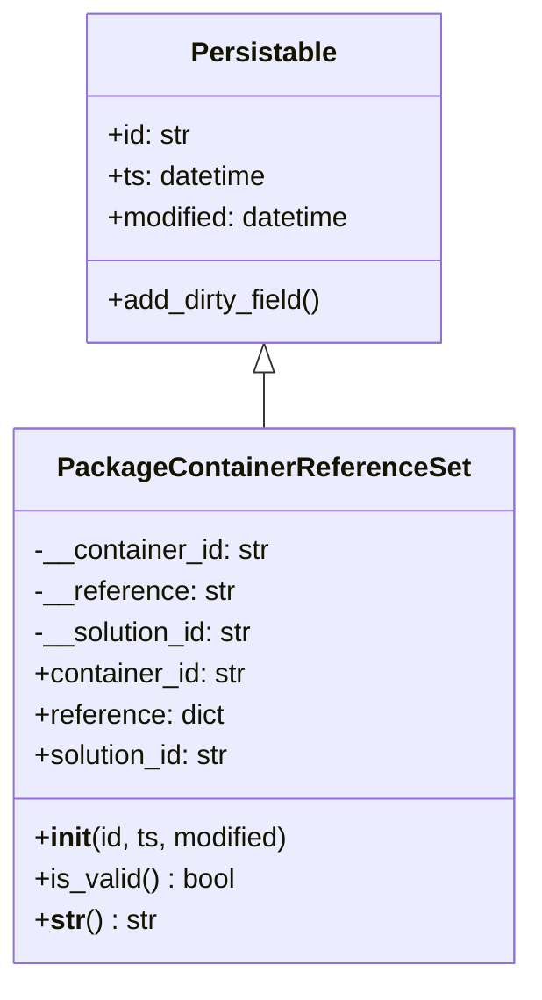
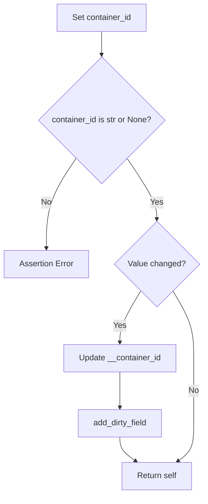
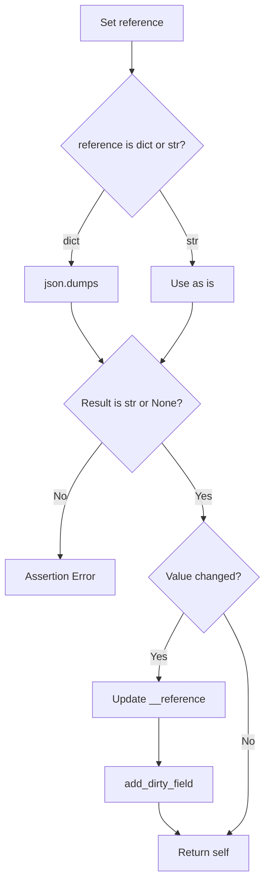
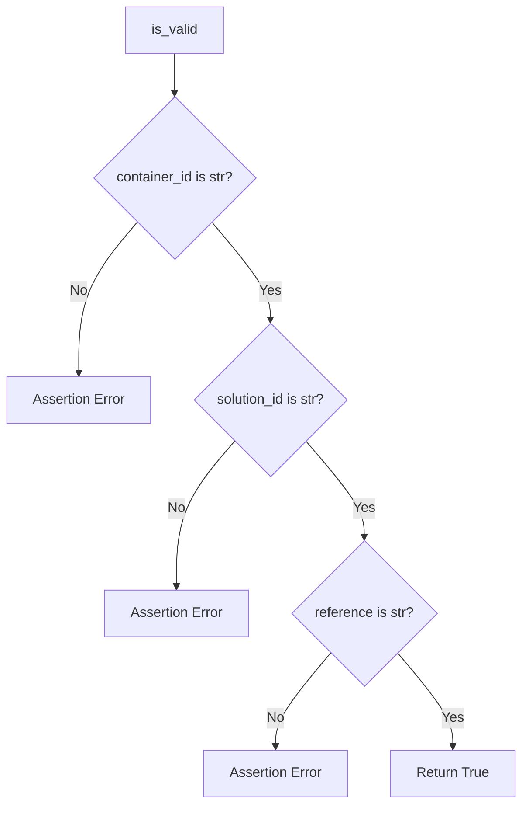
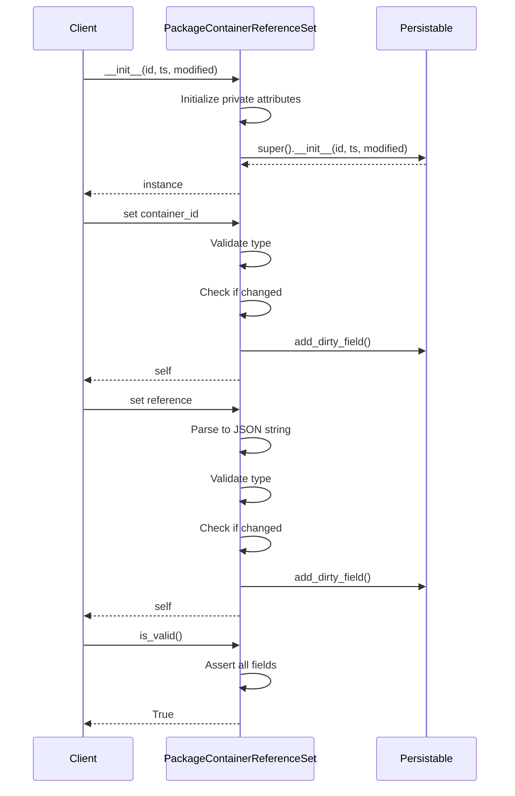

# Diagram: platform/partview_core/partview_service/partview_service/core/datamodel/PackageContainerReferenceSet.py

> Auto-generated by Obscura crawlers

## Diagram 1

### SVG

<svg id="container" width="304.9453125" xmlns="http://www.w3.org/2000/svg" class="classDiagram" height="570" viewBox="0 0 304.9453125 570" role="graphics-document document" aria-roledescription="class"><g><defs><marker id="container_class-aggregationStart" class="marker aggregation class" refX="18" refY="7" markerWidth="190" markerHeight="240" orient="auto"><path d="M 18,7 L9,13 L1,7 L9,1 Z"></path></marker></defs><defs><marker id="container_class-aggregationEnd" class="marker aggregation class" refX="1" refY="7" markerWidth="20" markerHeight="28" orient="auto"><path d="M 18,7 L9,13 L1,7 L9,1 Z"></path></marker></defs><defs><marker id="container_class-extensionStart" class="marker extension class" refX="18" refY="7" markerWidth="190" markerHeight="240" orient="auto"><path d="M 1,7 L18,13 V 1 Z"></path></marker></defs><defs><marker id="container_class-extensionEnd" class="marker extension class" refX="1" refY="7" markerWidth="20" markerHeight="28" orient="auto"><path d="M 1,1 V 13 L18,7 Z"></path></marker></defs><defs><marker id="container_class-compositionStart" class="marker composition class" refX="18" refY="7" markerWidth="190" markerHeight="240" orient="auto"><path d="M 18,7 L9,13 L1,7 L9,1 Z"></path></marker></defs><defs><marker id="container_class-compositionEnd" class="marker composition class" refX="1" refY="7" markerWidth="20" markerHeight="28" orient="auto"><path d="M 18,7 L9,13 L1,7 L9,1 Z"></path></marker></defs><defs><marker id="container_class-dependencyStart" class="marker dependency class" refX="6" refY="7" markerWidth="190" markerHeight="240" orient="auto"><path d="M 5,7 L9,13 L1,7 L9,1 Z"></path></marker></defs><defs><marker id="container_class-dependencyEnd" class="marker dependency class" refX="13" refY="7" markerWidth="20" markerHeight="28" orient="auto"><path d="M 18,7 L9,13 L14,7 L9,1 Z"></path></marker></defs><defs><marker id="container_class-lollipopStart" class="marker lollipop class" refX="13" refY="7" markerWidth="190" markerHeight="240" orient="auto"><circle stroke="black" fill="transparent" cx="7" cy="7" r="6"></circle></marker></defs><defs><marker id="container_class-lollipopEnd" class="marker lollipop class" refX="1" refY="7" markerWidth="190" markerHeight="240" orient="auto"><circle stroke="black" fill="transparent" cx="7" cy="7" r="6"></circle></marker></defs><g class="root"><g class="clusters"></g><g class="edgePaths"><path d="M152.473,217.25L152.473,218.542C152.473,219.833,152.473,222.417,152.473,227.875C152.473,233.333,152.473,241.667,152.473,245.833L152.473,250" id="id_Persistable_PackageContainerReferenceSet_1" class="edge-thickness-normal edge-pattern-solid relation" style=";;;" data-edge="true" data-et="edge" data-id="id_Persistable_PackageContainerReferenceSet_1" data-points="W3sieCI6MTUyLjQ3MjY1NjI1LCJ5IjoyMDB9LHsieCI6MTUyLjQ3MjY1NjI1LCJ5IjoyMjV9LHsieCI6MTUyLjQ3MjY1NjI1LCJ5IjoyNTB9XQ==" marker-start="url(#container_class-extensionStart)"></path></g><g class="edgeLabels"><g class="edgeLabel"><g class="label" data-id="id_Persistable_PackageContainerReferenceSet_1" transform="translate(0, 0)"><foreignObject width="0" height="0">

</foreignObject></g></g></g><g class="nodes"><g class="node default" id="classId-Persistable-0" transform="translate(152.47265625, 104)"><g class="basic label-container"><path d="M-105.45703125 -96 L105.45703125 -96 L105.45703125 96 L-105.45703125 96" stroke="none" stroke-width="0" fill="#ECECFF" style=""></path><path d="M-105.45703125 -96 C-30.28296667164608 -96, 44.89109790670784 -96, 105.45703125 -96 M-105.45703125 -96 C-59.029241895165164 -96, -12.601452540330328 -96, 105.45703125 -96 M105.45703125 -96 C105.45703125 -46.63219571537015, 105.45703125 2.7356085692596963, 105.45703125 96 M105.45703125 -96 C105.45703125 -27.02236797144785, 105.45703125 41.9552640571043, 105.45703125 96 M105.45703125 96 C51.615117563789944 96, -2.2267961224201116 96, -105.45703125 96 M105.45703125 96 C50.94616431159426 96, -3.5647026268114814 96, -105.45703125 96 M-105.45703125 96 C-105.45703125 24.836198160404848, -105.45703125 -46.327603679190304, -105.45703125 -96 M-105.45703125 96 C-105.45703125 27.11306499111025, -105.45703125 -41.7738700177795, -105.45703125 -96" stroke="#9370DB" stroke-width="1.3" fill="none" stroke-dasharray="0 0" style=""></path></g><g class="annotation-group text" transform="translate(0, -72)"></g><g class="label-group text" transform="translate(-40.9765625, -72)"><g class="label" style="font-weight: bolder" transform="translate(0,-12)"><foreignObject width="81.953125" height="24">

Persistable

</foreignObject></g></g><g class="members-group text" transform="translate(-93.45703125, -24)"><g class="label" style="" transform="translate(0,-12)"><foreignObject width="49.578125" height="24">

+id: str

</foreignObject></g><g class="label" style="" transform="translate(0,12)"><foreignObject width="94.484375" height="24">

+ts: datetime

</foreignObject></g><g class="label" style="" transform="translate(0,36)"><foreignObject width="145.9375" height="24">

+modified: datetime

</foreignObject></g></g><g class="methods-group text" transform="translate(-93.45703125, 72)"><g class="label" style="" transform="translate(0,-12)"><foreignObject width="127.40625" height="24">

+add_dirty_field()

</foreignObject></g></g><g class="divider" style=""><path d="M-105.45703125 -48 C-53.92318615384182 -48, -2.3893410576836374 -48, 105.45703125 -48 M-105.45703125 -48 C-38.662462545640395 -48, 28.13210615871921 -48, 105.45703125 -48" stroke="#9370DB" stroke-width="1.3" fill="none" stroke-dasharray="0 0" style=""></path></g><g class="divider" style=""><path d="M-105.45703125 48 C-31.460703585757287 48, 42.53562407848543 48, 105.45703125 48 M-105.45703125 48 C-49.770220959158074 48, 5.916589331683852 48, 105.45703125 48" stroke="#9370DB" stroke-width="1.3" fill="none" stroke-dasharray="0 0" style=""></path></g></g><g class="node default" id="classId-PackageContainerReferenceSet-1" transform="translate(152.47265625, 406)"><g class="basic label-container"><path d="M-144.47265625 -156 L144.47265625 -156 L144.47265625 156 L-144.47265625 156" stroke="none" stroke-width="0" fill="#ECECFF" style=""></path><path d="M-144.47265625 -156 C-84.1713165597302 -156, -23.869976869460416 -156, 144.47265625 -156 M-144.47265625 -156 C-43.450844683398515 -156, 57.57096688320297 -156, 144.47265625 -156 M144.47265625 -156 C144.47265625 -82.67153849967909, 144.47265625 -9.343076999358175, 144.47265625 156 M144.47265625 -156 C144.47265625 -60.71299937080377, 144.47265625 34.57400125839246, 144.47265625 156 M144.47265625 156 C50.96000126979162 156, -42.55265371041676 156, -144.47265625 156 M144.47265625 156 C60.149940426035144 156, -24.172775397929712 156, -144.47265625 156 M-144.47265625 156 C-144.47265625 83.35018571297888, -144.47265625 10.70037142595777, -144.47265625 -156 M-144.47265625 156 C-144.47265625 73.83251482576178, -144.47265625 -8.334970348476446, -144.47265625 -156" stroke="#9370DB" stroke-width="1.3" fill="none" stroke-dasharray="0 0" style=""></path></g><g class="annotation-group text" transform="translate(0, -132)"></g><g class="label-group text" transform="translate(-114.0390625, -132)"><g class="label" style="font-weight: bolder" transform="translate(0,-12)"><foreignObject width="228.078125" height="24">

PackageContainerReferenceSet

</foreignObject></g></g><g class="members-group text" transform="translate(-132.47265625, -84)"><g class="label" style="" transform="translate(0,-12)"><foreignObject width="139.15625" height="24">

-__container_id: str

</foreignObject></g><g class="label" style="" transform="translate(0,12)"><foreignObject width="117.34375" height="24">

-__reference: str

</foreignObject></g><g class="label" style="" transform="translate(0,36)"><foreignObject width="131.390625" height="24">

-__solution_id: str

</foreignObject></g><g class="label" style="" transform="translate(0,60)"><foreignObject width="125.8125" height="24">

+container_id: str

</foreignObject></g><g class="label" style="" transform="translate(0,84)"><foreignObject width="111.75" height="24">

+reference: dict

</foreignObject></g><g class="label" style="" transform="translate(0,108)"><foreignObject width="117.71875" height="24">

+solution_id: str

</foreignObject></g></g><g class="methods-group text" transform="translate(-132.47265625, 84)"><g class="label" style="" transform="translate(0,-12)"><foreignObject width="150.90625" height="24">

+<strong>init</strong>(id, ts, modified)

</foreignObject></g><g class="label" style="" transform="translate(0,12)"><foreignObject width="117.984375" height="24">

+is_valid() : bool

</foreignObject></g><g class="label" style="" transform="translate(0,36)"><foreignObject width="70.4375" height="24">

+<strong>str</strong>() : str

</foreignObject></g></g><g class="divider" style=""><path d="M-144.47265625 -108 C-85.36586438151127 -108, -26.259072513022545 -108, 144.47265625 -108 M-144.47265625 -108 C-75.70161475922222 -108, -6.930573268444448 -108, 144.47265625 -108" stroke="#9370DB" stroke-width="1.3" fill="none" stroke-dasharray="0 0" style=""></path></g><g class="divider" style=""><path d="M-144.47265625 60 C-43.83938115100081 60, 56.793893947998384 60, 144.47265625 60 M-144.47265625 60 C-29.081500026208204 60, 86.30965619758359 60, 144.47265625 60" stroke="#9370DB" stroke-width="1.3" fill="none" stroke-dasharray="0 0" style=""></path></g></g></g></g></g></svg>

## Diagram 2

### SVG

<svg id="container" width="400.953125" xmlns="http://www.w3.org/2000/svg" class="flowchart" height="973.84375" viewBox="0 0 400.953125 973.84375" role="graphics-document document" aria-roledescription="flowchart-v2"><g><marker id="container_flowchart-v2-pointEnd" class="marker flowchart-v2" viewBox="0 0 10 10" refX="5" refY="5" markerUnits="userSpaceOnUse" markerWidth="8" markerHeight="8" orient="auto"><path d="M 0 0 L 10 5 L 0 10 z" class="arrowMarkerPath" style="stroke-width: 1; stroke-dasharray: 1, 0;"></path></marker><marker id="container_flowchart-v2-pointStart" class="marker flowchart-v2" viewBox="0 0 10 10" refX="4.5" refY="5" markerUnits="userSpaceOnUse" markerWidth="8" markerHeight="8" orient="auto"><path d="M 0 5 L 10 10 L 10 0 z" class="arrowMarkerPath" style="stroke-width: 1; stroke-dasharray: 1, 0;"></path></marker><marker id="container_flowchart-v2-circleEnd" class="marker flowchart-v2" viewBox="0 0 10 10" refX="11" refY="5" markerUnits="userSpaceOnUse" markerWidth="11" markerHeight="11" orient="auto"><circle cx="5" cy="5" r="5" class="arrowMarkerPath" style="stroke-width: 1; stroke-dasharray: 1, 0;"></circle></marker><marker id="container_flowchart-v2-circleStart" class="marker flowchart-v2" viewBox="0 0 10 10" refX="-1" refY="5" markerUnits="userSpaceOnUse" markerWidth="11" markerHeight="11" orient="auto"><circle cx="5" cy="5" r="5" class="arrowMarkerPath" style="stroke-width: 1; stroke-dasharray: 1, 0;"></circle></marker><marker id="container_flowchart-v2-crossEnd" class="marker cross flowchart-v2" viewBox="0 0 11 11" refX="12" refY="5.2" markerUnits="userSpaceOnUse" markerWidth="11" markerHeight="11" orient="auto"><path d="M 1,1 l 9,9 M 10,1 l -9,9" class="arrowMarkerPath" style="stroke-width: 2; stroke-dasharray: 1, 0;"></path></marker><marker id="container_flowchart-v2-crossStart" class="marker cross flowchart-v2" viewBox="0 0 11 11" refX="-1" refY="5.2" markerUnits="userSpaceOnUse" markerWidth="11" markerHeight="11" orient="auto"><path d="M 1,1 l 9,9 M 10,1 l -9,9" class="arrowMarkerPath" style="stroke-width: 2; stroke-dasharray: 1, 0;"></path></marker><g class="root"><g class="clusters"></g><g class="edgePaths"><path d="M200.559,62L200.559,66.167C200.559,70.333,200.559,78.667,200.559,86.333C200.559,94,200.559,101,200.559,104.5L200.559,108" id="L_A_B_0" class="edge-thickness-normal edge-pattern-solid edge-thickness-normal edge-pattern-solid flowchart-link" style=";" data-edge="true" data-et="edge" data-id="L_A_B_0" data-points="W3sieCI6MjAwLjU1ODU5Mzc1LCJ5Ijo2Mn0seyJ4IjoyMDAuNTU4NTkzNzUsInkiOjg3fSx7IngiOjIwMC41NTg1OTM3NSwieSI6MTEyfV0=" marker-end="url(#container_flowchart-v2-pointEnd)"></path><path d="M150.036,314.759L140.355,329.346C130.673,343.933,111.309,373.107,101.627,402.574C91.945,432.042,91.945,461.802,91.945,476.682L91.945,491.563" id="L_B_C_0" class="edge-thickness-normal edge-pattern-solid edge-thickness-normal edge-pattern-solid flowchart-link" style=";" data-edge="true" data-et="edge" data-id="L_B_C_0" data-points="W3sieCI6MTUwLjAzNjQzOTU5NTIzMDA2LCJ5IjozMTQuNzU5MDk1ODQ1MjMwMX0seyJ4Ijo5MS45NDUzMTI1LCJ5Ijo0MDIuMjgxMjV9LHsieCI6OTEuOTQ1MzEyNSwieSI6NDk1LjU2MjV9XQ==" marker-end="url(#container_flowchart-v2-pointEnd)"></path><path d="M251.081,314.759L260.763,329.346C270.444,343.933,289.808,373.107,299.49,393.194C309.172,413.281,309.172,424.281,309.172,429.781L309.172,435.281" id="L_B_D_0" class="edge-thickness-normal edge-pattern-solid edge-thickness-normal edge-pattern-solid flowchart-link" style=";" data-edge="true" data-et="edge" data-id="L_B_D_0" data-points="W3sieCI6MjUxLjA4MDc0NzkwNDc2OTk0LCJ5IjozMTQuNzU5MDk1ODQ1MjMwMX0seyJ4IjozMDkuMTcxODc1LCJ5Ijo0MDIuMjgxMjV9LHsieCI6MzA5LjE3MTg3NSwieSI6NDM5LjI4MTI1fV0=" marker-end="url(#container_flowchart-v2-pointEnd)"></path><path d="M277.627,574.298L270.661,585.723C263.695,597.147,249.764,619.995,242.798,636.92C235.832,653.844,235.832,664.844,235.832,670.344L235.832,675.844" id="L_D_E_0" class="edge-thickness-normal edge-pattern-solid edge-thickness-normal edge-pattern-solid flowchart-link" style=";" data-edge="true" data-et="edge" data-id="L_D_E_0" data-points="W3sieCI6Mjc3LjYyNjU4MzM5OTc0MTgsInkiOjU3NC4yOTg0NTgzOTk3NDE4fSx7IngiOjIzNS44MzIwMzEyNSwieSI6NjQyLjg0Mzc1fSx7IngiOjIzNS44MzIwMzEyNSwieSI6Njc5Ljg0Mzc1fV0=" marker-end="url(#container_flowchart-v2-pointEnd)"></path><path d="M235.832,733.844L235.832,740.01C235.832,746.177,235.832,758.51,235.832,770.177C235.832,781.844,235.832,792.844,235.832,798.344L235.832,803.844" id="L_E_F_0" class="edge-thickness-normal edge-pattern-solid edge-thickness-normal edge-pattern-solid flowchart-link" style=";" data-edge="true" data-et="edge" data-id="L_E_F_0" data-points="W3sieCI6MjM1LjgzMjAzMTI1LCJ5Ijo3MzMuODQzNzV9LHsieCI6MjM1LjgzMjAzMTI1LCJ5Ijo3NzAuODQzNzV9LHsieCI6MjM1LjgzMjAzMTI1LCJ5Ijo4MDcuODQzNzV9XQ==" marker-end="url(#container_flowchart-v2-pointEnd)"></path><path d="M235.832,861.844L235.832,866.01C235.832,870.177,235.832,878.51,241.165,886.458C246.498,894.406,257.163,901.968,262.496,905.749L267.829,909.53" id="L_F_G_0" class="edge-thickness-normal edge-pattern-solid edge-thickness-normal edge-pattern-solid flowchart-link" style=";" data-edge="true" data-et="edge" data-id="L_F_G_0" data-points="W3sieCI6MjM1LjgzMjAzMTI1LCJ5Ijo4NjEuODQzNzV9LHsieCI6MjM1LjgzMjAzMTI1LCJ5Ijo4ODYuODQzNzV9LHsieCI6MjcxLjA5MTU3MTUxNDQyMzEsInkiOjkxMS44NDM3NX1d" marker-end="url(#container_flowchart-v2-pointEnd)"></path><path d="M340.717,574.298L347.683,585.723C354.649,597.147,368.58,619.995,375.546,642.086C382.512,664.177,382.512,685.51,382.512,706.844C382.512,728.177,382.512,749.51,382.512,770.844C382.512,792.177,382.512,813.51,382.512,832.844C382.512,852.177,382.512,869.51,377.179,881.958C371.846,894.406,361.181,901.968,355.848,905.749L350.515,909.53" id="L_D_G_0" class="edge-thickness-normal edge-pattern-solid edge-thickness-normal edge-pattern-solid flowchart-link" style=";" data-edge="true" data-et="edge" data-id="L_D_G_0" data-points="W3sieCI6MzQwLjcxNzE2NjYwMDI1ODIsInkiOjU3NC4yOTg0NTgzOTk3NDE4fSx7IngiOjM4Mi41MTE3MTg3NSwieSI6NjQyLjg0Mzc1fSx7IngiOjM4Mi41MTE3MTg3NSwieSI6NzA2Ljg0Mzc1fSx7IngiOjM4Mi41MTE3MTg3NSwieSI6NzcwLjg0Mzc1fSx7IngiOjM4Mi41MTE3MTg3NSwieSI6ODM0Ljg0Mzc1fSx7IngiOjM4Mi41MTE3MTg3NSwieSI6ODg2Ljg0Mzc1fSx7IngiOjM0Ny4yNTIxNzg0ODU1NzY5LCJ5Ijo5MTEuODQzNzV9XQ==" marker-end="url(#container_flowchart-v2-pointEnd)"></path></g><g class="edgeLabels"><g class="edgeLabel"><g class="label" data-id="L_A_B_0" transform="translate(0, 0)"><foreignObject width="0" height="0">

</foreignObject></g></g><g class="edgeLabel" transform="translate(91.9453125, 402.28125)"><g class="label" data-id="L_B_C_0" transform="translate(-10.140625, -12)"><foreignObject width="20.28125" height="24">

No

</foreignObject></g></g><g class="edgeLabel" transform="translate(309.171875, 402.28125)"><g class="label" data-id="L_B_D_0" transform="translate(-12.03125, -12)"><foreignObject width="24.0625" height="24">

Yes

</foreignObject></g></g><g class="edgeLabel" transform="translate(235.83203125, 642.84375)"><g class="label" data-id="L_D_E_0" transform="translate(-12.03125, -12)"><foreignObject width="24.0625" height="24">

Yes

</foreignObject></g></g><g class="edgeLabel"><g class="label" data-id="L_E_F_0" transform="translate(0, 0)"><foreignObject width="0" height="0">

</foreignObject></g></g><g class="edgeLabel"><g class="label" data-id="L_F_G_0" transform="translate(0, 0)"><foreignObject width="0" height="0">

</foreignObject></g></g><g class="edgeLabel" transform="translate(382.51171875, 770.84375)"><g class="label" data-id="L_D_G_0" transform="translate(-10.140625, -12)"><foreignObject width="20.28125" height="24">

No

</foreignObject></g></g></g><g class="nodes"><g class="node default" id="flowchart-A-0" transform="translate(200.55859375, 35)"><rect class="basic label-container" style="" x="-88.890625" y="-27" width="177.78125" height="54"></rect><g class="label" style="" transform="translate(-58.890625, -12)"><rect></rect><foreignObject width="117.78125" height="24">

Set container_id

</foreignObject></g></g><g class="node default" id="flowchart-B-1" transform="translate(200.55859375, 238.640625)"><polygon points="126.640625,0 253.28125,-126.640625 126.640625,-253.28125 0,-126.640625" class="label-container" transform="translate(-126.140625, 126.640625)"></polygon><g class="label" style="" transform="translate(-99.640625, -12)"><rect></rect><foreignObject width="199.28125" height="24">

container_id is str or None?

</foreignObject></g></g><g class="node default" id="flowchart-C-3" transform="translate(91.9453125, 522.5625)"><rect class="basic label-container" style="" x="-83.9453125" y="-27" width="167.890625" height="54"></rect><g class="label" style="" transform="translate(-53.9453125, -12)"><rect></rect><foreignObject width="107.890625" height="24">

Assertion Error

</foreignObject></g></g><g class="node default" id="flowchart-D-5" transform="translate(309.171875, 522.5625)"><polygon points="83.28125,0 166.5625,-83.28125 83.28125,-166.5625 0,-83.28125" class="label-container" transform="translate(-82.78125, 83.28125)"></polygon><g class="label" style="" transform="translate(-56.28125, -12)"><rect></rect><foreignObject width="112.5625" height="24">

Value changed?

</foreignObject></g></g><g class="node default" id="flowchart-E-7" transform="translate(235.83203125, 706.84375)"><rect class="basic label-container" style="" x="-111.6796875" y="-27" width="223.359375" height="54"></rect><g class="label" style="" transform="translate(-81.6796875, -12)"><rect></rect><foreignObject width="163.359375" height="24">

Update __container_id

</foreignObject></g></g><g class="node default" id="flowchart-F-9" transform="translate(235.83203125, 834.84375)"><rect class="basic label-container" style="" x="-84.640625" y="-27" width="169.28125" height="54"></rect><g class="label" style="" transform="translate(-54.640625, -12)"><rect></rect><foreignObject width="109.28125" height="24">

add_dirty_field

</foreignObject></g></g><g class="node default" id="flowchart-G-11" transform="translate(309.171875, 938.84375)"><rect class="basic label-container" style="" x="-69.640625" y="-27" width="139.28125" height="54"></rect><g class="label" style="" transform="translate(-39.640625, -12)"><rect></rect><foreignObject width="79.28125" height="24">

Return self

</foreignObject></g></g></g></g></g></svg>

## Diagram 3

### SVG

<svg id="container" width="400.953125" xmlns="http://www.w3.org/2000/svg" class="flowchart" height="1327.375" viewBox="0 0 400.953125 1327.375" role="graphics-document document" aria-roledescription="flowchart-v2"><g><marker id="container_flowchart-v2-pointEnd" class="marker flowchart-v2" viewBox="0 0 10 10" refX="5" refY="5" markerUnits="userSpaceOnUse" markerWidth="8" markerHeight="8" orient="auto"><path d="M 0 0 L 10 5 L 0 10 z" class="arrowMarkerPath" style="stroke-width: 1; stroke-dasharray: 1, 0;"></path></marker><marker id="container_flowchart-v2-pointStart" class="marker flowchart-v2" viewBox="0 0 10 10" refX="4.5" refY="5" markerUnits="userSpaceOnUse" markerWidth="8" markerHeight="8" orient="auto"><path d="M 0 5 L 10 10 L 10 0 z" class="arrowMarkerPath" style="stroke-width: 1; stroke-dasharray: 1, 0;"></path></marker><marker id="container_flowchart-v2-circleEnd" class="marker flowchart-v2" viewBox="0 0 10 10" refX="11" refY="5" markerUnits="userSpaceOnUse" markerWidth="11" markerHeight="11" orient="auto"><circle cx="5" cy="5" r="5" class="arrowMarkerPath" style="stroke-width: 1; stroke-dasharray: 1, 0;"></circle></marker><marker id="container_flowchart-v2-circleStart" class="marker flowchart-v2" viewBox="0 0 10 10" refX="-1" refY="5" markerUnits="userSpaceOnUse" markerWidth="11" markerHeight="11" orient="auto"><circle cx="5" cy="5" r="5" class="arrowMarkerPath" style="stroke-width: 1; stroke-dasharray: 1, 0;"></circle></marker><marker id="container_flowchart-v2-crossEnd" class="marker cross flowchart-v2" viewBox="0 0 11 11" refX="12" refY="5.2" markerUnits="userSpaceOnUse" markerWidth="11" markerHeight="11" orient="auto"><path d="M 1,1 l 9,9 M 10,1 l -9,9" class="arrowMarkerPath" style="stroke-width: 2; stroke-dasharray: 1, 0;"></path></marker><marker id="container_flowchart-v2-crossStart" class="marker cross flowchart-v2" viewBox="0 0 11 11" refX="-1" refY="5.2" markerUnits="userSpaceOnUse" markerWidth="11" markerHeight="11" orient="auto"><path d="M 1,1 l 9,9 M 10,1 l -9,9" class="arrowMarkerPath" style="stroke-width: 2; stroke-dasharray: 1, 0;"></path></marker><g class="root"><g class="clusters"></g><g class="edgePaths"><path d="M200.559,62L200.559,66.167C200.559,70.333,200.559,78.667,200.559,86.333C200.559,94,200.559,101,200.559,104.5L200.559,108" id="L_A_B_0" class="edge-thickness-normal edge-pattern-solid edge-thickness-normal edge-pattern-solid flowchart-link" style=";" data-edge="true" data-et="edge" data-id="L_A_B_0" data-points="W3sieCI6MjAwLjU1ODU5Mzc1LCJ5Ijo2Mn0seyJ4IjoyMDAuNTU4NTkzNzUsInkiOjg3fSx7IngiOjIwMC41NTg1OTM3NSwieSI6MTEyfV0=" marker-end="url(#container_flowchart-v2-pointEnd)"></path><path d="M158.233,290.112L149.991,303.333C141.749,316.554,125.265,342.996,117.023,361.717C108.781,380.438,108.781,391.438,108.781,396.938L108.781,402.438" id="L_B_C_0" class="edge-thickness-normal edge-pattern-solid edge-thickness-normal edge-pattern-solid flowchart-link" style=";" data-edge="true" data-et="edge" data-id="L_B_C_0" data-points="W3sieCI6MTU4LjIzMzI4MjI4Njg0ODQ2LCJ5IjoyOTAuMTEyMTg4NTM2ODQ4NDZ9LHsieCI6MTA4Ljc4MTI1LCJ5IjozNjkuNDM3NX0seyJ4IjoxMDguNzgxMjUsInkiOjQwNi40Mzc1fV0=" marker-end="url(#container_flowchart-v2-pointEnd)"></path><path d="M242.884,290.112L251.126,303.333C259.368,316.554,275.852,342.996,284.094,361.717C292.336,380.438,292.336,391.438,292.336,396.938L292.336,402.438" id="L_B_D_0" class="edge-thickness-normal edge-pattern-solid edge-thickness-normal edge-pattern-solid flowchart-link" style=";" data-edge="true" data-et="edge" data-id="L_B_D_0" data-points="W3sieCI6MjQyLjg4MzkwNTIxMzE1MTU0LCJ5IjoyOTAuMTEyMTg4NTM2ODQ4NDZ9LHsieCI6MjkyLjMzNTkzNzUsInkiOjM2OS40Mzc1fSx7IngiOjI5Mi4zMzU5Mzc1LCJ5Ijo0MDYuNDM3NX1d" marker-end="url(#container_flowchart-v2-pointEnd)"></path><path d="M108.781,460.438L108.781,464.604C108.781,468.771,108.781,477.104,116.479,492.106C124.177,507.109,139.572,528.78,147.27,539.615L154.968,550.451" id="L_C_E_0" class="edge-thickness-normal edge-pattern-solid edge-thickness-normal edge-pattern-solid flowchart-link" style=";" data-edge="true" data-et="edge" data-id="L_C_E_0" data-points="W3sieCI6MTA4Ljc4MTI1LCJ5Ijo0NjAuNDM3NX0seyJ4IjoxMDguNzgxMjUsInkiOjQ4NS40Mzc1fSx7IngiOjE1Ny4yODQ1MDYxNjM1OTgwMiwieSI6NTUzLjcxMTU4NzU4NjQwMn1d" marker-end="url(#container_flowchart-v2-pointEnd)"></path><path d="M292.336,460.438L292.336,464.604C292.336,468.771,292.336,477.104,284.638,492.106C276.94,507.109,261.545,528.78,253.847,539.615L246.149,550.451" id="L_D_E_0" class="edge-thickness-normal edge-pattern-solid edge-thickness-normal edge-pattern-solid flowchart-link" style=";" data-edge="true" data-et="edge" data-id="L_D_E_0" data-points="W3sieCI6MjkyLjMzNTkzNzUsInkiOjQ2MC40Mzc1fSx7IngiOjI5Mi4zMzU5Mzc1LCJ5Ijo0ODUuNDM3NX0seyJ4IjoyNDMuODMyNjgxMzM2NDAxOTgsInkiOjU1My43MTE1ODc1ODY0MDJ9XQ==" marker-end="url(#container_flowchart-v2-pointEnd)"></path><path d="M155.258,673.512L144.706,687.229C134.154,700.945,113.05,728.379,102.497,756.976C91.945,785.573,91.945,815.333,91.945,830.214L91.945,845.094" id="L_E_F_0" class="edge-thickness-normal edge-pattern-solid edge-thickness-normal edge-pattern-solid flowchart-link" style=";" data-edge="true" data-et="edge" data-id="L_E_F_0" data-points="W3sieCI6MTU1LjI1NzkwOTgwNjU0NTA2LCJ5Ijo2NzMuNTExODE2MDU2NTQ1MX0seyJ4Ijo5MS45NDUzMTI1LCJ5Ijo3NTUuODEyNX0seyJ4Ijo5MS45NDUzMTI1LCJ5Ijo4NDkuMDkzNzV9XQ==" marker-end="url(#container_flowchart-v2-pointEnd)"></path><path d="M245.859,673.512L256.411,687.229C266.963,700.945,288.068,728.379,298.62,747.596C309.172,766.813,309.172,777.813,309.172,783.313L309.172,788.813" id="L_E_G_0" class="edge-thickness-normal edge-pattern-solid edge-thickness-normal edge-pattern-solid flowchart-link" style=";" data-edge="true" data-et="edge" data-id="L_E_G_0" data-points="W3sieCI6MjQ1Ljg1OTI3NzY5MzQ1NDk0LCJ5Ijo2NzMuNTExODE2MDU2NTQ1MX0seyJ4IjozMDkuMTcxODc1LCJ5Ijo3NTUuODEyNX0seyJ4IjozMDkuMTcxODc1LCJ5Ijo3OTIuODEyNX1d" marker-end="url(#container_flowchart-v2-pointEnd)"></path><path d="M279.127,929.33L272.821,940.504C266.514,951.678,253.902,974.027,247.595,990.701C241.289,1007.375,241.289,1018.375,241.289,1023.875L241.289,1029.375" id="L_G_H_0" class="edge-thickness-normal edge-pattern-solid edge-thickness-normal edge-pattern-solid flowchart-link" style=";" data-edge="true" data-et="edge" data-id="L_G_H_0" data-points="W3sieCI6Mjc5LjEyNzAwMTM3NTMzNzMzLCJ5Ijo5MjkuMzMwMTI2Mzc1MzM3NH0seyJ4IjoyNDEuMjg5MDYyNSwieSI6OTk2LjM3NX0seyJ4IjoyNDEuMjg5MDYyNSwieSI6MTAzMy4zNzV9XQ==" marker-end="url(#container_flowchart-v2-pointEnd)"></path><path d="M241.289,1087.375L241.289,1093.542C241.289,1099.708,241.289,1112.042,241.289,1123.708C241.289,1135.375,241.289,1146.375,241.289,1151.875L241.289,1157.375" id="L_H_I_0" class="edge-thickness-normal edge-pattern-solid edge-thickness-normal edge-pattern-solid flowchart-link" style=";" data-edge="true" data-et="edge" data-id="L_H_I_0" data-points="W3sieCI6MjQxLjI4OTA2MjUsInkiOjEwODcuMzc1fSx7IngiOjI0MS4yODkwNjI1LCJ5IjoxMTI0LjM3NX0seyJ4IjoyNDEuMjg5MDYyNSwieSI6MTE2MS4zNzV9XQ==" marker-end="url(#container_flowchart-v2-pointEnd)"></path><path d="M241.289,1215.375L241.289,1219.542C241.289,1223.708,241.289,1232.042,246.199,1239.97C251.109,1247.898,260.929,1255.42,265.84,1259.181L270.75,1262.943" id="L_I_J_0" class="edge-thickness-normal edge-pattern-solid edge-thickness-normal edge-pattern-solid flowchart-link" style=";" data-edge="true" data-et="edge" data-id="L_I_J_0" data-points="W3sieCI6MjQxLjI4OTA2MjUsInkiOjEyMTUuMzc1fSx7IngiOjI0MS4yODkwNjI1LCJ5IjoxMjQwLjM3NX0seyJ4IjoyNzMuOTI1MDMwMDQ4MDc2OSwieSI6MTI2NS4zNzV9XQ==" marker-end="url(#container_flowchart-v2-pointEnd)"></path><path d="M339.217,929.33L345.523,940.504C351.829,951.678,364.442,974.027,370.748,995.868C377.055,1017.708,377.055,1039.042,377.055,1060.375C377.055,1081.708,377.055,1103.042,377.055,1124.375C377.055,1145.708,377.055,1167.042,377.055,1186.375C377.055,1205.708,377.055,1223.042,372.145,1235.47C367.235,1247.898,357.414,1255.42,352.504,1259.181L347.594,1262.943" id="L_G_J_0" class="edge-thickness-normal edge-pattern-solid edge-thickness-normal edge-pattern-solid flowchart-link" style=";" data-edge="true" data-et="edge" data-id="L_G_J_0" data-points="W3sieCI6MzM5LjIxNjc0ODYyNDY2MjY3LCJ5Ijo5MjkuMzMwMTI2Mzc1MzM3NH0seyJ4IjozNzcuMDU0Njg3NSwieSI6OTk2LjM3NX0seyJ4IjozNzcuMDU0Njg3NSwieSI6MTA2MC4zNzV9LHsieCI6Mzc3LjA1NDY4NzUsInkiOjExMjQuMzc1fSx7IngiOjM3Ny4wNTQ2ODc1LCJ5IjoxMTg4LjM3NX0seyJ4IjozNzcuMDU0Njg3NSwieSI6MTI0MC4zNzV9LHsieCI6MzQ0LjQxODcxOTk1MTkyMzEsInkiOjEyNjUuMzc1fV0=" marker-end="url(#container_flowchart-v2-pointEnd)"></path></g><g class="edgeLabels"><g class="edgeLabel"><g class="label" data-id="L_A_B_0" transform="translate(0, 0)"><foreignObject width="0" height="0">

</foreignObject></g></g><g class="edgeLabel" transform="translate(108.78125, 369.4375)"><g class="label" data-id="L_B_C_0" transform="translate(-13.7578125, -12)"><foreignObject width="27.515625" height="24">

dict

</foreignObject></g></g><g class="edgeLabel" transform="translate(292.3359375, 369.4375)"><g class="label" data-id="L_B_D_0" transform="translate(-9.71875, -12)"><foreignObject width="19.4375" height="24">

str

</foreignObject></g></g><g class="edgeLabel"><g class="label" data-id="L_C_E_0" transform="translate(0, 0)"><foreignObject width="0" height="0">

</foreignObject></g></g><g class="edgeLabel"><g class="label" data-id="L_D_E_0" transform="translate(0, 0)"><foreignObject width="0" height="0">

</foreignObject></g></g><g class="edgeLabel" transform="translate(91.9453125, 755.8125)"><g class="label" data-id="L_E_F_0" transform="translate(-10.140625, -12)"><foreignObject width="20.28125" height="24">

No

</foreignObject></g></g><g class="edgeLabel" transform="translate(309.171875, 755.8125)"><g class="label" data-id="L_E_G_0" transform="translate(-12.03125, -12)"><foreignObject width="24.0625" height="24">

Yes

</foreignObject></g></g><g class="edgeLabel" transform="translate(241.2890625, 996.375)"><g class="label" data-id="L_G_H_0" transform="translate(-12.03125, -12)"><foreignObject width="24.0625" height="24">

Yes

</foreignObject></g></g><g class="edgeLabel"><g class="label" data-id="L_H_I_0" transform="translate(0, 0)"><foreignObject width="0" height="0">

</foreignObject></g></g><g class="edgeLabel"><g class="label" data-id="L_I_J_0" transform="translate(0, 0)"><foreignObject width="0" height="0">

</foreignObject></g></g><g class="edgeLabel" transform="translate(377.0546875, 1124.375)"><g class="label" data-id="L_G_J_0" transform="translate(-10.140625, -12)"><foreignObject width="20.28125" height="24">

No

</foreignObject></g></g></g><g class="nodes"><g class="node default" id="flowchart-A-0" transform="translate(200.55859375, 35)"><rect class="basic label-container" style="" x="-77.8203125" y="-27" width="155.640625" height="54"></rect><g class="label" style="" transform="translate(-47.8203125, -12)"><rect></rect><foreignObject width="95.640625" height="24">

Set reference

</foreignObject></g></g><g class="node default" id="flowchart-B-1" transform="translate(200.55859375, 222.21875)"><polygon points="110.21875,0 220.4375,-110.21875 110.21875,-220.4375 0,-110.21875" class="label-container" transform="translate(-109.71875, 110.21875)"></polygon><g class="label" style="" transform="translate(-83.21875, -12)"><rect></rect><foreignObject width="166.4375" height="24">

reference is dict or str?

</foreignObject></g></g><g class="node default" id="flowchart-C-3" transform="translate(108.78125, 433.4375)"><rect class="basic label-container" style="" x="-71.9609375" y="-27" width="143.921875" height="54"></rect><g class="label" style="" transform="translate(-41.9609375, -12)"><rect></rect><foreignObject width="83.921875" height="24">

json.dumps

</foreignObject></g></g><g class="node default" id="flowchart-D-5" transform="translate(292.3359375, 433.4375)"><rect class="basic label-container" style="" x="-61.59375" y="-27" width="123.1875" height="54"></rect><g class="label" style="" transform="translate(-31.59375, -12)"><rect></rect><foreignObject width="63.1875" height="24">

Use as is

</foreignObject></g></g><g class="node default" id="flowchart-E-7" transform="translate(200.55859375, 614.625)"><polygon points="104.1875,0 208.375,-104.1875 104.1875,-208.375 0,-104.1875" class="label-container" transform="translate(-103.6875, 104.1875)"></polygon><g class="label" style="" transform="translate(-77.1875, -12)"><rect></rect><foreignObject width="154.375" height="24">

Result is str or None?

</foreignObject></g></g><g class="node default" id="flowchart-F-11" transform="translate(91.9453125, 876.09375)"><rect class="basic label-container" style="" x="-83.9453125" y="-27" width="167.890625" height="54"></rect><g class="label" style="" transform="translate(-53.9453125, -12)"><rect></rect><foreignObject width="107.890625" height="24">

Assertion Error

</foreignObject></g></g><g class="node default" id="flowchart-G-13" transform="translate(309.171875, 876.09375)"><polygon points="83.28125,0 166.5625,-83.28125 83.28125,-166.5625 0,-83.28125" class="label-container" transform="translate(-82.78125, 83.28125)"></polygon><g class="label" style="" transform="translate(-56.28125, -12)"><rect></rect><foreignObject width="112.5625" height="24">

Value changed?

</foreignObject></g></g><g class="node default" id="flowchart-H-15" transform="translate(241.2890625, 1060.375)"><rect class="basic label-container" style="" x="-100.765625" y="-27" width="201.53125" height="54"></rect><g class="label" style="" transform="translate(-70.765625, -12)"><rect></rect><foreignObject width="141.53125" height="24">

Update __reference

</foreignObject></g></g><g class="node default" id="flowchart-I-17" transform="translate(241.2890625, 1188.375)"><rect class="basic label-container" style="" x="-84.640625" y="-27" width="169.28125" height="54"></rect><g class="label" style="" transform="translate(-54.640625, -12)"><rect></rect><foreignObject width="109.28125" height="24">

add_dirty_field

</foreignObject></g></g><g class="node default" id="flowchart-J-19" transform="translate(309.171875, 1292.375)"><rect class="basic label-container" style="" x="-69.640625" y="-27" width="139.28125" height="54"></rect><g class="label" style="" transform="translate(-39.640625, -12)"><rect></rect><foreignObject width="79.28125" height="24">

Return self

</foreignObject></g></g></g></g></g></svg>

## Diagram 4

### SVG

<svg id="container" width="610.34765625" xmlns="http://www.w3.org/2000/svg" class="flowchart" height="939" viewBox="0 0 610.34765625 939" role="graphics-document document" aria-roledescription="flowchart-v2"><g><marker id="container_flowchart-v2-pointEnd" class="marker flowchart-v2" viewBox="0 0 10 10" refX="5" refY="5" markerUnits="userSpaceOnUse" markerWidth="8" markerHeight="8" orient="auto"><path d="M 0 0 L 10 5 L 0 10 z" class="arrowMarkerPath" style="stroke-width: 1; stroke-dasharray: 1, 0;"></path></marker><marker id="container_flowchart-v2-pointStart" class="marker flowchart-v2" viewBox="0 0 10 10" refX="4.5" refY="5" markerUnits="userSpaceOnUse" markerWidth="8" markerHeight="8" orient="auto"><path d="M 0 5 L 10 10 L 10 0 z" class="arrowMarkerPath" style="stroke-width: 1; stroke-dasharray: 1, 0;"></path></marker><marker id="container_flowchart-v2-circleEnd" class="marker flowchart-v2" viewBox="0 0 10 10" refX="11" refY="5" markerUnits="userSpaceOnUse" markerWidth="11" markerHeight="11" orient="auto"><circle cx="5" cy="5" r="5" class="arrowMarkerPath" style="stroke-width: 1; stroke-dasharray: 1, 0;"></circle></marker><marker id="container_flowchart-v2-circleStart" class="marker flowchart-v2" viewBox="0 0 10 10" refX="-1" refY="5" markerUnits="userSpaceOnUse" markerWidth="11" markerHeight="11" orient="auto"><circle cx="5" cy="5" r="5" class="arrowMarkerPath" style="stroke-width: 1; stroke-dasharray: 1, 0;"></circle></marker><marker id="container_flowchart-v2-crossEnd" class="marker cross flowchart-v2" viewBox="0 0 11 11" refX="12" refY="5.2" markerUnits="userSpaceOnUse" markerWidth="11" markerHeight="11" orient="auto"><path d="M 1,1 l 9,9 M 10,1 l -9,9" class="arrowMarkerPath" style="stroke-width: 2; stroke-dasharray: 1, 0;"></path></marker><marker id="container_flowchart-v2-crossStart" class="marker cross flowchart-v2" viewBox="0 0 11 11" refX="-1" refY="5.2" markerUnits="userSpaceOnUse" markerWidth="11" markerHeight="11" orient="auto"><path d="M 1,1 l 9,9 M 10,1 l -9,9" class="arrowMarkerPath" style="stroke-width: 2; stroke-dasharray: 1, 0;"></path></marker><g class="root"><g class="clusters"></g><g class="edgePaths"><path d="M204.664,62L204.664,66.167C204.664,70.333,204.664,78.667,204.664,86.333C204.664,94,204.664,101,204.664,104.5L204.664,108" id="L_A_B_0" class="edge-thickness-normal edge-pattern-solid edge-thickness-normal edge-pattern-solid flowchart-link" style=";" data-edge="true" data-et="edge" data-id="L_A_B_0" data-points="W3sieCI6MjA0LjY2NDA2MjUsInkiOjYyfSx7IngiOjIwNC42NjQwNjI1LCJ5Ijo4N30seyJ4IjoyMDQuNjY0MDYyNSwieSI6MTEyfV0=" marker-end="url(#container_flowchart-v2-pointEnd)"></path><path d="M160.755,259.169L149.287,272.654C137.818,286.139,114.882,313.108,103.414,342.842C91.945,372.576,91.945,405.073,91.945,421.322L91.945,437.57" id="L_B_C_0" class="edge-thickness-normal edge-pattern-solid edge-thickness-normal edge-pattern-solid flowchart-link" style=";" data-edge="true" data-et="edge" data-id="L_B_C_0" data-points="W3sieCI6MTYwLjc1NDk4NzQyNzUzMTYsInkiOjI1OS4xNjkwNDk5Mjc1MzE2fSx7IngiOjkxLjk0NTMxMjUsInkiOjM0MC4wNzgxMjV9LHsieCI6OTEuOTQ1MzEyNSwieSI6NDQxLjU3MDMxMjV9XQ==" marker-end="url(#container_flowchart-v2-pointEnd)"></path><path d="M248.573,259.169L260.041,272.654C271.51,286.139,294.446,313.108,305.915,332.093C317.383,351.078,317.383,362.078,317.383,367.578L317.383,373.078" id="L_B_D_0" class="edge-thickness-normal edge-pattern-solid edge-thickness-normal edge-pattern-solid flowchart-link" style=";" data-edge="true" data-et="edge" data-id="L_B_D_0" data-points="W3sieCI6MjQ4LjU3MzEzNzU3MjQ2ODQsInkiOjI1OS4xNjkwNDk5Mjc1MzE2fSx7IngiOjMxNy4zODI4MTI1LCJ5IjozNDAuMDc4MTI1fSx7IngiOjMxNy4zODI4MTI1LCJ5IjozNzcuMDc4MTI1fV0=" marker-end="url(#container_flowchart-v2-pointEnd)"></path><path d="M275.348,518.028L264.153,531.2C252.957,544.373,230.567,570.718,219.371,598.968C208.176,627.219,208.176,657.375,208.176,672.453L208.176,687.531" id="L_D_E_0" class="edge-thickness-normal edge-pattern-solid edge-thickness-normal edge-pattern-solid flowchart-link" style=";" data-edge="true" data-et="edge" data-id="L_D_E_0" data-points="W3sieCI6Mjc1LjM0ODIxODM5NDExMDIsInkiOjUxOC4wMjc5MDU4OTQxMTAyfSx7IngiOjIwOC4xNzU3ODEyNSwieSI6NTk3LjA2MjV9LHsieCI6MjA4LjE3NTc4MTI1LCJ5Ijo2OTEuNTMxMjV9XQ==" marker-end="url(#container_flowchart-v2-pointEnd)"></path><path d="M359.417,518.028L370.613,531.2C381.808,544.373,404.199,570.718,415.394,589.39C426.59,608.063,426.59,619.063,426.59,624.563L426.59,630.063" id="L_D_F_0" class="edge-thickness-normal edge-pattern-solid edge-thickness-normal edge-pattern-solid flowchart-link" style=";" data-edge="true" data-et="edge" data-id="L_D_F_0" data-points="W3sieCI6MzU5LjQxNzQwNjYwNTg4OTgsInkiOjUxOC4wMjc5MDU4OTQxMTAyfSx7IngiOjQyNi41ODk4NDM3NSwieSI6NTk3LjA2MjV9LHsieCI6NDI2LjU4OTg0Mzc1LCJ5Ijo2MzQuMDYyNX1d" marker-end="url(#container_flowchart-v2-pointEnd)"></path><path d="M387.783,764.193L377.045,776.827C366.307,789.462,344.831,814.731,334.093,832.865C323.355,851,323.355,862,323.355,867.5L323.355,873" id="L_F_G_0" class="edge-thickness-normal edge-pattern-solid edge-thickness-normal edge-pattern-solid flowchart-link" style=";" data-edge="true" data-et="edge" data-id="L_F_G_0" data-points="W3sieCI6Mzg3Ljc4MjczNDk3ODAwOTE2LCJ5Ijo3NjQuMTkyODkxMjI4MDA5Mn0seyJ4IjozMjMuMzU1NDY4NzUsInkiOjg0MH0seyJ4IjozMjMuMzU1NDY4NzUsInkiOjg3N31d" marker-end="url(#container_flowchart-v2-pointEnd)"></path><path d="M465.397,764.193L476.135,776.827C486.873,789.462,508.348,814.731,519.086,832.865C529.824,851,529.824,862,529.824,867.5L529.824,873" id="L_F_H_0" class="edge-thickness-normal edge-pattern-solid edge-thickness-normal edge-pattern-solid flowchart-link" style=";" data-edge="true" data-et="edge" data-id="L_F_H_0" data-points="W3sieCI6NDY1LjM5Njk1MjUyMTk5MDg0LCJ5Ijo3NjQuMTkyODkxMjI4MDA5Mn0seyJ4Ijo1MjkuODI0MjE4NzUsInkiOjg0MH0seyJ4Ijo1MjkuODI0MjE4NzUsInkiOjg3N31d" marker-end="url(#container_flowchart-v2-pointEnd)"></path></g><g class="edgeLabels"><g class="edgeLabel"><g class="label" data-id="L_A_B_0" transform="translate(0, 0)"><foreignObject width="0" height="0">

</foreignObject></g></g><g class="edgeLabel" transform="translate(91.9453125, 340.078125)"><g class="label" data-id="L_B_C_0" transform="translate(-10.140625, -12)"><foreignObject width="20.28125" height="24">

No

</foreignObject></g></g><g class="edgeLabel" transform="translate(317.3828125, 340.078125)"><g class="label" data-id="L_B_D_0" transform="translate(-12.03125, -12)"><foreignObject width="24.0625" height="24">

Yes

</foreignObject></g></g><g class="edgeLabel" transform="translate(208.17578125, 597.0625)"><g class="label" data-id="L_D_E_0" transform="translate(-10.140625, -12)"><foreignObject width="20.28125" height="24">

No

</foreignObject></g></g><g class="edgeLabel" transform="translate(426.58984375, 597.0625)"><g class="label" data-id="L_D_F_0" transform="translate(-12.03125, -12)"><foreignObject width="24.0625" height="24">

Yes

</foreignObject></g></g><g class="edgeLabel" transform="translate(323.35546875, 840)"><g class="label" data-id="L_F_G_0" transform="translate(-10.140625, -12)"><foreignObject width="20.28125" height="24">

No

</foreignObject></g></g><g class="edgeLabel" transform="translate(529.82421875, 840)"><g class="label" data-id="L_F_H_0" transform="translate(-12.03125, -12)"><foreignObject width="24.0625" height="24">

Yes

</foreignObject></g></g></g><g class="nodes"><g class="node default" id="flowchart-A-0" transform="translate(204.6640625, 35)"><rect class="basic label-container" style="" x="-57.21875" y="-27" width="114.4375" height="54"></rect><g class="label" style="" transform="translate(-27.21875, -12)"><rect></rect><foreignObject width="54.4375" height="24">

is_valid

</foreignObject></g></g><g class="node default" id="flowchart-B-1" transform="translate(204.6640625, 207.5390625)"><polygon points="95.5390625,0 191.078125,-95.5390625 95.5390625,-191.078125 0,-95.5390625" class="label-container" transform="translate(-95.0390625, 95.5390625)"></polygon><g class="label" style="" transform="translate(-68.5390625, -12)"><rect></rect><foreignObject width="137.078125" height="24">

container_id is str?

</foreignObject></g></g><g class="node default" id="flowchart-C-3" transform="translate(91.9453125, 468.5703125)"><rect class="basic label-container" style="" x="-83.9453125" y="-27" width="167.890625" height="54"></rect><g class="label" style="" transform="translate(-53.9453125, -12)"><rect></rect><foreignObject width="107.890625" height="24">

Assertion Error

</foreignObject></g></g><g class="node default" id="flowchart-D-5" transform="translate(317.3828125, 468.5703125)"><polygon points="91.4921875,0 182.984375,-91.4921875 91.4921875,-182.984375 0,-91.4921875" class="label-container" transform="translate(-90.9921875, 91.4921875)"></polygon><g class="label" style="" transform="translate(-64.4921875, -12)"><rect></rect><foreignObject width="128.984375" height="24">

solution_id is str?

</foreignObject></g></g><g class="node default" id="flowchart-E-7" transform="translate(208.17578125, 718.53125)"><rect class="basic label-container" style="" x="-83.9453125" y="-27" width="167.890625" height="54"></rect><g class="label" style="" transform="translate(-53.9453125, -12)"><rect></rect><foreignObject width="107.890625" height="24">

Assertion Error

</foreignObject></g></g><g class="node default" id="flowchart-F-9" transform="translate(426.58984375, 718.53125)"><polygon points="84.46875,0 168.9375,-84.46875 84.46875,-168.9375 0,-84.46875" class="label-container" transform="translate(-83.96875, 84.46875)"></polygon><g class="label" style="" transform="translate(-57.46875, -12)"><rect></rect><foreignObject width="114.9375" height="24">

reference is str?

</foreignObject></g></g><g class="node default" id="flowchart-G-11" transform="translate(323.35546875, 904)"><rect class="basic label-container" style="" x="-83.9453125" y="-27" width="167.890625" height="54"></rect><g class="label" style="" transform="translate(-53.9453125, -12)"><rect></rect><foreignObject width="107.890625" height="24">

Assertion Error

</foreignObject></g></g><g class="node default" id="flowchart-H-13" transform="translate(529.82421875, 904)"><rect class="basic label-container" style="" x="-72.5234375" y="-27" width="145.046875" height="54"></rect><g class="label" style="" transform="translate(-42.5234375, -12)"><rect></rect><foreignObject width="85.046875" height="24">

Return True

</foreignObject></g></g></g></g></g></svg>

## Diagram 5

### SVG

<svg id="container" width="798" xmlns="http://www.w3.org/2000/svg" height="1255" viewBox="-50 -10 798 1255" role="graphics-document document" aria-roledescription="sequence"><g><rect x="548" y="1169" fill="#eaeaea" stroke="#666" width="150" height="65" name="Persistable" rx="3" ry="3" class="actor actor-bottom"></rect><text x="623" y="1201.5" dominant-baseline="central" alignment-baseline="central" class="actor actor-box" style="text-anchor: middle; font-size: 16px; font-weight: 400;"><tspan x="623" dy="0">Persistable</tspan></text></g><g><rect x="200" y="1169" fill="#eaeaea" stroke="#666" width="244" height="65" name="PCRS" rx="3" ry="3" class="actor actor-bottom"></rect><text x="322" y="1201.5" dominant-baseline="central" alignment-baseline="central" class="actor actor-box" style="text-anchor: middle; font-size: 16px; font-weight: 400;"><tspan x="322" dy="0">PackageContainerReferenceSet</tspan></text></g><g><rect x="0" y="1169" fill="#eaeaea" stroke="#666" width="150" height="65" name="Client" rx="3" ry="3" class="actor actor-bottom"></rect><text x="75" y="1201.5" dominant-baseline="central" alignment-baseline="central" class="actor actor-box" style="text-anchor: middle; font-size: 16px; font-weight: 400;"><tspan x="75" dy="0">Client</tspan></text></g><g><line id="actor2" x1="623" y1="65" x2="623" y2="1169" class="actor-line 200" stroke-width="0.5px" stroke="#999" name="Persistable"></line><g id="root-2"><rect x="548" y="0" fill="#eaeaea" stroke="#666" width="150" height="65" name="Persistable" rx="3" ry="3" class="actor actor-top"></rect><text x="623" y="32.5" dominant-baseline="central" alignment-baseline="central" class="actor actor-box" style="text-anchor: middle; font-size: 16px; font-weight: 400;"><tspan x="623" dy="0">Persistable</tspan></text></g></g><g><line id="actor1" x1="322" y1="65" x2="322" y2="1169" class="actor-line 200" stroke-width="0.5px" stroke="#999" name="PCRS"></line><g id="root-1"><rect x="200" y="0" fill="#eaeaea" stroke="#666" width="244" height="65" name="PCRS" rx="3" ry="3" class="actor actor-top"></rect><text x="322" y="32.5" dominant-baseline="central" alignment-baseline="central" class="actor actor-box" style="text-anchor: middle; font-size: 16px; font-weight: 400;"><tspan x="322" dy="0">PackageContainerReferenceSet</tspan></text></g></g><g><line id="actor0" x1="75" y1="65" x2="75" y2="1169" class="actor-line 200" stroke-width="0.5px" stroke="#999" name="Client"></line><g id="root-0"><rect x="0" y="0" fill="#eaeaea" stroke="#666" width="150" height="65" name="Client" rx="3" ry="3" class="actor actor-top"></rect><text x="75" y="32.5" dominant-baseline="central" alignment-baseline="central" class="actor actor-box" style="text-anchor: middle; font-size: 16px; font-weight: 400;"><tspan x="75" dy="0">Client</tspan></text></g></g><g></g><defs><symbol id="computer" width="24" height="24"><path transform="scale(.5)" d="M2 2v13h20v-13h-20zm18 11h-16v-9h16v9zm-10.228 6l.466-1h3.524l.467 1h-4.457zm14.228 3h-24l2-6h2.104l-1.33 4h18.45l-1.297-4h2.073l2 6zm-5-10h-14v-7h14v7z"></path></symbol></defs><defs><symbol id="database" fill-rule="evenodd" clip-rule="evenodd"><path transform="scale(.5)" d="M12.258.001l.256.004.255.005.253.008.251.01.249.012.247.015.246.016.242.019.241.02.239.023.236.024.233.027.231.028.229.031.225.032.223.034.22.036.217.038.214.04.211.041.208.043.205.045.201.046.198.048.194.05.191.051.187.053.183.054.18.056.175.057.172.059.168.06.163.061.16.063.155.064.15.066.074.033.073.033.071.034.07.034.069.035.068.035.067.035.066.035.064.036.064.036.062.036.06.036.06.037.058.037.058.037.055.038.055.038.053.038.052.038.051.039.05.039.048.039.047.039.045.04.044.04.043.04.041.04.04.041.039.041.037.041.036.041.034.041.033.042.032.042.03.042.029.042.027.042.026.043.024.043.023.043.021.043.02.043.018.044.017.043.015.044.013.044.012.044.011.045.009.044.007.045.006.045.004.045.002.045.001.045v17l-.001.045-.002.045-.004.045-.006.045-.007.045-.009.044-.011.045-.012.044-.013.044-.015.044-.017.043-.018.044-.02.043-.021.043-.023.043-.024.043-.026.043-.027.042-.029.042-.03.042-.032.042-.033.042-.034.041-.036.041-.037.041-.039.041-.04.041-.041.04-.043.04-.044.04-.045.04-.047.039-.048.039-.05.039-.051.039-.052.038-.053.038-.055.038-.055.038-.058.037-.058.037-.06.037-.06.036-.062.036-.064.036-.064.036-.066.035-.067.035-.068.035-.069.035-.07.034-.071.034-.073.033-.074.033-.15.066-.155.064-.16.063-.163.061-.168.06-.172.059-.175.057-.18.056-.183.054-.187.053-.191.051-.194.05-.198.048-.201.046-.205.045-.208.043-.211.041-.214.04-.217.038-.22.036-.223.034-.225.032-.229.031-.231.028-.233.027-.236.024-.239.023-.241.02-.242.019-.246.016-.247.015-.249.012-.251.01-.253.008-.255.005-.256.004-.258.001-.258-.001-.256-.004-.255-.005-.253-.008-.251-.01-.249-.012-.247-.015-.245-.016-.243-.019-.241-.02-.238-.023-.236-.024-.234-.027-.231-.028-.228-.031-.226-.032-.223-.034-.22-.036-.217-.038-.214-.04-.211-.041-.208-.043-.204-.045-.201-.046-.198-.048-.195-.05-.19-.051-.187-.053-.184-.054-.179-.056-.176-.057-.172-.059-.167-.06-.164-.061-.159-.063-.155-.064-.151-.066-.074-.033-.072-.033-.072-.034-.07-.034-.069-.035-.068-.035-.067-.035-.066-.035-.064-.036-.063-.036-.062-.036-.061-.036-.06-.037-.058-.037-.057-.037-.056-.038-.055-.038-.053-.038-.052-.038-.051-.039-.049-.039-.049-.039-.046-.039-.046-.04-.044-.04-.043-.04-.041-.04-.04-.041-.039-.041-.037-.041-.036-.041-.034-.041-.033-.042-.032-.042-.03-.042-.029-.042-.027-.042-.026-.043-.024-.043-.023-.043-.021-.043-.02-.043-.018-.044-.017-.043-.015-.044-.013-.044-.012-.044-.011-.045-.009-.044-.007-.045-.006-.045-.004-.045-.002-.045-.001-.045v-17l.001-.045.002-.045.004-.045.006-.045.007-.045.009-.044.011-.045.012-.044.013-.044.015-.044.017-.043.018-.044.02-.043.021-.043.023-.043.024-.043.026-.043.027-.042.029-.042.03-.042.032-.042.033-.042.034-.041.036-.041.037-.041.039-.041.04-.041.041-.04.043-.04.044-.04.046-.04.046-.039.049-.039.049-.039.051-.039.052-.038.053-.038.055-.038.056-.038.057-.037.058-.037.06-.037.061-.036.062-.036.063-.036.064-.036.066-.035.067-.035.068-.035.069-.035.07-.034.072-.034.072-.033.074-.033.151-.066.155-.064.159-.063.164-.061.167-.06.172-.059.176-.057.179-.056.184-.054.187-.053.19-.051.195-.05.198-.048.201-.046.204-.045.208-.043.211-.041.214-.04.217-.038.22-.036.223-.034.226-.032.228-.031.231-.028.234-.027.236-.024.238-.023.241-.02.243-.019.245-.016.247-.015.249-.012.251-.01.253-.008.255-.005.256-.004.258-.001.258.001zm-9.258 20.499v.01l.001.021.003.021.004.022.005.021.006.022.007.022.009.023.01.022.011.023.012.023.013.023.015.023.016.024.017.023.018.024.019.024.021.024.022.025.023.024.024.025.052.049.056.05.061.051.066.051.07.051.075.051.079.052.084.052.088.052.092.052.097.052.102.051.105.052.11.052.114.051.119.051.123.051.127.05.131.05.135.05.139.048.144.049.147.047.152.047.155.047.16.045.163.045.167.043.171.043.176.041.178.041.183.039.187.039.19.037.194.035.197.035.202.033.204.031.209.03.212.029.216.027.219.025.222.024.226.021.23.02.233.018.236.016.24.015.243.012.246.01.249.008.253.005.256.004.259.001.26-.001.257-.004.254-.005.25-.008.247-.011.244-.012.241-.014.237-.016.233-.018.231-.021.226-.021.224-.024.22-.026.216-.027.212-.028.21-.031.205-.031.202-.034.198-.034.194-.036.191-.037.187-.039.183-.04.179-.04.175-.042.172-.043.168-.044.163-.045.16-.046.155-.046.152-.047.148-.048.143-.049.139-.049.136-.05.131-.05.126-.05.123-.051.118-.052.114-.051.11-.052.106-.052.101-.052.096-.052.092-.052.088-.053.083-.051.079-.052.074-.052.07-.051.065-.051.06-.051.056-.05.051-.05.023-.024.023-.025.021-.024.02-.024.019-.024.018-.024.017-.024.015-.023.014-.024.013-.023.012-.023.01-.023.01-.022.008-.022.006-.022.006-.022.004-.022.004-.021.001-.021.001-.021v-4.127l-.077.055-.08.053-.083.054-.085.053-.087.052-.09.052-.093.051-.095.05-.097.05-.1.049-.102.049-.105.048-.106.047-.109.047-.111.046-.114.045-.115.045-.118.044-.12.043-.122.042-.124.042-.126.041-.128.04-.13.04-.132.038-.134.038-.135.037-.138.037-.139.035-.142.035-.143.034-.144.033-.147.032-.148.031-.15.03-.151.03-.153.029-.154.027-.156.027-.158.026-.159.025-.161.024-.162.023-.163.022-.165.021-.166.02-.167.019-.169.018-.169.017-.171.016-.173.015-.173.014-.175.013-.175.012-.177.011-.178.01-.179.008-.179.008-.181.006-.182.005-.182.004-.184.003-.184.002h-.37l-.184-.002-.184-.003-.182-.004-.182-.005-.181-.006-.179-.008-.179-.008-.178-.01-.176-.011-.176-.012-.175-.013-.173-.014-.172-.015-.171-.016-.17-.017-.169-.018-.167-.019-.166-.02-.165-.021-.163-.022-.162-.023-.161-.024-.159-.025-.157-.026-.156-.027-.155-.027-.153-.029-.151-.03-.15-.03-.148-.031-.146-.032-.145-.033-.143-.034-.141-.035-.14-.035-.137-.037-.136-.037-.134-.038-.132-.038-.13-.04-.128-.04-.126-.041-.124-.042-.122-.042-.12-.044-.117-.043-.116-.045-.113-.045-.112-.046-.109-.047-.106-.047-.105-.048-.102-.049-.1-.049-.097-.05-.095-.05-.093-.052-.09-.051-.087-.052-.085-.053-.083-.054-.08-.054-.077-.054v4.127zm0-5.654v.011l.001.021.003.021.004.021.005.022.006.022.007.022.009.022.01.022.011.023.012.023.013.023.015.024.016.023.017.024.018.024.019.024.021.024.022.024.023.025.024.024.052.05.056.05.061.05.066.051.07.051.075.052.079.051.084.052.088.052.092.052.097.052.102.052.105.052.11.051.114.051.119.052.123.05.127.051.131.05.135.049.139.049.144.048.147.048.152.047.155.046.16.045.163.045.167.044.171.042.176.042.178.04.183.04.187.038.19.037.194.036.197.034.202.033.204.032.209.03.212.028.216.027.219.025.222.024.226.022.23.02.233.018.236.016.24.014.243.012.246.01.249.008.253.006.256.003.259.001.26-.001.257-.003.254-.006.25-.008.247-.01.244-.012.241-.015.237-.016.233-.018.231-.02.226-.022.224-.024.22-.025.216-.027.212-.029.21-.03.205-.032.202-.033.198-.035.194-.036.191-.037.187-.039.183-.039.179-.041.175-.042.172-.043.168-.044.163-.045.16-.045.155-.047.152-.047.148-.048.143-.048.139-.05.136-.049.131-.05.126-.051.123-.051.118-.051.114-.052.11-.052.106-.052.101-.052.096-.052.092-.052.088-.052.083-.052.079-.052.074-.051.07-.052.065-.051.06-.05.056-.051.051-.049.023-.025.023-.024.021-.025.02-.024.019-.024.018-.024.017-.024.015-.023.014-.023.013-.024.012-.022.01-.023.01-.023.008-.022.006-.022.006-.022.004-.021.004-.022.001-.021.001-.021v-4.139l-.077.054-.08.054-.083.054-.085.052-.087.053-.09.051-.093.051-.095.051-.097.05-.1.049-.102.049-.105.048-.106.047-.109.047-.111.046-.114.045-.115.044-.118.044-.12.044-.122.042-.124.042-.126.041-.128.04-.13.039-.132.039-.134.038-.135.037-.138.036-.139.036-.142.035-.143.033-.144.033-.147.033-.148.031-.15.03-.151.03-.153.028-.154.028-.156.027-.158.026-.159.025-.161.024-.162.023-.163.022-.165.021-.166.02-.167.019-.169.018-.169.017-.171.016-.173.015-.173.014-.175.013-.175.012-.177.011-.178.009-.179.009-.179.007-.181.007-.182.005-.182.004-.184.003-.184.002h-.37l-.184-.002-.184-.003-.182-.004-.182-.005-.181-.007-.179-.007-.179-.009-.178-.009-.176-.011-.176-.012-.175-.013-.173-.014-.172-.015-.171-.016-.17-.017-.169-.018-.167-.019-.166-.02-.165-.021-.163-.022-.162-.023-.161-.024-.159-.025-.157-.026-.156-.027-.155-.028-.153-.028-.151-.03-.15-.03-.148-.031-.146-.033-.145-.033-.143-.033-.141-.035-.14-.036-.137-.036-.136-.037-.134-.038-.132-.039-.13-.039-.128-.04-.126-.041-.124-.042-.122-.043-.12-.043-.117-.044-.116-.044-.113-.046-.112-.046-.109-.046-.106-.047-.105-.048-.102-.049-.1-.049-.097-.05-.095-.051-.093-.051-.09-.051-.087-.053-.085-.052-.083-.054-.08-.054-.077-.054v4.139zm0-5.666v.011l.001.02.003.022.004.021.005.022.006.021.007.022.009.023.01.022.011.023.012.023.013.023.015.023.016.024.017.024.018.023.019.024.021.025.022.024.023.024.024.025.052.05.056.05.061.05.066.051.07.051.075.052.079.051.084.052.088.052.092.052.097.052.102.052.105.051.11.052.114.051.119.051.123.051.127.05.131.05.135.05.139.049.144.048.147.048.152.047.155.046.16.045.163.045.167.043.171.043.176.042.178.04.183.04.187.038.19.037.194.036.197.034.202.033.204.032.209.03.212.028.216.027.219.025.222.024.226.021.23.02.233.018.236.017.24.014.243.012.246.01.249.008.253.006.256.003.259.001.26-.001.257-.003.254-.006.25-.008.247-.01.244-.013.241-.014.237-.016.233-.018.231-.02.226-.022.224-.024.22-.025.216-.027.212-.029.21-.03.205-.032.202-.033.198-.035.194-.036.191-.037.187-.039.183-.039.179-.041.175-.042.172-.043.168-.044.163-.045.16-.045.155-.047.152-.047.148-.048.143-.049.139-.049.136-.049.131-.051.126-.05.123-.051.118-.052.114-.051.11-.052.106-.052.101-.052.096-.052.092-.052.088-.052.083-.052.079-.052.074-.052.07-.051.065-.051.06-.051.056-.05.051-.049.023-.025.023-.025.021-.024.02-.024.019-.024.018-.024.017-.024.015-.023.014-.024.013-.023.012-.023.01-.022.01-.023.008-.022.006-.022.006-.022.004-.022.004-.021.001-.021.001-.021v-4.153l-.077.054-.08.054-.083.053-.085.053-.087.053-.09.051-.093.051-.095.051-.097.05-.1.049-.102.048-.105.048-.106.048-.109.046-.111.046-.114.046-.115.044-.118.044-.12.043-.122.043-.124.042-.126.041-.128.04-.13.039-.132.039-.134.038-.135.037-.138.036-.139.036-.142.034-.143.034-.144.033-.147.032-.148.032-.15.03-.151.03-.153.028-.154.028-.156.027-.158.026-.159.024-.161.024-.162.023-.163.023-.165.021-.166.02-.167.019-.169.018-.169.017-.171.016-.173.015-.173.014-.175.013-.175.012-.177.01-.178.01-.179.009-.179.007-.181.006-.182.006-.182.004-.184.003-.184.001-.185.001-.185-.001-.184-.001-.184-.003-.182-.004-.182-.006-.181-.006-.179-.007-.179-.009-.178-.01-.176-.01-.176-.012-.175-.013-.173-.014-.172-.015-.171-.016-.17-.017-.169-.018-.167-.019-.166-.02-.165-.021-.163-.023-.162-.023-.161-.024-.159-.024-.157-.026-.156-.027-.155-.028-.153-.028-.151-.03-.15-.03-.148-.032-.146-.032-.145-.033-.143-.034-.141-.034-.14-.036-.137-.036-.136-.037-.134-.038-.132-.039-.13-.039-.128-.041-.126-.041-.124-.041-.122-.043-.12-.043-.117-.044-.116-.044-.113-.046-.112-.046-.109-.046-.106-.048-.105-.048-.102-.048-.1-.05-.097-.049-.095-.051-.093-.051-.09-.052-.087-.052-.085-.053-.083-.053-.08-.054-.077-.054v4.153zm8.74-8.179l-.257.004-.254.005-.25.008-.247.011-.244.012-.241.014-.237.016-.233.018-.231.021-.226.022-.224.023-.22.026-.216.027-.212.028-.21.031-.205.032-.202.033-.198.034-.194.036-.191.038-.187.038-.183.04-.179.041-.175.042-.172.043-.168.043-.163.045-.16.046-.155.046-.152.048-.148.048-.143.048-.139.049-.136.05-.131.05-.126.051-.123.051-.118.051-.114.052-.11.052-.106.052-.101.052-.096.052-.092.052-.088.052-.083.052-.079.052-.074.051-.07.052-.065.051-.06.05-.056.05-.051.05-.023.025-.023.024-.021.024-.02.025-.019.024-.018.024-.017.023-.015.024-.014.023-.013.023-.012.023-.01.023-.01.022-.008.022-.006.023-.006.021-.004.022-.004.021-.001.021-.001.021.001.021.001.021.004.021.004.022.006.021.006.023.008.022.01.022.01.023.012.023.013.023.014.023.015.024.017.023.018.024.019.024.02.025.021.024.023.024.023.025.051.05.056.05.06.05.065.051.07.052.074.051.079.052.083.052.088.052.092.052.096.052.101.052.106.052.11.052.114.052.118.051.123.051.126.051.131.05.136.05.139.049.143.048.148.048.152.048.155.046.16.046.163.045.168.043.172.043.175.042.179.041.183.04.187.038.191.038.194.036.198.034.202.033.205.032.21.031.212.028.216.027.22.026.224.023.226.022.231.021.233.018.237.016.241.014.244.012.247.011.25.008.254.005.257.004.26.001.26-.001.257-.004.254-.005.25-.008.247-.011.244-.012.241-.014.237-.016.233-.018.231-.021.226-.022.224-.023.22-.026.216-.027.212-.028.21-.031.205-.032.202-.033.198-.034.194-.036.191-.038.187-.038.183-.04.179-.041.175-.042.172-.043.168-.043.163-.045.16-.046.155-.046.152-.048.148-.048.143-.048.139-.049.136-.05.131-.05.126-.051.123-.051.118-.051.114-.052.11-.052.106-.052.101-.052.096-.052.092-.052.088-.052.083-.052.079-.052.074-.051.07-.052.065-.051.06-.05.056-.05.051-.05.023-.025.023-.024.021-.024.02-.025.019-.024.018-.024.017-.023.015-.024.014-.023.013-.023.012-.023.01-.023.01-.022.008-.022.006-.023.006-.021.004-.022.004-.021.001-.021.001-.021-.001-.021-.001-.021-.004-.021-.004-.022-.006-.021-.006-.023-.008-.022-.01-.022-.01-.023-.012-.023-.013-.023-.014-.023-.015-.024-.017-.023-.018-.024-.019-.024-.02-.025-.021-.024-.023-.024-.023-.025-.051-.05-.056-.05-.06-.05-.065-.051-.07-.052-.074-.051-.079-.052-.083-.052-.088-.052-.092-.052-.096-.052-.101-.052-.106-.052-.11-.052-.114-.052-.118-.051-.123-.051-.126-.051-.131-.05-.136-.05-.139-.049-.143-.048-.148-.048-.152-.048-.155-.046-.16-.046-.163-.045-.168-.043-.172-.043-.175-.042-.179-.041-.183-.04-.187-.038-.191-.038-.194-.036-.198-.034-.202-.033-.205-.032-.21-.031-.212-.028-.216-.027-.22-.026-.224-.023-.226-.022-.231-.021-.233-.018-.237-.016-.241-.014-.244-.012-.247-.011-.25-.008-.254-.005-.257-.004-.26-.001-.26.001z"></path></symbol></defs><defs><symbol id="clock" width="24" height="24"><path transform="scale(.5)" d="M12 2c5.514 0 10 4.486 10 10s-4.486 10-10 10-10-4.486-10-10 4.486-10 10-10zm0-2c-6.627 0-12 5.373-12 12s5.373 12 12 12 12-5.373 12-12-5.373-12-12-12zm5.848 12.459c.202.038.202.333.001.372-1.907.361-6.045 1.111-6.547 1.111-.719 0-1.301-.582-1.301-1.301 0-.512.77-5.447 1.125-7.445.034-.192.312-.181.343.014l.985 6.238 5.394 1.011z"></path></symbol></defs><defs><marker id="arrowhead" refX="7.9" refY="5" markerUnits="userSpaceOnUse" markerWidth="12" markerHeight="12" orient="auto-start-reverse"><path d="M -1 0 L 10 5 L 0 10 z"></path></marker></defs><defs><marker id="crosshead" markerWidth="15" markerHeight="8" orient="auto" refX="4" refY="4.5"><path fill="none" stroke="#000000" stroke-width="1pt" d="M 1,2 L 6,7 M 6,2 L 1,7" style="stroke-dasharray: 0, 0;"></path></marker></defs><defs><marker id="filled-head" refX="15.5" refY="7" markerWidth="20" markerHeight="28" orient="auto"><path d="M 18,7 L9,13 L14,7 L9,1 Z"></path></marker></defs><defs><marker id="sequencenumber" refX="15" refY="15" markerWidth="60" markerHeight="40" orient="auto"><circle cx="15" cy="15" r="6"></circle></marker></defs><text x="197" y="80" text-anchor="middle" dominant-baseline="middle" alignment-baseline="middle" class="messageText" dy="1em" style="font-size: 16px; font-weight: 400;">__init__(id, ts, modified)</text><line x1="76" y1="113" x2="318" y2="113" class="messageLine0" stroke-width="2" stroke="none" marker-end="url(#arrowhead)" style="fill: none;"></line><text x="323" y="128" text-anchor="middle" dominant-baseline="middle" alignment-baseline="middle" class="messageText" dy="1em" style="font-size: 16px; font-weight: 400;">Initialize private attributes</text><path d="M 323,161 C 383,151 383,191 323,181" class="messageLine0" stroke-width="2" stroke="none" marker-end="url(#arrowhead)" style="fill: none;"></path><text x="471" y="206" text-anchor="middle" dominant-baseline="middle" alignment-baseline="middle" class="messageText" dy="1em" style="font-size: 16px; font-weight: 400;">super().__init__(id, ts, modified)</text><line x1="323" y1="239" x2="619" y2="239" class="messageLine0" stroke-width="2" stroke="none" marker-end="url(#arrowhead)" style="fill: none;"></line><text x="474" y="254" text-anchor="middle" dominant-baseline="middle" alignment-baseline="middle" class="messageText" dy="1em" style="font-size: 16px; font-weight: 400;">​</text><line x1="622" y1="249" x2="326" y2="249" class="messageLine1" stroke-width="2" stroke="none" marker-end="url(#arrowhead)" style="stroke-dasharray: 3, 3; fill: none;"></line><text x="200" y="264" text-anchor="middle" dominant-baseline="middle" alignment-baseline="middle" class="messageText" dy="1em" style="font-size: 16px; font-weight: 400;">instance</text><line x1="321" y1="297" x2="79" y2="297" class="messageLine1" stroke-width="2" stroke="none" marker-end="url(#arrowhead)" style="stroke-dasharray: 3, 3; fill: none;"></line><text x="197" y="312" text-anchor="middle" dominant-baseline="middle" alignment-baseline="middle" class="messageText" dy="1em" style="font-size: 16px; font-weight: 400;">set container_id</text><line x1="76" y1="345" x2="318" y2="345" class="messageLine0" stroke-width="2" stroke="none" marker-end="url(#arrowhead)" style="fill: none;"></line><text x="323" y="360" text-anchor="middle" dominant-baseline="middle" alignment-baseline="middle" class="messageText" dy="1em" style="font-size: 16px; font-weight: 400;">Validate type</text><path d="M 323,393 C 383,383 383,423 323,413" class="messageLine0" stroke-width="2" stroke="none" marker-end="url(#arrowhead)" style="fill: none;"></path><text x="323" y="438" text-anchor="middle" dominant-baseline="middle" alignment-baseline="middle" class="messageText" dy="1em" style="font-size: 16px; font-weight: 400;">Check if changed</text><path d="M 323,471 C 383,461 383,501 323,491" class="messageLine0" stroke-width="2" stroke="none" marker-end="url(#arrowhead)" style="fill: none;"></path><text x="471" y="516" text-anchor="middle" dominant-baseline="middle" alignment-baseline="middle" class="messageText" dy="1em" style="font-size: 16px; font-weight: 400;">add_dirty_field()</text><line x1="323" y1="549" x2="619" y2="549" class="messageLine0" stroke-width="2" stroke="none" marker-end="url(#arrowhead)" style="fill: none;"></line><text x="200" y="564" text-anchor="middle" dominant-baseline="middle" alignment-baseline="middle" class="messageText" dy="1em" style="font-size: 16px; font-weight: 400;">self</text><line x1="321" y1="597" x2="79" y2="597" class="messageLine1" stroke-width="2" stroke="none" marker-end="url(#arrowhead)" style="stroke-dasharray: 3, 3; fill: none;"></line><text x="197" y="612" text-anchor="middle" dominant-baseline="middle" alignment-baseline="middle" class="messageText" dy="1em" style="font-size: 16px; font-weight: 400;">set reference</text><line x1="76" y1="645" x2="318" y2="645" class="messageLine0" stroke-width="2" stroke="none" marker-end="url(#arrowhead)" style="fill: none;"></line><text x="323" y="660" text-anchor="middle" dominant-baseline="middle" alignment-baseline="middle" class="messageText" dy="1em" style="font-size: 16px; font-weight: 400;">Parse to JSON string</text><path d="M 323,693 C 383,683 383,723 323,713" class="messageLine0" stroke-width="2" stroke="none" marker-end="url(#arrowhead)" style="fill: none;"></path><text x="323" y="738" text-anchor="middle" dominant-baseline="middle" alignment-baseline="middle" class="messageText" dy="1em" style="font-size: 16px; font-weight: 400;">Validate type</text><path d="M 323,771 C 383,761 383,801 323,791" class="messageLine0" stroke-width="2" stroke="none" marker-end="url(#arrowhead)" style="fill: none;"></path><text x="323" y="816" text-anchor="middle" dominant-baseline="middle" alignment-baseline="middle" class="messageText" dy="1em" style="font-size: 16px; font-weight: 400;">Check if changed</text><path d="M 323,849 C 383,839 383,879 323,869" class="messageLine0" stroke-width="2" stroke="none" marker-end="url(#arrowhead)" style="fill: none;"></path><text x="471" y="894" text-anchor="middle" dominant-baseline="middle" alignment-baseline="middle" class="messageText" dy="1em" style="font-size: 16px; font-weight: 400;">add_dirty_field()</text><line x1="323" y1="927" x2="619" y2="927" class="messageLine0" stroke-width="2" stroke="none" marker-end="url(#arrowhead)" style="fill: none;"></line><text x="200" y="942" text-anchor="middle" dominant-baseline="middle" alignment-baseline="middle" class="messageText" dy="1em" style="font-size: 16px; font-weight: 400;">self</text><line x1="321" y1="975" x2="79" y2="975" class="messageLine1" stroke-width="2" stroke="none" marker-end="url(#arrowhead)" style="stroke-dasharray: 3, 3; fill: none;"></line><text x="197" y="990" text-anchor="middle" dominant-baseline="middle" alignment-baseline="middle" class="messageText" dy="1em" style="font-size: 16px; font-weight: 400;">is_valid()</text><line x1="76" y1="1023" x2="318" y2="1023" class="messageLine0" stroke-width="2" stroke="none" marker-end="url(#arrowhead)" style="fill: none;"></line><text x="323" y="1038" text-anchor="middle" dominant-baseline="middle" alignment-baseline="middle" class="messageText" dy="1em" style="font-size: 16px; font-weight: 400;">Assert all fields</text><path d="M 323,1071 C 383,1061 383,1101 323,1091" class="messageLine0" stroke-width="2" stroke="none" marker-end="url(#arrowhead)" style="fill: none;"></path><text x="200" y="1116" text-anchor="middle" dominant-baseline="middle" alignment-baseline="middle" class="messageText" dy="1em" style="font-size: 16px; font-weight: 400;">True</text><line x1="321" y1="1149" x2="79" y2="1149" class="messageLine1" stroke-width="2" stroke="none" marker-end="url(#arrowhead)" style="stroke-dasharray: 3, 3; fill: none;"></line></svg>
