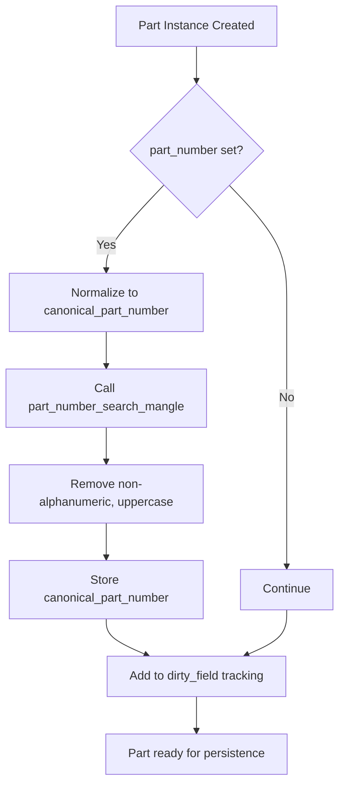
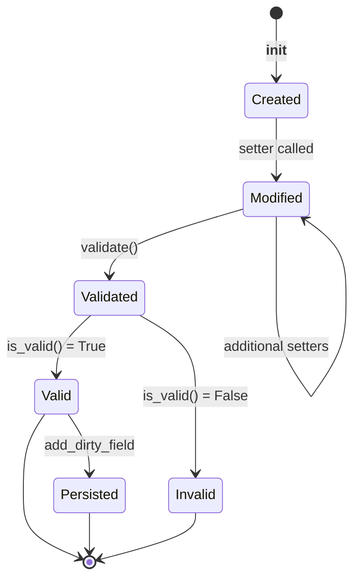

# Diagram: platform/partview_core/partview_service/partview_service/core/datamodel/Part.py

> Auto-generated by Obscura crawlers

## Diagram 1

```mermaid
classDiagram
    Persistable <|-- Part
    class Part {
        -string __solution_id
        -string __part_number
        -string __canonical_part_number
        -string __name
        -string __item_id
        -string __type
        -string __status
        -int __actual_quantity
        -int __planned_quantity
        -int __committed_quantity
        -string __packing_slip
        -string __original_unit_of_measurment
        -float __net_weight
        -float __total_weight
        -datetime __shipped_date
        -float __version
        -float __revision
        -string __recall_status
        -float __sustainability_index
        -string __lifetime
        -date __introduced_year
        -string __reusability
        -string __supplier_id
        -string __supplier_name
        -string __alternative_supplier_id
        -string __alternative_supplier_name
        -string __erd_id
        -string __manufactered_by
        -string __entity_type_id
        -string __lifecycle_state
        -datetime __lifecycle_change_ts
        -string __actor_id
        -string __custom_fields
        +part_number_search_mangle(part_value) string
        +__init__(id, ts, modified)
        +solution_id() string
        +actor_id() string
        +part_number() string
        +name() string
        +item_id() string
        +type() string
        +status() string
        +actual_quantity() int
        +planned_quantity() int
        +committed_quantity() int
        +packing_slip() string
        +original_unit_of_measurment() string
        +net_weight() float
        +total_weight() float
        +shipped_date() datetime
        +version() float
        +revision() float
        +manufactered_by() int
        +recall_status() string
        +sustainability_index() float
        +lifetime() string
        +introduced_year() date
        +reusability() string
        +supplier_id() int
        +supplier_name() string
        +alternative_supplier_id() int
        +alternative_supplier_name() string
        +erd_id() int
        +lifecycle_state() string
        +lifecycle_change_ts() datetime
        +entity_type_id() string
        +custom_fields() dict
        +canonical_part_number() string
        +validate()
        +is_valid() bool
    }
```

### SVG

<svg id="container" width="415.4765625" xmlns="http://www.w3.org/2000/svg" class="classDiagram" height="1926" viewBox="0 0 415.4765625 1926" role="graphics-document document" aria-roledescription="class"><g><defs><marker id="container_class-aggregationStart" class="marker aggregation class" refX="18" refY="7" markerWidth="190" markerHeight="240" orient="auto"><path d="M 18,7 L9,13 L1,7 L9,1 Z"></path></marker></defs><defs><marker id="container_class-aggregationEnd" class="marker aggregation class" refX="1" refY="7" markerWidth="20" markerHeight="28" orient="auto"><path d="M 18,7 L9,13 L1,7 L9,1 Z"></path></marker></defs><defs><marker id="container_class-extensionStart" class="marker extension class" refX="18" refY="7" markerWidth="190" markerHeight="240" orient="auto"><path d="M 1,7 L18,13 V 1 Z"></path></marker></defs><defs><marker id="container_class-extensionEnd" class="marker extension class" refX="1" refY="7" markerWidth="20" markerHeight="28" orient="auto"><path d="M 1,1 V 13 L18,7 Z"></path></marker></defs><defs><marker id="container_class-compositionStart" class="marker composition class" refX="18" refY="7" markerWidth="190" markerHeight="240" orient="auto"><path d="M 18,7 L9,13 L1,7 L9,1 Z"></path></marker></defs><defs><marker id="container_class-compositionEnd" class="marker composition class" refX="1" refY="7" markerWidth="20" markerHeight="28" orient="auto"><path d="M 18,7 L9,13 L1,7 L9,1 Z"></path></marker></defs><defs><marker id="container_class-dependencyStart" class="marker dependency class" refX="6" refY="7" markerWidth="190" markerHeight="240" orient="auto"><path d="M 5,7 L9,13 L1,7 L9,1 Z"></path></marker></defs><defs><marker id="container_class-dependencyEnd" class="marker dependency class" refX="13" refY="7" markerWidth="20" markerHeight="28" orient="auto"><path d="M 18,7 L9,13 L14,7 L9,1 Z"></path></marker></defs><defs><marker id="container_class-lollipopStart" class="marker lollipop class" refX="13" refY="7" markerWidth="190" markerHeight="240" orient="auto"><circle stroke="black" fill="transparent" cx="7" cy="7" r="6"></circle></marker></defs><defs><marker id="container_class-lollipopEnd" class="marker lollipop class" refX="1" refY="7" markerWidth="190" markerHeight="240" orient="auto"><circle stroke="black" fill="transparent" cx="7" cy="7" r="6"></circle></marker></defs><g class="root"><g class="clusters"></g><g class="edgePaths"><path d="M207.738,109.25L207.738,110.542C207.738,111.833,207.738,114.417,207.738,119.875C207.738,125.333,207.738,133.667,207.738,137.833L207.738,142" id="id_Persistable_Part_1" class="edge-thickness-normal edge-pattern-solid relation" style=";;;" data-edge="true" data-et="edge" data-id="id_Persistable_Part_1" data-points="W3sieCI6MjA3LjczODI4MTI1LCJ5Ijo5Mn0seyJ4IjoyMDcuNzM4MjgxMjUsInkiOjExN30seyJ4IjoyMDcuNzM4MjgxMjUsInkiOjE0Mn1d" marker-start="url(#container_class-extensionStart)"></path></g><g class="edgeLabels"><g class="edgeLabel"><g class="label" data-id="id_Persistable_Part_1" transform="translate(0, 0)"><foreignObject width="0" height="0">

</foreignObject></g></g></g><g class="nodes"><g class="node default" id="classId-Persistable-0" transform="translate(207.73828125, 50)"><g class="basic label-container"><path d="M-52.9765625 -42 L52.9765625 -42 L52.9765625 42 L-52.9765625 42" stroke="none" stroke-width="0" fill="#ECECFF" style=""></path><path d="M-52.9765625 -42 C-26.051000092070105 -42, 0.8745623158597908 -42, 52.9765625 -42 M-52.9765625 -42 C-27.07681558910372 -42, -1.1770686782074407 -42, 52.9765625 -42 M52.9765625 -42 C52.9765625 -13.490075967524419, 52.9765625 15.019848064951162, 52.9765625 42 M52.9765625 -42 C52.9765625 -18.128898590936743, 52.9765625 5.742202818126515, 52.9765625 42 M52.9765625 42 C31.689096369703392 42, 10.401630239406785 42, -52.9765625 42 M52.9765625 42 C19.88452611877876 42, -13.207510262442483 42, -52.9765625 42 M-52.9765625 42 C-52.9765625 14.45085070558903, -52.9765625 -13.09829858882194, -52.9765625 -42 M-52.9765625 42 C-52.9765625 22.043917508116227, -52.9765625 2.0878350162324537, -52.9765625 -42" stroke="#9370DB" stroke-width="1.3" fill="none" stroke-dasharray="0 0" style=""></path></g><g class="annotation-group text" transform="translate(0, -18)"></g><g class="label-group text" transform="translate(-40.9765625, -18)"><g class="label" style="font-weight: bolder" transform="translate(0,-12)"><foreignObject width="81.953125" height="24">

Persistable

</foreignObject></g></g><g class="members-group text" transform="translate(-40.9765625, 30)"></g><g class="methods-group text" transform="translate(-40.9765625, 60)"></g><g class="divider" style=""><path d="M-52.9765625 6 C-25.3192186027472 6, 2.338125294505602 6, 52.9765625 6 M-52.9765625 6 C-16.537282151820044 6, 19.901998196359912 6, 52.9765625 6" stroke="#9370DB" stroke-width="1.3" fill="none" stroke-dasharray="0 0" style=""></path></g><g class="divider" style=""><path d="M-52.9765625 24 C-17.258484193507087 24, 18.459594112985826 24, 52.9765625 24 M-52.9765625 24 C-11.331751110287243 24, 30.313060279425514 24, 52.9765625 24" stroke="#9370DB" stroke-width="1.3" fill="none" stroke-dasharray="0 0" style=""></path></g></g><g class="node default" id="classId-Part-1" transform="translate(207.73828125, 1030)"><g class="basic label-container"><path d="M-199.73828125 -888 L199.73828125 -888 L199.73828125 888 L-199.73828125 888" stroke="none" stroke-width="0" fill="#ECECFF" style=""></path><path d="M-199.73828125 -888 C-99.03344364868323 -888, 1.6713939526335366 -888, 199.73828125 -888 M-199.73828125 -888 C-69.01587867692942 -888, 61.706523896141164 -888, 199.73828125 -888 M199.73828125 -888 C199.73828125 -475.5859901200988, 199.73828125 -63.17198024019763, 199.73828125 888 M199.73828125 -888 C199.73828125 -269.3320534484528, 199.73828125 349.33589310309435, 199.73828125 888 M199.73828125 888 C43.76555044902693 888, -112.20718035194614 888, -199.73828125 888 M199.73828125 888 C84.31845231387015 888, -31.101376622259693 888, -199.73828125 888 M-199.73828125 888 C-199.73828125 508.8480638070524, -199.73828125 129.69612761410485, -199.73828125 -888 M-199.73828125 888 C-199.73828125 443.46933902848974, -199.73828125 -1.0613219430205163, -199.73828125 -888" stroke="#9370DB" stroke-width="1.3" fill="none" stroke-dasharray="0 0" style=""></path></g><g class="annotation-group text" transform="translate(0, -864)"></g><g class="label-group text" transform="translate(-15.0703125, -864)"><g class="label" style="font-weight: bolder" transform="translate(0,-12)"><foreignObject width="30.140625" height="24">

Part

</foreignObject></g></g><g class="members-group text" transform="translate(-187.73828125, -816)"><g class="label" style="" transform="translate(0,-12)"><foreignObject width="151.03125" height="24">

-string __solution_id

</foreignObject></g><g class="label" style="" transform="translate(0,12)"><foreignObject width="163.921875" height="24">

-string __part_number

</foreignObject></g><g class="label" style="" transform="translate(0,36)"><foreignObject width="241.453125" height="24">

-string __canonical_part_number

</foreignObject></g><g class="label" style="" transform="translate(0,60)"><foreignObject width="109.3125" height="24">

-string __name

</foreignObject></g><g class="label" style="" transform="translate(0,84)"><foreignObject width="123.6875" height="24">

-string __item_id

</foreignObject></g><g class="label" style="" transform="translate(0,108)"><foreignObject width="100.28125" height="24">

-string __type

</foreignObject></g><g class="label" style="" transform="translate(0,132)"><foreignObject width="113.203125" height="24">

-string __status

</foreignObject></g><g class="label" style="" transform="translate(0,156)"><foreignObject width="160.015625" height="24">

-int __actual_quantity

</foreignObject></g><g class="label" style="" transform="translate(0,180)"><foreignObject width="175.515625" height="24">

-int __planned_quantity

</foreignObject></g><g class="label" style="" transform="translate(0,204)"><foreignObject width="193.546875" height="24">

-int __committed_quantity

</foreignObject></g><g class="label" style="" transform="translate(0,228)"><foreignObject width="159.46875" height="24">

-string __packing_slip

</foreignObject></g><g class="label" style="" transform="translate(0,252)"><foreignObject width="282.84375" height="24">

-string __original_unit_of_measurment

</foreignObject></g><g class="label" style="" transform="translate(0,276)"><foreignObject width="140.046875" height="24">

-float __net_weight

</foreignObject></g><g class="label" style="" transform="translate(0,300)"><foreignObject width="149.625" height="24">

-float __total_weight

</foreignObject></g><g class="label" style="" transform="translate(0,324)"><foreignObject width="191.609375" height="24">

-datetime __shipped_date

</foreignObject></g><g class="label" style="" transform="translate(0,348)"><foreignObject width="112.6875" height="24">

-float __version

</foreignObject></g><g class="label" style="" transform="translate(0,372)"><foreignObject width="117.4375" height="24">

-float __revision

</foreignObject></g><g class="label" style="" transform="translate(0,396)"><foreignObject width="161.359375" height="24">

-string __recall_status

</foreignObject></g><g class="label" style="" transform="translate(0,420)"><foreignObject width="205.625" height="24">

-float __sustainability_index

</foreignObject></g><g class="label" style="" transform="translate(0,444)"><foreignObject width="124.484375" height="24">

-string __lifetime

</foreignObject></g><g class="label" style="" transform="translate(0,468)"><foreignObject width="178.3125" height="24">

-date __introduced_year

</foreignObject></g><g class="label" style="" transform="translate(0,492)"><foreignObject width="145.34375" height="24">

-string __reusability

</foreignObject></g><g class="label" style="" transform="translate(0,516)"><foreignObject width="149.8125" height="24">

-string __supplier_id

</foreignObject></g><g class="label" style="" transform="translate(0,540)"><foreignObject width="176.25" height="24">

-string __supplier_name

</foreignObject></g><g class="label" style="" transform="translate(0,564)"><foreignObject width="236.0625" height="24">

-string __alternative_supplier_id

</foreignObject></g><g class="label" style="" transform="translate(0,588)"><foreignObject width="262.484375" height="24">

-string __alternative_supplier_name

</foreignObject></g><g class="label" style="" transform="translate(0,612)"><foreignObject width="114.875" height="24">

-string __erd_id

</foreignObject></g><g class="label" style="" transform="translate(0,636)"><foreignObject width="195.140625" height="24">

-string __manufactered_by

</foreignObject></g><g class="label" style="" transform="translate(0,660)"><foreignObject width="171.828125" height="24">

-string __entity_type_id

</foreignObject></g><g class="label" style="" transform="translate(0,684)"><foreignObject width="172.296875" height="24">

-string __lifecycle_state

</foreignObject></g><g class="label" style="" transform="translate(0,708)"><foreignObject width="232.3125" height="24">

-datetime __lifecycle_change_ts

</foreignObject></g><g class="label" style="" transform="translate(0,732)"><foreignObject width="127.015625" height="24">

-string __actor_id

</foreignObject></g><g class="label" style="" transform="translate(0,756)"><foreignObject width="168.921875" height="24">

-string __custom_fields

</foreignObject></g></g><g class="methods-group text" transform="translate(-187.73828125, 0)"><g class="label" style="" transform="translate(0,-12)"><foreignObject width="360.40625" height="24">

+part_number_search_mangle(part_value) : string

</foreignObject></g><g class="label" style="" transform="translate(0,12)"><foreignObject width="150.90625" height="24">

+<strong>init</strong>(id, ts, modified)

</foreignObject></g><g class="label" style="" transform="translate(0,36)"><foreignObject width="154.53125" height="24">

+solution_id() : string

</foreignObject></g><g class="label" style="" transform="translate(0,60)"><foreignObject width="130.59375" height="24">

+actor_id() : string

</foreignObject></g><g class="label" style="" transform="translate(0,84)"><foreignObject width="167.4375" height="24">

+part_number() : string

</foreignObject></g><g class="label" style="" transform="translate(0,108)"><foreignObject width="112.828125" height="24">

+name() : string

</foreignObject></g><g class="label" style="" transform="translate(0,132)"><foreignObject width="127.1875" height="24">

+item_id() : string

</foreignObject></g><g class="label" style="" transform="translate(0,156)"><foreignObject width="104.03125" height="24">

+type() : string

</foreignObject></g><g class="label" style="" transform="translate(0,180)"><foreignObject width="116.71875" height="24">

+status() : string

</foreignObject></g><g class="label" style="" transform="translate(0,204)"><foreignObject width="163.59375" height="24">

+actual_quantity() : int

</foreignObject></g><g class="label" style="" transform="translate(0,228)"><foreignObject width="179.015625" height="24">

+planned_quantity() : int

</foreignObject></g><g class="label" style="" transform="translate(0,252)"><foreignObject width="197.375" height="24">

+committed_quantity() : int

</foreignObject></g><g class="label" style="" transform="translate(0,276)"><foreignObject width="162.96875" height="24">

+packing_slip() : string

</foreignObject></g><g class="label" style="" transform="translate(0,300)"><foreignObject width="286.671875" height="24">

+original_unit_of_measurment() : string

</foreignObject></g><g class="label" style="" transform="translate(0,324)"><foreignObject width="143.78125" height="24">

+net_weight() : float

</foreignObject></g><g class="label" style="" transform="translate(0,348)"><foreignObject width="153.609375" height="24">

+total_weight() : float

</foreignObject></g><g class="label" style="" transform="translate(0,372)"><foreignObject width="195.109375" height="24">

+shipped_date() : datetime

</foreignObject></g><g class="label" style="" transform="translate(0,396)"><foreignObject width="116.75" height="24">

+version() : float

</foreignObject></g><g class="label" style="" transform="translate(0,420)"><foreignObject width="121.171875" height="24">

+revision() : float

</foreignObject></g><g class="label" style="" transform="translate(0,444)"><foreignObject width="176.6875" height="24">

+manufactered_by() : int

</foreignObject></g><g class="label" style="" transform="translate(0,468)"><foreignObject width="164.859375" height="24">

+recall_status() : string

</foreignObject></g><g class="label" style="" transform="translate(0,492)"><foreignObject width="209.375" height="24">

+sustainability_index() : float

</foreignObject></g><g class="label" style="" transform="translate(0,516)"><foreignObject width="128.15625" height="24">

+lifetime() : string

</foreignObject></g><g class="label" style="" transform="translate(0,540)"><foreignObject width="181.8125" height="24">

+introduced_year() : date

</foreignObject></g><g class="label" style="" transform="translate(0,564)"><foreignObject width="148.84375" height="24">

+reusability() : string

</foreignObject></g><g class="label" style="" transform="translate(0,588)"><foreignObject width="131.359375" height="24">

+supplier_id() : int

</foreignObject></g><g class="label" style="" transform="translate(0,612)"><foreignObject width="179.75" height="24">

+supplier_name() : string

</foreignObject></g><g class="label" style="" transform="translate(0,636)"><foreignObject width="217.671875" height="24">

+alternative_supplier_id() : int

</foreignObject></g><g class="label" style="" transform="translate(0,660)"><foreignObject width="266.078125" height="24">

+alternative_supplier_name() : string

</foreignObject></g><g class="label" style="" transform="translate(0,684)"><foreignObject width="96.734375" height="24">

+erd_id() : int

</foreignObject></g><g class="label" style="" transform="translate(0,708)"><foreignObject width="175.953125" height="24">

+lifecycle_state() : string

</foreignObject></g><g class="label" style="" transform="translate(0,732)"><foreignObject width="235.96875" height="24">

+lifecycle_change_ts() : datetime

</foreignObject></g><g class="label" style="" transform="translate(0,756)"><foreignObject width="175.65625" height="24">

+entity_type_id() : string

</foreignObject></g><g class="label" style="" transform="translate(0,780)"><foreignObject width="158.609375" height="24">

+custom_fields() : dict

</foreignObject></g><g class="label" style="" transform="translate(0,804)"><foreignObject width="245.265625" height="24">

+canonical_part_number() : string

</foreignObject></g><g class="label" style="" transform="translate(0,828)"><foreignObject width="76.09375" height="24">

+validate()

</foreignObject></g><g class="label" style="" transform="translate(0,852)"><foreignObject width="117.984375" height="24">

+is_valid() : bool

</foreignObject></g></g><g class="divider" style=""><path d="M-199.73828125 -840 C-76.9309681898804 -840, 45.876344870239194 -840, 199.73828125 -840 M-199.73828125 -840 C-96.25707283179626 -840, 7.2241355864074706 -840, 199.73828125 -840" stroke="#9370DB" stroke-width="1.3" fill="none" stroke-dasharray="0 0" style=""></path></g><g class="divider" style=""><path d="M-199.73828125 -24 C-52.45712690281718 -24, 94.82402744436564 -24, 199.73828125 -24 M-199.73828125 -24 C-95.4110363585458 -24, 8.9162085329084 -24, 199.73828125 -24" stroke="#9370DB" stroke-width="1.3" fill="none" stroke-dasharray="0 0" style=""></path></g></g></g></g></g></svg>

## Diagram 2

### SVG

<svg id="container" width="456.75" xmlns="http://www.w3.org/2000/svg" class="flowchart" height="1046.203125" viewBox="0 0 456.75 1046.203125" role="graphics-document document" aria-roledescription="flowchart-v2"><g><marker id="container_flowchart-v2-pointEnd" class="marker flowchart-v2" viewBox="0 0 10 10" refX="5" refY="5" markerUnits="userSpaceOnUse" markerWidth="8" markerHeight="8" orient="auto"><path d="M 0 0 L 10 5 L 0 10 z" class="arrowMarkerPath" style="stroke-width: 1; stroke-dasharray: 1, 0;"></path></marker><marker id="container_flowchart-v2-pointStart" class="marker flowchart-v2" viewBox="0 0 10 10" refX="4.5" refY="5" markerUnits="userSpaceOnUse" markerWidth="8" markerHeight="8" orient="auto"><path d="M 0 5 L 10 10 L 10 0 z" class="arrowMarkerPath" style="stroke-width: 1; stroke-dasharray: 1, 0;"></path></marker><marker id="container_flowchart-v2-circleEnd" class="marker flowchart-v2" viewBox="0 0 10 10" refX="11" refY="5" markerUnits="userSpaceOnUse" markerWidth="11" markerHeight="11" orient="auto"><circle cx="5" cy="5" r="5" class="arrowMarkerPath" style="stroke-width: 1; stroke-dasharray: 1, 0;"></circle></marker><marker id="container_flowchart-v2-circleStart" class="marker flowchart-v2" viewBox="0 0 10 10" refX="-1" refY="5" markerUnits="userSpaceOnUse" markerWidth="11" markerHeight="11" orient="auto"><circle cx="5" cy="5" r="5" class="arrowMarkerPath" style="stroke-width: 1; stroke-dasharray: 1, 0;"></circle></marker><marker id="container_flowchart-v2-crossEnd" class="marker cross flowchart-v2" viewBox="0 0 11 11" refX="12" refY="5.2" markerUnits="userSpaceOnUse" markerWidth="11" markerHeight="11" orient="auto"><path d="M 1,1 l 9,9 M 10,1 l -9,9" class="arrowMarkerPath" style="stroke-width: 2; stroke-dasharray: 1, 0;"></path></marker><marker id="container_flowchart-v2-crossStart" class="marker cross flowchart-v2" viewBox="0 0 11 11" refX="-1" refY="5.2" markerUnits="userSpaceOnUse" markerWidth="11" markerHeight="11" orient="auto"><path d="M 1,1 l 9,9 M 10,1 l -9,9" class="arrowMarkerPath" style="stroke-width: 2; stroke-dasharray: 1, 0;"></path></marker><g class="root"><g class="clusters"></g><g class="edgePaths"><path d="M264.953,62L264.953,66.167C264.953,70.333,264.953,78.667,264.953,86.333C264.953,94,264.953,101,264.953,104.5L264.953,108" id="L_A_B_0" class="edge-thickness-normal edge-pattern-solid edge-thickness-normal edge-pattern-solid flowchart-link" style=";" data-edge="true" data-et="edge" data-id="L_A_B_0" data-points="W3sieCI6MjY0Ljk1MzEyNSwieSI6NjJ9LHsieCI6MjY0Ljk1MzEyNSwieSI6ODd9LHsieCI6MjY0Ljk1MzEyNSwieSI6MTEyfV0=" marker-end="url(#container_flowchart-v2-pointEnd)"></path><path d="M220.651,249.901L207.824,263.451C194.997,277.002,169.342,304.102,156.515,323.153C143.688,342.203,143.688,353.203,143.688,358.703L143.688,364.203" id="L_B_C_0" class="edge-thickness-normal edge-pattern-solid edge-thickness-normal edge-pattern-solid flowchart-link" style=";" data-edge="true" data-et="edge" data-id="L_B_C_0" data-points="W3sieCI6MjIwLjY1MTAzMzY3MTE2NzY1LCJ5IjoyNDkuOTAxMDMzNjcxMTY3NjV9LHsieCI6MTQzLjY4NzUsInkiOjMzMS4yMDMxMjV9LHsieCI6MTQzLjY4NzUsInkiOjM2OC4yMDMxMjV9XQ==" marker-end="url(#container_flowchart-v2-pointEnd)"></path><path d="M143.688,446.203L143.688,450.37C143.688,454.536,143.688,462.87,143.688,470.536C143.688,478.203,143.688,485.203,143.688,488.703L143.688,492.203" id="L_C_D_0" class="edge-thickness-normal edge-pattern-solid edge-thickness-normal edge-pattern-solid flowchart-link" style=";" data-edge="true" data-et="edge" data-id="L_C_D_0" data-points="W3sieCI6MTQzLjY4NzUsInkiOjQ0Ni4yMDMxMjV9LHsieCI6MTQzLjY4NzUsInkiOjQ3MS4yMDMxMjV9LHsieCI6MTQzLjY4NzUsInkiOjQ5Ni4yMDMxMjV9XQ==" marker-end="url(#container_flowchart-v2-pointEnd)"></path><path d="M143.688,574.203L143.688,578.37C143.688,582.536,143.688,590.87,143.688,598.536C143.688,606.203,143.688,613.203,143.688,616.703L143.688,620.203" id="L_D_E_0" class="edge-thickness-normal edge-pattern-solid edge-thickness-normal edge-pattern-solid flowchart-link" style=";" data-edge="true" data-et="edge" data-id="L_D_E_0" data-points="W3sieCI6MTQzLjY4NzUsInkiOjU3NC4yMDMxMjV9LHsieCI6MTQzLjY4NzUsInkiOjU5OS4yMDMxMjV9LHsieCI6MTQzLjY4NzUsInkiOjYyNC4yMDMxMjV9XQ==" marker-end="url(#container_flowchart-v2-pointEnd)"></path><path d="M143.688,702.203L143.688,706.37C143.688,710.536,143.688,718.87,143.688,726.536C143.688,734.203,143.688,741.203,143.688,744.703L143.688,748.203" id="L_E_F_0" class="edge-thickness-normal edge-pattern-solid edge-thickness-normal edge-pattern-solid flowchart-link" style=";" data-edge="true" data-et="edge" data-id="L_E_F_0" data-points="W3sieCI6MTQzLjY4NzUsInkiOjcwMi4yMDMxMjV9LHsieCI6MTQzLjY4NzUsInkiOjcyNy4yMDMxMjV9LHsieCI6MTQzLjY4NzUsInkiOjc1Mi4yMDMxMjV9XQ==" marker-end="url(#container_flowchart-v2-pointEnd)"></path><path d="M309.255,249.901L322.082,263.451C334.91,277.002,360.564,304.102,373.391,330.319C386.219,356.536,386.219,381.87,386.219,405.203C386.219,428.536,386.219,449.87,386.219,471.203C386.219,492.536,386.219,513.87,386.219,535.203C386.219,556.536,386.219,577.87,386.219,599.203C386.219,620.536,386.219,641.87,386.219,663.203C386.219,684.536,386.219,705.87,386.219,722.036C386.219,738.203,386.219,749.203,386.219,754.703L386.219,760.203" id="L_B_G_0" class="edge-thickness-normal edge-pattern-solid edge-thickness-normal edge-pattern-solid flowchart-link" style=";" data-edge="true" data-et="edge" data-id="L_B_G_0" data-points="W3sieCI6MzA5LjI1NTIxNjMyODgzMjQsInkiOjI0OS45MDEwMzM2NzExNjc2NX0seyJ4IjozODYuMjE4NzUsInkiOjMzMS4yMDMxMjV9LHsieCI6Mzg2LjIxODc1LCJ5Ijo0MDcuMjAzMTI1fSx7IngiOjM4Ni4yMTg3NSwieSI6NDcxLjIwMzEyNX0seyJ4IjozODYuMjE4NzUsInkiOjUzNS4yMDMxMjV9LHsieCI6Mzg2LjIxODc1LCJ5Ijo1OTkuMjAzMTI1fSx7IngiOjM4Ni4yMTg3NSwieSI6NjYzLjIwMzEyNX0seyJ4IjozODYuMjE4NzUsInkiOjcyNy4yMDMxMjV9LHsieCI6Mzg2LjIxODc1LCJ5Ijo3NjQuMjAzMTI1fV0=" marker-end="url(#container_flowchart-v2-pointEnd)"></path><path d="M143.688,830.203L143.688,834.37C143.688,838.536,143.688,846.87,152.792,854.94C161.896,863.011,180.104,870.819,189.208,874.723L198.312,878.627" id="L_F_H_0" class="edge-thickness-normal edge-pattern-solid edge-thickness-normal edge-pattern-solid flowchart-link" style=";" data-edge="true" data-et="edge" data-id="L_F_H_0" data-points="W3sieCI6MTQzLjY4NzUsInkiOjgzMC4yMDMxMjV9LHsieCI6MTQzLjY4NzUsInkiOjg1NS4yMDMxMjV9LHsieCI6MjAxLjk4ODI4MTI1LCJ5Ijo4ODAuMjAzMTI1fV0=" marker-end="url(#container_flowchart-v2-pointEnd)"></path><path d="M386.219,818.203L386.219,824.37C386.219,830.536,386.219,842.87,377.115,852.94C368.011,863.011,349.802,870.819,340.698,874.723L331.594,878.627" id="L_G_H_0" class="edge-thickness-normal edge-pattern-solid edge-thickness-normal edge-pattern-solid flowchart-link" style=";" data-edge="true" data-et="edge" data-id="L_G_H_0" data-points="W3sieCI6Mzg2LjIxODc1LCJ5Ijo4MTguMjAzMTI1fSx7IngiOjM4Ni4yMTg3NSwieSI6ODU1LjIwMzEyNX0seyJ4IjozMjcuOTE3OTY4NzUsInkiOjg4MC4yMDMxMjV9XQ==" marker-end="url(#container_flowchart-v2-pointEnd)"></path><path d="M264.953,934.203L264.953,938.37C264.953,942.536,264.953,950.87,264.953,958.536C264.953,966.203,264.953,973.203,264.953,976.703L264.953,980.203" id="L_H_I_0" class="edge-thickness-normal edge-pattern-solid edge-thickness-normal edge-pattern-solid flowchart-link" style=";" data-edge="true" data-et="edge" data-id="L_H_I_0" data-points="W3sieCI6MjY0Ljk1MzEyNSwieSI6OTM0LjIwMzEyNX0seyJ4IjoyNjQuOTUzMTI1LCJ5Ijo5NTkuMjAzMTI1fSx7IngiOjI2NC45NTMxMjUsInkiOjk4NC4yMDMxMjV9XQ==" marker-end="url(#container_flowchart-v2-pointEnd)"></path></g><g class="edgeLabels"><g class="edgeLabel"><g class="label" data-id="L_A_B_0" transform="translate(0, 0)"><foreignObject width="0" height="0">

</foreignObject></g></g><g class="edgeLabel" transform="translate(143.6875, 331.203125)"><g class="label" data-id="L_B_C_0" transform="translate(-12.03125, -12)"><foreignObject width="24.0625" height="24">

Yes

</foreignObject></g></g><g class="edgeLabel"><g class="label" data-id="L_C_D_0" transform="translate(0, 0)"><foreignObject width="0" height="0">

</foreignObject></g></g><g class="edgeLabel"><g class="label" data-id="L_D_E_0" transform="translate(0, 0)"><foreignObject width="0" height="0">

</foreignObject></g></g><g class="edgeLabel"><g class="label" data-id="L_E_F_0" transform="translate(0, 0)"><foreignObject width="0" height="0">

</foreignObject></g></g><g class="edgeLabel" transform="translate(386.21875, 535.203125)"><g class="label" data-id="L_B_G_0" transform="translate(-10.140625, -12)"><foreignObject width="20.28125" height="24">

No

</foreignObject></g></g><g class="edgeLabel"><g class="label" data-id="L_F_H_0" transform="translate(0, 0)"><foreignObject width="0" height="0">

</foreignObject></g></g><g class="edgeLabel"><g class="label" data-id="L_G_H_0" transform="translate(0, 0)"><foreignObject width="0" height="0">

</foreignObject></g></g><g class="edgeLabel"><g class="label" data-id="L_H_I_0" transform="translate(0, 0)"><foreignObject width="0" height="0">

</foreignObject></g></g></g><g class="nodes"><g class="node default" id="flowchart-A-0" transform="translate(264.953125, 35)"><rect class="basic label-container" style="" x="-107.2109375" y="-27" width="214.421875" height="54"></rect><g class="label" style="" transform="translate(-77.2109375, -12)"><rect></rect><foreignObject width="154.421875" height="24">

Part Instance Created

</foreignObject></g></g><g class="node default" id="flowchart-B-1" transform="translate(264.953125, 203.1015625)"><polygon points="91.1015625,0 182.203125,-91.1015625 91.1015625,-182.203125 0,-91.1015625" class="label-container" transform="translate(-90.6015625, 91.1015625)"></polygon><g class="label" style="" transform="translate(-64.1015625, -12)"><rect></rect><foreignObject width="128.203125" height="24">

part_number set?

</foreignObject></g></g><g class="node default" id="flowchart-C-3" transform="translate(143.6875, 407.203125)"><rect class="basic label-container" style="" x="-130" y="-39" width="260" height="78"></rect><g class="label" style="" transform="translate(-100, -24)"><rect></rect><foreignObject width="200" height="48">

Normalize to canonical_part_number

</foreignObject></g></g><g class="node default" id="flowchart-D-5" transform="translate(143.6875, 535.203125)"><rect class="basic label-container" style="" x="-135.6875" y="-39" width="271.375" height="78"></rect><g class="label" style="" transform="translate(-105.6875, -24)"><rect></rect><foreignObject width="211.375" height="48">

Call part_number_search_mangle

</foreignObject></g></g><g class="node default" id="flowchart-E-7" transform="translate(143.6875, 663.203125)"><rect class="basic label-container" style="" x="-130" y="-39" width="260" height="78"></rect><g class="label" style="" transform="translate(-100, -24)"><rect></rect><foreignObject width="200" height="48">

Remove non-alphanumeric, uppercase

</foreignObject></g></g><g class="node default" id="flowchart-F-9" transform="translate(143.6875, 791.203125)"><rect class="basic label-container" style="" x="-130" y="-39" width="260" height="78"></rect><g class="label" style="" transform="translate(-100, -24)"><rect></rect><foreignObject width="200" height="48">

Store canonical_part_number

</foreignObject></g></g><g class="node default" id="flowchart-G-11" transform="translate(386.21875, 791.203125)"><rect class="basic label-container" style="" x="-62.53125" y="-27" width="125.0625" height="54"></rect><g class="label" style="" transform="translate(-32.53125, -12)"><rect></rect><foreignObject width="65.0625" height="24">

Continue

</foreignObject></g></g><g class="node default" id="flowchart-H-13" transform="translate(264.953125, 907.203125)"><rect class="basic label-container" style="" x="-123.75" y="-27" width="247.5" height="54"></rect><g class="label" style="" transform="translate(-93.75, -12)"><rect></rect><foreignObject width="187.5" height="24">

Add to dirty_field tracking

</foreignObject></g></g><g class="node default" id="flowchart-I-17" transform="translate(264.953125, 1011.203125)"><rect class="basic label-container" style="" x="-123.109375" y="-27" width="246.21875" height="54"></rect><g class="label" style="" transform="translate(-93.109375, -12)"><rect></rect><foreignObject width="186.21875" height="24">

Part ready for persistence

</foreignObject></g></g></g></g></g></svg>

## Diagram 3

### SVG

<svg id="container" width="411.8900146484375" xmlns="http://www.w3.org/2000/svg" class="statediagram" height="664" viewBox="0 0 411.8900146484375 664" role="graphics-document document" aria-roledescription="stateDiagram"><g><defs><marker id="container_stateDiagram-barbEnd" refX="19" refY="7" markerWidth="20" markerHeight="14" markerUnits="userSpaceOnUse" orient="auto"><path d="M 19,7 L9,13 L14,7 L9,1 Z"></path></marker></defs><g class="root"><g class="clusters"></g><g class="edgePaths"><path d="M319.655,22L319.655,28.167C319.655,34.333,319.655,46.667,319.739,59.083C319.822,71.5,319.989,84,320.072,90.25L320.155,96.5" id="edge0" class="edge-thickness-normal edge-pattern-solid transition" style="fill:none;;;fill:none" data-edge="true" data-et="edge" data-id="edge0" data-points="W3sieCI6MzE5LjY1NTQ2ODc1MDc0NTA2LCJ5IjoyMn0seyJ4IjozMTkuNjU1NDY4NzUwNzQ1MDYsInkiOjU5fSx7IngiOjMyMC4xNTU0Njg3NTA3NDUwNiwieSI6OTYuNX1d" marker-end="url(#container_stateDiagram-barbEnd)"></path><path d="M320.155,136.5L320.072,142.583C319.989,148.667,319.822,160.833,319.822,173.167C319.822,185.5,319.989,198,320.072,204.25L320.155,210.5" id="edge1" class="edge-thickness-normal edge-pattern-solid transition" style="fill:none;;;fill:none" data-edge="true" data-et="edge" data-id="edge1" data-points="W3sieCI6MzIwLjE1NTQ2ODc1MDc0NTA2LCJ5IjoxMzYuNX0seyJ4IjozMTkuNjU1NDY4NzUwNzQ1MDYsInkiOjE3M30seyJ4IjozMjAuMTU1NDY4NzUwNzQ1MDYsInkiOjIxMC41fV0=" marker-end="url(#container_stateDiagram-barbEnd)"></path><path d="M280.468,242.216L254.817,249.68C229.166,257.144,177.864,272.072,152.297,285.786C126.729,299.5,126.896,312,126.979,318.25L127.063,324.5" id="edge2" class="edge-thickness-normal edge-pattern-solid transition" style="fill:none;;;fill:none" data-edge="true" data-et="edge" data-id="edge2" data-points="W3sieCI6MjgwLjQ2Nzk2ODc1MDc0NTA2LCJ5IjoyNDIuMjE1NTM1MzQzNTk5OTh9LHsieCI6MTI2LjU2MjUsInkiOjI4N30seyJ4IjoxMjcuMDYyNSwieSI6MzI0LjV9XQ==" marker-end="url(#container_stateDiagram-barbEnd)"></path><path d="M105.336,364.5L98.553,370.583C91.771,376.667,78.206,388.833,71.506,401.167C64.807,413.5,64.974,426,65.057,432.25L65.141,438.5" id="edge3" class="edge-thickness-normal edge-pattern-solid transition" style="fill:none;;;fill:none" data-edge="true" data-et="edge" data-id="edge3" data-points="W3sieCI6MTA1LjMzNTUyNjMxNTc4OTQ4LCJ5IjozNjQuNX0seyJ4Ijo2NC42NDA2MjUsInkiOjQwMX0seyJ4Ijo2NS4xNDA2MjUsInkiOjQzOC41fV0=" marker-end="url(#container_stateDiagram-barbEnd)"></path><path d="M162.19,364.5L172.938,370.583C183.685,376.667,205.181,388.833,215.928,404.417C226.676,420,226.676,439,226.676,458C226.676,477,226.676,496,226.759,511.75C226.842,527.5,227.009,540,227.092,546.25L227.176,552.5" id="edge4" class="edge-thickness-normal edge-pattern-solid transition" style="fill:none;;;fill:none" data-edge="true" data-et="edge" data-id="edge4" data-points="W3sieCI6MTYyLjE4OTk2NzEwNTI2MzE1LCJ5IjozNjQuNX0seyJ4IjoyMjYuNjc1NzgxMjUsInkiOjQwMX0seyJ4IjoyMjYuNjc1NzgxMjUsInkiOjQ1OH0seyJ4IjoyMjYuNjc1NzgxMjUsInkiOjUxNX0seyJ4IjoyMjcuMTc1NzgxMjUsInkiOjU1Mi41fV0=" marker-end="url(#container_stateDiagram-barbEnd)"></path><path d="M51.74,478.5L47.525,484.583C43.31,490.667,34.88,502.833,30.664,518.417C26.449,534,26.449,553,26.449,570C26.449,587,26.449,602,38.104,614.383C49.758,626.765,73.067,636.53,84.721,641.413L96.376,646.295" id="edge5" class="edge-thickness-normal edge-pattern-solid transition" style="fill:none;;;fill:none" data-edge="true" data-et="edge" data-id="edge5" data-points="W3sieCI6NTEuNzQwMTMxNTc4OTQ3MzcsInkiOjQ3OC41fSx7IngiOjI2LjQ0OTIxODc1LCJ5Ijo1MTV9LHsieCI6MjYuNDQ5MjE4NzUsInkiOjU3Mn0seyJ4IjoyNi40NDkyMTg3NSwieSI6NjE3fSx7IngiOjk2LjM3NTcyMTM0NjAyODA2LCJ5Ijo2NDYuMjk1MTc3OTMxMTk4OX1d" marker-end="url(#container_stateDiagram-barbEnd)"></path><path d="M227.176,592.5L227.092,596.583C227.009,600.667,226.842,608.833,207.248,617.958C187.654,627.083,148.632,637.166,129.12,642.207L109.609,647.249" id="edge6" class="edge-thickness-normal edge-pattern-solid transition" style="fill:none;;;fill:none" data-edge="true" data-et="edge" data-id="edge6" data-points="W3sieCI6MjI3LjE3NTc4MTI1LCJ5Ijo1OTIuNX0seyJ4IjoyMjYuNjc1NzgxMjUsInkiOjYxN30seyJ4IjoxMDkuNjA5NDM4MjkzMjE4NjcsInkiOjY0Ny4yNDg3ODUwNTg3MjkzfV0=" marker-end="url(#container_stateDiagram-barbEnd)"></path><path d="M320.155,250.5L320.072,256.583C319.989,262.667,319.822,274.833,319.739,290.408C319.655,305.983,319.655,324.967,319.655,334.458L319.655,343.95" id="Modified-cyclic-special-1" class="edge-thickness-normal edge-pattern-solid transition" style="fill:none;;;fill:none" data-edge="true" data-et="edge" data-id="Modified-cyclic-special-1" data-points="W3sieCI6MzIwLjE1NTQ2ODc1MDc0NTA2LCJ5IjoyNTAuNX0seyJ4IjozMTkuNjU1NDY4NzUwNzQ1MDYsInkiOjI4N30seyJ4IjozMTkuNjU1NDY4NzUwNzQ1MDYsInkiOjM0My45NDk5OTk5OTkyNTQ5NH1d"></path><path d="M319.655,344.05L319.655,353.542C319.655,363.033,319.655,382.017,326.669,401C333.682,419.983,347.709,438.967,354.722,448.458L361.736,457.95" id="Modified-cyclic-special-mid" class="edge-thickness-normal edge-pattern-solid transition" style="fill:none;;;fill:none" data-edge="true" data-et="edge" data-id="Modified-cyclic-special-mid" data-points="W3sieCI6MzE5LjY1NTQ2ODc1MDc0NTA2LCJ5IjozNDQuMDUwMDAwMDAwNzQ1MDZ9LHsieCI6MzE5LjY1NTQ2ODc1MDc0NTA2LCJ5Ijo0MDF9LHsieCI6MzYxLjczNTcxMTM0ODg3ODc0LCJ5Ijo0NTcuOTQ5OTk5OTk5MjU0OTR9XQ=="></path><path d="M361.81,457.95L368.823,448.458C375.836,438.967,389.863,419.983,396.876,400.992C403.89,382,403.89,363,403.89,344C403.89,325,403.89,306,394.86,290.417C385.83,274.833,367.771,262.667,358.741,256.583L349.711,250.5" id="Modified-cyclic-special-2" class="edge-thickness-normal edge-pattern-solid transition" style="fill:none;;;fill:none" data-edge="true" data-et="edge" data-id="Modified-cyclic-special-2" data-points="W3sieCI6MzYxLjgwOTYwMTE1MjYxMTQsInkiOjQ1Ny45NDk5OTk5OTkyNTQ5NH0seyJ4Ijo0MDMuODg5ODQzNzUwNzQ1MDYsInkiOjQwMX0seyJ4Ijo0MDMuODg5ODQzNzUwNzQ1MDYsInkiOjM0NH0seyJ4Ijo0MDMuODg5ODQzNzUwNzQ1MDYsInkiOjI4N30seyJ4IjozNDkuNzExMzg5ODAzMzc2NiwieSI6MjUwLjV9XQ==" marker-end="url(#container_stateDiagram-barbEnd)"></path><path d="M78.541,478.5L82.59,484.583C86.638,490.667,94.735,502.833,98.867,515.167C102.999,527.5,103.165,540,103.249,546.25L103.332,552.5" id="edge8" class="edge-thickness-normal edge-pattern-solid transition" style="fill:none;;;fill:none" data-edge="true" data-et="edge" data-id="edge8" data-points="W3sieCI6NzguNTQxMTE4NDIxMDUyNjMsInkiOjQ3OC41fSx7IngiOjEwMi44MzIwMzEyNSwieSI6NTE1fSx7IngiOjEwMy4zMzIwMzEyNSwieSI6NTUyLjV9XQ==" marker-end="url(#container_stateDiagram-barbEnd)"></path><path d="M103.332,592.5L103.249,596.583C103.165,600.667,102.999,608.833,102.915,617.083C102.832,625.333,102.832,633.667,102.832,637.833L102.832,642" id="edge9" class="edge-thickness-normal edge-pattern-solid transition" style="fill:none;;;fill:none" data-edge="true" data-et="edge" data-id="edge9" data-points="W3sieCI6MTAzLjMzMjAzMTI1LCJ5Ijo1OTIuNX0seyJ4IjoxMDIuODMyMDMxMjUsInkiOjYxN30seyJ4IjoxMDIuODMyMDMxMjUsInkiOjY0Mn1d" marker-end="url(#container_stateDiagram-barbEnd)"></path></g><g class="edgeLabels"><g class="edgeLabel" transform="translate(319.65546875074506, 59)"><g class="label" data-id="edge0" transform="translate(-12.21875, -12)"><foreignObject width="24.4375" height="24">

<strong>init</strong>

</foreignObject></g></g><g class="edgeLabel" transform="translate(319.65546875074506, 173)"><g class="label" data-id="edge1" transform="translate(-45.1328125, -12)"><foreignObject width="90.265625" height="24">

setter called

</foreignObject></g></g><g class="edgeLabel" transform="translate(126.5625, 287)"><g class="label" data-id="edge2" transform="translate(-34.1328125, -12)"><foreignObject width="68.265625" height="24">

validate()

</foreignObject></g></g><g class="edgeLabel" transform="translate(64.640625, 401)"><g class="label" data-id="edge3" transform="translate(-56.640625, -12)"><foreignObject width="113.28125" height="24">

is_valid() = True

</foreignObject></g></g><g class="edgeLabel" transform="translate(226.67578125, 458)"><g class="label" data-id="edge4" transform="translate(-58.8046875, -12)"><foreignObject width="117.609375" height="24">

is_valid() = False

</foreignObject></g></g><g class="edgeLabel"><g class="label" data-id="edge5" transform="translate(0, 0)"><foreignObject width="0" height="0">

</foreignObject></g></g><g class="edgeLabel"><g class="label" data-id="edge6" transform="translate(0, 0)"><foreignObject width="0" height="0">

</foreignObject></g></g><g class="edgeLabel"><g class="label" data-id="Modified-cyclic-special-1" transform="translate(0, 0)"><foreignObject width="0" height="0">

</foreignObject></g></g><g class="edgeLabel" transform="translate(319.65546875074506, 401)"><g class="label" data-id="Modified-cyclic-special-mid" transform="translate(-64.234375, -12)"><foreignObject width="128.46875" height="24">

additional setters

</foreignObject></g></g><g class="edgeLabel"><g class="label" data-id="Modified-cyclic-special-2" transform="translate(0, 0)"><foreignObject width="0" height="0">

</foreignObject></g></g><g class="edgeLabel" transform="translate(102.83203125, 515)"><g class="label" data-id="edge8" transform="translate(-54.640625, -12)"><foreignObject width="109.28125" height="24">

add_dirty_field

</foreignObject></g></g><g class="edgeLabel"><g class="label" data-id="edge9" transform="translate(0, 0)"><foreignObject width="0" height="0">

</foreignObject></g></g></g><g class="nodes"><g class="node default" id="state-root_start-0" transform="translate(319.65546875074506, 15)"><circle class="state-start" r="7" width="14" height="14"></circle></g><g class="node  statediagram-state" id="state-Created-1" transform="translate(319.65546875074506, 116)"><g class="basic label-container outer-path"><path d="M-30.7578125 -20 C-6.275787054802851 -20, 18.206238390394297 -20, 30.7578125 -20 C30.7578125 -20, 30.7578125 -20, 30.7578125 -20 C30.920981019907554 -19.993251300096315, 31.084149539815108 -19.986502600192626, 31.170709227361662 -19.982922465033347 C31.284827113746324 -19.968697685330042, 31.398945000130983 -19.95447290562674, 31.58078545140367 -19.931806517013612 C31.71207237078605 -19.90427854483709, 31.843359290168433 -19.876750572660566, 31.985239935703998 -19.847001329696653 C32.13325628188791 -19.80293495418023, 32.28127262807182 -19.758868578663805, 32.38130984602342 -19.729086208503173 C32.48654687123791 -19.688022593839452, 32.5917838964524 -19.64695897917573, 32.766289623264846 -19.578866633275286 C32.90391548642176 -19.511585448519405, 33.04154134957868 -19.444304263763524, 33.137549465185366 -19.397368756032446 C33.268828455259246 -19.3191434572179, 33.40010744533313 -19.240918158403353, 33.492553290612136 -19.185832391312644 C33.57438226684946 -19.12740762524669, 33.656211243086794 -19.068982859180736, 33.82887606344834 -18.94570254698197 C33.9438848243139 -18.848295095310107, 34.058893585179455 -18.750887643638244, 34.144220358128706 -18.678619553365657 C34.251665396726075 -18.571174514768284, 34.35911043532345 -18.46372947617091, 34.43643205336566 -18.386407858128706 C34.503419571642596 -18.307315844753354, 34.57040708991954 -18.228223831378003, 34.70351504698197 -18.07106356344834 C34.791282724311635 -17.948137282930468, 34.8790504016413 -17.825211002412594, 34.943644891312644 -17.734740790612136 C35.02294802577537 -17.601652958929424, 35.102251160238104 -17.468565127246713, 35.15518125603245 -17.37973696518537 C35.20756094921763 -17.272592590236254, 35.25994064240281 -17.16544821528714, 35.33667913327529 -17.008477123264846 C35.38707435831393 -16.8793252302444, 35.43746958335257 -16.75017333722396, 35.486898708503176 -16.623497346023417 C35.528445035749165 -16.483945692767506, 35.569991362995154 -16.34439403951159, 35.60481382969665 -16.227427435703994 C35.62539280249457 -16.12928181402989, 35.64597177529249 -16.03113619235579, 35.68961901701361 -15.82297295140367 C35.70715344522994 -15.682303504934428, 35.724687873446264 -15.541634058465185, 35.74073496503335 -15.412896727361662 C35.747358254788985 -15.252760345277855, 35.753981544544615 -15.092623963194047, 35.7578125 -15 C35.7578125 -15, 35.7578125 -15, 35.7578125 -15 C35.7578125 -5.096017682938323, 35.7578125 4.807964634123355, 35.7578125 15 C35.7578125 15, 35.7578125 15, 35.7578125 15 C35.75421093762212 15.08707774992823, 35.75060937524423 15.174155499856461, 35.74073496503335 15.412896727361662 C35.721786656768295 15.564908985890366, 35.70283834850325 15.71692124441907, 35.68961901701361 15.822972951403669 C35.65628934473844 15.981929447326166, 35.62295967246326 16.140885943248662, 35.60481382969665 16.227427435703994 C35.57332260546606 16.33320459329512, 35.54183138123547 16.438981750886246, 35.486898708503176 16.623497346023417 C35.44221332152002 16.738016178210405, 35.39752793453686 16.852535010397393, 35.33667913327529 17.008477123264846 C35.2731872871662 17.13835177032842, 35.209695441057114 17.26822641739199, 35.15518125603245 17.379736965185366 C35.09588277881195 17.479252650269316, 35.036584301591446 17.578768335353264, 34.943644891312644 17.734740790612133 C34.8726918566986 17.83411669871324, 34.80173882208456 17.933492606814344, 34.70351504698197 18.07106356344834 C34.600823493500776 18.192311251530946, 34.498131940019576 18.313558939613547, 34.43643205336566 18.386407858128706 C34.34401789576619 18.47882201572817, 34.25160373816673 18.571236173327634, 34.144220358128706 18.678619553365657 C34.03955163647888 18.767269438547704, 33.93488291482905 18.85591932372975, 33.82887606344834 18.94570254698197 C33.71379199923142 19.027870989494215, 33.5987079350145 19.11003943200646, 33.492553290612136 19.185832391312644 C33.41545793393771 19.231771252585702, 33.33836257726328 19.277710113858756, 33.137549465185366 19.397368756032446 C33.000280849278255 19.464475293249947, 32.863012233371144 19.53158183046745, 32.766289623264846 19.578866633275286 C32.63739711402382 19.62916064644913, 32.50850460478279 19.679454659622973, 32.38130984602342 19.729086208503173 C32.22487732302232 19.775658188418035, 32.06844480002122 19.822230168332894, 31.985239935703998 19.847001329696653 C31.887008338072476 19.867598329757108, 31.78877674044095 19.888195329817563, 31.58078545140367 19.931806517013612 C31.421809662166606 19.95162282847625, 31.26283387292954 19.971439139938884, 31.170709227361662 19.982922465033347 C31.059991300225242 19.987501792373113, 30.949273373088822 19.992081119712882, 30.7578125 20 C30.7578125 20, 30.7578125 20, 30.7578125 20 C10.991282725001962 20, -8.775247049996075 20, -30.7578125 20 C-30.7578125 20, -30.7578125 20, -30.7578125 20 C-30.88544962044126 19.994720889648832, -31.013086740882517 19.989441779297664, -31.170709227361662 19.982922465033347 C-31.317765231462563 19.964591953238443, -31.464821235563463 19.94626144144354, -31.58078545140367 19.931806517013612 C-31.67564341633625 19.91191689334303, -31.77050138126883 19.892027269672447, -31.985239935703994 19.847001329696653 C-32.125693216368106 19.805186576341182, -32.26614649703222 19.763371822985707, -32.38130984602342 19.729086208503173 C-32.47752590100926 19.69154258734561, -32.5737419559951 19.653998966188045, -32.766289623264846 19.578866633275286 C-32.89866492255994 19.514152292782224, -33.03104022185503 19.449437952289163, -33.137549465185366 19.397368756032446 C-33.24800637649371 19.331550723090814, -33.35846328780205 19.26573269014918, -33.492553290612136 19.185832391312644 C-33.612863117986 19.099932825621305, -33.733172945359875 19.014033259929963, -33.82887606344834 18.94570254698197 C-33.90070266099429 18.884868522021122, -33.97252925854024 18.82403449706028, -34.144220358128706 18.67861955336566 C-34.21368980410098 18.609150107393386, -34.28315925007325 18.539680661421116, -34.43643205336566 18.386407858128706 C-34.50399784850521 18.30663307455185, -34.57156364364476 18.226858290974995, -34.70351504698197 18.07106356344834 C-34.793225130760774 17.94541677342957, -34.88293521453958 17.819769983410797, -34.943644891312644 17.734740790612133 C-34.992036897987106 17.653528524757668, -35.04042890466157 17.5723162589032, -35.15518125603244 17.37973696518537 C-35.20004273203716 17.28797134928481, -35.24490420804188 17.19620573338425, -35.33667913327528 17.00847712326485 C-35.3888733654905 16.874714769982873, -35.44106759770572 16.740952416700896, -35.486898708503176 16.623497346023417 C-35.52775823034271 16.48625263146195, -35.56861775218225 16.349007916900486, -35.60481382969665 16.227427435703994 C-35.626887979242376 16.122150989140465, -35.6489621287881 16.016874542576936, -35.68961901701361 15.82297295140367 C-35.700676395360134 15.734265451380498, -35.711733773706655 15.645557951357324, -35.74073496503335 15.412896727361664 C-35.745854611708815 15.28911508313279, -35.75097425838428 15.165333438903918, -35.7578125 15 C-35.7578125 15, -35.7578125 15, -35.7578125 15 C-35.7578125 3.3535039452258832, -35.7578125 -8.292992109548234, -35.7578125 -15 C-35.7578125 -15, -35.7578125 -15, -35.7578125 -15 C-35.75322161571907 -15.110997348211821, -35.74863073143813 -15.221994696423645, -35.74073496503335 -15.41289672736166 C-35.730283655963866 -15.496742054026711, -35.719832346894385 -15.580587380691762, -35.68961901701361 -15.822972951403669 C-35.66325215119377 -15.94872230064952, -35.63688528537393 -16.07447164989537, -35.60481382969665 -16.227427435703994 C-35.56401799839159 -16.364458217531276, -35.52322216708654 -16.501488999358553, -35.486898708503176 -16.623497346023417 C-35.44785376538306 -16.72356095945053, -35.408808822262934 -16.823624572877645, -35.33667913327529 -17.008477123264846 C-35.275263322264784 -17.134105172658906, -35.21384751125428 -17.259733222052965, -35.15518125603245 -17.379736965185366 C-35.096310807849854 -17.47853432485963, -35.03744035966726 -17.577331684533895, -34.943644891312644 -17.734740790612133 C-34.84975441246332 -17.86624258822309, -34.755863933614 -17.99774438583405, -34.70351504698197 -18.07106356344834 C-34.6410547639806 -18.144810280234434, -34.57859448097922 -18.21855699702053, -34.43643205336566 -18.386407858128706 C-34.367753130548415 -18.45508678094595, -34.29907420773117 -18.523765703763193, -34.144220358128706 -18.678619553365657 C-34.047131699117394 -18.760849452978135, -33.95004304010608 -18.84307935259061, -33.82887606344834 -18.945702546981966 C-33.728651476790866 -19.017261526438546, -33.62842689013339 -19.08882050589513, -33.492553290612136 -19.185832391312644 C-33.35568101646414 -19.26739056401513, -33.218808742316135 -19.348948736717617, -33.137549465185366 -19.397368756032446 C-33.05984696706642 -19.43535519268043, -32.982144468947475 -19.473341629328413, -32.766289623264846 -19.578866633275286 C-32.65074748644384 -19.623951314965694, -32.535205349622835 -19.669035996656103, -32.38130984602342 -19.729086208503173 C-32.226871179754205 -19.775064591550265, -32.07243251348498 -19.821042974597358, -31.985239935703994 -19.847001329696653 C-31.863398303527852 -19.872548833410395, -31.74155667135171 -19.898096337124137, -31.580785451403674 -19.931806517013612 C-31.42630124575598 -19.951062953165707, -31.27181704010829 -19.970319389317805, -31.170709227361662 -19.982922465033347 C-31.062100454898886 -19.98741455709053, -30.95349168243611 -19.991906649147715, -30.7578125 -20 C-30.7578125 -20, -30.7578125 -20, -30.7578125 -20" stroke="none" stroke-width="0" fill="#ECECFF" style=""></path><path d="M-30.7578125 -20 C-12.17355652571042 -20, 6.410699448579159 -20, 30.7578125 -20 M-30.7578125 -20 C-6.472418538021998 -20, 17.812975423956004 -20, 30.7578125 -20 M30.7578125 -20 C30.7578125 -20, 30.7578125 -20, 30.7578125 -20 M30.7578125 -20 C30.7578125 -20, 30.7578125 -20, 30.7578125 -20 M30.7578125 -20 C30.857975096285 -19.995857244373582, 30.95813769257 -19.99171448874716, 31.170709227361662 -19.982922465033347 M30.7578125 -20 C30.893133497367188 -19.994403082148345, 31.028454494734376 -19.98880616429669, 31.170709227361662 -19.982922465033347 M31.170709227361662 -19.982922465033347 C31.33285586477761 -19.9627109077574, 31.49500250219356 -19.942499350481455, 31.58078545140367 -19.931806517013612 M31.170709227361662 -19.982922465033347 C31.28620626423093 -19.968525774401417, 31.401703301100195 -19.954129083769487, 31.58078545140367 -19.931806517013612 M31.58078545140367 -19.931806517013612 C31.696107672825324 -19.90762598998499, 31.811429894246974 -19.88344546295637, 31.985239935703998 -19.847001329696653 M31.58078545140367 -19.931806517013612 C31.681402966197012 -19.910709242732732, 31.782020480990354 -19.88961196845185, 31.985239935703998 -19.847001329696653 M31.985239935703998 -19.847001329696653 C32.11694670425877 -19.807790525817072, 32.248653472813544 -19.768579721937492, 32.38130984602342 -19.729086208503173 M31.985239935703998 -19.847001329696653 C32.075228367703346 -19.820210612732932, 32.16521679970269 -19.79341989576921, 32.38130984602342 -19.729086208503173 M32.38130984602342 -19.729086208503173 C32.47231303298047 -19.69357665476238, 32.56331621993753 -19.658067101021587, 32.766289623264846 -19.578866633275286 M32.38130984602342 -19.729086208503173 C32.50778055115693 -19.6797371862245, 32.634251256290426 -19.630388163945824, 32.766289623264846 -19.578866633275286 M32.766289623264846 -19.578866633275286 C32.868116857378865 -19.529086331851893, 32.969944091492884 -19.4793060304285, 33.137549465185366 -19.397368756032446 M32.766289623264846 -19.578866633275286 C32.88387376510369 -19.521383249048288, 33.001457906942534 -19.463899864821293, 33.137549465185366 -19.397368756032446 M33.137549465185366 -19.397368756032446 C33.26863805945135 -19.31925690849413, 33.39972665371733 -19.241145060955812, 33.492553290612136 -19.185832391312644 M33.137549465185366 -19.397368756032446 C33.27237419255873 -19.31703065638348, 33.40719891993209 -19.236692556734518, 33.492553290612136 -19.185832391312644 M33.492553290612136 -19.185832391312644 C33.613077207407905 -19.09977996871209, 33.733601124203666 -19.01372754611154, 33.82887606344834 -18.94570254698197 M33.492553290612136 -19.185832391312644 C33.59224083269378 -19.114656854313157, 33.69192837477543 -19.04348131731367, 33.82887606344834 -18.94570254698197 M33.82887606344834 -18.94570254698197 C33.94898112865353 -18.843978745712636, 34.069086193858716 -18.7422549444433, 34.144220358128706 -18.678619553365657 M33.82887606344834 -18.94570254698197 C33.9544052413202 -18.839384756624625, 34.079934419192064 -18.73306696626728, 34.144220358128706 -18.678619553365657 M34.144220358128706 -18.678619553365657 C34.20988178425907 -18.6129581272353, 34.27554321038942 -18.547296701104937, 34.43643205336566 -18.386407858128706 M34.144220358128706 -18.678619553365657 C34.25676241504964 -18.56607749644472, 34.36930447197058 -18.453535439523787, 34.43643205336566 -18.386407858128706 M34.43643205336566 -18.386407858128706 C34.508656432502185 -18.301132694820275, 34.580880811638714 -18.215857531511844, 34.70351504698197 -18.07106356344834 M34.43643205336566 -18.386407858128706 C34.539443537355524 -18.264782428808303, 34.64245502134539 -18.143156999487903, 34.70351504698197 -18.07106356344834 M34.70351504698197 -18.07106356344834 C34.78962895547278 -17.950453530305147, 34.87574286396359 -17.829843497161956, 34.943644891312644 -17.734740790612136 M34.70351504698197 -18.07106356344834 C34.768976054471615 -17.979379717931614, 34.83443706196126 -17.887695872414884, 34.943644891312644 -17.734740790612136 M34.943644891312644 -17.734740790612136 C34.9917215253065 -17.65405778840554, 35.03979815930037 -17.573374786198944, 35.15518125603245 -17.37973696518537 M34.943644891312644 -17.734740790612136 C35.00536952909202 -17.63115348275712, 35.06709416687141 -17.527566174902102, 35.15518125603245 -17.37973696518537 M35.15518125603245 -17.37973696518537 C35.2191927014821 -17.248799460682516, 35.28320414693176 -17.117861956179667, 35.33667913327529 -17.008477123264846 M35.15518125603245 -17.37973696518537 C35.20967771393005 -17.26826267880999, 35.26417417182765 -17.156788392434613, 35.33667913327529 -17.008477123264846 M35.33667913327529 -17.008477123264846 C35.36848768278614 -16.926958797264497, 35.400296232296995 -16.84544047126415, 35.486898708503176 -16.623497346023417 M35.33667913327529 -17.008477123264846 C35.37564654299877 -16.908612210903957, 35.414613952722256 -16.80874729854307, 35.486898708503176 -16.623497346023417 M35.486898708503176 -16.623497346023417 C35.510909601920545 -16.542846176722552, 35.534920495337914 -16.462195007421688, 35.60481382969665 -16.227427435703994 M35.486898708503176 -16.623497346023417 C35.5161006311135 -16.52540981702492, 35.54530255372383 -16.427322288026424, 35.60481382969665 -16.227427435703994 M35.60481382969665 -16.227427435703994 C35.62994410853168 -16.107575640217053, 35.6550743873667 -15.987723844730116, 35.68961901701361 -15.82297295140367 M35.60481382969665 -16.227427435703994 C35.62520538349135 -16.130175656242773, 35.645596937286044 -16.032923876781553, 35.68961901701361 -15.82297295140367 M35.68961901701361 -15.82297295140367 C35.70318712923519 -15.71412316102015, 35.71675524145677 -15.60527337063663, 35.74073496503335 -15.412896727361662 M35.68961901701361 -15.82297295140367 C35.70855409878751 -15.67106680202015, 35.727489180561406 -15.519160652636629, 35.74073496503335 -15.412896727361662 M35.74073496503335 -15.412896727361662 C35.746700745207605 -15.26865746127788, 35.75266652538186 -15.124418195194096, 35.7578125 -15 M35.74073496503335 -15.412896727361662 C35.74737397973484 -15.252380151140091, 35.75401299443633 -15.09186357491852, 35.7578125 -15 M35.7578125 -15 C35.7578125 -15, 35.7578125 -15, 35.7578125 -15 M35.7578125 -15 C35.7578125 -15, 35.7578125 -15, 35.7578125 -15 M35.7578125 -15 C35.7578125 -4.410380726324691, 35.7578125 6.179238547350618, 35.7578125 15 M35.7578125 -15 C35.7578125 -7.447451590424864, 35.7578125 0.10509681915027258, 35.7578125 15 M35.7578125 15 C35.7578125 15, 35.7578125 15, 35.7578125 15 M35.7578125 15 C35.7578125 15, 35.7578125 15, 35.7578125 15 M35.7578125 15 C35.75187059459018 15.14366202749971, 35.74592868918036 15.28732405499942, 35.74073496503335 15.412896727361662 M35.7578125 15 C35.75270450544139 15.123499922017363, 35.747596510882786 15.246999844034727, 35.74073496503335 15.412896727361662 M35.74073496503335 15.412896727361662 C35.723078300463484 15.554546811464357, 35.70542163589363 15.696196895567052, 35.68961901701361 15.822972951403669 M35.74073496503335 15.412896727361662 C35.72754380528538 15.518722427358316, 35.71435264553742 15.624548127354968, 35.68961901701361 15.822972951403669 M35.68961901701361 15.822972951403669 C35.6559290723197 15.983647665278843, 35.62223912762579 16.14432237915402, 35.60481382969665 16.227427435703994 M35.68961901701361 15.822972951403669 C35.66571712264819 15.936966312720566, 35.64181522828276 16.050959674037465, 35.60481382969665 16.227427435703994 M35.60481382969665 16.227427435703994 C35.558038749114615 16.384542161820534, 35.51126366853258 16.541656887937073, 35.486898708503176 16.623497346023417 M35.60481382969665 16.227427435703994 C35.56763352899802 16.35231386430032, 35.530453228299386 16.477200292896647, 35.486898708503176 16.623497346023417 M35.486898708503176 16.623497346023417 C35.43267003168497 16.762473533979616, 35.37844135486676 16.901449721935816, 35.33667913327529 17.008477123264846 M35.486898708503176 16.623497346023417 C35.448794065492926 16.72115117679544, 35.410689422482676 16.81880500756747, 35.33667913327529 17.008477123264846 M35.33667913327529 17.008477123264846 C35.290930813443886 17.10205680720799, 35.24518249361248 17.195636491151138, 35.15518125603245 17.379736965185366 M35.33667913327529 17.008477123264846 C35.28722783705051 17.109631366488376, 35.23777654082573 17.210785609711905, 35.15518125603245 17.379736965185366 M35.15518125603245 17.379736965185366 C35.08713165300036 17.49393893432274, 35.019082049968276 17.60814090346011, 34.943644891312644 17.734740790612133 M35.15518125603245 17.379736965185366 C35.09315479558427 17.48383079683437, 35.03112833513609 17.58792462848337, 34.943644891312644 17.734740790612133 M34.943644891312644 17.734740790612133 C34.874164963115994 17.83205348480344, 34.80468503491935 17.929366178994748, 34.70351504698197 18.07106356344834 M34.943644891312644 17.734740790612133 C34.86177205519167 17.84941083231778, 34.77989921907071 17.964080874023427, 34.70351504698197 18.07106356344834 M34.70351504698197 18.07106356344834 C34.63731899905667 18.14922108954534, 34.57112295113137 18.227378615642337, 34.43643205336566 18.386407858128706 M34.70351504698197 18.07106356344834 C34.61443360410757 18.176241824302696, 34.52535216123316 18.28142008515705, 34.43643205336566 18.386407858128706 M34.43643205336566 18.386407858128706 C34.37313884593855 18.449701065555814, 34.30984563851144 18.512994272982922, 34.144220358128706 18.678619553365657 M34.43643205336566 18.386407858128706 C34.365795108522825 18.457044802971538, 34.29515816367999 18.527681747814373, 34.144220358128706 18.678619553365657 M34.144220358128706 18.678619553365657 C34.074312686746204 18.737828330770395, 34.00440501536371 18.797037108175132, 33.82887606344834 18.94570254698197 M34.144220358128706 18.678619553365657 C34.03226680940163 18.773439372352094, 33.920313260674554 18.868259191338527, 33.82887606344834 18.94570254698197 M33.82887606344834 18.94570254698197 C33.75935292320746 18.995341115023727, 33.68982978296658 19.044979683065485, 33.492553290612136 19.185832391312644 M33.82887606344834 18.94570254698197 C33.69626172925671 19.040387361682164, 33.56364739506509 19.13507217638236, 33.492553290612136 19.185832391312644 M33.492553290612136 19.185832391312644 C33.408623054710446 19.235843956600355, 33.32469281880876 19.28585552188807, 33.137549465185366 19.397368756032446 M33.492553290612136 19.185832391312644 C33.40823395290667 19.236075810950034, 33.323914615201204 19.28631923058742, 33.137549465185366 19.397368756032446 M33.137549465185366 19.397368756032446 C33.02988677706176 19.450001837088585, 32.92222408893816 19.502634918144725, 32.766289623264846 19.578866633275286 M33.137549465185366 19.397368756032446 C33.04392669193085 19.44313814094459, 32.95030391867633 19.488907525856735, 32.766289623264846 19.578866633275286 M32.766289623264846 19.578866633275286 C32.637034931733126 19.6293019704175, 32.507780240201406 19.67973730755972, 32.38130984602342 19.729086208503173 M32.766289623264846 19.578866633275286 C32.64504993634533 19.626174505912942, 32.52381024942582 19.673482378550602, 32.38130984602342 19.729086208503173 M32.38130984602342 19.729086208503173 C32.28463433692805 19.757867754574743, 32.18795882783269 19.786649300646314, 31.985239935703998 19.847001329696653 M32.38130984602342 19.729086208503173 C32.26782322702847 19.762872638837745, 32.154336608033525 19.796659069172318, 31.985239935703998 19.847001329696653 M31.985239935703998 19.847001329696653 C31.84206576697603 19.877021795952405, 31.698891598248064 19.907042262208154, 31.58078545140367 19.931806517013612 M31.985239935703998 19.847001329696653 C31.900701816709525 19.86472710922201, 31.816163697715055 19.882452888747366, 31.58078545140367 19.931806517013612 M31.58078545140367 19.931806517013612 C31.449152516197625 19.948214545275665, 31.31751958099158 19.964622573537717, 31.170709227361662 19.982922465033347 M31.58078545140367 19.931806517013612 C31.421163082513676 19.951703424545936, 31.261540713623678 19.971600332078257, 31.170709227361662 19.982922465033347 M31.170709227361662 19.982922465033347 C31.03671622363973 19.988464456661543, 30.902723219917796 19.994006448289742, 30.7578125 20 M31.170709227361662 19.982922465033347 C31.02893526532299 19.988786279478056, 30.887161303284316 19.994650093922765, 30.7578125 20 M30.7578125 20 C30.7578125 20, 30.7578125 20, 30.7578125 20 M30.7578125 20 C30.7578125 20, 30.7578125 20, 30.7578125 20 M30.7578125 20 C14.91170079927695 20, -0.9344109014460997 20, -30.7578125 20 M30.7578125 20 C8.003562908958656 20, -14.750686682082687 20, -30.7578125 20 M-30.7578125 20 C-30.7578125 20, -30.7578125 20, -30.7578125 20 M-30.7578125 20 C-30.7578125 20, -30.7578125 20, -30.7578125 20 M-30.7578125 20 C-30.914468761062196 19.99352064911454, -31.07112502212439 19.987041298229077, -31.170709227361662 19.982922465033347 M-30.7578125 20 C-30.90005408641396 19.994116844468063, -31.042295672827922 19.988233688936127, -31.170709227361662 19.982922465033347 M-31.170709227361662 19.982922465033347 C-31.253410647633526 19.97261374374708, -31.336112067905393 19.962305022460807, -31.58078545140367 19.931806517013612 M-31.170709227361662 19.982922465033347 C-31.274061095442104 19.970039668112154, -31.377412963522545 19.957156871190964, -31.58078545140367 19.931806517013612 M-31.58078545140367 19.931806517013612 C-31.6868739229184 19.90956210374041, -31.79296239443313 19.887317690467206, -31.985239935703994 19.847001329696653 M-31.58078545140367 19.931806517013612 C-31.70551903876864 19.905652634063095, -31.83025262613361 19.87949875111258, -31.985239935703994 19.847001329696653 M-31.985239935703994 19.847001329696653 C-32.10181011892098 19.812296882518396, -32.218380302137966 19.77759243534014, -32.38130984602342 19.729086208503173 M-31.985239935703994 19.847001329696653 C-32.1071148648302 19.8107175912355, -32.22898979395641 19.77443385277434, -32.38130984602342 19.729086208503173 M-32.38130984602342 19.729086208503173 C-32.46101715660291 19.697984319402387, -32.54072446718239 19.666882430301605, -32.766289623264846 19.578866633275286 M-32.38130984602342 19.729086208503173 C-32.475339600012795 19.692395684641685, -32.56936935400218 19.655705160780197, -32.766289623264846 19.578866633275286 M-32.766289623264846 19.578866633275286 C-32.91203878490575 19.5076142098758, -33.05778794654665 19.436361786476315, -33.137549465185366 19.397368756032446 M-32.766289623264846 19.578866633275286 C-32.898445102073765 19.514259756469677, -33.03060058088268 19.449652879664065, -33.137549465185366 19.397368756032446 M-33.137549465185366 19.397368756032446 C-33.27323124238323 19.316519965536582, -33.4089130195811 19.23567117504072, -33.492553290612136 19.185832391312644 M-33.137549465185366 19.397368756032446 C-33.27619705347103 19.31475272571824, -33.414844641756694 19.232136695404037, -33.492553290612136 19.185832391312644 M-33.492553290612136 19.185832391312644 C-33.60130223522457 19.108187137258952, -33.71005117983701 19.03054188320526, -33.82887606344834 18.94570254698197 M-33.492553290612136 19.185832391312644 C-33.620696238055785 19.09434008538811, -33.748839185499435 19.00284777946358, -33.82887606344834 18.94570254698197 M-33.82887606344834 18.94570254698197 C-33.899067681002904 18.886253279436964, -33.96925929855747 18.82680401189196, -34.144220358128706 18.67861955336566 M-33.82887606344834 18.94570254698197 C-33.94607337496662 18.846441487460304, -34.0632706864849 18.747180427938638, -34.144220358128706 18.67861955336566 M-34.144220358128706 18.67861955336566 C-34.20632139187299 18.616518519621373, -34.26842242561728 18.554417485877085, -34.43643205336566 18.386407858128706 M-34.144220358128706 18.67861955336566 C-34.24119898287415 18.581640928620214, -34.3381776076196 18.484662303874764, -34.43643205336566 18.386407858128706 M-34.43643205336566 18.386407858128706 C-34.532013516558955 18.273555037785876, -34.62759497975225 18.160702217443042, -34.70351504698197 18.07106356344834 M-34.43643205336566 18.386407858128706 C-34.510744983723306 18.29866674705321, -34.58505791408096 18.210925635977713, -34.70351504698197 18.07106356344834 M-34.70351504698197 18.07106356344834 C-34.795395673611615 17.942376739017398, -34.88727630024126 17.81368991458646, -34.943644891312644 17.734740790612133 M-34.70351504698197 18.07106356344834 C-34.786372221372794 17.955014870216687, -34.86922939576362 17.83896617698503, -34.943644891312644 17.734740790612133 M-34.943644891312644 17.734740790612133 C-35.01572626456694 17.613772638014886, -35.08780763782124 17.49280448541764, -35.15518125603244 17.37973696518537 M-34.943644891312644 17.734740790612133 C-34.98597183405212 17.663707015350667, -35.028298776791594 17.592673240089198, -35.15518125603244 17.37973696518537 M-35.15518125603244 17.37973696518537 C-35.22347780213535 17.24003414719617, -35.291774348238256 17.10033132920697, -35.33667913327528 17.00847712326485 M-35.15518125603244 17.37973696518537 C-35.199187930924765 17.28971987290769, -35.24319460581709 17.19970278063001, -35.33667913327528 17.00847712326485 M-35.33667913327528 17.00847712326485 C-35.367935423505 16.92837411650441, -35.399191713734716 16.848271109743973, -35.486898708503176 16.623497346023417 M-35.33667913327528 17.00847712326485 C-35.39625064115372 16.855808432795012, -35.45582214903216 16.703139742325174, -35.486898708503176 16.623497346023417 M-35.486898708503176 16.623497346023417 C-35.512683197594555 16.536888773868387, -35.538467686685934 16.450280201713355, -35.60481382969665 16.227427435703994 M-35.486898708503176 16.623497346023417 C-35.53151445164269 16.473635706521673, -35.5761301947822 16.323774067019926, -35.60481382969665 16.227427435703994 M-35.60481382969665 16.227427435703994 C-35.62211984536605 16.144891262336458, -35.63942586103545 16.06235508896892, -35.68961901701361 15.82297295140367 M-35.60481382969665 16.227427435703994 C-35.629491681128144 16.109733365445553, -35.65416953255963 15.992039295187114, -35.68961901701361 15.82297295140367 M-35.68961901701361 15.82297295140367 C-35.70037938878299 15.736648178110409, -35.71113976055236 15.650323404817145, -35.74073496503335 15.412896727361664 M-35.68961901701361 15.82297295140367 C-35.70904024991502 15.667166668570479, -35.72846148281643 15.511360385737287, -35.74073496503335 15.412896727361664 M-35.74073496503335 15.412896727361664 C-35.74593640614805 15.287137475922991, -35.75113784726275 15.161378224484318, -35.7578125 15 M-35.74073496503335 15.412896727361664 C-35.74612129169313 15.282667355577725, -35.75150761835292 15.152437983793787, -35.7578125 15 M-35.7578125 15 C-35.7578125 15, -35.7578125 15, -35.7578125 15 M-35.7578125 15 C-35.7578125 15, -35.7578125 15, -35.7578125 15 M-35.7578125 15 C-35.7578125 5.5898400379948665, -35.7578125 -3.820319924010267, -35.7578125 -15 M-35.7578125 15 C-35.7578125 8.692688390676166, -35.7578125 2.385376781352331, -35.7578125 -15 M-35.7578125 -15 C-35.7578125 -15, -35.7578125 -15, -35.7578125 -15 M-35.7578125 -15 C-35.7578125 -15, -35.7578125 -15, -35.7578125 -15 M-35.7578125 -15 C-35.75414361369966 -15.088705492299091, -35.75047472739932 -15.177410984598183, -35.74073496503335 -15.41289672736166 M-35.7578125 -15 C-35.75272048168602 -15.123113652035428, -35.747628463372045 -15.246227304070855, -35.74073496503335 -15.41289672736166 M-35.74073496503335 -15.41289672736166 C-35.72129009860848 -15.568892609457674, -35.7018452321836 -15.724888491553688, -35.68961901701361 -15.822972951403669 M-35.74073496503335 -15.41289672736166 C-35.72043312537627 -15.575767652585752, -35.700131285719195 -15.73863857780984, -35.68961901701361 -15.822972951403669 M-35.68961901701361 -15.822972951403669 C-35.66087032687774 -15.960081741692127, -35.632121636741864 -16.097190531980587, -35.60481382969665 -16.227427435703994 M-35.68961901701361 -15.822972951403669 C-35.661621374480866 -15.956499831426761, -35.63362373194811 -16.090026711449852, -35.60481382969665 -16.227427435703994 M-35.60481382969665 -16.227427435703994 C-35.57022098141677 -16.34362276482914, -35.53562813313688 -16.45981809395428, -35.486898708503176 -16.623497346023417 M-35.60481382969665 -16.227427435703994 C-35.57000649603539 -16.344343208525473, -35.535199162374134 -16.46125898134695, -35.486898708503176 -16.623497346023417 M-35.486898708503176 -16.623497346023417 C-35.43408214753271 -16.758854591217467, -35.38126558656225 -16.894211836411518, -35.33667913327529 -17.008477123264846 M-35.486898708503176 -16.623497346023417 C-35.43801414094507 -16.748777755720443, -35.38912957338697 -16.874058165417473, -35.33667913327529 -17.008477123264846 M-35.33667913327529 -17.008477123264846 C-35.269040363181155 -17.146834438922312, -35.20140159308701 -17.285191754579778, -35.15518125603245 -17.379736965185366 M-35.33667913327529 -17.008477123264846 C-35.264468407848206 -17.15618652303461, -35.192257682421115 -17.303895922804372, -35.15518125603245 -17.379736965185366 M-35.15518125603245 -17.379736965185366 C-35.08578362648812 -17.496201214707753, -35.01638599694379 -17.61266546423014, -34.943644891312644 -17.734740790612133 M-35.15518125603245 -17.379736965185366 C-35.11087844452017 -17.45408667609608, -35.066575633007886 -17.528436387006792, -34.943644891312644 -17.734740790612133 M-34.943644891312644 -17.734740790612133 C-34.85258436015725 -17.86227899986506, -34.76152382900187 -17.989817209117987, -34.70351504698197 -18.07106356344834 M-34.943644891312644 -17.734740790612133 C-34.89508026833564 -17.802759777202066, -34.846515645358636 -17.870778763791996, -34.70351504698197 -18.07106356344834 M-34.70351504698197 -18.07106356344834 C-34.62898135418321 -18.15906532824551, -34.55444766138446 -18.247067093042684, -34.43643205336566 -18.386407858128706 M-34.70351504698197 -18.07106356344834 C-34.62767300989309 -18.160610087429845, -34.55183097280421 -18.25015661141135, -34.43643205336566 -18.386407858128706 M-34.43643205336566 -18.386407858128706 C-34.342507768873176 -18.48033214262119, -34.24858348438069 -18.574256427113674, -34.144220358128706 -18.678619553365657 M-34.43643205336566 -18.386407858128706 C-34.34242025617577 -18.480419655318588, -34.24840845898589 -18.57443145250847, -34.144220358128706 -18.678619553365657 M-34.144220358128706 -18.678619553365657 C-34.07985013994806 -18.733138347145797, -34.01547992176741 -18.78765714092594, -33.82887606344834 -18.945702546981966 M-34.144220358128706 -18.678619553365657 C-34.04262370329723 -18.764667530676608, -33.94102704846575 -18.85071550798756, -33.82887606344834 -18.945702546981966 M-33.82887606344834 -18.945702546981966 C-33.75052676874428 -19.00164286818605, -33.67217747404021 -19.057583189390133, -33.492553290612136 -19.185832391312644 M-33.82887606344834 -18.945702546981966 C-33.715619159671526 -19.026566422014735, -33.60236225589471 -19.1074302970475, -33.492553290612136 -19.185832391312644 M-33.492553290612136 -19.185832391312644 C-33.37931243539547 -19.253309294755862, -33.266071580178796 -19.320786198199084, -33.137549465185366 -19.397368756032446 M-33.492553290612136 -19.185832391312644 C-33.39469235417367 -19.24414485236115, -33.296831417735206 -19.302457313409654, -33.137549465185366 -19.397368756032446 M-33.137549465185366 -19.397368756032446 C-33.03244053486041 -19.448753380974804, -32.92733160453546 -19.500138005917158, -32.766289623264846 -19.578866633275286 M-33.137549465185366 -19.397368756032446 C-33.04659322623538 -19.44183455175659, -32.955636987285395 -19.48630034748073, -32.766289623264846 -19.578866633275286 M-32.766289623264846 -19.578866633275286 C-32.6796078517903 -19.61268996546227, -32.592926080315756 -19.64651329764925, -32.38130984602342 -19.729086208503173 M-32.766289623264846 -19.578866633275286 C-32.67996581309486 -19.612550288527796, -32.59364200292487 -19.646233943780306, -32.38130984602342 -19.729086208503173 M-32.38130984602342 -19.729086208503173 C-32.29641116105783 -19.754361642122483, -32.21151247609224 -19.779637075741793, -31.985239935703994 -19.847001329696653 M-32.38130984602342 -19.729086208503173 C-32.27110257001285 -19.76189633613117, -32.16089529400229 -19.794706463759166, -31.985239935703994 -19.847001329696653 M-31.985239935703994 -19.847001329696653 C-31.88667168112042 -19.86766891929682, -31.788103426536843 -19.888336508896984, -31.580785451403674 -19.931806517013612 M-31.985239935703994 -19.847001329696653 C-31.878231094861086 -19.869438724124244, -31.771222254018177 -19.89187611855183, -31.580785451403674 -19.931806517013612 M-31.580785451403674 -19.931806517013612 C-31.45525111251828 -19.94745435603707, -31.32971677363288 -19.963102195060532, -31.170709227361662 -19.982922465033347 M-31.580785451403674 -19.931806517013612 C-31.435420595675488 -19.949926227383695, -31.290055739947302 -19.96804593775378, -31.170709227361662 -19.982922465033347 M-31.170709227361662 -19.982922465033347 C-31.03217048744638 -19.98865246970124, -30.8936317475311 -19.99438247436913, -30.7578125 -20 M-31.170709227361662 -19.982922465033347 C-31.08524020126577 -19.986457490101348, -30.999771175169876 -19.989992515169345, -30.7578125 -20 M-30.7578125 -20 C-30.7578125 -20, -30.7578125 -20, -30.7578125 -20 M-30.7578125 -20 C-30.7578125 -20, -30.7578125 -20, -30.7578125 -20" stroke="#9370DB" stroke-width="1.3" fill="none" stroke-dasharray="0 0" style=""></path></g><g class="label" style="" transform="translate(-27.7578125, -12)"><rect></rect><foreignObject width="55.515625" height="24">

Created

</foreignObject></g></g><g class="node  statediagram-state" id="state-Modified-7" transform="translate(319.65546875074506, 230)"><g class="basic label-container outer-path"><path d="M-34.6875 -20 C-11.14928537926182 -20, 12.388929241476362 -20, 34.6875 -20 C34.6875 -20, 34.6875 -20, 34.6875 -20 C34.81521244635612 -19.994717774145947, 34.942924892712234 -19.989435548291894, 35.10039672736166 -19.982922465033347 C35.22292593145844 -19.96764921567064, 35.34545513555522 -19.952375966307937, 35.51047295140367 -19.931806517013612 C35.64547410389023 -19.903499752052326, 35.78047525637679 -19.875192987091037, 35.914927435703994 -19.847001329696653 C36.05207362216957 -19.806171140942173, 36.18921980863515 -19.765340952187692, 36.31099734602342 -19.729086208503173 C36.43730251162609 -19.67980177994987, 36.56360767722877 -19.630517351396566, 36.695977123264846 -19.578866633275286 C36.7769553164124 -19.539278806907607, 36.85793350955995 -19.499690980539928, 37.067236965185366 -19.397368756032446 C37.16019046030484 -19.341980495294877, 37.25314395542431 -19.286592234557308, 37.422240790612136 -19.185832391312644 C37.49896384389621 -19.13105318416496, 37.57568689718028 -19.076273977017273, 37.75856356344834 -18.94570254698197 C37.848337008143545 -18.869668317852355, 37.93811045283875 -18.793634088722737, 38.073907858128706 -18.678619553365657 C38.18855058082047 -18.563976830673898, 38.303193303512224 -18.44933410798214, 38.36611955336566 -18.386407858128706 C38.4446314102737 -18.29370908384329, 38.52314326718174 -18.201010309557873, 38.63320254698197 -18.07106356344834 C38.721509267349276 -17.947382306181936, 38.80981598771658 -17.823701048915527, 38.873332391312644 -17.734740790612136 C38.94490290884587 -17.614629964533968, 39.01647342637909 -17.494519138455804, 39.08486875603245 -17.37973696518537 C39.15423485795417 -17.237846335799958, 39.2236009598759 -17.095955706414543, 39.26636663327529 -17.008477123264846 C39.3085496394043 -16.90037134358677, 39.35073264553331 -16.79226556390869, 39.416586208503176 -16.623497346023417 C39.44471994660861 -16.52899778552952, 39.47285368471404 -16.43449822503562, 39.53450132969665 -16.227427435703994 C39.554794265240474 -16.130645988247966, 39.57508720078429 -16.03386454079194, 39.61930651701361 -15.82297295140367 C39.638527375983614 -15.668774162676955, 39.65774823495361 -15.514575373950239, 39.67042246503335 -15.412896727361662 C39.67716228107044 -15.249942999545155, 39.68390209710752 -15.08698927172865, 39.6875 -15 C39.6875 -15, 39.6875 -15, 39.6875 -15 C39.6875 -8.724201237910307, 39.6875 -2.4484024758206147, 39.6875 15 C39.6875 15, 39.6875 15, 39.6875 15 C39.68305798846964 15.107397936960451, 39.67861597693928 15.2147958739209, 39.67042246503335 15.412896727361662 C39.65350360738171 15.548627776665708, 39.63658474973006 15.684358825969754, 39.61930651701361 15.822972951403669 C39.58560099147597 15.983721973729955, 39.55189546593833 16.144470996056242, 39.53450132969665 16.227427435703994 C39.49442529290757 16.362040470371245, 39.45434925611848 16.49665350503849, 39.416586208503176 16.623497346023417 C39.376048840068435 16.727385717737192, 39.335511471633694 16.831274089450964, 39.26636663327529 17.008477123264846 C39.20761976215791 17.128645768847296, 39.14887289104054 17.248814414429745, 39.08486875603245 17.379736965185366 C39.02743334670162 17.476126018927516, 38.96999793737079 17.572515072669667, 38.873332391312644 17.734740790612133 C38.809534530975974 17.824095253607993, 38.745736670639296 17.913449716603854, 38.63320254698197 18.07106356344834 C38.57252161615612 18.142709403090663, 38.51184068533027 18.21435524273298, 38.36611955336566 18.386407858128706 C38.26661161051843 18.485915800975928, 38.16710366767121 18.585423743823153, 38.073907858128706 18.678619553365657 C37.993689561757705 18.746560984680546, 37.913471265386704 18.81450241599543, 37.75856356344834 18.94570254698197 C37.68199855801841 19.000368910130746, 37.60543355258848 19.05503527327952, 37.422240790612136 19.185832391312644 C37.29329798988445 19.262665623433268, 37.164355189156765 19.339498855553888, 37.067236965185366 19.397368756032446 C36.9787854858659 19.440610049387594, 36.89033400654644 19.483851342742746, 36.695977123264846 19.578866633275286 C36.60533746955016 19.614234335904726, 36.514697815835476 19.649602038534166, 36.31099734602342 19.729086208503173 C36.21814191959865 19.756730466688598, 36.12528649317388 19.784374724874027, 35.914927435703994 19.847001329696653 C35.81532954520064 19.867884811246185, 35.71573165469729 19.888768292795717, 35.51047295140367 19.931806517013612 C35.38847851799462 19.94701310727961, 35.26648408458558 19.962219697545606, 35.10039672736166 19.982922465033347 C34.96138789490404 19.98867191287261, 34.82237906244642 19.994421360711875, 34.6875 20 C34.6875 20, 34.6875 20, 34.6875 20 C12.701498962150069 20, -9.284502075699862 20, -34.6875 20 C-34.6875 20, -34.6875 20, -34.6875 20 C-34.80106788091302 19.99530279770011, -34.91463576182604 19.99060559540022, -35.10039672736166 19.982922465033347 C-35.20573824724961 19.969791658272992, -35.31107976713756 19.956660851512634, -35.51047295140367 19.931806517013612 C-35.61176881656734 19.910567007617395, -35.713064681731005 19.88932749822118, -35.914927435703994 19.847001329696653 C-36.061390049064386 19.803397520483333, -36.20785266242477 19.759793711270017, -36.31099734602342 19.729086208503173 C-36.406631278258416 19.691769732347844, -36.50226521049341 19.654453256192514, -36.695977123264846 19.578866633275286 C-36.7863745775249 19.534674010740396, -36.87677203178496 19.490481388205502, -37.067236965185366 19.397368756032446 C-37.17200029376858 19.3349433620024, -37.2767636223518 19.27251796797235, -37.422240790612136 19.185832391312644 C-37.50017923692635 19.1301854102207, -37.578117683240556 19.074538429128758, -37.75856356344834 18.94570254698197 C-37.828147879531386 18.886767637545788, -37.89773219561444 18.827832728109605, -38.073907858128706 18.67861955336566 C-38.156079370183186 18.596448041311184, -38.23825088223766 18.514276529256705, -38.36611955336566 18.386407858128706 C-38.442020719821826 18.296791520235164, -38.517921886278 18.20717518234162, -38.63320254698197 18.07106356344834 C-38.688275443038094 17.993929173254806, -38.74334833909421 17.916794783061267, -38.873332391312644 17.734740790612133 C-38.920810357095434 17.655062483297467, -38.96828832287822 17.5753841759828, -39.08486875603244 17.37973696518537 C-39.14324387964075 17.260328741286898, -39.20161900324906 17.140920517388423, -39.26636663327528 17.00847712326485 C-39.313493379317784 16.88770162402627, -39.360620125360285 16.766926124787688, -39.416586208503176 16.623497346023417 C-39.45618799252993 16.490477298304278, -39.49578977655668 16.35745725058514, -39.53450132969665 16.227427435703994 C-39.5601547742309 16.105080548586734, -39.58580821876515 15.982733661469473, -39.61930651701361 15.82297295140367 C-39.62993186233093 15.737731423941733, -39.64055720764824 15.652489896479794, -39.67042246503335 15.412896727361664 C-39.67391300080573 15.32850335326098, -39.677403536578126 15.244109979160294, -39.6875 15 C-39.6875 15, -39.6875 15, -39.6875 15 C-39.6875 5.001969996812768, -39.6875 -4.996060006374464, -39.6875 -15 C-39.6875 -15, -39.6875 -15, -39.6875 -15 C-39.68071252625407 -15.16410598498094, -39.67392505250813 -15.328211969961881, -39.67042246503335 -15.41289672736166 C-39.65659584290523 -15.523820406041443, -39.64276922077711 -15.634744084721225, -39.61930651701361 -15.822972951403669 C-39.587266000823874 -15.9757811800301, -39.555225484634136 -16.12858940865653, -39.53450132969665 -16.227427435703994 C-39.50877455603464 -16.313842145149124, -39.48304778237263 -16.40025685459425, -39.416586208503176 -16.623497346023417 C-39.372099732583095 -16.737506412844354, -39.327613256663014 -16.85151547966529, -39.26636663327529 -17.008477123264846 C-39.22314869141159 -17.096880836345086, -39.179930749547886 -17.185284549425322, -39.08486875603245 -17.379736965185366 C-39.03250389360932 -17.467616543255936, -38.980139031186184 -17.555496121326502, -38.873332391312644 -17.734740790612133 C-38.81708979310129 -17.81351345060648, -38.760847194889934 -17.89228611060083, -38.63320254698197 -18.07106356344834 C-38.57497822222108 -18.13980889379064, -38.51675389746019 -18.20855422413294, -38.36611955336566 -18.386407858128706 C-38.252116858238146 -18.50041055325622, -38.13811416311063 -18.61441324838373, -38.073907858128706 -18.678619553365657 C-37.973753899721196 -18.76344562913505, -37.87359994131368 -18.848271704904437, -37.75856356344834 -18.945702546981966 C-37.671139260709595 -19.008122299383324, -37.58371495797085 -19.070542051784678, -37.422240790612136 -19.185832391312644 C-37.29477681667069 -19.261784433936125, -37.167312842729245 -19.33773647655961, -37.067236965185366 -19.397368756032446 C-36.972544970302216 -19.44366085154775, -36.87785297541907 -19.489952947063053, -36.695977123264846 -19.578866633275286 C-36.56598822686525 -19.62958845804595, -36.43599933046565 -19.680310282816617, -36.31099734602342 -19.729086208503173 C-36.17613453889564 -19.769236605775564, -36.04127173176786 -19.809387003047956, -35.914927435703994 -19.847001329696653 C-35.783861626702574 -19.874482939901675, -35.652795817701154 -19.901964550106694, -35.51047295140367 -19.931806517013612 C-35.38560259830521 -19.947371590295045, -35.260732245206746 -19.96293666357648, -35.10039672736166 -19.982922465033347 C-34.981088448601746 -19.987857091944424, -34.86178016984182 -19.992791718855496, -34.6875 -20 C-34.6875 -20, -34.6875 -20, -34.6875 -20" stroke="none" stroke-width="0" fill="#ECECFF" style=""></path><path d="M-34.6875 -20 C-17.9988721221668 -20, -1.310244244333603 -20, 34.6875 -20 M-34.6875 -20 C-15.503029989484787 -20, 3.6814400210304257 -20, 34.6875 -20 M34.6875 -20 C34.6875 -20, 34.6875 -20, 34.6875 -20 M34.6875 -20 C34.6875 -20, 34.6875 -20, 34.6875 -20 M34.6875 -20 C34.837262364321695 -19.99380578279287, 34.987024728643384 -19.987611565585734, 35.10039672736166 -19.982922465033347 M34.6875 -20 C34.79324876866418 -19.995626198574925, 34.898997537328356 -19.99125239714985, 35.10039672736166 -19.982922465033347 M35.10039672736166 -19.982922465033347 C35.191755363643715 -19.971534622896787, 35.28311399992576 -19.960146780760226, 35.51047295140367 -19.931806517013612 M35.10039672736166 -19.982922465033347 C35.18503420142058 -19.972372414894195, 35.269671675479486 -19.961822364755044, 35.51047295140367 -19.931806517013612 M35.51047295140367 -19.931806517013612 C35.611766073628296 -19.910567582751234, 35.71305919585292 -19.889328648488853, 35.914927435703994 -19.847001329696653 M35.51047295140367 -19.931806517013612 C35.59207980877407 -19.914695358417813, 35.67368666614447 -19.897584199822013, 35.914927435703994 -19.847001329696653 M35.914927435703994 -19.847001329696653 C35.99444513458689 -19.823327885043305, 36.07396283346979 -19.799654440389958, 36.31099734602342 -19.729086208503173 M35.914927435703994 -19.847001329696653 C36.02173039869268 -19.81520470996738, 36.12853336168138 -19.783408090238105, 36.31099734602342 -19.729086208503173 M36.31099734602342 -19.729086208503173 C36.43807763711847 -19.679499325044194, 36.56515792821352 -19.629912441585212, 36.695977123264846 -19.578866633275286 M36.31099734602342 -19.729086208503173 C36.445255730705156 -19.67669842423516, 36.57951411538689 -19.624310639967142, 36.695977123264846 -19.578866633275286 M36.695977123264846 -19.578866633275286 C36.77398735456881 -19.54072975504022, 36.85199758587277 -19.502592876805156, 37.067236965185366 -19.397368756032446 M36.695977123264846 -19.578866633275286 C36.7889512756738 -19.533414339772747, 36.88192542808275 -19.48796204627021, 37.067236965185366 -19.397368756032446 M37.067236965185366 -19.397368756032446 C37.18540788644107 -19.326954170871367, 37.30357880769677 -19.256539585710293, 37.422240790612136 -19.185832391312644 M37.067236965185366 -19.397368756032446 C37.169872569594546 -19.33621121041604, 37.27250817400372 -19.275053664799632, 37.422240790612136 -19.185832391312644 M37.422240790612136 -19.185832391312644 C37.49519999415274 -19.133740521229175, 37.56815919769334 -19.08164865114571, 37.75856356344834 -18.94570254698197 M37.422240790612136 -19.185832391312644 C37.54929864182324 -19.09511482920699, 37.676356493034355 -19.004397267101343, 37.75856356344834 -18.94570254698197 M37.75856356344834 -18.94570254698197 C37.88223443501928 -18.840958661776167, 38.00590530659022 -18.736214776570364, 38.073907858128706 -18.678619553365657 M37.75856356344834 -18.94570254698197 C37.8432725765815 -18.87395767258423, 37.927981589714655 -18.802212798186485, 38.073907858128706 -18.678619553365657 M38.073907858128706 -18.678619553365657 C38.13500950046356 -18.617517911030802, 38.196111142798415 -18.556416268695948, 38.36611955336566 -18.386407858128706 M38.073907858128706 -18.678619553365657 C38.14778482219095 -18.604742589303417, 38.221661786253186 -18.530865625241177, 38.36611955336566 -18.386407858128706 M38.36611955336566 -18.386407858128706 C38.44728471915576 -18.29057632796597, 38.52844988494587 -18.19474479780323, 38.63320254698197 -18.07106356344834 M38.36611955336566 -18.386407858128706 C38.47140090970731 -18.262102395586805, 38.57668226604897 -18.137796933044903, 38.63320254698197 -18.07106356344834 M38.63320254698197 -18.07106356344834 C38.71935606880136 -17.950398048386408, 38.80550959062076 -17.82973253332447, 38.873332391312644 -17.734740790612136 M38.63320254698197 -18.07106356344834 C38.6880386750765 -17.994260787417904, 38.74287480317102 -17.91745801138747, 38.873332391312644 -17.734740790612136 M38.873332391312644 -17.734740790612136 C38.91608462829697 -17.66299327951592, 38.9588368652813 -17.591245768419704, 39.08486875603245 -17.37973696518537 M38.873332391312644 -17.734740790612136 C38.95080021066409 -17.604733015099583, 39.02826803001554 -17.47472523958703, 39.08486875603245 -17.37973696518537 M39.08486875603245 -17.37973696518537 C39.148804814156456 -17.24895366792189, 39.21274087228047 -17.11817037065841, 39.26636663327529 -17.008477123264846 M39.08486875603245 -17.37973696518537 C39.13552566349381 -17.276116604760304, 39.18618257095517 -17.17249624433524, 39.26636663327529 -17.008477123264846 M39.26636663327529 -17.008477123264846 C39.29915257378934 -16.92445395879641, 39.331938514303395 -16.840430794327975, 39.416586208503176 -16.623497346023417 M39.26636663327529 -17.008477123264846 C39.31656673459406 -16.87982528948166, 39.36676683591284 -16.75117345569847, 39.416586208503176 -16.623497346023417 M39.416586208503176 -16.623497346023417 C39.45258322076695 -16.502585513217124, 39.488580233030724 -16.381673680410827, 39.53450132969665 -16.227427435703994 M39.416586208503176 -16.623497346023417 C39.461432185956056 -16.47286236309528, 39.506278163408936 -16.322227380167146, 39.53450132969665 -16.227427435703994 M39.53450132969665 -16.227427435703994 C39.55675970328974 -16.121272384370755, 39.57901807688283 -16.01511733303752, 39.61930651701361 -15.82297295140367 M39.53450132969665 -16.227427435703994 C39.559052242647496 -16.110338762819836, 39.58360315559834 -15.993250089935675, 39.61930651701361 -15.82297295140367 M39.61930651701361 -15.82297295140367 C39.6336680119415 -15.707758271058635, 39.64802950686939 -15.5925435907136, 39.67042246503335 -15.412896727361662 M39.61930651701361 -15.82297295140367 C39.63501311149648 -15.696967248533706, 39.650719705979334 -15.570961545663744, 39.67042246503335 -15.412896727361662 M39.67042246503335 -15.412896727361662 C39.67407467449789 -15.324594443777201, 39.677726883962436 -15.23629216019274, 39.6875 -15 M39.67042246503335 -15.412896727361662 C39.675038864059275 -15.301282489491602, 39.67965526308521 -15.18966825162154, 39.6875 -15 M39.6875 -15 C39.6875 -15, 39.6875 -15, 39.6875 -15 M39.6875 -15 C39.6875 -15, 39.6875 -15, 39.6875 -15 M39.6875 -15 C39.6875 -5.118129602407571, 39.6875 4.763740795184859, 39.6875 15 M39.6875 -15 C39.6875 -6.788073679880521, 39.6875 1.4238526402389589, 39.6875 15 M39.6875 15 C39.6875 15, 39.6875 15, 39.6875 15 M39.6875 15 C39.6875 15, 39.6875 15, 39.6875 15 M39.6875 15 C39.68302689548918 15.108149695917557, 39.678553790978356 15.216299391835113, 39.67042246503335 15.412896727361662 M39.6875 15 C39.68294342438496 15.110167841149158, 39.678386848769925 15.220335682298316, 39.67042246503335 15.412896727361662 M39.67042246503335 15.412896727361662 C39.65254323384881 15.556332345734582, 39.63466400266427 15.6997679641075, 39.61930651701361 15.822972951403669 M39.67042246503335 15.412896727361662 C39.654703250154995 15.53900367699178, 39.63898403527664 15.665110626621894, 39.61930651701361 15.822972951403669 M39.61930651701361 15.822972951403669 C39.589599549056395 15.964651978187197, 39.559892581099184 16.106331004970723, 39.53450132969665 16.227427435703994 M39.61930651701361 15.822972951403669 C39.599111027115576 15.91928965926465, 39.57891553721753 16.01560636712563, 39.53450132969665 16.227427435703994 M39.53450132969665 16.227427435703994 C39.49676009911098 16.354197994578154, 39.45901886852531 16.480968553452314, 39.416586208503176 16.623497346023417 M39.53450132969665 16.227427435703994 C39.49414660749292 16.362976558178037, 39.45379188528919 16.498525680652076, 39.416586208503176 16.623497346023417 M39.416586208503176 16.623497346023417 C39.37037268260637 16.741932462607274, 39.32415915670957 16.86036757919113, 39.26636663327529 17.008477123264846 M39.416586208503176 16.623497346023417 C39.36304837025919 16.760703066448926, 39.30951053201521 16.89790878687443, 39.26636663327529 17.008477123264846 M39.26636663327529 17.008477123264846 C39.205784423585705 17.132400013902615, 39.14520221389612 17.256322904540383, 39.08486875603245 17.379736965185366 M39.26636663327529 17.008477123264846 C39.20899249494386 17.125837799052547, 39.15161835661243 17.24319847484025, 39.08486875603245 17.379736965185366 M39.08486875603245 17.379736965185366 C39.01792617686865 17.492081108560242, 38.950983597704855 17.604425251935123, 38.873332391312644 17.734740790612133 M39.08486875603245 17.379736965185366 C39.014006572518376 17.49865905339895, 38.9431443890043 17.617581141612533, 38.873332391312644 17.734740790612133 M38.873332391312644 17.734740790612133 C38.79882074988924 17.83910083766063, 38.72430910846583 17.943460884709125, 38.63320254698197 18.07106356344834 M38.873332391312644 17.734740790612133 C38.801020991804776 17.836019207120255, 38.72870959229691 17.93729762362838, 38.63320254698197 18.07106356344834 M38.63320254698197 18.07106356344834 C38.542877360611634 18.177710309473454, 38.4525521742413 18.284357055498564, 38.36611955336566 18.386407858128706 M38.63320254698197 18.07106356344834 C38.56469831961171 18.15194635186628, 38.49619409224145 18.232829140284217, 38.36611955336566 18.386407858128706 M38.36611955336566 18.386407858128706 C38.29583924019838 18.45668817129598, 38.22555892703111 18.52696848446325, 38.073907858128706 18.678619553365657 M38.36611955336566 18.386407858128706 C38.26825927195293 18.484268139541435, 38.1703989905402 18.582128420954163, 38.073907858128706 18.678619553365657 M38.073907858128706 18.678619553365657 C38.00247584004228 18.739119386571502, 37.93104382195585 18.79961921977735, 37.75856356344834 18.94570254698197 M38.073907858128706 18.678619553365657 C37.96490057048491 18.77094401650335, 37.855893282841116 18.863268479641047, 37.75856356344834 18.94570254698197 M37.75856356344834 18.94570254698197 C37.632541348837556 19.035680678767392, 37.50651913422677 19.125658810552814, 37.422240790612136 19.185832391312644 M37.75856356344834 18.94570254698197 C37.665389892782 19.01222726918305, 37.572216222115664 19.078751991384127, 37.422240790612136 19.185832391312644 M37.422240790612136 19.185832391312644 C37.29248275101397 19.263151400359284, 37.1627247114158 19.340470409405924, 37.067236965185366 19.397368756032446 M37.422240790612136 19.185832391312644 C37.33035765558742 19.24058285587122, 37.2384745205627 19.295333320429798, 37.067236965185366 19.397368756032446 M37.067236965185366 19.397368756032446 C36.967346303805705 19.446202324734642, 36.867455642426044 19.49503589343684, 36.695977123264846 19.578866633275286 M37.067236965185366 19.397368756032446 C36.930317231122245 19.464304735309277, 36.79339749705912 19.531240714586108, 36.695977123264846 19.578866633275286 M36.695977123264846 19.578866633275286 C36.593369474602014 19.6189042620248, 36.49076182593918 19.658941890774315, 36.31099734602342 19.729086208503173 M36.695977123264846 19.578866633275286 C36.60763307958764 19.61333858608849, 36.51928903591044 19.64781053890169, 36.31099734602342 19.729086208503173 M36.31099734602342 19.729086208503173 C36.1750246330979 19.769567039048187, 36.039051920172376 19.8100478695932, 35.914927435703994 19.847001329696653 M36.31099734602342 19.729086208503173 C36.168438741183806 19.771527744022194, 36.025880136344185 19.81396927954121, 35.914927435703994 19.847001329696653 M35.914927435703994 19.847001329696653 C35.833539911540385 19.86406649895519, 35.75215238737677 19.881131668213722, 35.51047295140367 19.931806517013612 M35.914927435703994 19.847001329696653 C35.81779644985855 19.867367555733566, 35.72066546401311 19.88773378177048, 35.51047295140367 19.931806517013612 M35.51047295140367 19.931806517013612 C35.39961658058186 19.94562474922598, 35.288760209760056 19.95944298143835, 35.10039672736166 19.982922465033347 M35.51047295140367 19.931806517013612 C35.35330524643085 19.951397451007747, 35.196137541458036 19.970988385001885, 35.10039672736166 19.982922465033347 M35.10039672736166 19.982922465033347 C34.97354882422077 19.988168933115517, 34.84670092107988 19.993415401197687, 34.6875 20 M35.10039672736166 19.982922465033347 C34.97719031428982 19.98801831997217, 34.85398390121797 19.993114174910996, 34.6875 20 M34.6875 20 C34.6875 20, 34.6875 20, 34.6875 20 M34.6875 20 C34.6875 20, 34.6875 20, 34.6875 20 M34.6875 20 C15.754779291237522 20, -3.1779414175249556 20, -34.6875 20 M34.6875 20 C13.116299686853782 20, -8.454900626292435 20, -34.6875 20 M-34.6875 20 C-34.6875 20, -34.6875 20, -34.6875 20 M-34.6875 20 C-34.6875 20, -34.6875 20, -34.6875 20 M-34.6875 20 C-34.831172454658564 19.9940576633197, -34.97484490931713 19.988115326639402, -35.10039672736166 19.982922465033347 M-34.6875 20 C-34.813900258028 19.994772046656653, -34.940300516056006 19.989544093313306, -35.10039672736166 19.982922465033347 M-35.10039672736166 19.982922465033347 C-35.19184749002321 19.971523139355558, -35.28329825268475 19.96012381367777, -35.51047295140367 19.931806517013612 M-35.10039672736166 19.982922465033347 C-35.18245485759834 19.97269392976634, -35.26451298783502 19.962465394499333, -35.51047295140367 19.931806517013612 M-35.51047295140367 19.931806517013612 C-35.60116953622612 19.91278944299555, -35.69186612104856 19.89377236897749, -35.914927435703994 19.847001329696653 M-35.51047295140367 19.931806517013612 C-35.60962716786419 19.91101606412805, -35.70878138432471 19.890225611242485, -35.914927435703994 19.847001329696653 M-35.914927435703994 19.847001329696653 C-35.996498296514886 19.82271663225368, -36.07806915732577 19.798431934810708, -36.31099734602342 19.729086208503173 M-35.914927435703994 19.847001329696653 C-36.05386787825075 19.805636967762762, -36.192808320797496 19.76427260582887, -36.31099734602342 19.729086208503173 M-36.31099734602342 19.729086208503173 C-36.46114284829351 19.67049925171545, -36.6112883505636 19.611912294927727, -36.695977123264846 19.578866633275286 M-36.31099734602342 19.729086208503173 C-36.430729171218964 19.682366705335983, -36.55046099641451 19.635647202168798, -36.695977123264846 19.578866633275286 M-36.695977123264846 19.578866633275286 C-36.81716119548007 19.519623350325727, -36.9383452676953 19.460380067376168, -37.067236965185366 19.397368756032446 M-36.695977123264846 19.578866633275286 C-36.8379613918272 19.509454753949374, -36.97994566038955 19.44004287462346, -37.067236965185366 19.397368756032446 M-37.067236965185366 19.397368756032446 C-37.16853493898201 19.33700826525558, -37.26983291277866 19.276647774478715, -37.422240790612136 19.185832391312644 M-37.067236965185366 19.397368756032446 C-37.14085337196264 19.35350289894012, -37.21446977873992 19.309637041847797, -37.422240790612136 19.185832391312644 M-37.422240790612136 19.185832391312644 C-37.49673178857348 19.132646841034116, -37.57122278653482 19.079461290755592, -37.75856356344834 18.94570254698197 M-37.422240790612136 19.185832391312644 C-37.55301920155856 19.09245840061451, -37.68379761250499 18.999084409916378, -37.75856356344834 18.94570254698197 M-37.75856356344834 18.94570254698197 C-37.866805644141095 18.85402618107219, -37.97504772483385 18.76234981516241, -38.073907858128706 18.67861955336566 M-37.75856356344834 18.94570254698197 C-37.82749351286641 18.887321857840092, -37.89642346228448 18.828941168698215, -38.073907858128706 18.67861955336566 M-38.073907858128706 18.67861955336566 C-38.14666411120942 18.60586330028495, -38.21942036429013 18.533107047204233, -38.36611955336566 18.386407858128706 M-38.073907858128706 18.67861955336566 C-38.1360156671692 18.616511744325173, -38.19812347620968 18.554403935284682, -38.36611955336566 18.386407858128706 M-38.36611955336566 18.386407858128706 C-38.42106313642813 18.32153609219014, -38.47600671949061 18.256664326251574, -38.63320254698197 18.07106356344834 M-38.36611955336566 18.386407858128706 C-38.45103591756804 18.286147296369798, -38.53595228177043 18.18588673461089, -38.63320254698197 18.07106356344834 M-38.63320254698197 18.07106356344834 C-38.7253362636642 17.942022264343507, -38.817469980346424 17.812980965238673, -38.873332391312644 17.734740790612133 M-38.63320254698197 18.07106356344834 C-38.711130107005125 17.96191922472443, -38.789057667028274 17.852774886000518, -38.873332391312644 17.734740790612133 M-38.873332391312644 17.734740790612133 C-38.947511244382596 17.610252612702464, -39.02169009745255 17.4857644347928, -39.08486875603244 17.37973696518537 M-38.873332391312644 17.734740790612133 C-38.955965190184195 17.596065061056233, -39.038597989055745 17.457389331500334, -39.08486875603244 17.37973696518537 M-39.08486875603244 17.37973696518537 C-39.133570831229996 17.28011527806859, -39.182272906427556 17.18049359095181, -39.26636663327528 17.00847712326485 M-39.08486875603244 17.37973696518537 C-39.149540727122854 17.247448333888652, -39.21421269821327 17.11515970259193, -39.26636663327528 17.00847712326485 M-39.26636663327528 17.00847712326485 C-39.3173577347104 16.877798129917903, -39.36834883614552 16.747119136570955, -39.416586208503176 16.623497346023417 M-39.26636663327528 17.00847712326485 C-39.30837375068199 16.90082210775003, -39.35038086808869 16.793167092235212, -39.416586208503176 16.623497346023417 M-39.416586208503176 16.623497346023417 C-39.459433467872195 16.479575938794603, -39.50228072724122 16.335654531565794, -39.53450132969665 16.227427435703994 M-39.416586208503176 16.623497346023417 C-39.45420551503239 16.49713632283575, -39.49182482156161 16.370775299648084, -39.53450132969665 16.227427435703994 M-39.53450132969665 16.227427435703994 C-39.561054942563686 16.1007874489505, -39.58760855543073 15.974147462197005, -39.61930651701361 15.82297295140367 M-39.53450132969665 16.227427435703994 C-39.56050124191287 16.10342816844265, -39.58650115412909 15.979428901181306, -39.61930651701361 15.82297295140367 M-39.61930651701361 15.82297295140367 C-39.63158062758217 15.724504252095127, -39.64385473815072 15.626035552786584, -39.67042246503335 15.412896727361664 M-39.61930651701361 15.82297295140367 C-39.63958461737994 15.660292473957421, -39.659862717746265 15.497611996511171, -39.67042246503335 15.412896727361664 M-39.67042246503335 15.412896727361664 C-39.67650795000946 15.265763266007225, -39.68259343498557 15.118629804652784, -39.6875 15 M-39.67042246503335 15.412896727361664 C-39.675096139783086 15.299897690165238, -39.679769814532825 15.18689865296881, -39.6875 15 M-39.6875 15 C-39.6875 15, -39.6875 15, -39.6875 15 M-39.6875 15 C-39.6875 15, -39.6875 15, -39.6875 15 M-39.6875 15 C-39.6875 6.7041559529854915, -39.6875 -1.591688094029017, -39.6875 -15 M-39.6875 15 C-39.6875 6.358291046048251, -39.6875 -2.283417907903498, -39.6875 -15 M-39.6875 -15 C-39.6875 -15, -39.6875 -15, -39.6875 -15 M-39.6875 -15 C-39.6875 -15, -39.6875 -15, -39.6875 -15 M-39.6875 -15 C-39.68073375693077 -15.163592674544267, -39.67396751386154 -15.327185349088534, -39.67042246503335 -15.41289672736166 M-39.6875 -15 C-39.68314465124221 -15.10530262430276, -39.67878930248442 -15.210605248605521, -39.67042246503335 -15.41289672736166 M-39.67042246503335 -15.41289672736166 C-39.65504370719865 -15.536272370142918, -39.639664949363954 -15.659648012924174, -39.61930651701361 -15.822972951403669 M-39.67042246503335 -15.41289672736166 C-39.65460411892127 -15.539798954465533, -39.63878577280919 -15.666701181569406, -39.61930651701361 -15.822972951403669 M-39.61930651701361 -15.822972951403669 C-39.58847757329923 -15.970002925937196, -39.557648629584854 -16.117032900470726, -39.53450132969665 -16.227427435703994 M-39.61930651701361 -15.822972951403669 C-39.59541703157658 -15.936907131827347, -39.57152754613955 -16.050841312251023, -39.53450132969665 -16.227427435703994 M-39.53450132969665 -16.227427435703994 C-39.488203047220004 -16.382940625215813, -39.441904764743356 -16.538453814727628, -39.416586208503176 -16.623497346023417 M-39.53450132969665 -16.227427435703994 C-39.50709388065833 -16.319487434225145, -39.47968643162 -16.411547432746296, -39.416586208503176 -16.623497346023417 M-39.416586208503176 -16.623497346023417 C-39.37351763340083 -16.733872644474722, -39.330449058298484 -16.844247942926028, -39.26636663327529 -17.008477123264846 M-39.416586208503176 -16.623497346023417 C-39.367963877699395 -16.748105700516508, -39.319341546895615 -16.8727140550096, -39.26636663327529 -17.008477123264846 M-39.26636663327529 -17.008477123264846 C-39.21975887467006 -17.103814817318945, -39.17315111606484 -17.199152511373043, -39.08486875603245 -17.379736965185366 M-39.26636663327529 -17.008477123264846 C-39.21562208044396 -17.11227676515973, -39.164877527612624 -17.216076407054615, -39.08486875603245 -17.379736965185366 M-39.08486875603245 -17.379736965185366 C-39.04072347279531 -17.453822309539717, -38.996578189558164 -17.52790765389407, -38.873332391312644 -17.734740790612133 M-39.08486875603245 -17.379736965185366 C-39.031212429747555 -17.469783899265547, -38.97755610346265 -17.559830833345725, -38.873332391312644 -17.734740790612133 M-38.873332391312644 -17.734740790612133 C-38.783411161758586 -17.86068330868921, -38.69348993220453 -17.986625826766293, -38.63320254698197 -18.07106356344834 M-38.873332391312644 -17.734740790612133 C-38.7968733136537 -17.84182839181569, -38.72041423599475 -17.94891599301925, -38.63320254698197 -18.07106356344834 M-38.63320254698197 -18.07106356344834 C-38.52725776038792 -18.196152336609085, -38.42131297379386 -18.321241109769833, -38.36611955336566 -18.386407858128706 M-38.63320254698197 -18.07106356344834 C-38.529443841456704 -18.193571235568477, -38.425685135931445 -18.316078907688613, -38.36611955336566 -18.386407858128706 M-38.36611955336566 -18.386407858128706 C-38.301339308514265 -18.4511881029801, -38.23655906366287 -18.515968347831496, -38.073907858128706 -18.678619553365657 M-38.36611955336566 -18.386407858128706 C-38.25953052713632 -18.492996884358043, -38.152941500906984 -18.599585910587376, -38.073907858128706 -18.678619553365657 M-38.073907858128706 -18.678619553365657 C-37.96439448580224 -18.77137264836494, -37.85488111347577 -18.864125743364227, -37.75856356344834 -18.945702546981966 M-38.073907858128706 -18.678619553365657 C-37.97682258802671 -18.76084658271836, -37.87973731792471 -18.843073612071066, -37.75856356344834 -18.945702546981966 M-37.75856356344834 -18.945702546981966 C-37.634726388818656 -19.03412059020695, -37.51088921418897 -19.12253863343193, -37.422240790612136 -19.185832391312644 M-37.75856356344834 -18.945702546981966 C-37.642898447671655 -19.028285852333912, -37.52723333189497 -19.11086915768586, -37.422240790612136 -19.185832391312644 M-37.422240790612136 -19.185832391312644 C-37.321562803251936 -19.245823450360756, -37.220884815891736 -19.305814509408865, -37.067236965185366 -19.397368756032446 M-37.422240790612136 -19.185832391312644 C-37.33194192849503 -19.23963883412386, -37.24164306637791 -19.293445276935078, -37.067236965185366 -19.397368756032446 M-37.067236965185366 -19.397368756032446 C-36.96261436479396 -19.448515628757594, -36.85799176440254 -19.49966250148274, -36.695977123264846 -19.578866633275286 M-37.067236965185366 -19.397368756032446 C-36.975909809746824 -19.442015881778598, -36.88458265430829 -19.48666300752475, -36.695977123264846 -19.578866633275286 M-36.695977123264846 -19.578866633275286 C-36.56597862923243 -19.629592203053896, -36.435980135200026 -19.680317772832506, -36.31099734602342 -19.729086208503173 M-36.695977123264846 -19.578866633275286 C-36.60072937848171 -19.616032418619287, -36.50548163369858 -19.653198203963292, -36.31099734602342 -19.729086208503173 M-36.31099734602342 -19.729086208503173 C-36.18500815892508 -19.766594814632295, -36.05901897182674 -19.80410342076142, -35.914927435703994 -19.847001329696653 M-36.31099734602342 -19.729086208503173 C-36.20438610827005 -19.760825749156833, -36.09777487051669 -19.792565289810494, -35.914927435703994 -19.847001329696653 M-35.914927435703994 -19.847001329696653 C-35.78397849346363 -19.87445843551874, -35.65302955122326 -19.901915541340827, -35.51047295140367 -19.931806517013612 M-35.914927435703994 -19.847001329696653 C-35.82305633270184 -19.866264674279396, -35.73118522969969 -19.88552801886214, -35.51047295140367 -19.931806517013612 M-35.51047295140367 -19.931806517013612 C-35.39060259387007 -19.946748341497848, -35.27073223633648 -19.961690165982088, -35.10039672736166 -19.982922465033347 M-35.51047295140367 -19.931806517013612 C-35.41980701003837 -19.943108014818847, -35.32914106867306 -19.95440951262408, -35.10039672736166 -19.982922465033347 M-35.10039672736166 -19.982922465033347 C-35.002246628493445 -19.986981983150898, -34.904096529625235 -19.99104150126845, -34.6875 -20 M-35.10039672736166 -19.982922465033347 C-35.00709560164029 -19.986781428138034, -34.91379447591891 -19.99064039124272, -34.6875 -20 M-34.6875 -20 C-34.6875 -20, -34.6875 -20, -34.6875 -20 M-34.6875 -20 C-34.6875 -20, -34.6875 -20, -34.6875 -20" stroke="#9370DB" stroke-width="1.3" fill="none" stroke-dasharray="0 0" style=""></path></g><g class="label" style="" transform="translate(-31.6875, -12)"><rect></rect><foreignObject width="63.375" height="24">

Modified

</foreignObject></g></g><g class="node  statediagram-state" id="state-Validated-4" transform="translate(126.5625, 344)"><g class="basic label-container outer-path"><path d="M-37.0546875 -20 C-8.09619645706756 -20, 20.86229458586488 -20, 37.0546875 -20 C37.0546875 -20, 37.0546875 -20, 37.0546875 -20 C37.144311515204244 -19.99629312331129, 37.233935530408495 -19.992586246622576, 37.46758422736166 -19.982922465033347 C37.55603776357685 -19.97189674324248, 37.64449129979204 -19.96087102145161, 37.87766045140367 -19.931806517013612 C37.99289491482492 -19.90764439090265, 38.10812937824618 -19.883482264791688, 38.282114935703994 -19.847001329696653 C38.411683562426155 -19.808427078220454, 38.541252189148324 -19.769852826744255, 38.67818484602342 -19.729086208503173 C38.81887576844016 -19.674188440222196, 38.959566690856896 -19.61929067194122, 39.063164623264846 -19.578866633275286 C39.155391251811295 -19.533779781921115, 39.24761788035774 -19.48869293056694, 39.434424465185366 -19.397368756032446 C39.53716195344228 -19.336150500820168, 39.63989944169919 -19.27493224560789, 39.789428290612136 -19.185832391312644 C39.85782239472437 -19.136999939572583, 39.92621649883662 -19.08816748783252, 40.12575106344834 -18.94570254698197 C40.20851100371641 -18.87560845309418, 40.291270943984486 -18.80551435920639, 40.441095358128706 -18.678619553365657 C40.5242332611438 -18.595481650350564, 40.60737116415889 -18.51234374733547, 40.73330705336566 -18.386407858128706 C40.83854661593817 -18.26215174139679, 40.94378617851068 -18.137895624664868, 41.00039004698197 -18.07106356344834 C41.06132796477168 -17.985714699216054, 41.12226588256138 -17.90036583498377, 41.240519891312644 -17.734740790612136 C41.28875607794843 -17.653790024523364, 41.33699226458421 -17.57283925843459, 41.45205625603245 -17.37973696518537 C41.48921564095643 -17.30372622840808, 41.52637502588042 -17.22771549163079, 41.63355413327529 -17.008477123264846 C41.687409089854846 -16.870458698196803, 41.741264046434395 -16.732440273128756, 41.783773708503176 -16.623497346023417 C41.825948509496484 -16.48183468666227, 41.8681233104898 -16.340172027301122, 41.90168882969665 -16.227427435703994 C41.92927043937284 -16.095884707355754, 41.95685204904903 -15.964341979007516, 41.98649401701361 -15.82297295140367 C41.99894471724983 -15.723087566561041, 42.01139541748605 -15.623202181718414, 42.03760996503335 -15.412896727361662 C42.04248832203182 -15.294948929655243, 42.04736667903029 -15.177001131948826, 42.0546875 -15 C42.0546875 -15, 42.0546875 -15, 42.0546875 -15 C42.0546875 -7.730266373678206, 42.0546875 -0.46053274735641203, 42.0546875 15 C42.0546875 15, 42.0546875 15, 42.0546875 15 C42.051151038259896 15.085503761624814, 42.04761457651979 15.17100752324963, 42.03760996503335 15.412896727361662 C42.02000753415038 15.554111723269815, 42.00240510326741 15.695326719177967, 41.98649401701361 15.822972951403669 C41.95959023553125 15.951282968861774, 41.93268645404889 16.07959298631988, 41.90168882969665 16.227427435703994 C41.862597136894486 16.35873411720233, 41.82350544409231 16.49004079870067, 41.783773708503176 16.623497346023417 C41.749051900658834 16.712481713267543, 41.71433009281449 16.80146608051167, 41.63355413327529 17.008477123264846 C41.566785702520164 17.145054131348868, 41.500017271765046 17.281631139432893, 41.45205625603245 17.379736965185366 C41.37448826717942 17.509912846811957, 41.2969202783264 17.64008872843855, 41.240519891312644 17.734740790612133 C41.19203262375113 17.80265143420162, 41.14354535618961 17.87056207779111, 41.00039004698197 18.07106356344834 C40.94032665352335 18.14198027809895, 40.88026326006473 18.212896992749556, 40.73330705336566 18.386407858128706 C40.67041511794706 18.449299793547304, 40.60752318252846 18.512191728965902, 40.441095358128706 18.678619553365657 C40.32801256369148 18.77439579468122, 40.214929769254255 18.870172035996777, 40.12575106344834 18.94570254698197 C40.042861716420404 19.004884403240577, 39.959972369392474 19.06406625949919, 39.789428290612136 19.185832391312644 C39.70084924589781 19.23861404538833, 39.61227020118348 19.29139569946402, 39.434424465185366 19.397368756032446 C39.348708114376855 19.439272926535427, 39.262991763568344 19.481177097038408, 39.063164623264846 19.578866633275286 C38.95299873595107 19.621853495898204, 38.8428328486373 19.66484035852112, 38.67818484602342 19.729086208503173 C38.544134903317655 19.76899460555202, 38.41008496061189 19.808903002600868, 38.282114935703994 19.847001329696653 C38.1737711048699 19.86971864208946, 38.065427274035805 19.892435954482266, 37.87766045140367 19.931806517013612 C37.728411751448554 19.95041034806171, 37.579163051493445 19.969014179109802, 37.46758422736166 19.982922465033347 C37.38008655765327 19.98654139542181, 37.29258888794488 19.990160325810272, 37.0546875 20 C37.0546875 20, 37.0546875 20, 37.0546875 20 C14.80713622338698 20, -7.44041505322604 20, -37.0546875 20 C-37.0546875 20, -37.0546875 20, -37.0546875 20 C-37.21468759148577 19.993382347265197, -37.37468768297154 19.986764694530397, -37.46758422736166 19.982922465033347 C-37.59339766753802 19.96723983607025, -37.71921110771438 19.951557207107154, -37.87766045140367 19.931806517013612 C-38.00968802557692 19.904123245858553, -38.14171559975017 19.87643997470349, -38.282114935703994 19.847001329696653 C-38.37427266534444 19.819564784843482, -38.4664303949849 19.792128239990312, -38.67818484602342 19.729086208503173 C-38.783741803348114 19.687897755942664, -38.88929876067281 19.646709303382156, -39.063164623264846 19.578866633275286 C-39.20147650880447 19.511250072612444, -39.33978839434409 19.443633511949603, -39.434424465185366 19.397368756032446 C-39.55811210543034 19.323666919871275, -39.68179974567531 19.249965083710105, -39.789428290612136 19.185832391312644 C-39.87593673020382 19.124066552629582, -39.9624451697955 19.062300713946524, -40.12575106344834 18.94570254698197 C-40.22201485019356 18.864171278541505, -40.31827863693877 18.782640010101037, -40.441095358128706 18.67861955336566 C-40.52763817753746 18.592076733956905, -40.61418099694621 18.505533914548153, -40.73330705336566 18.386407858128706 C-40.82603317931558 18.27692632809865, -40.9187593052655 18.167444798068594, -41.00039004698197 18.07106356344834 C-41.05364002077088 17.99648233474659, -41.106889994559786 17.921901106044846, -41.240519891312644 17.734740790612133 C-41.31709125671587 17.60623745894004, -41.3936626221191 17.47773412726795, -41.45205625603244 17.37973696518537 C-41.499905823996116 17.281859109487975, -41.54775539195979 17.18398125379058, -41.63355413327528 17.00847712326485 C-41.67462734622998 16.903215499738735, -41.71570055918469 16.797953876212624, -41.783773708503176 16.623497346023417 C-41.8213925390744 16.497137921550465, -41.85901136964562 16.370778497077513, -41.90168882969665 16.227427435703994 C-41.93442831223376 16.071285683710506, -41.96716779477087 15.915143931717017, -41.98649401701361 15.82297295140367 C-41.996835918045065 15.74000534757956, -42.007177819076524 15.65703774375545, -42.03760996503335 15.412896727361664 C-42.04188272458891 15.309590925866404, -42.046155484144464 15.206285124371144, -42.0546875 15 C-42.0546875 15, -42.0546875 15, -42.0546875 15 C-42.0546875 4.8681131864978155, -42.0546875 -5.263773627004369, -42.0546875 -15 C-42.0546875 -15, -42.0546875 -15, -42.0546875 -15 C-42.050248810223465 -15.107317624357666, -42.04581012044692 -15.214635248715332, -42.03760996503335 -15.41289672736166 C-42.02076916866158 -15.548001532291208, -42.00392837228981 -15.683106337220755, -41.98649401701361 -15.822972951403669 C-41.96781677126791 -15.912048820878427, -41.94913952552221 -16.001124690353183, -41.90168882969665 -16.227427435703994 C-41.87367561102366 -16.32152217856032, -41.84566239235066 -16.41561692141664, -41.783773708503176 -16.623497346023417 C-41.745579974159845 -16.721379498314207, -41.707386239816515 -16.819261650605, -41.63355413327529 -17.008477123264846 C-41.5925760825687 -17.09229906575062, -41.55159803186211 -17.176121008236397, -41.45205625603245 -17.379736965185366 C-41.38241256830944 -17.496614153612256, -41.312768880586425 -17.613491342039147, -41.240519891312644 -17.734740790612133 C-41.16457963385045 -17.841101738918127, -41.08863937638825 -17.94746268722412, -41.00039004698197 -18.07106356344834 C-40.93806435298145 -18.144651371301407, -40.87573865898093 -18.21823917915447, -40.73330705336566 -18.386407858128706 C-40.64831014504498 -18.471404766449382, -40.563313236724305 -18.556401674770058, -40.441095358128706 -18.678619553365657 C-40.36295183922381 -18.744803737804403, -40.28480832031892 -18.810987922243147, -40.12575106344834 -18.945702546981966 C-40.038877936735055 -19.007728767265125, -39.95200481002177 -19.069754987548283, -39.789428290612136 -19.185832391312644 C-39.69183876672202 -19.243983125586094, -39.594249242831914 -19.302133859859545, -39.434424465185366 -19.397368756032446 C-39.30506857046006 -19.460606999576484, -39.17571267573475 -19.523845243120526, -39.063164623264846 -19.578866633275286 C-38.94447868811622 -19.625178028879763, -38.8257927529676 -19.67148942448424, -38.67818484602342 -19.729086208503173 C-38.568311909434655 -19.761796798972664, -38.45843897284589 -19.79450738944216, -38.282114935703994 -19.847001329696653 C-38.14661533945298 -19.875412607324886, -38.011115743201955 -19.903823884953116, -37.87766045140367 -19.931806517013612 C-37.787522855630655 -19.943042156609447, -37.69738525985765 -19.954277796205282, -37.46758422736166 -19.982922465033347 C-37.32253372426316 -19.988921798218726, -37.17748322116465 -19.994921131404105, -37.0546875 -20 C-37.0546875 -20, -37.0546875 -20, -37.0546875 -20" stroke="none" stroke-width="0" fill="#ECECFF" style=""></path><path d="M-37.0546875 -20 C-9.496612389733166 -20, 18.06146272053367 -20, 37.0546875 -20 M-37.0546875 -20 C-10.113016897361632 -20, 16.828653705276736 -20, 37.0546875 -20 M37.0546875 -20 C37.0546875 -20, 37.0546875 -20, 37.0546875 -20 M37.0546875 -20 C37.0546875 -20, 37.0546875 -20, 37.0546875 -20 M37.0546875 -20 C37.20532062131055 -19.993769768017405, 37.355953742621104 -19.987539536034813, 37.46758422736166 -19.982922465033347 M37.0546875 -20 C37.16628328326975 -19.995384364261984, 37.2778790665395 -19.990768728523967, 37.46758422736166 -19.982922465033347 M37.46758422736166 -19.982922465033347 C37.60651755891117 -19.96560444331608, 37.745450890460674 -19.94828642159882, 37.87766045140367 -19.931806517013612 M37.46758422736166 -19.982922465033347 C37.556134702462074 -19.971884659823036, 37.644685177562486 -19.960846854612726, 37.87766045140367 -19.931806517013612 M37.87766045140367 -19.931806517013612 C38.03928318696469 -19.89791779307563, 38.200905922525706 -19.864029069137654, 38.282114935703994 -19.847001329696653 M37.87766045140367 -19.931806517013612 C37.99747257653422 -19.906684556177606, 38.11728470166478 -19.881562595341602, 38.282114935703994 -19.847001329696653 M38.282114935703994 -19.847001329696653 C38.40683353701644 -19.80987099334523, 38.53155213832889 -19.772740656993804, 38.67818484602342 -19.729086208503173 M38.282114935703994 -19.847001329696653 C38.374144493531176 -19.819602943245577, 38.46617405135835 -19.792204556794502, 38.67818484602342 -19.729086208503173 M38.67818484602342 -19.729086208503173 C38.7671016592435 -19.69439076032081, 38.85601847246358 -19.659695312138446, 39.063164623264846 -19.578866633275286 M38.67818484602342 -19.729086208503173 C38.78795803240403 -19.686252578259875, 38.897731218784635 -19.643418948016578, 39.063164623264846 -19.578866633275286 M39.063164623264846 -19.578866633275286 C39.164148110223366 -19.529498814701807, 39.26513159718188 -19.480130996128327, 39.434424465185366 -19.397368756032446 M39.063164623264846 -19.578866633275286 C39.1577951584957 -19.532604583553166, 39.25242569372655 -19.486342533831046, 39.434424465185366 -19.397368756032446 M39.434424465185366 -19.397368756032446 C39.56868259003501 -19.317368278204782, 39.70294071488465 -19.23736780037712, 39.789428290612136 -19.185832391312644 M39.434424465185366 -19.397368756032446 C39.57121675461073 -19.315858243879642, 39.70800904403609 -19.23434773172684, 39.789428290612136 -19.185832391312644 M39.789428290612136 -19.185832391312644 C39.88101932482929 -19.120437649817212, 39.97261035904645 -19.055042908321777, 40.12575106344834 -18.94570254698197 M39.789428290612136 -19.185832391312644 C39.86179789536404 -19.13416148667304, 39.93416750011594 -19.082490582033433, 40.12575106344834 -18.94570254698197 M40.12575106344834 -18.94570254698197 C40.2113239940239 -18.87322597183477, 40.296896924599466 -18.80074939668757, 40.441095358128706 -18.678619553365657 M40.12575106344834 -18.94570254698197 C40.23475145940498 -18.85338392080555, 40.34375185536163 -18.761065294629127, 40.441095358128706 -18.678619553365657 M40.441095358128706 -18.678619553365657 C40.547690373606216 -18.572024537888144, 40.65428538908373 -18.46542952241063, 40.73330705336566 -18.386407858128706 M40.441095358128706 -18.678619553365657 C40.51643683320415 -18.60327807829021, 40.5917783082796 -18.527936603214766, 40.73330705336566 -18.386407858128706 M40.73330705336566 -18.386407858128706 C40.83879956267127 -18.26185308775336, 40.94429207197688 -18.13729831737801, 41.00039004698197 -18.07106356344834 M40.73330705336566 -18.386407858128706 C40.83369205902588 -18.267883505912245, 40.9340770646861 -18.149359153695784, 41.00039004698197 -18.07106356344834 M41.00039004698197 -18.07106356344834 C41.08465348394927 -17.953045276931135, 41.168916920916566 -17.835026990413926, 41.240519891312644 -17.734740790612136 M41.00039004698197 -18.07106356344834 C41.091056077860394 -17.944077886211602, 41.18172210873881 -17.81709220897486, 41.240519891312644 -17.734740790612136 M41.240519891312644 -17.734740790612136 C41.314736069927946 -17.610189972355013, 41.388952248543255 -17.485639154097885, 41.45205625603245 -17.37973696518537 M41.240519891312644 -17.734740790612136 C41.299136705080656 -17.636369084406745, 41.357753518848675 -17.537997378201354, 41.45205625603245 -17.37973696518537 M41.45205625603245 -17.37973696518537 C41.4889494877627 -17.30427065346766, 41.52584271949295 -17.228804341749953, 41.63355413327529 -17.008477123264846 M41.45205625603245 -17.37973696518537 C41.523071476243786 -17.23447301042111, 41.59408669645513 -17.08920905565685, 41.63355413327529 -17.008477123264846 M41.63355413327529 -17.008477123264846 C41.67988653846762 -16.889737345157076, 41.72621894365995 -16.770997567049307, 41.783773708503176 -16.623497346023417 M41.63355413327529 -17.008477123264846 C41.692718686925694 -16.856851367098457, 41.7518832405761 -16.70522561093207, 41.783773708503176 -16.623497346023417 M41.783773708503176 -16.623497346023417 C41.82028519027194 -16.50085744061166, 41.8567966720407 -16.378217535199905, 41.90168882969665 -16.227427435703994 M41.783773708503176 -16.623497346023417 C41.81955740021302 -16.50330204432704, 41.85534109192286 -16.38310674263066, 41.90168882969665 -16.227427435703994 M41.90168882969665 -16.227427435703994 C41.93118230325296 -16.086766610407338, 41.96067577680927 -15.946105785110678, 41.98649401701361 -15.82297295140367 M41.90168882969665 -16.227427435703994 C41.925301101641814 -16.11481534704666, 41.948913373586976 -16.002203258389326, 41.98649401701361 -15.82297295140367 M41.98649401701361 -15.82297295140367 C42.00674773027285 -15.660488118823222, 42.027001443532086 -15.498003286242772, 42.03760996503335 -15.412896727361662 M41.98649401701361 -15.82297295140367 C42.00670172667962 -15.660857181327874, 42.026909436345626 -15.498741411252077, 42.03760996503335 -15.412896727361662 M42.03760996503335 -15.412896727361662 C42.043478049556334 -15.271019524348802, 42.04934613407932 -15.129142321335939, 42.0546875 -15 M42.03760996503335 -15.412896727361662 C42.04272079720111 -15.289328198280334, 42.04783162936887 -15.165759669199007, 42.0546875 -15 M42.0546875 -15 C42.0546875 -15, 42.0546875 -15, 42.0546875 -15 M42.0546875 -15 C42.0546875 -15, 42.0546875 -15, 42.0546875 -15 M42.0546875 -15 C42.0546875 -8.537470689047314, 42.0546875 -2.07494137809463, 42.0546875 15 M42.0546875 -15 C42.0546875 -8.116366478584132, 42.0546875 -1.2327329571682633, 42.0546875 15 M42.0546875 15 C42.0546875 15, 42.0546875 15, 42.0546875 15 M42.0546875 15 C42.0546875 15, 42.0546875 15, 42.0546875 15 M42.0546875 15 C42.04806221517223 15.1601846184808, 42.04143693034446 15.320369236961598, 42.03760996503335 15.412896727361662 M42.0546875 15 C42.05008132526387 15.111367037334048, 42.045475150527736 15.222734074668098, 42.03760996503335 15.412896727361662 M42.03760996503335 15.412896727361662 C42.02592496075804 15.506639338362112, 42.01423995648273 15.60038194936256, 41.98649401701361 15.822972951403669 M42.03760996503335 15.412896727361662 C42.0227509884941 15.53210243963739, 42.00789201195486 15.651308151913115, 41.98649401701361 15.822972951403669 M41.98649401701361 15.822972951403669 C41.96875335959641 15.907582026317984, 41.951012702179206 15.992191101232299, 41.90168882969665 16.227427435703994 M41.98649401701361 15.822972951403669 C41.95474113391172 15.974409394931877, 41.92298825080983 16.125845838460087, 41.90168882969665 16.227427435703994 M41.90168882969665 16.227427435703994 C41.856411307076726 16.379511953296397, 41.8111337844568 16.5315964708888, 41.783773708503176 16.623497346023417 M41.90168882969665 16.227427435703994 C41.86562150186807 16.348575454329094, 41.82955417403949 16.469723472954197, 41.783773708503176 16.623497346023417 M41.783773708503176 16.623497346023417 C41.74413798928131 16.725074988841868, 41.70450227005944 16.82665263166032, 41.63355413327529 17.008477123264846 M41.783773708503176 16.623497346023417 C41.739692751216204 16.736467157655373, 41.69561179392924 16.84943696928733, 41.63355413327529 17.008477123264846 M41.63355413327529 17.008477123264846 C41.58996751031227 17.097634985587657, 41.54638088734925 17.186792847910468, 41.45205625603245 17.379736965185366 M41.63355413327529 17.008477123264846 C41.59548962915984 17.086339310940883, 41.55742512504439 17.16420149861692, 41.45205625603245 17.379736965185366 M41.45205625603245 17.379736965185366 C41.404977991765655 17.45874448680607, 41.357899727498854 17.53775200842677, 41.240519891312644 17.734740790612133 M41.45205625603245 17.379736965185366 C41.40833841600327 17.453104967279533, 41.36462057597409 17.5264729693737, 41.240519891312644 17.734740790612133 M41.240519891312644 17.734740790612133 C41.16486807248074 17.84069775548073, 41.08921625364885 17.946654720349322, 41.00039004698197 18.07106356344834 M41.240519891312644 17.734740790612133 C41.17342776839505 17.828709155427465, 41.10633564547745 17.922677520242793, 41.00039004698197 18.07106356344834 M41.00039004698197 18.07106356344834 C40.90872569382727 18.179291460707972, 40.817061340672566 18.2875193579676, 40.73330705336566 18.386407858128706 M41.00039004698197 18.07106356344834 C40.91118554838376 18.176387115921244, 40.82198104978555 18.281710668394147, 40.73330705336566 18.386407858128706 M40.73330705336566 18.386407858128706 C40.625494172427025 18.494220739067337, 40.517681291488394 18.602033620005965, 40.441095358128706 18.678619553365657 M40.73330705336566 18.386407858128706 C40.666940107808784 18.452774803685582, 40.600573162251905 18.519141749242454, 40.441095358128706 18.678619553365657 M40.441095358128706 18.678619553365657 C40.33033762211725 18.77242657064526, 40.2195798861058 18.86623358792486, 40.12575106344834 18.94570254698197 M40.441095358128706 18.678619553365657 C40.3722096624017 18.73696276154312, 40.3033239666747 18.79530596972058, 40.12575106344834 18.94570254698197 M40.12575106344834 18.94570254698197 C40.01286408392066 19.026302301177456, 39.899977104392974 19.10690205537294, 39.789428290612136 19.185832391312644 M40.12575106344834 18.94570254698197 C40.022410524135154 19.019486273873426, 39.91906998482197 19.09327000076488, 39.789428290612136 19.185832391312644 M39.789428290612136 19.185832391312644 C39.67243414312574 19.25554577150795, 39.55543999563935 19.325259151703253, 39.434424465185366 19.397368756032446 M39.789428290612136 19.185832391312644 C39.71321117468018 19.23124793469247, 39.63699405874823 19.276663478072294, 39.434424465185366 19.397368756032446 M39.434424465185366 19.397368756032446 C39.335193546928956 19.445879795974797, 39.23596262867254 19.494390835917144, 39.063164623264846 19.578866633275286 M39.434424465185366 19.397368756032446 C39.344585616382254 19.441288292999754, 39.254746767579135 19.485207829967063, 39.063164623264846 19.578866633275286 M39.063164623264846 19.578866633275286 C38.922154571770484 19.633888926108764, 38.78114452027612 19.688911218942245, 38.67818484602342 19.729086208503173 M39.063164623264846 19.578866633275286 C38.93576820948157 19.628576868189985, 38.80837179569831 19.67828710310468, 38.67818484602342 19.729086208503173 M38.67818484602342 19.729086208503173 C38.52038478586363 19.776065321869986, 38.36258472570383 19.823044435236802, 38.282114935703994 19.847001329696653 M38.67818484602342 19.729086208503173 C38.5493473159405 19.76744280307948, 38.42050978585758 19.805799397655786, 38.282114935703994 19.847001329696653 M38.282114935703994 19.847001329696653 C38.13686117944924 19.877457839602794, 37.991607423194495 19.907914349508935, 37.87766045140367 19.931806517013612 M38.282114935703994 19.847001329696653 C38.193880470522934 19.865502151514555, 38.10564600534187 19.884002973332457, 37.87766045140367 19.931806517013612 M37.87766045140367 19.931806517013612 C37.73541911497935 19.949536881108504, 37.593177778555024 19.967267245203395, 37.46758422736166 19.982922465033347 M37.87766045140367 19.931806517013612 C37.73182944870089 19.949984332543483, 37.58599844599812 19.96816214807335, 37.46758422736166 19.982922465033347 M37.46758422736166 19.982922465033347 C37.34587520548482 19.98795638741423, 37.22416618360799 19.99299030979511, 37.0546875 20 M37.46758422736166 19.982922465033347 C37.33472161975845 19.988417703132235, 37.20185901215523 19.993912941231127, 37.0546875 20 M37.0546875 20 C37.0546875 20, 37.0546875 20, 37.0546875 20 M37.0546875 20 C37.0546875 20, 37.0546875 20, 37.0546875 20 M37.0546875 20 C18.763983179985136 20, 0.4732788599702715 20, -37.0546875 20 M37.0546875 20 C16.212794866572796 20, -4.629097766854407 20, -37.0546875 20 M-37.0546875 20 C-37.0546875 20, -37.0546875 20, -37.0546875 20 M-37.0546875 20 C-37.0546875 20, -37.0546875 20, -37.0546875 20 M-37.0546875 20 C-37.21430612249321 19.99339812493944, -37.373924744986425 19.986796249878875, -37.46758422736166 19.982922465033347 M-37.0546875 20 C-37.18875573441445 19.994454896807344, -37.3228239688289 19.98890979361469, -37.46758422736166 19.982922465033347 M-37.46758422736166 19.982922465033347 C-37.60874973440819 19.965326202930548, -37.74991524145472 19.947729940827745, -37.87766045140367 19.931806517013612 M-37.46758422736166 19.982922465033347 C-37.56859059221488 19.97033203478453, -37.6695969570681 19.957741604535713, -37.87766045140367 19.931806517013612 M-37.87766045140367 19.931806517013612 C-37.98171944114643 19.909987641318825, -38.0857784308892 19.888168765624034, -38.282114935703994 19.847001329696653 M-37.87766045140367 19.931806517013612 C-37.990530066032214 19.90814024755062, -38.103399680660765 19.884473978087627, -38.282114935703994 19.847001329696653 M-38.282114935703994 19.847001329696653 C-38.38287017838301 19.817005194312895, -38.483625421062015 19.787009058929137, -38.67818484602342 19.729086208503173 M-38.282114935703994 19.847001329696653 C-38.39164158388963 19.81439383375153, -38.501168232075266 19.781786337806412, -38.67818484602342 19.729086208503173 M-38.67818484602342 19.729086208503173 C-38.806831908093336 19.678887969112694, -38.93547897016325 19.628689729722215, -39.063164623264846 19.578866633275286 M-38.67818484602342 19.729086208503173 C-38.80858458647456 19.678204071886128, -38.938984326925706 19.627321935269087, -39.063164623264846 19.578866633275286 M-39.063164623264846 19.578866633275286 C-39.21097027783949 19.50660885174143, -39.35877593241415 19.43435107020757, -39.434424465185366 19.397368756032446 M-39.063164623264846 19.578866633275286 C-39.14000156521479 19.541303341254245, -39.21683850716473 19.503740049233205, -39.434424465185366 19.397368756032446 M-39.434424465185366 19.397368756032446 C-39.53605290133624 19.336811352433568, -39.637681337487116 19.27625394883469, -39.789428290612136 19.185832391312644 M-39.434424465185366 19.397368756032446 C-39.53663529722588 19.336464319808854, -39.63884612926639 19.275559883585263, -39.789428290612136 19.185832391312644 M-39.789428290612136 19.185832391312644 C-39.909461442954054 19.10013036779721, -40.02949459529597 19.014428344281775, -40.12575106344834 18.94570254698197 M-39.789428290612136 19.185832391312644 C-39.908723112815466 19.1006575253838, -40.028017935018795 19.015482659454957, -40.12575106344834 18.94570254698197 M-40.12575106344834 18.94570254698197 C-40.19742223203682 18.885000163633023, -40.2690934006253 18.82429778028408, -40.441095358128706 18.67861955336566 M-40.12575106344834 18.94570254698197 C-40.226230419000565 18.860600873889304, -40.32670977455279 18.775499200796638, -40.441095358128706 18.67861955336566 M-40.441095358128706 18.67861955336566 C-40.503575778129836 18.616139133364527, -40.566056198130966 18.553658713363397, -40.73330705336566 18.386407858128706 M-40.441095358128706 18.67861955336566 C-40.55063199687275 18.569082914621614, -40.6601686356168 18.459546275877564, -40.73330705336566 18.386407858128706 M-40.73330705336566 18.386407858128706 C-40.815468906812676 18.289399541073138, -40.897630760259695 18.19239122401757, -41.00039004698197 18.07106356344834 M-40.73330705336566 18.386407858128706 C-40.82115704596914 18.28268356786177, -40.909007038572625 18.178959277594835, -41.00039004698197 18.07106356344834 M-41.00039004698197 18.07106356344834 C-41.05478367081243 17.99488055320128, -41.10917729464288 17.91869754295422, -41.240519891312644 17.734740790612133 M-41.00039004698197 18.07106356344834 C-41.04852470371643 18.003646782050026, -41.09665936045089 17.936230000651708, -41.240519891312644 17.734740790612133 M-41.240519891312644 17.734740790612133 C-41.32045640338 17.600590014159234, -41.40039291544736 17.466439237706332, -41.45205625603244 17.37973696518537 M-41.240519891312644 17.734740790612133 C-41.29515120963799 17.64305760876633, -41.349782527963335 17.55137442692053, -41.45205625603244 17.37973696518537 M-41.45205625603244 17.37973696518537 C-41.510598952062026 17.259985966420448, -41.5691416480916 17.140234967655527, -41.63355413327528 17.00847712326485 M-41.45205625603244 17.37973696518537 C-41.517660709466945 17.24554091076657, -41.583265162901455 17.111344856347774, -41.63355413327528 17.00847712326485 M-41.63355413327528 17.00847712326485 C-41.67075280866319 16.91314508852313, -41.707951484051094 16.81781305378141, -41.783773708503176 16.623497346023417 M-41.63355413327528 17.00847712326485 C-41.67462001513064 16.903234287736158, -41.715685896986 16.797991452207466, -41.783773708503176 16.623497346023417 M-41.783773708503176 16.623497346023417 C-41.82255629726219 16.493228926703946, -41.86133888602121 16.36296050738447, -41.90168882969665 16.227427435703994 M-41.783773708503176 16.623497346023417 C-41.823140793512756 16.491265638406404, -41.86250787852233 16.359033930789394, -41.90168882969665 16.227427435703994 M-41.90168882969665 16.227427435703994 C-41.91878588152706 16.145887856582753, -41.93588293335746 16.064348277461516, -41.98649401701361 15.82297295140367 M-41.90168882969665 16.227427435703994 C-41.93049210303805 16.090058326171626, -41.95929537637945 15.952689216639255, -41.98649401701361 15.82297295140367 M-41.98649401701361 15.82297295140367 C-42.0001250792408 15.713618146409154, -42.013756141467994 15.604263341414637, -42.03760996503335 15.412896727361664 M-41.98649401701361 15.82297295140367 C-42.004053914457295 15.68209917878991, -42.02161381190097 15.541225406176148, -42.03760996503335 15.412896727361664 M-42.03760996503335 15.412896727361664 C-42.04217779897502 15.302456684970949, -42.04674563291668 15.192016642580235, -42.0546875 15 M-42.03760996503335 15.412896727361664 C-42.043851425876795 15.261992117226246, -42.05009288672025 15.111087507090827, -42.0546875 15 M-42.0546875 15 C-42.0546875 15, -42.0546875 15, -42.0546875 15 M-42.0546875 15 C-42.0546875 15, -42.0546875 15, -42.0546875 15 M-42.0546875 15 C-42.0546875 7.429288564585066, -42.0546875 -0.14142287082986726, -42.0546875 -15 M-42.0546875 15 C-42.0546875 4.601877233287389, -42.0546875 -5.796245533425221, -42.0546875 -15 M-42.0546875 -15 C-42.0546875 -15, -42.0546875 -15, -42.0546875 -15 M-42.0546875 -15 C-42.0546875 -15, -42.0546875 -15, -42.0546875 -15 M-42.0546875 -15 C-42.049617720369895 -15.122575970232457, -42.04454794073978 -15.245151940464913, -42.03760996503335 -15.41289672736166 M-42.0546875 -15 C-42.04853186057496 -15.148829639545811, -42.042376221149915 -15.297659279091624, -42.03760996503335 -15.41289672736166 M-42.03760996503335 -15.41289672736166 C-42.023054033809615 -15.529671267302469, -42.00849810258588 -15.646445807243277, -41.98649401701361 -15.822972951403669 M-42.03760996503335 -15.41289672736166 C-42.01934617378226 -15.559417467817202, -42.001082382531166 -15.705938208272741, -41.98649401701361 -15.822972951403669 M-41.98649401701361 -15.822972951403669 C-41.95338726760179 -15.980866279439976, -41.920280518189976 -16.13875960747628, -41.90168882969665 -16.227427435703994 M-41.98649401701361 -15.822972951403669 C-41.95697474024149 -15.963756837879446, -41.927455463469364 -16.10454072435522, -41.90168882969665 -16.227427435703994 M-41.90168882969665 -16.227427435703994 C-41.86755131970846 -16.34209331046799, -41.83341380972026 -16.456759185231984, -41.783773708503176 -16.623497346023417 M-41.90168882969665 -16.227427435703994 C-41.857288176492354 -16.37656660084885, -41.81288752328806 -16.525705765993703, -41.783773708503176 -16.623497346023417 M-41.783773708503176 -16.623497346023417 C-41.74925708678677 -16.711955866288513, -41.714740465070356 -16.800414386553605, -41.63355413327529 -17.008477123264846 M-41.783773708503176 -16.623497346023417 C-41.7249499337114 -16.774249760823444, -41.666126158919624 -16.92500217562347, -41.63355413327529 -17.008477123264846 M-41.63355413327529 -17.008477123264846 C-41.57816792631332 -17.12177142044148, -41.52278171935134 -17.235065717618117, -41.45205625603245 -17.379736965185366 M-41.63355413327529 -17.008477123264846 C-41.584612097759255 -17.108589657058513, -41.53567006224321 -17.20870219085218, -41.45205625603245 -17.379736965185366 M-41.45205625603245 -17.379736965185366 C-41.37663172239064 -17.50631566483041, -41.301207188748826 -17.63289436447545, -41.240519891312644 -17.734740790612133 M-41.45205625603245 -17.379736965185366 C-41.370307303995546 -17.516929408367275, -41.28855835195864 -17.65412185154919, -41.240519891312644 -17.734740790612133 M-41.240519891312644 -17.734740790612133 C-41.1667178523479 -17.838106977579745, -41.09291581338316 -17.94147316454736, -41.00039004698197 -18.07106356344834 M-41.240519891312644 -17.734740790612133 C-41.17987759339626 -17.81967561345036, -41.119235295479875 -17.90461043628859, -41.00039004698197 -18.07106356344834 M-41.00039004698197 -18.07106356344834 C-40.92375766101376 -18.161543250588345, -40.84712527504555 -18.252022937728345, -40.73330705336566 -18.386407858128706 M-41.00039004698197 -18.07106356344834 C-40.920931616982536 -18.164879954470887, -40.84147318698311 -18.25869634549343, -40.73330705336566 -18.386407858128706 M-40.73330705336566 -18.386407858128706 C-40.661021899037 -18.45869301245736, -40.58873674470835 -18.530978166786017, -40.441095358128706 -18.678619553365657 M-40.73330705336566 -18.386407858128706 C-40.63502182679805 -18.484693084696307, -40.536736600230455 -18.582978311263908, -40.441095358128706 -18.678619553365657 M-40.441095358128706 -18.678619553365657 C-40.36922000095121 -18.73949487562784, -40.297344643773705 -18.80037019789002, -40.12575106344834 -18.945702546981966 M-40.441095358128706 -18.678619553365657 C-40.365044917008895 -18.74303099134873, -40.28899447588909 -18.807442429331797, -40.12575106344834 -18.945702546981966 M-40.12575106344834 -18.945702546981966 C-39.99695217712086 -19.037663184267878, -39.86815329079339 -19.12962382155379, -39.789428290612136 -19.185832391312644 M-40.12575106344834 -18.945702546981966 C-40.00205094488761 -19.034022734054584, -39.87835082632687 -19.122342921127203, -39.789428290612136 -19.185832391312644 M-39.789428290612136 -19.185832391312644 C-39.67742513430092 -19.252571786288843, -39.56542197798969 -19.319311181265046, -39.434424465185366 -19.397368756032446 M-39.789428290612136 -19.185832391312644 C-39.671239950285404 -19.25625735598712, -39.553051609958665 -19.326682320661597, -39.434424465185366 -19.397368756032446 M-39.434424465185366 -19.397368756032446 C-39.31199479975092 -19.457220972401863, -39.189565134316474 -19.517073188771285, -39.063164623264846 -19.578866633275286 M-39.434424465185366 -19.397368756032446 C-39.335385861026154 -19.445785779341524, -39.23634725686695 -19.4942028026506, -39.063164623264846 -19.578866633275286 M-39.063164623264846 -19.578866633275286 C-38.92978784586031 -19.630910413316254, -38.796411068455775 -19.682954193357222, -38.67818484602342 -19.729086208503173 M-39.063164623264846 -19.578866633275286 C-38.923304207618614 -19.633440336808803, -38.783443791972374 -19.68801404034232, -38.67818484602342 -19.729086208503173 M-38.67818484602342 -19.729086208503173 C-38.59547628502847 -19.753709613966095, -38.51276772403352 -19.778333019429013, -38.282114935703994 -19.847001329696653 M-38.67818484602342 -19.729086208503173 C-38.52663714517603 -19.77420391385373, -38.375089444328644 -19.819321619204285, -38.282114935703994 -19.847001329696653 M-38.282114935703994 -19.847001329696653 C-38.152340723128546 -19.874212120610274, -38.02256651055309 -19.90142291152389, -37.87766045140367 -19.931806517013612 M-38.282114935703994 -19.847001329696653 C-38.18148187075614 -19.868101864502062, -38.08084880580827 -19.88920239930747, -37.87766045140367 -19.931806517013612 M-37.87766045140367 -19.931806517013612 C-37.74334131967497 -19.948549379323026, -37.60902218794626 -19.965292241632444, -37.46758422736166 -19.982922465033347 M-37.87766045140367 -19.931806517013612 C-37.77629161520228 -19.94444212926886, -37.6749227790009 -19.95707774152411, -37.46758422736166 -19.982922465033347 M-37.46758422736166 -19.982922465033347 C-37.32186023630485 -19.98894965388673, -37.17613624524803 -19.994976842740115, -37.0546875 -20 M-37.46758422736166 -19.982922465033347 C-37.305345332261304 -19.989632715370597, -37.143106437160945 -19.996342965707846, -37.0546875 -20 M-37.0546875 -20 C-37.0546875 -20, -37.0546875 -20, -37.0546875 -20 M-37.0546875 -20 C-37.0546875 -20, -37.0546875 -20, -37.0546875 -20" stroke="#9370DB" stroke-width="1.3" fill="none" stroke-dasharray="0 0" style=""></path></g><g class="label" style="" transform="translate(-34.0546875, -12)"><rect></rect><foreignObject width="68.109375" height="24">

Validated

</foreignObject></g></g><g class="node  statediagram-state" id="state-Valid-8" transform="translate(64.640625, 458)"><g class="basic label-container outer-path"><path d="M-20.7890625 -20 C-4.9057698156223815 -20, 10.977522868755237 -20, 20.7890625 -20 C20.7890625 -20, 20.7890625 -20, 20.7890625 -20 C20.900143229230846 -19.995405667054612, 21.011223958461688 -19.99081133410922, 21.201959227361662 -19.982922465033347 C21.296333460307206 -19.97115872916469, 21.39070769325275 -19.95939499329603, 21.61203545140367 -19.931806517013612 C21.756580884471653 -19.901498526861527, 21.901126317539635 -19.87119053670944, 22.016489935703998 -19.847001329696653 C22.106049842615786 -19.820338190179026, 22.19560974952757 -19.793675050661403, 22.412559846023417 -19.729086208503173 C22.532169288346807 -19.682414459280885, 22.651778730670195 -19.635742710058597, 22.797539623264846 -19.578866633275286 C22.931634631910853 -19.513311578109043, 23.06572964055686 -19.4477565229428, 23.16879946518537 -19.397368756032446 C23.267484113041377 -19.338565469515693, 23.366168760897384 -19.27976218299894, 23.523803290612136 -19.185832391312644 C23.64123535693024 -19.101987507522605, 23.75866742324834 -19.018142623732565, 23.86012606344834 -18.94570254698197 C23.976636988333965 -18.84702282728386, 24.09314791321959 -18.748343107585743, 24.175470358128706 -18.678619553365657 C24.270940197577357 -18.583149713917006, 24.36641003702601 -18.487679874468352, 24.467682053365657 -18.386407858128706 C24.549126503417767 -18.290246577660927, 24.630570953469878 -18.194085297193144, 24.73476504698197 -18.07106356344834 C24.7989563910115 -17.981157992250928, 24.863147735041032 -17.89125242105352, 24.974894891312644 -17.734740790612136 C25.05158456961079 -17.606038904283267, 25.128274247908937 -17.4773370179544, 25.186431256032446 -17.37973696518537 C25.257560278433388 -17.234240224321546, 25.328689300834334 -17.088743483457723, 25.367929133275286 -17.008477123264846 C25.410250543403826 -16.900016644534876, 25.45257195353237 -16.79155616580491, 25.518148708503173 -16.623497346023417 C25.54334457266493 -16.53886593015442, 25.568540436826694 -16.45423451428542, 25.636063829696653 -16.227427435703994 C25.66195429553431 -16.10395014215675, 25.68784476137197 -15.980472848609507, 25.720869017013612 -15.82297295140367 C25.732278613412536 -15.731439792176968, 25.743688209811463 -15.639906632950266, 25.771984965033347 -15.412896727361662 C25.776588707701613 -15.301588492007243, 25.781192450369876 -15.190280256652821, 25.7890625 -15 C25.7890625 -15, 25.7890625 -15, 25.7890625 -15 C25.7890625 -4.369672394492978, 25.7890625 6.260655211014043, 25.7890625 15 C25.7890625 15, 25.7890625 15, 25.7890625 15 C25.782879545268752 15.149490062760348, 25.776696590537508 15.298980125520696, 25.771984965033347 15.412896727361662 C25.757443534356607 15.529554937080949, 25.742902103679867 15.646213146800234, 25.720869017013612 15.822972951403669 C25.69636051639852 15.939859350583506, 25.67185201578343 16.05674574976334, 25.636063829696653 16.227427435703994 C25.591478363882064 16.377187375464036, 25.546892898067476 16.526947315224074, 25.518148708503173 16.623497346023417 C25.466595694185415 16.75561639867062, 25.41504267986766 16.887735451317827, 25.367929133275286 17.008477123264846 C25.317393597195966 17.111849214559744, 25.266858061116647 17.21522130585464, 25.186431256032446 17.379736965185366 C25.102621386753274 17.52038807376442, 25.018811517474102 17.661039182343472, 24.974894891312644 17.734740790612133 C24.90356047356425 17.834650859028113, 24.83222605581586 17.93456092744409, 24.73476504698197 18.07106356344834 C24.633207767250035 18.19097201704584, 24.531650487518103 18.31088047064334, 24.467682053365657 18.386407858128706 C24.40121416923926 18.452875742255102, 24.334746285112864 18.5193436263815, 24.175470358128706 18.678619553365657 C24.106128515326084 18.737349098409016, 24.03678667252346 18.796078643452372, 23.86012606344834 18.94570254698197 C23.743868364449984 19.02870894862196, 23.627610665451623 19.111715350261957, 23.523803290612136 19.185832391312644 C23.446577271386982 19.231849110566394, 23.369351252161824 19.277865829820144, 23.16879946518537 19.397368756032446 C23.027965502603188 19.466218285031157, 22.887131540021006 19.535067814029865, 22.797539623264846 19.578866633275286 C22.692819219955968 19.61972866144589, 22.588098816647086 19.660590689616498, 22.412559846023417 19.729086208503173 C22.30614155187688 19.760768307356308, 22.19972325773034 19.792450406209444, 22.016489935703998 19.847001329696653 C21.86152890253653 19.87949324153027, 21.706567869369064 19.911985153363883, 21.61203545140367 19.931806517013612 C21.502653458898727 19.945440968160444, 21.393271466393788 19.959075419307275, 21.201959227361662 19.982922465033347 C21.104309276456185 19.986961296878142, 21.006659325550707 19.991000128722938, 20.7890625 20 C20.7890625 20, 20.7890625 20, 20.7890625 20 C11.432570450149637 20, 2.0760784002992736 20, -20.7890625 20 C-20.7890625 20, -20.7890625 20, -20.7890625 20 C-20.936068646504783 19.993919780805022, -21.083074793009565 19.98783956161004, -21.201959227361662 19.982922465033347 C-21.28766234725512 19.972239582279446, -21.37336546714858 19.961556699525545, -21.61203545140367 19.931806517013612 C-21.70028287533926 19.91330297803062, -21.788530299274846 19.89479943904763, -22.016489935703994 19.847001329696653 C-22.167129112242392 19.802154103751903, -22.31776828878079 19.757306877807157, -22.412559846023417 19.729086208503173 C-22.561382123510825 19.671015575627866, -22.71020440099823 19.612944942752556, -22.797539623264846 19.578866633275286 C-22.926417311287192 19.51586217074301, -23.05529499930954 19.45285770821073, -23.16879946518537 19.397368756032446 C-23.26557715237103 19.339701771434083, -23.36235483955669 19.282034786835723, -23.523803290612133 19.185832391312644 C-23.6107178185474 19.123776611125155, -23.69763234648267 19.06172083093767, -23.86012606344834 18.94570254698197 C-23.94263681357386 18.875819506379038, -24.02514756369938 18.805936465776103, -24.175470358128706 18.67861955336566 C-24.249050555389378 18.60503935610499, -24.32263075265005 18.531459158844314, -24.467682053365657 18.386407858128706 C-24.567886995415417 18.268096106615378, -24.668091937465178 18.14978435510205, -24.734765046981966 18.07106356344834 C-24.82847955964071 17.93980822182167, -24.922194072299447 17.808552880195002, -24.974894891312644 17.734740790612133 C-25.028125279368453 17.645408673111703, -25.081355667424262 17.556076555611273, -25.186431256032446 17.37973696518537 C-25.238979650058386 17.27224750715085, -25.291528044084327 17.164758049116337, -25.367929133275286 17.00847712326485 C-25.40745383825358 16.90718398556962, -25.446978543231875 16.805890847874387, -25.518148708503173 16.623497346023417 C-25.54853010705197 16.52144802718452, -25.578911505600765 16.419398708345625, -25.636063829696653 16.227427435703994 C-25.66621386135126 16.08363534125433, -25.696363893005863 15.939843246804664, -25.720869017013612 15.82297295140367 C-25.740780604432913 15.663232813542264, -25.76069219185221 15.503492675680857, -25.771984965033347 15.412896727361664 C-25.777328757137965 15.28369574630634, -25.782672549242584 15.154494765251014, -25.7890625 15 C-25.7890625 15, -25.7890625 15, -25.7890625 15 C-25.7890625 6.0438628956981315, -25.7890625 -2.912274208603737, -25.7890625 -15 C-25.7890625 -15, -25.7890625 -15, -25.7890625 -15 C-25.785104944336144 -15.095684874025928, -25.781147388672288 -15.191369748051853, -25.771984965033347 -15.41289672736166 C-25.759962774315586 -15.509344406906793, -25.74794058359782 -15.605792086451926, -25.720869017013612 -15.822972951403669 C-25.69274148749765 -15.957119290854603, -25.664613957981686 -16.09126563030554, -25.636063829696653 -16.227427435703994 C-25.59115317747935 -16.378279657336435, -25.54624252526204 -16.529131878968876, -25.518148708503173 -16.623497346023417 C-25.464310165938027 -16.761473705577693, -25.41047162337288 -16.899450065131973, -25.36792913327529 -17.008477123264846 C-25.30829089040245 -17.130469098916237, -25.24865264752961 -17.25246107456763, -25.186431256032446 -17.379736965185366 C-25.10403685287267 -17.518012615115435, -25.0216424497129 -17.656288265045504, -24.974894891312644 -17.734740790612133 C-24.89008514790471 -17.853524226906732, -24.805275404496772 -17.972307663201327, -24.73476504698197 -18.07106356344834 C-24.664463302695932 -18.154068676078346, -24.59416155840989 -18.237073788708347, -24.46768205336566 -18.386407858128706 C-24.393660233446596 -18.460429678047767, -24.319638413527535 -18.53445149796683, -24.175470358128706 -18.678619553365657 C-24.063036973534135 -18.773845772601266, -23.95060358893957 -18.86907199183688, -23.86012606344834 -18.945702546981966 C-23.756694544602173 -19.019551232011427, -23.653263025756008 -19.093399917040887, -23.523803290612136 -19.185832391312644 C-23.450345766880858 -19.229603574659055, -23.37688824314958 -19.27337475800547, -23.168799465185366 -19.397368756032446 C-23.082576165997843 -19.439520758496425, -22.996352866810323 -19.4816727609604, -22.79753962326485 -19.578866633275286 C-22.704995588815965 -19.61497742757311, -22.61245155436708 -19.65108822187093, -22.41255984602342 -19.729086208503173 C-22.29692564468482 -19.763512001803036, -22.18129144334622 -19.797937795102904, -22.016489935703994 -19.847001329696653 C-21.92228152246584 -19.86675475669924, -21.828073109227688 -19.886508183701824, -21.612035451403674 -19.931806517013612 C-21.521201622828166 -19.943128941937772, -21.430367794252657 -19.954451366861935, -21.201959227361662 -19.982922465033347 C-21.054656051353383 -19.989014969459465, -20.907352875345104 -19.995107473885582, -20.7890625 -20 C-20.7890625 -20, -20.7890625 -20, -20.7890625 -20" stroke="none" stroke-width="0" fill="#ECECFF" style=""></path><path d="M-20.7890625 -20 C-5.338712221565308 -20, 10.111638056869385 -20, 20.7890625 -20 M-20.7890625 -20 C-4.886342936299078 -20, 11.016376627401844 -20, 20.7890625 -20 M20.7890625 -20 C20.7890625 -20, 20.7890625 -20, 20.7890625 -20 M20.7890625 -20 C20.7890625 -20, 20.7890625 -20, 20.7890625 -20 M20.7890625 -20 C20.912753300983503 -19.994884110628956, 21.036444101967007 -19.989768221257908, 21.201959227361662 -19.982922465033347 M20.7890625 -20 C20.936453344699963 -19.993903869569973, 21.083844189399926 -19.987807739139946, 21.201959227361662 -19.982922465033347 M21.201959227361662 -19.982922465033347 C21.32575363908968 -19.967491507703876, 21.449548050817697 -19.952060550374405, 21.61203545140367 -19.931806517013612 M21.201959227361662 -19.982922465033347 C21.323203215085922 -19.967809417724407, 21.44444720281018 -19.952696370415467, 21.61203545140367 -19.931806517013612 M21.61203545140367 -19.931806517013612 C21.75012311442375 -19.902852578849625, 21.88821077744383 -19.87389864068564, 22.016489935703998 -19.847001329696653 M21.61203545140367 -19.931806517013612 C21.701770265429023 -19.912991105125084, 21.79150507945437 -19.89417569323656, 22.016489935703998 -19.847001329696653 M22.016489935703998 -19.847001329696653 C22.155942437073676 -19.805484521246147, 22.29539493844336 -19.763967712795644, 22.412559846023417 -19.729086208503173 M22.016489935703998 -19.847001329696653 C22.14774088926625 -19.807926227819888, 22.278991842828496 -19.768851125943122, 22.412559846023417 -19.729086208503173 M22.412559846023417 -19.729086208503173 C22.504562033532636 -19.693186843537298, 22.596564221041856 -19.657287478571423, 22.797539623264846 -19.578866633275286 M22.412559846023417 -19.729086208503173 C22.556418630961026 -19.672952336430782, 22.70027741589864 -19.616818464358392, 22.797539623264846 -19.578866633275286 M22.797539623264846 -19.578866633275286 C22.875607394321424 -19.540701625569223, 22.953675165378 -19.502536617863157, 23.16879946518537 -19.397368756032446 M22.797539623264846 -19.578866633275286 C22.900700268551464 -19.52843446685064, 23.003860913838082 -19.478002300426, 23.16879946518537 -19.397368756032446 M23.16879946518537 -19.397368756032446 C23.28630300524968 -19.32735184374416, 23.403806545313994 -19.257334931455873, 23.523803290612136 -19.185832391312644 M23.16879946518537 -19.397368756032446 C23.258773491432024 -19.34375587338663, 23.348747517678675 -19.290142990740815, 23.523803290612136 -19.185832391312644 M23.523803290612136 -19.185832391312644 C23.594541274970744 -19.135326441242558, 23.665279259329353 -19.084820491172472, 23.86012606344834 -18.94570254698197 M23.523803290612136 -19.185832391312644 C23.62278579011392 -19.115160245039636, 23.721768289615703 -19.044488098766628, 23.86012606344834 -18.94570254698197 M23.86012606344834 -18.94570254698197 C23.93625235403317 -18.881226867778988, 24.012378644618 -18.81675118857601, 24.175470358128706 -18.678619553365657 M23.86012606344834 -18.94570254698197 C23.9704505602302 -18.852262464612384, 24.08077505701206 -18.758822382242798, 24.175470358128706 -18.678619553365657 M24.175470358128706 -18.678619553365657 C24.2778106014641 -18.576279310030262, 24.380150844799495 -18.473939066694868, 24.467682053365657 -18.386407858128706 M24.175470358128706 -18.678619553365657 C24.282977803658735 -18.571112107835628, 24.390485249188764 -18.4636046623056, 24.467682053365657 -18.386407858128706 M24.467682053365657 -18.386407858128706 C24.553607380890494 -18.284956015626054, 24.639532708415327 -18.183504173123406, 24.73476504698197 -18.07106356344834 M24.467682053365657 -18.386407858128706 C24.555949317159342 -18.282190896698463, 24.644216580953028 -18.177973935268216, 24.73476504698197 -18.07106356344834 M24.73476504698197 -18.07106356344834 C24.79106363941392 -17.992212478668495, 24.84736223184587 -17.913361393888653, 24.974894891312644 -17.734740790612136 M24.73476504698197 -18.07106356344834 C24.80440238954554 -17.973530396718456, 24.87403973210911 -17.87599722998857, 24.974894891312644 -17.734740790612136 M24.974894891312644 -17.734740790612136 C25.04650884343976 -17.614557071880224, 25.11812279556688 -17.49437335314831, 25.186431256032446 -17.37973696518537 M24.974894891312644 -17.734740790612136 C25.041476617889323 -17.62300223601634, 25.108058344466002 -17.51126368142054, 25.186431256032446 -17.37973696518537 M25.186431256032446 -17.37973696518537 C25.24988458638249 -17.249941103366176, 25.313337916732536 -17.120145241546986, 25.367929133275286 -17.008477123264846 M25.186431256032446 -17.37973696518537 C25.230198609411858 -17.2902094128869, 25.27396596279127 -17.200681860588425, 25.367929133275286 -17.008477123264846 M25.367929133275286 -17.008477123264846 C25.425768884271577 -16.86024654532271, 25.483608635267867 -16.712015967380573, 25.518148708503173 -16.623497346023417 M25.367929133275286 -17.008477123264846 C25.40308323656497 -16.91838487774322, 25.438237339854656 -16.8282926322216, 25.518148708503173 -16.623497346023417 M25.518148708503173 -16.623497346023417 C25.546659680193223 -16.527730680254834, 25.575170651883273 -16.43196401448625, 25.636063829696653 -16.227427435703994 M25.518148708503173 -16.623497346023417 C25.548585457124716 -16.52126210956745, 25.57902220574626 -16.41902687311148, 25.636063829696653 -16.227427435703994 M25.636063829696653 -16.227427435703994 C25.66076483355476 -16.109622946459805, 25.685465837412874 -15.991818457215617, 25.720869017013612 -15.82297295140367 M25.636063829696653 -16.227427435703994 C25.65384220346177 -16.142638483278297, 25.671620577226893 -16.0578495308526, 25.720869017013612 -15.82297295140367 M25.720869017013612 -15.82297295140367 C25.73465378262448 -15.71238506543067, 25.748438548235345 -15.601797179457668, 25.771984965033347 -15.412896727361662 M25.720869017013612 -15.82297295140367 C25.737446654645233 -15.689979329904434, 25.754024292276853 -15.556985708405195, 25.771984965033347 -15.412896727361662 M25.771984965033347 -15.412896727361662 C25.776453376548194 -15.304860497625457, 25.78092178806304 -15.19682426788925, 25.7890625 -15 M25.771984965033347 -15.412896727361662 C25.775989138735568 -15.316084733086003, 25.779993312437785 -15.219272738810343, 25.7890625 -15 M25.7890625 -15 C25.7890625 -15, 25.7890625 -15, 25.7890625 -15 M25.7890625 -15 C25.7890625 -15, 25.7890625 -15, 25.7890625 -15 M25.7890625 -15 C25.7890625 -8.948670718238553, 25.7890625 -2.8973414364771077, 25.7890625 15 M25.7890625 -15 C25.7890625 -4.788326070360597, 25.7890625 5.423347859278806, 25.7890625 15 M25.7890625 15 C25.7890625 15, 25.7890625 15, 25.7890625 15 M25.7890625 15 C25.7890625 15, 25.7890625 15, 25.7890625 15 M25.7890625 15 C25.78323605323305 15.14087049488807, 25.7774096064661 15.28174098977614, 25.771984965033347 15.412896727361662 M25.7890625 15 C25.785046157575348 15.09710620685834, 25.7810298151507 15.19421241371668, 25.771984965033347 15.412896727361662 M25.771984965033347 15.412896727361662 C25.756841779895407 15.534382494952993, 25.741698594757466 15.655868262544324, 25.720869017013612 15.822972951403669 M25.771984965033347 15.412896727361662 C25.753390643320348 15.56206913894925, 25.734796321607345 15.711241550536835, 25.720869017013612 15.822972951403669 M25.720869017013612 15.822972951403669 C25.69649976556675 15.93919524084793, 25.672130514119885 16.05541753029219, 25.636063829696653 16.227427435703994 M25.720869017013612 15.822972951403669 C25.6899067613131 15.970638719952964, 25.658944505612585 16.11830448850226, 25.636063829696653 16.227427435703994 M25.636063829696653 16.227427435703994 C25.612165475162342 16.307700593560103, 25.58826712062803 16.38797375141621, 25.518148708503173 16.623497346023417 M25.636063829696653 16.227427435703994 C25.598462887101658 16.353726775523945, 25.56086194450666 16.480026115343893, 25.518148708503173 16.623497346023417 M25.518148708503173 16.623497346023417 C25.46900463930432 16.749442801429016, 25.419860570105467 16.87538825683462, 25.367929133275286 17.008477123264846 M25.518148708503173 16.623497346023417 C25.46653682264733 16.755767273492253, 25.414924936791486 16.888037200961094, 25.367929133275286 17.008477123264846 M25.367929133275286 17.008477123264846 C25.33118080472297 17.083647030794523, 25.29443247617065 17.158816938324204, 25.186431256032446 17.379736965185366 M25.367929133275286 17.008477123264846 C25.31434031546775 17.118094802160968, 25.260751497660213 17.22771248105709, 25.186431256032446 17.379736965185366 M25.186431256032446 17.379736965185366 C25.13779957710846 17.46135145297242, 25.08916789818447 17.54296594075947, 24.974894891312644 17.734740790612133 M25.186431256032446 17.379736965185366 C25.12782585387394 17.47808952023897, 25.069220451715434 17.576442075292576, 24.974894891312644 17.734740790612133 M24.974894891312644 17.734740790612133 C24.904611848303183 17.83317831708534, 24.834328805293726 17.931615843558546, 24.73476504698197 18.07106356344834 M24.974894891312644 17.734740790612133 C24.92063219829282 17.810740420849083, 24.866369505272996 17.88674005108603, 24.73476504698197 18.07106356344834 M24.73476504698197 18.07106356344834 C24.66334763657041 18.15538594058361, 24.591930226158848 18.239708317718883, 24.467682053365657 18.386407858128706 M24.73476504698197 18.07106356344834 C24.632601295284392 18.19168807714259, 24.530437543586814 18.312312590836843, 24.467682053365657 18.386407858128706 M24.467682053365657 18.386407858128706 C24.382564874150617 18.471525037343746, 24.297447694935574 18.55664221655879, 24.175470358128706 18.678619553365657 M24.467682053365657 18.386407858128706 C24.401433944155144 18.45265596733922, 24.335185834944628 18.518904076549735, 24.175470358128706 18.678619553365657 M24.175470358128706 18.678619553365657 C24.079592033187893 18.759824352311092, 23.983713708247084 18.84102915125653, 23.86012606344834 18.94570254698197 M24.175470358128706 18.678619553365657 C24.078065654597083 18.761117129032613, 23.980660951065456 18.843614704699565, 23.86012606344834 18.94570254698197 M23.86012606344834 18.94570254698197 C23.73942014609721 19.031884915481395, 23.618714228746075 19.11806728398082, 23.523803290612136 19.185832391312644 M23.86012606344834 18.94570254698197 C23.791671504360018 18.99457816274531, 23.723216945271695 19.043453778508653, 23.523803290612136 19.185832391312644 M23.523803290612136 19.185832391312644 C23.38763287670006 19.266972346091226, 23.25146246278798 19.348112300869808, 23.16879946518537 19.397368756032446 M23.523803290612136 19.185832391312644 C23.439637449534917 19.235984346812437, 23.355471608457695 19.286136302312233, 23.16879946518537 19.397368756032446 M23.16879946518537 19.397368756032446 C23.04293660729519 19.458899357921986, 22.91707374940501 19.520429959811523, 22.797539623264846 19.578866633275286 M23.16879946518537 19.397368756032446 C23.077980866871727 19.44176726334966, 22.987162268558084 19.486165770666876, 22.797539623264846 19.578866633275286 M22.797539623264846 19.578866633275286 C22.670152384324943 19.628573288154993, 22.54276514538504 19.678279943034696, 22.412559846023417 19.729086208503173 M22.797539623264846 19.578866633275286 C22.706537593687486 19.61437573540512, 22.615535564110125 19.64988483753495, 22.412559846023417 19.729086208503173 M22.412559846023417 19.729086208503173 C22.332330217496573 19.75297160379468, 22.252100588969725 19.776856999086185, 22.016489935703998 19.847001329696653 M22.412559846023417 19.729086208503173 C22.266362570274836 19.772611023286874, 22.12016529452626 19.81613583807058, 22.016489935703998 19.847001329696653 M22.016489935703998 19.847001329696653 C21.876128046810173 19.876432122880697, 21.735766157916352 19.905862916064745, 21.61203545140367 19.931806517013612 M22.016489935703998 19.847001329696653 C21.921536060270746 19.86691106368444, 21.826582184837495 19.886820797672232, 21.61203545140367 19.931806517013612 M21.61203545140367 19.931806517013612 C21.504760502728615 19.945178325420947, 21.397485554053564 19.958550133828286, 21.201959227361662 19.982922465033347 M21.61203545140367 19.931806517013612 C21.457321178558317 19.95109163101199, 21.30260690571296 19.970376745010366, 21.201959227361662 19.982922465033347 M21.201959227361662 19.982922465033347 C21.041068921654386 19.989576937300708, 20.880178615947106 19.996231409568065, 20.7890625 20 M21.201959227361662 19.982922465033347 C21.07702389302041 19.988089828684824, 20.952088558679158 19.993257192336305, 20.7890625 20 M20.7890625 20 C20.7890625 20, 20.7890625 20, 20.7890625 20 M20.7890625 20 C20.7890625 20, 20.7890625 20, 20.7890625 20 M20.7890625 20 C6.345408472225255 20, -8.09824555554949 20, -20.7890625 20 M20.7890625 20 C5.264118667323915 20, -10.26082516535217 20, -20.7890625 20 M-20.7890625 20 C-20.7890625 20, -20.7890625 20, -20.7890625 20 M-20.7890625 20 C-20.7890625 20, -20.7890625 20, -20.7890625 20 M-20.7890625 20 C-20.91120211063032 19.99494826833654, -21.033341721260637 19.989896536673076, -21.201959227361662 19.982922465033347 M-20.7890625 20 C-20.9293096757083 19.994199333905026, -21.0695568514166 19.98839866781005, -21.201959227361662 19.982922465033347 M-21.201959227361662 19.982922465033347 C-21.342643904073995 19.9653861383692, -21.483328580786324 19.94784981170505, -21.61203545140367 19.931806517013612 M-21.201959227361662 19.982922465033347 C-21.29465507156254 19.971367940103534, -21.387350915763424 19.959813415173716, -21.61203545140367 19.931806517013612 M-21.61203545140367 19.931806517013612 C-21.76611446407517 19.899499545429844, -21.92019347674667 19.867192573846072, -22.016489935703994 19.847001329696653 M-21.61203545140367 19.931806517013612 C-21.771020104820515 19.898470940732732, -21.930004758237356 19.865135364451852, -22.016489935703994 19.847001329696653 M-22.016489935703994 19.847001329696653 C-22.108723618549575 19.8195421725946, -22.200957301395157 19.792083015492544, -22.412559846023417 19.729086208503173 M-22.016489935703994 19.847001329696653 C-22.120974227029876 19.81589500842986, -22.22545851835576 19.784788687163065, -22.412559846023417 19.729086208503173 M-22.412559846023417 19.729086208503173 C-22.521327101241916 19.68664509381735, -22.630094356460415 19.64420397913153, -22.797539623264846 19.578866633275286 M-22.412559846023417 19.729086208503173 C-22.512941763590714 19.689917062722138, -22.613323681158015 19.6507479169411, -22.797539623264846 19.578866633275286 M-22.797539623264846 19.578866633275286 C-22.880427393080698 19.53834527175892, -22.963315162896546 19.497823910242555, -23.16879946518537 19.397368756032446 M-22.797539623264846 19.578866633275286 C-22.87510137756572 19.540949002087334, -22.952663131866593 19.503031370899386, -23.16879946518537 19.397368756032446 M-23.16879946518537 19.397368756032446 C-23.280516161383677 19.330800054233563, -23.392232857581988 19.26423135243468, -23.523803290612133 19.185832391312644 M-23.16879946518537 19.397368756032446 C-23.284309685744237 19.32853960435885, -23.399819906303108 19.259710452685255, -23.523803290612133 19.185832391312644 M-23.523803290612133 19.185832391312644 C-23.651139520135086 19.094916070912618, -23.778475749658043 19.00399975051259, -23.86012606344834 18.94570254698197 M-23.523803290612133 19.185832391312644 C-23.599102130047495 19.132070053307956, -23.674400969482853 19.07830771530327, -23.86012606344834 18.94570254698197 M-23.86012606344834 18.94570254698197 C-23.93084447483691 18.885807107818902, -24.001562886225475 18.825911668655834, -24.175470358128706 18.67861955336566 M-23.86012606344834 18.94570254698197 C-23.92804804879695 18.88817555985935, -23.995970034145554 18.83064857273673, -24.175470358128706 18.67861955336566 M-24.175470358128706 18.67861955336566 C-24.246391306561872 18.607698604932494, -24.317312254995038 18.53677765649933, -24.467682053365657 18.386407858128706 M-24.175470358128706 18.67861955336566 C-24.25196263995795 18.602127271536418, -24.32845492178719 18.52563498970717, -24.467682053365657 18.386407858128706 M-24.467682053365657 18.386407858128706 C-24.566621726455114 18.269590006853896, -24.665561399544572 18.152772155579086, -24.734765046981966 18.07106356344834 M-24.467682053365657 18.386407858128706 C-24.5509429148921 18.288101944685728, -24.63420377641855 18.18979603124275, -24.734765046981966 18.07106356344834 M-24.734765046981966 18.07106356344834 C-24.81824785284514 17.954138618819698, -24.901730658708313 17.837213674191055, -24.974894891312644 17.734740790612133 M-24.734765046981966 18.07106356344834 C-24.824143065361284 17.945881859959027, -24.9135210837406 17.820700156469716, -24.974894891312644 17.734740790612133 M-24.974894891312644 17.734740790612133 C-25.026374363885576 17.648347088429766, -25.07785383645851 17.561953386247403, -25.186431256032446 17.37973696518537 M-24.974894891312644 17.734740790612133 C-25.050561797184603 17.607755337882374, -25.126228703056558 17.48076988515261, -25.186431256032446 17.37973696518537 M-25.186431256032446 17.37973696518537 C-25.23629561524132 17.277737788122902, -25.286159974450193 17.17573861106043, -25.367929133275286 17.00847712326485 M-25.186431256032446 17.37973696518537 C-25.242718801803402 17.264598950005947, -25.299006347574355 17.14946093482653, -25.367929133275286 17.00847712326485 M-25.367929133275286 17.00847712326485 C-25.40206668883748 16.92099006629532, -25.436204244399672 16.833503009325796, -25.518148708503173 16.623497346023417 M-25.367929133275286 17.00847712326485 C-25.409597240330374 16.901690916821348, -25.451265347385466 16.794904710377846, -25.518148708503173 16.623497346023417 M-25.518148708503173 16.623497346023417 C-25.552746750253053 16.507284572340062, -25.587344792002934 16.391071798656707, -25.636063829696653 16.227427435703994 M-25.518148708503173 16.623497346023417 C-25.554892199911833 16.500078133968568, -25.591635691320498 16.37665892191372, -25.636063829696653 16.227427435703994 M-25.636063829696653 16.227427435703994 C-25.660800883369657 16.109451017008862, -25.685537937042664 15.99147459831373, -25.720869017013612 15.82297295140367 M-25.636063829696653 16.227427435703994 C-25.667680131706366 16.076642377273203, -25.69929643371608 15.925857318842414, -25.720869017013612 15.82297295140367 M-25.720869017013612 15.82297295140367 C-25.733055176022248 15.72520984095706, -25.745241335030883 15.627446730510448, -25.771984965033347 15.412896727361664 M-25.720869017013612 15.82297295140367 C-25.73657569217118 15.696966601323197, -25.75228236732875 15.570960251242724, -25.771984965033347 15.412896727361664 M-25.771984965033347 15.412896727361664 C-25.776056849699124 15.314447632924107, -25.780128734364897 15.21599853848655, -25.7890625 15 M-25.771984965033347 15.412896727361664 C-25.77817737940125 15.263177951673745, -25.784369793769155 15.113459175985826, -25.7890625 15 M-25.7890625 15 C-25.7890625 15, -25.7890625 15, -25.7890625 15 M-25.7890625 15 C-25.7890625 15, -25.7890625 15, -25.7890625 15 M-25.7890625 15 C-25.7890625 6.38643263715691, -25.7890625 -2.227134725686181, -25.7890625 -15 M-25.7890625 15 C-25.7890625 7.574727278137096, -25.7890625 0.14945455627419157, -25.7890625 -15 M-25.7890625 -15 C-25.7890625 -15, -25.7890625 -15, -25.7890625 -15 M-25.7890625 -15 C-25.7890625 -15, -25.7890625 -15, -25.7890625 -15 M-25.7890625 -15 C-25.78329641626185 -15.139411051408988, -25.777530332523703 -15.278822102817976, -25.771984965033347 -15.41289672736166 M-25.7890625 -15 C-25.78369615105247 -15.129746355234614, -25.778329802104945 -15.259492710469228, -25.771984965033347 -15.41289672736166 M-25.771984965033347 -15.41289672736166 C-25.751680631045154 -15.575787663285446, -25.73137629705696 -15.738678599209232, -25.720869017013612 -15.822972951403669 M-25.771984965033347 -15.41289672736166 C-25.760524844055837 -15.504835218568127, -25.749064723078323 -15.596773709774595, -25.720869017013612 -15.822972951403669 M-25.720869017013612 -15.822972951403669 C-25.69332603117796 -15.954331474209765, -25.665783045342305 -16.085689997015862, -25.636063829696653 -16.227427435703994 M-25.720869017013612 -15.822972951403669 C-25.695413780255322 -15.944374542291476, -25.669958543497028 -16.065776133179284, -25.636063829696653 -16.227427435703994 M-25.636063829696653 -16.227427435703994 C-25.598760171668765 -16.352728214265284, -25.561456513640877 -16.478028992826573, -25.518148708503173 -16.623497346023417 M-25.636063829696653 -16.227427435703994 C-25.590901888242882 -16.37912372300285, -25.545739946789116 -16.5308200103017, -25.518148708503173 -16.623497346023417 M-25.518148708503173 -16.623497346023417 C-25.481278210019173 -16.71798833544086, -25.444407711535174 -16.8124793248583, -25.36792913327529 -17.008477123264846 M-25.518148708503173 -16.623497346023417 C-25.460158789651544 -16.77211277119608, -25.402168870799912 -16.920728196368746, -25.36792913327529 -17.008477123264846 M-25.36792913327529 -17.008477123264846 C-25.329384866780057 -17.087320680574425, -25.29084060028482 -17.166164237884004, -25.186431256032446 -17.379736965185366 M-25.36792913327529 -17.008477123264846 C-25.319306333645276 -17.107936649616324, -25.270683534015262 -17.207396175967805, -25.186431256032446 -17.379736965185366 M-25.186431256032446 -17.379736965185366 C-25.111021990201692 -17.506290042137415, -25.03561272437094 -17.63284311908946, -24.974894891312644 -17.734740790612133 M-25.186431256032446 -17.379736965185366 C-25.1155644302604 -17.49866684411305, -25.044697604488352 -17.617596723040734, -24.974894891312644 -17.734740790612133 M-24.974894891312644 -17.734740790612133 C-24.889575094025435 -17.854238601812735, -24.80425529673823 -17.973736413013334, -24.73476504698197 -18.07106356344834 M-24.974894891312644 -17.734740790612133 C-24.887008470293896 -17.85783338201436, -24.799122049275148 -17.980925973416582, -24.73476504698197 -18.07106356344834 M-24.73476504698197 -18.07106356344834 C-24.633822100276014 -18.19024667541269, -24.53287915357006 -18.309429787377045, -24.46768205336566 -18.386407858128706 M-24.73476504698197 -18.07106356344834 C-24.64838320962339 -18.173054406093186, -24.56200137226481 -18.275045248738035, -24.46768205336566 -18.386407858128706 M-24.46768205336566 -18.386407858128706 C-24.379823469051285 -18.47426644244308, -24.29196488473691 -18.562125026757453, -24.175470358128706 -18.678619553365657 M-24.46768205336566 -18.386407858128706 C-24.357907458496683 -18.496182452997683, -24.248132863627706 -18.60595704786666, -24.175470358128706 -18.678619553365657 M-24.175470358128706 -18.678619553365657 C-24.110387878116548 -18.73374160214488, -24.04530539810439 -18.788863650924107, -23.86012606344834 -18.945702546981966 M-24.175470358128706 -18.678619553365657 C-24.05371193386023 -18.78174367833069, -23.93195350959176 -18.884867803295727, -23.86012606344834 -18.945702546981966 M-23.86012606344834 -18.945702546981966 C-23.75540950796494 -19.020468730535406, -23.650692952481545 -19.095234914088845, -23.523803290612136 -19.185832391312644 M-23.86012606344834 -18.945702546981966 C-23.786961629808346 -18.997940948539956, -23.71379719616835 -19.050179350097945, -23.523803290612136 -19.185832391312644 M-23.523803290612136 -19.185832391312644 C-23.433942253364247 -19.239377947128887, -23.344081216116358 -19.29292350294513, -23.168799465185366 -19.397368756032446 M-23.523803290612136 -19.185832391312644 C-23.41798541164712 -19.24888616097755, -23.312167532682103 -19.311939930642453, -23.168799465185366 -19.397368756032446 M-23.168799465185366 -19.397368756032446 C-23.0761008479097 -19.442686348616245, -22.983402230634038 -19.488003941200045, -22.79753962326485 -19.578866633275286 M-23.168799465185366 -19.397368756032446 C-23.031270388712038 -19.464602624661904, -22.89374131223871 -19.53183649329136, -22.79753962326485 -19.578866633275286 M-22.79753962326485 -19.578866633275286 C-22.715067590270568 -19.611047320409956, -22.63259555727629 -19.643228007544625, -22.41255984602342 -19.729086208503173 M-22.79753962326485 -19.578866633275286 C-22.649659948716593 -19.636569461342397, -22.501780274168333 -19.69427228940951, -22.41255984602342 -19.729086208503173 M-22.41255984602342 -19.729086208503173 C-22.3236214598662 -19.75556431327519, -22.23468307370898 -19.782042418047208, -22.016489935703994 -19.847001329696653 M-22.41255984602342 -19.729086208503173 C-22.276122046175743 -19.76970550142405, -22.139684246328066 -19.81032479434493, -22.016489935703994 -19.847001329696653 M-22.016489935703994 -19.847001329696653 C-21.92642012656534 -19.865886982673945, -21.836350317426685 -19.88477263565124, -21.612035451403674 -19.931806517013612 M-22.016489935703994 -19.847001329696653 C-21.893989037322008 -19.872687066997234, -21.771488138940025 -19.898372804297814, -21.612035451403674 -19.931806517013612 M-21.612035451403674 -19.931806517013612 C-21.469088083243808 -19.94962488787256, -21.326140715083937 -19.96744325873151, -21.201959227361662 -19.982922465033347 M-21.612035451403674 -19.931806517013612 C-21.49412411589121 -19.946504149657574, -21.376212780378747 -19.961201782301536, -21.201959227361662 -19.982922465033347 M-21.201959227361662 -19.982922465033347 C-21.055580774218907 -19.988976722638835, -20.90920232107615 -19.99503098024432, -20.7890625 -20 M-21.201959227361662 -19.982922465033347 C-21.087712721365417 -19.9876477354743, -20.97346621536917 -19.992373005915255, -20.7890625 -20 M-20.7890625 -20 C-20.7890625 -20, -20.7890625 -20, -20.7890625 -20 M-20.7890625 -20 C-20.7890625 -20, -20.7890625 -20, -20.7890625 -20" stroke="#9370DB" stroke-width="1.3" fill="none" stroke-dasharray="0 0" style=""></path></g><g class="label" style="" transform="translate(-17.7890625, -12)"><rect></rect><foreignObject width="35.578125" height="24">

Valid

</foreignObject></g></g><g class="node  statediagram-state" id="state-Invalid-6" transform="translate(226.67578125, 572)"><g class="basic label-container outer-path"><path d="M-27.4609375 -20 C-10.816687613707185 -20, 5.827562272585631 -20, 27.4609375 -20 C27.4609375 -20, 27.4609375 -20, 27.4609375 -20 C27.575966588430703 -19.99524236171013, 27.690995676861405 -19.990484723420263, 27.873834227361662 -19.982922465033347 C28.021848018780293 -19.964472565173793, 28.16986181019892 -19.946022665314242, 28.28391045140367 -19.931806517013612 C28.381579429560244 -19.911327485851544, 28.479248407716817 -19.89084845468948, 28.688364935703998 -19.847001329696653 C28.80525182499755 -19.812202595034222, 28.922138714291105 -19.77740386037179, 29.084434846023417 -19.729086208503173 C29.210716337376358 -19.679811017670783, 29.336997828729295 -19.63053582683839, 29.469414623264846 -19.578866633275286 C29.614911123128117 -19.507737728692334, 29.760407622991387 -19.43660882410938, 29.84067446518537 -19.397368756032446 C29.969128159278558 -19.32082696820625, 30.097581853371747 -19.244285180380057, 30.195678290612136 -19.185832391312644 C30.321667227457386 -19.095878019395133, 30.447656164302632 -19.005923647477623, 30.53200106344834 -18.94570254698197 C30.644569075759822 -18.850362303886524, 30.757137088071303 -18.755022060791077, 30.847345358128706 -18.678619553365657 C30.929563836773173 -18.59640107472119, 31.011782315417637 -18.514182596076726, 31.139557053365657 -18.386407858128706 C31.212139406437416 -18.300710035793614, 31.28472175950918 -18.21501221345852, 31.40664004698197 -18.07106356344834 C31.479155673105108 -17.969499109768428, 31.55167129922825 -17.86793465608851, 31.646769891312644 -17.734740790612136 C31.725604803059706 -17.6024387380338, 31.80443971480677 -17.47013668545547, 31.858306256032446 -17.37973696518537 C31.93002617169528 -17.233031532835273, 32.00174608735811 -17.086326100485177, 32.03980413327529 -17.008477123264846 C32.09432448604018 -16.86875343392069, 32.148844838805076 -16.729029744576536, 32.190023708503176 -16.623497346023417 C32.23437316037752 -16.47453016311424, 32.27872261225186 -16.325562980205056, 32.30793882969665 -16.227427435703994 C32.339065070545296 -16.078979586121484, 32.37019131139393 -15.930531736538972, 32.39274401701361 -15.82297295140367 C32.40622741542692 -15.714802775112549, 32.419710813840226 -15.606632598821426, 32.44385996503335 -15.412896727361662 C32.448207204226584 -15.307790174252506, 32.45255444341982 -15.202683621143349, 32.4609375 -15 C32.4609375 -15, 32.4609375 -15, 32.4609375 -15 C32.4609375 -5.190871669555577, 32.4609375 4.6182566608888465, 32.4609375 15 C32.4609375 15, 32.4609375 15, 32.4609375 15 C32.455554303543536 15.130153690445297, 32.45017110708707 15.260307380890596, 32.44385996503335 15.412896727361662 C32.425383894930945 15.5611204688015, 32.40690782482854 15.709344210241337, 32.39274401701361 15.822972951403669 C32.369550889645524 15.933586047910504, 32.34635776227744 16.04419914441734, 32.30793882969665 16.227427435703994 C32.27830521260018 16.32696500092077, 32.24867159550371 16.42650256613754, 32.190023708503176 16.623497346023417 C32.13926223808934 16.753587845498735, 32.088500767675505 16.883678344974054, 32.03980413327529 17.008477123264846 C31.97050869178553 17.15022321442645, 31.901213250295765 17.291969305588054, 31.858306256032446 17.379736965185366 C31.79279779552265 17.489674346919234, 31.727289335012856 17.5996117286531, 31.646769891312644 17.734740790612133 C31.59675065086751 17.804797095727224, 31.54673141042237 17.874853400842316, 31.40664004698197 18.07106356344834 C31.328174104938405 18.16370812615571, 31.24970816289484 18.256352688863082, 31.139557053365657 18.386407858128706 C31.06306886264377 18.46289604885059, 30.98658067192189 18.539384239572474, 30.847345358128706 18.678619553365657 C30.73216172222913 18.77617511663612, 30.616978086329556 18.873730679906583, 30.53200106344834 18.94570254698197 C30.449644694378016 19.00450386429309, 30.367288325307687 19.063305181604207, 30.195678290612136 19.185832391312644 C30.086020511501115 19.25117424482227, 29.976362732390097 19.316516098331892, 29.84067446518537 19.397368756032446 C29.747876199272508 19.442735063866532, 29.655077933359642 19.488101371700623, 29.469414623264846 19.578866633275286 C29.33645039625305 19.630749435653474, 29.203486169241252 19.682632238031665, 29.084434846023417 19.729086208503173 C28.930209465783253 19.775001093548248, 28.775984085543087 19.820915978593323, 28.688364935703998 19.847001329696653 C28.562446013733265 19.8734037511779, 28.43652709176253 19.899806172659147, 28.28391045140367 19.931806517013612 C28.196815698778046 19.942662866606675, 28.10972094615242 19.953519216199737, 27.873834227361662 19.982922465033347 C27.764776590930644 19.987433122241583, 27.655718954499626 19.99194377944982, 27.4609375 20 C27.4609375 20, 27.4609375 20, 27.4609375 20 C8.207955269345142 20, -11.045026961309716 20, -27.4609375 20 C-27.4609375 20, -27.4609375 20, -27.4609375 20 C-27.62416093496285 19.993249028792825, -27.7873843699257 19.98649805758565, -27.873834227361662 19.982922465033347 C-28.000093648740197 19.967184244571374, -28.126353070118732 19.951446024109398, -28.28391045140367 19.931806517013612 C-28.434383706504374 19.900255593287095, -28.584856961605077 19.868704669560575, -28.688364935703994 19.847001329696653 C-28.806574998940413 19.81180866908386, -28.924785062176827 19.776616008471066, -29.084434846023417 19.729086208503173 C-29.201629785096976 19.68335660137254, -29.318824724170536 19.637626994241913, -29.469414623264846 19.578866633275286 C-29.58986568185079 19.519981698853314, -29.710316740436728 19.461096764431343, -29.84067446518537 19.397368756032446 C-29.919269054530215 19.350536545994515, -29.997863643875064 19.303704335956585, -30.195678290612133 19.185832391312644 C-30.307411510923597 19.1060564053641, -30.419144731235058 19.026280419415556, -30.53200106344834 18.94570254698197 C-30.657227428028094 18.83964122640045, -30.782453792607843 18.73357990581893, -30.847345358128706 18.67861955336566 C-30.921513826439107 18.60445108505526, -30.995682294749507 18.530282616744856, -31.139557053365657 18.386407858128706 C-31.221883713601382 18.289204954065408, -31.304210373837105 18.19200205000211, -31.406640046981966 18.07106356344834 C-31.46671597648428 17.98692198892957, -31.526791905986595 17.9027804144108, -31.646769891312644 17.734740790612133 C-31.710705705566845 17.62744264983109, -31.774641519821042 17.52014450905004, -31.858306256032446 17.37973696518537 C-31.92446243050705 17.24441234734069, -31.990618604981652 17.10908772949601, -32.03980413327528 17.00847712326485 C-32.09795210417692 16.859456645402418, -32.15610007507855 16.710436167539985, -32.190023708503176 16.623497346023417 C-32.22353034845036 16.510950526373282, -32.257036988397545 16.39840370672315, -32.30793882969665 16.227427435703994 C-32.33690295684924 16.089291179169066, -32.36586708400183 15.95115492263414, -32.39274401701361 15.82297295140367 C-32.40334133571214 15.73795626668551, -32.41393865441068 15.652939581967349, -32.44385996503335 15.412896727361664 C-32.45057999851722 15.250421297583877, -32.45730003200109 15.087945867806088, -32.4609375 15 C-32.4609375 15, -32.4609375 15, -32.4609375 15 C-32.4609375 7.008271402879611, -32.4609375 -0.9834571942407777, -32.4609375 -15 C-32.4609375 -15, -32.4609375 -15, -32.4609375 -15 C-32.4564688421034 -15.108042186697853, -32.452000184206796 -15.216084373395704, -32.44385996503335 -15.41289672736166 C-32.42574888763428 -15.55819232532801, -32.4076378102352 -15.703487923294361, -32.39274401701361 -15.822972951403669 C-32.37275603226615 -15.918300021822375, -32.3527680475187 -16.013627092241084, -32.30793882969665 -16.227427435703994 C-32.275583775639916 -16.33610614653366, -32.243228721583186 -16.444784857363324, -32.190023708503176 -16.623497346023417 C-32.13909019017398 -16.754028766517383, -32.088156671844786 -16.88456018701135, -32.03980413327529 -17.008477123264846 C-32.000739056058144 -17.08838601593385, -31.961673978841 -17.168294908602853, -31.858306256032446 -17.379736965185366 C-31.814125933293322 -17.453881113411384, -31.7699456105542 -17.528025261637403, -31.646769891312644 -17.734740790612133 C-31.58571502098454 -17.820253457066144, -31.524660150656437 -17.90576612352016, -31.40664004698197 -18.07106356344834 C-31.305591769148773 -18.190371039639626, -31.20454349131558 -18.30967851583091, -31.13955705336566 -18.386407858128706 C-31.03609488185191 -18.489870029642457, -30.932632710338158 -18.593332201156205, -30.847345358128706 -18.678619553365657 C-30.770467323618487 -18.743731927195473, -30.693589289108267 -18.80884430102529, -30.53200106344834 -18.945702546981966 C-30.42988803104783 -19.018609850783275, -30.327774998647325 -19.091517154584583, -30.195678290612136 -19.185832391312644 C-30.089751038351142 -19.248951333315905, -29.983823786090145 -19.312070275319165, -29.840674465185366 -19.397368756032446 C-29.698318396184977 -19.46696239751694, -29.555962327184584 -19.536556039001432, -29.46941462326485 -19.578866633275286 C-29.38197835353761 -19.612984371594045, -29.294542083810367 -19.647102109912804, -29.08443484602342 -19.729086208503173 C-28.98066830035362 -19.759978847629977, -28.87690175468382 -19.790871486756778, -28.688364935703994 -19.847001329696653 C-28.537036107013527 -19.87873164833993, -28.38570727832306 -19.910461966983206, -28.283910451403674 -19.931806517013612 C-28.127184232844847 -19.951342419783636, -27.970458014286024 -19.970878322553656, -27.873834227361662 -19.982922465033347 C-27.776593186569553 -19.98694438423075, -27.679352145777447 -19.990966303428156, -27.4609375 -20 C-27.4609375 -20, -27.4609375 -20, -27.4609375 -20" stroke="none" stroke-width="0" fill="#ECECFF" style=""></path><path d="M-27.4609375 -20 C-10.37914112569566 -20, 6.702655248608679 -20, 27.4609375 -20 M-27.4609375 -20 C-14.485223287956776 -20, -1.5095090759135523 -20, 27.4609375 -20 M27.4609375 -20 C27.4609375 -20, 27.4609375 -20, 27.4609375 -20 M27.4609375 -20 C27.4609375 -20, 27.4609375 -20, 27.4609375 -20 M27.4609375 -20 C27.62199702299301 -19.993338528853933, 27.783056545986025 -19.986677057707865, 27.873834227361662 -19.982922465033347 M27.4609375 -20 C27.621724241218807 -19.993349811191568, 27.78251098243761 -19.98669962238314, 27.873834227361662 -19.982922465033347 M27.873834227361662 -19.982922465033347 C27.964563537370463 -19.97161306833494, 28.055292847379263 -19.96030367163653, 28.28391045140367 -19.931806517013612 M27.873834227361662 -19.982922465033347 C27.991369227144812 -19.968271742589124, 28.10890422692796 -19.953621020144897, 28.28391045140367 -19.931806517013612 M28.28391045140367 -19.931806517013612 C28.40217506775373 -19.907009034646997, 28.520439684103792 -19.882211552280385, 28.688364935703998 -19.847001329696653 M28.28391045140367 -19.931806517013612 C28.442728114053892 -19.89850595501442, 28.601545776704114 -19.86520539301523, 28.688364935703998 -19.847001329696653 M28.688364935703998 -19.847001329696653 C28.79532102889062 -19.815159121132233, 28.90227712207724 -19.783316912567816, 29.084434846023417 -19.729086208503173 M28.688364935703998 -19.847001329696653 C28.780862999001183 -19.81946346312392, 28.873361062298372 -19.791925596551188, 29.084434846023417 -19.729086208503173 M29.084434846023417 -19.729086208503173 C29.173862632249808 -19.69419137803504, 29.263290418476203 -19.659296547566907, 29.469414623264846 -19.578866633275286 M29.084434846023417 -19.729086208503173 C29.170859497820093 -19.695363204725826, 29.257284149616773 -19.66164020094848, 29.469414623264846 -19.578866633275286 M29.469414623264846 -19.578866633275286 C29.56125636188651 -19.533967943139842, 29.653098100508174 -19.489069253004395, 29.84067446518537 -19.397368756032446 M29.469414623264846 -19.578866633275286 C29.584520475689423 -19.522594810917077, 29.699626328114 -19.46632298855887, 29.84067446518537 -19.397368756032446 M29.84067446518537 -19.397368756032446 C29.948182857413848 -19.33330765910893, 30.05569124964233 -19.269246562185412, 30.195678290612136 -19.185832391312644 M29.84067446518537 -19.397368756032446 C29.923232036672957 -19.348175121198835, 30.00578960816054 -19.298981486365225, 30.195678290612136 -19.185832391312644 M30.195678290612136 -19.185832391312644 C30.268807126960105 -19.13361940573265, 30.341935963308075 -19.081406420152653, 30.53200106344834 -18.94570254698197 M30.195678290612136 -19.185832391312644 C30.329250225778935 -19.090463862657668, 30.462822160945738 -18.99509533400269, 30.53200106344834 -18.94570254698197 M30.53200106344834 -18.94570254698197 C30.647632959488202 -18.847767326739092, 30.763264855528064 -18.749832106496214, 30.847345358128706 -18.678619553365657 M30.53200106344834 -18.94570254698197 C30.62813545472881 -18.864280870909806, 30.72426984600928 -18.782859194837645, 30.847345358128706 -18.678619553365657 M30.847345358128706 -18.678619553365657 C30.94628588555699 -18.579679025937374, 31.045226412985272 -18.48073849850909, 31.139557053365657 -18.386407858128706 M30.847345358128706 -18.678619553365657 C30.936762275085538 -18.589202636408825, 31.02617919204237 -18.499785719451992, 31.139557053365657 -18.386407858128706 M31.139557053365657 -18.386407858128706 C31.234666329345323 -18.27411254817552, 31.329775605324993 -18.161817238222337, 31.40664004698197 -18.07106356344834 M31.139557053365657 -18.386407858128706 C31.23702237262948 -18.271330773126433, 31.334487691893298 -18.15625368812416, 31.40664004698197 -18.07106356344834 M31.40664004698197 -18.07106356344834 C31.47187594950108 -17.979694997059376, 31.53711185202019 -17.888326430670407, 31.646769891312644 -17.734740790612136 M31.40664004698197 -18.07106356344834 C31.502574759275795 -17.936698638755878, 31.598509471569624 -17.80233371406342, 31.646769891312644 -17.734740790612136 M31.646769891312644 -17.734740790612136 C31.724787769190666 -17.60380989778403, 31.802805647068688 -17.47287900495592, 31.858306256032446 -17.37973696518537 M31.646769891312644 -17.734740790612136 C31.703040683388497 -17.64030621680643, 31.759311475464354 -17.545871643000726, 31.858306256032446 -17.37973696518537 M31.858306256032446 -17.37973696518537 C31.913786288229584 -17.266250745422614, 31.96926632042672 -17.15276452565986, 32.03980413327529 -17.008477123264846 M31.858306256032446 -17.37973696518537 C31.90948413120703 -17.27505094827002, 31.960662006381614 -17.17036493135467, 32.03980413327529 -17.008477123264846 M32.03980413327529 -17.008477123264846 C32.08310687672796 -16.897501702764142, 32.12640962018063 -16.786526282263438, 32.190023708503176 -16.623497346023417 M32.03980413327529 -17.008477123264846 C32.087473747565454 -16.886310371942518, 32.13514336185561 -16.764143620620185, 32.190023708503176 -16.623497346023417 M32.190023708503176 -16.623497346023417 C32.22865812206785 -16.493726638408273, 32.26729253563252 -16.36395593079313, 32.30793882969665 -16.227427435703994 M32.190023708503176 -16.623497346023417 C32.22841577363082 -16.494540672458765, 32.26680783875847 -16.36558399889411, 32.30793882969665 -16.227427435703994 M32.30793882969665 -16.227427435703994 C32.338516483646885 -16.081595917010088, 32.36909413759711 -15.93576439831618, 32.39274401701361 -15.82297295140367 M32.30793882969665 -16.227427435703994 C32.325311623350025 -16.144572783527234, 32.342684417003404 -16.061718131350478, 32.39274401701361 -15.82297295140367 M32.39274401701361 -15.82297295140367 C32.40788696733984 -15.701489067582562, 32.42302991766607 -15.580005183761454, 32.44385996503335 -15.412896727361662 M32.39274401701361 -15.82297295140367 C32.412472424583385 -15.664702368620944, 32.432200832153164 -15.506431785838217, 32.44385996503335 -15.412896727361662 M32.44385996503335 -15.412896727361662 C32.44787081022656 -15.315923431305405, 32.451881655419776 -15.218950135249148, 32.4609375 -15 M32.44385996503335 -15.412896727361662 C32.449816404273214 -15.268883304249185, 32.45577284351309 -15.124869881136705, 32.4609375 -15 M32.4609375 -15 C32.4609375 -15, 32.4609375 -15, 32.4609375 -15 M32.4609375 -15 C32.4609375 -15, 32.4609375 -15, 32.4609375 -15 M32.4609375 -15 C32.4609375 -3.2721059918816913, 32.4609375 8.455788016236617, 32.4609375 15 M32.4609375 -15 C32.4609375 -8.546701144778622, 32.4609375 -2.0934022895572433, 32.4609375 15 M32.4609375 15 C32.4609375 15, 32.4609375 15, 32.4609375 15 M32.4609375 15 C32.4609375 15, 32.4609375 15, 32.4609375 15 M32.4609375 15 C32.45633253699174 15.111337740455234, 32.451727573983476 15.222675480910468, 32.44385996503335 15.412896727361662 M32.4609375 15 C32.45601965914299 15.118902429391111, 32.45110181828597 15.237804858782223, 32.44385996503335 15.412896727361662 M32.44385996503335 15.412896727361662 C32.433539978234975 15.495688524880615, 32.4232199914366 15.578480322399566, 32.39274401701361 15.822972951403669 M32.44385996503335 15.412896727361662 C32.424244143865906 15.570264088967116, 32.404628322698464 15.72763145057257, 32.39274401701361 15.822972951403669 M32.39274401701361 15.822972951403669 C32.358873788789545 15.984507476860237, 32.32500356056547 16.146042002316804, 32.30793882969665 16.227427435703994 M32.39274401701361 15.822972951403669 C32.37388003449376 15.912939409391695, 32.355016051973905 16.002905867379724, 32.30793882969665 16.227427435703994 M32.30793882969665 16.227427435703994 C32.27227776542763 16.347210839087445, 32.23661670115861 16.466994242470896, 32.190023708503176 16.623497346023417 M32.30793882969665 16.227427435703994 C32.26677052851593 16.365709321789662, 32.225602227335195 16.503991207875327, 32.190023708503176 16.623497346023417 M32.190023708503176 16.623497346023417 C32.14407729795311 16.74124790464252, 32.098130887403045 16.858998463261624, 32.03980413327529 17.008477123264846 M32.190023708503176 16.623497346023417 C32.154400624460436 16.714791486208682, 32.1187775404177 16.806085626393948, 32.03980413327529 17.008477123264846 M32.03980413327529 17.008477123264846 C31.983719941318036 17.12319917156974, 31.927635749360785 17.23792121987464, 31.858306256032446 17.379736965185366 M32.03980413327529 17.008477123264846 C31.997133021292335 17.09576227794557, 31.95446190930938 17.183047432626296, 31.858306256032446 17.379736965185366 M31.858306256032446 17.379736965185366 C31.77979310404754 17.51149903520994, 31.701279952062634 17.64326110523452, 31.646769891312644 17.734740790612133 M31.858306256032446 17.379736965185366 C31.792903273759745 17.48949733159746, 31.727500291487047 17.59925769800955, 31.646769891312644 17.734740790612133 M31.646769891312644 17.734740790612133 C31.582201617310425 17.825174285083442, 31.51763334330821 17.915607779554747, 31.40664004698197 18.07106356344834 M31.646769891312644 17.734740790612133 C31.560987619628854 17.85488633750697, 31.475205347945067 17.975031884401805, 31.40664004698197 18.07106356344834 M31.40664004698197 18.07106356344834 C31.311067150538463 18.18390626904881, 31.215494254094956 18.29674897464928, 31.139557053365657 18.386407858128706 M31.40664004698197 18.07106356344834 C31.32776230357026 18.164194339112317, 31.248884560158555 18.257325114776293, 31.139557053365657 18.386407858128706 M31.139557053365657 18.386407858128706 C31.040669894803493 18.48529501669087, 30.941782736241333 18.58418217525303, 30.847345358128706 18.678619553365657 M31.139557053365657 18.386407858128706 C31.07066144442498 18.45530346706938, 31.00176583548431 18.524199076010053, 30.847345358128706 18.678619553365657 M30.847345358128706 18.678619553365657 C30.747325903300737 18.7633317104142, 30.64730644847277 18.848043867462746, 30.53200106344834 18.94570254698197 M30.847345358128706 18.678619553365657 C30.751124188917522 18.760114726596026, 30.654903019706342 18.84160989982639, 30.53200106344834 18.94570254698197 M30.53200106344834 18.94570254698197 C30.416045299143974 19.028493371394006, 30.300089534839607 19.111284195806046, 30.195678290612136 19.185832391312644 M30.53200106344834 18.94570254698197 C30.45009497258933 19.004182371829536, 30.368188881730315 19.0626621966771, 30.195678290612136 19.185832391312644 M30.195678290612136 19.185832391312644 C30.069503976847532 19.261015963271888, 29.94332966308293 19.33619953523113, 29.84067446518537 19.397368756032446 M30.195678290612136 19.185832391312644 C30.107731908930095 19.238237060048014, 30.019785527248054 19.29064172878339, 29.84067446518537 19.397368756032446 M29.84067446518537 19.397368756032446 C29.73945477313935 19.446852048236885, 29.638235081093327 19.49633534044132, 29.469414623264846 19.578866633275286 M29.84067446518537 19.397368756032446 C29.758998575300584 19.437297665551245, 29.677322685415803 19.477226575070045, 29.469414623264846 19.578866633275286 M29.469414623264846 19.578866633275286 C29.334199960138136 19.631627558550427, 29.198985297011426 19.684388483825572, 29.084434846023417 19.729086208503173 M29.469414623264846 19.578866633275286 C29.350702012361815 19.62518843779143, 29.231989401458787 19.671510242307576, 29.084434846023417 19.729086208503173 M29.084434846023417 19.729086208503173 C28.961849704060228 19.765581386486907, 28.83926456209704 19.802076564470642, 28.688364935703998 19.847001329696653 M29.084434846023417 19.729086208503173 C28.96983918702845 19.763202814351217, 28.855243528033487 19.797319420199262, 28.688364935703998 19.847001329696653 M28.688364935703998 19.847001329696653 C28.59260909164259 19.867079218822717, 28.496853247581186 19.88715710794878, 28.28391045140367 19.931806517013612 M28.688364935703998 19.847001329696653 C28.56268067197714 19.873354548518268, 28.43699640825028 19.899707767339883, 28.28391045140367 19.931806517013612 M28.28391045140367 19.931806517013612 C28.16875405132082 19.946160747314394, 28.053597651237972 19.96051497761518, 27.873834227361662 19.982922465033347 M28.28391045140367 19.931806517013612 C28.19302083781038 19.94313589553299, 28.10213122421709 19.954465274052364, 27.873834227361662 19.982922465033347 M27.873834227361662 19.982922465033347 C27.741549902429647 19.988393785184034, 27.609265577497634 19.99386510533472, 27.4609375 20 M27.873834227361662 19.982922465033347 C27.750792291013745 19.988011517164548, 27.627750354665828 19.993100569295752, 27.4609375 20 M27.4609375 20 C27.4609375 20, 27.4609375 20, 27.4609375 20 M27.4609375 20 C27.4609375 20, 27.4609375 20, 27.4609375 20 M27.4609375 20 C9.718508607676707 20, -8.023920284646586 20, -27.4609375 20 M27.4609375 20 C11.28122615215414 20, -4.89848519569172 20, -27.4609375 20 M-27.4609375 20 C-27.4609375 20, -27.4609375 20, -27.4609375 20 M-27.4609375 20 C-27.4609375 20, -27.4609375 20, -27.4609375 20 M-27.4609375 20 C-27.56420161334637 19.995728964679035, -27.667465726692743 19.991457929358067, -27.873834227361662 19.982922465033347 M-27.4609375 20 C-27.598304676722154 19.99431845154421, -27.73567185344431 19.988636903088416, -27.873834227361662 19.982922465033347 M-27.873834227361662 19.982922465033347 C-28.010226397305175 19.965921198779938, -28.146618567248684 19.948919932526525, -28.28391045140367 19.931806517013612 M-27.873834227361662 19.982922465033347 C-27.963635117488995 19.971728795752476, -28.053436007616327 19.960535126471605, -28.28391045140367 19.931806517013612 M-28.28391045140367 19.931806517013612 C-28.422606440929496 19.902725026194698, -28.56130243045532 19.873643535375784, -28.688364935703994 19.847001329696653 M-28.28391045140367 19.931806517013612 C-28.436280305914153 19.899857918210035, -28.588650160424635 19.867909319406454, -28.688364935703994 19.847001329696653 M-28.688364935703994 19.847001329696653 C-28.79707080019687 19.814638191644125, -28.90577666468975 19.782275053591597, -29.084434846023417 19.729086208503173 M-28.688364935703994 19.847001329696653 C-28.839919354968018 19.8018816241868, -28.99147377423204 19.756761918676954, -29.084434846023417 19.729086208503173 M-29.084434846023417 19.729086208503173 C-29.178805805884142 19.692262545697538, -29.27317676574487 19.655438882891907, -29.469414623264846 19.578866633275286 M-29.084434846023417 19.729086208503173 C-29.212996829510367 19.678921166878784, -29.341558812997317 19.628756125254395, -29.469414623264846 19.578866633275286 M-29.469414623264846 19.578866633275286 C-29.58381128707512 19.522941512104566, -29.6982079508854 19.467016390933843, -29.84067446518537 19.397368756032446 M-29.469414623264846 19.578866633275286 C-29.582175249652252 19.52374132206463, -29.69493587603966 19.468616010853975, -29.84067446518537 19.397368756032446 M-29.84067446518537 19.397368756032446 C-29.914974905269563 19.353095303560213, -29.98927534535376 19.308821851087984, -30.195678290612133 19.185832391312644 M-29.84067446518537 19.397368756032446 C-29.941960404334925 19.337015436348718, -30.04324634348448 19.27666211666499, -30.195678290612133 19.185832391312644 M-30.195678290612133 19.185832391312644 C-30.328176384506282 19.091230570589644, -30.460674478400435 18.99662874986664, -30.53200106344834 18.94570254698197 M-30.195678290612133 19.185832391312644 C-30.29444840170544 19.115311887448605, -30.39321851279875 19.04479138358457, -30.53200106344834 18.94570254698197 M-30.53200106344834 18.94570254698197 C-30.605748148571585 18.883241952014945, -30.679495233694826 18.82078135704792, -30.847345358128706 18.67861955336566 M-30.53200106344834 18.94570254698197 C-30.601873426087685 18.886523674557225, -30.67174578872703 18.82734480213248, -30.847345358128706 18.67861955336566 M-30.847345358128706 18.67861955336566 C-30.9066428872938 18.619322024200567, -30.96594041645889 18.560024495035474, -31.139557053365657 18.386407858128706 M-30.847345358128706 18.67861955336566 C-30.906846359397605 18.61911855209676, -30.9663473606665 18.559617550827863, -31.139557053365657 18.386407858128706 M-31.139557053365657 18.386407858128706 C-31.19335436940038 18.3228894871124, -31.247151685435103 18.259371116096094, -31.406640046981966 18.07106356344834 M-31.139557053365657 18.386407858128706 C-31.23277846950868 18.276341540072686, -31.325999885651704 18.166275222016665, -31.406640046981966 18.07106356344834 M-31.406640046981966 18.07106356344834 C-31.500823721490494 17.939151119766453, -31.59500739599902 17.80723867608457, -31.646769891312644 17.734740790612133 M-31.406640046981966 18.07106356344834 C-31.47348585327901 17.97744018652509, -31.540331659576047 17.883816809601836, -31.646769891312644 17.734740790612133 M-31.646769891312644 17.734740790612133 C-31.707289049537078 17.633176538481113, -31.76780820776151 17.531612286350093, -31.858306256032446 17.37973696518537 M-31.646769891312644 17.734740790612133 C-31.72153172301935 17.60927424831361, -31.796293554726056 17.48380770601509, -31.858306256032446 17.37973696518537 M-31.858306256032446 17.37973696518537 C-31.909021960697416 17.275996333157963, -31.959737665362386 17.17225570113056, -32.03980413327528 17.00847712326485 M-31.858306256032446 17.37973696518537 C-31.91010646484047 17.2737779444758, -31.961906673648492 17.167818923766227, -32.03980413327528 17.00847712326485 M-32.03980413327528 17.00847712326485 C-32.07754541246161 16.91175451416469, -32.11528669164794 16.815031905064533, -32.190023708503176 16.623497346023417 M-32.03980413327528 17.00847712326485 C-32.07694197023585 16.91330100404991, -32.11407980719642 16.818124884834972, -32.190023708503176 16.623497346023417 M-32.190023708503176 16.623497346023417 C-32.22662806560835 16.50054547785582, -32.26323242271352 16.377593609688223, -32.30793882969665 16.227427435703994 M-32.190023708503176 16.623497346023417 C-32.230310764494575 16.488175510350075, -32.27059782048597 16.352853674676734, -32.30793882969665 16.227427435703994 M-32.30793882969665 16.227427435703994 C-32.33808805251645 16.083639198764423, -32.36823727533624 15.939850961824854, -32.39274401701361 15.82297295140367 M-32.30793882969665 16.227427435703994 C-32.334871452953706 16.098979865514977, -32.36180407621077 15.97053229532596, -32.39274401701361 15.82297295140367 M-32.39274401701361 15.82297295140367 C-32.40666129025781 15.711322026750228, -32.420578563502005 15.599671102096785, -32.44385996503335 15.412896727361664 M-32.39274401701361 15.82297295140367 C-32.41091483844783 15.67719805863228, -32.42908565988204 15.531423165860891, -32.44385996503335 15.412896727361664 M-32.44385996503335 15.412896727361664 C-32.44829491621844 15.305669493811402, -32.45272986740353 15.198442260261142, -32.4609375 15 M-32.44385996503335 15.412896727361664 C-32.44902068338115 15.288122061650089, -32.454181401728945 15.163347395938514, -32.4609375 15 M-32.4609375 15 C-32.4609375 15, -32.4609375 15, -32.4609375 15 M-32.4609375 15 C-32.4609375 15, -32.4609375 15, -32.4609375 15 M-32.4609375 15 C-32.4609375 4.025971883941404, -32.4609375 -6.948056232117192, -32.4609375 -15 M-32.4609375 15 C-32.4609375 6.129523507787926, -32.4609375 -2.7409529844241476, -32.4609375 -15 M-32.4609375 -15 C-32.4609375 -15, -32.4609375 -15, -32.4609375 -15 M-32.4609375 -15 C-32.4609375 -15, -32.4609375 -15, -32.4609375 -15 M-32.4609375 -15 C-32.45468134614918 -15.151259854300996, -32.44842519229835 -15.30251970860199, -32.44385996503335 -15.41289672736166 M-32.4609375 -15 C-32.45722481899834 -15.089764350552723, -32.45351213799668 -15.179528701105445, -32.44385996503335 -15.41289672736166 M-32.44385996503335 -15.41289672736166 C-32.429099769662265 -15.53130997055454, -32.41433957429118 -15.64972321374742, -32.39274401701361 -15.822972951403669 M-32.44385996503335 -15.41289672736166 C-32.43186352086735 -15.509137855935126, -32.41986707670136 -15.605378984508592, -32.39274401701361 -15.822972951403669 M-32.39274401701361 -15.822972951403669 C-32.37372840088387 -15.9136625832379, -32.35471278475413 -16.004352215072128, -32.30793882969665 -16.227427435703994 M-32.39274401701361 -15.822972951403669 C-32.37338492875517 -15.915300676933317, -32.35402584049674 -16.007628402462963, -32.30793882969665 -16.227427435703994 M-32.30793882969665 -16.227427435703994 C-32.26450402986972 -16.373322356542587, -32.22106923004279 -16.51921727738118, -32.190023708503176 -16.623497346023417 M-32.30793882969665 -16.227427435703994 C-32.27422173623003 -16.340681156264946, -32.24050464276341 -16.453934876825894, -32.190023708503176 -16.623497346023417 M-32.190023708503176 -16.623497346023417 C-32.13770279067118 -16.757584366716124, -32.08538187283917 -16.89167138740883, -32.03980413327529 -17.008477123264846 M-32.190023708503176 -16.623497346023417 C-32.137200600609305 -16.75887136954421, -32.08437749271543 -16.894245393065, -32.03980413327529 -17.008477123264846 M-32.03980413327529 -17.008477123264846 C-31.99298280749369 -17.104251675960732, -31.94616148171209 -17.20002622865662, -31.858306256032446 -17.379736965185366 M-32.03980413327529 -17.008477123264846 C-31.985077900381977 -17.12042142190638, -31.93035166748866 -17.23236572054791, -31.858306256032446 -17.379736965185366 M-31.858306256032446 -17.379736965185366 C-31.784062409875574 -17.50433421556828, -31.709818563718706 -17.6289314659512, -31.646769891312644 -17.734740790612133 M-31.858306256032446 -17.379736965185366 C-31.813550884410123 -17.454846169956692, -31.768795512787797 -17.52995537472802, -31.646769891312644 -17.734740790612133 M-31.646769891312644 -17.734740790612133 C-31.55827621630349 -17.858683894146402, -31.469782541294336 -17.982626997680672, -31.40664004698197 -18.07106356344834 M-31.646769891312644 -17.734740790612133 C-31.593403572591466 -17.809484970530274, -31.54003725387029 -17.884229150448416, -31.40664004698197 -18.07106356344834 M-31.40664004698197 -18.07106356344834 C-31.30493055467657 -18.191151734091736, -31.20322106237117 -18.31123990473513, -31.13955705336566 -18.386407858128706 M-31.40664004698197 -18.07106356344834 C-31.344303327628587 -18.144664388910932, -31.281966608275205 -18.218265214373524, -31.13955705336566 -18.386407858128706 M-31.13955705336566 -18.386407858128706 C-31.030638421167072 -18.495326490327294, -30.921719788968485 -18.604245122525878, -30.847345358128706 -18.678619553365657 M-31.13955705336566 -18.386407858128706 C-31.065392708770755 -18.460572202723608, -30.991228364175853 -18.534736547318513, -30.847345358128706 -18.678619553365657 M-30.847345358128706 -18.678619553365657 C-30.74990323554053 -18.761148821356876, -30.652461112952356 -18.843678089348092, -30.53200106344834 -18.945702546981966 M-30.847345358128706 -18.678619553365657 C-30.759940067853904 -18.752648058013754, -30.6725347775791 -18.826676562661856, -30.53200106344834 -18.945702546981966 M-30.53200106344834 -18.945702546981966 C-30.433732458194005 -19.015864982559318, -30.335463852939668 -19.08602741813667, -30.195678290612136 -19.185832391312644 M-30.53200106344834 -18.945702546981966 C-30.41623372708442 -19.02835883643039, -30.300466390720505 -19.111015125878808, -30.195678290612136 -19.185832391312644 M-30.195678290612136 -19.185832391312644 C-30.099754449389245 -19.242990594151323, -30.003830608166353 -19.30014879699, -29.840674465185366 -19.397368756032446 M-30.195678290612136 -19.185832391312644 C-30.063154109998155 -19.26479966263951, -29.93062992938417 -19.343766933966382, -29.840674465185366 -19.397368756032446 M-29.840674465185366 -19.397368756032446 C-29.712741469954636 -19.45991138640039, -29.584808474723907 -19.522454016768332, -29.46941462326485 -19.578866633275286 M-29.840674465185366 -19.397368756032446 C-29.709020034895765 -19.461730685142715, -29.577365604606165 -19.526092614252985, -29.46941462326485 -19.578866633275286 M-29.46941462326485 -19.578866633275286 C-29.377605981558737 -19.614690476434436, -29.285797339852625 -19.650514319593587, -29.08443484602342 -19.729086208503173 M-29.46941462326485 -19.578866633275286 C-29.340792406748076 -19.629055177900845, -29.2121701902313 -19.679243722526405, -29.08443484602342 -19.729086208503173 M-29.08443484602342 -19.729086208503173 C-28.999661797887246 -19.75432423841778, -28.91488874975107 -19.779562268332388, -28.688364935703994 -19.847001329696653 M-29.08443484602342 -19.729086208503173 C-28.97764114122908 -19.760880071948566, -28.870847436434737 -19.792673935393964, -28.688364935703994 -19.847001329696653 M-28.688364935703994 -19.847001329696653 C-28.567710607897137 -19.872299881863686, -28.447056280090276 -19.89759843403072, -28.283910451403674 -19.931806517013612 M-28.688364935703994 -19.847001329696653 C-28.53380053216013 -19.879410077043705, -28.379236128616263 -19.911818824390757, -28.283910451403674 -19.931806517013612 M-28.283910451403674 -19.931806517013612 C-28.139501683432126 -19.949807051169113, -27.995092915460578 -19.967807585324618, -27.873834227361662 -19.982922465033347 M-28.283910451403674 -19.931806517013612 C-28.20020771719948 -19.942240051951384, -28.11650498299528 -19.952673586889155, -27.873834227361662 -19.982922465033347 M-27.873834227361662 -19.982922465033347 C-27.75930488573572 -19.987659433642477, -27.644775544109773 -19.992396402251607, -27.4609375 -20 M-27.873834227361662 -19.982922465033347 C-27.719181089072077 -19.98931896614809, -27.564527950782487 -19.995715467262833, -27.4609375 -20 M-27.4609375 -20 C-27.4609375 -20, -27.4609375 -20, -27.4609375 -20 M-27.4609375 -20 C-27.4609375 -20, -27.4609375 -20, -27.4609375 -20" stroke="#9370DB" stroke-width="1.3" fill="none" stroke-dasharray="0 0" style=""></path></g><g class="label" style="" transform="translate(-24.4609375, -12)"><rect></rect><foreignObject width="48.921875" height="24">

Invalid

</foreignObject></g></g><g class="node default" id="state-root_end-9" transform="translate(102.83203125, 649)"><g><path d="M7 0 C7 0.40517908122283747, 6.964012880168563 0.816513743121899, 6.893654271085456 1.2155372436685123 C6.823295662002349 1.6145607442151257, 6.716427752933756 2.013397210557766, 6.5778483455013586 2.394141003279681 C6.439268938068961 2.7748847960015954, 6.26476736710249 3.149104622578984, 6.062177826491071 3.4999999999999996 C5.859588285879653 3.8508953774210153, 5.622755194947063 4.189128084166967, 5.362311101832846 4.499513267805774 C5.10186700871863 4.809898451444582, 4.809898451444583 5.10186700871863, 4.499513267805775 5.362311101832846 C4.189128084166968 5.622755194947063, 3.8508953774210166 5.859588285879652, 3.500000000000001 6.06217782649107 C3.149104622578985 6.264767367102489, 2.7748847960015963 6.439268938068961, 2.3941410032796817 6.5778483455013586 C2.013397210557767 6.716427752933756, 1.6145607442151264 6.823295662002349, 1.2155372436685128 6.893654271085456 C0.8165137431218992 6.964012880168563, 0.4051790812228379 7, 4.286263797015736e-16 7 C-0.405179081222837 7, -0.8165137431218985 6.964012880168563, -1.2155372436685121 6.893654271085456 C-1.6145607442151257 6.823295662002349, -2.0133972105577667 6.716427752933756, -2.394141003279681 6.5778483455013586 C-2.774884796001595 6.439268938068961, -3.149104622578983 6.26476736710249, -3.4999999999999982 6.062177826491071 C-3.8508953774210135 5.859588285879653, -4.189128084166966 5.6227551949470636, -4.499513267805773 5.362311101832848 C-4.809898451444581 5.101867008718632, -5.101867008718628 4.809898451444586, -5.3623111018328435 4.499513267805779 C-5.622755194947059 4.189128084166971, -5.859588285879649 3.8508953774210206, -6.062177826491068 3.5000000000000053 C-6.264767367102486 3.14910462257899, -6.439268938068958 2.774884796001602, -6.577848345501356 2.394141003279688 C-6.716427752933754 2.0133972105577738, -6.823295662002347 1.614560744215134, -6.893654271085454 1.215537243668521 C-6.9640128801685615 0.816513743121908, -6.999999999999999 0.4051790812228472, -7 1.0183126166254463e-14 C-7.000000000000001 -0.40517908122282686, -6.964012880168565 -0.8165137431218878, -6.893654271085459 -1.215537243668501 C-6.823295662002352 -1.6145607442151142, -6.716427752933759 -2.0133972105577542, -6.577848345501363 -2.394141003279669 C-6.439268938068967 -2.7748847960015834, -6.264767367102496 -3.149104622578972, -6.062177826491078 -3.4999999999999876 C-5.859588285879661 -3.8508953774210033, -5.6227551949470715 -4.1891280841669545, -5.362311101832856 -4.499513267805763 C-5.10186700871864 -4.809898451444571, -4.809898451444594 -5.10186700871862, -4.499513267805787 -5.362311101832836 C-4.189128084166979 -5.622755194947053, -3.850895377421028 -5.859588285879643, -3.5000000000000133 -6.062177826491062 C-3.1491046225789985 -6.264767367102482, -2.774884796001611 -6.439268938068954, -2.3941410032796973 -6.577848345501353 C-2.0133972105577835 -6.716427752933752, -1.6145607442151435 -6.823295662002345, -1.2155372436685306 -6.893654271085453 C-0.8165137431219176 -6.9640128801685615, -0.40517908122285695 -6.999999999999999, -1.9937625952807352e-14 -7 C0.4051790812228171 -7.000000000000001, 0.8165137431218781 -6.964012880168565, 1.2155372436684913 -6.89365427108546 C1.6145607442151044 -6.823295662002354, 2.013397210557745 -6.716427752933763, 2.3941410032796595 -6.5778483455013665 C2.774884796001574 -6.43926893806897, 3.149104622578963 -6.2647673671025, 3.499999999999979 -6.062177826491083 C3.8508953774209953 -5.859588285879665, 4.189128084166947 -5.622755194947077, 4.499513267805756 -5.362311101832862 C4.809898451444564 -5.1018670087186475, 5.101867008718613 -4.809898451444602, 5.362311101832829 -4.499513267805796 C5.622755194947046 -4.189128084166989, 5.859588285879637 -3.8508953774210393, 6.062177826491056 -3.500000000000025 C6.2647673671024755 -3.1491046225790105, 6.439268938068949 -2.774884796001623, 6.577848345501348 -2.3941410032797092 C6.716427752933747 -2.0133972105577955, 6.823295662002342 -1.6145607442151562, 6.893654271085451 -1.2155372436685434 C6.96401288016856 -0.8165137431219307, 6.982275711847575 -0.2025895406114567, 7 -3.2800750208310675e-14 C7.017724288152425 0.2025895406113911, 7.017724288152424 -0.2025895406114242, 7 0" stroke="none" stroke-width="0" fill="#ECECFF" style=""></path><path d="M7 0 C7 0.40517908122283747, 6.964012880168563 0.816513743121899, 6.893654271085456 1.2155372436685123 C6.823295662002349 1.6145607442151257, 6.716427752933756 2.013397210557766, 6.5778483455013586 2.394141003279681 C6.439268938068961 2.7748847960015954, 6.26476736710249 3.149104622578984, 6.062177826491071 3.4999999999999996 C5.859588285879653 3.8508953774210153, 5.622755194947063 4.189128084166967, 5.362311101832846 4.499513267805774 C5.10186700871863 4.809898451444582, 4.809898451444583 5.10186700871863, 4.499513267805775 5.362311101832846 C4.189128084166968 5.622755194947063, 3.8508953774210166 5.859588285879652, 3.500000000000001 6.06217782649107 C3.149104622578985 6.264767367102489, 2.7748847960015963 6.439268938068961, 2.3941410032796817 6.5778483455013586 C2.013397210557767 6.716427752933756, 1.6145607442151264 6.823295662002349, 1.2155372436685128 6.893654271085456 C0.8165137431218992 6.964012880168563, 0.4051790812228379 7, 4.286263797015736e-16 7 C-0.405179081222837 7, -0.8165137431218985 6.964012880168563, -1.2155372436685121 6.893654271085456 C-1.6145607442151257 6.823295662002349, -2.0133972105577667 6.716427752933756, -2.394141003279681 6.5778483455013586 C-2.774884796001595 6.439268938068961, -3.149104622578983 6.26476736710249, -3.4999999999999982 6.062177826491071 C-3.8508953774210135 5.859588285879653, -4.189128084166966 5.6227551949470636, -4.499513267805773 5.362311101832848 C-4.809898451444581 5.101867008718632, -5.101867008718628 4.809898451444586, -5.3623111018328435 4.499513267805779 C-5.622755194947059 4.189128084166971, -5.859588285879649 3.8508953774210206, -6.062177826491068 3.5000000000000053 C-6.264767367102486 3.14910462257899, -6.439268938068958 2.774884796001602, -6.577848345501356 2.394141003279688 C-6.716427752933754 2.0133972105577738, -6.823295662002347 1.614560744215134, -6.893654271085454 1.215537243668521 C-6.9640128801685615 0.816513743121908, -6.999999999999999 0.4051790812228472, -7 1.0183126166254463e-14 C-7.000000000000001 -0.40517908122282686, -6.964012880168565 -0.8165137431218878, -6.893654271085459 -1.215537243668501 C-6.823295662002352 -1.6145607442151142, -6.716427752933759 -2.0133972105577542, -6.577848345501363 -2.394141003279669 C-6.439268938068967 -2.7748847960015834, -6.264767367102496 -3.149104622578972, -6.062177826491078 -3.4999999999999876 C-5.859588285879661 -3.8508953774210033, -5.6227551949470715 -4.1891280841669545, -5.362311101832856 -4.499513267805763 C-5.10186700871864 -4.809898451444571, -4.809898451444594 -5.10186700871862, -4.499513267805787 -5.362311101832836 C-4.189128084166979 -5.622755194947053, -3.850895377421028 -5.859588285879643, -3.5000000000000133 -6.062177826491062 C-3.1491046225789985 -6.264767367102482, -2.774884796001611 -6.439268938068954, -2.3941410032796973 -6.577848345501353 C-2.0133972105577835 -6.716427752933752, -1.6145607442151435 -6.823295662002345, -1.2155372436685306 -6.893654271085453 C-0.8165137431219176 -6.9640128801685615, -0.40517908122285695 -6.999999999999999, -1.9937625952807352e-14 -7 C0.4051790812228171 -7.000000000000001, 0.8165137431218781 -6.964012880168565, 1.2155372436684913 -6.89365427108546 C1.6145607442151044 -6.823295662002354, 2.013397210557745 -6.716427752933763, 2.3941410032796595 -6.5778483455013665 C2.774884796001574 -6.43926893806897, 3.149104622578963 -6.2647673671025, 3.499999999999979 -6.062177826491083 C3.8508953774209953 -5.859588285879665, 4.189128084166947 -5.622755194947077, 4.499513267805756 -5.362311101832862 C4.809898451444564 -5.1018670087186475, 5.101867008718613 -4.809898451444602, 5.362311101832829 -4.499513267805796 C5.622755194947046 -4.189128084166989, 5.859588285879637 -3.8508953774210393, 6.062177826491056 -3.500000000000025 C6.2647673671024755 -3.1491046225790105, 6.439268938068949 -2.774884796001623, 6.577848345501348 -2.3941410032797092 C6.716427752933747 -2.0133972105577955, 6.823295662002342 -1.6145607442151562, 6.893654271085451 -1.2155372436685434 C6.96401288016856 -0.8165137431219307, 6.982275711847575 -0.2025895406114567, 7 -3.2800750208310675e-14 C7.017724288152425 0.2025895406113911, 7.017724288152424 -0.2025895406114242, 7 0" stroke="#333333" stroke-width="2" fill="none" stroke-dasharray="0 0" style=""></path><g><path d="M2.5 0 C2.5 0.14470681472244193, 2.487147457203058 0.29161205111496386, 2.46201938253052 0.4341204441673258 C2.436891307857982 0.5766288372196877, 2.3987241974763416 0.7190704323420595, 2.3492315519647713 0.8550503583141718 C2.299738906453201 0.991030284286284, 2.2374169168223177 1.124680222349637, 2.165063509461097 1.2499999999999998 C2.092710102099876 1.3753197776503625, 2.0081268553382365 1.496117172916774, 1.915111107797445 1.6069690242163481 C1.8220953602566536 1.7178208755159223, 1.7178208755159226 1.8220953602566536, 1.6069690242163484 1.915111107797445 C1.4961171729167742 2.0081268553382365, 1.375319777650363 2.0927101020998755, 1.2500000000000002 2.1650635094610964 C1.1246802223496375 2.2374169168223172, 0.9910302842862845 2.2997389064532, 0.8550503583141721 2.349231551964771 C0.7190704323420597 2.3987241974763416, 0.576628837219688 2.436891307857982, 0.43412044416732604 2.46201938253052 C0.291612051114964 2.487147457203058, 0.14470681472244212 2.5, 1.5308084989341916e-16 2.5 C-0.1447068147224418 2.5, -0.2916120511149638 2.487147457203058, -0.43412044416732576 2.46201938253052 C-0.5766288372196877 2.436891307857982, -0.7190704323420595 2.3987241974763416, -0.8550503583141718 2.3492315519647713 C-0.991030284286284 2.299738906453201, -1.124680222349637 2.2374169168223177, -1.2499999999999996 2.165063509461097 C-1.375319777650362 2.092710102099876, -1.4961171729167733 2.008126855338237, -1.6069690242163475 1.9151111077974459 C-1.7178208755159217 1.8220953602566548, -1.822095360256653 1.7178208755159234, -1.9151111077974443 1.6069690242163495 C-2.0081268553382357 1.4961171729167755, -2.0927101020998746 1.3753197776503645, -2.1650635094610955 1.250000000000002 C-2.2374169168223164 1.1246802223496395, -2.2997389064531992 0.9910302842862865, -2.34923155196477 0.8550503583141743 C-2.3987241974763407 0.7190704323420621, -2.436891307857981 0.5766288372196907, -2.4620193825305194 0.434120444167329 C-2.487147457203058 0.29161205111496724, -2.5 0.14470681472244545, -2.5 3.636830773662308e-15 C-2.5 -0.14470681472243818, -2.4871474572030587 -0.2916120511149599, -2.4620193825305208 -0.4341204441673218 C-2.436891307857983 -0.5766288372196837, -2.398724197476343 -0.7190704323420553, -2.3492315519647726 -0.8550503583141675 C-2.2997389064532023 -0.9910302842862798, -2.23741691682232 -1.1246802223496328, -2.165063509461099 -1.2499999999999956 C-2.092710102099878 -1.3753197776503583, -2.00812685533824 -1.4961171729167695, -1.9151111077974488 -1.606969024216344 C-1.8220953602566576 -1.7178208755159183, -1.7178208755159263 -1.82209536025665, -1.6069690242163523 -1.9151111077974416 C-1.4961171729167784 -2.0081268553382334, -1.3753197776503672 -2.0927101020998724, -1.2500000000000047 -2.1650635094610937 C-1.1246802223496422 -2.237416916822315, -0.9910302842862897 -2.299738906453198, -0.8550503583141776 -2.3492315519647686 C-0.7190704323420656 -2.3987241974763394, -0.5766288372196942 -2.4368913078579806, -0.43412044416733236 -2.462019382530519 C-0.29161205111497057 -2.4871474572030574, -0.1447068147224489 -2.4999999999999996, -7.120580697431198e-15 -2.5 C0.14470681472243463 -2.5000000000000004, 0.29161205111495647 -2.487147457203059, 0.4341204441673183 -2.4620193825305217 C0.5766288372196802 -2.436891307857984, 0.7190704323420518 -2.3987241974763442, 0.8550503583141642 -2.349231551964774 C0.9910302842862766 -2.2997389064532037, 1.1246802223496295 -2.2374169168223212, 1.2499999999999925 -2.165063509461101 C1.3753197776503554 -2.0927101020998804, 1.4961171729167668 -2.008126855338242, 1.6069690242163412 -1.915111107797451 C1.7178208755159157 -1.82209536025666, 1.8220953602566472 -1.7178208755159294, 1.915111107797439 -1.6069690242163557 C2.0081268553382308 -1.496117172916782, 2.09271010209987 -1.3753197776503712, 2.1650635094610915 -1.2500000000000089 C2.237416916822313 -1.1246802223496466, 2.299738906453196 -0.9910302842862939, 2.3492315519647673 -0.855050358314182 C2.3987241974763385 -0.71907043234207, 2.4368913078579792 -0.5766288372196986, 2.462019382530518 -0.4341204441673369 C2.487147457203057 -0.29161205111497523, 2.4936698970884197 -0.07235340736123454, 2.5 -1.1714553645825241e-14 C2.5063301029115803 0.07235340736121111, 2.50633010291158 -0.07235340736122292, 2.5 0" stroke="none" stroke-width="0" fill="#9370DB" style=""></path><path d="M2.5 0 C2.5 0.14470681472244193, 2.487147457203058 0.29161205111496386, 2.46201938253052 0.4341204441673258 C2.436891307857982 0.5766288372196877, 2.3987241974763416 0.7190704323420595, 2.3492315519647713 0.8550503583141718 C2.299738906453201 0.991030284286284, 2.2374169168223177 1.124680222349637, 2.165063509461097 1.2499999999999998 C2.092710102099876 1.3753197776503625, 2.0081268553382365 1.496117172916774, 1.915111107797445 1.6069690242163481 C1.8220953602566536 1.7178208755159223, 1.7178208755159226 1.8220953602566536, 1.6069690242163484 1.915111107797445 C1.4961171729167742 2.0081268553382365, 1.375319777650363 2.0927101020998755, 1.2500000000000002 2.1650635094610964 C1.1246802223496375 2.2374169168223172, 0.9910302842862845 2.2997389064532, 0.8550503583141721 2.349231551964771 C0.7190704323420597 2.3987241974763416, 0.576628837219688 2.436891307857982, 0.43412044416732604 2.46201938253052 C0.291612051114964 2.487147457203058, 0.14470681472244212 2.5, 1.5308084989341916e-16 2.5 C-0.1447068147224418 2.5, -0.2916120511149638 2.487147457203058, -0.43412044416732576 2.46201938253052 C-0.5766288372196877 2.436891307857982, -0.7190704323420595 2.3987241974763416, -0.8550503583141718 2.3492315519647713 C-0.991030284286284 2.299738906453201, -1.124680222349637 2.2374169168223177, -1.2499999999999996 2.165063509461097 C-1.375319777650362 2.092710102099876, -1.4961171729167733 2.008126855338237, -1.6069690242163475 1.9151111077974459 C-1.7178208755159217 1.8220953602566548, -1.822095360256653 1.7178208755159234, -1.9151111077974443 1.6069690242163495 C-2.0081268553382357 1.4961171729167755, -2.0927101020998746 1.3753197776503645, -2.1650635094610955 1.250000000000002 C-2.2374169168223164 1.1246802223496395, -2.2997389064531992 0.9910302842862865, -2.34923155196477 0.8550503583141743 C-2.3987241974763407 0.7190704323420621, -2.436891307857981 0.5766288372196907, -2.4620193825305194 0.434120444167329 C-2.487147457203058 0.29161205111496724, -2.5 0.14470681472244545, -2.5 3.636830773662308e-15 C-2.5 -0.14470681472243818, -2.4871474572030587 -0.2916120511149599, -2.4620193825305208 -0.4341204441673218 C-2.436891307857983 -0.5766288372196837, -2.398724197476343 -0.7190704323420553, -2.3492315519647726 -0.8550503583141675 C-2.2997389064532023 -0.9910302842862798, -2.23741691682232 -1.1246802223496328, -2.165063509461099 -1.2499999999999956 C-2.092710102099878 -1.3753197776503583, -2.00812685533824 -1.4961171729167695, -1.9151111077974488 -1.606969024216344 C-1.8220953602566576 -1.7178208755159183, -1.7178208755159263 -1.82209536025665, -1.6069690242163523 -1.9151111077974416 C-1.4961171729167784 -2.0081268553382334, -1.3753197776503672 -2.0927101020998724, -1.2500000000000047 -2.1650635094610937 C-1.1246802223496422 -2.237416916822315, -0.9910302842862897 -2.299738906453198, -0.8550503583141776 -2.3492315519647686 C-0.7190704323420656 -2.3987241974763394, -0.5766288372196942 -2.4368913078579806, -0.43412044416733236 -2.462019382530519 C-0.29161205111497057 -2.4871474572030574, -0.1447068147224489 -2.4999999999999996, -7.120580697431198e-15 -2.5 C0.14470681472243463 -2.5000000000000004, 0.29161205111495647 -2.487147457203059, 0.4341204441673183 -2.4620193825305217 C0.5766288372196802 -2.436891307857984, 0.7190704323420518 -2.3987241974763442, 0.8550503583141642 -2.349231551964774 C0.9910302842862766 -2.2997389064532037, 1.1246802223496295 -2.2374169168223212, 1.2499999999999925 -2.165063509461101 C1.3753197776503554 -2.0927101020998804, 1.4961171729167668 -2.008126855338242, 1.6069690242163412 -1.915111107797451 C1.7178208755159157 -1.82209536025666, 1.8220953602566472 -1.7178208755159294, 1.915111107797439 -1.6069690242163557 C2.0081268553382308 -1.496117172916782, 2.09271010209987 -1.3753197776503712, 2.1650635094610915 -1.2500000000000089 C2.237416916822313 -1.1246802223496466, 2.299738906453196 -0.9910302842862939, 2.3492315519647673 -0.855050358314182 C2.3987241974763385 -0.71907043234207, 2.4368913078579792 -0.5766288372196986, 2.462019382530518 -0.4341204441673369 C2.487147457203057 -0.29161205111497523, 2.4936698970884197 -0.07235340736123454, 2.5 -1.1714553645825241e-14 C2.5063301029115803 0.07235340736121111, 2.50633010291158 -0.07235340736122292, 2.5 0" stroke="#9370DB" stroke-width="2" fill="none" stroke-dasharray="0 0" style=""></path></g></g></g><g class="node  statediagram-state" id="state-Persisted-9" transform="translate(102.83203125, 572)"><g class="basic label-container outer-path"><path d="M-36.3828125 -20 C-12.545982085610564 -20, 11.290848328778871 -20, 36.3828125 -20 C36.3828125 -20, 36.3828125 -20, 36.3828125 -20 C36.49020587568402 -19.995558177125428, 36.597599251368045 -19.991116354250856, 36.79570922736166 -19.982922465033347 C36.90069993279109 -19.969835387249642, 37.005690638220514 -19.956748309465937, 37.20578545140367 -19.931806517013612 C37.320426323995406 -19.907768853811188, 37.43506719658714 -19.883731190608763, 37.610239935703994 -19.847001329696653 C37.72708736790035 -19.812214341921013, 37.84393480009672 -19.77742735414537, 38.00630984602342 -19.729086208503173 C38.11676104915707 -19.68598801530187, 38.22721225229072 -19.642889822100567, 38.391289623264846 -19.578866633275286 C38.473816045796056 -19.538521923682197, 38.556342468327266 -19.498177214089104, 38.762549465185366 -19.397368756032446 C38.86754568654411 -19.334804588029908, 38.97254190790286 -19.272240420027366, 39.117553290612136 -19.185832391312644 C39.194371308153315 -19.130985380988612, 39.27118932569449 -19.076138370664584, 39.45387606344834 -18.94570254698197 C39.56213789841595 -18.854009450054843, 39.67039973338355 -18.762316353127716, 39.769220358128706 -18.678619553365657 C39.83202454870581 -18.615815362788553, 39.894828739282914 -18.553011172211452, 40.06143205336566 -18.386407858128706 C40.1273716629986 -18.308553108151365, 40.19331127263153 -18.230698358174024, 40.32851504698197 -18.07106356344834 C40.38657692928774 -17.98974283754025, 40.44463881159352 -17.90842211163216, 40.568644891312644 -17.734740790612136 C40.64281413151528 -17.61026874517537, 40.71698337171791 -17.485796699738607, 40.78018125603245 -17.37973696518537 C40.817249991370836 -17.303911655099178, 40.85431872670923 -17.228086345012983, 40.96167913327529 -17.008477123264846 C41.00021716811244 -16.909712604430183, 41.038755202949595 -16.81094808559552, 41.111898708503176 -16.623497346023417 C41.14897748294184 -16.498951938122946, 41.1860562573805 -16.37440653022248, 41.22981382969665 -16.227427435703994 C41.26315791530894 -16.06840219942478, 41.29650200092122 -15.909376963145569, 41.31461901701361 -15.82297295140367 C41.32789863160206 -15.71643762499121, 41.341178246190516 -15.60990229857875, 41.36573496503335 -15.412896727361662 C41.372258510527516 -15.255171939176742, 41.37878205602168 -15.097447150991822, 41.3828125 -15 C41.3828125 -15, 41.3828125 -15, 41.3828125 -15 C41.3828125 -6.940500909261429, 41.3828125 1.1189981814771421, 41.3828125 15 C41.3828125 15, 41.3828125 15, 41.3828125 15 C41.37782315593623 15.120631217540172, 41.37283381187246 15.241262435080346, 41.36573496503335 15.412896727361662 C41.35343856896187 15.511544211476995, 41.34114217289039 15.610191695592327, 41.31461901701361 15.822972951403669 C41.28159645454326 15.980464773505327, 41.24857389207291 16.137956595606983, 41.22981382969665 16.227427435703994 C41.19176352040682 16.355236171644822, 41.153713211117 16.48304490758565, 41.111898708503176 16.623497346023417 C41.05521041584237 16.768776989156787, 40.998522123181566 16.91405663229016, 40.96167913327529 17.008477123264846 C40.924274387896105 17.08498975287523, 40.88686964251693 17.16150238248562, 40.78018125603245 17.379736965185366 C40.706204714225215 17.503885620988342, 40.632228172417975 17.62803427679132, 40.568644891312644 17.734740790612133 C40.5011939380843 17.829211728547538, 40.43374298485596 17.923682666482943, 40.32851504698197 18.07106356344834 C40.26412327936155 18.147090779814853, 40.199731511741135 18.223117996181365, 40.06143205336566 18.386407858128706 C39.99697844375036 18.450861467744005, 39.93252483413506 18.515315077359304, 39.769220358128706 18.678619553365657 C39.70503573432538 18.732981156726535, 39.64085111052205 18.787342760087412, 39.45387606344834 18.94570254698197 C39.32486260928765 19.037816382756205, 39.19584915512695 19.129930218530443, 39.117553290612136 19.185832391312644 C39.01779315568671 19.24527652902218, 38.918033020761285 19.30472066673172, 38.762549465185366 19.397368756032446 C38.62370729824857 19.465244555473795, 38.48486513131178 19.533120354915145, 38.391289623264846 19.578866633275286 C38.258141840119436 19.630821059479068, 38.12499405697403 19.68277548568285, 38.00630984602342 19.729086208503173 C37.900476036729685 19.76059429867638, 37.79464222743595 19.792102388849585, 37.610239935703994 19.847001329696653 C37.52567016712167 19.864733745442724, 37.44110039853935 19.882466161188795, 37.20578545140367 19.931806517013612 C37.04494286969708 19.951855523914904, 36.884100287990485 19.971904530816197, 36.79570922736166 19.982922465033347 C36.635337412563594 19.989555492358072, 36.474965597765525 19.996188519682796, 36.3828125 20 C36.3828125 20, 36.3828125 20, 36.3828125 20 C19.90320602135386 20, 3.42359954270772 20, -36.3828125 20 C-36.3828125 20, -36.3828125 20, -36.3828125 20 C-36.50148569264864 19.995091640444787, -36.62015888529728 19.990183280889575, -36.79570922736166 19.982922465033347 C-36.88004430636893 19.972410108398073, -36.96437938537619 19.961897751762802, -37.20578545140367 19.931806517013612 C-37.30838589182692 19.910293466950762, -37.410986332250175 19.888780416887915, -37.610239935703994 19.847001329696653 C-37.712030046057464 19.81669710085749, -37.81382015641094 19.78639287201832, -38.00630984602342 19.729086208503173 C-38.11282291355615 19.68752468058179, -38.21933598108889 19.64596315266041, -38.391289623264846 19.578866633275286 C-38.506593346863106 19.522498077594655, -38.62189707046136 19.466129521914027, -38.762549465185366 19.397368756032446 C-38.8337601970119 19.354936370067275, -38.90497092883843 19.3125039841021, -39.117553290612136 19.185832391312644 C-39.23427538050811 19.10249442094475, -39.35099747040409 19.019156450576858, -39.45387606344834 18.94570254698197 C-39.52024088456026 18.88949441069288, -39.58660570567217 18.833286274403786, -39.769220358128706 18.67861955336566 C-39.840226756239694 18.60761315525467, -39.91123315435069 18.536606757143677, -40.06143205336566 18.386407858128706 C-40.15122050906222 18.280394828812625, -40.24100896475879 18.174381799496544, -40.32851504698197 18.07106356344834 C-40.39554821414198 17.977177771309137, -40.462581381302 17.88329197916993, -40.568644891312644 17.734740790612133 C-40.64218613850808 17.611322653425095, -40.71572738570352 17.48790451623806, -40.78018125603244 17.37973696518537 C-40.838117820373206 17.261225828607223, -40.89605438471397 17.14271469202908, -40.96167913327528 17.00847712326485 C-41.00963849479557 16.88556781343149, -41.05759785631585 16.76265850359813, -41.111898708503176 16.623497346023417 C-41.15650423705407 16.47367001672003, -41.20110976560497 16.32384268741664, -41.22981382969665 16.227427435703994 C-41.25100402473097 16.126366761516756, -41.27219421976528 16.02530608732952, -41.31461901701361 15.82297295140367 C-41.33308471801931 15.674832395744174, -41.35155041902501 15.526691840084677, -41.36573496503335 15.412896727361664 C-41.370931715904824 15.287250875549018, -41.376128466776294 15.16160502373637, -41.3828125 15 C-41.3828125 15, -41.3828125 15, -41.3828125 15 C-41.3828125 3.6780188538517606, -41.3828125 -7.643962292296479, -41.3828125 -15 C-41.3828125 -15, -41.3828125 -15, -41.3828125 -15 C-41.3781909797218 -15.11173805833402, -41.373569459443594 -15.223476116668039, -41.36573496503335 -15.41289672736166 C-41.35091405989486 -15.531797012918865, -41.336093154756384 -15.650697298476068, -41.31461901701361 -15.822972951403669 C-41.29503914837582 -15.916353626844776, -41.27545927973802 -16.009734302285885, -41.22981382969665 -16.227427435703994 C-41.19138108318494 -16.356520755628978, -41.15294833667323 -16.48561407555396, -41.111898708503176 -16.623497346023417 C-41.066567914507395 -16.739670214627242, -41.02123712051162 -16.85584308323107, -40.96167913327529 -17.008477123264846 C-40.90793280834815 -17.118416988123766, -40.85418648342101 -17.228356852982685, -40.78018125603245 -17.379736965185366 C-40.70294470574617 -17.509356621128283, -40.62570815545989 -17.6389762770712, -40.568644891312644 -17.734740790612133 C-40.51842065557336 -17.805084209500777, -40.468196419834065 -17.875427628389417, -40.32851504698197 -18.07106356344834 C-40.24628676552142 -18.16815031191128, -40.164058484060874 -18.26523706037422, -40.06143205336566 -18.386407858128706 C-39.953835165182795 -18.494004746311568, -39.846238276999934 -18.601601634494433, -39.769220358128706 -18.678619553365657 C-39.670095874856194 -18.762573708172635, -39.57097139158368 -18.84652786297961, -39.45387606344834 -18.945702546981966 C-39.38529565339194 -18.994668018609417, -39.316715243335544 -19.04363349023687, -39.117553290612136 -19.185832391312644 C-39.01947685286622 -19.24427326326803, -38.9214004151203 -19.30271413522342, -38.762549465185366 -19.397368756032446 C-38.67384082775249 -19.44073576632875, -38.58513219031962 -19.48410277662505, -38.391289623264846 -19.578866633275286 C-38.293857178516916 -19.61688489119087, -38.19642473376898 -19.654903149106456, -38.00630984602342 -19.729086208503173 C-37.86697009062663 -19.770569451023242, -37.72763033522984 -19.812052693543308, -37.610239935703994 -19.847001329696653 C-37.51286559609566 -19.8674185816518, -37.41549125648733 -19.887835833606953, -37.20578545140367 -19.931806517013612 C-37.043410968112156 -19.952046475248327, -36.88103648482065 -19.972286433483045, -36.79570922736166 -19.982922465033347 C-36.68295937008968 -19.987585833625175, -36.570209512817684 -19.992249202217007, -36.3828125 -20 C-36.3828125 -20, -36.3828125 -20, -36.3828125 -20" stroke="none" stroke-width="0" fill="#ECECFF" style=""></path><path d="M-36.3828125 -20 C-20.538656464792 -20, -4.694500429583993 -20, 36.3828125 -20 M-36.3828125 -20 C-13.442861783876314 -20, 9.497088932247372 -20, 36.3828125 -20 M36.3828125 -20 C36.3828125 -20, 36.3828125 -20, 36.3828125 -20 M36.3828125 -20 C36.3828125 -20, 36.3828125 -20, 36.3828125 -20 M36.3828125 -20 C36.47330417495638 -19.996257236638485, 36.56379584991276 -19.99251447327697, 36.79570922736166 -19.982922465033347 M36.3828125 -20 C36.529592938326054 -19.99392911616435, 36.6763733766521 -19.987858232328694, 36.79570922736166 -19.982922465033347 M36.79570922736166 -19.982922465033347 C36.91977267717396 -19.967457972141645, 37.04383612698625 -19.95199347924994, 37.20578545140367 -19.931806517013612 M36.79570922736166 -19.982922465033347 C36.9171783271831 -19.967781357530757, 37.03864742700455 -19.952640250028164, 37.20578545140367 -19.931806517013612 M37.20578545140367 -19.931806517013612 C37.3010967598081 -19.911821837213004, 37.39640806821252 -19.891837157412397, 37.610239935703994 -19.847001329696653 M37.20578545140367 -19.931806517013612 C37.310372597363376 -19.90987689860574, 37.414959743323074 -19.887947280197867, 37.610239935703994 -19.847001329696653 M37.610239935703994 -19.847001329696653 C37.72462890552952 -19.812946257880427, 37.83901787535505 -19.7788911860642, 38.00630984602342 -19.729086208503173 M37.610239935703994 -19.847001329696653 C37.722976042122156 -19.813438336637024, 37.83571214854032 -19.779875343577395, 38.00630984602342 -19.729086208503173 M38.00630984602342 -19.729086208503173 C38.150306143173324 -19.67289867899904, 38.29430244032323 -19.616711149494908, 38.391289623264846 -19.578866633275286 M38.00630984602342 -19.729086208503173 C38.135628694038985 -19.67862583742328, 38.26494754205454 -19.628165466343383, 38.391289623264846 -19.578866633275286 M38.391289623264846 -19.578866633275286 C38.48274481549936 -19.534156914153673, 38.57420000773388 -19.489447195032064, 38.762549465185366 -19.397368756032446 M38.391289623264846 -19.578866633275286 C38.47381593211626 -19.538521979256863, 38.55634224096767 -19.498177325238437, 38.762549465185366 -19.397368756032446 M38.762549465185366 -19.397368756032446 C38.88432818031437 -19.324804392345186, 39.00610689544337 -19.252240028657923, 39.117553290612136 -19.185832391312644 M38.762549465185366 -19.397368756032446 C38.8708218366249 -19.332852426310147, 38.97909420806443 -19.26833609658785, 39.117553290612136 -19.185832391312644 M39.117553290612136 -19.185832391312644 C39.224049929669945 -19.109795252515784, 39.330546568727755 -19.033758113718925, 39.45387606344834 -18.94570254698197 M39.117553290612136 -19.185832391312644 C39.22508827910933 -19.10905388526569, 39.33262326760653 -19.03227537921874, 39.45387606344834 -18.94570254698197 M39.45387606344834 -18.94570254698197 C39.530563443606674 -18.880751649151268, 39.607250823765 -18.815800751320566, 39.769220358128706 -18.678619553365657 M39.45387606344834 -18.94570254698197 C39.55493944389919 -18.860106230032095, 39.656002824350026 -18.77450991308222, 39.769220358128706 -18.678619553365657 M39.769220358128706 -18.678619553365657 C39.84323980873881 -18.60460010275556, 39.9172592593489 -18.53058065214546, 40.06143205336566 -18.386407858128706 M39.769220358128706 -18.678619553365657 C39.84992866629588 -18.59791124519848, 39.93063697446306 -18.517202937031303, 40.06143205336566 -18.386407858128706 M40.06143205336566 -18.386407858128706 C40.13283162358653 -18.302106544866778, 40.2042311938074 -18.21780523160485, 40.32851504698197 -18.07106356344834 M40.06143205336566 -18.386407858128706 C40.1243598523167 -18.312109146303904, 40.18728765126774 -18.2378104344791, 40.32851504698197 -18.07106356344834 M40.32851504698197 -18.07106356344834 C40.37785025720159 -18.00196530227315, 40.427185467421204 -17.932867041097957, 40.568644891312644 -17.734740790612136 M40.32851504698197 -18.07106356344834 C40.39413484322915 -17.97915732043921, 40.45975463947634 -17.887251077430083, 40.568644891312644 -17.734740790612136 M40.568644891312644 -17.734740790612136 C40.6505975535106 -17.59720647766921, 40.73255021570856 -17.45967216472629, 40.78018125603245 -17.37973696518537 M40.568644891312644 -17.734740790612136 C40.61915660839721 -17.649971191694004, 40.66966832548179 -17.565201592775875, 40.78018125603245 -17.37973696518537 M40.78018125603245 -17.37973696518537 C40.83979925353911 -17.257786402092407, 40.899417251045776 -17.135835838999448, 40.96167913327529 -17.008477123264846 M40.78018125603245 -17.37973696518537 C40.824737470077245 -17.28859577260429, 40.869293684122034 -17.19745458002321, 40.96167913327529 -17.008477123264846 M40.96167913327529 -17.008477123264846 C41.00493270604945 -16.897627716413357, 41.04818627882362 -16.786778309561868, 41.111898708503176 -16.623497346023417 M40.96167913327529 -17.008477123264846 C40.99843223725847 -16.914286990168595, 41.03518534124166 -16.82009685707234, 41.111898708503176 -16.623497346023417 M41.111898708503176 -16.623497346023417 C41.15672659037442 -16.472923145082554, 41.20155447224566 -16.322348944141687, 41.22981382969665 -16.227427435703994 M41.111898708503176 -16.623497346023417 C41.14652167410414 -16.50720085460002, 41.1811446397051 -16.390904363176617, 41.22981382969665 -16.227427435703994 M41.22981382969665 -16.227427435703994 C41.25900193646443 -16.088222971402274, 41.288190043232206 -15.949018507100552, 41.31461901701361 -15.82297295140367 M41.22981382969665 -16.227427435703994 C41.25931529732591 -16.086728484925192, 41.28881676495518 -15.946029534146392, 41.31461901701361 -15.82297295140367 M41.31461901701361 -15.82297295140367 C41.325305190788846 -15.737243429386167, 41.33599136456407 -15.651513907368665, 41.36573496503335 -15.412896727361662 M41.31461901701361 -15.82297295140367 C41.33188680810998 -15.684442593566793, 41.34915459920635 -15.545912235729917, 41.36573496503335 -15.412896727361662 M41.36573496503335 -15.412896727361662 C41.37228655577768 -15.254493867544483, 41.378838146522 -15.096091007727303, 41.3828125 -15 M41.36573496503335 -15.412896727361662 C41.369627661407215 -15.318780006387522, 41.37352035778108 -15.224663285413381, 41.3828125 -15 M41.3828125 -15 C41.3828125 -15, 41.3828125 -15, 41.3828125 -15 M41.3828125 -15 C41.3828125 -15, 41.3828125 -15, 41.3828125 -15 M41.3828125 -15 C41.3828125 -6.789459370540921, 41.3828125 1.4210812589181572, 41.3828125 15 M41.3828125 -15 C41.3828125 -4.100693289500411, 41.3828125 6.798613420999178, 41.3828125 15 M41.3828125 15 C41.3828125 15, 41.3828125 15, 41.3828125 15 M41.3828125 15 C41.3828125 15, 41.3828125 15, 41.3828125 15 M41.3828125 15 C41.37610692643388 15.162125821199767, 41.36940135286775 15.324251642399535, 41.36573496503335 15.412896727361662 M41.3828125 15 C41.3791426569344 15.088728624750336, 41.375472813868804 15.177457249500673, 41.36573496503335 15.412896727361662 M41.36573496503335 15.412896727361662 C41.34566754444129 15.573887032373241, 41.325600123849235 15.734877337384821, 41.31461901701361 15.822972951403669 M41.36573496503335 15.412896727361662 C41.3528179937847 15.51652275800203, 41.339901022536054 15.620148788642396, 41.31461901701361 15.822972951403669 M41.31461901701361 15.822972951403669 C41.282403289493 15.976616801183877, 41.25018756197239 16.130260650964082, 41.22981382969665 16.227427435703994 M41.31461901701361 15.822972951403669 C41.29403595389064 15.921138080732462, 41.27345289076767 16.019303210061253, 41.22981382969665 16.227427435703994 M41.22981382969665 16.227427435703994 C41.196517413995245 16.33926812455998, 41.16322099829383 16.451108813415967, 41.111898708503176 16.623497346023417 M41.22981382969665 16.227427435703994 C41.1928561141064 16.351566214100576, 41.15589839851614 16.47570499249716, 41.111898708503176 16.623497346023417 M41.111898708503176 16.623497346023417 C41.05649344546183 16.76548886604537, 41.00108818242049 16.907480386067327, 40.96167913327529 17.008477123264846 M41.111898708503176 16.623497346023417 C41.07101574595437 16.728271399545623, 41.03013278340556 16.833045453067825, 40.96167913327529 17.008477123264846 M40.96167913327529 17.008477123264846 C40.92343855702846 17.086699472242245, 40.88519798078164 17.16492182121964, 40.78018125603245 17.379736965185366 M40.96167913327529 17.008477123264846 C40.89811087224485 17.13850807954841, 40.83454261121441 17.268539035831967, 40.78018125603245 17.379736965185366 M40.78018125603245 17.379736965185366 C40.69813715187688 17.517424737533723, 40.61609304772131 17.65511250988208, 40.568644891312644 17.734740790612133 M40.78018125603245 17.379736965185366 C40.71441052756108 17.49011448934944, 40.64863979908971 17.60049201351352, 40.568644891312644 17.734740790612133 M40.568644891312644 17.734740790612133 C40.48722174383953 17.848781004178843, 40.40579859636641 17.962821217745553, 40.32851504698197 18.07106356344834 M40.568644891312644 17.734740790612133 C40.50972856306537 17.81725824252104, 40.45081223481811 17.899775694429945, 40.32851504698197 18.07106356344834 M40.32851504698197 18.07106356344834 C40.23743528752631 18.17860123223179, 40.14635552807064 18.286138901015242, 40.06143205336566 18.386407858128706 M40.32851504698197 18.07106356344834 C40.27093158561654 18.139052227809433, 40.21334812425111 18.207040892170525, 40.06143205336566 18.386407858128706 M40.06143205336566 18.386407858128706 C39.98686427456921 18.46097563692516, 39.91229649577275 18.53554341572161, 39.769220358128706 18.678619553365657 M40.06143205336566 18.386407858128706 C39.993915027265174 18.45392488422919, 39.92639800116469 18.521441910329667, 39.769220358128706 18.678619553365657 M39.769220358128706 18.678619553365657 C39.68949325977876 18.74614496117819, 39.6097661614288 18.81367036899072, 39.45387606344834 18.94570254698197 M39.769220358128706 18.678619553365657 C39.6833367787685 18.751359234612334, 39.59745319940829 18.82409891585901, 39.45387606344834 18.94570254698197 M39.45387606344834 18.94570254698197 C39.332596502669304 19.03229448901661, 39.21131694189027 19.118886431051255, 39.117553290612136 19.185832391312644 M39.45387606344834 18.94570254698197 C39.368248265301816 19.006839619758537, 39.28262046715528 19.067976692535105, 39.117553290612136 19.185832391312644 M39.117553290612136 19.185832391312644 C39.00866336811544 19.250716701592626, 38.89977344561875 19.315601011872612, 38.762549465185366 19.397368756032446 M39.117553290612136 19.185832391312644 C39.00318768688943 19.25397949939353, 38.88882208316673 19.322126607474416, 38.762549465185366 19.397368756032446 M38.762549465185366 19.397368756032446 C38.62990815161359 19.46221314298107, 38.49726683804182 19.527057529929692, 38.391289623264846 19.578866633275286 M38.762549465185366 19.397368756032446 C38.64102583498587 19.456778038765414, 38.51950220478636 19.516187321498382, 38.391289623264846 19.578866633275286 M38.391289623264846 19.578866633275286 C38.282357928334704 19.621371912535704, 38.173426233404555 19.66387719179612, 38.00630984602342 19.729086208503173 M38.391289623264846 19.578866633275286 C38.30446095596346 19.61274728439177, 38.217632288662074 19.64662793550825, 38.00630984602342 19.729086208503173 M38.00630984602342 19.729086208503173 C37.870102355386265 19.769636935401326, 37.73389486474911 19.810187662299484, 37.610239935703994 19.847001329696653 M38.00630984602342 19.729086208503173 C37.896067550494536 19.76190676189349, 37.785825254965644 19.794727315283804, 37.610239935703994 19.847001329696653 M37.610239935703994 19.847001329696653 C37.50979333816046 19.868062766398896, 37.40934674061693 19.889124203101144, 37.20578545140367 19.931806517013612 M37.610239935703994 19.847001329696653 C37.462900071048395 19.877895250536692, 37.31556020639279 19.908789171376736, 37.20578545140367 19.931806517013612 M37.20578545140367 19.931806517013612 C37.059103075762025 19.95009045606964, 36.91242070012037 19.968374395125664, 36.79570922736166 19.982922465033347 M37.20578545140367 19.931806517013612 C37.084982169932104 19.946864630345445, 36.96417888846054 19.961922743677274, 36.79570922736166 19.982922465033347 M36.79570922736166 19.982922465033347 C36.68433569521814 19.987528908396786, 36.57296216307462 19.992135351760226, 36.3828125 20 M36.79570922736166 19.982922465033347 C36.67174196301742 19.988049789013576, 36.547774698673166 19.993177112993802, 36.3828125 20 M36.3828125 20 C36.3828125 20, 36.3828125 20, 36.3828125 20 M36.3828125 20 C36.3828125 20, 36.3828125 20, 36.3828125 20 M36.3828125 20 C15.091107954596684 20, -6.200596590806633 20, -36.3828125 20 M36.3828125 20 C9.940606769286042 20, -16.501598961427916 20, -36.3828125 20 M-36.3828125 20 C-36.3828125 20, -36.3828125 20, -36.3828125 20 M-36.3828125 20 C-36.3828125 20, -36.3828125 20, -36.3828125 20 M-36.3828125 20 C-36.48961749135643 19.99558251288123, -36.59642248271285 19.99116502576246, -36.79570922736166 19.982922465033347 M-36.3828125 20 C-36.48730503396945 19.995678156826237, -36.59179756793889 19.991356313652474, -36.79570922736166 19.982922465033347 M-36.79570922736166 19.982922465033347 C-36.923652236339116 19.96697438559602, -37.05159524531658 19.9510263061587, -37.20578545140367 19.931806517013612 M-36.79570922736166 19.982922465033347 C-36.95488814866161 19.96308083318548, -37.11406706996155 19.94323920133761, -37.20578545140367 19.931806517013612 M-37.20578545140367 19.931806517013612 C-37.291108403700946 19.91391617524988, -37.37643135599822 19.89602583348615, -37.610239935703994 19.847001329696653 M-37.20578545140367 19.931806517013612 C-37.347835454652525 19.902021763471485, -37.48988545790138 19.872237009929353, -37.610239935703994 19.847001329696653 M-37.610239935703994 19.847001329696653 C-37.759560771628166 19.802546590757988, -37.90888160755233 19.758091851819323, -38.00630984602342 19.729086208503173 M-37.610239935703994 19.847001329696653 C-37.703897932325454 19.819118136011348, -37.797555928946906 19.791234942326046, -38.00630984602342 19.729086208503173 M-38.00630984602342 19.729086208503173 C-38.13626675607079 19.678376864845877, -38.266223666118165 19.62766752118858, -38.391289623264846 19.578866633275286 M-38.00630984602342 19.729086208503173 C-38.151593001523636 19.67239654531257, -38.29687615702386 19.615706882121966, -38.391289623264846 19.578866633275286 M-38.391289623264846 19.578866633275286 C-38.513270332348846 19.519233898291624, -38.63525104143285 19.459601163307962, -38.762549465185366 19.397368756032446 M-38.391289623264846 19.578866633275286 C-38.51737543541007 19.517227035692052, -38.64346124755528 19.455587438108815, -38.762549465185366 19.397368756032446 M-38.762549465185366 19.397368756032446 C-38.857151671598544 19.340998076603686, -38.951753878011715 19.284627397174926, -39.117553290612136 19.185832391312644 M-38.762549465185366 19.397368756032446 C-38.865786342268784 19.33585292966917, -38.96902321935221 19.274337103305893, -39.117553290612136 19.185832391312644 M-39.117553290612136 19.185832391312644 C-39.216715582615265 19.11503187566103, -39.3158778746184 19.04423136000941, -39.45387606344834 18.94570254698197 M-39.117553290612136 19.185832391312644 C-39.23510818069501 19.101899813040113, -39.35266307077788 19.017967234767582, -39.45387606344834 18.94570254698197 M-39.45387606344834 18.94570254698197 C-39.559022744595794 18.85664785075496, -39.66416942574324 18.76759315452795, -39.769220358128706 18.67861955336566 M-39.45387606344834 18.94570254698197 C-39.54139152261235 18.871580734044397, -39.62890698177636 18.79745892110682, -39.769220358128706 18.67861955336566 M-39.769220358128706 18.67861955336566 C-39.83524665851711 18.61259325297726, -39.9012729589055 18.54656695258886, -40.06143205336566 18.386407858128706 M-39.769220358128706 18.67861955336566 C-39.85580101741899 18.592038894075372, -39.94238167670928 18.50545823478508, -40.06143205336566 18.386407858128706 M-40.06143205336566 18.386407858128706 C-40.15532135233941 18.275552972304542, -40.24921065131316 18.164698086480374, -40.32851504698197 18.07106356344834 M-40.06143205336566 18.386407858128706 C-40.16737432662483 18.261322052456844, -40.273316599884005 18.136236246784982, -40.32851504698197 18.07106356344834 M-40.32851504698197 18.07106356344834 C-40.388338292948106 17.98727589424181, -40.44816153891424 17.903488225035282, -40.568644891312644 17.734740790612133 M-40.32851504698197 18.07106356344834 C-40.41689199790772 17.947283942164667, -40.505268948833475 17.823504320880993, -40.568644891312644 17.734740790612133 M-40.568644891312644 17.734740790612133 C-40.643206061460816 17.60961100185946, -40.71776723160899 17.48448121310679, -40.78018125603244 17.37973696518537 M-40.568644891312644 17.734740790612133 C-40.629546438800475 17.63253480649575, -40.6904479862883 17.53032882237937, -40.78018125603244 17.37973696518537 M-40.78018125603244 17.37973696518537 C-40.82940628474013 17.279045559565805, -40.87863131344781 17.178354153946245, -40.96167913327528 17.00847712326485 M-40.78018125603244 17.37973696518537 C-40.82974130294843 17.278360268867402, -40.87930134986442 17.17698357254944, -40.96167913327528 17.00847712326485 M-40.96167913327528 17.00847712326485 C-41.004555898966764 16.89859339020478, -41.047432664658245 16.788709657144707, -41.111898708503176 16.623497346023417 M-40.96167913327528 17.00847712326485 C-41.01016452955002 16.884219701893542, -41.05864992582476 16.759962280522238, -41.111898708503176 16.623497346023417 M-41.111898708503176 16.623497346023417 C-41.14871439213395 16.499835644569014, -41.18553007576472 16.376173943114612, -41.22981382969665 16.227427435703994 M-41.111898708503176 16.623497346023417 C-41.143319452504684 16.517956927348628, -41.1747401965062 16.412416508673836, -41.22981382969665 16.227427435703994 M-41.22981382969665 16.227427435703994 C-41.25787098673226 16.09361671800161, -41.285928143767855 15.959806000299226, -41.31461901701361 15.82297295140367 M-41.22981382969665 16.227427435703994 C-41.25879556072791 16.089207222421884, -41.28777729175918 15.950987009139777, -41.31461901701361 15.82297295140367 M-41.31461901701361 15.82297295140367 C-41.33156356955596 15.68703576557733, -41.34850812209831 15.551098579750988, -41.36573496503335 15.412896727361664 M-41.31461901701361 15.82297295140367 C-41.326202570880795 15.730044223386964, -41.33778612474798 15.637115495370258, -41.36573496503335 15.412896727361664 M-41.36573496503335 15.412896727361664 C-41.3712345657581 15.279928641189995, -41.37673416648285 15.146960555018328, -41.3828125 15 M-41.36573496503335 15.412896727361664 C-41.37080263470064 15.290371771326791, -41.37587030436792 15.16784681529192, -41.3828125 15 M-41.3828125 15 C-41.3828125 15, -41.3828125 15, -41.3828125 15 M-41.3828125 15 C-41.3828125 15, -41.3828125 15, -41.3828125 15 M-41.3828125 15 C-41.3828125 7.295810647173479, -41.3828125 -0.4083787056530426, -41.3828125 -15 M-41.3828125 15 C-41.3828125 6.376304039471876, -41.3828125 -2.2473919210562485, -41.3828125 -15 M-41.3828125 -15 C-41.3828125 -15, -41.3828125 -15, -41.3828125 -15 M-41.3828125 -15 C-41.3828125 -15, -41.3828125 -15, -41.3828125 -15 M-41.3828125 -15 C-41.37836592122676 -15.107508362712313, -41.37391934245352 -15.215016725424627, -41.36573496503335 -15.41289672736166 M-41.3828125 -15 C-41.37792054221242 -15.118276634468995, -41.373028584424844 -15.23655326893799, -41.36573496503335 -15.41289672736166 M-41.36573496503335 -15.41289672736166 C-41.35160536318531 -15.526251052137624, -41.337475761337274 -15.639605376913588, -41.31461901701361 -15.822972951403669 M-41.36573496503335 -15.41289672736166 C-41.354486483604234 -15.503137346373116, -41.34323800217512 -15.59337796538457, -41.31461901701361 -15.822972951403669 M-41.31461901701361 -15.822972951403669 C-41.287338393329684 -15.953080211732411, -41.26005776964575 -16.08318747206115, -41.22981382969665 -16.227427435703994 M-41.31461901701361 -15.822972951403669 C-41.28399808732391 -15.969010861563088, -41.2533771576342 -16.115048771722506, -41.22981382969665 -16.227427435703994 M-41.22981382969665 -16.227427435703994 C-41.19902811417493 -16.330834831315286, -41.16824239865321 -16.434242226926578, -41.111898708503176 -16.623497346023417 M-41.22981382969665 -16.227427435703994 C-41.199945578513784 -16.327753122924268, -41.170077327330915 -16.42807881014454, -41.111898708503176 -16.623497346023417 M-41.111898708503176 -16.623497346023417 C-41.08185171426862 -16.70050119275673, -41.05180472003408 -16.77750503949004, -40.96167913327529 -17.008477123264846 M-41.111898708503176 -16.623497346023417 C-41.06665241910817 -16.739453647895964, -41.021406129713164 -16.85540994976851, -40.96167913327529 -17.008477123264846 M-40.96167913327529 -17.008477123264846 C-40.90562067587788 -17.12314653068621, -40.849562218480465 -17.23781593810757, -40.78018125603245 -17.379736965185366 M-40.96167913327529 -17.008477123264846 C-40.90710397533479 -17.12011239315104, -40.8525288173943 -17.231747663037236, -40.78018125603245 -17.379736965185366 M-40.78018125603245 -17.379736965185366 C-40.71236600220929 -17.493545645604904, -40.64455074838614 -17.60735432602444, -40.568644891312644 -17.734740790612133 M-40.78018125603245 -17.379736965185366 C-40.726959230419304 -17.469055048696227, -40.67373720480616 -17.558373132207088, -40.568644891312644 -17.734740790612133 M-40.568644891312644 -17.734740790612133 C-40.50684297373957 -17.821299761833334, -40.4450410561665 -17.907858733054535, -40.32851504698197 -18.07106356344834 M-40.568644891312644 -17.734740790612133 C-40.48865087749071 -17.84677937796008, -40.408656863668774 -17.958817965308025, -40.32851504698197 -18.07106356344834 M-40.32851504698197 -18.07106356344834 C-40.26163801657673 -18.150025124040074, -40.1947609861715 -18.228986684631806, -40.06143205336566 -18.386407858128706 M-40.32851504698197 -18.07106356344834 C-40.23305434431278 -18.183773802109787, -40.13759364164359 -18.29648404077123, -40.06143205336566 -18.386407858128706 M-40.06143205336566 -18.386407858128706 C-39.99134461534624 -18.456495296148116, -39.92125717732684 -18.52658273416753, -39.769220358128706 -18.678619553365657 M-40.06143205336566 -18.386407858128706 C-39.953116137583706 -18.494723773910657, -39.844800221801755 -18.603039689692604, -39.769220358128706 -18.678619553365657 M-39.769220358128706 -18.678619553365657 C-39.65531529130647 -18.775092223866274, -39.54141022448424 -18.87156489436689, -39.45387606344834 -18.945702546981966 M-39.769220358128706 -18.678619553365657 C-39.703447103964926 -18.73432665800744, -39.637673849801146 -18.790033762649227, -39.45387606344834 -18.945702546981966 M-39.45387606344834 -18.945702546981966 C-39.33436638978365 -19.03103081390574, -39.214856716118966 -19.116359080829515, -39.117553290612136 -19.185832391312644 M-39.45387606344834 -18.945702546981966 C-39.33855836219693 -19.02803780313056, -39.223240660945514 -19.11037305927915, -39.117553290612136 -19.185832391312644 M-39.117553290612136 -19.185832391312644 C-39.00720556304405 -19.25158536486661, -38.89685783547597 -19.31733833842058, -38.762549465185366 -19.397368756032446 M-39.117553290612136 -19.185832391312644 C-39.045123060080456 -19.22899144077942, -38.97269282954877 -19.2721504902462, -38.762549465185366 -19.397368756032446 M-38.762549465185366 -19.397368756032446 C-38.63531570572055 -19.45956955086399, -38.50808194625574 -19.521770345695533, -38.391289623264846 -19.578866633275286 M-38.762549465185366 -19.397368756032446 C-38.64993040469777 -19.452424859891792, -38.53731134421018 -19.507480963751142, -38.391289623264846 -19.578866633275286 M-38.391289623264846 -19.578866633275286 C-38.26252604777013 -19.6291103363452, -38.133762472275414 -19.679354039415117, -38.00630984602342 -19.729086208503173 M-38.391289623264846 -19.578866633275286 C-38.25742861785211 -19.631099359671374, -38.12356761243938 -19.683332086067463, -38.00630984602342 -19.729086208503173 M-38.00630984602342 -19.729086208503173 C-37.85914435985245 -19.77289927201853, -37.71197887368148 -19.81671233553389, -37.610239935703994 -19.847001329696653 M-38.00630984602342 -19.729086208503173 C-37.85932589787694 -19.77284522580699, -37.71234194973046 -19.816604243110802, -37.610239935703994 -19.847001329696653 M-37.610239935703994 -19.847001329696653 C-37.474175294050376 -19.875531084886813, -37.33811065239676 -19.90406084007697, -37.20578545140367 -19.931806517013612 M-37.610239935703994 -19.847001329696653 C-37.485755795690295 -19.87310290903781, -37.3612716556766 -19.89920448837897, -37.20578545140367 -19.931806517013612 M-37.20578545140367 -19.931806517013612 C-37.098361680407095 -19.94519687610398, -36.99093790941052 -19.95858723519435, -36.79570922736166 -19.982922465033347 M-37.20578545140367 -19.931806517013612 C-37.07900987096076 -19.947609076635864, -36.95223429051784 -19.963411636258115, -36.79570922736166 -19.982922465033347 M-36.79570922736166 -19.982922465033347 C-36.66930824351383 -19.988150448396823, -36.542907259666 -19.9933784317603, -36.3828125 -20 M-36.79570922736166 -19.982922465033347 C-36.63062677268332 -19.98975032586471, -36.46554431800497 -19.99657818669607, -36.3828125 -20 M-36.3828125 -20 C-36.3828125 -20, -36.3828125 -20, -36.3828125 -20 M-36.3828125 -20 C-36.3828125 -20, -36.3828125 -20, -36.3828125 -20" stroke="#9370DB" stroke-width="1.3" fill="none" stroke-dasharray="0 0" style=""></path></g><g class="label" style="" transform="translate(-33.3828125, -12)"><rect></rect><foreignObject width="66.765625" height="24">

Persisted

</foreignObject></g></g><g class="label edgeLabel" id="Modified---Modified---1" transform="translate(319.65546875074506, 344)"><rect width="0.1" height="0.1"></rect><g class="label" style="" transform="translate(0, 0)"><rect></rect><foreignObject width="0" height="0">

</foreignObject></g></g><g class="label edgeLabel" id="Modified---Modified---2" transform="translate(361.77265625074506, 458)"><rect width="0.1" height="0.1"></rect><g class="label" style="" transform="translate(0, 0)"><rect></rect><foreignObject width="0" height="0">

</foreignObject></g></g></g></g></g></svg>
