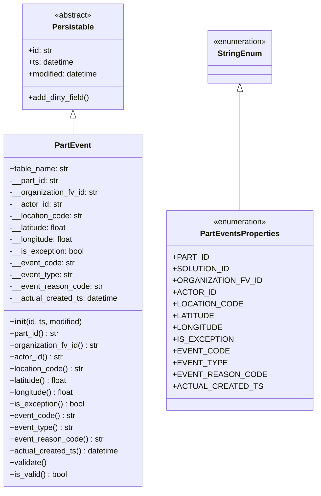
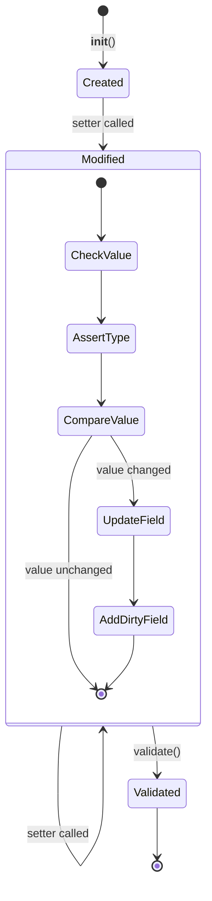

# Diagram: platform/partview_core/partview_service/partview_service/core/datamodel/PartEvent.py


> Auto-generated by Obscura crawlers

## Diagram 1

```mermaid
classDiagram
      class Persistable {
          <<abstract>>
          +id: str...
  └ 153 lines...
```

> SVG rendering failed for this diagram.

## Diagram 2



### SVG

<svg id="container" width="615.875" xmlns="http://www.w3.org/2000/svg" class="classDiagram" height="1002" viewBox="0 0 615.875 1002" role="graphics-document document" aria-roledescription="class"><style>#container{font-family:"trebuchet ms",verdana,arial,sans-serif;font-size:16px;fill:#333;}@keyframes edge-animation-frame{from{stroke-dashoffset:0;}}@keyframes dash{to{stroke-dashoffset:0;}}#container .edge-animation-slow{stroke-dasharray:9,5!important;stroke-dashoffset:900;animation:dash 50s linear infinite;stroke-linecap:round;}#container .edge-animation-fast{stroke-dasharray:9,5!important;stroke-dashoffset:900;animation:dash 20s linear infinite;stroke-linecap:round;}#container .error-icon{fill:#552222;}#container .error-text{fill:#552222;stroke:#552222;}#container .edge-thickness-normal{stroke-width:1px;}#container .edge-thickness-thick{stroke-width:3.5px;}#container .edge-pattern-solid{stroke-dasharray:0;}#container .edge-thickness-invisible{stroke-width:0;fill:none;}#container .edge-pattern-dashed{stroke-dasharray:3;}#container .edge-pattern-dotted{stroke-dasharray:2;}#container .marker{fill:#333333;stroke:#333333;}#container .marker.cross{stroke:#333333;}#container svg{font-family:"trebuchet ms",verdana,arial,sans-serif;font-size:16px;}#container p{margin:0;}#container g.classGroup text{fill:#9370DB;stroke:none;font-family:"trebuchet ms",verdana,arial,sans-serif;font-size:10px;}#container g.classGroup text .title{font-weight:bolder;}#container .nodeLabel,#container .edgeLabel{color:#131300;}#container .edgeLabel .label rect{fill:#ECECFF;}#container .label text{fill:#131300;}#container .labelBkg{background:#ECECFF;}#container .edgeLabel .label span{background:#ECECFF;}#container .classTitle{font-weight:bolder;}#container .node rect,#container .node circle,#container .node ellipse,#container .node polygon,#container .node path{fill:#ECECFF;stroke:#9370DB;stroke-width:1px;}#container .divider{stroke:#9370DB;stroke-width:1;}#container g.clickable{cursor:pointer;}#container g.classGroup rect{fill:#ECECFF;stroke:#9370DB;}#container g.classGroup line{stroke:#9370DB;stroke-width:1;}#container .classLabel .box{stroke:none;stroke-width:0;fill:#ECECFF;opacity:0.5;}#container .classLabel .label{fill:#9370DB;font-size:10px;}#container .relation{stroke:#333333;stroke-width:1;fill:none;}#container .dashed-line{stroke-dasharray:3;}#container .dotted-line{stroke-dasharray:1 2;}#container #compositionStart,#container .composition{fill:#333333!important;stroke:#333333!important;stroke-width:1;}#container #compositionEnd,#container .composition{fill:#333333!important;stroke:#333333!important;stroke-width:1;}#container #dependencyStart,#container .dependency{fill:#333333!important;stroke:#333333!important;stroke-width:1;}#container #dependencyStart,#container .dependency{fill:#333333!important;stroke:#333333!important;stroke-width:1;}#container #extensionStart,#container .extension{fill:transparent!important;stroke:#333333!important;stroke-width:1;}#container #extensionEnd,#container .extension{fill:transparent!important;stroke:#333333!important;stroke-width:1;}#container #aggregationStart,#container .aggregation{fill:transparent!important;stroke:#333333!important;stroke-width:1;}#container #aggregationEnd,#container .aggregation{fill:transparent!important;stroke:#333333!important;stroke-width:1;}#container #lollipopStart,#container .lollipop{fill:#ECECFF!important;stroke:#333333!important;stroke-width:1;}#container #lollipopEnd,#container .lollipop{fill:#ECECFF!important;stroke:#333333!important;stroke-width:1;}#container .edgeTerminals{font-size:11px;line-height:initial;}#container .classTitleText{text-anchor:middle;font-size:18px;fill:#333;}#container .label-icon{display:inline-block;height:1em;overflow:visible;vertical-align:-0.125em;}#container .node .label-icon path{fill:currentColor;stroke:revert;stroke-width:revert;}#container :root{--mermaid-font-family:"trebuchet ms",verdana,arial,sans-serif;}</style><g><defs><marker id="container_class-aggregationStart" class="marker aggregation class" refX="18" refY="7" markerWidth="190" markerHeight="240" orient="auto"><path d="M 18,7 L9,13 L1,7 L9,1 Z"></path></marker></defs><defs><marker id="container_class-aggregationEnd" class="marker aggregation class" refX="1" refY="7" markerWidth="20" markerHeight="28" orient="auto"><path d="M 18,7 L9,13 L1,7 L9,1 Z"></path></marker></defs><defs><marker id="container_class-extensionStart" class="marker extension class" refX="18" refY="7" markerWidth="190" markerHeight="240" orient="auto"><path d="M 1,7 L18,13 V 1 Z"></path></marker></defs><defs><marker id="container_class-extensionEnd" class="marker extension class" refX="1" refY="7" markerWidth="20" markerHeight="28" orient="auto"><path d="M 1,1 V 13 L18,7 Z"></path></marker></defs><defs><marker id="container_class-compositionStart" class="marker composition class" refX="18" refY="7" markerWidth="190" markerHeight="240" orient="auto"><path d="M 18,7 L9,13 L1,7 L9,1 Z"></path></marker></defs><defs><marker id="container_class-compositionEnd" class="marker composition class" refX="1" refY="7" markerWidth="20" markerHeight="28" orient="auto"><path d="M 18,7 L9,13 L1,7 L9,1 Z"></path></marker></defs><defs><marker id="container_class-dependencyStart" class="marker dependency class" refX="6" refY="7" markerWidth="190" markerHeight="240" orient="auto"><path d="M 5,7 L9,13 L1,7 L9,1 Z"></path></marker></defs><defs><marker id="container_class-dependencyEnd" class="marker dependency class" refX="13" refY="7" markerWidth="20" markerHeight="28" orient="auto"><path d="M 18,7 L9,13 L14,7 L9,1 Z"></path></marker></defs><defs><marker id="container_class-lollipopStart" class="marker lollipop class" refX="13" refY="7" markerWidth="190" markerHeight="240" orient="auto"><circle stroke="black" fill="transparent" cx="7" cy="7" r="6"></circle></marker></defs><defs><marker id="container_class-lollipopEnd" class="marker lollipop class" refX="1" refY="7" markerWidth="190" markerHeight="240" orient="auto"><circle stroke="black" fill="transparent" cx="7" cy="7" r="6"></circle></marker></defs><g class="root"><g class="clusters"></g><g class="edgePaths"><path d="M149.66,241.25L149.66,242.542C149.66,243.833,149.66,246.417,149.66,251.875C149.66,257.333,149.66,265.667,149.66,269.833L149.66,274" id="id_Persistable_PartEvent_1" class="edge-thickness-normal edge-pattern-solid relation" style=";;;" data-edge="true" data-et="edge" data-id="id_Persistable_PartEvent_1" data-points="W3sieCI6MTQ5LjY2MDE1NjI1LCJ5IjoyMjR9LHsieCI6MTQ5LjY2MDE1NjI1LCJ5IjoyNDl9LHsieCI6MTQ5LjY2MDE1NjI1LCJ5IjoyNzR9XQ==" marker-start="url(#container_class-extensionStart)"></path><path d="M474.598,187.25L474.598,197.542C474.598,207.833,474.598,228.417,474.598,268.875C474.598,309.333,474.598,369.667,474.598,399.833L474.598,430" id="id_StringEnum_PartEventsProperties_2" class="edge-thickness-normal edge-pattern-solid relation" style=";;;" data-edge="true" data-et="edge" data-id="id_StringEnum_PartEventsProperties_2" data-points="W3sieCI6NDc0LjU5NzY1NjI1LCJ5IjoxNzB9LHsieCI6NDc0LjU5NzY1NjI1LCJ5IjoyNDl9LHsieCI6NDc0LjU5NzY1NjI1LCJ5Ijo0MzB9XQ==" marker-start="url(#container_class-extensionStart)"></path></g><g class="edgeLabels"><g class="edgeLabel"><g class="label" data-id="id_Persistable_PartEvent_1" transform="translate(0, 0)"><foreignObject width="0" height="0"><div xmlns="http://www.w3.org/1999/xhtml" class="labelBkg" style="display: table-cell; white-space: nowrap; line-height: 1.5; max-width: 200px; text-align: center;"><span class="edgeLabel"></span></div></foreignObject></g></g><g class="edgeLabel"><g class="label" data-id="id_StringEnum_PartEventsProperties_2" transform="translate(0, 0)"><foreignObject width="0" height="0"><div xmlns="http://www.w3.org/1999/xhtml" class="labelBkg" style="display: table-cell; white-space: nowrap; line-height: 1.5; max-width: 200px; text-align: center;"><span class="edgeLabel"></span></div></foreignObject></g></g></g><g class="nodes"><g class="node default" id="classId-Persistable-0" transform="translate(149.66015625, 116)"><g class="basic label-container"><path d="M-105.45703125 -108 L105.45703125 -108 L105.45703125 108 L-105.45703125 108" stroke="none" stroke-width="0" fill="#ECECFF" style=""></path><path d="M-105.45703125 -108 C-44.554365396103414 -108, 16.348300457793172 -108, 105.45703125 -108 M-105.45703125 -108 C-29.500673453809455 -108, 46.45568434238109 -108, 105.45703125 -108 M105.45703125 -108 C105.45703125 -41.93956865830978, 105.45703125 24.120862683380437, 105.45703125 108 M105.45703125 -108 C105.45703125 -64.65755098722823, 105.45703125 -21.315101974456454, 105.45703125 108 M105.45703125 108 C48.746207237999066 108, -7.964616774001868 108, -105.45703125 108 M105.45703125 108 C28.13888907725233 108, -49.17925309549534 108, -105.45703125 108 M-105.45703125 108 C-105.45703125 29.019519718974394, -105.45703125 -49.96096056205121, -105.45703125 -108 M-105.45703125 108 C-105.45703125 30.7809355507039, -105.45703125 -46.4381288985922, -105.45703125 -108" stroke="#9370DB" stroke-width="1.3" fill="none" stroke-dasharray="0 0" style=""></path></g><g class="annotation-group text" transform="translate(-38.609375, -84)"><g class="label" style="" transform="translate(0,-12)"><foreignObject width="77.21875" height="24"><div xmlns="http://www.w3.org/1999/xhtml" style="display: table-cell; white-space: nowrap; line-height: 1.5; max-width: 127px; text-align: center;"><span class="nodeLabel markdown-node-label" style=""><p>«abstract»</p></span></div></foreignObject></g></g><g class="label-group text" transform="translate(-40.9765625, -60)"><g class="label" style="font-weight: bolder" transform="translate(0,-12)"><foreignObject width="81.953125" height="24"><div xmlns="http://www.w3.org/1999/xhtml" style="display: table-cell; white-space: nowrap; line-height: 1.5; max-width: 130px; text-align: center;"><span class="nodeLabel markdown-node-label" style=""><p>Persistable</p></span></div></foreignObject></g></g><g class="members-group text" transform="translate(-93.45703125, -12)"><g class="label" style="" transform="translate(0,-12)"><foreignObject width="49.578125" height="24"><div xmlns="http://www.w3.org/1999/xhtml" style="display: table-cell; white-space: nowrap; line-height: 1.5; max-width: 108px; text-align: center;"><span class="nodeLabel markdown-node-label" style=""><p>+id: str</p></span></div></foreignObject></g><g class="label" style="" transform="translate(0,12)"><foreignObject width="94.484375" height="24"><div xmlns="http://www.w3.org/1999/xhtml" style="display: table-cell; white-space: nowrap; line-height: 1.5; max-width: 152px; text-align: center;"><span class="nodeLabel markdown-node-label" style=""><p>+ts: datetime</p></span></div></foreignObject></g><g class="label" style="" transform="translate(0,36)"><foreignObject width="145.9375" height="24"><div xmlns="http://www.w3.org/1999/xhtml" style="display: table-cell; white-space: nowrap; line-height: 1.5; max-width: 203px; text-align: center;"><span class="nodeLabel markdown-node-label" style=""><p>+modified: datetime</p></span></div></foreignObject></g></g><g class="methods-group text" transform="translate(-93.45703125, 84)"><g class="label" style="" transform="translate(0,-12)"><foreignObject width="127.40625" height="24"><div xmlns="http://www.w3.org/1999/xhtml" style="display: table-cell; white-space: nowrap; line-height: 1.5; max-width: 185px; text-align: center;"><span class="nodeLabel markdown-node-label" style=""><p>+add_dirty_field()</p></span></div></foreignObject></g></g><g class="divider" style=""><path d="M-105.45703125 -36 C-38.289289860773636 -36, 28.87845152845273 -36, 105.45703125 -36 M-105.45703125 -36 C-57.07404892933649 -36, -8.691066608672983 -36, 105.45703125 -36" stroke="#9370DB" stroke-width="1.3" fill="none" stroke-dasharray="0 0" style=""></path></g><g class="divider" style=""><path d="M-105.45703125 60 C-42.98324197578747 60, 19.490547298425057 60, 105.45703125 60 M-105.45703125 60 C-46.79678172436585 60, 11.8634678012683 60, 105.45703125 60" stroke="#9370DB" stroke-width="1.3" fill="none" stroke-dasharray="0 0" style=""></path></g></g><g class="node default" id="classId-StringEnum-1" transform="translate(474.59765625, 116)"><g class="basic label-container"><path d="M-67.5546875 -54 L67.5546875 -54 L67.5546875 54 L-67.5546875 54" stroke="none" stroke-width="0" fill="#ECECFF" style=""></path><path d="M-67.5546875 -54 C-30.256871098718413 -54, 7.040945302563173 -54, 67.5546875 -54 M-67.5546875 -54 C-36.75773724542417 -54, -5.960786990848334 -54, 67.5546875 -54 M67.5546875 -54 C67.5546875 -15.824121300552534, 67.5546875 22.351757398894932, 67.5546875 54 M67.5546875 -54 C67.5546875 -13.375809182796225, 67.5546875 27.24838163440755, 67.5546875 54 M67.5546875 54 C23.945149746760457 54, -19.664388006479086 54, -67.5546875 54 M67.5546875 54 C15.417083122741971 54, -36.72052125451606 54, -67.5546875 54 M-67.5546875 54 C-67.5546875 26.32693079863981, -67.5546875 -1.3461384027203778, -67.5546875 -54 M-67.5546875 54 C-67.5546875 20.577660083434402, -67.5546875 -12.844679833131195, -67.5546875 -54" stroke="#9370DB" stroke-width="1.3" fill="none" stroke-dasharray="0 0" style=""></path></g><g class="annotation-group text" transform="translate(-55.5546875, -30)"><g class="label" style="" transform="translate(0,-12)"><foreignObject width="111.109375" height="24"><div xmlns="http://www.w3.org/1999/xhtml" style="display: table-cell; white-space: nowrap; line-height: 1.5; max-width: 161px; text-align: center;"><span class="nodeLabel markdown-node-label" style=""><p>«enumeration»</p></span></div></foreignObject></g></g><g class="label-group text" transform="translate(-42.234375, -6)"><g class="label" style="font-weight: bolder" transform="translate(0,-12)"><foreignObject width="84.46875" height="24"><div xmlns="http://www.w3.org/1999/xhtml" style="display: table-cell; white-space: nowrap; line-height: 1.5; max-width: 134px; text-align: center;"><span class="nodeLabel markdown-node-label" style=""><p>StringEnum</p></span></div></foreignObject></g></g><g class="members-group text" transform="translate(-55.5546875, 42)"></g><g class="methods-group text" transform="translate(-55.5546875, 72)"></g><g class="divider" style=""><path d="M-67.5546875 18 C-16.563391008600313 18, 34.427905482799375 18, 67.5546875 18 M-67.5546875 18 C-34.20597420826144 18, -0.8572609165228755 18, 67.5546875 18" stroke="#9370DB" stroke-width="1.3" fill="none" stroke-dasharray="0 0" style=""></path></g><g class="divider" style=""><path d="M-67.5546875 36 C-18.737845398091196 36, 30.07899670381761 36, 67.5546875 36 M-67.5546875 36 C-22.417144296497483 36, 22.720398907005034 36, 67.5546875 36" stroke="#9370DB" stroke-width="1.3" fill="none" stroke-dasharray="0 0" style=""></path></g></g><g class="node default" id="classId-PartEventsProperties-2" transform="translate(474.59765625, 634)"><g class="basic label-container"><path d="M-133.27734375 -204 L133.27734375 -204 L133.27734375 204 L-133.27734375 204" stroke="none" stroke-width="0" fill="#ECECFF" style=""></path><path d="M-133.27734375 -204 C-39.719047778916845 -204, 53.83924819216631 -204, 133.27734375 -204 M-133.27734375 -204 C-77.87169610130161 -204, -22.466048452603204 -204, 133.27734375 -204 M133.27734375 -204 C133.27734375 -70.08017007741955, 133.27734375 63.839659845160895, 133.27734375 204 M133.27734375 -204 C133.27734375 -110.26652387595757, 133.27734375 -16.53304775191515, 133.27734375 204 M133.27734375 204 C64.99290413510307 204, -3.2915354797938505 204, -133.27734375 204 M133.27734375 204 C53.00877539429818 204, -27.259792961403633 204, -133.27734375 204 M-133.27734375 204 C-133.27734375 114.68841569855677, -133.27734375 25.376831397113534, -133.27734375 -204 M-133.27734375 204 C-133.27734375 80.56199737719493, -133.27734375 -42.876005245610145, -133.27734375 -204" stroke="#9370DB" stroke-width="1.3" fill="none" stroke-dasharray="0 0" style=""></path></g><g class="annotation-group text" transform="translate(-55.5546875, -180)"><g class="label" style="" transform="translate(0,-12)"><foreignObject width="111.109375" height="24"><div xmlns="http://www.w3.org/1999/xhtml" style="display: table-cell; white-space: nowrap; line-height: 1.5; max-width: 161px; text-align: center;"><span class="nodeLabel markdown-node-label" style=""><p>«enumeration»</p></span></div></foreignObject></g></g><g class="label-group text" transform="translate(-77.4453125, -156)"><g class="label" style="font-weight: bolder" transform="translate(0,-12)"><foreignObject width="154.890625" height="24"><div xmlns="http://www.w3.org/1999/xhtml" style="display: table-cell; white-space: nowrap; line-height: 1.5; max-width: 201px; text-align: center;"><span class="nodeLabel markdown-node-label" style=""><p>PartEventsProperties</p></span></div></foreignObject></g></g><g class="members-group text" transform="translate(-121.27734375, -108)"><g class="label" style="" transform="translate(0,-12)"><foreignObject width="65.671875" height="24"><div xmlns="http://www.w3.org/1999/xhtml" style="display: table-cell; white-space: nowrap; line-height: 1.5; max-width: 123px; text-align: center;"><span class="nodeLabel markdown-node-label" style=""><p>+PART_ID</p></span></div></foreignObject></g><g class="label" style="" transform="translate(0,12)"><foreignObject width="103.640625" height="24"><div xmlns="http://www.w3.org/1999/xhtml" style="display: table-cell; white-space: nowrap; line-height: 1.5; max-width: 161px; text-align: center;"><span class="nodeLabel markdown-node-label" style=""><p>+SOLUTION_ID</p></span></div></foreignObject></g><g class="label" style="" transform="translate(0,36)"><foreignObject width="162.84375" height="24"><div xmlns="http://www.w3.org/1999/xhtml" style="display: table-cell; white-space: nowrap; line-height: 1.5; max-width: 220px; text-align: center;"><span class="nodeLabel markdown-node-label" style=""><p>+ORGANIZATION_FV_ID</p></span></div></foreignObject></g><g class="label" style="" transform="translate(0,60)"><foreignObject width="77.453125" height="24"><div xmlns="http://www.w3.org/1999/xhtml" style="display: table-cell; white-space: nowrap; line-height: 1.5; max-width: 135px; text-align: center;"><span class="nodeLabel markdown-node-label" style=""><p>+ACTOR_ID</p></span></div></foreignObject></g><g class="label" style="" transform="translate(0,84)"><foreignObject width="124.890625" height="24"><div xmlns="http://www.w3.org/1999/xhtml" style="display: table-cell; white-space: nowrap; line-height: 1.5; max-width: 182px; text-align: center;"><span class="nodeLabel markdown-node-label" style=""><p>+LOCATION_CODE</p></span></div></foreignObject></g><g class="label" style="" transform="translate(0,108)"><foreignObject width="75.046875" height="24"><div xmlns="http://www.w3.org/1999/xhtml" style="display: table-cell; white-space: nowrap; line-height: 1.5; max-width: 132px; text-align: center;"><span class="nodeLabel markdown-node-label" style=""><p>+LATITUDE</p></span></div></foreignObject></g><g class="label" style="" transform="translate(0,132)"><foreignObject width="89.78125" height="24"><div xmlns="http://www.w3.org/1999/xhtml" style="display: table-cell; white-space: nowrap; line-height: 1.5; max-width: 147px; text-align: center;"><span class="nodeLabel markdown-node-label" style=""><p>+LONGITUDE</p></span></div></foreignObject></g><g class="label" style="" transform="translate(0,156)"><foreignObject width="107.65625" height="24"><div xmlns="http://www.w3.org/1999/xhtml" style="display: table-cell; white-space: nowrap; line-height: 1.5; max-width: 165px; text-align: center;"><span class="nodeLabel markdown-node-label" style=""><p>+IS_EXCEPTION</p></span></div></foreignObject></g><g class="label" style="" transform="translate(0,180)"><foreignObject width="98.65625" height="24"><div xmlns="http://www.w3.org/1999/xhtml" style="display: table-cell; white-space: nowrap; line-height: 1.5; max-width: 156px; text-align: center;"><span class="nodeLabel markdown-node-label" style=""><p>+EVENT_CODE</p></span></div></foreignObject></g><g class="label" style="" transform="translate(0,204)"><foreignObject width="94.859375" height="24"><div xmlns="http://www.w3.org/1999/xhtml" style="display: table-cell; white-space: nowrap; line-height: 1.5; max-width: 152px; text-align: center;"><span class="nodeLabel markdown-node-label" style=""><p>+EVENT_TYPE</p></span></div></foreignObject></g><g class="label" style="" transform="translate(0,228)"><foreignObject width="165.109375" height="24"><div xmlns="http://www.w3.org/1999/xhtml" style="display: table-cell; white-space: nowrap; line-height: 1.5; max-width: 222px; text-align: center;"><span class="nodeLabel markdown-node-label" style=""><p>+EVENT_REASON_CODE</p></span></div></foreignObject></g><g class="label" style="" transform="translate(0,252)"><foreignObject width="155.421875" height="24"><div xmlns="http://www.w3.org/1999/xhtml" style="display: table-cell; white-space: nowrap; line-height: 1.5; max-width: 213px; text-align: center;"><span class="nodeLabel markdown-node-label" style=""><p>+ACTUAL_CREATED_TS</p></span></div></foreignObject></g></g><g class="methods-group text" transform="translate(-121.27734375, 204)"></g><g class="divider" style=""><path d="M-133.27734375 -132 C-72.30272900973046 -132, -11.328114269460912 -132, 133.27734375 -132 M-133.27734375 -132 C-36.24051588951268 -132, 60.79631197097464 -132, 133.27734375 -132" stroke="#9370DB" stroke-width="1.3" fill="none" stroke-dasharray="0 0" style=""></path></g><g class="divider" style=""><path d="M-133.27734375 180 C-62.76066389634862 180, 7.756015957302765 180, 133.27734375 180 M-133.27734375 180 C-55.02129884692225 180, 23.2347460561555 180, 133.27734375 180" stroke="#9370DB" stroke-width="1.3" fill="none" stroke-dasharray="0 0" style=""></path></g></g><g class="node default" id="classId-PartEvent-3" transform="translate(149.66015625, 634)"><g class="basic label-container"><path d="M-141.66015625 -360 L141.66015625 -360 L141.66015625 360 L-141.66015625 360" stroke="none" stroke-width="0" fill="#ECECFF" style=""></path><path d="M-141.66015625 -360 C-82.94173309402419 -360, -24.223309938048388 -360, 141.66015625 -360 M-141.66015625 -360 C-38.2724208032826 -360, 65.1153146434348 -360, 141.66015625 -360 M141.66015625 -360 C141.66015625 -180.7361783557335, 141.66015625 -1.4723567114670004, 141.66015625 360 M141.66015625 -360 C141.66015625 -163.48750235702136, 141.66015625 33.02499528595729, 141.66015625 360 M141.66015625 360 C38.46285498752853 360, -64.73444627494294 360, -141.66015625 360 M141.66015625 360 C40.732331861520294 360, -60.19549252695941 360, -141.66015625 360 M-141.66015625 360 C-141.66015625 158.90338443610543, -141.66015625 -42.19323112778915, -141.66015625 -360 M-141.66015625 360 C-141.66015625 152.19183582301224, -141.66015625 -55.61632835397552, -141.66015625 -360" stroke="#9370DB" stroke-width="1.3" fill="none" stroke-dasharray="0 0" style=""></path></g><g class="annotation-group text" transform="translate(0, -336)"></g><g class="label-group text" transform="translate(-35.2734375, -336)"><g class="label" style="font-weight: bolder" transform="translate(0,-12)"><foreignObject width="70.546875" height="24"><div xmlns="http://www.w3.org/1999/xhtml" style="display: table-cell; white-space: nowrap; line-height: 1.5; max-width: 119px; text-align: center;"><span class="nodeLabel markdown-node-label" style=""><p>PartEvent</p></span></div></foreignObject></g></g><g class="members-group text" transform="translate(-129.66015625, -288)"><g class="label" style="" transform="translate(0,-12)"><foreignObject width="121.125" height="24"><div xmlns="http://www.w3.org/1999/xhtml" style="display: table-cell; white-space: nowrap; line-height: 1.5; max-width: 179px; text-align: center;"><span class="nodeLabel markdown-node-label" style=""><p>+table_name: str</p></span></div></foreignObject></g><g class="label" style="" transform="translate(0,12)"><foreignObject width="101.5625" height="24"><div xmlns="http://www.w3.org/1999/xhtml" style="display: table-cell; white-space: nowrap; line-height: 1.5; max-width: 160px; text-align: center;"><span class="nodeLabel markdown-node-label" style=""><p>-__part_id: str</p></span></div></foreignObject></g><g class="label" style="" transform="translate(0,36)"><foreignObject width="182.34375" height="24"><div xmlns="http://www.w3.org/1999/xhtml" style="display: table-cell; white-space: nowrap; line-height: 1.5; max-width: 241px; text-align: center;"><span class="nodeLabel markdown-node-label" style=""><p>-__organization_fv_id: str</p></span></div></foreignObject></g><g class="label" style="" transform="translate(0,60)"><foreignObject width="107.375" height="24"><div xmlns="http://www.w3.org/1999/xhtml" style="display: table-cell; white-space: nowrap; line-height: 1.5; max-width: 166px; text-align: center;"><span class="nodeLabel markdown-node-label" style=""><p>-__actor_id: str</p></span></div></foreignObject></g><g class="label" style="" transform="translate(0,84)"><foreignObject width="151.109375" height="24"><div xmlns="http://www.w3.org/1999/xhtml" style="display: table-cell; white-space: nowrap; line-height: 1.5; max-width: 209px; text-align: center;"><span class="nodeLabel markdown-node-label" style=""><p>-__location_code: str</p></span></div></foreignObject></g><g class="label" style="" transform="translate(0,108)"><foreignObject width="119.609375" height="24"><div xmlns="http://www.w3.org/1999/xhtml" style="display: table-cell; white-space: nowrap; line-height: 1.5; max-width: 177px; text-align: center;"><span class="nodeLabel markdown-node-label" style=""><p>-__latitude: float</p></span></div></foreignObject></g><g class="label" style="" transform="translate(0,132)"><foreignObject width="132.171875" height="24"><div xmlns="http://www.w3.org/1999/xhtml" style="display: table-cell; white-space: nowrap; line-height: 1.5; max-width: 190px; text-align: center;"><span class="nodeLabel markdown-node-label" style=""><p>-__longitude: float</p></span></div></foreignObject></g><g class="label" style="" transform="translate(0,156)"><foreignObject width="153.03125" height="24"><div xmlns="http://www.w3.org/1999/xhtml" style="display: table-cell; white-space: nowrap; line-height: 1.5; max-width: 211px; text-align: center;"><span class="nodeLabel markdown-node-label" style=""><p>-__is_exception: bool</p></span></div></foreignObject></g><g class="label" style="" transform="translate(0,180)"><foreignObject width="132.140625" height="24"><div xmlns="http://www.w3.org/1999/xhtml" style="display: table-cell; white-space: nowrap; line-height: 1.5; max-width: 190px; text-align: center;"><span class="nodeLabel markdown-node-label" style=""><p>-__event_code: str</p></span></div></foreignObject></g><g class="label" style="" transform="translate(0,204)"><foreignObject width="128.96875" height="24"><div xmlns="http://www.w3.org/1999/xhtml" style="display: table-cell; white-space: nowrap; line-height: 1.5; max-width: 187px; text-align: center;"><span class="nodeLabel markdown-node-label" style=""><p>-__event_type: str</p></span></div></foreignObject></g><g class="label" style="" transform="translate(0,228)"><foreignObject width="189.453125" height="24"><div xmlns="http://www.w3.org/1999/xhtml" style="display: table-cell; white-space: nowrap; line-height: 1.5; max-width: 248px; text-align: center;"><span class="nodeLabel markdown-node-label" style=""><p>-__event_reason_code: str</p></span></div></foreignObject></g><g class="label" style="" transform="translate(0,252)"><foreignObject width="223.015625" height="24"><div xmlns="http://www.w3.org/1999/xhtml" style="display: table-cell; white-space: nowrap; line-height: 1.5; max-width: 280px; text-align: center;"><span class="nodeLabel markdown-node-label" style=""><p>-__actual_created_ts: datetime</p></span></div></foreignObject></g></g><g class="methods-group text" transform="translate(-129.66015625, 24)"><g class="label" style="" transform="translate(0,-12)"><foreignObject width="150.90625" height="24"><div xmlns="http://www.w3.org/1999/xhtml" style="display: table-cell; white-space: nowrap; line-height: 1.5; max-width: 240px; text-align: center;"><span class="nodeLabel markdown-node-label" style=""><p>+<strong>init</strong>(id, ts, modified)</p></span></div></foreignObject></g><g class="label" style="" transform="translate(0,12)"><foreignObject width="102.5" height="24"><div xmlns="http://www.w3.org/1999/xhtml" style="display: table-cell; white-space: nowrap; line-height: 1.5; max-width: 161px; text-align: center;"><span class="nodeLabel markdown-node-label" style=""><p>+part_id() : str</p></span></div></foreignObject></g><g class="label" style="" transform="translate(0,36)"><foreignObject width="183.609375" height="24"><div xmlns="http://www.w3.org/1999/xhtml" style="display: table-cell; white-space: nowrap; line-height: 1.5; max-width: 242px; text-align: center;"><span class="nodeLabel markdown-node-label" style=""><p>+organization_fv_id() : str</p></span></div></foreignObject></g><g class="label" style="" transform="translate(0,60)"><foreignObject width="108.390625" height="24"><div xmlns="http://www.w3.org/1999/xhtml" style="display: table-cell; white-space: nowrap; line-height: 1.5; max-width: 167px; text-align: center;"><span class="nodeLabel markdown-node-label" style=""><p>+actor_id() : str</p></span></div></foreignObject></g><g class="label" style="" transform="translate(0,84)"><foreignObject width="152.21875" height="24"><div xmlns="http://www.w3.org/1999/xhtml" style="display: table-cell; white-space: nowrap; line-height: 1.5; max-width: 210px; text-align: center;"><span class="nodeLabel markdown-node-label" style=""><p>+location_code() : str</p></span></div></foreignObject></g><g class="label" style="" transform="translate(0,108)"><foreignObject width="120.71875" height="24"><div xmlns="http://www.w3.org/1999/xhtml" style="display: table-cell; white-space: nowrap; line-height: 1.5; max-width: 178px; text-align: center;"><span class="nodeLabel markdown-node-label" style=""><p>+latitude() : float</p></span></div></foreignObject></g><g class="label" style="" transform="translate(0,132)"><foreignObject width="133.265625" height="24"><div xmlns="http://www.w3.org/1999/xhtml" style="display: table-cell; white-space: nowrap; line-height: 1.5; max-width: 191px; text-align: center;"><span class="nodeLabel markdown-node-label" style=""><p>+longitude() : float</p></span></div></foreignObject></g><g class="label" style="" transform="translate(0,156)"><foreignObject width="153.96875" height="24"><div xmlns="http://www.w3.org/1999/xhtml" style="display: table-cell; white-space: nowrap; line-height: 1.5; max-width: 212px; text-align: center;"><span class="nodeLabel markdown-node-label" style=""><p>+is_exception() : bool</p></span></div></foreignObject></g><g class="label" style="" transform="translate(0,180)"><foreignObject width="133.40625" height="24"><div xmlns="http://www.w3.org/1999/xhtml" style="display: table-cell; white-space: nowrap; line-height: 1.5; max-width: 192px; text-align: center;"><span class="nodeLabel markdown-node-label" style=""><p>+event_code() : str</p></span></div></foreignObject></g><g class="label" style="" transform="translate(0,204)"><foreignObject width="130.234375" height="24"><div xmlns="http://www.w3.org/1999/xhtml" style="display: table-cell; white-space: nowrap; line-height: 1.5; max-width: 188px; text-align: center;"><span class="nodeLabel markdown-node-label" style=""><p>+event_type() : str</p></span></div></foreignObject></g><g class="label" style="" transform="translate(0,228)"><foreignObject width="190.71875" height="24"><div xmlns="http://www.w3.org/1999/xhtml" style="display: table-cell; white-space: nowrap; line-height: 1.5; max-width: 249px; text-align: center;"><span class="nodeLabel markdown-node-label" style=""><p>+event_reason_code() : str</p></span></div></foreignObject></g><g class="label" style="" transform="translate(0,252)"><foreignObject width="224.046875" height="24"><div xmlns="http://www.w3.org/1999/xhtml" style="display: table-cell; white-space: nowrap; line-height: 1.5; max-width: 281px; text-align: center;"><span class="nodeLabel markdown-node-label" style=""><p>+actual_created_ts() : datetime</p></span></div></foreignObject></g><g class="label" style="" transform="translate(0,276)"><foreignObject width="76.09375" height="24"><div xmlns="http://www.w3.org/1999/xhtml" style="display: table-cell; white-space: nowrap; line-height: 1.5; max-width: 133px; text-align: center;"><span class="nodeLabel markdown-node-label" style=""><p>+validate()</p></span></div></foreignObject></g><g class="label" style="" transform="translate(0,300)"><foreignObject width="117.984375" height="24"><div xmlns="http://www.w3.org/1999/xhtml" style="display: table-cell; white-space: nowrap; line-height: 1.5; max-width: 176px; text-align: center;"><span class="nodeLabel markdown-node-label" style=""><p>+is_valid() : bool</p></span></div></foreignObject></g></g><g class="divider" style=""><path d="M-141.66015625 -312 C-69.02378994931138 -312, 3.6125763513772426 -312, 141.66015625 -312 M-141.66015625 -312 C-33.1354357041906 -312, 75.3892848416188 -312, 141.66015625 -312" stroke="#9370DB" stroke-width="1.3" fill="none" stroke-dasharray="0 0" style=""></path></g><g class="divider" style=""><path d="M-141.66015625 0 C-68.68600048639459 0, 4.288155277210819 0, 141.66015625 0 M-141.66015625 0 C-73.75441235798611 0, -5.848668465972224 0, 141.66015625 0" stroke="#9370DB" stroke-width="1.3" fill="none" stroke-dasharray="0 0" style=""></path></g></g></g></g></g></svg>

## Diagram 3



### SVG

<svg id="container" width="289.34375" xmlns="http://www.w3.org/2000/svg" class="statediagram" height="1221" viewBox="0 0 289.34375 1221" role="graphics-document document" aria-roledescription="stateDiagram"><style>#container{font-family:"trebuchet ms",verdana,arial,sans-serif;font-size:16px;fill:#333;}@keyframes edge-animation-frame{from{stroke-dashoffset:0;}}@keyframes dash{to{stroke-dashoffset:0;}}#container .edge-animation-slow{stroke-dasharray:9,5!important;stroke-dashoffset:900;animation:dash 50s linear infinite;stroke-linecap:round;}#container .edge-animation-fast{stroke-dasharray:9,5!important;stroke-dashoffset:900;animation:dash 20s linear infinite;stroke-linecap:round;}#container .error-icon{fill:#552222;}#container .error-text{fill:#552222;stroke:#552222;}#container .edge-thickness-normal{stroke-width:1px;}#container .edge-thickness-thick{stroke-width:3.5px;}#container .edge-pattern-solid{stroke-dasharray:0;}#container .edge-thickness-invisible{stroke-width:0;fill:none;}#container .edge-pattern-dashed{stroke-dasharray:3;}#container .edge-pattern-dotted{stroke-dasharray:2;}#container .marker{fill:#333333;stroke:#333333;}#container .marker.cross{stroke:#333333;}#container svg{font-family:"trebuchet ms",verdana,arial,sans-serif;font-size:16px;}#container p{margin:0;}#container defs #statediagram-barbEnd{fill:#333333;stroke:#333333;}#container g.stateGroup text{fill:#9370DB;stroke:none;font-size:10px;}#container g.stateGroup text{fill:#333;stroke:none;font-size:10px;}#container g.stateGroup .state-title{font-weight:bolder;fill:#131300;}#container g.stateGroup rect{fill:#ECECFF;stroke:#9370DB;}#container g.stateGroup line{stroke:#333333;stroke-width:1;}#container .transition{stroke:#333333;stroke-width:1;fill:none;}#container .stateGroup .composit{fill:white;border-bottom:1px;}#container .stateGroup .alt-composit{fill:#e0e0e0;border-bottom:1px;}#container .state-note{stroke:#aaaa33;fill:#fff5ad;}#container .state-note text{fill:black;stroke:none;font-size:10px;}#container .stateLabel .box{stroke:none;stroke-width:0;fill:#ECECFF;opacity:0.5;}#container .edgeLabel .label rect{fill:#ECECFF;opacity:0.5;}#container .edgeLabel{background-color:rgba(232,232,232, 0.8);text-align:center;}#container .edgeLabel p{background-color:rgba(232,232,232, 0.8);}#container .edgeLabel rect{opacity:0.5;background-color:rgba(232,232,232, 0.8);fill:rgba(232,232,232, 0.8);}#container .edgeLabel .label text{fill:#333;}#container .label div .edgeLabel{color:#333;}#container .stateLabel text{fill:#131300;font-size:10px;font-weight:bold;}#container .node circle.state-start{fill:#333333;stroke:#333333;}#container .node .fork-join{fill:#333333;stroke:#333333;}#container .node circle.state-end{fill:#9370DB;stroke:white;stroke-width:1.5;}#container .end-state-inner{fill:white;stroke-width:1.5;}#container .node rect{fill:#ECECFF;stroke:#9370DB;stroke-width:1px;}#container .node polygon{fill:#ECECFF;stroke:#9370DB;stroke-width:1px;}#container #statediagram-barbEnd{fill:#333333;}#container .statediagram-cluster rect{fill:#ECECFF;stroke:#9370DB;stroke-width:1px;}#container .cluster-label,#container .nodeLabel{color:#131300;}#container .statediagram-cluster rect.outer{rx:5px;ry:5px;}#container .statediagram-state .divider{stroke:#9370DB;}#container .statediagram-state .title-state{rx:5px;ry:5px;}#container .statediagram-cluster.statediagram-cluster .inner{fill:white;}#container .statediagram-cluster.statediagram-cluster-alt .inner{fill:#f0f0f0;}#container .statediagram-cluster .inner{rx:0;ry:0;}#container .statediagram-state rect.basic{rx:5px;ry:5px;}#container .statediagram-state rect.divider{stroke-dasharray:10,10;fill:#f0f0f0;}#container .note-edge{stroke-dasharray:5;}#container .statediagram-note rect{fill:#fff5ad;stroke:#aaaa33;stroke-width:1px;rx:0;ry:0;}#container .statediagram-note rect{fill:#fff5ad;stroke:#aaaa33;stroke-width:1px;rx:0;ry:0;}#container .statediagram-note text{fill:black;}#container .statediagram-note .nodeLabel{color:black;}#container .statediagram .edgeLabel{color:red;}#container #dependencyStart,#container #dependencyEnd{fill:#333333;stroke:#333333;stroke-width:1;}#container .statediagramTitleText{text-anchor:middle;font-size:18px;fill:#333;}#container :root{--mermaid-font-family:"trebuchet ms",verdana,arial,sans-serif;}</style><g><defs><marker id="container_stateDiagram-barbEnd" refX="19" refY="7" markerWidth="20" markerHeight="14" markerUnits="userSpaceOnUse" orient="auto"><path d="M 19,7 L9,13 L14,7 L9,1 Z"></path></marker></defs><g class="root"><g class="clusters"></g><g class="edgePaths"><path d="M144.672,22L144.672,28.167C144.672,34.333,144.672,46.667,144.755,59.083C144.839,71.5,145.005,84,145.089,90.25L145.172,96.5" id="edge0" class="edge-thickness-normal edge-pattern-solid transition" style="fill:none;;;fill:none" data-edge="true" data-et="edge" data-id="edge0" data-points="W3sieCI6MTQ0LjY3MTg3NSwieSI6MjJ9LHsieCI6MTQ0LjY3MTg3NSwieSI6NTl9LHsieCI6MTQ1LjE3MTg3NSwieSI6OTYuNX1d" marker-end="url(#container_stateDiagram-barbEnd)"></path><path d="M79.539,1105.05L79.539,1114.542C79.539,1124.033,79.539,1143.017,84.961,1159.833C90.382,1176.65,101.225,1191.3,106.647,1198.625L112.068,1205.95" id="Modified-cyclic-special-mid" class="edge-thickness-normal edge-pattern-solid transition" style="fill:none;;;fill:none" data-edge="true" data-et="edge" data-id="Modified-cyclic-special-mid" data-points="W3sieCI6NzkuNTM5MDYyNSwieSI6MTEwNS4wNTAwMDAwMDA3NDV9LHsieCI6NzkuNTM5MDYyNSwieSI6MTE2Mn0seyJ4IjoxMTIuMDY4NDYxNDY5NjE5MDEsInkiOjEyMDUuOTQ5OTk5OTk5MjU1fV0="></path><path d="M222.227,1125.5L222.143,1131.583C222.06,1137.667,221.893,1149.833,221.81,1162.083C221.727,1174.333,221.727,1186.667,221.727,1192.833L221.727,1199" id="edge4" class="edge-thickness-normal edge-pattern-solid transition" style="fill:none;;;fill:none" data-edge="true" data-et="edge" data-id="edge4" data-points="W3sieCI6MjIyLjIyNjU2MjUsInkiOjExMjUuNX0seyJ4IjoyMjEuNzI2NTYyNSwieSI6MTE2Mn0seyJ4IjoyMjEuNzI2NTYyNSwieSI6MTE5OX1d" marker-end="url(#container_stateDiagram-barbEnd)"></path><path d="M144.672,136L144.672,142.167C144.672,148.333,144.672,160.667,144.672,173C144.672,185.333,144.672,197.667,144.672,203.833L144.672,210" id="edge1" class="edge-thickness-normal edge-pattern-solid transition" style="fill:none;;;fill:none" data-edge="true" data-et="edge" data-id="edge1" data-points="W3sieCI6MTQ0LjY3MTg3NSwieSI6MTM2fSx7IngiOjE0NC42NzE4NzUsInkiOjE3M30seyJ4IjoxNDQuNjcxODc1LCJ5IjoyMTB9XQ==" marker-end="url(#container_stateDiagram-barbEnd)"></path><path d="M85.047,1011L84.129,1017.167C83.211,1023.333,81.375,1035.667,80.457,1051.325C79.539,1066.983,79.539,1085.967,79.539,1095.458L79.539,1104.95" id="Modified-cyclic-special-1" class="edge-thickness-normal edge-pattern-solid transition" style="fill:none;;;fill:none" data-edge="true" data-et="edge" data-id="Modified-cyclic-special-1" data-points="W3sieCI6ODUuMDQ3NDM3NSwieSI6MTAxMX0seyJ4Ijo3OS41MzkwNjI1LCJ5IjoxMDQ4fSx7IngiOjc5LjUzOTA2MjUsInkiOjExMDQuOTQ5OTk5OTk5MjU1fV0="></path><path d="M112.142,1205.95L117.564,1198.625C122.986,1191.3,133.829,1176.65,139.25,1159.825C144.672,1143,144.672,1124,144.672,1105C144.672,1086,144.672,1067,144.672,1051.333C144.672,1035.667,144.672,1023.333,144.672,1017.167L144.672,1011" id="Modified-cyclic-special-2" class="edge-thickness-normal edge-pattern-solid transition" style="fill:none;;;fill:none" data-edge="true" data-et="edge" data-id="Modified-cyclic-special-2" data-points="W3sieCI6MTEyLjE0MjQ3NjAzMDM4MDk5LCJ5IjoxMjA1Ljk0OTk5OTk5OTI1NX0seyJ4IjoxNDQuNjcxODc1LCJ5IjoxMTYyfSx7IngiOjE0NC42NzE4NzUsInkiOjExMDV9LHsieCI6MTQ0LjY3MTg3NSwieSI6MTA0OH0seyJ4IjoxNDQuNjcxODc1LCJ5IjoxMDExfV0=" marker-end="url(#container_stateDiagram-barbEnd)"></path><path d="M215.21,1011L216.296,1017.167C217.382,1023.333,219.554,1035.667,220.64,1048C221.727,1060.333,221.727,1072.667,221.727,1078.833L221.727,1085" id="edge3" class="edge-thickness-normal edge-pattern-solid transition" style="fill:none;;;fill:none" data-edge="true" data-et="edge" data-id="edge3" data-points="W3sieCI6MjE1LjIwOTkzNzUsInkiOjEwMTF9LHsieCI6MjIxLjcyNjU2MjUsInkiOjEwNDh9LHsieCI6MjIxLjcyNjU2MjUsInkiOjEwODV9XQ==" marker-end="url(#container_stateDiagram-barbEnd)"></path></g><g class="edgeLabels"><g class="edgeLabel" transform="translate(144.671875, 59)"><g class="label" data-id="edge0" transform="translate(-17.40625, -12)"><foreignObject width="34.8125" height="24"><div xmlns="http://www.w3.org/1999/xhtml" class="labelBkg" style="display: table-cell; white-space: nowrap; line-height: 1.5; max-width: 200px; text-align: center;"><span class="edgeLabel"><p><strong>init</strong>()</p></span></div></foreignObject></g></g><g class="edgeLabel" transform="translate(79.5390625, 1162)"><g class="label" data-id="Modified-cyclic-special-mid" transform="translate(-45.1328125, -12)"><foreignObject width="90.265625" height="24"><div xmlns="http://www.w3.org/1999/xhtml" class="labelBkg" style="display: table-cell; white-space: nowrap; line-height: 1.5; max-width: 200px; text-align: center;"><span class="edgeLabel"><p>setter called</p></span></div></foreignObject></g></g><g class="edgeLabel"><g class="label" data-id="edge4" transform="translate(0, 0)"><foreignObject width="0" height="0"><div xmlns="http://www.w3.org/1999/xhtml" class="labelBkg" style="display: table-cell; white-space: nowrap; line-height: 1.5; max-width: 200px; text-align: center;"><span class="edgeLabel"></span></div></foreignObject></g></g><g class="edgeLabel" transform="translate(144.671875, 173)"><g class="label" data-id="edge1" transform="translate(-45.1328125, -12)"><foreignObject width="90.265625" height="24"><div xmlns="http://www.w3.org/1999/xhtml" class="labelBkg" style="display: table-cell; white-space: nowrap; line-height: 1.5; max-width: 200px; text-align: center;"><span class="edgeLabel"><p>setter called</p></span></div></foreignObject></g></g><g class="edgeLabel"><g class="label" data-id="Modified-cyclic-special-1" transform="translate(0, 0)"><foreignObject width="0" height="0"><div xmlns="http://www.w3.org/1999/xhtml" class="labelBkg" style="display: table-cell; white-space: nowrap; line-height: 1.5; max-width: 200px; text-align: center;"><span class="edgeLabel"></span></div></foreignObject></g></g><g class="edgeLabel"><g class="label" data-id="Modified-cyclic-special-2" transform="translate(0, 0)"><foreignObject width="0" height="0"><div xmlns="http://www.w3.org/1999/xhtml" class="labelBkg" style="display: table-cell; white-space: nowrap; line-height: 1.5; max-width: 200px; text-align: center;"><span class="edgeLabel"></span></div></foreignObject></g></g><g class="edgeLabel" transform="translate(221.7265625, 1048)"><g class="label" data-id="edge3" transform="translate(-34.1328125, -12)"><foreignObject width="68.265625" height="24"><div xmlns="http://www.w3.org/1999/xhtml" class="labelBkg" style="display: table-cell; white-space: nowrap; line-height: 1.5; max-width: 200px; text-align: center;"><span class="edgeLabel"><p>validate()</p></span></div></foreignObject></g></g></g><g class="nodes"><g class="node default" id="state-root_start-0" transform="translate(144.671875, 15)"><circle class="state-start" r="7" width="14" height="14"></circle></g><g class="node  statediagram-state" id="state-Created-1" transform="translate(144.671875, 116)"><g class="basic label-container outer-path"><path d="M-30.7578125 -20 C-15.7001717748346 -20, -0.6425310496691985 -20, 30.7578125 -20 C30.7578125 -20, 30.7578125 -20, 30.7578125 -20 C30.897107361170264 -19.994238721925672, 31.036402222340527 -19.988477443851345, 31.170709227361662 -19.982922465033347 C31.255605901284582 -19.97234010566484, 31.340502575207502 -19.961757746296335, 31.58078545140367 -19.931806517013612 C31.678813226839985 -19.911252253973302, 31.7768410022763 -19.890697990932996, 31.985239935703998 -19.847001329696653 C32.113161864153156 -19.80891732153703, 32.24108379260231 -19.77083331337741, 32.38130984602342 -19.729086208503173 C32.50970869924044 -19.678984820507633, 32.63810755245747 -19.628883432512094, 32.766289623264846 -19.578866633275286 C32.85424298266789 -19.535868855908763, 32.942196342070936 -19.49287107854224, 33.137549465185366 -19.397368756032446 C33.22026541841127 -19.34808074616746, 33.30298137163719 -19.298792736302474, 33.492553290612136 -19.185832391312644 C33.59620066311196 -19.11182958973671, 33.69984803561177 -19.03782678816078, 33.82887606344834 -18.94570254698197 C33.949132067708696 -18.843850906854005, 34.06938807196905 -18.74199926672604, 34.144220358128706 -18.678619553365657 C34.25660687908063 -18.566233032413734, 34.36899340003255 -18.453846511461812, 34.43643205336566 -18.386407858128706 C34.52019721717238 -18.287506516108543, 34.6039623809791 -18.18860517408838, 34.70351504698197 -18.07106356344834 C34.7862094495108 -17.955242846393986, 34.86890385203963 -17.83942212933963, 34.943644891312644 -17.734740790612136 C34.995565765266505 -17.647606321332887, 35.04748663922037 -17.560471852053638, 35.15518125603245 -17.37973696518537 C35.19891043940979 -17.2902874908741, 35.242639622787124 -17.200838016562834, 35.33667913327529 -17.008477123264846 C35.380697937829595 -16.895666595435554, 35.4247167423839 -16.78285606760626, 35.486898708503176 -16.623497346023417 C35.52167598374959 -16.50668253763766, 35.556453258995994 -16.3898677292519, 35.60481382969665 -16.227427435703994 C35.63335294805525 -16.091318139052497, 35.661892066413834 -15.955208842401, 35.68961901701361 -15.82297295140367 C35.700348897146974 -15.736892796384051, 35.71107877728034 -15.650812641364434, 35.74073496503335 -15.412896727361662 C35.74466636052567 -15.317844347968789, 35.748597756018 -15.222791968575914, 35.7578125 -15 C35.7578125 -15, 35.7578125 -15, 35.7578125 -15 C35.7578125 -7.3591291014002955, 35.7578125 0.28174179719940895, 35.7578125 15 C35.7578125 15, 35.7578125 15, 35.7578125 15 C35.75167126200528 15.14848144506327, 35.74553002401057 15.296962890126538, 35.74073496503335 15.412896727361662 C35.726565316055286 15.526572329087378, 35.712395667077224 15.640247930813095, 35.68961901701361 15.822972951403669 C35.66132123439947 15.957931265112334, 35.633023451785334 16.092889578821, 35.60481382969665 16.227427435703994 C35.56992926240634 16.34460263171245, 35.53504469511602 16.46177782772091, 35.486898708503176 16.623497346023417 C35.455210326321044 16.704707709553677, 35.42352194413891 16.785918073083938, 35.33667913327529 17.008477123264846 C35.29644893980419 17.090769299324442, 35.2562187463331 17.173061475384042, 35.15518125603245 17.379736965185366 C35.10771199504767 17.45940066396405, 35.0602427340629 17.539064362742735, 34.943644891312644 17.734740790612133 C34.86305499076954 17.84761396924097, 34.78246509022643 17.960487147869813, 34.70351504698197 18.07106356344834 C34.649891550204195 18.134376706455768, 34.59626805342643 18.197689849463195, 34.43643205336566 18.386407858128706 C34.34701169201151 18.47582821948285, 34.25759133065737 18.565248580836993, 34.144220358128706 18.678619553365657 C34.05845133909155 18.751262206968118, 33.97268232005439 18.823904860570583, 33.82887606344834 18.94570254698197 C33.75828677781132 18.996102328205488, 33.687697492174294 19.046502109429007, 33.492553290612136 19.185832391312644 C33.370060068109865 19.258822508981925, 33.247566845607594 19.331812626651203, 33.137549465185366 19.397368756032446 C33.03496144928941 19.447520981006072, 32.93237343339346 19.497673205979694, 32.766289623264846 19.578866633275286 C32.66639392880489 19.6178460542111, 32.56649823434493 19.656825475146917, 32.38130984602342 19.729086208503173 C32.24730850161021 19.768980137213457, 32.113307157197006 19.808874065923746, 31.985239935703998 19.847001329696653 C31.824127551316924 19.88078304424647, 31.66301516692985 19.914564758796292, 31.58078545140367 19.931806517013612 C31.437588190891788 19.949656036921755, 31.294390930379905 19.9675055568299, 31.170709227361662 19.982922465033347 C31.024817053385018 19.98895660998375, 30.878924879408373 19.994990754934154, 30.7578125 20 C30.7578125 20, 30.7578125 20, 30.7578125 20 C15.97104313176715 20, 1.1842737635343 20, -30.7578125 20 C-30.7578125 20, -30.7578125 20, -30.7578125 20 C-30.898168282698435 19.994194841886685, -31.038524065396874 19.98838968377337, -31.170709227361662 19.982922465033347 C-31.282486110285618 19.968989491107106, -31.394262993209576 19.955056517180864, -31.58078545140367 19.931806517013612 C-31.68544042312286 19.909862677039502, -31.790095394842048 19.887918837065396, -31.985239935703994 19.847001329696653 C-32.10456740071961 19.811476004160866, -32.223894865735225 19.77595067862508, -32.38130984602342 19.729086208503173 C-32.49186340597988 19.685948075545674, -32.60241696593633 19.642809942588173, -32.766289623264846 19.578866633275286 C-32.85508789915131 19.535455801409267, -32.94388617503777 19.492044969543244, -33.137549465185366 19.397368756032446 C-33.24130928521452 19.33554132330954, -33.345069105243674 19.27371389058663, -33.492553290612136 19.185832391312644 C-33.59225918209658 19.11464375309137, -33.69196507358103 19.043455114870103, -33.82887606344834 18.94570254698197 C-33.951562654889315 18.841792304521903, -34.07424924633028 18.737882062061832, -34.144220358128706 18.67861955336566 C-34.246860040768155 18.57597987072621, -34.3494997234076 18.473340188086766, -34.43643205336566 18.386407858128706 C-34.49925359626735 18.3122346025843, -34.562075139169046 18.2380613470399, -34.70351504698197 18.07106356344834 C-34.776272861666435 17.96915990358303, -34.84903067635091 17.86725624371772, -34.943644891312644 17.734740790612133 C-35.011254156041346 17.621277804497318, -35.07886342077005 17.507814818382506, -35.15518125603244 17.37973696518537 C-35.213810007507234 17.259809937193705, -35.272438758982034 17.139882909202043, -35.33667913327528 17.00847712326485 C-35.38747733166184 16.87829249806234, -35.4382755300484 16.74810787285983, -35.486898708503176 16.623497346023417 C-35.52111372801454 16.50857112136043, -35.55532874752591 16.39364489669744, -35.60481382969665 16.227427435703994 C-35.626703099919936 16.123032719060312, -35.64859237014322 16.018638002416633, -35.68961901701361 15.82297295140367 C-35.70526722248249 15.697435672720465, -35.72091542795136 15.571898394037257, -35.74073496503335 15.412896727361664 C-35.746678657249426 15.269191498869539, -35.75262234946551 15.125486270377413, -35.7578125 15 C-35.7578125 15, -35.7578125 15, -35.7578125 15 C-35.7578125 7.349729699601307, -35.7578125 -0.30054060079738676, -35.7578125 -15 C-35.7578125 -15, -35.7578125 -15, -35.7578125 -15 C-35.75273887564474 -15.122668927116301, -35.747665251289476 -15.2453378542326, -35.74073496503335 -15.41289672736166 C-35.73016587664197 -15.497686935251956, -35.71959678825059 -15.582477143142253, -35.68961901701361 -15.822972951403669 C-35.66753947330342 -15.928275123917187, -35.64545992959323 -16.033577296430707, -35.60481382969665 -16.227427435703994 C-35.56782449732562 -16.351672412995185, -35.53083516495458 -16.475917390286373, -35.486898708503176 -16.623497346023417 C-35.44918268570829 -16.7201552285396, -35.411466662913405 -16.81681311105578, -35.33667913327529 -17.008477123264846 C-35.28115154404374 -17.122060622496353, -35.22562395481219 -17.23564412172786, -35.15518125603245 -17.379736965185366 C-35.11162570055724 -17.45283261865738, -35.068070145082025 -17.525928272129388, -34.943644891312644 -17.734740790612133 C-34.85220882752988 -17.862804966035082, -34.760772763747106 -17.990869141458035, -34.70351504698197 -18.07106356344834 C-34.609005500638084 -18.182650773958603, -34.51449595429419 -18.294237984468868, -34.43643205336566 -18.386407858128706 C-34.350252920454444 -18.47258699103992, -34.26407378754323 -18.558766123951127, -34.144220358128706 -18.678619553365657 C-34.04004090722868 -18.766855047360835, -33.93586145632865 -18.855090541356013, -33.82887606344834 -18.945702546981966 C-33.73648511721259 -19.01166841468121, -33.64409417097683 -19.077634282380455, -33.492553290612136 -19.185832391312644 C-33.40046564814279 -19.24070471585778, -33.30837800567344 -19.295577040402915, -33.137549465185366 -19.397368756032446 C-33.00427437144258 -19.46252297922698, -32.87099927769979 -19.52767720242151, -32.766289623264846 -19.578866633275286 C-32.66413012689466 -19.61872939245757, -32.56197063052448 -19.65859215163985, -32.38130984602342 -19.729086208503173 C-32.23080151280118 -19.773894480704957, -32.080293179578945 -19.81870275290674, -31.985239935703994 -19.847001329696653 C-31.87189565342241 -19.870767126500276, -31.75855137114083 -19.894532923303903, -31.580785451403674 -19.931806517013612 C-31.417686092839688 -19.952136830856812, -31.2545867342757 -19.972467144700015, -31.170709227361662 -19.982922465033347 C-31.032332290404067 -19.988645777481405, -30.89395535344647 -19.994369089929464, -30.7578125 -20 C-30.7578125 -20, -30.7578125 -20, -30.7578125 -20" stroke="none" stroke-width="0" fill="#ECECFF" style=""></path><path d="M-30.7578125 -20 C-9.651603597741314 -20, 11.454605304517372 -20, 30.7578125 -20 M-30.7578125 -20 C-13.954092447732595 -20, 2.8496276045348097 -20, 30.7578125 -20 M30.7578125 -20 C30.7578125 -20, 30.7578125 -20, 30.7578125 -20 M30.7578125 -20 C30.7578125 -20, 30.7578125 -20, 30.7578125 -20 M30.7578125 -20 C30.895477281050304 -19.994306142538147, 31.03314206210061 -19.988612285076293, 31.170709227361662 -19.982922465033347 M30.7578125 -20 C30.8780740581887 -19.9950259451601, 30.998335616377403 -19.990051890320203, 31.170709227361662 -19.982922465033347 M31.170709227361662 -19.982922465033347 C31.290336140648957 -19.968010985842767, 31.409963053936256 -19.953099506652183, 31.58078545140367 -19.931806517013612 M31.170709227361662 -19.982922465033347 C31.28678436076322 -19.968453714743816, 31.402859494164783 -19.953984964454282, 31.58078545140367 -19.931806517013612 M31.58078545140367 -19.931806517013612 C31.664815524242787 -19.91418726356484, 31.748845597081903 -19.896568010116074, 31.985239935703998 -19.847001329696653 M31.58078545140367 -19.931806517013612 C31.700814040259363 -19.906639168507375, 31.820842629115056 -19.881471820001135, 31.985239935703998 -19.847001329696653 M31.985239935703998 -19.847001329696653 C32.083289886105625 -19.81781059471934, 32.18133983650725 -19.788619859742028, 32.38130984602342 -19.729086208503173 M31.985239935703998 -19.847001329696653 C32.076423044387404 -19.819854942073995, 32.167606153070814 -19.792708554451337, 32.38130984602342 -19.729086208503173 M32.38130984602342 -19.729086208503173 C32.50217679122212 -19.68192378013631, 32.62304373642081 -19.63476135176944, 32.766289623264846 -19.578866633275286 M32.38130984602342 -19.729086208503173 C32.464075108692114 -19.696791102794492, 32.546840371360815 -19.66449599708581, 32.766289623264846 -19.578866633275286 M32.766289623264846 -19.578866633275286 C32.909332103915 -19.508937425582765, 33.05237458456516 -19.43900821789024, 33.137549465185366 -19.397368756032446 M32.766289623264846 -19.578866633275286 C32.89373781014493 -19.516561011268003, 33.02118599702501 -19.45425538926072, 33.137549465185366 -19.397368756032446 M33.137549465185366 -19.397368756032446 C33.246650442673925 -19.332358684274592, 33.355751420162484 -19.267348612516738, 33.492553290612136 -19.185832391312644 M33.137549465185366 -19.397368756032446 C33.2213063937685 -19.347460459491494, 33.30506332235163 -19.29755216295054, 33.492553290612136 -19.185832391312644 M33.492553290612136 -19.185832391312644 C33.604866515636054 -19.105642289959015, 33.717179740659965 -19.025452188605385, 33.82887606344834 -18.94570254698197 M33.492553290612136 -19.185832391312644 C33.61569057847141 -19.09791405763695, 33.73882786633068 -19.009995723961254, 33.82887606344834 -18.94570254698197 M33.82887606344834 -18.94570254698197 C33.90775574080184 -18.87889486814188, 33.98663541815533 -18.81208718930179, 34.144220358128706 -18.678619553365657 M33.82887606344834 -18.94570254698197 C33.94506888105534 -18.847292250405502, 34.06126169866234 -18.748881953829034, 34.144220358128706 -18.678619553365657 M34.144220358128706 -18.678619553365657 C34.23324830441178 -18.589591607082582, 34.322276250694856 -18.500563660799507, 34.43643205336566 -18.386407858128706 M34.144220358128706 -18.678619553365657 C34.234076538196625 -18.588763373297738, 34.323932718264544 -18.498907193229815, 34.43643205336566 -18.386407858128706 M34.43643205336566 -18.386407858128706 C34.53539884905666 -18.26955798325876, 34.634365644747675 -18.152708108388815, 34.70351504698197 -18.07106356344834 M34.43643205336566 -18.386407858128706 C34.50314559366582 -18.30763932993927, 34.569859133965984 -18.22887080174984, 34.70351504698197 -18.07106356344834 M34.70351504698197 -18.07106356344834 C34.78708406450164 -17.954017871881955, 34.870653082021306 -17.83697218031557, 34.943644891312644 -17.734740790612136 M34.70351504698197 -18.07106356344834 C34.77318068839779 -17.973490761709808, 34.84284632981361 -17.875917959971275, 34.943644891312644 -17.734740790612136 M34.943644891312644 -17.734740790612136 C35.025513077538704 -17.597348246642216, 35.107381263764765 -17.459955702672296, 35.15518125603245 -17.37973696518537 M34.943644891312644 -17.734740790612136 C35.0211899639122 -17.60460336742108, 35.098735036511755 -17.474465944230026, 35.15518125603245 -17.37973696518537 M35.15518125603245 -17.37973696518537 C35.20379326851126 -17.280299504304352, 35.252405280990075 -17.180862043423332, 35.33667913327529 -17.008477123264846 M35.15518125603245 -17.37973696518537 C35.21642400702695 -17.25446291571219, 35.277666758021454 -17.12918886623901, 35.33667913327529 -17.008477123264846 M35.33667913327529 -17.008477123264846 C35.38284406850622 -16.890166533885214, 35.42900900373715 -16.771855944505585, 35.486898708503176 -16.623497346023417 M35.33667913327529 -17.008477123264846 C35.380412228181484 -16.896398806510696, 35.42414532308768 -16.78432048975655, 35.486898708503176 -16.623497346023417 M35.486898708503176 -16.623497346023417 C35.52747597985625 -16.487200694133893, 35.56805325120932 -16.350904042244373, 35.60481382969665 -16.227427435703994 M35.486898708503176 -16.623497346023417 C35.525160235970226 -16.49497914073155, 35.563421763437276 -16.366460935439687, 35.60481382969665 -16.227427435703994 M35.60481382969665 -16.227427435703994 C35.63243353273428 -16.09570303178443, 35.66005323577192 -15.963978627864867, 35.68961901701361 -15.82297295140367 M35.60481382969665 -16.227427435703994 C35.62366810227862 -16.137507286533214, 35.64252237486058 -16.047587137362438, 35.68961901701361 -15.82297295140367 M35.68961901701361 -15.82297295140367 C35.708493289558106 -15.671554642315497, 35.72736756210261 -15.520136333227324, 35.74073496503335 -15.412896727361662 M35.68961901701361 -15.82297295140367 C35.70970231526265 -15.66185526834523, 35.72978561351169 -15.50073758528679, 35.74073496503335 -15.412896727361662 M35.74073496503335 -15.412896727361662 C35.745239770813136 -15.30398056542691, 35.749744576592924 -15.195064403492157, 35.7578125 -15 M35.74073496503335 -15.412896727361662 C35.74428065308406 -15.327169894113004, 35.74782634113477 -15.241443060864345, 35.7578125 -15 M35.7578125 -15 C35.7578125 -15, 35.7578125 -15, 35.7578125 -15 M35.7578125 -15 C35.7578125 -15, 35.7578125 -15, 35.7578125 -15 M35.7578125 -15 C35.7578125 -8.714756123458777, 35.7578125 -2.4295122469175556, 35.7578125 15 M35.7578125 -15 C35.7578125 -4.354350307757578, 35.7578125 6.291299384484844, 35.7578125 15 M35.7578125 15 C35.7578125 15, 35.7578125 15, 35.7578125 15 M35.7578125 15 C35.7578125 15, 35.7578125 15, 35.7578125 15 M35.7578125 15 C35.75371024047165 15.099183490904945, 35.7496079809433 15.19836698180989, 35.74073496503335 15.412896727361662 M35.7578125 15 C35.75244843759059 15.129691071839986, 35.747084375181174 15.25938214367997, 35.74073496503335 15.412896727361662 M35.74073496503335 15.412896727361662 C35.721933157589746 15.563733687260346, 35.70313135014615 15.714570647159027, 35.68961901701361 15.822972951403669 M35.74073496503335 15.412896727361662 C35.730173867603966 15.497622827988987, 35.71961277017458 15.582348928616312, 35.68961901701361 15.822972951403669 M35.68961901701361 15.822972951403669 C35.66602942678286 15.935476866004718, 35.642439836552114 16.04798078060577, 35.60481382969665 16.227427435703994 M35.68961901701361 15.822972951403669 C35.669741199926655 15.91777460815698, 35.64986338283969 16.01257626491029, 35.60481382969665 16.227427435703994 M35.60481382969665 16.227427435703994 C35.57524729618007 16.326739671147937, 35.545680762663494 16.42605190659188, 35.486898708503176 16.623497346023417 M35.60481382969665 16.227427435703994 C35.57815148759791 16.31698466413299, 35.55148914549916 16.406541892561982, 35.486898708503176 16.623497346023417 M35.486898708503176 16.623497346023417 C35.44423332696486 16.732839347927108, 35.40156794542656 16.8421813498308, 35.33667913327529 17.008477123264846 M35.486898708503176 16.623497346023417 C35.437436853977516 16.75025721542359, 35.387974999451856 16.877017084823766, 35.33667913327529 17.008477123264846 M35.33667913327529 17.008477123264846 C35.29248318120128 17.098881388206035, 35.248287229127264 17.189285653147227, 35.15518125603245 17.379736965185366 M35.33667913327529 17.008477123264846 C35.290203432077526 17.1035446895744, 35.24372773087976 17.19861225588395, 35.15518125603245 17.379736965185366 M35.15518125603245 17.379736965185366 C35.087686554779424 17.493007688980764, 35.020191853526406 17.606278412776167, 34.943644891312644 17.734740790612133 M35.15518125603245 17.379736965185366 C35.07543064361677 17.51357576176861, 34.99568003120109 17.647414558351855, 34.943644891312644 17.734740790612133 M34.943644891312644 17.734740790612133 C34.88773454667974 17.813048100515992, 34.83182420204683 17.89135541041985, 34.70351504698197 18.07106356344834 M34.943644891312644 17.734740790612133 C34.865012814081304 17.84487186708048, 34.78638073684997 17.95500294354883, 34.70351504698197 18.07106356344834 M34.70351504698197 18.07106356344834 C34.61353955946109 18.177297420822107, 34.52356407194021 18.283531278195873, 34.43643205336566 18.386407858128706 M34.70351504698197 18.07106356344834 C34.60057883307787 18.192600121546413, 34.49764261917377 18.31413667964448, 34.43643205336566 18.386407858128706 M34.43643205336566 18.386407858128706 C34.34920452701903 18.473635384475333, 34.2619770006724 18.56086291082196, 34.144220358128706 18.678619553365657 M34.43643205336566 18.386407858128706 C34.347263894895384 18.47557601659898, 34.25809573642511 18.564744175069254, 34.144220358128706 18.678619553365657 M34.144220358128706 18.678619553365657 C34.06499563170699 18.7457194738592, 33.98577090528527 18.812819394352747, 33.82887606344834 18.94570254698197 M34.144220358128706 18.678619553365657 C34.05955550569733 18.750327025556885, 33.97489065326595 18.822034497748117, 33.82887606344834 18.94570254698197 M33.82887606344834 18.94570254698197 C33.70628877390785 19.03322818940587, 33.58370148436737 19.120753831829774, 33.492553290612136 19.185832391312644 M33.82887606344834 18.94570254698197 C33.69477566458144 19.041448391466528, 33.560675265714536 19.137194235951085, 33.492553290612136 19.185832391312644 M33.492553290612136 19.185832391312644 C33.3989612249753 19.241601157487576, 33.305369159338476 19.29736992366251, 33.137549465185366 19.397368756032446 M33.492553290612136 19.185832391312644 C33.41862309639387 19.22988522513538, 33.34469290217561 19.273938058958112, 33.137549465185366 19.397368756032446 M33.137549465185366 19.397368756032446 C33.0596429845738 19.43545491364463, 32.98173650396223 19.473541071256818, 32.766289623264846 19.578866633275286 M33.137549465185366 19.397368756032446 C33.01432880634614 19.45760766551453, 32.89110814750693 19.51784657499661, 32.766289623264846 19.578866633275286 M32.766289623264846 19.578866633275286 C32.65217077193995 19.623395947241743, 32.538051920615054 19.6679252612082, 32.38130984602342 19.729086208503173 M32.766289623264846 19.578866633275286 C32.63980458474225 19.628221248459738, 32.51331954621966 19.67757586364419, 32.38130984602342 19.729086208503173 M32.38130984602342 19.729086208503173 C32.24543345497666 19.769538362782423, 32.109557063929905 19.809990517061678, 31.985239935703998 19.847001329696653 M32.38130984602342 19.729086208503173 C32.29204219459555 19.755662339793442, 32.202774543167685 19.782238471083712, 31.985239935703998 19.847001329696653 M31.985239935703998 19.847001329696653 C31.840885502570277 19.877269271373986, 31.69653106943656 19.90753721305132, 31.58078545140367 19.931806517013612 M31.985239935703998 19.847001329696653 C31.865482008432902 19.872111926436567, 31.74572408116181 19.897222523176485, 31.58078545140367 19.931806517013612 M31.58078545140367 19.931806517013612 C31.45049374965579 19.948047360699455, 31.320202047907916 19.9642882043853, 31.170709227361662 19.982922465033347 M31.58078545140367 19.931806517013612 C31.49470163979565 19.942536852940247, 31.40861782818763 19.953267188866878, 31.170709227361662 19.982922465033347 M31.170709227361662 19.982922465033347 C31.011461654891725 19.989508993351425, 30.85221408242179 19.996095521669506, 30.7578125 20 M31.170709227361662 19.982922465033347 C31.068439567652113 19.98715236944765, 30.96616990794256 19.991382273861948, 30.7578125 20 M30.7578125 20 C30.7578125 20, 30.7578125 20, 30.7578125 20 M30.7578125 20 C30.7578125 20, 30.7578125 20, 30.7578125 20 M30.7578125 20 C6.486804042424868 20, -17.784204415150263 20, -30.7578125 20 M30.7578125 20 C7.30061527189865 20, -16.1565819562027 20, -30.7578125 20 M-30.7578125 20 C-30.7578125 20, -30.7578125 20, -30.7578125 20 M-30.7578125 20 C-30.7578125 20, -30.7578125 20, -30.7578125 20 M-30.7578125 20 C-30.84555420433706 19.996370976264636, -30.93329590867412 19.992741952529272, -31.170709227361662 19.982922465033347 M-30.7578125 20 C-30.88110409882827 19.99490062175223, -31.00439569765654 19.989801243504456, -31.170709227361662 19.982922465033347 M-31.170709227361662 19.982922465033347 C-31.26985390223093 19.970564094199023, -31.3689985771002 19.958205723364696, -31.58078545140367 19.931806517013612 M-31.170709227361662 19.982922465033347 C-31.327553098405097 19.963371896896412, -31.484396969448532 19.943821328759476, -31.58078545140367 19.931806517013612 M-31.58078545140367 19.931806517013612 C-31.72789050495741 19.900961830884153, -31.87499555851115 19.87011714475469, -31.985239935703994 19.847001329696653 M-31.58078545140367 19.931806517013612 C-31.698801661648357 19.907061119930052, -31.816817871893043 19.882315722846492, -31.985239935703994 19.847001329696653 M-31.985239935703994 19.847001329696653 C-32.12447517646896 19.805549202530607, -32.26371041723393 19.764097075364564, -32.38130984602342 19.729086208503173 M-31.985239935703994 19.847001329696653 C-32.06764450476832 19.82246842655266, -32.15004907383264 19.79793552340867, -32.38130984602342 19.729086208503173 M-32.38130984602342 19.729086208503173 C-32.48527537683896 19.688518732493495, -32.589240907654506 19.647951256483818, -32.766289623264846 19.578866633275286 M-32.38130984602342 19.729086208503173 C-32.481969296433576 19.689808769070808, -32.582628746843724 19.65053132963844, -32.766289623264846 19.578866633275286 M-32.766289623264846 19.578866633275286 C-32.90924341039069 19.508980785204706, -33.05219719751653 19.43909493713413, -33.137549465185366 19.397368756032446 M-32.766289623264846 19.578866633275286 C-32.859116710017105 19.53348623579136, -32.95194379676937 19.488105838307437, -33.137549465185366 19.397368756032446 M-33.137549465185366 19.397368756032446 C-33.25236783188115 19.32895185977874, -33.36718619857694 19.260534963525036, -33.492553290612136 19.185832391312644 M-33.137549465185366 19.397368756032446 C-33.27038127959671 19.31821817475087, -33.40321309400805 19.2390675934693, -33.492553290612136 19.185832391312644 M-33.492553290612136 19.185832391312644 C-33.604519936048646 19.105889743028193, -33.71648658148515 19.02594709474374, -33.82887606344834 18.94570254698197 M-33.492553290612136 19.185832391312644 C-33.56218159690863 19.13611873615041, -33.631809903205124 19.08640508098818, -33.82887606344834 18.94570254698197 M-33.82887606344834 18.94570254698197 C-33.920264122244845 18.868300809465538, -34.011652181041356 18.790899071949102, -34.144220358128706 18.67861955336566 M-33.82887606344834 18.94570254698197 C-33.897294868165 18.88775477531895, -33.96571367288165 18.829807003655933, -34.144220358128706 18.67861955336566 M-34.144220358128706 18.67861955336566 C-34.22953542732988 18.593304484164488, -34.31485049653105 18.507989414963312, -34.43643205336566 18.386407858128706 M-34.144220358128706 18.67861955336566 C-34.25747450113636 18.56536541035801, -34.37072864414401 18.452111267350357, -34.43643205336566 18.386407858128706 M-34.43643205336566 18.386407858128706 C-34.52645908477711 18.280113142998342, -34.61648611618856 18.173818427867975, -34.70351504698197 18.07106356344834 M-34.43643205336566 18.386407858128706 C-34.49359413537595 18.318916715432092, -34.550756217386244 18.251425572735478, -34.70351504698197 18.07106356344834 M-34.70351504698197 18.07106356344834 C-34.792423126331705 17.946540050522277, -34.88133120568144 17.822016537596216, -34.943644891312644 17.734740790612133 M-34.70351504698197 18.07106356344834 C-34.784671283425006 17.957397182038935, -34.865827519868034 17.84373080062953, -34.943644891312644 17.734740790612133 M-34.943644891312644 17.734740790612133 C-35.022269588487205 17.60279152360566, -35.100894285661774 17.47084225659919, -35.15518125603244 17.37973696518537 M-34.943644891312644 17.734740790612133 C-35.01082433478416 17.621999137639044, -35.07800377825567 17.509257484665955, -35.15518125603244 17.37973696518537 M-35.15518125603244 17.37973696518537 C-35.20878801522791 17.27008258659365, -35.26239477442338 17.160428208001925, -35.33667913327528 17.00847712326485 M-35.15518125603244 17.37973696518537 C-35.195905628855265 17.296433929104765, -35.23663000167809 17.21313089302416, -35.33667913327528 17.00847712326485 M-35.33667913327528 17.00847712326485 C-35.370824296402354 16.920970569777463, -35.404969459529426 16.833464016290073, -35.486898708503176 16.623497346023417 M-35.33667913327528 17.00847712326485 C-35.39428389252707 16.86084877755055, -35.45188865177885 16.713220431836252, -35.486898708503176 16.623497346023417 M-35.486898708503176 16.623497346023417 C-35.521443479364514 16.50746350610051, -35.555988250225845 16.3914296661776, -35.60481382969665 16.227427435703994 M-35.486898708503176 16.623497346023417 C-35.516643508016436 16.52358632565177, -35.546388307529696 16.42367530528012, -35.60481382969665 16.227427435703994 M-35.60481382969665 16.227427435703994 C-35.62990370219148 16.107768346889902, -35.6549935746863 15.988109258075811, -35.68961901701361 15.82297295140367 M-35.60481382969665 16.227427435703994 C-35.631951937066866 16.097999866842155, -35.65909004443708 15.968572297980318, -35.68961901701361 15.82297295140367 M-35.68961901701361 15.82297295140367 C-35.70622707624771 15.689735273472808, -35.7228351354818 15.556497595541945, -35.74073496503335 15.412896727361664 M-35.68961901701361 15.82297295140367 C-35.70696858577168 15.683786534625865, -35.724318154529755 15.54460011784806, -35.74073496503335 15.412896727361664 M-35.74073496503335 15.412896727361664 C-35.74465695072958 15.318071855862627, -35.74857893642581 15.223246984363588, -35.7578125 15 M-35.74073496503335 15.412896727361664 C-35.744473606515655 15.322504710256313, -35.74821224799796 15.232112693150961, -35.7578125 15 M-35.7578125 15 C-35.7578125 15, -35.7578125 15, -35.7578125 15 M-35.7578125 15 C-35.7578125 15, -35.7578125 15, -35.7578125 15 M-35.7578125 15 C-35.7578125 7.164638294363005, -35.7578125 -0.6707234112739897, -35.7578125 -15 M-35.7578125 15 C-35.7578125 3.6094843011103706, -35.7578125 -7.781031397779259, -35.7578125 -15 M-35.7578125 -15 C-35.7578125 -15, -35.7578125 -15, -35.7578125 -15 M-35.7578125 -15 C-35.7578125 -15, -35.7578125 -15, -35.7578125 -15 M-35.7578125 -15 C-35.75267253528142 -15.124272889219673, -35.74753257056284 -15.248545778439347, -35.74073496503335 -15.41289672736166 M-35.7578125 -15 C-35.752869154784776 -15.119519067920006, -35.74792580956955 -15.239038135840012, -35.74073496503335 -15.41289672736166 M-35.74073496503335 -15.41289672736166 C-35.72607683168192 -15.530491180934852, -35.7114186983305 -15.648085634508044, -35.68961901701361 -15.822972951403669 M-35.74073496503335 -15.41289672736166 C-35.730240806381474 -15.49708581357009, -35.71974664772959 -15.581274899778519, -35.68961901701361 -15.822972951403669 M-35.68961901701361 -15.822972951403669 C-35.667379427925184 -15.929038415326211, -35.645139838836755 -16.035103879248755, -35.60481382969665 -16.227427435703994 M-35.68961901701361 -15.822972951403669 C-35.657068182791264 -15.97821499832869, -35.624517348568915 -16.133457045253714, -35.60481382969665 -16.227427435703994 M-35.60481382969665 -16.227427435703994 C-35.57961448810613 -16.312070532050296, -35.554415146515616 -16.396713628396597, -35.486898708503176 -16.623497346023417 M-35.60481382969665 -16.227427435703994 C-35.578771965793365 -16.314900514613033, -35.55273010189008 -16.402373593522068, -35.486898708503176 -16.623497346023417 M-35.486898708503176 -16.623497346023417 C-35.42826847281862 -16.773753762600354, -35.36963823713407 -16.92401017917729, -35.33667913327529 -17.008477123264846 M-35.486898708503176 -16.623497346023417 C-35.44994467261628 -16.7182024234564, -35.4129906367294 -16.812907500889388, -35.33667913327529 -17.008477123264846 M-35.33667913327529 -17.008477123264846 C-35.292918653217676 -17.097990615958853, -35.24915817316007 -17.18750410865286, -35.15518125603245 -17.379736965185366 M-35.33667913327529 -17.008477123264846 C-35.26590122529054 -17.153255648110765, -35.195123317305786 -17.29803417295668, -35.15518125603245 -17.379736965185366 M-35.15518125603245 -17.379736965185366 C-35.0806428955511 -17.504828474377977, -35.006104535069746 -17.629919983570588, -34.943644891312644 -17.734740790612133 M-35.15518125603245 -17.379736965185366 C-35.0971322133558 -17.47715582855606, -35.03908317067915 -17.574574691926756, -34.943644891312644 -17.734740790612133 M-34.943644891312644 -17.734740790612133 C-34.871578441341356 -17.835676133948418, -34.79951199137007 -17.936611477284707, -34.70351504698197 -18.07106356344834 M-34.943644891312644 -17.734740790612133 C-34.87844975059033 -17.82605226655255, -34.813254609868004 -17.917363742492974, -34.70351504698197 -18.07106356344834 M-34.70351504698197 -18.07106356344834 C-34.643485253036616 -18.141940607228598, -34.58345545909126 -18.212817651008855, -34.43643205336566 -18.386407858128706 M-34.70351504698197 -18.07106356344834 C-34.61390609958108 -18.176864647720215, -34.52429715218018 -18.282665731992093, -34.43643205336566 -18.386407858128706 M-34.43643205336566 -18.386407858128706 C-34.36209768480269 -18.46074222669167, -34.287763316239726 -18.535076595254637, -34.144220358128706 -18.678619553365657 M-34.43643205336566 -18.386407858128706 C-34.37346898996015 -18.449370921534214, -34.31050592655464 -18.51233398493972, -34.144220358128706 -18.678619553365657 M-34.144220358128706 -18.678619553365657 C-34.03752844307497 -18.768982995951774, -33.93083652802123 -18.859346438537894, -33.82887606344834 -18.945702546981966 M-34.144220358128706 -18.678619553365657 C-34.03223698708633 -18.773464630564725, -33.92025361604395 -18.86830970776379, -33.82887606344834 -18.945702546981966 M-33.82887606344834 -18.945702546981966 C-33.725912878000784 -19.01921684839192, -33.622949692553235 -19.09273114980187, -33.492553290612136 -19.185832391312644 M-33.82887606344834 -18.945702546981966 C-33.71079905111152 -19.03000791337855, -33.59272203877471 -19.114313279775132, -33.492553290612136 -19.185832391312644 M-33.492553290612136 -19.185832391312644 C-33.420772370699815 -19.22860453563036, -33.348991450787494 -19.27137667994808, -33.137549465185366 -19.397368756032446 M-33.492553290612136 -19.185832391312644 C-33.39564987179043 -19.243574295704295, -33.29874645296873 -19.30131620009595, -33.137549465185366 -19.397368756032446 M-33.137549465185366 -19.397368756032446 C-33.05812038537929 -19.436199267034066, -32.97869130557322 -19.475029778035687, -32.766289623264846 -19.578866633275286 M-33.137549465185366 -19.397368756032446 C-33.04354173173169 -19.443326336518364, -32.94953399827803 -19.489283917004283, -32.766289623264846 -19.578866633275286 M-32.766289623264846 -19.578866633275286 C-32.68513636573837 -19.610532732625593, -32.60398310821189 -19.642198831975904, -32.38130984602342 -19.729086208503173 M-32.766289623264846 -19.578866633275286 C-32.67313924934939 -19.61521402196714, -32.57998887543394 -19.651561410659, -32.38130984602342 -19.729086208503173 M-32.38130984602342 -19.729086208503173 C-32.29515329287716 -19.754736125705065, -32.2089967397309 -19.780386042906954, -31.985239935703994 -19.847001329696653 M-32.38130984602342 -19.729086208503173 C-32.248026864215234 -19.768766271399812, -32.11474388240705 -19.80844633429645, -31.985239935703994 -19.847001329696653 M-31.985239935703994 -19.847001329696653 C-31.866440357389564 -19.871910981791522, -31.74764077907513 -19.896820633886392, -31.580785451403674 -19.931806517013612 M-31.985239935703994 -19.847001329696653 C-31.840142510022403 -19.877425060528623, -31.69504508434081 -19.907848791360593, -31.580785451403674 -19.931806517013612 M-31.580785451403674 -19.931806517013612 C-31.420174343628236 -19.951826670719477, -31.2595632358528 -19.97184682442534, -31.170709227361662 -19.982922465033347 M-31.580785451403674 -19.931806517013612 C-31.430211469218946 -19.950575544319353, -31.279637487034215 -19.96934457162509, -31.170709227361662 -19.982922465033347 M-31.170709227361662 -19.982922465033347 C-31.00809677883668 -19.989648165654526, -30.8454843303117 -19.9963738662757, -30.7578125 -20 M-31.170709227361662 -19.982922465033347 C-31.042034948859026 -19.988244472559245, -30.91336067035639 -19.993566480085143, -30.7578125 -20 M-30.7578125 -20 C-30.7578125 -20, -30.7578125 -20, -30.7578125 -20 M-30.7578125 -20 C-30.7578125 -20, -30.7578125 -20, -30.7578125 -20" stroke="#9370DB" stroke-width="1.3" fill="none" stroke-dasharray="0 0" style=""></path></g><g class="label" style="" transform="translate(-27.7578125, -12)"><rect></rect><foreignObject width="55.515625" height="24"><div xmlns="http://www.w3.org/1999/xhtml" style="display: table-cell; white-space: nowrap; line-height: 1.5; max-width: 200px; text-align: center;"><span class="nodeLabel"><p>Created</p></span></div></foreignObject></g></g><g class="root" transform="translate(0, 202)"><g class="clusters"><g class="statediagram-state statediagram-cluster" id="Modified" data-id="Modified" data-look="classic"><g><rect class="outer" x="8" y="8" width="273.34375" height="801" data-look="classic"></rect></g><g class="cluster-label" transform="translate(112.484375, 9)"><foreignObject width="64.375" height="19"><div xmlns="http://www.w3.org/1999/xhtml" style="display: inline-block; padding-right: 1px; white-space: nowrap;"><span class="nodeLabel">Modified</span></div></foreignObject></g><rect class="inner" x="8" y="29" width="273.34375" height="776"></rect></g></g><g class="edgePaths"><path d="M142.133,59.5L142.133,65.75C142.133,72,142.133,84.5,142.216,97.083C142.299,109.667,142.466,122.333,142.549,128.667L142.633,135" id="edge5" class="edge-thickness-normal edge-pattern-solid transition" style="fill:none;;;fill:none" data-edge="true" data-et="edge" data-id="edge5" data-points="W3sieCI6MTQyLjEzMjgxMjUsInkiOjU5LjV9LHsieCI6MTQyLjEzMjgxMjUsInkiOjk3fSx7IngiOjE0Mi42MzI4MTI1LCJ5IjoxMzV9XQ==" marker-end="url(#container_stateDiagram-barbEnd)"></path><path d="M142.633,175L142.549,181.167C142.466,187.333,142.299,199.667,142.299,212.167C142.299,224.667,142.466,237.333,142.549,243.667L142.633,250" id="edge6" class="edge-thickness-normal edge-pattern-solid transition" style="fill:none;;;fill:none" data-edge="true" data-et="edge" data-id="edge6" data-points="W3sieCI6MTQyLjYzMjgxMjUsInkiOjE3NX0seyJ4IjoxNDIuMTMyODEyNSwieSI6MjEyfSx7IngiOjE0Mi42MzI4MTI1LCJ5IjoyNTB9XQ==" marker-end="url(#container_stateDiagram-barbEnd)"></path><path d="M142.633,290L142.549,296.167C142.466,302.333,142.299,314.667,142.299,327.167C142.299,339.667,142.466,352.333,142.549,358.667L142.633,365" id="edge7" class="edge-thickness-normal edge-pattern-solid transition" style="fill:none;;;fill:none" data-edge="true" data-et="edge" data-id="edge7" data-points="W3sieCI6MTQyLjYzMjgxMjUsInkiOjI5MH0seyJ4IjoxNDIuMTMyODEyNSwieSI6MzI3fSx7IngiOjE0Mi42MzI4MTI1LCJ5IjozNjV9XQ==" marker-end="url(#container_stateDiagram-barbEnd)"></path><path d="M155.84,405L161.204,413.167C166.569,421.333,177.298,437.667,182.746,454.167C188.194,470.667,188.361,487.333,188.444,495.667L188.527,504" id="edge8" class="edge-thickness-normal edge-pattern-solid transition" style="fill:none;;;fill:none" data-edge="true" data-et="edge" data-id="edge8" data-points="W3sieCI6MTU1LjgzOTg3MTg1MjUxNzk3LCJ5Ijo0MDV9LHsieCI6MTg4LjAyNzM0Mzc1LCJ5Ijo0NTR9LHsieCI6MTg4LjUyNzM0Mzc1LCJ5Ijo1MDR9XQ==" marker-end="url(#container_stateDiagram-barbEnd)"></path><path d="M129.426,405L123.895,413.167C118.363,421.333,107.301,437.667,101.77,457.417C96.238,477.167,96.238,500.333,96.238,523.5C96.238,546.667,96.238,569.833,96.238,593C96.238,616.167,96.238,639.333,96.238,660.5C96.238,681.667,96.238,700.833,103.05,717.021C109.861,733.209,123.484,746.418,130.296,753.023L137.107,759.627" id="edge9" class="edge-thickness-normal edge-pattern-solid transition" style="fill:none;;;fill:none" data-edge="true" data-et="edge" data-id="edge9" data-points="W3sieCI6MTI5LjQyNTc1MzE0NzQ4MjAzLCJ5Ijo0MDV9LHsieCI6OTYuMjM4MjgxMjUsInkiOjQ1NH0seyJ4Ijo5Ni4yMzgyODEyNSwieSI6NTIzLjV9LHsieCI6OTYuMjM4MjgxMjUsInkiOjU5M30seyJ4Ijo5Ni4yMzgyODEyNSwieSI6NjYyLjV9LHsieCI6OTYuMjM4MjgxMjUsInkiOjcyMH0seyJ4IjoxMzcuMTA3MzAyNDU5NzQ1MywieSI6NzU5LjYyNzE5MjkyMDM2OTJ9XQ==" marker-end="url(#container_stateDiagram-barbEnd)"></path><path d="M188.527,544L188.444,552.167C188.361,560.333,188.194,576.667,188.194,593.167C188.194,609.667,188.361,626.333,188.444,634.667L188.527,643" id="edge10" class="edge-thickness-normal edge-pattern-solid transition" style="fill:none;;;fill:none" data-edge="true" data-et="edge" data-id="edge10" data-points="W3sieCI6MTg4LjUyNzM0Mzc1LCJ5Ijo1NDR9LHsieCI6MTg4LjAyNzM0Mzc1LCJ5Ijo1OTN9LHsieCI6MTg4LjUyNzM0Mzc1LCJ5Ijo2NDN9XQ==" marker-end="url(#container_stateDiagram-barbEnd)"></path><path d="M188.527,683L188.444,689.167C188.361,695.333,188.194,707.667,181.299,720.438C174.404,733.209,160.781,746.418,153.97,753.023L147.158,759.627" id="edge11" class="edge-thickness-normal edge-pattern-solid transition" style="fill:none;;;fill:none" data-edge="true" data-et="edge" data-id="edge11" data-points="W3sieCI6MTg4LjUyNzM0Mzc1LCJ5Ijo2ODN9LHsieCI6MTg4LjAyNzM0Mzc1LCJ5Ijo3MjB9LHsieCI6MTQ3LjE1ODMyMjU0MDI1NDcsInkiOjc1OS42MjcxOTI5MjAzNjkyfV0=" marker-end="url(#container_stateDiagram-barbEnd)"></path></g><g class="edgeLabels"><g class="edgeLabel"><g class="label" data-id="edge5" transform="translate(0, 0)"><foreignObject width="0" height="0"><div xmlns="http://www.w3.org/1999/xhtml" class="labelBkg" style="display: table-cell; white-space: nowrap; line-height: 1.5; max-width: 200px; text-align: center;"><span class="edgeLabel"></span></div></foreignObject></g></g><g class="edgeLabel"><g class="label" data-id="edge6" transform="translate(0, 0)"><foreignObject width="0" height="0"><div xmlns="http://www.w3.org/1999/xhtml" class="labelBkg" style="display: table-cell; white-space: nowrap; line-height: 1.5; max-width: 200px; text-align: center;"><span class="edgeLabel"></span></div></foreignObject></g></g><g class="edgeLabel"><g class="label" data-id="edge7" transform="translate(0, 0)"><foreignObject width="0" height="0"><div xmlns="http://www.w3.org/1999/xhtml" class="labelBkg" style="display: table-cell; white-space: nowrap; line-height: 1.5; max-width: 200px; text-align: center;"><span class="edgeLabel"></span></div></foreignObject></g></g><g class="edgeLabel" transform="translate(188.02734375, 454)"><g class="label" data-id="edge8" transform="translate(-52.2890625, -12)"><foreignObject width="104.578125" height="24"><div xmlns="http://www.w3.org/1999/xhtml" class="labelBkg" style="display: table-cell; white-space: nowrap; line-height: 1.5; max-width: 200px; text-align: center;"><span class="edgeLabel"><p>value changed</p></span></div></foreignObject></g></g><g class="edgeLabel" transform="translate(96.23828125, 593)"><g class="label" data-id="edge9" transform="translate(-61.6328125, -12)"><foreignObject width="123.265625" height="24"><div xmlns="http://www.w3.org/1999/xhtml" class="labelBkg" style="display: table-cell; white-space: nowrap; line-height: 1.5; max-width: 200px; text-align: center;"><span class="edgeLabel"><p>value unchanged</p></span></div></foreignObject></g></g><g class="edgeLabel"><g class="label" data-id="edge10" transform="translate(0, 0)"><foreignObject width="0" height="0"><div xmlns="http://www.w3.org/1999/xhtml" class="labelBkg" style="display: table-cell; white-space: nowrap; line-height: 1.5; max-width: 200px; text-align: center;"><span class="edgeLabel"></span></div></foreignObject></g></g><g class="edgeLabel"><g class="label" data-id="edge11" transform="translate(0, 0)"><foreignObject width="0" height="0"><div xmlns="http://www.w3.org/1999/xhtml" class="labelBkg" style="display: table-cell; white-space: nowrap; line-height: 1.5; max-width: 200px; text-align: center;"><span class="edgeLabel"></span></div></foreignObject></g></g></g><g class="nodes"><g class="node default" id="state-Modified_start-5" transform="translate(142.1328125, 52.5)"><circle class="state-start" r="7" width="14" height="14"></circle></g><g class="node  statediagram-state" id="state-CheckValue-6" transform="translate(142.1328125, 154.5)"><g class="basic label-container outer-path"><path d="M-44.1328125 -20 C-13.069089921281432 -20, 17.994632657437137 -20, 44.1328125 -20 C44.1328125 -20, 44.1328125 -20, 44.1328125 -20 C44.28298430117379 -19.9937888483594, 44.43315610234758 -19.9875776967188, 44.54570922736166 -19.982922465033347 C44.661709381516324 -19.968463060897193, 44.777709535670986 -19.954003656761042, 44.95578545140367 -19.931806517013612 C45.0987797181975 -19.90182377222669, 45.241773984991326 -19.871841027439775, 45.360239935703994 -19.847001329696653 C45.48111226987074 -19.811016076687363, 45.60198460403749 -19.775030823678076, 45.75630984602342 -19.729086208503173 C45.884866985057094 -19.678923057190318, 46.013424124090776 -19.628759905877462, 46.141289623264846 -19.578866633275286 C46.22056007236887 -19.540113672098446, 46.299830521472884 -19.501360710921603, 46.512549465185366 -19.397368756032446 C46.634260421584614 -19.324844767784384, 46.75597137798387 -19.252320779536323, 46.867553290612136 -19.185832391312644 C46.94557937547707 -19.13012283749818, 47.023605460342 -19.07441328368372, 47.20387606344834 -18.94570254698197 C47.32533966323307 -18.842828125617213, 47.4468032630178 -18.73995370425246, 47.519220358128706 -18.678619553365657 C47.597456564048905 -18.600383347445458, 47.6756927699691 -18.522147141525256, 47.81143205336566 -18.386407858128706 C47.88489102730369 -18.299675011492614, 47.95835000124172 -18.21294216485652, 48.07851504698197 -18.07106356344834 C48.12879686389497 -18.000639497108075, 48.17907868080796 -17.930215430767806, 48.318644891312644 -17.734740790612136 C48.397934350261956 -17.601675909402196, 48.47722380921127 -17.468611028192253, 48.53018125603245 -17.37973696518537 C48.568968667536815 -17.300396046810054, 48.60775607904118 -17.221055128434735, 48.71167913327529 -17.008477123264846 C48.743793408124716 -16.92617529037092, 48.77590768297414 -16.843873457477, 48.861898708503176 -16.623497346023417 C48.886958235270804 -16.53932387938876, 48.912017762038424 -16.455150412754108, 48.97981382969665 -16.227427435703994 C49.00000275609446 -16.131142030610974, 49.02019168249227 -16.03485662551795, 49.06461901701361 -15.82297295140367 C49.077534460541386 -15.719359176860081, 49.09044990406917 -15.615745402316492, 49.11573496503335 -15.412896727361662 C49.12203151047256 -15.260660294491705, 49.12832805591177 -15.108423861621748, 49.1328125 -15 C49.1328125 -15, 49.1328125 -15, 49.1328125 -15 C49.1328125 -4.250631040660247, 49.1328125 6.498737918679506, 49.1328125 15 C49.1328125 15, 49.1328125 15, 49.1328125 15 C49.12819532241396 15.111633061718079, 49.12357814482791 15.223266123436158, 49.11573496503335 15.412896727361662 C49.10154419078702 15.526741805944988, 49.08735341654069 15.640586884528314, 49.06461901701361 15.822972951403669 C49.033842395045276 15.96975339208809, 49.00306577307695 16.11653383277251, 48.97981382969665 16.227427435703994 C48.938890007995845 16.36488812969227, 48.89796618629504 16.502348823680546, 48.861898708503176 16.623497346023417 C48.809215623661494 16.758512521215952, 48.75653253881982 16.893527696408484, 48.71167913327529 17.008477123264846 C48.6522040922594 17.130135264182, 48.592729051243516 17.25179340509916, 48.53018125603245 17.379736965185366 C48.47820020612097 17.46697242275182, 48.42621915620948 17.554207880318277, 48.318644891312644 17.734740790612133 C48.25390049689085 17.82542095707888, 48.189156102469056 17.916101123545623, 48.07851504698197 18.07106356344834 C48.00205741463298 18.16133691938002, 47.92559978228398 18.2516102753117, 47.81143205336566 18.386407858128706 C47.73717876130958 18.460661150184787, 47.662925469253494 18.534914442240865, 47.519220358128706 18.678619553365657 C47.39678533545512 18.7823167279484, 47.27435031278154 18.886013902531143, 47.20387606344834 18.94570254698197 C47.12717576682656 19.000465506185073, 47.05047547020479 19.05522846538818, 46.867553290612136 19.185832391312644 C46.74082852826074 19.261343959436083, 46.61410376590935 19.336855527559518, 46.512549465185366 19.397368756032446 C46.388762759455894 19.45788438897718, 46.26497605372643 19.518400021921916, 46.141289623264846 19.578866633275286 C46.057174369279956 19.611688507230166, 45.973059115295065 19.644510381185047, 45.75630984602342 19.729086208503173 C45.63877547420221 19.76407770706594, 45.521241102381005 19.799069205628708, 45.360239935703994 19.847001329696653 C45.271965439976 19.86551054503759, 45.183690944248006 19.88401976037853, 44.95578545140367 19.931806517013612 C44.842130587203556 19.945973581061804, 44.72847572300344 19.96014064510999, 44.54570922736166 19.982922465033347 C44.38680018838964 19.98949499150238, 44.22789114941762 19.996067517971415, 44.1328125 20 C44.1328125 20, 44.1328125 20, 44.1328125 20 C21.332682989908808 20, -1.467446520182385 20, -44.1328125 20 C-44.1328125 20, -44.1328125 20, -44.1328125 20 C-44.27980536353991 19.993920330192513, -44.42679822707981 19.987840660385025, -44.54570922736166 19.982922465033347 C-44.704328125442 19.963150640007004, -44.86294702352233 19.94337881498066, -44.95578545140367 19.931806517013612 C-45.092077325524315 19.903229116185493, -45.22836919964495 19.874651715357373, -45.360239935703994 19.847001329696653 C-45.46007850955335 19.817278098447563, -45.559917083402695 19.787554867198473, -45.75630984602342 19.729086208503173 C-45.880591959715915 19.68059117725481, -46.0048740734084 19.63209614600645, -46.141289623264846 19.578866633275286 C-46.23020186626795 19.535400086280912, -46.31911410927104 19.49193353928654, -46.512549465185366 19.397368756032446 C-46.651743466722294 19.3144271340921, -46.79093746825922 19.23148551215175, -46.867553290612136 19.185832391312644 C-46.97173215049035 19.111450115042327, -47.07591101036855 19.037067838772014, -47.20387606344834 18.94570254698197 C-47.297163025644714 18.866692520325127, -47.39044998784109 18.78768249366828, -47.519220358128706 18.67861955336566 C-47.62980937728379 18.56803053421057, -47.74039839643888 18.457441515055482, -47.81143205336566 18.386407858128706 C-47.90640970954409 18.274267951381184, -48.00138736572253 18.162128044633658, -48.07851504698197 18.07106356344834 C-48.169366548452246 17.943818118485073, -48.26021804992253 17.816572673521804, -48.318644891312644 17.734740790612133 C-48.372871733627576 17.643736407095776, -48.427098575942516 17.552732023579424, -48.53018125603244 17.37973696518537 C-48.5828029098576 17.272097651836347, -48.63542456368276 17.16445833848732, -48.71167913327528 17.00847712326485 C-48.762429386539644 16.878415370879917, -48.813179639804005 16.74835361849498, -48.861898708503176 16.623497346023417 C-48.89379417310262 16.516362368968444, -48.925689637702064 16.40922739191347, -48.97981382969665 16.227427435703994 C-49.001871774884656 16.12222827126616, -49.02392972007266 16.01702910682832, -49.06461901701361 15.82297295140367 C-49.07714751919809 15.722463402666959, -49.089676021382566 15.621953853930247, -49.11573496503335 15.412896727361664 C-49.12125012370893 15.279552484619586, -49.12676528238452 15.146208241877508, -49.1328125 15 C-49.1328125 15, -49.1328125 15, -49.1328125 15 C-49.1328125 8.331351519217037, -49.1328125 1.6627030384340724, -49.1328125 -15 C-49.1328125 -15, -49.1328125 -15, -49.1328125 -15 C-49.12825486281484 -15.110193507548328, -49.12369722562968 -15.220387015096655, -49.11573496503335 -15.41289672736166 C-49.09906601001221 -15.546622939994057, -49.08239705499108 -15.680349152626455, -49.06461901701361 -15.822972951403669 C-49.0387391626872 -15.946399636333144, -49.012859308360795 -16.069826321262617, -48.97981382969665 -16.227427435703994 C-48.95536376097448 -16.30955376885006, -48.93091369225231 -16.391680101996126, -48.861898708503176 -16.623497346023417 C-48.81078311140898 -16.754495394400486, -48.759667514314785 -16.88549344277756, -48.71167913327529 -17.008477123264846 C-48.65764526036705 -17.119005176920407, -48.603611387458805 -17.22953323057597, -48.53018125603245 -17.379736965185366 C-48.47433167771506 -17.473464651096048, -48.41848209939767 -17.567192337006727, -48.318644891312644 -17.734740790612133 C-48.2291047862174 -17.86014951067197, -48.13956468112216 -17.985558230731804, -48.07851504698197 -18.07106356344834 C-47.99079687166637 -18.174632217337564, -47.903078696350775 -18.27820087122679, -47.81143205336566 -18.386407858128706 C-47.70252999241077 -18.495309919083596, -47.59362793145588 -18.60421198003849, -47.519220358128706 -18.678619553365657 C-47.408587510953105 -18.772320795196926, -47.2979546637775 -18.866022037028195, -47.20387606344834 -18.945702546981966 C-47.1162247764946 -19.008284362997845, -47.02857348954086 -19.070866179013723, -46.867553290612136 -19.185832391312644 C-46.729071418277066 -19.26834967635355, -46.59058954594199 -19.350866961394456, -46.512549465185366 -19.397368756032446 C-46.408262943458986 -19.448351329909716, -46.303976421732614 -19.499333903786987, -46.141289623264846 -19.578866633275286 C-46.02275846893751 -19.62511763321588, -45.904227314610175 -19.671368633156476, -45.75630984602342 -19.729086208503173 C-45.631225495329 -19.7663254331634, -45.506141144634576 -19.803564657823625, -45.360239935703994 -19.847001329696653 C-45.27485041702813 -19.864905628962216, -45.18946089835226 -19.88280992822778, -44.95578545140367 -19.931806517013612 C-44.8092597505407 -19.950070926578846, -44.66273404967772 -19.968335336144076, -44.54570922736166 -19.982922465033347 C-44.435218781935895 -19.987492383659966, -44.32472833651012 -19.992062302286584, -44.1328125 -20 C-44.1328125 -20, -44.1328125 -20, -44.1328125 -20" stroke="none" stroke-width="0" fill="#ECECFF" style=""></path><path d="M-44.1328125 -20 C-23.716549824716317 -20, -3.3002871494326342 -20, 44.1328125 -20 M-44.1328125 -20 C-13.44551742936984 -20, 17.24177764126032 -20, 44.1328125 -20 M44.1328125 -20 C44.1328125 -20, 44.1328125 -20, 44.1328125 -20 M44.1328125 -20 C44.1328125 -20, 44.1328125 -20, 44.1328125 -20 M44.1328125 -20 C44.29377282016585 -19.993342631913215, 44.45473314033169 -19.986685263826427, 44.54570922736166 -19.982922465033347 M44.1328125 -20 C44.25353601460226 -19.995006838501503, 44.37425952920452 -19.99001367700301, 44.54570922736166 -19.982922465033347 M44.54570922736166 -19.982922465033347 C44.65786214731496 -19.968942618140282, 44.77001506726825 -19.954962771247214, 44.95578545140367 -19.931806517013612 M44.54570922736166 -19.982922465033347 C44.659218637808806 -19.968773531776556, 44.772728048255956 -19.954624598519764, 44.95578545140367 -19.931806517013612 M44.95578545140367 -19.931806517013612 C45.072069436718245 -19.907424329303108, 45.18835342203282 -19.883042141592608, 45.360239935703994 -19.847001329696653 M44.95578545140367 -19.931806517013612 C45.10622992849331 -19.90026162740147, 45.25667440558295 -19.86871673778933, 45.360239935703994 -19.847001329696653 M45.360239935703994 -19.847001329696653 C45.45214472428716 -19.819640088658915, 45.544049512870316 -19.79227884762118, 45.75630984602342 -19.729086208503173 M45.360239935703994 -19.847001329696653 C45.449152702292785 -19.820530852200623, 45.53806546888158 -19.794060374704593, 45.75630984602342 -19.729086208503173 M45.75630984602342 -19.729086208503173 C45.90787739188673 -19.66994436858351, 46.059444937750044 -19.610802528663847, 46.141289623264846 -19.578866633275286 M45.75630984602342 -19.729086208503173 C45.857947066581744 -19.68942724197507, 45.95958428714006 -19.649768275446966, 46.141289623264846 -19.578866633275286 M46.141289623264846 -19.578866633275286 C46.26760498681706 -19.517114814847282, 46.39392035036928 -19.45536299641928, 46.512549465185366 -19.397368756032446 M46.141289623264846 -19.578866633275286 C46.22059325409057 -19.540097450543154, 46.2998968849163 -19.501328267811022, 46.512549465185366 -19.397368756032446 M46.512549465185366 -19.397368756032446 C46.640715421615376 -19.320998422638297, 46.768881378045386 -19.244628089244145, 46.867553290612136 -19.185832391312644 M46.512549465185366 -19.397368756032446 C46.59619880387569 -19.347524569152224, 46.67984814256601 -19.297680382272, 46.867553290612136 -19.185832391312644 M46.867553290612136 -19.185832391312644 C46.994430401681406 -19.095243875187904, 47.121307512750676 -19.004655359063165, 47.20387606344834 -18.94570254698197 M46.867553290612136 -19.185832391312644 C46.947246784423676 -19.128932330392736, 47.02694027823521 -19.07203226947283, 47.20387606344834 -18.94570254698197 M47.20387606344834 -18.94570254698197 C47.26846380958879 -18.89099951641785, 47.333051555729234 -18.836296485853733, 47.519220358128706 -18.678619553365657 M47.20387606344834 -18.94570254698197 C47.26901638628786 -18.890531507826985, 47.33415670912738 -18.835360468672, 47.519220358128706 -18.678619553365657 M47.519220358128706 -18.678619553365657 C47.6287144748338 -18.56912543666056, 47.7382085915389 -18.459631319955466, 47.81143205336566 -18.386407858128706 M47.519220358128706 -18.678619553365657 C47.58461218640555 -18.613227725088812, 47.650004014682395 -18.547835896811968, 47.81143205336566 -18.386407858128706 M47.81143205336566 -18.386407858128706 C47.91583393103722 -18.263140794090397, 48.02023580870878 -18.13987373005209, 48.07851504698197 -18.07106356344834 M47.81143205336566 -18.386407858128706 C47.870208124255285 -18.31701108236319, 47.92898419514492 -18.247614306597676, 48.07851504698197 -18.07106356344834 M48.07851504698197 -18.07106356344834 C48.17434700772203 -17.93684255126111, 48.27017896846208 -17.802621539073876, 48.318644891312644 -17.734740790612136 M48.07851504698197 -18.07106356344834 C48.15740937918652 -17.960565176036088, 48.236303711391066 -17.850066788623835, 48.318644891312644 -17.734740790612136 M48.318644891312644 -17.734740790612136 C48.370286227163696 -17.648075446799712, 48.42192756301475 -17.561410102987292, 48.53018125603245 -17.37973696518537 M48.318644891312644 -17.734740790612136 C48.36205408791654 -17.66189075901829, 48.40546328452043 -17.589040727424447, 48.53018125603245 -17.37973696518537 M48.53018125603245 -17.37973696518537 C48.57813084375984 -17.28165451579117, 48.62608043148723 -17.183572066396973, 48.71167913327529 -17.008477123264846 M48.53018125603245 -17.37973696518537 C48.57552648579798 -17.286981815150874, 48.62087171556352 -17.194226665116382, 48.71167913327529 -17.008477123264846 M48.71167913327529 -17.008477123264846 C48.749420983937426 -16.91175304959771, 48.78716283459956 -16.81502897593057, 48.861898708503176 -16.623497346023417 M48.71167913327529 -17.008477123264846 C48.74775654006042 -16.916018653677792, 48.78383394684555 -16.823560184090734, 48.861898708503176 -16.623497346023417 M48.861898708503176 -16.623497346023417 C48.88660032544071 -16.54052607731614, 48.91130194237825 -16.45755480860886, 48.97981382969665 -16.227427435703994 M48.861898708503176 -16.623497346023417 C48.895104788775505 -16.511960088524933, 48.92831086904784 -16.40042283102645, 48.97981382969665 -16.227427435703994 M48.97981382969665 -16.227427435703994 C49.001833497676564 -16.12241082364235, 49.023853165656476 -16.017394211580708, 49.06461901701361 -15.82297295140367 M48.97981382969665 -16.227427435703994 C49.005643212589234 -16.10424146007999, 49.03147259548182 -15.981055484455986, 49.06461901701361 -15.82297295140367 M49.06461901701361 -15.82297295140367 C49.08400991247225 -15.667410049833311, 49.10340080793088 -15.511847148262952, 49.11573496503335 -15.412896727361662 M49.06461901701361 -15.82297295140367 C49.07640121761086 -15.728450585703667, 49.088183418208104 -15.633928220003666, 49.11573496503335 -15.412896727361662 M49.11573496503335 -15.412896727361662 C49.12162808088062 -15.270414322725749, 49.1275211967279 -15.127931918089836, 49.1328125 -15 M49.11573496503335 -15.412896727361662 C49.122369402530374 -15.252490817740767, 49.1290038400274 -15.092084908119872, 49.1328125 -15 M49.1328125 -15 C49.1328125 -15, 49.1328125 -15, 49.1328125 -15 M49.1328125 -15 C49.1328125 -15, 49.1328125 -15, 49.1328125 -15 M49.1328125 -15 C49.1328125 -3.5998905627208035, 49.1328125 7.800218874558393, 49.1328125 15 M49.1328125 -15 C49.1328125 -3.6266502923792103, 49.1328125 7.746699415241579, 49.1328125 15 M49.1328125 15 C49.1328125 15, 49.1328125 15, 49.1328125 15 M49.1328125 15 C49.1328125 15, 49.1328125 15, 49.1328125 15 M49.1328125 15 C49.12620380390841 15.159783539818434, 49.11959510781682 15.319567079636869, 49.11573496503335 15.412896727361662 M49.1328125 15 C49.12769822447071 15.123651781887226, 49.122583948941426 15.247303563774453, 49.11573496503335 15.412896727361662 M49.11573496503335 15.412896727361662 C49.097187660262385 15.561691946882913, 49.078640355491416 15.710487166404166, 49.06461901701361 15.822972951403669 M49.11573496503335 15.412896727361662 C49.09595865613539 15.571551597173203, 49.07618234723742 15.730206466984741, 49.06461901701361 15.822972951403669 M49.06461901701361 15.822972951403669 C49.03672030415592 15.956028014171556, 49.00882159129823 16.089083076939446, 48.97981382969665 16.227427435703994 M49.06461901701361 15.822972951403669 C49.047235543855855 15.905878536472306, 49.029852070698105 15.988784121540943, 48.97981382969665 16.227427435703994 M48.97981382969665 16.227427435703994 C48.93850224355973 16.36619060747358, 48.89719065742282 16.504953779243166, 48.861898708503176 16.623497346023417 M48.97981382969665 16.227427435703994 C48.94834789705181 16.33311964035611, 48.91688196440697 16.438811845008228, 48.861898708503176 16.623497346023417 M48.861898708503176 16.623497346023417 C48.822959889875 16.723288985686747, 48.784021071246826 16.823080625350077, 48.71167913327529 17.008477123264846 M48.861898708503176 16.623497346023417 C48.829093442763316 16.70757003680102, 48.796288177023456 16.791642727578626, 48.71167913327529 17.008477123264846 M48.71167913327529 17.008477123264846 C48.671890569712495 17.089865930908054, 48.632102006149694 17.171254738551266, 48.53018125603245 17.379736965185366 M48.71167913327529 17.008477123264846 C48.6640737830941 17.105855423503538, 48.61646843291292 17.20323372374223, 48.53018125603245 17.379736965185366 M48.53018125603245 17.379736965185366 C48.47398847855466 17.47404061360248, 48.41779570107687 17.568344262019593, 48.318644891312644 17.734740790612133 M48.53018125603245 17.379736965185366 C48.45592341004545 17.504357710314718, 48.38166556405845 17.628978455444066, 48.318644891312644 17.734740790612133 M48.318644891312644 17.734740790612133 C48.235955720908834 17.85055417961945, 48.15326655050502 17.966367568626765, 48.07851504698197 18.07106356344834 M48.318644891312644 17.734740790612133 C48.233255247213975 17.85433642835891, 48.14786560311531 17.973932066105686, 48.07851504698197 18.07106356344834 M48.07851504698197 18.07106356344834 C48.00441782434477 18.158549988899555, 47.93032060170758 18.24603641435077, 47.81143205336566 18.386407858128706 M48.07851504698197 18.07106356344834 C47.99058717618039 18.174879804330015, 47.90265930537882 18.278696045211685, 47.81143205336566 18.386407858128706 M47.81143205336566 18.386407858128706 C47.714114283804804 18.483725627689555, 47.61679651424396 18.581043397250408, 47.519220358128706 18.678619553365657 M47.81143205336566 18.386407858128706 C47.74494589464673 18.452894016847633, 47.6784597359278 18.51938017556656, 47.519220358128706 18.678619553365657 M47.519220358128706 18.678619553365657 C47.4090904323111 18.77189484253466, 47.29896050649351 18.865170131703668, 47.20387606344834 18.94570254698197 M47.519220358128706 18.678619553365657 C47.401841116165535 18.778034700114112, 47.28446187420237 18.877449846862568, 47.20387606344834 18.94570254698197 M47.20387606344834 18.94570254698197 C47.0827848032787 19.032160044965615, 46.961693543109064 19.118617542949263, 46.867553290612136 19.185832391312644 M47.20387606344834 18.94570254698197 C47.126665711684645 19.00082967855674, 47.04945535992095 19.05595681013151, 46.867553290612136 19.185832391312644 M46.867553290612136 19.185832391312644 C46.77425395105837 19.24142673060247, 46.6809546115046 19.297021069892295, 46.512549465185366 19.397368756032446 M46.867553290612136 19.185832391312644 C46.79413564072266 19.229579815006517, 46.72071799083319 19.27332723870039, 46.512549465185366 19.397368756032446 M46.512549465185366 19.397368756032446 C46.39018503758297 19.457189079569147, 46.267820609980575 19.51700940310585, 46.141289623264846 19.578866633275286 M46.512549465185366 19.397368756032446 C46.381259505875306 19.461552506138055, 46.249969546565254 19.52573625624366, 46.141289623264846 19.578866633275286 M46.141289623264846 19.578866633275286 C46.004423385199416 19.63227200509131, 45.86755714713399 19.68567737690733, 45.75630984602342 19.729086208503173 M46.141289623264846 19.578866633275286 C46.024034139776774 19.624619864909768, 45.9067786562887 19.670373096544253, 45.75630984602342 19.729086208503173 M45.75630984602342 19.729086208503173 C45.63621676743803 19.764839467074303, 45.516123688852645 19.80059272564543, 45.360239935703994 19.847001329696653 M45.75630984602342 19.729086208503173 C45.67274076686807 19.753965801322238, 45.589171687712714 19.778845394141303, 45.360239935703994 19.847001329696653 M45.360239935703994 19.847001329696653 C45.22713661010901 19.874910162205012, 45.094033284514026 19.902818994713375, 44.95578545140367 19.931806517013612 M45.360239935703994 19.847001329696653 C45.20497528343773 19.87955690376062, 45.049710631171465 19.91211247782459, 44.95578545140367 19.931806517013612 M44.95578545140367 19.931806517013612 C44.821864152828226 19.94849978947219, 44.68794285425279 19.965193061930766, 44.54570922736166 19.982922465033347 M44.95578545140367 19.931806517013612 C44.820009871907445 19.94873092534792, 44.68423429241122 19.96565533368223, 44.54570922736166 19.982922465033347 M44.54570922736166 19.982922465033347 C44.41577732661279 19.98829648820011, 44.285845425863926 19.993670511366876, 44.1328125 20 M44.54570922736166 19.982922465033347 C44.41311832933134 19.988406465141175, 44.28052743130102 19.993890465249002, 44.1328125 20 M44.1328125 20 C44.1328125 20, 44.1328125 20, 44.1328125 20 M44.1328125 20 C44.1328125 20, 44.1328125 20, 44.1328125 20 M44.1328125 20 C19.569015314397504 20, -4.994781871204992 20, -44.1328125 20 M44.1328125 20 C9.89590974697036 20, -24.34099300605928 20, -44.1328125 20 M-44.1328125 20 C-44.1328125 20, -44.1328125 20, -44.1328125 20 M-44.1328125 20 C-44.1328125 20, -44.1328125 20, -44.1328125 20 M-44.1328125 20 C-44.232028462599175 19.995896397432443, -44.33124442519835 19.991792794864885, -44.54570922736166 19.982922465033347 M-44.1328125 20 C-44.285835128750705 19.993670937258628, -44.43885775750141 19.987341874517256, -44.54570922736166 19.982922465033347 M-44.54570922736166 19.982922465033347 C-44.687246074408804 19.96527991544774, -44.82878292145594 19.94763736586214, -44.95578545140367 19.931806517013612 M-44.54570922736166 19.982922465033347 C-44.695594707255395 19.96423925944868, -44.84548018714913 19.945556053864014, -44.95578545140367 19.931806517013612 M-44.95578545140367 19.931806517013612 C-45.071796019133615 19.90748165894187, -45.187806586863566 19.88315680087013, -45.360239935703994 19.847001329696653 M-44.95578545140367 19.931806517013612 C-45.07278023786403 19.907275289975686, -45.18977502432438 19.88274406293776, -45.360239935703994 19.847001329696653 M-45.360239935703994 19.847001329696653 C-45.50066940783221 19.805193664449423, -45.641098879960424 19.763385999202193, -45.75630984602342 19.729086208503173 M-45.360239935703994 19.847001329696653 C-45.48841541759657 19.808841835406348, -45.61659089948915 19.770682341116043, -45.75630984602342 19.729086208503173 M-45.75630984602342 19.729086208503173 C-45.867136649269845 19.68584145568307, -45.97796345251628 19.64259670286297, -46.141289623264846 19.578866633275286 M-45.75630984602342 19.729086208503173 C-45.86204533863114 19.68782809125905, -45.967780831238855 19.64656997401493, -46.141289623264846 19.578866633275286 M-46.141289623264846 19.578866633275286 C-46.24780081943569 19.52679648233302, -46.35431201560653 19.47472633139075, -46.512549465185366 19.397368756032446 M-46.141289623264846 19.578866633275286 C-46.23989167970579 19.530663025141333, -46.33849373614674 19.482459417007377, -46.512549465185366 19.397368756032446 M-46.512549465185366 19.397368756032446 C-46.620738521231694 19.33290207150871, -46.72892757727803 19.268435386984972, -46.867553290612136 19.185832391312644 M-46.512549465185366 19.397368756032446 C-46.62962951515916 19.327604189065045, -46.746709565132946 19.25783962209765, -46.867553290612136 19.185832391312644 M-46.867553290612136 19.185832391312644 C-46.94785423430936 19.1284986195106, -47.028155178006585 19.07116484770856, -47.20387606344834 18.94570254698197 M-46.867553290612136 19.185832391312644 C-46.97413387640435 19.109735315699446, -47.080714462196575 19.033638240086248, -47.20387606344834 18.94570254698197 M-47.20387606344834 18.94570254698197 C-47.296695834516306 18.867088211026598, -47.389515605584265 18.788473875071226, -47.519220358128706 18.67861955336566 M-47.20387606344834 18.94570254698197 C-47.29328696604754 18.869975375344584, -47.38269786864674 18.794248203707202, -47.519220358128706 18.67861955336566 M-47.519220358128706 18.67861955336566 C-47.58837548618632 18.609464425308044, -47.65753061424394 18.540309297250424, -47.81143205336566 18.386407858128706 M-47.519220358128706 18.67861955336566 C-47.60399911694507 18.593840794549294, -47.68877787576144 18.509062035732928, -47.81143205336566 18.386407858128706 M-47.81143205336566 18.386407858128706 C-47.876407676847805 18.309691284448878, -47.94138330032995 18.23297471076905, -48.07851504698197 18.07106356344834 M-47.81143205336566 18.386407858128706 C-47.90049183408485 18.281255173732674, -47.98955161480406 18.17610248933664, -48.07851504698197 18.07106356344834 M-48.07851504698197 18.07106356344834 C-48.13375053904456 17.993701443378487, -48.18898603110716 17.916339323308637, -48.318644891312644 17.734740790612133 M-48.07851504698197 18.07106356344834 C-48.14979372291669 17.971231566299966, -48.22107239885141 17.871399569151592, -48.318644891312644 17.734740790612133 M-48.318644891312644 17.734740790612133 C-48.396951694086106 17.603325019246576, -48.47525849685957 17.471909247881015, -48.53018125603244 17.37973696518537 M-48.318644891312644 17.734740790612133 C-48.38302834675785 17.626691410981746, -48.44741180220306 17.51864203135136, -48.53018125603244 17.37973696518537 M-48.53018125603244 17.37973696518537 C-48.589905451355634 17.257569170986592, -48.649629646678825 17.13540137678781, -48.71167913327528 17.00847712326485 M-48.53018125603244 17.37973696518537 C-48.59481882704286 17.247518700376983, -48.65945639805328 17.115300435568596, -48.71167913327528 17.00847712326485 M-48.71167913327528 17.00847712326485 C-48.770546436597435 16.857613154402035, -48.82941373991959 16.706749185539223, -48.861898708503176 16.623497346023417 M-48.71167913327528 17.00847712326485 C-48.7706890224077 16.857247738287725, -48.82969891154011 16.7060183533106, -48.861898708503176 16.623497346023417 M-48.861898708503176 16.623497346023417 C-48.906693529447814 16.47303419477747, -48.95148835039246 16.322571043531518, -48.97981382969665 16.227427435703994 M-48.861898708503176 16.623497346023417 C-48.90782430896357 16.469235973337657, -48.95374990942396 16.3149746006519, -48.97981382969665 16.227427435703994 M-48.97981382969665 16.227427435703994 C-49.005035656522594 16.10713902782783, -49.03025748334853 15.986850619951664, -49.06461901701361 15.82297295140367 M-48.97981382969665 16.227427435703994 C-49.00401209444665 16.11202061921005, -49.02821035919665 15.996613802716102, -49.06461901701361 15.82297295140367 M-49.06461901701361 15.82297295140367 C-49.08417497206172 15.66608586402018, -49.10373092710982 15.509198776636689, -49.11573496503335 15.412896727361664 M-49.06461901701361 15.82297295140367 C-49.077696723548634 15.71805742654749, -49.090774430083655 15.613141901691309, -49.11573496503335 15.412896727361664 M-49.11573496503335 15.412896727361664 C-49.11973163875301 15.316266065945783, -49.12372831247267 15.219635404529901, -49.1328125 15 M-49.11573496503335 15.412896727361664 C-49.12100685531795 15.285434172035487, -49.12627874560255 15.15797161670931, -49.1328125 15 M-49.1328125 15 C-49.1328125 15, -49.1328125 15, -49.1328125 15 M-49.1328125 15 C-49.1328125 15, -49.1328125 15, -49.1328125 15 M-49.1328125 15 C-49.1328125 8.744790685261574, -49.1328125 2.4895813705231475, -49.1328125 -15 M-49.1328125 15 C-49.1328125 4.700360689358343, -49.1328125 -5.5992786212833145, -49.1328125 -15 M-49.1328125 -15 C-49.1328125 -15, -49.1328125 -15, -49.1328125 -15 M-49.1328125 -15 C-49.1328125 -15, -49.1328125 -15, -49.1328125 -15 M-49.1328125 -15 C-49.12818366298803 -15.111914960646503, -49.123554825976065 -15.223829921293007, -49.11573496503335 -15.41289672736166 M-49.1328125 -15 C-49.127286776938554 -15.133599666042688, -49.12176105387711 -15.267199332085376, -49.11573496503335 -15.41289672736166 M-49.11573496503335 -15.41289672736166 C-49.104016220870506 -15.506910015640228, -49.09229747670767 -15.600923303918796, -49.06461901701361 -15.822972951403669 M-49.11573496503335 -15.41289672736166 C-49.09951688895076 -15.54300577666671, -49.08329881286817 -15.673114825971759, -49.06461901701361 -15.822972951403669 M-49.06461901701361 -15.822972951403669 C-49.03793933658106 -15.950214181946723, -49.01125965614851 -16.077455412489776, -48.97981382969665 -16.227427435703994 M-49.06461901701361 -15.822972951403669 C-49.04306871750272 -15.925751042590694, -49.02151841799183 -16.02852913377772, -48.97981382969665 -16.227427435703994 M-48.97981382969665 -16.227427435703994 C-48.94811892988175 -16.333888727523153, -48.91642403006686 -16.44035001934231, -48.861898708503176 -16.623497346023417 M-48.97981382969665 -16.227427435703994 C-48.936918139514944 -16.371511519165026, -48.89402244933324 -16.515595602626053, -48.861898708503176 -16.623497346023417 M-48.861898708503176 -16.623497346023417 C-48.82529785844204 -16.717297285758345, -48.78869700838091 -16.811097225493274, -48.71167913327529 -17.008477123264846 M-48.861898708503176 -16.623497346023417 C-48.80469715883419 -16.770092354137535, -48.7474956091652 -16.916687362251654, -48.71167913327529 -17.008477123264846 M-48.71167913327529 -17.008477123264846 C-48.668738678889284 -17.09631322663708, -48.625798224503285 -17.184149330009312, -48.53018125603245 -17.379736965185366 M-48.71167913327529 -17.008477123264846 C-48.64691370417161 -17.140956925983293, -48.58214827506792 -17.273436728701736, -48.53018125603245 -17.379736965185366 M-48.53018125603245 -17.379736965185366 C-48.45862951563813 -17.499816279158505, -48.38707777524381 -17.619895593131645, -48.318644891312644 -17.734740790612133 M-48.53018125603245 -17.379736965185366 C-48.48364995306432 -17.457826567309603, -48.437118650096195 -17.53591616943384, -48.318644891312644 -17.734740790612133 M-48.318644891312644 -17.734740790612133 C-48.23945173189363 -17.845657711579218, -48.16025857247461 -17.9565746325463, -48.07851504698197 -18.07106356344834 M-48.318644891312644 -17.734740790612133 C-48.24064401069126 -17.843987821223305, -48.16264313006988 -17.953234851834477, -48.07851504698197 -18.07106356344834 M-48.07851504698197 -18.07106356344834 C-47.999454685989036 -18.164409955283034, -47.92039432499611 -18.257756347117724, -47.81143205336566 -18.386407858128706 M-48.07851504698197 -18.07106356344834 C-47.98537394567366 -18.1810350539582, -47.892232844365346 -18.291006544468065, -47.81143205336566 -18.386407858128706 M-47.81143205336566 -18.386407858128706 C-47.74664177441759 -18.451198137076773, -47.68185149546952 -18.515988416024836, -47.519220358128706 -18.678619553365657 M-47.81143205336566 -18.386407858128706 C-47.73899380446091 -18.45884610703345, -47.666555555556165 -18.531284355938194, -47.519220358128706 -18.678619553365657 M-47.519220358128706 -18.678619553365657 C-47.43610108936788 -18.749017982962556, -47.35298182060706 -18.819416412559452, -47.20387606344834 -18.945702546981966 M-47.519220358128706 -18.678619553365657 C-47.42148571856017 -18.761396570601484, -47.32375107899163 -18.84417358783731, -47.20387606344834 -18.945702546981966 M-47.20387606344834 -18.945702546981966 C-47.090250773099676 -19.02682944497154, -46.97662548275101 -19.107956342961113, -46.867553290612136 -19.185832391312644 M-47.20387606344834 -18.945702546981966 C-47.08522483412275 -19.030417896428357, -46.96657360479715 -19.115133245874752, -46.867553290612136 -19.185832391312644 M-46.867553290612136 -19.185832391312644 C-46.744332017250095 -19.259256333130217, -46.62111074388806 -19.332680274947787, -46.512549465185366 -19.397368756032446 M-46.867553290612136 -19.185832391312644 C-46.740779289217954 -19.26137329953714, -46.61400528782377 -19.336914207761634, -46.512549465185366 -19.397368756032446 M-46.512549465185366 -19.397368756032446 C-46.382198963079425 -19.461093233496484, -46.25184846097348 -19.524817710960527, -46.141289623264846 -19.578866633275286 M-46.512549465185366 -19.397368756032446 C-46.37091270998555 -19.466610746427502, -46.22927595478573 -19.53585273682256, -46.141289623264846 -19.578866633275286 M-46.141289623264846 -19.578866633275286 C-46.06371315280746 -19.609137065980324, -45.98613668235007 -19.639407498685365, -45.75630984602342 -19.729086208503173 M-46.141289623264846 -19.578866633275286 C-46.05756326432704 -19.611536759911907, -45.97383690538922 -19.64420688654853, -45.75630984602342 -19.729086208503173 M-45.75630984602342 -19.729086208503173 C-45.66447763819841 -19.75642584131299, -45.572645430373406 -19.78376547412281, -45.360239935703994 -19.847001329696653 M-45.75630984602342 -19.729086208503173 C-45.64411375069862 -19.762488433294724, -45.531917655373825 -19.795890658086275, -45.360239935703994 -19.847001329696653 M-45.360239935703994 -19.847001329696653 C-45.27746151164875 -19.86435813999374, -45.1946830875935 -19.88171495029083, -44.95578545140367 -19.931806517013612 M-45.360239935703994 -19.847001329696653 C-45.21473092418781 -19.877511361002853, -45.06922191267164 -19.90802139230905, -44.95578545140367 -19.931806517013612 M-44.95578545140367 -19.931806517013612 C-44.84921250895172 -19.945090820436494, -44.74263956649978 -19.958375123859376, -44.54570922736166 -19.982922465033347 M-44.95578545140367 -19.931806517013612 C-44.839500743081956 -19.9463013907897, -44.723216034760235 -19.960796264565783, -44.54570922736166 -19.982922465033347 M-44.54570922736166 -19.982922465033347 C-44.4195460815497 -19.988140611342896, -44.293382935737725 -19.993358757652445, -44.1328125 -20 M-44.54570922736166 -19.982922465033347 C-44.38153938956946 -19.98971257975109, -44.21736955177726 -19.99650269446883, -44.1328125 -20 M-44.1328125 -20 C-44.1328125 -20, -44.1328125 -20, -44.1328125 -20 M-44.1328125 -20 C-44.1328125 -20, -44.1328125 -20, -44.1328125 -20" stroke="#9370DB" stroke-width="1.3" fill="none" stroke-dasharray="0 0" style=""></path></g><g class="label" style="" transform="translate(-41.1328125, -12)"><rect></rect><foreignObject width="82.265625" height="24"><div xmlns="http://www.w3.org/1999/xhtml" style="display: table-cell; white-space: nowrap; line-height: 1.5; max-width: 200px; text-align: center;"><span class="nodeLabel"><p>CheckValue</p></span></div></foreignObject></g></g><g class="node  statediagram-state" id="state-AssertType-7" transform="translate(142.1328125, 269.5)"><g class="basic label-container outer-path"><path d="M-42.1796875 -20 C-22.312575698799858 -20, -2.4454638975997156 -20, 42.1796875 -20 C42.1796875 -20, 42.1796875 -20, 42.1796875 -20 C42.264047588457494 -19.996510840931997, 42.348407676914995 -19.993021681863993, 42.59258422736166 -19.982922465033347 C42.73811025769563 -19.964782664269606, 42.8836362880296 -19.946642863505865, 43.00266045140367 -19.931806517013612 C43.10343825403801 -19.91067563390675, 43.20421605667236 -19.889544750799885, 43.407114935703994 -19.847001329696653 C43.494379967656464 -19.821021404055926, 43.581644999608926 -19.7950414784152, 43.80318484602342 -19.729086208503173 C43.901720735206084 -19.690637385233064, 44.00025662438875 -19.652188561962955, 44.188164623264846 -19.578866633275286 C44.2731006646539 -19.537343932802813, 44.35803670604296 -19.49582123233034, 44.559424465185366 -19.397368756032446 C44.67362594791532 -19.329319442836276, 44.78782743064527 -19.261270129640103, 44.914428290612136 -19.185832391312644 C45.029634552727906 -19.103576701177587, 45.14484081484367 -19.02132101104253, 45.25075106344834 -18.94570254698197 C45.32466470460347 -18.88310088625174, 45.3985783457586 -18.820499225521505, 45.566095358128706 -18.678619553365657 C45.656133210162636 -18.588581701331723, 45.746171062196574 -18.49854384929779, 45.85830705336566 -18.386407858128706 C45.9202123775672 -18.31331637995941, 45.98211770176876 -18.240224901790114, 46.12539004698197 -18.07106356344834 C46.219265834924634 -17.93958234173238, 46.3131416228673 -17.808101120016417, 46.365519891312644 -17.734740790612136 C46.43441731097616 -17.61911600158365, 46.50331473063967 -17.503491212555158, 46.57705625603245 -17.37973696518537 C46.6242590117187 -17.28318218514879, 46.67146176740494 -17.186627405112205, 46.75855413327529 -17.008477123264846 C46.81490822320932 -16.864053968316266, 46.871262313143355 -16.719630813367687, 46.908773708503176 -16.623497346023417 C46.936428384254036 -16.530606927613178, 46.964083060004896 -16.43771650920294, 47.02668882969665 -16.227427435703994 C47.05055223645659 -16.113617630194497, 47.07441564321653 -15.999807824685, 47.11149401701361 -15.82297295140367 C47.125184392664764 -15.713142306169923, 47.13887476831592 -15.603311660936177, 47.16260996503335 -15.412896727361662 C47.16761432638315 -15.291902425320705, 47.17261868773296 -15.170908123279748, 47.1796875 -15 C47.1796875 -15, 47.1796875 -15, 47.1796875 -15 C47.1796875 -7.523689455354363, 47.1796875 -0.04737891070872635, 47.1796875 15 C47.1796875 15, 47.1796875 15, 47.1796875 15 C47.175979138852334 15.089659906112763, 47.17227077770466 15.179319812225526, 47.16260996503335 15.412896727361662 C47.14983545349371 15.515379879080442, 47.13706094195407 15.617863030799223, 47.11149401701361 15.822972951403669 C47.077647237182894 15.98439564634443, 47.04380045735218 16.14581834128519, 47.02668882969665 16.227427435703994 C46.98015279503595 16.383739220724717, 46.933616760375244 16.54005100574544, 46.908773708503176 16.623497346023417 C46.87803703016547 16.70226870163163, 46.84730035182777 16.781040057239842, 46.75855413327529 17.008477123264846 C46.71092480737354 17.105904466623826, 46.66329548147179 17.203331809982807, 46.57705625603245 17.379736965185366 C46.527439790938054 17.4630041374089, 46.47782332584366 17.546271309632434, 46.365519891312644 17.734740790612133 C46.26999223402964 17.868535599289583, 46.17446457674663 18.002330407967033, 46.12539004698197 18.07106356344834 C46.05260577160224 18.156999795001955, 45.9798214962225 18.24293602655557, 45.85830705336566 18.386407858128706 C45.78628461537279 18.458430296121573, 45.71426217737992 18.530452734114437, 45.566095358128706 18.678619553365657 C45.450683884923215 18.77636808499086, 45.33527241171773 18.87411661661606, 45.25075106344834 18.94570254698197 C45.16419267424307 19.007504049003657, 45.077634285037796 19.069305551025344, 44.914428290612136 19.185832391312644 C44.82033715310852 19.241898539771576, 44.72624601560491 19.297964688230508, 44.559424465185366 19.397368756032446 C44.43610274961629 19.457657069139373, 44.31278103404722 19.5179453822463, 44.188164623264846 19.578866633275286 C44.096695628692366 19.614557945711635, 44.005226634119886 19.650249258147984, 43.80318484602342 19.729086208503173 C43.71677013115951 19.75481298377843, 43.6303554162956 19.78053975905368, 43.407114935703994 19.847001329696653 C43.30750849694262 19.867886603627408, 43.20790205818124 19.88877187755816, 43.00266045140367 19.931806517013612 C42.89477797466302 19.945254053715352, 42.78689549792237 19.95870159041709, 42.59258422736166 19.982922465033347 C42.4829120608683 19.987458539392975, 42.37323989437493 19.9919946137526, 42.1796875 20 C42.1796875 20, 42.1796875 20, 42.1796875 20 C12.14198763213475 20, -17.8957122357305 20, -42.1796875 20 C-42.1796875 20, -42.1796875 20, -42.1796875 20 C-42.298619613631544 19.99508093139372, -42.41755172726309 19.99016186278744, -42.59258422736166 19.982922465033347 C-42.703410088089974 19.969108035900167, -42.81423594881828 19.955293606766986, -43.00266045140367 19.931806517013612 C-43.13887067274802 19.903246236972276, -43.27508089409236 19.87468595693094, -43.407114935703994 19.847001329696653 C-43.56212470171007 19.800852922891302, -43.71713446771614 19.754704516085955, -43.80318484602342 19.729086208503173 C-43.94194179142116 19.674943080396744, -44.080698736818896 19.620799952290316, -44.188164623264846 19.578866633275286 C-44.32048103192005 19.514181082661768, -44.45279744057526 19.44949553204825, -44.559424465185366 19.397368756032446 C-44.69586048820157 19.316070532580966, -44.83229651121778 19.23477230912949, -44.914428290612136 19.185832391312644 C-45.00697562451879 19.11975486496254, -45.09952295842544 19.05367733861244, -45.25075106344834 18.94570254698197 C-45.34382001917198 18.866877162388892, -45.436888974895616 18.788051777795815, -45.566095358128706 18.67861955336566 C-45.66209489145949 18.582620020034877, -45.75809442479027 18.486620486704094, -45.85830705336566 18.386407858128706 C-45.96378879989871 18.26186579533491, -46.06927054643176 18.137323732541113, -46.12539004698197 18.07106356344834 C-46.20848912366998 17.954676064969174, -46.29158820035798 17.838288566490007, -46.365519891312644 17.734740790612133 C-46.440214917508094 17.609386362427358, -46.514909943703536 17.484031934242584, -46.57705625603244 17.37973696518537 C-46.62814686121993 17.27522946188189, -46.67923746640742 17.170721958578408, -46.75855413327528 17.00847712326485 C-46.79226826630176 16.922075205254295, -46.82598239932823 16.835673287243743, -46.908773708503176 16.623497346023417 C-46.95128125754511 16.48071700566898, -46.993788806587055 16.337936665314544, -47.02668882969665 16.227427435703994 C-47.0604265632133 16.066524806482313, -47.09416429672994 15.905622177260632, -47.11149401701361 15.82297295140367 C-47.124719113666224 15.716874993564737, -47.13794421031884 15.610777035725803, -47.16260996503335 15.412896727361664 C-47.167481383894135 15.295116678358418, -47.17235280275492 15.177336629355173, -47.1796875 15 C-47.1796875 15, -47.1796875 15, -47.1796875 15 C-47.1796875 8.78000283067267, -47.1796875 2.5600056613453397, -47.1796875 -15 C-47.1796875 -15, -47.1796875 -15, -47.1796875 -15 C-47.17361468124267 -15.146827220419066, -47.167541862485336 -15.29365444083813, -47.16260996503335 -15.41289672736166 C-47.14760519558504 -15.533272059060645, -47.132600426136726 -15.65364739075963, -47.11149401701361 -15.822972951403669 C-47.07787358854591 -15.98331612719357, -47.04425316007821 -16.143659302983473, -47.02668882969665 -16.227427435703994 C-46.994554083497874 -16.33536614548325, -46.96241933729909 -16.443304855262507, -46.908773708503176 -16.623497346023417 C-46.871867685138426 -16.71807937790758, -46.83496166177367 -16.812661409791744, -46.75855413327529 -17.008477123264846 C-46.68596412511719 -17.156962358261445, -46.61337411695908 -17.305447593258048, -46.57705625603245 -17.379736965185366 C-46.50510161993202 -17.500492425395144, -46.43314698383159 -17.621247885604923, -46.365519891312644 -17.734740790612133 C-46.29372974665036 -17.835289144284836, -46.221939601988076 -17.93583749795754, -46.12539004698197 -18.07106356344834 C-46.056535484323625 -18.152359991959298, -45.98768092166528 -18.233656420470254, -45.85830705336566 -18.386407858128706 C-45.784229158546594 -18.460485752947765, -45.71015126372754 -18.534563647766824, -45.566095358128706 -18.678619553365657 C-45.50274951672033 -18.73227074427635, -45.439403675311944 -18.785921935187044, -45.25075106344834 -18.945702546981966 C-45.1376717460004 -19.026439627813, -45.02459242855245 -19.107176708644033, -44.914428290612136 -19.185832391312644 C-44.78648028267728 -19.26207285559255, -44.65853227474243 -19.33831331987245, -44.559424465185366 -19.397368756032446 C-44.435829275462275 -19.45779076250674, -44.31223408573918 -19.518212768981037, -44.188164623264846 -19.578866633275286 C-44.099576795851505 -19.613433710797512, -44.01098896843816 -19.648000788319738, -43.80318484602342 -19.729086208503173 C-43.71538541989346 -19.75522523018367, -43.6275859937635 -19.78136425186417, -43.407114935703994 -19.847001329696653 C-43.2913740540722 -19.87126964054007, -43.1756331724404 -19.89553795138349, -43.00266045140367 -19.931806517013612 C-42.858850610662785 -19.94973239496767, -42.715040769921906 -19.967658272921724, -42.59258422736166 -19.982922465033347 C-42.472023928902864 -19.987908875862214, -42.35146363044407 -19.992895286691084, -42.1796875 -20 C-42.1796875 -20, -42.1796875 -20, -42.1796875 -20" stroke="none" stroke-width="0" fill="#ECECFF" style=""></path><path d="M-42.1796875 -20 C-9.076434943422946 -20, 24.02681761315411 -20, 42.1796875 -20 M-42.1796875 -20 C-21.71607323982568 -20, -1.252458979651358 -20, 42.1796875 -20 M42.1796875 -20 C42.1796875 -20, 42.1796875 -20, 42.1796875 -20 M42.1796875 -20 C42.1796875 -20, 42.1796875 -20, 42.1796875 -20 M42.1796875 -20 C42.305138712669034 -19.994811299463056, 42.43058992533807 -19.98962259892611, 42.59258422736166 -19.982922465033347 M42.1796875 -20 C42.324661036681356 -19.994003850169182, 42.46963457336271 -19.98800770033836, 42.59258422736166 -19.982922465033347 M42.59258422736166 -19.982922465033347 C42.69029925702264 -19.970742299288393, 42.78801428668361 -19.958562133543435, 43.00266045140367 -19.931806517013612 M42.59258422736166 -19.982922465033347 C42.714775048284075 -19.96769139508934, 42.836965869206495 -19.952460325145328, 43.00266045140367 -19.931806517013612 M43.00266045140367 -19.931806517013612 C43.11378872302628 -19.90850536878313, 43.224916994648886 -19.885204220552648, 43.407114935703994 -19.847001329696653 M43.00266045140367 -19.931806517013612 C43.16016968497309 -19.898780303742388, 43.317678918542505 -19.865754090471164, 43.407114935703994 -19.847001329696653 M43.407114935703994 -19.847001329696653 C43.56551596208412 -19.799843300934203, 43.723916988464254 -19.752685272171753, 43.80318484602342 -19.729086208503173 M43.407114935703994 -19.847001329696653 C43.52390965378173 -19.812230035594084, 43.640704371859464 -19.777458741491515, 43.80318484602342 -19.729086208503173 M43.80318484602342 -19.729086208503173 C43.91488800376157 -19.68549950109928, 44.02659116149972 -19.641912793695383, 44.188164623264846 -19.578866633275286 M43.80318484602342 -19.729086208503173 C43.89047802889409 -19.695024302849106, 43.977771211764754 -19.660962397195036, 44.188164623264846 -19.578866633275286 M44.188164623264846 -19.578866633275286 C44.33500433597738 -19.507081071943343, 44.481844048689915 -19.435295510611397, 44.559424465185366 -19.397368756032446 M44.188164623264846 -19.578866633275286 C44.29569611984566 -19.52629768785635, 44.40322761642648 -19.47372874243741, 44.559424465185366 -19.397368756032446 M44.559424465185366 -19.397368756032446 C44.66291217674625 -19.335703464762855, 44.76639988830713 -19.274038173493267, 44.914428290612136 -19.185832391312644 M44.559424465185366 -19.397368756032446 C44.66983592975586 -19.331577803468615, 44.78024739432635 -19.26578685090478, 44.914428290612136 -19.185832391312644 M44.914428290612136 -19.185832391312644 C44.99973636373421 -19.12492359781584, 45.08504443685628 -19.064014804319037, 45.25075106344834 -18.94570254698197 M44.914428290612136 -19.185832391312644 C45.04541838694658 -19.0923072601525, 45.17640848328102 -18.998782128992353, 45.25075106344834 -18.94570254698197 M45.25075106344834 -18.94570254698197 C45.323603410505996 -18.883999756500682, 45.39645575756365 -18.82229696601939, 45.566095358128706 -18.678619553365657 M45.25075106344834 -18.94570254698197 C45.35867958055241 -18.854291755884756, 45.46660809765648 -18.762880964787545, 45.566095358128706 -18.678619553365657 M45.566095358128706 -18.678619553365657 C45.65378215815573 -18.590932753338635, 45.74146895818275 -18.503245953311612, 45.85830705336566 -18.386407858128706 M45.566095358128706 -18.678619553365657 C45.65873348850212 -18.585981422992237, 45.751371618875545 -18.49334329261882, 45.85830705336566 -18.386407858128706 M45.85830705336566 -18.386407858128706 C45.933319645378056 -18.297840658098448, 46.008332237390455 -18.209273458068186, 46.12539004698197 -18.07106356344834 M45.85830705336566 -18.386407858128706 C45.939087373461106 -18.291030714419026, 46.01986769355656 -18.195653570709347, 46.12539004698197 -18.07106356344834 M46.12539004698197 -18.07106356344834 C46.200829133016036 -17.965404549401477, 46.2762682190501 -17.859745535354616, 46.365519891312644 -17.734740790612136 M46.12539004698197 -18.07106356344834 C46.18570674288246 -17.986584774607596, 46.246023438782956 -17.902105985766855, 46.365519891312644 -17.734740790612136 M46.365519891312644 -17.734740790612136 C46.43756459568622 -17.613834176336923, 46.509609300059786 -17.49292756206171, 46.57705625603245 -17.37973696518537 M46.365519891312644 -17.734740790612136 C46.41275325402824 -17.655472980209815, 46.459986616743834 -17.576205169807494, 46.57705625603245 -17.37973696518537 M46.57705625603245 -17.37973696518537 C46.61441835830955 -17.30331156343449, 46.65178046058666 -17.226886161683616, 46.75855413327529 -17.008477123264846 M46.57705625603245 -17.37973696518537 C46.643468960758284 -17.243887606324616, 46.70988166548412 -17.108038247463867, 46.75855413327529 -17.008477123264846 M46.75855413327529 -17.008477123264846 C46.811645139589146 -16.872416534934565, 46.864736145903 -16.73635594660428, 46.908773708503176 -16.623497346023417 M46.75855413327529 -17.008477123264846 C46.80204822276304 -16.89701132490327, 46.84554231225079 -16.785545526541696, 46.908773708503176 -16.623497346023417 M46.908773708503176 -16.623497346023417 C46.949321858290894 -16.487298511747632, 46.98987000807861 -16.351099677471847, 47.02668882969665 -16.227427435703994 M46.908773708503176 -16.623497346023417 C46.93752772294437 -16.52691431404434, 46.96628173738556 -16.43033128206526, 47.02668882969665 -16.227427435703994 M47.02668882969665 -16.227427435703994 C47.046472682891334 -16.133073913301843, 47.06625653608602 -16.038720390899687, 47.11149401701361 -15.82297295140367 M47.02668882969665 -16.227427435703994 C47.05421075287575 -16.096169365313195, 47.08173267605485 -15.964911294922395, 47.11149401701361 -15.82297295140367 M47.11149401701361 -15.82297295140367 C47.126425686363724 -15.703184063141768, 47.141357355713836 -15.583395174879863, 47.16260996503335 -15.412896727361662 M47.11149401701361 -15.82297295140367 C47.12851159900217 -15.686449888943818, 47.14552918099073 -15.549926826483965, 47.16260996503335 -15.412896727361662 M47.16260996503335 -15.412896727361662 C47.16666706114733 -15.314805187140815, 47.17072415726131 -15.216713646919967, 47.1796875 -15 M47.16260996503335 -15.412896727361662 C47.16905581943364 -15.257050336642692, 47.17550167383393 -15.101203945923722, 47.1796875 -15 M47.1796875 -15 C47.1796875 -15, 47.1796875 -15, 47.1796875 -15 M47.1796875 -15 C47.1796875 -15, 47.1796875 -15, 47.1796875 -15 M47.1796875 -15 C47.1796875 -5.44633271375988, 47.1796875 4.107334572480241, 47.1796875 15 M47.1796875 -15 C47.1796875 -7.448726188696097, 47.1796875 0.10254762260780659, 47.1796875 15 M47.1796875 15 C47.1796875 15, 47.1796875 15, 47.1796875 15 M47.1796875 15 C47.1796875 15, 47.1796875 15, 47.1796875 15 M47.1796875 15 C47.17378711547826 15.142658144981658, 47.16788673095652 15.285316289963314, 47.16260996503335 15.412896727361662 M47.1796875 15 C47.17604042947079 15.088178035583498, 47.172393358941584 15.176356071166994, 47.16260996503335 15.412896727361662 M47.16260996503335 15.412896727361662 C47.14499813328117 15.554187141472891, 47.12738630152899 15.69547755558412, 47.11149401701361 15.822972951403669 M47.16260996503335 15.412896727361662 C47.14784667787905 15.531334774296543, 47.13308339072475 15.649772821231423, 47.11149401701361 15.822972951403669 M47.11149401701361 15.822972951403669 C47.085607677264015 15.946430566734614, 47.05972133751442 16.06988818206556, 47.02668882969665 16.227427435703994 M47.11149401701361 15.822972951403669 C47.08983385800305 15.926274986569744, 47.068173698992474 16.02957702173582, 47.02668882969665 16.227427435703994 M47.02668882969665 16.227427435703994 C47.001328972890974 16.3126096931539, 46.97596911608529 16.397791950603803, 46.908773708503176 16.623497346023417 M47.02668882969665 16.227427435703994 C47.00285272344228 16.307491505273525, 46.9790166171879 16.387555574843052, 46.908773708503176 16.623497346023417 M46.908773708503176 16.623497346023417 C46.87027220699664 16.722168237955863, 46.831770705490094 16.820839129888306, 46.75855413327529 17.008477123264846 M46.908773708503176 16.623497346023417 C46.86972723951965 16.7235648699033, 46.83068077053613 16.823632393783182, 46.75855413327529 17.008477123264846 M46.75855413327529 17.008477123264846 C46.69411546723919 17.140288521445125, 46.62967680120309 17.272099919625404, 46.57705625603245 17.379736965185366 M46.75855413327529 17.008477123264846 C46.719493485466224 17.088376955434814, 46.68043283765715 17.168276787604782, 46.57705625603245 17.379736965185366 M46.57705625603245 17.379736965185366 C46.524100685651085 17.46860787911992, 46.471145115269714 17.55747879305447, 46.365519891312644 17.734740790612133 M46.57705625603245 17.379736965185366 C46.51436243216061 17.484950777168077, 46.45166860828876 17.590164589150792, 46.365519891312644 17.734740790612133 M46.365519891312644 17.734740790612133 C46.27363756357722 17.863429997589957, 46.1817552358418 17.992119204567782, 46.12539004698197 18.07106356344834 M46.365519891312644 17.734740790612133 C46.31251521935225 17.808978452726485, 46.25951054739186 17.883216114840838, 46.12539004698197 18.07106356344834 M46.12539004698197 18.07106356344834 C46.049618893199614 18.160526395667972, 45.973847739417266 18.249989227887607, 45.85830705336566 18.386407858128706 M46.12539004698197 18.07106356344834 C46.019286009973555 18.19634036321802, 45.91318197296514 18.321617162987703, 45.85830705336566 18.386407858128706 M45.85830705336566 18.386407858128706 C45.7532937090486 18.491421202445764, 45.64828036473154 18.596434546762822, 45.566095358128706 18.678619553365657 M45.85830705336566 18.386407858128706 C45.76444788599022 18.48026702550414, 45.67058871861479 18.574126192879575, 45.566095358128706 18.678619553365657 M45.566095358128706 18.678619553365657 C45.45456138027337 18.77308401395066, 45.34302740241804 18.86754847453566, 45.25075106344834 18.94570254698197 M45.566095358128706 18.678619553365657 C45.49785551471899 18.736415752533453, 45.42961567130928 18.79421195170125, 45.25075106344834 18.94570254698197 M45.25075106344834 18.94570254698197 C45.11961548625435 19.039331549479346, 44.98847990906036 19.132960551976726, 44.914428290612136 19.185832391312644 M45.25075106344834 18.94570254698197 C45.17935432091544 18.99667884134814, 45.107957578382525 19.047655135714308, 44.914428290612136 19.185832391312644 M44.914428290612136 19.185832391312644 C44.78319989471864 19.264027542539395, 44.65197149882514 19.342222693766146, 44.559424465185366 19.397368756032446 M44.914428290612136 19.185832391312644 C44.81356890222881 19.245931541908618, 44.71270951384549 19.306030692504596, 44.559424465185366 19.397368756032446 M44.559424465185366 19.397368756032446 C44.411183645249224 19.46983927694838, 44.26294282531309 19.542309797864313, 44.188164623264846 19.578866633275286 M44.559424465185366 19.397368756032446 C44.415294162121384 19.46782976769791, 44.2711638590574 19.538290779363376, 44.188164623264846 19.578866633275286 M44.188164623264846 19.578866633275286 C44.110626470292054 19.609122114451438, 44.03308831731926 19.639377595627593, 43.80318484602342 19.729086208503173 M44.188164623264846 19.578866633275286 C44.03676036578394 19.637944757870418, 43.88535610830303 19.697022882465554, 43.80318484602342 19.729086208503173 M43.80318484602342 19.729086208503173 C43.70891362152635 19.75715196803705, 43.61464239702928 19.78521772757093, 43.407114935703994 19.847001329696653 M43.80318484602342 19.729086208503173 C43.70447874442314 19.758472288155996, 43.60577264282286 19.787858367808816, 43.407114935703994 19.847001329696653 M43.407114935703994 19.847001329696653 C43.262660556539316 19.877290227852914, 43.11820617737463 19.907579126009175, 43.00266045140367 19.931806517013612 M43.407114935703994 19.847001329696653 C43.26609553069137 19.876569989512873, 43.12507612567875 19.906138649329094, 43.00266045140367 19.931806517013612 M43.00266045140367 19.931806517013612 C42.88023240036844 19.947067157660346, 42.757804349333206 19.96232779830708, 42.59258422736166 19.982922465033347 M43.00266045140367 19.931806517013612 C42.87204467586217 19.948087756455703, 42.74142890032067 19.964368995897797, 42.59258422736166 19.982922465033347 M42.59258422736166 19.982922465033347 C42.43813390968697 19.989310577425407, 42.283683592012274 19.99569868981747, 42.1796875 20 M42.59258422736166 19.982922465033347 C42.490375828442346 19.987149835682622, 42.38816742952304 19.991377206331897, 42.1796875 20 M42.1796875 20 C42.1796875 20, 42.1796875 20, 42.1796875 20 M42.1796875 20 C42.1796875 20, 42.1796875 20, 42.1796875 20 M42.1796875 20 C22.235488279465113 20, 2.291289058930225 20, -42.1796875 20 M42.1796875 20 C12.1233759001163 20, -17.9329356997674 20, -42.1796875 20 M-42.1796875 20 C-42.1796875 20, -42.1796875 20, -42.1796875 20 M-42.1796875 20 C-42.1796875 20, -42.1796875 20, -42.1796875 20 M-42.1796875 20 C-42.27090270309657 19.99622731129325, -42.36211790619314 19.992454622586497, -42.59258422736166 19.982922465033347 M-42.1796875 20 C-42.332020020718744 19.993699480337963, -42.48435254143748 19.98739896067593, -42.59258422736166 19.982922465033347 M-42.59258422736166 19.982922465033347 C-42.752945648895796 19.962933434685002, -42.91330707042994 19.94294440433666, -43.00266045140367 19.931806517013612 M-42.59258422736166 19.982922465033347 C-42.738833890327726 19.964692463556084, -42.88508355329379 19.946462462078816, -43.00266045140367 19.931806517013612 M-43.00266045140367 19.931806517013612 C-43.08619614541077 19.914290923905085, -43.16973183941787 19.896775330796554, -43.407114935703994 19.847001329696653 M-43.00266045140367 19.931806517013612 C-43.10600913493755 19.91013657686889, -43.20935781847143 19.88846663672417, -43.407114935703994 19.847001329696653 M-43.407114935703994 19.847001329696653 C-43.51534909958391 19.814778623001054, -43.62358326346382 19.782555916305455, -43.80318484602342 19.729086208503173 M-43.407114935703994 19.847001329696653 C-43.56117129530974 19.801136764274634, -43.715227654915495 19.755272198852616, -43.80318484602342 19.729086208503173 M-43.80318484602342 19.729086208503173 C-43.92741947115385 19.68060970734923, -44.05165409628427 19.63213320619529, -44.188164623264846 19.578866633275286 M-43.80318484602342 19.729086208503173 C-43.89340062905835 19.693883900726213, -43.983616412093276 19.658681592949254, -44.188164623264846 19.578866633275286 M-44.188164623264846 19.578866633275286 C-44.33398944587593 19.507577221481345, -44.47981426848702 19.436287809687403, -44.559424465185366 19.397368756032446 M-44.188164623264846 19.578866633275286 C-44.335973785493465 19.506607136953892, -44.483782947722084 19.4343476406325, -44.559424465185366 19.397368756032446 M-44.559424465185366 19.397368756032446 C-44.63153638152112 19.35439938065654, -44.70364829785688 19.31143000528064, -44.914428290612136 19.185832391312644 M-44.559424465185366 19.397368756032446 C-44.648515717183535 19.34428189266309, -44.73760696918171 19.29119502929374, -44.914428290612136 19.185832391312644 M-44.914428290612136 19.185832391312644 C-45.02712968845038 19.105365139896612, -45.13983108628863 19.02489788848058, -45.25075106344834 18.94570254698197 M-44.914428290612136 19.185832391312644 C-45.01860808899958 19.111449444959618, -45.12278788738701 19.03706649860659, -45.25075106344834 18.94570254698197 M-45.25075106344834 18.94570254698197 C-45.33774382645649 18.8720234351061, -45.42473658946464 18.798344323230236, -45.566095358128706 18.67861955336566 M-45.25075106344834 18.94570254698197 C-45.31883473579414 18.88803861795817, -45.38691840813994 18.83037468893437, -45.566095358128706 18.67861955336566 M-45.566095358128706 18.67861955336566 C-45.65556694279226 18.5891479687021, -45.745038527455826 18.49967638403854, -45.85830705336566 18.386407858128706 M-45.566095358128706 18.67861955336566 C-45.67324272168069 18.57147218981368, -45.78039008523267 18.4643248262617, -45.85830705336566 18.386407858128706 M-45.85830705336566 18.386407858128706 C-45.91736643435713 18.31667657875803, -45.976425815348605 18.24694529938736, -46.12539004698197 18.07106356344834 M-45.85830705336566 18.386407858128706 C-45.916826349726804 18.317314255476084, -45.97534564608795 18.248220652823466, -46.12539004698197 18.07106356344834 M-46.12539004698197 18.07106356344834 C-46.182674158439006 17.990832173391894, -46.239958269896036 17.91060078333545, -46.365519891312644 17.734740790612133 M-46.12539004698197 18.07106356344834 C-46.216710223900236 17.943161697677958, -46.3080304008185 17.81525983190758, -46.365519891312644 17.734740790612133 M-46.365519891312644 17.734740790612133 C-46.42516655654053 17.634640770656237, -46.48481322176842 17.53454075070034, -46.57705625603244 17.37973696518537 M-46.365519891312644 17.734740790612133 C-46.42601128624178 17.6332231313024, -46.48650268117091 17.531705471992666, -46.57705625603244 17.37973696518537 M-46.57705625603244 17.37973696518537 C-46.63558107185719 17.260022540964027, -46.694105887681935 17.140308116742684, -46.75855413327528 17.00847712326485 M-46.57705625603244 17.37973696518537 C-46.642993077114035 17.244861041877787, -46.70892989819563 17.109985118570204, -46.75855413327528 17.00847712326485 M-46.75855413327528 17.00847712326485 C-46.801406541184505 16.898655813850795, -46.84425894909372 16.788834504436743, -46.908773708503176 16.623497346023417 M-46.75855413327528 17.00847712326485 C-46.8018729426962 16.897460529216254, -46.84519175211711 16.786443935167657, -46.908773708503176 16.623497346023417 M-46.908773708503176 16.623497346023417 C-46.94940519101459 16.487018602062857, -46.99003667352601 16.3505398581023, -47.02668882969665 16.227427435703994 M-46.908773708503176 16.623497346023417 C-46.93661496415857 16.529980216761263, -46.96445621981397 16.436463087499114, -47.02668882969665 16.227427435703994 M-47.02668882969665 16.227427435703994 C-47.04705886745205 16.13027827093952, -47.06742890520745 16.03312910617505, -47.11149401701361 15.82297295140367 M-47.02668882969665 16.227427435703994 C-47.060068045777605 16.068234654537054, -47.09344726185856 15.909041873370114, -47.11149401701361 15.82297295140367 M-47.11149401701361 15.82297295140367 C-47.12537938679495 15.71157797136423, -47.139264756576274 15.600182991324788, -47.16260996503335 15.412896727361664 M-47.11149401701361 15.82297295140367 C-47.12382386073856 15.724057134449554, -47.13615370446352 15.625141317495439, -47.16260996503335 15.412896727361664 M-47.16260996503335 15.412896727361664 C-47.168246909865616 15.276607966828799, -47.173883854697884 15.140319206295935, -47.1796875 15 M-47.16260996503335 15.412896727361664 C-47.166116965419064 15.328105275612469, -47.16962396580479 15.243313823863275, -47.1796875 15 M-47.1796875 15 C-47.1796875 15, -47.1796875 15, -47.1796875 15 M-47.1796875 15 C-47.1796875 15, -47.1796875 15, -47.1796875 15 M-47.1796875 15 C-47.1796875 7.282550942638392, -47.1796875 -0.43489811472321627, -47.1796875 -15 M-47.1796875 15 C-47.1796875 3.573510237476592, -47.1796875 -7.852979525046816, -47.1796875 -15 M-47.1796875 -15 C-47.1796875 -15, -47.1796875 -15, -47.1796875 -15 M-47.1796875 -15 C-47.1796875 -15, -47.1796875 -15, -47.1796875 -15 M-47.1796875 -15 C-47.17518096383409 -15.10895799881402, -47.170674427668175 -15.217915997628038, -47.16260996503335 -15.41289672736166 M-47.1796875 -15 C-47.174652910960745 -15.121725140190268, -47.16961832192148 -15.243450280380534, -47.16260996503335 -15.41289672736166 M-47.16260996503335 -15.41289672736166 C-47.14683276512829 -15.539468860202158, -47.131055565223235 -15.666040993042655, -47.11149401701361 -15.822972951403669 M-47.16260996503335 -15.41289672736166 C-47.15087328745627 -15.507053885940557, -47.1391366098792 -15.601211044519452, -47.11149401701361 -15.822972951403669 M-47.11149401701361 -15.822972951403669 C-47.08503148632689 -15.949178547320539, -47.058568955640176 -16.07538414323741, -47.02668882969665 -16.227427435703994 M-47.11149401701361 -15.822972951403669 C-47.08478723761813 -15.9503434228272, -47.05808045822265 -16.077713894250728, -47.02668882969665 -16.227427435703994 M-47.02668882969665 -16.227427435703994 C-47.00273485367915 -16.30788742282879, -46.97878087766165 -16.388347409953585, -46.908773708503176 -16.623497346023417 M-47.02668882969665 -16.227427435703994 C-46.98852291368094 -16.355624487792, -46.95035699766522 -16.483821539880008, -46.908773708503176 -16.623497346023417 M-46.908773708503176 -16.623497346023417 C-46.85480012483358 -16.761819786268106, -46.800826541163985 -16.9001422265128, -46.75855413327529 -17.008477123264846 M-46.908773708503176 -16.623497346023417 C-46.86527732787888 -16.73496901606474, -46.82178094725458 -16.84644068610606, -46.75855413327529 -17.008477123264846 M-46.75855413327529 -17.008477123264846 C-46.71502631626369 -17.097514696091395, -46.67149849925208 -17.186552268917943, -46.57705625603245 -17.379736965185366 M-46.75855413327529 -17.008477123264846 C-46.70309148736863 -17.121927778801986, -46.64762884146197 -17.235378434339125, -46.57705625603245 -17.379736965185366 M-46.57705625603245 -17.379736965185366 C-46.499769968371524 -17.509440091212912, -46.4224836807106 -17.639143217240463, -46.365519891312644 -17.734740790612133 M-46.57705625603245 -17.379736965185366 C-46.495813493959005 -17.516079911999796, -46.414570731885554 -17.652422858814223, -46.365519891312644 -17.734740790612133 M-46.365519891312644 -17.734740790612133 C-46.316210368756536 -17.803803073976056, -46.26690084620043 -17.872865357339975, -46.12539004698197 -18.07106356344834 M-46.365519891312644 -17.734740790612133 C-46.294131370667024 -17.834726634850412, -46.22274285002141 -17.93471247908869, -46.12539004698197 -18.07106356344834 M-46.12539004698197 -18.07106356344834 C-46.02511650788403 -18.18945630734341, -45.92484296878609 -18.307849051238474, -45.85830705336566 -18.386407858128706 M-46.12539004698197 -18.07106356344834 C-46.02555863779335 -18.18893428554589, -45.92572722860474 -18.306805007643444, -45.85830705336566 -18.386407858128706 M-45.85830705336566 -18.386407858128706 C-45.7907280434169 -18.45398686807746, -45.72314903346815 -18.52156587802622, -45.566095358128706 -18.678619553365657 M-45.85830705336566 -18.386407858128706 C-45.783369100538394 -18.46134581095597, -45.70843114771113 -18.53628376378323, -45.566095358128706 -18.678619553365657 M-45.566095358128706 -18.678619553365657 C-45.4813173077867 -18.750422899296638, -45.39653925744471 -18.82222624522762, -45.25075106344834 -18.945702546981966 M-45.566095358128706 -18.678619553365657 C-45.47288767588138 -18.75756243333083, -45.37967999363405 -18.836505313296, -45.25075106344834 -18.945702546981966 M-45.25075106344834 -18.945702546981966 C-45.14815292146759 -19.018956212366238, -45.04555477948685 -19.09220987775051, -44.914428290612136 -19.185832391312644 M-45.25075106344834 -18.945702546981966 C-45.116633572464124 -19.041460595003727, -44.98251608147991 -19.137218643025488, -44.914428290612136 -19.185832391312644 M-44.914428290612136 -19.185832391312644 C-44.77476045605802 -19.269056356446956, -44.635092621503894 -19.35228032158127, -44.559424465185366 -19.397368756032446 M-44.914428290612136 -19.185832391312644 C-44.83351964013883 -19.234043482488726, -44.75261098966552 -19.28225457366481, -44.559424465185366 -19.397368756032446 M-44.559424465185366 -19.397368756032446 C-44.48289630057043 -19.434781096012582, -44.40636813595549 -19.47219343599272, -44.188164623264846 -19.578866633275286 M-44.559424465185366 -19.397368756032446 C-44.464677898344924 -19.443687530152022, -44.36993133150449 -19.4900063042716, -44.188164623264846 -19.578866633275286 M-44.188164623264846 -19.578866633275286 C-44.061960080004106 -19.62811179886893, -43.935755536743365 -19.677356964462575, -43.80318484602342 -19.729086208503173 M-44.188164623264846 -19.578866633275286 C-44.10145746540519 -19.612699871260478, -44.01475030754553 -19.646533109245667, -43.80318484602342 -19.729086208503173 M-43.80318484602342 -19.729086208503173 C-43.6807649400618 -19.765532193597867, -43.55834503410018 -19.801978178692565, -43.407114935703994 -19.847001329696653 M-43.80318484602342 -19.729086208503173 C-43.655169990582145 -19.773152140206285, -43.50715513514087 -19.817218071909394, -43.407114935703994 -19.847001329696653 M-43.407114935703994 -19.847001329696653 C-43.26797459188084 -19.876175991813906, -43.12883424805767 -19.905350653931155, -43.00266045140367 -19.931806517013612 M-43.407114935703994 -19.847001329696653 C-43.28484312809706 -19.872639031713053, -43.16257132049013 -19.898276733729457, -43.00266045140367 -19.931806517013612 M-43.00266045140367 -19.931806517013612 C-42.85357557362379 -19.95038992764886, -42.70449069584391 -19.96897333828411, -42.59258422736166 -19.982922465033347 M-43.00266045140367 -19.931806517013612 C-42.842755892777554 -19.95173859945986, -42.682851334151444 -19.971670681906108, -42.59258422736166 -19.982922465033347 M-42.59258422736166 -19.982922465033347 C-42.4952659650218 -19.986947578137592, -42.39794770268194 -19.990972691241836, -42.1796875 -20 M-42.59258422736166 -19.982922465033347 C-42.488794197378915 -19.987215252427294, -42.385004167396175 -19.99150803982124, -42.1796875 -20 M-42.1796875 -20 C-42.1796875 -20, -42.1796875 -20, -42.1796875 -20 M-42.1796875 -20 C-42.1796875 -20, -42.1796875 -20, -42.1796875 -20" stroke="#9370DB" stroke-width="1.3" fill="none" stroke-dasharray="0 0" style=""></path></g><g class="label" style="" transform="translate(-39.1796875, -12)"><rect></rect><foreignObject width="78.359375" height="24"><div xmlns="http://www.w3.org/1999/xhtml" style="display: table-cell; white-space: nowrap; line-height: 1.5; max-width: 200px; text-align: center;"><span class="nodeLabel"><p>AssertType</p></span></div></foreignObject></g></g><g class="node  statediagram-state" id="state-CompareValue-9" transform="translate(142.1328125, 384.5)"><g class="basic label-container outer-path"><path d="M-54.84375 -20 C-16.871698481795306 -20, 21.100353036409388 -20, 54.84375 -20 C54.84375 -20, 54.84375 -20, 54.84375 -20 C54.94029351079253 -19.996006930856783, 55.03683702158506 -19.992013861713566, 55.25664672736166 -19.982922465033347 C55.38476265050998 -19.9669528318671, 55.5128785736583 -19.950983198700857, 55.66672295140367 -19.931806517013612 C55.81871957248655 -19.89993617703017, 55.97071619356944 -19.86806583704673, 56.071177435703994 -19.847001329696653 C56.19820045716245 -19.80918493774313, 56.325223478620906 -19.771368545789606, 56.46724734602342 -19.729086208503173 C56.57526798592623 -19.68693642401756, 56.68328862582904 -19.64478663953195, 56.852227123264846 -19.578866633275286 C56.947609483283344 -19.53223703881062, 57.042991843301834 -19.485607444345955, 57.223486965185366 -19.397368756032446 C57.32584659213614 -19.336375657287068, 57.42820621908692 -19.27538255854169, 57.578490790612136 -19.185832391312644 C57.684953934497194 -19.109819167609462, 57.79141707838225 -19.033805943906277, 57.91481356344834 -18.94570254698197 C58.02707354607805 -18.85062319171902, 58.139333528707766 -18.75554383645607, 58.230157858128706 -18.678619553365657 C58.32582134980923 -18.582956061685135, 58.42148484148975 -18.487292570004612, 58.52236955336566 -18.386407858128706 C58.590585448727204 -18.305865502670162, 58.65880134408875 -18.22532314721162, 58.78945254698197 -18.07106356344834 C58.87018691313537 -17.957988048142987, 58.95092127928878 -17.84491253283763, 59.029582391312644 -17.734740790612136 C59.08635614647502 -17.639462135837185, 59.1431299016374 -17.544183481062234, 59.24111875603245 -17.37973696518537 C59.29070817005032 -17.27830019750035, 59.34029758406819 -17.176863429815334, 59.42261663327529 -17.008477123264846 C59.47151456918509 -16.883162453418638, 59.52041250509489 -16.75784778357243, 59.572836208503176 -16.623497346023417 C59.59749348779762 -16.540675004834057, 59.62215076709206 -16.457852663644697, 59.69075132969665 -16.227427435703994 C59.71530633106916 -16.110319264242847, 59.739861332441656 -15.9932110927817, 59.77555651701361 -15.82297295140367 C59.79316327159636 -15.681723268738278, 59.810770026179114 -15.540473586072885, 59.82667246503335 -15.412896727361662 C59.833113715061444 -15.257161660098625, 59.83955496508953 -15.101426592835585, 59.84375 -15 C59.84375 -15, 59.84375 -15, 59.84375 -15 C59.84375 -8.275177959378997, 59.84375 -1.5503559187579956, 59.84375 15 C59.84375 15, 59.84375 15, 59.84375 15 C59.837731404499294 15.145516222944783, 59.83171280899859 15.291032445889565, 59.82667246503335 15.412896727361662 C59.80970636254372 15.54900679702073, 59.792740260054096 15.685116866679799, 59.77555651701361 15.822972951403669 C59.74686281620935 15.959819485544081, 59.7181691154051 16.096666019684495, 59.69075132969665 16.227427435703994 C59.65082392570705 16.361541221598355, 59.61089652171744 16.49565500749272, 59.572836208503176 16.623497346023417 C59.52806891428809 16.738226088455818, 59.48330162007301 16.85295483088822, 59.42261663327529 17.008477123264846 C59.366373801147645 17.12352367522498, 59.310130969019994 17.238570227185114, 59.24111875603245 17.379736965185366 C59.17641602855363 17.48832215242233, 59.11171330107481 17.596907339659296, 59.029582391312644 17.734740790612133 C58.973081926505905 17.813874615244817, 58.91658146169916 17.893008439877505, 58.78945254698197 18.07106356344834 C58.71777567745752 18.15569228337933, 58.646098807933065 18.24032100331032, 58.52236955336566 18.386407858128706 C58.451250314203484 18.45752709729088, 58.38013107504131 18.528646336453047, 58.230157858128706 18.678619553365657 C58.10501234981191 18.78461239218573, 57.97986684149511 18.8906052310058, 57.91481356344834 18.94570254698197 C57.84447063338369 18.995926433707634, 57.774127703319046 19.046150320433302, 57.578490790612136 19.185832391312644 C57.46733215500734 19.25206856117584, 57.356173519402546 19.318304731039035, 57.223486965185366 19.397368756032446 C57.120075086400554 19.447923743030355, 57.01666320761574 19.49847873002826, 56.852227123264846 19.578866633275286 C56.725752679186776 19.628217114494657, 56.599278235108706 19.67756759571403, 56.46724734602342 19.729086208503173 C56.31040450895891 19.775780344207337, 56.1535616718944 19.8224744799115, 56.071177435703994 19.847001329696653 C55.92737185181402 19.877154189789454, 55.78356626792405 19.907307049882256, 55.66672295140367 19.931806517013612 C55.56205209173723 19.94485372606454, 55.457381232070794 19.957900935115465, 55.25664672736166 19.982922465033347 C55.16718692290924 19.986622549915126, 55.07772711845682 19.9903226347969, 54.84375 20 C54.84375 20, 54.84375 20, 54.84375 20 C27.073869312930263 20, -0.6960113741394736 20, -54.84375 20 C-54.84375 20, -54.84375 20, -54.84375 20 C-54.96959457303696 19.994795029957892, -55.095439146073915 19.989590059915784, -55.25664672736166 19.982922465033347 C-55.38597206852387 19.966802078068888, -55.51529740968608 19.95068169110443, -55.66672295140367 19.931806517013612 C-55.819102969386236 19.89985578715404, -55.97148298736881 19.86790505729446, -56.071177435703994 19.847001329696653 C-56.195343531327985 19.810035481415433, -56.31950962695198 19.773069633134213, -56.46724734602342 19.729086208503173 C-56.57674748372621 19.68635912218458, -56.68624762142899 19.643632035865984, -56.852227123264846 19.578866633275286 C-56.946887262983545 19.53259011080095, -57.041547402702236 19.48631358832661, -57.223486965185366 19.397368756032446 C-57.3654372104749 19.312784769300656, -57.507387455764444 19.228200782568862, -57.578490790612136 19.185832391312644 C-57.670352327604 19.120244514548276, -57.76221386459586 19.054656637783907, -57.91481356344834 18.94570254698197 C-58.040563785985086 18.839197541343378, -58.16631400852183 18.732692535704782, -58.230157858128706 18.67861955336566 C-58.32899674264859 18.57978066884577, -58.42783562716848 18.480941784325886, -58.52236955336566 18.386407858128706 C-58.6047826792532 18.289102864263224, -58.68719580514073 18.191797870397743, -58.78945254698197 18.07106356344834 C-58.875917100429064 17.949962421487303, -58.96238165387616 17.828861279526265, -59.029582391312644 17.734740790612133 C-59.07233008656571 17.663000901524427, -59.11507778181877 17.59126101243672, -59.24111875603244 17.37973696518537 C-59.28095174151581 17.298257291051275, -59.32078472699917 17.216777616917177, -59.42261663327528 17.00847712326485 C-59.45426976095072 16.927357109291975, -59.48592288862616 16.846237095319104, -59.572836208503176 16.623497346023417 C-59.614245371563165 16.484406419146783, -59.655654534623146 16.34531549227015, -59.69075132969665 16.227427435703994 C-59.71844041479776 16.095372133550597, -59.74612949989887 15.963316831397197, -59.77555651701361 15.82297295140367 C-59.79229849924382 15.688660880085134, -59.80904048147402 15.554348808766596, -59.82667246503335 15.412896727361664 C-59.83085090199797 15.311871435857423, -59.83502933896259 15.210846144353182, -59.84375 15 C-59.84375 15, -59.84375 15, -59.84375 15 C-59.84375 4.960316196762317, -59.84375 -5.0793676064753654, -59.84375 -15 C-59.84375 -15, -59.84375 -15, -59.84375 -15 C-59.839057564617846 -15.113452627468297, -59.834365129235685 -15.226905254936593, -59.82667246503335 -15.41289672736166 C-59.81096706920281 -15.538892814077796, -59.79526167337227 -15.664888900793933, -59.77555651701361 -15.822972951403669 C-59.754520426624886 -15.923298666835066, -59.73348433623616 -16.023624382266462, -59.69075132969665 -16.227427435703994 C-59.66235653886751 -16.322803856839872, -59.63396174803837 -16.418180277975754, -59.572836208503176 -16.623497346023417 C-59.541726930754606 -16.70322359208435, -59.51061765300603 -16.78294983814528, -59.42261663327529 -17.008477123264846 C-59.360628160927995 -17.1352765701463, -59.29863968858071 -17.262076017027752, -59.24111875603245 -17.379736965185366 C-59.15971108083067 -17.51635667193892, -59.07830340562889 -17.652976378692472, -59.029582391312644 -17.734740790612133 C-58.95074946568219 -17.845153172766157, -58.871916540051735 -17.95556555492018, -58.78945254698197 -18.07106356344834 C-58.685949745402255 -18.193269090350906, -58.582446943822546 -18.315474617253475, -58.52236955336566 -18.386407858128706 C-58.45937236684377 -18.449405044650593, -58.39637518032188 -18.512402231172477, -58.230157858128706 -18.678619553365657 C-58.115753765007625 -18.775514877581713, -58.001349671886544 -18.872410201797766, -57.91481356344834 -18.945702546981966 C-57.78950745865404 -19.035169386185842, -57.664201353859745 -19.124636225389718, -57.578490790612136 -19.185832391312644 C-57.50681970873208 -19.228539086369285, -57.435148626852026 -19.271245781425925, -57.223486965185366 -19.397368756032446 C-57.13233935627703 -19.4419281068285, -57.041191747368686 -19.486487457624555, -56.852227123264846 -19.578866633275286 C-56.7697643435994 -19.611043709749843, -56.68730156393394 -19.643220786224397, -56.46724734602342 -19.729086208503173 C-56.36963344993956 -19.758147124485436, -56.2720195538557 -19.787208040467704, -56.071177435703994 -19.847001329696653 C-55.97982941338593 -19.86615499579364, -55.88848139106787 -19.885308661890626, -55.66672295140367 -19.931806517013612 C-55.54308367486069 -19.947218136762437, -55.41944439831771 -19.96262975651126, -55.25664672736166 -19.982922465033347 C-55.10663912110383 -19.98912682552199, -54.95663151484601 -19.99533118601063, -54.84375 -20 C-54.84375 -20, -54.84375 -20, -54.84375 -20" stroke="none" stroke-width="0" fill="#ECECFF" style=""></path><path d="M-54.84375 -20 C-20.768839043875644 -20, 13.306071912248711 -20, 54.84375 -20 M-54.84375 -20 C-29.61236350268186 -20, -4.380977005363718 -20, 54.84375 -20 M54.84375 -20 C54.84375 -20, 54.84375 -20, 54.84375 -20 M54.84375 -20 C54.84375 -20, 54.84375 -20, 54.84375 -20 M54.84375 -20 C54.95283297408076 -19.995488294818816, 55.06191594816152 -19.990976589637636, 55.25664672736166 -19.982922465033347 M54.84375 -20 C54.96774691955769 -19.99487144947107, 55.09174383911538 -19.989742898942144, 55.25664672736166 -19.982922465033347 M55.25664672736166 -19.982922465033347 C55.403251475660205 -19.964648202215546, 55.54985622395874 -19.94637393939775, 55.66672295140367 -19.931806517013612 M55.25664672736166 -19.982922465033347 C55.353603020844226 -19.9708368756544, 55.45055931432679 -19.958751286275454, 55.66672295140367 -19.931806517013612 M55.66672295140367 -19.931806517013612 C55.80045331455411 -19.903766208555773, 55.93418367770455 -19.87572590009793, 56.071177435703994 -19.847001329696653 M55.66672295140367 -19.931806517013612 C55.79509030465846 -19.904890713478917, 55.92345765791325 -19.877974909944218, 56.071177435703994 -19.847001329696653 M56.071177435703994 -19.847001329696653 C56.193683767954525 -19.81052961438094, 56.31619010020506 -19.774057899065227, 56.46724734602342 -19.729086208503173 M56.071177435703994 -19.847001329696653 C56.17402275075999 -19.8163829528065, 56.276868065815975 -19.78576457591635, 56.46724734602342 -19.729086208503173 M56.46724734602342 -19.729086208503173 C56.55967897094814 -19.69301927653779, 56.65211059587287 -19.656952344572403, 56.852227123264846 -19.578866633275286 M56.46724734602342 -19.729086208503173 C56.57870188188941 -19.685596513654836, 56.69015641775539 -19.642106818806504, 56.852227123264846 -19.578866633275286 M56.852227123264846 -19.578866633275286 C56.97341752197232 -19.519620257492125, 57.09460792067979 -19.460373881708964, 57.223486965185366 -19.397368756032446 M56.852227123264846 -19.578866633275286 C56.95816720413479 -19.527075683590656, 57.06410728500473 -19.475284733906022, 57.223486965185366 -19.397368756032446 M57.223486965185366 -19.397368756032446 C57.3143649268845 -19.343217244769516, 57.40524288858364 -19.289065733506586, 57.578490790612136 -19.185832391312644 M57.223486965185366 -19.397368756032446 C57.36429187923054 -19.31346723858825, 57.50509679327571 -19.229565721144056, 57.578490790612136 -19.185832391312644 M57.578490790612136 -19.185832391312644 C57.66313420180868 -19.125398157309277, 57.74777761300523 -19.06496392330591, 57.91481356344834 -18.94570254698197 M57.578490790612136 -19.185832391312644 C57.690472411403135 -19.1058790508306, 57.80245403219413 -19.025925710348552, 57.91481356344834 -18.94570254698197 M57.91481356344834 -18.94570254698197 C58.0178999855568 -18.858392801150575, 58.120986407665264 -18.77108305531918, 58.230157858128706 -18.678619553365657 M57.91481356344834 -18.94570254698197 C58.02275350625663 -18.854282078806918, 58.13069344906491 -18.76286161063187, 58.230157858128706 -18.678619553365657 M58.230157858128706 -18.678619553365657 C58.336553741300285 -18.572223670194077, 58.442949624471865 -18.465827787022498, 58.52236955336566 -18.386407858128706 M58.230157858128706 -18.678619553365657 C58.28972225526688 -18.61905515622748, 58.34928665240506 -18.559490759089304, 58.52236955336566 -18.386407858128706 M58.52236955336566 -18.386407858128706 C58.578269550805516 -18.3204068558686, 58.63416954824537 -18.2544058536085, 58.78945254698197 -18.07106356344834 M58.52236955336566 -18.386407858128706 C58.59960444456041 -18.295216794411957, 58.67683933575517 -18.204025730695207, 58.78945254698197 -18.07106356344834 M58.78945254698197 -18.07106356344834 C58.863115478825875 -17.9678922081258, 58.93677841066978 -17.86472085280326, 59.029582391312644 -17.734740790612136 M58.78945254698197 -18.07106356344834 C58.84045609260464 -17.999628653155924, 58.89145963822731 -17.928193742863503, 59.029582391312644 -17.734740790612136 M59.029582391312644 -17.734740790612136 C59.07231717562991 -17.663022568870392, 59.11505195994717 -17.59130434712865, 59.24111875603245 -17.37973696518537 M59.029582391312644 -17.734740790612136 C59.07616934050023 -17.656557802082194, 59.122756289687814 -17.578374813552248, 59.24111875603245 -17.37973696518537 M59.24111875603245 -17.37973696518537 C59.290303646462995 -17.279127663724, 59.33948853689354 -17.178518362262636, 59.42261663327529 -17.008477123264846 M59.24111875603245 -17.37973696518537 C59.308862971524825 -17.241163957518303, 59.37660718701719 -17.102590949851237, 59.42261663327529 -17.008477123264846 M59.42261663327529 -17.008477123264846 C59.4561594173302 -16.92251433503352, 59.4897022013851 -16.83655154680219, 59.572836208503176 -16.623497346023417 M59.42261663327529 -17.008477123264846 C59.48108723230894 -16.858629820361763, 59.53955783134258 -16.708782517458683, 59.572836208503176 -16.623497346023417 M59.572836208503176 -16.623497346023417 C59.60206748021335 -16.52531123513629, 59.63129875192353 -16.42712512424916, 59.69075132969665 -16.227427435703994 M59.572836208503176 -16.623497346023417 C59.616723567801536 -16.476082304716396, 59.6606109270999 -16.328667263409375, 59.69075132969665 -16.227427435703994 M59.69075132969665 -16.227427435703994 C59.71528918492472 -16.110401037955334, 59.73982704015279 -15.993374640206675, 59.77555651701361 -15.82297295140367 M59.69075132969665 -16.227427435703994 C59.71947838925728 -16.09042180635925, 59.74820544881791 -15.953416177014505, 59.77555651701361 -15.82297295140367 M59.77555651701361 -15.82297295140367 C59.79555847621127 -15.66250780854743, 59.81556043540893 -15.502042665691189, 59.82667246503335 -15.412896727361662 M59.77555651701361 -15.82297295140367 C59.78630847913945 -15.736715644234003, 59.797060441265295 -15.650458337064334, 59.82667246503335 -15.412896727361662 M59.82667246503335 -15.412896727361662 C59.83177400719216 -15.289552809988175, 59.836875549350964 -15.166208892614689, 59.84375 -15 M59.82667246503335 -15.412896727361662 C59.830128774809026 -15.329330861567142, 59.8335850845847 -15.24576499577262, 59.84375 -15 M59.84375 -15 C59.84375 -15, 59.84375 -15, 59.84375 -15 M59.84375 -15 C59.84375 -15, 59.84375 -15, 59.84375 -15 M59.84375 -15 C59.84375 -3.4069496009121014, 59.84375 8.186100798175797, 59.84375 15 M59.84375 -15 C59.84375 -8.20110311393816, 59.84375 -1.4022062278763183, 59.84375 15 M59.84375 15 C59.84375 15, 59.84375 15, 59.84375 15 M59.84375 15 C59.84375 15, 59.84375 15, 59.84375 15 M59.84375 15 C59.837196537638754 15.158448111342222, 59.83064307527751 15.316896222684447, 59.82667246503335 15.412896727361662 M59.84375 15 C59.83751644041115 15.150713575412151, 59.8312828808223 15.301427150824304, 59.82667246503335 15.412896727361662 M59.82667246503335 15.412896727361662 C59.81046694848516 15.542905018162902, 59.794261431936974 15.67291330896414, 59.77555651701361 15.822972951403669 M59.82667246503335 15.412896727361662 C59.80802598073633 15.562487611780496, 59.78937949643932 15.712078496199329, 59.77555651701361 15.822972951403669 M59.77555651701361 15.822972951403669 C59.74561838786809 15.965754436446689, 59.71568025872258 16.108535921489707, 59.69075132969665 16.227427435703994 M59.77555651701361 15.822972951403669 C59.75393465050764 15.92609236124117, 59.73231278400167 16.029211771078668, 59.69075132969665 16.227427435703994 M59.69075132969665 16.227427435703994 C59.65624205969299 16.34334203034798, 59.62173278968933 16.459256624991966, 59.572836208503176 16.623497346023417 M59.69075132969665 16.227427435703994 C59.658379139838395 16.336163704676355, 59.626006949980145 16.444899973648713, 59.572836208503176 16.623497346023417 M59.572836208503176 16.623497346023417 C59.531020943497516 16.730660685972616, 59.48920567849186 16.837824025921815, 59.42261663327529 17.008477123264846 M59.572836208503176 16.623497346023417 C59.52890498635944 16.736083419370928, 59.48497376421571 16.84866949271844, 59.42261663327529 17.008477123264846 M59.42261663327529 17.008477123264846 C59.38329377341169 17.08891331876531, 59.343970913548084 17.16934951426578, 59.24111875603245 17.379736965185366 M59.42261663327529 17.008477123264846 C59.377517348460294 17.100729184861915, 59.3324180636453 17.19298124645898, 59.24111875603245 17.379736965185366 M59.24111875603245 17.379736965185366 C59.17612602818118 17.488808835843077, 59.11113330032991 17.597880706500792, 59.029582391312644 17.734740790612133 M59.24111875603245 17.379736965185366 C59.181321021852476 17.480090511554856, 59.12152328767251 17.58044405792435, 59.029582391312644 17.734740790612133 M59.029582391312644 17.734740790612133 C58.95346971753248 17.841343222996475, 58.87735704375231 17.947945655380817, 58.78945254698197 18.07106356344834 M59.029582391312644 17.734740790612133 C58.97150877628109 17.816077949225114, 58.91343516124953 17.8974151078381, 58.78945254698197 18.07106356344834 M58.78945254698197 18.07106356344834 C58.68644528708798 18.19268400538817, 58.583438027193985 18.314304447328, 58.52236955336566 18.386407858128706 M58.78945254698197 18.07106356344834 C58.727363587177535 18.14437185976426, 58.6652746273731 18.217680156080178, 58.52236955336566 18.386407858128706 M58.52236955336566 18.386407858128706 C58.406476277701685 18.502301133792677, 58.290583002037714 18.61819440945665, 58.230157858128706 18.678619553365657 M58.52236955336566 18.386407858128706 C58.43497806365801 18.473799347836355, 58.34758657395036 18.561190837544004, 58.230157858128706 18.678619553365657 M58.230157858128706 18.678619553365657 C58.106912998222754 18.78300262509641, 57.9836681383168 18.887385696827167, 57.91481356344834 18.94570254698197 M58.230157858128706 18.678619553365657 C58.1650899528871 18.733729257943903, 58.100022047645496 18.788838962522153, 57.91481356344834 18.94570254698197 M57.91481356344834 18.94570254698197 C57.79585232536366 19.030639238427987, 57.67689108727898 19.11557592987401, 57.578490790612136 19.185832391312644 M57.91481356344834 18.94570254698197 C57.81436606326016 19.017420683640353, 57.71391856307198 19.089138820298736, 57.578490790612136 19.185832391312644 M57.578490790612136 19.185832391312644 C57.46097792516775 19.25585486032134, 57.34346505972336 19.32587732933003, 57.223486965185366 19.397368756032446 M57.578490790612136 19.185832391312644 C57.472704073065756 19.248867592802377, 57.36691735551938 19.311902794292106, 57.223486965185366 19.397368756032446 M57.223486965185366 19.397368756032446 C57.0976221343947 19.458900322414262, 56.97175730360403 19.520431888796082, 56.852227123264846 19.578866633275286 M57.223486965185366 19.397368756032446 C57.11398990995572 19.450898604522706, 57.004492854726074 19.504428453012963, 56.852227123264846 19.578866633275286 M56.852227123264846 19.578866633275286 C56.74913512842149 19.619093254490906, 56.64604313357814 19.659319875706522, 56.46724734602342 19.729086208503173 M56.852227123264846 19.578866633275286 C56.714817952745875 19.632483857992085, 56.577408782226904 19.68610108270888, 56.46724734602342 19.729086208503173 M56.46724734602342 19.729086208503173 C56.3638456307686 19.759870232909503, 56.26044391551378 19.79065425731583, 56.071177435703994 19.847001329696653 M56.46724734602342 19.729086208503173 C56.31511209743767 19.774378834394195, 56.162976848851926 19.819671460285218, 56.071177435703994 19.847001329696653 M56.071177435703994 19.847001329696653 C55.94334187039937 19.873805629023884, 55.81550630509476 19.90060992835112, 55.66672295140367 19.931806517013612 M56.071177435703994 19.847001329696653 C55.974790968601035 19.867211446569573, 55.87840450149807 19.887421563442494, 55.66672295140367 19.931806517013612 M55.66672295140367 19.931806517013612 C55.55417236769127 19.945835932642556, 55.44162178397888 19.959865348271503, 55.25664672736166 19.982922465033347 M55.66672295140367 19.931806517013612 C55.53854609783394 19.947783745148968, 55.4103692442642 19.96376097328432, 55.25664672736166 19.982922465033347 M55.25664672736166 19.982922465033347 C55.11880997635712 19.988623435225122, 54.98097322535258 19.994324405416894, 54.84375 20 M55.25664672736166 19.982922465033347 C55.092791385053175 19.989699572121665, 54.92893604274468 19.996476679209984, 54.84375 20 M54.84375 20 C54.84375 20, 54.84375 20, 54.84375 20 M54.84375 20 C54.84375 20, 54.84375 20, 54.84375 20 M54.84375 20 C13.976956143104047 20, -26.889837713791906 20, -54.84375 20 M54.84375 20 C28.073535534170876 20, 1.3033210683417522 20, -54.84375 20 M-54.84375 20 C-54.84375 20, -54.84375 20, -54.84375 20 M-54.84375 20 C-54.84375 20, -54.84375 20, -54.84375 20 M-54.84375 20 C-54.95356593544064 19.99545797931273, -55.063381870881294 19.990915958625457, -55.25664672736166 19.982922465033347 M-54.84375 20 C-54.95036377879844 19.99559042149113, -55.05697755759688 19.991180842982256, -55.25664672736166 19.982922465033347 M-55.25664672736166 19.982922465033347 C-55.34327864232837 19.972123808094302, -55.42991055729508 19.961325151155258, -55.66672295140367 19.931806517013612 M-55.25664672736166 19.982922465033347 C-55.34713925365474 19.971642583394324, -55.43763177994782 19.9603627017553, -55.66672295140367 19.931806517013612 M-55.66672295140367 19.931806517013612 C-55.7979166221437 19.904298097021297, -55.92911029288374 19.876789677028984, -56.071177435703994 19.847001329696653 M-55.66672295140367 19.931806517013612 C-55.76895881938109 19.910369909753996, -55.87119468735851 19.88893330249438, -56.071177435703994 19.847001329696653 M-56.071177435703994 19.847001329696653 C-56.200902263700115 19.808380575086364, -56.330627091696236 19.76975982047607, -56.46724734602342 19.729086208503173 M-56.071177435703994 19.847001329696653 C-56.17360165374433 19.81650831881978, -56.27602587178466 19.786015307942904, -56.46724734602342 19.729086208503173 M-56.46724734602342 19.729086208503173 C-56.59548174516524 19.679048990686905, -56.723716144307055 19.629011772870637, -56.852227123264846 19.578866633275286 M-56.46724734602342 19.729086208503173 C-56.57310808485983 19.68777922002896, -56.67896882369624 19.646472231554753, -56.852227123264846 19.578866633275286 M-56.852227123264846 19.578866633275286 C-56.936000743990036 19.537912205637987, -57.01977436471523 19.496957778000688, -57.223486965185366 19.397368756032446 M-56.852227123264846 19.578866633275286 C-56.9430013301819 19.534489827589486, -57.033775537098954 19.490113021903685, -57.223486965185366 19.397368756032446 M-57.223486965185366 19.397368756032446 C-57.29492241583849 19.35480246671115, -57.36635786649162 19.31223617738985, -57.578490790612136 19.185832391312644 M-57.223486965185366 19.397368756032446 C-57.301606837377236 19.350819416019057, -57.379726709569105 19.304270076005672, -57.578490790612136 19.185832391312644 M-57.578490790612136 19.185832391312644 C-57.650012640843826 19.13476677176644, -57.721534491075516 19.08370115222024, -57.91481356344834 18.94570254698197 M-57.578490790612136 19.185832391312644 C-57.710688051405945 19.091445361294845, -57.84288531219976 18.99705833127705, -57.91481356344834 18.94570254698197 M-57.91481356344834 18.94570254698197 C-58.02676203632502 18.850887027021532, -58.13871050920169 18.756071507061094, -58.230157858128706 18.67861955336566 M-57.91481356344834 18.94570254698197 C-58.00745680747677 18.867237721802493, -58.10010005150521 18.788772896623016, -58.230157858128706 18.67861955336566 M-58.230157858128706 18.67861955336566 C-58.32057717844461 18.58820023304976, -58.410996498760504 18.49778091273386, -58.52236955336566 18.386407858128706 M-58.230157858128706 18.67861955336566 C-58.2930157147056 18.615761696788773, -58.35587357128248 18.552903840211883, -58.52236955336566 18.386407858128706 M-58.52236955336566 18.386407858128706 C-58.58211852026245 18.315862386218143, -58.64186748715924 18.24531691430758, -58.78945254698197 18.07106356344834 M-58.52236955336566 18.386407858128706 C-58.59285941199554 18.30318063931262, -58.66334927062543 18.219953420496537, -58.78945254698197 18.07106356344834 M-58.78945254698197 18.07106356344834 C-58.8462545363933 17.991507427330895, -58.90305652580464 17.911951291213445, -59.029582391312644 17.734740790612133 M-58.78945254698197 18.07106356344834 C-58.86737584143965 17.96192519902059, -58.945299135897336 17.852786834592838, -59.029582391312644 17.734740790612133 M-59.029582391312644 17.734740790612133 C-59.10480709773548 17.608497444310494, -59.18003180415831 17.482254098008852, -59.24111875603244 17.37973696518537 M-59.029582391312644 17.734740790612133 C-59.08645780184736 17.63929153611026, -59.14333321238207 17.54384228160839, -59.24111875603244 17.37973696518537 M-59.24111875603244 17.37973696518537 C-59.29276351836155 17.27409591533071, -59.344408280690644 17.168454865476058, -59.42261663327528 17.00847712326485 M-59.24111875603244 17.37973696518537 C-59.31115631433189 17.236472849826264, -59.381193872631336 17.093208734467154, -59.42261663327528 17.00847712326485 M-59.42261663327528 17.00847712326485 C-59.45947144031075 16.91402634758354, -59.496326247346225 16.81957557190223, -59.572836208503176 16.623497346023417 M-59.42261663327528 17.00847712326485 C-59.46645102232007 16.896139211881618, -59.51028541136486 16.783801300498386, -59.572836208503176 16.623497346023417 M-59.572836208503176 16.623497346023417 C-59.59879691378896 16.53629687410516, -59.62475761907474 16.449096402186907, -59.69075132969665 16.227427435703994 M-59.572836208503176 16.623497346023417 C-59.605563912046016 16.51356692763455, -59.638291615588855 16.403636509245683, -59.69075132969665 16.227427435703994 M-59.69075132969665 16.227427435703994 C-59.7135028910257 16.1189202642031, -59.73625445235474 16.01041309270221, -59.77555651701361 15.82297295140367 M-59.69075132969665 16.227427435703994 C-59.72202052300628 16.07829781457286, -59.75328971631591 15.929168193441724, -59.77555651701361 15.82297295140367 M-59.77555651701361 15.82297295140367 C-59.795897032888384 15.659791747334593, -59.816237548763155 15.496610543265517, -59.82667246503335 15.412896727361664 M-59.77555651701361 15.82297295140367 C-59.786340160707866 15.736461479761857, -59.79712380440212 15.649950008120044, -59.82667246503335 15.412896727361664 M-59.82667246503335 15.412896727361664 C-59.83181677131006 15.288518868944347, -59.836961077586764 15.164141010527029, -59.84375 15 M-59.82667246503335 15.412896727361664 C-59.83135209945898 15.299753598486964, -59.83603173388462 15.186610469612265, -59.84375 15 M-59.84375 15 C-59.84375 15, -59.84375 15, -59.84375 15 M-59.84375 15 C-59.84375 15, -59.84375 15, -59.84375 15 M-59.84375 15 C-59.84375 8.223510257717713, -59.84375 1.4470205154354243, -59.84375 -15 M-59.84375 15 C-59.84375 3.881615533000346, -59.84375 -7.236768933999308, -59.84375 -15 M-59.84375 -15 C-59.84375 -15, -59.84375 -15, -59.84375 -15 M-59.84375 -15 C-59.84375 -15, -59.84375 -15, -59.84375 -15 M-59.84375 -15 C-59.83833985644742 -15.130805211160633, -59.832929712894845 -15.261610422321263, -59.82667246503335 -15.41289672736166 M-59.84375 -15 C-59.836955645346556 -15.164272349986138, -59.830161290693106 -15.328544699972275, -59.82667246503335 -15.41289672736166 M-59.82667246503335 -15.41289672736166 C-59.816024319027235 -15.49832117269424, -59.80537617302112 -15.58374561802682, -59.77555651701361 -15.822972951403669 M-59.82667246503335 -15.41289672736166 C-59.80809497506825 -15.561934106735372, -59.78951748510316 -15.710971486109083, -59.77555651701361 -15.822972951403669 M-59.77555651701361 -15.822972951403669 C-59.74906373886374 -15.949322804087107, -59.72257096071387 -16.075672656770546, -59.69075132969665 -16.227427435703994 M-59.77555651701361 -15.822972951403669 C-59.756035516658024 -15.916072871133077, -59.736514516302435 -16.009172790862483, -59.69075132969665 -16.227427435703994 M-59.69075132969665 -16.227427435703994 C-59.66589193761796 -16.310928661768543, -59.64103254553926 -16.39442988783309, -59.572836208503176 -16.623497346023417 M-59.69075132969665 -16.227427435703994 C-59.64964730975954 -16.365493404898466, -59.60854328982242 -16.503559374092937, -59.572836208503176 -16.623497346023417 M-59.572836208503176 -16.623497346023417 C-59.53028673234484 -16.732542307895557, -59.48773725618651 -16.8415872697677, -59.42261663327529 -17.008477123264846 M-59.572836208503176 -16.623497346023417 C-59.54160791873115 -16.70352859376078, -59.51037962895913 -16.78355984149814, -59.42261663327529 -17.008477123264846 M-59.42261663327529 -17.008477123264846 C-59.35979424460944 -17.136982373240567, -59.29697185594358 -17.265487623216288, -59.24111875603245 -17.379736965185366 M-59.42261663327529 -17.008477123264846 C-59.35034378440585 -17.156313598567053, -59.27807093553641 -17.30415007386926, -59.24111875603245 -17.379736965185366 M-59.24111875603245 -17.379736965185366 C-59.16194116215647 -17.512614112579353, -59.08276356828048 -17.645491259973337, -59.029582391312644 -17.734740790612133 M-59.24111875603245 -17.379736965185366 C-59.17280434181588 -17.494383344831682, -59.104489927599325 -17.609029724478, -59.029582391312644 -17.734740790612133 M-59.029582391312644 -17.734740790612133 C-58.93581537100592 -17.86606967377552, -58.8420483506992 -17.997398556938904, -58.78945254698197 -18.07106356344834 M-59.029582391312644 -17.734740790612133 C-58.980182987755946 -17.803928960149964, -58.93078358419925 -17.873117129687795, -58.78945254698197 -18.07106356344834 M-58.78945254698197 -18.07106356344834 C-58.717859848564295 -18.15559290274135, -58.64626715014662 -18.240122242034357, -58.52236955336566 -18.386407858128706 M-58.78945254698197 -18.07106356344834 C-58.68958237628849 -18.188980051168205, -58.58971220559501 -18.306896538888065, -58.52236955336566 -18.386407858128706 M-58.52236955336566 -18.386407858128706 C-58.41858300792555 -18.490194403568815, -58.31479646248544 -18.593980949008927, -58.230157858128706 -18.678619553365657 M-58.52236955336566 -18.386407858128706 C-58.41165610800852 -18.497121303485844, -58.30094266265138 -18.607834748842983, -58.230157858128706 -18.678619553365657 M-58.230157858128706 -18.678619553365657 C-58.12182765889194 -18.77037055187519, -58.01349745965517 -18.86212155038472, -57.91481356344834 -18.945702546981966 M-58.230157858128706 -18.678619553365657 C-58.13398277505823 -18.760075693625925, -58.03780769198776 -18.841531833886197, -57.91481356344834 -18.945702546981966 M-57.91481356344834 -18.945702546981966 C-57.83020115445338 -19.006114645838856, -57.74558874545841 -19.06652674469575, -57.578490790612136 -19.185832391312644 M-57.91481356344834 -18.945702546981966 C-57.828190777165936 -19.00755002763298, -57.74156799088354 -19.069397508283995, -57.578490790612136 -19.185832391312644 M-57.578490790612136 -19.185832391312644 C-57.50189912559346 -19.23147111750499, -57.42530746057478 -19.27710984369734, -57.223486965185366 -19.397368756032446 M-57.578490790612136 -19.185832391312644 C-57.43953971698257 -19.26862925963984, -57.30058864335301 -19.351426127967038, -57.223486965185366 -19.397368756032446 M-57.223486965185366 -19.397368756032446 C-57.13972894700797 -19.438315556048913, -57.05597092883057 -19.479262356065384, -56.852227123264846 -19.578866633275286 M-57.223486965185366 -19.397368756032446 C-57.09057060659302 -19.4623476042983, -56.95765424800068 -19.527326452564157, -56.852227123264846 -19.578866633275286 M-56.852227123264846 -19.578866633275286 C-56.7128118577586 -19.633266638685175, -56.57339659225236 -19.687666644095064, -56.46724734602342 -19.729086208503173 M-56.852227123264846 -19.578866633275286 C-56.773389130420306 -19.60962931354329, -56.694551137575765 -19.640391993811296, -56.46724734602342 -19.729086208503173 M-56.46724734602342 -19.729086208503173 C-56.34022299911901 -19.766902995059052, -56.2131986522146 -19.80471978161493, -56.071177435703994 -19.847001329696653 M-56.46724734602342 -19.729086208503173 C-56.37891577669369 -19.75538365607834, -56.29058420736395 -19.781681103653504, -56.071177435703994 -19.847001329696653 M-56.071177435703994 -19.847001329696653 C-55.94738004913769 -19.8729589119825, -55.82358266257138 -19.89891649426835, -55.66672295140367 -19.931806517013612 M-56.071177435703994 -19.847001329696653 C-55.97028465537822 -19.8681563210902, -55.86939187505246 -19.889311312483752, -55.66672295140367 -19.931806517013612 M-55.66672295140367 -19.931806517013612 C-55.53174200667199 -19.948631874227818, -55.39676106194031 -19.965457231442024, -55.25664672736166 -19.982922465033347 M-55.66672295140367 -19.931806517013612 C-55.53729005891704 -19.94794031023668, -55.4078571664304 -19.96407410345975, -55.25664672736166 -19.982922465033347 M-55.25664672736166 -19.982922465033347 C-55.152869777241285 -19.987214711440185, -55.049092827120916 -19.991506957847022, -54.84375 -20 M-55.25664672736166 -19.982922465033347 C-55.16234538248757 -19.9868227975082, -55.06804403761348 -19.990723129983056, -54.84375 -20 M-54.84375 -20 C-54.84375 -20, -54.84375 -20, -54.84375 -20 M-54.84375 -20 C-54.84375 -20, -54.84375 -20, -54.84375 -20" stroke="#9370DB" stroke-width="1.3" fill="none" stroke-dasharray="0 0" style=""></path></g><g class="label" style="" transform="translate(-51.84375, -12)"><rect></rect><foreignObject width="103.6875" height="24"><div xmlns="http://www.w3.org/1999/xhtml" style="display: table-cell; white-space: nowrap; line-height: 1.5; max-width: 200px; text-align: center;"><span class="nodeLabel"><p>CompareValue</p></span></div></foreignObject></g></g><g class="node  statediagram-state" id="state-UpdateField-10" transform="translate(188.02734375, 523.5)"><g class="basic label-container outer-path"><path d="M-46.671875 -20 C-12.841493143456184 -20, 20.988888713087633 -20, 46.671875 -20 C46.671875 -20, 46.671875 -20, 46.671875 -20 C46.80939365853656 -19.99431218621002, 46.94691231707311 -19.98862437242004, 47.08477172736166 -19.982922465033347 C47.19413324452372 -19.969290566135346, 47.303494761685776 -19.955658667237344, 47.49484795140367 -19.931806517013612 C47.60254073953808 -19.909225713919728, 47.71023352767249 -19.886644910825844, 47.899302435703994 -19.847001329696653 C47.98986431825818 -19.82003988910584, 48.08042620081236 -19.793078448515022, 48.29537234602342 -19.729086208503173 C48.4129115707102 -19.68322226070939, 48.53045079539698 -19.637358312915605, 48.680352123264846 -19.578866633275286 C48.75897766824436 -19.540428946513845, 48.83760321322387 -19.501991259752405, 49.051611965185366 -19.397368756032446 C49.15064465767923 -19.33835807992668, 49.2496773501731 -19.279347403820918, 49.406615790612136 -19.185832391312644 C49.531570605905145 -19.09661636799182, 49.656525421198154 -19.007400344671, 49.74293856344834 -18.94570254698197 C49.85170743145818 -18.853580014973673, 49.96047629946802 -18.761457482965376, 50.058282858128706 -18.678619553365657 C50.151501958676434 -18.585400452817925, 50.24472105922417 -18.492181352270194, 50.35049455336566 -18.386407858128706 C50.40848428942523 -18.31793950614266, 50.466474025484814 -18.24947115415662, 50.61757754698197 -18.07106356344834 C50.71266568271917 -17.93788434299742, 50.80775381845637 -17.8047051225465, 50.857707391312644 -17.734740790612136 C50.924770280274835 -17.622194741344046, 50.991833169237026 -17.509648692075952, 51.06924375603245 -17.37973696518537 C51.13680365961854 -17.241540973548616, 51.20436356320464 -17.103344981911867, 51.25074163327529 -17.008477123264846 C51.29548444771624 -16.893811117116844, 51.340227262157185 -16.779145110968845, 51.400961208503176 -16.623497346023417 C51.43720091483975 -16.50177031819653, 51.47344062117632 -16.380043290369645, 51.51887632969665 -16.227427435703994 C51.539883713399156 -16.127238628737025, 51.56089109710167 -16.027049821770056, 51.60368151701361 -15.82297295140367 C51.62253129358258 -15.67175116057522, 51.64138107015155 -15.52052936974677, 51.65479746503335 -15.412896727361662 C51.661456287573934 -15.251901241745053, 51.66811511011452 -15.090905756128441, 51.671875 -15 C51.671875 -15, 51.671875 -15, 51.671875 -15 C51.671875 -8.520904240611753, 51.671875 -2.041808481223507, 51.671875 15 C51.671875 15, 51.671875 15, 51.671875 15 C51.66555518047669 15.152799148342394, 51.659235360953375 15.305598296684789, 51.65479746503335 15.412896727361662 C51.641365437461175 15.520654782556036, 51.62793340988901 15.62841283775041, 51.60368151701361 15.822972951403669 C51.570755695621216 15.980003394148317, 51.53782987422883 16.137033836892964, 51.51887632969665 16.227427435703994 C51.47175593261359 16.385702059501238, 51.42463553553053 16.54397668329848, 51.400961208503176 16.623497346023417 C51.352437508944874 16.74785293029761, 51.30391380938657 16.872208514571803, 51.25074163327529 17.008477123264846 C51.194031596525626 17.124479357554435, 51.13732155977596 17.24048159184402, 51.06924375603245 17.379736965185366 C51.02503078310701 17.453935907493992, 50.98081781018157 17.528134849802615, 50.857707391312644 17.734740790612133 C50.79369742497254 17.824392326549535, 50.72968745863245 17.914043862486942, 50.61757754698197 18.07106356344834 C50.55898570115952 18.140242825088055, 50.50039385533707 18.209422086727766, 50.35049455336566 18.386407858128706 C50.27350661397561 18.46339579751875, 50.19651867458557 18.540383736908797, 50.058282858128706 18.678619553365657 C49.958758198290084 18.762912640435097, 49.85923353845147 18.847205727504537, 49.74293856344834 18.94570254698197 C49.66466654597048 19.001587693307044, 49.586394528492626 19.05747283963212, 49.406615790612136 19.185832391312644 C49.26806818520276 19.268388844764097, 49.129520579793386 19.35094529821555, 49.051611965185366 19.397368756032446 C48.9599112350467 19.44219851132106, 48.868210504908035 19.487028266609673, 48.680352123264846 19.578866633275286 C48.60162935132355 19.609584354207332, 48.52290657938225 19.640302075139378, 48.29537234602342 19.729086208503173 C48.19817734718549 19.758022413371986, 48.10098234834756 19.786958618240796, 47.899302435703994 19.847001329696653 C47.76176622592273 19.875839640275757, 47.62423001614147 19.904677950854865, 47.49484795140367 19.931806517013612 C47.39440029512971 19.944327304310654, 47.29395263885574 19.956848091607696, 47.08477172736166 19.982922465033347 C46.92258781320501 19.989630441341944, 46.760403899048356 19.996338417650538, 46.671875 20 C46.671875 20, 46.671875 20, 46.671875 20 C11.523474514229832 20, -23.624925971540335 20, -46.671875 20 C-46.671875 20, -46.671875 20, -46.671875 20 C-46.767204039534924 19.99605716175956, -46.86253307906985 19.992114323519115, -47.08477172736166 19.982922465033347 C-47.19961077233178 19.96860779300611, -47.3144498173019 19.954293120978875, -47.49484795140367 19.931806517013612 C-47.64931148190884 19.89941892051857, -47.803775012414 19.867031324023525, -47.899302435703994 19.847001329696653 C-48.046787120778795 19.80309323655029, -48.19427180585359 19.759185143403926, -48.29537234602342 19.729086208503173 C-48.386056442424035 19.69370116428387, -48.47674053882466 19.658316120064566, -48.680352123264846 19.578866633275286 C-48.78564049262496 19.527394285933955, -48.89092886198507 19.475921938592627, -49.051611965185366 19.397368756032446 C-49.18522344064717 19.31775359760405, -49.318834916108976 19.23813843917565, -49.406615790612136 19.185832391312644 C-49.4946300444716 19.1229914219072, -49.58264429833107 19.060150452501755, -49.74293856344834 18.94570254698197 C-49.828032316219854 18.87363181473264, -49.91312606899137 18.801561082483314, -50.058282858128706 18.67861955336566 C-50.14958950058159 18.58731291091277, -50.24089614303448 18.496006268459883, -50.35049455336566 18.386407858128706 C-50.41175944101196 18.314072541971324, -50.47302432865827 18.241737225813942, -50.61757754698197 18.07106356344834 C-50.695121806637026 17.962456070292237, -50.77266606629208 17.853848577136137, -50.857707391312644 17.734740790612133 C-50.91788399570005 17.63375141799518, -50.97806060008746 17.53276204537823, -51.06924375603244 17.37973696518537 C-51.12455427964492 17.26659748077458, -51.17986480325739 17.153457996363787, -51.25074163327528 17.00847712326485 C-51.28145908439261 16.92975504279942, -51.312176535509934 16.85103296233399, -51.400961208503176 16.623497346023417 C-51.440304748432474 16.491344724936944, -51.47964828836178 16.35919210385047, -51.51887632969665 16.227427435703994 C-51.53798735484438 16.13628277739807, -51.557098379992105 16.045138119092147, -51.60368151701361 15.82297295140367 C-51.61592305934574 15.724765529835947, -51.62816460167786 15.626558108268224, -51.65479746503335 15.412896727361664 C-51.65872531314429 15.317930115743051, -51.66265316125523 15.22296350412444, -51.671875 15 C-51.671875 15, -51.671875 15, -51.671875 15 C-51.671875 8.559519573268954, -51.671875 2.119039146537908, -51.671875 -15 C-51.671875 -15, -51.671875 -15, -51.671875 -15 C-51.668258091630946 -15.08744878178651, -51.664641183261885 -15.17489756357302, -51.65479746503335 -15.41289672736166 C-51.64063524555557 -15.526512726134845, -51.6264730260778 -15.64012872490803, -51.60368151701361 -15.822972951403669 C-51.58434594239867 -15.915188535225294, -51.565010367783735 -16.007404119046917, -51.51887632969665 -16.227427435703994 C-51.490386258446584 -16.32312389813221, -51.46189618719651 -16.418820360560424, -51.400961208503176 -16.623497346023417 C-51.34823228528682 -16.758629994902357, -51.29550336207046 -16.893762643781297, -51.25074163327529 -17.008477123264846 C-51.21212573509068 -17.087467205537013, -51.17350983690608 -17.166457287809184, -51.06924375603245 -17.379736965185366 C-51.001941443635424 -17.49268481882111, -50.934639131238406 -17.60563267245686, -50.857707391312644 -17.734740790612133 C-50.777522258001696 -17.847047057459346, -50.69733712469074 -17.95935332430656, -50.61757754698197 -18.07106356344834 C-50.55146200817596 -18.149126032607814, -50.48534646936995 -18.22718850176729, -50.35049455336566 -18.386407858128706 C-50.24659977709264 -18.490302634401722, -50.142705000819625 -18.594197410674738, -50.058282858128706 -18.678619553365657 C-49.933958088222404 -18.78391726221081, -49.80963331831611 -18.889214971055964, -49.74293856344834 -18.945702546981966 C-49.65464855909326 -19.00874039845706, -49.56635855473817 -19.07177824993216, -49.406615790612136 -19.185832391312644 C-49.279889496341916 -19.26134487226157, -49.153163202071696 -19.336857353210494, -49.051611965185366 -19.397368756032446 C-48.96558562290759 -19.439424472130405, -48.87955928062981 -19.481480188228364, -48.680352123264846 -19.578866633275286 C-48.54716224750974 -19.63083748406634, -48.41397237175464 -19.68280833485739, -48.29537234602342 -19.729086208503173 C-48.15610516218342 -19.770547845534686, -48.016837978343425 -19.8120094825662, -47.899302435703994 -19.847001329696653 C-47.76145007624623 -19.87590592989196, -47.62359771678846 -19.90481053008727, -47.49484795140367 -19.931806517013612 C-47.372672908099815 -19.947035620279518, -47.25049786479597 -19.962264723545424, -47.08477172736166 -19.982922465033347 C-47.00040597893468 -19.98641185819942, -46.916040230507704 -19.98990125136549, -46.671875 -20 C-46.671875 -20, -46.671875 -20, -46.671875 -20" stroke="none" stroke-width="0" fill="#ECECFF" style=""></path><path d="M-46.671875 -20 C-14.612623365342685 -20, 17.44662826931463 -20, 46.671875 -20 M-46.671875 -20 C-27.842741862695256 -20, -9.013608725390512 -20, 46.671875 -20 M46.671875 -20 C46.671875 -20, 46.671875 -20, 46.671875 -20 M46.671875 -20 C46.671875 -20, 46.671875 -20, 46.671875 -20 M46.671875 -20 C46.78303831681408 -19.9954022512069, 46.894201633628164 -19.990804502413802, 47.08477172736166 -19.982922465033347 M46.671875 -20 C46.80831249289731 -19.994356903551633, 46.944749985794616 -19.98871380710327, 47.08477172736166 -19.982922465033347 M47.08477172736166 -19.982922465033347 C47.19765918122478 -19.968851058583905, 47.3105466350879 -19.954779652134462, 47.49484795140367 -19.931806517013612 M47.08477172736166 -19.982922465033347 C47.195296292634076 -19.96914559233958, 47.30582085790649 -19.955368719645808, 47.49484795140367 -19.931806517013612 M47.49484795140367 -19.931806517013612 C47.578712341018296 -19.914222003683776, 47.66257673063293 -19.89663749035394, 47.899302435703994 -19.847001329696653 M47.49484795140367 -19.931806517013612 C47.65659946092107 -19.897890792016387, 47.81835097043847 -19.86397506701916, 47.899302435703994 -19.847001329696653 M47.899302435703994 -19.847001329696653 C48.04321830281046 -19.804155719693515, 48.187134169916924 -19.76131010969038, 48.29537234602342 -19.729086208503173 M47.899302435703994 -19.847001329696653 C48.00893872457133 -19.81436119230634, 48.11857501343867 -19.781721054916023, 48.29537234602342 -19.729086208503173 M48.29537234602342 -19.729086208503173 C48.42538166110069 -19.678356416339756, 48.55539097617796 -19.62762662417634, 48.680352123264846 -19.578866633275286 M48.29537234602342 -19.729086208503173 C48.37330209142456 -19.69867792748732, 48.4512318368257 -19.668269646471472, 48.680352123264846 -19.578866633275286 M48.680352123264846 -19.578866633275286 C48.81036360012075 -19.515307895156756, 48.94037507697666 -19.451749157038225, 49.051611965185366 -19.397368756032446 M48.680352123264846 -19.578866633275286 C48.80839793294122 -19.516268851285503, 48.93644374261759 -19.453671069295716, 49.051611965185366 -19.397368756032446 M49.051611965185366 -19.397368756032446 C49.16498068717104 -19.32981566053284, 49.27834940915672 -19.262262565033236, 49.406615790612136 -19.185832391312644 M49.051611965185366 -19.397368756032446 C49.17510537565577 -19.323782655695766, 49.29859878612617 -19.25019655535909, 49.406615790612136 -19.185832391312644 M49.406615790612136 -19.185832391312644 C49.500869805364815 -19.118536318259856, 49.59512382011749 -19.05124024520707, 49.74293856344834 -18.94570254698197 M49.406615790612136 -19.185832391312644 C49.51953097028708 -19.105212502599013, 49.63244614996202 -19.024592613885385, 49.74293856344834 -18.94570254698197 M49.74293856344834 -18.94570254698197 C49.85075937129367 -18.854382980973494, 49.958580179139 -18.763063414965018, 50.058282858128706 -18.678619553365657 M49.74293856344834 -18.94570254698197 C49.85756641434563 -18.848617709596585, 49.97219426524292 -18.7515328722112, 50.058282858128706 -18.678619553365657 M50.058282858128706 -18.678619553365657 C50.14140555231788 -18.59549685917648, 50.224528246507056 -18.512374164987307, 50.35049455336566 -18.386407858128706 M50.058282858128706 -18.678619553365657 C50.17181118799168 -18.565091223502684, 50.28533951785465 -18.45156289363971, 50.35049455336566 -18.386407858128706 M50.35049455336566 -18.386407858128706 C50.40579829323767 -18.32111085584865, 50.4611020331097 -18.255813853568597, 50.61757754698197 -18.07106356344834 M50.35049455336566 -18.386407858128706 C50.409392278644404 -18.316867445297387, 50.468290003923144 -18.247327032466064, 50.61757754698197 -18.07106356344834 M50.61757754698197 -18.07106356344834 C50.69945551874104 -17.956386328833997, 50.78133349050011 -17.841709094219652, 50.857707391312644 -17.734740790612136 M50.61757754698197 -18.07106356344834 C50.67742342517259 -17.98724419583916, 50.73726930336321 -17.903424828229983, 50.857707391312644 -17.734740790612136 M50.857707391312644 -17.734740790612136 C50.934580557365024 -17.605730972099803, 51.0114537234174 -17.47672115358747, 51.06924375603245 -17.37973696518537 M50.857707391312644 -17.734740790612136 C50.915314354491116 -17.6380638323659, 50.97292131766959 -17.541386874119667, 51.06924375603245 -17.37973696518537 M51.06924375603245 -17.37973696518537 C51.1413613282162 -17.232218113420473, 51.21347890039995 -17.084699261655572, 51.25074163327529 -17.008477123264846 M51.06924375603245 -17.37973696518537 C51.12755916437886 -17.260450890807473, 51.185874572725275 -17.14116481642958, 51.25074163327529 -17.008477123264846 M51.25074163327529 -17.008477123264846 C51.303242028735255 -16.873930140831938, 51.35574242419523 -16.739383158399033, 51.400961208503176 -16.623497346023417 M51.25074163327529 -17.008477123264846 C51.306912333356955 -16.864523956228332, 51.36308303343862 -16.720570789191818, 51.400961208503176 -16.623497346023417 M51.400961208503176 -16.623497346023417 C51.44299503968078 -16.482308195926393, 51.48502887085838 -16.34111904582937, 51.51887632969665 -16.227427435703994 M51.400961208503176 -16.623497346023417 C51.43984799206736 -16.492878942522772, 51.478734775631544 -16.362260539022127, 51.51887632969665 -16.227427435703994 M51.51887632969665 -16.227427435703994 C51.546109668983064 -16.097545685007603, 51.57334300826948 -15.967663934311211, 51.60368151701361 -15.82297295140367 M51.51887632969665 -16.227427435703994 C51.543125424552265 -16.111778199320387, 51.56737451940787 -15.996128962936778, 51.60368151701361 -15.82297295140367 M51.60368151701361 -15.82297295140367 C51.61464822599138 -15.734992843785726, 51.62561493496914 -15.64701273616778, 51.65479746503335 -15.412896727361662 M51.60368151701361 -15.82297295140367 C51.6144401626845 -15.736662025685877, 51.6251988083554 -15.650351099968084, 51.65479746503335 -15.412896727361662 M51.65479746503335 -15.412896727361662 C51.66063848583274 -15.271673864856526, 51.66647950663214 -15.13045100235139, 51.671875 -15 M51.65479746503335 -15.412896727361662 C51.66114913736431 -15.2593274491345, 51.66750080969527 -15.105758170907336, 51.671875 -15 M51.671875 -15 C51.671875 -15, 51.671875 -15, 51.671875 -15 M51.671875 -15 C51.671875 -15, 51.671875 -15, 51.671875 -15 M51.671875 -15 C51.671875 -8.284781806135923, 51.671875 -1.5695636122718462, 51.671875 15 M51.671875 -15 C51.671875 -6.111491671691461, 51.671875 2.7770166566170786, 51.671875 15 M51.671875 15 C51.671875 15, 51.671875 15, 51.671875 15 M51.671875 15 C51.671875 15, 51.671875 15, 51.671875 15 M51.671875 15 C51.66626338030277 15.135676455220757, 51.66065176060554 15.271352910441516, 51.65479746503335 15.412896727361662 M51.671875 15 C51.66716611387323 15.113850369802167, 51.66245722774646 15.227700739604334, 51.65479746503335 15.412896727361662 M51.65479746503335 15.412896727361662 C51.63679518142461 15.55731953027151, 51.61879289781587 15.701742333181357, 51.60368151701361 15.822972951403669 M51.65479746503335 15.412896727361662 C51.63722501953339 15.553871166396291, 51.61965257403344 15.694845605430922, 51.60368151701361 15.822972951403669 M51.60368151701361 15.822972951403669 C51.57784566322169 15.946189788161758, 51.552009809429755 16.06940662491985, 51.51887632969665 16.227427435703994 M51.60368151701361 15.822972951403669 C51.5794416269791 15.938578287982487, 51.55520173694458 16.054183624561308, 51.51887632969665 16.227427435703994 M51.51887632969665 16.227427435703994 C51.47528111579335 16.373861177926972, 51.43168590189005 16.520294920149954, 51.400961208503176 16.623497346023417 M51.51887632969665 16.227427435703994 C51.48073761410874 16.355533123165547, 51.44259889852083 16.4836388106271, 51.400961208503176 16.623497346023417 M51.400961208503176 16.623497346023417 C51.353222285941946 16.745841719221694, 51.30548336338072 16.868186092419972, 51.25074163327529 17.008477123264846 M51.400961208503176 16.623497346023417 C51.35533358331142 16.74043092778684, 51.30970595811967 16.857364509550266, 51.25074163327529 17.008477123264846 M51.25074163327529 17.008477123264846 C51.18835537224216 17.13609025990878, 51.12596911120902 17.26370339655271, 51.06924375603245 17.379736965185366 M51.25074163327529 17.008477123264846 C51.18745809688602 17.137925665985907, 51.12417456049675 17.26737420870697, 51.06924375603245 17.379736965185366 M51.06924375603245 17.379736965185366 C50.985267217272714 17.520667781242892, 50.901290678512986 17.661598597300415, 50.857707391312644 17.734740790612133 M51.06924375603245 17.379736965185366 C51.01331376187145 17.473599606294623, 50.957383767710446 17.56746224740388, 50.857707391312644 17.734740790612133 M50.857707391312644 17.734740790612133 C50.80492130322973 17.80867230695782, 50.75213521514682 17.88260382330351, 50.61757754698197 18.07106356344834 M50.857707391312644 17.734740790612133 C50.80421480428082 17.809661820302846, 50.750722217249 17.88458284999356, 50.61757754698197 18.07106356344834 M50.61757754698197 18.07106356344834 C50.562352486911294 18.13626766866249, 50.50712742684062 18.20147177387664, 50.35049455336566 18.386407858128706 M50.61757754698197 18.07106356344834 C50.5224763279639 18.183349360564947, 50.427375108945824 18.29563515768155, 50.35049455336566 18.386407858128706 M50.35049455336566 18.386407858128706 C50.245537567908194 18.491364843586172, 50.140580582450724 18.596321829043635, 50.058282858128706 18.678619553365657 M50.35049455336566 18.386407858128706 C50.25359252864476 18.483309882849607, 50.156690503923855 18.580211907570504, 50.058282858128706 18.678619553365657 M50.058282858128706 18.678619553365657 C49.96640633863695 18.756434995987753, 49.874529819145195 18.83425043860985, 49.74293856344834 18.94570254698197 M50.058282858128706 18.678619553365657 C49.93625254491986 18.781973956516637, 49.81422223171101 18.885328359667614, 49.74293856344834 18.94570254698197 M49.74293856344834 18.94570254698197 C49.60986348663184 19.040716325593397, 49.47678840981533 19.13573010420482, 49.406615790612136 19.185832391312644 M49.74293856344834 18.94570254698197 C49.64693139985557 19.014250344247518, 49.55092423626279 19.082798141513067, 49.406615790612136 19.185832391312644 M49.406615790612136 19.185832391312644 C49.3116900492561 19.242395855722215, 49.216764307900064 19.298959320131782, 49.051611965185366 19.397368756032446 M49.406615790612136 19.185832391312644 C49.31944729132221 19.23777354275152, 49.23227879203228 19.28971469419039, 49.051611965185366 19.397368756032446 M49.051611965185366 19.397368756032446 C48.917840016054825 19.46276587702521, 48.784068066924284 19.528162998017972, 48.680352123264846 19.578866633275286 M49.051611965185366 19.397368756032446 C48.95781148642702 19.44322501587174, 48.864011007668665 19.489081275711033, 48.680352123264846 19.578866633275286 M48.680352123264846 19.578866633275286 C48.54377555505745 19.63215897556196, 48.40719898685006 19.68545131784863, 48.29537234602342 19.729086208503173 M48.680352123264846 19.578866633275286 C48.55833267779859 19.626478768642045, 48.43631323233233 19.674090904008807, 48.29537234602342 19.729086208503173 M48.29537234602342 19.729086208503173 C48.20318846121051 19.75653054008856, 48.1110045763976 19.783974871673944, 47.899302435703994 19.847001329696653 M48.29537234602342 19.729086208503173 C48.175186057232075 19.76486721695493, 48.05499976844072 19.80064822540669, 47.899302435703994 19.847001329696653 M47.899302435703994 19.847001329696653 C47.80609789026111 19.86654426775741, 47.71289334481822 19.886087205818164, 47.49484795140367 19.931806517013612 M47.899302435703994 19.847001329696653 C47.78456225945464 19.87105981468648, 47.66982208320528 19.895118299676305, 47.49484795140367 19.931806517013612 M47.49484795140367 19.931806517013612 C47.33923719821856 19.951203377169804, 47.18362644503345 19.970600237325996, 47.08477172736166 19.982922465033347 M47.49484795140367 19.931806517013612 C47.372101115230414 19.947106894186362, 47.24935427905716 19.96240727135911, 47.08477172736166 19.982922465033347 M47.08477172736166 19.982922465033347 C46.99670887183991 19.986564771679966, 46.90864601631815 19.990207078326584, 46.671875 20 M47.08477172736166 19.982922465033347 C46.96565243941825 19.98784927522643, 46.84653315147484 19.992776085419514, 46.671875 20 M46.671875 20 C46.671875 20, 46.671875 20, 46.671875 20 M46.671875 20 C46.671875 20, 46.671875 20, 46.671875 20 M46.671875 20 C12.734740132696338 20, -21.202394734607324 20, -46.671875 20 M46.671875 20 C20.34284685793642 20, -5.986181284127163 20, -46.671875 20 M-46.671875 20 C-46.671875 20, -46.671875 20, -46.671875 20 M-46.671875 20 C-46.671875 20, -46.671875 20, -46.671875 20 M-46.671875 20 C-46.80441411959902 19.99451814146393, -46.93695323919805 19.989036282927866, -47.08477172736166 19.982922465033347 M-46.671875 20 C-46.78104796097918 19.99548457293317, -46.89022092195837 19.990969145866337, -47.08477172736166 19.982922465033347 M-47.08477172736166 19.982922465033347 C-47.200675177311474 19.968475115063757, -47.316578627261286 19.954027765094168, -47.49484795140367 19.931806517013612 M-47.08477172736166 19.982922465033347 C-47.18778104935448 19.97008236643745, -47.290790371347285 19.95724226784155, -47.49484795140367 19.931806517013612 M-47.49484795140367 19.931806517013612 C-47.629354636037675 19.903603431058208, -47.76386132067168 19.875400345102808, -47.899302435703994 19.847001329696653 M-47.49484795140367 19.931806517013612 C-47.58696323381514 19.912491973392783, -47.6790785162266 19.893177429771953, -47.899302435703994 19.847001329696653 M-47.899302435703994 19.847001329696653 C-47.99147963441889 19.819558988648893, -48.08365683313377 19.79211664760113, -48.29537234602342 19.729086208503173 M-47.899302435703994 19.847001329696653 C-48.02068699308574 19.81086358122911, -48.14207155046748 19.77472583276157, -48.29537234602342 19.729086208503173 M-48.29537234602342 19.729086208503173 C-48.386032391194085 19.693710549102917, -48.47669243636476 19.65833488970266, -48.680352123264846 19.578866633275286 M-48.29537234602342 19.729086208503173 C-48.39786726320764 19.689092567713114, -48.50036218039186 19.649098926923052, -48.680352123264846 19.578866633275286 M-48.680352123264846 19.578866633275286 C-48.81660400014937 19.512257149478256, -48.95285587703389 19.44564766568122, -49.051611965185366 19.397368756032446 M-48.680352123264846 19.578866633275286 C-48.792904724336864 19.523843019444453, -48.905457325408875 19.46881940561362, -49.051611965185366 19.397368756032446 M-49.051611965185366 19.397368756032446 C-49.134989266651466 19.3476866681533, -49.21836656811756 19.298004580274156, -49.406615790612136 19.185832391312644 M-49.051611965185366 19.397368756032446 C-49.13942485314841 19.34504363228788, -49.22723774111146 19.292718508543313, -49.406615790612136 19.185832391312644 M-49.406615790612136 19.185832391312644 C-49.519289986302596 19.10538456185683, -49.63196418199305 19.024936732401017, -49.74293856344834 18.94570254698197 M-49.406615790612136 19.185832391312644 C-49.488130520603235 19.12763199275399, -49.56964525059433 19.069431594195336, -49.74293856344834 18.94570254698197 M-49.74293856344834 18.94570254698197 C-49.82289421620267 18.87798356346328, -49.902849868957 18.810264579944594, -50.058282858128706 18.67861955336566 M-49.74293856344834 18.94570254698197 C-49.81707060733332 18.882915908575324, -49.89120265121829 18.820129270168675, -50.058282858128706 18.67861955336566 M-50.058282858128706 18.67861955336566 C-50.11710028665203 18.61980212484233, -50.175917715175366 18.560984696319, -50.35049455336566 18.386407858128706 M-50.058282858128706 18.67861955336566 C-50.127104250829134 18.609798160665232, -50.19592564352956 18.5409767679648, -50.35049455336566 18.386407858128706 M-50.35049455336566 18.386407858128706 C-50.45450290327541 18.263605431440773, -50.55851125318517 18.14080300475284, -50.61757754698197 18.07106356344834 M-50.35049455336566 18.386407858128706 C-50.43444346158731 18.287289569487786, -50.51839236980896 18.188171280846866, -50.61757754698197 18.07106356344834 M-50.61757754698197 18.07106356344834 C-50.67213333470143 17.994653428543135, -50.72668912242089 17.91824329363793, -50.857707391312644 17.734740790612133 M-50.61757754698197 18.07106356344834 C-50.66764677287869 18.000937249352372, -50.71771599877542 17.930810935256407, -50.857707391312644 17.734740790612133 M-50.857707391312644 17.734740790612133 C-50.905457206363295 17.6546062613606, -50.953207021413945 17.574471732109068, -51.06924375603244 17.37973696518537 M-50.857707391312644 17.734740790612133 C-50.91274651706476 17.64237321959886, -50.96778564281688 17.550005648585582, -51.06924375603244 17.37973696518537 M-51.06924375603244 17.37973696518537 C-51.12217994544405 17.271454259010607, -51.175116134855664 17.163171552835845, -51.25074163327528 17.00847712326485 M-51.06924375603244 17.37973696518537 C-51.141072537440635 17.232808844393805, -51.21290131884882 17.08588072360224, -51.25074163327528 17.00847712326485 M-51.25074163327528 17.00847712326485 C-51.30430001827008 16.871218746029882, -51.35785840326487 16.733960368794918, -51.400961208503176 16.623497346023417 M-51.25074163327528 17.00847712326485 C-51.29174926535764 16.903383569110442, -51.33275689744 16.798290014956034, -51.400961208503176 16.623497346023417 M-51.400961208503176 16.623497346023417 C-51.43592405165695 16.50605922602433, -51.47088689481072 16.388621106025244, -51.51887632969665 16.227427435703994 M-51.400961208503176 16.623497346023417 C-51.43691313978867 16.502736937553895, -51.472865071074175 16.381976529084373, -51.51887632969665 16.227427435703994 M-51.51887632969665 16.227427435703994 C-51.54481180374807 16.103735488142526, -51.570747277799484 15.980043540581054, -51.60368151701361 15.82297295140367 M-51.51887632969665 16.227427435703994 C-51.55262698954276 16.066463157990253, -51.586377649388865 15.90549888027651, -51.60368151701361 15.82297295140367 M-51.60368151701361 15.82297295140367 C-51.61837891895825 15.705063466669882, -51.633076320902894 15.587153981936094, -51.65479746503335 15.412896727361664 M-51.60368151701361 15.82297295140367 C-51.62156160344965 15.679530471800181, -51.63944168988568 15.53608799219669, -51.65479746503335 15.412896727361664 M-51.65479746503335 15.412896727361664 C-51.66114912123744 15.259327839046193, -51.66750077744154 15.10575895073072, -51.671875 15 M-51.65479746503335 15.412896727361664 C-51.66137555496319 15.253853176308894, -51.66795364489304 15.094809625256122, -51.671875 15 M-51.671875 15 C-51.671875 15, -51.671875 15, -51.671875 15 M-51.671875 15 C-51.671875 15, -51.671875 15, -51.671875 15 M-51.671875 15 C-51.671875 7.815550759302524, -51.671875 0.6311015186050479, -51.671875 -15 M-51.671875 15 C-51.671875 8.21871977490336, -51.671875 1.4374395498067205, -51.671875 -15 M-51.671875 -15 C-51.671875 -15, -51.671875 -15, -51.671875 -15 M-51.671875 -15 C-51.671875 -15, -51.671875 -15, -51.671875 -15 M-51.671875 -15 C-51.66549812313812 -15.15417866760038, -51.65912124627624 -15.30835733520076, -51.65479746503335 -15.41289672736166 M-51.671875 -15 C-51.66707036311105 -15.116165409790135, -51.66226572622211 -15.23233081958027, -51.65479746503335 -15.41289672736166 M-51.65479746503335 -15.41289672736166 C-51.636287309500474 -15.561393918187873, -51.61777715396761 -15.709891109014087, -51.60368151701361 -15.822972951403669 M-51.65479746503335 -15.41289672736166 C-51.638572389732076 -15.54306192769743, -51.62234731443081 -15.6732271280332, -51.60368151701361 -15.822972951403669 M-51.60368151701361 -15.822972951403669 C-51.585871775554025 -15.907911503224074, -51.56806203409443 -15.992850055044478, -51.51887632969665 -16.227427435703994 M-51.60368151701361 -15.822972951403669 C-51.572608524118856 -15.971166849849347, -51.5415355312241 -16.119360748295023, -51.51887632969665 -16.227427435703994 M-51.51887632969665 -16.227427435703994 C-51.48958654486513 -16.32581008870114, -51.46029676003362 -16.424192741698285, -51.400961208503176 -16.623497346023417 M-51.51887632969665 -16.227427435703994 C-51.48173350851063 -16.352187972836642, -51.4445906873246 -16.47694850996929, -51.400961208503176 -16.623497346023417 M-51.400961208503176 -16.623497346023417 C-51.341084197135466 -16.776948974835797, -51.28120718576776 -16.930400603648177, -51.25074163327529 -17.008477123264846 M-51.400961208503176 -16.623497346023417 C-51.346839581367234 -16.76219918915624, -51.2927179542313 -16.900901032289063, -51.25074163327529 -17.008477123264846 M-51.25074163327529 -17.008477123264846 C-51.210000616829994 -17.091814204419375, -51.1692596003847 -17.1751512855739, -51.06924375603245 -17.379736965185366 M-51.25074163327529 -17.008477123264846 C-51.178997468296664 -17.15523215838322, -51.107253303318046 -17.301987193501596, -51.06924375603245 -17.379736965185366 M-51.06924375603245 -17.379736965185366 C-51.0176346273407 -17.46634825841045, -50.96602549864894 -17.552959551635528, -50.857707391312644 -17.734740790612133 M-51.06924375603245 -17.379736965185366 C-51.00291114774342 -17.49105744535119, -50.93657853945439 -17.60237792551701, -50.857707391312644 -17.734740790612133 M-50.857707391312644 -17.734740790612133 C-50.78164574415828 -17.841271755760378, -50.705584097003914 -17.947802720908626, -50.61757754698197 -18.07106356344834 M-50.857707391312644 -17.734740790612133 C-50.78639077691253 -17.83462592388739, -50.715074162512416 -17.934511057162652, -50.61757754698197 -18.07106356344834 M-50.61757754698197 -18.07106356344834 C-50.534521355664815 -18.169127823231847, -50.45146516434766 -18.26719208301535, -50.35049455336566 -18.386407858128706 M-50.61757754698197 -18.07106356344834 C-50.54911982139223 -18.15189144731777, -50.48066209580249 -18.232719331187198, -50.35049455336566 -18.386407858128706 M-50.35049455336566 -18.386407858128706 C-50.284197427702104 -18.45270498379226, -50.21790030203855 -18.51900210945581, -50.058282858128706 -18.678619553365657 M-50.35049455336566 -18.386407858128706 C-50.28908602717513 -18.447816384319232, -50.227677500984605 -18.509224910509754, -50.058282858128706 -18.678619553365657 M-50.058282858128706 -18.678619553365657 C-49.944613612808034 -18.774892493242763, -49.83094436748736 -18.871165433119874, -49.74293856344834 -18.945702546981966 M-50.058282858128706 -18.678619553365657 C-49.98099757323843 -18.74407685067273, -49.90371228834817 -18.809534147979807, -49.74293856344834 -18.945702546981966 M-49.74293856344834 -18.945702546981966 C-49.61453537342876 -19.037380662534318, -49.486132183409175 -19.129058778086666, -49.406615790612136 -19.185832391312644 M-49.74293856344834 -18.945702546981966 C-49.65972971395701 -19.005112523614798, -49.576520864465685 -19.064522500247627, -49.406615790612136 -19.185832391312644 M-49.406615790612136 -19.185832391312644 C-49.31374392440829 -19.241172011774164, -49.22087205820445 -19.296511632235685, -49.051611965185366 -19.397368756032446 M-49.406615790612136 -19.185832391312644 C-49.27140253020959 -19.26640200639519, -49.13618926980705 -19.346971621477735, -49.051611965185366 -19.397368756032446 M-49.051611965185366 -19.397368756032446 C-48.941602239189365 -19.451149233988406, -48.83159251319337 -19.504929711944367, -48.680352123264846 -19.578866633275286 M-49.051611965185366 -19.397368756032446 C-48.91008550168837 -19.466556828099478, -48.76855903819137 -19.535744900166506, -48.680352123264846 -19.578866633275286 M-48.680352123264846 -19.578866633275286 C-48.55241813596175 -19.628786630028333, -48.42448414865866 -19.67870662678138, -48.29537234602342 -19.729086208503173 M-48.680352123264846 -19.578866633275286 C-48.600490608424 -19.61002869306557, -48.52062909358317 -19.64119075285585, -48.29537234602342 -19.729086208503173 M-48.29537234602342 -19.729086208503173 C-48.187104140655244 -19.761319049788927, -48.07883593528706 -19.79355189107468, -47.899302435703994 -19.847001329696653 M-48.29537234602342 -19.729086208503173 C-48.204831876698876 -19.756041274099317, -48.114291407374324 -19.78299633969546, -47.899302435703994 -19.847001329696653 M-47.899302435703994 -19.847001329696653 C-47.79857493964909 -19.868121664623047, -47.697847443594185 -19.889241999549437, -47.49484795140367 -19.931806517013612 M-47.899302435703994 -19.847001329696653 C-47.75065541883724 -19.87816933153325, -47.60200840197049 -19.909337333369848, -47.49484795140367 -19.931806517013612 M-47.49484795140367 -19.931806517013612 C-47.38451105892953 -19.945559996317474, -47.27417416645539 -19.959313475621336, -47.08477172736166 -19.982922465033347 M-47.49484795140367 -19.931806517013612 C-47.38209813106103 -19.94586076746262, -47.269348310718385 -19.959915017911623, -47.08477172736166 -19.982922465033347 M-47.08477172736166 -19.982922465033347 C-46.95955015020303 -19.988101667775325, -46.834328573044395 -19.993280870517307, -46.671875 -20 M-47.08477172736166 -19.982922465033347 C-46.98016191782144 -19.987249158760598, -46.87555210828123 -19.99157585248785, -46.671875 -20 M-46.671875 -20 C-46.671875 -20, -46.671875 -20, -46.671875 -20 M-46.671875 -20 C-46.671875 -20, -46.671875 -20, -46.671875 -20" stroke="#9370DB" stroke-width="1.3" fill="none" stroke-dasharray="0 0" style=""></path></g><g class="label" style="" transform="translate(-43.671875, -12)"><rect></rect><foreignObject width="87.34375" height="24"><div xmlns="http://www.w3.org/1999/xhtml" style="display: table-cell; white-space: nowrap; line-height: 1.5; max-width: 200px; text-align: center;"><span class="nodeLabel"><p>UpdateField</p></span></div></foreignObject></g></g><g class="node default" id="state-Modified_end-11" transform="translate(142.1328125, 764.5)"><g><path d="M7 0 C7 0.40517908122283747, 6.964012880168563 0.816513743121899, 6.893654271085456 1.2155372436685123 C6.823295662002349 1.6145607442151257, 6.716427752933756 2.013397210557766, 6.5778483455013586 2.394141003279681 C6.439268938068961 2.7748847960015954, 6.26476736710249 3.149104622578984, 6.062177826491071 3.4999999999999996 C5.859588285879653 3.8508953774210153, 5.622755194947063 4.189128084166967, 5.362311101832846 4.499513267805774 C5.10186700871863 4.809898451444582, 4.809898451444583 5.10186700871863, 4.499513267805775 5.362311101832846 C4.189128084166968 5.622755194947063, 3.8508953774210166 5.859588285879652, 3.500000000000001 6.06217782649107 C3.149104622578985 6.264767367102489, 2.7748847960015963 6.439268938068961, 2.3941410032796817 6.5778483455013586 C2.013397210557767 6.716427752933756, 1.6145607442151264 6.823295662002349, 1.2155372436685128 6.893654271085456 C0.8165137431218992 6.964012880168563, 0.4051790812228379 7, 4.286263797015736e-16 7 C-0.405179081222837 7, -0.8165137431218985 6.964012880168563, -1.2155372436685121 6.893654271085456 C-1.6145607442151257 6.823295662002349, -2.0133972105577667 6.716427752933756, -2.394141003279681 6.5778483455013586 C-2.774884796001595 6.439268938068961, -3.149104622578983 6.26476736710249, -3.4999999999999982 6.062177826491071 C-3.8508953774210135 5.859588285879653, -4.189128084166966 5.6227551949470636, -4.499513267805773 5.362311101832848 C-4.809898451444581 5.101867008718632, -5.101867008718628 4.809898451444586, -5.3623111018328435 4.499513267805779 C-5.622755194947059 4.189128084166971, -5.859588285879649 3.8508953774210206, -6.062177826491068 3.5000000000000053 C-6.264767367102486 3.14910462257899, -6.439268938068958 2.774884796001602, -6.577848345501356 2.394141003279688 C-6.716427752933754 2.0133972105577738, -6.823295662002347 1.614560744215134, -6.893654271085454 1.215537243668521 C-6.9640128801685615 0.816513743121908, -6.999999999999999 0.4051790812228472, -7 1.0183126166254463e-14 C-7.000000000000001 -0.40517908122282686, -6.964012880168565 -0.8165137431218878, -6.893654271085459 -1.215537243668501 C-6.823295662002352 -1.6145607442151142, -6.716427752933759 -2.0133972105577542, -6.577848345501363 -2.394141003279669 C-6.439268938068967 -2.7748847960015834, -6.264767367102496 -3.149104622578972, -6.062177826491078 -3.4999999999999876 C-5.859588285879661 -3.8508953774210033, -5.6227551949470715 -4.1891280841669545, -5.362311101832856 -4.499513267805763 C-5.10186700871864 -4.809898451444571, -4.809898451444594 -5.10186700871862, -4.499513267805787 -5.362311101832836 C-4.189128084166979 -5.622755194947053, -3.850895377421028 -5.859588285879643, -3.5000000000000133 -6.062177826491062 C-3.1491046225789985 -6.264767367102482, -2.774884796001611 -6.439268938068954, -2.3941410032796973 -6.577848345501353 C-2.0133972105577835 -6.716427752933752, -1.6145607442151435 -6.823295662002345, -1.2155372436685306 -6.893654271085453 C-0.8165137431219176 -6.9640128801685615, -0.40517908122285695 -6.999999999999999, -1.9937625952807352e-14 -7 C0.4051790812228171 -7.000000000000001, 0.8165137431218781 -6.964012880168565, 1.2155372436684913 -6.89365427108546 C1.6145607442151044 -6.823295662002354, 2.013397210557745 -6.716427752933763, 2.3941410032796595 -6.5778483455013665 C2.774884796001574 -6.43926893806897, 3.149104622578963 -6.2647673671025, 3.499999999999979 -6.062177826491083 C3.8508953774209953 -5.859588285879665, 4.189128084166947 -5.622755194947077, 4.499513267805756 -5.362311101832862 C4.809898451444564 -5.1018670087186475, 5.101867008718613 -4.809898451444602, 5.362311101832829 -4.499513267805796 C5.622755194947046 -4.189128084166989, 5.859588285879637 -3.8508953774210393, 6.062177826491056 -3.500000000000025 C6.2647673671024755 -3.1491046225790105, 6.439268938068949 -2.774884796001623, 6.577848345501348 -2.3941410032797092 C6.716427752933747 -2.0133972105577955, 6.823295662002342 -1.6145607442151562, 6.893654271085451 -1.2155372436685434 C6.96401288016856 -0.8165137431219307, 6.982275711847575 -0.2025895406114567, 7 -3.2800750208310675e-14 C7.017724288152425 0.2025895406113911, 7.017724288152424 -0.2025895406114242, 7 0" stroke="none" stroke-width="0" fill="#ECECFF" style=""></path><path d="M7 0 C7 0.40517908122283747, 6.964012880168563 0.816513743121899, 6.893654271085456 1.2155372436685123 C6.823295662002349 1.6145607442151257, 6.716427752933756 2.013397210557766, 6.5778483455013586 2.394141003279681 C6.439268938068961 2.7748847960015954, 6.26476736710249 3.149104622578984, 6.062177826491071 3.4999999999999996 C5.859588285879653 3.8508953774210153, 5.622755194947063 4.189128084166967, 5.362311101832846 4.499513267805774 C5.10186700871863 4.809898451444582, 4.809898451444583 5.10186700871863, 4.499513267805775 5.362311101832846 C4.189128084166968 5.622755194947063, 3.8508953774210166 5.859588285879652, 3.500000000000001 6.06217782649107 C3.149104622578985 6.264767367102489, 2.7748847960015963 6.439268938068961, 2.3941410032796817 6.5778483455013586 C2.013397210557767 6.716427752933756, 1.6145607442151264 6.823295662002349, 1.2155372436685128 6.893654271085456 C0.8165137431218992 6.964012880168563, 0.4051790812228379 7, 4.286263797015736e-16 7 C-0.405179081222837 7, -0.8165137431218985 6.964012880168563, -1.2155372436685121 6.893654271085456 C-1.6145607442151257 6.823295662002349, -2.0133972105577667 6.716427752933756, -2.394141003279681 6.5778483455013586 C-2.774884796001595 6.439268938068961, -3.149104622578983 6.26476736710249, -3.4999999999999982 6.062177826491071 C-3.8508953774210135 5.859588285879653, -4.189128084166966 5.6227551949470636, -4.499513267805773 5.362311101832848 C-4.809898451444581 5.101867008718632, -5.101867008718628 4.809898451444586, -5.3623111018328435 4.499513267805779 C-5.622755194947059 4.189128084166971, -5.859588285879649 3.8508953774210206, -6.062177826491068 3.5000000000000053 C-6.264767367102486 3.14910462257899, -6.439268938068958 2.774884796001602, -6.577848345501356 2.394141003279688 C-6.716427752933754 2.0133972105577738, -6.823295662002347 1.614560744215134, -6.893654271085454 1.215537243668521 C-6.9640128801685615 0.816513743121908, -6.999999999999999 0.4051790812228472, -7 1.0183126166254463e-14 C-7.000000000000001 -0.40517908122282686, -6.964012880168565 -0.8165137431218878, -6.893654271085459 -1.215537243668501 C-6.823295662002352 -1.6145607442151142, -6.716427752933759 -2.0133972105577542, -6.577848345501363 -2.394141003279669 C-6.439268938068967 -2.7748847960015834, -6.264767367102496 -3.149104622578972, -6.062177826491078 -3.4999999999999876 C-5.859588285879661 -3.8508953774210033, -5.6227551949470715 -4.1891280841669545, -5.362311101832856 -4.499513267805763 C-5.10186700871864 -4.809898451444571, -4.809898451444594 -5.10186700871862, -4.499513267805787 -5.362311101832836 C-4.189128084166979 -5.622755194947053, -3.850895377421028 -5.859588285879643, -3.5000000000000133 -6.062177826491062 C-3.1491046225789985 -6.264767367102482, -2.774884796001611 -6.439268938068954, -2.3941410032796973 -6.577848345501353 C-2.0133972105577835 -6.716427752933752, -1.6145607442151435 -6.823295662002345, -1.2155372436685306 -6.893654271085453 C-0.8165137431219176 -6.9640128801685615, -0.40517908122285695 -6.999999999999999, -1.9937625952807352e-14 -7 C0.4051790812228171 -7.000000000000001, 0.8165137431218781 -6.964012880168565, 1.2155372436684913 -6.89365427108546 C1.6145607442151044 -6.823295662002354, 2.013397210557745 -6.716427752933763, 2.3941410032796595 -6.5778483455013665 C2.774884796001574 -6.43926893806897, 3.149104622578963 -6.2647673671025, 3.499999999999979 -6.062177826491083 C3.8508953774209953 -5.859588285879665, 4.189128084166947 -5.622755194947077, 4.499513267805756 -5.362311101832862 C4.809898451444564 -5.1018670087186475, 5.101867008718613 -4.809898451444602, 5.362311101832829 -4.499513267805796 C5.622755194947046 -4.189128084166989, 5.859588285879637 -3.8508953774210393, 6.062177826491056 -3.500000000000025 C6.2647673671024755 -3.1491046225790105, 6.439268938068949 -2.774884796001623, 6.577848345501348 -2.3941410032797092 C6.716427752933747 -2.0133972105577955, 6.823295662002342 -1.6145607442151562, 6.893654271085451 -1.2155372436685434 C6.96401288016856 -0.8165137431219307, 6.982275711847575 -0.2025895406114567, 7 -3.2800750208310675e-14 C7.017724288152425 0.2025895406113911, 7.017724288152424 -0.2025895406114242, 7 0" stroke="#333333" stroke-width="2" fill="none" stroke-dasharray="0 0" style=""></path><g><path d="M2.5 0 C2.5 0.14470681472244193, 2.487147457203058 0.29161205111496386, 2.46201938253052 0.4341204441673258 C2.436891307857982 0.5766288372196877, 2.3987241974763416 0.7190704323420595, 2.3492315519647713 0.8550503583141718 C2.299738906453201 0.991030284286284, 2.2374169168223177 1.124680222349637, 2.165063509461097 1.2499999999999998 C2.092710102099876 1.3753197776503625, 2.0081268553382365 1.496117172916774, 1.915111107797445 1.6069690242163481 C1.8220953602566536 1.7178208755159223, 1.7178208755159226 1.8220953602566536, 1.6069690242163484 1.915111107797445 C1.4961171729167742 2.0081268553382365, 1.375319777650363 2.0927101020998755, 1.2500000000000002 2.1650635094610964 C1.1246802223496375 2.2374169168223172, 0.9910302842862845 2.2997389064532, 0.8550503583141721 2.349231551964771 C0.7190704323420597 2.3987241974763416, 0.576628837219688 2.436891307857982, 0.43412044416732604 2.46201938253052 C0.291612051114964 2.487147457203058, 0.14470681472244212 2.5, 1.5308084989341916e-16 2.5 C-0.1447068147224418 2.5, -0.2916120511149638 2.487147457203058, -0.43412044416732576 2.46201938253052 C-0.5766288372196877 2.436891307857982, -0.7190704323420595 2.3987241974763416, -0.8550503583141718 2.3492315519647713 C-0.991030284286284 2.299738906453201, -1.124680222349637 2.2374169168223177, -1.2499999999999996 2.165063509461097 C-1.375319777650362 2.092710102099876, -1.4961171729167733 2.008126855338237, -1.6069690242163475 1.9151111077974459 C-1.7178208755159217 1.8220953602566548, -1.822095360256653 1.7178208755159234, -1.9151111077974443 1.6069690242163495 C-2.0081268553382357 1.4961171729167755, -2.0927101020998746 1.3753197776503645, -2.1650635094610955 1.250000000000002 C-2.2374169168223164 1.1246802223496395, -2.2997389064531992 0.9910302842862865, -2.34923155196477 0.8550503583141743 C-2.3987241974763407 0.7190704323420621, -2.436891307857981 0.5766288372196907, -2.4620193825305194 0.434120444167329 C-2.487147457203058 0.29161205111496724, -2.5 0.14470681472244545, -2.5 3.636830773662308e-15 C-2.5 -0.14470681472243818, -2.4871474572030587 -0.2916120511149599, -2.4620193825305208 -0.4341204441673218 C-2.436891307857983 -0.5766288372196837, -2.398724197476343 -0.7190704323420553, -2.3492315519647726 -0.8550503583141675 C-2.2997389064532023 -0.9910302842862798, -2.23741691682232 -1.1246802223496328, -2.165063509461099 -1.2499999999999956 C-2.092710102099878 -1.3753197776503583, -2.00812685533824 -1.4961171729167695, -1.9151111077974488 -1.606969024216344 C-1.8220953602566576 -1.7178208755159183, -1.7178208755159263 -1.82209536025665, -1.6069690242163523 -1.9151111077974416 C-1.4961171729167784 -2.0081268553382334, -1.3753197776503672 -2.0927101020998724, -1.2500000000000047 -2.1650635094610937 C-1.1246802223496422 -2.237416916822315, -0.9910302842862897 -2.299738906453198, -0.8550503583141776 -2.3492315519647686 C-0.7190704323420656 -2.3987241974763394, -0.5766288372196942 -2.4368913078579806, -0.43412044416733236 -2.462019382530519 C-0.29161205111497057 -2.4871474572030574, -0.1447068147224489 -2.4999999999999996, -7.120580697431198e-15 -2.5 C0.14470681472243463 -2.5000000000000004, 0.29161205111495647 -2.487147457203059, 0.4341204441673183 -2.4620193825305217 C0.5766288372196802 -2.436891307857984, 0.7190704323420518 -2.3987241974763442, 0.8550503583141642 -2.349231551964774 C0.9910302842862766 -2.2997389064532037, 1.1246802223496295 -2.2374169168223212, 1.2499999999999925 -2.165063509461101 C1.3753197776503554 -2.0927101020998804, 1.4961171729167668 -2.008126855338242, 1.6069690242163412 -1.915111107797451 C1.7178208755159157 -1.82209536025666, 1.8220953602566472 -1.7178208755159294, 1.915111107797439 -1.6069690242163557 C2.0081268553382308 -1.496117172916782, 2.09271010209987 -1.3753197776503712, 2.1650635094610915 -1.2500000000000089 C2.237416916822313 -1.1246802223496466, 2.299738906453196 -0.9910302842862939, 2.3492315519647673 -0.855050358314182 C2.3987241974763385 -0.71907043234207, 2.4368913078579792 -0.5766288372196986, 2.462019382530518 -0.4341204441673369 C2.487147457203057 -0.29161205111497523, 2.4936698970884197 -0.07235340736123454, 2.5 -1.1714553645825241e-14 C2.5063301029115803 0.07235340736121111, 2.50633010291158 -0.07235340736122292, 2.5 0" stroke="none" stroke-width="0" fill="#9370DB" style=""></path><path d="M2.5 0 C2.5 0.14470681472244193, 2.487147457203058 0.29161205111496386, 2.46201938253052 0.4341204441673258 C2.436891307857982 0.5766288372196877, 2.3987241974763416 0.7190704323420595, 2.3492315519647713 0.8550503583141718 C2.299738906453201 0.991030284286284, 2.2374169168223177 1.124680222349637, 2.165063509461097 1.2499999999999998 C2.092710102099876 1.3753197776503625, 2.0081268553382365 1.496117172916774, 1.915111107797445 1.6069690242163481 C1.8220953602566536 1.7178208755159223, 1.7178208755159226 1.8220953602566536, 1.6069690242163484 1.915111107797445 C1.4961171729167742 2.0081268553382365, 1.375319777650363 2.0927101020998755, 1.2500000000000002 2.1650635094610964 C1.1246802223496375 2.2374169168223172, 0.9910302842862845 2.2997389064532, 0.8550503583141721 2.349231551964771 C0.7190704323420597 2.3987241974763416, 0.576628837219688 2.436891307857982, 0.43412044416732604 2.46201938253052 C0.291612051114964 2.487147457203058, 0.14470681472244212 2.5, 1.5308084989341916e-16 2.5 C-0.1447068147224418 2.5, -0.2916120511149638 2.487147457203058, -0.43412044416732576 2.46201938253052 C-0.5766288372196877 2.436891307857982, -0.7190704323420595 2.3987241974763416, -0.8550503583141718 2.3492315519647713 C-0.991030284286284 2.299738906453201, -1.124680222349637 2.2374169168223177, -1.2499999999999996 2.165063509461097 C-1.375319777650362 2.092710102099876, -1.4961171729167733 2.008126855338237, -1.6069690242163475 1.9151111077974459 C-1.7178208755159217 1.8220953602566548, -1.822095360256653 1.7178208755159234, -1.9151111077974443 1.6069690242163495 C-2.0081268553382357 1.4961171729167755, -2.0927101020998746 1.3753197776503645, -2.1650635094610955 1.250000000000002 C-2.2374169168223164 1.1246802223496395, -2.2997389064531992 0.9910302842862865, -2.34923155196477 0.8550503583141743 C-2.3987241974763407 0.7190704323420621, -2.436891307857981 0.5766288372196907, -2.4620193825305194 0.434120444167329 C-2.487147457203058 0.29161205111496724, -2.5 0.14470681472244545, -2.5 3.636830773662308e-15 C-2.5 -0.14470681472243818, -2.4871474572030587 -0.2916120511149599, -2.4620193825305208 -0.4341204441673218 C-2.436891307857983 -0.5766288372196837, -2.398724197476343 -0.7190704323420553, -2.3492315519647726 -0.8550503583141675 C-2.2997389064532023 -0.9910302842862798, -2.23741691682232 -1.1246802223496328, -2.165063509461099 -1.2499999999999956 C-2.092710102099878 -1.3753197776503583, -2.00812685533824 -1.4961171729167695, -1.9151111077974488 -1.606969024216344 C-1.8220953602566576 -1.7178208755159183, -1.7178208755159263 -1.82209536025665, -1.6069690242163523 -1.9151111077974416 C-1.4961171729167784 -2.0081268553382334, -1.3753197776503672 -2.0927101020998724, -1.2500000000000047 -2.1650635094610937 C-1.1246802223496422 -2.237416916822315, -0.9910302842862897 -2.299738906453198, -0.8550503583141776 -2.3492315519647686 C-0.7190704323420656 -2.3987241974763394, -0.5766288372196942 -2.4368913078579806, -0.43412044416733236 -2.462019382530519 C-0.29161205111497057 -2.4871474572030574, -0.1447068147224489 -2.4999999999999996, -7.120580697431198e-15 -2.5 C0.14470681472243463 -2.5000000000000004, 0.29161205111495647 -2.487147457203059, 0.4341204441673183 -2.4620193825305217 C0.5766288372196802 -2.436891307857984, 0.7190704323420518 -2.3987241974763442, 0.8550503583141642 -2.349231551964774 C0.9910302842862766 -2.2997389064532037, 1.1246802223496295 -2.2374169168223212, 1.2499999999999925 -2.165063509461101 C1.3753197776503554 -2.0927101020998804, 1.4961171729167668 -2.008126855338242, 1.6069690242163412 -1.915111107797451 C1.7178208755159157 -1.82209536025666, 1.8220953602566472 -1.7178208755159294, 1.915111107797439 -1.6069690242163557 C2.0081268553382308 -1.496117172916782, 2.09271010209987 -1.3753197776503712, 2.1650635094610915 -1.2500000000000089 C2.237416916822313 -1.1246802223496466, 2.299738906453196 -0.9910302842862939, 2.3492315519647673 -0.855050358314182 C2.3987241974763385 -0.71907043234207, 2.4368913078579792 -0.5766288372196986, 2.462019382530518 -0.4341204441673369 C2.487147457203057 -0.29161205111497523, 2.4936698970884197 -0.07235340736123454, 2.5 -1.1714553645825241e-14 C2.5063301029115803 0.07235340736121111, 2.50633010291158 -0.07235340736122292, 2.5 0" stroke="#9370DB" stroke-width="2" fill="none" stroke-dasharray="0 0" style=""></path></g></g></g><g class="node  statediagram-state" id="state-AddDirtyField-11" transform="translate(188.02734375, 662.5)"><g class="basic label-container outer-path"><path d="M-51.7890625 -20 C-19.240271369543656 -20, 13.308519760912688 -20, 51.7890625 -20 C51.7890625 -20, 51.7890625 -20, 51.7890625 -20 C51.88513722435809 -19.996026320007136, 51.98121194871617 -19.99205264001427, 52.20195922736166 -19.982922465033347 C52.29280479049788 -19.971598577397717, 52.3836503536341 -19.96027468976209, 52.61203545140367 -19.931806517013612 C52.708484098961726 -19.91158336227031, 52.80493274651978 -19.891360207527008, 53.016489935703994 -19.847001329696653 C53.133322361819666 -19.812218809424795, 53.25015478793534 -19.77743628915294, 53.41255984602342 -19.729086208503173 C53.54413817218532 -19.677744186314715, 53.67571649834722 -19.626402164126254, 53.797539623264846 -19.578866633275286 C53.8798723766161 -19.538616602775058, 53.962205129967344 -19.498366572274833, 54.168799465185366 -19.397368756032446 C54.2722976000898 -19.335697253798223, 54.37579573499424 -19.274025751564, 54.523803290612136 -19.185832391312644 C54.64197677413291 -19.101458145814625, 54.760150257653684 -19.017083900316607, 54.86012606344834 -18.94570254698197 C54.92572436758243 -18.890143617456875, 54.99132267171653 -18.83458468793178, 55.175470358128706 -18.678619553365657 C55.27577394846886 -18.5783159630255, 55.37607753880902 -18.478012372685342, 55.46768205336566 -18.386407858128706 C55.52897697772593 -18.314037077690156, 55.59027190208621 -18.241666297251605, 55.73476504698197 -18.07106356344834 C55.8283641226745 -17.939969901352477, 55.92196319836703 -17.808876239256616, 55.974894891312644 -17.734740790612136 C56.05452391855681 -17.60110604027436, 56.134152945800984 -17.467471289936583, 56.18643125603245 -17.37973696518537 C56.245196882624725 -17.2595299546658, 56.303962509217 -17.139322944146233, 56.36792913327529 -17.008477123264846 C56.418176643201754 -16.87970379163292, 56.468424153128225 -16.75093046000099, 56.518148708503176 -16.623497346023417 C56.54949033102667 -16.51822269170851, 56.58083195355016 -16.412948037393598, 56.63606382969665 -16.227427435703994 C56.65353282595993 -16.144113972242124, 56.67100182222321 -16.060800508780257, 56.72086901701361 -15.82297295140367 C56.74111716077274 -15.660532799977839, 56.76136530453186 -15.498092648552007, 56.77198496503335 -15.412896727361662 C56.77617764712608 -15.311527020414042, 56.78037032921881 -15.210157313466421, 56.7890625 -15 C56.7890625 -15, 56.7890625 -15, 56.7890625 -15 C56.7890625 -8.206691853185752, 56.7890625 -1.4133837063715067, 56.7890625 15 C56.7890625 15, 56.7890625 15, 56.7890625 15 C56.783423140055795 15.136347152555842, 56.77778378011159 15.272694305111685, 56.77198496503335 15.412896727361662 C56.760701186445196 15.50342051681713, 56.749417407857045 15.593944306272595, 56.72086901701361 15.822972951403669 C56.6943501536637 15.949447210110653, 56.667831290313785 16.075921468817636, 56.63606382969665 16.227427435703994 C56.59310009505043 16.371740076492397, 56.55013636040422 16.516052717280804, 56.518148708503176 16.623497346023417 C56.48053546369946 16.719891831122276, 56.442922218895745 16.816286316221134, 56.36792913327529 17.008477123264846 C56.31908707829022 17.108385143613596, 56.27024502330514 17.208293163962345, 56.18643125603245 17.379736965185366 C56.114797241981265 17.49995435217001, 56.04316322793008 17.620171739154657, 55.974894891312644 17.734740790612133 C55.92350339291244 17.80671906257721, 55.87211189451224 17.878697334542284, 55.73476504698197 18.07106356344834 C55.63842470067763 18.184812395387258, 55.54208435437329 18.29856122732617, 55.46768205336566 18.386407858128706 C55.403320127336315 18.450769784158048, 55.33895820130697 18.515131710187386, 55.175470358128706 18.678619553365657 C55.09938668738967 18.74305913540058, 55.02330301665063 18.807498717435504, 54.86012606344834 18.94570254698197 C54.74039213256755 19.03119093048048, 54.62065820168676 19.11667931397899, 54.523803290612136 19.185832391312644 C54.38540281401735 19.268301175019847, 54.24700233742256 19.35076995872705, 54.168799465185366 19.397368756032446 C54.09000728142167 19.435887907531463, 54.01121509765798 19.474407059030483, 53.797539623264846 19.578866633275286 C53.69540705953708 19.618718883307885, 53.593274495809325 19.658571133340484, 53.41255984602342 19.729086208503173 C53.31459954650426 19.75825025325637, 53.21663924698511 19.78741429800957, 53.016489935703994 19.847001329696653 C52.92078037160327 19.867069514935412, 52.825070807502556 19.887137700174172, 52.61203545140367 19.931806517013612 C52.49839583447714 19.945971680491134, 52.3847562175506 19.96013684396865, 52.20195922736166 19.982922465033347 C52.114091257325754 19.986556711156645, 52.026223287289845 19.990190957279946, 51.7890625 20 C51.7890625 20, 51.7890625 20, 51.7890625 20 C30.388620604678128 20, 8.988178709356255 20, -51.7890625 20 C-51.7890625 20, -51.7890625 20, -51.7890625 20 C-51.90951529660882 19.995018035480538, -52.02996809321763 19.990036070961075, -52.20195922736166 19.982922465033347 C-52.355286208820345 19.96381027672598, -52.50861319027903 19.944698088418612, -52.61203545140367 19.931806517013612 C-52.70724015112935 19.911844190702265, -52.80244485085502 19.891881864390918, -53.016489935703994 19.847001329696653 C-53.10120045505863 19.821781915406866, -53.18591097441327 19.796562501117076, -53.41255984602342 19.729086208503173 C-53.5522521105547 19.674578117738317, -53.691944375085974 19.62007002697346, -53.797539623264846 19.578866633275286 C-53.93855226117342 19.50992975523207, -54.079564899081994 19.44099287718885, -54.168799465185366 19.397368756032446 C-54.28419735640815 19.328606538114784, -54.399595247630934 19.259844320197125, -54.523803290612136 19.185832391312644 C-54.61357757912815 19.121734781315997, -54.70335186764415 19.05763717131935, -54.86012606344834 18.94570254698197 C-54.926930951754926 18.889121692791438, -54.99373584006151 18.83254083860091, -55.175470358128706 18.67861955336566 C-55.27078945761438 18.583300453879986, -55.366108557100056 18.48798135439431, -55.46768205336566 18.386407858128706 C-55.5386373714925 18.302631072323038, -55.60959268961935 18.21885428651737, -55.73476504698197 18.07106356344834 C-55.83074209198522 17.93663934810729, -55.926719136988474 17.80221513276624, -55.974894891312644 17.734740790612133 C-56.05488298369607 17.600503451219836, -56.134871076079484 17.46626611182754, -56.18643125603244 17.37973696518537 C-56.252524867909045 17.24454032118037, -56.31861847978565 17.10934367717537, -56.36792913327528 17.00847712326485 C-56.412012029425426 16.89550234275243, -56.45609492557557 16.782527562240013, -56.518148708503176 16.623497346023417 C-56.560582982277154 16.48096313295542, -56.60301725605113 16.338428919887427, -56.63606382969665 16.227427435703994 C-56.669291734513386 16.068956291046266, -56.70251963933011 15.91048514638854, -56.72086901701361 15.82297295140367 C-56.73722940587373 15.691722201930629, -56.75358979473384 15.560471452457586, -56.77198496503335 15.412896727361664 C-56.77639142571597 15.306358330651914, -56.78079788639859 15.199819933942164, -56.7890625 15 C-56.7890625 15, -56.7890625 15, -56.7890625 15 C-56.7890625 5.968004766322233, -56.7890625 -3.0639904673555343, -56.7890625 -15 C-56.7890625 -15, -56.7890625 -15, -56.7890625 -15 C-56.783944289271545 -15.12374692623096, -56.7788260785431 -15.24749385246192, -56.77198496503335 -15.41289672736166 C-56.759107454479775 -15.516206185709807, -56.746229943926195 -15.619515644057955, -56.72086901701361 -15.822972951403669 C-56.69782742649791 -15.932863335522002, -56.674785835982206 -16.042753719640338, -56.63606382969665 -16.227427435703994 C-56.611703558169474 -16.30925214538898, -56.587343286642295 -16.39107685507397, -56.518148708503176 -16.623497346023417 C-56.481628946319184 -16.717089475339293, -56.44510918413519 -16.810681604655166, -56.36792913327529 -17.008477123264846 C-56.31441323185454 -17.117945649307828, -56.26089733043378 -17.22741417535081, -56.18643125603245 -17.379736965185366 C-56.11223928536702 -17.504247157260686, -56.038047314701586 -17.628757349336006, -55.974894891312644 -17.734740790612133 C-55.88911225120764 -17.854886853512987, -55.80332961110263 -17.97503291641384, -55.73476504698197 -18.07106356344834 C-55.642695344728 -18.179770055485122, -55.55062564247402 -18.288476547521903, -55.46768205336566 -18.386407858128706 C-55.37142420877568 -18.482665702718688, -55.275166364185694 -18.578923547308666, -55.175470358128706 -18.678619553365657 C-55.05160107042758 -18.783531488461453, -54.92773178272646 -18.88844342355725, -54.86012606344834 -18.945702546981966 C-54.74260748404511 -19.02960919992754, -54.62508890464188 -19.11351585287311, -54.523803290612136 -19.185832391312644 C-54.41644381994818 -19.249804750244817, -54.30908434928423 -19.313777109176986, -54.168799465185366 -19.397368756032446 C-54.03806694781529 -19.461279989379253, -53.90733443044521 -19.52519122272606, -53.797539623264846 -19.578866633275286 C-53.64777716935017 -19.637304124130914, -53.4980147154355 -19.695741614986545, -53.41255984602342 -19.729086208503173 C-53.32347366225955 -19.755608314529123, -53.23438747849569 -19.782130420555074, -53.016489935703994 -19.847001329696653 C-52.873861425272125 -19.876907383439235, -52.731232914840255 -19.906813437181818, -52.61203545140367 -19.931806517013612 C-52.45767025539403 -19.951048118629796, -52.30330505938438 -19.97028972024598, -52.20195922736166 -19.982922465033347 C-52.068124004179985 -19.988457930810128, -51.9342887809983 -19.99399339658691, -51.7890625 -20 C-51.7890625 -20, -51.7890625 -20, -51.7890625 -20" stroke="none" stroke-width="0" fill="#ECECFF" style=""></path><path d="M-51.7890625 -20 C-12.053118148685009 -20, 27.682826202629983 -20, 51.7890625 -20 M-51.7890625 -20 C-26.730580159827237 -20, -1.672097819654475 -20, 51.7890625 -20 M51.7890625 -20 C51.7890625 -20, 51.7890625 -20, 51.7890625 -20 M51.7890625 -20 C51.7890625 -20, 51.7890625 -20, 51.7890625 -20 M51.7890625 -20 C51.91322775980764 -19.99486448686683, 52.03739301961528 -19.989728973733662, 52.20195922736166 -19.982922465033347 M51.7890625 -20 C51.94685336364807 -19.993473721604463, 52.10464422729613 -19.986947443208926, 52.20195922736166 -19.982922465033347 M52.20195922736166 -19.982922465033347 C52.29896558925958 -19.970830634632936, 52.395971951157506 -19.95873880423252, 52.61203545140367 -19.931806517013612 M52.20195922736166 -19.982922465033347 C52.29468787039159 -19.971363851733756, 52.38741651342151 -19.959805238434164, 52.61203545140367 -19.931806517013612 M52.61203545140367 -19.931806517013612 C52.76964800924947 -19.898758638919887, 52.92726056709527 -19.865710760826158, 53.016489935703994 -19.847001329696653 M52.61203545140367 -19.931806517013612 C52.76489303168532 -19.899755652869956, 52.91775061196697 -19.8677047887263, 53.016489935703994 -19.847001329696653 M53.016489935703994 -19.847001329696653 C53.14590246365056 -19.808473550839462, 53.27531499159712 -19.769945771982275, 53.41255984602342 -19.729086208503173 M53.016489935703994 -19.847001329696653 C53.134342930659834 -19.8119149729168, 53.252195925615666 -19.776828616136946, 53.41255984602342 -19.729086208503173 M53.41255984602342 -19.729086208503173 C53.53541703547332 -19.681147184419622, 53.65827422492323 -19.63320816033607, 53.797539623264846 -19.578866633275286 M53.41255984602342 -19.729086208503173 C53.52880440717648 -19.683727439987877, 53.64504896832953 -19.63836867147258, 53.797539623264846 -19.578866633275286 M53.797539623264846 -19.578866633275286 C53.929057232278666 -19.514571592010974, 54.06057484129249 -19.450276550746658, 54.168799465185366 -19.397368756032446 M53.797539623264846 -19.578866633275286 C53.90346255249389 -19.52708406851696, 54.00938548172293 -19.475301503758637, 54.168799465185366 -19.397368756032446 M54.168799465185366 -19.397368756032446 C54.26483488833013 -19.340144064800036, 54.36087031147489 -19.28291937356763, 54.523803290612136 -19.185832391312644 M54.168799465185366 -19.397368756032446 C54.285166582468605 -19.32802900473983, 54.40153369975185 -19.258689253447212, 54.523803290612136 -19.185832391312644 M54.523803290612136 -19.185832391312644 C54.63026711469032 -19.109818681960903, 54.73673093876851 -19.03380497260916, 54.86012606344834 -18.94570254698197 M54.523803290612136 -19.185832391312644 C54.65592518730263 -19.091499170230367, 54.78804708399313 -18.99716594914809, 54.86012606344834 -18.94570254698197 M54.86012606344834 -18.94570254698197 C54.98101352574055 -18.84331608918222, 55.10190098803277 -18.740929631382468, 55.175470358128706 -18.678619553365657 M54.86012606344834 -18.94570254698197 C54.9269056869806 -18.889143090963763, 54.99368531051286 -18.83258363494556, 55.175470358128706 -18.678619553365657 M55.175470358128706 -18.678619553365657 C55.24081588656045 -18.61327402493392, 55.30616141499218 -18.547928496502177, 55.46768205336566 -18.386407858128706 M55.175470358128706 -18.678619553365657 C55.29139524727436 -18.56269466422, 55.40732013642002 -18.446769775074344, 55.46768205336566 -18.386407858128706 M55.46768205336566 -18.386407858128706 C55.5331009484413 -18.309167914667405, 55.598519843516954 -18.231927971206105, 55.73476504698197 -18.07106356344834 M55.46768205336566 -18.386407858128706 C55.546931774528595 -18.29283788916376, 55.62618149569154 -18.199267920198814, 55.73476504698197 -18.07106356344834 M55.73476504698197 -18.07106356344834 C55.82621256937509 -17.94298333924305, 55.917660091768205 -17.81490311503776, 55.974894891312644 -17.734740790612136 M55.73476504698197 -18.07106356344834 C55.79756082653871 -17.983112601910005, 55.86035660609545 -17.895161640371672, 55.974894891312644 -17.734740790612136 M55.974894891312644 -17.734740790612136 C56.046674195218564 -17.61427957579063, 56.118453499124485 -17.493818360969126, 56.18643125603245 -17.37973696518537 M55.974894891312644 -17.734740790612136 C56.049905395073864 -17.60885692275947, 56.124915898835084 -17.482973054906797, 56.18643125603245 -17.37973696518537 M56.18643125603245 -17.37973696518537 C56.24951369704098 -17.250699769640363, 56.31259613804951 -17.12166257409536, 56.36792913327529 -17.008477123264846 M56.18643125603245 -17.37973696518537 C56.23820028716296 -17.273841719434493, 56.28996931829347 -17.167946473683617, 56.36792913327529 -17.008477123264846 M56.36792913327529 -17.008477123264846 C56.41465048562142 -16.888740559029817, 56.461371837967555 -16.769003994794783, 56.518148708503176 -16.623497346023417 M56.36792913327529 -17.008477123264846 C56.41055376609781 -16.89923955136972, 56.45317839892033 -16.790001979474596, 56.518148708503176 -16.623497346023417 M56.518148708503176 -16.623497346023417 C56.56389735567749 -16.46983034894817, 56.609646002851804 -16.31616335187293, 56.63606382969665 -16.227427435703994 M56.518148708503176 -16.623497346023417 C56.559717097263444 -16.483871589447322, 56.601285486023706 -16.344245832871227, 56.63606382969665 -16.227427435703994 M56.63606382969665 -16.227427435703994 C56.65402936353285 -16.141745875969445, 56.67199489736904 -16.05606431623489, 56.72086901701361 -15.82297295140367 M56.63606382969665 -16.227427435703994 C56.65474479376245 -16.13833383274754, 56.67342575782825 -16.04924022979109, 56.72086901701361 -15.82297295140367 M56.72086901701361 -15.82297295140367 C56.73203501926864 -15.733394019196083, 56.74320102152367 -15.643815086988496, 56.77198496503335 -15.412896727361662 M56.72086901701361 -15.82297295140367 C56.7387534828445 -15.679495338230794, 56.7566379486754 -15.536017725057919, 56.77198496503335 -15.412896727361662 M56.77198496503335 -15.412896727361662 C56.776882360279664 -15.294488627261222, 56.78177975552598 -15.176080527160781, 56.7890625 -15 M56.77198496503335 -15.412896727361662 C56.77826195998598 -15.26113298167649, 56.78453895493862 -15.109369235991315, 56.7890625 -15 M56.7890625 -15 C56.7890625 -15, 56.7890625 -15, 56.7890625 -15 M56.7890625 -15 C56.7890625 -15, 56.7890625 -15, 56.7890625 -15 M56.7890625 -15 C56.7890625 -3.3606652538336093, 56.7890625 8.278669492332781, 56.7890625 15 M56.7890625 -15 C56.7890625 -6.583036550870185, 56.7890625 1.8339268982596302, 56.7890625 15 M56.7890625 15 C56.7890625 15, 56.7890625 15, 56.7890625 15 M56.7890625 15 C56.7890625 15, 56.7890625 15, 56.7890625 15 M56.7890625 15 C56.7843209399673 15.114640352012978, 56.779579379934596 15.229280704025957, 56.77198496503335 15.412896727361662 M56.7890625 15 C56.78253343680689 15.15785819384579, 56.77600437361377 15.31571638769158, 56.77198496503335 15.412896727361662 M56.77198496503335 15.412896727361662 C56.755001810067036 15.54914360002491, 56.73801865510072 15.685390472688157, 56.72086901701361 15.822972951403669 M56.77198496503335 15.412896727361662 C56.757135640896685 15.53202500351508, 56.74228631676002 15.651153279668499, 56.72086901701361 15.822972951403669 M56.72086901701361 15.822972951403669 C56.7036587216133 15.905052613874943, 56.68644842621299 15.98713227634622, 56.63606382969665 16.227427435703994 M56.72086901701361 15.822972951403669 C56.692674290691535 15.957439767118183, 56.66447956436946 16.091906582832696, 56.63606382969665 16.227427435703994 M56.63606382969665 16.227427435703994 C56.608210380198315 16.3209855233626, 56.58035693069997 16.41454361102121, 56.518148708503176 16.623497346023417 M56.63606382969665 16.227427435703994 C56.59619246837433 16.361352977597253, 56.55632110705201 16.495278519490512, 56.518148708503176 16.623497346023417 M56.518148708503176 16.623497346023417 C56.47807709022504 16.72619210238268, 56.43800547194691 16.82888685874194, 56.36792913327529 17.008477123264846 M56.518148708503176 16.623497346023417 C56.45998878578113 16.772548453776487, 56.40182886305909 16.921599561529554, 56.36792913327529 17.008477123264846 M56.36792913327529 17.008477123264846 C56.33142328559955 17.083151028233637, 56.294917437923814 17.157824933202427, 56.18643125603245 17.379736965185366 M56.36792913327529 17.008477123264846 C56.30784297885512 17.13138531663063, 56.24775682443496 17.25429350999642, 56.18643125603245 17.379736965185366 M56.18643125603245 17.379736965185366 C56.11644805558874 17.497183929474613, 56.04646485514503 17.61463089376386, 55.974894891312644 17.734740790612133 M56.18643125603245 17.379736965185366 C56.11568508463024 17.498464359954337, 56.04493891322804 17.617191754723304, 55.974894891312644 17.734740790612133 M55.974894891312644 17.734740790612133 C55.914231800999346 17.819704735014177, 55.85356871068604 17.90466867941622, 55.73476504698197 18.07106356344834 M55.974894891312644 17.734740790612133 C55.890909825211175 17.85236919447343, 55.806924759109705 17.96999759833472, 55.73476504698197 18.07106356344834 M55.73476504698197 18.07106356344834 C55.633335415398555 18.190821303161677, 55.53190578381514 18.310579042875013, 55.46768205336566 18.386407858128706 M55.73476504698197 18.07106356344834 C55.66083988544728 18.158346836739703, 55.5869147239126 18.245630110031065, 55.46768205336566 18.386407858128706 M55.46768205336566 18.386407858128706 C55.35571701747179 18.498372894022573, 55.24375198157792 18.61033792991644, 55.175470358128706 18.678619553365657 M55.46768205336566 18.386407858128706 C55.3851845133532 18.468905398141164, 55.30268697334074 18.551402938153622, 55.175470358128706 18.678619553365657 M55.175470358128706 18.678619553365657 C55.10120191782642 18.741521713644957, 55.026933477524146 18.804423873924257, 54.86012606344834 18.94570254698197 M55.175470358128706 18.678619553365657 C55.103094943990776 18.739918402269115, 55.030719529852846 18.801217251172574, 54.86012606344834 18.94570254698197 M54.86012606344834 18.94570254698197 C54.748693095499476 19.025264156864086, 54.63726012755061 19.104825766746202, 54.523803290612136 19.185832391312644 M54.86012606344834 18.94570254698197 C54.76774503662617 19.011661332356045, 54.67536400980399 19.07762011773012, 54.523803290612136 19.185832391312644 M54.523803290612136 19.185832391312644 C54.41868234119124 19.248470881108233, 54.31356139177035 19.31110937090382, 54.168799465185366 19.397368756032446 M54.523803290612136 19.185832391312644 C54.44106638815732 19.235132884208543, 54.3583294857025 19.284433377104442, 54.168799465185366 19.397368756032446 M54.168799465185366 19.397368756032446 C54.05233990102278 19.454302367733604, 53.935880336860194 19.51123597943476, 53.797539623264846 19.578866633275286 M54.168799465185366 19.397368756032446 C54.05942840656887 19.450837008531852, 53.950057347952374 19.50430526103126, 53.797539623264846 19.578866633275286 M53.797539623264846 19.578866633275286 C53.68901930742972 19.621211391914713, 53.580498991594595 19.66355615055414, 53.41255984602342 19.729086208503173 M53.797539623264846 19.578866633275286 C53.71041958023875 19.61286097955236, 53.62329953721266 19.64685532582943, 53.41255984602342 19.729086208503173 M53.41255984602342 19.729086208503173 C53.31341683448837 19.758602361879262, 53.21427382295332 19.788118515255352, 53.016489935703994 19.847001329696653 M53.41255984602342 19.729086208503173 C53.27698113740238 19.769449738884497, 53.14140242878133 19.809813269265817, 53.016489935703994 19.847001329696653 M53.016489935703994 19.847001329696653 C52.87382553172358 19.876914909524928, 52.73116112774318 19.9068284893532, 52.61203545140367 19.931806517013612 M53.016489935703994 19.847001329696653 C52.892394700654634 19.87302136424197, 52.76829946560527 19.89904139878729, 52.61203545140367 19.931806517013612 M52.61203545140367 19.931806517013612 C52.49280075192851 19.946669106803498, 52.37356605245335 19.96153169659338, 52.20195922736166 19.982922465033347 M52.61203545140367 19.931806517013612 C52.50709806509528 19.94488694857581, 52.40216067878689 19.95796738013801, 52.20195922736166 19.982922465033347 M52.20195922736166 19.982922465033347 C52.04617469052218 19.98936576113826, 51.890390153682695 19.99580905724317, 51.7890625 20 M52.20195922736166 19.982922465033347 C52.0514051276311 19.989149428659218, 51.900851027900536 19.995376392285085, 51.7890625 20 M51.7890625 20 C51.7890625 20, 51.7890625 20, 51.7890625 20 M51.7890625 20 C51.7890625 20, 51.7890625 20, 51.7890625 20 M51.7890625 20 C27.70327604451868 20, 3.617489589037362 20, -51.7890625 20 M51.7890625 20 C15.966558812556848 20, -19.855944874886305 20, -51.7890625 20 M-51.7890625 20 C-51.7890625 20, -51.7890625 20, -51.7890625 20 M-51.7890625 20 C-51.7890625 20, -51.7890625 20, -51.7890625 20 M-51.7890625 20 C-51.87776752879917 19.99633113287016, -51.96647255759834 19.99266226574032, -52.20195922736166 19.982922465033347 M-51.7890625 20 C-51.885635981065064 19.99600569127714, -51.982209462130136 19.992011382554285, -52.20195922736166 19.982922465033347 M-52.20195922736166 19.982922465033347 C-52.299585772230344 19.970753328906248, -52.39721231709902 19.95858419277915, -52.61203545140367 19.931806517013612 M-52.20195922736166 19.982922465033347 C-52.29876311319999 19.97085587324744, -52.395566999038316 19.958789281461538, -52.61203545140367 19.931806517013612 M-52.61203545140367 19.931806517013612 C-52.75318551912578 19.902210460108268, -52.89433558684788 19.87261440320292, -53.016489935703994 19.847001329696653 M-52.61203545140367 19.931806517013612 C-52.73765706597887 19.90546643433771, -52.86327868055408 19.87912635166181, -53.016489935703994 19.847001329696653 M-53.016489935703994 19.847001329696653 C-53.1480119145177 19.807845540106584, -53.279533893331404 19.76868975051652, -53.41255984602342 19.729086208503173 M-53.016489935703994 19.847001329696653 C-53.09845284018678 19.8225999157956, -53.18041574466957 19.798198501894547, -53.41255984602342 19.729086208503173 M-53.41255984602342 19.729086208503173 C-53.4926877233355 19.697820213754092, -53.57281560064759 19.666554219005008, -53.797539623264846 19.578866633275286 M-53.41255984602342 19.729086208503173 C-53.50500437866405 19.693014239931415, -53.597448911304674 19.656942271359657, -53.797539623264846 19.578866633275286 M-53.797539623264846 19.578866633275286 C-53.88573221497478 19.535751902360424, -53.973924806684714 19.492637171445562, -54.168799465185366 19.397368756032446 M-53.797539623264846 19.578866633275286 C-53.8876836578225 19.53479790008377, -53.97782769238015 19.490729166892258, -54.168799465185366 19.397368756032446 M-54.168799465185366 19.397368756032446 C-54.27501808643749 19.334076195795348, -54.38123670768962 19.270783635558253, -54.523803290612136 19.185832391312644 M-54.168799465185366 19.397368756032446 C-54.26828350694911 19.338089134138126, -54.36776754871286 19.278809512243807, -54.523803290612136 19.185832391312644 M-54.523803290612136 19.185832391312644 C-54.59472693040925 19.135193885807276, -54.665650570206374 19.084555380301907, -54.86012606344834 18.94570254698197 M-54.523803290612136 19.185832391312644 C-54.63274865223143 19.108046898211555, -54.74169401385072 19.03026140511047, -54.86012606344834 18.94570254698197 M-54.86012606344834 18.94570254698197 C-54.96886915421848 18.85360184718203, -55.07761224498862 18.761501147382095, -55.175470358128706 18.67861955336566 M-54.86012606344834 18.94570254698197 C-54.98247653340157 18.842076984900398, -55.104827003354785 18.738451422818827, -55.175470358128706 18.67861955336566 M-55.175470358128706 18.67861955336566 C-55.28462732458801 18.569462586906358, -55.39378429104731 18.460305620447052, -55.46768205336566 18.386407858128706 M-55.175470358128706 18.67861955336566 C-55.23961014972061 18.614479761773755, -55.30374994131252 18.55033997018185, -55.46768205336566 18.386407858128706 M-55.46768205336566 18.386407858128706 C-55.55845683773814 18.27923027274554, -55.649231622110634 18.172052687362374, -55.73476504698197 18.07106356344834 M-55.46768205336566 18.386407858128706 C-55.569579787317394 18.26609743099346, -55.67147752126913 18.145787003858217, -55.73476504698197 18.07106356344834 M-55.73476504698197 18.07106356344834 C-55.79676795672424 17.984223085178936, -55.85877086646651 17.89738260690953, -55.974894891312644 17.734740790612133 M-55.73476504698197 18.07106356344834 C-55.79910065371724 17.980955939759923, -55.86343626045252 17.890848316071505, -55.974894891312644 17.734740790612133 M-55.974894891312644 17.734740790612133 C-56.0344648839009 17.634769443947988, -56.09403487648916 17.534798097283844, -56.18643125603244 17.37973696518537 M-55.974894891312644 17.734740790612133 C-56.05310993969083 17.60347900299006, -56.13132498806902 17.472217215367984, -56.18643125603244 17.37973696518537 M-56.18643125603244 17.37973696518537 C-56.252512913924186 17.244564773447227, -56.31859457181593 17.109392581709084, -56.36792913327528 17.00847712326485 M-56.18643125603244 17.37973696518537 C-56.23060495754806 17.28937821448886, -56.27477865906367 17.19901946379235, -56.36792913327528 17.00847712326485 M-56.36792913327528 17.00847712326485 C-56.40372906089782 16.916729771826304, -56.43952898852035 16.824982420387762, -56.518148708503176 16.623497346023417 M-56.36792913327528 17.00847712326485 C-56.40661438781348 16.909335312671608, -56.445299642351664 16.810193502078366, -56.518148708503176 16.623497346023417 M-56.518148708503176 16.623497346023417 C-56.54892877532849 16.520108924048895, -56.579708842153806 16.41672050207437, -56.63606382969665 16.227427435703994 M-56.518148708503176 16.623497346023417 C-56.546379045802276 16.528673314557636, -56.574609383101375 16.433849283091856, -56.63606382969665 16.227427435703994 M-56.63606382969665 16.227427435703994 C-56.66166745544889 16.105318145252955, -56.68727108120114 15.983208854801916, -56.72086901701361 15.82297295140367 M-56.63606382969665 16.227427435703994 C-56.65905281482906 16.117787938162817, -56.682041799961475 16.008148440621635, -56.72086901701361 15.82297295140367 M-56.72086901701361 15.82297295140367 C-56.73373403082987 15.719763747771482, -56.74659904464614 15.616554544139294, -56.77198496503335 15.412896727361664 M-56.72086901701361 15.82297295140367 C-56.73777968778832 15.687307581084566, -56.754690358563025 15.551642210765461, -56.77198496503335 15.412896727361664 M-56.77198496503335 15.412896727361664 C-56.777076226716225 15.289801368979523, -56.78216748839911 15.166706010597382, -56.7890625 15 M-56.77198496503335 15.412896727361664 C-56.77682831665129 15.295795281724681, -56.78167166826923 15.178693836087698, -56.7890625 15 M-56.7890625 15 C-56.7890625 15, -56.7890625 15, -56.7890625 15 M-56.7890625 15 C-56.7890625 15, -56.7890625 15, -56.7890625 15 M-56.7890625 15 C-56.7890625 5.180557263007925, -56.7890625 -4.63888547398415, -56.7890625 -15 M-56.7890625 15 C-56.7890625 7.606113986028447, -56.7890625 0.21222797205689403, -56.7890625 -15 M-56.7890625 -15 C-56.7890625 -15, -56.7890625 -15, -56.7890625 -15 M-56.7890625 -15 C-56.7890625 -15, -56.7890625 -15, -56.7890625 -15 M-56.7890625 -15 C-56.78330047917129 -15.139312819315625, -56.777538458342576 -15.278625638631251, -56.77198496503335 -15.41289672736166 M-56.7890625 -15 C-56.78560611090558 -15.083567783544918, -56.782149721811166 -15.167135567089838, -56.77198496503335 -15.41289672736166 M-56.77198496503335 -15.41289672736166 C-56.75508736731344 -15.548457219474269, -56.738189769593546 -15.684017711586876, -56.72086901701361 -15.822972951403669 M-56.77198496503335 -15.41289672736166 C-56.75790009134558 -15.525892221757204, -56.74381521765782 -15.638887716152745, -56.72086901701361 -15.822972951403669 M-56.72086901701361 -15.822972951403669 C-56.6915324116375 -15.96288563804356, -56.6621958062614 -16.10279832468345, -56.63606382969665 -16.227427435703994 M-56.72086901701361 -15.822972951403669 C-56.69339643252002 -15.953995714813484, -56.66592384802642 -16.085018478223297, -56.63606382969665 -16.227427435703994 M-56.63606382969665 -16.227427435703994 C-56.6122164009758 -16.307529536768044, -56.58836897225493 -16.387631637832094, -56.518148708503176 -16.623497346023417 M-56.63606382969665 -16.227427435703994 C-56.61221617581797 -16.307530293059852, -56.58836852193928 -16.387633150415706, -56.518148708503176 -16.623497346023417 M-56.518148708503176 -16.623497346023417 C-56.46053000897449 -16.771161417605605, -56.40291130944579 -16.91882548918779, -56.36792913327529 -17.008477123264846 M-56.518148708503176 -16.623497346023417 C-56.45894435370283 -16.775225103795208, -56.39973999890249 -16.926952861567, -56.36792913327529 -17.008477123264846 M-56.36792913327529 -17.008477123264846 C-56.31213658902429 -17.12260259665127, -56.256344044773286 -17.236728070037692, -56.18643125603245 -17.379736965185366 M-56.36792913327529 -17.008477123264846 C-56.31452691143257 -17.117713114014236, -56.26112468958985 -17.226949104763623, -56.18643125603245 -17.379736965185366 M-56.18643125603245 -17.379736965185366 C-56.13692334058726 -17.462821967592532, -56.08741542514206 -17.5459069699997, -55.974894891312644 -17.734740790612133 M-56.18643125603245 -17.379736965185366 C-56.12406870611462 -17.48439482774021, -56.06170615619679 -17.589052690295055, -55.974894891312644 -17.734740790612133 M-55.974894891312644 -17.734740790612133 C-55.90834940215414 -17.827943547212058, -55.84180391299564 -17.921146303811987, -55.73476504698197 -18.07106356344834 M-55.974894891312644 -17.734740790612133 C-55.89210156687623 -17.850700056418503, -55.80930824243981 -17.966659322224874, -55.73476504698197 -18.07106356344834 M-55.73476504698197 -18.07106356344834 C-55.666683103257256 -18.151447762508127, -55.59860115953255 -18.231831961567913, -55.46768205336566 -18.386407858128706 M-55.73476504698197 -18.07106356344834 C-55.648649671238616 -18.172739795458583, -55.56253429549527 -18.27441602746882, -55.46768205336566 -18.386407858128706 M-55.46768205336566 -18.386407858128706 C-55.39447677583377 -18.45961313566059, -55.32127149830189 -18.532818413192476, -55.175470358128706 -18.678619553365657 M-55.46768205336566 -18.386407858128706 C-55.399423476811094 -18.45466643468327, -55.33116490025653 -18.52292501123783, -55.175470358128706 -18.678619553365657 M-55.175470358128706 -18.678619553365657 C-55.07603527057828 -18.762836776576833, -54.97660018302786 -18.847053999788006, -54.86012606344834 -18.945702546981966 M-55.175470358128706 -18.678619553365657 C-55.08679479266583 -18.753723926217717, -54.99811922720295 -18.828828299069777, -54.86012606344834 -18.945702546981966 M-54.86012606344834 -18.945702546981966 C-54.774496158082805 -19.006841124283987, -54.688866252717276 -19.067979701586008, -54.523803290612136 -19.185832391312644 M-54.86012606344834 -18.945702546981966 C-54.73136140179667 -19.037638748319033, -54.60259674014499 -19.129574949656096, -54.523803290612136 -19.185832391312644 M-54.523803290612136 -19.185832391312644 C-54.38460316051193 -19.268777665084052, -54.24540303041173 -19.35172293885546, -54.168799465185366 -19.397368756032446 M-54.523803290612136 -19.185832391312644 C-54.446161635539106 -19.23209677577451, -54.368519980466075 -19.278361160236376, -54.168799465185366 -19.397368756032446 M-54.168799465185366 -19.397368756032446 C-54.03608138994003 -19.462250669476617, -53.903363314694694 -19.527132582920792, -53.797539623264846 -19.578866633275286 M-54.168799465185366 -19.397368756032446 C-54.08692081950399 -19.4373967868203, -54.0050421738226 -19.47742481760816, -53.797539623264846 -19.578866633275286 M-53.797539623264846 -19.578866633275286 C-53.67594778491732 -19.626311915826555, -53.554355946569785 -19.67375719837782, -53.41255984602342 -19.729086208503173 M-53.797539623264846 -19.578866633275286 C-53.69655814175512 -19.618269729632633, -53.59557666024539 -19.65767282598998, -53.41255984602342 -19.729086208503173 M-53.41255984602342 -19.729086208503173 C-53.329162334885325 -19.75391472331045, -53.24576482374722 -19.77874323811773, -53.016489935703994 -19.847001329696653 M-53.41255984602342 -19.729086208503173 C-53.27924291248785 -19.768776379266995, -53.14592597895229 -19.808466550030815, -53.016489935703994 -19.847001329696653 M-53.016489935703994 -19.847001329696653 C-52.876446499970676 -19.876365350274693, -52.73640306423736 -19.90572937085273, -52.61203545140367 -19.931806517013612 M-53.016489935703994 -19.847001329696653 C-52.880377408940895 -19.875541125338422, -52.744264882177795 -19.904080920980196, -52.61203545140367 -19.931806517013612 M-52.61203545140367 -19.931806517013612 C-52.475460117327 -19.94883061465241, -52.33888478325033 -19.96585471229121, -52.20195922736166 -19.982922465033347 M-52.61203545140367 -19.931806517013612 C-52.48752866511332 -19.947326271739676, -52.36302187882296 -19.962846026465737, -52.20195922736166 -19.982922465033347 M-52.20195922736166 -19.982922465033347 C-52.10124438349771 -19.98708806178859, -52.00052953963375 -19.99125365854383, -51.7890625 -20 M-52.20195922736166 -19.982922465033347 C-52.068852361563486 -19.98842780572591, -51.93574549576531 -19.99393314641847, -51.7890625 -20 M-51.7890625 -20 C-51.7890625 -20, -51.7890625 -20, -51.7890625 -20 M-51.7890625 -20 C-51.7890625 -20, -51.7890625 -20, -51.7890625 -20" stroke="#9370DB" stroke-width="1.3" fill="none" stroke-dasharray="0 0" style=""></path></g><g class="label" style="" transform="translate(-48.7890625, -12)"><rect></rect><foreignObject width="97.578125" height="24"><div xmlns="http://www.w3.org/1999/xhtml" style="display: table-cell; white-space: nowrap; line-height: 1.5; max-width: 200px; text-align: center;"><span class="nodeLabel"><p>AddDirtyField</p></span></div></foreignObject></g></g></g></g><g class="node  statediagram-state" id="state-Validated-4" transform="translate(221.7265625, 1105)"><g class="basic label-container outer-path"><path d="M-37.0546875 -20 C-12.569395554843943 -20, 11.915896390312113 -20, 37.0546875 -20 C37.0546875 -20, 37.0546875 -20, 37.0546875 -20 C37.15243867827156 -19.995956981360372, 37.250189856543116 -19.991913962720748, 37.46758422736166 -19.982922465033347 C37.605642007945974 -19.96571358063008, 37.74369978853029 -19.94850469622681, 37.87766045140367 -19.931806517013612 C37.97408511647675 -19.911588390868605, 38.07050978154983 -19.891370264723598, 38.282114935703994 -19.847001329696653 C38.43396267135292 -19.801794300115542, 38.585810407001844 -19.75658727053443, 38.67818484602342 -19.729086208503173 C38.82632676357066 -19.671281052900323, 38.9744686811179 -19.613475897297473, 39.063164623264846 -19.578866633275286 C39.1684298611844 -19.527405594206183, 39.273695099103946 -19.47594455513708, 39.434424465185366 -19.397368756032446 C39.50855874190787 -19.353194315432663, 39.58269301863038 -19.309019874832877, 39.789428290612136 -19.185832391312644 C39.90276366157576 -19.104912491785328, 40.01609903253938 -19.023992592258015, 40.12575106344834 -18.94570254698197 C40.210073076176506 -18.87428544520748, 40.29439508890468 -18.802868343432994, 40.441095358128706 -18.678619553365657 C40.504334465889855 -18.615380445604504, 40.56757357365101 -18.552141337843356, 40.73330705336566 -18.386407858128706 C40.82088862802733 -18.283000488326802, 40.908470202689 -18.179593118524902, 41.00039004698197 -18.07106356344834 C41.07347854822289 -17.968696748243406, 41.146567049463805 -17.86632993303847, 41.240519891312644 -17.734740790612136 C41.30132295873893 -17.63270007736359, 41.362126026165214 -17.53065936411505, 41.45205625603245 -17.37973696518537 C41.518293050706035 -17.244247436087818, 41.58452984537962 -17.10875790699027, 41.63355413327529 -17.008477123264846 C41.6723686942061 -16.909003928788042, 41.71118325513691 -16.809530734311238, 41.783773708503176 -16.623497346023417 C41.828358018319264 -16.473741289193878, 41.87294232813536 -16.32398523236434, 41.90168882969665 -16.227427435703994 C41.923376783426335 -16.123992841444068, 41.94506473715601 -16.020558247184137, 41.98649401701361 -15.82297295140367 C42.00633421379957 -15.66380554284667, 42.026174410585526 -15.50463813428967, 42.03760996503335 -15.412896727361662 C42.0411224682778 -15.32797222875491, 42.04463497152226 -15.243047730148158, 42.0546875 -15 C42.0546875 -15, 42.0546875 -15, 42.0546875 -15 C42.0546875 -5.590377537181702, 42.0546875 3.819244925636596, 42.0546875 15 C42.0546875 15, 42.0546875 15, 42.0546875 15 C42.048428422311815 15.151330546170799, 42.04216934462363 15.302661092341596, 42.03760996503335 15.412896727361662 C42.01875070990979 15.564194559621944, 41.99989145478622 15.715492391882226, 41.98649401701361 15.822972951403669 C41.966828080531165 15.91676410321803, 41.947162144048725 16.01055525503239, 41.90168882969665 16.227427435703994 C41.865731522052606 16.348205903043535, 41.829774214408566 16.46898437038308, 41.783773708503176 16.623497346023417 C41.743517427070685 16.726665353488073, 41.703261145638194 16.82983336095273, 41.63355413327529 17.008477123264846 C41.577679766760404 17.122769966767194, 41.521805400245526 17.237062810269542, 41.45205625603245 17.379736965185366 C41.40168513831241 17.464270607924867, 41.35131402059236 17.54880425066437, 41.240519891312644 17.734740790612133 C41.16653130861422 17.838368248334913, 41.0925427259158 17.941995706057693, 41.00039004698197 18.07106356344834 C40.92125254392103 18.164501036750625, 40.84211504086008 18.257938510052913, 40.73330705336566 18.386407858128706 C40.66389225722648 18.455822654267884, 40.5944774610873 18.525237450407058, 40.441095358128706 18.678619553365657 C40.34081089932697 18.763556157330886, 40.24052644052523 18.84849276129611, 40.12575106344834 18.94570254698197 C40.048335204320004 19.000976407994845, 39.97091934519167 19.056250269007716, 39.789428290612136 19.185832391312644 C39.7133605077224 19.231158951513642, 39.637292724832655 19.276485511714636, 39.434424465185366 19.397368756032446 C39.295997351544194 19.465041648281602, 39.15757023790303 19.532714540530755, 39.063164623264846 19.578866633275286 C38.98231307516986 19.610415005240107, 38.90146152707487 19.641963377204924, 38.67818484602342 19.729086208503173 C38.57147793290264 19.760854232947825, 38.46477101978186 19.79262225739248, 38.282114935703994 19.847001329696653 C38.16112229928627 19.87237081771983, 38.04012966286855 19.89774030574301, 37.87766045140367 19.931806517013612 C37.714450088253805 19.952150667564013, 37.55123972510393 19.972494818114416, 37.46758422736166 19.982922465033347 C37.347603701924086 19.98788489627268, 37.22762317648651 19.992847327512013, 37.0546875 20 C37.0546875 20, 37.0546875 20, 37.0546875 20 C15.911166813009249 20, -5.232353873981502 20, -37.0546875 20 C-37.0546875 20, -37.0546875 20, -37.0546875 20 C-37.14477191673025 19.996274080963317, -37.234856333460506 19.99254816192663, -37.46758422736166 19.982922465033347 C-37.58675112072831 19.968068327266074, -37.70591801409496 19.9532141894988, -37.87766045140367 19.931806517013612 C-38.031759542167045 19.899495335496688, -38.18585863293042 19.867184153979768, -38.282114935703994 19.847001329696653 C-38.42652928474528 19.80400731519162, -38.57094363378656 19.76101330068659, -38.67818484602342 19.729086208503173 C-38.787727015187556 19.686342721457464, -38.8972691843517 19.643599234411756, -39.063164623264846 19.578866633275286 C-39.156515740248146 19.53323005302176, -39.24986685723144 19.48759347276824, -39.434424465185366 19.397368756032446 C-39.51624987139106 19.348611397010565, -39.598075277596756 19.299854037988684, -39.789428290612136 19.185832391312644 C-39.90312373511692 19.104655404218352, -40.016819179621706 19.02347841712406, -40.12575106344834 18.94570254698197 C-40.212153987869065 18.87252300290656, -40.29855691228979 18.79934345883115, -40.441095358128706 18.67861955336566 C-40.51790960631985 18.60180530517452, -40.59472385451098 18.52499105698338, -40.73330705336566 18.386407858128706 C-40.816158770919486 18.28858502006136, -40.89901048847332 18.190762181994018, -41.00039004698197 18.07106356344834 C-41.05180700890762 17.999049627596886, -41.10322397083327 17.927035691745434, -41.240519891312644 17.734740790612133 C-41.291830481416255 17.648630509782567, -41.34314107151987 17.562520228953, -41.45205625603244 17.37973696518537 C-41.49385127156354 17.29424389444063, -41.53564628709464 17.208750823695894, -41.63355413327528 17.00847712326485 C-41.680647571178746 16.887786985470857, -41.727741009082216 16.767096847676864, -41.783773708503176 16.623497346023417 C-41.819208828751755 16.504472875226465, -41.85464394900033 16.385448404429518, -41.90168882969665 16.227427435703994 C-41.91971828965852 16.141440998296144, -41.93774774962039 16.055454560888293, -41.98649401701361 15.82297295140367 C-42.00332554525639 15.687942499772607, -42.02015707349917 15.552912048141543, -42.03760996503335 15.412896727361664 C-42.0414982262415 15.31888723880793, -42.045386487449655 15.224877750254198, -42.0546875 15 C-42.0546875 15, -42.0546875 15, -42.0546875 15 C-42.0546875 4.973179411247466, -42.0546875 -5.053641177505067, -42.0546875 -15 C-42.0546875 -15, -42.0546875 -15, -42.0546875 -15 C-42.051110456609166 -15.086484935477435, -42.04753341321834 -15.172969870954867, -42.03760996503335 -15.41289672736166 C-42.01739623405455 -15.575060803246247, -41.997182503075756 -15.737224879130835, -41.98649401701361 -15.822972951403669 C-41.95396036640129 -15.978133045934625, -41.92142671578896 -16.13329314046558, -41.90168882969665 -16.227427435703994 C-41.87681348677399 -16.310982239708967, -41.85193814385133 -16.39453704371394, -41.783773708503176 -16.623497346023417 C-41.7362083138568 -16.74539700528941, -41.68864291921043 -16.867296664555404, -41.63355413327529 -17.008477123264846 C-41.56186196032188 -17.155125806995784, -41.490169787368465 -17.301774490726725, -41.45205625603245 -17.379736965185366 C-41.38979240531292 -17.484229189113446, -41.32752855459339 -17.58872141304153, -41.240519891312644 -17.734740790612133 C-41.15907629935731 -17.8488096384578, -41.07763270740197 -17.962878486303467, -41.00039004698197 -18.07106356344834 C-40.90229092908606 -18.186888973081476, -40.80419181119014 -18.302714382714612, -40.73330705336566 -18.386407858128706 C-40.63655099316071 -18.483163918333652, -40.539794932955765 -18.579919978538598, -40.441095358128706 -18.678619553365657 C-40.34349127582742 -18.761285994236655, -40.24588719352613 -18.843952435107653, -40.12575106344834 -18.945702546981966 C-40.05470868932311 -18.99642582716818, -39.983666315197866 -19.047149107354393, -39.789428290612136 -19.185832391312644 C-39.716059359464 -19.22955078493783, -39.64269042831585 -19.27326917856302, -39.434424465185366 -19.397368756032446 C-39.34158694840131 -19.442754252448214, -39.24874943161725 -19.488139748863986, -39.063164623264846 -19.578866633275286 C-38.96748273377339 -19.616201822410158, -38.87180084428192 -19.653537011545026, -38.67818484602342 -19.729086208503173 C-38.56263176114171 -19.763487852387502, -38.447078676260006 -19.797889496271832, -38.282114935703994 -19.847001329696653 C-38.18797106503496 -19.86674122354563, -38.09382719436593 -19.886481117394606, -37.87766045140367 -19.931806517013612 C-37.714283907014774 -19.952171382033857, -37.550907362625885 -19.972536247054098, -37.46758422736166 -19.982922465033347 C-37.31500628237502 -19.98923313551819, -37.162428337388384 -19.99554380600303, -37.0546875 -20 C-37.0546875 -20, -37.0546875 -20, -37.0546875 -20" stroke="none" stroke-width="0" fill="#ECECFF" style=""></path><path d="M-37.0546875 -20 C-18.012186602162682 -20, 1.0303142956746356 -20, 37.0546875 -20 M-37.0546875 -20 C-13.385619542413767 -20, 10.283448415172465 -20, 37.0546875 -20 M37.0546875 -20 C37.0546875 -20, 37.0546875 -20, 37.0546875 -20 M37.0546875 -20 C37.0546875 -20, 37.0546875 -20, 37.0546875 -20 M37.0546875 -20 C37.15032503213327 -19.996044402411307, 37.245962564266534 -19.992088804822618, 37.46758422736166 -19.982922465033347 M37.0546875 -20 C37.14298400105263 -19.996348029702744, 37.23128050210526 -19.992696059405485, 37.46758422736166 -19.982922465033347 M37.46758422736166 -19.982922465033347 C37.58660690790288 -19.968086303376015, 37.70562958844411 -19.953250141718687, 37.87766045140367 -19.931806517013612 M37.46758422736166 -19.982922465033347 C37.60934794885328 -19.96525163557773, 37.7511116703449 -19.947580806122115, 37.87766045140367 -19.931806517013612 M37.87766045140367 -19.931806517013612 C38.028562247924846 -19.900165737600368, 38.17946404444602 -19.868524958187123, 38.282114935703994 -19.847001329696653 M37.87766045140367 -19.931806517013612 C37.9746549076019 -19.9114689182333, 38.071649363800134 -19.89113131945299, 38.282114935703994 -19.847001329696653 M38.282114935703994 -19.847001329696653 C38.36221580937123 -19.823154266387657, 38.442316683038456 -19.799307203078662, 38.67818484602342 -19.729086208503173 M38.282114935703994 -19.847001329696653 C38.39508705997711 -19.813368071077218, 38.50805918425023 -19.779734812457782, 38.67818484602342 -19.729086208503173 M38.67818484602342 -19.729086208503173 C38.77194722651943 -19.692500014102546, 38.86570960701543 -19.655913819701915, 39.063164623264846 -19.578866633275286 M38.67818484602342 -19.729086208503173 C38.8032777434942 -19.680274808442796, 38.928370640964985 -19.631463408382416, 39.063164623264846 -19.578866633275286 M39.063164623264846 -19.578866633275286 C39.17065630410985 -19.526317152583513, 39.27814798495485 -19.473767671891743, 39.434424465185366 -19.397368756032446 M39.063164623264846 -19.578866633275286 C39.19994474973969 -19.51199890398959, 39.33672487621454 -19.445131174703892, 39.434424465185366 -19.397368756032446 M39.434424465185366 -19.397368756032446 C39.546391264747776 -19.33065102497625, 39.658358064310185 -19.263933293920058, 39.789428290612136 -19.185832391312644 M39.434424465185366 -19.397368756032446 C39.55697097090546 -19.32434688845685, 39.679517476625556 -19.251325020881257, 39.789428290612136 -19.185832391312644 M39.789428290612136 -19.185832391312644 C39.869796416300915 -19.128450652490596, 39.95016454198969 -19.071068913668544, 40.12575106344834 -18.94570254698197 M39.789428290612136 -19.185832391312644 C39.87138180615841 -19.1273187058892, 39.95333532170469 -19.06880502046575, 40.12575106344834 -18.94570254698197 M40.12575106344834 -18.94570254698197 C40.19408616644654 -18.887825667058273, 40.26242126944474 -18.82994878713458, 40.441095358128706 -18.678619553365657 M40.12575106344834 -18.94570254698197 C40.19270174931549 -18.888998208556604, 40.25965243518264 -18.83229387013124, 40.441095358128706 -18.678619553365657 M40.441095358128706 -18.678619553365657 C40.539172907508444 -18.58054200398592, 40.63725045688818 -18.482464454606184, 40.73330705336566 -18.386407858128706 M40.441095358128706 -18.678619553365657 C40.5417263169943 -18.577988594500066, 40.64235727585989 -18.477357635634476, 40.73330705336566 -18.386407858128706 M40.73330705336566 -18.386407858128706 C40.82782975383639 -18.27480511657022, 40.92235245430713 -18.16320237501174, 41.00039004698197 -18.07106356344834 M40.73330705336566 -18.386407858128706 C40.83371559903322 -18.26785571227809, 40.93412414470079 -18.14930356642748, 41.00039004698197 -18.07106356344834 M41.00039004698197 -18.07106356344834 C41.07693248483721 -17.96385920902554, 41.15347492269245 -17.85665485460274, 41.240519891312644 -17.734740790612136 M41.00039004698197 -18.07106356344834 C41.06600987198513 -17.97915728016396, 41.13162969698829 -17.887250996879576, 41.240519891312644 -17.734740790612136 M41.240519891312644 -17.734740790612136 C41.299595802060765 -17.635598620262687, 41.35867171280889 -17.53645644991324, 41.45205625603245 -17.37973696518537 M41.240519891312644 -17.734740790612136 C41.31116364439867 -17.616185275955065, 41.38180739748469 -17.49762976129799, 41.45205625603245 -17.37973696518537 M41.45205625603245 -17.37973696518537 C41.49968812980683 -17.282304410069617, 41.54732000358121 -17.184871854953865, 41.63355413327529 -17.008477123264846 M41.45205625603245 -17.37973696518537 C41.50123882407744 -17.279132414239594, 41.55042139212242 -17.17852786329382, 41.63355413327529 -17.008477123264846 M41.63355413327529 -17.008477123264846 C41.69102219258811 -16.86119910946948, 41.74849025190093 -16.713921095674113, 41.783773708503176 -16.623497346023417 M41.63355413327529 -17.008477123264846 C41.690486530258354 -16.86257189436833, 41.747418927241426 -16.716666665471813, 41.783773708503176 -16.623497346023417 M41.783773708503176 -16.623497346023417 C41.83059408842558 -16.466230462104768, 41.877414468347986 -16.30896357818612, 41.90168882969665 -16.227427435703994 M41.783773708503176 -16.623497346023417 C41.824745882832154 -16.485874238420088, 41.86571805716113 -16.34825113081676, 41.90168882969665 -16.227427435703994 M41.90168882969665 -16.227427435703994 C41.920049235588166 -16.139862644783346, 41.93840964147968 -16.052297853862694, 41.98649401701361 -15.82297295140367 M41.90168882969665 -16.227427435703994 C41.925099470210846 -16.115776971435576, 41.94851011072504 -16.004126507167157, 41.98649401701361 -15.82297295140367 M41.98649401701361 -15.82297295140367 C41.999809312734 -15.716151374135608, 42.01312460845439 -15.609329796867547, 42.03760996503335 -15.412896727361662 M41.98649401701361 -15.82297295140367 C42.00198103243136 -15.698728815273428, 42.01746804784911 -15.574484679143186, 42.03760996503335 -15.412896727361662 M42.03760996503335 -15.412896727361662 C42.04250565568793 -15.294529840489442, 42.047401346342525 -15.176162953617222, 42.0546875 -15 M42.03760996503335 -15.412896727361662 C42.04390864023812 -15.260608801507967, 42.0502073154429 -15.10832087565427, 42.0546875 -15 M42.0546875 -15 C42.0546875 -15, 42.0546875 -15, 42.0546875 -15 M42.0546875 -15 C42.0546875 -15, 42.0546875 -15, 42.0546875 -15 M42.0546875 -15 C42.0546875 -3.1497895792957245, 42.0546875 8.700420841408551, 42.0546875 15 M42.0546875 -15 C42.0546875 -4.104900888988944, 42.0546875 6.790198222022113, 42.0546875 15 M42.0546875 15 C42.0546875 15, 42.0546875 15, 42.0546875 15 M42.0546875 15 C42.0546875 15, 42.0546875 15, 42.0546875 15 M42.0546875 15 C42.04931207661792 15.129965754833806, 42.04393665323585 15.259931509667613, 42.03760996503335 15.412896727361662 M42.0546875 15 C42.04799809651952 15.161734864574067, 42.04130869303905 15.323469729148133, 42.03760996503335 15.412896727361662 M42.03760996503335 15.412896727361662 C42.02255447607498 15.53367895487253, 42.00749898711661 15.654461182383395, 41.98649401701361 15.822972951403669 M42.03760996503335 15.412896727361662 C42.02320313793209 15.528475083764812, 42.00879631083083 15.644053440167962, 41.98649401701361 15.822972951403669 M41.98649401701361 15.822972951403669 C41.96479824919898 15.926444812743606, 41.943102481384344 16.02991667408354, 41.90168882969665 16.227427435703994 M41.98649401701361 15.822972951403669 C41.96709235626168 15.915503714464926, 41.947690695509756 16.008034477526184, 41.90168882969665 16.227427435703994 M41.90168882969665 16.227427435703994 C41.86881806466448 16.337838389164848, 41.8359472996323 16.4482493426257, 41.783773708503176 16.623497346023417 M41.90168882969665 16.227427435703994 C41.85939079759808 16.369504021051174, 41.81709276549952 16.511580606398358, 41.783773708503176 16.623497346023417 M41.783773708503176 16.623497346023417 C41.72721573147005 16.76844301882544, 41.67065775443692 16.913388691627464, 41.63355413327529 17.008477123264846 M41.783773708503176 16.623497346023417 C41.74022111453242 16.73511307852508, 41.69666852056166 16.846728811026747, 41.63355413327529 17.008477123264846 M41.63355413327529 17.008477123264846 C41.59652468846068 17.08422206330005, 41.559495243646076 17.159967003335257, 41.45205625603245 17.379736965185366 M41.63355413327529 17.008477123264846 C41.57054858500263 17.13735703220463, 41.50754303672998 17.266236941144417, 41.45205625603245 17.379736965185366 M41.45205625603245 17.379736965185366 C41.39124900792922 17.48178469451509, 41.330441759825995 17.583832423844814, 41.240519891312644 17.734740790612133 M41.45205625603245 17.379736965185366 C41.40928914204449 17.451509443115096, 41.366522028056536 17.523281921044823, 41.240519891312644 17.734740790612133 M41.240519891312644 17.734740790612133 C41.17058131949301 17.832695855165422, 41.10064274767338 17.930650919718715, 41.00039004698197 18.07106356344834 M41.240519891312644 17.734740790612133 C41.177000277304685 17.823705545377162, 41.11348066329672 17.912670300142192, 41.00039004698197 18.07106356344834 M41.00039004698197 18.07106356344834 C40.90873456739072 18.179280983711408, 40.81707908779946 18.28749840397447, 40.73330705336566 18.386407858128706 M41.00039004698197 18.07106356344834 C40.89427442171048 18.196354045454388, 40.78815879643898 18.321644527460432, 40.73330705336566 18.386407858128706 M40.73330705336566 18.386407858128706 C40.65566913754295 18.464045773951412, 40.578031221720245 18.54168368977412, 40.441095358128706 18.678619553365657 M40.73330705336566 18.386407858128706 C40.64357450809386 18.476140403400503, 40.55384196282206 18.5658729486723, 40.441095358128706 18.678619553365657 M40.441095358128706 18.678619553365657 C40.35814611537718 18.7488739782784, 40.275196872625656 18.819128403191144, 40.12575106344834 18.94570254698197 M40.441095358128706 18.678619553365657 C40.37612844939352 18.733643718266368, 40.31116154065833 18.788667883167083, 40.12575106344834 18.94570254698197 M40.12575106344834 18.94570254698197 C40.00423154714756 19.032465813966144, 39.88271203084678 19.119229080950316, 39.789428290612136 19.185832391312644 M40.12575106344834 18.94570254698197 C40.00988904391837 19.02842643891158, 39.8940270243884 19.111150330841195, 39.789428290612136 19.185832391312644 M39.789428290612136 19.185832391312644 C39.664338627923506 19.26036965151644, 39.539248965234876 19.33490691172024, 39.434424465185366 19.397368756032446 M39.789428290612136 19.185832391312644 C39.666732834363714 19.25894301413826, 39.5440373781153 19.33205363696388, 39.434424465185366 19.397368756032446 M39.434424465185366 19.397368756032446 C39.31777047184726 19.454397418365655, 39.20111647850916 19.511426080698868, 39.063164623264846 19.578866633275286 M39.434424465185366 19.397368756032446 C39.35662489208407 19.43540264974753, 39.27882531898277 19.47343654346262, 39.063164623264846 19.578866633275286 M39.063164623264846 19.578866633275286 C38.91889585007511 19.635160483260087, 38.77462707688537 19.691454333244884, 38.67818484602342 19.729086208503173 M39.063164623264846 19.578866633275286 C38.982777094108584 19.610233944488364, 38.902389564952315 19.641601255701442, 38.67818484602342 19.729086208503173 M38.67818484602342 19.729086208503173 C38.52775482510197 19.773871166122863, 38.377324804180525 19.818656123742553, 38.282114935703994 19.847001329696653 M38.67818484602342 19.729086208503173 C38.55580177514267 19.76552122731916, 38.43341870426192 19.80195624613514, 38.282114935703994 19.847001329696653 M38.282114935703994 19.847001329696653 C38.122434503062685 19.880482795539283, 37.962754070421376 19.91396426138191, 37.87766045140367 19.931806517013612 M38.282114935703994 19.847001329696653 C38.18557443360598 19.867243744311633, 38.089033931507956 19.887486158926617, 37.87766045140367 19.931806517013612 M37.87766045140367 19.931806517013612 C37.763499645374885 19.946036646644977, 37.6493388393461 19.96026677627634, 37.46758422736166 19.982922465033347 M37.87766045140367 19.931806517013612 C37.7751025283768 19.944590348787084, 37.67254460534993 19.957374180560556, 37.46758422736166 19.982922465033347 M37.46758422736166 19.982922465033347 C37.377510626380406 19.986647936727344, 37.28743702539915 19.99037340842134, 37.0546875 20 M37.46758422736166 19.982922465033347 C37.33942751956684 19.988223065676422, 37.21127081177202 19.9935236663195, 37.0546875 20 M37.0546875 20 C37.0546875 20, 37.0546875 20, 37.0546875 20 M37.0546875 20 C37.0546875 20, 37.0546875 20, 37.0546875 20 M37.0546875 20 C21.29132922979715 20, 5.527970959594299 20, -37.0546875 20 M37.0546875 20 C18.09635059925157 20, -0.861986301496863 20, -37.0546875 20 M-37.0546875 20 C-37.0546875 20, -37.0546875 20, -37.0546875 20 M-37.0546875 20 C-37.0546875 20, -37.0546875 20, -37.0546875 20 M-37.0546875 20 C-37.19045818133178 19.99438448308199, -37.32622886266355 19.988768966163985, -37.46758422736166 19.982922465033347 M-37.0546875 20 C-37.20119370840952 19.993940458397596, -37.34769991681904 19.987880916795188, -37.46758422736166 19.982922465033347 M-37.46758422736166 19.982922465033347 C-37.627985580596174 19.96292845720374, -37.788386933830694 19.94293444937414, -37.87766045140367 19.931806517013612 M-37.46758422736166 19.982922465033347 C-37.579659293220544 19.96895232264303, -37.691734359079426 19.95498218025271, -37.87766045140367 19.931806517013612 M-37.87766045140367 19.931806517013612 C-37.97608561336791 19.911168930780594, -38.07451077533214 19.890531344547576, -38.282114935703994 19.847001329696653 M-37.87766045140367 19.931806517013612 C-37.9637924035068 19.913746545828676, -38.04992435560993 19.895686574643744, -38.282114935703994 19.847001329696653 M-38.282114935703994 19.847001329696653 C-38.37194217917522 19.82025860063692, -38.46176942264645 19.79351587157718, -38.67818484602342 19.729086208503173 M-38.282114935703994 19.847001329696653 C-38.398973902442606 19.812210907939, -38.51583286918122 19.77742048618135, -38.67818484602342 19.729086208503173 M-38.67818484602342 19.729086208503173 C-38.796269663991886 19.68300936955025, -38.91435448196035 19.636932530597328, -39.063164623264846 19.578866633275286 M-38.67818484602342 19.729086208503173 C-38.77146236934864 19.692689205957667, -38.86473989267387 19.656292203412164, -39.063164623264846 19.578866633275286 M-39.063164623264846 19.578866633275286 C-39.15887946202109 19.532074499859956, -39.25459430077734 19.485282366444626, -39.434424465185366 19.397368756032446 M-39.063164623264846 19.578866633275286 C-39.20988373140296 19.50714003192708, -39.35660283954108 19.435413430578873, -39.434424465185366 19.397368756032446 M-39.434424465185366 19.397368756032446 C-39.51529330854324 19.349181384748615, -39.59616215190111 19.300994013464784, -39.789428290612136 19.185832391312644 M-39.434424465185366 19.397368756032446 C-39.51189490192574 19.351206395551923, -39.58936533866613 19.3050440350714, -39.789428290612136 19.185832391312644 M-39.789428290612136 19.185832391312644 C-39.88191097151134 19.11980102632261, -39.974393652410534 19.053769661332574, -40.12575106344834 18.94570254698197 M-39.789428290612136 19.185832391312644 C-39.90805181955713 19.101136819557862, -40.026675348502124 19.01644124780308, -40.12575106344834 18.94570254698197 M-40.12575106344834 18.94570254698197 C-40.25149017227314 18.839206954177246, -40.377229281097925 18.732711361372523, -40.441095358128706 18.67861955336566 M-40.12575106344834 18.94570254698197 C-40.23003267349354 18.857380528604466, -40.33431428353874 18.76905851022696, -40.441095358128706 18.67861955336566 M-40.441095358128706 18.67861955336566 C-40.525270459581726 18.59444445191264, -40.60944556103475 18.51026935045962, -40.73330705336566 18.386407858128706 M-40.441095358128706 18.67861955336566 C-40.557069686890486 18.562645224603877, -40.673044015652266 18.446670895842097, -40.73330705336566 18.386407858128706 M-40.73330705336566 18.386407858128706 C-40.80361004362468 18.30340127438118, -40.8739130338837 18.22039469063365, -41.00039004698197 18.07106356344834 M-40.73330705336566 18.386407858128706 C-40.79760338493836 18.310493322890803, -40.861899716511076 18.234578787652897, -41.00039004698197 18.07106356344834 M-41.00039004698197 18.07106356344834 C-41.067272781896285 17.97738846477849, -41.13415551681061 17.883713366108633, -41.240519891312644 17.734740790612133 M-41.00039004698197 18.07106356344834 C-41.08181505771921 17.957020740217857, -41.16324006845645 17.84297791698737, -41.240519891312644 17.734740790612133 M-41.240519891312644 17.734740790612133 C-41.29304170624411 17.64659781224657, -41.34556352117558 17.558454833881004, -41.45205625603244 17.37973696518537 M-41.240519891312644 17.734740790612133 C-41.3213992764029 17.599007669060015, -41.402278661493156 17.463274547507897, -41.45205625603244 17.37973696518537 M-41.45205625603244 17.37973696518537 C-41.49286933861107 17.296252470398922, -41.5336824211897 17.212767975612476, -41.63355413327528 17.00847712326485 M-41.45205625603244 17.37973696518537 C-41.504388656402135 17.272689329236556, -41.55672105677183 17.165641693287746, -41.63355413327528 17.00847712326485 M-41.63355413327528 17.00847712326485 C-41.671958235751234 16.910055843655194, -41.710362338227185 16.811634564045537, -41.783773708503176 16.623497346023417 M-41.63355413327528 17.00847712326485 C-41.69235972927263 16.85777129672218, -41.75116532526997 16.707065470179515, -41.783773708503176 16.623497346023417 M-41.783773708503176 16.623497346023417 C-41.82829940107644 16.473938181041785, -41.87282509364971 16.324379016060153, -41.90168882969665 16.227427435703994 M-41.783773708503176 16.623497346023417 C-41.82175797038749 16.495910459407046, -41.85974223227179 16.36832357279068, -41.90168882969665 16.227427435703994 M-41.90168882969665 16.227427435703994 C-41.923381140921805 16.123972059595232, -41.94507345214695 16.020516683486473, -41.98649401701361 15.82297295140367 M-41.90168882969665 16.227427435703994 C-41.93044250597965 16.090294865389488, -41.959196182262644 15.953162295074982, -41.98649401701361 15.82297295140367 M-41.98649401701361 15.82297295140367 C-42.002005471307044 15.69853275509555, -42.01751692560048 15.574092558787429, -42.03760996503335 15.412896727361664 M-41.98649401701361 15.82297295140367 C-42.005902468730284 15.667269205257725, -42.025310920446955 15.51156545911178, -42.03760996503335 15.412896727361664 M-42.03760996503335 15.412896727361664 C-42.04260686727897 15.292082769832493, -42.04760376952459 15.171268812303321, -42.0546875 15 M-42.03760996503335 15.412896727361664 C-42.04321656338186 15.277341677159628, -42.04882316173037 15.141786626957591, -42.0546875 15 M-42.0546875 15 C-42.0546875 15, -42.0546875 15, -42.0546875 15 M-42.0546875 15 C-42.0546875 15, -42.0546875 15, -42.0546875 15 M-42.0546875 15 C-42.0546875 4.004632444541226, -42.0546875 -6.990735110917548, -42.0546875 -15 M-42.0546875 15 C-42.0546875 4.619776938450727, -42.0546875 -5.760446123098546, -42.0546875 -15 M-42.0546875 -15 C-42.0546875 -15, -42.0546875 -15, -42.0546875 -15 M-42.0546875 -15 C-42.0546875 -15, -42.0546875 -15, -42.0546875 -15 M-42.0546875 -15 C-42.048433038314656 -15.1512189415118, -42.04217857662931 -15.302437883023602, -42.03760996503335 -15.41289672736166 M-42.0546875 -15 C-42.0489923706999 -15.137695531264068, -42.04329724139979 -15.275391062528136, -42.03760996503335 -15.41289672736166 M-42.03760996503335 -15.41289672736166 C-42.018217099653405 -15.568475432569118, -41.998824234273464 -15.724054137776575, -41.98649401701361 -15.822972951403669 M-42.03760996503335 -15.41289672736166 C-42.025170023833915 -15.512695798140836, -42.01273008263449 -15.612494868920011, -41.98649401701361 -15.822972951403669 M-41.98649401701361 -15.822972951403669 C-41.961875641687925 -15.940383367106763, -41.93725726636224 -16.05779378280986, -41.90168882969665 -16.227427435703994 M-41.98649401701361 -15.822972951403669 C-41.9691950821188 -15.905475355008704, -41.951896147224 -15.98797775861374, -41.90168882969665 -16.227427435703994 M-41.90168882969665 -16.227427435703994 C-41.86849172351979 -16.33893454974717, -41.83529461734292 -16.450441663790343, -41.783773708503176 -16.623497346023417 M-41.90168882969665 -16.227427435703994 C-41.867571070118856 -16.342026970008888, -41.83345331054106 -16.456626504313785, -41.783773708503176 -16.623497346023417 M-41.783773708503176 -16.623497346023417 C-41.74528160388827 -16.72214415578652, -41.70678949927337 -16.820790965549623, -41.63355413327529 -17.008477123264846 M-41.783773708503176 -16.623497346023417 C-41.74760517421906 -16.716189355375217, -41.71143663993495 -16.808881364727018, -41.63355413327529 -17.008477123264846 M-41.63355413327529 -17.008477123264846 C-41.56199471565084 -17.154854251629995, -41.49043529802639 -17.301231379995144, -41.45205625603245 -17.379736965185366 M-41.63355413327529 -17.008477123264846 C-41.58786994576242 -17.10192562245364, -41.54218575824955 -17.195374121642434, -41.45205625603245 -17.379736965185366 M-41.45205625603245 -17.379736965185366 C-41.393158912005624 -17.478579461910194, -41.3342615679788 -17.577421958635018, -41.240519891312644 -17.734740790612133 M-41.45205625603245 -17.379736965185366 C-41.38142397400045 -17.498273228929875, -41.310791691968454 -17.616809492674385, -41.240519891312644 -17.734740790612133 M-41.240519891312644 -17.734740790612133 C-41.1586756633726 -17.849370764067363, -41.07683143543256 -17.964000737522593, -41.00039004698197 -18.07106356344834 M-41.240519891312644 -17.734740790612133 C-41.18859922834215 -17.80746020367136, -41.13667856537165 -17.880179616730594, -41.00039004698197 -18.07106356344834 M-41.00039004698197 -18.07106356344834 C-40.93990046678513 -18.142483475829906, -40.879410886588296 -18.21390338821147, -40.73330705336566 -18.386407858128706 M-41.00039004698197 -18.07106356344834 C-40.9286583351827 -18.15575703553085, -40.85692662338343 -18.240450507613357, -40.73330705336566 -18.386407858128706 M-40.73330705336566 -18.386407858128706 C-40.65498643920405 -18.464728472290314, -40.57666582504244 -18.543049086451923, -40.441095358128706 -18.678619553365657 M-40.73330705336566 -18.386407858128706 C-40.673100330799684 -18.44661458069468, -40.61289360823371 -18.506821303260654, -40.441095358128706 -18.678619553365657 M-40.441095358128706 -18.678619553365657 C-40.37095857578445 -18.738022377856606, -40.30082179344019 -18.79742520234755, -40.12575106344834 -18.945702546981966 M-40.441095358128706 -18.678619553365657 C-40.368518509883856 -18.740089008255016, -40.295941661639006 -18.801558463144374, -40.12575106344834 -18.945702546981966 M-40.12575106344834 -18.945702546981966 C-40.02144731719769 -19.020173990408345, -39.91714357094704 -19.094645433834728, -39.789428290612136 -19.185832391312644 M-40.12575106344834 -18.945702546981966 C-40.00540521624771 -19.031627830335307, -39.88505936904708 -19.117553113688643, -39.789428290612136 -19.185832391312644 M-39.789428290612136 -19.185832391312644 C-39.64925509932013 -19.269357483701263, -39.50908190802813 -19.35288257608988, -39.434424465185366 -19.397368756032446 M-39.789428290612136 -19.185832391312644 C-39.67240941062618 -19.255560508878855, -39.555390530640224 -19.325288626445065, -39.434424465185366 -19.397368756032446 M-39.434424465185366 -19.397368756032446 C-39.35891450347498 -19.434283326943827, -39.2834045417646 -19.47119789785521, -39.063164623264846 -19.578866633275286 M-39.434424465185366 -19.397368756032446 C-39.35124512575991 -19.43803265724537, -39.26806578633445 -19.478696558458296, -39.063164623264846 -19.578866633275286 M-39.063164623264846 -19.578866633275286 C-38.97924367672641 -19.611612688229286, -38.89532273018797 -19.644358743183286, -38.67818484602342 -19.729086208503173 M-39.063164623264846 -19.578866633275286 C-38.928975726655835 -19.631227303213183, -38.79478683004683 -19.683587973151084, -38.67818484602342 -19.729086208503173 M-38.67818484602342 -19.729086208503173 C-38.56573759534853 -19.76256320548209, -38.45329034467364 -19.796040202461004, -38.282114935703994 -19.847001329696653 M-38.67818484602342 -19.729086208503173 C-38.56239564009351 -19.76355814866927, -38.44660643416361 -19.79803008883536, -38.282114935703994 -19.847001329696653 M-38.282114935703994 -19.847001329696653 C-38.19578940193656 -19.8651018906882, -38.10946386816913 -19.88320245167975, -37.87766045140367 -19.931806517013612 M-38.282114935703994 -19.847001329696653 C-38.17494538276728 -19.869472421906686, -38.06777582983056 -19.891943514116715, -37.87766045140367 -19.931806517013612 M-37.87766045140367 -19.931806517013612 C-37.77166447614222 -19.9450189015512, -37.66566850088076 -19.95823128608879, -37.46758422736166 -19.982922465033347 M-37.87766045140367 -19.931806517013612 C-37.78211257633533 -19.943716547220312, -37.68656470126699 -19.95562657742701, -37.46758422736166 -19.982922465033347 M-37.46758422736166 -19.982922465033347 C-37.30436578338423 -19.98967322981184, -37.141147339406785 -19.99642399459033, -37.0546875 -20 M-37.46758422736166 -19.982922465033347 C-37.36650601090089 -19.987103090990363, -37.26542779444013 -19.991283716947382, -37.0546875 -20 M-37.0546875 -20 C-37.0546875 -20, -37.0546875 -20, -37.0546875 -20 M-37.0546875 -20 C-37.0546875 -20, -37.0546875 -20, -37.0546875 -20" stroke="#9370DB" stroke-width="1.3" fill="none" stroke-dasharray="0 0" style=""></path></g><g class="label" style="" transform="translate(-34.0546875, -12)"><rect></rect><foreignObject width="68.109375" height="24"><div xmlns="http://www.w3.org/1999/xhtml" style="display: table-cell; white-space: nowrap; line-height: 1.5; max-width: 200px; text-align: center;"><span class="nodeLabel"><p>Validated</p></span></div></foreignObject></g></g><g class="node default" id="state-root_end-4" transform="translate(221.7265625, 1206)"><g><path d="M7 0 C7 0.40517908122283747, 6.964012880168563 0.816513743121899, 6.893654271085456 1.2155372436685123 C6.823295662002349 1.6145607442151257, 6.716427752933756 2.013397210557766, 6.5778483455013586 2.394141003279681 C6.439268938068961 2.7748847960015954, 6.26476736710249 3.149104622578984, 6.062177826491071 3.4999999999999996 C5.859588285879653 3.8508953774210153, 5.622755194947063 4.189128084166967, 5.362311101832846 4.499513267805774 C5.10186700871863 4.809898451444582, 4.809898451444583 5.10186700871863, 4.499513267805775 5.362311101832846 C4.189128084166968 5.622755194947063, 3.8508953774210166 5.859588285879652, 3.500000000000001 6.06217782649107 C3.149104622578985 6.264767367102489, 2.7748847960015963 6.439268938068961, 2.3941410032796817 6.5778483455013586 C2.013397210557767 6.716427752933756, 1.6145607442151264 6.823295662002349, 1.2155372436685128 6.893654271085456 C0.8165137431218992 6.964012880168563, 0.4051790812228379 7, 4.286263797015736e-16 7 C-0.405179081222837 7, -0.8165137431218985 6.964012880168563, -1.2155372436685121 6.893654271085456 C-1.6145607442151257 6.823295662002349, -2.0133972105577667 6.716427752933756, -2.394141003279681 6.5778483455013586 C-2.774884796001595 6.439268938068961, -3.149104622578983 6.26476736710249, -3.4999999999999982 6.062177826491071 C-3.8508953774210135 5.859588285879653, -4.189128084166966 5.6227551949470636, -4.499513267805773 5.362311101832848 C-4.809898451444581 5.101867008718632, -5.101867008718628 4.809898451444586, -5.3623111018328435 4.499513267805779 C-5.622755194947059 4.189128084166971, -5.859588285879649 3.8508953774210206, -6.062177826491068 3.5000000000000053 C-6.264767367102486 3.14910462257899, -6.439268938068958 2.774884796001602, -6.577848345501356 2.394141003279688 C-6.716427752933754 2.0133972105577738, -6.823295662002347 1.614560744215134, -6.893654271085454 1.215537243668521 C-6.9640128801685615 0.816513743121908, -6.999999999999999 0.4051790812228472, -7 1.0183126166254463e-14 C-7.000000000000001 -0.40517908122282686, -6.964012880168565 -0.8165137431218878, -6.893654271085459 -1.215537243668501 C-6.823295662002352 -1.6145607442151142, -6.716427752933759 -2.0133972105577542, -6.577848345501363 -2.394141003279669 C-6.439268938068967 -2.7748847960015834, -6.264767367102496 -3.149104622578972, -6.062177826491078 -3.4999999999999876 C-5.859588285879661 -3.8508953774210033, -5.6227551949470715 -4.1891280841669545, -5.362311101832856 -4.499513267805763 C-5.10186700871864 -4.809898451444571, -4.809898451444594 -5.10186700871862, -4.499513267805787 -5.362311101832836 C-4.189128084166979 -5.622755194947053, -3.850895377421028 -5.859588285879643, -3.5000000000000133 -6.062177826491062 C-3.1491046225789985 -6.264767367102482, -2.774884796001611 -6.439268938068954, -2.3941410032796973 -6.577848345501353 C-2.0133972105577835 -6.716427752933752, -1.6145607442151435 -6.823295662002345, -1.2155372436685306 -6.893654271085453 C-0.8165137431219176 -6.9640128801685615, -0.40517908122285695 -6.999999999999999, -1.9937625952807352e-14 -7 C0.4051790812228171 -7.000000000000001, 0.8165137431218781 -6.964012880168565, 1.2155372436684913 -6.89365427108546 C1.6145607442151044 -6.823295662002354, 2.013397210557745 -6.716427752933763, 2.3941410032796595 -6.5778483455013665 C2.774884796001574 -6.43926893806897, 3.149104622578963 -6.2647673671025, 3.499999999999979 -6.062177826491083 C3.8508953774209953 -5.859588285879665, 4.189128084166947 -5.622755194947077, 4.499513267805756 -5.362311101832862 C4.809898451444564 -5.1018670087186475, 5.101867008718613 -4.809898451444602, 5.362311101832829 -4.499513267805796 C5.622755194947046 -4.189128084166989, 5.859588285879637 -3.8508953774210393, 6.062177826491056 -3.500000000000025 C6.2647673671024755 -3.1491046225790105, 6.439268938068949 -2.774884796001623, 6.577848345501348 -2.3941410032797092 C6.716427752933747 -2.0133972105577955, 6.823295662002342 -1.6145607442151562, 6.893654271085451 -1.2155372436685434 C6.96401288016856 -0.8165137431219307, 6.982275711847575 -0.2025895406114567, 7 -3.2800750208310675e-14 C7.017724288152425 0.2025895406113911, 7.017724288152424 -0.2025895406114242, 7 0" stroke="none" stroke-width="0" fill="#ECECFF" style=""></path><path d="M7 0 C7 0.40517908122283747, 6.964012880168563 0.816513743121899, 6.893654271085456 1.2155372436685123 C6.823295662002349 1.6145607442151257, 6.716427752933756 2.013397210557766, 6.5778483455013586 2.394141003279681 C6.439268938068961 2.7748847960015954, 6.26476736710249 3.149104622578984, 6.062177826491071 3.4999999999999996 C5.859588285879653 3.8508953774210153, 5.622755194947063 4.189128084166967, 5.362311101832846 4.499513267805774 C5.10186700871863 4.809898451444582, 4.809898451444583 5.10186700871863, 4.499513267805775 5.362311101832846 C4.189128084166968 5.622755194947063, 3.8508953774210166 5.859588285879652, 3.500000000000001 6.06217782649107 C3.149104622578985 6.264767367102489, 2.7748847960015963 6.439268938068961, 2.3941410032796817 6.5778483455013586 C2.013397210557767 6.716427752933756, 1.6145607442151264 6.823295662002349, 1.2155372436685128 6.893654271085456 C0.8165137431218992 6.964012880168563, 0.4051790812228379 7, 4.286263797015736e-16 7 C-0.405179081222837 7, -0.8165137431218985 6.964012880168563, -1.2155372436685121 6.893654271085456 C-1.6145607442151257 6.823295662002349, -2.0133972105577667 6.716427752933756, -2.394141003279681 6.5778483455013586 C-2.774884796001595 6.439268938068961, -3.149104622578983 6.26476736710249, -3.4999999999999982 6.062177826491071 C-3.8508953774210135 5.859588285879653, -4.189128084166966 5.6227551949470636, -4.499513267805773 5.362311101832848 C-4.809898451444581 5.101867008718632, -5.101867008718628 4.809898451444586, -5.3623111018328435 4.499513267805779 C-5.622755194947059 4.189128084166971, -5.859588285879649 3.8508953774210206, -6.062177826491068 3.5000000000000053 C-6.264767367102486 3.14910462257899, -6.439268938068958 2.774884796001602, -6.577848345501356 2.394141003279688 C-6.716427752933754 2.0133972105577738, -6.823295662002347 1.614560744215134, -6.893654271085454 1.215537243668521 C-6.9640128801685615 0.816513743121908, -6.999999999999999 0.4051790812228472, -7 1.0183126166254463e-14 C-7.000000000000001 -0.40517908122282686, -6.964012880168565 -0.8165137431218878, -6.893654271085459 -1.215537243668501 C-6.823295662002352 -1.6145607442151142, -6.716427752933759 -2.0133972105577542, -6.577848345501363 -2.394141003279669 C-6.439268938068967 -2.7748847960015834, -6.264767367102496 -3.149104622578972, -6.062177826491078 -3.4999999999999876 C-5.859588285879661 -3.8508953774210033, -5.6227551949470715 -4.1891280841669545, -5.362311101832856 -4.499513267805763 C-5.10186700871864 -4.809898451444571, -4.809898451444594 -5.10186700871862, -4.499513267805787 -5.362311101832836 C-4.189128084166979 -5.622755194947053, -3.850895377421028 -5.859588285879643, -3.5000000000000133 -6.062177826491062 C-3.1491046225789985 -6.264767367102482, -2.774884796001611 -6.439268938068954, -2.3941410032796973 -6.577848345501353 C-2.0133972105577835 -6.716427752933752, -1.6145607442151435 -6.823295662002345, -1.2155372436685306 -6.893654271085453 C-0.8165137431219176 -6.9640128801685615, -0.40517908122285695 -6.999999999999999, -1.9937625952807352e-14 -7 C0.4051790812228171 -7.000000000000001, 0.8165137431218781 -6.964012880168565, 1.2155372436684913 -6.89365427108546 C1.6145607442151044 -6.823295662002354, 2.013397210557745 -6.716427752933763, 2.3941410032796595 -6.5778483455013665 C2.774884796001574 -6.43926893806897, 3.149104622578963 -6.2647673671025, 3.499999999999979 -6.062177826491083 C3.8508953774209953 -5.859588285879665, 4.189128084166947 -5.622755194947077, 4.499513267805756 -5.362311101832862 C4.809898451444564 -5.1018670087186475, 5.101867008718613 -4.809898451444602, 5.362311101832829 -4.499513267805796 C5.622755194947046 -4.189128084166989, 5.859588285879637 -3.8508953774210393, 6.062177826491056 -3.500000000000025 C6.2647673671024755 -3.1491046225790105, 6.439268938068949 -2.774884796001623, 6.577848345501348 -2.3941410032797092 C6.716427752933747 -2.0133972105577955, 6.823295662002342 -1.6145607442151562, 6.893654271085451 -1.2155372436685434 C6.96401288016856 -0.8165137431219307, 6.982275711847575 -0.2025895406114567, 7 -3.2800750208310675e-14 C7.017724288152425 0.2025895406113911, 7.017724288152424 -0.2025895406114242, 7 0" stroke="#333333" stroke-width="2" fill="none" stroke-dasharray="0 0" style=""></path><g><path d="M2.5 0 C2.5 0.14470681472244193, 2.487147457203058 0.29161205111496386, 2.46201938253052 0.4341204441673258 C2.436891307857982 0.5766288372196877, 2.3987241974763416 0.7190704323420595, 2.3492315519647713 0.8550503583141718 C2.299738906453201 0.991030284286284, 2.2374169168223177 1.124680222349637, 2.165063509461097 1.2499999999999998 C2.092710102099876 1.3753197776503625, 2.0081268553382365 1.496117172916774, 1.915111107797445 1.6069690242163481 C1.8220953602566536 1.7178208755159223, 1.7178208755159226 1.8220953602566536, 1.6069690242163484 1.915111107797445 C1.4961171729167742 2.0081268553382365, 1.375319777650363 2.0927101020998755, 1.2500000000000002 2.1650635094610964 C1.1246802223496375 2.2374169168223172, 0.9910302842862845 2.2997389064532, 0.8550503583141721 2.349231551964771 C0.7190704323420597 2.3987241974763416, 0.576628837219688 2.436891307857982, 0.43412044416732604 2.46201938253052 C0.291612051114964 2.487147457203058, 0.14470681472244212 2.5, 1.5308084989341916e-16 2.5 C-0.1447068147224418 2.5, -0.2916120511149638 2.487147457203058, -0.43412044416732576 2.46201938253052 C-0.5766288372196877 2.436891307857982, -0.7190704323420595 2.3987241974763416, -0.8550503583141718 2.3492315519647713 C-0.991030284286284 2.299738906453201, -1.124680222349637 2.2374169168223177, -1.2499999999999996 2.165063509461097 C-1.375319777650362 2.092710102099876, -1.4961171729167733 2.008126855338237, -1.6069690242163475 1.9151111077974459 C-1.7178208755159217 1.8220953602566548, -1.822095360256653 1.7178208755159234, -1.9151111077974443 1.6069690242163495 C-2.0081268553382357 1.4961171729167755, -2.0927101020998746 1.3753197776503645, -2.1650635094610955 1.250000000000002 C-2.2374169168223164 1.1246802223496395, -2.2997389064531992 0.9910302842862865, -2.34923155196477 0.8550503583141743 C-2.3987241974763407 0.7190704323420621, -2.436891307857981 0.5766288372196907, -2.4620193825305194 0.434120444167329 C-2.487147457203058 0.29161205111496724, -2.5 0.14470681472244545, -2.5 3.636830773662308e-15 C-2.5 -0.14470681472243818, -2.4871474572030587 -0.2916120511149599, -2.4620193825305208 -0.4341204441673218 C-2.436891307857983 -0.5766288372196837, -2.398724197476343 -0.7190704323420553, -2.3492315519647726 -0.8550503583141675 C-2.2997389064532023 -0.9910302842862798, -2.23741691682232 -1.1246802223496328, -2.165063509461099 -1.2499999999999956 C-2.092710102099878 -1.3753197776503583, -2.00812685533824 -1.4961171729167695, -1.9151111077974488 -1.606969024216344 C-1.8220953602566576 -1.7178208755159183, -1.7178208755159263 -1.82209536025665, -1.6069690242163523 -1.9151111077974416 C-1.4961171729167784 -2.0081268553382334, -1.3753197776503672 -2.0927101020998724, -1.2500000000000047 -2.1650635094610937 C-1.1246802223496422 -2.237416916822315, -0.9910302842862897 -2.299738906453198, -0.8550503583141776 -2.3492315519647686 C-0.7190704323420656 -2.3987241974763394, -0.5766288372196942 -2.4368913078579806, -0.43412044416733236 -2.462019382530519 C-0.29161205111497057 -2.4871474572030574, -0.1447068147224489 -2.4999999999999996, -7.120580697431198e-15 -2.5 C0.14470681472243463 -2.5000000000000004, 0.29161205111495647 -2.487147457203059, 0.4341204441673183 -2.4620193825305217 C0.5766288372196802 -2.436891307857984, 0.7190704323420518 -2.3987241974763442, 0.8550503583141642 -2.349231551964774 C0.9910302842862766 -2.2997389064532037, 1.1246802223496295 -2.2374169168223212, 1.2499999999999925 -2.165063509461101 C1.3753197776503554 -2.0927101020998804, 1.4961171729167668 -2.008126855338242, 1.6069690242163412 -1.915111107797451 C1.7178208755159157 -1.82209536025666, 1.8220953602566472 -1.7178208755159294, 1.915111107797439 -1.6069690242163557 C2.0081268553382308 -1.496117172916782, 2.09271010209987 -1.3753197776503712, 2.1650635094610915 -1.2500000000000089 C2.237416916822313 -1.1246802223496466, 2.299738906453196 -0.9910302842862939, 2.3492315519647673 -0.855050358314182 C2.3987241974763385 -0.71907043234207, 2.4368913078579792 -0.5766288372196986, 2.462019382530518 -0.4341204441673369 C2.487147457203057 -0.29161205111497523, 2.4936698970884197 -0.07235340736123454, 2.5 -1.1714553645825241e-14 C2.5063301029115803 0.07235340736121111, 2.50633010291158 -0.07235340736122292, 2.5 0" stroke="none" stroke-width="0" fill="#9370DB" style=""></path><path d="M2.5 0 C2.5 0.14470681472244193, 2.487147457203058 0.29161205111496386, 2.46201938253052 0.4341204441673258 C2.436891307857982 0.5766288372196877, 2.3987241974763416 0.7190704323420595, 2.3492315519647713 0.8550503583141718 C2.299738906453201 0.991030284286284, 2.2374169168223177 1.124680222349637, 2.165063509461097 1.2499999999999998 C2.092710102099876 1.3753197776503625, 2.0081268553382365 1.496117172916774, 1.915111107797445 1.6069690242163481 C1.8220953602566536 1.7178208755159223, 1.7178208755159226 1.8220953602566536, 1.6069690242163484 1.915111107797445 C1.4961171729167742 2.0081268553382365, 1.375319777650363 2.0927101020998755, 1.2500000000000002 2.1650635094610964 C1.1246802223496375 2.2374169168223172, 0.9910302842862845 2.2997389064532, 0.8550503583141721 2.349231551964771 C0.7190704323420597 2.3987241974763416, 0.576628837219688 2.436891307857982, 0.43412044416732604 2.46201938253052 C0.291612051114964 2.487147457203058, 0.14470681472244212 2.5, 1.5308084989341916e-16 2.5 C-0.1447068147224418 2.5, -0.2916120511149638 2.487147457203058, -0.43412044416732576 2.46201938253052 C-0.5766288372196877 2.436891307857982, -0.7190704323420595 2.3987241974763416, -0.8550503583141718 2.3492315519647713 C-0.991030284286284 2.299738906453201, -1.124680222349637 2.2374169168223177, -1.2499999999999996 2.165063509461097 C-1.375319777650362 2.092710102099876, -1.4961171729167733 2.008126855338237, -1.6069690242163475 1.9151111077974459 C-1.7178208755159217 1.8220953602566548, -1.822095360256653 1.7178208755159234, -1.9151111077974443 1.6069690242163495 C-2.0081268553382357 1.4961171729167755, -2.0927101020998746 1.3753197776503645, -2.1650635094610955 1.250000000000002 C-2.2374169168223164 1.1246802223496395, -2.2997389064531992 0.9910302842862865, -2.34923155196477 0.8550503583141743 C-2.3987241974763407 0.7190704323420621, -2.436891307857981 0.5766288372196907, -2.4620193825305194 0.434120444167329 C-2.487147457203058 0.29161205111496724, -2.5 0.14470681472244545, -2.5 3.636830773662308e-15 C-2.5 -0.14470681472243818, -2.4871474572030587 -0.2916120511149599, -2.4620193825305208 -0.4341204441673218 C-2.436891307857983 -0.5766288372196837, -2.398724197476343 -0.7190704323420553, -2.3492315519647726 -0.8550503583141675 C-2.2997389064532023 -0.9910302842862798, -2.23741691682232 -1.1246802223496328, -2.165063509461099 -1.2499999999999956 C-2.092710102099878 -1.3753197776503583, -2.00812685533824 -1.4961171729167695, -1.9151111077974488 -1.606969024216344 C-1.8220953602566576 -1.7178208755159183, -1.7178208755159263 -1.82209536025665, -1.6069690242163523 -1.9151111077974416 C-1.4961171729167784 -2.0081268553382334, -1.3753197776503672 -2.0927101020998724, -1.2500000000000047 -2.1650635094610937 C-1.1246802223496422 -2.237416916822315, -0.9910302842862897 -2.299738906453198, -0.8550503583141776 -2.3492315519647686 C-0.7190704323420656 -2.3987241974763394, -0.5766288372196942 -2.4368913078579806, -0.43412044416733236 -2.462019382530519 C-0.29161205111497057 -2.4871474572030574, -0.1447068147224489 -2.4999999999999996, -7.120580697431198e-15 -2.5 C0.14470681472243463 -2.5000000000000004, 0.29161205111495647 -2.487147457203059, 0.4341204441673183 -2.4620193825305217 C0.5766288372196802 -2.436891307857984, 0.7190704323420518 -2.3987241974763442, 0.8550503583141642 -2.349231551964774 C0.9910302842862766 -2.2997389064532037, 1.1246802223496295 -2.2374169168223212, 1.2499999999999925 -2.165063509461101 C1.3753197776503554 -2.0927101020998804, 1.4961171729167668 -2.008126855338242, 1.6069690242163412 -1.915111107797451 C1.7178208755159157 -1.82209536025666, 1.8220953602566472 -1.7178208755159294, 1.915111107797439 -1.6069690242163557 C2.0081268553382308 -1.496117172916782, 2.09271010209987 -1.3753197776503712, 2.1650635094610915 -1.2500000000000089 C2.237416916822313 -1.1246802223496466, 2.299738906453196 -0.9910302842862939, 2.3492315519647673 -0.855050358314182 C2.3987241974763385 -0.71907043234207, 2.4368913078579792 -0.5766288372196986, 2.462019382530518 -0.4341204441673369 C2.487147457203057 -0.29161205111497523, 2.4936698970884197 -0.07235340736123454, 2.5 -1.1714553645825241e-14 C2.5063301029115803 0.07235340736121111, 2.50633010291158 -0.07235340736122292, 2.5 0" stroke="#9370DB" stroke-width="2" fill="none" stroke-dasharray="0 0" style=""></path></g></g></g><g class="label edgeLabel" id="Modified---Modified---1" transform="translate(79.5390625, 1105)"><rect width="0.1" height="0.1"></rect><g class="label" style="" transform="translate(0, 0)"><rect></rect><foreignObject width="0" height="0"><div xmlns="http://www.w3.org/1999/xhtml" style="display: table-cell; white-space: nowrap; line-height: 1.5; max-width: 10px; text-align: center;"><span class="nodeLabel"></span></div></foreignObject></g></g><g class="label edgeLabel" id="Modified---Modified---2" transform="translate(112.10546875, 1206)"><rect width="0.1" height="0.1"></rect><g class="label" style="" transform="translate(0, 0)"><rect></rect><foreignObject width="0" height="0"><div xmlns="http://www.w3.org/1999/xhtml" style="display: table-cell; white-space: nowrap; line-height: 1.5; max-width: 10px; text-align: center;"><span class="nodeLabel"></span></div></foreignObject></g></g></g></g></g></svg>
