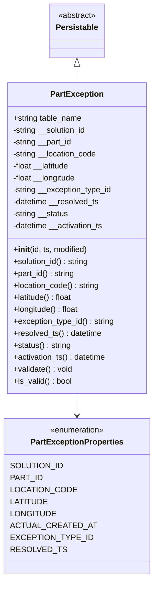
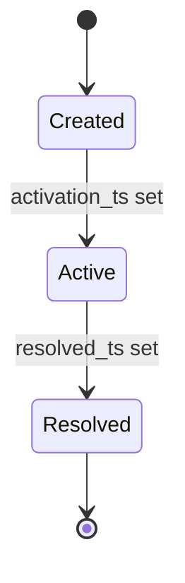
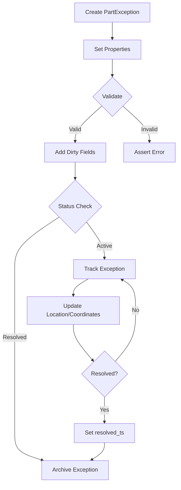

# Diagram: platform/partview_core/partview_service/partview_service/core/datamodel/PartException.py

> Auto-generated by Obscura crawlers

## Diagram 1

### SVG

<svg id="container" width="295.703125" xmlns="http://www.w3.org/2000/svg" class="classDiagram" height="1160" viewBox="0 0 295.703125 1160" role="graphics-document document" aria-roledescription="class"><g><defs><marker id="container_class-aggregationStart" class="marker aggregation class" refX="18" refY="7" markerWidth="190" markerHeight="240" orient="auto"><path d="M 18,7 L9,13 L1,7 L9,1 Z"></path></marker></defs><defs><marker id="container_class-aggregationEnd" class="marker aggregation class" refX="1" refY="7" markerWidth="20" markerHeight="28" orient="auto"><path d="M 18,7 L9,13 L1,7 L9,1 Z"></path></marker></defs><defs><marker id="container_class-extensionStart" class="marker extension class" refX="18" refY="7" markerWidth="190" markerHeight="240" orient="auto"><path d="M 1,7 L18,13 V 1 Z"></path></marker></defs><defs><marker id="container_class-extensionEnd" class="marker extension class" refX="1" refY="7" markerWidth="20" markerHeight="28" orient="auto"><path d="M 1,1 V 13 L18,7 Z"></path></marker></defs><defs><marker id="container_class-compositionStart" class="marker composition class" refX="18" refY="7" markerWidth="190" markerHeight="240" orient="auto"><path d="M 18,7 L9,13 L1,7 L9,1 Z"></path></marker></defs><defs><marker id="container_class-compositionEnd" class="marker composition class" refX="1" refY="7" markerWidth="20" markerHeight="28" orient="auto"><path d="M 18,7 L9,13 L1,7 L9,1 Z"></path></marker></defs><defs><marker id="container_class-dependencyStart" class="marker dependency class" refX="6" refY="7" markerWidth="190" markerHeight="240" orient="auto"><path d="M 5,7 L9,13 L1,7 L9,1 Z"></path></marker></defs><defs><marker id="container_class-dependencyEnd" class="marker dependency class" refX="13" refY="7" markerWidth="20" markerHeight="28" orient="auto"><path d="M 18,7 L9,13 L14,7 L9,1 Z"></path></marker></defs><defs><marker id="container_class-lollipopStart" class="marker lollipop class" refX="13" refY="7" markerWidth="190" markerHeight="240" orient="auto"><circle stroke="black" fill="transparent" cx="7" cy="7" r="6"></circle></marker></defs><defs><marker id="container_class-lollipopEnd" class="marker lollipop class" refX="1" refY="7" markerWidth="190" markerHeight="240" orient="auto"><circle stroke="black" fill="transparent" cx="7" cy="7" r="6"></circle></marker></defs><g class="root"><g class="clusters"></g><g class="edgePaths"><path d="M147.852,133.25L147.852,134.542C147.852,135.833,147.852,138.417,147.852,143.875C147.852,149.333,147.852,157.667,147.852,161.833L147.852,166" id="id_Persistable_PartException_1" class="edge-thickness-normal edge-pattern-solid relation" style=";;;" data-edge="true" data-et="edge" data-id="id_Persistable_PartException_1" data-points="W3sieCI6MTQ3Ljg1MTU2MjUsInkiOjExNn0seyJ4IjoxNDcuODUxNTYyNSwieSI6MTQxfSx7IngiOjE0Ny44NTE1NjI1LCJ5IjoxNjZ9XQ==" marker-start="url(#container_class-extensionStart)"></path><path d="M147.852,790L147.852,794.167C147.852,798.333,147.852,806.667,147.852,814C147.852,821.333,147.852,827.667,147.852,830.833L147.852,834" id="id_PartException_PartExceptionProperties_2" class="edge-thickness-normal edge-pattern-dashed relation" style=";;;" data-edge="true" data-et="edge" data-id="id_PartException_PartExceptionProperties_2" data-points="W3sieCI6MTQ3Ljg1MTU2MjUsInkiOjc5MH0seyJ4IjoxNDcuODUxNTYyNSwieSI6ODE1fSx7IngiOjE0Ny44NTE1NjI1LCJ5Ijo4NDB9XQ==" marker-end="url(#container_class-dependencyEnd)"></path></g><g class="edgeLabels"><g class="edgeLabel"><g class="label" data-id="id_Persistable_PartException_1" transform="translate(0, 0)"><foreignObject width="0" height="0">

</foreignObject></g></g><g class="edgeLabel"><g class="label" data-id="id_PartException_PartExceptionProperties_2" transform="translate(0, 0)"><foreignObject width="0" height="0">

</foreignObject></g></g></g><g class="nodes"><g class="node default" id="classId-PartExceptionProperties-0" transform="translate(147.8515625, 996)"><g class="basic label-container"><path d="M-130.71484375 -156 L130.71484375 -156 L130.71484375 156 L-130.71484375 156" stroke="none" stroke-width="0" fill="#ECECFF" style=""></path><path d="M-130.71484375 -156 C-68.20388852381225 -156, -5.692933297624521 -156, 130.71484375 -156 M-130.71484375 -156 C-69.91363238974687 -156, -9.112421029493731 -156, 130.71484375 -156 M130.71484375 -156 C130.71484375 -41.67000334175481, 130.71484375 72.65999331649039, 130.71484375 156 M130.71484375 -156 C130.71484375 -56.579345737080075, 130.71484375 42.84130852583985, 130.71484375 156 M130.71484375 156 C40.570473149686734 156, -49.57389745062653 156, -130.71484375 156 M130.71484375 156 C55.271712135581126 156, -20.17141947883775 156, -130.71484375 156 M-130.71484375 156 C-130.71484375 89.77687102684759, -130.71484375 23.553742053695174, -130.71484375 -156 M-130.71484375 156 C-130.71484375 50.54465018402715, -130.71484375 -54.910699631945704, -130.71484375 -156" stroke="#9370DB" stroke-width="1.3" fill="none" stroke-dasharray="0 0" style=""></path></g><g class="annotation-group text" transform="translate(-55.5546875, -132)"><g class="label" style="" transform="translate(0,-12)"><foreignObject width="111.109375" height="24">

«enumeration»

</foreignObject></g></g><g class="label-group text" transform="translate(-89.0703125, -108)"><g class="label" style="font-weight: bolder" transform="translate(0,-12)"><foreignObject width="178.140625" height="24">

PartExceptionProperties

</foreignObject></g></g><g class="members-group text" transform="translate(-118.71484375, -60)"><g class="label" style="" transform="translate(0,-12)"><foreignObject width="96.296875" height="24">

SOLUTION_ID

</foreignObject></g><g class="label" style="" transform="translate(0,12)"><foreignObject width="57.6875" height="24">

PART_ID

</foreignObject></g><g class="label" style="" transform="translate(0,36)"><foreignObject width="116.90625" height="24">

LOCATION_CODE

</foreignObject></g><g class="label" style="" transform="translate(0,60)"><foreignObject width="67.0625" height="24">

LATITUDE

</foreignObject></g><g class="label" style="" transform="translate(0,84)"><foreignObject width="81.796875" height="24">

LONGITUDE

</foreignObject></g><g class="label" style="" transform="translate(0,108)"><foreignObject width="148.359375" height="24">

ACTUAL_CREATED_AT

</foreignObject></g><g class="label" style="" transform="translate(0,132)"><foreignObject width="144.1875" height="24">

EXCEPTION_TYPE_ID

</foreignObject></g><g class="label" style="" transform="translate(0,156)"><foreignObject width="95.90625" height="24">

RESOLVED_TS

</foreignObject></g></g><g class="methods-group text" transform="translate(-118.71484375, 156)"></g><g class="divider" style=""><path d="M-130.71484375 -84 C-33.850295281575384 -84, 63.01425318684923 -84, 130.71484375 -84 M-130.71484375 -84 C-41.9452356844951 -84, 46.824372381009795 -84, 130.71484375 -84" stroke="#9370DB" stroke-width="1.3" fill="none" stroke-dasharray="0 0" style=""></path></g><g class="divider" style=""><path d="M-130.71484375 132 C-77.74495312575442 132, -24.77506250150884 132, 130.71484375 132 M-130.71484375 132 C-74.54886732252623 132, -18.382890895052483 132, 130.71484375 132" stroke="#9370DB" stroke-width="1.3" fill="none" stroke-dasharray="0 0" style=""></path></g></g><g class="node default" id="classId-Persistable-1" transform="translate(147.8515625, 62)"><g class="basic label-container"><path d="M-52.9765625 -54 L52.9765625 -54 L52.9765625 54 L-52.9765625 54" stroke="none" stroke-width="0" fill="#ECECFF" style=""></path><path d="M-52.9765625 -54 C-27.306895274052007 -54, -1.6372280481040136 -54, 52.9765625 -54 M-52.9765625 -54 C-25.313897154147455 -54, 2.3487681917050907 -54, 52.9765625 -54 M52.9765625 -54 C52.9765625 -27.405098065514863, 52.9765625 -0.810196131029727, 52.9765625 54 M52.9765625 -54 C52.9765625 -29.532570864768086, 52.9765625 -5.0651417295361725, 52.9765625 54 M52.9765625 54 C27.64532655947165 54, 2.314090618943297 54, -52.9765625 54 M52.9765625 54 C16.996940330006765 54, -18.98268183998647 54, -52.9765625 54 M-52.9765625 54 C-52.9765625 31.434703159340053, -52.9765625 8.869406318680106, -52.9765625 -54 M-52.9765625 54 C-52.9765625 24.350032724575755, -52.9765625 -5.299934550848491, -52.9765625 -54" stroke="#9370DB" stroke-width="1.3" fill="none" stroke-dasharray="0 0" style=""></path></g><g class="annotation-group text" transform="translate(-38.609375, -30)"><g class="label" style="" transform="translate(0,-12)"><foreignObject width="77.21875" height="24">

«abstract»

</foreignObject></g></g><g class="label-group text" transform="translate(-40.9765625, -6)"><g class="label" style="font-weight: bolder" transform="translate(0,-12)"><foreignObject width="81.953125" height="24">

Persistable

</foreignObject></g></g><g class="members-group text" transform="translate(-40.9765625, 42)"></g><g class="methods-group text" transform="translate(-40.9765625, 72)"></g><g class="divider" style=""><path d="M-52.9765625 18 C-16.668274215403798 18, 19.640014069192404 18, 52.9765625 18 M-52.9765625 18 C-21.265515409721072 18, 10.445531680557856 18, 52.9765625 18" stroke="#9370DB" stroke-width="1.3" fill="none" stroke-dasharray="0 0" style=""></path></g><g class="divider" style=""><path d="M-52.9765625 36 C-22.951875953982555 36, 7.072810592034891 36, 52.9765625 36 M-52.9765625 36 C-15.868509356710206 36, 21.23954378657959 36, 52.9765625 36" stroke="#9370DB" stroke-width="1.3" fill="none" stroke-dasharray="0 0" style=""></path></g></g><g class="node default" id="classId-PartException-2" transform="translate(147.8515625, 478)"><g class="basic label-container"><path d="M-139.8515625 -312 L139.8515625 -312 L139.8515625 312 L-139.8515625 312" stroke="none" stroke-width="0" fill="#ECECFF" style=""></path><path d="M-139.8515625 -312 C-50.4047264008192 -312, 39.0421096983616 -312, 139.8515625 -312 M-139.8515625 -312 C-33.820971133232774 -312, 72.20962023353445 -312, 139.8515625 -312 M139.8515625 -312 C139.8515625 -162.9891800547336, 139.8515625 -13.97836010946719, 139.8515625 312 M139.8515625 -312 C139.8515625 -71.72480079376902, 139.8515625 168.55039841246196, 139.8515625 312 M139.8515625 312 C52.680007755534874 312, -34.49154698893025 312, -139.8515625 312 M139.8515625 312 C58.974675141717 312, -21.902212216566 312, -139.8515625 312 M-139.8515625 312 C-139.8515625 180.80370797739747, -139.8515625 49.60741595479493, -139.8515625 -312 M-139.8515625 312 C-139.8515625 164.74858551925564, -139.8515625 17.497171038511283, -139.8515625 -312" stroke="#9370DB" stroke-width="1.3" fill="none" stroke-dasharray="0 0" style=""></path></g><g class="annotation-group text" transform="translate(0, -288)"></g><g class="label-group text" transform="translate(-50.765625, -288)"><g class="label" style="font-weight: bolder" transform="translate(0,-12)"><foreignObject width="101.53125" height="24">

PartException

</foreignObject></g></g><g class="members-group text" transform="translate(-127.8515625, -240)"><g class="label" style="" transform="translate(0,-12)"><foreignObject width="139.578125" height="24">

+string table_name

</foreignObject></g><g class="label" style="" transform="translate(0,12)"><foreignObject width="151.03125" height="24">

-string __solution_id

</foreignObject></g><g class="label" style="" transform="translate(0,36)"><foreignObject width="121.203125" height="24">

-string __part_id

</foreignObject></g><g class="label" style="" transform="translate(0,60)"><foreignObject width="170.765625" height="24">

-string __location_code

</foreignObject></g><g class="label" style="" transform="translate(0,84)"><foreignObject width="116.8125" height="24">

-float __latitude

</foreignObject></g><g class="label" style="" transform="translate(0,108)"><foreignObject width="129.375" height="24">

-float __longitude

</foreignObject></g><g class="label" style="" transform="translate(0,132)"><foreignObject width="201.109375" height="24">

-string __exception_type_id

</foreignObject></g><g class="label" style="" transform="translate(0,156)"><foreignObject width="175.53125" height="24">

-datetime __resolved_ts

</foreignObject></g><g class="label" style="" transform="translate(0,180)"><foreignObject width="113.203125" height="24">

-string __status

</foreignObject></g><g class="label" style="" transform="translate(0,204)"><foreignObject width="185.3125" height="24">

-datetime __activation_ts

</foreignObject></g></g><g class="methods-group text" transform="translate(-127.8515625, 24)"><g class="label" style="" transform="translate(0,-12)"><foreignObject width="150.90625" height="24">

+<strong>init</strong>(id, ts, modified)

</foreignObject></g><g class="label" style="" transform="translate(0,12)"><foreignObject width="154.53125" height="24">

+solution_id() : string

</foreignObject></g><g class="label" style="" transform="translate(0,36)"><foreignObject width="124.71875" height="24">

+part_id() : string

</foreignObject></g><g class="label" style="" transform="translate(0,60)"><foreignObject width="174.421875" height="24">

+location_code() : string

</foreignObject></g><g class="label" style="" transform="translate(0,84)"><foreignObject width="120.71875" height="24">

+latitude() : float

</foreignObject></g><g class="label" style="" transform="translate(0,108)"><foreignObject width="133.265625" height="24">

+longitude() : float

</foreignObject></g><g class="label" style="" transform="translate(0,132)"><foreignObject width="204.9375" height="24">

+exception_type_id() : string

</foreignObject></g><g class="label" style="" transform="translate(0,156)"><foreignObject width="179.03125" height="24">

+resolved_ts() : datetime

</foreignObject></g><g class="label" style="" transform="translate(0,180)"><foreignObject width="116.71875" height="24">

+status() : string

</foreignObject></g><g class="label" style="" transform="translate(0,204)"><foreignObject width="188.90625" height="24">

+activation_ts() : datetime

</foreignObject></g><g class="label" style="" transform="translate(0,228)"><foreignObject width="119.640625" height="24">

+validate() : void

</foreignObject></g><g class="label" style="" transform="translate(0,252)"><foreignObject width="117.984375" height="24">

+is_valid() : bool

</foreignObject></g></g><g class="divider" style=""><path d="M-139.8515625 -264 C-65.46485642272772 -264, 8.921849654544559 -264, 139.8515625 -264 M-139.8515625 -264 C-37.91885308398274 -264, 64.01385633203452 -264, 139.8515625 -264" stroke="#9370DB" stroke-width="1.3" fill="none" stroke-dasharray="0 0" style=""></path></g><g class="divider" style=""><path d="M-139.8515625 0 C-31.909180330542014 0, 76.03320183891597 0, 139.8515625 0 M-139.8515625 0 C-49.6600899662708 0, 40.531382567458394 0, 139.8515625 0" stroke="#9370DB" stroke-width="1.3" fill="none" stroke-dasharray="0 0" style=""></path></g></g></g></g></g></svg>

## Diagram 2

### SVG

<svg id="container" width="135.4375" xmlns="http://www.w3.org/2000/svg" class="statediagram" height="412" viewBox="0 0 135.4375 412" role="graphics-document document" aria-roledescription="stateDiagram"><g><defs><marker id="container_stateDiagram-barbEnd" refX="19" refY="7" markerWidth="20" markerHeight="14" markerUnits="userSpaceOnUse" orient="auto"><path d="M 19,7 L9,13 L14,7 L9,1 Z"></path></marker></defs><g class="root"><g class="clusters"></g><g class="edgePaths"><path d="M67.719,22L67.719,26.167C67.719,30.333,67.719,38.667,67.802,47.083C67.885,55.5,68.052,64,68.135,68.25L68.219,72.5" id="edge0" class="edge-thickness-normal edge-pattern-solid transition" style="fill:none;;;fill:none" data-edge="true" data-et="edge" data-id="edge0" data-points="W3sieCI6NjcuNzE4NzUsInkiOjIyfSx7IngiOjY3LjcxODc1LCJ5Ijo0N30seyJ4Ijo2OC4yMTg3NSwieSI6NzIuNX1d" marker-end="url(#container_stateDiagram-barbEnd)"></path><path d="M68.219,112.5L68.135,118.583C68.052,124.667,67.885,136.833,67.885,149.167C67.885,161.5,68.052,174,68.135,180.25L68.219,186.5" id="edge1" class="edge-thickness-normal edge-pattern-solid transition" style="fill:none;;;fill:none" data-edge="true" data-et="edge" data-id="edge1" data-points="W3sieCI6NjguMjE4NzUsInkiOjExMi41fSx7IngiOjY3LjcxODc1LCJ5IjoxNDl9LHsieCI6NjguMjE4NzUsInkiOjE4Ni41fV0=" marker-end="url(#container_stateDiagram-barbEnd)"></path><path d="M68.219,226.5L68.135,232.583C68.052,238.667,67.885,250.833,67.885,263.167C67.885,275.5,68.052,288,68.135,294.25L68.219,300.5" id="edge2" class="edge-thickness-normal edge-pattern-solid transition" style="fill:none;;;fill:none" data-edge="true" data-et="edge" data-id="edge2" data-points="W3sieCI6NjguMjE4NzUsInkiOjIyNi41fSx7IngiOjY3LjcxODc1LCJ5IjoyNjN9LHsieCI6NjguMjE4NzUsInkiOjMwMC41fV0=" marker-end="url(#container_stateDiagram-barbEnd)"></path><path d="M68.219,340.5L68.135,344.583C68.052,348.667,67.885,356.833,67.802,365.083C67.719,373.333,67.719,381.667,67.719,385.833L67.719,390" id="edge3" class="edge-thickness-normal edge-pattern-solid transition" style="fill:none;;;fill:none" data-edge="true" data-et="edge" data-id="edge3" data-points="W3sieCI6NjguMjE4NzUsInkiOjM0MC41fSx7IngiOjY3LjcxODc1LCJ5IjozNjV9LHsieCI6NjcuNzE4NzUsInkiOjM5MH1d" marker-end="url(#container_stateDiagram-barbEnd)"></path></g><g class="edgeLabels"><g class="edgeLabel"><g class="label" data-id="edge0" transform="translate(0, 0)"><foreignObject width="0" height="0">

</foreignObject></g></g><g class="edgeLabel" transform="translate(67.71875, 149)"><g class="label" data-id="edge1" transform="translate(-59.71875, -12)"><foreignObject width="119.4375" height="24">

activation_ts set

</foreignObject></g></g><g class="edgeLabel" transform="translate(67.71875, 263)"><g class="label" data-id="edge2" transform="translate(-54.65625, -12)"><foreignObject width="109.3125" height="24">

resolved_ts set

</foreignObject></g></g><g class="edgeLabel"><g class="label" data-id="edge3" transform="translate(0, 0)"><foreignObject width="0" height="0">

</foreignObject></g></g></g><g class="nodes"><g class="node default" id="state-root_start-0" transform="translate(67.71875, 15)"><circle class="state-start" r="7" width="14" height="14"></circle></g><g class="node  statediagram-state" id="state-Created-1" transform="translate(67.71875, 92)"><g class="basic label-container outer-path"><path d="M-30.7578125 -20 C-6.669600439371084 -20, 17.41861162125783 -20, 30.7578125 -20 C30.7578125 -20, 30.7578125 -20, 30.7578125 -20 C30.852784444348487 -19.99607193132572, 30.947756388696973 -19.99214386265144, 31.170709227361662 -19.982922465033347 C31.255452450916586 -19.972359233233266, 31.340195674471506 -19.961796001433182, 31.58078545140367 -19.931806517013612 C31.69573767963135 -19.907703569399583, 31.81068990785903 -19.883600621785554, 31.985239935703998 -19.847001329696653 C32.122717474052735 -19.80607249321246, 32.26019501240147 -19.765143656728267, 32.38130984602342 -19.729086208503173 C32.50094323906996 -19.68240511367971, 32.6205766321165 -19.63572401885625, 32.766289623264846 -19.578866633275286 C32.908213962993365 -19.509484051371015, 33.050138302721884 -19.44010146946674, 33.137549465185366 -19.397368756032446 C33.254582502850575 -19.327632202320515, 33.37161554051579 -19.257895648608585, 33.492553290612136 -19.185832391312644 C33.58681941568055 -19.118527671660615, 33.68108554074897 -19.051222952008583, 33.82887606344834 -18.94570254698197 C33.906889445167316 -18.879628583117317, 33.984902826886284 -18.813554619252663, 34.144220358128706 -18.678619553365657 C34.22625775154122 -18.59658215995314, 34.30829514495374 -18.514544766540624, 34.43643205336566 -18.386407858128706 C34.51199627861217 -18.297189345969656, 34.5875605038587 -18.20797083381061, 34.70351504698197 -18.07106356344834 C34.79140461517479 -17.947966564154566, 34.87929418336762 -17.82486956486079, 34.943644891312644 -17.734740790612136 C34.9876468721057 -17.660895938789228, 35.03164885289876 -17.587051086966316, 35.15518125603245 -17.37973696518537 C35.20793235635343 -17.271832864796927, 35.26068345667441 -17.16392876440849, 35.33667913327529 -17.008477123264846 C35.36862163323446 -16.926615511686187, 35.40056413319363 -16.844753900107523, 35.486898708503176 -16.623497346023417 C35.52498252486859 -16.495576061799635, 35.56306634123401 -16.367654777575854, 35.60481382969665 -16.227427435703994 C35.63582958663832 -16.07950650803548, 35.66684534357999 -15.931585580366963, 35.68961901701361 -15.82297295140367 C35.70111290206495 -15.730763588885248, 35.712606787116286 -15.638554226366825, 35.74073496503335 -15.412896727361662 C35.744461764730765 -15.322791018217961, 35.74818856442818 -15.23268530907426, 35.7578125 -15 C35.7578125 -15, 35.7578125 -15, 35.7578125 -15 C35.7578125 -7.922490855071652, 35.7578125 -0.8449817101433048, 35.7578125 15 C35.7578125 15, 35.7578125 15, 35.7578125 15 C35.753772899202595 15.097668542465538, 35.74973329840518 15.195337084931074, 35.74073496503335 15.412896727361662 C35.720966104042226 15.571491846554615, 35.701197243051105 15.730086965747569, 35.68961901701361 15.822972951403669 C35.67215505753728 15.90626239332709, 35.65469109806095 15.989551835250511, 35.60481382969665 16.227427435703994 C35.5713376053974 16.339872090993637, 35.53786138109815 16.45231674628328, 35.486898708503176 16.623497346023417 C35.43098871102247 16.766782389554105, 35.375078713541775 16.91006743308479, 35.33667913327529 17.008477123264846 C35.284119838573915 17.115988878987352, 35.23156054387255 17.223500634709854, 35.15518125603245 17.379736965185366 C35.090167037835286 17.488844901296947, 35.025152819638116 17.597952837408528, 34.943644891312644 17.734740790612133 C34.88852320199071 17.811943520026478, 34.83340151266877 17.889146249440824, 34.70351504698197 18.07106356344834 C34.6471421716478 18.137622891583234, 34.59076929631363 18.204182219718128, 34.43643205336566 18.386407858128706 C34.363998645864335 18.458841265630028, 34.29156523836301 18.531274673131346, 34.144220358128706 18.678619553365657 C34.04209367998221 18.765116437525567, 33.93996700183571 18.851613321685477, 33.82887606344834 18.94570254698197 C33.69494610649853 19.04132669827676, 33.56101614954872 19.136950849571548, 33.492553290612136 19.185832391312644 C33.4044772195662 19.238314338135222, 33.31640114852028 19.290796284957796, 33.137549465185366 19.397368756032446 C33.017160518836725 19.456223325631864, 32.89677157248809 19.51507789523128, 32.766289623264846 19.578866633275286 C32.6871661462002 19.60974070983165, 32.60804266913556 19.640614786388017, 32.38130984602342 19.729086208503173 C32.28846530493747 19.756727225982825, 32.19562076385151 19.784368243462477, 31.985239935703998 19.847001329696653 C31.833486071299863 19.878820768957237, 31.681732206895727 19.91064020821782, 31.58078545140367 19.931806517013612 C31.476985272488026 19.944745195822136, 31.373185093572378 19.957683874630657, 31.170709227361662 19.982922465033347 C31.082184589979885 19.986583871118974, 30.993659952598108 19.9902452772046, 30.7578125 20 C30.7578125 20, 30.7578125 20, 30.7578125 20 C15.506225222783934 20, 0.25463794556786823 20, -30.7578125 20 C-30.7578125 20, -30.7578125 20, -30.7578125 20 C-30.902936606061385 19.99399762257356, -31.048060712122773 19.987995245147115, -31.170709227361662 19.982922465033347 C-31.307627591576516 19.965855608732415, -31.444545955791366 19.948788752431483, -31.58078545140367 19.931806517013612 C-31.669189499411214 19.913270137416223, -31.757593547418757 19.894733757818834, -31.985239935703994 19.847001329696653 C-32.13073223316896 19.80368639604147, -32.27622453063393 19.76037146238629, -32.38130984602342 19.729086208503173 C-32.489749228708476 19.6867730300769, -32.598188611393525 19.644459851650627, -32.766289623264846 19.578866633275286 C-32.86174346769353 19.532202092211932, -32.95719731212221 19.48553755114858, -33.137549465185366 19.397368756032446 C-33.228747539348156 19.343026499143658, -33.319945613510946 19.28868424225487, -33.492553290612136 19.185832391312644 C-33.595356314238714 19.112432443244913, -33.69815933786529 19.03903249517718, -33.82887606344834 18.94570254698197 C-33.91118152765981 18.875993374679172, -33.993486991871265 18.80628420237638, -34.144220358128706 18.67861955336566 C-34.22245115474639 18.60038875674798, -34.30068195136407 18.522157960130297, -34.43643205336566 18.386407858128706 C-34.54121037318247 18.26269632968937, -34.64598869299929 18.13898480125003, -34.70351504698197 18.07106356344834 C-34.77511443335415 17.970782383384353, -34.846713819726325 17.870501203320362, -34.943644891312644 17.734740790612133 C-35.016952330848206 17.61171503330635, -35.09025977038377 17.488689276000567, -35.15518125603244 17.37973696518537 C-35.21700063345941 17.253283407491946, -35.278820010886385 17.12682984979852, -35.33667913327528 17.00847712326485 C-35.37738802708615 16.90414916968572, -35.418096920897014 16.799821216106594, -35.486898708503176 16.623497346023417 C-35.530887181354004 16.47574267028062, -35.574875654204824 16.32798799453782, -35.60481382969665 16.227427435703994 C-35.63222885826484 16.09667916908932, -35.65964388683303 15.965930902474646, -35.68961901701361 15.82297295140367 C-35.70208911321644 15.722931962976334, -35.714559209419264 15.622890974548996, -35.74073496503335 15.412896727361664 C-35.74492579317105 15.311571844914047, -35.749116621308744 15.21024696246643, -35.7578125 15 C-35.7578125 15, -35.7578125 15, -35.7578125 15 C-35.7578125 8.665078466398686, -35.7578125 2.330156932797374, -35.7578125 -15 C-35.7578125 -15, -35.7578125 -15, -35.7578125 -15 C-35.754374652006256 -15.083119501061319, -35.750936804012504 -15.166239002122637, -35.74073496503335 -15.41289672736166 C-35.72779092898617 -15.516739884570498, -35.71484689293898 -15.620583041779337, -35.68961901701361 -15.822972951403669 C-35.66952194338872 -15.918820290535427, -35.649424869763834 -16.014667629667183, -35.60481382969665 -16.227427435703994 C-35.57930839276866 -16.313098688164935, -35.55380295584066 -16.398769940625876, -35.486898708503176 -16.623497346023417 C-35.43103296034983 -16.766668988246966, -35.37516721219649 -16.909840630470516, -35.33667913327529 -17.008477123264846 C-35.27545556777571 -17.1337119281809, -35.21423200227613 -17.258946733096955, -35.15518125603245 -17.379736965185366 C-35.09178929765226 -17.48612239804495, -35.02839733927208 -17.592507830904538, -34.943644891312644 -17.734740790612133 C-34.87043274986882 -17.837280774695728, -34.797220608425 -17.939820758779323, -34.70351504698197 -18.07106356344834 C-34.6154440574701 -18.17504878427195, -34.52737306795823 -18.279034005095557, -34.43643205336566 -18.386407858128706 C-34.321238287540275 -18.501601623954087, -34.206044521714894 -18.616795389779472, -34.144220358128706 -18.678619553365657 C-34.01964254141781 -18.784131581921798, -33.895064724706906 -18.88964361047794, -33.82887606344834 -18.945702546981966 C-33.74908196989116 -19.0026744347397, -33.66928787633398 -19.05964632249743, -33.492553290612136 -19.185832391312644 C-33.387792703546744 -19.24825615175265, -33.283032116481344 -19.310679912192654, -33.137549465185366 -19.397368756032446 C-33.010085396942735 -19.459682141964787, -32.88262132870011 -19.52199552789713, -32.766289623264846 -19.578866633275286 C-32.65682339012196 -19.621580489993555, -32.54735715697907 -19.664294346711824, -32.38130984602342 -19.729086208503173 C-32.23155961241027 -19.77366878467263, -32.081809378797125 -19.818251360842087, -31.985239935703994 -19.847001329696653 C-31.881015176811886 -19.868854963526925, -31.776790417919774 -19.890708597357193, -31.580785451403674 -19.931806517013612 C-31.44212631748906 -19.94909036003133, -31.303467183574444 -19.96637420304905, -31.170709227361662 -19.982922465033347 C-31.035829450748 -19.988501133859646, -30.90094967413434 -19.99407980268595, -30.7578125 -20 C-30.7578125 -20, -30.7578125 -20, -30.7578125 -20" stroke="none" stroke-width="0" fill="#ECECFF" style=""></path><path d="M-30.7578125 -20 C-18.37160675458879 -20, -5.985401009177579 -20, 30.7578125 -20 M-30.7578125 -20 C-7.42034634412704 -20, 15.91711981174592 -20, 30.7578125 -20 M30.7578125 -20 C30.7578125 -20, 30.7578125 -20, 30.7578125 -20 M30.7578125 -20 C30.7578125 -20, 30.7578125 -20, 30.7578125 -20 M30.7578125 -20 C30.870990816656633 -19.99531891019694, 30.984169133313262 -19.990637820393875, 31.170709227361662 -19.982922465033347 M30.7578125 -20 C30.842078225154967 -19.99651474382706, 30.926343950309935 -19.99302948765412, 31.170709227361662 -19.982922465033347 M31.170709227361662 -19.982922465033347 C31.289102996327916 -19.968164697122084, 31.407496765294173 -19.953406929210818, 31.58078545140367 -19.931806517013612 M31.170709227361662 -19.982922465033347 C31.29817350298778 -19.967034059646036, 31.425637778613897 -19.951145654258724, 31.58078545140367 -19.931806517013612 M31.58078545140367 -19.931806517013612 C31.672513541141523 -19.912573159159013, 31.764241630879376 -19.893339801304414, 31.985239935703998 -19.847001329696653 M31.58078545140367 -19.931806517013612 C31.681346776664416 -19.91072102443876, 31.78190810192516 -19.889635531863913, 31.985239935703998 -19.847001329696653 M31.985239935703998 -19.847001329696653 C32.081339521024184 -19.818391243561774, 32.177439106344366 -19.789781157426894, 32.38130984602342 -19.729086208503173 M31.985239935703998 -19.847001329696653 C32.07662120001691 -19.81979594858709, 32.168002464329824 -19.792590567477525, 32.38130984602342 -19.729086208503173 M32.38130984602342 -19.729086208503173 C32.52902775360232 -19.67144650210338, 32.67674566118122 -19.61380679570358, 32.766289623264846 -19.578866633275286 M32.38130984602342 -19.729086208503173 C32.5001291003086 -19.682722791610185, 32.618948354593776 -19.6363593747172, 32.766289623264846 -19.578866633275286 M32.766289623264846 -19.578866633275286 C32.89536839326146 -19.515763867755826, 33.024447163258074 -19.452661102236366, 33.137549465185366 -19.397368756032446 M32.766289623264846 -19.578866633275286 C32.91001502397606 -19.50860356630844, 33.05374042468728 -19.438340499341596, 33.137549465185366 -19.397368756032446 M33.137549465185366 -19.397368756032446 C33.25865560150313 -19.32520516232716, 33.37976173782089 -19.25304156862187, 33.492553290612136 -19.185832391312644 M33.137549465185366 -19.397368756032446 C33.2688963415966 -19.319103005741074, 33.40024321800784 -19.240837255449698, 33.492553290612136 -19.185832391312644 M33.492553290612136 -19.185832391312644 C33.61018144971189 -19.101847499967555, 33.72780960881165 -19.017862608622465, 33.82887606344834 -18.94570254698197 M33.492553290612136 -19.185832391312644 C33.57456238405061 -19.127279024036884, 33.65657147748908 -19.068725656761124, 33.82887606344834 -18.94570254698197 M33.82887606344834 -18.94570254698197 C33.93436024957716 -18.856361998617135, 34.03984443570598 -18.767021450252305, 34.144220358128706 -18.678619553365657 M33.82887606344834 -18.94570254698197 C33.91814776193152 -18.87009327521675, 34.007419460414695 -18.794484003451526, 34.144220358128706 -18.678619553365657 M34.144220358128706 -18.678619553365657 C34.20957742804117 -18.613262483453187, 34.274934497953645 -18.547905413540718, 34.43643205336566 -18.386407858128706 M34.144220358128706 -18.678619553365657 C34.25684100879711 -18.565998902697253, 34.369461659465514 -18.453378252028852, 34.43643205336566 -18.386407858128706 M34.43643205336566 -18.386407858128706 C34.49086215267399 -18.322142361313034, 34.545292251982325 -18.257876864497362, 34.70351504698197 -18.07106356344834 M34.43643205336566 -18.386407858128706 C34.490587764586365 -18.322466330715915, 34.544743475807074 -18.258524803303125, 34.70351504698197 -18.07106356344834 M34.70351504698197 -18.07106356344834 C34.751663015734096 -18.003628137409226, 34.799810984486214 -17.936192711370115, 34.943644891312644 -17.734740790612136 M34.70351504698197 -18.07106356344834 C34.75548347074733 -17.998277257233845, 34.80745189451268 -17.925490951019352, 34.943644891312644 -17.734740790612136 M34.943644891312644 -17.734740790612136 C35.014842921633814 -17.615255078733018, 35.086040951954985 -17.4957693668539, 35.15518125603245 -17.37973696518537 M34.943644891312644 -17.734740790612136 C35.0016399440157 -17.63741253410795, 35.05963499671876 -17.54008427760376, 35.15518125603245 -17.37973696518537 M35.15518125603245 -17.37973696518537 C35.210478681657406 -17.266624273136284, 35.265776107282356 -17.153511581087198, 35.33667913327529 -17.008477123264846 M35.15518125603245 -17.37973696518537 C35.21417571630943 -17.259061867882103, 35.2731701765864 -17.138386770578837, 35.33667913327529 -17.008477123264846 M35.33667913327529 -17.008477123264846 C35.37952670579003 -16.898668205904794, 35.42237427830477 -16.788859288544746, 35.486898708503176 -16.623497346023417 M35.33667913327529 -17.008477123264846 C35.382245027142616 -16.891701745327328, 35.42781092100994 -16.774926367389813, 35.486898708503176 -16.623497346023417 M35.486898708503176 -16.623497346023417 C35.53356351622985 -16.466753019898785, 35.58022832395652 -16.310008693774154, 35.60481382969665 -16.227427435703994 M35.486898708503176 -16.623497346023417 C35.51384495168547 -16.5329865106646, 35.54079119486777 -16.44247567530578, 35.60481382969665 -16.227427435703994 M35.60481382969665 -16.227427435703994 C35.62666689226165 -16.1232054013009, 35.64851995482665 -16.01898336689781, 35.68961901701361 -15.82297295140367 M35.60481382969665 -16.227427435703994 C35.62968791441866 -16.108797485968932, 35.654561999140675 -15.99016753623387, 35.68961901701361 -15.82297295140367 M35.68961901701361 -15.82297295140367 C35.70946678322367 -15.663744817359376, 35.729314549433724 -15.504516683315082, 35.74073496503335 -15.412896727361662 M35.68961901701361 -15.82297295140367 C35.70630783435246 -15.689087393898266, 35.7229966516913 -15.555201836392861, 35.74073496503335 -15.412896727361662 M35.74073496503335 -15.412896727361662 C35.745635502103475 -15.294412664964996, 35.7505360391736 -15.17592860256833, 35.7578125 -15 M35.74073496503335 -15.412896727361662 C35.746181287590716 -15.28121678851314, 35.75162761014808 -15.149536849664617, 35.7578125 -15 M35.7578125 -15 C35.7578125 -15, 35.7578125 -15, 35.7578125 -15 M35.7578125 -15 C35.7578125 -15, 35.7578125 -15, 35.7578125 -15 M35.7578125 -15 C35.7578125 -5.841200898561111, 35.7578125 3.317598202877779, 35.7578125 15 M35.7578125 -15 C35.7578125 -3.819209663871389, 35.7578125 7.361580672257222, 35.7578125 15 M35.7578125 15 C35.7578125 15, 35.7578125 15, 35.7578125 15 M35.7578125 15 C35.7578125 15, 35.7578125 15, 35.7578125 15 M35.7578125 15 C35.752060231382664 15.139077032583515, 35.74630796276533 15.27815406516703, 35.74073496503335 15.412896727361662 M35.7578125 15 C35.753200416009015 15.111509909943916, 35.74858833201802 15.223019819887831, 35.74073496503335 15.412896727361662 M35.74073496503335 15.412896727361662 C35.721917812971945 15.563856789015677, 35.70310066091055 15.714816850669692, 35.68961901701361 15.822972951403669 M35.74073496503335 15.412896727361662 C35.7237509939497 15.549150147302745, 35.70676702286606 15.68540356724383, 35.68961901701361 15.822972951403669 M35.68961901701361 15.822972951403669 C35.67185469646699 15.907694880957077, 35.65409037592036 15.992416810510484, 35.60481382969665 16.227427435703994 M35.68961901701361 15.822972951403669 C35.66883679638602 15.922087906425624, 35.64805457575842 16.02120286144758, 35.60481382969665 16.227427435703994 M35.60481382969665 16.227427435703994 C35.57478703365685 16.32828566571125, 35.54476023761704 16.429143895718504, 35.486898708503176 16.623497346023417 M35.60481382969665 16.227427435703994 C35.579200360417246 16.313461562436725, 35.55358689113783 16.39949568916946, 35.486898708503176 16.623497346023417 M35.486898708503176 16.623497346023417 C35.45045867920137 16.71688513747469, 35.41401864989956 16.810272928925965, 35.33667913327529 17.008477123264846 M35.486898708503176 16.623497346023417 C35.45383131897208 16.708241802505366, 35.42076392944099 16.792986258987312, 35.33667913327529 17.008477123264846 M35.33667913327529 17.008477123264846 C35.29213824426773 17.099586967981203, 35.24759735526018 17.19069681269756, 35.15518125603245 17.379736965185366 M35.33667913327529 17.008477123264846 C35.265457627678224 17.15416304153005, 35.19423612208115 17.29984895979526, 35.15518125603245 17.379736965185366 M35.15518125603245 17.379736965185366 C35.08279610184491 17.501214927968352, 35.010410947657384 17.622692890751342, 34.943644891312644 17.734740790612133 M35.15518125603245 17.379736965185366 C35.091896062254264 17.485943223924327, 35.02861086847607 17.592149482663288, 34.943644891312644 17.734740790612133 M34.943644891312644 17.734740790612133 C34.873253275709594 17.833330382464105, 34.802861660106544 17.931919974316074, 34.70351504698197 18.07106356344834 M34.943644891312644 17.734740790612133 C34.87403808896273 17.8322311831114, 34.80443128661281 17.929721575610667, 34.70351504698197 18.07106356344834 M34.70351504698197 18.07106356344834 C34.598775822562274 18.194728932039517, 34.494036598142586 18.318394300630697, 34.43643205336566 18.386407858128706 M34.70351504698197 18.07106356344834 C34.63291726161348 18.154418211123904, 34.56231947624499 18.237772858799467, 34.43643205336566 18.386407858128706 M34.43643205336566 18.386407858128706 C34.37012077212495 18.45271913936941, 34.30380949088425 18.519030420610118, 34.144220358128706 18.678619553365657 M34.43643205336566 18.386407858128706 C34.37377586746182 18.44906404403254, 34.31111968155799 18.511720229936373, 34.144220358128706 18.678619553365657 M34.144220358128706 18.678619553365657 C34.0627917085442 18.747586101560888, 33.98136305895969 18.81655264975612, 33.82887606344834 18.94570254698197 M34.144220358128706 18.678619553365657 C34.0456442381648 18.762109268141465, 33.94706811820089 18.84559898291727, 33.82887606344834 18.94570254698197 M33.82887606344834 18.94570254698197 C33.7550778999597 18.998393422954994, 33.68127973647106 19.05108429892802, 33.492553290612136 19.185832391312644 M33.82887606344834 18.94570254698197 C33.73276415422357 19.014325131191303, 33.63665224499879 19.082947715400636, 33.492553290612136 19.185832391312644 M33.492553290612136 19.185832391312644 C33.410877936507106 19.234500338689863, 33.329202582402075 19.283168286067077, 33.137549465185366 19.397368756032446 M33.492553290612136 19.185832391312644 C33.35246180429672 19.269308798102713, 33.21237031798131 19.352785204892786, 33.137549465185366 19.397368756032446 M33.137549465185366 19.397368756032446 C33.012029992318574 19.45873148721316, 32.886510519451775 19.520094218393876, 32.766289623264846 19.578866633275286 M33.137549465185366 19.397368756032446 C33.03168617708043 19.449122164021848, 32.92582288897549 19.50087557201125, 32.766289623264846 19.578866633275286 M32.766289623264846 19.578866633275286 C32.68159508394522 19.6119145450692, 32.59690054462559 19.644962456863116, 32.38130984602342 19.729086208503173 M32.766289623264846 19.578866633275286 C32.656720781257896 19.621620528096557, 32.54715193925094 19.664374422917827, 32.38130984602342 19.729086208503173 M32.38130984602342 19.729086208503173 C32.249746434590726 19.76825433311835, 32.11818302315804 19.80742245773353, 31.985239935703998 19.847001329696653 M32.38130984602342 19.729086208503173 C32.25916876001872 19.765449185300206, 32.137027674014014 19.801812162097235, 31.985239935703998 19.847001329696653 M31.985239935703998 19.847001329696653 C31.903933541288655 19.86404948783585, 31.822627146873312 19.88109764597505, 31.58078545140367 19.931806517013612 M31.985239935703998 19.847001329696653 C31.838277568865063 19.877816097568196, 31.691315202026125 19.90863086543974, 31.58078545140367 19.931806517013612 M31.58078545140367 19.931806517013612 C31.46215137458146 19.946594239267885, 31.343517297759245 19.961381961522154, 31.170709227361662 19.982922465033347 M31.58078545140367 19.931806517013612 C31.436169716159107 19.949832849612793, 31.291553980914543 19.96785918221197, 31.170709227361662 19.982922465033347 M31.170709227361662 19.982922465033347 C31.044225516622006 19.98815387000638, 30.91774180588235 19.99338527497941, 30.7578125 20 M31.170709227361662 19.982922465033347 C31.042820133602994 19.988211997078015, 30.914931039844326 19.99350152912268, 30.7578125 20 M30.7578125 20 C30.7578125 20, 30.7578125 20, 30.7578125 20 M30.7578125 20 C30.7578125 20, 30.7578125 20, 30.7578125 20 M30.7578125 20 C15.234191372870983 20, -0.28942975425803397 20, -30.7578125 20 M30.7578125 20 C16.572332873632075 20, 2.386853247264149 20, -30.7578125 20 M-30.7578125 20 C-30.7578125 20, -30.7578125 20, -30.7578125 20 M-30.7578125 20 C-30.7578125 20, -30.7578125 20, -30.7578125 20 M-30.7578125 20 C-30.90384708889504 19.993959964725, -31.049881677790083 19.987919929450005, -31.170709227361662 19.982922465033347 M-30.7578125 20 C-30.919024862223182 19.99333220737661, -31.080237224446364 19.986664414753225, -31.170709227361662 19.982922465033347 M-31.170709227361662 19.982922465033347 C-31.256503280930897 19.97222824740858, -31.34229733450013 19.961534029783817, -31.58078545140367 19.931806517013612 M-31.170709227361662 19.982922465033347 C-31.302237640570983 19.966527465424598, -31.433766053780303 19.950132465815848, -31.58078545140367 19.931806517013612 M-31.58078545140367 19.931806517013612 C-31.735073039979607 19.89945581166169, -31.889360628555547 19.86710510630976, -31.985239935703994 19.847001329696653 M-31.58078545140367 19.931806517013612 C-31.73569295650229 19.899325828835764, -31.89060046160091 19.866845140657915, -31.985239935703994 19.847001329696653 M-31.985239935703994 19.847001329696653 C-32.12079971449083 19.80664343497115, -32.256359493277664 19.766285540245647, -32.38130984602342 19.729086208503173 M-31.985239935703994 19.847001329696653 C-32.099756812916695 19.812908178201393, -32.214273690129396 19.77881502670613, -32.38130984602342 19.729086208503173 M-32.38130984602342 19.729086208503173 C-32.458348262906 19.69902572495452, -32.53538667978858 19.668965241405864, -32.766289623264846 19.578866633275286 M-32.38130984602342 19.729086208503173 C-32.50079821119964 19.682461703730315, -32.62028657637586 19.635837198957457, -32.766289623264846 19.578866633275286 M-32.766289623264846 19.578866633275286 C-32.87390057358911 19.526258845288027, -32.981511523913376 19.473651057300764, -33.137549465185366 19.397368756032446 M-32.766289623264846 19.578866633275286 C-32.908902573266126 19.509147410321695, -33.0515155232674 19.439428187368108, -33.137549465185366 19.397368756032446 M-33.137549465185366 19.397368756032446 C-33.25908031164562 19.324952090013095, -33.38061115810588 19.25253542399374, -33.492553290612136 19.185832391312644 M-33.137549465185366 19.397368756032446 C-33.24481069967501 19.333454933154563, -33.35207193416465 19.26954111027668, -33.492553290612136 19.185832391312644 M-33.492553290612136 19.185832391312644 C-33.58734615910195 19.11815158408642, -33.68213902759177 19.05047077686019, -33.82887606344834 18.94570254698197 M-33.492553290612136 19.185832391312644 C-33.58354136418245 19.120868155444416, -33.67452943775277 19.05590391957619, -33.82887606344834 18.94570254698197 M-33.82887606344834 18.94570254698197 C-33.93211272400062 18.858265555679495, -34.03534938455289 18.770828564377023, -34.144220358128706 18.67861955336566 M-33.82887606344834 18.94570254698197 C-33.91845992277178 18.869828888471485, -34.00804378209523 18.793955229961, -34.144220358128706 18.67861955336566 M-34.144220358128706 18.67861955336566 C-34.213979446058204 18.60886046543616, -34.28373853398771 18.539101377506658, -34.43643205336566 18.386407858128706 M-34.144220358128706 18.67861955336566 C-34.24488488846456 18.577955023029805, -34.34554941880041 18.477290492693953, -34.43643205336566 18.386407858128706 M-34.43643205336566 18.386407858128706 C-34.50716079537174 18.30289859024331, -34.57788953737783 18.219389322357912, -34.70351504698197 18.07106356344834 M-34.43643205336566 18.386407858128706 C-34.503657400359295 18.307035040918162, -34.57088274735294 18.22766222370762, -34.70351504698197 18.07106356344834 M-34.70351504698197 18.07106356344834 C-34.78325784278002 17.959376828834962, -34.86300063857807 17.847690094221583, -34.943644891312644 17.734740790612133 M-34.70351504698197 18.07106356344834 C-34.774815733820084 17.971200738111655, -34.84611642065819 17.87133791277497, -34.943644891312644 17.734740790612133 M-34.943644891312644 17.734740790612133 C-35.02582324623243 17.596827716411184, -35.10800160115221 17.45891464221023, -35.15518125603244 17.37973696518537 M-34.943644891312644 17.734740790612133 C-35.02723953448604 17.594450878042952, -35.11083417765945 17.454160965473772, -35.15518125603244 17.37973696518537 M-35.15518125603244 17.37973696518537 C-35.22682626728904 17.233184752247197, -35.29847127854564 17.086632539309026, -35.33667913327528 17.00847712326485 M-35.15518125603244 17.37973696518537 C-35.21024696068972 17.267098265951716, -35.265312665347 17.154459566718064, -35.33667913327528 17.00847712326485 M-35.33667913327528 17.00847712326485 C-35.38372399856052 16.887911466422935, -35.43076886384576 16.76734580958102, -35.486898708503176 16.623497346023417 M-35.33667913327528 17.00847712326485 C-35.370945521048476 16.92065989763511, -35.40521190882166 16.832842672005373, -35.486898708503176 16.623497346023417 M-35.486898708503176 16.623497346023417 C-35.53166561607233 16.47312795415298, -35.57643252364148 16.32275856228254, -35.60481382969665 16.227427435703994 M-35.486898708503176 16.623497346023417 C-35.53337775154845 16.467376992464445, -35.579856794593724 16.31125663890547, -35.60481382969665 16.227427435703994 M-35.60481382969665 16.227427435703994 C-35.62887772186788 16.112661471424055, -35.6529416140391 15.997895507144118, -35.68961901701361 15.82297295140367 M-35.60481382969665 16.227427435703994 C-35.62352869067762 16.138172170946234, -35.642243551658574 16.048916906188474, -35.68961901701361 15.82297295140367 M-35.68961901701361 15.82297295140367 C-35.707390825975466 15.680399124725156, -35.72516263493733 15.537825298046641, -35.74073496503335 15.412896727361664 M-35.68961901701361 15.82297295140367 C-35.70070604366578 15.734027598700445, -35.71179307031795 15.64508224599722, -35.74073496503335 15.412896727361664 M-35.74073496503335 15.412896727361664 C-35.744187471121236 15.32942282625885, -35.747639977209126 15.245948925156037, -35.7578125 15 M-35.74073496503335 15.412896727361664 C-35.7461275680635 15.282515606933051, -35.75152017109365 15.152134486504437, -35.7578125 15 M-35.7578125 15 C-35.7578125 15, -35.7578125 15, -35.7578125 15 M-35.7578125 15 C-35.7578125 15, -35.7578125 15, -35.7578125 15 M-35.7578125 15 C-35.7578125 8.081734813375348, -35.7578125 1.163469626750695, -35.7578125 -15 M-35.7578125 15 C-35.7578125 3.590661491937535, -35.7578125 -7.81867701612493, -35.7578125 -15 M-35.7578125 -15 C-35.7578125 -15, -35.7578125 -15, -35.7578125 -15 M-35.7578125 -15 C-35.7578125 -15, -35.7578125 -15, -35.7578125 -15 M-35.7578125 -15 C-35.753267244887425 -15.109894136634436, -35.74872198977486 -15.21978827326887, -35.74073496503335 -15.41289672736166 M-35.7578125 -15 C-35.75199410038092 -15.140675932790792, -35.74617570076184 -15.281351865581584, -35.74073496503335 -15.41289672736166 M-35.74073496503335 -15.41289672736166 C-35.72668267627626 -15.52563081008724, -35.71263038751918 -15.638364892812818, -35.68961901701361 -15.822972951403669 M-35.74073496503335 -15.41289672736166 C-35.72516194890997 -15.537830801681334, -35.7095889327866 -15.66276487600101, -35.68961901701361 -15.822972951403669 M-35.68961901701361 -15.822972951403669 C-35.658397602409124 -15.971874705441314, -35.62717618780463 -16.120776459478957, -35.60481382969665 -16.227427435703994 M-35.68961901701361 -15.822972951403669 C-35.672241640630396 -15.905849459621251, -35.65486426424717 -15.988725967838832, -35.60481382969665 -16.227427435703994 M-35.60481382969665 -16.227427435703994 C-35.57535475281304 -16.32637873068033, -35.54589567592942 -16.425330025656663, -35.486898708503176 -16.623497346023417 M-35.60481382969665 -16.227427435703994 C-35.56323832636846 -16.367077089692504, -35.521662823040266 -16.506726743681014, -35.486898708503176 -16.623497346023417 M-35.486898708503176 -16.623497346023417 C-35.451671938445664 -16.713775820510538, -35.416445168388144 -16.80405429499766, -35.33667913327529 -17.008477123264846 M-35.486898708503176 -16.623497346023417 C-35.435961032099215 -16.754039422749727, -35.38502335569525 -16.88458149947604, -35.33667913327529 -17.008477123264846 M-35.33667913327529 -17.008477123264846 C-35.26496868153153 -17.155163196859068, -35.193258229787766 -17.30184927045329, -35.15518125603245 -17.379736965185366 M-35.33667913327529 -17.008477123264846 C-35.29567504320534 -17.092352330119713, -35.2546709531354 -17.176227536974583, -35.15518125603245 -17.379736965185366 M-35.15518125603245 -17.379736965185366 C-35.11086801787832 -17.454104174258855, -35.066554779724186 -17.52847138333235, -34.943644891312644 -17.734740790612133 M-35.15518125603245 -17.379736965185366 C-35.10595176019199 -17.462354719207667, -35.05672226435154 -17.54497247322997, -34.943644891312644 -17.734740790612133 M-34.943644891312644 -17.734740790612133 C-34.859865456815655 -17.852081189491816, -34.77608602231866 -17.9694215883715, -34.70351504698197 -18.07106356344834 M-34.943644891312644 -17.734740790612133 C-34.88923389829671 -17.810948127917076, -34.83482290528077 -17.887155465222023, -34.70351504698197 -18.07106356344834 M-34.70351504698197 -18.07106356344834 C-34.60879312268363 -18.182901528135595, -34.51407119838529 -18.294739492822853, -34.43643205336566 -18.386407858128706 M-34.70351504698197 -18.07106356344834 C-34.640742618438956 -18.145178829779024, -34.57797018989595 -18.219294096109707, -34.43643205336566 -18.386407858128706 M-34.43643205336566 -18.386407858128706 C-34.341410199717934 -18.48142971177643, -34.24638834607021 -18.57645156542415, -34.144220358128706 -18.678619553365657 M-34.43643205336566 -18.386407858128706 C-34.357625233813536 -18.465214677680827, -34.278818414261416 -18.54402149723295, -34.144220358128706 -18.678619553365657 M-34.144220358128706 -18.678619553365657 C-34.073411907494005 -18.73859125188019, -34.002603456859305 -18.79856295039472, -33.82887606344834 -18.945702546981966 M-34.144220358128706 -18.678619553365657 C-34.074083232280714 -18.738022668789426, -34.00394610643272 -18.7974257842132, -33.82887606344834 -18.945702546981966 M-33.82887606344834 -18.945702546981966 C-33.70376276161063 -19.03503172752074, -33.578649459772926 -19.12436090805951, -33.492553290612136 -19.185832391312644 M-33.82887606344834 -18.945702546981966 C-33.744032879242454 -19.00627941617245, -33.65918969503656 -19.066856285362935, -33.492553290612136 -19.185832391312644 M-33.492553290612136 -19.185832391312644 C-33.400924412623496 -19.240431351562634, -33.309295534634856 -19.295030311812628, -33.137549465185366 -19.397368756032446 M-33.492553290612136 -19.185832391312644 C-33.374532652904804 -19.256157426916158, -33.25651201519747 -19.326482462519674, -33.137549465185366 -19.397368756032446 M-33.137549465185366 -19.397368756032446 C-32.997076018326005 -19.466042039633685, -32.85660257146665 -19.53471532323492, -32.766289623264846 -19.578866633275286 M-33.137549465185366 -19.397368756032446 C-33.037038292315536 -19.44650567431775, -32.9365271194457 -19.49564259260305, -32.766289623264846 -19.578866633275286 M-32.766289623264846 -19.578866633275286 C-32.65184009754286 -19.62352497679188, -32.53739057182087 -19.668183320308476, -32.38130984602342 -19.729086208503173 M-32.766289623264846 -19.578866633275286 C-32.62208789209479 -19.63513432338283, -32.47788616092473 -19.69140201349037, -32.38130984602342 -19.729086208503173 M-32.38130984602342 -19.729086208503173 C-32.272374583700326 -19.76151764124875, -32.163439321377226 -19.793949073994327, -31.985239935703994 -19.847001329696653 M-32.38130984602342 -19.729086208503173 C-32.258599091754704 -19.76561878289053, -32.13588833748599 -19.80215135727789, -31.985239935703994 -19.847001329696653 M-31.985239935703994 -19.847001329696653 C-31.829435002526775 -19.879670188754694, -31.673630069349556 -19.912339047812736, -31.580785451403674 -19.931806517013612 M-31.985239935703994 -19.847001329696653 C-31.86284934842348 -19.872663937191565, -31.740458761142968 -19.89832654468648, -31.580785451403674 -19.931806517013612 M-31.580785451403674 -19.931806517013612 C-31.491780793182738 -19.942900936090854, -31.4027761349618 -19.9539953551681, -31.170709227361662 -19.982922465033347 M-31.580785451403674 -19.931806517013612 C-31.449114253225083 -19.94821931475022, -31.31744305504649 -19.964632112486825, -31.170709227361662 -19.982922465033347 M-31.170709227361662 -19.982922465033347 C-31.008531125076313 -19.98963020096117, -30.846353022790968 -19.996337936888988, -30.7578125 -20 M-31.170709227361662 -19.982922465033347 C-31.08060036499967 -19.986649395148838, -30.990491502637678 -19.990376325264332, -30.7578125 -20 M-30.7578125 -20 C-30.7578125 -20, -30.7578125 -20, -30.7578125 -20 M-30.7578125 -20 C-30.7578125 -20, -30.7578125 -20, -30.7578125 -20" stroke="#9370DB" stroke-width="1.3" fill="none" stroke-dasharray="0 0" style=""></path></g><g class="label" style="" transform="translate(-27.7578125, -12)"><rect></rect><foreignObject width="55.515625" height="24">

Created

</foreignObject></g></g><g class="node  statediagram-state" id="state-Active-2" transform="translate(67.71875, 206)"><g class="basic label-container outer-path"><path d="M-24.8203125 -20 C-10.890584421310963 -20, 3.039143657378073 -20, 24.8203125 -20 C24.8203125 -20, 24.8203125 -20, 24.8203125 -20 C24.981806724260302 -19.993320549476522, 25.143300948520604 -19.986641098953047, 25.233209227361662 -19.982922465033347 C25.33956059680051 -19.969665780657746, 25.445911966239358 -19.95640909628214, 25.64328545140367 -19.931806517013612 C25.79314845896268 -19.9003835487409, 25.943011466521693 -19.86896058046819, 26.047739935703998 -19.847001329696653 C26.1487575077991 -19.816927095461946, 26.2497750798942 -19.786852861227242, 26.443809846023417 -19.729086208503173 C26.57651247985619 -19.677305480100184, 26.709215113688963 -19.6255247516972, 26.828789623264846 -19.578866633275286 C26.922257435412806 -19.533173004231994, 27.015725247560763 -19.487479375188705, 27.20004946518537 -19.397368756032446 C27.326648870678568 -19.321931884383176, 27.453248276171763 -19.246495012733906, 27.555053290612136 -19.185832391312644 C27.62996437390788 -19.132346905870328, 27.704875457203627 -19.078861420428016, 27.89137606344834 -18.94570254698197 C27.985055227606647 -18.866360342207866, 28.078734391764954 -18.787018137433765, 28.206720358128706 -18.678619553365657 C28.31884964670134 -18.56649026479302, 28.430978935273977 -18.454360976220386, 28.498932053365657 -18.386407858128706 C28.56646689083837 -18.30666962620002, 28.63400172831108 -18.226931394271332, 28.76601504698197 -18.07106356344834 C28.838771828985646 -17.96916134994247, 28.911528610989322 -17.8672591364366, 29.006144891312644 -17.734740790612136 C29.089988953921722 -17.594032298221382, 29.1738330165308 -17.453323805830625, 29.217681256032446 -17.37973696518537 C29.263362980977952 -17.286293503258626, 29.309044705923462 -17.192850041331884, 29.399179133275286 -17.008477123264846 C29.442273214359464 -16.89803645858421, 29.48536729544364 -16.787595793903574, 29.549398708503173 -16.623497346023417 C29.593252689996003 -16.476194418788875, 29.637106671488837 -16.32889149155433, 29.667313829696653 -16.227427435703994 C29.700855291578034 -16.067460868833383, 29.734396753459418 -15.907494301962767, 29.752119017013612 -15.82297295140367 C29.764219779872267 -15.725894929116208, 29.77632054273092 -15.628816906828744, 29.803234965033347 -15.412896727361662 C29.808340079718317 -15.289466434269293, 29.813445194403283 -15.166036141176926, 29.8203125 -15 C29.8203125 -15, 29.8203125 -15, 29.8203125 -15 C29.8203125 -3.878146372973209, 29.8203125 7.243707254053582, 29.8203125 15 C29.8203125 15, 29.8203125 15, 29.8203125 15 C29.816237860063843 15.098515710733531, 29.812163220127687 15.197031421467063, 29.803234965033347 15.412896727361662 C29.78771714503733 15.537387992335818, 29.772199325041314 15.661879257309973, 29.752119017013612 15.822972951403669 C29.71873931445913 15.98216805266927, 29.685359611904648 16.141363153934872, 29.667313829696653 16.227427435703994 C29.64065807042712 16.31696255279943, 29.61400231115758 16.40649766989487, 29.549398708503173 16.623497346023417 C29.499647676982633 16.750998312546944, 29.44989664546209 16.87849927907047, 29.399179133275286 17.008477123264846 C29.339163098925983 17.13124188373313, 29.27914706457668 17.25400664420141, 29.217681256032446 17.379736965185366 C29.16536333750044 17.467537761241537, 29.11304541896844 17.555338557297706, 29.006144891312644 17.734740790612133 C28.92373083442706 17.850168859162707, 28.84131677754148 17.965596927713282, 28.76601504698197 18.07106356344834 C28.701950373985873 18.146704579921686, 28.63788570098978 18.22234559639503, 28.498932053365657 18.386407858128706 C28.395152624113386 18.490187287380976, 28.291373194861116 18.593966716633247, 28.206720358128706 18.678619553365657 C28.128595280080784 18.74478811919526, 28.050470202032862 18.810956685024863, 27.89137606344834 18.94570254698197 C27.809580241178928 19.004103641569817, 27.727784418909515 19.06250473615766, 27.555053290612136 19.185832391312644 C27.472601548936527 19.234962965266057, 27.39014980726092 19.28409353921947, 27.20004946518537 19.397368756032446 C27.09318810881233 19.44961008986663, 26.98632675243929 19.501851423700817, 26.828789623264846 19.578866633275286 C26.71454800176542 19.623443852312498, 26.600306380265994 19.668021071349713, 26.443809846023417 19.729086208503173 C26.35763935517774 19.754740275137962, 26.271468864332064 19.78039434177275, 26.047739935703998 19.847001329696653 C25.947420890733945 19.868036021436716, 25.84710184576389 19.889070713176782, 25.64328545140367 19.931806517013612 C25.500983303420597 19.949544461261397, 25.358681155437527 19.96728240550918, 25.233209227361662 19.982922465033347 C25.12453984021371 19.987417064132455, 25.01587045306576 19.991911663231562, 24.8203125 20 C24.8203125 20, 24.8203125 20, 24.8203125 20 C8.326159420777469 20, -8.167993658445063 20, -24.8203125 20 C-24.8203125 20, -24.8203125 20, -24.8203125 20 C-24.931292318122406 19.99540984076893, -25.04227213624481 19.990819681537857, -25.233209227361662 19.982922465033347 C-25.387973682495854 19.96363109581919, -25.542738137630042 19.944339726605033, -25.64328545140367 19.931806517013612 C-25.770352154182085 19.90516343120505, -25.897418856960496 19.878520345396485, -26.047739935703994 19.847001329696653 C-26.161825346658997 19.813036631271775, -26.275910757613996 19.7790719328469, -26.443809846023417 19.729086208503173 C-26.53882181162046 19.692012424483075, -26.633833777217504 19.654938640462976, -26.828789623264846 19.578866633275286 C-26.95024987309557 19.519488335316574, -27.071710122926287 19.460110037357865, -27.20004946518537 19.397368756032446 C-27.28495825828909 19.34677409721626, -27.369867051392813 19.296179438400078, -27.555053290612133 19.185832391312644 C-27.63845460399235 19.1262849981044, -27.721855917372565 19.06673760489615, -27.89137606344834 18.94570254698197 C-27.988211243575304 18.86368733303336, -28.085046423702266 18.78167211908475, -28.206720358128706 18.67861955336566 C-28.308034636206905 18.577305275287458, -28.409348914285104 18.47599099720926, -28.498932053365657 18.386407858128706 C-28.596149455159143 18.271623488730533, -28.69336685695263 18.15683911933236, -28.766015046981966 18.07106356344834 C-28.839080262581525 17.968729361813335, -28.91214547818108 17.866395160178325, -29.006144891312644 17.734740790612133 C-29.079068846667433 17.61235860280016, -29.15199280202222 17.48997641498819, -29.217681256032446 17.37973696518537 C-29.266662248549224 17.279544743573002, -29.315643241066 17.179352521960638, -29.399179133275286 17.00847712326485 C-29.43341302097997 16.92074318817241, -29.467646908684653 16.833009253079968, -29.549398708503173 16.623497346023417 C-29.583778616028066 16.50801727228604, -29.61815852355296 16.392537198548666, -29.667313829696653 16.227427435703994 C-29.701000487474744 16.066768397849184, -29.73468714525284 15.906109359994375, -29.752119017013612 15.82297295140367 C-29.7626618288957 15.73839354605406, -29.773204640777784 15.653814140704448, -29.803234965033347 15.412896727361664 C-29.808280929177094 15.290896562501448, -29.81332689332084 15.16889639764123, -29.8203125 15 C-29.8203125 15, -29.8203125 15, -29.8203125 15 C-29.8203125 5.916316479509083, -29.8203125 -3.1673670409818335, -29.8203125 -15 C-29.8203125 -15, -29.8203125 -15, -29.8203125 -15 C-29.813615000733527 -15.161930602632816, -29.80691750146706 -15.323861205265633, -29.803234965033347 -15.41289672736166 C-29.78453080641628 -15.562950302355679, -29.765826647799212 -15.713003877349696, -29.752119017013612 -15.822972951403669 C-29.71965401572922 -15.977805642276843, -29.687189014444826 -16.13263833315002, -29.667313829696653 -16.227427435703994 C-29.639546744477407 -16.320695430862756, -29.61177965925816 -16.41396342602152, -29.549398708503173 -16.623497346023417 C-29.490560504309467 -16.77428674021133, -29.431722300115762 -16.925076134399248, -29.39917913327529 -17.008477123264846 C-29.347487776626643 -17.114213483323514, -29.295796419978 -17.21994984338218, -29.217681256032446 -17.379736965185366 C-29.144934042592144 -17.501822541793683, -29.072186829151846 -17.623908118401996, -29.006144891312644 -17.734740790612133 C-28.915757660157617 -17.861335984540563, -28.82537042900259 -17.987931178468997, -28.76601504698197 -18.07106356344834 C-28.674779886826215 -18.17878471349168, -28.58354472667046 -18.28650586353502, -28.49893205336566 -18.386407858128706 C-28.439715191962772 -18.44562471953159, -28.380498330559888 -18.504841580934478, -28.206720358128706 -18.678619553365657 C-28.09793742843464 -18.770753995012978, -27.98915449874057 -18.8628884366603, -27.89137606344834 -18.945702546981966 C-27.78942238533008 -19.018496074012624, -27.68746870721182 -19.09128960104328, -27.555053290612136 -19.185832391312644 C-27.443120799220384 -19.25252967913645, -27.331188307828633 -19.319226966960255, -27.200049465185366 -19.397368756032446 C-27.11826691274969 -19.437349809695004, -27.03648436031401 -19.47733086335756, -26.82878962326485 -19.578866633275286 C-26.698345371566283 -19.62976613823497, -26.56790111986772 -19.680665643194654, -26.44380984602342 -19.729086208503173 C-26.302099948009836 -19.771275073052642, -26.160390049996252 -19.813463937602116, -26.047739935703994 -19.847001329696653 C-25.96534343796611 -19.864278058466297, -25.882946940228226 -19.881554787235938, -25.643285451403674 -19.931806517013612 C-25.520847014098877 -19.947068452307498, -25.39840857679408 -19.96233038760138, -25.233209227361662 -19.982922465033347 C-25.068800476821764 -19.98972246125543, -24.90439172628186 -19.996522457477507, -24.8203125 -20 C-24.8203125 -20, -24.8203125 -20, -24.8203125 -20" stroke="none" stroke-width="0" fill="#ECECFF" style=""></path><path d="M-24.8203125 -20 C-13.026533870340181 -20, -1.232755240680362 -20, 24.8203125 -20 M-24.8203125 -20 C-10.853826451877946 -20, 3.1126595962441073 -20, 24.8203125 -20 M24.8203125 -20 C24.8203125 -20, 24.8203125 -20, 24.8203125 -20 M24.8203125 -20 C24.8203125 -20, 24.8203125 -20, 24.8203125 -20 M24.8203125 -20 C24.90458180019184 -19.99651459596244, 24.988851100383677 -19.99302919192488, 25.233209227361662 -19.982922465033347 M24.8203125 -20 C24.955277797241127 -19.99441779401438, 25.090243094482254 -19.988835588028767, 25.233209227361662 -19.982922465033347 M25.233209227361662 -19.982922465033347 C25.34488602296113 -19.969001966979093, 25.456562818560602 -19.95508146892484, 25.64328545140367 -19.931806517013612 M25.233209227361662 -19.982922465033347 C25.323334281343712 -19.971688388770126, 25.413459335325758 -19.9604543125069, 25.64328545140367 -19.931806517013612 M25.64328545140367 -19.931806517013612 C25.74429117946046 -19.910627842971316, 25.84529690751725 -19.88944916892902, 26.047739935703998 -19.847001329696653 M25.64328545140367 -19.931806517013612 C25.777600535152995 -19.903643605539013, 25.91191561890232 -19.875480694064414, 26.047739935703998 -19.847001329696653 M26.047739935703998 -19.847001329696653 C26.20245279634875 -19.80094131544714, 26.357165656993505 -19.754881301197624, 26.443809846023417 -19.729086208503173 M26.047739935703998 -19.847001329696653 C26.170605729625546 -19.810422598004795, 26.293471523547097 -19.773843866312934, 26.443809846023417 -19.729086208503173 M26.443809846023417 -19.729086208503173 C26.588831879346873 -19.67249843550212, 26.733853912670327 -19.61591066250107, 26.828789623264846 -19.578866633275286 M26.443809846023417 -19.729086208503173 C26.544284162231207 -19.689881008660738, 26.644758478438998 -19.6506758088183, 26.828789623264846 -19.578866633275286 M26.828789623264846 -19.578866633275286 C26.965898776795452 -19.51183805246343, 27.103007930326058 -19.444809471651567, 27.20004946518537 -19.397368756032446 M26.828789623264846 -19.578866633275286 C26.92138869033921 -19.5335977078194, 27.013987757413574 -19.488328782363514, 27.20004946518537 -19.397368756032446 M27.20004946518537 -19.397368756032446 C27.328503465243237 -19.320826785890876, 27.4569574653011 -19.244284815749307, 27.555053290612136 -19.185832391312644 M27.20004946518537 -19.397368756032446 C27.335477971185856 -19.316670882412808, 27.470906477186347 -19.23597300879317, 27.555053290612136 -19.185832391312644 M27.555053290612136 -19.185832391312644 C27.641099014170987 -19.124396925527012, 27.727144737729837 -19.062961459741384, 27.89137606344834 -18.94570254698197 M27.555053290612136 -19.185832391312644 C27.682296467872348 -19.094982508951226, 27.809539645132556 -19.00413262658981, 27.89137606344834 -18.94570254698197 M27.89137606344834 -18.94570254698197 C27.962271463762086 -18.885657205845817, 28.03316686407583 -18.825611864709664, 28.206720358128706 -18.678619553365657 M27.89137606344834 -18.94570254698197 C27.98022195001514 -18.870453919513356, 28.06906783658194 -18.795205292044738, 28.206720358128706 -18.678619553365657 M28.206720358128706 -18.678619553365657 C28.267881296025422 -18.61745861546894, 28.32904223392214 -18.55629767757222, 28.498932053365657 -18.386407858128706 M28.206720358128706 -18.678619553365657 C28.27492981609943 -18.610410095394933, 28.343139274070158 -18.542200637424205, 28.498932053365657 -18.386407858128706 M28.498932053365657 -18.386407858128706 C28.58847677198431 -18.28068260863672, 28.678021490602966 -18.17495735914473, 28.76601504698197 -18.07106356344834 M28.498932053365657 -18.386407858128706 C28.580375914116473 -18.290247273447648, 28.66181977486729 -18.19408668876659, 28.76601504698197 -18.07106356344834 M28.76601504698197 -18.07106356344834 C28.840134834215494 -17.96725234234048, 28.914254621449018 -17.86344112123262, 29.006144891312644 -17.734740790612136 M28.76601504698197 -18.07106356344834 C28.85568138823285 -17.945478038651824, 28.945347729483732 -17.819892513855308, 29.006144891312644 -17.734740790612136 M29.006144891312644 -17.734740790612136 C29.081071170344096 -17.608998270093778, 29.155997449375548 -17.48325574957542, 29.217681256032446 -17.37973696518537 M29.006144891312644 -17.734740790612136 C29.07109320640424 -17.625743454182157, 29.13604152149583 -17.51674611775218, 29.217681256032446 -17.37973696518537 M29.217681256032446 -17.37973696518537 C29.27091909914119 -17.270837216510643, 29.32415694224993 -17.161937467835916, 29.399179133275286 -17.008477123264846 M29.217681256032446 -17.37973696518537 C29.271644136216064 -17.269354129469107, 29.325607016399687 -17.158971293752842, 29.399179133275286 -17.008477123264846 M29.399179133275286 -17.008477123264846 C29.447302449327626 -16.885147633976626, 29.495425765379963 -16.76181814468841, 29.549398708503173 -16.623497346023417 M29.399179133275286 -17.008477123264846 C29.445917241196472 -16.888697618171133, 29.49265534911766 -16.768918113077415, 29.549398708503173 -16.623497346023417 M29.549398708503173 -16.623497346023417 C29.591450384278996 -16.482248256977556, 29.633502060054816 -16.3409991679317, 29.667313829696653 -16.227427435703994 M29.549398708503173 -16.623497346023417 C29.583022427814765 -16.51055726372052, 29.616646147126357 -16.39761718141763, 29.667313829696653 -16.227427435703994 M29.667313829696653 -16.227427435703994 C29.697458015862512 -16.08366321966851, 29.72760220202837 -15.939899003633021, 29.752119017013612 -15.82297295140367 M29.667313829696653 -16.227427435703994 C29.697008905074444 -16.08580512723251, 29.72670398045224 -15.944182818761025, 29.752119017013612 -15.82297295140367 M29.752119017013612 -15.82297295140367 C29.767274553413653 -15.701388096167088, 29.782430089813694 -15.579803240930506, 29.803234965033347 -15.412896727361662 M29.752119017013612 -15.82297295140367 C29.767006745521826 -15.703536577283135, 29.78189447403004 -15.5841002031626, 29.803234965033347 -15.412896727361662 M29.803234965033347 -15.412896727361662 C29.80944409191455 -15.26277388035666, 29.81565321879575 -15.112651033351657, 29.8203125 -15 M29.803234965033347 -15.412896727361662 C29.808256218954707 -15.291494000596392, 29.813277472876063 -15.17009127383112, 29.8203125 -15 M29.8203125 -15 C29.8203125 -15, 29.8203125 -15, 29.8203125 -15 M29.8203125 -15 C29.8203125 -15, 29.8203125 -15, 29.8203125 -15 M29.8203125 -15 C29.8203125 -6.399675981572818, 29.8203125 2.200648036854364, 29.8203125 15 M29.8203125 -15 C29.8203125 -6.354413136046498, 29.8203125 2.2911737279070046, 29.8203125 15 M29.8203125 15 C29.8203125 15, 29.8203125 15, 29.8203125 15 M29.8203125 15 C29.8203125 15, 29.8203125 15, 29.8203125 15 M29.8203125 15 C29.815088555885126 15.12630332382062, 29.809864611770255 15.25260664764124, 29.803234965033347 15.412896727361662 M29.8203125 15 C29.816266553437163 15.097821968928017, 29.81222060687433 15.195643937856032, 29.803234965033347 15.412896727361662 M29.803234965033347 15.412896727361662 C29.79137570754537 15.508037279753148, 29.77951645005739 15.603177832144636, 29.752119017013612 15.822972951403669 M29.803234965033347 15.412896727361662 C29.792870380749104 15.496046306929404, 29.78250579646486 15.579195886497148, 29.752119017013612 15.822972951403669 M29.752119017013612 15.822972951403669 C29.733726410886682 15.910691312288876, 29.71533380475975 15.998409673174082, 29.667313829696653 16.227427435703994 M29.752119017013612 15.822972951403669 C29.730586034792882 15.925668452646802, 29.709053052572155 16.028363953889933, 29.667313829696653 16.227427435703994 M29.667313829696653 16.227427435703994 C29.62968554675206 16.353818610139417, 29.592057263807465 16.480209784574836, 29.549398708503173 16.623497346023417 M29.667313829696653 16.227427435703994 C29.62597827609318 16.366271112774623, 29.584642722489704 16.50511478984525, 29.549398708503173 16.623497346023417 M29.549398708503173 16.623497346023417 C29.496058982937786 16.760195347166945, 29.442719257372396 16.896893348310474, 29.399179133275286 17.008477123264846 M29.549398708503173 16.623497346023417 C29.51038525802142 16.7234802507354, 29.47137180753967 16.823463155447385, 29.399179133275286 17.008477123264846 M29.399179133275286 17.008477123264846 C29.329228220039006 17.151564003314412, 29.25927730680273 17.294650883363975, 29.217681256032446 17.379736965185366 M29.399179133275286 17.008477123264846 C29.339256596066157 17.131050632276036, 29.27933405885703 17.25362414128723, 29.217681256032446 17.379736965185366 M29.217681256032446 17.379736965185366 C29.16922292078081 17.46106054475491, 29.120764585529177 17.542384124324457, 29.006144891312644 17.734740790612133 M29.217681256032446 17.379736965185366 C29.157000129757257 17.48157303477761, 29.09631900348207 17.583409104369856, 29.006144891312644 17.734740790612133 M29.006144891312644 17.734740790612133 C28.94503261344 17.82033386133499, 28.883920335567357 17.905926932057852, 28.76601504698197 18.07106356344834 M29.006144891312644 17.734740790612133 C28.9419141979233 17.82470147401702, 28.877683504533955 17.91466215742191, 28.76601504698197 18.07106356344834 M28.76601504698197 18.07106356344834 C28.70354169817116 18.144825707006483, 28.64106834936035 18.218587850564628, 28.498932053365657 18.386407858128706 M28.76601504698197 18.07106356344834 C28.699540775850473 18.14954958706416, 28.633066504718972 18.228035610679978, 28.498932053365657 18.386407858128706 M28.498932053365657 18.386407858128706 C28.399509754661455 18.485830156832908, 28.300087455957254 18.58525245553711, 28.206720358128706 18.678619553365657 M28.498932053365657 18.386407858128706 C28.41881035326701 18.466529558227354, 28.33868865316836 18.546651258326, 28.206720358128706 18.678619553365657 M28.206720358128706 18.678619553365657 C28.10647649056091 18.763521778309418, 28.006232622993117 18.848424003253175, 27.89137606344834 18.94570254698197 M28.206720358128706 18.678619553365657 C28.139649216091602 18.735425912962846, 28.072578074054494 18.792232272560035, 27.89137606344834 18.94570254698197 M27.89137606344834 18.94570254698197 C27.765380059340714 19.03566196482783, 27.639384055233087 19.125621382673696, 27.555053290612136 19.185832391312644 M27.89137606344834 18.94570254698197 C27.79173078600113 19.016847907612483, 27.69208550855392 19.087993268242993, 27.555053290612136 19.185832391312644 M27.555053290612136 19.185832391312644 C27.48260081821519 19.229004694054417, 27.410148345818246 19.272176996796187, 27.20004946518537 19.397368756032446 M27.555053290612136 19.185832391312644 C27.435816073063833 19.256882351152232, 27.316578855515534 19.32793231099182, 27.20004946518537 19.397368756032446 M27.20004946518537 19.397368756032446 C27.086485904394724 19.452886597954205, 26.972922343604075 19.508404439875964, 26.828789623264846 19.578866633275286 M27.20004946518537 19.397368756032446 C27.097199818472372 19.44764888451879, 26.99435017175938 19.49792901300514, 26.828789623264846 19.578866633275286 M26.828789623264846 19.578866633275286 C26.748766267047415 19.610091843766675, 26.668742910829984 19.641317054258067, 26.443809846023417 19.729086208503173 M26.828789623264846 19.578866633275286 C26.715372324236718 19.62312220068608, 26.601955025208586 19.66737776809687, 26.443809846023417 19.729086208503173 M26.443809846023417 19.729086208503173 C26.29386934916842 19.77372542849393, 26.14392885231343 19.818364648484682, 26.047739935703998 19.847001329696653 M26.443809846023417 19.729086208503173 C26.309016373083665 19.769215964093448, 26.174222900143914 19.809345719683723, 26.047739935703998 19.847001329696653 M26.047739935703998 19.847001329696653 C25.94264273511501 19.86903789531381, 25.837545534526026 19.891074460930962, 25.64328545140367 19.931806517013612 M26.047739935703998 19.847001329696653 C25.950502801488756 19.86738981270619, 25.853265667273515 19.887778295715727, 25.64328545140367 19.931806517013612 M25.64328545140367 19.931806517013612 C25.485849912212124 19.951430836508298, 25.328414373020582 19.97105515600298, 25.233209227361662 19.982922465033347 M25.64328545140367 19.931806517013612 C25.54213172615262 19.944415315716864, 25.440978000901563 19.95702411442012, 25.233209227361662 19.982922465033347 M25.233209227361662 19.982922465033347 C25.135010478501005 19.98698399532947, 25.036811729640345 19.991045525625594, 24.8203125 20 M25.233209227361662 19.982922465033347 C25.123156516190672 19.987474278837265, 25.01310380501968 19.992026092641183, 24.8203125 20 M24.8203125 20 C24.8203125 20, 24.8203125 20, 24.8203125 20 M24.8203125 20 C24.8203125 20, 24.8203125 20, 24.8203125 20 M24.8203125 20 C11.689376076150577 20, -1.4415603476988466 20, -24.8203125 20 M24.8203125 20 C7.994289586213416 20, -8.831733327573168 20, -24.8203125 20 M-24.8203125 20 C-24.8203125 20, -24.8203125 20, -24.8203125 20 M-24.8203125 20 C-24.8203125 20, -24.8203125 20, -24.8203125 20 M-24.8203125 20 C-24.91037536382705 19.996274972397988, -25.000438227654097 19.99254994479597, -25.233209227361662 19.982922465033347 M-24.8203125 20 C-24.90521877840917 19.99648825034849, -24.990125056818346 19.992976500696983, -25.233209227361662 19.982922465033347 M-25.233209227361662 19.982922465033347 C-25.353760053097854 19.967895820276112, -25.474310878834046 19.952869175518877, -25.64328545140367 19.931806517013612 M-25.233209227361662 19.982922465033347 C-25.340199488544037 19.969586142884964, -25.447189749726416 19.956249820736584, -25.64328545140367 19.931806517013612 M-25.64328545140367 19.931806517013612 C-25.794547706023305 19.90009015748506, -25.94580996064294 19.86837379795651, -26.047739935703994 19.847001329696653 M-25.64328545140367 19.931806517013612 C-25.752164059031404 19.908977073718766, -25.861042666659138 19.886147630423924, -26.047739935703994 19.847001329696653 M-26.047739935703994 19.847001329696653 C-26.152581478449957 19.815788650073927, -26.25742302119592 19.784575970451204, -26.443809846023417 19.729086208503173 M-26.047739935703994 19.847001329696653 C-26.173835608543403 19.809461021388856, -26.299931281382808 19.771920713081062, -26.443809846023417 19.729086208503173 M-26.443809846023417 19.729086208503173 C-26.593969417998768 19.670493761699422, -26.74412898997412 19.61190131489567, -26.828789623264846 19.578866633275286 M-26.443809846023417 19.729086208503173 C-26.590379211762116 19.67189466452012, -26.73694857750082 19.614703120537072, -26.828789623264846 19.578866633275286 M-26.828789623264846 19.578866633275286 C-26.910562065981583 19.53889052195316, -26.99233450869832 19.498914410631034, -27.20004946518537 19.397368756032446 M-26.828789623264846 19.578866633275286 C-26.957343553893452 19.516020446088387, -27.085897484522057 19.45317425890149, -27.20004946518537 19.397368756032446 M-27.20004946518537 19.397368756032446 C-27.292369092047377 19.342358198793516, -27.384688718909388 19.287347641554586, -27.555053290612133 19.185832391312644 M-27.20004946518537 19.397368756032446 C-27.29708917896824 19.339545637471957, -27.394128892751112 19.28172251891147, -27.555053290612133 19.185832391312644 M-27.555053290612133 19.185832391312644 C-27.637396624697935 19.127040380801592, -27.719739958783737 19.06824837029054, -27.89137606344834 18.94570254698197 M-27.555053290612133 19.185832391312644 C-27.67660807333286 19.0990439445886, -27.798162856053594 19.012255497864558, -27.89137606344834 18.94570254698197 M-27.89137606344834 18.94570254698197 C-27.956794477631245 18.890295976473656, -28.022212891814153 18.834889405965342, -28.206720358128706 18.67861955336566 M-27.89137606344834 18.94570254698197 C-27.957023085701735 18.89010235531462, -28.022670107955133 18.834502163647272, -28.206720358128706 18.67861955336566 M-28.206720358128706 18.67861955336566 C-28.30828975968182 18.577050151812543, -28.409859161234937 18.475480750259425, -28.498932053365657 18.386407858128706 M-28.206720358128706 18.67861955336566 C-28.288639962402517 18.59669994909185, -28.370559566676324 18.51478034481804, -28.498932053365657 18.386407858128706 M-28.498932053365657 18.386407858128706 C-28.582514091417984 18.287722732278187, -28.666096129470315 18.189037606427664, -28.766015046981966 18.07106356344834 M-28.498932053365657 18.386407858128706 C-28.603940901356744 18.262424145588334, -28.708949749347827 18.13844043304796, -28.766015046981966 18.07106356344834 M-28.766015046981966 18.07106356344834 C-28.84856337835401 17.955447431778275, -28.931111709726057 17.839831300108205, -29.006144891312644 17.734740790612133 M-28.766015046981966 18.07106356344834 C-28.841320594544918 17.965591581667333, -28.916626142107873 17.86011959988633, -29.006144891312644 17.734740790612133 M-29.006144891312644 17.734740790612133 C-29.087150818855523 17.598795303423408, -29.168156746398402 17.462849816234684, -29.217681256032446 17.37973696518537 M-29.006144891312644 17.734740790612133 C-29.087079557790478 17.598914894921204, -29.168014224268312 17.463088999230273, -29.217681256032446 17.37973696518537 M-29.217681256032446 17.37973696518537 C-29.256796471768773 17.299725512536117, -29.295911687505097 17.21971405988686, -29.399179133275286 17.00847712326485 M-29.217681256032446 17.37973696518537 C-29.27079777779647 17.27108538328783, -29.323914299560496 17.162433801390293, -29.399179133275286 17.00847712326485 M-29.399179133275286 17.00847712326485 C-29.43211985186877 16.924057296574126, -29.465060570462253 16.839637469883407, -29.549398708503173 16.623497346023417 M-29.399179133275286 17.00847712326485 C-29.452104195873115 16.87284181223104, -29.50502925847094 16.737206501197235, -29.549398708503173 16.623497346023417 M-29.549398708503173 16.623497346023417 C-29.59262222412623 16.47831211631547, -29.635845739749293 16.33312688660753, -29.667313829696653 16.227427435703994 M-29.549398708503173 16.623497346023417 C-29.578972838216668 16.524159595403805, -29.608546967930163 16.424821844784194, -29.667313829696653 16.227427435703994 M-29.667313829696653 16.227427435703994 C-29.69712820843402 16.085236143420328, -29.72694258717139 15.943044851136664, -29.752119017013612 15.82297295140367 M-29.667313829696653 16.227427435703994 C-29.69935307103876 16.074625287104706, -29.731392312380873 15.921823138505415, -29.752119017013612 15.82297295140367 M-29.752119017013612 15.82297295140367 C-29.76620073249277 15.710002793645916, -29.780282447971928 15.597032635888162, -29.803234965033347 15.412896727361664 M-29.752119017013612 15.82297295140367 C-29.766941243241995 15.704062067440706, -29.781763469470377 15.585151183477741, -29.803234965033347 15.412896727361664 M-29.803234965033347 15.412896727361664 C-29.80740045816323 15.312184388927896, -29.81156595129311 15.211472050494129, -29.8203125 15 M-29.803234965033347 15.412896727361664 C-29.809896468314058 15.251836427424637, -29.81655797159477 15.09077612748761, -29.8203125 15 M-29.8203125 15 C-29.8203125 15, -29.8203125 15, -29.8203125 15 M-29.8203125 15 C-29.8203125 15, -29.8203125 15, -29.8203125 15 M-29.8203125 15 C-29.8203125 4.829175259662231, -29.8203125 -5.341649480675539, -29.8203125 -15 M-29.8203125 15 C-29.8203125 3.802982184808215, -29.8203125 -7.39403563038357, -29.8203125 -15 M-29.8203125 -15 C-29.8203125 -15, -29.8203125 -15, -29.8203125 -15 M-29.8203125 -15 C-29.8203125 -15, -29.8203125 -15, -29.8203125 -15 M-29.8203125 -15 C-29.81473248630681 -15.13491229249721, -29.809152472613615 -15.269824584994423, -29.803234965033347 -15.41289672736166 M-29.8203125 -15 C-29.816154068542414 -15.100541602939026, -29.81199563708483 -15.201083205878055, -29.803234965033347 -15.41289672736166 M-29.803234965033347 -15.41289672736166 C-29.786651786245653 -15.545934802626263, -29.770068607457958 -15.678972877890866, -29.752119017013612 -15.822972951403669 M-29.803234965033347 -15.41289672736166 C-29.785375084368884 -15.556177106743391, -29.76751520370442 -15.699457486125121, -29.752119017013612 -15.822972951403669 M-29.752119017013612 -15.822972951403669 C-29.72910084053114 -15.932751668877133, -29.706082664048665 -16.0425303863506, -29.667313829696653 -16.227427435703994 M-29.752119017013612 -15.822972951403669 C-29.734204445007588 -15.908411463025333, -29.716289873001564 -15.993849974646995, -29.667313829696653 -16.227427435703994 M-29.667313829696653 -16.227427435703994 C-29.63349195840143 -16.34103309878731, -29.599670087106205 -16.454638761870626, -29.549398708503173 -16.623497346023417 M-29.667313829696653 -16.227427435703994 C-29.63618134390445 -16.33199961212152, -29.605048858112248 -16.436571788539048, -29.549398708503173 -16.623497346023417 M-29.549398708503173 -16.623497346023417 C-29.499435319428187 -16.751542538316997, -29.449471930353205 -16.87958773061058, -29.39917913327529 -17.008477123264846 M-29.549398708503173 -16.623497346023417 C-29.489785765955375 -16.77627222445016, -29.43017282340758 -16.9290471028769, -29.39917913327529 -17.008477123264846 M-29.39917913327529 -17.008477123264846 C-29.35768369404465 -17.09335740089243, -29.316188254814012 -17.178237678520013, -29.217681256032446 -17.379736965185366 M-29.39917913327529 -17.008477123264846 C-29.3368802714313 -17.135911482009885, -29.274581409587313 -17.26334584075492, -29.217681256032446 -17.379736965185366 M-29.217681256032446 -17.379736965185366 C-29.1504905833751 -17.492497463163815, -29.083299910717752 -17.605257961142268, -29.006144891312644 -17.734740790612133 M-29.217681256032446 -17.379736965185366 C-29.145424854302142 -17.500998853465468, -29.073168452571835 -17.62226074174557, -29.006144891312644 -17.734740790612133 M-29.006144891312644 -17.734740790612133 C-28.94319897108153 -17.822902037248777, -28.88025305085041 -17.911063283885426, -28.76601504698197 -18.07106356344834 M-29.006144891312644 -17.734740790612133 C-28.911034187926976 -17.867951619021365, -28.81592348454131 -18.001162447430602, -28.76601504698197 -18.07106356344834 M-28.76601504698197 -18.07106356344834 C-28.707681919271433 -18.13993735719054, -28.649348791560897 -18.20881115093274, -28.49893205336566 -18.386407858128706 M-28.76601504698197 -18.07106356344834 C-28.705329805816213 -18.142714492299376, -28.644644564650456 -18.21436542115041, -28.49893205336566 -18.386407858128706 M-28.49893205336566 -18.386407858128706 C-28.390034772322966 -18.495305139171396, -28.281137491280273 -18.60420242021409, -28.206720358128706 -18.678619553365657 M-28.49893205336566 -18.386407858128706 C-28.39430454464343 -18.491035366850937, -28.289677035921198 -18.595662875573165, -28.206720358128706 -18.678619553365657 M-28.206720358128706 -18.678619553365657 C-28.09497587031608 -18.773262306789714, -27.983231382503455 -18.867905060213772, -27.89137606344834 -18.945702546981966 M-28.206720358128706 -18.678619553365657 C-28.11001501579896 -18.760524800309472, -28.013309673469216 -18.842430047253284, -27.89137606344834 -18.945702546981966 M-27.89137606344834 -18.945702546981966 C-27.809442560308035 -19.004201943822185, -27.727509057167733 -19.062701340662407, -27.555053290612136 -19.185832391312644 M-27.89137606344834 -18.945702546981966 C-27.76391565359784 -19.03670753043169, -27.636455243747346 -19.127712513881416, -27.555053290612136 -19.185832391312644 M-27.555053290612136 -19.185832391312644 C-27.433650371164404 -19.258172829378264, -27.312247451716676 -19.330513267443887, -27.200049465185366 -19.397368756032446 M-27.555053290612136 -19.185832391312644 C-27.433636091308706 -19.258181338325343, -27.31221889200528 -19.330530285338043, -27.200049465185366 -19.397368756032446 M-27.200049465185366 -19.397368756032446 C-27.06568309598425 -19.463056471290514, -26.93131672678314 -19.52874418654858, -26.82878962326485 -19.578866633275286 M-27.200049465185366 -19.397368756032446 C-27.11052615866186 -19.441134033778955, -27.02100285213835 -19.484899311525467, -26.82878962326485 -19.578866633275286 M-26.82878962326485 -19.578866633275286 C-26.728442594034476 -19.61802216558501, -26.628095564804102 -19.657177697894735, -26.44380984602342 -19.729086208503173 M-26.82878962326485 -19.578866633275286 C-26.745634533995858 -19.61131384979542, -26.662479444726863 -19.64376106631555, -26.44380984602342 -19.729086208503173 M-26.44380984602342 -19.729086208503173 C-26.3402518314812 -19.75991676522346, -26.23669381693898 -19.790747321943748, -26.047739935703994 -19.847001329696653 M-26.44380984602342 -19.729086208503173 C-26.343875645128506 -19.758837909157215, -26.243941444233595 -19.788589609811257, -26.047739935703994 -19.847001329696653 M-26.047739935703994 -19.847001329696653 C-25.913870150059665 -19.875070871977258, -25.78000036441534 -19.903140414257866, -25.643285451403674 -19.931806517013612 M-26.047739935703994 -19.847001329696653 C-25.939535022887316 -19.86968951404429, -25.831330110070642 -19.892377698391925, -25.643285451403674 -19.931806517013612 M-25.643285451403674 -19.931806517013612 C-25.50719044845772 -19.948770741439407, -25.371095445511767 -19.965734965865202, -25.233209227361662 -19.982922465033347 M-25.643285451403674 -19.931806517013612 C-25.512201154489237 -19.948146157583935, -25.381116857574803 -19.964485798154257, -25.233209227361662 -19.982922465033347 M-25.233209227361662 -19.982922465033347 C-25.139251023760554 -19.986808605080167, -25.045292820159446 -19.99069474512699, -24.8203125 -20 M-25.233209227361662 -19.982922465033347 C-25.12715148650957 -19.987309045642643, -25.02109374565748 -19.991695626251936, -24.8203125 -20 M-24.8203125 -20 C-24.8203125 -20, -24.8203125 -20, -24.8203125 -20 M-24.8203125 -20 C-24.8203125 -20, -24.8203125 -20, -24.8203125 -20" stroke="#9370DB" stroke-width="1.3" fill="none" stroke-dasharray="0 0" style=""></path></g><g class="label" style="" transform="translate(-21.8203125, -12)"><rect></rect><foreignObject width="43.640625" height="24">

Active

</foreignObject></g></g><g class="node  statediagram-state" id="state-Resolved-3" transform="translate(67.71875, 320)"><g class="basic label-container outer-path"><path d="M-35.8046875 -20 C-18.728574642619563 -20, -1.652461785239126 -20, 35.8046875 -20 C35.8046875 -20, 35.8046875 -20, 35.8046875 -20 C35.9481460687855 -19.994066509704847, 36.091604637570995 -19.988133019409698, 36.21758422736166 -19.982922465033347 C36.33789722974917 -19.96792546492561, 36.45821023213667 -19.952928464817877, 36.62766045140367 -19.931806517013612 C36.732450619744384 -19.909834329288994, 36.8372407880851 -19.88786214156438, 37.032114935703994 -19.847001329696653 C37.13268334297174 -19.817060817624814, 37.23325175023948 -19.787120305552975, 37.42818484602342 -19.729086208503173 C37.555230403799584 -19.67951287802728, 37.682275961575755 -19.629939547551384, 37.813164623264846 -19.578866633275286 C37.88793027817725 -19.542315931785257, 37.962695933089655 -19.50576523029523, 38.184424465185366 -19.397368756032446 C38.28506085041762 -19.337402486471884, 38.38569723564988 -19.27743621691132, 38.539428290612136 -19.185832391312644 C38.65639399344506 -19.102320484650956, 38.77335969627798 -19.01880857798927, 38.87575106344834 -18.94570254698197 C38.9836735658566 -18.854296850072252, 39.091596068264856 -18.76289115316254, 39.191095358128706 -18.678619553365657 C39.272452761798185 -18.59726214969618, 39.35381016546766 -18.515904746026703, 39.48330705336566 -18.386407858128706 C39.58915899811919 -18.261428703121926, 39.69501094287273 -18.136449548115145, 39.75039004698197 -18.07106356344834 C39.82106304756825 -17.972079867406368, 39.89173604815454 -17.873096171364395, 39.990519891312644 -17.734740790612136 C40.07060016543301 -17.600348750304516, 40.15068043955336 -17.465956709996895, 40.20205625603245 -17.37973696518537 C40.27122397764662 -17.238252129205048, 40.34039169926079 -17.096767293224726, 40.38355413327529 -17.008477123264846 C40.432308971304 -16.883529181858002, 40.48106380933271 -16.758581240451157, 40.533773708503176 -16.623497346023417 C40.56948546934226 -16.503543655862867, 40.60519723018135 -16.38358996570232, 40.65168882969665 -16.227427435703994 C40.67993540187524 -16.09271335576163, 40.708181974053836 -15.957999275819265, 40.73649401701361 -15.82297295140367 C40.7557842207087 -15.668217846612716, 40.77507442440379 -15.51346274182176, 40.78760996503335 -15.412896727361662 C40.79321401140493 -15.277403378273196, 40.7988180577765 -15.141910029184727, 40.8046875 -15 C40.8046875 -15, 40.8046875 -15, 40.8046875 -15 C40.8046875 -6.621191284628038, 40.8046875 1.7576174307439238, 40.8046875 15 C40.8046875 15, 40.8046875 15, 40.8046875 15 C40.79845321241534 15.150731176728005, 40.792218924830685 15.30146235345601, 40.78760996503335 15.412896727361662 C40.77052728193827 15.549942061577696, 40.7534445988432 15.686987395793729, 40.73649401701361 15.822972951403669 C40.71744560270436 15.913819004928586, 40.69839718839511 16.004665058453504, 40.65168882969665 16.227427435703994 C40.62314634888604 16.32329993874289, 40.59460386807543 16.419172441781782, 40.533773708503176 16.623497346023417 C40.49600552637277 16.720288901460314, 40.45823734424237 16.81708045689721, 40.38355413327529 17.008477123264846 C40.320196293132156 17.13807765674377, 40.25683845298903 17.267678190222693, 40.20205625603245 17.379736965185366 C40.156038088755196 17.456965414507515, 40.110019921477935 17.53419386382966, 39.990519891312644 17.734740790612133 C39.941731870095644 17.80307266590497, 39.89294384887865 17.871404541197805, 39.75039004698197 18.07106356344834 C39.64991311220244 18.18969645617087, 39.549436177422905 18.308329348893402, 39.48330705336566 18.386407858128706 C39.37411709554916 18.495597815945207, 39.264927137732656 18.604787773761704, 39.191095358128706 18.678619553365657 C39.12743318610992 18.732538662636774, 39.06377101409114 18.78645777190789, 38.87575106344834 18.94570254698197 C38.8070956022244 18.994721604113092, 38.73844014100047 19.04374066124421, 38.539428290612136 19.185832391312644 C38.40253702824787 19.26740187853614, 38.265645765883605 19.34897136575964, 38.184424465185366 19.397368756032446 C38.05948261308414 19.458449105627636, 37.93454076098292 19.519529455222827, 37.813164623264846 19.578866633275286 C37.70102880448153 19.622622165542886, 37.58889298569822 19.666377697810486, 37.42818484602342 19.729086208503173 C37.30181177252252 19.766709102566075, 37.17543869902162 19.804331996628978, 37.032114935703994 19.847001329696653 C36.95026118741951 19.864164255873302, 36.86840743913502 19.88132718204995, 36.62766045140367 19.931806517013612 C36.54258123916109 19.942411629759935, 36.4575020269185 19.953016742506257, 36.21758422736166 19.982922465033347 C36.09408182058542 19.988030562362344, 35.970579413809176 19.993138659691336, 35.8046875 20 C35.8046875 20, 35.8046875 20, 35.8046875 20 C18.029174737575648 20, 0.25366197515129585 20, -35.8046875 20 C-35.8046875 20, -35.8046875 20, -35.8046875 20 C-35.953408959351506 19.99384883494089, -36.10213041870302 19.987697669881783, -36.21758422736166 19.982922465033347 C-36.35264687206665 19.96608692392809, -36.487709516771645 19.94925138282283, -36.62766045140367 19.931806517013612 C-36.76321351262888 19.90338402895917, -36.8987665738541 19.874961540904728, -37.032114935703994 19.847001329696653 C-37.17479065151223 19.804524928731663, -37.31746636732048 19.762048527766673, -37.42818484602342 19.729086208503173 C-37.54423995385313 19.683801364904046, -37.66029506168284 19.638516521304915, -37.813164623264846 19.578866633275286 C-37.947859152612644 19.513018490297082, -38.082553681960434 19.447170347318874, -38.184424465185366 19.397368756032446 C-38.290336276575665 19.33425901479104, -38.396248087965965 19.271149273549632, -38.539428290612136 19.185832391312644 C-38.66846265807893 19.093703623724853, -38.797497025545724 19.00157485613706, -38.87575106344834 18.94570254698197 C-38.97788505030885 18.859199472657057, -39.08001903716936 18.772696398332144, -39.191095358128706 18.67861955336566 C-39.2717246921222 18.597990219372164, -39.35235402611569 18.51736088537867, -39.48330705336566 18.386407858128706 C-39.551079236743035 18.306389392419916, -39.618851420120414 18.226370926711127, -39.75039004698197 18.07106356344834 C-39.843731091083235 17.940331297081926, -39.93707213518449 17.809599030715514, -39.990519891312644 17.734740790612133 C-40.063417771819765 17.612402362040708, -40.13631565232689 17.490063933469283, -40.20205625603244 17.37973696518537 C-40.25628015782005 17.26882020124412, -40.31050405960766 17.157903437302878, -40.38355413327528 17.00847712326485 C-40.414339165077344 16.929581848347787, -40.44512419687941 16.85068657343072, -40.533773708503176 16.623497346023417 C-40.56335153055153 16.524147193069645, -40.59292935259988 16.42479704011587, -40.65168882969665 16.227427435703994 C-40.68306582335871 16.07778369111735, -40.71444281702077 15.92813994653071, -40.73649401701361 15.82297295140367 C-40.7530378741938 15.69025033260529, -40.76958173137398 15.55752771380691, -40.78760996503335 15.412896727361664 C-40.791506700178765 15.318682357894456, -40.79540343532418 15.224467988427248, -40.8046875 15 C-40.8046875 15, -40.8046875 15, -40.8046875 15 C-40.8046875 6.60561259650151, -40.8046875 -1.7887748069969795, -40.8046875 -15 C-40.8046875 -15, -40.8046875 -15, -40.8046875 -15 C-40.79863986648337 -15.146218297440129, -40.79259223296675 -15.292436594880257, -40.78760996503335 -15.41289672736166 C-40.77619667425289 -15.504459524658087, -40.76478338347242 -15.596022321954512, -40.73649401701361 -15.822972951403669 C-40.71764475531025 -15.912869202598545, -40.698795493606895 -16.00276545379342, -40.65168882969665 -16.227427435703994 C-40.60686736980476 -16.377980065596464, -40.56204590991287 -16.528532695488938, -40.533773708503176 -16.623497346023417 C-40.481310593613095 -16.757948786543974, -40.428847478723014 -16.89240022706453, -40.38355413327529 -17.008477123264846 C-40.32417018668267 -17.12994892756091, -40.26478624009005 -17.25142073185697, -40.20205625603245 -17.379736965185366 C-40.153880347607306 -17.46058657138423, -40.10570443918216 -17.541436177583094, -39.990519891312644 -17.734740790612133 C-39.905043576996654 -17.854457817551044, -39.81956726268067 -17.974174844489955, -39.75039004698197 -18.07106356344834 C-39.668090408060245 -18.168234563506488, -39.58579076913851 -18.265405563564638, -39.48330705336566 -18.386407858128706 C-39.405813732304445 -18.463901179189918, -39.32832041124323 -18.541394500251126, -39.191095358128706 -18.678619553365657 C-39.07449917277645 -18.777371484995456, -38.95790298742419 -18.87612341662526, -38.87575106344834 -18.945702546981966 C-38.74794635589794 -19.036953354264508, -38.62014164834753 -19.12820416154705, -38.539428290612136 -19.185832391312644 C-38.44713478166129 -19.240827385654537, -38.35484127271045 -19.29582237999643, -38.184424465185366 -19.397368756032446 C-38.05588750536241 -19.460206646698005, -37.92735054553947 -19.52304453736356, -37.813164623264846 -19.578866633275286 C-37.67760382669914 -19.631762620237435, -37.54204303013344 -19.684658607199587, -37.42818484602342 -19.729086208503173 C-37.33703635558636 -19.756222289827353, -37.24588786514931 -19.783358371151532, -37.032114935703994 -19.847001329696653 C-36.94567800114137 -19.865125248978618, -36.85924106657874 -19.88324916826058, -36.62766045140367 -19.931806517013612 C-36.47475969621771 -19.950865576271493, -36.32185894103174 -19.96992463552937, -36.21758422736166 -19.982922465033347 C-36.06095712249423 -19.98940061000967, -35.90433001762679 -19.995878754986, -35.8046875 -20 C-35.8046875 -20, -35.8046875 -20, -35.8046875 -20" stroke="none" stroke-width="0" fill="#ECECFF" style=""></path><path d="M-35.8046875 -20 C-12.545309228704287 -20, 10.714069042591426 -20, 35.8046875 -20 M-35.8046875 -20 C-20.34372096793976 -20, -4.882754435879516 -20, 35.8046875 -20 M35.8046875 -20 C35.8046875 -20, 35.8046875 -20, 35.8046875 -20 M35.8046875 -20 C35.8046875 -20, 35.8046875 -20, 35.8046875 -20 M35.8046875 -20 C35.961003739102196 -19.99353471252683, 36.11731997820439 -19.987069425053665, 36.21758422736166 -19.982922465033347 M35.8046875 -20 C35.950202232105084 -19.993981466160882, 36.09571696421016 -19.98796293232176, 36.21758422736166 -19.982922465033347 M36.21758422736166 -19.982922465033347 C36.32085019229768 -19.97005037592794, 36.42411615723369 -19.957178286822536, 36.62766045140367 -19.931806517013612 M36.21758422736166 -19.982922465033347 C36.31654329652229 -19.970587229926476, 36.415502365682926 -19.958251994819605, 36.62766045140367 -19.931806517013612 M36.62766045140367 -19.931806517013612 C36.753155243923395 -19.905493026126376, 36.87865003644311 -19.879179535239142, 37.032114935703994 -19.847001329696653 M36.62766045140367 -19.931806517013612 C36.72584653438683 -19.91121906037134, 36.82403261736999 -19.89063160372907, 37.032114935703994 -19.847001329696653 M37.032114935703994 -19.847001329696653 C37.186864633154734 -19.80093034865484, 37.341614330605466 -19.75485936761303, 37.42818484602342 -19.729086208503173 M37.032114935703994 -19.847001329696653 C37.13715122850423 -19.815730670470696, 37.242187521304466 -19.78446001124474, 37.42818484602342 -19.729086208503173 M37.42818484602342 -19.729086208503173 C37.57516158402767 -19.671735707368843, 37.72213832203192 -19.614385206234513, 37.813164623264846 -19.578866633275286 M37.42818484602342 -19.729086208503173 C37.576054540285604 -19.67138727475577, 37.72392423454779 -19.61368834100837, 37.813164623264846 -19.578866633275286 M37.813164623264846 -19.578866633275286 C37.931957759550954 -19.5207922076778, 38.050750895837055 -19.462717782080315, 38.184424465185366 -19.397368756032446 M37.813164623264846 -19.578866633275286 C37.89330880358025 -19.53968653093681, 37.97345298389565 -19.50050642859833, 38.184424465185366 -19.397368756032446 M38.184424465185366 -19.397368756032446 C38.3145928608315 -19.319805227855557, 38.44476125647764 -19.242241699678665, 38.539428290612136 -19.185832391312644 M38.184424465185366 -19.397368756032446 C38.293226641671474 -19.33253673102594, 38.40202881815758 -19.267704706019433, 38.539428290612136 -19.185832391312644 M38.539428290612136 -19.185832391312644 C38.645073679544986 -19.110403033423, 38.750719068477835 -19.03497367553336, 38.87575106344834 -18.94570254698197 M38.539428290612136 -19.185832391312644 C38.64669373932924 -19.10924633296969, 38.753959188046345 -19.032660274626732, 38.87575106344834 -18.94570254698197 M38.87575106344834 -18.94570254698197 C39.00078095193307 -18.839807633164476, 39.1258108404178 -18.733912719346982, 39.191095358128706 -18.678619553365657 M38.87575106344834 -18.94570254698197 C38.97086841855578 -18.865142256608838, 39.065985773663215 -18.78458196623571, 39.191095358128706 -18.678619553365657 M39.191095358128706 -18.678619553365657 C39.26500532985038 -18.604709581643984, 39.33891530157205 -18.530799609922312, 39.48330705336566 -18.386407858128706 M39.191095358128706 -18.678619553365657 C39.28852659652306 -18.581188314971303, 39.38595783491741 -18.483757076576946, 39.48330705336566 -18.386407858128706 M39.48330705336566 -18.386407858128706 C39.5741681018827 -18.27912842086253, 39.66502915039973 -18.17184898359635, 39.75039004698197 -18.07106356344834 M39.48330705336566 -18.386407858128706 C39.54542231239945 -18.31306851037136, 39.60753757143325 -18.23972916261401, 39.75039004698197 -18.07106356344834 M39.75039004698197 -18.07106356344834 C39.81959013587946 -17.9741428085818, 39.88879022477694 -17.877222053715254, 39.990519891312644 -17.734740790612136 M39.75039004698197 -18.07106356344834 C39.82078826256693 -17.972464727746566, 39.89118647815188 -17.873865892044787, 39.990519891312644 -17.734740790612136 M39.990519891312644 -17.734740790612136 C40.040244545640974 -17.651292053427103, 40.0899691999693 -17.56784331624207, 40.20205625603245 -17.37973696518537 M39.990519891312644 -17.734740790612136 C40.03408816282905 -17.661623796869506, 40.07765643434546 -17.58850680312688, 40.20205625603245 -17.37973696518537 M40.20205625603245 -17.37973696518537 C40.25954173582061 -17.26214853680764, 40.31702721560878 -17.14456010842991, 40.38355413327529 -17.008477123264846 M40.20205625603245 -17.37973696518537 C40.27441094347826 -17.231733086399508, 40.34676563092407 -17.083729207613647, 40.38355413327529 -17.008477123264846 M40.38355413327529 -17.008477123264846 C40.4255695515281 -16.900800834504643, 40.467584969780916 -16.79312454574444, 40.533773708503176 -16.623497346023417 M40.38355413327529 -17.008477123264846 C40.437122515867976 -16.87119312438234, 40.49069089846066 -16.73390912549983, 40.533773708503176 -16.623497346023417 M40.533773708503176 -16.623497346023417 C40.57732619817602 -16.47720711196084, 40.620878687848865 -16.330916877898265, 40.65168882969665 -16.227427435703994 M40.533773708503176 -16.623497346023417 C40.57478682309423 -16.485736722503862, 40.615799937685274 -16.347976098984308, 40.65168882969665 -16.227427435703994 M40.65168882969665 -16.227427435703994 C40.67033279676214 -16.13851027953287, 40.688976763827625 -16.04959312336175, 40.73649401701361 -15.82297295140367 M40.65168882969665 -16.227427435703994 C40.68559517604591 -16.065720655009773, 40.71950152239516 -15.904013874315556, 40.73649401701361 -15.82297295140367 M40.73649401701361 -15.82297295140367 C40.75508515399037 -15.673826089271028, 40.77367629096714 -15.524679227138387, 40.78760996503335 -15.412896727361662 M40.73649401701361 -15.82297295140367 C40.75084251081137 -15.707862572251512, 40.76519100460912 -15.592752193099356, 40.78760996503335 -15.412896727361662 M40.78760996503335 -15.412896727361662 C40.79226765781744 -15.300284098468557, 40.79692535060153 -15.187671469575454, 40.8046875 -15 M40.78760996503335 -15.412896727361662 C40.792912659801075 -15.284689388300912, 40.798215354568796 -15.15648204924016, 40.8046875 -15 M40.8046875 -15 C40.8046875 -15, 40.8046875 -15, 40.8046875 -15 M40.8046875 -15 C40.8046875 -15, 40.8046875 -15, 40.8046875 -15 M40.8046875 -15 C40.8046875 -3.7890205984332574, 40.8046875 7.421958803133485, 40.8046875 15 M40.8046875 -15 C40.8046875 -6.860331363650058, 40.8046875 1.279337272699884, 40.8046875 15 M40.8046875 15 C40.8046875 15, 40.8046875 15, 40.8046875 15 M40.8046875 15 C40.8046875 15, 40.8046875 15, 40.8046875 15 M40.8046875 15 C40.79924290378362 15.131638199771697, 40.79379830756724 15.263276399543395, 40.78760996503335 15.412896727361662 M40.8046875 15 C40.80037846538517 15.104182851566392, 40.796069430770345 15.208365703132783, 40.78760996503335 15.412896727361662 M40.78760996503335 15.412896727361662 C40.76947519898082 15.558382366869612, 40.75134043292829 15.703868006377563, 40.73649401701361 15.822972951403669 M40.78760996503335 15.412896727361662 C40.77420133248166 15.520467096676562, 40.760792699929965 15.628037465991461, 40.73649401701361 15.822972951403669 M40.73649401701361 15.822972951403669 C40.71625386819247 15.91950264743536, 40.69601371937133 16.016032343467053, 40.65168882969665 16.227427435703994 M40.73649401701361 15.822972951403669 C40.70709624510084 15.963177354633391, 40.677698473188066 16.10338175786311, 40.65168882969665 16.227427435703994 M40.65168882969665 16.227427435703994 C40.60894824869687 16.37099051660697, 40.56620766769709 16.51455359750995, 40.533773708503176 16.623497346023417 M40.65168882969665 16.227427435703994 C40.62707992229434 16.310087298571776, 40.60247101489204 16.39274716143956, 40.533773708503176 16.623497346023417 M40.533773708503176 16.623497346023417 C40.479417684022444 16.762799898068167, 40.42506165954171 16.902102450112913, 40.38355413327529 17.008477123264846 M40.533773708503176 16.623497346023417 C40.47789935093404 16.76669105228868, 40.4220249933649 16.909884758553947, 40.38355413327529 17.008477123264846 M40.38355413327529 17.008477123264846 C40.34517886012783 17.08697499915636, 40.30680358698037 17.165472875047875, 40.20205625603245 17.379736965185366 M40.38355413327529 17.008477123264846 C40.329316657207 17.119421653841023, 40.27507918113872 17.230366184417203, 40.20205625603245 17.379736965185366 M40.20205625603245 17.379736965185366 C40.141554256033444 17.481272422098733, 40.08105225603443 17.5828078790121, 39.990519891312644 17.734740790612133 M40.20205625603245 17.379736965185366 C40.153891712501924 17.460567498630144, 40.1057271689714 17.54139803207492, 39.990519891312644 17.734740790612133 M39.990519891312644 17.734740790612133 C39.939696777686954 17.80592299016923, 39.88887366406127 17.87710518972633, 39.75039004698197 18.07106356344834 M39.990519891312644 17.734740790612133 C39.93130185354521 17.81768081299618, 39.87208381577776 17.90062083538023, 39.75039004698197 18.07106356344834 M39.75039004698197 18.07106356344834 C39.65774458269157 18.180449856436955, 39.56509911840118 18.289836149425565, 39.48330705336566 18.386407858128706 M39.75039004698197 18.07106356344834 C39.6926739688253 18.139208808158973, 39.63495789066863 18.207354052869608, 39.48330705336566 18.386407858128706 M39.48330705336566 18.386407858128706 C39.39428331310159 18.475431598392774, 39.30525957283752 18.564455338656845, 39.191095358128706 18.678619553365657 M39.48330705336566 18.386407858128706 C39.36760138169065 18.50211352980372, 39.25189571001563 18.617819201478728, 39.191095358128706 18.678619553365657 M39.191095358128706 18.678619553365657 C39.11512833805754 18.74296033732461, 39.03916131798637 18.80730112128356, 38.87575106344834 18.94570254698197 M39.191095358128706 18.678619553365657 C39.11856082543682 18.740053168809833, 39.04602629274493 18.801486784254013, 38.87575106344834 18.94570254698197 M38.87575106344834 18.94570254698197 C38.754535287949416 19.03224894720196, 38.63331951245049 19.11879534742195, 38.539428290612136 19.185832391312644 M38.87575106344834 18.94570254698197 C38.766012057215725 19.024054691445507, 38.65627305098312 19.102406835909047, 38.539428290612136 19.185832391312644 M38.539428290612136 19.185832391312644 C38.448446003073926 19.24004606728244, 38.357463715535715 19.294259743252233, 38.184424465185366 19.397368756032446 M38.539428290612136 19.185832391312644 C38.4222707445835 19.2556431359056, 38.30511319855486 19.325453880498557, 38.184424465185366 19.397368756032446 M38.184424465185366 19.397368756032446 C38.05028934008541 19.462943422937993, 37.91615421498547 19.528518089843537, 37.813164623264846 19.578866633275286 M38.184424465185366 19.397368756032446 C38.07742205539979 19.449679046678177, 37.97041964561422 19.501989337323906, 37.813164623264846 19.578866633275286 M37.813164623264846 19.578866633275286 C37.71298077970004 19.617958490340712, 37.61279693613524 19.65705034740614, 37.42818484602342 19.729086208503173 M37.813164623264846 19.578866633275286 C37.71400267092556 19.617559747147173, 37.61484071858627 19.65625286101906, 37.42818484602342 19.729086208503173 M37.42818484602342 19.729086208503173 C37.27551616554546 19.774537643949227, 37.1228474850675 19.819989079395278, 37.032114935703994 19.847001329696653 M37.42818484602342 19.729086208503173 C37.32180580698988 19.760756620602816, 37.215426767956345 19.792427032702463, 37.032114935703994 19.847001329696653 M37.032114935703994 19.847001329696653 C36.91534092292953 19.871486265360605, 36.79856691015507 19.89597120102456, 36.62766045140367 19.931806517013612 M37.032114935703994 19.847001329696653 C36.937168766979354 19.866909447757575, 36.84222259825472 19.8868175658185, 36.62766045140367 19.931806517013612 M36.62766045140367 19.931806517013612 C36.508349236338205 19.946678644461883, 36.38903802127273 19.96155077191015, 36.21758422736166 19.982922465033347 M36.62766045140367 19.931806517013612 C36.48446712824805 19.94965554613081, 36.34127380509242 19.967504575248007, 36.21758422736166 19.982922465033347 M36.21758422736166 19.982922465033347 C36.12589124485911 19.986714914842505, 36.03419826235656 19.99050736465166, 35.8046875 20 M36.21758422736166 19.982922465033347 C36.088608477802886 19.98825694149436, 35.95963272824412 19.993591417955376, 35.8046875 20 M35.8046875 20 C35.8046875 20, 35.8046875 20, 35.8046875 20 M35.8046875 20 C35.8046875 20, 35.8046875 20, 35.8046875 20 M35.8046875 20 C12.925393286212831 20, -9.953900927574338 20, -35.8046875 20 M35.8046875 20 C14.41933931398691 20, -6.96600887202618 20, -35.8046875 20 M-35.8046875 20 C-35.8046875 20, -35.8046875 20, -35.8046875 20 M-35.8046875 20 C-35.8046875 20, -35.8046875 20, -35.8046875 20 M-35.8046875 20 C-35.90966319389667 19.995658173183827, -36.01463888779334 19.991316346367654, -36.21758422736166 19.982922465033347 M-35.8046875 20 C-35.96048866334977 19.993556016217536, -36.116289826699536 19.98711203243507, -36.21758422736166 19.982922465033347 M-36.21758422736166 19.982922465033347 C-36.35395149665311 19.96592430264298, -36.49031876594456 19.948926140252613, -36.62766045140367 19.931806517013612 M-36.21758422736166 19.982922465033347 C-36.31067400056969 19.971318836904, -36.403763773777726 19.95971520877465, -36.62766045140367 19.931806517013612 M-36.62766045140367 19.931806517013612 C-36.78342338267564 19.899146464828977, -36.93918631394762 19.866486412644342, -37.032114935703994 19.847001329696653 M-36.62766045140367 19.931806517013612 C-36.741198336066304 19.908000126059527, -36.85473622072894 19.884193735105445, -37.032114935703994 19.847001329696653 M-37.032114935703994 19.847001329696653 C-37.12575865836946 19.819122385552166, -37.21940238103493 19.79124344140768, -37.42818484602342 19.729086208503173 M-37.032114935703994 19.847001329696653 C-37.13079833763345 19.817622008028636, -37.2294817395629 19.788242686360622, -37.42818484602342 19.729086208503173 M-37.42818484602342 19.729086208503173 C-37.529891894483406 19.689399995043292, -37.63159894294339 19.649713781583408, -37.813164623264846 19.578866633275286 M-37.42818484602342 19.729086208503173 C-37.57787673702054 19.670676251383412, -37.727568628017664 19.61226629426365, -37.813164623264846 19.578866633275286 M-37.813164623264846 19.578866633275286 C-37.916106660815 19.528541337660887, -38.019048698365154 19.478216042046487, -38.184424465185366 19.397368756032446 M-37.813164623264846 19.578866633275286 C-37.927135309335995 19.52314975993176, -38.04110599540714 19.46743288658823, -38.184424465185366 19.397368756032446 M-38.184424465185366 19.397368756032446 C-38.30998407190523 19.322551469967326, -38.43554367862508 19.247734183902207, -38.539428290612136 19.185832391312644 M-38.184424465185366 19.397368756032446 C-38.318393075625316 19.317540791347948, -38.45236168606527 19.237712826663447, -38.539428290612136 19.185832391312644 M-38.539428290612136 19.185832391312644 C-38.62238053986841 19.126605623726228, -38.70533278912469 19.06737885613981, -38.87575106344834 18.94570254698197 M-38.539428290612136 19.185832391312644 C-38.638000167886744 19.115453423674726, -38.736572045161346 19.04507445603681, -38.87575106344834 18.94570254698197 M-38.87575106344834 18.94570254698197 C-38.94239787432367 18.889255577546216, -39.009044685198994 18.83280860811046, -39.191095358128706 18.67861955336566 M-38.87575106344834 18.94570254698197 C-38.95344225442549 18.87990146475587, -39.031133445402645 18.814100382529773, -39.191095358128706 18.67861955336566 M-39.191095358128706 18.67861955336566 C-39.28881645348422 18.580898458010143, -39.38653754883974 18.483177362654626, -39.48330705336566 18.386407858128706 M-39.191095358128706 18.67861955336566 C-39.25944324205267 18.610271669441694, -39.32779112597664 18.541923785517728, -39.48330705336566 18.386407858128706 M-39.48330705336566 18.386407858128706 C-39.539058649034324 18.320582073508746, -39.59481024470299 18.25475628888879, -39.75039004698197 18.07106356344834 M-39.48330705336566 18.386407858128706 C-39.583537368382444 18.26806614880982, -39.68376768339923 18.149724439490928, -39.75039004698197 18.07106356344834 M-39.75039004698197 18.07106356344834 C-39.82924906733488 17.960614633361523, -39.908108087687786 17.85016570327471, -39.990519891312644 17.734740790612133 M-39.75039004698197 18.07106356344834 C-39.801311382934514 17.999743794963, -39.852232718887066 17.928424026477657, -39.990519891312644 17.734740790612133 M-39.990519891312644 17.734740790612133 C-40.0375062262491 17.655887546313828, -40.08449256118556 17.57703430201552, -40.20205625603244 17.37973696518537 M-39.990519891312644 17.734740790612133 C-40.06354090982509 17.612195709803846, -40.13656192833755 17.48965062899556, -40.20205625603244 17.37973696518537 M-40.20205625603244 17.37973696518537 C-40.23955399062326 17.30303412310234, -40.277051725214065 17.22633128101931, -40.38355413327528 17.00847712326485 M-40.20205625603244 17.37973696518537 C-40.260884547762636 17.259401771077375, -40.31971283949283 17.13906657696938, -40.38355413327528 17.00847712326485 M-40.38355413327528 17.00847712326485 C-40.43547177241235 16.875423617291567, -40.487389411549415 16.742370111318284, -40.533773708503176 16.623497346023417 M-40.38355413327528 17.00847712326485 C-40.41645687508755 16.92415462272322, -40.44935961689981 16.839832122181587, -40.533773708503176 16.623497346023417 M-40.533773708503176 16.623497346023417 C-40.57396556947267 16.48849526479213, -40.61415743044216 16.35349318356085, -40.65168882969665 16.227427435703994 M-40.533773708503176 16.623497346023417 C-40.57489206333632 16.48538322676196, -40.61601041816946 16.347269107500505, -40.65168882969665 16.227427435703994 M-40.65168882969665 16.227427435703994 C-40.670100563343055 16.139617851495455, -40.68851229698945 16.051808267286912, -40.73649401701361 15.82297295140367 M-40.65168882969665 16.227427435703994 C-40.68295722164343 16.078301636447566, -40.7142256135902 15.92917583719114, -40.73649401701361 15.82297295140367 M-40.73649401701361 15.82297295140367 C-40.75063154940031 15.709555004109182, -40.764769081787016 15.596137056814692, -40.78760996503335 15.412896727361664 M-40.73649401701361 15.82297295140367 C-40.75352361557362 15.686353486344668, -40.770553214133635 15.549734021285667, -40.78760996503335 15.412896727361664 M-40.78760996503335 15.412896727361664 C-40.79244129886517 15.29608584500374, -40.797272632697 15.179274962645817, -40.8046875 15 M-40.78760996503335 15.412896727361664 C-40.79232339200129 15.298936570142072, -40.79703681896924 15.184976412922477, -40.8046875 15 M-40.8046875 15 C-40.8046875 15, -40.8046875 15, -40.8046875 15 M-40.8046875 15 C-40.8046875 15, -40.8046875 15, -40.8046875 15 M-40.8046875 15 C-40.8046875 7.018998711907667, -40.8046875 -0.9620025761846662, -40.8046875 -15 M-40.8046875 15 C-40.8046875 4.296776660124667, -40.8046875 -6.406446679750665, -40.8046875 -15 M-40.8046875 -15 C-40.8046875 -15, -40.8046875 -15, -40.8046875 -15 M-40.8046875 -15 C-40.8046875 -15, -40.8046875 -15, -40.8046875 -15 M-40.8046875 -15 C-40.798918445437614 -15.13948287931664, -40.79314939087523 -15.278965758633282, -40.78760996503335 -15.41289672736166 M-40.8046875 -15 C-40.79838251054342 -15.152440590387007, -40.79207752108684 -15.304881180774014, -40.78760996503335 -15.41289672736166 M-40.78760996503335 -15.41289672736166 C-40.767435015828504 -15.574749677579224, -40.74726006662366 -15.736602627796785, -40.73649401701361 -15.822972951403669 M-40.78760996503335 -15.41289672736166 C-40.76730771729511 -15.575770926405118, -40.747005469556875 -15.738645125448576, -40.73649401701361 -15.822972951403669 M-40.73649401701361 -15.822972951403669 C-40.70928078182427 -15.952758821264574, -40.68206754663493 -16.082544691125477, -40.65168882969665 -16.227427435703994 M-40.73649401701361 -15.822972951403669 C-40.70553195958297 -15.970637774360606, -40.67456990215232 -16.118302597317545, -40.65168882969665 -16.227427435703994 M-40.65168882969665 -16.227427435703994 C-40.61156721874751 -16.36219355127642, -40.571445607798374 -16.49695966684884, -40.533773708503176 -16.623497346023417 M-40.65168882969665 -16.227427435703994 C-40.60838801846089 -16.372872296798324, -40.565087207225126 -16.518317157892657, -40.533773708503176 -16.623497346023417 M-40.533773708503176 -16.623497346023417 C-40.50279455645217 -16.70289010850215, -40.47181540440117 -16.78228287098088, -40.38355413327529 -17.008477123264846 M-40.533773708503176 -16.623497346023417 C-40.49851595364443 -16.713855227750635, -40.46325819878568 -16.80421310947785, -40.38355413327529 -17.008477123264846 M-40.38355413327529 -17.008477123264846 C-40.31518149489816 -17.148335590488774, -40.24680885652104 -17.288194057712698, -40.20205625603245 -17.379736965185366 M-40.38355413327529 -17.008477123264846 C-40.313384011633666 -17.152012401274497, -40.24321388999204 -17.29554767928415, -40.20205625603245 -17.379736965185366 M-40.20205625603245 -17.379736965185366 C-40.1213100315415 -17.51524661441766, -40.04056380705055 -17.650756263649953, -39.990519891312644 -17.734740790612133 M-40.20205625603245 -17.379736965185366 C-40.156263293492806 -17.45658747219267, -40.110470330953156 -17.533437979199974, -39.990519891312644 -17.734740790612133 M-39.990519891312644 -17.734740790612133 C-39.90610069537884 -17.85297723113538, -39.821681499445035 -17.971213671658628, -39.75039004698197 -18.07106356344834 M-39.990519891312644 -17.734740790612133 C-39.94248096476145 -17.802023493546482, -39.89444203821026 -17.869306196480835, -39.75039004698197 -18.07106356344834 M-39.75039004698197 -18.07106356344834 C-39.64718182636056 -18.192921279270674, -39.54397360573915 -18.314778995093008, -39.48330705336566 -18.386407858128706 M-39.75039004698197 -18.07106356344834 C-39.6615019683632 -18.176013519557475, -39.57261388974443 -18.280963475666614, -39.48330705336566 -18.386407858128706 M-39.48330705336566 -18.386407858128706 C-39.39482738714222 -18.47488752435214, -39.30634772091879 -18.56336719057558, -39.191095358128706 -18.678619553365657 M-39.48330705336566 -18.386407858128706 C-39.37638546354699 -18.493329447947374, -39.26946387372832 -18.600251037766046, -39.191095358128706 -18.678619553365657 M-39.191095358128706 -18.678619553365657 C-39.1182253746112 -18.740337281166486, -39.04535539109369 -18.80205500896731, -38.87575106344834 -18.945702546981966 M-39.191095358128706 -18.678619553365657 C-39.087934066192794 -18.765992710706257, -38.98477277425689 -18.85336586804686, -38.87575106344834 -18.945702546981966 M-38.87575106344834 -18.945702546981966 C-38.798712539542564 -19.00070699582424, -38.72167401563678 -19.05571144466651, -38.539428290612136 -19.185832391312644 M-38.87575106344834 -18.945702546981966 C-38.77970238245012 -19.014279987105244, -38.683653701451895 -19.08285742722852, -38.539428290612136 -19.185832391312644 M-38.539428290612136 -19.185832391312644 C-38.44424161153267 -19.2425513408564, -38.3490549324532 -19.299270290400155, -38.184424465185366 -19.397368756032446 M-38.539428290612136 -19.185832391312644 C-38.41970497946929 -19.257172000064553, -38.29998166832644 -19.32851160881646, -38.184424465185366 -19.397368756032446 M-38.184424465185366 -19.397368756032446 C-38.08960168426699 -19.443724788944383, -37.9947789033486 -19.490080821856324, -37.813164623264846 -19.578866633275286 M-38.184424465185366 -19.397368756032446 C-38.04631530223092 -19.464886211662307, -37.90820613927647 -19.532403667292165, -37.813164623264846 -19.578866633275286 M-37.813164623264846 -19.578866633275286 C-37.69303336450395 -19.625741995903326, -37.57290210574304 -19.67261735853137, -37.42818484602342 -19.729086208503173 M-37.813164623264846 -19.578866633275286 C-37.701685148914706 -19.622366059150334, -37.590205674564565 -19.665865485025382, -37.42818484602342 -19.729086208503173 M-37.42818484602342 -19.729086208503173 C-37.32879028353828 -19.75867725184185, -37.22939572105315 -19.788268295180526, -37.032114935703994 -19.847001329696653 M-37.42818484602342 -19.729086208503173 C-37.34553490589194 -19.75369216177889, -37.26288496576045 -19.77829811505461, -37.032114935703994 -19.847001329696653 M-37.032114935703994 -19.847001329696653 C-36.883544366684234 -19.878153302105375, -36.73497379766447 -19.9093052745141, -36.62766045140367 -19.931806517013612 M-37.032114935703994 -19.847001329696653 C-36.87272604692507 -19.880421665219753, -36.713337158146146 -19.91384200074285, -36.62766045140367 -19.931806517013612 M-36.62766045140367 -19.931806517013612 C-36.504792094127836 -19.947122041776, -36.381923736852 -19.962437566538387, -36.21758422736166 -19.982922465033347 M-36.62766045140367 -19.931806517013612 C-36.48733212207576 -19.949298425022615, -36.347003792747856 -19.966790333031614, -36.21758422736166 -19.982922465033347 M-36.21758422736166 -19.982922465033347 C-36.05725663398646 -19.989553663346495, -35.89692904061127 -19.99618486165964, -35.8046875 -20 M-36.21758422736166 -19.982922465033347 C-36.07782789925345 -19.98870282952141, -35.93807157114523 -19.994483194009476, -35.8046875 -20 M-35.8046875 -20 C-35.8046875 -20, -35.8046875 -20, -35.8046875 -20 M-35.8046875 -20 C-35.8046875 -20, -35.8046875 -20, -35.8046875 -20" stroke="#9370DB" stroke-width="1.3" fill="none" stroke-dasharray="0 0" style=""></path></g><g class="label" style="" transform="translate(-32.8046875, -12)"><rect></rect><foreignObject width="65.609375" height="24">

Resolved

</foreignObject></g></g><g class="node default" id="state-root_end-3" transform="translate(67.71875, 397)"><g><path d="M7 0 C7 0.40517908122283747, 6.964012880168563 0.816513743121899, 6.893654271085456 1.2155372436685123 C6.823295662002349 1.6145607442151257, 6.716427752933756 2.013397210557766, 6.5778483455013586 2.394141003279681 C6.439268938068961 2.7748847960015954, 6.26476736710249 3.149104622578984, 6.062177826491071 3.4999999999999996 C5.859588285879653 3.8508953774210153, 5.622755194947063 4.189128084166967, 5.362311101832846 4.499513267805774 C5.10186700871863 4.809898451444582, 4.809898451444583 5.10186700871863, 4.499513267805775 5.362311101832846 C4.189128084166968 5.622755194947063, 3.8508953774210166 5.859588285879652, 3.500000000000001 6.06217782649107 C3.149104622578985 6.264767367102489, 2.7748847960015963 6.439268938068961, 2.3941410032796817 6.5778483455013586 C2.013397210557767 6.716427752933756, 1.6145607442151264 6.823295662002349, 1.2155372436685128 6.893654271085456 C0.8165137431218992 6.964012880168563, 0.4051790812228379 7, 4.286263797015736e-16 7 C-0.405179081222837 7, -0.8165137431218985 6.964012880168563, -1.2155372436685121 6.893654271085456 C-1.6145607442151257 6.823295662002349, -2.0133972105577667 6.716427752933756, -2.394141003279681 6.5778483455013586 C-2.774884796001595 6.439268938068961, -3.149104622578983 6.26476736710249, -3.4999999999999982 6.062177826491071 C-3.8508953774210135 5.859588285879653, -4.189128084166966 5.6227551949470636, -4.499513267805773 5.362311101832848 C-4.809898451444581 5.101867008718632, -5.101867008718628 4.809898451444586, -5.3623111018328435 4.499513267805779 C-5.622755194947059 4.189128084166971, -5.859588285879649 3.8508953774210206, -6.062177826491068 3.5000000000000053 C-6.264767367102486 3.14910462257899, -6.439268938068958 2.774884796001602, -6.577848345501356 2.394141003279688 C-6.716427752933754 2.0133972105577738, -6.823295662002347 1.614560744215134, -6.893654271085454 1.215537243668521 C-6.9640128801685615 0.816513743121908, -6.999999999999999 0.4051790812228472, -7 1.0183126166254463e-14 C-7.000000000000001 -0.40517908122282686, -6.964012880168565 -0.8165137431218878, -6.893654271085459 -1.215537243668501 C-6.823295662002352 -1.6145607442151142, -6.716427752933759 -2.0133972105577542, -6.577848345501363 -2.394141003279669 C-6.439268938068967 -2.7748847960015834, -6.264767367102496 -3.149104622578972, -6.062177826491078 -3.4999999999999876 C-5.859588285879661 -3.8508953774210033, -5.6227551949470715 -4.1891280841669545, -5.362311101832856 -4.499513267805763 C-5.10186700871864 -4.809898451444571, -4.809898451444594 -5.10186700871862, -4.499513267805787 -5.362311101832836 C-4.189128084166979 -5.622755194947053, -3.850895377421028 -5.859588285879643, -3.5000000000000133 -6.062177826491062 C-3.1491046225789985 -6.264767367102482, -2.774884796001611 -6.439268938068954, -2.3941410032796973 -6.577848345501353 C-2.0133972105577835 -6.716427752933752, -1.6145607442151435 -6.823295662002345, -1.2155372436685306 -6.893654271085453 C-0.8165137431219176 -6.9640128801685615, -0.40517908122285695 -6.999999999999999, -1.9937625952807352e-14 -7 C0.4051790812228171 -7.000000000000001, 0.8165137431218781 -6.964012880168565, 1.2155372436684913 -6.89365427108546 C1.6145607442151044 -6.823295662002354, 2.013397210557745 -6.716427752933763, 2.3941410032796595 -6.5778483455013665 C2.774884796001574 -6.43926893806897, 3.149104622578963 -6.2647673671025, 3.499999999999979 -6.062177826491083 C3.8508953774209953 -5.859588285879665, 4.189128084166947 -5.622755194947077, 4.499513267805756 -5.362311101832862 C4.809898451444564 -5.1018670087186475, 5.101867008718613 -4.809898451444602, 5.362311101832829 -4.499513267805796 C5.622755194947046 -4.189128084166989, 5.859588285879637 -3.8508953774210393, 6.062177826491056 -3.500000000000025 C6.2647673671024755 -3.1491046225790105, 6.439268938068949 -2.774884796001623, 6.577848345501348 -2.3941410032797092 C6.716427752933747 -2.0133972105577955, 6.823295662002342 -1.6145607442151562, 6.893654271085451 -1.2155372436685434 C6.96401288016856 -0.8165137431219307, 6.982275711847575 -0.2025895406114567, 7 -3.2800750208310675e-14 C7.017724288152425 0.2025895406113911, 7.017724288152424 -0.2025895406114242, 7 0" stroke="none" stroke-width="0" fill="#ECECFF" style=""></path><path d="M7 0 C7 0.40517908122283747, 6.964012880168563 0.816513743121899, 6.893654271085456 1.2155372436685123 C6.823295662002349 1.6145607442151257, 6.716427752933756 2.013397210557766, 6.5778483455013586 2.394141003279681 C6.439268938068961 2.7748847960015954, 6.26476736710249 3.149104622578984, 6.062177826491071 3.4999999999999996 C5.859588285879653 3.8508953774210153, 5.622755194947063 4.189128084166967, 5.362311101832846 4.499513267805774 C5.10186700871863 4.809898451444582, 4.809898451444583 5.10186700871863, 4.499513267805775 5.362311101832846 C4.189128084166968 5.622755194947063, 3.8508953774210166 5.859588285879652, 3.500000000000001 6.06217782649107 C3.149104622578985 6.264767367102489, 2.7748847960015963 6.439268938068961, 2.3941410032796817 6.5778483455013586 C2.013397210557767 6.716427752933756, 1.6145607442151264 6.823295662002349, 1.2155372436685128 6.893654271085456 C0.8165137431218992 6.964012880168563, 0.4051790812228379 7, 4.286263797015736e-16 7 C-0.405179081222837 7, -0.8165137431218985 6.964012880168563, -1.2155372436685121 6.893654271085456 C-1.6145607442151257 6.823295662002349, -2.0133972105577667 6.716427752933756, -2.394141003279681 6.5778483455013586 C-2.774884796001595 6.439268938068961, -3.149104622578983 6.26476736710249, -3.4999999999999982 6.062177826491071 C-3.8508953774210135 5.859588285879653, -4.189128084166966 5.6227551949470636, -4.499513267805773 5.362311101832848 C-4.809898451444581 5.101867008718632, -5.101867008718628 4.809898451444586, -5.3623111018328435 4.499513267805779 C-5.622755194947059 4.189128084166971, -5.859588285879649 3.8508953774210206, -6.062177826491068 3.5000000000000053 C-6.264767367102486 3.14910462257899, -6.439268938068958 2.774884796001602, -6.577848345501356 2.394141003279688 C-6.716427752933754 2.0133972105577738, -6.823295662002347 1.614560744215134, -6.893654271085454 1.215537243668521 C-6.9640128801685615 0.816513743121908, -6.999999999999999 0.4051790812228472, -7 1.0183126166254463e-14 C-7.000000000000001 -0.40517908122282686, -6.964012880168565 -0.8165137431218878, -6.893654271085459 -1.215537243668501 C-6.823295662002352 -1.6145607442151142, -6.716427752933759 -2.0133972105577542, -6.577848345501363 -2.394141003279669 C-6.439268938068967 -2.7748847960015834, -6.264767367102496 -3.149104622578972, -6.062177826491078 -3.4999999999999876 C-5.859588285879661 -3.8508953774210033, -5.6227551949470715 -4.1891280841669545, -5.362311101832856 -4.499513267805763 C-5.10186700871864 -4.809898451444571, -4.809898451444594 -5.10186700871862, -4.499513267805787 -5.362311101832836 C-4.189128084166979 -5.622755194947053, -3.850895377421028 -5.859588285879643, -3.5000000000000133 -6.062177826491062 C-3.1491046225789985 -6.264767367102482, -2.774884796001611 -6.439268938068954, -2.3941410032796973 -6.577848345501353 C-2.0133972105577835 -6.716427752933752, -1.6145607442151435 -6.823295662002345, -1.2155372436685306 -6.893654271085453 C-0.8165137431219176 -6.9640128801685615, -0.40517908122285695 -6.999999999999999, -1.9937625952807352e-14 -7 C0.4051790812228171 -7.000000000000001, 0.8165137431218781 -6.964012880168565, 1.2155372436684913 -6.89365427108546 C1.6145607442151044 -6.823295662002354, 2.013397210557745 -6.716427752933763, 2.3941410032796595 -6.5778483455013665 C2.774884796001574 -6.43926893806897, 3.149104622578963 -6.2647673671025, 3.499999999999979 -6.062177826491083 C3.8508953774209953 -5.859588285879665, 4.189128084166947 -5.622755194947077, 4.499513267805756 -5.362311101832862 C4.809898451444564 -5.1018670087186475, 5.101867008718613 -4.809898451444602, 5.362311101832829 -4.499513267805796 C5.622755194947046 -4.189128084166989, 5.859588285879637 -3.8508953774210393, 6.062177826491056 -3.500000000000025 C6.2647673671024755 -3.1491046225790105, 6.439268938068949 -2.774884796001623, 6.577848345501348 -2.3941410032797092 C6.716427752933747 -2.0133972105577955, 6.823295662002342 -1.6145607442151562, 6.893654271085451 -1.2155372436685434 C6.96401288016856 -0.8165137431219307, 6.982275711847575 -0.2025895406114567, 7 -3.2800750208310675e-14 C7.017724288152425 0.2025895406113911, 7.017724288152424 -0.2025895406114242, 7 0" stroke="#333333" stroke-width="2" fill="none" stroke-dasharray="0 0" style=""></path><g><path d="M2.5 0 C2.5 0.14470681472244193, 2.487147457203058 0.29161205111496386, 2.46201938253052 0.4341204441673258 C2.436891307857982 0.5766288372196877, 2.3987241974763416 0.7190704323420595, 2.3492315519647713 0.8550503583141718 C2.299738906453201 0.991030284286284, 2.2374169168223177 1.124680222349637, 2.165063509461097 1.2499999999999998 C2.092710102099876 1.3753197776503625, 2.0081268553382365 1.496117172916774, 1.915111107797445 1.6069690242163481 C1.8220953602566536 1.7178208755159223, 1.7178208755159226 1.8220953602566536, 1.6069690242163484 1.915111107797445 C1.4961171729167742 2.0081268553382365, 1.375319777650363 2.0927101020998755, 1.2500000000000002 2.1650635094610964 C1.1246802223496375 2.2374169168223172, 0.9910302842862845 2.2997389064532, 0.8550503583141721 2.349231551964771 C0.7190704323420597 2.3987241974763416, 0.576628837219688 2.436891307857982, 0.43412044416732604 2.46201938253052 C0.291612051114964 2.487147457203058, 0.14470681472244212 2.5, 1.5308084989341916e-16 2.5 C-0.1447068147224418 2.5, -0.2916120511149638 2.487147457203058, -0.43412044416732576 2.46201938253052 C-0.5766288372196877 2.436891307857982, -0.7190704323420595 2.3987241974763416, -0.8550503583141718 2.3492315519647713 C-0.991030284286284 2.299738906453201, -1.124680222349637 2.2374169168223177, -1.2499999999999996 2.165063509461097 C-1.375319777650362 2.092710102099876, -1.4961171729167733 2.008126855338237, -1.6069690242163475 1.9151111077974459 C-1.7178208755159217 1.8220953602566548, -1.822095360256653 1.7178208755159234, -1.9151111077974443 1.6069690242163495 C-2.0081268553382357 1.4961171729167755, -2.0927101020998746 1.3753197776503645, -2.1650635094610955 1.250000000000002 C-2.2374169168223164 1.1246802223496395, -2.2997389064531992 0.9910302842862865, -2.34923155196477 0.8550503583141743 C-2.3987241974763407 0.7190704323420621, -2.436891307857981 0.5766288372196907, -2.4620193825305194 0.434120444167329 C-2.487147457203058 0.29161205111496724, -2.5 0.14470681472244545, -2.5 3.636830773662308e-15 C-2.5 -0.14470681472243818, -2.4871474572030587 -0.2916120511149599, -2.4620193825305208 -0.4341204441673218 C-2.436891307857983 -0.5766288372196837, -2.398724197476343 -0.7190704323420553, -2.3492315519647726 -0.8550503583141675 C-2.2997389064532023 -0.9910302842862798, -2.23741691682232 -1.1246802223496328, -2.165063509461099 -1.2499999999999956 C-2.092710102099878 -1.3753197776503583, -2.00812685533824 -1.4961171729167695, -1.9151111077974488 -1.606969024216344 C-1.8220953602566576 -1.7178208755159183, -1.7178208755159263 -1.82209536025665, -1.6069690242163523 -1.9151111077974416 C-1.4961171729167784 -2.0081268553382334, -1.3753197776503672 -2.0927101020998724, -1.2500000000000047 -2.1650635094610937 C-1.1246802223496422 -2.237416916822315, -0.9910302842862897 -2.299738906453198, -0.8550503583141776 -2.3492315519647686 C-0.7190704323420656 -2.3987241974763394, -0.5766288372196942 -2.4368913078579806, -0.43412044416733236 -2.462019382530519 C-0.29161205111497057 -2.4871474572030574, -0.1447068147224489 -2.4999999999999996, -7.120580697431198e-15 -2.5 C0.14470681472243463 -2.5000000000000004, 0.29161205111495647 -2.487147457203059, 0.4341204441673183 -2.4620193825305217 C0.5766288372196802 -2.436891307857984, 0.7190704323420518 -2.3987241974763442, 0.8550503583141642 -2.349231551964774 C0.9910302842862766 -2.2997389064532037, 1.1246802223496295 -2.2374169168223212, 1.2499999999999925 -2.165063509461101 C1.3753197776503554 -2.0927101020998804, 1.4961171729167668 -2.008126855338242, 1.6069690242163412 -1.915111107797451 C1.7178208755159157 -1.82209536025666, 1.8220953602566472 -1.7178208755159294, 1.915111107797439 -1.6069690242163557 C2.0081268553382308 -1.496117172916782, 2.09271010209987 -1.3753197776503712, 2.1650635094610915 -1.2500000000000089 C2.237416916822313 -1.1246802223496466, 2.299738906453196 -0.9910302842862939, 2.3492315519647673 -0.855050358314182 C2.3987241974763385 -0.71907043234207, 2.4368913078579792 -0.5766288372196986, 2.462019382530518 -0.4341204441673369 C2.487147457203057 -0.29161205111497523, 2.4936698970884197 -0.07235340736123454, 2.5 -1.1714553645825241e-14 C2.5063301029115803 0.07235340736121111, 2.50633010291158 -0.07235340736122292, 2.5 0" stroke="none" stroke-width="0" fill="#9370DB" style=""></path><path d="M2.5 0 C2.5 0.14470681472244193, 2.487147457203058 0.29161205111496386, 2.46201938253052 0.4341204441673258 C2.436891307857982 0.5766288372196877, 2.3987241974763416 0.7190704323420595, 2.3492315519647713 0.8550503583141718 C2.299738906453201 0.991030284286284, 2.2374169168223177 1.124680222349637, 2.165063509461097 1.2499999999999998 C2.092710102099876 1.3753197776503625, 2.0081268553382365 1.496117172916774, 1.915111107797445 1.6069690242163481 C1.8220953602566536 1.7178208755159223, 1.7178208755159226 1.8220953602566536, 1.6069690242163484 1.915111107797445 C1.4961171729167742 2.0081268553382365, 1.375319777650363 2.0927101020998755, 1.2500000000000002 2.1650635094610964 C1.1246802223496375 2.2374169168223172, 0.9910302842862845 2.2997389064532, 0.8550503583141721 2.349231551964771 C0.7190704323420597 2.3987241974763416, 0.576628837219688 2.436891307857982, 0.43412044416732604 2.46201938253052 C0.291612051114964 2.487147457203058, 0.14470681472244212 2.5, 1.5308084989341916e-16 2.5 C-0.1447068147224418 2.5, -0.2916120511149638 2.487147457203058, -0.43412044416732576 2.46201938253052 C-0.5766288372196877 2.436891307857982, -0.7190704323420595 2.3987241974763416, -0.8550503583141718 2.3492315519647713 C-0.991030284286284 2.299738906453201, -1.124680222349637 2.2374169168223177, -1.2499999999999996 2.165063509461097 C-1.375319777650362 2.092710102099876, -1.4961171729167733 2.008126855338237, -1.6069690242163475 1.9151111077974459 C-1.7178208755159217 1.8220953602566548, -1.822095360256653 1.7178208755159234, -1.9151111077974443 1.6069690242163495 C-2.0081268553382357 1.4961171729167755, -2.0927101020998746 1.3753197776503645, -2.1650635094610955 1.250000000000002 C-2.2374169168223164 1.1246802223496395, -2.2997389064531992 0.9910302842862865, -2.34923155196477 0.8550503583141743 C-2.3987241974763407 0.7190704323420621, -2.436891307857981 0.5766288372196907, -2.4620193825305194 0.434120444167329 C-2.487147457203058 0.29161205111496724, -2.5 0.14470681472244545, -2.5 3.636830773662308e-15 C-2.5 -0.14470681472243818, -2.4871474572030587 -0.2916120511149599, -2.4620193825305208 -0.4341204441673218 C-2.436891307857983 -0.5766288372196837, -2.398724197476343 -0.7190704323420553, -2.3492315519647726 -0.8550503583141675 C-2.2997389064532023 -0.9910302842862798, -2.23741691682232 -1.1246802223496328, -2.165063509461099 -1.2499999999999956 C-2.092710102099878 -1.3753197776503583, -2.00812685533824 -1.4961171729167695, -1.9151111077974488 -1.606969024216344 C-1.8220953602566576 -1.7178208755159183, -1.7178208755159263 -1.82209536025665, -1.6069690242163523 -1.9151111077974416 C-1.4961171729167784 -2.0081268553382334, -1.3753197776503672 -2.0927101020998724, -1.2500000000000047 -2.1650635094610937 C-1.1246802223496422 -2.237416916822315, -0.9910302842862897 -2.299738906453198, -0.8550503583141776 -2.3492315519647686 C-0.7190704323420656 -2.3987241974763394, -0.5766288372196942 -2.4368913078579806, -0.43412044416733236 -2.462019382530519 C-0.29161205111497057 -2.4871474572030574, -0.1447068147224489 -2.4999999999999996, -7.120580697431198e-15 -2.5 C0.14470681472243463 -2.5000000000000004, 0.29161205111495647 -2.487147457203059, 0.4341204441673183 -2.4620193825305217 C0.5766288372196802 -2.436891307857984, 0.7190704323420518 -2.3987241974763442, 0.8550503583141642 -2.349231551964774 C0.9910302842862766 -2.2997389064532037, 1.1246802223496295 -2.2374169168223212, 1.2499999999999925 -2.165063509461101 C1.3753197776503554 -2.0927101020998804, 1.4961171729167668 -2.008126855338242, 1.6069690242163412 -1.915111107797451 C1.7178208755159157 -1.82209536025666, 1.8220953602566472 -1.7178208755159294, 1.915111107797439 -1.6069690242163557 C2.0081268553382308 -1.496117172916782, 2.09271010209987 -1.3753197776503712, 2.1650635094610915 -1.2500000000000089 C2.237416916822313 -1.1246802223496466, 2.299738906453196 -0.9910302842862939, 2.3492315519647673 -0.855050358314182 C2.3987241974763385 -0.71907043234207, 2.4368913078579792 -0.5766288372196986, 2.462019382530518 -0.4341204441673369 C2.487147457203057 -0.29161205111497523, 2.4936698970884197 -0.07235340736123454, 2.5 -1.1714553645825241e-14 C2.5063301029115803 0.07235340736121111, 2.50633010291158 -0.07235340736122292, 2.5 0" stroke="#9370DB" stroke-width="2" fill="none" stroke-dasharray="0 0" style=""></path></g></g></g></g></g></g></svg>

## Diagram 3

### SVG

<svg id="container" width="500.296875" xmlns="http://www.w3.org/2000/svg" class="flowchart" height="1350.109375" viewBox="0 0 500.296875 1350.109375" role="graphics-document document" aria-roledescription="flowchart-v2"><g><marker id="container_flowchart-v2-pointEnd" class="marker flowchart-v2" viewBox="0 0 10 10" refX="5" refY="5" markerUnits="userSpaceOnUse" markerWidth="8" markerHeight="8" orient="auto"><path d="M 0 0 L 10 5 L 0 10 z" class="arrowMarkerPath" style="stroke-width: 1; stroke-dasharray: 1, 0;"></path></marker><marker id="container_flowchart-v2-pointStart" class="marker flowchart-v2" viewBox="0 0 10 10" refX="4.5" refY="5" markerUnits="userSpaceOnUse" markerWidth="8" markerHeight="8" orient="auto"><path d="M 0 5 L 10 10 L 10 0 z" class="arrowMarkerPath" style="stroke-width: 1; stroke-dasharray: 1, 0;"></path></marker><marker id="container_flowchart-v2-circleEnd" class="marker flowchart-v2" viewBox="0 0 10 10" refX="11" refY="5" markerUnits="userSpaceOnUse" markerWidth="11" markerHeight="11" orient="auto"><circle cx="5" cy="5" r="5" class="arrowMarkerPath" style="stroke-width: 1; stroke-dasharray: 1, 0;"></circle></marker><marker id="container_flowchart-v2-circleStart" class="marker flowchart-v2" viewBox="0 0 10 10" refX="-1" refY="5" markerUnits="userSpaceOnUse" markerWidth="11" markerHeight="11" orient="auto"><circle cx="5" cy="5" r="5" class="arrowMarkerPath" style="stroke-width: 1; stroke-dasharray: 1, 0;"></circle></marker><marker id="container_flowchart-v2-crossEnd" class="marker cross flowchart-v2" viewBox="0 0 11 11" refX="12" refY="5.2" markerUnits="userSpaceOnUse" markerWidth="11" markerHeight="11" orient="auto"><path d="M 1,1 l 9,9 M 10,1 l -9,9" class="arrowMarkerPath" style="stroke-width: 2; stroke-dasharray: 1, 0;"></path></marker><marker id="container_flowchart-v2-crossStart" class="marker cross flowchart-v2" viewBox="0 0 11 11" refX="-1" refY="5.2" markerUnits="userSpaceOnUse" markerWidth="11" markerHeight="11" orient="auto"><path d="M 1,1 l 9,9 M 10,1 l -9,9" class="arrowMarkerPath" style="stroke-width: 2; stroke-dasharray: 1, 0;"></path></marker><g class="root"><g class="clusters"></g><g class="edgePaths"><path d="M315.422,62L315.422,66.167C315.422,70.333,315.422,78.667,315.422,86.333C315.422,94,315.422,101,315.422,104.5L315.422,108" id="L_A_B_0" class="edge-thickness-normal edge-pattern-solid edge-thickness-normal edge-pattern-solid flowchart-link" style=";" data-edge="true" data-et="edge" data-id="L_A_B_0" data-points="W3sieCI6MzE1LjQyMTg3NSwieSI6NjJ9LHsieCI6MzE1LjQyMTg3NSwieSI6ODd9LHsieCI6MzE1LjQyMTg3NSwieSI6MTEyfV0=" marker-end="url(#container_flowchart-v2-pointEnd)"></path><path d="M315.422,166L315.422,170.167C315.422,174.333,315.422,182.667,315.422,190.333C315.422,198,315.422,205,315.422,208.5L315.422,212" id="L_B_C_0" class="edge-thickness-normal edge-pattern-solid edge-thickness-normal edge-pattern-solid flowchart-link" style=";" data-edge="true" data-et="edge" data-id="L_B_C_0" data-points="W3sieCI6MzE1LjQyMTg3NSwieSI6MTY2fSx7IngiOjMxNS40MjE4NzUsInkiOjE5MX0seyJ4IjozMTUuNDIxODc1LCJ5IjoyMTZ9XQ==" marker-end="url(#container_flowchart-v2-pointEnd)"></path><path d="M285.685,298.794L273.216,309.917C260.748,321.04,235.812,343.286,223.343,359.908C210.875,376.531,210.875,387.531,210.875,393.031L210.875,398.531" id="L_C_D_0" class="edge-thickness-normal edge-pattern-solid edge-thickness-normal edge-pattern-solid flowchart-link" style=";" data-edge="true" data-et="edge" data-id="L_C_D_0" data-points="W3sieCI6Mjg1LjY4NDY0Nzc1ODY4ODgsInkiOjI5OC43OTQwMjI3NTg2ODg4fSx7IngiOjIxMC44NzUsInkiOjM2NS41MzEyNX0seyJ4IjoyMTAuODc1LCJ5Ijo0MDIuNTMxMjV9XQ==" marker-end="url(#container_flowchart-v2-pointEnd)"></path><path d="M345.159,298.794L357.627,309.917C370.096,321.04,395.032,343.286,407.5,359.908C419.969,376.531,419.969,387.531,419.969,393.031L419.969,398.531" id="L_C_E_0" class="edge-thickness-normal edge-pattern-solid edge-thickness-normal edge-pattern-solid flowchart-link" style=";" data-edge="true" data-et="edge" data-id="L_C_E_0" data-points="W3sieCI6MzQ1LjE1OTEwMjI0MTMxMTIsInkiOjI5OC43OTQwMjI3NTg2ODg4fSx7IngiOjQxOS45Njg3NSwieSI6MzY1LjUzMTI1fSx7IngiOjQxOS45Njg3NSwieSI6NDAyLjUzMTI1fV0=" marker-end="url(#container_flowchart-v2-pointEnd)"></path><path d="M210.875,456.531L210.875,460.698C210.875,464.865,210.875,473.198,210.875,480.865C210.875,488.531,210.875,495.531,210.875,499.031L210.875,502.531" id="L_D_F_0" class="edge-thickness-normal edge-pattern-solid edge-thickness-normal edge-pattern-solid flowchart-link" style=";" data-edge="true" data-et="edge" data-id="L_D_F_0" data-points="W3sieCI6MjEwLjg3NSwieSI6NDU2LjUzMTI1fSx7IngiOjIxMC44NzUsInkiOjQ4MS41MzEyNX0seyJ4IjoyMTAuODc1LCJ5Ijo1MDYuNTMxMjV9XQ==" marker-end="url(#container_flowchart-v2-pointEnd)"></path><path d="M242.244,621.788L250.766,633.182C259.287,644.577,276.331,667.367,284.853,684.261C293.375,701.156,293.375,712.156,293.375,717.656L293.375,723.156" id="L_F_G_0" class="edge-thickness-normal edge-pattern-solid edge-thickness-normal edge-pattern-solid flowchart-link" style=";" data-edge="true" data-et="edge" data-id="L_F_G_0" data-points="W3sieCI6MjQyLjI0MzcxOTYxMTAyMTA4LCJ5Ijo2MjEuNzg3NTMwMzg4OTc4OX0seyJ4IjoyOTMuMzc1LCJ5Ijo2OTAuMTU2MjV9LHsieCI6MjkzLjM3NSwieSI6NzI3LjE1NjI1fV0=" marker-end="url(#container_flowchart-v2-pointEnd)"></path><path d="M166.406,608.687L145.473,622.266C124.539,635.844,82.672,663,61.738,687.245C40.805,711.49,40.805,732.823,40.805,752.156C40.805,771.49,40.805,788.823,40.805,808.156C40.805,827.49,40.805,848.823,40.805,872.156C40.805,895.49,40.805,920.823,40.805,950.236C40.805,979.648,40.805,1013.141,40.805,1046.633C40.805,1080.125,40.805,1113.617,40.805,1141.03C40.805,1168.443,40.805,1189.776,40.805,1209.109C40.805,1228.443,40.805,1245.776,53.795,1258.414C66.784,1271.053,92.764,1278.996,105.754,1282.968L118.744,1286.94" id="L_F_H_0" class="edge-thickness-normal edge-pattern-solid edge-thickness-normal edge-pattern-solid flowchart-link" style=";" data-edge="true" data-et="edge" data-id="L_F_H_0" data-points="W3sieCI6MTY2LjQwNjIyNjQ5MDAxMDg4LCJ5Ijo2MDguNjg3NDc2NDkwMDEwOX0seyJ4Ijo0MC44MDQ2ODc1LCJ5Ijo2OTAuMTU2MjV9LHsieCI6NDAuODA0Njg3NSwieSI6NzU0LjE1NjI1fSx7IngiOjQwLjgwNDY4NzUsInkiOjgwNi4xNTYyNX0seyJ4Ijo0MC44MDQ2ODc1LCJ5Ijo4NzAuMTU2MjV9LHsieCI6NDAuODA0Njg3NSwieSI6OTQ2LjE1NjI1fSx7IngiOjQwLjgwNDY4NzUsInkiOjEwNDYuNjMyODEyNX0seyJ4Ijo0MC44MDQ2ODc1LCJ5IjoxMTQ3LjEwOTM3NX0seyJ4Ijo0MC44MDQ2ODc1LCJ5IjoxMjExLjEwOTM3NX0seyJ4Ijo0MC44MDQ2ODc1LCJ5IjoxMjYzLjEwOTM3NX0seyJ4IjoxMjIuNTY5MjYwODE3MzA3NywieSI6MTI4OC4xMDkzNzV9XQ==" marker-end="url(#container_flowchart-v2-pointEnd)"></path><path d="M247.906,781.156L240.889,785.323C233.872,789.49,219.838,797.823,212.822,805.49C205.805,813.156,205.805,820.156,205.805,823.656L205.805,827.156" id="L_G_I_0" class="edge-thickness-normal edge-pattern-solid edge-thickness-normal edge-pattern-solid flowchart-link" style=";" data-edge="true" data-et="edge" data-id="L_G_I_0" data-points="W3sieCI6MjQ3LjkwNTc5OTI3ODg0NjE2LCJ5Ijo3ODEuMTU2MjV9LHsieCI6MjA1LjgwNDY4NzUsInkiOjgwNi4xNTYyNX0seyJ4IjoyMDUuODA0Njg3NSwieSI6ODMxLjE1NjI1fV0=" marker-end="url(#container_flowchart-v2-pointEnd)"></path><path d="M205.805,909.156L205.805,915.323C205.805,921.49,205.805,933.823,215.035,950.58C224.265,967.338,242.726,988.519,251.957,999.11L261.187,1009.701" id="L_I_J_0" class="edge-thickness-normal edge-pattern-solid edge-thickness-normal edge-pattern-solid flowchart-link" style=";" data-edge="true" data-et="edge" data-id="L_I_J_0" data-points="W3sieCI6MjA1LjgwNDY4NzUsInkiOjkwOS4xNTYyNX0seyJ4IjoyMDUuODA0Njg3NSwieSI6OTQ2LjE1NjI1fSx7IngiOjI2My44MTUwMTcwNzI2MDA3NywieSI6MTAxMi43MTYyMzI5MjczOTkyfV0=" marker-end="url(#container_flowchart-v2-pointEnd)"></path><path d="M293.375,1110.109L293.375,1116.276C293.375,1122.443,293.375,1134.776,293.375,1146.443C293.375,1158.109,293.375,1169.109,293.375,1174.609L293.375,1180.109" id="L_J_K_0" class="edge-thickness-normal edge-pattern-solid edge-thickness-normal edge-pattern-solid flowchart-link" style=";" data-edge="true" data-et="edge" data-id="L_J_K_0" data-points="W3sieCI6MjkzLjM3NSwieSI6MTExMC4xMDkzNzV9LHsieCI6MjkzLjM3NSwieSI6MTE0Ny4xMDkzNzV9LHsieCI6MjkzLjM3NSwieSI6MTE4NC4xMDkzNzV9XQ==" marker-end="url(#container_flowchart-v2-pointEnd)"></path><path d="M322.935,1012.716L332.603,1001.623C342.272,990.53,361.609,968.343,371.277,944.583C380.945,920.823,380.945,895.49,380.945,872.156C380.945,848.823,380.945,827.49,374.502,812.997C368.058,798.504,355.171,790.851,348.727,787.025L342.284,783.199" id="L_J_G_0" class="edge-thickness-normal edge-pattern-solid edge-thickness-normal edge-pattern-solid flowchart-link" style=";" data-edge="true" data-et="edge" data-id="L_J_G_0" data-points="W3sieCI6MzIyLjkzNDk4MjkyNzM5OTIzLCJ5IjoxMDEyLjcxNjIzMjkyNzM5OTJ9LHsieCI6MzgwLjk0NTMxMjUsInkiOjk0Ni4xNTYyNX0seyJ4IjozODAuOTQ1MzEyNSwieSI6ODcwLjE1NjI1fSx7IngiOjM4MC45NDUzMTI1LCJ5Ijo4MDYuMTU2MjV9LHsieCI6MzM4Ljg0NDIwMDcyMTE1Mzg3LCJ5Ijo3ODEuMTU2MjV9XQ==" marker-end="url(#container_flowchart-v2-pointEnd)"></path><path d="M293.375,1238.109L293.375,1242.276C293.375,1246.443,293.375,1254.776,287.328,1262.754C281.282,1270.732,269.189,1278.354,263.142,1282.165L257.095,1285.976" id="L_K_H_0" class="edge-thickness-normal edge-pattern-solid edge-thickness-normal edge-pattern-solid flowchart-link" style=";" data-edge="true" data-et="edge" data-id="L_K_H_0" data-points="W3sieCI6MjkzLjM3NSwieSI6MTIzOC4xMDkzNzV9LHsieCI6MjkzLjM3NSwieSI6MTI2My4xMDkzNzV9LHsieCI6MjUzLjcxMTUzODQ2MTUzODQ1LCJ5IjoxMjg4LjEwOTM3NX1d" marker-end="url(#container_flowchart-v2-pointEnd)"></path></g><g class="edgeLabels"><g class="edgeLabel"><g class="label" data-id="L_A_B_0" transform="translate(0, 0)"><foreignObject width="0" height="0">

</foreignObject></g></g><g class="edgeLabel"><g class="label" data-id="L_B_C_0" transform="translate(0, 0)"><foreignObject width="0" height="0">

</foreignObject></g></g><g class="edgeLabel" transform="translate(210.875, 365.53125)"><g class="label" data-id="L_C_D_0" transform="translate(-17.7890625, -12)"><foreignObject width="35.578125" height="24">

Valid

</foreignObject></g></g><g class="edgeLabel" transform="translate(419.96875, 365.53125)"><g class="label" data-id="L_C_E_0" transform="translate(-24.4609375, -12)"><foreignObject width="48.921875" height="24">

Invalid

</foreignObject></g></g><g class="edgeLabel"><g class="label" data-id="L_D_F_0" transform="translate(0, 0)"><foreignObject width="0" height="0">

</foreignObject></g></g><g class="edgeLabel" transform="translate(293.375, 690.15625)"><g class="label" data-id="L_F_G_0" transform="translate(-21.8203125, -12)"><foreignObject width="43.640625" height="24">

Active

</foreignObject></g></g><g class="edgeLabel" transform="translate(40.8046875, 946.15625)"><g class="label" data-id="L_F_H_0" transform="translate(-32.8046875, -12)"><foreignObject width="65.609375" height="24">

Resolved

</foreignObject></g></g><g class="edgeLabel"><g class="label" data-id="L_G_I_0" transform="translate(0, 0)"><foreignObject width="0" height="0">

</foreignObject></g></g><g class="edgeLabel"><g class="label" data-id="L_I_J_0" transform="translate(0, 0)"><foreignObject width="0" height="0">

</foreignObject></g></g><g class="edgeLabel" transform="translate(293.375, 1147.109375)"><g class="label" data-id="L_J_K_0" transform="translate(-12.03125, -12)"><foreignObject width="24.0625" height="24">

Yes

</foreignObject></g></g><g class="edgeLabel" transform="translate(380.9453125, 870.15625)"><g class="label" data-id="L_J_G_0" transform="translate(-10.140625, -12)"><foreignObject width="20.28125" height="24">

No

</foreignObject></g></g><g class="edgeLabel"><g class="label" data-id="L_K_H_0" transform="translate(0, 0)"><foreignObject width="0" height="0">

</foreignObject></g></g></g><g class="nodes"><g class="node default" id="flowchart-A-0" transform="translate(315.421875, 35)"><rect class="basic label-container" style="" x="-104.9921875" y="-27" width="209.984375" height="54"></rect><g class="label" style="" transform="translate(-74.9921875, -12)"><rect></rect><foreignObject width="149.984375" height="24">

Create PartException

</foreignObject></g></g><g class="node default" id="flowchart-B-1" transform="translate(315.421875, 139)"><rect class="basic label-container" style="" x="-81.1796875" y="-27" width="162.359375" height="54"></rect><g class="label" style="" transform="translate(-51.1796875, -12)"><rect></rect><foreignObject width="102.359375" height="24">

Set Properties

</foreignObject></g></g><g class="node default" id="flowchart-C-3" transform="translate(315.421875, 272.265625)"><polygon points="56.265625,0 112.53125,-56.265625 56.265625,-112.53125 0,-56.265625" class="label-container" transform="translate(-55.765625, 56.265625)"></polygon><g class="label" style="" transform="translate(-29.265625, -12)"><rect></rect><foreignObject width="58.53125" height="24">

Validate

</foreignObject></g></g><g class="node default" id="flowchart-D-5" transform="translate(210.875, 429.53125)"><rect class="basic label-container" style="" x="-86.765625" y="-27" width="173.53125" height="54"></rect><g class="label" style="" transform="translate(-56.765625, -12)"><rect></rect><foreignObject width="113.53125" height="24">

Add Dirty Fields

</foreignObject></g></g><g class="node default" id="flowchart-E-7" transform="translate(419.96875, 429.53125)"><rect class="basic label-container" style="" x="-72.328125" y="-27" width="144.65625" height="54"></rect><g class="label" style="" transform="translate(-42.328125, -12)"><rect></rect><foreignObject width="84.65625" height="24">

Assert Error

</foreignObject></g></g><g class="node default" id="flowchart-F-9" transform="translate(210.875, 579.84375)"><polygon points="73.3125,0 146.625,-73.3125 73.3125,-146.625 0,-73.3125" class="label-container" transform="translate(-72.8125, 73.3125)"></polygon><g class="label" style="" transform="translate(-46.3125, -12)"><rect></rect><foreignObject width="92.625" height="24">

Status Check

</foreignObject></g></g><g class="node default" id="flowchart-G-11" transform="translate(293.375, 754.15625)"><rect class="basic label-container" style="" x="-86.46875" y="-27" width="172.9375" height="54"></rect><g class="label" style="" transform="translate(-56.46875, -12)"><rect></rect><foreignObject width="112.9375" height="24">

Track Exception

</foreignObject></g></g><g class="node default" id="flowchart-H-13" transform="translate(210.875, 1315.109375)"><rect class="basic label-container" style="" x="-93.953125" y="-27" width="187.90625" height="54"></rect><g class="label" style="" transform="translate(-63.953125, -12)"><rect></rect><foreignObject width="127.90625" height="24">

Archive Exception

</foreignObject></g></g><g class="node default" id="flowchart-I-15" transform="translate(205.8046875, 870.15625)"><rect class="basic label-container" style="" x="-130" y="-39" width="260" height="78"></rect><g class="label" style="" transform="translate(-100, -24)"><rect></rect><foreignObject width="200" height="48">

Update Location/Coordinates

</foreignObject></g></g><g class="node default" id="flowchart-J-17" transform="translate(293.375, 1046.6328125)"><polygon points="63.4765625,0 126.953125,-63.4765625 63.4765625,-126.953125 0,-63.4765625" class="label-container" transform="translate(-62.9765625, 63.4765625)"></polygon><g class="label" style="" transform="translate(-36.4765625, -12)"><rect></rect><foreignObject width="72.953125" height="24">

Resolved?

</foreignObject></g></g><g class="node default" id="flowchart-K-19" transform="translate(293.375, 1211.109375)"><rect class="basic label-container" style="" x="-85.28125" y="-27" width="170.5625" height="54"></rect><g class="label" style="" transform="translate(-55.28125, -12)"><rect></rect><foreignObject width="110.5625" height="24">

Set resolved_ts

</foreignObject></g></g></g></g></g></svg>
