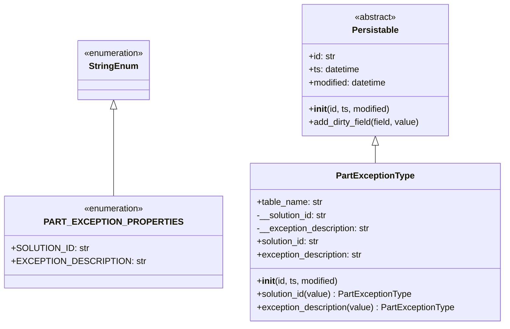
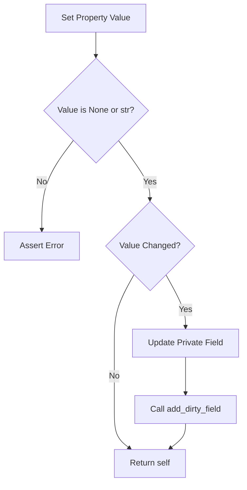

# Diagram: platform/partview_core/partview_service/partview_service/core/datamodel/PartExceptionType.py

> Auto-generated by Obscura crawlers

## Diagram 1

### SVG

<svg id="container" width="873.4140625" xmlns="http://www.w3.org/2000/svg" class="classDiagram" height="594" viewBox="0 0 873.4140625 594" role="graphics-document document" aria-roledescription="class"><g><defs><marker id="container_class-aggregationStart" class="marker aggregation class" refX="18" refY="7" markerWidth="190" markerHeight="240" orient="auto"><path d="M 18,7 L9,13 L1,7 L9,1 Z"></path></marker></defs><defs><marker id="container_class-aggregationEnd" class="marker aggregation class" refX="1" refY="7" markerWidth="20" markerHeight="28" orient="auto"><path d="M 18,7 L9,13 L1,7 L9,1 Z"></path></marker></defs><defs><marker id="container_class-extensionStart" class="marker extension class" refX="18" refY="7" markerWidth="190" markerHeight="240" orient="auto"><path d="M 1,7 L18,13 V 1 Z"></path></marker></defs><defs><marker id="container_class-extensionEnd" class="marker extension class" refX="1" refY="7" markerWidth="20" markerHeight="28" orient="auto"><path d="M 1,1 V 13 L18,7 Z"></path></marker></defs><defs><marker id="container_class-compositionStart" class="marker composition class" refX="18" refY="7" markerWidth="190" markerHeight="240" orient="auto"><path d="M 18,7 L9,13 L1,7 L9,1 Z"></path></marker></defs><defs><marker id="container_class-compositionEnd" class="marker composition class" refX="1" refY="7" markerWidth="20" markerHeight="28" orient="auto"><path d="M 18,7 L9,13 L1,7 L9,1 Z"></path></marker></defs><defs><marker id="container_class-dependencyStart" class="marker dependency class" refX="6" refY="7" markerWidth="190" markerHeight="240" orient="auto"><path d="M 5,7 L9,13 L1,7 L9,1 Z"></path></marker></defs><defs><marker id="container_class-dependencyEnd" class="marker dependency class" refX="13" refY="7" markerWidth="20" markerHeight="28" orient="auto"><path d="M 18,7 L9,13 L14,7 L9,1 Z"></path></marker></defs><defs><marker id="container_class-lollipopStart" class="marker lollipop class" refX="13" refY="7" markerWidth="190" markerHeight="240" orient="auto"><circle stroke="black" fill="transparent" cx="7" cy="7" r="6"></circle></marker></defs><defs><marker id="container_class-lollipopEnd" class="marker lollipop class" refX="1" refY="7" markerWidth="190" markerHeight="240" orient="auto"><circle stroke="black" fill="transparent" cx="7" cy="7" r="6"></circle></marker></defs><g class="root"><g class="clusters"></g><g class="edgePaths"><path d="M183.43,199.25L183.43,211.542C183.43,223.833,183.43,248.417,183.43,274.875C183.43,301.333,183.43,329.667,183.43,343.833L183.43,358" id="id_StringEnum_PART_EXCEPTION_PROPERTIES_1" class="edge-thickness-normal edge-pattern-solid relation" style=";;;" data-edge="true" data-et="edge" data-id="id_StringEnum_PART_EXCEPTION_PROPERTIES_1" data-points="W3sieCI6MTgzLjQyOTY4NzUsInkiOjE4Mn0seyJ4IjoxODMuNDI5Njg3NSwieSI6MjczfSx7IngiOjE4My40Mjk2ODc1LCJ5IjozNTh9XQ==" marker-start="url(#container_class-extensionStart)"></path><path d="M637.137,265.25L637.137,266.542C637.137,267.833,637.137,270.417,637.137,275.875C637.137,281.333,637.137,289.667,637.137,293.833L637.137,298" id="id_Persistable_PartExceptionType_2" class="edge-thickness-normal edge-pattern-solid relation" style=";;;" data-edge="true" data-et="edge" data-id="id_Persistable_PartExceptionType_2" data-points="W3sieCI6NjM3LjEzNjcxODc1LCJ5IjoyNDh9LHsieCI6NjM3LjEzNjcxODc1LCJ5IjoyNzN9LHsieCI6NjM3LjEzNjcxODc1LCJ5IjoyOTh9XQ==" marker-start="url(#container_class-extensionStart)"></path></g><g class="edgeLabels"><g class="edgeLabel"><g class="label" data-id="id_StringEnum_PART_EXCEPTION_PROPERTIES_1" transform="translate(0, 0)"><foreignObject width="0" height="0">

</foreignObject></g></g><g class="edgeLabel"><g class="label" data-id="id_Persistable_PartExceptionType_2" transform="translate(0, 0)"><foreignObject width="0" height="0">

</foreignObject></g></g></g><g class="nodes"><g class="node default" id="classId-StringEnum-0" transform="translate(183.4296875, 128)"><g class="basic label-container"><path d="M-67.5546875 -54 L67.5546875 -54 L67.5546875 54 L-67.5546875 54" stroke="none" stroke-width="0" fill="#ECECFF" style=""></path><path d="M-67.5546875 -54 C-20.48097499950167 -54, 26.592737500996662 -54, 67.5546875 -54 M-67.5546875 -54 C-19.76530904808606 -54, 28.02406940382788 -54, 67.5546875 -54 M67.5546875 -54 C67.5546875 -12.488966518053196, 67.5546875 29.022066963893607, 67.5546875 54 M67.5546875 -54 C67.5546875 -26.94712098228508, 67.5546875 0.10575803542983664, 67.5546875 54 M67.5546875 54 C14.06238886487212 54, -39.42990977025576 54, -67.5546875 54 M67.5546875 54 C28.426409592317682 54, -10.701868315364635 54, -67.5546875 54 M-67.5546875 54 C-67.5546875 14.757026602678131, -67.5546875 -24.485946794643738, -67.5546875 -54 M-67.5546875 54 C-67.5546875 27.209586872159623, -67.5546875 0.41917374431924515, -67.5546875 -54" stroke="#9370DB" stroke-width="1.3" fill="none" stroke-dasharray="0 0" style=""></path></g><g class="annotation-group text" transform="translate(-55.5546875, -30)"><g class="label" style="" transform="translate(0,-12)"><foreignObject width="111.109375" height="24">

«enumeration»

</foreignObject></g></g><g class="label-group text" transform="translate(-42.234375, -6)"><g class="label" style="font-weight: bolder" transform="translate(0,-12)"><foreignObject width="84.46875" height="24">

StringEnum

</foreignObject></g></g><g class="members-group text" transform="translate(-55.5546875, 42)"></g><g class="methods-group text" transform="translate(-55.5546875, 72)"></g><g class="divider" style=""><path d="M-67.5546875 18 C-31.858868105816377 18, 3.8369512883672456 18, 67.5546875 18 M-67.5546875 18 C-25.187905486515632 18, 17.178876526968736 18, 67.5546875 18" stroke="#9370DB" stroke-width="1.3" fill="none" stroke-dasharray="0 0" style=""></path></g><g class="divider" style=""><path d="M-67.5546875 36 C-18.04598963349519 36, 31.46270823300962 36, 67.5546875 36 M-67.5546875 36 C-36.41282051830663 36, -5.270953536613256 36, 67.5546875 36" stroke="#9370DB" stroke-width="1.3" fill="none" stroke-dasharray="0 0" style=""></path></g></g><g class="node default" id="classId-PART_EXCEPTION_PROPERTIES-1" transform="translate(183.4296875, 442)"><g class="basic label-container"><path d="M-175.4296875 -84 L175.4296875 -84 L175.4296875 84 L-175.4296875 84" stroke="none" stroke-width="0" fill="#ECECFF" style=""></path><path d="M-175.4296875 -84 C-63.58192735764166 -84, 48.26583278471668 -84, 175.4296875 -84 M-175.4296875 -84 C-72.16354350832223 -84, 31.10260048335553 -84, 175.4296875 -84 M175.4296875 -84 C175.4296875 -44.43629828239718, 175.4296875 -4.872596564794364, 175.4296875 84 M175.4296875 -84 C175.4296875 -26.612710296180374, 175.4296875 30.77457940763925, 175.4296875 84 M175.4296875 84 C70.66922492975488 84, -34.09123764049025 84, -175.4296875 84 M175.4296875 84 C58.069838844369684 84, -59.29000981126063 84, -175.4296875 84 M-175.4296875 84 C-175.4296875 44.21368466474336, -175.4296875 4.427369329486723, -175.4296875 -84 M-175.4296875 84 C-175.4296875 40.60362318004215, -175.4296875 -2.792753639915702, -175.4296875 -84" stroke="#9370DB" stroke-width="1.3" fill="none" stroke-dasharray="0 0" style=""></path></g><g class="annotation-group text" transform="translate(-55.5546875, -60)"><g class="label" style="" transform="translate(0,-12)"><foreignObject width="111.109375" height="24">

«enumeration»

</foreignObject></g></g><g class="label-group text" transform="translate(-109.984375, -36)"><g class="label" style="font-weight: bolder" transform="translate(0,-12)"><foreignObject width="219.96875" height="24">

PART_EXCEPTION_PROPERTIES

</foreignObject></g></g><g class="members-group text" transform="translate(-163.4296875, 12)"><g class="label" style="" transform="translate(0,-12)"><foreignObject width="131.140625" height="24">

+SOLUTION_ID: str

</foreignObject></g><g class="label" style="" transform="translate(0,12)"><foreignObject width="216.875" height="24">

+EXCEPTION_DESCRIPTION: str

</foreignObject></g></g><g class="methods-group text" transform="translate(-163.4296875, 84)"></g><g class="divider" style=""><path d="M-175.4296875 -12 C-92.5713513740215 -12, -9.713015248043007 -12, 175.4296875 -12 M-175.4296875 -12 C-96.04888595411198 -12, -16.66808440822396 -12, 175.4296875 -12" stroke="#9370DB" stroke-width="1.3" fill="none" stroke-dasharray="0 0" style=""></path></g><g class="divider" style=""><path d="M-175.4296875 60 C-75.2447994567823 60, 24.940088586435394 60, 175.4296875 60 M-175.4296875 60 C-104.60755895307985 60, -33.78543040615969 60, 175.4296875 60" stroke="#9370DB" stroke-width="1.3" fill="none" stroke-dasharray="0 0" style=""></path></g></g><g class="node default" id="classId-Persistable-2" transform="translate(637.13671875, 128)"><g class="basic label-container"><path d="M-135.71484375 -120 L135.71484375 -120 L135.71484375 120 L-135.71484375 120" stroke="none" stroke-width="0" fill="#ECECFF" style=""></path><path d="M-135.71484375 -120 C-45.09566538683406 -120, 45.52351297633189 -120, 135.71484375 -120 M-135.71484375 -120 C-44.51589131060116 -120, 46.683061128797675 -120, 135.71484375 -120 M135.71484375 -120 C135.71484375 -53.48241409863091, 135.71484375 13.035171802738176, 135.71484375 120 M135.71484375 -120 C135.71484375 -33.50846910867651, 135.71484375 52.983061782646985, 135.71484375 120 M135.71484375 120 C52.57174990113651 120, -30.571343947726973 120, -135.71484375 120 M135.71484375 120 C78.16379753019233 120, 20.612751310384652 120, -135.71484375 120 M-135.71484375 120 C-135.71484375 35.76432587485952, -135.71484375 -48.471348250280954, -135.71484375 -120 M-135.71484375 120 C-135.71484375 37.06478844586776, -135.71484375 -45.870423108264475, -135.71484375 -120" stroke="#9370DB" stroke-width="1.3" fill="none" stroke-dasharray="0 0" style=""></path></g><g class="annotation-group text" transform="translate(-38.609375, -96)"><g class="label" style="" transform="translate(0,-12)"><foreignObject width="77.21875" height="24">

«abstract»

</foreignObject></g></g><g class="label-group text" transform="translate(-40.9765625, -72)"><g class="label" style="font-weight: bolder" transform="translate(0,-12)"><foreignObject width="81.953125" height="24">

Persistable

</foreignObject></g></g><g class="members-group text" transform="translate(-123.71484375, -24)"><g class="label" style="" transform="translate(0,-12)"><foreignObject width="49.578125" height="24">

+id: str

</foreignObject></g><g class="label" style="" transform="translate(0,12)"><foreignObject width="94.484375" height="24">

+ts: datetime

</foreignObject></g><g class="label" style="" transform="translate(0,36)"><foreignObject width="145.9375" height="24">

+modified: datetime

</foreignObject></g></g><g class="methods-group text" transform="translate(-123.71484375, 72)"><g class="label" style="" transform="translate(0,-12)"><foreignObject width="150.90625" height="24">

+<strong>init</strong>(id, ts, modified)

</foreignObject></g><g class="label" style="" transform="translate(0,12)"><foreignObject width="206.453125" height="24">

+add_dirty_field(field, value)

</foreignObject></g></g><g class="divider" style=""><path d="M-135.71484375 -48 C-56.66775811010032 -48, 22.379327529799355 -48, 135.71484375 -48 M-135.71484375 -48 C-43.35066458636584 -48, 49.013514577268325 -48, 135.71484375 -48" stroke="#9370DB" stroke-width="1.3" fill="none" stroke-dasharray="0 0" style=""></path></g><g class="divider" style=""><path d="M-135.71484375 48 C-46.035879148851066 48, 43.64308545229787 48, 135.71484375 48 M-135.71484375 48 C-31.950342492985527 48, 71.81415876402895 48, 135.71484375 48" stroke="#9370DB" stroke-width="1.3" fill="none" stroke-dasharray="0 0" style=""></path></g></g><g class="node default" id="classId-PartExceptionType-3" transform="translate(637.13671875, 442)"><g class="basic label-container"><path d="M-228.27734375 -144 L228.27734375 -144 L228.27734375 144 L-228.27734375 144" stroke="none" stroke-width="0" fill="#ECECFF" style=""></path><path d="M-228.27734375 -144 C-112.33866745229605 -144, 3.600008845407899 -144, 228.27734375 -144 M-228.27734375 -144 C-74.28241458353341 -144, 79.71251458293318 -144, 228.27734375 -144 M228.27734375 -144 C228.27734375 -71.0551756431066, 228.27734375 1.889648713786812, 228.27734375 144 M228.27734375 -144 C228.27734375 -74.20623374810856, 228.27734375 -4.412467496217118, 228.27734375 144 M228.27734375 144 C56.8401684875752 144, -114.5970067748496 144, -228.27734375 144 M228.27734375 144 C64.04098963118099 144, -100.19536448763802 144, -228.27734375 144 M-228.27734375 144 C-228.27734375 78.31188800377626, -228.27734375 12.623776007552522, -228.27734375 -144 M-228.27734375 144 C-228.27734375 49.31054350588225, -228.27734375 -45.3789129882355, -228.27734375 -144" stroke="#9370DB" stroke-width="1.3" fill="none" stroke-dasharray="0 0" style=""></path></g><g class="annotation-group text" transform="translate(0, -120)"></g><g class="label-group text" transform="translate(-68.1015625, -120)"><g class="label" style="font-weight: bolder" transform="translate(0,-12)"><foreignObject width="136.203125" height="24">

PartExceptionType

</foreignObject></g></g><g class="members-group text" transform="translate(-216.27734375, -72)"><g class="label" style="" transform="translate(0,-12)"><foreignObject width="121.125" height="24">

+table_name: str

</foreignObject></g><g class="label" style="" transform="translate(0,12)"><foreignObject width="131.390625" height="24">

-__solution_id: str

</foreignObject></g><g class="label" style="" transform="translate(0,36)"><foreignObject width="210.203125" height="24">

-__exception_description: str

</foreignObject></g><g class="label" style="" transform="translate(0,60)"><foreignObject width="117.71875" height="24">

+solution_id: str

</foreignObject></g><g class="label" style="" transform="translate(0,84)"><foreignObject width="196.859375" height="24">

+exception_description: str

</foreignObject></g></g><g class="methods-group text" transform="translate(-216.27734375, 72)"><g class="label" style="" transform="translate(0,-12)"><foreignObject width="150.90625" height="24">

+<strong>init</strong>(id, ts, modified)

</foreignObject></g><g class="label" style="" transform="translate(0,12)"><foreignObject width="285.328125" height="24">

+solution_id(value) : PartExceptionType

</foreignObject></g><g class="label" style="" transform="translate(0,36)"><foreignObject width="364.453125" height="24">

+exception_description(value) : PartExceptionType

</foreignObject></g></g><g class="divider" style=""><path d="M-228.27734375 -96 C-69.55382742873454 -96, 89.16968889253093 -96, 228.27734375 -96 M-228.27734375 -96 C-116.4012897235472 -96, -4.525235697094388 -96, 228.27734375 -96" stroke="#9370DB" stroke-width="1.3" fill="none" stroke-dasharray="0 0" style=""></path></g><g class="divider" style=""><path d="M-228.27734375 48 C-120.51434236445937 48, -12.751340978918734 48, 228.27734375 48 M-228.27734375 48 C-99.37921437237358 48, 29.518915005252836 48, 228.27734375 48" stroke="#9370DB" stroke-width="1.3" fill="none" stroke-dasharray="0 0" style=""></path></g></g></g></g></g></svg>

## Diagram 2

### SVG

<svg id="container" width="466.5625" xmlns="http://www.w3.org/2000/svg" class="flowchart" height="924.359375" viewBox="0 0 466.5625 924.359375" role="graphics-document document" aria-roledescription="flowchart-v2"><g><marker id="container_flowchart-v2-pointEnd" class="marker flowchart-v2" viewBox="0 0 10 10" refX="5" refY="5" markerUnits="userSpaceOnUse" markerWidth="8" markerHeight="8" orient="auto"><path d="M 0 0 L 10 5 L 0 10 z" class="arrowMarkerPath" style="stroke-width: 1; stroke-dasharray: 1, 0;"></path></marker><marker id="container_flowchart-v2-pointStart" class="marker flowchart-v2" viewBox="0 0 10 10" refX="4.5" refY="5" markerUnits="userSpaceOnUse" markerWidth="8" markerHeight="8" orient="auto"><path d="M 0 5 L 10 10 L 10 0 z" class="arrowMarkerPath" style="stroke-width: 1; stroke-dasharray: 1, 0;"></path></marker><marker id="container_flowchart-v2-circleEnd" class="marker flowchart-v2" viewBox="0 0 10 10" refX="11" refY="5" markerUnits="userSpaceOnUse" markerWidth="11" markerHeight="11" orient="auto"><circle cx="5" cy="5" r="5" class="arrowMarkerPath" style="stroke-width: 1; stroke-dasharray: 1, 0;"></circle></marker><marker id="container_flowchart-v2-circleStart" class="marker flowchart-v2" viewBox="0 0 10 10" refX="-1" refY="5" markerUnits="userSpaceOnUse" markerWidth="11" markerHeight="11" orient="auto"><circle cx="5" cy="5" r="5" class="arrowMarkerPath" style="stroke-width: 1; stroke-dasharray: 1, 0;"></circle></marker><marker id="container_flowchart-v2-crossEnd" class="marker cross flowchart-v2" viewBox="0 0 11 11" refX="12" refY="5.2" markerUnits="userSpaceOnUse" markerWidth="11" markerHeight="11" orient="auto"><path d="M 1,1 l 9,9 M 10,1 l -9,9" class="arrowMarkerPath" style="stroke-width: 2; stroke-dasharray: 1, 0;"></path></marker><marker id="container_flowchart-v2-crossStart" class="marker cross flowchart-v2" viewBox="0 0 11 11" refX="-1" refY="5.2" markerUnits="userSpaceOnUse" markerWidth="11" markerHeight="11" orient="auto"><path d="M 1,1 l 9,9 M 10,1 l -9,9" class="arrowMarkerPath" style="stroke-width: 2; stroke-dasharray: 1, 0;"></path></marker><g class="root"><g class="clusters"></g><g class="edgePaths"><path d="M183.422,62L183.422,66.167C183.422,70.333,183.422,78.667,183.422,86.333C183.422,94,183.422,101,183.422,104.5L183.422,108" id="L_A_B_0" class="edge-thickness-normal edge-pattern-solid edge-thickness-normal edge-pattern-solid flowchart-link" style=";" data-edge="true" data-et="edge" data-id="L_A_B_0" data-points="W3sieCI6MTgzLjQyMTg3NSwieSI6NjJ9LHsieCI6MTgzLjQyMTg3NSwieSI6ODd9LHsieCI6MTgzLjQyMTg3NSwieSI6MTEyfV0=" marker-end="url(#container_flowchart-v2-pointEnd)"></path><path d="M140.154,271.373L130.183,284.751C120.212,298.129,100.27,324.885,90.299,353.239C80.328,381.594,80.328,411.547,80.328,426.523L80.328,441.5" id="L_B_C_0" class="edge-thickness-normal edge-pattern-solid edge-thickness-normal edge-pattern-solid flowchart-link" style=";" data-edge="true" data-et="edge" data-id="L_B_C_0" data-points="W3sieCI6MTQwLjE1MzkyNzU2MzAyMzg0LCJ5IjoyNzEuMzcyNjc3NTYzMDIzODR9LHsieCI6ODAuMzI4MTI1LCJ5IjozNTEuNjQwNjI1fSx7IngiOjgwLjMyODEyNSwieSI6NDQ1LjV9XQ==" marker-end="url(#container_flowchart-v2-pointEnd)"></path><path d="M226.69,271.373L236.661,284.751C246.632,298.129,266.574,324.885,276.545,343.763C286.516,362.641,286.516,373.641,286.516,379.141L286.516,384.641" id="L_B_D_0" class="edge-thickness-normal edge-pattern-solid edge-thickness-normal edge-pattern-solid flowchart-link" style=";" data-edge="true" data-et="edge" data-id="L_B_D_0" data-points="W3sieCI6MjI2LjY4OTgyMjQzNjk3NjE2LCJ5IjoyNzEuMzcyNjc3NTYzMDIzODR9LHsieCI6Mjg2LjUxNTYyNSwieSI6MzUxLjY0MDYyNX0seyJ4IjoyODYuNTE1NjI1LCJ5IjozODguNjQwNjI1fV0=" marker-end="url(#container_flowchart-v2-pointEnd)"></path><path d="M256.034,525.878L249.612,537.125C243.19,548.372,230.345,570.866,223.922,592.779C217.5,614.693,217.5,636.026,217.5,657.359C217.5,678.693,217.5,700.026,217.5,721.359C217.5,742.693,217.5,764.026,217.5,783.359C217.5,802.693,217.5,820.026,222.498,832.458C227.495,844.89,237.491,852.421,242.488,856.187L247.486,859.952" id="L_D_E_0" class="edge-thickness-normal edge-pattern-solid edge-thickness-normal edge-pattern-solid flowchart-link" style=";" data-edge="true" data-et="edge" data-id="L_D_E_0" data-points="W3sieCI6MjU2LjAzNDQ4MTIwNjc5NzI0LCJ5Ijo1MjUuODc4MjMxMjA2Nzk3Mn0seyJ4IjoyMTcuNSwieSI6NTkzLjM1OTM3NX0seyJ4IjoyMTcuNSwieSI6NjU3LjM1OTM3NX0seyJ4IjoyMTcuNSwieSI6NzIxLjM1OTM3NX0seyJ4IjoyMTcuNSwieSI6Nzg1LjM1OTM3NX0seyJ4IjoyMTcuNSwieSI6ODM3LjM1OTM3NX0seyJ4IjoyNTAuNjgwNTg4OTQyMzA3NjgsInkiOjg2Mi4zNTkzNzV9XQ==" marker-end="url(#container_flowchart-v2-pointEnd)"></path><path d="M316.997,525.878L323.419,537.125C329.842,548.372,342.686,570.866,349.109,587.613C355.531,604.359,355.531,615.359,355.531,620.859L355.531,626.359" id="L_D_F_0" class="edge-thickness-normal edge-pattern-solid edge-thickness-normal edge-pattern-solid flowchart-link" style=";" data-edge="true" data-et="edge" data-id="L_D_F_0" data-points="W3sieCI6MzE2Ljk5Njc2ODc5MzIwMjc2LCJ5Ijo1MjUuODc4MjMxMjA2Nzk3Mn0seyJ4IjozNTUuNTMxMjUsInkiOjU5My4zNTkzNzV9LHsieCI6MzU1LjUzMTI1LCJ5Ijo2MzAuMzU5Mzc1fV0=" marker-end="url(#container_flowchart-v2-pointEnd)"></path><path d="M355.531,684.359L355.531,690.526C355.531,696.693,355.531,709.026,355.531,720.693C355.531,732.359,355.531,743.359,355.531,748.859L355.531,754.359" id="L_F_G_0" class="edge-thickness-normal edge-pattern-solid edge-thickness-normal edge-pattern-solid flowchart-link" style=";" data-edge="true" data-et="edge" data-id="L_F_G_0" data-points="W3sieCI6MzU1LjUzMTI1LCJ5Ijo2ODQuMzU5Mzc1fSx7IngiOjM1NS41MzEyNSwieSI6NzIxLjM1OTM3NX0seyJ4IjozNTUuNTMxMjUsInkiOjc1OC4zNTkzNzV9XQ==" marker-end="url(#container_flowchart-v2-pointEnd)"></path><path d="M355.531,812.359L355.531,816.526C355.531,820.693,355.531,829.026,350.534,836.958C345.536,844.89,335.541,852.421,330.543,856.187L325.545,859.952" id="L_G_E_0" class="edge-thickness-normal edge-pattern-solid edge-thickness-normal edge-pattern-solid flowchart-link" style=";" data-edge="true" data-et="edge" data-id="L_G_E_0" data-points="W3sieCI6MzU1LjUzMTI1LCJ5Ijo4MTIuMzU5Mzc1fSx7IngiOjM1NS41MzEyNSwieSI6ODM3LjM1OTM3NX0seyJ4IjozMjIuMzUwNjYxMDU3NjkyMywieSI6ODYyLjM1OTM3NX1d" marker-end="url(#container_flowchart-v2-pointEnd)"></path></g><g class="edgeLabels"><g class="edgeLabel"><g class="label" data-id="L_A_B_0" transform="translate(0, 0)"><foreignObject width="0" height="0">

</foreignObject></g></g><g class="edgeLabel" transform="translate(80.328125, 351.640625)"><g class="label" data-id="L_B_C_0" transform="translate(-10.140625, -12)"><foreignObject width="20.28125" height="24">

No

</foreignObject></g></g><g class="edgeLabel" transform="translate(286.515625, 351.640625)"><g class="label" data-id="L_B_D_0" transform="translate(-12.03125, -12)"><foreignObject width="24.0625" height="24">

Yes

</foreignObject></g></g><g class="edgeLabel" transform="translate(217.5, 721.359375)"><g class="label" data-id="L_D_E_0" transform="translate(-10.140625, -12)"><foreignObject width="20.28125" height="24">

No

</foreignObject></g></g><g class="edgeLabel" transform="translate(355.53125, 593.359375)"><g class="label" data-id="L_D_F_0" transform="translate(-12.03125, -12)"><foreignObject width="24.0625" height="24">

Yes

</foreignObject></g></g><g class="edgeLabel"><g class="label" data-id="L_F_G_0" transform="translate(0, 0)"><foreignObject width="0" height="0">

</foreignObject></g></g><g class="edgeLabel"><g class="label" data-id="L_G_E_0" transform="translate(0, 0)"><foreignObject width="0" height="0">

</foreignObject></g></g></g><g class="nodes"><g class="node default" id="flowchart-A-0" transform="translate(183.421875, 35)"><rect class="basic label-container" style="" x="-96.6015625" y="-27" width="193.203125" height="54"></rect><g class="label" style="" transform="translate(-66.6015625, -12)"><rect></rect><foreignObject width="133.203125" height="24">

Set Property Value

</foreignObject></g></g><g class="node default" id="flowchart-B-1" transform="translate(183.421875, 213.3203125)"><polygon points="101.3203125,0 202.640625,-101.3203125 101.3203125,-202.640625 0,-101.3203125" class="label-container" transform="translate(-100.8203125, 101.3203125)"></polygon><g class="label" style="" transform="translate(-74.3203125, -12)"><rect></rect><foreignObject width="148.640625" height="24">

Value is None or str?

</foreignObject></g></g><g class="node default" id="flowchart-C-3" transform="translate(80.328125, 472.5)"><rect class="basic label-container" style="" x="-72.328125" y="-27" width="144.65625" height="54"></rect><g class="label" style="" transform="translate(-42.328125, -12)"><rect></rect><foreignObject width="84.65625" height="24">

Assert Error

</foreignObject></g></g><g class="node default" id="flowchart-D-5" transform="translate(286.515625, 472.5)"><polygon points="83.859375,0 167.71875,-83.859375 83.859375,-167.71875 0,-83.859375" class="label-container" transform="translate(-83.359375, 83.859375)"></polygon><g class="label" style="" transform="translate(-56.859375, -12)"><rect></rect><foreignObject width="113.71875" height="24">

Value Changed?

</foreignObject></g></g><g class="node default" id="flowchart-E-7" transform="translate(286.515625, 889.359375)"><rect class="basic label-container" style="" x="-69.640625" y="-27" width="139.28125" height="54"></rect><g class="label" style="" transform="translate(-39.640625, -12)"><rect></rect><foreignObject width="79.28125" height="24">

Return self

</foreignObject></g></g><g class="node default" id="flowchart-F-9" transform="translate(355.53125, 657.359375)"><rect class="basic label-container" style="" x="-103.03125" y="-27" width="206.0625" height="54"></rect><g class="label" style="" transform="translate(-73.03125, -12)"><rect></rect><foreignObject width="146.0625" height="24">

Update Private Field

</foreignObject></g></g><g class="node default" id="flowchart-G-11" transform="translate(355.53125, 785.359375)"><rect class="basic label-container" style="" x="-100.125" y="-27" width="200.25" height="54"></rect><g class="label" style="" transform="translate(-70.125, -12)"><rect></rect><foreignObject width="140.25" height="24">

Call add_dirty_field

</foreignObject></g></g></g></g></g></svg>
