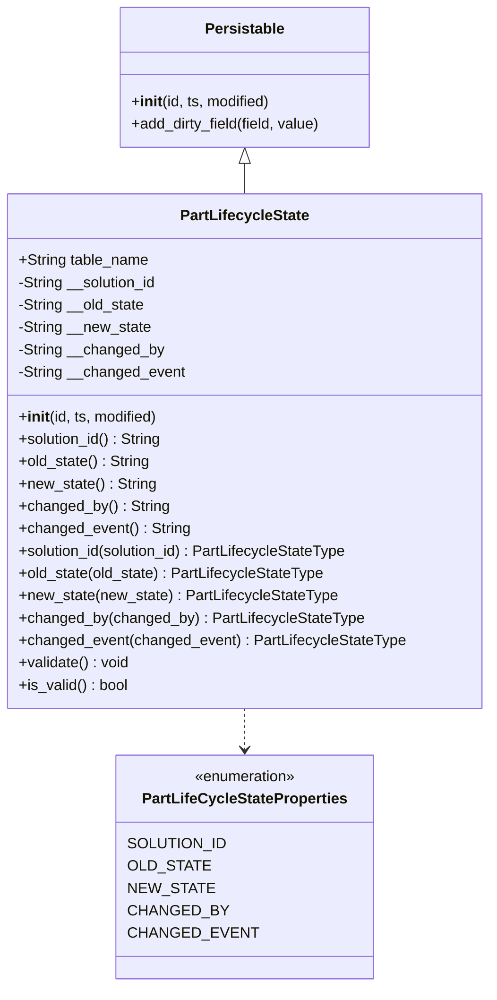
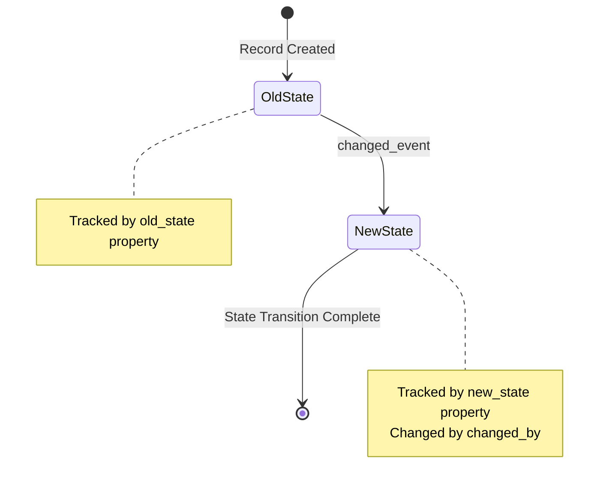
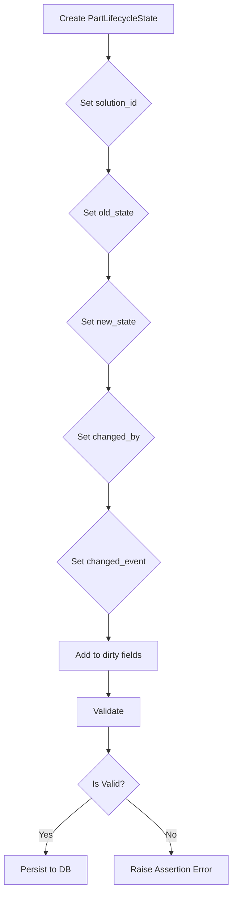

# Diagram: platform/partview_core/partview_service/partview_service/core/datamodel/PartLifecycleState.py

> Auto-generated by Obscura crawlers

## Diagram 1

### SVG

<svg id="container" width="519.65625" xmlns="http://www.w3.org/2000/svg" class="classDiagram" height="1058" viewBox="0 0 519.65625 1058" role="graphics-document document" aria-roledescription="class"><g><defs><marker id="container_class-aggregationStart" class="marker aggregation class" refX="18" refY="7" markerWidth="190" markerHeight="240" orient="auto"><path d="M 18,7 L9,13 L1,7 L9,1 Z"></path></marker></defs><defs><marker id="container_class-aggregationEnd" class="marker aggregation class" refX="1" refY="7" markerWidth="20" markerHeight="28" orient="auto"><path d="M 18,7 L9,13 L1,7 L9,1 Z"></path></marker></defs><defs><marker id="container_class-extensionStart" class="marker extension class" refX="18" refY="7" markerWidth="190" markerHeight="240" orient="auto"><path d="M 1,7 L18,13 V 1 Z"></path></marker></defs><defs><marker id="container_class-extensionEnd" class="marker extension class" refX="1" refY="7" markerWidth="20" markerHeight="28" orient="auto"><path d="M 1,1 V 13 L18,7 Z"></path></marker></defs><defs><marker id="container_class-compositionStart" class="marker composition class" refX="18" refY="7" markerWidth="190" markerHeight="240" orient="auto"><path d="M 18,7 L9,13 L1,7 L9,1 Z"></path></marker></defs><defs><marker id="container_class-compositionEnd" class="marker composition class" refX="1" refY="7" markerWidth="20" markerHeight="28" orient="auto"><path d="M 18,7 L9,13 L1,7 L9,1 Z"></path></marker></defs><defs><marker id="container_class-dependencyStart" class="marker dependency class" refX="6" refY="7" markerWidth="190" markerHeight="240" orient="auto"><path d="M 5,7 L9,13 L1,7 L9,1 Z"></path></marker></defs><defs><marker id="container_class-dependencyEnd" class="marker dependency class" refX="13" refY="7" markerWidth="20" markerHeight="28" orient="auto"><path d="M 18,7 L9,13 L14,7 L9,1 Z"></path></marker></defs><defs><marker id="container_class-lollipopStart" class="marker lollipop class" refX="13" refY="7" markerWidth="190" markerHeight="240" orient="auto"><circle stroke="black" fill="transparent" cx="7" cy="7" r="6"></circle></marker></defs><defs><marker id="container_class-lollipopEnd" class="marker lollipop class" refX="1" refY="7" markerWidth="190" markerHeight="240" orient="auto"><circle stroke="black" fill="transparent" cx="7" cy="7" r="6"></circle></marker></defs><g class="root"><g class="clusters"></g><g class="edgePaths"><path d="M259.828,175.25L259.828,176.542C259.828,177.833,259.828,180.417,259.828,185.875C259.828,191.333,259.828,199.667,259.828,203.833L259.828,208" id="id_Persistable_PartLifecycleState_1" class="edge-thickness-normal edge-pattern-solid relation" style=";;;" data-edge="true" data-et="edge" data-id="id_Persistable_PartLifecycleState_1" data-points="W3sieCI6MjU5LjgyODEyNSwieSI6MTU4fSx7IngiOjI1OS44MjgxMjUsInkiOjE4M30seyJ4IjoyNTkuODI4MTI1LCJ5IjoyMDh9XQ==" marker-start="url(#container_class-extensionStart)"></path><path d="M259.828,760L259.828,764.167C259.828,768.333,259.828,776.667,259.828,784C259.828,791.333,259.828,797.667,259.828,800.833L259.828,804" id="id_PartLifecycleState_PartLifeCycleStateProperties_2" class="edge-thickness-normal edge-pattern-dashed relation" style=";;;" data-edge="true" data-et="edge" data-id="id_PartLifecycleState_PartLifeCycleStateProperties_2" data-points="W3sieCI6MjU5LjgyODEyNSwieSI6NzYwfSx7IngiOjI1OS44MjgxMjUsInkiOjc4NX0seyJ4IjoyNTkuODI4MTI1LCJ5Ijo4MTB9XQ==" marker-end="url(#container_class-dependencyEnd)"></path></g><g class="edgeLabels"><g class="edgeLabel"><g class="label" data-id="id_Persistable_PartLifecycleState_1" transform="translate(0, 0)"><foreignObject width="0" height="0">

</foreignObject></g></g><g class="edgeLabel"><g class="label" data-id="id_PartLifecycleState_PartLifeCycleStateProperties_2" transform="translate(0, 0)"><foreignObject width="0" height="0">

</foreignObject></g></g></g><g class="nodes"><g class="node default" id="classId-Persistable-0" transform="translate(259.828125, 83)"><g class="basic label-container"><path d="M-135.71484375 -75 L135.71484375 -75 L135.71484375 75 L-135.71484375 75" stroke="none" stroke-width="0" fill="#ECECFF" style=""></path><path d="M-135.71484375 -75 C-30.103251205685254 -75, 75.50834133862949 -75, 135.71484375 -75 M-135.71484375 -75 C-64.63796070673885 -75, 6.438922336522296 -75, 135.71484375 -75 M135.71484375 -75 C135.71484375 -15.456666336899396, 135.71484375 44.08666732620121, 135.71484375 75 M135.71484375 -75 C135.71484375 -27.29656885019959, 135.71484375 20.406862299600817, 135.71484375 75 M135.71484375 75 C80.57662894057239 75, 25.438414131144796 75, -135.71484375 75 M135.71484375 75 C69.86046106357561 75, 4.006078377151226 75, -135.71484375 75 M-135.71484375 75 C-135.71484375 32.62344427707971, -135.71484375 -9.753111445840574, -135.71484375 -75 M-135.71484375 75 C-135.71484375 37.65620528613371, -135.71484375 0.3124105722674244, -135.71484375 -75" stroke="#9370DB" stroke-width="1.3" fill="none" stroke-dasharray="0 0" style=""></path></g><g class="annotation-group text" transform="translate(0, -51)"></g><g class="label-group text" transform="translate(-40.9765625, -51)"><g class="label" style="font-weight: bolder" transform="translate(0,-12)"><foreignObject width="81.953125" height="24">

Persistable

</foreignObject></g></g><g class="members-group text" transform="translate(-123.71484375, -3)"></g><g class="methods-group text" transform="translate(-123.71484375, 27)"><g class="label" style="" transform="translate(0,-12)"><foreignObject width="150.90625" height="24">

+<strong>init</strong>(id, ts, modified)

</foreignObject></g><g class="label" style="" transform="translate(0,12)"><foreignObject width="206.453125" height="24">

+add_dirty_field(field, value)

</foreignObject></g></g><g class="divider" style=""><path d="M-135.71484375 -27 C-40.15490757020689 -27, 55.405028609586225 -27, 135.71484375 -27 M-135.71484375 -27 C-43.54876782027516 -27, 48.61730810944968 -27, 135.71484375 -27" stroke="#9370DB" stroke-width="1.3" fill="none" stroke-dasharray="0 0" style=""></path></g><g class="divider" style=""><path d="M-135.71484375 -3 C-54.17139700654974 -3, 27.37204973690052 -3, 135.71484375 -3 M-135.71484375 -3 C-58.45810716399711 -3, 18.798629422005774 -3, 135.71484375 -3" stroke="#9370DB" stroke-width="1.3" fill="none" stroke-dasharray="0 0" style=""></path></g></g><g class="node default" id="classId-PartLifeCycleStateProperties-1" transform="translate(259.828125, 930)"><g class="basic label-container"><path d="M-125.4453125 -120 L125.4453125 -120 L125.4453125 120 L-125.4453125 120" stroke="none" stroke-width="0" fill="#ECECFF" style=""></path><path d="M-125.4453125 -120 C-29.152347518311842 -120, 67.14061746337632 -120, 125.4453125 -120 M-125.4453125 -120 C-74.10351382705491 -120, -22.761715154109808 -120, 125.4453125 -120 M125.4453125 -120 C125.4453125 -39.750358659188166, 125.4453125 40.49928268162367, 125.4453125 120 M125.4453125 -120 C125.4453125 -45.45484943898208, 125.4453125 29.09030112203584, 125.4453125 120 M125.4453125 120 C72.04047151663805 120, 18.6356305332761 120, -125.4453125 120 M125.4453125 120 C66.35061627528536 120, 7.255920050570722 120, -125.4453125 120 M-125.4453125 120 C-125.4453125 36.114968022481946, -125.4453125 -47.77006395503611, -125.4453125 -120 M-125.4453125 120 C-125.4453125 71.00293125633277, -125.4453125 22.00586251266556, -125.4453125 -120" stroke="#9370DB" stroke-width="1.3" fill="none" stroke-dasharray="0 0" style=""></path></g><g class="annotation-group text" transform="translate(-55.5546875, -96)"><g class="label" style="" transform="translate(0,-12)"><foreignObject width="111.109375" height="24">

«enumeration»

</foreignObject></g></g><g class="label-group text" transform="translate(-105.09375, -72)"><g class="label" style="font-weight: bolder" transform="translate(0,-12)"><foreignObject width="210.1875" height="24">

PartLifeCycleStateProperties

</foreignObject></g></g><g class="members-group text" transform="translate(-113.4453125, -24)"><g class="label" style="" transform="translate(0,-12)"><foreignObject width="96.296875" height="24">

SOLUTION_ID

</foreignObject></g><g class="label" style="" transform="translate(0,12)"><foreignObject width="77.75" height="24">

OLD_STATE

</foreignObject></g><g class="label" style="" transform="translate(0,36)"><foreignObject width="80.796875" height="24">

NEW_STATE

</foreignObject></g><g class="label" style="" transform="translate(0,60)"><foreignObject width="94.734375" height="24">

CHANGED_BY

</foreignObject></g><g class="label" style="" transform="translate(0,84)"><foreignObject width="121.796875" height="24">

CHANGED_EVENT

</foreignObject></g></g><g class="methods-group text" transform="translate(-113.4453125, 120)"></g><g class="divider" style=""><path d="M-125.4453125 -48 C-40.555955961839985 -48, 44.33340057632003 -48, 125.4453125 -48 M-125.4453125 -48 C-74.97515847421352 -48, -24.505004448427016 -48, 125.4453125 -48" stroke="#9370DB" stroke-width="1.3" fill="none" stroke-dasharray="0 0" style=""></path></g><g class="divider" style=""><path d="M-125.4453125 96 C-25.413999685448616 96, 74.61731312910277 96, 125.4453125 96 M-125.4453125 96 C-64.76776801479525 96, -4.090223529590503 96, 125.4453125 96" stroke="#9370DB" stroke-width="1.3" fill="none" stroke-dasharray="0 0" style=""></path></g></g><g class="node default" id="classId-PartLifecycleState-2" transform="translate(259.828125, 484)"><g class="basic label-container"><path d="M-251.828125 -276 L251.828125 -276 L251.828125 276 L-251.828125 276" stroke="none" stroke-width="0" fill="#ECECFF" style=""></path><path d="M-251.828125 -276 C-113.51179723177816 -276, 24.80453053644368 -276, 251.828125 -276 M-251.828125 -276 C-113.76169486879783 -276, 24.304735262404336 -276, 251.828125 -276 M251.828125 -276 C251.828125 -126.19932214694629, 251.828125 23.601355706107427, 251.828125 276 M251.828125 -276 C251.828125 -71.0922659330918, 251.828125 133.8154681338164, 251.828125 276 M251.828125 276 C122.0173845990397 276, -7.7933558019205975 276, -251.828125 276 M251.828125 276 C57.34541950600908 276, -137.13728598798184 276, -251.828125 276 M-251.828125 276 C-251.828125 151.2799627148637, -251.828125 26.5599254297274, -251.828125 -276 M-251.828125 276 C-251.828125 155.39099716720483, -251.828125 34.78199433440963, -251.828125 -276" stroke="#9370DB" stroke-width="1.3" fill="none" stroke-dasharray="0 0" style=""></path></g><g class="annotation-group text" transform="translate(0, -252)"></g><g class="label-group text" transform="translate(-66.421875, -252)"><g class="label" style="font-weight: bolder" transform="translate(0,-12)"><foreignObject width="132.84375" height="24">

PartLifecycleState

</foreignObject></g></g><g class="members-group text" transform="translate(-239.828125, -204)"><g class="label" style="" transform="translate(0,-12)"><foreignObject width="140.1875" height="24">

+String table_name

</foreignObject></g><g class="label" style="" transform="translate(0,12)"><foreignObject width="151.640625" height="24">

-String __solution_id

</foreignObject></g><g class="label" style="" transform="translate(0,36)"><foreignObject width="137.03125" height="24">

-String __old_state

</foreignObject></g><g class="label" style="" transform="translate(0,60)"><foreignObject width="143.078125" height="24">

-String __new_state

</foreignObject></g><g class="label" style="" transform="translate(0,84)"><foreignObject width="156.1875" height="24">

-String __changed_by

</foreignObject></g><g class="label" style="" transform="translate(0,108)"><foreignObject width="178.890625" height="24">

-String __changed_event

</foreignObject></g></g><g class="methods-group text" transform="translate(-239.828125, -36)"><g class="label" style="" transform="translate(0,-12)"><foreignObject width="150.90625" height="24">

+<strong>init</strong>(id, ts, modified)

</foreignObject></g><g class="label" style="" transform="translate(0,12)"><foreignObject width="155.78125" height="24">

+solution_id() : String

</foreignObject></g><g class="label" style="" transform="translate(0,36)"><foreignObject width="141.5" height="24">

+old_state() : String

</foreignObject></g><g class="label" style="" transform="translate(0,60)"><foreignObject width="147.21875" height="24">

+new_state() : String

</foreignObject></g><g class="label" style="" transform="translate(0,84)"><foreignObject width="160.640625" height="24">

+changed_by() : String

</foreignObject></g><g class="label" style="" transform="translate(0,108)"><foreignObject width="183.359375" height="24">

+changed_event() : String

</foreignObject></g><g class="label" style="" transform="translate(0,132)"><foreignObject width="358.109375" height="24">

+solution_id(solution_id) : PartLifecycleStateType

</foreignObject></g><g class="label" style="" transform="translate(0,156)"><foreignObject width="329.53125" height="24">

+old_state(old_state) : PartLifecycleStateType

</foreignObject></g><g class="label" style="" transform="translate(0,180)"><foreignObject width="340.984375" height="24">

+new_state(new_state) : PartLifecycleStateType

</foreignObject></g><g class="label" style="" transform="translate(0,204)"><foreignObject width="367.828125" height="24">

+changed_by(changed_by) : PartLifecycleStateType

</foreignObject></g><g class="label" style="" transform="translate(0,228)"><foreignObject width="413.234375" height="24">

+changed_event(changed_event) : PartLifecycleStateType

</foreignObject></g><g class="label" style="" transform="translate(0,252)"><foreignObject width="119.640625" height="24">

+validate() : void

</foreignObject></g><g class="label" style="" transform="translate(0,276)"><foreignObject width="117.984375" height="24">

+is_valid() : bool

</foreignObject></g></g><g class="divider" style=""><path d="M-251.828125 -228 C-123.77012419253504 -228, 4.287876614929928 -228, 251.828125 -228 M-251.828125 -228 C-107.4752200852509 -228, 36.87768482949821 -228, 251.828125 -228" stroke="#9370DB" stroke-width="1.3" fill="none" stroke-dasharray="0 0" style=""></path></g><g class="divider" style=""><path d="M-251.828125 -60 C-148.7237247007936 -60, -45.61932440158722 -60, 251.828125 -60 M-251.828125 -60 C-96.32841506751396 -60, 59.17129486497208 -60, 251.828125 -60" stroke="#9370DB" stroke-width="1.3" fill="none" stroke-dasharray="0 0" style=""></path></g></g></g></g></g></svg>

## Diagram 2

### SVG

<svg id="container" width="706.6238403320312" xmlns="http://www.w3.org/2000/svg" class="statediagram" height="572" viewBox="0 0 706.6238403320312 572" role="graphics-document document" aria-roledescription="stateDiagram"><g><defs><marker id="container_stateDiagram-barbEnd" refX="19" refY="7" markerWidth="20" markerHeight="14" markerUnits="userSpaceOnUse" orient="auto"><path d="M 19,7 L9,13 L14,7 L9,1 Z"></path></marker></defs><g class="root"><g class="clusters"><g class="note-cluster" id="OldState----parent"><rect x="8" y="210" width="300" height="128" fill="none"></rect></g><g class="note-cluster" id="NewState----parent"><rect x="398.6238341331482" y="412" width="300" height="152" fill="none"></rect></g></g><g class="edgePaths"><path d="M339.003,22L339.003,28.167C339.003,34.333,339.003,46.667,339.087,59.083C339.17,71.5,339.337,84,339.42,90.25L339.503,96.5" id="edge0" class="edge-thickness-normal edge-pattern-solid transition" style="fill:none;;;fill:none" data-edge="true" data-et="edge" data-id="edge0" data-points="W3sieCI6MzM5LjAwMzMyMzMxNjU3NDEsInkiOjIyfSx7IngiOjMzOS4wMDMzMjMzMTY1NzQxLCJ5Ijo1OX0seyJ4IjozMzkuNTAzMzIzMzE2NTc0MSwieSI6OTYuNX1d" marker-end="url(#container_stateDiagram-barbEnd)"></path><path d="M377.019,135.321L389.619,141.601C402.219,147.881,427.42,160.44,440.02,172.887C452.621,185.333,452.621,197.667,452.704,211.25C452.787,224.833,452.954,239.667,453.037,247.083L453.121,254.5" id="edge1" class="edge-thickness-normal edge-pattern-solid transition" style="fill:none;;;fill:none" data-edge="true" data-et="edge" data-id="edge1" data-points="W3sieCI6Mzc3LjAxODY1NTQwNjgyMjEsInkiOjEzNS4zMjA4NjY1OTc3MDY3OH0seyJ4Ijo0NTIuNjIwNTEwODE2NTc0MSwieSI6MTczfSx7IngiOjQ1Mi42MjA1MTA4MTY1NzQxLCJ5IjoyMTB9LHsieCI6NDUzLjEyMDUxMDgxNjU3NDEsInkiOjI1NC41fV0=" marker-end="url(#container_stateDiagram-barbEnd)"></path><path d="M423.119,294.5L412.036,301.75C400.952,309,378.785,323.5,367.701,336.917C356.617,350.333,356.617,362.667,356.617,375C356.617,387.333,356.617,399.667,356.617,417.333C356.617,435,356.617,458,356.617,469.5L356.617,481" id="edge2" class="edge-thickness-normal edge-pattern-solid transition" style="fill:none;;;fill:none" data-edge="true" data-et="edge" data-id="edge2" data-points="W3sieCI6NDIzLjExOTQ3MjI4MDE0NDcsInkiOjI5NC41fSx7IngiOjM1Ni42MTcxODc1LCJ5IjozMzh9LHsieCI6MzU2LjYxNzE4NzUsInkiOjM3NX0seyJ4IjozNTYuNjE3MTg3NSwieSI6NDEyfSx7IngiOjM1Ni42MTcxODc1LCJ5Ijo0ODF9XQ==" marker-end="url(#container_stateDiagram-barbEnd)"></path><path d="M300.206,128.875L276.505,136.229C252.804,143.583,205.402,158.292,181.701,171.813C158,185.333,158,197.667,158,208C158,218.333,158,226.667,158,230.833L158,235" id="OldState-OldState----note-3" class="edge-thickness-normal edge-pattern-solid transition note-edge" style="fill:none;;;fill:none" data-edge="true" data-et="edge" data-id="OldState-OldState----note-3" data-points="W3sieCI6MzAwLjIwNjQ0ODMxNjU3NDEsInkiOjEyOC44NzUwMzE3NjE2MTIzOH0seyJ4IjoxNTgsInkiOjE3M30seyJ4IjoxNTgsInkiOjIxMH0seyJ4IjoxNTgsInkiOjIzNX1d"></path><path d="M483.122,294.5L494.039,301.75C504.956,309,526.79,323.5,537.707,336.917C548.624,350.333,548.624,362.667,548.624,375C548.624,387.333,548.624,399.667,548.624,410C548.624,420.333,548.624,428.667,548.624,432.833L548.624,437" id="NewState-NewState----note-4" class="edge-thickness-normal edge-pattern-solid transition note-edge" style="fill:none;;;fill:none" data-edge="true" data-et="edge" data-id="NewState-NewState----note-4" data-points="W3sieCI6NDgzLjEyMTU0OTM1MzAwMzUsInkiOjI5NC41fSx7IngiOjU0OC42MjM4MzQxMzMxNDgyLCJ5IjozMzh9LHsieCI6NTQ4LjYyMzgzNDEzMzE0ODIsInkiOjM3NX0seyJ4Ijo1NDguNjIzODM0MTMzMTQ4MiwieSI6NDEyfSx7IngiOjU0OC42MjM4MzQxMzMxNDgyLCJ5Ijo0Mzd9XQ=="></path></g><g class="edgeLabels"><g class="edgeLabel" transform="translate(339.0033233165741, 59)"><g class="label" data-id="edge0" transform="translate(-54.921875, -12)"><foreignObject width="109.84375" height="24">

Record Created

</foreignObject></g></g><g class="edgeLabel" transform="translate(452.6205108165741, 173)"><g class="label" data-id="edge1" transform="translate(-54.8984375, -12)"><foreignObject width="109.796875" height="24">

changed_event

</foreignObject></g></g><g class="edgeLabel" transform="translate(356.6171875, 375)"><g class="label" data-id="edge2" transform="translate(-93.546875, -12)"><foreignObject width="187.09375" height="24">

State Transition Complete

</foreignObject></g></g><g class="edgeLabel"><g class="label" data-id="OldState-OldState----note-3" transform="translate(0, 0)"><foreignObject width="0" height="0">

</foreignObject></g></g><g class="edgeLabel"><g class="label" data-id="NewState-NewState----note-4" transform="translate(0, 0)"><foreignObject width="0" height="0">

</foreignObject></g></g></g><g class="nodes"><g class="node default" id="state-root_start-0" transform="translate(339.0033233165741, 15)"><circle class="state-start" r="7" width="14" height="14"></circle></g><g class="node  statediagram-state" id="state-OldState-3" transform="translate(339.0033233165741, 116)"><g class="basic label-container outer-path"><path d="M-34.296875 -20 C-20.033267234937128 -20, -5.769659469874256 -20, 34.296875 -20 C34.296875 -20, 34.296875 -20, 34.296875 -20 C34.4501181944607 -19.99366181459338, 34.60336138892141 -19.987323629186765, 34.70977172736166 -19.982922465033347 C34.835316052251294 -19.967273381255758, 34.96086037714092 -19.95162429747817, 35.11984795140367 -19.931806517013612 C35.27751183641332 -19.898747876745368, 35.435175721422965 -19.865689236477124, 35.524302435703994 -19.847001329696653 C35.68176555909129 -19.800122526753146, 35.839228682478584 -19.75324372380964, 35.92037234602342 -19.729086208503173 C36.00987132503257 -19.694163598525005, 36.09937030404173 -19.659240988546834, 36.305352123264846 -19.578866633275286 C36.38157983154926 -19.54160117744484, 36.45780753983367 -19.504335721614396, 36.676611965185366 -19.397368756032446 C36.81763539626023 -19.313337030700957, 36.95865882733509 -19.229305305369465, 37.031615790612136 -19.185832391312644 C37.153782495703155 -19.098607040413835, 37.27594920079417 -19.01138168951503, 37.36793856344834 -18.94570254698197 C37.46402718215053 -18.864319638306075, 37.560115800852714 -18.78293672963018, 37.683282858128706 -18.678619553365657 C37.758988175777944 -18.602914235716415, 37.83469349342719 -18.527208918067174, 37.97549455336566 -18.386407858128706 C38.04209032153717 -18.30777838322882, 38.10868608970867 -18.229148908328927, 38.24257754698197 -18.07106356344834 C38.32324480898834 -17.95808203334862, 38.403912070994714 -17.8451005032489, 38.482707391312644 -17.734740790612136 C38.53822615004688 -17.641568291596624, 38.593744908781126 -17.54839579258111, 38.69424375603245 -17.37973696518537 C38.7660690713489 -17.232815934397784, 38.83789438666535 -17.0858949036102, 38.87574163327529 -17.008477123264846 C38.917896981525324 -16.900442224655837, 38.96005232977536 -16.79240732604683, 39.025961208503176 -16.623497346023417 C39.05034219251998 -16.541603064312167, 39.074723176536786 -16.459708782600917, 39.14387632969665 -16.227427435703994 C39.168923335521264 -16.107972787414656, 39.19397034134587 -15.988518139125317, 39.22868151701361 -15.82297295140367 C39.244777467150854 -15.693843653985557, 39.260873417288096 -15.564714356567443, 39.27979746503335 -15.412896727361662 C39.284223613445235 -15.305882325244797, 39.28864976185713 -15.198867923127931, 39.296875 -15 C39.296875 -15, 39.296875 -15, 39.296875 -15 C39.296875 -6.841904391187457, 39.296875 1.3161912176250858, 39.296875 15 C39.296875 15, 39.296875 15, 39.296875 15 C39.29142742278282 15.131710273726076, 39.285979845565635 15.263420547452155, 39.27979746503335 15.412896727361662 C39.261837710358364 15.556978343122623, 39.24387795568339 15.701059958883583, 39.22868151701361 15.822972951403669 C39.19968299359235 15.961273251266023, 39.17068447017108 16.09957355112838, 39.14387632969665 16.227427435703994 C39.111431763902246 16.336406811160494, 39.078987198107846 16.445386186616993, 39.025961208503176 16.623497346023417 C38.97565737500494 16.75241502259892, 38.925353541506716 16.88133269917443, 38.87574163327529 17.008477123264846 C38.8249604350682 17.11235172447395, 38.77417923686111 17.21622632568305, 38.69424375603245 17.379736965185366 C38.63634800312608 17.47689857512864, 38.57845225021971 17.574060185071914, 38.482707391312644 17.734740790612133 C38.40451009655995 17.844262916330493, 38.32631280180727 17.953785042048853, 38.24257754698197 18.07106356344834 C38.17820156431657 18.14707214255367, 38.11382558165118 18.223080721659002, 37.97549455336566 18.386407858128706 C37.90604387212602 18.455858539368347, 37.836593190886376 18.525309220607983, 37.683282858128706 18.678619553365657 C37.56862026723397 18.77573381402799, 37.453957676339236 18.872848074690324, 37.36793856344834 18.94570254698197 C37.28384852580466 19.00574167986273, 37.199758488160974 19.06578081274349, 37.031615790612136 19.185832391312644 C36.95528787475169 19.23131395711929, 36.87895995889124 19.276795522925934, 36.676611965185366 19.397368756032446 C36.56053665574404 19.454114517046957, 36.4444613463027 19.51086027806147, 36.305352123264846 19.578866633275286 C36.219425764907214 19.612395202349365, 36.13349940654959 19.64592377142344, 35.92037234602342 19.729086208503173 C35.81602230407839 19.76015256199761, 35.71167226213335 19.79121891549205, 35.524302435703994 19.847001329696653 C35.424801325566825 19.86786451853736, 35.32530021542966 19.888727707378067, 35.11984795140367 19.931806517013612 C34.95691355616757 19.952116268199436, 34.79397916093147 19.97242601938526, 34.70977172736166 19.982922465033347 C34.58100442013134 19.988248320255884, 34.452237112901024 19.99357417547842, 34.296875 20 C34.296875 20, 34.296875 20, 34.296875 20 C9.942267896153641 20, -14.412339207692717 20, -34.296875 20 C-34.296875 20, -34.296875 20, -34.296875 20 C-34.40487422346327 19.995533119075922, -34.51287344692654 19.99106623815185, -34.70977172736166 19.982922465033347 C-34.86602912226795 19.96344500107067, -35.02228651717424 19.94396753710799, -35.11984795140367 19.931806517013612 C-35.25776750897008 19.90288782685661, -35.39568706653649 19.873969136699607, -35.524302435703994 19.847001329696653 C-35.642014412658064 19.811956955794912, -35.75972638961213 19.776912581893168, -35.92037234602342 19.729086208503173 C-36.02926069968334 19.686597841058877, -36.138149053343255 19.64410947361458, -36.305352123264846 19.578866633275286 C-36.420116271716 19.522761859810654, -36.53488042016715 19.46665708634602, -36.676611965185366 19.397368756032446 C-36.75301849146697 19.35184034858205, -36.82942501774858 19.306311941131657, -37.031615790612136 19.185832391312644 C-37.13851379031897 19.109508686520392, -37.2454117900258 19.03318498172814, -37.36793856344834 18.94570254698197 C-37.492447377464615 18.84024896072702, -37.61695619148088 18.73479537447207, -37.683282858128706 18.67861955336566 C-37.752609358035784 18.60929305345858, -37.82193585794287 18.539966553551498, -37.97549455336566 18.386407858128706 C-38.03801634266001 18.312588520999714, -38.100538131954366 18.238769183870726, -38.24257754698197 18.07106356344834 C-38.3250408008441 17.955566590244892, -38.40750405470623 17.840069617041443, -38.482707391312644 17.734740790612133 C-38.55402586997308 17.61505294033821, -38.625344348633526 17.49536509006429, -38.69424375603244 17.37973696518537 C-38.763455173838864 17.23816274721517, -38.83266659164528 17.096588529244976, -38.87574163327528 17.00847712326485 C-38.91442637228796 16.90933663385027, -38.953111111300636 16.81019614443569, -39.025961208503176 16.623497346023417 C-39.068538779125426 16.480481807326708, -39.111116349747675 16.33746626863, -39.14387632969665 16.227427435703994 C-39.17148907908793 16.095736195244587, -39.19910182847921 15.96404495478518, -39.22868151701361 15.82297295140367 C-39.24476847533762 15.693915790548832, -39.26085543366163 15.564858629693992, -39.27979746503335 15.412896727361664 C-39.28574432190576 15.269114984533827, -39.29169117877818 15.12533324170599, -39.296875 15 C-39.296875 15, -39.296875 15, -39.296875 15 C-39.296875 6.999313956338851, -39.296875 -1.0013720873222987, -39.296875 -15 C-39.296875 -15, -39.296875 -15, -39.296875 -15 C-39.29309492770318 -15.091393721845428, -39.28931485540636 -15.182787443690856, -39.27979746503335 -15.41289672736166 C-39.26856300456856 -15.503024863589674, -39.257328544103785 -15.593152999817688, -39.22868151701361 -15.822972951403669 C-39.206215927884855 -15.930116258942315, -39.183750338756106 -16.03725956648096, -39.14387632969665 -16.227427435703994 C-39.11908658072703 -16.310694734688752, -39.0942968317574 -16.393962033673514, -39.025961208503176 -16.623497346023417 C-38.99563679935675 -16.701212146244746, -38.96531239021033 -16.778926946466076, -38.87574163327529 -17.008477123264846 C-38.828774873871936 -17.104549165188946, -38.781808114468575 -17.20062120711305, -38.69424375603245 -17.379736965185366 C-38.610188675353534 -17.520799591590503, -38.52613359467462 -17.661862217995637, -38.482707391312644 -17.734740790612133 C-38.390974715052856 -17.863220397657116, -38.29924203879307 -17.9917000047021, -38.24257754698197 -18.07106356344834 C-38.16969088718602 -18.15712068005375, -38.09680422739007 -18.24317779665916, -37.97549455336566 -18.386407858128706 C-37.91057079819579 -18.451331613298567, -37.845647043025934 -18.51625536846843, -37.683282858128706 -18.678619553365657 C-37.597588596272026 -18.75119889086603, -37.511894334415345 -18.823778228366397, -37.36793856344834 -18.945702546981966 C-37.247368070776865 -19.0317882241186, -37.12679757810539 -19.11787390125523, -37.031615790612136 -19.185832391312644 C-36.90465696412195 -19.26148343138958, -36.777698137631766 -19.337134471466513, -36.676611965185366 -19.397368756032446 C-36.594558210321686 -19.437482392483194, -36.512504455458014 -19.47759602893394, -36.305352123264846 -19.578866633275286 C-36.158119313431435 -19.63631705394742, -36.01088650359802 -19.69376747461955, -35.92037234602342 -19.729086208503173 C-35.799451098898324 -19.76508602353109, -35.67852985177323 -19.801085838559004, -35.524302435703994 -19.847001329696653 C-35.436443707671074 -19.865423367719426, -35.34858497963816 -19.883845405742196, -35.11984795140367 -19.931806517013612 C-35.0206877916943 -19.944166818031242, -34.92152763198493 -19.956527119048875, -34.70977172736166 -19.982922465033347 C-34.56583027477749 -19.988875927550147, -34.42188882219332 -19.994829390066947, -34.296875 -20 C-34.296875 -20, -34.296875 -20, -34.296875 -20" stroke="none" stroke-width="0" fill="#ECECFF" style=""></path><path d="M-34.296875 -20 C-11.406297801073226 -20, 11.484279397853548 -20, 34.296875 -20 M-34.296875 -20 C-7.900640657819167 -20, 18.495593684361666 -20, 34.296875 -20 M34.296875 -20 C34.296875 -20, 34.296875 -20, 34.296875 -20 M34.296875 -20 C34.296875 -20, 34.296875 -20, 34.296875 -20 M34.296875 -20 C34.40223189719269 -19.995642406498877, 34.50758879438538 -19.991284812997755, 34.70977172736166 -19.982922465033347 M34.296875 -20 C34.40352758330909 -19.995588816524695, 34.51018016661819 -19.991177633049393, 34.70977172736166 -19.982922465033347 M34.70977172736166 -19.982922465033347 C34.8682593059321 -19.963167008966842, 35.026746884502536 -19.943411552900336, 35.11984795140367 -19.931806517013612 M34.70977172736166 -19.982922465033347 C34.79839335655473 -19.971875790474638, 34.887014985747804 -19.960829115915924, 35.11984795140367 -19.931806517013612 M35.11984795140367 -19.931806517013612 C35.209852247508934 -19.912934600674888, 35.2998565436142 -19.894062684336163, 35.524302435703994 -19.847001329696653 M35.11984795140367 -19.931806517013612 C35.26864685691839 -19.900606667476616, 35.417445762433104 -19.869406817939616, 35.524302435703994 -19.847001329696653 M35.524302435703994 -19.847001329696653 C35.629477797804604 -19.815689267746126, 35.73465315990522 -19.784377205795597, 35.92037234602342 -19.729086208503173 M35.524302435703994 -19.847001329696653 C35.64766890219784 -19.810273541321862, 35.77103536869169 -19.773545752947076, 35.92037234602342 -19.729086208503173 M35.92037234602342 -19.729086208503173 C36.02207836619647 -19.6894003962821, 36.12378438636951 -19.649714584061027, 36.305352123264846 -19.578866633275286 M35.92037234602342 -19.729086208503173 C36.04686313230981 -19.679729350534327, 36.17335391859619 -19.630372492565485, 36.305352123264846 -19.578866633275286 M36.305352123264846 -19.578866633275286 C36.44397329966563 -19.5110988695239, 36.58259447606641 -19.44333110577251, 36.676611965185366 -19.397368756032446 M36.305352123264846 -19.578866633275286 C36.43027567028416 -19.517795232489348, 36.555199217303475 -19.456723831703414, 36.676611965185366 -19.397368756032446 M36.676611965185366 -19.397368756032446 C36.81540506157524 -19.314666021707755, 36.954198157965116 -19.231963287383063, 37.031615790612136 -19.185832391312644 M36.676611965185366 -19.397368756032446 C36.780794518160654 -19.33528942914878, 36.884977071135935 -19.273210102265114, 37.031615790612136 -19.185832391312644 M37.031615790612136 -19.185832391312644 C37.15120421991428 -19.10044789394452, 37.27079264921642 -19.015063396576394, 37.36793856344834 -18.94570254698197 M37.031615790612136 -19.185832391312644 C37.15386698475619 -19.098546716389443, 37.27611817890024 -19.01126104146624, 37.36793856344834 -18.94570254698197 M37.36793856344834 -18.94570254698197 C37.4927374682855 -18.840003266334673, 37.61753637312265 -18.734303985687372, 37.683282858128706 -18.678619553365657 M37.36793856344834 -18.94570254698197 C37.482764490293555 -18.848449947826264, 37.597590417138775 -18.75119734867056, 37.683282858128706 -18.678619553365657 M37.683282858128706 -18.678619553365657 C37.74820743994063 -18.61369497155373, 37.81313202175256 -18.548770389741804, 37.97549455336566 -18.386407858128706 M37.683282858128706 -18.678619553365657 C37.79730051091811 -18.564601900576253, 37.91131816370751 -18.450584247786846, 37.97549455336566 -18.386407858128706 M37.97549455336566 -18.386407858128706 C38.03419004796381 -18.317106218610764, 38.092885542561966 -18.247804579092826, 38.24257754698197 -18.07106356344834 M37.97549455336566 -18.386407858128706 C38.079106124468964 -18.264073907292307, 38.18271769557227 -18.141739956455908, 38.24257754698197 -18.07106356344834 M38.24257754698197 -18.07106356344834 C38.33145396831994 -17.946584390326553, 38.42033038965792 -17.82210521720476, 38.482707391312644 -17.734740790612136 M38.24257754698197 -18.07106356344834 C38.29982160127857 -17.990888276935813, 38.357065655575184 -17.91071299042328, 38.482707391312644 -17.734740790612136 M38.482707391312644 -17.734740790612136 C38.52977402094443 -17.655752794428306, 38.576840650576216 -17.57676479824448, 38.69424375603245 -17.37973696518537 M38.482707391312644 -17.734740790612136 C38.567268097494335 -17.59282961512677, 38.651828803676025 -17.450918439641406, 38.69424375603245 -17.37973696518537 M38.69424375603245 -17.37973696518537 C38.74911113477168 -17.26750394810129, 38.803978513510906 -17.15527093101721, 38.87574163327529 -17.008477123264846 M38.69424375603245 -17.37973696518537 C38.758070114950876 -17.249178061233494, 38.8218964738693 -17.11861915728162, 38.87574163327529 -17.008477123264846 M38.87574163327529 -17.008477123264846 C38.919637270038564 -16.895982247431515, 38.963532906801845 -16.783487371598184, 39.025961208503176 -16.623497346023417 M38.87574163327529 -17.008477123264846 C38.92399147444885 -16.884823377880796, 38.9722413156224 -16.761169632496745, 39.025961208503176 -16.623497346023417 M39.025961208503176 -16.623497346023417 C39.050343267707255 -16.541599452821764, 39.07472532691134 -16.45970155962011, 39.14387632969665 -16.227427435703994 M39.025961208503176 -16.623497346023417 C39.06589860017657 -16.48935001209059, 39.10583599184996 -16.355202678157763, 39.14387632969665 -16.227427435703994 M39.14387632969665 -16.227427435703994 C39.17642921291713 -16.07217561665882, 39.208982096137596 -15.916923797613649, 39.22868151701361 -15.82297295140367 M39.14387632969665 -16.227427435703994 C39.17716505898267 -16.068666205850562, 39.210453788268694 -15.909904975997133, 39.22868151701361 -15.82297295140367 M39.22868151701361 -15.82297295140367 C39.247384376825885 -15.67292979603378, 39.266087236638164 -15.522886640663888, 39.27979746503335 -15.412896727361662 M39.22868151701361 -15.82297295140367 C39.24668187187789 -15.678565621790812, 39.26468222674217 -15.534158292177953, 39.27979746503335 -15.412896727361662 M39.27979746503335 -15.412896727361662 C39.284727676704314 -15.293695199265452, 39.289657888375274 -15.174493671169241, 39.296875 -15 M39.27979746503335 -15.412896727361662 C39.28565100329836 -15.271371220440951, 39.291504541563384 -15.12984571352024, 39.296875 -15 M39.296875 -15 C39.296875 -15, 39.296875 -15, 39.296875 -15 M39.296875 -15 C39.296875 -15, 39.296875 -15, 39.296875 -15 M39.296875 -15 C39.296875 -3.445754218882044, 39.296875 8.108491562235912, 39.296875 15 M39.296875 -15 C39.296875 -8.527582738847634, 39.296875 -2.055165477695267, 39.296875 15 M39.296875 15 C39.296875 15, 39.296875 15, 39.296875 15 M39.296875 15 C39.296875 15, 39.296875 15, 39.296875 15 M39.296875 15 C39.29214303412341 15.114408386704907, 39.28741106824682 15.228816773409815, 39.27979746503335 15.412896727361662 M39.296875 15 C39.291599952964965 15.127538878514851, 39.28632490592993 15.255077757029703, 39.27979746503335 15.412896727361662 M39.27979746503335 15.412896727361662 C39.26232008020981 15.553108544851524, 39.244842695386275 15.693320362341387, 39.22868151701361 15.822972951403669 M39.27979746503335 15.412896727361662 C39.26119443777665 15.56213897892338, 39.24259141051995 15.711381230485097, 39.22868151701361 15.822972951403669 M39.22868151701361 15.822972951403669 C39.204429107415976 15.938637996516917, 39.18017669781833 16.054303041630167, 39.14387632969665 16.227427435703994 M39.22868151701361 15.822972951403669 C39.199456781465756 15.962352106367902, 39.1702320459179 16.101731261332137, 39.14387632969665 16.227427435703994 M39.14387632969665 16.227427435703994 C39.10343180674356 16.363278193578044, 39.06298728379046 16.49912895145209, 39.025961208503176 16.623497346023417 M39.14387632969665 16.227427435703994 C39.11689947304754 16.31804109988523, 39.08992261639842 16.408654764066473, 39.025961208503176 16.623497346023417 M39.025961208503176 16.623497346023417 C38.96776682824047 16.77263676088497, 38.90957244797777 16.92177617574653, 38.87574163327529 17.008477123264846 M39.025961208503176 16.623497346023417 C38.984820930723046 16.728930841967056, 38.943680652942916 16.834364337910696, 38.87574163327529 17.008477123264846 M38.87574163327529 17.008477123264846 C38.82492089836626 17.112432598090404, 38.774100163457234 17.21638807291596, 38.69424375603245 17.379736965185366 M38.87574163327529 17.008477123264846 C38.80660340928714 17.149901620886716, 38.737465185299 17.291326118508582, 38.69424375603245 17.379736965185366 M38.69424375603245 17.379736965185366 C38.62339144192087 17.498642490404475, 38.55253912780929 17.617548015623584, 38.482707391312644 17.734740790612133 M38.69424375603245 17.379736965185366 C38.63200967124455 17.484179235434738, 38.569775586456664 17.58862150568411, 38.482707391312644 17.734740790612133 M38.482707391312644 17.734740790612133 C38.39371632902262 17.859380528377535, 38.30472526673259 17.984020266142934, 38.24257754698197 18.07106356344834 M38.482707391312644 17.734740790612133 C38.39421543555384 17.858681486186466, 38.305723479795034 17.982622181760803, 38.24257754698197 18.07106356344834 M38.24257754698197 18.07106356344834 C38.15365703356199 18.1760518152549, 38.06473652014201 18.281040067061458, 37.97549455336566 18.386407858128706 M38.24257754698197 18.07106356344834 C38.15561179692317 18.17374383051558, 38.06864604686437 18.27642409758282, 37.97549455336566 18.386407858128706 M37.97549455336566 18.386407858128706 C37.880485281346424 18.48141713014794, 37.78547600932719 18.576426402167172, 37.683282858128706 18.678619553365657 M37.97549455336566 18.386407858128706 C37.89960580348544 18.462296608008916, 37.823717053605236 18.53818535788913, 37.683282858128706 18.678619553365657 M37.683282858128706 18.678619553365657 C37.58861333258997 18.7588005514419, 37.49394380705124 18.83898154951815, 37.36793856344834 18.94570254698197 M37.683282858128706 18.678619553365657 C37.615931711574845 18.735663064691366, 37.548580565020984 18.79270657601707, 37.36793856344834 18.94570254698197 M37.36793856344834 18.94570254698197 C37.291631291470196 19.000184891983135, 37.215324019492044 19.0546672369843, 37.031615790612136 19.185832391312644 M37.36793856344834 18.94570254698197 C37.25512252116835 19.0262516529561, 37.142306478888365 19.106800758930227, 37.031615790612136 19.185832391312644 M37.031615790612136 19.185832391312644 C36.90473160256039 19.2614389565338, 36.77784741450864 19.337045521754963, 36.676611965185366 19.397368756032446 M37.031615790612136 19.185832391312644 C36.93932913553221 19.24082330163393, 36.84704248045229 19.295814211955218, 36.676611965185366 19.397368756032446 M36.676611965185366 19.397368756032446 C36.55918785518163 19.454773905462453, 36.44176374517789 19.51217905489246, 36.305352123264846 19.578866633275286 M36.676611965185366 19.397368756032446 C36.58582006419551 19.441754211823348, 36.49502816320565 19.486139667614253, 36.305352123264846 19.578866633275286 M36.305352123264846 19.578866633275286 C36.200311822946034 19.619853485646512, 36.095271522627215 19.66084033801774, 35.92037234602342 19.729086208503173 M36.305352123264846 19.578866633275286 C36.17699594258337 19.628951370395786, 36.04863976190189 19.679036107516286, 35.92037234602342 19.729086208503173 M35.92037234602342 19.729086208503173 C35.806359249968025 19.763029377849648, 35.69234615391263 19.796972547196127, 35.524302435703994 19.847001329696653 M35.92037234602342 19.729086208503173 C35.81815419617904 19.759517870220048, 35.715936046334654 19.789949531936923, 35.524302435703994 19.847001329696653 M35.524302435703994 19.847001329696653 C35.368266286682875 19.879718669618956, 35.21223013766175 19.912436009541256, 35.11984795140367 19.931806517013612 M35.524302435703994 19.847001329696653 C35.42429570744906 19.867970535508, 35.32428897919413 19.888939741319348, 35.11984795140367 19.931806517013612 M35.11984795140367 19.931806517013612 C34.997533588736815 19.947052986420008, 34.87521922606995 19.9622994558264, 34.70977172736166 19.982922465033347 M35.11984795140367 19.931806517013612 C34.98119491716429 19.949089599707605, 34.842541882924905 19.9663726824016, 34.70977172736166 19.982922465033347 M34.70977172736166 19.982922465033347 C34.621103862127114 19.986589795066784, 34.532435996892566 19.99025712510022, 34.296875 20 M34.70977172736166 19.982922465033347 C34.57965573232078 19.988304102396352, 34.449539737279906 19.993685739759353, 34.296875 20 M34.296875 20 C34.296875 20, 34.296875 20, 34.296875 20 M34.296875 20 C34.296875 20, 34.296875 20, 34.296875 20 M34.296875 20 C19.856108002232986 20, 5.415341004465972 20, -34.296875 20 M34.296875 20 C19.58695703651673 20, 4.877039073033462 20, -34.296875 20 M-34.296875 20 C-34.296875 20, -34.296875 20, -34.296875 20 M-34.296875 20 C-34.296875 20, -34.296875 20, -34.296875 20 M-34.296875 20 C-34.39602141572827 19.9958992739123, -34.49516783145655 19.9917985478246, -34.70977172736166 19.982922465033347 M-34.296875 20 C-34.383337378507626 19.99642388957234, -34.46979975701525 19.992847779144682, -34.70977172736166 19.982922465033347 M-34.70977172736166 19.982922465033347 C-34.86957917219549 19.963002487808684, -35.029386617029324 19.94308251058402, -35.11984795140367 19.931806517013612 M-34.70977172736166 19.982922465033347 C-34.865350286708775 19.963529617834876, -35.02092884605588 19.94413677063641, -35.11984795140367 19.931806517013612 M-35.11984795140367 19.931806517013612 C-35.2772470070389 19.898803405625813, -35.434646062674126 19.865800294238017, -35.524302435703994 19.847001329696653 M-35.11984795140367 19.931806517013612 C-35.258240898595105 19.90278856749027, -35.396633845786546 19.87377061796693, -35.524302435703994 19.847001329696653 M-35.524302435703994 19.847001329696653 C-35.65188972666961 19.809016947432358, -35.77947701763522 19.77103256516806, -35.92037234602342 19.729086208503173 M-35.524302435703994 19.847001329696653 C-35.64262664513879 19.811774686288235, -35.76095085457359 19.776548042879813, -35.92037234602342 19.729086208503173 M-35.92037234602342 19.729086208503173 C-36.041415857888666 19.681854883609226, -36.16245936975392 19.634623558715276, -36.305352123264846 19.578866633275286 M-35.92037234602342 19.729086208503173 C-36.023456029321345 19.688862830462643, -36.12653971261927 19.648639452422117, -36.305352123264846 19.578866633275286 M-36.305352123264846 19.578866633275286 C-36.44856804441316 19.508852635689838, -36.59178396556147 19.438838638104393, -36.676611965185366 19.397368756032446 M-36.305352123264846 19.578866633275286 C-36.40682798323306 19.529258108204683, -36.50830384320127 19.47964958313408, -36.676611965185366 19.397368756032446 M-36.676611965185366 19.397368756032446 C-36.76742938273422 19.343253321252465, -36.858246800283084 19.289137886472485, -37.031615790612136 19.185832391312644 M-36.676611965185366 19.397368756032446 C-36.759905801446195 19.34773640262048, -36.843199637707016 19.29810404920851, -37.031615790612136 19.185832391312644 M-37.031615790612136 19.185832391312644 C-37.16222085577428 19.092582167125606, -37.29282592093642 18.999331942938564, -37.36793856344834 18.94570254698197 M-37.031615790612136 19.185832391312644 C-37.11168537310007 19.128663808238983, -37.19175495558802 19.071495225165318, -37.36793856344834 18.94570254698197 M-37.36793856344834 18.94570254698197 C-37.440907970678005 18.883900611592395, -37.513877377907676 18.82209867620282, -37.683282858128706 18.67861955336566 M-37.36793856344834 18.94570254698197 C-37.48708603113586 18.844789789438533, -37.606233498823386 18.743877031895096, -37.683282858128706 18.67861955336566 M-37.683282858128706 18.67861955336566 C-37.79518205546571 18.566720356028657, -37.90708125280271 18.454821158691654, -37.97549455336566 18.386407858128706 M-37.683282858128706 18.67861955336566 C-37.77986057946107 18.582041832033294, -37.87643830079344 18.485464110700928, -37.97549455336566 18.386407858128706 M-37.97549455336566 18.386407858128706 C-38.0664359672651 18.27903353363483, -38.15737738116454 18.17165920914095, -38.24257754698197 18.07106356344834 M-37.97549455336566 18.386407858128706 C-38.06951384234799 18.275399493391433, -38.16353313133032 18.164391128654163, -38.24257754698197 18.07106356344834 M-38.24257754698197 18.07106356344834 C-38.32699368235721 17.952831409504068, -38.411409817732455 17.834599255559795, -38.482707391312644 17.734740790612133 M-38.24257754698197 18.07106356344834 C-38.30825546793357 17.97907591172546, -38.37393338888517 17.887088260002578, -38.482707391312644 17.734740790612133 M-38.482707391312644 17.734740790612133 C-38.55680255844791 17.61039305582195, -38.63089772558318 17.48604532103177, -38.69424375603244 17.37973696518537 M-38.482707391312644 17.734740790612133 C-38.55203602115291 17.618392337534143, -38.62136465099317 17.502043884456157, -38.69424375603244 17.37973696518537 M-38.69424375603244 17.37973696518537 C-38.74194462808244 17.282163271840957, -38.789645500132444 17.184589578496546, -38.87574163327528 17.00847712326485 M-38.69424375603244 17.37973696518537 C-38.748467212402375 17.268821112360538, -38.802690668772314 17.15790525953571, -38.87574163327528 17.00847712326485 M-38.87574163327528 17.00847712326485 C-38.91845167973301 16.899020654982856, -38.96116172619074 16.789564186700858, -39.025961208503176 16.623497346023417 M-38.87574163327528 17.00847712326485 C-38.932398777486576 16.863277306766175, -38.98905592169787 16.718077490267504, -39.025961208503176 16.623497346023417 M-39.025961208503176 16.623497346023417 C-39.0708635755798 16.472672953687958, -39.115765942656424 16.321848561352503, -39.14387632969665 16.227427435703994 M-39.025961208503176 16.623497346023417 C-39.050069796216285 16.542518027367652, -39.0741783839294 16.46153870871189, -39.14387632969665 16.227427435703994 M-39.14387632969665 16.227427435703994 C-39.175429503848605 16.076943447832257, -39.20698267800056 15.926459459960515, -39.22868151701361 15.82297295140367 M-39.14387632969665 16.227427435703994 C-39.170147417909156 16.102134870813085, -39.19641850612166 15.976842305922174, -39.22868151701361 15.82297295140367 M-39.22868151701361 15.82297295140367 C-39.23897157917323 15.740421223439116, -39.24926164133286 15.657869495474563, -39.27979746503335 15.412896727361664 M-39.22868151701361 15.82297295140367 C-39.24236914652369 15.713164337007756, -39.25605677603378 15.603355722611841, -39.27979746503335 15.412896727361664 M-39.27979746503335 15.412896727361664 C-39.283748131386446 15.317378421512553, -39.28769879773955 15.221860115663443, -39.296875 15 M-39.27979746503335 15.412896727361664 C-39.285857458017965 15.266379605536388, -39.29191745100259 15.11986248371111, -39.296875 15 M-39.296875 15 C-39.296875 15, -39.296875 15, -39.296875 15 M-39.296875 15 C-39.296875 15, -39.296875 15, -39.296875 15 M-39.296875 15 C-39.296875 4.583629370721148, -39.296875 -5.832741258557704, -39.296875 -15 M-39.296875 15 C-39.296875 3.1880647234374386, -39.296875 -8.623870553125123, -39.296875 -15 M-39.296875 -15 C-39.296875 -15, -39.296875 -15, -39.296875 -15 M-39.296875 -15 C-39.296875 -15, -39.296875 -15, -39.296875 -15 M-39.296875 -15 C-39.29011285818783 -15.16349351529076, -39.283350716375665 -15.326987030581522, -39.27979746503335 -15.41289672736166 M-39.296875 -15 C-39.290117609115555 -15.163378648448871, -39.28336021823112 -15.326757296897743, -39.27979746503335 -15.41289672736166 M-39.27979746503335 -15.41289672736166 C-39.26824342122583 -15.505588711772738, -39.25668937741831 -15.598280696183815, -39.22868151701361 -15.822972951403669 M-39.27979746503335 -15.41289672736166 C-39.269155227564546 -15.498273771623445, -39.258512990095745 -15.58365081588523, -39.22868151701361 -15.822972951403669 M-39.22868151701361 -15.822972951403669 C-39.21050060868071 -15.909681679213108, -39.19231970034781 -15.996390407022545, -39.14387632969665 -16.227427435703994 M-39.22868151701361 -15.822972951403669 C-39.19701988576906 -15.973974194868417, -39.16535825452451 -16.124975438333163, -39.14387632969665 -16.227427435703994 M-39.14387632969665 -16.227427435703994 C-39.10790518107392 -16.34825239407143, -39.07193403245118 -16.469077352438866, -39.025961208503176 -16.623497346023417 M-39.14387632969665 -16.227427435703994 C-39.09991251324676 -16.37509929205598, -39.05594869679686 -16.52277114840797, -39.025961208503176 -16.623497346023417 M-39.025961208503176 -16.623497346023417 C-38.97597909371902 -16.75159052819671, -38.92599697893486 -16.879683710370006, -38.87574163327529 -17.008477123264846 M-39.025961208503176 -16.623497346023417 C-38.98240886272508 -16.735112442461805, -38.93885651694698 -16.846727538900193, -38.87574163327529 -17.008477123264846 M-38.87574163327529 -17.008477123264846 C-38.809342166665125 -17.144299403127185, -38.742942700054954 -17.280121682989524, -38.69424375603245 -17.379736965185366 M-38.87574163327529 -17.008477123264846 C-38.814414361670686 -17.13392406240937, -38.753087090066074 -17.259371001553895, -38.69424375603245 -17.379736965185366 M-38.69424375603245 -17.379736965185366 C-38.63576118449401 -17.477883383861137, -38.57727861295557 -17.576029802536908, -38.482707391312644 -17.734740790612133 M-38.69424375603245 -17.379736965185366 C-38.60972162147874 -17.5215834091268, -38.52519948692503 -17.663429853068237, -38.482707391312644 -17.734740790612133 M-38.482707391312644 -17.734740790612133 C-38.41377201648603 -17.83129079035421, -38.344836641659406 -17.92784079009629, -38.24257754698197 -18.07106356344834 M-38.482707391312644 -17.734740790612133 C-38.39035679893162 -17.86408584303253, -38.29800620655059 -17.99343089545293, -38.24257754698197 -18.07106356344834 M-38.24257754698197 -18.07106356344834 C-38.14619935881859 -18.184857075185796, -38.04982117065521 -18.29865058692325, -37.97549455336566 -18.386407858128706 M-38.24257754698197 -18.07106356344834 C-38.16557912135194 -18.16197543280039, -38.08858069572191 -18.25288730215244, -37.97549455336566 -18.386407858128706 M-37.97549455336566 -18.386407858128706 C-37.912030723211494 -18.449871688282872, -37.848566893057324 -18.513335518437035, -37.683282858128706 -18.678619553365657 M-37.97549455336566 -18.386407858128706 C-37.91109466741703 -18.450807744077334, -37.8466947814684 -18.515207630025962, -37.683282858128706 -18.678619553365657 M-37.683282858128706 -18.678619553365657 C-37.61608076038452 -18.735536826788994, -37.54887866264034 -18.792454100212336, -37.36793856344834 -18.945702546981966 M-37.683282858128706 -18.678619553365657 C-37.60826512238698 -18.74215633450998, -37.53324738664526 -18.8056931156543, -37.36793856344834 -18.945702546981966 M-37.36793856344834 -18.945702546981966 C-37.293691932903386 -18.998713622278732, -37.21944530235843 -19.051724697575498, -37.031615790612136 -19.185832391312644 M-37.36793856344834 -18.945702546981966 C-37.23587962460533 -19.03999081702513, -37.10382068576233 -19.134279087068293, -37.031615790612136 -19.185832391312644 M-37.031615790612136 -19.185832391312644 C-36.95378742211679 -19.232208032825202, -36.87595905362144 -19.27858367433776, -36.676611965185366 -19.397368756032446 M-37.031615790612136 -19.185832391312644 C-36.895253145007935 -19.267086891317003, -36.75889049940373 -19.348341391321362, -36.676611965185366 -19.397368756032446 M-36.676611965185366 -19.397368756032446 C-36.5472155902208 -19.460626789159594, -36.41781921525623 -19.52388482228674, -36.305352123264846 -19.578866633275286 M-36.676611965185366 -19.397368756032446 C-36.578398153550964 -19.445382562845918, -36.48018434191656 -19.49339636965939, -36.305352123264846 -19.578866633275286 M-36.305352123264846 -19.578866633275286 C-36.21684660278785 -19.61340159453129, -36.12834108231085 -19.647936555787297, -35.92037234602342 -19.729086208503173 M-36.305352123264846 -19.578866633275286 C-36.22636397571963 -19.60968790408931, -36.14737582817441 -19.640509174903332, -35.92037234602342 -19.729086208503173 M-35.92037234602342 -19.729086208503173 C-35.81050375721934 -19.761795504581084, -35.70063516841525 -19.794504800659, -35.524302435703994 -19.847001329696653 M-35.92037234602342 -19.729086208503173 C-35.77815191166159 -19.771427066308906, -35.635931477299756 -19.813767924114643, -35.524302435703994 -19.847001329696653 M-35.524302435703994 -19.847001329696653 C-35.39559602400002 -19.873988226312054, -35.26688961229605 -19.90097512292746, -35.11984795140367 -19.931806517013612 M-35.524302435703994 -19.847001329696653 C-35.410601494658366 -19.87084190997893, -35.296900553612744 -19.894682490261207, -35.11984795140367 -19.931806517013612 M-35.11984795140367 -19.931806517013612 C-34.95877130116668 -19.95188470052679, -34.797694650929685 -19.97196288403997, -34.70977172736166 -19.982922465033347 M-35.11984795140367 -19.931806517013612 C-34.971490185390124 -19.950299293261708, -34.82313241937658 -19.968792069509803, -34.70977172736166 -19.982922465033347 M-34.70977172736166 -19.982922465033347 C-34.622297051781864 -19.986540444377617, -34.534822376202065 -19.990158423721883, -34.296875 -20 M-34.70977172736166 -19.982922465033347 C-34.59165155873413 -19.987807951345854, -34.473531390106594 -19.992693437658357, -34.296875 -20 M-34.296875 -20 C-34.296875 -20, -34.296875 -20, -34.296875 -20 M-34.296875 -20 C-34.296875 -20, -34.296875 -20, -34.296875 -20" stroke="#9370DB" stroke-width="1.3" fill="none" stroke-dasharray="0 0" style=""></path></g><g class="label" style="" transform="translate(-31.296875, -12)"><rect></rect><foreignObject width="62.59375" height="24">

OldState

</foreignObject></g></g><g class="node  statediagram-state" id="state-NewState-4" transform="translate(452.6205108165741, 274)"><g class="basic label-container outer-path"><path d="M-37.234375 -20 C-12.241002582043016 -20, 12.752369835913967 -20, 37.234375 -20 C37.234375 -20, 37.234375 -20, 37.234375 -20 C37.34816814958628 -19.995293480518864, 37.46196129917256 -19.990586961037728, 37.64727172736166 -19.982922465033347 C37.78961774259795 -19.96517905273815, 37.93196375783423 -19.947435640442954, 38.05734795140367 -19.931806517013612 C38.19642037011472 -19.90264609729465, 38.335492788825775 -19.87348567757569, 38.461802435703994 -19.847001329696653 C38.54465975186348 -19.822333637902464, 38.627517068022954 -19.797665946108275, 38.85787234602342 -19.729086208503173 C38.98867840733355 -19.678045524994964, 39.11948446864368 -19.627004841486755, 39.242852123264846 -19.578866633275286 C39.377744700164165 -19.51292167074879, 39.512637277063476 -19.446976708222287, 39.614111965185366 -19.397368756032446 C39.71388862215397 -19.337914773322087, 39.81366527912258 -19.278460790611728, 39.969115790612136 -19.185832391312644 C40.080545522969814 -19.106273091598233, 40.19197525532749 -19.02671379188382, 40.30543856344834 -18.94570254698197 C40.37282406145391 -18.888629941460767, 40.44020955945948 -18.831557335939568, 40.620782858128706 -18.678619553365657 C40.68126305404948 -18.618139357444885, 40.74174324997025 -18.55765916152411, 40.91299455336566 -18.386407858128706 C40.998220078347316 -18.285782270927466, 41.08344560332898 -18.18515668372623, 41.18007754698197 -18.07106356344834 C41.24826457449097 -17.975561689338498, 41.31645160199996 -17.880059815228655, 41.420207391312644 -17.734740790612136 C41.49601477747182 -17.607519581541258, 41.571822163631 -17.48029837247038, 41.63174375603245 -17.37973696518537 C41.68254892016956 -17.275813340882856, 41.73335408430667 -17.17188971658034, 41.81324163327529 -17.008477123264846 C41.85451033091277 -16.902714515432827, 41.895779028550244 -16.796951907600807, 41.963461208503176 -16.623497346023417 C41.994767882704615 -16.518340081052973, 42.02607455690606 -16.41318281608253, 42.08137632969665 -16.227427435703994 C42.10993017161662 -16.09124791916841, 42.13848401353658 -15.955068402632826, 42.16618151701361 -15.82297295140367 C42.18469935784508 -15.674414105490296, 42.20321719867655 -15.525855259576922, 42.21729746503335 -15.412896727361662 C42.22272169893466 -15.281750842977802, 42.22814593283598 -15.150604958593942, 42.234375 -15 C42.234375 -15, 42.234375 -15, 42.234375 -15 C42.234375 -5.064948145253675, 42.234375 4.87010370949265, 42.234375 15 C42.234375 15, 42.234375 15, 42.234375 15 C42.22867795168158 15.137741928849131, 42.222980903363165 15.275483857698262, 42.21729746503335 15.412896727361662 C42.201213568473314 15.541929325303016, 42.18512967191327 15.67096192324437, 42.16618151701361 15.822972951403669 C42.133519068331125 15.978747312097978, 42.10085661964864 16.13452167279229, 42.08137632969665 16.227427435703994 C42.05126185976851 16.32858015711101, 42.02114738984036 16.429732878518024, 41.963461208503176 16.623497346023417 C41.928723305735105 16.712522961021985, 41.89398540296703 16.801548576020558, 41.81324163327529 17.008477123264846 C41.750013662704575 17.137812004287348, 41.68678569213386 17.26714688530985, 41.63174375603245 17.379736965185366 C41.579253486720546 17.467827003170505, 41.52676321740865 17.55591704115564, 41.420207391312644 17.734740790612133 C41.361939719725235 17.81634974234244, 41.30367204813782 17.89795869407274, 41.18007754698197 18.07106356344834 C41.09025179681424 18.177120626263314, 41.00042604664652 18.28317768907829, 40.91299455336566 18.386407858128706 C40.803518066736686 18.495884344757677, 40.694041580107715 18.605360831386648, 40.620782858128706 18.678619553365657 C40.504440880440505 18.777156182086667, 40.3880989027523 18.875692810807674, 40.30543856344834 18.94570254698197 C40.21367345479021 19.011221575239375, 40.12190834613208 19.07674060349678, 39.969115790612136 19.185832391312644 C39.861962381098934 19.249681964450357, 39.75480897158573 19.313531537588073, 39.614111965185366 19.397368756032446 C39.50725709683956 19.44960691806339, 39.40040222849375 19.501845080094334, 39.242852123264846 19.578866633275286 C39.13818621770566 19.619707396357974, 39.033520312146464 19.660548159440665, 38.85787234602342 19.729086208503173 C38.711910856526806 19.772540826678267, 38.565949367030186 19.81599544485336, 38.461802435703994 19.847001329696653 C38.36223121174473 19.867879219859873, 38.26265998778546 19.888757110023096, 38.05734795140367 19.931806517013612 C37.951724475365424 19.94497246957145, 37.84610099932717 19.95813842212929, 37.64727172736166 19.982922465033347 C37.56295879722274 19.986409673618866, 37.47864586708383 19.989896882204384, 37.234375 20 C37.234375 20, 37.234375 20, 37.234375 20 C10.76530649579356 20, -15.70376200841288 20, -37.234375 20 C-37.234375 20, -37.234375 20, -37.234375 20 C-37.324118551282005 19.996288179262542, -37.413862102564 19.99257635852508, -37.64727172736166 19.982922465033347 C-37.780113812037506 19.966363716447066, -37.91295589671334 19.949804967860782, -38.05734795140367 19.931806517013612 C-38.14542105913836 19.913339528294355, -38.23349416687305 19.894872539575097, -38.461802435703994 19.847001329696653 C-38.54901100646636 19.82103821328051, -38.636219577228715 19.79507509686437, -38.85787234602342 19.729086208503173 C-38.946851657384585 19.694366373470483, -39.03583096874574 19.659646538437794, -39.242852123264846 19.578866633275286 C-39.35529527902489 19.523896523997205, -39.467738434784934 19.468926414719125, -39.614111965185366 19.397368756032446 C-39.73262899744369 19.326747933478867, -39.851146029702015 19.256127110925288, -39.969115790612136 19.185832391312644 C-40.07253167585904 19.111994868458517, -40.175947561105936 19.038157345604386, -40.30543856344834 18.94570254698197 C-40.410733321584935 18.8565224359426, -40.51602807972152 18.767342324903236, -40.620782858128706 18.67861955336566 C-40.73421727554224 18.565185135952124, -40.84765169295578 18.451750718538587, -40.91299455336566 18.386407858128706 C-40.97521863500015 18.312940023769514, -41.03744271663463 18.23947218941032, -41.18007754698197 18.07106356344834 C-41.2580548438984 17.961849563871127, -41.33603214081483 17.852635564293916, -41.420207391312644 17.734740790612133 C-41.49726729696674 17.6054175826121, -41.574327202620836 17.47609437461207, -41.63174375603244 17.37973696518537 C-41.69554877860464 17.24922170542729, -41.759353801176836 17.118706445669208, -41.81324163327528 17.00847712326485 C-41.87322768001829 16.854746060734005, -41.933213726761295 16.70101499820316, -41.963461208503176 16.623497346023417 C-41.99154367782759 16.529169994329315, -42.01962614715201 16.43484264263521, -42.08137632969665 16.227427435703994 C-42.113955482019094 16.072050333566757, -42.146534634341535 15.916673231429522, -42.16618151701361 15.82297295140367 C-42.18546201260578 15.668295729589364, -42.20474250819796 15.513618507775057, -42.21729746503335 15.412896727361664 C-42.223207938171264 15.269994662129822, -42.22911841130917 15.127092596897981, -42.234375 15 C-42.234375 15, -42.234375 15, -42.234375 15 C-42.234375 6.081993466732284, -42.234375 -2.8360130665354326, -42.234375 -15 C-42.234375 -15, -42.234375 -15, -42.234375 -15 C-42.2293918279316 -15.120481992450294, -42.2244086558632 -15.24096398490059, -42.21729746503335 -15.41289672736166 C-42.197467723480436 -15.571980259112028, -42.17763798192752 -15.731063790862393, -42.16618151701361 -15.822972951403669 C-42.13586045295541 -15.967580736789019, -42.10553938889722 -16.11218852217437, -42.08137632969665 -16.227427435703994 C-42.05100231883038 -16.32945193975472, -42.02062830796411 -16.431476443805444, -41.963461208503176 -16.623497346023417 C-41.9306650454513 -16.707546708611034, -41.897868882399415 -16.79159607119865, -41.81324163327529 -17.008477123264846 C-41.74516562339191 -17.14772882720663, -41.677089613508535 -17.28698053114842, -41.63174375603245 -17.379736965185366 C-41.575388227947286 -17.474313744363158, -41.51903269986212 -17.56889052354095, -41.420207391312644 -17.734740790612133 C-41.33339982849296 -17.85632234709066, -41.24659226567327 -17.97790390356919, -41.18007754698197 -18.07106356344834 C-41.093192706384855 -18.173648300894687, -41.00630786578774 -18.276233038341033, -40.91299455336566 -18.386407858128706 C-40.83373794365907 -18.465664467835293, -40.754481333952484 -18.54492107754188, -40.620782858128706 -18.678619553365657 C-40.53774983403034 -18.748944937459523, -40.45471680993198 -18.81927032155339, -40.30543856344834 -18.945702546981966 C-40.22314705751033 -19.00445755290675, -40.14085555157233 -19.06321255883153, -39.969115790612136 -19.185832391312644 C-39.8406537510494 -19.262379151959305, -39.71219171148667 -19.33892591260597, -39.614111965185366 -19.397368756032446 C-39.467389497465234 -19.46909699978022, -39.320667029745096 -19.540825243527998, -39.242852123264846 -19.578866633275286 C-39.14417900420607 -19.617369003809216, -39.0455058851473 -19.655871374343146, -38.85787234602342 -19.729086208503173 C-38.702519730712304 -19.775336685969034, -38.54716711540119 -19.821587163434895, -38.461802435703994 -19.847001329696653 C-38.35082509446695 -19.87027083115323, -38.239847753229895 -19.89354033260981, -38.05734795140367 -19.931806517013612 C-37.938245434708506 -19.946652630237153, -37.819142918013334 -19.961498743460695, -37.64727172736166 -19.982922465033347 C-37.495413615029044 -19.989203363019392, -37.343555502696425 -19.995484261005437, -37.234375 -20 C-37.234375 -20, -37.234375 -20, -37.234375 -20" stroke="none" stroke-width="0" fill="#ECECFF" style=""></path><path d="M-37.234375 -20 C-10.76762421720094 -20, 15.699126565598121 -20, 37.234375 -20 M-37.234375 -20 C-19.968941981759812 -20, -2.7035089635196243 -20, 37.234375 -20 M37.234375 -20 C37.234375 -20, 37.234375 -20, 37.234375 -20 M37.234375 -20 C37.234375 -20, 37.234375 -20, 37.234375 -20 M37.234375 -20 C37.339946778349535 -19.995633518948488, 37.44551855669907 -19.991267037896975, 37.64727172736166 -19.982922465033347 M37.234375 -20 C37.351474072488635 -19.995156746536196, 37.46857314497727 -19.990313493072396, 37.64727172736166 -19.982922465033347 M37.64727172736166 -19.982922465033347 C37.739429509255075 -19.971435009500215, 37.83158729114849 -19.95994755396708, 38.05734795140367 -19.931806517013612 M37.64727172736166 -19.982922465033347 C37.77300170591749 -19.9672502395504, 37.89873168447332 -19.95157801406745, 38.05734795140367 -19.931806517013612 M38.05734795140367 -19.931806517013612 C38.14312994961198 -19.913819923444095, 38.22891194782029 -19.895833329874577, 38.461802435703994 -19.847001329696653 M38.05734795140367 -19.931806517013612 C38.14296226618221 -19.913855082961973, 38.228576580960755 -19.89590364891033, 38.461802435703994 -19.847001329696653 M38.461802435703994 -19.847001329696653 C38.60446342377359 -19.804529313369432, 38.74712441184318 -19.76205729704221, 38.85787234602342 -19.729086208503173 M38.461802435703994 -19.847001329696653 C38.606081981625486 -19.8040474478192, 38.75036152754698 -19.761093565941753, 38.85787234602342 -19.729086208503173 M38.85787234602342 -19.729086208503173 C39.00823831066703 -19.67041322703036, 39.15860427531064 -19.61174024555754, 39.242852123264846 -19.578866633275286 M38.85787234602342 -19.729086208503173 C38.94498213552641 -19.695095863163232, 39.032091925029405 -19.661105517823287, 39.242852123264846 -19.578866633275286 M39.242852123264846 -19.578866633275286 C39.370948757340656 -19.51624400475063, 39.49904539141646 -19.45362137622597, 39.614111965185366 -19.397368756032446 M39.242852123264846 -19.578866633275286 C39.330493189061514 -19.536021526949995, 39.41813425485818 -19.493176420624707, 39.614111965185366 -19.397368756032446 M39.614111965185366 -19.397368756032446 C39.69099852898967 -19.35155430830528, 39.767885092793975 -19.305739860578107, 39.969115790612136 -19.185832391312644 M39.614111965185366 -19.397368756032446 C39.73949352683122 -19.322657561803567, 39.86487508847706 -19.247946367574684, 39.969115790612136 -19.185832391312644 M39.969115790612136 -19.185832391312644 C40.065301741166316 -19.11715694261021, 40.161487691720495 -19.048481493907776, 40.30543856344834 -18.94570254698197 M39.969115790612136 -19.185832391312644 C40.05193891354395 -19.126697818149847, 40.13476203647577 -19.067563244987053, 40.30543856344834 -18.94570254698197 M40.30543856344834 -18.94570254698197 C40.42442842096165 -18.84492327844678, 40.54341827847495 -18.744144009911594, 40.620782858128706 -18.678619553365657 M40.30543856344834 -18.94570254698197 C40.42910496011403 -18.84096245182758, 40.55277135677973 -18.736222356673185, 40.620782858128706 -18.678619553365657 M40.620782858128706 -18.678619553365657 C40.68199534464347 -18.617407066850895, 40.74320783115823 -18.556194580336133, 40.91299455336566 -18.386407858128706 M40.620782858128706 -18.678619553365657 C40.72383811820438 -18.57556429328999, 40.82689337828004 -18.47250903321432, 40.91299455336566 -18.386407858128706 M40.91299455336566 -18.386407858128706 C40.9870725212773 -18.298944166688994, 41.06115048918895 -18.211480475249278, 41.18007754698197 -18.07106356344834 M40.91299455336566 -18.386407858128706 C40.98843434730712 -18.29733626173393, 41.063874141248576 -18.208264665339147, 41.18007754698197 -18.07106356344834 M41.18007754698197 -18.07106356344834 C41.269767356365215 -17.94544516948734, 41.359457165748466 -17.819826775526337, 41.420207391312644 -17.734740790612136 M41.18007754698197 -18.07106356344834 C41.27372707730518 -17.939899235245395, 41.367376607628394 -17.80873490704245, 41.420207391312644 -17.734740790612136 M41.420207391312644 -17.734740790612136 C41.47416964162355 -17.644180449772485, 41.52813189193444 -17.55362010893283, 41.63174375603245 -17.37973696518537 M41.420207391312644 -17.734740790612136 C41.48475099056636 -17.626422654994027, 41.54929458982008 -17.518104519375918, 41.63174375603245 -17.37973696518537 M41.63174375603245 -17.37973696518537 C41.68274608651757 -17.275410030671704, 41.73374841700269 -17.171083096158036, 41.81324163327529 -17.008477123264846 M41.63174375603245 -17.37973696518537 C41.69914562557165 -17.241864237358417, 41.76654749511085 -17.103991509531465, 41.81324163327529 -17.008477123264846 M41.81324163327529 -17.008477123264846 C41.84648497502675 -16.92328173988807, 41.879728316778206 -16.83808635651129, 41.963461208503176 -16.623497346023417 M41.81324163327529 -17.008477123264846 C41.864449256639084 -16.877243231771338, 41.91565688000288 -16.746009340277833, 41.963461208503176 -16.623497346023417 M41.963461208503176 -16.623497346023417 C42.00453100336594 -16.485546336827213, 42.045600798228705 -16.347595327631012, 42.08137632969665 -16.227427435703994 M41.963461208503176 -16.623497346023417 C41.99957855196447 -16.502181327849474, 42.03569589542576 -16.38086530967553, 42.08137632969665 -16.227427435703994 M42.08137632969665 -16.227427435703994 C42.1106583792048 -16.087774937929183, 42.13994042871295 -15.948122440154368, 42.16618151701361 -15.82297295140367 M42.08137632969665 -16.227427435703994 C42.11247445041232 -16.079113697185214, 42.14357257112798 -15.930799958666437, 42.16618151701361 -15.82297295140367 M42.16618151701361 -15.82297295140367 C42.18025860371216 -15.710039927905303, 42.19433569041072 -15.597106904406935, 42.21729746503335 -15.412896727361662 M42.16618151701361 -15.82297295140367 C42.18368153038933 -15.68257959700422, 42.201181543765045 -15.542186242604773, 42.21729746503335 -15.412896727361662 M42.21729746503335 -15.412896727361662 C42.221578565889615 -15.309389251809165, 42.22585966674588 -15.205881776256668, 42.234375 -15 M42.21729746503335 -15.412896727361662 C42.22080067484653 -15.328196923206665, 42.22430388465972 -15.24349711905167, 42.234375 -15 M42.234375 -15 C42.234375 -15, 42.234375 -15, 42.234375 -15 M42.234375 -15 C42.234375 -15, 42.234375 -15, 42.234375 -15 M42.234375 -15 C42.234375 -3.872894651586673, 42.234375 7.254210696826654, 42.234375 15 M42.234375 -15 C42.234375 -6.928715785054781, 42.234375 1.1425684298904386, 42.234375 15 M42.234375 15 C42.234375 15, 42.234375 15, 42.234375 15 M42.234375 15 C42.234375 15, 42.234375 15, 42.234375 15 M42.234375 15 C42.228078726929425 15.152229847603474, 42.22178245385884 15.304459695206948, 42.21729746503335 15.412896727361662 M42.234375 15 C42.230783905295006 15.086824664931617, 42.22719281059001 15.173649329863236, 42.21729746503335 15.412896727361662 M42.21729746503335 15.412896727361662 C42.203909479772975 15.520301454375321, 42.1905214945126 15.627706181388978, 42.16618151701361 15.822972951403669 M42.21729746503335 15.412896727361662 C42.20644960837284 15.499923345679893, 42.19560175171234 15.586949963998125, 42.16618151701361 15.822972951403669 M42.16618151701361 15.822972951403669 C42.13396137781467 15.976637841442626, 42.10174123861572 16.13030273148158, 42.08137632969665 16.227427435703994 M42.16618151701361 15.822972951403669 C42.13743550572606 15.96006896567866, 42.1086894944385 16.097164979953654, 42.08137632969665 16.227427435703994 M42.08137632969665 16.227427435703994 C42.03760879411444 16.374439996243243, 41.99384125853223 16.521452556782492, 41.963461208503176 16.623497346023417 M42.08137632969665 16.227427435703994 C42.04890875140655 16.336484108770968, 42.01644117311645 16.44554078183794, 41.963461208503176 16.623497346023417 M41.963461208503176 16.623497346023417 C41.93235149666017 16.703224704573046, 41.90124178481716 16.78295206312267, 41.81324163327529 17.008477123264846 M41.963461208503176 16.623497346023417 C41.91942309083045 16.736357369133312, 41.87538497315772 16.849217392243208, 41.81324163327529 17.008477123264846 M41.81324163327529 17.008477123264846 C41.74812182328536 17.141681823672496, 41.68300201329542 17.27488652408014, 41.63174375603245 17.379736965185366 M41.81324163327529 17.008477123264846 C41.74487572992608 17.148321813768977, 41.67650982657687 17.288166504273107, 41.63174375603245 17.379736965185366 M41.63174375603245 17.379736965185366 C41.5586081531253 17.502474343419703, 41.48547255021815 17.62521172165404, 41.420207391312644 17.734740790612133 M41.63174375603245 17.379736965185366 C41.55298110820867 17.511917743252628, 41.47421846038488 17.64409852131989, 41.420207391312644 17.734740790612133 M41.420207391312644 17.734740790612133 C41.35979500636733 17.819353600298864, 41.29938262142202 17.903966409985596, 41.18007754698197 18.07106356344834 M41.420207391312644 17.734740790612133 C41.363273565314046 17.8144815753588, 41.30633973931544 17.894222360105474, 41.18007754698197 18.07106356344834 M41.18007754698197 18.07106356344834 C41.118412458571335 18.14387139575529, 41.05674737016069 18.216679228062244, 40.91299455336566 18.386407858128706 M41.18007754698197 18.07106356344834 C41.080147642063565 18.18905057923431, 40.98021773714515 18.307037595020272, 40.91299455336566 18.386407858128706 M40.91299455336566 18.386407858128706 C40.81757555593327 18.4818268555611, 40.72215655850087 18.577245852993492, 40.620782858128706 18.678619553365657 M40.91299455336566 18.386407858128706 C40.81430816820628 18.48509424328808, 40.715621783046906 18.583780628447453, 40.620782858128706 18.678619553365657 M40.620782858128706 18.678619553365657 C40.54907876934152 18.73934981870064, 40.477374680554334 18.80008008403562, 40.30543856344834 18.94570254698197 M40.620782858128706 18.678619553365657 C40.53371540860602 18.752361921492618, 40.446647959083336 18.826104289619575, 40.30543856344834 18.94570254698197 M40.30543856344834 18.94570254698197 C40.2168736838376 19.008936655617397, 40.128308804226855 19.072170764252824, 39.969115790612136 19.185832391312644 M40.30543856344834 18.94570254698197 C40.18050338553673 19.03490454948196, 40.05556820762512 19.124106551981956, 39.969115790612136 19.185832391312644 M39.969115790612136 19.185832391312644 C39.852594479278956 19.25526402231598, 39.736073167945776 19.32469565331932, 39.614111965185366 19.397368756032446 M39.969115790612136 19.185832391312644 C39.839842389972056 19.262862618222158, 39.710568989331975 19.339892845131672, 39.614111965185366 19.397368756032446 M39.614111965185366 19.397368756032446 C39.505762069787004 19.450337792253976, 39.39741217438864 19.503306828475502, 39.242852123264846 19.578866633275286 M39.614111965185366 19.397368756032446 C39.48706731098568 19.459477102933132, 39.36002265678599 19.521585449833818, 39.242852123264846 19.578866633275286 M39.242852123264846 19.578866633275286 C39.12892695283045 19.623320372723754, 39.015001782396055 19.66777411217222, 38.85787234602342 19.729086208503173 M39.242852123264846 19.578866633275286 C39.15710927317444 19.612323597201293, 39.07136642308404 19.6457805611273, 38.85787234602342 19.729086208503173 M38.85787234602342 19.729086208503173 C38.741357135783566 19.76377428951704, 38.62484192554371 19.798462370530913, 38.461802435703994 19.847001329696653 M38.85787234602342 19.729086208503173 C38.74888880815893 19.76153201350013, 38.639905270294435 19.793977818497083, 38.461802435703994 19.847001329696653 M38.461802435703994 19.847001329696653 C38.31757986705116 19.8772416222999, 38.17335729839833 19.907481914903144, 38.05734795140367 19.931806517013612 M38.461802435703994 19.847001329696653 C38.333198703713386 19.873966696640206, 38.204594971722784 19.900932063583756, 38.05734795140367 19.931806517013612 M38.05734795140367 19.931806517013612 C37.94702568062716 19.945558173724763, 37.83670340985065 19.959309830435917, 37.64727172736166 19.982922465033347 M38.05734795140367 19.931806517013612 C37.89903514647833 19.951540187567975, 37.740722341552996 19.971273858122338, 37.64727172736166 19.982922465033347 M37.64727172736166 19.982922465033347 C37.51491119205093 19.988396937268615, 37.38255065674021 19.993871409503882, 37.234375 20 M37.64727172736166 19.982922465033347 C37.5153060500711 19.988380605820094, 37.38334037278054 19.993838746606844, 37.234375 20 M37.234375 20 C37.234375 20, 37.234375 20, 37.234375 20 M37.234375 20 C37.234375 20, 37.234375 20, 37.234375 20 M37.234375 20 C10.089209652060994 20, -17.055955695878012 20, -37.234375 20 M37.234375 20 C11.647262809519937 20, -13.939849380960126 20, -37.234375 20 M-37.234375 20 C-37.234375 20, -37.234375 20, -37.234375 20 M-37.234375 20 C-37.234375 20, -37.234375 20, -37.234375 20 M-37.234375 20 C-37.37863157882346 19.994033503765532, -37.52288815764691 19.988067007531065, -37.64727172736166 19.982922465033347 M-37.234375 20 C-37.34036387682739 19.995616267627835, -37.44635275365477 19.991232535255673, -37.64727172736166 19.982922465033347 M-37.64727172736166 19.982922465033347 C-37.733604686358476 19.97216107291709, -37.819937645355296 19.961399680800827, -38.05734795140367 19.931806517013612 M-37.64727172736166 19.982922465033347 C-37.78431519779497 19.96584001425855, -37.92135866822827 19.94875756348375, -38.05734795140367 19.931806517013612 M-38.05734795140367 19.931806517013612 C-38.15414148545611 19.91151104717703, -38.25093501950855 19.891215577340446, -38.461802435703994 19.847001329696653 M-38.05734795140367 19.931806517013612 C-38.14756982570084 19.912888979325547, -38.23779169999801 19.89397144163748, -38.461802435703994 19.847001329696653 M-38.461802435703994 19.847001329696653 C-38.61867444563539 19.800298508853718, -38.77554645556678 19.753595688010783, -38.85787234602342 19.729086208503173 M-38.461802435703994 19.847001329696653 C-38.58809513398665 19.80940236437298, -38.7143878322693 19.771803399049304, -38.85787234602342 19.729086208503173 M-38.85787234602342 19.729086208503173 C-38.941783132042445 19.69634411819615, -39.02569391806147 19.66360202788913, -39.242852123264846 19.578866633275286 M-38.85787234602342 19.729086208503173 C-38.98248754506051 19.68046120695004, -39.10710274409759 19.631836205396905, -39.242852123264846 19.578866633275286 M-39.242852123264846 19.578866633275286 C-39.38724280624058 19.508278329627434, -39.531633489216304 19.43769002597958, -39.614111965185366 19.397368756032446 M-39.242852123264846 19.578866633275286 C-39.33345364968646 19.534574245939723, -39.42405517610807 19.49028185860416, -39.614111965185366 19.397368756032446 M-39.614111965185366 19.397368756032446 C-39.711013471307496 19.339627991362356, -39.807914977429625 19.281887226692263, -39.969115790612136 19.185832391312644 M-39.614111965185366 19.397368756032446 C-39.739862952504 19.322437431883106, -39.86561393982263 19.247506107733763, -39.969115790612136 19.185832391312644 M-39.969115790612136 19.185832391312644 C-40.047653904173394 19.129757256035752, -40.12619201773465 19.073682120758857, -40.30543856344834 18.94570254698197 M-39.969115790612136 19.185832391312644 C-40.059748389782314 19.121121959287812, -40.1503809889525 19.056411527262984, -40.30543856344834 18.94570254698197 M-40.30543856344834 18.94570254698197 C-40.37924382352136 18.883192680345847, -40.45304908359438 18.820682813709723, -40.620782858128706 18.67861955336566 M-40.30543856344834 18.94570254698197 C-40.42240803559519 18.84663445756445, -40.53937750774203 18.74756636814693, -40.620782858128706 18.67861955336566 M-40.620782858128706 18.67861955336566 C-40.6851761323299 18.61422627916447, -40.74956940653109 18.549833004963276, -40.91299455336566 18.386407858128706 M-40.620782858128706 18.67861955336566 C-40.72660254024285 18.572799871251515, -40.832422222356996 18.466980189137367, -40.91299455336566 18.386407858128706 M-40.91299455336566 18.386407858128706 C-41.00867020735494 18.2734438269232, -41.10434586134423 18.16047979571769, -41.18007754698197 18.07106356344834 M-40.91299455336566 18.386407858128706 C-40.97108708775791 18.31781813238062, -41.02917962215017 18.249228406632536, -41.18007754698197 18.07106356344834 M-41.18007754698197 18.07106356344834 C-41.236387616598385 17.992196403871485, -41.2926976862148 17.91332924429463, -41.420207391312644 17.734740790612133 M-41.18007754698197 18.07106356344834 C-41.260447162659 17.958498912970924, -41.34081677833603 17.84593426249351, -41.420207391312644 17.734740790612133 M-41.420207391312644 17.734740790612133 C-41.48111915974698 17.632517653534297, -41.54203092818132 17.53029451645646, -41.63174375603244 17.37973696518537 M-41.420207391312644 17.734740790612133 C-41.46410988054976 17.66106290716368, -41.50801236978688 17.58738502371522, -41.63174375603244 17.37973696518537 M-41.63174375603244 17.37973696518537 C-41.70421882711225 17.231486837740263, -41.77669389819206 17.083236710295157, -41.81324163327528 17.00847712326485 M-41.63174375603244 17.37973696518537 C-41.67254641680546 17.296273788543033, -41.713349077578485 17.2128106119007, -41.81324163327528 17.00847712326485 M-41.81324163327528 17.00847712326485 C-41.86850748573461 16.86684288194461, -41.923773338193946 16.725208640624373, -41.963461208503176 16.623497346023417 M-41.81324163327528 17.00847712326485 C-41.84507159795012 16.926903914902827, -41.876901562624944 16.845330706540803, -41.963461208503176 16.623497346023417 M-41.963461208503176 16.623497346023417 C-41.99495703027133 16.51770474557584, -42.02645285203948 16.41191214512827, -42.08137632969665 16.227427435703994 M-41.963461208503176 16.623497346023417 C-42.006240368604765 16.479804680201745, -42.04901952870635 16.336112014380074, -42.08137632969665 16.227427435703994 M-42.08137632969665 16.227427435703994 C-42.10381872281188 16.120394755026577, -42.12626111592711 16.013362074349157, -42.16618151701361 15.82297295140367 M-42.08137632969665 16.227427435703994 C-42.09935593277046 16.14167877669849, -42.11733553584426 16.055930117692988, -42.16618151701361 15.82297295140367 M-42.16618151701361 15.82297295140367 C-42.1775510397146 15.731761282267033, -42.18892056241559 15.640549613130396, -42.21729746503335 15.412896727361664 M-42.16618151701361 15.82297295140367 C-42.184063155230156 15.679518022685622, -42.20194479344671 15.536063093967572, -42.21729746503335 15.412896727361664 M-42.21729746503335 15.412896727361664 C-42.22141695145269 15.31329672863355, -42.22553643787204 15.213696729905436, -42.234375 15 M-42.21729746503335 15.412896727361664 C-42.22213159335898 15.296018280372806, -42.226965721684614 15.179139833383948, -42.234375 15 M-42.234375 15 C-42.234375 15, -42.234375 15, -42.234375 15 M-42.234375 15 C-42.234375 15, -42.234375 15, -42.234375 15 M-42.234375 15 C-42.234375 3.2072929793525002, -42.234375 -8.585414041295, -42.234375 -15 M-42.234375 15 C-42.234375 3.7873331478132695, -42.234375 -7.425333704373461, -42.234375 -15 M-42.234375 -15 C-42.234375 -15, -42.234375 -15, -42.234375 -15 M-42.234375 -15 C-42.234375 -15, -42.234375 -15, -42.234375 -15 M-42.234375 -15 C-42.227868855275034 -15.157304076374327, -42.22136271055007 -15.314608152748656, -42.21729746503335 -15.41289672736166 M-42.234375 -15 C-42.22918346460754 -15.125519753156196, -42.223991929215074 -15.251039506312392, -42.21729746503335 -15.41289672736166 M-42.21729746503335 -15.41289672736166 C-42.20040751517685 -15.548395864709919, -42.183517565320344 -15.683895002058176, -42.16618151701361 -15.822972951403669 M-42.21729746503335 -15.41289672736166 C-42.202753661989526 -15.529573969327702, -42.1882098589457 -15.646251211293745, -42.16618151701361 -15.822972951403669 M-42.16618151701361 -15.822972951403669 C-42.14663132832254 -15.916212076688154, -42.12708113963148 -16.009451201972638, -42.08137632969665 -16.227427435703994 M-42.16618151701361 -15.822972951403669 C-42.14744038632773 -15.912353502129108, -42.12869925564185 -16.001734052854545, -42.08137632969665 -16.227427435703994 M-42.08137632969665 -16.227427435703994 C-42.03674842126028 -16.377329937717597, -41.992120512823895 -16.5272324397312, -41.963461208503176 -16.623497346023417 M-42.08137632969665 -16.227427435703994 C-42.03798966859793 -16.373160661404828, -41.99460300749921 -16.518893887105662, -41.963461208503176 -16.623497346023417 M-41.963461208503176 -16.623497346023417 C-41.90657436364586 -16.769285834826654, -41.84968751878854 -16.915074323629895, -41.81324163327529 -17.008477123264846 M-41.963461208503176 -16.623497346023417 C-41.928075958964676 -16.714181968612042, -41.89269070942617 -16.80486659120067, -41.81324163327529 -17.008477123264846 M-41.81324163327529 -17.008477123264846 C-41.76661544222436 -17.10385252148928, -41.71998925117342 -17.199227919713714, -41.63174375603245 -17.379736965185366 M-41.81324163327529 -17.008477123264846 C-41.740882040215524 -17.156491036644443, -41.66852244715575 -17.30450495002404, -41.63174375603245 -17.379736965185366 M-41.63174375603245 -17.379736965185366 C-41.5611558214807 -17.498198804255143, -41.490567886928964 -17.61666064332492, -41.420207391312644 -17.734740790612133 M-41.63174375603245 -17.379736965185366 C-41.575385210975256 -17.474318807495514, -41.51902666591806 -17.568900649805666, -41.420207391312644 -17.734740790612133 M-41.420207391312644 -17.734740790612133 C-41.337145962887256 -17.851075559418685, -41.254084534461875 -17.967410328225235, -41.18007754698197 -18.07106356344834 M-41.420207391312644 -17.734740790612133 C-41.37204908676885 -17.802190692828187, -41.32389078222505 -17.869640595044242, -41.18007754698197 -18.07106356344834 M-41.18007754698197 -18.07106356344834 C-41.088925339269366 -18.178686771727122, -40.99777313155676 -18.286309980005903, -40.91299455336566 -18.386407858128706 M-41.18007754698197 -18.07106356344834 C-41.106463351686756 -18.15797967959455, -41.032849156391535 -18.244895795740756, -40.91299455336566 -18.386407858128706 M-40.91299455336566 -18.386407858128706 C-40.80977811678026 -18.489624294714105, -40.70656168019486 -18.592840731299503, -40.620782858128706 -18.678619553365657 M-40.91299455336566 -18.386407858128706 C-40.822533363643934 -18.47686904785043, -40.73207217392221 -18.567330237572154, -40.620782858128706 -18.678619553365657 M-40.620782858128706 -18.678619553365657 C-40.52300035306613 -18.761437110606977, -40.42521784800355 -18.8442546678483, -40.30543856344834 -18.945702546981966 M-40.620782858128706 -18.678619553365657 C-40.512423341867425 -18.770395382128353, -40.40406382560614 -18.862171210891052, -40.30543856344834 -18.945702546981966 M-40.30543856344834 -18.945702546981966 C-40.19256242844696 -19.0262945583345, -40.079686293445576 -19.106886569687028, -39.969115790612136 -19.185832391312644 M-40.30543856344834 -18.945702546981966 C-40.219448306289046 -19.007098410519504, -40.13345804912974 -19.068494274057038, -39.969115790612136 -19.185832391312644 M-39.969115790612136 -19.185832391312644 C-39.83942115469006 -19.2631136199688, -39.70972651876797 -19.34039484862495, -39.614111965185366 -19.397368756032446 M-39.969115790612136 -19.185832391312644 C-39.89588939661488 -19.22946585123127, -39.82266300261764 -19.273099311149895, -39.614111965185366 -19.397368756032446 M-39.614111965185366 -19.397368756032446 C-39.47949888172035 -19.463177082544753, -39.34488579825535 -19.528985409057057, -39.242852123264846 -19.578866633275286 M-39.614111965185366 -19.397368756032446 C-39.50676395279287 -19.44984800149753, -39.39941594040039 -19.50232724696261, -39.242852123264846 -19.578866633275286 M-39.242852123264846 -19.578866633275286 C-39.15956618286479 -19.611364908065198, -39.07628024246473 -19.643863182855114, -38.85787234602342 -19.729086208503173 M-39.242852123264846 -19.578866633275286 C-39.12813570697076 -19.623629117816275, -39.01341929067667 -19.668391602357264, -38.85787234602342 -19.729086208503173 M-38.85787234602342 -19.729086208503173 C-38.71500839748539 -19.771618648779825, -38.57214444894736 -19.81415108905648, -38.461802435703994 -19.847001329696653 M-38.85787234602342 -19.729086208503173 C-38.70264968642507 -19.77529799647705, -38.54742702682671 -19.821509784450928, -38.461802435703994 -19.847001329696653 M-38.461802435703994 -19.847001329696653 C-38.300699923422314 -19.880780974283645, -38.139597411140635 -19.914560618870638, -38.05734795140367 -19.931806517013612 M-38.461802435703994 -19.847001329696653 C-38.37551615991986 -19.865093659154724, -38.289229884135736 -19.883185988612794, -38.05734795140367 -19.931806517013612 M-38.05734795140367 -19.931806517013612 C-37.91543274489304 -19.949496229057157, -37.7735175383824 -19.967185941100702, -37.64727172736166 -19.982922465033347 M-38.05734795140367 -19.931806517013612 C-37.92290896974271 -19.948564318601505, -37.788469988081744 -19.965322120189395, -37.64727172736166 -19.982922465033347 M-37.64727172736166 -19.982922465033347 C-37.55248873243217 -19.98684271870185, -37.45770573750267 -19.990762972370355, -37.234375 -20 M-37.64727172736166 -19.982922465033347 C-37.522752081891205 -19.988072635665954, -37.398232436420756 -19.993222806298558, -37.234375 -20 M-37.234375 -20 C-37.234375 -20, -37.234375 -20, -37.234375 -20 M-37.234375 -20 C-37.234375 -20, -37.234375 -20, -37.234375 -20" stroke="#9370DB" stroke-width="1.3" fill="none" stroke-dasharray="0 0" style=""></path></g><g class="label" style="" transform="translate(-34.234375, -12)"><rect></rect><foreignObject width="68.46875" height="24">

NewState

</foreignObject></g></g><g class="node default" id="state-root_end-2" transform="translate(356.6171875, 488)"><g><path d="M7 0 C7 0.40517908122283747, 6.964012880168563 0.816513743121899, 6.893654271085456 1.2155372436685123 C6.823295662002349 1.6145607442151257, 6.716427752933756 2.013397210557766, 6.5778483455013586 2.394141003279681 C6.439268938068961 2.7748847960015954, 6.26476736710249 3.149104622578984, 6.062177826491071 3.4999999999999996 C5.859588285879653 3.8508953774210153, 5.622755194947063 4.189128084166967, 5.362311101832846 4.499513267805774 C5.10186700871863 4.809898451444582, 4.809898451444583 5.10186700871863, 4.499513267805775 5.362311101832846 C4.189128084166968 5.622755194947063, 3.8508953774210166 5.859588285879652, 3.500000000000001 6.06217782649107 C3.149104622578985 6.264767367102489, 2.7748847960015963 6.439268938068961, 2.3941410032796817 6.5778483455013586 C2.013397210557767 6.716427752933756, 1.6145607442151264 6.823295662002349, 1.2155372436685128 6.893654271085456 C0.8165137431218992 6.964012880168563, 0.4051790812228379 7, 4.286263797015736e-16 7 C-0.405179081222837 7, -0.8165137431218985 6.964012880168563, -1.2155372436685121 6.893654271085456 C-1.6145607442151257 6.823295662002349, -2.0133972105577667 6.716427752933756, -2.394141003279681 6.5778483455013586 C-2.774884796001595 6.439268938068961, -3.149104622578983 6.26476736710249, -3.4999999999999982 6.062177826491071 C-3.8508953774210135 5.859588285879653, -4.189128084166966 5.6227551949470636, -4.499513267805773 5.362311101832848 C-4.809898451444581 5.101867008718632, -5.101867008718628 4.809898451444586, -5.3623111018328435 4.499513267805779 C-5.622755194947059 4.189128084166971, -5.859588285879649 3.8508953774210206, -6.062177826491068 3.5000000000000053 C-6.264767367102486 3.14910462257899, -6.439268938068958 2.774884796001602, -6.577848345501356 2.394141003279688 C-6.716427752933754 2.0133972105577738, -6.823295662002347 1.614560744215134, -6.893654271085454 1.215537243668521 C-6.9640128801685615 0.816513743121908, -6.999999999999999 0.4051790812228472, -7 1.0183126166254463e-14 C-7.000000000000001 -0.40517908122282686, -6.964012880168565 -0.8165137431218878, -6.893654271085459 -1.215537243668501 C-6.823295662002352 -1.6145607442151142, -6.716427752933759 -2.0133972105577542, -6.577848345501363 -2.394141003279669 C-6.439268938068967 -2.7748847960015834, -6.264767367102496 -3.149104622578972, -6.062177826491078 -3.4999999999999876 C-5.859588285879661 -3.8508953774210033, -5.6227551949470715 -4.1891280841669545, -5.362311101832856 -4.499513267805763 C-5.10186700871864 -4.809898451444571, -4.809898451444594 -5.10186700871862, -4.499513267805787 -5.362311101832836 C-4.189128084166979 -5.622755194947053, -3.850895377421028 -5.859588285879643, -3.5000000000000133 -6.062177826491062 C-3.1491046225789985 -6.264767367102482, -2.774884796001611 -6.439268938068954, -2.3941410032796973 -6.577848345501353 C-2.0133972105577835 -6.716427752933752, -1.6145607442151435 -6.823295662002345, -1.2155372436685306 -6.893654271085453 C-0.8165137431219176 -6.9640128801685615, -0.40517908122285695 -6.999999999999999, -1.9937625952807352e-14 -7 C0.4051790812228171 -7.000000000000001, 0.8165137431218781 -6.964012880168565, 1.2155372436684913 -6.89365427108546 C1.6145607442151044 -6.823295662002354, 2.013397210557745 -6.716427752933763, 2.3941410032796595 -6.5778483455013665 C2.774884796001574 -6.43926893806897, 3.149104622578963 -6.2647673671025, 3.499999999999979 -6.062177826491083 C3.8508953774209953 -5.859588285879665, 4.189128084166947 -5.622755194947077, 4.499513267805756 -5.362311101832862 C4.809898451444564 -5.1018670087186475, 5.101867008718613 -4.809898451444602, 5.362311101832829 -4.499513267805796 C5.622755194947046 -4.189128084166989, 5.859588285879637 -3.8508953774210393, 6.062177826491056 -3.500000000000025 C6.2647673671024755 -3.1491046225790105, 6.439268938068949 -2.774884796001623, 6.577848345501348 -2.3941410032797092 C6.716427752933747 -2.0133972105577955, 6.823295662002342 -1.6145607442151562, 6.893654271085451 -1.2155372436685434 C6.96401288016856 -0.8165137431219307, 6.982275711847575 -0.2025895406114567, 7 -3.2800750208310675e-14 C7.017724288152425 0.2025895406113911, 7.017724288152424 -0.2025895406114242, 7 0" stroke="none" stroke-width="0" fill="#ECECFF" style=""></path><path d="M7 0 C7 0.40517908122283747, 6.964012880168563 0.816513743121899, 6.893654271085456 1.2155372436685123 C6.823295662002349 1.6145607442151257, 6.716427752933756 2.013397210557766, 6.5778483455013586 2.394141003279681 C6.439268938068961 2.7748847960015954, 6.26476736710249 3.149104622578984, 6.062177826491071 3.4999999999999996 C5.859588285879653 3.8508953774210153, 5.622755194947063 4.189128084166967, 5.362311101832846 4.499513267805774 C5.10186700871863 4.809898451444582, 4.809898451444583 5.10186700871863, 4.499513267805775 5.362311101832846 C4.189128084166968 5.622755194947063, 3.8508953774210166 5.859588285879652, 3.500000000000001 6.06217782649107 C3.149104622578985 6.264767367102489, 2.7748847960015963 6.439268938068961, 2.3941410032796817 6.5778483455013586 C2.013397210557767 6.716427752933756, 1.6145607442151264 6.823295662002349, 1.2155372436685128 6.893654271085456 C0.8165137431218992 6.964012880168563, 0.4051790812228379 7, 4.286263797015736e-16 7 C-0.405179081222837 7, -0.8165137431218985 6.964012880168563, -1.2155372436685121 6.893654271085456 C-1.6145607442151257 6.823295662002349, -2.0133972105577667 6.716427752933756, -2.394141003279681 6.5778483455013586 C-2.774884796001595 6.439268938068961, -3.149104622578983 6.26476736710249, -3.4999999999999982 6.062177826491071 C-3.8508953774210135 5.859588285879653, -4.189128084166966 5.6227551949470636, -4.499513267805773 5.362311101832848 C-4.809898451444581 5.101867008718632, -5.101867008718628 4.809898451444586, -5.3623111018328435 4.499513267805779 C-5.622755194947059 4.189128084166971, -5.859588285879649 3.8508953774210206, -6.062177826491068 3.5000000000000053 C-6.264767367102486 3.14910462257899, -6.439268938068958 2.774884796001602, -6.577848345501356 2.394141003279688 C-6.716427752933754 2.0133972105577738, -6.823295662002347 1.614560744215134, -6.893654271085454 1.215537243668521 C-6.9640128801685615 0.816513743121908, -6.999999999999999 0.4051790812228472, -7 1.0183126166254463e-14 C-7.000000000000001 -0.40517908122282686, -6.964012880168565 -0.8165137431218878, -6.893654271085459 -1.215537243668501 C-6.823295662002352 -1.6145607442151142, -6.716427752933759 -2.0133972105577542, -6.577848345501363 -2.394141003279669 C-6.439268938068967 -2.7748847960015834, -6.264767367102496 -3.149104622578972, -6.062177826491078 -3.4999999999999876 C-5.859588285879661 -3.8508953774210033, -5.6227551949470715 -4.1891280841669545, -5.362311101832856 -4.499513267805763 C-5.10186700871864 -4.809898451444571, -4.809898451444594 -5.10186700871862, -4.499513267805787 -5.362311101832836 C-4.189128084166979 -5.622755194947053, -3.850895377421028 -5.859588285879643, -3.5000000000000133 -6.062177826491062 C-3.1491046225789985 -6.264767367102482, -2.774884796001611 -6.439268938068954, -2.3941410032796973 -6.577848345501353 C-2.0133972105577835 -6.716427752933752, -1.6145607442151435 -6.823295662002345, -1.2155372436685306 -6.893654271085453 C-0.8165137431219176 -6.9640128801685615, -0.40517908122285695 -6.999999999999999, -1.9937625952807352e-14 -7 C0.4051790812228171 -7.000000000000001, 0.8165137431218781 -6.964012880168565, 1.2155372436684913 -6.89365427108546 C1.6145607442151044 -6.823295662002354, 2.013397210557745 -6.716427752933763, 2.3941410032796595 -6.5778483455013665 C2.774884796001574 -6.43926893806897, 3.149104622578963 -6.2647673671025, 3.499999999999979 -6.062177826491083 C3.8508953774209953 -5.859588285879665, 4.189128084166947 -5.622755194947077, 4.499513267805756 -5.362311101832862 C4.809898451444564 -5.1018670087186475, 5.101867008718613 -4.809898451444602, 5.362311101832829 -4.499513267805796 C5.622755194947046 -4.189128084166989, 5.859588285879637 -3.8508953774210393, 6.062177826491056 -3.500000000000025 C6.2647673671024755 -3.1491046225790105, 6.439268938068949 -2.774884796001623, 6.577848345501348 -2.3941410032797092 C6.716427752933747 -2.0133972105577955, 6.823295662002342 -1.6145607442151562, 6.893654271085451 -1.2155372436685434 C6.96401288016856 -0.8165137431219307, 6.982275711847575 -0.2025895406114567, 7 -3.2800750208310675e-14 C7.017724288152425 0.2025895406113911, 7.017724288152424 -0.2025895406114242, 7 0" stroke="#333333" stroke-width="2" fill="none" stroke-dasharray="0 0" style=""></path><g><path d="M2.5 0 C2.5 0.14470681472244193, 2.487147457203058 0.29161205111496386, 2.46201938253052 0.4341204441673258 C2.436891307857982 0.5766288372196877, 2.3987241974763416 0.7190704323420595, 2.3492315519647713 0.8550503583141718 C2.299738906453201 0.991030284286284, 2.2374169168223177 1.124680222349637, 2.165063509461097 1.2499999999999998 C2.092710102099876 1.3753197776503625, 2.0081268553382365 1.496117172916774, 1.915111107797445 1.6069690242163481 C1.8220953602566536 1.7178208755159223, 1.7178208755159226 1.8220953602566536, 1.6069690242163484 1.915111107797445 C1.4961171729167742 2.0081268553382365, 1.375319777650363 2.0927101020998755, 1.2500000000000002 2.1650635094610964 C1.1246802223496375 2.2374169168223172, 0.9910302842862845 2.2997389064532, 0.8550503583141721 2.349231551964771 C0.7190704323420597 2.3987241974763416, 0.576628837219688 2.436891307857982, 0.43412044416732604 2.46201938253052 C0.291612051114964 2.487147457203058, 0.14470681472244212 2.5, 1.5308084989341916e-16 2.5 C-0.1447068147224418 2.5, -0.2916120511149638 2.487147457203058, -0.43412044416732576 2.46201938253052 C-0.5766288372196877 2.436891307857982, -0.7190704323420595 2.3987241974763416, -0.8550503583141718 2.3492315519647713 C-0.991030284286284 2.299738906453201, -1.124680222349637 2.2374169168223177, -1.2499999999999996 2.165063509461097 C-1.375319777650362 2.092710102099876, -1.4961171729167733 2.008126855338237, -1.6069690242163475 1.9151111077974459 C-1.7178208755159217 1.8220953602566548, -1.822095360256653 1.7178208755159234, -1.9151111077974443 1.6069690242163495 C-2.0081268553382357 1.4961171729167755, -2.0927101020998746 1.3753197776503645, -2.1650635094610955 1.250000000000002 C-2.2374169168223164 1.1246802223496395, -2.2997389064531992 0.9910302842862865, -2.34923155196477 0.8550503583141743 C-2.3987241974763407 0.7190704323420621, -2.436891307857981 0.5766288372196907, -2.4620193825305194 0.434120444167329 C-2.487147457203058 0.29161205111496724, -2.5 0.14470681472244545, -2.5 3.636830773662308e-15 C-2.5 -0.14470681472243818, -2.4871474572030587 -0.2916120511149599, -2.4620193825305208 -0.4341204441673218 C-2.436891307857983 -0.5766288372196837, -2.398724197476343 -0.7190704323420553, -2.3492315519647726 -0.8550503583141675 C-2.2997389064532023 -0.9910302842862798, -2.23741691682232 -1.1246802223496328, -2.165063509461099 -1.2499999999999956 C-2.092710102099878 -1.3753197776503583, -2.00812685533824 -1.4961171729167695, -1.9151111077974488 -1.606969024216344 C-1.8220953602566576 -1.7178208755159183, -1.7178208755159263 -1.82209536025665, -1.6069690242163523 -1.9151111077974416 C-1.4961171729167784 -2.0081268553382334, -1.3753197776503672 -2.0927101020998724, -1.2500000000000047 -2.1650635094610937 C-1.1246802223496422 -2.237416916822315, -0.9910302842862897 -2.299738906453198, -0.8550503583141776 -2.3492315519647686 C-0.7190704323420656 -2.3987241974763394, -0.5766288372196942 -2.4368913078579806, -0.43412044416733236 -2.462019382530519 C-0.29161205111497057 -2.4871474572030574, -0.1447068147224489 -2.4999999999999996, -7.120580697431198e-15 -2.5 C0.14470681472243463 -2.5000000000000004, 0.29161205111495647 -2.487147457203059, 0.4341204441673183 -2.4620193825305217 C0.5766288372196802 -2.436891307857984, 0.7190704323420518 -2.3987241974763442, 0.8550503583141642 -2.349231551964774 C0.9910302842862766 -2.2997389064532037, 1.1246802223496295 -2.2374169168223212, 1.2499999999999925 -2.165063509461101 C1.3753197776503554 -2.0927101020998804, 1.4961171729167668 -2.008126855338242, 1.6069690242163412 -1.915111107797451 C1.7178208755159157 -1.82209536025666, 1.8220953602566472 -1.7178208755159294, 1.915111107797439 -1.6069690242163557 C2.0081268553382308 -1.496117172916782, 2.09271010209987 -1.3753197776503712, 2.1650635094610915 -1.2500000000000089 C2.237416916822313 -1.1246802223496466, 2.299738906453196 -0.9910302842862939, 2.3492315519647673 -0.855050358314182 C2.3987241974763385 -0.71907043234207, 2.4368913078579792 -0.5766288372196986, 2.462019382530518 -0.4341204441673369 C2.487147457203057 -0.29161205111497523, 2.4936698970884197 -0.07235340736123454, 2.5 -1.1714553645825241e-14 C2.5063301029115803 0.07235340736121111, 2.50633010291158 -0.07235340736122292, 2.5 0" stroke="none" stroke-width="0" fill="#9370DB" style=""></path><path d="M2.5 0 C2.5 0.14470681472244193, 2.487147457203058 0.29161205111496386, 2.46201938253052 0.4341204441673258 C2.436891307857982 0.5766288372196877, 2.3987241974763416 0.7190704323420595, 2.3492315519647713 0.8550503583141718 C2.299738906453201 0.991030284286284, 2.2374169168223177 1.124680222349637, 2.165063509461097 1.2499999999999998 C2.092710102099876 1.3753197776503625, 2.0081268553382365 1.496117172916774, 1.915111107797445 1.6069690242163481 C1.8220953602566536 1.7178208755159223, 1.7178208755159226 1.8220953602566536, 1.6069690242163484 1.915111107797445 C1.4961171729167742 2.0081268553382365, 1.375319777650363 2.0927101020998755, 1.2500000000000002 2.1650635094610964 C1.1246802223496375 2.2374169168223172, 0.9910302842862845 2.2997389064532, 0.8550503583141721 2.349231551964771 C0.7190704323420597 2.3987241974763416, 0.576628837219688 2.436891307857982, 0.43412044416732604 2.46201938253052 C0.291612051114964 2.487147457203058, 0.14470681472244212 2.5, 1.5308084989341916e-16 2.5 C-0.1447068147224418 2.5, -0.2916120511149638 2.487147457203058, -0.43412044416732576 2.46201938253052 C-0.5766288372196877 2.436891307857982, -0.7190704323420595 2.3987241974763416, -0.8550503583141718 2.3492315519647713 C-0.991030284286284 2.299738906453201, -1.124680222349637 2.2374169168223177, -1.2499999999999996 2.165063509461097 C-1.375319777650362 2.092710102099876, -1.4961171729167733 2.008126855338237, -1.6069690242163475 1.9151111077974459 C-1.7178208755159217 1.8220953602566548, -1.822095360256653 1.7178208755159234, -1.9151111077974443 1.6069690242163495 C-2.0081268553382357 1.4961171729167755, -2.0927101020998746 1.3753197776503645, -2.1650635094610955 1.250000000000002 C-2.2374169168223164 1.1246802223496395, -2.2997389064531992 0.9910302842862865, -2.34923155196477 0.8550503583141743 C-2.3987241974763407 0.7190704323420621, -2.436891307857981 0.5766288372196907, -2.4620193825305194 0.434120444167329 C-2.487147457203058 0.29161205111496724, -2.5 0.14470681472244545, -2.5 3.636830773662308e-15 C-2.5 -0.14470681472243818, -2.4871474572030587 -0.2916120511149599, -2.4620193825305208 -0.4341204441673218 C-2.436891307857983 -0.5766288372196837, -2.398724197476343 -0.7190704323420553, -2.3492315519647726 -0.8550503583141675 C-2.2997389064532023 -0.9910302842862798, -2.23741691682232 -1.1246802223496328, -2.165063509461099 -1.2499999999999956 C-2.092710102099878 -1.3753197776503583, -2.00812685533824 -1.4961171729167695, -1.9151111077974488 -1.606969024216344 C-1.8220953602566576 -1.7178208755159183, -1.7178208755159263 -1.82209536025665, -1.6069690242163523 -1.9151111077974416 C-1.4961171729167784 -2.0081268553382334, -1.3753197776503672 -2.0927101020998724, -1.2500000000000047 -2.1650635094610937 C-1.1246802223496422 -2.237416916822315, -0.9910302842862897 -2.299738906453198, -0.8550503583141776 -2.3492315519647686 C-0.7190704323420656 -2.3987241974763394, -0.5766288372196942 -2.4368913078579806, -0.43412044416733236 -2.462019382530519 C-0.29161205111497057 -2.4871474572030574, -0.1447068147224489 -2.4999999999999996, -7.120580697431198e-15 -2.5 C0.14470681472243463 -2.5000000000000004, 0.29161205111495647 -2.487147457203059, 0.4341204441673183 -2.4620193825305217 C0.5766288372196802 -2.436891307857984, 0.7190704323420518 -2.3987241974763442, 0.8550503583141642 -2.349231551964774 C0.9910302842862766 -2.2997389064532037, 1.1246802223496295 -2.2374169168223212, 1.2499999999999925 -2.165063509461101 C1.3753197776503554 -2.0927101020998804, 1.4961171729167668 -2.008126855338242, 1.6069690242163412 -1.915111107797451 C1.7178208755159157 -1.82209536025666, 1.8220953602566472 -1.7178208755159294, 1.915111107797439 -1.6069690242163557 C2.0081268553382308 -1.496117172916782, 2.09271010209987 -1.3753197776503712, 2.1650635094610915 -1.2500000000000089 C2.237416916822313 -1.1246802223496466, 2.299738906453196 -0.9910302842862939, 2.3492315519647673 -0.855050358314182 C2.3987241974763385 -0.71907043234207, 2.4368913078579792 -0.5766288372196986, 2.462019382530518 -0.4341204441673369 C2.487147457203057 -0.29161205111497523, 2.4936698970884197 -0.07235340736123454, 2.5 -1.1714553645825241e-14 C2.5063301029115803 0.07235340736121111, 2.50633010291158 -0.07235340736122292, 2.5 0" stroke="#9370DB" stroke-width="2" fill="none" stroke-dasharray="0 0" style=""></path></g></g></g><g class="node statediagram-note" id="state-OldState----note-3" transform="translate(158, 274)"><g class="basic label-container"><path d="M-115 -39 L115 -39 L115 39 L-115 39" stroke="none" stroke-width="0" fill="#fff5ad" style=""></path><path d="M-115 -39 C-32.1748877300879 -39, 50.650224539824194 -39, 115 -39 M-115 -39 C-42.29473906201511 -39, 30.410521875969778 -39, 115 -39 M115 -39 C115 -18.39376605983834, 115 2.2124678803233166, 115 39 M115 -39 C115 -16.513915277832044, 115 5.972169444335911, 115 39 M115 39 C60.66412244739029 39, 6.328244894780582 39, -115 39 M115 39 C60.58176503610527 39, 6.163530072210534 39, -115 39 M-115 39 C-115 18.743794688714104, -115 -1.5124106225717924, -115 -39 M-115 39 C-115 10.930651990265684, -115 -17.138696019468632, -115 -39" stroke="#aaaa33" stroke-width="1.3" fill="none" stroke-dasharray="0 0" style=""></path></g><g class="label" style="" transform="translate(-100, -24)"><rect></rect><foreignObject width="200" height="48">

Tracked by old_state property

</foreignObject></g></g><g class="node statediagram-note" id="state-NewState----note-4" transform="translate(548.6238341331482, 488)"><g class="basic label-container"><path d="M-115 -51 L115 -51 L115 51 L-115 51" stroke="none" stroke-width="0" fill="#fff5ad" style=""></path><path d="M-115 -51 C-23.110571289958358 -51, 68.77885742008328 -51, 115 -51 M-115 -51 C-57.0030508884778 -51, 0.9938982230443969 -51, 115 -51 M115 -51 C115 -29.979541794138363, 115 -8.959083588276727, 115 51 M115 -51 C115 -25.687038472132645, 115 -0.3740769442652905, 115 51 M115 51 C23.45685572855787 51, -68.08628854288426 51, -115 51 M115 51 C62.34355641269531 51, 9.687112825390614 51, -115 51 M-115 51 C-115 13.164905301112626, -115 -24.67018939777475, -115 -51 M-115 51 C-115 27.51049150499154, -115 4.020983009983077, -115 -51" stroke="#aaaa33" stroke-width="1.3" fill="none" stroke-dasharray="0 0" style=""></path></g><g class="label" style="" transform="translate(-100, -36)"><rect></rect><foreignObject width="200" height="72">

Tracked by new_state property Changed by changed_by

</foreignObject></g></g></g></g></g></svg>

## Diagram 3

### SVG

<svg id="container" width="429.171875" xmlns="http://www.w3.org/2000/svg" class="flowchart" height="1647.375" viewBox="0 0 429.171875 1647.375" role="graphics-document document" aria-roledescription="flowchart-v2"><g><marker id="container_flowchart-v2-pointEnd" class="marker flowchart-v2" viewBox="0 0 10 10" refX="5" refY="5" markerUnits="userSpaceOnUse" markerWidth="8" markerHeight="8" orient="auto"><path d="M 0 0 L 10 5 L 0 10 z" class="arrowMarkerPath" style="stroke-width: 1; stroke-dasharray: 1, 0;"></path></marker><marker id="container_flowchart-v2-pointStart" class="marker flowchart-v2" viewBox="0 0 10 10" refX="4.5" refY="5" markerUnits="userSpaceOnUse" markerWidth="8" markerHeight="8" orient="auto"><path d="M 0 5 L 10 10 L 10 0 z" class="arrowMarkerPath" style="stroke-width: 1; stroke-dasharray: 1, 0;"></path></marker><marker id="container_flowchart-v2-circleEnd" class="marker flowchart-v2" viewBox="0 0 10 10" refX="11" refY="5" markerUnits="userSpaceOnUse" markerWidth="11" markerHeight="11" orient="auto"><circle cx="5" cy="5" r="5" class="arrowMarkerPath" style="stroke-width: 1; stroke-dasharray: 1, 0;"></circle></marker><marker id="container_flowchart-v2-circleStart" class="marker flowchart-v2" viewBox="0 0 10 10" refX="-1" refY="5" markerUnits="userSpaceOnUse" markerWidth="11" markerHeight="11" orient="auto"><circle cx="5" cy="5" r="5" class="arrowMarkerPath" style="stroke-width: 1; stroke-dasharray: 1, 0;"></circle></marker><marker id="container_flowchart-v2-crossEnd" class="marker cross flowchart-v2" viewBox="0 0 11 11" refX="12" refY="5.2" markerUnits="userSpaceOnUse" markerWidth="11" markerHeight="11" orient="auto"><path d="M 1,1 l 9,9 M 10,1 l -9,9" class="arrowMarkerPath" style="stroke-width: 2; stroke-dasharray: 1, 0;"></path></marker><marker id="container_flowchart-v2-crossStart" class="marker cross flowchart-v2" viewBox="0 0 11 11" refX="-1" refY="5.2" markerUnits="userSpaceOnUse" markerWidth="11" markerHeight="11" orient="auto"><path d="M 1,1 l 9,9 M 10,1 l -9,9" class="arrowMarkerPath" style="stroke-width: 2; stroke-dasharray: 1, 0;"></path></marker><g class="root"><g class="clusters"></g><g class="edgePaths"><path d="M199.848,62L199.848,66.167C199.848,70.333,199.848,78.667,199.848,86.333C199.848,94,199.848,101,199.848,104.5L199.848,108" id="L_A_B_0" class="edge-thickness-normal edge-pattern-solid edge-thickness-normal edge-pattern-solid flowchart-link" style=";" data-edge="true" data-et="edge" data-id="L_A_B_0" data-points="W3sieCI6MTk5Ljg0NzY1NjI1LCJ5Ijo2Mn0seyJ4IjoxOTkuODQ3NjU2MjUsInkiOjg3fSx7IngiOjE5OS44NDc2NTYyNSwieSI6MTEyfV0=" marker-end="url(#container_flowchart-v2-pointEnd)"></path><path d="M199.848,275.688L199.848,279.854C199.848,284.021,199.848,292.354,199.848,300.021C199.848,307.688,199.848,314.688,199.848,318.188L199.848,321.688" id="L_B_C_0" class="edge-thickness-normal edge-pattern-solid edge-thickness-normal edge-pattern-solid flowchart-link" style=";" data-edge="true" data-et="edge" data-id="L_B_C_0" data-points="W3sieCI6MTk5Ljg0NzY1NjI1LCJ5IjoyNzUuNjg3NX0seyJ4IjoxOTkuODQ3NjU2MjUsInkiOjMwMC42ODc1fSx7IngiOjE5OS44NDc2NTYyNSwieSI6MzI1LjY4NzV9XQ==" marker-end="url(#container_flowchart-v2-pointEnd)"></path><path d="M199.848,475.094L199.848,479.26C199.848,483.427,199.848,491.76,199.848,499.427C199.848,507.094,199.848,514.094,199.848,517.594L199.848,521.094" id="L_C_D_0" class="edge-thickness-normal edge-pattern-solid edge-thickness-normal edge-pattern-solid flowchart-link" style=";" data-edge="true" data-et="edge" data-id="L_C_D_0" data-points="W3sieCI6MTk5Ljg0NzY1NjI1LCJ5Ijo0NzUuMDkzNzV9LHsieCI6MTk5Ljg0NzY1NjI1LCJ5Ijo1MDAuMDkzNzV9LHsieCI6MTk5Ljg0NzY1NjI1LCJ5Ijo1MjUuMDkzNzV9XQ==" marker-end="url(#container_flowchart-v2-pointEnd)"></path><path d="M199.848,680.219L199.848,684.385C199.848,688.552,199.848,696.885,199.848,704.552C199.848,712.219,199.848,719.219,199.848,722.719L199.848,726.219" id="L_D_E_0" class="edge-thickness-normal edge-pattern-solid edge-thickness-normal edge-pattern-solid flowchart-link" style=";" data-edge="true" data-et="edge" data-id="L_D_E_0" data-points="W3sieCI6MTk5Ljg0NzY1NjI1LCJ5Ijo2ODAuMjE4NzV9LHsieCI6MTk5Ljg0NzY1NjI1LCJ5Ijo3MDUuMjE4NzV9LHsieCI6MTk5Ljg0NzY1NjI1LCJ5Ijo3MzAuMjE4NzV9XQ==" marker-end="url(#container_flowchart-v2-pointEnd)"></path><path d="M199.848,898.766L199.848,902.932C199.848,907.099,199.848,915.432,199.848,923.099C199.848,930.766,199.848,937.766,199.848,941.266L199.848,944.766" id="L_E_F_0" class="edge-thickness-normal edge-pattern-solid edge-thickness-normal edge-pattern-solid flowchart-link" style=";" data-edge="true" data-et="edge" data-id="L_E_F_0" data-points="W3sieCI6MTk5Ljg0NzY1NjI1LCJ5Ijo4OTguNzY1NjI1fSx7IngiOjE5OS44NDc2NTYyNSwieSI6OTIzLjc2NTYyNX0seyJ4IjoxOTkuODQ3NjU2MjUsInkiOjk0OC43NjU2MjV9XQ==" marker-end="url(#container_flowchart-v2-pointEnd)"></path><path d="M199.848,1140.016L199.848,1144.182C199.848,1148.349,199.848,1156.682,199.848,1164.349C199.848,1172.016,199.848,1179.016,199.848,1182.516L199.848,1186.016" id="L_F_G_0" class="edge-thickness-normal edge-pattern-solid edge-thickness-normal edge-pattern-solid flowchart-link" style=";" data-edge="true" data-et="edge" data-id="L_F_G_0" data-points="W3sieCI6MTk5Ljg0NzY1NjI1LCJ5IjoxMTQwLjAxNTYyNX0seyJ4IjoxOTkuODQ3NjU2MjUsInkiOjExNjUuMDE1NjI1fSx7IngiOjE5OS44NDc2NTYyNSwieSI6MTE5MC4wMTU2MjV9XQ==" marker-end="url(#container_flowchart-v2-pointEnd)"></path><path d="M199.848,1244.016L199.848,1248.182C199.848,1252.349,199.848,1260.682,199.848,1268.349C199.848,1276.016,199.848,1283.016,199.848,1286.516L199.848,1290.016" id="L_G_H_0" class="edge-thickness-normal edge-pattern-solid edge-thickness-normal edge-pattern-solid flowchart-link" style=";" data-edge="true" data-et="edge" data-id="L_G_H_0" data-points="W3sieCI6MTk5Ljg0NzY1NjI1LCJ5IjoxMjQ0LjAxNTYyNX0seyJ4IjoxOTkuODQ3NjU2MjUsInkiOjEyNjkuMDE1NjI1fSx7IngiOjE5OS44NDc2NTYyNSwieSI6MTI5NC4wMTU2MjV9XQ==" marker-end="url(#container_flowchart-v2-pointEnd)"></path><path d="M199.848,1348.016L199.848,1352.182C199.848,1356.349,199.848,1364.682,199.848,1372.349C199.848,1380.016,199.848,1387.016,199.848,1390.516L199.848,1394.016" id="L_H_I_0" class="edge-thickness-normal edge-pattern-solid edge-thickness-normal edge-pattern-solid flowchart-link" style=";" data-edge="true" data-et="edge" data-id="L_H_I_0" data-points="W3sieCI6MTk5Ljg0NzY1NjI1LCJ5IjoxMzQ4LjAxNTYyNX0seyJ4IjoxOTkuODQ3NjU2MjUsInkiOjEzNzMuMDE1NjI1fSx7IngiOjE5OS44NDc2NTYyNSwieSI6MTM5OC4wMTU2MjV9XQ==" marker-end="url(#container_flowchart-v2-pointEnd)"></path><path d="M168.516,1480.043L154.439,1491.432C140.362,1502.821,112.208,1525.598,98.132,1542.486C84.055,1559.375,84.055,1570.375,84.055,1575.875L84.055,1581.375" id="L_I_J_0" class="edge-thickness-normal edge-pattern-solid edge-thickness-normal edge-pattern-solid flowchart-link" style=";" data-edge="true" data-et="edge" data-id="L_I_J_0" data-points="W3sieCI6MTY4LjUxNjA3NjI2NzQ4MjUsInkiOjE0ODAuMDQzNDIwMDE3NDgyNX0seyJ4Ijo4NC4wNTQ2ODc1LCJ5IjoxNTQ4LjM3NX0seyJ4Ijo4NC4wNTQ2ODc1LCJ5IjoxNTg1LjM3NX1d" marker-end="url(#container_flowchart-v2-pointEnd)"></path><path d="M231.179,1480.043L245.256,1491.432C259.333,1502.821,287.487,1525.598,301.564,1542.486C315.641,1559.375,315.641,1570.375,315.641,1575.875L315.641,1581.375" id="L_I_K_0" class="edge-thickness-normal edge-pattern-solid edge-thickness-normal edge-pattern-solid flowchart-link" style=";" data-edge="true" data-et="edge" data-id="L_I_K_0" data-points="W3sieCI6MjMxLjE3OTIzNjIzMjUxNzUsInkiOjE0ODAuMDQzNDIwMDE3NDgyNX0seyJ4IjozMTUuNjQwNjI1LCJ5IjoxNTQ4LjM3NX0seyJ4IjozMTUuNjQwNjI1LCJ5IjoxNTg1LjM3NX1d" marker-end="url(#container_flowchart-v2-pointEnd)"></path></g><g class="edgeLabels"><g class="edgeLabel"><g class="label" data-id="L_A_B_0" transform="translate(0, 0)"><foreignObject width="0" height="0">

</foreignObject></g></g><g class="edgeLabel"><g class="label" data-id="L_B_C_0" transform="translate(0, 0)"><foreignObject width="0" height="0">

</foreignObject></g></g><g class="edgeLabel"><g class="label" data-id="L_C_D_0" transform="translate(0, 0)"><foreignObject width="0" height="0">

</foreignObject></g></g><g class="edgeLabel"><g class="label" data-id="L_D_E_0" transform="translate(0, 0)"><foreignObject width="0" height="0">

</foreignObject></g></g><g class="edgeLabel"><g class="label" data-id="L_E_F_0" transform="translate(0, 0)"><foreignObject width="0" height="0">

</foreignObject></g></g><g class="edgeLabel"><g class="label" data-id="L_F_G_0" transform="translate(0, 0)"><foreignObject width="0" height="0">

</foreignObject></g></g><g class="edgeLabel"><g class="label" data-id="L_G_H_0" transform="translate(0, 0)"><foreignObject width="0" height="0">

</foreignObject></g></g><g class="edgeLabel"><g class="label" data-id="L_H_I_0" transform="translate(0, 0)"><foreignObject width="0" height="0">

</foreignObject></g></g><g class="edgeLabel" transform="translate(84.0546875, 1548.375)"><g class="label" data-id="L_I_J_0" transform="translate(-12.03125, -12)"><foreignObject width="24.0625" height="24">

Yes

</foreignObject></g></g><g class="edgeLabel" transform="translate(315.640625, 1548.375)"><g class="label" data-id="L_I_K_0" transform="translate(-10.140625, -12)"><foreignObject width="20.28125" height="24">

No

</foreignObject></g></g></g><g class="nodes"><g class="node default" id="flowchart-A-0" transform="translate(199.84765625, 35)"><rect class="basic label-container" style="" x="-119.71875" y="-27" width="239.4375" height="54"></rect><g class="label" style="" transform="translate(-89.71875, -12)"><rect></rect><foreignObject width="179.4375" height="24">

Create PartLifecycleState

</foreignObject></g></g><g class="node default" id="flowchart-B-1" transform="translate(199.84765625, 193.84375)"><polygon points="81.84375,0 163.6875,-81.84375 81.84375,-163.6875 0,-81.84375" class="label-container" transform="translate(-81.34375, 81.84375)"></polygon><g class="label" style="" transform="translate(-54.84375, -12)"><rect></rect><foreignObject width="109.6875" height="24">

Set solution_id

</foreignObject></g></g><g class="node default" id="flowchart-C-3" transform="translate(199.84765625, 400.390625)"><polygon points="74.703125,0 149.40625,-74.703125 74.703125,-149.40625 0,-74.703125" class="label-container" transform="translate(-74.203125, 74.703125)"></polygon><g class="label" style="" transform="translate(-47.703125, -12)"><rect></rect><foreignObject width="95.40625" height="24">

Set old_state

</foreignObject></g></g><g class="node default" id="flowchart-D-5" transform="translate(199.84765625, 602.65625)"><polygon points="77.5625,0 155.125,-77.5625 77.5625,-155.125 0,-77.5625" class="label-container" transform="translate(-77.0625, 77.5625)"></polygon><g class="label" style="" transform="translate(-50.5625, -12)"><rect></rect><foreignObject width="101.125" height="24">

Set new_state

</foreignObject></g></g><g class="node default" id="flowchart-E-7" transform="translate(199.84765625, 814.4921875)"><polygon points="84.2734375,0 168.546875,-84.2734375 84.2734375,-168.546875 0,-84.2734375" class="label-container" transform="translate(-83.7734375, 84.2734375)"></polygon><g class="label" style="" transform="translate(-57.2734375, -12)"><rect></rect><foreignObject width="114.546875" height="24">

Set changed_by

</foreignObject></g></g><g class="node default" id="flowchart-F-9" transform="translate(199.84765625, 1044.390625)"><polygon points="95.625,0 191.25,-95.625 95.625,-191.25 0,-95.625" class="label-container" transform="translate(-95.125, 95.625)"></polygon><g class="label" style="" transform="translate(-68.625, -12)"><rect></rect><foreignObject width="137.25" height="24">

Set changed_event

</foreignObject></g></g><g class="node default" id="flowchart-G-11" transform="translate(199.84765625, 1217.015625)"><rect class="basic label-container" style="" x="-94.6484375" y="-27" width="189.296875" height="54"></rect><g class="label" style="" transform="translate(-64.6484375, -12)"><rect></rect><foreignObject width="129.296875" height="24">

Add to dirty fields

</foreignObject></g></g><g class="node default" id="flowchart-H-13" transform="translate(199.84765625, 1321.015625)"><rect class="basic label-container" style="" x="-59.265625" y="-27" width="118.53125" height="54"></rect><g class="label" style="" transform="translate(-29.265625, -12)"><rect></rect><foreignObject width="58.53125" height="24">

Validate

</foreignObject></g></g><g class="node default" id="flowchart-I-15" transform="translate(199.84765625, 1454.6953125)"><polygon points="56.6796875,0 113.359375,-56.6796875 56.6796875,-113.359375 0,-56.6796875" class="label-container" transform="translate(-56.1796875, 56.6796875)"></polygon><g class="label" style="" transform="translate(-29.6796875, -12)"><rect></rect><foreignObject width="59.359375" height="24">

Is Valid?

</foreignObject></g></g><g class="node default" id="flowchart-J-17" transform="translate(84.0546875, 1612.375)"><rect class="basic label-container" style="" x="-76.0546875" y="-27" width="152.109375" height="54"></rect><g class="label" style="" transform="translate(-46.0546875, -12)"><rect></rect><foreignObject width="92.109375" height="24">

Persist to DB

</foreignObject></g></g><g class="node default" id="flowchart-K-19" transform="translate(315.640625, 1612.375)"><rect class="basic label-container" style="" x="-105.53125" y="-27" width="211.0625" height="54"></rect><g class="label" style="" transform="translate(-75.53125, -12)"><rect></rect><foreignObject width="151.0625" height="24">

Raise Assertion Error

</foreignObject></g></g></g></g></g></svg>
