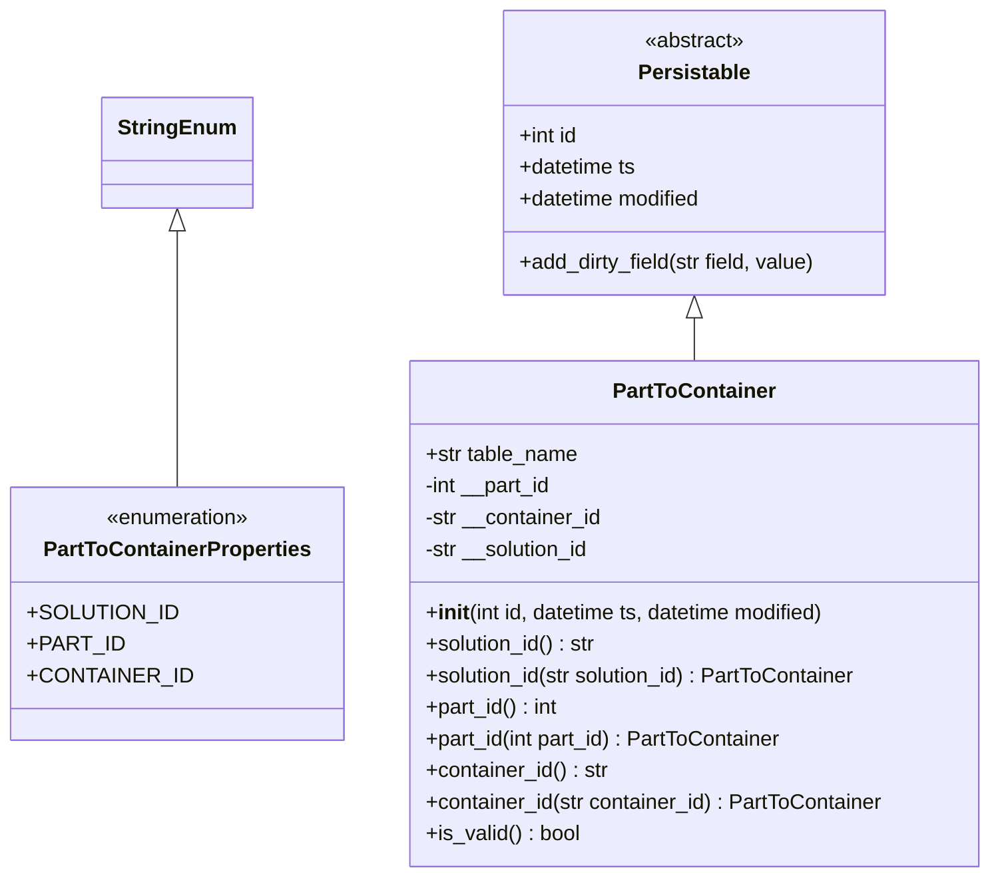
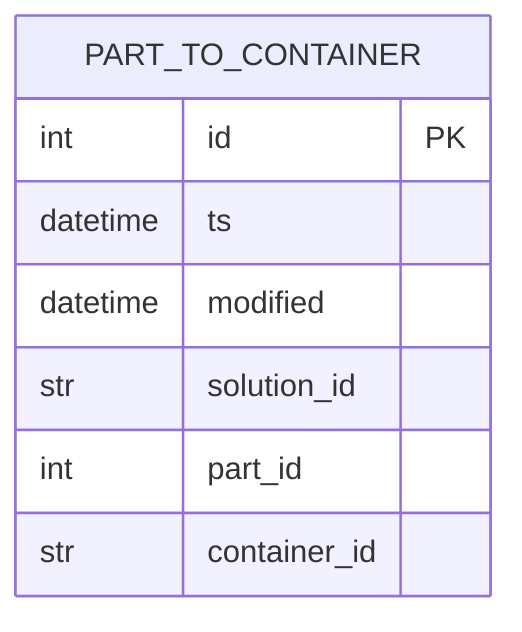

# Diagram: platform/partview_core/partview_service/partview_service/core/datamodel/PartToContainer.py

> Auto-generated by Obscura crawlers

## Diagram 1

### SVG

<svg id="container" width="734.5390625" xmlns="http://www.w3.org/2000/svg" class="classDiagram" height="666" viewBox="0 0 734.5390625 666" role="graphics-document document" aria-roledescription="class"><g><defs><marker id="container_class-aggregationStart" class="marker aggregation class" refX="18" refY="7" markerWidth="190" markerHeight="240" orient="auto"><path d="M 18,7 L9,13 L1,7 L9,1 Z"></path></marker></defs><defs><marker id="container_class-aggregationEnd" class="marker aggregation class" refX="1" refY="7" markerWidth="20" markerHeight="28" orient="auto"><path d="M 18,7 L9,13 L1,7 L9,1 Z"></path></marker></defs><defs><marker id="container_class-extensionStart" class="marker extension class" refX="18" refY="7" markerWidth="190" markerHeight="240" orient="auto"><path d="M 1,7 L18,13 V 1 Z"></path></marker></defs><defs><marker id="container_class-extensionEnd" class="marker extension class" refX="1" refY="7" markerWidth="20" markerHeight="28" orient="auto"><path d="M 1,1 V 13 L18,7 Z"></path></marker></defs><defs><marker id="container_class-compositionStart" class="marker composition class" refX="18" refY="7" markerWidth="190" markerHeight="240" orient="auto"><path d="M 18,7 L9,13 L1,7 L9,1 Z"></path></marker></defs><defs><marker id="container_class-compositionEnd" class="marker composition class" refX="1" refY="7" markerWidth="20" markerHeight="28" orient="auto"><path d="M 18,7 L9,13 L1,7 L9,1 Z"></path></marker></defs><defs><marker id="container_class-dependencyStart" class="marker dependency class" refX="6" refY="7" markerWidth="190" markerHeight="240" orient="auto"><path d="M 5,7 L9,13 L1,7 L9,1 Z"></path></marker></defs><defs><marker id="container_class-dependencyEnd" class="marker dependency class" refX="13" refY="7" markerWidth="20" markerHeight="28" orient="auto"><path d="M 18,7 L9,13 L14,7 L9,1 Z"></path></marker></defs><defs><marker id="container_class-lollipopStart" class="marker lollipop class" refX="13" refY="7" markerWidth="190" markerHeight="240" orient="auto"><circle stroke="black" fill="transparent" cx="7" cy="7" r="6"></circle></marker></defs><defs><marker id="container_class-lollipopEnd" class="marker lollipop class" refX="1" refY="7" markerWidth="190" markerHeight="240" orient="auto"><circle stroke="black" fill="transparent" cx="7" cy="7" r="6"></circle></marker></defs><g class="root"><g class="clusters"></g><g class="edgePaths"><path d="M125.012,175.25L125.012,187.542C125.012,199.833,125.012,224.417,125.012,256.875C125.012,289.333,125.012,329.667,125.012,349.833L125.012,370" id="id_StringEnum_PartToContainerProperties_1" class="edge-thickness-normal edge-pattern-solid relation" style=";;;" data-edge="true" data-et="edge" data-id="id_StringEnum_PartToContainerProperties_1" data-points="W3sieCI6MTI1LjAxMTcxODc1LCJ5IjoxNTh9LHsieCI6MTI1LjAxMTcxODc1LCJ5IjoyNDl9LHsieCI6MTI1LjAxMTcxODc1LCJ5IjozNzB9XQ==" marker-start="url(#container_class-extensionStart)"></path><path d="M509.281,241.25L509.281,242.542C509.281,243.833,509.281,246.417,509.281,251.875C509.281,257.333,509.281,265.667,509.281,269.833L509.281,274" id="id_Persistable_PartToContainer_2" class="edge-thickness-normal edge-pattern-solid relation" style=";;;" data-edge="true" data-et="edge" data-id="id_Persistable_PartToContainer_2" data-points="W3sieCI6NTA5LjI4MTI1LCJ5IjoyMjR9LHsieCI6NTA5LjI4MTI1LCJ5IjoyNDl9LHsieCI6NTA5LjI4MTI1LCJ5IjoyNzR9XQ==" marker-start="url(#container_class-extensionStart)"></path></g><g class="edgeLabels"><g class="edgeLabel"><g class="label" data-id="id_StringEnum_PartToContainerProperties_1" transform="translate(0, 0)"><foreignObject width="0" height="0">

</foreignObject></g></g><g class="edgeLabel"><g class="label" data-id="id_Persistable_PartToContainer_2" transform="translate(0, 0)"><foreignObject width="0" height="0">

</foreignObject></g></g></g><g class="nodes"><g class="node default" id="classId-StringEnum-0" transform="translate(125.01171875, 116)"><g class="basic label-container"><path d="M-54.234375 -42 L54.234375 -42 L54.234375 42 L-54.234375 42" stroke="none" stroke-width="0" fill="#ECECFF" style=""></path><path d="M-54.234375 -42 C-30.565453644815047 -42, -6.896532289630095 -42, 54.234375 -42 M-54.234375 -42 C-26.836348478523693 -42, 0.5616780429526145 -42, 54.234375 -42 M54.234375 -42 C54.234375 -11.127620889209247, 54.234375 19.744758221581506, 54.234375 42 M54.234375 -42 C54.234375 -15.923591911106122, 54.234375 10.152816177787756, 54.234375 42 M54.234375 42 C13.554183019088896 42, -27.126008961822208 42, -54.234375 42 M54.234375 42 C21.47515474569436 42, -11.284065508611278 42, -54.234375 42 M-54.234375 42 C-54.234375 15.24858201500233, -54.234375 -11.502835969995338, -54.234375 -42 M-54.234375 42 C-54.234375 9.63854360647209, -54.234375 -22.72291278705582, -54.234375 -42" stroke="#9370DB" stroke-width="1.3" fill="none" stroke-dasharray="0 0" style=""></path></g><g class="annotation-group text" transform="translate(0, -18)"></g><g class="label-group text" transform="translate(-42.234375, -18)"><g class="label" style="font-weight: bolder" transform="translate(0,-12)"><foreignObject width="84.46875" height="24">

StringEnum

</foreignObject></g></g><g class="members-group text" transform="translate(-42.234375, 30)"></g><g class="methods-group text" transform="translate(-42.234375, 60)"></g><g class="divider" style=""><path d="M-54.234375 6 C-29.892046475943907 6, -5.549717951887814 6, 54.234375 6 M-54.234375 6 C-11.832335311025567 6, 30.569704377948867 6, 54.234375 6" stroke="#9370DB" stroke-width="1.3" fill="none" stroke-dasharray="0 0" style=""></path></g><g class="divider" style=""><path d="M-54.234375 24 C-29.837349260260854 24, -5.440323520521709 24, 54.234375 24 M-54.234375 24 C-14.05259263025279 24, 26.12918973949442 24, 54.234375 24" stroke="#9370DB" stroke-width="1.3" fill="none" stroke-dasharray="0 0" style=""></path></g></g><g class="node default" id="classId-PartToContainerProperties-1" transform="translate(125.01171875, 466)"><g class="basic label-container"><path d="M-117.01171875 -96 L117.01171875 -96 L117.01171875 96 L-117.01171875 96" stroke="none" stroke-width="0" fill="#ECECFF" style=""></path><path d="M-117.01171875 -96 C-44.861952609326124 -96, 27.28781353134775 -96, 117.01171875 -96 M-117.01171875 -96 C-23.859425125772688 -96, 69.29286849845462 -96, 117.01171875 -96 M117.01171875 -96 C117.01171875 -44.71823894762575, 117.01171875 6.5635221047485, 117.01171875 96 M117.01171875 -96 C117.01171875 -38.304610137647956, 117.01171875 19.39077972470409, 117.01171875 96 M117.01171875 96 C64.32359796302177 96, 11.635477176043537 96, -117.01171875 96 M117.01171875 96 C31.68531248136111 96, -53.64109378727778 96, -117.01171875 96 M-117.01171875 96 C-117.01171875 43.449762375105415, -117.01171875 -9.10047524978917, -117.01171875 -96 M-117.01171875 96 C-117.01171875 52.613821355424015, -117.01171875 9.22764271084803, -117.01171875 -96" stroke="#9370DB" stroke-width="1.3" fill="none" stroke-dasharray="0 0" style=""></path></g><g class="annotation-group text" transform="translate(-55.5546875, -72)"><g class="label" style="" transform="translate(0,-12)"><foreignObject width="111.109375" height="24">

«enumeration»

</foreignObject></g></g><g class="label-group text" transform="translate(-97.5234375, -48)"><g class="label" style="font-weight: bolder" transform="translate(0,-12)"><foreignObject width="195.046875" height="24">

PartToContainerProperties

</foreignObject></g></g><g class="members-group text" transform="translate(-105.01171875, 0)"><g class="label" style="" transform="translate(0,-12)"><foreignObject width="103.640625" height="24">

+SOLUTION_ID

</foreignObject></g><g class="label" style="" transform="translate(0,12)"><foreignObject width="65.671875" height="24">

+PART_ID

</foreignObject></g><g class="label" style="" transform="translate(0,36)"><foreignObject width="112.5" height="24">

+CONTAINER_ID

</foreignObject></g></g><g class="methods-group text" transform="translate(-105.01171875, 96)"></g><g class="divider" style=""><path d="M-117.01171875 -24 C-56.263983831267865 -24, 4.48375108746427 -24, 117.01171875 -24 M-117.01171875 -24 C-28.629684405657684 -24, 59.75234993868463 -24, 117.01171875 -24" stroke="#9370DB" stroke-width="1.3" fill="none" stroke-dasharray="0 0" style=""></path></g><g class="divider" style=""><path d="M-117.01171875 72 C-60.31424936091293 72, -3.6167799718258635 72, 117.01171875 72 M-117.01171875 72 C-47.240497403802294 72, 22.53072394239541 72, 117.01171875 72" stroke="#9370DB" stroke-width="1.3" fill="none" stroke-dasharray="0 0" style=""></path></g></g><g class="node default" id="classId-Persistable-2" transform="translate(509.28125, 116)"><g class="basic label-container"><path d="M-147.55078125 -108 L147.55078125 -108 L147.55078125 108 L-147.55078125 108" stroke="none" stroke-width="0" fill="#ECECFF" style=""></path><path d="M-147.55078125 -108 C-86.1924312571228 -108, -24.83408126424561 -108, 147.55078125 -108 M-147.55078125 -108 C-74.36514213361639 -108, -1.1795030172327756 -108, 147.55078125 -108 M147.55078125 -108 C147.55078125 -22.0261215192713, 147.55078125 63.9477569614574, 147.55078125 108 M147.55078125 -108 C147.55078125 -45.43107847486924, 147.55078125 17.137843050261523, 147.55078125 108 M147.55078125 108 C39.994938628630734 108, -67.56090399273853 108, -147.55078125 108 M147.55078125 108 C81.35008765321996 108, 15.149394056439917 108, -147.55078125 108 M-147.55078125 108 C-147.55078125 45.096700160434935, -147.55078125 -17.80659967913013, -147.55078125 -108 M-147.55078125 108 C-147.55078125 56.74634311713593, -147.55078125 5.492686234271858, -147.55078125 -108" stroke="#9370DB" stroke-width="1.3" fill="none" stroke-dasharray="0 0" style=""></path></g><g class="annotation-group text" transform="translate(-38.609375, -84)"><g class="label" style="" transform="translate(0,-12)"><foreignObject width="77.21875" height="24">

«abstract»

</foreignObject></g></g><g class="label-group text" transform="translate(-40.9765625, -60)"><g class="label" style="font-weight: bolder" transform="translate(0,-12)"><foreignObject width="81.953125" height="24">

Persistable

</foreignObject></g></g><g class="members-group text" transform="translate(-135.55078125, -12)"><g class="label" style="" transform="translate(0,-12)"><foreignObject width="45.96875" height="24">

+int id

</foreignObject></g><g class="label" style="" transform="translate(0,12)"><foreignObject width="90.734375" height="24">

+datetime ts

</foreignObject></g><g class="label" style="" transform="translate(0,36)"><foreignObject width="142.109375" height="24">

+datetime modified

</foreignObject></g></g><g class="methods-group text" transform="translate(-135.55078125, 84)"><g class="label" style="" transform="translate(0,-12)"><foreignObject width="230.125" height="24">

+add_dirty_field(str field, value)

</foreignObject></g></g><g class="divider" style=""><path d="M-147.55078125 -36 C-53.95727996868311 -36, 39.63622131263378 -36, 147.55078125 -36 M-147.55078125 -36 C-42.57982327602356 -36, 62.39113469795288 -36, 147.55078125 -36" stroke="#9370DB" stroke-width="1.3" fill="none" stroke-dasharray="0 0" style=""></path></g><g class="divider" style=""><path d="M-147.55078125 60 C-66.3559244988356 60, 14.838932252328789 60, 147.55078125 60 M-147.55078125 60 C-42.46983116063184 60, 62.61111892873632 60, 147.55078125 60" stroke="#9370DB" stroke-width="1.3" fill="none" stroke-dasharray="0 0" style=""></path></g></g><g class="node default" id="classId-PartToContainer-3" transform="translate(509.28125, 466)"><g class="basic label-container"><path d="M-217.2578125 -192 L217.2578125 -192 L217.2578125 192 L-217.2578125 192" stroke="none" stroke-width="0" fill="#ECECFF" style=""></path><path d="M-217.2578125 -192 C-60.28587692804973 -192, 96.68605864390054 -192, 217.2578125 -192 M-217.2578125 -192 C-74.39244696408076 -192, 68.47291857183848 -192, 217.2578125 -192 M217.2578125 -192 C217.2578125 -112.09886214063803, 217.2578125 -32.19772428127607, 217.2578125 192 M217.2578125 -192 C217.2578125 -91.9551028496958, 217.2578125 8.08979430060839, 217.2578125 192 M217.2578125 192 C126.38856050358976 192, 35.51930850717952 192, -217.2578125 192 M217.2578125 192 C123.1525273116675 192, 29.047242123334996 192, -217.2578125 192 M-217.2578125 192 C-217.2578125 91.69563181606698, -217.2578125 -8.608736367866044, -217.2578125 -192 M-217.2578125 192 C-217.2578125 82.19494804792984, -217.2578125 -27.610103904140317, -217.2578125 -192" stroke="#9370DB" stroke-width="1.3" fill="none" stroke-dasharray="0 0" style=""></path></g><g class="annotation-group text" transform="translate(0, -168)"></g><g class="label-group text" transform="translate(-59.21875, -168)"><g class="label" style="font-weight: bolder" transform="translate(0,-12)"><foreignObject width="118.4375" height="24">

PartToContainer

</foreignObject></g></g><g class="members-group text" transform="translate(-205.2578125, -120)"><g class="label" style="" transform="translate(0,-12)"><foreignObject width="117.375" height="24">

+str table_name

</foreignObject></g><g class="label" style="" transform="translate(0,12)"><foreignObject width="99.234375" height="24">

-int __part_id

</foreignObject></g><g class="label" style="" transform="translate(0,36)"><foreignObject width="136.59375" height="24">

-str __container_id

</foreignObject></g><g class="label" style="" transform="translate(0,60)"><foreignObject width="128.828125" height="24">

-str __solution_id

</foreignObject></g></g><g class="methods-group text" transform="translate(-205.2578125, 0)"><g class="label" style="" transform="translate(0,-12)"><foreignObject width="313.796875" height="24">

+<strong>init</strong>(int id, datetime ts, datetime modified)

</foreignObject></g><g class="label" style="" transform="translate(0,12)"><foreignObject width="132.328125" height="24">

+solution_id() : str

</foreignObject></g><g class="label" style="" transform="translate(0,36)"><foreignObject width="335.109375" height="24">

+solution_id(str solution_id) : PartToContainer

</foreignObject></g><g class="label" style="" transform="translate(0,60)"><foreignObject width="102.75" height="24">

+part_id() : int

</foreignObject></g><g class="label" style="" transform="translate(0,84)"><foreignObject width="275.703125" height="24">

+part_id(int part_id) : PartToContainer

</foreignObject></g><g class="label" style="" transform="translate(0,108)"><foreignObject width="140.421875" height="24">

+container_id() : str

</foreignObject></g><g class="label" style="" transform="translate(0,132)"><foreignObject width="351.296875" height="24">

+container_id(str container_id) : PartToContainer

</foreignObject></g><g class="label" style="" transform="translate(0,156)"><foreignObject width="117.984375" height="24">

+is_valid() : bool

</foreignObject></g></g><g class="divider" style=""><path d="M-217.2578125 -144 C-53.936287771693145 -144, 109.38523695661371 -144, 217.2578125 -144 M-217.2578125 -144 C-51.38166050570919 -144, 114.49449148858162 -144, 217.2578125 -144" stroke="#9370DB" stroke-width="1.3" fill="none" stroke-dasharray="0 0" style=""></path></g><g class="divider" style=""><path d="M-217.2578125 -24 C-118.64550809241591 -24, -20.03320368483182 -24, 217.2578125 -24 M-217.2578125 -24 C-107.41404370671044 -24, 2.4297250865791113 -24, 217.2578125 -24" stroke="#9370DB" stroke-width="1.3" fill="none" stroke-dasharray="0 0" style=""></path></g></g></g></g></g></svg>

## Diagram 2

### SVG

<svg id="container" width="265.3125" xmlns="http://www.w3.org/2000/svg" class="erDiagram" height="315.25" viewBox="0 0 265.3125 315.25" role="graphics-document document" aria-roledescription="er"><g><defs><marker id="container_er-onlyOneStart" class="marker onlyOne er" refX="0" refY="9" markerWidth="18" markerHeight="18" orient="auto"><path d="M9,0 L9,18 M15,0 L15,18"></path></marker></defs><defs><marker id="container_er-onlyOneEnd" class="marker onlyOne er" refX="18" refY="9" markerWidth="18" markerHeight="18" orient="auto"><path d="M3,0 L3,18 M9,0 L9,18"></path></marker></defs><defs><marker id="container_er-zeroOrOneStart" class="marker zeroOrOne er" refX="0" refY="9" markerWidth="30" markerHeight="18" orient="auto"><circle fill="white" cx="21" cy="9" r="6"></circle><path d="M9,0 L9,18"></path></marker></defs><defs><marker id="container_er-zeroOrOneEnd" class="marker zeroOrOne er" refX="30" refY="9" markerWidth="30" markerHeight="18" orient="auto"><circle fill="white" cx="9" cy="9" r="6"></circle><path d="M21,0 L21,18"></path></marker></defs><defs><marker id="container_er-oneOrMoreStart" class="marker oneOrMore er" refX="18" refY="18" markerWidth="45" markerHeight="36" orient="auto"><path d="M0,18 Q 18,0 36,18 Q 18,36 0,18 M42,9 L42,27"></path></marker></defs><defs><marker id="container_er-oneOrMoreEnd" class="marker oneOrMore er" refX="27" refY="18" markerWidth="45" markerHeight="36" orient="auto"><path d="M3,9 L3,27 M9,18 Q27,0 45,18 Q27,36 9,18"></path></marker></defs><defs><marker id="container_er-zeroOrMoreStart" class="marker zeroOrMore er" refX="18" refY="18" markerWidth="57" markerHeight="36" orient="auto"><circle fill="white" cx="48" cy="18" r="6"></circle><path d="M0,18 Q18,0 36,18 Q18,36 0,18"></path></marker></defs><defs><marker id="container_er-zeroOrMoreEnd" class="marker zeroOrMore er" refX="39" refY="18" markerWidth="57" markerHeight="36" orient="auto"><circle fill="white" cx="9" cy="18" r="6"></circle><path d="M21,18 Q39,0 57,18 Q39,36 21,18"></path></marker></defs><g class="root"><g class="clusters"></g><g class="edgePaths"></g><g class="edgeLabels"></g><g class="nodes"><g class="node default" id="entity-PART_TO_CONTAINER-0" transform="translate(132.65625, 157.625)"><g style=""><path d="M-124.65625 -149.625 L124.65625 -149.625 L124.65625 149.625 L-124.65625 149.625" stroke="none" stroke-width="0" fill="#ECECFF"></path><path d="M-124.65625 -149.625 C-59.931070074130616 -149.625, 4.794109851738767 -149.625, 124.65625 -149.625 M-124.65625 -149.625 C-33.6698210116665 -149.625, 57.316607976667 -149.625, 124.65625 -149.625 M124.65625 -149.625 C124.65625 -48.5818544720904, 124.65625 52.4612910558192, 124.65625 149.625 M124.65625 -149.625 C124.65625 -71.60102471872007, 124.65625 6.422950562559862, 124.65625 149.625 M124.65625 149.625 C32.4115717610689 149.625, -59.8331064778622 149.625, -124.65625 149.625 M124.65625 149.625 C72.12568793170288 149.625, 19.595125863405784 149.625, -124.65625 149.625 M-124.65625 149.625 C-124.65625 80.02736411382378, -124.65625 10.429728227647558, -124.65625 -149.625 M-124.65625 149.625 C-124.65625 60.835224495744114, -124.65625 -27.95455100851177, -124.65625 -149.625" stroke="#9370DB" stroke-width="1.3" fill="none" stroke-dasharray="0 0"></path></g><g style="" class="row-rect-odd"><path d="M-124.65625 -106.875 L124.65625 -106.875 L124.65625 -64.125 L-124.65625 -64.125" stroke="none" stroke-width="0" fill="hsl(240, 100%, 100%)"></path><path d="M-124.65625 -106.875 C-37.951207313775754 -106.875, 48.75383537244849 -106.875, 124.65625 -106.875 M-124.65625 -106.875 C-29.030591269464537 -106.875, 66.59506746107093 -106.875, 124.65625 -106.875 M124.65625 -106.875 C124.65625 -93.3459438102254, 124.65625 -79.81688762045081, 124.65625 -64.125 M124.65625 -106.875 C124.65625 -98.24944842995264, 124.65625 -89.62389685990529, 124.65625 -64.125 M124.65625 -64.125 C64.17414264400992 -64.125, 3.6920352880198237 -64.125, -124.65625 -64.125 M124.65625 -64.125 C33.75659432096208 -64.125, -57.14306135807584 -64.125, -124.65625 -64.125 M-124.65625 -64.125 C-124.65625 -79.32758244982061, -124.65625 -94.5301648996412, -124.65625 -106.875 M-124.65625 -64.125 C-124.65625 -81.16357749086117, -124.65625 -98.20215498172236, -124.65625 -106.875" stroke="#9370DB" stroke-width="1.3" fill="none" stroke-dasharray="0 0"></path></g><g style="" class="row-rect-even"><path d="M-124.65625 -64.125 L124.65625 -64.125 L124.65625 -21.375 L-124.65625 -21.375" stroke="none" stroke-width="0" fill="hsl(240, 100%, 97.2745098039%)"></path><path d="M-124.65625 -64.125 C-53.523905785057494 -64.125, 17.608438429885013 -64.125, 124.65625 -64.125 M-124.65625 -64.125 C-40.36817406223825 -64.125, 43.91990187552349 -64.125, 124.65625 -64.125 M124.65625 -64.125 C124.65625 -52.60117866828452, 124.65625 -41.07735733656904, 124.65625 -21.375 M124.65625 -64.125 C124.65625 -51.01492531265742, 124.65625 -37.904850625314836, 124.65625 -21.375 M124.65625 -21.375 C59.3985825651327 -21.375, -5.859084869734602 -21.375, -124.65625 -21.375 M124.65625 -21.375 C40.96089673470611 -21.375, -42.73445653058778 -21.375, -124.65625 -21.375 M-124.65625 -21.375 C-124.65625 -30.6256634562477, -124.65625 -39.8763269124954, -124.65625 -64.125 M-124.65625 -21.375 C-124.65625 -33.82989677810265, -124.65625 -46.284793556205294, -124.65625 -64.125" stroke="#9370DB" stroke-width="1.3" fill="none" stroke-dasharray="0 0"></path></g><g style="" class="row-rect-odd"><path d="M-124.65625 -21.375 L124.65625 -21.375 L124.65625 21.375 L-124.65625 21.375" stroke="none" stroke-width="0" fill="hsl(240, 100%, 100%)"></path><path d="M-124.65625 -21.375 C-71.41072794586725 -21.375, -18.1652058917345 -21.375, 124.65625 -21.375 M-124.65625 -21.375 C-27.424009815413314 -21.375, 69.80823036917337 -21.375, 124.65625 -21.375 M124.65625 -21.375 C124.65625 -6.216831572121084, 124.65625 8.941336855757832, 124.65625 21.375 M124.65625 -21.375 C124.65625 -9.015635934407518, 124.65625 3.343728131184964, 124.65625 21.375 M124.65625 21.375 C74.36323460321663 21.375, 24.070219206433265 21.375, -124.65625 21.375 M124.65625 21.375 C61.249944822767574 21.375, -2.1563603544648515 21.375, -124.65625 21.375 M-124.65625 21.375 C-124.65625 10.631303811305472, -124.65625 -0.11239237738905672, -124.65625 -21.375 M-124.65625 21.375 C-124.65625 5.287692871733189, -124.65625 -10.799614256533623, -124.65625 -21.375" stroke="#9370DB" stroke-width="1.3" fill="none" stroke-dasharray="0 0"></path></g><g style="" class="row-rect-even"><path d="M-124.65625 21.375 L124.65625 21.375 L124.65625 64.125 L-124.65625 64.125" stroke="none" stroke-width="0" fill="hsl(240, 100%, 97.2745098039%)"></path><path d="M-124.65625 21.375 C-56.55023482981041 21.375, 11.555780340379187 21.375, 124.65625 21.375 M-124.65625 21.375 C-34.80468228483117 21.375, 55.04688543033765 21.375, 124.65625 21.375 M124.65625 21.375 C124.65625 35.923864669859846, 124.65625 50.47272933971969, 124.65625 64.125 M124.65625 21.375 C124.65625 34.726255234758774, 124.65625 48.07751046951755, 124.65625 64.125 M124.65625 64.125 C58.9480440498849 64.125, -6.760161900230202 64.125, -124.65625 64.125 M124.65625 64.125 C59.73067637834994 64.125, -5.194897243300119 64.125, -124.65625 64.125 M-124.65625 64.125 C-124.65625 50.33674127595947, -124.65625 36.54848255191893, -124.65625 21.375 M-124.65625 64.125 C-124.65625 55.388937294041106, -124.65625 46.65287458808221, -124.65625 21.375" stroke="#9370DB" stroke-width="1.3" fill="none" stroke-dasharray="0 0"></path></g><g style="" class="row-rect-odd"><path d="M-124.65625 64.125 L124.65625 64.125 L124.65625 106.875 L-124.65625 106.875" stroke="none" stroke-width="0" fill="hsl(240, 100%, 100%)"></path><path d="M-124.65625 64.125 C-51.31173301065341 64.125, 22.032783978693175 64.125, 124.65625 64.125 M-124.65625 64.125 C-68.92108203542809 64.125, -13.185914070856171 64.125, 124.65625 64.125 M124.65625 64.125 C124.65625 75.27134692513674, 124.65625 86.41769385027348, 124.65625 106.875 M124.65625 64.125 C124.65625 76.94693204976289, 124.65625 89.76886409952579, 124.65625 106.875 M124.65625 106.875 C51.84141623006494 106.875, -20.973417539870127 106.875, -124.65625 106.875 M124.65625 106.875 C63.9509052568891 106.875, 3.2455605137782015 106.875, -124.65625 106.875 M-124.65625 106.875 C-124.65625 96.88485885232366, -124.65625 86.89471770464732, -124.65625 64.125 M-124.65625 106.875 C-124.65625 92.28150698177157, -124.65625 77.68801396354314, -124.65625 64.125" stroke="#9370DB" stroke-width="1.3" fill="none" stroke-dasharray="0 0"></path></g><g style="" class="row-rect-even"><path d="M-124.65625 106.875 L124.65625 106.875 L124.65625 149.625 L-124.65625 149.625" stroke="none" stroke-width="0" fill="hsl(240, 100%, 97.2745098039%)"></path><path d="M-124.65625 106.875 C-51.8510432237735 106.875, 20.954163552452997 106.875, 124.65625 106.875 M-124.65625 106.875 C-60.39532189608323 106.875, 3.8656062078335367 106.875, 124.65625 106.875 M124.65625 106.875 C124.65625 122.82696047384016, 124.65625 138.77892094768032, 124.65625 149.625 M124.65625 106.875 C124.65625 116.7244774611429, 124.65625 126.57395492228578, 124.65625 149.625 M124.65625 149.625 C48.316696648600825 149.625, -28.02285670279835 149.625, -124.65625 149.625 M124.65625 149.625 C41.19358781235948 149.625, -42.269074375281036 149.625, -124.65625 149.625 M-124.65625 149.625 C-124.65625 137.97710207872325, -124.65625 126.32920415744651, -124.65625 106.875 M-124.65625 149.625 C-124.65625 137.82430067539525, -124.65625 126.02360135079051, -124.65625 106.875" stroke="#9370DB" stroke-width="1.3" fill="none" stroke-dasharray="0 0"></path></g><g class="label name" transform="translate(-74.4296875, -140.25)" style=""><foreignObject width="148.859375" height="24">

PART_TO_CONTAINER

</foreignObject></g><g class="label attribute-type" transform="translate(-112.15625, -97.5)" style=""><foreignObject width="19.671875" height="24">

int

</foreignObject></g><g class="label attribute-name" transform="translate(-21.90625, -97.5)" style=""><foreignObject width="14.09375" height="24">

id

</foreignObject></g><g class="label attribute-keys" transform="translate(93.421875, -97.5)" style=""><foreignObject width="18.734375" height="24">

PK

</foreignObject></g><g class="label attribute-comment" transform="translate(137.15625, -97.5)" style=""><foreignObject width="0" height="0">

</foreignObject></g><g class="label attribute-type" transform="translate(-112.15625, -54.75)" style=""><foreignObject width="65.25" height="24">

datetime

</foreignObject></g><g class="label attribute-name" transform="translate(-21.90625, -54.75)" style=""><foreignObject width="13.25" height="24">

ts

</foreignObject></g><g class="label attribute-keys" transform="translate(93.421875, -54.75)" style=""><foreignObject width="0" height="0">

</foreignObject></g><g class="label attribute-comment" transform="translate(137.15625, -54.75)" style=""><foreignObject width="0" height="0">

</foreignObject></g><g class="label attribute-type" transform="translate(-112.15625, -12)" style=""><foreignObject width="65.25" height="24">

datetime

</foreignObject></g><g class="label attribute-name" transform="translate(-21.90625, -12)" style=""><foreignObject width="64.625" height="24">

modified

</foreignObject></g><g class="label attribute-keys" transform="translate(93.421875, -12)" style=""><foreignObject width="0" height="0">

</foreignObject></g><g class="label attribute-comment" transform="translate(137.15625, -12)" style=""><foreignObject width="0" height="0">

</foreignObject></g><g class="label attribute-type" transform="translate(-112.15625, 30.75)" style=""><foreignObject width="19.4375" height="24">

str

</foreignObject></g><g class="label attribute-name" transform="translate(-21.90625, 30.75)" style=""><foreignObject width="82.234375" height="24">

solution_id

</foreignObject></g><g class="label attribute-keys" transform="translate(93.421875, 30.75)" style=""><foreignObject width="0" height="0">

</foreignObject></g><g class="label attribute-comment" transform="translate(137.15625, 30.75)" style=""><foreignObject width="0" height="0">

</foreignObject></g><g class="label attribute-type" transform="translate(-112.15625, 73.5)" style=""><foreignObject width="19.671875" height="24">

int

</foreignObject></g><g class="label attribute-name" transform="translate(-21.90625, 73.5)" style=""><foreignObject width="52.40625" height="24">

part_id

</foreignObject></g><g class="label attribute-keys" transform="translate(93.421875, 73.5)" style=""><foreignObject width="0" height="0">

</foreignObject></g><g class="label attribute-comment" transform="translate(137.15625, 73.5)" style=""><foreignObject width="0" height="0">

</foreignObject></g><g class="label attribute-type" transform="translate(-112.15625, 116.25)" style=""><foreignObject width="19.4375" height="24">

str

</foreignObject></g><g class="label attribute-name" transform="translate(-21.90625, 116.25)" style=""><foreignObject width="90.328125" height="24">

container_id

</foreignObject></g><g class="label attribute-keys" transform="translate(93.421875, 116.25)" style=""><foreignObject width="0" height="0">

</foreignObject></g><g class="label attribute-comment" transform="translate(137.15625, 116.25)" style=""><foreignObject width="0" height="0">

</foreignObject></g><g class="divider"><path d="M-124.65625 -106.875 C-43.36061831068737 -106.875, 37.93501337862526 -106.875, 124.65625 -106.875 M-124.65625 -106.875 C-34.63107033424117 -106.875, 55.394109331517654 -106.875, 124.65625 -106.875" stroke="#9370DB" stroke-width="1.3" fill="none" stroke-dasharray="0 0"></path></g><g class="divider"><path d="M-34.40625 -106.875 C-34.40625 -13.535457335014314, -34.40625 79.80408532997137, -34.40625 149.625 M-34.40625 -106.875 C-34.40625 -34.737398058131674, -34.40625 37.40020388373665, -34.40625 149.625" stroke="#9370DB" stroke-width="1.3" fill="none" stroke-dasharray="0 0"></path></g><g class="divider"><path d="M80.921875 -106.875 C80.921875 -14.393070997316897, 80.921875 78.0888580053662, 80.921875 149.625 M80.921875 -106.875 C80.921875 -45.060492712559885, 80.921875 16.75401457488023, 80.921875 149.625" stroke="#9370DB" stroke-width="1.3" fill="none" stroke-dasharray="0 0"></path></g><g class="divider"><path d="M-124.65625 -106.875 C-46.52893294729908 -106.875, 31.598384105401834 -106.875, 124.65625 -106.875 M-124.65625 -106.875 C-69.93613130877856 -106.875, -15.216012617557098 -106.875, 124.65625 -106.875" stroke="#9370DB" stroke-width="1.3" fill="none" stroke-dasharray="0 0"></path></g></g></g></g></g></svg>
