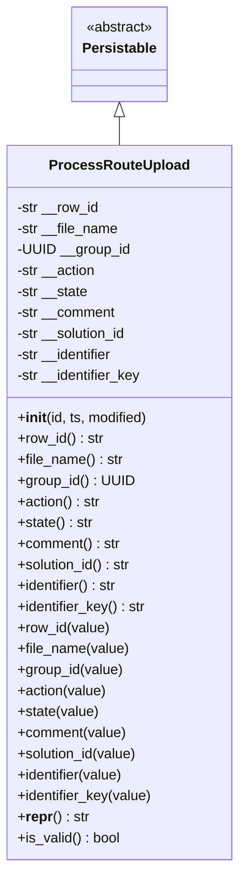
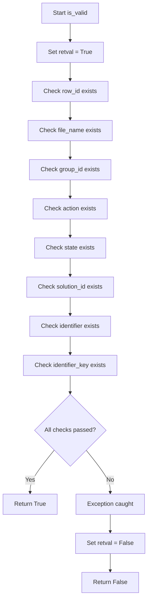
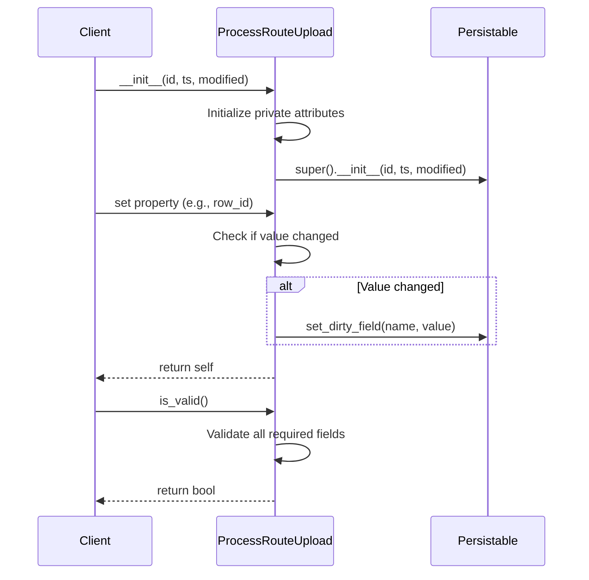

# Diagram: platform/partview_core/partview_service/partview_service/core/datamodel/ProcessRouteUpload.py

> Auto-generated by Obscura crawlers

## Diagram 1

### SVG

<svg id="container" width="270.984375" xmlns="http://www.w3.org/2000/svg" class="classDiagram" height="990" viewBox="0 0 270.984375 990" role="graphics-document document" aria-roledescription="class"><g><defs><marker id="container_class-aggregationStart" class="marker aggregation class" refX="18" refY="7" markerWidth="190" markerHeight="240" orient="auto"><path d="M 18,7 L9,13 L1,7 L9,1 Z"></path></marker></defs><defs><marker id="container_class-aggregationEnd" class="marker aggregation class" refX="1" refY="7" markerWidth="20" markerHeight="28" orient="auto"><path d="M 18,7 L9,13 L1,7 L9,1 Z"></path></marker></defs><defs><marker id="container_class-extensionStart" class="marker extension class" refX="18" refY="7" markerWidth="190" markerHeight="240" orient="auto"><path d="M 1,7 L18,13 V 1 Z"></path></marker></defs><defs><marker id="container_class-extensionEnd" class="marker extension class" refX="1" refY="7" markerWidth="20" markerHeight="28" orient="auto"><path d="M 1,1 V 13 L18,7 Z"></path></marker></defs><defs><marker id="container_class-compositionStart" class="marker composition class" refX="18" refY="7" markerWidth="190" markerHeight="240" orient="auto"><path d="M 18,7 L9,13 L1,7 L9,1 Z"></path></marker></defs><defs><marker id="container_class-compositionEnd" class="marker composition class" refX="1" refY="7" markerWidth="20" markerHeight="28" orient="auto"><path d="M 18,7 L9,13 L1,7 L9,1 Z"></path></marker></defs><defs><marker id="container_class-dependencyStart" class="marker dependency class" refX="6" refY="7" markerWidth="190" markerHeight="240" orient="auto"><path d="M 5,7 L9,13 L1,7 L9,1 Z"></path></marker></defs><defs><marker id="container_class-dependencyEnd" class="marker dependency class" refX="13" refY="7" markerWidth="20" markerHeight="28" orient="auto"><path d="M 18,7 L9,13 L14,7 L9,1 Z"></path></marker></defs><defs><marker id="container_class-lollipopStart" class="marker lollipop class" refX="13" refY="7" markerWidth="190" markerHeight="240" orient="auto"><circle stroke="black" fill="transparent" cx="7" cy="7" r="6"></circle></marker></defs><defs><marker id="container_class-lollipopEnd" class="marker lollipop class" refX="1" refY="7" markerWidth="190" markerHeight="240" orient="auto"><circle stroke="black" fill="transparent" cx="7" cy="7" r="6"></circle></marker></defs><g class="root"><g class="clusters"></g><g class="edgePaths"><path d="M135.492,133.25L135.492,134.542C135.492,135.833,135.492,138.417,135.492,143.875C135.492,149.333,135.492,157.667,135.492,161.833L135.492,166" id="id_Persistable_ProcessRouteUpload_1" class="edge-thickness-normal edge-pattern-solid relation" style=";;;" data-edge="true" data-et="edge" data-id="id_Persistable_ProcessRouteUpload_1" data-points="W3sieCI6MTM1LjQ5MjE4NzUsInkiOjExNn0seyJ4IjoxMzUuNDkyMTg3NSwieSI6MTQxfSx7IngiOjEzNS40OTIxODc1LCJ5IjoxNjZ9XQ==" marker-start="url(#container_class-extensionStart)"></path></g><g class="edgeLabels"><g class="edgeLabel"><g class="label" data-id="id_Persistable_ProcessRouteUpload_1" transform="translate(0, 0)"><foreignObject width="0" height="0">

</foreignObject></g></g></g><g class="nodes"><g class="node default" id="classId-Persistable-0" transform="translate(135.4921875, 62)"><g class="basic label-container"><path d="M-52.9765625 -54 L52.9765625 -54 L52.9765625 54 L-52.9765625 54" stroke="none" stroke-width="0" fill="#ECECFF" style=""></path><path d="M-52.9765625 -54 C-18.191148314910357 -54, 16.594265870179285 -54, 52.9765625 -54 M-52.9765625 -54 C-10.598048971973938 -54, 31.780464556052124 -54, 52.9765625 -54 M52.9765625 -54 C52.9765625 -27.35592255210676, 52.9765625 -0.7118451042135234, 52.9765625 54 M52.9765625 -54 C52.9765625 -19.775093894033446, 52.9765625 14.449812211933107, 52.9765625 54 M52.9765625 54 C22.718155232488748 54, -7.540252035022505 54, -52.9765625 54 M52.9765625 54 C10.857013512712406 54, -31.262535474575188 54, -52.9765625 54 M-52.9765625 54 C-52.9765625 23.961489617323664, -52.9765625 -6.077020765352671, -52.9765625 -54 M-52.9765625 54 C-52.9765625 28.72760733579489, -52.9765625 3.455214671589779, -52.9765625 -54" stroke="#9370DB" stroke-width="1.3" fill="none" stroke-dasharray="0 0" style=""></path></g><g class="annotation-group text" transform="translate(-38.609375, -30)"><g class="label" style="" transform="translate(0,-12)"><foreignObject width="77.21875" height="24">

«abstract»

</foreignObject></g></g><g class="label-group text" transform="translate(-40.9765625, -6)"><g class="label" style="font-weight: bolder" transform="translate(0,-12)"><foreignObject width="81.953125" height="24">

Persistable

</foreignObject></g></g><g class="members-group text" transform="translate(-40.9765625, 42)"></g><g class="methods-group text" transform="translate(-40.9765625, 72)"></g><g class="divider" style=""><path d="M-52.9765625 18 C-18.871784114103875 18, 15.23299427179225 18, 52.9765625 18 M-52.9765625 18 C-19.286183233914088 18, 14.404196032171825 18, 52.9765625 18" stroke="#9370DB" stroke-width="1.3" fill="none" stroke-dasharray="0 0" style=""></path></g><g class="divider" style=""><path d="M-52.9765625 36 C-20.045939547621195 36, 12.88468340475761 36, 52.9765625 36 M-52.9765625 36 C-27.947158636530137 36, -2.917754773060274 36, 52.9765625 36" stroke="#9370DB" stroke-width="1.3" fill="none" stroke-dasharray="0 0" style=""></path></g></g><g class="node default" id="classId-ProcessRouteUpload-1" transform="translate(135.4921875, 574)"><g class="basic label-container"><path d="M-127.4921875 -408 L127.4921875 -408 L127.4921875 408 L-127.4921875 408" stroke="none" stroke-width="0" fill="#ECECFF" style=""></path><path d="M-127.4921875 -408 C-43.661744908647194 -408, 40.16869768270561 -408, 127.4921875 -408 M-127.4921875 -408 C-70.20472072020596 -408, -12.91725394041191 -408, 127.4921875 -408 M127.4921875 -408 C127.4921875 -149.56924018841806, 127.4921875 108.86151962316387, 127.4921875 408 M127.4921875 -408 C127.4921875 -105.12786709138811, 127.4921875 197.74426581722378, 127.4921875 408 M127.4921875 408 C38.270049682205865 408, -50.95208813558827 408, -127.4921875 408 M127.4921875 408 C38.28128652721453 408, -50.929614445570934 408, -127.4921875 408 M-127.4921875 408 C-127.4921875 181.26906567849232, -127.4921875 -45.46186864301535, -127.4921875 -408 M-127.4921875 408 C-127.4921875 135.57146510677507, -127.4921875 -136.85706978644987, -127.4921875 -408" stroke="#9370DB" stroke-width="1.3" fill="none" stroke-dasharray="0 0" style=""></path></g><g class="annotation-group text" transform="translate(0, -384)"></g><g class="label-group text" transform="translate(-75.5625, -384)"><g class="label" style="font-weight: bolder" transform="translate(0,-12)"><foreignObject width="151.125" height="24">

ProcessRouteUpload

</foreignObject></g></g><g class="members-group text" transform="translate(-115.4921875, -336)"><g class="label" style="" transform="translate(0,-12)"><foreignObject width="95.1875" height="24">

-str __row_id

</foreignObject></g><g class="label" style="" transform="translate(0,12)"><foreignObject width="117.3125" height="24">

-str __file_name

</foreignObject></g><g class="label" style="" transform="translate(0,36)"><foreignObject width="127.78125" height="24">

-UUID __group_id

</foreignObject></g><g class="label" style="" transform="translate(0,60)"><foreignObject width="91.640625" height="24">

-str __action

</foreignObject></g><g class="label" style="" transform="translate(0,84)"><foreignObject width="82.703125" height="24">

-str __state

</foreignObject></g><g class="label" style="" transform="translate(0,108)"><foreignObject width="114.25" height="24">

-str __comment

</foreignObject></g><g class="label" style="" transform="translate(0,132)"><foreignObject width="128.828125" height="24">

-str __solution_id

</foreignObject></g><g class="label" style="" transform="translate(0,156)"><foreignObject width="113.15625" height="24">

-str __identifier

</foreignObject></g><g class="label" style="" transform="translate(0,180)"><foreignObject width="144.78125" height="24">

-str __identifier_key

</foreignObject></g></g><g class="methods-group text" transform="translate(-115.4921875, -96)"><g class="label" style="" transform="translate(0,-12)"><foreignObject width="150.90625" height="24">

+<strong>init</strong>(id, ts, modified)

</foreignObject></g><g class="label" style="" transform="translate(0,12)"><foreignObject width="98.703125" height="24">

+row_id() : str

</foreignObject></g><g class="label" style="" transform="translate(0,36)"><foreignObject width="120.90625" height="24">

+file_name() : str

</foreignObject></g><g class="label" style="" transform="translate(0,60)"><foreignObject width="131.140625" height="24">

+group_id() : UUID

</foreignObject></g><g class="label" style="" transform="translate(0,84)"><foreignObject width="95.21875" height="24">

+action() : str

</foreignObject></g><g class="label" style="" transform="translate(0,108)"><foreignObject width="86.203125" height="24">

+state() : str

</foreignObject></g><g class="label" style="" transform="translate(0,132)"><foreignObject width="118.078125" height="24">

+comment() : str

</foreignObject></g><g class="label" style="" transform="translate(0,156)"><foreignObject width="132.328125" height="24">

+solution_id() : str

</foreignObject></g><g class="label" style="" transform="translate(0,180)"><foreignObject width="116.65625" height="24">

+identifier() : str

</foreignObject></g><g class="label" style="" transform="translate(0,204)"><foreignObject width="148.28125" height="24">

+identifier_key() : str

</foreignObject></g><g class="label" style="" transform="translate(0,228)"><foreignObject width="105.828125" height="24">

+row_id(value)

</foreignObject></g><g class="label" style="" transform="translate(0,252)"><foreignObject width="128.046875" height="24">

+file_name(value)

</foreignObject></g><g class="label" style="" transform="translate(0,276)"><foreignObject width="121.5" height="24">

+group_id(value)

</foreignObject></g><g class="label" style="" transform="translate(0,300)"><foreignObject width="102.359375" height="24">

+action(value)

</foreignObject></g><g class="label" style="" transform="translate(0,324)"><foreignObject width="93.34375" height="24">

+state(value)

</foreignObject></g><g class="label" style="" transform="translate(0,348)"><foreignObject width="125.203125" height="24">

+comment(value)

</foreignObject></g><g class="label" style="" transform="translate(0,372)"><foreignObject width="139.46875" height="24">

+solution_id(value)

</foreignObject></g><g class="label" style="" transform="translate(0,396)"><foreignObject width="123.796875" height="24">

+identifier(value)

</foreignObject></g><g class="label" style="" transform="translate(0,420)"><foreignObject width="155.421875" height="24">

+identifier_key(value)

</foreignObject></g><g class="label" style="" transform="translate(0,444)"><foreignObject width="80.859375" height="24">

+<strong>repr</strong>() : str

</foreignObject></g><g class="label" style="" transform="translate(0,468)"><foreignObject width="117.984375" height="24">

+is_valid() : bool

</foreignObject></g></g><g class="divider" style=""><path d="M-127.4921875 -360 C-63.287203374653515 -360, 0.9177807506929696 -360, 127.4921875 -360 M-127.4921875 -360 C-72.83280197311348 -360, -18.173416446226952 -360, 127.4921875 -360" stroke="#9370DB" stroke-width="1.3" fill="none" stroke-dasharray="0 0" style=""></path></g><g class="divider" style=""><path d="M-127.4921875 -120 C-31.706051856645132 -120, 64.08008378670974 -120, 127.4921875 -120 M-127.4921875 -120 C-29.724107943861412 -120, 68.04397161227718 -120, 127.4921875 -120" stroke="#9370DB" stroke-width="1.3" fill="none" stroke-dasharray="0 0" style=""></path></g></g></g></g></g></svg>

## Diagram 2

### SVG

<svg id="container" width="395" xmlns="http://www.w3.org/2000/svg" class="flowchart" height="1580.3125" viewBox="0 0 395 1580.3125" role="graphics-document document" aria-roledescription="flowchart-v2"><g><marker id="container_flowchart-v2-pointEnd" class="marker flowchart-v2" viewBox="0 0 10 10" refX="5" refY="5" markerUnits="userSpaceOnUse" markerWidth="8" markerHeight="8" orient="auto"><path d="M 0 0 L 10 5 L 0 10 z" class="arrowMarkerPath" style="stroke-width: 1; stroke-dasharray: 1, 0;"></path></marker><marker id="container_flowchart-v2-pointStart" class="marker flowchart-v2" viewBox="0 0 10 10" refX="4.5" refY="5" markerUnits="userSpaceOnUse" markerWidth="8" markerHeight="8" orient="auto"><path d="M 0 5 L 10 10 L 10 0 z" class="arrowMarkerPath" style="stroke-width: 1; stroke-dasharray: 1, 0;"></path></marker><marker id="container_flowchart-v2-circleEnd" class="marker flowchart-v2" viewBox="0 0 10 10" refX="11" refY="5" markerUnits="userSpaceOnUse" markerWidth="11" markerHeight="11" orient="auto"><circle cx="5" cy="5" r="5" class="arrowMarkerPath" style="stroke-width: 1; stroke-dasharray: 1, 0;"></circle></marker><marker id="container_flowchart-v2-circleStart" class="marker flowchart-v2" viewBox="0 0 10 10" refX="-1" refY="5" markerUnits="userSpaceOnUse" markerWidth="11" markerHeight="11" orient="auto"><circle cx="5" cy="5" r="5" class="arrowMarkerPath" style="stroke-width: 1; stroke-dasharray: 1, 0;"></circle></marker><marker id="container_flowchart-v2-crossEnd" class="marker cross flowchart-v2" viewBox="0 0 11 11" refX="12" refY="5.2" markerUnits="userSpaceOnUse" markerWidth="11" markerHeight="11" orient="auto"><path d="M 1,1 l 9,9 M 10,1 l -9,9" class="arrowMarkerPath" style="stroke-width: 2; stroke-dasharray: 1, 0;"></path></marker><marker id="container_flowchart-v2-crossStart" class="marker cross flowchart-v2" viewBox="0 0 11 11" refX="-1" refY="5.2" markerUnits="userSpaceOnUse" markerWidth="11" markerHeight="11" orient="auto"><path d="M 1,1 l 9,9 M 10,1 l -9,9" class="arrowMarkerPath" style="stroke-width: 2; stroke-dasharray: 1, 0;"></path></marker><g class="root"><g class="clusters"></g><g class="edgePaths"><path d="M187.773,62L187.773,66.167C187.773,70.333,187.773,78.667,187.773,86.333C187.773,94,187.773,101,187.773,104.5L187.773,108" id="L_A_B_0" class="edge-thickness-normal edge-pattern-solid edge-thickness-normal edge-pattern-solid flowchart-link" style=";" data-edge="true" data-et="edge" data-id="L_A_B_0" data-points="W3sieCI6MTg3Ljc3MzQzNzUsInkiOjYyfSx7IngiOjE4Ny43NzM0Mzc1LCJ5Ijo4N30seyJ4IjoxODcuNzczNDM3NSwieSI6MTEyfV0=" marker-end="url(#container_flowchart-v2-pointEnd)"></path><path d="M187.773,166L187.773,170.167C187.773,174.333,187.773,182.667,187.773,190.333C187.773,198,187.773,205,187.773,208.5L187.773,212" id="L_B_C_0" class="edge-thickness-normal edge-pattern-solid edge-thickness-normal edge-pattern-solid flowchart-link" style=";" data-edge="true" data-et="edge" data-id="L_B_C_0" data-points="W3sieCI6MTg3Ljc3MzQzNzUsInkiOjE2Nn0seyJ4IjoxODcuNzczNDM3NSwieSI6MTkxfSx7IngiOjE4Ny43NzM0Mzc1LCJ5IjoyMTZ9XQ==" marker-end="url(#container_flowchart-v2-pointEnd)"></path><path d="M187.773,270L187.773,274.167C187.773,278.333,187.773,286.667,187.773,294.333C187.773,302,187.773,309,187.773,312.5L187.773,316" id="L_C_D_0" class="edge-thickness-normal edge-pattern-solid edge-thickness-normal edge-pattern-solid flowchart-link" style=";" data-edge="true" data-et="edge" data-id="L_C_D_0" data-points="W3sieCI6MTg3Ljc3MzQzNzUsInkiOjI3MH0seyJ4IjoxODcuNzczNDM3NSwieSI6Mjk1fSx7IngiOjE4Ny43NzM0Mzc1LCJ5IjozMjB9XQ==" marker-end="url(#container_flowchart-v2-pointEnd)"></path><path d="M187.773,374L187.773,378.167C187.773,382.333,187.773,390.667,187.773,398.333C187.773,406,187.773,413,187.773,416.5L187.773,420" id="L_D_E_0" class="edge-thickness-normal edge-pattern-solid edge-thickness-normal edge-pattern-solid flowchart-link" style=";" data-edge="true" data-et="edge" data-id="L_D_E_0" data-points="W3sieCI6MTg3Ljc3MzQzNzUsInkiOjM3NH0seyJ4IjoxODcuNzczNDM3NSwieSI6Mzk5fSx7IngiOjE4Ny43NzM0Mzc1LCJ5Ijo0MjR9XQ==" marker-end="url(#container_flowchart-v2-pointEnd)"></path><path d="M187.773,478L187.773,482.167C187.773,486.333,187.773,494.667,187.773,502.333C187.773,510,187.773,517,187.773,520.5L187.773,524" id="L_E_F_0" class="edge-thickness-normal edge-pattern-solid edge-thickness-normal edge-pattern-solid flowchart-link" style=";" data-edge="true" data-et="edge" data-id="L_E_F_0" data-points="W3sieCI6MTg3Ljc3MzQzNzUsInkiOjQ3OH0seyJ4IjoxODcuNzczNDM3NSwieSI6NTAzfSx7IngiOjE4Ny43NzM0Mzc1LCJ5Ijo1Mjh9XQ==" marker-end="url(#container_flowchart-v2-pointEnd)"></path><path d="M187.773,582L187.773,586.167C187.773,590.333,187.773,598.667,187.773,606.333C187.773,614,187.773,621,187.773,624.5L187.773,628" id="L_F_G_0" class="edge-thickness-normal edge-pattern-solid edge-thickness-normal edge-pattern-solid flowchart-link" style=";" data-edge="true" data-et="edge" data-id="L_F_G_0" data-points="W3sieCI6MTg3Ljc3MzQzNzUsInkiOjU4Mn0seyJ4IjoxODcuNzczNDM3NSwieSI6NjA3fSx7IngiOjE4Ny43NzM0Mzc1LCJ5Ijo2MzJ9XQ==" marker-end="url(#container_flowchart-v2-pointEnd)"></path><path d="M187.773,686L187.773,690.167C187.773,694.333,187.773,702.667,187.773,710.333C187.773,718,187.773,725,187.773,728.5L187.773,732" id="L_G_H_0" class="edge-thickness-normal edge-pattern-solid edge-thickness-normal edge-pattern-solid flowchart-link" style=";" data-edge="true" data-et="edge" data-id="L_G_H_0" data-points="W3sieCI6MTg3Ljc3MzQzNzUsInkiOjY4Nn0seyJ4IjoxODcuNzczNDM3NSwieSI6NzExfSx7IngiOjE4Ny43NzM0Mzc1LCJ5Ijo3MzZ9XQ==" marker-end="url(#container_flowchart-v2-pointEnd)"></path><path d="M187.773,790L187.773,794.167C187.773,798.333,187.773,806.667,187.773,814.333C187.773,822,187.773,829,187.773,832.5L187.773,836" id="L_H_I_0" class="edge-thickness-normal edge-pattern-solid edge-thickness-normal edge-pattern-solid flowchart-link" style=";" data-edge="true" data-et="edge" data-id="L_H_I_0" data-points="W3sieCI6MTg3Ljc3MzQzNzUsInkiOjc5MH0seyJ4IjoxODcuNzczNDM3NSwieSI6ODE1fSx7IngiOjE4Ny43NzM0Mzc1LCJ5Ijo4NDB9XQ==" marker-end="url(#container_flowchart-v2-pointEnd)"></path><path d="M187.773,894L187.773,898.167C187.773,902.333,187.773,910.667,187.773,918.333C187.773,926,187.773,933,187.773,936.5L187.773,940" id="L_I_J_0" class="edge-thickness-normal edge-pattern-solid edge-thickness-normal edge-pattern-solid flowchart-link" style=";" data-edge="true" data-et="edge" data-id="L_I_J_0" data-points="W3sieCI6MTg3Ljc3MzQzNzUsInkiOjg5NH0seyJ4IjoxODcuNzczNDM3NSwieSI6OTE5fSx7IngiOjE4Ny43NzM0Mzc1LCJ5Ijo5NDR9XQ==" marker-end="url(#container_flowchart-v2-pointEnd)"></path><path d="M187.773,998L187.773,1002.167C187.773,1006.333,187.773,1014.667,187.773,1022.333C187.773,1030,187.773,1037,187.773,1040.5L187.773,1044" id="L_J_K_0" class="edge-thickness-normal edge-pattern-solid edge-thickness-normal edge-pattern-solid flowchart-link" style=";" data-edge="true" data-et="edge" data-id="L_J_K_0" data-points="W3sieCI6MTg3Ljc3MzQzNzUsInkiOjk5OH0seyJ4IjoxODcuNzczNDM3NSwieSI6MTAyM30seyJ4IjoxODcuNzczNDM3NSwieSI6MTA0OH1d" marker-end="url(#container_flowchart-v2-pointEnd)"></path><path d="M145.416,1193.955L134.601,1207.181C123.785,1220.408,102.154,1246.86,91.339,1265.586C80.523,1284.313,80.523,1295.313,80.523,1300.813L80.523,1306.313" id="L_K_L_0" class="edge-thickness-normal edge-pattern-solid edge-thickness-normal edge-pattern-solid flowchart-link" style=";" data-edge="true" data-et="edge" data-id="L_K_L_0" data-points="W3sieCI6MTQ1LjQxNjA4Mzk4MDUzNDgsInkiOjExOTMuOTU1MTQ2NDgwNTM0N30seyJ4Ijo4MC41MjM0Mzc1LCJ5IjoxMjczLjMxMjV9LHsieCI6ODAuNTIzNDM3NSwieSI6MTMxMC4zMTI1fV0=" marker-end="url(#container_flowchart-v2-pointEnd)"></path><path d="M230.131,1193.955L240.946,1207.181C251.762,1220.408,273.393,1246.86,284.208,1265.586C295.023,1284.313,295.023,1295.313,295.023,1300.813L295.023,1306.313" id="L_K_M_0" class="edge-thickness-normal edge-pattern-solid edge-thickness-normal edge-pattern-solid flowchart-link" style=";" data-edge="true" data-et="edge" data-id="L_K_M_0" data-points="W3sieCI6MjMwLjEzMDc5MTAxOTQ2NTIsInkiOjExOTMuOTU1MTQ2NDgwNTM0N30seyJ4IjoyOTUuMDIzNDM3NSwieSI6MTI3My4zMTI1fSx7IngiOjI5NS4wMjM0Mzc1LCJ5IjoxMzEwLjMxMjV9XQ==" marker-end="url(#container_flowchart-v2-pointEnd)"></path><path d="M295.023,1364.313L295.023,1368.479C295.023,1372.646,295.023,1380.979,295.023,1388.646C295.023,1396.313,295.023,1403.313,295.023,1406.813L295.023,1410.313" id="L_M_N_0" class="edge-thickness-normal edge-pattern-solid edge-thickness-normal edge-pattern-solid flowchart-link" style=";" data-edge="true" data-et="edge" data-id="L_M_N_0" data-points="W3sieCI6Mjk1LjAyMzQzNzUsInkiOjEzNjQuMzEyNX0seyJ4IjoyOTUuMDIzNDM3NSwieSI6MTM4OS4zMTI1fSx7IngiOjI5NS4wMjM0Mzc1LCJ5IjoxNDE0LjMxMjV9XQ==" marker-end="url(#container_flowchart-v2-pointEnd)"></path><path d="M295.023,1468.313L295.023,1472.479C295.023,1476.646,295.023,1484.979,295.023,1492.646C295.023,1500.313,295.023,1507.313,295.023,1510.813L295.023,1514.313" id="L_N_O_0" class="edge-thickness-normal edge-pattern-solid edge-thickness-normal edge-pattern-solid flowchart-link" style=";" data-edge="true" data-et="edge" data-id="L_N_O_0" data-points="W3sieCI6Mjk1LjAyMzQzNzUsInkiOjE0NjguMzEyNX0seyJ4IjoyOTUuMDIzNDM3NSwieSI6MTQ5My4zMTI1fSx7IngiOjI5NS4wMjM0Mzc1LCJ5IjoxNTE4LjMxMjV9XQ==" marker-end="url(#container_flowchart-v2-pointEnd)"></path></g><g class="edgeLabels"><g class="edgeLabel"><g class="label" data-id="L_A_B_0" transform="translate(0, 0)"><foreignObject width="0" height="0">

</foreignObject></g></g><g class="edgeLabel"><g class="label" data-id="L_B_C_0" transform="translate(0, 0)"><foreignObject width="0" height="0">

</foreignObject></g></g><g class="edgeLabel"><g class="label" data-id="L_C_D_0" transform="translate(0, 0)"><foreignObject width="0" height="0">

</foreignObject></g></g><g class="edgeLabel"><g class="label" data-id="L_D_E_0" transform="translate(0, 0)"><foreignObject width="0" height="0">

</foreignObject></g></g><g class="edgeLabel"><g class="label" data-id="L_E_F_0" transform="translate(0, 0)"><foreignObject width="0" height="0">

</foreignObject></g></g><g class="edgeLabel"><g class="label" data-id="L_F_G_0" transform="translate(0, 0)"><foreignObject width="0" height="0">

</foreignObject></g></g><g class="edgeLabel"><g class="label" data-id="L_G_H_0" transform="translate(0, 0)"><foreignObject width="0" height="0">

</foreignObject></g></g><g class="edgeLabel"><g class="label" data-id="L_H_I_0" transform="translate(0, 0)"><foreignObject width="0" height="0">

</foreignObject></g></g><g class="edgeLabel"><g class="label" data-id="L_I_J_0" transform="translate(0, 0)"><foreignObject width="0" height="0">

</foreignObject></g></g><g class="edgeLabel"><g class="label" data-id="L_J_K_0" transform="translate(0, 0)"><foreignObject width="0" height="0">

</foreignObject></g></g><g class="edgeLabel" transform="translate(80.5234375, 1273.3125)"><g class="label" data-id="L_K_L_0" transform="translate(-12.03125, -12)"><foreignObject width="24.0625" height="24">

Yes

</foreignObject></g></g><g class="edgeLabel" transform="translate(295.0234375, 1273.3125)"><g class="label" data-id="L_K_M_0" transform="translate(-10.140625, -12)"><foreignObject width="20.28125" height="24">

No

</foreignObject></g></g><g class="edgeLabel"><g class="label" data-id="L_M_N_0" transform="translate(0, 0)"><foreignObject width="0" height="0">

</foreignObject></g></g><g class="edgeLabel"><g class="label" data-id="L_N_O_0" transform="translate(0, 0)"><foreignObject width="0" height="0">

</foreignObject></g></g></g><g class="nodes"><g class="node default" id="flowchart-A-0" transform="translate(187.7734375, 35)"><rect class="basic label-container" style="" x="-76.859375" y="-27" width="153.71875" height="54"></rect><g class="label" style="" transform="translate(-46.859375, -12)"><rect></rect><foreignObject width="93.71875" height="24">

Start is_valid

</foreignObject></g></g><g class="node default" id="flowchart-B-1" transform="translate(187.7734375, 139)"><rect class="basic label-container" style="" x="-88.453125" y="-27" width="176.90625" height="54"></rect><g class="label" style="" transform="translate(-58.453125, -12)"><rect></rect><foreignObject width="116.90625" height="24">

Set retval = True

</foreignObject></g></g><g class="node default" id="flowchart-C-3" transform="translate(187.7734375, 243)"><rect class="basic label-container" style="" x="-100.6953125" y="-27" width="201.390625" height="54"></rect><g class="label" style="" transform="translate(-70.6953125, -12)"><rect></rect><foreignObject width="141.390625" height="24">

Check row_id exists

</foreignObject></g></g><g class="node default" id="flowchart-D-5" transform="translate(187.7734375, 347)"><rect class="basic label-container" style="" x="-111.9140625" y="-27" width="223.828125" height="54"></rect><g class="label" style="" transform="translate(-81.9140625, -12)"><rect></rect><foreignObject width="163.828125" height="24">

Check file_name exists

</foreignObject></g></g><g class="node default" id="flowchart-E-7" transform="translate(187.7734375, 451)"><rect class="basic label-container" style="" x="-108.5234375" y="-27" width="217.046875" height="54"></rect><g class="label" style="" transform="translate(-78.5234375, -12)"><rect></rect><foreignObject width="157.046875" height="24">

Check group_id exists

</foreignObject></g></g><g class="node default" id="flowchart-F-9" transform="translate(187.7734375, 555)"><rect class="basic label-container" style="" x="-99.078125" y="-27" width="198.15625" height="54"></rect><g class="label" style="" transform="translate(-69.078125, -12)"><rect></rect><foreignObject width="138.15625" height="24">

Check action exists

</foreignObject></g></g><g class="node default" id="flowchart-G-11" transform="translate(187.7734375, 659)"><rect class="basic label-container" style="" x="-94.4453125" y="-27" width="188.890625" height="54"></rect><g class="label" style="" transform="translate(-64.4453125, -12)"><rect></rect><foreignObject width="128.890625" height="24">

Check state exists

</foreignObject></g></g><g class="node default" id="flowchart-H-13" transform="translate(187.7734375, 763)"><rect class="basic label-container" style="" x="-117.5078125" y="-27" width="235.015625" height="54"></rect><g class="label" style="" transform="translate(-87.5078125, -12)"><rect></rect><foreignObject width="175.015625" height="24">

Check solution_id exists

</foreignObject></g></g><g class="node default" id="flowchart-I-15" transform="translate(187.7734375, 867)"><rect class="basic label-container" style="" x="-109.6796875" y="-27" width="219.359375" height="54"></rect><g class="label" style="" transform="translate(-79.6796875, -12)"><rect></rect><foreignObject width="159.359375" height="24">

Check identifier exists

</foreignObject></g></g><g class="node default" id="flowchart-J-17" transform="translate(187.7734375, 971)"><rect class="basic label-container" style="" x="-125.484375" y="-27" width="250.96875" height="54"></rect><g class="label" style="" transform="translate(-95.484375, -12)"><rect></rect><foreignObject width="190.96875" height="24">

Check identifier_key exists

</foreignObject></g></g><g class="node default" id="flowchart-K-19" transform="translate(187.7734375, 1142.15625)"><polygon points="94.15625,0 188.3125,-94.15625 94.15625,-188.3125 0,-94.15625" class="label-container" transform="translate(-93.65625, 94.15625)"></polygon><g class="label" style="" transform="translate(-67.15625, -12)"><rect></rect><foreignObject width="134.3125" height="24">

All checks passed?

</foreignObject></g></g><g class="node default" id="flowchart-L-21" transform="translate(80.5234375, 1337.3125)"><rect class="basic label-container" style="" x="-72.5234375" y="-27" width="145.046875" height="54"></rect><g class="label" style="" transform="translate(-42.5234375, -12)"><rect></rect><foreignObject width="85.046875" height="24">

Return True

</foreignObject></g></g><g class="node default" id="flowchart-M-23" transform="translate(295.0234375, 1337.3125)"><rect class="basic label-container" style="" x="-91.9765625" y="-27" width="183.953125" height="54"></rect><g class="label" style="" transform="translate(-61.9765625, -12)"><rect></rect><foreignObject width="123.953125" height="24">

Exception caught

</foreignObject></g></g><g class="node default" id="flowchart-N-25" transform="translate(295.0234375, 1441.3125)"><rect class="basic label-container" style="" x="-90.609375" y="-27" width="181.21875" height="54"></rect><g class="label" style="" transform="translate(-60.609375, -12)"><rect></rect><foreignObject width="121.21875" height="24">

Set retval = False

</foreignObject></g></g><g class="node default" id="flowchart-O-27" transform="translate(295.0234375, 1545.3125)"><rect class="basic label-container" style="" x="-74.6875" y="-27" width="149.375" height="54"></rect><g class="label" style="" transform="translate(-44.6875, -12)"><rect></rect><foreignObject width="89.375" height="24">

Return False

</foreignObject></g></g></g></g></g></svg>

## Diagram 3

### SVG

<svg id="container" width="805" xmlns="http://www.w3.org/2000/svg" height="796" viewBox="-50 -10 805 796" role="graphics-document document" aria-roledescription="sequence"><g><rect x="555" y="710" fill="#eaeaea" stroke="#666" width="150" height="65" name="Persistable" rx="3" ry="3" class="actor actor-bottom"></rect><text x="630" y="742.5" dominant-baseline="central" alignment-baseline="central" class="actor actor-box" style="text-anchor: middle; font-size: 16px; font-weight: 400;"><tspan x="630" dy="0">Persistable</tspan></text></g><g><rect x="244.5" y="710" fill="#eaeaea" stroke="#666" width="169" height="65" name="ProcessRouteUpload" rx="3" ry="3" class="actor actor-bottom"></rect><text x="329" y="742.5" dominant-baseline="central" alignment-baseline="central" class="actor actor-box" style="text-anchor: middle; font-size: 16px; font-weight: 400;"><tspan x="329" dy="0">ProcessRouteUpload</tspan></text></g><g><rect x="0" y="710" fill="#eaeaea" stroke="#666" width="150" height="65" name="Client" rx="3" ry="3" class="actor actor-bottom"></rect><text x="75" y="742.5" dominant-baseline="central" alignment-baseline="central" class="actor actor-box" style="text-anchor: middle; font-size: 16px; font-weight: 400;"><tspan x="75" dy="0">Client</tspan></text></g><g><line id="actor2" x1="630" y1="65" x2="630" y2="710" class="actor-line 200" stroke-width="0.5px" stroke="#999" name="Persistable"></line><g id="root-2"><rect x="555" y="0" fill="#eaeaea" stroke="#666" width="150" height="65" name="Persistable" rx="3" ry="3" class="actor actor-top"></rect><text x="630" y="32.5" dominant-baseline="central" alignment-baseline="central" class="actor actor-box" style="text-anchor: middle; font-size: 16px; font-weight: 400;"><tspan x="630" dy="0">Persistable</tspan></text></g></g><g><line id="actor1" x1="329" y1="65" x2="329" y2="710" class="actor-line 200" stroke-width="0.5px" stroke="#999" name="ProcessRouteUpload"></line><g id="root-1"><rect x="244.5" y="0" fill="#eaeaea" stroke="#666" width="169" height="65" name="ProcessRouteUpload" rx="3" ry="3" class="actor actor-top"></rect><text x="329" y="32.5" dominant-baseline="central" alignment-baseline="central" class="actor actor-box" style="text-anchor: middle; font-size: 16px; font-weight: 400;"><tspan x="329" dy="0">ProcessRouteUpload</tspan></text></g></g><g><line id="actor0" x1="75" y1="65" x2="75" y2="710" class="actor-line 200" stroke-width="0.5px" stroke="#999" name="Client"></line><g id="root-0"><rect x="0" y="0" fill="#eaeaea" stroke="#666" width="150" height="65" name="Client" rx="3" ry="3" class="actor actor-top"></rect><text x="75" y="32.5" dominant-baseline="central" alignment-baseline="central" class="actor actor-box" style="text-anchor: middle; font-size: 16px; font-weight: 400;"><tspan x="75" dy="0">Client</tspan></text></g></g><g></g><defs><symbol id="computer" width="24" height="24"><path transform="scale(.5)" d="M2 2v13h20v-13h-20zm18 11h-16v-9h16v9zm-10.228 6l.466-1h3.524l.467 1h-4.457zm14.228 3h-24l2-6h2.104l-1.33 4h18.45l-1.297-4h2.073l2 6zm-5-10h-14v-7h14v7z"></path></symbol></defs><defs><symbol id="database" fill-rule="evenodd" clip-rule="evenodd"><path transform="scale(.5)" d="M12.258.001l.256.004.255.005.253.008.251.01.249.012.247.015.246.016.242.019.241.02.239.023.236.024.233.027.231.028.229.031.225.032.223.034.22.036.217.038.214.04.211.041.208.043.205.045.201.046.198.048.194.05.191.051.187.053.183.054.18.056.175.057.172.059.168.06.163.061.16.063.155.064.15.066.074.033.073.033.071.034.07.034.069.035.068.035.067.035.066.035.064.036.064.036.062.036.06.036.06.037.058.037.058.037.055.038.055.038.053.038.052.038.051.039.05.039.048.039.047.039.045.04.044.04.043.04.041.04.04.041.039.041.037.041.036.041.034.041.033.042.032.042.03.042.029.042.027.042.026.043.024.043.023.043.021.043.02.043.018.044.017.043.015.044.013.044.012.044.011.045.009.044.007.045.006.045.004.045.002.045.001.045v17l-.001.045-.002.045-.004.045-.006.045-.007.045-.009.044-.011.045-.012.044-.013.044-.015.044-.017.043-.018.044-.02.043-.021.043-.023.043-.024.043-.026.043-.027.042-.029.042-.03.042-.032.042-.033.042-.034.041-.036.041-.037.041-.039.041-.04.041-.041.04-.043.04-.044.04-.045.04-.047.039-.048.039-.05.039-.051.039-.052.038-.053.038-.055.038-.055.038-.058.037-.058.037-.06.037-.06.036-.062.036-.064.036-.064.036-.066.035-.067.035-.068.035-.069.035-.07.034-.071.034-.073.033-.074.033-.15.066-.155.064-.16.063-.163.061-.168.06-.172.059-.175.057-.18.056-.183.054-.187.053-.191.051-.194.05-.198.048-.201.046-.205.045-.208.043-.211.041-.214.04-.217.038-.22.036-.223.034-.225.032-.229.031-.231.028-.233.027-.236.024-.239.023-.241.02-.242.019-.246.016-.247.015-.249.012-.251.01-.253.008-.255.005-.256.004-.258.001-.258-.001-.256-.004-.255-.005-.253-.008-.251-.01-.249-.012-.247-.015-.245-.016-.243-.019-.241-.02-.238-.023-.236-.024-.234-.027-.231-.028-.228-.031-.226-.032-.223-.034-.22-.036-.217-.038-.214-.04-.211-.041-.208-.043-.204-.045-.201-.046-.198-.048-.195-.05-.19-.051-.187-.053-.184-.054-.179-.056-.176-.057-.172-.059-.167-.06-.164-.061-.159-.063-.155-.064-.151-.066-.074-.033-.072-.033-.072-.034-.07-.034-.069-.035-.068-.035-.067-.035-.066-.035-.064-.036-.063-.036-.062-.036-.061-.036-.06-.037-.058-.037-.057-.037-.056-.038-.055-.038-.053-.038-.052-.038-.051-.039-.049-.039-.049-.039-.046-.039-.046-.04-.044-.04-.043-.04-.041-.04-.04-.041-.039-.041-.037-.041-.036-.041-.034-.041-.033-.042-.032-.042-.03-.042-.029-.042-.027-.042-.026-.043-.024-.043-.023-.043-.021-.043-.02-.043-.018-.044-.017-.043-.015-.044-.013-.044-.012-.044-.011-.045-.009-.044-.007-.045-.006-.045-.004-.045-.002-.045-.001-.045v-17l.001-.045.002-.045.004-.045.006-.045.007-.045.009-.044.011-.045.012-.044.013-.044.015-.044.017-.043.018-.044.02-.043.021-.043.023-.043.024-.043.026-.043.027-.042.029-.042.03-.042.032-.042.033-.042.034-.041.036-.041.037-.041.039-.041.04-.041.041-.04.043-.04.044-.04.046-.04.046-.039.049-.039.049-.039.051-.039.052-.038.053-.038.055-.038.056-.038.057-.037.058-.037.06-.037.061-.036.062-.036.063-.036.064-.036.066-.035.067-.035.068-.035.069-.035.07-.034.072-.034.072-.033.074-.033.151-.066.155-.064.159-.063.164-.061.167-.06.172-.059.176-.057.179-.056.184-.054.187-.053.19-.051.195-.05.198-.048.201-.046.204-.045.208-.043.211-.041.214-.04.217-.038.22-.036.223-.034.226-.032.228-.031.231-.028.234-.027.236-.024.238-.023.241-.02.243-.019.245-.016.247-.015.249-.012.251-.01.253-.008.255-.005.256-.004.258-.001.258.001zm-9.258 20.499v.01l.001.021.003.021.004.022.005.021.006.022.007.022.009.023.01.022.011.023.012.023.013.023.015.023.016.024.017.023.018.024.019.024.021.024.022.025.023.024.024.025.052.049.056.05.061.051.066.051.07.051.075.051.079.052.084.052.088.052.092.052.097.052.102.051.105.052.11.052.114.051.119.051.123.051.127.05.131.05.135.05.139.048.144.049.147.047.152.047.155.047.16.045.163.045.167.043.171.043.176.041.178.041.183.039.187.039.19.037.194.035.197.035.202.033.204.031.209.03.212.029.216.027.219.025.222.024.226.021.23.02.233.018.236.016.24.015.243.012.246.01.249.008.253.005.256.004.259.001.26-.001.257-.004.254-.005.25-.008.247-.011.244-.012.241-.014.237-.016.233-.018.231-.021.226-.021.224-.024.22-.026.216-.027.212-.028.21-.031.205-.031.202-.034.198-.034.194-.036.191-.037.187-.039.183-.04.179-.04.175-.042.172-.043.168-.044.163-.045.16-.046.155-.046.152-.047.148-.048.143-.049.139-.049.136-.05.131-.05.126-.05.123-.051.118-.052.114-.051.11-.052.106-.052.101-.052.096-.052.092-.052.088-.053.083-.051.079-.052.074-.052.07-.051.065-.051.06-.051.056-.05.051-.05.023-.024.023-.025.021-.024.02-.024.019-.024.018-.024.017-.024.015-.023.014-.024.013-.023.012-.023.01-.023.01-.022.008-.022.006-.022.006-.022.004-.022.004-.021.001-.021.001-.021v-4.127l-.077.055-.08.053-.083.054-.085.053-.087.052-.09.052-.093.051-.095.05-.097.05-.1.049-.102.049-.105.048-.106.047-.109.047-.111.046-.114.045-.115.045-.118.044-.12.043-.122.042-.124.042-.126.041-.128.04-.13.04-.132.038-.134.038-.135.037-.138.037-.139.035-.142.035-.143.034-.144.033-.147.032-.148.031-.15.03-.151.03-.153.029-.154.027-.156.027-.158.026-.159.025-.161.024-.162.023-.163.022-.165.021-.166.02-.167.019-.169.018-.169.017-.171.016-.173.015-.173.014-.175.013-.175.012-.177.011-.178.01-.179.008-.179.008-.181.006-.182.005-.182.004-.184.003-.184.002h-.37l-.184-.002-.184-.003-.182-.004-.182-.005-.181-.006-.179-.008-.179-.008-.178-.01-.176-.011-.176-.012-.175-.013-.173-.014-.172-.015-.171-.016-.17-.017-.169-.018-.167-.019-.166-.02-.165-.021-.163-.022-.162-.023-.161-.024-.159-.025-.157-.026-.156-.027-.155-.027-.153-.029-.151-.03-.15-.03-.148-.031-.146-.032-.145-.033-.143-.034-.141-.035-.14-.035-.137-.037-.136-.037-.134-.038-.132-.038-.13-.04-.128-.04-.126-.041-.124-.042-.122-.042-.12-.044-.117-.043-.116-.045-.113-.045-.112-.046-.109-.047-.106-.047-.105-.048-.102-.049-.1-.049-.097-.05-.095-.05-.093-.052-.09-.051-.087-.052-.085-.053-.083-.054-.08-.054-.077-.054v4.127zm0-5.654v.011l.001.021.003.021.004.021.005.022.006.022.007.022.009.022.01.022.011.023.012.023.013.023.015.024.016.023.017.024.018.024.019.024.021.024.022.024.023.025.024.024.052.05.056.05.061.05.066.051.07.051.075.052.079.051.084.052.088.052.092.052.097.052.102.052.105.052.11.051.114.051.119.052.123.05.127.051.131.05.135.049.139.049.144.048.147.048.152.047.155.046.16.045.163.045.167.044.171.042.176.042.178.04.183.04.187.038.19.037.194.036.197.034.202.033.204.032.209.03.212.028.216.027.219.025.222.024.226.022.23.02.233.018.236.016.24.014.243.012.246.01.249.008.253.006.256.003.259.001.26-.001.257-.003.254-.006.25-.008.247-.01.244-.012.241-.015.237-.016.233-.018.231-.02.226-.022.224-.024.22-.025.216-.027.212-.029.21-.03.205-.032.202-.033.198-.035.194-.036.191-.037.187-.039.183-.039.179-.041.175-.042.172-.043.168-.044.163-.045.16-.045.155-.047.152-.047.148-.048.143-.048.139-.05.136-.049.131-.05.126-.051.123-.051.118-.051.114-.052.11-.052.106-.052.101-.052.096-.052.092-.052.088-.052.083-.052.079-.052.074-.051.07-.052.065-.051.06-.05.056-.051.051-.049.023-.025.023-.024.021-.025.02-.024.019-.024.018-.024.017-.024.015-.023.014-.023.013-.024.012-.022.01-.023.01-.023.008-.022.006-.022.006-.022.004-.021.004-.022.001-.021.001-.021v-4.139l-.077.054-.08.054-.083.054-.085.052-.087.053-.09.051-.093.051-.095.051-.097.05-.1.049-.102.049-.105.048-.106.047-.109.047-.111.046-.114.045-.115.044-.118.044-.12.044-.122.042-.124.042-.126.041-.128.04-.13.039-.132.039-.134.038-.135.037-.138.036-.139.036-.142.035-.143.033-.144.033-.147.033-.148.031-.15.03-.151.03-.153.028-.154.028-.156.027-.158.026-.159.025-.161.024-.162.023-.163.022-.165.021-.166.02-.167.019-.169.018-.169.017-.171.016-.173.015-.173.014-.175.013-.175.012-.177.011-.178.009-.179.009-.179.007-.181.007-.182.005-.182.004-.184.003-.184.002h-.37l-.184-.002-.184-.003-.182-.004-.182-.005-.181-.007-.179-.007-.179-.009-.178-.009-.176-.011-.176-.012-.175-.013-.173-.014-.172-.015-.171-.016-.17-.017-.169-.018-.167-.019-.166-.02-.165-.021-.163-.022-.162-.023-.161-.024-.159-.025-.157-.026-.156-.027-.155-.028-.153-.028-.151-.03-.15-.03-.148-.031-.146-.033-.145-.033-.143-.033-.141-.035-.14-.036-.137-.036-.136-.037-.134-.038-.132-.039-.13-.039-.128-.04-.126-.041-.124-.042-.122-.043-.12-.043-.117-.044-.116-.044-.113-.046-.112-.046-.109-.046-.106-.047-.105-.048-.102-.049-.1-.049-.097-.05-.095-.051-.093-.051-.09-.051-.087-.053-.085-.052-.083-.054-.08-.054-.077-.054v4.139zm0-5.666v.011l.001.02.003.022.004.021.005.022.006.021.007.022.009.023.01.022.011.023.012.023.013.023.015.023.016.024.017.024.018.023.019.024.021.025.022.024.023.024.024.025.052.05.056.05.061.05.066.051.07.051.075.052.079.051.084.052.088.052.092.052.097.052.102.052.105.051.11.052.114.051.119.051.123.051.127.05.131.05.135.05.139.049.144.048.147.048.152.047.155.046.16.045.163.045.167.043.171.043.176.042.178.04.183.04.187.038.19.037.194.036.197.034.202.033.204.032.209.03.212.028.216.027.219.025.222.024.226.021.23.02.233.018.236.017.24.014.243.012.246.01.249.008.253.006.256.003.259.001.26-.001.257-.003.254-.006.25-.008.247-.01.244-.013.241-.014.237-.016.233-.018.231-.02.226-.022.224-.024.22-.025.216-.027.212-.029.21-.03.205-.032.202-.033.198-.035.194-.036.191-.037.187-.039.183-.039.179-.041.175-.042.172-.043.168-.044.163-.045.16-.045.155-.047.152-.047.148-.048.143-.049.139-.049.136-.049.131-.051.126-.05.123-.051.118-.052.114-.051.11-.052.106-.052.101-.052.096-.052.092-.052.088-.052.083-.052.079-.052.074-.052.07-.051.065-.051.06-.051.056-.05.051-.049.023-.025.023-.025.021-.024.02-.024.019-.024.018-.024.017-.024.015-.023.014-.024.013-.023.012-.023.01-.022.01-.023.008-.022.006-.022.006-.022.004-.022.004-.021.001-.021.001-.021v-4.153l-.077.054-.08.054-.083.053-.085.053-.087.053-.09.051-.093.051-.095.051-.097.05-.1.049-.102.048-.105.048-.106.048-.109.046-.111.046-.114.046-.115.044-.118.044-.12.043-.122.043-.124.042-.126.041-.128.04-.13.039-.132.039-.134.038-.135.037-.138.036-.139.036-.142.034-.143.034-.144.033-.147.032-.148.032-.15.03-.151.03-.153.028-.154.028-.156.027-.158.026-.159.024-.161.024-.162.023-.163.023-.165.021-.166.02-.167.019-.169.018-.169.017-.171.016-.173.015-.173.014-.175.013-.175.012-.177.01-.178.01-.179.009-.179.007-.181.006-.182.006-.182.004-.184.003-.184.001-.185.001-.185-.001-.184-.001-.184-.003-.182-.004-.182-.006-.181-.006-.179-.007-.179-.009-.178-.01-.176-.01-.176-.012-.175-.013-.173-.014-.172-.015-.171-.016-.17-.017-.169-.018-.167-.019-.166-.02-.165-.021-.163-.023-.162-.023-.161-.024-.159-.024-.157-.026-.156-.027-.155-.028-.153-.028-.151-.03-.15-.03-.148-.032-.146-.032-.145-.033-.143-.034-.141-.034-.14-.036-.137-.036-.136-.037-.134-.038-.132-.039-.13-.039-.128-.041-.126-.041-.124-.041-.122-.043-.12-.043-.117-.044-.116-.044-.113-.046-.112-.046-.109-.046-.106-.048-.105-.048-.102-.048-.1-.05-.097-.049-.095-.051-.093-.051-.09-.052-.087-.052-.085-.053-.083-.053-.08-.054-.077-.054v4.153zm8.74-8.179l-.257.004-.254.005-.25.008-.247.011-.244.012-.241.014-.237.016-.233.018-.231.021-.226.022-.224.023-.22.026-.216.027-.212.028-.21.031-.205.032-.202.033-.198.034-.194.036-.191.038-.187.038-.183.04-.179.041-.175.042-.172.043-.168.043-.163.045-.16.046-.155.046-.152.048-.148.048-.143.048-.139.049-.136.05-.131.05-.126.051-.123.051-.118.051-.114.052-.11.052-.106.052-.101.052-.096.052-.092.052-.088.052-.083.052-.079.052-.074.051-.07.052-.065.051-.06.05-.056.05-.051.05-.023.025-.023.024-.021.024-.02.025-.019.024-.018.024-.017.023-.015.024-.014.023-.013.023-.012.023-.01.023-.01.022-.008.022-.006.023-.006.021-.004.022-.004.021-.001.021-.001.021.001.021.001.021.004.021.004.022.006.021.006.023.008.022.01.022.01.023.012.023.013.023.014.023.015.024.017.023.018.024.019.024.02.025.021.024.023.024.023.025.051.05.056.05.06.05.065.051.07.052.074.051.079.052.083.052.088.052.092.052.096.052.101.052.106.052.11.052.114.052.118.051.123.051.126.051.131.05.136.05.139.049.143.048.148.048.152.048.155.046.16.046.163.045.168.043.172.043.175.042.179.041.183.04.187.038.191.038.194.036.198.034.202.033.205.032.21.031.212.028.216.027.22.026.224.023.226.022.231.021.233.018.237.016.241.014.244.012.247.011.25.008.254.005.257.004.26.001.26-.001.257-.004.254-.005.25-.008.247-.011.244-.012.241-.014.237-.016.233-.018.231-.021.226-.022.224-.023.22-.026.216-.027.212-.028.21-.031.205-.032.202-.033.198-.034.194-.036.191-.038.187-.038.183-.04.179-.041.175-.042.172-.043.168-.043.163-.045.16-.046.155-.046.152-.048.148-.048.143-.048.139-.049.136-.05.131-.05.126-.051.123-.051.118-.051.114-.052.11-.052.106-.052.101-.052.096-.052.092-.052.088-.052.083-.052.079-.052.074-.051.07-.052.065-.051.06-.05.056-.05.051-.05.023-.025.023-.024.021-.024.02-.025.019-.024.018-.024.017-.023.015-.024.014-.023.013-.023.012-.023.01-.023.01-.022.008-.022.006-.023.006-.021.004-.022.004-.021.001-.021.001-.021-.001-.021-.001-.021-.004-.021-.004-.022-.006-.021-.006-.023-.008-.022-.01-.022-.01-.023-.012-.023-.013-.023-.014-.023-.015-.024-.017-.023-.018-.024-.019-.024-.02-.025-.021-.024-.023-.024-.023-.025-.051-.05-.056-.05-.06-.05-.065-.051-.07-.052-.074-.051-.079-.052-.083-.052-.088-.052-.092-.052-.096-.052-.101-.052-.106-.052-.11-.052-.114-.052-.118-.051-.123-.051-.126-.051-.131-.05-.136-.05-.139-.049-.143-.048-.148-.048-.152-.048-.155-.046-.16-.046-.163-.045-.168-.043-.172-.043-.175-.042-.179-.041-.183-.04-.187-.038-.191-.038-.194-.036-.198-.034-.202-.033-.205-.032-.21-.031-.212-.028-.216-.027-.22-.026-.224-.023-.226-.022-.231-.021-.233-.018-.237-.016-.241-.014-.244-.012-.247-.011-.25-.008-.254-.005-.257-.004-.26-.001-.26.001z"></path></symbol></defs><defs><symbol id="clock" width="24" height="24"><path transform="scale(.5)" d="M12 2c5.514 0 10 4.486 10 10s-4.486 10-10 10-10-4.486-10-10 4.486-10 10-10zm0-2c-6.627 0-12 5.373-12 12s5.373 12 12 12 12-5.373 12-12-5.373-12-12-12zm5.848 12.459c.202.038.202.333.001.372-1.907.361-6.045 1.111-6.547 1.111-.719 0-1.301-.582-1.301-1.301 0-.512.77-5.447 1.125-7.445.034-.192.312-.181.343.014l.985 6.238 5.394 1.011z"></path></symbol></defs><defs><marker id="arrowhead" refX="7.9" refY="5" markerUnits="userSpaceOnUse" markerWidth="12" markerHeight="12" orient="auto-start-reverse"><path d="M -1 0 L 10 5 L 0 10 z"></path></marker></defs><defs><marker id="crosshead" markerWidth="15" markerHeight="8" orient="auto" refX="4" refY="4.5"><path fill="none" stroke="#000000" stroke-width="1pt" d="M 1,2 L 6,7 M 6,2 L 1,7" style="stroke-dasharray: 0, 0;"></path></marker></defs><defs><marker id="filled-head" refX="15.5" refY="7" markerWidth="20" markerHeight="28" orient="auto"><path d="M 18,7 L9,13 L14,7 L9,1 Z"></path></marker></defs><defs><marker id="sequencenumber" refX="15" refY="15" markerWidth="60" markerHeight="40" orient="auto"><circle cx="15" cy="15" r="6"></circle></marker></defs><g><line x1="318" y1="375" x2="641" y2="375" class="loopLine"></line><line x1="641" y1="375" x2="641" y2="468" class="loopLine"></line><line x1="318" y1="468" x2="641" y2="468" class="loopLine"></line><line x1="318" y1="375" x2="318" y2="468" class="loopLine"></line><polygon points="318,375 368,375 368,388 359.6,395 318,395" class="labelBox"></polygon><text x="343" y="388" text-anchor="middle" dominant-baseline="middle" alignment-baseline="middle" class="labelText" style="font-size: 16px; font-weight: 400;">alt</text><text x="504.5" y="393" text-anchor="middle" class="loopText" style="font-size: 16px; font-weight: 400;"><tspan x="504.5">[Value changed]</tspan></text></g><text x="201" y="80" text-anchor="middle" dominant-baseline="middle" alignment-baseline="middle" class="messageText" dy="1em" style="font-size: 16px; font-weight: 400;">__init__(id, ts, modified)</text><line x1="76" y1="113" x2="325" y2="113" class="messageLine0" stroke-width="2" stroke="none" marker-end="url(#arrowhead)" style="fill: none;"></line><text x="330" y="128" text-anchor="middle" dominant-baseline="middle" alignment-baseline="middle" class="messageText" dy="1em" style="font-size: 16px; font-weight: 400;">Initialize private attributes</text><path d="M 330,161 C 390,151 390,191 330,181" class="messageLine0" stroke-width="2" stroke="none" marker-end="url(#arrowhead)" style="fill: none;"></path><text x="478" y="206" text-anchor="middle" dominant-baseline="middle" alignment-baseline="middle" class="messageText" dy="1em" style="font-size: 16px; font-weight: 400;">super().__init__(id, ts, modified)</text><line x1="330" y1="239" x2="626" y2="239" class="messageLine0" stroke-width="2" stroke="none" marker-end="url(#arrowhead)" style="fill: none;"></line><text x="201" y="254" text-anchor="middle" dominant-baseline="middle" alignment-baseline="middle" class="messageText" dy="1em" style="font-size: 16px; font-weight: 400;">set property (e.g., row_id)</text><line x1="76" y1="287" x2="325" y2="287" class="messageLine0" stroke-width="2" stroke="none" marker-end="url(#arrowhead)" style="fill: none;"></line><text x="330" y="302" text-anchor="middle" dominant-baseline="middle" alignment-baseline="middle" class="messageText" dy="1em" style="font-size: 16px; font-weight: 400;">Check if value changed</text><path d="M 330,335 C 390,325 390,365 330,355" class="messageLine0" stroke-width="2" stroke="none" marker-end="url(#arrowhead)" style="fill: none;"></path><text x="478" y="425" text-anchor="middle" dominant-baseline="middle" alignment-baseline="middle" class="messageText" dy="1em" style="font-size: 16px; font-weight: 400;">set_dirty_field(name, value)</text><line x1="330" y1="458" x2="626" y2="458" class="messageLine0" stroke-width="2" stroke="none" marker-end="url(#arrowhead)" style="fill: none;"></line><text x="204" y="483" text-anchor="middle" dominant-baseline="middle" alignment-baseline="middle" class="messageText" dy="1em" style="font-size: 16px; font-weight: 400;">return self</text><line x1="328" y1="516" x2="79" y2="516" class="messageLine1" stroke-width="2" stroke="none" marker-end="url(#arrowhead)" style="stroke-dasharray: 3, 3; fill: none;"></line><text x="201" y="531" text-anchor="middle" dominant-baseline="middle" alignment-baseline="middle" class="messageText" dy="1em" style="font-size: 16px; font-weight: 400;">is_valid()</text><line x1="76" y1="564" x2="325" y2="564" class="messageLine0" stroke-width="2" stroke="none" marker-end="url(#arrowhead)" style="fill: none;"></line><text x="330" y="579" text-anchor="middle" dominant-baseline="middle" alignment-baseline="middle" class="messageText" dy="1em" style="font-size: 16px; font-weight: 400;">Validate all required fields</text><path d="M 330,612 C 390,602 390,642 330,632" class="messageLine0" stroke-width="2" stroke="none" marker-end="url(#arrowhead)" style="fill: none;"></path><text x="204" y="657" text-anchor="middle" dominant-baseline="middle" alignment-baseline="middle" class="messageText" dy="1em" style="font-size: 16px; font-weight: 400;">return bool</text><line x1="328" y1="690" x2="79" y2="690" class="messageLine1" stroke-width="2" stroke="none" marker-end="url(#arrowhead)" style="stroke-dasharray: 3, 3; fill: none;"></line></svg>
