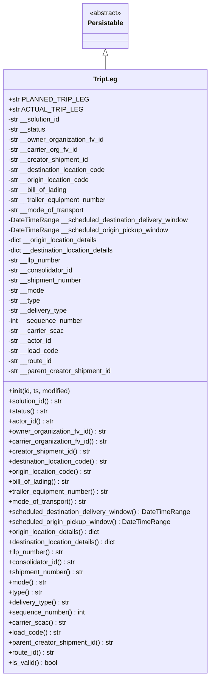
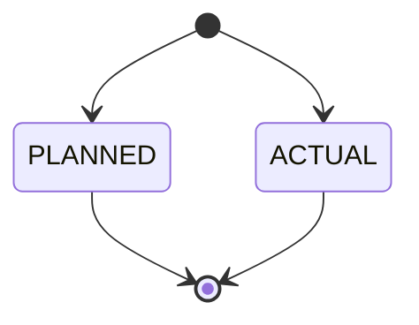

# Diagram: platform/partview_core/partview_service/partview_service/core/datamodel/TripLeg.py

> Auto-generated by Obscura crawlers

## Diagram 1

### SVG

<svg id="container" width="505.8984375" xmlns="http://www.w3.org/2000/svg" class="classDiagram" height="1614" viewBox="0 0 505.8984375 1614" role="graphics-document document" aria-roledescription="class"><g><defs><marker id="container_class-aggregationStart" class="marker aggregation class" refX="18" refY="7" markerWidth="190" markerHeight="240" orient="auto"><path d="M 18,7 L9,13 L1,7 L9,1 Z"></path></marker></defs><defs><marker id="container_class-aggregationEnd" class="marker aggregation class" refX="1" refY="7" markerWidth="20" markerHeight="28" orient="auto"><path d="M 18,7 L9,13 L1,7 L9,1 Z"></path></marker></defs><defs><marker id="container_class-extensionStart" class="marker extension class" refX="18" refY="7" markerWidth="190" markerHeight="240" orient="auto"><path d="M 1,7 L18,13 V 1 Z"></path></marker></defs><defs><marker id="container_class-extensionEnd" class="marker extension class" refX="1" refY="7" markerWidth="20" markerHeight="28" orient="auto"><path d="M 1,1 V 13 L18,7 Z"></path></marker></defs><defs><marker id="container_class-compositionStart" class="marker composition class" refX="18" refY="7" markerWidth="190" markerHeight="240" orient="auto"><path d="M 18,7 L9,13 L1,7 L9,1 Z"></path></marker></defs><defs><marker id="container_class-compositionEnd" class="marker composition class" refX="1" refY="7" markerWidth="20" markerHeight="28" orient="auto"><path d="M 18,7 L9,13 L1,7 L9,1 Z"></path></marker></defs><defs><marker id="container_class-dependencyStart" class="marker dependency class" refX="6" refY="7" markerWidth="190" markerHeight="240" orient="auto"><path d="M 5,7 L9,13 L1,7 L9,1 Z"></path></marker></defs><defs><marker id="container_class-dependencyEnd" class="marker dependency class" refX="13" refY="7" markerWidth="20" markerHeight="28" orient="auto"><path d="M 18,7 L9,13 L14,7 L9,1 Z"></path></marker></defs><defs><marker id="container_class-lollipopStart" class="marker lollipop class" refX="13" refY="7" markerWidth="190" markerHeight="240" orient="auto"><circle stroke="black" fill="transparent" cx="7" cy="7" r="6"></circle></marker></defs><defs><marker id="container_class-lollipopEnd" class="marker lollipop class" refX="1" refY="7" markerWidth="190" markerHeight="240" orient="auto"><circle stroke="black" fill="transparent" cx="7" cy="7" r="6"></circle></marker></defs><g class="root"><g class="clusters"></g><g class="edgePaths"><path d="M252.949,133.25L252.949,134.542C252.949,135.833,252.949,138.417,252.949,143.875C252.949,149.333,252.949,157.667,252.949,161.833L252.949,166" id="id_Persistable_TripLeg_1" class="edge-thickness-normal edge-pattern-solid relation" style=";;;" data-edge="true" data-et="edge" data-id="id_Persistable_TripLeg_1" data-points="W3sieCI6MjUyLjk0OTIxODc1LCJ5IjoxMTZ9LHsieCI6MjUyLjk0OTIxODc1LCJ5IjoxNDF9LHsieCI6MjUyLjk0OTIxODc1LCJ5IjoxNjZ9XQ==" marker-start="url(#container_class-extensionStart)"></path></g><g class="edgeLabels"><g class="edgeLabel"><g class="label" data-id="id_Persistable_TripLeg_1" transform="translate(0, 0)"><foreignObject width="0" height="0">

</foreignObject></g></g></g><g class="nodes"><g class="node default" id="classId-Persistable-0" transform="translate(252.94921875, 62)"><g class="basic label-container"><path d="M-52.9765625 -54 L52.9765625 -54 L52.9765625 54 L-52.9765625 54" stroke="none" stroke-width="0" fill="#ECECFF" style=""></path><path d="M-52.9765625 -54 C-20.09703095440763 -54, 12.782500591184743 -54, 52.9765625 -54 M-52.9765625 -54 C-31.457998681361452 -54, -9.939434862722905 -54, 52.9765625 -54 M52.9765625 -54 C52.9765625 -28.419736331298562, 52.9765625 -2.8394726625971245, 52.9765625 54 M52.9765625 -54 C52.9765625 -22.853121095533414, 52.9765625 8.293757808933172, 52.9765625 54 M52.9765625 54 C17.69611277337905 54, -17.584336953241902 54, -52.9765625 54 M52.9765625 54 C20.01887748979211 54, -12.938807520415779 54, -52.9765625 54 M-52.9765625 54 C-52.9765625 28.66439048061199, -52.9765625 3.328780961223977, -52.9765625 -54 M-52.9765625 54 C-52.9765625 17.329936635990066, -52.9765625 -19.340126728019868, -52.9765625 -54" stroke="#9370DB" stroke-width="1.3" fill="none" stroke-dasharray="0 0" style=""></path></g><g class="annotation-group text" transform="translate(-38.609375, -30)"><g class="label" style="" transform="translate(0,-12)"><foreignObject width="77.21875" height="24">

«abstract»

</foreignObject></g></g><g class="label-group text" transform="translate(-40.9765625, -6)"><g class="label" style="font-weight: bolder" transform="translate(0,-12)"><foreignObject width="81.953125" height="24">

Persistable

</foreignObject></g></g><g class="members-group text" transform="translate(-40.9765625, 42)"></g><g class="methods-group text" transform="translate(-40.9765625, 72)"></g><g class="divider" style=""><path d="M-52.9765625 18 C-13.321246450099899 18, 26.334069599800202 18, 52.9765625 18 M-52.9765625 18 C-16.745876765899496 18, 19.48480896820101 18, 52.9765625 18" stroke="#9370DB" stroke-width="1.3" fill="none" stroke-dasharray="0 0" style=""></path></g><g class="divider" style=""><path d="M-52.9765625 36 C-23.51199394385086 36, 5.952574612298278 36, 52.9765625 36 M-52.9765625 36 C-12.171681896546417 36, 28.633198706907166 36, 52.9765625 36" stroke="#9370DB" stroke-width="1.3" fill="none" stroke-dasharray="0 0" style=""></path></g></g><g class="node default" id="classId-TripLeg-1" transform="translate(252.94921875, 886)"><g class="basic label-container"><path d="M-244.94921875 -720 L244.94921875 -720 L244.94921875 720 L-244.94921875 720" stroke="none" stroke-width="0" fill="#ECECFF" style=""></path><path d="M-244.94921875 -720 C-60.55668279659196 -720, 123.83585315681609 -720, 244.94921875 -720 M-244.94921875 -720 C-126.72210677404681 -720, -8.494994798093614 -720, 244.94921875 -720 M244.94921875 -720 C244.94921875 -269.6243997175737, 244.94921875 180.75120056485264, 244.94921875 720 M244.94921875 -720 C244.94921875 -376.7953670286467, 244.94921875 -33.59073405729339, 244.94921875 720 M244.94921875 720 C103.31201153802408 720, -38.32519567395184 720, -244.94921875 720 M244.94921875 720 C62.16533406283807 720, -120.61855062432386 720, -244.94921875 720 M-244.94921875 720 C-244.94921875 164.93862630979197, -244.94921875 -390.12274738041606, -244.94921875 -720 M-244.94921875 720 C-244.94921875 395.46706986324807, -244.94921875 70.93413972649614, -244.94921875 -720" stroke="#9370DB" stroke-width="1.3" fill="none" stroke-dasharray="0 0" style=""></path></g><g class="annotation-group text" transform="translate(0, -696)"></g><g class="label-group text" transform="translate(-27.0546875, -696)"><g class="label" style="font-weight: bolder" transform="translate(0,-12)"><foreignObject width="54.109375" height="24">

TripLeg

</foreignObject></g></g><g class="members-group text" transform="translate(-232.94921875, -648)"><g class="label" style="" transform="translate(0,-12)"><foreignObject width="170.8125" height="24">

+str PLANNED_TRIP_LEG

</foreignObject></g><g class="label" style="" transform="translate(0,12)"><foreignObject width="157.9375" height="24">

+str ACTUAL_TRIP_LEG

</foreignObject></g><g class="label" style="" transform="translate(0,36)"><foreignObject width="128.828125" height="24">

-str __solution_id

</foreignObject></g><g class="label" style="" transform="translate(0,60)"><foreignObject width="91" height="24">

-str __status

</foreignObject></g><g class="label" style="" transform="translate(0,84)"><foreignObject width="231.59375" height="24">

-str __owner_organization_fv_id

</foreignObject></g><g class="label" style="" transform="translate(0,108)"><foreignObject width="167.765625" height="24">

-str __carrier_org_fv_id

</foreignObject></g><g class="label" style="" transform="translate(0,132)"><foreignObject width="195.828125" height="24">

-str __creator_shipment_id

</foreignObject></g><g class="label" style="" transform="translate(0,156)"><foreignObject width="239.6875" height="24">

-str __destination_location_code

</foreignObject></g><g class="label" style="" transform="translate(0,180)"><foreignObject width="198.796875" height="24">

-str __origin_location_code

</foreignObject></g><g class="label" style="" transform="translate(0,204)"><foreignObject width="145.46875" height="24">

-str __bill_of_lading

</foreignObject></g><g class="label" style="" transform="translate(0,228)"><foreignObject width="241.4375" height="24">

-str __trailer_equipment_number

</foreignObject></g><g class="label" style="" transform="translate(0,252)"><foreignObject width="185.59375" height="24">

-str __mode_of_transport

</foreignObject></g><g class="label" style="" transform="translate(0,276)"><foreignObject width="435.34375" height="24">

-DateTimeRange __scheduled_destination_delivery_window

</foreignObject></g><g class="label" style="" transform="translate(0,300)"><foreignObject width="385.421875" height="24">

-DateTimeRange __scheduled_origin_pickup_window

</foreignObject></g><g class="label" style="" transform="translate(0,324)"><foreignObject width="221.234375" height="24">

-dict __origin_location_details

</foreignObject></g><g class="label" style="" transform="translate(0,348)"><foreignObject width="262.140625" height="24">

-dict __destination_location_details

</foreignObject></g><g class="label" style="" transform="translate(0,372)"><foreignObject width="130.125" height="24">

-str __llp_number

</foreignObject></g><g class="label" style="" transform="translate(0,396)"><foreignObject width="158.796875" height="24">

-str __consolidator_id

</foreignObject></g><g class="label" style="" transform="translate(0,420)"><foreignObject width="180.171875" height="24">

-str __shipment_number

</foreignObject></g><g class="label" style="" transform="translate(0,444)"><foreignObject width="87.9375" height="24">

-str __mode

</foreignObject></g><g class="label" style="" transform="translate(0,468)"><foreignObject width="78.078125" height="24">

-str __type

</foreignObject></g><g class="label" style="" transform="translate(0,492)"><foreignObject width="143.65625" height="24">

-str __delivery_type

</foreignObject></g><g class="label" style="" transform="translate(0,516)"><foreignObject width="180.859375" height="24">

-int __sequence_number

</foreignObject></g><g class="label" style="" transform="translate(0,540)"><foreignObject width="132.578125" height="24">

-str __carrier_scac

</foreignObject></g><g class="label" style="" transform="translate(0,564)"><foreignObject width="104.8125" height="24">

-str __actor_id

</foreignObject></g><g class="label" style="" transform="translate(0,588)"><foreignObject width="121.46875" height="24">

-str __load_code

</foreignObject></g><g class="label" style="" transform="translate(0,612)"><foreignObject width="107.28125" height="24">

-str __route_id

</foreignObject></g><g class="label" style="" transform="translate(0,636)"><foreignObject width="251.765625" height="24">

-str __parent_creator_shipment_id

</foreignObject></g></g><g class="methods-group text" transform="translate(-232.94921875, 48)"><g class="label" style="" transform="translate(0,-12)"><foreignObject width="150.90625" height="24">

+<strong>init</strong>(id, ts, modified)

</foreignObject></g><g class="label" style="" transform="translate(0,12)"><foreignObject width="132.328125" height="24">

+solution_id() : str

</foreignObject></g><g class="label" style="" transform="translate(0,36)"><foreignObject width="94.5" height="24">

+status() : str

</foreignObject></g><g class="label" style="" transform="translate(0,60)"><foreignObject width="108.390625" height="24">

+actor_id() : str

</foreignObject></g><g class="label" style="" transform="translate(0,84)"><foreignObject width="235.421875" height="24">

+owner_organization_fv_id() : str

</foreignObject></g><g class="label" style="" transform="translate(0,108)"><foreignObject width="238.28125" height="24">

+carrier_organization_fv_id() : str

</foreignObject></g><g class="label" style="" transform="translate(0,132)"><foreignObject width="199.65625" height="24">

+creator_shipment_id() : str

</foreignObject></g><g class="label" style="" transform="translate(0,156)"><foreignObject width="243.515625" height="24">

+destination_location_code() : str

</foreignObject></g><g class="label" style="" transform="translate(0,180)"><foreignObject width="202.609375" height="24">

+origin_location_code() : str

</foreignObject></g><g class="label" style="" transform="translate(0,204)"><foreignObject width="148.96875" height="24">

+bill_of_lading() : str

</foreignObject></g><g class="label" style="" transform="translate(0,228)"><foreignObject width="245.171875" height="24">

+trailer_equipment_number() : str

</foreignObject></g><g class="label" style="" transform="translate(0,252)"><foreignObject width="189.09375" height="24">

+mode_of_transport() : str

</foreignObject></g><g class="label" style="" transform="translate(0,276)"><foreignObject width="438.84375" height="24">

+scheduled_destination_delivery_window() : DateTimeRange

</foreignObject></g><g class="label" style="" transform="translate(0,300)"><foreignObject width="388.921875" height="24">

+scheduled_origin_pickup_window() : DateTimeRange

</foreignObject></g><g class="label" style="" transform="translate(0,324)"><foreignObject width="225.0625" height="24">

+origin_location_details() : dict

</foreignObject></g><g class="label" style="" transform="translate(0,348)"><foreignObject width="265.953125" height="24">

+destination_location_details() : dict

</foreignObject></g><g class="label" style="" transform="translate(0,372)"><foreignObject width="133.78125" height="24">

+llp_number() : str

</foreignObject></g><g class="label" style="" transform="translate(0,396)"><foreignObject width="162.609375" height="24">

+consolidator_id() : str

</foreignObject></g><g class="label" style="" transform="translate(0,420)"><foreignObject width="183.671875" height="24">

+shipment_number() : str

</foreignObject></g><g class="label" style="" transform="translate(0,444)"><foreignObject width="91.453125" height="24">

+mode() : str

</foreignObject></g><g class="label" style="" transform="translate(0,468)"><foreignObject width="81.8125" height="24">

+type() : str

</foreignObject></g><g class="label" style="" transform="translate(0,492)"><foreignObject width="147.484375" height="24">

+delivery_type() : str

</foreignObject></g><g class="label" style="" transform="translate(0,516)"><foreignObject width="184.359375" height="24">

+sequence_number() : int

</foreignObject></g><g class="label" style="" transform="translate(0,540)"><foreignObject width="136.40625" height="24">

+carrier_scac() : str

</foreignObject></g><g class="label" style="" transform="translate(0,564)"><foreignObject width="125.125" height="24">

+load_code() : str

</foreignObject></g><g class="label" style="" transform="translate(0,588)"><foreignObject width="255.265625" height="24">

+parent_creator_shipment_id() : str

</foreignObject></g><g class="label" style="" transform="translate(0,612)"><foreignObject width="110.796875" height="24">

+route_id() : str

</foreignObject></g><g class="label" style="" transform="translate(0,636)"><foreignObject width="117.984375" height="24">

+is_valid() : bool

</foreignObject></g></g><g class="divider" style=""><path d="M-244.94921875 -672 C-65.03715399103172 -672, 114.87491076793657 -672, 244.94921875 -672 M-244.94921875 -672 C-138.19934793146334 -672, -31.449477112926672 -672, 244.94921875 -672" stroke="#9370DB" stroke-width="1.3" fill="none" stroke-dasharray="0 0" style=""></path></g><g class="divider" style=""><path d="M-244.94921875 24 C-63.542938203748264 24, 117.86334234250347 24, 244.94921875 24 M-244.94921875 24 C-85.83764734187946 24, 73.27392406624108 24, 244.94921875 24" stroke="#9370DB" stroke-width="1.3" fill="none" stroke-dasharray="0 0" style=""></path></g></g></g></g></g></svg>

## Diagram 2

### SVG

<svg id="container" width="218.8125" xmlns="http://www.w3.org/2000/svg" class="statediagram" height="184" viewBox="0 0 218.8125 184" role="graphics-document document" aria-roledescription="stateDiagram"><g><defs><marker id="container_stateDiagram-barbEnd" refX="19" refY="7" markerWidth="20" markerHeight="14" markerUnits="userSpaceOnUse" orient="auto"><path d="M 19,7 L9,13 L14,7 L9,1 Z"></path></marker></defs><g class="root"><g class="clusters"></g><g class="edgePaths"><path d="M106.536,18.162L97.043,22.968C87.55,27.775,68.564,37.387,59.154,46.444C49.745,55.5,49.911,64,49.995,68.25L50.078,72.5" id="edge0" class="edge-thickness-normal edge-pattern-solid transition" style="fill:none;;;fill:none" data-edge="true" data-et="edge" data-id="edge0" data-points="W3sieCI6MTA2LjUzNjA4Njg4NDk3OTYsInkiOjE4LjE2MTk1MTU1OTg0MjIyM30seyJ4Ijo0OS41NzgxMjUsInkiOjQ3fSx7IngiOjUwLjA3ODEyNSwieSI6NzIuNX1d" marker-end="url(#container_stateDiagram-barbEnd)"></path><path d="M119.026,18.162L128.519,22.968C138.012,27.775,156.998,37.387,166.575,46.444C176.151,55.5,176.318,64,176.401,68.25L176.484,72.5" id="edge1" class="edge-thickness-normal edge-pattern-solid transition" style="fill:none;;;fill:none" data-edge="true" data-et="edge" data-id="edge1" data-points="W3sieCI6MTE5LjAyNjQxMzExNTAyMDQsInkiOjE4LjE2MTk1MTU1OTg0MjIyM30seyJ4IjoxNzUuOTg0Mzc1LCJ5Ijo0N30seyJ4IjoxNzYuNDg0Mzc1LCJ5Ijo3Mi41fV0=" marker-end="url(#container_stateDiagram-barbEnd)"></path><path d="M50.078,112.5L49.995,116.583C49.911,120.667,49.745,128.833,59.154,137.723C68.564,146.613,87.55,156.225,97.043,161.032L106.536,165.838" id="edge2" class="edge-thickness-normal edge-pattern-solid transition" style="fill:none;;;fill:none" data-edge="true" data-et="edge" data-id="edge2" data-points="W3sieCI6NTAuMDc4MTI1LCJ5IjoxMTIuNX0seyJ4Ijo0OS41NzgxMjUsInkiOjEzN30seyJ4IjoxMDYuNTM2MDg2ODg0OTc5NiwieSI6MTY1LjgzODA0ODQ0MDE1Nzh9XQ==" marker-end="url(#container_stateDiagram-barbEnd)"></path><path d="M176.484,112.5L176.401,116.583C176.318,120.667,176.151,128.833,166.575,137.723C156.998,146.613,138.012,156.225,128.519,161.032L119.026,165.838" id="edge3" class="edge-thickness-normal edge-pattern-solid transition" style="fill:none;;;fill:none" data-edge="true" data-et="edge" data-id="edge3" data-points="W3sieCI6MTc2LjQ4NDM3NSwieSI6MTEyLjV9LHsieCI6MTc1Ljk4NDM3NSwieSI6MTM3fSx7IngiOjExOS4wMjY0MTMxMTUwMjA0LCJ5IjoxNjUuODM4MDQ4NDQwMTU3OH1d" marker-end="url(#container_stateDiagram-barbEnd)"></path></g><g class="edgeLabels"><g class="edgeLabel"><g class="label" data-id="edge0" transform="translate(0, 0)"><foreignObject width="0" height="0">

</foreignObject></g></g><g class="edgeLabel"><g class="label" data-id="edge1" transform="translate(0, 0)"><foreignObject width="0" height="0">

</foreignObject></g></g><g class="edgeLabel"><g class="label" data-id="edge2" transform="translate(0, 0)"><foreignObject width="0" height="0">

</foreignObject></g></g><g class="edgeLabel"><g class="label" data-id="edge3" transform="translate(0, 0)"><foreignObject width="0" height="0">

</foreignObject></g></g></g><g class="nodes"><g class="node default" id="state-root_start-1" transform="translate(112.78125, 15)"><circle class="state-start" r="7" width="14" height="14"></circle></g><g class="node  statediagram-state" id="state-PLANNED-2" transform="translate(49.578125, 92)"><g class="basic label-container outer-path"><path d="M-36.578125 -20 C-21.25119643007929 -20, -5.924267860158583 -20, 36.578125 -20 C36.578125 -20, 36.578125 -20, 36.578125 -20 C36.7205252162439 -19.994110283489764, 36.86292543248779 -19.98822056697953, 36.99102172736166 -19.982922465033347 C37.11873206724402 -19.967003387768482, 37.24644240712638 -19.951084310503614, 37.40109795140367 -19.931806517013612 C37.55066434098359 -19.900445742990822, 37.700230730563504 -19.869084968968036, 37.805552435703994 -19.847001329696653 C37.91046637001801 -19.815767098170344, 38.01538030433202 -19.78453286664403, 38.20162234602342 -19.729086208503173 C38.31702506046657 -19.68405592959342, 38.43242777490972 -19.63902565068367, 38.586602123264846 -19.578866633275286 C38.715311421063085 -19.51594449170739, 38.84402071886133 -19.453022350139495, 38.957861965185366 -19.397368756032446 C39.04490229628314 -19.345503976259167, 39.13194262738092 -19.293639196485884, 39.312865790612136 -19.185832391312644 C39.419421526717116 -19.10975305803511, 39.5259772628221 -19.033673724757577, 39.64918856344834 -18.94570254698197 C39.76718538901863 -18.845764333600062, 39.885182214588916 -18.74582612021815, 39.964532858128706 -18.678619553365657 C40.02444732860047 -18.618705082893893, 40.084361799072234 -18.55879061242213, 40.25674455336566 -18.386407858128706 C40.3520411168688 -18.27389141821441, 40.44733768037193 -18.16137497830012, 40.52382754698197 -18.07106356344834 C40.5758470239009 -17.998205752843297, 40.62786650081983 -17.925347942238254, 40.763957391312644 -17.734740790612136 C40.84779418002752 -17.594044505390926, 40.93163096874239 -17.453348220169715, 40.97549375603245 -17.37973696518537 C41.03591760790895 -17.256138000631736, 41.09634145978544 -17.132539036078107, 41.15699163327529 -17.008477123264846 C41.19826653020272 -16.902698628014278, 41.23954142713015 -16.79692013276371, 41.307211208503176 -16.623497346023417 C41.34773841551221 -16.487368857301202, 41.388265622521246 -16.35124036857899, 41.42512632969665 -16.227427435703994 C41.443676003693696 -16.13895998379717, 41.46222567769073 -16.050492531890352, 41.50993151701361 -15.82297295140367 C41.52514113015584 -15.700954267056963, 41.54035074329806 -15.578935582710253, 41.56104746503335 -15.412896727361662 C41.56731834117096 -15.261280920984131, 41.573589217308566 -15.109665114606601, 41.578125 -15 C41.578125 -15, 41.578125 -15, 41.578125 -15 C41.578125 -6.075249725827868, 41.578125 2.8495005483442633, 41.578125 15 C41.578125 15, 41.578125 15, 41.578125 15 C41.57198457601195 15.148461764196616, 41.5658441520239 15.296923528393231, 41.56104746503335 15.412896727361662 C41.54303479162558 15.557402882135673, 41.525022118217805 15.701909036909683, 41.50993151701361 15.822972951403669 C41.491634797573646 15.910234007709354, 41.47333807813368 15.99749506401504, 41.42512632969665 16.227427435703994 C41.39492120903303 16.328884647564024, 41.36471608836941 16.430341859424054, 41.307211208503176 16.623497346023417 C41.2559018544528 16.754991950922612, 41.20459250040242 16.886486555821804, 41.15699163327529 17.008477123264846 C41.104668510067725 17.115505782475214, 41.052345386860154 17.222534441685585, 40.97549375603245 17.379736965185366 C40.90374128769833 17.50015314410649, 40.83198881936421 17.620569323027617, 40.763957391312644 17.734740790612133 C40.670311443600866 17.865900101055562, 40.57666549588909 17.997059411498995, 40.52382754698197 18.07106356344834 C40.45327065935531 18.154369923251366, 40.38271377172865 18.237676283054395, 40.25674455336566 18.386407858128706 C40.19714230725138 18.446010104242983, 40.1375400611371 18.505612350357257, 39.964532858128706 18.678619553365657 C39.87143288141466 18.75747121139739, 39.778332904700626 18.83632286942913, 39.64918856344834 18.94570254698197 C39.55001822457251 19.016508807990267, 39.450847885696675 19.08731506899856, 39.312865790612136 19.185832391312644 C39.20367973302227 19.250893159806846, 39.09449367543241 19.315953928301045, 38.957861965185366 19.397368756032446 C38.818021233919374 19.465732723828072, 38.678180502653376 19.534096691623702, 38.586602123264846 19.578866633275286 C38.46196643970559 19.627499627913775, 38.33733075614634 19.67613262255226, 38.20162234602342 19.729086208503173 C38.06298477881109 19.770360400543225, 37.924347211598764 19.81163459258328, 37.805552435703994 19.847001329696653 C37.646399673403884 19.88037215470363, 37.487246911103774 19.9137429797106, 37.40109795140367 19.931806517013612 C37.2905087480895 19.945591446830885, 37.17991954477533 19.959376376648155, 36.99102172736166 19.982922465033347 C36.87617249770834 19.98767266430916, 36.761323268055015 19.992422863584967, 36.578125 20 C36.578125 20, 36.578125 20, 36.578125 20 C16.19114236458951 20, -4.19584027082098 20, -36.578125 20 C-36.578125 20, -36.578125 20, -36.578125 20 C-36.72371287847939 19.99397844080446, -36.86930075695878 19.987956881608923, -36.99102172736166 19.982922465033347 C-37.15299226397631 19.962732858699393, -37.31496280059095 19.94254325236544, -37.40109795140367 19.931806517013612 C-37.5083373841782 19.90932077254241, -37.615576816952725 19.88683502807121, -37.805552435703994 19.847001329696653 C-37.96253702885988 19.80026499137558, -38.11952162201575 19.753528653054513, -38.20162234602342 19.729086208503173 C-38.31015961495991 19.686734834743064, -38.4186968838964 19.644383460982958, -38.586602123264846 19.578866633275286 C-38.731033547747565 19.50825841231832, -38.87546497223028 19.437650191361353, -38.957861965185366 19.397368756032446 C-39.08692269731366 19.32046525204999, -39.21598342944195 19.24356174806753, -39.312865790612136 19.185832391312644 C-39.38748012320594 19.132558781799105, -39.46209445579974 19.079285172285562, -39.64918856344834 18.94570254698197 C-39.73087492509557 18.876517727803677, -39.812561286742806 18.807332908625387, -39.964532858128706 18.67861955336566 C-40.06456483242169 18.578587579072675, -40.16459680671467 18.478555604779693, -40.25674455336566 18.386407858128706 C-40.36030702541712 18.264131878433272, -40.463869497468586 18.141855898737838, -40.52382754698197 18.07106356344834 C-40.59896332534734 17.965829358222894, -40.67409910371271 17.860595152997444, -40.763957391312644 17.734740790612133 C-40.83511802076812 17.615317845484316, -40.90627865022359 17.4958949003565, -40.97549375603244 17.37973696518537 C-41.02166326162164 17.285295732004112, -41.06783276721084 17.19085449882286, -41.15699163327528 17.00847712326485 C-41.20187943732105 16.89343954060508, -41.246767241366804 16.77840195794531, -41.307211208503176 16.623497346023417 C-41.3422066887019 16.505949600122783, -41.377202168900624 16.38840185422215, -41.42512632969665 16.227427435703994 C-41.44938035178415 16.111754700273988, -41.47363437387165 15.996081964843977, -41.50993151701361 15.82297295140367 C-41.52985222843862 15.663159616468683, -41.54977293986363 15.503346281533695, -41.56104746503335 15.412896727361664 C-41.5652484144064 15.311327136004845, -41.56944936377945 15.209757544648024, -41.578125 15 C-41.578125 15, -41.578125 15, -41.578125 15 C-41.578125 3.8159304182519396, -41.578125 -7.368139163496121, -41.578125 -15 C-41.578125 -15, -41.578125 -15, -41.578125 -15 C-41.57251098229419 -15.135734433722842, -41.56689696458837 -15.271468867445684, -41.56104746503335 -15.41289672736166 C-41.550358512290934 -15.498648543563524, -41.53966955954852 -15.58440035976539, -41.50993151701361 -15.822972951403669 C-41.483320728348545 -15.9498856220417, -41.456709939683485 -16.07679829267973, -41.42512632969665 -16.227427435703994 C-41.394369527089545 -16.33073771454704, -41.36361272448244 -16.434047993390084, -41.307211208503176 -16.623497346023417 C-41.26905569195012 -16.721281554511847, -41.23090017539707 -16.819065763000275, -41.15699163327529 -17.008477123264846 C-41.09003440918779 -17.145440314282798, -41.02307718510028 -17.28240350530075, -40.97549375603245 -17.379736965185366 C-40.898260620413296 -17.509350890577437, -40.82102748479414 -17.63896481596951, -40.763957391312644 -17.734740790612133 C-40.701900541168165 -17.82165681711541, -40.63984369102368 -17.90857284361869, -40.52382754698197 -18.07106356344834 C-40.45059366784373 -18.157530641156526, -40.37735978870548 -18.243997718864712, -40.25674455336566 -18.386407858128706 C-40.19369739584408 -18.449455015650276, -40.13065023832252 -18.51250217317185, -39.964532858128706 -18.678619553365657 C-39.87036480346306 -18.758375827277693, -39.77619674879742 -18.83813210118973, -39.64918856344834 -18.945702546981966 C-39.52211636685828 -19.036430351491326, -39.395044170268214 -19.127158156000686, -39.312865790612136 -19.185832391312644 C-39.17859420429762 -19.265840890432305, -39.044322617983106 -19.345849389551965, -38.957861965185366 -19.397368756032446 C-38.85139071329016 -19.449419379408255, -38.74491946139496 -19.501470002784064, -38.586602123264846 -19.578866633275286 C-38.508998286740095 -19.609147744252947, -38.43139445021534 -19.63942885523061, -38.20162234602342 -19.729086208503173 C-38.09246206419473 -19.761584632458085, -37.98330178236603 -19.794083056412997, -37.805552435703994 -19.847001329696653 C-37.677023833542684 -19.87395094357158, -37.54849523138138 -19.90090055744651, -37.40109795140367 -19.931806517013612 C-37.308650041621924 -19.943330136950312, -37.216202131840184 -19.95485375688701, -36.99102172736166 -19.982922465033347 C-36.83171282894708 -19.98951152981126, -36.6724039305325 -19.996100594589173, -36.578125 -20 C-36.578125 -20, -36.578125 -20, -36.578125 -20" stroke="none" stroke-width="0" fill="#ECECFF" style=""></path><path d="M-36.578125 -20 C-14.649087610910406 -20, 7.279949778179187 -20, 36.578125 -20 M-36.578125 -20 C-18.735944273493626 -20, -0.8937635469872518 -20, 36.578125 -20 M36.578125 -20 C36.578125 -20, 36.578125 -20, 36.578125 -20 M36.578125 -20 C36.578125 -20, 36.578125 -20, 36.578125 -20 M36.578125 -20 C36.6635589569528 -19.996466425402488, 36.7489929139056 -19.992932850804976, 36.99102172736166 -19.982922465033347 M36.578125 -20 C36.702272345404296 -19.994865227812035, 36.826419690808585 -19.989730455624066, 36.99102172736166 -19.982922465033347 M36.99102172736166 -19.982922465033347 C37.14990562825757 -19.96311760744049, 37.308789529153486 -19.943312749847635, 37.40109795140367 -19.931806517013612 M36.99102172736166 -19.982922465033347 C37.08242421844343 -19.971529156401704, 37.17382670952519 -19.960135847770058, 37.40109795140367 -19.931806517013612 M37.40109795140367 -19.931806517013612 C37.507705476286716 -19.90945326969397, 37.614313001169755 -19.887100022374327, 37.805552435703994 -19.847001329696653 M37.40109795140367 -19.931806517013612 C37.559865588225044 -19.898516444327683, 37.71863322504641 -19.865226371641757, 37.805552435703994 -19.847001329696653 M37.805552435703994 -19.847001329696653 C37.88748616818073 -19.822608600678087, 37.96941990065747 -19.798215871659526, 38.20162234602342 -19.729086208503173 M37.805552435703994 -19.847001329696653 C37.899710056133095 -19.818969391559182, 37.993867676562196 -19.790937453421716, 38.20162234602342 -19.729086208503173 M38.20162234602342 -19.729086208503173 C38.282451726736355 -19.69754648627767, 38.363281107449296 -19.666006764052167, 38.586602123264846 -19.578866633275286 M38.20162234602342 -19.729086208503173 C38.28567550963147 -19.696288562288515, 38.36972867323952 -19.66349091607386, 38.586602123264846 -19.578866633275286 M38.586602123264846 -19.578866633275286 C38.704589615001936 -19.52118606329844, 38.822577106739026 -19.463505493321595, 38.957861965185366 -19.397368756032446 M38.586602123264846 -19.578866633275286 C38.670835317121316 -19.537687534024343, 38.755068510977786 -19.496508434773403, 38.957861965185366 -19.397368756032446 M38.957861965185366 -19.397368756032446 C39.08158220130002 -19.323647496948805, 39.20530243741468 -19.249926237865168, 39.312865790612136 -19.185832391312644 M38.957861965185366 -19.397368756032446 C39.071507716749664 -19.32965058673424, 39.185153468313956 -19.261932417436032, 39.312865790612136 -19.185832391312644 M39.312865790612136 -19.185832391312644 C39.421402666289886 -19.10833855156802, 39.529939541967636 -19.030844711823402, 39.64918856344834 -18.94570254698197 M39.312865790612136 -19.185832391312644 C39.40867722489794 -19.117424342086213, 39.50448865918374 -19.049016292859783, 39.64918856344834 -18.94570254698197 M39.64918856344834 -18.94570254698197 C39.7126289274876 -18.89197129948663, 39.77606929152685 -18.838240051991296, 39.964532858128706 -18.678619553365657 M39.64918856344834 -18.94570254698197 C39.737693860455366 -18.87074238415582, 39.82619915746239 -18.79578222132967, 39.964532858128706 -18.678619553365657 M39.964532858128706 -18.678619553365657 C40.063100579783864 -18.5800518317105, 40.16166830143902 -18.48148411005534, 40.25674455336566 -18.386407858128706 M39.964532858128706 -18.678619553365657 C40.07472462694391 -18.568427784550455, 40.18491639575911 -18.45823601573525, 40.25674455336566 -18.386407858128706 M40.25674455336566 -18.386407858128706 C40.31665377336845 -18.31567317573342, 40.376562993371245 -18.244938493338136, 40.52382754698197 -18.07106356344834 M40.25674455336566 -18.386407858128706 C40.33949383681505 -18.288705963779936, 40.42224312026444 -18.191004069431166, 40.52382754698197 -18.07106356344834 M40.52382754698197 -18.07106356344834 C40.61124371902661 -17.94862959671368, 40.69865989107126 -17.82619562997902, 40.763957391312644 -17.734740790612136 M40.52382754698197 -18.07106356344834 C40.605696142768835 -17.95639946070013, 40.68756473855569 -17.84173535795192, 40.763957391312644 -17.734740790612136 M40.763957391312644 -17.734740790612136 C40.84165320337395 -17.604350393963607, 40.91934901543526 -17.473959997315074, 40.97549375603245 -17.37973696518537 M40.763957391312644 -17.734740790612136 C40.81052457199762 -17.65659097791018, 40.85709175268259 -17.57844116520823, 40.97549375603245 -17.37973696518537 M40.97549375603245 -17.37973696518537 C41.02575238783715 -17.27693129063751, 41.076011019641854 -17.174125616089647, 41.15699163327529 -17.008477123264846 M40.97549375603245 -17.37973696518537 C41.045444535680424 -17.23665035839504, 41.115395315328406 -17.09356375160471, 41.15699163327529 -17.008477123264846 M41.15699163327529 -17.008477123264846 C41.191239968584945 -16.920706162134127, 41.22548830389459 -16.83293520100341, 41.307211208503176 -16.623497346023417 M41.15699163327529 -17.008477123264846 C41.207940106719384 -16.877907376096115, 41.258888580163486 -16.747337628927387, 41.307211208503176 -16.623497346023417 M41.307211208503176 -16.623497346023417 C41.35266408709312 -16.47082381811057, 41.398116965683066 -16.31815029019773, 41.42512632969665 -16.227427435703994 M41.307211208503176 -16.623497346023417 C41.350954744722095 -16.476565397924464, 41.394698280941014 -16.32963344982551, 41.42512632969665 -16.227427435703994 M41.42512632969665 -16.227427435703994 C41.442453874040055 -16.144788587382028, 41.45978141838346 -16.06214973906006, 41.50993151701361 -15.82297295140367 M41.42512632969665 -16.227427435703994 C41.45630985913857 -16.07870636429174, 41.48749338858049 -15.929985292879488, 41.50993151701361 -15.82297295140367 M41.50993151701361 -15.82297295140367 C41.522146400323464 -15.724979401075984, 41.534361283633324 -15.626985850748296, 41.56104746503335 -15.412896727361662 M41.50993151701361 -15.82297295140367 C41.52239123241451 -15.723015242661452, 41.534850947815414 -15.623057533919235, 41.56104746503335 -15.412896727361662 M41.56104746503335 -15.412896727361662 C41.567458172983436 -15.257900099462406, 41.573868880933524 -15.102903471563149, 41.578125 -15 M41.56104746503335 -15.412896727361662 C41.567677341267775 -15.252601098902783, 41.5743072175022 -15.092305470443902, 41.578125 -15 M41.578125 -15 C41.578125 -15, 41.578125 -15, 41.578125 -15 M41.578125 -15 C41.578125 -15, 41.578125 -15, 41.578125 -15 M41.578125 -15 C41.578125 -7.870832246577456, 41.578125 -0.7416644931549126, 41.578125 15 M41.578125 -15 C41.578125 -8.893063345165022, 41.578125 -2.7861266903300415, 41.578125 15 M41.578125 15 C41.578125 15, 41.578125 15, 41.578125 15 M41.578125 15 C41.578125 15, 41.578125 15, 41.578125 15 M41.578125 15 C41.5725174385293 15.135578336349589, 41.566909877058606 15.271156672699178, 41.56104746503335 15.412896727361662 M41.578125 15 C41.571312054204256 15.164721842364699, 41.56449910840851 15.329443684729398, 41.56104746503335 15.412896727361662 M41.56104746503335 15.412896727361662 C41.54803872915463 15.517258937109718, 41.535029993275906 15.621621146857773, 41.50993151701361 15.822972951403669 M41.56104746503335 15.412896727361662 C41.544204602187946 15.548018110516542, 41.527361739342545 15.683139493671423, 41.50993151701361 15.822972951403669 M41.50993151701361 15.822972951403669 C41.477417651049834 15.97803868861903, 41.44490378508605 16.13310442583439, 41.42512632969665 16.227427435703994 M41.50993151701361 15.822972951403669 C41.48769014086109 15.929046938225692, 41.46544876470857 16.035120925047714, 41.42512632969665 16.227427435703994 M41.42512632969665 16.227427435703994 C41.393310013196604 16.33429655897947, 41.361493696696556 16.44116568225495, 41.307211208503176 16.623497346023417 M41.42512632969665 16.227427435703994 C41.38296024950407 16.369060802411845, 41.34079416931149 16.510694169119695, 41.307211208503176 16.623497346023417 M41.307211208503176 16.623497346023417 C41.256345909075726 16.753853936455727, 41.20548060964828 16.884210526888037, 41.15699163327529 17.008477123264846 M41.307211208503176 16.623497346023417 C41.25795510263423 16.749729926806864, 41.20869899676527 16.875962507590316, 41.15699163327529 17.008477123264846 M41.15699163327529 17.008477123264846 C41.09367497419038 17.137993419542777, 41.03035831510547 17.267509715820708, 40.97549375603245 17.379736965185366 M41.15699163327529 17.008477123264846 C41.10009344626983 17.124864225054186, 41.043195259264365 17.24125132684353, 40.97549375603245 17.379736965185366 M40.97549375603245 17.379736965185366 C40.91474798647145 17.481681520208866, 40.85400221691044 17.58362607523237, 40.763957391312644 17.734740790612133 M40.97549375603245 17.379736965185366 C40.932132838505645 17.452505974033652, 40.88877192097884 17.525274982881935, 40.763957391312644 17.734740790612133 M40.763957391312644 17.734740790612133 C40.697896797283775 17.82726440932735, 40.63183620325491 17.919788028042564, 40.52382754698197 18.07106356344834 M40.763957391312644 17.734740790612133 C40.687629306776074 17.841644924532552, 40.611301222239504 17.94854905845297, 40.52382754698197 18.07106356344834 M40.52382754698197 18.07106356344834 C40.458274286153966 18.148462152253668, 40.39272102532596 18.225860741058995, 40.25674455336566 18.386407858128706 M40.52382754698197 18.07106356344834 C40.43717242458514 18.17337707312812, 40.35051730218832 18.2756905828079, 40.25674455336566 18.386407858128706 M40.25674455336566 18.386407858128706 C40.16440119529983 18.47875121619453, 40.072057837234006 18.571094574260353, 39.964532858128706 18.678619553365657 M40.25674455336566 18.386407858128706 C40.18551451337652 18.45763789811785, 40.11428447338737 18.52886793810699, 39.964532858128706 18.678619553365657 M39.964532858128706 18.678619553365657 C39.85860165970154 18.768338701834693, 39.75267046127437 18.85805785030373, 39.64918856344834 18.94570254698197 M39.964532858128706 18.678619553365657 C39.89450865304853 18.73792702977766, 39.82448444796836 18.79723450618966, 39.64918856344834 18.94570254698197 M39.64918856344834 18.94570254698197 C39.538099005518525 19.02501896682322, 39.42700944758871 19.10433538666447, 39.312865790612136 19.185832391312644 M39.64918856344834 18.94570254698197 C39.53202503215211 19.029355700451593, 39.41486150085588 19.113008853921215, 39.312865790612136 19.185832391312644 M39.312865790612136 19.185832391312644 C39.23983985051625 19.229346406632224, 39.166813910420366 19.2728604219518, 38.957861965185366 19.397368756032446 M39.312865790612136 19.185832391312644 C39.22970931288215 19.23538289680581, 39.14655283515217 19.284933402298975, 38.957861965185366 19.397368756032446 M38.957861965185366 19.397368756032446 C38.845814469894876 19.452145438693304, 38.733766974604386 19.506922121354165, 38.586602123264846 19.578866633275286 M38.957861965185366 19.397368756032446 C38.82826352812443 19.46072557129927, 38.698665091063496 19.524082386566096, 38.586602123264846 19.578866633275286 M38.586602123264846 19.578866633275286 C38.441719607409986 19.63539996639116, 38.296837091555126 19.691933299507035, 38.20162234602342 19.729086208503173 M38.586602123264846 19.578866633275286 C38.49917656348058 19.612980192561327, 38.41175100369632 19.64709375184737, 38.20162234602342 19.729086208503173 M38.20162234602342 19.729086208503173 C38.106915249338186 19.757281732809766, 38.01220815265295 19.785477257116362, 37.805552435703994 19.847001329696653 M38.20162234602342 19.729086208503173 C38.093302456093795 19.761334436949547, 37.98498256616418 19.79358266539592, 37.805552435703994 19.847001329696653 M37.805552435703994 19.847001329696653 C37.70804393526313 19.867446712220197, 37.61053543482226 19.887892094743744, 37.40109795140367 19.931806517013612 M37.805552435703994 19.847001329696653 C37.700845726336844 19.868956017914748, 37.596139016969694 19.890910706132843, 37.40109795140367 19.931806517013612 M37.40109795140367 19.931806517013612 C37.31548546519955 19.94247810228992, 37.22987297899543 19.953149687566224, 36.99102172736166 19.982922465033347 M37.40109795140367 19.931806517013612 C37.304155243267545 19.943890412980892, 37.20721253513142 19.95597430894817, 36.99102172736166 19.982922465033347 M36.99102172736166 19.982922465033347 C36.8980320841653 19.986768545125503, 36.80504244096894 19.99061462521766, 36.578125 20 M36.99102172736166 19.982922465033347 C36.87219643709831 19.987837115392438, 36.75337114683496 19.992751765751528, 36.578125 20 M36.578125 20 C36.578125 20, 36.578125 20, 36.578125 20 M36.578125 20 C36.578125 20, 36.578125 20, 36.578125 20 M36.578125 20 C20.108089828925177 20, 3.638054657850354 20, -36.578125 20 M36.578125 20 C9.524386811892715 20, -17.52935137621457 20, -36.578125 20 M-36.578125 20 C-36.578125 20, -36.578125 20, -36.578125 20 M-36.578125 20 C-36.578125 20, -36.578125 20, -36.578125 20 M-36.578125 20 C-36.71766040921302 19.994228772785032, -36.85719581842603 19.98845754557006, -36.99102172736166 19.982922465033347 M-36.578125 20 C-36.72143181156743 19.994072786429818, -36.864738623134855 19.988145572859633, -36.99102172736166 19.982922465033347 M-36.99102172736166 19.982922465033347 C-37.13296251998298 19.96522956368443, -37.274903312604295 19.947536662335516, -37.40109795140367 19.931806517013612 M-36.99102172736166 19.982922465033347 C-37.132964926653955 19.965229263693207, -37.27490812594625 19.947536062353066, -37.40109795140367 19.931806517013612 M-37.40109795140367 19.931806517013612 C-37.544109051587654 19.901820242635946, -37.687120151771644 19.87183396825828, -37.805552435703994 19.847001329696653 M-37.40109795140367 19.931806517013612 C-37.49386487162406 19.912355339312573, -37.58663179184446 19.892904161611533, -37.805552435703994 19.847001329696653 M-37.805552435703994 19.847001329696653 C-37.96252886641545 19.800267421440576, -38.1195052971269 19.7535335131845, -38.20162234602342 19.729086208503173 M-37.805552435703994 19.847001329696653 C-37.95312190304759 19.803067995775265, -38.10069137039118 19.759134661853878, -38.20162234602342 19.729086208503173 M-38.20162234602342 19.729086208503173 C-38.309029838659136 19.687175674823603, -38.41643733129486 19.645265141144034, -38.586602123264846 19.578866633275286 M-38.20162234602342 19.729086208503173 C-38.2938129477741 19.69311332407214, -38.38600354952477 19.65714043964111, -38.586602123264846 19.578866633275286 M-38.586602123264846 19.578866633275286 C-38.68836751203506 19.52911656619817, -38.79013290080527 19.479366499121053, -38.957861965185366 19.397368756032446 M-38.586602123264846 19.578866633275286 C-38.68508484358323 19.530721365016745, -38.78356756390161 19.4825760967582, -38.957861965185366 19.397368756032446 M-38.957861965185366 19.397368756032446 C-39.0801200048771 19.324518776900337, -39.20237804456884 19.251668797768225, -39.312865790612136 19.185832391312644 M-38.957861965185366 19.397368756032446 C-39.09168817701218 19.317625642503927, -39.22551438883899 19.237882528975405, -39.312865790612136 19.185832391312644 M-39.312865790612136 19.185832391312644 C-39.42623993739356 19.10488480638355, -39.53961408417499 19.023937221454457, -39.64918856344834 18.94570254698197 M-39.312865790612136 19.185832391312644 C-39.38331364817689 19.135533587791862, -39.45376150574163 19.085234784271083, -39.64918856344834 18.94570254698197 M-39.64918856344834 18.94570254698197 C-39.71666678734782 18.88855140663471, -39.7841450112473 18.831400266287456, -39.964532858128706 18.67861955336566 M-39.64918856344834 18.94570254698197 C-39.74942629086213 18.860805522483375, -39.849664018275924 18.775908497984783, -39.964532858128706 18.67861955336566 M-39.964532858128706 18.67861955336566 C-40.065449174341694 18.57770323715267, -40.16636549055468 18.47678692093968, -40.25674455336566 18.386407858128706 M-39.964532858128706 18.67861955336566 C-40.04100595604368 18.60214645545068, -40.11747905395867 18.525673357535698, -40.25674455336566 18.386407858128706 M-40.25674455336566 18.386407858128706 C-40.356193710038944 18.26898846072317, -40.455642866712225 18.151569063317634, -40.52382754698197 18.07106356344834 M-40.25674455336566 18.386407858128706 C-40.35158334169674 18.274431912338724, -40.44642213002783 18.162455966548745, -40.52382754698197 18.07106356344834 M-40.52382754698197 18.07106356344834 C-40.577419454672636 17.996003426519724, -40.6310113623633 17.920943289591108, -40.763957391312644 17.734740790612133 M-40.52382754698197 18.07106356344834 C-40.58210594708636 17.98943958549508, -40.64038434719075 17.90781560754182, -40.763957391312644 17.734740790612133 M-40.763957391312644 17.734740790612133 C-40.83366457118439 17.617757048611264, -40.90337175105614 17.500773306610398, -40.97549375603244 17.37973696518537 M-40.763957391312644 17.734740790612133 C-40.848225878166495 17.593320022435137, -40.93249436502035 17.451899254258144, -40.97549375603244 17.37973696518537 M-40.97549375603244 17.37973696518537 C-41.047900366961414 17.23162687521708, -41.12030697789039 17.083516785248793, -41.15699163327528 17.00847712326485 M-40.97549375603244 17.37973696518537 C-41.033263390115415 17.261567289907276, -41.09103302419838 17.143397614629183, -41.15699163327528 17.00847712326485 M-41.15699163327528 17.00847712326485 C-41.19483500369549 16.911492876755474, -41.23267837411569 16.8145086302461, -41.307211208503176 16.623497346023417 M-41.15699163327528 17.00847712326485 C-41.211719864664886 16.868220686663808, -41.26644809605449 16.727964250062765, -41.307211208503176 16.623497346023417 M-41.307211208503176 16.623497346023417 C-41.337291736058255 16.522458635037818, -41.367372263613326 16.42141992405222, -41.42512632969665 16.227427435703994 M-41.307211208503176 16.623497346023417 C-41.35095374100516 16.47656876935021, -41.39469627350715 16.329640192677005, -41.42512632969665 16.227427435703994 M-41.42512632969665 16.227427435703994 C-41.45806849591796 16.07031904089581, -41.49101066213927 15.91321064608763, -41.50993151701361 15.82297295140367 M-41.42512632969665 16.227427435703994 C-41.45016342476557 16.108020053975913, -41.47520051983449 15.98861267224783, -41.50993151701361 15.82297295140367 M-41.50993151701361 15.82297295140367 C-41.528416341733006 15.674678976300592, -41.54690116645241 15.526385001197514, -41.56104746503335 15.412896727361664 M-41.50993151701361 15.82297295140367 C-41.52674818452712 15.68806171954612, -41.543564852040625 15.553150487688571, -41.56104746503335 15.412896727361664 M-41.56104746503335 15.412896727361664 C-41.56636116646466 15.284423271710756, -41.57167486789597 15.155949816059847, -41.578125 15 M-41.56104746503335 15.412896727361664 C-41.56582684166406 15.297342054306977, -41.57060621829478 15.181787381252292, -41.578125 15 M-41.578125 15 C-41.578125 15, -41.578125 15, -41.578125 15 M-41.578125 15 C-41.578125 15, -41.578125 15, -41.578125 15 M-41.578125 15 C-41.578125 4.042766120777127, -41.578125 -6.9144677584457455, -41.578125 -15 M-41.578125 15 C-41.578125 3.196912946221966, -41.578125 -8.606174107556068, -41.578125 -15 M-41.578125 -15 C-41.578125 -15, -41.578125 -15, -41.578125 -15 M-41.578125 -15 C-41.578125 -15, -41.578125 -15, -41.578125 -15 M-41.578125 -15 C-41.57170842166133 -15.155138560809291, -41.56529184332266 -15.310277121618583, -41.56104746503335 -15.41289672736166 M-41.578125 -15 C-41.57458198742084 -15.08566214631054, -41.57103897484168 -15.171324292621081, -41.56104746503335 -15.41289672736166 M-41.56104746503335 -15.41289672736166 C-41.54861181127654 -15.512661402255626, -41.53617615751973 -15.612426077149589, -41.50993151701361 -15.822972951403669 M-41.56104746503335 -15.41289672736166 C-41.54142843757003 -15.570289811383633, -41.52180941010672 -15.727682895405605, -41.50993151701361 -15.822972951403669 M-41.50993151701361 -15.822972951403669 C-41.47681984760626 -15.980889743974629, -41.443708178198904 -16.13880653654559, -41.42512632969665 -16.227427435703994 M-41.50993151701361 -15.822972951403669 C-41.48735112216523 -15.930663792526017, -41.46477072731684 -16.038354633648368, -41.42512632969665 -16.227427435703994 M-41.42512632969665 -16.227427435703994 C-41.394600566004236 -16.329961668512436, -41.36407480231182 -16.432495901320873, -41.307211208503176 -16.623497346023417 M-41.42512632969665 -16.227427435703994 C-41.38145291557853 -16.374123847818307, -41.33777950146041 -16.520820259932616, -41.307211208503176 -16.623497346023417 M-41.307211208503176 -16.623497346023417 C-41.26875267260301 -16.72205812654365, -41.23029413670284 -16.82061890706388, -41.15699163327529 -17.008477123264846 M-41.307211208503176 -16.623497346023417 C-41.24726982905257 -16.77711393609453, -41.187328449601964 -16.930730526165643, -41.15699163327529 -17.008477123264846 M-41.15699163327529 -17.008477123264846 C-41.11068970158616 -17.103189238363147, -41.06438776989703 -17.19790135346145, -40.97549375603245 -17.379736965185366 M-41.15699163327529 -17.008477123264846 C-41.09945394560304 -17.126172344576396, -41.04191625793079 -17.243867565887946, -40.97549375603245 -17.379736965185366 M-40.97549375603245 -17.379736965185366 C-40.89740548052943 -17.510786000471903, -40.81931720502641 -17.641835035758444, -40.763957391312644 -17.734740790612133 M-40.97549375603245 -17.379736965185366 C-40.91192948533648 -17.486411575422814, -40.84836521464051 -17.593086185660262, -40.763957391312644 -17.734740790612133 M-40.763957391312644 -17.734740790612133 C-40.71212700910904 -17.807333757589916, -40.660296626905435 -17.879926724567696, -40.52382754698197 -18.07106356344834 M-40.763957391312644 -17.734740790612133 C-40.67628271557668 -17.85753681429351, -40.588608039840715 -17.980332837974885, -40.52382754698197 -18.07106356344834 M-40.52382754698197 -18.07106356344834 C-40.41919786485653 -18.194599595697092, -40.314568182731094 -18.31813562794584, -40.25674455336566 -18.386407858128706 M-40.52382754698197 -18.07106356344834 C-40.45655318021922 -18.150494258190907, -40.389278813456464 -18.229924952933473, -40.25674455336566 -18.386407858128706 M-40.25674455336566 -18.386407858128706 C-40.14303786213559 -18.500114549358774, -40.02933117090552 -18.61382124058884, -39.964532858128706 -18.678619553365657 M-40.25674455336566 -18.386407858128706 C-40.170059223495464 -18.473093187998895, -40.08337389362528 -18.559778517869084, -39.964532858128706 -18.678619553365657 M-39.964532858128706 -18.678619553365657 C-39.85290981671665 -18.773159446935345, -39.74128677530459 -18.867699340505034, -39.64918856344834 -18.945702546981966 M-39.964532858128706 -18.678619553365657 C-39.84767801254662 -18.777590559035094, -39.730823166964534 -18.87656156470453, -39.64918856344834 -18.945702546981966 M-39.64918856344834 -18.945702546981966 C-39.568181636671945 -19.003540381014083, -39.48717470989555 -19.061378215046204, -39.312865790612136 -19.185832391312644 M-39.64918856344834 -18.945702546981966 C-39.53385783035911 -19.02804710768392, -39.41852709726987 -19.110391668385873, -39.312865790612136 -19.185832391312644 M-39.312865790612136 -19.185832391312644 C-39.219266779329985 -19.241605296193857, -39.12566776804784 -19.297378201075066, -38.957861965185366 -19.397368756032446 M-39.312865790612136 -19.185832391312644 C-39.20298637838793 -19.251306309492296, -39.09310696616374 -19.31678022767195, -38.957861965185366 -19.397368756032446 M-38.957861965185366 -19.397368756032446 C-38.86314473869331 -19.44367318652972, -38.76842751220126 -19.48997761702699, -38.586602123264846 -19.578866633275286 M-38.957861965185366 -19.397368756032446 C-38.81936668012484 -19.465074975257764, -38.68087139506431 -19.532781194483082, -38.586602123264846 -19.578866633275286 M-38.586602123264846 -19.578866633275286 C-38.4709140720726 -19.62400825093003, -38.35522602088036 -19.669149868584775, -38.20162234602342 -19.729086208503173 M-38.586602123264846 -19.578866633275286 C-38.472819712853436 -19.623264667589925, -38.35903730244202 -19.667662701904568, -38.20162234602342 -19.729086208503173 M-38.20162234602342 -19.729086208503173 C-38.1069315956672 -19.757276866296767, -38.012240845310984 -19.785467524090365, -37.805552435703994 -19.847001329696653 M-38.20162234602342 -19.729086208503173 C-38.055045148978195 -19.772724130757474, -37.90846795193298 -19.81636205301178, -37.805552435703994 -19.847001329696653 M-37.805552435703994 -19.847001329696653 C-37.71397614760743 -19.86620285809423, -37.62239985951087 -19.88540438649181, -37.40109795140367 -19.931806517013612 M-37.805552435703994 -19.847001329696653 C-37.72365603342867 -19.864173199474678, -37.64175963115334 -19.881345069252706, -37.40109795140367 -19.931806517013612 M-37.40109795140367 -19.931806517013612 C-37.314139940482654 -19.94264582177097, -37.22718192956164 -19.95348512652833, -36.99102172736166 -19.982922465033347 M-37.40109795140367 -19.931806517013612 C-37.246148425475724 -19.951120955278153, -37.09119889954778 -19.970435393542694, -36.99102172736166 -19.982922465033347 M-36.99102172736166 -19.982922465033347 C-36.86249704766307 -19.98823828510694, -36.73397236796448 -19.993554105180536, -36.578125 -20 M-36.99102172736166 -19.982922465033347 C-36.873498458669886 -19.987783263381893, -36.7559751899781 -19.992644061730438, -36.578125 -20 M-36.578125 -20 C-36.578125 -20, -36.578125 -20, -36.578125 -20 M-36.578125 -20 C-36.578125 -20, -36.578125 -20, -36.578125 -20" stroke="#9370DB" stroke-width="1.3" fill="none" stroke-dasharray="0 0" style=""></path></g><g class="label" style="" transform="translate(-33.578125, -12)"><rect></rect><foreignObject width="67.15625" height="24">

PLANNED

</foreignObject></g></g><g class="node  statediagram-state" id="state-ACTUAL-3" transform="translate(175.984375, 92)"><g class="basic label-container outer-path"><path d="M-29.828125 -20 C-9.374423564992256 -20, 11.079277870015488 -20, 29.828125 -20 C29.828125 -20, 29.828125 -20, 29.828125 -20 C29.92978694704594 -19.995795230767392, 30.031448894091877 -19.991590461534784, 30.241021727361662 -19.982922465033347 C30.386856381853615 -19.96474419430843, 30.532691036345568 -19.946565923583517, 30.65109795140367 -19.931806517013612 C30.774179306042015 -19.905999070834874, 30.89726066068036 -19.88019162465614, 31.055552435703998 -19.847001329696653 C31.154381208903374 -19.817578729126442, 31.253209982102746 -19.78815612855623, 31.451622346023417 -19.729086208503173 C31.57532111005421 -19.68081880099915, 31.699019874085007 -19.632551393495124, 31.836602123264846 -19.578866633275286 C31.95754594220546 -19.519740802994768, 32.07848976114607 -19.460614972714254, 32.207861965185366 -19.397368756032446 C32.33994054884726 -19.318667002856717, 32.47201913250915 -19.23996524968099, 32.562865790612136 -19.185832391312644 C32.67621550571618 -19.104902250265916, 32.78956522082023 -19.023972109219187, 32.89918856344834 -18.94570254698197 C32.96870411082486 -18.886825881669168, 33.038219658201385 -18.827949216356362, 33.214532858128706 -18.678619553365657 C33.32673541701927 -18.566416994475087, 33.438937975909845 -18.454214435584518, 33.50674455336566 -18.386407858128706 C33.58940776257745 -18.288807591440232, 33.67207097178924 -18.19120732475176, 33.77382754698197 -18.07106356344834 C33.835241988952085 -17.985047285575213, 33.89665643092221 -17.89903100770209, 34.013957391312644 -17.734740790612136 C34.098173346068755 -17.593408182670288, 34.18238930082487 -17.45207557472844, 34.22549375603245 -17.37973696518537 C34.28095998059533 -17.266278989389928, 34.336426205158205 -17.152821013594487, 34.40699163327529 -17.008477123264846 C34.46592003610649 -16.85745656978017, 34.52484843893769 -16.706436016295488, 34.557211208503176 -16.623497346023417 C34.58154276908132 -16.541769074716278, 34.60587432965945 -16.46004080340914, 34.67512632969665 -16.227427435703994 C34.706326633683865 -16.078626362816824, 34.73752693767108 -15.929825289929655, 34.75993151701361 -15.82297295140367 C34.778190335680705 -15.676492103360376, 34.79644915434779 -15.53001125531708, 34.81104746503335 -15.412896727361662 C34.81671411070409 -15.275889866761677, 34.822380756374834 -15.138883006161691, 34.828125 -15 C34.828125 -15, 34.828125 -15, 34.828125 -15 C34.828125 -7.410464015250418, 34.828125 0.17907196949916404, 34.828125 15 C34.828125 15, 34.828125 15, 34.828125 15 C34.82450006843737 15.087642764722391, 34.82087513687473 15.175285529444782, 34.81104746503335 15.412896727361662 C34.79063415511978 15.576661919515034, 34.77022084520622 15.740427111668405, 34.75993151701361 15.822972951403669 C34.73910125374972 15.922317032264527, 34.718270990485834 16.021661113125383, 34.67512632969665 16.227427435703994 C34.63375461467746 16.36639257682891, 34.59238289965826 16.505357717953828, 34.557211208503176 16.623497346023417 C34.51428683899082 16.733503077220742, 34.471362469478464 16.843508808418065, 34.40699163327529 17.008477123264846 C34.366539737487365 17.091222798662006, 34.32608784169944 17.17396847405917, 34.22549375603245 17.379736965185366 C34.16546705047612 17.480474775105147, 34.10544034491978 17.581212585024925, 34.013957391312644 17.734740790612133 C33.95490056010719 17.817455029157955, 33.89584372890173 17.900169267703777, 33.77382754698197 18.07106356344834 C33.68497641640035 18.175969895092447, 33.59612528581874 18.28087622673655, 33.50674455336566 18.386407858128706 C33.41991349622179 18.473238915272578, 33.33308243907791 18.560069972416446, 33.214532858128706 18.678619553365657 C33.133350517570854 18.74737748845672, 33.052168177013 18.816135423547784, 32.89918856344834 18.94570254698197 C32.776444683233 19.033339992998766, 32.65370080301767 19.120977439015558, 32.562865790612136 19.185832391312644 C32.464220314905695 19.244612336294676, 32.365574839199255 19.303392281276707, 32.207861965185366 19.397368756032446 C32.09667860892001 19.451722986865782, 31.985495252654655 19.506077217699122, 31.836602123264846 19.578866633275286 C31.74502905070197 19.61459855706951, 31.653455978139096 19.650330480863733, 31.451622346023417 19.729086208503173 C31.336634618037372 19.763319538347144, 31.22164689005133 19.79755286819112, 31.055552435703998 19.847001329696653 C30.938269544666863 19.871592965911752, 30.820986653629728 19.896184602126848, 30.65109795140367 19.931806517013612 C30.5199730741743 19.94815121591492, 30.388848196944924 19.964495914816222, 30.241021727361662 19.982922465033347 C30.14250791466567 19.986997026466092, 30.04399410196968 19.991071587898837, 29.828125 20 C29.828125 20, 29.828125 20, 29.828125 20 C13.51402548075895 20, -2.8000740384821015 20, -29.828125 20 C-29.828125 20, -29.828125 20, -29.828125 20 C-29.974253842340733 19.993956066373652, -30.120382684681466 19.987912132747304, -30.241021727361662 19.982922465033347 C-30.397954174950563 19.963360855841536, -30.55488662253946 19.94379924664972, -30.65109795140367 19.931806517013612 C-30.744743359782124 19.9121711397161, -30.838388768160577 19.892535762418586, -31.055552435703994 19.847001329696653 C-31.141761733507177 19.821335709730043, -31.22797103131036 19.795670089763433, -31.451622346023417 19.729086208503173 C-31.577378431858953 19.680016031539854, -31.703134517694487 19.630945854576538, -31.836602123264846 19.578866633275286 C-31.937912686662585 19.529338916773963, -32.039223250060324 19.479811200272636, -32.207861965185366 19.397368756032446 C-32.312634560877264 19.33493784000421, -32.41740715656917 19.272506923975968, -32.562865790612136 19.185832391312644 C-32.67208491731339 19.10785143370001, -32.78130404401464 19.029870476087375, -32.89918856344834 18.94570254698197 C-32.96689319380675 18.888359650145553, -33.034597824165154 18.831016753309136, -33.214532858128706 18.67861955336566 C-33.32485102276343 18.568301388730934, -33.43516918739816 18.457983224096207, -33.50674455336566 18.386407858128706 C-33.583079161569366 18.29627975653089, -33.659413769773074 18.20615165493307, -33.77382754698197 18.07106356344834 C-33.82544944246778 17.998762600287183, -33.87707133795358 17.92646163712602, -34.013957391312644 17.734740790612133 C-34.06494660563129 17.649169847939447, -34.11593581994995 17.563598905266765, -34.22549375603244 17.37973696518537 C-34.267523329018246 17.293764099498244, -34.30955290200406 17.207791233811115, -34.40699163327528 17.00847712326485 C-34.45986380311591 16.872977364750447, -34.512735972956534 16.73747760623604, -34.557211208503176 16.623497346023417 C-34.59010784691255 16.512999485420515, -34.62300448532192 16.402501624817617, -34.67512632969665 16.227427435703994 C-34.70761434625408 16.072484979960514, -34.74010236281151 15.917542524217032, -34.75993151701361 15.82297295140367 C-34.77631674141766 15.691522959493163, -34.792701965821706 15.560072967582654, -34.81104746503335 15.412896727361664 C-34.816159176807766 15.289306931352256, -34.82127088858218 15.165717135342847, -34.828125 15 C-34.828125 15, -34.828125 15, -34.828125 15 C-34.828125 4.306402346264914, -34.828125 -6.387195307470172, -34.828125 -15 C-34.828125 -15, -34.828125 -15, -34.828125 -15 C-34.82173470019605 -15.154503204418022, -34.815344400392114 -15.309006408836044, -34.81104746503335 -15.41289672736166 C-34.7997122357275 -15.503833278721299, -34.78837700642165 -15.594769830080937, -34.75993151701361 -15.822972951403669 C-34.73205439922233 -15.955925022577235, -34.70417728143105 -16.088877093750803, -34.67512632969665 -16.227427435703994 C-34.64263285597871 -16.336571089979817, -34.61013938226076 -16.44571474425564, -34.557211208503176 -16.623497346023417 C-34.506471233127364 -16.753532758437434, -34.455731257751545 -16.88356817085145, -34.40699163327529 -17.008477123264846 C-34.35016228382528 -17.124723415583887, -34.29333293437527 -17.240969707902927, -34.22549375603245 -17.379736965185366 C-34.14842546534221 -17.50907424509172, -34.071357174651965 -17.638411524998077, -34.013957391312644 -17.734740790612133 C-33.93176856988606 -17.849853397274483, -33.849579748459476 -17.964966003936834, -33.77382754698197 -18.07106356344834 C-33.69008425749386 -18.169939078509326, -33.606340968005746 -18.26881459357031, -33.50674455336566 -18.386407858128706 C-33.4106164037351 -18.482536007759265, -33.31448825410454 -18.578664157389824, -33.214532858128706 -18.678619553365657 C-33.141913132146655 -18.740125323845955, -33.069293406164604 -18.801631094326254, -32.89918856344834 -18.945702546981966 C-32.76938789364846 -19.038378443919356, -32.639587223848565 -19.131054340856743, -32.562865790612136 -19.185832391312644 C-32.43191701207616 -19.263860926759264, -32.30096823354018 -19.341889462205884, -32.207861965185366 -19.397368756032446 C-32.091361043841786 -19.4543225860274, -31.97486012249821 -19.511276416022355, -31.83660212326485 -19.578866633275286 C-31.728230131340016 -19.62115351574532, -31.619858139415182 -19.663440398215357, -31.45162234602342 -19.729086208503173 C-31.30524798370588 -19.77266374424269, -31.158873621388338 -19.8162412799822, -31.055552435703994 -19.847001329696653 C-30.96090086400378 -19.866847677257287, -30.86624929230356 -19.886694024817924, -30.651097951403674 -19.931806517013612 C-30.539292853267323 -19.94574300796241, -30.427487755130976 -19.95967949891121, -30.241021727361662 -19.982922465033347 C-30.126304665002525 -19.987667197829435, -30.011587602643388 -19.992411930625522, -29.828125 -20 C-29.828125 -20, -29.828125 -20, -29.828125 -20" stroke="none" stroke-width="0" fill="#ECECFF" style=""></path><path d="M-29.828125 -20 C-8.92412094132186 -20, 11.97988311735628 -20, 29.828125 -20 M-29.828125 -20 C-16.235994387631685 -20, -2.643863775263373 -20, 29.828125 -20 M29.828125 -20 C29.828125 -20, 29.828125 -20, 29.828125 -20 M29.828125 -20 C29.828125 -20, 29.828125 -20, 29.828125 -20 M29.828125 -20 C29.94644281118751 -19.995106339130746, 30.06476062237502 -19.990212678261493, 30.241021727361662 -19.982922465033347 M29.828125 -20 C29.95304992017334 -19.994833067081693, 30.077974840346673 -19.989666134163386, 30.241021727361662 -19.982922465033347 M30.241021727361662 -19.982922465033347 C30.367952655860186 -19.96710054129616, 30.49488358435871 -19.95127861755897, 30.65109795140367 -19.931806517013612 M30.241021727361662 -19.982922465033347 C30.362957155439265 -19.967723229774244, 30.484892583516864 -19.952523994515143, 30.65109795140367 -19.931806517013612 M30.65109795140367 -19.931806517013612 C30.77836656588537 -19.905121094772934, 30.90563518036707 -19.87843567253225, 31.055552435703998 -19.847001329696653 M30.65109795140367 -19.931806517013612 C30.77149584332879 -19.906561733796682, 30.89189373525391 -19.881316950579752, 31.055552435703998 -19.847001329696653 M31.055552435703998 -19.847001329696653 C31.168702758000936 -19.813315019226955, 31.28185308029788 -19.779628708757258, 31.451622346023417 -19.729086208503173 M31.055552435703998 -19.847001329696653 C31.161997936596997 -19.815311131044158, 31.26844343749 -19.78362093239166, 31.451622346023417 -19.729086208503173 M31.451622346023417 -19.729086208503173 C31.59004545600769 -19.6750733433793, 31.72846856599196 -19.621060478255426, 31.836602123264846 -19.578866633275286 M31.451622346023417 -19.729086208503173 C31.5639218326931 -19.685266812828136, 31.676221319362785 -19.6414474171531, 31.836602123264846 -19.578866633275286 M31.836602123264846 -19.578866633275286 C31.976343532457097 -19.510551221082803, 32.11608494164935 -19.44223580889032, 32.207861965185366 -19.397368756032446 M31.836602123264846 -19.578866633275286 C31.95189260814182 -19.522504549611124, 32.06718309301879 -19.46614246594696, 32.207861965185366 -19.397368756032446 M32.207861965185366 -19.397368756032446 C32.31042817824776 -19.33625255868383, 32.41299439131016 -19.275136361335214, 32.562865790612136 -19.185832391312644 M32.207861965185366 -19.397368756032446 C32.321744171483196 -19.32950969029547, 32.43562637778103 -19.26165062455849, 32.562865790612136 -19.185832391312644 M32.562865790612136 -19.185832391312644 C32.69203284009019 -19.09360889058965, 32.821199889568256 -19.00138538986666, 32.89918856344834 -18.94570254698197 M32.562865790612136 -19.185832391312644 C32.65847758933672 -19.117566879137257, 32.7540893880613 -19.04930136696187, 32.89918856344834 -18.94570254698197 M32.89918856344834 -18.94570254698197 C32.99827922103204 -18.861777041072024, 33.09736987861575 -18.77785153516208, 33.214532858128706 -18.678619553365657 M32.89918856344834 -18.94570254698197 C33.02132471985275 -18.842258499217152, 33.14346087625715 -18.73881445145233, 33.214532858128706 -18.678619553365657 M33.214532858128706 -18.678619553365657 C33.288283258109274 -18.60486915338509, 33.36203365808984 -18.53111875340452, 33.50674455336566 -18.386407858128706 M33.214532858128706 -18.678619553365657 C33.28414451923548 -18.60900789225888, 33.35375618034226 -18.539396231152104, 33.50674455336566 -18.386407858128706 M33.50674455336566 -18.386407858128706 C33.56304199612887 -18.319937593062043, 33.619339438892084 -18.253467327995384, 33.77382754698197 -18.07106356344834 M33.50674455336566 -18.386407858128706 C33.59025338824847 -18.28780916309711, 33.67376222313129 -18.18921046806551, 33.77382754698197 -18.07106356344834 M33.77382754698197 -18.07106356344834 C33.869474705766194 -17.937101382504608, 33.965121864550426 -17.803139201560874, 34.013957391312644 -17.734740790612136 M33.77382754698197 -18.07106356344834 C33.86439274693416 -17.944219108710588, 33.95495794688635 -17.81737465397283, 34.013957391312644 -17.734740790612136 M34.013957391312644 -17.734740790612136 C34.09513116189108 -17.598513626465532, 34.17630493246953 -17.46228646231893, 34.22549375603245 -17.37973696518537 M34.013957391312644 -17.734740790612136 C34.09286310061526 -17.6023199244053, 34.17176880991788 -17.469899058198465, 34.22549375603245 -17.37973696518537 M34.22549375603245 -17.37973696518537 C34.28007053676702 -17.26809837582084, 34.334647317501584 -17.156459786456313, 34.40699163327529 -17.008477123264846 M34.22549375603245 -17.37973696518537 C34.26268137307935 -17.303668478677615, 34.29986899012625 -17.22759999216986, 34.40699163327529 -17.008477123264846 M34.40699163327529 -17.008477123264846 C34.46320574841424 -16.86441269297215, 34.51941986355319 -16.720348262679455, 34.557211208503176 -16.623497346023417 M34.40699163327529 -17.008477123264846 C34.44477603954041 -16.911643988934134, 34.482560445805525 -16.814810854603422, 34.557211208503176 -16.623497346023417 M34.557211208503176 -16.623497346023417 C34.58573281737713 -16.527694950583935, 34.61425442625108 -16.43189255514445, 34.67512632969665 -16.227427435703994 M34.557211208503176 -16.623497346023417 C34.585358170645925 -16.528953366771173, 34.61350513278867 -16.43440938751893, 34.67512632969665 -16.227427435703994 M34.67512632969665 -16.227427435703994 C34.69748143545852 -16.120811047503558, 34.71983654122039 -16.014194659303122, 34.75993151701361 -15.82297295140367 M34.67512632969665 -16.227427435703994 C34.70814013706598 -16.069977368593733, 34.74115394443532 -15.91252730148347, 34.75993151701361 -15.82297295140367 M34.75993151701361 -15.82297295140367 C34.77195571838021 -15.726509141486034, 34.78397991974681 -15.630045331568398, 34.81104746503335 -15.412896727361662 M34.75993151701361 -15.82297295140367 C34.77471680850864 -15.704358375277597, 34.78950210000368 -15.58574379915152, 34.81104746503335 -15.412896727361662 M34.81104746503335 -15.412896727361662 C34.81542855083597 -15.306971838686254, 34.81980963663859 -15.201046950010843, 34.828125 -15 M34.81104746503335 -15.412896727361662 C34.81514718865839 -15.313774548945728, 34.81924691228344 -15.214652370529794, 34.828125 -15 M34.828125 -15 C34.828125 -15, 34.828125 -15, 34.828125 -15 M34.828125 -15 C34.828125 -15, 34.828125 -15, 34.828125 -15 M34.828125 -15 C34.828125 -3.8320272205028836, 34.828125 7.335945558994233, 34.828125 15 M34.828125 -15 C34.828125 -7.902700486480642, 34.828125 -0.8054009729612837, 34.828125 15 M34.828125 15 C34.828125 15, 34.828125 15, 34.828125 15 M34.828125 15 C34.828125 15, 34.828125 15, 34.828125 15 M34.828125 15 C34.82248441496069 15.136376772624548, 34.81684382992139 15.272753545249095, 34.81104746503335 15.412896727361662 M34.828125 15 C34.82432550746337 15.0918632599536, 34.82052601492675 15.1837265199072, 34.81104746503335 15.412896727361662 M34.81104746503335 15.412896727361662 C34.79632528261225 15.531005012755653, 34.78160310019116 15.649113298149642, 34.75993151701361 15.822972951403669 M34.81104746503335 15.412896727361662 C34.791480326611456 15.569873533039976, 34.771913188189565 15.726850338718288, 34.75993151701361 15.822972951403669 M34.75993151701361 15.822972951403669 C34.7386040641027 15.924688238421227, 34.717276611191785 16.026403525438788, 34.67512632969665 16.227427435703994 M34.75993151701361 15.822972951403669 C34.74285854231699 15.904397701408477, 34.72578556762037 15.985822451413284, 34.67512632969665 16.227427435703994 M34.67512632969665 16.227427435703994 C34.65032572505945 16.31073119823337, 34.62552512042225 16.394034960762742, 34.557211208503176 16.623497346023417 M34.67512632969665 16.227427435703994 C34.632198146814005 16.371620660223588, 34.58926996393136 16.515813884743178, 34.557211208503176 16.623497346023417 M34.557211208503176 16.623497346023417 C34.50434400141381 16.75898438609634, 34.451476794324456 16.894471426169265, 34.40699163327529 17.008477123264846 M34.557211208503176 16.623497346023417 C34.51579263151672 16.72964406170754, 34.47437405453026 16.83579077739166, 34.40699163327529 17.008477123264846 M34.40699163327529 17.008477123264846 C34.343268398983604 17.13882508242109, 34.279545164691925 17.269173041577336, 34.22549375603245 17.379736965185366 M34.40699163327529 17.008477123264846 C34.34343486299022 17.138484574853067, 34.279878092705154 17.268492026441283, 34.22549375603245 17.379736965185366 M34.22549375603245 17.379736965185366 C34.1496069708938 17.507091422936604, 34.07372018575515 17.634445880687846, 34.013957391312644 17.734740790612133 M34.22549375603245 17.379736965185366 C34.179121421773495 17.45755978339302, 34.13274908751454 17.535382601600677, 34.013957391312644 17.734740790612133 M34.013957391312644 17.734740790612133 C33.96438786216994 17.804167235858568, 33.91481833302724 17.873593681105003, 33.77382754698197 18.07106356344834 M34.013957391312644 17.734740790612133 C33.95826426122409 17.812743872617702, 33.90257113113554 17.89074695462327, 33.77382754698197 18.07106356344834 M33.77382754698197 18.07106356344834 C33.718981048602544 18.135820701718227, 33.664134550223125 18.200577839988114, 33.50674455336566 18.386407858128706 M33.77382754698197 18.07106356344834 C33.70421521779453 18.153254685209568, 33.634602888607084 18.235445806970798, 33.50674455336566 18.386407858128706 M33.50674455336566 18.386407858128706 C33.442105176931584 18.45104723456278, 33.37746580049751 18.515686610996852, 33.214532858128706 18.678619553365657 M33.50674455336566 18.386407858128706 C33.41325957345247 18.47989283804189, 33.319774593539286 18.57337781795508, 33.214532858128706 18.678619553365657 M33.214532858128706 18.678619553365657 C33.09608989235301 18.778935628226733, 32.9776469265773 18.87925170308781, 32.89918856344834 18.94570254698197 M33.214532858128706 18.678619553365657 C33.1481109485606 18.73487604111072, 33.0816890389925 18.791132528855783, 32.89918856344834 18.94570254698197 M32.89918856344834 18.94570254698197 C32.782126696063735 19.029283113813857, 32.665064828679135 19.11286368064575, 32.562865790612136 19.185832391312644 M32.89918856344834 18.94570254698197 C32.769508387486844 19.038292412972325, 32.63982821152534 19.130882278962684, 32.562865790612136 19.185832391312644 M32.562865790612136 19.185832391312644 C32.44032626379392 19.25885010036535, 32.317786736975705 19.331867809418057, 32.207861965185366 19.397368756032446 M32.562865790612136 19.185832391312644 C32.44675208279613 19.255021143338084, 32.330638374980126 19.32420989536352, 32.207861965185366 19.397368756032446 M32.207861965185366 19.397368756032446 C32.092770568544395 19.453633511388674, 31.97767917190343 19.5098982667449, 31.836602123264846 19.578866633275286 M32.207861965185366 19.397368756032446 C32.08810621723131 19.455913773799125, 31.968350469277244 19.5144587915658, 31.836602123264846 19.578866633275286 M31.836602123264846 19.578866633275286 C31.708085601605692 19.62901393563942, 31.57956907994654 19.679161238003555, 31.451622346023417 19.729086208503173 M31.836602123264846 19.578866633275286 C31.730037161217226 19.62044841049921, 31.6234721991696 19.662030187723136, 31.451622346023417 19.729086208503173 M31.451622346023417 19.729086208503173 C31.35281203644735 19.758503312214565, 31.25400172687128 19.787920415925953, 31.055552435703998 19.847001329696653 M31.451622346023417 19.729086208503173 C31.371024045437668 19.7530813622221, 31.29042574485192 19.777076515941033, 31.055552435703998 19.847001329696653 M31.055552435703998 19.847001329696653 C30.916346176990892 19.876189812712934, 30.777139918277786 19.90537829572921, 30.65109795140367 19.931806517013612 M31.055552435703998 19.847001329696653 C30.905087610099613 19.87855048594366, 30.754622784495226 19.910099642190666, 30.65109795140367 19.931806517013612 M30.65109795140367 19.931806517013612 C30.50026406749508 19.950607941035447, 30.34943018358649 19.96940936505728, 30.241021727361662 19.982922465033347 M30.65109795140367 19.931806517013612 C30.509099665964836 19.949506584834758, 30.367101380526 19.967206652655904, 30.241021727361662 19.982922465033347 M30.241021727361662 19.982922465033347 C30.113460456372948 19.988198438227954, 29.985899185384234 19.993474411422557, 29.828125 20 M30.241021727361662 19.982922465033347 C30.07821074299931 19.989656377157498, 29.91539975863696 19.99639028928165, 29.828125 20 M29.828125 20 C29.828125 20, 29.828125 20, 29.828125 20 M29.828125 20 C29.828125 20, 29.828125 20, 29.828125 20 M29.828125 20 C9.669760574277692 20, -10.488603851444616 20, -29.828125 20 M29.828125 20 C12.984608209711975 20, -3.858908580576049 20, -29.828125 20 M-29.828125 20 C-29.828125 20, -29.828125 20, -29.828125 20 M-29.828125 20 C-29.828125 20, -29.828125 20, -29.828125 20 M-29.828125 20 C-29.937621195237995 19.995471203865332, -30.047117390475986 19.990942407730664, -30.241021727361662 19.982922465033347 M-29.828125 20 C-29.98931128402941 19.993333285978686, -30.150497568058814 19.98666657195737, -30.241021727361662 19.982922465033347 M-30.241021727361662 19.982922465033347 C-30.347341286865035 19.969669745762065, -30.453660846368408 19.956417026490787, -30.65109795140367 19.931806517013612 M-30.241021727361662 19.982922465033347 C-30.354943356625146 19.968722148754686, -30.46886498588863 19.954521832476026, -30.65109795140367 19.931806517013612 M-30.65109795140367 19.931806517013612 C-30.75162132293673 19.910728982498593, -30.852144694469793 19.889651447983578, -31.055552435703994 19.847001329696653 M-30.65109795140367 19.931806517013612 C-30.73701968216689 19.91379062460837, -30.822941412930103 19.89577473220313, -31.055552435703994 19.847001329696653 M-31.055552435703994 19.847001329696653 C-31.186250435661016 19.808090849240692, -31.316948435618038 19.76918036878473, -31.451622346023417 19.729086208503173 M-31.055552435703994 19.847001329696653 C-31.165032930560447 19.81440757419296, -31.274513425416895 19.78181381868927, -31.451622346023417 19.729086208503173 M-31.451622346023417 19.729086208503173 C-31.534026004892347 19.696932201035004, -31.616429663761277 19.66477819356684, -31.836602123264846 19.578866633275286 M-31.451622346023417 19.729086208503173 C-31.597248523008165 19.672262697913965, -31.742874699992914 19.615439187324753, -31.836602123264846 19.578866633275286 M-31.836602123264846 19.578866633275286 C-31.98108564169878 19.508232945137397, -32.12556916013271 19.43759925699951, -32.207861965185366 19.397368756032446 M-31.836602123264846 19.578866633275286 C-31.920578956753573 19.537812860971407, -32.0045557902423 19.496759088667524, -32.207861965185366 19.397368756032446 M-32.207861965185366 19.397368756032446 C-32.28842496767881 19.349363626347188, -32.36898797017225 19.301358496661926, -32.562865790612136 19.185832391312644 M-32.207861965185366 19.397368756032446 C-32.325357599822105 19.327356554356527, -32.442853234458845 19.257344352680605, -32.562865790612136 19.185832391312644 M-32.562865790612136 19.185832391312644 C-32.63702687958728 19.132882391522806, -32.71118796856242 19.07993239173297, -32.89918856344834 18.94570254698197 M-32.562865790612136 19.185832391312644 C-32.64347870198883 19.1282758788687, -32.72409161336553 19.070719366424754, -32.89918856344834 18.94570254698197 M-32.89918856344834 18.94570254698197 C-32.99561770771454 18.864031227865258, -33.09204685198073 18.782359908748546, -33.214532858128706 18.67861955336566 M-32.89918856344834 18.94570254698197 C-32.97761275934955 18.879280641253576, -33.056036955250754 18.812858735525182, -33.214532858128706 18.67861955336566 M-33.214532858128706 18.67861955336566 C-33.32409804082402 18.569054370670344, -33.43366322351933 18.45948918797503, -33.50674455336566 18.386407858128706 M-33.214532858128706 18.67861955336566 C-33.28977112137309 18.60338129012127, -33.36500938461748 18.528143026876883, -33.50674455336566 18.386407858128706 M-33.50674455336566 18.386407858128706 C-33.57903472730986 18.301055011037647, -33.65132490125406 18.21570216394659, -33.77382754698197 18.07106356344834 M-33.50674455336566 18.386407858128706 C-33.58210936164939 18.29742479713271, -33.65747416993312 18.208441736136717, -33.77382754698197 18.07106356344834 M-33.77382754698197 18.07106356344834 C-33.83978796040974 17.978680256395094, -33.905748373837504 17.886296949341848, -34.013957391312644 17.734740790612133 M-33.77382754698197 18.07106356344834 C-33.85096286341541 17.96302883091102, -33.928098179848845 17.854994098373705, -34.013957391312644 17.734740790612133 M-34.013957391312644 17.734740790612133 C-34.08024140860186 17.62350185666574, -34.14652542589108 17.51226292271935, -34.22549375603244 17.37973696518537 M-34.013957391312644 17.734740790612133 C-34.076610885996494 17.629594659739624, -34.139264380680345 17.52444852886712, -34.22549375603244 17.37973696518537 M-34.22549375603244 17.37973696518537 C-34.27740727342855 17.273546168054285, -34.32932079082466 17.167355370923197, -34.40699163327528 17.00847712326485 M-34.22549375603244 17.37973696518537 C-34.26298805577177 17.303041149203345, -34.30048235551111 17.22634533322132, -34.40699163327528 17.00847712326485 M-34.40699163327528 17.00847712326485 C-34.46235957963132 16.866581237711156, -34.51772752598735 16.724685352157465, -34.557211208503176 16.623497346023417 M-34.40699163327528 17.00847712326485 C-34.44901704251242 16.90077522980622, -34.491042451749564 16.79307333634759, -34.557211208503176 16.623497346023417 M-34.557211208503176 16.623497346023417 C-34.58993914321725 16.513566151144065, -34.62266707793132 16.403634956264717, -34.67512632969665 16.227427435703994 M-34.557211208503176 16.623497346023417 C-34.600385619317095 16.478477056461866, -34.64356003013102 16.333456766900312, -34.67512632969665 16.227427435703994 M-34.67512632969665 16.227427435703994 C-34.694503553557894 16.135013217518505, -34.713880777419135 16.042598999333016, -34.75993151701361 15.82297295140367 M-34.67512632969665 16.227427435703994 C-34.69807242072858 16.117992509508493, -34.72101851176051 16.00855758331299, -34.75993151701361 15.82297295140367 M-34.75993151701361 15.82297295140367 C-34.77686315309053 15.687139387550038, -34.79379478916746 15.551305823696406, -34.81104746503335 15.412896727361664 M-34.75993151701361 15.82297295140367 C-34.77958043676678 15.665340057345388, -34.79922935651995 15.507707163287106, -34.81104746503335 15.412896727361664 M-34.81104746503335 15.412896727361664 C-34.81668869852614 15.27650427657724, -34.82232993201894 15.140111825792816, -34.828125 15 M-34.81104746503335 15.412896727361664 C-34.81752429381566 15.25630144513155, -34.82400112259797 15.099706162901434, -34.828125 15 M-34.828125 15 C-34.828125 15, -34.828125 15, -34.828125 15 M-34.828125 15 C-34.828125 15, -34.828125 15, -34.828125 15 M-34.828125 15 C-34.828125 8.042301273863202, -34.828125 1.0846025477264067, -34.828125 -15 M-34.828125 15 C-34.828125 8.415307770024127, -34.828125 1.830615540048253, -34.828125 -15 M-34.828125 -15 C-34.828125 -15, -34.828125 -15, -34.828125 -15 M-34.828125 -15 C-34.828125 -15, -34.828125 -15, -34.828125 -15 M-34.828125 -15 C-34.8228257532522 -15.128123973625149, -34.81752650650439 -15.256247947250298, -34.81104746503335 -15.41289672736166 M-34.828125 -15 C-34.82421254126317 -15.09459453085756, -34.820300082526344 -15.189189061715119, -34.81104746503335 -15.41289672736166 M-34.81104746503335 -15.41289672736166 C-34.79956486687028 -15.505015541143356, -34.7880822687072 -15.597134354925052, -34.75993151701361 -15.822972951403669 M-34.81104746503335 -15.41289672736166 C-34.79328418489785 -15.555402131775823, -34.77552090476235 -15.697907536189984, -34.75993151701361 -15.822972951403669 M-34.75993151701361 -15.822972951403669 C-34.73823616457819 -15.9264428317093, -34.71654081214277 -16.029912712014934, -34.67512632969665 -16.227427435703994 M-34.75993151701361 -15.822972951403669 C-34.73287123722547 -15.95202934350655, -34.70581095743733 -16.081085735609435, -34.67512632969665 -16.227427435703994 M-34.67512632969665 -16.227427435703994 C-34.632379999637486 -16.371009827357046, -34.58963366957832 -16.514592219010098, -34.557211208503176 -16.623497346023417 M-34.67512632969665 -16.227427435703994 C-34.63415479756865 -16.36504838619228, -34.59318326544064 -16.50266933668057, -34.557211208503176 -16.623497346023417 M-34.557211208503176 -16.623497346023417 C-34.521844593141736 -16.714134213309016, -34.486477977780304 -16.80477108059462, -34.40699163327529 -17.008477123264846 M-34.557211208503176 -16.623497346023417 C-34.506796107692 -16.752700176283373, -34.456381006880825 -16.881903006543325, -34.40699163327529 -17.008477123264846 M-34.40699163327529 -17.008477123264846 C-34.3511083952158 -17.122788113801732, -34.29522515715632 -17.237099104338615, -34.22549375603245 -17.379736965185366 M-34.40699163327529 -17.008477123264846 C-34.338794694262795 -17.147976191693978, -34.27059775525031 -17.287475260123113, -34.22549375603245 -17.379736965185366 M-34.22549375603245 -17.379736965185366 C-34.175475279480935 -17.46367879968426, -34.12545680292941 -17.547620634183154, -34.013957391312644 -17.734740790612133 M-34.22549375603245 -17.379736965185366 C-34.16700619959753 -17.477891749596846, -34.108518643162604 -17.57604653400833, -34.013957391312644 -17.734740790612133 M-34.013957391312644 -17.734740790612133 C-33.96395910618374 -17.80476774598072, -33.91396082105483 -17.874794701349305, -33.77382754698197 -18.07106356344834 M-34.013957391312644 -17.734740790612133 C-33.938246091828184 -17.840781063318023, -33.862534792343716 -17.94682133602391, -33.77382754698197 -18.07106356344834 M-33.77382754698197 -18.07106356344834 C-33.681840329546795 -18.179672665843594, -33.58985311211162 -18.288281768238846, -33.50674455336566 -18.386407858128706 M-33.77382754698197 -18.07106356344834 C-33.71190400742385 -18.144176548448506, -33.649980467865724 -18.217289533448668, -33.50674455336566 -18.386407858128706 M-33.50674455336566 -18.386407858128706 C-33.391369884721094 -18.50178252677327, -33.27599521607653 -18.617157195417835, -33.214532858128706 -18.678619553365657 M-33.50674455336566 -18.386407858128706 C-33.44764857934637 -18.445503832147992, -33.388552605327085 -18.504599806167278, -33.214532858128706 -18.678619553365657 M-33.214532858128706 -18.678619553365657 C-33.133555848577835 -18.74720358196483, -33.05257883902696 -18.815787610564, -32.89918856344834 -18.945702546981966 M-33.214532858128706 -18.678619553365657 C-33.14001154096669 -18.74173588941999, -33.06549022380467 -18.804852225474317, -32.89918856344834 -18.945702546981966 M-32.89918856344834 -18.945702546981966 C-32.78781431132374 -19.025222234571334, -32.67644005919915 -19.104741922160702, -32.562865790612136 -19.185832391312644 M-32.89918856344834 -18.945702546981966 C-32.765764728680566 -19.040965333984474, -32.63234089391279 -19.136228120986978, -32.562865790612136 -19.185832391312644 M-32.562865790612136 -19.185832391312644 C-32.4544622693512 -19.25042686936594, -32.34605874809026 -19.31502134741923, -32.207861965185366 -19.397368756032446 M-32.562865790612136 -19.185832391312644 C-32.4768658155336 -19.23707725345529, -32.39086584045507 -19.288322115597936, -32.207861965185366 -19.397368756032446 M-32.207861965185366 -19.397368756032446 C-32.10745256840993 -19.44645591901701, -32.00704317163449 -19.49554308200157, -31.83660212326485 -19.578866633275286 M-32.207861965185366 -19.397368756032446 C-32.12706443515557 -19.436868261583633, -32.046266905125776 -19.47636776713482, -31.83660212326485 -19.578866633275286 M-31.83660212326485 -19.578866633275286 C-31.722306313401596 -19.62346499667768, -31.60801050353834 -19.668063360080072, -31.45162234602342 -19.729086208503173 M-31.83660212326485 -19.578866633275286 C-31.742663827544582 -19.615521470009426, -31.64872553182431 -19.652176306743566, -31.45162234602342 -19.729086208503173 M-31.45162234602342 -19.729086208503173 C-31.339518926206097 -19.76246084260073, -31.227415506388773 -19.795835476698286, -31.055552435703994 -19.847001329696653 M-31.45162234602342 -19.729086208503173 C-31.30320635618195 -19.77327156309144, -31.15479036634048 -19.817456917679706, -31.055552435703994 -19.847001329696653 M-31.055552435703994 -19.847001329696653 C-30.921189475921878 -19.875174279719683, -30.786826516139765 -19.903347229742714, -30.651097951403674 -19.931806517013612 M-31.055552435703994 -19.847001329696653 C-30.962174602611945 -19.86658060235652, -30.868796769519896 -19.886159875016393, -30.651097951403674 -19.931806517013612 M-30.651097951403674 -19.931806517013612 C-30.52842304169846 -19.94709792856147, -30.40574813199325 -19.962389340109326, -30.241021727361662 -19.982922465033347 M-30.651097951403674 -19.931806517013612 C-30.515126807451665 -19.948755302431913, -30.379155663499652 -19.965704087850213, -30.241021727361662 -19.982922465033347 M-30.241021727361662 -19.982922465033347 C-30.13162375145752 -19.987447198786317, -30.02222577555338 -19.991971932539286, -29.828125 -20 M-30.241021727361662 -19.982922465033347 C-30.10561831757234 -19.988522791487995, -29.970214907783014 -19.994123117942642, -29.828125 -20 M-29.828125 -20 C-29.828125 -20, -29.828125 -20, -29.828125 -20 M-29.828125 -20 C-29.828125 -20, -29.828125 -20, -29.828125 -20" stroke="#9370DB" stroke-width="1.3" fill="none" stroke-dasharray="0 0" style=""></path></g><g class="label" style="" transform="translate(-26.828125, -12)"><rect></rect><foreignObject width="53.65625" height="24">

ACTUAL

</foreignObject></g></g><g class="node default" id="state-root_end-3" transform="translate(112.78125, 169)"><g><path d="M7 0 C7 0.40517908122283747, 6.964012880168563 0.816513743121899, 6.893654271085456 1.2155372436685123 C6.823295662002349 1.6145607442151257, 6.716427752933756 2.013397210557766, 6.5778483455013586 2.394141003279681 C6.439268938068961 2.7748847960015954, 6.26476736710249 3.149104622578984, 6.062177826491071 3.4999999999999996 C5.859588285879653 3.8508953774210153, 5.622755194947063 4.189128084166967, 5.362311101832846 4.499513267805774 C5.10186700871863 4.809898451444582, 4.809898451444583 5.10186700871863, 4.499513267805775 5.362311101832846 C4.189128084166968 5.622755194947063, 3.8508953774210166 5.859588285879652, 3.500000000000001 6.06217782649107 C3.149104622578985 6.264767367102489, 2.7748847960015963 6.439268938068961, 2.3941410032796817 6.5778483455013586 C2.013397210557767 6.716427752933756, 1.6145607442151264 6.823295662002349, 1.2155372436685128 6.893654271085456 C0.8165137431218992 6.964012880168563, 0.4051790812228379 7, 4.286263797015736e-16 7 C-0.405179081222837 7, -0.8165137431218985 6.964012880168563, -1.2155372436685121 6.893654271085456 C-1.6145607442151257 6.823295662002349, -2.0133972105577667 6.716427752933756, -2.394141003279681 6.5778483455013586 C-2.774884796001595 6.439268938068961, -3.149104622578983 6.26476736710249, -3.4999999999999982 6.062177826491071 C-3.8508953774210135 5.859588285879653, -4.189128084166966 5.6227551949470636, -4.499513267805773 5.362311101832848 C-4.809898451444581 5.101867008718632, -5.101867008718628 4.809898451444586, -5.3623111018328435 4.499513267805779 C-5.622755194947059 4.189128084166971, -5.859588285879649 3.8508953774210206, -6.062177826491068 3.5000000000000053 C-6.264767367102486 3.14910462257899, -6.439268938068958 2.774884796001602, -6.577848345501356 2.394141003279688 C-6.716427752933754 2.0133972105577738, -6.823295662002347 1.614560744215134, -6.893654271085454 1.215537243668521 C-6.9640128801685615 0.816513743121908, -6.999999999999999 0.4051790812228472, -7 1.0183126166254463e-14 C-7.000000000000001 -0.40517908122282686, -6.964012880168565 -0.8165137431218878, -6.893654271085459 -1.215537243668501 C-6.823295662002352 -1.6145607442151142, -6.716427752933759 -2.0133972105577542, -6.577848345501363 -2.394141003279669 C-6.439268938068967 -2.7748847960015834, -6.264767367102496 -3.149104622578972, -6.062177826491078 -3.4999999999999876 C-5.859588285879661 -3.8508953774210033, -5.6227551949470715 -4.1891280841669545, -5.362311101832856 -4.499513267805763 C-5.10186700871864 -4.809898451444571, -4.809898451444594 -5.10186700871862, -4.499513267805787 -5.362311101832836 C-4.189128084166979 -5.622755194947053, -3.850895377421028 -5.859588285879643, -3.5000000000000133 -6.062177826491062 C-3.1491046225789985 -6.264767367102482, -2.774884796001611 -6.439268938068954, -2.3941410032796973 -6.577848345501353 C-2.0133972105577835 -6.716427752933752, -1.6145607442151435 -6.823295662002345, -1.2155372436685306 -6.893654271085453 C-0.8165137431219176 -6.9640128801685615, -0.40517908122285695 -6.999999999999999, -1.9937625952807352e-14 -7 C0.4051790812228171 -7.000000000000001, 0.8165137431218781 -6.964012880168565, 1.2155372436684913 -6.89365427108546 C1.6145607442151044 -6.823295662002354, 2.013397210557745 -6.716427752933763, 2.3941410032796595 -6.5778483455013665 C2.774884796001574 -6.43926893806897, 3.149104622578963 -6.2647673671025, 3.499999999999979 -6.062177826491083 C3.8508953774209953 -5.859588285879665, 4.189128084166947 -5.622755194947077, 4.499513267805756 -5.362311101832862 C4.809898451444564 -5.1018670087186475, 5.101867008718613 -4.809898451444602, 5.362311101832829 -4.499513267805796 C5.622755194947046 -4.189128084166989, 5.859588285879637 -3.8508953774210393, 6.062177826491056 -3.500000000000025 C6.2647673671024755 -3.1491046225790105, 6.439268938068949 -2.774884796001623, 6.577848345501348 -2.3941410032797092 C6.716427752933747 -2.0133972105577955, 6.823295662002342 -1.6145607442151562, 6.893654271085451 -1.2155372436685434 C6.96401288016856 -0.8165137431219307, 6.982275711847575 -0.2025895406114567, 7 -3.2800750208310675e-14 C7.017724288152425 0.2025895406113911, 7.017724288152424 -0.2025895406114242, 7 0" stroke="none" stroke-width="0" fill="#ECECFF" style=""></path><path d="M7 0 C7 0.40517908122283747, 6.964012880168563 0.816513743121899, 6.893654271085456 1.2155372436685123 C6.823295662002349 1.6145607442151257, 6.716427752933756 2.013397210557766, 6.5778483455013586 2.394141003279681 C6.439268938068961 2.7748847960015954, 6.26476736710249 3.149104622578984, 6.062177826491071 3.4999999999999996 C5.859588285879653 3.8508953774210153, 5.622755194947063 4.189128084166967, 5.362311101832846 4.499513267805774 C5.10186700871863 4.809898451444582, 4.809898451444583 5.10186700871863, 4.499513267805775 5.362311101832846 C4.189128084166968 5.622755194947063, 3.8508953774210166 5.859588285879652, 3.500000000000001 6.06217782649107 C3.149104622578985 6.264767367102489, 2.7748847960015963 6.439268938068961, 2.3941410032796817 6.5778483455013586 C2.013397210557767 6.716427752933756, 1.6145607442151264 6.823295662002349, 1.2155372436685128 6.893654271085456 C0.8165137431218992 6.964012880168563, 0.4051790812228379 7, 4.286263797015736e-16 7 C-0.405179081222837 7, -0.8165137431218985 6.964012880168563, -1.2155372436685121 6.893654271085456 C-1.6145607442151257 6.823295662002349, -2.0133972105577667 6.716427752933756, -2.394141003279681 6.5778483455013586 C-2.774884796001595 6.439268938068961, -3.149104622578983 6.26476736710249, -3.4999999999999982 6.062177826491071 C-3.8508953774210135 5.859588285879653, -4.189128084166966 5.6227551949470636, -4.499513267805773 5.362311101832848 C-4.809898451444581 5.101867008718632, -5.101867008718628 4.809898451444586, -5.3623111018328435 4.499513267805779 C-5.622755194947059 4.189128084166971, -5.859588285879649 3.8508953774210206, -6.062177826491068 3.5000000000000053 C-6.264767367102486 3.14910462257899, -6.439268938068958 2.774884796001602, -6.577848345501356 2.394141003279688 C-6.716427752933754 2.0133972105577738, -6.823295662002347 1.614560744215134, -6.893654271085454 1.215537243668521 C-6.9640128801685615 0.816513743121908, -6.999999999999999 0.4051790812228472, -7 1.0183126166254463e-14 C-7.000000000000001 -0.40517908122282686, -6.964012880168565 -0.8165137431218878, -6.893654271085459 -1.215537243668501 C-6.823295662002352 -1.6145607442151142, -6.716427752933759 -2.0133972105577542, -6.577848345501363 -2.394141003279669 C-6.439268938068967 -2.7748847960015834, -6.264767367102496 -3.149104622578972, -6.062177826491078 -3.4999999999999876 C-5.859588285879661 -3.8508953774210033, -5.6227551949470715 -4.1891280841669545, -5.362311101832856 -4.499513267805763 C-5.10186700871864 -4.809898451444571, -4.809898451444594 -5.10186700871862, -4.499513267805787 -5.362311101832836 C-4.189128084166979 -5.622755194947053, -3.850895377421028 -5.859588285879643, -3.5000000000000133 -6.062177826491062 C-3.1491046225789985 -6.264767367102482, -2.774884796001611 -6.439268938068954, -2.3941410032796973 -6.577848345501353 C-2.0133972105577835 -6.716427752933752, -1.6145607442151435 -6.823295662002345, -1.2155372436685306 -6.893654271085453 C-0.8165137431219176 -6.9640128801685615, -0.40517908122285695 -6.999999999999999, -1.9937625952807352e-14 -7 C0.4051790812228171 -7.000000000000001, 0.8165137431218781 -6.964012880168565, 1.2155372436684913 -6.89365427108546 C1.6145607442151044 -6.823295662002354, 2.013397210557745 -6.716427752933763, 2.3941410032796595 -6.5778483455013665 C2.774884796001574 -6.43926893806897, 3.149104622578963 -6.2647673671025, 3.499999999999979 -6.062177826491083 C3.8508953774209953 -5.859588285879665, 4.189128084166947 -5.622755194947077, 4.499513267805756 -5.362311101832862 C4.809898451444564 -5.1018670087186475, 5.101867008718613 -4.809898451444602, 5.362311101832829 -4.499513267805796 C5.622755194947046 -4.189128084166989, 5.859588285879637 -3.8508953774210393, 6.062177826491056 -3.500000000000025 C6.2647673671024755 -3.1491046225790105, 6.439268938068949 -2.774884796001623, 6.577848345501348 -2.3941410032797092 C6.716427752933747 -2.0133972105577955, 6.823295662002342 -1.6145607442151562, 6.893654271085451 -1.2155372436685434 C6.96401288016856 -0.8165137431219307, 6.982275711847575 -0.2025895406114567, 7 -3.2800750208310675e-14 C7.017724288152425 0.2025895406113911, 7.017724288152424 -0.2025895406114242, 7 0" stroke="#333333" stroke-width="2" fill="none" stroke-dasharray="0 0" style=""></path><g><path d="M2.5 0 C2.5 0.14470681472244193, 2.487147457203058 0.29161205111496386, 2.46201938253052 0.4341204441673258 C2.436891307857982 0.5766288372196877, 2.3987241974763416 0.7190704323420595, 2.3492315519647713 0.8550503583141718 C2.299738906453201 0.991030284286284, 2.2374169168223177 1.124680222349637, 2.165063509461097 1.2499999999999998 C2.092710102099876 1.3753197776503625, 2.0081268553382365 1.496117172916774, 1.915111107797445 1.6069690242163481 C1.8220953602566536 1.7178208755159223, 1.7178208755159226 1.8220953602566536, 1.6069690242163484 1.915111107797445 C1.4961171729167742 2.0081268553382365, 1.375319777650363 2.0927101020998755, 1.2500000000000002 2.1650635094610964 C1.1246802223496375 2.2374169168223172, 0.9910302842862845 2.2997389064532, 0.8550503583141721 2.349231551964771 C0.7190704323420597 2.3987241974763416, 0.576628837219688 2.436891307857982, 0.43412044416732604 2.46201938253052 C0.291612051114964 2.487147457203058, 0.14470681472244212 2.5, 1.5308084989341916e-16 2.5 C-0.1447068147224418 2.5, -0.2916120511149638 2.487147457203058, -0.43412044416732576 2.46201938253052 C-0.5766288372196877 2.436891307857982, -0.7190704323420595 2.3987241974763416, -0.8550503583141718 2.3492315519647713 C-0.991030284286284 2.299738906453201, -1.124680222349637 2.2374169168223177, -1.2499999999999996 2.165063509461097 C-1.375319777650362 2.092710102099876, -1.4961171729167733 2.008126855338237, -1.6069690242163475 1.9151111077974459 C-1.7178208755159217 1.8220953602566548, -1.822095360256653 1.7178208755159234, -1.9151111077974443 1.6069690242163495 C-2.0081268553382357 1.4961171729167755, -2.0927101020998746 1.3753197776503645, -2.1650635094610955 1.250000000000002 C-2.2374169168223164 1.1246802223496395, -2.2997389064531992 0.9910302842862865, -2.34923155196477 0.8550503583141743 C-2.3987241974763407 0.7190704323420621, -2.436891307857981 0.5766288372196907, -2.4620193825305194 0.434120444167329 C-2.487147457203058 0.29161205111496724, -2.5 0.14470681472244545, -2.5 3.636830773662308e-15 C-2.5 -0.14470681472243818, -2.4871474572030587 -0.2916120511149599, -2.4620193825305208 -0.4341204441673218 C-2.436891307857983 -0.5766288372196837, -2.398724197476343 -0.7190704323420553, -2.3492315519647726 -0.8550503583141675 C-2.2997389064532023 -0.9910302842862798, -2.23741691682232 -1.1246802223496328, -2.165063509461099 -1.2499999999999956 C-2.092710102099878 -1.3753197776503583, -2.00812685533824 -1.4961171729167695, -1.9151111077974488 -1.606969024216344 C-1.8220953602566576 -1.7178208755159183, -1.7178208755159263 -1.82209536025665, -1.6069690242163523 -1.9151111077974416 C-1.4961171729167784 -2.0081268553382334, -1.3753197776503672 -2.0927101020998724, -1.2500000000000047 -2.1650635094610937 C-1.1246802223496422 -2.237416916822315, -0.9910302842862897 -2.299738906453198, -0.8550503583141776 -2.3492315519647686 C-0.7190704323420656 -2.3987241974763394, -0.5766288372196942 -2.4368913078579806, -0.43412044416733236 -2.462019382530519 C-0.29161205111497057 -2.4871474572030574, -0.1447068147224489 -2.4999999999999996, -7.120580697431198e-15 -2.5 C0.14470681472243463 -2.5000000000000004, 0.29161205111495647 -2.487147457203059, 0.4341204441673183 -2.4620193825305217 C0.5766288372196802 -2.436891307857984, 0.7190704323420518 -2.3987241974763442, 0.8550503583141642 -2.349231551964774 C0.9910302842862766 -2.2997389064532037, 1.1246802223496295 -2.2374169168223212, 1.2499999999999925 -2.165063509461101 C1.3753197776503554 -2.0927101020998804, 1.4961171729167668 -2.008126855338242, 1.6069690242163412 -1.915111107797451 C1.7178208755159157 -1.82209536025666, 1.8220953602566472 -1.7178208755159294, 1.915111107797439 -1.6069690242163557 C2.0081268553382308 -1.496117172916782, 2.09271010209987 -1.3753197776503712, 2.1650635094610915 -1.2500000000000089 C2.237416916822313 -1.1246802223496466, 2.299738906453196 -0.9910302842862939, 2.3492315519647673 -0.855050358314182 C2.3987241974763385 -0.71907043234207, 2.4368913078579792 -0.5766288372196986, 2.462019382530518 -0.4341204441673369 C2.487147457203057 -0.29161205111497523, 2.4936698970884197 -0.07235340736123454, 2.5 -1.1714553645825241e-14 C2.5063301029115803 0.07235340736121111, 2.50633010291158 -0.07235340736122292, 2.5 0" stroke="none" stroke-width="0" fill="#9370DB" style=""></path><path d="M2.5 0 C2.5 0.14470681472244193, 2.487147457203058 0.29161205111496386, 2.46201938253052 0.4341204441673258 C2.436891307857982 0.5766288372196877, 2.3987241974763416 0.7190704323420595, 2.3492315519647713 0.8550503583141718 C2.299738906453201 0.991030284286284, 2.2374169168223177 1.124680222349637, 2.165063509461097 1.2499999999999998 C2.092710102099876 1.3753197776503625, 2.0081268553382365 1.496117172916774, 1.915111107797445 1.6069690242163481 C1.8220953602566536 1.7178208755159223, 1.7178208755159226 1.8220953602566536, 1.6069690242163484 1.915111107797445 C1.4961171729167742 2.0081268553382365, 1.375319777650363 2.0927101020998755, 1.2500000000000002 2.1650635094610964 C1.1246802223496375 2.2374169168223172, 0.9910302842862845 2.2997389064532, 0.8550503583141721 2.349231551964771 C0.7190704323420597 2.3987241974763416, 0.576628837219688 2.436891307857982, 0.43412044416732604 2.46201938253052 C0.291612051114964 2.487147457203058, 0.14470681472244212 2.5, 1.5308084989341916e-16 2.5 C-0.1447068147224418 2.5, -0.2916120511149638 2.487147457203058, -0.43412044416732576 2.46201938253052 C-0.5766288372196877 2.436891307857982, -0.7190704323420595 2.3987241974763416, -0.8550503583141718 2.3492315519647713 C-0.991030284286284 2.299738906453201, -1.124680222349637 2.2374169168223177, -1.2499999999999996 2.165063509461097 C-1.375319777650362 2.092710102099876, -1.4961171729167733 2.008126855338237, -1.6069690242163475 1.9151111077974459 C-1.7178208755159217 1.8220953602566548, -1.822095360256653 1.7178208755159234, -1.9151111077974443 1.6069690242163495 C-2.0081268553382357 1.4961171729167755, -2.0927101020998746 1.3753197776503645, -2.1650635094610955 1.250000000000002 C-2.2374169168223164 1.1246802223496395, -2.2997389064531992 0.9910302842862865, -2.34923155196477 0.8550503583141743 C-2.3987241974763407 0.7190704323420621, -2.436891307857981 0.5766288372196907, -2.4620193825305194 0.434120444167329 C-2.487147457203058 0.29161205111496724, -2.5 0.14470681472244545, -2.5 3.636830773662308e-15 C-2.5 -0.14470681472243818, -2.4871474572030587 -0.2916120511149599, -2.4620193825305208 -0.4341204441673218 C-2.436891307857983 -0.5766288372196837, -2.398724197476343 -0.7190704323420553, -2.3492315519647726 -0.8550503583141675 C-2.2997389064532023 -0.9910302842862798, -2.23741691682232 -1.1246802223496328, -2.165063509461099 -1.2499999999999956 C-2.092710102099878 -1.3753197776503583, -2.00812685533824 -1.4961171729167695, -1.9151111077974488 -1.606969024216344 C-1.8220953602566576 -1.7178208755159183, -1.7178208755159263 -1.82209536025665, -1.6069690242163523 -1.9151111077974416 C-1.4961171729167784 -2.0081268553382334, -1.3753197776503672 -2.0927101020998724, -1.2500000000000047 -2.1650635094610937 C-1.1246802223496422 -2.237416916822315, -0.9910302842862897 -2.299738906453198, -0.8550503583141776 -2.3492315519647686 C-0.7190704323420656 -2.3987241974763394, -0.5766288372196942 -2.4368913078579806, -0.43412044416733236 -2.462019382530519 C-0.29161205111497057 -2.4871474572030574, -0.1447068147224489 -2.4999999999999996, -7.120580697431198e-15 -2.5 C0.14470681472243463 -2.5000000000000004, 0.29161205111495647 -2.487147457203059, 0.4341204441673183 -2.4620193825305217 C0.5766288372196802 -2.436891307857984, 0.7190704323420518 -2.3987241974763442, 0.8550503583141642 -2.349231551964774 C0.9910302842862766 -2.2997389064532037, 1.1246802223496295 -2.2374169168223212, 1.2499999999999925 -2.165063509461101 C1.3753197776503554 -2.0927101020998804, 1.4961171729167668 -2.008126855338242, 1.6069690242163412 -1.915111107797451 C1.7178208755159157 -1.82209536025666, 1.8220953602566472 -1.7178208755159294, 1.915111107797439 -1.6069690242163557 C2.0081268553382308 -1.496117172916782, 2.09271010209987 -1.3753197776503712, 2.1650635094610915 -1.2500000000000089 C2.237416916822313 -1.1246802223496466, 2.299738906453196 -0.9910302842862939, 2.3492315519647673 -0.855050358314182 C2.3987241974763385 -0.71907043234207, 2.4368913078579792 -0.5766288372196986, 2.462019382530518 -0.4341204441673369 C2.487147457203057 -0.29161205111497523, 2.4936698970884197 -0.07235340736123454, 2.5 -1.1714553645825241e-14 C2.5063301029115803 0.07235340736121111, 2.50633010291158 -0.07235340736122292, 2.5 0" stroke="#9370DB" stroke-width="2" fill="none" stroke-dasharray="0 0" style=""></path></g></g></g></g></g></g></svg>
