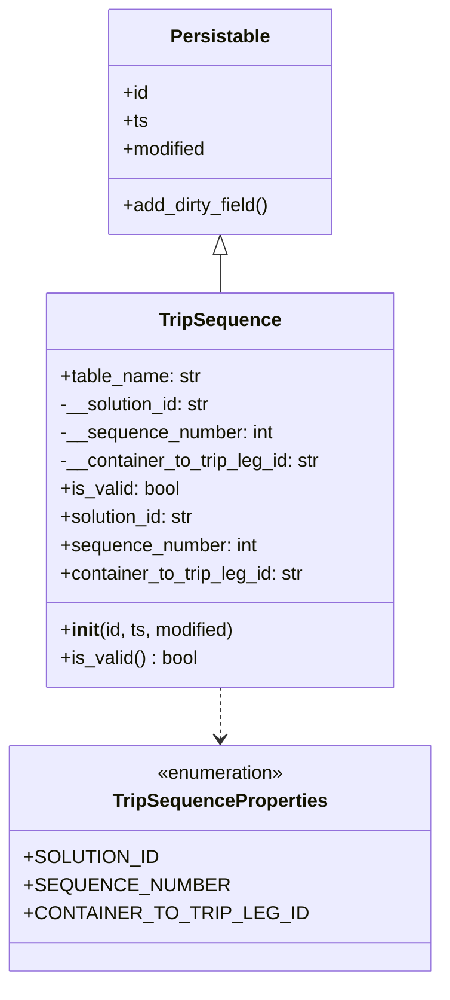
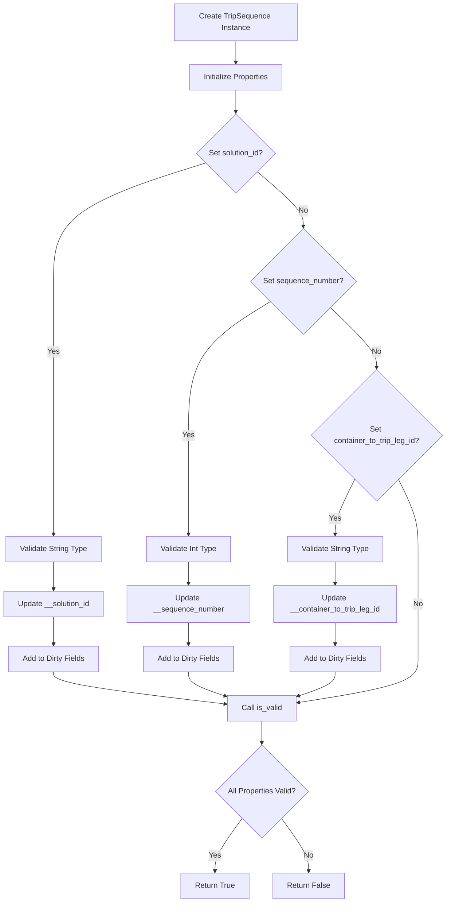
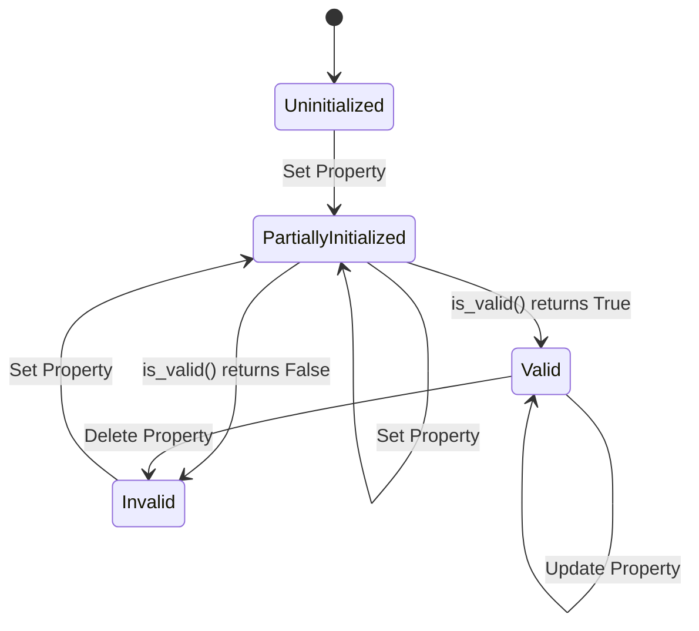

# Diagram: platform/partview_core/partview_service/partview_service/core/datamodel/TripSequence.py

> Auto-generated by Obscura crawlers

## Diagram 1

### SVG

<svg id="container" width="338.9296875" xmlns="http://www.w3.org/2000/svg" class="classDiagram" height="836" viewBox="0 0 338.9296875 836" role="graphics-document document" aria-roledescription="class"><g><defs><marker id="container_class-aggregationStart" class="marker aggregation class" refX="18" refY="7" markerWidth="190" markerHeight="240" orient="auto"><path d="M 18,7 L9,13 L1,7 L9,1 Z"></path></marker></defs><defs><marker id="container_class-aggregationEnd" class="marker aggregation class" refX="1" refY="7" markerWidth="20" markerHeight="28" orient="auto"><path d="M 18,7 L9,13 L1,7 L9,1 Z"></path></marker></defs><defs><marker id="container_class-extensionStart" class="marker extension class" refX="18" refY="7" markerWidth="190" markerHeight="240" orient="auto"><path d="M 1,7 L18,13 V 1 Z"></path></marker></defs><defs><marker id="container_class-extensionEnd" class="marker extension class" refX="1" refY="7" markerWidth="20" markerHeight="28" orient="auto"><path d="M 1,1 V 13 L18,7 Z"></path></marker></defs><defs><marker id="container_class-compositionStart" class="marker composition class" refX="18" refY="7" markerWidth="190" markerHeight="240" orient="auto"><path d="M 18,7 L9,13 L1,7 L9,1 Z"></path></marker></defs><defs><marker id="container_class-compositionEnd" class="marker composition class" refX="1" refY="7" markerWidth="20" markerHeight="28" orient="auto"><path d="M 18,7 L9,13 L1,7 L9,1 Z"></path></marker></defs><defs><marker id="container_class-dependencyStart" class="marker dependency class" refX="6" refY="7" markerWidth="190" markerHeight="240" orient="auto"><path d="M 5,7 L9,13 L1,7 L9,1 Z"></path></marker></defs><defs><marker id="container_class-dependencyEnd" class="marker dependency class" refX="13" refY="7" markerWidth="20" markerHeight="28" orient="auto"><path d="M 18,7 L9,13 L14,7 L9,1 Z"></path></marker></defs><defs><marker id="container_class-lollipopStart" class="marker lollipop class" refX="13" refY="7" markerWidth="190" markerHeight="240" orient="auto"><circle stroke="black" fill="transparent" cx="7" cy="7" r="6"></circle></marker></defs><defs><marker id="container_class-lollipopEnd" class="marker lollipop class" refX="1" refY="7" markerWidth="190" markerHeight="240" orient="auto"><circle stroke="black" fill="transparent" cx="7" cy="7" r="6"></circle></marker></defs><g class="root"><g class="clusters"></g><g class="edgePaths"><path d="M169.465,217.25L169.465,218.542C169.465,219.833,169.465,222.417,169.465,227.875C169.465,233.333,169.465,241.667,169.465,245.833L169.465,250" id="id_Persistable_TripSequence_1" class="edge-thickness-normal edge-pattern-solid relation" style=";;;" data-edge="true" data-et="edge" data-id="id_Persistable_TripSequence_1" data-points="W3sieCI6MTY5LjQ2NDg0Mzc1LCJ5IjoyMDB9LHsieCI6MTY5LjQ2NDg0Mzc1LCJ5IjoyMjV9LHsieCI6MTY5LjQ2NDg0Mzc1LCJ5IjoyNTB9XQ==" marker-start="url(#container_class-extensionStart)"></path><path d="M169.465,586L169.465,590.167C169.465,594.333,169.465,602.667,169.465,610C169.465,617.333,169.465,623.667,169.465,626.833L169.465,630" id="id_TripSequence_TripSequenceProperties_2" class="edge-thickness-normal edge-pattern-dashed relation" style=";;;" data-edge="true" data-et="edge" data-id="id_TripSequence_TripSequenceProperties_2" data-points="W3sieCI6MTY5LjQ2NDg0Mzc1LCJ5Ijo1ODZ9LHsieCI6MTY5LjQ2NDg0Mzc1LCJ5Ijo2MTF9LHsieCI6MTY5LjQ2NDg0Mzc1LCJ5Ijo2MzZ9XQ==" marker-end="url(#container_class-dependencyEnd)"></path></g><g class="edgeLabels"><g class="edgeLabel"><g class="label" data-id="id_Persistable_TripSequence_1" transform="translate(0, 0)"><foreignObject width="0" height="0">

</foreignObject></g></g><g class="edgeLabel"><g class="label" data-id="id_TripSequence_TripSequenceProperties_2" transform="translate(0, 0)"><foreignObject width="0" height="0">

</foreignObject></g></g></g><g class="nodes"><g class="node default" id="classId-TripSequenceProperties-0" transform="translate(169.46484375, 732)"><g class="basic label-container"><path d="M-161.46484375 -96 L161.46484375 -96 L161.46484375 96 L-161.46484375 96" stroke="none" stroke-width="0" fill="#ECECFF" style=""></path><path d="M-161.46484375 -96 C-48.26577256114723 -96, 64.93329862770554 -96, 161.46484375 -96 M-161.46484375 -96 C-44.78867379526659 -96, 71.88749615946682 -96, 161.46484375 -96 M161.46484375 -96 C161.46484375 -37.75149162970477, 161.46484375 20.497016740590453, 161.46484375 96 M161.46484375 -96 C161.46484375 -36.647121995348066, 161.46484375 22.70575600930387, 161.46484375 96 M161.46484375 96 C60.63246952108368 96, -40.199904707832644 96, -161.46484375 96 M161.46484375 96 C47.547924351572604 96, -66.36899504685479 96, -161.46484375 96 M-161.46484375 96 C-161.46484375 34.59089966436295, -161.46484375 -26.8182006712741, -161.46484375 -96 M-161.46484375 96 C-161.46484375 39.70103359860046, -161.46484375 -16.59793280279908, -161.46484375 -96" stroke="#9370DB" stroke-width="1.3" fill="none" stroke-dasharray="0 0" style=""></path></g><g class="annotation-group text" transform="translate(-55.5546875, -72)"><g class="label" style="" transform="translate(0,-12)"><foreignObject width="111.109375" height="24">

«enumeration»

</foreignObject></g></g><g class="label-group text" transform="translate(-88.1171875, -48)"><g class="label" style="font-weight: bolder" transform="translate(0,-12)"><foreignObject width="176.234375" height="24">

TripSequenceProperties

</foreignObject></g></g><g class="members-group text" transform="translate(-149.46484375, 0)"><g class="label" style="" transform="translate(0,-12)"><foreignObject width="103.640625" height="24">

+SOLUTION_ID

</foreignObject></g><g class="label" style="" transform="translate(0,12)"><foreignObject width="153.359375" height="24">

+SEQUENCE_NUMBER

</foreignObject></g><g class="label" style="" transform="translate(0,36)"><foreignObject width="210.8125" height="24">

+CONTAINER_TO_TRIP_LEG_ID

</foreignObject></g></g><g class="methods-group text" transform="translate(-149.46484375, 96)"></g><g class="divider" style=""><path d="M-161.46484375 -24 C-43.89108369354976 -24, 73.68267636290048 -24, 161.46484375 -24 M-161.46484375 -24 C-37.61146376119059 -24, 86.24191622761882 -24, 161.46484375 -24" stroke="#9370DB" stroke-width="1.3" fill="none" stroke-dasharray="0 0" style=""></path></g><g class="divider" style=""><path d="M-161.46484375 72 C-75.81842130166586 72, 9.82800114666827 72, 161.46484375 72 M-161.46484375 72 C-43.41627435910452 72, 74.63229503179096 72, 161.46484375 72" stroke="#9370DB" stroke-width="1.3" fill="none" stroke-dasharray="0 0" style=""></path></g></g><g class="node default" id="classId-Persistable-1" transform="translate(169.46484375, 104)"><g class="basic label-container"><path d="M-96.19140625 -96 L96.19140625 -96 L96.19140625 96 L-96.19140625 96" stroke="none" stroke-width="0" fill="#ECECFF" style=""></path><path d="M-96.19140625 -96 C-37.02966644414105 -96, 22.1320733617179 -96, 96.19140625 -96 M-96.19140625 -96 C-47.104081386115894 -96, 1.9832434777682124 -96, 96.19140625 -96 M96.19140625 -96 C96.19140625 -45.439848255477074, 96.19140625 5.1203034890458525, 96.19140625 96 M96.19140625 -96 C96.19140625 -36.61679758138138, 96.19140625 22.766404837237246, 96.19140625 96 M96.19140625 96 C31.27181334720092 96, -33.64777955559816 96, -96.19140625 96 M96.19140625 96 C46.042902544538435 96, -4.105601160923129 96, -96.19140625 96 M-96.19140625 96 C-96.19140625 30.818470652364, -96.19140625 -34.363058695272, -96.19140625 -96 M-96.19140625 96 C-96.19140625 26.672974025323597, -96.19140625 -42.654051949352805, -96.19140625 -96" stroke="#9370DB" stroke-width="1.3" fill="none" stroke-dasharray="0 0" style=""></path></g><g class="annotation-group text" transform="translate(0, -72)"></g><g class="label-group text" transform="translate(-40.9765625, -72)"><g class="label" style="font-weight: bolder" transform="translate(0,-12)"><foreignObject width="81.953125" height="24">

Persistable

</foreignObject></g></g><g class="members-group text" transform="translate(-84.19140625, -24)"><g class="label" style="" transform="translate(0,-12)"><foreignObject width="22.078125" height="24">

+id

</foreignObject></g><g class="label" style="" transform="translate(0,12)"><foreignObject width="21.15625" height="24">

+ts

</foreignObject></g><g class="label" style="" transform="translate(0,36)"><foreignObject width="72.609375" height="24">

+modified

</foreignObject></g></g><g class="methods-group text" transform="translate(-84.19140625, 72)"><g class="label" style="" transform="translate(0,-12)"><foreignObject width="127.40625" height="24">

+add_dirty_field()

</foreignObject></g></g><g class="divider" style=""><path d="M-96.19140625 -48 C-44.88498886349166 -48, 6.4214285230166865 -48, 96.19140625 -48 M-96.19140625 -48 C-55.133696591615504 -48, -14.075986933231007 -48, 96.19140625 -48" stroke="#9370DB" stroke-width="1.3" fill="none" stroke-dasharray="0 0" style=""></path></g><g class="divider" style=""><path d="M-96.19140625 48 C-50.56566239408014 48, -4.939918538160285 48, 96.19140625 48 M-96.19140625 48 C-33.50234282088694 48, 29.186720608226125 48, 96.19140625 48" stroke="#9370DB" stroke-width="1.3" fill="none" stroke-dasharray="0 0" style=""></path></g></g><g class="node default" id="classId-TripSequence-2" transform="translate(169.46484375, 418)"><g class="basic label-container"><path d="M-149.5234375 -168 L149.5234375 -168 L149.5234375 168 L-149.5234375 168" stroke="none" stroke-width="0" fill="#ECECFF" style=""></path><path d="M-149.5234375 -168 C-77.71556163775531 -168, -5.907685775510629 -168, 149.5234375 -168 M-149.5234375 -168 C-85.89322745658052 -168, -22.26301741316105 -168, 149.5234375 -168 M149.5234375 -168 C149.5234375 -41.74825753013471, 149.5234375 84.50348493973058, 149.5234375 168 M149.5234375 -168 C149.5234375 -60.27905341277555, 149.5234375 47.44189317444889, 149.5234375 168 M149.5234375 168 C40.548960985975484 168, -68.42551552804903 168, -149.5234375 168 M149.5234375 168 C56.767098629957346 168, -35.98924024008531 168, -149.5234375 168 M-149.5234375 168 C-149.5234375 50.552461810194856, -149.5234375 -66.89507637961029, -149.5234375 -168 M-149.5234375 168 C-149.5234375 44.77659518527594, -149.5234375 -78.44680962944813, -149.5234375 -168" stroke="#9370DB" stroke-width="1.3" fill="none" stroke-dasharray="0 0" style=""></path></g><g class="annotation-group text" transform="translate(0, -144)"></g><g class="label-group text" transform="translate(-49.8125, -144)"><g class="label" style="font-weight: bolder" transform="translate(0,-12)"><foreignObject width="99.625" height="24">

TripSequence

</foreignObject></g></g><g class="members-group text" transform="translate(-137.5234375, -96)"><g class="label" style="" transform="translate(0,-12)"><foreignObject width="121.125" height="24">

+table_name: str

</foreignObject></g><g class="label" style="" transform="translate(0,12)"><foreignObject width="131.390625" height="24">

-__solution_id: str

</foreignObject></g><g class="label" style="" transform="translate(0,36)"><foreignObject width="183.578125" height="24">

-__sequence_number: int

</foreignObject></g><g class="label" style="" transform="translate(0,60)"><foreignObject width="225.234375" height="24">

-__container_to_trip_leg_id: str

</foreignObject></g><g class="label" style="" transform="translate(0,84)"><foreignObject width="103.390625" height="24">

+is_valid: bool

</foreignObject></g><g class="label" style="" transform="translate(0,108)"><foreignObject width="117.71875" height="24">

+solution_id: str

</foreignObject></g><g class="label" style="" transform="translate(0,132)"><foreignObject width="169.90625" height="24">

+sequence_number: int

</foreignObject></g><g class="label" style="" transform="translate(0,156)"><foreignObject width="211.890625" height="24">

+container_to_trip_leg_id: str

</foreignObject></g></g><g class="methods-group text" transform="translate(-137.5234375, 120)"><g class="label" style="" transform="translate(0,-12)"><foreignObject width="150.90625" height="24">

+<strong>init</strong>(id, ts, modified)

</foreignObject></g><g class="label" style="" transform="translate(0,12)"><foreignObject width="117.984375" height="24">

+is_valid() : bool

</foreignObject></g></g><g class="divider" style=""><path d="M-149.5234375 -120 C-71.71041168828201 -120, 6.102614123435984 -120, 149.5234375 -120 M-149.5234375 -120 C-55.63681935710761 -120, 38.249798785784776 -120, 149.5234375 -120" stroke="#9370DB" stroke-width="1.3" fill="none" stroke-dasharray="0 0" style=""></path></g><g class="divider" style=""><path d="M-149.5234375 96 C-78.34581342060575 96, -7.168189341211502 96, 149.5234375 96 M-149.5234375 96 C-71.87829397909962 96, 5.766849541800752 96, 149.5234375 96" stroke="#9370DB" stroke-width="1.3" fill="none" stroke-dasharray="0 0" style=""></path></g></g></g></g></g></svg>

## Diagram 2

### SVG

<svg id="container" width="948.6484375" xmlns="http://www.w3.org/2000/svg" class="flowchart" height="1908.21875" viewBox="0 0 948.6484375 1908.21875" role="graphics-document document" aria-roledescription="flowchart-v2"><g><marker id="container_flowchart-v2-pointEnd" class="marker flowchart-v2" viewBox="0 0 10 10" refX="5" refY="5" markerUnits="userSpaceOnUse" markerWidth="8" markerHeight="8" orient="auto"><path d="M 0 0 L 10 5 L 0 10 z" class="arrowMarkerPath" style="stroke-width: 1; stroke-dasharray: 1, 0;"></path></marker><marker id="container_flowchart-v2-pointStart" class="marker flowchart-v2" viewBox="0 0 10 10" refX="4.5" refY="5" markerUnits="userSpaceOnUse" markerWidth="8" markerHeight="8" orient="auto"><path d="M 0 5 L 10 10 L 10 0 z" class="arrowMarkerPath" style="stroke-width: 1; stroke-dasharray: 1, 0;"></path></marker><marker id="container_flowchart-v2-circleEnd" class="marker flowchart-v2" viewBox="0 0 10 10" refX="11" refY="5" markerUnits="userSpaceOnUse" markerWidth="11" markerHeight="11" orient="auto"><circle cx="5" cy="5" r="5" class="arrowMarkerPath" style="stroke-width: 1; stroke-dasharray: 1, 0;"></circle></marker><marker id="container_flowchart-v2-circleStart" class="marker flowchart-v2" viewBox="0 0 10 10" refX="-1" refY="5" markerUnits="userSpaceOnUse" markerWidth="11" markerHeight="11" orient="auto"><circle cx="5" cy="5" r="5" class="arrowMarkerPath" style="stroke-width: 1; stroke-dasharray: 1, 0;"></circle></marker><marker id="container_flowchart-v2-crossEnd" class="marker cross flowchart-v2" viewBox="0 0 11 11" refX="12" refY="5.2" markerUnits="userSpaceOnUse" markerWidth="11" markerHeight="11" orient="auto"><path d="M 1,1 l 9,9 M 10,1 l -9,9" class="arrowMarkerPath" style="stroke-width: 2; stroke-dasharray: 1, 0;"></path></marker><marker id="container_flowchart-v2-crossStart" class="marker cross flowchart-v2" viewBox="0 0 11 11" refX="-1" refY="5.2" markerUnits="userSpaceOnUse" markerWidth="11" markerHeight="11" orient="auto"><path d="M 1,1 l 9,9 M 10,1 l -9,9" class="arrowMarkerPath" style="stroke-width: 2; stroke-dasharray: 1, 0;"></path></marker><g class="root"><g class="clusters"></g><g class="edgePaths"><path d="M502.254,86L502.254,90.167C502.254,94.333,502.254,102.667,502.254,110.333C502.254,118,502.254,125,502.254,128.5L502.254,132" id="L_A_B_0" class="edge-thickness-normal edge-pattern-solid edge-thickness-normal edge-pattern-solid flowchart-link" style=";" data-edge="true" data-et="edge" data-id="L_A_B_0" data-points="W3sieCI6NTAyLjI1MzkwNjI1LCJ5Ijo4Nn0seyJ4Ijo1MDIuMjUzOTA2MjUsInkiOjExMX0seyJ4Ijo1MDIuMjUzOTA2MjUsInkiOjEzNn1d" marker-end="url(#container_flowchart-v2-pointEnd)"></path><path d="M502.254,190L502.254,194.167C502.254,198.333,502.254,206.667,502.254,214.333C502.254,222,502.254,229,502.254,232.5L502.254,236" id="L_B_C_0" class="edge-thickness-normal edge-pattern-solid edge-thickness-normal edge-pattern-solid flowchart-link" style=";" data-edge="true" data-et="edge" data-id="L_B_C_0" data-points="W3sieCI6NTAyLjI1MzkwNjI1LCJ5IjoxOTB9LHsieCI6NTAyLjI1MzkwNjI1LCJ5IjoyMTV9LHsieCI6NTAyLjI1MzkwNjI1LCJ5IjoyNDB9XQ==" marker-end="url(#container_flowchart-v2-pointEnd)"></path><path d="M437.323,346.1L383.734,363.088C330.145,380.077,222.967,414.054,169.378,455.738C115.789,497.422,115.789,546.813,115.789,596.203C115.789,645.594,115.789,694.984,115.789,749.013C115.789,803.042,115.789,861.708,115.789,920.375C115.789,979.042,115.789,1037.708,115.789,1072.542C115.789,1107.375,115.789,1118.375,115.789,1123.875L115.789,1129.375" id="L_C_D_0" class="edge-thickness-normal edge-pattern-solid edge-thickness-normal edge-pattern-solid flowchart-link" style=";" data-edge="true" data-et="edge" data-id="L_C_D_0" data-points="W3sieCI6NDM3LjMyMjU2ODYzOTAwNTMsInkiOjM0Ni4wOTk5MTIzODkwMDUzfSx7IngiOjExNS43ODkwNjI1LCJ5Ijo0NDguMDMxMjV9LHsieCI6MTE1Ljc4OTA2MjUsInkiOjU5Ni4yMDMxMjV9LHsieCI6MTE1Ljc4OTA2MjUsInkiOjc0NC4zNzV9LHsieCI6MTE1Ljc4OTA2MjUsInkiOjkyMC4zNzV9LHsieCI6MTE1Ljc4OTA2MjUsInkiOjEwOTYuMzc1fSx7IngiOjExNS43ODkwNjI1LCJ5IjoxMTMzLjM3NX1d" marker-end="url(#container_flowchart-v2-pointEnd)"></path><path d="M115.789,1187.375L115.789,1191.542C115.789,1195.708,115.789,1204.042,115.789,1213.708C115.789,1223.375,115.789,1234.375,115.789,1239.875L115.789,1245.375" id="L_D_E_0" class="edge-thickness-normal edge-pattern-solid edge-thickness-normal edge-pattern-solid flowchart-link" style=";" data-edge="true" data-et="edge" data-id="L_D_E_0" data-points="W3sieCI6MTE1Ljc4OTA2MjUsInkiOjExODcuMzc1fSx7IngiOjExNS43ODkwNjI1LCJ5IjoxMjEyLjM3NX0seyJ4IjoxMTUuNzg5MDYyNSwieSI6MTI0OS4zNzV9XQ==" marker-end="url(#container_flowchart-v2-pointEnd)"></path><path d="M115.789,1303.375L115.789,1309.542C115.789,1315.708,115.789,1328.042,115.789,1337.708C115.789,1347.375,115.789,1354.375,115.789,1357.875L115.789,1361.375" id="L_E_F_0" class="edge-thickness-normal edge-pattern-solid edge-thickness-normal edge-pattern-solid flowchart-link" style=";" data-edge="true" data-et="edge" data-id="L_E_F_0" data-points="W3sieCI6MTE1Ljc4OTA2MjUsInkiOjEzMDMuMzc1fSx7IngiOjExNS43ODkwNjI1LCJ5IjoxMzQwLjM3NX0seyJ4IjoxMTUuNzg5MDYyNSwieSI6MTM2NS4zNzV9XQ==" marker-end="url(#container_flowchart-v2-pointEnd)"></path><path d="M548.443,364.842L564.727,378.707C581.011,392.572,613.58,420.302,629.864,439.666C646.148,459.031,646.148,470.031,646.148,475.531L646.148,481.031" id="L_C_G_0" class="edge-thickness-normal edge-pattern-solid edge-thickness-normal edge-pattern-solid flowchart-link" style=";" data-edge="true" data-et="edge" data-id="L_C_G_0" data-points="W3sieCI6NTQ4LjQ0Mjk1MTU0NDQyMzksInkiOjM2NC44NDIyMDQ3MDU1NzYxNH0seyJ4Ijo2NDYuMTQ4NDM3NSwieSI6NDQ4LjAzMTI1fSx7IngiOjY0Ni4xNDg0Mzc1LCJ5Ijo0ODUuMDMxMjV9XQ==" marker-end="url(#container_flowchart-v2-pointEnd)"></path><path d="M577.134,638.36L548.208,656.029C519.282,673.698,461.43,709.037,432.504,756.039C403.578,803.042,403.578,861.708,403.578,920.375C403.578,979.042,403.578,1037.708,403.578,1072.542C403.578,1107.375,403.578,1118.375,403.578,1123.875L403.578,1129.375" id="L_G_H_0" class="edge-thickness-normal edge-pattern-solid edge-thickness-normal edge-pattern-solid flowchart-link" style=";" data-edge="true" data-et="edge" data-id="L_G_H_0" data-points="W3sieCI6NTc3LjEzMzYzMTAwNDQ0ODcsInkiOjYzOC4zNjAxOTM1MDQ0NDg3fSx7IngiOjQwMy41NzgxMjUsInkiOjc0NC4zNzV9LHsieCI6NDAzLjU3ODEyNSwieSI6OTIwLjM3NX0seyJ4Ijo0MDMuNTc4MTI1LCJ5IjoxMDk2LjM3NX0seyJ4Ijo0MDMuNTc4MTI1LCJ5IjoxMTMzLjM3NX1d" marker-end="url(#container_flowchart-v2-pointEnd)"></path><path d="M403.578,1187.375L403.578,1191.542C403.578,1195.708,403.578,1204.042,403.578,1211.708C403.578,1219.375,403.578,1226.375,403.578,1229.875L403.578,1233.375" id="L_H_I_0" class="edge-thickness-normal edge-pattern-solid edge-thickness-normal edge-pattern-solid flowchart-link" style=";" data-edge="true" data-et="edge" data-id="L_H_I_0" data-points="W3sieCI6NDAzLjU3ODEyNSwieSI6MTE4Ny4zNzV9LHsieCI6NDAzLjU3ODEyNSwieSI6MTIxMi4zNzV9LHsieCI6NDAzLjU3ODEyNSwieSI6MTIzNy4zNzV9XQ==" marker-end="url(#container_flowchart-v2-pointEnd)"></path><path d="M403.578,1315.375L403.578,1319.542C403.578,1323.708,403.578,1332.042,403.578,1339.708C403.578,1347.375,403.578,1354.375,403.578,1357.875L403.578,1361.375" id="L_I_J_0" class="edge-thickness-normal edge-pattern-solid edge-thickness-normal edge-pattern-solid flowchart-link" style=";" data-edge="true" data-et="edge" data-id="L_I_J_0" data-points="W3sieCI6NDAzLjU3ODEyNSwieSI6MTMxNS4zNzV9LHsieCI6NDAzLjU3ODEyNSwieSI6MTM0MC4zNzV9LHsieCI6NDAzLjU3ODEyNSwieSI6MTM2NS4zNzV9XQ==" marker-end="url(#container_flowchart-v2-pointEnd)"></path><path d="M702.986,650.537L719.347,666.177C735.707,681.816,768.428,713.096,784.788,734.235C801.148,755.375,801.148,766.375,801.148,771.875L801.148,777.375" id="L_G_K_0" class="edge-thickness-normal edge-pattern-solid edge-thickness-normal edge-pattern-solid flowchart-link" style=";" data-edge="true" data-et="edge" data-id="L_G_K_0" data-points="W3sieCI6NzAyLjk4NjI5NzYyNDcyMywieSI6NjUwLjUzNzEzOTg3NTI3N30seyJ4Ijo4MDEuMTQ4NDM3NSwieSI6NzQ0LjM3NX0seyJ4Ijo4MDEuMTQ4NDM3NSwieSI6NzgxLjM3NX1d" marker-end="url(#container_flowchart-v2-pointEnd)"></path><path d="M754.966,1013.193L748.068,1027.056C741.17,1040.92,727.374,1068.648,720.476,1088.011C713.578,1107.375,713.578,1118.375,713.578,1123.875L713.578,1129.375" id="L_K_L_0" class="edge-thickness-normal edge-pattern-solid edge-thickness-normal edge-pattern-solid flowchart-link" style=";" data-edge="true" data-et="edge" data-id="L_K_L_0" data-points="W3sieCI6NzU0Ljk2NjE3NDcwMjQ3OCwieSI6MTAxMy4xOTI3MzcyMDI0Nzh9LHsieCI6NzEzLjU3ODEyNSwieSI6MTA5Ni4zNzV9LHsieCI6NzEzLjU3ODEyNSwieSI6MTEzMy4zNzV9XQ==" marker-end="url(#container_flowchart-v2-pointEnd)"></path><path d="M713.578,1187.375L713.578,1191.542C713.578,1195.708,713.578,1204.042,713.578,1211.708C713.578,1219.375,713.578,1226.375,713.578,1229.875L713.578,1233.375" id="L_L_M_0" class="edge-thickness-normal edge-pattern-solid edge-thickness-normal edge-pattern-solid flowchart-link" style=";" data-edge="true" data-et="edge" data-id="L_L_M_0" data-points="W3sieCI6NzEzLjU3ODEyNSwieSI6MTE4Ny4zNzV9LHsieCI6NzEzLjU3ODEyNSwieSI6MTIxMi4zNzV9LHsieCI6NzEzLjU3ODEyNSwieSI6MTIzNy4zNzV9XQ==" marker-end="url(#container_flowchart-v2-pointEnd)"></path><path d="M713.578,1315.375L713.578,1319.542C713.578,1323.708,713.578,1332.042,713.578,1339.708C713.578,1347.375,713.578,1354.375,713.578,1357.875L713.578,1361.375" id="L_M_N_0" class="edge-thickness-normal edge-pattern-solid edge-thickness-normal edge-pattern-solid flowchart-link" style=";" data-edge="true" data-et="edge" data-id="L_M_N_0" data-points="W3sieCI6NzEzLjU3ODEyNSwieSI6MTMxNS4zNzV9LHsieCI6NzEzLjU3ODEyNSwieSI6MTM0MC4zNzV9LHsieCI6NzEzLjU3ODEyNSwieSI6MTM2NS4zNzV9XQ==" marker-end="url(#container_flowchart-v2-pointEnd)"></path><path d="M847.331,1013.193L854.229,1027.056C861.127,1040.92,874.923,1068.648,881.821,1093.178C888.719,1117.708,888.719,1139.042,888.719,1158.375C888.719,1177.708,888.719,1195.042,888.719,1214.375C888.719,1233.708,888.719,1255.042,888.719,1276.375C888.719,1297.708,888.719,1319.042,888.719,1338.375C888.719,1357.708,888.719,1375.042,888.719,1392.375C888.719,1409.708,888.719,1427.042,846.471,1442.363C804.223,1457.684,719.728,1470.993,677.48,1477.647L635.233,1484.301" id="L_K_O_0" class="edge-thickness-normal edge-pattern-solid edge-thickness-normal edge-pattern-solid flowchart-link" style=";" data-edge="true" data-et="edge" data-id="L_K_O_0" data-points="W3sieCI6ODQ3LjMzMDcwMDI5NzUyMiwieSI6MTAxMy4xOTI3MzcyMDI0Nzh9LHsieCI6ODg4LjcxODc1LCJ5IjoxMDk2LjM3NX0seyJ4Ijo4ODguNzE4NzUsInkiOjExNjAuMzc1fSx7IngiOjg4OC43MTg3NSwieSI6MTIxMi4zNzV9LHsieCI6ODg4LjcxODc1LCJ5IjoxMjc2LjM3NX0seyJ4Ijo4ODguNzE4NzUsInkiOjEzNDAuMzc1fSx7IngiOjg4OC43MTg3NSwieSI6MTM5Mi4zNzV9LHsieCI6ODg4LjcxODc1LCJ5IjoxNDQ0LjM3NX0seyJ4Ijo2MzEuMjgxMjUsInkiOjE0ODQuOTIzNjI5ODQ1MjM2NX1d" marker-end="url(#container_flowchart-v2-pointEnd)"></path><path d="M115.789,1419.375L115.789,1423.542C115.789,1427.708,115.789,1436.042,176.808,1447.374C237.827,1458.707,359.865,1473.039,420.883,1480.204L481.902,1487.37" id="L_F_O_0" class="edge-thickness-normal edge-pattern-solid edge-thickness-normal edge-pattern-solid flowchart-link" style=";" data-edge="true" data-et="edge" data-id="L_F_O_0" data-points="W3sieCI6MTE1Ljc4OTA2MjUsInkiOjE0MTkuMzc1fSx7IngiOjExNS43ODkwNjI1LCJ5IjoxNDQ0LjM3NX0seyJ4Ijo0ODUuODc1LCJ5IjoxNDg3LjgzNjkzMzQxMjE0MjZ9XQ==" marker-end="url(#container_flowchart-v2-pointEnd)"></path><path d="M403.578,1419.375L403.578,1423.542C403.578,1427.708,403.578,1436.042,416.662,1444.598C429.746,1453.154,455.915,1461.933,468.999,1466.323L482.083,1470.712" id="L_J_O_0" class="edge-thickness-normal edge-pattern-solid edge-thickness-normal edge-pattern-solid flowchart-link" style=";" data-edge="true" data-et="edge" data-id="L_J_O_0" data-points="W3sieCI6NDAzLjU3ODEyNSwieSI6MTQxOS4zNzV9LHsieCI6NDAzLjU3ODEyNSwieSI6MTQ0NC4zNzV9LHsieCI6NDg1Ljg3NSwieSI6MTQ3MS45ODQyNzQxOTM1NDgzfV0=" marker-end="url(#container_flowchart-v2-pointEnd)"></path><path d="M713.578,1419.375L713.578,1423.542C713.578,1427.708,713.578,1436.042,700.494,1444.598C687.41,1453.154,661.242,1461.933,648.158,1466.323L635.074,1470.712" id="L_N_O_0" class="edge-thickness-normal edge-pattern-solid edge-thickness-normal edge-pattern-solid flowchart-link" style=";" data-edge="true" data-et="edge" data-id="L_N_O_0" data-points="W3sieCI6NzEzLjU3ODEyNSwieSI6MTQxOS4zNzV9LHsieCI6NzEzLjU3ODEyNSwieSI6MTQ0NC4zNzV9LHsieCI6NjMxLjI4MTI1LCJ5IjoxNDcxLjk4NDI3NDE5MzU0ODN9XQ==" marker-end="url(#container_flowchart-v2-pointEnd)"></path><path d="M558.578,1523.375L558.578,1527.542C558.578,1531.708,558.578,1540.042,558.578,1547.708C558.578,1555.375,558.578,1562.375,558.578,1565.875L558.578,1569.375" id="L_O_P_0" class="edge-thickness-normal edge-pattern-solid edge-thickness-normal edge-pattern-solid flowchart-link" style=";" data-edge="true" data-et="edge" data-id="L_O_P_0" data-points="W3sieCI6NTU4LjU3ODEyNSwieSI6MTUyMy4zNzV9LHsieCI6NTU4LjU3ODEyNSwieSI6MTU0OC4zNzV9LHsieCI6NTU4LjU3ODEyNSwieSI6MTU3My4zNzV9XQ==" marker-end="url(#container_flowchart-v2-pointEnd)"></path><path d="M516.866,1730.506L507.384,1743.625C497.901,1756.744,478.937,1782.981,469.455,1801.6C459.973,1820.219,459.973,1831.219,459.973,1836.719L459.973,1842.219" id="L_P_Q_0" class="edge-thickness-normal edge-pattern-solid edge-thickness-normal edge-pattern-solid flowchart-link" style=";" data-edge="true" data-et="edge" data-id="L_P_Q_0" data-points="W3sieCI6NTE2Ljg2NTc4NDUwMzk2MzksInkiOjE3MzAuNTA2NDA5NTAzOTY0fSx7IngiOjQ1OS45NzI2NTYyNSwieSI6MTgwOS4yMTg3NX0seyJ4Ijo0NTkuOTcyNjU2MjUsInkiOjE4NDYuMjE4NzV9XQ==" marker-end="url(#container_flowchart-v2-pointEnd)"></path><path d="M600.29,1730.506L609.773,1743.625C619.255,1756.744,638.219,1782.981,647.701,1801.6C657.184,1820.219,657.184,1831.219,657.184,1836.719L657.184,1842.219" id="L_P_R_0" class="edge-thickness-normal edge-pattern-solid edge-thickness-normal edge-pattern-solid flowchart-link" style=";" data-edge="true" data-et="edge" data-id="L_P_R_0" data-points="W3sieCI6NjAwLjI5MDQ2NTQ5NjAzNjEsInkiOjE3MzAuNTA2NDA5NTAzOTY0fSx7IngiOjY1Ny4xODM1OTM3NSwieSI6MTgwOS4yMTg3NX0seyJ4Ijo2NTcuMTgzNTkzNzUsInkiOjE4NDYuMjE4NzV9XQ==" marker-end="url(#container_flowchart-v2-pointEnd)"></path></g><g class="edgeLabels"><g class="edgeLabel"><g class="label" data-id="L_A_B_0" transform="translate(0, 0)"><foreignObject width="0" height="0">

</foreignObject></g></g><g class="edgeLabel"><g class="label" data-id="L_B_C_0" transform="translate(0, 0)"><foreignObject width="0" height="0">

</foreignObject></g></g><g class="edgeLabel" transform="translate(115.7890625, 744.375)"><g class="label" data-id="L_C_D_0" transform="translate(-12.03125, -12)"><foreignObject width="24.0625" height="24">

Yes

</foreignObject></g></g><g class="edgeLabel"><g class="label" data-id="L_D_E_0" transform="translate(0, 0)"><foreignObject width="0" height="0">

</foreignObject></g></g><g class="edgeLabel"><g class="label" data-id="L_E_F_0" transform="translate(0, 0)"><foreignObject width="0" height="0">

</foreignObject></g></g><g class="edgeLabel" transform="translate(646.1484375, 448.03125)"><g class="label" data-id="L_C_G_0" transform="translate(-10.140625, -12)"><foreignObject width="20.28125" height="24">

No

</foreignObject></g></g><g class="edgeLabel" transform="translate(403.578125, 920.375)"><g class="label" data-id="L_G_H_0" transform="translate(-12.03125, -12)"><foreignObject width="24.0625" height="24">

Yes

</foreignObject></g></g><g class="edgeLabel"><g class="label" data-id="L_H_I_0" transform="translate(0, 0)"><foreignObject width="0" height="0">

</foreignObject></g></g><g class="edgeLabel"><g class="label" data-id="L_I_J_0" transform="translate(0, 0)"><foreignObject width="0" height="0">

</foreignObject></g></g><g class="edgeLabel" transform="translate(801.1484375, 744.375)"><g class="label" data-id="L_G_K_0" transform="translate(-10.140625, -12)"><foreignObject width="20.28125" height="24">

No

</foreignObject></g></g><g class="edgeLabel" transform="translate(713.578125, 1096.375)"><g class="label" data-id="L_K_L_0" transform="translate(-12.03125, -12)"><foreignObject width="24.0625" height="24">

Yes

</foreignObject></g></g><g class="edgeLabel"><g class="label" data-id="L_L_M_0" transform="translate(0, 0)"><foreignObject width="0" height="0">

</foreignObject></g></g><g class="edgeLabel"><g class="label" data-id="L_M_N_0" transform="translate(0, 0)"><foreignObject width="0" height="0">

</foreignObject></g></g><g class="edgeLabel" transform="translate(888.71875, 1276.375)"><g class="label" data-id="L_K_O_0" transform="translate(-10.140625, -12)"><foreignObject width="20.28125" height="24">

No

</foreignObject></g></g><g class="edgeLabel"><g class="label" data-id="L_F_O_0" transform="translate(0, 0)"><foreignObject width="0" height="0">

</foreignObject></g></g><g class="edgeLabel"><g class="label" data-id="L_J_O_0" transform="translate(0, 0)"><foreignObject width="0" height="0">

</foreignObject></g></g><g class="edgeLabel"><g class="label" data-id="L_N_O_0" transform="translate(0, 0)"><foreignObject width="0" height="0">

</foreignObject></g></g><g class="edgeLabel"><g class="label" data-id="L_O_P_0" transform="translate(0, 0)"><foreignObject width="0" height="0">

</foreignObject></g></g><g class="edgeLabel" transform="translate(459.97265625, 1809.21875)"><g class="label" data-id="L_P_Q_0" transform="translate(-12.03125, -12)"><foreignObject width="24.0625" height="24">

Yes

</foreignObject></g></g><g class="edgeLabel" transform="translate(657.18359375, 1809.21875)"><g class="label" data-id="L_P_R_0" transform="translate(-10.140625, -12)"><foreignObject width="20.28125" height="24">

No

</foreignObject></g></g></g><g class="nodes"><g class="node default" id="flowchart-A-0" transform="translate(502.25390625, 47)"><rect class="basic label-container" style="" x="-130" y="-39" width="260" height="78"></rect><g class="label" style="" transform="translate(-100, -24)"><rect></rect><foreignObject width="200" height="48">

Create TripSequence Instance

</foreignObject></g></g><g class="node default" id="flowchart-B-1" transform="translate(502.25390625, 163)"><rect class="basic label-container" style="" x="-100.6953125" y="-27" width="201.390625" height="54"></rect><g class="label" style="" transform="translate(-70.6953125, -12)"><rect></rect><foreignObject width="141.390625" height="24">

Initialize Properties

</foreignObject></g></g><g class="node default" id="flowchart-C-3" transform="translate(502.25390625, 325.515625)"><polygon points="85.515625,0 171.03125,-85.515625 85.515625,-171.03125 0,-85.515625" class="label-container" transform="translate(-85.015625, 85.515625)"></polygon><g class="label" style="" transform="translate(-58.515625, -12)"><rect></rect><foreignObject width="117.03125" height="24">

Set solution_id?

</foreignObject></g></g><g class="node default" id="flowchart-D-5" transform="translate(115.7890625, 1160.375)"><rect class="basic label-container" style="" x="-101.8125" y="-27" width="203.625" height="54"></rect><g class="label" style="" transform="translate(-71.8125, -12)"><rect></rect><foreignObject width="143.625" height="24">

Validate String Type

</foreignObject></g></g><g class="node default" id="flowchart-E-7" transform="translate(115.7890625, 1276.375)"><rect class="basic label-container" style="" x="-107.7890625" y="-27" width="215.578125" height="54"></rect><g class="label" style="" transform="translate(-77.7890625, -12)"><rect></rect><foreignObject width="155.578125" height="24">

Update __solution_id

</foreignObject></g></g><g class="node default" id="flowchart-F-9" transform="translate(115.7890625, 1392.375)"><rect class="basic label-container" style="" x="-96.3203125" y="-27" width="192.640625" height="54"></rect><g class="label" style="" transform="translate(-66.3203125, -12)"><rect></rect><foreignObject width="132.640625" height="24">

Add to Dirty Fields

</foreignObject></g></g><g class="node default" id="flowchart-G-11" transform="translate(646.1484375, 596.203125)"><polygon points="111.171875,0 222.34375,-111.171875 111.171875,-222.34375 0,-111.171875" class="label-container" transform="translate(-110.671875, 111.171875)"></polygon><g class="label" style="" transform="translate(-84.171875, -12)"><rect></rect><foreignObject width="168.34375" height="24">

Set sequence_number?

</foreignObject></g></g><g class="node default" id="flowchart-H-13" transform="translate(403.578125, 1160.375)"><rect class="basic label-container" style="" x="-90.3046875" y="-27" width="180.609375" height="54"></rect><g class="label" style="" transform="translate(-60.3046875, -12)"><rect></rect><foreignObject width="120.609375" height="24">

Validate Int Type

</foreignObject></g></g><g class="node default" id="flowchart-I-15" transform="translate(403.578125, 1276.375)"><rect class="basic label-container" style="" x="-130" y="-39" width="260" height="78"></rect><g class="label" style="" transform="translate(-100, -24)"><rect></rect><foreignObject width="200" height="48">

Update __sequence_number

</foreignObject></g></g><g class="node default" id="flowchart-J-17" transform="translate(403.578125, 1392.375)"><rect class="basic label-container" style="" x="-96.3203125" y="-27" width="192.640625" height="54"></rect><g class="label" style="" transform="translate(-66.3203125, -12)"><rect></rect><foreignObject width="132.640625" height="24">

Add to Dirty Fields

</foreignObject></g></g><g class="node default" id="flowchart-K-19" transform="translate(801.1484375, 920.375)"><polygon points="139,0 278,-139 139,-278 0,-139" class="label-container" transform="translate(-138.5, 139)"></polygon><g class="label" style="" transform="translate(-100, -24)"><rect></rect><foreignObject width="200" height="48">

Set container_to_trip_leg_id?

</foreignObject></g></g><g class="node default" id="flowchart-L-21" transform="translate(713.578125, 1160.375)"><rect class="basic label-container" style="" x="-101.8125" y="-27" width="203.625" height="54"></rect><g class="label" style="" transform="translate(-71.8125, -12)"><rect></rect><foreignObject width="143.625" height="24">

Validate String Type

</foreignObject></g></g><g class="node default" id="flowchart-M-23" transform="translate(713.578125, 1276.375)"><rect class="basic label-container" style="" x="-130" y="-39" width="260" height="78"></rect><g class="label" style="" transform="translate(-100, -24)"><rect></rect><foreignObject width="200" height="48">

Update __container_to_trip_leg_id

</foreignObject></g></g><g class="node default" id="flowchart-N-25" transform="translate(713.578125, 1392.375)"><rect class="basic label-container" style="" x="-96.3203125" y="-27" width="192.640625" height="54"></rect><g class="label" style="" transform="translate(-66.3203125, -12)"><rect></rect><foreignObject width="132.640625" height="24">

Add to Dirty Fields

</foreignObject></g></g><g class="node default" id="flowchart-O-27" transform="translate(558.578125, 1496.375)"><rect class="basic label-container" style="" x="-72.703125" y="-27" width="145.40625" height="54"></rect><g class="label" style="" transform="translate(-42.703125, -12)"><rect></rect><foreignObject width="85.40625" height="24">

Call is_valid

</foreignObject></g></g><g class="node default" id="flowchart-P-35" transform="translate(558.578125, 1672.796875)"><polygon points="99.421875,0 198.84375,-99.421875 99.421875,-198.84375 0,-99.421875" class="label-container" transform="translate(-98.921875, 99.421875)"></polygon><g class="label" style="" transform="translate(-72.421875, -12)"><rect></rect><foreignObject width="144.84375" height="24">

All Properties Valid?

</foreignObject></g></g><g class="node default" id="flowchart-Q-37" transform="translate(459.97265625, 1873.21875)"><rect class="basic label-container" style="" x="-72.5234375" y="-27" width="145.046875" height="54"></rect><g class="label" style="" transform="translate(-42.5234375, -12)"><rect></rect><foreignObject width="85.046875" height="24">

Return True

</foreignObject></g></g><g class="node default" id="flowchart-R-39" transform="translate(657.18359375, 1873.21875)"><rect class="basic label-container" style="" x="-74.6875" y="-27" width="149.375" height="54"></rect><g class="label" style="" transform="translate(-44.6875, -12)"><rect></rect><foreignObject width="89.375" height="24">

Return False

</foreignObject></g></g></g></g></g></svg>

## Diagram 3

### SVG

<svg id="container" width="600.04296875" xmlns="http://www.w3.org/2000/svg" class="statediagram" height="536.1499633789062" viewBox="0 0 600.04296875 536.1499633789062" role="graphics-document document" aria-roledescription="stateDiagram"><g><defs><marker id="container_stateDiagram-barbEnd" refX="19" refY="7" markerWidth="20" markerHeight="14" markerUnits="userSpaceOnUse" orient="auto"><path d="M 19,7 L9,13 L14,7 L9,1 Z"></path></marker></defs><g class="root"><g class="clusters"></g><g class="edgePaths"><path d="M289.551,22L289.551,26.167C289.551,30.333,289.551,38.667,289.634,47.083C289.717,55.5,289.884,64,289.967,68.25L290.051,72.5" id="edge0" class="edge-thickness-normal edge-pattern-solid transition" style="fill:none;;;fill:none" data-edge="true" data-et="edge" data-id="edge0" data-points="W3sieCI6Mjg5LjU1MDc4MTI1LCJ5IjoyMn0seyJ4IjoyODkuNTUwNzgxMjUsInkiOjQ3fSx7IngiOjI5MC4wNTA3ODEyNSwieSI6NzIuNX1d" marker-end="url(#container_stateDiagram-barbEnd)"></path><path d="M290.051,112.5L289.967,118.583C289.884,124.667,289.717,136.833,289.717,149.167C289.717,161.5,289.884,174,289.967,180.25L290.051,186.5" id="edge1" class="edge-thickness-normal edge-pattern-solid transition" style="fill:none;;;fill:none" data-edge="true" data-et="edge" data-id="edge1" data-points="W3sieCI6MjkwLjA1MDc4MTI1LCJ5IjoxMTIuNX0seyJ4IjoyODkuNTUwNzgxMjUsInkiOjE0OX0seyJ4IjoyOTAuMDUwNzgxMjUsInkiOjE4Ni41fV0=" marker-end="url(#container_stateDiagram-barbEnd)"></path><path d="M318.758,226.5L327.526,232.583C336.295,238.667,353.831,250.833,362.599,266.408C371.367,281.983,371.367,300.967,371.367,310.458L371.367,319.95" id="PartiallyInitialized-cyclic-special-1" class="edge-thickness-normal edge-pattern-solid transition" style="fill:none;;;fill:none" data-edge="true" data-et="edge" data-id="PartiallyInitialized-cyclic-special-1" data-points="W3sieCI6MzE4Ljc1ODI5MjIxNDkxMjMsInkiOjIyNi41fSx7IngiOjM3MS4zNjcxODc1LCJ5IjoyNjN9LHsieCI6MzcxLjM2NzE4NzUsInkiOjMxOS45NDk5OTk5OTkyNTQ5NH1d"></path><path d="M371.367,320.05L371.367,329.542C371.367,339.033,371.367,358.017,363.132,377C354.897,395.983,338.427,414.967,330.192,424.458L321.957,433.95" id="PartiallyInitialized-cyclic-special-mid" class="edge-thickness-normal edge-pattern-solid transition" style="fill:none;;;fill:none" data-edge="true" data-et="edge" data-id="PartiallyInitialized-cyclic-special-mid" data-points="W3sieCI6MzcxLjM2NzE4NzUsInkiOjMyMC4wNTAwMDAwMDA3NDUwNn0seyJ4IjozNzEuMzY3MTg3NSwieSI6Mzc3fSx7IngiOjMyMS45NTc0NDI0MzQ4NTY5NCwieSI6NDMzLjk0OTk5OTk5OTI1NDk0fV0="></path><path d="M321.901,433.95L319.357,424.458C316.814,414.967,311.727,395.983,309.184,376.992C306.641,358,306.641,339,306.641,320C306.641,301,306.641,282,304.875,266.417C303.109,250.833,299.578,238.667,297.813,232.583L296.047,226.5" id="PartiallyInitialized-cyclic-special-2" class="edge-thickness-normal edge-pattern-solid transition" style="fill:none;;;fill:none" data-edge="true" data-et="edge" data-id="PartiallyInitialized-cyclic-special-2" data-points="W3sieCI6MzIxLjkwMDY2NDc0NzYwNzQsInkiOjQzMy45NDk5OTk5OTkyNTQ5NH0seyJ4IjozMDYuNjQwNjI1LCJ5IjozNzd9LHsieCI6MzA2LjY0MDYyNSwieSI6MzIwfSx7IngiOjMwNi42NDA2MjUsInkiOjI2M30seyJ4IjoyOTYuMDQ3MjE3NjUzNTA4NzcsInkiOjIyNi41fV0=" marker-end="url(#container_stateDiagram-barbEnd)"></path><path d="M353.462,226.5L372.931,232.583C392.399,238.667,431.336,250.833,450.888,263.167C470.44,275.5,470.607,288,470.69,294.25L470.773,300.5" id="edge3" class="edge-thickness-normal edge-pattern-solid transition" style="fill:none;;;fill:none" data-edge="true" data-et="edge" data-id="edge3" data-points="W3sieCI6MzUzLjQ2MjIzOTU4MzMzMzMsInkiOjIyNi41fSx7IngiOjQ3MC4yNzM0Mzc1LCJ5IjoyNjN9LHsieCI6NDcwLjc3MzQzNzUsInkiOjMwMC41fV0=" marker-end="url(#container_stateDiagram-barbEnd)"></path><path d="M260.584,226.5L251.415,232.583C242.246,238.667,223.908,250.833,214.739,266.417C205.57,282,205.57,301,205.57,320C205.57,339,205.57,358,197.386,373.75C189.201,389.5,172.832,402,164.648,408.25L156.463,414.5" id="edge4" class="edge-thickness-normal edge-pattern-solid transition" style="fill:none;;;fill:none" data-edge="true" data-et="edge" data-id="edge4" data-points="W3sieCI6MjYwLjU4Mzk1MDEwOTY0OTEsInkiOjIyNi41fSx7IngiOjIwNS41NzAzMTI1LCJ5IjoyNjN9LHsieCI6MjA1LjU3MDMxMjUsInkiOjMyMH0seyJ4IjoyMDUuNTcwMzEyNSwieSI6Mzc3fSx7IngiOjE1Ni40NjMxMzA0ODI0NTYxNCwieSI6NDE0LjV9XQ==" marker-end="url(#container_stateDiagram-barbEnd)"></path><path d="M492.538,340.4L499.217,346.5C505.896,352.6,519.255,364.8,525.934,380.392C532.613,395.983,532.613,414.967,532.613,424.458L532.613,433.95" id="Valid-cyclic-special-1" class="edge-thickness-normal edge-pattern-solid transition" style="fill:none;;;fill:none" data-edge="true" data-et="edge" data-id="Valid-cyclic-special-1" data-points="W3sieCI6NDkyLjUzNzU5OTIwODczMjQsInkiOjM0MC4zOTk5MDg5OTUxNjR9LHsieCI6NTMyLjYxMzI4MTI1LCJ5IjozNzd9LHsieCI6NTMyLjYxMzI4MTI1LCJ5Ijo0MzMuOTQ5OTk5OTk5MjU0OTR9XQ=="></path><path d="M532.613,434.05L532.613,443.542C532.613,453.033,532.613,472.017,526.002,487.676C519.392,503.334,506.17,515.669,499.559,521.836L492.948,528.003" id="Valid-cyclic-special-mid" class="edge-thickness-normal edge-pattern-solid transition" style="fill:none;;;fill:none" data-edge="true" data-et="edge" data-id="Valid-cyclic-special-mid" data-points="W3sieCI6NTMyLjYxMzI4MTI1LCJ5Ijo0MzQuMDUwMDAwMDAwNzQ1MDZ9LHsieCI6NTMyLjYxMzI4MTI1LCJ5Ijo0OTF9LHsieCI6NDkyLjk0ODQzNzUwMDc0NTA2LCJ5Ijo1MjguMDAzMzU0OTcyMDE3Mn1d"></path><path d="M492.848,528.003L486.238,521.836C479.627,515.669,466.405,503.334,459.794,487.667C453.184,472,453.184,453,453.184,434C453.184,415,453.184,396,455.116,380.417C457.048,364.833,460.913,352.667,462.845,346.583L464.777,340.5" id="Valid-cyclic-special-2" class="edge-thickness-normal edge-pattern-solid transition" style="fill:none;;;fill:none" data-edge="true" data-et="edge" data-id="Valid-cyclic-special-2" data-points="W3sieCI6NDkyLjg0ODQzNzQ5OTI1NDk0LCJ5Ijo1MjguMDAzMzU0OTcyMDE3Mn0seyJ4Ijo0NTMuMTgzNTkzNzUsInkiOjQ5MX0seyJ4Ijo0NTMuMTgzNTkzNzUsInkiOjQzNH0seyJ4Ijo0NTMuMTgzNTkzNzUsInkiOjM3N30seyJ4Ijo0NjQuNzc3MDAxMDk2NDkxMjMsInkiOjM0MC41fV0=" marker-end="url(#container_stateDiagram-barbEnd)"></path><path d="M444.984,324.809L392.345,333.508C339.706,342.206,234.427,359.603,181.871,374.552C129.315,389.5,129.482,402,129.565,408.25L129.648,414.5" id="edge6" class="edge-thickness-normal edge-pattern-solid transition" style="fill:none;;;fill:none" data-edge="true" data-et="edge" data-id="edge6" data-points="W3sieCI6NDQ0Ljk4NDM3NSwieSI6MzI0LjgwOTIwMjA4ODY3NzJ9LHsieCI6MTI5LjE0ODQzNzUsInkiOjM3N30seyJ4IjoxMjkuNjQ4NDM3NSwieSI6NDE0LjV9XQ==" marker-end="url(#container_stateDiagram-barbEnd)"></path><path d="M102.834,414.5L94.483,408.25C86.131,402,69.429,389.5,61.078,373.75C52.727,358,52.727,339,52.727,320C52.727,301,52.727,282,80.143,266.005C107.56,250.009,162.393,237.019,189.809,230.523L217.226,224.028" id="edge7" class="edge-thickness-normal edge-pattern-solid transition" style="fill:none;;;fill:none" data-edge="true" data-et="edge" data-id="edge7" data-points="W3sieCI6MTAyLjgzMzc0NDUxNzU0Mzg2LCJ5Ijo0MTQuNX0seyJ4Ijo1Mi43MjY1NjI1LCJ5IjozNzd9LHsieCI6NTIuNzI2NTYyNSwieSI6MzIwfSx7IngiOjUyLjcyNjU2MjUsInkiOjI2M30seyJ4IjoyMTcuMjI2MDIzMTQ3NzUyNzYsInkiOjIyNC4wMjc4MTU0OTg1MDcxMn1d" marker-end="url(#container_stateDiagram-barbEnd)"></path></g><g class="edgeLabels"><g class="edgeLabel"><g class="label" data-id="edge0" transform="translate(0, 0)"><foreignObject width="0" height="0">

</foreignObject></g></g><g class="edgeLabel" transform="translate(289.55078125, 149)"><g class="label" data-id="edge1" transform="translate(-44.7265625, -12)"><foreignObject width="89.453125" height="24">

Set Property

</foreignObject></g></g><g class="edgeLabel"><g class="label" data-id="PartiallyInitialized-cyclic-special-1" transform="translate(0, 0)"><foreignObject width="0" height="0">

</foreignObject></g></g><g class="edgeLabel" transform="translate(371.3671875, 377)"><g class="label" data-id="PartiallyInitialized-cyclic-special-mid" transform="translate(-44.7265625, -12)"><foreignObject width="89.453125" height="24">

Set Property

</foreignObject></g></g><g class="edgeLabel"><g class="label" data-id="PartiallyInitialized-cyclic-special-2" transform="translate(0, 0)"><foreignObject width="0" height="0">

</foreignObject></g></g><g class="edgeLabel" transform="translate(470.2734375, 263)"><g class="label" data-id="edge3" transform="translate(-78.90625, -12)"><foreignObject width="157.8125" height="24">

is_valid() returns True

</foreignObject></g></g><g class="edgeLabel" transform="translate(205.5703125, 320)"><g class="label" data-id="edge4" transform="translate(-81.0703125, -12)"><foreignObject width="162.140625" height="24">

is_valid() returns False

</foreignObject></g></g><g class="edgeLabel"><g class="label" data-id="Valid-cyclic-special-1" transform="translate(0, 0)"><foreignObject width="0" height="0">

</foreignObject></g></g><g class="edgeLabel" transform="translate(532.61328125, 491)"><g class="label" data-id="Valid-cyclic-special-mid" transform="translate(-59.4296875, -12)"><foreignObject width="118.859375" height="24">

Update Property

</foreignObject></g></g><g class="edgeLabel"><g class="label" data-id="Valid-cyclic-special-2" transform="translate(0, 0)"><foreignObject width="0" height="0">

</foreignObject></g></g><g class="edgeLabel" transform="translate(129.1484375, 377)"><g class="label" data-id="edge6" transform="translate(-56.421875, -12)"><foreignObject width="112.84375" height="24">

Delete Property

</foreignObject></g></g><g class="edgeLabel" transform="translate(52.7265625, 320)"><g class="label" data-id="edge7" transform="translate(-44.7265625, -12)"><foreignObject width="89.453125" height="24">

Set Property

</foreignObject></g></g></g><g class="nodes"><g class="node default" id="state-root_start-0" transform="translate(289.55078125, 15)"><circle class="state-start" r="7" width="14" height="14"></circle></g><g class="node  statediagram-state" id="state-Uninitialized-1" transform="translate(289.55078125, 92)"><g class="basic label-container outer-path"><path d="M-48.7890625 -20 C-14.479812199128695 -20, 19.82943810174261 -20, 48.7890625 -20 C48.7890625 -20, 48.7890625 -20, 48.7890625 -20 C48.883370954436835 -19.996099373471456, 48.97767940887367 -19.99219874694291, 49.20195922736166 -19.982922465033347 C49.35624144340809 -19.963691206858794, 49.510523659454506 -19.944459948684237, 49.61203545140367 -19.931806517013612 C49.72262078169648 -19.908619211608375, 49.833206111989284 -19.885431906203138, 50.016489935703994 -19.847001329696653 C50.15382001116765 -19.806116394815465, 50.29115008663131 -19.765231459934277, 50.41255984602342 -19.729086208503173 C50.56108071974569 -19.671133183741972, 50.70960159346796 -19.61318015898077, 50.797539623264846 -19.578866633275286 C50.90156939266861 -19.528009577960137, 51.00559916207237 -19.47715252264499, 51.168799465185366 -19.397368756032446 C51.26304206916525 -19.341212353143924, 51.35728467314514 -19.285055950255398, 51.523803290612136 -19.185832391312644 C51.605807499929874 -19.12728251123206, 51.68781170924762 -19.068732631151477, 51.86012606344834 -18.94570254698197 C51.98556861786328 -18.839458122950205, 52.11101117227821 -18.73321369891844, 52.175470358128706 -18.678619553365657 C52.25177169960814 -18.60231821188622, 52.32807304108758 -18.52601687040678, 52.46768205336566 -18.386407858128706 C52.541212738246585 -18.29959034254233, 52.61474342312751 -18.21277282695596, 52.73476504698197 -18.07106356344834 C52.7953744287629 -17.986174842526257, 52.855983810543826 -17.901286121604173, 52.974894891312644 -17.734740790612136 C53.05384366511278 -17.602247652853414, 53.132792438912915 -17.469754515094696, 53.18643125603245 -17.37973696518537 C53.23353610420734 -17.283382458164326, 53.28064095238223 -17.187027951143282, 53.36792913327529 -17.008477123264846 C53.414878145522266 -16.88815711670693, 53.46182715776924 -16.767837110149017, 53.518148708503176 -16.623497346023417 C53.56474728541763 -16.466975485275483, 53.61134586233209 -16.310453624527554, 53.63606382969665 -16.227427435703994 C53.66980848970122 -16.06649177254667, 53.70355314970578 -15.905556109389346, 53.72086901701361 -15.82297295140367 C53.73291117967981 -15.726365047476174, 53.74495334234601 -15.629757143548677, 53.77198496503335 -15.412896727361662 C53.77819364834636 -15.262784604846749, 53.784402331659365 -15.112672482331835, 53.7890625 -15 C53.7890625 -15, 53.7890625 -15, 53.7890625 -15 C53.7890625 -6.453216767641576, 53.7890625 2.0935664647168473, 53.7890625 15 C53.7890625 15, 53.7890625 15, 53.7890625 15 C53.78539149059391 15.088756824263426, 53.781720481187826 15.177513648526851, 53.77198496503335 15.412896727361662 C53.75334425030383 15.562441325591019, 53.73470353557432 15.711985923820373, 53.72086901701361 15.822972951403669 C53.70295532915512 15.90840724633241, 53.68504164129662 15.993841541261155, 53.63606382969665 16.227427435703994 C53.61093422540738 16.311836288584576, 53.5858046211181 16.396245141465158, 53.518148708503176 16.623497346023417 C53.47834805003416 16.725497691905236, 53.438547391565145 16.827498037787056, 53.36792913327529 17.008477123264846 C53.30056443962769 17.14627380659007, 53.23319974598009 17.284070489915294, 53.18643125603245 17.379736965185366 C53.12432045553016 17.483972337707897, 53.06220965502788 17.588207710230424, 52.974894891312644 17.734740790612133 C52.89434039163272 17.84756438724712, 52.81378589195279 17.96038798388211, 52.73476504698197 18.07106356344834 C52.6393556502108 18.18371322535046, 52.543946253439636 18.296362887252577, 52.46768205336566 18.386407858128706 C52.36908874514627 18.485001166348088, 52.27049543692689 18.583594474567473, 52.175470358128706 18.678619553365657 C52.09156443231642 18.749684247498806, 52.00765850650413 18.820748941631958, 51.86012606344834 18.94570254698197 C51.75819309531126 19.01848128737027, 51.656260127174185 19.091260027758576, 51.523803290612136 19.185832391312644 C51.40665373948127 19.255638371980567, 51.289504188350406 19.32544435264849, 51.168799465185366 19.397368756032446 C51.06090339862421 19.450115928854586, 50.95300733206305 19.502863101676724, 50.797539623264846 19.578866633275286 C50.676469833020235 19.62610821202468, 50.55540004277562 19.673349790774076, 50.41255984602342 19.729086208503173 C50.29892940979451 19.762915455083387, 50.18529897356561 19.796744701663602, 50.016489935703994 19.847001329696653 C49.86173490094729 19.879450048205705, 49.706979866190586 19.911898766714756, 49.61203545140367 19.931806517013612 C49.505520467760505 19.945083595878515, 49.39900548411733 19.958360674743417, 49.20195922736166 19.982922465033347 C49.09373070313077 19.987398829907324, 48.98550217889988 19.991875194781304, 48.7890625 20 C48.7890625 20, 48.7890625 20, 48.7890625 20 C21.655062861539214 20, -5.4789367769215715 20, -48.7890625 20 C-48.7890625 20, -48.7890625 20, -48.7890625 20 C-48.94951972789435 19.99336343996348, -49.109976955788696 19.986726879926962, -49.20195922736166 19.982922465033347 C-49.33297267707949 19.966591655556872, -49.46398612679732 19.950260846080393, -49.61203545140367 19.931806517013612 C-49.765207991234625 19.899689612797182, -49.91838053106559 19.867572708580752, -50.016489935703994 19.847001329696653 C-50.13754809028546 19.810960755553012, -50.25860624486693 19.774920181409367, -50.41255984602342 19.729086208503173 C-50.550310102625026 19.67533589158393, -50.68806035922663 19.62158557466469, -50.797539623264846 19.578866633275286 C-50.87803100150905 19.53951679621211, -50.958522379753255 19.50016695914893, -51.168799465185366 19.397368756032446 C-51.28291156180528 19.3293727053969, -51.3970236584252 19.261376654761353, -51.523803290612136 19.185832391312644 C-51.597423666760115 19.133268453061014, -51.67104404290809 19.080704514809383, -51.86012606344834 18.94570254698197 C-51.930592173314395 18.886020796308163, -52.00105828318044 18.82633904563436, -52.175470358128706 18.67861955336566 C-52.2741925897619 18.579897321732464, -52.37291482139509 18.48117509009927, -52.46768205336566 18.386407858128706 C-52.53562990922608 18.306181976311123, -52.603577765086506 18.225956094493544, -52.73476504698197 18.07106356344834 C-52.80687072858646 17.970073272790955, -52.87897641019096 17.869082982133566, -52.974894891312644 17.734740790612133 C-53.046718968297036 17.614204436869933, -53.11854304528142 17.493668083127734, -53.18643125603244 17.37973696518537 C-53.23003633279227 17.29054135501785, -53.27364140955209 17.201345744850332, -53.36792913327528 17.00847712326485 C-53.41976293892237 16.875638464113283, -53.47159674456945 16.742799804961717, -53.518148708503176 16.623497346023417 C-53.560249994839175 16.482081618043374, -53.60235128117517 16.340665890063327, -53.63606382969665 16.227427435703994 C-53.657400480397456 16.125668282414992, -53.67873713109826 16.023909129125993, -53.72086901701361 15.82297295140367 C-53.739354411476164 15.67467440555251, -53.757839805938715 15.526375859701352, -53.77198496503335 15.412896727361664 C-53.77740237925064 15.281915727735516, -53.78281979346793 15.150934728109366, -53.7890625 15 C-53.7890625 15, -53.7890625 15, -53.7890625 15 C-53.7890625 4.115998067588263, -53.7890625 -6.7680038648234735, -53.7890625 -15 C-53.7890625 -15, -53.7890625 -15, -53.7890625 -15 C-53.78411859656472 -15.119532564436643, -53.779174693129434 -15.239065128873285, -53.77198496503335 -15.41289672736166 C-53.75978042767854 -15.510807277562268, -53.74757589032374 -15.608717827762874, -53.72086901701361 -15.822972951403669 C-53.697332639864854 -15.935223081179569, -53.6737962627161 -16.047473210955467, -53.63606382969665 -16.227427435703994 C-53.595303125568634 -16.364340227423472, -53.55454242144062 -16.501253019142954, -53.518148708503176 -16.623497346023417 C-53.483404429794824 -16.712539301156525, -53.44866015108647 -16.80158125628963, -53.36792913327529 -17.008477123264846 C-53.312311973608345 -17.12224384175043, -53.25669481394141 -17.23601056023601, -53.18643125603245 -17.379736965185366 C-53.12329830949896 -17.485687720080573, -53.06016536296548 -17.59163847497578, -52.974894891312644 -17.734740790612133 C-52.891770966584374 -17.851163090937046, -52.808647041856105 -17.967585391261956, -52.73476504698197 -18.07106356344834 C-52.639818371740894 -18.183166891072243, -52.54487169649982 -18.295270218696146, -52.46768205336566 -18.386407858128706 C-52.372128294895845 -18.481961616598518, -52.27657453642603 -18.57751537506833, -52.175470358128706 -18.678619553365657 C-52.09108250113088 -18.75009242239184, -52.00669464413305 -18.82156529141803, -51.86012606344834 -18.945702546981966 C-51.77204060565477 -19.008594355019202, -51.68395514786121 -19.071486163056438, -51.523803290612136 -19.185832391312644 C-51.42409417744712 -19.245246126651995, -51.324385064282104 -19.304659861991343, -51.168799465185366 -19.397368756032446 C-51.0423229028378 -19.459199379749535, -50.91584634049025 -19.521030003466624, -50.797539623264846 -19.578866633275286 C-50.67555965257095 -19.626463365538072, -50.55357968187705 -19.674060097800858, -50.41255984602342 -19.729086208503173 C-50.33248082829324 -19.752926765017786, -50.252401810563065 -19.7767673215324, -50.016489935703994 -19.847001329696653 C-49.91404409187116 -19.868481964263275, -49.81159824803833 -19.8899625988299, -49.61203545140367 -19.931806517013612 C-49.51620860172626 -19.943751321369067, -49.420381752048854 -19.955696125724522, -49.20195922736166 -19.982922465033347 C-49.07866268762922 -19.988022047638427, -48.955366147896775 -19.993121630243508, -48.7890625 -20 C-48.7890625 -20, -48.7890625 -20, -48.7890625 -20" stroke="none" stroke-width="0" fill="#ECECFF" style=""></path><path d="M-48.7890625 -20 C-25.950111188746295 -20, -3.1111598774925895 -20, 48.7890625 -20 M-48.7890625 -20 C-15.28388938648682 -20, 18.22128372702636 -20, 48.7890625 -20 M48.7890625 -20 C48.7890625 -20, 48.7890625 -20, 48.7890625 -20 M48.7890625 -20 C48.7890625 -20, 48.7890625 -20, 48.7890625 -20 M48.7890625 -20 C48.94697276313184 -19.993468783205284, 49.10488302626367 -19.98693756641057, 49.20195922736166 -19.982922465033347 M48.7890625 -20 C48.90976018341428 -19.99500790688734, 49.030457866828556 -19.990015813774683, 49.20195922736166 -19.982922465033347 M49.20195922736166 -19.982922465033347 C49.35059654585728 -19.9643948426047, 49.4992338643529 -19.94586722017606, 49.61203545140367 -19.931806517013612 M49.20195922736166 -19.982922465033347 C49.33930694579044 -19.965802089785463, 49.47665466421921 -19.948681714537578, 49.61203545140367 -19.931806517013612 M49.61203545140367 -19.931806517013612 C49.728783140360946 -19.907327100873694, 49.84553082931822 -19.882847684733775, 50.016489935703994 -19.847001329696653 M49.61203545140367 -19.931806517013612 C49.76776927965293 -19.899152567091132, 49.923503107902185 -19.866498617168652, 50.016489935703994 -19.847001329696653 M50.016489935703994 -19.847001329696653 C50.1343121100932 -19.81192414859704, 50.252134284482395 -19.776846967497427, 50.41255984602342 -19.729086208503173 M50.016489935703994 -19.847001329696653 C50.15023381602649 -19.80718405136719, 50.283977696348984 -19.76736677303773, 50.41255984602342 -19.729086208503173 M50.41255984602342 -19.729086208503173 C50.507338874717455 -19.692103316744678, 50.60211790341149 -19.65512042498618, 50.797539623264846 -19.578866633275286 M50.41255984602342 -19.729086208503173 C50.51172114358892 -19.69039335012481, 50.61088244115443 -19.651700491746446, 50.797539623264846 -19.578866633275286 M50.797539623264846 -19.578866633275286 C50.8903898135271 -19.53347494117356, 50.98324000378935 -19.48808324907183, 51.168799465185366 -19.397368756032446 M50.797539623264846 -19.578866633275286 C50.91952716975513 -19.519230555687372, 51.04151471624541 -19.45959447809946, 51.168799465185366 -19.397368756032446 M51.168799465185366 -19.397368756032446 C51.249629935779915 -19.34920424995253, 51.33046040637447 -19.301039743872607, 51.523803290612136 -19.185832391312644 M51.168799465185366 -19.397368756032446 C51.2617749689389 -19.341967380995513, 51.35475047269243 -19.286566005958576, 51.523803290612136 -19.185832391312644 M51.523803290612136 -19.185832391312644 C51.60323346152479 -19.12912033932887, 51.68266363243744 -19.072408287345098, 51.86012606344834 -18.94570254698197 M51.523803290612136 -19.185832391312644 C51.654624585995116 -19.09242778171533, 51.785445881378095 -18.999023172118015, 51.86012606344834 -18.94570254698197 M51.86012606344834 -18.94570254698197 C51.9361801262741 -18.881288041570425, 52.012234189099864 -18.816873536158884, 52.175470358128706 -18.678619553365657 M51.86012606344834 -18.94570254698197 C51.94424384637885 -18.874458419022652, 52.02836162930937 -18.80321429106333, 52.175470358128706 -18.678619553365657 M52.175470358128706 -18.678619553365657 C52.28283812133965 -18.571251790154708, 52.3902058845506 -18.463884026943763, 52.46768205336566 -18.386407858128706 M52.175470358128706 -18.678619553365657 C52.27291402185215 -18.58117588964221, 52.3703576855756 -18.483732225918764, 52.46768205336566 -18.386407858128706 M52.46768205336566 -18.386407858128706 C52.522872927395504 -18.32124411629669, 52.57806380142535 -18.256080374464673, 52.73476504698197 -18.07106356344834 M52.46768205336566 -18.386407858128706 C52.570913614814145 -18.26452258384392, 52.67414517626263 -18.142637309559138, 52.73476504698197 -18.07106356344834 M52.73476504698197 -18.07106356344834 C52.812534676980704 -17.962140419486268, 52.89030430697944 -17.853217275524194, 52.974894891312644 -17.734740790612136 M52.73476504698197 -18.07106356344834 C52.79161323708522 -17.99144271923575, 52.848461427188475 -17.91182187502316, 52.974894891312644 -17.734740790612136 M52.974894891312644 -17.734740790612136 C53.04800793734262 -17.612041267702097, 53.12112098337259 -17.489341744792057, 53.18643125603245 -17.37973696518537 M52.974894891312644 -17.734740790612136 C53.04864120498837 -17.610978507466715, 53.1223875186641 -17.487216224321294, 53.18643125603245 -17.37973696518537 M53.18643125603245 -17.37973696518537 C53.225909762744486 -17.29898238896761, 53.26538826945652 -17.21822781274985, 53.36792913327529 -17.008477123264846 M53.18643125603245 -17.37973696518537 C53.251469735957485 -17.246698628084534, 53.316508215882514 -17.1136602909837, 53.36792913327529 -17.008477123264846 M53.36792913327529 -17.008477123264846 C53.410107450520734 -16.900383360165485, 53.452285767766185 -16.79228959706612, 53.518148708503176 -16.623497346023417 M53.36792913327529 -17.008477123264846 C53.42004056568556 -16.874926967696886, 53.472151998095825 -16.741376812128927, 53.518148708503176 -16.623497346023417 M53.518148708503176 -16.623497346023417 C53.5462678074886 -16.52904695746684, 53.574386906474025 -16.434596568910262, 53.63606382969665 -16.227427435703994 M53.518148708503176 -16.623497346023417 C53.55846725399533 -16.488069738981533, 53.59878579948748 -16.352642131939646, 53.63606382969665 -16.227427435703994 M53.63606382969665 -16.227427435703994 C53.65839797990417 -16.120910989124997, 53.68073213011169 -16.014394542546, 53.72086901701361 -15.82297295140367 M53.63606382969665 -16.227427435703994 C53.664385088470176 -16.09235715905725, 53.69270634724369 -15.957286882410509, 53.72086901701361 -15.82297295140367 M53.72086901701361 -15.82297295140367 C53.73629522510623 -15.699216640291787, 53.75172143319886 -15.575460329179906, 53.77198496503335 -15.412896727361662 M53.72086901701361 -15.82297295140367 C53.73887249177022 -15.678540592544255, 53.75687596652683 -15.534108233684838, 53.77198496503335 -15.412896727361662 M53.77198496503335 -15.412896727361662 C53.77714974866166 -15.288023772229405, 53.782314532289966 -15.163150817097147, 53.7890625 -15 M53.77198496503335 -15.412896727361662 C53.777355349573384 -15.283052800496034, 53.78272573411342 -15.153208873630406, 53.7890625 -15 M53.7890625 -15 C53.7890625 -15, 53.7890625 -15, 53.7890625 -15 M53.7890625 -15 C53.7890625 -15, 53.7890625 -15, 53.7890625 -15 M53.7890625 -15 C53.7890625 -4.381366636483593, 53.7890625 6.237266727032814, 53.7890625 15 M53.7890625 -15 C53.7890625 -7.797429195618974, 53.7890625 -0.5948583912379473, 53.7890625 15 M53.7890625 15 C53.7890625 15, 53.7890625 15, 53.7890625 15 M53.7890625 15 C53.7890625 15, 53.7890625 15, 53.7890625 15 M53.7890625 15 C53.78457928339542 15.108394183803254, 53.780096066790854 15.21678836760651, 53.77198496503335 15.412896727361662 M53.7890625 15 C53.78363207413503 15.131295592262285, 53.778201648270056 15.26259118452457, 53.77198496503335 15.412896727361662 M53.77198496503335 15.412896727361662 C53.76037143255272 15.506065957943184, 53.7487579000721 15.599235188524707, 53.72086901701361 15.822972951403669 M53.77198496503335 15.412896727361662 C53.7567674398754 15.534978885627154, 53.741549914717446 15.657061043892647, 53.72086901701361 15.822972951403669 M53.72086901701361 15.822972951403669 C53.70378721263691 15.904439812083737, 53.68670540826021 15.985906672763804, 53.63606382969665 16.227427435703994 M53.72086901701361 15.822972951403669 C53.69450700694165 15.94869914252597, 53.66814499686969 16.07442533364827, 53.63606382969665 16.227427435703994 M53.63606382969665 16.227427435703994 C53.609030035378254 16.318232350145067, 53.581996241059855 16.40903726458614, 53.518148708503176 16.623497346023417 M53.63606382969665 16.227427435703994 C53.607727835988015 16.322606360793483, 53.57939184227938 16.41778528588297, 53.518148708503176 16.623497346023417 M53.518148708503176 16.623497346023417 C53.46473991086978 16.76037236370633, 53.411331113236386 16.897247381389246, 53.36792913327529 17.008477123264846 M53.518148708503176 16.623497346023417 C53.481976217755715 16.71619949492178, 53.44580372700826 16.808901643820143, 53.36792913327529 17.008477123264846 M53.36792913327529 17.008477123264846 C53.305490151567184 17.13619810177312, 53.24305116985907 17.2639190802814, 53.18643125603245 17.379736965185366 M53.36792913327529 17.008477123264846 C53.325269425562766 17.095738950137545, 53.28260971785024 17.18300077701024, 53.18643125603245 17.379736965185366 M53.18643125603245 17.379736965185366 C53.11996219642055 17.49128644021771, 53.05349313680865 17.60283591525005, 52.974894891312644 17.734740790612133 M53.18643125603245 17.379736965185366 C53.12742465047499 17.47876282641775, 53.06841804491753 17.577788687650134, 52.974894891312644 17.734740790612133 M52.974894891312644 17.734740790612133 C52.887257605517775 17.857484446422706, 52.7996203197229 17.98022810223328, 52.73476504698197 18.07106356344834 M52.974894891312644 17.734740790612133 C52.88114591454743 17.866044402223253, 52.78739693778222 17.99734801383437, 52.73476504698197 18.07106356344834 M52.73476504698197 18.07106356344834 C52.63766420571216 18.185710310096265, 52.54056336444235 18.300357056744186, 52.46768205336566 18.386407858128706 M52.73476504698197 18.07106356344834 C52.64759933537641 18.17397992466771, 52.560433623770855 18.276896285887076, 52.46768205336566 18.386407858128706 M52.46768205336566 18.386407858128706 C52.3647853525271 18.48930455896726, 52.26188865168855 18.59220125980581, 52.175470358128706 18.678619553365657 M52.46768205336566 18.386407858128706 C52.40654759505523 18.447542316439133, 52.3454131367448 18.50867677474956, 52.175470358128706 18.678619553365657 M52.175470358128706 18.678619553365657 C52.06058207334687 18.775924966999597, 51.94569378856504 18.873230380633537, 51.86012606344834 18.94570254698197 M52.175470358128706 18.678619553365657 C52.078161409277236 18.76103602895546, 51.98085246042576 18.843452504545265, 51.86012606344834 18.94570254698197 M51.86012606344834 18.94570254698197 C51.73099002772502 19.03790390430969, 51.6018539920017 19.130105261637414, 51.523803290612136 19.185832391312644 M51.86012606344834 18.94570254698197 C51.75258868443583 19.02248275982405, 51.645051305423316 19.099262972666136, 51.523803290612136 19.185832391312644 M51.523803290612136 19.185832391312644 C51.39865381378039 19.26040529300954, 51.27350433694864 19.334978194706437, 51.168799465185366 19.397368756032446 M51.523803290612136 19.185832391312644 C51.41210696814132 19.25238895300502, 51.30041064567051 19.318945514697397, 51.168799465185366 19.397368756032446 M51.168799465185366 19.397368756032446 C51.064784771576655 19.448218441240485, 50.96077007796795 19.499068126448524, 50.797539623264846 19.578866633275286 M51.168799465185366 19.397368756032446 C51.063442180785714 19.448874793883693, 50.95808489638607 19.50038083173494, 50.797539623264846 19.578866633275286 M50.797539623264846 19.578866633275286 C50.68911931285 19.62117236967863, 50.58069900243516 19.66347810608197, 50.41255984602342 19.729086208503173 M50.797539623264846 19.578866633275286 C50.68541069803944 19.622619475668245, 50.57328177281403 19.666372318061203, 50.41255984602342 19.729086208503173 M50.41255984602342 19.729086208503173 C50.265507003229466 19.77286573663221, 50.11845416043552 19.81664526476125, 50.016489935703994 19.847001329696653 M50.41255984602342 19.729086208503173 C50.31782666068568 19.757289499738135, 50.22309347534794 19.785492790973095, 50.016489935703994 19.847001329696653 M50.016489935703994 19.847001329696653 C49.91265206353021 19.86877384191277, 49.80881419135643 19.890546354128887, 49.61203545140367 19.931806517013612 M50.016489935703994 19.847001329696653 C49.881797164814095 19.875243433836797, 49.7471043939242 19.90348553797694, 49.61203545140367 19.931806517013612 M49.61203545140367 19.931806517013612 C49.497223482132014 19.946117814058553, 49.38241151286036 19.960429111103497, 49.20195922736166 19.982922465033347 M49.61203545140367 19.931806517013612 C49.46005245353653 19.950751177941, 49.30806945566938 19.969695838868393, 49.20195922736166 19.982922465033347 M49.20195922736166 19.982922465033347 C49.043690919983675 19.989468490647624, 48.88542261260569 19.9960145162619, 48.7890625 20 M49.20195922736166 19.982922465033347 C49.068182574279696 19.988455508332883, 48.93440592119773 19.99398855163242, 48.7890625 20 M48.7890625 20 C48.7890625 20, 48.7890625 20, 48.7890625 20 M48.7890625 20 C48.7890625 20, 48.7890625 20, 48.7890625 20 M48.7890625 20 C13.697307214767122 20, -21.394448070465756 20, -48.7890625 20 M48.7890625 20 C12.577443763639039 20, -23.634174972721922 20, -48.7890625 20 M-48.7890625 20 C-48.7890625 20, -48.7890625 20, -48.7890625 20 M-48.7890625 20 C-48.7890625 20, -48.7890625 20, -48.7890625 20 M-48.7890625 20 C-48.92409322518459 19.994415087894623, -49.059123950369184 19.988830175789246, -49.20195922736166 19.982922465033347 M-48.7890625 20 C-48.91997592713432 19.99458538060164, -49.05088935426864 19.989170761203287, -49.20195922736166 19.982922465033347 M-49.20195922736166 19.982922465033347 C-49.36462101643285 19.962646694170544, -49.527282805504036 19.942370923307738, -49.61203545140367 19.931806517013612 M-49.20195922736166 19.982922465033347 C-49.33864297344801 19.965884853851634, -49.47532671953436 19.948847242669924, -49.61203545140367 19.931806517013612 M-49.61203545140367 19.931806517013612 C-49.70227866796187 19.912884504323994, -49.79252188452007 19.89396249163438, -50.016489935703994 19.847001329696653 M-49.61203545140367 19.931806517013612 C-49.73190755812153 19.906671979361317, -49.851779664839384 19.88153744170902, -50.016489935703994 19.847001329696653 M-50.016489935703994 19.847001329696653 C-50.14259515490847 19.809458179312838, -50.26870037411295 19.771915028929023, -50.41255984602342 19.729086208503173 M-50.016489935703994 19.847001329696653 C-50.15037076314142 19.8071432804446, -50.28425159057885 19.76728523119255, -50.41255984602342 19.729086208503173 M-50.41255984602342 19.729086208503173 C-50.51179281420081 19.69036538416527, -50.611025782378206 19.651644559827368, -50.797539623264846 19.578866633275286 M-50.41255984602342 19.729086208503173 C-50.537037030507506 19.68051506039573, -50.66151421499159 19.631943912288293, -50.797539623264846 19.578866633275286 M-50.797539623264846 19.578866633275286 C-50.938329171616374 19.510038817070885, -51.0791187199679 19.441211000866485, -51.168799465185366 19.397368756032446 M-50.797539623264846 19.578866633275286 C-50.9291461222911 19.51452813633184, -51.060752621317356 19.450189639388395, -51.168799465185366 19.397368756032446 M-51.168799465185366 19.397368756032446 C-51.267546854329844 19.338528083822553, -51.36629424347432 19.27968741161266, -51.523803290612136 19.185832391312644 M-51.168799465185366 19.397368756032446 C-51.27796564024035 19.332319834957477, -51.38713181529534 19.26727091388251, -51.523803290612136 19.185832391312644 M-51.523803290612136 19.185832391312644 C-51.619264957087594 19.11767407150281, -51.71472662356306 19.049515751692983, -51.86012606344834 18.94570254698197 M-51.523803290612136 19.185832391312644 C-51.64357959086713 19.100313756662405, -51.76335589112212 19.014795122012167, -51.86012606344834 18.94570254698197 M-51.86012606344834 18.94570254698197 C-51.929341069014704 18.887080427597912, -51.99855607458107 18.828458308213854, -52.175470358128706 18.67861955336566 M-51.86012606344834 18.94570254698197 C-51.92482556197527 18.890904866974594, -51.989525060502196 18.83610718696722, -52.175470358128706 18.67861955336566 M-52.175470358128706 18.67861955336566 C-52.25047572941904 18.603614182075326, -52.325481100709375 18.52860881078499, -52.46768205336566 18.386407858128706 M-52.175470358128706 18.67861955336566 C-52.273946282864 18.58014362863036, -52.37242220759931 18.48166770389506, -52.46768205336566 18.386407858128706 M-52.46768205336566 18.386407858128706 C-52.53863274862882 18.30263653052787, -52.609583443891985 18.218865202927034, -52.73476504698197 18.07106356344834 M-52.46768205336566 18.386407858128706 C-52.526543333659816 18.316910475809372, -52.585404613953976 18.24741309349004, -52.73476504698197 18.07106356344834 M-52.73476504698197 18.07106356344834 C-52.821933774411605 17.948976164460284, -52.90910250184125 17.826888765472226, -52.974894891312644 17.734740790612133 M-52.73476504698197 18.07106356344834 C-52.799021912256116 17.981066224038074, -52.863278777530255 17.891068884627803, -52.974894891312644 17.734740790612133 M-52.974894891312644 17.734740790612133 C-53.019045736252956 17.660646112515554, -53.06319658119327 17.586551434418972, -53.18643125603244 17.37973696518537 M-52.974894891312644 17.734740790612133 C-53.057758150054596 17.595678299490633, -53.14062140879655 17.456615808369133, -53.18643125603244 17.37973696518537 M-53.18643125603244 17.37973696518537 C-53.242309951490746 17.26543526668772, -53.29818864694905 17.15113356819007, -53.36792913327528 17.00847712326485 M-53.18643125603244 17.37973696518537 C-53.22775374730578 17.295210458258925, -53.269076238579125 17.210683951332477, -53.36792913327528 17.00847712326485 M-53.36792913327528 17.00847712326485 C-53.42388067737426 16.86508560487679, -53.47983222147323 16.721694086488725, -53.518148708503176 16.623497346023417 M-53.36792913327528 17.00847712326485 C-53.41894600323902 16.877732090838816, -53.46996287320277 16.74698705841278, -53.518148708503176 16.623497346023417 M-53.518148708503176 16.623497346023417 C-53.545668384466104 16.53106038390749, -53.57318806042903 16.438623421791565, -53.63606382969665 16.227427435703994 M-53.518148708503176 16.623497346023417 C-53.55661402162432 16.49429463678563, -53.59507933474546 16.36509192754784, -53.63606382969665 16.227427435703994 M-53.63606382969665 16.227427435703994 C-53.66913109613186 16.069722410617626, -53.702198362567074 15.912017385531257, -53.72086901701361 15.82297295140367 M-53.63606382969665 16.227427435703994 C-53.6594966918749 16.115670991460085, -53.68292955405314 16.003914547216176, -53.72086901701361 15.82297295140367 M-53.72086901701361 15.82297295140367 C-53.73668460069949 15.69609288578457, -53.752500184385376 15.569212820165468, -53.77198496503335 15.412896727361664 M-53.72086901701361 15.82297295140367 C-53.7395679849144 15.672961018781848, -53.758266952815184 15.522949086160024, -53.77198496503335 15.412896727361664 M-53.77198496503335 15.412896727361664 C-53.7773846226421 15.282345042948098, -53.78278428025086 15.15179335853453, -53.7890625 15 M-53.77198496503335 15.412896727361664 C-53.77852431429827 15.254789839228668, -53.785063663563186 15.096682951095671, -53.7890625 15 M-53.7890625 15 C-53.7890625 15, -53.7890625 15, -53.7890625 15 M-53.7890625 15 C-53.7890625 15, -53.7890625 15, -53.7890625 15 M-53.7890625 15 C-53.7890625 3.676540362591499, -53.7890625 -7.646919274817002, -53.7890625 -15 M-53.7890625 15 C-53.7890625 4.346081022423494, -53.7890625 -6.307837955153012, -53.7890625 -15 M-53.7890625 -15 C-53.7890625 -15, -53.7890625 -15, -53.7890625 -15 M-53.7890625 -15 C-53.7890625 -15, -53.7890625 -15, -53.7890625 -15 M-53.7890625 -15 C-53.78441450482461 -15.112378162331892, -53.77976650964922 -15.224756324663783, -53.77198496503335 -15.41289672736166 M-53.7890625 -15 C-53.78318951163072 -15.14199576708492, -53.77731652326144 -15.283991534169838, -53.77198496503335 -15.41289672736166 M-53.77198496503335 -15.41289672736166 C-53.759939329651125 -15.509532491053681, -53.7478936942689 -15.606168254745704, -53.72086901701361 -15.822972951403669 M-53.77198496503335 -15.41289672736166 C-53.760201762735406 -15.50742712917674, -53.74841856043746 -15.60195753099182, -53.72086901701361 -15.822972951403669 M-53.72086901701361 -15.822972951403669 C-53.70368662592177 -15.90491953212549, -53.686504234829926 -15.98686611284731, -53.63606382969665 -16.227427435703994 M-53.72086901701361 -15.822972951403669 C-53.69357893793447 -15.953125306579981, -53.666288858855324 -16.083277661756295, -53.63606382969665 -16.227427435703994 M-53.63606382969665 -16.227427435703994 C-53.60181354312054 -16.34247212034929, -53.56756325654443 -16.457516804994583, -53.518148708503176 -16.623497346023417 M-53.63606382969665 -16.227427435703994 C-53.6031895817868 -16.33785008794474, -53.570315333876955 -16.448272740185487, -53.518148708503176 -16.623497346023417 M-53.518148708503176 -16.623497346023417 C-53.460361849761675 -16.771592372733718, -53.40257499102018 -16.919687399444015, -53.36792913327529 -17.008477123264846 M-53.518148708503176 -16.623497346023417 C-53.47375789031702 -16.73726126308247, -53.42936707213086 -16.851025180141523, -53.36792913327529 -17.008477123264846 M-53.36792913327529 -17.008477123264846 C-53.32975845778602 -17.086556487957278, -53.29158778229675 -17.16463585264971, -53.18643125603245 -17.379736965185366 M-53.36792913327529 -17.008477123264846 C-53.307057603146056 -17.13299182832116, -53.24618607301682 -17.257506533377473, -53.18643125603245 -17.379736965185366 M-53.18643125603245 -17.379736965185366 C-53.10853071896854 -17.510470934718782, -53.03063018190463 -17.641204904252195, -52.974894891312644 -17.734740790612133 M-53.18643125603245 -17.379736965185366 C-53.121096815470594 -17.489382303764845, -53.055762374908745 -17.59902764234433, -52.974894891312644 -17.734740790612133 M-52.974894891312644 -17.734740790612133 C-52.908751855619414 -17.82737987606258, -52.84260881992618 -17.92001896151303, -52.73476504698197 -18.07106356344834 M-52.974894891312644 -17.734740790612133 C-52.922577862526396 -17.808015348537193, -52.87026083374014 -17.881289906462253, -52.73476504698197 -18.07106356344834 M-52.73476504698197 -18.07106356344834 C-52.66025918223604 -18.159032471725624, -52.58575331749011 -18.247001380002907, -52.46768205336566 -18.386407858128706 M-52.73476504698197 -18.07106356344834 C-52.680879432832945 -18.134686187851205, -52.626993818683914 -18.19830881225407, -52.46768205336566 -18.386407858128706 M-52.46768205336566 -18.386407858128706 C-52.37666930744056 -18.477420604053805, -52.28565656151546 -18.5684333499789, -52.175470358128706 -18.678619553365657 M-52.46768205336566 -18.386407858128706 C-52.37650574327343 -18.477584168220936, -52.2853294331812 -18.568760478313166, -52.175470358128706 -18.678619553365657 M-52.175470358128706 -18.678619553365657 C-52.05490144611158 -18.780736212844896, -51.93433253409445 -18.882852872324136, -51.86012606344834 -18.945702546981966 M-52.175470358128706 -18.678619553365657 C-52.10286388883664 -18.740114096002273, -52.030257419544576 -18.80160863863889, -51.86012606344834 -18.945702546981966 M-51.86012606344834 -18.945702546981966 C-51.73131518341669 -19.037671747608062, -51.60250430338504 -19.129640948234158, -51.523803290612136 -19.185832391312644 M-51.86012606344834 -18.945702546981966 C-51.78088542310608 -19.00227927673948, -51.70164478276381 -19.058856006496992, -51.523803290612136 -19.185832391312644 M-51.523803290612136 -19.185832391312644 C-51.420005533774734 -19.24768242946662, -51.31620777693734 -19.309532467620595, -51.168799465185366 -19.397368756032446 M-51.523803290612136 -19.185832391312644 C-51.416693433096334 -19.249656013092803, -51.30958357558053 -19.313479634872966, -51.168799465185366 -19.397368756032446 M-51.168799465185366 -19.397368756032446 C-51.020695831597536 -19.46977221062934, -50.872592198009706 -19.542175665226235, -50.797539623264846 -19.578866633275286 M-51.168799465185366 -19.397368756032446 C-51.06393936538949 -19.448631735141557, -50.959079265593616 -19.49989471425067, -50.797539623264846 -19.578866633275286 M-50.797539623264846 -19.578866633275286 C-50.714242234355794 -19.61136937528727, -50.63094484544674 -19.643872117299257, -50.41255984602342 -19.729086208503173 M-50.797539623264846 -19.578866633275286 C-50.71656470360346 -19.6104631449747, -50.63558978394207 -19.64205965667411, -50.41255984602342 -19.729086208503173 M-50.41255984602342 -19.729086208503173 C-50.274921603765335 -19.770062888614092, -50.13728336150725 -19.81103956872501, -50.016489935703994 -19.847001329696653 M-50.41255984602342 -19.729086208503173 C-50.28192388321221 -19.76797821970061, -50.15128792040099 -19.80687023089805, -50.016489935703994 -19.847001329696653 M-50.016489935703994 -19.847001329696653 C-49.88843263531509 -19.8738521219819, -49.76037533492619 -19.90070291426715, -49.61203545140367 -19.931806517013612 M-50.016489935703994 -19.847001329696653 C-49.91884400217034 -19.867475528909416, -49.82119806863669 -19.887949728122184, -49.61203545140367 -19.931806517013612 M-49.61203545140367 -19.931806517013612 C-49.45722766289917 -19.951103287726745, -49.30241987439468 -19.97040005843988, -49.20195922736166 -19.982922465033347 M-49.61203545140367 -19.931806517013612 C-49.51867780009151 -19.94344353611382, -49.42532014877935 -19.955080555214025, -49.20195922736166 -19.982922465033347 M-49.20195922736166 -19.982922465033347 C-49.06121697351167 -19.98874360771173, -48.920474719661684 -19.994564750390108, -48.7890625 -20 M-49.20195922736166 -19.982922465033347 C-49.09386878190851 -19.987393118926835, -48.98577833645536 -19.99186377282032, -48.7890625 -20 M-48.7890625 -20 C-48.7890625 -20, -48.7890625 -20, -48.7890625 -20 M-48.7890625 -20 C-48.7890625 -20, -48.7890625 -20, -48.7890625 -20" stroke="#9370DB" stroke-width="1.3" fill="none" stroke-dasharray="0 0" style=""></path></g><g class="label" style="" transform="translate(-45.7890625, -12)"><rect></rect><foreignObject width="91.578125" height="24">

Uninitialized

</foreignObject></g></g><g class="node  statediagram-state" id="state-PartiallyInitialized-7" transform="translate(289.55078125, 206)"><g class="basic label-container outer-path"><path d="M-68.515625 -20 C-35.69625543472395 -20, -2.8768858694479036 -20, 68.515625 -20 C68.515625 -20, 68.515625 -20, 68.515625 -20 C68.65883181469235 -19.994076922331164, 68.80203862938468 -19.988153844662328, 68.92852172736166 -19.982922465033347 C69.06518425921949 -19.965887498202463, 69.20184679107732 -19.94885253137158, 69.33859795140367 -19.931806517013612 C69.43576715259869 -19.911432278060527, 69.5329363537937 -19.89105803910744, 69.743052435704 -19.847001329696653 C69.8533100877098 -19.814176204485076, 69.96356773971561 -19.7813510792735, 70.13912234602341 -19.729086208503173 C70.23941035924814 -19.689953704310312, 70.33969837247287 -19.65082120011745, 70.52410212326485 -19.578866633275286 C70.64929123704236 -19.517665404812245, 70.77448035081987 -19.456464176349204, 70.89536196518537 -19.397368756032446 C71.00998570595561 -19.329067831657973, 71.12460944672586 -19.2607669072835, 71.25036579061214 -19.185832391312644 C71.37826951243675 -19.094510889197124, 71.50617323426137 -19.0031893870816, 71.58668856344833 -18.94570254698197 C71.6799814599433 -18.866687494230593, 71.7732743564383 -18.787672441479216, 71.9020328581287 -18.678619553365657 C71.96410490898666 -18.61654750250771, 72.0261769598446 -18.55447545164976, 72.19424455336566 -18.386407858128706 C72.26013997352914 -18.308605282559373, 72.3260353936926 -18.230802706990044, 72.46132754698196 -18.07106356344834 C72.53089617767266 -17.973626633684233, 72.60046480836337 -17.876189703920126, 72.70145739131264 -17.734740790612136 C72.77061061196937 -17.618686712126685, 72.83976383262609 -17.502632633641234, 72.91299375603245 -17.37973696518537 C72.94930691930774 -17.305457202457443, 72.98562008258304 -17.231177439729517, 73.09449163327528 -17.008477123264846 C73.13302860609394 -16.909715326150323, 73.1715655789126 -16.810953529035803, 73.24471120850318 -16.623497346023417 C73.27120068325704 -16.53452076877038, 73.29769015801091 -16.44554419151735, 73.36262632969665 -16.227427435703994 C73.38814003382907 -16.105747001122793, 73.41365373796148 -15.984066566541589, 73.44743151701361 -15.82297295140367 C73.45991129355676 -15.722854302724286, 73.4723910700999 -15.622735654044902, 73.49854746503335 -15.412896727361662 C73.50340561377068 -15.295437520362814, 73.50826376250801 -15.177978313363965, 73.515625 -15 C73.515625 -15, 73.515625 -15, 73.515625 -15 C73.515625 -4.346788207818417, 73.515625 6.306423584363166, 73.515625 15 C73.515625 15, 73.515625 15, 73.515625 15 C73.50896778352543 15.160956654520268, 73.50231056705088 15.321913309040534, 73.49854746503335 15.412896727361662 C73.47832374701133 15.575140924013512, 73.4581000289893 15.737385120665364, 73.44743151701361 15.822972951403669 C73.415201269753 15.976686048999266, 73.38297102249238 16.130399146594865, 73.36262632969665 16.227427435703994 C73.31897731210137 16.374041901342604, 73.2753282945061 16.520656366981214, 73.24471120850318 16.623497346023417 C73.20985995375638 16.712813457246966, 73.17500869900957 16.802129568470516, 73.09449163327528 17.008477123264846 C73.0248494010816 17.150932586149548, 72.95520716888792 17.29338804903425, 72.91299375603245 17.379736965185366 C72.86719925205023 17.4565900590671, 72.82140474806799 17.533443152948838, 72.70145739131264 17.734740790612133 C72.65297214327171 17.80264860568706, 72.60448689523076 17.87055642076199, 72.46132754698196 18.07106356344834 C72.37909514856723 18.16815517278991, 72.29686275015248 18.265246782131474, 72.19424455336566 18.386407858128706 C72.09752060253174 18.483131808962625, 72.00079665169783 18.57985575979654, 71.9020328581287 18.678619553365657 C71.78675603170078 18.776254044987482, 71.67147920527285 18.873888536609304, 71.58668856344833 18.94570254698197 C71.51600421673017 18.996170200512875, 71.44531987001199 19.04663785404378, 71.25036579061214 19.185832391312644 C71.13193977897036 19.256398977351118, 71.01351376732859 19.326965563389592, 70.89536196518537 19.397368756032446 C70.75779398095301 19.46462164550627, 70.62022599672065 19.531874534980098, 70.52410212326485 19.578866633275286 C70.39151112344098 19.63060380195283, 70.25892012361709 19.682340970630378, 70.13912234602341 19.729086208503173 C69.99594161390182 19.77171295933884, 69.85276088178021 19.8143397101745, 69.743052435704 19.847001329696653 C69.60388758023736 19.876181131365072, 69.46472272477072 19.90536093303349, 69.33859795140367 19.931806517013612 C69.24985073448224 19.94286884606634, 69.16110351756079 19.953931175119067, 68.92852172736166 19.982922465033347 C68.83883545794949 19.986631916575146, 68.74914918853732 19.990341368116944, 68.515625 20 C68.515625 20, 68.515625 20, 68.515625 20 C23.75203117800536 20, -21.01156264398928 20, -68.515625 20 C-68.515625 20, -68.515625 20, -68.515625 20 C-68.6340195484497 19.995103165254104, -68.7524140968994 19.99020633050821, -68.92852172736166 19.982922465033347 C-69.06781688945357 19.965559341186008, -69.20711205154548 19.94819621733867, -69.33859795140367 19.931806517013612 C-69.44615017588619 19.909255187018164, -69.55370240036869 19.886703857022717, -69.743052435704 19.847001329696653 C-69.86211915863906 19.81155363044155, -69.9811858815741 19.77610593118645, -70.13912234602341 19.729086208503173 C-70.27788562614023 19.674940608581686, -70.41664890625707 19.620795008660203, -70.52410212326485 19.578866633275286 C-70.66169820248294 19.51160000899986, -70.79929428170104 19.444333384724438, -70.89536196518537 19.397368756032446 C-71.02164798477412 19.322118621849743, -71.14793400436285 19.24686848766704, -71.25036579061214 19.185832391312644 C-71.33547173575018 19.125067914422562, -71.42057768088823 19.06430343753248, -71.58668856344833 18.94570254698197 C-71.71036349140633 18.840955226191593, -71.8340384193643 18.736207905401216, -71.9020328581287 18.67861955336566 C-71.9887989190864 18.59185349240796, -72.0755649800441 18.505087431450256, -72.19424455336566 18.386407858128706 C-72.29247485409243 18.270427561219858, -72.3907051548192 18.154447264311013, -72.46132754698196 18.07106356344834 C-72.53307332648471 17.97057734704772, -72.60481910598747 17.870091130647094, -72.70145739131264 17.734740790612133 C-72.75812907945607 17.63963342639625, -72.81480076759951 17.54452606218037, -72.91299375603245 17.37973696518537 C-72.97716614616598 17.248470243069587, -73.04133853629953 17.1172035209538, -73.09449163327528 17.00847712326485 C-73.15296680841313 16.85861809281182, -73.21144198355096 16.70875906235879, -73.24471120850318 16.623497346023417 C-73.28000515604086 16.504947066003524, -73.31529910357852 16.386396785983628, -73.36262632969665 16.227427435703994 C-73.38060650236098 16.14167606019671, -73.39858667502531 16.055924684689423, -73.44743151701361 15.82297295140367 C-73.46676873704112 15.66784065943701, -73.48610595706863 15.51270836747035, -73.49854746503335 15.412896727361664 C-73.5019977523692 15.329476470737276, -73.50544803970506 15.24605621411289, -73.515625 15 C-73.515625 15, -73.515625 15, -73.515625 15 C-73.515625 4.233629139193999, -73.515625 -6.532741721612002, -73.515625 -15 C-73.515625 -15, -73.515625 -15, -73.515625 -15 C-73.51071092609035 -15.118811353000682, -73.50579685218072 -15.237622706001362, -73.49854746503335 -15.41289672736166 C-73.48479431052228 -15.523231014195009, -73.4710411560112 -15.633565301028359, -73.44743151701361 -15.822972951403669 C-73.42149117100303 -15.946688134403878, -73.39555082499244 -16.07040331740409, -73.36262632969665 -16.227427435703994 C-73.33338400335795 -16.325650678433814, -73.30414167701925 -16.423873921163633, -73.24471120850318 -16.623497346023417 C-73.2137323660269 -16.702889315130093, -73.18275352355064 -16.78228128423677, -73.09449163327528 -17.008477123264846 C-73.02812049970008 -17.14424144697784, -72.96174936612486 -17.28000577069083, -72.91299375603245 -17.379736965185366 C-72.8538616094105 -17.478973511508226, -72.79472946278857 -17.578210057831086, -72.70145739131264 -17.734740790612133 C-72.64241502325018 -17.817434772265823, -72.58337265518772 -17.900128753919514, -72.46132754698196 -18.07106356344834 C-72.36827824023791 -18.18092667232098, -72.27522893349388 -18.290789781193617, -72.19424455336566 -18.386407858128706 C-72.10603138256647 -18.4746210289279, -72.01781821176728 -18.562834199727092, -71.9020328581287 -18.678619553365657 C-71.83434041418411 -18.735952128836068, -71.76664797023952 -18.793284704306476, -71.58668856344833 -18.945702546981966 C-71.45868908570944 -19.037092417506198, -71.33068960797053 -19.128482288030426, -71.25036579061214 -19.185832391312644 C-71.11193784532911 -19.26831754280531, -70.97350990004608 -19.35080269429798, -70.89536196518537 -19.397368756032446 C-70.76858610298098 -19.459345698533692, -70.64181024077656 -19.52132264103494, -70.52410212326485 -19.578866633275286 C-70.44566372161705 -19.60947339257448, -70.36722531996926 -19.640080151873676, -70.13912234602341 -19.729086208503173 C-70.05329571873934 -19.75463790252019, -69.96746909145526 -19.78018959653721, -69.743052435704 -19.847001329696653 C-69.66208147243978 -19.863979155319566, -69.58111050917557 -19.88095698094248, -69.33859795140367 -19.931806517013612 C-69.23367270847298 -19.94488543490536, -69.1287474655423 -19.957964352797106, -68.92852172736167 -19.982922465033347 C-68.82925500100976 -19.98702816720525, -68.72998827465784 -19.99113386937715, -68.515625 -20 C-68.515625 -20, -68.515625 -20, -68.515625 -20" stroke="none" stroke-width="0" fill="#ECECFF" style=""></path><path d="M-68.515625 -20 C-35.25853351855856 -20, -2.0014420371171155 -20, 68.515625 -20 M-68.515625 -20 C-37.86586828826587 -20, -7.216111576531752 -20, 68.515625 -20 M68.515625 -20 C68.515625 -20, 68.515625 -20, 68.515625 -20 M68.515625 -20 C68.515625 -20, 68.515625 -20, 68.515625 -20 M68.515625 -20 C68.62126927499612 -19.995630520465006, 68.72691354999223 -19.991261040930013, 68.92852172736166 -19.982922465033347 M68.515625 -20 C68.66147766258055 -19.993967489253027, 68.80733032516109 -19.987934978506058, 68.92852172736166 -19.982922465033347 M68.92852172736166 -19.982922465033347 C69.04175087728716 -19.96880846621415, 69.15498002721264 -19.95469446739495, 69.33859795140367 -19.931806517013612 M68.92852172736166 -19.982922465033347 C69.06708779618863 -19.965650222566705, 69.2056538650156 -19.948377980100062, 69.33859795140367 -19.931806517013612 M69.33859795140367 -19.931806517013612 C69.42660487724633 -19.913353405177833, 69.51461180308898 -19.894900293342054, 69.743052435704 -19.847001329696653 M69.33859795140367 -19.931806517013612 C69.46022519458373 -19.906303965945167, 69.5818524377638 -19.880801414876725, 69.743052435704 -19.847001329696653 M69.743052435704 -19.847001329696653 C69.84398847609637 -19.816951368501524, 69.94492451648874 -19.786901407306395, 70.13912234602341 -19.729086208503173 M69.743052435704 -19.847001329696653 C69.85620347819383 -19.81331480481624, 69.96935452068367 -19.779628279935828, 70.13912234602341 -19.729086208503173 M70.13912234602341 -19.729086208503173 C70.2719232415688 -19.677267138260948, 70.40472413711419 -19.62544806801872, 70.52410212326485 -19.578866633275286 M70.13912234602341 -19.729086208503173 C70.23153424115839 -19.69302697512564, 70.32394613629336 -19.656967741748108, 70.52410212326485 -19.578866633275286 M70.52410212326485 -19.578866633275286 C70.64080531577864 -19.521813918930683, 70.75750850829242 -19.464761204586082, 70.89536196518537 -19.397368756032446 M70.52410212326485 -19.578866633275286 C70.63881121641722 -19.522788774706186, 70.75352030956958 -19.466710916137085, 70.89536196518537 -19.397368756032446 M70.89536196518537 -19.397368756032446 C70.96894844719664 -19.353520730230272, 71.0425349292079 -19.3096727044281, 71.25036579061214 -19.185832391312644 M70.89536196518537 -19.397368756032446 C70.99430381507932 -19.338412210366894, 71.09324566497327 -19.27945566470134, 71.25036579061214 -19.185832391312644 M71.25036579061214 -19.185832391312644 C71.36450388162889 -19.1043393606834, 71.47864197264563 -19.022846330054154, 71.58668856344833 -18.94570254698197 M71.25036579061214 -19.185832391312644 C71.34897079304345 -19.115429772767428, 71.44757579547475 -19.045027154222215, 71.58668856344833 -18.94570254698197 M71.58668856344833 -18.94570254698197 C71.70567558117773 -18.84492568362107, 71.82466259890711 -18.744148820260175, 71.9020328581287 -18.678619553365657 M71.58668856344833 -18.94570254698197 C71.69045610863932 -18.857815919326576, 71.79422365383033 -18.76992929167118, 71.9020328581287 -18.678619553365657 M71.9020328581287 -18.678619553365657 C71.9671166381389 -18.613535773355462, 72.0322004181491 -18.548451993345267, 72.19424455336566 -18.386407858128706 M71.9020328581287 -18.678619553365657 C72.01332438962241 -18.56732802187196, 72.1246159211161 -18.456036490378263, 72.19424455336566 -18.386407858128706 M72.19424455336566 -18.386407858128706 C72.29383854422525 -18.26881745532253, 72.39343253508484 -18.15122705251635, 72.46132754698196 -18.07106356344834 M72.19424455336566 -18.386407858128706 C72.2608801711778 -18.307731332847027, 72.32751578898994 -18.22905480756535, 72.46132754698196 -18.07106356344834 M72.46132754698196 -18.07106356344834 C72.5255539891341 -17.981108834271634, 72.58978043128624 -17.891154105094927, 72.70145739131264 -17.734740790612136 M72.46132754698196 -18.07106356344834 C72.53507478170314 -17.967774134599694, 72.60882201642433 -17.864484705751046, 72.70145739131264 -17.734740790612136 M72.70145739131264 -17.734740790612136 C72.74820640741036 -17.65628581871351, 72.7949554235081 -17.577830846814884, 72.91299375603245 -17.37973696518537 M72.70145739131264 -17.734740790612136 C72.77024533267118 -17.61929972988549, 72.83903327402972 -17.50385866915884, 72.91299375603245 -17.37973696518537 M72.91299375603245 -17.37973696518537 C72.98493954133906 -17.232569509094184, 73.05688532664566 -17.085402053002994, 73.09449163327528 -17.008477123264846 M72.91299375603245 -17.37973696518537 C72.97137149617454 -17.2603233890815, 73.02974923631662 -17.140909812977625, 73.09449163327528 -17.008477123264846 M73.09449163327528 -17.008477123264846 C73.15274442754094 -16.859188006143725, 73.2109972218066 -16.7098988890226, 73.24471120850318 -16.623497346023417 M73.09449163327528 -17.008477123264846 C73.1531200663029 -16.858225326501707, 73.21174849933053 -16.707973529738563, 73.24471120850318 -16.623497346023417 M73.24471120850318 -16.623497346023417 C73.28570914293059 -16.48578771177471, 73.326707077358 -16.348078077526, 73.36262632969665 -16.227427435703994 M73.24471120850318 -16.623497346023417 C73.27669185382612 -16.51607625196174, 73.30867249914908 -16.40865515790006, 73.36262632969665 -16.227427435703994 M73.36262632969665 -16.227427435703994 C73.38063462086424 -16.141541956905417, 73.39864291203185 -16.05565647810684, 73.44743151701361 -15.82297295140367 M73.36262632969665 -16.227427435703994 C73.38503319621023 -16.120564189159133, 73.40744006272381 -16.01370094261427, 73.44743151701361 -15.82297295140367 M73.44743151701361 -15.82297295140367 C73.4591047749519 -15.729324575054491, 73.47077803289017 -15.63567619870531, 73.49854746503335 -15.412896727361662 M73.44743151701361 -15.82297295140367 C73.4671757952565 -15.664575046602067, 73.48692007349938 -15.506177141800466, 73.49854746503335 -15.412896727361662 M73.49854746503335 -15.412896727361662 C73.50485505291118 -15.260393312941046, 73.51116264078901 -15.10788989852043, 73.515625 -15 M73.49854746503335 -15.412896727361662 C73.50487391537226 -15.259937260679276, 73.51120036571116 -15.10697779399689, 73.515625 -15 M73.515625 -15 C73.515625 -15, 73.515625 -15, 73.515625 -15 M73.515625 -15 C73.515625 -15, 73.515625 -15, 73.515625 -15 M73.515625 -15 C73.515625 -7.002935691635938, 73.515625 0.9941286167281245, 73.515625 15 M73.515625 -15 C73.515625 -5.820368526252221, 73.515625 3.3592629474955586, 73.515625 15 M73.515625 15 C73.515625 15, 73.515625 15, 73.515625 15 M73.515625 15 C73.515625 15, 73.515625 15, 73.515625 15 M73.515625 15 C73.5099572280504 15.137034091512247, 73.50428945610079 15.274068183024491, 73.49854746503335 15.412896727361662 M73.515625 15 C73.51067350767576 15.11971604685502, 73.50572201535152 15.239432093710041, 73.49854746503335 15.412896727361662 M73.49854746503335 15.412896727361662 C73.48554981942026 15.517169965772473, 73.47255217380714 15.621443204183281, 73.44743151701361 15.822972951403669 M73.49854746503335 15.412896727361662 C73.4825867098584 15.54094142707995, 73.46662595468345 15.668986126798238, 73.44743151701361 15.822972951403669 M73.44743151701361 15.822972951403669 C73.42761510014172 15.91748177710376, 73.40779868326983 16.011990602803852, 73.36262632969665 16.227427435703994 M73.44743151701361 15.822972951403669 C73.42496940177526 15.930099691199313, 73.40250728653689 16.03722643099496, 73.36262632969665 16.227427435703994 M73.36262632969665 16.227427435703994 C73.33361821522689 16.324863974633754, 73.30461010075712 16.422300513563513, 73.24471120850318 16.623497346023417 M73.36262632969665 16.227427435703994 C73.3327914423585 16.327641055745357, 73.30295655502034 16.427854675786715, 73.24471120850318 16.623497346023417 M73.24471120850318 16.623497346023417 C73.20633970606102 16.721835078906704, 73.16796820361886 16.820172811789995, 73.09449163327528 17.008477123264846 M73.24471120850318 16.623497346023417 C73.18873531781847 16.766951259363253, 73.13275942713376 16.910405172703094, 73.09449163327528 17.008477123264846 M73.09449163327528 17.008477123264846 C73.02321837590544 17.154268901473266, 72.9519451185356 17.300060679681685, 72.91299375603245 17.379736965185366 M73.09449163327528 17.008477123264846 C73.04915600454943 17.10121263405876, 73.0038203758236 17.193948144852676, 72.91299375603245 17.379736965185366 M72.91299375603245 17.379736965185366 C72.86018036247687 17.468369275619718, 72.80736696892129 17.55700158605407, 72.70145739131264 17.734740790612133 M72.91299375603245 17.379736965185366 C72.86740875051314 17.45623847528218, 72.82182374499384 17.532739985378992, 72.70145739131264 17.734740790612133 M72.70145739131264 17.734740790612133 C72.6251158543297 17.841663765855987, 72.54877431734677 17.948586741099838, 72.46132754698196 18.07106356344834 M72.70145739131264 17.734740790612133 C72.6091517555597 17.86402287735722, 72.51684611980673 17.993304964102308, 72.46132754698196 18.07106356344834 M72.46132754698196 18.07106356344834 C72.35581873434289 18.195637583133138, 72.25030992170382 18.320211602817935, 72.19424455336566 18.386407858128706 M72.46132754698196 18.07106356344834 C72.38524009064331 18.160899853390514, 72.30915263430465 18.250736143332684, 72.19424455336566 18.386407858128706 M72.19424455336566 18.386407858128706 C72.0774887583102 18.50316365318417, 71.96073296325473 18.61991944823963, 71.9020328581287 18.678619553365657 M72.19424455336566 18.386407858128706 C72.09301160200756 18.487640809486802, 71.99177865064947 18.588873760844894, 71.9020328581287 18.678619553365657 M71.9020328581287 18.678619553365657 C71.83628902424273 18.734301740303202, 71.77054519035674 18.789983927240748, 71.58668856344833 18.94570254698197 M71.9020328581287 18.678619553365657 C71.81602833488179 18.751461668859168, 71.7300238116349 18.82430378435268, 71.58668856344833 18.94570254698197 M71.58668856344833 18.94570254698197 C71.45660276981293 19.038582018425068, 71.32651697617752 19.131461489868165, 71.25036579061214 19.185832391312644 M71.58668856344833 18.94570254698197 C71.48624792487324 19.017415784542777, 71.38580728629813 19.089129022103585, 71.25036579061214 19.185832391312644 M71.25036579061214 19.185832391312644 C71.11249470919813 19.26798572396264, 70.97462362778413 19.350139056612633, 70.89536196518537 19.397368756032446 M71.25036579061214 19.185832391312644 C71.11531410558295 19.266305728370387, 70.98026242055377 19.34677906542813, 70.89536196518537 19.397368756032446 M70.89536196518537 19.397368756032446 C70.7804582818747 19.45354174393329, 70.66555459856403 19.50971473183413, 70.52410212326485 19.578866633275286 M70.89536196518537 19.397368756032446 C70.76244208797488 19.462349324445896, 70.62952221076439 19.52732989285935, 70.52410212326485 19.578866633275286 M70.52410212326485 19.578866633275286 C70.425154970394 19.617475932134496, 70.32620781752316 19.656085230993707, 70.13912234602341 19.729086208503173 M70.52410212326485 19.578866633275286 C70.37293224866619 19.637853301385963, 70.22176237406754 19.696839969496644, 70.13912234602341 19.729086208503173 M70.13912234602341 19.729086208503173 C70.04791304139496 19.75624039499657, 69.95670373676651 19.78339458148997, 69.743052435704 19.847001329696653 M70.13912234602341 19.729086208503173 C70.04328394463603 19.757618536812256, 69.94744554324866 19.786150865121336, 69.743052435704 19.847001329696653 M69.743052435704 19.847001329696653 C69.6563172517857 19.86518778529224, 69.56958206786737 19.883374240887825, 69.33859795140367 19.931806517013612 M69.743052435704 19.847001329696653 C69.63189654134878 19.870308269805093, 69.52074064699356 19.893615209913538, 69.33859795140367 19.931806517013612 M69.33859795140367 19.931806517013612 C69.24983766045409 19.942870475742247, 69.16107736950451 19.95393443447088, 68.92852172736166 19.982922465033347 M69.33859795140367 19.931806517013612 C69.23776105119106 19.944375823517007, 69.13692415097843 19.956945130020404, 68.92852172736166 19.982922465033347 M68.92852172736166 19.982922465033347 C68.84493917333452 19.98637946503943, 68.76135661930739 19.98983646504551, 68.515625 20 M68.92852172736166 19.982922465033347 C68.83129349800649 19.9869438543458, 68.73406526865132 19.990965243658252, 68.515625 20 M68.515625 20 C68.515625 20, 68.515625 20, 68.515625 20 M68.515625 20 C68.515625 20, 68.515625 20, 68.515625 20 M68.515625 20 C35.841314284374334 20, 3.167003568748669 20, -68.515625 20 M68.515625 20 C18.077517454484735 20, -32.36059009103053 20, -68.515625 20 M-68.515625 20 C-68.515625 20, -68.515625 20, -68.515625 20 M-68.515625 20 C-68.515625 20, -68.515625 20, -68.515625 20 M-68.515625 20 C-68.63877241376979 19.99490658529036, -68.76191982753957 19.989813170580717, -68.92852172736166 19.982922465033347 M-68.515625 20 C-68.60410223157724 19.99634055463295, -68.69257946315447 19.992681109265902, -68.92852172736166 19.982922465033347 M-68.92852172736166 19.982922465033347 C-69.01769913701439 19.971806512512586, -69.10687654666714 19.960690559991825, -69.33859795140367 19.931806517013612 M-68.92852172736166 19.982922465033347 C-69.08824865102557 19.96301252476205, -69.24797557468946 19.94310258449075, -69.33859795140367 19.931806517013612 M-69.33859795140367 19.931806517013612 C-69.43464314046781 19.911667958620406, -69.53068832953194 19.891529400227196, -69.743052435704 19.847001329696653 M-69.33859795140367 19.931806517013612 C-69.42192023828805 19.914335670673186, -69.50524252517243 19.89686482433276, -69.743052435704 19.847001329696653 M-69.743052435704 19.847001329696653 C-69.83191469435964 19.82054588906382, -69.92077695301529 19.794090448430985, -70.13912234602341 19.729086208503173 M-69.743052435704 19.847001329696653 C-69.83776245020951 19.818804936717324, -69.93247246471503 19.790608543737992, -70.13912234602341 19.729086208503173 M-70.13912234602341 19.729086208503173 C-70.26317921090819 19.680679069612324, -70.38723607579296 19.632271930721476, -70.52410212326485 19.578866633275286 M-70.13912234602341 19.729086208503173 C-70.2317272515561 19.69295166223475, -70.32433215708878 19.656817115966327, -70.52410212326485 19.578866633275286 M-70.52410212326485 19.578866633275286 C-70.64010583931383 19.522155872137596, -70.75610955536283 19.465445110999905, -70.89536196518537 19.397368756032446 M-70.52410212326485 19.578866633275286 C-70.64617453010953 19.519189069988016, -70.76824693695421 19.45951150670075, -70.89536196518537 19.397368756032446 M-70.89536196518537 19.397368756032446 C-70.99814573217509 19.336122924680982, -71.1009294991648 19.274877093329522, -71.25036579061214 19.185832391312644 M-70.89536196518537 19.397368756032446 C-71.01904993664888 19.323666722507863, -71.14273790811241 19.24996468898328, -71.25036579061214 19.185832391312644 M-71.25036579061214 19.185832391312644 C-71.37427406407618 19.097363584495643, -71.49818233754023 19.00889477767864, -71.58668856344833 18.94570254698197 M-71.25036579061214 19.185832391312644 C-71.380347767264 19.09302704377108, -71.51032974391588 19.000221696229517, -71.58668856344833 18.94570254698197 M-71.58668856344833 18.94570254698197 C-71.70330089823405 18.846936937479743, -71.81991323301976 18.748171327977516, -71.9020328581287 18.67861955336566 M-71.58668856344833 18.94570254698197 C-71.7079004231826 18.843041338563918, -71.82911228291685 18.740380130145866, -71.9020328581287 18.67861955336566 M-71.9020328581287 18.67861955336566 C-71.97471494036525 18.60593747112912, -72.04739702260179 18.53325538889258, -72.19424455336566 18.386407858128706 M-71.9020328581287 18.67861955336566 C-71.99451054867063 18.58614186282373, -72.08698823921257 18.493664172281797, -72.19424455336566 18.386407858128706 M-72.19424455336566 18.386407858128706 C-72.27499762520371 18.291062886375748, -72.35575069704176 18.195717914622794, -72.46132754698196 18.07106356344834 M-72.19424455336566 18.386407858128706 C-72.25991558792043 18.30887021414694, -72.32558662247521 18.231332570165172, -72.46132754698196 18.07106356344834 M-72.46132754698196 18.07106356344834 C-72.54573102296067 17.952849140092123, -72.63013449893936 17.834634716735902, -72.70145739131264 17.734740790612133 M-72.46132754698196 18.07106356344834 C-72.53140460241143 17.97291454053148, -72.60148165784089 17.87476551761462, -72.70145739131264 17.734740790612133 M-72.70145739131264 17.734740790612133 C-72.77017834764123 17.61941214527047, -72.83889930396982 17.50408349992881, -72.91299375603245 17.37973696518537 M-72.70145739131264 17.734740790612133 C-72.7439325125268 17.66345833978405, -72.78640763374095 17.592175888955968, -72.91299375603245 17.37973696518537 M-72.91299375603245 17.37973696518537 C-72.96768589481992 17.267862407152027, -73.0223780336074 17.155987849118688, -73.09449163327528 17.00847712326485 M-72.91299375603245 17.37973696518537 C-72.95317389162308 17.297547184156873, -72.99335402721373 17.21535740312838, -73.09449163327528 17.00847712326485 M-73.09449163327528 17.00847712326485 C-73.14053829335181 16.890469647128143, -73.18658495342832 16.772462170991435, -73.24471120850318 16.623497346023417 M-73.09449163327528 17.00847712326485 C-73.13514488797249 16.904291760513534, -73.17579814266968 16.800106397762217, -73.24471120850318 16.623497346023417 M-73.24471120850318 16.623497346023417 C-73.28318366340665 16.494270647961656, -73.32165611831012 16.3650439498999, -73.36262632969665 16.227427435703994 M-73.24471120850318 16.623497346023417 C-73.27022035617252 16.53781362940201, -73.29572950384186 16.452129912780602, -73.36262632969665 16.227427435703994 M-73.36262632969665 16.227427435703994 C-73.37959101219201 16.14651915488938, -73.39655569468736 16.065610874074764, -73.44743151701361 15.82297295140367 M-73.36262632969665 16.227427435703994 C-73.39035044065061 16.095205087598593, -73.41807455160456 15.962982739493192, -73.44743151701361 15.82297295140367 M-73.44743151701361 15.82297295140367 C-73.46662600997847 15.668985683195572, -73.48582050294331 15.514998414987472, -73.49854746503335 15.412896727361664 M-73.44743151701361 15.82297295140367 C-73.46405318240465 15.689626118469782, -73.48067484779568 15.556279285535892, -73.49854746503335 15.412896727361664 M-73.49854746503335 15.412896727361664 C-73.5020084859639 15.329216956344219, -73.50546950689444 15.245537185326771, -73.515625 15 M-73.49854746503335 15.412896727361664 C-73.5040070133823 15.280897018354548, -73.50946656173126 15.14889730934743, -73.515625 15 M-73.515625 15 C-73.515625 15, -73.515625 15, -73.515625 15 M-73.515625 15 C-73.515625 15, -73.515625 15, -73.515625 15 M-73.515625 15 C-73.515625 8.37319830333361, -73.515625 1.7463966066672185, -73.515625 -15 M-73.515625 15 C-73.515625 8.597318650795831, -73.515625 2.194637301591664, -73.515625 -15 M-73.515625 -15 C-73.515625 -15, -73.515625 -15, -73.515625 -15 M-73.515625 -15 C-73.515625 -15, -73.515625 -15, -73.515625 -15 M-73.515625 -15 C-73.51116956741355 -15.107722428179512, -73.50671413482709 -15.215444856359023, -73.49854746503335 -15.41289672736166 M-73.515625 -15 C-73.51193401609339 -15.089239763160265, -73.50824303218678 -15.178479526320531, -73.49854746503335 -15.41289672736166 M-73.49854746503335 -15.41289672736166 C-73.48090619803509 -15.554423284888731, -73.46326493103682 -15.695949842415802, -73.44743151701361 -15.822972951403669 M-73.49854746503335 -15.41289672736166 C-73.48364066972735 -15.532486064319514, -73.46873387442135 -15.652075401277367, -73.44743151701361 -15.822972951403669 M-73.44743151701361 -15.822972951403669 C-73.42507791970428 -15.929582145464083, -73.40272432239495 -16.0361913395245, -73.36262632969665 -16.227427435703994 M-73.44743151701361 -15.822972951403669 C-73.41597158680813 -15.973012238503275, -73.38451165660264 -16.123051525602882, -73.36262632969665 -16.227427435703994 M-73.36262632969665 -16.227427435703994 C-73.32477104229031 -16.354581104685494, -73.28691575488395 -16.48173477366699, -73.24471120850318 -16.623497346023417 M-73.36262632969665 -16.227427435703994 C-73.31987060210318 -16.371041393118325, -73.27711487450972 -16.51465535053266, -73.24471120850318 -16.623497346023417 M-73.24471120850318 -16.623497346023417 C-73.19419886555978 -16.75294938651007, -73.14368652261639 -16.882401426996726, -73.09449163327528 -17.008477123264846 M-73.24471120850318 -16.623497346023417 C-73.18710980241572 -16.771117098314043, -73.12950839632825 -16.918736850604667, -73.09449163327528 -17.008477123264846 M-73.09449163327528 -17.008477123264846 C-73.02731074538707 -17.14589782589977, -72.96012985749886 -17.28331852853469, -72.91299375603245 -17.379736965185366 M-73.09449163327528 -17.008477123264846 C-73.03988035406708 -17.120186280385113, -72.98526907485888 -17.231895437505376, -72.91299375603245 -17.379736965185366 M-72.91299375603245 -17.379736965185366 C-72.86273991003954 -17.464073800573082, -72.81248606404664 -17.5484106359608, -72.70145739131264 -17.734740790612133 M-72.91299375603245 -17.379736965185366 C-72.85437017878674 -17.478120021970884, -72.79574660154101 -17.576503078756403, -72.70145739131264 -17.734740790612133 M-72.70145739131264 -17.734740790612133 C-72.62632721411153 -17.83996715091893, -72.55119703691041 -17.945193511225728, -72.46132754698196 -18.07106356344834 M-72.70145739131264 -17.734740790612133 C-72.6137396536553 -17.85759712626697, -72.52602191599797 -17.980453461921808, -72.46132754698196 -18.07106356344834 M-72.46132754698196 -18.07106356344834 C-72.38191269584429 -18.16482850100604, -72.30249784470662 -18.258593438563736, -72.19424455336566 -18.386407858128706 M-72.46132754698196 -18.07106356344834 C-72.4056601949898 -18.1367898817474, -72.34999284299765 -18.20251620004646, -72.19424455336566 -18.386407858128706 M-72.19424455336566 -18.386407858128706 C-72.13102415462268 -18.449628256871694, -72.06780375587968 -18.51284865561468, -71.9020328581287 -18.678619553365657 M-72.19424455336566 -18.386407858128706 C-72.08846693790345 -18.492185473590922, -71.98268932244123 -18.597963089053135, -71.9020328581287 -18.678619553365657 M-71.9020328581287 -18.678619553365657 C-71.82742194334945 -18.741811774730852, -71.7528110285702 -18.805003996096048, -71.58668856344833 -18.945702546981966 M-71.9020328581287 -18.678619553365657 C-71.81612245777863 -18.751381950831984, -71.73021205742857 -18.824144348298308, -71.58668856344833 -18.945702546981966 M-71.58668856344833 -18.945702546981966 C-71.50129407569504 -19.006673039339564, -71.41589958794175 -19.067643531697158, -71.25036579061214 -19.185832391312644 M-71.58668856344833 -18.945702546981966 C-71.47200681528108 -19.027583741355876, -71.35732506711382 -19.109464935729786, -71.25036579061214 -19.185832391312644 M-71.25036579061214 -19.185832391312644 C-71.14093978502098 -19.25103613778139, -71.03151377942982 -19.31623988425014, -70.89536196518537 -19.397368756032446 M-71.25036579061214 -19.185832391312644 C-71.14384227928535 -19.249306626600582, -71.03731876795858 -19.312780861888516, -70.89536196518537 -19.397368756032446 M-70.89536196518537 -19.397368756032446 C-70.76634961292297 -19.46043905190017, -70.63733726066056 -19.523509347767895, -70.52410212326485 -19.578866633275286 M-70.89536196518537 -19.397368756032446 C-70.77575252396248 -19.455842248796593, -70.65614308273959 -19.514315741560736, -70.52410212326485 -19.578866633275286 M-70.52410212326485 -19.578866633275286 C-70.42605471581521 -19.617124850381696, -70.32800730836559 -19.655383067488106, -70.13912234602341 -19.729086208503173 M-70.52410212326485 -19.578866633275286 C-70.41123564556592 -19.62290726953647, -70.29836916786698 -19.666947905797656, -70.13912234602341 -19.729086208503173 M-70.13912234602341 -19.729086208503173 C-69.98617277234996 -19.774621269476757, -69.83322319867649 -19.820156330450345, -69.743052435704 -19.847001329696653 M-70.13912234602341 -19.729086208503173 C-70.05112271860672 -19.75528483268912, -69.96312309119001 -19.781483456875073, -69.743052435704 -19.847001329696653 M-69.743052435704 -19.847001329696653 C-69.586732123458 -19.879778252381538, -69.43041181121202 -19.912555175066423, -69.33859795140367 -19.931806517013612 M-69.743052435704 -19.847001329696653 C-69.60264948087593 -19.876440733501624, -69.46224652604785 -19.9058801373066, -69.33859795140367 -19.931806517013612 M-69.33859795140367 -19.931806517013612 C-69.23639627565107 -19.944545942610656, -69.13419459989849 -19.957285368207696, -68.92852172736167 -19.982922465033347 M-69.33859795140367 -19.931806517013612 C-69.18383453227798 -19.951097757089446, -69.0290711131523 -19.970388997165276, -68.92852172736167 -19.982922465033347 M-68.92852172736167 -19.982922465033347 C-68.7781641789938 -19.98914129923472, -68.62780663062594 -19.995360133436098, -68.515625 -20 M-68.92852172736167 -19.982922465033347 C-68.78672813366347 -19.9887870914495, -68.64493453996528 -19.994651717865654, -68.515625 -20 M-68.515625 -20 C-68.515625 -20, -68.515625 -20, -68.515625 -20 M-68.515625 -20 C-68.515625 -20, -68.515625 -20, -68.515625 -20" stroke="#9370DB" stroke-width="1.3" fill="none" stroke-dasharray="0 0" style=""></path></g><g class="label" style="" transform="translate(-65.515625, -12)"><rect></rect><foreignObject width="131.03125" height="24">

PartiallyInitialized

</foreignObject></g></g><g class="node  statediagram-state" id="state-Valid-6" transform="translate(470.2734375, 320)"><g class="basic label-container outer-path"><path d="M-20.7890625 -20 C-9.52419087289291 -20, 1.7406807542141784 -20, 20.7890625 -20 C20.7890625 -20, 20.7890625 -20, 20.7890625 -20 C20.880148381168354 -19.996232660087763, 20.97123426233671 -19.99246532017553, 21.201959227361662 -19.982922465033347 C21.308809293620214 -19.969603618163994, 21.415659359878767 -19.956284771294644, 21.61203545140367 -19.931806517013612 C21.704447776841235 -19.912429690019877, 21.796860102278796 -19.89305286302614, 22.016489935703998 -19.847001329696653 C22.16796515579625 -19.801905202801827, 22.3194403758885 -19.756809075907, 22.412559846023417 -19.729086208503173 C22.519204350881896 -19.687473393578138, 22.625848855740376 -19.645860578653103, 22.797539623264846 -19.578866633275286 C22.873899864712726 -19.541536385929255, 22.950260106160606 -19.504206138583225, 23.16879946518537 -19.397368756032446 C23.300712739547357 -19.318765505818803, 23.432626013909342 -19.24016225560516, 23.523803290612136 -19.185832391312644 C23.60916151018035 -19.124887793941472, 23.694519729748563 -19.0639431965703, 23.86012606344834 -18.94570254698197 C23.927627183194407 -18.888532014841832, 23.995128302940476 -18.831361482701695, 24.175470358128706 -18.678619553365657 C24.236349045795926 -18.617740865698437, 24.297227733463142 -18.55686217803122, 24.467682053365657 -18.386407858128706 C24.533268518184077 -18.308970065445973, 24.598854983002497 -18.231532272763243, 24.73476504698197 -18.07106356344834 C24.81506702012253 -17.958593652237884, 24.89536899326309 -17.846123741027426, 24.974894891312644 -17.734740790612136 C25.054893744884197 -17.600485391615965, 25.134892598455746 -17.466229992619795, 25.186431256032446 -17.37973696518537 C25.237432759659182 -17.27541172203756, 25.288434263285914 -17.17108647888975, 25.367929133275286 -17.008477123264846 C25.420165077654314 -16.87460787086863, 25.472401022033345 -16.740738618472413, 25.518148708503173 -16.623497346023417 C25.560561212951136 -16.48103625483255, 25.602973717399095 -16.338575163641686, 25.636063829696653 -16.227427435703994 C25.669663127941867 -16.06718503456607, 25.703262426187084 -15.906942633428141, 25.720869017013612 -15.82297295140367 C25.73143949146737 -15.738171623867764, 25.74200996592113 -15.65337029633186, 25.771984965033347 -15.412896727361662 C25.77709187159023 -15.289423110800698, 25.782198778147112 -15.165949494239733, 25.7890625 -15 C25.7890625 -15, 25.7890625 -15, 25.7890625 -15 C25.7890625 -6.610553631458512, 25.7890625 1.7788927370829768, 25.7890625 15 C25.7890625 15, 25.7890625 15, 25.7890625 15 C25.784152280469534 15.118718162704155, 25.779242060939065 15.237436325408312, 25.771984965033347 15.412896727361662 C25.755918621468634 15.54178850690247, 25.73985227790392 15.670680286443279, 25.720869017013612 15.822972951403669 C25.69361475997432 15.952954463438036, 25.666360502935024 16.082935975472402, 25.636063829696653 16.227427435703994 C25.597135748428446 16.358184555747208, 25.55820766716024 16.48894167579042, 25.518148708503173 16.623497346023417 C25.48548019394633 16.70721957355483, 25.452811679389487 16.790941801086248, 25.367929133275286 17.008477123264846 C25.29946221144987 17.14852845036482, 25.230995289624456 17.288579777464797, 25.186431256032446 17.379736965185366 C25.12672486350722 17.479937220479357, 25.067018470981996 17.580137475773352, 24.974894891312644 17.734740790612133 C24.90639907073279 17.830675156327146, 24.837903250152937 17.92660952204216, 24.73476504698197 18.07106356344834 C24.66787433480426 18.15004127807831, 24.60098362262655 18.229018992708276, 24.467682053365657 18.386407858128706 C24.40325544491728 18.45083446657708, 24.338828836468902 18.51526107502546, 24.175470358128706 18.678619553365657 C24.091149696108054 18.750035511149235, 24.0068290340874 18.821451468932814, 23.86012606344834 18.94570254698197 C23.760034416914486 19.01716660901467, 23.65994277038063 19.088630671047365, 23.523803290612136 19.185832391312644 C23.403590662063756 19.25746356995126, 23.283378033515376 19.329094748589874, 23.16879946518537 19.397368756032446 C23.083253041738104 19.439189854110488, 22.997706618290835 19.481010952188527, 22.797539623264846 19.578866633275286 C22.66645818649199 19.630014768622484, 22.535376749719134 19.681162903969685, 22.412559846023417 19.729086208503173 C22.276005739799718 19.769740127332422, 22.139451633576023 19.810394046161676, 22.016489935703998 19.847001329696653 C21.896565035800098 19.872146936915996, 21.7766401358962 19.897292544135336, 21.61203545140367 19.931806517013612 C21.512401423781714 19.944225885604947, 21.412767396159758 19.95664525419628, 21.201959227361662 19.982922465033347 C21.072686452328504 19.988269226558852, 20.943413677295347 19.99361598808436, 20.7890625 20 C20.7890625 20, 20.7890625 20, 20.7890625 20 C6.763048603044025 20, -7.26296529391195 20, -20.7890625 20 C-20.7890625 20, -20.7890625 20, -20.7890625 20 C-20.931196450258785 19.99412129633237, -21.07333040051757 19.988242592664744, -21.201959227361662 19.982922465033347 C-21.30378577550265 19.970229799044326, -21.405612323643638 19.957537133055308, -21.61203545140367 19.931806517013612 C-21.723511426989866 19.908432462928683, -21.834987402576065 19.88505840884375, -22.016489935703994 19.847001329696653 C-22.163222758190177 19.80331707574117, -22.30995558067636 19.759632821785683, -22.412559846023417 19.729086208503173 C-22.53568707662481 19.681041814035336, -22.658814307226205 19.6329974195675, -22.797539623264846 19.578866633275286 C-22.93779356559335 19.510300658900356, -23.078047507921852 19.441734684525425, -23.16879946518537 19.397368756032446 C-23.292000919421326 19.323956623850663, -23.415202373657287 19.250544491668883, -23.523803290612133 19.185832391312644 C-23.648639161336725 19.096701292781354, -23.77347503206132 19.007570194250064, -23.86012606344834 18.94570254698197 C-23.951166737513258 18.868595029324958, -24.042207411578175 18.791487511667942, -24.175470358128706 18.67861955336566 C-24.23918495385977 18.614904957634593, -24.302899549590837 18.55119036190353, -24.467682053365657 18.386407858128706 C-24.527355172018215 18.31595194007088, -24.587028290670773 18.24549602201306, -24.734765046981966 18.07106356344834 C-24.79357690187619 17.98869243557459, -24.852388756770416 17.90632130770084, -24.974894891312644 17.734740790612133 C-25.03961851835504 17.62612052938196, -25.104342145397435 17.51750026815179, -25.186431256032446 17.37973696518537 C-25.24612369944589 17.2576341205561, -25.30581614285933 17.135531275926834, -25.367929133275286 17.00847712326485 C-25.399103805740484 16.928583284908434, -25.430278478205683 16.848689446552015, -25.518148708503173 16.623497346023417 C-25.54527488438852 16.532382127368894, -25.572401060273865 16.441266908714375, -25.636063829696653 16.227427435703994 C-25.66969594683596 16.067028514082992, -25.70332806397527 15.906629592461988, -25.720869017013612 15.82297295140367 C-25.73907867152952 15.676886521350378, -25.757288326045426 15.530800091297083, -25.771984965033347 15.412896727361664 C-25.77600448840564 15.315713612280131, -25.780024011777932 15.218530497198598, -25.7890625 15 C-25.7890625 15, -25.7890625 15, -25.7890625 15 C-25.7890625 6.852913700249124, -25.7890625 -1.2941725995017528, -25.7890625 -15 C-25.7890625 -15, -25.7890625 -15, -25.7890625 -15 C-25.783108415772855 -15.143956484154415, -25.777154331545713 -15.287912968308829, -25.771984965033347 -15.41289672736166 C-25.755576655544992 -15.544531918697636, -25.739168346056637 -15.676167110033612, -25.720869017013612 -15.822972951403669 C-25.69291367522635 -15.956298089920812, -25.664958333439092 -16.089623228437958, -25.636063829696653 -16.227427435703994 C-25.595739284822255 -16.36287519431561, -25.55541473994786 -16.498322952927225, -25.518148708503173 -16.623497346023417 C-25.480941139701567 -16.718852172631117, -25.443733570899962 -16.814206999238817, -25.36792913327529 -17.008477123264846 C-25.30495239466138 -17.13729810110574, -25.241975656047472 -17.26611907894663, -25.186431256032446 -17.379736965185366 C-25.121268503061838 -17.48909417481004, -25.05610575009123 -17.598451384434718, -24.974894891312644 -17.734740790612133 C-24.890935649251556 -17.852333025654467, -24.80697640719047 -17.9699252606968, -24.73476504698197 -18.07106356344834 C-24.632166869547934 -18.192201002640395, -24.529568692113898 -18.313338441832446, -24.46768205336566 -18.386407858128706 C-24.395378013249466 -18.458711898244896, -24.323073973133276 -18.53101593836109, -24.175470358128706 -18.678619553365657 C-24.05337222813532 -18.782031394403216, -23.93127409814193 -18.885443235440775, -23.86012606344834 -18.945702546981966 C-23.76594212217788 -19.012948588530097, -23.671758180907418 -19.080194630078225, -23.523803290612136 -19.185832391312644 C-23.44251161816266 -19.234271714047498, -23.36121994571318 -19.282711036782352, -23.168799465185366 -19.397368756032446 C-23.036252227819258 -19.462167151926558, -22.90370499045315 -19.526965547820673, -22.79753962326485 -19.578866633275286 C-22.69142675979284 -19.62027200108759, -22.58531389632083 -19.661677368899895, -22.41255984602342 -19.729086208503173 C-22.288761418962583 -19.765942597110598, -22.164962991901746 -19.802798985718024, -22.016489935703994 -19.847001329696653 C-21.88589927086983 -19.87438331264652, -21.75530860603567 -19.90176529559638, -21.612035451403674 -19.931806517013612 C-21.482861839162677 -19.947907990987765, -21.35368822692168 -19.964009464961922, -21.201959227361662 -19.982922465033347 C-21.073916728451326 -19.988218341962018, -20.94587422954099 -19.99351421889069, -20.7890625 -20 C-20.7890625 -20, -20.7890625 -20, -20.7890625 -20" stroke="none" stroke-width="0" fill="#ECECFF" style=""></path><path d="M-20.7890625 -20 C-11.492064542383334 -20, -2.1950665847666677 -20, 20.7890625 -20 M-20.7890625 -20 C-5.786258705522075 -20, 9.21654508895585 -20, 20.7890625 -20 M20.7890625 -20 C20.7890625 -20, 20.7890625 -20, 20.7890625 -20 M20.7890625 -20 C20.7890625 -20, 20.7890625 -20, 20.7890625 -20 M20.7890625 -20 C20.88961030466505 -19.99584131203713, 20.990158109330103 -19.991682624074258, 21.201959227361662 -19.982922465033347 M20.7890625 -20 C20.87560873110469 -19.996420421403272, 20.96215496220938 -19.992840842806547, 21.201959227361662 -19.982922465033347 M21.201959227361662 -19.982922465033347 C21.361403919409824 -19.963047704896262, 21.520848611457982 -19.943172944759176, 21.61203545140367 -19.931806517013612 M21.201959227361662 -19.982922465033347 C21.318021232105746 -19.968455351229263, 21.43408323684983 -19.95398823742518, 21.61203545140367 -19.931806517013612 M21.61203545140367 -19.931806517013612 C21.74428330092633 -19.904077058974753, 21.87653115044899 -19.876347600935894, 22.016489935703998 -19.847001329696653 M21.61203545140367 -19.931806517013612 C21.72789093263542 -19.907514177160955, 21.84374641386717 -19.883221837308298, 22.016489935703998 -19.847001329696653 M22.016489935703998 -19.847001329696653 C22.108227323859346 -19.819689925925566, 22.199964712014694 -19.792378522154483, 22.412559846023417 -19.729086208503173 M22.016489935703998 -19.847001329696653 C22.142019955942935 -19.80962942346435, 22.26754997618187 -19.772257517232045, 22.412559846023417 -19.729086208503173 M22.412559846023417 -19.729086208503173 C22.528013869328955 -19.684035908813193, 22.64346789263449 -19.63898560912321, 22.797539623264846 -19.578866633275286 M22.412559846023417 -19.729086208503173 C22.495134304872998 -19.696865554675743, 22.577708763722583 -19.664644900848316, 22.797539623264846 -19.578866633275286 M22.797539623264846 -19.578866633275286 C22.895070909727533 -19.5311864926865, 22.99260219619022 -19.483506352097713, 23.16879946518537 -19.397368756032446 M22.797539623264846 -19.578866633275286 C22.94568909876259 -19.506440767934222, 23.093838574260328 -19.43401490259316, 23.16879946518537 -19.397368756032446 M23.16879946518537 -19.397368756032446 C23.27477914242919 -19.334218575519927, 23.38075881967301 -19.271068395007408, 23.523803290612136 -19.185832391312644 M23.16879946518537 -19.397368756032446 C23.28176958382677 -19.33005317657175, 23.39473970246817 -19.262737597111055, 23.523803290612136 -19.185832391312644 M23.523803290612136 -19.185832391312644 C23.593146011057577 -19.136322640528867, 23.662488731503018 -19.08681288974509, 23.86012606344834 -18.94570254698197 M23.523803290612136 -19.185832391312644 C23.620541322875077 -19.116762763846562, 23.71727935513802 -19.04769313638048, 23.86012606344834 -18.94570254698197 M23.86012606344834 -18.94570254698197 C23.92971244162426 -18.886765891042216, 23.999298819800178 -18.82782923510246, 24.175470358128706 -18.678619553365657 M23.86012606344834 -18.94570254698197 C23.982019960586445 -18.84246368234926, 24.10391385772455 -18.739224817716547, 24.175470358128706 -18.678619553365657 M24.175470358128706 -18.678619553365657 C24.28547628904674 -18.56861362244762, 24.395482219964777 -18.458607691529586, 24.467682053365657 -18.386407858128706 M24.175470358128706 -18.678619553365657 C24.26330014472402 -18.590789766770342, 24.351129931319335 -18.502959980175028, 24.467682053365657 -18.386407858128706 M24.467682053365657 -18.386407858128706 C24.570767833194203 -18.264694707877336, 24.673853613022747 -18.142981557625966, 24.73476504698197 -18.07106356344834 M24.467682053365657 -18.386407858128706 C24.523240522195422 -18.32081009793656, 24.57879899102519 -18.25521233774441, 24.73476504698197 -18.07106356344834 M24.73476504698197 -18.07106356344834 C24.81715319622648 -17.955671780806778, 24.899541345470993 -17.84027999816522, 24.974894891312644 -17.734740790612136 M24.73476504698197 -18.07106356344834 C24.82021907357039 -17.951377752414132, 24.905673100158804 -17.83169194137992, 24.974894891312644 -17.734740790612136 M24.974894891312644 -17.734740790612136 C25.03288941205668 -17.637413426850376, 25.090883932800715 -17.540086063088616, 25.186431256032446 -17.37973696518537 M24.974894891312644 -17.734740790612136 C25.0449758911411 -17.617129697778108, 25.11505689096955 -17.499518604944075, 25.186431256032446 -17.37973696518537 M25.186431256032446 -17.37973696518537 C25.230017061445224 -17.290580775188303, 25.273602866858003 -17.20142458519124, 25.367929133275286 -17.008477123264846 M25.186431256032446 -17.37973696518537 C25.242578918792102 -17.264885085278994, 25.298726581551758 -17.150033205372615, 25.367929133275286 -17.008477123264846 M25.367929133275286 -17.008477123264846 C25.414718773956068 -16.888565551026886, 25.461508414636853 -16.768653978788926, 25.518148708503173 -16.623497346023417 M25.367929133275286 -17.008477123264846 C25.41299358062462 -16.892986842615763, 25.458058027973955 -16.777496561966682, 25.518148708503173 -16.623497346023417 M25.518148708503173 -16.623497346023417 C25.54964106779332 -16.517716375834453, 25.581133427083465 -16.41193540564549, 25.636063829696653 -16.227427435703994 M25.518148708503173 -16.623497346023417 C25.54543540620465 -16.53184294409303, 25.572722103906127 -16.440188542162645, 25.636063829696653 -16.227427435703994 M25.636063829696653 -16.227427435703994 C25.66988621343332 -16.06612109107093, 25.703708597169985 -15.904814746437863, 25.720869017013612 -15.82297295140367 M25.636063829696653 -16.227427435703994 C25.65661565679129 -16.129411277825316, 25.677167483885924 -16.031395119946637, 25.720869017013612 -15.82297295140367 M25.720869017013612 -15.82297295140367 C25.736158613538667 -15.700312602666736, 25.751448210063717 -15.577652253929804, 25.771984965033347 -15.412896727361662 M25.720869017013612 -15.82297295140367 C25.74032471153521 -15.666890201212865, 25.7597804060568 -15.510807451022062, 25.771984965033347 -15.412896727361662 M25.771984965033347 -15.412896727361662 C25.77616994558016 -15.31171322662656, 25.780354926126975 -15.21052972589146, 25.7890625 -15 M25.771984965033347 -15.412896727361662 C25.776730066534576 -15.298170750534098, 25.781475168035804 -15.183444773706535, 25.7890625 -15 M25.7890625 -15 C25.7890625 -15, 25.7890625 -15, 25.7890625 -15 M25.7890625 -15 C25.7890625 -15, 25.7890625 -15, 25.7890625 -15 M25.7890625 -15 C25.7890625 -8.037595257375074, 25.7890625 -1.0751905147501493, 25.7890625 15 M25.7890625 -15 C25.7890625 -4.397978317198737, 25.7890625 6.2040433656025264, 25.7890625 15 M25.7890625 15 C25.7890625 15, 25.7890625 15, 25.7890625 15 M25.7890625 15 C25.7890625 15, 25.7890625 15, 25.7890625 15 M25.7890625 15 C25.78404175770354 15.121390356815704, 25.77902101540708 15.242780713631408, 25.771984965033347 15.412896727361662 M25.7890625 15 C25.783293203354766 15.139488732340267, 25.777523906709536 15.278977464680533, 25.771984965033347 15.412896727361662 M25.771984965033347 15.412896727361662 C25.761531256995198 15.496761299683904, 25.751077548957053 15.580625872006147, 25.720869017013612 15.822972951403669 M25.771984965033347 15.412896727361662 C25.758505521162135 15.521035178452472, 25.745026077290923 15.629173629543283, 25.720869017013612 15.822972951403669 M25.720869017013612 15.822972951403669 C25.69295753009124 15.956088936479578, 25.665046043168864 16.08920492155549, 25.636063829696653 16.227427435703994 M25.720869017013612 15.822972951403669 C25.695603171296003 15.943471295000666, 25.670337325578398 16.063969638597662, 25.636063829696653 16.227427435703994 M25.636063829696653 16.227427435703994 C25.607082156736045 16.324775159170102, 25.578100483775433 16.42212288263621, 25.518148708503173 16.623497346023417 M25.636063829696653 16.227427435703994 C25.608633410414985 16.31956458991247, 25.581202991133317 16.411701744120943, 25.518148708503173 16.623497346023417 M25.518148708503173 16.623497346023417 C25.484210070348816 16.71047462136666, 25.450271432194462 16.79745189670991, 25.367929133275286 17.008477123264846 M25.518148708503173 16.623497346023417 C25.48441915101233 16.709938793548336, 25.450689593521485 16.796380241073255, 25.367929133275286 17.008477123264846 M25.367929133275286 17.008477123264846 C25.31770469049827 17.111212863038773, 25.26748024772126 17.2139486028127, 25.186431256032446 17.379736965185366 M25.367929133275286 17.008477123264846 C25.317758122078313 17.111103566994867, 25.26758711088134 17.21373001072489, 25.186431256032446 17.379736965185366 M25.186431256032446 17.379736965185366 C25.118943642830814 17.492995793695705, 25.051456029629186 17.606254622206045, 24.974894891312644 17.734740790612133 M25.186431256032446 17.379736965185366 C25.139528996826474 17.458449112202416, 25.092626737620506 17.537161259219463, 24.974894891312644 17.734740790612133 M24.974894891312644 17.734740790612133 C24.88757928143954 17.857033911262178, 24.800263671566434 17.97932703191222, 24.73476504698197 18.07106356344834 M24.974894891312644 17.734740790612133 C24.90652497730312 17.830498813203405, 24.8381550632936 17.926256835794682, 24.73476504698197 18.07106356344834 M24.73476504698197 18.07106356344834 C24.64033543017393 18.182556401333954, 24.54590581336589 18.29404923921957, 24.467682053365657 18.386407858128706 M24.73476504698197 18.07106356344834 C24.62834836673145 18.196709500396445, 24.52193168648093 18.322355437344548, 24.467682053365657 18.386407858128706 M24.467682053365657 18.386407858128706 C24.37885640975202 18.47523350174234, 24.290030766138386 18.564059145355976, 24.175470358128706 18.678619553365657 M24.467682053365657 18.386407858128706 C24.403229619246922 18.45086029224744, 24.338777185128187 18.515312726366176, 24.175470358128706 18.678619553365657 M24.175470358128706 18.678619553365657 C24.081270032672766 18.75840315924286, 23.987069707216826 18.838186765120067, 23.86012606344834 18.94570254698197 M24.175470358128706 18.678619553365657 C24.0936265516249 18.747937721535298, 24.011782745121096 18.817255889704942, 23.86012606344834 18.94570254698197 M23.86012606344834 18.94570254698197 C23.75209182659729 19.022837509502217, 23.64405758974624 19.09997247202246, 23.523803290612136 19.185832391312644 M23.86012606344834 18.94570254698197 C23.73470934631362 19.035248361878935, 23.609292629178896 19.1247941767759, 23.523803290612136 19.185832391312644 M23.523803290612136 19.185832391312644 C23.43303702516611 19.23991734605521, 23.342270759720083 19.29400230079778, 23.16879946518537 19.397368756032446 M23.523803290612136 19.185832391312644 C23.438949000021196 19.236394573680414, 23.35409470943026 19.286956756048188, 23.16879946518537 19.397368756032446 M23.16879946518537 19.397368756032446 C23.06402119898638 19.44859172913378, 22.959242932787394 19.49981470223512, 22.797539623264846 19.578866633275286 M23.16879946518537 19.397368756032446 C23.026503877604977 19.466932829952384, 22.884208290024585 19.536496903872322, 22.797539623264846 19.578866633275286 M22.797539623264846 19.578866633275286 C22.67893353833704 19.625146871226914, 22.56032745340924 19.671427109178538, 22.412559846023417 19.729086208503173 M22.797539623264846 19.578866633275286 C22.7084861542725 19.613615404705456, 22.61943268528015 19.648364176135626, 22.412559846023417 19.729086208503173 M22.412559846023417 19.729086208503173 C22.293286994620644 19.764595274861957, 22.17401414321787 19.80010434122074, 22.016489935703998 19.847001329696653 M22.412559846023417 19.729086208503173 C22.28705696204329 19.7664500359212, 22.161554078063165 19.803813863339226, 22.016489935703998 19.847001329696653 M22.016489935703998 19.847001329696653 C21.91597348969768 19.868077412081416, 21.815457043691364 19.88915349446618, 21.61203545140367 19.931806517013612 M22.016489935703998 19.847001329696653 C21.933933052493828 19.864311687763408, 21.851376169283654 19.88162204583016, 21.61203545140367 19.931806517013612 M21.61203545140367 19.931806517013612 C21.461827116961032 19.950529966375832, 21.311618782518398 19.969253415738052, 21.201959227361662 19.982922465033347 M21.61203545140367 19.931806517013612 C21.50881110029186 19.94467341896124, 21.405586749180056 19.95754032090887, 21.201959227361662 19.982922465033347 M21.201959227361662 19.982922465033347 C21.0705495809115 19.98835760821442, 20.939139934461338 19.9937927513955, 20.7890625 20 M21.201959227361662 19.982922465033347 C21.06603713940276 19.988544244175774, 20.930115051443853 19.994166023318204, 20.7890625 20 M20.7890625 20 C20.7890625 20, 20.7890625 20, 20.7890625 20 M20.7890625 20 C20.7890625 20, 20.7890625 20, 20.7890625 20 M20.7890625 20 C9.841069988111355 20, -1.106922523777289 20, -20.7890625 20 M20.7890625 20 C4.324961574640767 20, -12.139139350718466 20, -20.7890625 20 M-20.7890625 20 C-20.7890625 20, -20.7890625 20, -20.7890625 20 M-20.7890625 20 C-20.7890625 20, -20.7890625 20, -20.7890625 20 M-20.7890625 20 C-20.891766156655265 19.995752145339246, -20.994469813310527 19.991504290678492, -21.201959227361662 19.982922465033347 M-20.7890625 20 C-20.875453767635147 19.996426830739782, -20.961845035270294 19.992853661479568, -21.201959227361662 19.982922465033347 M-21.201959227361662 19.982922465033347 C-21.30532679933357 19.970037710624126, -21.40869437130548 19.957152956214905, -21.61203545140367 19.931806517013612 M-21.201959227361662 19.982922465033347 C-21.308946431835643 19.96958652390327, -21.415933636309624 19.95625058277319, -21.61203545140367 19.931806517013612 M-21.61203545140367 19.931806517013612 C-21.744746648244096 19.90397990525882, -21.877457845084518 19.876153293504025, -22.016489935703994 19.847001329696653 M-21.61203545140367 19.931806517013612 C-21.730586172762628 19.90694904473512, -21.849136894121585 19.882091572456627, -22.016489935703994 19.847001329696653 M-22.016489935703994 19.847001329696653 C-22.11092406208495 19.818887072170675, -22.20535818846591 19.790772814644697, -22.412559846023417 19.729086208503173 M-22.016489935703994 19.847001329696653 C-22.141537418211488 19.809773081171237, -22.266584900718986 19.77254483264582, -22.412559846023417 19.729086208503173 M-22.412559846023417 19.729086208503173 C-22.56396853162238 19.67000635605101, -22.715377217221345 19.610926503598854, -22.797539623264846 19.578866633275286 M-22.412559846023417 19.729086208503173 C-22.514725794415238 19.689220931734237, -22.616891742807056 19.649355654965298, -22.797539623264846 19.578866633275286 M-22.797539623264846 19.578866633275286 C-22.92975284706826 19.514231526662034, -23.061966070871676 19.44959642004878, -23.16879946518537 19.397368756032446 M-22.797539623264846 19.578866633275286 C-22.903379297379114 19.527124769462485, -23.009218971493382 19.475382905649685, -23.16879946518537 19.397368756032446 M-23.16879946518537 19.397368756032446 C-23.258179010895482 19.344110106897904, -23.34755855660559 19.29085145776336, -23.523803290612133 19.185832391312644 M-23.16879946518537 19.397368756032446 C-23.306431841260352 19.315357660891003, -23.44406421733533 19.23334656574956, -23.523803290612133 19.185832391312644 M-23.523803290612133 19.185832391312644 C-23.64399537448467 19.10001689286542, -23.76418745835721 19.014201394418194, -23.86012606344834 18.94570254698197 M-23.523803290612133 19.185832391312644 C-23.648868504131123 19.096537545173504, -23.773933717650113 19.007242699034368, -23.86012606344834 18.94570254698197 M-23.86012606344834 18.94570254698197 C-23.948140061421885 18.87115849321134, -24.03615405939543 18.796614439440713, -24.175470358128706 18.67861955336566 M-23.86012606344834 18.94570254698197 C-23.979033906322467 18.844992741302846, -24.097941749196597 18.744282935623723, -24.175470358128706 18.67861955336566 M-24.175470358128706 18.67861955336566 C-24.25431320813761 18.599776703356756, -24.333156058146514 18.520933853347852, -24.467682053365657 18.386407858128706 M-24.175470358128706 18.67861955336566 C-24.276068804377154 18.578021107117213, -24.376667250625598 18.477422660868765, -24.467682053365657 18.386407858128706 M-24.467682053365657 18.386407858128706 C-24.54720864759871 18.2925109857476, -24.626735241831764 18.1986141133665, -24.734765046981966 18.07106356344834 M-24.467682053365657 18.386407858128706 C-24.521183484970756 18.323238837198318, -24.574684916575855 18.260069816267926, -24.734765046981966 18.07106356344834 M-24.734765046981966 18.07106356344834 C-24.800897415959497 17.97843941766277, -24.86702978493703 17.885815271877203, -24.974894891312644 17.734740790612133 M-24.734765046981966 18.07106356344834 C-24.815724782409443 17.957672398835086, -24.89668451783692 17.84428123422183, -24.974894891312644 17.734740790612133 M-24.974894891312644 17.734740790612133 C-25.030408870662324 17.641576312438826, -25.085922850012004 17.54841183426552, -25.186431256032446 17.37973696518537 M-24.974894891312644 17.734740790612133 C-25.052515392945665 17.60447678116975, -25.13013589457869 17.47421277172737, -25.186431256032446 17.37973696518537 M-25.186431256032446 17.37973696518537 C-25.25513645498058 17.23919823444047, -25.323841653928714 17.098659503695572, -25.367929133275286 17.00847712326485 M-25.186431256032446 17.37973696518537 C-25.235856801894904 17.278635395169868, -25.285282347757363 17.177533825154367, -25.367929133275286 17.00847712326485 M-25.367929133275286 17.00847712326485 C-25.417797447359337 16.88067558729086, -25.467665761443392 16.75287405131687, -25.518148708503173 16.623497346023417 M-25.367929133275286 17.00847712326485 C-25.412337529441704 16.8946681577032, -25.456745925608118 16.78085919214155, -25.518148708503173 16.623497346023417 M-25.518148708503173 16.623497346023417 C-25.548412378039977 16.52184347196505, -25.578676047576785 16.42018959790668, -25.636063829696653 16.227427435703994 M-25.518148708503173 16.623497346023417 C-25.545238964055873 16.53250278163941, -25.572329219608573 16.4415082172554, -25.636063829696653 16.227427435703994 M-25.636063829696653 16.227427435703994 C-25.662126392089853 16.103129376047697, -25.688188954483053 15.978831316391402, -25.720869017013612 15.82297295140367 M-25.636063829696653 16.227427435703994 C-25.668316372132388 16.073608007542536, -25.700568914568127 15.919788579381077, -25.720869017013612 15.82297295140367 M-25.720869017013612 15.82297295140367 C-25.737719488421202 15.68779052877727, -25.754569959828796 15.552608106150869, -25.771984965033347 15.412896727361664 M-25.720869017013612 15.82297295140367 C-25.738868812373337 15.67857011040001, -25.756868607733065 15.534167269396349, -25.771984965033347 15.412896727361664 M-25.771984965033347 15.412896727361664 C-25.778217790203264 15.262200908562194, -25.78445061537318 15.111505089762725, -25.7890625 15 M-25.771984965033347 15.412896727361664 C-25.777563807234408 15.27801275893276, -25.78314264943547 15.143128790503857, -25.7890625 15 M-25.7890625 15 C-25.7890625 15, -25.7890625 15, -25.7890625 15 M-25.7890625 15 C-25.7890625 15, -25.7890625 15, -25.7890625 15 M-25.7890625 15 C-25.7890625 3.6668066992756394, -25.7890625 -7.666386601448721, -25.7890625 -15 M-25.7890625 15 C-25.7890625 4.747432819406871, -25.7890625 -5.505134361186258, -25.7890625 -15 M-25.7890625 -15 C-25.7890625 -15, -25.7890625 -15, -25.7890625 -15 M-25.7890625 -15 C-25.7890625 -15, -25.7890625 -15, -25.7890625 -15 M-25.7890625 -15 C-25.782687749375626 -15.154127259917214, -25.77631299875125 -15.308254519834426, -25.771984965033347 -15.41289672736166 M-25.7890625 -15 C-25.782279685450074 -15.163993336007469, -25.77549687090015 -15.327986672014939, -25.771984965033347 -15.41289672736166 M-25.771984965033347 -15.41289672736166 C-25.75207493573231 -15.572624365264076, -25.732164906431272 -15.73235200316649, -25.720869017013612 -15.822972951403669 M-25.771984965033347 -15.41289672736166 C-25.757898036598444 -15.525908705907069, -25.743811108163545 -15.63892068445248, -25.720869017013612 -15.822972951403669 M-25.720869017013612 -15.822972951403669 C-25.694946183417713 -15.946604613868454, -25.66902334982181 -16.070236276333237, -25.636063829696653 -16.227427435703994 M-25.720869017013612 -15.822972951403669 C-25.703496838432724 -15.905824670165238, -25.68612465985183 -15.988676388926805, -25.636063829696653 -16.227427435703994 M-25.636063829696653 -16.227427435703994 C-25.611636636144688 -16.30947693250777, -25.587209442592727 -16.391526429311547, -25.518148708503173 -16.623497346023417 M-25.636063829696653 -16.227427435703994 C-25.600519120045604 -16.346820010815037, -25.56497441039456 -16.466212585926083, -25.518148708503173 -16.623497346023417 M-25.518148708503173 -16.623497346023417 C-25.465084577591043 -16.75948905860196, -25.412020446678916 -16.895480771180505, -25.36792913327529 -17.008477123264846 M-25.518148708503173 -16.623497346023417 C-25.46771458200756 -16.752748934933802, -25.417280455511946 -16.882000523844187, -25.36792913327529 -17.008477123264846 M-25.36792913327529 -17.008477123264846 C-25.329322325300506 -17.08744861121562, -25.29071551732572 -17.166420099166395, -25.186431256032446 -17.379736965185366 M-25.36792913327529 -17.008477123264846 C-25.31010097411765 -17.126766513496637, -25.25227281496001 -17.245055903728428, -25.186431256032446 -17.379736965185366 M-25.186431256032446 -17.379736965185366 C-25.11497920510684 -17.499648978643556, -25.043527154181238 -17.619560992101746, -24.974894891312644 -17.734740790612133 M-25.186431256032446 -17.379736965185366 C-25.13628702907626 -17.463889836092896, -25.086142802120076 -17.548042707000427, -24.974894891312644 -17.734740790612133 M-24.974894891312644 -17.734740790612133 C-24.897330049305037 -17.84337711114661, -24.81976520729743 -17.95201343168108, -24.73476504698197 -18.07106356344834 M-24.974894891312644 -17.734740790612133 C-24.880529629429773 -17.866907563236023, -24.786164367546903 -17.999074335859913, -24.73476504698197 -18.07106356344834 M-24.73476504698197 -18.07106356344834 C-24.666839750461776 -18.151262809503248, -24.598914453941582 -18.231462055558154, -24.46768205336566 -18.386407858128706 M-24.73476504698197 -18.07106356344834 C-24.6579217438345 -18.16179228003132, -24.58107844068703 -18.2525209966143, -24.46768205336566 -18.386407858128706 M-24.46768205336566 -18.386407858128706 C-24.400720881119465 -18.4533690303749, -24.33375970887327 -18.520330202621096, -24.175470358128706 -18.678619553365657 M-24.46768205336566 -18.386407858128706 C-24.356736956251844 -18.49735295524252, -24.245791859138027 -18.608298052356336, -24.175470358128706 -18.678619553365657 M-24.175470358128706 -18.678619553365657 C-24.06393013122688 -18.773089306623056, -23.952389904325052 -18.867559059880453, -23.86012606344834 -18.945702546981966 M-24.175470358128706 -18.678619553365657 C-24.056284067963237 -18.77956519187065, -23.937097777797764 -18.88051083037564, -23.86012606344834 -18.945702546981966 M-23.86012606344834 -18.945702546981966 C-23.72670704265918 -19.04096189686981, -23.593288021870013 -19.13622124675765, -23.523803290612136 -19.185832391312644 M-23.86012606344834 -18.945702546981966 C-23.771480635998216 -19.00899416566933, -23.682835208548088 -19.072285784356687, -23.523803290612136 -19.185832391312644 M-23.523803290612136 -19.185832391312644 C-23.38680463470862 -19.267465871195544, -23.249805978805107 -19.349099351078443, -23.168799465185366 -19.397368756032446 M-23.523803290612136 -19.185832391312644 C-23.38349522307763 -19.269437852497266, -23.243187155543126 -19.353043313681884, -23.168799465185366 -19.397368756032446 M-23.168799465185366 -19.397368756032446 C-23.070287652485895 -19.445528246689467, -22.971775839786424 -19.493687737346487, -22.79753962326485 -19.578866633275286 M-23.168799465185366 -19.397368756032446 C-23.025289160572356 -19.467526668924386, -22.881778855959347 -19.537684581816325, -22.79753962326485 -19.578866633275286 M-22.79753962326485 -19.578866633275286 C-22.715334535485205 -19.61094315806398, -22.63312944770556 -19.643019682852668, -22.41255984602342 -19.729086208503173 M-22.79753962326485 -19.578866633275286 C-22.7116081218864 -19.612397209162314, -22.62567662050795 -19.645927785049345, -22.41255984602342 -19.729086208503173 M-22.41255984602342 -19.729086208503173 C-22.303616952714187 -19.761519913091757, -22.194674059404953 -19.793953617680337, -22.016489935703994 -19.847001329696653 M-22.41255984602342 -19.729086208503173 C-22.326921393850267 -19.754581880362405, -22.24128294167711 -19.780077552221638, -22.016489935703994 -19.847001329696653 M-22.016489935703994 -19.847001329696653 C-21.86102419304595 -19.879599067981825, -21.7055584503879 -19.912196806266994, -21.612035451403674 -19.931806517013612 M-22.016489935703994 -19.847001329696653 C-21.894894951518832 -19.872497116765164, -21.773299967333674 -19.897992903833675, -21.612035451403674 -19.931806517013612 M-21.612035451403674 -19.931806517013612 C-21.512634472253907 -19.944196836143185, -21.41323349310414 -19.956587155272757, -21.201959227361662 -19.982922465033347 M-21.612035451403674 -19.931806517013612 C-21.514902483084175 -19.943914128888018, -21.417769514764675 -19.95602174076242, -21.201959227361662 -19.982922465033347 M-21.201959227361662 -19.982922465033347 C-21.10427078332011 -19.986962888966026, -21.00658233927856 -19.99100331289871, -20.7890625 -20 M-21.201959227361662 -19.982922465033347 C-21.080514519639976 -19.987945455299908, -20.95906981191829 -19.99296844556647, -20.7890625 -20 M-20.7890625 -20 C-20.7890625 -20, -20.7890625 -20, -20.7890625 -20 M-20.7890625 -20 C-20.7890625 -20, -20.7890625 -20, -20.7890625 -20" stroke="#9370DB" stroke-width="1.3" fill="none" stroke-dasharray="0 0" style=""></path></g><g class="label" style="" transform="translate(-17.7890625, -12)"><rect></rect><foreignObject width="35.578125" height="24">

Valid

</foreignObject></g></g><g class="node  statediagram-state" id="state-Invalid-7" transform="translate(129.1484375, 434)"><g class="basic label-container outer-path"><path d="M-27.4609375 -20 C-15.346825875802754 -20, -3.2327142516055076 -20, 27.4609375 -20 C27.4609375 -20, 27.4609375 -20, 27.4609375 -20 C27.62477897895441 -19.993223466304247, 27.788620457908824 -19.986446932608494, 27.873834227361662 -19.982922465033347 C28.035523111918142 -19.96276796659183, 28.197211996474618 -19.942613468150313, 28.28391045140367 -19.931806517013612 C28.41430202642545 -19.904466278807565, 28.544693601447232 -19.877126040601514, 28.688364935703998 -19.847001329696653 C28.77224252007577 -19.822029890895262, 28.856120104447545 -19.79705845209387, 29.084434846023417 -19.729086208503173 C29.19845255664969 -19.684596359759784, 29.31247026727597 -19.64010651101639, 29.469414623264846 -19.578866633275286 C29.608517968498436 -19.510863151544886, 29.747621313732022 -19.44285966981448, 29.84067446518537 -19.397368756032446 C29.951327840176987 -19.331433656145663, 30.061981215168604 -19.26549855625888, 30.195678290612136 -19.185832391312644 C30.307235602050856 -19.10618200188518, 30.418792913489575 -19.026531612457717, 30.53200106344834 -18.94570254698197 C30.65095777004491 -18.844951355841022, 30.76991447664148 -18.74420016470007, 30.847345358128706 -18.678619553365657 C30.925708636099312 -18.60025627539505, 31.004071914069918 -18.521892997424445, 31.139557053365657 -18.386407858128706 C31.2417360114179 -18.265765390325427, 31.34391496947014 -18.145122922522148, 31.40664004698197 -18.07106356344834 C31.476779898873186 -17.97282658861447, 31.5469197507644 -17.874589613780596, 31.646769891312644 -17.734740790612136 C31.728574521353575 -17.597454907683122, 31.810379151394507 -17.460169024754105, 31.858306256032446 -17.37973696518537 C31.900226042452633 -17.293988671507655, 31.94214582887282 -17.208240377829945, 32.03980413327529 -17.008477123264846 C32.08270299524234 -16.898536762303685, 32.12560185720939 -16.788596401342527, 32.190023708503176 -16.623497346023417 C32.215212037403504 -16.538891240651402, 32.24040036630383 -16.454285135279385, 32.30793882969665 -16.227427435703994 C32.32906168158587 -16.12668793570295, 32.35018453347509 -16.025948435701906, 32.39274401701361 -15.82297295140367 C32.4115196888771 -15.67234566344538, 32.43029536074058 -15.521718375487088, 32.44385996503335 -15.412896727361662 C32.44951048120896 -15.276279841999148, 32.45516099738457 -15.139662956636636, 32.4609375 -15 C32.4609375 -15, 32.4609375 -15, 32.4609375 -15 C32.4609375 -7.045900444554962, 32.4609375 0.9081991108900755, 32.4609375 15 C32.4609375 15, 32.4609375 15, 32.4609375 15 C32.45587623977348 15.12236999004463, 32.45081497954696 15.24473998008926, 32.44385996503335 15.412896727361662 C32.43242426479357 15.504639303901456, 32.42098856455379 15.596381880441248, 32.39274401701361 15.822972951403669 C32.3746589618889 15.909224534301206, 32.35657390676418 15.995476117198743, 32.30793882969665 16.227427435703994 C32.27300805021202 16.344757855736948, 32.23807727072738 16.462088275769904, 32.190023708503176 16.623497346023417 C32.145097997910966 16.73863207483598, 32.10017228731876 16.853766803648544, 32.03980413327529 17.008477123264846 C31.97475241919627 17.14154253126034, 31.909700705117253 17.274607939255837, 31.858306256032446 17.379736965185366 C31.78951388773297 17.495185455277507, 31.720721519433493 17.610633945369646, 31.646769891312644 17.734740790612133 C31.573922431456435 17.8367700063525, 31.501074971600225 17.938799222092864, 31.40664004698197 18.07106356344834 C31.340635331423268 18.148995183846974, 31.274630615864567 18.226926804245604, 31.139557053365657 18.386407858128706 C31.0337652242753 18.492199687219063, 30.92797339518494 18.597991516309424, 30.847345358128706 18.678619553365657 C30.761535184322167 18.751297063279754, 30.675725010515627 18.823974573193855, 30.53200106344834 18.94570254698197 C30.463139922803887 18.994868456396727, 30.394278782159436 19.044034365811488, 30.195678290612136 19.185832391312644 C30.117678124686012 19.23231040187413, 30.03967795875989 19.27878841243562, 29.84067446518537 19.397368756032446 C29.72576228366966 19.453545898452578, 29.61085010215395 19.50972304087271, 29.469414623264846 19.578866633275286 C29.386848620034794 19.611083987709737, 29.304282616804738 19.643301342144188, 29.084434846023417 19.729086208503173 C28.93078219320317 19.77483058520775, 28.77712954038293 19.820574961912325, 28.688364935703998 19.847001329696653 C28.546196320387104 19.876810953574108, 28.404027705070206 19.90662057745156, 28.28391045140367 19.931806517013612 C28.17445668001492 19.94544991538898, 28.06500290862617 19.959093313764345, 27.873834227361662 19.982922465033347 C27.724973721804265 19.98907938108607, 27.57611321624687 19.995236297138796, 27.4609375 20 C27.4609375 20, 27.4609375 20, 27.4609375 20 C14.49716817978405 20, 1.5333988595680985 20, -27.4609375 20 C-27.4609375 20, -27.4609375 20, -27.4609375 20 C-27.619887511334955 19.9934257789015, -27.77883752266991 19.986851557803, -27.873834227361662 19.982922465033347 C-27.98482602257171 19.969087352188588, -28.09581781778176 19.955252239343828, -28.28391045140367 19.931806517013612 C-28.38761154371552 19.910062684518607, -28.491312636027367 19.888318852023605, -28.688364935703994 19.847001329696653 C-28.826316293690553 19.805931430994498, -28.964267651677112 19.764861532292343, -29.084434846023417 19.729086208503173 C-29.174118150436982 19.694091674529016, -29.263801454850544 19.65909714055486, -29.469414623264846 19.578866633275286 C-29.578596392637593 19.525490918648405, -29.687778162010336 19.472115204021524, -29.84067446518537 19.397368756032446 C-29.974499184052192 19.317626532114982, -30.108323902919015 19.23788430819752, -30.195678290612133 19.185832391312644 C-30.319524767171593 19.09740770663746, -30.443371243731054 19.008983021962273, -30.53200106344834 18.94570254698197 C-30.65112923906451 18.844806128989486, -30.770257414680675 18.743909710997, -30.847345358128706 18.67861955336566 C-30.948143541152767 18.5778213703416, -31.048941724176824 18.47702318731754, -31.139557053365657 18.386407858128706 C-31.20218564077822 18.31246242469982, -31.264814228190783 18.238516991270934, -31.406640046981966 18.07106356344834 C-31.464650354691837 17.989815072256224, -31.52266066240171 17.908566581064107, -31.646769891312644 17.734740790612133 C-31.72685570304917 17.60033945698548, -31.8069415147857 17.465938123358832, -31.858306256032446 17.37973696518537 C-31.902429797980428 17.289480817524403, -31.94655333992841 17.19922466986344, -32.03980413327528 17.00847712326485 C-32.07778022900103 16.91115273094902, -32.115756324726775 16.81382833863319, -32.190023708503176 16.623497346023417 C-32.21373239191302 16.543861282243945, -32.23744107532286 16.464225218464478, -32.30793882969665 16.227427435703994 C-32.34148933075852 16.067417759004865, -32.375039831820395 15.907408082305734, -32.39274401701361 15.82297295140367 C-32.40478000182361 15.726414609149979, -32.41681598663361 15.629856266896287, -32.44385996503335 15.412896727361664 C-32.45020642945596 15.259453364749225, -32.45655289387857 15.106010002136784, -32.4609375 15 C-32.4609375 15, -32.4609375 15, -32.4609375 15 C-32.4609375 5.076421601941584, -32.4609375 -4.847156796116831, -32.4609375 -15 C-32.4609375 -15, -32.4609375 -15, -32.4609375 -15 C-32.45677775528573 -15.10057335455833, -32.452618010571456 -15.20114670911666, -32.44385996503335 -15.41289672736166 C-32.43061258738784 -15.51917343382578, -32.41736520974233 -15.6254501402899, -32.39274401701361 -15.822972951403669 C-32.365438081610826 -15.953200928855024, -32.338132146208046 -16.083428906306377, -32.30793882969665 -16.227427435703994 C-32.272654834229016 -16.345944287309887, -32.23737083876138 -16.464461138915784, -32.190023708503176 -16.623497346023417 C-32.14843112661636 -16.730089998048904, -32.10683854472954 -16.83668265007439, -32.03980413327529 -17.008477123264846 C-32.0024744694904 -17.08483617101933, -31.965144805705513 -17.161195218773813, -31.858306256032446 -17.379736965185366 C-31.799385502575984 -17.47861874800213, -31.740464749119525 -17.57750053081889, -31.646769891312644 -17.734740790612133 C-31.59533927807532 -17.806773846315217, -31.54390866483799 -17.8788069020183, -31.40664004698197 -18.07106356344834 C-31.315784510901167 -18.178336492193353, -31.22492897482037 -18.285609420938364, -31.13955705336566 -18.386407858128706 C-31.04055717351833 -18.485407737976036, -30.941557293670996 -18.584407617823366, -30.847345358128706 -18.678619553365657 C-30.737155293290616 -18.7719457776868, -30.626965228452526 -18.86527200200794, -30.53200106344834 -18.945702546981966 C-30.409771560898353 -19.032972734404687, -30.28754205834836 -19.120242921827412, -30.195678290612136 -19.185832391312644 C-30.10512783532752 -19.239788751111313, -30.0145773800429 -19.29374511090998, -29.840674465185366 -19.397368756032446 C-29.699034057008422 -19.4666125322592, -29.557393648831475 -19.535856308485958, -29.46941462326485 -19.578866633275286 C-29.36904814894765 -19.618029753081434, -29.26868167463045 -19.657192872887585, -29.08443484602342 -19.729086208503173 C-28.987485167582687 -19.75794937832536, -28.89053548914195 -19.786812548147548, -28.688364935703994 -19.847001329696653 C-28.57956856965329 -19.869813528746185, -28.470772203602586 -19.892625727795714, -28.283910451403674 -19.931806517013612 C-28.140031198551743 -19.94974104717829, -27.996151945699815 -19.967675577342963, -27.873834227361662 -19.982922465033347 C-27.780701133900592 -19.98677447827234, -27.68756804043952 -19.990626491511332, -27.4609375 -20 C-27.4609375 -20, -27.4609375 -20, -27.4609375 -20" stroke="none" stroke-width="0" fill="#ECECFF" style=""></path><path d="M-27.4609375 -20 C-15.08801229612084 -20, -2.7150870922416814 -20, 27.4609375 -20 M-27.4609375 -20 C-10.678015279876277 -20, 6.104906940247446 -20, 27.4609375 -20 M27.4609375 -20 C27.4609375 -20, 27.4609375 -20, 27.4609375 -20 M27.4609375 -20 C27.4609375 -20, 27.4609375 -20, 27.4609375 -20 M27.4609375 -20 C27.563495190253644 -19.995758182554276, 27.666052880507287 -19.99151636510855, 27.873834227361662 -19.982922465033347 M27.4609375 -20 C27.589596936214267 -19.994678606355688, 27.718256372428534 -19.98935721271138, 27.873834227361662 -19.982922465033347 M27.873834227361662 -19.982922465033347 C28.016442665828123 -19.965146341716622, 28.159051104294583 -19.9473702183999, 28.28391045140367 -19.931806517013612 M27.873834227361662 -19.982922465033347 C27.987018313923834 -19.96881408335653, 28.100202400486 -19.95470570167971, 28.28391045140367 -19.931806517013612 M28.28391045140367 -19.931806517013612 C28.444731225153987 -19.898085946784438, 28.6055519989043 -19.864365376555263, 28.688364935703998 -19.847001329696653 M28.28391045140367 -19.931806517013612 C28.384769889574592 -19.910658516734756, 28.485629327745514 -19.8895105164559, 28.688364935703998 -19.847001329696653 M28.688364935703998 -19.847001329696653 C28.780322547753137 -19.819624362431725, 28.872280159802276 -19.7922473951668, 29.084434846023417 -19.729086208503173 M28.688364935703998 -19.847001329696653 C28.77483100081059 -19.821259266791788, 28.86129706591718 -19.79551720388692, 29.084434846023417 -19.729086208503173 M29.084434846023417 -19.729086208503173 C29.163045831221282 -19.69841210689377, 29.241656816419145 -19.667738005284367, 29.469414623264846 -19.578866633275286 M29.084434846023417 -19.729086208503173 C29.207490183216777 -19.6810698669302, 29.33054552041014 -19.63305352535723, 29.469414623264846 -19.578866633275286 M29.469414623264846 -19.578866633275286 C29.600163777030733 -19.514947266890147, 29.730912930796624 -19.45102790050501, 29.84067446518537 -19.397368756032446 M29.469414623264846 -19.578866633275286 C29.59395787741251 -19.517981146345743, 29.718501131560178 -19.457095659416197, 29.84067446518537 -19.397368756032446 M29.84067446518537 -19.397368756032446 C29.912606621551735 -19.35450649434863, 29.984538777918104 -19.311644232664815, 30.195678290612136 -19.185832391312644 M29.84067446518537 -19.397368756032446 C29.928099603616793 -19.34527468085825, 30.015524742048218 -19.293180605684054, 30.195678290612136 -19.185832391312644 M30.195678290612136 -19.185832391312644 C30.302146056572905 -19.109815867510832, 30.408613822533678 -19.03379934370902, 30.53200106344834 -18.94570254698197 M30.195678290612136 -19.185832391312644 C30.267557061501353 -19.134511935315114, 30.339435832390567 -19.083191479317584, 30.53200106344834 -18.94570254698197 M30.53200106344834 -18.94570254698197 C30.598600471079926 -18.889295726045678, 30.665199878711512 -18.832888905109385, 30.847345358128706 -18.678619553365657 M30.53200106344834 -18.94570254698197 C30.653599224012456 -18.842714158450573, 30.77519738457657 -18.739725769919175, 30.847345358128706 -18.678619553365657 M30.847345358128706 -18.678619553365657 C30.95022693045519 -18.575737981039172, 31.05310850278168 -18.472856408712683, 31.139557053365657 -18.386407858128706 M30.847345358128706 -18.678619553365657 C30.913243686014084 -18.61272122548028, 30.979142013899462 -18.5468228975949, 31.139557053365657 -18.386407858128706 M31.139557053365657 -18.386407858128706 C31.237260926044573 -18.271049113641457, 31.33496479872349 -18.15569036915421, 31.40664004698197 -18.07106356344834 M31.139557053365657 -18.386407858128706 C31.199521105071973 -18.315608436063407, 31.259485156778286 -18.244809013998108, 31.40664004698197 -18.07106356344834 M31.40664004698197 -18.07106356344834 C31.46051329214159 -17.995609388877615, 31.514386537301213 -17.920155214306885, 31.646769891312644 -17.734740790612136 M31.40664004698197 -18.07106356344834 C31.469428703572504 -17.9831225782449, 31.532217360163038 -17.895181593041453, 31.646769891312644 -17.734740790612136 M31.646769891312644 -17.734740790612136 C31.729747864712238 -17.595485783455164, 31.81272583811183 -17.45623077629819, 31.858306256032446 -17.37973696518537 M31.646769891312644 -17.734740790612136 C31.72293040464706 -17.606926957676144, 31.799090917981477 -17.47911312474015, 31.858306256032446 -17.37973696518537 M31.858306256032446 -17.37973696518537 C31.920919498940872 -17.25165952969443, 31.983532741849295 -17.123582094203485, 32.03980413327529 -17.008477123264846 M31.858306256032446 -17.37973696518537 C31.927322646257156 -17.23856168250993, 31.996339036481867 -17.097386399834487, 32.03980413327529 -17.008477123264846 M32.03980413327529 -17.008477123264846 C32.09548230492689 -16.86578619841617, 32.15116047657849 -16.72309527356749, 32.190023708503176 -16.623497346023417 M32.03980413327529 -17.008477123264846 C32.079913523848404 -16.90568556480981, 32.12002291442152 -16.802894006354776, 32.190023708503176 -16.623497346023417 M32.190023708503176 -16.623497346023417 C32.23114449971433 -16.48537504311246, 32.272265290925496 -16.3472527402015, 32.30793882969665 -16.227427435703994 M32.190023708503176 -16.623497346023417 C32.22666835355608 -16.500410153024852, 32.26331299860898 -16.377322960026284, 32.30793882969665 -16.227427435703994 M32.30793882969665 -16.227427435703994 C32.33628205716018 -16.09225238557028, 32.36462528462371 -15.95707733543657, 32.39274401701361 -15.82297295140367 M32.30793882969665 -16.227427435703994 C32.334347089206034 -16.101480670900383, 32.360755348715415 -15.975533906096775, 32.39274401701361 -15.82297295140367 M32.39274401701361 -15.82297295140367 C32.40866397863421 -15.695255516802906, 32.4245839402548 -15.567538082202143, 32.44385996503335 -15.412896727361662 M32.39274401701361 -15.82297295140367 C32.40761129163662 -15.703700667989404, 32.42247856625963 -15.584428384575135, 32.44385996503335 -15.412896727361662 M32.44385996503335 -15.412896727361662 C32.4501212848026 -15.26151197266857, 32.45638260457185 -15.110127217975476, 32.4609375 -15 M32.44385996503335 -15.412896727361662 C32.449405955400806 -15.27880704303811, 32.454951945768265 -15.14471735871456, 32.4609375 -15 M32.4609375 -15 C32.4609375 -15, 32.4609375 -15, 32.4609375 -15 M32.4609375 -15 C32.4609375 -15, 32.4609375 -15, 32.4609375 -15 M32.4609375 -15 C32.4609375 -3.445197332799724, 32.4609375 8.109605334400552, 32.4609375 15 M32.4609375 -15 C32.4609375 -3.4946737519184303, 32.4609375 8.01065249616314, 32.4609375 15 M32.4609375 15 C32.4609375 15, 32.4609375 15, 32.4609375 15 M32.4609375 15 C32.4609375 15, 32.4609375 15, 32.4609375 15 M32.4609375 15 C32.45585251377711 15.122943631748367, 32.45076752755422 15.245887263496734, 32.44385996503335 15.412896727361662 M32.4609375 15 C32.457422595505655 15.08498255547637, 32.45390769101131 15.169965110952742, 32.44385996503335 15.412896727361662 M32.44385996503335 15.412896727361662 C32.42646103550206 15.552479139524095, 32.40906210597077 15.692061551686526, 32.39274401701361 15.822972951403669 M32.44385996503335 15.412896727361662 C32.4279856430965 15.540248018911134, 32.41211132115966 15.667599310460604, 32.39274401701361 15.822972951403669 M32.39274401701361 15.822972951403669 C32.36916599744579 15.935421682982845, 32.34558797787797 16.04787041456202, 32.30793882969665 16.227427435703994 M32.39274401701361 15.822972951403669 C32.36136413908479 15.972630451689264, 32.32998426115597 16.12228795197486, 32.30793882969665 16.227427435703994 M32.30793882969665 16.227427435703994 C32.2653724755155 16.370405299039206, 32.22280612133434 16.513383162374417, 32.190023708503176 16.623497346023417 M32.30793882969665 16.227427435703994 C32.27366117040883 16.34256406366718, 32.23938351112101 16.45770069163036, 32.190023708503176 16.623497346023417 M32.190023708503176 16.623497346023417 C32.155176154083684 16.7128039741208, 32.1203285996642 16.802110602218182, 32.03980413327529 17.008477123264846 M32.190023708503176 16.623497346023417 C32.14420864802266 16.740911283263838, 32.098393587542155 16.858325220504263, 32.03980413327529 17.008477123264846 M32.03980413327529 17.008477123264846 C31.98144399862355 17.127854686762596, 31.923083863971815 17.247232250260346, 31.858306256032446 17.379736965185366 M32.03980413327529 17.008477123264846 C31.969571948562013 17.152139353316695, 31.89933976384874 17.29580158336854, 31.858306256032446 17.379736965185366 M31.858306256032446 17.379736965185366 C31.79833710428532 17.48037818735077, 31.738367952538198 17.581019409516173, 31.646769891312644 17.734740790612133 M31.858306256032446 17.379736965185366 C31.805194447913166 17.46887007987537, 31.752082639793887 17.558003194565373, 31.646769891312644 17.734740790612133 M31.646769891312644 17.734740790612133 C31.579995888712126 17.82826360020115, 31.51322188611161 17.92178640979017, 31.40664004698197 18.07106356344834 M31.646769891312644 17.734740790612133 C31.581413030548813 17.826278769563608, 31.516056169784978 17.917816748515083, 31.40664004698197 18.07106356344834 M31.40664004698197 18.07106356344834 C31.345540271022895 18.143203932604987, 31.28444049506382 18.215344301761633, 31.139557053365657 18.386407858128706 M31.40664004698197 18.07106356344834 C31.334727868901176 18.15597011166681, 31.262815690820386 18.240876659885277, 31.139557053365657 18.386407858128706 M31.139557053365657 18.386407858128706 C31.063508393727204 18.46245651776716, 30.987459734088752 18.53850517740561, 30.847345358128706 18.678619553365657 M31.139557053365657 18.386407858128706 C31.038232881029167 18.487732030465196, 30.93690870869268 18.589056202801682, 30.847345358128706 18.678619553365657 M30.847345358128706 18.678619553365657 C30.756919768352468 18.755206121203955, 30.66649417857623 18.831792689042256, 30.53200106344834 18.94570254698197 M30.847345358128706 18.678619553365657 C30.75105213236641 18.76017575538172, 30.654758906604116 18.841731957397787, 30.53200106344834 18.94570254698197 M30.53200106344834 18.94570254698197 C30.462891641726586 18.995045725678676, 30.39378222000483 19.04438890437538, 30.195678290612136 19.185832391312644 M30.53200106344834 18.94570254698197 C30.44654408754197 19.00671765502332, 30.361087111635598 19.06773276306467, 30.195678290612136 19.185832391312644 M30.195678290612136 19.185832391312644 C30.063349482316372 19.264683246006783, 29.931020674020612 19.34353410070092, 29.84067446518537 19.397368756032446 M30.195678290612136 19.185832391312644 C30.118289849756497 19.231945892850987, 30.040901408900858 19.27805939438933, 29.84067446518537 19.397368756032446 M29.84067446518537 19.397368756032446 C29.741367657500962 19.44591689605547, 29.642060849816556 19.49446503607849, 29.469414623264846 19.578866633275286 M29.84067446518537 19.397368756032446 C29.701703547462625 19.465307497897683, 29.56273262973988 19.53324623976292, 29.469414623264846 19.578866633275286 M29.469414623264846 19.578866633275286 C29.355886663014005 19.623165380829175, 29.242358702763163 19.66746412838306, 29.084434846023417 19.729086208503173 M29.469414623264846 19.578866633275286 C29.316280259890814 19.638619847284794, 29.16314589651678 19.698373061294305, 29.084434846023417 19.729086208503173 M29.084434846023417 19.729086208503173 C28.950239925396545 19.7690377673492, 28.816045004769677 19.808989326195228, 28.688364935703998 19.847001329696653 M29.084434846023417 19.729086208503173 C28.961151502326008 19.765789250149265, 28.837868158628602 19.802492291795357, 28.688364935703998 19.847001329696653 M28.688364935703998 19.847001329696653 C28.59250077811933 19.86710192978028, 28.496636620534662 19.887202529863906, 28.28391045140367 19.931806517013612 M28.688364935703998 19.847001329696653 C28.577110239544353 19.870328986364946, 28.46585554338471 19.893656643033243, 28.28391045140367 19.931806517013612 M28.28391045140367 19.931806517013612 C28.184292962994952 19.944223823994168, 28.08467547458623 19.956641130974724, 27.873834227361662 19.982922465033347 M28.28391045140367 19.931806517013612 C28.132748984153608 19.950648774256376, 27.98158751690355 19.969491031499143, 27.873834227361662 19.982922465033347 M27.873834227361662 19.982922465033347 C27.783067094315825 19.986676621425715, 27.692299961269992 19.990430777818087, 27.4609375 20 M27.873834227361662 19.982922465033347 C27.758129460796535 19.987708049577577, 27.642424694231405 19.992493634121804, 27.4609375 20 M27.4609375 20 C27.4609375 20, 27.4609375 20, 27.4609375 20 M27.4609375 20 C27.4609375 20, 27.4609375 20, 27.4609375 20 M27.4609375 20 C15.021418228358181 20, 2.581898956716362 20, -27.4609375 20 M27.4609375 20 C11.858695733448473 20, -3.743546033103055 20, -27.4609375 20 M-27.4609375 20 C-27.4609375 20, -27.4609375 20, -27.4609375 20 M-27.4609375 20 C-27.4609375 20, -27.4609375 20, -27.4609375 20 M-27.4609375 20 C-27.573713991367825 19.99533552981382, -27.68649048273565 19.990671059627637, -27.873834227361662 19.982922465033347 M-27.4609375 20 C-27.60507016074451 19.99403862905519, -27.749202821489018 19.98807725811038, -27.873834227361662 19.982922465033347 M-27.873834227361662 19.982922465033347 C-28.00198933993817 19.966947946909972, -28.130144452514678 19.950973428786597, -28.28391045140367 19.931806517013612 M-27.873834227361662 19.982922465033347 C-28.02618726404175 19.963931678816028, -28.178540300721835 19.944940892598705, -28.28391045140367 19.931806517013612 M-28.28391045140367 19.931806517013612 C-28.432463544903374 19.900658208836116, -28.581016638403078 19.869509900658624, -28.688364935703994 19.847001329696653 M-28.28391045140367 19.931806517013612 C-28.370441172368697 19.913662932791013, -28.456971893333726 19.895519348568413, -28.688364935703994 19.847001329696653 M-28.688364935703994 19.847001329696653 C-28.793730041695724 19.81563277854224, -28.899095147687454 19.784264227387826, -29.084434846023417 19.729086208503173 M-28.688364935703994 19.847001329696653 C-28.837805139747914 19.802511053329013, -28.987245343791837 19.758020776961374, -29.084434846023417 19.729086208503173 M-29.084434846023417 19.729086208503173 C-29.18080008162676 19.691484376888024, -29.277165317230104 19.653882545272875, -29.469414623264846 19.578866633275286 M-29.084434846023417 19.729086208503173 C-29.17836113152511 19.692436058170863, -29.272287417026803 19.655785907838553, -29.469414623264846 19.578866633275286 M-29.469414623264846 19.578866633275286 C-29.598859224626366 19.515585023699288, -29.728303825987886 19.45230341412329, -29.84067446518537 19.397368756032446 M-29.469414623264846 19.578866633275286 C-29.59958892284219 19.515228295978574, -29.72976322241954 19.451589958681865, -29.84067446518537 19.397368756032446 M-29.84067446518537 19.397368756032446 C-29.948126660274202 19.333341145335773, -30.05557885536303 19.2693135346391, -30.195678290612133 19.185832391312644 M-29.84067446518537 19.397368756032446 C-29.967588604813372 19.321744343545692, -30.094502744441378 19.24611993105894, -30.195678290612133 19.185832391312644 M-30.195678290612133 19.185832391312644 C-30.29477850742685 19.115076196493675, -30.39387872424157 19.044320001674706, -30.53200106344834 18.94570254698197 M-30.195678290612133 19.185832391312644 C-30.273769193618566 19.13007655823467, -30.351860096625 19.0743207251567, -30.53200106344834 18.94570254698197 M-30.53200106344834 18.94570254698197 C-30.650886752541627 18.845011504598098, -30.769772441634913 18.744320462214226, -30.847345358128706 18.67861955336566 M-30.53200106344834 18.94570254698197 C-30.650740298404454 18.845135544924954, -30.769479533360563 18.74456854286794, -30.847345358128706 18.67861955336566 M-30.847345358128706 18.67861955336566 C-30.908488893167135 18.61747601832723, -30.969632428205564 18.5563324832888, -31.139557053365657 18.386407858128706 M-30.847345358128706 18.67861955336566 C-30.928343669079563 18.5976212424148, -31.009341980030424 18.516622931463942, -31.139557053365657 18.386407858128706 M-31.139557053365657 18.386407858128706 C-31.218579312435526 18.293106453149562, -31.297601571505396 18.199805048170422, -31.406640046981966 18.07106356344834 M-31.139557053365657 18.386407858128706 C-31.232200604830243 18.27702382360926, -31.324844156294827 18.16763978908981, -31.406640046981966 18.07106356344834 M-31.406640046981966 18.07106356344834 C-31.500725446577892 17.939288762345612, -31.594810846173818 17.80751396124288, -31.646769891312644 17.734740790612133 M-31.406640046981966 18.07106356344834 C-31.46769054252586 17.98555702426085, -31.528741038069754 17.90005048507336, -31.646769891312644 17.734740790612133 M-31.646769891312644 17.734740790612133 C-31.719294196728164 17.61302930193721, -31.791818502143684 17.491317813262288, -31.858306256032446 17.37973696518537 M-31.646769891312644 17.734740790612133 C-31.707998138260347 17.6319865340596, -31.769226385208047 17.529232277507067, -31.858306256032446 17.37973696518537 M-31.858306256032446 17.37973696518537 C-31.912519589973048 17.268841818120684, -31.96673292391365 17.157946671056003, -32.03980413327528 17.00847712326485 M-31.858306256032446 17.37973696518537 C-31.925113411700792 17.243080744025246, -31.99192056736914 17.106424522865126, -32.03980413327528 17.00847712326485 M-32.03980413327528 17.00847712326485 C-32.090336438959035 16.87897392265925, -32.14086874464278 16.74947072205365, -32.190023708503176 16.623497346023417 M-32.03980413327528 17.00847712326485 C-32.08497002047806 16.892726874551546, -32.13013590768083 16.776976625838238, -32.190023708503176 16.623497346023417 M-32.190023708503176 16.623497346023417 C-32.226691115530336 16.50033369690106, -32.263358522557496 16.3771700477787, -32.30793882969665 16.227427435703994 M-32.190023708503176 16.623497346023417 C-32.23281672739882 16.479758129333085, -32.27560974629447 16.336018912642754, -32.30793882969665 16.227427435703994 M-32.30793882969665 16.227427435703994 C-32.32907146333846 16.126641284385684, -32.350204096980264 16.025855133067374, -32.39274401701361 15.82297295140367 M-32.30793882969665 16.227427435703994 C-32.33016696282327 16.121416607768637, -32.35239509594988 16.015405779833284, -32.39274401701361 15.82297295140367 M-32.39274401701361 15.82297295140367 C-32.40303570145985 15.740408208691383, -32.413327385906086 15.657843465979095, -32.44385996503335 15.412896727361664 M-32.39274401701361 15.82297295140367 C-32.40921215642601 15.690857776221476, -32.4256802958384 15.558742601039281, -32.44385996503335 15.412896727361664 M-32.44385996503335 15.412896727361664 C-32.45054412389656 15.251288665942049, -32.45722828275977 15.089680604522433, -32.4609375 15 M-32.44385996503335 15.412896727361664 C-32.44756834071193 15.323236469923655, -32.451276716390524 15.233576212485646, -32.4609375 15 M-32.4609375 15 C-32.4609375 15, -32.4609375 15, -32.4609375 15 M-32.4609375 15 C-32.4609375 15, -32.4609375 15, -32.4609375 15 M-32.4609375 15 C-32.4609375 4.826174302524496, -32.4609375 -5.347651394951008, -32.4609375 -15 M-32.4609375 15 C-32.4609375 7.380592455716842, -32.4609375 -0.23881508856631584, -32.4609375 -15 M-32.4609375 -15 C-32.4609375 -15, -32.4609375 -15, -32.4609375 -15 M-32.4609375 -15 C-32.4609375 -15, -32.4609375 -15, -32.4609375 -15 M-32.4609375 -15 C-32.456422927649726 -15.109152295838143, -32.45190835529945 -15.218304591676286, -32.44385996503335 -15.41289672736166 M-32.4609375 -15 C-32.45434603894999 -15.1593668349323, -32.44775457789998 -15.3187336698646, -32.44385996503335 -15.41289672736166 M-32.44385996503335 -15.41289672736166 C-32.433180215423135 -15.498574711699924, -32.422500465812924 -15.584252696038186, -32.39274401701361 -15.822972951403669 M-32.44385996503335 -15.41289672736166 C-32.43353446037106 -15.495732791785333, -32.423208955708766 -15.578568856209005, -32.39274401701361 -15.822972951403669 M-32.39274401701361 -15.822972951403669 C-32.3722928685142 -15.920508951044402, -32.35184172001479 -16.018044950685137, -32.30793882969665 -16.227427435703994 M-32.39274401701361 -15.822972951403669 C-32.37160515069043 -15.923788827742502, -32.350466284367236 -16.024604704081337, -32.30793882969665 -16.227427435703994 M-32.30793882969665 -16.227427435703994 C-32.27954371177579 -16.32280495552161, -32.251148593854914 -16.41818247533923, -32.190023708503176 -16.623497346023417 M-32.30793882969665 -16.227427435703994 C-32.26780908484141 -16.3622208725854, -32.227679339986175 -16.497014309466802, -32.190023708503176 -16.623497346023417 M-32.190023708503176 -16.623497346023417 C-32.15583809073308 -16.711107575875474, -32.12165247296298 -16.798717805727534, -32.03980413327529 -17.008477123264846 M-32.190023708503176 -16.623497346023417 C-32.146450974275645 -16.73516469357961, -32.102878240048106 -16.8468320411358, -32.03980413327529 -17.008477123264846 M-32.03980413327529 -17.008477123264846 C-31.997988898144207 -17.094011553862416, -31.95617366301313 -17.17954598445999, -31.858306256032446 -17.379736965185366 M-32.03980413327529 -17.008477123264846 C-31.991982547593473 -17.10629774028983, -31.944160961911656 -17.20411835731481, -31.858306256032446 -17.379736965185366 M-31.858306256032446 -17.379736965185366 C-31.79514319954017 -17.48573825111134, -31.731980143047895 -17.591739537037313, -31.646769891312644 -17.734740790612133 M-31.858306256032446 -17.379736965185366 C-31.79190207850409 -17.49117755403216, -31.725497900975732 -17.60261814287895, -31.646769891312644 -17.734740790612133 M-31.646769891312644 -17.734740790612133 C-31.59178349040512 -17.81175403681253, -31.5367970894976 -17.88876728301293, -31.40664004698197 -18.07106356344834 M-31.646769891312644 -17.734740790612133 C-31.596066377591136 -17.805755480081025, -31.54536286386963 -17.876770169549914, -31.40664004698197 -18.07106356344834 M-31.40664004698197 -18.07106356344834 C-31.3106085819757 -18.184447699927762, -31.21457711696943 -18.297831836407187, -31.13955705336566 -18.386407858128706 M-31.40664004698197 -18.07106356344834 C-31.336521462855472 -18.15385241928662, -31.266402878728975 -18.236641275124892, -31.13955705336566 -18.386407858128706 M-31.13955705336566 -18.386407858128706 C-31.072841087220695 -18.45312382427367, -31.00612512107573 -18.519839790418636, -30.847345358128706 -18.678619553365657 M-31.13955705336566 -18.386407858128706 C-31.04744213210083 -18.478522779393533, -30.955327210836003 -18.57063770065836, -30.847345358128706 -18.678619553365657 M-30.847345358128706 -18.678619553365657 C-30.7656280356695 -18.747830595014076, -30.6839107132103 -18.81704163666249, -30.53200106344834 -18.945702546981966 M-30.847345358128706 -18.678619553365657 C-30.751505368513953 -18.759791883946143, -30.6556653788992 -18.840964214526625, -30.53200106344834 -18.945702546981966 M-30.53200106344834 -18.945702546981966 C-30.428033368283835 -19.01993405454459, -30.324065673119325 -19.09416556210721, -30.195678290612136 -19.185832391312644 M-30.53200106344834 -18.945702546981966 C-30.415053352989844 -19.02920160733523, -30.29810564253135 -19.112700667688497, -30.195678290612136 -19.185832391312644 M-30.195678290612136 -19.185832391312644 C-30.08040192599562 -19.254522195090892, -29.965125561379107 -19.323211998869137, -29.840674465185366 -19.397368756032446 M-30.195678290612136 -19.185832391312644 C-30.08487924928179 -19.251854289497217, -29.974080207951445 -19.31787618768179, -29.840674465185366 -19.397368756032446 M-29.840674465185366 -19.397368756032446 C-29.705178363703293 -19.46360876374904, -29.569682262221225 -19.529848771465634, -29.46941462326485 -19.578866633275286 M-29.840674465185366 -19.397368756032446 C-29.73031175448873 -19.451321797693474, -29.619949043792097 -19.505274839354506, -29.46941462326485 -19.578866633275286 M-29.46941462326485 -19.578866633275286 C-29.364903828716397 -19.61964687185377, -29.26039303416794 -19.660427110432256, -29.08443484602342 -19.729086208503173 M-29.46941462326485 -19.578866633275286 C-29.33341995130844 -19.631931918940243, -29.197425279352025 -19.6849972046052, -29.08443484602342 -19.729086208503173 M-29.08443484602342 -19.729086208503173 C-28.986204031263355 -19.758330789132955, -28.88797321650329 -19.787575369762738, -28.688364935703994 -19.847001329696653 M-29.08443484602342 -19.729086208503173 C-28.936335134148756 -19.773177403061066, -28.78823542227409 -19.817268597618956, -28.688364935703994 -19.847001329696653 M-28.688364935703994 -19.847001329696653 C-28.603646433273795 -19.86476493165111, -28.5189279308436 -19.882528533605562, -28.283910451403674 -19.931806517013612 M-28.688364935703994 -19.847001329696653 C-28.553146515089836 -19.875353650993635, -28.417928094475677 -19.903705972290613, -28.283910451403674 -19.931806517013612 M-28.283910451403674 -19.931806517013612 C-28.178243140941795 -19.94497793352666, -28.07257583047992 -19.958149350039704, -27.873834227361662 -19.982922465033347 M-28.283910451403674 -19.931806517013612 C-28.121997930121438 -19.951988891743923, -27.960085408839202 -19.972171266474234, -27.873834227361662 -19.982922465033347 M-27.873834227361662 -19.982922465033347 C-27.75124136194152 -19.987992943453587, -27.628648496521382 -19.993063421873824, -27.4609375 -20 M-27.873834227361662 -19.982922465033347 C-27.752453708874746 -19.987942800413517, -27.631073190387827 -19.99296313579369, -27.4609375 -20 M-27.4609375 -20 C-27.4609375 -20, -27.4609375 -20, -27.4609375 -20 M-27.4609375 -20 C-27.4609375 -20, -27.4609375 -20, -27.4609375 -20" stroke="#9370DB" stroke-width="1.3" fill="none" stroke-dasharray="0 0" style=""></path></g><g class="label" style="" transform="translate(-24.4609375, -12)"><rect></rect><foreignObject width="48.921875" height="24">

Invalid

</foreignObject></g></g><g class="label edgeLabel" id="PartiallyInitialized---PartiallyInitialized---1" transform="translate(371.3671875, 320)"><rect width="0.1" height="0.1"></rect><g class="label" style="" transform="translate(0, 0)"><rect></rect><foreignObject width="0" height="0">

</foreignObject></g></g><g class="label edgeLabel" id="PartiallyInitialized---PartiallyInitialized---2" transform="translate(321.9140625, 434)"><rect width="0.1" height="0.1"></rect><g class="label" style="" transform="translate(0, 0)"><rect></rect><foreignObject width="0" height="0">

</foreignObject></g></g><g class="label edgeLabel" id="Valid---Valid---1" transform="translate(532.61328125, 434)"><rect width="0.1" height="0.1"></rect><g class="label" style="" transform="translate(0, 0)"><rect></rect><foreignObject width="0" height="0">

</foreignObject></g></g><g class="label edgeLabel" id="Valid---Valid---2" transform="translate(492.8984375, 528.0500000007451)"><rect width="0.1" height="0.1"></rect><g class="label" style="" transform="translate(0, 0)"><rect></rect><foreignObject width="0" height="0">

</foreignObject></g></g></g></g></g></svg>
