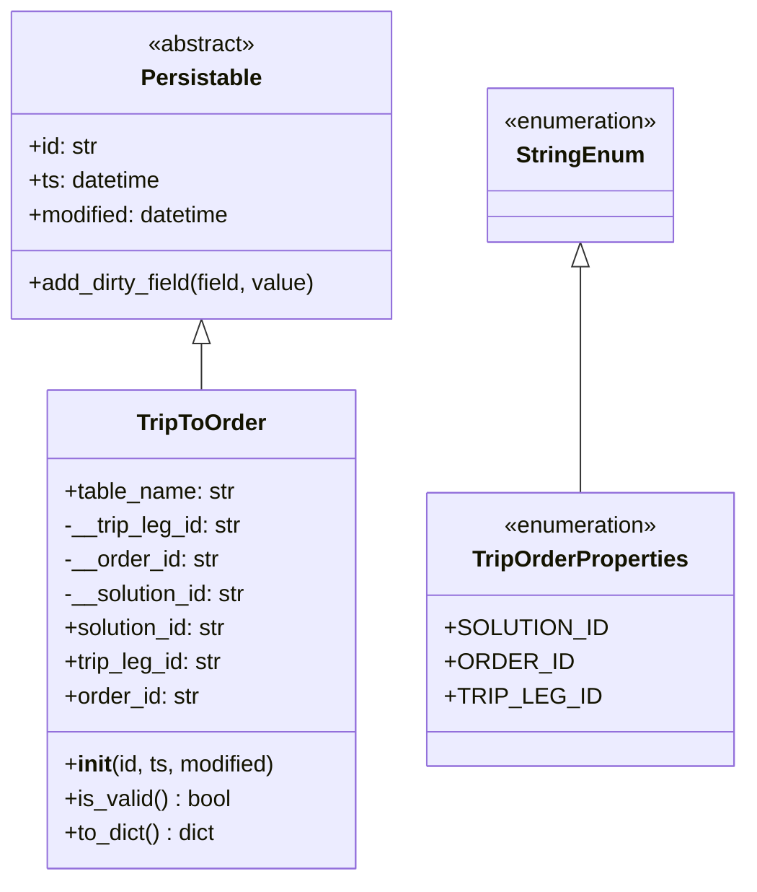
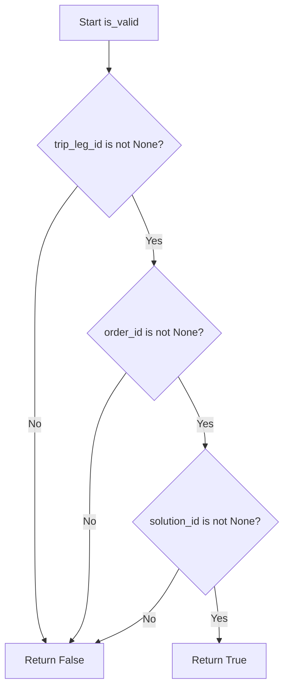
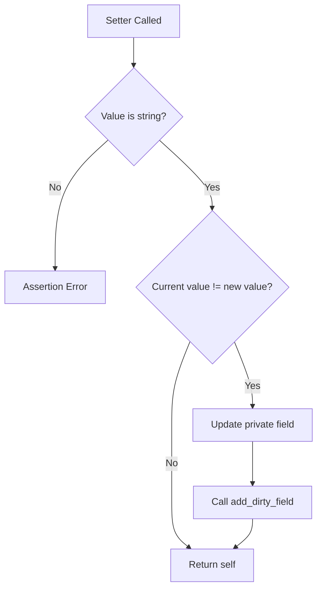

# Diagram: platform/partview_core/partview_service/partview_service/core/datamodel/TripToOrder.py

> Auto-generated by Obscura crawlers

## Diagram 1

### SVG

<svg id="container" width="512.25390625" xmlns="http://www.w3.org/2000/svg" class="classDiagram" height="618" viewBox="0 0 512.25390625 618" role="graphics-document document" aria-roledescription="class"><g><defs><marker id="container_class-aggregationStart" class="marker aggregation class" refX="18" refY="7" markerWidth="190" markerHeight="240" orient="auto"><path d="M 18,7 L9,13 L1,7 L9,1 Z"></path></marker></defs><defs><marker id="container_class-aggregationEnd" class="marker aggregation class" refX="1" refY="7" markerWidth="20" markerHeight="28" orient="auto"><path d="M 18,7 L9,13 L1,7 L9,1 Z"></path></marker></defs><defs><marker id="container_class-extensionStart" class="marker extension class" refX="18" refY="7" markerWidth="190" markerHeight="240" orient="auto"><path d="M 1,7 L18,13 V 1 Z"></path></marker></defs><defs><marker id="container_class-extensionEnd" class="marker extension class" refX="1" refY="7" markerWidth="20" markerHeight="28" orient="auto"><path d="M 1,1 V 13 L18,7 Z"></path></marker></defs><defs><marker id="container_class-compositionStart" class="marker composition class" refX="18" refY="7" markerWidth="190" markerHeight="240" orient="auto"><path d="M 18,7 L9,13 L1,7 L9,1 Z"></path></marker></defs><defs><marker id="container_class-compositionEnd" class="marker composition class" refX="1" refY="7" markerWidth="20" markerHeight="28" orient="auto"><path d="M 18,7 L9,13 L1,7 L9,1 Z"></path></marker></defs><defs><marker id="container_class-dependencyStart" class="marker dependency class" refX="6" refY="7" markerWidth="190" markerHeight="240" orient="auto"><path d="M 5,7 L9,13 L1,7 L9,1 Z"></path></marker></defs><defs><marker id="container_class-dependencyEnd" class="marker dependency class" refX="13" refY="7" markerWidth="20" markerHeight="28" orient="auto"><path d="M 18,7 L9,13 L14,7 L9,1 Z"></path></marker></defs><defs><marker id="container_class-lollipopStart" class="marker lollipop class" refX="13" refY="7" markerWidth="190" markerHeight="240" orient="auto"><circle stroke="black" fill="transparent" cx="7" cy="7" r="6"></circle></marker></defs><defs><marker id="container_class-lollipopEnd" class="marker lollipop class" refX="1" refY="7" markerWidth="190" markerHeight="240" orient="auto"><circle stroke="black" fill="transparent" cx="7" cy="7" r="6"></circle></marker></defs><g class="root"><g class="clusters"></g><g class="edgePaths"><path d="M143.715,241.25L143.715,242.542C143.715,243.833,143.715,246.417,143.715,251.875C143.715,257.333,143.715,265.667,143.715,269.833L143.715,274" id="id_Persistable_TripToOrder_1" class="edge-thickness-normal edge-pattern-solid relation" style=";;;" data-edge="true" data-et="edge" data-id="id_Persistable_TripToOrder_1" data-points="W3sieCI6MTQzLjcxNDg0Mzc1LCJ5IjoyMjR9LHsieCI6MTQzLjcxNDg0Mzc1LCJ5IjoyNDl9LHsieCI6MTQzLjcxNDg0Mzc1LCJ5IjoyNzR9XQ==" marker-start="url(#container_class-extensionStart)"></path><path d="M403.66,187.25L403.66,197.542C403.66,207.833,403.66,228.417,403.66,254.875C403.66,281.333,403.66,313.667,403.66,329.833L403.66,346" id="id_StringEnum_TripOrderProperties_2" class="edge-thickness-normal edge-pattern-solid relation" style=";;;" data-edge="true" data-et="edge" data-id="id_StringEnum_TripOrderProperties_2" data-points="W3sieCI6NDAzLjY2MDE1NjI1LCJ5IjoxNzB9LHsieCI6NDAzLjY2MDE1NjI1LCJ5IjoyNDl9LHsieCI6NDAzLjY2MDE1NjI1LCJ5IjozNDZ9XQ==" marker-start="url(#container_class-extensionStart)"></path></g><g class="edgeLabels"><g class="edgeLabel"><g class="label" data-id="id_Persistable_TripToOrder_1" transform="translate(0, 0)"><foreignObject width="0" height="0">

</foreignObject></g></g><g class="edgeLabel"><g class="label" data-id="id_StringEnum_TripOrderProperties_2" transform="translate(0, 0)"><foreignObject width="0" height="0">

</foreignObject></g></g></g><g class="nodes"><g class="node default" id="classId-Persistable-0" transform="translate(143.71484375, 116)"><g class="basic label-container"><path d="M-135.71484375 -108 L135.71484375 -108 L135.71484375 108 L-135.71484375 108" stroke="none" stroke-width="0" fill="#ECECFF" style=""></path><path d="M-135.71484375 -108 C-48.68751968393825 -108, 38.3398043821235 -108, 135.71484375 -108 M-135.71484375 -108 C-33.810442669148756 -108, 68.09395841170249 -108, 135.71484375 -108 M135.71484375 -108 C135.71484375 -32.08791311636571, 135.71484375 43.824173767268576, 135.71484375 108 M135.71484375 -108 C135.71484375 -58.96404528331641, 135.71484375 -9.928090566632818, 135.71484375 108 M135.71484375 108 C66.88401883776288 108, -1.9468060744742388 108, -135.71484375 108 M135.71484375 108 C36.690897707597074 108, -62.33304833480585 108, -135.71484375 108 M-135.71484375 108 C-135.71484375 55.51835249791689, -135.71484375 3.036704995833773, -135.71484375 -108 M-135.71484375 108 C-135.71484375 41.719976998953626, -135.71484375 -24.560046002092747, -135.71484375 -108" stroke="#9370DB" stroke-width="1.3" fill="none" stroke-dasharray="0 0" style=""></path></g><g class="annotation-group text" transform="translate(-38.609375, -84)"><g class="label" style="" transform="translate(0,-12)"><foreignObject width="77.21875" height="24">

«abstract»

</foreignObject></g></g><g class="label-group text" transform="translate(-40.9765625, -60)"><g class="label" style="font-weight: bolder" transform="translate(0,-12)"><foreignObject width="81.953125" height="24">

Persistable

</foreignObject></g></g><g class="members-group text" transform="translate(-123.71484375, -12)"><g class="label" style="" transform="translate(0,-12)"><foreignObject width="49.578125" height="24">

+id: str

</foreignObject></g><g class="label" style="" transform="translate(0,12)"><foreignObject width="94.484375" height="24">

+ts: datetime

</foreignObject></g><g class="label" style="" transform="translate(0,36)"><foreignObject width="145.9375" height="24">

+modified: datetime

</foreignObject></g></g><g class="methods-group text" transform="translate(-123.71484375, 84)"><g class="label" style="" transform="translate(0,-12)"><foreignObject width="206.453125" height="24">

+add_dirty_field(field, value)

</foreignObject></g></g><g class="divider" style=""><path d="M-135.71484375 -36 C-47.24633360261707 -36, 41.22217654476586 -36, 135.71484375 -36 M-135.71484375 -36 C-72.24992750265872 -36, -8.785011255317428 -36, 135.71484375 -36" stroke="#9370DB" stroke-width="1.3" fill="none" stroke-dasharray="0 0" style=""></path></g><g class="divider" style=""><path d="M-135.71484375 60 C-38.387664321922855 60, 58.93951510615429 60, 135.71484375 60 M-135.71484375 60 C-76.56609347565129 60, -17.417343201302558 60, 135.71484375 60" stroke="#9370DB" stroke-width="1.3" fill="none" stroke-dasharray="0 0" style=""></path></g></g><g class="node default" id="classId-StringEnum-1" transform="translate(403.66015625, 116)"><g class="basic label-container"><path d="M-67.5546875 -54 L67.5546875 -54 L67.5546875 54 L-67.5546875 54" stroke="none" stroke-width="0" fill="#ECECFF" style=""></path><path d="M-67.5546875 -54 C-29.337447186435362 -54, 8.879793127129275 -54, 67.5546875 -54 M-67.5546875 -54 C-16.85955073269396 -54, 33.83558603461208 -54, 67.5546875 -54 M67.5546875 -54 C67.5546875 -15.72030716046195, 67.5546875 22.5593856790761, 67.5546875 54 M67.5546875 -54 C67.5546875 -19.311047290783286, 67.5546875 15.377905418433429, 67.5546875 54 M67.5546875 54 C21.619967900799438 54, -24.314751698401125 54, -67.5546875 54 M67.5546875 54 C36.358108482959494 54, 5.161529465918981 54, -67.5546875 54 M-67.5546875 54 C-67.5546875 18.805261501409127, -67.5546875 -16.389476997181745, -67.5546875 -54 M-67.5546875 54 C-67.5546875 27.918867582071957, -67.5546875 1.8377351641439148, -67.5546875 -54" stroke="#9370DB" stroke-width="1.3" fill="none" stroke-dasharray="0 0" style=""></path></g><g class="annotation-group text" transform="translate(-55.5546875, -30)"><g class="label" style="" transform="translate(0,-12)"><foreignObject width="111.109375" height="24">

«enumeration»

</foreignObject></g></g><g class="label-group text" transform="translate(-42.234375, -6)"><g class="label" style="font-weight: bolder" transform="translate(0,-12)"><foreignObject width="84.46875" height="24">

StringEnum

</foreignObject></g></g><g class="members-group text" transform="translate(-55.5546875, 42)"></g><g class="methods-group text" transform="translate(-55.5546875, 72)"></g><g class="divider" style=""><path d="M-67.5546875 18 C-21.865099765963713 18, 23.824487968072575 18, 67.5546875 18 M-67.5546875 18 C-19.229643847315188 18, 29.095399805369624 18, 67.5546875 18" stroke="#9370DB" stroke-width="1.3" fill="none" stroke-dasharray="0 0" style=""></path></g><g class="divider" style=""><path d="M-67.5546875 36 C-30.52088508123596 36, 6.51291733752808 36, 67.5546875 36 M-67.5546875 36 C-22.989870656506035 36, 21.57494618698793 36, 67.5546875 36" stroke="#9370DB" stroke-width="1.3" fill="none" stroke-dasharray="0 0" style=""></path></g></g><g class="node default" id="classId-TripOrderProperties-2" transform="translate(403.66015625, 442)"><g class="basic label-container"><path d="M-100.59375 -96 L100.59375 -96 L100.59375 96 L-100.59375 96" stroke="none" stroke-width="0" fill="#ECECFF" style=""></path><path d="M-100.59375 -96 C-32.962522212336125 -96, 34.66870557532775 -96, 100.59375 -96 M-100.59375 -96 C-50.92028427233234 -96, -1.2468185446646771 -96, 100.59375 -96 M100.59375 -96 C100.59375 -48.720158946661684, 100.59375 -1.4403178933233676, 100.59375 96 M100.59375 -96 C100.59375 -47.24581022173783, 100.59375 1.5083795565243463, 100.59375 96 M100.59375 96 C22.85917405902181 96, -54.87540188195638 96, -100.59375 96 M100.59375 96 C24.225938199834687 96, -52.14187360033063 96, -100.59375 96 M-100.59375 96 C-100.59375 32.2237995162799, -100.59375 -31.552400967440207, -100.59375 -96 M-100.59375 96 C-100.59375 48.89959190508637, -100.59375 1.7991838101727353, -100.59375 -96" stroke="#9370DB" stroke-width="1.3" fill="none" stroke-dasharray="0 0" style=""></path></g><g class="annotation-group text" transform="translate(-55.5546875, -72)"><g class="label" style="" transform="translate(0,-12)"><foreignObject width="111.109375" height="24">

«enumeration»

</foreignObject></g></g><g class="label-group text" transform="translate(-73.546875, -48)"><g class="label" style="font-weight: bolder" transform="translate(0,-12)"><foreignObject width="147.09375" height="24">

TripOrderProperties

</foreignObject></g></g><g class="members-group text" transform="translate(-88.59375, 0)"><g class="label" style="" transform="translate(0,-12)"><foreignObject width="103.640625" height="24">

+SOLUTION_ID

</foreignObject></g><g class="label" style="" transform="translate(0,12)"><foreignObject width="80.625" height="24">

+ORDER_ID

</foreignObject></g><g class="label" style="" transform="translate(0,36)"><foreignObject width="95.65625" height="24">

+TRIP_LEG_ID

</foreignObject></g></g><g class="methods-group text" transform="translate(-88.59375, 96)"></g><g class="divider" style=""><path d="M-100.59375 -24 C-38.2294381046506 -24, 24.134873790698805 -24, 100.59375 -24 M-100.59375 -24 C-44.82898667619916 -24, 10.935776647601685 -24, 100.59375 -24" stroke="#9370DB" stroke-width="1.3" fill="none" stroke-dasharray="0 0" style=""></path></g><g class="divider" style=""><path d="M-100.59375 72 C-27.797818722526003 72, 44.998112554947994 72, 100.59375 72 M-100.59375 72 C-54.897053530181466 72, -9.200357060362933 72, 100.59375 72" stroke="#9370DB" stroke-width="1.3" fill="none" stroke-dasharray="0 0" style=""></path></g></g><g class="node default" id="classId-TripToOrder-3" transform="translate(143.71484375, 442)"><g class="basic label-container"><path d="M-109.3515625 -168 L109.3515625 -168 L109.3515625 168 L-109.3515625 168" stroke="none" stroke-width="0" fill="#ECECFF" style=""></path><path d="M-109.3515625 -168 C-62.90554169065878 -168, -16.45952088131756 -168, 109.3515625 -168 M-109.3515625 -168 C-40.694522313303 -168, 27.962517873394006 -168, 109.3515625 -168 M109.3515625 -168 C109.3515625 -46.343295906657616, 109.3515625 75.31340818668477, 109.3515625 168 M109.3515625 -168 C109.3515625 -92.52938412464555, 109.3515625 -17.05876824929109, 109.3515625 168 M109.3515625 168 C45.80941468460092 168, -17.732733130798167 168, -109.3515625 168 M109.3515625 168 C29.4063885151636 168, -50.5387854696728 168, -109.3515625 168 M-109.3515625 168 C-109.3515625 36.94208007452454, -109.3515625 -94.11583985095092, -109.3515625 -168 M-109.3515625 168 C-109.3515625 50.91962386771881, -109.3515625 -66.16075226456238, -109.3515625 -168" stroke="#9370DB" stroke-width="1.3" fill="none" stroke-dasharray="0 0" style=""></path></g><g class="annotation-group text" transform="translate(0, -144)"></g><g class="label-group text" transform="translate(-43.796875, -144)"><g class="label" style="font-weight: bolder" transform="translate(0,-12)"><foreignObject width="87.59375" height="24">

TripToOrder

</foreignObject></g></g><g class="members-group text" transform="translate(-97.3515625, -96)"><g class="label" style="" transform="translate(0,-12)"><foreignObject width="121.125" height="24">

+table_name: str

</foreignObject></g><g class="label" style="" transform="translate(0,12)"><foreignObject width="126.765625" height="24">

-__trip_leg_id: str

</foreignObject></g><g class="label" style="" transform="translate(0,36)"><foreignObject width="109.46875" height="24">

-__order_id: str

</foreignObject></g><g class="label" style="" transform="translate(0,60)"><foreignObject width="131.390625" height="24">

-__solution_id: str

</foreignObject></g><g class="label" style="" transform="translate(0,84)"><foreignObject width="117.71875" height="24">

+solution_id: str

</foreignObject></g><g class="label" style="" transform="translate(0,108)"><foreignObject width="113.34375" height="24">

+trip_leg_id: str

</foreignObject></g><g class="label" style="" transform="translate(0,132)"><foreignObject width="96.125" height="24">

+order_id: str

</foreignObject></g></g><g class="methods-group text" transform="translate(-97.3515625, 96)"><g class="label" style="" transform="translate(0,-12)"><foreignObject width="150.90625" height="24">

+<strong>init</strong>(id, ts, modified)

</foreignObject></g><g class="label" style="" transform="translate(0,12)"><foreignObject width="117.984375" height="24">

+is_valid() : bool

</foreignObject></g><g class="label" style="" transform="translate(0,36)"><foreignObject width="108.171875" height="24">

+to_dict() : dict

</foreignObject></g></g><g class="divider" style=""><path d="M-109.3515625 -120 C-48.87953560019547 -120, 11.592491299609065 -120, 109.3515625 -120 M-109.3515625 -120 C-37.12110944125871 -120, 35.10934361748258 -120, 109.3515625 -120" stroke="#9370DB" stroke-width="1.3" fill="none" stroke-dasharray="0 0" style=""></path></g><g class="divider" style=""><path d="M-109.3515625 72 C-50.363063750378494 72, 8.625434999243012 72, 109.3515625 72 M-109.3515625 72 C-29.316455635982862 72, 50.718651228034275 72, 109.3515625 72" stroke="#9370DB" stroke-width="1.3" fill="none" stroke-dasharray="0 0" style=""></path></g></g></g></g></g></svg>

## Diagram 2

### SVG

<svg id="container" width="439.89453125" xmlns="http://www.w3.org/2000/svg" class="flowchart" height="1061.609375" viewBox="0 0 439.89453125 1061.609375" role="graphics-document document" aria-roledescription="flowchart-v2"><g><marker id="container_flowchart-v2-pointEnd" class="marker flowchart-v2" viewBox="0 0 10 10" refX="5" refY="5" markerUnits="userSpaceOnUse" markerWidth="8" markerHeight="8" orient="auto"><path d="M 0 0 L 10 5 L 0 10 z" class="arrowMarkerPath" style="stroke-width: 1; stroke-dasharray: 1, 0;"></path></marker><marker id="container_flowchart-v2-pointStart" class="marker flowchart-v2" viewBox="0 0 10 10" refX="4.5" refY="5" markerUnits="userSpaceOnUse" markerWidth="8" markerHeight="8" orient="auto"><path d="M 0 5 L 10 10 L 10 0 z" class="arrowMarkerPath" style="stroke-width: 1; stroke-dasharray: 1, 0;"></path></marker><marker id="container_flowchart-v2-circleEnd" class="marker flowchart-v2" viewBox="0 0 10 10" refX="11" refY="5" markerUnits="userSpaceOnUse" markerWidth="11" markerHeight="11" orient="auto"><circle cx="5" cy="5" r="5" class="arrowMarkerPath" style="stroke-width: 1; stroke-dasharray: 1, 0;"></circle></marker><marker id="container_flowchart-v2-circleStart" class="marker flowchart-v2" viewBox="0 0 10 10" refX="-1" refY="5" markerUnits="userSpaceOnUse" markerWidth="11" markerHeight="11" orient="auto"><circle cx="5" cy="5" r="5" class="arrowMarkerPath" style="stroke-width: 1; stroke-dasharray: 1, 0;"></circle></marker><marker id="container_flowchart-v2-crossEnd" class="marker cross flowchart-v2" viewBox="0 0 11 11" refX="12" refY="5.2" markerUnits="userSpaceOnUse" markerWidth="11" markerHeight="11" orient="auto"><path d="M 1,1 l 9,9 M 10,1 l -9,9" class="arrowMarkerPath" style="stroke-width: 2; stroke-dasharray: 1, 0;"></path></marker><marker id="container_flowchart-v2-crossStart" class="marker cross flowchart-v2" viewBox="0 0 11 11" refX="-1" refY="5.2" markerUnits="userSpaceOnUse" markerWidth="11" markerHeight="11" orient="auto"><path d="M 1,1 l 9,9 M 10,1 l -9,9" class="arrowMarkerPath" style="stroke-width: 2; stroke-dasharray: 1, 0;"></path></marker><g class="root"><g class="clusters"></g><g class="edgePaths"><path d="M166.223,62L166.223,66.167C166.223,70.333,166.223,78.667,166.223,86.333C166.223,94,166.223,101,166.223,104.5L166.223,108" id="L_A_B_0" class="edge-thickness-normal edge-pattern-solid edge-thickness-normal edge-pattern-solid flowchart-link" style=";" data-edge="true" data-et="edge" data-id="L_A_B_0" data-points="W3sieCI6MTY2LjIyMjY1NjI1LCJ5Ijo2Mn0seyJ4IjoxNjYuMjIyNjU2MjUsInkiOjg3fSx7IngiOjE2Ni4yMjI2NTYyNSwieSI6MTEyfV0=" marker-end="url(#container_flowchart-v2-pointEnd)"></path><path d="M117.481,289.462L106.659,303.752C95.836,318.042,74.192,346.623,63.369,384.488C52.547,422.354,52.547,469.505,52.547,516.656C52.547,563.807,52.547,610.958,52.547,659.909C52.547,708.859,52.547,759.609,52.547,810.359C52.547,861.109,52.547,911.859,55.167,942.798C57.787,973.736,63.027,984.864,65.648,990.427L68.268,995.991" id="L_B_F_0" class="edge-thickness-normal edge-pattern-solid edge-thickness-normal edge-pattern-solid flowchart-link" style=";" data-edge="true" data-et="edge" data-id="L_B_F_0" data-points="W3sieCI6MTE3LjQ4MTEzNzAwMTIxODAzLCJ5IjoyODkuNDYxNjA1NzUxMjE4MDN9LHsieCI6NTIuNTQ2ODc1LCJ5IjozNzUuMjAzMTI1fSx7IngiOjUyLjU0Njg3NSwieSI6NTE2LjY1NjI1fSx7IngiOjUyLjU0Njg3NSwieSI6NjU4LjEwOTM3NX0seyJ4Ijo1Mi41NDY4NzUsInkiOjgxMC4zNTkzNzV9LHsieCI6NTIuNTQ2ODc1LCJ5Ijo5NjIuNjA5Mzc1fSx7IngiOjY5Ljk3MTkyMzgyODEyNSwieSI6OTk5LjYwOTM3NX1d" marker-end="url(#container_flowchart-v2-pointEnd)"></path><path d="M202.097,302.329L207.739,314.475C213.381,326.62,224.665,350.912,230.307,368.557C235.949,386.203,235.949,397.203,235.949,402.703L235.949,408.203" id="L_B_C_0" class="edge-thickness-normal edge-pattern-solid edge-thickness-normal edge-pattern-solid flowchart-link" style=";" data-edge="true" data-et="edge" data-id="L_B_C_0" data-points="W3sieCI6MjAyLjA5Njk3MDE3ODIyODczLCJ5IjozMDIuMzI4ODExMDcxNzcxMjd9LHsieCI6MjM1Ljk0OTIxODc1LCJ5IjozNzUuMjAzMTI1fSx7IngiOjIzNS45NDkyMTg3NSwieSI6NDEyLjIwMzEyNX1d" marker-end="url(#container_flowchart-v2-pointEnd)"></path><path d="M193.044,578.205L183.761,591.522C174.478,604.84,155.911,631.474,146.627,670.167C137.344,708.859,137.344,759.609,137.344,810.359C137.344,861.109,137.344,911.859,132.51,942.894C127.677,973.929,118.01,985.248,113.177,990.908L108.343,996.568" id="L_C_F_0" class="edge-thickness-normal edge-pattern-solid edge-thickness-normal edge-pattern-solid flowchart-link" style=";" data-edge="true" data-et="edge" data-id="L_C_F_0" data-points="W3sieCI6MTkzLjA0NDQ4NzkwMDE5MTIsInkiOjU3OC4yMDQ2NDQxNTAxOTExfSx7IngiOjEzNy4zNDM3NSwieSI6NjU4LjEwOTM3NX0seyJ4IjoxMzcuMzQzNzUsInkiOjgxMC4zNTkzNzV9LHsieCI6MTM3LjM0Mzc1LCJ5Ijo5NjIuNjA5Mzc1fSx7IngiOjEwNS43NDU2MDU0Njg3NSwieSI6OTk5LjYwOTM3NX1d" marker-end="url(#container_flowchart-v2-pointEnd)"></path><path d="M273.742,583.317L280.809,595.782C287.876,608.248,302.01,633.179,309.077,651.144C316.145,669.109,316.145,680.109,316.145,685.609L316.145,691.109" id="L_C_D_0" class="edge-thickness-normal edge-pattern-solid edge-thickness-normal edge-pattern-solid flowchart-link" style=";" data-edge="true" data-et="edge" data-id="L_C_D_0" data-points="W3sieCI6MjczLjc0MTcyOTY5ODY4LCJ5Ijo1ODMuMzE2ODY0MDUxMzJ9LHsieCI6MzE2LjE0NDUzMTI1LCJ5Ijo2NTguMTA5Mzc1fSx7IngiOjMxNi4xNDQ1MzEyNSwieSI6Njk1LjEwOTM3NX1d" marker-end="url(#container_flowchart-v2-pointEnd)"></path><path d="M275.313,884.778L268.196,897.75C261.079,910.722,246.844,936.666,225.894,955.542C204.944,974.419,177.28,986.229,163.447,992.134L149.615,998.039" id="L_D_F_0" class="edge-thickness-normal edge-pattern-solid edge-thickness-normal edge-pattern-solid flowchart-link" style=";" data-edge="true" data-et="edge" data-id="L_D_F_0" data-points="W3sieCI6Mjc1LjMxMzE3OTA1MjM4ODkzLCJ5Ijo4ODQuNzc4MDIyODAyMzg4OX0seyJ4IjoyMzIuNjA5Mzc1LCJ5Ijo5NjIuNjA5Mzc1fSx7IngiOjE0NS45MzU3OTEwMTU2MjUsInkiOjk5OS42MDkzNzV9XQ==" marker-end="url(#container_flowchart-v2-pointEnd)"></path><path d="M330.164,911.589L331.342,920.093C332.52,928.596,334.875,945.603,336.053,959.606C337.23,973.609,337.23,984.609,337.23,990.109L337.23,995.609" id="L_D_E_0" class="edge-thickness-normal edge-pattern-solid edge-thickness-normal edge-pattern-solid flowchart-link" style=";" data-edge="true" data-et="edge" data-id="L_D_E_0" data-points="W3sieCI6MzMwLjE2NDQ0MTU1NzgzNzksInkiOjkxMS41ODk0NjQ2OTIxNjIxfSx7IngiOjMzNy4yMzA0Njg3NSwieSI6OTYyLjYwOTM3NX0seyJ4IjozMzcuMjMwNDY4NzUsInkiOjk5OS42MDkzNzV9XQ==" marker-end="url(#container_flowchart-v2-pointEnd)"></path></g><g class="edgeLabels"><g class="edgeLabel"><g class="label" data-id="L_A_B_0" transform="translate(0, 0)"><foreignObject width="0" height="0">

</foreignObject></g></g><g class="edgeLabel" transform="translate(52.546875, 658.109375)"><g class="label" data-id="L_B_F_0" transform="translate(-10.140625, -12)"><foreignObject width="20.28125" height="24">

No

</foreignObject></g></g><g class="edgeLabel" transform="translate(235.94921875, 375.203125)"><g class="label" data-id="L_B_C_0" transform="translate(-12.03125, -12)"><foreignObject width="24.0625" height="24">

Yes

</foreignObject></g></g><g class="edgeLabel" transform="translate(137.34375, 810.359375)"><g class="label" data-id="L_C_F_0" transform="translate(-10.140625, -12)"><foreignObject width="20.28125" height="24">

No

</foreignObject></g></g><g class="edgeLabel" transform="translate(316.14453125, 658.109375)"><g class="label" data-id="L_C_D_0" transform="translate(-12.03125, -12)"><foreignObject width="24.0625" height="24">

Yes

</foreignObject></g></g><g class="edgeLabel" transform="translate(230.09682, 963.68196)"><g class="label" data-id="L_D_F_0" transform="translate(-10.140625, -12)"><foreignObject width="20.28125" height="24">

No

</foreignObject></g></g><g class="edgeLabel" transform="translate(337.23046875, 962.609375)"><g class="label" data-id="L_D_E_0" transform="translate(-12.03125, -12)"><foreignObject width="24.0625" height="24">

Yes

</foreignObject></g></g></g><g class="nodes"><g class="node default" id="flowchart-A-0" transform="translate(166.22265625, 35)"><rect class="basic label-container" style="" x="-76.859375" y="-27" width="153.71875" height="54"></rect><g class="label" style="" transform="translate(-46.859375, -12)"><rect></rect><foreignObject width="93.71875" height="24">

Start is_valid

</foreignObject></g></g><g class="node default" id="flowchart-B-1" transform="translate(166.22265625, 225.1015625)"><polygon points="113.1015625,0 226.203125,-113.1015625 113.1015625,-226.203125 0,-113.1015625" class="label-container" transform="translate(-112.6015625, 113.1015625)"></polygon><g class="label" style="" transform="translate(-86.1015625, -12)"><rect></rect><foreignObject width="172.203125" height="24">

trip_leg_id is not None?

</foreignObject></g></g><g class="node default" id="flowchart-F-3" transform="translate(82.6875, 1026.609375)"><rect class="basic label-container" style="" x="-74.6875" y="-27" width="149.375" height="54"></rect><g class="label" style="" transform="translate(-44.6875, -12)"><rect></rect><foreignObject width="89.375" height="24">

Return False

</foreignObject></g></g><g class="node default" id="flowchart-C-5" transform="translate(235.94921875, 516.65625)"><polygon points="104.453125,0 208.90625,-104.453125 104.453125,-208.90625 0,-104.453125" class="label-container" transform="translate(-103.953125, 104.453125)"></polygon><g class="label" style="" transform="translate(-77.453125, -12)"><rect></rect><foreignObject width="154.90625" height="24">

order_id is not None?

</foreignObject></g></g><g class="node default" id="flowchart-D-9" transform="translate(316.14453125, 810.359375)"><polygon points="115.25,0 230.5,-115.25 115.25,-230.5 0,-115.25" class="label-container" transform="translate(-114.75, 115.25)"></polygon><g class="label" style="" transform="translate(-88.25, -12)"><rect></rect><foreignObject width="176.5" height="24">

solution_id is not None?

</foreignObject></g></g><g class="node default" id="flowchart-E-13" transform="translate(337.23046875, 1026.609375)"><rect class="basic label-container" style="" x="-72.5234375" y="-27" width="145.046875" height="54"></rect><g class="label" style="" transform="translate(-42.5234375, -12)"><rect></rect><foreignObject width="85.046875" height="24">

Return True

</foreignObject></g></g></g></g></g></svg>

## Diagram 3

### SVG

<svg id="container" width="529.6640625" xmlns="http://www.w3.org/2000/svg" class="flowchart" height="967.234375" viewBox="0 0 529.6640625 967.234375" role="graphics-document document" aria-roledescription="flowchart-v2"><g><marker id="container_flowchart-v2-pointEnd" class="marker flowchart-v2" viewBox="0 0 10 10" refX="5" refY="5" markerUnits="userSpaceOnUse" markerWidth="8" markerHeight="8" orient="auto"><path d="M 0 0 L 10 5 L 0 10 z" class="arrowMarkerPath" style="stroke-width: 1; stroke-dasharray: 1, 0;"></path></marker><marker id="container_flowchart-v2-pointStart" class="marker flowchart-v2" viewBox="0 0 10 10" refX="4.5" refY="5" markerUnits="userSpaceOnUse" markerWidth="8" markerHeight="8" orient="auto"><path d="M 0 5 L 10 10 L 10 0 z" class="arrowMarkerPath" style="stroke-width: 1; stroke-dasharray: 1, 0;"></path></marker><marker id="container_flowchart-v2-circleEnd" class="marker flowchart-v2" viewBox="0 0 10 10" refX="11" refY="5" markerUnits="userSpaceOnUse" markerWidth="11" markerHeight="11" orient="auto"><circle cx="5" cy="5" r="5" class="arrowMarkerPath" style="stroke-width: 1; stroke-dasharray: 1, 0;"></circle></marker><marker id="container_flowchart-v2-circleStart" class="marker flowchart-v2" viewBox="0 0 10 10" refX="-1" refY="5" markerUnits="userSpaceOnUse" markerWidth="11" markerHeight="11" orient="auto"><circle cx="5" cy="5" r="5" class="arrowMarkerPath" style="stroke-width: 1; stroke-dasharray: 1, 0;"></circle></marker><marker id="container_flowchart-v2-crossEnd" class="marker cross flowchart-v2" viewBox="0 0 11 11" refX="12" refY="5.2" markerUnits="userSpaceOnUse" markerWidth="11" markerHeight="11" orient="auto"><path d="M 1,1 l 9,9 M 10,1 l -9,9" class="arrowMarkerPath" style="stroke-width: 2; stroke-dasharray: 1, 0;"></path></marker><marker id="container_flowchart-v2-crossStart" class="marker cross flowchart-v2" viewBox="0 0 11 11" refX="-1" refY="5.2" markerUnits="userSpaceOnUse" markerWidth="11" markerHeight="11" orient="auto"><path d="M 1,1 l 9,9 M 10,1 l -9,9" class="arrowMarkerPath" style="stroke-width: 2; stroke-dasharray: 1, 0;"></path></marker><g class="root"><g class="clusters"></g><g class="edgePaths"><path d="M221.566,62L221.566,66.167C221.566,70.333,221.566,78.667,221.566,86.333C221.566,94,221.566,101,221.566,104.5L221.566,108" id="L_A_B_0" class="edge-thickness-normal edge-pattern-solid edge-thickness-normal edge-pattern-solid flowchart-link" style=";" data-edge="true" data-et="edge" data-id="L_A_B_0" data-points="W3sieCI6MjIxLjU2NjQwNjI1LCJ5Ijo2Mn0seyJ4IjoyMjEuNTY2NDA2MjUsInkiOjg3fSx7IngiOjIyMS41NjY0MDYyNSwieSI6MTEyfV0=" marker-end="url(#container_flowchart-v2-pointEnd)"></path><path d="M179.053,232.127L164.535,245.379C150.017,258.632,120.981,285.136,106.463,320.271C91.945,355.406,91.945,399.172,91.945,421.055L91.945,442.938" id="L_B_C_0" class="edge-thickness-normal edge-pattern-solid edge-thickness-normal edge-pattern-solid flowchart-link" style=";" data-edge="true" data-et="edge" data-id="L_B_C_0" data-points="W3sieCI6MTc5LjA1MzAyMzcxNDMxNTU0LCJ5IjoyMzIuMTI3MjQyNDY0MzE1NTR9LHsieCI6OTEuOTQ1MzEyNSwieSI6MzExLjY0MDYyNX0seyJ4Ijo5MS45NDUzMTI1LCJ5Ijo0NDYuOTM3NX1d" marker-end="url(#container_flowchart-v2-pointEnd)"></path><path d="M264.08,232.127L278.598,245.379C293.116,258.632,322.152,285.136,336.67,303.888C351.188,322.641,351.188,333.641,351.188,339.141L351.188,344.641" id="L_B_D_0" class="edge-thickness-normal edge-pattern-solid edge-thickness-normal edge-pattern-solid flowchart-link" style=";" data-edge="true" data-et="edge" data-id="L_B_D_0" data-points="W3sieCI6MjY0LjA3OTc4ODc4NTY4NDQ2LCJ5IjoyMzIuMTI3MjQyNDY0MzE1NTR9LHsieCI6MzUxLjE4NzUsInkiOjMxMS42NDA2MjV9LHsieCI6MzUxLjE4NzUsInkiOjM0OC42NDA2MjV9XQ==" marker-end="url(#container_flowchart-v2-pointEnd)"></path><path d="M314.003,562.05L308.785,574.414C303.567,586.778,293.131,611.506,287.913,634.537C282.695,657.568,282.695,678.901,282.695,700.234C282.695,721.568,282.695,742.901,282.695,764.234C282.695,785.568,282.695,806.901,282.695,826.234C282.695,845.568,282.695,862.901,287.652,875.331C292.61,887.761,302.524,895.289,307.481,899.052L312.438,902.816" id="L_D_E_0" class="edge-thickness-normal edge-pattern-solid edge-thickness-normal edge-pattern-solid flowchart-link" style=";" data-edge="true" data-et="edge" data-id="L_D_E_0" data-points="W3sieCI6MzE0LjAwMjY0ODMzMTk3OTMsInkiOjU2Mi4wNDk1MjMzMzE5NzkyfSx7IngiOjI4Mi42OTUzMTI1LCJ5Ijo2MzYuMjM0Mzc1fSx7IngiOjI4Mi42OTUzMTI1LCJ5Ijo3MDAuMjM0Mzc1fSx7IngiOjI4Mi42OTUzMTI1LCJ5Ijo3NjQuMjM0Mzc1fSx7IngiOjI4Mi42OTUzMTI1LCJ5Ijo4MjguMjM0Mzc1fSx7IngiOjI4Mi42OTUzMTI1LCJ5Ijo4ODAuMjM0Mzc1fSx7IngiOjMxNS42MjQyNDg3OTgwNzY5LCJ5Ijo5MDUuMjM0Mzc1fV0=" marker-end="url(#container_flowchart-v2-pointEnd)"></path><path d="M388.372,562.05L393.59,574.414C398.808,586.778,409.244,611.506,414.462,629.37C419.68,647.234,419.68,658.234,419.68,663.734L419.68,669.234" id="L_D_F_0" class="edge-thickness-normal edge-pattern-solid edge-thickness-normal edge-pattern-solid flowchart-link" style=";" data-edge="true" data-et="edge" data-id="L_D_F_0" data-points="W3sieCI6Mzg4LjM3MjM1MTY2ODAyMDcsInkiOjU2Mi4wNDk1MjMzMzE5NzkyfSx7IngiOjQxOS42Nzk2ODc1LCJ5Ijo2MzYuMjM0Mzc1fSx7IngiOjQxOS42Nzk2ODc1LCJ5Ijo2NzMuMjM0Mzc1fV0=" marker-end="url(#container_flowchart-v2-pointEnd)"></path><path d="M419.68,727.234L419.68,733.401C419.68,739.568,419.68,751.901,419.68,763.568C419.68,775.234,419.68,786.234,419.68,791.734L419.68,797.234" id="L_F_G_0" class="edge-thickness-normal edge-pattern-solid edge-thickness-normal edge-pattern-solid flowchart-link" style=";" data-edge="true" data-et="edge" data-id="L_F_G_0" data-points="W3sieCI6NDE5LjY3OTY4NzUsInkiOjcyNy4yMzQzNzV9LHsieCI6NDE5LjY3OTY4NzUsInkiOjc2NC4yMzQzNzV9LHsieCI6NDE5LjY3OTY4NzUsInkiOjgwMS4yMzQzNzV9XQ==" marker-end="url(#container_flowchart-v2-pointEnd)"></path><path d="M419.68,855.234L419.68,859.401C419.68,863.568,419.68,871.901,414.723,879.831C409.765,887.761,399.851,895.289,394.894,899.052L389.937,902.816" id="L_G_E_0" class="edge-thickness-normal edge-pattern-solid edge-thickness-normal edge-pattern-solid flowchart-link" style=";" data-edge="true" data-et="edge" data-id="L_G_E_0" data-points="W3sieCI6NDE5LjY3OTY4NzUsInkiOjg1NS4yMzQzNzV9LHsieCI6NDE5LjY3OTY4NzUsInkiOjg4MC4yMzQzNzV9LHsieCI6Mzg2Ljc1MDc1MTIwMTkyMzEsInkiOjkwNS4yMzQzNzV9XQ==" marker-end="url(#container_flowchart-v2-pointEnd)"></path></g><g class="edgeLabels"><g class="edgeLabel"><g class="label" data-id="L_A_B_0" transform="translate(0, 0)"><foreignObject width="0" height="0">

</foreignObject></g></g><g class="edgeLabel" transform="translate(91.9453125, 311.640625)"><g class="label" data-id="L_B_C_0" transform="translate(-10.140625, -12)"><foreignObject width="20.28125" height="24">

No

</foreignObject></g></g><g class="edgeLabel" transform="translate(351.1875, 311.640625)"><g class="label" data-id="L_B_D_0" transform="translate(-12.03125, -12)"><foreignObject width="24.0625" height="24">

Yes

</foreignObject></g></g><g class="edgeLabel" transform="translate(282.6953125, 764.234375)"><g class="label" data-id="L_D_E_0" transform="translate(-10.140625, -12)"><foreignObject width="20.28125" height="24">

No

</foreignObject></g></g><g class="edgeLabel" transform="translate(419.6796875, 636.234375)"><g class="label" data-id="L_D_F_0" transform="translate(-12.03125, -12)"><foreignObject width="24.0625" height="24">

Yes

</foreignObject></g></g><g class="edgeLabel"><g class="label" data-id="L_F_G_0" transform="translate(0, 0)"><foreignObject width="0" height="0">

</foreignObject></g></g><g class="edgeLabel"><g class="label" data-id="L_G_E_0" transform="translate(0, 0)"><foreignObject width="0" height="0">

</foreignObject></g></g></g><g class="nodes"><g class="node default" id="flowchart-A-0" transform="translate(221.56640625, 35)"><rect class="basic label-container" style="" x="-76.4140625" y="-27" width="152.828125" height="54"></rect><g class="label" style="" transform="translate(-46.4140625, -12)"><rect></rect><foreignObject width="92.828125" height="24">

Setter Called

</foreignObject></g></g><g class="node default" id="flowchart-B-1" transform="translate(221.56640625, 193.3203125)"><polygon points="81.3203125,0 162.640625,-81.3203125 81.3203125,-162.640625 0,-81.3203125" class="label-container" transform="translate(-80.8203125, 81.3203125)"></polygon><g class="label" style="" transform="translate(-54.3203125, -12)"><rect></rect><foreignObject width="108.640625" height="24">

Value is string?

</foreignObject></g></g><g class="node default" id="flowchart-C-3" transform="translate(91.9453125, 473.9375)"><rect class="basic label-container" style="" x="-83.9453125" y="-27" width="167.890625" height="54"></rect><g class="label" style="" transform="translate(-53.9453125, -12)"><rect></rect><foreignObject width="107.890625" height="24">

Assertion Error

</foreignObject></g></g><g class="node default" id="flowchart-D-5" transform="translate(351.1875, 473.9375)"><polygon points="125.296875,0 250.59375,-125.296875 125.296875,-250.59375 0,-125.296875" class="label-container" transform="translate(-124.796875, 125.296875)"></polygon><g class="label" style="" transform="translate(-98.296875, -12)"><rect></rect><foreignObject width="196.59375" height="24">

Current value != new value?

</foreignObject></g></g><g class="node default" id="flowchart-E-7" transform="translate(351.1875, 932.234375)"><rect class="basic label-container" style="" x="-69.640625" y="-27" width="139.28125" height="54"></rect><g class="label" style="" transform="translate(-39.640625, -12)"><rect></rect><foreignObject width="79.28125" height="24">

Return self

</foreignObject></g></g><g class="node default" id="flowchart-F-9" transform="translate(419.6796875, 700.234375)"><rect class="basic label-container" style="" x="-101.984375" y="-27" width="203.96875" height="54"></rect><g class="label" style="" transform="translate(-71.984375, -12)"><rect></rect><foreignObject width="143.96875" height="24">

Update private field

</foreignObject></g></g><g class="node default" id="flowchart-G-11" transform="translate(419.6796875, 828.234375)"><rect class="basic label-container" style="" x="-100.125" y="-27" width="200.25" height="54"></rect><g class="label" style="" transform="translate(-70.125, -12)"><rect></rect><foreignObject width="140.25" height="24">

Call add_dirty_field

</foreignObject></g></g></g></g></g></svg>
