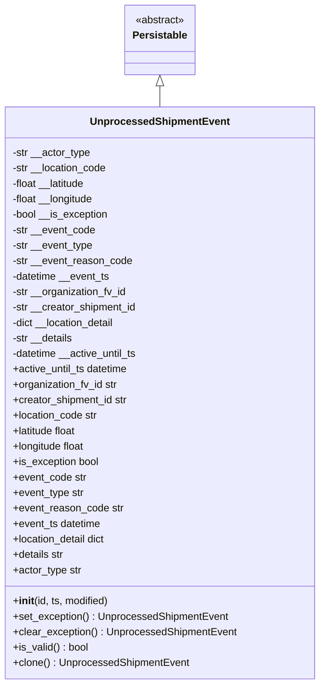
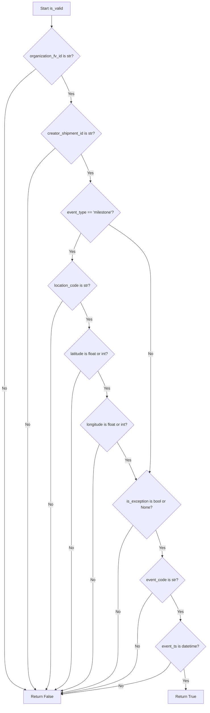
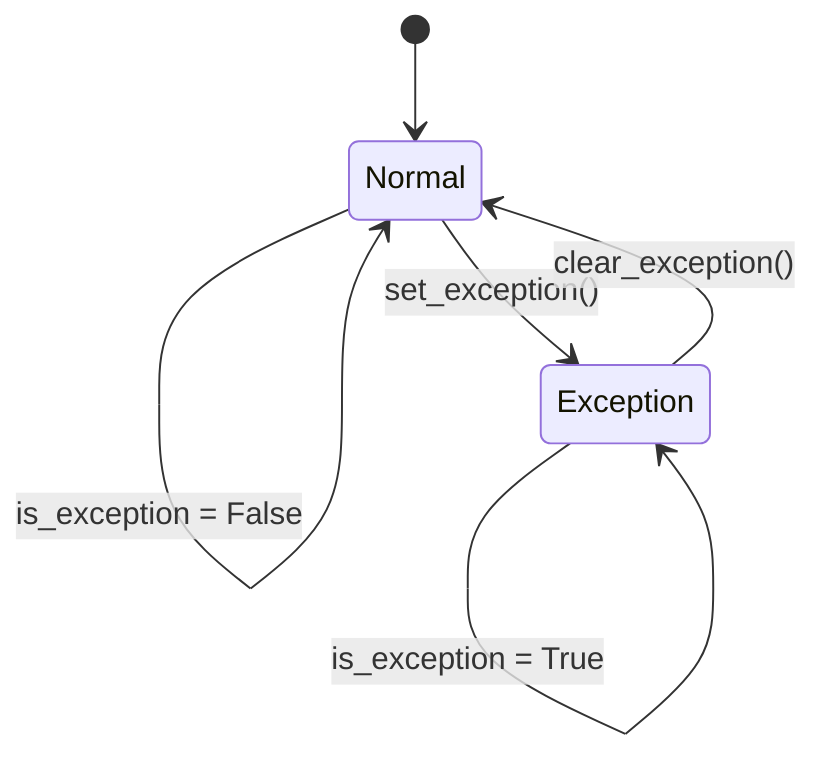

# Diagram: platform/partview_core/partview_service/partview_service/core/datamodel/UnprocessedShipmentEvent.py

> Auto-generated by Obscura crawlers

## Diagram 1

### SVG

<svg id="container" width="489.625" xmlns="http://www.w3.org/2000/svg" class="classDiagram" height="1062" viewBox="0 0 489.625 1062" role="graphics-document document" aria-roledescription="class"><g><defs><marker id="container_class-aggregationStart" class="marker aggregation class" refX="18" refY="7" markerWidth="190" markerHeight="240" orient="auto"><path d="M 18,7 L9,13 L1,7 L9,1 Z"></path></marker></defs><defs><marker id="container_class-aggregationEnd" class="marker aggregation class" refX="1" refY="7" markerWidth="20" markerHeight="28" orient="auto"><path d="M 18,7 L9,13 L1,7 L9,1 Z"></path></marker></defs><defs><marker id="container_class-extensionStart" class="marker extension class" refX="18" refY="7" markerWidth="190" markerHeight="240" orient="auto"><path d="M 1,7 L18,13 V 1 Z"></path></marker></defs><defs><marker id="container_class-extensionEnd" class="marker extension class" refX="1" refY="7" markerWidth="20" markerHeight="28" orient="auto"><path d="M 1,1 V 13 L18,7 Z"></path></marker></defs><defs><marker id="container_class-compositionStart" class="marker composition class" refX="18" refY="7" markerWidth="190" markerHeight="240" orient="auto"><path d="M 18,7 L9,13 L1,7 L9,1 Z"></path></marker></defs><defs><marker id="container_class-compositionEnd" class="marker composition class" refX="1" refY="7" markerWidth="20" markerHeight="28" orient="auto"><path d="M 18,7 L9,13 L1,7 L9,1 Z"></path></marker></defs><defs><marker id="container_class-dependencyStart" class="marker dependency class" refX="6" refY="7" markerWidth="190" markerHeight="240" orient="auto"><path d="M 5,7 L9,13 L1,7 L9,1 Z"></path></marker></defs><defs><marker id="container_class-dependencyEnd" class="marker dependency class" refX="13" refY="7" markerWidth="20" markerHeight="28" orient="auto"><path d="M 18,7 L9,13 L14,7 L9,1 Z"></path></marker></defs><defs><marker id="container_class-lollipopStart" class="marker lollipop class" refX="13" refY="7" markerWidth="190" markerHeight="240" orient="auto"><circle stroke="black" fill="transparent" cx="7" cy="7" r="6"></circle></marker></defs><defs><marker id="container_class-lollipopEnd" class="marker lollipop class" refX="1" refY="7" markerWidth="190" markerHeight="240" orient="auto"><circle stroke="black" fill="transparent" cx="7" cy="7" r="6"></circle></marker></defs><g class="root"><g class="clusters"></g><g class="edgePaths"><path d="M244.813,133.25L244.813,134.542C244.813,135.833,244.813,138.417,244.813,143.875C244.813,149.333,244.813,157.667,244.813,161.833L244.813,166" id="id_Persistable_UnprocessedShipmentEvent_1" class="edge-thickness-normal edge-pattern-solid relation" style=";;;" data-edge="true" data-et="edge" data-id="id_Persistable_UnprocessedShipmentEvent_1" data-points="W3sieCI6MjQ0LjgxMjUsInkiOjExNn0seyJ4IjoyNDQuODEyNSwieSI6MTQxfSx7IngiOjI0NC44MTI1LCJ5IjoxNjZ9XQ==" marker-start="url(#container_class-extensionStart)"></path></g><g class="edgeLabels"><g class="edgeLabel"><g class="label" data-id="id_Persistable_UnprocessedShipmentEvent_1" transform="translate(0, 0)"><foreignObject width="0" height="0">

</foreignObject></g></g></g><g class="nodes"><g class="node default" id="classId-Persistable-0" transform="translate(244.8125, 62)"><g class="basic label-container"><path d="M-52.9765625 -54 L52.9765625 -54 L52.9765625 54 L-52.9765625 54" stroke="none" stroke-width="0" fill="#ECECFF" style=""></path><path d="M-52.9765625 -54 C-20.98411426160299 -54, 11.00833397679402 -54, 52.9765625 -54 M-52.9765625 -54 C-27.729114608626983 -54, -2.4816667172539653 -54, 52.9765625 -54 M52.9765625 -54 C52.9765625 -28.86384323715328, 52.9765625 -3.7276864743065588, 52.9765625 54 M52.9765625 -54 C52.9765625 -16.460606014385064, 52.9765625 21.078787971229872, 52.9765625 54 M52.9765625 54 C13.25331496002584 54, -26.46993257994832 54, -52.9765625 54 M52.9765625 54 C30.103006740513642 54, 7.229450981027284 54, -52.9765625 54 M-52.9765625 54 C-52.9765625 16.463882109376485, -52.9765625 -21.07223578124703, -52.9765625 -54 M-52.9765625 54 C-52.9765625 18.570125579030154, -52.9765625 -16.85974884193969, -52.9765625 -54" stroke="#9370DB" stroke-width="1.3" fill="none" stroke-dasharray="0 0" style=""></path></g><g class="annotation-group text" transform="translate(-38.609375, -30)"><g class="label" style="" transform="translate(0,-12)"><foreignObject width="77.21875" height="24">

«abstract»

</foreignObject></g></g><g class="label-group text" transform="translate(-40.9765625, -6)"><g class="label" style="font-weight: bolder" transform="translate(0,-12)"><foreignObject width="81.953125" height="24">

Persistable

</foreignObject></g></g><g class="members-group text" transform="translate(-40.9765625, 42)"></g><g class="methods-group text" transform="translate(-40.9765625, 72)"></g><g class="divider" style=""><path d="M-52.9765625 18 C-18.642159602252704 18, 15.692243295494592 18, 52.9765625 18 M-52.9765625 18 C-22.840310354176026 18, 7.295941791647948 18, 52.9765625 18" stroke="#9370DB" stroke-width="1.3" fill="none" stroke-dasharray="0 0" style=""></path></g><g class="divider" style=""><path d="M-52.9765625 36 C-22.663429298596 36, 7.649703902808 36, 52.9765625 36 M-52.9765625 36 C-16.833346946835775 36, 19.30986860632845 36, 52.9765625 36" stroke="#9370DB" stroke-width="1.3" fill="none" stroke-dasharray="0 0" style=""></path></g></g><g class="node default" id="classId-UnprocessedShipmentEvent-1" transform="translate(244.8125, 610)"><g class="basic label-container"><path d="M-236.8125 -444 L236.8125 -444 L236.8125 444 L-236.8125 444" stroke="none" stroke-width="0" fill="#ECECFF" style=""></path><path d="M-236.8125 -444 C-131.04914513177016 -444, -25.28579026354032 -444, 236.8125 -444 M-236.8125 -444 C-113.40813666975178 -444, 9.996226660496433 -444, 236.8125 -444 M236.8125 -444 C236.8125 -252.19574849756088, 236.8125 -60.39149699512177, 236.8125 444 M236.8125 -444 C236.8125 -222.29875777328505, 236.8125 -0.5975155465700936, 236.8125 444 M236.8125 444 C79.07097461561361 444, -78.67055076877278 444, -236.8125 444 M236.8125 444 C110.91854139764611 444, -14.975417204707782 444, -236.8125 444 M-236.8125 444 C-236.8125 133.7997582307167, -236.8125 -176.40048353856662, -236.8125 -444 M-236.8125 444 C-236.8125 108.7489533274466, -236.8125 -226.5020933451068, -236.8125 -444" stroke="#9370DB" stroke-width="1.3" fill="none" stroke-dasharray="0 0" style=""></path></g><g class="annotation-group text" transform="translate(0, -420)"></g><g class="label-group text" transform="translate(-102.53125, -420)"><g class="label" style="font-weight: bolder" transform="translate(0,-12)"><foreignObject width="205.0625" height="24">

UnprocessedShipmentEvent

</foreignObject></g></g><g class="members-group text" transform="translate(-224.8125, -372)"><g class="label" style="" transform="translate(0,-12)"><foreignObject width="122.203125" height="24">

-str __actor_type

</foreignObject></g><g class="label" style="" transform="translate(0,12)"><foreignObject width="148.546875" height="24">

-str __location_code

</foreignObject></g><g class="label" style="" transform="translate(0,36)"><foreignObject width="116.8125" height="24">

-float __latitude

</foreignObject></g><g class="label" style="" transform="translate(0,60)"><foreignObject width="129.375" height="24">

-float __longitude

</foreignObject></g><g class="label" style="" transform="translate(0,84)"><foreignObject width="150.46875" height="24">

-bool __is_exception

</foreignObject></g><g class="label" style="" transform="translate(0,108)"><foreignObject width="129.578125" height="24">

-str __event_code

</foreignObject></g><g class="label" style="" transform="translate(0,132)"><foreignObject width="126.40625" height="24">

-str __event_type

</foreignObject></g><g class="label" style="" transform="translate(0,156)"><foreignObject width="186.890625" height="24">

-str __event_reason_code

</foreignObject></g><g class="label" style="" transform="translate(0,180)"><foreignObject width="153.6875" height="24">

-datetime __event_ts

</foreignObject></g><g class="label" style="" transform="translate(0,204)"><foreignObject width="179.78125" height="24">

-str __organization_fv_id

</foreignObject></g><g class="label" style="" transform="translate(0,228)"><foreignObject width="195.828125" height="24">

-str __creator_shipment_id

</foreignObject></g><g class="label" style="" transform="translate(0,252)"><foreignObject width="163.53125" height="24">

-dict __location_detail

</foreignObject></g><g class="label" style="" transform="translate(0,276)"><foreignObject width="95.609375" height="24">

-str __details

</foreignObject></g><g class="label" style="" transform="translate(0,300)"><foreignObject width="197.859375" height="24">

-datetime __active_until_ts

</foreignObject></g><g class="label" style="" transform="translate(0,324)"><foreignObject width="183" height="24">

+active_until_ts datetime

</foreignObject></g><g class="label" style="" transform="translate(0,348)"><foreignObject width="165.15625" height="24">

+organization_fv_id str

</foreignObject></g><g class="label" style="" transform="translate(0,372)"><foreignObject width="181.203125" height="24">

+creator_shipment_id str

</foreignObject></g><g class="label" style="" transform="translate(0,396)"><foreignObject width="133.765625" height="24">

+location_code str

</foreignObject></g><g class="label" style="" transform="translate(0,420)"><foreignObject width="102.265625" height="24">

+latitude float

</foreignObject></g><g class="label" style="" transform="translate(0,444)"><foreignObject width="114.828125" height="24">

+longitude float

</foreignObject></g><g class="label" style="" transform="translate(0,468)"><foreignObject width="135.53125" height="24">

+is_exception bool

</foreignObject></g><g class="label" style="" transform="translate(0,492)"><foreignObject width="114.953125" height="24">

+event_code str

</foreignObject></g><g class="label" style="" transform="translate(0,516)"><foreignObject width="111.78125" height="24">

+event_type str

</foreignObject></g><g class="label" style="" transform="translate(0,540)"><foreignObject width="172.265625" height="24">

+event_reason_code str

</foreignObject></g><g class="label" style="" transform="translate(0,564)"><foreignObject width="139.0625" height="24">

+event_ts datetime

</foreignObject></g><g class="label" style="" transform="translate(0,588)"><foreignObject width="148.75" height="24">

+location_detail dict

</foreignObject></g><g class="label" style="" transform="translate(0,612)"><foreignObject width="80.984375" height="24">

+details str

</foreignObject></g><g class="label" style="" transform="translate(0,636)"><foreignObject width="107.34375" height="24">

+actor_type str

</foreignObject></g></g><g class="methods-group text" transform="translate(-224.8125, 324)"><g class="label" style="" transform="translate(0,-12)"><foreignObject width="150.90625" height="24">

+<strong>init</strong>(id, ts, modified)

</foreignObject></g><g class="label" style="" transform="translate(0,12)"><foreignObject width="334.640625" height="24">

+set_exception() : UnprocessedShipmentEvent

</foreignObject></g><g class="label" style="" transform="translate(0,36)"><foreignObject width="347.09375" height="24">

+clear_exception() : UnprocessedShipmentEvent

</foreignObject></g><g class="label" style="" transform="translate(0,60)"><foreignObject width="117.984375" height="24">

+is_valid() : bool

</foreignObject></g><g class="label" style="" transform="translate(0,84)"><foreignObject width="273.625" height="24">

+clone() : UnprocessedShipmentEvent

</foreignObject></g></g><g class="divider" style=""><path d="M-236.8125 -396 C-88.8777897081535 -396, 59.056920583693 -396, 236.8125 -396 M-236.8125 -396 C-102.07261356713155 -396, 32.66727286573689 -396, 236.8125 -396" stroke="#9370DB" stroke-width="1.3" fill="none" stroke-dasharray="0 0" style=""></path></g><g class="divider" style=""><path d="M-236.8125 300 C-138.76217717361618 300, -40.71185434723233 300, 236.8125 300 M-236.8125 300 C-85.55262198848561 300, 65.70725602302878 300, 236.8125 300" stroke="#9370DB" stroke-width="1.3" fill="none" stroke-dasharray="0 0" style=""></path></g></g></g></g></g></svg>

## Diagram 2

### SVG

<svg id="container" width="856.11328125" xmlns="http://www.w3.org/2000/svg" class="flowchart" height="2884.96875" viewBox="0 0 856.11328125 2884.96875" role="graphics-document document" aria-roledescription="flowchart-v2"><g><marker id="container_flowchart-v2-pointEnd" class="marker flowchart-v2" viewBox="0 0 10 10" refX="5" refY="5" markerUnits="userSpaceOnUse" markerWidth="8" markerHeight="8" orient="auto"><path d="M 0 0 L 10 5 L 0 10 z" class="arrowMarkerPath" style="stroke-width: 1; stroke-dasharray: 1, 0;"></path></marker><marker id="container_flowchart-v2-pointStart" class="marker flowchart-v2" viewBox="0 0 10 10" refX="4.5" refY="5" markerUnits="userSpaceOnUse" markerWidth="8" markerHeight="8" orient="auto"><path d="M 0 5 L 10 10 L 10 0 z" class="arrowMarkerPath" style="stroke-width: 1; stroke-dasharray: 1, 0;"></path></marker><marker id="container_flowchart-v2-circleEnd" class="marker flowchart-v2" viewBox="0 0 10 10" refX="11" refY="5" markerUnits="userSpaceOnUse" markerWidth="11" markerHeight="11" orient="auto"><circle cx="5" cy="5" r="5" class="arrowMarkerPath" style="stroke-width: 1; stroke-dasharray: 1, 0;"></circle></marker><marker id="container_flowchart-v2-circleStart" class="marker flowchart-v2" viewBox="0 0 10 10" refX="-1" refY="5" markerUnits="userSpaceOnUse" markerWidth="11" markerHeight="11" orient="auto"><circle cx="5" cy="5" r="5" class="arrowMarkerPath" style="stroke-width: 1; stroke-dasharray: 1, 0;"></circle></marker><marker id="container_flowchart-v2-crossEnd" class="marker cross flowchart-v2" viewBox="0 0 11 11" refX="12" refY="5.2" markerUnits="userSpaceOnUse" markerWidth="11" markerHeight="11" orient="auto"><path d="M 1,1 l 9,9 M 10,1 l -9,9" class="arrowMarkerPath" style="stroke-width: 2; stroke-dasharray: 1, 0;"></path></marker><marker id="container_flowchart-v2-crossStart" class="marker cross flowchart-v2" viewBox="0 0 11 11" refX="-1" refY="5.2" markerUnits="userSpaceOnUse" markerWidth="11" markerHeight="11" orient="auto"><path d="M 1,1 l 9,9 M 10,1 l -9,9" class="arrowMarkerPath" style="stroke-width: 2; stroke-dasharray: 1, 0;"></path></marker><g class="root"><g class="clusters"></g><g class="edgePaths"><path d="M214.078,62L214.078,66.167C214.078,70.333,214.078,78.667,214.078,86.333C214.078,94,214.078,101,214.078,104.5L214.078,108" id="L_A_B_0" class="edge-thickness-normal edge-pattern-solid edge-thickness-normal edge-pattern-solid flowchart-link" style=";" data-edge="true" data-et="edge" data-id="L_A_B_0" data-points="W3sieCI6MjE0LjA3ODEyNSwieSI6NjJ9LHsieCI6MjE0LjA3ODEyNSwieSI6ODd9LHsieCI6MjE0LjA3ODEyNSwieSI6MTEyfV0=" marker-end="url(#container_flowchart-v2-pointEnd)"></path><path d="M148.518,280.705L126.788,297.799C105.059,314.892,61.6,349.079,39.87,393.198C18.141,437.318,18.141,491.37,18.141,545.422C18.141,599.474,18.141,653.526,18.141,707.12C18.141,760.714,18.141,813.849,18.141,866.984C18.141,920.12,18.141,973.255,18.141,1022.896C18.141,1072.536,18.141,1118.682,18.141,1164.828C18.141,1210.974,18.141,1257.12,18.141,1304.279C18.141,1351.438,18.141,1399.609,18.141,1447.781C18.141,1495.953,18.141,1544.125,18.141,1593.344C18.141,1642.563,18.141,1692.828,18.141,1743.094C18.141,1793.359,18.141,1843.625,18.141,1898.091C18.141,1952.557,18.141,2011.224,18.141,2069.891C18.141,2128.557,18.141,2187.224,18.141,2238.063C18.141,2288.901,18.141,2331.911,18.141,2374.922C18.141,2417.932,18.141,2460.943,18.141,2505.949C18.141,2550.956,18.141,2597.958,18.141,2644.961C18.141,2691.964,18.141,2738.966,32.71,2768.383C47.279,2797.8,76.417,2809.632,90.986,2815.548L105.555,2821.464" id="L_B_Z_0" class="edge-thickness-normal edge-pattern-solid edge-thickness-normal edge-pattern-solid flowchart-link" style=";" data-edge="true" data-et="edge" data-id="L_B_Z_0" data-points="W3sieCI6MTQ4LjUxNzgzNzE2NzE5ODU2LCJ5IjoyODAuNzA1MzM3MTY3MTk4NTR9LHsieCI6MTguMTQwNjI1LCJ5IjozODMuMjY1NjI1fSx7IngiOjE4LjE0MDYyNSwieSI6NTQ1LjQyMTg3NX0seyJ4IjoxOC4xNDA2MjUsInkiOjcwNy41NzgxMjV9LHsieCI6MTguMTQwNjI1LCJ5Ijo4NjYuOTg0Mzc1fSx7IngiOjE4LjE0MDYyNSwieSI6MTAyNi4zOTA2MjV9LHsieCI6MTguMTQwNjI1LCJ5IjoxMTY0LjgyODEyNX0seyJ4IjoxOC4xNDA2MjUsInkiOjEzMDMuMjY1NjI1fSx7IngiOjE4LjE0MDYyNSwieSI6MTQ0Ny43ODEyNX0seyJ4IjoxOC4xNDA2MjUsInkiOjE1OTIuMjk2ODc1fSx7IngiOjE4LjE0MDYyNSwieSI6MTc0My4wOTM3NX0seyJ4IjoxOC4xNDA2MjUsInkiOjE4OTMuODkwNjI1fSx7IngiOjE4LjE0MDYyNSwieSI6MjA2OS44OTA2MjV9LHsieCI6MTguMTQwNjI1LCJ5IjoyMjQ1Ljg5MDYyNX0seyJ4IjoxOC4xNDA2MjUsInkiOjIzNzQuOTIxODc1fSx7IngiOjE4LjE0MDYyNSwieSI6MjUwMy45NTMxMjV9LHsieCI6MTguMTQwNjI1LCJ5IjoyNjQ0Ljk2MDkzNzV9LHsieCI6MTguMTQwNjI1LCJ5IjoyNzg1Ljk2ODc1fSx7IngiOjEwOS4yNjA4MDMyMjI2NTYyNSwieSI6MjgyMi45Njg3NX1d" marker-end="url(#container_flowchart-v2-pointEnd)"></path><path d="M254.127,306.217L260.798,319.059C267.47,331.9,280.813,357.583,287.485,375.924C294.156,394.266,294.156,405.266,294.156,410.766L294.156,416.266" id="L_B_C_0" class="edge-thickness-normal edge-pattern-solid edge-thickness-normal edge-pattern-solid flowchart-link" style=";" data-edge="true" data-et="edge" data-id="L_B_C_0" data-points="W3sieCI6MjU0LjEyNjUzNjQ5MjIxMTIyLCJ5IjozMDYuMjE3MjEzNTA3Nzg4OH0seyJ4IjoyOTQuMTU2MjUsInkiOjM4My4yNjU2MjV9LHsieCI6Mjk0LjE1NjI1LCJ5Ijo0MjAuMjY1NjI1fV0=" marker-end="url(#container_flowchart-v2-pointEnd)"></path><path d="M228.165,604.587L209.019,621.752C189.873,638.917,151.581,673.248,132.435,716.981C113.289,760.714,113.289,813.849,113.289,866.984C113.289,920.12,113.289,973.255,113.289,1022.896C113.289,1072.536,113.289,1118.682,113.289,1164.828C113.289,1210.974,113.289,1257.12,113.289,1304.279C113.289,1351.438,113.289,1399.609,113.289,1447.781C113.289,1495.953,113.289,1544.125,113.289,1593.344C113.289,1642.563,113.289,1692.828,113.289,1743.094C113.289,1793.359,113.289,1843.625,113.289,1898.091C113.289,1952.557,113.289,2011.224,113.289,2069.891C113.289,2128.557,113.289,2187.224,113.289,2238.063C113.289,2288.901,113.289,2331.911,113.289,2374.922C113.289,2417.932,113.289,2460.943,113.289,2505.949C113.289,2550.956,113.289,2597.958,113.289,2644.961C113.289,2691.964,113.289,2738.966,118.842,2768.157C124.395,2797.348,135.501,2808.727,141.055,2814.417L146.608,2820.106" id="L_C_Z_0" class="edge-thickness-normal edge-pattern-solid edge-thickness-normal edge-pattern-solid flowchart-link" style=";" data-edge="true" data-et="edge" data-id="L_C_Z_0" data-points="W3sieCI6MjI4LjE2NDY2OTA3MzI2ODUsInkiOjYwNC41ODY1NDQwNzMyNjg2fSx7IngiOjExMy4yODkwNjI1LCJ5Ijo3MDcuNTc4MTI1fSx7IngiOjExMy4yODkwNjI1LCJ5Ijo4NjYuOTg0Mzc1fSx7IngiOjExMy4yODkwNjI1LCJ5IjoxMDI2LjM5MDYyNX0seyJ4IjoxMTMuMjg5MDYyNSwieSI6MTE2NC44MjgxMjV9LHsieCI6MTEzLjI4OTA2MjUsInkiOjEzMDMuMjY1NjI1fSx7IngiOjExMy4yODkwNjI1LCJ5IjoxNDQ3Ljc4MTI1fSx7IngiOjExMy4yODkwNjI1LCJ5IjoxNTkyLjI5Njg3NX0seyJ4IjoxMTMuMjg5MDYyNSwieSI6MTc0My4wOTM3NX0seyJ4IjoxMTMuMjg5MDYyNSwieSI6MTg5My44OTA2MjV9LHsieCI6MTEzLjI4OTA2MjUsInkiOjIwNjkuODkwNjI1fSx7IngiOjExMy4yODkwNjI1LCJ5IjoyMjQ1Ljg5MDYyNX0seyJ4IjoxMTMuMjg5MDYyNSwieSI6MjM3NC45MjE4NzV9LHsieCI6MTEzLjI4OTA2MjUsInkiOjI1MDMuOTUzMTI1fSx7IngiOjExMy4yODkwNjI1LCJ5IjoyNjQ0Ljk2MDkzNzV9LHsieCI6MTEzLjI4OTA2MjUsInkiOjI3ODUuOTY4NzV9LHsieCI6MTQ5LjQwMTU1MDI5Mjk2ODc1LCJ5IjoyODIyLjk2ODc1fV0=" marker-end="url(#container_flowchart-v2-pointEnd)"></path><path d="M335.052,629.682L341.353,642.665C347.655,655.647,360.257,681.613,366.558,700.095C372.859,718.578,372.859,729.578,372.859,735.078L372.859,740.578" id="L_C_D_0" class="edge-thickness-normal edge-pattern-solid edge-thickness-normal edge-pattern-solid flowchart-link" style=";" data-edge="true" data-et="edge" data-id="L_C_D_0" data-points="W3sieCI6MzM1LjA1MjI2MjQwNjc0NjY1LCJ5Ijo2MjkuNjgyMTEyNTkzMjUzNH0seyJ4IjozNzIuODU5Mzc1LCJ5Ijo3MDcuNTc4MTI1fSx7IngiOjM3Mi44NTkzNzUsInkiOjc0NC41NzgxMjV9XQ==" marker-end="url(#container_flowchart-v2-pointEnd)"></path><path d="M333.226,949.757L327.11,962.529C320.994,975.301,308.763,1000.846,302.647,1019.118C296.531,1037.391,296.531,1048.391,296.531,1053.891L296.531,1059.391" id="L_D_E_0" class="edge-thickness-normal edge-pattern-solid edge-thickness-normal edge-pattern-solid flowchart-link" style=";" data-edge="true" data-et="edge" data-id="L_D_E_0" data-points="W3sieCI6MzMzLjIyNTYxNTM4OTA3NjY3LCJ5Ijo5NDkuNzU2ODY1Mzg5MDc2N30seyJ4IjoyOTYuNTMxMjUsInkiOjEwMjYuMzkwNjI1fSx7IngiOjI5Ni41MzEyNSwieSI6MTA2My4zOTA2MjV9XQ==" marker-end="url(#container_flowchart-v2-pointEnd)"></path><path d="M256.71,1226.444L248.436,1239.248C240.161,1252.052,223.612,1277.659,215.337,1314.548C207.063,1351.438,207.063,1399.609,207.063,1447.781C207.063,1495.953,207.063,1544.125,207.063,1593.344C207.063,1642.563,207.063,1692.828,207.063,1743.094C207.063,1793.359,207.063,1843.625,207.063,1898.091C207.063,1952.557,207.063,2011.224,207.063,2069.891C207.063,2128.557,207.063,2187.224,207.063,2238.063C207.063,2288.901,207.063,2331.911,207.063,2374.922C207.063,2417.932,207.063,2460.943,207.063,2505.949C207.063,2550.956,207.063,2597.958,207.063,2644.961C207.063,2691.964,207.063,2738.966,204.339,2768.035C201.615,2797.104,196.167,2808.24,193.444,2813.808L190.72,2819.376" id="L_E_Z_0" class="edge-thickness-normal edge-pattern-solid edge-thickness-normal edge-pattern-solid flowchart-link" style=";" data-edge="true" data-et="edge" data-id="L_E_Z_0" data-points="W3sieCI6MjU2LjcxMDExMTU3OTU5Njg2LCJ5IjoxMjI2LjQ0NDQ4NjU3OTU5N30seyJ4IjoyMDcuMDYyNSwieSI6MTMwMy4yNjU2MjV9LHsieCI6MjA3LjA2MjUsInkiOjE0NDcuNzgxMjV9LHsieCI6MjA3LjA2MjUsInkiOjE1OTIuMjk2ODc1fSx7IngiOjIwNy4wNjI1LCJ5IjoxNzQzLjA5Mzc1fSx7IngiOjIwNy4wNjI1LCJ5IjoxODkzLjg5MDYyNX0seyJ4IjoyMDcuMDYyNSwieSI6MjA2OS44OTA2MjV9LHsieCI6MjA3LjA2MjUsInkiOjIyNDUuODkwNjI1fSx7IngiOjIwNy4wNjI1LCJ5IjoyMzc0LjkyMTg3NX0seyJ4IjoyMDcuMDYyNSwieSI6MjUwMy45NTMxMjV9LHsieCI6MjA3LjA2MjUsInkiOjI2NDQuOTYwOTM3NX0seyJ4IjoyMDcuMDYyNSwieSI6Mjc4NS45Njg3NX0seyJ4IjoxODguOTYyMjE5MjM4MjgxMjUsInkiOjI4MjIuOTY4NzV9XQ==" marker-end="url(#container_flowchart-v2-pointEnd)"></path><path d="M331.001,1231.796L337.133,1243.707C343.264,1255.619,355.526,1279.442,361.658,1296.854C367.789,1314.266,367.789,1325.266,367.789,1330.766L367.789,1336.266" id="L_E_F_0" class="edge-thickness-normal edge-pattern-solid edge-thickness-normal edge-pattern-solid flowchart-link" style=";" data-edge="true" data-et="edge" data-id="L_E_F_0" data-points="W3sieCI6MzMxLjAwMTMzMDc1MzMyNTEzLCJ5IjoxMjMxLjc5NTU0NDI0NjY3NDh9LHsieCI6MzY3Ljc4OTA2MjUsInkiOjEzMDMuMjY1NjI1fSx7IngiOjM2Ny43ODkwNjI1LCJ5IjoxMzQwLjI2NTYyNX1d" marker-end="url(#container_flowchart-v2-pointEnd)"></path><path d="M331.25,1518.757L324.94,1531.014C318.63,1543.271,306.01,1567.784,299.7,1605.173C293.391,1642.563,293.391,1692.828,293.391,1743.094C293.391,1793.359,293.391,1843.625,293.391,1898.091C293.391,1952.557,293.391,2011.224,293.391,2069.891C293.391,2128.557,293.391,2187.224,293.391,2238.063C293.391,2288.901,293.391,2331.911,293.391,2374.922C293.391,2417.932,293.391,2460.943,293.391,2505.949C293.391,2550.956,293.391,2597.958,293.391,2644.961C293.391,2691.964,293.391,2738.966,282.641,2768.316C271.892,2797.665,250.394,2809.361,239.645,2815.209L228.896,2821.057" id="L_F_Z_0" class="edge-thickness-normal edge-pattern-solid edge-thickness-normal edge-pattern-solid flowchart-link" style=";" data-edge="true" data-et="edge" data-id="L_F_Z_0" data-points="W3sieCI6MzMxLjI0OTYzNTAzOTM0NTUsInkiOjE1MTguNzU3NDQ3NTM5MzQ1NX0seyJ4IjoyOTMuMzkwNjI1LCJ5IjoxNTkyLjI5Njg3NX0seyJ4IjoyOTMuMzkwNjI1LCJ5IjoxNzQzLjA5Mzc1fSx7IngiOjI5My4zOTA2MjUsInkiOjE4OTMuODkwNjI1fSx7IngiOjI5My4zOTA2MjUsInkiOjIwNjkuODkwNjI1fSx7IngiOjI5My4zOTA2MjUsInkiOjIyNDUuODkwNjI1fSx7IngiOjI5My4zOTA2MjUsInkiOjIzNzQuOTIxODc1fSx7IngiOjI5My4zOTA2MjUsInkiOjI1MDMuOTUzMTI1fSx7IngiOjI5My4zOTA2MjUsInkiOjI2NDQuOTYwOTM3NX0seyJ4IjoyOTMuMzkwNjI1LCJ5IjoyNzg1Ljk2ODc1fSx7IngiOjIyNS4zODE4OTY5NzI2NTYyNSwieSI6MjgyMi45Njg3NX1d" marker-end="url(#container_flowchart-v2-pointEnd)"></path><path d="M404.328,1518.757L410.638,1531.014C416.948,1543.271,429.568,1567.784,435.878,1585.54C442.188,1603.297,442.188,1614.297,442.188,1619.797L442.188,1625.297" id="L_F_G_0" class="edge-thickness-normal edge-pattern-solid edge-thickness-normal edge-pattern-solid flowchart-link" style=";" data-edge="true" data-et="edge" data-id="L_F_G_0" data-points="W3sieCI6NDA0LjMyODQ4OTk2MDY1NDUsInkiOjE1MTguNzU3NDQ3NTM5MzQ1NX0seyJ4Ijo0NDIuMTg3NSwieSI6MTU5Mi4yOTY4NzV9LHsieCI6NDQyLjE4NzUsInkiOjE2MjkuMjk2ODc1fV0=" marker-end="url(#container_flowchart-v2-pointEnd)"></path><path d="M410.057,1824.76L405.524,1836.282C400.991,1847.804,391.925,1870.847,387.392,1911.702C382.859,1952.557,382.859,2011.224,382.859,2069.891C382.859,2128.557,382.859,2187.224,382.859,2238.063C382.859,2288.901,382.859,2331.911,382.859,2374.922C382.859,2417.932,382.859,2460.943,382.859,2505.949C382.859,2550.956,382.859,2597.958,382.859,2644.961C382.859,2691.964,382.859,2738.966,361.427,2769.091C339.994,2799.215,297.129,2812.461,275.696,2819.085L254.263,2825.708" id="L_G_Z_0" class="edge-thickness-normal edge-pattern-solid edge-thickness-normal edge-pattern-solid flowchart-link" style=";" data-edge="true" data-et="edge" data-id="L_G_Z_0" data-points="W3sieCI6NDEwLjA1NzMxNDUxNzAyODU0LCJ5IjoxODI0Ljc2MDQzOTUxNzAyODV9LHsieCI6MzgyLjg1OTM3NSwieSI6MTg5My44OTA2MjV9LHsieCI6MzgyLjg1OTM3NSwieSI6MjA2OS44OTA2MjV9LHsieCI6MzgyLjg1OTM3NSwieSI6MjI0NS44OTA2MjV9LHsieCI6MzgyLjg1OTM3NSwieSI6MjM3NC45MjE4NzV9LHsieCI6MzgyLjg1OTM3NSwieSI6MjUwMy45NTMxMjV9LHsieCI6MzgyLjg1OTM3NSwieSI6MjY0NC45NjA5Mzc1fSx7IngiOjM4Mi44NTkzNzUsInkiOjI3ODUuOTY4NzV9LHsieCI6MjUwLjQ0MTQwNjI1LCJ5IjoyODI2Ljg4ODcyMjA4NTQ3OX1d" marker-end="url(#container_flowchart-v2-pointEnd)"></path><path d="M483.821,1815.257L491.382,1828.363C498.943,1841.468,514.065,1867.679,527.075,1893.348C540.084,1919.016,550.981,1944.142,556.429,1956.705L561.877,1969.268" id="L_G_H_0" class="edge-thickness-normal edge-pattern-solid edge-thickness-normal edge-pattern-solid flowchart-link" style=";" data-edge="true" data-et="edge" data-id="L_G_H_0" data-points="W3sieCI6NDgzLjgyMTA1MDE2NzU1MzcsInkiOjE4MTUuMjU3MDc0ODMyNDQ2M30seyJ4Ijo1MjkuMTg3NSwieSI6MTg5My44OTA2MjV9LHsieCI6NTYzLjQ2ODc0OTAzMjQ0NzgsInkiOjE5NzIuOTM3NTAwOTY3NTUyfV0=" marker-end="url(#container_flowchart-v2-pointEnd)"></path><path d="M447.45,914.8L476.464,933.398C505.477,951.997,563.504,989.194,592.518,1030.865C621.531,1072.536,621.531,1118.682,621.531,1164.828C621.531,1210.974,621.531,1257.12,621.531,1304.279C621.531,1351.438,621.531,1399.609,621.531,1447.781C621.531,1495.953,621.531,1544.125,621.531,1593.344C621.531,1642.563,621.531,1692.828,621.531,1743.094C621.531,1793.359,621.531,1843.625,620.855,1876.193C620.178,1908.761,618.825,1923.631,618.148,1931.066L617.472,1938.501" id="L_D_H_0" class="edge-thickness-normal edge-pattern-solid edge-thickness-normal edge-pattern-solid flowchart-link" style=";" data-edge="true" data-et="edge" data-id="L_D_H_0" data-points="W3sieCI6NDQ3LjQ1MDQ2Mzg5ODAzNTc2LCJ5Ijo5MTQuNzk5NTM2MTAxOTY0Mn0seyJ4Ijo2MjEuNTMxMjUsInkiOjEwMjYuMzkwNjI1fSx7IngiOjYyMS41MzEyNSwieSI6MTE2NC44MjgxMjV9LHsieCI6NjIxLjUzMTI1LCJ5IjoxMzAzLjI2NTYyNX0seyJ4Ijo2MjEuNTMxMjUsInkiOjE0NDcuNzgxMjV9LHsieCI6NjIxLjUzMTI1LCJ5IjoxNTkyLjI5Njg3NX0seyJ4Ijo2MjEuNTMxMjUsInkiOjE3NDMuMDkzNzV9LHsieCI6NjIxLjUzMTI1LCJ5IjoxODkzLjg5MDYyNX0seyJ4Ijo2MTcuMTA5MzI2Njg0NDMzMiwieSI6MTk0Mi40ODQzMjY2ODQ0MzMyfV0=" marker-end="url(#container_flowchart-v2-pointEnd)"></path><path d="M549.001,2152.376L538.322,2167.962C527.644,2183.548,506.287,2214.719,495.608,2251.81C484.93,2288.901,484.93,2331.911,484.93,2374.922C484.93,2417.932,484.93,2460.943,484.93,2505.949C484.93,2550.956,484.93,2597.958,484.93,2644.961C484.93,2691.964,484.93,2738.966,446.501,2770.422C408.073,2801.878,331.215,2817.788,292.787,2825.743L254.358,2833.697" id="L_H_Z_0" class="edge-thickness-normal edge-pattern-solid edge-thickness-normal edge-pattern-solid flowchart-link" style=";" data-edge="true" data-et="edge" data-id="L_H_Z_0" data-points="W3sieCI6NTQ5LjAwMDk5MjMzMTM0ODksInkiOjIxNTIuMzc1OTkyMzMxMzQ5fSx7IngiOjQ4NC45Mjk2ODc1LCJ5IjoyMjQ1Ljg5MDYyNX0seyJ4Ijo0ODQuOTI5Njg3NSwieSI6MjM3NC45MjE4NzV9LHsieCI6NDg0LjkyOTY4NzUsInkiOjI1MDMuOTUzMTI1fSx7IngiOjQ4NC45Mjk2ODc1LCJ5IjoyNjQ0Ljk2MDkzNzV9LHsieCI6NDg0LjkyOTY4NzUsInkiOjI3ODUuOTY4NzV9LHsieCI6MjUwLjQ0MTQwNjI1LCJ5IjoyODM0LjUwODI4OTM0OTgzNH1d" marker-end="url(#container_flowchart-v2-pointEnd)"></path><path d="M642.376,2172.03L646.819,2184.34C651.261,2196.65,660.146,2221.27,664.589,2239.081C669.031,2256.891,669.031,2267.891,669.031,2273.391L669.031,2278.891" id="L_H_I_0" class="edge-thickness-normal edge-pattern-solid edge-thickness-normal edge-pattern-solid flowchart-link" style=";" data-edge="true" data-et="edge" data-id="L_H_I_0" data-points="W3sieCI6NjQyLjM3NjE1MDgwMDc2OTgsInkiOjIxNzIuMDMwMDk5MTk5MjMwM30seyJ4Ijo2NjkuMDMxMjUsInkiOjIyNDUuODkwNjI1fSx7IngiOjY2OS4wMzEyNSwieSI6MjI4Mi44OTA2MjV9XQ==" marker-end="url(#container_flowchart-v2-pointEnd)"></path><path d="M627.629,2425.551L616.944,2438.618C606.258,2451.685,584.887,2477.819,574.201,2514.387C563.516,2550.956,563.516,2597.958,563.516,2644.961C563.516,2691.964,563.516,2738.966,511.994,2770.971C460.473,2802.976,357.431,2819.983,305.909,2828.487L254.388,2836.99" id="L_I_Z_0" class="edge-thickness-normal edge-pattern-solid edge-thickness-normal edge-pattern-solid flowchart-link" style=";" data-edge="true" data-et="edge" data-id="L_I_Z_0" data-points="W3sieCI6NjI3LjYyOTE0Mjc5NTI4MzQsInkiOjI0MjUuNTUxMDE3Nzk1MjgzM30seyJ4Ijo1NjMuNTE1NjI1LCJ5IjoyNTAzLjk1MzEyNX0seyJ4Ijo1NjMuNTE1NjI1LCJ5IjoyNjQ0Ljk2MDkzNzV9LHsieCI6NTYzLjUxNTYyNSwieSI6Mjc4NS45Njg3NX0seyJ4IjoyNTAuNDQxNDA2MjUsInkiOjI4MzcuNjQxNTkxOTMxMzU2N31d" marker-end="url(#container_flowchart-v2-pointEnd)"></path><path d="M702.739,2433.245L709.55,2445.03C716.361,2456.814,729.983,2480.384,736.794,2497.668C743.605,2514.953,743.605,2525.953,743.605,2531.453L743.605,2536.953" id="L_I_J_0" class="edge-thickness-normal edge-pattern-solid edge-thickness-normal edge-pattern-solid flowchart-link" style=";" data-edge="true" data-et="edge" data-id="L_I_J_0" data-points="W3sieCI6NzAyLjczOTM3NDg5MjA4MjIsInkiOjI0MzMuMjQ1MDAwMTA3OTE4fSx7IngiOjc0My42MDU0Njg3NSwieSI6MjUwMy45NTMxMjV9LHsieCI6NzQzLjYwNTQ2ODc1LCJ5IjoyNTQwLjk1MzEyNX1d" marker-end="url(#container_flowchart-v2-pointEnd)"></path><path d="M702.962,2708.325L694.662,2721.266C686.361,2734.207,669.761,2760.088,595.001,2781.938C520.242,2803.787,387.324,2821.606,320.865,2830.515L254.406,2839.425" id="L_J_Z_0" class="edge-thickness-normal edge-pattern-solid edge-thickness-normal edge-pattern-solid flowchart-link" style=";" data-edge="true" data-et="edge" data-id="L_J_Z_0" data-points="W3sieCI6NzAyLjk2MjE2NzQxNjI4OTcsInkiOjI3MDguMzI1NDQ4NjY2Mjl9LHsieCI6NjUzLjE2MDE1NjI1LCJ5IjoyNzg1Ljk2ODc1fSx7IngiOjI1MC40NDE0MDYyNSwieSI6MjgzOS45NTYzMTMwMDMyMDc1fV0=" marker-end="url(#container_flowchart-v2-pointEnd)"></path><path d="M757.135,2735.439L758.395,2743.861C759.654,2752.282,762.173,2769.125,763.432,2783.047C764.691,2796.969,764.691,2807.969,764.691,2813.469L764.691,2818.969" id="L_J_Y_0" class="edge-thickness-normal edge-pattern-solid edge-thickness-normal edge-pattern-solid flowchart-link" style=";" data-edge="true" data-et="edge" data-id="L_J_Y_0" data-points="W3sieCI6NzU3LjEzNTMwNzA5Mjg1MjQsInkiOjI3MzUuNDM4OTExNjU3MTQ4fSx7IngiOjc2NC42OTE0MDYyNSwieSI6Mjc4NS45Njg3NX0seyJ4Ijo3NjQuNjkxNDA2MjUsInkiOjI4MjIuOTY4NzV9XQ==" marker-end="url(#container_flowchart-v2-pointEnd)"></path></g><g class="edgeLabels"><g class="edgeLabel"><g class="label" data-id="L_A_B_0" transform="translate(0, 0)"><foreignObject width="0" height="0">

</foreignObject></g></g><g class="edgeLabel" transform="translate(18.140625, 1592.296875)"><g class="label" data-id="L_B_Z_0" transform="translate(-10.140625, -12)"><foreignObject width="20.28125" height="24">

No

</foreignObject></g></g><g class="edgeLabel" transform="translate(294.15625, 383.265625)"><g class="label" data-id="L_B_C_0" transform="translate(-12.03125, -12)"><foreignObject width="24.0625" height="24">

Yes

</foreignObject></g></g><g class="edgeLabel" transform="translate(113.2890625, 1743.09375)"><g class="label" data-id="L_C_Z_0" transform="translate(-10.140625, -12)"><foreignObject width="20.28125" height="24">

No

</foreignObject></g></g><g class="edgeLabel" transform="translate(372.859375, 707.578125)"><g class="label" data-id="L_C_D_0" transform="translate(-12.03125, -12)"><foreignObject width="24.0625" height="24">

Yes

</foreignObject></g></g><g class="edgeLabel" transform="translate(296.53125, 1026.390625)"><g class="label" data-id="L_D_E_0" transform="translate(-12.03125, -12)"><foreignObject width="24.0625" height="24">

Yes

</foreignObject></g></g><g class="edgeLabel" transform="translate(207.0625, 2069.890625)"><g class="label" data-id="L_E_Z_0" transform="translate(-10.140625, -12)"><foreignObject width="20.28125" height="24">

No

</foreignObject></g></g><g class="edgeLabel" transform="translate(367.7890625, 1303.265625)"><g class="label" data-id="L_E_F_0" transform="translate(-12.03125, -12)"><foreignObject width="24.0625" height="24">

Yes

</foreignObject></g></g><g class="edgeLabel" transform="translate(293.390625, 2245.890625)"><g class="label" data-id="L_F_Z_0" transform="translate(-10.140625, -12)"><foreignObject width="20.28125" height="24">

No

</foreignObject></g></g><g class="edgeLabel" transform="translate(442.1875, 1592.296875)"><g class="label" data-id="L_F_G_0" transform="translate(-12.03125, -12)"><foreignObject width="24.0625" height="24">

Yes

</foreignObject></g></g><g class="edgeLabel" transform="translate(382.859375, 2374.921875)"><g class="label" data-id="L_G_Z_0" transform="translate(-10.140625, -12)"><foreignObject width="20.28125" height="24">

No

</foreignObject></g></g><g class="edgeLabel" transform="translate(528.03275, 1891.8891)"><g class="label" data-id="L_G_H_0" transform="translate(-12.03125, -12)"><foreignObject width="24.0625" height="24">

Yes

</foreignObject></g></g><g class="edgeLabel" transform="translate(621.53125, 1447.78125)"><g class="label" data-id="L_D_H_0" transform="translate(-10.140625, -12)"><foreignObject width="20.28125" height="24">

No

</foreignObject></g></g><g class="edgeLabel" transform="translate(484.9296875, 2503.953125)"><g class="label" data-id="L_H_Z_0" transform="translate(-10.140625, -12)"><foreignObject width="20.28125" height="24">

No

</foreignObject></g></g><g class="edgeLabel" transform="translate(669.03125, 2245.890625)"><g class="label" data-id="L_H_I_0" transform="translate(-12.03125, -12)"><foreignObject width="24.0625" height="24">

Yes

</foreignObject></g></g><g class="edgeLabel" transform="translate(563.515625, 2644.9609375)"><g class="label" data-id="L_I_Z_0" transform="translate(-10.140625, -12)"><foreignObject width="20.28125" height="24">

No

</foreignObject></g></g><g class="edgeLabel" transform="translate(743.60546875, 2503.953125)"><g class="label" data-id="L_I_J_0" transform="translate(-12.03125, -12)"><foreignObject width="24.0625" height="24">

Yes

</foreignObject></g></g><g class="edgeLabel" transform="translate(497.51322, 2806.83443)"><g class="label" data-id="L_J_Z_0" transform="translate(-10.140625, -12)"><foreignObject width="20.28125" height="24">

No

</foreignObject></g></g><g class="edgeLabel" transform="translate(764.69140625, 2785.96875)"><g class="label" data-id="L_J_Y_0" transform="translate(-12.03125, -12)"><foreignObject width="24.0625" height="24">

Yes

</foreignObject></g></g></g><g class="nodes"><g class="node default" id="flowchart-A-0" transform="translate(214.078125, 35)"><rect class="basic label-container" style="" x="-76.859375" y="-27" width="153.71875" height="54"></rect><g class="label" style="" transform="translate(-46.859375, -12)"><rect></rect><foreignObject width="93.71875" height="24">

Start is_valid

</foreignObject></g></g><g class="node default" id="flowchart-B-1" transform="translate(214.078125, 229.1328125)"><polygon points="117.1328125,0 234.265625,-117.1328125 117.1328125,-234.265625 0,-117.1328125" class="label-container" transform="translate(-116.6328125, 117.1328125)"></polygon><g class="label" style="" transform="translate(-90.1328125, -12)"><rect></rect><foreignObject width="180.265625" height="24">

organization_fv_id is str?

</foreignObject></g></g><g class="node default" id="flowchart-Z-3" transform="translate(175.75390625, 2849.96875)"><rect class="basic label-container" style="" x="-74.6875" y="-27" width="149.375" height="54"></rect><g class="label" style="" transform="translate(-44.6875, -12)"><rect></rect><foreignObject width="89.375" height="24">

Return False

</foreignObject></g></g><g class="node default" id="flowchart-C-5" transform="translate(294.15625, 545.421875)"><polygon points="125.15625,0 250.3125,-125.15625 125.15625,-250.3125 0,-125.15625" class="label-container" transform="translate(-124.65625, 125.15625)"></polygon><g class="label" style="" transform="translate(-98.15625, -12)"><rect></rect><foreignObject width="196.3125" height="24">

creator_shipment_id is str?

</foreignObject></g></g><g class="node default" id="flowchart-D-9" transform="translate(372.859375, 866.984375)"><polygon points="122.40625,0 244.8125,-122.40625 122.40625,-244.8125 0,-122.40625" class="label-container" transform="translate(-121.90625, 122.40625)"></polygon><g class="label" style="" transform="translate(-95.40625, -12)"><rect></rect><foreignObject width="190.8125" height="24">

event_type == 'milestone'?

</foreignObject></g></g><g class="node default" id="flowchart-E-11" transform="translate(296.53125, 1164.828125)"><polygon points="101.4375,0 202.875,-101.4375 101.4375,-202.875 0,-101.4375" class="label-container" transform="translate(-100.9375, 101.4375)"></polygon><g class="label" style="" transform="translate(-74.4375, -12)"><rect></rect><foreignObject width="148.875" height="24">

location_code is str?

</foreignObject></g></g><g class="node default" id="flowchart-F-15" transform="translate(367.7890625, 1447.78125)"><polygon points="107.515625,0 215.03125,-107.515625 107.515625,-215.03125 0,-107.515625" class="label-container" transform="translate(-107.015625, 107.515625)"></polygon><g class="label" style="" transform="translate(-80.515625, -12)"><rect></rect><foreignObject width="161.03125" height="24">

latitude is float or int?

</foreignObject></g></g><g class="node default" id="flowchart-G-19" transform="translate(442.1875, 1743.09375)"><polygon points="113.796875,0 227.59375,-113.796875 113.796875,-227.59375 0,-113.796875" class="label-container" transform="translate(-113.296875, 113.796875)"></polygon><g class="label" style="" transform="translate(-86.796875, -12)"><rect></rect><foreignObject width="173.59375" height="24">

longitude is float or int?

</foreignObject></g></g><g class="node default" id="flowchart-H-23" transform="translate(605.515625, 2069.890625)"><polygon points="139,0 278,-139 139,-278 0,-139" class="label-container" transform="translate(-138.5, 139)"></polygon><g class="label" style="" transform="translate(-100, -24)"><rect></rect><foreignObject width="200" height="48">

is_exception is bool or None?

</foreignObject></g></g><g class="node default" id="flowchart-I-29" transform="translate(669.03125, 2374.921875)"><polygon points="92.03125,0 184.0625,-92.03125 92.03125,-184.0625 0,-92.03125" class="label-container" transform="translate(-91.53125, 92.03125)"></polygon><g class="label" style="" transform="translate(-65.03125, -12)"><rect></rect><foreignObject width="130.0625" height="24">

event_code is str?

</foreignObject></g></g><g class="node default" id="flowchart-J-33" transform="translate(743.60546875, 2644.9609375)"><polygon points="104.0078125,0 208.015625,-104.0078125 104.0078125,-208.015625 0,-104.0078125" class="label-container" transform="translate(-103.5078125, 104.0078125)"></polygon><g class="label" style="" transform="translate(-77.0078125, -12)"><rect></rect><foreignObject width="154.015625" height="24">

event_ts is datetime?

</foreignObject></g></g><g class="node default" id="flowchart-Y-37" transform="translate(764.69140625, 2849.96875)"><rect class="basic label-container" style="" x="-72.5234375" y="-27" width="145.046875" height="54"></rect><g class="label" style="" transform="translate(-42.5234375, -12)"><rect></rect><foreignObject width="85.046875" height="24">

Return True

</foreignObject></g></g></g></g></g></svg>

## Diagram 3

### SVG

<svg id="container" width="412.1726379394531" xmlns="http://www.w3.org/2000/svg" class="statediagram" height="382.25" viewBox="0 0 412.1726379394531 382.25" role="graphics-document document" aria-roledescription="stateDiagram"><g><defs><marker id="container_stateDiagram-barbEnd" refX="19" refY="7" markerWidth="20" markerHeight="14" markerUnits="userSpaceOnUse" orient="auto"><path d="M 19,7 L9,13 L14,7 L9,1 Z"></path></marker></defs><g class="root"><g class="clusters"></g><g class="edgePaths"><path d="M208.992,22L208.992,26.167C208.992,30.333,208.992,38.667,209.076,47.083C209.159,55.5,209.326,64,209.409,68.25L209.492,72.5" id="edge0" class="edge-thickness-normal edge-pattern-solid transition" style="fill:none;;;fill:none" data-edge="true" data-et="edge" data-id="edge0" data-points="W3sieCI6MjA4Ljk5MjE4NzUsInkiOjIyfSx7IngiOjIwOC45OTIxODc1LCJ5Ijo0N30seyJ4IjoyMDkuNDkyMTg3NSwieSI6NzIuNX1d" marker-end="url(#container_stateDiagram-barbEnd)"></path><path d="M223.242,112.5L227.398,118.583C231.555,124.667,239.867,136.833,251.535,149.167C263.203,161.5,278.226,174,285.737,180.25L293.249,186.5" id="edge1" class="edge-thickness-normal edge-pattern-solid transition" style="fill:none;;;fill:none" data-edge="true" data-et="edge" data-id="edge1" data-points="W3sieCI6MjIzLjI0MjE4NzUsInkiOjExMi41fSx7IngiOjI0OC4xNzk2ODc1LCJ5IjoxNDl9LHsieCI6MjkzLjI0ODU2MDg1NTI2MzIsInkiOjE4Ni41fV0=" marker-end="url(#container_stateDiagram-barbEnd)"></path><path d="M341.431,186.5L348.776,180.25C356.121,174,370.81,161.5,354.604,147.701C338.398,133.902,291.297,118.804,267.746,111.256L244.195,103.707" id="edge2" class="edge-thickness-normal edge-pattern-solid transition" style="fill:none;;;fill:none" data-edge="true" data-et="edge" data-id="edge2" data-points="W3sieCI6MzQxLjQzMTEyNjY0NDczNjgsInkiOjE4Ni41fSx7IngiOjM4NS41LCJ5IjoxNDl9LHsieCI6MjQ0LjE5NTMxMjUsInkiOjEwMy43MDY3NDU0NTIxMzExOX1d" marker-end="url(#container_stateDiagram-barbEnd)"></path><path d="M174.801,107.783L158.936,114.653C143.07,121.522,111.34,135.261,95.475,151.622C79.609,167.983,79.609,186.967,79.609,196.458L79.609,205.95" id="Normal-cyclic-special-1" class="edge-thickness-normal edge-pattern-solid transition" style="fill:none;;;fill:none" data-edge="true" data-et="edge" data-id="Normal-cyclic-special-1" data-points="W3sieCI6MTc0LjgwMDc4NDIzNzQ3NTk0LCJ5IjoxMDcuNzgzNDA1NDgyOTY0NTN9LHsieCI6NzkuNjA5Mzc1LCJ5IjoxNDl9LHsieCI6NzkuNjA5Mzc1LCJ5IjoyMDUuOTQ5OTk5OTk5MjU0OTR9XQ=="></path><path d="M79.609,206.05L79.609,215.542C79.609,225.033,79.609,244.017,87.235,259.677C94.861,275.337,110.112,287.673,117.738,293.841L125.364,300.01" id="Normal-cyclic-special-mid" class="edge-thickness-normal edge-pattern-solid transition" style="fill:none;;;fill:none" data-edge="true" data-et="edge" data-id="Normal-cyclic-special-mid" data-points="W3sieCI6NzkuNjA5Mzc1LCJ5IjoyMDYuMDUwMDAwMDAwNzQ1MDZ9LHsieCI6NzkuNjA5Mzc1LCJ5IjoyNjN9LHsieCI6MTI1LjM2NDA2MjQ5OTI1NDk0LCJ5IjozMDAuMDA5NTU2NTQxMTYxNTR9XQ=="></path><path d="M125.464,300.01L133.09,293.841C140.716,287.673,155.967,275.337,163.593,259.668C171.219,244,171.219,225,171.219,206C171.219,187,171.219,168,175.389,152.417C179.559,136.833,187.898,124.667,192.068,118.583L196.238,112.5" id="Normal-cyclic-special-2" class="edge-thickness-normal edge-pattern-solid transition" style="fill:none;;;fill:none" data-edge="true" data-et="edge" data-id="Normal-cyclic-special-2" data-points="W3sieCI6MTI1LjQ2NDA2MjUwMDc0NTA2LCJ5IjozMDAuMDA5NTU2NTQxMTYxNTR9LHsieCI6MTcxLjIxODc1LCJ5IjoyNjN9LHsieCI6MTcxLjIxODc1LCJ5IjoyMDZ9LHsieCI6MTcxLjIxODc1LCJ5IjoxNDl9LHsieCI6MTk2LjIzODM0OTc4MDcwMTc1LCJ5IjoxMTIuNX1d" marker-end="url(#container_stateDiagram-barbEnd)"></path><path d="M288.784,226.5L279.896,232.583C271.008,238.667,253.232,250.833,244.344,263.083C235.456,275.333,235.456,287.667,235.456,293.833L235.456,300" id="Exception-cyclic-special-1" class="edge-thickness-normal edge-pattern-solid transition" style="fill:none;;;fill:none" data-edge="true" data-et="edge" data-id="Exception-cyclic-special-1" data-points="W3sieCI6Mjg4Ljc4NDE5NjgyMDQzNjksInkiOjIyNi41fSx7IngiOjIzNS40NTYyNTAwMDA3NDUwNiwieSI6MjYzfSx7IngiOjIzNS40NTYyNTAwMDA3NDUwNiwieSI6MzAwfV0="></path><path d="M235.456,300.1L235.456,306.267C235.456,312.433,235.456,324.767,249.012,337.105C262.567,349.442,289.679,361.785,303.234,367.956L316.79,374.127" id="Exception-cyclic-special-mid" class="edge-thickness-normal edge-pattern-solid transition" style="fill:none;;;fill:none" data-edge="true" data-et="edge" data-id="Exception-cyclic-special-mid" data-points="W3sieCI6MjM1LjQ1NjI1MDAwMDc0NTA2LCJ5IjozMDAuMTAwMDAwMDAxNDkwMX0seyJ4IjoyMzUuNDU2MjUwMDAwNzQ1MDYsInkiOjMzNy4xMDAwMDAwMDE0OTAxfSx7IngiOjMxNi43ODk4NDM3NDkyNTQ5NCwieSI6Mzc0LjEyNzIzNzQyODgxODR9XQ=="></path><path d="M316.89,374.109L324.336,367.94C331.782,361.772,346.674,349.436,354.12,337.093C361.566,324.75,361.566,312.4,361.566,300.05C361.566,287.7,361.566,275.35,356.811,263.092C352.055,250.833,342.544,238.667,337.789,232.583L333.033,226.5" id="Exception-cyclic-special-2" class="edge-thickness-normal edge-pattern-solid transition" style="fill:none;;;fill:none" data-edge="true" data-et="edge" data-id="Exception-cyclic-special-2" data-points="W3sieCI6MzE2Ljg4OTg0Mzc1MDc0NTA2LCJ5IjozNzQuMTA4NTgxNjYxMDA1OH0seyJ4IjozNjEuNTY2NDA2MjUsInkiOjMzNy4xMDAwMDAwMDE0OTAxfSx7IngiOjM2MS41NjY0MDYyNSwieSI6MzAwLjA1MDAwMDAwMDc0NTA2fSx7IngiOjM2MS41NjY0MDYyNSwieSI6MjYzfSx7IngiOjMzMy4wMzMzNzQ0NTE3NTQ0LCJ5IjoyMjYuNX1d" marker-end="url(#container_stateDiagram-barbEnd)"></path></g><g class="edgeLabels"><g class="edgeLabel"><g class="label" data-id="edge0" transform="translate(0, 0)"><foreignObject width="0" height="0">

</foreignObject></g></g><g class="edgeLabel" transform="translate(248.1796875, 149)"><g class="label" data-id="edge1" transform="translate(-55.546875, -12)"><foreignObject width="111.09375" height="24">

set_exception()

</foreignObject></g></g><g class="edgeLabel" transform="translate(342.3992, 135.18464)"><g class="label" data-id="edge2" transform="translate(-61.7734375, -12)"><foreignObject width="123.546875" height="24">

clear_exception()

</foreignObject></g></g><g class="edgeLabel"><g class="label" data-id="Normal-cyclic-special-1" transform="translate(0, 0)"><foreignObject width="0" height="0">

</foreignObject></g></g><g class="edgeLabel" transform="translate(79.609375, 263)"><g class="label" data-id="Normal-cyclic-special-mid" transform="translate(-71.609375, -12)"><foreignObject width="143.21875" height="24">

is_exception = False

</foreignObject></g></g><g class="edgeLabel"><g class="label" data-id="Normal-cyclic-special-2" transform="translate(0, 0)"><foreignObject width="0" height="0">

</foreignObject></g></g><g class="edgeLabel"><g class="label" data-id="Exception-cyclic-special-1" transform="translate(0, 0)"><foreignObject width="0" height="0">

</foreignObject></g></g><g class="edgeLabel" transform="translate(235.45625000074506, 337.1000000014901)"><g class="label" data-id="Exception-cyclic-special-mid" transform="translate(-69.453125, -12)"><foreignObject width="138.90625" height="24">

is_exception = True

</foreignObject></g></g><g class="edgeLabel"><g class="label" data-id="Exception-cyclic-special-2" transform="translate(0, 0)"><foreignObject width="0" height="0">

</foreignObject></g></g></g><g class="nodes"><g class="node default" id="state-root_start-0" transform="translate(208.9921875, 15)"><circle class="state-start" r="7" width="14" height="14"></circle></g><g class="node  statediagram-state" id="state-Normal-3" transform="translate(208.9921875, 92)"><g class="basic label-container outer-path"><path d="M-29.703125 -20 C-13.76777679281949 -20, 2.1675714143610207 -20, 29.703125 -20 C29.703125 -20, 29.703125 -20, 29.703125 -20 C29.861807640397494 -19.993436837445273, 30.020490280794988 -19.986873674890546, 30.116021727361662 -19.982922465033347 C30.260594229747305 -19.96490152140441, 30.405166732132948 -19.946880577775477, 30.52609795140367 -19.931806517013612 C30.635670890980997 -19.90883148761865, 30.745243830558323 -19.885856458223685, 30.930552435703998 -19.847001329696653 C31.03944584112814 -19.814582358289805, 31.148339246552275 -19.782163386882957, 31.326622346023417 -19.729086208503173 C31.412252547586068 -19.695673200169093, 31.497882749148722 -19.662260191835014, 31.711602123264846 -19.578866633275286 C31.824862732219362 -19.523496895481568, 31.938123341173874 -19.468127157687853, 32.082861965185366 -19.397368756032446 C32.1612257219283 -19.350674092369996, 32.23958947867123 -19.303979428707542, 32.437865790612136 -19.185832391312644 C32.53422825523154 -19.117030913990003, 32.63059071985095 -19.048229436667363, 32.77418856344834 -18.94570254698197 C32.88835179156075 -18.849011225022046, 33.002515019673154 -18.752319903062126, 33.089532858128706 -18.678619553365657 C33.194573506427815 -18.573578905066544, 33.29961415472693 -18.468538256767435, 33.38174455336566 -18.386407858128706 C33.44716210192043 -18.30916950450159, 33.51257965047522 -18.231931150874473, 33.64882754698197 -18.07106356344834 C33.72521306415528 -17.96407899011527, 33.801598581328584 -17.857094416782193, 33.888957391312644 -17.734740790612136 C33.96633977799197 -17.604876389622735, 34.043722164671294 -17.47501198863333, 34.10049375603245 -17.37973696518537 C34.1372862115913 -17.3044767944211, 34.17407866715016 -17.22921662365683, 34.28199163327529 -17.008477123264846 C34.340114524462514 -16.859520919201966, 34.39823741564973 -16.710564715139082, 34.432211208503176 -16.623497346023417 C34.47320195051905 -16.4858118706592, 34.51419269253492 -16.348126395294983, 34.55012632969665 -16.227427435703994 C34.56725822114188 -16.145721698840642, 34.5843901125871 -16.06401596197729, 34.63493151701361 -15.82297295140367 C34.65053046195778 -15.697830863864294, 34.66612940690195 -15.572688776324917, 34.68604746503335 -15.412896727361662 C34.6916726408513 -15.276892515360121, 34.69729781666926 -15.140888303358578, 34.703125 -15 C34.703125 -15, 34.703125 -15, 34.703125 -15 C34.703125 -5.932307005020078, 34.703125 3.1353859899598433, 34.703125 15 C34.703125 15, 34.703125 15, 34.703125 15 C34.69895568353108 15.100804778248921, 34.694786367062164 15.201609556497843, 34.68604746503335 15.412896727361662 C34.67095071940976 15.534009935283638, 34.65585397378617 15.655123143205616, 34.63493151701361 15.822972951403669 C34.607431322270386 15.954127394132044, 34.57993112752715 16.08528183686042, 34.55012632969665 16.227427435703994 C34.51690016952015 16.339032140411668, 34.48367400934364 16.450636845119345, 34.432211208503176 16.623497346023417 C34.39727041787217 16.713042918052615, 34.36232962724116 16.802588490081813, 34.28199163327529 17.008477123264846 C34.21343067000466 17.14872081521567, 34.14486970673403 17.288964507166487, 34.10049375603245 17.379736965185366 C34.02830019717989 17.500893389508803, 33.956106638327334 17.622049813832245, 33.888957391312644 17.734740790612133 C33.82845366614551 17.819481530239262, 33.76794994097838 17.904222269866395, 33.64882754698197 18.07106356344834 C33.57896146883343 18.153554286041807, 33.509095390684884 18.236045008635276, 33.38174455336566 18.386407858128706 C33.28478167813884 18.483370733355518, 33.187818802912034 18.58033360858233, 33.089532858128706 18.678619553365657 C33.01625192872419 18.74068533457848, 32.94297099931968 18.802751115791306, 32.77418856344834 18.94570254698197 C32.66196824894396 19.025826311499696, 32.54974793443958 19.10595007601742, 32.437865790612136 19.185832391312644 C32.3021192088105 19.266719796970698, 32.166372627008876 19.347607202628755, 32.082861965185366 19.397368756032446 C31.97965579119401 19.44782318008458, 31.87644961720265 19.498277604136717, 31.711602123264846 19.578866633275286 C31.61638869606467 19.616019027856865, 31.5211752688645 19.65317142243844, 31.326622346023417 19.729086208503173 C31.199044237354766 19.767067857079223, 31.07146612868611 19.80504950565527, 30.930552435703998 19.847001329696653 C30.83650978112144 19.866720000764065, 30.742467126538877 19.886438671831478, 30.52609795140367 19.931806517013612 C30.430865755248124 19.943677197884867, 30.33563355909258 19.95554787875612, 30.116021727361662 19.982922465033347 C30.023722073040503 19.98674000697453, 29.93142241871934 19.99055754891571, 29.703125 20 C29.703125 20, 29.703125 20, 29.703125 20 C8.684648564484867 20, -12.333827871030266 20, -29.703125 20 C-29.703125 20, -29.703125 20, -29.703125 20 C-29.814137181283286 19.995408502218694, -29.92514936256657 19.99081700443739, -30.116021727361662 19.982922465033347 C-30.242393120392947 19.967170287319412, -30.36876451342423 19.95141810960548, -30.52609795140367 19.931806517013612 C-30.651357156077264 19.905542423703103, -30.776616360750857 19.879278330392594, -30.930552435703994 19.847001329696653 C-31.05231052986267 19.810752374512383, -31.17406862402134 19.77450341932811, -31.326622346023417 19.729086208503173 C-31.447829336314115 19.681791094129668, -31.569036326604817 19.634495979756164, -31.711602123264846 19.578866633275286 C-31.854572906755266 19.50897247618837, -31.99754369024568 19.43907831910145, -32.082861965185366 19.397368756032446 C-32.19612160142674 19.32988066152759, -32.309381237668106 19.262392567022737, -32.437865790612136 19.185832391312644 C-32.52871383120537 19.120968137068328, -32.61956187179861 19.056103882824015, -32.77418856344834 18.94570254698197 C-32.869352937374146 18.86510243370106, -32.96451731129995 18.784502320420152, -33.089532858128706 18.67861955336566 C-33.16857520340086 18.599577208093503, -33.24761754867302 18.520534862821346, -33.38174455336566 18.386407858128706 C-33.448172905611194 18.30797605083909, -33.51460125785673 18.229544243549476, -33.64882754698197 18.07106356344834 C-33.73447858972746 17.951101814117393, -33.82012963247295 17.831140064786446, -33.888957391312644 17.734740790612133 C-33.94154156490137 17.64649316091674, -33.99412573849009 17.55824553122135, -34.10049375603244 17.37973696518537 C-34.153744023981375 17.270811801093817, -34.2069942919303 17.16188663700226, -34.28199163327528 17.00847712326485 C-34.32132443447064 16.907675792815745, -34.360657235666004 16.806874462366643, -34.432211208503176 16.623497346023417 C-34.469111559693836 16.49955125124853, -34.50601191088449 16.375605156473647, -34.55012632969665 16.227427435703994 C-34.569348566657 16.13575238394284, -34.58857080361735 16.04407733218169, -34.63493151701361 15.82297295140367 C-34.653638444699745 15.672897161632655, -34.67234537238588 15.522821371861639, -34.68604746503335 15.412896727361664 C-34.69265089729012 15.253240455335263, -34.699254329546896 15.093584183308863, -34.703125 15 C-34.703125 15, -34.703125 15, -34.703125 15 C-34.703125 8.290644430759711, -34.703125 1.5812888615194218, -34.703125 -15 C-34.703125 -15, -34.703125 -15, -34.703125 -15 C-34.69815557996437 -15.120149498953014, -34.69318615992874 -15.240298997906027, -34.68604746503335 -15.41289672736166 C-34.675182823727525 -15.500058000014599, -34.66431818242171 -15.587219272667538, -34.63493151701361 -15.822972951403669 C-34.61151047758433 -15.934673010372252, -34.58808943815506 -16.046373069340838, -34.55012632969665 -16.227427435703994 C-34.506978272362375 -16.37235920548783, -34.46383021502809 -16.517290975271663, -34.432211208503176 -16.623497346023417 C-34.401147777913 -16.70310609588719, -34.37008434732283 -16.78271484575096, -34.28199163327529 -17.008477123264846 C-34.227366570821374 -17.120214474464852, -34.17274150836746 -17.231951825664858, -34.10049375603245 -17.379736965185366 C-34.0517850292614 -17.461480755943484, -34.003076302490356 -17.543224546701605, -33.888957391312644 -17.734740790612133 C-33.81269790396521 -17.841548848191337, -33.73643841661778 -17.94835690577054, -33.64882754698197 -18.07106356344834 C-33.54372667249027 -18.19515593147267, -33.43862579799857 -18.319248299496998, -33.38174455336566 -18.386407858128706 C-33.32157198863328 -18.446580422861082, -33.261399423900905 -18.506752987593455, -33.089532858128706 -18.678619553365657 C-33.02513878498205 -18.733158551271387, -32.960744711835396 -18.787697549177118, -32.77418856344834 -18.945702546981966 C-32.684474428667414 -19.00975720803728, -32.59476029388648 -19.07381186909259, -32.437865790612136 -19.185832391312644 C-32.352736725621 -19.236558303684358, -32.26760766062986 -19.28728421605607, -32.082861965185366 -19.397368756032446 C-31.951633458236532 -19.461522463909258, -31.820404951287703 -19.52567617178607, -31.71160212326485 -19.578866633275286 C-31.601131082871763 -19.621972566999244, -31.490660042478673 -19.665078500723197, -31.32662234602342 -19.729086208503173 C-31.228018813685512 -19.75844175196355, -31.129415281347605 -19.78779729542393, -30.930552435703994 -19.847001329696653 C-30.79628946158517 -19.87515331493073, -30.66202648746635 -19.903305300164806, -30.526097951403674 -19.931806517013612 C-30.4306864616423 -19.943699546809526, -30.335274971880924 -19.955592576605444, -30.116021727361662 -19.982922465033347 C-29.970084504501198 -19.988958473219366, -29.824147281640734 -19.99499448140539, -29.703125 -20 C-29.703125 -20, -29.703125 -20, -29.703125 -20" stroke="none" stroke-width="0" fill="#ECECFF" style=""></path><path d="M-29.703125 -20 C-14.727488304015475 -20, 0.2481483919690497 -20, 29.703125 -20 M-29.703125 -20 C-13.695628469337642 -20, 2.3118680613247165 -20, 29.703125 -20 M29.703125 -20 C29.703125 -20, 29.703125 -20, 29.703125 -20 M29.703125 -20 C29.703125 -20, 29.703125 -20, 29.703125 -20 M29.703125 -20 C29.78581851482068 -19.996579770927493, 29.868512029641362 -19.993159541854986, 30.116021727361662 -19.982922465033347 M29.703125 -20 C29.792854435495887 -19.996288763095773, 29.882583870991773 -19.992577526191546, 30.116021727361662 -19.982922465033347 M30.116021727361662 -19.982922465033347 C30.218390817515022 -19.970162171253012, 30.320759907668382 -19.957401877472677, 30.52609795140367 -19.931806517013612 M30.116021727361662 -19.982922465033347 C30.242561395362284 -19.96714931186636, 30.36910106336291 -19.95137615869937, 30.52609795140367 -19.931806517013612 M30.52609795140367 -19.931806517013612 C30.637175307977913 -19.90851604454612, 30.748252664552155 -19.885225572078625, 30.930552435703998 -19.847001329696653 M30.52609795140367 -19.931806517013612 C30.620630437075818 -19.91198513916727, 30.715162922747965 -19.89216376132093, 30.930552435703998 -19.847001329696653 M30.930552435703998 -19.847001329696653 C31.079890239274103 -19.802541539270926, 31.22922804284421 -19.758081748845203, 31.326622346023417 -19.729086208503173 M30.930552435703998 -19.847001329696653 C31.03015608985823 -19.81734803707102, 31.129759744012468 -19.787694744445385, 31.326622346023417 -19.729086208503173 M31.326622346023417 -19.729086208503173 C31.46795871493046 -19.673936586220147, 31.609295083837505 -19.618786963937122, 31.711602123264846 -19.578866633275286 M31.326622346023417 -19.729086208503173 C31.44223585375797 -19.68397367779588, 31.557849361492522 -19.638861147088587, 31.711602123264846 -19.578866633275286 M31.711602123264846 -19.578866633275286 C31.81665703093188 -19.527508418401105, 31.921711938598914 -19.47615020352692, 32.082861965185366 -19.397368756032446 M31.711602123264846 -19.578866633275286 C31.831317681071507 -19.520341263274446, 31.951033238878168 -19.461815893273606, 32.082861965185366 -19.397368756032446 M32.082861965185366 -19.397368756032446 C32.170290115149086 -19.345272886374506, 32.25771826511281 -19.293177016716566, 32.437865790612136 -19.185832391312644 M32.082861965185366 -19.397368756032446 C32.16966727841392 -19.345644016512647, 32.25647259164246 -19.293919276992852, 32.437865790612136 -19.185832391312644 M32.437865790612136 -19.185832391312644 C32.517217468777375 -19.12917638207334, 32.59656914694261 -19.072520372834035, 32.77418856344834 -18.94570254698197 M32.437865790612136 -19.185832391312644 C32.51985145069997 -19.12729575512766, 32.6018371107878 -19.068759118942673, 32.77418856344834 -18.94570254698197 M32.77418856344834 -18.94570254698197 C32.837319263300074 -18.892233571674886, 32.900449963151814 -18.8387645963678, 33.089532858128706 -18.678619553365657 M32.77418856344834 -18.94570254698197 C32.842102866309695 -18.888182066594144, 32.91001716917104 -18.83066158620632, 33.089532858128706 -18.678619553365657 M33.089532858128706 -18.678619553365657 C33.16937641571101 -18.598775995783352, 33.249219973293314 -18.51893243820105, 33.38174455336566 -18.386407858128706 M33.089532858128706 -18.678619553365657 C33.1722212566251 -18.595931154869263, 33.254909655121494 -18.51324275637287, 33.38174455336566 -18.386407858128706 M33.38174455336566 -18.386407858128706 C33.4823615156017 -18.26760963530068, 33.58297847783775 -18.14881141247265, 33.64882754698197 -18.07106356344834 M33.38174455336566 -18.386407858128706 C33.48494234612473 -18.264562454460172, 33.5881401388838 -18.142717050791635, 33.64882754698197 -18.07106356344834 M33.64882754698197 -18.07106356344834 C33.70328570590878 -17.99479016617499, 33.757743864835604 -17.91851676890164, 33.888957391312644 -17.734740790612136 M33.64882754698197 -18.07106356344834 C33.73863907893788 -17.945274686416948, 33.82845061089379 -17.819485809385558, 33.888957391312644 -17.734740790612136 M33.888957391312644 -17.734740790612136 C33.96356788738812 -17.60952822227256, 34.03817838346361 -17.484315653932978, 34.10049375603245 -17.37973696518537 M33.888957391312644 -17.734740790612136 C33.96398565318809 -17.608827120798512, 34.039013915063535 -17.48291345098489, 34.10049375603245 -17.37973696518537 M34.10049375603245 -17.37973696518537 C34.1439963264312 -17.290751035130846, 34.18749889682995 -17.201765105076323, 34.28199163327529 -17.008477123264846 M34.10049375603245 -17.37973696518537 C34.141113218326154 -17.29664852702209, 34.18173268061986 -17.213560088858813, 34.28199163327529 -17.008477123264846 M34.28199163327529 -17.008477123264846 C34.34014857755235 -16.859433648612104, 34.3983055218294 -16.71039017395936, 34.432211208503176 -16.623497346023417 M34.28199163327529 -17.008477123264846 C34.321864305023205 -16.90629222316613, 34.36173697677112 -16.804107323067413, 34.432211208503176 -16.623497346023417 M34.432211208503176 -16.623497346023417 C34.4710886910954 -16.492910183936868, 34.50996617368763 -16.36232302185032, 34.55012632969665 -16.227427435703994 M34.432211208503176 -16.623497346023417 C34.46426680978914 -16.51582447932015, 34.49632241107509 -16.40815161261688, 34.55012632969665 -16.227427435703994 M34.55012632969665 -16.227427435703994 C34.570762327659295 -16.129009848548517, 34.59139832562194 -16.03059226139304, 34.63493151701361 -15.82297295140367 M34.55012632969665 -16.227427435703994 C34.58300982556439 -16.070598852642576, 34.615893321432125 -15.913770269581159, 34.63493151701361 -15.82297295140367 M34.63493151701361 -15.82297295140367 C34.65089233257641 -15.694927767225611, 34.66685314813921 -15.566882583047553, 34.68604746503335 -15.412896727361662 M34.63493151701361 -15.82297295140367 C34.64892845766144 -15.710682897294017, 34.66292539830927 -15.598392843184365, 34.68604746503335 -15.412896727361662 M34.68604746503335 -15.412896727361662 C34.69189365602155 -15.271548861216335, 34.69773984700974 -15.130200995071007, 34.703125 -15 M34.68604746503335 -15.412896727361662 C34.69188488397755 -15.27176094968614, 34.69772230292175 -15.130625172010618, 34.703125 -15 M34.703125 -15 C34.703125 -15, 34.703125 -15, 34.703125 -15 M34.703125 -15 C34.703125 -15, 34.703125 -15, 34.703125 -15 M34.703125 -15 C34.703125 -5.751141331415557, 34.703125 3.4977173371688863, 34.703125 15 M34.703125 -15 C34.703125 -8.779928878597921, 34.703125 -2.5598577571958447, 34.703125 15 M34.703125 15 C34.703125 15, 34.703125 15, 34.703125 15 M34.703125 15 C34.703125 15, 34.703125 15, 34.703125 15 M34.703125 15 C34.69684238342675 15.151899663940311, 34.6905597668535 15.303799327880622, 34.68604746503335 15.412896727361662 M34.703125 15 C34.699167690841485 15.095678914076304, 34.69521038168297 15.191357828152608, 34.68604746503335 15.412896727361662 M34.68604746503335 15.412896727361662 C34.67287659857619 15.518559625015989, 34.65970573211903 15.624222522670314, 34.63493151701361 15.822972951403669 M34.68604746503335 15.412896727361662 C34.671390763419836 15.530479694858595, 34.656734061806326 15.648062662355526, 34.63493151701361 15.822972951403669 M34.63493151701361 15.822972951403669 C34.61044413613895 15.939758625922723, 34.58595675526429 16.05654430044178, 34.55012632969665 16.227427435703994 M34.63493151701361 15.822972951403669 C34.61257228099642 15.929609037694984, 34.59021304497923 16.0362451239863, 34.55012632969665 16.227427435703994 M34.55012632969665 16.227427435703994 C34.51143527560991 16.357388395479067, 34.47274422152318 16.48734935525414, 34.432211208503176 16.623497346023417 M34.55012632969665 16.227427435703994 C34.521079661574426 16.324993474069608, 34.4920329934522 16.422559512435225, 34.432211208503176 16.623497346023417 M34.432211208503176 16.623497346023417 C34.38829605410005 16.736042241280842, 34.34438089969693 16.84858713653827, 34.28199163327529 17.008477123264846 M34.432211208503176 16.623497346023417 C34.397523268429815 16.712394917609203, 34.36283532835645 16.801292489194992, 34.28199163327529 17.008477123264846 M34.28199163327529 17.008477123264846 C34.22141630811852 17.132385931365654, 34.160840982961744 17.25629473946646, 34.10049375603245 17.379736965185366 M34.28199163327529 17.008477123264846 C34.236080008834676 17.102390852125325, 34.19016838439406 17.196304580985807, 34.10049375603245 17.379736965185366 M34.10049375603245 17.379736965185366 C34.042761007543575 17.47662501841961, 33.9850282590547 17.573513071653856, 33.888957391312644 17.734740790612133 M34.10049375603245 17.379736965185366 C34.023301769410836 17.5092818336493, 33.946109782789215 17.638826702113235, 33.888957391312644 17.734740790612133 M33.888957391312644 17.734740790612133 C33.80321964287857 17.854823978815816, 33.7174818944445 17.9749071670195, 33.64882754698197 18.07106356344834 M33.888957391312644 17.734740790612133 C33.8214603507123 17.829276277928262, 33.75396331011195 17.92381176524439, 33.64882754698197 18.07106356344834 M33.64882754698197 18.07106356344834 C33.589084088269104 18.141602531858435, 33.52934062955624 18.21214150026853, 33.38174455336566 18.386407858128706 M33.64882754698197 18.07106356344834 C33.591729877960354 18.138478653872934, 33.53463220893874 18.205893744297523, 33.38174455336566 18.386407858128706 M33.38174455336566 18.386407858128706 C33.283405713016 18.484746698478364, 33.18506687266634 18.58308553882802, 33.089532858128706 18.678619553365657 M33.38174455336566 18.386407858128706 C33.28795846719822 18.48019394429614, 33.19417238103079 18.57398003046357, 33.089532858128706 18.678619553365657 M33.089532858128706 18.678619553365657 C32.983094841850054 18.768767954658596, 32.8766568255714 18.858916355951536, 32.77418856344834 18.94570254698197 M33.089532858128706 18.678619553365657 C33.008581481747356 18.747181871777688, 32.927630105366 18.81574419018972, 32.77418856344834 18.94570254698197 M32.77418856344834 18.94570254698197 C32.69656330955896 19.001125912980633, 32.61893805566958 19.056549278979297, 32.437865790612136 19.185832391312644 M32.77418856344834 18.94570254698197 C32.70450085090955 18.995458617385953, 32.63481313837075 19.045214687789937, 32.437865790612136 19.185832391312644 M32.437865790612136 19.185832391312644 C32.309105071575104 19.262557126295594, 32.18034435253807 19.33928186127854, 32.082861965185366 19.397368756032446 M32.437865790612136 19.185832391312644 C32.31732365164425 19.257659915543297, 32.19678151267637 19.32948743977395, 32.082861965185366 19.397368756032446 M32.082861965185366 19.397368756032446 C31.95258907296847 19.461055292333654, 31.822316180751574 19.524741828634863, 31.711602123264846 19.578866633275286 M32.082861965185366 19.397368756032446 C31.995672340009033 19.439993166486435, 31.9084827148327 19.482617576940424, 31.711602123264846 19.578866633275286 M31.711602123264846 19.578866633275286 C31.596419025076166 19.623811217656623, 31.481235926887482 19.66875580203796, 31.326622346023417 19.729086208503173 M31.711602123264846 19.578866633275286 C31.617541163419094 19.615569333699717, 31.523480203573342 19.652272034124145, 31.326622346023417 19.729086208503173 M31.326622346023417 19.729086208503173 C31.238001111439345 19.75546989316094, 31.14937987685527 19.7818535778187, 30.930552435703998 19.847001329696653 M31.326622346023417 19.729086208503173 C31.23237073797136 19.757146127968337, 31.138119129919307 19.785206047433505, 30.930552435703998 19.847001329696653 M30.930552435703998 19.847001329696653 C30.83727566912993 19.866559410936173, 30.74399890255586 19.886117492175693, 30.52609795140367 19.931806517013612 M30.930552435703998 19.847001329696653 C30.785000568180898 19.877520346962548, 30.639448700657795 19.90803936422844, 30.52609795140367 19.931806517013612 M30.52609795140367 19.931806517013612 C30.431076191255112 19.943650967063952, 30.336054431106557 19.955495417114292, 30.116021727361662 19.982922465033347 M30.52609795140367 19.931806517013612 C30.39135791978878 19.94860184443913, 30.25661788817389 19.96539717186464, 30.116021727361662 19.982922465033347 M30.116021727361662 19.982922465033347 C29.97893728587906 19.98859231947313, 29.841852844396456 19.99426217391291, 29.703125 20 M30.116021727361662 19.982922465033347 C29.99688026873 19.987850192212882, 29.877738810098332 19.992777919392413, 29.703125 20 M29.703125 20 C29.703125 20, 29.703125 20, 29.703125 20 M29.703125 20 C29.703125 20, 29.703125 20, 29.703125 20 M29.703125 20 C13.390685843552223 20, -2.9217533128955537 20, -29.703125 20 M29.703125 20 C14.88723749003679 20, 0.07134998007358107 20, -29.703125 20 M-29.703125 20 C-29.703125 20, -29.703125 20, -29.703125 20 M-29.703125 20 C-29.703125 20, -29.703125 20, -29.703125 20 M-29.703125 20 C-29.808786991087384 19.995629787722052, -29.914448982174772 19.9912595754441, -30.116021727361662 19.982922465033347 M-29.703125 20 C-29.86403061868283 19.993344894383288, -30.02493623736566 19.986689788766576, -30.116021727361662 19.982922465033347 M-30.116021727361662 19.982922465033347 C-30.24140895776936 19.96729296306251, -30.36679618817705 19.951663461091673, -30.52609795140367 19.931806517013612 M-30.116021727361662 19.982922465033347 C-30.25159136812473 19.966023726935354, -30.387161008887794 19.949124988837365, -30.52609795140367 19.931806517013612 M-30.52609795140367 19.931806517013612 C-30.61558208939891 19.913043666361304, -30.70506622739415 19.894280815709, -30.930552435703994 19.847001329696653 M-30.52609795140367 19.931806517013612 C-30.622774938631185 19.91153548447641, -30.7194519258587 19.89126445193921, -30.930552435703994 19.847001329696653 M-30.930552435703994 19.847001329696653 C-31.08701013626854 19.800421854096392, -31.243467836833087 19.753842378496127, -31.326622346023417 19.729086208503173 M-30.930552435703994 19.847001329696653 C-31.05882454140961 19.808813069250856, -31.187096647115226 19.770624808805064, -31.326622346023417 19.729086208503173 M-31.326622346023417 19.729086208503173 C-31.42634463604863 19.69017445018776, -31.526066926073838 19.65126269187235, -31.711602123264846 19.578866633275286 M-31.326622346023417 19.729086208503173 C-31.446197428524474 19.682427866525163, -31.565772511025532 19.635769524547154, -31.711602123264846 19.578866633275286 M-31.711602123264846 19.578866633275286 C-31.82974141938634 19.52111185065701, -31.947880715507836 19.463357068038736, -32.082861965185366 19.397368756032446 M-31.711602123264846 19.578866633275286 C-31.851977443295706 19.510241320957398, -31.99235276332657 19.44161600863951, -32.082861965185366 19.397368756032446 M-32.082861965185366 19.397368756032446 C-32.18413969576856 19.337020327592597, -32.28541742635175 19.27667189915275, -32.437865790612136 19.185832391312644 M-32.082861965185366 19.397368756032446 C-32.188869292519996 19.33420209964199, -32.294876619854634 19.27103544325153, -32.437865790612136 19.185832391312644 M-32.437865790612136 19.185832391312644 C-32.5688578832312 19.092305834832672, -32.69984997585028 18.998779278352696, -32.77418856344834 18.94570254698197 M-32.437865790612136 19.185832391312644 C-32.54155250067375 19.11180150325743, -32.645239210735376 19.037770615202216, -32.77418856344834 18.94570254698197 M-32.77418856344834 18.94570254698197 C-32.8535613717738 18.878477207513615, -32.93293418009925 18.81125186804526, -33.089532858128706 18.67861955336566 M-32.77418856344834 18.94570254698197 C-32.851026781593106 18.880623895893486, -32.92786499973787 18.815545244805005, -33.089532858128706 18.67861955336566 M-33.089532858128706 18.67861955336566 C-33.15071165335596 18.6174407581384, -33.211890448583226 18.55626196291114, -33.38174455336566 18.386407858128706 M-33.089532858128706 18.67861955336566 C-33.19962586712255 18.568526544371814, -33.30971887611639 18.45843353537797, -33.38174455336566 18.386407858128706 M-33.38174455336566 18.386407858128706 C-33.486122175394186 18.26316943267401, -33.590499797422716 18.139931007219317, -33.64882754698197 18.07106356344834 M-33.38174455336566 18.386407858128706 C-33.47832550398691 18.272374945209616, -33.57490645460816 18.15834203229053, -33.64882754698197 18.07106356344834 M-33.64882754698197 18.07106356344834 C-33.70088468072925 17.998153011173628, -33.75294181447653 17.925242458898914, -33.888957391312644 17.734740790612133 M-33.64882754698197 18.07106356344834 C-33.74282116785052 17.939417306451254, -33.836814788719074 17.807771049454164, -33.888957391312644 17.734740790612133 M-33.888957391312644 17.734740790612133 C-33.93564390964291 17.65639070350037, -33.982330427973174 17.578040616388613, -34.10049375603244 17.37973696518537 M-33.888957391312644 17.734740790612133 C-33.93210113671932 17.662336243607204, -33.975244882125985 17.589931696602275, -34.10049375603244 17.37973696518537 M-34.10049375603244 17.37973696518537 C-34.149029620426596 17.280455267701164, -34.19756548482075 17.181173570216963, -34.28199163327528 17.00847712326485 M-34.10049375603244 17.37973696518537 C-34.15591588614204 17.26636918603577, -34.21133801625163 17.153001406886176, -34.28199163327528 17.00847712326485 M-34.28199163327528 17.00847712326485 C-34.33405514402892 16.875049780377367, -34.38611865478257 16.74162243748988, -34.432211208503176 16.623497346023417 M-34.28199163327528 17.00847712326485 C-34.32488235761089 16.898557617265737, -34.3677730819465 16.78863811126662, -34.432211208503176 16.623497346023417 M-34.432211208503176 16.623497346023417 C-34.466483430657824 16.508378981068624, -34.50075565281247 16.39326061611383, -34.55012632969665 16.227427435703994 M-34.432211208503176 16.623497346023417 C-34.45754864580904 16.53839039434593, -34.482886083114906 16.453283442668443, -34.55012632969665 16.227427435703994 M-34.55012632969665 16.227427435703994 C-34.57578612443395 16.1050502630797, -34.60144591917123 15.982673090455407, -34.63493151701361 15.82297295140367 M-34.55012632969665 16.227427435703994 C-34.57757843978995 16.096502319186715, -34.60503054988326 15.965577202669435, -34.63493151701361 15.82297295140367 M-34.63493151701361 15.82297295140367 C-34.65355225656381 15.673588603476304, -34.67217299611402 15.524204255548938, -34.68604746503335 15.412896727361664 M-34.63493151701361 15.82297295140367 C-34.64944791735383 15.70651554683983, -34.663964317694045 15.59005814227599, -34.68604746503335 15.412896727361664 M-34.68604746503335 15.412896727361664 C-34.69142298451375 15.28292864908444, -34.69679850399416 15.152960570807217, -34.703125 15 M-34.68604746503335 15.412896727361664 C-34.690281737439896 15.310521459336469, -34.69451600984644 15.208146191311275, -34.703125 15 M-34.703125 15 C-34.703125 15, -34.703125 15, -34.703125 15 M-34.703125 15 C-34.703125 15, -34.703125 15, -34.703125 15 M-34.703125 15 C-34.703125 5.101770403879803, -34.703125 -4.796459192240395, -34.703125 -15 M-34.703125 15 C-34.703125 5.2519285414854355, -34.703125 -4.496142917029129, -34.703125 -15 M-34.703125 -15 C-34.703125 -15, -34.703125 -15, -34.703125 -15 M-34.703125 -15 C-34.703125 -15, -34.703125 -15, -34.703125 -15 M-34.703125 -15 C-34.696719258713614 -15.154876545042319, -34.69031351742723 -15.309753090084637, -34.68604746503335 -15.41289672736166 M-34.703125 -15 C-34.696797310597326 -15.152989424482406, -34.690469621194644 -15.305978848964815, -34.68604746503335 -15.41289672736166 M-34.68604746503335 -15.41289672736166 C-34.674663849029955 -15.504221459611816, -34.66328023302656 -15.595546191861972, -34.63493151701361 -15.822972951403669 M-34.68604746503335 -15.41289672736166 C-34.66823589300495 -15.555789552098847, -34.65042432097655 -15.698682376836032, -34.63493151701361 -15.822972951403669 M-34.63493151701361 -15.822972951403669 C-34.61114821688089 -15.936400710889503, -34.58736491674817 -16.04982847037534, -34.55012632969665 -16.227427435703994 M-34.63493151701361 -15.822972951403669 C-34.6014790077565 -15.982515283756136, -34.56802649849939 -16.142057616108602, -34.55012632969665 -16.227427435703994 M-34.55012632969665 -16.227427435703994 C-34.516078188542274 -16.341793125846753, -34.48203004738789 -16.456158815989514, -34.432211208503176 -16.623497346023417 M-34.55012632969665 -16.227427435703994 C-34.50711013001378 -16.37191630344407, -34.4640939303309 -16.51640517118415, -34.432211208503176 -16.623497346023417 M-34.432211208503176 -16.623497346023417 C-34.38623042573271 -16.741335993093912, -34.340249642962256 -16.85917464016441, -34.28199163327529 -17.008477123264846 M-34.432211208503176 -16.623497346023417 C-34.385543324167834 -16.743096883490445, -34.33887543983249 -16.86269642095747, -34.28199163327529 -17.008477123264846 M-34.28199163327529 -17.008477123264846 C-34.24467689113506 -17.084805648307324, -34.20736214899483 -17.161134173349797, -34.10049375603245 -17.379736965185366 M-34.28199163327529 -17.008477123264846 C-34.244044296484 -17.08609964134856, -34.206096959692715 -17.163722159432275, -34.10049375603245 -17.379736965185366 M-34.10049375603245 -17.379736965185366 C-34.053545269685905 -17.458526691354177, -34.00659678333936 -17.537316417522987, -33.888957391312644 -17.734740790612133 M-34.10049375603245 -17.379736965185366 C-34.01667464948823 -17.520403575895372, -33.93285554294401 -17.661070186605382, -33.888957391312644 -17.734740790612133 M-33.888957391312644 -17.734740790612133 C-33.82183721216556 -17.828748450621784, -33.75471703301849 -17.922756110631436, -33.64882754698197 -18.07106356344834 M-33.888957391312644 -17.734740790612133 C-33.8364783400816 -17.808242275090393, -33.78399928885055 -17.881743759568657, -33.64882754698197 -18.07106356344834 M-33.64882754698197 -18.07106356344834 C-33.59035082643224 -18.14010689693541, -33.53187410588251 -18.209150230422477, -33.38174455336566 -18.386407858128706 M-33.64882754698197 -18.07106356344834 C-33.5429647099608 -18.19605557893122, -33.43710187293963 -18.321047594414093, -33.38174455336566 -18.386407858128706 M-33.38174455336566 -18.386407858128706 C-33.277648148703975 -18.49050426279039, -33.173551744042285 -18.594600667452074, -33.089532858128706 -18.678619553365657 M-33.38174455336566 -18.386407858128706 C-33.28357241035503 -18.484580001139335, -33.1854002673444 -18.582752144149968, -33.089532858128706 -18.678619553365657 M-33.089532858128706 -18.678619553365657 C-32.989711628769996 -18.763163822005772, -32.889890399411286 -18.847708090645888, -32.77418856344834 -18.945702546981966 M-33.089532858128706 -18.678619553365657 C-33.00776937873082 -18.747869687946995, -32.926005899332935 -18.817119822528337, -32.77418856344834 -18.945702546981966 M-32.77418856344834 -18.945702546981966 C-32.66160546339355 -19.026085335404055, -32.54902236333876 -19.106468123826144, -32.437865790612136 -19.185832391312644 M-32.77418856344834 -18.945702546981966 C-32.692963249418156 -19.003696306516286, -32.61173793538797 -19.06169006605061, -32.437865790612136 -19.185832391312644 M-32.437865790612136 -19.185832391312644 C-32.332975174240104 -19.248333632401767, -32.22808455786807 -19.310834873490887, -32.082861965185366 -19.397368756032446 M-32.437865790612136 -19.185832391312644 C-32.33803624895707 -19.245317886456167, -32.238206707302005 -19.304803381599694, -32.082861965185366 -19.397368756032446 M-32.082861965185366 -19.397368756032446 C-31.974576482572587 -19.4503063027619, -31.866290999959805 -19.503243849491348, -31.71160212326485 -19.578866633275286 M-32.082861965185366 -19.397368756032446 C-31.937711035391487 -19.468328721702672, -31.79256010559761 -19.5392886873729, -31.71160212326485 -19.578866633275286 M-31.71160212326485 -19.578866633275286 C-31.56314819168845 -19.63679353713011, -31.414694260112054 -19.694720440984938, -31.32662234602342 -19.729086208503173 M-31.71160212326485 -19.578866633275286 C-31.632962940586843 -19.609551737575583, -31.55432375790884 -19.64023684187588, -31.32662234602342 -19.729086208503173 M-31.32662234602342 -19.729086208503173 C-31.215970377392388 -19.762028726860354, -31.105318408761352 -19.79497124521754, -30.930552435703994 -19.847001329696653 M-31.32662234602342 -19.729086208503173 C-31.22439629309557 -19.759520223069938, -31.12217024016772 -19.789954237636703, -30.930552435703994 -19.847001329696653 M-30.930552435703994 -19.847001329696653 C-30.779385984286055 -19.878697601406227, -30.62821953286812 -19.9103938731158, -30.526097951403674 -19.931806517013612 M-30.930552435703994 -19.847001329696653 C-30.811171461437908 -19.872032887703064, -30.691790487171826 -19.897064445709475, -30.526097951403674 -19.931806517013612 M-30.526097951403674 -19.931806517013612 C-30.364435753005584 -19.951957689028955, -30.20277355460749 -19.972108861044298, -30.116021727361662 -19.982922465033347 M-30.526097951403674 -19.931806517013612 C-30.369876446868723 -19.951279507246166, -30.213654942333772 -19.970752497478724, -30.116021727361662 -19.982922465033347 M-30.116021727361662 -19.982922465033347 C-30.02654417623941 -19.986623283922818, -29.937066625117154 -19.990324102812288, -29.703125 -20 M-30.116021727361662 -19.982922465033347 C-30.029521090755598 -19.98650015782766, -29.943020454149536 -19.990077850621976, -29.703125 -20 M-29.703125 -20 C-29.703125 -20, -29.703125 -20, -29.703125 -20 M-29.703125 -20 C-29.703125 -20, -29.703125 -20, -29.703125 -20" stroke="#9370DB" stroke-width="1.3" fill="none" stroke-dasharray="0 0" style=""></path></g><g class="label" style="" transform="translate(-26.703125, -12)"><rect></rect><foreignObject width="53.40625" height="24">

Normal

</foreignObject></g></g><g class="node  statediagram-state" id="state-Exception-4" transform="translate(316.83984375, 206)"><g class="basic label-container outer-path"><path d="M-38.375 -20 C-12.730411903186674 -20, 12.914176193626652 -20, 38.375 -20 C38.375 -20, 38.375 -20, 38.375 -20 C38.50402113404591 -19.994663646422715, 38.63304226809182 -19.989327292845427, 38.78789672736166 -19.982922465033347 C38.88261782017002 -19.97111549312788, 38.97733891297838 -19.95930852122241, 39.19797295140367 -19.931806517013612 C39.33987299739514 -19.902053206201867, 39.48177304338662 -19.87229989539012, 39.602427435703994 -19.847001329696653 C39.69091520093541 -19.82065738058679, 39.77940296616682 -19.79431343147693, 39.99849734602342 -19.729086208503173 C40.135122627565885 -19.675774858214172, 40.27174790910835 -19.62246350792517, 40.383477123264846 -19.578866633275286 C40.525170941776025 -19.509596746327166, 40.666864760287204 -19.440326859379045, 40.754736965185366 -19.397368756032446 C40.888920352124956 -19.317412812332773, 41.02310373906455 -19.237456868633096, 41.109740790612136 -19.185832391312644 C41.18593690269094 -19.131429412954123, 41.262133014769745 -19.0770264345956, 41.44606356344834 -18.94570254698197 C41.51437469120712 -18.88784597305025, 41.58268581896589 -18.82998939911853, 41.761407858128706 -18.678619553365657 C41.84800979414881 -18.59201761734555, 41.93461173016892 -18.505415681325445, 42.05361955336566 -18.386407858128706 C42.123767912638286 -18.30358384684182, 42.19391627191092 -18.220759835554933, 42.32070254698197 -18.07106356344834 C42.37274634851037 -17.998171684107987, 42.424790150038774 -17.925279804767637, 42.560832391312644 -17.734740790612136 C42.6281754514945 -17.621724553370044, 42.695518511676354 -17.508708316127947, 42.77236875603245 -17.37973696518537 C42.82246196237426 -17.277269673830386, 42.872555168716076 -17.174802382475402, 42.95386663327529 -17.008477123264846 C42.99739568241066 -16.89692173100491, 43.04092473154604 -16.785366338744975, 43.104086208503176 -16.623497346023417 C43.13120688534037 -16.532400598346047, 43.15832756217756 -16.441303850668678, 43.22200132969665 -16.227427435703994 C43.249539718451416 -16.096090837381997, 43.27707810720618 -15.964754239060001, 43.30680651701361 -15.82297295140367 C43.32163118787823 -15.70404245541674, 43.33645585874285 -15.58511195942981, 43.35792246503335 -15.412896727361662 C43.36434575128778 -15.257595984102068, 43.37076903754222 -15.102295240842471, 43.375 -15 C43.375 -15, 43.375 -15, 43.375 -15 C43.375 -7.762915558539615, 43.375 -0.52583111707923, 43.375 15 C43.375 15, 43.375 15, 43.375 15 C43.36819851759655 15.164444683092622, 43.36139703519309 15.328889366185242, 43.35792246503335 15.412896727361662 C43.33901771885968 15.564559510264125, 43.32011297268601 15.716222293166588, 43.30680651701361 15.822972951403669 C43.28492462886987 15.927332461295661, 43.26304274072612 16.031691971187655, 43.22200132969665 16.227427435703994 C43.19462844760475 16.31937132589883, 43.167255565512846 16.41131521609367, 43.104086208503176 16.623497346023417 C43.04928361056747 16.76394436774833, 42.99448101263177 16.904391389473243, 42.95386663327529 17.008477123264846 C42.9001215101961 17.11841452970449, 42.846376387116905 17.22835193614414, 42.77236875603245 17.379736965185366 C42.69334303346018 17.512359239645978, 42.614317310887905 17.644981514106593, 42.560832391312644 17.734740790612133 C42.512257254206325 17.80277450315641, 42.463682117100014 17.870808215700684, 42.32070254698197 18.07106356344834 C42.24719332470404 18.157855738187237, 42.173684102426115 18.244647912926133, 42.05361955336566 18.386407858128706 C41.953008861690655 18.48701854980371, 41.85239817001565 18.587629241478712, 41.761407858128706 18.678619553365657 C41.64031737742683 18.781177958987282, 41.51922689672496 18.88373636460891, 41.44606356344834 18.94570254698197 C41.33002511371376 19.02855240765646, 41.213986663979185 19.111402268330945, 41.109740790612136 19.185832391312644 C41.008339856012405 19.246254233411474, 40.90693892141268 19.306676075510303, 40.754736965185366 19.397368756032446 C40.62102112959786 19.46273844478559, 40.48730529401035 19.528108133538733, 40.383477123264846 19.578866633275286 C40.26878681568668 19.62361893016371, 40.15409650810852 19.66837122705213, 39.99849734602342 19.729086208503173 C39.86473092569594 19.76891019728286, 39.730964505368455 19.80873418606255, 39.602427435703994 19.847001329696653 C39.44067764049815 19.880916695240543, 39.27892784529231 19.914832060784434, 39.19797295140367 19.931806517013612 C39.08409995682117 19.94600077098561, 38.97022696223868 19.96019502495761, 38.78789672736166 19.982922465033347 C38.6920948452448 19.98688486018764, 38.59629296312795 19.990847255341937, 38.375 20 C38.375 20, 38.375 20, 38.375 20 C7.726143537133396 20, -22.922712925733208 20, -38.375 20 C-38.375 20, -38.375 20, -38.375 20 C-38.48132378604886 19.995602415679972, -38.58764757209773 19.991204831359944, -38.78789672736166 19.982922465033347 C-38.92246706003636 19.966148290558667, -39.05703739271106 19.949374116083987, -39.19797295140367 19.931806517013612 C-39.35280323581587 19.899342020311025, -39.50763352022807 19.866877523608437, -39.602427435703994 19.847001329696653 C-39.70566053661644 19.816267503955, -39.80889363752889 19.785533678213344, -39.99849734602342 19.729086208503173 C-40.13117989125378 19.67731331869717, -40.26386243648414 19.625540428891167, -40.383477123264846 19.578866633275286 C-40.47394474731512 19.534639706820247, -40.5644123713654 19.490412780365208, -40.754736965185366 19.397368756032446 C-40.849020477487485 19.341187977074842, -40.94330398978961 19.285007198117235, -41.109740790612136 19.185832391312644 C-41.20656139526017 19.11670380829678, -41.30338199990819 19.04757522528092, -41.44606356344834 18.94570254698197 C-41.53245541861461 18.872532378086856, -41.61884727378087 18.79936220919174, -41.761407858128706 18.67861955336566 C-41.833717134663274 18.606310276831092, -41.906026411197836 18.534001000296527, -42.05361955336566 18.386407858128706 C-42.12732089667882 18.29938884651214, -42.20102223999198 18.21236983489558, -42.32070254698197 18.07106356344834 C-42.40206263135822 17.95711167524436, -42.48342271573447 17.843159787040378, -42.560832391312644 17.734740790612133 C-42.604696381051916 17.661127517657633, -42.64856037079118 17.587514244703137, -42.77236875603244 17.37973696518537 C-42.810131366019334 17.30249231181964, -42.84789397600622 17.22524765845391, -42.95386663327528 17.00847712326485 C-43.003087742913564 16.88233423013407, -43.05230885255185 16.756191337003294, -43.104086208503176 16.623497346023417 C-43.13863369672653 16.50745437864238, -43.17318118494989 16.39141141126134, -43.22200132969665 16.227427435703994 C-43.24560670517497 16.114848237805212, -43.26921208065329 16.00226903990643, -43.30680651701361 15.82297295140367 C-43.31722206181423 15.739414542557787, -43.32763760661485 15.655856133711906, -43.35792246503335 15.412896727361664 C-43.36317309737872 15.285948141619174, -43.3684237297241 15.158999555876683, -43.375 15 C-43.375 15, -43.375 15, -43.375 15 C-43.375 8.180527182915174, -43.375 1.3610543658303484, -43.375 -15 C-43.375 -15, -43.375 -15, -43.375 -15 C-43.370313668829375 -15.113305041240606, -43.36562733765875 -15.226610082481212, -43.35792246503335 -15.41289672736166 C-43.342178033772214 -15.539205974697962, -43.32643360251108 -15.665515222034264, -43.30680651701361 -15.822972951403669 C-43.287026845741174 -15.91730652930409, -43.267247174468736 -16.011640107204514, -43.22200132969665 -16.227427435703994 C-43.19717442284752 -16.31081954580591, -43.172347515998375 -16.39421165590782, -43.104086208503176 -16.623497346023417 C-43.05903323198485 -16.73895822945208, -43.013980255466514 -16.854419112880745, -42.95386663327529 -17.008477123264846 C-42.90653644436733 -17.105292572122828, -42.85920625545938 -17.20210802098081, -42.77236875603245 -17.379736965185366 C-42.72614090623352 -17.457317307182887, -42.679913056434586 -17.534897649180408, -42.560832391312644 -17.734740790612133 C-42.49521699022793 -17.82664087781321, -42.42960158914322 -17.91854096501429, -42.32070254698197 -18.07106356344834 C-42.23238036312686 -18.175345368872577, -42.14405817927175 -18.279627174296813, -42.05361955336566 -18.386407858128706 C-41.93984778378434 -18.50017962771003, -41.82607601420301 -18.61395139729135, -41.761407858128706 -18.678619553365657 C-41.68730924677671 -18.741377875861275, -41.61321063542471 -18.804136198356893, -41.44606356344834 -18.945702546981966 C-41.31422218833599 -19.039835479507143, -41.182380813223645 -19.13396841203232, -41.109740790612136 -19.185832391312644 C-41.02152082338413 -19.238400081648596, -40.93330085615612 -19.290967771984544, -40.754736965185366 -19.397368756032446 C-40.62681691208613 -19.459905059377835, -40.49889685898689 -19.522441362723228, -40.383477123264846 -19.578866633275286 C-40.27900491681041 -19.619631814732763, -40.17453271035597 -19.66039699619024, -39.99849734602342 -19.729086208503173 C-39.90446698815706 -19.757080258934156, -39.81043663029071 -19.785074309365143, -39.602427435703994 -19.847001329696653 C-39.44678375374407 -19.879636377929945, -39.29114007178414 -19.91227142616324, -39.19797295140367 -19.931806517013612 C-39.08977976504531 -19.94529278362881, -38.981586578686944 -19.958779050244004, -38.78789672736166 -19.982922465033347 C-38.63781185920111 -19.98913002109792, -38.48772699104056 -19.9953375771625, -38.375 -20 C-38.375 -20, -38.375 -20, -38.375 -20" stroke="none" stroke-width="0" fill="#ECECFF" style=""></path><path d="M-38.375 -20 C-17.70417775545353 -20, 2.9666444890929426 -20, 38.375 -20 M-38.375 -20 C-10.30748239589845 -20, 17.7600352082031 -20, 38.375 -20 M38.375 -20 C38.375 -20, 38.375 -20, 38.375 -20 M38.375 -20 C38.375 -20, 38.375 -20, 38.375 -20 M38.375 -20 C38.49401034356582 -19.995077695779703, 38.61302068713164 -19.99015539155941, 38.78789672736166 -19.982922465033347 M38.375 -20 C38.4751834863376 -19.995856380354613, 38.575366972675205 -19.991712760709227, 38.78789672736166 -19.982922465033347 M38.78789672736166 -19.982922465033347 C38.92900025932127 -19.965333928117076, 39.07010379128088 -19.947745391200804, 39.19797295140367 -19.931806517013612 M38.78789672736166 -19.982922465033347 C38.92966130998406 -19.96525152823789, 39.071425892606456 -19.947580591442435, 39.19797295140367 -19.931806517013612 M39.19797295140367 -19.931806517013612 C39.30594598439171 -19.909166952753196, 39.413919017379754 -19.886527388492777, 39.602427435703994 -19.847001329696653 M39.19797295140367 -19.931806517013612 C39.31862537166669 -19.90650836481646, 39.43927779192972 -19.881210212619308, 39.602427435703994 -19.847001329696653 M39.602427435703994 -19.847001329696653 C39.71100672716609 -19.81467587406805, 39.81958601862818 -19.78235041843945, 39.99849734602342 -19.729086208503173 M39.602427435703994 -19.847001329696653 C39.698185213733495 -19.81849300400117, 39.793942991763 -19.789984678305686, 39.99849734602342 -19.729086208503173 M39.99849734602342 -19.729086208503173 C40.14878705305571 -19.67044298284263, 40.299076760088006 -19.611799757182087, 40.383477123264846 -19.578866633275286 M39.99849734602342 -19.729086208503173 C40.077778959534285 -19.698150426914015, 40.15706057304514 -19.667214645324858, 40.383477123264846 -19.578866633275286 M40.383477123264846 -19.578866633275286 C40.50629060892486 -19.518826778631222, 40.629104094584875 -19.458786923987155, 40.754736965185366 -19.397368756032446 M40.383477123264846 -19.578866633275286 C40.5278465423639 -19.50828872490331, 40.67221596146296 -19.437710816531332, 40.754736965185366 -19.397368756032446 M40.754736965185366 -19.397368756032446 C40.855424232828945 -19.337372167135726, 40.95611150047253 -19.277375578239006, 41.109740790612136 -19.185832391312644 M40.754736965185366 -19.397368756032446 C40.8773329995818 -19.324317375771653, 40.99992903397825 -19.251265995510863, 41.109740790612136 -19.185832391312644 M41.109740790612136 -19.185832391312644 C41.19238503956856 -19.126825531713525, 41.27502928852498 -19.06781867211441, 41.44606356344834 -18.94570254698197 M41.109740790612136 -19.185832391312644 C41.20616403378605 -19.116987518936167, 41.30258727695997 -19.04814264655969, 41.44606356344834 -18.94570254698197 M41.44606356344834 -18.94570254698197 C41.53227301631295 -18.87268686495594, 41.61848246917756 -18.799671182929913, 41.761407858128706 -18.678619553365657 M41.44606356344834 -18.94570254698197 C41.51012310721337 -18.89144688100964, 41.574182650978386 -18.83719121503731, 41.761407858128706 -18.678619553365657 M41.761407858128706 -18.678619553365657 C41.83966578620884 -18.600361625285526, 41.91792371428897 -18.522103697205395, 42.05361955336566 -18.386407858128706 M41.761407858128706 -18.678619553365657 C41.838309689571254 -18.60171772192311, 41.9152115210138 -18.52481589048056, 42.05361955336566 -18.386407858128706 M42.05361955336566 -18.386407858128706 C42.113404709152206 -18.31581965807674, 42.17318986493876 -18.245231458024772, 42.32070254698197 -18.07106356344834 M42.05361955336566 -18.386407858128706 C42.112074341705025 -18.317390419953476, 42.1705291300444 -18.248372981778246, 42.32070254698197 -18.07106356344834 M42.32070254698197 -18.07106356344834 C42.39113026703715 -17.972423404164886, 42.46155798709232 -17.87378324488143, 42.560832391312644 -17.734740790612136 M42.32070254698197 -18.07106356344834 C42.40450306202369 -17.953693639428717, 42.48830357706542 -17.83632371540909, 42.560832391312644 -17.734740790612136 M42.560832391312644 -17.734740790612136 C42.61071107417635 -17.65103356019188, 42.66058975704006 -17.56732632977163, 42.77236875603245 -17.37973696518537 M42.560832391312644 -17.734740790612136 C42.61521782839322 -17.643470250737415, 42.6696032654738 -17.5521997108627, 42.77236875603245 -17.37973696518537 M42.77236875603245 -17.37973696518537 C42.81249446947536 -17.29765850643937, 42.85262018291827 -17.21558004769337, 42.95386663327529 -17.008477123264846 M42.77236875603245 -17.37973696518537 C42.81329763334466 -17.2960156084855, 42.85422651065687 -17.212294251785632, 42.95386663327529 -17.008477123264846 M42.95386663327529 -17.008477123264846 C42.984101826692246 -16.930990963362888, 43.0143370201092 -16.853504803460932, 43.104086208503176 -16.623497346023417 M42.95386663327529 -17.008477123264846 C43.004348340303096 -16.87910359590098, 43.05483004733091 -16.749730068537115, 43.104086208503176 -16.623497346023417 M43.104086208503176 -16.623497346023417 C43.13129994895828 -16.532088003163796, 43.15851368941338 -16.440678660304176, 43.22200132969665 -16.227427435703994 M43.104086208503176 -16.623497346023417 C43.1404187303278 -16.501458556467778, 43.17675125215243 -16.37941976691214, 43.22200132969665 -16.227427435703994 M43.22200132969665 -16.227427435703994 C43.23909367284318 -16.145910313325892, 43.25618601598972 -16.064393190947786, 43.30680651701361 -15.82297295140367 M43.22200132969665 -16.227427435703994 C43.23896576989509 -16.146520310456378, 43.25593021009352 -16.06561318520876, 43.30680651701361 -15.82297295140367 M43.30680651701361 -15.82297295140367 C43.318972490968115 -15.725371774973748, 43.331138464922624 -15.627770598543828, 43.35792246503335 -15.412896727361662 M43.30680651701361 -15.82297295140367 C43.32701060293141 -15.660886252743753, 43.347214688849206 -15.498799554083833, 43.35792246503335 -15.412896727361662 M43.35792246503335 -15.412896727361662 C43.36316371199746 -15.286175059216843, 43.36840495896157 -15.159453391072025, 43.375 -15 M43.35792246503335 -15.412896727361662 C43.36382796708308 -15.270114851960727, 43.36973346913282 -15.127332976559794, 43.375 -15 M43.375 -15 C43.375 -15, 43.375 -15, 43.375 -15 M43.375 -15 C43.375 -15, 43.375 -15, 43.375 -15 M43.375 -15 C43.375 -5.758319925789964, 43.375 3.483360148420072, 43.375 15 M43.375 -15 C43.375 -4.514713949882147, 43.375 5.970572100235707, 43.375 15 M43.375 15 C43.375 15, 43.375 15, 43.375 15 M43.375 15 C43.375 15, 43.375 15, 43.375 15 M43.375 15 C43.369541842606075 15.131966078815053, 43.36408368521215 15.263932157630105, 43.35792246503335 15.412896727361662 M43.375 15 C43.36990085334652 15.123285999394477, 43.364801706693044 15.246571998788957, 43.35792246503335 15.412896727361662 M43.35792246503335 15.412896727361662 C43.33953388039388 15.56041861918918, 43.32114529575442 15.707940511016696, 43.30680651701361 15.822972951403669 M43.35792246503335 15.412896727361662 C43.34701915819675 15.500368193124114, 43.33611585136015 15.587839658886567, 43.30680651701361 15.822972951403669 M43.30680651701361 15.822972951403669 C43.283664109376275 15.933344154422697, 43.26052170173894 16.043715357441727, 43.22200132969665 16.227427435703994 M43.30680651701361 15.822972951403669 C43.2816433928138 15.942981393618219, 43.256480268613984 16.06298983583277, 43.22200132969665 16.227427435703994 M43.22200132969665 16.227427435703994 C43.19335083416776 16.32366275378603, 43.164700338638866 16.419898071868065, 43.104086208503176 16.623497346023417 M43.22200132969665 16.227427435703994 C43.175213813397185 16.384583932659066, 43.12842629709771 16.541740429614137, 43.104086208503176 16.623497346023417 M43.104086208503176 16.623497346023417 C43.04458638925787 16.775982314272138, 42.98508657001258 16.928467282520863, 42.95386663327529 17.008477123264846 M43.104086208503176 16.623497346023417 C43.06749841389845 16.717263827491056, 43.03091061929373 16.811030308958696, 42.95386663327529 17.008477123264846 M42.95386663327529 17.008477123264846 C42.909850613770885 17.098513330252054, 42.86583459426648 17.18854953723926, 42.77236875603245 17.379736965185366 M42.95386663327529 17.008477123264846 C42.889130725616965 17.14089653890161, 42.82439481795865 17.273315954538376, 42.77236875603245 17.379736965185366 M42.77236875603245 17.379736965185366 C42.70365797715915 17.495048530553248, 42.63494719828586 17.610360095921134, 42.560832391312644 17.734740790612133 M42.77236875603245 17.379736965185366 C42.70515632714865 17.492533974822827, 42.63794389826485 17.605330984460288, 42.560832391312644 17.734740790612133 M42.560832391312644 17.734740790612133 C42.46856056586733 17.863975523075005, 42.37628874042202 17.99321025553788, 42.32070254698197 18.07106356344834 M42.560832391312644 17.734740790612133 C42.499537735128335 17.820589298053633, 42.43824307894403 17.90643780549513, 42.32070254698197 18.07106356344834 M42.32070254698197 18.07106356344834 C42.236638558900275 18.170317726623267, 42.15257457081858 18.269571889798193, 42.05361955336566 18.386407858128706 M42.32070254698197 18.07106356344834 C42.23207403238183 18.17570705289979, 42.14344551778169 18.280350542351233, 42.05361955336566 18.386407858128706 M42.05361955336566 18.386407858128706 C41.9535591470598 18.48646826443456, 41.85349874075395 18.586528670740417, 41.761407858128706 18.678619553365657 M42.05361955336566 18.386407858128706 C41.97828271093842 18.461744700555943, 41.90294586851118 18.537081542983177, 41.761407858128706 18.678619553365657 M41.761407858128706 18.678619553365657 C41.677227987747955 18.74991626671293, 41.59304811736721 18.8212129800602, 41.44606356344834 18.94570254698197 M41.761407858128706 18.678619553365657 C41.650272478790185 18.772746418227765, 41.53913709945167 18.866873283089877, 41.44606356344834 18.94570254698197 M41.44606356344834 18.94570254698197 C41.3256876371387 19.031649306406354, 41.20531171082906 19.11759606583074, 41.109740790612136 19.185832391312644 M41.44606356344834 18.94570254698197 C41.3743296807431 18.996919554804492, 41.302595798037856 19.048136562627015, 41.109740790612136 19.185832391312644 M41.109740790612136 19.185832391312644 C40.97788752632599 19.264399883282625, 40.84603426203985 19.342967375252602, 40.754736965185366 19.397368756032446 M41.109740790612136 19.185832391312644 C41.02106975735786 19.238668858660596, 40.93239872410357 19.291505326008547, 40.754736965185366 19.397368756032446 M40.754736965185366 19.397368756032446 C40.63426988746387 19.456261521732593, 40.51380280974238 19.51515428743274, 40.383477123264846 19.578866633275286 M40.754736965185366 19.397368756032446 C40.63630759781785 19.455265345841962, 40.51787823045032 19.513161935651475, 40.383477123264846 19.578866633275286 M40.383477123264846 19.578866633275286 C40.30634747744892 19.608962714464194, 40.229217831632994 19.639058795653103, 39.99849734602342 19.729086208503173 M40.383477123264846 19.578866633275286 C40.26646741019215 19.6245239649961, 40.14945769711945 19.67018129671692, 39.99849734602342 19.729086208503173 M39.99849734602342 19.729086208503173 C39.8449627371742 19.77479544199493, 39.691428128324986 19.82050467548668, 39.602427435703994 19.847001329696653 M39.99849734602342 19.729086208503173 C39.88769353038521 19.76207393367306, 39.77688971474699 19.79506165884295, 39.602427435703994 19.847001329696653 M39.602427435703994 19.847001329696653 C39.51127398105933 19.866114199242656, 39.42012052641467 19.885227068788662, 39.19797295140367 19.931806517013612 M39.602427435703994 19.847001329696653 C39.505787650478744 19.867264561794265, 39.4091478652535 19.88752779389188, 39.19797295140367 19.931806517013612 M39.19797295140367 19.931806517013612 C39.077764298329974 19.946790509992947, 38.957555645256285 19.96177450297228, 38.78789672736166 19.982922465033347 M39.19797295140367 19.931806517013612 C39.067113321440814 19.948118152877626, 38.93625369147796 19.96442978874164, 38.78789672736166 19.982922465033347 M38.78789672736166 19.982922465033347 C38.626053634241224 19.989616344879614, 38.464210541120785 19.996310224725878, 38.375 20 M38.78789672736166 19.982922465033347 C38.65908673637177 19.98825008566924, 38.530276745381876 19.993577706305132, 38.375 20 M38.375 20 C38.375 20, 38.375 20, 38.375 20 M38.375 20 C38.375 20, 38.375 20, 38.375 20 M38.375 20 C15.289678064853373 20, -7.7956438702932545 20, -38.375 20 M38.375 20 C14.267924305009071 20, -9.839151389981858 20, -38.375 20 M-38.375 20 C-38.375 20, -38.375 20, -38.375 20 M-38.375 20 C-38.375 20, -38.375 20, -38.375 20 M-38.375 20 C-38.498814106895985 19.99487901065869, -38.62262821379197 19.989758021317378, -38.78789672736166 19.982922465033347 M-38.375 20 C-38.49555983591755 19.99501360830198, -38.6161196718351 19.99002721660396, -38.78789672736166 19.982922465033347 M-38.78789672736166 19.982922465033347 C-38.892804468627524 19.969845728721847, -38.997712209893386 19.956768992410343, -39.19797295140367 19.931806517013612 M-38.78789672736166 19.982922465033347 C-38.88314910963994 19.971049267964517, -38.978401491918206 19.95917607089569, -39.19797295140367 19.931806517013612 M-39.19797295140367 19.931806517013612 C-39.3398272958144 19.90206278881565, -39.481681640225126 19.872319060617684, -39.602427435703994 19.847001329696653 M-39.19797295140367 19.931806517013612 C-39.29572075250284 19.911310958418493, -39.393468553602005 19.890815399823374, -39.602427435703994 19.847001329696653 M-39.602427435703994 19.847001329696653 C-39.71959547992218 19.812118891586554, -39.836763524140366 19.77723645347645, -39.99849734602342 19.729086208503173 M-39.602427435703994 19.847001329696653 C-39.73871184722892 19.80642770245801, -39.874996258753846 19.765854075219362, -39.99849734602342 19.729086208503173 M-39.99849734602342 19.729086208503173 C-40.08430246511734 19.695604947136594, -40.17010758421126 19.66212368577002, -40.383477123264846 19.578866633275286 M-39.99849734602342 19.729086208503173 C-40.12267118525248 19.68063342608155, -40.24684502448153 19.63218064365992, -40.383477123264846 19.578866633275286 M-40.383477123264846 19.578866633275286 C-40.52874149985764 19.507851206844542, -40.67400587645043 19.436835780413798, -40.754736965185366 19.397368756032446 M-40.383477123264846 19.578866633275286 C-40.485100629362826 19.529185928410076, -40.586724135460805 19.479505223544862, -40.754736965185366 19.397368756032446 M-40.754736965185366 19.397368756032446 C-40.826531244556485 19.354588651205162, -40.8983255239276 19.311808546377875, -41.109740790612136 19.185832391312644 M-40.754736965185366 19.397368756032446 C-40.85800449120048 19.33583466686993, -40.961272017215606 19.27430057770741, -41.109740790612136 19.185832391312644 M-41.109740790612136 19.185832391312644 C-41.22006876105122 19.107059734488242, -41.33039673149032 19.028287077663837, -41.44606356344834 18.94570254698197 M-41.109740790612136 19.185832391312644 C-41.20340975636992 19.118954035213378, -41.297078722127715 19.052075679114107, -41.44606356344834 18.94570254698197 M-41.44606356344834 18.94570254698197 C-41.547543292389925 18.85975360084815, -41.64902302133151 18.773804654714333, -41.761407858128706 18.67861955336566 M-41.44606356344834 18.94570254698197 C-41.51788547183683 18.88487249353491, -41.589707380225306 18.824042440087847, -41.761407858128706 18.67861955336566 M-41.761407858128706 18.67861955336566 C-41.850091810985546 18.58993560050882, -41.938775763842386 18.50125164765198, -42.05361955336566 18.386407858128706 M-41.761407858128706 18.67861955336566 C-41.830198277483596 18.60982913401077, -41.89898869683848 18.541038714655883, -42.05361955336566 18.386407858128706 M-42.05361955336566 18.386407858128706 C-42.12766053187753 18.298987839990776, -42.201701510389405 18.211567821852842, -42.32070254698197 18.07106356344834 M-42.05361955336566 18.386407858128706 C-42.12903655928008 18.29736316750661, -42.2044535651945 18.20831847688451, -42.32070254698197 18.07106356344834 M-42.32070254698197 18.07106356344834 C-42.380023465609455 17.98797944745436, -42.43934438423693 17.90489533146038, -42.560832391312644 17.734740790612133 M-42.32070254698197 18.07106356344834 C-42.39432716106506 17.96794587548898, -42.46795177514815 17.86482818752962, -42.560832391312644 17.734740790612133 M-42.560832391312644 17.734740790612133 C-42.63877116697851 17.60394264842457, -42.71670994264437 17.473144506237013, -42.77236875603244 17.37973696518537 M-42.560832391312644 17.734740790612133 C-42.625852054974686 17.625623715831342, -42.69087171863673 17.516506641050555, -42.77236875603244 17.37973696518537 M-42.77236875603244 17.37973696518537 C-42.84179153617972 17.23773039863651, -42.911214316327 17.095723832087653, -42.95386663327528 17.00847712326485 M-42.77236875603244 17.37973696518537 C-42.808691208567645 17.305438200972592, -42.84501366110285 17.231139436759815, -42.95386663327528 17.00847712326485 M-42.95386663327528 17.00847712326485 C-42.99231192295758 16.90995028989163, -43.030757212639884 16.81142345651841, -43.104086208503176 16.623497346023417 M-42.95386663327528 17.00847712326485 C-42.984195832290716 16.930750047661288, -43.01452503130616 16.853022972057726, -43.104086208503176 16.623497346023417 M-43.104086208503176 16.623497346023417 C-43.14376589210257 16.490215638252206, -43.18344557570197 16.356933930480995, -43.22200132969665 16.227427435703994 M-43.104086208503176 16.623497346023417 C-43.15044221461628 16.467790266234598, -43.19679822072937 16.31208318644578, -43.22200132969665 16.227427435703994 M-43.22200132969665 16.227427435703994 C-43.24399968781576 16.122512455028787, -43.26599804593486 16.017597474353582, -43.30680651701361 15.82297295140367 M-43.22200132969665 16.227427435703994 C-43.24642163705752 16.11096164944044, -43.2708419444184 15.994495863176889, -43.30680651701361 15.82297295140367 M-43.30680651701361 15.82297295140367 C-43.32201399217524 15.700971418944798, -43.33722146733688 15.578969886485927, -43.35792246503335 15.412896727361664 M-43.30680651701361 15.82297295140367 C-43.32519904255225 15.6754194438258, -43.343591568090886 15.527865936247933, -43.35792246503335 15.412896727361664 M-43.35792246503335 15.412896727361664 C-43.36230042504264 15.307047413401193, -43.36667838505193 15.201198099440722, -43.375 15 M-43.35792246503335 15.412896727361664 C-43.361802842232805 15.319077856563641, -43.36568321943226 15.225258985765617, -43.375 15 M-43.375 15 C-43.375 15, -43.375 15, -43.375 15 M-43.375 15 C-43.375 15, -43.375 15, -43.375 15 M-43.375 15 C-43.375 6.222147740051678, -43.375 -2.5557045198966435, -43.375 -15 M-43.375 15 C-43.375 8.243649592987346, -43.375 1.4872991859746918, -43.375 -15 M-43.375 -15 C-43.375 -15, -43.375 -15, -43.375 -15 M-43.375 -15 C-43.375 -15, -43.375 -15, -43.375 -15 M-43.375 -15 C-43.36876957283761 -15.15063784032309, -43.36253914567521 -15.301275680646182, -43.35792246503335 -15.41289672736166 M-43.375 -15 C-43.370278994191914 -15.114143396679916, -43.36555798838383 -15.228286793359834, -43.35792246503335 -15.41289672736166 M-43.35792246503335 -15.41289672736166 C-43.34529258584497 -15.514219570198813, -43.3326627066566 -15.615542413035968, -43.30680651701361 -15.822972951403669 M-43.35792246503335 -15.41289672736166 C-43.34023892241454 -15.55476243983959, -43.322555379795745 -15.696628152317523, -43.30680651701361 -15.822972951403669 M-43.30680651701361 -15.822972951403669 C-43.27559600739685 -15.971822697170035, -43.24438549778009 -16.1206724429364, -43.22200132969665 -16.227427435703994 M-43.30680651701361 -15.822972951403669 C-43.28307282222854 -15.936164132138405, -43.25933912744347 -16.04935531287314, -43.22200132969665 -16.227427435703994 M-43.22200132969665 -16.227427435703994 C-43.19543077469537 -16.316676356707333, -43.16886021969408 -16.405925277710672, -43.104086208503176 -16.623497346023417 M-43.22200132969665 -16.227427435703994 C-43.177908516464996 -16.375532584607992, -43.13381570323334 -16.523637733511993, -43.104086208503176 -16.623497346023417 M-43.104086208503176 -16.623497346023417 C-43.061924000287966 -16.731549825216458, -43.01976179207276 -16.8396023044095, -42.95386663327529 -17.008477123264846 M-43.104086208503176 -16.623497346023417 C-43.0481514469705 -16.766845854380165, -42.992216685437825 -16.910194362736917, -42.95386663327529 -17.008477123264846 M-42.95386663327529 -17.008477123264846 C-42.90957035921772 -17.0990866001034, -42.865274085160145 -17.18969607694196, -42.77236875603245 -17.379736965185366 M-42.95386663327529 -17.008477123264846 C-42.88700067107513 -17.145253635108453, -42.820134708874974 -17.282030146952057, -42.77236875603245 -17.379736965185366 M-42.77236875603245 -17.379736965185366 C-42.71081061132009 -17.483044861622027, -42.649252466607734 -17.586352758058688, -42.560832391312644 -17.734740790612133 M-42.77236875603245 -17.379736965185366 C-42.72066472489151 -17.466507525270057, -42.66896069375058 -17.553278085354744, -42.560832391312644 -17.734740790612133 M-42.560832391312644 -17.734740790612133 C-42.475644984803665 -17.854053176990778, -42.39045757829468 -17.973365563369427, -42.32070254698197 -18.07106356344834 M-42.560832391312644 -17.734740790612133 C-42.480312317203804 -17.847516171234837, -42.399792243094964 -17.96029155185754, -42.32070254698197 -18.07106356344834 M-42.32070254698197 -18.07106356344834 C-42.23410694221283 -18.1733068007979, -42.147511337443696 -18.275550038147458, -42.05361955336566 -18.386407858128706 M-42.32070254698197 -18.07106356344834 C-42.23498668503986 -18.172268090404803, -42.14927082309775 -18.27347261736126, -42.05361955336566 -18.386407858128706 M-42.05361955336566 -18.386407858128706 C-41.94940377498846 -18.490623636505905, -41.84518799661126 -18.5948394148831, -41.761407858128706 -18.678619553365657 M-42.05361955336566 -18.386407858128706 C-41.94619544154761 -18.49383196994675, -41.83877132972957 -18.6012560817648, -41.761407858128706 -18.678619553365657 M-41.761407858128706 -18.678619553365657 C-41.64582044538322 -18.776517098180033, -41.53023303263773 -18.874414642994406, -41.44606356344834 -18.945702546981966 M-41.761407858128706 -18.678619553365657 C-41.677521979168034 -18.74966726868158, -41.59363610020737 -18.8207149839975, -41.44606356344834 -18.945702546981966 M-41.44606356344834 -18.945702546981966 C-41.32149286066107 -19.034644319245007, -41.196922157873786 -19.123586091508045, -41.109740790612136 -19.185832391312644 M-41.44606356344834 -18.945702546981966 C-41.36801689955281 -19.001426793941864, -41.289970235657286 -19.05715104090176, -41.109740790612136 -19.185832391312644 M-41.109740790612136 -19.185832391312644 C-40.99592165247578 -19.253653876582447, -40.88210251433942 -19.321475361852254, -40.754736965185366 -19.397368756032446 M-41.109740790612136 -19.185832391312644 C-41.02102911658143 -19.238693075306976, -40.932317442550726 -19.291553759301305, -40.754736965185366 -19.397368756032446 M-40.754736965185366 -19.397368756032446 C-40.65516564488618 -19.446046208393255, -40.555594324587005 -19.49472366075407, -40.383477123264846 -19.578866633275286 M-40.754736965185366 -19.397368756032446 C-40.64843563376823 -19.449336310348293, -40.54213430235109 -19.501303864664145, -40.383477123264846 -19.578866633275286 M-40.383477123264846 -19.578866633275286 C-40.28962151021119 -19.6154892071328, -40.195765897157536 -19.65211178099031, -39.99849734602342 -19.729086208503173 M-40.383477123264846 -19.578866633275286 C-40.25276825111832 -19.62986939345418, -40.12205937897179 -19.68087215363307, -39.99849734602342 -19.729086208503173 M-39.99849734602342 -19.729086208503173 C-39.85322647228177 -19.772335221459784, -39.707955598540124 -19.8155842344164, -39.602427435703994 -19.847001329696653 M-39.99849734602342 -19.729086208503173 C-39.91550193870488 -19.75379501181665, -39.83250653138633 -19.778503815130122, -39.602427435703994 -19.847001329696653 M-39.602427435703994 -19.847001329696653 C-39.4713839107297 -19.87447826743254, -39.340340385755404 -19.901955205168424, -39.19797295140367 -19.931806517013612 M-39.602427435703994 -19.847001329696653 C-39.50610119773628 -19.86719881784794, -39.40977495976857 -19.88739630599922, -39.19797295140367 -19.931806517013612 M-39.19797295140367 -19.931806517013612 C-39.100036455889445 -19.944014288448386, -39.00209996037522 -19.95622205988316, -38.78789672736166 -19.982922465033347 M-39.19797295140367 -19.931806517013612 C-39.03408096785979 -19.952235631457523, -38.87018898431591 -19.97266474590143, -38.78789672736166 -19.982922465033347 M-38.78789672736166 -19.982922465033347 C-38.69351012679273 -19.986826323709824, -38.59912352622379 -19.9907301823863, -38.375 -20 M-38.78789672736166 -19.982922465033347 C-38.67326321225291 -19.987663742289598, -38.55862969714416 -19.99240501954585, -38.375 -20 M-38.375 -20 C-38.375 -20, -38.375 -20, -38.375 -20 M-38.375 -20 C-38.375 -20, -38.375 -20, -38.375 -20" stroke="#9370DB" stroke-width="1.3" fill="none" stroke-dasharray="0 0" style=""></path></g><g class="label" style="" transform="translate(-35.375, -12)"><rect></rect><foreignObject width="70.75" height="24">

Exception

</foreignObject></g></g><g class="label edgeLabel" id="Normal---Normal---1" transform="translate(79.609375, 206)"><rect width="0.1" height="0.1"></rect><g class="label" style="" transform="translate(0, 0)"><rect></rect><foreignObject width="0" height="0">

</foreignObject></g></g><g class="label edgeLabel" id="Normal---Normal---2" transform="translate(125.4140625, 300.05000000074506)"><rect width="0.1" height="0.1"></rect><g class="label" style="" transform="translate(0, 0)"><rect></rect><foreignObject width="0" height="0">

</foreignObject></g></g><g class="label edgeLabel" id="Exception---Exception---1" transform="translate(235.45625000074506, 300.05000000074506)"><rect width="0.1" height="0.1"></rect><g class="label" style="" transform="translate(0, 0)"><rect></rect><foreignObject width="0" height="0">

</foreignObject></g></g><g class="label edgeLabel" id="Exception---Exception---2" transform="translate(316.83984375, 374.1500000022352)"><rect width="0.1" height="0.1"></rect><g class="label" style="" transform="translate(0, 0)"><rect></rect><foreignObject width="0" height="0">

</foreignObject></g></g></g></g></g></svg>
