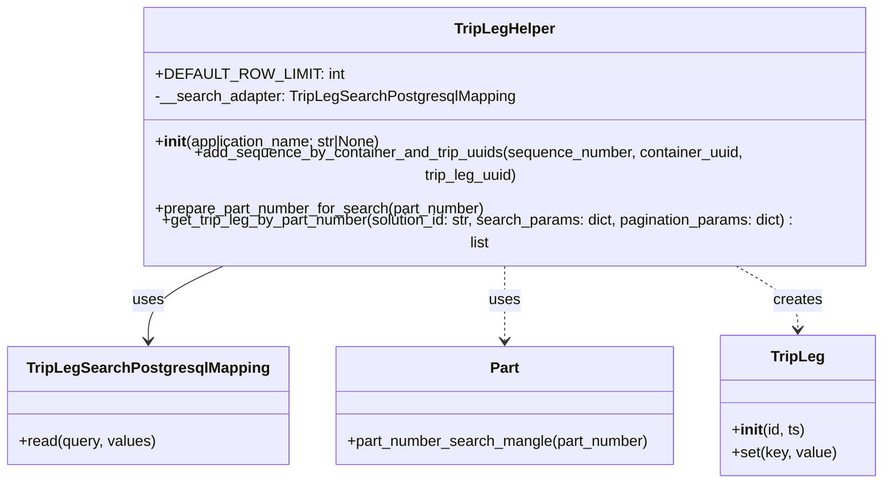
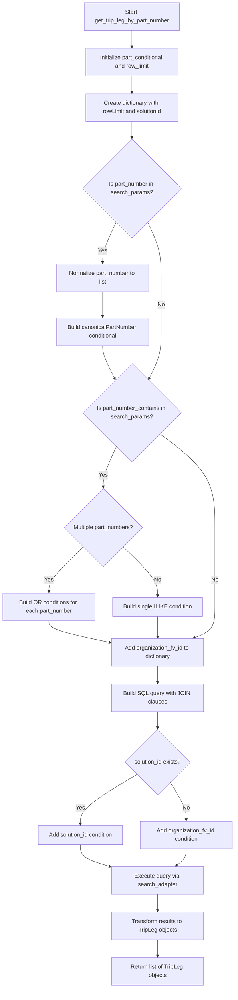
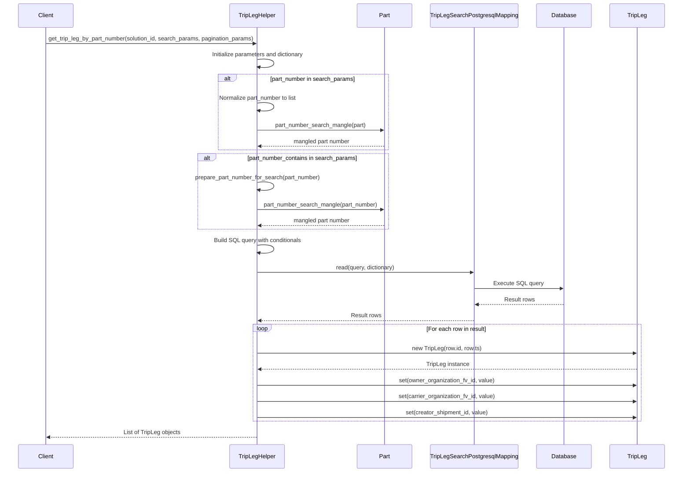
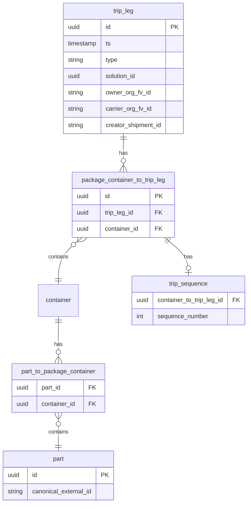

# Diagram: platform/partview_core/partview_service/partview_service/core/helpers/TripLegHelper.py

> Auto-generated by Obscura crawlers

## Diagram 1

### SVG

<svg id="container" width="934.6953125" xmlns="http://www.w3.org/2000/svg" class="classDiagram" height="480" viewBox="0 0 934.6953125 480" role="graphics-document document" aria-roledescription="class"><g><defs><marker id="container_class-aggregationStart" class="marker aggregation class" refX="18" refY="7" markerWidth="190" markerHeight="240" orient="auto"><path d="M 18,7 L9,13 L1,7 L9,1 Z"></path></marker></defs><defs><marker id="container_class-aggregationEnd" class="marker aggregation class" refX="1" refY="7" markerWidth="20" markerHeight="28" orient="auto"><path d="M 18,7 L9,13 L1,7 L9,1 Z"></path></marker></defs><defs><marker id="container_class-extensionStart" class="marker extension class" refX="18" refY="7" markerWidth="190" markerHeight="240" orient="auto"><path d="M 1,7 L18,13 V 1 Z"></path></marker></defs><defs><marker id="container_class-extensionEnd" class="marker extension class" refX="1" refY="7" markerWidth="20" markerHeight="28" orient="auto"><path d="M 1,1 V 13 L18,7 Z"></path></marker></defs><defs><marker id="container_class-compositionStart" class="marker composition class" refX="18" refY="7" markerWidth="190" markerHeight="240" orient="auto"><path d="M 18,7 L9,13 L1,7 L9,1 Z"></path></marker></defs><defs><marker id="container_class-compositionEnd" class="marker composition class" refX="1" refY="7" markerWidth="20" markerHeight="28" orient="auto"><path d="M 18,7 L9,13 L1,7 L9,1 Z"></path></marker></defs><defs><marker id="container_class-dependencyStart" class="marker dependency class" refX="6" refY="7" markerWidth="190" markerHeight="240" orient="auto"><path d="M 5,7 L9,13 L1,7 L9,1 Z"></path></marker></defs><defs><marker id="container_class-dependencyEnd" class="marker dependency class" refX="13" refY="7" markerWidth="20" markerHeight="28" orient="auto"><path d="M 18,7 L9,13 L14,7 L9,1 Z"></path></marker></defs><defs><marker id="container_class-lollipopStart" class="marker lollipop class" refX="13" refY="7" markerWidth="190" markerHeight="240" orient="auto"><circle stroke="black" fill="transparent" cx="7" cy="7" r="6"></circle></marker></defs><defs><marker id="container_class-lollipopEnd" class="marker lollipop class" refX="1" refY="7" markerWidth="190" markerHeight="240" orient="auto"><circle stroke="black" fill="transparent" cx="7" cy="7" r="6"></circle></marker></defs><g class="root"><g class="clusters"></g><g class="edgePaths"><path d="M243.379,248L228.523,254.167C213.668,260.333,183.957,272.667,169.102,286C154.246,299.333,154.246,313.667,154.246,320.833L154.246,328" id="id_TripLegHelper_TripLegSearchPostgresqlMapping_1" class="edge-thickness-normal edge-pattern-solid relation" style=";;;" data-edge="true" data-et="edge" data-id="id_TripLegHelper_TripLegSearchPostgresqlMapping_1" data-points="W3sieCI6MjQzLjM3ODYwNzY4MzEyMSwieSI6MjQ4fSx7IngiOjE1NC4yNDYwOTM3NSwieSI6Mjg1fSx7IngiOjE1NC4yNDYwOTM3NSwieSI6MzM0fV0=" marker-end="url(#container_class-dependencyEnd)"></path><path d="M532.457,248L532.457,254.167C532.457,260.333,532.457,272.667,532.457,286C532.457,299.333,532.457,313.667,532.457,320.833L532.457,328" id="id_TripLegHelper_Part_2" class="edge-thickness-normal edge-pattern-dashed relation" style=";;;" data-edge="true" data-et="edge" data-id="id_TripLegHelper_Part_2" data-points="W3sieCI6NTMyLjQ1NzAzMTI1LCJ5IjoyNDh9LHsieCI6NTMyLjQ1NzAzMTI1LCJ5IjoyODV9LHsieCI6NTMyLjQ1NzAzMTI1LCJ5IjozMzR9XQ==" marker-end="url(#container_class-dependencyEnd)"></path><path d="M771.77,248L784.068,254.167C796.366,260.333,820.963,272.667,833.261,284C845.559,295.333,845.559,305.667,845.559,310.833L845.559,316" id="id_TripLegHelper_TripLeg_3" class="edge-thickness-normal edge-pattern-dashed relation" style=";;;" data-edge="true" data-et="edge" data-id="id_TripLegHelper_TripLeg_3" data-points="W3sieCI6NzcxLjc3MDMyNzQyODM0NCwieSI6MjQ4fSx7IngiOjg0NS41NTg1OTM3NSwieSI6Mjg1fSx7IngiOjg0NS41NTg1OTM3NSwieSI6MzIyfV0=" marker-end="url(#container_class-dependencyEnd)"></path></g><g class="edgeLabels"><g class="edgeLabel" transform="translate(154.24609375, 285)"><g class="label" data-id="id_TripLegHelper_TripLegSearchPostgresqlMapping_1" transform="translate(-16.4921875, -12)"><foreignObject width="32.984375" height="24">

uses

</foreignObject></g></g><g class="edgeLabel" transform="translate(532.45703125, 285)"><g class="label" data-id="id_TripLegHelper_Part_2" transform="translate(-16.4921875, -12)"><foreignObject width="32.984375" height="24">

uses

</foreignObject></g></g><g class="edgeLabel" transform="translate(845.55859375, 285)"><g class="label" data-id="id_TripLegHelper_TripLeg_3" transform="translate(-26.171875, -12)"><foreignObject width="52.34375" height="24">

creates

</foreignObject></g></g></g><g class="nodes"><g class="node default" id="classId-TripLegHelper-0" transform="translate(532.45703125, 128)"><g class="basic label-container"><path d="M-394.11328125 -120 L394.11328125 -120 L394.11328125 120 L-394.11328125 120" stroke="none" stroke-width="0" fill="#ECECFF" style=""></path><path d="M-394.11328125 -120 C-100.27022087359757 -120, 193.57283950280487 -120, 394.11328125 -120 M-394.11328125 -120 C-182.53880468229949 -120, 29.03567188540103 -120, 394.11328125 -120 M394.11328125 -120 C394.11328125 -60.45097151751904, 394.11328125 -0.901943035038073, 394.11328125 120 M394.11328125 -120 C394.11328125 -38.381656648624045, 394.11328125 43.23668670275191, 394.11328125 120 M394.11328125 120 C109.97098403680957 120, -174.17131317638086 120, -394.11328125 120 M394.11328125 120 C114.51076955245964 120, -165.09174214508073 120, -394.11328125 120 M-394.11328125 120 C-394.11328125 27.896355237306807, -394.11328125 -64.20728952538639, -394.11328125 -120 M-394.11328125 120 C-394.11328125 33.38504813521429, -394.11328125 -53.22990372957142, -394.11328125 -120" stroke="#9370DB" stroke-width="1.3" fill="none" stroke-dasharray="0 0" style=""></path></g><g class="annotation-group text" transform="translate(0, -96)"></g><g class="label-group text" transform="translate(-51.5703125, -96)"><g class="label" style="font-weight: bolder" transform="translate(0,-12)"><foreignObject width="103.140625" height="24">

TripLegHelper

</foreignObject></g></g><g class="members-group text" transform="translate(-382.11328125, -48)"><g class="label" style="" transform="translate(0,-12)"><foreignObject width="182.359375" height="24">

+DEFAULT_ROW_LIMIT: int

</foreignObject></g><g class="label" style="" transform="translate(0,12)"><foreignObject width="381.5625" height="24">

-__search_adapter: TripLegSearchPostgresqlMapping

</foreignObject></g></g><g class="methods-group text" transform="translate(-382.11328125, 24)"><g class="label" style="" transform="translate(0,-12)"><foreignObject width="246.0625" height="24">

+<strong>init</strong>(application_name: str|None)

</foreignObject></g><g class="label" style="" transform="translate(0,12)"><foreignObject width="695.46875" height="24">

+add_sequence_by_container_and_trip_uuids(sequence_number, container_uuid, trip_leg_uuid)

</foreignObject></g><g class="label" style="" transform="translate(0,36)"><foreignObject width="354.921875" height="24">

+prepare_part_number_for_search(part_number)

</foreignObject></g><g class="label" style="" transform="translate(0,60)"><foreignObject width="712.65625" height="24">

+get_trip_leg_by_part_number(solution_id: str, search_params: dict, pagination_params: dict) : list

</foreignObject></g></g><g class="divider" style=""><path d="M-394.11328125 -72 C-164.9445399772182 -72, 64.2242012955636 -72, 394.11328125 -72 M-394.11328125 -72 C-127.53388761330086 -72, 139.04550602339827 -72, 394.11328125 -72" stroke="#9370DB" stroke-width="1.3" fill="none" stroke-dasharray="0 0" style=""></path></g><g class="divider" style=""><path d="M-394.11328125 0 C-175.06279673991676 0, 43.987687770166474 0, 394.11328125 0 M-394.11328125 0 C-147.0618524826137 0, 99.98957628477262 0, 394.11328125 0" stroke="#9370DB" stroke-width="1.3" fill="none" stroke-dasharray="0 0" style=""></path></g></g><g class="node default" id="classId-TripLegSearchPostgresqlMapping-1" transform="translate(154.24609375, 397)"><g class="basic label-container"><path d="M-146.24609375 -63 L146.24609375 -63 L146.24609375 63 L-146.24609375 63" stroke="none" stroke-width="0" fill="#ECECFF" style=""></path><path d="M-146.24609375 -63 C-73.50494153116563 -63, -0.7637893123312551 -63, 146.24609375 -63 M-146.24609375 -63 C-86.40113029464646 -63, -26.556166839292942 -63, 146.24609375 -63 M146.24609375 -63 C146.24609375 -26.676586746861226, 146.24609375 9.646826506277549, 146.24609375 63 M146.24609375 -63 C146.24609375 -33.7859381416683, 146.24609375 -4.5718762833366, 146.24609375 63 M146.24609375 63 C45.096311681618275 63, -56.05347038676345 63, -146.24609375 63 M146.24609375 63 C68.65231924010187 63, -8.94145526979625 63, -146.24609375 63 M-146.24609375 63 C-146.24609375 33.552410497028994, -146.24609375 4.104820994057988, -146.24609375 -63 M-146.24609375 63 C-146.24609375 19.785666550294223, -146.24609375 -23.428666899411553, -146.24609375 -63" stroke="#9370DB" stroke-width="1.3" fill="none" stroke-dasharray="0 0" style=""></path></g><g class="annotation-group text" transform="translate(0, -39)"></g><g class="label-group text" transform="translate(-122.1640625, -39)"><g class="label" style="font-weight: bolder" transform="translate(0,-12)"><foreignObject width="244.328125" height="24">

TripLegSearchPostgresqlMapping

</foreignObject></g></g><g class="members-group text" transform="translate(-134.24609375, 9)"></g><g class="methods-group text" transform="translate(-134.24609375, 39)"><g class="label" style="" transform="translate(0,-12)"><foreignObject width="146.328125" height="24">

+read(query, values)

</foreignObject></g></g><g class="divider" style=""><path d="M-146.24609375 -15 C-76.95799298172116 -15, -7.669892213442324 -15, 146.24609375 -15 M-146.24609375 -15 C-32.69327976812559 -15, 80.85953421374882 -15, 146.24609375 -15" stroke="#9370DB" stroke-width="1.3" fill="none" stroke-dasharray="0 0" style=""></path></g><g class="divider" style=""><path d="M-146.24609375 9 C-34.32505857399508 9, 77.59597660200984 9, 146.24609375 9 M-146.24609375 9 C-36.22374123898622 9, 73.79861127202756 9, 146.24609375 9" stroke="#9370DB" stroke-width="1.3" fill="none" stroke-dasharray="0 0" style=""></path></g></g><g class="node default" id="classId-Part-2" transform="translate(532.45703125, 397)"><g class="basic label-container"><path d="M-181.96484375 -63 L181.96484375 -63 L181.96484375 63 L-181.96484375 63" stroke="none" stroke-width="0" fill="#ECECFF" style=""></path><path d="M-181.96484375 -63 C-78.26655303768769 -63, 25.431737674624628 -63, 181.96484375 -63 M-181.96484375 -63 C-44.751143933755 -63, 92.46255588249 -63, 181.96484375 -63 M181.96484375 -63 C181.96484375 -23.818000722853455, 181.96484375 15.36399855429309, 181.96484375 63 M181.96484375 -63 C181.96484375 -22.98852260759302, 181.96484375 17.02295478481396, 181.96484375 63 M181.96484375 63 C81.31761706604871 63, -19.329609617902577 63, -181.96484375 63 M181.96484375 63 C97.58646585339064 63, 13.20808795678127 63, -181.96484375 63 M-181.96484375 63 C-181.96484375 20.287556918289326, -181.96484375 -22.42488616342135, -181.96484375 -63 M-181.96484375 63 C-181.96484375 31.158825713807172, -181.96484375 -0.6823485723856564, -181.96484375 -63" stroke="#9370DB" stroke-width="1.3" fill="none" stroke-dasharray="0 0" style=""></path></g><g class="annotation-group text" transform="translate(0, -39)"></g><g class="label-group text" transform="translate(-15.0703125, -39)"><g class="label" style="font-weight: bolder" transform="translate(0,-12)"><foreignObject width="30.140625" height="24">

Part

</foreignObject></g></g><g class="members-group text" transform="translate(-169.96484375, 9)"></g><g class="methods-group text" transform="translate(-169.96484375, 39)"><g class="label" style="" transform="translate(0,-12)"><foreignObject width="324.859375" height="24">

+part_number_search_mangle(part_number)

</foreignObject></g></g><g class="divider" style=""><path d="M-181.96484375 -15 C-57.4835163028182 -15, 66.9978111443636 -15, 181.96484375 -15 M-181.96484375 -15 C-104.49997802453183 -15, -27.035112299063655 -15, 181.96484375 -15" stroke="#9370DB" stroke-width="1.3" fill="none" stroke-dasharray="0 0" style=""></path></g><g class="divider" style=""><path d="M-181.96484375 9 C-71.86582168574395 9, 38.233200378512095 9, 181.96484375 9 M-181.96484375 9 C-75.70705058719912 9, 30.55074257560176 9, 181.96484375 9" stroke="#9370DB" stroke-width="1.3" fill="none" stroke-dasharray="0 0" style=""></path></g></g><g class="node default" id="classId-TripLeg-3" transform="translate(845.55859375, 397)"><g class="basic label-container"><path d="M-81.13671875 -75 L81.13671875 -75 L81.13671875 75 L-81.13671875 75" stroke="none" stroke-width="0" fill="#ECECFF" style=""></path><path d="M-81.13671875 -75 C-29.499242882973974 -75, 22.138232984052053 -75, 81.13671875 -75 M-81.13671875 -75 C-39.303459166774175 -75, 2.52980041645165 -75, 81.13671875 -75 M81.13671875 -75 C81.13671875 -33.29281345436315, 81.13671875 8.414373091273703, 81.13671875 75 M81.13671875 -75 C81.13671875 -33.40272624007911, 81.13671875 8.194547519841777, 81.13671875 75 M81.13671875 75 C44.80546172533239 75, 8.474204700664785 75, -81.13671875 75 M81.13671875 75 C39.41530479851389 75, -2.306109152972226 75, -81.13671875 75 M-81.13671875 75 C-81.13671875 27.885433038541585, -81.13671875 -19.22913392291683, -81.13671875 -75 M-81.13671875 75 C-81.13671875 16.847854755731042, -81.13671875 -41.304290488537916, -81.13671875 -75" stroke="#9370DB" stroke-width="1.3" fill="none" stroke-dasharray="0 0" style=""></path></g><g class="annotation-group text" transform="translate(0, -51)"></g><g class="label-group text" transform="translate(-27.0546875, -51)"><g class="label" style="font-weight: bolder" transform="translate(0,-12)"><foreignObject width="54.109375" height="24">

TripLeg

</foreignObject></g></g><g class="members-group text" transform="translate(-69.13671875, -3)"></g><g class="methods-group text" transform="translate(-69.13671875, 27)"><g class="label" style="" transform="translate(0,-12)"><foreignObject width="78.203125" height="24">

+<strong>init</strong>(id, ts)

</foreignObject></g><g class="label" style="" transform="translate(0,12)"><foreignObject width="111.21875" height="24">

+set(key, value)

</foreignObject></g></g><g class="divider" style=""><path d="M-81.13671875 -27 C-19.57944796431442 -27, 41.97782282137116 -27, 81.13671875 -27 M-81.13671875 -27 C-33.28176124876698 -27, 14.573196252466033 -27, 81.13671875 -27" stroke="#9370DB" stroke-width="1.3" fill="none" stroke-dasharray="0 0" style=""></path></g><g class="divider" style=""><path d="M-81.13671875 -3 C-43.293044486144716 -3, -5.449370222289431 -3, 81.13671875 -3 M-81.13671875 -3 C-17.18016613218183 -3, 46.77638648563634 -3, 81.13671875 -3" stroke="#9370DB" stroke-width="1.3" fill="none" stroke-dasharray="0 0" style=""></path></g></g></g></g></g></svg>

## Diagram 2

### SVG

<svg id="container" width="667" xmlns="http://www.w3.org/2000/svg" class="flowchart" height="2817.9375" viewBox="0 0 667 2817.9375" role="graphics-document document" aria-roledescription="flowchart-v2"><g><marker id="container_flowchart-v2-pointEnd" class="marker flowchart-v2" viewBox="0 0 10 10" refX="5" refY="5" markerUnits="userSpaceOnUse" markerWidth="8" markerHeight="8" orient="auto"><path d="M 0 0 L 10 5 L 0 10 z" class="arrowMarkerPath" style="stroke-width: 1; stroke-dasharray: 1, 0;"></path></marker><marker id="container_flowchart-v2-pointStart" class="marker flowchart-v2" viewBox="0 0 10 10" refX="4.5" refY="5" markerUnits="userSpaceOnUse" markerWidth="8" markerHeight="8" orient="auto"><path d="M 0 5 L 10 10 L 10 0 z" class="arrowMarkerPath" style="stroke-width: 1; stroke-dasharray: 1, 0;"></path></marker><marker id="container_flowchart-v2-circleEnd" class="marker flowchart-v2" viewBox="0 0 10 10" refX="11" refY="5" markerUnits="userSpaceOnUse" markerWidth="11" markerHeight="11" orient="auto"><circle cx="5" cy="5" r="5" class="arrowMarkerPath" style="stroke-width: 1; stroke-dasharray: 1, 0;"></circle></marker><marker id="container_flowchart-v2-circleStart" class="marker flowchart-v2" viewBox="0 0 10 10" refX="-1" refY="5" markerUnits="userSpaceOnUse" markerWidth="11" markerHeight="11" orient="auto"><circle cx="5" cy="5" r="5" class="arrowMarkerPath" style="stroke-width: 1; stroke-dasharray: 1, 0;"></circle></marker><marker id="container_flowchart-v2-crossEnd" class="marker cross flowchart-v2" viewBox="0 0 11 11" refX="12" refY="5.2" markerUnits="userSpaceOnUse" markerWidth="11" markerHeight="11" orient="auto"><path d="M 1,1 l 9,9 M 10,1 l -9,9" class="arrowMarkerPath" style="stroke-width: 2; stroke-dasharray: 1, 0;"></path></marker><marker id="container_flowchart-v2-crossStart" class="marker cross flowchart-v2" viewBox="0 0 11 11" refX="-1" refY="5.2" markerUnits="userSpaceOnUse" markerWidth="11" markerHeight="11" orient="auto"><path d="M 1,1 l 9,9 M 10,1 l -9,9" class="arrowMarkerPath" style="stroke-width: 2; stroke-dasharray: 1, 0;"></path></marker><g class="root"><g class="clusters"></g><g class="edgePaths"><path d="M374.5,86L374.5,90.167C374.5,94.333,374.5,102.667,374.5,110.333C374.5,118,374.5,125,374.5,128.5L374.5,132" id="L_A_B_0" class="edge-thickness-normal edge-pattern-solid edge-thickness-normal edge-pattern-solid flowchart-link" style=";" data-edge="true" data-et="edge" data-id="L_A_B_0" data-points="W3sieCI6Mzc0LjUsInkiOjg2fSx7IngiOjM3NC41LCJ5IjoxMTF9LHsieCI6Mzc0LjUsInkiOjEzNn1d" marker-end="url(#container_flowchart-v2-pointEnd)"></path><path d="M374.5,214L374.5,218.167C374.5,222.333,374.5,230.667,374.5,238.333C374.5,246,374.5,253,374.5,256.5L374.5,260" id="L_B_C_0" class="edge-thickness-normal edge-pattern-solid edge-thickness-normal edge-pattern-solid flowchart-link" style=";" data-edge="true" data-et="edge" data-id="L_B_C_0" data-points="W3sieCI6Mzc0LjUsInkiOjIxNH0seyJ4IjozNzQuNSwieSI6MjM5fSx7IngiOjM3NC41LCJ5IjoyNjR9XQ==" marker-end="url(#container_flowchart-v2-pointEnd)"></path><path d="M374.5,342L374.5,346.167C374.5,350.333,374.5,358.667,374.5,366.333C374.5,374,374.5,381,374.5,384.5L374.5,388" id="L_C_D_0" class="edge-thickness-normal edge-pattern-solid edge-thickness-normal edge-pattern-solid flowchart-link" style=";" data-edge="true" data-et="edge" data-id="L_C_D_0" data-points="W3sieCI6Mzc0LjUsInkiOjM0Mn0seyJ4IjozNzQuNSwieSI6MzY3fSx7IngiOjM3NC41LCJ5IjozOTJ9XQ==" marker-end="url(#container_flowchart-v2-pointEnd)"></path><path d="M330.138,625.638L323.782,639.199C317.426,652.759,304.713,679.879,298.356,698.94C292,718,292,729,292,734.5L292,740" id="L_D_E_0" class="edge-thickness-normal edge-pattern-solid edge-thickness-normal edge-pattern-solid flowchart-link" style=";" data-edge="true" data-et="edge" data-id="L_D_E_0" data-points="W3sieCI6MzMwLjEzODI5Nzg3MjM0MDQ0LCJ5Ijo2MjUuNjM4Mjk3ODcyMzQwNH0seyJ4IjoyOTIsInkiOjcwN30seyJ4IjoyOTIsInkiOjc0NH1d" marker-end="url(#container_flowchart-v2-pointEnd)"></path><path d="M292,822L292,828.167C292,834.333,292,846.667,292,858.333C292,870,292,881,292,886.5L292,892" id="L_E_F_0" class="edge-thickness-normal edge-pattern-solid edge-thickness-normal edge-pattern-solid flowchart-link" style=";" data-edge="true" data-et="edge" data-id="L_E_F_0" data-points="W3sieCI6MjkyLCJ5Ijo4MjJ9LHsieCI6MjkyLCJ5Ijo4NTl9LHsieCI6MjkyLCJ5Ijo4OTZ9XQ==" marker-end="url(#container_flowchart-v2-pointEnd)"></path><path d="M292,998L292,1002.167C292,1006.333,292,1014.667,297.697,1030.158C303.394,1045.649,314.787,1068.299,320.484,1079.623L326.181,1090.948" id="L_F_G_0" class="edge-thickness-normal edge-pattern-solid edge-thickness-normal edge-pattern-solid flowchart-link" style=";" data-edge="true" data-et="edge" data-id="L_F_G_0" data-points="W3sieCI6MjkyLCJ5Ijo5OTh9LHsieCI6MjkyLCJ5IjoxMDIzfSx7IngiOjMyNy45Nzg3MDE4MjU1NTc4MywieSI6MTA5NC41MjEyOTgxNzQ0NDJ9XQ==" marker-end="url(#container_flowchart-v2-pointEnd)"></path><path d="M418.862,625.638L425.218,639.199C431.574,652.759,444.287,679.879,450.644,706.106C457,732.333,457,757.667,457,783C457,808.333,457,833.667,457,861C457,888.333,457,917.667,457,945C457,972.333,457,997.667,451.303,1021.658C445.606,1045.649,434.213,1068.299,428.516,1079.623L422.819,1090.948" id="L_D_G_0" class="edge-thickness-normal edge-pattern-solid edge-thickness-normal edge-pattern-solid flowchart-link" style=";" data-edge="true" data-et="edge" data-id="L_D_G_0" data-points="W3sieCI6NDE4Ljg2MTcwMjEyNzY1OTU2LCJ5Ijo2MjUuNjM4Mjk3ODcyMzQwNH0seyJ4Ijo0NTcsInkiOjcwN30seyJ4Ijo0NTcsInkiOjc4M30seyJ4Ijo0NTcsInkiOjg1OX0seyJ4Ijo0NTcsInkiOjk0N30seyJ4Ijo0NTcsInkiOjEwMjN9LHsieCI6NDIxLjAyMTI5ODE3NDQ0MjE3LCJ5IjoxMDk0LjUyMTI5ODE3NDQ0Mn1d" marker-end="url(#container_flowchart-v2-pointEnd)"></path><path d="M330.322,1281.822L324.018,1295.351C317.714,1308.881,305.107,1335.941,298.804,1354.97C292.5,1374,292.5,1385,292.5,1390.5L292.5,1396" id="L_G_H_0" class="edge-thickness-normal edge-pattern-solid edge-thickness-normal edge-pattern-solid flowchart-link" style=";" data-edge="true" data-et="edge" data-id="L_G_H_0" data-points="W3sieCI6MzMwLjMyMTcwNTQyNjM1NjYsInkiOjEyODEuODIxNzA1NDI2MzU2Nn0seyJ4IjoyOTIuNSwieSI6MTM2M30seyJ4IjoyOTIuNSwieSI6MTQwMH1d" marker-end="url(#container_flowchart-v2-pointEnd)"></path><path d="M235.001,1569.532L218.834,1585.282C202.667,1601.032,170.334,1632.532,154.167,1653.781C138,1675.031,138,1686.031,138,1691.531L138,1697.031" id="L_H_I_0" class="edge-thickness-normal edge-pattern-solid edge-thickness-normal edge-pattern-solid flowchart-link" style=";" data-edge="true" data-et="edge" data-id="L_H_I_0" data-points="W3sieCI6MjM1LjAwMDc2ODQwMzI1ODA0LCJ5IjoxNTY5LjUzMjAxODQwMzI1OH0seyJ4IjoxMzgsInkiOjE2NjQuMDMxMjV9LHsieCI6MTM4LCJ5IjoxNzAxLjAzMTI1fV0=" marker-end="url(#container_flowchart-v2-pointEnd)"></path><path d="M349.999,1569.532L366.166,1585.282C382.333,1601.032,414.666,1632.532,430.833,1655.781C447,1679.031,447,1694.031,447,1701.531L447,1709.031" id="L_H_J_0" class="edge-thickness-normal edge-pattern-solid edge-thickness-normal edge-pattern-solid flowchart-link" style=";" data-edge="true" data-et="edge" data-id="L_H_J_0" data-points="W3sieCI6MzQ5Ljk5OTIzMTU5Njc0MiwieSI6MTU2OS41MzIwMTg0MDMyNTh9LHsieCI6NDQ3LCJ5IjoxNjY0LjAzMTI1fSx7IngiOjQ0NywieSI6MTcxMy4wMzEyNX1d" marker-end="url(#container_flowchart-v2-pointEnd)"></path><path d="M138,1779.031L138,1783.198C138,1787.365,138,1795.698,167.181,1805.908C196.361,1816.119,254.722,1828.207,283.903,1834.251L313.083,1840.294" id="L_I_K_0" class="edge-thickness-normal edge-pattern-solid edge-thickness-normal edge-pattern-solid flowchart-link" style=";" data-edge="true" data-et="edge" data-id="L_I_K_0" data-points="W3sieCI6MTM4LCJ5IjoxNzc5LjAzMTI1fSx7IngiOjEzOCwieSI6MTgwNC4wMzEyNX0seyJ4IjozMTcsInkiOjE4NDEuMTA1NjgzNjU2OTU4fV0=" marker-end="url(#container_flowchart-v2-pointEnd)"></path><path d="M447,1767.031L447,1773.198C447,1779.365,447,1791.698,447,1801.365C447,1811.031,447,1818.031,447,1821.531L447,1825.031" id="L_J_K_0" class="edge-thickness-normal edge-pattern-solid edge-thickness-normal edge-pattern-solid flowchart-link" style=";" data-edge="true" data-et="edge" data-id="L_J_K_0" data-points="W3sieCI6NDQ3LCJ5IjoxNzY3LjAzMTI1fSx7IngiOjQ0NywieSI6MTgwNC4wMzEyNX0seyJ4Ijo0NDcsInkiOjE4MjkuMDMxMjV9XQ==" marker-end="url(#container_flowchart-v2-pointEnd)"></path><path d="M454.193,1246.307L480.328,1265.756C506.462,1285.204,558.731,1324.102,584.866,1368.637C611,1413.172,611,1463.344,611,1513.516C611,1563.688,611,1613.859,611,1651.612C611,1689.365,611,1714.698,611,1738.031C611,1761.365,611,1782.698,600.944,1797.289C590.888,1811.88,570.776,1819.728,560.72,1823.653L550.664,1827.577" id="L_G_K_0" class="edge-thickness-normal edge-pattern-solid edge-thickness-normal edge-pattern-solid flowchart-link" style=";" data-edge="true" data-et="edge" data-id="L_G_K_0" data-points="W3sieCI6NDU0LjE5MzMzMzMzMzMzMzMsInkiOjEyNDYuMzA2NjY2NjY2NjY2Nn0seyJ4Ijo2MTEsInkiOjEzNjN9LHsieCI6NjExLCJ5IjoxNTEzLjUxNTYyNX0seyJ4Ijo2MTEsInkiOjE2NjQuMDMxMjV9LHsieCI6NjExLCJ5IjoxNzQwLjAzMTI1fSx7IngiOjYxMSwieSI6MTgwNC4wMzEyNX0seyJ4Ijo1NDYuOTM3NSwieSI6MTgyOS4wMzEyNX1d" marker-end="url(#container_flowchart-v2-pointEnd)"></path><path d="M447,1907.031L447,1911.198C447,1915.365,447,1923.698,447,1931.365C447,1939.031,447,1946.031,447,1949.531L447,1953.031" id="L_K_L_0" class="edge-thickness-normal edge-pattern-solid edge-thickness-normal edge-pattern-solid flowchart-link" style=";" data-edge="true" data-et="edge" data-id="L_K_L_0" data-points="W3sieCI6NDQ3LCJ5IjoxOTA3LjAzMTI1fSx7IngiOjQ0NywieSI6MTkzMi4wMzEyNX0seyJ4Ijo0NDcsInkiOjE5NTcuMDMxMjV9XQ==" marker-end="url(#container_flowchart-v2-pointEnd)"></path><path d="M447,2035.031L447,2039.198C447,2043.365,447,2051.698,447,2059.365C447,2067.031,447,2074.031,447,2077.531L447,2081.031" id="L_L_M_0" class="edge-thickness-normal edge-pattern-solid edge-thickness-normal edge-pattern-solid flowchart-link" style=";" data-edge="true" data-et="edge" data-id="L_L_M_0" data-points="W3sieCI6NDQ3LCJ5IjoyMDM1LjAzMTI1fSx7IngiOjQ0NywieSI6MjA2MC4wMzEyNX0seyJ4Ijo0NDcsInkiOjIwODUuMDMxMjV9XQ==" marker-end="url(#container_flowchart-v2-pointEnd)"></path><path d="M387.667,2214.605L360.543,2230.66C333.419,2246.716,279.17,2278.827,252.046,2302.382C224.922,2325.938,224.922,2340.938,224.922,2348.438L224.922,2355.938" id="L_M_N_0" class="edge-thickness-normal edge-pattern-solid edge-thickness-normal edge-pattern-solid flowchart-link" style=";" data-edge="true" data-et="edge" data-id="L_M_N_0" data-points="W3sieCI6Mzg3LjY2NzI3MzY4NDAzNjA1LCJ5IjoyMjE0LjYwNDc3MzY4NDAzNn0seyJ4IjoyMjQuOTIxODc1LCJ5IjoyMzEwLjkzNzV9LHsieCI6MjI0LjkyMTg3NSwieSI6MjM1OS45Mzc1fV0=" marker-end="url(#container_flowchart-v2-pointEnd)"></path><path d="M483.285,2237.652L490.904,2249.867C498.523,2262.081,513.762,2286.509,521.381,2304.223C529,2321.938,529,2332.938,529,2338.438L529,2343.938" id="L_M_O_0" class="edge-thickness-normal edge-pattern-solid edge-thickness-normal edge-pattern-solid flowchart-link" style=";" data-edge="true" data-et="edge" data-id="L_M_O_0" data-points="W3sieCI6NDgzLjI4NTA0NTAxODY2NjI3LCJ5IjoyMjM3LjY1MjQ1NDk4MTMzNH0seyJ4Ijo1MjksInkiOjIzMTAuOTM3NX0seyJ4Ijo1MjksInkiOjIzNDcuOTM3NX1d" marker-end="url(#container_flowchart-v2-pointEnd)"></path><path d="M224.922,2413.938L224.922,2420.104C224.922,2426.271,224.922,2438.604,239.628,2449.009C254.333,2459.414,283.745,2467.89,298.451,2472.128L313.156,2476.366" id="L_N_P_0" class="edge-thickness-normal edge-pattern-solid edge-thickness-normal edge-pattern-solid flowchart-link" style=";" data-edge="true" data-et="edge" data-id="L_N_P_0" data-points="W3sieCI6MjI0LjkyMTg3NSwieSI6MjQxMy45Mzc1fSx7IngiOjIyNC45MjE4NzUsInkiOjI0NTAuOTM3NX0seyJ4IjozMTcsInkiOjI0NzcuNDczMjA2NzQ3MzQ0fV0=" marker-end="url(#container_flowchart-v2-pointEnd)"></path><path d="M529,2425.938L529,2430.104C529,2434.271,529,2442.604,524.187,2450.527C519.374,2458.45,509.748,2465.963,504.935,2469.72L500.122,2473.476" id="L_O_P_0" class="edge-thickness-normal edge-pattern-solid edge-thickness-normal edge-pattern-solid flowchart-link" style=";" data-edge="true" data-et="edge" data-id="L_O_P_0" data-points="W3sieCI6NTI5LCJ5IjoyNDI1LjkzNzV9LHsieCI6NTI5LCJ5IjoyNDUwLjkzNzV9LHsieCI6NDk2Ljk2ODc1LCJ5IjoyNDc1LjkzNzV9XQ==" marker-end="url(#container_flowchart-v2-pointEnd)"></path><path d="M447,2553.938L447,2558.104C447,2562.271,447,2570.604,447,2578.271C447,2585.938,447,2592.938,447,2596.438L447,2599.938" id="L_P_Q_0" class="edge-thickness-normal edge-pattern-solid edge-thickness-normal edge-pattern-solid flowchart-link" style=";" data-edge="true" data-et="edge" data-id="L_P_Q_0" data-points="W3sieCI6NDQ3LCJ5IjoyNTUzLjkzNzV9LHsieCI6NDQ3LCJ5IjoyNTc4LjkzNzV9LHsieCI6NDQ3LCJ5IjoyNjAzLjkzNzV9XQ==" marker-end="url(#container_flowchart-v2-pointEnd)"></path><path d="M447,2681.938L447,2686.104C447,2690.271,447,2698.604,447,2706.271C447,2713.938,447,2720.938,447,2724.438L447,2727.938" id="L_Q_R_0" class="edge-thickness-normal edge-pattern-solid edge-thickness-normal edge-pattern-solid flowchart-link" style=";" data-edge="true" data-et="edge" data-id="L_Q_R_0" data-points="W3sieCI6NDQ3LCJ5IjoyNjgxLjkzNzV9LHsieCI6NDQ3LCJ5IjoyNzA2LjkzNzV9LHsieCI6NDQ3LCJ5IjoyNzMxLjkzNzV9XQ==" marker-end="url(#container_flowchart-v2-pointEnd)"></path></g><g class="edgeLabels"><g class="edgeLabel"><g class="label" data-id="L_A_B_0" transform="translate(0, 0)"><foreignObject width="0" height="0">

</foreignObject></g></g><g class="edgeLabel"><g class="label" data-id="L_B_C_0" transform="translate(0, 0)"><foreignObject width="0" height="0">

</foreignObject></g></g><g class="edgeLabel"><g class="label" data-id="L_C_D_0" transform="translate(0, 0)"><foreignObject width="0" height="0">

</foreignObject></g></g><g class="edgeLabel" transform="translate(292, 707)"><g class="label" data-id="L_D_E_0" transform="translate(-12.03125, -12)"><foreignObject width="24.0625" height="24">

Yes

</foreignObject></g></g><g class="edgeLabel"><g class="label" data-id="L_E_F_0" transform="translate(0, 0)"><foreignObject width="0" height="0">

</foreignObject></g></g><g class="edgeLabel"><g class="label" data-id="L_F_G_0" transform="translate(0, 0)"><foreignObject width="0" height="0">

</foreignObject></g></g><g class="edgeLabel" transform="translate(457, 859)"><g class="label" data-id="L_D_G_0" transform="translate(-10.140625, -12)"><foreignObject width="20.28125" height="24">

No

</foreignObject></g></g><g class="edgeLabel" transform="translate(292.5, 1363)"><g class="label" data-id="L_G_H_0" transform="translate(-12.03125, -12)"><foreignObject width="24.0625" height="24">

Yes

</foreignObject></g></g><g class="edgeLabel" transform="translate(138, 1664.03125)"><g class="label" data-id="L_H_I_0" transform="translate(-12.03125, -12)"><foreignObject width="24.0625" height="24">

Yes

</foreignObject></g></g><g class="edgeLabel" transform="translate(447, 1664.03125)"><g class="label" data-id="L_H_J_0" transform="translate(-10.140625, -12)"><foreignObject width="20.28125" height="24">

No

</foreignObject></g></g><g class="edgeLabel"><g class="label" data-id="L_I_K_0" transform="translate(0, 0)"><foreignObject width="0" height="0">

</foreignObject></g></g><g class="edgeLabel"><g class="label" data-id="L_J_K_0" transform="translate(0, 0)"><foreignObject width="0" height="0">

</foreignObject></g></g><g class="edgeLabel" transform="translate(611, 1664.03125)"><g class="label" data-id="L_G_K_0" transform="translate(-10.140625, -12)"><foreignObject width="20.28125" height="24">

No

</foreignObject></g></g><g class="edgeLabel"><g class="label" data-id="L_K_L_0" transform="translate(0, 0)"><foreignObject width="0" height="0">

</foreignObject></g></g><g class="edgeLabel"><g class="label" data-id="L_L_M_0" transform="translate(0, 0)"><foreignObject width="0" height="0">

</foreignObject></g></g><g class="edgeLabel" transform="translate(224.921875, 2310.9375)"><g class="label" data-id="L_M_N_0" transform="translate(-12.03125, -12)"><foreignObject width="24.0625" height="24">

Yes

</foreignObject></g></g><g class="edgeLabel" transform="translate(529, 2310.9375)"><g class="label" data-id="L_M_O_0" transform="translate(-10.140625, -12)"><foreignObject width="20.28125" height="24">

No

</foreignObject></g></g><g class="edgeLabel"><g class="label" data-id="L_N_P_0" transform="translate(0, 0)"><foreignObject width="0" height="0">

</foreignObject></g></g><g class="edgeLabel"><g class="label" data-id="L_O_P_0" transform="translate(0, 0)"><foreignObject width="0" height="0">

</foreignObject></g></g><g class="edgeLabel"><g class="label" data-id="L_P_Q_0" transform="translate(0, 0)"><foreignObject width="0" height="0">

</foreignObject></g></g><g class="edgeLabel"><g class="label" data-id="L_Q_R_0" transform="translate(0, 0)"><foreignObject width="0" height="0">

</foreignObject></g></g></g><g class="nodes"><g class="node default" id="flowchart-A-0" transform="translate(374.5, 47)"><rect class="basic label-container" style="" x="-137.3359375" y="-39" width="274.671875" height="78"></rect><g class="label" style="" transform="translate(-107.3359375, -24)"><rect></rect><foreignObject width="214.671875" height="48">

Start get_trip_leg_by_part_number

</foreignObject></g></g><g class="node default" id="flowchart-B-1" transform="translate(374.5, 175)"><rect class="basic label-container" style="" x="-130" y="-39" width="260" height="78"></rect><g class="label" style="" transform="translate(-100, -24)"><rect></rect><foreignObject width="200" height="48">

Initialize part_conditional and row_limit

</foreignObject></g></g><g class="node default" id="flowchart-C-3" transform="translate(374.5, 303)"><rect class="basic label-container" style="" x="-130" y="-39" width="260" height="78"></rect><g class="label" style="" transform="translate(-100, -24)"><rect></rect><foreignObject width="200" height="48">

Create dictionary with rowLimit and solutionId

</foreignObject></g></g><g class="node default" id="flowchart-D-5" transform="translate(374.5, 531)"><polygon points="139,0 278,-139 139,-278 0,-139" class="label-container" transform="translate(-138.5, 139)"></polygon><g class="label" style="" transform="translate(-100, -24)"><rect></rect><foreignObject width="200" height="48">

Is part_number in search_params?

</foreignObject></g></g><g class="node default" id="flowchart-E-7" transform="translate(292, 783)"><rect class="basic label-container" style="" x="-130" y="-39" width="260" height="78"></rect><g class="label" style="" transform="translate(-100, -24)"><rect></rect><foreignObject width="200" height="48">

Normalize part_number to list

</foreignObject></g></g><g class="node default" id="flowchart-F-9" transform="translate(292, 947)"><rect class="basic label-container" style="" x="-130" y="-51" width="260" height="102"></rect><g class="label" style="" transform="translate(-100, -36)"><rect></rect><foreignObject width="200" height="72">

Build canonicalPartNumber conditional

</foreignObject></g></g><g class="node default" id="flowchart-G-11" transform="translate(374.5, 1187)"><polygon points="139,0 278,-139 139,-278 0,-139" class="label-container" transform="translate(-138.5, 139)"></polygon><g class="label" style="" transform="translate(-100, -24)"><rect></rect><foreignObject width="200" height="48">

Is part_number_contains in search_params?

</foreignObject></g></g><g class="node default" id="flowchart-H-15" transform="translate(292.5, 1513.515625)"><polygon points="113.515625,0 227.03125,-113.515625 113.515625,-227.03125 0,-113.515625" class="label-container" transform="translate(-113.015625, 113.515625)"></polygon><g class="label" style="" transform="translate(-86.515625, -12)"><rect></rect><foreignObject width="173.03125" height="24">

Multiple part_numbers?

</foreignObject></g></g><g class="node default" id="flowchart-I-17" transform="translate(138, 1740.03125)"><rect class="basic label-container" style="" x="-130" y="-39" width="260" height="78"></rect><g class="label" style="" transform="translate(-100, -24)"><rect></rect><foreignObject width="200" height="48">

Build OR conditions for each part_number

</foreignObject></g></g><g class="node default" id="flowchart-J-19" transform="translate(447, 1740.03125)"><rect class="basic label-container" style="" x="-129" y="-27" width="258" height="54"></rect><g class="label" style="" transform="translate(-99, -12)"><rect></rect><foreignObject width="198" height="24">

Build single ILIKE condition

</foreignObject></g></g><g class="node default" id="flowchart-K-21" transform="translate(447, 1868.03125)"><rect class="basic label-container" style="" x="-130" y="-39" width="260" height="78"></rect><g class="label" style="" transform="translate(-100, -24)"><rect></rect><foreignObject width="200" height="48">

Add organization_fv_id to dictionary

</foreignObject></g></g><g class="node default" id="flowchart-L-27" transform="translate(447, 1996.03125)"><rect class="basic label-container" style="" x="-130" y="-39" width="260" height="78"></rect><g class="label" style="" transform="translate(-100, -24)"><rect></rect><foreignObject width="200" height="48">

Build SQL query with JOIN clauses

</foreignObject></g></g><g class="node default" id="flowchart-M-29" transform="translate(447, 2179.484375)"><polygon points="94.453125,0 188.90625,-94.453125 94.453125,-188.90625 0,-94.453125" class="label-container" transform="translate(-93.953125, 94.453125)"></polygon><g class="label" style="" transform="translate(-67.453125, -12)"><rect></rect><foreignObject width="134.90625" height="24">

solution_id exists?

</foreignObject></g></g><g class="node default" id="flowchart-N-31" transform="translate(224.921875, 2386.9375)"><rect class="basic label-container" style="" x="-124.078125" y="-27" width="248.15625" height="54"></rect><g class="label" style="" transform="translate(-94.078125, -12)"><rect></rect><foreignObject width="188.15625" height="24">

Add solution_id condition

</foreignObject></g></g><g class="node default" id="flowchart-O-33" transform="translate(529, 2386.9375)"><rect class="basic label-container" style="" x="-130" y="-39" width="260" height="78"></rect><g class="label" style="" transform="translate(-100, -24)"><rect></rect><foreignObject width="200" height="48">

Add organization_fv_id condition

</foreignObject></g></g><g class="node default" id="flowchart-P-35" transform="translate(447, 2514.9375)"><rect class="basic label-container" style="" x="-130" y="-39" width="260" height="78"></rect><g class="label" style="" transform="translate(-100, -24)"><rect></rect><foreignObject width="200" height="48">

Execute query via search_adapter

</foreignObject></g></g><g class="node default" id="flowchart-Q-39" transform="translate(447, 2642.9375)"><rect class="basic label-container" style="" x="-130" y="-39" width="260" height="78"></rect><g class="label" style="" transform="translate(-100, -24)"><rect></rect><foreignObject width="200" height="48">

Transform results to TripLeg objects

</foreignObject></g></g><g class="node default" id="flowchart-R-41" transform="translate(447, 2770.9375)"><rect class="basic label-container" style="" x="-130" y="-39" width="260" height="78"></rect><g class="label" style="" transform="translate(-100, -24)"><rect></rect><foreignObject width="200" height="48">

Return list of TripLeg objects

</foreignObject></g></g></g></g></g></svg>

## Diagram 3

### SVG

<svg id="container" width="1989" xmlns="http://www.w3.org/2000/svg" height="1368" viewBox="-50 -10 1989 1368" role="graphics-document document" aria-roledescription="sequence"><g><rect x="1739" y="1282" fill="#eaeaea" stroke="#666" width="150" height="65" name="TripLeg" rx="3" ry="3" class="actor actor-bottom"></rect><text x="1814" y="1314.5" dominant-baseline="central" alignment-baseline="central" class="actor actor-box" style="text-anchor: middle; font-size: 16px; font-weight: 400;"><tspan x="1814" dy="0">TripLeg</tspan></text></g><g><rect x="1539" y="1282" fill="#eaeaea" stroke="#666" width="150" height="65" name="Database" rx="3" ry="3" class="actor actor-bottom"></rect><text x="1614" y="1314.5" dominant-baseline="central" alignment-baseline="central" class="actor actor-box" style="text-anchor: middle; font-size: 16px; font-weight: 400;"><tspan x="1614" dy="0">Database</tspan></text></g><g><rect x="1229" y="1282" fill="#eaeaea" stroke="#666" width="260" height="65" name="TripLegSearchPostgresqlMapping" rx="3" ry="3" class="actor actor-bottom"></rect><text x="1359" y="1314.5" dominant-baseline="central" alignment-baseline="central" class="actor actor-box" style="text-anchor: middle; font-size: 16px; font-weight: 400;"><tspan x="1359" dy="0">TripLegSearchPostgresqlMapping</tspan></text></g><g><rect x="1029" y="1282" fill="#eaeaea" stroke="#666" width="150" height="65" name="Part" rx="3" ry="3" class="actor actor-bottom"></rect><text x="1104" y="1314.5" dominant-baseline="central" alignment-baseline="central" class="actor actor-box" style="text-anchor: middle; font-size: 16px; font-weight: 400;"><tspan x="1104" dy="0">Part</tspan></text></g><g><rect x="642" y="1282" fill="#eaeaea" stroke="#666" width="150" height="65" name="TripLegHelper" rx="3" ry="3" class="actor actor-bottom"></rect><text x="717" y="1314.5" dominant-baseline="central" alignment-baseline="central" class="actor actor-box" style="text-anchor: middle; font-size: 16px; font-weight: 400;"><tspan x="717" dy="0">TripLegHelper</tspan></text></g><g><rect x="0" y="1282" fill="#eaeaea" stroke="#666" width="150" height="65" name="Client" rx="3" ry="3" class="actor actor-bottom"></rect><text x="75" y="1314.5" dominant-baseline="central" alignment-baseline="central" class="actor actor-box" style="text-anchor: middle; font-size: 16px; font-weight: 400;"><tspan x="75" dy="0">Client</tspan></text></g><g><line id="actor5" x1="1814" y1="65" x2="1814" y2="1282" class="actor-line 200" stroke-width="0.5px" stroke="#999" name="TripLeg"></line><g id="root-5"><rect x="1739" y="0" fill="#eaeaea" stroke="#666" width="150" height="65" name="TripLeg" rx="3" ry="3" class="actor actor-top"></rect><text x="1814" y="32.5" dominant-baseline="central" alignment-baseline="central" class="actor actor-box" style="text-anchor: middle; font-size: 16px; font-weight: 400;"><tspan x="1814" dy="0">TripLeg</tspan></text></g></g><g><line id="actor4" x1="1614" y1="65" x2="1614" y2="1282" class="actor-line 200" stroke-width="0.5px" stroke="#999" name="Database"></line><g id="root-4"><rect x="1539" y="0" fill="#eaeaea" stroke="#666" width="150" height="65" name="Database" rx="3" ry="3" class="actor actor-top"></rect><text x="1614" y="32.5" dominant-baseline="central" alignment-baseline="central" class="actor actor-box" style="text-anchor: middle; font-size: 16px; font-weight: 400;"><tspan x="1614" dy="0">Database</tspan></text></g></g><g><line id="actor3" x1="1359" y1="65" x2="1359" y2="1282" class="actor-line 200" stroke-width="0.5px" stroke="#999" name="TripLegSearchPostgresqlMapping"></line><g id="root-3"><rect x="1229" y="0" fill="#eaeaea" stroke="#666" width="260" height="65" name="TripLegSearchPostgresqlMapping" rx="3" ry="3" class="actor actor-top"></rect><text x="1359" y="32.5" dominant-baseline="central" alignment-baseline="central" class="actor actor-box" style="text-anchor: middle; font-size: 16px; font-weight: 400;"><tspan x="1359" dy="0">TripLegSearchPostgresqlMapping</tspan></text></g></g><g><line id="actor2" x1="1104" y1="65" x2="1104" y2="1282" class="actor-line 200" stroke-width="0.5px" stroke="#999" name="Part"></line><g id="root-2"><rect x="1029" y="0" fill="#eaeaea" stroke="#666" width="150" height="65" name="Part" rx="3" ry="3" class="actor actor-top"></rect><text x="1104" y="32.5" dominant-baseline="central" alignment-baseline="central" class="actor actor-box" style="text-anchor: middle; font-size: 16px; font-weight: 400;"><tspan x="1104" dy="0">Part</tspan></text></g></g><g><line id="actor1" x1="717" y1="65" x2="717" y2="1282" class="actor-line 200" stroke-width="0.5px" stroke="#999" name="TripLegHelper"></line><g id="root-1"><rect x="642" y="0" fill="#eaeaea" stroke="#666" width="150" height="65" name="TripLegHelper" rx="3" ry="3" class="actor actor-top"></rect><text x="717" y="32.5" dominant-baseline="central" alignment-baseline="central" class="actor actor-box" style="text-anchor: middle; font-size: 16px; font-weight: 400;"><tspan x="717" dy="0">TripLegHelper</tspan></text></g></g><g><line id="actor0" x1="75" y1="65" x2="75" y2="1282" class="actor-line 200" stroke-width="0.5px" stroke="#999" name="Client"></line><g id="root-0"><rect x="0" y="0" fill="#eaeaea" stroke="#666" width="150" height="65" name="Client" rx="3" ry="3" class="actor actor-top"></rect><text x="75" y="32.5" dominant-baseline="central" alignment-baseline="central" class="actor actor-box" style="text-anchor: middle; font-size: 16px; font-weight: 400;"><tspan x="75" dy="0">Client</tspan></text></g></g><g></g><defs><symbol id="computer" width="24" height="24"><path transform="scale(.5)" d="M2 2v13h20v-13h-20zm18 11h-16v-9h16v9zm-10.228 6l.466-1h3.524l.467 1h-4.457zm14.228 3h-24l2-6h2.104l-1.33 4h18.45l-1.297-4h2.073l2 6zm-5-10h-14v-7h14v7z"></path></symbol></defs><defs><symbol id="database" fill-rule="evenodd" clip-rule="evenodd"><path transform="scale(.5)" d="M12.258.001l.256.004.255.005.253.008.251.01.249.012.247.015.246.016.242.019.241.02.239.023.236.024.233.027.231.028.229.031.225.032.223.034.22.036.217.038.214.04.211.041.208.043.205.045.201.046.198.048.194.05.191.051.187.053.183.054.18.056.175.057.172.059.168.06.163.061.16.063.155.064.15.066.074.033.073.033.071.034.07.034.069.035.068.035.067.035.066.035.064.036.064.036.062.036.06.036.06.037.058.037.058.037.055.038.055.038.053.038.052.038.051.039.05.039.048.039.047.039.045.04.044.04.043.04.041.04.04.041.039.041.037.041.036.041.034.041.033.042.032.042.03.042.029.042.027.042.026.043.024.043.023.043.021.043.02.043.018.044.017.043.015.044.013.044.012.044.011.045.009.044.007.045.006.045.004.045.002.045.001.045v17l-.001.045-.002.045-.004.045-.006.045-.007.045-.009.044-.011.045-.012.044-.013.044-.015.044-.017.043-.018.044-.02.043-.021.043-.023.043-.024.043-.026.043-.027.042-.029.042-.03.042-.032.042-.033.042-.034.041-.036.041-.037.041-.039.041-.04.041-.041.04-.043.04-.044.04-.045.04-.047.039-.048.039-.05.039-.051.039-.052.038-.053.038-.055.038-.055.038-.058.037-.058.037-.06.037-.06.036-.062.036-.064.036-.064.036-.066.035-.067.035-.068.035-.069.035-.07.034-.071.034-.073.033-.074.033-.15.066-.155.064-.16.063-.163.061-.168.06-.172.059-.175.057-.18.056-.183.054-.187.053-.191.051-.194.05-.198.048-.201.046-.205.045-.208.043-.211.041-.214.04-.217.038-.22.036-.223.034-.225.032-.229.031-.231.028-.233.027-.236.024-.239.023-.241.02-.242.019-.246.016-.247.015-.249.012-.251.01-.253.008-.255.005-.256.004-.258.001-.258-.001-.256-.004-.255-.005-.253-.008-.251-.01-.249-.012-.247-.015-.245-.016-.243-.019-.241-.02-.238-.023-.236-.024-.234-.027-.231-.028-.228-.031-.226-.032-.223-.034-.22-.036-.217-.038-.214-.04-.211-.041-.208-.043-.204-.045-.201-.046-.198-.048-.195-.05-.19-.051-.187-.053-.184-.054-.179-.056-.176-.057-.172-.059-.167-.06-.164-.061-.159-.063-.155-.064-.151-.066-.074-.033-.072-.033-.072-.034-.07-.034-.069-.035-.068-.035-.067-.035-.066-.035-.064-.036-.063-.036-.062-.036-.061-.036-.06-.037-.058-.037-.057-.037-.056-.038-.055-.038-.053-.038-.052-.038-.051-.039-.049-.039-.049-.039-.046-.039-.046-.04-.044-.04-.043-.04-.041-.04-.04-.041-.039-.041-.037-.041-.036-.041-.034-.041-.033-.042-.032-.042-.03-.042-.029-.042-.027-.042-.026-.043-.024-.043-.023-.043-.021-.043-.02-.043-.018-.044-.017-.043-.015-.044-.013-.044-.012-.044-.011-.045-.009-.044-.007-.045-.006-.045-.004-.045-.002-.045-.001-.045v-17l.001-.045.002-.045.004-.045.006-.045.007-.045.009-.044.011-.045.012-.044.013-.044.015-.044.017-.043.018-.044.02-.043.021-.043.023-.043.024-.043.026-.043.027-.042.029-.042.03-.042.032-.042.033-.042.034-.041.036-.041.037-.041.039-.041.04-.041.041-.04.043-.04.044-.04.046-.04.046-.039.049-.039.049-.039.051-.039.052-.038.053-.038.055-.038.056-.038.057-.037.058-.037.06-.037.061-.036.062-.036.063-.036.064-.036.066-.035.067-.035.068-.035.069-.035.07-.034.072-.034.072-.033.074-.033.151-.066.155-.064.159-.063.164-.061.167-.06.172-.059.176-.057.179-.056.184-.054.187-.053.19-.051.195-.05.198-.048.201-.046.204-.045.208-.043.211-.041.214-.04.217-.038.22-.036.223-.034.226-.032.228-.031.231-.028.234-.027.236-.024.238-.023.241-.02.243-.019.245-.016.247-.015.249-.012.251-.01.253-.008.255-.005.256-.004.258-.001.258.001zm-9.258 20.499v.01l.001.021.003.021.004.022.005.021.006.022.007.022.009.023.01.022.011.023.012.023.013.023.015.023.016.024.017.023.018.024.019.024.021.024.022.025.023.024.024.025.052.049.056.05.061.051.066.051.07.051.075.051.079.052.084.052.088.052.092.052.097.052.102.051.105.052.11.052.114.051.119.051.123.051.127.05.131.05.135.05.139.048.144.049.147.047.152.047.155.047.16.045.163.045.167.043.171.043.176.041.178.041.183.039.187.039.19.037.194.035.197.035.202.033.204.031.209.03.212.029.216.027.219.025.222.024.226.021.23.02.233.018.236.016.24.015.243.012.246.01.249.008.253.005.256.004.259.001.26-.001.257-.004.254-.005.25-.008.247-.011.244-.012.241-.014.237-.016.233-.018.231-.021.226-.021.224-.024.22-.026.216-.027.212-.028.21-.031.205-.031.202-.034.198-.034.194-.036.191-.037.187-.039.183-.04.179-.04.175-.042.172-.043.168-.044.163-.045.16-.046.155-.046.152-.047.148-.048.143-.049.139-.049.136-.05.131-.05.126-.05.123-.051.118-.052.114-.051.11-.052.106-.052.101-.052.096-.052.092-.052.088-.053.083-.051.079-.052.074-.052.07-.051.065-.051.06-.051.056-.05.051-.05.023-.024.023-.025.021-.024.02-.024.019-.024.018-.024.017-.024.015-.023.014-.024.013-.023.012-.023.01-.023.01-.022.008-.022.006-.022.006-.022.004-.022.004-.021.001-.021.001-.021v-4.127l-.077.055-.08.053-.083.054-.085.053-.087.052-.09.052-.093.051-.095.05-.097.05-.1.049-.102.049-.105.048-.106.047-.109.047-.111.046-.114.045-.115.045-.118.044-.12.043-.122.042-.124.042-.126.041-.128.04-.13.04-.132.038-.134.038-.135.037-.138.037-.139.035-.142.035-.143.034-.144.033-.147.032-.148.031-.15.03-.151.03-.153.029-.154.027-.156.027-.158.026-.159.025-.161.024-.162.023-.163.022-.165.021-.166.02-.167.019-.169.018-.169.017-.171.016-.173.015-.173.014-.175.013-.175.012-.177.011-.178.01-.179.008-.179.008-.181.006-.182.005-.182.004-.184.003-.184.002h-.37l-.184-.002-.184-.003-.182-.004-.182-.005-.181-.006-.179-.008-.179-.008-.178-.01-.176-.011-.176-.012-.175-.013-.173-.014-.172-.015-.171-.016-.17-.017-.169-.018-.167-.019-.166-.02-.165-.021-.163-.022-.162-.023-.161-.024-.159-.025-.157-.026-.156-.027-.155-.027-.153-.029-.151-.03-.15-.03-.148-.031-.146-.032-.145-.033-.143-.034-.141-.035-.14-.035-.137-.037-.136-.037-.134-.038-.132-.038-.13-.04-.128-.04-.126-.041-.124-.042-.122-.042-.12-.044-.117-.043-.116-.045-.113-.045-.112-.046-.109-.047-.106-.047-.105-.048-.102-.049-.1-.049-.097-.05-.095-.05-.093-.052-.09-.051-.087-.052-.085-.053-.083-.054-.08-.054-.077-.054v4.127zm0-5.654v.011l.001.021.003.021.004.021.005.022.006.022.007.022.009.022.01.022.011.023.012.023.013.023.015.024.016.023.017.024.018.024.019.024.021.024.022.024.023.025.024.024.052.05.056.05.061.05.066.051.07.051.075.052.079.051.084.052.088.052.092.052.097.052.102.052.105.052.11.051.114.051.119.052.123.05.127.051.131.05.135.049.139.049.144.048.147.048.152.047.155.046.16.045.163.045.167.044.171.042.176.042.178.04.183.04.187.038.19.037.194.036.197.034.202.033.204.032.209.03.212.028.216.027.219.025.222.024.226.022.23.02.233.018.236.016.24.014.243.012.246.01.249.008.253.006.256.003.259.001.26-.001.257-.003.254-.006.25-.008.247-.01.244-.012.241-.015.237-.016.233-.018.231-.02.226-.022.224-.024.22-.025.216-.027.212-.029.21-.03.205-.032.202-.033.198-.035.194-.036.191-.037.187-.039.183-.039.179-.041.175-.042.172-.043.168-.044.163-.045.16-.045.155-.047.152-.047.148-.048.143-.048.139-.05.136-.049.131-.05.126-.051.123-.051.118-.051.114-.052.11-.052.106-.052.101-.052.096-.052.092-.052.088-.052.083-.052.079-.052.074-.051.07-.052.065-.051.06-.05.056-.051.051-.049.023-.025.023-.024.021-.025.02-.024.019-.024.018-.024.017-.024.015-.023.014-.023.013-.024.012-.022.01-.023.01-.023.008-.022.006-.022.006-.022.004-.021.004-.022.001-.021.001-.021v-4.139l-.077.054-.08.054-.083.054-.085.052-.087.053-.09.051-.093.051-.095.051-.097.05-.1.049-.102.049-.105.048-.106.047-.109.047-.111.046-.114.045-.115.044-.118.044-.12.044-.122.042-.124.042-.126.041-.128.04-.13.039-.132.039-.134.038-.135.037-.138.036-.139.036-.142.035-.143.033-.144.033-.147.033-.148.031-.15.03-.151.03-.153.028-.154.028-.156.027-.158.026-.159.025-.161.024-.162.023-.163.022-.165.021-.166.02-.167.019-.169.018-.169.017-.171.016-.173.015-.173.014-.175.013-.175.012-.177.011-.178.009-.179.009-.179.007-.181.007-.182.005-.182.004-.184.003-.184.002h-.37l-.184-.002-.184-.003-.182-.004-.182-.005-.181-.007-.179-.007-.179-.009-.178-.009-.176-.011-.176-.012-.175-.013-.173-.014-.172-.015-.171-.016-.17-.017-.169-.018-.167-.019-.166-.02-.165-.021-.163-.022-.162-.023-.161-.024-.159-.025-.157-.026-.156-.027-.155-.028-.153-.028-.151-.03-.15-.03-.148-.031-.146-.033-.145-.033-.143-.033-.141-.035-.14-.036-.137-.036-.136-.037-.134-.038-.132-.039-.13-.039-.128-.04-.126-.041-.124-.042-.122-.043-.12-.043-.117-.044-.116-.044-.113-.046-.112-.046-.109-.046-.106-.047-.105-.048-.102-.049-.1-.049-.097-.05-.095-.051-.093-.051-.09-.051-.087-.053-.085-.052-.083-.054-.08-.054-.077-.054v4.139zm0-5.666v.011l.001.02.003.022.004.021.005.022.006.021.007.022.009.023.01.022.011.023.012.023.013.023.015.023.016.024.017.024.018.023.019.024.021.025.022.024.023.024.024.025.052.05.056.05.061.05.066.051.07.051.075.052.079.051.084.052.088.052.092.052.097.052.102.052.105.051.11.052.114.051.119.051.123.051.127.05.131.05.135.05.139.049.144.048.147.048.152.047.155.046.16.045.163.045.167.043.171.043.176.042.178.04.183.04.187.038.19.037.194.036.197.034.202.033.204.032.209.03.212.028.216.027.219.025.222.024.226.021.23.02.233.018.236.017.24.014.243.012.246.01.249.008.253.006.256.003.259.001.26-.001.257-.003.254-.006.25-.008.247-.01.244-.013.241-.014.237-.016.233-.018.231-.02.226-.022.224-.024.22-.025.216-.027.212-.029.21-.03.205-.032.202-.033.198-.035.194-.036.191-.037.187-.039.183-.039.179-.041.175-.042.172-.043.168-.044.163-.045.16-.045.155-.047.152-.047.148-.048.143-.049.139-.049.136-.049.131-.051.126-.05.123-.051.118-.052.114-.051.11-.052.106-.052.101-.052.096-.052.092-.052.088-.052.083-.052.079-.052.074-.052.07-.051.065-.051.06-.051.056-.05.051-.049.023-.025.023-.025.021-.024.02-.024.019-.024.018-.024.017-.024.015-.023.014-.024.013-.023.012-.023.01-.022.01-.023.008-.022.006-.022.006-.022.004-.022.004-.021.001-.021.001-.021v-4.153l-.077.054-.08.054-.083.053-.085.053-.087.053-.09.051-.093.051-.095.051-.097.05-.1.049-.102.048-.105.048-.106.048-.109.046-.111.046-.114.046-.115.044-.118.044-.12.043-.122.043-.124.042-.126.041-.128.04-.13.039-.132.039-.134.038-.135.037-.138.036-.139.036-.142.034-.143.034-.144.033-.147.032-.148.032-.15.03-.151.03-.153.028-.154.028-.156.027-.158.026-.159.024-.161.024-.162.023-.163.023-.165.021-.166.02-.167.019-.169.018-.169.017-.171.016-.173.015-.173.014-.175.013-.175.012-.177.01-.178.01-.179.009-.179.007-.181.006-.182.006-.182.004-.184.003-.184.001-.185.001-.185-.001-.184-.001-.184-.003-.182-.004-.182-.006-.181-.006-.179-.007-.179-.009-.178-.01-.176-.01-.176-.012-.175-.013-.173-.014-.172-.015-.171-.016-.17-.017-.169-.018-.167-.019-.166-.02-.165-.021-.163-.023-.162-.023-.161-.024-.159-.024-.157-.026-.156-.027-.155-.028-.153-.028-.151-.03-.15-.03-.148-.032-.146-.032-.145-.033-.143-.034-.141-.034-.14-.036-.137-.036-.136-.037-.134-.038-.132-.039-.13-.039-.128-.041-.126-.041-.124-.041-.122-.043-.12-.043-.117-.044-.116-.044-.113-.046-.112-.046-.109-.046-.106-.048-.105-.048-.102-.048-.1-.05-.097-.049-.095-.051-.093-.051-.09-.052-.087-.052-.085-.053-.083-.053-.08-.054-.077-.054v4.153zm8.74-8.179l-.257.004-.254.005-.25.008-.247.011-.244.012-.241.014-.237.016-.233.018-.231.021-.226.022-.224.023-.22.026-.216.027-.212.028-.21.031-.205.032-.202.033-.198.034-.194.036-.191.038-.187.038-.183.04-.179.041-.175.042-.172.043-.168.043-.163.045-.16.046-.155.046-.152.048-.148.048-.143.048-.139.049-.136.05-.131.05-.126.051-.123.051-.118.051-.114.052-.11.052-.106.052-.101.052-.096.052-.092.052-.088.052-.083.052-.079.052-.074.051-.07.052-.065.051-.06.05-.056.05-.051.05-.023.025-.023.024-.021.024-.02.025-.019.024-.018.024-.017.023-.015.024-.014.023-.013.023-.012.023-.01.023-.01.022-.008.022-.006.023-.006.021-.004.022-.004.021-.001.021-.001.021.001.021.001.021.004.021.004.022.006.021.006.023.008.022.01.022.01.023.012.023.013.023.014.023.015.024.017.023.018.024.019.024.02.025.021.024.023.024.023.025.051.05.056.05.06.05.065.051.07.052.074.051.079.052.083.052.088.052.092.052.096.052.101.052.106.052.11.052.114.052.118.051.123.051.126.051.131.05.136.05.139.049.143.048.148.048.152.048.155.046.16.046.163.045.168.043.172.043.175.042.179.041.183.04.187.038.191.038.194.036.198.034.202.033.205.032.21.031.212.028.216.027.22.026.224.023.226.022.231.021.233.018.237.016.241.014.244.012.247.011.25.008.254.005.257.004.26.001.26-.001.257-.004.254-.005.25-.008.247-.011.244-.012.241-.014.237-.016.233-.018.231-.021.226-.022.224-.023.22-.026.216-.027.212-.028.21-.031.205-.032.202-.033.198-.034.194-.036.191-.038.187-.038.183-.04.179-.041.175-.042.172-.043.168-.043.163-.045.16-.046.155-.046.152-.048.148-.048.143-.048.139-.049.136-.05.131-.05.126-.051.123-.051.118-.051.114-.052.11-.052.106-.052.101-.052.096-.052.092-.052.088-.052.083-.052.079-.052.074-.051.07-.052.065-.051.06-.05.056-.05.051-.05.023-.025.023-.024.021-.024.02-.025.019-.024.018-.024.017-.023.015-.024.014-.023.013-.023.012-.023.01-.023.01-.022.008-.022.006-.023.006-.021.004-.022.004-.021.001-.021.001-.021-.001-.021-.001-.021-.004-.021-.004-.022-.006-.021-.006-.023-.008-.022-.01-.022-.01-.023-.012-.023-.013-.023-.014-.023-.015-.024-.017-.023-.018-.024-.019-.024-.02-.025-.021-.024-.023-.024-.023-.025-.051-.05-.056-.05-.06-.05-.065-.051-.07-.052-.074-.051-.079-.052-.083-.052-.088-.052-.092-.052-.096-.052-.101-.052-.106-.052-.11-.052-.114-.052-.118-.051-.123-.051-.126-.051-.131-.05-.136-.05-.139-.049-.143-.048-.148-.048-.152-.048-.155-.046-.16-.046-.163-.045-.168-.043-.172-.043-.175-.042-.179-.041-.183-.04-.187-.038-.191-.038-.194-.036-.198-.034-.202-.033-.205-.032-.21-.031-.212-.028-.216-.027-.22-.026-.224-.023-.226-.022-.231-.021-.233-.018-.237-.016-.241-.014-.244-.012-.247-.011-.25-.008-.254-.005-.257-.004-.26-.001-.26.001z"></path></symbol></defs><defs><symbol id="clock" width="24" height="24"><path transform="scale(.5)" d="M12 2c5.514 0 10 4.486 10 10s-4.486 10-10 10-10-4.486-10-10 4.486-10 10-10zm0-2c-6.627 0-12 5.373-12 12s5.373 12 12 12 12-5.373 12-12-5.373-12-12-12zm5.848 12.459c.202.038.202.333.001.372-1.907.361-6.045 1.111-6.547 1.111-.719 0-1.301-.582-1.301-1.301 0-.512.77-5.447 1.125-7.445.034-.192.312-.181.343.014l.985 6.238 5.394 1.011z"></path></symbol></defs><defs><marker id="arrowhead" refX="7.9" refY="5" markerUnits="userSpaceOnUse" markerWidth="12" markerHeight="12" orient="auto-start-reverse"><path d="M -1 0 L 10 5 L 0 10 z"></path></marker></defs><defs><marker id="crosshead" markerWidth="15" markerHeight="8" orient="auto" refX="4" refY="4.5"><path fill="none" stroke="#000000" stroke-width="1pt" d="M 1,2 L 6,7 M 6,2 L 1,7" style="stroke-dasharray: 0, 0;"></path></marker></defs><defs><marker id="filled-head" refX="15.5" refY="7" markerWidth="20" markerHeight="28" orient="auto"><path d="M 18,7 L9,13 L14,7 L9,1 Z"></path></marker></defs><defs><marker id="sequencenumber" refX="15" refY="15" markerWidth="60" markerHeight="40" orient="auto"><circle cx="15" cy="15" r="6"></circle></marker></defs><g><line x1="598.5" y1="201" x2="1115" y2="201" class="loopLine"></line><line x1="1115" y1="201" x2="1115" y2="420" class="loopLine"></line><line x1="598.5" y1="420" x2="1115" y2="420" class="loopLine"></line><line x1="598.5" y1="201" x2="598.5" y2="420" class="loopLine"></line><polygon points="598.5,201 648.5,201 648.5,214 640.1,221 598.5,221" class="labelBox"></polygon><text x="624" y="214" text-anchor="middle" dominant-baseline="middle" alignment-baseline="middle" class="labelText" style="font-size: 16px; font-weight: 400;">alt</text><text x="881.75" y="219" text-anchor="middle" class="loopText" style="font-size: 16px; font-weight: 400;"><tspan x="881.75">[part_number in search_params]</tspan></text></g><g><line x1="534.5" y1="430" x2="1115" y2="430" class="loopLine"></line><line x1="1115" y1="430" x2="1115" y2="649" class="loopLine"></line><line x1="534.5" y1="649" x2="1115" y2="649" class="loopLine"></line><line x1="534.5" y1="430" x2="534.5" y2="649" class="loopLine"></line><polygon points="534.5,430 584.5,430 584.5,443 576.1,450 534.5,450" class="labelBox"></polygon><text x="560" y="443" text-anchor="middle" dominant-baseline="middle" alignment-baseline="middle" class="labelText" style="font-size: 16px; font-weight: 400;">alt</text><text x="849.75" y="448" text-anchor="middle" class="loopText" style="font-size: 16px; font-weight: 400;"><tspan x="849.75">[part_number_contains in search_params]</tspan></text></g><g><line x1="706" y1="929" x2="1825" y2="929" class="loopLine"></line><line x1="1825" y1="929" x2="1825" y2="1214" class="loopLine"></line><line x1="706" y1="1214" x2="1825" y2="1214" class="loopLine"></line><line x1="706" y1="929" x2="706" y2="1214" class="loopLine"></line><polygon points="706,929 756,929 756,942 747.6,949 706,949" class="labelBox"></polygon><text x="731" y="942" text-anchor="middle" dominant-baseline="middle" alignment-baseline="middle" class="labelText" style="font-size: 16px; font-weight: 400;">loop</text><text x="1290.5" y="947" text-anchor="middle" class="loopText" style="font-size: 16px; font-weight: 400;"><tspan x="1290.5">[For each row in result]</tspan></text></g><text x="395" y="80" text-anchor="middle" dominant-baseline="middle" alignment-baseline="middle" class="messageText" dy="1em" style="font-size: 16px; font-weight: 400;">get_trip_leg_by_part_number(solution_id, search_params, pagination_params)</text><line x1="76" y1="113" x2="713" y2="113" class="messageLine0" stroke-width="2" stroke="none" marker-end="url(#arrowhead)" style="fill: none;"></line><text x="718" y="128" text-anchor="middle" dominant-baseline="middle" alignment-baseline="middle" class="messageText" dy="1em" style="font-size: 16px; font-weight: 400;">Initialize parameters and dictionary</text><path d="M 718,161 C 778,151 778,191 718,181" class="messageLine0" stroke-width="2" stroke="none" marker-end="url(#arrowhead)" style="fill: none;"></path><text x="718" y="251" text-anchor="middle" dominant-baseline="middle" alignment-baseline="middle" class="messageText" dy="1em" style="font-size: 16px; font-weight: 400;">Normalize part_number to list</text><path d="M 718,284 C 778,274 778,314 718,304" class="messageLine0" stroke-width="2" stroke="none" marker-end="url(#arrowhead)" style="fill: none;"></path><text x="909" y="329" text-anchor="middle" dominant-baseline="middle" alignment-baseline="middle" class="messageText" dy="1em" style="font-size: 16px; font-weight: 400;">part_number_search_mangle(part)</text><line x1="718" y1="362" x2="1100" y2="362" class="messageLine0" stroke-width="2" stroke="none" marker-end="url(#arrowhead)" style="fill: none;"></line><text x="912" y="377" text-anchor="middle" dominant-baseline="middle" alignment-baseline="middle" class="messageText" dy="1em" style="font-size: 16px; font-weight: 400;">mangled part number</text><line x1="1103" y1="410" x2="721" y2="410" class="messageLine1" stroke-width="2" stroke="none" marker-end="url(#arrowhead)" style="stroke-dasharray: 3, 3; fill: none;"></line><text x="718" y="480" text-anchor="middle" dominant-baseline="middle" alignment-baseline="middle" class="messageText" dy="1em" style="font-size: 16px; font-weight: 400;">prepare_part_number_for_search(part_number)</text><path d="M 718,513 C 778,503 778,543 718,533" class="messageLine0" stroke-width="2" stroke="none" marker-end="url(#arrowhead)" style="fill: none;"></path><text x="909" y="558" text-anchor="middle" dominant-baseline="middle" alignment-baseline="middle" class="messageText" dy="1em" style="font-size: 16px; font-weight: 400;">part_number_search_mangle(part_number)</text><line x1="718" y1="591" x2="1100" y2="591" class="messageLine0" stroke-width="2" stroke="none" marker-end="url(#arrowhead)" style="fill: none;"></line><text x="912" y="606" text-anchor="middle" dominant-baseline="middle" alignment-baseline="middle" class="messageText" dy="1em" style="font-size: 16px; font-weight: 400;">mangled part number</text><line x1="1103" y1="639" x2="721" y2="639" class="messageLine1" stroke-width="2" stroke="none" marker-end="url(#arrowhead)" style="stroke-dasharray: 3, 3; fill: none;"></line><text x="718" y="664" text-anchor="middle" dominant-baseline="middle" alignment-baseline="middle" class="messageText" dy="1em" style="font-size: 16px; font-weight: 400;">Build SQL query with conditionals</text><path d="M 718,697 C 778,687 778,727 718,717" class="messageLine0" stroke-width="2" stroke="none" marker-end="url(#arrowhead)" style="fill: none;"></path><text x="1037" y="742" text-anchor="middle" dominant-baseline="middle" alignment-baseline="middle" class="messageText" dy="1em" style="font-size: 16px; font-weight: 400;">read(query, dictionary)</text><line x1="718" y1="775" x2="1355" y2="775" class="messageLine0" stroke-width="2" stroke="none" marker-end="url(#arrowhead)" style="fill: none;"></line><text x="1485" y="790" text-anchor="middle" dominant-baseline="middle" alignment-baseline="middle" class="messageText" dy="1em" style="font-size: 16px; font-weight: 400;">Execute SQL query</text><line x1="1360" y1="823" x2="1610" y2="823" class="messageLine0" stroke-width="2" stroke="none" marker-end="url(#arrowhead)" style="fill: none;"></line><text x="1488" y="838" text-anchor="middle" dominant-baseline="middle" alignment-baseline="middle" class="messageText" dy="1em" style="font-size: 16px; font-weight: 400;">Result rows</text><line x1="1613" y1="871" x2="1363" y2="871" class="messageLine1" stroke-width="2" stroke="none" marker-end="url(#arrowhead)" style="stroke-dasharray: 3, 3; fill: none;"></line><text x="1040" y="886" text-anchor="middle" dominant-baseline="middle" alignment-baseline="middle" class="messageText" dy="1em" style="font-size: 16px; font-weight: 400;">Result rows</text><line x1="1358" y1="919" x2="721" y2="919" class="messageLine1" stroke-width="2" stroke="none" marker-end="url(#arrowhead)" style="stroke-dasharray: 3, 3; fill: none;"></line><text x="1264" y="979" text-anchor="middle" dominant-baseline="middle" alignment-baseline="middle" class="messageText" dy="1em" style="font-size: 16px; font-weight: 400;">new TripLeg(row.id, row.ts)</text><line x1="718" y1="1012" x2="1810" y2="1012" class="messageLine0" stroke-width="2" stroke="none" marker-end="url(#arrowhead)" style="fill: none;"></line><text x="1267" y="1027" text-anchor="middle" dominant-baseline="middle" alignment-baseline="middle" class="messageText" dy="1em" style="font-size: 16px; font-weight: 400;">TripLeg instance</text><line x1="1813" y1="1060" x2="721" y2="1060" class="messageLine1" stroke-width="2" stroke="none" marker-end="url(#arrowhead)" style="stroke-dasharray: 3, 3; fill: none;"></line><text x="1264" y="1075" text-anchor="middle" dominant-baseline="middle" alignment-baseline="middle" class="messageText" dy="1em" style="font-size: 16px; font-weight: 400;">set(owner_organization_fv_id, value)</text><line x1="718" y1="1108" x2="1810" y2="1108" class="messageLine0" stroke-width="2" stroke="none" marker-end="url(#arrowhead)" style="fill: none;"></line><text x="1264" y="1123" text-anchor="middle" dominant-baseline="middle" alignment-baseline="middle" class="messageText" dy="1em" style="font-size: 16px; font-weight: 400;">set(carrier_organization_fv_id, value)</text><line x1="718" y1="1156" x2="1810" y2="1156" class="messageLine0" stroke-width="2" stroke="none" marker-end="url(#arrowhead)" style="fill: none;"></line><text x="1264" y="1171" text-anchor="middle" dominant-baseline="middle" alignment-baseline="middle" class="messageText" dy="1em" style="font-size: 16px; font-weight: 400;">set(creator_shipment_id, value)</text><line x1="718" y1="1204" x2="1810" y2="1204" class="messageLine0" stroke-width="2" stroke="none" marker-end="url(#arrowhead)" style="fill: none;"></line><text x="398" y="1229" text-anchor="middle" dominant-baseline="middle" alignment-baseline="middle" class="messageText" dy="1em" style="font-size: 16px; font-weight: 400;">List of TripLeg objects</text><line x1="716" y1="1262" x2="79" y2="1262" class="messageLine1" stroke-width="2" stroke="none" marker-end="url(#arrowhead)" style="stroke-dasharray: 3, 3; fill: none;"></line></svg>

## Diagram 4

### SVG

<svg id="container" width="659.34375" xmlns="http://www.w3.org/2000/svg" class="erDiagram" height="1317.75" viewBox="0 0 659.34375 1317.75" role="graphics-document document" aria-roledescription="er"><g><defs><marker id="container_er-onlyOneStart" class="marker onlyOne er" refX="0" refY="9" markerWidth="18" markerHeight="18" orient="auto"><path d="M9,0 L9,18 M15,0 L15,18"></path></marker></defs><defs><marker id="container_er-onlyOneEnd" class="marker onlyOne er" refX="18" refY="9" markerWidth="18" markerHeight="18" orient="auto"><path d="M3,0 L3,18 M9,0 L9,18"></path></marker></defs><defs><marker id="container_er-zeroOrOneStart" class="marker zeroOrOne er" refX="0" refY="9" markerWidth="30" markerHeight="18" orient="auto"><circle fill="white" cx="21" cy="9" r="6"></circle><path d="M9,0 L9,18"></path></marker></defs><defs><marker id="container_er-zeroOrOneEnd" class="marker zeroOrOne er" refX="30" refY="9" markerWidth="30" markerHeight="18" orient="auto"><circle fill="white" cx="9" cy="9" r="6"></circle><path d="M21,0 L21,18"></path></marker></defs><defs><marker id="container_er-oneOrMoreStart" class="marker oneOrMore er" refX="18" refY="18" markerWidth="45" markerHeight="36" orient="auto"><path d="M0,18 Q 18,0 36,18 Q 18,36 0,18 M42,9 L42,27"></path></marker></defs><defs><marker id="container_er-oneOrMoreEnd" class="marker oneOrMore er" refX="27" refY="18" markerWidth="45" markerHeight="36" orient="auto"><path d="M3,9 L3,27 M9,18 Q27,0 45,18 Q27,36 9,18"></path></marker></defs><defs><marker id="container_er-zeroOrMoreStart" class="marker zeroOrMore er" refX="18" refY="18" markerWidth="57" markerHeight="36" orient="auto"><circle fill="white" cx="48" cy="18" r="6"></circle><path d="M0,18 Q18,0 36,18 Q18,36 0,18"></path></marker></defs><defs><marker id="container_er-zeroOrMoreEnd" class="marker zeroOrMore er" refX="39" refY="18" markerWidth="57" markerHeight="36" orient="auto"><circle fill="white" cx="9" cy="18" r="6"></circle><path d="M21,18 Q39,0 57,18 Q39,36 21,18"></path></marker></defs><g class="root"><g class="clusters"></g><g class="edgePaths"><path d="M327.988,350L327.988,358.417C327.988,366.833,327.988,383.667,327.988,400.5C327.988,417.333,327.988,434.167,327.988,442.583L327.988,451" id="id_entity-trip_leg-0_entity-package_container_to_trip_leg-1_0" class="edge-thickness-normal edge-pattern-solid relationshipLine" style="undefined;;;undefined" data-edge="true" data-et="edge" data-id="id_entity-trip_leg-0_entity-package_container_to_trip_leg-1_0" data-points="W3sieCI6MzI3Ljk4ODI4MTI1LCJ5IjozNTB9LHsieCI6MzI3Ljk4ODI4MTI1LCJ5Ijo0MDAuNX0seyJ4IjozMjcuOTg4MjgxMjUsInkiOjQ1MX1d" marker-start="url(#container_er-onlyOneStart)" marker-end="url(#container_er-zeroOrMoreEnd)"></path><path d="M219.446,622L208.761,630.417C198.076,638.833,176.706,655.667,166.021,676.188C155.336,696.708,155.336,720.917,155.336,733.021L155.336,745.125" id="id_entity-package_container_to_trip_leg-1_entity-container-2_1" class="edge-thickness-normal edge-pattern-solid relationshipLine" style="undefined;;;undefined" data-edge="true" data-et="edge" data-id="id_entity-package_container_to_trip_leg-1_entity-container-2_1" data-points="W3sieCI6MjE5LjQ0NTgxNTE0MjQ2MzIzLCJ5Ijo2MjJ9LHsieCI6MTU1LjMzNTkzNzUsInkiOjY3Mi41fSx7IngiOjE1NS4zMzU5Mzc1LCJ5Ijo3NDUuMTI1fV0=" marker-start="url(#container_er-zeroOrMoreStart)" marker-end="url(#container_er-onlyOneEnd)"></path><path d="M155.336,829.125L155.336,841.229C155.336,853.333,155.336,877.542,155.336,898.063C155.336,918.583,155.336,935.417,155.336,943.833L155.336,952.25" id="id_entity-container-2_entity-part_to_package_container-3_2" class="edge-thickness-normal edge-pattern-solid relationshipLine" style="undefined;;;undefined" data-edge="true" data-et="edge" data-id="id_entity-container-2_entity-part_to_package_container-3_2" data-points="W3sieCI6MTU1LjMzNTkzNzUsInkiOjgyOS4xMjV9LHsieCI6MTU1LjMzNTkzNzUsInkiOjkwMS43NX0seyJ4IjoxNTUuMzM1OTM3NSwieSI6OTUyLjI1fV0=" marker-start="url(#container_er-onlyOneStart)" marker-end="url(#container_er-zeroOrMoreEnd)"></path><path d="M155.336,1080.5L155.336,1088.917C155.336,1097.333,155.336,1114.167,155.336,1131C155.336,1147.833,155.336,1164.667,155.336,1173.083L155.336,1181.5" id="id_entity-part_to_package_container-3_entity-part-4_3" class="edge-thickness-normal edge-pattern-solid relationshipLine" style="undefined;;;undefined" data-edge="true" data-et="edge" data-id="id_entity-part_to_package_container-3_entity-part-4_3" data-points="W3sieCI6MTU1LjMzNTkzNzUsInkiOjEwODAuNX0seyJ4IjoxNTUuMzM1OTM3NSwieSI6MTEzMX0seyJ4IjoxNTUuMzM1OTM3NSwieSI6MTE4MS41fV0=" marker-start="url(#container_er-zeroOrMoreStart)" marker-end="url(#container_er-onlyOneEnd)"></path><path d="M436.531,622L447.216,630.417C457.901,638.833,479.271,655.667,489.956,672.5C500.641,689.333,500.641,706.167,500.641,714.583L500.641,723" id="id_entity-package_container_to_trip_leg-1_entity-trip_sequence-5_4" class="edge-thickness-normal edge-pattern-solid relationshipLine" style="undefined;;;undefined" data-edge="true" data-et="edge" data-id="id_entity-package_container_to_trip_leg-1_entity-trip_sequence-5_4" data-points="W3sieCI6NDM2LjUzMDc0NzM1NzUzNjc3LCJ5Ijo2MjJ9LHsieCI6NTAwLjY0MDYyNSwieSI6NjcyLjV9LHsieCI6NTAwLjY0MDYyNSwieSI6NzIzfV0=" marker-start="url(#container_er-onlyOneStart)" marker-end="url(#container_er-zeroOrOneEnd)"></path></g><g class="edgeLabels"><g class="edgeLabel" transform="translate(327.98828125, 400.5)"><g class="label" data-id="id_entity-trip_leg-0_entity-package_container_to_trip_leg-1_0" transform="translate(-11.109375, -10.5)"><foreignObject width="22.21875" height="21">

has

</foreignObject></g></g><g class="edgeLabel" transform="translate(155.3359375, 672.5)"><g class="label" data-id="id_entity-package_container_to_trip_leg-1_entity-container-2_1" transform="translate(-27.03125, -10.5)"><foreignObject width="54.0625" height="21">

contains

</foreignObject></g></g><g class="edgeLabel" transform="translate(155.3359375, 901.75)"><g class="label" data-id="id_entity-container-2_entity-part_to_package_container-3_2" transform="translate(-11.109375, -10.5)"><foreignObject width="22.21875" height="21">

has

</foreignObject></g></g><g class="edgeLabel" transform="translate(155.3359375, 1131)"><g class="label" data-id="id_entity-part_to_package_container-3_entity-part-4_3" transform="translate(-27.03125, -10.5)"><foreignObject width="54.0625" height="21">

contains

</foreignObject></g></g><g class="edgeLabel" transform="translate(500.640625, 672.5)"><g class="label" data-id="id_entity-package_container_to_trip_leg-1_entity-trip_sequence-5_4" transform="translate(-11.109375, -10.5)"><foreignObject width="22.21875" height="21">

has

</foreignObject></g></g></g><g class="nodes"><g class="node default" id="entity-trip_leg-0" transform="translate(327.98828125, 179)"><g style=""><path d="M-160.5390625 -171 L160.5390625 -171 L160.5390625 171 L-160.5390625 171" stroke="none" stroke-width="0" fill="#ECECFF"></path><path d="M-160.5390625 -171 C-94.54108377228526 -171, -28.543105044570524 -171, 160.5390625 -171 M-160.5390625 -171 C-88.0061566195524 -171, -15.473250739104799 -171, 160.5390625 -171 M160.5390625 -171 C160.5390625 -92.39231034684023, 160.5390625 -13.784620693680466, 160.5390625 171 M160.5390625 -171 C160.5390625 -76.72625750240898, 160.5390625 17.54748499518203, 160.5390625 171 M160.5390625 171 C50.20117393333909 171, -60.136714633321816 171, -160.5390625 171 M160.5390625 171 C82.68858413748083 171, 4.838105774961662 171, -160.5390625 171 M-160.5390625 171 C-160.5390625 71.0563753791931, -160.5390625 -28.8872492416138, -160.5390625 -171 M-160.5390625 171 C-160.5390625 37.452424392233695, -160.5390625 -96.09515121553261, -160.5390625 -171" stroke="#9370DB" stroke-width="1.3" fill="none" stroke-dasharray="0 0"></path></g><g style="" class="row-rect-odd"><path d="M-160.5390625 -128.25 L160.5390625 -128.25 L160.5390625 -85.5 L-160.5390625 -85.5" stroke="none" stroke-width="0" fill="hsl(240, 100%, 100%)"></path><path d="M-160.5390625 -128.25 C-81.40425621889766 -128.25, -2.269449937795315 -128.25, 160.5390625 -128.25 M-160.5390625 -128.25 C-44.14985891288282 -128.25, 72.23934467423436 -128.25, 160.5390625 -128.25 M160.5390625 -128.25 C160.5390625 -117.45919557818725, 160.5390625 -106.6683911563745, 160.5390625 -85.5 M160.5390625 -128.25 C160.5390625 -118.42663025465927, 160.5390625 -108.60326050931855, 160.5390625 -85.5 M160.5390625 -85.5 C60.57283190867669 -85.5, -39.39339868264662 -85.5, -160.5390625 -85.5 M160.5390625 -85.5 C71.90747329141671 -85.5, -16.724115917166586 -85.5, -160.5390625 -85.5 M-160.5390625 -85.5 C-160.5390625 -95.10743700601064, -160.5390625 -104.71487401202128, -160.5390625 -128.25 M-160.5390625 -85.5 C-160.5390625 -99.87421594919782, -160.5390625 -114.24843189839564, -160.5390625 -128.25" stroke="#9370DB" stroke-width="1.3" fill="none" stroke-dasharray="0 0"></path></g><g style="" class="row-rect-even"><path d="M-160.5390625 -85.5 L160.5390625 -85.5 L160.5390625 -42.75 L-160.5390625 -42.75" stroke="none" stroke-width="0" fill="hsl(240, 100%, 97.2745098039%)"></path><path d="M-160.5390625 -85.5 C-78.45240832099967 -85.5, 3.634245858000668 -85.5, 160.5390625 -85.5 M-160.5390625 -85.5 C-65.7594859853063 -85.5, 29.020090529387403 -85.5, 160.5390625 -85.5 M160.5390625 -85.5 C160.5390625 -73.86623842588668, 160.5390625 -62.23247685177337, 160.5390625 -42.75 M160.5390625 -85.5 C160.5390625 -74.59685140005571, 160.5390625 -63.69370280011143, 160.5390625 -42.75 M160.5390625 -42.75 C72.59711332500065 -42.75, -15.344835849998702 -42.75, -160.5390625 -42.75 M160.5390625 -42.75 C66.36924886226187 -42.75, -27.80056477547626 -42.75, -160.5390625 -42.75 M-160.5390625 -42.75 C-160.5390625 -53.22105585912489, -160.5390625 -63.692111718249784, -160.5390625 -85.5 M-160.5390625 -42.75 C-160.5390625 -54.43222438480726, -160.5390625 -66.11444876961453, -160.5390625 -85.5" stroke="#9370DB" stroke-width="1.3" fill="none" stroke-dasharray="0 0"></path></g><g style="" class="row-rect-odd"><path d="M-160.5390625 -42.75 L160.5390625 -42.75 L160.5390625 0 L-160.5390625 0" stroke="none" stroke-width="0" fill="hsl(240, 100%, 100%)"></path><path d="M-160.5390625 -42.75 C-77.61601982512967 -42.75, 5.307022849740662 -42.75, 160.5390625 -42.75 M-160.5390625 -42.75 C-87.47674666444902 -42.75, -14.414430828898048 -42.75, 160.5390625 -42.75 M160.5390625 -42.75 C160.5390625 -27.99804103816148, 160.5390625 -13.246082076322963, 160.5390625 0 M160.5390625 -42.75 C160.5390625 -29.519842669167076, 160.5390625 -16.289685338334152, 160.5390625 0 M160.5390625 0 C93.46558638269816 0, 26.392110265396326 0, -160.5390625 0 M160.5390625 0 C80.36969470856522 0, 0.2003269171304396 0, -160.5390625 0 M-160.5390625 0 C-160.5390625 -10.657002707482345, -160.5390625 -21.31400541496469, -160.5390625 -42.75 M-160.5390625 0 C-160.5390625 -11.969714674906083, -160.5390625 -23.939429349812166, -160.5390625 -42.75" stroke="#9370DB" stroke-width="1.3" fill="none" stroke-dasharray="0 0"></path></g><g style="" class="row-rect-even"><path d="M-160.5390625 0 L160.5390625 0 L160.5390625 42.75 L-160.5390625 42.75" stroke="none" stroke-width="0" fill="hsl(240, 100%, 97.2745098039%)"></path><path d="M-160.5390625 0 C-61.20398162852493 0, 38.13109924295014 0, 160.5390625 0 M-160.5390625 0 C-32.718987558395725 0, 95.10108738320855 0, 160.5390625 0 M160.5390625 0 C160.5390625 15.421943471213037, 160.5390625 30.843886942426074, 160.5390625 42.75 M160.5390625 0 C160.5390625 11.882348814427676, 160.5390625 23.76469762885535, 160.5390625 42.75 M160.5390625 42.75 C71.83317986344971 42.75, -16.87270277310057 42.75, -160.5390625 42.75 M160.5390625 42.75 C56.20576986516923 42.75, -48.12752276966154 42.75, -160.5390625 42.75 M-160.5390625 42.75 C-160.5390625 27.7244766921576, -160.5390625 12.698953384315203, -160.5390625 0 M-160.5390625 42.75 C-160.5390625 33.02477373793994, -160.5390625 23.299547475879884, -160.5390625 0" stroke="#9370DB" stroke-width="1.3" fill="none" stroke-dasharray="0 0"></path></g><g style="" class="row-rect-odd"><path d="M-160.5390625 42.75 L160.5390625 42.75 L160.5390625 85.5 L-160.5390625 85.5" stroke="none" stroke-width="0" fill="hsl(240, 100%, 100%)"></path><path d="M-160.5390625 42.75 C-57.69394227865402 42.75, 45.15117794269196 42.75, 160.5390625 42.75 M-160.5390625 42.75 C-52.72099159795424 42.75, 55.09707930409152 42.75, 160.5390625 42.75 M160.5390625 42.75 C160.5390625 53.37710342103082, 160.5390625 64.00420684206163, 160.5390625 85.5 M160.5390625 42.75 C160.5390625 56.26257202976489, 160.5390625 69.77514405952978, 160.5390625 85.5 M160.5390625 85.5 C61.14362896549545 85.5, -38.251804569009096 85.5, -160.5390625 85.5 M160.5390625 85.5 C60.43766566191782 85.5, -39.66373117616436 85.5, -160.5390625 85.5 M-160.5390625 85.5 C-160.5390625 74.59760347313393, -160.5390625 63.69520694626787, -160.5390625 42.75 M-160.5390625 85.5 C-160.5390625 76.30675401740068, -160.5390625 67.11350803480136, -160.5390625 42.75" stroke="#9370DB" stroke-width="1.3" fill="none" stroke-dasharray="0 0"></path></g><g style="" class="row-rect-even"><path d="M-160.5390625 85.5 L160.5390625 85.5 L160.5390625 128.25 L-160.5390625 128.25" stroke="none" stroke-width="0" fill="hsl(240, 100%, 97.2745098039%)"></path><path d="M-160.5390625 85.5 C-52.7981720578279 85.5, 54.942718384344204 85.5, 160.5390625 85.5 M-160.5390625 85.5 C-74.01094308681289 85.5, 12.517176326374226 85.5, 160.5390625 85.5 M160.5390625 85.5 C160.5390625 100.25555272320551, 160.5390625 115.01110544641102, 160.5390625 128.25 M160.5390625 85.5 C160.5390625 100.63387105233332, 160.5390625 115.76774210466664, 160.5390625 128.25 M160.5390625 128.25 C33.94348800282616 128.25, -92.65208649434769 128.25, -160.5390625 128.25 M160.5390625 128.25 C86.40727413041591 128.25, 12.275485760831828 128.25, -160.5390625 128.25 M-160.5390625 128.25 C-160.5390625 116.51483291375474, -160.5390625 104.77966582750949, -160.5390625 85.5 M-160.5390625 128.25 C-160.5390625 114.30949268210725, -160.5390625 100.3689853642145, -160.5390625 85.5" stroke="#9370DB" stroke-width="1.3" fill="none" stroke-dasharray="0 0"></path></g><g style="" class="row-rect-odd"><path d="M-160.5390625 128.25 L160.5390625 128.25 L160.5390625 171 L-160.5390625 171" stroke="none" stroke-width="0" fill="hsl(240, 100%, 100%)"></path><path d="M-160.5390625 128.25 C-86.87926864219631 128.25, -13.219474784392617 128.25, 160.5390625 128.25 M-160.5390625 128.25 C-65.19209958343073 128.25, 30.154863333138536 128.25, 160.5390625 128.25 M160.5390625 128.25 C160.5390625 144.33078703847156, 160.5390625 160.4115740769431, 160.5390625 171 M160.5390625 128.25 C160.5390625 141.60914918161666, 160.5390625 154.96829836323332, 160.5390625 171 M160.5390625 171 C62.668058836836835 171, -35.20294482632633 171, -160.5390625 171 M160.5390625 171 C55.93940604248286 171, -48.660250415034284 171, -160.5390625 171 M-160.5390625 171 C-160.5390625 155.48965439472278, -160.5390625 139.97930878944553, -160.5390625 128.25 M-160.5390625 171 C-160.5390625 153.90420248837847, -160.5390625 136.80840497675698, -160.5390625 128.25" stroke="#9370DB" stroke-width="1.3" fill="none" stroke-dasharray="0 0"></path></g><g class="label name" transform="translate(-27.734375, -161.625)" style=""><foreignObject width="55.46875" height="24">

trip_leg

</foreignObject></g><g class="label attribute-type" transform="translate(-148.0390625, -118.875)" style=""><foreignObject width="32.71875" height="24">

uuid

</foreignObject></g><g class="label attribute-name" transform="translate(-45.2578125, -118.875)" style=""><foreignObject width="14.09375" height="24">

id

</foreignObject></g><g class="label attribute-keys" transform="translate(129.3046875, -118.875)" style=""><foreignObject width="18.734375" height="24">

PK

</foreignObject></g><g class="label attribute-comment" transform="translate(173.0390625, -118.875)" style=""><foreignObject width="0" height="0">

</foreignObject></g><g class="label attribute-type" transform="translate(-148.0390625, -76.125)" style=""><foreignObject width="77.78125" height="24">

timestamp

</foreignObject></g><g class="label attribute-name" transform="translate(-45.2578125, -76.125)" style=""><foreignObject width="13.25" height="24">

ts

</foreignObject></g><g class="label attribute-keys" transform="translate(129.3046875, -76.125)" style=""><foreignObject width="0" height="0">

</foreignObject></g><g class="label attribute-comment" transform="translate(173.0390625, -76.125)" style=""><foreignObject width="0" height="0">

</foreignObject></g><g class="label attribute-type" transform="translate(-148.0390625, -33.375)" style=""><foreignObject width="41.640625" height="24">

string

</foreignObject></g><g class="label attribute-name" transform="translate(-45.2578125, -33.375)" style=""><foreignObject width="31.796875" height="24">

type

</foreignObject></g><g class="label attribute-keys" transform="translate(129.3046875, -33.375)" style=""><foreignObject width="0" height="0">

</foreignObject></g><g class="label attribute-comment" transform="translate(173.0390625, -33.375)" style=""><foreignObject width="0" height="0">

</foreignObject></g><g class="label attribute-type" transform="translate(-148.0390625, 9.375)" style=""><foreignObject width="32.71875" height="24">

uuid

</foreignObject></g><g class="label attribute-name" transform="translate(-45.2578125, 9.375)" style=""><foreignObject width="82.234375" height="24">

solution_id

</foreignObject></g><g class="label attribute-keys" transform="translate(129.3046875, 9.375)" style=""><foreignObject width="0" height="0">

</foreignObject></g><g class="label attribute-comment" transform="translate(173.0390625, 9.375)" style=""><foreignObject width="0" height="0">

</foreignObject></g><g class="label attribute-type" transform="translate(-148.0390625, 52.125)" style=""><foreignObject width="41.640625" height="24">

string

</foreignObject></g><g class="label attribute-name" transform="translate(-45.2578125, 52.125)" style=""><foreignObject width="118.625" height="24">

owner_org_fv_id

</foreignObject></g><g class="label attribute-keys" transform="translate(129.3046875, 52.125)" style=""><foreignObject width="0" height="0">

</foreignObject></g><g class="label attribute-comment" transform="translate(173.0390625, 52.125)" style=""><foreignObject width="0" height="0">

</foreignObject></g><g class="label attribute-type" transform="translate(-148.0390625, 94.875)" style=""><foreignObject width="41.640625" height="24">

string

</foreignObject></g><g class="label attribute-name" transform="translate(-45.2578125, 94.875)" style=""><foreignObject width="121.5" height="24">

carrier_org_fv_id

</foreignObject></g><g class="label attribute-keys" transform="translate(129.3046875, 94.875)" style=""><foreignObject width="0" height="0">

</foreignObject></g><g class="label attribute-comment" transform="translate(173.0390625, 94.875)" style=""><foreignObject width="0" height="0">

</foreignObject></g><g class="label attribute-type" transform="translate(-148.0390625, 137.625)" style=""><foreignObject width="41.640625" height="24">

string

</foreignObject></g><g class="label attribute-name" transform="translate(-45.2578125, 137.625)" style=""><foreignObject width="149.5625" height="24">

creator_shipment_id

</foreignObject></g><g class="label attribute-keys" transform="translate(129.3046875, 137.625)" style=""><foreignObject width="0" height="0">

</foreignObject></g><g class="label attribute-comment" transform="translate(173.0390625, 137.625)" style=""><foreignObject width="0" height="0">

</foreignObject></g><g class="divider"><path d="M-160.5390625 -128.25 C-45.44204371680205 -128.25, 69.6549750663959 -128.25, 160.5390625 -128.25 M-160.5390625 -128.25 C-79.706827320303 -128.25, 1.125407859393988 -128.25, 160.5390625 -128.25" stroke="#9370DB" stroke-width="1.3" fill="none" stroke-dasharray="0 0"></path></g><g class="divider"><path d="M-57.7578125 -128.25 C-57.7578125 -43.043209909072786, -57.7578125 42.16358018185443, -57.7578125 171 M-57.7578125 -128.25 C-57.7578125 -44.29265934059123, -57.7578125 39.66468131881754, -57.7578125 171" stroke="#9370DB" stroke-width="1.3" fill="none" stroke-dasharray="0 0"></path></g><g class="divider"><path d="M116.8046875 -128.25 C116.8046875 -38.988736219146986, 116.8046875 50.27252756170603, 116.8046875 171 M116.8046875 -128.25 C116.8046875 -26.753722773562032, 116.8046875 74.74255445287594, 116.8046875 171" stroke="#9370DB" stroke-width="1.3" fill="none" stroke-dasharray="0 0"></path></g><g class="divider"><path d="M-160.5390625 -128.25 C-59.758930130954894 -128.25, 41.02120223809021 -128.25, 160.5390625 -128.25 M-160.5390625 -128.25 C-70.99897950865969 -128.25, 18.541103482680626 -128.25, 160.5390625 -128.25" stroke="#9370DB" stroke-width="1.3" fill="none" stroke-dasharray="0 0"></path></g></g><g class="node default" id="entity-package_container_to_trip_leg-1" transform="translate(327.98828125, 536.5)"><g style=""><path d="M-135.296875 -85.5 L135.296875 -85.5 L135.296875 85.5 L-135.296875 85.5" stroke="none" stroke-width="0" fill="#ECECFF"></path><path d="M-135.296875 -85.5 C-42.85425480278174 -85.5, 49.58836539443652 -85.5, 135.296875 -85.5 M-135.296875 -85.5 C-35.26355621904973 -85.5, 64.76976256190054 -85.5, 135.296875 -85.5 M135.296875 -85.5 C135.296875 -39.57999115108301, 135.296875 6.340017697833986, 135.296875 85.5 M135.296875 -85.5 C135.296875 -19.038007731632604, 135.296875 47.42398453673479, 135.296875 85.5 M135.296875 85.5 C57.357868825563145 85.5, -20.58113734887371 85.5, -135.296875 85.5 M135.296875 85.5 C54.276650039176275 85.5, -26.74357492164745 85.5, -135.296875 85.5 M-135.296875 85.5 C-135.296875 31.776871715498423, -135.296875 -21.946256569003154, -135.296875 -85.5 M-135.296875 85.5 C-135.296875 36.66573668640273, -135.296875 -12.168526627194538, -135.296875 -85.5" stroke="#9370DB" stroke-width="1.3" fill="none" stroke-dasharray="0 0"></path></g><g style="" class="row-rect-odd"><path d="M-135.296875 -42.75 L135.296875 -42.75 L135.296875 0 L-135.296875 0" stroke="none" stroke-width="0" fill="hsl(240, 100%, 100%)"></path><path d="M-135.296875 -42.75 C-36.86683537349397 -42.75, 61.56320425301206 -42.75, 135.296875 -42.75 M-135.296875 -42.75 C-50.49499590458201 -42.75, 34.306883190835975 -42.75, 135.296875 -42.75 M135.296875 -42.75 C135.296875 -30.0275147323139, 135.296875 -17.3050294646278, 135.296875 0 M135.296875 -42.75 C135.296875 -31.210972139743923, 135.296875 -19.671944279487843, 135.296875 0 M135.296875 0 C75.79910586573288 0, 16.301336731465753 0, -135.296875 0 M135.296875 0 C66.80232303229656 0, -1.692228935406888 0, -135.296875 0 M-135.296875 0 C-135.296875 -15.028210718234737, -135.296875 -30.056421436469474, -135.296875 -42.75 M-135.296875 0 C-135.296875 -16.60315211177157, -135.296875 -33.20630422354314, -135.296875 -42.75" stroke="#9370DB" stroke-width="1.3" fill="none" stroke-dasharray="0 0"></path></g><g style="" class="row-rect-even"><path d="M-135.296875 0 L135.296875 0 L135.296875 42.75 L-135.296875 42.75" stroke="none" stroke-width="0" fill="hsl(240, 100%, 97.2745098039%)"></path><path d="M-135.296875 0 C-81.16595349073339 0, -27.035031981466787 0, 135.296875 0 M-135.296875 0 C-55.75102225990861 0, 23.79483048018278 0, 135.296875 0 M135.296875 0 C135.296875 11.34159804997127, 135.296875 22.68319609994254, 135.296875 42.75 M135.296875 0 C135.296875 12.937232378534905, 135.296875 25.87446475706981, 135.296875 42.75 M135.296875 42.75 C39.65147269310691 42.75, -55.99392961378618 42.75, -135.296875 42.75 M135.296875 42.75 C79.56145911224621 42.75, 23.826043224492423 42.75, -135.296875 42.75 M-135.296875 42.75 C-135.296875 32.76221291692292, -135.296875 22.77442583384584, -135.296875 0 M-135.296875 42.75 C-135.296875 26.732925692183876, -135.296875 10.715851384367753, -135.296875 0" stroke="#9370DB" stroke-width="1.3" fill="none" stroke-dasharray="0 0"></path></g><g style="" class="row-rect-odd"><path d="M-135.296875 42.75 L135.296875 42.75 L135.296875 85.5 L-135.296875 85.5" stroke="none" stroke-width="0" fill="hsl(240, 100%, 100%)"></path><path d="M-135.296875 42.75 C-70.5564211336884 42.75, -5.815967267376806 42.75, 135.296875 42.75 M-135.296875 42.75 C-28.364560969904673 42.75, 78.56775306019065 42.75, 135.296875 42.75 M135.296875 42.75 C135.296875 52.930420811924286, 135.296875 63.11084162384857, 135.296875 85.5 M135.296875 42.75 C135.296875 56.10548326158125, 135.296875 69.4609665231625, 135.296875 85.5 M135.296875 85.5 C58.23864776768163 85.5, -18.819579464636746 85.5, -135.296875 85.5 M135.296875 85.5 C60.815769828633336 85.5, -13.665335342733329 85.5, -135.296875 85.5 M-135.296875 85.5 C-135.296875 72.47683764829739, -135.296875 59.453675296594795, -135.296875 42.75 M-135.296875 85.5 C-135.296875 74.24489769666862, -135.296875 62.989795393337225, -135.296875 42.75" stroke="#9370DB" stroke-width="1.3" fill="none" stroke-dasharray="0 0"></path></g><g class="label name" transform="translate(-110.296875, -76.125)" style=""><foreignObject width="220.59375" height="24">

package_container_to_trip_leg

</foreignObject></g><g class="label attribute-type" transform="translate(-122.796875, -33.375)" style=""><foreignObject width="32.71875" height="24">

uuid

</foreignObject></g><g class="label attribute-name" transform="translate(-47.140625, -33.375)" style=""><foreignObject width="14.09375" height="24">

id

</foreignObject></g><g class="label attribute-keys" transform="translate(86.125, -33.375)" style=""><foreignObject width="18.734375" height="24">

PK

</foreignObject></g><g class="label attribute-comment" transform="translate(147.796875, -33.375)" style=""><foreignObject width="0" height="0">

</foreignObject></g><g class="label attribute-type" transform="translate(-122.796875, 9.375)" style=""><foreignObject width="32.71875" height="24">

uuid

</foreignObject></g><g class="label attribute-name" transform="translate(-47.140625, 9.375)" style=""><foreignObject width="77.921875" height="24">

trip_leg_id

</foreignObject></g><g class="label attribute-keys" transform="translate(86.125, 9.375)" style=""><foreignObject width="17.28125" height="24">

FK

</foreignObject></g><g class="label attribute-comment" transform="translate(147.796875, 9.375)" style=""><foreignObject width="0" height="0">

</foreignObject></g><g class="label attribute-type" transform="translate(-122.796875, 52.125)" style=""><foreignObject width="32.71875" height="24">

uuid

</foreignObject></g><g class="label attribute-name" transform="translate(-47.140625, 52.125)" style=""><foreignObject width="90.328125" height="24">

container_id

</foreignObject></g><g class="label attribute-keys" transform="translate(86.125, 52.125)" style=""><foreignObject width="17.28125" height="24">

FK

</foreignObject></g><g class="label attribute-comment" transform="translate(147.796875, 52.125)" style=""><foreignObject width="0" height="0">

</foreignObject></g><g class="divider"><path d="M-135.296875 -42.75 C-61.117210709138774 -42.75, 13.062453581722451 -42.75, 135.296875 -42.75 M-135.296875 -42.75 C-39.29345555356552 -42.75, 56.709963892868956 -42.75, 135.296875 -42.75" stroke="#9370DB" stroke-width="1.3" fill="none" stroke-dasharray="0 0"></path></g><g class="divider"><path d="M-59.640625 -42.75 C-59.640625 -4.363749021616009, -59.640625 34.02250195676798, -59.640625 85.5 M-59.640625 -42.75 C-59.640625 0.24583206725711904, -59.640625 43.24166413451424, -59.640625 85.5" stroke="#9370DB" stroke-width="1.3" fill="none" stroke-dasharray="0 0"></path></g><g class="divider"><path d="M73.625 -42.75 C73.625 0.1891805696411879, 73.625 43.128361139282376, 73.625 85.5 M73.625 -42.75 C73.625 7.726650644194322, 73.625 58.203301288388644, 73.625 85.5" stroke="#9370DB" stroke-width="1.3" fill="none" stroke-dasharray="0 0"></path></g><g class="divider"><path d="M-135.296875 -42.75 C-61.08115912342919 -42.75, 13.134556753141624 -42.75, 135.296875 -42.75 M-135.296875 -42.75 C-48.02542632006744 -42.75, 39.24602235986512 -42.75, 135.296875 -42.75" stroke="#9370DB" stroke-width="1.3" fill="none" stroke-dasharray="0 0"></path></g></g><g class="node default" id="entity-container-2" transform="translate(155.3359375, 787.125)"><rect class="basic label-container" style="" x="-54.6015625" y="-42" width="109.203125" height="84"></rect><g class="label" style="" transform="translate(-34.6015625, -12)"><rect></rect><foreignObject width="69.203125" height="24">

container

</foreignObject></g></g><g class="node default" id="entity-part_to_package_container-3" transform="translate(155.3359375, 1016.375)"><g style=""><path d="M-123.375 -64.125 L123.375 -64.125 L123.375 64.125 L-123.375 64.125" stroke="none" stroke-width="0" fill="#ECECFF"></path><path d="M-123.375 -64.125 C-60.26634545868557 -64.125, 2.8423090826288586 -64.125, 123.375 -64.125 M-123.375 -64.125 C-45.402777201789064 -64.125, 32.56944559642187 -64.125, 123.375 -64.125 M123.375 -64.125 C123.375 -36.0427627741782, 123.375 -7.960525548356408, 123.375 64.125 M123.375 -64.125 C123.375 -29.583310170640765, 123.375 4.958379658718471, 123.375 64.125 M123.375 64.125 C71.903913683122 64.125, 20.432827366243984 64.125, -123.375 64.125 M123.375 64.125 C72.41459672979738 64.125, 21.454193459594748 64.125, -123.375 64.125 M-123.375 64.125 C-123.375 22.118451099760506, -123.375 -19.888097800478988, -123.375 -64.125 M-123.375 64.125 C-123.375 21.097407774576418, -123.375 -21.930184450847165, -123.375 -64.125" stroke="#9370DB" stroke-width="1.3" fill="none" stroke-dasharray="0 0"></path></g><g style="" class="row-rect-odd"><path d="M-123.375 -21.375 L123.375 -21.375 L123.375 21.375 L-123.375 21.375" stroke="none" stroke-width="0" fill="hsl(240, 100%, 100%)"></path><path d="M-123.375 -21.375 C-72.56651903329762 -21.375, -21.758038066595248 -21.375, 123.375 -21.375 M-123.375 -21.375 C-32.1302467352576 -21.375, 59.1145065294848 -21.375, 123.375 -21.375 M123.375 -21.375 C123.375 -6.670649941350268, 123.375 8.033700117299464, 123.375 21.375 M123.375 -21.375 C123.375 -8.310890257919947, 123.375 4.753219484160105, 123.375 21.375 M123.375 21.375 C63.91157514591425 21.375, 4.448150291828497 21.375, -123.375 21.375 M123.375 21.375 C42.153673970105814 21.375, -39.06765205978837 21.375, -123.375 21.375 M-123.375 21.375 C-123.375 9.417952472929347, -123.375 -2.539095054141306, -123.375 -21.375 M-123.375 21.375 C-123.375 7.274547691773048, -123.375 -6.825904616453904, -123.375 -21.375" stroke="#9370DB" stroke-width="1.3" fill="none" stroke-dasharray="0 0"></path></g><g style="" class="row-rect-even"><path d="M-123.375 21.375 L123.375 21.375 L123.375 64.125 L-123.375 64.125" stroke="none" stroke-width="0" fill="hsl(240, 100%, 97.2745098039%)"></path><path d="M-123.375 21.375 C-60.8393699031505 21.375, 1.696260193699004 21.375, 123.375 21.375 M-123.375 21.375 C-52.48647102299604 21.375, 18.402057954007915 21.375, 123.375 21.375 M123.375 21.375 C123.375 36.33868021448576, 123.375 51.302360428971525, 123.375 64.125 M123.375 21.375 C123.375 36.009371738085136, 123.375 50.64374347617028, 123.375 64.125 M123.375 64.125 C64.45832037955012 64.125, 5.541640759100233 64.125, -123.375 64.125 M123.375 64.125 C72.7167680526627 64.125, 22.058536105325416 64.125, -123.375 64.125 M-123.375 64.125 C-123.375 47.79957021526918, -123.375 31.474140430538355, -123.375 21.375 M-123.375 64.125 C-123.375 52.88321868531519, -123.375 41.641437370630385, -123.375 21.375" stroke="#9370DB" stroke-width="1.3" fill="none" stroke-dasharray="0 0"></path></g><g class="label name" transform="translate(-98.375, -54.75)" style=""><foreignObject width="196.75" height="24">

part_to_package_container

</foreignObject></g><g class="label attribute-type" transform="translate(-110.875, -12)" style=""><foreignObject width="32.71875" height="24">

uuid

</foreignObject></g><g class="label attribute-name" transform="translate(-42.68229166666667, -12)" style=""><foreignObject width="52.40625" height="24">

part_id

</foreignObject></g><g class="label attribute-keys" transform="translate(83.11979166666666, -12)" style=""><foreignObject width="17.28125" height="24">

FK

</foreignObject></g><g class="label attribute-comment" transform="translate(135.875, -12)" style=""><foreignObject width="0" height="0">

</foreignObject></g><g class="label attribute-type" transform="translate(-110.875, 30.75)" style=""><foreignObject width="32.71875" height="24">

uuid

</foreignObject></g><g class="label attribute-name" transform="translate(-42.68229166666667, 30.75)" style=""><foreignObject width="90.328125" height="24">

container_id

</foreignObject></g><g class="label attribute-keys" transform="translate(83.11979166666666, 30.75)" style=""><foreignObject width="17.28125" height="24">

FK

</foreignObject></g><g class="label attribute-comment" transform="translate(135.875, 30.75)" style=""><foreignObject width="0" height="0">

</foreignObject></g><g class="divider"><path d="M-123.375 -21.375 C-29.67287127250532 -21.375, 64.02925745498936 -21.375, 123.375 -21.375 M-123.375 -21.375 C-66.86950759409854 -21.375, -10.364015188197058 -21.375, 123.375 -21.375" stroke="#9370DB" stroke-width="1.3" fill="none" stroke-dasharray="0 0"></path></g><g class="divider"><path d="M-55.18229166666667 -21.375 C-55.18229166666667 8.711246333982928, -55.18229166666667 38.797492667965855, -55.18229166666667 64.125 M-55.18229166666667 -21.375 C-55.18229166666667 2.813086877266482, -55.18229166666667 27.001173754532964, -55.18229166666667 64.125" stroke="#9370DB" stroke-width="1.3" fill="none" stroke-dasharray="0 0"></path></g><g class="divider"><path d="M70.61979166666666 -21.375 C70.61979166666666 9.864653281426637, 70.61979166666666 41.104306562853274, 70.61979166666666 64.125 M70.61979166666666 -21.375 C70.61979166666666 0.7618207828300712, 70.61979166666666 22.898641565660142, 70.61979166666666 64.125" stroke="#9370DB" stroke-width="1.3" fill="none" stroke-dasharray="0 0"></path></g><g class="divider"><path d="M-123.375 -21.375 C-48.32101748669143 -21.375, 26.732965026617137 -21.375, 123.375 -21.375 M-123.375 -21.375 C-28.119502309340447 -21.375, 67.1359953813191 -21.375, 123.375 -21.375" stroke="#9370DB" stroke-width="1.3" fill="none" stroke-dasharray="0 0"></path></g></g><g class="node default" id="entity-part-4" transform="translate(155.3359375, 1245.625)"><g style=""><path d="M-147.3359375 -64.125 L147.3359375 -64.125 L147.3359375 64.125 L-147.3359375 64.125" stroke="none" stroke-width="0" fill="#ECECFF"></path><path d="M-147.3359375 -64.125 C-86.89051406799507 -64.125, -26.44509063599014 -64.125, 147.3359375 -64.125 M-147.3359375 -64.125 C-60.96207018422682 -64.125, 25.411797131546365 -64.125, 147.3359375 -64.125 M147.3359375 -64.125 C147.3359375 -32.9975821275688, 147.3359375 -1.8701642551375954, 147.3359375 64.125 M147.3359375 -64.125 C147.3359375 -16.927589906347407, 147.3359375 30.269820187305186, 147.3359375 64.125 M147.3359375 64.125 C73.37937891542887 64.125, -0.5771796691422537 64.125, -147.3359375 64.125 M147.3359375 64.125 C69.74062320557094 64.125, -7.854691088858118 64.125, -147.3359375 64.125 M-147.3359375 64.125 C-147.3359375 17.275671393939255, -147.3359375 -29.57365721212149, -147.3359375 -64.125 M-147.3359375 64.125 C-147.3359375 15.156388155448582, -147.3359375 -33.81222368910284, -147.3359375 -64.125" stroke="#9370DB" stroke-width="1.3" fill="none" stroke-dasharray="0 0"></path></g><g style="" class="row-rect-odd"><path d="M-147.3359375 -21.375 L147.3359375 -21.375 L147.3359375 21.375 L-147.3359375 21.375" stroke="none" stroke-width="0" fill="hsl(240, 100%, 100%)"></path><path d="M-147.3359375 -21.375 C-67.30314202357101 -21.375, 12.729653452857974 -21.375, 147.3359375 -21.375 M-147.3359375 -21.375 C-62.164699324112945 -21.375, 23.00653885177411 -21.375, 147.3359375 -21.375 M147.3359375 -21.375 C147.3359375 -5.861834657894853, 147.3359375 9.651330684210293, 147.3359375 21.375 M147.3359375 -21.375 C147.3359375 -5.136358262224409, 147.3359375 11.102283475551182, 147.3359375 21.375 M147.3359375 21.375 C43.48031765307415 21.375, -60.375302193851695 21.375, -147.3359375 21.375 M147.3359375 21.375 C42.404755037042406 21.375, -62.52642742591519 21.375, -147.3359375 21.375 M-147.3359375 21.375 C-147.3359375 6.433065652341826, -147.3359375 -8.508868695316348, -147.3359375 -21.375 M-147.3359375 21.375 C-147.3359375 7.783812801059618, -147.3359375 -5.807374397880764, -147.3359375 -21.375" stroke="#9370DB" stroke-width="1.3" fill="none" stroke-dasharray="0 0"></path></g><g style="" class="row-rect-even"><path d="M-147.3359375 21.375 L147.3359375 21.375 L147.3359375 64.125 L-147.3359375 64.125" stroke="none" stroke-width="0" fill="hsl(240, 100%, 97.2745098039%)"></path><path d="M-147.3359375 21.375 C-53.61303558416819 21.375, 40.109866331663625 21.375, 147.3359375 21.375 M-147.3359375 21.375 C-65.93319285891988 21.375, 15.469551782160238 21.375, 147.3359375 21.375 M147.3359375 21.375 C147.3359375 35.39731407213834, 147.3359375 49.419628144276686, 147.3359375 64.125 M147.3359375 21.375 C147.3359375 35.88777827096179, 147.3359375 50.400556541923585, 147.3359375 64.125 M147.3359375 64.125 C65.04599774170391 64.125, -17.24394201659217 64.125, -147.3359375 64.125 M147.3359375 64.125 C41.64341456366114 64.125, -64.04910837267772 64.125, -147.3359375 64.125 M-147.3359375 64.125 C-147.3359375 48.30978404915952, -147.3359375 32.494568098319036, -147.3359375 21.375 M-147.3359375 64.125 C-147.3359375 47.542036780088836, -147.3359375 30.95907356017768, -147.3359375 21.375" stroke="#9370DB" stroke-width="1.3" fill="none" stroke-dasharray="0 0"></path></g><g class="label name" transform="translate(-15.0078125, -54.75)" style=""><foreignObject width="30.015625" height="24">

part

</foreignObject></g><g class="label attribute-type" transform="translate(-134.8359375, -12)" style=""><foreignObject width="32.71875" height="24">

uuid

</foreignObject></g><g class="label attribute-name" transform="translate(-68.1953125, -12)" style=""><foreignObject width="14.09375" height="24">

id

</foreignObject></g><g class="label attribute-keys" transform="translate(116.1015625, -12)" style=""><foreignObject width="18.734375" height="24">

PK

</foreignObject></g><g class="label attribute-comment" transform="translate(159.8359375, -12)" style=""><foreignObject width="0" height="0">

</foreignObject></g><g class="label attribute-type" transform="translate(-134.8359375, 30.75)" style=""><foreignObject width="41.640625" height="24">

string

</foreignObject></g><g class="label attribute-name" transform="translate(-68.1953125, 30.75)" style=""><foreignObject width="159.296875" height="24">

canonical_external_id

</foreignObject></g><g class="label attribute-keys" transform="translate(116.1015625, 30.75)" style=""><foreignObject width="0" height="0">

</foreignObject></g><g class="label attribute-comment" transform="translate(159.8359375, 30.75)" style=""><foreignObject width="0" height="0">

</foreignObject></g><g class="divider"><path d="M-147.3359375 -21.375 C-77.01081653245168 -21.375, -6.685695564903369 -21.375, 147.3359375 -21.375 M-147.3359375 -21.375 C-83.39297005068217 -21.375, -19.450002601364332 -21.375, 147.3359375 -21.375" stroke="#9370DB" stroke-width="1.3" fill="none" stroke-dasharray="0 0"></path></g><g class="divider"><path d="M-80.6953125 -21.375 C-80.6953125 10.535962552827016, -80.6953125 42.44692510565403, -80.6953125 64.125 M-80.6953125 -21.375 C-80.6953125 2.8212891080194353, -80.6953125 27.01757821603887, -80.6953125 64.125" stroke="#9370DB" stroke-width="1.3" fill="none" stroke-dasharray="0 0"></path></g><g class="divider"><path d="M103.6015625 -21.375 C103.6015625 2.3378650046921017, 103.6015625 26.050730009384203, 103.6015625 64.125 M103.6015625 -21.375 C103.6015625 -2.4284090692015035, 103.6015625 16.518181861596993, 103.6015625 64.125" stroke="#9370DB" stroke-width="1.3" fill="none" stroke-dasharray="0 0"></path></g><g class="divider"><path d="M-147.3359375 -21.375 C-84.49259145765882 -21.375, -21.649245415317623 -21.375, 147.3359375 -21.375 M-147.3359375 -21.375 C-87.54712246673486 -21.375, -27.758307433469724 -21.375, 147.3359375 -21.375" stroke="#9370DB" stroke-width="1.3" fill="none" stroke-dasharray="0 0"></path></g></g><g class="node default" id="entity-trip_sequence-5" transform="translate(500.640625, 787.125)"><g style=""><path d="M-150.703125 -64.125 L150.703125 -64.125 L150.703125 64.125 L-150.703125 64.125" stroke="none" stroke-width="0" fill="#ECECFF"></path><path d="M-150.703125 -64.125 C-55.7283759516862 -64.125, 39.24637309662759 -64.125, 150.703125 -64.125 M-150.703125 -64.125 C-38.5131170009374 -64.125, 73.6768909981252 -64.125, 150.703125 -64.125 M150.703125 -64.125 C150.703125 -35.22758371657532, 150.703125 -6.330167433150635, 150.703125 64.125 M150.703125 -64.125 C150.703125 -35.262941553407956, 150.703125 -6.400883106815918, 150.703125 64.125 M150.703125 64.125 C31.405592225161058 64.125, -87.89194054967788 64.125, -150.703125 64.125 M150.703125 64.125 C87.9819462389641 64.125, 25.260767477928184 64.125, -150.703125 64.125 M-150.703125 64.125 C-150.703125 24.624255024933852, -150.703125 -14.876489950132296, -150.703125 -64.125 M-150.703125 64.125 C-150.703125 19.932186909072506, -150.703125 -24.260626181854988, -150.703125 -64.125" stroke="#9370DB" stroke-width="1.3" fill="none" stroke-dasharray="0 0"></path></g><g style="" class="row-rect-odd"><path d="M-150.703125 -21.375 L150.703125 -21.375 L150.703125 21.375 L-150.703125 21.375" stroke="none" stroke-width="0" fill="hsl(240, 100%, 100%)"></path><path d="M-150.703125 -21.375 C-66.77035433227414 -21.375, 17.162416335451724 -21.375, 150.703125 -21.375 M-150.703125 -21.375 C-79.9950526313401 -21.375, -9.286980262680203 -21.375, 150.703125 -21.375 M150.703125 -21.375 C150.703125 -12.398316890972565, 150.703125 -3.421633781945129, 150.703125 21.375 M150.703125 -21.375 C150.703125 -5.847984607303024, 150.703125 9.679030785393952, 150.703125 21.375 M150.703125 21.375 C71.91645892933192 21.375, -6.870207141336152 21.375, -150.703125 21.375 M150.703125 21.375 C35.42350095623118 21.375, -79.85612308753764 21.375, -150.703125 21.375 M-150.703125 21.375 C-150.703125 10.162749266311158, -150.703125 -1.0495014673776843, -150.703125 -21.375 M-150.703125 21.375 C-150.703125 12.182073361953657, -150.703125 2.9891467239073144, -150.703125 -21.375" stroke="#9370DB" stroke-width="1.3" fill="none" stroke-dasharray="0 0"></path></g><g style="" class="row-rect-even"><path d="M-150.703125 21.375 L150.703125 21.375 L150.703125 64.125 L-150.703125 64.125" stroke="none" stroke-width="0" fill="hsl(240, 100%, 97.2745098039%)"></path><path d="M-150.703125 21.375 C-63.933061673472366 21.375, 22.837001653055268 21.375, 150.703125 21.375 M-150.703125 21.375 C-53.143090899309485 21.375, 44.41694320138103 21.375, 150.703125 21.375 M150.703125 21.375 C150.703125 31.957367981385893, 150.703125 42.539735962771786, 150.703125 64.125 M150.703125 21.375 C150.703125 36.80876800369086, 150.703125 52.24253600738171, 150.703125 64.125 M150.703125 64.125 C81.1803521830607 64.125, 11.65757936612141 64.125, -150.703125 64.125 M150.703125 64.125 C39.41544740368576 64.125, -71.87223019262848 64.125, -150.703125 64.125 M-150.703125 64.125 C-150.703125 52.68938983678124, -150.703125 41.25377967356248, -150.703125 21.375 M-150.703125 64.125 C-150.703125 50.88830208169942, -150.703125 37.651604163398844, -150.703125 21.375" stroke="#9370DB" stroke-width="1.3" fill="none" stroke-dasharray="0 0"></path></g><g class="label name" transform="translate(-51.59375, -54.75)" style=""><foreignObject width="103.1875" height="24">

trip_sequence

</foreignObject></g><g class="label attribute-type" transform="translate(-138.203125, -12)" style=""><foreignObject width="32.71875" height="24">

uuid

</foreignObject></g><g class="label attribute-name" transform="translate(-80.484375, -12)" style=""><foreignObject width="176.40625" height="24">

container_to_trip_leg_id

</foreignObject></g><g class="label attribute-keys" transform="translate(120.921875, -12)" style=""><foreignObject width="17.28125" height="24">

FK

</foreignObject></g><g class="label attribute-comment" transform="translate(163.203125, -12)" style=""><foreignObject width="0" height="0">

</foreignObject></g><g class="label attribute-type" transform="translate(-138.203125, 30.75)" style=""><foreignObject width="19.671875" height="24">

int

</foreignObject></g><g class="label attribute-name" transform="translate(-80.484375, 30.75)" style=""><foreignObject width="134.03125" height="24">

sequence_number

</foreignObject></g><g class="label attribute-keys" transform="translate(120.921875, 30.75)" style=""><foreignObject width="0" height="0">

</foreignObject></g><g class="label attribute-comment" transform="translate(163.203125, 30.75)" style=""><foreignObject width="0" height="0">

</foreignObject></g><g class="divider"><path d="M-150.703125 -21.375 C-65.5069660405658 -21.375, 19.6891929188684 -21.375, 150.703125 -21.375 M-150.703125 -21.375 C-33.24669409714342 -21.375, 84.20973680571316 -21.375, 150.703125 -21.375" stroke="#9370DB" stroke-width="1.3" fill="none" stroke-dasharray="0 0"></path></g><g class="divider"><path d="M-92.984375 -21.375 C-92.984375 7.731505321606033, -92.984375 36.838010643212066, -92.984375 64.125 M-92.984375 -21.375 C-92.984375 12.002808903894454, -92.984375 45.38061780778891, -92.984375 64.125" stroke="#9370DB" stroke-width="1.3" fill="none" stroke-dasharray="0 0"></path></g><g class="divider"><path d="M108.421875 -21.375 C108.421875 -1.867340363672131, 108.421875 17.640319272655738, 108.421875 64.125 M108.421875 -21.375 C108.421875 11.591601415007453, 108.421875 44.558202830014906, 108.421875 64.125" stroke="#9370DB" stroke-width="1.3" fill="none" stroke-dasharray="0 0"></path></g><g class="divider"><path d="M-150.703125 -21.375 C-89.97137733703823 -21.375, -29.23962967407647 -21.375, 150.703125 -21.375 M-150.703125 -21.375 C-86.96524632131599 -21.375, -23.22736764263196 -21.375, 150.703125 -21.375" stroke="#9370DB" stroke-width="1.3" fill="none" stroke-dasharray="0 0"></path></g></g></g></g></g></svg>
