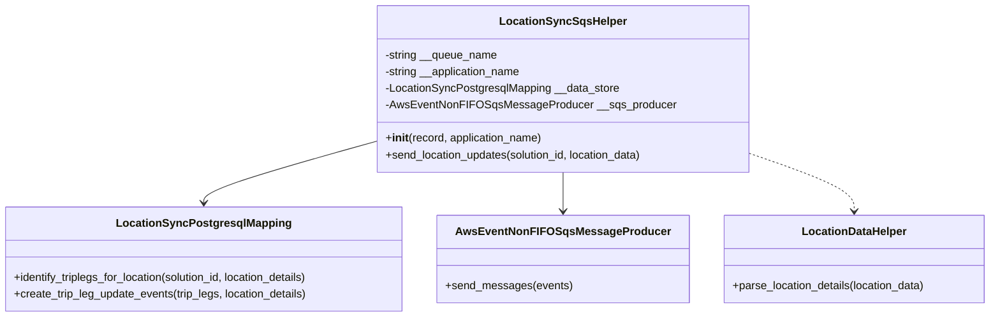
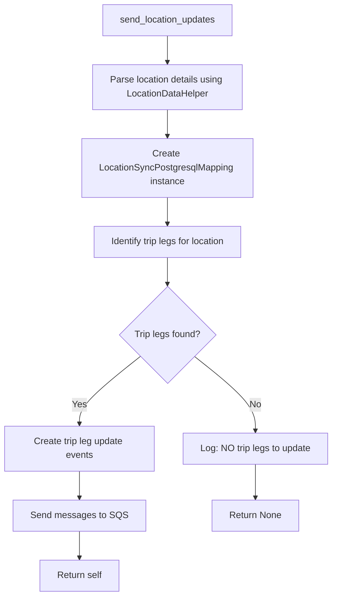

# Diagram: platform/partview_core/partview_service/partview_service/core/helpers/location_sync_helper.py

> Auto-generated by Obscura crawlers

## Diagram 1

### SVG

<svg id="container" width="1421.8203125" xmlns="http://www.w3.org/2000/svg" class="classDiagram" height="456" viewBox="0 0 1421.8203125 456" role="graphics-document document" aria-roledescription="class"><g><defs><marker id="container_class-aggregationStart" class="marker aggregation class" refX="18" refY="7" markerWidth="190" markerHeight="240" orient="auto"><path d="M 18,7 L9,13 L1,7 L9,1 Z"></path></marker></defs><defs><marker id="container_class-aggregationEnd" class="marker aggregation class" refX="1" refY="7" markerWidth="20" markerHeight="28" orient="auto"><path d="M 18,7 L9,13 L1,7 L9,1 Z"></path></marker></defs><defs><marker id="container_class-extensionStart" class="marker extension class" refX="18" refY="7" markerWidth="190" markerHeight="240" orient="auto"><path d="M 1,7 L18,13 V 1 Z"></path></marker></defs><defs><marker id="container_class-extensionEnd" class="marker extension class" refX="1" refY="7" markerWidth="20" markerHeight="28" orient="auto"><path d="M 1,1 V 13 L18,7 Z"></path></marker></defs><defs><marker id="container_class-compositionStart" class="marker composition class" refX="18" refY="7" markerWidth="190" markerHeight="240" orient="auto"><path d="M 18,7 L9,13 L1,7 L9,1 Z"></path></marker></defs><defs><marker id="container_class-compositionEnd" class="marker composition class" refX="1" refY="7" markerWidth="20" markerHeight="28" orient="auto"><path d="M 18,7 L9,13 L1,7 L9,1 Z"></path></marker></defs><defs><marker id="container_class-dependencyStart" class="marker dependency class" refX="6" refY="7" markerWidth="190" markerHeight="240" orient="auto"><path d="M 5,7 L9,13 L1,7 L9,1 Z"></path></marker></defs><defs><marker id="container_class-dependencyEnd" class="marker dependency class" refX="13" refY="7" markerWidth="20" markerHeight="28" orient="auto"><path d="M 18,7 L9,13 L14,7 L9,1 Z"></path></marker></defs><defs><marker id="container_class-lollipopStart" class="marker lollipop class" refX="13" refY="7" markerWidth="190" markerHeight="240" orient="auto"><circle stroke="black" fill="transparent" cx="7" cy="7" r="6"></circle></marker></defs><defs><marker id="container_class-lollipopEnd" class="marker lollipop class" refX="1" refY="7" markerWidth="190" markerHeight="240" orient="auto"><circle stroke="black" fill="transparent" cx="7" cy="7" r="6"></circle></marker></defs><g class="root"><g class="clusters"></g><g class="edgePaths"><path d="M553.367,200.935L510.856,212.946C468.345,224.957,383.323,248.978,340.812,264.156C298.301,279.333,298.301,285.667,298.301,288.833L298.301,292" id="id_LocationSyncSqsHelper_LocationSyncPostgresqlMapping_1" class="edge-thickness-normal edge-pattern-solid relation" style=";;;" data-edge="true" data-et="edge" data-id="id_LocationSyncSqsHelper_LocationSyncPostgresqlMapping_1" data-points="W3sieCI6NTUzLjM2NzE4NzUsInkiOjIwMC45MzQ4Mzg4NjY4MTU4NX0seyJ4IjoyOTguMzAwNzgxMjUsInkiOjI3M30seyJ4IjoyOTguMzAwNzgxMjUsInkiOjI5OH1d" marker-end="url(#container_class-dependencyEnd)"></path><path d="M811.512,248L811.512,252.167C811.512,256.333,811.512,264.667,811.512,274C811.512,283.333,811.512,293.667,811.512,298.833L811.512,304" id="id_LocationSyncSqsHelper_AwsEventNonFIFOSqsMessageProducer_2" class="edge-thickness-normal edge-pattern-solid relation" style=";;;" data-edge="true" data-et="edge" data-id="id_LocationSyncSqsHelper_AwsEventNonFIFOSqsMessageProducer_2" data-points="W3sieCI6ODExLjUxMTcxODc1LCJ5IjoyNDh9LHsieCI6ODExLjUxMTcxODc1LCJ5IjoyNzN9LHsieCI6ODExLjUxMTcxODc1LCJ5IjozMTB9XQ==" marker-end="url(#container_class-dependencyEnd)"></path><path d="M1069.656,218.718L1095.4,227.765C1121.145,236.812,1172.633,254.906,1198.377,269.12C1224.121,283.333,1224.121,293.667,1224.121,298.833L1224.121,304" id="id_LocationSyncSqsHelper_LocationDataHelper_3" class="edge-thickness-normal edge-pattern-dashed relation" style=";;;" data-edge="true" data-et="edge" data-id="id_LocationSyncSqsHelper_LocationDataHelper_3" data-points="W3sieCI6MTA2OS42NTYyNSwieSI6MjE4LjcxNzY2MDA5MDEyNzYyfSx7IngiOjEyMjQuMTIxMDkzNzUsInkiOjI3M30seyJ4IjoxMjI0LjEyMTA5Mzc1LCJ5IjozMTB9XQ==" marker-end="url(#container_class-dependencyEnd)"></path></g><g class="edgeLabels"><g class="edgeLabel"><g class="label" data-id="id_LocationSyncSqsHelper_LocationSyncPostgresqlMapping_1" transform="translate(0, 0)"><foreignObject width="0" height="0">

</foreignObject></g></g><g class="edgeLabel"><g class="label" data-id="id_LocationSyncSqsHelper_AwsEventNonFIFOSqsMessageProducer_2" transform="translate(0, 0)"><foreignObject width="0" height="0">

</foreignObject></g></g><g class="edgeLabel"><g class="label" data-id="id_LocationSyncSqsHelper_LocationDataHelper_3" transform="translate(0, 0)"><foreignObject width="0" height="0">

</foreignObject></g></g></g><g class="nodes"><g class="node default" id="classId-LocationSyncSqsHelper-0" transform="translate(811.51171875, 128)"><g class="basic label-container"><path d="M-258.14453125 -120 L258.14453125 -120 L258.14453125 120 L-258.14453125 120" stroke="none" stroke-width="0" fill="#ECECFF" style=""></path><path d="M-258.14453125 -120 C-51.7953204897037 -120, 154.5538902705926 -120, 258.14453125 -120 M-258.14453125 -120 C-59.62388065357544 -120, 138.89676994284912 -120, 258.14453125 -120 M258.14453125 -120 C258.14453125 -31.55763173202685, 258.14453125 56.8847365359463, 258.14453125 120 M258.14453125 -120 C258.14453125 -65.98760815126502, 258.14453125 -11.975216302530029, 258.14453125 120 M258.14453125 120 C147.88331714461663 120, 37.62210303923328 120, -258.14453125 120 M258.14453125 120 C93.4386398808816 120, -71.26725148823681 120, -258.14453125 120 M-258.14453125 120 C-258.14453125 24.02899187801198, -258.14453125 -71.94201624397604, -258.14453125 -120 M-258.14453125 120 C-258.14453125 67.14272125066344, -258.14453125 14.285442501326898, -258.14453125 -120" stroke="#9370DB" stroke-width="1.3" fill="none" stroke-dasharray="0 0" style=""></path></g><g class="annotation-group text" transform="translate(0, -96)"></g><g class="label-group text" transform="translate(-86.1953125, -96)"><g class="label" style="font-weight: bolder" transform="translate(0,-12)"><foreignObject width="172.390625" height="24">

LocationSyncSqsHelper

</foreignObject></g></g><g class="members-group text" transform="translate(-246.14453125, -48)"><g class="label" style="" transform="translate(0,-12)"><foreignObject width="162.625" height="24">

-string __queue_name

</foreignObject></g><g class="label" style="" transform="translate(0,12)"><foreignObject width="199.4375" height="24">

-string __application_name

</foreignObject></g><g class="label" style="" transform="translate(0,36)"><foreignObject width="338.15625" height="24">

-LocationSyncPostgresqlMapping __data_store

</foreignObject></g><g class="label" style="" transform="translate(0,60)"><foreignObject width="406.09375" height="24">

-AwsEventNonFIFOSqsMessageProducer __sqs_producer

</foreignObject></g></g><g class="methods-group text" transform="translate(-246.14453125, 72)"><g class="label" style="" transform="translate(0,-12)"><foreignObject width="228.171875" height="24">

+<strong>init</strong>(record, application_name)

</foreignObject></g><g class="label" style="" transform="translate(0,12)"><foreignObject width="377.71875" height="24">

+send_location_updates(solution_id, location_data)

</foreignObject></g></g><g class="divider" style=""><path d="M-258.14453125 -72 C-137.29473530773592 -72, -16.44493936547184 -72, 258.14453125 -72 M-258.14453125 -72 C-153.98571977103506 -72, -49.82690829207016 -72, 258.14453125 -72" stroke="#9370DB" stroke-width="1.3" fill="none" stroke-dasharray="0 0" style=""></path></g><g class="divider" style=""><path d="M-258.14453125 48 C-85.12159689569884 48, 87.90133745860231 48, 258.14453125 48 M-258.14453125 48 C-62.42049564541546 48, 133.3035399591691 48, 258.14453125 48" stroke="#9370DB" stroke-width="1.3" fill="none" stroke-dasharray="0 0" style=""></path></g></g><g class="node default" id="classId-LocationSyncPostgresqlMapping-1" transform="translate(298.30078125, 373)"><g class="basic label-container"><path d="M-290.30078125 -75 L290.30078125 -75 L290.30078125 75 L-290.30078125 75" stroke="none" stroke-width="0" fill="#ECECFF" style=""></path><path d="M-290.30078125 -75 C-174.00349448793034 -75, -57.70620772586068 -75, 290.30078125 -75 M-290.30078125 -75 C-161.09236546727027 -75, -31.88394968454054 -75, 290.30078125 -75 M290.30078125 -75 C290.30078125 -23.86181360942242, 290.30078125 27.27637278115516, 290.30078125 75 M290.30078125 -75 C290.30078125 -30.81041896484325, 290.30078125 13.379162070313498, 290.30078125 75 M290.30078125 75 C155.79485018000477 75, 21.288919110009545 75, -290.30078125 75 M290.30078125 75 C61.48765353393472 75, -167.32547418213056 75, -290.30078125 75 M-290.30078125 75 C-290.30078125 20.74491382748532, -290.30078125 -33.51017234502936, -290.30078125 -75 M-290.30078125 75 C-290.30078125 44.25157729266883, -290.30078125 13.503154585337654, -290.30078125 -75" stroke="#9370DB" stroke-width="1.3" fill="none" stroke-dasharray="0 0" style=""></path></g><g class="annotation-group text" transform="translate(0, -51)"></g><g class="label-group text" transform="translate(-118.8359375, -51)"><g class="label" style="font-weight: bolder" transform="translate(0,-12)"><foreignObject width="237.671875" height="24">

LocationSyncPostgresqlMapping

</foreignObject></g></g><g class="members-group text" transform="translate(-278.30078125, -3)"></g><g class="methods-group text" transform="translate(-278.30078125, 27)"><g class="label" style="" transform="translate(0,-12)"><foreignObject width="437.765625" height="24">

+identify_triplegs_for_location(solution_id, location_details)

</foreignObject></g><g class="label" style="" transform="translate(0,12)"><foreignObject width="428.625" height="24">

+create_trip_leg_update_events(trip_legs, location_details)

</foreignObject></g></g><g class="divider" style=""><path d="M-290.30078125 -27 C-61.17506012173291 -27, 167.95066100653418 -27, 290.30078125 -27 M-290.30078125 -27 C-107.55644546809586 -27, 75.18789031380828 -27, 290.30078125 -27" stroke="#9370DB" stroke-width="1.3" fill="none" stroke-dasharray="0 0" style=""></path></g><g class="divider" style=""><path d="M-290.30078125 -3 C-93.94711015087108 -3, 102.40656094825783 -3, 290.30078125 -3 M-290.30078125 -3 C-104.54616317763379 -3, 81.20845489473243 -3, 290.30078125 -3" stroke="#9370DB" stroke-width="1.3" fill="none" stroke-dasharray="0 0" style=""></path></g></g><g class="node default" id="classId-AwsEventNonFIFOSqsMessageProducer-2" transform="translate(811.51171875, 373)"><g class="basic label-container"><path d="M-172.91015625 -63 L172.91015625 -63 L172.91015625 63 L-172.91015625 63" stroke="none" stroke-width="0" fill="#ECECFF" style=""></path><path d="M-172.91015625 -63 C-35.68747936398279 -63, 101.53519752203442 -63, 172.91015625 -63 M-172.91015625 -63 C-79.07234745918532 -63, 14.765461331629353 -63, 172.91015625 -63 M172.91015625 -63 C172.91015625 -36.125209601496415, 172.91015625 -9.25041920299283, 172.91015625 63 M172.91015625 -63 C172.91015625 -17.952028359115673, 172.91015625 27.095943281768655, 172.91015625 63 M172.91015625 63 C48.52383647404878 63, -75.86248330190244 63, -172.91015625 63 M172.91015625 63 C64.09871176420376 63, -44.71273272159249 63, -172.91015625 63 M-172.91015625 63 C-172.91015625 29.244758171820614, -172.91015625 -4.5104836563587725, -172.91015625 -63 M-172.91015625 63 C-172.91015625 27.397468501906374, -172.91015625 -8.205062996187252, -172.91015625 -63" stroke="#9370DB" stroke-width="1.3" fill="none" stroke-dasharray="0 0" style=""></path></g><g class="annotation-group text" transform="translate(0, -39)"></g><g class="label-group text" transform="translate(-142.3359375, -39)"><g class="label" style="font-weight: bolder" transform="translate(0,-12)"><foreignObject width="284.671875" height="24">

AwsEventNonFIFOSqsMessageProducer

</foreignObject></g></g><g class="members-group text" transform="translate(-160.91015625, 9)"></g><g class="methods-group text" transform="translate(-160.91015625, 39)"><g class="label" style="" transform="translate(0,-12)"><foreignObject width="179.484375" height="24">

+send_messages(events)

</foreignObject></g></g><g class="divider" style=""><path d="M-172.91015625 -15 C-48.74933448619754 -15, 75.41148727760492 -15, 172.91015625 -15 M-172.91015625 -15 C-83.13751485781731 -15, 6.635126534365384 -15, 172.91015625 -15" stroke="#9370DB" stroke-width="1.3" fill="none" stroke-dasharray="0 0" style=""></path></g><g class="divider" style=""><path d="M-172.91015625 9 C-94.24720369906173 9, -15.584251148123457 9, 172.91015625 9 M-172.91015625 9 C-50.95053361865216 9, 71.00908901269568 9, 172.91015625 9" stroke="#9370DB" stroke-width="1.3" fill="none" stroke-dasharray="0 0" style=""></path></g></g><g class="node default" id="classId-LocationDataHelper-3" transform="translate(1224.12109375, 373)"><g class="basic label-container"><path d="M-189.69921875 -63 L189.69921875 -63 L189.69921875 63 L-189.69921875 63" stroke="none" stroke-width="0" fill="#ECECFF" style=""></path><path d="M-189.69921875 -63 C-95.47876613145327 -63, -1.2583135129065397 -63, 189.69921875 -63 M-189.69921875 -63 C-49.68011510124262 -63, 90.33898854751476 -63, 189.69921875 -63 M189.69921875 -63 C189.69921875 -17.767584762596087, 189.69921875 27.464830474807826, 189.69921875 63 M189.69921875 -63 C189.69921875 -12.70343808834506, 189.69921875 37.59312382330988, 189.69921875 63 M189.69921875 63 C65.43175300477111 63, -58.83571274045778 63, -189.69921875 63 M189.69921875 63 C52.80957351364441 63, -84.08007172271118 63, -189.69921875 63 M-189.69921875 63 C-189.69921875 14.844968167194118, -189.69921875 -33.310063665611764, -189.69921875 -63 M-189.69921875 63 C-189.69921875 26.9008724379134, -189.69921875 -9.198255124173201, -189.69921875 -63" stroke="#9370DB" stroke-width="1.3" fill="none" stroke-dasharray="0 0" style=""></path></g><g class="annotation-group text" transform="translate(0, -39)"></g><g class="label-group text" transform="translate(-72.7578125, -39)"><g class="label" style="font-weight: bolder" transform="translate(0,-12)"><foreignObject width="145.515625" height="24">

LocationDataHelper

</foreignObject></g></g><g class="members-group text" transform="translate(-177.69921875, 9)"></g><g class="methods-group text" transform="translate(-177.69921875, 39)"><g class="label" style="" transform="translate(0,-12)"><foreignObject width="282.640625" height="24">

+parse_location_details(location_data)

</foreignObject></g></g><g class="divider" style=""><path d="M-189.69921875 -15 C-69.61945401238708 -15, 50.46031072522584 -15, 189.69921875 -15 M-189.69921875 -15 C-89.82434012575352 -15, 10.050538498492955 -15, 189.69921875 -15" stroke="#9370DB" stroke-width="1.3" fill="none" stroke-dasharray="0 0" style=""></path></g><g class="divider" style=""><path d="M-189.69921875 9 C-56.877435224369634 9, 75.94434830126073 9, 189.69921875 9 M-189.69921875 9 C-54.3930099731453 9, 80.9131988037094 9, 189.69921875 9" stroke="#9370DB" stroke-width="1.3" fill="none" stroke-dasharray="0 0" style=""></path></g></g></g></g></g></svg>

## Diagram 2

### SVG

<svg id="container" width="579.484375" xmlns="http://www.w3.org/2000/svg" class="flowchart" height="1057.625" viewBox="0 0 579.484375 1057.625" role="graphics-document document" aria-roledescription="flowchart-v2"><g><marker id="container_flowchart-v2-pointEnd" class="marker flowchart-v2" viewBox="0 0 10 10" refX="5" refY="5" markerUnits="userSpaceOnUse" markerWidth="8" markerHeight="8" orient="auto"><path d="M 0 0 L 10 5 L 0 10 z" class="arrowMarkerPath" style="stroke-width: 1; stroke-dasharray: 1, 0;"></path></marker><marker id="container_flowchart-v2-pointStart" class="marker flowchart-v2" viewBox="0 0 10 10" refX="4.5" refY="5" markerUnits="userSpaceOnUse" markerWidth="8" markerHeight="8" orient="auto"><path d="M 0 5 L 10 10 L 10 0 z" class="arrowMarkerPath" style="stroke-width: 1; stroke-dasharray: 1, 0;"></path></marker><marker id="container_flowchart-v2-circleEnd" class="marker flowchart-v2" viewBox="0 0 10 10" refX="11" refY="5" markerUnits="userSpaceOnUse" markerWidth="11" markerHeight="11" orient="auto"><circle cx="5" cy="5" r="5" class="arrowMarkerPath" style="stroke-width: 1; stroke-dasharray: 1, 0;"></circle></marker><marker id="container_flowchart-v2-circleStart" class="marker flowchart-v2" viewBox="0 0 10 10" refX="-1" refY="5" markerUnits="userSpaceOnUse" markerWidth="11" markerHeight="11" orient="auto"><circle cx="5" cy="5" r="5" class="arrowMarkerPath" style="stroke-width: 1; stroke-dasharray: 1, 0;"></circle></marker><marker id="container_flowchart-v2-crossEnd" class="marker cross flowchart-v2" viewBox="0 0 11 11" refX="12" refY="5.2" markerUnits="userSpaceOnUse" markerWidth="11" markerHeight="11" orient="auto"><path d="M 1,1 l 9,9 M 10,1 l -9,9" class="arrowMarkerPath" style="stroke-width: 2; stroke-dasharray: 1, 0;"></path></marker><marker id="container_flowchart-v2-crossStart" class="marker cross flowchart-v2" viewBox="0 0 11 11" refX="-1" refY="5.2" markerUnits="userSpaceOnUse" markerWidth="11" markerHeight="11" orient="auto"><path d="M 1,1 l 9,9 M 10,1 l -9,9" class="arrowMarkerPath" style="stroke-width: 2; stroke-dasharray: 1, 0;"></path></marker><g class="root"><g class="clusters"></g><g class="edgePaths"><path d="M291.371,62L291.371,66.167C291.371,70.333,291.371,78.667,291.371,86.333C291.371,94,291.371,101,291.371,104.5L291.371,108" id="L_A_B_0" class="edge-thickness-normal edge-pattern-solid edge-thickness-normal edge-pattern-solid flowchart-link" style=";" data-edge="true" data-et="edge" data-id="L_A_B_0" data-points="W3sieCI6MjkxLjM3MTA5Mzc1LCJ5Ijo2Mn0seyJ4IjoyOTEuMzcxMDkzNzUsInkiOjg3fSx7IngiOjI5MS4zNzEwOTM3NSwieSI6MTEyfV0=" marker-end="url(#container_flowchart-v2-pointEnd)"></path><path d="M291.371,190L291.371,194.167C291.371,198.333,291.371,206.667,291.371,214.333C291.371,222,291.371,229,291.371,232.5L291.371,236" id="L_B_C_0" class="edge-thickness-normal edge-pattern-solid edge-thickness-normal edge-pattern-solid flowchart-link" style=";" data-edge="true" data-et="edge" data-id="L_B_C_0" data-points="W3sieCI6MjkxLjM3MTA5Mzc1LCJ5IjoxOTB9LHsieCI6MjkxLjM3MTA5Mzc1LCJ5IjoyMTV9LHsieCI6MjkxLjM3MTA5Mzc1LCJ5IjoyNDB9XQ==" marker-end="url(#container_flowchart-v2-pointEnd)"></path><path d="M291.371,342L291.371,346.167C291.371,350.333,291.371,358.667,291.371,366.333C291.371,374,291.371,381,291.371,384.5L291.371,388" id="L_C_D_0" class="edge-thickness-normal edge-pattern-solid edge-thickness-normal edge-pattern-solid flowchart-link" style=";" data-edge="true" data-et="edge" data-id="L_C_D_0" data-points="W3sieCI6MjkxLjM3MTA5Mzc1LCJ5IjozNDJ9LHsieCI6MjkxLjM3MTA5Mzc1LCJ5IjozNjd9LHsieCI6MjkxLjM3MTA5Mzc1LCJ5IjozOTJ9XQ==" marker-end="url(#container_flowchart-v2-pointEnd)"></path><path d="M291.371,470L291.371,474.167C291.371,478.333,291.371,486.667,291.371,494.333C291.371,502,291.371,509,291.371,512.5L291.371,516" id="L_D_E_0" class="edge-thickness-normal edge-pattern-solid edge-thickness-normal edge-pattern-solid flowchart-link" style=";" data-edge="true" data-et="edge" data-id="L_D_E_0" data-points="W3sieCI6MjkxLjM3MTA5Mzc1LCJ5Ijo0NzB9LHsieCI6MjkxLjM3MTA5Mzc1LCJ5Ijo0OTV9LHsieCI6MjkxLjM3MTA5Mzc1LCJ5Ijo1MjB9XQ==" marker-end="url(#container_flowchart-v2-pointEnd)"></path><path d="M244.102,642.356L226.418,656.4C208.734,670.445,173.367,698.535,155.684,718.08C138,737.625,138,748.625,138,754.125L138,759.625" id="L_E_F_0" class="edge-thickness-normal edge-pattern-solid edge-thickness-normal edge-pattern-solid flowchart-link" style=";" data-edge="true" data-et="edge" data-id="L_E_F_0" data-points="W3sieCI6MjQ0LjEwMTYxMTkwNTQ5Mjc3LCJ5Ijo2NDIuMzU1NTE4MTU1NDkyN30seyJ4IjoxMzgsInkiOjcyNi42MjV9LHsieCI6MTM4LCJ5Ijo3NjMuNjI1fV0=" marker-end="url(#container_flowchart-v2-pointEnd)"></path><path d="M138,841.625L138,845.792C138,849.958,138,858.292,138,865.958C138,873.625,138,880.625,138,884.125L138,887.625" id="L_F_G_0" class="edge-thickness-normal edge-pattern-solid edge-thickness-normal edge-pattern-solid flowchart-link" style=";" data-edge="true" data-et="edge" data-id="L_F_G_0" data-points="W3sieCI6MTM4LCJ5Ijo4NDEuNjI1fSx7IngiOjEzOCwieSI6ODY2LjYyNX0seyJ4IjoxMzgsInkiOjg5MS42MjV9XQ==" marker-end="url(#container_flowchart-v2-pointEnd)"></path><path d="M138,945.625L138,949.792C138,953.958,138,962.292,138,969.958C138,977.625,138,984.625,138,988.125L138,991.625" id="L_G_H_0" class="edge-thickness-normal edge-pattern-solid edge-thickness-normal edge-pattern-solid flowchart-link" style=";" data-edge="true" data-et="edge" data-id="L_G_H_0" data-points="W3sieCI6MTM4LCJ5Ijo5NDUuNjI1fSx7IngiOjEzOCwieSI6OTcwLjYyNX0seyJ4IjoxMzgsInkiOjk5NS42MjV9XQ==" marker-end="url(#container_flowchart-v2-pointEnd)"></path><path d="M338.641,642.356L356.324,656.4C374.008,670.445,409.375,698.535,427.059,720.08C444.742,741.625,444.742,756.625,444.742,764.125L444.742,771.625" id="L_E_I_0" class="edge-thickness-normal edge-pattern-solid edge-thickness-normal edge-pattern-solid flowchart-link" style=";" data-edge="true" data-et="edge" data-id="L_E_I_0" data-points="W3sieCI6MzM4LjY0MDU3NTU5NDUwNzIsInkiOjY0Mi4zNTU1MTgxNTU0OTI3fSx7IngiOjQ0NC43NDIxODc1LCJ5Ijo3MjYuNjI1fSx7IngiOjQ0NC43NDIxODc1LCJ5Ijo3NzUuNjI1fV0=" marker-end="url(#container_flowchart-v2-pointEnd)"></path><path d="M444.742,829.625L444.742,835.792C444.742,841.958,444.742,854.292,444.742,863.958C444.742,873.625,444.742,880.625,444.742,884.125L444.742,887.625" id="L_I_J_0" class="edge-thickness-normal edge-pattern-solid edge-thickness-normal edge-pattern-solid flowchart-link" style=";" data-edge="true" data-et="edge" data-id="L_I_J_0" data-points="W3sieCI6NDQ0Ljc0MjE4NzUsInkiOjgyOS42MjV9LHsieCI6NDQ0Ljc0MjE4NzUsInkiOjg2Ni42MjV9LHsieCI6NDQ0Ljc0MjE4NzUsInkiOjg5MS42MjV9XQ==" marker-end="url(#container_flowchart-v2-pointEnd)"></path></g><g class="edgeLabels"><g class="edgeLabel"><g class="label" data-id="L_A_B_0" transform="translate(0, 0)"><foreignObject width="0" height="0">

</foreignObject></g></g><g class="edgeLabel"><g class="label" data-id="L_B_C_0" transform="translate(0, 0)"><foreignObject width="0" height="0">

</foreignObject></g></g><g class="edgeLabel"><g class="label" data-id="L_C_D_0" transform="translate(0, 0)"><foreignObject width="0" height="0">

</foreignObject></g></g><g class="edgeLabel"><g class="label" data-id="L_D_E_0" transform="translate(0, 0)"><foreignObject width="0" height="0">

</foreignObject></g></g><g class="edgeLabel" transform="translate(138, 726.625)"><g class="label" data-id="L_E_F_0" transform="translate(-12.03125, -12)"><foreignObject width="24.0625" height="24">

Yes

</foreignObject></g></g><g class="edgeLabel"><g class="label" data-id="L_F_G_0" transform="translate(0, 0)"><foreignObject width="0" height="0">

</foreignObject></g></g><g class="edgeLabel"><g class="label" data-id="L_G_H_0" transform="translate(0, 0)"><foreignObject width="0" height="0">

</foreignObject></g></g><g class="edgeLabel" transform="translate(444.7421875, 726.625)"><g class="label" data-id="L_E_I_0" transform="translate(-10.140625, -12)"><foreignObject width="20.28125" height="24">

No

</foreignObject></g></g><g class="edgeLabel"><g class="label" data-id="L_I_J_0" transform="translate(0, 0)"><foreignObject width="0" height="0">

</foreignObject></g></g></g><g class="nodes"><g class="node default" id="flowchart-A-0" transform="translate(291.37109375, 35)"><rect class="basic label-container" style="" x="-114.6328125" y="-27" width="229.265625" height="54"></rect><g class="label" style="" transform="translate(-84.6328125, -12)"><rect></rect><foreignObject width="169.265625" height="24">

send_location_updates

</foreignObject></g></g><g class="node default" id="flowchart-B-1" transform="translate(291.37109375, 151)"><rect class="basic label-container" style="" x="-130" y="-39" width="260" height="78"></rect><g class="label" style="" transform="translate(-100, -24)"><rect></rect><foreignObject width="200" height="48">

Parse location details using LocationDataHelper

</foreignObject></g></g><g class="node default" id="flowchart-C-3" transform="translate(291.37109375, 291)"><rect class="basic label-container" style="" x="-148.90625" y="-51" width="297.8125" height="102"></rect><g class="label" style="" transform="translate(-118.90625, -36)"><rect></rect><foreignObject width="237.8125" height="72">

Create LocationSyncPostgresqlMapping instance

</foreignObject></g></g><g class="node default" id="flowchart-D-5" transform="translate(291.37109375, 431)"><rect class="basic label-container" style="" x="-130" y="-39" width="260" height="78"></rect><g class="label" style="" transform="translate(-100, -24)"><rect></rect><foreignObject width="200" height="48">

Identify trip legs for location

</foreignObject></g></g><g class="node default" id="flowchart-E-7" transform="translate(291.37109375, 604.8125)"><polygon points="84.8125,0 169.625,-84.8125 84.8125,-169.625 0,-84.8125" class="label-container" transform="translate(-84.3125, 84.8125)"></polygon><g class="label" style="" transform="translate(-57.8125, -12)"><rect></rect><foreignObject width="115.625" height="24">

Trip legs found?

</foreignObject></g></g><g class="node default" id="flowchart-F-9" transform="translate(138, 802.625)"><rect class="basic label-container" style="" x="-130" y="-39" width="260" height="78"></rect><g class="label" style="" transform="translate(-100, -24)"><rect></rect><foreignObject width="200" height="48">

Create trip leg update events

</foreignObject></g></g><g class="node default" id="flowchart-G-11" transform="translate(138, 918.625)"><rect class="basic label-container" style="" x="-111.171875" y="-27" width="222.34375" height="54"></rect><g class="label" style="" transform="translate(-81.171875, -12)"><rect></rect><foreignObject width="162.34375" height="24">

Send messages to SQS

</foreignObject></g></g><g class="node default" id="flowchart-H-13" transform="translate(138, 1022.625)"><rect class="basic label-container" style="" x="-69.640625" y="-27" width="139.28125" height="54"></rect><g class="label" style="" transform="translate(-39.640625, -12)"><rect></rect><foreignObject width="79.28125" height="24">

Return self

</foreignObject></g></g><g class="node default" id="flowchart-I-15" transform="translate(444.7421875, 802.625)"><rect class="basic label-container" style="" x="-126.7421875" y="-27" width="253.484375" height="54"></rect><g class="label" style="" transform="translate(-96.7421875, -12)"><rect></rect><foreignObject width="193.484375" height="24">

Log: NO trip legs to update

</foreignObject></g></g><g class="node default" id="flowchart-J-17" transform="translate(444.7421875, 918.625)"><rect class="basic label-container" style="" x="-75.7109375" y="-27" width="151.421875" height="54"></rect><g class="label" style="" transform="translate(-45.7109375, -12)"><rect></rect><foreignObject width="91.421875" height="24">

Return None

</foreignObject></g></g></g></g></g></svg>
