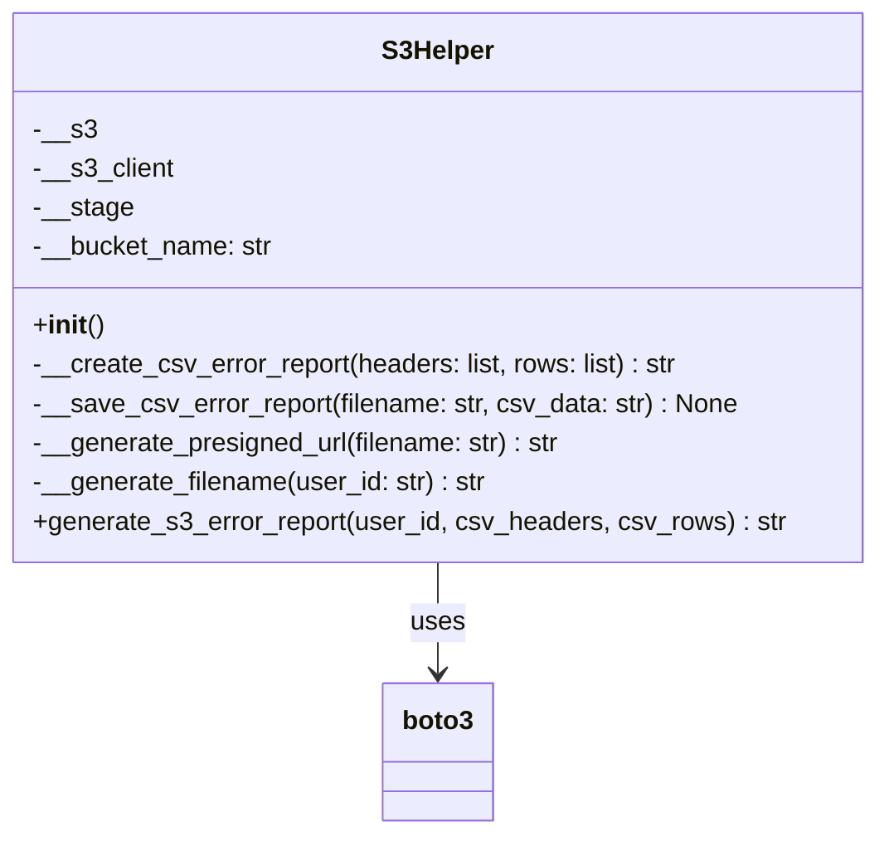
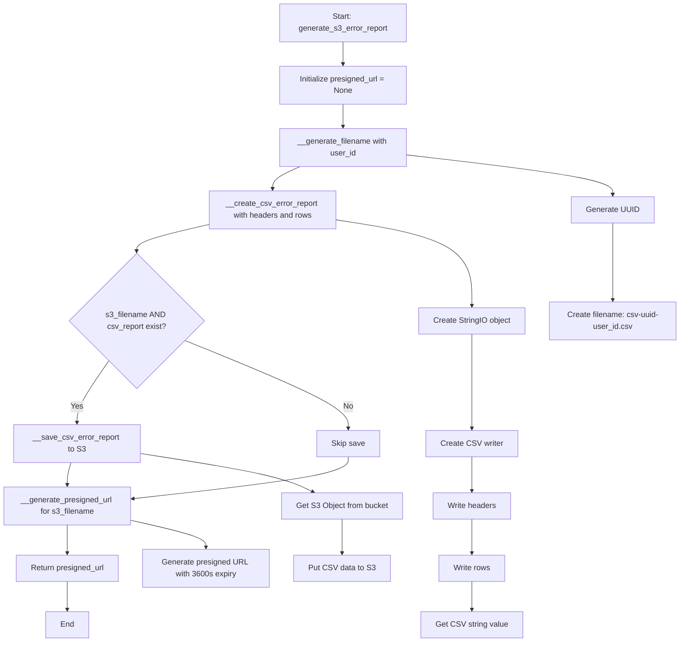
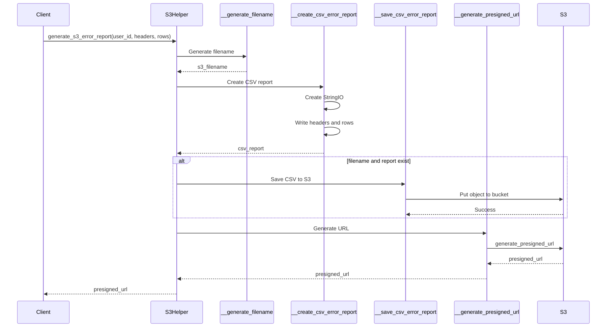

# Diagram: platform/partview_core/partview_service/partview_service/core/helpers/s3_helper.py

> Auto-generated by Obscura crawlers

## Diagram 1

### SVG

<svg id="container" width="528.7265625" xmlns="http://www.w3.org/2000/svg" class="classDiagram" height="510" viewBox="0 0 528.7265625 510" role="graphics-document document" aria-roledescription="class"><g><defs><marker id="container_class-aggregationStart" class="marker aggregation class" refX="18" refY="7" markerWidth="190" markerHeight="240" orient="auto"><path d="M 18,7 L9,13 L1,7 L9,1 Z"></path></marker></defs><defs><marker id="container_class-aggregationEnd" class="marker aggregation class" refX="1" refY="7" markerWidth="20" markerHeight="28" orient="auto"><path d="M 18,7 L9,13 L1,7 L9,1 Z"></path></marker></defs><defs><marker id="container_class-extensionStart" class="marker extension class" refX="18" refY="7" markerWidth="190" markerHeight="240" orient="auto"><path d="M 1,7 L18,13 V 1 Z"></path></marker></defs><defs><marker id="container_class-extensionEnd" class="marker extension class" refX="1" refY="7" markerWidth="20" markerHeight="28" orient="auto"><path d="M 1,1 V 13 L18,7 Z"></path></marker></defs><defs><marker id="container_class-compositionStart" class="marker composition class" refX="18" refY="7" markerWidth="190" markerHeight="240" orient="auto"><path d="M 18,7 L9,13 L1,7 L9,1 Z"></path></marker></defs><defs><marker id="container_class-compositionEnd" class="marker composition class" refX="1" refY="7" markerWidth="20" markerHeight="28" orient="auto"><path d="M 18,7 L9,13 L1,7 L9,1 Z"></path></marker></defs><defs><marker id="container_class-dependencyStart" class="marker dependency class" refX="6" refY="7" markerWidth="190" markerHeight="240" orient="auto"><path d="M 5,7 L9,13 L1,7 L9,1 Z"></path></marker></defs><defs><marker id="container_class-dependencyEnd" class="marker dependency class" refX="13" refY="7" markerWidth="20" markerHeight="28" orient="auto"><path d="M 18,7 L9,13 L14,7 L9,1 Z"></path></marker></defs><defs><marker id="container_class-lollipopStart" class="marker lollipop class" refX="13" refY="7" markerWidth="190" markerHeight="240" orient="auto"><circle stroke="black" fill="transparent" cx="7" cy="7" r="6"></circle></marker></defs><defs><marker id="container_class-lollipopEnd" class="marker lollipop class" refX="1" refY="7" markerWidth="190" markerHeight="240" orient="auto"><circle stroke="black" fill="transparent" cx="7" cy="7" r="6"></circle></marker></defs><g class="root"><g class="clusters"></g><g class="edgePaths"><path d="M264.363,344L264.363,350.167C264.363,356.333,264.363,368.667,264.363,380C264.363,391.333,264.363,401.667,264.363,406.833L264.363,412" id="id_S3Helper_boto3_1" class="edge-thickness-normal edge-pattern-solid relation" style=";;;" data-edge="true" data-et="edge" data-id="id_S3Helper_boto3_1" data-points="W3sieCI6MjY0LjM2MzI4MTI1LCJ5IjozNDR9LHsieCI6MjY0LjM2MzI4MTI1LCJ5IjozODF9LHsieCI6MjY0LjM2MzI4MTI1LCJ5Ijo0MTh9XQ==" marker-end="url(#container_class-dependencyEnd)"></path></g><g class="edgeLabels"><g class="edgeLabel" transform="translate(264.36328125, 381)"><g class="label" data-id="id_S3Helper_boto3_1" transform="translate(-16.4921875, -12)"><foreignObject width="32.984375" height="24">

uses

</foreignObject></g></g></g><g class="nodes"><g class="node default" id="classId-S3Helper-0" transform="translate(264.36328125, 176)"><g class="basic label-container"><path d="M-256.36328125 -168 L256.36328125 -168 L256.36328125 168 L-256.36328125 168" stroke="none" stroke-width="0" fill="#ECECFF" style=""></path><path d="M-256.36328125 -168 C-138.150088837411 -168, -19.93689642482201 -168, 256.36328125 -168 M-256.36328125 -168 C-102.22033333237954 -168, 51.92261458524092 -168, 256.36328125 -168 M256.36328125 -168 C256.36328125 -39.37101605296601, 256.36328125 89.25796789406797, 256.36328125 168 M256.36328125 -168 C256.36328125 -62.45007475756164, 256.36328125 43.099850484876725, 256.36328125 168 M256.36328125 168 C142.0216419756038 168, 27.680002701207627 168, -256.36328125 168 M256.36328125 168 C102.43445654851968 168, -51.49436815296065 168, -256.36328125 168 M-256.36328125 168 C-256.36328125 62.4304964819284, -256.36328125 -43.1390070361432, -256.36328125 -168 M-256.36328125 168 C-256.36328125 48.04064549538583, -256.36328125 -71.91870900922834, -256.36328125 -168" stroke="#9370DB" stroke-width="1.3" fill="none" stroke-dasharray="0 0" style=""></path></g><g class="annotation-group text" transform="translate(0, -144)"></g><g class="label-group text" transform="translate(-33.2578125, -144)"><g class="label" style="font-weight: bolder" transform="translate(0,-12)"><foreignObject width="66.515625" height="24">

S3Helper

</foreignObject></g></g><g class="members-group text" transform="translate(-244.36328125, -96)"><g class="label" style="" transform="translate(0,-12)"><foreignObject width="37.109375" height="24">

-__s3

</foreignObject></g><g class="label" style="" transform="translate(0,12)"><foreignObject width="85.515625" height="24">

-__s3_client

</foreignObject></g><g class="label" style="" transform="translate(0,36)"><foreignObject width="60.125" height="24">

-__stage

</foreignObject></g><g class="label" style="" transform="translate(0,60)"><foreignObject width="147" height="24">

-__bucket_name: str

</foreignObject></g></g><g class="methods-group text" transform="translate(-244.36328125, 24)"><g class="label" style="" transform="translate(0,-12)"><foreignObject width="42.796875" height="24">

+<strong>init</strong>()

</foreignObject></g><g class="label" style="" transform="translate(0,12)"><foreignObject width="396.125" height="24">

-__create_csv_error_report(headers: list, rows: list) : str

</foreignObject></g><g class="label" style="" transform="translate(0,36)"><foreignObject width="429.03125" height="24">

-__save_csv_error_report(filename: str, csv_data: str) : None

</foreignObject></g><g class="label" style="" transform="translate(0,60)"><foreignObject width="325.96875" height="24">

-__generate_presigned_url(filename: str) : str

</foreignObject></g><g class="label" style="" transform="translate(0,84)"><foreignObject width="278.390625" height="24">

-__generate_filename(user_id: str) : str

</foreignObject></g><g class="label" style="" transform="translate(0,108)"><foreignObject width="455.46875" height="24">

+generate_s3_error_report(user_id, csv_headers, csv_rows) : str

</foreignObject></g></g><g class="divider" style=""><path d="M-256.36328125 -120 C-52.32436514311337 -120, 151.71455096377326 -120, 256.36328125 -120 M-256.36328125 -120 C-84.1324280515079 -120, 88.0984251469842 -120, 256.36328125 -120" stroke="#9370DB" stroke-width="1.3" fill="none" stroke-dasharray="0 0" style=""></path></g><g class="divider" style=""><path d="M-256.36328125 0 C-107.13868211641656 0, 42.08591701716688 0, 256.36328125 0 M-256.36328125 0 C-56.11346144958273 0, 144.13635835083454 0, 256.36328125 0" stroke="#9370DB" stroke-width="1.3" fill="none" stroke-dasharray="0 0" style=""></path></g></g><g class="node default" id="classId-boto3-1" transform="translate(264.36328125, 460)"><g class="basic label-container"><path d="M-33.0703125 -42 L33.0703125 -42 L33.0703125 42 L-33.0703125 42" stroke="none" stroke-width="0" fill="#ECECFF" style=""></path><path d="M-33.0703125 -42 C-15.20585453623207 -42, 2.6586034275358585 -42, 33.0703125 -42 M-33.0703125 -42 C-9.416150736299105 -42, 14.23801102740179 -42, 33.0703125 -42 M33.0703125 -42 C33.0703125 -19.543274450029937, 33.0703125 2.9134510999401257, 33.0703125 42 M33.0703125 -42 C33.0703125 -17.809224150144974, 33.0703125 6.381551699710052, 33.0703125 42 M33.0703125 42 C14.61933087518381 42, -3.831650749632381 42, -33.0703125 42 M33.0703125 42 C14.245339270802788 42, -4.5796339583944246 42, -33.0703125 42 M-33.0703125 42 C-33.0703125 9.327371354233783, -33.0703125 -23.345257291532434, -33.0703125 -42 M-33.0703125 42 C-33.0703125 13.304157396060749, -33.0703125 -15.391685207878503, -33.0703125 -42" stroke="#9370DB" stroke-width="1.3" fill="none" stroke-dasharray="0 0" style=""></path></g><g class="annotation-group text" transform="translate(0, -18)"></g><g class="label-group text" transform="translate(-21.0703125, -18)"><g class="label" style="font-weight: bolder" transform="translate(0,-12)"><foreignObject width="42.140625" height="24">

boto3

</foreignObject></g></g><g class="members-group text" transform="translate(-21.0703125, 30)"></g><g class="methods-group text" transform="translate(-21.0703125, 60)"></g><g class="divider" style=""><path d="M-33.0703125 6 C-14.452363442220214 6, 4.165585615559571 6, 33.0703125 6 M-33.0703125 6 C-10.827264305769855 6, 11.41578388846029 6, 33.0703125 6" stroke="#9370DB" stroke-width="1.3" fill="none" stroke-dasharray="0 0" style=""></path></g><g class="divider" style=""><path d="M-33.0703125 24 C-19.676983682355125 24, -6.28365486471025 24, 33.0703125 24 M-33.0703125 24 C-13.093708129294626 24, 6.882896241410748 24, 33.0703125 24" stroke="#9370DB" stroke-width="1.3" fill="none" stroke-dasharray="0 0" style=""></path></g></g></g></g></g></svg>

## Diagram 2

### SVG

<svg id="container" width="1396.40625" xmlns="http://www.w3.org/2000/svg" class="flowchart" height="1318" viewBox="0 0 1396.40625 1318" role="graphics-document document" aria-roledescription="flowchart-v2"><g><marker id="container_flowchart-v2-pointEnd" class="marker flowchart-v2" viewBox="0 0 10 10" refX="5" refY="5" markerUnits="userSpaceOnUse" markerWidth="8" markerHeight="8" orient="auto"><path d="M 0 0 L 10 5 L 0 10 z" class="arrowMarkerPath" style="stroke-width: 1; stroke-dasharray: 1, 0;"></path></marker><marker id="container_flowchart-v2-pointStart" class="marker flowchart-v2" viewBox="0 0 10 10" refX="4.5" refY="5" markerUnits="userSpaceOnUse" markerWidth="8" markerHeight="8" orient="auto"><path d="M 0 5 L 10 10 L 10 0 z" class="arrowMarkerPath" style="stroke-width: 1; stroke-dasharray: 1, 0;"></path></marker><marker id="container_flowchart-v2-circleEnd" class="marker flowchart-v2" viewBox="0 0 10 10" refX="11" refY="5" markerUnits="userSpaceOnUse" markerWidth="11" markerHeight="11" orient="auto"><circle cx="5" cy="5" r="5" class="arrowMarkerPath" style="stroke-width: 1; stroke-dasharray: 1, 0;"></circle></marker><marker id="container_flowchart-v2-circleStart" class="marker flowchart-v2" viewBox="0 0 10 10" refX="-1" refY="5" markerUnits="userSpaceOnUse" markerWidth="11" markerHeight="11" orient="auto"><circle cx="5" cy="5" r="5" class="arrowMarkerPath" style="stroke-width: 1; stroke-dasharray: 1, 0;"></circle></marker><marker id="container_flowchart-v2-crossEnd" class="marker cross flowchart-v2" viewBox="0 0 11 11" refX="12" refY="5.2" markerUnits="userSpaceOnUse" markerWidth="11" markerHeight="11" orient="auto"><path d="M 1,1 l 9,9 M 10,1 l -9,9" class="arrowMarkerPath" style="stroke-width: 2; stroke-dasharray: 1, 0;"></path></marker><marker id="container_flowchart-v2-crossStart" class="marker cross flowchart-v2" viewBox="0 0 11 11" refX="-1" refY="5.2" markerUnits="userSpaceOnUse" markerWidth="11" markerHeight="11" orient="auto"><path d="M 1,1 l 9,9 M 10,1 l -9,9" class="arrowMarkerPath" style="stroke-width: 2; stroke-dasharray: 1, 0;"></path></marker><g class="root"><g class="clusters"></g><g class="edgePaths"><path d="M705.371,86L705.371,90.167C705.371,94.333,705.371,102.667,705.371,110.333C705.371,118,705.371,125,705.371,128.5L705.371,132" id="L_A_B_0" class="edge-thickness-normal edge-pattern-solid edge-thickness-normal edge-pattern-solid flowchart-link" style=";" data-edge="true" data-et="edge" data-id="L_A_B_0" data-points="W3sieCI6NzA1LjM3MTA5Mzc1LCJ5Ijo4Nn0seyJ4Ijo3MDUuMzcxMDkzNzUsInkiOjExMX0seyJ4Ijo3MDUuMzcxMDkzNzUsInkiOjEzNn1d" marker-end="url(#container_flowchart-v2-pointEnd)"></path><path d="M705.371,214L705.371,218.167C705.371,222.333,705.371,230.667,705.371,238.333C705.371,246,705.371,253,705.371,256.5L705.371,260" id="L_B_C_0" class="edge-thickness-normal edge-pattern-solid edge-thickness-normal edge-pattern-solid flowchart-link" style=";" data-edge="true" data-et="edge" data-id="L_B_C_0" data-points="W3sieCI6NzA1LjM3MTA5Mzc1LCJ5IjoyMTR9LHsieCI6NzA1LjM3MTA5Mzc1LCJ5IjoyMzl9LHsieCI6NzA1LjM3MTA5Mzc1LCJ5IjoyNjR9XQ==" marker-end="url(#container_flowchart-v2-pointEnd)"></path><path d="M617.231,342L607.814,346.167C598.397,350.333,579.564,358.667,570.147,366.333C560.73,374,560.73,381,560.73,384.5L560.73,388" id="L_C_D_0" class="edge-thickness-normal edge-pattern-solid edge-thickness-normal edge-pattern-solid flowchart-link" style=";" data-edge="true" data-et="edge" data-id="L_C_D_0" data-points="W3sieCI6NjE3LjIzMDcxMjg5MDYyNSwieSI6MzQyfSx7IngiOjU2MC43MzA0Njg3NSwieSI6MzY3fSx7IngiOjU2MC43MzA0Njg3NSwieSI6MzkyfV0=" marker-end="url(#container_flowchart-v2-pointEnd)"></path><path d="M430.73,460.772L405.822,466.477C380.913,472.182,331.095,483.591,306.186,492.795C281.277,502,281.277,509,281.277,512.5L281.277,516" id="L_D_E_0" class="edge-thickness-normal edge-pattern-solid edge-thickness-normal edge-pattern-solid flowchart-link" style=";" data-edge="true" data-et="edge" data-id="L_D_E_0" data-points="W3sieCI6NDMwLjczMDQ2ODc1LCJ5Ijo0NjAuNzcyNDM1MDAxMzk3OH0seyJ4IjoyODEuMjc3MzQzNzUsInkiOjQ5NX0seyJ4IjoyODEuMjc3MzQzNzUsInkiOjUyMH1d" marker-end="url(#container_flowchart-v2-pointEnd)"></path><path d="M224.407,741.129L213.573,756.775C202.74,772.42,181.073,803.71,170.24,824.855C159.406,846,159.406,857,159.406,862.5L159.406,868" id="L_E_F_0" class="edge-thickness-normal edge-pattern-solid edge-thickness-normal edge-pattern-solid flowchart-link" style=";" data-edge="true" data-et="edge" data-id="L_E_F_0" data-points="W3sieCI6MjI0LjQwNjgzMDM0MTA0MzIyLCJ5Ijo3NDEuMTI5NDg2NTkxMDQzMn0seyJ4IjoxNTkuNDA2MjUsInkiOjgzNX0seyJ4IjoxNTkuNDA2MjUsInkiOjg3Mn1d" marker-end="url(#container_flowchart-v2-pointEnd)"></path><path d="M380.307,698.97L436.479,721.642C492.65,744.313,604.993,789.657,661.165,819.828C717.336,850,717.336,865,717.336,872.5L717.336,880" id="L_E_G_0" class="edge-thickness-normal edge-pattern-solid edge-thickness-normal edge-pattern-solid flowchart-link" style=";" data-edge="true" data-et="edge" data-id="L_E_G_0" data-points="W3sieCI6MzgwLjMwNzMxNDMyODI4NjYsInkiOjY5OC45NzAwMjk0MjE3MTMzfSx7IngiOjcxNy4zMzU5Mzc1LCJ5Ijo4MzV9LHsieCI6NzE3LjMzNTkzNzUsInkiOjg4NH1d" marker-end="url(#container_flowchart-v2-pointEnd)"></path><path d="M146.362,950L144.968,954.167C143.575,958.333,140.787,966.667,139.394,974.333C138,982,138,989,138,992.5L138,996" id="L_F_H_0" class="edge-thickness-normal edge-pattern-solid edge-thickness-normal edge-pattern-solid flowchart-link" style=";" data-edge="true" data-et="edge" data-id="L_F_H_0" data-points="W3sieCI6MTQ2LjM2MTgxNjQwNjI1LCJ5Ijo5NTB9LHsieCI6MTM4LCJ5Ijo5NzV9LHsieCI6MTM4LCJ5IjoxMDAwfV0=" marker-end="url(#container_flowchart-v2-pointEnd)"></path><path d="M717.336,938L717.336,944.167C717.336,950.333,717.336,962.667,643.109,977.033C568.883,991.4,420.429,1007.8,346.203,1016L271.976,1024.2" id="L_G_H_0" class="edge-thickness-normal edge-pattern-solid edge-thickness-normal edge-pattern-solid flowchart-link" style=";" data-edge="true" data-et="edge" data-id="L_G_H_0" data-points="W3sieCI6NzE3LjMzNTkzNzUsInkiOjkzOH0seyJ4Ijo3MTcuMzM1OTM3NSwieSI6OTc1fSx7IngiOjI2OCwieSI6MTAyNC42Mzg3Mjk2ODc4MTZ9XQ==" marker-end="url(#container_flowchart-v2-pointEnd)"></path><path d="M138,1078L138,1082.167C138,1086.333,138,1094.667,138,1104.333C138,1114,138,1125,138,1130.5L138,1136" id="L_H_I_0" class="edge-thickness-normal edge-pattern-solid edge-thickness-normal edge-pattern-solid flowchart-link" style=";" data-edge="true" data-et="edge" data-id="L_H_I_0" data-points="W3sieCI6MTM4LCJ5IjoxMDc4fSx7IngiOjEzOCwieSI6MTEwM30seyJ4IjoxMzgsInkiOjExNDB9XQ==" marker-end="url(#container_flowchart-v2-pointEnd)"></path><path d="M138,1194L138,1200.167C138,1206.333,138,1218.667,138,1228.333C138,1238,138,1245,138,1248.5L138,1252" id="L_I_J_0" class="edge-thickness-normal edge-pattern-solid edge-thickness-normal edge-pattern-solid flowchart-link" style=";" data-edge="true" data-et="edge" data-id="L_I_J_0" data-points="W3sieCI6MTM4LCJ5IjoxMTk0fSx7IngiOjEzOCwieSI6MTIzMX0seyJ4IjoxMzgsInkiOjEyNTZ9XQ==" marker-end="url(#container_flowchart-v2-pointEnd)"></path><path d="M835.371,318.044L905.877,326.204C976.383,334.363,1117.395,350.681,1187.9,364.341C1258.406,378,1258.406,389,1258.406,394.5L1258.406,400" id="L_C_K_0" class="edge-thickness-normal edge-pattern-solid edge-thickness-normal edge-pattern-solid flowchart-link" style=";" data-edge="true" data-et="edge" data-id="L_C_K_0" data-points="W3sieCI6ODM1LjM3MTA5Mzc1LCJ5IjozMTguMDQ0MjUxNTM4MDMyM30seyJ4IjoxMjU4LjQwNjI1LCJ5IjozNjd9LHsieCI6MTI1OC40MDYyNSwieSI6NDA0fV0=" marker-end="url(#container_flowchart-v2-pointEnd)"></path><path d="M1258.406,458L1258.406,464.167C1258.406,470.333,1258.406,482.667,1258.406,509C1258.406,535.333,1258.406,575.667,1258.406,595.833L1258.406,616" id="L_K_L_0" class="edge-thickness-normal edge-pattern-solid edge-thickness-normal edge-pattern-solid flowchart-link" style=";" data-edge="true" data-et="edge" data-id="L_K_L_0" data-points="W3sieCI6MTI1OC40MDYyNSwieSI6NDU4fSx7IngiOjEyNTguNDA2MjUsInkiOjQ5NX0seyJ4IjoxMjU4LjQwNjI1LCJ5Ijo2MjB9XQ==" marker-end="url(#container_flowchart-v2-pointEnd)"></path><path d="M690.73,451.372L737.13,458.644C783.529,465.915,876.327,480.457,922.726,509.895C969.125,539.333,969.125,583.667,969.125,605.833L969.125,628" id="L_D_M_0" class="edge-thickness-normal edge-pattern-solid edge-thickness-normal edge-pattern-solid flowchart-link" style=";" data-edge="true" data-et="edge" data-id="L_D_M_0" data-points="W3sieCI6NjkwLjczMDQ2ODc1LCJ5Ijo0NTEuMzcyNDU2OTM0MDY5Mn0seyJ4Ijo5NjkuMTI1LCJ5Ijo0OTV9LHsieCI6OTY5LjEyNSwieSI6NjMyfV0=" marker-end="url(#container_flowchart-v2-pointEnd)"></path><path d="M969.125,686L969.125,710.833C969.125,735.667,969.125,785.333,969.125,817.667C969.125,850,969.125,865,969.125,872.5L969.125,880" id="L_M_N_0" class="edge-thickness-normal edge-pattern-solid edge-thickness-normal edge-pattern-solid flowchart-link" style=";" data-edge="true" data-et="edge" data-id="L_M_N_0" data-points="W3sieCI6OTY5LjEyNSwieSI6Njg2fSx7IngiOjk2OS4xMjUsInkiOjgzNX0seyJ4Ijo5NjkuMTI1LCJ5Ijo4ODR9XQ==" marker-end="url(#container_flowchart-v2-pointEnd)"></path><path d="M969.125,938L969.125,944.167C969.125,950.333,969.125,962.667,969.125,974.333C969.125,986,969.125,997,969.125,1002.5L969.125,1008" id="L_N_O_0" class="edge-thickness-normal edge-pattern-solid edge-thickness-normal edge-pattern-solid flowchart-link" style=";" data-edge="true" data-et="edge" data-id="L_N_O_0" data-points="W3sieCI6OTY5LjEyNSwieSI6OTM4fSx7IngiOjk2OS4xMjUsInkiOjk3NX0seyJ4Ijo5NjkuMTI1LCJ5IjoxMDEyfV0=" marker-end="url(#container_flowchart-v2-pointEnd)"></path><path d="M969.125,1066L969.125,1072.167C969.125,1078.333,969.125,1090.667,969.125,1102.333C969.125,1114,969.125,1125,969.125,1130.5L969.125,1136" id="L_O_P_0" class="edge-thickness-normal edge-pattern-solid edge-thickness-normal edge-pattern-solid flowchart-link" style=";" data-edge="true" data-et="edge" data-id="L_O_P_0" data-points="W3sieCI6OTY5LjEyNSwieSI6MTA2Nn0seyJ4Ijo5NjkuMTI1LCJ5IjoxMTAzfSx7IngiOjk2OS4xMjUsInkiOjExNDB9XQ==" marker-end="url(#container_flowchart-v2-pointEnd)"></path><path d="M969.125,1194L969.125,1200.167C969.125,1206.333,969.125,1218.667,969.125,1228.333C969.125,1238,969.125,1245,969.125,1248.5L969.125,1252" id="L_P_Q_0" class="edge-thickness-normal edge-pattern-solid edge-thickness-normal edge-pattern-solid flowchart-link" style=";" data-edge="true" data-et="edge" data-id="L_P_Q_0" data-points="W3sieCI6OTY5LjEyNSwieSI6MTE5NH0seyJ4Ijo5NjkuMTI1LCJ5IjoxMjMxfSx7IngiOjk2OS4xMjUsInkiOjEyNTZ9XQ==" marker-end="url(#container_flowchart-v2-pointEnd)"></path><path d="M289.406,931.224L336.306,938.52C383.206,945.816,477.005,960.408,535.772,973.575C594.54,986.742,618.275,998.484,630.142,1004.355L642.01,1010.226" id="L_F_R_0" class="edge-thickness-normal edge-pattern-solid edge-thickness-normal edge-pattern-solid flowchart-link" style=";" data-edge="true" data-et="edge" data-id="L_F_R_0" data-points="W3sieCI6Mjg5LjQwNjI1LCJ5Ijo5MzEuMjIzNzAzNDUwNTAyM30seyJ4Ijo1NzAuODA0Njg3NSwieSI6OTc1fSx7IngiOjY0NS41OTUwOTI3NzM0Mzc1LCJ5IjoxMDEyfV0=" marker-end="url(#container_flowchart-v2-pointEnd)"></path><path d="M700.172,1066L700.172,1072.167C700.172,1078.333,700.172,1090.667,700.172,1102.333C700.172,1114,700.172,1125,700.172,1130.5L700.172,1136" id="L_R_S_0" class="edge-thickness-normal edge-pattern-solid edge-thickness-normal edge-pattern-solid flowchart-link" style=";" data-edge="true" data-et="edge" data-id="L_R_S_0" data-points="W3sieCI6NzAwLjE3MTg3NSwieSI6MTA2Nn0seyJ4Ijo3MDAuMTcxODc1LCJ5IjoxMTAzfSx7IngiOjcwMC4xNzE4NzUsInkiOjExNDB9XQ==" marker-end="url(#container_flowchart-v2-pointEnd)"></path><path d="M268,1068.035L294.092,1073.862C320.185,1079.69,372.37,1091.345,398.462,1100.672C424.555,1110,424.555,1117,424.555,1120.5L424.555,1124" id="L_H_T_0" class="edge-thickness-normal edge-pattern-solid edge-thickness-normal edge-pattern-solid flowchart-link" style=";" data-edge="true" data-et="edge" data-id="L_H_T_0" data-points="W3sieCI6MjY4LCJ5IjoxMDY4LjAzNDU5NzQ1MzU4Mzd9LHsieCI6NDI0LjU1NDY4NzUsInkiOjExMDN9LHsieCI6NDI0LjU1NDY4NzUsInkiOjExMjh9XQ==" marker-end="url(#container_flowchart-v2-pointEnd)"></path></g><g class="edgeLabels"><g class="edgeLabel"><g class="label" data-id="L_A_B_0" transform="translate(0, 0)"><foreignObject width="0" height="0">

</foreignObject></g></g><g class="edgeLabel"><g class="label" data-id="L_B_C_0" transform="translate(0, 0)"><foreignObject width="0" height="0">

</foreignObject></g></g><g class="edgeLabel"><g class="label" data-id="L_C_D_0" transform="translate(0, 0)"><foreignObject width="0" height="0">

</foreignObject></g></g><g class="edgeLabel"><g class="label" data-id="L_D_E_0" transform="translate(0, 0)"><foreignObject width="0" height="0">

</foreignObject></g></g><g class="edgeLabel" transform="translate(159.40625, 835)"><g class="label" data-id="L_E_F_0" transform="translate(-12.03125, -12)"><foreignObject width="24.0625" height="24">

Yes

</foreignObject></g></g><g class="edgeLabel" transform="translate(717.3359375, 835)"><g class="label" data-id="L_E_G_0" transform="translate(-10.140625, -12)"><foreignObject width="20.28125" height="24">

No

</foreignObject></g></g><g class="edgeLabel"><g class="label" data-id="L_F_H_0" transform="translate(0, 0)"><foreignObject width="0" height="0">

</foreignObject></g></g><g class="edgeLabel"><g class="label" data-id="L_G_H_0" transform="translate(0, 0)"><foreignObject width="0" height="0">

</foreignObject></g></g><g class="edgeLabel"><g class="label" data-id="L_H_I_0" transform="translate(0, 0)"><foreignObject width="0" height="0">

</foreignObject></g></g><g class="edgeLabel"><g class="label" data-id="L_I_J_0" transform="translate(0, 0)"><foreignObject width="0" height="0">

</foreignObject></g></g><g class="edgeLabel"><g class="label" data-id="L_C_K_0" transform="translate(0, 0)"><foreignObject width="0" height="0">

</foreignObject></g></g><g class="edgeLabel"><g class="label" data-id="L_K_L_0" transform="translate(0, 0)"><foreignObject width="0" height="0">

</foreignObject></g></g><g class="edgeLabel"><g class="label" data-id="L_D_M_0" transform="translate(0, 0)"><foreignObject width="0" height="0">

</foreignObject></g></g><g class="edgeLabel"><g class="label" data-id="L_M_N_0" transform="translate(0, 0)"><foreignObject width="0" height="0">

</foreignObject></g></g><g class="edgeLabel"><g class="label" data-id="L_N_O_0" transform="translate(0, 0)"><foreignObject width="0" height="0">

</foreignObject></g></g><g class="edgeLabel"><g class="label" data-id="L_O_P_0" transform="translate(0, 0)"><foreignObject width="0" height="0">

</foreignObject></g></g><g class="edgeLabel"><g class="label" data-id="L_P_Q_0" transform="translate(0, 0)"><foreignObject width="0" height="0">

</foreignObject></g></g><g class="edgeLabel"><g class="label" data-id="L_F_R_0" transform="translate(0, 0)"><foreignObject width="0" height="0">

</foreignObject></g></g><g class="edgeLabel"><g class="label" data-id="L_R_S_0" transform="translate(0, 0)"><foreignObject width="0" height="0">

</foreignObject></g></g><g class="edgeLabel"><g class="label" data-id="L_H_T_0" transform="translate(0, 0)"><foreignObject width="0" height="0">

</foreignObject></g></g></g><g class="nodes"><g class="node default" id="flowchart-A-0" transform="translate(705.37109375, 47)"><rect class="basic label-container" style="" x="-130" y="-39" width="260" height="78"></rect><g class="label" style="" transform="translate(-100, -24)"><rect></rect><foreignObject width="200" height="48">

Start: generate_s3_error_report

</foreignObject></g></g><g class="node default" id="flowchart-B-1" transform="translate(705.37109375, 175)"><rect class="basic label-container" style="" x="-130" y="-39" width="260" height="78"></rect><g class="label" style="" transform="translate(-100, -24)"><rect></rect><foreignObject width="200" height="48">

Initialize presigned_url = None

</foreignObject></g></g><g class="node default" id="flowchart-C-3" transform="translate(705.37109375, 303)"><rect class="basic label-container" style="" x="-130" y="-39" width="260" height="78"></rect><g class="label" style="" transform="translate(-100, -24)"><rect></rect><foreignObject width="200" height="48">

__generate_filename with user_id

</foreignObject></g></g><g class="node default" id="flowchart-D-5" transform="translate(560.73046875, 431)"><rect class="basic label-container" style="" x="-130" y="-39" width="260" height="78"></rect><g class="label" style="" transform="translate(-100, -24)"><rect></rect><foreignObject width="200" height="48">

__create_csv_error_report with headers and rows

</foreignObject></g></g><g class="node default" id="flowchart-E-7" transform="translate(281.27734375, 659)"><polygon points="139,0 278,-139 139,-278 0,-139" class="label-container" transform="translate(-138.5, 139)"></polygon><g class="label" style="" transform="translate(-100, -24)"><rect></rect><foreignObject width="200" height="48">

s3_filename AND csv_report exist?

</foreignObject></g></g><g class="node default" id="flowchart-F-9" transform="translate(159.40625, 911)"><rect class="basic label-container" style="" x="-130" y="-39" width="260" height="78"></rect><g class="label" style="" transform="translate(-100, -24)"><rect></rect><foreignObject width="200" height="48">

__save_csv_error_report to S3

</foreignObject></g></g><g class="node default" id="flowchart-G-11" transform="translate(717.3359375, 911)"><rect class="basic label-container" style="" x="-63.7421875" y="-27" width="127.484375" height="54"></rect><g class="label" style="" transform="translate(-33.7421875, -12)"><rect></rect><foreignObject width="67.484375" height="24">

Skip save

</foreignObject></g></g><g class="node default" id="flowchart-H-13" transform="translate(138, 1039)"><rect class="basic label-container" style="" x="-130" y="-39" width="260" height="78"></rect><g class="label" style="" transform="translate(-100, -24)"><rect></rect><foreignObject width="200" height="48">

__generate_presigned_url for s3_filename

</foreignObject></g></g><g class="node default" id="flowchart-I-17" transform="translate(138, 1167)"><rect class="basic label-container" style="" x="-106.5546875" y="-27" width="213.109375" height="54"></rect><g class="label" style="" transform="translate(-76.5546875, -12)"><rect></rect><foreignObject width="153.109375" height="24">

Return presigned_url

</foreignObject></g></g><g class="node default" id="flowchart-J-19" transform="translate(138, 1283)"><rect class="basic label-container" style="" x="-43.6796875" y="-27" width="87.359375" height="54"></rect><g class="label" style="" transform="translate(-13.6796875, -12)"><rect></rect><foreignObject width="27.359375" height="24">

End

</foreignObject></g></g><g class="node default" id="flowchart-K-21" transform="translate(1258.40625, 431)"><rect class="basic label-container" style="" x="-82.96875" y="-27" width="165.9375" height="54"></rect><g class="label" style="" transform="translate(-52.96875, -12)"><rect></rect><foreignObject width="105.9375" height="24">

Generate UUID

</foreignObject></g></g><g class="node default" id="flowchart-L-23" transform="translate(1258.40625, 659)"><rect class="basic label-container" style="" x="-130" y="-39" width="260" height="78"></rect><g class="label" style="" transform="translate(-100, -24)"><rect></rect><foreignObject width="200" height="48">

Create filename: csv-uuid-user_id.csv

</foreignObject></g></g><g class="node default" id="flowchart-M-25" transform="translate(969.125, 659)"><rect class="basic label-container" style="" x="-109.28125" y="-27" width="218.5625" height="54"></rect><g class="label" style="" transform="translate(-79.28125, -12)"><rect></rect><foreignObject width="158.5625" height="24">

Create StringIO object

</foreignObject></g></g><g class="node default" id="flowchart-N-27" transform="translate(969.125, 911)"><rect class="basic label-container" style="" x="-91.5546875" y="-27" width="183.109375" height="54"></rect><g class="label" style="" transform="translate(-61.5546875, -12)"><rect></rect><foreignObject width="123.109375" height="24">

Create CSV writer

</foreignObject></g></g><g class="node default" id="flowchart-O-29" transform="translate(969.125, 1039)"><rect class="basic label-container" style="" x="-80.328125" y="-27" width="160.65625" height="54"></rect><g class="label" style="" transform="translate(-50.328125, -12)"><rect></rect><foreignObject width="100.65625" height="24">

Write headers

</foreignObject></g></g><g class="node default" id="flowchart-P-31" transform="translate(969.125, 1167)"><rect class="basic label-container" style="" x="-68.15625" y="-27" width="136.3125" height="54"></rect><g class="label" style="" transform="translate(-38.15625, -12)"><rect></rect><foreignObject width="76.3125" height="24">

Write rows

</foreignObject></g></g><g class="node default" id="flowchart-Q-33" transform="translate(969.125, 1283)"><rect class="basic label-container" style="" x="-101.9609375" y="-27" width="203.921875" height="54"></rect><g class="label" style="" transform="translate(-71.9609375, -12)"><rect></rect><foreignObject width="143.921875" height="24">

Get CSV string value

</foreignObject></g></g><g class="node default" id="flowchart-R-35" transform="translate(700.171875, 1039)"><rect class="basic label-container" style="" x="-124.2890625" y="-27" width="248.578125" height="54"></rect><g class="label" style="" transform="translate(-94.2890625, -12)"><rect></rect><foreignObject width="188.578125" height="24">

Get S3 Object from bucket

</foreignObject></g></g><g class="node default" id="flowchart-S-37" transform="translate(700.171875, 1167)"><rect class="basic label-container" style="" x="-95.6171875" y="-27" width="191.234375" height="54"></rect><g class="label" style="" transform="translate(-65.6171875, -12)"><rect></rect><foreignObject width="131.234375" height="24">

Put CSV data to S3

</foreignObject></g></g><g class="node default" id="flowchart-T-39" transform="translate(424.5546875, 1167)"><rect class="basic label-container" style="" x="-130" y="-39" width="260" height="78"></rect><g class="label" style="" transform="translate(-100, -24)"><rect></rect><foreignObject width="200" height="48">

Generate presigned URL with 3600s expiry

</foreignObject></g></g></g></g></g></svg>

## Diagram 3

### SVG

<svg id="container" width="1870" xmlns="http://www.w3.org/2000/svg" height="1006" viewBox="-50 -10 1870 1006" role="graphics-document document" aria-roledescription="sequence"><g><rect x="1620" y="920" fill="#eaeaea" stroke="#666" width="150" height="65" name="S3" rx="3" ry="3" class="actor actor-bottom"></rect><text x="1695" y="952.5" dominant-baseline="central" alignment-baseline="central" class="actor actor-box" style="text-anchor: middle; font-size: 16px; font-weight: 400;"><tspan x="1695" dy="0">S3</tspan></text></g><g><rect x="1349" y="920" fill="#eaeaea" stroke="#666" width="208" height="65" name="__generate_presigned_url" rx="3" ry="3" class="actor actor-bottom"></rect><text x="1453" y="952.5" dominant-baseline="central" alignment-baseline="central" class="actor actor-box" style="text-anchor: middle; font-size: 16px; font-weight: 400;"><tspan x="1453" dy="0">__generate_presigned_url</tspan></text></g><g><rect x="1104" y="920" fill="#eaeaea" stroke="#666" width="195" height="65" name="__save_csv_error_report" rx="3" ry="3" class="actor actor-bottom"></rect><text x="1201.5" y="952.5" dominant-baseline="central" alignment-baseline="central" class="actor actor-box" style="text-anchor: middle; font-size: 16px; font-weight: 400;"><tspan x="1201.5" dy="0">__save_csv_error_report</tspan></text></g><g><rect x="846" y="920" fill="#eaeaea" stroke="#666" width="208" height="65" name="__create_csv_error_report" rx="3" ry="3" class="actor actor-bottom"></rect><text x="950" y="952.5" dominant-baseline="central" alignment-baseline="central" class="actor actor-box" style="text-anchor: middle; font-size: 16px; font-weight: 400;"><tspan x="950" dy="0">__create_csv_error_report</tspan></text></g><g><rect x="625" y="920" fill="#eaeaea" stroke="#666" width="171" height="65" name="__generate_filename" rx="3" ry="3" class="actor actor-bottom"></rect><text x="710.5" y="952.5" dominant-baseline="central" alignment-baseline="central" class="actor actor-box" style="text-anchor: middle; font-size: 16px; font-weight: 400;"><tspan x="710.5" dy="0">__generate_filename</tspan></text></g><g><rect x="425" y="920" fill="#eaeaea" stroke="#666" width="150" height="65" name="S3Helper" rx="3" ry="3" class="actor actor-bottom"></rect><text x="500" y="952.5" dominant-baseline="central" alignment-baseline="central" class="actor actor-box" style="text-anchor: middle; font-size: 16px; font-weight: 400;"><tspan x="500" dy="0">S3Helper</tspan></text></g><g><rect x="0" y="920" fill="#eaeaea" stroke="#666" width="150" height="65" name="Client" rx="3" ry="3" class="actor actor-bottom"></rect><text x="75" y="952.5" dominant-baseline="central" alignment-baseline="central" class="actor actor-box" style="text-anchor: middle; font-size: 16px; font-weight: 400;"><tspan x="75" dy="0">Client</tspan></text></g><g><line id="actor6" x1="1695" y1="65" x2="1695" y2="920" class="actor-line 200" stroke-width="0.5px" stroke="#999" name="S3"></line><g id="root-6"><rect x="1620" y="0" fill="#eaeaea" stroke="#666" width="150" height="65" name="S3" rx="3" ry="3" class="actor actor-top"></rect><text x="1695" y="32.5" dominant-baseline="central" alignment-baseline="central" class="actor actor-box" style="text-anchor: middle; font-size: 16px; font-weight: 400;"><tspan x="1695" dy="0">S3</tspan></text></g></g><g><line id="actor5" x1="1453" y1="65" x2="1453" y2="920" class="actor-line 200" stroke-width="0.5px" stroke="#999" name="__generate_presigned_url"></line><g id="root-5"><rect x="1349" y="0" fill="#eaeaea" stroke="#666" width="208" height="65" name="__generate_presigned_url" rx="3" ry="3" class="actor actor-top"></rect><text x="1453" y="32.5" dominant-baseline="central" alignment-baseline="central" class="actor actor-box" style="text-anchor: middle; font-size: 16px; font-weight: 400;"><tspan x="1453" dy="0">__generate_presigned_url</tspan></text></g></g><g><line id="actor4" x1="1201.5" y1="65" x2="1201.5" y2="920" class="actor-line 200" stroke-width="0.5px" stroke="#999" name="__save_csv_error_report"></line><g id="root-4"><rect x="1104" y="0" fill="#eaeaea" stroke="#666" width="195" height="65" name="__save_csv_error_report" rx="3" ry="3" class="actor actor-top"></rect><text x="1201.5" y="32.5" dominant-baseline="central" alignment-baseline="central" class="actor actor-box" style="text-anchor: middle; font-size: 16px; font-weight: 400;"><tspan x="1201.5" dy="0">__save_csv_error_report</tspan></text></g></g><g><line id="actor3" x1="950" y1="65" x2="950" y2="920" class="actor-line 200" stroke-width="0.5px" stroke="#999" name="__create_csv_error_report"></line><g id="root-3"><rect x="846" y="0" fill="#eaeaea" stroke="#666" width="208" height="65" name="__create_csv_error_report" rx="3" ry="3" class="actor actor-top"></rect><text x="950" y="32.5" dominant-baseline="central" alignment-baseline="central" class="actor actor-box" style="text-anchor: middle; font-size: 16px; font-weight: 400;"><tspan x="950" dy="0">__create_csv_error_report</tspan></text></g></g><g><line id="actor2" x1="710.5" y1="65" x2="710.5" y2="920" class="actor-line 200" stroke-width="0.5px" stroke="#999" name="__generate_filename"></line><g id="root-2"><rect x="625" y="0" fill="#eaeaea" stroke="#666" width="171" height="65" name="__generate_filename" rx="3" ry="3" class="actor actor-top"></rect><text x="710.5" y="32.5" dominant-baseline="central" alignment-baseline="central" class="actor actor-box" style="text-anchor: middle; font-size: 16px; font-weight: 400;"><tspan x="710.5" dy="0">__generate_filename</tspan></text></g></g><g><line id="actor1" x1="500" y1="65" x2="500" y2="920" class="actor-line 200" stroke-width="0.5px" stroke="#999" name="S3Helper"></line><g id="root-1"><rect x="425" y="0" fill="#eaeaea" stroke="#666" width="150" height="65" name="S3Helper" rx="3" ry="3" class="actor actor-top"></rect><text x="500" y="32.5" dominant-baseline="central" alignment-baseline="central" class="actor actor-box" style="text-anchor: middle; font-size: 16px; font-weight: 400;"><tspan x="500" dy="0">S3Helper</tspan></text></g></g><g><line id="actor0" x1="75" y1="65" x2="75" y2="920" class="actor-line 200" stroke-width="0.5px" stroke="#999" name="Client"></line><g id="root-0"><rect x="0" y="0" fill="#eaeaea" stroke="#666" width="150" height="65" name="Client" rx="3" ry="3" class="actor actor-top"></rect><text x="75" y="32.5" dominant-baseline="central" alignment-baseline="central" class="actor actor-box" style="text-anchor: middle; font-size: 16px; font-weight: 400;"><tspan x="75" dy="0">Client</tspan></text></g></g><g></g><defs><symbol id="computer" width="24" height="24"><path transform="scale(.5)" d="M2 2v13h20v-13h-20zm18 11h-16v-9h16v9zm-10.228 6l.466-1h3.524l.467 1h-4.457zm14.228 3h-24l2-6h2.104l-1.33 4h18.45l-1.297-4h2.073l2 6zm-5-10h-14v-7h14v7z"></path></symbol></defs><defs><symbol id="database" fill-rule="evenodd" clip-rule="evenodd"><path transform="scale(.5)" d="M12.258.001l.256.004.255.005.253.008.251.01.249.012.247.015.246.016.242.019.241.02.239.023.236.024.233.027.231.028.229.031.225.032.223.034.22.036.217.038.214.04.211.041.208.043.205.045.201.046.198.048.194.05.191.051.187.053.183.054.18.056.175.057.172.059.168.06.163.061.16.063.155.064.15.066.074.033.073.033.071.034.07.034.069.035.068.035.067.035.066.035.064.036.064.036.062.036.06.036.06.037.058.037.058.037.055.038.055.038.053.038.052.038.051.039.05.039.048.039.047.039.045.04.044.04.043.04.041.04.04.041.039.041.037.041.036.041.034.041.033.042.032.042.03.042.029.042.027.042.026.043.024.043.023.043.021.043.02.043.018.044.017.043.015.044.013.044.012.044.011.045.009.044.007.045.006.045.004.045.002.045.001.045v17l-.001.045-.002.045-.004.045-.006.045-.007.045-.009.044-.011.045-.012.044-.013.044-.015.044-.017.043-.018.044-.02.043-.021.043-.023.043-.024.043-.026.043-.027.042-.029.042-.03.042-.032.042-.033.042-.034.041-.036.041-.037.041-.039.041-.04.041-.041.04-.043.04-.044.04-.045.04-.047.039-.048.039-.05.039-.051.039-.052.038-.053.038-.055.038-.055.038-.058.037-.058.037-.06.037-.06.036-.062.036-.064.036-.064.036-.066.035-.067.035-.068.035-.069.035-.07.034-.071.034-.073.033-.074.033-.15.066-.155.064-.16.063-.163.061-.168.06-.172.059-.175.057-.18.056-.183.054-.187.053-.191.051-.194.05-.198.048-.201.046-.205.045-.208.043-.211.041-.214.04-.217.038-.22.036-.223.034-.225.032-.229.031-.231.028-.233.027-.236.024-.239.023-.241.02-.242.019-.246.016-.247.015-.249.012-.251.01-.253.008-.255.005-.256.004-.258.001-.258-.001-.256-.004-.255-.005-.253-.008-.251-.01-.249-.012-.247-.015-.245-.016-.243-.019-.241-.02-.238-.023-.236-.024-.234-.027-.231-.028-.228-.031-.226-.032-.223-.034-.22-.036-.217-.038-.214-.04-.211-.041-.208-.043-.204-.045-.201-.046-.198-.048-.195-.05-.19-.051-.187-.053-.184-.054-.179-.056-.176-.057-.172-.059-.167-.06-.164-.061-.159-.063-.155-.064-.151-.066-.074-.033-.072-.033-.072-.034-.07-.034-.069-.035-.068-.035-.067-.035-.066-.035-.064-.036-.063-.036-.062-.036-.061-.036-.06-.037-.058-.037-.057-.037-.056-.038-.055-.038-.053-.038-.052-.038-.051-.039-.049-.039-.049-.039-.046-.039-.046-.04-.044-.04-.043-.04-.041-.04-.04-.041-.039-.041-.037-.041-.036-.041-.034-.041-.033-.042-.032-.042-.03-.042-.029-.042-.027-.042-.026-.043-.024-.043-.023-.043-.021-.043-.02-.043-.018-.044-.017-.043-.015-.044-.013-.044-.012-.044-.011-.045-.009-.044-.007-.045-.006-.045-.004-.045-.002-.045-.001-.045v-17l.001-.045.002-.045.004-.045.006-.045.007-.045.009-.044.011-.045.012-.044.013-.044.015-.044.017-.043.018-.044.02-.043.021-.043.023-.043.024-.043.026-.043.027-.042.029-.042.03-.042.032-.042.033-.042.034-.041.036-.041.037-.041.039-.041.04-.041.041-.04.043-.04.044-.04.046-.04.046-.039.049-.039.049-.039.051-.039.052-.038.053-.038.055-.038.056-.038.057-.037.058-.037.06-.037.061-.036.062-.036.063-.036.064-.036.066-.035.067-.035.068-.035.069-.035.07-.034.072-.034.072-.033.074-.033.151-.066.155-.064.159-.063.164-.061.167-.06.172-.059.176-.057.179-.056.184-.054.187-.053.19-.051.195-.05.198-.048.201-.046.204-.045.208-.043.211-.041.214-.04.217-.038.22-.036.223-.034.226-.032.228-.031.231-.028.234-.027.236-.024.238-.023.241-.02.243-.019.245-.016.247-.015.249-.012.251-.01.253-.008.255-.005.256-.004.258-.001.258.001zm-9.258 20.499v.01l.001.021.003.021.004.022.005.021.006.022.007.022.009.023.01.022.011.023.012.023.013.023.015.023.016.024.017.023.018.024.019.024.021.024.022.025.023.024.024.025.052.049.056.05.061.051.066.051.07.051.075.051.079.052.084.052.088.052.092.052.097.052.102.051.105.052.11.052.114.051.119.051.123.051.127.05.131.05.135.05.139.048.144.049.147.047.152.047.155.047.16.045.163.045.167.043.171.043.176.041.178.041.183.039.187.039.19.037.194.035.197.035.202.033.204.031.209.03.212.029.216.027.219.025.222.024.226.021.23.02.233.018.236.016.24.015.243.012.246.01.249.008.253.005.256.004.259.001.26-.001.257-.004.254-.005.25-.008.247-.011.244-.012.241-.014.237-.016.233-.018.231-.021.226-.021.224-.024.22-.026.216-.027.212-.028.21-.031.205-.031.202-.034.198-.034.194-.036.191-.037.187-.039.183-.04.179-.04.175-.042.172-.043.168-.044.163-.045.16-.046.155-.046.152-.047.148-.048.143-.049.139-.049.136-.05.131-.05.126-.05.123-.051.118-.052.114-.051.11-.052.106-.052.101-.052.096-.052.092-.052.088-.053.083-.051.079-.052.074-.052.07-.051.065-.051.06-.051.056-.05.051-.05.023-.024.023-.025.021-.024.02-.024.019-.024.018-.024.017-.024.015-.023.014-.024.013-.023.012-.023.01-.023.01-.022.008-.022.006-.022.006-.022.004-.022.004-.021.001-.021.001-.021v-4.127l-.077.055-.08.053-.083.054-.085.053-.087.052-.09.052-.093.051-.095.05-.097.05-.1.049-.102.049-.105.048-.106.047-.109.047-.111.046-.114.045-.115.045-.118.044-.12.043-.122.042-.124.042-.126.041-.128.04-.13.04-.132.038-.134.038-.135.037-.138.037-.139.035-.142.035-.143.034-.144.033-.147.032-.148.031-.15.03-.151.03-.153.029-.154.027-.156.027-.158.026-.159.025-.161.024-.162.023-.163.022-.165.021-.166.02-.167.019-.169.018-.169.017-.171.016-.173.015-.173.014-.175.013-.175.012-.177.011-.178.01-.179.008-.179.008-.181.006-.182.005-.182.004-.184.003-.184.002h-.37l-.184-.002-.184-.003-.182-.004-.182-.005-.181-.006-.179-.008-.179-.008-.178-.01-.176-.011-.176-.012-.175-.013-.173-.014-.172-.015-.171-.016-.17-.017-.169-.018-.167-.019-.166-.02-.165-.021-.163-.022-.162-.023-.161-.024-.159-.025-.157-.026-.156-.027-.155-.027-.153-.029-.151-.03-.15-.03-.148-.031-.146-.032-.145-.033-.143-.034-.141-.035-.14-.035-.137-.037-.136-.037-.134-.038-.132-.038-.13-.04-.128-.04-.126-.041-.124-.042-.122-.042-.12-.044-.117-.043-.116-.045-.113-.045-.112-.046-.109-.047-.106-.047-.105-.048-.102-.049-.1-.049-.097-.05-.095-.05-.093-.052-.09-.051-.087-.052-.085-.053-.083-.054-.08-.054-.077-.054v4.127zm0-5.654v.011l.001.021.003.021.004.021.005.022.006.022.007.022.009.022.01.022.011.023.012.023.013.023.015.024.016.023.017.024.018.024.019.024.021.024.022.024.023.025.024.024.052.05.056.05.061.05.066.051.07.051.075.052.079.051.084.052.088.052.092.052.097.052.102.052.105.052.11.051.114.051.119.052.123.05.127.051.131.05.135.049.139.049.144.048.147.048.152.047.155.046.16.045.163.045.167.044.171.042.176.042.178.04.183.04.187.038.19.037.194.036.197.034.202.033.204.032.209.03.212.028.216.027.219.025.222.024.226.022.23.02.233.018.236.016.24.014.243.012.246.01.249.008.253.006.256.003.259.001.26-.001.257-.003.254-.006.25-.008.247-.01.244-.012.241-.015.237-.016.233-.018.231-.02.226-.022.224-.024.22-.025.216-.027.212-.029.21-.03.205-.032.202-.033.198-.035.194-.036.191-.037.187-.039.183-.039.179-.041.175-.042.172-.043.168-.044.163-.045.16-.045.155-.047.152-.047.148-.048.143-.048.139-.05.136-.049.131-.05.126-.051.123-.051.118-.051.114-.052.11-.052.106-.052.101-.052.096-.052.092-.052.088-.052.083-.052.079-.052.074-.051.07-.052.065-.051.06-.05.056-.051.051-.049.023-.025.023-.024.021-.025.02-.024.019-.024.018-.024.017-.024.015-.023.014-.023.013-.024.012-.022.01-.023.01-.023.008-.022.006-.022.006-.022.004-.021.004-.022.001-.021.001-.021v-4.139l-.077.054-.08.054-.083.054-.085.052-.087.053-.09.051-.093.051-.095.051-.097.05-.1.049-.102.049-.105.048-.106.047-.109.047-.111.046-.114.045-.115.044-.118.044-.12.044-.122.042-.124.042-.126.041-.128.04-.13.039-.132.039-.134.038-.135.037-.138.036-.139.036-.142.035-.143.033-.144.033-.147.033-.148.031-.15.03-.151.03-.153.028-.154.028-.156.027-.158.026-.159.025-.161.024-.162.023-.163.022-.165.021-.166.02-.167.019-.169.018-.169.017-.171.016-.173.015-.173.014-.175.013-.175.012-.177.011-.178.009-.179.009-.179.007-.181.007-.182.005-.182.004-.184.003-.184.002h-.37l-.184-.002-.184-.003-.182-.004-.182-.005-.181-.007-.179-.007-.179-.009-.178-.009-.176-.011-.176-.012-.175-.013-.173-.014-.172-.015-.171-.016-.17-.017-.169-.018-.167-.019-.166-.02-.165-.021-.163-.022-.162-.023-.161-.024-.159-.025-.157-.026-.156-.027-.155-.028-.153-.028-.151-.03-.15-.03-.148-.031-.146-.033-.145-.033-.143-.033-.141-.035-.14-.036-.137-.036-.136-.037-.134-.038-.132-.039-.13-.039-.128-.04-.126-.041-.124-.042-.122-.043-.12-.043-.117-.044-.116-.044-.113-.046-.112-.046-.109-.046-.106-.047-.105-.048-.102-.049-.1-.049-.097-.05-.095-.051-.093-.051-.09-.051-.087-.053-.085-.052-.083-.054-.08-.054-.077-.054v4.139zm0-5.666v.011l.001.02.003.022.004.021.005.022.006.021.007.022.009.023.01.022.011.023.012.023.013.023.015.023.016.024.017.024.018.023.019.024.021.025.022.024.023.024.024.025.052.05.056.05.061.05.066.051.07.051.075.052.079.051.084.052.088.052.092.052.097.052.102.052.105.051.11.052.114.051.119.051.123.051.127.05.131.05.135.05.139.049.144.048.147.048.152.047.155.046.16.045.163.045.167.043.171.043.176.042.178.04.183.04.187.038.19.037.194.036.197.034.202.033.204.032.209.03.212.028.216.027.219.025.222.024.226.021.23.02.233.018.236.017.24.014.243.012.246.01.249.008.253.006.256.003.259.001.26-.001.257-.003.254-.006.25-.008.247-.01.244-.013.241-.014.237-.016.233-.018.231-.02.226-.022.224-.024.22-.025.216-.027.212-.029.21-.03.205-.032.202-.033.198-.035.194-.036.191-.037.187-.039.183-.039.179-.041.175-.042.172-.043.168-.044.163-.045.16-.045.155-.047.152-.047.148-.048.143-.049.139-.049.136-.049.131-.051.126-.05.123-.051.118-.052.114-.051.11-.052.106-.052.101-.052.096-.052.092-.052.088-.052.083-.052.079-.052.074-.052.07-.051.065-.051.06-.051.056-.05.051-.049.023-.025.023-.025.021-.024.02-.024.019-.024.018-.024.017-.024.015-.023.014-.024.013-.023.012-.023.01-.022.01-.023.008-.022.006-.022.006-.022.004-.022.004-.021.001-.021.001-.021v-4.153l-.077.054-.08.054-.083.053-.085.053-.087.053-.09.051-.093.051-.095.051-.097.05-.1.049-.102.048-.105.048-.106.048-.109.046-.111.046-.114.046-.115.044-.118.044-.12.043-.122.043-.124.042-.126.041-.128.04-.13.039-.132.039-.134.038-.135.037-.138.036-.139.036-.142.034-.143.034-.144.033-.147.032-.148.032-.15.03-.151.03-.153.028-.154.028-.156.027-.158.026-.159.024-.161.024-.162.023-.163.023-.165.021-.166.02-.167.019-.169.018-.169.017-.171.016-.173.015-.173.014-.175.013-.175.012-.177.01-.178.01-.179.009-.179.007-.181.006-.182.006-.182.004-.184.003-.184.001-.185.001-.185-.001-.184-.001-.184-.003-.182-.004-.182-.006-.181-.006-.179-.007-.179-.009-.178-.01-.176-.01-.176-.012-.175-.013-.173-.014-.172-.015-.171-.016-.17-.017-.169-.018-.167-.019-.166-.02-.165-.021-.163-.023-.162-.023-.161-.024-.159-.024-.157-.026-.156-.027-.155-.028-.153-.028-.151-.03-.15-.03-.148-.032-.146-.032-.145-.033-.143-.034-.141-.034-.14-.036-.137-.036-.136-.037-.134-.038-.132-.039-.13-.039-.128-.041-.126-.041-.124-.041-.122-.043-.12-.043-.117-.044-.116-.044-.113-.046-.112-.046-.109-.046-.106-.048-.105-.048-.102-.048-.1-.05-.097-.049-.095-.051-.093-.051-.09-.052-.087-.052-.085-.053-.083-.053-.08-.054-.077-.054v4.153zm8.74-8.179l-.257.004-.254.005-.25.008-.247.011-.244.012-.241.014-.237.016-.233.018-.231.021-.226.022-.224.023-.22.026-.216.027-.212.028-.21.031-.205.032-.202.033-.198.034-.194.036-.191.038-.187.038-.183.04-.179.041-.175.042-.172.043-.168.043-.163.045-.16.046-.155.046-.152.048-.148.048-.143.048-.139.049-.136.05-.131.05-.126.051-.123.051-.118.051-.114.052-.11.052-.106.052-.101.052-.096.052-.092.052-.088.052-.083.052-.079.052-.074.051-.07.052-.065.051-.06.05-.056.05-.051.05-.023.025-.023.024-.021.024-.02.025-.019.024-.018.024-.017.023-.015.024-.014.023-.013.023-.012.023-.01.023-.01.022-.008.022-.006.023-.006.021-.004.022-.004.021-.001.021-.001.021.001.021.001.021.004.021.004.022.006.021.006.023.008.022.01.022.01.023.012.023.013.023.014.023.015.024.017.023.018.024.019.024.02.025.021.024.023.024.023.025.051.05.056.05.06.05.065.051.07.052.074.051.079.052.083.052.088.052.092.052.096.052.101.052.106.052.11.052.114.052.118.051.123.051.126.051.131.05.136.05.139.049.143.048.148.048.152.048.155.046.16.046.163.045.168.043.172.043.175.042.179.041.183.04.187.038.191.038.194.036.198.034.202.033.205.032.21.031.212.028.216.027.22.026.224.023.226.022.231.021.233.018.237.016.241.014.244.012.247.011.25.008.254.005.257.004.26.001.26-.001.257-.004.254-.005.25-.008.247-.011.244-.012.241-.014.237-.016.233-.018.231-.021.226-.022.224-.023.22-.026.216-.027.212-.028.21-.031.205-.032.202-.033.198-.034.194-.036.191-.038.187-.038.183-.04.179-.041.175-.042.172-.043.168-.043.163-.045.16-.046.155-.046.152-.048.148-.048.143-.048.139-.049.136-.05.131-.05.126-.051.123-.051.118-.051.114-.052.11-.052.106-.052.101-.052.096-.052.092-.052.088-.052.083-.052.079-.052.074-.051.07-.052.065-.051.06-.05.056-.05.051-.05.023-.025.023-.024.021-.024.02-.025.019-.024.018-.024.017-.023.015-.024.014-.023.013-.023.012-.023.01-.023.01-.022.008-.022.006-.023.006-.021.004-.022.004-.021.001-.021.001-.021-.001-.021-.001-.021-.004-.021-.004-.022-.006-.021-.006-.023-.008-.022-.01-.022-.01-.023-.012-.023-.013-.023-.014-.023-.015-.024-.017-.023-.018-.024-.019-.024-.02-.025-.021-.024-.023-.024-.023-.025-.051-.05-.056-.05-.06-.05-.065-.051-.07-.052-.074-.051-.079-.052-.083-.052-.088-.052-.092-.052-.096-.052-.101-.052-.106-.052-.11-.052-.114-.052-.118-.051-.123-.051-.126-.051-.131-.05-.136-.05-.139-.049-.143-.048-.148-.048-.152-.048-.155-.046-.16-.046-.163-.045-.168-.043-.172-.043-.175-.042-.179-.041-.183-.04-.187-.038-.191-.038-.194-.036-.198-.034-.202-.033-.205-.032-.21-.031-.212-.028-.216-.027-.22-.026-.224-.023-.226-.022-.231-.021-.233-.018-.237-.016-.241-.014-.244-.012-.247-.011-.25-.008-.254-.005-.257-.004-.26-.001-.26.001z"></path></symbol></defs><defs><symbol id="clock" width="24" height="24"><path transform="scale(.5)" d="M12 2c5.514 0 10 4.486 10 10s-4.486 10-10 10-10-4.486-10-10 4.486-10 10-10zm0-2c-6.627 0-12 5.373-12 12s5.373 12 12 12 12-5.373 12-12-5.373-12-12-12zm5.848 12.459c.202.038.202.333.001.372-1.907.361-6.045 1.111-6.547 1.111-.719 0-1.301-.582-1.301-1.301 0-.512.77-5.447 1.125-7.445.034-.192.312-.181.343.014l.985 6.238 5.394 1.011z"></path></symbol></defs><defs><marker id="arrowhead" refX="7.9" refY="5" markerUnits="userSpaceOnUse" markerWidth="12" markerHeight="12" orient="auto-start-reverse"><path d="M -1 0 L 10 5 L 0 10 z"></path></marker></defs><defs><marker id="crosshead" markerWidth="15" markerHeight="8" orient="auto" refX="4" refY="4.5"><path fill="none" stroke="#000000" stroke-width="1pt" d="M 1,2 L 6,7 M 6,2 L 1,7" style="stroke-dasharray: 0, 0;"></path></marker></defs><defs><marker id="filled-head" refX="15.5" refY="7" markerWidth="20" markerHeight="28" orient="auto"><path d="M 18,7 L9,13 L14,7 L9,1 Z"></path></marker></defs><defs><marker id="sequencenumber" refX="15" refY="15" markerWidth="60" markerHeight="40" orient="auto"><circle cx="15" cy="15" r="6"></circle></marker></defs><g><line x1="489" y1="471" x2="1706" y2="471" class="loopLine"></line><line x1="1706" y1="471" x2="1706" y2="660" class="loopLine"></line><line x1="489" y1="660" x2="1706" y2="660" class="loopLine"></line><line x1="489" y1="471" x2="489" y2="660" class="loopLine"></line><polygon points="489,471 539,471 539,484 530.6,491 489,491" class="labelBox"></polygon><text x="514" y="484" text-anchor="middle" dominant-baseline="middle" alignment-baseline="middle" class="labelText" style="font-size: 16px; font-weight: 400;">alt</text><text x="1122.5" y="489" text-anchor="middle" class="loopText" style="font-size: 16px; font-weight: 400;"><tspan x="1122.5">[filename and report exist]</tspan></text></g><text x="286" y="80" text-anchor="middle" dominant-baseline="middle" alignment-baseline="middle" class="messageText" dy="1em" style="font-size: 16px; font-weight: 400;">generate_s3_error_report(user_id, headers, rows)</text><line x1="76" y1="113" x2="496" y2="113" class="messageLine0" stroke-width="2" stroke="none" marker-end="url(#arrowhead)" style="fill: none;"></line><text x="604" y="128" text-anchor="middle" dominant-baseline="middle" alignment-baseline="middle" class="messageText" dy="1em" style="font-size: 16px; font-weight: 400;">Generate filename</text><line x1="501" y1="161" x2="706.5" y2="161" class="messageLine0" stroke-width="2" stroke="none" marker-end="url(#arrowhead)" style="fill: none;"></line><text x="607" y="176" text-anchor="middle" dominant-baseline="middle" alignment-baseline="middle" class="messageText" dy="1em" style="font-size: 16px; font-weight: 400;">s3_filename</text><line x1="709.5" y1="209" x2="504" y2="209" class="messageLine1" stroke-width="2" stroke="none" marker-end="url(#arrowhead)" style="stroke-dasharray: 3, 3; fill: none;"></line><text x="724" y="224" text-anchor="middle" dominant-baseline="middle" alignment-baseline="middle" class="messageText" dy="1em" style="font-size: 16px; font-weight: 400;">Create CSV report</text><line x1="501" y1="257" x2="946" y2="257" class="messageLine0" stroke-width="2" stroke="none" marker-end="url(#arrowhead)" style="fill: none;"></line><text x="951" y="272" text-anchor="middle" dominant-baseline="middle" alignment-baseline="middle" class="messageText" dy="1em" style="font-size: 16px; font-weight: 400;">Create StringIO</text><path d="M 951,305 C 1011,295 1011,335 951,325" class="messageLine0" stroke-width="2" stroke="none" marker-end="url(#arrowhead)" style="fill: none;"></path><text x="951" y="350" text-anchor="middle" dominant-baseline="middle" alignment-baseline="middle" class="messageText" dy="1em" style="font-size: 16px; font-weight: 400;">Write headers and rows</text><path d="M 951,383 C 1011,373 1011,413 951,403" class="messageLine0" stroke-width="2" stroke="none" marker-end="url(#arrowhead)" style="fill: none;"></path><text x="727" y="428" text-anchor="middle" dominant-baseline="middle" alignment-baseline="middle" class="messageText" dy="1em" style="font-size: 16px; font-weight: 400;">csv_report</text><line x1="949" y1="461" x2="504" y2="461" class="messageLine1" stroke-width="2" stroke="none" marker-end="url(#arrowhead)" style="stroke-dasharray: 3, 3; fill: none;"></line><text x="849" y="521" text-anchor="middle" dominant-baseline="middle" alignment-baseline="middle" class="messageText" dy="1em" style="font-size: 16px; font-weight: 400;">Save CSV to S3</text><line x1="501" y1="554" x2="1197.5" y2="554" class="messageLine0" stroke-width="2" stroke="none" marker-end="url(#arrowhead)" style="fill: none;"></line><text x="1447" y="569" text-anchor="middle" dominant-baseline="middle" alignment-baseline="middle" class="messageText" dy="1em" style="font-size: 16px; font-weight: 400;">Put object to bucket</text><line x1="1202.5" y1="602" x2="1691" y2="602" class="messageLine0" stroke-width="2" stroke="none" marker-end="url(#arrowhead)" style="fill: none;"></line><text x="1450" y="617" text-anchor="middle" dominant-baseline="middle" alignment-baseline="middle" class="messageText" dy="1em" style="font-size: 16px; font-weight: 400;">Success</text><line x1="1694" y1="650" x2="1205.5" y2="650" class="messageLine1" stroke-width="2" stroke="none" marker-end="url(#arrowhead)" style="stroke-dasharray: 3, 3; fill: none;"></line><text x="975" y="675" text-anchor="middle" dominant-baseline="middle" alignment-baseline="middle" class="messageText" dy="1em" style="font-size: 16px; font-weight: 400;">Generate URL</text><line x1="501" y1="708" x2="1449" y2="708" class="messageLine0" stroke-width="2" stroke="none" marker-end="url(#arrowhead)" style="fill: none;"></line><text x="1573" y="723" text-anchor="middle" dominant-baseline="middle" alignment-baseline="middle" class="messageText" dy="1em" style="font-size: 16px; font-weight: 400;">generate_presigned_url</text><line x1="1454" y1="756" x2="1691" y2="756" class="messageLine0" stroke-width="2" stroke="none" marker-end="url(#arrowhead)" style="fill: none;"></line><text x="1576" y="771" text-anchor="middle" dominant-baseline="middle" alignment-baseline="middle" class="messageText" dy="1em" style="font-size: 16px; font-weight: 400;">presigned_url</text><line x1="1694" y1="804" x2="1457" y2="804" class="messageLine1" stroke-width="2" stroke="none" marker-end="url(#arrowhead)" style="stroke-dasharray: 3, 3; fill: none;"></line><text x="978" y="819" text-anchor="middle" dominant-baseline="middle" alignment-baseline="middle" class="messageText" dy="1em" style="font-size: 16px; font-weight: 400;">presigned_url</text><line x1="1452" y1="852" x2="504" y2="852" class="messageLine1" stroke-width="2" stroke="none" marker-end="url(#arrowhead)" style="stroke-dasharray: 3, 3; fill: none;"></line><text x="289" y="867" text-anchor="middle" dominant-baseline="middle" alignment-baseline="middle" class="messageText" dy="1em" style="font-size: 16px; font-weight: 400;">presigned_url</text><line x1="499" y1="900" x2="79" y2="900" class="messageLine1" stroke-width="2" stroke="none" marker-end="url(#arrowhead)" style="stroke-dasharray: 3, 3; fill: none;"></line></svg>
