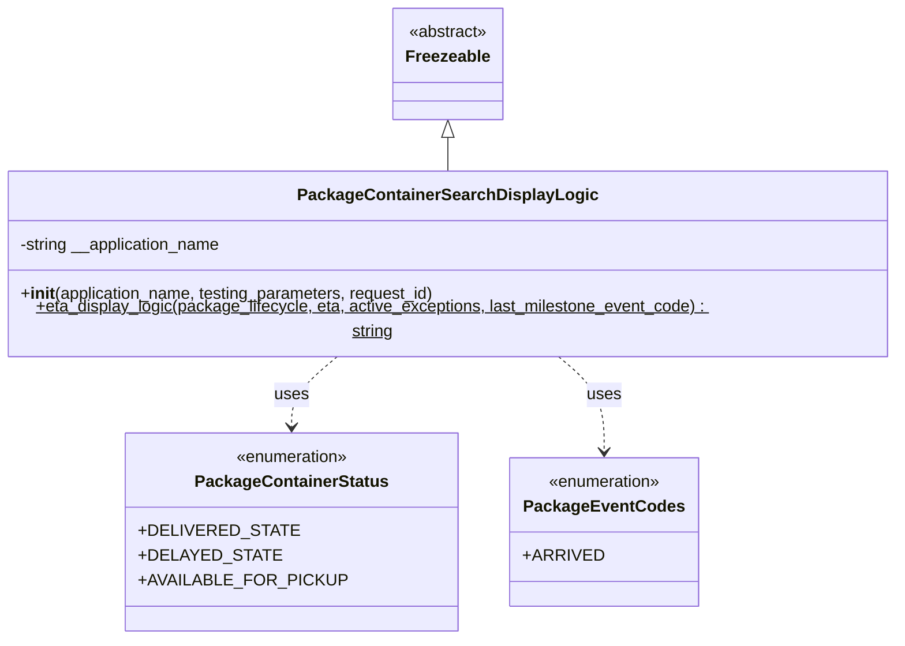
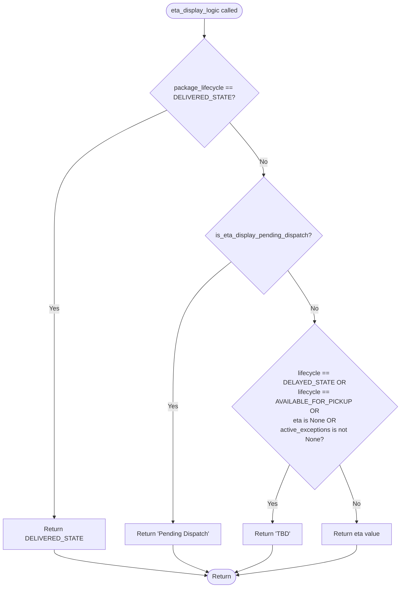

# Diagram: platform/partview_core/partview_service/partview_service/core/helpers/search_display_logic.py

> Auto-generated by Obscura crawlers

## Diagram 1

### SVG

<svg id="container" width="873.8984375" xmlns="http://www.w3.org/2000/svg" class="classDiagram" height="608" viewBox="0 0 873.8984375 608" role="graphics-document document" aria-roledescription="class"><g><defs><marker id="container_class-aggregationStart" class="marker aggregation class" refX="18" refY="7" markerWidth="190" markerHeight="240" orient="auto"><path d="M 18,7 L9,13 L1,7 L9,1 Z"></path></marker></defs><defs><marker id="container_class-aggregationEnd" class="marker aggregation class" refX="1" refY="7" markerWidth="20" markerHeight="28" orient="auto"><path d="M 18,7 L9,13 L1,7 L9,1 Z"></path></marker></defs><defs><marker id="container_class-extensionStart" class="marker extension class" refX="18" refY="7" markerWidth="190" markerHeight="240" orient="auto"><path d="M 1,7 L18,13 V 1 Z"></path></marker></defs><defs><marker id="container_class-extensionEnd" class="marker extension class" refX="1" refY="7" markerWidth="20" markerHeight="28" orient="auto"><path d="M 1,1 V 13 L18,7 Z"></path></marker></defs><defs><marker id="container_class-compositionStart" class="marker composition class" refX="18" refY="7" markerWidth="190" markerHeight="240" orient="auto"><path d="M 18,7 L9,13 L1,7 L9,1 Z"></path></marker></defs><defs><marker id="container_class-compositionEnd" class="marker composition class" refX="1" refY="7" markerWidth="20" markerHeight="28" orient="auto"><path d="M 18,7 L9,13 L1,7 L9,1 Z"></path></marker></defs><defs><marker id="container_class-dependencyStart" class="marker dependency class" refX="6" refY="7" markerWidth="190" markerHeight="240" orient="auto"><path d="M 5,7 L9,13 L1,7 L9,1 Z"></path></marker></defs><defs><marker id="container_class-dependencyEnd" class="marker dependency class" refX="13" refY="7" markerWidth="20" markerHeight="28" orient="auto"><path d="M 18,7 L9,13 L14,7 L9,1 Z"></path></marker></defs><defs><marker id="container_class-lollipopStart" class="marker lollipop class" refX="13" refY="7" markerWidth="190" markerHeight="240" orient="auto"><circle stroke="black" fill="transparent" cx="7" cy="7" r="6"></circle></marker></defs><defs><marker id="container_class-lollipopEnd" class="marker lollipop class" refX="1" refY="7" markerWidth="190" markerHeight="240" orient="auto"><circle stroke="black" fill="transparent" cx="7" cy="7" r="6"></circle></marker></defs><g class="root"><g class="clusters"></g><g class="edgePaths"><path d="M436.949,133.25L436.949,134.542C436.949,135.833,436.949,138.417,436.949,143.875C436.949,149.333,436.949,157.667,436.949,161.833L436.949,166" id="id_Freezeable_PackageContainerSearchDisplayLogic_1" class="edge-thickness-normal edge-pattern-solid relation" style=";;;" data-edge="true" data-et="edge" data-id="id_Freezeable_PackageContainerSearchDisplayLogic_1" data-points="W3sieCI6NDM2Ljk0OTIxODc1LCJ5IjoxMTZ9LHsieCI6NDM2Ljk0OTIxODc1LCJ5IjoxNDF9LHsieCI6NDM2Ljk0OTIxODc1LCJ5IjoxNjZ9XQ==" marker-start="url(#container_class-extensionStart)"></path><path d="M339.533,334L332.381,340.167C325.229,346.333,310.926,358.667,303.775,370C296.623,381.333,296.623,391.667,296.623,396.833L296.623,402" id="id_PackageContainerSearchDisplayLogic_PackageContainerStatus_2" class="edge-thickness-normal edge-pattern-dashed relation" style=";;;" data-edge="true" data-et="edge" data-id="id_PackageContainerSearchDisplayLogic_PackageContainerStatus_2" data-points="W3sieCI6MzM5LjUzMjcwMjczNzYwMzMsInkiOjMzNH0seyJ4IjoyOTYuNjIzMDQ2ODc1LCJ5IjozNzF9LHsieCI6Mjk2LjYyMzA0Njg3NSwieSI6NDA4fV0=" marker-end="url(#container_class-dependencyEnd)"></path><path d="M534.366,334L541.517,340.167C548.669,346.333,562.972,358.667,570.124,374C577.275,389.333,577.275,407.667,577.275,416.833L577.275,426" id="id_PackageContainerSearchDisplayLogic_PackageEventCodes_3" class="edge-thickness-normal edge-pattern-dashed relation" style=";;;" data-edge="true" data-et="edge" data-id="id_PackageContainerSearchDisplayLogic_PackageEventCodes_3" data-points="W3sieCI6NTM0LjM2NTczNDc2MjM5NjYsInkiOjMzNH0seyJ4Ijo1NzcuMjc1MzkwNjI1LCJ5IjozNzF9LHsieCI6NTc3LjI3NTM5MDYyNSwieSI6NDMyfV0=" marker-end="url(#container_class-dependencyEnd)"></path></g><g class="edgeLabels"><g class="edgeLabel"><g class="label" data-id="id_Freezeable_PackageContainerSearchDisplayLogic_1" transform="translate(0, 0)"><foreignObject width="0" height="0">

</foreignObject></g></g><g class="edgeLabel" transform="translate(296.623046875, 371)"><g class="label" data-id="id_PackageContainerSearchDisplayLogic_PackageContainerStatus_2" transform="translate(-16.4921875, -12)"><foreignObject width="32.984375" height="24">

uses

</foreignObject></g></g><g class="edgeLabel" transform="translate(577.275390625, 371)"><g class="label" data-id="id_PackageContainerSearchDisplayLogic_PackageEventCodes_3" transform="translate(-16.4921875, -12)"><foreignObject width="32.984375" height="24">

uses

</foreignObject></g></g></g><g class="nodes"><g class="node default" id="classId-Freezeable-0" transform="translate(436.94921875, 62)"><g class="basic label-container"><path d="M-51.1953125 -54 L51.1953125 -54 L51.1953125 54 L-51.1953125 54" stroke="none" stroke-width="0" fill="#ECECFF" style=""></path><path d="M-51.1953125 -54 C-25.025153112654195 -54, 1.1450062746916103 -54, 51.1953125 -54 M-51.1953125 -54 C-30.07382602344427 -54, -8.952339546888538 -54, 51.1953125 -54 M51.1953125 -54 C51.1953125 -10.899304796755203, 51.1953125 32.201390406489594, 51.1953125 54 M51.1953125 -54 C51.1953125 -16.0403067844764, 51.1953125 21.9193864310472, 51.1953125 54 M51.1953125 54 C24.15007805613719 54, -2.8951563877256206 54, -51.1953125 54 M51.1953125 54 C20.728080452975775 54, -9.739151594048451 54, -51.1953125 54 M-51.1953125 54 C-51.1953125 28.38488113122319, -51.1953125 2.7697622624463776, -51.1953125 -54 M-51.1953125 54 C-51.1953125 13.900131635507194, -51.1953125 -26.199736728985613, -51.1953125 -54" stroke="#9370DB" stroke-width="1.3" fill="none" stroke-dasharray="0 0" style=""></path></g><g class="annotation-group text" transform="translate(-38.609375, -30)"><g class="label" style="" transform="translate(0,-12)"><foreignObject width="77.21875" height="24">

«abstract»

</foreignObject></g></g><g class="label-group text" transform="translate(-39.1953125, -6)"><g class="label" style="font-weight: bolder" transform="translate(0,-12)"><foreignObject width="78.390625" height="24">

Freezeable

</foreignObject></g></g><g class="members-group text" transform="translate(-39.1953125, 42)"></g><g class="methods-group text" transform="translate(-39.1953125, 72)"></g><g class="divider" style=""><path d="M-51.1953125 18 C-13.982933627360062 18, 23.229445245279877 18, 51.1953125 18 M-51.1953125 18 C-20.168131654594802 18, 10.859049190810396 18, 51.1953125 18" stroke="#9370DB" stroke-width="1.3" fill="none" stroke-dasharray="0 0" style=""></path></g><g class="divider" style=""><path d="M-51.1953125 36 C-25.10736970883003 36, 0.9805730823399372 36, 51.1953125 36 M-51.1953125 36 C-25.851813568522072 36, -0.508314637044144 36, 51.1953125 36" stroke="#9370DB" stroke-width="1.3" fill="none" stroke-dasharray="0 0" style=""></path></g></g><g class="node default" id="classId-PackageContainerStatus-1" transform="translate(296.623046875, 504)"><g class="basic label-container"><path d="M-146.40234375 -96 L146.40234375 -96 L146.40234375 96 L-146.40234375 96" stroke="none" stroke-width="0" fill="#ECECFF" style=""></path><path d="M-146.40234375 -96 C-48.61393668961253 -96, 49.17447037077494 -96, 146.40234375 -96 M-146.40234375 -96 C-47.32360088773895 -96, 51.755141974522104 -96, 146.40234375 -96 M146.40234375 -96 C146.40234375 -55.182565615995294, 146.40234375 -14.365131231990588, 146.40234375 96 M146.40234375 -96 C146.40234375 -35.47778415812189, 146.40234375 25.044431683756216, 146.40234375 96 M146.40234375 96 C76.09583508114369 96, 5.78932641228738 96, -146.40234375 96 M146.40234375 96 C33.394994728359976 96, -79.61235429328005 96, -146.40234375 96 M-146.40234375 96 C-146.40234375 30.81743177425807, -146.40234375 -34.36513645148386, -146.40234375 -96 M-146.40234375 96 C-146.40234375 44.46873359577168, -146.40234375 -7.062532808456638, -146.40234375 -96" stroke="#9370DB" stroke-width="1.3" fill="none" stroke-dasharray="0 0" style=""></path></g><g class="annotation-group text" transform="translate(-55.5546875, -72)"><g class="label" style="" transform="translate(0,-12)"><foreignObject width="111.109375" height="24">

«enumeration»

</foreignObject></g></g><g class="label-group text" transform="translate(-88.9296875, -48)"><g class="label" style="font-weight: bolder" transform="translate(0,-12)"><foreignObject width="177.859375" height="24">

PackageContainerStatus

</foreignObject></g></g><g class="members-group text" transform="translate(-134.40234375, 0)"><g class="label" style="" transform="translate(0,-12)"><foreignObject width="133.9375" height="24">

+DELIVERED_STATE

</foreignObject></g><g class="label" style="" transform="translate(0,12)"><foreignObject width="119.265625" height="24">

+DELAYED_STATE

</foreignObject></g><g class="label" style="" transform="translate(0,36)"><foreignObject width="179.875" height="24">

+AVAILABLE_FOR_PICKUP

</foreignObject></g></g><g class="methods-group text" transform="translate(-134.40234375, 96)"></g><g class="divider" style=""><path d="M-146.40234375 -24 C-75.64571308056193 -24, -4.889082411123866 -24, 146.40234375 -24 M-146.40234375 -24 C-84.76326547967402 -24, -23.124187209348037 -24, 146.40234375 -24" stroke="#9370DB" stroke-width="1.3" fill="none" stroke-dasharray="0 0" style=""></path></g><g class="divider" style=""><path d="M-146.40234375 72 C-82.07618075631409 72, -17.750017762628175 72, 146.40234375 72 M-146.40234375 72 C-55.44362560534107 72, 35.51509253931786 72, 146.40234375 72" stroke="#9370DB" stroke-width="1.3" fill="none" stroke-dasharray="0 0" style=""></path></g></g><g class="node default" id="classId-PackageEventCodes-2" transform="translate(577.275390625, 504)"><g class="basic label-container"><path d="M-84.25 -72 L84.25 -72 L84.25 72 L-84.25 72" stroke="none" stroke-width="0" fill="#ECECFF" style=""></path><path d="M-84.25 -72 C-22.261538416363656 -72, 39.72692316727269 -72, 84.25 -72 M-84.25 -72 C-42.07383195687985 -72, 0.10233608624029955 -72, 84.25 -72 M84.25 -72 C84.25 -31.106677461146745, 84.25 9.78664507770651, 84.25 72 M84.25 -72 C84.25 -20.954049815004147, 84.25 30.091900369991706, 84.25 72 M84.25 72 C39.55102647816176 72, -5.147947043676481 72, -84.25 72 M84.25 72 C33.41121069607316 72, -17.427578607853675 72, -84.25 72 M-84.25 72 C-84.25 21.31404816261864, -84.25 -29.37190367476272, -84.25 -72 M-84.25 72 C-84.25 36.37554951256703, -84.25 0.751099025134053, -84.25 -72" stroke="#9370DB" stroke-width="1.3" fill="none" stroke-dasharray="0 0" style=""></path></g><g class="annotation-group text" transform="translate(-55.5546875, -48)"><g class="label" style="" transform="translate(0,-12)"><foreignObject width="111.109375" height="24">

«enumeration»

</foreignObject></g></g><g class="label-group text" transform="translate(-72.25, -24)"><g class="label" style="font-weight: bolder" transform="translate(0,-12)"><foreignObject width="144.5" height="24">

PackageEventCodes

</foreignObject></g></g><g class="members-group text" transform="translate(-72.25, 24)"><g class="label" style="" transform="translate(0,-12)"><foreignObject width="68.84375" height="24">

+ARRIVED

</foreignObject></g></g><g class="methods-group text" transform="translate(-72.25, 72)"></g><g class="divider" style=""><path d="M-84.25 0 C-50.42064697571756 0, -16.59129395143512 0, 84.25 0 M-84.25 0 C-33.931929632930185 0, 16.38614073413963 0, 84.25 0" stroke="#9370DB" stroke-width="1.3" fill="none" stroke-dasharray="0 0" style=""></path></g><g class="divider" style=""><path d="M-84.25 48 C-45.02132632323013 48, -5.792652646460255 48, 84.25 48 M-84.25 48 C-35.21395205571402 48, 13.822095888571965 48, 84.25 48" stroke="#9370DB" stroke-width="1.3" fill="none" stroke-dasharray="0 0" style=""></path></g></g><g class="node default" id="classId-PackageContainerSearchDisplayLogic-3" transform="translate(436.94921875, 250)"><g class="basic label-container"><path d="M-428.94921875 -84 L428.94921875 -84 L428.94921875 84 L-428.94921875 84" stroke="none" stroke-width="0" fill="#ECECFF" style=""></path><path d="M-428.94921875 -84 C-114.73326260304526 -84, 199.48269354390948 -84, 428.94921875 -84 M-428.94921875 -84 C-107.2993275850992 -84, 214.3505635798016 -84, 428.94921875 -84 M428.94921875 -84 C428.94921875 -46.71048352625897, 428.94921875 -9.420967052517938, 428.94921875 84 M428.94921875 -84 C428.94921875 -42.51826449616488, 428.94921875 -1.0365289923297638, 428.94921875 84 M428.94921875 84 C137.3109134725213 84, -154.32739180495741 84, -428.94921875 84 M428.94921875 84 C112.96377266743553 84, -203.02167341512893 84, -428.94921875 84 M-428.94921875 84 C-428.94921875 21.073930926243577, -428.94921875 -41.852138147512846, -428.94921875 -84 M-428.94921875 84 C-428.94921875 17.001308154732683, -428.94921875 -49.99738369053463, -428.94921875 -84" stroke="#9370DB" stroke-width="1.3" fill="none" stroke-dasharray="0 0" style=""></path></g><g class="annotation-group text" transform="translate(0, -60)"></g><g class="label-group text" transform="translate(-136.0859375, -60)"><g class="label" style="font-weight: bolder" transform="translate(0,-12)"><foreignObject width="272.171875" height="24">

PackageContainerSearchDisplayLogic

</foreignObject></g></g><g class="members-group text" transform="translate(-416.94921875, -12)"><g class="label" style="" transform="translate(0,-12)"><foreignObject width="199.4375" height="24">

-string __application_name

</foreignObject></g></g><g class="methods-group text" transform="translate(-416.94921875, 36)"><g class="label" style="" transform="translate(0,-12)"><foreignObject width="407.96875" height="24">

+<strong>init</strong>(application_name, testing_parameters, request_id)

</foreignObject></g><g class="label" style="text-decoration:underline;" transform="translate(0,12)"><foreignObject width="697.8125" height="24">

+eta_display_logic(package_lifecycle, eta, active_exceptions, last_milestone_event_code) : string

</foreignObject></g></g><g class="divider" style=""><path d="M-428.94921875 -36 C-241.0684205640156 -36, -53.18762237803122 -36, 428.94921875 -36 M-428.94921875 -36 C-124.26550632875569 -36, 180.41820609248862 -36, 428.94921875 -36" stroke="#9370DB" stroke-width="1.3" fill="none" stroke-dasharray="0 0" style=""></path></g><g class="divider" style=""><path d="M-428.94921875 12 C-184.23101534716838 12, 60.48718805566324 12, 428.94921875 12 M-428.94921875 12 C-100.8562258315759 12, 227.2367670868482 12, 428.94921875 12" stroke="#9370DB" stroke-width="1.3" fill="none" stroke-dasharray="0 0" style=""></path></g></g></g></g></g></svg>

## Diagram 2

### SVG

<svg id="container" width="981.41796875" xmlns="http://www.w3.org/2000/svg" class="flowchart" height="1447.0625" viewBox="0 0 981.41796875 1447.0625" role="graphics-document document" aria-roledescription="flowchart-v2"><g><marker id="container_flowchart-v2-pointEnd" class="marker flowchart-v2" viewBox="0 0 10 10" refX="5" refY="5" markerUnits="userSpaceOnUse" markerWidth="8" markerHeight="8" orient="auto"><path d="M 0 0 L 10 5 L 0 10 z" class="arrowMarkerPath" style="stroke-width: 1; stroke-dasharray: 1, 0;"></path></marker><marker id="container_flowchart-v2-pointStart" class="marker flowchart-v2" viewBox="0 0 10 10" refX="4.5" refY="5" markerUnits="userSpaceOnUse" markerWidth="8" markerHeight="8" orient="auto"><path d="M 0 5 L 10 10 L 10 0 z" class="arrowMarkerPath" style="stroke-width: 1; stroke-dasharray: 1, 0;"></path></marker><marker id="container_flowchart-v2-circleEnd" class="marker flowchart-v2" viewBox="0 0 10 10" refX="11" refY="5" markerUnits="userSpaceOnUse" markerWidth="11" markerHeight="11" orient="auto"><circle cx="5" cy="5" r="5" class="arrowMarkerPath" style="stroke-width: 1; stroke-dasharray: 1, 0;"></circle></marker><marker id="container_flowchart-v2-circleStart" class="marker flowchart-v2" viewBox="0 0 10 10" refX="-1" refY="5" markerUnits="userSpaceOnUse" markerWidth="11" markerHeight="11" orient="auto"><circle cx="5" cy="5" r="5" class="arrowMarkerPath" style="stroke-width: 1; stroke-dasharray: 1, 0;"></circle></marker><marker id="container_flowchart-v2-crossEnd" class="marker cross flowchart-v2" viewBox="0 0 11 11" refX="12" refY="5.2" markerUnits="userSpaceOnUse" markerWidth="11" markerHeight="11" orient="auto"><path d="M 1,1 l 9,9 M 10,1 l -9,9" class="arrowMarkerPath" style="stroke-width: 2; stroke-dasharray: 1, 0;"></path></marker><marker id="container_flowchart-v2-crossStart" class="marker cross flowchart-v2" viewBox="0 0 11 11" refX="-1" refY="5.2" markerUnits="userSpaceOnUse" markerWidth="11" markerHeight="11" orient="auto"><path d="M 1,1 l 9,9 M 10,1 l -9,9" class="arrowMarkerPath" style="stroke-width: 2; stroke-dasharray: 1, 0;"></path></marker><g class="root"><g class="clusters"></g><g class="edgePaths"><path d="M504.68,47.5L504.596,51.583C504.513,55.667,504.346,63.833,504.263,71.417C504.18,79,504.18,86,504.18,89.5L504.18,93" id="L_Start_CheckDelivered_0" class="edge-thickness-normal edge-pattern-solid edge-thickness-normal edge-pattern-solid flowchart-link" style=";" data-edge="true" data-et="edge" data-id="L_Start_CheckDelivered_0" data-points="W3sieCI6NTA0LjY3OTY4NzUsInkiOjQ3LjV9LHsieCI6NTA0LjE3OTY4NzUsInkiOjcyfSx7IngiOjUwNC4xNzk2ODc1LCJ5Ijo5N31d" marker-end="url(#container_flowchart-v2-pointEnd)"></path><path d="M409.444,280.264L362.453,302.22C315.463,324.176,221.481,368.088,174.491,421.299C127.5,474.51,127.5,537.021,127.5,599.531C127.5,662.042,127.5,724.552,127.5,795.141C127.5,865.729,127.5,944.396,127.5,1023.063C127.5,1101.729,127.5,1180.396,127.5,1225.229C127.5,1270.063,127.5,1281.063,127.5,1286.563L127.5,1292.063" id="L_CheckDelivered_ReturnDelivered_0" class="edge-thickness-normal edge-pattern-solid edge-thickness-normal edge-pattern-solid flowchart-link" style=";" data-edge="true" data-et="edge" data-id="L_CheckDelivered_ReturnDelivered_0" data-points="W3sieCI6NDA5LjQ0NDAyNDYwNzU1ODMzLCJ5IjoyODAuMjY0MzM3MTA3NTU4MzN9LHsieCI6MTI3LjUsInkiOjQxMn0seyJ4IjoxMjcuNSwieSI6NTk5LjUzMTI1fSx7IngiOjEyNy41LCJ5Ijo3ODcuMDYyNX0seyJ4IjoxMjcuNSwieSI6MTAyMy4wNjI1fSx7IngiOjEyNy41LCJ5IjoxMjU5LjA2MjV9LHsieCI6MTI3LjUsInkiOjEyOTYuMDYyNX1d" marker-end="url(#container_flowchart-v2-pointEnd)"></path><path d="M567.247,311.933L581.099,328.611C594.951,345.289,622.655,378.644,636.507,400.822C650.359,423,650.359,434,650.359,439.5L650.359,445" id="L_CheckDelivered_CheckPendingDispatch_0" class="edge-thickness-normal edge-pattern-solid edge-thickness-normal edge-pattern-solid flowchart-link" style=";" data-edge="true" data-et="edge" data-id="L_CheckDelivered_CheckPendingDispatch_0" data-points="W3sieCI6NTY3LjI0NjkwNTQyNDc3OTksInkiOjMxMS45MzI3ODIwNzUyMjAxfSx7IngiOjY1MC4zNTkzNzUsInkiOjQxMn0seyJ4Ijo2NTAuMzU5Mzc1LCJ5Ijo0NDl9XQ==" marker-end="url(#container_flowchart-v2-pointEnd)"></path><path d="M567.357,667.06L542.774,687.061C518.191,707.061,469.025,747.062,444.442,806.395C419.859,865.729,419.859,944.396,419.859,1023.063C419.859,1101.729,419.859,1180.396,419.859,1225.229C419.859,1270.063,419.859,1281.063,419.859,1286.563L419.859,1292.063" id="L_CheckPendingDispatch_ReturnPending_0" class="edge-thickness-normal edge-pattern-solid edge-thickness-normal edge-pattern-solid flowchart-link" style=";" data-edge="true" data-et="edge" data-id="L_CheckPendingDispatch_ReturnPending_0" data-points="W3sieCI6NTY3LjM1NzMxOTIzMjYzODEsInkiOjY2Ny4wNjA0NDQyMzI2MzgxfSx7IngiOjQxOS44NTkzNzUsInkiOjc4Ny4wNjI1fSx7IngiOjQxOS44NTkzNzUsInkiOjEwMjMuMDYyNX0seyJ4Ijo0MTkuODU5Mzc1LCJ5IjoxMjU5LjA2MjV9LHsieCI6NDE5Ljg1OTM3NSwieSI6MTI5Ni4wNjI1fV0=" marker-end="url(#container_flowchart-v2-pointEnd)"></path><path d="M710.147,690.275L720.776,706.406C731.404,722.537,752.661,754.8,763.29,776.431C773.918,798.063,773.918,809.063,773.918,814.563L773.918,820.063" id="L_CheckPendingDispatch_CheckTBD_0" class="edge-thickness-normal edge-pattern-solid edge-thickness-normal edge-pattern-solid flowchart-link" style=";" data-edge="true" data-et="edge" data-id="L_CheckPendingDispatch_CheckTBD_0" data-points="W3sieCI6NzEwLjE0NzM0MjgxNDEzNjMsInkiOjY5MC4yNzQ1MzIxODU4NjM3fSx7IngiOjc3My45MTc5Njg3NSwieSI6Nzg3LjA2MjV9LHsieCI6NzczLjkxNzk2ODc1LCJ5Ijo4MjQuMDYyNX1d" marker-end="url(#container_flowchart-v2-pointEnd)"></path><path d="M711.863,1160.007L704.382,1176.516C696.901,1193.026,681.939,1226.044,674.458,1248.053C666.977,1270.063,666.977,1281.063,666.977,1286.563L666.977,1292.063" id="L_CheckTBD_ReturnTBD_0" class="edge-thickness-normal edge-pattern-solid edge-thickness-normal edge-pattern-solid flowchart-link" style=";" data-edge="true" data-et="edge" data-id="L_CheckTBD_ReturnTBD_0" data-points="W3sieCI6NzExLjg2MjY0NTQzMjY1MTIsInkiOjExNjAuMDA3MTc2NjgyNjUxM30seyJ4Ijo2NjYuOTc2NTYyNSwieSI6MTI1OS4wNjI1fSx7IngiOjY2Ni45NzY1NjI1LCJ5IjoxMjk2LjA2MjV9XQ==" marker-end="url(#container_flowchart-v2-pointEnd)"></path><path d="M835.973,1160.007L843.454,1176.516C850.935,1193.026,865.897,1226.044,873.378,1248.053C880.859,1270.063,880.859,1281.063,880.859,1286.563L880.859,1292.063" id="L_CheckTBD_ReturnETA_0" class="edge-thickness-normal edge-pattern-solid edge-thickness-normal edge-pattern-solid flowchart-link" style=";" data-edge="true" data-et="edge" data-id="L_CheckTBD_ReturnETA_0" data-points="W3sieCI6ODM1Ljk3MzI5MjA2NzM0ODgsInkiOjExNjAuMDA3MTc2NjgyNjUxM30seyJ4Ijo4ODAuODU5Mzc1LCJ5IjoxMjU5LjA2MjV9LHsieCI6ODgwLjg1OTM3NSwieSI6MTI5Ni4wNjI1fV0=" marker-end="url(#container_flowchart-v2-pointEnd)"></path><path d="M127.5,1350.063L127.5,1354.229C127.5,1358.396,127.5,1366.729,190.177,1377.675C252.854,1388.622,378.208,1402.181,440.885,1408.96L503.562,1415.74" id="L_ReturnDelivered_End_0" class="edge-thickness-normal edge-pattern-solid edge-thickness-normal edge-pattern-solid flowchart-link" style=";" data-edge="true" data-et="edge" data-id="L_ReturnDelivered_End_0" data-points="W3sieCI6MTI3LjUsInkiOjEzNTAuMDYyNX0seyJ4IjoxMjcuNSwieSI6MTM3NS4wNjI1fSx7IngiOjUwNy41Mzg1OTk1MTQ1MTgzNSwieSI6MTQxNi4xNzAxODkzNjk5ODcyfV0=" marker-end="url(#container_flowchart-v2-pointEnd)"></path><path d="M419.859,1350.063L419.859,1354.229C419.859,1358.396,419.859,1366.729,434.445,1376.2C449.03,1385.671,478.2,1396.279,492.786,1401.583L507.371,1406.887" id="L_ReturnPending_End_0" class="edge-thickness-normal edge-pattern-solid edge-thickness-normal edge-pattern-solid flowchart-link" style=";" data-edge="true" data-et="edge" data-id="L_ReturnPending_End_0" data-points="W3sieCI6NDE5Ljg1OTM3NSwieSI6MTM1MC4wNjI1fSx7IngiOjQxOS44NTkzNzUsInkiOjEzNzUuMDYyNX0seyJ4Ijo1MTEuMTMwMjA5MTA3Mzk1NTYsInkiOjE0MDguMjUzODg5NTI3NzI0NH1d" marker-end="url(#container_flowchart-v2-pointEnd)"></path><path d="M666.977,1350.063L666.977,1354.229C666.977,1358.396,666.977,1366.729,652.557,1376.198C638.138,1385.666,609.299,1396.27,594.879,1401.572L580.46,1406.873" id="L_ReturnTBD_End_0" class="edge-thickness-normal edge-pattern-solid edge-thickness-normal edge-pattern-solid flowchart-link" style=";" data-edge="true" data-et="edge" data-id="L_ReturnTBD_End_0" data-points="W3sieCI6NjY2Ljk3NjU2MjUsInkiOjEzNTAuMDYyNX0seyJ4Ijo2NjYuOTc2NTYyNSwieSI6MTM3NS4wNjI1fSx7IngiOjU3Ni43MDU3MjYyMDI5NTQxLCJ5IjoxNDA4LjI1Mzg5MDMxNjMzMzZ9XQ==" marker-end="url(#container_flowchart-v2-pointEnd)"></path><path d="M880.859,1350.063L880.859,1354.229C880.859,1358.396,880.859,1366.729,831.393,1377.512C781.927,1388.295,682.994,1401.528,633.528,1408.145L584.062,1414.761" id="L_ReturnETA_End_0" class="edge-thickness-normal edge-pattern-solid edge-thickness-normal edge-pattern-solid flowchart-link" style=";" data-edge="true" data-et="edge" data-id="L_ReturnETA_End_0" data-points="W3sieCI6ODgwLjg1OTM3NSwieSI6MTM1MC4wNjI1fSx7IngiOjg4MC44NTkzNzUsInkiOjEzNzUuMDYyNX0seyJ4Ijo1ODAuMDk3MDQxNTgxNzUzNCwieSI6MTQxNS4yOTEzOTM5MzE4MjQ2fV0=" marker-end="url(#container_flowchart-v2-pointEnd)"></path></g><g class="edgeLabels"><g class="edgeLabel"><g class="label" data-id="L_Start_CheckDelivered_0" transform="translate(0, 0)"><foreignObject width="0" height="0">

</foreignObject></g></g><g class="edgeLabel" transform="translate(127.5, 787.0625)"><g class="label" data-id="L_CheckDelivered_ReturnDelivered_0" transform="translate(-12.03125, -12)"><foreignObject width="24.0625" height="24">

Yes

</foreignObject></g></g><g class="edgeLabel" transform="translate(650.359375, 412)"><g class="label" data-id="L_CheckDelivered_CheckPendingDispatch_0" transform="translate(-10.140625, -12)"><foreignObject width="20.28125" height="24">

No

</foreignObject></g></g><g class="edgeLabel" transform="translate(419.859375, 1023.0625)"><g class="label" data-id="L_CheckPendingDispatch_ReturnPending_0" transform="translate(-12.03125, -12)"><foreignObject width="24.0625" height="24">

Yes

</foreignObject></g></g><g class="edgeLabel" transform="translate(773.91796875, 787.0625)"><g class="label" data-id="L_CheckPendingDispatch_CheckTBD_0" transform="translate(-10.140625, -12)"><foreignObject width="20.28125" height="24">

No

</foreignObject></g></g><g class="edgeLabel" transform="translate(666.9765625, 1259.0625)"><g class="label" data-id="L_CheckTBD_ReturnTBD_0" transform="translate(-12.03125, -12)"><foreignObject width="24.0625" height="24">

Yes

</foreignObject></g></g><g class="edgeLabel" transform="translate(880.859375, 1259.0625)"><g class="label" data-id="L_CheckTBD_ReturnETA_0" transform="translate(-10.140625, -12)"><foreignObject width="20.28125" height="24">

No

</foreignObject></g></g><g class="edgeLabel"><g class="label" data-id="L_ReturnDelivered_End_0" transform="translate(0, 0)"><foreignObject width="0" height="0">

</foreignObject></g></g><g class="edgeLabel"><g class="label" data-id="L_ReturnPending_End_0" transform="translate(0, 0)"><foreignObject width="0" height="0">

</foreignObject></g></g><g class="edgeLabel"><g class="label" data-id="L_ReturnTBD_End_0" transform="translate(0, 0)"><foreignObject width="0" height="0">

</foreignObject></g></g><g class="edgeLabel"><g class="label" data-id="L_ReturnETA_End_0" transform="translate(0, 0)"><foreignObject width="0" height="0">

</foreignObject></g></g></g><g class="nodes"><g class="node default" id="flowchart-Start-0" transform="translate(504.1796875, 27.5)"><g class="basic label-container outer-path"><path d="M-79.40625 -19.5 C-47.167064996830845 -19.5, -14.92787999366169 -19.5, 79.40625 -19.5 C79.40625 -19.5, 79.40625 -19.5, 79.40625 -19.5 C79.75070140095237 -19.488954114005438, 80.09515280190475 -19.477908228010875, 80.6556192896239 -19.45993515863156 C80.9610215606374 -19.430473368846854, 81.26642383165091 -19.40101157906215, 81.89985465284786 -19.3399052695533 C82.24906316999193 -19.283447944653943, 82.59827168713599 -19.226990619754588, 83.13384325967675 -19.140403561325776 C83.5458655346072 -19.046362165769516, 83.95788780953765 -18.952320770213255, 84.35251438623538 -18.862249829261074 C84.67880364738697 -18.765408889278568, 85.00509290853854 -18.66856794929606, 85.5508602514606 -18.50658706670804 C85.80927502806199 -18.411488040158723, 86.06768980466336 -18.316389013609406, 86.7239565951478 -18.074876768247425 C87.05137493571088 -17.92993838140013, 87.37879327627398 -17.784999994552834, 87.86698291279238 -17.568892924097174 C88.2726708600941 -17.357245781845403, 88.6783588073958 -17.145598639593633, 88.97524226407678 -16.990714730406097 C89.22314052747072 -16.84043734632479, 89.47103879086467 -16.690159962243484, 90.0441805736057 -16.342718045390892 C90.43194223720226 -16.072232294797804, 90.81970390079883 -15.801746544204715, 91.06940534457871 -15.627565626425154 C91.38991949197565 -15.371964123115767, 91.71043363937258 -15.116362619806381, 92.04670370850187 -14.848196188198123 C92.39167633624278 -14.534901175159392, 92.73664896398368 -14.221606162120661, 92.97205973676799 -14.007812326905688 C93.18212366635423 -13.790904073038527, 93.39218759594048 -13.573995819171367, 93.84167094296865 -13.10986736009568 C94.15166957403235 -12.745725328626436, 94.46166820509606 -12.381583297157192, 94.65196390812658 -12.158051136245305 C94.81449225050734 -11.94027796409167, 94.97702059288811 -11.722504791938034, 95.39960896464063 -11.156274872382312 C95.65397924697653 -10.765493810729541, 95.90834952931243 -10.374712749076771, 96.08153387860425 -10.108655082055241 C96.21571257549613 -9.87040721865731, 96.34989127238802 -9.632159355259375, 96.6949364742735 -9.019496659696287 C96.84830045025954 -8.701033082097874, 97.00166442624558 -8.382569504499461, 97.23729614880834 -7.893275190886684 C97.35389916074017 -7.605263497049198, 97.470502172672 -7.317251803211712, 97.70638422997033 -6.734618561215508 C97.80656011298782 -6.432904762426222, 97.90673599600534 -6.131190963636936, 98.10027313421489 -5.548287939305138 C98.165472459078 -5.299654656035926, 98.23067178394112 -5.051021372766714, 98.41734428754556 -4.339158212148133 C98.50030409368364 -3.913177141190367, 98.5832638998217 -3.487196070232601, 98.65629477658177 -3.1121979531509023 C98.71253007650279 -2.6760480718795128, 98.76876537642381 -2.2398981906081237, 98.81614270250937 -1.872449005199798 C98.84185997881421 -1.4718816681399576, 98.86757725511907 -1.0713143310801172, 98.89623121591342 -0.6250057626472757 C98.89623121591342 -0.18620745401622474, 98.89623121591342 0.2525908546148262, 98.89623121591342 0.625005762647271 C98.87956806414644 0.8845478016719135, 98.86290491237946 1.144089840696556, 98.81614270250937 1.8724490051997846 C98.77817206924092 2.166941738680199, 98.74020143597248 2.4614344721606125, 98.65629477658177 3.1121979531508885 C98.60024816859402 3.399985439713249, 98.54420156060625 3.687772926275609, 98.41734428754556 4.339158212148129 C98.31878776509683 4.714996946912188, 98.2202312426481 5.090835681676247, 98.10027313421489 5.548287939305125 C97.96498610018865 5.955750930730512, 97.8296990661624 6.363213922155898, 97.70638422997033 6.734618561215495 C97.52343358895608 7.186510181630687, 97.34048294794185 7.638401802045878, 97.23729614880834 7.893275190886679 C97.09233855263133 8.194282740943944, 96.94738095645431 8.495290291001208, 96.6949364742735 9.019496659696284 C96.45889852083486 9.438605947461147, 96.22286056739624 9.85771523522601, 96.08153387860425 10.108655082055236 C95.85699918563512 10.453600666463124, 95.63246449266599 10.798546250871015, 95.39960896464065 11.156274872382301 C95.12628943852411 11.522498137457392, 94.85296991240757 11.888721402532482, 94.65196390812659 12.158051136245302 C94.3981999617731 12.456136707209712, 94.14443601541961 12.754222278174122, 93.84167094296866 13.10986736009567 C93.554911067466 13.405970474975797, 93.26815119196333 13.702073589855924, 92.97205973676799 14.007812326905684 C92.74342733980335 14.215450220547238, 92.5147949428387 14.423088114188793, 92.0467037085019 14.848196188198111 C91.72520161900326 15.104585549043362, 91.40369952950462 15.360974909888613, 91.06940534457871 15.627565626425152 C90.74294175109627 15.855292496857317, 90.41647815761382 16.08301936728948, 90.0441805736057 16.34271804539089 C89.61740713299686 16.60143061308709, 89.19063369238802 16.860143180783293, 88.97524226407678 16.990714730406093 C88.62197456835801 17.17501426098382, 88.26870687263924 17.359313791561544, 87.86698291279238 17.56889292409717 C87.54923198565207 17.70955183379583, 87.23148105851175 17.85021074349449, 86.7239565951478 18.07487676824742 C86.31011464602778 18.227174431036627, 85.89627269690779 18.379472093825832, 85.55086025146062 18.506587066708033 C85.1437924835509 18.627402643481325, 84.73672471564116 18.748218220254618, 84.35251438623541 18.86224982926107 C83.89897597150845 18.965767012807753, 83.44543755678149 19.069284196354438, 83.13384325967677 19.140403561325773 C82.64551655708229 19.21935243557111, 82.15718985448781 19.29830130981645, 81.89985465284788 19.3399052695533 C81.46598164554194 19.381760476759467, 81.032108638236 19.42361568396564, 80.6556192896239 19.45993515863156 C80.31999702868251 19.47069791129085, 79.98437476774113 19.481460663950138, 79.40625 19.5 C79.40625 19.5, 79.40625 19.5, 79.40625 19.5 C37.88523347737643 19.5, -3.6357830452471376 19.5, -79.40625 19.5 C-79.74666233726879 19.48908363891621, -80.08707467453758 19.47816727783242, -80.6556192896239 19.45993515863156 C-80.92261341259392 19.434178556696054, -81.18960753556392 19.40842195476055, -81.89985465284786 19.3399052695533 C-82.16344182098082 19.29729054035858, -82.42702898911378 19.254675811163864, -83.13384325967675 19.140403561325773 C-83.56078484837447 19.042956929759754, -83.9877264370722 18.94551029819374, -84.35251438623538 18.862249829261074 C-84.6709524882129 18.76773907210985, -84.98939059019044 18.673228314958628, -85.55086025146059 18.506587066708043 C-85.84326110664574 18.398980849076032, -86.13566196183089 18.291374631444025, -86.7239565951478 18.074876768247425 C-86.99852934217995 17.953331558047445, -87.27310208921209 17.831786347847466, -87.86698291279238 17.568892924097174 C-88.2678412496678 17.35976538651129, -88.6686995865432 17.15063784892541, -88.97524226407678 16.990714730406097 C-89.36496702669706 16.754461289028765, -89.75469178931732 16.518207847651436, -90.04418057360569 16.3427180453909 C-90.30349728182013 16.161829935379874, -90.56281399003458 15.980941825368852, -91.06940534457871 15.627565626425156 C-91.34389069373262 15.408670864836823, -91.61837604288651 15.189776103248493, -92.04670370850187 14.848196188198125 C-92.41620625870982 14.512623748601003, -92.78570880891778 14.177051309003879, -92.97205973676797 14.007812326905697 C-93.2675718614866 13.702671796137064, -93.56308398620523 13.39753126536843, -93.84167094296865 13.109867360095677 C-94.08534651484473 12.8236321678372, -94.32902208672081 12.537396975578723, -94.65196390812658 12.158051136245307 C-94.80688317544345 11.950473431476304, -94.9618024427603 11.742895726707301, -95.39960896464063 11.156274872382316 C-95.64206153752458 10.78380261280083, -95.88451411040853 10.411330353219345, -96.08153387860425 10.108655082055249 C-96.22388058232879 9.855904095425553, -96.36622728605333 9.603153108795857, -96.6949364742735 9.019496659696289 C-96.8425091593121 8.713058821664022, -96.99008184435068 8.406620983631754, -97.23729614880834 7.893275190886686 C-97.42050052398407 7.440756842186977, -97.60370489915982 6.988238493487269, -97.70638422997033 6.73461856121551 C-97.85505376609635 6.28684960567773, -98.00372330222237 5.83908065013995, -98.10027313421489 5.5482879393051325 C-98.18875414942485 5.210871480394954, -98.27723516463482 4.8734550214847765, -98.41734428754556 4.339158212148136 C-98.4995334354875 3.917134308148791, -98.58172258342945 3.495110404149446, -98.65629477658177 3.112197953150904 C-98.69664839211953 2.7992232797628183, -98.73700200765728 2.4862486063747324, -98.81614270250937 1.872449005199809 C-98.83579894386494 1.566287179854335, -98.8554551852205 1.2601253545088609, -98.89623121591342 0.6250057626472781 C-98.89623121591342 0.33097427051152895, -98.89623121591342 0.03694277837577975, -98.89623121591342 -0.6250057626472687 C-98.87990469140682 -0.8793045603708605, -98.86357816690023 -1.1336033580944522, -98.81614270250937 -1.8724490051997822 C-98.75445795325899 -2.3508637393541933, -98.69277320400862 -2.8292784735086043, -98.65629477658177 -3.112197953150895 C-98.59758256526297 -3.413672749442707, -98.53887035394416 -3.715147545734519, -98.41734428754556 -4.339158212148126 C-98.30130515551011 -4.7816657142772705, -98.18526602347465 -5.224173216406415, -98.10027313421489 -5.548287939305123 C-97.98195671099711 -5.904638154875065, -97.86364028777933 -6.2609883704450064, -97.70638422997033 -6.734618561215485 C-97.59180920758892 -7.017621081654923, -97.47723418520751 -7.300623602094361, -97.23729614880834 -7.893275190886676 C-97.12437849763887 -8.12775110959078, -97.01146084646939 -8.362227028294887, -96.6949364742735 -9.019496659696282 C-96.53484890327958 -9.303748352620373, -96.37476133228566 -9.588000045544463, -96.08153387860425 -10.108655082055243 C-95.82630289964936 -10.500758404844175, -95.57107192069448 -10.892861727633107, -95.39960896464063 -11.156274872382308 C-95.24095650628023 -11.368854713048965, -95.08230404791982 -11.581434553715619, -94.65196390812659 -12.158051136245302 C-94.43117872494852 -12.41739797543908, -94.21039354177044 -12.67674481463286, -93.84167094296866 -13.10986736009567 C-93.64184766320024 -13.31620130225294, -93.44202438343181 -13.52253524441021, -92.97205973676799 -14.007812326905677 C-92.74114812489945 -14.217520143218236, -92.5102365130309 -14.427227959530793, -92.0467037085019 -14.848196188198107 C-91.67534270306093 -15.144346707705886, -91.30398169761997 -15.440497227213664, -91.06940534457871 -15.627565626425149 C-90.75335531341082 -15.848028446582529, -90.43730528224293 -16.06849126673991, -90.04418057360571 -16.342718045390885 C-89.82811886974905 -16.4736959199883, -89.6120571658924 -16.604673794585715, -88.97524226407678 -16.99071473040609 C-88.54976078213939 -17.212688146998936, -88.12427930020199 -17.434661563591785, -87.8669829127924 -17.56889292409717 C-87.60051032898325 -17.686852432321132, -87.3340377451741 -17.804811940545097, -86.72395659514781 -18.07487676824742 C-86.39183991016044 -18.197098778375754, -86.05972322517307 -18.319320788504086, -85.55086025146062 -18.506587066708033 C-85.1634785781278 -18.621559913945315, -84.77609690479497 -18.736532761182602, -84.35251438623541 -18.862249829261067 C-83.86578444162862 -18.973342762907848, -83.37905449702181 -19.08443569655463, -83.13384325967677 -19.140403561325773 C-82.80304507085151 -19.193884447116773, -82.47224688202625 -19.247365332907773, -81.89985465284788 -19.3399052695533 C-81.41134911045451 -19.387030811714116, -80.92284356806115 -19.434156353874933, -80.6556192896239 -19.45993515863156 C-80.18464662857147 -19.475038335178837, -79.71367396751906 -19.490141511726115, -79.40625 -19.5 C-79.40625 -19.5, -79.40625 -19.5, -79.40625 -19.5" stroke="none" stroke-width="0" fill="#ECECFF" style=""></path><path d="M-79.40625 -19.5 C-39.02475181610139 -19.5, 1.3567463677972142 -19.5, 79.40625 -19.5 M-79.40625 -19.5 C-30.871704414064524 -19.5, 17.66284117187095 -19.5, 79.40625 -19.5 M79.40625 -19.5 C79.40625 -19.5, 79.40625 -19.5, 79.40625 -19.5 M79.40625 -19.5 C79.40625 -19.5, 79.40625 -19.5, 79.40625 -19.5 M79.40625 -19.5 C79.90402079315021 -19.484037459515747, 80.40179158630042 -19.46807491903149, 80.6556192896239 -19.45993515863156 M79.40625 -19.5 C79.85199195269327 -19.485705923161206, 80.29773390538654 -19.47141184632241, 80.6556192896239 -19.45993515863156 M80.6556192896239 -19.45993515863156 C81.10689662791616 -19.41640097654691, 81.55817396620841 -19.37286679446226, 81.89985465284786 -19.3399052695533 M80.6556192896239 -19.45993515863156 C81.0249340589306 -19.424307807002535, 81.39424882823728 -19.388680455373514, 81.89985465284786 -19.3399052695533 M81.89985465284786 -19.3399052695533 C82.18083968261222 -19.29447778901245, 82.46182471237657 -19.2490503084716, 83.13384325967675 -19.140403561325776 M81.89985465284786 -19.3399052695533 C82.27292106634299 -19.279590784992653, 82.64598747983811 -19.21927630043201, 83.13384325967675 -19.140403561325776 M83.13384325967675 -19.140403561325776 C83.5138612229342 -19.05366694106123, 83.89387918619164 -18.96693032079668, 84.35251438623538 -18.862249829261074 M83.13384325967675 -19.140403561325776 C83.54237732413318 -19.047158327047512, 83.95091138858962 -18.953913092769245, 84.35251438623538 -18.862249829261074 M84.35251438623538 -18.862249829261074 C84.68723926755254 -18.7629052414929, 85.0219641488697 -18.663560653724723, 85.5508602514606 -18.50658706670804 M84.35251438623538 -18.862249829261074 C84.61321514238871 -18.784875213280962, 84.87391589854202 -18.707500597300854, 85.5508602514606 -18.50658706670804 M85.5508602514606 -18.50658706670804 C85.96001191983592 -18.35601547058936, 86.36916358821124 -18.20544387447068, 86.7239565951478 -18.074876768247425 M85.5508602514606 -18.50658706670804 C85.89279454570972 -18.380752085618397, 86.23472883995883 -18.254917104528758, 86.7239565951478 -18.074876768247425 M86.7239565951478 -18.074876768247425 C87.00804626966675 -17.949118696558656, 87.29213594418572 -17.82336062486989, 87.86698291279238 -17.568892924097174 M86.7239565951478 -18.074876768247425 C87.0858059409663 -17.914696796733043, 87.4476552867848 -17.75451682521866, 87.86698291279238 -17.568892924097174 M87.86698291279238 -17.568892924097174 C88.19893969886336 -17.395711281432412, 88.53089648493435 -17.22252963876765, 88.97524226407678 -16.990714730406097 M87.86698291279238 -17.568892924097174 C88.11365982127845 -17.44020173894409, 88.36033672976453 -17.31151055379101, 88.97524226407678 -16.990714730406097 M88.97524226407678 -16.990714730406097 C89.31945701293152 -16.78204972681996, 89.66367176178626 -16.57338472323382, 90.0441805736057 -16.342718045390892 M88.97524226407678 -16.990714730406097 C89.3942709569347 -16.7366970743097, 89.81329964979261 -16.482679418213298, 90.0441805736057 -16.342718045390892 M90.0441805736057 -16.342718045390892 C90.34582726937693 -16.13230236849589, 90.64747396514814 -15.921886691600887, 91.06940534457871 -15.627565626425154 M90.0441805736057 -16.342718045390892 C90.29617614630044 -16.166936842591568, 90.54817171899518 -15.991155639792241, 91.06940534457871 -15.627565626425154 M91.06940534457871 -15.627565626425154 C91.45009068529338 -15.32397919766758, 91.83077602600804 -15.020392768910005, 92.04670370850187 -14.848196188198123 M91.06940534457871 -15.627565626425154 C91.41574686444825 -15.351367480864113, 91.76208838431778 -15.075169335303073, 92.04670370850187 -14.848196188198123 M92.04670370850187 -14.848196188198123 C92.29003397535492 -14.627210078008241, 92.53336424220798 -14.40622396781836, 92.97205973676799 -14.007812326905688 M92.04670370850187 -14.848196188198123 C92.33550541859728 -14.585914116363988, 92.6243071286927 -14.323632044529852, 92.97205973676799 -14.007812326905688 M92.97205973676799 -14.007812326905688 C93.18029542301386 -13.792791884389029, 93.38853110925974 -13.577771441872368, 93.84167094296865 -13.10986736009568 M92.97205973676799 -14.007812326905688 C93.26511755211884 -13.70520607206183, 93.55817536746969 -13.402599817217975, 93.84167094296865 -13.10986736009568 M93.84167094296865 -13.10986736009568 C94.11518259547448 -12.788585009808415, 94.38869424798031 -12.467302659521147, 94.65196390812658 -12.158051136245305 M93.84167094296865 -13.10986736009568 C94.12119929350945 -12.781517453936726, 94.40072764405025 -12.45316754777777, 94.65196390812658 -12.158051136245305 M94.65196390812658 -12.158051136245305 C94.92506564323295 -11.792119691282661, 95.19816737833933 -11.426188246320017, 95.39960896464063 -11.156274872382312 M94.65196390812658 -12.158051136245305 C94.80878517053159 -11.947924931333501, 94.9656064329366 -11.737798726421696, 95.39960896464063 -11.156274872382312 M95.39960896464063 -11.156274872382312 C95.54286613990688 -10.936193381235505, 95.68612331517312 -10.716111890088698, 96.08153387860425 -10.108655082055241 M95.39960896464063 -11.156274872382312 C95.65341680952407 -10.766357865692134, 95.9072246544075 -10.376440859001956, 96.08153387860425 -10.108655082055241 M96.08153387860425 -10.108655082055241 C96.30707445309567 -9.70818495358604, 96.53261502758708 -9.307714825116838, 96.6949364742735 -9.019496659696287 M96.08153387860425 -10.108655082055241 C96.25589092019865 -9.79906649913941, 96.43024796179306 -9.489477916223581, 96.6949364742735 -9.019496659696287 M96.6949364742735 -9.019496659696287 C96.85986923191085 -8.677010259466666, 97.02480198954818 -8.334523859237045, 97.23729614880834 -7.893275190886684 M96.6949364742735 -9.019496659696287 C96.86856008976689 -8.658963507174022, 97.04218370526027 -8.298430354651755, 97.23729614880834 -7.893275190886684 M97.23729614880834 -7.893275190886684 C97.35908214469553 -7.592461426473254, 97.48086814058274 -7.291647662059824, 97.70638422997033 -6.734618561215508 M97.23729614880834 -7.893275190886684 C97.40093079677733 -7.489094446742579, 97.56456544474632 -7.084913702598472, 97.70638422997033 -6.734618561215508 M97.70638422997033 -6.734618561215508 C97.85898352877315 -6.2750137866178415, 98.01158282757598 -5.815409012020175, 98.10027313421489 -5.548287939305138 M97.70638422997033 -6.734618561215508 C97.83030235011879 -6.361396926999536, 97.95422047026726 -5.988175292783563, 98.10027313421489 -5.548287939305138 M98.10027313421489 -5.548287939305138 C98.16494276668034 -5.301674602718377, 98.22961239914578 -5.055061266131616, 98.41734428754556 -4.339158212148133 M98.10027313421489 -5.548287939305138 C98.17449398761383 -5.265251657773608, 98.24871484101278 -4.982215376242078, 98.41734428754556 -4.339158212148133 M98.41734428754556 -4.339158212148133 C98.49378787336015 -3.946636555347793, 98.57023145917474 -3.5541148985474527, 98.65629477658177 -3.1121979531509023 M98.41734428754556 -4.339158212148133 C98.50729928715047 -3.877258301172819, 98.59725428675537 -3.4153583901975053, 98.65629477658177 -3.1121979531509023 M98.65629477658177 -3.1121979531509023 C98.71083154235738 -2.6892215672977517, 98.765368308133 -2.266245181444601, 98.81614270250937 -1.872449005199798 M98.65629477658177 -3.1121979531509023 C98.71255678226078 -2.6758409472942133, 98.76881878793978 -2.2394839414375243, 98.81614270250937 -1.872449005199798 M98.81614270250937 -1.872449005199798 C98.8457254313769 -1.4116741243390272, 98.87530816024443 -0.9508992434782562, 98.89623121591342 -0.6250057626472757 M98.81614270250937 -1.872449005199798 C98.84499042493705 -1.4231224429261884, 98.87383814736474 -0.9737958806525786, 98.89623121591342 -0.6250057626472757 M98.89623121591342 -0.6250057626472757 C98.89623121591342 -0.3101255225579964, 98.89623121591342 0.0047547175312828704, 98.89623121591342 0.625005762647271 M98.89623121591342 -0.6250057626472757 C98.89623121591342 -0.24060753005501673, 98.89623121591342 0.14379070253724224, 98.89623121591342 0.625005762647271 M98.89623121591342 0.625005762647271 C98.87049627309214 1.025848269960525, 98.84476133027087 1.426690777273779, 98.81614270250937 1.8724490051997846 M98.89623121591342 0.625005762647271 C98.87721922049364 0.9211329375167316, 98.85820722507387 1.2172601123861924, 98.81614270250937 1.8724490051997846 M98.81614270250937 1.8724490051997846 C98.76900023823265 2.238076648797493, 98.72185777395593 2.603704292395201, 98.65629477658177 3.1121979531508885 M98.81614270250937 1.8724490051997846 C98.76489674436597 2.269902536900962, 98.71365078622256 2.6673560686021394, 98.65629477658177 3.1121979531508885 M98.65629477658177 3.1121979531508885 C98.57867620472273 3.51075291495617, 98.50105763286366 3.909307876761451, 98.41734428754556 4.339158212148129 M98.65629477658177 3.1121979531508885 C98.56173774681086 3.5977283163892215, 98.46718071703995 4.083258679627554, 98.41734428754556 4.339158212148129 M98.41734428754556 4.339158212148129 C98.30815373503616 4.755549112351278, 98.19896318252677 5.171940012554426, 98.10027313421489 5.548287939305125 M98.41734428754556 4.339158212148129 C98.31084829011037 4.7452736060257745, 98.20435229267518 5.15138899990342, 98.10027313421489 5.548287939305125 M98.10027313421489 5.548287939305125 C97.96874642932904 5.944425418486742, 97.83721972444319 6.340562897668359, 97.70638422997033 6.734618561215495 M98.10027313421489 5.548287939305125 C97.96434136092375 5.957692782671126, 97.82840958763262 6.367097626037127, 97.70638422997033 6.734618561215495 M97.70638422997033 6.734618561215495 C97.56581273877462 7.081832862233772, 97.42524124757892 7.429047163252048, 97.23729614880834 7.893275190886679 M97.70638422997033 6.734618561215495 C97.54753913172624 7.126969024939426, 97.38869403348217 7.519319488663358, 97.23729614880834 7.893275190886679 M97.23729614880834 7.893275190886679 C97.03853285695183 8.306011419279866, 96.83976956509534 8.718747647673053, 96.6949364742735 9.019496659696284 M97.23729614880834 7.893275190886679 C97.03940972861245 8.304190576514534, 96.84152330841658 8.71510596214239, 96.6949364742735 9.019496659696284 M96.6949364742735 9.019496659696284 C96.51299571812729 9.342550895733236, 96.33105496198105 9.665605131770189, 96.08153387860425 10.108655082055236 M96.6949364742735 9.019496659696284 C96.54241033501441 9.290322264897188, 96.38988419575533 9.561147870098095, 96.08153387860425 10.108655082055236 M96.08153387860425 10.108655082055236 C95.90790640151089 10.37539351237643, 95.73427892441752 10.642131942697624, 95.39960896464065 11.156274872382301 M96.08153387860425 10.108655082055236 C95.92672589578585 10.34648171542827, 95.77191791296747 10.584308348801303, 95.39960896464065 11.156274872382301 M95.39960896464065 11.156274872382301 C95.16979201466226 11.464208648598484, 94.93997506468388 11.772142424814668, 94.65196390812659 12.158051136245302 M95.39960896464065 11.156274872382301 C95.2075288091342 11.413644781898784, 95.01544865362776 11.671014691415268, 94.65196390812659 12.158051136245302 M94.65196390812659 12.158051136245302 C94.43167691383526 12.416812774424967, 94.21138991954392 12.675574412604634, 93.84167094296866 13.10986736009567 M94.65196390812659 12.158051136245302 C94.41388554124633 12.437711533025691, 94.17580717436608 12.717371929806081, 93.84167094296866 13.10986736009567 M93.84167094296866 13.10986736009567 C93.60655639967065 13.352642429313866, 93.37144185637264 13.59541749853206, 92.97205973676799 14.007812326905684 M93.84167094296866 13.10986736009567 C93.65337238469671 13.304301081110607, 93.46507382642476 13.498734802125544, 92.97205973676799 14.007812326905684 M92.97205973676799 14.007812326905684 C92.66262561463301 14.288832209450446, 92.35319149249804 14.569852091995205, 92.0467037085019 14.848196188198111 M92.97205973676799 14.007812326905684 C92.65178690022492 14.2986756430992, 92.33151406368187 14.589538959292716, 92.0467037085019 14.848196188198111 M92.0467037085019 14.848196188198111 C91.79618775935835 15.04797599113071, 91.54567181021478 15.247755794063309, 91.06940534457871 15.627565626425152 M92.0467037085019 14.848196188198111 C91.77629858080192 15.063837081756185, 91.50589345310195 15.279477975314261, 91.06940534457871 15.627565626425152 M91.06940534457871 15.627565626425152 C90.6846483551425 15.895955446394229, 90.29989136570629 16.164345266363306, 90.0441805736057 16.34271804539089 M91.06940534457871 15.627565626425152 C90.77356989833336 15.833927627215845, 90.47773445208801 16.040289628006537, 90.0441805736057 16.34271804539089 M90.0441805736057 16.34271804539089 C89.70680127611134 16.547239358192794, 89.36942197861697 16.751760670994702, 88.97524226407678 16.990714730406093 M90.0441805736057 16.34271804539089 C89.71619421119095 16.541545305748517, 89.3882078487762 16.74037256610615, 88.97524226407678 16.990714730406093 M88.97524226407678 16.990714730406093 C88.58259918516507 17.195556373174437, 88.18995610625336 17.40039801594278, 87.86698291279238 17.56889292409717 M88.97524226407678 16.990714730406093 C88.6789693883298 17.145280099911457, 88.38269651258283 17.299845469416823, 87.86698291279238 17.56889292409717 M87.86698291279238 17.56889292409717 C87.4161235670119 17.768474982206886, 86.96526422123142 17.9680570403166, 86.7239565951478 18.07487676824742 M87.86698291279238 17.56889292409717 C87.49571384103606 17.73324272885798, 87.12444476927976 17.897592533618788, 86.7239565951478 18.07487676824742 M86.7239565951478 18.07487676824742 C86.2771073719818 18.23932141300145, 85.8302581488158 18.403766057755472, 85.55086025146062 18.506587066708033 M86.7239565951478 18.07487676824742 C86.38264181459618 18.20048376256966, 86.04132703404456 18.326090756891904, 85.55086025146062 18.506587066708033 M85.55086025146062 18.506587066708033 C85.23152334400982 18.6013645846058, 84.912186436559 18.696142102503572, 84.35251438623541 18.86224982926107 M85.55086025146062 18.506587066708033 C85.23652396260485 18.599880427255574, 84.92218767374908 18.69317378780312, 84.35251438623541 18.86224982926107 M84.35251438623541 18.86224982926107 C83.91744803210698 18.9615508855176, 83.48238167797852 19.060851941774132, 83.13384325967677 19.140403561325773 M84.35251438623541 18.86224982926107 C83.94628604852753 18.95496879645525, 83.54005771081965 19.047687763649435, 83.13384325967677 19.140403561325773 M83.13384325967677 19.140403561325773 C82.80421227334264 19.193695742869796, 82.47458128700853 19.24698792441382, 81.89985465284788 19.3399052695533 M83.13384325967677 19.140403561325773 C82.75759359038601 19.20123268999694, 82.38134392109524 19.26206181866811, 81.89985465284788 19.3399052695533 M81.89985465284788 19.3399052695533 C81.4947927368834 19.378981105428164, 81.08973082091892 19.41805694130303, 80.6556192896239 19.45993515863156 M81.89985465284788 19.3399052695533 C81.61495598730701 19.36738910117725, 81.33005732176615 19.394872932801203, 80.6556192896239 19.45993515863156 M80.6556192896239 19.45993515863156 C80.19369932096548 19.47474803295376, 79.73177935230707 19.48956090727596, 79.40625 19.5 M80.6556192896239 19.45993515863156 C80.3705018645941 19.469078319504863, 80.08538443956431 19.478221480378167, 79.40625 19.5 M79.40625 19.5 C79.40625 19.5, 79.40625 19.5, 79.40625 19.5 M79.40625 19.5 C79.40625 19.5, 79.40625 19.5, 79.40625 19.5 M79.40625 19.5 C47.635641173170455 19.5, 15.865032346340918 19.5, -79.40625 19.5 M79.40625 19.5 C21.701427516277796 19.5, -36.00339496744441 19.5, -79.40625 19.5 M-79.40625 19.5 C-79.88427103281775 19.48467079588903, -80.3622920656355 19.46934159177806, -80.6556192896239 19.45993515863156 M-79.40625 19.5 C-79.82416869562338 19.48659816086075, -80.24208739124677 19.473196321721502, -80.6556192896239 19.45993515863156 M-80.6556192896239 19.45993515863156 C-81.01860067899467 19.42491878054795, -81.38158206836545 19.38990240246434, -81.89985465284786 19.3399052695533 M-80.6556192896239 19.45993515863156 C-80.93668123834122 19.432821450465248, -81.21774318705856 19.405707742298933, -81.89985465284786 19.3399052695533 M-81.89985465284786 19.3399052695533 C-82.17046720473387 19.296154730796054, -82.44107975661986 19.252404192038806, -83.13384325967675 19.140403561325773 M-81.89985465284786 19.3399052695533 C-82.38114632021737 19.26209376524562, -82.86243798758689 19.184282260937945, -83.13384325967675 19.140403561325773 M-83.13384325967675 19.140403561325773 C-83.57391894061212 19.039959158914474, -84.0139946215475 18.939514756503172, -84.35251438623538 18.862249829261074 M-83.13384325967675 19.140403561325773 C-83.41305116489562 19.076676178961424, -83.69225907011449 19.012948796597072, -84.35251438623538 18.862249829261074 M-84.35251438623538 18.862249829261074 C-84.7594505337374 18.741473316733906, -85.1663866812394 18.620696804206737, -85.55086025146059 18.506587066708043 M-84.35251438623538 18.862249829261074 C-84.6118678020838 18.785275096811127, -84.8712212179322 18.70830036436118, -85.55086025146059 18.506587066708043 M-85.55086025146059 18.506587066708043 C-86.0106472076596 18.337381216602775, -86.47043416385861 18.168175366497508, -86.7239565951478 18.074876768247425 M-85.55086025146059 18.506587066708043 C-85.96917106114029 18.35264482192318, -86.38748187081997 18.19870257713832, -86.7239565951478 18.074876768247425 M-86.7239565951478 18.074876768247425 C-87.15030520181195 17.886144887259267, -87.5766538084761 17.69741300627111, -87.86698291279238 17.568892924097174 M-86.7239565951478 18.074876768247425 C-86.95835522836755 17.971115446509447, -87.1927538615873 17.86735412477147, -87.86698291279238 17.568892924097174 M-87.86698291279238 17.568892924097174 C-88.22321320056668 17.38304781114171, -88.57944348834098 17.19720269818625, -88.97524226407678 16.990714730406097 M-87.86698291279238 17.568892924097174 C-88.23643835296865 17.37614825760472, -88.60589379314492 17.183403591112263, -88.97524226407678 16.990714730406097 M-88.97524226407678 16.990714730406097 C-89.20530305875663 16.851250524683877, -89.43536385343647 16.711786318961654, -90.04418057360569 16.3427180453909 M-88.97524226407678 16.990714730406097 C-89.33098407932444 16.77506195143201, -89.68672589457209 16.559409172457926, -90.04418057360569 16.3427180453909 M-90.04418057360569 16.3427180453909 C-90.42958164256045 16.07387894343144, -90.81498271151521 15.80503984147198, -91.06940534457871 15.627565626425156 M-90.04418057360569 16.3427180453909 C-90.36952576312044 16.115771325151677, -90.69487095263517 15.888824604912454, -91.06940534457871 15.627565626425156 M-91.06940534457871 15.627565626425156 C-91.35594971058853 15.399054119798139, -91.64249407659837 15.170542613171122, -92.04670370850187 14.848196188198125 M-91.06940534457871 15.627565626425156 C-91.37144189137197 15.386699517887598, -91.67347843816522 15.14583340935004, -92.04670370850187 14.848196188198125 M-92.04670370850187 14.848196188198125 C-92.28583847747255 14.63102031817822, -92.52497324644324 14.413844448158315, -92.97205973676797 14.007812326905697 M-92.04670370850187 14.848196188198125 C-92.31196076310722 14.607296749522614, -92.57721781771258 14.366397310847104, -92.97205973676797 14.007812326905697 M-92.97205973676797 14.007812326905697 C-93.1649444235138 13.808643051713334, -93.35782911025963 13.60947377652097, -93.84167094296865 13.109867360095677 M-92.97205973676797 14.007812326905697 C-93.16172157949902 13.811970902759013, -93.35138342223007 13.616129478612327, -93.84167094296865 13.109867360095677 M-93.84167094296865 13.109867360095677 C-94.05152141689368 12.863365052593096, -94.26137189081872 12.616862745090515, -94.65196390812658 12.158051136245307 M-93.84167094296865 13.109867360095677 C-94.05504616768239 12.85922467975267, -94.26842139239615 12.608581999409662, -94.65196390812658 12.158051136245307 M-94.65196390812658 12.158051136245307 C-94.91810226318599 11.80144998616863, -95.1842406182454 11.44484883609195, -95.39960896464063 11.156274872382316 M-94.65196390812658 12.158051136245307 C-94.8068525128573 11.950514516548296, -94.96174111758805 11.742977896851286, -95.39960896464063 11.156274872382316 M-95.39960896464063 11.156274872382316 C-95.62935299120156 10.803326352675516, -95.85909701776247 10.450377832968718, -96.08153387860425 10.108655082055249 M-95.39960896464063 11.156274872382316 C-95.545807984031 10.9316739186651, -95.69200700342137 10.707072964947885, -96.08153387860425 10.108655082055249 M-96.08153387860425 10.108655082055249 C-96.31458520650209 9.694848850366698, -96.54763653439993 9.28104261867815, -96.6949364742735 9.019496659696289 M-96.08153387860425 10.108655082055249 C-96.24767177963372 9.813660415490698, -96.41380968066318 9.518665748926148, -96.6949364742735 9.019496659696289 M-96.6949364742735 9.019496659696289 C-96.86960837521396 8.656786720013459, -97.04428027615442 8.29407678033063, -97.23729614880834 7.893275190886686 M-96.6949364742735 9.019496659696289 C-96.85297308126619 8.691330263834292, -97.01100968825887 8.363163867972293, -97.23729614880834 7.893275190886686 M-97.23729614880834 7.893275190886686 C-97.36380655303721 7.580792046529105, -97.49031695726607 7.268308902171524, -97.70638422997033 6.73461856121551 M-97.23729614880834 7.893275190886686 C-97.37911357571933 7.54298340456311, -97.52093100263033 7.192691618239533, -97.70638422997033 6.73461856121551 M-97.70638422997033 6.73461856121551 C-97.8336906249912 6.351191982932094, -97.9609970200121 5.967765404648678, -98.10027313421489 5.5482879393051325 M-97.70638422997033 6.73461856121551 C-97.84810134233716 6.307789198322118, -97.98981845470398 5.880959835428726, -98.10027313421489 5.5482879393051325 M-98.10027313421489 5.5482879393051325 C-98.17251373337416 5.272803225437085, -98.24475433253343 4.997318511569037, -98.41734428754556 4.339158212148136 M-98.10027313421489 5.5482879393051325 C-98.17008595887123 5.282061381820882, -98.23989878352758 5.015834824336632, -98.41734428754556 4.339158212148136 M-98.41734428754556 4.339158212148136 C-98.50392643054884 3.894577206968699, -98.59050857355211 3.4499962017892623, -98.65629477658177 3.112197953150904 M-98.41734428754556 4.339158212148136 C-98.48765254746172 3.978140157134659, -98.55796080737788 3.617122102121182, -98.65629477658177 3.112197953150904 M-98.65629477658177 3.112197953150904 C-98.69099362537887 2.8430805339434304, -98.72569247417594 2.573963114735957, -98.81614270250937 1.872449005199809 M-98.65629477658177 3.112197953150904 C-98.69314483918855 2.826396144440715, -98.72999490179532 2.540594335730525, -98.81614270250937 1.872449005199809 M-98.81614270250937 1.872449005199809 C-98.84035855402507 1.4952675711590855, -98.8645744055408 1.1180861371183621, -98.89623121591342 0.6250057626472781 M-98.81614270250937 1.872449005199809 C-98.84046724331941 1.4935746476673668, -98.86479178412947 1.1147002901349246, -98.89623121591342 0.6250057626472781 M-98.89623121591342 0.6250057626472781 C-98.89623121591342 0.1657708659552668, -98.89623121591342 -0.29346403073674454, -98.89623121591342 -0.6250057626472687 M-98.89623121591342 0.6250057626472781 C-98.89623121591342 0.14375715102137337, -98.89623121591342 -0.3374914606045314, -98.89623121591342 -0.6250057626472687 M-98.89623121591342 -0.6250057626472687 C-98.86696561184287 -1.0808411688165152, -98.83770000777231 -1.5366765749857616, -98.81614270250937 -1.8724490051997822 M-98.89623121591342 -0.6250057626472687 C-98.87947552832183 -0.8859891218338454, -98.86271984073024 -1.146972481020422, -98.81614270250937 -1.8724490051997822 M-98.81614270250937 -1.8724490051997822 C-98.75292921415695 -2.3627203379458983, -98.68971572580455 -2.852991670692014, -98.65629477658177 -3.112197953150895 M-98.81614270250937 -1.8724490051997822 C-98.77045867380811 -2.2267653104748746, -98.72477464510685 -2.5810816157499668, -98.65629477658177 -3.112197953150895 M-98.65629477658177 -3.112197953150895 C-98.59395763761204 -3.4322859868015216, -98.5316204986423 -3.7523740204521485, -98.41734428754556 -4.339158212148126 M-98.65629477658177 -3.112197953150895 C-98.60408565124716 -3.380280777341613, -98.55187652591253 -3.6483636015323304, -98.41734428754556 -4.339158212148126 M-98.41734428754556 -4.339158212148126 C-98.31108787508778 -4.744359964670125, -98.20483146263 -5.149561717192125, -98.10027313421489 -5.548287939305123 M-98.41734428754556 -4.339158212148126 C-98.31454987383349 -4.7311578630129985, -98.21175546012141 -5.123157513877871, -98.10027313421489 -5.548287939305123 M-98.10027313421489 -5.548287939305123 C-97.99577763787103 -5.863011725196482, -97.89128214152716 -6.17773551108784, -97.70638422997033 -6.734618561215485 M-98.10027313421489 -5.548287939305123 C-98.00964342148423 -5.821250194166096, -97.91901370875358 -6.094212449027069, -97.70638422997033 -6.734618561215485 M-97.70638422997033 -6.734618561215485 C-97.52022249992213 -7.194441633626747, -97.33406076987393 -7.654264706038008, -97.23729614880834 -7.893275190886676 M-97.70638422997033 -6.734618561215485 C-97.59311756835243 -7.014389405273625, -97.47985090673453 -7.294160249331765, -97.23729614880834 -7.893275190886676 M-97.23729614880834 -7.893275190886676 C-97.09203133826801 -8.194920678142703, -96.94676652772768 -8.49656616539873, -96.6949364742735 -9.019496659696282 M-97.23729614880834 -7.893275190886676 C-97.09534949446031 -8.188030455812227, -96.95340284011228 -8.482785720737777, -96.6949364742735 -9.019496659696282 M-96.6949364742735 -9.019496659696282 C-96.50340017607134 -9.359588752307548, -96.31186387786919 -9.699680844918817, -96.08153387860425 -10.108655082055243 M-96.6949364742735 -9.019496659696282 C-96.4916328864887 -9.380482766528813, -96.2883292987039 -9.741468873361343, -96.08153387860425 -10.108655082055243 M-96.08153387860425 -10.108655082055243 C-95.91448364013152 -10.365289107619278, -95.74743340165878 -10.621923133183312, -95.39960896464063 -11.156274872382308 M-96.08153387860425 -10.108655082055243 C-95.91726031422286 -10.36102339057358, -95.75298674984147 -10.613391699091917, -95.39960896464063 -11.156274872382308 M-95.39960896464063 -11.156274872382308 C-95.1265939863501 -11.522090071115437, -94.85357900805957 -11.887905269848567, -94.65196390812659 -12.158051136245302 M-95.39960896464063 -11.156274872382308 C-95.19497574463477 -11.430464744720304, -94.99034252462893 -11.7046546170583, -94.65196390812659 -12.158051136245302 M-94.65196390812659 -12.158051136245302 C-94.38918580033435 -12.46672525415598, -94.12640769254212 -12.775399372066659, -93.84167094296866 -13.10986736009567 M-94.65196390812659 -12.158051136245302 C-94.42395760765505 -12.425880310705203, -94.1959513071835 -12.693709485165105, -93.84167094296866 -13.10986736009567 M-93.84167094296866 -13.10986736009567 C-93.64850065784435 -13.309331539061867, -93.45533037272006 -13.508795718028066, -92.97205973676799 -14.007812326905677 M-93.84167094296866 -13.10986736009567 C-93.57471899583066 -13.385517162678106, -93.30776704869268 -13.661166965260541, -92.97205973676799 -14.007812326905677 M-92.97205973676799 -14.007812326905677 C-92.77292469440948 -14.188661503551176, -92.57378965205098 -14.369510680196674, -92.0467037085019 -14.848196188198107 M-92.97205973676799 -14.007812326905677 C-92.65550523181156 -14.295298752733872, -92.33895072685513 -14.58278517856207, -92.0467037085019 -14.848196188198107 M-92.0467037085019 -14.848196188198107 C-91.69075069533298 -15.132059243892826, -91.33479768216405 -15.415922299587542, -91.06940534457871 -15.627565626425149 M-92.0467037085019 -14.848196188198107 C-91.74747016648105 -15.086826975020749, -91.44823662446022 -15.32545776184339, -91.06940534457871 -15.627565626425149 M-91.06940534457871 -15.627565626425149 C-90.72214272115406 -15.869800999769506, -90.37488009772942 -16.112036373113863, -90.04418057360571 -16.342718045390885 M-91.06940534457871 -15.627565626425149 C-90.85522405061441 -15.77696922533587, -90.6410427566501 -15.926372824246593, -90.04418057360571 -16.342718045390885 M-90.04418057360571 -16.342718045390885 C-89.69579598611239 -16.553910829664428, -89.34741139861904 -16.76510361393797, -88.97524226407678 -16.99071473040609 M-90.04418057360571 -16.342718045390885 C-89.62861917360624 -16.59463380818042, -89.21305777360676 -16.846549570969955, -88.97524226407678 -16.99071473040609 M-88.97524226407678 -16.99071473040609 C-88.53564473679836 -17.220052478811592, -88.09604720951994 -17.449390227217094, -87.8669829127924 -17.56889292409717 M-88.97524226407678 -16.99071473040609 C-88.65438132881731 -17.15810767480972, -88.33352039355783 -17.325500619213354, -87.8669829127924 -17.56889292409717 M-87.8669829127924 -17.56889292409717 C-87.48942300640998 -17.736027494735975, -87.11186310002758 -17.90316206537478, -86.72395659514781 -18.07487676824742 M-87.8669829127924 -17.56889292409717 C-87.48157301978972 -17.739502450951186, -87.09616312678705 -17.910111977805197, -86.72395659514781 -18.07487676824742 M-86.72395659514781 -18.07487676824742 C-86.39878491348857 -18.194542952952094, -86.07361323182933 -18.31420913765677, -85.55086025146062 -18.506587066708033 M-86.72395659514781 -18.07487676824742 C-86.4497371793311 -18.175792048124464, -86.17551776351439 -18.276707328001503, -85.55086025146062 -18.506587066708033 M-85.55086025146062 -18.506587066708033 C-85.30066463761648 -18.5808438115934, -85.05046902377232 -18.655100556478764, -84.35251438623541 -18.862249829261067 M-85.55086025146062 -18.506587066708033 C-85.14274390851588 -18.62771385504763, -84.73462756557115 -18.74884064338723, -84.35251438623541 -18.862249829261067 M-84.35251438623541 -18.862249829261067 C-83.99061161155896 -18.944851775944656, -83.62870883688251 -19.027453722628245, -83.13384325967677 -19.140403561325773 M-84.35251438623541 -18.862249829261067 C-84.01919103518532 -18.93832870900011, -83.68586768413522 -19.014407588739154, -83.13384325967677 -19.140403561325773 M-83.13384325967677 -19.140403561325773 C-82.76053571827148 -19.20075702957696, -82.38722817686619 -19.261110497828145, -81.89985465284788 -19.3399052695533 M-83.13384325967677 -19.140403561325773 C-82.67462742953981 -19.214646015470365, -82.21541159940286 -19.28888846961496, -81.89985465284788 -19.3399052695533 M-81.89985465284788 -19.3399052695533 C-81.42471921185096 -19.385741014112302, -80.94958377085403 -19.4315767586713, -80.6556192896239 -19.45993515863156 M-81.89985465284788 -19.3399052695533 C-81.42821658500911 -19.38540362672994, -80.95657851717034 -19.43090198390658, -80.6556192896239 -19.45993515863156 M-80.6556192896239 -19.45993515863156 C-80.16905187427311 -19.47553842859584, -79.68248445892232 -19.491141698560117, -79.40625 -19.5 M-80.6556192896239 -19.45993515863156 C-80.24561152776997 -19.47308330952252, -79.83560376591603 -19.48623146041348, -79.40625 -19.5 M-79.40625 -19.5 C-79.40625 -19.5, -79.40625 -19.5, -79.40625 -19.5 M-79.40625 -19.5 C-79.40625 -19.5, -79.40625 -19.5, -79.40625 -19.5" stroke="#9370DB" stroke-width="1.3" fill="none" stroke-dasharray="0 0" style=""></path></g><g class="label" style="" transform="translate(-86.53125, -12)"><rect></rect><foreignObject width="173.0625" height="24">

eta_display_logic called

</foreignObject></g></g><g class="node default" id="flowchart-CheckDelivered-1" transform="translate(504.1796875, 236)"><polygon points="139,0 278,-139 139,-278 0,-139" class="label-container" transform="translate(-138.5, 139)"></polygon><g class="label" style="" transform="translate(-100, -24)"><rect></rect><foreignObject width="200" height="48">

package_lifecycle == DELIVERED_STATE?

</foreignObject></g></g><g class="node default" id="flowchart-ReturnDelivered-3" transform="translate(127.5, 1323.0625)"><rect class="basic label-container" style="" x="-119.5" y="-27" width="239" height="54"></rect><g class="label" style="" transform="translate(-89.5, -12)"><rect></rect><foreignObject width="179" height="24">

Return DELIVERED_STATE

</foreignObject></g></g><g class="node default" id="flowchart-CheckPendingDispatch-5" transform="translate(650.359375, 599.53125)"><polygon points="150.53125,0 301.0625,-150.53125 150.53125,-301.0625 0,-150.53125" class="label-container" transform="translate(-150.03125, 150.53125)"></polygon><g class="label" style="" transform="translate(-123.53125, -12)"><rect></rect><foreignObject width="247.0625" height="24">

is_eta_display_pending_dispatch?

</foreignObject></g></g><g class="node default" id="flowchart-ReturnPending-7" transform="translate(419.859375, 1323.0625)"><rect class="basic label-container" style="" x="-122.859375" y="-27" width="245.71875" height="54"></rect><g class="label" style="" transform="translate(-92.859375, -12)"><rect></rect><foreignObject width="185.71875" height="24">

Return 'Pending Dispatch'

</foreignObject></g></g><g class="node default" id="flowchart-CheckTBD-9" transform="translate(773.91796875, 1023.0625)"><polygon points="199,0 398,-199 199,-398 0,-199" class="label-container" transform="translate(-198.5, 199)"></polygon><g class="label" style="" transform="translate(-100, -84)"><rect></rect><foreignObject width="200" height="168">

lifecycle == DELAYED_STATE OR lifecycle == AVAILABLE_FOR_PICKUP OR eta is None OR active_exceptions is not None?

</foreignObject></g></g><g class="node default" id="flowchart-ReturnTBD-11" transform="translate(666.9765625, 1323.0625)"><rect class="basic label-container" style="" x="-74.2578125" y="-27" width="148.515625" height="54"></rect><g class="label" style="" transform="translate(-44.2578125, -12)"><rect></rect><foreignObject width="88.515625" height="24">

Return 'TBD'

</foreignObject></g></g><g class="node default" id="flowchart-ReturnETA-13" transform="translate(880.859375, 1323.0625)"><rect class="basic label-container" style="" x="-89.625" y="-27" width="179.25" height="54"></rect><g class="label" style="" transform="translate(-59.625, -12)"><rect></rect><foreignObject width="119.25" height="24">

Return eta value

</foreignObject></g></g><g class="node default" id="flowchart-End-15" transform="translate(543.41796875, 1419.5625)"><g class="basic label-container outer-path"><path d="M-17.28125 -19.5 C-4.101818608149145 -19.5, 9.07761278370171 -19.5, 17.28125 -19.5 C17.28125 -19.5, 17.28125 -19.5, 17.28125 -19.5 C17.53589924055606 -19.491833894500044, 17.79054848111212 -19.48366778900009, 18.5306192896239 -19.45993515863156 C18.86951322123364 -19.42724246862875, 19.20840715284338 -19.394549778625944, 19.774854652847864 -19.3399052695533 C20.159428517411243 -19.277730349545553, 20.54400238197462 -19.21555542953781, 21.00884325967676 -19.140403561325776 C21.281227039176652 -19.0782337411252, 21.553610818676542 -19.016063920924623, 22.22751438623539 -18.862249829261074 C22.4892379403343 -18.78457165221949, 22.750961494433202 -18.706893475177903, 23.425860251460602 -18.50658706670804 C23.680964659224003 -18.41270628649181, 23.936069066987404 -18.318825506275587, 24.598956595147794 -18.074876768247425 C24.929681614704037 -17.92847461269901, 25.26040663426028 -17.782072457150594, 25.74198291279238 -17.568892924097174 C26.03562836798635 -17.41569827821137, 26.329273823180326 -17.262503632325565, 26.850242264076783 -16.990714730406097 C27.235937604491003 -16.756903948449587, 27.621632944905222 -16.523093166493076, 27.919180573605697 -16.342718045390892 C28.19230166855493 -16.15220059277595, 28.465422763504165 -15.96168314016101, 28.944405344578712 -15.627565626425154 C29.316618500115514 -15.330735539892608, 29.688831655652315 -15.03390545336006, 29.92170370850187 -14.848196188198123 C30.13049400688437 -14.65857836349571, 30.339284305266872 -14.468960538793295, 30.847059736767985 -14.007812326905688 C31.038315225337932 -13.810325332589581, 31.229570713907876 -13.612838338273477, 31.716670942968648 -13.10986736009568 C31.940212227671903 -12.8472830472238, 32.16375351237516 -12.584698734351921, 32.52696390812658 -12.158051136245305 C32.69094240773581 -11.938334885517568, 32.85492090734505 -11.718618634789829, 33.274608964640635 -11.156274872382312 C33.533005955791076 -10.759307704667691, 33.79140294694152 -10.362340536953072, 33.95653387860425 -10.108655082055241 C34.13168538957044 -9.797655838321052, 34.30683690053664 -9.486656594586863, 34.569936474273504 -9.019496659696287 C34.685019063419375 -8.780525200961943, 34.800101652565246 -8.541553742227599, 35.11229614880834 -7.893275190886684 C35.22412237573625 -7.617062248361725, 35.33594860266417 -7.340849305836766, 35.581384229970325 -6.734618561215508 C35.6951357694558 -6.392017048131809, 35.80888730894127 -6.0494155350481105, 35.97527313421488 -5.548287939305138 C36.087818158962676 -5.119104982619506, 36.20036318371048 -4.689922025933875, 36.29234428754556 -4.339158212148133 C36.378178931833254 -3.8984154548893204, 36.46401357612095 -3.457672697630507, 36.531294776581774 -3.1121979531509023 C36.57439008135116 -2.777959279490007, 36.617485386120556 -2.443720605829112, 36.69114270250937 -1.872449005199798 C36.71563551204656 -1.4909537264179946, 36.740128321583754 -1.1094584476361913, 36.77123121591342 -0.6250057626472757 C36.77123121591342 -0.35020215919676234, 36.77123121591342 -0.07539855574624899, 36.77123121591342 0.625005762647271 C36.75200861560953 0.9244132785839152, 36.732786015305656 1.2238207945205595, 36.69114270250937 1.8724490051997846 C36.63608568851656 2.2994603334908357, 36.58102867452375 2.726471661781887, 36.531294776581774 3.1121979531508885 C36.447944678378335 3.540183091376065, 36.364594580174895 3.968168229601241, 36.29234428754556 4.339158212148129 C36.18684659189957 4.74146664863682, 36.08134889625358 5.143775085125512, 35.97527313421489 5.548287939305125 C35.85649240603562 5.906036567442127, 35.737711677856346 6.26378519557913, 35.581384229970325 6.734618561215495 C35.43425371101668 7.098033787606074, 35.28712319206303 7.461449013996653, 35.11229614880834 7.893275190886679 C34.937604640916675 8.256025844823212, 34.76291313302501 8.618776498759745, 34.569936474273504 9.019496659696284 C34.34312142234266 9.422229751914012, 34.11630637041182 9.824962844131738, 33.95653387860425 10.108655082055236 C33.731956991239 10.453665488386333, 33.50738010387376 10.79867589471743, 33.27460896464064 11.156274872382301 C33.07434757085746 11.42460689586347, 32.87408617707428 11.69293891934464, 32.52696390812658 12.158051136245302 C32.25037147582896 12.482952345777337, 31.973779043531344 12.80785355530937, 31.71667094296866 13.10986736009567 C31.428371217888177 13.407560496088896, 31.140071492807696 13.70525363208212, 30.84705973676799 14.007812326905684 C30.653277125965815 14.183800566829298, 30.459494515163644 14.359788806752912, 29.921703708501887 14.848196188198111 C29.685121390734544 15.036864290897688, 29.448539072967204 15.225532393597263, 28.944405344578715 15.627565626425152 C28.64540603031146 15.836134604586286, 28.346406716044207 16.04470358274742, 27.919180573605708 16.34271804539089 C27.56689937120873 16.556272980518074, 27.21461816881175 16.769827915645262, 26.850242264076787 16.990714730406093 C26.62514262777209 17.108149066483055, 26.40004299146739 17.22558340256002, 25.741982912792388 17.56889292409717 C25.389087454714982 17.725109275116214, 25.036191996637573 17.881325626135254, 24.598956595147804 18.07487676824742 C24.295141373789072 18.186683578144553, 23.99132615243034 18.298490388041685, 23.425860251460616 18.506587066708033 C23.177513800306595 18.580294989813424, 22.929167349152575 18.654002912918813, 22.227514386235413 18.86224982926107 C21.815183888530303 18.956361574654306, 21.402853390825193 19.050473320047537, 21.008843259676766 19.140403561325773 C20.702007076336432 19.190010455898097, 20.395170892996102 19.23961735047042, 19.77485465284788 19.3399052695533 C19.374540302808608 19.37852311345314, 18.974225952769334 19.417140957352988, 18.5306192896239 19.45993515863156 C18.18170026088259 19.471124312753602, 17.832781232141276 19.48231346687565, 17.281250000000004 19.5 C17.281250000000004 19.5, 17.281250000000004 19.5, 17.28125 19.5 C5.714003839549761 19.5, -5.853242320900478 19.5, -17.281249999999996 19.5 C-17.754739729565706 19.484816105964676, -18.228229459131416 19.469632211929355, -18.530619289623893 19.45993515863156 C-18.966843901134492 19.417853094995984, -19.40306851264509 19.375771031360408, -19.77485465284787 19.3399052695533 C-20.105582418089877 19.286435769301097, -20.43631018333188 19.232966269048895, -21.00884325967676 19.140403561325773 C-21.491364544665956 19.03027122677264, -21.973885829655156 18.920138892219505, -22.227514386235388 18.862249829261074 C-22.571085029535357 18.76027986576875, -22.914655672835323 18.658309902276432, -23.42586025146059 18.506587066708043 C-23.702485089360177 18.404786569269024, -23.979109927259767 18.302986071830006, -24.598956595147797 18.074876768247425 C-24.87073978014624 17.954566414410348, -25.142522965144682 17.83425606057327, -25.74198291279238 17.568892924097174 C-26.02741672496673 17.419982287114898, -26.312850537141085 17.27107165013262, -26.85024226407678 16.990714730406097 C-27.21377962445717 16.770336246160838, -27.577316984837562 16.549957761915582, -27.919180573605686 16.3427180453909 C-28.130501196545413 16.195309926750475, -28.341821819485137 16.047901808110055, -28.944405344578712 15.627565626425156 C-29.163365200116203 15.452950968400472, -29.38232505565369 15.278336310375789, -29.92170370850187 14.848196188198125 C-30.180920039876234 14.612782774532223, -30.4401363712506 14.377369360866318, -30.847059736767974 14.007812326905697 C-31.047063824101915 13.801291686092453, -31.247067911435852 13.59477104527921, -31.716670942968655 13.109867360095677 C-31.998842866758558 12.778412162374742, -32.28101479054846 12.446956964653808, -32.526963908126575 12.158051136245307 C-32.768021115975365 11.83505643849134, -33.009078323824156 11.512061740737373, -33.274608964640635 11.156274872382316 C-33.45746666716063 10.875356337143241, -33.640324369680634 10.594437801904165, -33.95653387860425 10.108655082055249 C-34.11134060534287 9.833780062849918, -34.26614733208148 9.558905043644588, -34.569936474273504 9.019496659696289 C-34.73045061443998 8.68618561318819, -34.89096475460645 8.352874566680093, -35.11229614880834 7.893275190886686 C-35.21912112774348 7.629415427596427, -35.32594610667862 7.36555566430617, -35.581384229970325 6.73461856121551 C-35.695162238822824 6.391937326615658, -35.80894024767532 6.0492560920158045, -35.97527313421488 5.5482879393051325 C-36.055061808690475 5.244019142899442, -36.13485048316606 4.939750346493751, -36.29234428754556 4.339158212148136 C-36.35184292345776 4.033645291780156, -36.41134155936995 3.7281323714121766, -36.531294776581774 3.112197953150904 C-36.58430627754846 2.7010512199582113, -36.63731777851515 2.289904486765518, -36.69114270250937 1.872449005199809 C-36.71732813132085 1.464589814963256, -36.743513560132335 1.0567306247267028, -36.77123121591342 0.6250057626472781 C-36.77123121591342 0.31644321582251117, -36.77123121591342 0.0078806689977442, -36.77123121591342 -0.6250057626472687 C-36.75479592416609 -0.8809986979406139, -36.73836063241876 -1.1369916332339591, -36.69114270250937 -1.8724490051997822 C-36.650181352296975 -2.1901371487136116, -36.60922000208458 -2.507825292227441, -36.531294776581774 -3.112197953150895 C-36.44789951562511 -3.540414992568733, -36.36450425466845 -3.968632031986571, -36.29234428754556 -4.339158212148126 C-36.17145808207435 -4.800149706022722, -36.05057187660314 -5.261141199897319, -35.97527313421489 -5.548287939305123 C-35.836025265650534 -5.9676803332860295, -35.69677739708618 -6.387072727266936, -35.58138422997033 -6.734618561215485 C-35.40751930660608 -7.164068283374794, -35.233654383241834 -7.593518005534104, -35.11229614880834 -7.893275190886676 C-34.95342144505595 -8.223181912602605, -34.79454674130356 -8.553088634318533, -34.569936474273504 -9.019496659696282 C-34.33168115269479 -9.442543109126728, -34.09342583111608 -9.865589558557176, -33.95653387860425 -10.108655082055243 C-33.8080015891353 -10.336840565183905, -33.659469299666355 -10.56502604831257, -33.27460896464064 -11.156274872382308 C-33.05053176182404 -11.456517910303429, -32.82645455900744 -11.75676094822455, -32.52696390812659 -12.158051136245302 C-32.290347217504625 -12.435994564920971, -32.05373052688266 -12.713937993596643, -31.716670942968662 -13.10986736009567 C-31.53501341819457 -13.297443668785073, -31.353355893420478 -13.485019977474476, -30.847059736767996 -14.007812326905677 C-30.478538904170616 -14.342493196543698, -30.110018071573236 -14.67717406618172, -29.921703708501887 -14.848196188198107 C-29.596142068738313 -15.107822932350478, -29.27058042897474 -15.367449676502847, -28.94440534457872 -15.627565626425149 C-28.553839726646103 -15.90000729418184, -28.163274108713484 -16.17244896193853, -27.91918057360571 -16.342718045390885 C-27.543374952281933 -16.57053362151633, -27.167569330958152 -16.798349197641773, -26.85024226407679 -16.99071473040609 C-26.616972527958197 -17.112411402322763, -26.3837027918396 -17.234108074239437, -25.741982912792388 -17.56889292409717 C-25.337575772886108 -17.747911968622105, -24.93316863297983 -17.926931013147037, -24.598956595147804 -18.07487676824742 C-24.300051351323514 -18.184876661024546, -24.001146107499224 -18.294876553801668, -23.42586025146062 -18.506587066708033 C-23.046532678155774 -18.619169499333847, -22.66720510485093 -18.73175193195966, -22.227514386235413 -18.862249829261067 C-21.88400523184515 -18.940653552143925, -21.54049607745489 -19.01905727502678, -21.008843259676766 -19.140403561325773 C-20.62296773995872 -19.202788922844437, -20.237092220240676 -19.265174284363106, -19.774854652847882 -19.3399052695533 C-19.451506269450043 -19.37109829921636, -19.128157886052204 -19.402291328879425, -18.530619289623903 -19.45993515863156 C-18.09110532139101 -19.474029516130745, -17.651591353158118 -19.488123873629934, -17.281250000000007 -19.5 C-17.281250000000004 -19.5, -17.281250000000004 -19.5, -17.28125 -19.5" stroke="none" stroke-width="0" fill="#ECECFF" style=""></path><path d="M-17.28125 -19.5 C-4.240022765466533 -19.5, 8.801204469066935 -19.5, 17.28125 -19.5 M-17.28125 -19.5 C-8.188163822056602 -19.5, 0.9049223558867965 -19.5, 17.28125 -19.5 M17.28125 -19.5 C17.28125 -19.5, 17.28125 -19.5, 17.28125 -19.5 M17.28125 -19.5 C17.28125 -19.5, 17.28125 -19.5, 17.28125 -19.5 M17.28125 -19.5 C17.656254233513696 -19.487974344132677, 18.031258467027392 -19.47594868826535, 18.5306192896239 -19.45993515863156 M17.28125 -19.5 C17.666821048252164 -19.48763548695107, 18.05239209650433 -19.47527097390214, 18.5306192896239 -19.45993515863156 M18.5306192896239 -19.45993515863156 C18.97985511736681 -19.41659791861433, 19.429090945109724 -19.3732606785971, 19.774854652847864 -19.3399052695533 M18.5306192896239 -19.45993515863156 C18.976807455399424 -19.416891922898973, 19.422995621174948 -19.373848687166387, 19.774854652847864 -19.3399052695533 M19.774854652847864 -19.3399052695533 C20.1686128445181 -19.27624549876444, 20.56237103618834 -19.21258572797558, 21.00884325967676 -19.140403561325776 M19.774854652847864 -19.3399052695533 C20.158949176001492 -19.277807845747336, 20.54304369915512 -19.21571042194137, 21.00884325967676 -19.140403561325776 M21.00884325967676 -19.140403561325776 C21.444620546187615 -19.040940239392224, 21.880397832698474 -18.941476917458676, 22.22751438623539 -18.862249829261074 M21.00884325967676 -19.140403561325776 C21.312779202693566 -19.071032165699574, 21.616715145710376 -19.001660770073368, 22.22751438623539 -18.862249829261074 M22.22751438623539 -18.862249829261074 C22.66048709172585 -18.733745802991614, 23.093459797216312 -18.605241776722156, 23.425860251460602 -18.50658706670804 M22.22751438623539 -18.862249829261074 C22.490446938225578 -18.784212827991517, 22.753379490215764 -18.70617582672196, 23.425860251460602 -18.50658706670804 M23.425860251460602 -18.50658706670804 C23.889984053081413 -18.33578521739819, 24.35410785470222 -18.16498336808834, 24.598956595147794 -18.074876768247425 M23.425860251460602 -18.50658706670804 C23.792045795743505 -18.371827401429865, 24.158231340026408 -18.237067736151694, 24.598956595147794 -18.074876768247425 M24.598956595147794 -18.074876768247425 C24.99130301553882 -17.90119664648336, 25.383649435929843 -17.727516524719295, 25.74198291279238 -17.568892924097174 M24.598956595147794 -18.074876768247425 C24.994899086869253 -17.899604772379043, 25.390841578590717 -17.72433277651066, 25.74198291279238 -17.568892924097174 M25.74198291279238 -17.568892924097174 C26.074253095395143 -17.395547782662522, 26.406523277997902 -17.222202641227874, 26.850242264076783 -16.990714730406097 M25.74198291279238 -17.568892924097174 C26.136190727870318 -17.36323495947317, 26.53039854294825 -17.15757699484917, 26.850242264076783 -16.990714730406097 M26.850242264076783 -16.990714730406097 C27.254325413098073 -16.745757150813226, 27.65840856211936 -16.50079957122035, 27.919180573605697 -16.342718045390892 M26.850242264076783 -16.990714730406097 C27.204366273598396 -16.77604267477042, 27.558490283120012 -16.561370619134742, 27.919180573605697 -16.342718045390892 M27.919180573605697 -16.342718045390892 C28.27161403591282 -16.096875718684135, 28.62404749821994 -15.851033391977378, 28.944405344578712 -15.627565626425154 M27.919180573605697 -16.342718045390892 C28.199437524638626 -16.147222928478197, 28.479694475671554 -15.951727811565501, 28.944405344578712 -15.627565626425154 M28.944405344578712 -15.627565626425154 C29.22986423457606 -15.39991975803236, 29.51532312457341 -15.172273889639564, 29.92170370850187 -14.848196188198123 M28.944405344578712 -15.627565626425154 C29.32171279519717 -15.326672975129872, 29.69902024581563 -15.025780323834589, 29.92170370850187 -14.848196188198123 M29.92170370850187 -14.848196188198123 C30.13028850680502 -14.658764993230545, 30.338873305108166 -14.469333798262964, 30.847059736767985 -14.007812326905688 M29.92170370850187 -14.848196188198123 C30.278745770047017 -14.5239400347181, 30.635787831592165 -14.199683881238078, 30.847059736767985 -14.007812326905688 M30.847059736767985 -14.007812326905688 C31.180049169224684 -13.663973398953306, 31.51303860168138 -13.320134471000925, 31.716670942968648 -13.10986736009568 M30.847059736767985 -14.007812326905688 C31.081193005300406 -13.766050504447124, 31.315326273832827 -13.524288681988558, 31.716670942968648 -13.10986736009568 M31.716670942968648 -13.10986736009568 C31.99153077624902 -12.787001359956983, 32.266390609529395 -12.464135359818286, 32.52696390812658 -12.158051136245305 M31.716670942968648 -13.10986736009568 C31.970785484780457 -12.811369959756483, 32.224900026592266 -12.512872559417286, 32.52696390812658 -12.158051136245305 M32.52696390812658 -12.158051136245305 C32.784412219542844 -11.813093852971177, 33.041860530959106 -11.468136569697048, 33.274608964640635 -11.156274872382312 M32.52696390812658 -12.158051136245305 C32.77064173841272 -11.831545043168907, 33.01431956869885 -11.505038950092509, 33.274608964640635 -11.156274872382312 M33.274608964640635 -11.156274872382312 C33.54253892125088 -10.744662509761781, 33.810468877861126 -10.33305014714125, 33.95653387860425 -10.108655082055241 M33.274608964640635 -11.156274872382312 C33.483966771362596 -10.834645060814667, 33.693324578084564 -10.513015249247022, 33.95653387860425 -10.108655082055241 M33.95653387860425 -10.108655082055241 C34.13220543579347 -9.796732443591665, 34.307876992982706 -9.484809805128089, 34.569936474273504 -9.019496659696287 M33.95653387860425 -10.108655082055241 C34.12503081990599 -9.809471700608544, 34.29352776120772 -9.510288319161848, 34.569936474273504 -9.019496659696287 M34.569936474273504 -9.019496659696287 C34.75173117568344 -8.64199607243508, 34.933525877093366 -8.264495485173876, 35.11229614880834 -7.893275190886684 M34.569936474273504 -9.019496659696287 C34.70266170439448 -8.7438898794851, 34.83538693451545 -8.46828309927391, 35.11229614880834 -7.893275190886684 M35.11229614880834 -7.893275190886684 C35.26472074670189 -7.516783487160491, 35.41714534459544 -7.140291783434298, 35.581384229970325 -6.734618561215508 M35.11229614880834 -7.893275190886684 C35.208319769220545 -7.656094991978131, 35.304343389632756 -7.418914793069577, 35.581384229970325 -6.734618561215508 M35.581384229970325 -6.734618561215508 C35.68356285413361 -6.426872825188593, 35.78574147829689 -6.11912708916168, 35.97527313421488 -5.548287939305138 M35.581384229970325 -6.734618561215508 C35.716895253835986 -6.326480948081702, 35.852406277701654 -5.918343334947895, 35.97527313421488 -5.548287939305138 M35.97527313421488 -5.548287939305138 C36.060535533511285 -5.223145457830335, 36.145797932807696 -4.898002976355532, 36.29234428754556 -4.339158212148133 M35.97527313421488 -5.548287939305138 C36.06124911529269 -5.220424261229548, 36.1472250963705 -4.892560583153957, 36.29234428754556 -4.339158212148133 M36.29234428754556 -4.339158212148133 C36.38366200545647 -3.87026103068212, 36.47497972336738 -3.401363849216107, 36.531294776581774 -3.1121979531509023 M36.29234428754556 -4.339158212148133 C36.38090491570818 -3.88441810382848, 36.4694655438708 -3.4296779955088277, 36.531294776581774 -3.1121979531509023 M36.531294776581774 -3.1121979531509023 C36.56510263994149 -2.8499908410506585, 36.59891050330121 -2.5877837289504146, 36.69114270250937 -1.872449005199798 M36.531294776581774 -3.1121979531509023 C36.588965133045676 -2.6649180567168798, 36.64663548950958 -2.217638160282857, 36.69114270250937 -1.872449005199798 M36.69114270250937 -1.872449005199798 C36.72036387067842 -1.417305724064433, 36.74958503884747 -0.9621624429290679, 36.77123121591342 -0.6250057626472757 M36.69114270250937 -1.872449005199798 C36.708889080457205 -1.5960348440438286, 36.726635458405035 -1.3196206828878592, 36.77123121591342 -0.6250057626472757 M36.77123121591342 -0.6250057626472757 C36.77123121591342 -0.22178975454994537, 36.77123121591342 0.18142625354738495, 36.77123121591342 0.625005762647271 M36.77123121591342 -0.6250057626472757 C36.77123121591342 -0.17918275462686833, 36.77123121591342 0.26664025339353903, 36.77123121591342 0.625005762647271 M36.77123121591342 0.625005762647271 C36.73993644771723 1.1124470379851532, 36.70864167952104 1.5998883133230353, 36.69114270250937 1.8724490051997846 M36.77123121591342 0.625005762647271 C36.74816503740934 0.9842801115324061, 36.72509885890527 1.3435544604175411, 36.69114270250937 1.8724490051997846 M36.69114270250937 1.8724490051997846 C36.65442243187895 2.1572441729717062, 36.61770216124853 2.442039340743628, 36.531294776581774 3.1121979531508885 M36.69114270250937 1.8724490051997846 C36.656919832823085 2.137874824416563, 36.622696963136804 2.4033006436333415, 36.531294776581774 3.1121979531508885 M36.531294776581774 3.1121979531508885 C36.468857192368816 3.432801751896356, 36.40641960815585 3.753405550641823, 36.29234428754556 4.339158212148129 M36.531294776581774 3.1121979531508885 C36.47535533850671 3.39943514486194, 36.41941590043164 3.6866723365729923, 36.29234428754556 4.339158212148129 M36.29234428754556 4.339158212148129 C36.20742152626493 4.663005506668742, 36.1224987649843 4.986852801189354, 35.97527313421489 5.548287939305125 M36.29234428754556 4.339158212148129 C36.20977375885402 4.654035424342481, 36.12720323016248 4.9689126365368335, 35.97527313421489 5.548287939305125 M35.97527313421489 5.548287939305125 C35.81787326105441 6.022351279000393, 35.66047338789392 6.496414618695661, 35.581384229970325 6.734618561215495 M35.97527313421489 5.548287939305125 C35.82670304803505 5.9957573674502065, 35.678132961855205 6.443226795595287, 35.581384229970325 6.734618561215495 M35.581384229970325 6.734618561215495 C35.44867863820717 7.062403938558562, 35.315973046444014 7.39018931590163, 35.11229614880834 7.893275190886679 M35.581384229970325 6.734618561215495 C35.40029331239286 7.18191662878654, 35.2192023948154 7.629214696357587, 35.11229614880834 7.893275190886679 M35.11229614880834 7.893275190886679 C34.92215454016678 8.288108309609573, 34.73201293152521 8.682941428332466, 34.569936474273504 9.019496659696284 M35.11229614880834 7.893275190886679 C34.99823445522446 8.130126738142883, 34.884172761640585 8.366978285399087, 34.569936474273504 9.019496659696284 M34.569936474273504 9.019496659696284 C34.40767904189125 9.307601161237645, 34.245421609509 9.595705662779007, 33.95653387860425 10.108655082055236 M34.569936474273504 9.019496659696284 C34.37096927548405 9.372783068760562, 34.1720020766946 9.726069477824842, 33.95653387860425 10.108655082055236 M33.95653387860425 10.108655082055236 C33.71250619667577 10.483547132105127, 33.4684785147473 10.858439182155015, 33.27460896464064 11.156274872382301 M33.95653387860425 10.108655082055236 C33.74195750963827 10.438302006609868, 33.52738114067228 10.7679489311645, 33.27460896464064 11.156274872382301 M33.27460896464064 11.156274872382301 C33.112746289824884 11.37315611064239, 32.950883615009126 11.590037348902477, 32.52696390812658 12.158051136245302 M33.27460896464064 11.156274872382301 C33.034912004580576 11.477446962020501, 32.79521504452051 11.7986190516587, 32.52696390812658 12.158051136245302 M32.52696390812658 12.158051136245302 C32.315753593400146 12.406150790130345, 32.10454327867371 12.654250444015387, 31.71667094296866 13.10986736009567 M32.52696390812658 12.158051136245302 C32.27607012678238 12.452765248072792, 32.025176345438176 12.74747935990028, 31.71667094296866 13.10986736009567 M31.71667094296866 13.10986736009567 C31.427201028768927 13.408768812428837, 31.137731114569192 13.707670264762003, 30.84705973676799 14.007812326905684 M31.71667094296866 13.10986736009567 C31.489627293638158 13.344308568659693, 31.262583644307654 13.578749777223715, 30.84705973676799 14.007812326905684 M30.84705973676799 14.007812326905684 C30.61584818913823 14.21779253694071, 30.384636641508475 14.427772746975736, 29.921703708501887 14.848196188198111 M30.84705973676799 14.007812326905684 C30.543627980635485 14.283381019460899, 30.24019622450298 14.558949712016112, 29.921703708501887 14.848196188198111 M29.921703708501887 14.848196188198111 C29.638860495390965 15.073756123880067, 29.356017282280042 15.299316059562024, 28.944405344578715 15.627565626425152 M29.921703708501887 14.848196188198111 C29.64909228642534 15.065596542809548, 29.376480864348792 15.282996897420983, 28.944405344578715 15.627565626425152 M28.944405344578715 15.627565626425152 C28.542774456509484 15.907725947621323, 28.14114356844025 16.187886268817493, 27.919180573605708 16.34271804539089 M28.944405344578715 15.627565626425152 C28.62028352402333 15.853658977437119, 28.29616170346794 16.079752328449086, 27.919180573605708 16.34271804539089 M27.919180573605708 16.34271804539089 C27.566801419445028 16.55633235945286, 27.214422265284345 16.76994667351483, 26.850242264076787 16.990714730406093 M27.919180573605708 16.34271804539089 C27.540390811834506 16.572342624992316, 27.1616010500633 16.801967204593744, 26.850242264076787 16.990714730406093 M26.850242264076787 16.990714730406093 C26.572083111733527 17.135830182014132, 26.293923959390266 17.28094563362217, 25.741982912792388 17.56889292409717 M26.850242264076787 16.990714730406093 C26.510825891790443 17.167788034421317, 26.1714095195041 17.34486133843654, 25.741982912792388 17.56889292409717 M25.741982912792388 17.56889292409717 C25.50193248217642 17.67515612888784, 25.261882051560455 17.781419333678507, 24.598956595147804 18.07487676824742 M25.741982912792388 17.56889292409717 C25.513101483099756 17.67021194349572, 25.28422005340713 17.771530962894268, 24.598956595147804 18.07487676824742 M24.598956595147804 18.07487676824742 C24.2936626691176 18.18722775513265, 23.988368743087403 18.29957874201788, 23.425860251460616 18.506587066708033 M24.598956595147804 18.07487676824742 C24.182895705342954 18.22799102172031, 23.7668348155381 18.3811052751932, 23.425860251460616 18.506587066708033 M23.425860251460616 18.506587066708033 C23.095493334101636 18.604638233648842, 22.765126416742653 18.702689400589655, 22.227514386235413 18.86224982926107 M23.425860251460616 18.506587066708033 C22.96719942275024 18.642715193109453, 22.508538594039866 18.778843319510877, 22.227514386235413 18.86224982926107 M22.227514386235413 18.86224982926107 C21.877993668983482 18.94202565213799, 21.52847295173155 19.021801475014907, 21.008843259676766 19.140403561325773 M22.227514386235413 18.86224982926107 C21.75542615101842 18.97000088828571, 21.28333791580143 19.07775194731035, 21.008843259676766 19.140403561325773 M21.008843259676766 19.140403561325773 C20.729118300474397 19.185627323430154, 20.449393341272028 19.230851085534535, 19.77485465284788 19.3399052695533 M21.008843259676766 19.140403561325773 C20.593649470685843 19.207528873253903, 20.17845568169492 19.274654185182033, 19.77485465284788 19.3399052695533 M19.77485465284788 19.3399052695533 C19.396579130302854 19.376397054270342, 19.01830360775783 19.41288883898738, 18.5306192896239 19.45993515863156 M19.77485465284788 19.3399052695533 C19.317549902324515 19.38402090884686, 18.860245151801152 19.42813654814042, 18.5306192896239 19.45993515863156 M18.5306192896239 19.45993515863156 C18.26975707585501 19.46830050208963, 18.008894862086123 19.476665845547704, 17.281250000000004 19.5 M18.5306192896239 19.45993515863156 C18.17588433544686 19.471310818162316, 17.82114938126982 19.482686477693072, 17.281250000000004 19.5 M17.281250000000004 19.5 C17.281250000000004 19.5, 17.28125 19.5, 17.28125 19.5 M17.281250000000004 19.5 C17.281250000000004 19.5, 17.281250000000004 19.5, 17.28125 19.5 M17.28125 19.5 C9.951649717908616 19.5, 2.6220494358172317 19.5, -17.281249999999996 19.5 M17.28125 19.5 C10.232087591058033 19.5, 3.1829251821160653 19.5, -17.281249999999996 19.5 M-17.281249999999996 19.5 C-17.75467102261165 19.484818309262963, -18.2280920452233 19.46963661852593, -18.530619289623893 19.45993515863156 M-17.281249999999996 19.5 C-17.66217277842554 19.4877845479171, -18.043095556851085 19.475569095834203, -18.530619289623893 19.45993515863156 M-18.530619289623893 19.45993515863156 C-18.825962531357824 19.431443751303703, -19.121305773091755 19.402952343975848, -19.77485465284787 19.3399052695533 M-18.530619289623893 19.45993515863156 C-18.92766934158879 19.421632217641058, -19.324719393553682 19.383329276650556, -19.77485465284787 19.3399052695533 M-19.77485465284787 19.3399052695533 C-20.045809320505963 19.296099420171167, -20.31676398816406 19.25229357078904, -21.00884325967676 19.140403561325773 M-19.77485465284787 19.3399052695533 C-20.18462400395835 19.273656938674534, -20.59439335506883 19.20740860779577, -21.00884325967676 19.140403561325773 M-21.00884325967676 19.140403561325773 C-21.45638430956573 19.038255237166897, -21.903925359454703 18.936106913008025, -22.227514386235388 18.862249829261074 M-21.00884325967676 19.140403561325773 C-21.38461209930485 19.0546367758015, -21.760380938932936 18.968869990277234, -22.227514386235388 18.862249829261074 M-22.227514386235388 18.862249829261074 C-22.51781285645918 18.776090767106417, -22.80811132668297 18.689931704951764, -23.42586025146059 18.506587066708043 M-22.227514386235388 18.862249829261074 C-22.692722531060017 18.72417849380451, -23.157930675884646 18.586107158347943, -23.42586025146059 18.506587066708043 M-23.42586025146059 18.506587066708043 C-23.823294960657897 18.360327419877258, -24.220729669855203 18.21406777304647, -24.598956595147797 18.074876768247425 M-23.42586025146059 18.506587066708043 C-23.806948997383 18.366342885462846, -24.18803774330541 18.226098704217648, -24.598956595147797 18.074876768247425 M-24.598956595147797 18.074876768247425 C-24.92526959642431 17.930427682313574, -25.251582597700825 17.78597859637972, -25.74198291279238 17.568892924097174 M-24.598956595147797 18.074876768247425 C-24.884585597743424 17.94843728168166, -25.170214600339047 17.821997795115898, -25.74198291279238 17.568892924097174 M-25.74198291279238 17.568892924097174 C-25.9694035255208 17.45024773610661, -26.196824138249223 17.33160254811605, -26.85024226407678 16.990714730406097 M-25.74198291279238 17.568892924097174 C-25.99122700557819 17.43886244053928, -26.240471098364 17.308831956981383, -26.85024226407678 16.990714730406097 M-26.85024226407678 16.990714730406097 C-27.10678170229412 16.835199015365664, -27.363321140511463 16.679683300325234, -27.919180573605686 16.3427180453909 M-26.85024226407678 16.990714730406097 C-27.092020821319384 16.844147148157116, -27.333799378561984 16.697579565908136, -27.919180573605686 16.3427180453909 M-27.919180573605686 16.3427180453909 C-28.301935136888268 16.07572503122297, -28.68468970017085 15.808732017055037, -28.944405344578712 15.627565626425156 M-27.919180573605686 16.3427180453909 C-28.204697157107347 16.143554036553837, -28.490213740609008 15.944390027716773, -28.944405344578712 15.627565626425156 M-28.944405344578712 15.627565626425156 C-29.199426429556855 15.424193097551168, -29.454447514535 15.220820568677178, -29.92170370850187 14.848196188198125 M-28.944405344578712 15.627565626425156 C-29.308420316511143 15.337273373154268, -29.67243528844357 15.04698111988338, -29.92170370850187 14.848196188198125 M-29.92170370850187 14.848196188198125 C-30.29103177905339 14.512782206408495, -30.660359849604916 14.177368224618867, -30.847059736767974 14.007812326905697 M-29.92170370850187 14.848196188198125 C-30.15499777640789 14.636324688348665, -30.38829184431391 14.424453188499205, -30.847059736767974 14.007812326905697 M-30.847059736767974 14.007812326905697 C-31.02293671481301 13.826204907305756, -31.198813692858046 13.644597487705818, -31.716670942968655 13.109867360095677 M-30.847059736767974 14.007812326905697 C-31.022634027083832 13.826517457237259, -31.19820831739969 13.64522258756882, -31.716670942968655 13.109867360095677 M-31.716670942968655 13.109867360095677 C-31.917792154911982 12.873618940425885, -32.11891336685531 12.637370520756095, -32.526963908126575 12.158051136245307 M-31.716670942968655 13.109867360095677 C-31.892707625432838 12.903084656102253, -32.06874430789702 12.696301952108827, -32.526963908126575 12.158051136245307 M-32.526963908126575 12.158051136245307 C-32.73478898490295 11.879584466618955, -32.94261406167932 11.601117796992602, -33.274608964640635 11.156274872382316 M-32.526963908126575 12.158051136245307 C-32.677357687119574 11.956537173549817, -32.82775146611257 11.755023210854329, -33.274608964640635 11.156274872382316 M-33.274608964640635 11.156274872382316 C-33.46840223065828 10.8585563750009, -33.66219549667591 10.560837877619484, -33.95653387860425 10.108655082055249 M-33.274608964640635 11.156274872382316 C-33.527930444284095 10.767105053308086, -33.78125192392756 10.377935234233858, -33.95653387860425 10.108655082055249 M-33.95653387860425 10.108655082055249 C-34.10961020733538 9.836852559734005, -34.26268653606651 9.56505003741276, -34.569936474273504 9.019496659696289 M-33.95653387860425 10.108655082055249 C-34.14511909264679 9.77380293819906, -34.333704306689334 9.438950794342869, -34.569936474273504 9.019496659696289 M-34.569936474273504 9.019496659696289 C-34.72577932874915 8.6958856378747, -34.8816221832248 8.372274616053108, -35.11229614880834 7.893275190886686 M-34.569936474273504 9.019496659696289 C-34.76353324919791 8.617488814258353, -34.95713002412232 8.215480968820415, -35.11229614880834 7.893275190886686 M-35.11229614880834 7.893275190886686 C-35.27886080733446 7.481857264018568, -35.44542546586059 7.070439337150448, -35.581384229970325 6.73461856121551 M-35.11229614880834 7.893275190886686 C-35.21364965842436 7.642930062598324, -35.31500316804038 7.392584934309961, -35.581384229970325 6.73461856121551 M-35.581384229970325 6.73461856121551 C-35.6925890017019 6.399687506834219, -35.803793773433476 6.0647564524529285, -35.97527313421488 5.5482879393051325 M-35.581384229970325 6.73461856121551 C-35.667043764089655 6.476625692441418, -35.752703298208985 6.218632823667326, -35.97527313421488 5.5482879393051325 M-35.97527313421488 5.5482879393051325 C-36.08446197977395 5.131903548443402, -36.193650825333016 4.715519157581672, -36.29234428754556 4.339158212148136 M-35.97527313421488 5.5482879393051325 C-36.05078501556717 5.260328408652444, -36.12629689691946 4.972368877999754, -36.29234428754556 4.339158212148136 M-36.29234428754556 4.339158212148136 C-36.363542702585036 3.9735693987107883, -36.434741117624505 3.607980585273441, -36.531294776581774 3.112197953150904 M-36.29234428754556 4.339158212148136 C-36.38704498315385 3.8528901551986725, -36.48174567876214 3.3666220982492088, -36.531294776581774 3.112197953150904 M-36.531294776581774 3.112197953150904 C-36.58728716020047 2.6779320827510884, -36.64327954381916 2.2436662123512727, -36.69114270250937 1.872449005199809 M-36.531294776581774 3.112197953150904 C-36.57838851044288 2.7469482530337874, -36.62548224430399 2.3816985529166708, -36.69114270250937 1.872449005199809 M-36.69114270250937 1.872449005199809 C-36.719419279964896 1.4320184868874866, -36.74769585742042 0.9915879685751641, -36.77123121591342 0.6250057626472781 M-36.69114270250937 1.872449005199809 C-36.72089895655249 1.4089713296622677, -36.75065521059561 0.9454936541247264, -36.77123121591342 0.6250057626472781 M-36.77123121591342 0.6250057626472781 C-36.77123121591342 0.1879529583128059, -36.77123121591342 -0.24909984602166635, -36.77123121591342 -0.6250057626472687 M-36.77123121591342 0.6250057626472781 C-36.77123121591342 0.21106809764171836, -36.77123121591342 -0.20286956736384143, -36.77123121591342 -0.6250057626472687 M-36.77123121591342 -0.6250057626472687 C-36.74219716960318 -1.0772344697895129, -36.71316312329295 -1.5294631769317568, -36.69114270250937 -1.8724490051997822 M-36.77123121591342 -0.6250057626472687 C-36.75151417160544 -0.9321146430556633, -36.73179712729747 -1.2392235234640578, -36.69114270250937 -1.8724490051997822 M-36.69114270250937 -1.8724490051997822 C-36.646653585518415 -2.217497811211745, -36.60216446852747 -2.562546617223708, -36.531294776581774 -3.112197953150895 M-36.69114270250937 -1.8724490051997822 C-36.653491572578574 -2.164463733886456, -36.61584044264778 -2.4564784625731297, -36.531294776581774 -3.112197953150895 M-36.531294776581774 -3.112197953150895 C-36.45006235768641 -3.5293092557007584, -36.36882993879105 -3.9464205582506215, -36.29234428754556 -4.339158212148126 M-36.531294776581774 -3.112197953150895 C-36.463016847807246 -3.4627906868627503, -36.39473891903272 -3.8133834205746053, -36.29234428754556 -4.339158212148126 M-36.29234428754556 -4.339158212148126 C-36.21344725840593 -4.640026778446272, -36.1345502292663 -4.940895344744416, -35.97527313421489 -5.548287939305123 M-36.29234428754556 -4.339158212148126 C-36.20279247802592 -4.680658073846275, -36.11324066850628 -5.022157935544425, -35.97527313421489 -5.548287939305123 M-35.97527313421489 -5.548287939305123 C-35.879934339466644 -5.835433198912752, -35.7845955447184 -6.1225784585203815, -35.58138422997033 -6.734618561215485 M-35.97527313421489 -5.548287939305123 C-35.83343418823439 -5.975484245631328, -35.6915952422539 -6.402680551957534, -35.58138422997033 -6.734618561215485 M-35.58138422997033 -6.734618561215485 C-35.45675531995093 -7.042454378499472, -35.33212640993152 -7.350290195783458, -35.11229614880834 -7.893275190886676 M-35.58138422997033 -6.734618561215485 C-35.47272040244156 -7.003020316083737, -35.36405657491279 -7.2714220709519894, -35.11229614880834 -7.893275190886676 M-35.11229614880834 -7.893275190886676 C-34.97050710767463 -8.18770316860031, -34.828718066540915 -8.482131146313945, -34.569936474273504 -9.019496659696282 M-35.11229614880834 -7.893275190886676 C-34.90266549248173 -8.328577734126391, -34.693034836155114 -8.763880277366106, -34.569936474273504 -9.019496659696282 M-34.569936474273504 -9.019496659696282 C-34.42949652157439 -9.268862016800849, -34.28905656887528 -9.518227373905416, -33.95653387860425 -10.108655082055243 M-34.569936474273504 -9.019496659696282 C-34.385211091449335 -9.347495282373956, -34.200485708625166 -9.675493905051631, -33.95653387860425 -10.108655082055243 M-33.95653387860425 -10.108655082055243 C-33.78025451744995 -10.379467518424619, -33.60397515629564 -10.650279954793993, -33.27460896464064 -11.156274872382308 M-33.95653387860425 -10.108655082055243 C-33.702725087625225 -10.498573542202303, -33.44891629664621 -10.888492002349363, -33.27460896464064 -11.156274872382308 M-33.27460896464064 -11.156274872382308 C-33.06094935608255 -11.442559283059385, -32.84728974752446 -11.728843693736462, -32.52696390812659 -12.158051136245302 M-33.27460896464064 -11.156274872382308 C-33.02428401174214 -11.491687504193951, -32.77395905884364 -11.827100136005592, -32.52696390812659 -12.158051136245302 M-32.52696390812659 -12.158051136245302 C-32.35323516875183 -12.362122798960208, -32.179506429377064 -12.566194461675115, -31.716670942968662 -13.10986736009567 M-32.52696390812659 -12.158051136245302 C-32.32710697680103 -12.392814459961851, -32.12725004547548 -12.627577783678403, -31.716670942968662 -13.10986736009567 M-31.716670942968662 -13.10986736009567 C-31.52649599139947 -13.306238611244757, -31.33632103983028 -13.502609862393843, -30.847059736767996 -14.007812326905677 M-31.716670942968662 -13.10986736009567 C-31.392844588995583 -13.444244657210978, -31.069018235022504 -13.778621954326287, -30.847059736767996 -14.007812326905677 M-30.847059736767996 -14.007812326905677 C-30.656214345936647 -14.181133061366372, -30.465368955105294 -14.354453795827068, -29.921703708501887 -14.848196188198107 M-30.847059736767996 -14.007812326905677 C-30.5911827304732 -14.240193053888017, -30.335305724178404 -14.472573780870356, -29.921703708501887 -14.848196188198107 M-29.921703708501887 -14.848196188198107 C-29.678245270646496 -15.042347813686664, -29.4347868327911 -15.236499439175223, -28.94440534457872 -15.627565626425149 M-29.921703708501887 -14.848196188198107 C-29.646076181826107 -15.068001805965519, -29.370448655150327 -15.28780742373293, -28.94440534457872 -15.627565626425149 M-28.94440534457872 -15.627565626425149 C-28.666702655103563 -15.821279001047344, -28.388999965628408 -16.01499237566954, -27.91918057360571 -16.342718045390885 M-28.94440534457872 -15.627565626425149 C-28.650767049958375 -15.8323949893554, -28.357128755338028 -16.03722435228565, -27.91918057360571 -16.342718045390885 M-27.91918057360571 -16.342718045390885 C-27.704632142812677 -16.472778564964152, -27.490083712019644 -16.60283908453742, -26.85024226407679 -16.99071473040609 M-27.91918057360571 -16.342718045390885 C-27.6315829018502 -16.517061444120593, -27.343985230094695 -16.6914048428503, -26.85024226407679 -16.99071473040609 M-26.85024226407679 -16.99071473040609 C-26.422940452133936 -17.213637811996804, -25.995638640191082 -17.43656089358752, -25.741982912792388 -17.56889292409717 M-26.85024226407679 -16.99071473040609 C-26.43763677974503 -17.205970747295545, -26.02503129541327 -17.421226764184997, -25.741982912792388 -17.56889292409717 M-25.741982912792388 -17.56889292409717 C-25.37037573480836 -17.733392398455425, -24.998768556824327 -17.89789187281368, -24.598956595147804 -18.07487676824742 M-25.741982912792388 -17.56889292409717 C-25.284883391816514 -17.771237322657665, -24.82778387084064 -17.97358172121816, -24.598956595147804 -18.07487676824742 M-24.598956595147804 -18.07487676824742 C-24.273002457400555 -18.194830904025427, -23.947048319653305 -18.314785039803436, -23.42586025146062 -18.506587066708033 M-24.598956595147804 -18.07487676824742 C-24.35998062220307 -18.16282213536076, -24.12100464925834 -18.2507675024741, -23.42586025146062 -18.506587066708033 M-23.42586025146062 -18.506587066708033 C-23.017080862356693 -18.627910643667278, -22.608301473252762 -18.749234220626526, -22.227514386235413 -18.862249829261067 M-23.42586025146062 -18.506587066708033 C-23.053728982383394 -18.61703367401326, -22.681597713306168 -18.72748028131849, -22.227514386235413 -18.862249829261067 M-22.227514386235413 -18.862249829261067 C-21.93242422528437 -18.929602232854883, -21.637334064333327 -18.9969546364487, -21.008843259676766 -19.140403561325773 M-22.227514386235413 -18.862249829261067 C-21.901268884936172 -18.936713235981763, -21.57502338363693 -19.01117664270246, -21.008843259676766 -19.140403561325773 M-21.008843259676766 -19.140403561325773 C-20.622573886573758 -19.20285259800534, -20.236304513470746 -19.26530163468491, -19.774854652847882 -19.3399052695533 M-21.008843259676766 -19.140403561325773 C-20.70405348614146 -19.189679608230964, -20.39926371260616 -19.23895565513616, -19.774854652847882 -19.3399052695533 M-19.774854652847882 -19.3399052695533 C-19.30584717368442 -19.38514985700418, -18.83683969452096 -19.430394444455057, -18.530619289623903 -19.45993515863156 M-19.774854652847882 -19.3399052695533 C-19.33385822132703 -19.38244766492631, -18.892861789806183 -19.424990060299322, -18.530619289623903 -19.45993515863156 M-18.530619289623903 -19.45993515863156 C-18.177120486803727 -19.471271177194325, -17.823621683983546 -19.482607195757087, -17.281250000000007 -19.5 M-18.530619289623903 -19.45993515863156 C-18.10872808420412 -19.473464388427956, -17.68683687878434 -19.486993618224353, -17.281250000000007 -19.5 M-17.281250000000007 -19.5 C-17.281250000000007 -19.5, -17.281250000000004 -19.5, -17.28125 -19.5 M-17.281250000000007 -19.5 C-17.281250000000007 -19.5, -17.281250000000004 -19.5, -17.28125 -19.5" stroke="#9370DB" stroke-width="1.3" fill="none" stroke-dasharray="0 0" style=""></path></g><g class="label" style="" transform="translate(-24.40625, -12)"><rect></rect><foreignObject width="48.8125" height="24">

Return

</foreignObject></g></g></g></g></g></svg>
