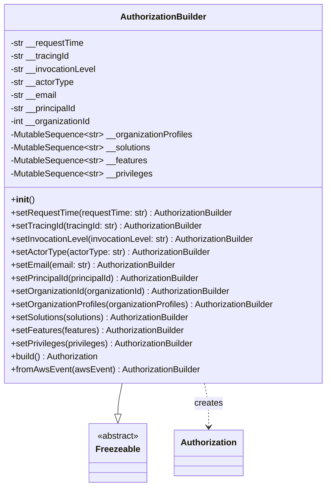
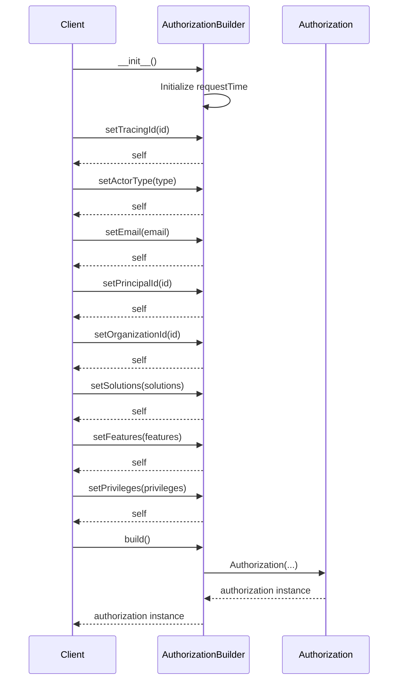
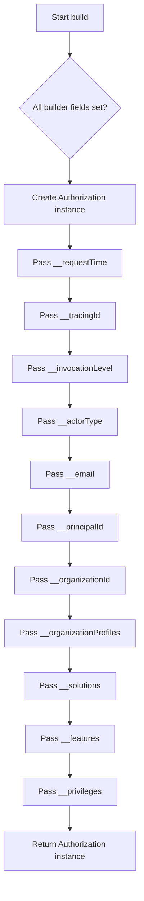

# Diagram: platform/partview_core/partview_service/partview_service/core/messaging/AuthorizationBuilder.py

> Auto-generated by Obscura crawlers

## Diagram 1

### SVG

<svg id="container" width="610.09375" xmlns="http://www.w3.org/2000/svg" class="classDiagram" height="894" viewBox="0 0 610.09375 894" role="graphics-document document" aria-roledescription="class"><g><defs><marker id="container_class-aggregationStart" class="marker aggregation class" refX="18" refY="7" markerWidth="190" markerHeight="240" orient="auto"><path d="M 18,7 L9,13 L1,7 L9,1 Z"></path></marker></defs><defs><marker id="container_class-aggregationEnd" class="marker aggregation class" refX="1" refY="7" markerWidth="20" markerHeight="28" orient="auto"><path d="M 18,7 L9,13 L1,7 L9,1 Z"></path></marker></defs><defs><marker id="container_class-extensionStart" class="marker extension class" refX="18" refY="7" markerWidth="190" markerHeight="240" orient="auto"><path d="M 1,7 L18,13 V 1 Z"></path></marker></defs><defs><marker id="container_class-extensionEnd" class="marker extension class" refX="1" refY="7" markerWidth="20" markerHeight="28" orient="auto"><path d="M 1,1 V 13 L18,7 Z"></path></marker></defs><defs><marker id="container_class-compositionStart" class="marker composition class" refX="18" refY="7" markerWidth="190" markerHeight="240" orient="auto"><path d="M 18,7 L9,13 L1,7 L9,1 Z"></path></marker></defs><defs><marker id="container_class-compositionEnd" class="marker composition class" refX="1" refY="7" markerWidth="20" markerHeight="28" orient="auto"><path d="M 18,7 L9,13 L1,7 L9,1 Z"></path></marker></defs><defs><marker id="container_class-dependencyStart" class="marker dependency class" refX="6" refY="7" markerWidth="190" markerHeight="240" orient="auto"><path d="M 5,7 L9,13 L1,7 L9,1 Z"></path></marker></defs><defs><marker id="container_class-dependencyEnd" class="marker dependency class" refX="13" refY="7" markerWidth="20" markerHeight="28" orient="auto"><path d="M 18,7 L9,13 L14,7 L9,1 Z"></path></marker></defs><defs><marker id="container_class-lollipopStart" class="marker lollipop class" refX="13" refY="7" markerWidth="190" markerHeight="240" orient="auto"><circle stroke="black" fill="transparent" cx="7" cy="7" r="6"></circle></marker></defs><defs><marker id="container_class-lollipopEnd" class="marker lollipop class" refX="1" refY="7" markerWidth="190" markerHeight="240" orient="auto"><circle stroke="black" fill="transparent" cx="7" cy="7" r="6"></circle></marker></defs><g class="root"><g class="clusters"></g><g class="edgePaths"><path d="M231.422,704L230.117,710.167C228.812,716.333,226.203,728.667,224.898,738.125C223.594,747.583,223.594,754.167,223.594,757.458L223.594,760.75" id="id_AuthorizationBuilder_Freezeable_1" class="edge-thickness-normal edge-pattern-solid relation" style=";;;" data-edge="true" data-et="edge" data-id="id_AuthorizationBuilder_Freezeable_1" data-points="W3sieCI6MjMxLjQyMTcxMjY2MjMzNzY1LCJ5Ijo3MDR9LHsieCI6MjIzLjU5Mzc1LCJ5Ijo3NDF9LHsieCI6MjIzLjU5Mzc1LCJ5Ijo3Nzh9XQ==" marker-end="url(#container_class-extensionEnd)"></path><path d="M378.672,704L379.977,710.167C381.281,716.333,383.891,728.667,385.195,742C386.5,755.333,386.5,769.667,386.5,776.833L386.5,784" id="id_AuthorizationBuilder_Authorization_2" class="edge-thickness-normal edge-pattern-dashed relation" style=";;;" data-edge="true" data-et="edge" data-id="id_AuthorizationBuilder_Authorization_2" data-points="W3sieCI6Mzc4LjY3MjAzNzMzNzY2MjM1LCJ5Ijo3MDR9LHsieCI6Mzg2LjUsInkiOjc0MX0seyJ4IjozODYuNSwieSI6NzkwfV0=" marker-end="url(#container_class-dependencyEnd)"></path></g><g class="edgeLabels"><g class="edgeLabel"><g class="label" data-id="id_AuthorizationBuilder_Freezeable_1" transform="translate(0, 0)"><foreignObject width="0" height="0">

</foreignObject></g></g><g class="edgeLabel" transform="translate(386.5, 741)"><g class="label" data-id="id_AuthorizationBuilder_Authorization_2" transform="translate(-26.171875, -12)"><foreignObject width="52.34375" height="24">

creates

</foreignObject></g></g></g><g class="nodes"><g class="node default" id="classId-AuthorizationBuilder-0" transform="translate(305.046875, 356)"><g class="basic label-container"><path d="M-297.046875 -348 L297.046875 -348 L297.046875 348 L-297.046875 348" stroke="none" stroke-width="0" fill="#ECECFF" style=""></path><path d="M-297.046875 -348 C-113.49491708224892 -348, 70.05704083550216 -348, 297.046875 -348 M-297.046875 -348 C-74.68329249554037 -348, 147.68029000891926 -348, 297.046875 -348 M297.046875 -348 C297.046875 -142.02729535911251, 297.046875 63.94540928177497, 297.046875 348 M297.046875 -348 C297.046875 -200.79779703288324, 297.046875 -53.59559406576648, 297.046875 348 M297.046875 348 C103.43387996694031 348, -90.17911506611938 348, -297.046875 348 M297.046875 348 C72.98736244333259 348, -151.07215011333483 348, -297.046875 348 M-297.046875 348 C-297.046875 174.62177291976886, -297.046875 1.2435458395377168, -297.046875 -348 M-297.046875 348 C-297.046875 128.73315489530697, -297.046875 -90.53369020938607, -297.046875 -348" stroke="#9370DB" stroke-width="1.3" fill="none" stroke-dasharray="0 0" style=""></path></g><g class="annotation-group text" transform="translate(0, -324)"></g><g class="label-group text" transform="translate(-76.234375, -324)"><g class="label" style="font-weight: bolder" transform="translate(0,-12)"><foreignObject width="152.46875" height="24">

AuthorizationBuilder

</foreignObject></g></g><g class="members-group text" transform="translate(-285.046875, -276)"><g class="label" style="" transform="translate(0,-12)"><foreignObject width="137.078125" height="24">

-str __requestTime

</foreignObject></g><g class="label" style="" transform="translate(0,12)"><foreignObject width="110.515625" height="24">

-str __tracingId

</foreignObject></g><g class="label" style="" transform="translate(0,36)"><foreignObject width="160.171875" height="24">

-str __invocationLevel

</foreignObject></g><g class="label" style="" transform="translate(0,60)"><foreignObject width="117.421875" height="24">

-str __actorType

</foreignObject></g><g class="label" style="" transform="translate(0,84)"><foreignObject width="86.609375" height="24">

-str __email

</foreignObject></g><g class="label" style="" transform="translate(0,108)"><foreignObject width="125.1875" height="24">

-str __principalId

</foreignObject></g><g class="label" style="" transform="translate(0,132)"><foreignObject width="151.15625" height="24">

-int __organizationId

</foreignObject></g><g class="label" style="" transform="translate(0,156)"><foreignObject width="336.078125" height="24">

-MutableSequence&lt;str&gt; __organizationProfiles

</foreignObject></g><g class="label" style="" transform="translate(0,180)"><foreignObject width="259.3125" height="24">

-MutableSequence&lt;str&gt; __solutions

</foreignObject></g><g class="label" style="" transform="translate(0,204)"><foreignObject width="251.140625" height="24">

-MutableSequence&lt;str&gt; __features

</foreignObject></g><g class="label" style="" transform="translate(0,228)"><foreignObject width="262.1875" height="24">

-MutableSequence&lt;str&gt; __privileges

</foreignObject></g></g><g class="methods-group text" transform="translate(-285.046875, 12)"><g class="label" style="" transform="translate(0,-12)"><foreignObject width="42.796875" height="24">

+<strong>init</strong>()

</foreignObject></g><g class="label" style="" transform="translate(0,12)"><foreignObject width="415.609375" height="24">

+setRequestTime(requestTime: str) : AuthorizationBuilder

</foreignObject></g><g class="label" style="" transform="translate(0,36)"><foreignObject width="361.40625" height="24">

+setTracingId(tracingId: str) : AuthorizationBuilder

</foreignObject></g><g class="label" style="" transform="translate(0,60)"><foreignObject width="458.40625" height="24">

+setInvocationLevel(invocationLevel: str) : AuthorizationBuilder

</foreignObject></g><g class="label" style="" transform="translate(0,84)"><foreignObject width="373.640625" height="24">

+setActorType(actorType: str) : AuthorizationBuilder

</foreignObject></g><g class="label" style="" transform="translate(0,108)"><foreignObject width="311.421875" height="24">

+setEmail(email: str) : AuthorizationBuilder

</foreignObject></g><g class="label" style="" transform="translate(0,132)"><foreignObject width="360.0625" height="24">

+setPrincipalId(principalId) : AuthorizationBuilder

</foreignObject></g><g class="label" style="" transform="translate(0,156)"><foreignObject width="414.40625" height="24">

+setOrganizationId(organizationId) : AuthorizationBuilder

</foreignObject></g><g class="label" style="" transform="translate(0,180)"><foreignObject width="493.859375" height="24">

+setOrganizationProfiles(organizationProfiles) : AuthorizationBuilder

</foreignObject></g><g class="label" style="" transform="translate(0,204)"><foreignObject width="339.234375" height="24">

+setSolutions(solutions) : AuthorizationBuilder

</foreignObject></g><g class="label" style="" transform="translate(0,228)"><foreignObject width="324.375" height="24">

+setFeatures(features) : AuthorizationBuilder

</foreignObject></g><g class="label" style="" transform="translate(0,252)"><foreignObject width="343.1875" height="24">

+setPrivileges(privileges) : AuthorizationBuilder

</foreignObject></g><g class="label" style="" transform="translate(0,276)"><foreignObject width="166.3125" height="24">

+build() : Authorization

</foreignObject></g><g class="label" style="" transform="translate(0,300)"><foreignObject width="350.828125" height="24">

+fromAwsEvent(awsEvent) : AuthorizationBuilder

</foreignObject></g></g><g class="divider" style=""><path d="M-297.046875 -300 C-67.62087346299157 -300, 161.80512807401686 -300, 297.046875 -300 M-297.046875 -300 C-103.98819486010822 -300, 89.07048527978355 -300, 297.046875 -300" stroke="#9370DB" stroke-width="1.3" fill="none" stroke-dasharray="0 0" style=""></path></g><g class="divider" style=""><path d="M-297.046875 -12 C-71.94534230321094 -12, 153.15619039357813 -12, 297.046875 -12 M-297.046875 -12 C-90.37530699616264 -12, 116.29626100767473 -12, 297.046875 -12" stroke="#9370DB" stroke-width="1.3" fill="none" stroke-dasharray="0 0" style=""></path></g></g><g class="node default" id="classId-Freezeable-1" transform="translate(223.59375, 832)"><g class="basic label-container"><path d="M-51.1953125 -54 L51.1953125 -54 L51.1953125 54 L-51.1953125 54" stroke="none" stroke-width="0" fill="#ECECFF" style=""></path><path d="M-51.1953125 -54 C-12.098325314841162 -54, 26.998661870317676 -54, 51.1953125 -54 M-51.1953125 -54 C-29.81631762139597 -54, -8.437322742791942 -54, 51.1953125 -54 M51.1953125 -54 C51.1953125 -11.183885642721734, 51.1953125 31.632228714556533, 51.1953125 54 M51.1953125 -54 C51.1953125 -20.62803025229607, 51.1953125 12.743939495407858, 51.1953125 54 M51.1953125 54 C15.267157097821574 54, -20.660998304356852 54, -51.1953125 54 M51.1953125 54 C16.03231179189597 54, -19.130688916208058 54, -51.1953125 54 M-51.1953125 54 C-51.1953125 21.01670854915291, -51.1953125 -11.966582901694181, -51.1953125 -54 M-51.1953125 54 C-51.1953125 19.35062995128545, -51.1953125 -15.298740097429103, -51.1953125 -54" stroke="#9370DB" stroke-width="1.3" fill="none" stroke-dasharray="0 0" style=""></path></g><g class="annotation-group text" transform="translate(-38.609375, -30)"><g class="label" style="" transform="translate(0,-12)"><foreignObject width="77.21875" height="24">

«abstract»

</foreignObject></g></g><g class="label-group text" transform="translate(-39.1953125, -6)"><g class="label" style="font-weight: bolder" transform="translate(0,-12)"><foreignObject width="78.390625" height="24">

Freezeable

</foreignObject></g></g><g class="members-group text" transform="translate(-39.1953125, 42)"></g><g class="methods-group text" transform="translate(-39.1953125, 72)"></g><g class="divider" style=""><path d="M-51.1953125 18 C-17.989234654659526 18, 15.216843190680947 18, 51.1953125 18 M-51.1953125 18 C-12.090270204956134 18, 27.01477209008773 18, 51.1953125 18" stroke="#9370DB" stroke-width="1.3" fill="none" stroke-dasharray="0 0" style=""></path></g><g class="divider" style=""><path d="M-51.1953125 36 C-19.444273655874174 36, 12.306765188251653 36, 51.1953125 36 M-51.1953125 36 C-11.825754668422803 36, 27.543803163154394 36, 51.1953125 36" stroke="#9370DB" stroke-width="1.3" fill="none" stroke-dasharray="0 0" style=""></path></g></g><g class="node default" id="classId-Authorization-2" transform="translate(386.5, 832)"><g class="basic label-container"><path d="M-61.7109375 -42 L61.7109375 -42 L61.7109375 42 L-61.7109375 42" stroke="none" stroke-width="0" fill="#ECECFF" style=""></path><path d="M-61.7109375 -42 C-19.944725822768056 -42, 21.821485854463887 -42, 61.7109375 -42 M-61.7109375 -42 C-32.58988607387843 -42, -3.4688346477568714 -42, 61.7109375 -42 M61.7109375 -42 C61.7109375 -17.045119306695927, 61.7109375 7.909761386608146, 61.7109375 42 M61.7109375 -42 C61.7109375 -14.23404620901098, 61.7109375 13.53190758197804, 61.7109375 42 M61.7109375 42 C13.902145562898092 42, -33.90664637420382 42, -61.7109375 42 M61.7109375 42 C35.67838543869293 42, 9.645833377385856 42, -61.7109375 42 M-61.7109375 42 C-61.7109375 20.781103718986095, -61.7109375 -0.43779256202780914, -61.7109375 -42 M-61.7109375 42 C-61.7109375 17.716708597111243, -61.7109375 -6.566582805777514, -61.7109375 -42" stroke="#9370DB" stroke-width="1.3" fill="none" stroke-dasharray="0 0" style=""></path></g><g class="annotation-group text" transform="translate(0, -18)"></g><g class="label-group text" transform="translate(-49.7109375, -18)"><g class="label" style="font-weight: bolder" transform="translate(0,-12)"><foreignObject width="99.421875" height="24">

Authorization

</foreignObject></g></g><g class="members-group text" transform="translate(-49.7109375, 30)"></g><g class="methods-group text" transform="translate(-49.7109375, 60)"></g><g class="divider" style=""><path d="M-61.7109375 6 C-14.338668502934091 6, 33.03360049413182 6, 61.7109375 6 M-61.7109375 6 C-29.19742396939096 6, 3.316089561218078 6, 61.7109375 6" stroke="#9370DB" stroke-width="1.3" fill="none" stroke-dasharray="0 0" style=""></path></g><g class="divider" style=""><path d="M-61.7109375 24 C-16.35235125320869 24, 29.006234993582623 24, 61.7109375 24 M-61.7109375 24 C-31.982418956655987 24, -2.2539004133119747 24, 61.7109375 24" stroke="#9370DB" stroke-width="1.3" fill="none" stroke-dasharray="0 0" style=""></path></g></g></g></g></g></svg>

## Diagram 2

### SVG

<svg id="container" width="725" xmlns="http://www.w3.org/2000/svg" height="1257" viewBox="-50 -10 725 1257" role="graphics-document document" aria-roledescription="sequence"><g><rect x="475" y="1171" fill="#eaeaea" stroke="#666" width="150" height="65" name="Auth" rx="3" ry="3" class="actor actor-bottom"></rect><text x="550" y="1203.5" dominant-baseline="central" alignment-baseline="central" class="actor actor-box" style="text-anchor: middle; font-size: 16px; font-weight: 400;"><tspan x="550" dy="0">Authorization</tspan></text></g><g><rect x="231" y="1171" fill="#eaeaea" stroke="#666" width="172" height="65" name="Builder" rx="3" ry="3" class="actor actor-bottom"></rect><text x="317" y="1203.5" dominant-baseline="central" alignment-baseline="central" class="actor actor-box" style="text-anchor: middle; font-size: 16px; font-weight: 400;"><tspan x="317" dy="0">AuthorizationBuilder</tspan></text></g><g><rect x="0" y="1171" fill="#eaeaea" stroke="#666" width="150" height="65" name="Client" rx="3" ry="3" class="actor actor-bottom"></rect><text x="75" y="1203.5" dominant-baseline="central" alignment-baseline="central" class="actor actor-box" style="text-anchor: middle; font-size: 16px; font-weight: 400;"><tspan x="75" dy="0">Client</tspan></text></g><g><line id="actor2" x1="550" y1="65" x2="550" y2="1171" class="actor-line 200" stroke-width="0.5px" stroke="#999" name="Auth"></line><g id="root-2"><rect x="475" y="0" fill="#eaeaea" stroke="#666" width="150" height="65" name="Auth" rx="3" ry="3" class="actor actor-top"></rect><text x="550" y="32.5" dominant-baseline="central" alignment-baseline="central" class="actor actor-box" style="text-anchor: middle; font-size: 16px; font-weight: 400;"><tspan x="550" dy="0">Authorization</tspan></text></g></g><g><line id="actor1" x1="317" y1="65" x2="317" y2="1171" class="actor-line 200" stroke-width="0.5px" stroke="#999" name="Builder"></line><g id="root-1"><rect x="231" y="0" fill="#eaeaea" stroke="#666" width="172" height="65" name="Builder" rx="3" ry="3" class="actor actor-top"></rect><text x="317" y="32.5" dominant-baseline="central" alignment-baseline="central" class="actor actor-box" style="text-anchor: middle; font-size: 16px; font-weight: 400;"><tspan x="317" dy="0">AuthorizationBuilder</tspan></text></g></g><g><line id="actor0" x1="75" y1="65" x2="75" y2="1171" class="actor-line 200" stroke-width="0.5px" stroke="#999" name="Client"></line><g id="root-0"><rect x="0" y="0" fill="#eaeaea" stroke="#666" width="150" height="65" name="Client" rx="3" ry="3" class="actor actor-top"></rect><text x="75" y="32.5" dominant-baseline="central" alignment-baseline="central" class="actor actor-box" style="text-anchor: middle; font-size: 16px; font-weight: 400;"><tspan x="75" dy="0">Client</tspan></text></g></g><g></g><defs><symbol id="computer" width="24" height="24"><path transform="scale(.5)" d="M2 2v13h20v-13h-20zm18 11h-16v-9h16v9zm-10.228 6l.466-1h3.524l.467 1h-4.457zm14.228 3h-24l2-6h2.104l-1.33 4h18.45l-1.297-4h2.073l2 6zm-5-10h-14v-7h14v7z"></path></symbol></defs><defs><symbol id="database" fill-rule="evenodd" clip-rule="evenodd"><path transform="scale(.5)" d="M12.258.001l.256.004.255.005.253.008.251.01.249.012.247.015.246.016.242.019.241.02.239.023.236.024.233.027.231.028.229.031.225.032.223.034.22.036.217.038.214.04.211.041.208.043.205.045.201.046.198.048.194.05.191.051.187.053.183.054.18.056.175.057.172.059.168.06.163.061.16.063.155.064.15.066.074.033.073.033.071.034.07.034.069.035.068.035.067.035.066.035.064.036.064.036.062.036.06.036.06.037.058.037.058.037.055.038.055.038.053.038.052.038.051.039.05.039.048.039.047.039.045.04.044.04.043.04.041.04.04.041.039.041.037.041.036.041.034.041.033.042.032.042.03.042.029.042.027.042.026.043.024.043.023.043.021.043.02.043.018.044.017.043.015.044.013.044.012.044.011.045.009.044.007.045.006.045.004.045.002.045.001.045v17l-.001.045-.002.045-.004.045-.006.045-.007.045-.009.044-.011.045-.012.044-.013.044-.015.044-.017.043-.018.044-.02.043-.021.043-.023.043-.024.043-.026.043-.027.042-.029.042-.03.042-.032.042-.033.042-.034.041-.036.041-.037.041-.039.041-.04.041-.041.04-.043.04-.044.04-.045.04-.047.039-.048.039-.05.039-.051.039-.052.038-.053.038-.055.038-.055.038-.058.037-.058.037-.06.037-.06.036-.062.036-.064.036-.064.036-.066.035-.067.035-.068.035-.069.035-.07.034-.071.034-.073.033-.074.033-.15.066-.155.064-.16.063-.163.061-.168.06-.172.059-.175.057-.18.056-.183.054-.187.053-.191.051-.194.05-.198.048-.201.046-.205.045-.208.043-.211.041-.214.04-.217.038-.22.036-.223.034-.225.032-.229.031-.231.028-.233.027-.236.024-.239.023-.241.02-.242.019-.246.016-.247.015-.249.012-.251.01-.253.008-.255.005-.256.004-.258.001-.258-.001-.256-.004-.255-.005-.253-.008-.251-.01-.249-.012-.247-.015-.245-.016-.243-.019-.241-.02-.238-.023-.236-.024-.234-.027-.231-.028-.228-.031-.226-.032-.223-.034-.22-.036-.217-.038-.214-.04-.211-.041-.208-.043-.204-.045-.201-.046-.198-.048-.195-.05-.19-.051-.187-.053-.184-.054-.179-.056-.176-.057-.172-.059-.167-.06-.164-.061-.159-.063-.155-.064-.151-.066-.074-.033-.072-.033-.072-.034-.07-.034-.069-.035-.068-.035-.067-.035-.066-.035-.064-.036-.063-.036-.062-.036-.061-.036-.06-.037-.058-.037-.057-.037-.056-.038-.055-.038-.053-.038-.052-.038-.051-.039-.049-.039-.049-.039-.046-.039-.046-.04-.044-.04-.043-.04-.041-.04-.04-.041-.039-.041-.037-.041-.036-.041-.034-.041-.033-.042-.032-.042-.03-.042-.029-.042-.027-.042-.026-.043-.024-.043-.023-.043-.021-.043-.02-.043-.018-.044-.017-.043-.015-.044-.013-.044-.012-.044-.011-.045-.009-.044-.007-.045-.006-.045-.004-.045-.002-.045-.001-.045v-17l.001-.045.002-.045.004-.045.006-.045.007-.045.009-.044.011-.045.012-.044.013-.044.015-.044.017-.043.018-.044.02-.043.021-.043.023-.043.024-.043.026-.043.027-.042.029-.042.03-.042.032-.042.033-.042.034-.041.036-.041.037-.041.039-.041.04-.041.041-.04.043-.04.044-.04.046-.04.046-.039.049-.039.049-.039.051-.039.052-.038.053-.038.055-.038.056-.038.057-.037.058-.037.06-.037.061-.036.062-.036.063-.036.064-.036.066-.035.067-.035.068-.035.069-.035.07-.034.072-.034.072-.033.074-.033.151-.066.155-.064.159-.063.164-.061.167-.06.172-.059.176-.057.179-.056.184-.054.187-.053.19-.051.195-.05.198-.048.201-.046.204-.045.208-.043.211-.041.214-.04.217-.038.22-.036.223-.034.226-.032.228-.031.231-.028.234-.027.236-.024.238-.023.241-.02.243-.019.245-.016.247-.015.249-.012.251-.01.253-.008.255-.005.256-.004.258-.001.258.001zm-9.258 20.499v.01l.001.021.003.021.004.022.005.021.006.022.007.022.009.023.01.022.011.023.012.023.013.023.015.023.016.024.017.023.018.024.019.024.021.024.022.025.023.024.024.025.052.049.056.05.061.051.066.051.07.051.075.051.079.052.084.052.088.052.092.052.097.052.102.051.105.052.11.052.114.051.119.051.123.051.127.05.131.05.135.05.139.048.144.049.147.047.152.047.155.047.16.045.163.045.167.043.171.043.176.041.178.041.183.039.187.039.19.037.194.035.197.035.202.033.204.031.209.03.212.029.216.027.219.025.222.024.226.021.23.02.233.018.236.016.24.015.243.012.246.01.249.008.253.005.256.004.259.001.26-.001.257-.004.254-.005.25-.008.247-.011.244-.012.241-.014.237-.016.233-.018.231-.021.226-.021.224-.024.22-.026.216-.027.212-.028.21-.031.205-.031.202-.034.198-.034.194-.036.191-.037.187-.039.183-.04.179-.04.175-.042.172-.043.168-.044.163-.045.16-.046.155-.046.152-.047.148-.048.143-.049.139-.049.136-.05.131-.05.126-.05.123-.051.118-.052.114-.051.11-.052.106-.052.101-.052.096-.052.092-.052.088-.053.083-.051.079-.052.074-.052.07-.051.065-.051.06-.051.056-.05.051-.05.023-.024.023-.025.021-.024.02-.024.019-.024.018-.024.017-.024.015-.023.014-.024.013-.023.012-.023.01-.023.01-.022.008-.022.006-.022.006-.022.004-.022.004-.021.001-.021.001-.021v-4.127l-.077.055-.08.053-.083.054-.085.053-.087.052-.09.052-.093.051-.095.05-.097.05-.1.049-.102.049-.105.048-.106.047-.109.047-.111.046-.114.045-.115.045-.118.044-.12.043-.122.042-.124.042-.126.041-.128.04-.13.04-.132.038-.134.038-.135.037-.138.037-.139.035-.142.035-.143.034-.144.033-.147.032-.148.031-.15.03-.151.03-.153.029-.154.027-.156.027-.158.026-.159.025-.161.024-.162.023-.163.022-.165.021-.166.02-.167.019-.169.018-.169.017-.171.016-.173.015-.173.014-.175.013-.175.012-.177.011-.178.01-.179.008-.179.008-.181.006-.182.005-.182.004-.184.003-.184.002h-.37l-.184-.002-.184-.003-.182-.004-.182-.005-.181-.006-.179-.008-.179-.008-.178-.01-.176-.011-.176-.012-.175-.013-.173-.014-.172-.015-.171-.016-.17-.017-.169-.018-.167-.019-.166-.02-.165-.021-.163-.022-.162-.023-.161-.024-.159-.025-.157-.026-.156-.027-.155-.027-.153-.029-.151-.03-.15-.03-.148-.031-.146-.032-.145-.033-.143-.034-.141-.035-.14-.035-.137-.037-.136-.037-.134-.038-.132-.038-.13-.04-.128-.04-.126-.041-.124-.042-.122-.042-.12-.044-.117-.043-.116-.045-.113-.045-.112-.046-.109-.047-.106-.047-.105-.048-.102-.049-.1-.049-.097-.05-.095-.05-.093-.052-.09-.051-.087-.052-.085-.053-.083-.054-.08-.054-.077-.054v4.127zm0-5.654v.011l.001.021.003.021.004.021.005.022.006.022.007.022.009.022.01.022.011.023.012.023.013.023.015.024.016.023.017.024.018.024.019.024.021.024.022.024.023.025.024.024.052.05.056.05.061.05.066.051.07.051.075.052.079.051.084.052.088.052.092.052.097.052.102.052.105.052.11.051.114.051.119.052.123.05.127.051.131.05.135.049.139.049.144.048.147.048.152.047.155.046.16.045.163.045.167.044.171.042.176.042.178.04.183.04.187.038.19.037.194.036.197.034.202.033.204.032.209.03.212.028.216.027.219.025.222.024.226.022.23.02.233.018.236.016.24.014.243.012.246.01.249.008.253.006.256.003.259.001.26-.001.257-.003.254-.006.25-.008.247-.01.244-.012.241-.015.237-.016.233-.018.231-.02.226-.022.224-.024.22-.025.216-.027.212-.029.21-.03.205-.032.202-.033.198-.035.194-.036.191-.037.187-.039.183-.039.179-.041.175-.042.172-.043.168-.044.163-.045.16-.045.155-.047.152-.047.148-.048.143-.048.139-.05.136-.049.131-.05.126-.051.123-.051.118-.051.114-.052.11-.052.106-.052.101-.052.096-.052.092-.052.088-.052.083-.052.079-.052.074-.051.07-.052.065-.051.06-.05.056-.051.051-.049.023-.025.023-.024.021-.025.02-.024.019-.024.018-.024.017-.024.015-.023.014-.023.013-.024.012-.022.01-.023.01-.023.008-.022.006-.022.006-.022.004-.021.004-.022.001-.021.001-.021v-4.139l-.077.054-.08.054-.083.054-.085.052-.087.053-.09.051-.093.051-.095.051-.097.05-.1.049-.102.049-.105.048-.106.047-.109.047-.111.046-.114.045-.115.044-.118.044-.12.044-.122.042-.124.042-.126.041-.128.04-.13.039-.132.039-.134.038-.135.037-.138.036-.139.036-.142.035-.143.033-.144.033-.147.033-.148.031-.15.03-.151.03-.153.028-.154.028-.156.027-.158.026-.159.025-.161.024-.162.023-.163.022-.165.021-.166.02-.167.019-.169.018-.169.017-.171.016-.173.015-.173.014-.175.013-.175.012-.177.011-.178.009-.179.009-.179.007-.181.007-.182.005-.182.004-.184.003-.184.002h-.37l-.184-.002-.184-.003-.182-.004-.182-.005-.181-.007-.179-.007-.179-.009-.178-.009-.176-.011-.176-.012-.175-.013-.173-.014-.172-.015-.171-.016-.17-.017-.169-.018-.167-.019-.166-.02-.165-.021-.163-.022-.162-.023-.161-.024-.159-.025-.157-.026-.156-.027-.155-.028-.153-.028-.151-.03-.15-.03-.148-.031-.146-.033-.145-.033-.143-.033-.141-.035-.14-.036-.137-.036-.136-.037-.134-.038-.132-.039-.13-.039-.128-.04-.126-.041-.124-.042-.122-.043-.12-.043-.117-.044-.116-.044-.113-.046-.112-.046-.109-.046-.106-.047-.105-.048-.102-.049-.1-.049-.097-.05-.095-.051-.093-.051-.09-.051-.087-.053-.085-.052-.083-.054-.08-.054-.077-.054v4.139zm0-5.666v.011l.001.02.003.022.004.021.005.022.006.021.007.022.009.023.01.022.011.023.012.023.013.023.015.023.016.024.017.024.018.023.019.024.021.025.022.024.023.024.024.025.052.05.056.05.061.05.066.051.07.051.075.052.079.051.084.052.088.052.092.052.097.052.102.052.105.051.11.052.114.051.119.051.123.051.127.05.131.05.135.05.139.049.144.048.147.048.152.047.155.046.16.045.163.045.167.043.171.043.176.042.178.04.183.04.187.038.19.037.194.036.197.034.202.033.204.032.209.03.212.028.216.027.219.025.222.024.226.021.23.02.233.018.236.017.24.014.243.012.246.01.249.008.253.006.256.003.259.001.26-.001.257-.003.254-.006.25-.008.247-.01.244-.013.241-.014.237-.016.233-.018.231-.02.226-.022.224-.024.22-.025.216-.027.212-.029.21-.03.205-.032.202-.033.198-.035.194-.036.191-.037.187-.039.183-.039.179-.041.175-.042.172-.043.168-.044.163-.045.16-.045.155-.047.152-.047.148-.048.143-.049.139-.049.136-.049.131-.051.126-.05.123-.051.118-.052.114-.051.11-.052.106-.052.101-.052.096-.052.092-.052.088-.052.083-.052.079-.052.074-.052.07-.051.065-.051.06-.051.056-.05.051-.049.023-.025.023-.025.021-.024.02-.024.019-.024.018-.024.017-.024.015-.023.014-.024.013-.023.012-.023.01-.022.01-.023.008-.022.006-.022.006-.022.004-.022.004-.021.001-.021.001-.021v-4.153l-.077.054-.08.054-.083.053-.085.053-.087.053-.09.051-.093.051-.095.051-.097.05-.1.049-.102.048-.105.048-.106.048-.109.046-.111.046-.114.046-.115.044-.118.044-.12.043-.122.043-.124.042-.126.041-.128.04-.13.039-.132.039-.134.038-.135.037-.138.036-.139.036-.142.034-.143.034-.144.033-.147.032-.148.032-.15.03-.151.03-.153.028-.154.028-.156.027-.158.026-.159.024-.161.024-.162.023-.163.023-.165.021-.166.02-.167.019-.169.018-.169.017-.171.016-.173.015-.173.014-.175.013-.175.012-.177.01-.178.01-.179.009-.179.007-.181.006-.182.006-.182.004-.184.003-.184.001-.185.001-.185-.001-.184-.001-.184-.003-.182-.004-.182-.006-.181-.006-.179-.007-.179-.009-.178-.01-.176-.01-.176-.012-.175-.013-.173-.014-.172-.015-.171-.016-.17-.017-.169-.018-.167-.019-.166-.02-.165-.021-.163-.023-.162-.023-.161-.024-.159-.024-.157-.026-.156-.027-.155-.028-.153-.028-.151-.03-.15-.03-.148-.032-.146-.032-.145-.033-.143-.034-.141-.034-.14-.036-.137-.036-.136-.037-.134-.038-.132-.039-.13-.039-.128-.041-.126-.041-.124-.041-.122-.043-.12-.043-.117-.044-.116-.044-.113-.046-.112-.046-.109-.046-.106-.048-.105-.048-.102-.048-.1-.05-.097-.049-.095-.051-.093-.051-.09-.052-.087-.052-.085-.053-.083-.053-.08-.054-.077-.054v4.153zm8.74-8.179l-.257.004-.254.005-.25.008-.247.011-.244.012-.241.014-.237.016-.233.018-.231.021-.226.022-.224.023-.22.026-.216.027-.212.028-.21.031-.205.032-.202.033-.198.034-.194.036-.191.038-.187.038-.183.04-.179.041-.175.042-.172.043-.168.043-.163.045-.16.046-.155.046-.152.048-.148.048-.143.048-.139.049-.136.05-.131.05-.126.051-.123.051-.118.051-.114.052-.11.052-.106.052-.101.052-.096.052-.092.052-.088.052-.083.052-.079.052-.074.051-.07.052-.065.051-.06.05-.056.05-.051.05-.023.025-.023.024-.021.024-.02.025-.019.024-.018.024-.017.023-.015.024-.014.023-.013.023-.012.023-.01.023-.01.022-.008.022-.006.023-.006.021-.004.022-.004.021-.001.021-.001.021.001.021.001.021.004.021.004.022.006.021.006.023.008.022.01.022.01.023.012.023.013.023.014.023.015.024.017.023.018.024.019.024.02.025.021.024.023.024.023.025.051.05.056.05.06.05.065.051.07.052.074.051.079.052.083.052.088.052.092.052.096.052.101.052.106.052.11.052.114.052.118.051.123.051.126.051.131.05.136.05.139.049.143.048.148.048.152.048.155.046.16.046.163.045.168.043.172.043.175.042.179.041.183.04.187.038.191.038.194.036.198.034.202.033.205.032.21.031.212.028.216.027.22.026.224.023.226.022.231.021.233.018.237.016.241.014.244.012.247.011.25.008.254.005.257.004.26.001.26-.001.257-.004.254-.005.25-.008.247-.011.244-.012.241-.014.237-.016.233-.018.231-.021.226-.022.224-.023.22-.026.216-.027.212-.028.21-.031.205-.032.202-.033.198-.034.194-.036.191-.038.187-.038.183-.04.179-.041.175-.042.172-.043.168-.043.163-.045.16-.046.155-.046.152-.048.148-.048.143-.048.139-.049.136-.05.131-.05.126-.051.123-.051.118-.051.114-.052.11-.052.106-.052.101-.052.096-.052.092-.052.088-.052.083-.052.079-.052.074-.051.07-.052.065-.051.06-.05.056-.05.051-.05.023-.025.023-.024.021-.024.02-.025.019-.024.018-.024.017-.023.015-.024.014-.023.013-.023.012-.023.01-.023.01-.022.008-.022.006-.023.006-.021.004-.022.004-.021.001-.021.001-.021-.001-.021-.001-.021-.004-.021-.004-.022-.006-.021-.006-.023-.008-.022-.01-.022-.01-.023-.012-.023-.013-.023-.014-.023-.015-.024-.017-.023-.018-.024-.019-.024-.02-.025-.021-.024-.023-.024-.023-.025-.051-.05-.056-.05-.06-.05-.065-.051-.07-.052-.074-.051-.079-.052-.083-.052-.088-.052-.092-.052-.096-.052-.101-.052-.106-.052-.11-.052-.114-.052-.118-.051-.123-.051-.126-.051-.131-.05-.136-.05-.139-.049-.143-.048-.148-.048-.152-.048-.155-.046-.16-.046-.163-.045-.168-.043-.172-.043-.175-.042-.179-.041-.183-.04-.187-.038-.191-.038-.194-.036-.198-.034-.202-.033-.205-.032-.21-.031-.212-.028-.216-.027-.22-.026-.224-.023-.226-.022-.231-.021-.233-.018-.237-.016-.241-.014-.244-.012-.247-.011-.25-.008-.254-.005-.257-.004-.26-.001-.26.001z"></path></symbol></defs><defs><symbol id="clock" width="24" height="24"><path transform="scale(.5)" d="M12 2c5.514 0 10 4.486 10 10s-4.486 10-10 10-10-4.486-10-10 4.486-10 10-10zm0-2c-6.627 0-12 5.373-12 12s5.373 12 12 12 12-5.373 12-12-5.373-12-12-12zm5.848 12.459c.202.038.202.333.001.372-1.907.361-6.045 1.111-6.547 1.111-.719 0-1.301-.582-1.301-1.301 0-.512.77-5.447 1.125-7.445.034-.192.312-.181.343.014l.985 6.238 5.394 1.011z"></path></symbol></defs><defs><marker id="arrowhead" refX="7.9" refY="5" markerUnits="userSpaceOnUse" markerWidth="12" markerHeight="12" orient="auto-start-reverse"><path d="M -1 0 L 10 5 L 0 10 z"></path></marker></defs><defs><marker id="crosshead" markerWidth="15" markerHeight="8" orient="auto" refX="4" refY="4.5"><path fill="none" stroke="#000000" stroke-width="1pt" d="M 1,2 L 6,7 M 6,2 L 1,7" style="stroke-dasharray: 0, 0;"></path></marker></defs><defs><marker id="filled-head" refX="15.5" refY="7" markerWidth="20" markerHeight="28" orient="auto"><path d="M 18,7 L9,13 L14,7 L9,1 Z"></path></marker></defs><defs><marker id="sequencenumber" refX="15" refY="15" markerWidth="60" markerHeight="40" orient="auto"><circle cx="15" cy="15" r="6"></circle></marker></defs><text x="195" y="80" text-anchor="middle" dominant-baseline="middle" alignment-baseline="middle" class="messageText" dy="1em" style="font-size: 16px; font-weight: 400;">__init__()</text><line x1="76" y1="113" x2="313" y2="113" class="messageLine0" stroke-width="2" stroke="none" marker-end="url(#arrowhead)" style="fill: none;"></line><text x="318" y="128" text-anchor="middle" dominant-baseline="middle" alignment-baseline="middle" class="messageText" dy="1em" style="font-size: 16px; font-weight: 400;">Initialize requestTime</text><path d="M 318,161 C 378,151 378,191 318,181" class="messageLine0" stroke-width="2" stroke="none" marker-end="url(#arrowhead)" style="fill: none;"></path><text x="195" y="206" text-anchor="middle" dominant-baseline="middle" alignment-baseline="middle" class="messageText" dy="1em" style="font-size: 16px; font-weight: 400;">setTracingId(id)</text><line x1="76" y1="239" x2="313" y2="239" class="messageLine0" stroke-width="2" stroke="none" marker-end="url(#arrowhead)" style="fill: none;"></line><text x="198" y="254" text-anchor="middle" dominant-baseline="middle" alignment-baseline="middle" class="messageText" dy="1em" style="font-size: 16px; font-weight: 400;">self</text><line x1="316" y1="287" x2="79" y2="287" class="messageLine1" stroke-width="2" stroke="none" marker-end="url(#arrowhead)" style="stroke-dasharray: 3, 3; fill: none;"></line><text x="195" y="302" text-anchor="middle" dominant-baseline="middle" alignment-baseline="middle" class="messageText" dy="1em" style="font-size: 16px; font-weight: 400;">setActorType(type)</text><line x1="76" y1="335" x2="313" y2="335" class="messageLine0" stroke-width="2" stroke="none" marker-end="url(#arrowhead)" style="fill: none;"></line><text x="198" y="350" text-anchor="middle" dominant-baseline="middle" alignment-baseline="middle" class="messageText" dy="1em" style="font-size: 16px; font-weight: 400;">self</text><line x1="316" y1="383" x2="79" y2="383" class="messageLine1" stroke-width="2" stroke="none" marker-end="url(#arrowhead)" style="stroke-dasharray: 3, 3; fill: none;"></line><text x="195" y="398" text-anchor="middle" dominant-baseline="middle" alignment-baseline="middle" class="messageText" dy="1em" style="font-size: 16px; font-weight: 400;">setEmail(email)</text><line x1="76" y1="431" x2="313" y2="431" class="messageLine0" stroke-width="2" stroke="none" marker-end="url(#arrowhead)" style="fill: none;"></line><text x="198" y="446" text-anchor="middle" dominant-baseline="middle" alignment-baseline="middle" class="messageText" dy="1em" style="font-size: 16px; font-weight: 400;">self</text><line x1="316" y1="479" x2="79" y2="479" class="messageLine1" stroke-width="2" stroke="none" marker-end="url(#arrowhead)" style="stroke-dasharray: 3, 3; fill: none;"></line><text x="195" y="494" text-anchor="middle" dominant-baseline="middle" alignment-baseline="middle" class="messageText" dy="1em" style="font-size: 16px; font-weight: 400;">setPrincipalId(id)</text><line x1="76" y1="527" x2="313" y2="527" class="messageLine0" stroke-width="2" stroke="none" marker-end="url(#arrowhead)" style="fill: none;"></line><text x="198" y="542" text-anchor="middle" dominant-baseline="middle" alignment-baseline="middle" class="messageText" dy="1em" style="font-size: 16px; font-weight: 400;">self</text><line x1="316" y1="575" x2="79" y2="575" class="messageLine1" stroke-width="2" stroke="none" marker-end="url(#arrowhead)" style="stroke-dasharray: 3, 3; fill: none;"></line><text x="195" y="590" text-anchor="middle" dominant-baseline="middle" alignment-baseline="middle" class="messageText" dy="1em" style="font-size: 16px; font-weight: 400;">setOrganizationId(id)</text><line x1="76" y1="623" x2="313" y2="623" class="messageLine0" stroke-width="2" stroke="none" marker-end="url(#arrowhead)" style="fill: none;"></line><text x="198" y="638" text-anchor="middle" dominant-baseline="middle" alignment-baseline="middle" class="messageText" dy="1em" style="font-size: 16px; font-weight: 400;">self</text><line x1="316" y1="671" x2="79" y2="671" class="messageLine1" stroke-width="2" stroke="none" marker-end="url(#arrowhead)" style="stroke-dasharray: 3, 3; fill: none;"></line><text x="195" y="686" text-anchor="middle" dominant-baseline="middle" alignment-baseline="middle" class="messageText" dy="1em" style="font-size: 16px; font-weight: 400;">setSolutions(solutions)</text><line x1="76" y1="719" x2="313" y2="719" class="messageLine0" stroke-width="2" stroke="none" marker-end="url(#arrowhead)" style="fill: none;"></line><text x="198" y="734" text-anchor="middle" dominant-baseline="middle" alignment-baseline="middle" class="messageText" dy="1em" style="font-size: 16px; font-weight: 400;">self</text><line x1="316" y1="767" x2="79" y2="767" class="messageLine1" stroke-width="2" stroke="none" marker-end="url(#arrowhead)" style="stroke-dasharray: 3, 3; fill: none;"></line><text x="195" y="782" text-anchor="middle" dominant-baseline="middle" alignment-baseline="middle" class="messageText" dy="1em" style="font-size: 16px; font-weight: 400;">setFeatures(features)</text><line x1="76" y1="815" x2="313" y2="815" class="messageLine0" stroke-width="2" stroke="none" marker-end="url(#arrowhead)" style="fill: none;"></line><text x="198" y="830" text-anchor="middle" dominant-baseline="middle" alignment-baseline="middle" class="messageText" dy="1em" style="font-size: 16px; font-weight: 400;">self</text><line x1="316" y1="863" x2="79" y2="863" class="messageLine1" stroke-width="2" stroke="none" marker-end="url(#arrowhead)" style="stroke-dasharray: 3, 3; fill: none;"></line><text x="195" y="878" text-anchor="middle" dominant-baseline="middle" alignment-baseline="middle" class="messageText" dy="1em" style="font-size: 16px; font-weight: 400;">setPrivileges(privileges)</text><line x1="76" y1="911" x2="313" y2="911" class="messageLine0" stroke-width="2" stroke="none" marker-end="url(#arrowhead)" style="fill: none;"></line><text x="198" y="926" text-anchor="middle" dominant-baseline="middle" alignment-baseline="middle" class="messageText" dy="1em" style="font-size: 16px; font-weight: 400;">self</text><line x1="316" y1="959" x2="79" y2="959" class="messageLine1" stroke-width="2" stroke="none" marker-end="url(#arrowhead)" style="stroke-dasharray: 3, 3; fill: none;"></line><text x="195" y="974" text-anchor="middle" dominant-baseline="middle" alignment-baseline="middle" class="messageText" dy="1em" style="font-size: 16px; font-weight: 400;">build()</text><line x1="76" y1="1007" x2="313" y2="1007" class="messageLine0" stroke-width="2" stroke="none" marker-end="url(#arrowhead)" style="fill: none;"></line><text x="432" y="1022" text-anchor="middle" dominant-baseline="middle" alignment-baseline="middle" class="messageText" dy="1em" style="font-size: 16px; font-weight: 400;">Authorization(...)</text><line x1="318" y1="1055" x2="546" y2="1055" class="messageLine0" stroke-width="2" stroke="none" marker-end="url(#arrowhead)" style="fill: none;"></line><text x="435" y="1070" text-anchor="middle" dominant-baseline="middle" alignment-baseline="middle" class="messageText" dy="1em" style="font-size: 16px; font-weight: 400;">authorization instance</text><line x1="549" y1="1103" x2="321" y2="1103" class="messageLine1" stroke-width="2" stroke="none" marker-end="url(#arrowhead)" style="stroke-dasharray: 3, 3; fill: none;"></line><text x="198" y="1118" text-anchor="middle" dominant-baseline="middle" alignment-baseline="middle" class="messageText" dy="1em" style="font-size: 16px; font-weight: 400;">authorization instance</text><line x1="316" y1="1151" x2="79" y2="1151" class="messageLine1" stroke-width="2" stroke="none" marker-end="url(#arrowhead)" style="stroke-dasharray: 3, 3; fill: none;"></line></svg>

## Diagram 3

```mermaid
flowchart TD
    A[Start fromAwsEvent] --> B[Get requestContext from awsEvent]
    B --> C[Get authorizer from requestContext]
    C --> D[Extract requestId]
    D --> E[Extract requestTime]
    E --> F[Extract lambda_level]
    F --> G[Set __tracingId = requestId]
    G --> H[Set __requestTime = requestTime]
    H --> I[Set __invocationLevel = invocationLevel]
    I --> J[Extract actor_type with default 'human']
    J --> K[Set __actorType]
    K --> L[Extract email]
    L --> M[Set __email]
    M --> N[Extract principalId]
    N --> O[Set __principalId]
    O --> P[Extract organization_id with default empty list]
    P --> Q[Set __organizationId]
    Q --> R[Extract org_profiles with default empty list]
    R --> S[Set __organizationProfiles]
    S --> T[Extract solutions with default empty list]
    T --> U[Set __solutions]
    U --> V[Extract features with default empty list]
    V --> W[Set __features]
    W --> X[Extract privileges with default empty list]
    X --> Y[Set __privileges]
    Y --> Z[Return self]
```

### SVG

<svg id="container" width="276" xmlns="http://www.w3.org/2000/svg" class="flowchart" height="2910" viewBox="0 0 276 2910" role="graphics-document document" aria-roledescription="flowchart-v2"><g><marker id="container_flowchart-v2-pointEnd" class="marker flowchart-v2" viewBox="0 0 10 10" refX="5" refY="5" markerUnits="userSpaceOnUse" markerWidth="8" markerHeight="8" orient="auto"><path d="M 0 0 L 10 5 L 0 10 z" class="arrowMarkerPath" style="stroke-width: 1; stroke-dasharray: 1, 0;"></path></marker><marker id="container_flowchart-v2-pointStart" class="marker flowchart-v2" viewBox="0 0 10 10" refX="4.5" refY="5" markerUnits="userSpaceOnUse" markerWidth="8" markerHeight="8" orient="auto"><path d="M 0 5 L 10 10 L 10 0 z" class="arrowMarkerPath" style="stroke-width: 1; stroke-dasharray: 1, 0;"></path></marker><marker id="container_flowchart-v2-circleEnd" class="marker flowchart-v2" viewBox="0 0 10 10" refX="11" refY="5" markerUnits="userSpaceOnUse" markerWidth="11" markerHeight="11" orient="auto"><circle cx="5" cy="5" r="5" class="arrowMarkerPath" style="stroke-width: 1; stroke-dasharray: 1, 0;"></circle></marker><marker id="container_flowchart-v2-circleStart" class="marker flowchart-v2" viewBox="0 0 10 10" refX="-1" refY="5" markerUnits="userSpaceOnUse" markerWidth="11" markerHeight="11" orient="auto"><circle cx="5" cy="5" r="5" class="arrowMarkerPath" style="stroke-width: 1; stroke-dasharray: 1, 0;"></circle></marker><marker id="container_flowchart-v2-crossEnd" class="marker cross flowchart-v2" viewBox="0 0 11 11" refX="12" refY="5.2" markerUnits="userSpaceOnUse" markerWidth="11" markerHeight="11" orient="auto"><path d="M 1,1 l 9,9 M 10,1 l -9,9" class="arrowMarkerPath" style="stroke-width: 2; stroke-dasharray: 1, 0;"></path></marker><marker id="container_flowchart-v2-crossStart" class="marker cross flowchart-v2" viewBox="0 0 11 11" refX="-1" refY="5.2" markerUnits="userSpaceOnUse" markerWidth="11" markerHeight="11" orient="auto"><path d="M 1,1 l 9,9 M 10,1 l -9,9" class="arrowMarkerPath" style="stroke-width: 2; stroke-dasharray: 1, 0;"></path></marker><g class="root"><g class="clusters"></g><g class="edgePaths"><path d="M138,62L138,66.167C138,70.333,138,78.667,138,86.333C138,94,138,101,138,104.5L138,108" id="L_A_B_0" class="edge-thickness-normal edge-pattern-solid edge-thickness-normal edge-pattern-solid flowchart-link" style=";" data-edge="true" data-et="edge" data-id="L_A_B_0" data-points="W3sieCI6MTM4LCJ5Ijo2Mn0seyJ4IjoxMzgsInkiOjg3fSx7IngiOjEzOCwieSI6MTEyfV0=" marker-end="url(#container_flowchart-v2-pointEnd)"></path><path d="M138,190L138,194.167C138,198.333,138,206.667,138,214.333C138,222,138,229,138,232.5L138,236" id="L_B_C_0" class="edge-thickness-normal edge-pattern-solid edge-thickness-normal edge-pattern-solid flowchart-link" style=";" data-edge="true" data-et="edge" data-id="L_B_C_0" data-points="W3sieCI6MTM4LCJ5IjoxOTB9LHsieCI6MTM4LCJ5IjoyMTV9LHsieCI6MTM4LCJ5IjoyNDB9XQ==" marker-end="url(#container_flowchart-v2-pointEnd)"></path><path d="M138,318L138,322.167C138,326.333,138,334.667,138,342.333C138,350,138,357,138,360.5L138,364" id="L_C_D_0" class="edge-thickness-normal edge-pattern-solid edge-thickness-normal edge-pattern-solid flowchart-link" style=";" data-edge="true" data-et="edge" data-id="L_C_D_0" data-points="W3sieCI6MTM4LCJ5IjozMTh9LHsieCI6MTM4LCJ5IjozNDN9LHsieCI6MTM4LCJ5IjozNjh9XQ==" marker-end="url(#container_flowchart-v2-pointEnd)"></path><path d="M138,422L138,426.167C138,430.333,138,438.667,138,446.333C138,454,138,461,138,464.5L138,468" id="L_D_E_0" class="edge-thickness-normal edge-pattern-solid edge-thickness-normal edge-pattern-solid flowchart-link" style=";" data-edge="true" data-et="edge" data-id="L_D_E_0" data-points="W3sieCI6MTM4LCJ5Ijo0MjJ9LHsieCI6MTM4LCJ5Ijo0NDd9LHsieCI6MTM4LCJ5Ijo0NzJ9XQ==" marker-end="url(#container_flowchart-v2-pointEnd)"></path><path d="M138,526L138,530.167C138,534.333,138,542.667,138,550.333C138,558,138,565,138,568.5L138,572" id="L_E_F_0" class="edge-thickness-normal edge-pattern-solid edge-thickness-normal edge-pattern-solid flowchart-link" style=";" data-edge="true" data-et="edge" data-id="L_E_F_0" data-points="W3sieCI6MTM4LCJ5Ijo1MjZ9LHsieCI6MTM4LCJ5Ijo1NTF9LHsieCI6MTM4LCJ5Ijo1NzZ9XQ==" marker-end="url(#container_flowchart-v2-pointEnd)"></path><path d="M138,630L138,634.167C138,638.333,138,646.667,138,654.333C138,662,138,669,138,672.5L138,676" id="L_F_G_0" class="edge-thickness-normal edge-pattern-solid edge-thickness-normal edge-pattern-solid flowchart-link" style=";" data-edge="true" data-et="edge" data-id="L_F_G_0" data-points="W3sieCI6MTM4LCJ5Ijo2MzB9LHsieCI6MTM4LCJ5Ijo2NTV9LHsieCI6MTM4LCJ5Ijo2ODB9XQ==" marker-end="url(#container_flowchart-v2-pointEnd)"></path><path d="M138,734L138,738.167C138,742.333,138,750.667,138,758.333C138,766,138,773,138,776.5L138,780" id="L_G_H_0" class="edge-thickness-normal edge-pattern-solid edge-thickness-normal edge-pattern-solid flowchart-link" style=";" data-edge="true" data-et="edge" data-id="L_G_H_0" data-points="W3sieCI6MTM4LCJ5Ijo3MzR9LHsieCI6MTM4LCJ5Ijo3NTl9LHsieCI6MTM4LCJ5Ijo3ODR9XQ==" marker-end="url(#container_flowchart-v2-pointEnd)"></path><path d="M138,862L138,866.167C138,870.333,138,878.667,138,886.333C138,894,138,901,138,904.5L138,908" id="L_H_I_0" class="edge-thickness-normal edge-pattern-solid edge-thickness-normal edge-pattern-solid flowchart-link" style=";" data-edge="true" data-et="edge" data-id="L_H_I_0" data-points="W3sieCI6MTM4LCJ5Ijo4NjJ9LHsieCI6MTM4LCJ5Ijo4ODd9LHsieCI6MTM4LCJ5Ijo5MTJ9XQ==" marker-end="url(#container_flowchart-v2-pointEnd)"></path><path d="M138,990L138,994.167C138,998.333,138,1006.667,138,1014.333C138,1022,138,1029,138,1032.5L138,1036" id="L_I_J_0" class="edge-thickness-normal edge-pattern-solid edge-thickness-normal edge-pattern-solid flowchart-link" style=";" data-edge="true" data-et="edge" data-id="L_I_J_0" data-points="W3sieCI6MTM4LCJ5Ijo5OTB9LHsieCI6MTM4LCJ5IjoxMDE1fSx7IngiOjEzOCwieSI6MTA0MH1d" marker-end="url(#container_flowchart-v2-pointEnd)"></path><path d="M138,1118L138,1122.167C138,1126.333,138,1134.667,138,1142.333C138,1150,138,1157,138,1160.5L138,1164" id="L_J_K_0" class="edge-thickness-normal edge-pattern-solid edge-thickness-normal edge-pattern-solid flowchart-link" style=";" data-edge="true" data-et="edge" data-id="L_J_K_0" data-points="W3sieCI6MTM4LCJ5IjoxMTE4fSx7IngiOjEzOCwieSI6MTE0M30seyJ4IjoxMzgsInkiOjExNjh9XQ==" marker-end="url(#container_flowchart-v2-pointEnd)"></path><path d="M138,1222L138,1226.167C138,1230.333,138,1238.667,138,1246.333C138,1254,138,1261,138,1264.5L138,1268" id="L_K_L_0" class="edge-thickness-normal edge-pattern-solid edge-thickness-normal edge-pattern-solid flowchart-link" style=";" data-edge="true" data-et="edge" data-id="L_K_L_0" data-points="W3sieCI6MTM4LCJ5IjoxMjIyfSx7IngiOjEzOCwieSI6MTI0N30seyJ4IjoxMzgsInkiOjEyNzJ9XQ==" marker-end="url(#container_flowchart-v2-pointEnd)"></path><path d="M138,1326L138,1330.167C138,1334.333,138,1342.667,138,1350.333C138,1358,138,1365,138,1368.5L138,1372" id="L_L_M_0" class="edge-thickness-normal edge-pattern-solid edge-thickness-normal edge-pattern-solid flowchart-link" style=";" data-edge="true" data-et="edge" data-id="L_L_M_0" data-points="W3sieCI6MTM4LCJ5IjoxMzI2fSx7IngiOjEzOCwieSI6MTM1MX0seyJ4IjoxMzgsInkiOjEzNzZ9XQ==" marker-end="url(#container_flowchart-v2-pointEnd)"></path><path d="M138,1430L138,1434.167C138,1438.333,138,1446.667,138,1454.333C138,1462,138,1469,138,1472.5L138,1476" id="L_M_N_0" class="edge-thickness-normal edge-pattern-solid edge-thickness-normal edge-pattern-solid flowchart-link" style=";" data-edge="true" data-et="edge" data-id="L_M_N_0" data-points="W3sieCI6MTM4LCJ5IjoxNDMwfSx7IngiOjEzOCwieSI6MTQ1NX0seyJ4IjoxMzgsInkiOjE0ODB9XQ==" marker-end="url(#container_flowchart-v2-pointEnd)"></path><path d="M138,1534L138,1538.167C138,1542.333,138,1550.667,138,1558.333C138,1566,138,1573,138,1576.5L138,1580" id="L_N_O_0" class="edge-thickness-normal edge-pattern-solid edge-thickness-normal edge-pattern-solid flowchart-link" style=";" data-edge="true" data-et="edge" data-id="L_N_O_0" data-points="W3sieCI6MTM4LCJ5IjoxNTM0fSx7IngiOjEzOCwieSI6MTU1OX0seyJ4IjoxMzgsInkiOjE1ODR9XQ==" marker-end="url(#container_flowchart-v2-pointEnd)"></path><path d="M138,1638L138,1642.167C138,1646.333,138,1654.667,138,1662.333C138,1670,138,1677,138,1680.5L138,1684" id="L_O_P_0" class="edge-thickness-normal edge-pattern-solid edge-thickness-normal edge-pattern-solid flowchart-link" style=";" data-edge="true" data-et="edge" data-id="L_O_P_0" data-points="W3sieCI6MTM4LCJ5IjoxNjM4fSx7IngiOjEzOCwieSI6MTY2M30seyJ4IjoxMzgsInkiOjE2ODh9XQ==" marker-end="url(#container_flowchart-v2-pointEnd)"></path><path d="M138,1766L138,1770.167C138,1774.333,138,1782.667,138,1790.333C138,1798,138,1805,138,1808.5L138,1812" id="L_P_Q_0" class="edge-thickness-normal edge-pattern-solid edge-thickness-normal edge-pattern-solid flowchart-link" style=";" data-edge="true" data-et="edge" data-id="L_P_Q_0" data-points="W3sieCI6MTM4LCJ5IjoxNzY2fSx7IngiOjEzOCwieSI6MTc5MX0seyJ4IjoxMzgsInkiOjE4MTZ9XQ==" marker-end="url(#container_flowchart-v2-pointEnd)"></path><path d="M138,1870L138,1874.167C138,1878.333,138,1886.667,138,1894.333C138,1902,138,1909,138,1912.5L138,1916" id="L_Q_R_0" class="edge-thickness-normal edge-pattern-solid edge-thickness-normal edge-pattern-solid flowchart-link" style=";" data-edge="true" data-et="edge" data-id="L_Q_R_0" data-points="W3sieCI6MTM4LCJ5IjoxODcwfSx7IngiOjEzOCwieSI6MTg5NX0seyJ4IjoxMzgsInkiOjE5MjB9XQ==" marker-end="url(#container_flowchart-v2-pointEnd)"></path><path d="M138,1998L138,2002.167C138,2006.333,138,2014.667,138,2022.333C138,2030,138,2037,138,2040.5L138,2044" id="L_R_S_0" class="edge-thickness-normal edge-pattern-solid edge-thickness-normal edge-pattern-solid flowchart-link" style=";" data-edge="true" data-et="edge" data-id="L_R_S_0" data-points="W3sieCI6MTM4LCJ5IjoxOTk4fSx7IngiOjEzOCwieSI6MjAyM30seyJ4IjoxMzgsInkiOjIwNDh9XQ==" marker-end="url(#container_flowchart-v2-pointEnd)"></path><path d="M138,2102L138,2106.167C138,2110.333,138,2118.667,138,2126.333C138,2134,138,2141,138,2144.5L138,2148" id="L_S_T_0" class="edge-thickness-normal edge-pattern-solid edge-thickness-normal edge-pattern-solid flowchart-link" style=";" data-edge="true" data-et="edge" data-id="L_S_T_0" data-points="W3sieCI6MTM4LCJ5IjoyMTAyfSx7IngiOjEzOCwieSI6MjEyN30seyJ4IjoxMzgsInkiOjIxNTJ9XQ==" marker-end="url(#container_flowchart-v2-pointEnd)"></path><path d="M138,2230L138,2234.167C138,2238.333,138,2246.667,138,2254.333C138,2262,138,2269,138,2272.5L138,2276" id="L_T_U_0" class="edge-thickness-normal edge-pattern-solid edge-thickness-normal edge-pattern-solid flowchart-link" style=";" data-edge="true" data-et="edge" data-id="L_T_U_0" data-points="W3sieCI6MTM4LCJ5IjoyMjMwfSx7IngiOjEzOCwieSI6MjI1NX0seyJ4IjoxMzgsInkiOjIyODB9XQ==" marker-end="url(#container_flowchart-v2-pointEnd)"></path><path d="M138,2334L138,2338.167C138,2342.333,138,2350.667,138,2358.333C138,2366,138,2373,138,2376.5L138,2380" id="L_U_V_0" class="edge-thickness-normal edge-pattern-solid edge-thickness-normal edge-pattern-solid flowchart-link" style=";" data-edge="true" data-et="edge" data-id="L_U_V_0" data-points="W3sieCI6MTM4LCJ5IjoyMzM0fSx7IngiOjEzOCwieSI6MjM1OX0seyJ4IjoxMzgsInkiOjIzODR9XQ==" marker-end="url(#container_flowchart-v2-pointEnd)"></path><path d="M138,2462L138,2466.167C138,2470.333,138,2478.667,138,2486.333C138,2494,138,2501,138,2504.5L138,2508" id="L_V_W_0" class="edge-thickness-normal edge-pattern-solid edge-thickness-normal edge-pattern-solid flowchart-link" style=";" data-edge="true" data-et="edge" data-id="L_V_W_0" data-points="W3sieCI6MTM4LCJ5IjoyNDYyfSx7IngiOjEzOCwieSI6MjQ4N30seyJ4IjoxMzgsInkiOjI1MTJ9XQ==" marker-end="url(#container_flowchart-v2-pointEnd)"></path><path d="M138,2566L138,2570.167C138,2574.333,138,2582.667,138,2590.333C138,2598,138,2605,138,2608.5L138,2612" id="L_W_X_0" class="edge-thickness-normal edge-pattern-solid edge-thickness-normal edge-pattern-solid flowchart-link" style=";" data-edge="true" data-et="edge" data-id="L_W_X_0" data-points="W3sieCI6MTM4LCJ5IjoyNTY2fSx7IngiOjEzOCwieSI6MjU5MX0seyJ4IjoxMzgsInkiOjI2MTZ9XQ==" marker-end="url(#container_flowchart-v2-pointEnd)"></path><path d="M138,2694L138,2698.167C138,2702.333,138,2710.667,138,2718.333C138,2726,138,2733,138,2736.5L138,2740" id="L_X_Y_0" class="edge-thickness-normal edge-pattern-solid edge-thickness-normal edge-pattern-solid flowchart-link" style=";" data-edge="true" data-et="edge" data-id="L_X_Y_0" data-points="W3sieCI6MTM4LCJ5IjoyNjk0fSx7IngiOjEzOCwieSI6MjcxOX0seyJ4IjoxMzgsInkiOjI3NDR9XQ==" marker-end="url(#container_flowchart-v2-pointEnd)"></path><path d="M138,2798L138,2802.167C138,2806.333,138,2814.667,138,2822.333C138,2830,138,2837,138,2840.5L138,2844" id="L_Y_Z_0" class="edge-thickness-normal edge-pattern-solid edge-thickness-normal edge-pattern-solid flowchart-link" style=";" data-edge="true" data-et="edge" data-id="L_Y_Z_0" data-points="W3sieCI6MTM4LCJ5IjoyNzk4fSx7IngiOjEzOCwieSI6MjgyM30seyJ4IjoxMzgsInkiOjI4NDh9XQ==" marker-end="url(#container_flowchart-v2-pointEnd)"></path></g><g class="edgeLabels"><g class="edgeLabel"><g class="label" data-id="L_A_B_0" transform="translate(0, 0)"><foreignObject width="0" height="0">

</foreignObject></g></g><g class="edgeLabel"><g class="label" data-id="L_B_C_0" transform="translate(0, 0)"><foreignObject width="0" height="0">

</foreignObject></g></g><g class="edgeLabel"><g class="label" data-id="L_C_D_0" transform="translate(0, 0)"><foreignObject width="0" height="0">

</foreignObject></g></g><g class="edgeLabel"><g class="label" data-id="L_D_E_0" transform="translate(0, 0)"><foreignObject width="0" height="0">

</foreignObject></g></g><g class="edgeLabel"><g class="label" data-id="L_E_F_0" transform="translate(0, 0)"><foreignObject width="0" height="0">

</foreignObject></g></g><g class="edgeLabel"><g class="label" data-id="L_F_G_0" transform="translate(0, 0)"><foreignObject width="0" height="0">

</foreignObject></g></g><g class="edgeLabel"><g class="label" data-id="L_G_H_0" transform="translate(0, 0)"><foreignObject width="0" height="0">

</foreignObject></g></g><g class="edgeLabel"><g class="label" data-id="L_H_I_0" transform="translate(0, 0)"><foreignObject width="0" height="0">

</foreignObject></g></g><g class="edgeLabel"><g class="label" data-id="L_I_J_0" transform="translate(0, 0)"><foreignObject width="0" height="0">

</foreignObject></g></g><g class="edgeLabel"><g class="label" data-id="L_J_K_0" transform="translate(0, 0)"><foreignObject width="0" height="0">

</foreignObject></g></g><g class="edgeLabel"><g class="label" data-id="L_K_L_0" transform="translate(0, 0)"><foreignObject width="0" height="0">

</foreignObject></g></g><g class="edgeLabel"><g class="label" data-id="L_L_M_0" transform="translate(0, 0)"><foreignObject width="0" height="0">

</foreignObject></g></g><g class="edgeLabel"><g class="label" data-id="L_M_N_0" transform="translate(0, 0)"><foreignObject width="0" height="0">

</foreignObject></g></g><g class="edgeLabel"><g class="label" data-id="L_N_O_0" transform="translate(0, 0)"><foreignObject width="0" height="0">

</foreignObject></g></g><g class="edgeLabel"><g class="label" data-id="L_O_P_0" transform="translate(0, 0)"><foreignObject width="0" height="0">

</foreignObject></g></g><g class="edgeLabel"><g class="label" data-id="L_P_Q_0" transform="translate(0, 0)"><foreignObject width="0" height="0">

</foreignObject></g></g><g class="edgeLabel"><g class="label" data-id="L_Q_R_0" transform="translate(0, 0)"><foreignObject width="0" height="0">

</foreignObject></g></g><g class="edgeLabel"><g class="label" data-id="L_R_S_0" transform="translate(0, 0)"><foreignObject width="0" height="0">

</foreignObject></g></g><g class="edgeLabel"><g class="label" data-id="L_S_T_0" transform="translate(0, 0)"><foreignObject width="0" height="0">

</foreignObject></g></g><g class="edgeLabel"><g class="label" data-id="L_T_U_0" transform="translate(0, 0)"><foreignObject width="0" height="0">

</foreignObject></g></g><g class="edgeLabel"><g class="label" data-id="L_U_V_0" transform="translate(0, 0)"><foreignObject width="0" height="0">

</foreignObject></g></g><g class="edgeLabel"><g class="label" data-id="L_V_W_0" transform="translate(0, 0)"><foreignObject width="0" height="0">

</foreignObject></g></g><g class="edgeLabel"><g class="label" data-id="L_W_X_0" transform="translate(0, 0)"><foreignObject width="0" height="0">

</foreignObject></g></g><g class="edgeLabel"><g class="label" data-id="L_X_Y_0" transform="translate(0, 0)"><foreignObject width="0" height="0">

</foreignObject></g></g><g class="edgeLabel"><g class="label" data-id="L_Y_Z_0" transform="translate(0, 0)"><foreignObject width="0" height="0">

</foreignObject></g></g></g><g class="nodes"><g class="node default" id="flowchart-A-0" transform="translate(138, 35)"><rect class="basic label-container" style="" x="-100.71875" y="-27" width="201.4375" height="54"></rect><g class="label" style="" transform="translate(-70.71875, -12)"><rect></rect><foreignObject width="141.4375" height="24">

Start fromAwsEvent

</foreignObject></g></g><g class="node default" id="flowchart-B-1" transform="translate(138, 151)"><rect class="basic label-container" style="" x="-130" y="-39" width="260" height="78"></rect><g class="label" style="" transform="translate(-100, -24)"><rect></rect><foreignObject width="200" height="48">

Get requestContext from awsEvent

</foreignObject></g></g><g class="node default" id="flowchart-C-3" transform="translate(138, 279)"><rect class="basic label-container" style="" x="-130" y="-39" width="260" height="78"></rect><g class="label" style="" transform="translate(-100, -24)"><rect></rect><foreignObject width="200" height="48">

Get authorizer from requestContext

</foreignObject></g></g><g class="node default" id="flowchart-D-5" transform="translate(138, 395)"><rect class="basic label-container" style="" x="-91.8203125" y="-27" width="183.640625" height="54"></rect><g class="label" style="" transform="translate(-61.8203125, -12)"><rect></rect><foreignObject width="123.640625" height="24">

Extract requestId

</foreignObject></g></g><g class="node default" id="flowchart-E-7" transform="translate(138, 499)"><rect class="basic label-container" style="" x="-102.28125" y="-27" width="204.5625" height="54"></rect><g class="label" style="" transform="translate(-72.28125, -12)"><rect></rect><foreignObject width="144.5625" height="24">

Extract requestTime

</foreignObject></g></g><g class="node default" id="flowchart-F-9" transform="translate(138, 603)"><rect class="basic label-container" style="" x="-105.765625" y="-27" width="211.53125" height="54"></rect><g class="label" style="" transform="translate(-75.765625, -12)"><rect></rect><foreignObject width="151.53125" height="24">

Extract lambda_level

</foreignObject></g></g><g class="node default" id="flowchart-G-11" transform="translate(138, 707)"><rect class="basic label-container" style="" x="-126.9453125" y="-27" width="253.890625" height="54"></rect><g class="label" style="" transform="translate(-96.9453125, -12)"><rect></rect><foreignObject width="193.890625" height="24">

Set __tracingId = requestId

</foreignObject></g></g><g class="node default" id="flowchart-H-13" transform="translate(138, 823)"><rect class="basic label-container" style="" x="-130" y="-39" width="260" height="78"></rect><g class="label" style="" transform="translate(-100, -24)"><rect></rect><foreignObject width="200" height="48">

Set __requestTime = requestTime

</foreignObject></g></g><g class="node default" id="flowchart-I-15" transform="translate(138, 951)"><rect class="basic label-container" style="" x="-130" y="-39" width="260" height="78"></rect><g class="label" style="" transform="translate(-100, -24)"><rect></rect><foreignObject width="200" height="48">

Set __invocationLevel = invocationLevel

</foreignObject></g></g><g class="node default" id="flowchart-J-17" transform="translate(138, 1079)"><rect class="basic label-container" style="" x="-130" y="-39" width="260" height="78"></rect><g class="label" style="" transform="translate(-100, -24)"><rect></rect><foreignObject width="200" height="48">

Extract actor_type with default 'human'

</foreignObject></g></g><g class="node default" id="flowchart-K-19" transform="translate(138, 1195)"><rect class="basic label-container" style="" x="-87.3828125" y="-27" width="174.765625" height="54"></rect><g class="label" style="" transform="translate(-57.3828125, -12)"><rect></rect><foreignObject width="114.765625" height="24">

Set __actorType

</foreignObject></g></g><g class="node default" id="flowchart-L-21" transform="translate(138, 1299)"><rect class="basic label-container" style="" x="-77.2109375" y="-27" width="154.421875" height="54"></rect><g class="label" style="" transform="translate(-47.2109375, -12)"><rect></rect><foreignObject width="94.421875" height="24">

Extract email

</foreignObject></g></g><g class="node default" id="flowchart-M-23" transform="translate(138, 1403)"><rect class="basic label-container" style="" x="-71.9765625" y="-27" width="143.953125" height="54"></rect><g class="label" style="" transform="translate(-41.9765625, -12)"><rect></rect><foreignObject width="83.953125" height="24">

Set __email

</foreignObject></g></g><g class="node default" id="flowchart-N-25" transform="translate(138, 1507)"><rect class="basic label-container" style="" x="-96.34375" y="-27" width="192.6875" height="54"></rect><g class="label" style="" transform="translate(-66.34375, -12)"><rect></rect><foreignObject width="132.6875" height="24">

Extract principalId

</foreignObject></g></g><g class="node default" id="flowchart-O-27" transform="translate(138, 1611)"><rect class="basic label-container" style="" x="-91.265625" y="-27" width="182.53125" height="54"></rect><g class="label" style="" transform="translate(-61.265625, -12)"><rect></rect><foreignObject width="122.53125" height="24">

Set __principalId

</foreignObject></g></g><g class="node default" id="flowchart-P-29" transform="translate(138, 1727)"><rect class="basic label-container" style="" x="-130" y="-39" width="260" height="78"></rect><g class="label" style="" transform="translate(-100, -24)"><rect></rect><foreignObject width="200" height="48">

Extract organization_id with default empty list

</foreignObject></g></g><g class="node default" id="flowchart-Q-31" transform="translate(138, 1843)"><rect class="basic label-container" style="" x="-104.1328125" y="-27" width="208.265625" height="54"></rect><g class="label" style="" transform="translate(-74.1328125, -12)"><rect></rect><foreignObject width="148.265625" height="24">

Set __organizationId

</foreignObject></g></g><g class="node default" id="flowchart-R-33" transform="translate(138, 1959)"><rect class="basic label-container" style="" x="-130" y="-39" width="260" height="78"></rect><g class="label" style="" transform="translate(-100, -24)"><rect></rect><foreignObject width="200" height="48">

Extract org_profiles with default empty list

</foreignObject></g></g><g class="node default" id="flowchart-S-35" transform="translate(138, 2075)"><rect class="basic label-container" style="" x="-124" y="-27" width="248" height="54"></rect><g class="label" style="" transform="translate(-94, -12)"><rect></rect><foreignObject width="188" height="24">

Set __organizationProfiles

</foreignObject></g></g><g class="node default" id="flowchart-T-37" transform="translate(138, 2191)"><rect class="basic label-container" style="" x="-130" y="-39" width="260" height="78"></rect><g class="label" style="" transform="translate(-100, -24)"><rect></rect><foreignObject width="200" height="48">

Extract solutions with default empty list

</foreignObject></g></g><g class="node default" id="flowchart-U-39" transform="translate(138, 2307)"><rect class="basic label-container" style="" x="-85.6171875" y="-27" width="171.234375" height="54"></rect><g class="label" style="" transform="translate(-55.6171875, -12)"><rect></rect><foreignObject width="111.234375" height="24">

Set __solutions

</foreignObject></g></g><g class="node default" id="flowchart-V-41" transform="translate(138, 2423)"><rect class="basic label-container" style="" x="-130" y="-39" width="260" height="78"></rect><g class="label" style="" transform="translate(-100, -24)"><rect></rect><foreignObject width="200" height="48">

Extract features with default empty list

</foreignObject></g></g><g class="node default" id="flowchart-W-43" transform="translate(138, 2539)"><rect class="basic label-container" style="" x="-81.53125" y="-27" width="163.0625" height="54"></rect><g class="label" style="" transform="translate(-51.53125, -12)"><rect></rect><foreignObject width="103.0625" height="24">

Set __features

</foreignObject></g></g><g class="node default" id="flowchart-X-45" transform="translate(138, 2655)"><rect class="basic label-container" style="" x="-130" y="-39" width="260" height="78"></rect><g class="label" style="" transform="translate(-100, -24)"><rect></rect><foreignObject width="200" height="48">

Extract privileges with default empty list

</foreignObject></g></g><g class="node default" id="flowchart-Y-47" transform="translate(138, 2771)"><rect class="basic label-container" style="" x="-87.0546875" y="-27" width="174.109375" height="54"></rect><g class="label" style="" transform="translate(-57.0546875, -12)"><rect></rect><foreignObject width="114.109375" height="24">

Set __privileges

</foreignObject></g></g><g class="node default" id="flowchart-Z-49" transform="translate(138, 2875)"><rect class="basic label-container" style="" x="-69.640625" y="-27" width="139.28125" height="54"></rect><g class="label" style="" transform="translate(-39.640625, -12)"><rect></rect><foreignObject width="79.28125" height="24">

Return self

</foreignObject></g></g></g></g></g></svg>

## Diagram 4

### SVG

<svg id="container" width="276" xmlns="http://www.w3.org/2000/svg" class="flowchart" height="1726.078125" viewBox="0 0 276 1726.078125" role="graphics-document document" aria-roledescription="flowchart-v2"><g><marker id="container_flowchart-v2-pointEnd" class="marker flowchart-v2" viewBox="0 0 10 10" refX="5" refY="5" markerUnits="userSpaceOnUse" markerWidth="8" markerHeight="8" orient="auto"><path d="M 0 0 L 10 5 L 0 10 z" class="arrowMarkerPath" style="stroke-width: 1; stroke-dasharray: 1, 0;"></path></marker><marker id="container_flowchart-v2-pointStart" class="marker flowchart-v2" viewBox="0 0 10 10" refX="4.5" refY="5" markerUnits="userSpaceOnUse" markerWidth="8" markerHeight="8" orient="auto"><path d="M 0 5 L 10 10 L 10 0 z" class="arrowMarkerPath" style="stroke-width: 1; stroke-dasharray: 1, 0;"></path></marker><marker id="container_flowchart-v2-circleEnd" class="marker flowchart-v2" viewBox="0 0 10 10" refX="11" refY="5" markerUnits="userSpaceOnUse" markerWidth="11" markerHeight="11" orient="auto"><circle cx="5" cy="5" r="5" class="arrowMarkerPath" style="stroke-width: 1; stroke-dasharray: 1, 0;"></circle></marker><marker id="container_flowchart-v2-circleStart" class="marker flowchart-v2" viewBox="0 0 10 10" refX="-1" refY="5" markerUnits="userSpaceOnUse" markerWidth="11" markerHeight="11" orient="auto"><circle cx="5" cy="5" r="5" class="arrowMarkerPath" style="stroke-width: 1; stroke-dasharray: 1, 0;"></circle></marker><marker id="container_flowchart-v2-crossEnd" class="marker cross flowchart-v2" viewBox="0 0 11 11" refX="12" refY="5.2" markerUnits="userSpaceOnUse" markerWidth="11" markerHeight="11" orient="auto"><path d="M 1,1 l 9,9 M 10,1 l -9,9" class="arrowMarkerPath" style="stroke-width: 2; stroke-dasharray: 1, 0;"></path></marker><marker id="container_flowchart-v2-crossStart" class="marker cross flowchart-v2" viewBox="0 0 11 11" refX="-1" refY="5.2" markerUnits="userSpaceOnUse" markerWidth="11" markerHeight="11" orient="auto"><path d="M 1,1 l 9,9 M 10,1 l -9,9" class="arrowMarkerPath" style="stroke-width: 2; stroke-dasharray: 1, 0;"></path></marker><g class="root"><g class="clusters"></g><g class="edgePaths"><path d="M138,62L138,66.167C138,70.333,138,78.667,138,86.333C138,94,138,101,138,104.5L138,108" id="L_A_B_0" class="edge-thickness-normal edge-pattern-solid edge-thickness-normal edge-pattern-solid flowchart-link" style=";" data-edge="true" data-et="edge" data-id="L_A_B_0" data-points="W3sieCI6MTM4LCJ5Ijo2Mn0seyJ4IjoxMzgsInkiOjg3fSx7IngiOjEzOCwieSI6MTEyfV0=" marker-end="url(#container_flowchart-v2-pointEnd)"></path><path d="M138,318.078L138,322.245C138,326.411,138,334.745,138,342.411C138,350.078,138,357.078,138,360.578L138,364.078" id="L_B_C_0" class="edge-thickness-normal edge-pattern-solid edge-thickness-normal edge-pattern-solid flowchart-link" style=";" data-edge="true" data-et="edge" data-id="L_B_C_0" data-points="W3sieCI6MTM4LCJ5IjozMTguMDc4MTI1fSx7IngiOjEzOCwieSI6MzQzLjA3ODEyNX0seyJ4IjoxMzgsInkiOjM2OC4wNzgxMjV9XQ==" marker-end="url(#container_flowchart-v2-pointEnd)"></path><path d="M138,446.078L138,450.245C138,454.411,138,462.745,138,470.411C138,478.078,138,485.078,138,488.578L138,492.078" id="L_C_D_0" class="edge-thickness-normal edge-pattern-solid edge-thickness-normal edge-pattern-solid flowchart-link" style=";" data-edge="true" data-et="edge" data-id="L_C_D_0" data-points="W3sieCI6MTM4LCJ5Ijo0NDYuMDc4MTI1fSx7IngiOjEzOCwieSI6NDcxLjA3ODEyNX0seyJ4IjoxMzgsInkiOjQ5Ni4wNzgxMjV9XQ==" marker-end="url(#container_flowchart-v2-pointEnd)"></path><path d="M138,550.078L138,554.245C138,558.411,138,566.745,138,574.411C138,582.078,138,589.078,138,592.578L138,596.078" id="L_D_E_0" class="edge-thickness-normal edge-pattern-solid edge-thickness-normal edge-pattern-solid flowchart-link" style=";" data-edge="true" data-et="edge" data-id="L_D_E_0" data-points="W3sieCI6MTM4LCJ5Ijo1NTAuMDc4MTI1fSx7IngiOjEzOCwieSI6NTc1LjA3ODEyNX0seyJ4IjoxMzgsInkiOjYwMC4wNzgxMjV9XQ==" marker-end="url(#container_flowchart-v2-pointEnd)"></path><path d="M138,654.078L138,658.245C138,662.411,138,670.745,138,678.411C138,686.078,138,693.078,138,696.578L138,700.078" id="L_E_F_0" class="edge-thickness-normal edge-pattern-solid edge-thickness-normal edge-pattern-solid flowchart-link" style=";" data-edge="true" data-et="edge" data-id="L_E_F_0" data-points="W3sieCI6MTM4LCJ5Ijo2NTQuMDc4MTI1fSx7IngiOjEzOCwieSI6Njc5LjA3ODEyNX0seyJ4IjoxMzgsInkiOjcwNC4wNzgxMjV9XQ==" marker-end="url(#container_flowchart-v2-pointEnd)"></path><path d="M138,758.078L138,762.245C138,766.411,138,774.745,138,782.411C138,790.078,138,797.078,138,800.578L138,804.078" id="L_F_G_0" class="edge-thickness-normal edge-pattern-solid edge-thickness-normal edge-pattern-solid flowchart-link" style=";" data-edge="true" data-et="edge" data-id="L_F_G_0" data-points="W3sieCI6MTM4LCJ5Ijo3NTguMDc4MTI1fSx7IngiOjEzOCwieSI6NzgzLjA3ODEyNX0seyJ4IjoxMzgsInkiOjgwOC4wNzgxMjV9XQ==" marker-end="url(#container_flowchart-v2-pointEnd)"></path><path d="M138,862.078L138,866.245C138,870.411,138,878.745,138,886.411C138,894.078,138,901.078,138,904.578L138,908.078" id="L_G_H_0" class="edge-thickness-normal edge-pattern-solid edge-thickness-normal edge-pattern-solid flowchart-link" style=";" data-edge="true" data-et="edge" data-id="L_G_H_0" data-points="W3sieCI6MTM4LCJ5Ijo4NjIuMDc4MTI1fSx7IngiOjEzOCwieSI6ODg3LjA3ODEyNX0seyJ4IjoxMzgsInkiOjkxMi4wNzgxMjV9XQ==" marker-end="url(#container_flowchart-v2-pointEnd)"></path><path d="M138,966.078L138,970.245C138,974.411,138,982.745,138,990.411C138,998.078,138,1005.078,138,1008.578L138,1012.078" id="L_H_I_0" class="edge-thickness-normal edge-pattern-solid edge-thickness-normal edge-pattern-solid flowchart-link" style=";" data-edge="true" data-et="edge" data-id="L_H_I_0" data-points="W3sieCI6MTM4LCJ5Ijo5NjYuMDc4MTI1fSx7IngiOjEzOCwieSI6OTkxLjA3ODEyNX0seyJ4IjoxMzgsInkiOjEwMTYuMDc4MTI1fV0=" marker-end="url(#container_flowchart-v2-pointEnd)"></path><path d="M138,1070.078L138,1074.245C138,1078.411,138,1086.745,138,1094.411C138,1102.078,138,1109.078,138,1112.578L138,1116.078" id="L_I_J_0" class="edge-thickness-normal edge-pattern-solid edge-thickness-normal edge-pattern-solid flowchart-link" style=";" data-edge="true" data-et="edge" data-id="L_I_J_0" data-points="W3sieCI6MTM4LCJ5IjoxMDcwLjA3ODEyNX0seyJ4IjoxMzgsInkiOjEwOTUuMDc4MTI1fSx7IngiOjEzOCwieSI6MTEyMC4wNzgxMjV9XQ==" marker-end="url(#container_flowchart-v2-pointEnd)"></path><path d="M138,1174.078L138,1178.245C138,1182.411,138,1190.745,138,1198.411C138,1206.078,138,1213.078,138,1216.578L138,1220.078" id="L_J_K_0" class="edge-thickness-normal edge-pattern-solid edge-thickness-normal edge-pattern-solid flowchart-link" style=";" data-edge="true" data-et="edge" data-id="L_J_K_0" data-points="W3sieCI6MTM4LCJ5IjoxMTc0LjA3ODEyNX0seyJ4IjoxMzgsInkiOjExOTkuMDc4MTI1fSx7IngiOjEzOCwieSI6MTIyNC4wNzgxMjV9XQ==" marker-end="url(#container_flowchart-v2-pointEnd)"></path><path d="M138,1278.078L138,1282.245C138,1286.411,138,1294.745,138,1302.411C138,1310.078,138,1317.078,138,1320.578L138,1324.078" id="L_K_L_0" class="edge-thickness-normal edge-pattern-solid edge-thickness-normal edge-pattern-solid flowchart-link" style=";" data-edge="true" data-et="edge" data-id="L_K_L_0" data-points="W3sieCI6MTM4LCJ5IjoxMjc4LjA3ODEyNX0seyJ4IjoxMzgsInkiOjEzMDMuMDc4MTI1fSx7IngiOjEzOCwieSI6MTMyOC4wNzgxMjV9XQ==" marker-end="url(#container_flowchart-v2-pointEnd)"></path><path d="M138,1382.078L138,1386.245C138,1390.411,138,1398.745,138,1406.411C138,1414.078,138,1421.078,138,1424.578L138,1428.078" id="L_L_M_0" class="edge-thickness-normal edge-pattern-solid edge-thickness-normal edge-pattern-solid flowchart-link" style=";" data-edge="true" data-et="edge" data-id="L_L_M_0" data-points="W3sieCI6MTM4LCJ5IjoxMzgyLjA3ODEyNX0seyJ4IjoxMzgsInkiOjE0MDcuMDc4MTI1fSx7IngiOjEzOCwieSI6MTQzMi4wNzgxMjV9XQ==" marker-end="url(#container_flowchart-v2-pointEnd)"></path><path d="M138,1486.078L138,1490.245C138,1494.411,138,1502.745,138,1510.411C138,1518.078,138,1525.078,138,1528.578L138,1532.078" id="L_M_N_0" class="edge-thickness-normal edge-pattern-solid edge-thickness-normal edge-pattern-solid flowchart-link" style=";" data-edge="true" data-et="edge" data-id="L_M_N_0" data-points="W3sieCI6MTM4LCJ5IjoxNDg2LjA3ODEyNX0seyJ4IjoxMzgsInkiOjE1MTEuMDc4MTI1fSx7IngiOjEzOCwieSI6MTUzNi4wNzgxMjV9XQ==" marker-end="url(#container_flowchart-v2-pointEnd)"></path><path d="M138,1590.078L138,1594.245C138,1598.411,138,1606.745,138,1614.411C138,1622.078,138,1629.078,138,1632.578L138,1636.078" id="L_N_O_0" class="edge-thickness-normal edge-pattern-solid edge-thickness-normal edge-pattern-solid flowchart-link" style=";" data-edge="true" data-et="edge" data-id="L_N_O_0" data-points="W3sieCI6MTM4LCJ5IjoxNTkwLjA3ODEyNX0seyJ4IjoxMzgsInkiOjE2MTUuMDc4MTI1fSx7IngiOjEzOCwieSI6MTY0MC4wNzgxMjV9XQ==" marker-end="url(#container_flowchart-v2-pointEnd)"></path></g><g class="edgeLabels"><g class="edgeLabel"><g class="label" data-id="L_A_B_0" transform="translate(0, 0)"><foreignObject width="0" height="0">

</foreignObject></g></g><g class="edgeLabel"><g class="label" data-id="L_B_C_0" transform="translate(0, 0)"><foreignObject width="0" height="0">

</foreignObject></g></g><g class="edgeLabel"><g class="label" data-id="L_C_D_0" transform="translate(0, 0)"><foreignObject width="0" height="0">

</foreignObject></g></g><g class="edgeLabel"><g class="label" data-id="L_D_E_0" transform="translate(0, 0)"><foreignObject width="0" height="0">

</foreignObject></g></g><g class="edgeLabel"><g class="label" data-id="L_E_F_0" transform="translate(0, 0)"><foreignObject width="0" height="0">

</foreignObject></g></g><g class="edgeLabel"><g class="label" data-id="L_F_G_0" transform="translate(0, 0)"><foreignObject width="0" height="0">

</foreignObject></g></g><g class="edgeLabel"><g class="label" data-id="L_G_H_0" transform="translate(0, 0)"><foreignObject width="0" height="0">

</foreignObject></g></g><g class="edgeLabel"><g class="label" data-id="L_H_I_0" transform="translate(0, 0)"><foreignObject width="0" height="0">

</foreignObject></g></g><g class="edgeLabel"><g class="label" data-id="L_I_J_0" transform="translate(0, 0)"><foreignObject width="0" height="0">

</foreignObject></g></g><g class="edgeLabel"><g class="label" data-id="L_J_K_0" transform="translate(0, 0)"><foreignObject width="0" height="0">

</foreignObject></g></g><g class="edgeLabel"><g class="label" data-id="L_K_L_0" transform="translate(0, 0)"><foreignObject width="0" height="0">

</foreignObject></g></g><g class="edgeLabel"><g class="label" data-id="L_L_M_0" transform="translate(0, 0)"><foreignObject width="0" height="0">

</foreignObject></g></g><g class="edgeLabel"><g class="label" data-id="L_M_N_0" transform="translate(0, 0)"><foreignObject width="0" height="0">

</foreignObject></g></g><g class="edgeLabel"><g class="label" data-id="L_N_O_0" transform="translate(0, 0)"><foreignObject width="0" height="0">

</foreignObject></g></g></g><g class="nodes"><g class="node default" id="flowchart-A-0" transform="translate(138, 35)"><rect class="basic label-container" style="" x="-68.3984375" y="-27" width="136.796875" height="54"></rect><g class="label" style="" transform="translate(-38.3984375, -12)"><rect></rect><foreignObject width="76.796875" height="24">

Start build

</foreignObject></g></g><g class="node default" id="flowchart-B-1" transform="translate(138, 215.0390625)"><polygon points="103.0390625,0 206.078125,-103.0390625 103.0390625,-206.078125 0,-103.0390625" class="label-container" transform="translate(-102.5390625, 103.0390625)"></polygon><g class="label" style="" transform="translate(-76.0390625, -12)"><rect></rect><foreignObject width="152.078125" height="24">

All builder fields set?

</foreignObject></g></g><g class="node default" id="flowchart-C-3" transform="translate(138, 407.078125)"><rect class="basic label-container" style="" x="-130" y="-39" width="260" height="78"></rect><g class="label" style="" transform="translate(-100, -24)"><rect></rect><foreignObject width="200" height="48">

Create Authorization instance

</foreignObject></g></g><g class="node default" id="flowchart-D-5" transform="translate(138, 523.078125)"><rect class="basic label-container" style="" x="-101.4765625" y="-27" width="202.953125" height="54"></rect><g class="label" style="" transform="translate(-71.4765625, -12)"><rect></rect><foreignObject width="142.953125" height="24">

Pass __requestTime

</foreignObject></g></g><g class="node default" id="flowchart-E-7" transform="translate(138, 627.078125)"><rect class="basic label-container" style="" x="-88.1953125" y="-27" width="176.390625" height="54"></rect><g class="label" style="" transform="translate(-58.1953125, -12)"><rect></rect><foreignObject width="116.390625" height="24">

Pass __tracingId

</foreignObject></g></g><g class="node default" id="flowchart-F-9" transform="translate(138, 731.078125)"><rect class="basic label-container" style="" x="-113.0234375" y="-27" width="226.046875" height="54"></rect><g class="label" style="" transform="translate(-83.0234375, -12)"><rect></rect><foreignObject width="166.046875" height="24">

Pass __invocationLevel

</foreignObject></g></g><g class="node default" id="flowchart-G-11" transform="translate(138, 835.078125)"><rect class="basic label-container" style="" x="-91.640625" y="-27" width="183.28125" height="54"></rect><g class="label" style="" transform="translate(-61.640625, -12)"><rect></rect><foreignObject width="123.28125" height="24">

Pass __actorType

</foreignObject></g></g><g class="node default" id="flowchart-H-13" transform="translate(138, 939.078125)"><rect class="basic label-container" style="" x="-76.2421875" y="-27" width="152.484375" height="54"></rect><g class="label" style="" transform="translate(-46.2421875, -12)"><rect></rect><foreignObject width="92.484375" height="24">

Pass __email

</foreignObject></g></g><g class="node default" id="flowchart-I-15" transform="translate(138, 1043.078125)"><rect class="basic label-container" style="" x="-95.53125" y="-27" width="191.0625" height="54"></rect><g class="label" style="" transform="translate(-65.53125, -12)"><rect></rect><foreignObject width="131.0625" height="24">

Pass __principalId

</foreignObject></g></g><g class="node default" id="flowchart-J-17" transform="translate(138, 1147.078125)"><rect class="basic label-container" style="" x="-108.3984375" y="-27" width="216.796875" height="54"></rect><g class="label" style="" transform="translate(-78.3984375, -12)"><rect></rect><foreignObject width="156.796875" height="24">

Pass __organizationId

</foreignObject></g></g><g class="node default" id="flowchart-K-19" transform="translate(138, 1251.078125)"><rect class="basic label-container" style="" x="-128.2578125" y="-27" width="256.515625" height="54"></rect><g class="label" style="" transform="translate(-98.2578125, -12)"><rect></rect><foreignObject width="196.515625" height="24">

Pass __organizationProfiles

</foreignObject></g></g><g class="node default" id="flowchart-L-21" transform="translate(138, 1355.078125)"><rect class="basic label-container" style="" x="-89.8828125" y="-27" width="179.765625" height="54"></rect><g class="label" style="" transform="translate(-59.8828125, -12)"><rect></rect><foreignObject width="119.765625" height="24">

Pass __solutions

</foreignObject></g></g><g class="node default" id="flowchart-M-23" transform="translate(138, 1459.078125)"><rect class="basic label-container" style="" x="-85.796875" y="-27" width="171.59375" height="54"></rect><g class="label" style="" transform="translate(-55.796875, -12)"><rect></rect><foreignObject width="111.59375" height="24">

Pass __features

</foreignObject></g></g><g class="node default" id="flowchart-N-25" transform="translate(138, 1563.078125)"><rect class="basic label-container" style="" x="-91.3125" y="-27" width="182.625" height="54"></rect><g class="label" style="" transform="translate(-61.3125, -12)"><rect></rect><foreignObject width="122.625" height="24">

Pass __privileges

</foreignObject></g></g><g class="node default" id="flowchart-O-27" transform="translate(138, 1679.078125)"><rect class="basic label-container" style="" x="-130" y="-39" width="260" height="78"></rect><g class="label" style="" transform="translate(-100, -24)"><rect></rect><foreignObject width="200" height="48">

Return Authorization instance

</foreignObject></g></g></g></g></g></svg>
