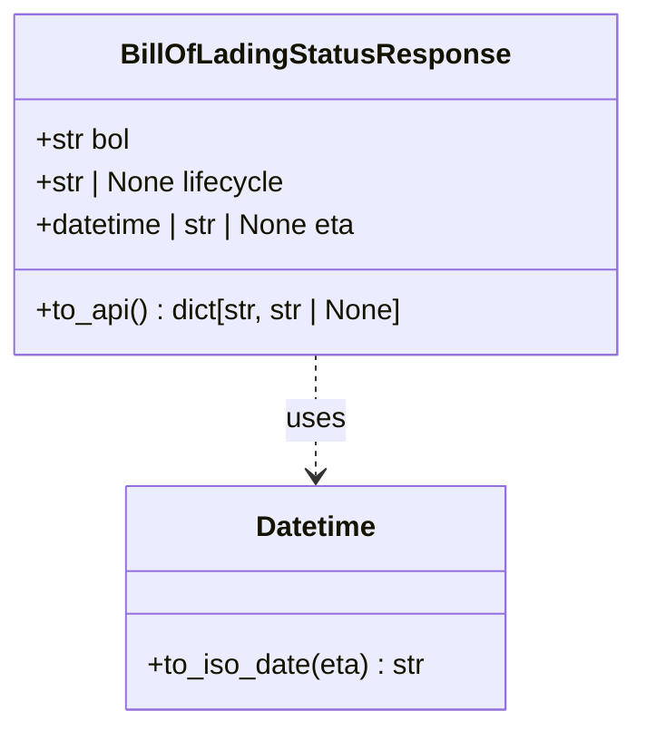

# Diagram: platform/partview_core/partview_service/partview_service/core/model/bill_of_lading_status_response.py

> Auto-generated by Obscura crawlers

## Mermaid

### SVG

<svg id="container" width="356.359375" xmlns="http://www.w3.org/2000/svg" class="classDiagram" height="408" viewBox="0 0 356.359375 408" role="graphics-document document" aria-roledescription="class"><g><defs><marker id="container_class-aggregationStart" class="marker aggregation class" refX="18" refY="7" markerWidth="190" markerHeight="240" orient="auto"><path d="M 18,7 L9,13 L1,7 L9,1 Z"></path></marker></defs><defs><marker id="container_class-aggregationEnd" class="marker aggregation class" refX="1" refY="7" markerWidth="20" markerHeight="28" orient="auto"><path d="M 18,7 L9,13 L1,7 L9,1 Z"></path></marker></defs><defs><marker id="container_class-extensionStart" class="marker extension class" refX="18" refY="7" markerWidth="190" markerHeight="240" orient="auto"><path d="M 1,7 L18,13 V 1 Z"></path></marker></defs><defs><marker id="container_class-extensionEnd" class="marker extension class" refX="1" refY="7" markerWidth="20" markerHeight="28" orient="auto"><path d="M 1,1 V 13 L18,7 Z"></path></marker></defs><defs><marker id="container_class-compositionStart" class="marker composition class" refX="18" refY="7" markerWidth="190" markerHeight="240" orient="auto"><path d="M 18,7 L9,13 L1,7 L9,1 Z"></path></marker></defs><defs><marker id="container_class-compositionEnd" class="marker composition class" refX="1" refY="7" markerWidth="20" markerHeight="28" orient="auto"><path d="M 18,7 L9,13 L1,7 L9,1 Z"></path></marker></defs><defs><marker id="container_class-dependencyStart" class="marker dependency class" refX="6" refY="7" markerWidth="190" markerHeight="240" orient="auto"><path d="M 5,7 L9,13 L1,7 L9,1 Z"></path></marker></defs><defs><marker id="container_class-dependencyEnd" class="marker dependency class" refX="13" refY="7" markerWidth="20" markerHeight="28" orient="auto"><path d="M 18,7 L9,13 L14,7 L9,1 Z"></path></marker></defs><defs><marker id="container_class-lollipopStart" class="marker lollipop class" refX="13" refY="7" markerWidth="190" markerHeight="240" orient="auto"><circle stroke="black" fill="transparent" cx="7" cy="7" r="6"></circle></marker></defs><defs><marker id="container_class-lollipopEnd" class="marker lollipop class" refX="1" refY="7" markerWidth="190" markerHeight="240" orient="auto"><circle stroke="black" fill="transparent" cx="7" cy="7" r="6"></circle></marker></defs><g class="root"><g class="clusters"></g><g class="edgePaths"><path d="M178.18,200L178.18,206.167C178.18,212.333,178.18,224.667,178.18,236C178.18,247.333,178.18,257.667,178.18,262.833L178.18,268" id="id_BillOfLadingStatusResponse_Datetime_1" class="edge-thickness-normal edge-pattern-dashed relation" style=";;;" data-edge="true" data-et="edge" data-id="id_BillOfLadingStatusResponse_Datetime_1" data-points="W3sieCI6MTc4LjE3OTY4NzUsInkiOjIwMH0seyJ4IjoxNzguMTc5Njg3NSwieSI6MjM3fSx7IngiOjE3OC4xNzk2ODc1LCJ5IjoyNzR9XQ==" marker-end="url(#container_class-dependencyEnd)"></path></g><g class="edgeLabels"><g class="edgeLabel" transform="translate(178.1796875, 237)"><g class="label" data-id="id_BillOfLadingStatusResponse_Datetime_1" transform="translate(-16.4921875, -12)"><foreignObject width="32.984375" height="24">

uses

</foreignObject></g></g></g><g class="nodes"><g class="node default" id="classId-BillOfLadingStatusResponse-0" transform="translate(178.1796875, 104)"><g class="basic label-container"><path d="M-170.1796875 -96 L170.1796875 -96 L170.1796875 96 L-170.1796875 96" stroke="none" stroke-width="0" fill="#ECECFF" style=""></path><path d="M-170.1796875 -96 C-34.66989683116674 -96, 100.83989383766652 -96, 170.1796875 -96 M-170.1796875 -96 C-71.14729971606037 -96, 27.885088067879252 -96, 170.1796875 -96 M170.1796875 -96 C170.1796875 -24.529148343086234, 170.1796875 46.94170331382753, 170.1796875 96 M170.1796875 -96 C170.1796875 -34.66163060371419, 170.1796875 26.676738792571626, 170.1796875 96 M170.1796875 96 C90.39506293955333 96, 10.610438379106654 96, -170.1796875 96 M170.1796875 96 C40.92832086611702 96, -88.32304576776596 96, -170.1796875 96 M-170.1796875 96 C-170.1796875 34.691189654791785, -170.1796875 -26.61762069041643, -170.1796875 -96 M-170.1796875 96 C-170.1796875 32.92038642831163, -170.1796875 -30.15922714337674, -170.1796875 -96" stroke="#9370DB" stroke-width="1.3" fill="none" stroke-dasharray="0 0" style=""></path></g><g class="annotation-group text" transform="translate(0, -72)"></g><g class="label-group text" transform="translate(-103.734375, -72)"><g class="label" style="font-weight: bolder" transform="translate(0,-12)"><foreignObject width="207.46875" height="24">

BillOfLadingStatusResponse

</foreignObject></g></g><g class="members-group text" transform="translate(-158.1796875, -24)"><g class="label" style="" transform="translate(0,-12)"><foreignObject width="55.1875" height="24">

+str bol

</foreignObject></g><g class="label" style="" transform="translate(0,12)"><foreignObject width="144.5" height="24">

+str | None lifecycle

</foreignObject></g><g class="label" style="" transform="translate(0,36)"><foreignObject width="188.21875" height="24">

+datetime | str | None eta

</foreignObject></g></g><g class="methods-group text" transform="translate(-158.1796875, 72)"><g class="label" style="" transform="translate(0,-12)"><foreignObject width="212.625" height="24">

+to_api() : dict[str, str | None]

</foreignObject></g></g><g class="divider" style=""><path d="M-170.1796875 -48 C-70.15666844218865 -48, 29.866350615622707 -48, 170.1796875 -48 M-170.1796875 -48 C-100.66191221242484 -48, -31.144136924849676 -48, 170.1796875 -48" stroke="#9370DB" stroke-width="1.3" fill="none" stroke-dasharray="0 0" style=""></path></g><g class="divider" style=""><path d="M-170.1796875 48 C-66.02877326295389 48, 38.12214097409222 48, 170.1796875 48 M-170.1796875 48 C-35.933577901113324 48, 98.31253169777335 48, 170.1796875 48" stroke="#9370DB" stroke-width="1.3" fill="none" stroke-dasharray="0 0" style=""></path></g></g><g class="node default" id="classId-Datetime-1" transform="translate(178.1796875, 337)"><g class="basic label-container"><path d="M-107.46484375 -63 L107.46484375 -63 L107.46484375 63 L-107.46484375 63" stroke="none" stroke-width="0" fill="#ECECFF" style=""></path><path d="M-107.46484375 -63 C-26.72797411468204 -63, 54.00889552063592 -63, 107.46484375 -63 M-107.46484375 -63 C-32.467022956684616 -63, 42.53079783663077 -63, 107.46484375 -63 M107.46484375 -63 C107.46484375 -31.17343097933166, 107.46484375 0.6531380413366819, 107.46484375 63 M107.46484375 -63 C107.46484375 -29.588617329149997, 107.46484375 3.8227653417000056, 107.46484375 63 M107.46484375 63 C54.62092173030379 63, 1.7769997106075834 63, -107.46484375 63 M107.46484375 63 C31.88619056373355 63, -43.6924626225329 63, -107.46484375 63 M-107.46484375 63 C-107.46484375 26.03569515659546, -107.46484375 -10.928609686809082, -107.46484375 -63 M-107.46484375 63 C-107.46484375 25.80837099664312, -107.46484375 -11.38325800671376, -107.46484375 -63" stroke="#9370DB" stroke-width="1.3" fill="none" stroke-dasharray="0 0" style=""></path></g><g class="annotation-group text" transform="translate(0, -39)"></g><g class="label-group text" transform="translate(-33.3984375, -39)"><g class="label" style="font-weight: bolder" transform="translate(0,-12)"><foreignObject width="66.796875" height="24">

Datetime

</foreignObject></g></g><g class="members-group text" transform="translate(-95.46484375, 9)"></g><g class="methods-group text" transform="translate(-95.46484375, 39)"><g class="label" style="" transform="translate(0,-12)"><foreignObject width="157.53125" height="24">

+to_iso_date(eta) : str

</foreignObject></g></g><g class="divider" style=""><path d="M-107.46484375 -15 C-55.51202763085672 -15, -3.5592115117134426 -15, 107.46484375 -15 M-107.46484375 -15 C-25.86707049542521 -15, 55.73070275914958 -15, 107.46484375 -15" stroke="#9370DB" stroke-width="1.3" fill="none" stroke-dasharray="0 0" style=""></path></g><g class="divider" style=""><path d="M-107.46484375 9 C-27.724131342986027 9, 52.016581064027946 9, 107.46484375 9 M-107.46484375 9 C-35.17382545741039 9, 37.117192835179225 9, 107.46484375 9" stroke="#9370DB" stroke-width="1.3" fill="none" stroke-dasharray="0 0" style=""></path></g></g></g></g></g></svg>
