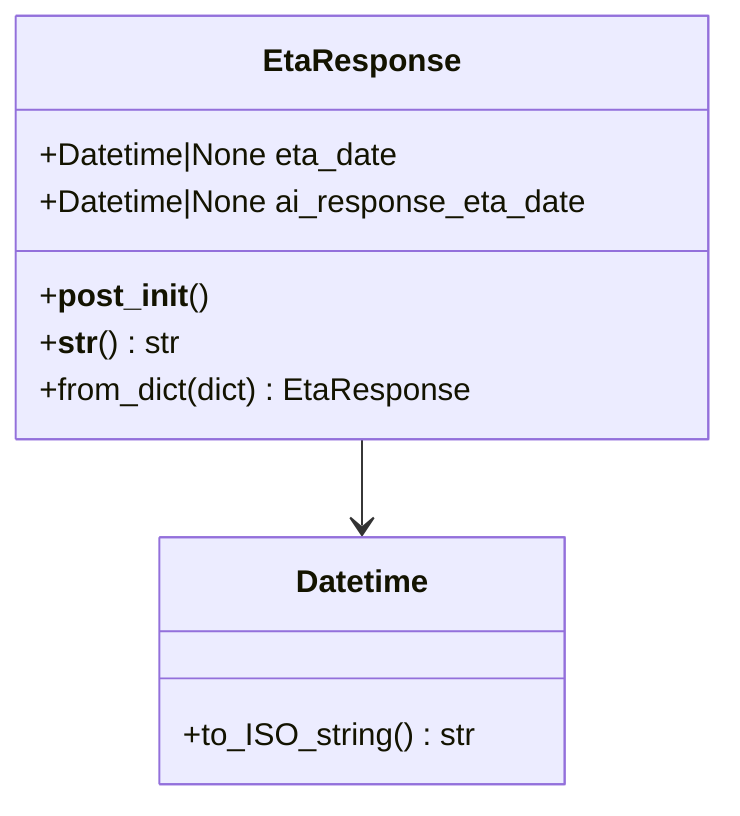
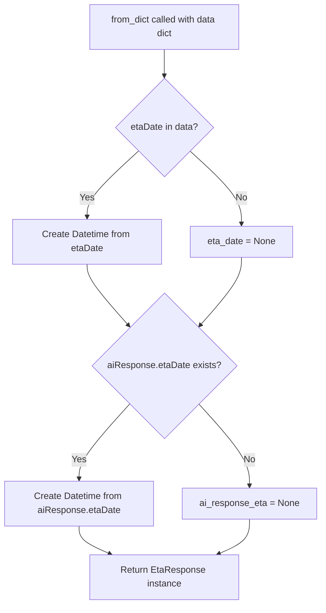
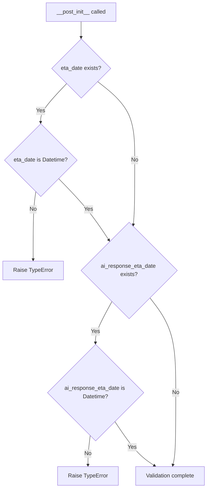

# Diagram: platform/partview_core/partview_service/partview_service/core/model/eta_response.py

> Auto-generated by Obscura crawlers

## Diagram 1

### SVG

<svg id="container" width="368.8984375" xmlns="http://www.w3.org/2000/svg" class="classDiagram" height="408" viewBox="0 0 368.8984375 408" role="graphics-document document" aria-roledescription="class"><g><defs><marker id="container_class-aggregationStart" class="marker aggregation class" refX="18" refY="7" markerWidth="190" markerHeight="240" orient="auto"><path d="M 18,7 L9,13 L1,7 L9,1 Z"></path></marker></defs><defs><marker id="container_class-aggregationEnd" class="marker aggregation class" refX="1" refY="7" markerWidth="20" markerHeight="28" orient="auto"><path d="M 18,7 L9,13 L1,7 L9,1 Z"></path></marker></defs><defs><marker id="container_class-extensionStart" class="marker extension class" refX="18" refY="7" markerWidth="190" markerHeight="240" orient="auto"><path d="M 1,7 L18,13 V 1 Z"></path></marker></defs><defs><marker id="container_class-extensionEnd" class="marker extension class" refX="1" refY="7" markerWidth="20" markerHeight="28" orient="auto"><path d="M 1,1 V 13 L18,7 Z"></path></marker></defs><defs><marker id="container_class-compositionStart" class="marker composition class" refX="18" refY="7" markerWidth="190" markerHeight="240" orient="auto"><path d="M 18,7 L9,13 L1,7 L9,1 Z"></path></marker></defs><defs><marker id="container_class-compositionEnd" class="marker composition class" refX="1" refY="7" markerWidth="20" markerHeight="28" orient="auto"><path d="M 18,7 L9,13 L1,7 L9,1 Z"></path></marker></defs><defs><marker id="container_class-dependencyStart" class="marker dependency class" refX="6" refY="7" markerWidth="190" markerHeight="240" orient="auto"><path d="M 5,7 L9,13 L1,7 L9,1 Z"></path></marker></defs><defs><marker id="container_class-dependencyEnd" class="marker dependency class" refX="13" refY="7" markerWidth="20" markerHeight="28" orient="auto"><path d="M 18,7 L9,13 L14,7 L9,1 Z"></path></marker></defs><defs><marker id="container_class-lollipopStart" class="marker lollipop class" refX="13" refY="7" markerWidth="190" markerHeight="240" orient="auto"><circle stroke="black" fill="transparent" cx="7" cy="7" r="6"></circle></marker></defs><defs><marker id="container_class-lollipopEnd" class="marker lollipop class" refX="1" refY="7" markerWidth="190" markerHeight="240" orient="auto"><circle stroke="black" fill="transparent" cx="7" cy="7" r="6"></circle></marker></defs><g class="root"><g class="clusters"></g><g class="edgePaths"><path d="M184.449,224L184.449,228.167C184.449,232.333,184.449,240.667,184.449,248C184.449,255.333,184.449,261.667,184.449,264.833L184.449,268" id="id_EtaResponse_Datetime_1" class="edge-thickness-normal edge-pattern-solid relation" style=";;;" data-edge="true" data-et="edge" data-id="id_EtaResponse_Datetime_1" data-points="W3sieCI6MTg0LjQ0OTIxODc1LCJ5IjoyMjR9LHsieCI6MTg0LjQ0OTIxODc1LCJ5IjoyNDl9LHsieCI6MTg0LjQ0OTIxODc1LCJ5IjoyNzR9XQ==" marker-end="url(#container_class-dependencyEnd)"></path></g><g class="edgeLabels"><g class="edgeLabel"><g class="label" data-id="id_EtaResponse_Datetime_1" transform="translate(0, 0)"><foreignObject width="0" height="0">

</foreignObject></g></g></g><g class="nodes"><g class="node default" id="classId-EtaResponse-0" transform="translate(184.44921875, 116)"><g class="basic label-container"><path d="M-176.44921875 -108 L176.44921875 -108 L176.44921875 108 L-176.44921875 108" stroke="none" stroke-width="0" fill="#ECECFF" style=""></path><path d="M-176.44921875 -108 C-80.70879726943268 -108, 15.031624211134641 -108, 176.44921875 -108 M-176.44921875 -108 C-71.6272987063052 -108, 33.194621337389606 -108, 176.44921875 -108 M176.44921875 -108 C176.44921875 -22.90707358526153, 176.44921875 62.18585282947694, 176.44921875 108 M176.44921875 -108 C176.44921875 -58.54375171457668, 176.44921875 -9.087503429153358, 176.44921875 108 M176.44921875 108 C62.994782839479555 108, -50.45965307104089 108, -176.44921875 108 M176.44921875 108 C102.84807270268061 108, 29.24692665536122 108, -176.44921875 108 M-176.44921875 108 C-176.44921875 55.568527931358354, -176.44921875 3.137055862716707, -176.44921875 -108 M-176.44921875 108 C-176.44921875 55.69175044059232, -176.44921875 3.383500881184645, -176.44921875 -108" stroke="#9370DB" stroke-width="1.3" fill="none" stroke-dasharray="0 0" style=""></path></g><g class="annotation-group text" transform="translate(0, -84)"></g><g class="label-group text" transform="translate(-46.8828125, -84)"><g class="label" style="font-weight: bolder" transform="translate(0,-12)"><foreignObject width="93.765625" height="24">

EtaResponse

</foreignObject></g></g><g class="members-group text" transform="translate(-164.44921875, -36)"><g class="label" style="" transform="translate(0,-12)"><foreignObject width="186.484375" height="24">

+Datetime|None eta_date

</foreignObject></g><g class="label" style="" transform="translate(0,12)"><foreignObject width="282.015625" height="24">

+Datetime|None ai_response_eta_date

</foreignObject></g></g><g class="methods-group text" transform="translate(-164.44921875, 36)"><g class="label" style="" transform="translate(0,-12)"><foreignObject width="83.921875" height="24">

+<strong>post_init</strong>()

</foreignObject></g><g class="label" style="" transform="translate(0,12)"><foreignObject width="70.4375" height="24">

+<strong>str</strong>() : str

</foreignObject></g><g class="label" style="" transform="translate(0,36)"><foreignObject width="220.3125" height="24">

+from_dict(dict) : EtaResponse

</foreignObject></g></g><g class="divider" style=""><path d="M-176.44921875 -60 C-97.60520401909483 -60, -18.761189288189655 -60, 176.44921875 -60 M-176.44921875 -60 C-89.48262141489059 -60, -2.5160240797811753 -60, 176.44921875 -60" stroke="#9370DB" stroke-width="1.3" fill="none" stroke-dasharray="0 0" style=""></path></g><g class="divider" style=""><path d="M-176.44921875 12 C-49.93288206842462 12, 76.58345461315076 12, 176.44921875 12 M-176.44921875 12 C-45.59665784974226 12, 85.25590305051549 12, 176.44921875 12" stroke="#9370DB" stroke-width="1.3" fill="none" stroke-dasharray="0 0" style=""></path></g></g><g class="node default" id="classId-Datetime-1" transform="translate(184.44921875, 337)"><g class="basic label-container"><path d="M-102.06640625 -63 L102.06640625 -63 L102.06640625 63 L-102.06640625 63" stroke="none" stroke-width="0" fill="#ECECFF" style=""></path><path d="M-102.06640625 -63 C-30.12073770571412 -63, 41.82493083857176 -63, 102.06640625 -63 M-102.06640625 -63 C-46.89424470597229 -63, 8.277916838055418 -63, 102.06640625 -63 M102.06640625 -63 C102.06640625 -25.283690648049834, 102.06640625 12.432618703900332, 102.06640625 63 M102.06640625 -63 C102.06640625 -28.26819967181003, 102.06640625 6.463600656379938, 102.06640625 63 M102.06640625 63 C60.772787538455866 63, 19.47916882691173 63, -102.06640625 63 M102.06640625 63 C21.780201551988654 63, -58.50600314602269 63, -102.06640625 63 M-102.06640625 63 C-102.06640625 27.414747306635206, -102.06640625 -8.170505386729587, -102.06640625 -63 M-102.06640625 63 C-102.06640625 34.23313117230006, -102.06640625 5.466262344600118, -102.06640625 -63" stroke="#9370DB" stroke-width="1.3" fill="none" stroke-dasharray="0 0" style=""></path></g><g class="annotation-group text" transform="translate(0, -39)"></g><g class="label-group text" transform="translate(-33.3984375, -39)"><g class="label" style="font-weight: bolder" transform="translate(0,-12)"><foreignObject width="66.796875" height="24">

Datetime

</foreignObject></g></g><g class="members-group text" transform="translate(-90.06640625, 9)"></g><g class="methods-group text" transform="translate(-90.06640625, 39)"><g class="label" style="" transform="translate(0,-12)"><foreignObject width="146.734375" height="24">

+to_ISO_string() : str

</foreignObject></g></g><g class="divider" style=""><path d="M-102.06640625 -15 C-43.05506904222995 -15, 15.956268165540095 -15, 102.06640625 -15 M-102.06640625 -15 C-58.146749808471526 -15, -14.227093366943052 -15, 102.06640625 -15" stroke="#9370DB" stroke-width="1.3" fill="none" stroke-dasharray="0 0" style=""></path></g><g class="divider" style=""><path d="M-102.06640625 9 C-46.62657258346643 9, 8.813261083067147 9, 102.06640625 9 M-102.06640625 9 C-30.63569494530499 9, 40.79501635939002 9, 102.06640625 9" stroke="#9370DB" stroke-width="1.3" fill="none" stroke-dasharray="0 0" style=""></path></g></g></g></g></g></svg>

## Diagram 2

### SVG

<svg id="container" width="559.46875" xmlns="http://www.w3.org/2000/svg" class="flowchart" height="1047.734375" viewBox="0 0 559.46875 1047.734375" role="graphics-document document" aria-roledescription="flowchart-v2"><g><marker id="container_flowchart-v2-pointEnd" class="marker flowchart-v2" viewBox="0 0 10 10" refX="5" refY="5" markerUnits="userSpaceOnUse" markerWidth="8" markerHeight="8" orient="auto"><path d="M 0 0 L 10 5 L 0 10 z" class="arrowMarkerPath" style="stroke-width: 1; stroke-dasharray: 1, 0;"></path></marker><marker id="container_flowchart-v2-pointStart" class="marker flowchart-v2" viewBox="0 0 10 10" refX="4.5" refY="5" markerUnits="userSpaceOnUse" markerWidth="8" markerHeight="8" orient="auto"><path d="M 0 5 L 10 10 L 10 0 z" class="arrowMarkerPath" style="stroke-width: 1; stroke-dasharray: 1, 0;"></path></marker><marker id="container_flowchart-v2-circleEnd" class="marker flowchart-v2" viewBox="0 0 10 10" refX="11" refY="5" markerUnits="userSpaceOnUse" markerWidth="11" markerHeight="11" orient="auto"><circle cx="5" cy="5" r="5" class="arrowMarkerPath" style="stroke-width: 1; stroke-dasharray: 1, 0;"></circle></marker><marker id="container_flowchart-v2-circleStart" class="marker flowchart-v2" viewBox="0 0 10 10" refX="-1" refY="5" markerUnits="userSpaceOnUse" markerWidth="11" markerHeight="11" orient="auto"><circle cx="5" cy="5" r="5" class="arrowMarkerPath" style="stroke-width: 1; stroke-dasharray: 1, 0;"></circle></marker><marker id="container_flowchart-v2-crossEnd" class="marker cross flowchart-v2" viewBox="0 0 11 11" refX="12" refY="5.2" markerUnits="userSpaceOnUse" markerWidth="11" markerHeight="11" orient="auto"><path d="M 1,1 l 9,9 M 10,1 l -9,9" class="arrowMarkerPath" style="stroke-width: 2; stroke-dasharray: 1, 0;"></path></marker><marker id="container_flowchart-v2-crossStart" class="marker cross flowchart-v2" viewBox="0 0 11 11" refX="-1" refY="5.2" markerUnits="userSpaceOnUse" markerWidth="11" markerHeight="11" orient="auto"><path d="M 1,1 l 9,9 M 10,1 l -9,9" class="arrowMarkerPath" style="stroke-width: 2; stroke-dasharray: 1, 0;"></path></marker><g class="root"><g class="clusters"></g><g class="edgePaths"><path d="M286.367,86L286.367,90.167C286.367,94.333,286.367,102.667,286.367,110.333C286.367,118,286.367,125,286.367,128.5L286.367,132" id="L_A_B_0" class="edge-thickness-normal edge-pattern-solid edge-thickness-normal edge-pattern-solid flowchart-link" style=";" data-edge="true" data-et="edge" data-id="L_A_B_0" data-points="W3sieCI6Mjg2LjM2NzE4NzUsInkiOjg2fSx7IngiOjI4Ni4zNjcxODc1LCJ5IjoxMTF9LHsieCI6Mjg2LjM2NzE4NzUsInkiOjEzNn1d" marker-end="url(#container_flowchart-v2-pointEnd)"></path><path d="M241.415,263.125L226.47,276.784C211.526,290.443,181.638,317.761,166.694,336.919C151.75,356.078,151.75,367.078,151.75,372.578L151.75,378.078" id="L_B_C_0" class="edge-thickness-normal edge-pattern-solid edge-thickness-normal edge-pattern-solid flowchart-link" style=";" data-edge="true" data-et="edge" data-id="L_B_C_0" data-points="W3sieCI6MjQxLjQxNDUxNjYxMDQ0NTczLCJ5IjoyNjMuMTI1NDU0MTEwNDQ1NzN9LHsieCI6MTUxLjc1LCJ5IjozNDUuMDc4MTI1fSx7IngiOjE1MS43NSwieSI6MzgyLjA3ODEyNX1d" marker-end="url(#container_flowchart-v2-pointEnd)"></path><path d="M331.32,263.125L346.264,276.784C361.208,290.443,391.096,317.761,406.04,338.919C420.984,360.078,420.984,375.078,420.984,382.578L420.984,390.078" id="L_B_D_0" class="edge-thickness-normal edge-pattern-solid edge-thickness-normal edge-pattern-solid flowchart-link" style=";" data-edge="true" data-et="edge" data-id="L_B_D_0" data-points="W3sieCI6MzMxLjMxOTg1ODM4OTU1NDI3LCJ5IjoyNjMuMTI1NDU0MTEwNDQ1NzN9LHsieCI6NDIwLjk4NDM3NSwieSI6MzQ1LjA3ODEyNX0seyJ4Ijo0MjAuOTg0Mzc1LCJ5IjozOTQuMDc4MTI1fV0=" marker-end="url(#container_flowchart-v2-pointEnd)"></path><path d="M151.75,460.078L151.75,464.245C151.75,468.411,151.75,476.745,163.895,494.428C176.039,512.112,200.328,539.145,212.473,552.662L224.617,566.179" id="L_C_E_0" class="edge-thickness-normal edge-pattern-solid edge-thickness-normal edge-pattern-solid flowchart-link" style=";" data-edge="true" data-et="edge" data-id="L_C_E_0" data-points="W3sieCI6MTUxLjc1LCJ5Ijo0NjAuMDc4MTI1fSx7IngiOjE1MS43NSwieSI6NDg1LjA3ODEyNX0seyJ4IjoyMjcuMjkwNzY2MjMzOTY2ODgsInkiOjU2OS4xNTQ1NDYyNjYwMzMxfV0=" marker-end="url(#container_flowchart-v2-pointEnd)"></path><path d="M420.984,448.078L420.984,454.245C420.984,460.411,420.984,472.745,408.84,492.428C396.695,512.112,372.406,539.145,360.262,552.662L348.117,566.179" id="L_D_E_0" class="edge-thickness-normal edge-pattern-solid edge-thickness-normal edge-pattern-solid flowchart-link" style=";" data-edge="true" data-et="edge" data-id="L_D_E_0" data-points="W3sieCI6NDIwLjk4NDM3NSwieSI6NDQ4LjA3ODEyNX0seyJ4Ijo0MjAuOTg0Mzc1LCJ5Ijo0ODUuMDc4MTI1fSx7IngiOjM0NS40NDM2MDg3NjYwMzMxNSwieSI6NTY5LjE1NDU0NjI2NjAzMzF9XQ==" marker-end="url(#container_flowchart-v2-pointEnd)"></path><path d="M226.662,700.029L211.885,716.146C197.108,732.264,167.554,764.499,152.777,786.117C138,807.734,138,818.734,138,824.234L138,829.734" id="L_E_F_0" class="edge-thickness-normal edge-pattern-solid edge-thickness-normal edge-pattern-solid flowchart-link" style=";" data-edge="true" data-et="edge" data-id="L_E_F_0" data-points="W3sieCI6MjI2LjY2MTU4NTYzOTQwMzA5LCJ5Ijo3MDAuMDI4NzczMTM5NDAzMX0seyJ4IjoxMzgsInkiOjc5Ni43MzQzNzV9LHsieCI6MTM4LCJ5Ijo4MzMuNzM0Mzc1fV0=" marker-end="url(#container_flowchart-v2-pointEnd)"></path><path d="M346.073,700.029L360.85,716.146C375.627,732.264,405.181,764.499,419.957,788.117C434.734,811.734,434.734,826.734,434.734,834.234L434.734,841.734" id="L_E_G_0" class="edge-thickness-normal edge-pattern-solid edge-thickness-normal edge-pattern-solid flowchart-link" style=";" data-edge="true" data-et="edge" data-id="L_E_G_0" data-points="W3sieCI6MzQ2LjA3Mjc4OTM2MDU5NjksInkiOjcwMC4wMjg3NzMxMzk0MDMxfSx7IngiOjQzNC43MzQzNzUsInkiOjc5Ni43MzQzNzV9LHsieCI6NDM0LjczNDM3NSwieSI6ODQ1LjczNDM3NX1d" marker-end="url(#container_flowchart-v2-pointEnd)"></path><path d="M138,911.734L138,915.901C138,920.068,138,928.401,147.047,936.47C156.094,944.54,174.189,952.345,183.236,956.247L192.283,960.15" id="L_F_H_0" class="edge-thickness-normal edge-pattern-solid edge-thickness-normal edge-pattern-solid flowchart-link" style=";" data-edge="true" data-et="edge" data-id="L_F_H_0" data-points="W3sieCI6MTM4LCJ5Ijo5MTEuNzM0Mzc1fSx7IngiOjEzOCwieSI6OTM2LjczNDM3NX0seyJ4IjoxOTUuOTU1OTMyNjE3MTg3NSwieSI6OTYxLjczNDM3NX1d" marker-end="url(#container_flowchart-v2-pointEnd)"></path><path d="M434.734,899.734L434.734,905.901C434.734,912.068,434.734,924.401,425.687,934.47C416.64,944.54,398.546,952.345,389.498,956.247L380.451,960.15" id="L_G_H_0" class="edge-thickness-normal edge-pattern-solid edge-thickness-normal edge-pattern-solid flowchart-link" style=";" data-edge="true" data-et="edge" data-id="L_G_H_0" data-points="W3sieCI6NDM0LjczNDM3NSwieSI6ODk5LjczNDM3NX0seyJ4Ijo0MzQuNzM0Mzc1LCJ5Ijo5MzYuNzM0Mzc1fSx7IngiOjM3Ni43Nzg0NDIzODI4MTI1LCJ5Ijo5NjEuNzM0Mzc1fV0=" marker-end="url(#container_flowchart-v2-pointEnd)"></path></g><g class="edgeLabels"><g class="edgeLabel"><g class="label" data-id="L_A_B_0" transform="translate(0, 0)"><foreignObject width="0" height="0">

</foreignObject></g></g><g class="edgeLabel" transform="translate(151.75, 345.078125)"><g class="label" data-id="L_B_C_0" transform="translate(-12.03125, -12)"><foreignObject width="24.0625" height="24">

Yes

</foreignObject></g></g><g class="edgeLabel" transform="translate(420.984375, 345.078125)"><g class="label" data-id="L_B_D_0" transform="translate(-10.140625, -12)"><foreignObject width="20.28125" height="24">

No

</foreignObject></g></g><g class="edgeLabel"><g class="label" data-id="L_C_E_0" transform="translate(0, 0)"><foreignObject width="0" height="0">

</foreignObject></g></g><g class="edgeLabel"><g class="label" data-id="L_D_E_0" transform="translate(0, 0)"><foreignObject width="0" height="0">

</foreignObject></g></g><g class="edgeLabel" transform="translate(138, 796.734375)"><g class="label" data-id="L_E_F_0" transform="translate(-12.03125, -12)"><foreignObject width="24.0625" height="24">

Yes

</foreignObject></g></g><g class="edgeLabel" transform="translate(434.734375, 796.734375)"><g class="label" data-id="L_E_G_0" transform="translate(-10.140625, -12)"><foreignObject width="20.28125" height="24">

No

</foreignObject></g></g><g class="edgeLabel"><g class="label" data-id="L_F_H_0" transform="translate(0, 0)"><foreignObject width="0" height="0">

</foreignObject></g></g><g class="edgeLabel"><g class="label" data-id="L_G_H_0" transform="translate(0, 0)"><foreignObject width="0" height="0">

</foreignObject></g></g></g><g class="nodes"><g class="node default" id="flowchart-A-0" transform="translate(286.3671875, 47)"><rect class="basic label-container" style="" x="-130" y="-39" width="260" height="78"></rect><g class="label" style="" transform="translate(-100, -24)"><rect></rect><foreignObject width="200" height="48">

from_dict called with data dict

</foreignObject></g></g><g class="node default" id="flowchart-B-1" transform="translate(286.3671875, 222.0390625)"><polygon points="86.0390625,0 172.078125,-86.0390625 86.0390625,-172.078125 0,-86.0390625" class="label-container" transform="translate(-85.5390625, 86.0390625)"></polygon><g class="label" style="" transform="translate(-59.0390625, -12)"><rect></rect><foreignObject width="118.078125" height="24">

etaDate in data?

</foreignObject></g></g><g class="node default" id="flowchart-C-3" transform="translate(151.75, 421.078125)"><rect class="basic label-container" style="" x="-130" y="-39" width="260" height="78"></rect><g class="label" style="" transform="translate(-100, -24)"><rect></rect><foreignObject width="200" height="48">

Create Datetime from etaDate

</foreignObject></g></g><g class="node default" id="flowchart-D-5" transform="translate(420.984375, 421.078125)"><rect class="basic label-container" style="" x="-89.234375" y="-27" width="178.46875" height="54"></rect><g class="label" style="" transform="translate(-59.234375, -12)"><rect></rect><foreignObject width="118.46875" height="24">

eta_date = None

</foreignObject></g></g><g class="node default" id="flowchart-E-7" transform="translate(286.3671875, 634.90625)"><polygon points="124.828125,0 249.65625,-124.828125 124.828125,-249.65625 0,-124.828125" class="label-container" transform="translate(-124.328125, 124.828125)"></polygon><g class="label" style="" transform="translate(-97.828125, -12)"><rect></rect><foreignObject width="195.65625" height="24">

aiResponse.etaDate exists?

</foreignObject></g></g><g class="node default" id="flowchart-F-11" transform="translate(138, 872.734375)"><rect class="basic label-container" style="" x="-130" y="-39" width="260" height="78"></rect><g class="label" style="" transform="translate(-100, -24)"><rect></rect><foreignObject width="200" height="48">

Create Datetime from aiResponse.etaDate

</foreignObject></g></g><g class="node default" id="flowchart-G-13" transform="translate(434.734375, 872.734375)"><rect class="basic label-container" style="" x="-116.734375" y="-27" width="233.46875" height="54"></rect><g class="label" style="" transform="translate(-86.734375, -12)"><rect></rect><foreignObject width="173.46875" height="24">

ai_response_eta = None

</foreignObject></g></g><g class="node default" id="flowchart-H-15" transform="translate(286.3671875, 1000.734375)"><rect class="basic label-container" style="" x="-130" y="-39" width="260" height="78"></rect><g class="label" style="" transform="translate(-100, -24)"><rect></rect><foreignObject width="200" height="48">

Return EtaResponse instance

</foreignObject></g></g></g></g></g></svg>

## Diagram 3

### SVG

<svg id="container" width="599.62890625" xmlns="http://www.w3.org/2000/svg" class="flowchart" height="1406.90625" viewBox="0 0 599.62890625 1406.90625" role="graphics-document document" aria-roledescription="flowchart-v2"><g><marker id="container_flowchart-v2-pointEnd" class="marker flowchart-v2" viewBox="0 0 10 10" refX="5" refY="5" markerUnits="userSpaceOnUse" markerWidth="8" markerHeight="8" orient="auto"><path d="M 0 0 L 10 5 L 0 10 z" class="arrowMarkerPath" style="stroke-width: 1; stroke-dasharray: 1, 0;"></path></marker><marker id="container_flowchart-v2-pointStart" class="marker flowchart-v2" viewBox="0 0 10 10" refX="4.5" refY="5" markerUnits="userSpaceOnUse" markerWidth="8" markerHeight="8" orient="auto"><path d="M 0 5 L 10 10 L 10 0 z" class="arrowMarkerPath" style="stroke-width: 1; stroke-dasharray: 1, 0;"></path></marker><marker id="container_flowchart-v2-circleEnd" class="marker flowchart-v2" viewBox="0 0 10 10" refX="11" refY="5" markerUnits="userSpaceOnUse" markerWidth="11" markerHeight="11" orient="auto"><circle cx="5" cy="5" r="5" class="arrowMarkerPath" style="stroke-width: 1; stroke-dasharray: 1, 0;"></circle></marker><marker id="container_flowchart-v2-circleStart" class="marker flowchart-v2" viewBox="0 0 10 10" refX="-1" refY="5" markerUnits="userSpaceOnUse" markerWidth="11" markerHeight="11" orient="auto"><circle cx="5" cy="5" r="5" class="arrowMarkerPath" style="stroke-width: 1; stroke-dasharray: 1, 0;"></circle></marker><marker id="container_flowchart-v2-crossEnd" class="marker cross flowchart-v2" viewBox="0 0 11 11" refX="12" refY="5.2" markerUnits="userSpaceOnUse" markerWidth="11" markerHeight="11" orient="auto"><path d="M 1,1 l 9,9 M 10,1 l -9,9" class="arrowMarkerPath" style="stroke-width: 2; stroke-dasharray: 1, 0;"></path></marker><marker id="container_flowchart-v2-crossStart" class="marker cross flowchart-v2" viewBox="0 0 11 11" refX="-1" refY="5.2" markerUnits="userSpaceOnUse" markerWidth="11" markerHeight="11" orient="auto"><path d="M 1,1 l 9,9 M 10,1 l -9,9" class="arrowMarkerPath" style="stroke-width: 2; stroke-dasharray: 1, 0;"></path></marker><g class="root"><g class="clusters"></g><g class="edgePaths"><path d="M232.027,62L232.027,66.167C232.027,70.333,232.027,78.667,232.027,86.333C232.027,94,232.027,101,232.027,104.5L232.027,108" id="L_A_B_0" class="edge-thickness-normal edge-pattern-solid edge-thickness-normal edge-pattern-solid flowchart-link" style=";" data-edge="true" data-et="edge" data-id="L_A_B_0" data-points="W3sieCI6MjMyLjAyNzM0Mzc1LCJ5Ijo2Mn0seyJ4IjoyMzIuMDI3MzQzNzUsInkiOjg3fSx7IngiOjIzMi4wMjczNDM3NSwieSI6MTEyfV0=" marker-end="url(#container_flowchart-v2-pointEnd)"></path><path d="M190.444,240.714L177.943,253.811C165.442,266.908,140.44,293.103,127.939,311.7C115.438,330.297,115.438,341.297,115.438,346.797L115.438,352.297" id="L_B_C_0" class="edge-thickness-normal edge-pattern-solid edge-thickness-normal edge-pattern-solid flowchart-link" style=";" data-edge="true" data-et="edge" data-id="L_B_C_0" data-points="W3sieCI6MTkwLjQ0NDM4OTUxMzY1ODIyLCJ5IjoyNDAuNzEzOTIwNzYzNjU4MjJ9LHsieCI6MTE1LjQzNzUsInkiOjMxOS4yOTY4NzV9LHsieCI6MTE1LjQzNzUsInkiOjM1Ni4yOTY4NzV9XQ==" marker-end="url(#container_flowchart-v2-pointEnd)"></path><path d="M279.47,234.854L297.178,248.928C314.886,263.002,350.303,291.149,368.011,328.941C385.719,366.732,385.719,414.167,385.719,461.602C385.719,509.036,385.719,556.471,385.042,587.624C384.366,618.776,383.012,633.646,382.336,641.081L381.659,648.516" id="L_B_D_0" class="edge-thickness-normal edge-pattern-solid edge-thickness-normal edge-pattern-solid flowchart-link" style=";" data-edge="true" data-et="edge" data-id="L_B_D_0" data-points="W3sieCI6Mjc5LjQ3MDAyOTc3MTkxNDYsInkiOjIzNC44NTQxODg5NzgwODU0fSx7IngiOjM4NS43MTg3NSwieSI6MzE5LjI5Njg3NX0seyJ4IjozODUuNzE4NzUsInkiOjQ2MS42MDE1NjI1fSx7IngiOjM4NS43MTg3NSwieSI6NjAzLjkwNjI1fSx7IngiOjM4MS4yOTY4MjY2ODQ0MzMyNiwieSI6NjUyLjQ5OTk1MTY4NDQzMzJ9XQ==" marker-end="url(#container_flowchart-v2-pointEnd)"></path><path d="M101.848,553.316L100.598,561.748C99.349,570.18,96.85,587.043,95.601,619.641C94.352,652.24,94.352,700.573,94.352,724.74L94.352,748.906" id="L_C_E_0" class="edge-thickness-normal edge-pattern-solid edge-thickness-normal edge-pattern-solid flowchart-link" style=";" data-edge="true" data-et="edge" data-id="L_C_E_0" data-points="W3sieCI6MTAxLjg0NzY4Njg4MTM5NTIzLCJ5Ijo1NTMuMzE2NDM2ODgxMzk1Mn0seyJ4Ijo5NC4zNTE1NjI1LCJ5Ijo2MDMuOTA2MjV9LHsieCI6OTQuMzUxNTYyNSwieSI6NzUyLjkwNjI1fV0=" marker-end="url(#container_flowchart-v2-pointEnd)"></path><path d="M167.219,515.124L181.535,529.921C195.851,544.718,224.482,574.312,248.63,603.952C272.778,633.591,292.442,663.275,302.274,678.117L312.106,692.96" id="L_C_D_0" class="edge-thickness-normal edge-pattern-solid edge-thickness-normal edge-pattern-solid flowchart-link" style=";" data-edge="true" data-et="edge" data-id="L_C_D_0" data-points="W3sieCI6MTY3LjIxOTM0NDU4OTI5MTk1LCJ5Ijo1MTUuMTI0NDA1NDEwNzA4fSx7IngiOjI1My4xMTMyODEyNSwieSI6NjAzLjkwNjI1fSx7IngiOjMxNC4zMTUwNDk3NTYwMTc4LCJ5Ijo2OTYuMjk0MzI1MjQzOTgyM31d" marker-end="url(#container_flowchart-v2-pointEnd)"></path><path d="M319.877,869.08L311.792,883.551C303.706,898.022,287.535,926.964,279.449,946.935C271.363,966.906,271.363,977.906,271.363,983.406L271.363,988.906" id="L_D_F_0" class="edge-thickness-normal edge-pattern-solid edge-thickness-normal edge-pattern-solid flowchart-link" style=";" data-edge="true" data-et="edge" data-id="L_D_F_0" data-points="W3sieCI6MzE5Ljg3NzE5MzQzMTMxOTUsInkiOjg2OS4wODAzMTg0MzEzMTk1fSx7IngiOjI3MS4zNjMyODEyNSwieSI6OTU1LjkwNjI1fSx7IngiOjI3MS4zNjMyODEyNSwieSI6OTkyLjkwNjI1fV0=" marker-end="url(#container_flowchart-v2-pointEnd)"></path><path d="M430.152,858.457L442.651,874.699C455.15,890.94,480.147,923.423,492.646,968.998C505.145,1014.573,505.145,1073.24,505.145,1131.906C505.145,1190.573,505.145,1249.24,503.763,1284.093C502.382,1318.946,499.619,1329.986,498.238,1335.506L496.857,1341.026" id="L_D_G_0" class="edge-thickness-normal edge-pattern-solid edge-thickness-normal edge-pattern-solid flowchart-link" style=";" data-edge="true" data-et="edge" data-id="L_D_G_0" data-points="W3sieCI6NDMwLjE1MjIzMzg1NjI1MDYsInkiOjg1OC40NTcxNDExNDM3NDk1fSx7IngiOjUwNS4xNDQ1MzEyNSwieSI6OTU1LjkwNjI1fSx7IngiOjUwNS4xNDQ1MzEyNSwieSI6MTEzMS45MDYyNX0seyJ4Ijo1MDUuMTQ0NTMxMjUsInkiOjEzMDcuOTA2MjV9LHsieCI6NDk1Ljg4NTQ5ODA0Njg3NSwieSI6MTM0NC45MDYyNX1d" marker-end="url(#container_flowchart-v2-pointEnd)"></path><path d="M256.492,1256.035L255.456,1264.68C254.42,1273.325,252.349,1290.616,251.313,1304.761C250.277,1318.906,250.277,1329.906,250.277,1335.406L250.277,1340.906" id="L_F_H_0" class="edge-thickness-normal edge-pattern-solid edge-thickness-normal edge-pattern-solid flowchart-link" style=";" data-edge="true" data-et="edge" data-id="L_F_H_0" data-points="W3sieCI6MjU2LjQ5MTg3MzYzMTE3ODksInkiOjEyNTYuMDM0ODQyMzgxMTc4OH0seyJ4IjoyNTAuMjc3MzQzNzUsInkiOjEzMDcuOTA2MjV9LHsieCI6MjUwLjI3NzM0Mzc1LCJ5IjoxMzQ0LjkwNjI1fV0=" marker-end="url(#container_flowchart-v2-pointEnd)"></path><path d="M327.554,1214.716L338.093,1230.247C348.632,1245.779,369.711,1276.843,389.167,1298.177C408.622,1319.512,426.456,1331.118,435.373,1336.921L444.289,1342.724" id="L_F_G_0" class="edge-thickness-normal edge-pattern-solid edge-thickness-normal edge-pattern-solid flowchart-link" style=";" data-edge="true" data-et="edge" data-id="L_F_G_0" data-points="W3sieCI6MzI3LjU1Mzk4ODUxODM3NTksInkiOjEyMTQuNzE1NTQyNzMxNjI0fSx7IngiOjM5MC43ODkwNjI1LCJ5IjoxMzA3LjkwNjI1fSx7IngiOjQ0Ny42NDE3ODQ2Njc5Njg3NSwieSI6MTM0NC45MDYyNX1d" marker-end="url(#container_flowchart-v2-pointEnd)"></path></g><g class="edgeLabels"><g class="edgeLabel"><g class="label" data-id="L_A_B_0" transform="translate(0, 0)"><foreignObject width="0" height="0">

</foreignObject></g></g><g class="edgeLabel" transform="translate(115.4375, 319.296875)"><g class="label" data-id="L_B_C_0" transform="translate(-12.03125, -12)"><foreignObject width="24.0625" height="24">

Yes

</foreignObject></g></g><g class="edgeLabel" transform="translate(385.71875, 461.6015625)"><g class="label" data-id="L_B_D_0" transform="translate(-10.140625, -12)"><foreignObject width="20.28125" height="24">

No

</foreignObject></g></g><g class="edgeLabel" transform="translate(94.3515625, 603.90625)"><g class="label" data-id="L_C_E_0" transform="translate(-10.140625, -12)"><foreignObject width="20.28125" height="24">

No

</foreignObject></g></g><g class="edgeLabel" transform="translate(253.11328125, 603.90625)"><g class="label" data-id="L_C_D_0" transform="translate(-12.03125, -12)"><foreignObject width="24.0625" height="24">

Yes

</foreignObject></g></g><g class="edgeLabel" transform="translate(271.36328125, 955.90625)"><g class="label" data-id="L_D_F_0" transform="translate(-12.03125, -12)"><foreignObject width="24.0625" height="24">

Yes

</foreignObject></g></g><g class="edgeLabel" transform="translate(505.14453125, 1131.90625)"><g class="label" data-id="L_D_G_0" transform="translate(-10.140625, -12)"><foreignObject width="20.28125" height="24">

No

</foreignObject></g></g><g class="edgeLabel" transform="translate(250.27734375, 1307.90625)"><g class="label" data-id="L_F_H_0" transform="translate(-10.140625, -12)"><foreignObject width="20.28125" height="24">

No

</foreignObject></g></g><g class="edgeLabel" transform="translate(378.21521, 1289.37593)"><g class="label" data-id="L_F_G_0" transform="translate(-12.03125, -12)"><foreignObject width="24.0625" height="24">

Yes

</foreignObject></g></g></g><g class="nodes"><g class="node default" id="flowchart-A-0" transform="translate(232.02734375, 35)"><rect class="basic label-container" style="" x="-86.7109375" y="-27" width="173.421875" height="54"></rect><g class="label" style="" transform="translate(-56.7109375, -12)"><rect></rect><foreignObject width="113.421875" height="24">

<strong>post_init</strong> called

</foreignObject></g></g><g class="node default" id="flowchart-B-1" transform="translate(232.02734375, 197.1484375)"><polygon points="85.1484375,0 170.296875,-85.1484375 85.1484375,-170.296875 0,-85.1484375" class="label-container" transform="translate(-84.6484375, 85.1484375)"></polygon><g class="label" style="" transform="translate(-58.1484375, -12)"><rect></rect><foreignObject width="116.296875" height="24">

eta_date exists?

</foreignObject></g></g><g class="node default" id="flowchart-C-3" transform="translate(115.4375, 461.6015625)"><polygon points="105.3046875,0 210.609375,-105.3046875 105.3046875,-210.609375 0,-105.3046875" class="label-container" transform="translate(-104.8046875, 105.3046875)"></polygon><g class="label" style="" transform="translate(-78.3046875, -12)"><rect></rect><foreignObject width="156.609375" height="24">

eta_date is Datetime?

</foreignObject></g></g><g class="node default" id="flowchart-D-5" transform="translate(369.703125, 779.90625)"><polygon points="139,0 278,-139 139,-278 0,-139" class="label-container" transform="translate(-138.5, 139)"></polygon><g class="label" style="" transform="translate(-100, -24)"><rect></rect><foreignObject width="200" height="48">

ai_response_eta_date exists?

</foreignObject></g></g><g class="node default" id="flowchart-E-7" transform="translate(94.3515625, 779.90625)"><rect class="basic label-container" style="" x="-86.3515625" y="-27" width="172.703125" height="54"></rect><g class="label" style="" transform="translate(-56.3515625, -12)"><rect></rect><foreignObject width="112.703125" height="24">

Raise TypeError

</foreignObject></g></g><g class="node default" id="flowchart-F-11" transform="translate(271.36328125, 1131.90625)"><polygon points="139,0 278,-139 139,-278 0,-139" class="label-container" transform="translate(-138.5, 139)"></polygon><g class="label" style="" transform="translate(-100, -24)"><rect></rect><foreignObject width="200" height="48">

ai_response_eta_date is Datetime?

</foreignObject></g></g><g class="node default" id="flowchart-G-13" transform="translate(489.12890625, 1371.90625)"><rect class="basic label-container" style="" x="-102.5" y="-27" width="205" height="54"></rect><g class="label" style="" transform="translate(-72.5, -12)"><rect></rect><foreignObject width="145" height="24">

Validation complete

</foreignObject></g></g><g class="node default" id="flowchart-H-15" transform="translate(250.27734375, 1371.90625)"><rect class="basic label-container" style="" x="-86.3515625" y="-27" width="172.703125" height="54"></rect><g class="label" style="" transform="translate(-56.3515625, -12)"><rect></rect><foreignObject width="112.703125" height="24">

Raise TypeError

</foreignObject></g></g></g></g></g></svg>
