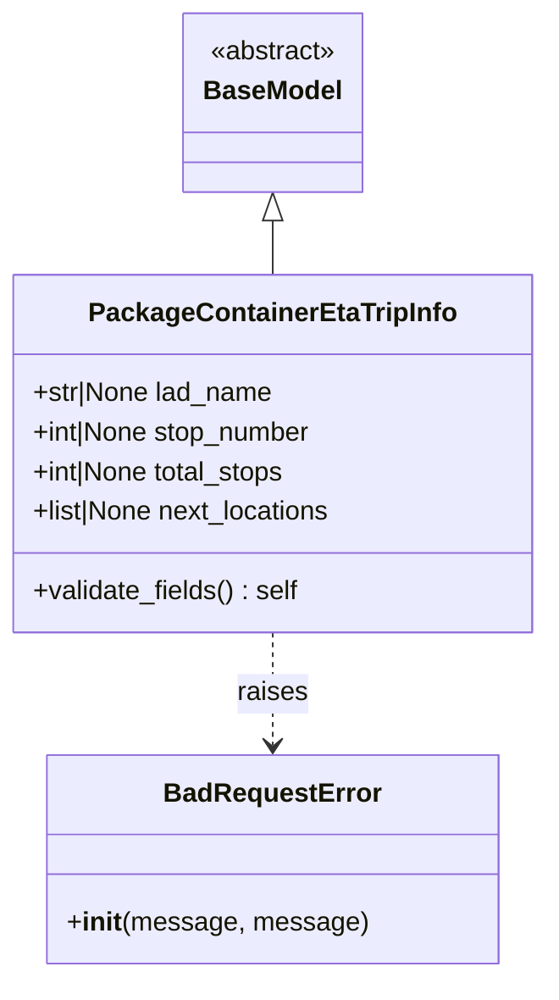
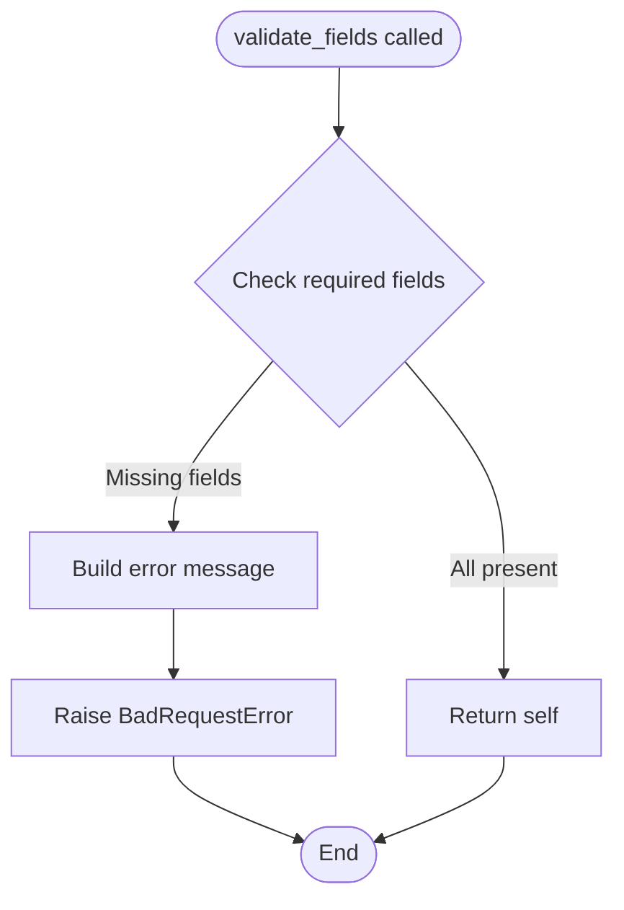

# Diagram: platform/partview_core/partview_service/partview_service/core/model/package_container_eta_trip_info.py

> Auto-generated by Obscura crawlers

## Diagram 1

### SVG

<svg id="container" width="331.375" xmlns="http://www.w3.org/2000/svg" class="classDiagram" height="590" viewBox="0 0 331.375 590" role="graphics-document document" aria-roledescription="class"><g><defs><marker id="container_class-aggregationStart" class="marker aggregation class" refX="18" refY="7" markerWidth="190" markerHeight="240" orient="auto"><path d="M 18,7 L9,13 L1,7 L9,1 Z"></path></marker></defs><defs><marker id="container_class-aggregationEnd" class="marker aggregation class" refX="1" refY="7" markerWidth="20" markerHeight="28" orient="auto"><path d="M 18,7 L9,13 L1,7 L9,1 Z"></path></marker></defs><defs><marker id="container_class-extensionStart" class="marker extension class" refX="18" refY="7" markerWidth="190" markerHeight="240" orient="auto"><path d="M 1,7 L18,13 V 1 Z"></path></marker></defs><defs><marker id="container_class-extensionEnd" class="marker extension class" refX="1" refY="7" markerWidth="20" markerHeight="28" orient="auto"><path d="M 1,1 V 13 L18,7 Z"></path></marker></defs><defs><marker id="container_class-compositionStart" class="marker composition class" refX="18" refY="7" markerWidth="190" markerHeight="240" orient="auto"><path d="M 18,7 L9,13 L1,7 L9,1 Z"></path></marker></defs><defs><marker id="container_class-compositionEnd" class="marker composition class" refX="1" refY="7" markerWidth="20" markerHeight="28" orient="auto"><path d="M 18,7 L9,13 L1,7 L9,1 Z"></path></marker></defs><defs><marker id="container_class-dependencyStart" class="marker dependency class" refX="6" refY="7" markerWidth="190" markerHeight="240" orient="auto"><path d="M 5,7 L9,13 L1,7 L9,1 Z"></path></marker></defs><defs><marker id="container_class-dependencyEnd" class="marker dependency class" refX="13" refY="7" markerWidth="20" markerHeight="28" orient="auto"><path d="M 18,7 L9,13 L14,7 L9,1 Z"></path></marker></defs><defs><marker id="container_class-lollipopStart" class="marker lollipop class" refX="13" refY="7" markerWidth="190" markerHeight="240" orient="auto"><circle stroke="black" fill="transparent" cx="7" cy="7" r="6"></circle></marker></defs><defs><marker id="container_class-lollipopEnd" class="marker lollipop class" refX="1" refY="7" markerWidth="190" markerHeight="240" orient="auto"><circle stroke="black" fill="transparent" cx="7" cy="7" r="6"></circle></marker></defs><g class="root"><g class="clusters"></g><g class="edgePaths"><path d="M165.688,133.25L165.688,134.542C165.688,135.833,165.688,138.417,165.688,143.875C165.688,149.333,165.688,157.667,165.688,161.833L165.688,166" id="id_BaseModel_PackageContainerEtaTripInfo_1" class="edge-thickness-normal edge-pattern-solid relation" style=";;;" data-edge="true" data-et="edge" data-id="id_BaseModel_PackageContainerEtaTripInfo_1" data-points="W3sieCI6MTY1LjY4NzUsInkiOjExNn0seyJ4IjoxNjUuNjg3NSwieSI6MTQxfSx7IngiOjE2NS42ODc1LCJ5IjoxNjZ9XQ==" marker-start="url(#container_class-extensionStart)"></path><path d="M165.688,382L165.688,388.167C165.688,394.333,165.688,406.667,165.688,418C165.688,429.333,165.688,439.667,165.688,444.833L165.688,450" id="id_PackageContainerEtaTripInfo_BadRequestError_2" class="edge-thickness-normal edge-pattern-dashed relation" style=";;;" data-edge="true" data-et="edge" data-id="id_PackageContainerEtaTripInfo_BadRequestError_2" data-points="W3sieCI6MTY1LjY4NzUsInkiOjM4Mn0seyJ4IjoxNjUuNjg3NSwieSI6NDE5fSx7IngiOjE2NS42ODc1LCJ5Ijo0NTZ9XQ==" marker-end="url(#container_class-dependencyEnd)"></path></g><g class="edgeLabels"><g class="edgeLabel"><g class="label" data-id="id_BaseModel_PackageContainerEtaTripInfo_1" transform="translate(0, 0)"><foreignObject width="0" height="0">

</foreignObject></g></g><g class="edgeLabel" transform="translate(165.6875, 419)"><g class="label" data-id="id_PackageContainerEtaTripInfo_BadRequestError_2" transform="translate(-21.25, -12)"><foreignObject width="42.5" height="24">

raises

</foreignObject></g></g></g><g class="nodes"><g class="node default" id="classId-BaseModel-0" transform="translate(165.6875, 62)"><g class="basic label-container"><path d="M-52.078125 -54 L52.078125 -54 L52.078125 54 L-52.078125 54" stroke="none" stroke-width="0" fill="#ECECFF" style=""></path><path d="M-52.078125 -54 C-30.998526360900165 -54, -9.91892772180033 -54, 52.078125 -54 M-52.078125 -54 C-21.609542509814418 -54, 8.859039980371165 -54, 52.078125 -54 M52.078125 -54 C52.078125 -30.407444363395, 52.078125 -6.814888726790002, 52.078125 54 M52.078125 -54 C52.078125 -25.86849910172124, 52.078125 2.2630017965575178, 52.078125 54 M52.078125 54 C22.74763890542 54, -6.582847189159999 54, -52.078125 54 M52.078125 54 C12.967200539025661 54, -26.143723921948677 54, -52.078125 54 M-52.078125 54 C-52.078125 17.360621581100006, -52.078125 -19.27875683779999, -52.078125 -54 M-52.078125 54 C-52.078125 21.800487259016236, -52.078125 -10.399025481967527, -52.078125 -54" stroke="#9370DB" stroke-width="1.3" fill="none" stroke-dasharray="0 0" style=""></path></g><g class="annotation-group text" transform="translate(-38.609375, -30)"><g class="label" style="" transform="translate(0,-12)"><foreignObject width="77.21875" height="24">

«abstract»

</foreignObject></g></g><g class="label-group text" transform="translate(-40.078125, -6)"><g class="label" style="font-weight: bolder" transform="translate(0,-12)"><foreignObject width="80.15625" height="24">

BaseModel

</foreignObject></g></g><g class="members-group text" transform="translate(-40.078125, 42)"></g><g class="methods-group text" transform="translate(-40.078125, 72)"></g><g class="divider" style=""><path d="M-52.078125 18 C-15.045264243875927 18, 21.987596512248146 18, 52.078125 18 M-52.078125 18 C-13.772081570600612 18, 24.533961858798776 18, 52.078125 18" stroke="#9370DB" stroke-width="1.3" fill="none" stroke-dasharray="0 0" style=""></path></g><g class="divider" style=""><path d="M-52.078125 36 C-27.525499618442876 36, -2.972874236885751 36, 52.078125 36 M-52.078125 36 C-23.31398694551261 36, 5.450151108974779 36, 52.078125 36" stroke="#9370DB" stroke-width="1.3" fill="none" stroke-dasharray="0 0" style=""></path></g></g><g class="node default" id="classId-PackageContainerEtaTripInfo-1" transform="translate(165.6875, 274)"><g class="basic label-container"><path d="M-157.6875 -108 L157.6875 -108 L157.6875 108 L-157.6875 108" stroke="none" stroke-width="0" fill="#ECECFF" style=""></path><path d="M-157.6875 -108 C-61.097790684094534 -108, 35.49191863181093 -108, 157.6875 -108 M-157.6875 -108 C-65.33185558993436 -108, 27.023788820131273 -108, 157.6875 -108 M157.6875 -108 C157.6875 -44.314723566170684, 157.6875 19.37055286765863, 157.6875 108 M157.6875 -108 C157.6875 -41.616006908061195, 157.6875 24.76798618387761, 157.6875 108 M157.6875 108 C60.872163017389795 108, -35.94317396522041 108, -157.6875 108 M157.6875 108 C93.57553558630937 108, 29.463571172618742 108, -157.6875 108 M-157.6875 108 C-157.6875 58.419588222075134, -157.6875 8.839176444150269, -157.6875 -108 M-157.6875 108 C-157.6875 44.9868924997747, -157.6875 -18.026215000450605, -157.6875 -108" stroke="#9370DB" stroke-width="1.3" fill="none" stroke-dasharray="0 0" style=""></path></g><g class="annotation-group text" transform="translate(0, -84)"></g><g class="label-group text" transform="translate(-105.609375, -84)"><g class="label" style="font-weight: bolder" transform="translate(0,-12)"><foreignObject width="211.21875" height="24">

PackageContainerEtaTripInfo

</foreignObject></g></g><g class="members-group text" transform="translate(-145.6875, -36)"><g class="label" style="" transform="translate(0,-12)"><foreignObject width="148.1875" height="24">

+str|None lad_name

</foreignObject></g><g class="label" style="" transform="translate(0,12)"><foreignObject width="173.375" height="24">

+int|None stop_number

</foreignObject></g><g class="label" style="" transform="translate(0,36)"><foreignObject width="158.140625" height="24">

+int|None total_stops

</foreignObject></g><g class="label" style="" transform="translate(0,60)"><foreignObject width="185.765625" height="24">

+list|None next_locations

</foreignObject></g></g><g class="methods-group text" transform="translate(-145.6875, 84)"><g class="label" style="" transform="translate(0,-12)"><foreignObject width="161.890625" height="24">

+validate_fields() : self

</foreignObject></g></g><g class="divider" style=""><path d="M-157.6875 -60 C-38.810303682741264 -60, 80.06689263451747 -60, 157.6875 -60 M-157.6875 -60 C-38.859318166242716 -60, 79.96886366751457 -60, 157.6875 -60" stroke="#9370DB" stroke-width="1.3" fill="none" stroke-dasharray="0 0" style=""></path></g><g class="divider" style=""><path d="M-157.6875 60 C-51.05108056752327 60, 55.58533886495346 60, 157.6875 60 M-157.6875 60 C-83.93698664997144 60, -10.18647329994289 60, 157.6875 60" stroke="#9370DB" stroke-width="1.3" fill="none" stroke-dasharray="0 0" style=""></path></g></g><g class="node default" id="classId-BadRequestError-2" transform="translate(165.6875, 519)"><g class="basic label-container"><path d="M-130.8828125 -63 L130.8828125 -63 L130.8828125 63 L-130.8828125 63" stroke="none" stroke-width="0" fill="#ECECFF" style=""></path><path d="M-130.8828125 -63 C-30.99503121371268 -63, 68.89275007257464 -63, 130.8828125 -63 M-130.8828125 -63 C-47.10289710506753 -63, 36.67701828986495 -63, 130.8828125 -63 M130.8828125 -63 C130.8828125 -29.270092691933975, 130.8828125 4.45981461613205, 130.8828125 63 M130.8828125 -63 C130.8828125 -37.620022096438205, 130.8828125 -12.240044192876418, 130.8828125 63 M130.8828125 63 C40.45619225045104 63, -49.97042799909792 63, -130.8828125 63 M130.8828125 63 C71.34794055255156 63, 11.813068605103112 63, -130.8828125 63 M-130.8828125 63 C-130.8828125 15.219072891009553, -130.8828125 -32.561854217980894, -130.8828125 -63 M-130.8828125 63 C-130.8828125 22.032294885762397, -130.8828125 -18.935410228475206, -130.8828125 -63" stroke="#9370DB" stroke-width="1.3" fill="none" stroke-dasharray="0 0" style=""></path></g><g class="annotation-group text" transform="translate(0, -39)"></g><g class="label-group text" transform="translate(-62.28125, -39)"><g class="label" style="font-weight: bolder" transform="translate(0,-12)"><foreignObject width="124.5625" height="24">

BadRequestError

</foreignObject></g></g><g class="members-group text" transform="translate(-118.8828125, 9)"></g><g class="methods-group text" transform="translate(-118.8828125, 39)"><g class="label" style="" transform="translate(0,-12)"><foreignObject width="175.484375" height="24">

+<strong>init</strong>(message, message)

</foreignObject></g></g><g class="divider" style=""><path d="M-130.8828125 -15 C-70.40604465415075 -15, -9.929276808301509 -15, 130.8828125 -15 M-130.8828125 -15 C-37.96652064527244 -15, 54.94977120945512 -15, 130.8828125 -15" stroke="#9370DB" stroke-width="1.3" fill="none" stroke-dasharray="0 0" style=""></path></g><g class="divider" style=""><path d="M-130.8828125 9 C-44.28742175293273 9, 42.30796899413454 9, 130.8828125 9 M-130.8828125 9 C-47.2250104318658 9, 36.432791636268405 9, 130.8828125 9" stroke="#9370DB" stroke-width="1.3" fill="none" stroke-dasharray="0 0" style=""></path></g></g></g></g></g></svg>

## Diagram 2

### SVG

<svg id="container" width="431.25" xmlns="http://www.w3.org/2000/svg" class="flowchart" height="632.578125" viewBox="0 0 431.25 632.578125" role="graphics-document document" aria-roledescription="flowchart-v2"><g><marker id="container_flowchart-v2-pointEnd" class="marker flowchart-v2" viewBox="0 0 10 10" refX="5" refY="5" markerUnits="userSpaceOnUse" markerWidth="8" markerHeight="8" orient="auto"><path d="M 0 0 L 10 5 L 0 10 z" class="arrowMarkerPath" style="stroke-width: 1; stroke-dasharray: 1, 0;"></path></marker><marker id="container_flowchart-v2-pointStart" class="marker flowchart-v2" viewBox="0 0 10 10" refX="4.5" refY="5" markerUnits="userSpaceOnUse" markerWidth="8" markerHeight="8" orient="auto"><path d="M 0 5 L 10 10 L 10 0 z" class="arrowMarkerPath" style="stroke-width: 1; stroke-dasharray: 1, 0;"></path></marker><marker id="container_flowchart-v2-circleEnd" class="marker flowchart-v2" viewBox="0 0 10 10" refX="11" refY="5" markerUnits="userSpaceOnUse" markerWidth="11" markerHeight="11" orient="auto"><circle cx="5" cy="5" r="5" class="arrowMarkerPath" style="stroke-width: 1; stroke-dasharray: 1, 0;"></circle></marker><marker id="container_flowchart-v2-circleStart" class="marker flowchart-v2" viewBox="0 0 10 10" refX="-1" refY="5" markerUnits="userSpaceOnUse" markerWidth="11" markerHeight="11" orient="auto"><circle cx="5" cy="5" r="5" class="arrowMarkerPath" style="stroke-width: 1; stroke-dasharray: 1, 0;"></circle></marker><marker id="container_flowchart-v2-crossEnd" class="marker cross flowchart-v2" viewBox="0 0 11 11" refX="12" refY="5.2" markerUnits="userSpaceOnUse" markerWidth="11" markerHeight="11" orient="auto"><path d="M 1,1 l 9,9 M 10,1 l -9,9" class="arrowMarkerPath" style="stroke-width: 2; stroke-dasharray: 1, 0;"></path></marker><marker id="container_flowchart-v2-crossStart" class="marker cross flowchart-v2" viewBox="0 0 11 11" refX="-1" refY="5.2" markerUnits="userSpaceOnUse" markerWidth="11" markerHeight="11" orient="auto"><path d="M 1,1 l 9,9 M 10,1 l -9,9" class="arrowMarkerPath" style="stroke-width: 2; stroke-dasharray: 1, 0;"></path></marker><g class="root"><g class="clusters"></g><g class="edgePaths"><path d="M237.797,47.5L237.714,51.583C237.63,55.667,237.464,63.833,237.38,71.417C237.297,79,237.297,86,237.297,89.5L237.297,93" id="L_Start_CheckFields_0" class="edge-thickness-normal edge-pattern-solid edge-thickness-normal edge-pattern-solid flowchart-link" style=";" data-edge="true" data-et="edge" data-id="L_Start_CheckFields_0" data-points="W3sieCI6MjM3Ljc5Njg3NSwieSI6NDcuNTAwMDAwMDAwMDAwMDF9LHsieCI6MjM3LjI5Njg3NSwieSI6NzJ9LHsieCI6MjM3LjI5Njg3NSwieSI6OTd9XQ==" marker-end="url(#container_flowchart-v2-pointEnd)"></path><path d="M284.116,256.759L295.698,270.729C307.28,284.699,330.445,312.638,342.027,337.275C353.609,361.911,353.609,383.245,353.609,402.578C353.609,421.911,353.609,439.245,353.609,451.411C353.609,463.578,353.609,470.578,353.609,474.078L353.609,477.578" id="L_CheckFields_Return_0" class="edge-thickness-normal edge-pattern-solid edge-thickness-normal edge-pattern-solid flowchart-link" style=";" data-edge="true" data-et="edge" data-id="L_CheckFields_Return_0" data-points="W3sieCI6Mjg0LjExNTc5OTExMzI1OTI0LCJ5IjoyNTYuNzU5MjAwODg2NzQwNzZ9LHsieCI6MzUzLjYwOTM3NSwieSI6MzQwLjU3ODEyNX0seyJ4IjozNTMuNjA5Mzc1LCJ5Ijo0MDQuNTc4MTI1fSx7IngiOjM1My42MDkzNzUsInkiOjQ1Ni41NzgxMjV9LHsieCI6MzUzLjYwOTM3NSwieSI6NDgxLjU3ODEyNX1d" marker-end="url(#container_flowchart-v2-pointEnd)"></path><path d="M190.478,256.759L178.896,270.729C167.313,284.699,144.149,312.638,132.567,332.108C120.984,351.578,120.984,362.578,120.984,368.078L120.984,373.578" id="L_CheckFields_BuildMessage_0" class="edge-thickness-normal edge-pattern-solid edge-thickness-normal edge-pattern-solid flowchart-link" style=";" data-edge="true" data-et="edge" data-id="L_CheckFields_BuildMessage_0" data-points="W3sieCI6MTkwLjQ3Nzk1MDg4Njc0MDc2LCJ5IjoyNTYuNzU5MjAwODg2NzQwNzZ9LHsieCI6MTIwLjk4NDM3NSwieSI6MzQwLjU3ODEyNX0seyJ4IjoxMjAuOTg0Mzc1LCJ5IjozNzcuNTc4MTI1fV0=" marker-end="url(#container_flowchart-v2-pointEnd)"></path><path d="M120.984,431.578L120.984,435.745C120.984,439.911,120.984,448.245,120.984,455.911C120.984,463.578,120.984,470.578,120.984,474.078L120.984,477.578" id="L_BuildMessage_RaiseError_0" class="edge-thickness-normal edge-pattern-solid edge-thickness-normal edge-pattern-solid flowchart-link" style=";" data-edge="true" data-et="edge" data-id="L_BuildMessage_RaiseError_0" data-points="W3sieCI6MTIwLjk4NDM3NSwieSI6NDMxLjU3ODEyNX0seyJ4IjoxMjAuOTg0Mzc1LCJ5Ijo0NTYuNTc4MTI1fSx7IngiOjEyMC45ODQzNzUsInkiOjQ4MS41NzgxMjV9XQ==" marker-end="url(#container_flowchart-v2-pointEnd)"></path><path d="M120.984,535.578L120.984,539.745C120.984,543.911,120.984,552.245,135.865,562.154C150.746,572.063,180.508,583.549,195.389,589.291L210.269,595.034" id="L_RaiseError_End_0" class="edge-thickness-normal edge-pattern-solid edge-thickness-normal edge-pattern-solid flowchart-link" style=";" data-edge="true" data-et="edge" data-id="L_RaiseError_End_0" data-points="W3sieCI6MTIwLjk4NDM3NSwieSI6NTM1LjU3ODEyNX0seyJ4IjoxMjAuOTg0Mzc1LCJ5Ijo1NjAuNTc4MTI1fSx7IngiOjIxNC4wMDExMDYwOTE2NDg0NywieSI6NTk2LjQ3NDEwMTY0NTQ4ODN9XQ==" marker-end="url(#container_flowchart-v2-pointEnd)"></path><path d="M353.609,535.578L353.609,539.745C353.609,543.911,353.609,552.245,338.894,562.152C324.179,572.059,294.749,583.54,280.034,589.28L265.319,595.02" id="L_Return_End_0" class="edge-thickness-normal edge-pattern-solid edge-thickness-normal edge-pattern-solid flowchart-link" style=";" data-edge="true" data-et="edge" data-id="L_Return_End_0" data-points="W3sieCI6MzUzLjYwOTM3NSwieSI6NTM1LjU3ODEyNX0seyJ4IjozNTMuNjA5Mzc1LCJ5Ijo1NjAuNTc4MTI1fSx7IngiOjI2MS41OTI2NDQ3NjExNjU5NiwieSI6NTk2LjQ3NDEwMTMxOTIxfV0=" marker-end="url(#container_flowchart-v2-pointEnd)"></path></g><g class="edgeLabels"><g class="edgeLabel"><g class="label" data-id="L_Start_CheckFields_0" transform="translate(0, 0)"><foreignObject width="0" height="0">

</foreignObject></g></g><g class="edgeLabel" transform="translate(353.609375, 404.578125)"><g class="label" data-id="L_CheckFields_Return_0" transform="translate(-39.03125, -12)"><foreignObject width="78.0625" height="24">

All present

</foreignObject></g></g><g class="edgeLabel" transform="translate(120.984375, 340.578125)"><g class="label" data-id="L_CheckFields_BuildMessage_0" transform="translate(-48.8828125, -12)"><foreignObject width="97.765625" height="24">

Missing fields

</foreignObject></g></g><g class="edgeLabel"><g class="label" data-id="L_BuildMessage_RaiseError_0" transform="translate(0, 0)"><foreignObject width="0" height="0">

</foreignObject></g></g><g class="edgeLabel"><g class="label" data-id="L_RaiseError_End_0" transform="translate(0, 0)"><foreignObject width="0" height="0">

</foreignObject></g></g><g class="edgeLabel"><g class="label" data-id="L_Return_End_0" transform="translate(0, 0)"><foreignObject width="0" height="0">

</foreignObject></g></g></g><g class="nodes"><g class="node default" id="flowchart-Start-0" transform="translate(237.296875, 27.5)"><g class="basic label-container outer-path"><path d="M-69.375 -19.5 C-37.49705134445678 -19.5, -5.619102688913557 -19.5, 69.375 -19.5 C69.375 -19.5, 69.375 -19.5, 69.375 -19.5 C69.65389995555209 -19.491056221271275, 69.93279991110418 -19.48211244254255, 70.6243692896239 -19.45993515863156 C70.98299659215584 -19.425338814068738, 71.3416238946878 -19.390742469505913, 71.86860465284786 -19.3399052695533 C72.1642149651084 -19.292113286759225, 72.45982527736894 -19.244321303965155, 73.10259325967675 -19.140403561325776 C73.49316213048019 -19.05125876526496, 73.88373100128362 -18.96211396920415, 74.32126438623538 -18.862249829261074 C74.71215582354081 -18.74623530249985, 75.10304726084622 -18.63022077573863, 75.5196102514606 -18.50658706670804 C75.76156566970992 -18.417545236180924, 76.00352108795923 -18.328503405653805, 76.6927065951478 -18.074876768247425 C77.01257136564477 -17.933282122799703, 77.33243613614175 -17.79168747735198, 77.83573291279238 -17.568892924097174 C78.06396669291259 -17.449823507199174, 78.2922004730328 -17.330754090301173, 78.94399226407678 -16.990714730406097 C79.3438234337325 -16.748334725692043, 79.74365460338821 -16.50595472097799, 80.0129305736057 -16.342718045390892 C80.29801215225375 -16.143857477108657, 80.58309373090178 -15.944996908826422, 81.03815534457871 -15.627565626425154 C81.23583140073096 -15.469924232024512, 81.4335074568832 -15.31228283762387, 82.01545370850187 -14.848196188198123 C82.29659799069194 -14.592868389783185, 82.577742272882 -14.337540591368246, 82.94080973676799 -14.007812326905688 C83.26831989184697 -13.669631202702835, 83.59583004692595 -13.33145007849998, 83.81042094296865 -13.10986736009568 C84.06612985633109 -12.809497120210793, 84.32183876969353 -12.509126880325905, 84.62071390812658 -12.158051136245305 C84.7899354814723 -11.931309644364513, 84.95915705481802 -11.70456815248372, 85.36835896464063 -11.156274872382312 C85.60446996682539 -10.79354496834495, 85.84058096901015 -10.43081506430759, 86.05028387860425 -10.108655082055241 C86.23072483616667 -9.788263890274898, 86.4111657937291 -9.467872698494554, 86.6636864742735 -9.019496659696287 C86.80257632236176 -8.731088918374343, 86.94146617045001 -8.4426811770524, 87.20604614880834 -7.893275190886684 C87.33009224557655 -7.586878933601065, 87.45413834234478 -7.2804826763154455, 87.67513422997033 -6.734618561215508 C87.80423802830717 -6.345778490521754, 87.93334182664401 -5.956938419827999, 88.06902313421489 -5.548287939305138 C88.15813233177877 -5.208475948823503, 88.24724152934266 -4.86866395834187, 88.38609428754556 -4.339158212148133 C88.45397306073357 -3.990615058011481, 88.52185183392159 -3.6420719038748284, 88.62504477658177 -3.1121979531509023 C88.66480946082149 -2.8037909146127715, 88.7045741450612 -2.4953838760746407, 88.78489270250937 -1.872449005199798 C88.81050271857774 -1.4735523329019613, 88.83611273464612 -1.0746556606041247, 88.86498121591342 -0.6250057626472757 C88.86498121591342 -0.3574267012064533, 88.86498121591342 -0.08984763976563093, 88.86498121591342 0.625005762647271 C88.83793720315458 1.0462380909004083, 88.81089319039573 1.4674704191535457, 88.78489270250937 1.8724490051997846 C88.73207348185767 2.282104450239492, 88.67925426120597 2.691759895279199, 88.62504477658177 3.1121979531508885 C88.53233019604629 3.588267728967087, 88.4396156155108 4.0643375047832855, 88.38609428754556 4.339158212148129 C88.28954953588857 4.707325192976287, 88.19300478423158 5.075492173804445, 88.06902313421489 5.548287939305125 C87.93784126055806 5.94338684176634, 87.80665938690123 6.338485744227554, 87.67513422997033 6.734618561215495 C87.52093000677154 7.115505973852348, 87.36672578357275 7.496393386489201, 87.20604614880834 7.893275190886679 C87.07729283611553 8.160634199572852, 86.94853952342274 8.427993208259027, 86.6636864742735 9.019496659696284 C86.49695375727647 9.315547482242884, 86.33022104027945 9.611598304789485, 86.05028387860425 10.108655082055236 C85.87450755651822 10.378694715330823, 85.69873123443222 10.64873434860641, 85.36835896464065 11.156274872382301 C85.07408701947887 11.550572470173375, 84.77981507431709 11.94487006796445, 84.62071390812659 12.158051136245302 C84.3780238689694 12.443128665693775, 84.1353338298122 12.72820619514225, 83.81042094296866 13.10986736009567 C83.62740209404525 13.298849347736036, 83.44438324512184 13.487831335376402, 82.94080973676799 14.007812326905684 C82.68068665062428 14.244049231261684, 82.42056356448059 14.480286135617686, 82.0154537085019 14.848196188198111 C81.73723281439389 15.07006994748031, 81.45901192028589 15.291943706762506, 81.03815534457871 15.627565626425152 C80.7307486948006 15.84199919789098, 80.42334204502247 16.056432769356807, 80.0129305736057 16.34271804539089 C79.7976359849899 16.473230890221227, 79.5823413963741 16.603743735051562, 78.94399226407678 16.990714730406093 C78.61436842904476 17.162679274008156, 78.28474459401275 17.334643817610214, 77.83573291279238 17.56889292409717 C77.42015327521598 17.7528577019203, 77.0045736376396 17.936822479743423, 76.6927065951478 18.07487676824742 C76.45445198399452 18.162556667553307, 76.21619737284125 18.250236566859197, 75.51961025146062 18.506587066708033 C75.20124283826526 18.601076843799763, 74.8828754250699 18.695566620891494, 74.32126438623541 18.86224982926107 C73.93487007262334 18.950441809884488, 73.54847575901125 19.038633790507905, 73.10259325967677 19.140403561325773 C72.84511051349114 19.182031374920548, 72.5876277673055 19.22365918851532, 71.86860465284788 19.3399052695533 C71.49994222502464 19.37546969058397, 71.1312797972014 19.411034111614637, 70.6243692896239 19.45993515863156 C70.32141785586177 19.46965022145312, 70.01846642209962 19.479365284274675, 69.375 19.5 C69.375 19.5, 69.375 19.5, 69.375 19.5 C29.824297699510808 19.5, -9.726404600978384 19.5, -69.375 19.5 C-69.70280694044251 19.489487869457513, -70.03061388088503 19.47897573891502, -70.6243692896239 19.45993515863156 C-70.97894380126775 19.425729781931516, -71.33351831291161 19.391524405231475, -71.86860465284786 19.3399052695533 C-72.24367649452968 19.279266562915755, -72.6187483362115 19.218627856278214, -73.10259325967675 19.140403561325773 C-73.37851216974606 19.077426870641613, -73.65443107981537 19.01445017995745, -74.32126438623538 18.862249829261074 C-74.56308758446664 18.79047797338191, -74.80491078269789 18.718706117502744, -75.51961025146059 18.506587066708043 C-75.86306167398047 18.380193768390583, -76.20651309650034 18.25380047007312, -76.6927065951478 18.074876768247425 C-77.1359444315182 17.878668526269507, -77.5791822678886 17.682460284291594, -77.83573291279238 17.568892924097174 C-78.27659709692298 17.338894361623225, -78.71746128105359 17.108895799149277, -78.94399226407678 16.990714730406097 C-79.16785785760584 16.855006092028532, -79.3917234511349 16.719297453650963, -80.01293057360569 16.3427180453909 C-80.34543585583894 16.11077675442666, -80.6779411380722 15.87883546346242, -81.03815534457871 15.627565626425156 C-81.41033597237747 15.3307614798981, -81.78251660017622 15.033957333371044, -82.01545370850187 14.848196188198125 C-82.28981201283335 14.599031235327221, -82.56417031716482 14.349866282456315, -82.94080973676797 14.007812326905697 C-83.1552657150849 13.786368922130201, -83.36972169340183 13.564925517354705, -83.81042094296865 13.109867360095677 C-84.0721149022284 12.802466744741038, -84.33380886148818 12.495066129386396, -84.62071390812658 12.158051136245307 C-84.90486829038639 11.77731015101393, -85.1890226726462 11.396569165782552, -85.36835896464063 11.156274872382316 C-85.60501462930428 10.792708220515017, -85.84167029396794 10.42914156864772, -86.05028387860425 10.108655082055249 C-86.20769784657662 9.829150642027567, -86.36511181454901 9.549646201999886, -86.6636864742735 9.019496659696289 C-86.87659470558343 8.57738816187485, -87.08950293689335 8.135279664053414, -87.20604614880834 7.893275190886686 C-87.37646019044868 7.472349213303687, -87.54687423208902 7.051423235720688, -87.67513422997033 6.73461856121551 C-87.79676203458912 6.368294992462677, -87.91838983920792 6.001971423709844, -88.06902313421489 5.5482879393051325 C-88.16451959079066 5.184118561955609, -88.26001604736643 4.819949184606086, -88.38609428754556 4.339158212148136 C-88.44642391501675 4.029378325754875, -88.50675354248793 3.719598439361614, -88.62504477658177 3.112197953150904 C-88.66653922927242 2.7903751720887278, -88.70803368196307 2.468552391026552, -88.78489270250937 1.872449005199809 C-88.81538492404293 1.3975080419363295, -88.8458771455765 0.9225670786728499, -88.86498121591342 0.6250057626472781 C-88.86498121591342 0.3285247150399242, -88.86498121591342 0.032043667432570255, -88.86498121591342 -0.6250057626472687 C-88.84694669322711 -0.9059080106911963, -88.8289121705408 -1.186810258735124, -88.78489270250937 -1.8724490051997822 C-88.74799823176176 -2.158595234680946, -88.71110376101414 -2.4447414641621092, -88.62504477658177 -3.112197953150895 C-88.52959020152811 -3.6023370217199204, -88.43413562647443 -4.092476090288946, -88.38609428754556 -4.339158212148126 C-88.27695067878547 -4.755370095489643, -88.16780707002536 -5.17158197883116, -88.06902313421489 -5.548287939305123 C-87.96979729589697 -5.84714035482831, -87.87057145757906 -6.145992770351498, -87.67513422997033 -6.734618561215485 C-87.52154422675682 -7.113988838613553, -87.36795422354331 -7.49335911601162, -87.20604614880834 -7.893275190886676 C-87.07399742196984 -8.167477197556968, -86.94194869513133 -8.44167920422726, -86.6636864742735 -9.019496659696282 C-86.4637361201623 -9.374528760589614, -86.26378576605109 -9.729560861482948, -86.05028387860425 -10.108655082055243 C-85.83653518159794 -10.437030480218782, -85.62278648459161 -10.76540587838232, -85.36835896464063 -11.156274872382308 C-85.17294473983583 -11.41811213101864, -84.97753051503102 -11.679949389654974, -84.62071390812659 -12.158051136245302 C-84.34720274491215 -12.479332911783047, -84.07369158169773 -12.800614687320792, -83.81042094296866 -13.10986736009567 C-83.62885663095972 -13.297347418952153, -83.44729231895076 -13.484827477808635, -82.94080973676799 -14.007812326905677 C-82.68335034842029 -14.241630131400928, -82.42589096007259 -14.475447935896177, -82.0154537085019 -14.848196188198107 C-81.66260360582069 -15.12958475535079, -81.30975350313949 -15.410973322503473, -81.03815534457871 -15.627565626425149 C-80.75258881165408 -15.82676447781741, -80.46702227872943 -16.02596332920967, -80.01293057360571 -16.342718045390885 C-79.69041001267888 -16.538231904765926, -79.36788945175205 -16.733745764140963, -78.94399226407678 -16.99071473040609 C-78.53092942525252 -17.206209348841337, -78.11786658642826 -17.42170396727658, -77.8357329127924 -17.56889292409717 C-77.5208419781848 -17.708285799940256, -77.20595104357722 -17.847678675783346, -76.69270659514781 -18.07487676824742 C-76.29607982469459 -18.220839086151884, -75.89945305424136 -18.366801404056343, -75.51961025146062 -18.506587066708033 C-75.18700474127002 -18.605302636250652, -74.85439923107941 -18.704018205793275, -74.32126438623541 -18.862249829261067 C-73.84072317147961 -18.971930225704593, -73.36018195672382 -19.081610622148123, -73.10259325967677 -19.140403561325773 C-72.71957728940664 -19.202326613065836, -72.33656131913652 -19.264249664805895, -71.86860465284788 -19.3399052695533 C-71.37183482734967 -19.387828057165983, -70.87506500185148 -19.43575084477867, -70.6243692896239 -19.45993515863156 C-70.12529223188567 -19.475939588478663, -69.62621517414745 -19.491944018325764, -69.375 -19.5 C-69.375 -19.5, -69.375 -19.5, -69.375 -19.5" stroke="none" stroke-width="0" fill="#ECECFF" style=""></path><path d="M-69.375 -19.5 C-33.064465525719186 -19.5, 3.2460689485616285 -19.5, 69.375 -19.5 M-69.375 -19.5 C-18.205549958305376 -19.5, 32.96390008338925 -19.5, 69.375 -19.5 M69.375 -19.5 C69.375 -19.5, 69.375 -19.5, 69.375 -19.5 M69.375 -19.5 C69.375 -19.5, 69.375 -19.5, 69.375 -19.5 M69.375 -19.5 C69.65763736730173 -19.490936369750894, 69.94027473460346 -19.481872739501792, 70.6243692896239 -19.45993515863156 M69.375 -19.5 C69.72838071565103 -19.488667768262907, 70.08176143130206 -19.477335536525814, 70.6243692896239 -19.45993515863156 M70.6243692896239 -19.45993515863156 C70.9218419838735 -19.431238325580555, 71.21931467812311 -19.402541492529554, 71.86860465284786 -19.3399052695533 M70.6243692896239 -19.45993515863156 C71.0429751705565 -19.41955275274522, 71.4615810514891 -19.379170346858878, 71.86860465284786 -19.3399052695533 M71.86860465284786 -19.3399052695533 C72.31017469627054 -19.268515649359554, 72.7517447396932 -19.19712602916581, 73.10259325967675 -19.140403561325776 M71.86860465284786 -19.3399052695533 C72.3278936971007 -19.265650978718234, 72.78718274135356 -19.19139668788317, 73.10259325967675 -19.140403561325776 M73.10259325967675 -19.140403561325776 C73.36639731905628 -19.08019200625477, 73.6302013784358 -19.01998045118376, 74.32126438623538 -18.862249829261074 M73.10259325967675 -19.140403561325776 C73.4436042336709 -19.062570031816183, 73.78461520766504 -18.984736502306593, 74.32126438623538 -18.862249829261074 M74.32126438623538 -18.862249829261074 C74.70278165585 -18.74901750626447, 75.08429892546464 -18.635785183267863, 75.5196102514606 -18.50658706670804 M74.32126438623538 -18.862249829261074 C74.57109390546698 -18.788101739335044, 74.82092342469858 -18.713953649409014, 75.5196102514606 -18.50658706670804 M75.5196102514606 -18.50658706670804 C75.91220455147233 -18.362108735201797, 76.30479885148407 -18.217630403695555, 76.6927065951478 -18.074876768247425 M75.5196102514606 -18.50658706670804 C75.97898609907864 -18.337532508360816, 76.43836194669669 -18.168477950013592, 76.6927065951478 -18.074876768247425 M76.6927065951478 -18.074876768247425 C77.14437692981829 -17.87493570941323, 77.5960472644888 -17.67499465057903, 77.83573291279238 -17.568892924097174 M76.6927065951478 -18.074876768247425 C77.01492048809374 -17.93224223597579, 77.33713438103969 -17.78960770370415, 77.83573291279238 -17.568892924097174 M77.83573291279238 -17.568892924097174 C78.19393486447599 -17.382019195343133, 78.5521368161596 -17.195145466589093, 78.94399226407678 -16.990714730406097 M77.83573291279238 -17.568892924097174 C78.14043619687233 -17.409929415964434, 78.44513948095228 -17.25096590783169, 78.94399226407678 -16.990714730406097 M78.94399226407678 -16.990714730406097 C79.3459011234369 -16.747075217983365, 79.74780998279704 -16.503435705560637, 80.0129305736057 -16.342718045390892 M78.94399226407678 -16.990714730406097 C79.2724685759999 -16.791590459777233, 79.600944887923 -16.592466189148364, 80.0129305736057 -16.342718045390892 M80.0129305736057 -16.342718045390892 C80.2688964918247 -16.164167301427327, 80.52486241004371 -15.985616557463763, 81.03815534457871 -15.627565626425154 M80.0129305736057 -16.342718045390892 C80.27880301909674 -16.157256936849002, 80.5446754645878 -15.971795828307114, 81.03815534457871 -15.627565626425154 M81.03815534457871 -15.627565626425154 C81.32739264846978 -15.396906573499935, 81.61662995236084 -15.166247520574714, 82.01545370850187 -14.848196188198123 M81.03815534457871 -15.627565626425154 C81.28058722788705 -15.434232650870111, 81.52301911119538 -15.240899675315069, 82.01545370850187 -14.848196188198123 M82.01545370850187 -14.848196188198123 C82.31021986335139 -14.580497365448872, 82.6049860182009 -14.312798542699621, 82.94080973676799 -14.007812326905688 M82.01545370850187 -14.848196188198123 C82.21312299906316 -14.668678168553193, 82.41079228962444 -14.489160148908262, 82.94080973676799 -14.007812326905688 M82.94080973676799 -14.007812326905688 C83.23440388400867 -13.70465226535191, 83.52799803124935 -13.401492203798133, 83.81042094296865 -13.10986736009568 M82.94080973676799 -14.007812326905688 C83.2485638469459 -13.690030941064649, 83.5563179571238 -13.37224955522361, 83.81042094296865 -13.10986736009568 M83.81042094296865 -13.10986736009568 C84.05416278155508 -12.823554327188551, 84.2979046201415 -12.53724129428142, 84.62071390812658 -12.158051136245305 M83.81042094296865 -13.10986736009568 C83.99157932042397 -12.897068421732966, 84.17273769787928 -12.68426948337025, 84.62071390812658 -12.158051136245305 M84.62071390812658 -12.158051136245305 C84.78837814524222 -11.93339633303657, 84.95604238235786 -11.708741529827835, 85.36835896464063 -11.156274872382312 M84.62071390812658 -12.158051136245305 C84.79026766012683 -11.930864555229531, 84.9598214121271 -11.703677974213758, 85.36835896464063 -11.156274872382312 M85.36835896464063 -11.156274872382312 C85.58525041050937 -10.82307136801985, 85.80214185637811 -10.489867863657386, 86.05028387860425 -10.108655082055241 M85.36835896464063 -11.156274872382312 C85.5676977627163 -10.85003694857589, 85.76703656079198 -10.543799024769468, 86.05028387860425 -10.108655082055241 M86.05028387860425 -10.108655082055241 C86.2219215017159 -9.80389510202653, 86.39355912482755 -9.499135121997819, 86.6636864742735 -9.019496659696287 M86.05028387860425 -10.108655082055241 C86.26229379274093 -9.732210011173816, 86.4743037068776 -9.35576494029239, 86.6636864742735 -9.019496659696287 M86.6636864742735 -9.019496659696287 C86.77971668294701 -8.778557448736997, 86.89574689162052 -8.537618237777707, 87.20604614880834 -7.893275190886684 M86.6636864742735 -9.019496659696287 C86.81540604553993 -8.70444772368276, 86.96712561680637 -8.389398787669233, 87.20604614880834 -7.893275190886684 M87.20604614880834 -7.893275190886684 C87.31804674220858 -7.616631559803926, 87.43004733560882 -7.339987928721167, 87.67513422997033 -6.734618561215508 M87.20604614880834 -7.893275190886684 C87.34352556809709 -7.55369836725973, 87.48100498738583 -7.214121543632776, 87.67513422997033 -6.734618561215508 M87.67513422997033 -6.734618561215508 C87.80994479203422 -6.328590627425198, 87.94475535409812 -5.922562693634887, 88.06902313421489 -5.548287939305138 M87.67513422997033 -6.734618561215508 C87.82993793718364 -6.268374459710233, 87.98474164439696 -5.802130358204958, 88.06902313421489 -5.548287939305138 M88.06902313421489 -5.548287939305138 C88.16327096235825 -5.1888801233273805, 88.25751879050162 -4.829472307349622, 88.38609428754556 -4.339158212148133 M88.06902313421489 -5.548287939305138 C88.17114809049609 -5.158841219768867, 88.27327304677729 -4.769394500232596, 88.38609428754556 -4.339158212148133 M88.38609428754556 -4.339158212148133 C88.47566743753497 -3.8792190182444855, 88.56524058752437 -3.4192798243408378, 88.62504477658177 -3.1121979531509023 M88.38609428754556 -4.339158212148133 C88.43520399973542 -4.086990219394539, 88.48431371192528 -3.834822226640945, 88.62504477658177 -3.1121979531509023 M88.62504477658177 -3.1121979531509023 C88.68665271766685 -2.634378927959085, 88.74826065875193 -2.1565599027672677, 88.78489270250937 -1.872449005199798 M88.62504477658177 -3.1121979531509023 C88.67447922704461 -2.728794117297463, 88.72391367750747 -2.3453902814440233, 88.78489270250937 -1.872449005199798 M88.78489270250937 -1.872449005199798 C88.80520005886933 -1.55614553809033, 88.8255074152293 -1.239842070980862, 88.86498121591342 -0.6250057626472757 M88.78489270250937 -1.872449005199798 C88.80181089507496 -1.608934499871369, 88.81872908764056 -1.3454199945429401, 88.86498121591342 -0.6250057626472757 M88.86498121591342 -0.6250057626472757 C88.86498121591342 -0.16577844508811285, 88.86498121591342 0.29344887247105, 88.86498121591342 0.625005762647271 M88.86498121591342 -0.6250057626472757 C88.86498121591342 -0.28543146274177533, 88.86498121591342 0.05414283716372503, 88.86498121591342 0.625005762647271 M88.86498121591342 0.625005762647271 C88.84319239110738 0.9643842966240188, 88.82140356630136 1.3037628306007665, 88.78489270250937 1.8724490051997846 M88.86498121591342 0.625005762647271 C88.8339756026479 1.1079432165382277, 88.80296998938239 1.5908806704291845, 88.78489270250937 1.8724490051997846 M88.78489270250937 1.8724490051997846 C88.73641637547291 2.248421824961, 88.68794004843646 2.6243946447222153, 88.62504477658177 3.1121979531508885 M88.78489270250937 1.8724490051997846 C88.74749386962873 2.1625069677871203, 88.71009503674809 2.452564930374456, 88.62504477658177 3.1121979531508885 M88.62504477658177 3.1121979531508885 C88.56948808514906 3.3974698217469586, 88.51393139371636 3.6827416903430286, 88.38609428754556 4.339158212148129 M88.62504477658177 3.1121979531508885 C88.56746367501044 3.4078647399495603, 88.50988257343911 3.7035315267482325, 88.38609428754556 4.339158212148129 M88.38609428754556 4.339158212148129 C88.28055558761281 4.741623015753586, 88.17501688768007 5.144087819359042, 88.06902313421489 5.548287939305125 M88.38609428754556 4.339158212148129 C88.28388010817002 4.72894517801264, 88.18166592879447 5.118732143877152, 88.06902313421489 5.548287939305125 M88.06902313421489 5.548287939305125 C87.92760800698625 5.9742077710770864, 87.7861928797576 6.400127602849048, 87.67513422997033 6.734618561215495 M88.06902313421489 5.548287939305125 C87.92974434109043 5.967773473133918, 87.79046554796597 6.38725900696271, 87.67513422997033 6.734618561215495 M87.67513422997033 6.734618561215495 C87.52101703325573 7.115291016753829, 87.36689983654115 7.495963472292163, 87.20604614880834 7.893275190886679 M87.67513422997033 6.734618561215495 C87.52060913756519 7.116298526995607, 87.36608404516005 7.497978492775718, 87.20604614880834 7.893275190886679 M87.20604614880834 7.893275190886679 C87.08598595641496 8.142582749268131, 86.96592576402158 8.391890307649582, 86.6636864742735 9.019496659696284 M87.20604614880834 7.893275190886679 C87.01070351578736 8.298908348017536, 86.81536088276637 8.704541505148393, 86.6636864742735 9.019496659696284 M86.6636864742735 9.019496659696284 C86.46907833865805 9.365043110692113, 86.2744702030426 9.710589561687943, 86.05028387860425 10.108655082055236 M86.6636864742735 9.019496659696284 C86.43085450164608 9.432913403890081, 86.19802252901866 9.846330148083878, 86.05028387860425 10.108655082055236 M86.05028387860425 10.108655082055236 C85.86898503904698 10.387178785170256, 85.68768619948969 10.665702488285278, 85.36835896464065 11.156274872382301 M86.05028387860425 10.108655082055236 C85.78344487284713 10.518591451204042, 85.51660586709002 10.928527820352848, 85.36835896464065 11.156274872382301 M85.36835896464065 11.156274872382301 C85.07106420173618 11.554622770564226, 84.77376943883169 11.95297066874615, 84.62071390812659 12.158051136245302 M85.36835896464065 11.156274872382301 C85.08193078065969 11.540062544772418, 84.79550259667873 11.923850217162533, 84.62071390812659 12.158051136245302 M84.62071390812659 12.158051136245302 C84.3879421046937 12.431478141648391, 84.15517030126084 12.70490514705148, 83.81042094296866 13.10986736009567 M84.62071390812659 12.158051136245302 C84.43701500805729 12.373834317030235, 84.25331610798798 12.589617497815167, 83.81042094296866 13.10986736009567 M83.81042094296866 13.10986736009567 C83.56530400626941 13.362970721712411, 83.32018706957017 13.616074083329153, 82.94080973676799 14.007812326905684 M83.81042094296866 13.10986736009567 C83.58416790123965 13.34349220140106, 83.35791485951064 13.57711704270645, 82.94080973676799 14.007812326905684 M82.94080973676799 14.007812326905684 C82.7197711880102 14.208553688527989, 82.49873263925241 14.409295050150295, 82.0154537085019 14.848196188198111 M82.94080973676799 14.007812326905684 C82.60897830472634 14.309172853707341, 82.27714687268468 14.610533380508997, 82.0154537085019 14.848196188198111 M82.0154537085019 14.848196188198111 C81.70183667375728 15.098297427707138, 81.38821963901269 15.348398667216166, 81.03815534457871 15.627565626425152 M82.0154537085019 14.848196188198111 C81.7372724714241 15.07003832205403, 81.45909123434632 15.291880455909949, 81.03815534457871 15.627565626425152 M81.03815534457871 15.627565626425152 C80.62871568208408 15.913173010624087, 80.21927601958944 16.19878039482302, 80.0129305736057 16.34271804539089 M81.03815534457871 15.627565626425152 C80.65951038020049 15.891691962299076, 80.28086541582226 16.155818298173, 80.0129305736057 16.34271804539089 M80.0129305736057 16.34271804539089 C79.62964424310003 16.575068471383926, 79.24635791259435 16.80741889737696, 78.94399226407678 16.990714730406093 M80.0129305736057 16.34271804539089 C79.77095904447647 16.489402608331574, 79.52898751534723 16.636087171272262, 78.94399226407678 16.990714730406093 M78.94399226407678 16.990714730406093 C78.65844505078853 17.139684528676856, 78.37289783750028 17.28865432694762, 77.83573291279238 17.56889292409717 M78.94399226407678 16.990714730406093 C78.68148114706669 17.12766661200386, 78.41897003005661 17.264618493601624, 77.83573291279238 17.56889292409717 M77.83573291279238 17.56889292409717 C77.4483184049397 17.7403898344805, 77.06090389708702 17.911886744863825, 76.6927065951478 18.07487676824742 M77.83573291279238 17.56889292409717 C77.46428791295276 17.733320607001737, 77.09284291311315 17.897748289906307, 76.6927065951478 18.07487676824742 M76.6927065951478 18.07487676824742 C76.31636229875699 18.21337494820778, 75.94001800236617 18.351873128168137, 75.51961025146062 18.506587066708033 M76.6927065951478 18.07487676824742 C76.26381848320258 18.232711558041505, 75.83493037125737 18.39054634783559, 75.51961025146062 18.506587066708033 M75.51961025146062 18.506587066708033 C75.07799381973048 18.637656505553586, 74.63637738800034 18.76872594439914, 74.32126438623541 18.86224982926107 M75.51961025146062 18.506587066708033 C75.05131270761125 18.645575319578562, 74.58301516376187 18.784563572449088, 74.32126438623541 18.86224982926107 M74.32126438623541 18.86224982926107 C73.98447134912146 18.93912064220237, 73.6476783120075 19.01599145514367, 73.10259325967677 19.140403561325773 M74.32126438623541 18.86224982926107 C73.92277408375703 18.95320264040952, 73.52428378127864 19.044155451557966, 73.10259325967677 19.140403561325773 M73.10259325967677 19.140403561325773 C72.76639044440742 19.194758225206748, 72.43018762913808 19.249112889087723, 71.86860465284788 19.3399052695533 M73.10259325967677 19.140403561325773 C72.64012170033976 19.215172376518872, 72.17765014100277 19.28994119171197, 71.86860465284788 19.3399052695533 M71.86860465284788 19.3399052695533 C71.59133564901283 19.3666530768885, 71.31406664517777 19.393400884223706, 70.6243692896239 19.45993515863156 M71.86860465284788 19.3399052695533 C71.48378129857993 19.377028715721732, 71.09895794431199 19.414152161890165, 70.6243692896239 19.45993515863156 M70.6243692896239 19.45993515863156 C70.18392512607001 19.474059345684175, 69.74348096251613 19.48818353273679, 69.375 19.5 M70.6243692896239 19.45993515863156 C70.12573248350878 19.475925470466006, 69.62709567739367 19.491915782300453, 69.375 19.5 M69.375 19.5 C69.375 19.5, 69.375 19.5, 69.375 19.5 M69.375 19.5 C69.375 19.5, 69.375 19.5, 69.375 19.5 M69.375 19.5 C17.767743339329755 19.5, -33.83951332134049 19.5, -69.375 19.5 M69.375 19.5 C26.341331658050997 19.5, -16.692336683898006 19.5, -69.375 19.5 M-69.375 19.5 C-69.80957099305343 19.4860641540939, -70.24414198610684 19.472128308187802, -70.6243692896239 19.45993515863156 M-69.375 19.5 C-69.63058591950644 19.49180385702924, -69.88617183901289 19.483607714058483, -70.6243692896239 19.45993515863156 M-70.6243692896239 19.45993515863156 C-70.9060284762373 19.432763835643698, -71.18768766285068 19.405592512655836, -71.86860465284786 19.3399052695533 M-70.6243692896239 19.45993515863156 C-70.90687936324686 19.432681751597226, -71.18938943686982 19.405428344562893, -71.86860465284786 19.3399052695533 M-71.86860465284786 19.3399052695533 C-72.35276968272052 19.26162922227937, -72.83693471259318 19.183353175005443, -73.10259325967675 19.140403561325773 M-71.86860465284786 19.3399052695533 C-72.25034533989007 19.278188395715556, -72.6320860269323 19.21647152187781, -73.10259325967675 19.140403561325773 M-73.10259325967675 19.140403561325773 C-73.43617580184909 19.06426552290446, -73.76975834402143 18.988127484483147, -74.32126438623538 18.862249829261074 M-73.10259325967675 19.140403561325773 C-73.38014177761424 19.077054923279885, -73.65769029555173 19.013706285233994, -74.32126438623538 18.862249829261074 M-74.32126438623538 18.862249829261074 C-74.64821684081545 18.76521205695017, -74.9751692953955 18.668174284639264, -75.51961025146059 18.506587066708043 M-74.32126438623538 18.862249829261074 C-74.56958405225748 18.78854985584224, -74.81790371827958 18.714849882423408, -75.51961025146059 18.506587066708043 M-75.51961025146059 18.506587066708043 C-75.95840557302262 18.345106332193733, -76.39720089458463 18.18362559767942, -76.6927065951478 18.074876768247425 M-75.51961025146059 18.506587066708043 C-75.84285788948172 18.387628947847855, -76.16610552750286 18.26867082898767, -76.6927065951478 18.074876768247425 M-76.6927065951478 18.074876768247425 C-76.943452664417 17.963878921499816, -77.19419873368619 17.85288107475221, -77.83573291279238 17.568892924097174 M-76.6927065951478 18.074876768247425 C-77.02985961250816 17.925629128750902, -77.36701262986854 17.77638148925438, -77.83573291279238 17.568892924097174 M-77.83573291279238 17.568892924097174 C-78.23210098127106 17.362107956657713, -78.62846904974974 17.155322989218256, -78.94399226407678 16.990714730406097 M-77.83573291279238 17.568892924097174 C-78.19381735054225 17.3820805022871, -78.55190178829211 17.195268080477025, -78.94399226407678 16.990714730406097 M-78.94399226407678 16.990714730406097 C-79.25453111519656 16.802464253928434, -79.56506996631633 16.61421377745077, -80.01293057360569 16.3427180453909 M-78.94399226407678 16.990714730406097 C-79.19023316907328 16.841442046725042, -79.43647407406978 16.692169363043984, -80.01293057360569 16.3427180453909 M-80.01293057360569 16.3427180453909 C-80.28000832002216 16.156416171100066, -80.54708606643864 15.970114296809236, -81.03815534457871 15.627565626425156 M-80.01293057360569 16.3427180453909 C-80.3602118028525 16.100469693430437, -80.70749303209932 15.85822134146997, -81.03815534457871 15.627565626425156 M-81.03815534457871 15.627565626425156 C-81.4233423185853 15.320389264910762, -81.80852929259188 15.013212903396369, -82.01545370850187 14.848196188198125 M-81.03815534457871 15.627565626425156 C-81.3969172498655 15.341462554014193, -81.75567915515228 15.05535948160323, -82.01545370850187 14.848196188198125 M-82.01545370850187 14.848196188198125 C-82.32578011375286 14.56636595773592, -82.63610651900385 14.284535727273717, -82.94080973676797 14.007812326905697 M-82.01545370850187 14.848196188198125 C-82.22603706993085 14.65694995107874, -82.43662043135984 14.465703713959355, -82.94080973676797 14.007812326905697 M-82.94080973676797 14.007812326905697 C-83.27232434979675 13.66549627109758, -83.6038389628255 13.323180215289462, -83.81042094296865 13.109867360095677 M-82.94080973676797 14.007812326905697 C-83.1756949440332 13.76527406597019, -83.41058015129843 13.522735805034685, -83.81042094296865 13.109867360095677 M-83.81042094296865 13.109867360095677 C-83.98804668145306 12.901218060481042, -84.16567241993748 12.69256876086641, -84.62071390812658 12.158051136245307 M-83.81042094296865 13.109867360095677 C-83.99752854314859 12.890080126200262, -84.18463614332853 12.670292892304849, -84.62071390812658 12.158051136245307 M-84.62071390812658 12.158051136245307 C-84.86633161425179 11.828945786270879, -85.111949320377 11.49984043629645, -85.36835896464063 11.156274872382316 M-84.62071390812658 12.158051136245307 C-84.89161728634588 11.795065289236911, -85.16252066456518 11.432079442228515, -85.36835896464063 11.156274872382316 M-85.36835896464063 11.156274872382316 C-85.58587124201685 10.82211760410778, -85.80338351939305 10.487960335833243, -86.05028387860425 10.108655082055249 M-85.36835896464063 11.156274872382316 C-85.60590835031236 10.791335225048924, -85.84345773598409 10.426395577715532, -86.05028387860425 10.108655082055249 M-86.05028387860425 10.108655082055249 C-86.22234162049207 9.803149138597787, -86.3943993623799 9.497643195140324, -86.6636864742735 9.019496659696289 M-86.05028387860425 10.108655082055249 C-86.23958614866238 9.772529732633567, -86.42888841872053 9.436404383211885, -86.6636864742735 9.019496659696289 M-86.6636864742735 9.019496659696289 C-86.808813822887 8.71813661507255, -86.95394117150049 8.416776570448814, -87.20604614880834 7.893275190886686 M-86.6636864742735 9.019496659696289 C-86.82721528569392 8.67992558382573, -86.99074409711436 8.340354507955169, -87.20604614880834 7.893275190886686 M-87.20604614880834 7.893275190886686 C-87.3518479822689 7.53314184335244, -87.49764981572945 7.173008495818195, -87.67513422997033 6.73461856121551 M-87.20604614880834 7.893275190886686 C-87.31562005843821 7.622625515633469, -87.42519396806809 7.35197584038025, -87.67513422997033 6.73461856121551 M-87.67513422997033 6.73461856121551 C-87.7548683933782 6.494471964944698, -87.83460255678608 6.254325368673887, -88.06902313421489 5.5482879393051325 M-87.67513422997033 6.73461856121551 C-87.79821912716442 6.363906461782054, -87.92130402435852 5.993194362348599, -88.06902313421489 5.5482879393051325 M-88.06902313421489 5.5482879393051325 C-88.1780713121594 5.132439975023427, -88.2871194901039 4.716592010741722, -88.38609428754556 4.339158212148136 M-88.06902313421489 5.5482879393051325 C-88.14500044979734 5.258553506212394, -88.22097776537979 4.968819073119654, -88.38609428754556 4.339158212148136 M-88.38609428754556 4.339158212148136 C-88.46412594089927 3.938482164172642, -88.54215759425297 3.537806116197148, -88.62504477658177 3.112197953150904 M-88.38609428754556 4.339158212148136 C-88.43974557613954 4.063670184421892, -88.49339686473353 3.7881821566956484, -88.62504477658177 3.112197953150904 M-88.62504477658177 3.112197953150904 C-88.65842816613954 2.85328297603672, -88.69181155569733 2.594367998922536, -88.78489270250937 1.872449005199809 M-88.62504477658177 3.112197953150904 C-88.6654324154517 2.798959401517061, -88.70582005432165 2.485720849883218, -88.78489270250937 1.872449005199809 M-88.78489270250937 1.872449005199809 C-88.81108186468245 1.4645316648429323, -88.83727102685552 1.0566143244860557, -88.86498121591342 0.6250057626472781 M-88.78489270250937 1.872449005199809 C-88.80199398255071 1.6060827646511089, -88.81909526259206 1.3397165241024087, -88.86498121591342 0.6250057626472781 M-88.86498121591342 0.6250057626472781 C-88.86498121591342 0.12924268729513533, -88.86498121591342 -0.3665203880570075, -88.86498121591342 -0.6250057626472687 M-88.86498121591342 0.6250057626472781 C-88.86498121591342 0.1642853840018657, -88.86498121591342 -0.2964349946435467, -88.86498121591342 -0.6250057626472687 M-88.86498121591342 -0.6250057626472687 C-88.83785691137085 -1.0474887002423199, -88.81073260682828 -1.469971637837371, -88.78489270250937 -1.8724490051997822 M-88.86498121591342 -0.6250057626472687 C-88.83515234904242 -1.0896144415910867, -88.80532348217142 -1.5542231205349046, -88.78489270250937 -1.8724490051997822 M-88.78489270250937 -1.8724490051997822 C-88.72321331983716 -2.3508221172337103, -88.66153393716493 -2.8291952292676386, -88.62504477658177 -3.112197953150895 M-88.78489270250937 -1.8724490051997822 C-88.73920415634109 -2.226800347056994, -88.69351561017282 -2.581151688914206, -88.62504477658177 -3.112197953150895 M-88.62504477658177 -3.112197953150895 C-88.53105993070237 -3.59479027303746, -88.43707508482295 -4.077382592924025, -88.38609428754556 -4.339158212148126 M-88.62504477658177 -3.112197953150895 C-88.55734980682956 -3.459797315491566, -88.48965483707735 -3.8073966778322372, -88.38609428754556 -4.339158212148126 M-88.38609428754556 -4.339158212148126 C-88.31734482234312 -4.60132971917177, -88.24859535714066 -4.863501226195414, -88.06902313421489 -5.548287939305123 M-88.38609428754556 -4.339158212148126 C-88.31425042712674 -4.613129989251191, -88.2424065667079 -4.887101766354257, -88.06902313421489 -5.548287939305123 M-88.06902313421489 -5.548287939305123 C-87.94177997447498 -5.931524062997371, -87.81453681473509 -6.31476018668962, -87.67513422997033 -6.734618561215485 M-88.06902313421489 -5.548287939305123 C-87.97094944856089 -5.843670254575179, -87.8728757629069 -6.139052569845235, -87.67513422997033 -6.734618561215485 M-87.67513422997033 -6.734618561215485 C-87.55885641479526 -7.021827012776524, -87.44257859962019 -7.309035464337563, -87.20604614880834 -7.893275190886676 M-87.67513422997033 -6.734618561215485 C-87.49891761758086 -7.16987700073392, -87.32270100519138 -7.605135440252355, -87.20604614880834 -7.893275190886676 M-87.20604614880834 -7.893275190886676 C-87.03826966263152 -8.241666654274557, -86.87049317645472 -8.590058117662437, -86.6636864742735 -9.019496659696282 M-87.20604614880834 -7.893275190886676 C-87.07596641305547 -8.163388545437995, -86.9458866773026 -8.433501899989313, -86.6636864742735 -9.019496659696282 M-86.6636864742735 -9.019496659696282 C-86.49966360478092 -9.310735873596924, -86.33564073528835 -9.601975087497564, -86.05028387860425 -10.108655082055243 M-86.6636864742735 -9.019496659696282 C-86.47672561496555 -9.351464597237472, -86.28976475565759 -9.683432534778662, -86.05028387860425 -10.108655082055243 M-86.05028387860425 -10.108655082055243 C-85.89629258210293 -10.34522706593426, -85.74230128560161 -10.581799049813277, -85.36835896464063 -11.156274872382308 M-86.05028387860425 -10.108655082055243 C-85.85228447468786 -10.412835336755307, -85.65428507077146 -10.71701559145537, -85.36835896464063 -11.156274872382308 M-85.36835896464063 -11.156274872382308 C-85.19195499292535 -11.392640123748361, -85.01555102121007 -11.629005375114412, -84.62071390812659 -12.158051136245302 M-85.36835896464063 -11.156274872382308 C-85.0773220266087 -11.546237855334603, -84.78628508857678 -11.936200838286895, -84.62071390812659 -12.158051136245302 M-84.62071390812659 -12.158051136245302 C-84.39344848269786 -12.425010036722934, -84.16618305726912 -12.691968937200569, -83.81042094296866 -13.10986736009567 M-84.62071390812659 -12.158051136245302 C-84.30480025487522 -12.529141289350477, -83.98888660162383 -12.90023144245565, -83.81042094296866 -13.10986736009567 M-83.81042094296866 -13.10986736009567 C-83.63454233150223 -13.291476466337299, -83.45866372003582 -13.473085572578926, -82.94080973676799 -14.007812326905677 M-83.81042094296866 -13.10986736009567 C-83.62884519060695 -13.297359232055644, -83.44726943824524 -13.48485110401562, -82.94080973676799 -14.007812326905677 M-82.94080973676799 -14.007812326905677 C-82.59139706643926 -14.325139669145582, -82.24198439611054 -14.642467011385486, -82.0154537085019 -14.848196188198107 M-82.94080973676799 -14.007812326905677 C-82.58717295389553 -14.328975896393901, -82.23353617102309 -14.650139465882123, -82.0154537085019 -14.848196188198107 M-82.0154537085019 -14.848196188198107 C-81.77138584966521 -15.04283381070187, -81.52731799082852 -15.237471433205632, -81.03815534457871 -15.627565626425149 M-82.0154537085019 -14.848196188198107 C-81.67940330308024 -15.116187443845018, -81.34335289765859 -15.384178699491928, -81.03815534457871 -15.627565626425149 M-81.03815534457871 -15.627565626425149 C-80.70307423631952 -15.861303702119377, -80.36799312806032 -16.095041777813606, -80.01293057360571 -16.342718045390885 M-81.03815534457871 -15.627565626425149 C-80.6564148536712 -15.893851267602727, -80.27467436276368 -16.160136908780302, -80.01293057360571 -16.342718045390885 M-80.01293057360571 -16.342718045390885 C-79.79215706162812 -16.47655224576087, -79.57138354965052 -16.610386446130857, -78.94399226407678 -16.99071473040609 M-80.01293057360571 -16.342718045390885 C-79.72755583032585 -16.515713891815277, -79.442181087046 -16.68870973823967, -78.94399226407678 -16.99071473040609 M-78.94399226407678 -16.99071473040609 C-78.70379044214343 -17.116027867052114, -78.46358862021007 -17.24134100369814, -77.8357329127924 -17.56889292409717 M-78.94399226407678 -16.99071473040609 C-78.52391472530624 -17.209868913310178, -78.10383718653571 -17.429023096214262, -77.8357329127924 -17.56889292409717 M-77.8357329127924 -17.56889292409717 C-77.42559128221329 -17.750450457535344, -77.01544965163419 -17.932007990973517, -76.69270659514781 -18.07487676824742 M-77.8357329127924 -17.56889292409717 C-77.52693792960473 -17.705587303076634, -77.21814294641706 -17.842281682056093, -76.69270659514781 -18.07487676824742 M-76.69270659514781 -18.07487676824742 C-76.2689443951188 -18.230825175072933, -75.84518219508979 -18.386773581898446, -75.51961025146062 -18.506587066708033 M-76.69270659514781 -18.07487676824742 C-76.27642454399009 -18.22807241114256, -75.86014249283237 -18.3812680540377, -75.51961025146062 -18.506587066708033 M-75.51961025146062 -18.506587066708033 C-75.19512133612317 -18.602893673503115, -74.87063242078573 -18.699200280298196, -74.32126438623541 -18.862249829261067 M-75.51961025146062 -18.506587066708033 C-75.10456517760582 -18.629770266012088, -74.68952010375101 -18.752953465316146, -74.32126438623541 -18.862249829261067 M-74.32126438623541 -18.862249829261067 C-73.87037217355072 -18.96516303445968, -73.41947996086604 -19.0680762396583, -73.10259325967677 -19.140403561325773 M-74.32126438623541 -18.862249829261067 C-74.02506869932216 -18.929854561941525, -73.7288730124089 -18.997459294621986, -73.10259325967677 -19.140403561325773 M-73.10259325967677 -19.140403561325773 C-72.71166159788785 -19.20360636068349, -72.32072993609893 -19.266809160041205, -71.86860465284788 -19.3399052695533 M-73.10259325967677 -19.140403561325773 C-72.7530270027699 -19.196918722815663, -72.40346074586303 -19.253433884305558, -71.86860465284788 -19.3399052695533 M-71.86860465284788 -19.3399052695533 C-71.45875646873063 -19.37944283096053, -71.04890828461338 -19.418980392367768, -70.6243692896239 -19.45993515863156 M-71.86860465284788 -19.3399052695533 C-71.44804683837157 -19.380475976121055, -71.02748902389527 -19.421046682688814, -70.6243692896239 -19.45993515863156 M-70.6243692896239 -19.45993515863156 C-70.17407423601993 -19.474375244554487, -69.72377918241595 -19.488815330477415, -69.375 -19.5 M-70.6243692896239 -19.45993515863156 C-70.3674443007866 -19.468174242949416, -70.11051931194932 -19.476413327267277, -69.375 -19.5 M-69.375 -19.5 C-69.375 -19.5, -69.375 -19.5, -69.375 -19.5 M-69.375 -19.5 C-69.375 -19.5, -69.375 -19.5, -69.375 -19.5" stroke="#9370DB" stroke-width="1.3" fill="none" stroke-dasharray="0 0" style=""></path></g><g class="label" style="" transform="translate(-76.5, -12)"><rect></rect><foreignObject width="153" height="24">

validate_fields called

</foreignObject></g></g><g class="node default" id="flowchart-CheckFields-1" transform="translate(237.296875, 200.2890625)"><polygon points="103.2890625,0 206.578125,-103.2890625 103.2890625,-206.578125 0,-103.2890625" class="label-container" transform="translate(-102.7890625, 103.2890625)"></polygon><g class="label" style="" transform="translate(-76.2890625, -12)"><rect></rect><foreignObject width="152.578125" height="24">

Check required fields

</foreignObject></g></g><g class="node default" id="flowchart-Return-3" transform="translate(353.609375, 508.578125)"><rect class="basic label-container" style="" x="-69.640625" y="-27" width="139.28125" height="54"></rect><g class="label" style="" transform="translate(-39.640625, -12)"><rect></rect><foreignObject width="79.28125" height="24">

Return self

</foreignObject></g></g><g class="node default" id="flowchart-BuildMessage-5" transform="translate(120.984375, 404.578125)"><rect class="basic label-container" style="" x="-102.359375" y="-27" width="204.71875" height="54"></rect><g class="label" style="" transform="translate(-72.359375, -12)"><rect></rect><foreignObject width="144.71875" height="24">

Build error message

</foreignObject></g></g><g class="node default" id="flowchart-RaiseError-7" transform="translate(120.984375, 508.578125)"><rect class="basic label-container" style="" x="-112.984375" y="-27" width="225.96875" height="54"></rect><g class="label" style="" transform="translate(-82.984375, -12)"><rect></rect><foreignObject width="165.96875" height="24">

Raise BadRequestError

</foreignObject></g></g><g class="node default" id="flowchart-End-9" transform="translate(237.296875, 605.078125)"><g class="basic label-container outer-path"><path d="M-6.5546875 -19.5 C-2.435218781648201 -19.5, 1.6842499367035977 -19.5, 6.5546875 -19.5 C6.5546875 -19.5, 6.5546875 -19.5, 6.554687499999999 -19.5 C7.05194434824538 -19.48405394072851, 7.549201196490761 -19.46810788145702, 7.8040567896239 -19.45993515863156 C8.151830597922771 -19.426385837604165, 8.499604406221644 -19.39283651657677, 9.048292152847864 -19.3399052695533 C9.32274579258676 -19.29553373350008, 9.597199432325656 -19.25116219744686, 10.282280759676757 -19.140403561325776 C10.625279469963868 -19.062116343978506, 10.968278180250978 -18.983829126631235, 11.50095188623539 -18.862249829261074 C11.742305514804046 -18.790617339192945, 11.983659143372703 -18.71898484912482, 12.699297751460602 -18.50658706670804 C13.005715506832345 -18.393822500236556, 13.312133262204089 -18.281057933765076, 13.872394095147794 -18.074876768247425 C14.11538187805989 -17.96731328472872, 14.358369660971988 -17.859749801210015, 15.015420412792382 -17.568892924097174 C15.456870264998088 -17.338588818963583, 15.898320117203793 -17.108284713829992, 16.123679764076783 -16.990714730406097 C16.436725769079615 -16.800944402510854, 16.749771774082443 -16.611174074615615, 17.192618073605697 -16.342718045390892 C17.40972675878985 -16.19127242508993, 17.626835443974006 -16.03982680478897, 18.217842844578712 -15.627565626425154 C18.580588517603577 -15.338285605255585, 18.943334190628445 -15.049005584086018, 19.19514120850187 -14.848196188198123 C19.38133263509405 -14.679102060922299, 19.56752406168623 -14.510007933646472, 20.120497236767985 -14.007812326905688 C20.295069545698258 -13.827552085282067, 20.46964185462853 -13.647291843658445, 20.990108442968648 -13.10986736009568 C21.1967749249918 -12.867105150655323, 21.403441407014956 -12.624342941214964, 21.800401408126582 -12.158051136245305 C21.966972219036066 -11.934861424539648, 22.13354302994555 -11.711671712833992, 22.548046464640635 -11.156274872382312 C22.781604334128602 -10.797467265779337, 23.015162203616573 -10.438659659176363, 23.229971378604247 -10.108655082055241 C23.424548880028723 -9.763163025167534, 23.6191263814532 -9.417670968279827, 23.8433739742735 -9.019496659696287 C23.998086742749052 -8.698232285633862, 24.152799511224604 -8.376967911571436, 24.38573364880834 -7.893275190886684 C24.509193031346193 -7.588328129093412, 24.632652413884042 -7.28338106730014, 24.854821729970325 -6.734618561215508 C24.97301784237263 -6.378630702652842, 25.091213954774936 -6.022642844090175, 25.24871063421488 -5.548287939305138 C25.342852640141253 -5.1892836693044115, 25.436994646067628 -4.830279399303685, 25.56578178754556 -4.339158212148133 C25.63040896016548 -4.007311339702622, 25.695036132785397 -3.6754644672571106, 25.804732276581777 -3.1121979531509023 C25.85739664003781 -2.703743549940788, 25.910061003493837 -2.2952891467306733, 25.964580202509367 -1.872449005199798 C25.988639303981227 -1.4977090796183774, 26.01269840545309 -1.1229691540369569, 26.044668715913414 -0.6250057626472757 C26.044668715913414 -0.2841510679038108, 26.044668715913414 0.05670362683965413, 26.044668715913414 0.625005762647271 C26.01286163395952 1.1204267382935957, 25.98105455200563 1.6158477139399205, 25.964580202509367 1.8724490051997846 C25.905592403370246 2.329946726864344, 25.846604604231125 2.7874444485289027, 25.804732276581777 3.1121979531508885 C25.735806112408703 3.466119238629666, 25.666879948235632 3.8200405241084443, 25.56578178754556 4.339158212148129 C25.453257000429172 4.768263993974155, 25.34073221331278 5.197369775800182, 25.248710634214884 5.548287939305125 C25.153519514290636 5.834988425871676, 25.058328394366384 6.121688912438226, 24.85482172997033 6.734618561215495 C24.73712764997921 7.025325214253795, 24.619433569988093 7.316031867292095, 24.385733648808344 7.893275190886679 C24.196659773655565 8.28589113817427, 24.00758589850279 8.67850708546186, 23.843373974273504 9.019496659696284 C23.67336187316123 9.32137036081316, 23.503349772048953 9.623244061930038, 23.22997137860425 10.108655082055236 C23.070974385597804 10.352917159983859, 22.911977392591357 10.59717923791248, 22.54804646464064 11.156274872382301 C22.394272249217433 11.362318311930183, 22.240498033794225 11.568361751478063, 21.800401408126582 12.158051136245302 C21.600348992441152 12.393044087014337, 21.400296576755718 12.628037037783374, 20.99010844296866 13.10986736009567 C20.763040455764607 13.34433369951231, 20.535972468560555 13.57880003892895, 20.12049723676799 14.007812326905684 C19.88454543439778 14.22209751087572, 19.64859363202757 14.436382694845758, 19.195141208501887 14.848196188198111 C18.81286287724385 15.153052984522768, 18.430584545985816 15.457909780847425, 18.217842844578715 15.627565626425152 C17.91713934900209 15.837323367694886, 17.61643585342546 16.04708110896462, 17.192618073605708 16.34271804539089 C16.872860054796462 16.53655723549975, 16.553102035987216 16.73039642560861, 16.123679764076787 16.990714730406093 C15.733844700176263 17.194091433541722, 15.34400963627574 17.397468136677347, 15.015420412792386 17.56889292409717 C14.632434683385716 17.738429345637492, 14.249448953979044 17.907965767177817, 13.872394095147804 18.07487676824742 C13.461792314849797 18.225982018958337, 13.05119053455179 18.377087269669254, 12.699297751460616 18.506587066708033 C12.373081079229731 18.603406462679906, 12.046864406998845 18.700225858651777, 11.500951886235413 18.86224982926107 C11.13601203494234 18.945544968863626, 10.771072183649267 19.02884010846618, 10.282280759676766 19.140403561325773 C9.809236268920618 19.216881726076412, 9.33619177816447 19.293359890827052, 9.048292152847878 19.3399052695533 C8.660231731742114 19.377340991666433, 8.272171310636349 19.414776713779567, 7.804056789623901 19.45993515863156 C7.481301541093226 19.470285291246956, 7.158546292562553 19.480635423862356, 6.5546875000000036 19.5 C6.554687500000002 19.5, 6.554687500000001 19.5, 6.5546875 19.5 C3.3619055805975866 19.5, 0.1691236611951732 19.5, -6.5546874999999964 19.5 C-6.935425230968913 19.487790482028863, -7.316162961937829 19.475580964057727, -7.8040567896238935 19.45993515863156 C-8.278351132913208 19.414180553756843, -8.752645476202524 19.368425948882127, -9.048292152847871 19.3399052695533 C-9.500217340241417 19.26684150998768, -9.95214252763496 19.193777750422065, -10.282280759676759 19.140403561325773 C-10.5647229696218 19.075937970013484, -10.84716517956684 19.011472378701196, -11.500951886235388 18.862249829261074 C-11.847331808361236 18.759446086559436, -12.193711730487085 18.6566423438578, -12.699297751460593 18.506587066708043 C-13.04671089609808 18.378735818029543, -13.39412404073557 18.250884569351044, -13.872394095147797 18.074876768247425 C-14.277041833455437 17.895751217947307, -14.681689571763076 17.716625667647186, -15.01542041279238 17.568892924097174 C-15.298541445181549 17.42118886284742, -15.581662477570719 17.273484801597668, -16.12367976407678 16.990714730406097 C-16.455787815969973 16.789388877664894, -16.78789586786317 16.588063024923695, -17.192618073605686 16.3427180453909 C-17.473234506541232 16.14697216946466, -17.753850939476774 15.951226293538422, -18.217842844578712 15.627565626425156 C-18.44409022671571 15.447139359866592, -18.67033760885271 15.266713093308027, -19.19514120850187 14.848196188198125 C-19.542513741964253 14.532721644281173, -19.889886275426637 14.217247100364222, -20.120497236767974 14.007812326905697 C-20.381730271467834 13.73806777094707, -20.642963306167697 13.468323214988446, -20.990108442968655 13.109867360095677 C-21.20968232510726 12.851943384027834, -21.429256207245867 12.59401940795999, -21.80040140812658 12.158051136245307 C-22.07561534099608 11.789289538705248, -22.350829273865585 11.420527941165188, -22.548046464640635 11.156274872382316 C-22.7911701899539 10.782771542439734, -23.03429391526716 10.409268212497153, -23.229971378604244 10.108655082055249 C-23.43282676122069 9.748464808884833, -23.635682143837133 9.38827453571442, -23.8433739742735 9.019496659696289 C-23.99785504780224 8.698713405148396, -24.15233612133098 8.377930150600504, -24.38573364880834 7.893275190886686 C-24.48859770953075 7.63919897216101, -24.59146177025316 7.385122753435333, -24.854821729970325 6.73461856121551 C-24.956273135729926 6.429063091153967, -25.05772454148953 6.123507621092424, -25.24871063421488 5.5482879393051325 C-25.373283398410997 5.073237999247806, -25.497856162607118 4.598188059190479, -25.565781787545557 4.339158212148136 C-25.64823233085206 3.9157920981977434, -25.730682874158564 3.4924259842473506, -25.804732276581777 3.112197953150904 C-25.852370522350363 2.7427251262054138, -25.900008768118948 2.3732522992599234, -25.964580202509364 1.872449005199809 C-25.9964210754281 1.3765017080005124, -26.02826194834683 0.8805544108012159, -26.044668715913414 0.6250057626472781 C-26.044668715913414 0.1848728393310627, -26.044668715913414 -0.25526008398515276, -26.044668715913414 -0.6250057626472687 C-26.02720545759086 -0.8970101071094616, -26.009742199268306 -1.1690144515716545, -25.964580202509367 -1.8724490051997822 C-25.92361824727913 -2.1901418411125326, -25.882656292048893 -2.507834677025283, -25.804732276581777 -3.112197953150895 C-25.734458891199417 -3.473036934804058, -25.664185505817056 -3.8338759164572207, -25.56578178754556 -4.339158212148126 C-25.44190759831781 -4.811544183086763, -25.31803340909006 -5.2839301540254, -25.248710634214884 -5.548287939305123 C-25.118349889985677 -5.940913730759549, -24.98798914575647 -6.333539522213974, -24.854821729970332 -6.734618561215485 C-24.734123070646636 -7.0327465832948475, -24.61342441132294 -7.33087460537421, -24.385733648808344 -7.893275190886676 C-24.206419479925575 -8.265624899280331, -24.027105311042806 -8.637974607673986, -23.843373974273504 -9.019496659696282 C-23.606688874459746 -9.439755021380854, -23.370003774645987 -9.860013383065429, -23.229971378604247 -10.108655082055243 C-23.01959486338377 -10.431849903438142, -22.80921834816329 -10.75504472482104, -22.54804646464064 -11.156274872382308 C-22.355193655770748 -11.414680067015647, -22.16234084690085 -11.673085261648986, -21.800401408126586 -12.158051136245302 C-21.559877019906803 -12.440584768873663, -21.319352631687018 -12.723118401502024, -20.990108442968662 -13.10986736009567 C-20.686478242585526 -13.423390470494315, -20.382848042202394 -13.736913580892958, -20.120497236767996 -14.007812326905677 C-19.91805711419396 -14.191663089955288, -19.71561699161992 -14.3755138530049, -19.195141208501887 -14.848196188198107 C-18.86454007394211 -15.111841795343864, -18.533938939382328 -15.375487402489618, -18.21784284457872 -15.627565626425149 C-17.927772695899943 -15.82990600520911, -17.637702547221163 -16.032246383993073, -17.19261807360571 -16.342718045390885 C-16.78237024030521 -16.59141269282152, -16.372122407004706 -16.84010734025216, -16.12367976407679 -16.99071473040609 C-15.8507830421329 -17.133084775445525, -15.577886320189009 -17.27545482048496, -15.01542041279239 -17.56889292409717 C-14.70817052621786 -17.70490333463966, -14.40092063964333 -17.84091374518215, -13.872394095147806 -18.07487676824742 C-13.419000523108656 -18.241729793882065, -12.965606951069503 -18.408582819516706, -12.699297751460618 -18.506587066708033 C-12.267434854654699 -18.634761707585426, -11.83557195784878 -18.76293634846282, -11.500951886235413 -18.862249829261067 C-11.204700294722787 -18.92986732180152, -10.908448703210162 -18.997484814341973, -10.282280759676768 -19.140403561325773 C-10.002426949450772 -19.1856481550644, -9.722573139224776 -19.23089274880303, -9.04829215284788 -19.3399052695533 C-8.646676642438825 -19.37864863482914, -8.245061132029772 -19.417392000104986, -7.804056789623903 -19.45993515863156 C-7.326761873643985 -19.47524107758884, -6.849466957664066 -19.490546996546122, -6.554687500000006 -19.5 C-6.554687500000004 -19.5, -6.554687500000003 -19.5, -6.5546875 -19.5" stroke="none" stroke-width="0" fill="#ECECFF" style=""></path><path d="M-6.5546875 -19.5 C-2.8457901471324485 -19.5, 0.863107205735103 -19.5, 6.5546875 -19.5 M-6.5546875 -19.5 C-3.760125789104187 -19.5, -0.9655640782083736 -19.5, 6.5546875 -19.5 M6.5546875 -19.5 C6.5546875 -19.5, 6.5546875 -19.5, 6.554687499999999 -19.5 M6.5546875 -19.5 C6.5546875 -19.5, 6.554687499999999 -19.5, 6.554687499999999 -19.5 M6.554687499999999 -19.5 C6.843644879369011 -19.490733699265054, 7.132602258738023 -19.48146739853011, 7.8040567896239 -19.45993515863156 M6.554687499999999 -19.5 C6.84076794972665 -19.490825956799082, 7.126848399453301 -19.481651913598164, 7.8040567896239 -19.45993515863156 M7.8040567896239 -19.45993515863156 C8.183212957706933 -19.423358419098594, 8.562369125789965 -19.386781679565633, 9.048292152847864 -19.3399052695533 M7.8040567896239 -19.45993515863156 C8.054387169280604 -19.435786087972406, 8.304717548937308 -19.411637017313254, 9.048292152847864 -19.3399052695533 M9.048292152847864 -19.3399052695533 C9.511679616931687 -19.26498837798368, 9.97506708101551 -19.190071486414066, 10.282280759676757 -19.140403561325776 M9.048292152847864 -19.3399052695533 C9.318354814742714 -19.296243632745362, 9.588417476637561 -19.252581995937426, 10.282280759676757 -19.140403561325776 M10.282280759676757 -19.140403561325776 C10.663524416761833 -19.053387184443473, 11.044768073846907 -18.966370807561166, 11.50095188623539 -18.862249829261074 M10.282280759676757 -19.140403561325776 C10.643311835431932 -19.0580005742326, 11.004342911187106 -18.975597587139426, 11.50095188623539 -18.862249829261074 M11.50095188623539 -18.862249829261074 C11.832799117680318 -18.763759312869883, 12.164646349125249 -18.665268796478692, 12.699297751460602 -18.50658706670804 M11.50095188623539 -18.862249829261074 C11.86327244195796 -18.754714990182023, 12.225592997680529 -18.647180151102972, 12.699297751460602 -18.50658706670804 M12.699297751460602 -18.50658706670804 C13.151736586232099 -18.340085393213386, 13.604175421003596 -18.173583719718735, 13.872394095147794 -18.074876768247425 M12.699297751460602 -18.50658706670804 C13.127472442249118 -18.34901482249441, 13.555647133037636 -18.191442578280782, 13.872394095147794 -18.074876768247425 M13.872394095147794 -18.074876768247425 C14.288656991985096 -17.89060953181766, 14.704919888822397 -17.7063422953879, 15.015420412792382 -17.568892924097174 M13.872394095147794 -18.074876768247425 C14.197735892496198 -17.930857605482807, 14.5230776898446 -17.786838442718192, 15.015420412792382 -17.568892924097174 M15.015420412792382 -17.568892924097174 C15.451061394610862 -17.34161930292384, 15.88670237642934 -17.114345681750507, 16.123679764076783 -16.990714730406097 M15.015420412792382 -17.568892924097174 C15.238467736234936 -17.452529278325823, 15.46151505967749 -17.336165632554472, 16.123679764076783 -16.990714730406097 M16.123679764076783 -16.990714730406097 C16.373089326075096 -16.839521188229444, 16.62249888807341 -16.68832764605279, 17.192618073605697 -16.342718045390892 M16.123679764076783 -16.990714730406097 C16.5073079347125 -16.758157078917353, 16.890936105348214 -16.525599427428613, 17.192618073605697 -16.342718045390892 M17.192618073605697 -16.342718045390892 C17.5556667400834 -16.089471011779523, 17.9187154065611 -15.83622397816815, 18.217842844578712 -15.627565626425154 M17.192618073605697 -16.342718045390892 C17.461062158588042 -16.155463072464354, 17.729506243570388 -15.968208099537815, 18.217842844578712 -15.627565626425154 M18.217842844578712 -15.627565626425154 C18.55932646418633 -15.355241527048836, 18.90081008379395 -15.08291742767252, 19.19514120850187 -14.848196188198123 M18.217842844578712 -15.627565626425154 C18.475696111741634 -15.421934507626338, 18.733549378904556 -15.216303388827521, 19.19514120850187 -14.848196188198123 M19.19514120850187 -14.848196188198123 C19.400006538638458 -14.66214291580768, 19.604871868775046 -14.476089643417234, 20.120497236767985 -14.007812326905688 M19.19514120850187 -14.848196188198123 C19.442209716497224 -14.623815106311243, 19.68927822449258 -14.399434024424362, 20.120497236767985 -14.007812326905688 M20.120497236767985 -14.007812326905688 C20.453884091438468 -13.663563027888603, 20.78727094610895 -13.31931372887152, 20.990108442968648 -13.10986736009568 M20.120497236767985 -14.007812326905688 C20.3272022457756 -13.794372434308473, 20.533907254783212 -13.580932541711258, 20.990108442968648 -13.10986736009568 M20.990108442968648 -13.10986736009568 C21.245665283630572 -12.809675753458007, 21.501222124292497 -12.509484146820334, 21.800401408126582 -12.158051136245305 M20.990108442968648 -13.10986736009568 C21.284919881410858 -12.763565069255396, 21.579731319853064 -12.41726277841511, 21.800401408126582 -12.158051136245305 M21.800401408126582 -12.158051136245305 C22.093353983596856 -11.765521373643796, 22.38630655906713 -11.372991611042288, 22.548046464640635 -11.156274872382312 M21.800401408126582 -12.158051136245305 C22.012636784970834 -11.873675066314599, 22.22487216181508 -11.58929899638389, 22.548046464640635 -11.156274872382312 M22.548046464640635 -11.156274872382312 C22.764087258896584 -10.824378197329038, 22.980128053152537 -10.492481522275764, 23.229971378604247 -10.108655082055241 M22.548046464640635 -11.156274872382312 C22.80888963054102 -10.755549723361884, 23.069732796441407 -10.354824574341457, 23.229971378604247 -10.108655082055241 M23.229971378604247 -10.108655082055241 C23.429461484484445 -9.754440198501257, 23.62895159036464 -9.400225314947273, 23.8433739742735 -9.019496659696287 M23.229971378604247 -10.108655082055241 C23.377826610224268 -9.846123146348187, 23.52568184184429 -9.583591210641135, 23.8433739742735 -9.019496659696287 M23.8433739742735 -9.019496659696287 C24.01416522409866 -8.664844975087007, 24.184956473923823 -8.310193290477729, 24.38573364880834 -7.893275190886684 M23.8433739742735 -9.019496659696287 C23.9628145582271 -8.771475731497544, 24.0822551421807 -8.5234548032988, 24.38573364880834 -7.893275190886684 M24.38573364880834 -7.893275190886684 C24.549476354351896 -7.488827542444261, 24.713219059895447 -7.084379894001836, 24.854821729970325 -6.734618561215508 M24.38573364880834 -7.893275190886684 C24.528397549654755 -7.540892597577157, 24.67106145050117 -7.18851000426763, 24.854821729970325 -6.734618561215508 M24.854821729970325 -6.734618561215508 C24.977545921759702 -6.364992848990457, 25.10027011354908 -5.995367136765405, 25.24871063421488 -5.548287939305138 M24.854821729970325 -6.734618561215508 C24.960543276767375 -6.416202106703758, 25.066264823564424 -6.097785652192008, 25.24871063421488 -5.548287939305138 M25.24871063421488 -5.548287939305138 C25.3266897804581 -5.250919658303975, 25.40466892670132 -4.95355137730281, 25.56578178754556 -4.339158212148133 M25.24871063421488 -5.548287939305138 C25.33517762904672 -5.218551812978724, 25.421644623878557 -4.888815686652309, 25.56578178754556 -4.339158212148133 M25.56578178754556 -4.339158212148133 C25.647310640113925 -3.9205247853386656, 25.728839492682294 -3.5018913585291975, 25.804732276581777 -3.1121979531509023 M25.56578178754556 -4.339158212148133 C25.649172467775475 -3.910964693794035, 25.732563148005386 -3.482771175439937, 25.804732276581777 -3.1121979531509023 M25.804732276581777 -3.1121979531509023 C25.867820126869407 -2.622901044425188, 25.930907977157037 -2.1336041356994744, 25.964580202509367 -1.872449005199798 M25.804732276581777 -3.1121979531509023 C25.85837961276907 -2.6961198075470496, 25.91202694895636 -2.280041661943197, 25.964580202509367 -1.872449005199798 M25.964580202509367 -1.872449005199798 C25.995097753437346 -1.3971135161727881, 26.025615304365324 -0.9217780271457785, 26.044668715913414 -0.6250057626472757 M25.964580202509367 -1.872449005199798 C25.986917402719964 -1.5245290816562416, 26.009254602930564 -1.176609158112685, 26.044668715913414 -0.6250057626472757 M26.044668715913414 -0.6250057626472757 C26.044668715913414 -0.2444403732886002, 26.044668715913414 0.13612501607007532, 26.044668715913414 0.625005762647271 M26.044668715913414 -0.6250057626472757 C26.044668715913414 -0.19158697954683623, 26.044668715913414 0.24183180355360323, 26.044668715913414 0.625005762647271 M26.044668715913414 0.625005762647271 C26.020820561720857 0.9964600140799214, 25.996972407528304 1.3679142655125716, 25.964580202509367 1.8724490051997846 M26.044668715913414 0.625005762647271 C26.026924172271478 0.9013913530082298, 26.009179628629546 1.1777769433691887, 25.964580202509367 1.8724490051997846 M25.964580202509367 1.8724490051997846 C25.908447111902266 2.307806171215949, 25.852314021295165 2.7431633372321134, 25.804732276581777 3.1121979531508885 M25.964580202509367 1.8724490051997846 C25.91416404817273 2.2634667424390025, 25.86374789383609 2.6544844796782208, 25.804732276581777 3.1121979531508885 M25.804732276581777 3.1121979531508885 C25.74511063760168 3.4183424682758337, 25.68548899862158 3.724486983400779, 25.56578178754556 4.339158212148129 M25.804732276581777 3.1121979531508885 C25.727293518406498 3.509829609693608, 25.64985476023122 3.907461266236327, 25.56578178754556 4.339158212148129 M25.56578178754556 4.339158212148129 C25.448807647090224 4.785231306617493, 25.331833506634887 5.231304401086858, 25.248710634214884 5.548287939305125 M25.56578178754556 4.339158212148129 C25.46478800669961 4.724291269495232, 25.363794225853663 5.109424326842335, 25.248710634214884 5.548287939305125 M25.248710634214884 5.548287939305125 C25.115638666700864 5.94907950331864, 24.982566699186844 6.349871067332154, 24.85482172997033 6.734618561215495 M25.248710634214884 5.548287939305125 C25.110916947613486 5.963300568906044, 24.97312326101209 6.378313198506962, 24.85482172997033 6.734618561215495 M24.85482172997033 6.734618561215495 C24.72983388480317 7.043340955253969, 24.604846039636016 7.352063349292444, 24.385733648808344 7.893275190886679 M24.85482172997033 6.734618561215495 C24.750337004956155 6.99269785207524, 24.64585227994198 7.250777142934986, 24.385733648808344 7.893275190886679 M24.385733648808344 7.893275190886679 C24.21929910816578 8.238880075659647, 24.05286456752322 8.584484960432617, 23.843373974273504 9.019496659696284 M24.385733648808344 7.893275190886679 C24.208241303917987 8.2618418427793, 24.030748959027633 8.63040849467192, 23.843373974273504 9.019496659696284 M23.843373974273504 9.019496659696284 C23.669889754170775 9.32753545967088, 23.49640553406805 9.635574259645479, 23.22997137860425 10.108655082055236 M23.843373974273504 9.019496659696284 C23.618231361160685 9.419260167439818, 23.393088748047866 9.819023675183354, 23.22997137860425 10.108655082055236 M23.22997137860425 10.108655082055236 C23.08107371724643 10.3374018745213, 22.932176055888608 10.566148666987363, 22.54804646464064 11.156274872382301 M23.22997137860425 10.108655082055236 C23.03632986631017 10.406140444965686, 22.842688354016087 10.703625807876138, 22.54804646464064 11.156274872382301 M22.54804646464064 11.156274872382301 C22.38529159374702 11.37435157210599, 22.222536722853402 11.592428271829677, 21.800401408126582 12.158051136245302 M22.54804646464064 11.156274872382301 C22.373195691184236 11.390558979580728, 22.19834491772783 11.624843086779155, 21.800401408126582 12.158051136245302 M21.800401408126582 12.158051136245302 C21.61825104501893 12.372015317400828, 21.436100681911277 12.585979498556355, 20.99010844296866 13.10986736009567 M21.800401408126582 12.158051136245302 C21.50157723112476 12.509067018129002, 21.20275305412294 12.860082900012705, 20.99010844296866 13.10986736009567 M20.99010844296866 13.10986736009567 C20.67415660651739 13.436113571359801, 20.358204770066116 13.762359782623932, 20.12049723676799 14.007812326905684 M20.99010844296866 13.10986736009567 C20.739779886626593 13.36835214687555, 20.489451330284528 13.62683693365543, 20.12049723676799 14.007812326905684 M20.12049723676799 14.007812326905684 C19.779572361096722 14.317431278612421, 19.438647485425452 14.62705023031916, 19.195141208501887 14.848196188198111 M20.12049723676799 14.007812326905684 C19.891194352584467 14.216059139299306, 19.66189146840095 14.424305951692926, 19.195141208501887 14.848196188198111 M19.195141208501887 14.848196188198111 C18.98724216965096 15.013990139255958, 18.779343130800026 15.179784090313802, 18.217842844578715 15.627565626425152 M19.195141208501887 14.848196188198111 C18.912842712975525 15.073321726101923, 18.630544217449163 15.298447264005734, 18.217842844578715 15.627565626425152 M18.217842844578715 15.627565626425152 C17.90405322269019 15.846451682920788, 17.590263600801663 16.065337739416425, 17.192618073605708 16.34271804539089 M18.217842844578715 15.627565626425152 C17.924025174404573 15.83252011397669, 17.63020750423043 16.037474601528228, 17.192618073605708 16.34271804539089 M17.192618073605708 16.34271804539089 C16.779299072998587 16.59327445249098, 16.365980072391462 16.843830859591073, 16.123679764076787 16.990714730406093 M17.192618073605708 16.34271804539089 C16.785832930614788 16.58931358960683, 16.379047787623865 16.83590913382277, 16.123679764076787 16.990714730406093 M16.123679764076787 16.990714730406093 C15.836999567732061 17.140275605211706, 15.550319371387337 17.28983648001732, 15.015420412792386 17.56889292409717 M16.123679764076787 16.990714730406093 C15.791770018121532 17.163871832272612, 15.459860272166278 17.337028934139127, 15.015420412792386 17.56889292409717 M15.015420412792386 17.56889292409717 C14.705535977920416 17.70606957101984, 14.395651543048446 17.843246217942504, 13.872394095147804 18.07487676824742 M15.015420412792386 17.56889292409717 C14.763630859755805 17.680352690154752, 14.511841306719225 17.79181245621233, 13.872394095147804 18.07487676824742 M13.872394095147804 18.07487676824742 C13.601938141602448 18.17440705921954, 13.331482188057093 18.27393735019166, 12.699297751460616 18.506587066708033 M13.872394095147804 18.07487676824742 C13.469774360280814 18.223044552454503, 13.067154625413822 18.371212336661586, 12.699297751460616 18.506587066708033 M12.699297751460616 18.506587066708033 C12.223543577785147 18.647788408170296, 11.747789404109678 18.78898974963256, 11.500951886235413 18.86224982926107 M12.699297751460616 18.506587066708033 C12.307379270612017 18.62290641460181, 11.915460789763419 18.739225762495593, 11.500951886235413 18.86224982926107 M11.500951886235413 18.86224982926107 C11.096638743975086 18.954531665592167, 10.692325601714758 19.04681350192326, 10.282280759676766 19.140403561325773 M11.500951886235413 18.86224982926107 C11.091173434614443 18.955779086789256, 10.681394982993474 19.049308344317442, 10.282280759676766 19.140403561325773 M10.282280759676766 19.140403561325773 C9.834517724120513 19.212794416460305, 9.38675468856426 19.28518527159484, 9.048292152847878 19.3399052695533 M10.282280759676766 19.140403561325773 C9.793167202041861 19.219479648191896, 9.304053644406954 19.298555735058017, 9.048292152847878 19.3399052695533 M9.048292152847878 19.3399052695533 C8.579592537664373 19.385120157736292, 8.11089292248087 19.430335045919286, 7.804056789623901 19.45993515863156 M9.048292152847878 19.3399052695533 C8.564026818414401 19.386621763951823, 8.079761483980924 19.433338258350343, 7.804056789623901 19.45993515863156 M7.804056789623901 19.45993515863156 C7.549918599037514 19.468084875753686, 7.295780408451128 19.476234592875812, 6.5546875000000036 19.5 M7.804056789623901 19.45993515863156 C7.450267769340752 19.471280483903488, 7.096478749057604 19.482625809175413, 6.5546875000000036 19.5 M6.5546875000000036 19.5 C6.554687500000003 19.5, 6.554687500000001 19.5, 6.5546875 19.5 M6.5546875000000036 19.5 C6.554687500000003 19.5, 6.554687500000002 19.5, 6.5546875 19.5 M6.5546875 19.5 C1.8820365067587952 19.5, -2.7906144864824096 19.5, -6.5546874999999964 19.5 M6.5546875 19.5 C3.049176824156152 19.5, -0.45633385168769625 19.5, -6.5546874999999964 19.5 M-6.5546874999999964 19.5 C-6.874118674654632 19.48975646396389, -7.193549849309267 19.47951292792778, -7.8040567896238935 19.45993515863156 M-6.5546874999999964 19.5 C-6.9441940265265325 19.487509283822757, -7.3337005530530694 19.47501856764551, -7.8040567896238935 19.45993515863156 M-7.8040567896238935 19.45993515863156 C-8.0997193573229 19.431412946311898, -8.395381925021908 19.402890733992237, -9.048292152847871 19.3399052695533 M-7.8040567896238935 19.45993515863156 C-8.266858046470217 19.41528927798354, -8.729659303316541 19.37064339733552, -9.048292152847871 19.3399052695533 M-9.048292152847871 19.3399052695533 C-9.331706084113586 19.29408510305412, -9.6151200153793 19.248264936554943, -10.282280759676759 19.140403561325773 M-9.048292152847871 19.3399052695533 C-9.534561216346226 19.261289058439793, -10.020830279844581 19.182672847326288, -10.282280759676759 19.140403561325773 M-10.282280759676759 19.140403561325773 C-10.58626524329934 19.07102108662306, -10.89024972692192 19.001638611920345, -11.500951886235388 18.862249829261074 M-10.282280759676759 19.140403561325773 C-10.666094372060456 19.052800608917085, -11.049907984444154 18.965197656508394, -11.500951886235388 18.862249829261074 M-11.500951886235388 18.862249829261074 C-11.77479535841266 18.78097452415258, -12.048638830589931 18.699699219044085, -12.699297751460593 18.506587066708043 M-11.500951886235388 18.862249829261074 C-11.949955783029836 18.728987829562033, -12.398959679824285 18.59572582986299, -12.699297751460593 18.506587066708043 M-12.699297751460593 18.506587066708043 C-13.161150634501414 18.33662093642777, -13.623003517542237 18.1666548061475, -13.872394095147797 18.074876768247425 M-12.699297751460593 18.506587066708043 C-12.954667788109052 18.41260853260667, -13.210037824757512 18.318629998505294, -13.872394095147797 18.074876768247425 M-13.872394095147797 18.074876768247425 C-14.19152851428137 17.93360542768318, -14.510662933414944 17.792334087118935, -15.01542041279238 17.568892924097174 M-13.872394095147797 18.074876768247425 C-14.112065946491246 17.968781149270544, -14.351737797834693 17.862685530293668, -15.01542041279238 17.568892924097174 M-15.01542041279238 17.568892924097174 C-15.311699697113074 17.414324211243006, -15.607978981433767 17.25975549838884, -16.12367976407678 16.990714730406097 M-15.01542041279238 17.568892924097174 C-15.339082557694297 17.400038590417342, -15.662744702596214 17.23118425673751, -16.12367976407678 16.990714730406097 M-16.12367976407678 16.990714730406097 C-16.4367198397865 16.800947996883185, -16.749759915496224 16.61118126336027, -17.192618073605686 16.3427180453909 M-16.12367976407678 16.990714730406097 C-16.485236277312552 16.771537047340658, -16.846792790548324 16.552359364275215, -17.192618073605686 16.3427180453909 M-17.192618073605686 16.3427180453909 C-17.43519501576805 16.173506871525017, -17.677771957930414 16.00429569765913, -18.217842844578712 15.627565626425156 M-17.192618073605686 16.3427180453909 C-17.515772860495478 16.117299255201843, -17.838927647385265 15.891880465012784, -18.217842844578712 15.627565626425156 M-18.217842844578712 15.627565626425156 C-18.542920422714722 15.368324908539346, -18.867998000850736 15.109084190653535, -19.19514120850187 14.848196188198125 M-18.217842844578712 15.627565626425156 C-18.519010448952837 15.387392476343328, -18.820178053326963 15.147219326261498, -19.19514120850187 14.848196188198125 M-19.19514120850187 14.848196188198125 C-19.47362318582476 14.595286224622829, -19.752105163147654 14.34237626104753, -20.120497236767974 14.007812326905697 M-19.19514120850187 14.848196188198125 C-19.41385407264402 14.649566951809499, -19.632566936786176 14.450937715420872, -20.120497236767974 14.007812326905697 M-20.120497236767974 14.007812326905697 C-20.42490345468503 13.693487914691055, -20.72930967260209 13.379163502476413, -20.990108442968655 13.109867360095677 M-20.120497236767974 14.007812326905697 C-20.440311335634373 13.677578012600307, -20.760125434500768 13.34734369829492, -20.990108442968655 13.109867360095677 M-20.990108442968655 13.109867360095677 C-21.278161474192956 12.77150387893781, -21.566214505417253 12.433140397779942, -21.80040140812658 12.158051136245307 M-20.990108442968655 13.109867360095677 C-21.193133289739585 12.871382822637496, -21.39615813651051 12.632898285179316, -21.80040140812658 12.158051136245307 M-21.80040140812658 12.158051136245307 C-22.016941028290795 11.867907772390481, -22.23348064845501 11.577764408535655, -22.548046464640635 11.156274872382316 M-21.80040140812658 12.158051136245307 C-22.048685847889583 11.825372606140665, -22.296970287652588 11.492694076036022, -22.548046464640635 11.156274872382316 M-22.548046464640635 11.156274872382316 C-22.73452275984413 10.869797207053198, -22.920999055047627 10.58331954172408, -23.229971378604244 10.108655082055249 M-22.548046464640635 11.156274872382316 C-22.762569387891226 10.82671005479871, -22.977092311141817 10.497145237215102, -23.229971378604244 10.108655082055249 M-23.229971378604244 10.108655082055249 C-23.400428251639124 9.805991643351746, -23.570885124674003 9.503328204648243, -23.8433739742735 9.019496659696289 M-23.229971378604244 10.108655082055249 C-23.366255777064946 9.866668332296475, -23.50254017552565 9.6246815825377, -23.8433739742735 9.019496659696289 M-23.8433739742735 9.019496659696289 C-24.01103705130048 8.671340692834612, -24.17870012832746 8.323184725972933, -24.38573364880834 7.893275190886686 M-23.8433739742735 9.019496659696289 C-24.00990008999798 8.673701617306323, -24.176426205722464 8.327906574916357, -24.38573364880834 7.893275190886686 M-24.38573364880834 7.893275190886686 C-24.55678224814932 7.470781843514769, -24.727830847490303 7.048288496142852, -24.854821729970325 6.73461856121551 M-24.38573364880834 7.893275190886686 C-24.50472106959622 7.599373961075344, -24.6237084903841 7.305472731264, -24.854821729970325 6.73461856121551 M-24.854821729970325 6.73461856121551 C-24.9889783473314 6.330560204678149, -25.123134964692476 5.92650184814079, -25.24871063421488 5.5482879393051325 M-24.854821729970325 6.73461856121551 C-25.01091283232743 6.264497030655691, -25.167003934684534 5.794375500095872, -25.24871063421488 5.5482879393051325 M-25.24871063421488 5.5482879393051325 C-25.323047882337285 5.264807794247263, -25.397385130459693 4.981327649189392, -25.565781787545557 4.339158212148136 M-25.24871063421488 5.5482879393051325 C-25.354840154436072 5.143570081876704, -25.460969674657264 4.738852224448275, -25.565781787545557 4.339158212148136 M-25.565781787545557 4.339158212148136 C-25.634253410600564 3.98757089924334, -25.70272503365557 3.635983586338544, -25.804732276581777 3.112197953150904 M-25.565781787545557 4.339158212148136 C-25.627033670786158 4.024642737297758, -25.68828555402676 3.7101272624473793, -25.804732276581777 3.112197953150904 M-25.804732276581777 3.112197953150904 C-25.855734967380613 2.716631154935614, -25.906737658179445 2.3210643567203246, -25.964580202509364 1.872449005199809 M-25.804732276581777 3.112197953150904 C-25.865050888865355 2.644378707536728, -25.925369501148932 2.176559461922552, -25.964580202509364 1.872449005199809 M-25.964580202509364 1.872449005199809 C-25.988987124310942 1.4922914972275565, -26.01339404611252 1.112133989255304, -26.044668715913414 0.6250057626472781 M-25.964580202509364 1.872449005199809 C-25.987501042138916 1.5154384266007883, -26.01042188176847 1.1584278480017676, -26.044668715913414 0.6250057626472781 M-26.044668715913414 0.6250057626472781 C-26.044668715913414 0.21958124692416098, -26.044668715913414 -0.18584326879895618, -26.044668715913414 -0.6250057626472687 M-26.044668715913414 0.6250057626472781 C-26.044668715913414 0.24478662266733436, -26.044668715913414 -0.1354325173126094, -26.044668715913414 -0.6250057626472687 M-26.044668715913414 -0.6250057626472687 C-26.019510811676643 -1.0168604282297538, -25.994352907439875 -1.4087150938122388, -25.964580202509367 -1.8724490051997822 M-26.044668715913414 -0.6250057626472687 C-26.026618111535562 -0.9061584960179361, -26.008567507157707 -1.1873112293886035, -25.964580202509367 -1.8724490051997822 M-25.964580202509367 -1.8724490051997822 C-25.918611689427326 -2.2289717151544455, -25.872643176345285 -2.5854944251091085, -25.804732276581777 -3.112197953150895 M-25.964580202509367 -1.8724490051997822 C-25.915137148803137 -2.2559195661100158, -25.865694095096906 -2.6393901270202496, -25.804732276581777 -3.112197953150895 M-25.804732276581777 -3.112197953150895 C-25.72599983480382 -3.516472401573257, -25.647267393025857 -3.9207468499956186, -25.56578178754556 -4.339158212148126 M-25.804732276581777 -3.112197953150895 C-25.715340883433754 -3.5712038640883623, -25.62594949028573 -4.030209775025829, -25.56578178754556 -4.339158212148126 M-25.56578178754556 -4.339158212148126 C-25.46136274925175 -4.737353260659886, -25.356943710957943 -5.135548309171646, -25.248710634214884 -5.548287939305123 M-25.56578178754556 -4.339158212148126 C-25.47976629285188 -4.667172572766348, -25.393750798158198 -4.995186933384571, -25.248710634214884 -5.548287939305123 M-25.248710634214884 -5.548287939305123 C-25.16094194897937 -5.812633235193568, -25.073173263743858 -6.0769785310820135, -24.854821729970332 -6.734618561215485 M-25.248710634214884 -5.548287939305123 C-25.10087072404551 -5.993558193644443, -24.953030813876133 -6.438828447983762, -24.854821729970332 -6.734618561215485 M-24.854821729970332 -6.734618561215485 C-24.751520878733945 -6.989773660955454, -24.64822002749756 -7.244928760695423, -24.385733648808344 -7.893275190886676 M-24.854821729970332 -6.734618561215485 C-24.717559914650987 -7.0736578988309295, -24.580298099331646 -7.412697236446375, -24.385733648808344 -7.893275190886676 M-24.385733648808344 -7.893275190886676 C-24.239119963133124 -8.197721646221604, -24.092506277457904 -8.502168101556531, -23.843373974273504 -9.019496659696282 M-24.385733648808344 -7.893275190886676 C-24.190049916440532 -8.299616648109573, -23.99436618407272 -8.70595810533247, -23.843373974273504 -9.019496659696282 M-23.843373974273504 -9.019496659696282 C-23.711074050898382 -9.254408570468756, -23.578774127523257 -9.489320481241231, -23.229971378604247 -10.108655082055243 M-23.843373974273504 -9.019496659696282 C-23.695925396525872 -9.281306540274736, -23.548476818778244 -9.543116420853188, -23.229971378604247 -10.108655082055243 M-23.229971378604247 -10.108655082055243 C-23.043459252006127 -10.395187794028583, -22.856947125408006 -10.681720506001922, -22.54804646464064 -11.156274872382308 M-23.229971378604247 -10.108655082055243 C-23.080740018485955 -10.337914525428053, -22.931508658367665 -10.567173968800864, -22.54804646464064 -11.156274872382308 M-22.54804646464064 -11.156274872382308 C-22.366860423334916 -11.399047661344051, -22.185674382029188 -11.641820450305792, -21.800401408126586 -12.158051136245302 M-22.54804646464064 -11.156274872382308 C-22.388277842206836 -11.370350271222676, -22.228509219773027 -11.584425670063046, -21.800401408126586 -12.158051136245302 M-21.800401408126586 -12.158051136245302 C-21.519327752237714 -12.488216245996467, -21.238254096348843 -12.818381355747631, -20.990108442968662 -13.10986736009567 M-21.800401408126586 -12.158051136245302 C-21.579012513607665 -12.418107129132192, -21.357623619088745 -12.67816312201908, -20.990108442968662 -13.10986736009567 M-20.990108442968662 -13.10986736009567 C-20.706121749684794 -13.403106936652396, -20.422135056400922 -13.696346513209123, -20.120497236767996 -14.007812326905677 M-20.990108442968662 -13.10986736009567 C-20.78965580834383 -13.316851162813176, -20.589203173719 -13.523834965530684, -20.120497236767996 -14.007812326905677 M-20.120497236767996 -14.007812326905677 C-19.839741193629653 -14.262787536886082, -19.558985150491313 -14.517762746866484, -19.195141208501887 -14.848196188198107 M-20.120497236767996 -14.007812326905677 C-19.850190953210745 -14.253297341720021, -19.579884669653495 -14.498782356534365, -19.195141208501887 -14.848196188198107 M-19.195141208501887 -14.848196188198107 C-18.99807416862558 -15.005351908325292, -18.80100712874927 -15.162507628452477, -18.21784284457872 -15.627565626425149 M-19.195141208501887 -14.848196188198107 C-18.950499660893808 -15.04329131223056, -18.70585811328573 -15.238386436263012, -18.21784284457872 -15.627565626425149 M-18.21784284457872 -15.627565626425149 C-17.809988726274533 -15.91206700363393, -17.402134607970343 -16.19656838084271, -17.19261807360571 -16.342718045390885 M-18.21784284457872 -15.627565626425149 C-18.008283427697624 -15.773745203960454, -17.79872401081653 -15.919924781495759, -17.19261807360571 -16.342718045390885 M-17.19261807360571 -16.342718045390885 C-16.960982982925596 -16.48313659860006, -16.729347892245485 -16.62355515180923, -16.12367976407679 -16.99071473040609 M-17.19261807360571 -16.342718045390885 C-16.76957418080943 -16.599169739285855, -16.34653028801315 -16.855621433180826, -16.12367976407679 -16.99071473040609 M-16.12367976407679 -16.99071473040609 C-15.762285657423662 -17.179253804363054, -15.400891550770535 -17.367792878320017, -15.01542041279239 -17.56889292409717 M-16.12367976407679 -16.99071473040609 C-15.719498652967522 -17.201575757181438, -15.315317541858253 -17.41243678395679, -15.01542041279239 -17.56889292409717 M-15.01542041279239 -17.56889292409717 C-14.623989841432294 -17.742167626662937, -14.232559270072201 -17.915442329228703, -13.872394095147806 -18.07487676824742 M-15.01542041279239 -17.56889292409717 C-14.786271333079217 -17.670330424220257, -14.557122253366044 -17.771767924343344, -13.872394095147806 -18.07487676824742 M-13.872394095147806 -18.07487676824742 C-13.572487764090758 -18.185245070380148, -13.272581433033709 -18.295613372512875, -12.699297751460618 -18.506587066708033 M-13.872394095147806 -18.07487676824742 C-13.604161528819594 -18.173588832170864, -13.33592896249138 -18.27230089609431, -12.699297751460618 -18.506587066708033 M-12.699297751460618 -18.506587066708033 C-12.453078520700464 -18.57966364196653, -12.206859289940311 -18.652740217225027, -11.500951886235413 -18.862249829261067 M-12.699297751460618 -18.506587066708033 C-12.385985954454698 -18.599576363452208, -12.072674157448779 -18.692565660196383, -11.500951886235413 -18.862249829261067 M-11.500951886235413 -18.862249829261067 C-11.25686274861536 -18.917961582092364, -11.012773610995305 -18.97367333492366, -10.282280759676768 -19.140403561325773 M-11.500951886235413 -18.862249829261067 C-11.137089611421292 -18.945299019064148, -10.77322733660717 -19.028348208867225, -10.282280759676768 -19.140403561325773 M-10.282280759676768 -19.140403561325773 C-9.834515701932553 -19.212794743391974, -9.386750644188337 -19.285185925458176, -9.04829215284788 -19.3399052695533 M-10.282280759676768 -19.140403561325773 C-9.980894872989982 -19.189129294202832, -9.679508986303196 -19.237855027079895, -9.04829215284788 -19.3399052695533 M-9.04829215284788 -19.3399052695533 C-8.667877401275609 -19.3766034231218, -8.28746264970334 -19.4133015766903, -7.804056789623903 -19.45993515863156 M-9.04829215284788 -19.3399052695533 C-8.788906853869433 -19.364927857389286, -8.529521554890986 -19.389950445225274, -7.804056789623903 -19.45993515863156 M-7.804056789623903 -19.45993515863156 C-7.349825431955098 -19.474501474164295, -6.895594074286294 -19.48906778969703, -6.554687500000006 -19.5 M-7.804056789623903 -19.45993515863156 C-7.389252895500154 -19.473237112149306, -6.974449001376405 -19.486539065667056, -6.554687500000006 -19.5 M-6.554687500000006 -19.5 C-6.554687500000004 -19.5, -6.5546875000000036 -19.5, -6.5546875 -19.5 M-6.554687500000006 -19.5 C-6.554687500000004 -19.5, -6.5546875000000036 -19.5, -6.5546875 -19.5" stroke="#9370DB" stroke-width="1.3" fill="none" stroke-dasharray="0 0" style=""></path></g><g class="label" style="" transform="translate(-13.6796875, -12)"><rect></rect><foreignObject width="27.359375" height="24">

End

</foreignObject></g></g></g></g></g></svg>
