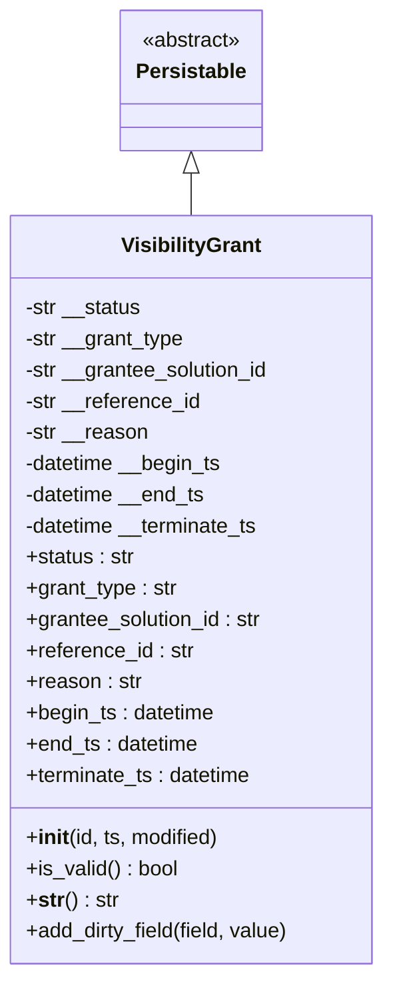
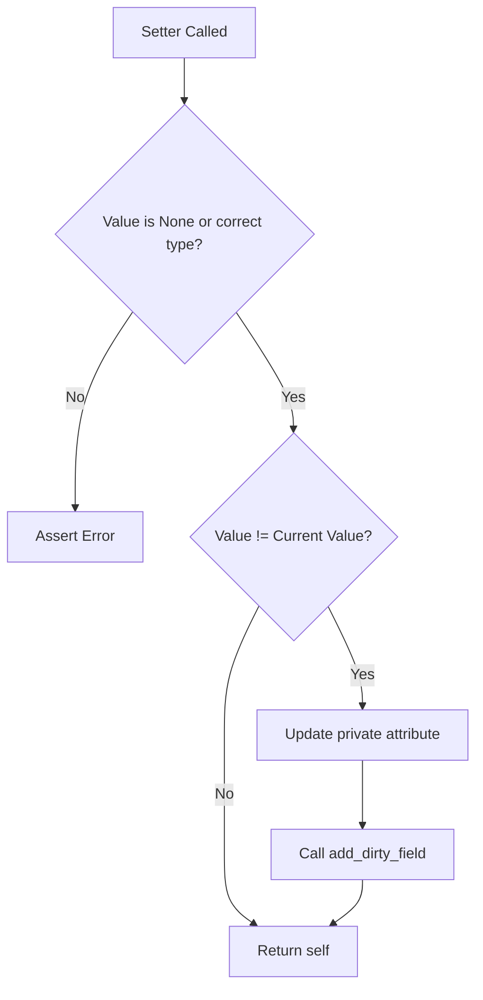
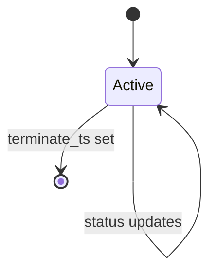

# Diagram: platform/partview_core/partview_service/partview_service/framework/datamodel/VisibilityGrant.py

> Auto-generated by Obscura crawlers

## Diagram 1

### SVG

<svg id="container" width="298.421875" xmlns="http://www.w3.org/2000/svg" class="classDiagram" height="750" viewBox="0 0 298.421875 750" role="graphics-document document" aria-roledescription="class"><g><defs><marker id="container_class-aggregationStart" class="marker aggregation class" refX="18" refY="7" markerWidth="190" markerHeight="240" orient="auto"><path d="M 18,7 L9,13 L1,7 L9,1 Z"></path></marker></defs><defs><marker id="container_class-aggregationEnd" class="marker aggregation class" refX="1" refY="7" markerWidth="20" markerHeight="28" orient="auto"><path d="M 18,7 L9,13 L1,7 L9,1 Z"></path></marker></defs><defs><marker id="container_class-extensionStart" class="marker extension class" refX="18" refY="7" markerWidth="190" markerHeight="240" orient="auto"><path d="M 1,7 L18,13 V 1 Z"></path></marker></defs><defs><marker id="container_class-extensionEnd" class="marker extension class" refX="1" refY="7" markerWidth="20" markerHeight="28" orient="auto"><path d="M 1,1 V 13 L18,7 Z"></path></marker></defs><defs><marker id="container_class-compositionStart" class="marker composition class" refX="18" refY="7" markerWidth="190" markerHeight="240" orient="auto"><path d="M 18,7 L9,13 L1,7 L9,1 Z"></path></marker></defs><defs><marker id="container_class-compositionEnd" class="marker composition class" refX="1" refY="7" markerWidth="20" markerHeight="28" orient="auto"><path d="M 18,7 L9,13 L1,7 L9,1 Z"></path></marker></defs><defs><marker id="container_class-dependencyStart" class="marker dependency class" refX="6" refY="7" markerWidth="190" markerHeight="240" orient="auto"><path d="M 5,7 L9,13 L1,7 L9,1 Z"></path></marker></defs><defs><marker id="container_class-dependencyEnd" class="marker dependency class" refX="13" refY="7" markerWidth="20" markerHeight="28" orient="auto"><path d="M 18,7 L9,13 L14,7 L9,1 Z"></path></marker></defs><defs><marker id="container_class-lollipopStart" class="marker lollipop class" refX="13" refY="7" markerWidth="190" markerHeight="240" orient="auto"><circle stroke="black" fill="transparent" cx="7" cy="7" r="6"></circle></marker></defs><defs><marker id="container_class-lollipopEnd" class="marker lollipop class" refX="1" refY="7" markerWidth="190" markerHeight="240" orient="auto"><circle stroke="black" fill="transparent" cx="7" cy="7" r="6"></circle></marker></defs><g class="root"><g class="clusters"></g><g class="edgePaths"><path d="M149.211,133.25L149.211,134.542C149.211,135.833,149.211,138.417,149.211,143.875C149.211,149.333,149.211,157.667,149.211,161.833L149.211,166" id="id_Persistable_VisibilityGrant_1" class="edge-thickness-normal edge-pattern-solid relation" style=";;;" data-edge="true" data-et="edge" data-id="id_Persistable_VisibilityGrant_1" data-points="W3sieCI6MTQ5LjIxMDkzNzUsInkiOjExNn0seyJ4IjoxNDkuMjEwOTM3NSwieSI6MTQxfSx7IngiOjE0OS4yMTA5Mzc1LCJ5IjoxNjZ9XQ==" marker-start="url(#container_class-extensionStart)"></path></g><g class="edgeLabels"><g class="edgeLabel"><g class="label" data-id="id_Persistable_VisibilityGrant_1" transform="translate(0, 0)"><foreignObject width="0" height="0">

</foreignObject></g></g></g><g class="nodes"><g class="node default" id="classId-Persistable-0" transform="translate(149.2109375, 62)"><g class="basic label-container"><path d="M-52.9765625 -54 L52.9765625 -54 L52.9765625 54 L-52.9765625 54" stroke="none" stroke-width="0" fill="#ECECFF" style=""></path><path d="M-52.9765625 -54 C-26.40719032175275 -54, 0.1621818564944988 -54, 52.9765625 -54 M-52.9765625 -54 C-12.36498286200316 -54, 28.24659677599368 -54, 52.9765625 -54 M52.9765625 -54 C52.9765625 -20.631531991672624, 52.9765625 12.736936016654752, 52.9765625 54 M52.9765625 -54 C52.9765625 -27.11330113267993, 52.9765625 -0.22660226535985828, 52.9765625 54 M52.9765625 54 C16.81277756567323 54, -19.35100736865354 54, -52.9765625 54 M52.9765625 54 C23.111753302728218 54, -6.753055894543564 54, -52.9765625 54 M-52.9765625 54 C-52.9765625 24.509816828486098, -52.9765625 -4.980366343027804, -52.9765625 -54 M-52.9765625 54 C-52.9765625 12.95551004813445, -52.9765625 -28.0889799037311, -52.9765625 -54" stroke="#9370DB" stroke-width="1.3" fill="none" stroke-dasharray="0 0" style=""></path></g><g class="annotation-group text" transform="translate(-38.609375, -30)"><g class="label" style="" transform="translate(0,-12)"><foreignObject width="77.21875" height="24">

«abstract»

</foreignObject></g></g><g class="label-group text" transform="translate(-40.9765625, -6)"><g class="label" style="font-weight: bolder" transform="translate(0,-12)"><foreignObject width="81.953125" height="24">

Persistable

</foreignObject></g></g><g class="members-group text" transform="translate(-40.9765625, 42)"></g><g class="methods-group text" transform="translate(-40.9765625, 72)"></g><g class="divider" style=""><path d="M-52.9765625 18 C-30.704635965154417 18, -8.432709430308833 18, 52.9765625 18 M-52.9765625 18 C-23.82268984621778 18, 5.3311828075644385 18, 52.9765625 18" stroke="#9370DB" stroke-width="1.3" fill="none" stroke-dasharray="0 0" style=""></path></g><g class="divider" style=""><path d="M-52.9765625 36 C-19.229034184452267 36, 14.518494131095466 36, 52.9765625 36 M-52.9765625 36 C-21.24779135190877 36, 10.48097979618246 36, 52.9765625 36" stroke="#9370DB" stroke-width="1.3" fill="none" stroke-dasharray="0 0" style=""></path></g></g><g class="node default" id="classId-VisibilityGrant-1" transform="translate(149.2109375, 454)"><g class="basic label-container"><path d="M-141.2109375 -288 L141.2109375 -288 L141.2109375 288 L-141.2109375 288" stroke="none" stroke-width="0" fill="#ECECFF" style=""></path><path d="M-141.2109375 -288 C-76.61103745017559 -288, -12.011137400351174 -288, 141.2109375 -288 M-141.2109375 -288 C-29.144922589230973 -288, 82.92109232153805 -288, 141.2109375 -288 M141.2109375 -288 C141.2109375 -158.74031686724092, 141.2109375 -29.48063373448184, 141.2109375 288 M141.2109375 -288 C141.2109375 -131.5608298370237, 141.2109375 24.878340325952593, 141.2109375 288 M141.2109375 288 C29.602594262945587 288, -82.00574897410883 288, -141.2109375 288 M141.2109375 288 C81.09804800716651 288, 20.98515851433301 288, -141.2109375 288 M-141.2109375 288 C-141.2109375 139.08723356755382, -141.2109375 -9.825532864892352, -141.2109375 -288 M-141.2109375 288 C-141.2109375 145.53962405870192, -141.2109375 3.0792481174038357, -141.2109375 -288" stroke="#9370DB" stroke-width="1.3" fill="none" stroke-dasharray="0 0" style=""></path></g><g class="annotation-group text" transform="translate(0, -264)"></g><g class="label-group text" transform="translate(-51.96875, -264)"><g class="label" style="font-weight: bolder" transform="translate(0,-12)"><foreignObject width="103.9375" height="24">

VisibilityGrant

</foreignObject></g></g><g class="members-group text" transform="translate(-129.2109375, -216)"><g class="label" style="" transform="translate(0,-12)"><foreignObject width="91" height="24">

-str __status

</foreignObject></g><g class="label" style="" transform="translate(0,12)"><foreignObject width="124.328125" height="24">

-str __grant_type

</foreignObject></g><g class="label" style="" transform="translate(0,36)"><foreignObject width="191.953125" height="24">

-str __grantee_solution_id

</foreignObject></g><g class="label" style="" transform="translate(0,60)"><foreignObject width="136.859375" height="24">

-str __reference_id

</foreignObject></g><g class="label" style="" transform="translate(0,84)"><foreignObject width="95.59375" height="24">

-str __reason

</foreignObject></g><g class="label" style="" transform="translate(0,108)"><foreignObject width="154.109375" height="24">

-datetime __begin_ts

</foreignObject></g><g class="label" style="" transform="translate(0,132)"><foreignObject width="141.015625" height="24">

-datetime __end_ts

</foreignObject></g><g class="label" style="" transform="translate(0,156)"><foreignObject width="184.03125" height="24">

-datetime __terminate_ts

</foreignObject></g><g class="label" style="" transform="translate(0,180)"><foreignObject width="84.140625" height="24">

+status : str

</foreignObject></g><g class="label" style="" transform="translate(0,204)"><foreignObject width="117.3125" height="24">

+grant_type : str

</foreignObject></g><g class="label" style="" transform="translate(0,228)"><foreignObject width="184.953125" height="24">

+grantee_solution_id : str

</foreignObject></g><g class="label" style="" transform="translate(0,252)"><foreignObject width="129.984375" height="24">

+reference_id : str

</foreignObject></g><g class="label" style="" transform="translate(0,276)"><foreignObject width="88.734375" height="24">

+reason : str

</foreignObject></g><g class="label" style="" transform="translate(0,300)"><foreignObject width="147.234375" height="24">

+begin_ts : datetime

</foreignObject></g><g class="label" style="" transform="translate(0,324)"><foreignObject width="134.46875" height="24">

+end_ts : datetime

</foreignObject></g><g class="label" style="" transform="translate(0,348)"><foreignObject width="177.40625" height="24">

+terminate_ts : datetime

</foreignObject></g></g><g class="methods-group text" transform="translate(-129.2109375, 192)"><g class="label" style="" transform="translate(0,-12)"><foreignObject width="150.90625" height="24">

+<strong>init</strong>(id, ts, modified)

</foreignObject></g><g class="label" style="" transform="translate(0,12)"><foreignObject width="117.984375" height="24">

+is_valid() : bool

</foreignObject></g><g class="label" style="" transform="translate(0,36)"><foreignObject width="70.4375" height="24">

+<strong>str</strong>() : str

</foreignObject></g><g class="label" style="" transform="translate(0,60)"><foreignObject width="206.453125" height="24">

+add_dirty_field(field, value)

</foreignObject></g></g><g class="divider" style=""><path d="M-141.2109375 -240 C-43.936914256227254 -240, 53.33710898754549 -240, 141.2109375 -240 M-141.2109375 -240 C-71.08441564681654 -240, -0.957893793633076 -240, 141.2109375 -240" stroke="#9370DB" stroke-width="1.3" fill="none" stroke-dasharray="0 0" style=""></path></g><g class="divider" style=""><path d="M-141.2109375 168 C-64.46418120131328 168, 12.282575097373439 168, 141.2109375 168 M-141.2109375 168 C-48.1156138780118 168, 44.9797097439764 168, 141.2109375 168" stroke="#9370DB" stroke-width="1.3" fill="none" stroke-dasharray="0 0" style=""></path></g></g></g></g></g></svg>

## Diagram 2

### SVG

<svg id="container" width="514.11328125" xmlns="http://www.w3.org/2000/svg" class="flowchart" height="1050.078125" viewBox="0 0 514.11328125 1050.078125" role="graphics-document document" aria-roledescription="flowchart-v2"><g><marker id="container_flowchart-v2-pointEnd" class="marker flowchart-v2" viewBox="0 0 10 10" refX="5" refY="5" markerUnits="userSpaceOnUse" markerWidth="8" markerHeight="8" orient="auto"><path d="M 0 0 L 10 5 L 0 10 z" class="arrowMarkerPath" style="stroke-width: 1; stroke-dasharray: 1, 0;"></path></marker><marker id="container_flowchart-v2-pointStart" class="marker flowchart-v2" viewBox="0 0 10 10" refX="4.5" refY="5" markerUnits="userSpaceOnUse" markerWidth="8" markerHeight="8" orient="auto"><path d="M 0 5 L 10 10 L 10 0 z" class="arrowMarkerPath" style="stroke-width: 1; stroke-dasharray: 1, 0;"></path></marker><marker id="container_flowchart-v2-circleEnd" class="marker flowchart-v2" viewBox="0 0 10 10" refX="11" refY="5" markerUnits="userSpaceOnUse" markerWidth="11" markerHeight="11" orient="auto"><circle cx="5" cy="5" r="5" class="arrowMarkerPath" style="stroke-width: 1; stroke-dasharray: 1, 0;"></circle></marker><marker id="container_flowchart-v2-circleStart" class="marker flowchart-v2" viewBox="0 0 10 10" refX="-1" refY="5" markerUnits="userSpaceOnUse" markerWidth="11" markerHeight="11" orient="auto"><circle cx="5" cy="5" r="5" class="arrowMarkerPath" style="stroke-width: 1; stroke-dasharray: 1, 0;"></circle></marker><marker id="container_flowchart-v2-crossEnd" class="marker cross flowchart-v2" viewBox="0 0 11 11" refX="12" refY="5.2" markerUnits="userSpaceOnUse" markerWidth="11" markerHeight="11" orient="auto"><path d="M 1,1 l 9,9 M 10,1 l -9,9" class="arrowMarkerPath" style="stroke-width: 2; stroke-dasharray: 1, 0;"></path></marker><marker id="container_flowchart-v2-crossStart" class="marker cross flowchart-v2" viewBox="0 0 11 11" refX="-1" refY="5.2" markerUnits="userSpaceOnUse" markerWidth="11" markerHeight="11" orient="auto"><path d="M 1,1 l 9,9 M 10,1 l -9,9" class="arrowMarkerPath" style="stroke-width: 2; stroke-dasharray: 1, 0;"></path></marker><g class="root"><g class="clusters"></g><g class="edgePaths"><path d="M196.012,62L196.012,66.167C196.012,70.333,196.012,78.667,196.012,86.333C196.012,94,196.012,101,196.012,104.5L196.012,108" id="L_A_B_0" class="edge-thickness-normal edge-pattern-solid edge-thickness-normal edge-pattern-solid flowchart-link" style=";" data-edge="true" data-et="edge" data-id="L_A_B_0" data-points="W3sieCI6MTk2LjAxMTcxODc1LCJ5Ijo2Mn0seyJ4IjoxOTYuMDExNzE4NzUsInkiOjg3fSx7IngiOjE5Ni4wMTE3MTg3NSwieSI6MTEyfV0=" marker-end="url(#container_flowchart-v2-pointEnd)"></path><path d="M140.883,334.872L130.791,350.226C120.698,365.581,100.513,396.291,90.421,430.818C80.328,465.346,80.328,503.693,80.328,522.866L80.328,542.039" id="L_B_C_0" class="edge-thickness-normal edge-pattern-solid edge-thickness-normal edge-pattern-solid flowchart-link" style=";" data-edge="true" data-et="edge" data-id="L_B_C_0" data-points="W3sieCI6MTQwLjg4MzQyMjYyNDMyODcyLCJ5IjozMzQuODcxNzAzODc0MzI4N30seyJ4Ijo4MC4zMjgxMjUsInkiOjQyN30seyJ4Ijo4MC4zMjgxMjUsInkiOjU0Ni4wMzkwNjI1fV0=" marker-end="url(#container_flowchart-v2-pointEnd)"></path><path d="M251.14,334.872L261.233,350.226C271.325,365.581,291.51,396.291,301.603,417.145C311.695,438,311.695,449,311.695,454.5L311.695,460" id="L_B_D_0" class="edge-thickness-normal edge-pattern-solid edge-thickness-normal edge-pattern-solid flowchart-link" style=";" data-edge="true" data-et="edge" data-id="L_B_D_0" data-points="W3sieCI6MjUxLjE0MDAxNDg3NTY3MTI4LCJ5IjozMzQuODcxNzAzODc0MzI4N30seyJ4IjozMTEuNjk1MzEyNSwieSI6NDI3fSx7IngiOjMxMS42OTUzMTI1LCJ5Ijo0NjR9XQ==" marker-end="url(#container_flowchart-v2-pointEnd)"></path><path d="M274.221,644.604L267.721,657.016C261.221,669.428,248.222,694.253,241.722,717.332C235.223,740.411,235.223,761.745,235.223,783.078C235.223,804.411,235.223,825.745,235.223,847.078C235.223,868.411,235.223,889.745,235.223,909.078C235.223,928.411,235.223,945.745,240.799,958.203C246.375,970.662,257.528,978.245,263.104,982.037L268.681,985.829" id="L_D_E_0" class="edge-thickness-normal edge-pattern-solid edge-thickness-normal edge-pattern-solid flowchart-link" style=";" data-edge="true" data-et="edge" data-id="L_D_E_0" data-points="W3sieCI6Mjc0LjIyMDg1MTQxODkwMzUsInkiOjY0NC42MDM2NjM5MTg5MDM1fSx7IngiOjIzNS4yMjI2NTYyNSwieSI6NzE5LjA3ODEyNX0seyJ4IjoyMzUuMjIyNjU2MjUsInkiOjc4My4wNzgxMjV9LHsieCI6MjM1LjIyMjY1NjI1LCJ5Ijo4NDcuMDc4MTI1fSx7IngiOjIzNS4yMjI2NTYyNSwieSI6OTExLjA3ODEyNX0seyJ4IjoyMzUuMjIyNjU2MjUsInkiOjk2My4wNzgxMjV9LHsieCI6MjcxLjk4ODM1NjM3MDE5MjMsInkiOjk4OC4wNzgxMjV9XQ==" marker-end="url(#container_flowchart-v2-pointEnd)"></path><path d="M349.17,644.604L355.669,657.016C362.169,669.428,375.169,694.253,381.668,712.166C388.168,730.078,388.168,741.078,388.168,746.578L388.168,752.078" id="L_D_F_0" class="edge-thickness-normal edge-pattern-solid edge-thickness-normal edge-pattern-solid flowchart-link" style=";" data-edge="true" data-et="edge" data-id="L_D_F_0" data-points="W3sieCI6MzQ5LjE2OTc3MzU4MTA5NjUsInkiOjY0NC42MDM2NjM5MTg5MDM1fSx7IngiOjM4OC4xNjc5Njg3NSwieSI6NzE5LjA3ODEyNX0seyJ4IjozODguMTY3OTY4NzUsInkiOjc1Ni4wNzgxMjV9XQ==" marker-end="url(#container_flowchart-v2-pointEnd)"></path><path d="M388.168,810.078L388.168,816.245C388.168,822.411,388.168,834.745,388.168,846.411C388.168,858.078,388.168,869.078,388.168,874.578L388.168,880.078" id="L_F_G_0" class="edge-thickness-normal edge-pattern-solid edge-thickness-normal edge-pattern-solid flowchart-link" style=";" data-edge="true" data-et="edge" data-id="L_F_G_0" data-points="W3sieCI6Mzg4LjE2Nzk2ODc1LCJ5Ijo4MTAuMDc4MTI1fSx7IngiOjM4OC4xNjc5Njg3NSwieSI6ODQ3LjA3ODEyNX0seyJ4IjozODguMTY3OTY4NzUsInkiOjg4NC4wNzgxMjV9XQ==" marker-end="url(#container_flowchart-v2-pointEnd)"></path><path d="M388.168,938.078L388.168,942.245C388.168,946.411,388.168,954.745,382.592,962.703C377.015,970.662,365.863,978.245,360.286,982.037L354.71,985.829" id="L_G_E_0" class="edge-thickness-normal edge-pattern-solid edge-thickness-normal edge-pattern-solid flowchart-link" style=";" data-edge="true" data-et="edge" data-id="L_G_E_0" data-points="W3sieCI6Mzg4LjE2Nzk2ODc1LCJ5Ijo5MzguMDc4MTI1fSx7IngiOjM4OC4xNjc5Njg3NSwieSI6OTYzLjA3ODEyNX0seyJ4IjozNTEuNDAyMjY4NjI5ODA3NywieSI6OTg4LjA3ODEyNX1d" marker-end="url(#container_flowchart-v2-pointEnd)"></path></g><g class="edgeLabels"><g class="edgeLabel"><g class="label" data-id="L_A_B_0" transform="translate(0, 0)"><foreignObject width="0" height="0">

</foreignObject></g></g><g class="edgeLabel" transform="translate(80.328125, 427)"><g class="label" data-id="L_B_C_0" transform="translate(-10.140625, -12)"><foreignObject width="20.28125" height="24">

No

</foreignObject></g></g><g class="edgeLabel" transform="translate(311.6953125, 427)"><g class="label" data-id="L_B_D_0" transform="translate(-12.03125, -12)"><foreignObject width="24.0625" height="24">

Yes

</foreignObject></g></g><g class="edgeLabel" transform="translate(235.22265625, 847.078125)"><g class="label" data-id="L_D_E_0" transform="translate(-10.140625, -12)"><foreignObject width="20.28125" height="24">

No

</foreignObject></g></g><g class="edgeLabel" transform="translate(388.16796875, 719.078125)"><g class="label" data-id="L_D_F_0" transform="translate(-12.03125, -12)"><foreignObject width="24.0625" height="24">

Yes

</foreignObject></g></g><g class="edgeLabel"><g class="label" data-id="L_F_G_0" transform="translate(0, 0)"><foreignObject width="0" height="0">

</foreignObject></g></g><g class="edgeLabel"><g class="label" data-id="L_G_E_0" transform="translate(0, 0)"><foreignObject width="0" height="0">

</foreignObject></g></g></g><g class="nodes"><g class="node default" id="flowchart-A-0" transform="translate(196.01171875, 35)"><rect class="basic label-container" style="" x="-76.4140625" y="-27" width="152.828125" height="54"></rect><g class="label" style="" transform="translate(-46.4140625, -12)"><rect></rect><foreignObject width="92.828125" height="24">

Setter Called

</foreignObject></g></g><g class="node default" id="flowchart-B-1" transform="translate(196.01171875, 251)"><polygon points="139,0 278,-139 139,-278 0,-139" class="label-container" transform="translate(-138.5, 139)"></polygon><g class="label" style="" transform="translate(-100, -24)"><rect></rect><foreignObject width="200" height="48">

Value is None or correct type?

</foreignObject></g></g><g class="node default" id="flowchart-C-3" transform="translate(80.328125, 573.0390625)"><rect class="basic label-container" style="" x="-72.328125" y="-27" width="144.65625" height="54"></rect><g class="label" style="" transform="translate(-42.328125, -12)"><rect></rect><foreignObject width="84.65625" height="24">

Assert Error

</foreignObject></g></g><g class="node default" id="flowchart-D-5" transform="translate(311.6953125, 573.0390625)"><polygon points="109.0390625,0 218.078125,-109.0390625 109.0390625,-218.078125 0,-109.0390625" class="label-container" transform="translate(-108.5390625, 109.0390625)"></polygon><g class="label" style="" transform="translate(-82.0390625, -12)"><rect></rect><foreignObject width="164.078125" height="24">

Value != Current Value?

</foreignObject></g></g><g class="node default" id="flowchart-E-7" transform="translate(311.6953125, 1015.078125)"><rect class="basic label-container" style="" x="-69.640625" y="-27" width="139.28125" height="54"></rect><g class="label" style="" transform="translate(-39.640625, -12)"><rect></rect><foreignObject width="79.28125" height="24">

Return self

</foreignObject></g></g><g class="node default" id="flowchart-F-9" transform="translate(388.16796875, 783.078125)"><rect class="basic label-container" style="" x="-117.9453125" y="-27" width="235.890625" height="54"></rect><g class="label" style="" transform="translate(-87.9453125, -12)"><rect></rect><foreignObject width="175.890625" height="24">

Update private attribute

</foreignObject></g></g><g class="node default" id="flowchart-G-11" transform="translate(388.16796875, 911.078125)"><rect class="basic label-container" style="" x="-100.125" y="-27" width="200.25" height="54"></rect><g class="label" style="" transform="translate(-70.125, -12)"><rect></rect><foreignObject width="140.25" height="24">

Call add_dirty_field

</foreignObject></g></g></g></g></g></svg>

## Diagram 3

### SVG

<svg id="container" width="227.875" xmlns="http://www.w3.org/2000/svg" class="statediagram" height="282.1499938964844" viewBox="0 0 227.875 282.1499938964844" role="graphics-document document" aria-roledescription="stateDiagram"><g><defs><marker id="container_stateDiagram-barbEnd" refX="19" refY="7" markerWidth="20" markerHeight="14" markerUnits="userSpaceOnUse" orient="auto"><path d="M 19,7 L9,13 L14,7 L9,1 Z"></path></marker></defs><g class="root"><g class="clusters"></g><g class="edgePaths"><path d="M146.141,22L146.141,26.167C146.141,30.333,146.141,38.667,146.224,47.083C146.307,55.5,146.474,64,146.557,68.25L146.641,72.5" id="edge0" class="edge-thickness-normal edge-pattern-solid transition" style="fill:none;;;fill:none" data-edge="true" data-et="edge" data-id="edge0" data-points="W3sieCI6MTQ2LjE0MDYyNSwieSI6MjJ9LHsieCI6MTQ2LjE0MDYyNSwieSI6NDd9LHsieCI6MTQ2LjY0MDYyNSwieSI6NzIuNX1d" marker-end="url(#container_stateDiagram-barbEnd)"></path><path d="M146.641,112.5L146.557,118.583C146.474,124.667,146.307,136.833,146.224,150.242C146.141,163.65,146.141,178.3,146.141,185.625L146.141,192.95" id="Active-cyclic-special-1" class="edge-thickness-normal edge-pattern-solid transition" style="fill:none;;;fill:none" data-edge="true" data-et="edge" data-id="Active-cyclic-special-1" data-points="W3sieCI6MTQ2LjY0MDYyNSwieSI6MTEyLjV9LHsieCI6MTQ2LjE0MDYyNSwieSI6MTQ5fSx7IngiOjE0Ni4xNDA2MjUsInkiOjE5Mi45NDk5OTk5OTkyNTQ5NH1d"></path><path d="M146.141,193.05L146.141,200.375C146.141,207.7,146.141,222.35,152.277,235.842C158.413,249.333,170.686,261.667,176.822,267.833L182.958,274" id="Active-cyclic-special-mid" class="edge-thickness-normal edge-pattern-solid transition" style="fill:none;;;fill:none" data-edge="true" data-et="edge" data-id="Active-cyclic-special-mid" data-points="W3sieCI6MTQ2LjE0MDYyNSwieSI6MTkzLjA1MDAwMDAwMDc0NTA2fSx7IngiOjE0Ni4xNDA2MjUsInkiOjIzN30seyJ4IjoxODIuOTU4MDU5MjA5Nzg1OTQsInkiOjI3NH1d"></path><path d="M183.058,274L189.194,267.833C195.33,261.667,207.603,249.333,213.739,235.833C219.875,222.333,219.875,207.667,219.875,193C219.875,178.333,219.875,163.667,211.962,150.235C204.048,136.803,188.221,124.606,180.308,118.507L172.394,112.409" id="Active-cyclic-special-2" class="edge-thickness-normal edge-pattern-solid transition" style="fill:none;;;fill:none" data-edge="true" data-et="edge" data-id="Active-cyclic-special-2" data-points="W3sieCI6MTgzLjA1NzU2NTc5MDIxNDA2LCJ5IjoyNzR9LHsieCI6MjE5Ljg3NSwieSI6MjM3fSx7IngiOjIxOS44NzUsInkiOjE5M30seyJ4IjoyMTkuODc1LCJ5IjoxNDl9LHsieCI6MTcyLjM5NDIwNTQxODIwNzk1LCJ5IjoxMTIuNDA4NjgwMDk0NDMxNn1d" marker-end="url(#container_stateDiagram-barbEnd)"></path><path d="M119.615,111.982L110.857,118.152C102.1,124.322,84.585,136.661,75.828,148.997C67.07,161.333,67.07,173.667,67.07,179.833L67.07,186" id="edge2" class="edge-thickness-normal edge-pattern-solid transition" style="fill:none;;;fill:none" data-edge="true" data-et="edge" data-id="edge2" data-points="W3sieCI6MTE5LjYxNDYwNTAwOTAwMTY0LCJ5IjoxMTEuOTgyNDQ2NTgxNzkyNzR9LHsieCI6NjcuMDcwMzEyNSwieSI6MTQ5fSx7IngiOjY3LjA3MDMxMjUsInkiOjE4Nn1d" marker-end="url(#container_stateDiagram-barbEnd)"></path></g><g class="edgeLabels"><g class="edgeLabel"><g class="label" data-id="edge0" transform="translate(0, 0)"><foreignObject width="0" height="0">

</foreignObject></g></g><g class="edgeLabel"><g class="label" data-id="Active-cyclic-special-1" transform="translate(0, 0)"><foreignObject width="0" height="0">

</foreignObject></g></g><g class="edgeLabel" transform="translate(146.140625, 237)"><g class="label" data-id="Active-cyclic-special-mid" transform="translate(-53.734375, -12)"><foreignObject width="107.46875" height="24">

status updates

</foreignObject></g></g><g class="edgeLabel"><g class="label" data-id="Active-cyclic-special-2" transform="translate(0, 0)"><foreignObject width="0" height="0">

</foreignObject></g></g><g class="edgeLabel" transform="translate(67.0703125, 149)"><g class="label" data-id="edge2" transform="translate(-59.0703125, -12)"><foreignObject width="118.140625" height="24">

terminate_ts set

</foreignObject></g></g></g><g class="nodes"><g class="node default" id="state-root_start-0" transform="translate(146.140625, 15)"><circle class="state-start" r="7" width="14" height="14"></circle></g><g class="node  statediagram-state" id="state-Active-2" transform="translate(146.140625, 92)"><g class="basic label-container outer-path"><path d="M-24.8203125 -20 C-14.712862346003547 -20, -4.605412192007094 -20, 24.8203125 -20 C24.8203125 -20, 24.8203125 -20, 24.8203125 -20 C24.90444190341279 -19.996520382136023, 24.988571306825577 -19.993040764272045, 25.233209227361662 -19.982922465033347 C25.359964613473647 -19.96712242263182, 25.48671999958563 -19.951322380230295, 25.64328545140367 -19.931806517013612 C25.783408074218194 -19.902425892650687, 25.923530697032714 -19.873045268287758, 26.047739935703998 -19.847001329696653 C26.136400065056964 -19.820606065564487, 26.225060194409934 -19.794210801432317, 26.443809846023417 -19.729086208503173 C26.577452161619878 -19.676938815138193, 26.71109447721634 -19.62479142177321, 26.828789623264846 -19.578866633275286 C26.95683876267278 -19.51626722347893, 27.08488790208072 -19.453667813682575, 27.20004946518537 -19.397368756032446 C27.337716307929806 -19.315337123213837, 27.47538315067424 -19.233305490395225, 27.555053290612136 -19.185832391312644 C27.6728847458026 -19.10170234934869, 27.790716200993067 -19.017572307384736, 27.89137606344834 -18.94570254698197 C27.98383934688909 -18.86739014064533, 28.07630263032984 -18.78907773430869, 28.206720358128706 -18.678619553365657 C28.3221813330428 -18.563158578451564, 28.437642307956892 -18.44769760353747, 28.498932053365657 -18.386407858128706 C28.55853117404658 -18.3160393093109, 28.6181302947275 -18.245670760493095, 28.76601504698197 -18.07106356344834 C28.85603025660397 -17.944989418096323, 28.946045466225964 -17.81891527274431, 29.006144891312644 -17.734740790612136 C29.08730500641028 -17.598536543319234, 29.168465121507914 -17.462332296026336, 29.217681256032446 -17.37973696518537 C29.257515768568837 -17.298254167414385, 29.297350281105224 -17.216771369643403, 29.399179133275286 -17.008477123264846 C29.43433079019124 -16.918391147261772, 29.469482447107193 -16.828305171258698, 29.549398708503173 -16.623497346023417 C29.580210405157754 -16.520002681325202, 29.61102210181233 -16.416508016626985, 29.667313829696653 -16.227427435703994 C29.68780021934659 -16.12972336330954, 29.70828660899653 -16.032019290915084, 29.752119017013612 -15.82297295140367 C29.772040199309334 -15.663155838921897, 29.79196138160506 -15.503338726440123, 29.803234965033347 -15.412896727361662 C29.806976064719954 -15.322445276355952, 29.810717164406565 -15.23199382535024, 29.8203125 -15 C29.8203125 -15, 29.8203125 -15, 29.8203125 -15 C29.8203125 -6.595791540909509, 29.8203125 1.8084169181809813, 29.8203125 15 C29.8203125 15, 29.8203125 15, 29.8203125 15 C29.814243533961296 15.146734070270886, 29.808174567922592 15.293468140541773, 29.803234965033347 15.412896727361662 C29.78312622863595 15.574218487234278, 29.763017492238554 15.735540247106892, 29.752119017013612 15.822972951403669 C29.72022080867923 15.975102482746706, 29.688322600344843 16.127232014089742, 29.667313829696653 16.227427435703994 C29.640397285749742 16.317838513089647, 29.613480741802828 16.408249590475297, 29.549398708503173 16.623497346023417 C29.502884571782364 16.742702862123362, 29.456370435061555 16.861908378223305, 29.399179133275286 17.008477123264846 C29.328253018019012 17.153558810930257, 29.25732690276274 17.298640498595667, 29.217681256032446 17.379736965185366 C29.143514759907593 17.504204405465426, 29.069348263782736 17.628671845745487, 29.006144891312644 17.734740790612133 C28.942506258731242 17.82387224126101, 28.878867626149837 17.91300369190989, 28.76601504698197 18.07106356344834 C28.65940822164301 18.19693400427814, 28.552801396304048 18.322804445107938, 28.498932053365657 18.386407858128706 C28.431703648446263 18.4536362630481, 28.364475243526865 18.520864667967498, 28.206720358128706 18.678619553365657 C28.110172876259522 18.760391099319502, 28.01362539439034 18.842162645273348, 27.89137606344834 18.94570254698197 C27.763620450199838 19.03691830160669, 27.635864836951335 19.128134056231413, 27.555053290612136 19.185832391312644 C27.43721471673877 19.25604894041876, 27.319376142865405 19.326265489524875, 27.20004946518537 19.397368756032446 C27.102587356747 19.44501507754589, 27.005125248308634 19.492661399059333, 26.828789623264846 19.578866633275286 C26.699445550653085 19.629336847023158, 26.570101478041323 19.679807060771033, 26.443809846023417 19.729086208503173 C26.303342218864735 19.770905232995133, 26.162874591706053 19.812724257487094, 26.047739935703998 19.847001329696653 C25.943762881504053 19.868803025314755, 25.839785827304105 19.890604720932856, 25.64328545140367 19.931806517013612 C25.513917500161327 19.94793221531902, 25.384549548918983 19.964057913624433, 25.233209227361662 19.982922465033347 C25.11787100259084 19.987692889296824, 25.002532777820015 19.992463313560297, 24.8203125 20 C24.8203125 20, 24.8203125 20, 24.8203125 20 C13.840211929621317 20, 2.8601113592426337 20, -24.8203125 20 C-24.8203125 20, -24.8203125 20, -24.8203125 20 C-24.980301663933226 19.993382799232116, -25.14029082786645 19.986765598464228, -25.233209227361662 19.982922465033347 C-25.328167787324862 19.9710858928779, -25.423126347288058 19.959249320722446, -25.64328545140367 19.931806517013612 C-25.733003594173823 19.912994600719706, -25.82272173694398 19.8941826844258, -26.047739935703994 19.847001329696653 C-26.204705675959705 19.800270604127146, -26.361671416215415 19.75353987855764, -26.443809846023417 19.729086208503173 C-26.524266397405494 19.69769196473401, -26.604722948787572 19.66629772096484, -26.828789623264846 19.578866633275286 C-26.942524246398396 19.523265164069866, -27.056258869531945 19.46766369486444, -27.20004946518537 19.397368756032446 C-27.332833723174783 19.31824651222752, -27.465617981164197 19.239124268422596, -27.555053290612133 19.185832391312644 C-27.62513121378578 19.13579771587037, -27.695209136959427 19.0857630404281, -27.89137606344834 18.94570254698197 C-27.98385290785499 18.8673786550931, -28.07632975226164 18.789054763204227, -28.206720358128706 18.67861955336566 C-28.26618449810535 18.619155413389016, -28.32564863808199 18.559691273412373, -28.498932053365657 18.386407858128706 C-28.577665749894148 18.293447158298363, -28.65639944642264 18.20048645846802, -28.766015046981966 18.07106356344834 C-28.856212569383967 17.944734073160483, -28.946410091785967 17.818404582872624, -29.006144891312644 17.734740790612133 C-29.050819805857447 17.659766610238815, -29.095494720402247 17.584792429865498, -29.217681256032446 17.37973696518537 C-29.2866614971184 17.238635626755137, -29.355641738204355 17.097534288324905, -29.399179133275286 17.00847712326485 C-29.44841573278897 16.882294532985597, -29.497652332302657 16.75611194270634, -29.549398708503173 16.623497346023417 C-29.582402426358517 16.512639811901686, -29.615406144213864 16.401782277779954, -29.667313829696653 16.227427435703994 C-29.695970539066387 16.090757321804464, -29.72462724843612 15.954087207904932, -29.752119017013612 15.82297295140367 C-29.77028129735835 15.677266579277184, -29.788443577703084 15.531560207150697, -29.803234965033347 15.412896727361664 C-29.8081443529484 15.294198671264471, -29.81305374086345 15.175500615167278, -29.8203125 15 C-29.8203125 15, -29.8203125 15, -29.8203125 15 C-29.8203125 4.195185447873499, -29.8203125 -6.609629104253003, -29.8203125 -15 C-29.8203125 -15, -29.8203125 -15, -29.8203125 -15 C-29.816476891424568 -15.092736465264412, -29.812641282849132 -15.185472930528825, -29.803234965033347 -15.41289672736166 C-29.792273976744948 -15.50083094091356, -29.78131298845655 -15.58876515446546, -29.752119017013612 -15.822972951403669 C-29.727070046145908 -15.942436971413278, -29.7020210752782 -16.061900991422885, -29.667313829696653 -16.227427435703994 C-29.631319033285298 -16.348331825593213, -29.595324236873942 -16.469236215482436, -29.549398708503173 -16.623497346023417 C-29.497518808653094 -16.75645413449318, -29.445638908803012 -16.889410922962945, -29.39917913327529 -17.008477123264846 C-29.34741694552015 -17.114358370667652, -29.295654757765007 -17.22023961807046, -29.217681256032446 -17.379736965185366 C-29.17085892056746 -17.458314982858603, -29.124036585102473 -17.536893000531844, -29.006144891312644 -17.734740790612133 C-28.9312460115745 -17.839643198665872, -28.856347131836362 -17.944545606719615, -28.76601504698197 -18.07106356344834 C-28.68112289802307 -18.171295534323292, -28.59623074906417 -18.271527505198247, -28.49893205336566 -18.386407858128706 C-28.420536202073844 -18.464803709420522, -28.342140350782028 -18.54319956071234, -28.206720358128706 -18.678619553365657 C-28.083397492794933 -18.783068692323667, -27.96007462746116 -18.887517831281677, -27.89137606344834 -18.945702546981966 C-27.818004619205773 -18.998088751269314, -27.74463317496321 -19.050474955556663, -27.555053290612136 -19.185832391312644 C-27.426788585134197 -19.262261566367425, -27.298523879656262 -19.3386907414222, -27.200049465185366 -19.397368756032446 C-27.104865640583103 -19.443901292446295, -27.009681815980837 -19.49043382886014, -26.82878962326485 -19.578866633275286 C-26.684121406280525 -19.635316346712397, -26.5394531892962 -19.691766060149504, -26.44380984602342 -19.729086208503173 C-26.3377998559105 -19.7606467499788, -26.23178986579758 -19.792207291454428, -26.047739935703994 -19.847001329696653 C-25.964845598992188 -19.864382444322, -25.881951262280378 -19.88176355894735, -25.643285451403674 -19.931806517013612 C-25.55010923194945 -19.943420920656312, -25.456933012495227 -19.955035324299008, -25.233209227361662 -19.982922465033347 C-25.098812543701868 -19.988481152987276, -24.964415860042074 -19.994039840941205, -24.8203125 -20 C-24.8203125 -20, -24.8203125 -20, -24.8203125 -20" stroke="none" stroke-width="0" fill="#ECECFF" style=""></path><path d="M-24.8203125 -20 C-8.050397672281647 -20, 8.719517155436705 -20, 24.8203125 -20 M-24.8203125 -20 C-6.004673805345568 -20, 12.810964889308863 -20, 24.8203125 -20 M24.8203125 -20 C24.8203125 -20, 24.8203125 -20, 24.8203125 -20 M24.8203125 -20 C24.8203125 -20, 24.8203125 -20, 24.8203125 -20 M24.8203125 -20 C24.9199514382 -19.995878903032185, 25.019590376399993 -19.99175780606437, 25.233209227361662 -19.982922465033347 M24.8203125 -20 C24.97238631290366 -19.993710180572347, 25.124460125807317 -19.98742036114469, 25.233209227361662 -19.982922465033347 M25.233209227361662 -19.982922465033347 C25.389010718820458 -19.963501829376135, 25.544812210279257 -19.944081193718922, 25.64328545140367 -19.931806517013612 M25.233209227361662 -19.982922465033347 C25.337217793889817 -19.969957810736016, 25.44122636041797 -19.95699315643868, 25.64328545140367 -19.931806517013612 M25.64328545140367 -19.931806517013612 C25.788936292887463 -19.901266747090492, 25.934587134371256 -19.870726977167372, 26.047739935703998 -19.847001329696653 M25.64328545140367 -19.931806517013612 C25.763197028397517 -19.90666370331474, 25.883108605391367 -19.881520889615874, 26.047739935703998 -19.847001329696653 M26.047739935703998 -19.847001329696653 C26.134278451559098 -19.821237697269417, 26.220816967414198 -19.79547406484218, 26.443809846023417 -19.729086208503173 M26.047739935703998 -19.847001329696653 C26.154434343310385 -19.815237028304942, 26.261128750916775 -19.78347272691323, 26.443809846023417 -19.729086208503173 M26.443809846023417 -19.729086208503173 C26.55012523359855 -19.687601815540607, 26.656440621173683 -19.64611742257804, 26.828789623264846 -19.578866633275286 M26.443809846023417 -19.729086208503173 C26.528889420526557 -19.695888055514434, 26.613968995029694 -19.6626899025257, 26.828789623264846 -19.578866633275286 M26.828789623264846 -19.578866633275286 C26.923346161691853 -19.532640758386272, 27.017902700118864 -19.486414883497257, 27.20004946518537 -19.397368756032446 M26.828789623264846 -19.578866633275286 C26.94947798499713 -19.5198656884141, 27.070166346729412 -19.460864743552914, 27.20004946518537 -19.397368756032446 M27.20004946518537 -19.397368756032446 C27.29057558787078 -19.34342689531579, 27.38110171055619 -19.289485034599135, 27.555053290612136 -19.185832391312644 M27.20004946518537 -19.397368756032446 C27.3162607496039 -19.328121860972196, 27.432472034022428 -19.258874965911946, 27.555053290612136 -19.185832391312644 M27.555053290612136 -19.185832391312644 C27.678379380587227 -19.097779255517253, 27.801705470562318 -19.009726119721858, 27.89137606344834 -18.94570254698197 M27.555053290612136 -19.185832391312644 C27.635719742750315 -19.12823765149976, 27.716386194888496 -19.070642911686875, 27.89137606344834 -18.94570254698197 M27.89137606344834 -18.94570254698197 C27.964095963508576 -18.88411193338532, 28.036815863568812 -18.822521319788667, 28.206720358128706 -18.678619553365657 M27.89137606344834 -18.94570254698197 C27.957455978609637 -18.889735713724118, 28.02353589377093 -18.833768880466266, 28.206720358128706 -18.678619553365657 M28.206720358128706 -18.678619553365657 C28.285631676123757 -18.599708235370606, 28.364542994118803 -18.52079691737556, 28.498932053365657 -18.386407858128706 M28.206720358128706 -18.678619553365657 C28.296363261923553 -18.58897664957081, 28.3860061657184 -18.499333745775964, 28.498932053365657 -18.386407858128706 M28.498932053365657 -18.386407858128706 C28.596993209584628 -18.270627269762844, 28.695054365803596 -18.154846681396982, 28.76601504698197 -18.07106356344834 M28.498932053365657 -18.386407858128706 C28.59863752785603 -18.268685826848394, 28.69834300234641 -18.150963795568085, 28.76601504698197 -18.07106356344834 M28.76601504698197 -18.07106356344834 C28.84174222567335 -17.965001050529388, 28.917469404364734 -17.858938537610435, 29.006144891312644 -17.734740790612136 M28.76601504698197 -18.07106356344834 C28.858055496434343 -17.942152893226588, 28.950095945886712 -17.813242223004835, 29.006144891312644 -17.734740790612136 M29.006144891312644 -17.734740790612136 C29.055224379696995 -17.652374781583323, 29.10430386808135 -17.57000877255451, 29.217681256032446 -17.37973696518537 M29.006144891312644 -17.734740790612136 C29.053430555574554 -17.65538520688988, 29.100716219836468 -17.57602962316762, 29.217681256032446 -17.37973696518537 M29.217681256032446 -17.37973696518537 C29.28385568050759 -17.244375016367904, 29.350030104982736 -17.10901306755044, 29.399179133275286 -17.008477123264846 M29.217681256032446 -17.37973696518537 C29.26649101677867 -17.27989500375804, 29.315300777524897 -17.18005304233071, 29.399179133275286 -17.008477123264846 M29.399179133275286 -17.008477123264846 C29.44690979952025 -16.886153909191748, 29.49464046576521 -16.763830695118646, 29.549398708503173 -16.623497346023417 M29.399179133275286 -17.008477123264846 C29.430875040336886 -16.927247475121266, 29.462570947398486 -16.846017826977683, 29.549398708503173 -16.623497346023417 M29.549398708503173 -16.623497346023417 C29.577021989757696 -16.530712379867502, 29.60464527101222 -16.437927413711588, 29.667313829696653 -16.227427435703994 M29.549398708503173 -16.623497346023417 C29.57582557692787 -16.534731059723136, 29.602252445352566 -16.44596477342286, 29.667313829696653 -16.227427435703994 M29.667313829696653 -16.227427435703994 C29.685085648679763 -16.142669744467156, 29.702857467662877 -16.057912053230318, 29.752119017013612 -15.82297295140367 M29.667313829696653 -16.227427435703994 C29.70027038912324 -16.0702503965522, 29.733226948549824 -15.913073357400409, 29.752119017013612 -15.82297295140367 M29.752119017013612 -15.82297295140367 C29.770321544327377 -15.676943699124745, 29.78852407164114 -15.530914446845818, 29.803234965033347 -15.412896727361662 M29.752119017013612 -15.82297295140367 C29.76346218572753 -15.731972706370959, 29.77480535444145 -15.640972461338245, 29.803234965033347 -15.412896727361662 M29.803234965033347 -15.412896727361662 C29.809683244571488 -15.2569917022154, 29.816131524109633 -15.101086677069137, 29.8203125 -15 M29.803234965033347 -15.412896727361662 C29.807963802565567 -15.298563977050172, 29.812692640097783 -15.184231226738683, 29.8203125 -15 M29.8203125 -15 C29.8203125 -15, 29.8203125 -15, 29.8203125 -15 M29.8203125 -15 C29.8203125 -15, 29.8203125 -15, 29.8203125 -15 M29.8203125 -15 C29.8203125 -6.032255476194829, 29.8203125 2.935489047610343, 29.8203125 15 M29.8203125 -15 C29.8203125 -6.472396263465177, 29.8203125 2.055207473069647, 29.8203125 15 M29.8203125 15 C29.8203125 15, 29.8203125 15, 29.8203125 15 M29.8203125 15 C29.8203125 15, 29.8203125 15, 29.8203125 15 M29.8203125 15 C29.815351710313042 15.119940836360403, 29.810390920626084 15.239881672720808, 29.803234965033347 15.412896727361662 M29.8203125 15 C29.81526043354226 15.122147705209697, 29.810208367084517 15.244295410419392, 29.803234965033347 15.412896727361662 M29.803234965033347 15.412896727361662 C29.785758752998404 15.55309913618874, 29.76828254096346 15.693301545015817, 29.752119017013612 15.822972951403669 M29.803234965033347 15.412896727361662 C29.788650152840006 15.529902964051185, 29.77406534064667 15.646909200740707, 29.752119017013612 15.822972951403669 M29.752119017013612 15.822972951403669 C29.732861078660104 15.914818270916317, 29.713603140306592 16.006663590428964, 29.667313829696653 16.227427435703994 M29.752119017013612 15.822972951403669 C29.732331612457973 15.917343411022859, 29.712544207902333 16.01171387064205, 29.667313829696653 16.227427435703994 M29.667313829696653 16.227427435703994 C29.623279532517792 16.375336032651393, 29.57924523533893 16.52324462959879, 29.549398708503173 16.623497346023417 M29.667313829696653 16.227427435703994 C29.641841581852486 16.31298720799748, 29.616369334008322 16.398546980290963, 29.549398708503173 16.623497346023417 M29.549398708503173 16.623497346023417 C29.49266212683828 16.76890074326812, 29.435925545173387 16.914304140512822, 29.399179133275286 17.008477123264846 M29.549398708503173 16.623497346023417 C29.515310782385743 16.71085721362657, 29.481222856268314 16.79821708122973, 29.399179133275286 17.008477123264846 M29.399179133275286 17.008477123264846 C29.341392475725094 17.12668162060172, 29.2836058181749 17.24488611793859, 29.217681256032446 17.379736965185366 M29.399179133275286 17.008477123264846 C29.343590570627043 17.12218534561371, 29.288002007978804 17.235893567962567, 29.217681256032446 17.379736965185366 M29.217681256032446 17.379736965185366 C29.166905607194142 17.46494949873722, 29.11612995835584 17.550162032289077, 29.006144891312644 17.734740790612133 M29.217681256032446 17.379736965185366 C29.141610073814814 17.50740088116391, 29.065538891597186 17.635064797142455, 29.006144891312644 17.734740790612133 M29.006144891312644 17.734740790612133 C28.921247230863077 17.85364736238497, 28.83634957041351 17.9725539341578, 28.76601504698197 18.07106356344834 M29.006144891312644 17.734740790612133 C28.92075415298524 17.854337960921608, 28.835363414657834 17.973935131231084, 28.76601504698197 18.07106356344834 M28.76601504698197 18.07106356344834 C28.681426700960373 18.170936834873025, 28.596838354938775 18.27081010629771, 28.498932053365657 18.386407858128706 M28.76601504698197 18.07106356344834 C28.70823156107865 18.13928839633505, 28.650448075175333 18.20751322922176, 28.498932053365657 18.386407858128706 M28.498932053365657 18.386407858128706 C28.390393184559255 18.494946726935108, 28.281854315752852 18.60348559574151, 28.206720358128706 18.678619553365657 M28.498932053365657 18.386407858128706 C28.404838707815095 18.480501203679268, 28.310745362264534 18.57459454922983, 28.206720358128706 18.678619553365657 M28.206720358128706 18.678619553365657 C28.117400594278205 18.75426953442041, 28.028080830427708 18.829919515475158, 27.89137606344834 18.94570254698197 M28.206720358128706 18.678619553365657 C28.09426304475507 18.77386603924333, 27.98180573138143 18.869112525121007, 27.89137606344834 18.94570254698197 M27.89137606344834 18.94570254698197 C27.79675188874997 19.01326290915615, 27.7021277140516 19.08082327133033, 27.555053290612136 19.185832391312644 M27.89137606344834 18.94570254698197 C27.778057142138394 19.026610701682305, 27.664738220828447 19.10751885638264, 27.555053290612136 19.185832391312644 M27.555053290612136 19.185832391312644 C27.446832015248933 19.250318274382078, 27.338610739885734 19.314804157451512, 27.20004946518537 19.397368756032446 M27.555053290612136 19.185832391312644 C27.435659137588363 19.256975864398, 27.31626498456459 19.32811933748336, 27.20004946518537 19.397368756032446 M27.20004946518537 19.397368756032446 C27.124951833036437 19.43408175130413, 27.049854200887502 19.47079474657582, 26.828789623264846 19.578866633275286 M27.20004946518537 19.397368756032446 C27.098630694155652 19.446949372021642, 26.997211923125935 19.49652998801084, 26.828789623264846 19.578866633275286 M26.828789623264846 19.578866633275286 C26.696517194592005 19.63047949510396, 26.56424476591916 19.682092356932632, 26.443809846023417 19.729086208503173 M26.828789623264846 19.578866633275286 C26.749579569430793 19.609774492191903, 26.670369515596743 19.640682351108524, 26.443809846023417 19.729086208503173 M26.443809846023417 19.729086208503173 C26.311616229399625 19.768441953332736, 26.179422612775838 19.807797698162297, 26.047739935703998 19.847001329696653 M26.443809846023417 19.729086208503173 C26.332002544922542 19.76237268423922, 26.220195243821667 19.795659159975266, 26.047739935703998 19.847001329696653 M26.047739935703998 19.847001329696653 C25.949968413392448 19.867501862106966, 25.852196891080897 19.88800239451728, 25.64328545140367 19.931806517013612 M26.047739935703998 19.847001329696653 C25.932870692799103 19.871086877118284, 25.818001449894204 19.895172424539915, 25.64328545140367 19.931806517013612 M25.64328545140367 19.931806517013612 C25.50182237016867 19.949439871700324, 25.36035928893367 19.967073226387033, 25.233209227361662 19.982922465033347 M25.64328545140367 19.931806517013612 C25.508420239178715 19.9486174481859, 25.373555026953756 19.965428379358187, 25.233209227361662 19.982922465033347 M25.233209227361662 19.982922465033347 C25.12129965900192 19.987551079018687, 25.009390090642178 19.992179693004022, 24.8203125 20 M25.233209227361662 19.982922465033347 C25.128767562778854 19.987242204233716, 25.024325898196043 19.991561943434085, 24.8203125 20 M24.8203125 20 C24.8203125 20, 24.8203125 20, 24.8203125 20 M24.8203125 20 C24.8203125 20, 24.8203125 20, 24.8203125 20 M24.8203125 20 C10.812145111234535 20, -3.196022277530929 20, -24.8203125 20 M24.8203125 20 C7.434873371021098 20, -9.950565757957804 20, -24.8203125 20 M-24.8203125 20 C-24.8203125 20, -24.8203125 20, -24.8203125 20 M-24.8203125 20 C-24.8203125 20, -24.8203125 20, -24.8203125 20 M-24.8203125 20 C-24.92869662429773 19.995517199459652, -25.037080748595457 19.991034398919304, -25.233209227361662 19.982922465033347 M-24.8203125 20 C-24.926504621189466 19.99560786137884, -25.03269674237893 19.991215722757676, -25.233209227361662 19.982922465033347 M-25.233209227361662 19.982922465033347 C-25.378595121209145 19.96480013226443, -25.523981015056624 19.94667779949551, -25.64328545140367 19.931806517013612 M-25.233209227361662 19.982922465033347 C-25.33414469736547 19.97034087181829, -25.435080167369282 19.957759278603238, -25.64328545140367 19.931806517013612 M-25.64328545140367 19.931806517013612 C-25.766181946703334 19.90603783176213, -25.889078442002997 19.880269146510646, -26.047739935703994 19.847001329696653 M-25.64328545140367 19.931806517013612 C-25.75627794337629 19.908114482880958, -25.869270435348906 19.884422448748307, -26.047739935703994 19.847001329696653 M-26.047739935703994 19.847001329696653 C-26.181268898048586 19.80724803522143, -26.314797860393178 19.767494740746212, -26.443809846023417 19.729086208503173 M-26.047739935703994 19.847001329696653 C-26.127225487512874 19.823337455641905, -26.20671103932175 19.799673581587154, -26.443809846023417 19.729086208503173 M-26.443809846023417 19.729086208503173 C-26.523181123872877 19.698115439780526, -26.60255240172234 19.667144671057876, -26.828789623264846 19.578866633275286 M-26.443809846023417 19.729086208503173 C-26.568786984134004 19.680319977885308, -26.693764122244588 19.631553747267446, -26.828789623264846 19.578866633275286 M-26.828789623264846 19.578866633275286 C-26.963897552717388 19.51281639130066, -27.09900548216993 19.446766149326034, -27.20004946518537 19.397368756032446 M-26.828789623264846 19.578866633275286 C-26.915434173504874 19.5365086937204, -27.0020787237449 19.494150754165517, -27.20004946518537 19.397368756032446 M-27.20004946518537 19.397368756032446 C-27.306356019852497 19.334023798853075, -27.41266257451963 19.270678841673703, -27.555053290612133 19.185832391312644 M-27.20004946518537 19.397368756032446 C-27.30897086860872 19.33246568719183, -27.417892272032073 19.267562618351217, -27.555053290612133 19.185832391312644 M-27.555053290612133 19.185832391312644 C-27.65045418894069 19.11771745912576, -27.745855087269245 19.04960252693888, -27.89137606344834 18.94570254698197 M-27.555053290612133 19.185832391312644 C-27.685584297142363 19.09263504397246, -27.81611530367259 18.999437696632274, -27.89137606344834 18.94570254698197 M-27.89137606344834 18.94570254698197 C-27.996245006658878 18.856883082788272, -28.101113949869415 18.768063618594578, -28.206720358128706 18.67861955336566 M-27.89137606344834 18.94570254698197 C-27.989308396463137 18.86275809193821, -28.087240729477934 18.779813636894453, -28.206720358128706 18.67861955336566 M-28.206720358128706 18.67861955336566 C-28.265957978077854 18.619381933416513, -28.325195598027 18.560144313467365, -28.498932053365657 18.386407858128706 M-28.206720358128706 18.67861955336566 C-28.296840401061104 18.58849951043326, -28.386960443993505 18.498379467500857, -28.498932053365657 18.386407858128706 M-28.498932053365657 18.386407858128706 C-28.553850481594083 18.321565792446584, -28.608768909822505 18.25672372676446, -28.766015046981966 18.07106356344834 M-28.498932053365657 18.386407858128706 C-28.58566896910942 18.28399777522668, -28.672405884853184 18.181587692324655, -28.766015046981966 18.07106356344834 M-28.766015046981966 18.07106356344834 C-28.846485407698395 17.958357810763932, -28.92695576841482 17.845652058079523, -29.006144891312644 17.734740790612133 M-28.766015046981966 18.07106356344834 C-28.829157975635482 17.982626389348045, -28.892300904288998 17.89418921524775, -29.006144891312644 17.734740790612133 M-29.006144891312644 17.734740790612133 C-29.062064352319116 17.640895826416994, -29.117983813325587 17.54705086222185, -29.217681256032446 17.37973696518537 M-29.006144891312644 17.734740790612133 C-29.06000842742136 17.644346113579015, -29.113871963530073 17.553951436545898, -29.217681256032446 17.37973696518537 M-29.217681256032446 17.37973696518537 C-29.281269088658632 17.24966597456282, -29.344856921284816 17.11959498394027, -29.399179133275286 17.00847712326485 M-29.217681256032446 17.37973696518537 C-29.287903806524508 17.236094442248, -29.35812635701657 17.09245191931063, -29.399179133275286 17.00847712326485 M-29.399179133275286 17.00847712326485 C-29.441955551062133 16.898850559844046, -29.484731968848976 16.78922399642324, -29.549398708503173 16.623497346023417 M-29.399179133275286 17.00847712326485 C-29.43272250607663 16.92251282620571, -29.466265878877973 16.836548529146572, -29.549398708503173 16.623497346023417 M-29.549398708503173 16.623497346023417 C-29.5751115645887 16.537129384893642, -29.60082442067423 16.45076142376387, -29.667313829696653 16.227427435703994 M-29.549398708503173 16.623497346023417 C-29.583079384275432 16.51036595034154, -29.61676006004769 16.397234554659665, -29.667313829696653 16.227427435703994 M-29.667313829696653 16.227427435703994 C-29.69042842475766 16.117188876943803, -29.713543019818665 16.00695031818361, -29.752119017013612 15.82297295140367 M-29.667313829696653 16.227427435703994 C-29.68663961120719 16.1352585573389, -29.705965392717733 16.043089678973804, -29.752119017013612 15.82297295140367 M-29.752119017013612 15.82297295140367 C-29.764958602205166 15.719967748182459, -29.77779818739672 15.616962544961247, -29.803234965033347 15.412896727361664 M-29.752119017013612 15.82297295140367 C-29.76255498999624 15.73925065805467, -29.772990962978866 15.65552836470567, -29.803234965033347 15.412896727361664 M-29.803234965033347 15.412896727361664 C-29.809678142585692 15.257115056858957, -29.816121320138038 15.10133338635625, -29.8203125 15 M-29.803234965033347 15.412896727361664 C-29.80940694101027 15.263672106407775, -29.81557891698719 15.114447485453884, -29.8203125 15 M-29.8203125 15 C-29.8203125 15, -29.8203125 15, -29.8203125 15 M-29.8203125 15 C-29.8203125 15, -29.8203125 15, -29.8203125 15 M-29.8203125 15 C-29.8203125 3.0609413439844015, -29.8203125 -8.878117312031197, -29.8203125 -15 M-29.8203125 15 C-29.8203125 6.46920949875191, -29.8203125 -2.0615810024961796, -29.8203125 -15 M-29.8203125 -15 C-29.8203125 -15, -29.8203125 -15, -29.8203125 -15 M-29.8203125 -15 C-29.8203125 -15, -29.8203125 -15, -29.8203125 -15 M-29.8203125 -15 C-29.815692125700817 -15.111710351115882, -29.811071751401634 -15.223420702231763, -29.803234965033347 -15.41289672736166 M-29.8203125 -15 C-29.81628762554052 -15.097312492441388, -29.812262751081043 -15.194624984882775, -29.803234965033347 -15.41289672736166 M-29.803234965033347 -15.41289672736166 C-29.7855386606739 -15.554864820537166, -29.767842356314453 -15.69683291371267, -29.752119017013612 -15.822972951403669 M-29.803234965033347 -15.41289672736166 C-29.786820978620177 -15.54457746166381, -29.770406992207008 -15.676258195965957, -29.752119017013612 -15.822972951403669 M-29.752119017013612 -15.822972951403669 C-29.72234576873075 -15.964968083554998, -29.69257252044789 -16.10696321570633, -29.667313829696653 -16.227427435703994 M-29.752119017013612 -15.822972951403669 C-29.731441770047788 -15.921587264076035, -29.710764523081963 -16.0202015767484, -29.667313829696653 -16.227427435703994 M-29.667313829696653 -16.227427435703994 C-29.621621486181585 -16.380905312121577, -29.575929142666517 -16.53438318853916, -29.549398708503173 -16.623497346023417 M-29.667313829696653 -16.227427435703994 C-29.630507463940326 -16.35105783896985, -29.593701098184 -16.47468824223571, -29.549398708503173 -16.623497346023417 M-29.549398708503173 -16.623497346023417 C-29.50465322633503 -16.73817018897028, -29.459907744166888 -16.852843031917146, -29.39917913327529 -17.008477123264846 M-29.549398708503173 -16.623497346023417 C-29.490771821279854 -16.773745181229668, -29.43214493405653 -16.923993016435922, -29.39917913327529 -17.008477123264846 M-29.39917913327529 -17.008477123264846 C-29.356657290412638 -17.09545694307968, -29.314135447549987 -17.182436762894508, -29.217681256032446 -17.379736965185366 M-29.39917913327529 -17.008477123264846 C-29.34739573030426 -17.11440176708538, -29.29561232733323 -17.220326410905912, -29.217681256032446 -17.379736965185366 M-29.217681256032446 -17.379736965185366 C-29.14658674864966 -17.499048943157337, -29.075492241266875 -17.618360921129312, -29.006144891312644 -17.734740790612133 M-29.217681256032446 -17.379736965185366 C-29.133496546845862 -17.521017136295725, -29.04931183765928 -17.662297307406085, -29.006144891312644 -17.734740790612133 M-29.006144891312644 -17.734740790612133 C-28.911631434885333 -17.86711512260976, -28.817117978458025 -17.999489454607385, -28.76601504698197 -18.07106356344834 M-29.006144891312644 -17.734740790612133 C-28.93815600527852 -17.829965150319598, -28.870167119244392 -17.925189510027064, -28.76601504698197 -18.07106356344834 M-28.76601504698197 -18.07106356344834 C-28.695166150848706 -18.154714697043623, -28.624317254715447 -18.238365830638905, -28.49893205336566 -18.386407858128706 M-28.76601504698197 -18.07106356344834 C-28.69498938385667 -18.154923405436744, -28.623963720731368 -18.238783247425147, -28.49893205336566 -18.386407858128706 M-28.49893205336566 -18.386407858128706 C-28.439530493384684 -18.445809418109683, -28.380128933403707 -18.50521097809066, -28.206720358128706 -18.678619553365657 M-28.49893205336566 -18.386407858128706 C-28.400368410915288 -18.48497150057908, -28.301804768464912 -18.58353514302945, -28.206720358128706 -18.678619553365657 M-28.206720358128706 -18.678619553365657 C-28.11615396339743 -18.755325376917604, -28.025587568666154 -18.832031200469554, -27.89137606344834 -18.945702546981966 M-28.206720358128706 -18.678619553365657 C-28.09409862017986 -18.774005299754815, -27.981476882231018 -18.86939104614397, -27.89137606344834 -18.945702546981966 M-27.89137606344834 -18.945702546981966 C-27.791366984773155 -19.01710765669668, -27.69135790609797 -19.088512766411398, -27.555053290612136 -19.185832391312644 M-27.89137606344834 -18.945702546981966 C-27.78210257473142 -19.02372231832776, -27.672829086014502 -19.101742089673554, -27.555053290612136 -19.185832391312644 M-27.555053290612136 -19.185832391312644 C-27.42166340704081 -19.265315509634412, -27.288273523469485 -19.344798627956177, -27.200049465185366 -19.397368756032446 M-27.555053290612136 -19.185832391312644 C-27.457845551995863 -19.243755630941962, -27.36063781337959 -19.30167887057128, -27.200049465185366 -19.397368756032446 M-27.200049465185366 -19.397368756032446 C-27.115210022581156 -19.438844232236594, -27.030370579976946 -19.480319708440742, -26.82878962326485 -19.578866633275286 M-27.200049465185366 -19.397368756032446 C-27.073276401011693 -19.45934433065982, -26.946503336838017 -19.521319905287196, -26.82878962326485 -19.578866633275286 M-26.82878962326485 -19.578866633275286 C-26.696636636772194 -19.630432888620625, -26.564483650279534 -19.681999143965967, -26.44380984602342 -19.729086208503173 M-26.82878962326485 -19.578866633275286 C-26.74703461675336 -19.61076753580817, -26.665279610241868 -19.642668438341047, -26.44380984602342 -19.729086208503173 M-26.44380984602342 -19.729086208503173 C-26.339507041504852 -19.760138498806437, -26.23520423698628 -19.791190789109702, -26.047739935703994 -19.847001329696653 M-26.44380984602342 -19.729086208503173 C-26.288360184675877 -19.77536557782587, -26.132910523328338 -19.82164494714857, -26.047739935703994 -19.847001329696653 M-26.047739935703994 -19.847001329696653 C-25.930190872560257 -19.87164877633353, -25.81264180941652 -19.896296222970406, -25.643285451403674 -19.931806517013612 M-26.047739935703994 -19.847001329696653 C-25.963688941169995 -19.864624969963526, -25.87963794663599 -19.8822486102304, -25.643285451403674 -19.931806517013612 M-25.643285451403674 -19.931806517013612 C-25.54365945660613 -19.94422488431443, -25.444033461808583 -19.956643251615247, -25.233209227361662 -19.982922465033347 M-25.643285451403674 -19.931806517013612 C-25.530444821813997 -19.945872086823456, -25.417604192224324 -19.9599376566333, -25.233209227361662 -19.982922465033347 M-25.233209227361662 -19.982922465033347 C-25.119165002648042 -19.987639369058567, -25.005120777934422 -19.992356273083782, -24.8203125 -20 M-25.233209227361662 -19.982922465033347 C-25.118297560216448 -19.987675246742924, -25.003385893071233 -19.9924280284525, -24.8203125 -20 M-24.8203125 -20 C-24.8203125 -20, -24.8203125 -20, -24.8203125 -20 M-24.8203125 -20 C-24.8203125 -20, -24.8203125 -20, -24.8203125 -20" stroke="#9370DB" stroke-width="1.3" fill="none" stroke-dasharray="0 0" style=""></path></g><g class="label" style="" transform="translate(-21.8203125, -12)"><rect></rect><foreignObject width="43.640625" height="24">

Active

</foreignObject></g></g><g class="node default" id="state-root_end-2" transform="translate(67.0703125, 193)"><g><path d="M7 0 C7 0.40517908122283747, 6.964012880168563 0.816513743121899, 6.893654271085456 1.2155372436685123 C6.823295662002349 1.6145607442151257, 6.716427752933756 2.013397210557766, 6.5778483455013586 2.394141003279681 C6.439268938068961 2.7748847960015954, 6.26476736710249 3.149104622578984, 6.062177826491071 3.4999999999999996 C5.859588285879653 3.8508953774210153, 5.622755194947063 4.189128084166967, 5.362311101832846 4.499513267805774 C5.10186700871863 4.809898451444582, 4.809898451444583 5.10186700871863, 4.499513267805775 5.362311101832846 C4.189128084166968 5.622755194947063, 3.8508953774210166 5.859588285879652, 3.500000000000001 6.06217782649107 C3.149104622578985 6.264767367102489, 2.7748847960015963 6.439268938068961, 2.3941410032796817 6.5778483455013586 C2.013397210557767 6.716427752933756, 1.6145607442151264 6.823295662002349, 1.2155372436685128 6.893654271085456 C0.8165137431218992 6.964012880168563, 0.4051790812228379 7, 4.286263797015736e-16 7 C-0.405179081222837 7, -0.8165137431218985 6.964012880168563, -1.2155372436685121 6.893654271085456 C-1.6145607442151257 6.823295662002349, -2.0133972105577667 6.716427752933756, -2.394141003279681 6.5778483455013586 C-2.774884796001595 6.439268938068961, -3.149104622578983 6.26476736710249, -3.4999999999999982 6.062177826491071 C-3.8508953774210135 5.859588285879653, -4.189128084166966 5.6227551949470636, -4.499513267805773 5.362311101832848 C-4.809898451444581 5.101867008718632, -5.101867008718628 4.809898451444586, -5.3623111018328435 4.499513267805779 C-5.622755194947059 4.189128084166971, -5.859588285879649 3.8508953774210206, -6.062177826491068 3.5000000000000053 C-6.264767367102486 3.14910462257899, -6.439268938068958 2.774884796001602, -6.577848345501356 2.394141003279688 C-6.716427752933754 2.0133972105577738, -6.823295662002347 1.614560744215134, -6.893654271085454 1.215537243668521 C-6.9640128801685615 0.816513743121908, -6.999999999999999 0.4051790812228472, -7 1.0183126166254463e-14 C-7.000000000000001 -0.40517908122282686, -6.964012880168565 -0.8165137431218878, -6.893654271085459 -1.215537243668501 C-6.823295662002352 -1.6145607442151142, -6.716427752933759 -2.0133972105577542, -6.577848345501363 -2.394141003279669 C-6.439268938068967 -2.7748847960015834, -6.264767367102496 -3.149104622578972, -6.062177826491078 -3.4999999999999876 C-5.859588285879661 -3.8508953774210033, -5.6227551949470715 -4.1891280841669545, -5.362311101832856 -4.499513267805763 C-5.10186700871864 -4.809898451444571, -4.809898451444594 -5.10186700871862, -4.499513267805787 -5.362311101832836 C-4.189128084166979 -5.622755194947053, -3.850895377421028 -5.859588285879643, -3.5000000000000133 -6.062177826491062 C-3.1491046225789985 -6.264767367102482, -2.774884796001611 -6.439268938068954, -2.3941410032796973 -6.577848345501353 C-2.0133972105577835 -6.716427752933752, -1.6145607442151435 -6.823295662002345, -1.2155372436685306 -6.893654271085453 C-0.8165137431219176 -6.9640128801685615, -0.40517908122285695 -6.999999999999999, -1.9937625952807352e-14 -7 C0.4051790812228171 -7.000000000000001, 0.8165137431218781 -6.964012880168565, 1.2155372436684913 -6.89365427108546 C1.6145607442151044 -6.823295662002354, 2.013397210557745 -6.716427752933763, 2.3941410032796595 -6.5778483455013665 C2.774884796001574 -6.43926893806897, 3.149104622578963 -6.2647673671025, 3.499999999999979 -6.062177826491083 C3.8508953774209953 -5.859588285879665, 4.189128084166947 -5.622755194947077, 4.499513267805756 -5.362311101832862 C4.809898451444564 -5.1018670087186475, 5.101867008718613 -4.809898451444602, 5.362311101832829 -4.499513267805796 C5.622755194947046 -4.189128084166989, 5.859588285879637 -3.8508953774210393, 6.062177826491056 -3.500000000000025 C6.2647673671024755 -3.1491046225790105, 6.439268938068949 -2.774884796001623, 6.577848345501348 -2.3941410032797092 C6.716427752933747 -2.0133972105577955, 6.823295662002342 -1.6145607442151562, 6.893654271085451 -1.2155372436685434 C6.96401288016856 -0.8165137431219307, 6.982275711847575 -0.2025895406114567, 7 -3.2800750208310675e-14 C7.017724288152425 0.2025895406113911, 7.017724288152424 -0.2025895406114242, 7 0" stroke="none" stroke-width="0" fill="#ECECFF" style=""></path><path d="M7 0 C7 0.40517908122283747, 6.964012880168563 0.816513743121899, 6.893654271085456 1.2155372436685123 C6.823295662002349 1.6145607442151257, 6.716427752933756 2.013397210557766, 6.5778483455013586 2.394141003279681 C6.439268938068961 2.7748847960015954, 6.26476736710249 3.149104622578984, 6.062177826491071 3.4999999999999996 C5.859588285879653 3.8508953774210153, 5.622755194947063 4.189128084166967, 5.362311101832846 4.499513267805774 C5.10186700871863 4.809898451444582, 4.809898451444583 5.10186700871863, 4.499513267805775 5.362311101832846 C4.189128084166968 5.622755194947063, 3.8508953774210166 5.859588285879652, 3.500000000000001 6.06217782649107 C3.149104622578985 6.264767367102489, 2.7748847960015963 6.439268938068961, 2.3941410032796817 6.5778483455013586 C2.013397210557767 6.716427752933756, 1.6145607442151264 6.823295662002349, 1.2155372436685128 6.893654271085456 C0.8165137431218992 6.964012880168563, 0.4051790812228379 7, 4.286263797015736e-16 7 C-0.405179081222837 7, -0.8165137431218985 6.964012880168563, -1.2155372436685121 6.893654271085456 C-1.6145607442151257 6.823295662002349, -2.0133972105577667 6.716427752933756, -2.394141003279681 6.5778483455013586 C-2.774884796001595 6.439268938068961, -3.149104622578983 6.26476736710249, -3.4999999999999982 6.062177826491071 C-3.8508953774210135 5.859588285879653, -4.189128084166966 5.6227551949470636, -4.499513267805773 5.362311101832848 C-4.809898451444581 5.101867008718632, -5.101867008718628 4.809898451444586, -5.3623111018328435 4.499513267805779 C-5.622755194947059 4.189128084166971, -5.859588285879649 3.8508953774210206, -6.062177826491068 3.5000000000000053 C-6.264767367102486 3.14910462257899, -6.439268938068958 2.774884796001602, -6.577848345501356 2.394141003279688 C-6.716427752933754 2.0133972105577738, -6.823295662002347 1.614560744215134, -6.893654271085454 1.215537243668521 C-6.9640128801685615 0.816513743121908, -6.999999999999999 0.4051790812228472, -7 1.0183126166254463e-14 C-7.000000000000001 -0.40517908122282686, -6.964012880168565 -0.8165137431218878, -6.893654271085459 -1.215537243668501 C-6.823295662002352 -1.6145607442151142, -6.716427752933759 -2.0133972105577542, -6.577848345501363 -2.394141003279669 C-6.439268938068967 -2.7748847960015834, -6.264767367102496 -3.149104622578972, -6.062177826491078 -3.4999999999999876 C-5.859588285879661 -3.8508953774210033, -5.6227551949470715 -4.1891280841669545, -5.362311101832856 -4.499513267805763 C-5.10186700871864 -4.809898451444571, -4.809898451444594 -5.10186700871862, -4.499513267805787 -5.362311101832836 C-4.189128084166979 -5.622755194947053, -3.850895377421028 -5.859588285879643, -3.5000000000000133 -6.062177826491062 C-3.1491046225789985 -6.264767367102482, -2.774884796001611 -6.439268938068954, -2.3941410032796973 -6.577848345501353 C-2.0133972105577835 -6.716427752933752, -1.6145607442151435 -6.823295662002345, -1.2155372436685306 -6.893654271085453 C-0.8165137431219176 -6.9640128801685615, -0.40517908122285695 -6.999999999999999, -1.9937625952807352e-14 -7 C0.4051790812228171 -7.000000000000001, 0.8165137431218781 -6.964012880168565, 1.2155372436684913 -6.89365427108546 C1.6145607442151044 -6.823295662002354, 2.013397210557745 -6.716427752933763, 2.3941410032796595 -6.5778483455013665 C2.774884796001574 -6.43926893806897, 3.149104622578963 -6.2647673671025, 3.499999999999979 -6.062177826491083 C3.8508953774209953 -5.859588285879665, 4.189128084166947 -5.622755194947077, 4.499513267805756 -5.362311101832862 C4.809898451444564 -5.1018670087186475, 5.101867008718613 -4.809898451444602, 5.362311101832829 -4.499513267805796 C5.622755194947046 -4.189128084166989, 5.859588285879637 -3.8508953774210393, 6.062177826491056 -3.500000000000025 C6.2647673671024755 -3.1491046225790105, 6.439268938068949 -2.774884796001623, 6.577848345501348 -2.3941410032797092 C6.716427752933747 -2.0133972105577955, 6.823295662002342 -1.6145607442151562, 6.893654271085451 -1.2155372436685434 C6.96401288016856 -0.8165137431219307, 6.982275711847575 -0.2025895406114567, 7 -3.2800750208310675e-14 C7.017724288152425 0.2025895406113911, 7.017724288152424 -0.2025895406114242, 7 0" stroke="#333333" stroke-width="2" fill="none" stroke-dasharray="0 0" style=""></path><g><path d="M2.5 0 C2.5 0.14470681472244193, 2.487147457203058 0.29161205111496386, 2.46201938253052 0.4341204441673258 C2.436891307857982 0.5766288372196877, 2.3987241974763416 0.7190704323420595, 2.3492315519647713 0.8550503583141718 C2.299738906453201 0.991030284286284, 2.2374169168223177 1.124680222349637, 2.165063509461097 1.2499999999999998 C2.092710102099876 1.3753197776503625, 2.0081268553382365 1.496117172916774, 1.915111107797445 1.6069690242163481 C1.8220953602566536 1.7178208755159223, 1.7178208755159226 1.8220953602566536, 1.6069690242163484 1.915111107797445 C1.4961171729167742 2.0081268553382365, 1.375319777650363 2.0927101020998755, 1.2500000000000002 2.1650635094610964 C1.1246802223496375 2.2374169168223172, 0.9910302842862845 2.2997389064532, 0.8550503583141721 2.349231551964771 C0.7190704323420597 2.3987241974763416, 0.576628837219688 2.436891307857982, 0.43412044416732604 2.46201938253052 C0.291612051114964 2.487147457203058, 0.14470681472244212 2.5, 1.5308084989341916e-16 2.5 C-0.1447068147224418 2.5, -0.2916120511149638 2.487147457203058, -0.43412044416732576 2.46201938253052 C-0.5766288372196877 2.436891307857982, -0.7190704323420595 2.3987241974763416, -0.8550503583141718 2.3492315519647713 C-0.991030284286284 2.299738906453201, -1.124680222349637 2.2374169168223177, -1.2499999999999996 2.165063509461097 C-1.375319777650362 2.092710102099876, -1.4961171729167733 2.008126855338237, -1.6069690242163475 1.9151111077974459 C-1.7178208755159217 1.8220953602566548, -1.822095360256653 1.7178208755159234, -1.9151111077974443 1.6069690242163495 C-2.0081268553382357 1.4961171729167755, -2.0927101020998746 1.3753197776503645, -2.1650635094610955 1.250000000000002 C-2.2374169168223164 1.1246802223496395, -2.2997389064531992 0.9910302842862865, -2.34923155196477 0.8550503583141743 C-2.3987241974763407 0.7190704323420621, -2.436891307857981 0.5766288372196907, -2.4620193825305194 0.434120444167329 C-2.487147457203058 0.29161205111496724, -2.5 0.14470681472244545, -2.5 3.636830773662308e-15 C-2.5 -0.14470681472243818, -2.4871474572030587 -0.2916120511149599, -2.4620193825305208 -0.4341204441673218 C-2.436891307857983 -0.5766288372196837, -2.398724197476343 -0.7190704323420553, -2.3492315519647726 -0.8550503583141675 C-2.2997389064532023 -0.9910302842862798, -2.23741691682232 -1.1246802223496328, -2.165063509461099 -1.2499999999999956 C-2.092710102099878 -1.3753197776503583, -2.00812685533824 -1.4961171729167695, -1.9151111077974488 -1.606969024216344 C-1.8220953602566576 -1.7178208755159183, -1.7178208755159263 -1.82209536025665, -1.6069690242163523 -1.9151111077974416 C-1.4961171729167784 -2.0081268553382334, -1.3753197776503672 -2.0927101020998724, -1.2500000000000047 -2.1650635094610937 C-1.1246802223496422 -2.237416916822315, -0.9910302842862897 -2.299738906453198, -0.8550503583141776 -2.3492315519647686 C-0.7190704323420656 -2.3987241974763394, -0.5766288372196942 -2.4368913078579806, -0.43412044416733236 -2.462019382530519 C-0.29161205111497057 -2.4871474572030574, -0.1447068147224489 -2.4999999999999996, -7.120580697431198e-15 -2.5 C0.14470681472243463 -2.5000000000000004, 0.29161205111495647 -2.487147457203059, 0.4341204441673183 -2.4620193825305217 C0.5766288372196802 -2.436891307857984, 0.7190704323420518 -2.3987241974763442, 0.8550503583141642 -2.349231551964774 C0.9910302842862766 -2.2997389064532037, 1.1246802223496295 -2.2374169168223212, 1.2499999999999925 -2.165063509461101 C1.3753197776503554 -2.0927101020998804, 1.4961171729167668 -2.008126855338242, 1.6069690242163412 -1.915111107797451 C1.7178208755159157 -1.82209536025666, 1.8220953602566472 -1.7178208755159294, 1.915111107797439 -1.6069690242163557 C2.0081268553382308 -1.496117172916782, 2.09271010209987 -1.3753197776503712, 2.1650635094610915 -1.2500000000000089 C2.237416916822313 -1.1246802223496466, 2.299738906453196 -0.9910302842862939, 2.3492315519647673 -0.855050358314182 C2.3987241974763385 -0.71907043234207, 2.4368913078579792 -0.5766288372196986, 2.462019382530518 -0.4341204441673369 C2.487147457203057 -0.29161205111497523, 2.4936698970884197 -0.07235340736123454, 2.5 -1.1714553645825241e-14 C2.5063301029115803 0.07235340736121111, 2.50633010291158 -0.07235340736122292, 2.5 0" stroke="none" stroke-width="0" fill="#9370DB" style=""></path><path d="M2.5 0 C2.5 0.14470681472244193, 2.487147457203058 0.29161205111496386, 2.46201938253052 0.4341204441673258 C2.436891307857982 0.5766288372196877, 2.3987241974763416 0.7190704323420595, 2.3492315519647713 0.8550503583141718 C2.299738906453201 0.991030284286284, 2.2374169168223177 1.124680222349637, 2.165063509461097 1.2499999999999998 C2.092710102099876 1.3753197776503625, 2.0081268553382365 1.496117172916774, 1.915111107797445 1.6069690242163481 C1.8220953602566536 1.7178208755159223, 1.7178208755159226 1.8220953602566536, 1.6069690242163484 1.915111107797445 C1.4961171729167742 2.0081268553382365, 1.375319777650363 2.0927101020998755, 1.2500000000000002 2.1650635094610964 C1.1246802223496375 2.2374169168223172, 0.9910302842862845 2.2997389064532, 0.8550503583141721 2.349231551964771 C0.7190704323420597 2.3987241974763416, 0.576628837219688 2.436891307857982, 0.43412044416732604 2.46201938253052 C0.291612051114964 2.487147457203058, 0.14470681472244212 2.5, 1.5308084989341916e-16 2.5 C-0.1447068147224418 2.5, -0.2916120511149638 2.487147457203058, -0.43412044416732576 2.46201938253052 C-0.5766288372196877 2.436891307857982, -0.7190704323420595 2.3987241974763416, -0.8550503583141718 2.3492315519647713 C-0.991030284286284 2.299738906453201, -1.124680222349637 2.2374169168223177, -1.2499999999999996 2.165063509461097 C-1.375319777650362 2.092710102099876, -1.4961171729167733 2.008126855338237, -1.6069690242163475 1.9151111077974459 C-1.7178208755159217 1.8220953602566548, -1.822095360256653 1.7178208755159234, -1.9151111077974443 1.6069690242163495 C-2.0081268553382357 1.4961171729167755, -2.0927101020998746 1.3753197776503645, -2.1650635094610955 1.250000000000002 C-2.2374169168223164 1.1246802223496395, -2.2997389064531992 0.9910302842862865, -2.34923155196477 0.8550503583141743 C-2.3987241974763407 0.7190704323420621, -2.436891307857981 0.5766288372196907, -2.4620193825305194 0.434120444167329 C-2.487147457203058 0.29161205111496724, -2.5 0.14470681472244545, -2.5 3.636830773662308e-15 C-2.5 -0.14470681472243818, -2.4871474572030587 -0.2916120511149599, -2.4620193825305208 -0.4341204441673218 C-2.436891307857983 -0.5766288372196837, -2.398724197476343 -0.7190704323420553, -2.3492315519647726 -0.8550503583141675 C-2.2997389064532023 -0.9910302842862798, -2.23741691682232 -1.1246802223496328, -2.165063509461099 -1.2499999999999956 C-2.092710102099878 -1.3753197776503583, -2.00812685533824 -1.4961171729167695, -1.9151111077974488 -1.606969024216344 C-1.8220953602566576 -1.7178208755159183, -1.7178208755159263 -1.82209536025665, -1.6069690242163523 -1.9151111077974416 C-1.4961171729167784 -2.0081268553382334, -1.3753197776503672 -2.0927101020998724, -1.2500000000000047 -2.1650635094610937 C-1.1246802223496422 -2.237416916822315, -0.9910302842862897 -2.299738906453198, -0.8550503583141776 -2.3492315519647686 C-0.7190704323420656 -2.3987241974763394, -0.5766288372196942 -2.4368913078579806, -0.43412044416733236 -2.462019382530519 C-0.29161205111497057 -2.4871474572030574, -0.1447068147224489 -2.4999999999999996, -7.120580697431198e-15 -2.5 C0.14470681472243463 -2.5000000000000004, 0.29161205111495647 -2.487147457203059, 0.4341204441673183 -2.4620193825305217 C0.5766288372196802 -2.436891307857984, 0.7190704323420518 -2.3987241974763442, 0.8550503583141642 -2.349231551964774 C0.9910302842862766 -2.2997389064532037, 1.1246802223496295 -2.2374169168223212, 1.2499999999999925 -2.165063509461101 C1.3753197776503554 -2.0927101020998804, 1.4961171729167668 -2.008126855338242, 1.6069690242163412 -1.915111107797451 C1.7178208755159157 -1.82209536025666, 1.8220953602566472 -1.7178208755159294, 1.915111107797439 -1.6069690242163557 C2.0081268553382308 -1.496117172916782, 2.09271010209987 -1.3753197776503712, 2.1650635094610915 -1.2500000000000089 C2.237416916822313 -1.1246802223496466, 2.299738906453196 -0.9910302842862939, 2.3492315519647673 -0.855050358314182 C2.3987241974763385 -0.71907043234207, 2.4368913078579792 -0.5766288372196986, 2.462019382530518 -0.4341204441673369 C2.487147457203057 -0.29161205111497523, 2.4936698970884197 -0.07235340736123454, 2.5 -1.1714553645825241e-14 C2.5063301029115803 0.07235340736121111, 2.50633010291158 -0.07235340736122292, 2.5 0" stroke="#9370DB" stroke-width="2" fill="none" stroke-dasharray="0 0" style=""></path></g></g></g><g class="label edgeLabel" id="Active---Active---1" transform="translate(146.140625, 193)"><rect width="0.1" height="0.1"></rect><g class="label" style="" transform="translate(0, 0)"><rect></rect><foreignObject width="0" height="0">

</foreignObject></g></g><g class="label edgeLabel" id="Active---Active---2" transform="translate(183.0078125, 274.05000000074506)"><rect width="0.1" height="0.1"></rect><g class="label" style="" transform="translate(0, 0)"><rect></rect><foreignObject width="0" height="0">

</foreignObject></g></g></g></g></g></svg>
