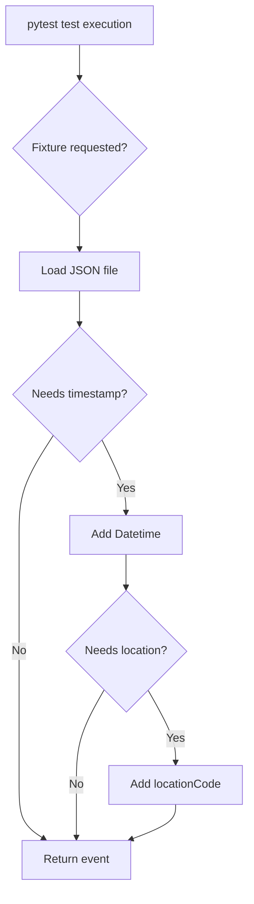
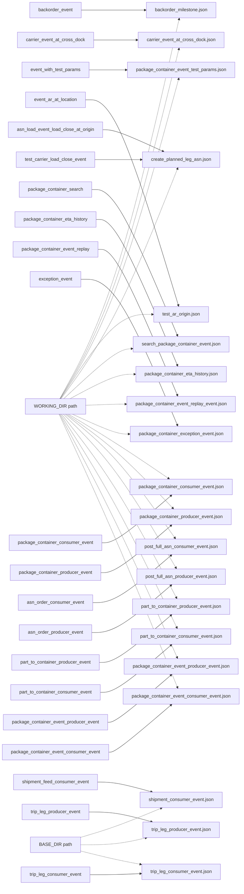
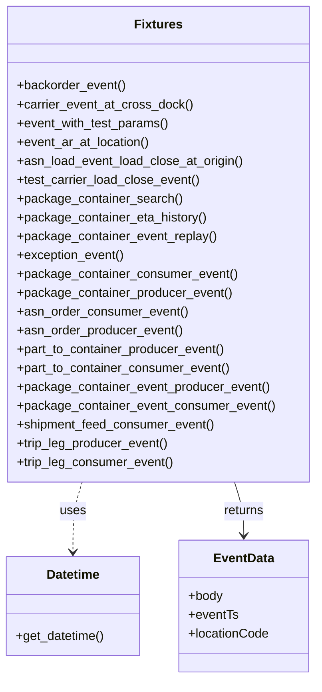

# Diagram: platform/partview_core/partview_service/partview_service/tests/conftest.py

> Auto-generated by Obscura crawlers

## Diagram 1

### SVG

<svg id="container" width="350.30078125" xmlns="http://www.w3.org/2000/svg" class="flowchart" height="1229.78125" viewBox="0 0 350.30078125 1229.78125" role="graphics-document document" aria-roledescription="flowchart-v2"><g><marker id="container_flowchart-v2-pointEnd" class="marker flowchart-v2" viewBox="0 0 10 10" refX="5" refY="5" markerUnits="userSpaceOnUse" markerWidth="8" markerHeight="8" orient="auto"><path d="M 0 0 L 10 5 L 0 10 z" class="arrowMarkerPath" style="stroke-width: 1; stroke-dasharray: 1, 0;"></path></marker><marker id="container_flowchart-v2-pointStart" class="marker flowchart-v2" viewBox="0 0 10 10" refX="4.5" refY="5" markerUnits="userSpaceOnUse" markerWidth="8" markerHeight="8" orient="auto"><path d="M 0 5 L 10 10 L 10 0 z" class="arrowMarkerPath" style="stroke-width: 1; stroke-dasharray: 1, 0;"></path></marker><marker id="container_flowchart-v2-circleEnd" class="marker flowchart-v2" viewBox="0 0 10 10" refX="11" refY="5" markerUnits="userSpaceOnUse" markerWidth="11" markerHeight="11" orient="auto"><circle cx="5" cy="5" r="5" class="arrowMarkerPath" style="stroke-width: 1; stroke-dasharray: 1, 0;"></circle></marker><marker id="container_flowchart-v2-circleStart" class="marker flowchart-v2" viewBox="0 0 10 10" refX="-1" refY="5" markerUnits="userSpaceOnUse" markerWidth="11" markerHeight="11" orient="auto"><circle cx="5" cy="5" r="5" class="arrowMarkerPath" style="stroke-width: 1; stroke-dasharray: 1, 0;"></circle></marker><marker id="container_flowchart-v2-crossEnd" class="marker cross flowchart-v2" viewBox="0 0 11 11" refX="12" refY="5.2" markerUnits="userSpaceOnUse" markerWidth="11" markerHeight="11" orient="auto"><path d="M 1,1 l 9,9 M 10,1 l -9,9" class="arrowMarkerPath" style="stroke-width: 2; stroke-dasharray: 1, 0;"></path></marker><marker id="container_flowchart-v2-crossStart" class="marker cross flowchart-v2" viewBox="0 0 11 11" refX="-1" refY="5.2" markerUnits="userSpaceOnUse" markerWidth="11" markerHeight="11" orient="auto"><path d="M 1,1 l 9,9 M 10,1 l -9,9" class="arrowMarkerPath" style="stroke-width: 2; stroke-dasharray: 1, 0;"></path></marker><g class="root"><g class="clusters"></g><g class="edgePaths"><path d="M113.766,62L113.766,66.167C113.766,70.333,113.766,78.667,113.766,86.333C113.766,94,113.766,101,113.766,104.5L113.766,108" id="L_A_B_0" class="edge-thickness-normal edge-pattern-solid edge-thickness-normal edge-pattern-solid flowchart-link" style=";" data-edge="true" data-et="edge" data-id="L_A_B_0" data-points="W3sieCI6MTEzLjc2NTYyNSwieSI6NjJ9LHsieCI6MTEzLjc2NTYyNSwieSI6ODd9LHsieCI6MTEzLjc2NTYyNSwieSI6MTEyfV0=" marker-end="url(#container_flowchart-v2-pointEnd)"></path><path d="M113.766,299.969L113.766,304.135C113.766,308.302,113.766,316.635,113.766,324.302C113.766,331.969,113.766,338.969,113.766,342.469L113.766,345.969" id="L_B_C_0" class="edge-thickness-normal edge-pattern-solid edge-thickness-normal edge-pattern-solid flowchart-link" style=";" data-edge="true" data-et="edge" data-id="L_B_C_0" data-points="W3sieCI6MTEzLjc2NTYyNSwieSI6Mjk5Ljk2ODc1fSx7IngiOjExMy43NjU2MjUsInkiOjMyNC45Njg3NX0seyJ4IjoxMTMuNzY1NjI1LCJ5IjozNDkuOTY4NzV9XQ==" marker-end="url(#container_flowchart-v2-pointEnd)"></path><path d="M113.766,403.969L113.766,408.135C113.766,412.302,113.766,420.635,113.766,428.302C113.766,435.969,113.766,442.969,113.766,446.469L113.766,449.969" id="L_C_D_0" class="edge-thickness-normal edge-pattern-solid edge-thickness-normal edge-pattern-solid flowchart-link" style=";" data-edge="true" data-et="edge" data-id="L_C_D_0" data-points="W3sieCI6MTEzLjc2NTYyNSwieSI6NDAzLjk2ODc1fSx7IngiOjExMy43NjU2MjUsInkiOjQyOC45Njg3NX0seyJ4IjoxMTMuNzY1NjI1LCJ5Ijo0NTMuOTY4NzV9XQ==" marker-end="url(#container_flowchart-v2-pointEnd)"></path><path d="M144.947,610.928L150.582,622.291C156.216,633.655,167.485,656.382,173.119,673.246C178.754,690.109,178.754,701.109,178.754,706.609L178.754,712.109" id="L_D_E_0" class="edge-thickness-normal edge-pattern-solid edge-thickness-normal edge-pattern-solid flowchart-link" style=";" data-edge="true" data-et="edge" data-id="L_D_E_0" data-points="W3sieCI6MTQ0Ljk0NzQ2NjE0ODA2NDQsInkiOjYxMC45Mjc1MzM4NTE5MzU2fSx7IngiOjE3OC43NTM5MDYyNSwieSI6Njc5LjEwOTM3NX0seyJ4IjoxNzguNzUzOTA2MjUsInkiOjcxNi4xMDkzNzV9XQ==" marker-end="url(#container_flowchart-v2-pointEnd)"></path><path d="M76.856,605.2L68.902,617.518C60.949,629.837,45.041,654.473,37.087,677.458C29.133,700.443,29.133,721.776,29.133,741.109C29.133,760.443,29.133,777.776,29.133,804.749C29.133,831.721,29.133,868.333,29.133,906.945C29.133,945.557,29.133,986.169,29.133,1017.142C29.133,1048.115,29.133,1069.448,29.133,1088.781C29.133,1108.115,29.133,1125.448,34.989,1137.918C40.845,1150.388,52.556,1157.995,58.412,1161.799L64.268,1165.602" id="L_D_F_0" class="edge-thickness-normal edge-pattern-solid edge-thickness-normal edge-pattern-solid flowchart-link" style=";" data-edge="true" data-et="edge" data-id="L_D_F_0" data-points="W3sieCI6NzYuODU2NDAwMjUxMjY3NjYsInkiOjYwNS4yMDAxNTAyNTEyNjc3fSx7IngiOjI5LjEzMjgxMjUsInkiOjY3OS4xMDkzNzV9LHsieCI6MjkuMTMyODEyNSwieSI6NzQzLjEwOTM3NX0seyJ4IjoyOS4xMzI4MTI1LCJ5Ijo3OTUuMTA5Mzc1fSx7IngiOjI5LjEzMjgxMjUsInkiOjkwNC45NDUzMTI1fSx7IngiOjI5LjEzMjgxMjUsInkiOjEwMjYuNzgxMjV9LHsieCI6MjkuMTMyODEyNSwieSI6MTA5MC43ODEyNX0seyJ4IjoyOS4xMzI4MTI1LCJ5IjoxMTQyLjc4MTI1fSx7IngiOjY3LjYyMjUyMTAzMzY1Mzg0LCJ5IjoxMTY3Ljc4MTI1fV0=" marker-end="url(#container_flowchart-v2-pointEnd)"></path><path d="M178.754,770.109L178.754,774.276C178.754,778.443,178.754,786.776,178.754,794.443C178.754,802.109,178.754,809.109,178.754,812.609L178.754,816.109" id="L_E_G_0" class="edge-thickness-normal edge-pattern-solid edge-thickness-normal edge-pattern-solid flowchart-link" style=";" data-edge="true" data-et="edge" data-id="L_E_G_0" data-points="W3sieCI6MTc4Ljc1MzkwNjI1LCJ5Ijo3NzAuMTA5Mzc1fSx7IngiOjE3OC43NTM5MDYyNSwieSI6Nzk1LjEwOTM3NX0seyJ4IjoxNzguNzUzOTA2MjUsInkiOjgyMC4xMDkzNzV9XQ==" marker-end="url(#container_flowchart-v2-pointEnd)"></path><path d="M209.587,958.948L216.042,970.254C222.497,981.559,235.407,1004.17,241.861,1020.976C248.316,1037.781,248.316,1048.781,248.316,1054.281L248.316,1059.781" id="L_G_H_0" class="edge-thickness-normal edge-pattern-solid edge-thickness-normal edge-pattern-solid flowchart-link" style=";" data-edge="true" data-et="edge" data-id="L_G_H_0" data-points="W3sieCI6MjA5LjU4Njk2ODMxMzc1NzcsInkiOjk1OC45NDgxODc5MzYyNDIzfSx7IngiOjI0OC4zMTY0MDYyNSwieSI6MTAyNi43ODEyNX0seyJ4IjoyNDguMzE2NDA2MjUsInkiOjEwNjMuNzgxMjV9XQ==" marker-end="url(#container_flowchart-v2-pointEnd)"></path><path d="M147.921,958.948L141.466,970.254C135.011,981.559,122.101,1004.17,115.646,1026.142C109.191,1048.115,109.191,1069.448,109.191,1088.781C109.191,1108.115,109.191,1125.448,109.191,1137.615C109.191,1149.781,109.191,1156.781,109.191,1160.281L109.191,1163.781" id="L_G_F_0" class="edge-thickness-normal edge-pattern-solid edge-thickness-normal edge-pattern-solid flowchart-link" style=";" data-edge="true" data-et="edge" data-id="L_G_F_0" data-points="W3sieCI6MTQ3LjkyMDg0NDE4NjI0MjMsInkiOjk1OC45NDgxODc5MzYyNDIzfSx7IngiOjEwOS4xOTE0MDYyNSwieSI6MTAyNi43ODEyNX0seyJ4IjoxMDkuMTkxNDA2MjUsInkiOjEwOTAuNzgxMjV9LHsieCI6MTA5LjE5MTQwNjI1LCJ5IjoxMTQyLjc4MTI1fSx7IngiOjEwOS4xOTE0MDYyNSwieSI6MTE2Ny43ODEyNX1d" marker-end="url(#container_flowchart-v2-pointEnd)"></path><path d="M248.316,1117.781L248.316,1121.948C248.316,1126.115,248.316,1134.448,237.793,1142.548C227.27,1150.648,206.223,1158.514,195.7,1162.448L185.176,1166.381" id="L_H_F_0" class="edge-thickness-normal edge-pattern-solid edge-thickness-normal edge-pattern-solid flowchart-link" style=";" data-edge="true" data-et="edge" data-id="L_H_F_0" data-points="W3sieCI6MjQ4LjMxNjQwNjI1LCJ5IjoxMTE3Ljc4MTI1fSx7IngiOjI0OC4zMTY0MDYyNSwieSI6MTE0Mi43ODEyNX0seyJ4IjoxODEuNDI5Mzg3MDE5MjMwNzcsInkiOjExNjcuNzgxMjV9XQ==" marker-end="url(#container_flowchart-v2-pointEnd)"></path></g><g class="edgeLabels"><g class="edgeLabel"><g class="label" data-id="L_A_B_0" transform="translate(0, 0)"><foreignObject width="0" height="0">

</foreignObject></g></g><g class="edgeLabel"><g class="label" data-id="L_B_C_0" transform="translate(0, 0)"><foreignObject width="0" height="0">

</foreignObject></g></g><g class="edgeLabel"><g class="label" data-id="L_C_D_0" transform="translate(0, 0)"><foreignObject width="0" height="0">

</foreignObject></g></g><g class="edgeLabel" transform="translate(178.75390625, 679.109375)"><g class="label" data-id="L_D_E_0" transform="translate(-12.03125, -12)"><foreignObject width="24.0625" height="24">

Yes

</foreignObject></g></g><g class="edgeLabel" transform="translate(29.1328125, 904.9453125)"><g class="label" data-id="L_D_F_0" transform="translate(-10.140625, -12)"><foreignObject width="20.28125" height="24">

No

</foreignObject></g></g><g class="edgeLabel"><g class="label" data-id="L_E_G_0" transform="translate(0, 0)"><foreignObject width="0" height="0">

</foreignObject></g></g><g class="edgeLabel" transform="translate(248.31640625, 1026.78125)"><g class="label" data-id="L_G_H_0" transform="translate(-12.03125, -12)"><foreignObject width="24.0625" height="24">

Yes

</foreignObject></g></g><g class="edgeLabel" transform="translate(109.19140625, 1090.78125)"><g class="label" data-id="L_G_F_0" transform="translate(-10.140625, -12)"><foreignObject width="20.28125" height="24">

No

</foreignObject></g></g><g class="edgeLabel"><g class="label" data-id="L_H_F_0" transform="translate(0, 0)"><foreignObject width="0" height="0">

</foreignObject></g></g></g><g class="nodes"><g class="node default" id="flowchart-A-0" transform="translate(113.765625, 35)"><rect class="basic label-container" style="" x="-105.765625" y="-27" width="211.53125" height="54"></rect><g class="label" style="" transform="translate(-75.765625, -12)"><rect></rect><foreignObject width="151.53125" height="24">

pytest test execution

</foreignObject></g></g><g class="node default" id="flowchart-B-1" transform="translate(113.765625, 205.984375)"><polygon points="93.984375,0 187.96875,-93.984375 93.984375,-187.96875 0,-93.984375" class="label-container" transform="translate(-93.484375, 93.984375)"></polygon><g class="label" style="" transform="translate(-66.984375, -12)"><rect></rect><foreignObject width="133.96875" height="24">

Fixture requested?

</foreignObject></g></g><g class="node default" id="flowchart-C-3" transform="translate(113.765625, 376.96875)"><rect class="basic label-container" style="" x="-80.8203125" y="-27" width="161.640625" height="54"></rect><g class="label" style="" transform="translate(-50.8203125, -12)"><rect></rect><foreignObject width="101.640625" height="24">

Load JSON file

</foreignObject></g></g><g class="node default" id="flowchart-D-5" transform="translate(113.765625, 548.0390625)"><polygon points="94.0703125,0 188.140625,-94.0703125 94.0703125,-188.140625 0,-94.0703125" class="label-container" transform="translate(-93.5703125, 94.0703125)"></polygon><g class="label" style="" transform="translate(-67.0703125, -12)"><rect></rect><foreignObject width="134.140625" height="24">

Needs timestamp?

</foreignObject></g></g><g class="node default" id="flowchart-E-7" transform="translate(178.75390625, 743.109375)"><rect class="basic label-container" style="" x="-79.1875" y="-27" width="158.375" height="54"></rect><g class="label" style="" transform="translate(-49.1875, -12)"><rect></rect><foreignObject width="98.375" height="24">

Add Datetime

</foreignObject></g></g><g class="node default" id="flowchart-F-9" transform="translate(109.19140625, 1194.78125)"><rect class="basic label-container" style="" x="-76.6953125" y="-27" width="153.390625" height="54"></rect><g class="label" style="" transform="translate(-46.6953125, -12)"><rect></rect><foreignObject width="93.390625" height="24">

Return event

</foreignObject></g></g><g class="node default" id="flowchart-G-11" transform="translate(178.75390625, 904.9453125)"><polygon points="84.8359375,0 169.671875,-84.8359375 84.8359375,-169.671875 0,-84.8359375" class="label-container" transform="translate(-84.3359375, 84.8359375)"></polygon><g class="label" style="" transform="translate(-57.8359375, -12)"><rect></rect><foreignObject width="115.671875" height="24">

Needs location?

</foreignObject></g></g><g class="node default" id="flowchart-H-13" transform="translate(248.31640625, 1090.78125)"><rect class="basic label-container" style="" x="-93.984375" y="-27" width="187.96875" height="54"></rect><g class="label" style="" transform="translate(-63.984375, -12)"><rect></rect><foreignObject width="127.96875" height="24">

Add locationCode

</foreignObject></g></g></g></g></g></svg>

## Diagram 2

### SVG

<svg id="container" width="839.421875" xmlns="http://www.w3.org/2000/svg" class="flowchart" height="3076" viewBox="0 0 839.421875 3076" role="graphics-document document" aria-roledescription="flowchart-v2"><g><marker id="container_flowchart-v2-pointEnd" class="marker flowchart-v2" viewBox="0 0 10 10" refX="5" refY="5" markerUnits="userSpaceOnUse" markerWidth="8" markerHeight="8" orient="auto"><path d="M 0 0 L 10 5 L 0 10 z" class="arrowMarkerPath" style="stroke-width: 1; stroke-dasharray: 1, 0;"></path></marker><marker id="container_flowchart-v2-pointStart" class="marker flowchart-v2" viewBox="0 0 10 10" refX="4.5" refY="5" markerUnits="userSpaceOnUse" markerWidth="8" markerHeight="8" orient="auto"><path d="M 0 5 L 10 10 L 10 0 z" class="arrowMarkerPath" style="stroke-width: 1; stroke-dasharray: 1, 0;"></path></marker><marker id="container_flowchart-v2-circleEnd" class="marker flowchart-v2" viewBox="0 0 10 10" refX="11" refY="5" markerUnits="userSpaceOnUse" markerWidth="11" markerHeight="11" orient="auto"><circle cx="5" cy="5" r="5" class="arrowMarkerPath" style="stroke-width: 1; stroke-dasharray: 1, 0;"></circle></marker><marker id="container_flowchart-v2-circleStart" class="marker flowchart-v2" viewBox="0 0 10 10" refX="-1" refY="5" markerUnits="userSpaceOnUse" markerWidth="11" markerHeight="11" orient="auto"><circle cx="5" cy="5" r="5" class="arrowMarkerPath" style="stroke-width: 1; stroke-dasharray: 1, 0;"></circle></marker><marker id="container_flowchart-v2-crossEnd" class="marker cross flowchart-v2" viewBox="0 0 11 11" refX="12" refY="5.2" markerUnits="userSpaceOnUse" markerWidth="11" markerHeight="11" orient="auto"><path d="M 1,1 l 9,9 M 10,1 l -9,9" class="arrowMarkerPath" style="stroke-width: 2; stroke-dasharray: 1, 0;"></path></marker><marker id="container_flowchart-v2-crossStart" class="marker cross flowchart-v2" viewBox="0 0 11 11" refX="-1" refY="5.2" markerUnits="userSpaceOnUse" markerWidth="11" markerHeight="11" orient="auto"><path d="M 1,1 l 9,9 M 10,1 l -9,9" class="arrowMarkerPath" style="stroke-width: 2; stroke-dasharray: 1, 0;"></path></marker><g class="root"><g class="clusters"></g><g class="edgePaths"><path d="M282.867,35L302.793,35C322.719,35,362.57,35,399.109,35C435.648,35,468.875,35,485.488,35L502.102,35" id="L_backorder_event_backorder_milestone.json_0" class="edge-thickness-normal edge-pattern-solid edge-thickness-normal edge-pattern-solid flowchart-link" style=";" data-edge="true" data-et="edge" data-id="L_backorder_event_backorder_milestone.json_0" data-points="W3sieCI6MjgyLjg2NzE4NzUsInkiOjM1fSx7IngiOjQwMi40MjE4NzUsInkiOjM1fSx7IngiOjUwNi4xMDE1NjI1LCJ5IjozNX1d" marker-end="url(#container_flowchart-v2-pointEnd)"></path><path d="M325.414,139L338.249,139C351.083,139,376.753,139,401.757,139C426.76,139,451.099,139,463.268,139L475.438,139" id="L_carrier_event_at_cross_dock_carrier_event_at_cross_dock.json_0" class="edge-thickness-normal edge-pattern-solid edge-thickness-normal edge-pattern-solid flowchart-link" style=";" data-edge="true" data-et="edge" data-id="L_carrier_event_at_cross_dock_carrier_event_at_cross_dock.json_0" data-points="W3sieCI6MzI1LjQxNDA2MjUsInkiOjEzOX0seyJ4Ijo0MDIuNDIxODc1LCJ5IjoxMzl9LHsieCI6NDc5LjQzNzUsInkiOjEzOX1d" marker-end="url(#container_flowchart-v2-pointEnd)"></path><path d="M311.141,243L326.354,243C341.568,243,371.995,243,393.141,243C414.286,243,426.151,243,432.083,243L438.016,243" id="L_event_with_test_params_package_container_event_test_params.json_0" class="edge-thickness-normal edge-pattern-solid edge-thickness-normal edge-pattern-solid flowchart-link" style=";" data-edge="true" data-et="edge" data-id="L_event_with_test_params_package_container_event_test_params.json_0" data-points="W3sieCI6MzExLjE0MDYyNSwieSI6MjQzfSx7IngiOjQwMi40MjE4NzUsInkiOjI0M30seyJ4Ijo0NDIuMDE1NjI1LCJ5IjoyNDN9XQ==" marker-end="url(#container_flowchart-v2-pointEnd)"></path><path d="M298.578,347L315.885,347C333.193,347,367.807,347,421.385,466.196C474.962,585.391,547.502,823.782,583.772,942.978L620.042,1062.173" id="L_event_ar_at_location_test_ar_origin.json_0" class="edge-thickness-normal edge-pattern-solid edge-thickness-normal edge-pattern-solid flowchart-link" style=";" data-edge="true" data-et="edge" data-id="L_event_ar_at_location_test_ar_origin.json_0" data-points="W3sieCI6Mjk4LjU3ODEyNSwieSI6MzQ3fSx7IngiOjQwMi40MjE4NzUsInkiOjM0N30seyJ4Ijo2MjEuMjA2MDU3MzA1NjMsInkiOjEwNjZ9XQ==" marker-end="url(#container_flowchart-v2-pointEnd)"></path><path d="M358.898,451L366.152,451C373.406,451,387.914,451,422.573,463.556C457.232,476.111,512.042,501.223,539.448,513.778L566.853,526.334" id="L_asn_load_event_load_close_at_origin_create_planned_leg_asn.json_0" class="edge-thickness-normal edge-pattern-solid edge-thickness-normal edge-pattern-solid flowchart-link" style=";" data-edge="true" data-et="edge" data-id="L_asn_load_event_load_close_at_origin_create_planned_leg_asn.json_0" data-points="W3sieCI6MzU4Ljg5ODQzNzUsInkiOjQ1MX0seyJ4Ijo0MDIuNDIxODc1LCJ5Ijo0NTF9LHsieCI6NTcwLjQ4OTE4MjY5MjMwNzcsInkiOjUyOH1d" marker-end="url(#container_flowchart-v2-pointEnd)"></path><path d="M330.82,555L342.754,555C354.688,555,378.555,555,405.113,555C431.672,555,460.922,555,475.547,555L490.172,555" id="L_test_carrier_load_close_event_create_planned_leg_asn.json_0" class="edge-thickness-normal edge-pattern-solid edge-thickness-normal edge-pattern-solid flowchart-link" style=";" data-edge="true" data-et="edge" data-id="L_test_carrier_load_close_event_create_planned_leg_asn.json_0" data-points="W3sieCI6MzMwLjgyMDMxMjUsInkiOjU1NX0seyJ4Ijo0MDIuNDIxODc1LCJ5Ijo1NTV9LHsieCI6NDk0LjE3MTg3NSwieSI6NTU1fV0=" marker-end="url(#container_flowchart-v2-pointEnd)"></path><path d="M317.891,659L331.979,659C346.068,659,374.245,659,424.009,743.552C473.773,828.105,545.124,997.21,580.799,1081.762L616.475,1166.315" id="L_package_container_search_search_package_container_event.json_0" class="edge-thickness-normal edge-pattern-solid edge-thickness-normal edge-pattern-solid flowchart-link" style=";" data-edge="true" data-et="edge" data-id="L_package_container_search_search_package_container_event.json_0" data-points="W3sieCI6MzE3Ljg5MDYyNSwieSI6NjU5fSx7IngiOjQwMi40MjE4NzUsInkiOjY1OX0seyJ4Ijo2MTguMDI5NjgxNjkxNDQ5OCwieSI6MTE3MH1d" marker-end="url(#container_flowchart-v2-pointEnd)"></path><path d="M334.852,763L346.113,763C357.375,763,379.898,763,426.836,847.552C473.773,932.105,545.124,1101.21,580.799,1185.762L616.475,1270.315" id="L_package_container_eta_history_package_container_eta_history.json_0" class="edge-thickness-normal edge-pattern-solid edge-thickness-normal edge-pattern-solid flowchart-link" style=";" data-edge="true" data-et="edge" data-id="L_package_container_eta_history_package_container_eta_history.json_0" data-points="W3sieCI6MzM0Ljg1MTU2MjUsInkiOjc2M30seyJ4Ijo0MDIuNDIxODc1LCJ5Ijo3NjN9LHsieCI6NjE4LjAyOTY4MTY5MTQ0OTgsInkiOjEyNzR9XQ==" marker-end="url(#container_flowchart-v2-pointEnd)"></path><path d="M340.766,867L351.042,867C361.318,867,381.87,867,427.821,951.552C473.773,1036.105,545.124,1205.21,580.799,1289.762L616.475,1374.315" id="L_package_container_event_replay_package_container_event_replay_event.json_0" class="edge-thickness-normal edge-pattern-solid edge-thickness-normal edge-pattern-solid flowchart-link" style=";" data-edge="true" data-et="edge" data-id="L_package_container_event_replay_package_container_event_replay_event.json_0" data-points="W3sieCI6MzQwLjc2NTYyNSwieSI6ODY3fSx7IngiOjQwMi40MjE4NzUsInkiOjg2N30seyJ4Ijo2MTguMDI5NjgxNjkxNDQ5OCwieSI6MTM3OH1d" marker-end="url(#container_flowchart-v2-pointEnd)"></path><path d="M282.258,971L302.285,971C322.313,971,362.367,971,418.07,1055.552C473.773,1140.105,545.124,1309.21,580.799,1393.762L616.475,1478.315" id="L_exception_event_package_container_exception_event.json_0" class="edge-thickness-normal edge-pattern-solid edge-thickness-normal edge-pattern-solid flowchart-link" style=";" data-edge="true" data-et="edge" data-id="L_exception_event_package_container_exception_event.json_0" data-points="W3sieCI6MjgyLjI1NzgxMjUsInkiOjk3MX0seyJ4Ijo0MDIuNDIxODc1LCJ5Ijo5NzF9LHsieCI6NjE4LjAyOTY4MTY5MTQ0OTgsInkiOjE0ODJ9XQ==" marker-end="url(#container_flowchart-v2-pointEnd)"></path><path d="M353.25,1887L361.445,1887C369.641,1887,386.031,1887,426.288,1859.6C466.544,1832.2,530.666,1777.399,562.727,1749.999L594.788,1722.599" id="L_package_container_consumer_event_package_container_consumer_event.json_0" class="edge-thickness-normal edge-pattern-solid edge-thickness-normal edge-pattern-solid flowchart-link" style=";" data-edge="true" data-et="edge" data-id="L_package_container_consumer_event_package_container_consumer_event.json_0" data-points="W3sieCI6MzUzLjI1LCJ5IjoxODg3fSx7IngiOjQwMi40MjE4NzUsInkiOjE4ODd9LHsieCI6NTk3LjgyOTA5MTQ5NDg0NTMsInkiOjE3MjB9XQ==" marker-end="url(#container_flowchart-v2-pointEnd)"></path><path d="M350.516,1991L359.167,1991C367.818,1991,385.12,1991,425.832,1963.6C466.544,1936.2,530.666,1881.399,562.727,1853.999L594.788,1826.599" id="L_package_container_producer_event_package_container_producer_event.json_0" class="edge-thickness-normal edge-pattern-solid edge-thickness-normal edge-pattern-solid flowchart-link" style=";" data-edge="true" data-et="edge" data-id="L_package_container_producer_event_package_container_producer_event.json_0" data-points="W3sieCI6MzUwLjUxNTYyNSwieSI6MTk5MX0seyJ4Ijo0MDIuNDIxODc1LCJ5IjoxOTkxfSx7IngiOjU5Ny44MjkwOTE0OTQ4NDUzLCJ5IjoxODI0fV0=" marker-end="url(#container_flowchart-v2-pointEnd)"></path><path d="M321.773,2095L335.215,2095C348.656,2095,375.539,2095,421.042,2067.6C466.544,2040.2,530.666,1985.399,562.727,1957.999L594.788,1930.599" id="L_asn_order_consumer_event_post_full_asn_consumer_event.json_0" class="edge-thickness-normal edge-pattern-solid edge-thickness-normal edge-pattern-solid flowchart-link" style=";" data-edge="true" data-et="edge" data-id="L_asn_order_consumer_event_post_full_asn_consumer_event.json_0" data-points="W3sieCI6MzIxLjc3MzQzNzUsInkiOjIwOTV9LHsieCI6NDAyLjQyMTg3NSwieSI6MjA5NX0seyJ4Ijo1OTcuODI5MDkxNDk0ODQ1MywieSI6MTkyOH1d" marker-end="url(#container_flowchart-v2-pointEnd)"></path><path d="M319.031,2199L332.93,2199C346.828,2199,374.625,2199,420.585,2171.6C466.544,2144.2,530.666,2089.399,562.727,2061.999L594.788,2034.599" id="L_asn_order_producer_event_post_full_asn_producer_event.json_0" class="edge-thickness-normal edge-pattern-solid edge-thickness-normal edge-pattern-solid flowchart-link" style=";" data-edge="true" data-et="edge" data-id="L_asn_order_producer_event_post_full_asn_producer_event.json_0" data-points="W3sieCI6MzE5LjAzMTI1LCJ5IjoyMTk5fSx7IngiOjQwMi40MjE4NzUsInkiOjIxOTl9LHsieCI6NTk3LjgyOTA5MTQ5NDg0NTMsInkiOjIwMzJ9XQ==" marker-end="url(#container_flowchart-v2-pointEnd)"></path><path d="M347.469,2303L356.628,2303C365.786,2303,384.104,2303,425.324,2275.6C466.544,2248.2,530.666,2193.399,562.727,2165.999L594.788,2138.599" id="L_part_to_container_producer_event_part_to_container_producer_event.json_0" class="edge-thickness-normal edge-pattern-solid edge-thickness-normal edge-pattern-solid flowchart-link" style=";" data-edge="true" data-et="edge" data-id="L_part_to_container_producer_event_part_to_container_producer_event.json_0" data-points="W3sieCI6MzQ3LjQ2ODc1LCJ5IjoyMzAzfSx7IngiOjQwMi40MjE4NzUsInkiOjIzMDN9LHsieCI6NTk3LjgyOTA5MTQ5NDg0NTMsInkiOjIxMzZ9XQ==" marker-end="url(#container_flowchart-v2-pointEnd)"></path><path d="M350.203,2407L358.906,2407C367.609,2407,385.016,2407,425.78,2379.6C466.544,2352.2,530.666,2297.399,562.727,2269.999L594.788,2242.599" id="L_part_to_container_consumer_event_part_to_container_consumer_event.json_0" class="edge-thickness-normal edge-pattern-solid edge-thickness-normal edge-pattern-solid flowchart-link" style=";" data-edge="true" data-et="edge" data-id="L_part_to_container_consumer_event_part_to_container_consumer_event.json_0" data-points="W3sieCI6MzUwLjIwMzEyNSwieSI6MjQwN30seyJ4Ijo0MDIuNDIxODc1LCJ5IjoyNDA3fSx7IngiOjU5Ny44MjkwOTE0OTQ4NDUzLCJ5IjoyMjQwfV0=" marker-end="url(#container_flowchart-v2-pointEnd)"></path><path d="M374.68,2511L379.303,2511C383.927,2511,393.174,2511,429.859,2483.6C466.544,2456.2,530.666,2401.399,562.727,2373.999L594.788,2346.599" id="L_package_container_event_producer_event_package_container_event_producer_event.json_0" class="edge-thickness-normal edge-pattern-solid edge-thickness-normal edge-pattern-solid flowchart-link" style=";" data-edge="true" data-et="edge" data-id="L_package_container_event_producer_event_package_container_event_producer_event.json_0" data-points="W3sieCI6Mzc0LjY3OTY4NzUsInkiOjI1MTF9LHsieCI6NDAyLjQyMTg3NSwieSI6MjUxMX0seyJ4Ijo1OTcuODI5MDkxNDk0ODQ1MywieSI6MjM0NH1d" marker-end="url(#container_flowchart-v2-pointEnd)"></path><path d="M377.422,2615L381.589,2615C385.755,2615,394.089,2615,430.316,2587.6C466.544,2560.2,530.666,2505.399,562.727,2477.999L594.788,2450.599" id="L_package_container_event_consumer_event_package_container_event_consumer_event.json_0" class="edge-thickness-normal edge-pattern-solid edge-thickness-normal edge-pattern-solid flowchart-link" style=";" data-edge="true" data-et="edge" data-id="L_package_container_event_consumer_event_package_container_event_consumer_event.json_0" data-points="W3sieCI6Mzc3LjQyMTg3NSwieSI6MjYxNX0seyJ4Ijo0MDIuNDIxODc1LCJ5IjoyNjE1fSx7IngiOjU5Ny44MjkwOTE0OTQ4NDUzLCJ5IjoyNDQ4fV0=" marker-end="url(#container_flowchart-v2-pointEnd)"></path><path d="M340.289,2719L350.645,2719C361,2719,381.711,2719,412.781,2724.658C443.851,2730.315,485.28,2741.631,505.994,2747.288L526.708,2752.946" id="L_shipment_feed_consumer_event_shipment_consumer_event.json_0" class="edge-thickness-normal edge-pattern-solid edge-thickness-normal edge-pattern-solid flowchart-link" style=";" data-edge="true" data-et="edge" data-id="L_shipment_feed_consumer_event_shipment_consumer_event.json_0" data-points="W3sieCI6MzQwLjI4OTA2MjUsInkiOjI3MTl9LHsieCI6NDAyLjQyMTg3NSwieSI6MjcxOX0seyJ4Ijo1MzAuNTY3MDM2MjkwMzIyNiwieSI6Mjc1NH1d" marker-end="url(#container_flowchart-v2-pointEnd)"></path><path d="M310.984,2823L326.224,2823C341.464,2823,371.943,2823,407.897,2828.658C443.851,2834.315,485.28,2845.631,505.994,2851.288L526.708,2856.946" id="L_trip_leg_producer_event_trip_leg_producer_event.json_0" class="edge-thickness-normal edge-pattern-solid edge-thickness-normal edge-pattern-solid flowchart-link" style=";" data-edge="true" data-et="edge" data-id="L_trip_leg_producer_event_trip_leg_producer_event.json_0" data-points="W3sieCI6MzEwLjk4NDM3NSwieSI6MjgyM30seyJ4Ijo0MDIuNDIxODc1LCJ5IjoyODIzfSx7IngiOjUzMC41NjcwMzYyOTAzMjI2LCJ5IjoyODU4fV0=" marker-end="url(#container_flowchart-v2-pointEnd)"></path><path d="M313.727,3041L328.509,3041C343.292,3041,372.857,3041,401.757,3040.378C430.658,3039.756,458.893,3038.512,473.011,3037.89L487.129,3037.268" id="L_trip_leg_consumer_event_trip_leg_consumer_event.json_0" class="edge-thickness-normal edge-pattern-solid edge-thickness-normal edge-pattern-solid flowchart-link" style=";" data-edge="true" data-et="edge" data-id="L_trip_leg_consumer_event_trip_leg_consumer_event.json_0" data-points="W3sieCI6MzEzLjcyNjU2MjUsInkiOjMwNDF9LHsieCI6NDAyLjQyMTg3NSwieSI6MzA0MX0seyJ4Ijo0OTEuMTI1LCJ5IjozMDM3LjA5MjM3MzM0ODAxNzZ9XQ==" marker-end="url(#container_flowchart-v2-pointEnd)"></path><path d="M207.611,1386L240.08,1327.167C272.548,1268.333,337.485,1150.667,406.615,930.65C475.746,710.633,549.07,388.267,585.732,227.084L622.393,65.9" id="L_WORKING_DIR_backorder_milestone.json_0" class="edge-thickness-normal edge-pattern-dotted edge-thickness-normal edge-pattern-solid flowchart-link" style=";" data-edge="true" data-et="edge" data-id="L_WORKING_DIR_backorder_milestone.json_0" data-points="W3sieCI6MjA3LjYxMTQ1MTQ4MDI2MzE2LCJ5IjoxMzg2fSx7IngiOjQwMi40MjE4NzUsInkiOjEwMzN9LHsieCI6NjIzLjI4MDU5MjQzNDg2OTcsInkiOjYyfV0=" marker-end="url(#container_flowchart-v2-pointEnd)"></path><path d="M208.439,1386L240.77,1330.5C273.1,1275,337.761,1164,406.646,961.314C475.532,758.627,548.642,464.255,585.197,317.068L621.752,169.882" id="L_WORKING_DIR_carrier_event_at_cross_dock.json_0" class="edge-thickness-normal edge-pattern-dotted edge-thickness-normal edge-pattern-solid flowchart-link" style=";" data-edge="true" data-et="edge" data-id="L_WORKING_DIR_carrier_event_at_cross_dock.json_0" data-points="W3sieCI6MjA4LjQzOTI1NzgxMjUsInkiOjEzODZ9LHsieCI6NDAyLjQyMTg3NSwieSI6MTA1M30seyJ4Ijo2MjIuNzE2MTg1NzIyMTAwNywieSI6MTY2fV0=" marker-end="url(#container_flowchart-v2-pointEnd)"></path><path d="M209.364,1386L241.541,1333.833C273.717,1281.667,338.069,1177.333,406.672,991.976C475.275,806.619,548.129,540.239,584.556,407.049L620.982,273.858" id="L_WORKING_DIR_package_container_event_test_params.json_0" class="edge-thickness-normal edge-pattern-dotted edge-thickness-normal edge-pattern-solid flowchart-link" style=";" data-edge="true" data-et="edge" data-id="L_WORKING_DIR_package_container_event_test_params.json_0" data-points="W3sieCI6MjA5LjM2NDQ1MzEyNSwieSI6MTM4Nn0seyJ4Ijo0MDIuNDIxODc1LCJ5IjoxMDczfSx7IngiOjYyMi4wMzc1Mzc2NTA2MDI0LCJ5IjoyNzB9XQ==" marker-end="url(#container_flowchart-v2-pointEnd)"></path><path d="M210.405,1386L242.408,1337.167C274.411,1288.333,338.416,1190.667,391.431,1141.833C444.445,1093,486.469,1093,507.48,1093L528.492,1093" id="L_WORKING_DIR_test_ar_origin.json_0" class="edge-thickness-normal edge-pattern-dotted edge-thickness-normal edge-pattern-solid flowchart-link" style=";" data-edge="true" data-et="edge" data-id="L_WORKING_DIR_test_ar_origin.json_0" data-points="W3sieCI6MjEwLjQwNTI5Nzg1MTU2MjUsInkiOjEzODZ9LHsieCI6NDAyLjQyMTg3NSwieSI6MTA5M30seyJ4Ijo1MzIuNDkyMTg3NSwieSI6MTA5M31d" marker-end="url(#container_flowchart-v2-pointEnd)"></path><path d="M212.236,1386L243.933,1342.167C275.631,1298.333,339.026,1210.667,406.512,1077.286C473.997,943.905,545.572,764.81,581.359,675.262L617.147,585.714" id="L_WORKING_DIR_create_planned_leg_asn.json_0" class="edge-thickness-normal edge-pattern-dotted edge-thickness-normal edge-pattern-solid flowchart-link" style=";" data-edge="true" data-et="edge" data-id="L_WORKING_DIR_create_planned_leg_asn.json_0" data-points="W3sieCI6MjEyLjIzNTc0ODkyMjQxMzgsInkiOjEzODZ9LHsieCI6NDAyLjQyMTg3NSwieSI6MTEyM30seyJ4Ijo2MTguNjMxMzgyMDQyMjUzNiwieSI6NTgyfV0=" marker-end="url(#container_flowchart-v2-pointEnd)"></path><path d="M221.6,1386L251.737,1357.833C281.874,1329.667,342.148,1273.333,381.682,1244.339C421.216,1215.344,440.01,1213.688,449.407,1212.86L458.804,1212.032" id="L_WORKING_DIR_search_package_container_event.json_0" class="edge-thickness-normal edge-pattern-dotted edge-thickness-normal edge-pattern-solid flowchart-link" style=";" data-edge="true" data-et="edge" data-id="L_WORKING_DIR_search_package_container_event.json_0" data-points="W3sieCI6MjIxLjU5OTY4OTA5NDM4Nzc3LCJ5IjoxMzg2fSx7IngiOjQwMi40MjE4NzUsInkiOjEyMTd9LHsieCI6NDYyLjc4OTA2MjUsInkiOjEyMTEuNjgxMzA1MDY2MDc5NH1d" marker-end="url(#container_flowchart-v2-pointEnd)"></path><path d="M243.266,1386L269.792,1371.833C296.318,1357.667,349.37,1329.333,386.55,1315.167C423.729,1301,445.036,1301,455.69,1301L466.344,1301" id="L_WORKING_DIR_package_container_eta_history.json_0" class="edge-thickness-normal edge-pattern-dotted edge-thickness-normal edge-pattern-solid flowchart-link" style=";" data-edge="true" data-et="edge" data-id="L_WORKING_DIR_package_container_eta_history.json_0" data-points="W3sieCI6MjQzLjI2NjI1Mjc5MDE3ODU2LCJ5IjoxMzg2fSx7IngiOjQwMi40MjE4NzUsInkiOjEzMDF9LHsieCI6NDcwLjM0Mzc1LCJ5IjoxMzAxfV0=" marker-end="url(#container_flowchart-v2-pointEnd)"></path><path d="M292.516,1409.193L310.833,1408.494C329.151,1407.795,365.786,1406.398,389.727,1405.699C413.667,1405,424.911,1405,430.534,1405L436.156,1405" id="L_WORKING_DIR_package_container_event_replay_event.json_0" class="edge-thickness-normal edge-pattern-dotted edge-thickness-normal edge-pattern-solid flowchart-link" style=";" data-edge="true" data-et="edge" data-id="L_WORKING_DIR_package_container_event_replay_event.json_0" data-points="W3sieCI6MjkyLjUxNTYyNSwieSI6MTQwOS4xOTI2NzU5MzA0MTAxfSx7IngiOjQwMi40MjE4NzUsInkiOjE0MDV9LHsieCI6NDQwLjE1NjI1LCJ5IjoxNDA1fV0=" marker-end="url(#container_flowchart-v2-pointEnd)"></path><path d="M251.692,1440L276.814,1451.5C301.935,1463,352.179,1486,384.779,1497.5C417.38,1509,432.339,1509,439.818,1509L447.297,1509" id="L_WORKING_DIR_package_container_exception_event.json_0" class="edge-thickness-normal edge-pattern-dotted edge-thickness-normal edge-pattern-solid flowchart-link" style=";" data-edge="true" data-et="edge" data-id="L_WORKING_DIR_package_container_exception_event.json_0" data-points="W3sieCI6MjUxLjY5MjEzODY3MTg3NSwieSI6MTQ0MH0seyJ4Ijo0MDIuNDIxODc1LCJ5IjoxNTA5fSx7IngiOjQ1MS4yOTY4NzUsInkiOjE1MDl9XQ==" marker-end="url(#container_flowchart-v2-pointEnd)"></path><path d="M237.649,1440L265.111,1456.5C292.573,1473,347.498,1506,405.608,1543.292C463.719,1580.585,525.016,1622.17,555.665,1642.962L586.313,1663.754" id="L_WORKING_DIR_package_container_consumer_event.json_0" class="edge-thickness-normal edge-pattern-dotted edge-thickness-normal edge-pattern-solid flowchart-link" style=";" data-edge="true" data-et="edge" data-id="L_WORKING_DIR_package_container_consumer_event.json_0" data-points="W3sieCI6MjM3LjY0ODk5NTUzNTcxNDI4LCJ5IjoxNDQwfSx7IngiOjQwMi40MjE4NzUsInkiOjE1Mzl9LHsieCI6NTg5LjYyMzE3MzcwMTI5ODcsInkiOjE2NjZ9XQ==" marker-end="url(#container_flowchart-v2-pointEnd)"></path><path d="M231.493,1440L259.981,1459.833C288.469,1479.667,345.446,1519.333,407.015,1573.851C468.584,1628.368,534.747,1697.737,567.828,1732.421L600.909,1767.105" id="L_WORKING_DIR_package_container_producer_event.json_0" class="edge-thickness-normal edge-pattern-dotted edge-thickness-normal edge-pattern-solid flowchart-link" style=";" data-edge="true" data-et="edge" data-id="L_WORKING_DIR_package_container_producer_event.json_0" data-points="W3sieCI6MjMxLjQ5MzA5NzE3NDY1NzUyLCJ5IjoxNDQwfSx7IngiOjQwMi40MjE4NzUsInkiOjE1NTl9LHsieCI6NjAzLjY2OTc3NDE1OTY2MzksInkiOjE3NzB9XQ==" marker-end="url(#container_flowchart-v2-pointEnd)"></path><path d="M226.821,1440L256.087,1463.167C285.354,1486.333,343.888,1532.667,407.432,1604.455C470.976,1676.244,539.529,1773.487,573.806,1822.109L608.083,1870.731" id="L_WORKING_DIR_post_full_asn_consumer_event.json_0" class="edge-thickness-normal edge-pattern-dotted edge-thickness-normal edge-pattern-solid flowchart-link" style=";" data-edge="true" data-et="edge" data-id="L_WORKING_DIR_post_full_asn_consumer_event.json_0" data-points="W3sieCI6MjI2LjgyMDU0NzgxNjI2NTA1LCJ5IjoxNDQwfSx7IngiOjQwMi40MjE4NzUsInkiOjE1Nzl9LHsieCI6NjEwLjM4NzcxMzUwOTMxNjgsInkiOjE4NzR9XQ==" marker-end="url(#container_flowchart-v2-pointEnd)"></path><path d="M220.197,1440L250.568,1469.833C280.939,1499.667,341.68,1559.333,406.9,1648.425C472.12,1737.517,541.818,1856.035,576.667,1915.293L611.516,1974.552" id="L_WORKING_DIR_post_full_asn_producer_event.json_0" class="edge-thickness-normal edge-pattern-dotted edge-thickness-normal edge-pattern-solid flowchart-link" style=";" data-edge="true" data-et="edge" data-id="L_WORKING_DIR_post_full_asn_producer_event.json_0" data-points="W3sieCI6MjIwLjE5NzMyMjUxMjEzNTksInkiOjE0NDB9LHsieCI6NDAyLjQyMTg3NSwieSI6MTYxOX0seyJ4Ijo2MTMuNTQzNjM2NjU4MDMxMSwieSI6MTk3OH1d" marker-end="url(#container_flowchart-v2-pointEnd)"></path><path d="M213.839,1440L245.269,1480.167C276.7,1520.333,339.561,1600.667,406.126,1707.078C472.69,1813.489,542.959,1945.978,578.093,2012.222L613.228,2078.466" id="L_WORKING_DIR_part_to_container_producer_event.json_0" class="edge-thickness-normal edge-pattern-dotted edge-thickness-normal edge-pattern-solid flowchart-link" style=";" data-edge="true" data-et="edge" data-id="L_WORKING_DIR_part_to_container_producer_event.json_0" data-points="W3sieCI6MjEzLjgzODUzMTk0OTYyNjg2LCJ5IjoxNDQwfSx7IngiOjQwMi40MjE4NzUsInkiOjE2ODF9LHsieCI6NjE1LjEwMTc4MTU0MjA1NjEsInkiOjIwODJ9XQ==" marker-end="url(#container_flowchart-v2-pointEnd)"></path><path d="M209.869,1440L241.961,1490.5C274.053,1541,338.238,1642,405.7,1765.733C473.162,1889.466,543.902,2035.932,579.272,2109.165L614.642,2182.398" id="L_WORKING_DIR_part_to_container_consumer_event.json_0" class="edge-thickness-normal edge-pattern-dotted edge-thickness-normal edge-pattern-solid flowchart-link" style=";" data-edge="true" data-et="edge" data-id="L_WORKING_DIR_part_to_container_consumer_event.json_0" data-points="W3sieCI6MjA5Ljg2OTEwNTExMzYzNjM1LCJ5IjoxNDQwfSx7IngiOjQwMi40MjE4NzUsInkiOjE3NDN9LHsieCI6NjE2LjM4MTQ0OTQ2ODA4NTEsInkiOjIxODZ9XQ==" marker-end="url(#container_flowchart-v2-pointEnd)"></path><path d="M207.155,1440L239.7,1500.833C272.244,1561.667,337.333,1683.333,405.445,1824.391C473.558,1965.448,544.694,2125.896,580.262,2206.119L615.83,2286.343" id="L_WORKING_DIR_package_container_event_producer_event.json_0" class="edge-thickness-normal edge-pattern-dotted edge-thickness-normal edge-pattern-solid flowchart-link" style=";" data-edge="true" data-et="edge" data-id="L_WORKING_DIR_package_container_event_producer_event.json_0" data-points="W3sieCI6MjA3LjE1NTMxMzI5NzE5Mzg5LCJ5IjoxNDQwfSx7IngiOjQwMi40MjE4NzUsInkiOjE4MDV9LHsieCI6NjE3LjQ1MTE3MTg3NSwieSI6MjI5MH1d" marker-end="url(#container_flowchart-v2-pointEnd)"></path><path d="M205.183,1440L238.056,1511.167C270.929,1582.333,336.675,1724.667,405.285,1883.05C473.895,2041.433,545.369,2215.866,581.105,2303.082L616.842,2390.299" id="L_WORKING_DIR_package_container_event_consumer_event.json_0" class="edge-thickness-normal edge-pattern-dotted edge-thickness-normal edge-pattern-solid flowchart-link" style=";" data-edge="true" data-et="edge" data-id="L_WORKING_DIR_package_container_event_consumer_event.json_0" data-points="W3sieCI6MjA1LjE4MjczMzM0MjUxMTAzLCJ5IjoxNDQwfSx7IngiOjQwMi40MjE4NzUsInkiOjE4Njd9LHsieCI6NjE4LjM1ODY5ODEwNDY5MzIsInkiOjIzOTR9XQ==" marker-end="url(#container_flowchart-v2-pointEnd)"></path><path d="M275.992,2912.378L297.064,2906.149C318.135,2899.919,360.279,2887.459,407.701,2870.318C455.123,2853.177,507.823,2831.354,534.174,2820.442L560.524,2809.53" id="L_BASE_DIR_shipment_consumer_event.json_0" class="edge-thickness-normal edge-pattern-dotted edge-thickness-normal edge-pattern-solid flowchart-link" style=";" data-edge="true" data-et="edge" data-id="L_BASE_DIR_shipment_consumer_event.json_0" data-points="W3sieCI6Mjc1Ljk5MjE4NzUsInkiOjI5MTIuMzc4MzEwOTE5MDQ3Nn0seyJ4Ijo0MDIuNDIxODc1LCJ5IjoyODc1fSx7IngiOjU2NC4yMTk3NDczNDA0MjU2LCJ5IjoyODA4fV0=" marker-end="url(#container_flowchart-v2-pointEnd)"></path><path d="M275.992,2937L297.064,2937C318.135,2937,360.279,2937,398.89,2932.982C437.5,2928.964,472.579,2920.929,490.118,2916.911L507.657,2912.893" id="L_BASE_DIR_trip_leg_producer_event.json_0" class="edge-thickness-normal edge-pattern-dotted edge-thickness-normal edge-pattern-solid flowchart-link" style=";" data-edge="true" data-et="edge" data-id="L_BASE_DIR_trip_leg_producer_event.json_0" data-points="W3sieCI6Mjc1Ljk5MjE4NzUsInkiOjI5Mzd9LHsieCI6NDAyLjQyMTg3NSwieSI6MjkzN30seyJ4Ijo1MTEuNTU2NDkwMzg0NjE1MzYsInkiOjI5MTJ9XQ==" marker-end="url(#container_flowchart-v2-pointEnd)"></path><path d="M275.992,2957.65L297.064,2962.875C318.135,2968.1,360.279,2978.55,395.479,2986.389C430.679,2994.228,458.935,2999.456,473.063,3002.07L487.192,3004.684" id="L_BASE_DIR_trip_leg_consumer_event.json_0" class="edge-thickness-normal edge-pattern-dotted edge-thickness-normal edge-pattern-solid flowchart-link" style=";" data-edge="true" data-et="edge" data-id="L_BASE_DIR_trip_leg_consumer_event.json_0" data-points="W3sieCI6Mjc1Ljk5MjE4NzUsInkiOjI5NTcuNjUwNDQ4OTA2NjA1fSx7IngiOjQwMi40MjE4NzUsInkiOjI5ODl9LHsieCI6NDkxLjEyNSwieSI6MzAwNS40MTIwMzE5MzgzMjZ9XQ==" marker-end="url(#container_flowchart-v2-pointEnd)"></path></g><g class="edgeLabels"><g class="edgeLabel"><g class="label" data-id="L_backorder_event_backorder_milestone.json_0" transform="translate(0, 0)"><foreignObject width="0" height="0">

</foreignObject></g></g><g class="edgeLabel"><g class="label" data-id="L_carrier_event_at_cross_dock_carrier_event_at_cross_dock.json_0" transform="translate(0, 0)"><foreignObject width="0" height="0">

</foreignObject></g></g><g class="edgeLabel"><g class="label" data-id="L_event_with_test_params_package_container_event_test_params.json_0" transform="translate(0, 0)"><foreignObject width="0" height="0">

</foreignObject></g></g><g class="edgeLabel"><g class="label" data-id="L_event_ar_at_location_test_ar_origin.json_0" transform="translate(0, 0)"><foreignObject width="0" height="0">

</foreignObject></g></g><g class="edgeLabel"><g class="label" data-id="L_asn_load_event_load_close_at_origin_create_planned_leg_asn.json_0" transform="translate(0, 0)"><foreignObject width="0" height="0">

</foreignObject></g></g><g class="edgeLabel"><g class="label" data-id="L_test_carrier_load_close_event_create_planned_leg_asn.json_0" transform="translate(0, 0)"><foreignObject width="0" height="0">

</foreignObject></g></g><g class="edgeLabel"><g class="label" data-id="L_package_container_search_search_package_container_event.json_0" transform="translate(0, 0)"><foreignObject width="0" height="0">

</foreignObject></g></g><g class="edgeLabel"><g class="label" data-id="L_package_container_eta_history_package_container_eta_history.json_0" transform="translate(0, 0)"><foreignObject width="0" height="0">

</foreignObject></g></g><g class="edgeLabel"><g class="label" data-id="L_package_container_event_replay_package_container_event_replay_event.json_0" transform="translate(0, 0)"><foreignObject width="0" height="0">

</foreignObject></g></g><g class="edgeLabel"><g class="label" data-id="L_exception_event_package_container_exception_event.json_0" transform="translate(0, 0)"><foreignObject width="0" height="0">

</foreignObject></g></g><g class="edgeLabel"><g class="label" data-id="L_package_container_consumer_event_package_container_consumer_event.json_0" transform="translate(0, 0)"><foreignObject width="0" height="0">

</foreignObject></g></g><g class="edgeLabel"><g class="label" data-id="L_package_container_producer_event_package_container_producer_event.json_0" transform="translate(0, 0)"><foreignObject width="0" height="0">

</foreignObject></g></g><g class="edgeLabel"><g class="label" data-id="L_asn_order_consumer_event_post_full_asn_consumer_event.json_0" transform="translate(0, 0)"><foreignObject width="0" height="0">

</foreignObject></g></g><g class="edgeLabel"><g class="label" data-id="L_asn_order_producer_event_post_full_asn_producer_event.json_0" transform="translate(0, 0)"><foreignObject width="0" height="0">

</foreignObject></g></g><g class="edgeLabel"><g class="label" data-id="L_part_to_container_producer_event_part_to_container_producer_event.json_0" transform="translate(0, 0)"><foreignObject width="0" height="0">

</foreignObject></g></g><g class="edgeLabel"><g class="label" data-id="L_part_to_container_consumer_event_part_to_container_consumer_event.json_0" transform="translate(0, 0)"><foreignObject width="0" height="0">

</foreignObject></g></g><g class="edgeLabel"><g class="label" data-id="L_package_container_event_producer_event_package_container_event_producer_event.json_0" transform="translate(0, 0)"><foreignObject width="0" height="0">

</foreignObject></g></g><g class="edgeLabel"><g class="label" data-id="L_package_container_event_consumer_event_package_container_event_consumer_event.json_0" transform="translate(0, 0)"><foreignObject width="0" height="0">

</foreignObject></g></g><g class="edgeLabel"><g class="label" data-id="L_shipment_feed_consumer_event_shipment_consumer_event.json_0" transform="translate(0, 0)"><foreignObject width="0" height="0">

</foreignObject></g></g><g class="edgeLabel"><g class="label" data-id="L_trip_leg_producer_event_trip_leg_producer_event.json_0" transform="translate(0, 0)"><foreignObject width="0" height="0">

</foreignObject></g></g><g class="edgeLabel"><g class="label" data-id="L_trip_leg_consumer_event_trip_leg_consumer_event.json_0" transform="translate(0, 0)"><foreignObject width="0" height="0">

</foreignObject></g></g><g class="edgeLabel"><g class="label" data-id="L_WORKING_DIR_backorder_milestone.json_0" transform="translate(0, 0)"><foreignObject width="0" height="0">

</foreignObject></g></g><g class="edgeLabel"><g class="label" data-id="L_WORKING_DIR_carrier_event_at_cross_dock.json_0" transform="translate(0, 0)"><foreignObject width="0" height="0">

</foreignObject></g></g><g class="edgeLabel"><g class="label" data-id="L_WORKING_DIR_package_container_event_test_params.json_0" transform="translate(0, 0)"><foreignObject width="0" height="0">

</foreignObject></g></g><g class="edgeLabel"><g class="label" data-id="L_WORKING_DIR_test_ar_origin.json_0" transform="translate(0, 0)"><foreignObject width="0" height="0">

</foreignObject></g></g><g class="edgeLabel"><g class="label" data-id="L_WORKING_DIR_create_planned_leg_asn.json_0" transform="translate(0, 0)"><foreignObject width="0" height="0">

</foreignObject></g></g><g class="edgeLabel"><g class="label" data-id="L_WORKING_DIR_search_package_container_event.json_0" transform="translate(0, 0)"><foreignObject width="0" height="0">

</foreignObject></g></g><g class="edgeLabel"><g class="label" data-id="L_WORKING_DIR_package_container_eta_history.json_0" transform="translate(0, 0)"><foreignObject width="0" height="0">

</foreignObject></g></g><g class="edgeLabel"><g class="label" data-id="L_WORKING_DIR_package_container_event_replay_event.json_0" transform="translate(0, 0)"><foreignObject width="0" height="0">

</foreignObject></g></g><g class="edgeLabel"><g class="label" data-id="L_WORKING_DIR_package_container_exception_event.json_0" transform="translate(0, 0)"><foreignObject width="0" height="0">

</foreignObject></g></g><g class="edgeLabel"><g class="label" data-id="L_WORKING_DIR_package_container_consumer_event.json_0" transform="translate(0, 0)"><foreignObject width="0" height="0">

</foreignObject></g></g><g class="edgeLabel"><g class="label" data-id="L_WORKING_DIR_package_container_producer_event.json_0" transform="translate(0, 0)"><foreignObject width="0" height="0">

</foreignObject></g></g><g class="edgeLabel"><g class="label" data-id="L_WORKING_DIR_post_full_asn_consumer_event.json_0" transform="translate(0, 0)"><foreignObject width="0" height="0">

</foreignObject></g></g><g class="edgeLabel"><g class="label" data-id="L_WORKING_DIR_post_full_asn_producer_event.json_0" transform="translate(0, 0)"><foreignObject width="0" height="0">

</foreignObject></g></g><g class="edgeLabel"><g class="label" data-id="L_WORKING_DIR_part_to_container_producer_event.json_0" transform="translate(0, 0)"><foreignObject width="0" height="0">

</foreignObject></g></g><g class="edgeLabel"><g class="label" data-id="L_WORKING_DIR_part_to_container_consumer_event.json_0" transform="translate(0, 0)"><foreignObject width="0" height="0">

</foreignObject></g></g><g class="edgeLabel"><g class="label" data-id="L_WORKING_DIR_package_container_event_producer_event.json_0" transform="translate(0, 0)"><foreignObject width="0" height="0">

</foreignObject></g></g><g class="edgeLabel"><g class="label" data-id="L_WORKING_DIR_package_container_event_consumer_event.json_0" transform="translate(0, 0)"><foreignObject width="0" height="0">

</foreignObject></g></g><g class="edgeLabel"><g class="label" data-id="L_BASE_DIR_shipment_consumer_event.json_0" transform="translate(0, 0)"><foreignObject width="0" height="0">

</foreignObject></g></g><g class="edgeLabel"><g class="label" data-id="L_BASE_DIR_trip_leg_producer_event.json_0" transform="translate(0, 0)"><foreignObject width="0" height="0">

</foreignObject></g></g><g class="edgeLabel"><g class="label" data-id="L_BASE_DIR_trip_leg_consumer_event.json_0" transform="translate(0, 0)"><foreignObject width="0" height="0">

</foreignObject></g></g></g><g class="nodes"><g class="node default" id="flowchart-WORKING_DIR-0" transform="translate(192.7109375, 1413)"><rect class="basic label-container" style="" x="-99.8046875" y="-27" width="199.609375" height="54"></rect><g class="label" style="" transform="translate(-69.8046875, -12)"><rect></rect><foreignObject width="139.609375" height="24">

WORKING_DIR path

</foreignObject></g></g><g class="node default" id="flowchart-BASE_DIR-1" transform="translate(192.7109375, 2937)"><rect class="basic label-container" style="" x="-83.28125" y="-27" width="166.5625" height="54"></rect><g class="label" style="" transform="translate(-53.28125, -12)"><rect></rect><foreignObject width="106.5625" height="24">

BASE_DIR path

</foreignObject></g></g><g class="node default" id="flowchart-backorder_event-2" transform="translate(192.7109375, 35)"><rect class="basic label-container" style="" x="-90.15625" y="-27" width="180.3125" height="54"></rect><g class="label" style="" transform="translate(-60.15625, -12)"><rect></rect><foreignObject width="120.3125" height="24">

backorder_event

</foreignObject></g></g><g class="node default" id="flowchart-backorder_milestone.json-3" transform="translate(629.421875, 35)"><rect class="basic label-container" style="" x="-123.3203125" y="-27" width="246.640625" height="54"></rect><g class="label" style="" transform="translate(-93.3203125, -12)"><rect></rect><foreignObject width="186.640625" height="24">

backorder_milestone.json

</foreignObject></g></g><g class="node default" id="flowchart-carrier_event_at_cross_dock-4" transform="translate(192.7109375, 139)"><rect class="basic label-container" style="" x="-132.703125" y="-27" width="265.40625" height="54"></rect><g class="label" style="" transform="translate(-102.703125, -12)"><rect></rect><foreignObject width="205.40625" height="24">

carrier_event_at_cross_dock

</foreignObject></g></g><g class="node default" id="flowchart-carrier_event_at_cross_dock.json-5" transform="translate(629.421875, 139)"><rect class="basic label-container" style="" x="-149.984375" y="-27" width="299.96875" height="54"></rect><g class="label" style="" transform="translate(-119.984375, -12)"><rect></rect><foreignObject width="239.96875" height="24">

carrier_event_at_cross_dock.json

</foreignObject></g></g><g class="node default" id="flowchart-event_with_test_params-6" transform="translate(192.7109375, 243)"><rect class="basic label-container" style="" x="-118.4296875" y="-27" width="236.859375" height="54"></rect><g class="label" style="" transform="translate(-88.4296875, -12)"><rect></rect><foreignObject width="176.859375" height="24">

event_with_test_params

</foreignObject></g></g><g class="node default" id="flowchart-package_container_event_test_params.json-7" transform="translate(629.421875, 243)"><rect class="basic label-container" style="" x="-187.40625" y="-27" width="374.8125" height="54"></rect><g class="label" style="" transform="translate(-157.40625, -12)"><rect></rect><foreignObject width="314.8125" height="24">

package_container_event_test_params.json

</foreignObject></g></g><g class="node default" id="flowchart-event_ar_at_location-8" transform="translate(192.7109375, 347)"><rect class="basic label-container" style="" x="-105.8671875" y="-27" width="211.734375" height="54"></rect><g class="label" style="" transform="translate(-75.8671875, -12)"><rect></rect><foreignObject width="151.734375" height="24">

event_ar_at_location

</foreignObject></g></g><g class="node default" id="flowchart-test_ar_origin.json-9" transform="translate(629.421875, 1093)"><rect class="basic label-container" style="" x="-96.9296875" y="-27" width="193.859375" height="54"></rect><g class="label" style="" transform="translate(-66.9296875, -12)"><rect></rect><foreignObject width="133.859375" height="24">

test_ar_origin.json

</foreignObject></g></g><g class="node default" id="flowchart-asn_load_event_load_close_at_origin-10" transform="translate(192.7109375, 451)"><rect class="basic label-container" style="" x="-166.1875" y="-27" width="332.375" height="54"></rect><g class="label" style="" transform="translate(-136.1875, -12)"><rect></rect><foreignObject width="272.375" height="24">

asn_load_event_load_close_at_origin

</foreignObject></g></g><g class="node default" id="flowchart-create_planned_leg_asn.json-11" transform="translate(629.421875, 555)"><rect class="basic label-container" style="" x="-135.25" y="-27" width="270.5" height="54"></rect><g class="label" style="" transform="translate(-105.25, -12)"><rect></rect><foreignObject width="210.5" height="24">

create_planned_leg_asn.json

</foreignObject></g></g><g class="node default" id="flowchart-test_carrier_load_close_event-12" transform="translate(192.7109375, 555)"><rect class="basic label-container" style="" x="-138.109375" y="-27" width="276.21875" height="54"></rect><g class="label" style="" transform="translate(-108.109375, -12)"><rect></rect><foreignObject width="216.21875" height="24">

test_carrier_load_close_event

</foreignObject></g></g><g class="node default" id="flowchart-package_container_search-14" transform="translate(192.7109375, 659)"><rect class="basic label-container" style="" x="-125.1796875" y="-27" width="250.359375" height="54"></rect><g class="label" style="" transform="translate(-95.1796875, -12)"><rect></rect><foreignObject width="190.359375" height="24">

package_container_search

</foreignObject></g></g><g class="node default" id="flowchart-search_package_container_event.json-15" transform="translate(629.421875, 1197)"><rect class="basic label-container" style="" x="-166.6328125" y="-27" width="333.265625" height="54"></rect><g class="label" style="" transform="translate(-136.6328125, -12)"><rect></rect><foreignObject width="273.265625" height="24">

search_package_container_event.json

</foreignObject></g></g><g class="node default" id="flowchart-package_container_eta_history-16" transform="translate(192.7109375, 763)"><rect class="basic label-container" style="" x="-142.140625" y="-27" width="284.28125" height="54"></rect><g class="label" style="" transform="translate(-112.140625, -12)"><rect></rect><foreignObject width="224.28125" height="24">

package_container_eta_history

</foreignObject></g></g><g class="node default" id="flowchart-package_container_eta_history.json-17" transform="translate(629.421875, 1301)"><rect class="basic label-container" style="" x="-159.078125" y="-27" width="318.15625" height="54"></rect><g class="label" style="" transform="translate(-129.078125, -12)"><rect></rect><foreignObject width="258.15625" height="24">

package_container_eta_history.json

</foreignObject></g></g><g class="node default" id="flowchart-package_container_event_replay-18" transform="translate(192.7109375, 867)"><rect class="basic label-container" style="" x="-148.0546875" y="-27" width="296.109375" height="54"></rect><g class="label" style="" transform="translate(-118.0546875, -12)"><rect></rect><foreignObject width="236.109375" height="24">

package_container_event_replay

</foreignObject></g></g><g class="node default" id="flowchart-package_container_event_replay_event.json-19" transform="translate(629.421875, 1405)"><rect class="basic label-container" style="" x="-189.265625" y="-27" width="378.53125" height="54"></rect><g class="label" style="" transform="translate(-159.265625, -12)"><rect></rect><foreignObject width="318.53125" height="24">

package_container_event_replay_event.json

</foreignObject></g></g><g class="node default" id="flowchart-exception_event-20" transform="translate(192.7109375, 971)"><rect class="basic label-container" style="" x="-89.546875" y="-27" width="179.09375" height="54"></rect><g class="label" style="" transform="translate(-59.546875, -12)"><rect></rect><foreignObject width="119.09375" height="24">

exception_event

</foreignObject></g></g><g class="node default" id="flowchart-package_container_exception_event.json-21" transform="translate(629.421875, 1509)"><rect class="basic label-container" style="" x="-178.125" y="-27" width="356.25" height="54"></rect><g class="label" style="" transform="translate(-148.125, -12)"><rect></rect><foreignObject width="296.25" height="24">

package_container_exception_event.json

</foreignObject></g></g><g class="node default" id="flowchart-package_container_consumer_event-22" transform="translate(192.7109375, 1887)"><rect class="basic label-container" style="" x="-160.5390625" y="-27" width="321.078125" height="54"></rect><g class="label" style="" transform="translate(-130.5390625, -12)"><rect></rect><foreignObject width="261.078125" height="24">

package_container_consumer_event

</foreignObject></g></g><g class="node default" id="flowchart-package_container_consumer_event.json-23" transform="translate(629.421875, 1693)"><rect class="basic label-container" style="" x="-177.828125" y="-27" width="355.65625" height="54"></rect><g class="label" style="" transform="translate(-147.828125, -12)"><rect></rect><foreignObject width="295.65625" height="24">

package_container_consumer_event.json

</foreignObject></g></g><g class="node default" id="flowchart-package_container_producer_event-24" transform="translate(192.7109375, 1991)"><rect class="basic label-container" style="" x="-157.8046875" y="-27" width="315.609375" height="54"></rect><g class="label" style="" transform="translate(-127.8046875, -12)"><rect></rect><foreignObject width="255.609375" height="24">

package_container_producer_event

</foreignObject></g></g><g class="node default" id="flowchart-package_container_producer_event.json-25" transform="translate(629.421875, 1797)"><rect class="basic label-container" style="" x="-175.09375" y="-27" width="350.1875" height="54"></rect><g class="label" style="" transform="translate(-145.09375, -12)"><rect></rect><foreignObject width="290.1875" height="24">

package_container_producer_event.json

</foreignObject></g></g><g class="node default" id="flowchart-asn_order_consumer_event-26" transform="translate(192.7109375, 2095)"><rect class="basic label-container" style="" x="-129.0625" y="-27" width="258.125" height="54"></rect><g class="label" style="" transform="translate(-99.0625, -12)"><rect></rect><foreignObject width="198.125" height="24">

asn_order_consumer_event

</foreignObject></g></g><g class="node default" id="flowchart-post_full_asn_consumer_event.json-27" transform="translate(629.421875, 1901)"><rect class="basic label-container" style="" x="-159.3046875" y="-27" width="318.609375" height="54"></rect><g class="label" style="" transform="translate(-129.3046875, -12)"><rect></rect><foreignObject width="258.609375" height="24">

post_full_asn_consumer_event.json

</foreignObject></g></g><g class="node default" id="flowchart-asn_order_producer_event-28" transform="translate(192.7109375, 2199)"><rect class="basic label-container" style="" x="-126.3203125" y="-27" width="252.640625" height="54"></rect><g class="label" style="" transform="translate(-96.3203125, -12)"><rect></rect><foreignObject width="192.640625" height="24">

asn_order_producer_event

</foreignObject></g></g><g class="node default" id="flowchart-post_full_asn_producer_event.json-29" transform="translate(629.421875, 2005)"><rect class="basic label-container" style="" x="-156.5703125" y="-27" width="313.140625" height="54"></rect><g class="label" style="" transform="translate(-126.5703125, -12)"><rect></rect><foreignObject width="253.140625" height="24">

post_full_asn_producer_event.json

</foreignObject></g></g><g class="node default" id="flowchart-part_to_container_producer_event-30" transform="translate(192.7109375, 2303)"><rect class="basic label-container" style="" x="-154.7578125" y="-27" width="309.515625" height="54"></rect><g class="label" style="" transform="translate(-124.7578125, -12)"><rect></rect><foreignObject width="249.515625" height="24">

part_to_container_producer_event

</foreignObject></g></g><g class="node default" id="flowchart-part_to_container_producer_event.json-31" transform="translate(629.421875, 2109)"><rect class="basic label-container" style="" x="-172.046875" y="-27" width="344.09375" height="54"></rect><g class="label" style="" transform="translate(-142.046875, -12)"><rect></rect><foreignObject width="284.09375" height="24">

part_to_container_producer_event.json

</foreignObject></g></g><g class="node default" id="flowchart-part_to_container_consumer_event-32" transform="translate(192.7109375, 2407)"><rect class="basic label-container" style="" x="-157.4921875" y="-27" width="314.984375" height="54"></rect><g class="label" style="" transform="translate(-127.4921875, -12)"><rect></rect><foreignObject width="254.984375" height="24">

part_to_container_consumer_event

</foreignObject></g></g><g class="node default" id="flowchart-part_to_container_consumer_event.json-33" transform="translate(629.421875, 2213)"><rect class="basic label-container" style="" x="-174.78125" y="-27" width="349.5625" height="54"></rect><g class="label" style="" transform="translate(-144.78125, -12)"><rect></rect><foreignObject width="289.5625" height="24">

part_to_container_consumer_event.json

</foreignObject></g></g><g class="node default" id="flowchart-package_container_event_producer_event-34" transform="translate(192.7109375, 2511)"><rect class="basic label-container" style="" x="-181.96875" y="-27" width="363.9375" height="54"></rect><g class="label" style="" transform="translate(-151.96875, -12)"><rect></rect><foreignObject width="303.9375" height="24">

package_container_event_producer_event

</foreignObject></g></g><g class="node default" id="flowchart-package_container_event_producer_event.json-35" transform="translate(629.421875, 2317)"><rect class="basic label-container" style="" x="-199.2578125" y="-27" width="398.515625" height="54"></rect><g class="label" style="" transform="translate(-169.2578125, -12)"><rect></rect><foreignObject width="338.515625" height="24">

package_container_event_producer_event.json

</foreignObject></g></g><g class="node default" id="flowchart-package_container_event_consumer_event-36" transform="translate(192.7109375, 2615)"><rect class="basic label-container" style="" x="-184.7109375" y="-27" width="369.421875" height="54"></rect><g class="label" style="" transform="translate(-154.7109375, -12)"><rect></rect><foreignObject width="309.421875" height="24">

package_container_event_consumer_event

</foreignObject></g></g><g class="node default" id="flowchart-package_container_event_consumer_event.json-37" transform="translate(629.421875, 2421)"><rect class="basic label-container" style="" x="-202" y="-27" width="404" height="54"></rect><g class="label" style="" transform="translate(-172, -12)"><rect></rect><foreignObject width="344" height="24">

package_container_event_consumer_event.json

</foreignObject></g></g><g class="node default" id="flowchart-shipment_feed_consumer_event-38" transform="translate(192.7109375, 2719)"><rect class="basic label-container" style="" x="-147.578125" y="-27" width="295.15625" height="54"></rect><g class="label" style="" transform="translate(-117.578125, -12)"><rect></rect><foreignObject width="235.15625" height="24">

shipment_feed_consumer_event

</foreignObject></g></g><g class="node default" id="flowchart-shipment_consumer_event.json-39" transform="translate(629.421875, 2781)"><rect class="basic label-container" style="" x="-144.765625" y="-27" width="289.53125" height="54"></rect><g class="label" style="" transform="translate(-114.765625, -12)"><rect></rect><foreignObject width="229.53125" height="24">

shipment_consumer_event.json

</foreignObject></g></g><g class="node default" id="flowchart-trip_leg_producer_event-40" transform="translate(192.7109375, 2823)"><rect class="basic label-container" style="" x="-118.2734375" y="-27" width="236.546875" height="54"></rect><g class="label" style="" transform="translate(-88.2734375, -12)"><rect></rect><foreignObject width="176.546875" height="24">

trip_leg_producer_event

</foreignObject></g></g><g class="node default" id="flowchart-trip_leg_producer_event.json-41" transform="translate(629.421875, 2885)"><rect class="basic label-container" style="" x="-135.5625" y="-27" width="271.125" height="54"></rect><g class="label" style="" transform="translate(-105.5625, -12)"><rect></rect><foreignObject width="211.125" height="24">

trip_leg_producer_event.json

</foreignObject></g></g><g class="node default" id="flowchart-trip_leg_consumer_event-42" transform="translate(192.7109375, 3041)"><rect class="basic label-container" style="" x="-121.015625" y="-27" width="242.03125" height="54"></rect><g class="label" style="" transform="translate(-91.015625, -12)"><rect></rect><foreignObject width="182.03125" height="24">

trip_leg_consumer_event

</foreignObject></g></g><g class="node default" id="flowchart-trip_leg_consumer_event.json-43" transform="translate(629.421875, 3031)"><rect class="basic label-container" style="" x="-138.296875" y="-27" width="276.59375" height="54"></rect><g class="label" style="" transform="translate(-108.296875, -12)"><rect></rect><foreignObject width="216.59375" height="24">

trip_leg_consumer_event.json

</foreignObject></g></g></g></g></g></svg>

## Diagram 3

### SVG

<svg id="container" width="402.09375" xmlns="http://www.w3.org/2000/svg" class="classDiagram" height="864" viewBox="0 0 402.09375 864" role="graphics-document document" aria-roledescription="class"><g><defs><marker id="container_class-aggregationStart" class="marker aggregation class" refX="18" refY="7" markerWidth="190" markerHeight="240" orient="auto"><path d="M 18,7 L9,13 L1,7 L9,1 Z"></path></marker></defs><defs><marker id="container_class-aggregationEnd" class="marker aggregation class" refX="1" refY="7" markerWidth="20" markerHeight="28" orient="auto"><path d="M 18,7 L9,13 L1,7 L9,1 Z"></path></marker></defs><defs><marker id="container_class-extensionStart" class="marker extension class" refX="18" refY="7" markerWidth="190" markerHeight="240" orient="auto"><path d="M 1,7 L18,13 V 1 Z"></path></marker></defs><defs><marker id="container_class-extensionEnd" class="marker extension class" refX="1" refY="7" markerWidth="20" markerHeight="28" orient="auto"><path d="M 1,1 V 13 L18,7 Z"></path></marker></defs><defs><marker id="container_class-compositionStart" class="marker composition class" refX="18" refY="7" markerWidth="190" markerHeight="240" orient="auto"><path d="M 18,7 L9,13 L1,7 L9,1 Z"></path></marker></defs><defs><marker id="container_class-compositionEnd" class="marker composition class" refX="1" refY="7" markerWidth="20" markerHeight="28" orient="auto"><path d="M 18,7 L9,13 L1,7 L9,1 Z"></path></marker></defs><defs><marker id="container_class-dependencyStart" class="marker dependency class" refX="6" refY="7" markerWidth="190" markerHeight="240" orient="auto"><path d="M 5,7 L9,13 L1,7 L9,1 Z"></path></marker></defs><defs><marker id="container_class-dependencyEnd" class="marker dependency class" refX="13" refY="7" markerWidth="20" markerHeight="28" orient="auto"><path d="M 18,7 L9,13 L14,7 L9,1 Z"></path></marker></defs><defs><marker id="container_class-lollipopStart" class="marker lollipop class" refX="13" refY="7" markerWidth="190" markerHeight="240" orient="auto"><circle stroke="black" fill="transparent" cx="7" cy="7" r="6"></circle></marker></defs><defs><marker id="container_class-lollipopEnd" class="marker lollipop class" refX="1" refY="7" markerWidth="190" markerHeight="240" orient="auto"><circle stroke="black" fill="transparent" cx="7" cy="7" r="6"></circle></marker></defs><g class="root"><g class="clusters"></g><g class="edgePaths"><path d="M105.649,614L103.672,620.167C101.695,626.333,97.74,638.667,95.763,653.5C93.785,668.333,93.785,685.667,93.785,694.333L93.785,703" id="id_Fixtures_Datetime_1" class="edge-thickness-normal edge-pattern-dashed relation" style=";;;" data-edge="true" data-et="edge" data-id="id_Fixtures_Datetime_1" data-points="W3sieCI6MTA1LjY0OTQ3MTUwNzM1Mjk0LCJ5Ijo2MTR9LHsieCI6OTMuNzg1MTU2MjUsInkiOjY1MX0seyJ4Ijo5My43ODUxNTYyNSwieSI6NzA5fV0=" marker-end="url(#container_class-dependencyEnd)"></path><path d="M299.968,614L301.945,620.167C303.922,626.333,307.877,638.667,309.855,650C311.832,661.333,311.832,671.667,311.832,676.833L311.832,682" id="id_Fixtures_EventData_2" class="edge-thickness-normal edge-pattern-solid relation" style=";;;" data-edge="true" data-et="edge" data-id="id_Fixtures_EventData_2" data-points="W3sieCI6Mjk5Ljk2NzcxNTk5MjY0NzEsInkiOjYxNH0seyJ4IjozMTEuODMyMDMxMjUsInkiOjY1MX0seyJ4IjozMTEuODMyMDMxMjUsInkiOjY4OH1d" marker-end="url(#container_class-dependencyEnd)"></path></g><g class="edgeLabels"><g class="edgeLabel" transform="translate(93.78515625, 651)"><g class="label" data-id="id_Fixtures_Datetime_1" transform="translate(-16.4921875, -12)"><foreignObject width="32.984375" height="24">

uses

</foreignObject></g></g><g class="edgeLabel" transform="translate(311.83203125, 651)"><g class="label" data-id="id_Fixtures_EventData_2" transform="translate(-26.265625, -12)"><foreignObject width="52.53125" height="24">

returns

</foreignObject></g></g></g><g class="nodes"><g class="node default" id="classId-Fixtures-0" transform="translate(202.80859375, 311)"><g class="basic label-container"><path d="M-190.34765625 -303 L190.34765625 -303 L190.34765625 303 L-190.34765625 303" stroke="none" stroke-width="0" fill="#ECECFF" style=""></path><path d="M-190.34765625 -303 C-90.50447842741467 -303, 9.338699395170664 -303, 190.34765625 -303 M-190.34765625 -303 C-113.68860173549666 -303, -37.02954722099332 -303, 190.34765625 -303 M190.34765625 -303 C190.34765625 -102.59259957514209, 190.34765625 97.81480084971582, 190.34765625 303 M190.34765625 -303 C190.34765625 -81.97533058315636, 190.34765625 139.04933883368727, 190.34765625 303 M190.34765625 303 C106.08199107317714 303, 21.81632589635427 303, -190.34765625 303 M190.34765625 303 C97.14865157120059 303, 3.9496468924011765 303, -190.34765625 303 M-190.34765625 303 C-190.34765625 130.1593885612654, -190.34765625 -42.681222877469224, -190.34765625 -303 M-190.34765625 303 C-190.34765625 146.5903868675494, -190.34765625 -9.819226264901204, -190.34765625 -303" stroke="#9370DB" stroke-width="1.3" fill="none" stroke-dasharray="0 0" style=""></path></g><g class="annotation-group text" transform="translate(0, -279)"></g><g class="label-group text" transform="translate(-28.9296875, -279)"><g class="label" style="font-weight: bolder" transform="translate(0,-12)"><foreignObject width="57.859375" height="24">

Fixtures

</foreignObject></g></g><g class="members-group text" transform="translate(-178.34765625, -231)"></g><g class="methods-group text" transform="translate(-178.34765625, -201)"><g class="label" style="" transform="translate(0,-12)"><foreignObject width="138.671875" height="24">

+backorder_event()

</foreignObject></g><g class="label" style="" transform="translate(0,12)"><foreignObject width="223.75" height="24">

+carrier_event_at_cross_dock()

</foreignObject></g><g class="label" style="" transform="translate(0,36)"><foreignObject width="195.203125" height="24">

+event_with_test_params()

</foreignObject></g><g class="label" style="" transform="translate(0,60)"><foreignObject width="170.09375" height="24">

+event_ar_at_location()

</foreignObject></g><g class="label" style="" transform="translate(0,84)"><foreignObject width="290.484375" height="24">

+asn_load_event_load_close_at_origin()

</foreignObject></g><g class="label" style="" transform="translate(0,108)"><foreignObject width="234.484375" height="24">

+test_carrier_load_close_event()

</foreignObject></g><g class="label" style="" transform="translate(0,132)"><foreignObject width="208.71875" height="24">

+package_container_search()

</foreignObject></g><g class="label" style="" transform="translate(0,156)"><foreignObject width="242.625" height="24">

+package_container_eta_history()

</foreignObject></g><g class="label" style="" transform="translate(0,180)"><foreignObject width="254.453125" height="24">

+package_container_event_replay()

</foreignObject></g><g class="label" style="" transform="translate(0,204)"><foreignObject width="137.453125" height="24">

+exception_event()

</foreignObject></g><g class="label" style="" transform="translate(0,228)"><foreignObject width="279.4375" height="24">

+package_container_consumer_event()

</foreignObject></g><g class="label" style="" transform="translate(0,252)"><foreignObject width="273.953125" height="24">

+package_container_producer_event()

</foreignObject></g><g class="label" style="" transform="translate(0,276)"><foreignObject width="216.234375" height="24">

+asn_order_consumer_event()

</foreignObject></g><g class="label" style="" transform="translate(0,300)"><foreignObject width="210.765625" height="24">

+asn_order_producer_event()

</foreignObject></g><g class="label" style="" transform="translate(0,324)"><foreignObject width="267.859375" height="24">

+part_to_container_producer_event()

</foreignObject></g><g class="label" style="" transform="translate(0,348)"><foreignObject width="273.34375" height="24">

+part_to_container_consumer_event()

</foreignObject></g><g class="label" style="" transform="translate(0,372)"><foreignObject width="322.296875" height="24">

+package_container_event_producer_event()

</foreignObject></g><g class="label" style="" transform="translate(0,396)"><foreignObject width="327.765625" height="24">

+package_container_event_consumer_event()

</foreignObject></g><g class="label" style="" transform="translate(0,420)"><foreignObject width="253.515625" height="24">

+shipment_feed_consumer_event()

</foreignObject></g><g class="label" style="" transform="translate(0,444)"><foreignObject width="194.828125" height="24">

+trip_leg_producer_event()

</foreignObject></g><g class="label" style="" transform="translate(0,468)"><foreignObject width="200.296875" height="24">

+trip_leg_consumer_event()

</foreignObject></g></g><g class="divider" style=""><path d="M-190.34765625 -255 C-70.74991126149553 -255, 48.84783372700895 -255, 190.34765625 -255 M-190.34765625 -255 C-61.94919797929953 -255, 66.44926029140095 -255, 190.34765625 -255" stroke="#9370DB" stroke-width="1.3" fill="none" stroke-dasharray="0 0" style=""></path></g><g class="divider" style=""><path d="M-190.34765625 -231 C-111.48011480375501 -231, -32.61257335751003 -231, 190.34765625 -231 M-190.34765625 -231 C-45.16231507273585 -231, 100.0230261045283 -231, 190.34765625 -231" stroke="#9370DB" stroke-width="1.3" fill="none" stroke-dasharray="0 0" style=""></path></g></g><g class="node default" id="classId-Datetime-1" transform="translate(93.78515625, 772)"><g class="basic label-container"><path d="M-85.78515625 -63 L85.78515625 -63 L85.78515625 63 L-85.78515625 63" stroke="none" stroke-width="0" fill="#ECECFF" style=""></path><path d="M-85.78515625 -63 C-27.128226037373793 -63, 31.528704175252415 -63, 85.78515625 -63 M-85.78515625 -63 C-39.98515058131492 -63, 5.814855087370162 -63, 85.78515625 -63 M85.78515625 -63 C85.78515625 -12.88269127751066, 85.78515625 37.23461744497868, 85.78515625 63 M85.78515625 -63 C85.78515625 -36.92181188056728, 85.78515625 -10.843623761134566, 85.78515625 63 M85.78515625 63 C38.71361281119934 63, -8.35793062760132 63, -85.78515625 63 M85.78515625 63 C24.34186491419498 63, -37.10142642161004 63, -85.78515625 63 M-85.78515625 63 C-85.78515625 21.393457452257657, -85.78515625 -20.213085095484686, -85.78515625 -63 M-85.78515625 63 C-85.78515625 21.320175811691342, -85.78515625 -20.359648376617315, -85.78515625 -63" stroke="#9370DB" stroke-width="1.3" fill="none" stroke-dasharray="0 0" style=""></path></g><g class="annotation-group text" transform="translate(0, -39)"></g><g class="label-group text" transform="translate(-33.3984375, -39)"><g class="label" style="font-weight: bolder" transform="translate(0,-12)"><foreignObject width="66.796875" height="24">

Datetime

</foreignObject></g></g><g class="members-group text" transform="translate(-73.78515625, 9)"></g><g class="methods-group text" transform="translate(-73.78515625, 39)"><g class="label" style="" transform="translate(0,-12)"><foreignObject width="114.171875" height="24">

+get_datetime()

</foreignObject></g></g><g class="divider" style=""><path d="M-85.78515625 -15 C-23.268226903683562 -15, 39.248702442632876 -15, 85.78515625 -15 M-85.78515625 -15 C-48.947582113308044 -15, -12.110007976616089 -15, 85.78515625 -15" stroke="#9370DB" stroke-width="1.3" fill="none" stroke-dasharray="0 0" style=""></path></g><g class="divider" style=""><path d="M-85.78515625 9 C-19.3844650223065 9, 47.016226205387 9, 85.78515625 9 M-85.78515625 9 C-23.50908021654425 9, 38.7669958169115 9, 85.78515625 9" stroke="#9370DB" stroke-width="1.3" fill="none" stroke-dasharray="0 0" style=""></path></g></g><g class="node default" id="classId-EventData-2" transform="translate(311.83203125, 772)"><g class="basic label-container"><path d="M-82.26171875 -84 L82.26171875 -84 L82.26171875 84 L-82.26171875 84" stroke="none" stroke-width="0" fill="#ECECFF" style=""></path><path d="M-82.26171875 -84 C-32.95769742880359 -84, 16.346323892392817 -84, 82.26171875 -84 M-82.26171875 -84 C-35.11022734751733 -84, 12.041264054965339 -84, 82.26171875 -84 M82.26171875 -84 C82.26171875 -38.292566803456594, 82.26171875 7.414866393086811, 82.26171875 84 M82.26171875 -84 C82.26171875 -50.19244371782379, 82.26171875 -16.384887435647585, 82.26171875 84 M82.26171875 84 C23.537886911009444 84, -35.18594492798111 84, -82.26171875 84 M82.26171875 84 C18.077825938498307 84, -46.106066873003385 84, -82.26171875 84 M-82.26171875 84 C-82.26171875 33.464741930611595, -82.26171875 -17.07051613877681, -82.26171875 -84 M-82.26171875 84 C-82.26171875 43.5534146574902, -82.26171875 3.106829314980402, -82.26171875 -84" stroke="#9370DB" stroke-width="1.3" fill="none" stroke-dasharray="0 0" style=""></path></g><g class="annotation-group text" transform="translate(0, -60)"></g><g class="label-group text" transform="translate(-37.1015625, -60)"><g class="label" style="font-weight: bolder" transform="translate(0,-12)"><foreignObject width="74.203125" height="24">

EventData

</foreignObject></g></g><g class="members-group text" transform="translate(-70.26171875, -12)"><g class="label" style="" transform="translate(0,-12)"><foreignObject width="44.28125" height="24">

+body

</foreignObject></g><g class="label" style="" transform="translate(0,12)"><foreignObject width="63.265625" height="24">

+eventTs

</foreignObject></g><g class="label" style="" transform="translate(0,36)"><foreignObject width="103.421875" height="24">

+locationCode

</foreignObject></g></g><g class="methods-group text" transform="translate(-70.26171875, 84)"></g><g class="divider" style=""><path d="M-82.26171875 -36 C-21.61863259098665 -36, 39.0244535680267 -36, 82.26171875 -36 M-82.26171875 -36 C-39.63637376219223 -36, 2.9889712256155434 -36, 82.26171875 -36" stroke="#9370DB" stroke-width="1.3" fill="none" stroke-dasharray="0 0" style=""></path></g><g class="divider" style=""><path d="M-82.26171875 60 C-22.83083145184579 60, 36.60005584630842 60, 82.26171875 60 M-82.26171875 60 C-19.370740882081897 60, 43.520236985836206 60, 82.26171875 60" stroke="#9370DB" stroke-width="1.3" fill="none" stroke-dasharray="0 0" style=""></path></g></g></g></g></g></svg>

## Diagram 4

```mermaid
pie title Event Fixture Categories
    "Package Container Events" : 7
    "ASN/Order Events" : 4
    "Trip/Leg Events" : 2
    "Part Container Events" : 2
    "Carrier Events" : 2
    "Other Events" : 4
```

### SVG

<svg id="container" width="100%" xmlns="http://www.w3.org/2000/svg" viewBox="0 0 708.0195922851562 450" style="max-width: 708.0195922851562px;" role="graphics-document document" aria-roledescription="pie"><g></g><g transform="translate(225,225)"><circle cx="0" cy="0" r="186" class="pieOuterCircle"></circle><path d="M0,-185A185,185,0,0,1,160.215,92.5L0,0Z" fill="#ECECFF" class="pieCircle"></path><path d="M160.215,92.5A185,185,0,0,1,-27.573,182.934L0,0Z" fill="#ffffde" class="pieCircle"></path><path d="M-27.573,182.934A185,185,0,0,1,-180.362,41.166L0,0Z" fill="hsl(80, 100%, 56.2745098039%)" class="pieCircle"></path><path d="M-180.362,41.166A185,185,0,0,1,-172.212,-67.588L0,0Z" fill="hsl(240, 100%, 86.2745098039%)" class="pieCircle"></path><path d="M-172.212,-67.588A185,185,0,0,1,-104.214,-152.854L0,0Z" fill="hsl(60, 100%, 63.5294117647%)" class="pieCircle"></path><path d="M-104.214,-152.854A185,185,0,0,1,0,-185L0,0Z" fill="hsl(80, 100%, 76.2745098039%)" class="pieCircle"></path><text transform="translate(120.16102477509087,-69.37499999999997)" class="slice" style="text-anchor: middle;">33%</text><text transform="translate(60.20136880256114,125.00943042146068)" class="slice" style="text-anchor: middle;">19%</text><text transform="translate(-94.37396736571513,101.71094721638835)" class="slice" style="text-anchor: middle;">19%</text><text transform="translate(-138.36202685888873,-10.36880048511651)" class="slice" style="text-anchor: middle;">10%</text><text transform="translate(-108.47911819243915,-86.50921000789926)" class="slice" style="text-anchor: middle;">10%</text><text transform="translate(-40.897280449512905,-132.58572680282705)" class="slice" style="text-anchor: middle;">10%</text><text x="0" y="-200" class="pieTitleText">Event Fixture Categories</text><g class="legend" transform="translate(216,-66)"><rect width="18" height="18" style="fill: rgb(236, 236, 255); stroke: rgb(236, 236, 255);"></rect><text x="22" y="14">Package Container Events</text></g><g class="legend" transform="translate(216,-44)"><rect width="18" height="18" style="fill: rgb(255, 255, 222); stroke: rgb(255, 255, 222);"></rect><text x="22" y="14">ASN/Order Events</text></g><g class="legend" transform="translate(216,-22)"><rect width="18" height="18" style="fill: rgb(185, 185, 255); stroke: rgb(185, 185, 255);"></rect><text x="22" y="14">Trip/Leg Events</text></g><g class="legend" transform="translate(216,0)"><rect width="18" height="18" style="fill: rgb(255, 255, 69); stroke: rgb(255, 255, 69);"></rect><text x="22" y="14">Part Container Events</text></g><g class="legend" transform="translate(216,22)"><rect width="18" height="18" style="fill: rgb(215, 255, 134); stroke: rgb(215, 255, 134);"></rect><text x="22" y="14">Carrier Events</text></g><g class="legend" transform="translate(216,44)"><rect width="18" height="18" style="fill: rgb(181, 255, 32); stroke: rgb(181, 255, 32);"></rect><text x="22" y="14">Other Events</text></g></g></svg>
