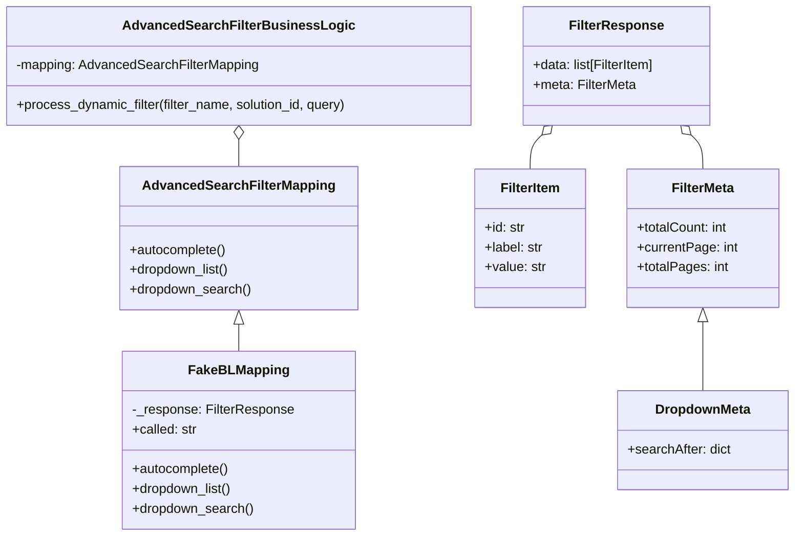
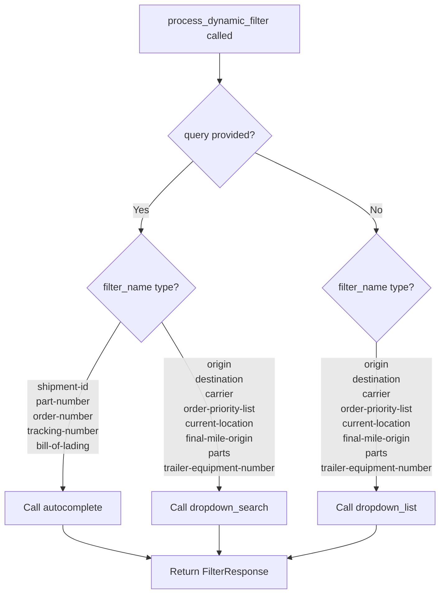
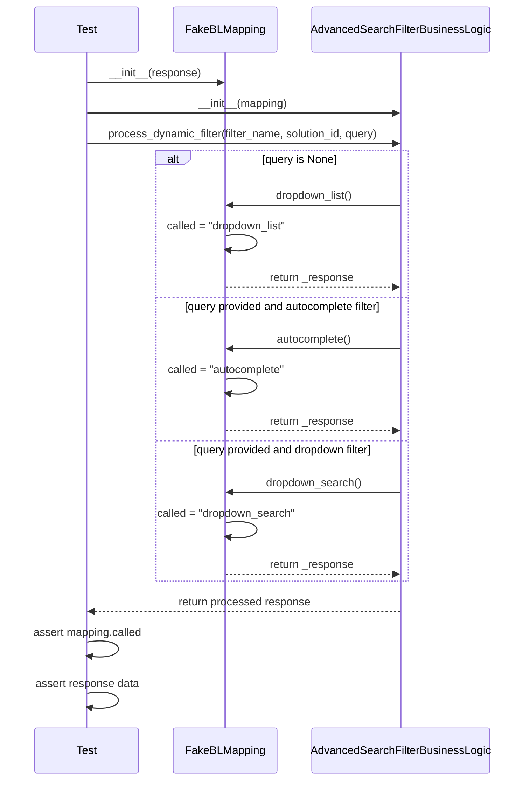

# Diagram: platform/partview_core/partview_service/partview_service/tests/unit/core/business/open_search/test_AdvancedSearchFilterBusinessLogic.py

> Auto-generated by Obscura crawlers

## Diagram 1

### SVG

<svg id="container" width="959.47265625" xmlns="http://www.w3.org/2000/svg" class="classDiagram" height="650" viewBox="0 0 959.47265625 650" role="graphics-document document" aria-roledescription="class"><g><defs><marker id="container_class-aggregationStart" class="marker aggregation class" refX="18" refY="7" markerWidth="190" markerHeight="240" orient="auto"><path d="M 18,7 L9,13 L1,7 L9,1 Z"></path></marker></defs><defs><marker id="container_class-aggregationEnd" class="marker aggregation class" refX="1" refY="7" markerWidth="20" markerHeight="28" orient="auto"><path d="M 18,7 L9,13 L1,7 L9,1 Z"></path></marker></defs><defs><marker id="container_class-extensionStart" class="marker extension class" refX="18" refY="7" markerWidth="190" markerHeight="240" orient="auto"><path d="M 1,7 L18,13 V 1 Z"></path></marker></defs><defs><marker id="container_class-extensionEnd" class="marker extension class" refX="1" refY="7" markerWidth="20" markerHeight="28" orient="auto"><path d="M 1,1 V 13 L18,7 Z"></path></marker></defs><defs><marker id="container_class-compositionStart" class="marker composition class" refX="18" refY="7" markerWidth="190" markerHeight="240" orient="auto"><path d="M 18,7 L9,13 L1,7 L9,1 Z"></path></marker></defs><defs><marker id="container_class-compositionEnd" class="marker composition class" refX="1" refY="7" markerWidth="20" markerHeight="28" orient="auto"><path d="M 18,7 L9,13 L1,7 L9,1 Z"></path></marker></defs><defs><marker id="container_class-dependencyStart" class="marker dependency class" refX="6" refY="7" markerWidth="190" markerHeight="240" orient="auto"><path d="M 5,7 L9,13 L1,7 L9,1 Z"></path></marker></defs><defs><marker id="container_class-dependencyEnd" class="marker dependency class" refX="13" refY="7" markerWidth="20" markerHeight="28" orient="auto"><path d="M 18,7 L9,13 L14,7 L9,1 Z"></path></marker></defs><defs><marker id="container_class-lollipopStart" class="marker lollipop class" refX="13" refY="7" markerWidth="190" markerHeight="240" orient="auto"><circle stroke="black" fill="transparent" cx="7" cy="7" r="6"></circle></marker></defs><defs><marker id="container_class-lollipopEnd" class="marker lollipop class" refX="1" refY="7" markerWidth="190" markerHeight="240" orient="auto"><circle stroke="black" fill="transparent" cx="7" cy="7" r="6"></circle></marker></defs><g class="root"><g class="clusters"></g><g class="edgePaths"><path d="M288.598,393.25L288.598,394.542C288.598,395.833,288.598,398.417,288.598,403.875C288.598,409.333,288.598,417.667,288.598,421.833L288.598,426" id="id_AdvancedSearchFilterMapping_FakeBLMapping_1" class="edge-thickness-normal edge-pattern-solid relation" style=";;;" data-edge="true" data-et="edge" data-id="id_AdvancedSearchFilterMapping_FakeBLMapping_1" data-points="W3sieCI6Mjg4LjU5NzY1NjI1LCJ5IjozNzZ9LHsieCI6Mjg4LjU5NzY1NjI1LCJ5Ijo0MDF9LHsieCI6Mjg4LjU5NzY1NjI1LCJ5Ijo0MjZ9XQ==" marker-start="url(#container_class-extensionStart)"></path><path d="M288.598,169.25L288.598,170.542C288.598,171.833,288.598,174.417,288.598,179.875C288.598,185.333,288.598,193.667,288.598,197.833L288.598,202" id="id_AdvancedSearchFilterBusinessLogic_AdvancedSearchFilterMapping_2" class="edge-thickness-normal edge-pattern-solid relation" style=";;;" data-edge="true" data-et="edge" data-id="id_AdvancedSearchFilterBusinessLogic_AdvancedSearchFilterMapping_2" data-points="W3sieCI6Mjg4LjU5NzY1NjI1LCJ5IjoxNTJ9LHsieCI6Mjg4LjU5NzY1NjI1LCJ5IjoxNzd9LHsieCI6Mjg4LjU5NzY1NjI1LCJ5IjoyMDJ9XQ==" marker-start="url(#container_class-aggregationStart)"></path><path d="M654.454,163.758L652.085,165.965C649.715,168.172,644.977,172.586,642.608,179.46C640.238,186.333,640.238,195.667,640.238,200.333L640.238,205" id="id_FilterResponse_FilterItem_3" class="edge-thickness-normal edge-pattern-solid relation" style=";;;" data-edge="true" data-et="edge" data-id="id_FilterResponse_FilterItem_3" data-points="W3sieCI6NjY3LjA3NjEzMTYwNDM4MTQsInkiOjE1Mn0seyJ4Ijo2NDAuMjM4MjgxMjUsInkiOjE3N30seyJ4Ijo2NDAuMjM4MjgxMjUsInkiOjIwNX1d" marker-start="url(#container_class-aggregationStart)"></path><path d="M834.284,163.758L836.654,165.965C839.023,168.172,843.761,172.586,846.131,179.46C848.5,186.333,848.5,195.667,848.5,200.333L848.5,205" id="id_FilterResponse_FilterMeta_4" class="edge-thickness-normal edge-pattern-solid relation" style=";;;" data-edge="true" data-et="edge" data-id="id_FilterResponse_FilterMeta_4" data-points="W3sieCI6ODIxLjY2MjE0OTY0NTYxODYsInkiOjE1Mn0seyJ4Ijo4NDguNSwieSI6MTc3fSx7IngiOjg0OC41LCJ5IjoyMDV9XQ==" marker-start="url(#container_class-aggregationStart)"></path><path d="M848.5,390.25L848.5,392.042C848.5,393.833,848.5,397.417,848.5,411.375C848.5,425.333,848.5,449.667,848.5,461.833L848.5,474" id="id_FilterMeta_DropdownMeta_5" class="edge-thickness-normal edge-pattern-solid relation" style=";;;" data-edge="true" data-et="edge" data-id="id_FilterMeta_DropdownMeta_5" data-points="W3sieCI6ODQ4LjUsInkiOjM3M30seyJ4Ijo4NDguNSwieSI6NDAxfSx7IngiOjg0OC41LCJ5Ijo0NzR9XQ==" marker-start="url(#container_class-extensionStart)"></path></g><g class="edgeLabels"><g class="edgeLabel"><g class="label" data-id="id_AdvancedSearchFilterMapping_FakeBLMapping_1" transform="translate(0, 0)"><foreignObject width="0" height="0">

</foreignObject></g></g><g class="edgeLabel"><g class="label" data-id="id_AdvancedSearchFilterBusinessLogic_AdvancedSearchFilterMapping_2" transform="translate(0, 0)"><foreignObject width="0" height="0">

</foreignObject></g></g><g class="edgeLabel"><g class="label" data-id="id_FilterResponse_FilterItem_3" transform="translate(0, 0)"><foreignObject width="0" height="0">

</foreignObject></g></g><g class="edgeLabel"><g class="label" data-id="id_FilterResponse_FilterMeta_4" transform="translate(0, 0)"><foreignObject width="0" height="0">

</foreignObject></g></g><g class="edgeLabel"><g class="label" data-id="id_FilterMeta_DropdownMeta_5" transform="translate(0, 0)"><foreignObject width="0" height="0">

</foreignObject></g></g></g><g class="nodes"><g class="node default" id="classId-AdvancedSearchFilterMapping-0" transform="translate(288.59765625, 289)"><g class="basic label-container"><path d="M-141.21875 -87 L141.21875 -87 L141.21875 87 L-141.21875 87" stroke="none" stroke-width="0" fill="#ECECFF" style=""></path><path d="M-141.21875 -87 C-52.84606984143902 -87, 35.526610317121964 -87, 141.21875 -87 M-141.21875 -87 C-31.852540401555913 -87, 77.51366919688817 -87, 141.21875 -87 M141.21875 -87 C141.21875 -29.48019485226743, 141.21875 28.03961029546514, 141.21875 87 M141.21875 -87 C141.21875 -25.59513723918645, 141.21875 35.8097255216271, 141.21875 87 M141.21875 87 C74.39214992114714 87, 7.565549842294274 87, -141.21875 87 M141.21875 87 C78.05039013802883 87, 14.882030276057662 87, -141.21875 87 M-141.21875 87 C-141.21875 52.15127530590921, -141.21875 17.30255061181842, -141.21875 -87 M-141.21875 87 C-141.21875 21.624636960187402, -141.21875 -43.750726079625196, -141.21875 -87" stroke="#9370DB" stroke-width="1.3" fill="none" stroke-dasharray="0 0" style=""></path></g><g class="annotation-group text" transform="translate(0, -63)"></g><g class="label-group text" transform="translate(-110.421875, -63)"><g class="label" style="font-weight: bolder" transform="translate(0,-12)"><foreignObject width="220.84375" height="24">

AdvancedSearchFilterMapping

</foreignObject></g></g><g class="members-group text" transform="translate(-129.21875, -15)"></g><g class="methods-group text" transform="translate(-129.21875, 15)"><g class="label" style="" transform="translate(0,-12)"><foreignObject width="118.484375" height="24">

+autocomplete()

</foreignObject></g><g class="label" style="" transform="translate(0,12)"><foreignObject width="122.84375" height="24">

+dropdown_list()

</foreignObject></g><g class="label" style="" transform="translate(0,36)"><foreignObject width="148.015625" height="24">

+dropdown_search()

</foreignObject></g></g><g class="divider" style=""><path d="M-141.21875 -39 C-61.931265235365544 -39, 17.356219529268913 -39, 141.21875 -39 M-141.21875 -39 C-82.75444899930781 -39, -24.290147998615623 -39, 141.21875 -39" stroke="#9370DB" stroke-width="1.3" fill="none" stroke-dasharray="0 0" style=""></path></g><g class="divider" style=""><path d="M-141.21875 -15 C-66.36240936496792 -15, 8.493931270064166 -15, 141.21875 -15 M-141.21875 -15 C-73.20804540911566 -15, -5.197340818231311 -15, 141.21875 -15" stroke="#9370DB" stroke-width="1.3" fill="none" stroke-dasharray="0 0" style=""></path></g></g><g class="node default" id="classId-FakeBLMapping-1" transform="translate(288.59765625, 534)"><g class="basic label-container"><path d="M-137.92578125 -108 L137.92578125 -108 L137.92578125 108 L-137.92578125 108" stroke="none" stroke-width="0" fill="#ECECFF" style=""></path><path d="M-137.92578125 -108 C-73.74846971796086 -108, -9.571158185921718 -108, 137.92578125 -108 M-137.92578125 -108 C-45.382652156764564 -108, 47.16047693647087 -108, 137.92578125 -108 M137.92578125 -108 C137.92578125 -49.953160508913605, 137.92578125 8.09367898217279, 137.92578125 108 M137.92578125 -108 C137.92578125 -37.98305106104196, 137.92578125 32.033897877916075, 137.92578125 108 M137.92578125 108 C57.3698033409504 108, -23.186174568099204 108, -137.92578125 108 M137.92578125 108 C73.44554601994093 108, 8.965310789881869 108, -137.92578125 108 M-137.92578125 108 C-137.92578125 26.371599532440882, -137.92578125 -55.256800935118235, -137.92578125 -108 M-137.92578125 108 C-137.92578125 48.86651300108527, -137.92578125 -10.266973997829453, -137.92578125 -108" stroke="#9370DB" stroke-width="1.3" fill="none" stroke-dasharray="0 0" style=""></path></g><g class="annotation-group text" transform="translate(0, -84)"></g><g class="label-group text" transform="translate(-56.9921875, -84)"><g class="label" style="font-weight: bolder" transform="translate(0,-12)"><foreignObject width="113.984375" height="24">

FakeBLMapping

</foreignObject></g></g><g class="members-group text" transform="translate(-125.92578125, -36)"><g class="label" style="" transform="translate(0,-12)"><foreignObject width="194.859375" height="24">

-_response: FilterResponse

</foreignObject></g><g class="label" style="" transform="translate(0,12)"><foreignObject width="79.109375" height="24">

+called: str

</foreignObject></g></g><g class="methods-group text" transform="translate(-125.92578125, 36)"><g class="label" style="" transform="translate(0,-12)"><foreignObject width="118.484375" height="24">

+autocomplete()

</foreignObject></g><g class="label" style="" transform="translate(0,12)"><foreignObject width="122.84375" height="24">

+dropdown_list()

</foreignObject></g><g class="label" style="" transform="translate(0,36)"><foreignObject width="148.015625" height="24">

+dropdown_search()

</foreignObject></g></g><g class="divider" style=""><path d="M-137.92578125 -60 C-81.83714438818487 -60, -25.748507526369735 -60, 137.92578125 -60 M-137.92578125 -60 C-39.857694114219285 -60, 58.21039302156143 -60, 137.92578125 -60" stroke="#9370DB" stroke-width="1.3" fill="none" stroke-dasharray="0 0" style=""></path></g><g class="divider" style=""><path d="M-137.92578125 12 C-32.17264044146815 12, 73.5805003670637 12, 137.92578125 12 M-137.92578125 12 C-74.6124354655784 12, -11.2990896811568 12, 137.92578125 12" stroke="#9370DB" stroke-width="1.3" fill="none" stroke-dasharray="0 0" style=""></path></g></g><g class="node default" id="classId-AdvancedSearchFilterBusinessLogic-2" transform="translate(288.59765625, 80)"><g class="basic label-container"><path d="M-280.59765625 -72 L280.59765625 -72 L280.59765625 72 L-280.59765625 72" stroke="none" stroke-width="0" fill="#ECECFF" style=""></path><path d="M-280.59765625 -72 C-158.9726453454387 -72, -37.347634440877385 -72, 280.59765625 -72 M-280.59765625 -72 C-165.95102101392405 -72, -51.3043857778481 -72, 280.59765625 -72 M280.59765625 -72 C280.59765625 -31.137874441381186, 280.59765625 9.724251117237628, 280.59765625 72 M280.59765625 -72 C280.59765625 -20.208494270804117, 280.59765625 31.583011458391766, 280.59765625 72 M280.59765625 72 C102.71101261992203 72, -75.17563101015594 72, -280.59765625 72 M280.59765625 72 C71.43274000457438 72, -137.73217624085123 72, -280.59765625 72 M-280.59765625 72 C-280.59765625 22.157536420470976, -280.59765625 -27.68492715905805, -280.59765625 -72 M-280.59765625 72 C-280.59765625 32.42523351167472, -280.59765625 -7.149532976650562, -280.59765625 -72" stroke="#9370DB" stroke-width="1.3" fill="none" stroke-dasharray="0 0" style=""></path></g><g class="annotation-group text" transform="translate(0, -48)"></g><g class="label-group text" transform="translate(-130.3203125, -48)"><g class="label" style="font-weight: bolder" transform="translate(0,-12)"><foreignObject width="260.640625" height="24">

AdvancedSearchFilterBusinessLogic

</foreignObject></g></g><g class="members-group text" transform="translate(-268.59765625, 0)"><g class="label" style="" transform="translate(0,-12)"><foreignObject width="296.21875" height="24">

-mapping: AdvancedSearchFilterMapping

</foreignObject></g></g><g class="methods-group text" transform="translate(-268.59765625, 48)"><g class="label" style="" transform="translate(0,-12)"><foreignObject width="406.875" height="24">

+process_dynamic_filter(filter_name, solution_id, query)

</foreignObject></g></g><g class="divider" style=""><path d="M-280.59765625 -24 C-88.24589060221169 -24, 104.10587504557662 -24, 280.59765625 -24 M-280.59765625 -24 C-127.25815507638194 -24, 26.08134609723612 -24, 280.59765625 -24" stroke="#9370DB" stroke-width="1.3" fill="none" stroke-dasharray="0 0" style=""></path></g><g class="divider" style=""><path d="M-280.59765625 24 C-106.07039468670419 24, 68.45686687659162 24, 280.59765625 24 M-280.59765625 24 C-133.17770023861254 24, 14.24225577277491 24, 280.59765625 24" stroke="#9370DB" stroke-width="1.3" fill="none" stroke-dasharray="0 0" style=""></path></g></g><g class="node default" id="classId-FilterResponse-3" transform="translate(744.369140625, 80)"><g class="basic label-container"><path d="M-114.69140625 -72 L114.69140625 -72 L114.69140625 72 L-114.69140625 72" stroke="none" stroke-width="0" fill="#ECECFF" style=""></path><path d="M-114.69140625 -72 C-48.325337794618406 -72, 18.040730660763188 -72, 114.69140625 -72 M-114.69140625 -72 C-51.091422313055084 -72, 12.508561623889833 -72, 114.69140625 -72 M114.69140625 -72 C114.69140625 -27.08475380950121, 114.69140625 17.830492380997583, 114.69140625 72 M114.69140625 -72 C114.69140625 -41.682804875515686, 114.69140625 -11.365609751031364, 114.69140625 72 M114.69140625 72 C26.645860435266655 72, -61.39968537946669 72, -114.69140625 72 M114.69140625 72 C38.30430200191972 72, -38.082802246160554 72, -114.69140625 72 M-114.69140625 72 C-114.69140625 15.45179880367212, -114.69140625 -41.09640239265576, -114.69140625 -72 M-114.69140625 72 C-114.69140625 22.741036067695084, -114.69140625 -26.51792786460983, -114.69140625 -72" stroke="#9370DB" stroke-width="1.3" fill="none" stroke-dasharray="0 0" style=""></path></g><g class="annotation-group text" transform="translate(0, -48)"></g><g class="label-group text" transform="translate(-54.3046875, -48)"><g class="label" style="font-weight: bolder" transform="translate(0,-12)"><foreignObject width="108.609375" height="24">

FilterResponse

</foreignObject></g></g><g class="members-group text" transform="translate(-102.69140625, 0)"><g class="label" style="" transform="translate(0,-12)"><foreignObject width="151.078125" height="24">

+data: list[FilterItem]

</foreignObject></g><g class="label" style="" transform="translate(0,12)"><foreignObject width="125.34375" height="24">

+meta: FilterMeta

</foreignObject></g></g><g class="methods-group text" transform="translate(-102.69140625, 72)"></g><g class="divider" style=""><path d="M-114.69140625 -24 C-53.98313413651269 -24, 6.725137976974622 -24, 114.69140625 -24 M-114.69140625 -24 C-62.35934868968913 -24, -10.027291129378256 -24, 114.69140625 -24" stroke="#9370DB" stroke-width="1.3" fill="none" stroke-dasharray="0 0" style=""></path></g><g class="divider" style=""><path d="M-114.69140625 48 C-37.27331514620303 48, 40.144775957593936 48, 114.69140625 48 M-114.69140625 48 C-26.970638988333846 48, 60.75012827333231 48, 114.69140625 48" stroke="#9370DB" stroke-width="1.3" fill="none" stroke-dasharray="0 0" style=""></path></g></g><g class="node default" id="classId-FilterItem-4" transform="translate(640.23828125, 289)"><g class="basic label-container"><path d="M-66.7734375 -84 L66.7734375 -84 L66.7734375 84 L-66.7734375 84" stroke="none" stroke-width="0" fill="#ECECFF" style=""></path><path d="M-66.7734375 -84 C-33.56907617065367 -84, -0.36471484130734666 -84, 66.7734375 -84 M-66.7734375 -84 C-23.696804563741694 -84, 19.379828372516613 -84, 66.7734375 -84 M66.7734375 -84 C66.7734375 -30.7126509095813, 66.7734375 22.5746981808374, 66.7734375 84 M66.7734375 -84 C66.7734375 -34.29778736756111, 66.7734375 15.404425264877787, 66.7734375 84 M66.7734375 84 C21.216975454088725 84, -24.33948659182255 84, -66.7734375 84 M66.7734375 84 C33.768485166410905 84, 0.7635328328218094 84, -66.7734375 84 M-66.7734375 84 C-66.7734375 37.599981670535065, -66.7734375 -8.80003665892987, -66.7734375 -84 M-66.7734375 84 C-66.7734375 22.272531702576522, -66.7734375 -39.454936594846956, -66.7734375 -84" stroke="#9370DB" stroke-width="1.3" fill="none" stroke-dasharray="0 0" style=""></path></g><g class="annotation-group text" transform="translate(0, -60)"></g><g class="label-group text" transform="translate(-35.328125, -60)"><g class="label" style="font-weight: bolder" transform="translate(0,-12)"><foreignObject width="70.65625" height="24">

FilterItem

</foreignObject></g></g><g class="members-group text" transform="translate(-54.7734375, -12)"><g class="label" style="" transform="translate(0,-12)"><foreignObject width="49.578125" height="24">

+id: str

</foreignObject></g><g class="label" style="" transform="translate(0,12)"><foreignObject width="71.875" height="24">

+label: str

</foreignObject></g><g class="label" style="" transform="translate(0,36)"><foreignObject width="74.21875" height="24">

+value: str

</foreignObject></g></g><g class="methods-group text" transform="translate(-54.7734375, 84)"></g><g class="divider" style=""><path d="M-66.7734375 -36 C-24.374818135609203 -36, 18.023801228781593 -36, 66.7734375 -36 M-66.7734375 -36 C-28.243511001928596 -36, 10.286415496142808 -36, 66.7734375 -36" stroke="#9370DB" stroke-width="1.3" fill="none" stroke-dasharray="0 0" style=""></path></g><g class="divider" style=""><path d="M-66.7734375 60 C-19.10286106407913 60, 28.567715371841743 60, 66.7734375 60 M-66.7734375 60 C-22.60626876108948 60, 21.560899977821038 60, 66.7734375 60" stroke="#9370DB" stroke-width="1.3" fill="none" stroke-dasharray="0 0" style=""></path></g></g><g class="node default" id="classId-FilterMeta-5" transform="translate(848.5, 289)"><g class="basic label-container"><path d="M-91.48828125 -84 L91.48828125 -84 L91.48828125 84 L-91.48828125 84" stroke="none" stroke-width="0" fill="#ECECFF" style=""></path><path d="M-91.48828125 -84 C-22.80047687664505 -84, 45.8873274967099 -84, 91.48828125 -84 M-91.48828125 -84 C-39.58353505542547 -84, 12.321211139149057 -84, 91.48828125 -84 M91.48828125 -84 C91.48828125 -39.65415147463728, 91.48828125 4.691697050725438, 91.48828125 84 M91.48828125 -84 C91.48828125 -44.97546878097069, 91.48828125 -5.950937561941373, 91.48828125 84 M91.48828125 84 C30.859696957704564 84, -29.76888733459087 84, -91.48828125 84 M91.48828125 84 C24.32034352311679 84, -42.84759420376642 84, -91.48828125 84 M-91.48828125 84 C-91.48828125 28.074688478775997, -91.48828125 -27.850623042448007, -91.48828125 -84 M-91.48828125 84 C-91.48828125 25.577475345554944, -91.48828125 -32.84504930889011, -91.48828125 -84" stroke="#9370DB" stroke-width="1.3" fill="none" stroke-dasharray="0 0" style=""></path></g><g class="annotation-group text" transform="translate(0, -60)"></g><g class="label-group text" transform="translate(-36.9453125, -60)"><g class="label" style="font-weight: bolder" transform="translate(0,-12)"><foreignObject width="73.890625" height="24">

FilterMeta

</foreignObject></g></g><g class="members-group text" transform="translate(-79.48828125, -12)"><g class="label" style="" transform="translate(0,-12)"><foreignObject width="111.9375" height="24">

+totalCount: int

</foreignObject></g><g class="label" style="" transform="translate(0,12)"><foreignObject width="122.03125" height="24">

+currentPage: int

</foreignObject></g><g class="label" style="" transform="translate(0,36)"><foreignObject width="110.640625" height="24">

+totalPages: int

</foreignObject></g></g><g class="methods-group text" transform="translate(-79.48828125, 84)"></g><g class="divider" style=""><path d="M-91.48828125 -36 C-34.41258447493663 -36, 22.66311230012674 -36, 91.48828125 -36 M-91.48828125 -36 C-36.04469803933313 -36, 19.398885171333745 -36, 91.48828125 -36" stroke="#9370DB" stroke-width="1.3" fill="none" stroke-dasharray="0 0" style=""></path></g><g class="divider" style=""><path d="M-91.48828125 60 C-21.366600638758285 60, 48.75507997248343 60, 91.48828125 60 M-91.48828125 60 C-22.71813587144196 60, 46.05200950711608 60, 91.48828125 60" stroke="#9370DB" stroke-width="1.3" fill="none" stroke-dasharray="0 0" style=""></path></g></g><g class="node default" id="classId-DropdownMeta-6" transform="translate(848.5, 534)"><g class="basic label-container"><path d="M-102.97265625 -60 L102.97265625 -60 L102.97265625 60 L-102.97265625 60" stroke="none" stroke-width="0" fill="#ECECFF" style=""></path><path d="M-102.97265625 -60 C-32.266694138319906 -60, 38.43926797336019 -60, 102.97265625 -60 M-102.97265625 -60 C-28.432188496234858 -60, 46.108279257530285 -60, 102.97265625 -60 M102.97265625 -60 C102.97265625 -18.546854643351736, 102.97265625 22.906290713296528, 102.97265625 60 M102.97265625 -60 C102.97265625 -35.57684051443404, 102.97265625 -11.153681028868078, 102.97265625 60 M102.97265625 60 C27.427653292300548 60, -48.117349665398905 60, -102.97265625 60 M102.97265625 60 C43.11784658518189 60, -16.736963079636226 60, -102.97265625 60 M-102.97265625 60 C-102.97265625 35.73421386536465, -102.97265625 11.46842773072931, -102.97265625 -60 M-102.97265625 60 C-102.97265625 20.900937934692195, -102.97265625 -18.19812413061561, -102.97265625 -60" stroke="#9370DB" stroke-width="1.3" fill="none" stroke-dasharray="0 0" style=""></path></g><g class="annotation-group text" transform="translate(0, -36)"></g><g class="label-group text" transform="translate(-55.7890625, -36)"><g class="label" style="font-weight: bolder" transform="translate(0,-12)"><foreignObject width="111.578125" height="24">

DropdownMeta

</foreignObject></g></g><g class="members-group text" transform="translate(-90.97265625, 12)"><g class="label" style="" transform="translate(0,-12)"><foreignObject width="126.15625" height="24">

+searchAfter: dict

</foreignObject></g></g><g class="methods-group text" transform="translate(-90.97265625, 60)"></g><g class="divider" style=""><path d="M-102.97265625 -12 C-51.05006707849977 -12, 0.8725220930004554 -12, 102.97265625 -12 M-102.97265625 -12 C-54.163986381522285 -12, -5.355316513044571 -12, 102.97265625 -12" stroke="#9370DB" stroke-width="1.3" fill="none" stroke-dasharray="0 0" style=""></path></g><g class="divider" style=""><path d="M-102.97265625 36 C-47.41001976940067 36, 8.152616711198661 36, 102.97265625 36 M-102.97265625 36 C-21.020906373242795 36, 60.93084350351441 36, 102.97265625 36" stroke="#9370DB" stroke-width="1.3" fill="none" stroke-dasharray="0 0" style=""></path></g></g></g></g></g></svg>

## Diagram 2

### SVG

<svg id="container" width="723.40625" xmlns="http://www.w3.org/2000/svg" class="flowchart" height="968.5625" viewBox="0 0 723.40625 968.5625" role="graphics-document document" aria-roledescription="flowchart-v2"><g><marker id="container_flowchart-v2-pointEnd" class="marker flowchart-v2" viewBox="0 0 10 10" refX="5" refY="5" markerUnits="userSpaceOnUse" markerWidth="8" markerHeight="8" orient="auto"><path d="M 0 0 L 10 5 L 0 10 z" class="arrowMarkerPath" style="stroke-width: 1; stroke-dasharray: 1, 0;"></path></marker><marker id="container_flowchart-v2-pointStart" class="marker flowchart-v2" viewBox="0 0 10 10" refX="4.5" refY="5" markerUnits="userSpaceOnUse" markerWidth="8" markerHeight="8" orient="auto"><path d="M 0 5 L 10 10 L 10 0 z" class="arrowMarkerPath" style="stroke-width: 1; stroke-dasharray: 1, 0;"></path></marker><marker id="container_flowchart-v2-circleEnd" class="marker flowchart-v2" viewBox="0 0 10 10" refX="11" refY="5" markerUnits="userSpaceOnUse" markerWidth="11" markerHeight="11" orient="auto"><circle cx="5" cy="5" r="5" class="arrowMarkerPath" style="stroke-width: 1; stroke-dasharray: 1, 0;"></circle></marker><marker id="container_flowchart-v2-circleStart" class="marker flowchart-v2" viewBox="0 0 10 10" refX="-1" refY="5" markerUnits="userSpaceOnUse" markerWidth="11" markerHeight="11" orient="auto"><circle cx="5" cy="5" r="5" class="arrowMarkerPath" style="stroke-width: 1; stroke-dasharray: 1, 0;"></circle></marker><marker id="container_flowchart-v2-crossEnd" class="marker cross flowchart-v2" viewBox="0 0 11 11" refX="12" refY="5.2" markerUnits="userSpaceOnUse" markerWidth="11" markerHeight="11" orient="auto"><path d="M 1,1 l 9,9 M 10,1 l -9,9" class="arrowMarkerPath" style="stroke-width: 2; stroke-dasharray: 1, 0;"></path></marker><marker id="container_flowchart-v2-crossStart" class="marker cross flowchart-v2" viewBox="0 0 11 11" refX="-1" refY="5.2" markerUnits="userSpaceOnUse" markerWidth="11" markerHeight="11" orient="auto"><path d="M 1,1 l 9,9 M 10,1 l -9,9" class="arrowMarkerPath" style="stroke-width: 2; stroke-dasharray: 1, 0;"></path></marker><g class="root"><g class="clusters"></g><g class="edgePaths"><path d="M360.676,86L360.676,90.167C360.676,94.333,360.676,102.667,360.676,110.333C360.676,118,360.676,125,360.676,128.5L360.676,132" id="L_Start_CheckQuery_0" class="edge-thickness-normal edge-pattern-solid edge-thickness-normal edge-pattern-solid flowchart-link" style=";" data-edge="true" data-et="edge" data-id="L_Start_CheckQuery_0" data-points="W3sieCI6MzYwLjY3NTc4MTI1LCJ5Ijo4Nn0seyJ4IjozNjAuNjc1NzgxMjUsInkiOjExMX0seyJ4IjozNjAuNjc1NzgxMjUsInkiOjEzNn1d" marker-end="url(#container_flowchart-v2-pointEnd)"></path><path d="M316.657,263.935L302.491,277.438C288.325,290.941,259.993,317.947,245.826,336.95C231.66,355.953,231.66,366.953,231.66,372.453L231.66,377.953" id="L_CheckQuery_CheckFilterType_0" class="edge-thickness-normal edge-pattern-solid edge-thickness-normal edge-pattern-solid flowchart-link" style=";" data-edge="true" data-et="edge" data-id="L_CheckQuery_CheckFilterType_0" data-points="W3sieCI6MzE2LjY1NzI3Mzk0NDkzMTAzLCJ5IjoyNjMuOTM0NjE3Njk0OTMxMDN9LHsieCI6MjMxLjY2MDE1NjI1LCJ5IjozNDQuOTUzMTI1fSx7IngiOjIzMS42NjAxNTYyNSwieSI6MzgxLjk1MzEyNX1d" marker-end="url(#container_flowchart-v2-pointEnd)"></path><path d="M418.827,249.802L451.969,265.66C485.111,281.519,551.395,313.236,584.538,334.595C617.68,355.953,617.68,366.953,617.68,372.453L617.68,377.953" id="L_CheckQuery_CheckFilterTypeNoQuery_0" class="edge-thickness-normal edge-pattern-solid edge-thickness-normal edge-pattern-solid flowchart-link" style=";" data-edge="true" data-et="edge" data-id="L_CheckQuery_CheckFilterTypeNoQuery_0" data-points="W3sieCI6NDE4LjgyNjk2MDY1NDM5NDgsInkiOjI0OS44MDE5NDU1OTU2MDUyNX0seyJ4Ijo2MTcuNjc5Njg3NSwieSI6MzQ0Ljk1MzEyNX0seyJ4Ijo2MTcuNjc5Njg3NSwieSI6MzgxLjk1MzEyNX1d" marker-end="url(#container_flowchart-v2-pointEnd)"></path><path d="M197.873,526.775L182.173,552.573C166.473,578.371,135.072,629.967,119.372,675.265C103.672,720.563,103.672,759.563,103.672,779.063L103.672,798.563" id="L_CheckFilterType_Autocomplete_0" class="edge-thickness-normal edge-pattern-solid edge-thickness-normal edge-pattern-solid flowchart-link" style=";" data-edge="true" data-et="edge" data-id="L_CheckFilterType_Autocomplete_0" data-points="W3sieCI6MTk3Ljg3MzAxMTYyNTI0NjgyLCJ5Ijo1MjYuNzc1MzU1Mzc1MjQ2OH0seyJ4IjoxMDMuNjcxODc1LCJ5Ijo2ODEuNTYyNX0seyJ4IjoxMDMuNjcxODc1LCJ5Ijo4MDIuNTYyNX1d" marker-end="url(#container_flowchart-v2-pointEnd)"></path><path d="M265.447,526.775L281.147,552.573C296.848,578.371,328.248,629.967,343.948,675.265C359.648,720.563,359.648,759.563,359.648,779.063L359.648,798.563" id="L_CheckFilterType_DropdownSearch_0" class="edge-thickness-normal edge-pattern-solid edge-thickness-normal edge-pattern-solid flowchart-link" style=";" data-edge="true" data-et="edge" data-id="L_CheckFilterType_DropdownSearch_0" data-points="W3sieCI6MjY1LjQ0NzMwMDg3NDc1MzIsInkiOjUyNi43NzUzNTUzNzUyNDY4fSx7IngiOjM1OS42NDg0Mzc1LCJ5Ijo2ODEuNTYyNX0seyJ4IjozNTkuNjQ4NDM3NSwieSI6ODAyLjU2MjV9XQ==" marker-end="url(#container_flowchart-v2-pointEnd)"></path><path d="M617.68,560.563L617.68,580.729C617.68,600.896,617.68,641.229,617.68,680.896C617.68,720.563,617.68,759.563,617.68,779.063L617.68,798.563" id="L_CheckFilterTypeNoQuery_DropdownList_0" class="edge-thickness-normal edge-pattern-solid edge-thickness-normal edge-pattern-solid flowchart-link" style=";" data-edge="true" data-et="edge" data-id="L_CheckFilterTypeNoQuery_DropdownList_0" data-points="W3sieCI6NjE3LjY3OTY4NzUsInkiOjU2MC41NjI1fSx7IngiOjYxNy42Nzk2ODc1LCJ5Ijo2ODEuNTYyNX0seyJ4Ijo2MTcuNjc5Njg3NSwieSI6ODAyLjU2MjV9XQ==" marker-end="url(#container_flowchart-v2-pointEnd)"></path><path d="M103.672,856.563L103.672,860.729C103.672,864.896,103.672,873.229,127.345,882.205C151.019,891.181,198.366,900.799,222.039,905.608L245.713,910.417" id="L_Autocomplete_Return_0" class="edge-thickness-normal edge-pattern-solid edge-thickness-normal edge-pattern-solid flowchart-link" style=";" data-edge="true" data-et="edge" data-id="L_Autocomplete_Return_0" data-points="W3sieCI6MTAzLjY3MTg3NSwieSI6ODU2LjU2MjV9LHsieCI6MTAzLjY3MTg3NSwieSI6ODgxLjU2MjV9LHsieCI6MjQ5LjYzMjgxMjUsInkiOjkxMS4yMTM1MzAwNjI1NjY3fV0=" marker-end="url(#container_flowchart-v2-pointEnd)"></path><path d="M359.648,856.563L359.648,860.729C359.648,864.896,359.648,873.229,359.648,880.896C359.648,888.563,359.648,895.563,359.648,899.063L359.648,902.563" id="L_DropdownSearch_Return_0" class="edge-thickness-normal edge-pattern-solid edge-thickness-normal edge-pattern-solid flowchart-link" style=";" data-edge="true" data-et="edge" data-id="L_DropdownSearch_Return_0" data-points="W3sieCI6MzU5LjY0ODQzNzUsInkiOjg1Ni41NjI1fSx7IngiOjM1OS42NDg0Mzc1LCJ5Ijo4ODEuNTYyNX0seyJ4IjozNTkuNjQ4NDM3NSwieSI6OTA2LjU2MjV9XQ==" marker-end="url(#container_flowchart-v2-pointEnd)"></path><path d="M617.68,856.563L617.68,860.729C617.68,864.896,617.68,873.229,593.664,882.236C569.648,891.242,521.617,900.922,497.601,905.761L473.585,910.601" id="L_DropdownList_Return_0" class="edge-thickness-normal edge-pattern-solid edge-thickness-normal edge-pattern-solid flowchart-link" style=";" data-edge="true" data-et="edge" data-id="L_DropdownList_Return_0" data-points="W3sieCI6NjE3LjY3OTY4NzUsInkiOjg1Ni41NjI1fSx7IngiOjYxNy42Nzk2ODc1LCJ5Ijo4ODEuNTYyNX0seyJ4Ijo0NjkuNjY0MDYyNSwieSI6OTExLjM5MTQ5MzU4MTIwMzh9XQ==" marker-end="url(#container_flowchart-v2-pointEnd)"></path></g><g class="edgeLabels"><g class="edgeLabel"><g class="label" data-id="L_Start_CheckQuery_0" transform="translate(0, 0)"><foreignObject width="0" height="0">

</foreignObject></g></g><g class="edgeLabel" transform="translate(231.66015625, 344.953125)"><g class="label" data-id="L_CheckQuery_CheckFilterType_0" transform="translate(-12.03125, -12)"><foreignObject width="24.0625" height="24">

Yes

</foreignObject></g></g><g class="edgeLabel" transform="translate(617.6796875, 344.953125)"><g class="label" data-id="L_CheckQuery_CheckFilterTypeNoQuery_0" transform="translate(-10.140625, -12)"><foreignObject width="20.28125" height="24">

No

</foreignObject></g></g><g class="edgeLabel" transform="translate(103.671875, 681.5625)"><g class="label" data-id="L_CheckFilterType_Autocomplete_0" transform="translate(-60.6171875, -60)"><foreignObject width="121.234375" height="120">

shipment-id part-number order-number tracking-number bill-of-lading

</foreignObject></g></g><g class="edgeLabel" transform="translate(359.6484375, 681.5625)"><g class="label" data-id="L_CheckFilterType_DropdownSearch_0" transform="translate(-95.921875, -96)"><foreignObject width="191.84375" height="192">

origin destination carrier order-priority-list current-location final-mile-origin parts trailer-equipment-number

</foreignObject></g></g><g class="edgeLabel" transform="translate(617.6796875, 681.5625)"><g class="label" data-id="L_CheckFilterTypeNoQuery_DropdownList_0" transform="translate(-95.921875, -96)"><foreignObject width="191.84375" height="192">

origin destination carrier order-priority-list current-location final-mile-origin parts trailer-equipment-number

</foreignObject></g></g><g class="edgeLabel"><g class="label" data-id="L_Autocomplete_Return_0" transform="translate(0, 0)"><foreignObject width="0" height="0">

</foreignObject></g></g><g class="edgeLabel"><g class="label" data-id="L_DropdownSearch_Return_0" transform="translate(0, 0)"><foreignObject width="0" height="0">

</foreignObject></g></g><g class="edgeLabel"><g class="label" data-id="L_DropdownList_Return_0" transform="translate(0, 0)"><foreignObject width="0" height="0">

</foreignObject></g></g></g><g class="nodes"><g class="node default" id="flowchart-Start-0" transform="translate(360.67578125, 47)"><rect class="basic label-container" style="" x="-130" y="-39" width="260" height="78"></rect><g class="label" style="" transform="translate(-100, -24)"><rect></rect><foreignObject width="200" height="48">

process_dynamic_filter called

</foreignObject></g></g><g class="node default" id="flowchart-CheckQuery-1" transform="translate(360.67578125, 221.9765625)"><polygon points="85.9765625,0 171.953125,-85.9765625 85.9765625,-171.953125 0,-85.9765625" class="label-container" transform="translate(-85.4765625, 85.9765625)"></polygon><g class="label" style="" transform="translate(-58.9765625, -12)"><rect></rect><foreignObject width="117.953125" height="24">

query provided?

</foreignObject></g></g><g class="node default" id="flowchart-CheckFilterType-3" transform="translate(231.66015625, 471.2578125)"><polygon points="89.3046875,0 178.609375,-89.3046875 89.3046875,-178.609375 0,-89.3046875" class="label-container" transform="translate(-88.8046875, 89.3046875)"></polygon><g class="label" style="" transform="translate(-62.3046875, -12)"><rect></rect><foreignObject width="124.609375" height="24">

filter_name type?

</foreignObject></g></g><g class="node default" id="flowchart-CheckFilterTypeNoQuery-5" transform="translate(617.6796875, 471.2578125)"><polygon points="89.3046875,0 178.609375,-89.3046875 89.3046875,-178.609375 0,-89.3046875" class="label-container" transform="translate(-88.8046875, 89.3046875)"></polygon><g class="label" style="" transform="translate(-62.3046875, -12)"><rect></rect><foreignObject width="124.609375" height="24">

filter_name type?

</foreignObject></g></g><g class="node default" id="flowchart-Autocomplete-7" transform="translate(103.671875, 829.5625)"><rect class="basic label-container" style="" x="-95.671875" y="-27" width="191.34375" height="54"></rect><g class="label" style="" transform="translate(-65.671875, -12)"><rect></rect><foreignObject width="131.34375" height="24">

Call autocomplete

</foreignObject></g></g><g class="node default" id="flowchart-DropdownSearch-9" transform="translate(359.6484375, 829.5625)"><rect class="basic label-container" style="" x="-110.3046875" y="-27" width="220.609375" height="54"></rect><g class="label" style="" transform="translate(-80.3046875, -12)"><rect></rect><foreignObject width="160.609375" height="24">

Call dropdown_search

</foreignObject></g></g><g class="node default" id="flowchart-DropdownList-11" transform="translate(617.6796875, 829.5625)"><rect class="basic label-container" style="" x="-97.7265625" y="-27" width="195.453125" height="54"></rect><g class="label" style="" transform="translate(-67.7265625, -12)"><rect></rect><foreignObject width="135.453125" height="24">

Call dropdown_list

</foreignObject></g></g><g class="node default" id="flowchart-Return-13" transform="translate(359.6484375, 933.5625)"><rect class="basic label-container" style="" x="-110.015625" y="-27" width="220.03125" height="54"></rect><g class="label" style="" transform="translate(-80.015625, -12)"><rect></rect><foreignObject width="160.03125" height="24">

Return FilterResponse

</foreignObject></g></g></g></g></g></svg>

## Diagram 3

### SVG

<svg id="container" width="784.5" xmlns="http://www.w3.org/2000/svg" height="1186" viewBox="-53.5 -10 784.5 1186" role="graphics-document document" aria-roledescription="sequence"><g><rect x="404" y="1100" fill="#eaeaea" stroke="#666" width="277" height="65" name="AdvancedSearchFilterBusinessLogic" rx="3" ry="3" class="actor actor-bottom"></rect><text x="542.5" y="1132.5" dominant-baseline="central" alignment-baseline="central" class="actor actor-box" style="text-anchor: middle; font-size: 16px; font-weight: 400;"><tspan x="542.5" dy="0">AdvancedSearchFilterBusinessLogic</tspan></text></g><g><rect x="204" y="1100" fill="#eaeaea" stroke="#666" width="150" height="65" name="FakeBLMapping" rx="3" ry="3" class="actor actor-bottom"></rect><text x="279" y="1132.5" dominant-baseline="central" alignment-baseline="central" class="actor actor-box" style="text-anchor: middle; font-size: 16px; font-weight: 400;"><tspan x="279" dy="0">FakeBLMapping</tspan></text></g><g><rect x="0" y="1100" fill="#eaeaea" stroke="#666" width="150" height="65" name="Test" rx="3" ry="3" class="actor actor-bottom"></rect><text x="75" y="1132.5" dominant-baseline="central" alignment-baseline="central" class="actor actor-box" style="text-anchor: middle; font-size: 16px; font-weight: 400;"><tspan x="75" dy="0">Test</tspan></text></g><g><line id="actor2" x1="542.5" y1="65" x2="542.5" y2="1100" class="actor-line 200" stroke-width="0.5px" stroke="#999" name="AdvancedSearchFilterBusinessLogic"></line><g id="root-2"><rect x="404" y="0" fill="#eaeaea" stroke="#666" width="277" height="65" name="AdvancedSearchFilterBusinessLogic" rx="3" ry="3" class="actor actor-top"></rect><text x="542.5" y="32.5" dominant-baseline="central" alignment-baseline="central" class="actor actor-box" style="text-anchor: middle; font-size: 16px; font-weight: 400;"><tspan x="542.5" dy="0">AdvancedSearchFilterBusinessLogic</tspan></text></g></g><g><line id="actor1" x1="279" y1="65" x2="279" y2="1100" class="actor-line 200" stroke-width="0.5px" stroke="#999" name="FakeBLMapping"></line><g id="root-1"><rect x="204" y="0" fill="#eaeaea" stroke="#666" width="150" height="65" name="FakeBLMapping" rx="3" ry="3" class="actor actor-top"></rect><text x="279" y="32.5" dominant-baseline="central" alignment-baseline="central" class="actor actor-box" style="text-anchor: middle; font-size: 16px; font-weight: 400;"><tspan x="279" dy="0">FakeBLMapping</tspan></text></g></g><g><line id="actor0" x1="75" y1="65" x2="75" y2="1100" class="actor-line 200" stroke-width="0.5px" stroke="#999" name="Test"></line><g id="root-0"><rect x="0" y="0" fill="#eaeaea" stroke="#666" width="150" height="65" name="Test" rx="3" ry="3" class="actor actor-top"></rect><text x="75" y="32.5" dominant-baseline="central" alignment-baseline="central" class="actor actor-box" style="text-anchor: middle; font-size: 16px; font-weight: 400;"><tspan x="75" dy="0">Test</tspan></text></g></g><g></g><defs><symbol id="computer" width="24" height="24"><path transform="scale(.5)" d="M2 2v13h20v-13h-20zm18 11h-16v-9h16v9zm-10.228 6l.466-1h3.524l.467 1h-4.457zm14.228 3h-24l2-6h2.104l-1.33 4h18.45l-1.297-4h2.073l2 6zm-5-10h-14v-7h14v7z"></path></symbol></defs><defs><symbol id="database" fill-rule="evenodd" clip-rule="evenodd"><path transform="scale(.5)" d="M12.258.001l.256.004.255.005.253.008.251.01.249.012.247.015.246.016.242.019.241.02.239.023.236.024.233.027.231.028.229.031.225.032.223.034.22.036.217.038.214.04.211.041.208.043.205.045.201.046.198.048.194.05.191.051.187.053.183.054.18.056.175.057.172.059.168.06.163.061.16.063.155.064.15.066.074.033.073.033.071.034.07.034.069.035.068.035.067.035.066.035.064.036.064.036.062.036.06.036.06.037.058.037.058.037.055.038.055.038.053.038.052.038.051.039.05.039.048.039.047.039.045.04.044.04.043.04.041.04.04.041.039.041.037.041.036.041.034.041.033.042.032.042.03.042.029.042.027.042.026.043.024.043.023.043.021.043.02.043.018.044.017.043.015.044.013.044.012.044.011.045.009.044.007.045.006.045.004.045.002.045.001.045v17l-.001.045-.002.045-.004.045-.006.045-.007.045-.009.044-.011.045-.012.044-.013.044-.015.044-.017.043-.018.044-.02.043-.021.043-.023.043-.024.043-.026.043-.027.042-.029.042-.03.042-.032.042-.033.042-.034.041-.036.041-.037.041-.039.041-.04.041-.041.04-.043.04-.044.04-.045.04-.047.039-.048.039-.05.039-.051.039-.052.038-.053.038-.055.038-.055.038-.058.037-.058.037-.06.037-.06.036-.062.036-.064.036-.064.036-.066.035-.067.035-.068.035-.069.035-.07.034-.071.034-.073.033-.074.033-.15.066-.155.064-.16.063-.163.061-.168.06-.172.059-.175.057-.18.056-.183.054-.187.053-.191.051-.194.05-.198.048-.201.046-.205.045-.208.043-.211.041-.214.04-.217.038-.22.036-.223.034-.225.032-.229.031-.231.028-.233.027-.236.024-.239.023-.241.02-.242.019-.246.016-.247.015-.249.012-.251.01-.253.008-.255.005-.256.004-.258.001-.258-.001-.256-.004-.255-.005-.253-.008-.251-.01-.249-.012-.247-.015-.245-.016-.243-.019-.241-.02-.238-.023-.236-.024-.234-.027-.231-.028-.228-.031-.226-.032-.223-.034-.22-.036-.217-.038-.214-.04-.211-.041-.208-.043-.204-.045-.201-.046-.198-.048-.195-.05-.19-.051-.187-.053-.184-.054-.179-.056-.176-.057-.172-.059-.167-.06-.164-.061-.159-.063-.155-.064-.151-.066-.074-.033-.072-.033-.072-.034-.07-.034-.069-.035-.068-.035-.067-.035-.066-.035-.064-.036-.063-.036-.062-.036-.061-.036-.06-.037-.058-.037-.057-.037-.056-.038-.055-.038-.053-.038-.052-.038-.051-.039-.049-.039-.049-.039-.046-.039-.046-.04-.044-.04-.043-.04-.041-.04-.04-.041-.039-.041-.037-.041-.036-.041-.034-.041-.033-.042-.032-.042-.03-.042-.029-.042-.027-.042-.026-.043-.024-.043-.023-.043-.021-.043-.02-.043-.018-.044-.017-.043-.015-.044-.013-.044-.012-.044-.011-.045-.009-.044-.007-.045-.006-.045-.004-.045-.002-.045-.001-.045v-17l.001-.045.002-.045.004-.045.006-.045.007-.045.009-.044.011-.045.012-.044.013-.044.015-.044.017-.043.018-.044.02-.043.021-.043.023-.043.024-.043.026-.043.027-.042.029-.042.03-.042.032-.042.033-.042.034-.041.036-.041.037-.041.039-.041.04-.041.041-.04.043-.04.044-.04.046-.04.046-.039.049-.039.049-.039.051-.039.052-.038.053-.038.055-.038.056-.038.057-.037.058-.037.06-.037.061-.036.062-.036.063-.036.064-.036.066-.035.067-.035.068-.035.069-.035.07-.034.072-.034.072-.033.074-.033.151-.066.155-.064.159-.063.164-.061.167-.06.172-.059.176-.057.179-.056.184-.054.187-.053.19-.051.195-.05.198-.048.201-.046.204-.045.208-.043.211-.041.214-.04.217-.038.22-.036.223-.034.226-.032.228-.031.231-.028.234-.027.236-.024.238-.023.241-.02.243-.019.245-.016.247-.015.249-.012.251-.01.253-.008.255-.005.256-.004.258-.001.258.001zm-9.258 20.499v.01l.001.021.003.021.004.022.005.021.006.022.007.022.009.023.01.022.011.023.012.023.013.023.015.023.016.024.017.023.018.024.019.024.021.024.022.025.023.024.024.025.052.049.056.05.061.051.066.051.07.051.075.051.079.052.084.052.088.052.092.052.097.052.102.051.105.052.11.052.114.051.119.051.123.051.127.05.131.05.135.05.139.048.144.049.147.047.152.047.155.047.16.045.163.045.167.043.171.043.176.041.178.041.183.039.187.039.19.037.194.035.197.035.202.033.204.031.209.03.212.029.216.027.219.025.222.024.226.021.23.02.233.018.236.016.24.015.243.012.246.01.249.008.253.005.256.004.259.001.26-.001.257-.004.254-.005.25-.008.247-.011.244-.012.241-.014.237-.016.233-.018.231-.021.226-.021.224-.024.22-.026.216-.027.212-.028.21-.031.205-.031.202-.034.198-.034.194-.036.191-.037.187-.039.183-.04.179-.04.175-.042.172-.043.168-.044.163-.045.16-.046.155-.046.152-.047.148-.048.143-.049.139-.049.136-.05.131-.05.126-.05.123-.051.118-.052.114-.051.11-.052.106-.052.101-.052.096-.052.092-.052.088-.053.083-.051.079-.052.074-.052.07-.051.065-.051.06-.051.056-.05.051-.05.023-.024.023-.025.021-.024.02-.024.019-.024.018-.024.017-.024.015-.023.014-.024.013-.023.012-.023.01-.023.01-.022.008-.022.006-.022.006-.022.004-.022.004-.021.001-.021.001-.021v-4.127l-.077.055-.08.053-.083.054-.085.053-.087.052-.09.052-.093.051-.095.05-.097.05-.1.049-.102.049-.105.048-.106.047-.109.047-.111.046-.114.045-.115.045-.118.044-.12.043-.122.042-.124.042-.126.041-.128.04-.13.04-.132.038-.134.038-.135.037-.138.037-.139.035-.142.035-.143.034-.144.033-.147.032-.148.031-.15.03-.151.03-.153.029-.154.027-.156.027-.158.026-.159.025-.161.024-.162.023-.163.022-.165.021-.166.02-.167.019-.169.018-.169.017-.171.016-.173.015-.173.014-.175.013-.175.012-.177.011-.178.01-.179.008-.179.008-.181.006-.182.005-.182.004-.184.003-.184.002h-.37l-.184-.002-.184-.003-.182-.004-.182-.005-.181-.006-.179-.008-.179-.008-.178-.01-.176-.011-.176-.012-.175-.013-.173-.014-.172-.015-.171-.016-.17-.017-.169-.018-.167-.019-.166-.02-.165-.021-.163-.022-.162-.023-.161-.024-.159-.025-.157-.026-.156-.027-.155-.027-.153-.029-.151-.03-.15-.03-.148-.031-.146-.032-.145-.033-.143-.034-.141-.035-.14-.035-.137-.037-.136-.037-.134-.038-.132-.038-.13-.04-.128-.04-.126-.041-.124-.042-.122-.042-.12-.044-.117-.043-.116-.045-.113-.045-.112-.046-.109-.047-.106-.047-.105-.048-.102-.049-.1-.049-.097-.05-.095-.05-.093-.052-.09-.051-.087-.052-.085-.053-.083-.054-.08-.054-.077-.054v4.127zm0-5.654v.011l.001.021.003.021.004.021.005.022.006.022.007.022.009.022.01.022.011.023.012.023.013.023.015.024.016.023.017.024.018.024.019.024.021.024.022.024.023.025.024.024.052.05.056.05.061.05.066.051.07.051.075.052.079.051.084.052.088.052.092.052.097.052.102.052.105.052.11.051.114.051.119.052.123.05.127.051.131.05.135.049.139.049.144.048.147.048.152.047.155.046.16.045.163.045.167.044.171.042.176.042.178.04.183.04.187.038.19.037.194.036.197.034.202.033.204.032.209.03.212.028.216.027.219.025.222.024.226.022.23.02.233.018.236.016.24.014.243.012.246.01.249.008.253.006.256.003.259.001.26-.001.257-.003.254-.006.25-.008.247-.01.244-.012.241-.015.237-.016.233-.018.231-.02.226-.022.224-.024.22-.025.216-.027.212-.029.21-.03.205-.032.202-.033.198-.035.194-.036.191-.037.187-.039.183-.039.179-.041.175-.042.172-.043.168-.044.163-.045.16-.045.155-.047.152-.047.148-.048.143-.048.139-.05.136-.049.131-.05.126-.051.123-.051.118-.051.114-.052.11-.052.106-.052.101-.052.096-.052.092-.052.088-.052.083-.052.079-.052.074-.051.07-.052.065-.051.06-.05.056-.051.051-.049.023-.025.023-.024.021-.025.02-.024.019-.024.018-.024.017-.024.015-.023.014-.023.013-.024.012-.022.01-.023.01-.023.008-.022.006-.022.006-.022.004-.021.004-.022.001-.021.001-.021v-4.139l-.077.054-.08.054-.083.054-.085.052-.087.053-.09.051-.093.051-.095.051-.097.05-.1.049-.102.049-.105.048-.106.047-.109.047-.111.046-.114.045-.115.044-.118.044-.12.044-.122.042-.124.042-.126.041-.128.04-.13.039-.132.039-.134.038-.135.037-.138.036-.139.036-.142.035-.143.033-.144.033-.147.033-.148.031-.15.03-.151.03-.153.028-.154.028-.156.027-.158.026-.159.025-.161.024-.162.023-.163.022-.165.021-.166.02-.167.019-.169.018-.169.017-.171.016-.173.015-.173.014-.175.013-.175.012-.177.011-.178.009-.179.009-.179.007-.181.007-.182.005-.182.004-.184.003-.184.002h-.37l-.184-.002-.184-.003-.182-.004-.182-.005-.181-.007-.179-.007-.179-.009-.178-.009-.176-.011-.176-.012-.175-.013-.173-.014-.172-.015-.171-.016-.17-.017-.169-.018-.167-.019-.166-.02-.165-.021-.163-.022-.162-.023-.161-.024-.159-.025-.157-.026-.156-.027-.155-.028-.153-.028-.151-.03-.15-.03-.148-.031-.146-.033-.145-.033-.143-.033-.141-.035-.14-.036-.137-.036-.136-.037-.134-.038-.132-.039-.13-.039-.128-.04-.126-.041-.124-.042-.122-.043-.12-.043-.117-.044-.116-.044-.113-.046-.112-.046-.109-.046-.106-.047-.105-.048-.102-.049-.1-.049-.097-.05-.095-.051-.093-.051-.09-.051-.087-.053-.085-.052-.083-.054-.08-.054-.077-.054v4.139zm0-5.666v.011l.001.02.003.022.004.021.005.022.006.021.007.022.009.023.01.022.011.023.012.023.013.023.015.023.016.024.017.024.018.023.019.024.021.025.022.024.023.024.024.025.052.05.056.05.061.05.066.051.07.051.075.052.079.051.084.052.088.052.092.052.097.052.102.052.105.051.11.052.114.051.119.051.123.051.127.05.131.05.135.05.139.049.144.048.147.048.152.047.155.046.16.045.163.045.167.043.171.043.176.042.178.04.183.04.187.038.19.037.194.036.197.034.202.033.204.032.209.03.212.028.216.027.219.025.222.024.226.021.23.02.233.018.236.017.24.014.243.012.246.01.249.008.253.006.256.003.259.001.26-.001.257-.003.254-.006.25-.008.247-.01.244-.013.241-.014.237-.016.233-.018.231-.02.226-.022.224-.024.22-.025.216-.027.212-.029.21-.03.205-.032.202-.033.198-.035.194-.036.191-.037.187-.039.183-.039.179-.041.175-.042.172-.043.168-.044.163-.045.16-.045.155-.047.152-.047.148-.048.143-.049.139-.049.136-.049.131-.051.126-.05.123-.051.118-.052.114-.051.11-.052.106-.052.101-.052.096-.052.092-.052.088-.052.083-.052.079-.052.074-.052.07-.051.065-.051.06-.051.056-.05.051-.049.023-.025.023-.025.021-.024.02-.024.019-.024.018-.024.017-.024.015-.023.014-.024.013-.023.012-.023.01-.022.01-.023.008-.022.006-.022.006-.022.004-.022.004-.021.001-.021.001-.021v-4.153l-.077.054-.08.054-.083.053-.085.053-.087.053-.09.051-.093.051-.095.051-.097.05-.1.049-.102.048-.105.048-.106.048-.109.046-.111.046-.114.046-.115.044-.118.044-.12.043-.122.043-.124.042-.126.041-.128.04-.13.039-.132.039-.134.038-.135.037-.138.036-.139.036-.142.034-.143.034-.144.033-.147.032-.148.032-.15.03-.151.03-.153.028-.154.028-.156.027-.158.026-.159.024-.161.024-.162.023-.163.023-.165.021-.166.02-.167.019-.169.018-.169.017-.171.016-.173.015-.173.014-.175.013-.175.012-.177.01-.178.01-.179.009-.179.007-.181.006-.182.006-.182.004-.184.003-.184.001-.185.001-.185-.001-.184-.001-.184-.003-.182-.004-.182-.006-.181-.006-.179-.007-.179-.009-.178-.01-.176-.01-.176-.012-.175-.013-.173-.014-.172-.015-.171-.016-.17-.017-.169-.018-.167-.019-.166-.02-.165-.021-.163-.023-.162-.023-.161-.024-.159-.024-.157-.026-.156-.027-.155-.028-.153-.028-.151-.03-.15-.03-.148-.032-.146-.032-.145-.033-.143-.034-.141-.034-.14-.036-.137-.036-.136-.037-.134-.038-.132-.039-.13-.039-.128-.041-.126-.041-.124-.041-.122-.043-.12-.043-.117-.044-.116-.044-.113-.046-.112-.046-.109-.046-.106-.048-.105-.048-.102-.048-.1-.05-.097-.049-.095-.051-.093-.051-.09-.052-.087-.052-.085-.053-.083-.053-.08-.054-.077-.054v4.153zm8.74-8.179l-.257.004-.254.005-.25.008-.247.011-.244.012-.241.014-.237.016-.233.018-.231.021-.226.022-.224.023-.22.026-.216.027-.212.028-.21.031-.205.032-.202.033-.198.034-.194.036-.191.038-.187.038-.183.04-.179.041-.175.042-.172.043-.168.043-.163.045-.16.046-.155.046-.152.048-.148.048-.143.048-.139.049-.136.05-.131.05-.126.051-.123.051-.118.051-.114.052-.11.052-.106.052-.101.052-.096.052-.092.052-.088.052-.083.052-.079.052-.074.051-.07.052-.065.051-.06.05-.056.05-.051.05-.023.025-.023.024-.021.024-.02.025-.019.024-.018.024-.017.023-.015.024-.014.023-.013.023-.012.023-.01.023-.01.022-.008.022-.006.023-.006.021-.004.022-.004.021-.001.021-.001.021.001.021.001.021.004.021.004.022.006.021.006.023.008.022.01.022.01.023.012.023.013.023.014.023.015.024.017.023.018.024.019.024.02.025.021.024.023.024.023.025.051.05.056.05.06.05.065.051.07.052.074.051.079.052.083.052.088.052.092.052.096.052.101.052.106.052.11.052.114.052.118.051.123.051.126.051.131.05.136.05.139.049.143.048.148.048.152.048.155.046.16.046.163.045.168.043.172.043.175.042.179.041.183.04.187.038.191.038.194.036.198.034.202.033.205.032.21.031.212.028.216.027.22.026.224.023.226.022.231.021.233.018.237.016.241.014.244.012.247.011.25.008.254.005.257.004.26.001.26-.001.257-.004.254-.005.25-.008.247-.011.244-.012.241-.014.237-.016.233-.018.231-.021.226-.022.224-.023.22-.026.216-.027.212-.028.21-.031.205-.032.202-.033.198-.034.194-.036.191-.038.187-.038.183-.04.179-.041.175-.042.172-.043.168-.043.163-.045.16-.046.155-.046.152-.048.148-.048.143-.048.139-.049.136-.05.131-.05.126-.051.123-.051.118-.051.114-.052.11-.052.106-.052.101-.052.096-.052.092-.052.088-.052.083-.052.079-.052.074-.051.07-.052.065-.051.06-.05.056-.05.051-.05.023-.025.023-.024.021-.024.02-.025.019-.024.018-.024.017-.023.015-.024.014-.023.013-.023.012-.023.01-.023.01-.022.008-.022.006-.023.006-.021.004-.022.004-.021.001-.021.001-.021-.001-.021-.001-.021-.004-.021-.004-.022-.006-.021-.006-.023-.008-.022-.01-.022-.01-.023-.012-.023-.013-.023-.014-.023-.015-.024-.017-.023-.018-.024-.019-.024-.02-.025-.021-.024-.023-.024-.023-.025-.051-.05-.056-.05-.06-.05-.065-.051-.07-.052-.074-.051-.079-.052-.083-.052-.088-.052-.092-.052-.096-.052-.101-.052-.106-.052-.11-.052-.114-.052-.118-.051-.123-.051-.126-.051-.131-.05-.136-.05-.139-.049-.143-.048-.148-.048-.152-.048-.155-.046-.16-.046-.163-.045-.168-.043-.172-.043-.175-.042-.179-.041-.183-.04-.187-.038-.191-.038-.194-.036-.198-.034-.202-.033-.205-.032-.21-.031-.212-.028-.216-.027-.22-.026-.224-.023-.226-.022-.231-.021-.233-.018-.237-.016-.241-.014-.244-.012-.247-.011-.25-.008-.254-.005-.257-.004-.26-.001-.26.001z"></path></symbol></defs><defs><symbol id="clock" width="24" height="24"><path transform="scale(.5)" d="M12 2c5.514 0 10 4.486 10 10s-4.486 10-10 10-10-4.486-10-10 4.486-10 10-10zm0-2c-6.627 0-12 5.373-12 12s5.373 12 12 12 12-5.373 12-12-5.373-12-12-12zm5.848 12.459c.202.038.202.333.001.372-1.907.361-6.045 1.111-6.547 1.111-.719 0-1.301-.582-1.301-1.301 0-.512.77-5.447 1.125-7.445.034-.192.312-.181.343.014l.985 6.238 5.394 1.011z"></path></symbol></defs><defs><marker id="arrowhead" refX="7.9" refY="5" markerUnits="userSpaceOnUse" markerWidth="12" markerHeight="12" orient="auto-start-reverse"><path d="M -1 0 L 10 5 L 0 10 z"></path></marker></defs><defs><marker id="crosshead" markerWidth="15" markerHeight="8" orient="auto" refX="4" refY="4.5"><path fill="none" stroke="#000000" stroke-width="1pt" d="M 1,2 L 6,7 M 6,2 L 1,7" style="stroke-dasharray: 0, 0;"></path></marker></defs><defs><marker id="filled-head" refX="15.5" refY="7" markerWidth="20" markerHeight="28" orient="auto"><path d="M 18,7 L9,13 L14,7 L9,1 Z"></path></marker></defs><defs><marker id="sequencenumber" refX="15" refY="15" markerWidth="60" markerHeight="40" orient="auto"><circle cx="15" cy="15" r="6"></circle></marker></defs><g><line x1="169" y1="219" x2="553.5" y2="219" class="loopLine"></line><line x1="553.5" y1="219" x2="553.5" y2="876" class="loopLine"></line><line x1="169" y1="876" x2="553.5" y2="876" class="loopLine"></line><line x1="169" y1="219" x2="169" y2="876" class="loopLine"></line><line x1="169" y1="443" x2="553.5" y2="443" class="loopLine" style="stroke-dasharray: 3, 3;"></line><line x1="169" y1="662" x2="553.5" y2="662" class="loopLine" style="stroke-dasharray: 3, 3;"></line><polygon points="169,219 219,219 219,232 210.6,239 169,239" class="labelBox"></polygon><text x="194" y="232" text-anchor="middle" dominant-baseline="middle" alignment-baseline="middle" class="labelText" style="font-size: 16px; font-weight: 400;">alt</text><text x="386.25" y="237" text-anchor="middle" class="loopText" style="font-size: 16px; font-weight: 400;"><tspan x="386.25">[query is None]</tspan></text><text x="361.25" y="461" text-anchor="middle" class="loopText" style="font-size: 16px; font-weight: 400;">[query provided and autocomplete filter]</text><text x="361.25" y="680" text-anchor="middle" class="loopText" style="font-size: 16px; font-weight: 400;">[query provided and dropdown filter]</text></g><text x="176" y="80" text-anchor="middle" dominant-baseline="middle" alignment-baseline="middle" class="messageText" dy="1em" style="font-size: 16px; font-weight: 400;">__init__(response)</text><line x1="76" y1="113" x2="275" y2="113" class="messageLine0" stroke-width="2" stroke="none" marker-end="url(#arrowhead)" style="fill: none;"></line><text x="307" y="128" text-anchor="middle" dominant-baseline="middle" alignment-baseline="middle" class="messageText" dy="1em" style="font-size: 16px; font-weight: 400;">__init__(mapping)</text><line x1="76" y1="161" x2="538.5" y2="161" class="messageLine0" stroke-width="2" stroke="none" marker-end="url(#arrowhead)" style="fill: none;"></line><text x="307" y="176" text-anchor="middle" dominant-baseline="middle" alignment-baseline="middle" class="messageText" dy="1em" style="font-size: 16px; font-weight: 400;">process_dynamic_filter(filter_name, solution_id, query)</text><line x1="76" y1="209" x2="538.5" y2="209" class="messageLine0" stroke-width="2" stroke="none" marker-end="url(#arrowhead)" style="fill: none;"></line><text x="412" y="269" text-anchor="middle" dominant-baseline="middle" alignment-baseline="middle" class="messageText" dy="1em" style="font-size: 16px; font-weight: 400;">dropdown_list()</text><line x1="541.5" y1="302" x2="283" y2="302" class="messageLine0" stroke-width="2" stroke="none" marker-end="url(#arrowhead)" style="fill: none;"></line><text x="280" y="317" text-anchor="middle" dominant-baseline="middle" alignment-baseline="middle" class="messageText" dy="1em" style="font-size: 16px; font-weight: 400;">called = "dropdown_list"</text><path d="M 280,350 C 340,340 340,380 280,370" class="messageLine0" stroke-width="2" stroke="none" marker-end="url(#arrowhead)" style="fill: none;"></path><text x="409" y="395" text-anchor="middle" dominant-baseline="middle" alignment-baseline="middle" class="messageText" dy="1em" style="font-size: 16px; font-weight: 400;">return _response</text><line x1="280" y1="428" x2="538.5" y2="428" class="messageLine1" stroke-width="2" stroke="none" marker-end="url(#arrowhead)" style="stroke-dasharray: 3, 3; fill: none;"></line><text x="412" y="488" text-anchor="middle" dominant-baseline="middle" alignment-baseline="middle" class="messageText" dy="1em" style="font-size: 16px; font-weight: 400;">autocomplete()</text><line x1="541.5" y1="521" x2="283" y2="521" class="messageLine0" stroke-width="2" stroke="none" marker-end="url(#arrowhead)" style="fill: none;"></line><text x="280" y="536" text-anchor="middle" dominant-baseline="middle" alignment-baseline="middle" class="messageText" dy="1em" style="font-size: 16px; font-weight: 400;">called = "autocomplete"</text><path d="M 280,569 C 340,559 340,599 280,589" class="messageLine0" stroke-width="2" stroke="none" marker-end="url(#arrowhead)" style="fill: none;"></path><text x="409" y="614" text-anchor="middle" dominant-baseline="middle" alignment-baseline="middle" class="messageText" dy="1em" style="font-size: 16px; font-weight: 400;">return _response</text><line x1="280" y1="647" x2="538.5" y2="647" class="messageLine1" stroke-width="2" stroke="none" marker-end="url(#arrowhead)" style="stroke-dasharray: 3, 3; fill: none;"></line><text x="412" y="707" text-anchor="middle" dominant-baseline="middle" alignment-baseline="middle" class="messageText" dy="1em" style="font-size: 16px; font-weight: 400;">dropdown_search()</text><line x1="541.5" y1="740" x2="283" y2="740" class="messageLine0" stroke-width="2" stroke="none" marker-end="url(#arrowhead)" style="fill: none;"></line><text x="280" y="755" text-anchor="middle" dominant-baseline="middle" alignment-baseline="middle" class="messageText" dy="1em" style="font-size: 16px; font-weight: 400;">called = "dropdown_search"</text><path d="M 280,788 C 340,778 340,818 280,808" class="messageLine0" stroke-width="2" stroke="none" marker-end="url(#arrowhead)" style="fill: none;"></path><text x="409" y="833" text-anchor="middle" dominant-baseline="middle" alignment-baseline="middle" class="messageText" dy="1em" style="font-size: 16px; font-weight: 400;">return _response</text><line x1="280" y1="866" x2="538.5" y2="866" class="messageLine1" stroke-width="2" stroke="none" marker-end="url(#arrowhead)" style="stroke-dasharray: 3, 3; fill: none;"></line><text x="310" y="891" text-anchor="middle" dominant-baseline="middle" alignment-baseline="middle" class="messageText" dy="1em" style="font-size: 16px; font-weight: 400;">return processed response</text><line x1="541.5" y1="924" x2="79" y2="924" class="messageLine1" stroke-width="2" stroke="none" marker-end="url(#arrowhead)" style="stroke-dasharray: 3, 3; fill: none;"></line><text x="76" y="939" text-anchor="middle" dominant-baseline="middle" alignment-baseline="middle" class="messageText" dy="1em" style="font-size: 16px; font-weight: 400;">assert mapping.called</text><path d="M 76,972 C 136,962 136,1002 76,992" class="messageLine0" stroke-width="2" stroke="none" marker-end="url(#arrowhead)" style="fill: none;"></path><text x="76" y="1017" text-anchor="middle" dominant-baseline="middle" alignment-baseline="middle" class="messageText" dy="1em" style="font-size: 16px; font-weight: 400;">assert response data</text><path d="M 76,1050 C 136,1040 136,1080 76,1070" class="messageLine0" stroke-width="2" stroke="none" marker-end="url(#arrowhead)" style="fill: none;"></path></svg>
