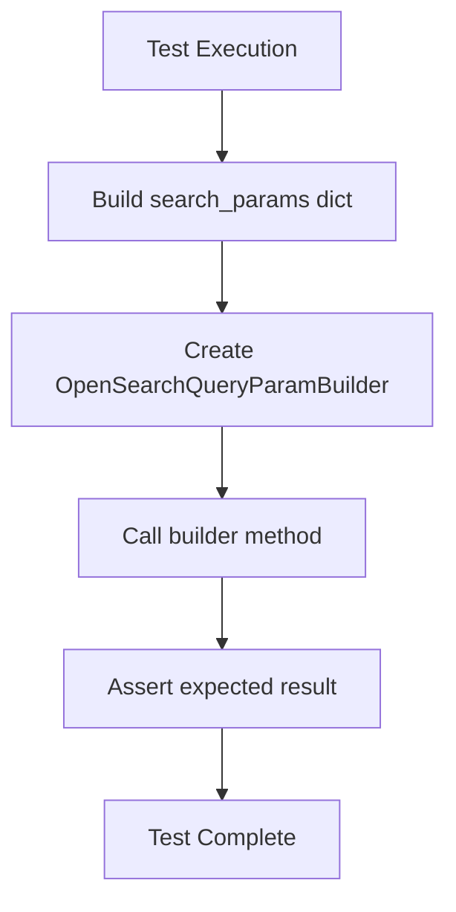
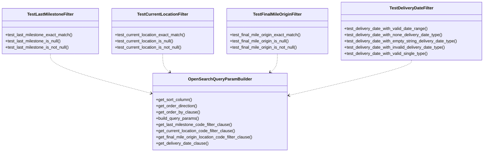
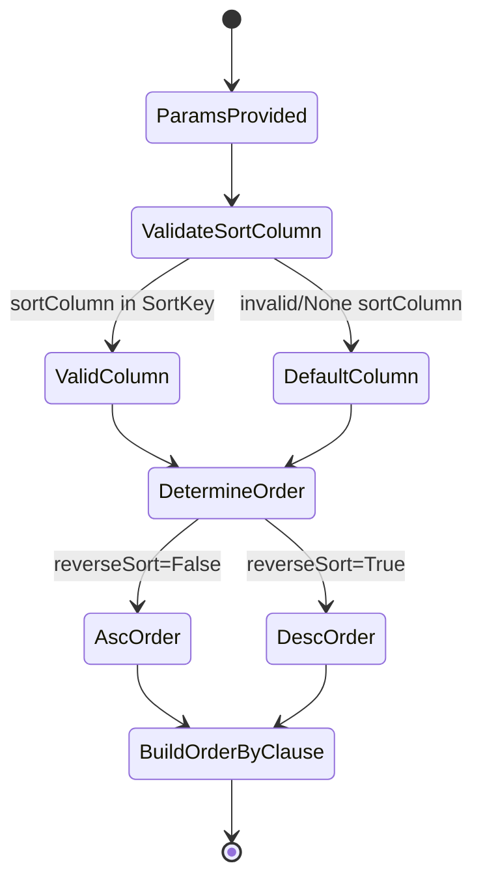
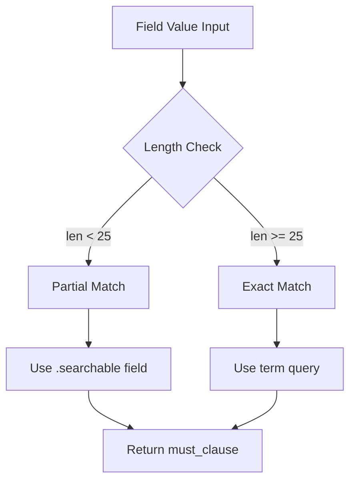
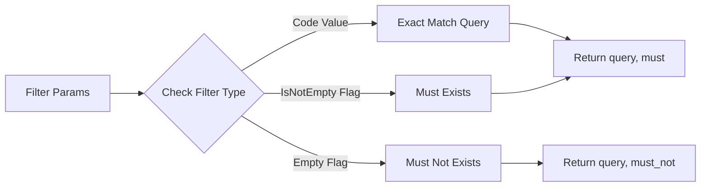
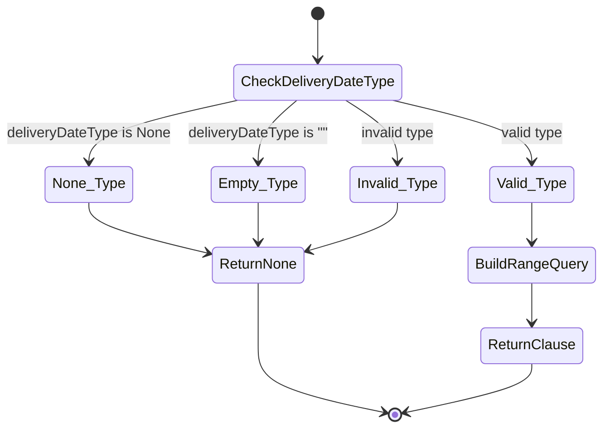

# Diagram: platform/partview_core/partview_service/partview_service/tests/unit/core/business/open_search/test_OpenSearchQueryParamBuilder.py

> Auto-generated by Obscura crawlers

## Diagram 1

### SVG

<svg id="container" width="304.28125" xmlns="http://www.w3.org/2000/svg" class="flowchart" height="614" viewBox="0 0 304.28125 614" role="graphics-document document" aria-roledescription="flowchart-v2"><g><marker id="container_flowchart-v2-pointEnd" class="marker flowchart-v2" viewBox="0 0 10 10" refX="5" refY="5" markerUnits="userSpaceOnUse" markerWidth="8" markerHeight="8" orient="auto"><path d="M 0 0 L 10 5 L 0 10 z" class="arrowMarkerPath" style="stroke-width: 1; stroke-dasharray: 1, 0;"></path></marker><marker id="container_flowchart-v2-pointStart" class="marker flowchart-v2" viewBox="0 0 10 10" refX="4.5" refY="5" markerUnits="userSpaceOnUse" markerWidth="8" markerHeight="8" orient="auto"><path d="M 0 5 L 10 10 L 10 0 z" class="arrowMarkerPath" style="stroke-width: 1; stroke-dasharray: 1, 0;"></path></marker><marker id="container_flowchart-v2-circleEnd" class="marker flowchart-v2" viewBox="0 0 10 10" refX="11" refY="5" markerUnits="userSpaceOnUse" markerWidth="11" markerHeight="11" orient="auto"><circle cx="5" cy="5" r="5" class="arrowMarkerPath" style="stroke-width: 1; stroke-dasharray: 1, 0;"></circle></marker><marker id="container_flowchart-v2-circleStart" class="marker flowchart-v2" viewBox="0 0 10 10" refX="-1" refY="5" markerUnits="userSpaceOnUse" markerWidth="11" markerHeight="11" orient="auto"><circle cx="5" cy="5" r="5" class="arrowMarkerPath" style="stroke-width: 1; stroke-dasharray: 1, 0;"></circle></marker><marker id="container_flowchart-v2-crossEnd" class="marker cross flowchart-v2" viewBox="0 0 11 11" refX="12" refY="5.2" markerUnits="userSpaceOnUse" markerWidth="11" markerHeight="11" orient="auto"><path d="M 1,1 l 9,9 M 10,1 l -9,9" class="arrowMarkerPath" style="stroke-width: 2; stroke-dasharray: 1, 0;"></path></marker><marker id="container_flowchart-v2-crossStart" class="marker cross flowchart-v2" viewBox="0 0 11 11" refX="-1" refY="5.2" markerUnits="userSpaceOnUse" markerWidth="11" markerHeight="11" orient="auto"><path d="M 1,1 l 9,9 M 10,1 l -9,9" class="arrowMarkerPath" style="stroke-width: 2; stroke-dasharray: 1, 0;"></path></marker><g class="root"><g class="clusters"></g><g class="edgePaths"><path d="M152.141,62L152.141,66.167C152.141,70.333,152.141,78.667,152.141,86.333C152.141,94,152.141,101,152.141,104.5L152.141,108" id="L_Start_BuildParams_0" class="edge-thickness-normal edge-pattern-solid edge-thickness-normal edge-pattern-solid flowchart-link" style=";" data-edge="true" data-et="edge" data-id="L_Start_BuildParams_0" data-points="W3sieCI6MTUyLjE0MDYyNSwieSI6NjJ9LHsieCI6MTUyLjE0MDYyNSwieSI6ODd9LHsieCI6MTUyLjE0MDYyNSwieSI6MTEyfV0=" marker-end="url(#container_flowchart-v2-pointEnd)"></path><path d="M152.141,166L152.141,170.167C152.141,174.333,152.141,182.667,152.141,190.333C152.141,198,152.141,205,152.141,208.5L152.141,212" id="L_BuildParams_CreateBuilder_0" class="edge-thickness-normal edge-pattern-solid edge-thickness-normal edge-pattern-solid flowchart-link" style=";" data-edge="true" data-et="edge" data-id="L_BuildParams_CreateBuilder_0" data-points="W3sieCI6MTUyLjE0MDYyNSwieSI6MTY2fSx7IngiOjE1Mi4xNDA2MjUsInkiOjE5MX0seyJ4IjoxNTIuMTQwNjI1LCJ5IjoyMTZ9XQ==" marker-end="url(#container_flowchart-v2-pointEnd)"></path><path d="M152.141,294L152.141,298.167C152.141,302.333,152.141,310.667,152.141,318.333C152.141,326,152.141,333,152.141,336.5L152.141,340" id="L_CreateBuilder_CallMethod_0" class="edge-thickness-normal edge-pattern-solid edge-thickness-normal edge-pattern-solid flowchart-link" style=";" data-edge="true" data-et="edge" data-id="L_CreateBuilder_CallMethod_0" data-points="W3sieCI6MTUyLjE0MDYyNSwieSI6Mjk0fSx7IngiOjE1Mi4xNDA2MjUsInkiOjMxOX0seyJ4IjoxNTIuMTQwNjI1LCJ5IjozNDR9XQ==" marker-end="url(#container_flowchart-v2-pointEnd)"></path><path d="M152.141,398L152.141,402.167C152.141,406.333,152.141,414.667,152.141,422.333C152.141,430,152.141,437,152.141,440.5L152.141,444" id="L_CallMethod_Assert_0" class="edge-thickness-normal edge-pattern-solid edge-thickness-normal edge-pattern-solid flowchart-link" style=";" data-edge="true" data-et="edge" data-id="L_CallMethod_Assert_0" data-points="W3sieCI6MTUyLjE0MDYyNSwieSI6Mzk4fSx7IngiOjE1Mi4xNDA2MjUsInkiOjQyM30seyJ4IjoxNTIuMTQwNjI1LCJ5Ijo0NDh9XQ==" marker-end="url(#container_flowchart-v2-pointEnd)"></path><path d="M152.141,502L152.141,506.167C152.141,510.333,152.141,518.667,152.141,526.333C152.141,534,152.141,541,152.141,544.5L152.141,548" id="L_Assert_End_0" class="edge-thickness-normal edge-pattern-solid edge-thickness-normal edge-pattern-solid flowchart-link" style=";" data-edge="true" data-et="edge" data-id="L_Assert_End_0" data-points="W3sieCI6MTUyLjE0MDYyNSwieSI6NTAyfSx7IngiOjE1Mi4xNDA2MjUsInkiOjUyN30seyJ4IjoxNTIuMTQwNjI1LCJ5Ijo1NTJ9XQ==" marker-end="url(#container_flowchart-v2-pointEnd)"></path></g><g class="edgeLabels"><g class="edgeLabel"><g class="label" data-id="L_Start_BuildParams_0" transform="translate(0, 0)"><foreignObject width="0" height="0">

</foreignObject></g></g><g class="edgeLabel"><g class="label" data-id="L_BuildParams_CreateBuilder_0" transform="translate(0, 0)"><foreignObject width="0" height="0">

</foreignObject></g></g><g class="edgeLabel"><g class="label" data-id="L_CreateBuilder_CallMethod_0" transform="translate(0, 0)"><foreignObject width="0" height="0">

</foreignObject></g></g><g class="edgeLabel"><g class="label" data-id="L_CallMethod_Assert_0" transform="translate(0, 0)"><foreignObject width="0" height="0">

</foreignObject></g></g><g class="edgeLabel"><g class="label" data-id="L_Assert_End_0" transform="translate(0, 0)"><foreignObject width="0" height="0">

</foreignObject></g></g></g><g class="nodes"><g class="node default" id="flowchart-Start-0" transform="translate(152.140625, 35)"><rect class="basic label-container" style="" x="-82.15625" y="-27" width="164.3125" height="54"></rect><g class="label" style="" transform="translate(-52.15625, -12)"><rect></rect><foreignObject width="104.3125" height="24">

Test Execution

</foreignObject></g></g><g class="node default" id="flowchart-BuildParams-1" transform="translate(152.140625, 139)"><rect class="basic label-container" style="" x="-121.5234375" y="-27" width="243.046875" height="54"></rect><g class="label" style="" transform="translate(-91.5234375, -12)"><rect></rect><foreignObject width="183.046875" height="24">

Build search_params dict

</foreignObject></g></g><g class="node default" id="flowchart-CreateBuilder-3" transform="translate(152.140625, 255)"><rect class="basic label-container" style="" x="-144.140625" y="-39" width="288.28125" height="78"></rect><g class="label" style="" transform="translate(-114.140625, -24)"><rect></rect><foreignObject width="228.28125" height="48">

Create OpenSearchQueryParamBuilder

</foreignObject></g></g><g class="node default" id="flowchart-CallMethod-5" transform="translate(152.140625, 371)"><rect class="basic label-container" style="" x="-102.0546875" y="-27" width="204.109375" height="54"></rect><g class="label" style="" transform="translate(-72.0546875, -12)"><rect></rect><foreignObject width="144.109375" height="24">

Call builder method

</foreignObject></g></g><g class="node default" id="flowchart-Assert-7" transform="translate(152.140625, 475)"><rect class="basic label-container" style="" x="-110.40625" y="-27" width="220.8125" height="54"></rect><g class="label" style="" transform="translate(-80.40625, -12)"><rect></rect><foreignObject width="160.8125" height="24">

Assert expected result

</foreignObject></g></g><g class="node default" id="flowchart-End-9" transform="translate(152.140625, 579)"><rect class="basic label-container" style="" x="-81.1953125" y="-27" width="162.390625" height="54"></rect><g class="label" style="" transform="translate(-51.1953125, -12)"><rect></rect><foreignObject width="102.390625" height="24">

Test Complete

</foreignObject></g></g></g></g></g></svg>

## Diagram 2

### SVG

<svg id="container" width="1857.2265625" xmlns="http://www.w3.org/2000/svg" class="classDiagram" height="582" viewBox="0 0 1857.2265625 582" role="graphics-document document" aria-roledescription="class"><g><defs><marker id="container_class-aggregationStart" class="marker aggregation class" refX="18" refY="7" markerWidth="190" markerHeight="240" orient="auto"><path d="M 18,7 L9,13 L1,7 L9,1 Z"></path></marker></defs><defs><marker id="container_class-aggregationEnd" class="marker aggregation class" refX="1" refY="7" markerWidth="20" markerHeight="28" orient="auto"><path d="M 18,7 L9,13 L1,7 L9,1 Z"></path></marker></defs><defs><marker id="container_class-extensionStart" class="marker extension class" refX="18" refY="7" markerWidth="190" markerHeight="240" orient="auto"><path d="M 1,7 L18,13 V 1 Z"></path></marker></defs><defs><marker id="container_class-extensionEnd" class="marker extension class" refX="1" refY="7" markerWidth="20" markerHeight="28" orient="auto"><path d="M 1,1 V 13 L18,7 Z"></path></marker></defs><defs><marker id="container_class-compositionStart" class="marker composition class" refX="18" refY="7" markerWidth="190" markerHeight="240" orient="auto"><path d="M 18,7 L9,13 L1,7 L9,1 Z"></path></marker></defs><defs><marker id="container_class-compositionEnd" class="marker composition class" refX="1" refY="7" markerWidth="20" markerHeight="28" orient="auto"><path d="M 18,7 L9,13 L1,7 L9,1 Z"></path></marker></defs><defs><marker id="container_class-dependencyStart" class="marker dependency class" refX="6" refY="7" markerWidth="190" markerHeight="240" orient="auto"><path d="M 5,7 L9,13 L1,7 L9,1 Z"></path></marker></defs><defs><marker id="container_class-dependencyEnd" class="marker dependency class" refX="13" refY="7" markerWidth="20" markerHeight="28" orient="auto"><path d="M 18,7 L9,13 L14,7 L9,1 Z"></path></marker></defs><defs><marker id="container_class-lollipopStart" class="marker lollipop class" refX="13" refY="7" markerWidth="190" markerHeight="240" orient="auto"><circle stroke="black" fill="transparent" cx="7" cy="7" r="6"></circle></marker></defs><defs><marker id="container_class-lollipopEnd" class="marker lollipop class" refX="1" refY="7" markerWidth="190" markerHeight="240" orient="auto"><circle stroke="black" fill="transparent" cx="7" cy="7" r="6"></circle></marker></defs><g class="root"><g class="clusters"></g><g class="edgePaths"><path d="M192.531,206L192.531,214.167C192.531,222.333,192.531,238.667,256.786,263.864C321.041,289.06,449.55,323.121,513.805,340.151L578.06,357.181" id="id_TestLastMilestoneFilter_OpenSearchQueryParamBuilder_1" class="edge-thickness-normal edge-pattern-dashed relation" style=";;;" data-edge="true" data-et="edge" data-id="id_TestLastMilestoneFilter_OpenSearchQueryParamBuilder_1" data-points="W3sieCI6MTkyLjUzMTI1LCJ5IjoyMDZ9LHsieCI6MTkyLjUzMTI1LCJ5IjoyNTV9LHsieCI6NTgzLjg1OTM3NSwieSI6MzU4LjcxODQ4ODkxMjQzMTF9XQ==" marker-end="url(#container_class-dependencyEnd)"></path><path d="M622.043,206L622.043,214.167C622.043,222.333,622.043,238.667,626.572,250.383C631.101,262.1,640.158,269.199,644.687,272.749L649.216,276.299" id="id_TestCurrentLocationFilter_OpenSearchQueryParamBuilder_2" class="edge-thickness-normal edge-pattern-dashed relation" style=";;;" data-edge="true" data-et="edge" data-id="id_TestCurrentLocationFilter_OpenSearchQueryParamBuilder_2" data-points="W3sieCI6NjIyLjA0Mjk2ODc1LCJ5IjoyMDZ9LHsieCI6NjIyLjA0Mjk2ODc1LCJ5IjoyNTV9LHsieCI6NjUzLjkzODUyMTk4NDAxMTcsInkiOjI4MH1d" marker-end="url(#container_class-dependencyEnd)"></path><path d="M1060.926,206L1060.926,214.167C1060.926,222.333,1060.926,238.667,1056.397,250.383C1051.868,262.1,1042.81,269.199,1038.281,272.749L1033.753,276.299" id="id_TestFinalMileOriginFilter_OpenSearchQueryParamBuilder_3" class="edge-thickness-normal edge-pattern-dashed relation" style=";;;" data-edge="true" data-et="edge" data-id="id_TestFinalMileOriginFilter_OpenSearchQueryParamBuilder_3" data-points="W3sieCI6MTA2MC45MjU3ODEyNSwieSI6MjA2fSx7IngiOjEwNjAuOTI1NzgxMjUsInkiOjI1NX0seyJ4IjoxMDI5LjAzMDIyODAxNTk4ODMsInkiOjI4MH1d" marker-end="url(#container_class-dependencyEnd)"></path><path d="M1577.027,230L1577.027,234.167C1577.027,238.333,1577.027,246.667,1498.348,269.232C1419.669,291.797,1262.31,328.594,1183.631,346.992L1104.952,365.391" id="id_TestDeliveryDateFilter_OpenSearchQueryParamBuilder_4" class="edge-thickness-normal edge-pattern-dashed relation" style=";;;" data-edge="true" data-et="edge" data-id="id_TestDeliveryDateFilter_OpenSearchQueryParamBuilder_4" data-points="W3sieCI6MTU3Ny4wMjczNDM3NSwieSI6MjMwfSx7IngiOjE1NzcuMDI3MzQzNzUsInkiOjI1NX0seyJ4IjoxMDk5LjEwOTM3NSwieSI6MzY2Ljc1Njc0ODU3NTQwNH1d" marker-end="url(#container_class-dependencyEnd)"></path></g><g class="edgeLabels"><g class="edgeLabel"><g class="label" data-id="id_TestLastMilestoneFilter_OpenSearchQueryParamBuilder_1" transform="translate(0, 0)"><foreignObject width="0" height="0">

</foreignObject></g></g><g class="edgeLabel"><g class="label" data-id="id_TestCurrentLocationFilter_OpenSearchQueryParamBuilder_2" transform="translate(0, 0)"><foreignObject width="0" height="0">

</foreignObject></g></g><g class="edgeLabel"><g class="label" data-id="id_TestFinalMileOriginFilter_OpenSearchQueryParamBuilder_3" transform="translate(0, 0)"><foreignObject width="0" height="0">

</foreignObject></g></g><g class="edgeLabel"><g class="label" data-id="id_TestDeliveryDateFilter_OpenSearchQueryParamBuilder_4" transform="translate(0, 0)"><foreignObject width="0" height="0">

</foreignObject></g></g></g><g class="nodes"><g class="node default" id="classId-OpenSearchQueryParamBuilder-0" transform="translate(841.484375, 427)"><g class="basic label-container"><path d="M-257.625 -147 L257.625 -147 L257.625 147 L-257.625 147" stroke="none" stroke-width="0" fill="#ECECFF" style=""></path><path d="M-257.625 -147 C-120.60235643796204 -147, 16.420287124075912 -147, 257.625 -147 M-257.625 -147 C-142.6002848629714 -147, -27.575569725942785 -147, 257.625 -147 M257.625 -147 C257.625 -60.1731500651012, 257.625 26.653699869797606, 257.625 147 M257.625 -147 C257.625 -70.74568575721118, 257.625 5.5086284855776455, 257.625 147 M257.625 147 C76.10323309373598 147, -105.41853381252804 147, -257.625 147 M257.625 147 C121.40265337852114 147, -14.819693242957726 147, -257.625 147 M-257.625 147 C-257.625 41.341162439293115, -257.625 -64.31767512141377, -257.625 -147 M-257.625 147 C-257.625 54.70237998937867, -257.625 -37.59524002124266, -257.625 -147" stroke="#9370DB" stroke-width="1.3" fill="none" stroke-dasharray="0 0" style=""></path></g><g class="annotation-group text" transform="translate(0, -123)"></g><g class="label-group text" transform="translate(-115.28125, -123)"><g class="label" style="font-weight: bolder" transform="translate(0,-12)"><foreignObject width="230.5625" height="24">

OpenSearchQueryParamBuilder

</foreignObject></g></g><g class="members-group text" transform="translate(-245.625, -75)"></g><g class="methods-group text" transform="translate(-245.625, -45)"><g class="label" style="" transform="translate(0,-12)"><foreignObject width="139.765625" height="24">

+get_sort_column()

</foreignObject></g><g class="label" style="" transform="translate(0,12)"><foreignObject width="160.296875" height="24">

+get_order_direction()

</foreignObject></g><g class="label" style="" transform="translate(0,36)"><foreignObject width="166.765625" height="24">

+get_order_by_clause()

</foreignObject></g><g class="label" style="" transform="translate(0,60)"><foreignObject width="166.90625" height="24">

+build_query_params()

</foreignObject></g><g class="label" style="" transform="translate(0,84)"><foreignObject width="293.625" height="24">

+get_last_milestone_code_filter_clause()

</foreignObject></g><g class="label" style="" transform="translate(0,108)"><foreignObject width="306.921875" height="24">

+get_current_location_code_filter_clause()

</foreignObject></g><g class="label" style="" transform="translate(0,132)"><foreignObject width="375.96875" height="24">

+get_final_mile_origin_location_code_filter_clause()

</foreignObject></g><g class="label" style="" transform="translate(0,156)"><foreignObject width="201.171875" height="24">

+get_delivery_date_clause()

</foreignObject></g></g><g class="divider" style=""><path d="M-257.625 -99 C-135.20153503069565 -99, -12.778070061391304 -99, 257.625 -99 M-257.625 -99 C-137.31252341585747 -99, -17.00004683171491 -99, 257.625 -99" stroke="#9370DB" stroke-width="1.3" fill="none" stroke-dasharray="0 0" style=""></path></g><g class="divider" style=""><path d="M-257.625 -75 C-137.87365794650975 -75, -18.122315893019476 -75, 257.625 -75 M-257.625 -75 C-71.08047342112309 -75, 115.46405315775382 -75, 257.625 -75" stroke="#9370DB" stroke-width="1.3" fill="none" stroke-dasharray="0 0" style=""></path></g></g><g class="node default" id="classId-TestLastMilestoneFilter-1" transform="translate(192.53125, 119)"><g class="basic label-container"><path d="M-184.53125 -87 L184.53125 -87 L184.53125 87 L-184.53125 87" stroke="none" stroke-width="0" fill="#ECECFF" style=""></path><path d="M-184.53125 -87 C-53.44805019759187 -87, 77.63514960481626 -87, 184.53125 -87 M-184.53125 -87 C-79.99977972803207 -87, 24.531690543935866 -87, 184.53125 -87 M184.53125 -87 C184.53125 -20.925254800171473, 184.53125 45.149490399657054, 184.53125 87 M184.53125 -87 C184.53125 -51.70738575188165, 184.53125 -16.414771503763305, 184.53125 87 M184.53125 87 C93.25030434232697 87, 1.9693586846539404 87, -184.53125 87 M184.53125 87 C50.31690204742378 87, -83.89744590515244 87, -184.53125 87 M-184.53125 87 C-184.53125 27.895541716111772, -184.53125 -31.208916567776456, -184.53125 -87 M-184.53125 87 C-184.53125 28.002433783945015, -184.53125 -30.99513243210997, -184.53125 -87" stroke="#9370DB" stroke-width="1.3" fill="none" stroke-dasharray="0 0" style=""></path></g><g class="annotation-group text" transform="translate(0, -63)"></g><g class="label-group text" transform="translate(-85.203125, -63)"><g class="label" style="font-weight: bolder" transform="translate(0,-12)"><foreignObject width="170.40625" height="24">

TestLastMilestoneFilter

</foreignObject></g></g><g class="members-group text" transform="translate(-172.53125, -15)"></g><g class="methods-group text" transform="translate(-172.53125, 15)"><g class="label" style="" transform="translate(0,-12)"><foreignObject width="259.859375" height="24">

+test_last_milestone_exact_match()

</foreignObject></g><g class="label" style="" transform="translate(0,12)"><foreignObject width="216.71875" height="24">

+test_last_milestone_is_null()

</foreignObject></g><g class="label" style="" transform="translate(0,36)"><foreignObject width="249.53125" height="24">

+test_last_milestone_is_not_null()

</foreignObject></g></g><g class="divider" style=""><path d="M-184.53125 -39 C-57.26364983441813 -39, 70.00395033116374 -39, 184.53125 -39 M-184.53125 -39 C-62.48019114886897 -39, 59.57086770226206 -39, 184.53125 -39" stroke="#9370DB" stroke-width="1.3" fill="none" stroke-dasharray="0 0" style=""></path></g><g class="divider" style=""><path d="M-184.53125 -15 C-52.21601820804693 -15, 80.09921358390613 -15, 184.53125 -15 M-184.53125 -15 C-74.88259859097047 -15, 34.76605281805905 -15, 184.53125 -15" stroke="#9370DB" stroke-width="1.3" fill="none" stroke-dasharray="0 0" style=""></path></g></g><g class="node default" id="classId-TestCurrentLocationFilter-2" transform="translate(622.04296875, 119)"><g class="basic label-container"><path d="M-194.98046875 -87 L194.98046875 -87 L194.98046875 87 L-194.98046875 87" stroke="none" stroke-width="0" fill="#ECECFF" style=""></path><path d="M-194.98046875 -87 C-73.81766686952909 -87, 47.34513501094182 -87, 194.98046875 -87 M-194.98046875 -87 C-82.9812509405254 -87, 29.017966868949202 -87, 194.98046875 -87 M194.98046875 -87 C194.98046875 -40.37440276986784, 194.98046875 6.2511944602643155, 194.98046875 87 M194.98046875 -87 C194.98046875 -50.50394813231939, 194.98046875 -14.007896264638774, 194.98046875 87 M194.98046875 87 C114.71910526101917 87, 34.45774177203833 87, -194.98046875 87 M194.98046875 87 C116.93273792042947 87, 38.88500709085895 87, -194.98046875 87 M-194.98046875 87 C-194.98046875 48.39109603162559, -194.98046875 9.782192063251173, -194.98046875 -87 M-194.98046875 87 C-194.98046875 21.684745976070644, -194.98046875 -43.63050804785871, -194.98046875 -87" stroke="#9370DB" stroke-width="1.3" fill="none" stroke-dasharray="0 0" style=""></path></g><g class="annotation-group text" transform="translate(0, -63)"></g><g class="label-group text" transform="translate(-92.8046875, -63)"><g class="label" style="font-weight: bolder" transform="translate(0,-12)"><foreignObject width="185.609375" height="24">

TestCurrentLocationFilter

</foreignObject></g></g><g class="members-group text" transform="translate(-182.98046875, -15)"></g><g class="methods-group text" transform="translate(-182.98046875, 15)"><g class="label" style="" transform="translate(0,-12)"><foreignObject width="273.15625" height="24">

+test_current_location_exact_match()

</foreignObject></g><g class="label" style="" transform="translate(0,12)"><foreignObject width="230.015625" height="24">

+test_current_location_is_null()

</foreignObject></g><g class="label" style="" transform="translate(0,36)"><foreignObject width="262.828125" height="24">

+test_current_location_is_not_null()

</foreignObject></g></g><g class="divider" style=""><path d="M-194.98046875 -39 C-46.16541732658962 -39, 102.64963409682076 -39, 194.98046875 -39 M-194.98046875 -39 C-47.36278909471983 -39, 100.25489056056034 -39, 194.98046875 -39" stroke="#9370DB" stroke-width="1.3" fill="none" stroke-dasharray="0 0" style=""></path></g><g class="divider" style=""><path d="M-194.98046875 -15 C-106.22437277340337 -15, -17.468276796806748 -15, 194.98046875 -15 M-194.98046875 -15 C-95.11645792677155 -15, 4.747552896456909 -15, 194.98046875 -15" stroke="#9370DB" stroke-width="1.3" fill="none" stroke-dasharray="0 0" style=""></path></g></g><g class="node default" id="classId-TestFinalMileOriginFilter-3" transform="translate(1060.92578125, 119)"><g class="basic label-container"><path d="M-193.90234375 -87 L193.90234375 -87 L193.90234375 87 L-193.90234375 87" stroke="none" stroke-width="0" fill="#ECECFF" style=""></path><path d="M-193.90234375 -87 C-38.92823910641624 -87, 116.04586553716751 -87, 193.90234375 -87 M-193.90234375 -87 C-102.5853735696386 -87, -11.26840338927721 -87, 193.90234375 -87 M193.90234375 -87 C193.90234375 -24.270474425129684, 193.90234375 38.45905114974063, 193.90234375 87 M193.90234375 -87 C193.90234375 -30.904193541175502, 193.90234375 25.191612917648996, 193.90234375 87 M193.90234375 87 C113.51067966669585 87, 33.1190155833917 87, -193.90234375 87 M193.90234375 87 C66.2163269869286 87, -61.469689776142786 87, -193.90234375 87 M-193.90234375 87 C-193.90234375 34.08890055483775, -193.90234375 -18.8221988903245, -193.90234375 -87 M-193.90234375 87 C-193.90234375 49.74479418604651, -193.90234375 12.489588372093024, -193.90234375 -87" stroke="#9370DB" stroke-width="1.3" fill="none" stroke-dasharray="0 0" style=""></path></g><g class="annotation-group text" transform="translate(0, -63)"></g><g class="label-group text" transform="translate(-88.8984375, -63)"><g class="label" style="font-weight: bolder" transform="translate(0,-12)"><foreignObject width="177.796875" height="24">

TestFinalMileOriginFilter

</foreignObject></g></g><g class="members-group text" transform="translate(-181.90234375, -15)"></g><g class="methods-group text" transform="translate(-181.90234375, 15)"><g class="label" style="" transform="translate(0,-12)"><foreignObject width="274.90625" height="24">

+test_final_mile_origin_exact_match()

</foreignObject></g><g class="label" style="" transform="translate(0,12)"><foreignObject width="231.75" height="24">

+test_final_mile_origin_is_null()

</foreignObject></g><g class="label" style="" transform="translate(0,36)"><foreignObject width="264.5625" height="24">

+test_final_mile_origin_is_not_null()

</foreignObject></g></g><g class="divider" style=""><path d="M-193.90234375 -39 C-50.5034297558725 -39, 92.895484238255 -39, 193.90234375 -39 M-193.90234375 -39 C-71.9206191926557 -39, 50.061105364688586 -39, 193.90234375 -39" stroke="#9370DB" stroke-width="1.3" fill="none" stroke-dasharray="0 0" style=""></path></g><g class="divider" style=""><path d="M-193.90234375 -15 C-88.17575314423641 -15, 17.55083746152718 -15, 193.90234375 -15 M-193.90234375 -15 C-80.62478376575125 -15, 32.65277621849751 -15, 193.90234375 -15" stroke="#9370DB" stroke-width="1.3" fill="none" stroke-dasharray="0 0" style=""></path></g></g><g class="node default" id="classId-TestDeliveryDateFilter-4" transform="translate(1577.02734375, 119)"><g class="basic label-container"><path d="M-272.19921875 -111 L272.19921875 -111 L272.19921875 111 L-272.19921875 111" stroke="none" stroke-width="0" fill="#ECECFF" style=""></path><path d="M-272.19921875 -111 C-105.75065587715304 -111, 60.69790699569393 -111, 272.19921875 -111 M-272.19921875 -111 C-57.34692095200538 -111, 157.50537684598925 -111, 272.19921875 -111 M272.19921875 -111 C272.19921875 -30.348958907671516, 272.19921875 50.30208218465697, 272.19921875 111 M272.19921875 -111 C272.19921875 -53.169420608321786, 272.19921875 4.661158783356427, 272.19921875 111 M272.19921875 111 C151.49875606139366 111, 30.798293372787327 111, -272.19921875 111 M272.19921875 111 C160.7719979565609 111, 49.34477716312182 111, -272.19921875 111 M-272.19921875 111 C-272.19921875 62.7831096771154, -272.19921875 14.566219354230796, -272.19921875 -111 M-272.19921875 111 C-272.19921875 54.21759436506354, -272.19921875 -2.5648112698729193, -272.19921875 -111" stroke="#9370DB" stroke-width="1.3" fill="none" stroke-dasharray="0 0" style=""></path></g><g class="annotation-group text" transform="translate(0, -87)"></g><g class="label-group text" transform="translate(-81.0546875, -87)"><g class="label" style="font-weight: bolder" transform="translate(0,-12)"><foreignObject width="162.109375" height="24">

TestDeliveryDateFilter

</foreignObject></g></g><g class="members-group text" transform="translate(-260.19921875, -39)"></g><g class="methods-group text" transform="translate(-260.19921875, -9)"><g class="label" style="" transform="translate(0,-12)"><foreignObject width="322.484375" height="24">

+test_delivery_date_with_valid_date_range()

</foreignObject></g><g class="label" style="" transform="translate(0,12)"><foreignObject width="381.109375" height="24">

+test_delivery_date_with_none_delivery_date_type()

</foreignObject></g><g class="label" style="" transform="translate(0,36)"><foreignObject width="439.34375" height="24">

+test_delivery_date_with_empty_string_delivery_date_type()

</foreignObject></g><g class="label" style="" transform="translate(0,60)"><foreignObject width="393.328125" height="24">

+test_delivery_date_with_invalid_delivery_date_type()

</foreignObject></g><g class="label" style="" transform="translate(0,84)"><foreignObject width="324.28125" height="24">

+test_delivery_date_with_valid_single_type()

</foreignObject></g></g><g class="divider" style=""><path d="M-272.19921875 -63 C-142.30787031623453 -63, -12.416521882469056 -63, 272.19921875 -63 M-272.19921875 -63 C-127.36155213906221 -63, 17.476114471875576 -63, 272.19921875 -63" stroke="#9370DB" stroke-width="1.3" fill="none" stroke-dasharray="0 0" style=""></path></g><g class="divider" style=""><path d="M-272.19921875 -39 C-111.12540843655586 -39, 49.94840187688828 -39, 272.19921875 -39 M-272.19921875 -39 C-87.47974071576917 -39, 97.23973731846166 -39, 272.19921875 -39" stroke="#9370DB" stroke-width="1.3" fill="none" stroke-dasharray="0 0" style=""></path></g></g></g></g></g></svg>

## Diagram 3

### SVG

<svg id="container" width="381.4375" xmlns="http://www.w3.org/2000/svg" class="statediagram" height="682" viewBox="0 0 381.4375 682" role="graphics-document document" aria-roledescription="stateDiagram"><g><defs><marker id="container_stateDiagram-barbEnd" refX="19" refY="7" markerWidth="20" markerHeight="14" markerUnits="userSpaceOnUse" orient="auto"><path d="M 19,7 L9,13 L14,7 L9,1 Z"></path></marker></defs><g class="root"><g class="clusters"></g><g class="edgePaths"><path d="M185.336,22L185.336,26.167C185.336,30.333,185.336,38.667,185.419,47.083C185.503,55.5,185.669,64,185.753,68.25L185.836,72.5" id="edge0" class="edge-thickness-normal edge-pattern-solid transition" style="fill:none;;;fill:none" data-edge="true" data-et="edge" data-id="edge0" data-points="W3sieCI6MTg1LjMzNTkzNzUsInkiOjIyfSx7IngiOjE4NS4zMzU5Mzc1LCJ5Ijo0N30seyJ4IjoxODUuODM1OTM3NSwieSI6NzIuNX1d" marker-end="url(#container_stateDiagram-barbEnd)"></path><path d="M185.836,112.5L185.753,116.583C185.669,120.667,185.503,128.833,185.503,137.167C185.503,145.5,185.669,154,185.753,158.25L185.836,162.5" id="edge1" class="edge-thickness-normal edge-pattern-solid transition" style="fill:none;;;fill:none" data-edge="true" data-et="edge" data-id="edge1" data-points="W3sieCI6MTg1LjgzNTkzNzUsInkiOjExMi41fSx7IngiOjE4NS4zMzU5Mzc1LCJ5IjoxMzd9LHsieCI6MTg1LjgzNTkzNzUsInkiOjE2Mi41fV0=" marker-end="url(#container_stateDiagram-barbEnd)"></path><path d="M152.026,202.5L141.517,208.583C131.009,214.667,109.993,226.833,99.568,239.167C89.143,251.5,89.31,264,89.393,270.25L89.477,276.5" id="edge2" class="edge-thickness-normal edge-pattern-solid transition" style="fill:none;;;fill:none" data-edge="true" data-et="edge" data-id="edge2" data-points="W3sieCI6MTUyLjAyNTYzMDQ4MjQ1NjE0LCJ5IjoyMDIuNX0seyJ4Ijo4OC45NzY1NjI1LCJ5IjoyMzl9LHsieCI6ODkuNDc2NTYyNSwieSI6Mjc2LjV9XQ==" marker-end="url(#container_stateDiagram-barbEnd)"></path><path d="M219.646,202.5L229.988,208.583C240.329,214.667,261.012,226.833,271.437,239.167C281.862,251.5,282.029,264,282.112,270.25L282.195,276.5" id="edge3" class="edge-thickness-normal edge-pattern-solid transition" style="fill:none;;;fill:none" data-edge="true" data-et="edge" data-id="edge3" data-points="W3sieCI6MjE5LjY0NjI0NDUxNzU0Mzg2LCJ5IjoyMDIuNX0seyJ4IjoyODEuNjk1MzEyNSwieSI6MjM5fSx7IngiOjI4Mi4xOTUzMTI1LCJ5IjoyNzYuNX1d" marker-end="url(#container_stateDiagram-barbEnd)"></path><path d="M89.477,316.5L89.393,320.583C89.31,324.667,89.143,332.833,98.065,341.167C106.988,349.5,124.999,358,134.004,362.25L143.01,366.5" id="edge4" class="edge-thickness-normal edge-pattern-solid transition" style="fill:none;;;fill:none" data-edge="true" data-et="edge" data-id="edge4" data-points="W3sieCI6ODkuNDc2NTYyNSwieSI6MzE2LjV9LHsieCI6ODguOTc2NTYyNSwieSI6MzQxfSx7IngiOjE0My4wMDk1NDg2MTExMTExMSwieSI6MzY2LjV9XQ==" marker-end="url(#container_stateDiagram-barbEnd)"></path><path d="M282.195,316.5L282.112,320.583C282.029,324.667,281.862,332.833,272.94,341.167C264.018,349.5,246.34,358,237.501,362.25L228.662,366.5" id="edge5" class="edge-thickness-normal edge-pattern-solid transition" style="fill:none;;;fill:none" data-edge="true" data-et="edge" data-id="edge5" data-points="W3sieCI6MjgyLjE5NTMxMjUsInkiOjMxNi41fSx7IngiOjI4MS42OTUzMTI1LCJ5IjozNDF9LHsieCI6MjI4LjY2MjMyNjM4ODg4ODg5LCJ5IjozNjYuNX1d" marker-end="url(#container_stateDiagram-barbEnd)"></path><path d="M160.363,406.5L152.426,412.583C144.488,418.667,128.613,430.833,120.759,443.167C112.905,455.5,113.072,468,113.155,474.25L113.238,480.5" id="edge6" class="edge-thickness-normal edge-pattern-solid transition" style="fill:none;;;fill:none" data-edge="true" data-et="edge" data-id="edge6" data-points="W3sieCI6MTYwLjM2MzA3NTY1Nzg5NDc0LCJ5Ijo0MDYuNX0seyJ4IjoxMTIuNzM4MjgxMjUsInkiOjQ0M30seyJ4IjoxMTMuMjM4MjgxMjUsInkiOjQ4MC41fV0=" marker-end="url(#container_stateDiagram-barbEnd)"></path><path d="M211.309,406.5L219.08,412.583C226.85,418.667,242.392,430.833,250.246,443.167C258.1,455.5,258.267,468,258.35,474.25L258.434,480.5" id="edge7" class="edge-thickness-normal edge-pattern-solid transition" style="fill:none;;;fill:none" data-edge="true" data-et="edge" data-id="edge7" data-points="W3sieCI6MjExLjMwODc5OTM0MjEwNTI2LCJ5Ijo0MDYuNX0seyJ4IjoyNTcuOTMzNTkzNzUsInkiOjQ0M30seyJ4IjoyNTguNDMzNTkzNzUsInkiOjQ4MC41fV0=" marker-end="url(#container_stateDiagram-barbEnd)"></path><path d="M113.238,520.5L113.155,524.583C113.072,528.667,112.905,536.833,119.627,545.167C126.349,553.5,139.96,562,146.765,566.25L153.57,570.5" id="edge8" class="edge-thickness-normal edge-pattern-solid transition" style="fill:none;;;fill:none" data-edge="true" data-et="edge" data-id="edge8" data-points="W3sieCI6MTEzLjIzODI4MTI1LCJ5Ijo1MjAuNX0seyJ4IjoxMTIuNzM4MjgxMjUsInkiOjU0NX0seyJ4IjoxNTMuNTcwMzEyNSwieSI6NTcwLjV9XQ==" marker-end="url(#container_stateDiagram-barbEnd)"></path><path d="M258.434,520.5L258.35,524.583C258.267,528.667,258.1,536.833,251.378,545.167C244.656,553.5,231.379,562,224.74,566.25L218.102,570.5" id="edge9" class="edge-thickness-normal edge-pattern-solid transition" style="fill:none;;;fill:none" data-edge="true" data-et="edge" data-id="edge9" data-points="W3sieCI6MjU4LjQzMzU5Mzc1LCJ5Ijo1MjAuNX0seyJ4IjoyNTcuOTMzNTkzNzUsInkiOjU0NX0seyJ4IjoyMTguMTAxNTYyNSwieSI6NTcwLjV9XQ==" marker-end="url(#container_stateDiagram-barbEnd)"></path><path d="M185.836,610.5L185.753,614.583C185.669,618.667,185.503,626.833,185.419,635.083C185.336,643.333,185.336,651.667,185.336,655.833L185.336,660" id="edge10" class="edge-thickness-normal edge-pattern-solid transition" style="fill:none;;;fill:none" data-edge="true" data-et="edge" data-id="edge10" data-points="W3sieCI6MTg1LjgzNTkzNzUsInkiOjYxMC41fSx7IngiOjE4NS4zMzU5Mzc1LCJ5Ijo2MzV9LHsieCI6MTg1LjMzNTkzNzUsInkiOjY2MH1d" marker-end="url(#container_stateDiagram-barbEnd)"></path></g><g class="edgeLabels"><g class="edgeLabel"><g class="label" data-id="edge0" transform="translate(0, 0)"><foreignObject width="0" height="0">

</foreignObject></g></g><g class="edgeLabel"><g class="label" data-id="edge1" transform="translate(0, 0)"><foreignObject width="0" height="0">

</foreignObject></g></g><g class="edgeLabel" transform="translate(88.9765625, 239)"><g class="label" data-id="edge2" transform="translate(-80.9765625, -12)"><foreignObject width="161.953125" height="24">

sortColumn in SortKey

</foreignObject></g></g><g class="edgeLabel" transform="translate(281.6953125, 239)"><g class="label" data-id="edge3" transform="translate(-91.7421875, -12)"><foreignObject width="183.484375" height="24">

invalid/None sortColumn

</foreignObject></g></g><g class="edgeLabel"><g class="label" data-id="edge4" transform="translate(0, 0)"><foreignObject width="0" height="0">

</foreignObject></g></g><g class="edgeLabel"><g class="label" data-id="edge5" transform="translate(0, 0)"><foreignObject width="0" height="0">

</foreignObject></g></g><g class="edgeLabel" transform="translate(112.73828125, 443)"><g class="label" data-id="edge6" transform="translate(-63.6796875, -12)"><foreignObject width="127.359375" height="24">

reverseSort=False

</foreignObject></g></g><g class="edgeLabel" transform="translate(257.93359375, 443)"><g class="label" data-id="edge7" transform="translate(-61.515625, -12)"><foreignObject width="123.03125" height="24">

reverseSort=True

</foreignObject></g></g><g class="edgeLabel"><g class="label" data-id="edge8" transform="translate(0, 0)"><foreignObject width="0" height="0">

</foreignObject></g></g><g class="edgeLabel"><g class="label" data-id="edge9" transform="translate(0, 0)"><foreignObject width="0" height="0">

</foreignObject></g></g><g class="edgeLabel"><g class="label" data-id="edge10" transform="translate(0, 0)"><foreignObject width="0" height="0">

</foreignObject></g></g></g><g class="nodes"><g class="node default" id="state-root_start-0" transform="translate(185.3359375, 15)"><circle class="state-start" r="7" width="14" height="14"></circle></g><g class="node  statediagram-state" id="state-ParamsProvided-1" transform="translate(185.3359375, 92)"><g class="basic label-container outer-path"><path d="M-61.4140625 -20 C-30.278937876501097 -20, 0.8561867469978068 -20, 61.4140625 -20 C61.4140625 -20, 61.4140625 -20, 61.4140625 -20 C61.559598058241214 -19.99398060478552, 61.70513361648243 -19.987961209571036, 61.82695922736166 -19.982922465033347 C61.926987363512346 -19.970453970865137, 62.02701549966302 -19.95798547669693, 62.23703545140367 -19.931806517013612 C62.32036494380119 -19.91433415983596, 62.4036944361987 -19.896861802658307, 62.641489935703994 -19.847001329696653 C62.76286699350084 -19.810865813952272, 62.88424405129769 -19.77473029820789, 63.03755984602342 -19.729086208503173 C63.18069413519674 -19.673235035555255, 63.32382842437006 -19.617383862607337, 63.422539623264846 -19.578866633275286 C63.51528413459535 -19.53352660445522, 63.60802864592584 -19.48818657563515, 63.793799465185366 -19.397368756032446 C63.87445368838752 -19.349309270603037, 63.95510791158967 -19.301249785173624, 64.14880329061214 -19.185832391312644 C64.24730686718893 -19.115502189435652, 64.34581044376571 -19.04517198755866, 64.48512606344833 -18.94570254698197 C64.56260663226323 -18.880079852627688, 64.64008720107812 -18.81445715827341, 64.8004703581287 -18.678619553365657 C64.90647014521097 -18.57261976628339, 65.01246993229324 -18.46661997920112, 65.09268205336566 -18.386407858128706 C65.1778338790446 -18.28586928752976, 65.26298570472353 -18.185330716930817, 65.35976504698196 -18.07106356344834 C65.4507536180233 -17.94362614060604, 65.54174218906464 -17.816188717763733, 65.59989489131264 -17.734740790612136 C65.64408927358593 -17.660573047443375, 65.68828365585922 -17.586405304274614, 65.81143125603245 -17.37973696518537 C65.86400098322552 -17.272203869460004, 65.9165707104186 -17.16467077373464, 65.99292913327528 -17.008477123264846 C66.02813974954748 -16.91824004738149, 66.06335036581969 -16.828002971498137, 66.14314870850318 -16.623497346023417 C66.17039404488685 -16.531981874310517, 66.19763938127052 -16.44046640259762, 66.26106382969665 -16.227427435703994 C66.2836747112064 -16.119591197026494, 66.30628559271615 -16.011754958348995, 66.34586901701361 -15.82297295140367 C66.35722900394208 -15.731837782728034, 66.36858899087055 -15.640702614052397, 66.39698496503335 -15.412896727361662 C66.40081007829383 -15.320414015417425, 66.4046351915543 -15.227931303473188, 66.4140625 -15 C66.4140625 -15, 66.4140625 -15, 66.4140625 -15 C66.4140625 -4.159005759181349, 66.4140625 6.681988481637301, 66.4140625 15 C66.4140625 15, 66.4140625 15, 66.4140625 15 C66.40923496627019 15.116719004362118, 66.40440743254038 15.233438008724235, 66.39698496503335 15.412896727361662 C66.38610950275293 15.50014481097239, 66.3752340404725 15.587392894583118, 66.34586901701361 15.822972951403669 C66.32694287122233 15.913235879627603, 66.30801672543103 16.003498807851535, 66.26106382969665 16.227427435703994 C66.2214969860629 16.360330120711875, 66.18193014242915 16.493232805719753, 66.14314870850318 16.623497346023417 C66.10882475331432 16.711462104295453, 66.07450079812547 16.799426862567493, 65.99292913327528 17.008477123264846 C65.95381512696942 17.088486101984543, 65.91470112066357 17.16849508070424, 65.81143125603245 17.379736965185366 C65.75884024803315 17.46799606450159, 65.70624924003387 17.556255163817816, 65.59989489131264 17.734740790612133 C65.50410052868044 17.86890914337287, 65.40830616604823 18.003077496133606, 65.35976504698196 18.07106356344834 C65.26157338736303 18.186998236887376, 65.16338172774411 18.302932910326415, 65.09268205336566 18.386407858128706 C64.99198346292323 18.487106448571133, 64.89128487248081 18.58780503901356, 64.8004703581287 18.678619553365657 C64.73277259400663 18.735956634796544, 64.66507482988456 18.793293716227428, 64.48512606344833 18.94570254698197 C64.4135790052293 18.996786164685204, 64.34203194701026 19.04786978238844, 64.14880329061214 19.185832391312644 C64.02639956033083 19.25876918319291, 63.90399583004952 19.331705975073177, 63.793799465185366 19.397368756032446 C63.6562835572683 19.464596186947023, 63.51876764935125 19.531823617861598, 63.422539623264846 19.578866633275286 C63.29297014131249 19.629424802020793, 63.163400659360136 19.679982970766304, 63.03755984602342 19.729086208503173 C62.91092399818722 19.76678733387521, 62.784288150351024 19.80448845924725, 62.641489935703994 19.847001329696653 C62.538195325398334 19.868659931877705, 62.43490071509268 19.890318534058757, 62.23703545140367 19.931806517013612 C62.08419331275994 19.95085826972712, 61.93135117411621 19.969910022440633, 61.82695922736166 19.982922465033347 C61.69723693570345 19.98828781870399, 61.56751464404524 19.99365317237464, 61.4140625 20 C61.4140625 20, 61.4140625 20, 61.4140625 20 C24.15762365562832 20, -13.098815188743359 20, -61.4140625 20 C-61.4140625 20, -61.4140625 20, -61.4140625 20 C-61.573209873719044 19.993417615932913, -61.73235724743809 19.986835231865825, -61.82695922736166 19.982922465033347 C-61.93177344091127 19.96985738693952, -62.03658765446089 19.95679230884569, -62.23703545140367 19.931806517013612 C-62.34636204806321 19.908883140296755, -62.455688644722755 19.8859597635799, -62.641489935703994 19.847001329696653 C-62.765040355489795 19.810218776054043, -62.888590775275595 19.77343622241143, -63.03755984602342 19.729086208503173 C-63.1681679218374 19.67812277917529, -63.298775997651376 19.627159349847407, -63.422539623264846 19.578866633275286 C-63.558796945519425 19.512254487399044, -63.695054267774005 19.445642341522802, -63.793799465185366 19.397368756032446 C-63.91512966484625 19.325071649554403, -64.03645986450714 19.252774543076363, -64.14880329061214 19.185832391312644 C-64.24423759590405 19.117693607012374, -64.33967190119597 19.049554822712107, -64.48512606344833 18.94570254698197 C-64.55061411602779 18.890236995760407, -64.61610216860723 18.834771444538845, -64.8004703581287 18.67861955336566 C-64.86371406241847 18.6153758490759, -64.92695776670823 18.552132144786142, -65.09268205336566 18.386407858128706 C-65.18102149567473 18.282105675686392, -65.26936093798378 18.177803493244078, -65.35976504698196 18.07106356344834 C-65.45562434624483 17.936804261277526, -65.5514836455077 17.80254495910671, -65.59989489131264 17.734740790612133 C-65.66621489082516 17.62344147070356, -65.73253489033769 17.512142150794986, -65.81143125603245 17.37973696518537 C-65.86498134181547 17.270198513911733, -65.91853142759848 17.1606600626381, -65.99292913327528 17.00847712326485 C-66.03995424835257 16.887962081867986, -66.08697936342986 16.767447040471126, -66.14314870850318 16.623497346023417 C-66.17978238446071 16.500446997566744, -66.21641606041823 16.377396649110068, -66.26106382969665 16.227427435703994 C-66.2820777878681 16.127207273656854, -66.30309174603956 16.026987111609717, -66.34586901701361 15.82297295140367 C-66.35649888486968 15.73769514200462, -66.36712875272573 15.65241733260557, -66.39698496503335 15.412896727361664 C-66.40285367058362 15.271004509293485, -66.40872237613388 15.129112291225304, -66.4140625 15 C-66.4140625 15, -66.4140625 15, -66.4140625 15 C-66.4140625 7.489758031298739, -66.4140625 -0.0204839374025223, -66.4140625 -15 C-66.4140625 -15, -66.4140625 -15, -66.4140625 -15 C-66.41031403966815 -15.090629414999892, -66.40656557933629 -15.181258829999786, -66.39698496503335 -15.41289672736166 C-66.38458970935314 -15.51233730984714, -66.3721944536729 -15.61177789233262, -66.34586901701361 -15.822972951403669 C-66.32797799164054 -15.90829916398337, -66.31008696626748 -15.99362537656307, -66.26106382969665 -16.227427435703994 C-66.21530307505105 -16.381135101058415, -66.16954232040545 -16.534842766412833, -66.14314870850318 -16.623497346023417 C-66.08591173444083 -16.77018313907714, -66.02867476037848 -16.916868932130864, -65.99292913327528 -17.008477123264846 C-65.94902353084466 -17.0982874685176, -65.90511792841403 -17.188097813770355, -65.81143125603245 -17.379736965185366 C-65.75410401931123 -17.475944481865227, -65.69677678259 -17.572151998545092, -65.59989489131264 -17.734740790612133 C-65.51496644436219 -17.85369048156232, -65.43003799741173 -17.972640172512506, -65.35976504698196 -18.07106356344834 C-65.28753445709837 -18.156346059771973, -65.21530386721479 -18.241628556095606, -65.09268205336566 -18.386407858128706 C-65.01520667863318 -18.46388323286119, -64.93773130390069 -18.541358607593676, -64.8004703581287 -18.678619553365657 C-64.70720231569149 -18.75761355580389, -64.61393427325427 -18.83660755824212, -64.48512606344833 -18.945702546981966 C-64.38781727880892 -19.015179683812214, -64.29050849416952 -19.084656820642458, -64.14880329061214 -19.185832391312644 C-64.0261156411919 -19.258938362278382, -63.90342799177165 -19.332044333244124, -63.793799465185366 -19.397368756032446 C-63.70243359629144 -19.442034807633696, -63.61106772739752 -19.48670085923495, -63.422539623264846 -19.578866633275286 C-63.32950923017882 -19.61516720530222, -63.23647883709279 -19.65146777732916, -63.03755984602342 -19.729086208503173 C-62.95829619924473 -19.75268401856809, -62.87903255246604 -19.776281828633007, -62.641489935703994 -19.847001329696653 C-62.55461163531211 -19.865217793661092, -62.46773333492024 -19.883434257625527, -62.23703545140367 -19.931806517013612 C-62.14231652011564 -19.943613219485854, -62.04759758882761 -19.955419921958093, -61.82695922736166 -19.982922465033347 C-61.71809479304496 -19.987425131343027, -61.609230358728254 -19.991927797652707, -61.4140625 -20 C-61.4140625 -20, -61.4140625 -20, -61.4140625 -20" stroke="none" stroke-width="0" fill="#ECECFF" style=""></path><path d="M-61.4140625 -20 C-16.349214038983135 -20, 28.71563442203373 -20, 61.4140625 -20 M-61.4140625 -20 C-34.66887228217555 -20, -7.923682064351098 -20, 61.4140625 -20 M61.4140625 -20 C61.4140625 -20, 61.4140625 -20, 61.4140625 -20 M61.4140625 -20 C61.4140625 -20, 61.4140625 -20, 61.4140625 -20 M61.4140625 -20 C61.55661707061769 -19.994103899345642, 61.69917164123539 -19.98820779869128, 61.82695922736166 -19.982922465033347 M61.4140625 -20 C61.57660341050627 -19.993277258213162, 61.73914432101255 -19.986554516426327, 61.82695922736166 -19.982922465033347 M61.82695922736166 -19.982922465033347 C61.91829005264164 -19.97153808953458, 62.00962087792161 -19.960153714035812, 62.23703545140367 -19.931806517013612 M61.82695922736166 -19.982922465033347 C61.94125317404832 -19.968675739436286, 62.055547120734985 -19.954429013839224, 62.23703545140367 -19.931806517013612 M62.23703545140367 -19.931806517013612 C62.35631164104132 -19.90679693003333, 62.475587830678975 -19.88178734305305, 62.641489935703994 -19.847001329696653 M62.23703545140367 -19.931806517013612 C62.38694397251437 -19.900374005552663, 62.53685249362508 -19.868941494091718, 62.641489935703994 -19.847001329696653 M62.641489935703994 -19.847001329696653 C62.795103603466785 -19.80126855934655, 62.94871727122958 -19.755535788996443, 63.03755984602342 -19.729086208503173 M62.641489935703994 -19.847001329696653 C62.77363273407479 -19.807660714116512, 62.90577553244558 -19.768320098536368, 63.03755984602342 -19.729086208503173 M63.03755984602342 -19.729086208503173 C63.15204370838857 -19.68441446678684, 63.266527570753716 -19.63974272507051, 63.422539623264846 -19.578866633275286 M63.03755984602342 -19.729086208503173 C63.1887421770596 -19.670094679875486, 63.33992450809579 -19.611103151247804, 63.422539623264846 -19.578866633275286 M63.422539623264846 -19.578866633275286 C63.57038064626188 -19.506591561173312, 63.718221669258924 -19.434316489071342, 63.793799465185366 -19.397368756032446 M63.422539623264846 -19.578866633275286 C63.524412802052915 -19.5290638708694, 63.62628598084098 -19.47926110846351, 63.793799465185366 -19.397368756032446 M63.793799465185366 -19.397368756032446 C63.86768582075815 -19.353342044372447, 63.94157217633093 -19.309315332712448, 64.14880329061214 -19.185832391312644 M63.793799465185366 -19.397368756032446 C63.914093317804586 -19.325689178352913, 64.0343871704238 -19.25400960067338, 64.14880329061214 -19.185832391312644 M64.14880329061214 -19.185832391312644 C64.22195637726986 -19.133602091344276, 64.29510946392759 -19.081371791375908, 64.48512606344833 -18.94570254698197 M64.14880329061214 -19.185832391312644 C64.23008486422829 -19.127798463206016, 64.31136643784443 -19.069764535099388, 64.48512606344833 -18.94570254698197 M64.48512606344833 -18.94570254698197 C64.58838091347458 -18.858250149980893, 64.69163576350081 -18.770797752979817, 64.8004703581287 -18.678619553365657 M64.48512606344833 -18.94570254698197 C64.59527692061613 -18.852409529863664, 64.70542777778391 -18.759116512745358, 64.8004703581287 -18.678619553365657 M64.8004703581287 -18.678619553365657 C64.87774162353425 -18.601348287960114, 64.95501288893979 -18.52407702255457, 65.09268205336566 -18.386407858128706 M64.8004703581287 -18.678619553365657 C64.89848408305238 -18.580605828441982, 64.99649780797607 -18.482592103518304, 65.09268205336566 -18.386407858128706 M65.09268205336566 -18.386407858128706 C65.16513604783333 -18.30086158851109, 65.237590042301 -18.215315318893474, 65.35976504698196 -18.07106356344834 M65.09268205336566 -18.386407858128706 C65.18743040887227 -18.274538686172814, 65.28217876437888 -18.162669514216923, 65.35976504698196 -18.07106356344834 M65.35976504698196 -18.07106356344834 C65.43980803958071 -17.958956377055273, 65.51985103217946 -17.8468491906622, 65.59989489131264 -17.734740790612136 M65.35976504698196 -18.07106356344834 C65.42242545525906 -17.983302201183932, 65.48508586353616 -17.89554083891952, 65.59989489131264 -17.734740790612136 M65.59989489131264 -17.734740790612136 C65.64535425345194 -17.65845013731341, 65.69081361559124 -17.582159484014685, 65.81143125603245 -17.37973696518537 M65.59989489131264 -17.734740790612136 C65.68199651205806 -17.59695649297155, 65.76409813280348 -17.459172195330968, 65.81143125603245 -17.37973696518537 M65.81143125603245 -17.37973696518537 C65.86630855409992 -17.26748365779105, 65.9211858521674 -17.155230350396735, 65.99292913327528 -17.008477123264846 M65.81143125603245 -17.37973696518537 C65.86747470983417 -17.265098248109524, 65.92351816363589 -17.150459531033682, 65.99292913327528 -17.008477123264846 M65.99292913327528 -17.008477123264846 C66.05291520305768 -16.85474600168909, 66.11290127284009 -16.701014880113334, 66.14314870850318 -16.623497346023417 M65.99292913327528 -17.008477123264846 C66.0423681329374 -16.88177582586014, 66.0918071325995 -16.755074528455427, 66.14314870850318 -16.623497346023417 M66.14314870850318 -16.623497346023417 C66.18592094269458 -16.479827943923954, 66.228693176886 -16.336158541824492, 66.26106382969665 -16.227427435703994 M66.14314870850318 -16.623497346023417 C66.1821308165009 -16.49255875339466, 66.22111292449864 -16.36162016076591, 66.26106382969665 -16.227427435703994 M66.26106382969665 -16.227427435703994 C66.29426354871164 -16.069090715298735, 66.32746326772663 -15.910753994893472, 66.34586901701361 -15.82297295140367 M66.26106382969665 -16.227427435703994 C66.29412255010647 -16.069763168481717, 66.32718127051626 -15.912098901259437, 66.34586901701361 -15.82297295140367 M66.34586901701361 -15.82297295140367 C66.36162721427685 -15.696553266711144, 66.37738541154008 -15.570133582018617, 66.39698496503335 -15.412896727361662 M66.34586901701361 -15.82297295140367 C66.36155914408785 -15.697099357846238, 66.37724927116207 -15.571225764288803, 66.39698496503335 -15.412896727361662 M66.39698496503335 -15.412896727361662 C66.40286604114625 -15.270705416664832, 66.40874711725914 -15.128514105968, 66.4140625 -15 M66.39698496503335 -15.412896727361662 C66.40156159741785 -15.302243958236273, 66.40613822980234 -15.191591189110886, 66.4140625 -15 M66.4140625 -15 C66.4140625 -15, 66.4140625 -15, 66.4140625 -15 M66.4140625 -15 C66.4140625 -15, 66.4140625 -15, 66.4140625 -15 M66.4140625 -15 C66.4140625 -8.524662322111283, 66.4140625 -2.0493246442225637, 66.4140625 15 M66.4140625 -15 C66.4140625 -3.9193645648043454, 66.4140625 7.161270870391309, 66.4140625 15 M66.4140625 15 C66.4140625 15, 66.4140625 15, 66.4140625 15 M66.4140625 15 C66.4140625 15, 66.4140625 15, 66.4140625 15 M66.4140625 15 C66.41036886722165 15.089303806974351, 66.40667523444328 15.178607613948705, 66.39698496503335 15.412896727361662 M66.4140625 15 C66.40758842354475 15.156528737097064, 66.4011143470895 15.313057474194126, 66.39698496503335 15.412896727361662 M66.39698496503335 15.412896727361662 C66.37823699860698 15.56330174924695, 66.35948903218059 15.713706771132237, 66.34586901701361 15.822972951403669 M66.39698496503335 15.412896727361662 C66.38395883429085 15.517398486904456, 66.37093270354836 15.621900246447249, 66.34586901701361 15.822972951403669 M66.34586901701361 15.822972951403669 C66.3227067663768 15.93343879002667, 66.29954451573998 16.04390462864967, 66.26106382969665 16.227427435703994 M66.34586901701361 15.822972951403669 C66.31255121783505 15.981872821931887, 66.27923341865649 16.140772692460107, 66.26106382969665 16.227427435703994 M66.26106382969665 16.227427435703994 C66.21513755066715 16.38169108766323, 66.16921127163764 16.535954739622465, 66.14314870850318 16.623497346023417 M66.26106382969665 16.227427435703994 C66.21398044650304 16.385577732038165, 66.16689706330943 16.543728028372335, 66.14314870850318 16.623497346023417 M66.14314870850318 16.623497346023417 C66.08599338229317 16.769973893564618, 66.02883805608317 16.91645044110582, 65.99292913327528 17.008477123264846 M66.14314870850318 16.623497346023417 C66.10042662505813 16.7329846624601, 66.0577045416131 16.842471978896782, 65.99292913327528 17.008477123264846 M65.99292913327528 17.008477123264846 C65.94833157856064 17.09970287953772, 65.903734023846 17.190928635810593, 65.81143125603245 17.379736965185366 M65.99292913327528 17.008477123264846 C65.92247889175208 17.152585395650725, 65.85202865022886 17.296693668036603, 65.81143125603245 17.379736965185366 M65.81143125603245 17.379736965185366 C65.76390432805992 17.459497441656534, 65.7163774000874 17.5392579181277, 65.59989489131264 17.734740790612133 M65.81143125603245 17.379736965185366 C65.73336564112145 17.51074797109164, 65.65530002621044 17.641758976997917, 65.59989489131264 17.734740790612133 M65.59989489131264 17.734740790612133 C65.52424179431235 17.840699545666958, 65.44858869731205 17.946658300721783, 65.35976504698196 18.07106356344834 M65.59989489131264 17.734740790612133 C65.50521717316387 17.867345185465066, 65.41053945501511 17.999949580317995, 65.35976504698196 18.07106356344834 M65.35976504698196 18.07106356344834 C65.28207033097638 18.162797541293326, 65.20437561497081 18.254531519138308, 65.09268205336566 18.386407858128706 M65.35976504698196 18.07106356344834 C65.25557519020741 18.19408029488659, 65.15138533343286 18.31709702632484, 65.09268205336566 18.386407858128706 M65.09268205336566 18.386407858128706 C64.97730117022175 18.501788741272616, 64.86192028707784 18.617169624416526, 64.8004703581287 18.678619553365657 M65.09268205336566 18.386407858128706 C64.99262275081196 18.4864671606824, 64.89256344825827 18.586526463236094, 64.8004703581287 18.678619553365657 M64.8004703581287 18.678619553365657 C64.69332482795978 18.76936718835658, 64.58617929779085 18.8601148233475, 64.48512606344833 18.94570254698197 M64.8004703581287 18.678619553365657 C64.67967230965078 18.78093028152769, 64.55887426117286 18.883241009689723, 64.48512606344833 18.94570254698197 M64.48512606344833 18.94570254698197 C64.38282660809368 19.01874295421419, 64.28052715273903 19.09178336144641, 64.14880329061214 19.185832391312644 M64.48512606344833 18.94570254698197 C64.37556839321572 19.023925220030048, 64.2660107229831 19.10214789307813, 64.14880329061214 19.185832391312644 M64.14880329061214 19.185832391312644 C64.01033284414834 19.268342868012063, 63.87186239768454 19.35085334471148, 63.793799465185366 19.397368756032446 M64.14880329061214 19.185832391312644 C64.02897181411737 19.25723645262448, 63.9091403376226 19.328640513936314, 63.793799465185366 19.397368756032446 M63.793799465185366 19.397368756032446 C63.69992121027091 19.443263038317586, 63.60604295535645 19.489157320602725, 63.422539623264846 19.578866633275286 M63.793799465185366 19.397368756032446 C63.6478437484807 19.46872215804953, 63.50188803177603 19.540075560066615, 63.422539623264846 19.578866633275286 M63.422539623264846 19.578866633275286 C63.281365860000555 19.63395280663962, 63.140192096736264 19.689038980003954, 63.03755984602342 19.729086208503173 M63.422539623264846 19.578866633275286 C63.30611350075057 19.62429624725357, 63.1896873782363 19.669725861231857, 63.03755984602342 19.729086208503173 M63.03755984602342 19.729086208503173 C62.89827581218303 19.77055286199715, 62.75899177834265 19.812019515491126, 62.641489935703994 19.847001329696653 M63.03755984602342 19.729086208503173 C62.89994031940882 19.770057316725612, 62.76232079279422 19.811028424948056, 62.641489935703994 19.847001329696653 M62.641489935703994 19.847001329696653 C62.49767178877012 19.87715682398275, 62.353853641836245 19.90731231826885, 62.23703545140367 19.931806517013612 M62.641489935703994 19.847001329696653 C62.499406887993665 19.876793011933735, 62.357323840283335 19.90658469417082, 62.23703545140367 19.931806517013612 M62.23703545140367 19.931806517013612 C62.10766343902369 19.947932721539303, 61.97829142664371 19.96405892606499, 61.82695922736166 19.982922465033347 M62.23703545140367 19.931806517013612 C62.146963867472984 19.94303392824188, 62.056892283542304 19.954261339470154, 61.82695922736166 19.982922465033347 M61.82695922736166 19.982922465033347 C61.67438727476003 19.989232887671314, 61.52181532215839 19.99554331030928, 61.4140625 20 M61.82695922736166 19.982922465033347 C61.66618115896709 19.989572295131115, 61.50540309057252 19.996222125228883, 61.4140625 20 M61.4140625 20 C61.4140625 20, 61.4140625 20, 61.4140625 20 M61.4140625 20 C61.4140625 20, 61.4140625 20, 61.4140625 20 M61.4140625 20 C25.821661318298887 20, -9.770739863402227 20, -61.4140625 20 M61.4140625 20 C20.48762652256373 20, -20.43880945487254 20, -61.4140625 20 M-61.4140625 20 C-61.4140625 20, -61.4140625 20, -61.4140625 20 M-61.4140625 20 C-61.4140625 20, -61.4140625 20, -61.4140625 20 M-61.4140625 20 C-61.541187542433576 19.994742069351897, -61.66831258486715 19.98948413870379, -61.82695922736166 19.982922465033347 M-61.4140625 20 C-61.55223104029696 19.99428530690158, -61.690399580593926 19.988570613803166, -61.82695922736166 19.982922465033347 M-61.82695922736166 19.982922465033347 C-61.96932701528396 19.96517633877567, -62.11169480320626 19.947430212517993, -62.23703545140367 19.931806517013612 M-61.82695922736166 19.982922465033347 C-61.978625057179656 19.964017339062053, -62.13029088699764 19.945112213090763, -62.23703545140367 19.931806517013612 M-62.23703545140367 19.931806517013612 C-62.343335262341476 19.90951779052333, -62.449635073279275 19.88722906403305, -62.641489935703994 19.847001329696653 M-62.23703545140367 19.931806517013612 C-62.35228952857193 19.907640278332376, -62.4675436057402 19.88347403965114, -62.641489935703994 19.847001329696653 M-62.641489935703994 19.847001329696653 C-62.79617967991231 19.800948197508443, -62.950869424120626 19.754895065320238, -63.03755984602342 19.729086208503173 M-62.641489935703994 19.847001329696653 C-62.729910253629626 19.820677460519725, -62.81833057155525 19.794353591342794, -63.03755984602342 19.729086208503173 M-63.03755984602342 19.729086208503173 C-63.13733314803497 19.690154545248927, -63.23710645004652 19.651222881994677, -63.422539623264846 19.578866633275286 M-63.03755984602342 19.729086208503173 C-63.15768624113709 19.68221274367617, -63.277812636250765 19.63533927884917, -63.422539623264846 19.578866633275286 M-63.422539623264846 19.578866633275286 C-63.537663329555315 19.522586082693895, -63.652787035845776 19.4663055321125, -63.793799465185366 19.397368756032446 M-63.422539623264846 19.578866633275286 C-63.50451758477855 19.538790049935532, -63.58649554629225 19.498713466595778, -63.793799465185366 19.397368756032446 M-63.793799465185366 19.397368756032446 C-63.91073562525382 19.327689928838296, -64.02767178532227 19.258011101644147, -64.14880329061214 19.185832391312644 M-63.793799465185366 19.397368756032446 C-63.92897709628851 19.316820371404145, -64.06415472739167 19.23627198677584, -64.14880329061214 19.185832391312644 M-64.14880329061214 19.185832391312644 C-64.24974097865179 19.113764267255334, -64.35067866669142 19.041696143198024, -64.48512606344833 18.94570254698197 M-64.14880329061214 19.185832391312644 C-64.22299364042529 19.132861499686022, -64.29718399023845 19.079890608059397, -64.48512606344833 18.94570254698197 M-64.48512606344833 18.94570254698197 C-64.55037987812864 18.890435385141082, -64.61563369280896 18.835168223300194, -64.8004703581287 18.67861955336566 M-64.48512606344833 18.94570254698197 C-64.5868185969136 18.859573364610497, -64.68851113037886 18.77344418223902, -64.8004703581287 18.67861955336566 M-64.8004703581287 18.67861955336566 C-64.85972408768055 18.619365823813826, -64.91897781723237 18.560112094261992, -65.09268205336566 18.386407858128706 M-64.8004703581287 18.67861955336566 C-64.88453610041581 18.59455381107855, -64.96860184270292 18.510488068791446, -65.09268205336566 18.386407858128706 M-65.09268205336566 18.386407858128706 C-65.17263683131384 18.29200543019047, -65.252591609262 18.197603002252237, -65.35976504698196 18.07106356344834 M-65.09268205336566 18.386407858128706 C-65.14660754156972 18.322738154518028, -65.20053302977378 18.259068450907346, -65.35976504698196 18.07106356344834 M-65.35976504698196 18.07106356344834 C-65.42210942459825 17.98374482966454, -65.48445380221453 17.896426095880745, -65.59989489131264 17.734740790612133 M-65.35976504698196 18.07106356344834 C-65.4259971247538 17.978299766807318, -65.49222920252566 17.8855359701663, -65.59989489131264 17.734740790612133 M-65.59989489131264 17.734740790612133 C-65.64479446663455 17.659389580807478, -65.68969404195647 17.584038371002823, -65.81143125603245 17.37973696518537 M-65.59989489131264 17.734740790612133 C-65.68254129382267 17.5960422312052, -65.76518769633269 17.457343671798263, -65.81143125603245 17.37973696518537 M-65.81143125603245 17.37973696518537 C-65.85529354313752 17.290015222847217, -65.8991558302426 17.200293480509067, -65.99292913327528 17.00847712326485 M-65.81143125603245 17.37973696518537 C-65.8555083582079 17.289575811597466, -65.89958546038334 17.19941465800956, -65.99292913327528 17.00847712326485 M-65.99292913327528 17.00847712326485 C-66.03828024856068 16.89225217565908, -66.08363136384608 16.776027228053312, -66.14314870850318 16.623497346023417 M-65.99292913327528 17.00847712326485 C-66.03934947439556 16.889511984687903, -66.08576981551585 16.770546846110953, -66.14314870850318 16.623497346023417 M-66.14314870850318 16.623497346023417 C-66.1891685388869 16.46891946060455, -66.23518836927063 16.31434157518568, -66.26106382969665 16.227427435703994 M-66.14314870850318 16.623497346023417 C-66.17433434286981 16.51874664669128, -66.20551997723646 16.413995947359144, -66.26106382969665 16.227427435703994 M-66.26106382969665 16.227427435703994 C-66.28482028445094 16.114127707698714, -66.30857673920522 16.000827979693433, -66.34586901701361 15.82297295140367 M-66.26106382969665 16.227427435703994 C-66.28009387876305 16.136668970038517, -66.29912392782946 16.045910504373037, -66.34586901701361 15.82297295140367 M-66.34586901701361 15.82297295140367 C-66.36343544034126 15.682046825073336, -66.38100186366891 15.541120698742999, -66.39698496503335 15.412896727361664 M-66.34586901701361 15.82297295140367 C-66.36372792878933 15.679700344904125, -66.38158684056503 15.53642773840458, -66.39698496503335 15.412896727361664 M-66.39698496503335 15.412896727361664 C-66.40322752277798 15.261965596600753, -66.40947008052262 15.111034465839843, -66.4140625 15 M-66.39698496503335 15.412896727361664 C-66.40217043393845 15.28752364834698, -66.40735590284355 15.162150569332296, -66.4140625 15 M-66.4140625 15 C-66.4140625 15, -66.4140625 15, -66.4140625 15 M-66.4140625 15 C-66.4140625 15, -66.4140625 15, -66.4140625 15 M-66.4140625 15 C-66.4140625 3.8857486701278177, -66.4140625 -7.228502659744365, -66.4140625 -15 M-66.4140625 15 C-66.4140625 5.796435081041908, -66.4140625 -3.407129837916184, -66.4140625 -15 M-66.4140625 -15 C-66.4140625 -15, -66.4140625 -15, -66.4140625 -15 M-66.4140625 -15 C-66.4140625 -15, -66.4140625 -15, -66.4140625 -15 M-66.4140625 -15 C-66.40795762329824 -15.147602310053665, -66.4018527465965 -15.29520462010733, -66.39698496503335 -15.41289672736166 M-66.4140625 -15 C-66.4104362398308 -15.087674887467442, -66.40680997966162 -15.175349774934883, -66.39698496503335 -15.41289672736166 M-66.39698496503335 -15.41289672736166 C-66.38329283043825 -15.522741483672716, -66.36960069584313 -15.632586239983771, -66.34586901701361 -15.822972951403669 M-66.39698496503335 -15.41289672736166 C-66.37849406074152 -15.561239475659933, -66.36000315644968 -15.709582223958206, -66.34586901701361 -15.822972951403669 M-66.34586901701361 -15.822972951403669 C-66.31499667592529 -15.970209897504075, -66.28412433483696 -16.117446843604483, -66.26106382969665 -16.227427435703994 M-66.34586901701361 -15.822972951403669 C-66.31954149625331 -15.948534655456216, -66.29321397549302 -16.07409635950876, -66.26106382969665 -16.227427435703994 M-66.26106382969665 -16.227427435703994 C-66.21618977869082 -16.378156716034248, -66.171315727685 -16.528885996364505, -66.14314870850318 -16.623497346023417 M-66.26106382969665 -16.227427435703994 C-66.22806249348145 -16.338276970037523, -66.19506115726624 -16.449126504371048, -66.14314870850318 -16.623497346023417 M-66.14314870850318 -16.623497346023417 C-66.09886462995073 -16.736987712845472, -66.05458055139826 -16.850478079667525, -65.99292913327528 -17.008477123264846 M-66.14314870850318 -16.623497346023417 C-66.10555531000506 -16.719840969400057, -66.06796191150694 -16.816184592776693, -65.99292913327528 -17.008477123264846 M-65.99292913327528 -17.008477123264846 C-65.95376287530425 -17.088592984474012, -65.91459661733322 -17.168708845683174, -65.81143125603245 -17.379736965185366 M-65.99292913327528 -17.008477123264846 C-65.94618487325988 -17.104094035416328, -65.8994406132445 -17.19971094756781, -65.81143125603245 -17.379736965185366 M-65.81143125603245 -17.379736965185366 C-65.76354260186591 -17.460104496537156, -65.71565394769937 -17.540472027888946, -65.59989489131264 -17.734740790612133 M-65.81143125603245 -17.379736965185366 C-65.73419104640473 -17.509362762295595, -65.65695083677701 -17.638988559405824, -65.59989489131264 -17.734740790612133 M-65.59989489131264 -17.734740790612133 C-65.51202306853881 -17.85781293590021, -65.42415124576496 -17.98088508118829, -65.35976504698196 -18.07106356344834 M-65.59989489131264 -17.734740790612133 C-65.53161121729694 -17.830378026576778, -65.46332754328122 -17.926015262541426, -65.35976504698196 -18.07106356344834 M-65.35976504698196 -18.07106356344834 C-65.30150441863664 -18.13985175735179, -65.24324379029132 -18.208639951255233, -65.09268205336566 -18.386407858128706 M-65.35976504698196 -18.07106356344834 C-65.28235353352233 -18.16246316467919, -65.20494202006267 -18.25386276591004, -65.09268205336566 -18.386407858128706 M-65.09268205336566 -18.386407858128706 C-65.02073765576047 -18.458352255733903, -64.94879325815526 -18.530296653339104, -64.8004703581287 -18.678619553365657 M-65.09268205336566 -18.386407858128706 C-65.03057316942845 -18.448516742065916, -64.96846428549124 -18.51062562600313, -64.8004703581287 -18.678619553365657 M-64.8004703581287 -18.678619553365657 C-64.7143473095888 -18.751562054661623, -64.62822426104891 -18.82450455595759, -64.48512606344833 -18.945702546981966 M-64.8004703581287 -18.678619553365657 C-64.71950502098521 -18.747193695940062, -64.63853968384173 -18.81576783851447, -64.48512606344833 -18.945702546981966 M-64.48512606344833 -18.945702546981966 C-64.35291111306655 -19.040102207122818, -64.22069616268476 -19.13450186726367, -64.14880329061214 -19.185832391312644 M-64.48512606344833 -18.945702546981966 C-64.35996872283351 -19.03506317060324, -64.2348113822187 -19.124423794224516, -64.14880329061214 -19.185832391312644 M-64.14880329061214 -19.185832391312644 C-64.02932322724743 -19.25702705584979, -63.90984316388271 -19.32822172038694, -63.793799465185366 -19.397368756032446 M-64.14880329061214 -19.185832391312644 C-64.04324876678987 -19.24872923537411, -63.93769424296761 -19.311626079435573, -63.793799465185366 -19.397368756032446 M-63.793799465185366 -19.397368756032446 C-63.716504005717745 -19.435156203609086, -63.63920854625012 -19.472943651185727, -63.422539623264846 -19.578866633275286 M-63.793799465185366 -19.397368756032446 C-63.68028945940178 -19.452860416506606, -63.56677945361819 -19.508352076980767, -63.422539623264846 -19.578866633275286 M-63.422539623264846 -19.578866633275286 C-63.27981023673179 -19.634559812722703, -63.13708085019873 -19.690252992170116, -63.03755984602342 -19.729086208503173 M-63.422539623264846 -19.578866633275286 C-63.31839915188694 -19.619502371304222, -63.21425868050904 -19.660138109333154, -63.03755984602342 -19.729086208503173 M-63.03755984602342 -19.729086208503173 C-62.91740135952607 -19.764858939853386, -62.797242873028715 -19.800631671203604, -62.641489935703994 -19.847001329696653 M-63.03755984602342 -19.729086208503173 C-62.8895634839821 -19.773146634482572, -62.74156712194078 -19.81720706046197, -62.641489935703994 -19.847001329696653 M-62.641489935703994 -19.847001329696653 C-62.481651273578024 -19.880515972773328, -62.321812611452046 -19.91403061585, -62.23703545140367 -19.931806517013612 M-62.641489935703994 -19.847001329696653 C-62.537143659855595 -19.868880442953262, -62.4327973840072 -19.890759556209872, -62.23703545140367 -19.931806517013612 M-62.23703545140367 -19.931806517013612 C-62.086084595212576 -19.950622521615255, -61.935133739021474 -19.969438526216898, -61.82695922736166 -19.982922465033347 M-62.23703545140367 -19.931806517013612 C-62.14066235711932 -19.943819410688313, -62.04428926283497 -19.955832304363017, -61.82695922736166 -19.982922465033347 M-61.82695922736166 -19.982922465033347 C-61.70104377473628 -19.98813036667692, -61.575128322110885 -19.99333826832049, -61.4140625 -20 M-61.82695922736166 -19.982922465033347 C-61.70123151396397 -19.988122601725024, -61.575503800566274 -19.9933227384167, -61.4140625 -20 M-61.4140625 -20 C-61.4140625 -20, -61.4140625 -20, -61.4140625 -20 M-61.4140625 -20 C-61.4140625 -20, -61.4140625 -20, -61.4140625 -20" stroke="#9370DB" stroke-width="1.3" fill="none" stroke-dasharray="0 0" style=""></path></g><g class="label" style="" transform="translate(-58.4140625, -12)"><rect></rect><foreignObject width="116.828125" height="24">

ParamsProvided

</foreignObject></g></g><g class="node  statediagram-state" id="state-ValidateSortColumn-3" transform="translate(185.3359375, 182)"><g class="basic label-container outer-path"><path d="M-74.8125 -20 C-34.35145353005319 -20, 6.109592939893616 -20, 74.8125 -20 C74.8125 -20, 74.8125 -20, 74.8125 -20 C74.95547008332431 -19.994086713612973, 75.09844016664863 -19.98817342722594, 75.22539672736166 -19.982922465033347 C75.34752865561552 -19.967698736052817, 75.4696605838694 -19.952475007072287, 75.63547295140367 -19.931806517013612 C75.79277481816523 -19.898823783989652, 75.95007668492678 -19.86584105096569, 76.039927435704 -19.847001329696653 C76.19757877508792 -19.80006649242316, 76.35523011447182 -19.753131655149666, 76.43599734602341 -19.729086208503173 C76.53808665120329 -19.68925083800834, 76.64017595638316 -19.649415467513506, 76.82097712326485 -19.578866633275286 C76.89751748694036 -19.541448329537836, 76.97405785061588 -19.504030025800386, 77.19223696518537 -19.397368756032446 C77.28104580558893 -19.344450173447132, 77.36985464599248 -19.291531590861815, 77.54724079061214 -19.185832391312644 C77.6342312000982 -19.123722432739243, 77.72122160958425 -19.061612474165837, 77.88356356344833 -18.94570254698197 C77.99395234152183 -18.852208021135542, 78.10434111959533 -18.758713495289115, 78.1989078581287 -18.678619553365657 C78.28191298026664 -18.595614431227723, 78.36491810240457 -18.512609309089793, 78.49111955336566 -18.386407858128706 C78.56523324858249 -18.298901983539473, 78.63934694379931 -18.21139610895024, 78.75820254698196 -18.07106356344834 C78.81484097437048 -17.991736510197285, 78.87147940175899 -17.91240945694623, 78.99833239131264 -17.734740790612136 C79.04632146377558 -17.654204735614737, 79.09431053623851 -17.573668680617338, 79.20986875603245 -17.37973696518537 C79.2683517596935 -17.260108069111887, 79.32683476335455 -17.140479173038404, 79.39136663327528 -17.008477123264846 C79.44692139654674 -16.866102466989204, 79.50247615981819 -16.72372781071356, 79.54158620850318 -16.623497346023417 C79.56519305970058 -16.544203330616025, 79.58879991089799 -16.464909315208633, 79.65950132969665 -16.227427435703994 C79.69062797603588 -16.078977652248174, 79.72175462237512 -15.930527868792351, 79.74430651701361 -15.82297295140367 C79.75502127132523 -15.737014142854342, 79.76573602563685 -15.651055334305015, 79.79542246503335 -15.412896727361662 C79.80060705410861 -15.287544920671184, 79.80579164318387 -15.162193113980706, 79.8125 -15 C79.8125 -15, 79.8125 -15, 79.8125 -15 C79.8125 -4.465991330977001, 79.8125 6.068017338045998, 79.8125 15 C79.8125 15, 79.8125 15, 79.8125 15 C79.80603063760962 15.156414761516764, 79.79956127521925 15.312829523033527, 79.79542246503335 15.412896727361662 C79.78013221208138 15.535562342264631, 79.76484195912941 15.6582279571676, 79.74430651701361 15.822972951403669 C79.71406509271634 15.967200917352836, 79.68382366841905 16.111428883302, 79.65950132969665 16.227427435703994 C79.6183394551933 16.365687734960925, 79.57717758068992 16.50394803421786, 79.54158620850318 16.623497346023417 C79.50212592632369 16.724625382235065, 79.4626656441442 16.825753418446716, 79.39136663327528 17.008477123264846 C79.35177864682325 17.089455643870174, 79.31219066037123 17.1704341644755, 79.20986875603245 17.379736965185366 C79.16222630482365 17.459691314662038, 79.11458385361485 17.53964566413871, 78.99833239131264 17.734740790612133 C78.90286005951336 17.868458111128348, 78.80738772771407 18.002175431644563, 78.75820254698196 18.07106356344834 C78.69938342239614 18.140511172616907, 78.6405642978103 18.20995878178547, 78.49111955336566 18.386407858128706 C78.39953655604747 18.4779908554469, 78.30795355872927 18.5695738527651, 78.1989078581287 18.678619553365657 C78.13282305970895 18.734590522532443, 78.0667382612892 18.79056149169923, 77.88356356344833 18.94570254698197 C77.75142042317006 19.040050935694392, 77.61927728289177 19.134399324406818, 77.54724079061214 19.185832391312644 C77.46210886106643 19.236560010588388, 77.37697693152072 19.28728762986413, 77.19223696518537 19.397368756032446 C77.11476148168138 19.435244211997727, 77.03728599817738 19.473119667963005, 76.82097712326485 19.578866633275286 C76.72027273894271 19.618161605974517, 76.61956835462057 19.657456578673745, 76.43599734602341 19.729086208503173 C76.33593163524864 19.758877061344794, 76.23586592447386 19.788667914186416, 76.039927435704 19.847001329696653 C75.9136767956716 19.873473305141196, 75.7874261556392 19.89994528058574, 75.63547295140367 19.931806517013612 C75.52807077311998 19.945194184575126, 75.4206685948363 19.95858185213664, 75.22539672736166 19.982922465033347 C75.06043769539833 19.989745221063455, 74.89547866343501 19.996567977093566, 74.8125 20 C74.8125 20, 74.8125 20, 74.8125 20 C17.39847228163744 20, -40.01555543672512 20, -74.8125 20 C-74.8125 20, -74.8125 20, -74.8125 20 C-74.9770133039808 19.993195679415617, -75.1415266079616 19.98639135883123, -75.22539672736166 19.982922465033347 C-75.3385937427851 19.968812471775653, -75.45179075820853 19.95470247851796, -75.63547295140367 19.931806517013612 C-75.74533514151734 19.908770838159022, -75.85519733163102 19.88573515930443, -76.039927435704 19.847001329696653 C-76.19492744423637 19.800855827817085, -76.34992745276874 19.75471032593752, -76.43599734602341 19.729086208503173 C-76.57472907802803 19.674952918693272, -76.71346081003263 19.620819628883375, -76.82097712326485 19.578866633275286 C-76.94480072894834 19.518332961042244, -77.06862433463182 19.457799288809206, -77.19223696518537 19.397368756032446 C-77.26746970375328 19.35253977424489, -77.34270244232117 19.307710792457335, -77.54724079061214 19.185832391312644 C-77.61496091226819 19.137481153796998, -77.68268103392425 19.089129916281355, -77.88356356344833 18.94570254698197 C-77.95433625106057 18.88576113820238, -78.0251089386728 18.825819729422786, -78.1989078581287 18.67861955336566 C-78.29626087892663 18.581266532567735, -78.39361389972456 18.483913511769813, -78.49111955336566 18.386407858128706 C-78.56550249415396 18.29858408589394, -78.63988543494226 18.210760313659172, -78.75820254698196 18.07106356344834 C-78.8067394044374 18.003083464890977, -78.85527626189281 17.935103366333614, -78.99833239131264 17.734740790612133 C-79.05866843936376 17.633483837002057, -79.11900448741487 17.532226883391985, -79.20986875603245 17.37973696518537 C-79.25263423632545 17.292258777041113, -79.29539971661843 17.20478058889686, -79.39136663327528 17.00847712326485 C-79.43088232390629 16.90720708736181, -79.47039801453731 16.805937051458773, -79.54158620850318 16.623497346023417 C-79.58162432559583 16.48901168137124, -79.62166244268849 16.354526016719067, -79.65950132969665 16.227427435703994 C-79.68287753349229 16.115941207677306, -79.70625373728794 16.004454979650614, -79.74430651701361 15.82297295140367 C-79.75650522692851 15.725109151672244, -79.76870393684341 15.627245351940816, -79.79542246503335 15.412896727361664 C-79.79918003097148 15.322047159099478, -79.80293759690963 15.231197590837294, -79.8125 15 C-79.8125 15, -79.8125 15, -79.8125 15 C-79.8125 6.467738782375687, -79.8125 -2.0645224352486267, -79.8125 -15 C-79.8125 -15, -79.8125 -15, -79.8125 -15 C-79.80790343002168 -15.111134815700357, -79.80330686004338 -15.222269631400714, -79.79542246503335 -15.41289672736166 C-79.77792322052376 -15.553283913554713, -79.76042397601417 -15.693671099747766, -79.74430651701361 -15.822972951403669 C-79.72492314491767 -15.91541649186499, -79.70553977282172 -16.007860032326313, -79.65950132969665 -16.227427435703994 C-79.634070915627 -16.312846690825843, -79.60864050155736 -16.39826594594769, -79.54158620850318 -16.623497346023417 C-79.48532430153574 -16.76768425627557, -79.4290623945683 -16.911871166527725, -79.39136663327528 -17.008477123264846 C-79.33573764169559 -17.12226804431482, -79.28010865011589 -17.23605896536479, -79.20986875603245 -17.379736965185366 C-79.14554674658498 -17.487683225126215, -79.08122473713752 -17.59562948506706, -78.99833239131264 -17.734740790612133 C-78.91969672478402 -17.844876894204123, -78.84106105825538 -17.955012997796118, -78.75820254698196 -18.07106356344834 C-78.65878994771447 -18.18843979760644, -78.55937734844696 -18.305816031764536, -78.49111955336566 -18.386407858128706 C-78.39234402575723 -18.485183385737137, -78.29356849814879 -18.583958913345572, -78.1989078581287 -18.678619553365657 C-78.10499172539568 -18.758162460284677, -78.01107559266264 -18.8377053672037, -77.88356356344833 -18.945702546981966 C-77.75909948572739 -19.034568190410898, -77.63463540800646 -19.123433833839826, -77.54724079061214 -19.185832391312644 C-77.46910836605632 -19.232389210911457, -77.3909759415005 -19.278946030510273, -77.19223696518537 -19.397368756032446 C-77.05194123254304 -19.465955160446914, -76.91164549990071 -19.53454156486138, -76.82097712326485 -19.578866633275286 C-76.73722491741415 -19.61154684540861, -76.65347271156345 -19.644227057541936, -76.43599734602341 -19.729086208503173 C-76.33526743594507 -19.75907480204495, -76.23453752586671 -19.789063395586727, -76.039927435704 -19.847001329696653 C-75.93302469288787 -19.86941647770744, -75.82612195007175 -19.891831625718225, -75.63547295140367 -19.931806517013612 C-75.48191159561085 -19.950947920051263, -75.32835023981804 -19.970089323088914, -75.22539672736167 -19.982922465033347 C-75.13007126125922 -19.986865155475527, -75.03474579515677 -19.99080784591771, -74.8125 -20 C-74.8125 -20, -74.8125 -20, -74.8125 -20" stroke="none" stroke-width="0" fill="#ECECFF" style=""></path><path d="M-74.8125 -20 C-28.058656998385786 -20, 18.69518600322843 -20, 74.8125 -20 M-74.8125 -20 C-25.06351024167853 -20, 24.685479516642943 -20, 74.8125 -20 M74.8125 -20 C74.8125 -20, 74.8125 -20, 74.8125 -20 M74.8125 -20 C74.8125 -20, 74.8125 -20, 74.8125 -20 M74.8125 -20 C74.89915338759292 -19.996415989378136, 74.98580677518584 -19.99283197875627, 75.22539672736166 -19.982922465033347 M74.8125 -20 C74.96111909744975 -19.993853068660467, 75.10973819489949 -19.98770613732093, 75.22539672736166 -19.982922465033347 M75.22539672736166 -19.982922465033347 C75.37360811080104 -19.96444793535409, 75.52181949424043 -19.945973405674838, 75.63547295140367 -19.931806517013612 M75.22539672736166 -19.982922465033347 C75.30960376545832 -19.97242606868094, 75.39381080355497 -19.961929672328527, 75.63547295140367 -19.931806517013612 M75.63547295140367 -19.931806517013612 C75.7972336117088 -19.89788887329797, 75.95899427201395 -19.86397122958233, 76.039927435704 -19.847001329696653 M75.63547295140367 -19.931806517013612 C75.75344852798676 -19.907069639912937, 75.87142410456984 -19.882332762812258, 76.039927435704 -19.847001329696653 M76.039927435704 -19.847001329696653 C76.12186029663353 -19.822608860148936, 76.20379315756304 -19.79821639060122, 76.43599734602341 -19.729086208503173 M76.039927435704 -19.847001329696653 C76.12865067033172 -19.8205872783102, 76.21737390495943 -19.794173226923746, 76.43599734602341 -19.729086208503173 M76.43599734602341 -19.729086208503173 C76.54796999224608 -19.685394346366312, 76.65994263846876 -19.64170248422945, 76.82097712326485 -19.578866633275286 M76.43599734602341 -19.729086208503173 C76.56101760867607 -19.68030315063678, 76.68603787132871 -19.63152009277039, 76.82097712326485 -19.578866633275286 M76.82097712326485 -19.578866633275286 C76.96215504359189 -19.509848953581283, 77.10333296391893 -19.440831273887284, 77.19223696518537 -19.397368756032446 M76.82097712326485 -19.578866633275286 C76.92618483242573 -19.527433718302568, 77.03139254158663 -19.47600080332985, 77.19223696518537 -19.397368756032446 M77.19223696518537 -19.397368756032446 C77.33339032417145 -19.3132596104704, 77.47454368315752 -19.229150464908354, 77.54724079061214 -19.185832391312644 M77.19223696518537 -19.397368756032446 C77.3276499906896 -19.316680106786375, 77.46306301619381 -19.235991457540305, 77.54724079061214 -19.185832391312644 M77.54724079061214 -19.185832391312644 C77.67621231012076 -19.093748496304496, 77.8051838296294 -19.001664601296348, 77.88356356344833 -18.94570254698197 M77.54724079061214 -19.185832391312644 C77.65991737266225 -19.10538285802878, 77.77259395471236 -19.024933324744918, 77.88356356344833 -18.94570254698197 M77.88356356344833 -18.94570254698197 C77.99550852483068 -18.850890001105512, 78.10745348621305 -18.756077455229054, 78.1989078581287 -18.678619553365657 M77.88356356344833 -18.94570254698197 C77.9625360216901 -18.87881628673798, 78.04150847993185 -18.811930026493993, 78.1989078581287 -18.678619553365657 M78.1989078581287 -18.678619553365657 C78.29920204152111 -18.57832536997326, 78.3994962249135 -18.47803118658086, 78.49111955336566 -18.386407858128706 M78.1989078581287 -18.678619553365657 C78.2598645771779 -18.61766283431647, 78.32082129622708 -18.556706115267282, 78.49111955336566 -18.386407858128706 M78.49111955336566 -18.386407858128706 C78.5872523695286 -18.27290405656473, 78.68338518569153 -18.159400255000754, 78.75820254698196 -18.07106356344834 M78.49111955336566 -18.386407858128706 C78.59427372770024 -18.26461395463666, 78.6974279020348 -18.14282005114461, 78.75820254698196 -18.07106356344834 M78.75820254698196 -18.07106356344834 C78.83792259681668 -17.959408686538783, 78.9176426466514 -17.847753809629225, 78.99833239131264 -17.734740790612136 M78.75820254698196 -18.07106356344834 C78.8430489740574 -17.952228748480664, 78.92789540113283 -17.833393933512987, 78.99833239131264 -17.734740790612136 M78.99833239131264 -17.734740790612136 C79.06116835520893 -17.62928843688985, 79.12400431910521 -17.523836083167563, 79.20986875603245 -17.37973696518537 M78.99833239131264 -17.734740790612136 C79.05295286373754 -17.64307581053582, 79.10757333616245 -17.551410830459503, 79.20986875603245 -17.37973696518537 M79.20986875603245 -17.37973696518537 C79.26102958113863 -17.27508582474238, 79.31219040624481 -17.17043468429939, 79.39136663327528 -17.008477123264846 M79.20986875603245 -17.37973696518537 C79.27996623347639 -17.23635028325715, 79.35006371092034 -17.09296360132893, 79.39136663327528 -17.008477123264846 M79.39136663327528 -17.008477123264846 C79.44672880808245 -16.86659602892322, 79.50209098288964 -16.724714934581588, 79.54158620850318 -16.623497346023417 M79.39136663327528 -17.008477123264846 C79.42709537118095 -16.916912215434593, 79.46282410908663 -16.825347307604336, 79.54158620850318 -16.623497346023417 M79.54158620850318 -16.623497346023417 C79.56973190258499 -16.528957626112746, 79.59787759666682 -16.43441790620207, 79.65950132969665 -16.227427435703994 M79.54158620850318 -16.623497346023417 C79.56967356499267 -16.52915357863118, 79.59776092148216 -16.434809811238946, 79.65950132969665 -16.227427435703994 M79.65950132969665 -16.227427435703994 C79.68489929803214 -16.106298970448535, 79.71029726636762 -15.985170505193077, 79.74430651701361 -15.82297295140367 M79.65950132969665 -16.227427435703994 C79.68650461139609 -16.098642879951, 79.71350789309554 -15.96985832419801, 79.74430651701361 -15.82297295140367 M79.74430651701361 -15.82297295140367 C79.76326341934677 -15.670891747210561, 79.78222032167993 -15.518810543017453, 79.79542246503335 -15.412896727361662 M79.74430651701361 -15.82297295140367 C79.75622441600835 -15.727361949209447, 79.76814231500309 -15.631750947015222, 79.79542246503335 -15.412896727361662 M79.79542246503335 -15.412896727361662 C79.80042012659779 -15.292064411196428, 79.8054177881622 -15.171232095031195, 79.8125 -15 M79.79542246503335 -15.412896727361662 C79.80023596367624 -15.296517060115145, 79.80504946231913 -15.180137392868629, 79.8125 -15 M79.8125 -15 C79.8125 -15, 79.8125 -15, 79.8125 -15 M79.8125 -15 C79.8125 -15, 79.8125 -15, 79.8125 -15 M79.8125 -15 C79.8125 -8.386491188995507, 79.8125 -1.7729823779910117, 79.8125 15 M79.8125 -15 C79.8125 -4.486720379237287, 79.8125 6.026559241525426, 79.8125 15 M79.8125 15 C79.8125 15, 79.8125 15, 79.8125 15 M79.8125 15 C79.8125 15, 79.8125 15, 79.8125 15 M79.8125 15 C79.80836803918699 15.099901601760045, 79.80423607837396 15.199803203520093, 79.79542246503335 15.412896727361662 M79.8125 15 C79.8062075104694 15.152138370040936, 79.7999150209388 15.30427674008187, 79.79542246503335 15.412896727361662 M79.79542246503335 15.412896727361662 C79.781540810891 15.524261898794173, 79.76765915674865 15.63562707022668, 79.74430651701361 15.822972951403669 M79.79542246503335 15.412896727361662 C79.77831818967053 15.550115284925184, 79.7612139143077 15.687333842488705, 79.74430651701361 15.822972951403669 M79.74430651701361 15.822972951403669 C79.72563968651967 15.911999148265064, 79.70697285602574 16.001025345126457, 79.65950132969665 16.227427435703994 M79.74430651701361 15.822972951403669 C79.71610017396468 15.957495169829043, 79.68789383091574 16.09201738825442, 79.65950132969665 16.227427435703994 M79.65950132969665 16.227427435703994 C79.62211031277167 16.353021647628122, 79.58471929584667 16.478615859552246, 79.54158620850318 16.623497346023417 M79.65950132969665 16.227427435703994 C79.63325230713838 16.315596348269267, 79.60700328458009 16.40376526083454, 79.54158620850318 16.623497346023417 M79.54158620850318 16.623497346023417 C79.50188921176442 16.725232029658727, 79.46219221502567 16.826966713294034, 79.39136663327528 17.008477123264846 M79.54158620850318 16.623497346023417 C79.4820749299171 16.77601168204562, 79.42256365133103 16.92852601806782, 79.39136663327528 17.008477123264846 M79.39136663327528 17.008477123264846 C79.33270267135492 17.128476175374104, 79.27403870943458 17.24847522748336, 79.20986875603245 17.379736965185366 M79.39136663327528 17.008477123264846 C79.3542610407026 17.084377826028845, 79.3171554481299 17.160278528792844, 79.20986875603245 17.379736965185366 M79.20986875603245 17.379736965185366 C79.14411486293805 17.490086235941405, 79.07836096984366 17.600435506697444, 78.99833239131264 17.734740790612133 M79.20986875603245 17.379736965185366 C79.15548999960592 17.470996293475977, 79.10111124317939 17.562255621766592, 78.99833239131264 17.734740790612133 M78.99833239131264 17.734740790612133 C78.90716149131919 17.86243358104075, 78.81599059132571 17.990126371469366, 78.75820254698196 18.07106356344834 M78.99833239131264 17.734740790612133 C78.90690997136518 17.862785856654757, 78.81548755141772 17.99083092269738, 78.75820254698196 18.07106356344834 M78.75820254698196 18.07106356344834 C78.65391179908428 18.194199416810562, 78.54962105118662 18.317335270172784, 78.49111955336566 18.386407858128706 M78.75820254698196 18.07106356344834 C78.67330792442364 18.171298454896622, 78.5884133018653 18.271533346344903, 78.49111955336566 18.386407858128706 M78.49111955336566 18.386407858128706 C78.38866016496165 18.48886724653272, 78.28620077655762 18.59132663493674, 78.1989078581287 18.678619553365657 M78.49111955336566 18.386407858128706 C78.38729822991841 18.49022918157596, 78.28347690647115 18.59405050502321, 78.1989078581287 18.678619553365657 M78.1989078581287 18.678619553365657 C78.08456517835388 18.775462863130706, 77.97022249857905 18.872306172895755, 77.88356356344833 18.94570254698197 M78.1989078581287 18.678619553365657 C78.1037448428864 18.759218515900344, 78.00858182764408 18.839817478435034, 77.88356356344833 18.94570254698197 M77.88356356344833 18.94570254698197 C77.76918925828046 19.027364231273463, 77.65481495311259 19.109025915564956, 77.54724079061214 19.185832391312644 M77.88356356344833 18.94570254698197 C77.8088605417262 18.99903947931603, 77.73415752000408 19.052376411650084, 77.54724079061214 19.185832391312644 M77.54724079061214 19.185832391312644 C77.41453634295875 19.264907078479748, 77.28183189530536 19.343981765646856, 77.19223696518537 19.397368756032446 M77.54724079061214 19.185832391312644 C77.43501579345433 19.25270397474112, 77.3227907962965 19.319575558169596, 77.19223696518537 19.397368756032446 M77.19223696518537 19.397368756032446 C77.09302680732837 19.445869646833955, 76.99381664947137 19.49437053763546, 76.82097712326485 19.578866633275286 M77.19223696518537 19.397368756032446 C77.05088027452257 19.466473831218206, 76.90952358385978 19.535578906403963, 76.82097712326485 19.578866633275286 M76.82097712326485 19.578866633275286 C76.71099369902448 19.621782298586027, 76.60101027478412 19.664697963896767, 76.43599734602341 19.729086208503173 M76.82097712326485 19.578866633275286 C76.715243349927 19.620124079658225, 76.60950957658913 19.66138152604117, 76.43599734602341 19.729086208503173 M76.43599734602341 19.729086208503173 C76.33520482991217 19.759093440668497, 76.23441231380092 19.78910067283382, 76.039927435704 19.847001329696653 M76.43599734602341 19.729086208503173 C76.29040891048557 19.772429763702732, 76.14482047494772 19.81577331890229, 76.039927435704 19.847001329696653 M76.039927435704 19.847001329696653 C75.87999528789831 19.880535574659042, 75.72006314009263 19.914069819621435, 75.63547295140367 19.931806517013612 M76.039927435704 19.847001329696653 C75.9127103855395 19.87367594003699, 75.78549333537498 19.900350550377322, 75.63547295140367 19.931806517013612 M75.63547295140367 19.931806517013612 C75.52323348028982 19.94579715249759, 75.41099400917598 19.95978778798157, 75.22539672736166 19.982922465033347 M75.63547295140367 19.931806517013612 C75.4718974878034 19.952196177287693, 75.30832202420315 19.972585837561777, 75.22539672736166 19.982922465033347 M75.22539672736166 19.982922465033347 C75.12207474744416 19.9871958937334, 75.01875276752666 19.991469322433453, 74.8125 20 M75.22539672736166 19.982922465033347 C75.06449204817773 19.989577531792097, 74.90358736899381 19.996232598550847, 74.8125 20 M74.8125 20 C74.8125 20, 74.8125 20, 74.8125 20 M74.8125 20 C74.8125 20, 74.8125 20, 74.8125 20 M74.8125 20 C33.66744976743671 20, -7.477600465126585 20, -74.8125 20 M74.8125 20 C27.88170213374797 20, -19.049095732504057 20, -74.8125 20 M-74.8125 20 C-74.8125 20, -74.8125 20, -74.8125 20 M-74.8125 20 C-74.8125 20, -74.8125 20, -74.8125 20 M-74.8125 20 C-74.91372636812929 19.995813246444648, -75.01495273625856 19.991626492889292, -75.22539672736166 19.982922465033347 M-74.8125 20 C-74.95240522516076 19.99421347708429, -75.0923104503215 19.988426954168578, -75.22539672736166 19.982922465033347 M-75.22539672736166 19.982922465033347 C-75.3792383554895 19.96374612608557, -75.53307998361736 19.94456978713779, -75.63547295140367 19.931806517013612 M-75.22539672736166 19.982922465033347 C-75.35255793306054 19.967071837273068, -75.47971913875942 19.951221209512788, -75.63547295140367 19.931806517013612 M-75.63547295140367 19.931806517013612 C-75.74291477413247 19.90927833583161, -75.85035659686129 19.8867501546496, -76.039927435704 19.847001329696653 M-75.63547295140367 19.931806517013612 C-75.78936840997667 19.89953803267701, -75.94326386854968 19.867269548340413, -76.039927435704 19.847001329696653 M-76.039927435704 19.847001329696653 C-76.12468096600358 19.821769110493758, -76.20943449630315 19.796536891290867, -76.43599734602341 19.729086208503173 M-76.039927435704 19.847001329696653 C-76.18100344161442 19.80500118300284, -76.32207944752486 19.76300103630903, -76.43599734602341 19.729086208503173 M-76.43599734602341 19.729086208503173 C-76.58621376533233 19.67047157980103, -76.73643018464126 19.611856951098886, -76.82097712326485 19.578866633275286 M-76.43599734602341 19.729086208503173 C-76.52526887484495 19.694252349863614, -76.61454040366651 19.659418491224056, -76.82097712326485 19.578866633275286 M-76.82097712326485 19.578866633275286 C-76.94191313112938 19.519744621597187, -77.0628491389939 19.46062260991909, -77.19223696518537 19.397368756032446 M-76.82097712326485 19.578866633275286 C-76.92249619666399 19.529236982445592, -77.02401527006312 19.4796073316159, -77.19223696518537 19.397368756032446 M-77.19223696518537 19.397368756032446 C-77.28949739056765 19.33941412190495, -77.38675781594993 19.281459487777457, -77.54724079061214 19.185832391312644 M-77.19223696518537 19.397368756032446 C-77.32439695967233 19.31861849253443, -77.4565569541593 19.239868229036418, -77.54724079061214 19.185832391312644 M-77.54724079061214 19.185832391312644 C-77.66629336668595 19.10083048579584, -77.78534594275978 19.015828580279038, -77.88356356344833 18.94570254698197 M-77.54724079061214 19.185832391312644 C-77.66079902135935 19.10475337295822, -77.77435725210658 19.023674354603795, -77.88356356344833 18.94570254698197 M-77.88356356344833 18.94570254698197 C-77.99199679454861 18.85386428493538, -78.1004300256489 18.76202602288879, -78.1989078581287 18.67861955336566 M-77.88356356344833 18.94570254698197 C-77.97112862434393 18.87153872352071, -78.05869368523953 18.797374900059452, -78.1989078581287 18.67861955336566 M-78.1989078581287 18.67861955336566 C-78.27420640152346 18.60332100997091, -78.34950494491821 18.528022466576157, -78.49111955336566 18.386407858128706 M-78.1989078581287 18.67861955336566 C-78.31012430448544 18.567403107008925, -78.42134075084218 18.45618666065219, -78.49111955336566 18.386407858128706 M-78.49111955336566 18.386407858128706 C-78.5821644468892 18.278911355473532, -78.67320934041273 18.17141485281836, -78.75820254698196 18.07106356344834 M-78.49111955336566 18.386407858128706 C-78.57277903584443 18.28999268935452, -78.65443851832319 18.193577520580337, -78.75820254698196 18.07106356344834 M-78.75820254698196 18.07106356344834 C-78.85304906479186 17.93822274996014, -78.94789558260176 17.80538193647194, -78.99833239131264 17.734740790612133 M-78.75820254698196 18.07106356344834 C-78.8382807536479 17.958907056685483, -78.91835896031382 17.84675054992263, -78.99833239131264 17.734740790612133 M-78.99833239131264 17.734740790612133 C-79.0773422131873 17.602145200965214, -79.15635203506194 17.469549611318296, -79.20986875603245 17.37973696518537 M-78.99833239131264 17.734740790612133 C-79.05638202905153 17.63732092859814, -79.11443166679044 17.539901066584143, -79.20986875603245 17.37973696518537 M-79.20986875603245 17.37973696518537 C-79.26963721632751 17.257478625539406, -79.32940567662256 17.135220285893446, -79.39136663327528 17.00847712326485 M-79.20986875603245 17.37973696518537 C-79.25883493456747 17.279575046057015, -79.3078011131025 17.17941312692866, -79.39136663327528 17.00847712326485 M-79.39136663327528 17.00847712326485 C-79.42607418192115 16.919529299214553, -79.460781730567 16.830581475164255, -79.54158620850318 16.623497346023417 M-79.39136663327528 17.00847712326485 C-79.4305183952711 16.90813975652092, -79.46967015726692 16.807802389776988, -79.54158620850318 16.623497346023417 M-79.54158620850318 16.623497346023417 C-79.58089645070032 16.49145657004768, -79.62020669289747 16.359415794071946, -79.65950132969665 16.227427435703994 M-79.54158620850318 16.623497346023417 C-79.57433232711936 16.51350507249355, -79.60707844573554 16.403512798963686, -79.65950132969665 16.227427435703994 M-79.65950132969665 16.227427435703994 C-79.68943309773725 16.08467628816144, -79.71936486577785 15.941925140618881, -79.74430651701361 15.82297295140367 M-79.65950132969665 16.227427435703994 C-79.6865724748522 16.098319224287803, -79.71364362000776 15.969211012871614, -79.74430651701361 15.82297295140367 M-79.74430651701361 15.82297295140367 C-79.75543691781256 15.733679630854404, -79.76656731861151 15.644386310305137, -79.79542246503335 15.412896727361664 M-79.74430651701361 15.82297295140367 C-79.76451169599524 15.660877483670564, -79.78471687497688 15.498782015937458, -79.79542246503335 15.412896727361664 M-79.79542246503335 15.412896727361664 C-79.80001697578817 15.30181169909512, -79.804611486543 15.190726670828578, -79.8125 15 M-79.79542246503335 15.412896727361664 C-79.79894384042196 15.327757720086625, -79.80246521581056 15.242618712811588, -79.8125 15 M-79.8125 15 C-79.8125 15, -79.8125 15, -79.8125 15 M-79.8125 15 C-79.8125 15, -79.8125 15, -79.8125 15 M-79.8125 15 C-79.8125 5.551336244772674, -79.8125 -3.8973275104546516, -79.8125 -15 M-79.8125 15 C-79.8125 7.856275971700086, -79.8125 0.7125519434001717, -79.8125 -15 M-79.8125 -15 C-79.8125 -15, -79.8125 -15, -79.8125 -15 M-79.8125 -15 C-79.8125 -15, -79.8125 -15, -79.8125 -15 M-79.8125 -15 C-79.8058385171148 -15.161059806819228, -79.79917703422959 -15.322119613638456, -79.79542246503335 -15.41289672736166 M-79.8125 -15 C-79.80874759686587 -15.090724743169918, -79.80499519373174 -15.181449486339837, -79.79542246503335 -15.41289672736166 M-79.79542246503335 -15.41289672736166 C-79.77519382494354 -15.575180411160877, -79.75496518485375 -15.737464094960092, -79.74430651701361 -15.822972951403669 M-79.79542246503335 -15.41289672736166 C-79.78385714150284 -15.505679203026327, -79.77229181797232 -15.598461678690992, -79.74430651701361 -15.822972951403669 M-79.74430651701361 -15.822972951403669 C-79.72335411362923 -15.922899545209932, -79.70240171024483 -16.022826139016193, -79.65950132969665 -16.227427435703994 M-79.74430651701361 -15.822972951403669 C-79.711598175987 -15.978966182723278, -79.67888983496039 -16.13495941404289, -79.65950132969665 -16.227427435703994 M-79.65950132969665 -16.227427435703994 C-79.6285864187088 -16.3312687912363, -79.59767150772097 -16.435110146768608, -79.54158620850318 -16.623497346023417 M-79.65950132969665 -16.227427435703994 C-79.62739196010811 -16.335280906952, -79.59528259051957 -16.443134378200003, -79.54158620850318 -16.623497346023417 M-79.54158620850318 -16.623497346023417 C-79.50623244954801 -16.714101265163528, -79.47087869059283 -16.804705184303636, -79.39136663327528 -17.008477123264846 M-79.54158620850318 -16.623497346023417 C-79.5079128942426 -16.709794654502385, -79.474239579982 -16.796091962981354, -79.39136663327528 -17.008477123264846 M-79.39136663327528 -17.008477123264846 C-79.32843153800755 -17.137212918279634, -79.2654964427398 -17.265948713294424, -79.20986875603245 -17.379736965185366 M-79.39136663327528 -17.008477123264846 C-79.32571319816718 -17.142773371298436, -79.26005976305908 -17.27706961933202, -79.20986875603245 -17.379736965185366 M-79.20986875603245 -17.379736965185366 C-79.139393985614 -17.498008890335253, -79.06891921519556 -17.61628081548514, -78.99833239131264 -17.734740790612133 M-79.20986875603245 -17.379736965185366 C-79.16252799763265 -17.45918500880092, -79.11518723923284 -17.53863305241647, -78.99833239131264 -17.734740790612133 M-78.99833239131264 -17.734740790612133 C-78.92287678748848 -17.84042293926346, -78.84742118366431 -17.946105087914784, -78.75820254698196 -18.07106356344834 M-78.99833239131264 -17.734740790612133 C-78.90326922367919 -17.86788504105795, -78.80820605604572 -18.001029291503766, -78.75820254698196 -18.07106356344834 M-78.75820254698196 -18.07106356344834 C-78.6816040661444 -18.161503218876227, -78.60500558530686 -18.25194287430411, -78.49111955336566 -18.386407858128706 M-78.75820254698196 -18.07106356344834 C-78.6683201204856 -18.17718754387808, -78.57843769398926 -18.28331152430782, -78.49111955336566 -18.386407858128706 M-78.49111955336566 -18.386407858128706 C-78.42582908990208 -18.451698321592286, -78.3605386264385 -18.51698878505587, -78.1989078581287 -18.678619553365657 M-78.49111955336566 -18.386407858128706 C-78.38514752150414 -18.49237988999022, -78.27917548964263 -18.59835192185174, -78.1989078581287 -18.678619553365657 M-78.1989078581287 -18.678619553365657 C-78.11233198965267 -18.751945573584127, -78.02575612117663 -18.825271593802597, -77.88356356344833 -18.945702546981966 M-78.1989078581287 -18.678619553365657 C-78.09769208215305 -18.764344942741022, -77.9964763061774 -18.850070332116392, -77.88356356344833 -18.945702546981966 M-77.88356356344833 -18.945702546981966 C-77.75413056400068 -19.03811593233353, -77.62469756455303 -19.13052931768509, -77.54724079061214 -19.185832391312644 M-77.88356356344833 -18.945702546981966 C-77.772781306793 -19.024799557930443, -77.66199905013767 -19.103896568878923, -77.54724079061214 -19.185832391312644 M-77.54724079061214 -19.185832391312644 C-77.46500449482251 -19.234834587383205, -77.38276819903287 -19.283836783453765, -77.19223696518537 -19.397368756032446 M-77.54724079061214 -19.185832391312644 C-77.45651469979049 -19.23989340717516, -77.36578860896884 -19.293954423037675, -77.19223696518537 -19.397368756032446 M-77.19223696518537 -19.397368756032446 C-77.07805437293334 -19.453189223995327, -76.96387178068132 -19.509009691958205, -76.82097712326485 -19.578866633275286 M-77.19223696518537 -19.397368756032446 C-77.08059376688877 -19.451947789936607, -76.96895056859218 -19.506526823840773, -76.82097712326485 -19.578866633275286 M-76.82097712326485 -19.578866633275286 C-76.67396256486413 -19.636231891974113, -76.5269480064634 -19.693597150672943, -76.43599734602341 -19.729086208503173 M-76.82097712326485 -19.578866633275286 C-76.73196169835599 -19.613600559858014, -76.64294627344712 -19.648334486440742, -76.43599734602341 -19.729086208503173 M-76.43599734602341 -19.729086208503173 C-76.31145980605768 -19.766162640556175, -76.18692226609195 -19.803239072609177, -76.039927435704 -19.847001329696653 M-76.43599734602341 -19.729086208503173 C-76.31859910886315 -19.76403717802138, -76.2012008717029 -19.798988147539585, -76.039927435704 -19.847001329696653 M-76.039927435704 -19.847001329696653 C-75.90831654622023 -19.87459723126004, -75.77670565673647 -19.902193132823427, -75.63547295140367 -19.931806517013612 M-76.039927435704 -19.847001329696653 C-75.9349971239254 -19.869002902410095, -75.83006681214678 -19.891004475123538, -75.63547295140367 -19.931806517013612 M-75.63547295140367 -19.931806517013612 C-75.52289069234924 -19.945839880969825, -75.4103084332948 -19.959873244926037, -75.22539672736167 -19.982922465033347 M-75.63547295140367 -19.931806517013612 C-75.51885826938054 -19.946342521968685, -75.40224358735742 -19.960878526923757, -75.22539672736167 -19.982922465033347 M-75.22539672736167 -19.982922465033347 C-75.0855289478839 -19.988707439184154, -74.94566116840615 -19.99449241333496, -74.8125 -20 M-75.22539672736167 -19.982922465033347 C-75.07681732263286 -19.9890677546698, -74.92823791790406 -19.99521304430625, -74.8125 -20 M-74.8125 -20 C-74.8125 -20, -74.8125 -20, -74.8125 -20 M-74.8125 -20 C-74.8125 -20, -74.8125 -20, -74.8125 -20" stroke="#9370DB" stroke-width="1.3" fill="none" stroke-dasharray="0 0" style=""></path></g><g class="label" style="" transform="translate(-71.8125, -12)"><rect></rect><foreignObject width="143.625" height="24">

ValidateSortColumn

</foreignObject></g></g><g class="node  statediagram-state" id="state-ValidColumn-4" transform="translate(88.9765625, 296)"><g class="basic label-container outer-path"><path d="M-48.3203125 -20 C-15.163571727464074 -20, 17.993169045071852 -20, 48.3203125 -20 C48.3203125 -20, 48.3203125 -20, 48.3203125 -20 C48.47911918317961 -19.993431706997857, 48.637925866359225 -19.98686341399571, 48.73320922736166 -19.982922465033347 C48.87233888559303 -19.96557997122071, 49.0114685438244 -19.948237477408075, 49.14328545140367 -19.931806517013612 C49.241487668759454 -19.911215677349155, 49.33968988611524 -19.8906248376847, 49.547739935703994 -19.847001329696653 C49.69600303375153 -19.802861492967583, 49.84426613179907 -19.758721656238517, 49.94380984602342 -19.729086208503173 C50.078957354430855 -19.676351487080805, 50.21410486283829 -19.623616765658433, 50.328789623264846 -19.578866633275286 C50.46014621099131 -19.51465031052169, 50.591502798717784 -19.450433987768097, 50.700049465185366 -19.397368756032446 C50.82090926038912 -19.325351949770013, 50.94176905559288 -19.253335143507577, 51.055053290612136 -19.185832391312644 C51.15860512402364 -19.111897803334653, 51.262156957435145 -19.037963215356662, 51.39137606344834 -18.94570254698197 C51.465943394708844 -18.88254723897419, 51.54051072596935 -18.81939193096641, 51.706720358128706 -18.678619553365657 C51.773729895388435 -18.611610016105924, 51.84073943264817 -18.544600478846192, 51.99893205336566 -18.386407858128706 C52.104979049514725 -18.26119840637439, 52.21102604566379 -18.13598895462008, 52.26601504698197 -18.07106356344834 C52.351522461947205 -17.951302977339925, 52.43702987691244 -17.83154239123151, 52.506144891312644 -17.734740790612136 C52.57601689720892 -17.617480434851196, 52.6458889031052 -17.500220079090255, 52.71768125603245 -17.37973696518537 C52.76741402177759 -17.278006966855383, 52.817146787522724 -17.176276968525393, 52.89917913327529 -17.008477123264846 C52.941632409958046 -16.89967869951946, 52.9840856866408 -16.79088027577407, 53.049398708503176 -16.623497346023417 C53.07640847845016 -16.532773128023447, 53.10341824839714 -16.44204891002348, 53.16731382969665 -16.227427435703994 C53.19836429716501 -16.079340965942908, 53.229414764633354 -15.931254496181822, 53.25211901701361 -15.82297295140367 C53.26650081135708 -15.707595419580489, 53.280882605700555 -15.592217887757306, 53.30323496503335 -15.412896727361662 C53.30759702921994 -15.307431738960124, 53.31195909340653 -15.201966750558586, 53.3203125 -15 C53.3203125 -15, 53.3203125 -15, 53.3203125 -15 C53.3203125 -5.148912377542821, 53.3203125 4.702175244914358, 53.3203125 15 C53.3203125 15, 53.3203125 15, 53.3203125 15 C53.3160586226408 15.10284927207816, 53.31180474528161 15.20569854415632, 53.30323496503335 15.412896727361662 C53.284570542396125 15.562631521599316, 53.265906119758895 15.712366315836968, 53.25211901701361 15.822972951403669 C53.229645219385525 15.930155407070751, 53.20717142175744 16.037337862737836, 53.16731382969665 16.227427435703994 C53.12051824196537 16.38461104412062, 53.07372265423408 16.541794652537252, 53.049398708503176 16.623497346023417 C53.00561377813819 16.735708505673372, 52.9618288477732 16.847919665323328, 52.89917913327529 17.008477123264846 C52.832344482073935 17.145189587436697, 52.765509830872574 17.28190205160855, 52.71768125603245 17.379736965185366 C52.65852563724014 17.479012902892695, 52.59937001844783 17.578288840600024, 52.506144891312644 17.734740790612133 C52.44368308522247 17.8222239932068, 52.38122127913228 17.90970719580147, 52.26601504698197 18.07106356344834 C52.171970192901085 18.18210211284044, 52.0779253388202 18.293140662232542, 51.99893205336566 18.386407858128706 C51.93026446925723 18.45507544223713, 51.861596885148806 18.523743026345556, 51.706720358128706 18.678619553365657 C51.599800681939016 18.76917589979385, 51.492881005749325 18.859732246222045, 51.39137606344834 18.94570254698197 C51.26265348619793 19.037608700634074, 51.13393090894751 19.129514854286175, 51.055053290612136 19.185832391312644 C50.92675147876342 19.26228367696517, 50.798449666914706 19.338734962617696, 50.700049465185366 19.397368756032446 C50.55838665274133 19.466623485037978, 50.4167238402973 19.535878214043514, 50.328789623264846 19.578866633275286 C50.20555400564622 19.62695332048849, 50.08231838802759 19.67504000770169, 49.94380984602342 19.729086208503173 C49.858958593736624 19.754347520802174, 49.774107341449835 19.77960883310117, 49.547739935703994 19.847001329696653 C49.42862038487537 19.871978072972496, 49.30950083404675 19.896954816248343, 49.14328545140367 19.931806517013612 C49.059179770970786 19.94229027914641, 48.97507409053791 19.952774041279206, 48.73320922736166 19.982922465033347 C48.58975831283383 19.98885563874606, 48.446307398306004 19.994788812458772, 48.3203125 20 C48.3203125 20, 48.3203125 20, 48.3203125 20 C14.03982728297511 20, -20.24065793404978 20, -48.3203125 20 C-48.3203125 20, -48.3203125 20, -48.3203125 20 C-48.45058260091282 19.994611988770984, -48.580852701825634 19.989223977541972, -48.73320922736166 19.982922465033347 C-48.88336713734921 19.964205301072898, -49.03352504733676 19.945488137112452, -49.14328545140367 19.931806517013612 C-49.24275167555608 19.910950642994692, -49.34221789970848 19.890094768975768, -49.547739935703994 19.847001329696653 C-49.65401681667592 19.815361331369683, -49.76029369764785 19.783721333042713, -49.94380984602342 19.729086208503173 C-50.090455215732895 19.671865007678697, -50.23710058544237 19.61464380685422, -50.328789623264846 19.578866633275286 C-50.4383812096211 19.52529057133322, -50.54797279597736 19.471714509391152, -50.700049465185366 19.397368756032446 C-50.81212292839774 19.330587467236462, -50.92419639161011 19.26380617844048, -51.055053290612136 19.185832391312644 C-51.15601677235608 19.11374585090444, -51.25698025410003 19.041659310496236, -51.39137606344834 18.94570254698197 C-51.47526651033091 18.874650962833545, -51.55915695721349 18.80359937868512, -51.706720358128706 18.67861955336566 C-51.79003884336226 18.595301068132105, -51.873357328595816 18.51198258289855, -51.99893205336566 18.386407858128706 C-52.07482108437132 18.2968058485345, -52.15071011537699 18.20720383894029, -52.26601504698197 18.07106356344834 C-52.320787764900906 17.99434959889463, -52.37556048281984 17.917635634340915, -52.506144891312644 17.734740790612133 C-52.57686672094848 17.616054246598015, -52.647588550584324 17.497367702583897, -52.71768125603244 17.37973696518537 C-52.78401015993302 17.24405902365253, -52.850339063833594 17.10838108211969, -52.89917913327528 17.00847712326485 C-52.94023333510282 16.90326422108208, -52.98128753693035 16.798051318899304, -53.049398708503176 16.623497346023417 C-53.092357087023544 16.479202696144615, -53.135315465543904 16.334908046265816, -53.16731382969665 16.227427435703994 C-53.19050101521963 16.11684267715589, -53.21368820074261 16.006257918607787, -53.25211901701361 15.82297295140367 C-53.2636050578923 15.730826518534926, -53.27509109877098 15.638680085666183, -53.30323496503335 15.412896727361664 C-53.30815450958615 15.293953106404084, -53.31307405413896 15.175009485446505, -53.3203125 15 C-53.3203125 15, -53.3203125 15, -53.3203125 15 C-53.3203125 5.796057122904191, -53.3203125 -3.407885754191618, -53.3203125 -15 C-53.3203125 -15, -53.3203125 -15, -53.3203125 -15 C-53.31592323341964 -15.10612268164505, -53.31153396683928 -15.212245363290101, -53.30323496503335 -15.41289672736166 C-53.283463321713704 -15.571514167705212, -53.26369167839406 -15.730131608048763, -53.25211901701361 -15.822972951403669 C-53.2231077545151 -15.961334006711326, -53.194096492016584 -16.099695062018984, -53.16731382969665 -16.227427435703994 C-53.12496838558816 -16.36966327518524, -53.08262294147966 -16.511899114666488, -53.049398708503176 -16.623497346023417 C-53.00468097864715 -16.738099065889806, -52.95996324879113 -16.8527007857562, -52.89917913327529 -17.008477123264846 C-52.860160312888276 -17.088291396075466, -52.82114149250126 -17.16810566888608, -52.71768125603245 -17.379736965185366 C-52.661886813558674 -17.473372121211515, -52.606092371084905 -17.56700727723766, -52.506144891312644 -17.734740790612133 C-52.41914431941972 -17.85659267311729, -52.3321437475268 -17.978444555622453, -52.26601504698197 -18.07106356344834 C-52.16144166944256 -18.194533116997984, -52.05686829190315 -18.31800267054763, -51.99893205336566 -18.386407858128706 C-51.93961443140686 -18.445725480087503, -51.88029680944806 -18.505043102046297, -51.706720358128706 -18.678619553365657 C-51.62777333245167 -18.745484273326102, -51.54882630677463 -18.812348993286548, -51.39137606344834 -18.945702546981966 C-51.310788155965604 -19.00324120698876, -51.23020024848286 -19.060779866995556, -51.055053290612136 -19.185832391312644 C-50.91508497076578 -19.269235406817174, -50.77511665091942 -19.352638422321707, -50.700049465185366 -19.397368756032446 C-50.586545443928735 -19.452857490849652, -50.4730414226721 -19.508346225666855, -50.328789623264846 -19.578866633275286 C-50.22137263053178 -19.620780873904344, -50.11395563779872 -19.6626951145334, -49.94380984602342 -19.729086208503173 C-49.83416938363656 -19.76172758840408, -49.7245289212497 -19.794368968304994, -49.547739935703994 -19.847001329696653 C-49.402851307843534 -19.87738128022943, -49.257962679983066 -19.90776123076221, -49.14328545140367 -19.931806517013612 C-49.06067068250321 -19.9421044372177, -48.97805591360274 -19.95240235742179, -48.73320922736166 -19.982922465033347 C-48.59101375470567 -19.988803713286146, -48.44881828204968 -19.994684961538947, -48.3203125 -20 C-48.3203125 -20, -48.3203125 -20, -48.3203125 -20" stroke="none" stroke-width="0" fill="#ECECFF" style=""></path><path d="M-48.3203125 -20 C-21.89843069285907 -20, 4.523451114281862 -20, 48.3203125 -20 M-48.3203125 -20 C-14.640730844713175 -20, 19.03885081057365 -20, 48.3203125 -20 M48.3203125 -20 C48.3203125 -20, 48.3203125 -20, 48.3203125 -20 M48.3203125 -20 C48.3203125 -20, 48.3203125 -20, 48.3203125 -20 M48.3203125 -20 C48.43865017424768 -19.995105517588502, 48.55698784849535 -19.990211035177, 48.73320922736166 -19.982922465033347 M48.3203125 -20 C48.41419555606227 -19.996116968078375, 48.508078612124535 -19.99223393615675, 48.73320922736166 -19.982922465033347 M48.73320922736166 -19.982922465033347 C48.82973346746013 -19.970890731052563, 48.926257707558605 -19.95885899707178, 49.14328545140367 -19.931806517013612 M48.73320922736166 -19.982922465033347 C48.84918682967122 -19.968465871981756, 48.96516443198077 -19.954009278930165, 49.14328545140367 -19.931806517013612 M49.14328545140367 -19.931806517013612 C49.30226816144307 -19.898471348216134, 49.46125087148246 -19.865136179418652, 49.547739935703994 -19.847001329696653 M49.14328545140367 -19.931806517013612 C49.27819654322854 -19.903518635787282, 49.41310763505341 -19.875230754560956, 49.547739935703994 -19.847001329696653 M49.547739935703994 -19.847001329696653 C49.69797800892677 -19.802273517382783, 49.84821608214955 -19.757545705068914, 49.94380984602342 -19.729086208503173 M49.547739935703994 -19.847001329696653 C49.67574023358443 -19.808893989946455, 49.80374053146486 -19.770786650196257, 49.94380984602342 -19.729086208503173 M49.94380984602342 -19.729086208503173 C50.07686990776541 -19.67716601129722, 50.2099299695074 -19.62524581409127, 50.328789623264846 -19.578866633275286 M49.94380984602342 -19.729086208503173 C50.040790096585305 -19.69124439730652, 50.13777034714719 -19.653402586109863, 50.328789623264846 -19.578866633275286 M50.328789623264846 -19.578866633275286 C50.45340745690376 -19.517944686654122, 50.578025290542676 -19.457022740032954, 50.700049465185366 -19.397368756032446 M50.328789623264846 -19.578866633275286 C50.47313688317416 -19.508299557871073, 50.61748414308348 -19.43773248246686, 50.700049465185366 -19.397368756032446 M50.700049465185366 -19.397368756032446 C50.783660689667094 -19.347547280290954, 50.86727191414883 -19.29772580454946, 51.055053290612136 -19.185832391312644 M50.700049465185366 -19.397368756032446 C50.794313918353616 -19.34119933385357, 50.888578371521874 -19.285029911674695, 51.055053290612136 -19.185832391312644 M51.055053290612136 -19.185832391312644 C51.17692025472613 -19.098821051357984, 51.29878721884012 -19.011809711403323, 51.39137606344834 -18.94570254698197 M51.055053290612136 -19.185832391312644 C51.13581213766876 -19.12817168279596, 51.21657098472538 -19.070510974279273, 51.39137606344834 -18.94570254698197 M51.39137606344834 -18.94570254698197 C51.48132504588683 -18.869519644967642, 51.571274028325305 -18.79333674295332, 51.706720358128706 -18.678619553365657 M51.39137606344834 -18.94570254698197 C51.51488304408306 -18.841097470318484, 51.63839002471777 -18.736492393655002, 51.706720358128706 -18.678619553365657 M51.706720358128706 -18.678619553365657 C51.787693712408405 -18.59764619908596, 51.8686670666881 -18.516672844806266, 51.99893205336566 -18.386407858128706 M51.706720358128706 -18.678619553365657 C51.78714081947473 -18.598199092019634, 51.86756128082075 -18.517778630673607, 51.99893205336566 -18.386407858128706 M51.99893205336566 -18.386407858128706 C52.094245603113855 -18.273871362592768, 52.18955915286205 -18.161334867056834, 52.26601504698197 -18.07106356344834 M51.99893205336566 -18.386407858128706 C52.06196836212544 -18.31198102901481, 52.12500467088523 -18.237554199900917, 52.26601504698197 -18.07106356344834 M52.26601504698197 -18.07106356344834 C52.328286675662355 -17.983846720888895, 52.39055830434273 -17.89662987832945, 52.506144891312644 -17.734740790612136 M52.26601504698197 -18.07106356344834 C52.31667470514038 -18.000110297517313, 52.36733436329879 -17.929157031586282, 52.506144891312644 -17.734740790612136 M52.506144891312644 -17.734740790612136 C52.56505040240882 -17.635884587776463, 52.623955913505 -17.537028384940786, 52.71768125603245 -17.37973696518537 M52.506144891312644 -17.734740790612136 C52.563216457753335 -17.638962344025046, 52.620288024194025 -17.54318389743796, 52.71768125603245 -17.37973696518537 M52.71768125603245 -17.37973696518537 C52.76326885297041 -17.286486045175543, 52.808856449908376 -17.193235125165717, 52.89917913327529 -17.008477123264846 M52.71768125603245 -17.37973696518537 C52.75410858969807 -17.305223663191267, 52.79053592336369 -17.230710361197165, 52.89917913327529 -17.008477123264846 M52.89917913327529 -17.008477123264846 C52.953928021737426 -16.868167747123994, 53.00867691019956 -16.72785837098314, 53.049398708503176 -16.623497346023417 M52.89917913327529 -17.008477123264846 C52.94218088704894 -16.89827307320242, 52.985182640822586 -16.788069023139997, 53.049398708503176 -16.623497346023417 M53.049398708503176 -16.623497346023417 C53.08909129259229 -16.490172306271063, 53.12878387668142 -16.356847266518713, 53.16731382969665 -16.227427435703994 M53.049398708503176 -16.623497346023417 C53.078179127260654 -16.52682562350933, 53.10695954601814 -16.430153900995236, 53.16731382969665 -16.227427435703994 M53.16731382969665 -16.227427435703994 C53.19286106923025 -16.10558706346075, 53.21840830876384 -15.983746691217506, 53.25211901701361 -15.82297295140367 M53.16731382969665 -16.227427435703994 C53.197862273777595 -16.08173522526461, 53.22841071785853 -15.936043014825227, 53.25211901701361 -15.82297295140367 M53.25211901701361 -15.82297295140367 C53.27054127347427 -15.675180928358227, 53.28896352993494 -15.527388905312783, 53.30323496503335 -15.412896727361662 M53.25211901701361 -15.82297295140367 C53.26421789715148 -15.725910033189619, 53.276316777289345 -15.628847114975569, 53.30323496503335 -15.412896727361662 M53.30323496503335 -15.412896727361662 C53.307198250102566 -15.317073329085591, 53.31116153517179 -15.221249930809519, 53.3203125 -15 M53.30323496503335 -15.412896727361662 C53.30849514835555 -15.28571722029002, 53.31375533167774 -15.158537713218378, 53.3203125 -15 M53.3203125 -15 C53.3203125 -15, 53.3203125 -15, 53.3203125 -15 M53.3203125 -15 C53.3203125 -15, 53.3203125 -15, 53.3203125 -15 M53.3203125 -15 C53.3203125 -8.53534712119425, 53.3203125 -2.0706942423885017, 53.3203125 15 M53.3203125 -15 C53.3203125 -8.231268034862545, 53.3203125 -1.4625360697250915, 53.3203125 15 M53.3203125 15 C53.3203125 15, 53.3203125 15, 53.3203125 15 M53.3203125 15 C53.3203125 15, 53.3203125 15, 53.3203125 15 M53.3203125 15 C53.31598211616552 15.104699028107216, 53.31165173233104 15.209398056214432, 53.30323496503335 15.412896727361662 M53.3203125 15 C53.313840279524634 15.15648386364072, 53.30736805904927 15.31296772728144, 53.30323496503335 15.412896727361662 M53.30323496503335 15.412896727361662 C53.28627442071818 15.548962206725873, 53.26931387640301 15.685027686090086, 53.25211901701361 15.822972951403669 M53.30323496503335 15.412896727361662 C53.29239571221206 15.49985432162701, 53.28155645939078 15.586811915892358, 53.25211901701361 15.822972951403669 M53.25211901701361 15.822972951403669 C53.220487679875404 15.973829715650265, 53.188856342737196 16.124686479896862, 53.16731382969665 16.227427435703994 M53.25211901701361 15.822972951403669 C53.23377138708953 15.910476810941665, 53.21542375716545 15.997980670479663, 53.16731382969665 16.227427435703994 M53.16731382969665 16.227427435703994 C53.13712974987362 16.3288139726263, 53.1069456700506 16.430200509548605, 53.049398708503176 16.623497346023417 M53.16731382969665 16.227427435703994 C53.135201945091296 16.335289354744567, 53.10309006048595 16.44315127378514, 53.049398708503176 16.623497346023417 M53.049398708503176 16.623497346023417 C53.00669512366277 16.73293725459944, 52.96399153882237 16.842377163175467, 52.89917913327529 17.008477123264846 M53.049398708503176 16.623497346023417 C53.01072461959779 16.7226105415522, 52.9720505306924 16.82172373708098, 52.89917913327529 17.008477123264846 M52.89917913327529 17.008477123264846 C52.85344912053422 17.102019359456158, 52.80771910779316 17.19556159564747, 52.71768125603245 17.379736965185366 M52.89917913327529 17.008477123264846 C52.854264181048215 17.10035212652662, 52.80934922882115 17.19222712978839, 52.71768125603245 17.379736965185366 M52.71768125603245 17.379736965185366 C52.67409855378919 17.452878176812433, 52.63051585154594 17.5260193884395, 52.506144891312644 17.734740790612133 M52.71768125603245 17.379736965185366 C52.6493832202427 17.494355858284955, 52.58108518445295 17.608974751384544, 52.506144891312644 17.734740790612133 M52.506144891312644 17.734740790612133 C52.43989222591955 17.8275334220108, 52.373639560526456 17.920326053409465, 52.26601504698197 18.07106356344834 M52.506144891312644 17.734740790612133 C52.412562909995636 17.865810510545412, 52.31898092867863 17.996880230478688, 52.26601504698197 18.07106356344834 M52.26601504698197 18.07106356344834 C52.210757053616646 18.13630655293001, 52.155499060251316 18.201549542411673, 51.99893205336566 18.386407858128706 M52.26601504698197 18.07106356344834 C52.17716527036423 18.17596829647032, 52.088315493746485 18.280873029492298, 51.99893205336566 18.386407858128706 M51.99893205336566 18.386407858128706 C51.88949373639231 18.495846175102052, 51.780055419418964 18.6052844920754, 51.706720358128706 18.678619553365657 M51.99893205336566 18.386407858128706 C51.938262528238184 18.447077383256183, 51.877593003110704 18.50774690838366, 51.706720358128706 18.678619553365657 M51.706720358128706 18.678619553365657 C51.631684255508965 18.742171890462142, 51.55664815288923 18.80572422755863, 51.39137606344834 18.94570254698197 M51.706720358128706 18.678619553365657 C51.60230157195548 18.76705775399711, 51.49788278578225 18.85549595462857, 51.39137606344834 18.94570254698197 M51.39137606344834 18.94570254698197 C51.31537382787006 18.999967100179752, 51.239371592291775 19.054231653377535, 51.055053290612136 19.185832391312644 M51.39137606344834 18.94570254698197 C51.28718577228635 19.020092985032033, 51.18299548112436 19.094483423082092, 51.055053290612136 19.185832391312644 M51.055053290612136 19.185832391312644 C50.96024764712092 19.24232429292791, 50.86544200362971 19.298816194543182, 50.700049465185366 19.397368756032446 M51.055053290612136 19.185832391312644 C50.92254557781045 19.264789849953285, 50.79003786500877 19.34374730859393, 50.700049465185366 19.397368756032446 M50.700049465185366 19.397368756032446 C50.557678313725745 19.466969770881963, 50.415307162266124 19.536570785731485, 50.328789623264846 19.578866633275286 M50.700049465185366 19.397368756032446 C50.56138580096012 19.465157290815544, 50.42272213673487 19.53294582559864, 50.328789623264846 19.578866633275286 M50.328789623264846 19.578866633275286 C50.215158431774846 19.62320566178369, 50.10152724028484 19.667544690292097, 49.94380984602342 19.729086208503173 M50.328789623264846 19.578866633275286 C50.25136295795417 19.60907861183069, 50.17393629264349 19.639290590386093, 49.94380984602342 19.729086208503173 M49.94380984602342 19.729086208503173 C49.864086519952075 19.752820871022898, 49.78436319388073 19.776555533542627, 49.547739935703994 19.847001329696653 M49.94380984602342 19.729086208503173 C49.8116610459719 19.76842861086108, 49.67951224592039 19.80777101321899, 49.547739935703994 19.847001329696653 M49.547739935703994 19.847001329696653 C49.42247802575316 19.87326599024415, 49.29721611580232 19.899530650791647, 49.14328545140367 19.931806517013612 M49.547739935703994 19.847001329696653 C49.46121554943869 19.865143585672396, 49.37469116317339 19.883285841648142, 49.14328545140367 19.931806517013612 M49.14328545140367 19.931806517013612 C48.98105340565713 19.952028720426863, 48.81882135991059 19.972250923840114, 48.73320922736166 19.982922465033347 M49.14328545140367 19.931806517013612 C49.05570093666067 19.94272391539094, 48.96811642191767 19.95364131376827, 48.73320922736166 19.982922465033347 M48.73320922736166 19.982922465033347 C48.643584078731045 19.98662938860092, 48.55395893010043 19.990336312168495, 48.3203125 20 M48.73320922736166 19.982922465033347 C48.58959333134862 19.988862462430763, 48.44597743533558 19.99480245982818, 48.3203125 20 M48.3203125 20 C48.3203125 20, 48.3203125 20, 48.3203125 20 M48.3203125 20 C48.3203125 20, 48.3203125 20, 48.3203125 20 M48.3203125 20 C25.964133678071992 20, 3.6079548561439836 20, -48.3203125 20 M48.3203125 20 C17.72805287433989 20, -12.864206751320218 20, -48.3203125 20 M-48.3203125 20 C-48.3203125 20, -48.3203125 20, -48.3203125 20 M-48.3203125 20 C-48.3203125 20, -48.3203125 20, -48.3203125 20 M-48.3203125 20 C-48.43440960571648 19.995280908800325, -48.54850671143296 19.99056181760065, -48.73320922736166 19.982922465033347 M-48.3203125 20 C-48.45438223905328 19.994454834575023, -48.58845197810656 19.988909669150043, -48.73320922736166 19.982922465033347 M-48.73320922736166 19.982922465033347 C-48.86986017326601 19.96588894239006, -49.00651111917036 19.948855419746767, -49.14328545140367 19.931806517013612 M-48.73320922736166 19.982922465033347 C-48.84693457901439 19.96874661473335, -48.960659930667106 19.954570764433356, -49.14328545140367 19.931806517013612 M-49.14328545140367 19.931806517013612 C-49.239101118120594 19.91171608439575, -49.33491678483752 19.891625651777886, -49.547739935703994 19.847001329696653 M-49.14328545140367 19.931806517013612 C-49.273181533383706 19.904570172773017, -49.40307761536374 19.87733382853242, -49.547739935703994 19.847001329696653 M-49.547739935703994 19.847001329696653 C-49.689320147853564 19.804851074301713, -49.830900360003135 19.762700818906772, -49.94380984602342 19.729086208503173 M-49.547739935703994 19.847001329696653 C-49.63915412253236 19.819786147129573, -49.73056830936073 19.792570964562493, -49.94380984602342 19.729086208503173 M-49.94380984602342 19.729086208503173 C-50.026855648433944 19.696681635847543, -50.10990145084447 19.664277063191914, -50.328789623264846 19.578866633275286 M-49.94380984602342 19.729086208503173 C-50.06858118599821 19.680400280567085, -50.193352525973005 19.631714352630997, -50.328789623264846 19.578866633275286 M-50.328789623264846 19.578866633275286 C-50.46535269817728 19.5121050140327, -50.60191577308971 19.445343394790108, -50.700049465185366 19.397368756032446 M-50.328789623264846 19.578866633275286 C-50.467224049273014 19.511190166227735, -50.60565847528118 19.44351369918018, -50.700049465185366 19.397368756032446 M-50.700049465185366 19.397368756032446 C-50.77393025306976 19.353345361994617, -50.84781104095415 19.309321967956787, -51.055053290612136 19.185832391312644 M-50.700049465185366 19.397368756032446 C-50.819247415070635 19.326342194641253, -50.938445364955896 19.255315633250063, -51.055053290612136 19.185832391312644 M-51.055053290612136 19.185832391312644 C-51.159928798817106 19.11095271769737, -51.264804307022075 19.03607304408209, -51.39137606344834 18.94570254698197 M-51.055053290612136 19.185832391312644 C-51.15487230256375 19.114562986630208, -51.25469131451536 19.04329358194777, -51.39137606344834 18.94570254698197 M-51.39137606344834 18.94570254698197 C-51.46958120502356 18.879466170803774, -51.54778634659878 18.813229794625578, -51.706720358128706 18.67861955336566 M-51.39137606344834 18.94570254698197 C-51.46979322214843 18.87928660145889, -51.54821038084852 18.812870655935807, -51.706720358128706 18.67861955336566 M-51.706720358128706 18.67861955336566 C-51.768325794358894 18.617014117135476, -51.829931230589075 18.555408680905288, -51.99893205336566 18.386407858128706 M-51.706720358128706 18.67861955336566 C-51.823019584757546 18.56232032673682, -51.939318811386386 18.44602110010798, -51.99893205336566 18.386407858128706 M-51.99893205336566 18.386407858128706 C-52.09756485140777 18.269952333537642, -52.19619764944988 18.153496808946574, -52.26601504698197 18.07106356344834 M-51.99893205336566 18.386407858128706 C-52.069115889960834 18.303541958846242, -52.13929972655601 18.220676059563775, -52.26601504698197 18.07106356344834 M-52.26601504698197 18.07106356344834 C-52.31904683702976 17.996787920089417, -52.37207862707754 17.92251227673049, -52.506144891312644 17.734740790612133 M-52.26601504698197 18.07106356344834 C-52.32527855842951 17.988059851212554, -52.38454206987705 17.90505613897677, -52.506144891312644 17.734740790612133 M-52.506144891312644 17.734740790612133 C-52.572136790593596 17.62399209393793, -52.638128689874556 17.51324339726372, -52.71768125603244 17.37973696518537 M-52.506144891312644 17.734740790612133 C-52.58178105606726 17.607806928133865, -52.65741722082186 17.480873065655597, -52.71768125603244 17.37973696518537 M-52.71768125603244 17.37973696518537 C-52.786584630273104 17.23879286040032, -52.85548800451377 17.097848755615274, -52.89917913327528 17.00847712326485 M-52.71768125603244 17.37973696518537 C-52.75793857706802 17.297389298805705, -52.79819589810359 17.21504163242604, -52.89917913327528 17.00847712326485 M-52.89917913327528 17.00847712326485 C-52.94105602618507 16.901155844533246, -52.98293291909487 16.793834565801642, -53.049398708503176 16.623497346023417 M-52.89917913327528 17.00847712326485 C-52.93025504460736 16.928836388000843, -52.96133095593943 16.849195652736835, -53.049398708503176 16.623497346023417 M-53.049398708503176 16.623497346023417 C-53.07589856159776 16.53448590853841, -53.102398414692345 16.445474471053405, -53.16731382969665 16.227427435703994 M-53.049398708503176 16.623497346023417 C-53.074934578305054 16.537723871341036, -53.10047044810693 16.451950396658653, -53.16731382969665 16.227427435703994 M-53.16731382969665 16.227427435703994 C-53.193642918438705 16.101858253603556, -53.219972007180765 15.976289071503118, -53.25211901701361 15.82297295140367 M-53.16731382969665 16.227427435703994 C-53.1949478257869 16.09563486509078, -53.22258182187714 15.963842294477567, -53.25211901701361 15.82297295140367 M-53.25211901701361 15.82297295140367 C-53.26444369988682 15.724098537234378, -53.276768382760025 15.625224123065086, -53.30323496503335 15.412896727361664 M-53.25211901701361 15.82297295140367 C-53.271878487090056 15.664453170553859, -53.2916379571665 15.50593338970405, -53.30323496503335 15.412896727361664 M-53.30323496503335 15.412896727361664 C-53.30729039896281 15.31484537505707, -53.311345832892286 15.216794022752476, -53.3203125 15 M-53.30323496503335 15.412896727361664 C-53.30761368652804 15.307029002381501, -53.31199240802274 15.20116127740134, -53.3203125 15 M-53.3203125 15 C-53.3203125 15, -53.3203125 15, -53.3203125 15 M-53.3203125 15 C-53.3203125 15, -53.3203125 15, -53.3203125 15 M-53.3203125 15 C-53.3203125 7.769848352631447, -53.3203125 0.5396967052628945, -53.3203125 -15 M-53.3203125 15 C-53.3203125 5.8808937849651635, -53.3203125 -3.238212430069673, -53.3203125 -15 M-53.3203125 -15 C-53.3203125 -15, -53.3203125 -15, -53.3203125 -15 M-53.3203125 -15 C-53.3203125 -15, -53.3203125 -15, -53.3203125 -15 M-53.3203125 -15 C-53.314450577111806 -15.141728228418748, -53.308588654223605 -15.283456456837495, -53.30323496503335 -15.41289672736166 M-53.3203125 -15 C-53.316694341838485 -15.087478998982219, -53.31307618367697 -15.17495799796444, -53.30323496503335 -15.41289672736166 M-53.30323496503335 -15.41289672736166 C-53.28955875744316 -15.52261370973345, -53.27588254985297 -15.63233069210524, -53.25211901701361 -15.822972951403669 M-53.30323496503335 -15.41289672736166 C-53.2923289353501 -15.500390037083122, -53.28142290566685 -15.587883346804583, -53.25211901701361 -15.822972951403669 M-53.25211901701361 -15.822972951403669 C-53.22322171730751 -15.960790493231858, -53.194324417601415 -16.09860803506005, -53.16731382969665 -16.227427435703994 M-53.25211901701361 -15.822972951403669 C-53.231693863599396 -15.920384974798264, -53.21126871018517 -16.017796998192857, -53.16731382969665 -16.227427435703994 M-53.16731382969665 -16.227427435703994 C-53.1363366695553 -16.331477882457175, -53.105359509413944 -16.435528329210356, -53.049398708503176 -16.623497346023417 M-53.16731382969665 -16.227427435703994 C-53.12302118108032 -16.376203819832853, -53.078728532463984 -16.52498020396171, -53.049398708503176 -16.623497346023417 M-53.049398708503176 -16.623497346023417 C-52.99631061233534 -16.759550476288627, -52.94322251616751 -16.895603606553834, -52.89917913327529 -17.008477123264846 M-53.049398708503176 -16.623497346023417 C-53.01802162107058 -16.703909929483068, -52.986644533637985 -16.784322512942722, -52.89917913327529 -17.008477123264846 M-52.89917913327529 -17.008477123264846 C-52.83596189208473 -17.13779005698943, -52.77274465089418 -17.26710299071402, -52.71768125603245 -17.379736965185366 M-52.89917913327529 -17.008477123264846 C-52.82901799534912 -17.151994024790827, -52.75885685742294 -17.29551092631681, -52.71768125603245 -17.379736965185366 M-52.71768125603245 -17.379736965185366 C-52.64836700815857 -17.49606128220953, -52.57905276028469 -17.612385599233697, -52.506144891312644 -17.734740790612133 M-52.71768125603245 -17.379736965185366 C-52.63566502564879 -17.51737795930875, -52.55364879526514 -17.655018953432133, -52.506144891312644 -17.734740790612133 M-52.506144891312644 -17.734740790612133 C-52.457917763997976 -17.80228708511628, -52.4096906366833 -17.869833379620427, -52.26601504698197 -18.07106356344834 M-52.506144891312644 -17.734740790612133 C-52.44412652649217 -17.821602915065377, -52.382108161671695 -17.90846503951862, -52.26601504698197 -18.07106356344834 M-52.26601504698197 -18.07106356344834 C-52.20921882991943 -18.13812273021741, -52.152422612856896 -18.20518189698648, -51.99893205336566 -18.386407858128706 M-52.26601504698197 -18.07106356344834 C-52.173754754087426 -18.179995085429216, -52.08149446119288 -18.288926607410094, -51.99893205336566 -18.386407858128706 M-51.99893205336566 -18.386407858128706 C-51.886407426691726 -18.498932484802637, -51.773882800017795 -18.611457111476565, -51.706720358128706 -18.678619553365657 M-51.99893205336566 -18.386407858128706 C-51.917646769630586 -18.467693141863773, -51.83636148589552 -18.54897842559884, -51.706720358128706 -18.678619553365657 M-51.706720358128706 -18.678619553365657 C-51.60043262379348 -18.768640672345217, -51.494144889458255 -18.858661791324778, -51.39137606344834 -18.945702546981966 M-51.706720358128706 -18.678619553365657 C-51.59384924075076 -18.7742165133572, -51.48097812337281 -18.869813473348742, -51.39137606344834 -18.945702546981966 M-51.39137606344834 -18.945702546981966 C-51.31128409949591 -19.00288711011413, -51.23119213554347 -19.06007167324629, -51.055053290612136 -19.185832391312644 M-51.39137606344834 -18.945702546981966 C-51.29710338610977 -19.013011944864974, -51.20283070877119 -19.08032134274798, -51.055053290612136 -19.185832391312644 M-51.055053290612136 -19.185832391312644 C-50.982413487847396 -19.22911631872482, -50.909773685082655 -19.272400246136993, -50.700049465185366 -19.397368756032446 M-51.055053290612136 -19.185832391312644 C-50.93960842179385 -19.25462260180127, -50.824163552975556 -19.3234128122899, -50.700049465185366 -19.397368756032446 M-50.700049465185366 -19.397368756032446 C-50.57917917858274 -19.456458638543378, -50.45830889198011 -19.51554852105431, -50.328789623264846 -19.578866633275286 M-50.700049465185366 -19.397368756032446 C-50.55534123458446 -19.46811229925481, -50.410633003983556 -19.53885584247717, -50.328789623264846 -19.578866633275286 M-50.328789623264846 -19.578866633275286 C-50.24715975349818 -19.61071870729882, -50.16552988373151 -19.64257078132235, -49.94380984602342 -19.729086208503173 M-50.328789623264846 -19.578866633275286 C-50.21984924483432 -19.621375300848065, -50.1109088664038 -19.663883968420844, -49.94380984602342 -19.729086208503173 M-49.94380984602342 -19.729086208503173 C-49.84853970520003 -19.757449358312382, -49.75326956437664 -19.78581250812159, -49.547739935703994 -19.847001329696653 M-49.94380984602342 -19.729086208503173 C-49.79803637419014 -19.77248485139466, -49.65226290235686 -19.815883494286144, -49.547739935703994 -19.847001329696653 M-49.547739935703994 -19.847001329696653 C-49.46055510499419 -19.865282066309902, -49.37337027428439 -19.88356280292315, -49.14328545140367 -19.931806517013612 M-49.547739935703994 -19.847001329696653 C-49.4436150223554 -19.868834028118, -49.3394901090068 -19.890666726539344, -49.14328545140367 -19.931806517013612 M-49.14328545140367 -19.931806517013612 C-49.050825125833676 -19.9433316845767, -48.95836480026369 -19.95485685213979, -48.73320922736166 -19.982922465033347 M-49.14328545140367 -19.931806517013612 C-49.035767010172044 -19.945208676736474, -48.92824856894042 -19.958610836459336, -48.73320922736166 -19.982922465033347 M-48.73320922736166 -19.982922465033347 C-48.61433446803134 -19.987839161448182, -48.49545970870102 -19.992755857863017, -48.3203125 -20 M-48.73320922736166 -19.982922465033347 C-48.570297304171696 -19.98966055201829, -48.40738538098174 -19.996398639003235, -48.3203125 -20 M-48.3203125 -20 C-48.3203125 -20, -48.3203125 -20, -48.3203125 -20 M-48.3203125 -20 C-48.3203125 -20, -48.3203125 -20, -48.3203125 -20" stroke="#9370DB" stroke-width="1.3" fill="none" stroke-dasharray="0 0" style=""></path></g><g class="label" style="" transform="translate(-45.3203125, -12)"><rect></rect><foreignObject width="90.640625" height="24">

ValidColumn

</foreignObject></g></g><g class="node  statediagram-state" id="state-DefaultColumn-5" transform="translate(281.6953125, 296)"><g class="basic label-container outer-path"><path d="M-56.796875 -20 C-16.20274162967545 -20, 24.391391740649098 -20, 56.796875 -20 C56.796875 -20, 56.796875 -20, 56.796875 -20 C56.890831168924315 -19.996113944108032, 56.98478733784862 -19.992227888216068, 57.20977172736166 -19.982922465033347 C57.34172204715346 -19.966474874823938, 57.47367236694526 -19.950027284614528, 57.61984795140367 -19.931806517013612 C57.704544846880786 -19.914047445560794, 57.7892417423579 -19.89628837410798, 58.024302435703994 -19.847001329696653 C58.159752677502986 -19.806676045545345, 58.29520291930197 -19.766350761394037, 58.42037234602342 -19.729086208503173 C58.52856751061426 -19.68686832427297, 58.6367626752051 -19.64465044004277, 58.805352123264846 -19.578866633275286 C58.924455595812525 -19.520640493524137, 59.043559068360196 -19.462414353772985, 59.176611965185366 -19.397368756032446 C59.302875946720036 -19.32213175367963, 59.429139928254706 -19.246894751326817, 59.531615790612136 -19.185832391312644 C59.60214473715217 -19.13547569137632, 59.6726736836922 -19.085118991439998, 59.86793856344834 -18.94570254698197 C59.95860433009326 -18.868912559712378, 60.049270096738184 -18.79212257244279, 60.183282858128706 -18.678619553365657 C60.28036465326553 -18.581537758228837, 60.377446448402345 -18.484455963092014, 60.47549455336566 -18.386407858128706 C60.561495377948106 -18.28486687641857, 60.64749620253056 -18.18332589470843, 60.74257754698197 -18.07106356344834 C60.79818451767523 -17.993181155184143, 60.8537914883685 -17.915298746919945, 60.982707391312644 -17.734740790612136 C61.031947850783425 -17.65210463724412, 61.081188310254205 -17.569468483876097, 61.19424375603245 -17.37973696518537 C61.264611061909115 -17.23579834037606, 61.33497836778578 -17.09185971556675, 61.37574163327529 -17.008477123264846 C61.42339409037043 -16.886354342064973, 61.47104654746557 -16.764231560865095, 61.525961208503176 -16.623497346023417 C61.56216830703714 -16.50187984587478, 61.59837540557111 -16.380262345726138, 61.64387632969665 -16.227427435703994 C61.67144876926064 -16.09592844162624, 61.69902120882463 -15.964429447548481, 61.72868151701361 -15.82297295140367 C61.7467195180822 -15.678263606198575, 61.76475751915079 -15.533554260993482, 61.77979746503335 -15.412896727361662 C61.78364651897414 -15.31983518313443, 61.78749557291493 -15.226773638907197, 61.796875 -15 C61.796875 -15, 61.796875 -15, 61.796875 -15 C61.796875 -5.282933365014495, 61.796875 4.43413326997101, 61.796875 15 C61.796875 15, 61.796875 15, 61.796875 15 C61.79321043525431 15.088601006741001, 61.78954587050862 15.177202013482002, 61.77979746503335 15.412896727361662 C61.76568503630409 15.526113281285689, 61.75157260757484 15.639329835209713, 61.72868151701361 15.822972951403669 C61.69629048556056 15.977452863974761, 61.663899454107515 16.131932776545852, 61.64387632969665 16.227427435703994 C61.600699204564265 16.372456842500565, 61.55752207943188 16.51748624929714, 61.525961208503176 16.623497346023417 C61.48122900083263 16.738136169348554, 61.43649679316207 16.852774992673687, 61.37574163327529 17.008477123264846 C61.33905223263758 17.08352649181856, 61.30236283199987 17.15857586037227, 61.19424375603245 17.379736965185366 C61.1346599829238 17.479731438546715, 61.07507620981515 17.579725911908067, 60.982707391312644 17.734740790612133 C60.915960237626535 17.828225995956803, 60.84921308394043 17.921711201301473, 60.74257754698197 18.07106356344834 C60.663803167975125 18.164072296990113, 60.58502878896827 18.257081030531882, 60.47549455336566 18.386407858128706 C60.403837404663584 18.45806500683078, 60.33218025596151 18.52972215553285, 60.183282858128706 18.678619553365657 C60.08129780446978 18.76499648770327, 59.97931275081085 18.851373422040883, 59.86793856344834 18.94570254698197 C59.78050156520778 19.008131363797396, 59.693064566967216 19.070560180612823, 59.531615790612136 19.185832391312644 C59.40117359010087 19.263559071775973, 59.27073138958959 19.3412857522393, 59.176611965185366 19.397368756032446 C59.05304453964153 19.45777718942657, 58.92947711409769 19.518185622820695, 58.805352123264846 19.578866633275286 C58.68188180920335 19.627044899324677, 58.558411495141854 19.675223165374064, 58.42037234602342 19.729086208503173 C58.29405017628684 19.766693947858833, 58.167728006550256 19.80430168721449, 58.024302435703994 19.847001329696653 C57.92622645935629 19.867565699405272, 57.8281504830086 19.88813006911389, 57.61984795140367 19.931806517013612 C57.487926217423386 19.948250544005333, 57.35600448344311 19.964694570997054, 57.20977172736166 19.982922465033347 C57.123278104843415 19.986499867722845, 57.03678448232517 19.99007727041234, 56.796875 20 C56.796875 20, 56.796875 20, 56.796875 20 C26.26806150906388 20, -4.2607519818722395 20, -56.796875 20 C-56.796875 20, -56.796875 20, -56.796875 20 C-56.89378265710526 19.99599186965388, -56.99069031421052 19.991983739307763, -57.20977172736166 19.982922465033347 C-57.34482090046781 19.966088603161133, -57.47987007357396 19.94925474128892, -57.61984795140367 19.931806517013612 C-57.75602700521971 19.90325277211573, -57.89220605903574 19.87469902721785, -58.024302435703994 19.847001329696653 C-58.11855328952765 19.818941634775012, -58.212804143351306 19.790881939853367, -58.42037234602342 19.729086208503173 C-58.52186053916247 19.68948539265452, -58.62334873230151 19.649884576805867, -58.805352123264846 19.578866633275286 C-58.9513587405125 19.507488347499017, -59.09736535776014 19.436110061722744, -59.176611965185366 19.397368756032446 C-59.253579842175604 19.351505856163286, -59.33054771916585 19.305642956294125, -59.531615790612136 19.185832391312644 C-59.650573217726304 19.100898420847273, -59.769530644840465 19.0159644503819, -59.86793856344834 18.94570254698197 C-59.93687416927923 18.887317067102813, -60.005809775110116 18.828931587223657, -60.183282858128706 18.67861955336566 C-60.25650691294808 18.605395498546283, -60.32973096776745 18.53217144372691, -60.47549455336566 18.386407858128706 C-60.55273218420365 18.295213559721304, -60.62996981504163 18.204019261313903, -60.74257754698197 18.07106356344834 C-60.82019525653413 17.962353197310634, -60.89781296608629 17.853642831172927, -60.982707391312644 17.734740790612133 C-61.025263310806814 17.663322742774376, -61.067819230300984 17.591904694936616, -61.19424375603244 17.37973696518537 C-61.23222305664114 17.30204906406809, -61.27020235724984 17.22436116295081, -61.37574163327528 17.00847712326485 C-61.4241446844832 16.88443073421361, -61.47254773569113 16.760384345162365, -61.525961208503176 16.623497346023417 C-61.56594598730066 16.48919084154656, -61.60593076609814 16.3548843370697, -61.64387632969665 16.227427435703994 C-61.67493872876125 16.079284061551103, -61.70600112782584 15.931140687398214, -61.72868151701361 15.82297295140367 C-61.74886677521941 15.66103729752219, -61.76905203342521 15.49910164364071, -61.77979746503335 15.412896727361664 C-61.783852950229075 15.314844135553178, -61.787908435424804 15.21679154374469, -61.796875 15 C-61.796875 15, -61.796875 15, -61.796875 15 C-61.796875 5.691647725171494, -61.796875 -3.616704549657012, -61.796875 -15 C-61.796875 -15, -61.796875 -15, -61.796875 -15 C-61.79033576361633 -15.15810415891586, -61.783796527232674 -15.31620831783172, -61.77979746503335 -15.41289672736166 C-61.764023604489964 -15.539442070269121, -61.74824974394657 -15.665987413176582, -61.72868151701361 -15.822972951403669 C-61.69571331465084 -15.98020551826432, -61.662745112288064 -16.137438085124973, -61.64387632969665 -16.227427435703994 C-61.598691957021714 -16.37919906814661, -61.553507584346775 -16.53097070058923, -61.525961208503176 -16.623497346023417 C-61.472914543639945 -16.759444296954857, -61.419867878776714 -16.895391247886298, -61.37574163327529 -17.008477123264846 C-61.330787127348934 -17.1004330349117, -61.28583262142258 -17.192388946558555, -61.19424375603245 -17.379736965185366 C-61.141237406474474 -17.468693097573833, -61.0882310569165 -17.5576492299623, -60.982707391312644 -17.734740790612133 C-60.90217635424396 -17.847531525815445, -60.82164531717528 -17.96032226101876, -60.74257754698197 -18.07106356344834 C-60.65130045147402 -18.178834226468453, -60.560023355966074 -18.28660488948856, -60.47549455336566 -18.386407858128706 C-60.39842738106028 -18.46347503043408, -60.32136020875491 -18.540542202739452, -60.183282858128706 -18.678619553365657 C-60.07051387454169 -18.77413001044882, -59.95774489095467 -18.86964046753198, -59.86793856344834 -18.945702546981966 C-59.779540806303594 -19.00881733247015, -59.69114304915885 -19.071932117958337, -59.531615790612136 -19.185832391312644 C-59.405637451937324 -19.26089918746526, -59.27965911326251 -19.335965983617875, -59.176611965185366 -19.397368756032446 C-59.05328118057367 -19.45766150272415, -58.929950395961974 -19.517954249415858, -58.805352123264846 -19.578866633275286 C-58.65869682294521 -19.63609170903587, -58.51204152262558 -19.693316784796455, -58.42037234602342 -19.729086208503173 C-58.3015970437565 -19.764447148066346, -58.182821741489576 -19.79980808762952, -58.024302435703994 -19.847001329696653 C-57.91766282532161 -19.869361304638037, -57.811023214939226 -19.89172127957942, -57.61984795140367 -19.931806517013612 C-57.48919171353458 -19.94809280007958, -57.35853547566549 -19.964379083145545, -57.20977172736166 -19.982922465033347 C-57.05796852712525 -19.989201091838293, -56.90616532688883 -19.99547971864324, -56.796875 -20 C-56.796875 -20, -56.796875 -20, -56.796875 -20" stroke="none" stroke-width="0" fill="#ECECFF" style=""></path><path d="M-56.796875 -20 C-25.538779016113278 -20, 5.719316967773445 -20, 56.796875 -20 M-56.796875 -20 C-25.077724072026403 -20, 6.641426855947195 -20, 56.796875 -20 M56.796875 -20 C56.796875 -20, 56.796875 -20, 56.796875 -20 M56.796875 -20 C56.796875 -20, 56.796875 -20, 56.796875 -20 M56.796875 -20 C56.96085388399638 -19.993217783189674, 57.12483276799276 -19.98643556637935, 57.20977172736166 -19.982922465033347 M56.796875 -20 C56.89777843682986 -19.99582660298199, 56.99868187365972 -19.991653205963978, 57.20977172736166 -19.982922465033347 M57.20977172736166 -19.982922465033347 C57.32928704832239 -19.968024895811766, 57.44880236928313 -19.953127326590185, 57.61984795140367 -19.931806517013612 M57.20977172736166 -19.982922465033347 C57.36475547845687 -19.963603760606155, 57.51973922955209 -19.944285056178963, 57.61984795140367 -19.931806517013612 M57.61984795140367 -19.931806517013612 C57.77736851547564 -19.898777927985837, 57.9348890795476 -19.86574933895806, 58.024302435703994 -19.847001329696653 M57.61984795140367 -19.931806517013612 C57.729509278214884 -19.9088129547646, 57.839170605026105 -19.88581939251559, 58.024302435703994 -19.847001329696653 M58.024302435703994 -19.847001329696653 C58.147047786444304 -19.810458455493443, 58.26979313718462 -19.77391558129023, 58.42037234602342 -19.729086208503173 M58.024302435703994 -19.847001329696653 C58.11695782980617 -19.819416623713874, 58.209613223908335 -19.791831917731095, 58.42037234602342 -19.729086208503173 M58.42037234602342 -19.729086208503173 C58.53415567950653 -19.684687814004835, 58.64793901298965 -19.640289419506498, 58.805352123264846 -19.578866633275286 M58.42037234602342 -19.729086208503173 C58.55136317484722 -19.677973428487405, 58.68235400367102 -19.626860648471638, 58.805352123264846 -19.578866633275286 M58.805352123264846 -19.578866633275286 C58.8935467368236 -19.535750913938767, 58.98174135038235 -19.492635194602244, 59.176611965185366 -19.397368756032446 M58.805352123264846 -19.578866633275286 C58.9207748680485 -19.52243989168264, 59.036197612832154 -19.46601315009, 59.176611965185366 -19.397368756032446 M59.176611965185366 -19.397368756032446 C59.301226374548484 -19.32311468534267, 59.42584078391161 -19.248860614652894, 59.531615790612136 -19.185832391312644 M59.176611965185366 -19.397368756032446 C59.305076494090045 -19.32082051205995, 59.43354102299473 -19.24427226808745, 59.531615790612136 -19.185832391312644 M59.531615790612136 -19.185832391312644 C59.66486653418849 -19.09069318904542, 59.79811727776485 -18.995553986778198, 59.86793856344834 -18.94570254698197 M59.531615790612136 -19.185832391312644 C59.60966889815467 -19.13010354367721, 59.68772200569721 -19.074374696041783, 59.86793856344834 -18.94570254698197 M59.86793856344834 -18.94570254698197 C59.973556161386746 -18.856249004578274, 60.07917375932515 -18.766795462174578, 60.183282858128706 -18.678619553365657 M59.86793856344834 -18.94570254698197 C59.93705448819167 -18.887164344774384, 60.006170412935 -18.828626142566797, 60.183282858128706 -18.678619553365657 M60.183282858128706 -18.678619553365657 C60.27864104708303 -18.583261364411335, 60.37399923603735 -18.487903175457014, 60.47549455336566 -18.386407858128706 M60.183282858128706 -18.678619553365657 C60.28600842368601 -18.57589398780835, 60.38873398924332 -18.473168422251042, 60.47549455336566 -18.386407858128706 M60.47549455336566 -18.386407858128706 C60.57723809356421 -18.26627948721383, 60.67898163376276 -18.146151116298952, 60.74257754698197 -18.07106356344834 M60.47549455336566 -18.386407858128706 C60.53109511529688 -18.320760398705588, 60.58669567722809 -18.255112939282466, 60.74257754698197 -18.07106356344834 M60.74257754698197 -18.07106356344834 C60.79563933396972 -17.996745906760957, 60.84870112095746 -17.92242825007357, 60.982707391312644 -17.734740790612136 M60.74257754698197 -18.07106356344834 C60.83060238362013 -17.947777108909055, 60.91862722025829 -17.824490654369768, 60.982707391312644 -17.734740790612136 M60.982707391312644 -17.734740790612136 C61.047610679474666 -17.625819019119977, 61.11251396763668 -17.51689724762782, 61.19424375603245 -17.37973696518537 M60.982707391312644 -17.734740790612136 C61.06224578190162 -17.601258148207943, 61.1417841724906 -17.467775505803754, 61.19424375603245 -17.37973696518537 M61.19424375603245 -17.37973696518537 C61.23058902351457 -17.30539153225275, 61.26693429099669 -17.231046099320125, 61.37574163327529 -17.008477123264846 M61.19424375603245 -17.37973696518537 C61.25426141454265 -17.256968882442877, 61.314279073052845 -17.134200799700384, 61.37574163327529 -17.008477123264846 M61.37574163327529 -17.008477123264846 C61.41859181984275 -16.898661506661824, 61.46144200641021 -16.7888458900588, 61.525961208503176 -16.623497346023417 M61.37574163327529 -17.008477123264846 C61.40908904331504 -16.923015035722614, 61.442436453354794 -16.83755294818038, 61.525961208503176 -16.623497346023417 M61.525961208503176 -16.623497346023417 C61.56256297755342 -16.50055417097909, 61.59916474660366 -16.377610995934763, 61.64387632969665 -16.227427435703994 M61.525961208503176 -16.623497346023417 C61.55916563119717 -16.511965656232437, 61.59237005389115 -16.400433966441458, 61.64387632969665 -16.227427435703994 M61.64387632969665 -16.227427435703994 C61.67653811495186 -16.07165623903947, 61.70919990020706 -15.915885042374944, 61.72868151701361 -15.82297295140367 M61.64387632969665 -16.227427435703994 C61.664282548859475 -16.130105713895016, 61.6846887680223 -16.03278399208604, 61.72868151701361 -15.82297295140367 M61.72868151701361 -15.82297295140367 C61.74200154276231 -15.716113427619462, 61.755321568511 -15.609253903835253, 61.77979746503335 -15.412896727361662 M61.72868151701361 -15.82297295140367 C61.745855969529 -15.685191399650368, 61.763030422044395 -15.547409847897066, 61.77979746503335 -15.412896727361662 M61.77979746503335 -15.412896727361662 C61.78543938302808 -15.276487726846273, 61.791081301022814 -15.140078726330886, 61.796875 -15 M61.77979746503335 -15.412896727361662 C61.784452492346205 -15.300348543621338, 61.78910751965906 -15.187800359881013, 61.796875 -15 M61.796875 -15 C61.796875 -15, 61.796875 -15, 61.796875 -15 M61.796875 -15 C61.796875 -15, 61.796875 -15, 61.796875 -15 M61.796875 -15 C61.796875 -7.221226703156833, 61.796875 0.5575465936863342, 61.796875 15 M61.796875 -15 C61.796875 -3.3395072328515987, 61.796875 8.320985534296803, 61.796875 15 M61.796875 15 C61.796875 15, 61.796875 15, 61.796875 15 M61.796875 15 C61.796875 15, 61.796875 15, 61.796875 15 M61.796875 15 C61.79109894665643 15.139652094244457, 61.78532289331286 15.279304188488915, 61.77979746503335 15.412896727361662 M61.796875 15 C61.79169035525382 15.125353152689202, 61.78650571050764 15.250706305378406, 61.77979746503335 15.412896727361662 M61.77979746503335 15.412896727361662 C61.76652825162928 15.519348610571317, 61.75325903822521 15.625800493780973, 61.72868151701361 15.822972951403669 M61.77979746503335 15.412896727361662 C61.76206678492139 15.555140599023849, 61.74433610480942 15.697384470686035, 61.72868151701361 15.822972951403669 M61.72868151701361 15.822972951403669 C61.69667244790701 15.975631202013455, 61.66466337880042 16.12828945262324, 61.64387632969665 16.227427435703994 M61.72868151701361 15.822972951403669 C61.7000312608528 15.959612288538581, 61.671381004691995 16.096251625673496, 61.64387632969665 16.227427435703994 M61.64387632969665 16.227427435703994 C61.616041356355666 16.320923463044018, 61.58820638301468 16.414419490384045, 61.525961208503176 16.623497346023417 M61.64387632969665 16.227427435703994 C61.60138833411452 16.370142097144715, 61.55890033853238 16.512856758585436, 61.525961208503176 16.623497346023417 M61.525961208503176 16.623497346023417 C61.48088335961698 16.739021971867974, 61.43580551073079 16.85454659771253, 61.37574163327529 17.008477123264846 M61.525961208503176 16.623497346023417 C61.477770953979416 16.746998383911592, 61.429580699455656 16.870499421799767, 61.37574163327529 17.008477123264846 M61.37574163327529 17.008477123264846 C61.31724839520725 17.128126954152414, 61.25875515713922 17.24777678503998, 61.19424375603245 17.379736965185366 M61.37574163327529 17.008477123264846 C61.30367420893723 17.155893395971813, 61.23160678459918 17.30330966867878, 61.19424375603245 17.379736965185366 M61.19424375603245 17.379736965185366 C61.12085141207437 17.502905210497065, 61.0474590681163 17.62607345580877, 60.982707391312644 17.734740790612133 M61.19424375603245 17.379736965185366 C61.14988448430965 17.454181428555046, 61.105525212586855 17.528625891924726, 60.982707391312644 17.734740790612133 M60.982707391312644 17.734740790612133 C60.92489925659927 17.81570612090452, 60.86709112188589 17.8966714511969, 60.74257754698197 18.07106356344834 M60.982707391312644 17.734740790612133 C60.90888012035215 17.83814231718861, 60.83505284939166 17.941543843765082, 60.74257754698197 18.07106356344834 M60.74257754698197 18.07106356344834 C60.658205230666475 18.170681769081003, 60.57383291435099 18.27029997471367, 60.47549455336566 18.386407858128706 M60.74257754698197 18.07106356344834 C60.636619004821135 18.196168577776092, 60.53066046266031 18.32127359210384, 60.47549455336566 18.386407858128706 M60.47549455336566 18.386407858128706 C60.40187927353872 18.460023137955645, 60.32826399371178 18.53363841778258, 60.183282858128706 18.678619553365657 M60.47549455336566 18.386407858128706 C60.37677102608108 18.48513138541328, 60.27804749879651 18.583854912697852, 60.183282858128706 18.678619553365657 M60.183282858128706 18.678619553365657 C60.0722841533793 18.772630660755613, 59.96128544862989 18.866641768145566, 59.86793856344834 18.94570254698197 M60.183282858128706 18.678619553365657 C60.10902355355845 18.741513976074625, 60.034764248988196 18.804408398783597, 59.86793856344834 18.94570254698197 M59.86793856344834 18.94570254698197 C59.78233668792137 19.006821111363916, 59.6967348123944 19.067939675745862, 59.531615790612136 19.185832391312644 M59.86793856344834 18.94570254698197 C59.76591668694222 19.018544766725647, 59.663894810436105 19.091386986469324, 59.531615790612136 19.185832391312644 M59.531615790612136 19.185832391312644 C59.42233642847262 19.250948757250683, 59.313057066333094 19.316065123188718, 59.176611965185366 19.397368756032446 M59.531615790612136 19.185832391312644 C59.44334445346703 19.23843069147514, 59.355073116321925 19.29102899163764, 59.176611965185366 19.397368756032446 M59.176611965185366 19.397368756032446 C59.030320391753826 19.468886348398453, 58.88402881832229 19.540403940764456, 58.805352123264846 19.578866633275286 M59.176611965185366 19.397368756032446 C59.05134259342509 19.458609220232454, 58.92607322166481 19.519849684432465, 58.805352123264846 19.578866633275286 M58.805352123264846 19.578866633275286 C58.66749361446598 19.632659190332973, 58.52963510566712 19.68645174739066, 58.42037234602342 19.729086208503173 M58.805352123264846 19.578866633275286 C58.66246785360723 19.634620248305442, 58.51958358394962 19.690373863335598, 58.42037234602342 19.729086208503173 M58.42037234602342 19.729086208503173 C58.32404760134213 19.757763327484174, 58.22772285666085 19.78644044646518, 58.024302435703994 19.847001329696653 M58.42037234602342 19.729086208503173 C58.31348646146775 19.760907515052537, 58.206600576912074 19.792728821601905, 58.024302435703994 19.847001329696653 M58.024302435703994 19.847001329696653 C57.889307239546376 19.875306845747097, 57.75431204338876 19.90361236179754, 57.61984795140367 19.931806517013612 M58.024302435703994 19.847001329696653 C57.91931843429322 19.86901415994213, 57.81433443288243 19.89102699018761, 57.61984795140367 19.931806517013612 M57.61984795140367 19.931806517013612 C57.47642993904578 19.949683553610665, 57.33301192668789 19.967560590207714, 57.20977172736166 19.982922465033347 M57.61984795140367 19.931806517013612 C57.456690448080884 19.952144078593438, 57.29353294475809 19.972481640173267, 57.20977172736166 19.982922465033347 M57.20977172736166 19.982922465033347 C57.1180700916087 19.986715272743588, 57.02636845585574 19.99050808045383, 56.796875 20 M57.20977172736166 19.982922465033347 C57.0926678357868 19.98776591781603, 56.97556394421193 19.992609370598714, 56.796875 20 M56.796875 20 C56.796875 20, 56.796875 20, 56.796875 20 M56.796875 20 C56.796875 20, 56.796875 20, 56.796875 20 M56.796875 20 C20.887860248503863 20, -15.021154502992275 20, -56.796875 20 M56.796875 20 C22.961891027759272 20, -10.873092944481456 20, -56.796875 20 M-56.796875 20 C-56.796875 20, -56.796875 20, -56.796875 20 M-56.796875 20 C-56.796875 20, -56.796875 20, -56.796875 20 M-56.796875 20 C-56.95442743035238 19.99348358327852, -57.111979860704764 19.98696716655704, -57.20977172736166 19.982922465033347 M-56.796875 20 C-56.88816924140325 19.9962240422447, -56.979463482806494 19.992448084489407, -57.20977172736166 19.982922465033347 M-57.20977172736166 19.982922465033347 C-57.350506749316146 19.96537986284131, -57.49124177127062 19.947837260649273, -57.61984795140367 19.931806517013612 M-57.20977172736166 19.982922465033347 C-57.29419145469006 19.97239955699585, -57.37861118201845 19.961876648958352, -57.61984795140367 19.931806517013612 M-57.61984795140367 19.931806517013612 C-57.73674731514027 19.90729529801683, -57.85364667887687 19.88278407902005, -58.024302435703994 19.847001329696653 M-57.61984795140367 19.931806517013612 C-57.706941608474935 19.913544897502025, -57.79403526554619 19.89528327799044, -58.024302435703994 19.847001329696653 M-58.024302435703994 19.847001329696653 C-58.10689636765765 19.822412050777924, -58.1894902996113 19.79782277185919, -58.42037234602342 19.729086208503173 M-58.024302435703994 19.847001329696653 C-58.15594703586773 19.807809034148992, -58.28759163603147 19.76861673860133, -58.42037234602342 19.729086208503173 M-58.42037234602342 19.729086208503173 C-58.57099412763585 19.67031340693937, -58.72161590924828 19.61154060537557, -58.805352123264846 19.578866633275286 M-58.42037234602342 19.729086208503173 C-58.51029916882266 19.693996653360063, -58.6002259916219 19.658907098216954, -58.805352123264846 19.578866633275286 M-58.805352123264846 19.578866633275286 C-58.923175642308095 19.521266224663872, -59.04099916135134 19.46366581605246, -59.176611965185366 19.397368756032446 M-58.805352123264846 19.578866633275286 C-58.88285872168902 19.540975966152416, -58.96036532011319 19.503085299029543, -59.176611965185366 19.397368756032446 M-59.176611965185366 19.397368756032446 C-59.24861899413881 19.354461879970554, -59.320626023092245 19.31155500390866, -59.531615790612136 19.185832391312644 M-59.176611965185366 19.397368756032446 C-59.30799848249972 19.31907938488986, -59.43938499981407 19.24079001374728, -59.531615790612136 19.185832391312644 M-59.531615790612136 19.185832391312644 C-59.63685587619757 19.110692414450934, -59.74209596178301 19.035552437589228, -59.86793856344834 18.94570254698197 M-59.531615790612136 19.185832391312644 C-59.63415615782337 19.112619976320943, -59.7366965250346 19.03940756132924, -59.86793856344834 18.94570254698197 M-59.86793856344834 18.94570254698197 C-59.948165502042926 18.87775379607708, -60.02839244063752 18.80980504517219, -60.183282858128706 18.67861955336566 M-59.86793856344834 18.94570254698197 C-59.94438750245598 18.880953598504412, -60.020836441463615 18.816204650026858, -60.183282858128706 18.67861955336566 M-60.183282858128706 18.67861955336566 C-60.276521288689906 18.585381122804456, -60.36975971925111 18.492142692243256, -60.47549455336566 18.386407858128706 M-60.183282858128706 18.67861955336566 C-60.292423978981006 18.56947843251336, -60.4015650998333 18.460337311661064, -60.47549455336566 18.386407858128706 M-60.47549455336566 18.386407858128706 C-60.56834188550558 18.276783220220537, -60.66118921764551 18.167158582312368, -60.74257754698197 18.07106356344834 M-60.47549455336566 18.386407858128706 C-60.538387765993484 18.312149982298557, -60.60128097862131 18.237892106468408, -60.74257754698197 18.07106356344834 M-60.74257754698197 18.07106356344834 C-60.7944680061758 17.998386453410404, -60.84635846536963 17.925709343372464, -60.982707391312644 17.734740790612133 M-60.74257754698197 18.07106356344834 C-60.81406863979316 17.970934057953635, -60.88555973260436 17.87080455245893, -60.982707391312644 17.734740790612133 M-60.982707391312644 17.734740790612133 C-61.05727602244312 17.609598480715572, -61.1318446535736 17.484456170819012, -61.19424375603244 17.37973696518537 M-60.982707391312644 17.734740790612133 C-61.03685879931148 17.643863002212505, -61.09101020731032 17.552985213812878, -61.19424375603244 17.37973696518537 M-61.19424375603244 17.37973696518537 C-61.254403216320064 17.256678822270995, -61.31456267660768 17.13362067935662, -61.37574163327528 17.00847712326485 M-61.19424375603244 17.37973696518537 C-61.242233118488706 17.281573155282846, -61.29022248094496 17.18340934538032, -61.37574163327528 17.00847712326485 M-61.37574163327528 17.00847712326485 C-61.40749453277159 16.927101416028883, -61.43924743226789 16.845725708792916, -61.525961208503176 16.623497346023417 M-61.37574163327528 17.00847712326485 C-61.4132685240514 16.912303944572027, -61.45079541482751 16.816130765879205, -61.525961208503176 16.623497346023417 M-61.525961208503176 16.623497346023417 C-61.56934505060401 16.477773589169587, -61.61272889270484 16.332049832315757, -61.64387632969665 16.227427435703994 M-61.525961208503176 16.623497346023417 C-61.55760933534981 16.517193161835237, -61.589257462196436 16.41088897764706, -61.64387632969665 16.227427435703994 M-61.64387632969665 16.227427435703994 C-61.664985842261785 16.12675155385667, -61.68609535482692 16.026075672009352, -61.72868151701361 15.82297295140367 M-61.64387632969665 16.227427435703994 C-61.66538290141123 16.12485789194041, -61.6868894731258 16.022288348176833, -61.72868151701361 15.82297295140367 M-61.72868151701361 15.82297295140367 C-61.739683234372585 15.734711990053551, -61.75068495173156 15.64645102870343, -61.77979746503335 15.412896727361664 M-61.72868151701361 15.82297295140367 C-61.741388498610185 15.721031556712513, -61.75409548020675 15.619090162021356, -61.77979746503335 15.412896727361664 M-61.77979746503335 15.412896727361664 C-61.78549934211463 15.275038049790309, -61.79120121919592 15.137179372218954, -61.796875 15 M-61.77979746503335 15.412896727361664 C-61.78338351527388 15.326194026335912, -61.78696956551441 15.23949132531016, -61.796875 15 M-61.796875 15 C-61.796875 15, -61.796875 15, -61.796875 15 M-61.796875 15 C-61.796875 15, -61.796875 15, -61.796875 15 M-61.796875 15 C-61.796875 7.118893953843676, -61.796875 -0.7622120923126481, -61.796875 -15 M-61.796875 15 C-61.796875 3.540241916302154, -61.796875 -7.919516167395692, -61.796875 -15 M-61.796875 -15 C-61.796875 -15, -61.796875 -15, -61.796875 -15 M-61.796875 -15 C-61.796875 -15, -61.796875 -15, -61.796875 -15 M-61.796875 -15 C-61.7924219447798 -15.107664948762972, -61.78796888955959 -15.215329897525946, -61.77979746503335 -15.41289672736166 M-61.796875 -15 C-61.790129205291166 -15.163098278772058, -61.78338341058233 -15.326196557544115, -61.77979746503335 -15.41289672736166 M-61.77979746503335 -15.41289672736166 C-61.76533042196648 -15.528958164618444, -61.750863378899616 -15.64501960187523, -61.72868151701361 -15.822972951403669 M-61.77979746503335 -15.41289672736166 C-61.76126220953485 -15.561595281940805, -61.74272695403636 -15.710293836519952, -61.72868151701361 -15.822972951403669 M-61.72868151701361 -15.822972951403669 C-61.71000882696638 -15.912027093756144, -61.69133613691915 -16.001081236108618, -61.64387632969665 -16.227427435703994 M-61.72868151701361 -15.822972951403669 C-61.702578916076824 -15.947461963630333, -61.676476315140036 -16.071950975857, -61.64387632969665 -16.227427435703994 M-61.64387632969665 -16.227427435703994 C-61.61881713420891 -16.311599789589128, -61.593757938721176 -16.395772143474264, -61.525961208503176 -16.623497346023417 M-61.64387632969665 -16.227427435703994 C-61.61301383280848 -16.33109273537897, -61.5821513359203 -16.434758035053946, -61.525961208503176 -16.623497346023417 M-61.525961208503176 -16.623497346023417 C-61.483881962721576 -16.731337210720895, -61.441802716939975 -16.839177075418373, -61.37574163327529 -17.008477123264846 M-61.525961208503176 -16.623497346023417 C-61.480780140210186 -16.7392865005366, -61.43559907191719 -16.85507565504978, -61.37574163327529 -17.008477123264846 M-61.37574163327529 -17.008477123264846 C-61.337584947099984 -17.086527872358193, -61.29942826092467 -17.164578621451536, -61.19424375603245 -17.379736965185366 M-61.37574163327529 -17.008477123264846 C-61.32264581006391 -17.117086365596208, -61.26954998685254 -17.225695607927573, -61.19424375603245 -17.379736965185366 M-61.19424375603245 -17.379736965185366 C-61.1138117650234 -17.514719262591885, -61.03337977401436 -17.64970155999841, -60.982707391312644 -17.734740790612133 M-61.19424375603245 -17.379736965185366 C-61.125753144599486 -17.494679041914, -61.05726253316652 -17.609621118642636, -60.982707391312644 -17.734740790612133 M-60.982707391312644 -17.734740790612133 C-60.92472010202497 -17.815957042498045, -60.866732812737304 -17.897173294383954, -60.74257754698197 -18.07106356344834 M-60.982707391312644 -17.734740790612133 C-60.9219978446293 -17.819769801208807, -60.86128829794596 -17.904798811805485, -60.74257754698197 -18.07106356344834 M-60.74257754698197 -18.07106356344834 C-60.65001943438613 -18.180346720486074, -60.5574613217903 -18.289629877523808, -60.47549455336566 -18.386407858128706 M-60.74257754698197 -18.07106356344834 C-60.642967716525966 -18.188672668030655, -60.54335788606997 -18.306281772612966, -60.47549455336566 -18.386407858128706 M-60.47549455336566 -18.386407858128706 C-60.40423789308144 -18.457664518412923, -60.33298123279722 -18.52892117869714, -60.183282858128706 -18.678619553365657 M-60.47549455336566 -18.386407858128706 C-60.376485474839974 -18.485416936654392, -60.277476396314285 -18.584426015180075, -60.183282858128706 -18.678619553365657 M-60.183282858128706 -18.678619553365657 C-60.101804004444574 -18.747628622264273, -60.02032515076045 -18.81663769116289, -59.86793856344834 -18.945702546981966 M-60.183282858128706 -18.678619553365657 C-60.082698760031874 -18.76380993886836, -59.98211466193504 -18.84900032437106, -59.86793856344834 -18.945702546981966 M-59.86793856344834 -18.945702546981966 C-59.767217764379126 -19.01761581529083, -59.66649696530992 -19.089529083599697, -59.531615790612136 -19.185832391312644 M-59.86793856344834 -18.945702546981966 C-59.743616847642045 -19.034466545957518, -59.619295131835756 -19.123230544933072, -59.531615790612136 -19.185832391312644 M-59.531615790612136 -19.185832391312644 C-59.41402873774549 -19.255899066429798, -59.29644168487885 -19.325965741546955, -59.176611965185366 -19.397368756032446 M-59.531615790612136 -19.185832391312644 C-59.399737927892666 -19.264414540767394, -59.26786006517319 -19.342996690222144, -59.176611965185366 -19.397368756032446 M-59.176611965185366 -19.397368756032446 C-59.031312925480925 -19.468401128225892, -58.886013885776485 -19.539433500419342, -58.805352123264846 -19.578866633275286 M-59.176611965185366 -19.397368756032446 C-59.04562644068227 -19.46140367702975, -58.91464091617918 -19.52543859802705, -58.805352123264846 -19.578866633275286 M-58.805352123264846 -19.578866633275286 C-58.68991772135155 -19.623909276674258, -58.57448331943825 -19.668951920073226, -58.42037234602342 -19.729086208503173 M-58.805352123264846 -19.578866633275286 C-58.71770435145801 -19.6130668999616, -58.630056579651175 -19.647267166647907, -58.42037234602342 -19.729086208503173 M-58.42037234602342 -19.729086208503173 C-58.283682961951484 -19.76978040129279, -58.14699357787955 -19.810474594082404, -58.024302435703994 -19.847001329696653 M-58.42037234602342 -19.729086208503173 C-58.3266317475108 -19.756993993836954, -58.23289114899818 -19.784901779170738, -58.024302435703994 -19.847001329696653 M-58.024302435703994 -19.847001329696653 C-57.88047356542657 -19.87715907243145, -57.73664469514914 -19.907316815166244, -57.61984795140367 -19.931806517013612 M-58.024302435703994 -19.847001329696653 C-57.93792254294014 -19.86511328857116, -57.8515426501763 -19.883225247445665, -57.61984795140367 -19.931806517013612 M-57.61984795140367 -19.931806517013612 C-57.491493224768746 -19.947805917003418, -57.36313849813383 -19.963805316993227, -57.20977172736166 -19.982922465033347 M-57.61984795140367 -19.931806517013612 C-57.45602498125219 -19.952227028947128, -57.29220201110071 -19.972647540880647, -57.20977172736166 -19.982922465033347 M-57.20977172736166 -19.982922465033347 C-57.111052763761734 -19.987005511570242, -57.01233380016181 -19.991088558107137, -56.796875 -20 M-57.20977172736166 -19.982922465033347 C-57.1197615096054 -19.986645315177768, -57.029751291849124 -19.990368165322185, -56.796875 -20 M-56.796875 -20 C-56.796875 -20, -56.796875 -20, -56.796875 -20 M-56.796875 -20 C-56.796875 -20, -56.796875 -20, -56.796875 -20" stroke="#9370DB" stroke-width="1.3" fill="none" stroke-dasharray="0 0" style=""></path></g><g class="label" style="" transform="translate(-53.796875, -12)"><rect></rect><foreignObject width="107.59375" height="24">

DefaultColumn

</foreignObject></g></g><g class="node  statediagram-state" id="state-DetermineOrder-7" transform="translate(185.3359375, 386)"><g class="basic label-container outer-path"><path d="M-61.5078125 -20 C-28.017278501408285 -20, 5.47325549718343 -20, 61.5078125 -20 C61.5078125 -20, 61.5078125 -20, 61.5078125 -20 C61.6030839328522 -19.99605954438958, 61.6983553657044 -19.99211908877916, 61.92070922736166 -19.982922465033347 C62.02206532546169 -19.970288440580777, 62.123421423561716 -19.957654416128207, 62.33078545140367 -19.931806517013612 C62.422829657811405 -19.91250687646357, 62.51487386421913 -19.89320723591353, 62.735239935703994 -19.847001329696653 C62.87329380563942 -19.805900911865024, 63.01134767557485 -19.76480049403339, 63.13130984602342 -19.729086208503173 C63.27999793635276 -19.671067935619423, 63.428686026682094 -19.613049662735673, 63.516289623264846 -19.578866633275286 C63.62139894471158 -19.527481817125143, 63.72650826615831 -19.476097000975, 63.887549465185366 -19.397368756032446 C64.0059304571923 -19.32682899587362, 64.12431144919924 -19.25628923571479, 64.24255329061214 -19.185832391312644 C64.329776282899 -19.12355637181128, 64.41699927518586 -19.061280352309915, 64.57887606344833 -18.94570254698197 C64.64453627901537 -18.890091181147962, 64.7101964945824 -18.834479815313955, 64.8942203581287 -18.678619553365657 C64.99039832466443 -18.58244158682994, 65.08657629120015 -18.486263620294224, 65.18643205336566 -18.386407858128706 C65.25185310722335 -18.309165365798258, 65.31727416108104 -18.231922873467806, 65.45351504698196 -18.07106356344834 C65.5429567253528 -17.945792698593344, 65.63239840372361 -17.820521833738344, 65.69364489131264 -17.734740790612136 C65.77790487035637 -17.593334300382807, 65.86216484940007 -17.451927810153478, 65.90518125603245 -17.37973696518537 C65.95610535966955 -17.27557004624692, 66.00702946330665 -17.17140312730847, 66.08667913327528 -17.008477123264846 C66.1233626649787 -16.914465288640866, 66.16004619668212 -16.820453454016885, 66.23689870850318 -16.623497346023417 C66.26874523587732 -16.51652674621066, 66.30059176325146 -16.4095561463979, 66.35481382969665 -16.227427435703994 C66.37614310976426 -16.125703434576586, 66.39747238983186 -16.023979433449178, 66.43961901701361 -15.82297295140367 C66.4560931977005 -15.690809310270463, 66.47256737838738 -15.558645669137256, 66.49073496503335 -15.412896727361662 C66.49656364545254 -15.271972227741475, 66.50239232587174 -15.13104772812129, 66.5078125 -15 C66.5078125 -15, 66.5078125 -15, 66.5078125 -15 C66.5078125 -7.580056010513022, 66.5078125 -0.16011202102604472, 66.5078125 15 C66.5078125 15, 66.5078125 15, 66.5078125 15 C66.5035754982445 15.102441257598825, 66.499338496489 15.204882515197648, 66.49073496503335 15.412896727361662 C66.47669391431226 15.525540653266383, 66.46265286359119 15.638184579171103, 66.43961901701361 15.822972951403669 C66.40574669479756 15.984517463565957, 66.3718743725815 16.146061975728244, 66.35481382969665 16.227427435703994 C66.3100500896699 16.377786187987077, 66.26528634964313 16.528144940270163, 66.23689870850318 16.623497346023417 C66.193082433021 16.735788836324094, 66.14926615753883 16.84808032662477, 66.08667913327528 17.008477123264846 C66.04122749907566 17.101449927048144, 65.99577586487602 17.194422730831445, 65.90518125603245 17.379736965185366 C65.85697872782586 17.460631245141656, 65.80877619961927 17.541525525097942, 65.69364489131264 17.734740790612133 C65.644054387164 17.80419661318222, 65.59446388301538 17.87365243575231, 65.45351504698196 18.07106356344834 C65.36578870659497 18.174641857819147, 65.27806236620798 18.278220152189956, 65.18643205336566 18.386407858128706 C65.09696442163627 18.4758754898581, 65.00749678990687 18.565343121587492, 64.8942203581287 18.678619553365657 C64.78270901826835 18.773064840546947, 64.671197678408 18.867510127728238, 64.57887606344833 18.94570254698197 C64.46562048898977 19.026565472899748, 64.35236491453122 19.10742839881752, 64.24255329061214 19.185832391312644 C64.15631610943765 19.237218597608884, 64.07007892826316 19.288604803905123, 63.887549465185366 19.397368756032446 C63.784756568260875 19.447621141237715, 63.68196367133638 19.497873526442984, 63.516289623264846 19.578866633275286 C63.39938927280019 19.62448129157402, 63.28248892233554 19.67009594987276, 63.13130984602342 19.729086208503173 C63.03048694944423 19.75910248532568, 62.929664052865036 19.789118762148185, 62.735239935703994 19.847001329696653 C62.64730394301136 19.865439568414917, 62.55936795031872 19.88387780713318, 62.33078545140367 19.931806517013612 C62.23860140084091 19.943297246932964, 62.14641735027815 19.954787976852316, 61.92070922736166 19.982922465033347 C61.83022303878381 19.986665001476567, 61.73973685020595 19.99040753791979, 61.5078125 20 C61.5078125 20, 61.5078125 20, 61.5078125 20 C31.91150372213644 20, 2.315194944272882 20, -61.5078125 20 C-61.5078125 20, -61.5078125 20, -61.5078125 20 C-61.64571209216061 19.994296430678787, -61.78361168432121 19.98859286135757, -61.92070922736166 19.982922465033347 C-62.05217287127193 19.966535538909305, -62.1836365151822 19.950148612785263, -62.33078545140367 19.931806517013612 C-62.44656897136769 19.907529265852084, -62.56235249133171 19.883252014690555, -62.735239935703994 19.847001329696653 C-62.835160583856684 19.817253663868787, -62.93508123200937 19.78750599804092, -63.13130984602342 19.729086208503173 C-63.2784316698673 19.671679094698543, -63.425553493711185 19.61427198089391, -63.516289623264846 19.578866633275286 C-63.64216580409793 19.517329518195837, -63.76804198493102 19.45579240311639, -63.887549465185366 19.397368756032446 C-63.985908558487886 19.338759457923228, -64.08426765179041 19.280150159814006, -64.24255329061214 19.185832391312644 C-64.37350761631761 19.09233279989069, -64.50446194202308 18.998833208468735, -64.57887606344833 18.94570254698197 C-64.65082348845151 18.884766186385026, -64.72277091345468 18.82382982578808, -64.8942203581287 18.67861955336566 C-64.99421312320169 18.578626788292684, -65.09420588827466 18.478634023219705, -65.18643205336566 18.386407858128706 C-65.27989001880815 18.276062246842574, -65.37334798425061 18.165716635556446, -65.45351504698196 18.07106356344834 C-65.52191204379373 17.975267609032425, -65.5903090406055 17.879471654616506, -65.69364489131264 17.734740790612133 C-65.75147104963541 17.63769597544994, -65.80929720795818 17.54065116028775, -65.90518125603245 17.37973696518537 C-65.94400128436271 17.30032932802628, -65.98282131269298 17.220921690867186, -66.08667913327528 17.00847712326485 C-66.13605581969962 16.881935521002124, -66.18543250612397 16.755393918739397, -66.23689870850318 16.623497346023417 C-66.27876538991025 16.48286964210863, -66.32063207131733 16.342241938193837, -66.35481382969665 16.227427435703994 C-66.3780224156415 16.11674061386398, -66.40123100158634 16.006053792023966, -66.43961901701361 15.82297295140367 C-66.453121780473 15.71464741958688, -66.46662454393238 15.60632188777009, -66.49073496503335 15.412896727361664 C-66.49556334296146 15.296157312166644, -66.50039172088955 15.179417896971623, -66.5078125 15 C-66.5078125 15, -66.5078125 15, -66.5078125 15 C-66.5078125 6.456090160777654, -66.5078125 -2.087819678444692, -66.5078125 -15 C-66.5078125 -15, -66.5078125 -15, -66.5078125 -15 C-66.5011429648 -15.1612544938413, -66.4944734296 -15.3225089876826, -66.49073496503335 -15.41289672736166 C-66.47319417562265 -15.553617206329942, -66.45565338621195 -15.694337685298226, -66.43961901701361 -15.822972951403669 C-66.41842723187561 -15.92404120914313, -66.39723544673761 -16.025109466882594, -66.35481382969665 -16.227427435703994 C-66.32771145788492 -16.31846269788472, -66.30060908607317 -16.409497960065444, -66.23689870850318 -16.623497346023417 C-66.18542455249013 -16.755414302155973, -66.1339503964771 -16.88733125828853, -66.08667913327528 -17.008477123264846 C-66.04486232339482 -17.094014775063755, -66.00304551351437 -17.179552426862664, -65.90518125603245 -17.379736965185366 C-65.8284944183355 -17.508434084370343, -65.75180758063853 -17.63713120355532, -65.69364489131264 -17.734740790612133 C-65.6426959006982 -17.806099291861386, -65.59174691008377 -17.87745779311064, -65.45351504698196 -18.07106356344834 C-65.39112258626673 -18.1447302026125, -65.32873012555152 -18.21839684177666, -65.18643205336566 -18.386407858128706 C-65.07257567923273 -18.500264232261642, -64.95871930509979 -18.614120606394575, -64.8942203581287 -18.678619553365657 C-64.79047087762186 -18.766490881014033, -64.68672139711502 -18.85436220866241, -64.57887606344833 -18.945702546981966 C-64.44478523713552 -19.041441556794275, -64.3106944108227 -19.13718056660658, -64.24255329061214 -19.185832391312644 C-64.16133816112628 -19.23422610434104, -64.08012303164043 -19.282619817369433, -63.887549465185366 -19.397368756032446 C-63.80103685632645 -19.43966219337651, -63.71452424746754 -19.481955630720577, -63.516289623264846 -19.578866633275286 C-63.4031652607524 -19.62300789650296, -63.290040898239965 -19.66714915973063, -63.13130984602342 -19.729086208503173 C-62.98664444363936 -19.77215496482668, -62.8419790412553 -19.815223721150183, -62.735239935703994 -19.847001329696653 C-62.60134945586829 -19.87507521109289, -62.46745897603258 -19.903149092489134, -62.33078545140367 -19.931806517013612 C-62.20883991270257 -19.94700701256062, -62.08689437400147 -19.96220750810763, -61.92070922736166 -19.982922465033347 C-61.791023959662034 -19.98828628738174, -61.66133869196241 -19.99365010973013, -61.5078125 -20 C-61.5078125 -20, -61.5078125 -20, -61.5078125 -20" stroke="none" stroke-width="0" fill="#ECECFF" style=""></path><path d="M-61.5078125 -20 C-27.974610631283667 -20, 5.558591237432665 -20, 61.5078125 -20 M-61.5078125 -20 C-29.04887299349319 -20, 3.410066513013618 -20, 61.5078125 -20 M61.5078125 -20 C61.5078125 -20, 61.5078125 -20, 61.5078125 -20 M61.5078125 -20 C61.5078125 -20, 61.5078125 -20, 61.5078125 -20 M61.5078125 -20 C61.62590158087522 -19.99511579948644, 61.74399066175044 -19.990231598972883, 61.92070922736166 -19.982922465033347 M61.5078125 -20 C61.6009749677532 -19.9961467718313, 61.6941374355064 -19.992293543662594, 61.92070922736166 -19.982922465033347 M61.92070922736166 -19.982922465033347 C62.0052026604881 -19.972390369577706, 62.089696093614535 -19.96185827412206, 62.33078545140367 -19.931806517013612 M61.92070922736166 -19.982922465033347 C62.071955886914594 -19.964069588581104, 62.22320254646752 -19.94521671212886, 62.33078545140367 -19.931806517013612 M62.33078545140367 -19.931806517013612 C62.476869443600826 -19.90117592493668, 62.62295343579798 -19.87054533285975, 62.735239935703994 -19.847001329696653 M62.33078545140367 -19.931806517013612 C62.43415232870172 -19.91013276203771, 62.53751920599977 -19.888459007061805, 62.735239935703994 -19.847001329696653 M62.735239935703994 -19.847001329696653 C62.86934002233348 -19.80707800415491, 63.00344010896296 -19.767154678613164, 63.13130984602342 -19.729086208503173 M62.735239935703994 -19.847001329696653 C62.833839089576 -19.81764708976205, 62.932438243448004 -19.78829284982745, 63.13130984602342 -19.729086208503173 M63.13130984602342 -19.729086208503173 C63.20894890078667 -19.698791355326208, 63.286587955549926 -19.66849650214924, 63.516289623264846 -19.578866633275286 M63.13130984602342 -19.729086208503173 C63.275750300126404 -19.672725368418146, 63.42019075422939 -19.61636452833312, 63.516289623264846 -19.578866633275286 M63.516289623264846 -19.578866633275286 C63.62411186368645 -19.526155551853563, 63.73193410410805 -19.473444470431843, 63.887549465185366 -19.397368756032446 M63.516289623264846 -19.578866633275286 C63.63339873368851 -19.521615477756445, 63.750507844112164 -19.464364322237607, 63.887549465185366 -19.397368756032446 M63.887549465185366 -19.397368756032446 C64.02090887911332 -19.31790379367727, 64.15426829304127 -19.238438831322092, 64.24255329061214 -19.185832391312644 M63.887549465185366 -19.397368756032446 C64.00561280683235 -19.327018274404114, 64.12367614847932 -19.256667792775783, 64.24255329061214 -19.185832391312644 M64.24255329061214 -19.185832391312644 C64.36794677656061 -19.096303163163846, 64.4933402625091 -19.006773935015048, 64.57887606344833 -18.94570254698197 M64.24255329061214 -19.185832391312644 C64.35070821427475 -19.108611260065175, 64.45886313793734 -19.0313901288177, 64.57887606344833 -18.94570254698197 M64.57887606344833 -18.94570254698197 C64.67667269655774 -18.862873023895364, 64.77446932966716 -18.780043500808755, 64.8942203581287 -18.678619553365657 M64.57887606344833 -18.94570254698197 C64.6469996117851 -18.888004844716598, 64.71512316012189 -18.830307142451222, 64.8942203581287 -18.678619553365657 M64.8942203581287 -18.678619553365657 C64.99008147936537 -18.582758432129, 65.08594260060202 -18.486897310892342, 65.18643205336566 -18.386407858128706 M64.8942203581287 -18.678619553365657 C64.97308232410771 -18.599757587386655, 65.05194429008671 -18.52089562140765, 65.18643205336566 -18.386407858128706 M65.18643205336566 -18.386407858128706 C65.25398178604274 -18.306652039465448, 65.32153151871982 -18.226896220802193, 65.45351504698196 -18.07106356344834 M65.18643205336566 -18.386407858128706 C65.26177321879248 -18.297452712201103, 65.33711438421932 -18.208497566273497, 65.45351504698196 -18.07106356344834 M65.45351504698196 -18.07106356344834 C65.51898022480896 -17.979373877010733, 65.58444540263596 -17.887684190573125, 65.69364489131264 -17.734740790612136 M65.45351504698196 -18.07106356344834 C65.53356160244249 -17.958951386956873, 65.613608157903 -17.846839210465408, 65.69364489131264 -17.734740790612136 M65.69364489131264 -17.734740790612136 C65.76836220657877 -17.609348956540355, 65.8430795218449 -17.483957122468578, 65.90518125603245 -17.37973696518537 M65.69364489131264 -17.734740790612136 C65.76896844814085 -17.608331551925517, 65.84429200496906 -17.481922313238897, 65.90518125603245 -17.37973696518537 M65.90518125603245 -17.37973696518537 C65.95057465741206 -17.28688327853932, 65.99596805879168 -17.194029591893273, 66.08667913327528 -17.008477123264846 M65.90518125603245 -17.37973696518537 C65.95041093501375 -17.28721817805791, 65.99564061399506 -17.194699390930445, 66.08667913327528 -17.008477123264846 M66.08667913327528 -17.008477123264846 C66.12242480485595 -16.916868818144863, 66.15817047643662 -16.82526051302488, 66.23689870850318 -16.623497346023417 M66.08667913327528 -17.008477123264846 C66.1282494574861 -16.901941512774286, 66.16981978169693 -16.795405902283726, 66.23689870850318 -16.623497346023417 M66.23689870850318 -16.623497346023417 C66.26649984437829 -16.52406888330597, 66.2961009802534 -16.42464042058852, 66.35481382969665 -16.227427435703994 M66.23689870850318 -16.623497346023417 C66.28206968091827 -16.471770724260185, 66.32724065333336 -16.320044102496958, 66.35481382969665 -16.227427435703994 M66.35481382969665 -16.227427435703994 C66.38266058608363 -16.094620164707234, 66.41050734247062 -15.961812893710473, 66.43961901701361 -15.82297295140367 M66.35481382969665 -16.227427435703994 C66.37783751176303 -16.117622460896897, 66.4008611938294 -16.007817486089802, 66.43961901701361 -15.82297295140367 M66.43961901701361 -15.82297295140367 C66.45893760821372 -15.6679901086695, 66.47825619941383 -15.513007265935327, 66.49073496503335 -15.412896727361662 M66.43961901701361 -15.82297295140367 C66.45238424411464 -15.72056428382684, 66.46514947121567 -15.618155616250009, 66.49073496503335 -15.412896727361662 M66.49073496503335 -15.412896727361662 C66.4958682044199 -15.28878644167884, 66.50100144380644 -15.164676155996018, 66.5078125 -15 M66.49073496503335 -15.412896727361662 C66.49465001703821 -15.31823949706375, 66.49856506904308 -15.223582266765838, 66.5078125 -15 M66.5078125 -15 C66.5078125 -15, 66.5078125 -15, 66.5078125 -15 M66.5078125 -15 C66.5078125 -15, 66.5078125 -15, 66.5078125 -15 M66.5078125 -15 C66.5078125 -6.906114160071224, 66.5078125 1.1877716798575513, 66.5078125 15 M66.5078125 -15 C66.5078125 -4.224059854279915, 66.5078125 6.55188029144017, 66.5078125 15 M66.5078125 15 C66.5078125 15, 66.5078125 15, 66.5078125 15 M66.5078125 15 C66.5078125 15, 66.5078125 15, 66.5078125 15 M66.5078125 15 C66.50216422314762 15.136562743518734, 66.49651594629523 15.27312548703747, 66.49073496503335 15.412896727361662 M66.5078125 15 C66.5029360562082 15.117901540633811, 66.49805961241641 15.235803081267624, 66.49073496503335 15.412896727361662 M66.49073496503335 15.412896727361662 C66.47647933594364 15.527262102062311, 66.4622237068539 15.64162747676296, 66.43961901701361 15.822972951403669 M66.49073496503335 15.412896727361662 C66.47372906720656 15.549326053969457, 66.45672316937979 15.68575538057725, 66.43961901701361 15.822972951403669 M66.43961901701361 15.822972951403669 C66.41071598443727 15.96081783454375, 66.38181295186094 16.09866271768383, 66.35481382969665 16.227427435703994 M66.43961901701361 15.822972951403669 C66.41769851976836 15.927516596544107, 66.39577802252312 16.032060241684544, 66.35481382969665 16.227427435703994 M66.35481382969665 16.227427435703994 C66.3198203836284 16.344968349080826, 66.28482693756014 16.46250926245766, 66.23689870850318 16.623497346023417 M66.35481382969665 16.227427435703994 C66.31471836216053 16.362105737100038, 66.27462289462441 16.49678403849608, 66.23689870850318 16.623497346023417 M66.23689870850318 16.623497346023417 C66.18453735106655 16.757688004540643, 66.13217599362993 16.891878663057867, 66.08667913327528 17.008477123264846 M66.23689870850318 16.623497346023417 C66.19320169598284 16.7354831915477, 66.14950468346251 16.84746903707198, 66.08667913327528 17.008477123264846 M66.08667913327528 17.008477123264846 C66.03597670309608 17.1121906018976, 65.9852742729169 17.21590408053035, 65.90518125603245 17.379736965185366 M66.08667913327528 17.008477123264846 C66.02874594597736 17.126981351991464, 65.97081275867943 17.24548558071808, 65.90518125603245 17.379736965185366 M65.90518125603245 17.379736965185366 C65.84646751283995 17.47827133995385, 65.78775376964744 17.576805714722337, 65.69364489131264 17.734740790612133 M65.90518125603245 17.379736965185366 C65.86134240031342 17.45330805781146, 65.81750354459439 17.526879150437555, 65.69364489131264 17.734740790612133 M65.69364489131264 17.734740790612133 C65.62251826415421 17.834359830199197, 65.55139163699576 17.933978869786262, 65.45351504698196 18.07106356344834 M65.69364489131264 17.734740790612133 C65.63438062055891 17.817745566322394, 65.5751163498052 17.900750342032655, 65.45351504698196 18.07106356344834 M65.45351504698196 18.07106356344834 C65.35578709626066 18.186450736826515, 65.25805914553936 18.301837910204693, 65.18643205336566 18.386407858128706 M65.45351504698196 18.07106356344834 C65.37679550187569 18.16164615918819, 65.30007595676943 18.252228754928044, 65.18643205336566 18.386407858128706 M65.18643205336566 18.386407858128706 C65.07830064232189 18.49453926917248, 64.9701692312781 18.602670680216256, 64.8942203581287 18.678619553365657 M65.18643205336566 18.386407858128706 C65.08483790776528 18.488002003729086, 64.98324376216489 18.58959614932947, 64.8942203581287 18.678619553365657 M64.8942203581287 18.678619553365657 C64.80188294705745 18.75682535124346, 64.7095455359862 18.83503114912126, 64.57887606344833 18.94570254698197 M64.8942203581287 18.678619553365657 C64.82626798114453 18.736172280890585, 64.75831560416033 18.793725008415514, 64.57887606344833 18.94570254698197 M64.57887606344833 18.94570254698197 C64.50484572049406 18.998559195907177, 64.4308153775398 19.051415844832384, 64.24255329061214 19.185832391312644 M64.57887606344833 18.94570254698197 C64.44692518615724 19.03991366256003, 64.31497430886617 19.134124778138087, 64.24255329061214 19.185832391312644 M64.24255329061214 19.185832391312644 C64.13579795286134 19.249444765165485, 64.02904261511055 19.31305713901833, 63.887549465185366 19.397368756032446 M64.24255329061214 19.185832391312644 C64.16159619387541 19.234072350195817, 64.08063909713869 19.28231230907899, 63.887549465185366 19.397368756032446 M63.887549465185366 19.397368756032446 C63.790043450052615 19.445036542220837, 63.692537434919856 19.49270432840923, 63.516289623264846 19.578866633275286 M63.887549465185366 19.397368756032446 C63.78641091649145 19.446812379669225, 63.68527236779752 19.496256003306005, 63.516289623264846 19.578866633275286 M63.516289623264846 19.578866633275286 C63.37421569068188 19.634304053797727, 63.232141758098905 19.68974147432017, 63.13130984602342 19.729086208503173 M63.516289623264846 19.578866633275286 C63.40627927497654 19.62179280438213, 63.296268926688235 19.66471897548898, 63.13130984602342 19.729086208503173 M63.13130984602342 19.729086208503173 C62.994405365007545 19.769844438427526, 62.85750088399166 19.810602668351883, 62.735239935703994 19.847001329696653 M63.13130984602342 19.729086208503173 C62.97454884229474 19.775755981367695, 62.817787838566055 19.822425754232217, 62.735239935703994 19.847001329696653 M62.735239935703994 19.847001329696653 C62.65114450364437 19.864634287532823, 62.567049071584734 19.882267245368993, 62.33078545140367 19.931806517013612 M62.735239935703994 19.847001329696653 C62.60957343249373 19.87335082452955, 62.48390692928347 19.89970031936245, 62.33078545140367 19.931806517013612 M62.33078545140367 19.931806517013612 C62.219100572652344 19.945728022631695, 62.10741569390101 19.95964952824978, 61.92070922736166 19.982922465033347 M62.33078545140367 19.931806517013612 C62.23357062784529 19.9439243321329, 62.136355804286914 19.956042147252194, 61.92070922736166 19.982922465033347 M61.92070922736166 19.982922465033347 C61.781904696159074 19.9886634629102, 61.64310016495648 19.99440446078705, 61.5078125 20 M61.92070922736166 19.982922465033347 C61.814360154728654 19.98732109521423, 61.70801108209565 19.991719725395114, 61.5078125 20 M61.5078125 20 C61.5078125 20, 61.5078125 20, 61.5078125 20 M61.5078125 20 C61.5078125 20, 61.5078125 20, 61.5078125 20 M61.5078125 20 C33.13003320101899 20, 4.752253902037971 20, -61.5078125 20 M61.5078125 20 C24.089347874923718 20, -13.329116750152565 20, -61.5078125 20 M-61.5078125 20 C-61.5078125 20, -61.5078125 20, -61.5078125 20 M-61.5078125 20 C-61.5078125 20, -61.5078125 20, -61.5078125 20 M-61.5078125 20 C-61.59580706563421 19.996360517844025, -61.68380163126843 19.99272103568805, -61.92070922736166 19.982922465033347 M-61.5078125 20 C-61.650212382960504 19.994110297274467, -61.79261226592101 19.988220594548935, -61.92070922736166 19.982922465033347 M-61.92070922736166 19.982922465033347 C-62.01229222215786 19.971506656637164, -62.10387521695406 19.96009084824098, -62.33078545140367 19.931806517013612 M-61.92070922736166 19.982922465033347 C-62.04364535870497 19.96759849224226, -62.16658149004827 19.952274519451173, -62.33078545140367 19.931806517013612 M-62.33078545140367 19.931806517013612 C-62.427690040596474 19.91148776136281, -62.524594629789284 19.891169005712012, -62.735239935703994 19.847001329696653 M-62.33078545140367 19.931806517013612 C-62.43311226591813 19.91035084027051, -62.53543908043259 19.888895163527405, -62.735239935703994 19.847001329696653 M-62.735239935703994 19.847001329696653 C-62.89150267835258 19.800479895582725, -63.047765421001166 19.7539584614688, -63.13130984602342 19.729086208503173 M-62.735239935703994 19.847001329696653 C-62.86058602973049 19.809684180670253, -62.98593212375698 19.77236703164385, -63.13130984602342 19.729086208503173 M-63.13130984602342 19.729086208503173 C-63.263821770739455 19.677379895028455, -63.396333695455496 19.625673581553734, -63.516289623264846 19.578866633275286 M-63.13130984602342 19.729086208503173 C-63.28353140100636 19.66968917343313, -63.4357529559893 19.61029213836309, -63.516289623264846 19.578866633275286 M-63.516289623264846 19.578866633275286 C-63.62936110647976 19.523589353421787, -63.74243258969468 19.468312073568285, -63.887549465185366 19.397368756032446 M-63.516289623264846 19.578866633275286 C-63.62729303853323 19.5246003702351, -63.73829645380161 19.470334107194912, -63.887549465185366 19.397368756032446 M-63.887549465185366 19.397368756032446 C-64.00489826058241 19.327444051551595, -64.12224705597946 19.25751934707074, -64.24255329061214 19.185832391312644 M-63.887549465185366 19.397368756032446 C-63.974568094938434 19.34551690745382, -64.0615867246915 19.29366505887519, -64.24255329061214 19.185832391312644 M-64.24255329061214 19.185832391312644 C-64.33876071754572 19.117141608770044, -64.4349681444793 19.04845082622744, -64.57887606344833 18.94570254698197 M-64.24255329061214 19.185832391312644 C-64.36688769088227 19.09705933580399, -64.49122209115238 19.008286280295334, -64.57887606344833 18.94570254698197 M-64.57887606344833 18.94570254698197 C-64.67695036848627 18.862637847768305, -64.7750246735242 18.779573148554636, -64.8942203581287 18.67861955336566 M-64.57887606344833 18.94570254698197 C-64.67420355587618 18.864964279377123, -64.76953104830403 18.784226011772276, -64.8942203581287 18.67861955336566 M-64.8942203581287 18.67861955336566 C-64.99820873789662 18.57463117359775, -65.10219711766453 18.470642793829843, -65.18643205336566 18.386407858128706 M-64.8942203581287 18.67861955336566 C-64.95726256705376 18.615577344440606, -65.02030477597881 18.552535135515555, -65.18643205336566 18.386407858128706 M-65.18643205336566 18.386407858128706 C-65.28503515210303 18.269987399440485, -65.38363825084039 18.153566940752263, -65.45351504698196 18.07106356344834 M-65.18643205336566 18.386407858128706 C-65.28197858244015 18.273596284422016, -65.37752511151463 18.160784710715326, -65.45351504698196 18.07106356344834 M-65.45351504698196 18.07106356344834 C-65.51868542290562 17.979786772766545, -65.58385579882929 17.88850998208475, -65.69364489131264 17.734740790612133 M-65.45351504698196 18.07106356344834 C-65.53264995855744 17.960228223662078, -65.61178487013292 17.84939288387582, -65.69364489131264 17.734740790612133 M-65.69364489131264 17.734740790612133 C-65.77181355183792 17.603556851851934, -65.84998221236319 17.472372913091736, -65.90518125603245 17.37973696518537 M-65.69364489131264 17.734740790612133 C-65.74345015093476 17.651156780290105, -65.79325541055688 17.567572769968077, -65.90518125603245 17.37973696518537 M-65.90518125603245 17.37973696518537 C-65.97451927623797 17.237903777868567, -66.0438572964435 17.09607059055176, -66.08667913327528 17.00847712326485 M-65.90518125603245 17.37973696518537 C-65.95496222229262 17.27790837112597, -66.0047431885528 17.176079777066573, -66.08667913327528 17.00847712326485 M-66.08667913327528 17.00847712326485 C-66.14505662727198 16.858868428121976, -66.20343412126867 16.709259732979106, -66.23689870850318 16.623497346023417 M-66.08667913327528 17.00847712326485 C-66.13633063399004 16.8812312323357, -66.1859821347048 16.75398534140655, -66.23689870850318 16.623497346023417 M-66.23689870850318 16.623497346023417 C-66.27042879422989 16.510871773388075, -66.3039588799566 16.398246200752737, -66.35481382969665 16.227427435703994 M-66.23689870850318 16.623497346023417 C-66.26101512475903 16.542491731756133, -66.28513154101486 16.461486117488853, -66.35481382969665 16.227427435703994 M-66.35481382969665 16.227427435703994 C-66.37909644633807 16.111618326593057, -66.40337906297947 15.995809217482119, -66.43961901701361 15.82297295140367 M-66.35481382969665 16.227427435703994 C-66.37486819659301 16.131783774300075, -66.39492256348939 16.036140112896152, -66.43961901701361 15.82297295140367 M-66.43961901701361 15.82297295140367 C-66.45835212770184 15.672687109250797, -66.47708523839007 15.522401267097925, -66.49073496503335 15.412896727361664 M-66.43961901701361 15.82297295140367 C-66.45367277583716 15.710227075112147, -66.46772653466071 15.597481198820624, -66.49073496503335 15.412896727361664 M-66.49073496503335 15.412896727361664 C-66.49418447867403 15.32949517696205, -66.49763399231469 15.246093626562436, -66.5078125 15 M-66.49073496503335 15.412896727361664 C-66.49573918731133 15.291905787767544, -66.5007434095893 15.170914848173425, -66.5078125 15 M-66.5078125 15 C-66.5078125 15, -66.5078125 15, -66.5078125 15 M-66.5078125 15 C-66.5078125 15, -66.5078125 15, -66.5078125 15 M-66.5078125 15 C-66.5078125 5.349492640285412, -66.5078125 -4.301014719429176, -66.5078125 -15 M-66.5078125 15 C-66.5078125 8.538254010870325, -66.5078125 2.0765080217406524, -66.5078125 -15 M-66.5078125 -15 C-66.5078125 -15, -66.5078125 -15, -66.5078125 -15 M-66.5078125 -15 C-66.5078125 -15, -66.5078125 -15, -66.5078125 -15 M-66.5078125 -15 C-66.50401693939217 -15.091768194680098, -66.50022137878435 -15.183536389360194, -66.49073496503335 -15.41289672736166 M-66.5078125 -15 C-66.5028365733929 -15.120306813347135, -66.49786064678581 -15.240613626694271, -66.49073496503335 -15.41289672736166 M-66.49073496503335 -15.41289672736166 C-66.47240569229851 -15.559942791138846, -66.45407641956366 -15.706988854916032, -66.43961901701361 -15.822972951403669 M-66.49073496503335 -15.41289672736166 C-66.47483149024343 -15.54048189683716, -66.45892801545351 -15.66806706631266, -66.43961901701361 -15.822972951403669 M-66.43961901701361 -15.822972951403669 C-66.40791872457216 -15.974158578571252, -66.3762184321307 -16.125344205738834, -66.35481382969665 -16.227427435703994 M-66.43961901701361 -15.822972951403669 C-66.41287325967524 -15.950529317160953, -66.38612750233685 -16.078085682918235, -66.35481382969665 -16.227427435703994 M-66.35481382969665 -16.227427435703994 C-66.31716615484486 -16.35388374640752, -66.27951847999306 -16.480340057111043, -66.23689870850318 -16.623497346023417 M-66.35481382969665 -16.227427435703994 C-66.33042240130584 -16.309356799449112, -66.30603097291504 -16.391286163194227, -66.23689870850318 -16.623497346023417 M-66.23689870850318 -16.623497346023417 C-66.19952229326697 -16.719284888957738, -66.16214587803077 -16.81507243189206, -66.08667913327528 -17.008477123264846 M-66.23689870850318 -16.623497346023417 C-66.18760427445655 -16.74982815350788, -66.13830984040992 -16.876158960992342, -66.08667913327528 -17.008477123264846 M-66.08667913327528 -17.008477123264846 C-66.02764002009006 -17.129243559551853, -65.96860090690484 -17.250009995838855, -65.90518125603245 -17.379736965185366 M-66.08667913327528 -17.008477123264846 C-66.01697411027898 -17.151061026789232, -65.94726908728268 -17.29364493031362, -65.90518125603245 -17.379736965185366 M-65.90518125603245 -17.379736965185366 C-65.827304027189 -17.510431818477755, -65.74942679834555 -17.64112667177015, -65.69364489131264 -17.734740790612133 M-65.90518125603245 -17.379736965185366 C-65.82667857512634 -17.511481462472357, -65.74817589422021 -17.643225959759345, -65.69364489131264 -17.734740790612133 M-65.69364489131264 -17.734740790612133 C-65.63083671574938 -17.822709113837846, -65.5680285401861 -17.91067743706356, -65.45351504698196 -18.07106356344834 M-65.69364489131264 -17.734740790612133 C-65.61057733737121 -17.851084138737708, -65.52750978342978 -17.967427486863286, -65.45351504698196 -18.07106356344834 M-65.45351504698196 -18.07106356344834 C-65.39354784215513 -18.141866708396, -65.3335806373283 -18.212669853343662, -65.18643205336566 -18.386407858128706 M-65.45351504698196 -18.07106356344834 C-65.39500776007594 -18.140142986564086, -65.33650047316992 -18.209222409679832, -65.18643205336566 -18.386407858128706 M-65.18643205336566 -18.386407858128706 C-65.10174654473153 -18.471093366762847, -65.01706103609737 -18.55577887539699, -64.8942203581287 -18.678619553365657 M-65.18643205336566 -18.386407858128706 C-65.10526615574484 -18.46757375574953, -65.02410025812401 -18.548739653370355, -64.8942203581287 -18.678619553365657 M-64.8942203581287 -18.678619553365657 C-64.82741609383957 -18.73519987904037, -64.76061182955044 -18.791780204715078, -64.57887606344833 -18.945702546981966 M-64.8942203581287 -18.678619553365657 C-64.78322307417585 -18.77262945740231, -64.672225790223 -18.86663936143896, -64.57887606344833 -18.945702546981966 M-64.57887606344833 -18.945702546981966 C-64.48378596875315 -19.013595569639882, -64.38869587405799 -19.081488592297802, -64.24255329061214 -19.185832391312644 M-64.57887606344833 -18.945702546981966 C-64.49875230783691 -19.002909808922368, -64.41862855222547 -19.060117070862766, -64.24255329061214 -19.185832391312644 M-64.24255329061214 -19.185832391312644 C-64.13359265193229 -19.25075883929155, -64.02463201325243 -19.315685287270455, -63.887549465185366 -19.397368756032446 M-64.24255329061214 -19.185832391312644 C-64.16051792157273 -19.23471486102739, -64.07848255253333 -19.283597330742136, -63.887549465185366 -19.397368756032446 M-63.887549465185366 -19.397368756032446 C-63.75081553944094 -19.464213899157315, -63.61408161369651 -19.531059042282184, -63.516289623264846 -19.578866633275286 M-63.887549465185366 -19.397368756032446 C-63.77063646591354 -19.454524038651115, -63.653723466641715 -19.51167932126979, -63.516289623264846 -19.578866633275286 M-63.516289623264846 -19.578866633275286 C-63.40522178048571 -19.62220544001291, -63.29415393770658 -19.66554424675053, -63.13130984602342 -19.729086208503173 M-63.516289623264846 -19.578866633275286 C-63.37602606039445 -19.633597645343816, -63.23576249752406 -19.688328657412345, -63.13130984602342 -19.729086208503173 M-63.13130984602342 -19.729086208503173 C-63.03032139170542 -19.759151774000046, -62.92933293738742 -19.78921733949692, -62.735239935703994 -19.847001329696653 M-63.13130984602342 -19.729086208503173 C-63.03853093275359 -19.75670768773543, -62.94575201948376 -19.784329166967694, -62.735239935703994 -19.847001329696653 M-62.735239935703994 -19.847001329696653 C-62.57760729235564 -19.880053419277388, -62.41997464900727 -19.913105508858127, -62.33078545140367 -19.931806517013612 M-62.735239935703994 -19.847001329696653 C-62.62033397970528 -19.871094575044552, -62.50542802370657 -19.895187820392447, -62.33078545140367 -19.931806517013612 M-62.33078545140367 -19.931806517013612 C-62.22846344205674 -19.944560942177546, -62.126141432709815 -19.95731536734148, -61.92070922736166 -19.982922465033347 M-62.33078545140367 -19.931806517013612 C-62.22810684615392 -19.944605391810477, -62.12542824090417 -19.957404266607345, -61.92070922736166 -19.982922465033347 M-61.92070922736166 -19.982922465033347 C-61.75681446526081 -19.989701202536338, -61.59291970315996 -19.99647994003933, -61.5078125 -20 M-61.92070922736166 -19.982922465033347 C-61.80596424425472 -19.987668352640107, -61.69121926114777 -19.992414240246863, -61.5078125 -20 M-61.5078125 -20 C-61.5078125 -20, -61.5078125 -20, -61.5078125 -20 M-61.5078125 -20 C-61.5078125 -20, -61.5078125 -20, -61.5078125 -20" stroke="#9370DB" stroke-width="1.3" fill="none" stroke-dasharray="0 0" style=""></path></g><g class="label" style="" transform="translate(-58.5078125, -12)"><rect></rect><foreignObject width="117.015625" height="24">

DetermineOrder

</foreignObject></g></g><g class="node  statediagram-state" id="state-AscOrder-8" transform="translate(112.73828125, 500)"><g class="basic label-container outer-path"><path d="M-35.765625 -20 C-12.988295761937767 -20, 9.789033476124466 -20, 35.765625 -20 C35.765625 -20, 35.765625 -20, 35.765625 -20 C35.876532651857055 -19.995412825587742, 35.9874403037141 -19.990825651175484, 36.17852172736166 -19.982922465033347 C36.27901031922494 -19.970396575120418, 36.37949891108821 -19.957870685207492, 36.58859795140367 -19.931806517013612 C36.689768900126595 -19.91059319984067, 36.79093984884952 -19.889379882667725, 36.993052435703994 -19.847001329696653 C37.145175493981476 -19.801712333017644, 37.29729855225896 -19.756423336338635, 37.38912234602342 -19.729086208503173 C37.49182282482027 -19.689012357322962, 37.594523303617116 -19.648938506142752, 37.774102123264846 -19.578866633275286 C37.8686836759318 -19.532628529669513, 37.96326522859876 -19.48639042606374, 38.145361965185366 -19.397368756032446 C38.24336149686495 -19.338973710145765, 38.34136102854454 -19.28057866425909, 38.500365790612136 -19.185832391312644 C38.628440493732285 -19.09438881089855, 38.75651519685243 -19.002945230484457, 38.83668856344834 -18.94570254698197 C38.93127665584617 -18.865590519257875, 39.025864748244004 -18.785478491533777, 39.152032858128706 -18.678619553365657 C39.23207734805717 -18.598575063437195, 39.31212183798563 -18.51853057350873, 39.44424455336566 -18.386407858128706 C39.5443422803345 -18.268222695222217, 39.64444000730334 -18.15003753231573, 39.71132754698197 -18.07106356344834 C39.779804689538125 -17.9751553579332, 39.84828183209427 -17.879247152418056, 39.951457391312644 -17.734740790612136 C40.00772413473214 -17.640313011328484, 40.063990878151635 -17.545885232044835, 40.16299375603245 -17.37973696518537 C40.2079285854029 -17.28782130257695, 40.25286341477334 -17.19590563996853, 40.34449163327529 -17.008477123264846 C40.3927235085208 -16.88486942060835, 40.440955383766315 -16.761261717951857, 40.494711208503176 -16.623497346023417 C40.5314490190988 -16.5000972154832, 40.568186829694426 -16.376697084942982, 40.61262632969665 -16.227427435703994 C40.63649560369339 -16.1135896480591, 40.66036487769013 -15.999751860414209, 40.69743151701361 -15.82297295140367 C40.714216327163804 -15.688317294327835, 40.73100113731399 -15.553661637251997, 40.74854746503335 -15.412896727361662 C40.75407737887228 -15.279195737661142, 40.75960729271121 -15.145494747960624, 40.765625 -15 C40.765625 -15, 40.765625 -15, 40.765625 -15 C40.765625 -8.634907029501193, 40.765625 -2.2698140590023854, 40.765625 15 C40.765625 15, 40.765625 15, 40.765625 15 C40.76026577544502 15.129574103304067, 40.75490655089004 15.259148206608133, 40.74854746503335 15.412896727361662 C40.73732128671246 15.502958420328328, 40.72609510839156 15.593020113294994, 40.69743151701361 15.822972951403669 C40.6792729955632 15.90957491127474, 40.66111447411279 15.996176871145812, 40.61262632969665 16.227427435703994 C40.58044851421338 16.335510812659724, 40.54827069873011 16.44359418961545, 40.494711208503176 16.623497346023417 C40.44556520746256 16.749447752315152, 40.39641920642194 16.875398158606888, 40.34449163327529 17.008477123264846 C40.27439821652278 17.151855498915968, 40.20430479977028 17.295233874567085, 40.16299375603245 17.379736965185366 C40.09119321194427 17.500233825631984, 40.01939266785609 17.620730686078602, 39.951457391312644 17.734740790612133 C39.861209369769355 17.86114100934806, 39.77096134822606 17.98754122808399, 39.71132754698197 18.07106356344834 C39.62384977421465 18.17434837458517, 39.53637200144733 18.277633185721996, 39.44424455336566 18.386407858128706 C39.34278106887715 18.48787134261721, 39.241317584388646 18.589334827105716, 39.152032858128706 18.678619553365657 C39.033852037875356 18.778713602294907, 38.915671217622005 18.878807651224157, 38.83668856344834 18.94570254698197 C38.76595052200522 18.996208537809615, 38.6952124805621 19.04671452863726, 38.500365790612136 19.185832391312644 C38.37309587726521 19.261668798921065, 38.245825963918286 19.337505206529485, 38.145361965185366 19.397368756032446 C38.05633219122298 19.440892760411682, 37.96730241726058 19.48441676479092, 37.774102123264846 19.578866633275286 C37.65206116208336 19.626487164100176, 37.53002020090189 19.67410769492507, 37.38912234602342 19.729086208503173 C37.29220556490034 19.757939584369552, 37.195288783777265 19.786792960235932, 36.993052435703994 19.847001329696653 C36.88001851671465 19.870702050161267, 36.76698459772531 19.89440277062588, 36.58859795140367 19.931806517013612 C36.460312276218424 19.947797309749195, 36.33202660103318 19.963788102484777, 36.17852172736166 19.982922465033347 C36.091631494732724 19.98651627163836, 36.00474126210379 19.990110078243376, 35.765625 20 C35.765625 20, 35.765625 20, 35.765625 20 C17.1340509716416 20, -1.4975230567168012 20, -35.765625 20 C-35.765625 20, -35.765625 20, -35.765625 20 C-35.895546537151255 19.994626405474804, -36.025468074302516 19.98925281094961, -36.17852172736166 19.982922465033347 C-36.339853870156354 19.962812434406064, -36.50118601295104 19.942702403778778, -36.58859795140367 19.931806517013612 C-36.70962695639299 19.90642940330288, -36.830655961382305 19.88105228959215, -36.993052435703994 19.847001329696653 C-37.105405182113735 19.81355246785648, -37.21775792852348 19.7801036060163, -37.38912234602342 19.729086208503173 C-37.51705274873871 19.679167610460627, -37.644983151454 19.629249012418082, -37.774102123264846 19.578866633275286 C-37.88893822561789 19.522726683691456, -38.00377432797094 19.466586734107622, -38.145361965185366 19.397368756032446 C-38.22639570181037 19.349083129688257, -38.30742943843537 19.300797503344068, -38.500365790612136 19.185832391312644 C-38.5723506887166 19.13443616193985, -38.64433558682106 19.083039932567054, -38.83668856344834 18.94570254698197 C-38.92993171167907 18.866729628861115, -39.02317485990979 18.78775671074026, -39.152032858128706 18.67861955336566 C-39.24638290217132 18.584269509323043, -39.34073294621394 18.489919465280426, -39.44424455336566 18.386407858128706 C-39.523293473138864 18.293074974916614, -39.60234239291208 18.19974209170452, -39.71132754698197 18.07106356344834 C-39.76233775514746 17.999619321684094, -39.813347963312964 17.928175079919846, -39.951457391312644 17.734740790612133 C-40.02503748999777 17.61125745221261, -40.098617588682906 17.487774113813085, -40.16299375603244 17.37973696518537 C-40.21200192678964 17.279489149593644, -40.26101009754683 17.179241334001922, -40.34449163327528 17.00847712326485 C-40.39076770419936 16.889881717513408, -40.43704377512344 16.771286311761962, -40.494711208503176 16.623497346023417 C-40.51964023586622 16.53976221916187, -40.54456926322926 16.45602709230032, -40.61262632969665 16.227427435703994 C-40.6368175210631 16.11205435372308, -40.66100871242954 15.99668127174217, -40.69743151701361 15.82297295140367 C-40.708336396427114 15.735488869688178, -40.71924127584062 15.648004787972685, -40.74854746503335 15.412896727361664 C-40.75304012788695 15.304274154313987, -40.75753279074054 15.19565158126631, -40.765625 15 C-40.765625 15, -40.765625 15, -40.765625 15 C-40.765625 3.0019094258816708, -40.765625 -8.996181148236658, -40.765625 -15 C-40.765625 -15, -40.765625 -15, -40.765625 -15 C-40.76124791810546 -15.105828083103264, -40.75687083621092 -15.211656166206525, -40.74854746503335 -15.41289672736166 C-40.73258299752513 -15.540971209166898, -40.716618530016916 -15.669045690972133, -40.69743151701361 -15.822972951403669 C-40.67043907285856 -15.95170582053744, -40.6434466287035 -16.08043868967121, -40.61262632969665 -16.227427435703994 C-40.58706625437642 -16.313282215289334, -40.561506179056174 -16.399136994874677, -40.494711208503176 -16.623497346023417 C-40.455375971115764 -16.724304919897676, -40.41604073372835 -16.825112493771936, -40.34449163327529 -17.008477123264846 C-40.30417539635337 -17.09094530401627, -40.26385915943145 -17.173413484767696, -40.16299375603245 -17.379736965185366 C-40.10143834520313 -17.48304027357431, -40.0398829343738 -17.586343581963252, -39.951457391312644 -17.734740790612133 C-39.858328369638535 -17.865176101092853, -39.76519934796443 -17.995611411573574, -39.71132754698197 -18.07106356344834 C-39.6553233571338 -18.13718758545248, -39.59931916728563 -18.20331160745662, -39.44424455336566 -18.386407858128706 C-39.35223830086823 -18.478414110626133, -39.2602320483708 -18.57042036312356, -39.152032858128706 -18.678619553365657 C-39.027173768855285 -18.78436980763029, -38.90231467958187 -18.89012006189493, -38.83668856344834 -18.945702546981966 C-38.72144585590193 -19.027984258654346, -38.606203148355526 -19.11026597032673, -38.500365790612136 -19.185832391312644 C-38.37273006109428 -19.261886778045266, -38.24509433157642 -19.337941164777888, -38.145361965185366 -19.397368756032446 C-38.02192422647837 -19.457713789395285, -37.898486487771365 -19.518058822758128, -37.774102123264846 -19.578866633275286 C-37.67101020521866 -19.61909322452456, -37.56791828717246 -19.65931981577383, -37.38912234602342 -19.729086208503173 C-37.28985826877446 -19.758638404703916, -37.1905941915255 -19.788190600904656, -36.993052435703994 -19.847001329696653 C-36.87876036183203 -19.870965857498398, -36.764468287960064 -19.894930385300146, -36.58859795140367 -19.931806517013612 C-36.48187783566647 -19.94510916556737, -36.375157719929256 -19.958411814121128, -36.17852172736166 -19.982922465033347 C-36.05883318254223 -19.987872819864982, -35.93914463772279 -19.99282317469662, -35.765625 -20 C-35.765625 -20, -35.765625 -20, -35.765625 -20" stroke="none" stroke-width="0" fill="#ECECFF" style=""></path><path d="M-35.765625 -20 C-13.161988147410241 -20, 9.441648705179517 -20, 35.765625 -20 M-35.765625 -20 C-10.904307211565094 -20, 13.957010576869813 -20, 35.765625 -20 M35.765625 -20 C35.765625 -20, 35.765625 -20, 35.765625 -20 M35.765625 -20 C35.765625 -20, 35.765625 -20, 35.765625 -20 M35.765625 -20 C35.928754532207314 -19.993252912639523, 36.09188406441463 -19.986505825279046, 36.17852172736166 -19.982922465033347 M35.765625 -20 C35.92267741530452 -19.993504264053875, 36.07972983060905 -19.98700852810775, 36.17852172736166 -19.982922465033347 M36.17852172736166 -19.982922465033347 C36.27766878035665 -19.970563797765962, 36.376815833351635 -19.958205130498573, 36.58859795140367 -19.931806517013612 M36.17852172736166 -19.982922465033347 C36.30674149266314 -19.966939887956208, 36.43496125796462 -19.950957310879073, 36.58859795140367 -19.931806517013612 M36.58859795140367 -19.931806517013612 C36.69565091123295 -19.909359871807386, 36.802703871062235 -19.886913226601155, 36.993052435703994 -19.847001329696653 M36.58859795140367 -19.931806517013612 C36.72802992292088 -19.902570706999178, 36.867461894438094 -19.873334896984744, 36.993052435703994 -19.847001329696653 M36.993052435703994 -19.847001329696653 C37.084844313107716 -19.81967370377347, 37.176636190511445 -19.79234607785029, 37.38912234602342 -19.729086208503173 M36.993052435703994 -19.847001329696653 C37.104895346992265 -19.813704252348487, 37.21673825828053 -19.780407175000317, 37.38912234602342 -19.729086208503173 M37.38912234602342 -19.729086208503173 C37.48651870181891 -19.69108203254053, 37.583915057614405 -19.653077856577884, 37.774102123264846 -19.578866633275286 M37.38912234602342 -19.729086208503173 C37.495786343112925 -19.687465787685987, 37.60245034020243 -19.645845366868805, 37.774102123264846 -19.578866633275286 M37.774102123264846 -19.578866633275286 C37.91049191201184 -19.51218972847695, 38.04688170075884 -19.445512823678616, 38.145361965185366 -19.397368756032446 M37.774102123264846 -19.578866633275286 C37.86411587483237 -19.53486159155664, 37.9541296263999 -19.490856549837996, 38.145361965185366 -19.397368756032446 M38.145361965185366 -19.397368756032446 C38.25283641892923 -19.33332788205625, 38.36031087267309 -19.269287008080056, 38.500365790612136 -19.185832391312644 M38.145361965185366 -19.397368756032446 C38.24816934632998 -19.336108853698857, 38.350976727474595 -19.274848951365264, 38.500365790612136 -19.185832391312644 M38.500365790612136 -19.185832391312644 C38.59506570667149 -19.118217950846145, 38.689765622730846 -19.05060351037965, 38.83668856344834 -18.94570254698197 M38.500365790612136 -19.185832391312644 C38.603823864901806 -19.111964746060952, 38.707281939191475 -19.038097100809264, 38.83668856344834 -18.94570254698197 M38.83668856344834 -18.94570254698197 C38.92502126155166 -18.87088856797038, 39.013353959654985 -18.79607458895879, 39.152032858128706 -18.678619553365657 M38.83668856344834 -18.94570254698197 C38.94910833587708 -18.850487856662724, 39.061528108305815 -18.75527316634348, 39.152032858128706 -18.678619553365657 M39.152032858128706 -18.678619553365657 C39.2548243847069 -18.575828026787462, 39.357615911285095 -18.47303650020927, 39.44424455336566 -18.386407858128706 M39.152032858128706 -18.678619553365657 C39.265358682866164 -18.5652937286282, 39.37868450760362 -18.45196790389074, 39.44424455336566 -18.386407858128706 M39.44424455336566 -18.386407858128706 C39.499175422143786 -18.3215511039173, 39.55410629092192 -18.256694349705896, 39.71132754698197 -18.07106356344834 M39.44424455336566 -18.386407858128706 C39.54421013536349 -18.268378718494652, 39.644175717361335 -18.1503495788606, 39.71132754698197 -18.07106356344834 M39.71132754698197 -18.07106356344834 C39.799469325760946 -17.947613321250042, 39.88761110453993 -17.824163079051747, 39.951457391312644 -17.734740790612136 M39.71132754698197 -18.07106356344834 C39.76996165753823 -17.988941382009237, 39.8285957680945 -17.906819200570133, 39.951457391312644 -17.734740790612136 M39.951457391312644 -17.734740790612136 C40.00212193471446 -17.64971471604114, 40.05278647811627 -17.56468864147014, 40.16299375603245 -17.37973696518537 M39.951457391312644 -17.734740790612136 C39.99482027174431 -17.661968487584453, 40.038183152175975 -17.58919618455677, 40.16299375603245 -17.37973696518537 M40.16299375603245 -17.37973696518537 C40.217439529951946 -17.268366354544305, 40.271885303871436 -17.156995743903238, 40.34449163327529 -17.008477123264846 M40.16299375603245 -17.37973696518537 C40.21910549147955 -17.264958575771452, 40.27521722692666 -17.150180186357534, 40.34449163327529 -17.008477123264846 M40.34449163327529 -17.008477123264846 C40.38635779132402 -16.901183355624337, 40.428223949372764 -16.793889587983827, 40.494711208503176 -16.623497346023417 M40.34449163327529 -17.008477123264846 C40.40289199138527 -16.85880983242149, 40.46129234949524 -16.70914254157813, 40.494711208503176 -16.623497346023417 M40.494711208503176 -16.623497346023417 C40.53935076236818 -16.473555727704586, 40.583990316233184 -16.323614109385755, 40.61262632969665 -16.227427435703994 M40.494711208503176 -16.623497346023417 C40.5318458336632 -16.49876433885683, 40.56898045882322 -16.37403133169024, 40.61262632969665 -16.227427435703994 M40.61262632969665 -16.227427435703994 C40.64471068924087 -16.074410108532007, 40.67679504878508 -15.921392781360021, 40.69743151701361 -15.82297295140367 M40.61262632969665 -16.227427435703994 C40.64555213947044 -16.070397048371014, 40.67847794924423 -15.913366661038031, 40.69743151701361 -15.82297295140367 M40.69743151701361 -15.82297295140367 C40.71038576146243 -15.71904789758604, 40.723340005911254 -15.615122843768411, 40.74854746503335 -15.412896727361662 M40.69743151701361 -15.82297295140367 C40.71116604361153 -15.712788106468345, 40.724900570209435 -15.60260326153302, 40.74854746503335 -15.412896727361662 M40.74854746503335 -15.412896727361662 C40.75502308979976 -15.256330555552147, 40.761498714566166 -15.099764383742631, 40.765625 -15 M40.74854746503335 -15.412896727361662 C40.75237444960593 -15.320368771262059, 40.756201434178514 -15.227840815162455, 40.765625 -15 M40.765625 -15 C40.765625 -15, 40.765625 -15, 40.765625 -15 M40.765625 -15 C40.765625 -15, 40.765625 -15, 40.765625 -15 M40.765625 -15 C40.765625 -6.975977614873679, 40.765625 1.0480447702526412, 40.765625 15 M40.765625 -15 C40.765625 -3.1451579510556584, 40.765625 8.709684097888683, 40.765625 15 M40.765625 15 C40.765625 15, 40.765625 15, 40.765625 15 M40.765625 15 C40.765625 15, 40.765625 15, 40.765625 15 M40.765625 15 C40.75945106198779 15.149272058593557, 40.75327712397558 15.298544117187115, 40.74854746503335 15.412896727361662 M40.765625 15 C40.76079031016481 15.11689202303839, 40.75595562032961 15.233784046076783, 40.74854746503335 15.412896727361662 M40.74854746503335 15.412896727361662 C40.7344974577332 15.52561250716455, 40.72044745043305 15.638328286967438, 40.69743151701361 15.822972951403669 M40.74854746503335 15.412896727361662 C40.732227590951574 15.54382244818975, 40.7159077168698 15.674748169017837, 40.69743151701361 15.822972951403669 M40.69743151701361 15.822972951403669 C40.67914737028314 15.91017404570825, 40.660863223552674 15.997375140012828, 40.61262632969665 16.227427435703994 M40.69743151701361 15.822972951403669 C40.67517376280407 15.929125048761314, 40.65291600859453 16.03527714611896, 40.61262632969665 16.227427435703994 M40.61262632969665 16.227427435703994 C40.57478463016192 16.35453546382927, 40.53694293062719 16.481643491954546, 40.494711208503176 16.623497346023417 M40.61262632969665 16.227427435703994 C40.58440527753813 16.32222027893234, 40.55618422537962 16.41701312216068, 40.494711208503176 16.623497346023417 M40.494711208503176 16.623497346023417 C40.44547614662783 16.749675995673332, 40.39624108475248 16.87585464532325, 40.34449163327529 17.008477123264846 M40.494711208503176 16.623497346023417 C40.451161276901956 16.735106255456714, 40.40761134530074 16.84671516489001, 40.34449163327529 17.008477123264846 M40.34449163327529 17.008477123264846 C40.297158297880564 17.105299008364394, 40.24982496248583 17.202120893463942, 40.16299375603245 17.379736965185366 M40.34449163327529 17.008477123264846 C40.29057701109186 17.11876124566393, 40.236662388908435 17.229045368063012, 40.16299375603245 17.379736965185366 M40.16299375603245 17.379736965185366 C40.095996810422115 17.49217234722988, 40.02899986481177 17.60460772927439, 39.951457391312644 17.734740790612133 M40.16299375603245 17.379736965185366 C40.083688223471576 17.512828821396038, 40.0043826909107 17.64592067760671, 39.951457391312644 17.734740790612133 M39.951457391312644 17.734740790612133 C39.90321795948339 17.802304318661218, 39.85497852765414 17.8698678467103, 39.71132754698197 18.07106356344834 M39.951457391312644 17.734740790612133 C39.877479334480476 17.838353505941956, 39.80350127764831 17.941966221271777, 39.71132754698197 18.07106356344834 M39.71132754698197 18.07106356344834 C39.644541834421226 18.149917305264818, 39.57775612186049 18.228771047081295, 39.44424455336566 18.386407858128706 M39.71132754698197 18.07106356344834 C39.65474450527957 18.13787103454531, 39.59816146357717 18.204678505642274, 39.44424455336566 18.386407858128706 M39.44424455336566 18.386407858128706 C39.34010249860214 18.490549912892217, 39.235960443838636 18.594691967655727, 39.152032858128706 18.678619553365657 M39.44424455336566 18.386407858128706 C39.383481952742414 18.44717045875195, 39.32271935211917 18.50793305937519, 39.152032858128706 18.678619553365657 M39.152032858128706 18.678619553365657 C39.02903438336198 18.782793947528187, 38.90603590859526 18.886968341690714, 38.83668856344834 18.94570254698197 M39.152032858128706 18.678619553365657 C39.088410498629344 18.73250494315286, 39.02478813912999 18.786390332940066, 38.83668856344834 18.94570254698197 M38.83668856344834 18.94570254698197 C38.7195093470196 19.02936689942095, 38.602330130590865 19.11303125185993, 38.500365790612136 19.185832391312644 M38.83668856344834 18.94570254698197 C38.717307589584294 19.03093892401428, 38.59792661572025 19.116175301046585, 38.500365790612136 19.185832391312644 M38.500365790612136 19.185832391312644 C38.3756904226594 19.26012278543761, 38.25101505470667 19.33441317956257, 38.145361965185366 19.397368756032446 M38.500365790612136 19.185832391312644 C38.393347312055106 19.249601563052085, 38.286328833498075 19.313370734791526, 38.145361965185366 19.397368756032446 M38.145361965185366 19.397368756032446 C38.034836161272324 19.451401529108587, 37.92431035735928 19.505434302184728, 37.774102123264846 19.578866633275286 M38.145361965185366 19.397368756032446 C38.06435940212932 19.43696849612243, 37.98335683907328 19.476568236212415, 37.774102123264846 19.578866633275286 M37.774102123264846 19.578866633275286 C37.67163738884776 19.618848496713063, 37.56917265443068 19.658830360150837, 37.38912234602342 19.729086208503173 M37.774102123264846 19.578866633275286 C37.622712704341815 19.63793896784717, 37.471323285418784 19.69701130241905, 37.38912234602342 19.729086208503173 M37.38912234602342 19.729086208503173 C37.27893466012471 19.761890503902176, 37.168746974226 19.79469479930118, 36.993052435703994 19.847001329696653 M37.38912234602342 19.729086208503173 C37.2886798111433 19.758989246741596, 37.18823727626317 19.788892284980015, 36.993052435703994 19.847001329696653 M36.993052435703994 19.847001329696653 C36.869992881506455 19.872804204803646, 36.74693332730891 19.898607079910636, 36.58859795140367 19.931806517013612 M36.993052435703994 19.847001329696653 C36.870939223551446 19.872605777743228, 36.74882601139889 19.898210225789807, 36.58859795140367 19.931806517013612 M36.58859795140367 19.931806517013612 C36.46314040061432 19.94744478441088, 36.33768284982498 19.96308305180815, 36.17852172736166 19.982922465033347 M36.58859795140367 19.931806517013612 C36.4559823271613 19.9483370373363, 36.323366702918925 19.96486755765899, 36.17852172736166 19.982922465033347 M36.17852172736166 19.982922465033347 C36.06276468724937 19.98771021162748, 35.947007647137085 19.99249795822161, 35.765625 20 M36.17852172736166 19.982922465033347 C36.08367232414505 19.986845465368923, 35.988822920928435 19.990768465704498, 35.765625 20 M35.765625 20 C35.765625 20, 35.765625 20, 35.765625 20 M35.765625 20 C35.765625 20, 35.765625 20, 35.765625 20 M35.765625 20 C20.297867880662686 20, 4.830110761325372 20, -35.765625 20 M35.765625 20 C17.691280608443666 20, -0.383063783112668 20, -35.765625 20 M-35.765625 20 C-35.765625 20, -35.765625 20, -35.765625 20 M-35.765625 20 C-35.765625 20, -35.765625 20, -35.765625 20 M-35.765625 20 C-35.90866301655829 19.99408390387363, -36.051701033116586 19.98816780774726, -36.17852172736166 19.982922465033347 M-35.765625 20 C-35.918373606990734 19.993682270882456, -36.07112221398147 19.98736454176491, -36.17852172736166 19.982922465033347 M-36.17852172736166 19.982922465033347 C-36.324888227447694 19.964677899824267, -36.471254727533726 19.946433334615186, -36.58859795140367 19.931806517013612 M-36.17852172736166 19.982922465033347 C-36.27285043166802 19.971164404303646, -36.36717913597437 19.959406343573946, -36.58859795140367 19.931806517013612 M-36.58859795140367 19.931806517013612 C-36.684018475141535 19.91179893716573, -36.77943899887939 19.891791357317853, -36.993052435703994 19.847001329696653 M-36.58859795140367 19.931806517013612 C-36.69721136965835 19.90903267808299, -36.80582478791302 19.88625883915237, -36.993052435703994 19.847001329696653 M-36.993052435703994 19.847001329696653 C-37.138476264854155 19.80370677994196, -37.28390009400431 19.760412230187267, -37.38912234602342 19.729086208503173 M-36.993052435703994 19.847001329696653 C-37.12972978342691 19.806310720283395, -37.266407131149826 19.76562011087014, -37.38912234602342 19.729086208503173 M-37.38912234602342 19.729086208503173 C-37.51707480906737 19.679159002493673, -37.645027272111314 19.629231796484177, -37.774102123264846 19.578866633275286 M-37.38912234602342 19.729086208503173 C-37.49505616088971 19.68775070567362, -37.600989975756 19.646415202844068, -37.774102123264846 19.578866633275286 M-37.774102123264846 19.578866633275286 C-37.91326644731487 19.510833340818028, -38.0524307713649 19.44280004836077, -38.145361965185366 19.397368756032446 M-37.774102123264846 19.578866633275286 C-37.91064082744673 19.512116928156882, -38.04717953162861 19.44536722303848, -38.145361965185366 19.397368756032446 M-38.145361965185366 19.397368756032446 C-38.282979346013434 19.31536659611872, -38.4205967268415 19.233364436204997, -38.500365790612136 19.185832391312644 M-38.145361965185366 19.397368756032446 C-38.24378955137946 19.338718645018535, -38.34221713757355 19.280068534004627, -38.500365790612136 19.185832391312644 M-38.500365790612136 19.185832391312644 C-38.59238174217493 19.120134264663715, -38.684397693737715 19.05443613801479, -38.83668856344834 18.94570254698197 M-38.500365790612136 19.185832391312644 C-38.56890776075135 19.136894365258538, -38.637449730890566 19.087956339204432, -38.83668856344834 18.94570254698197 M-38.83668856344834 18.94570254698197 C-38.949690565932656 18.84999473296003, -39.06269256841697 18.754286918938092, -39.152032858128706 18.67861955336566 M-38.83668856344834 18.94570254698197 C-38.95821571109072 18.842774303327275, -39.079742858733105 18.73984605967258, -39.152032858128706 18.67861955336566 M-39.152032858128706 18.67861955336566 C-39.21249655478112 18.618155856713248, -39.27296025143353 18.55769216006083, -39.44424455336566 18.386407858128706 M-39.152032858128706 18.67861955336566 C-39.21643468173119 18.614217729763176, -39.280836505333674 18.549815906160692, -39.44424455336566 18.386407858128706 M-39.44424455336566 18.386407858128706 C-39.54768960593782 18.26427051535051, -39.65113465850999 18.14213317257231, -39.71132754698197 18.07106356344834 M-39.44424455336566 18.386407858128706 C-39.528946907859904 18.28639997715473, -39.613649262354144 18.186392096180754, -39.71132754698197 18.07106356344834 M-39.71132754698197 18.07106356344834 C-39.78432334044351 17.968826593567343, -39.857319133905044 17.866589623686348, -39.951457391312644 17.734740790612133 M-39.71132754698197 18.07106356344834 C-39.76814674748178 17.991483321701637, -39.824965947981596 17.911903079954936, -39.951457391312644 17.734740790612133 M-39.951457391312644 17.734740790612133 C-40.03005432852674 17.60283811083038, -40.10865126574084 17.47093543104863, -40.16299375603244 17.37973696518537 M-39.951457391312644 17.734740790612133 C-40.014578926095524 17.6288091871055, -40.07770046087841 17.522877583598866, -40.16299375603244 17.37973696518537 M-40.16299375603244 17.37973696518537 C-40.203982963213754 17.29589220176579, -40.24497217039507 17.212047438346204, -40.34449163327528 17.00847712326485 M-40.16299375603244 17.37973696518537 C-40.20608365811348 17.291595161666798, -40.249173560194514 17.203453358148227, -40.34449163327528 17.00847712326485 M-40.34449163327528 17.00847712326485 C-40.40202146177222 16.861040808617513, -40.45955129026916 16.713604493970177, -40.494711208503176 16.623497346023417 M-40.34449163327528 17.00847712326485 C-40.38370088187765 16.907992430974623, -40.42291013048002 16.807507738684393, -40.494711208503176 16.623497346023417 M-40.494711208503176 16.623497346023417 C-40.5286944195021 16.50934975242832, -40.56267763050102 16.395202158833225, -40.61262632969665 16.227427435703994 M-40.494711208503176 16.623497346023417 C-40.523751925512094 16.525951297095048, -40.55279264252101 16.42840524816668, -40.61262632969665 16.227427435703994 M-40.61262632969665 16.227427435703994 C-40.63204363798805 16.13482204610509, -40.651460946279435 16.042216656506184, -40.69743151701361 15.82297295140367 M-40.61262632969665 16.227427435703994 C-40.632055573129726 16.134765124804325, -40.6514848165628 16.042102813904652, -40.69743151701361 15.82297295140367 M-40.69743151701361 15.82297295140367 C-40.7137907301664 15.691731634008892, -40.730149943319184 15.560490316614114, -40.74854746503335 15.412896727361664 M-40.69743151701361 15.82297295140367 C-40.71590192982925 15.674794595384355, -40.73437234264488 15.526616239365042, -40.74854746503335 15.412896727361664 M-40.74854746503335 15.412896727361664 C-40.754932635582925 15.25851753688041, -40.7613178061325 15.104138346399157, -40.765625 15 M-40.74854746503335 15.412896727361664 C-40.75317083186522 15.301114023476044, -40.7577941986971 15.189331319590426, -40.765625 15 M-40.765625 15 C-40.765625 15, -40.765625 15, -40.765625 15 M-40.765625 15 C-40.765625 15, -40.765625 15, -40.765625 15 M-40.765625 15 C-40.765625 8.160421297393999, -40.765625 1.3208425947879974, -40.765625 -15 M-40.765625 15 C-40.765625 5.0926214465198285, -40.765625 -4.814757106960343, -40.765625 -15 M-40.765625 -15 C-40.765625 -15, -40.765625 -15, -40.765625 -15 M-40.765625 -15 C-40.765625 -15, -40.765625 -15, -40.765625 -15 M-40.765625 -15 C-40.76142514611628 -15.101543104866723, -40.75722529223257 -15.203086209733444, -40.74854746503335 -15.41289672736166 M-40.765625 -15 C-40.761508962991904 -15.099516599653313, -40.75739292598381 -15.199033199306628, -40.74854746503335 -15.41289672736166 M-40.74854746503335 -15.41289672736166 C-40.728187112050676 -15.576237074058795, -40.707826759068006 -15.739577420755932, -40.69743151701361 -15.822972951403669 M-40.74854746503335 -15.41289672736166 C-40.73084969581977 -15.554876572287336, -40.713151926606194 -15.696856417213011, -40.69743151701361 -15.822972951403669 M-40.69743151701361 -15.822972951403669 C-40.67908650316424 -15.91046433430927, -40.66074148931487 -15.99795571721487, -40.61262632969665 -16.227427435703994 M-40.69743151701361 -15.822972951403669 C-40.67936364136012 -15.909142601645963, -40.66129576570663 -15.995312251888256, -40.61262632969665 -16.227427435703994 M-40.61262632969665 -16.227427435703994 C-40.58240160734107 -16.32895048848671, -40.552176884985485 -16.430473541269425, -40.494711208503176 -16.623497346023417 M-40.61262632969665 -16.227427435703994 C-40.56781271878424 -16.37795370133914, -40.522999107871826 -16.528479966974288, -40.494711208503176 -16.623497346023417 M-40.494711208503176 -16.623497346023417 C-40.436280055852336 -16.773243556511332, -40.377848903201496 -16.92298976699925, -40.34449163327529 -17.008477123264846 M-40.494711208503176 -16.623497346023417 C-40.45349712279833 -16.729119995467002, -40.412283037093495 -16.834742644910584, -40.34449163327529 -17.008477123264846 M-40.34449163327529 -17.008477123264846 C-40.30425622725459 -17.090779961765076, -40.26402082123389 -17.173082800265306, -40.16299375603245 -17.379736965185366 M-40.34449163327529 -17.008477123264846 C-40.296825290492535 -17.105980185864183, -40.24915894770977 -17.20348324846352, -40.16299375603245 -17.379736965185366 M-40.16299375603245 -17.379736965185366 C-40.11541854034114 -17.459578478904714, -40.067843324649836 -17.539419992624065, -39.951457391312644 -17.734740790612133 M-40.16299375603245 -17.379736965185366 C-40.11830454548375 -17.454735137348827, -40.07361533493506 -17.529733309512288, -39.951457391312644 -17.734740790612133 M-39.951457391312644 -17.734740790612133 C-39.88869927641834 -17.82263899950848, -39.825941161524035 -17.91053720840483, -39.71132754698197 -18.07106356344834 M-39.951457391312644 -17.734740790612133 C-39.881161819448046 -17.833195864838775, -39.81086624758345 -17.931650939065413, -39.71132754698197 -18.07106356344834 M-39.71132754698197 -18.07106356344834 C-39.65069335475759 -18.142654218928186, -39.59005916253321 -18.21424487440803, -39.44424455336566 -18.386407858128706 M-39.71132754698197 -18.07106356344834 C-39.61391507189562 -18.186078255448177, -39.51650259680926 -18.301092947448016, -39.44424455336566 -18.386407858128706 M-39.44424455336566 -18.386407858128706 C-39.38119396772562 -18.44945844376874, -39.31814338208559 -18.512509029408776, -39.152032858128706 -18.678619553365657 M-39.44424455336566 -18.386407858128706 C-39.37076451068293 -18.459887900811434, -39.2972844680002 -18.53336794349416, -39.152032858128706 -18.678619553365657 M-39.152032858128706 -18.678619553365657 C-39.0653310026375 -18.752052279142898, -38.978629147146286 -18.82548500492014, -38.83668856344834 -18.945702546981966 M-39.152032858128706 -18.678619553365657 C-39.04670011737332 -18.767831834042163, -38.94136737661793 -18.85704411471867, -38.83668856344834 -18.945702546981966 M-38.83668856344834 -18.945702546981966 C-38.745946260934204 -19.010491305688884, -38.655203958420074 -19.075280064395802, -38.500365790612136 -19.185832391312644 M-38.83668856344834 -18.945702546981966 C-38.73966046764188 -19.014979275837476, -38.642632371835425 -19.084256004692985, -38.500365790612136 -19.185832391312644 M-38.500365790612136 -19.185832391312644 C-38.38194412022257 -19.256396390526287, -38.263522449833005 -19.32696038973993, -38.145361965185366 -19.397368756032446 M-38.500365790612136 -19.185832391312644 C-38.36090557360681 -19.268932643240568, -38.22144535660148 -19.352032895168495, -38.145361965185366 -19.397368756032446 M-38.145361965185366 -19.397368756032446 C-38.06025740518807 -19.43897384023248, -37.97515284519077 -19.480578924432518, -37.774102123264846 -19.578866633275286 M-38.145361965185366 -19.397368756032446 C-38.05109573547852 -19.443452707636187, -37.95682950577168 -19.489536659239928, -37.774102123264846 -19.578866633275286 M-37.774102123264846 -19.578866633275286 C-37.661558973281345 -19.622781106670413, -37.549015823297836 -19.66669558006554, -37.38912234602342 -19.729086208503173 M-37.774102123264846 -19.578866633275286 C-37.64690853173684 -19.628497726700395, -37.51971494020883 -19.678128820125504, -37.38912234602342 -19.729086208503173 M-37.38912234602342 -19.729086208503173 C-37.25417582178934 -19.769261529437973, -37.119229297555265 -19.809436850372773, -36.993052435703994 -19.847001329696653 M-37.38912234602342 -19.729086208503173 C-37.23305415190504 -19.775549723010183, -37.076985957786654 -19.822013237517194, -36.993052435703994 -19.847001329696653 M-36.993052435703994 -19.847001329696653 C-36.87025407571286 -19.872749438137777, -36.74745571572173 -19.898497546578902, -36.58859795140367 -19.931806517013612 M-36.993052435703994 -19.847001329696653 C-36.86153588393198 -19.87457745072199, -36.73001933215996 -19.90215357174733, -36.58859795140367 -19.931806517013612 M-36.58859795140367 -19.931806517013612 C-36.46301195566295 -19.947460795057374, -36.33742595992223 -19.963115073101136, -36.17852172736166 -19.982922465033347 M-36.58859795140367 -19.931806517013612 C-36.49233314837053 -19.943805912197927, -36.39606834533738 -19.955805307382246, -36.17852172736166 -19.982922465033347 M-36.17852172736166 -19.982922465033347 C-36.021983872449375 -19.98939691860422, -35.86544601753709 -19.9958713721751, -35.765625 -20 M-36.17852172736166 -19.982922465033347 C-36.055787058722146 -19.987998808478125, -35.93305239008263 -19.9930751519229, -35.765625 -20 M-35.765625 -20 C-35.765625 -20, -35.765625 -20, -35.765625 -20 M-35.765625 -20 C-35.765625 -20, -35.765625 -20, -35.765625 -20" stroke="#9370DB" stroke-width="1.3" fill="none" stroke-dasharray="0 0" style=""></path></g><g class="label" style="" transform="translate(-32.765625, -12)"><rect></rect><foreignObject width="65.53125" height="24">

AscOrder

</foreignObject></g></g><g class="node  statediagram-state" id="state-DescOrder-9" transform="translate(257.93359375, 500)"><g class="basic label-container outer-path"><path d="M-40.6953125 -20 C-17.580962750904163 -20, 5.5333869981916735 -20, 40.6953125 -20 C40.6953125 -20, 40.6953125 -20, 40.6953125 -20 C40.84717279638014 -19.993719011681083, 40.999033092760286 -19.987438023362163, 41.10820922736166 -19.982922465033347 C41.21089033858692 -19.97012327786696, 41.31357144981218 -19.957324090700574, 41.51828545140367 -19.931806517013612 C41.65627358077167 -19.902873448861794, 41.79426171013967 -19.873940380709975, 41.922739935703994 -19.847001329696653 C42.00804105805076 -19.821606085277942, 42.093342180397514 -19.796210840859235, 42.31880984602342 -19.729086208503173 C42.399099344596706 -19.697757148942273, 42.479388843169986 -19.666428089381373, 42.703789623264846 -19.578866633275286 C42.81680135192548 -19.523618565643346, 42.92981308058611 -19.468370498011403, 43.075049465185366 -19.397368756032446 C43.213615528942604 -19.31480130379302, 43.35218159269984 -19.232233851553595, 43.430053290612136 -19.185832391312644 C43.49985481962999 -19.13599505750456, 43.56965634864783 -19.086157723696473, 43.76637606344834 -18.94570254698197 C43.88316946626144 -18.84678358068332, 43.999962869074544 -18.747864614384667, 44.081720358128706 -18.678619553365657 C44.18572479143827 -18.574615120056094, 44.28972922474783 -18.470610686746532, 44.37393205336566 -18.386407858128706 C44.473967508241024 -18.268296219744048, 44.57400296311639 -18.15018458135939, 44.64101504698197 -18.07106356344834 C44.70781363426606 -17.97750632086757, 44.77461222155016 -17.8839490782868, 44.881144891312644 -17.734740790612136 C44.929053041273136 -17.654340541096538, 44.976961191233634 -17.57394029158094, 45.09268125603245 -17.37973696518537 C45.16163600139575 -17.2386877790894, 45.23059074675905 -17.097638592993434, 45.27417913327529 -17.008477123264846 C45.3249979251733 -16.878239721415618, 45.37581671707131 -16.74800231956639, 45.424398708503176 -16.623497346023417 C45.45045681931079 -16.535969694724734, 45.4765149301184 -16.448442043426056, 45.54231382969665 -16.227427435703994 C45.56228712168628 -16.132170438260513, 45.58226041367591 -16.036913440817028, 45.62711901701361 -15.82297295140367 C45.638235749723485 -15.733789282706221, 45.64935248243335 -15.64460561400877, 45.67823496503335 -15.412896727361662 C45.68273900723009 -15.303999027162751, 45.68724304942684 -15.195101326963838, 45.6953125 -15 C45.6953125 -15, 45.6953125 -15, 45.6953125 -15 C45.6953125 -8.615310757434283, 45.6953125 -2.2306215148685684, 45.6953125 15 C45.6953125 15, 45.6953125 15, 45.6953125 15 C45.69078694087456 15.10941793157062, 45.68626138174912 15.218835863141242, 45.67823496503335 15.412896727361662 C45.66585757505334 15.512193982780635, 45.65348018507332 15.611491238199608, 45.62711901701361 15.822972951403669 C45.60396509722668 15.933399058381715, 45.58081117743974 16.04382516535976, 45.54231382969665 16.227427435703994 C45.510754546128666 16.33343320057964, 45.47919526256067 16.439438965455288, 45.424398708503176 16.623497346023417 C45.37440716494096 16.751614692083937, 45.324415621378755 16.879732038144457, 45.27417913327529 17.008477123264846 C45.21188157170105 17.135908822265613, 45.1495840101268 17.26334052126638, 45.09268125603245 17.379736965185366 C45.017306910283374 17.50623143867887, 44.9419325645343 17.632725912172372, 44.881144891312644 17.734740790612133 C44.82543871140317 17.812762150029112, 44.769732531493695 17.89078350944609, 44.64101504698197 18.07106356344834 C44.554748280667376 18.172918541968283, 44.46848151435278 18.274773520488225, 44.37393205336566 18.386407858128706 C44.30476533742155 18.455574574072816, 44.235598621477436 18.524741290016927, 44.081720358128706 18.678619553365657 C44.0046167694882 18.743922961799097, 43.9275131808477 18.809226370232533, 43.76637606344834 18.94570254698197 C43.68592634615953 19.00314254108673, 43.60547662887072 19.060582535191493, 43.430053290612136 19.185832391312644 C43.31089964087429 19.256832555545635, 43.19174599113644 19.327832719778623, 43.075049465185366 19.397368756032446 C42.98697966281984 19.440423458894603, 42.89890986045432 19.483478161756757, 42.703789623264846 19.578866633275286 C42.605123481511804 19.61736628125607, 42.50645733975876 19.655865929236857, 42.31880984602342 19.729086208503173 C42.16842399228358 19.77385801698319, 42.01803813854373 19.818629825463205, 41.922739935703994 19.847001329696653 C41.812966718655424 19.870018352861308, 41.703193501606854 19.893035376025964, 41.51828545140367 19.931806517013612 C41.3863870023134 19.948247641546818, 41.25448855322313 19.964688766080027, 41.10820922736166 19.982922465033347 C40.958776878531324 19.989103032698793, 40.80934452970098 19.995283600364235, 40.6953125 20 C40.6953125 20, 40.6953125 20, 40.6953125 20 C17.407824100211318 20, -5.879664299577364 20, -40.6953125 20 C-40.6953125 20, -40.6953125 20, -40.6953125 20 C-40.786282271892155 19.996237462402952, -40.87725204378431 19.9924749248059, -41.10820922736166 19.982922465033347 C-41.2260522705078 19.968233345023968, -41.34389531365394 19.953544225014593, -41.51828545140367 19.931806517013612 C-41.62165053865172 19.910133137371723, -41.72501562589978 19.888459757729837, -41.922739935703994 19.847001329696653 C-42.079968663412046 19.800192309370317, -42.2371973911201 19.753383289043985, -42.31880984602342 19.729086208503173 C-42.46417234489492 19.672365585433024, -42.609534843766426 19.615644962362875, -42.703789623264846 19.578866633275286 C-42.835678431381524 19.514390123827248, -42.9675672394982 19.449913614379213, -43.075049465185366 19.397368756032446 C-43.20071405671622 19.322488912598423, -43.32637864824708 19.247609069164398, -43.430053290612136 19.185832391312644 C-43.52246128439169 19.11985435190108, -43.61486927817124 19.053876312489514, -43.76637606344834 18.94570254698197 C-43.836949790947955 18.885929648821993, -43.907523518447576 18.826156750662015, -44.081720358128706 18.67861955336566 C-44.14409467081981 18.61624524067455, -44.206468983510916 18.553870927983446, -44.37393205336566 18.386407858128706 C-44.4622421358517 18.282140340763924, -44.55055221833775 18.17787282339914, -44.64101504698197 18.07106356344834 C-44.72329261323972 17.95582666191637, -44.80557017949747 17.8405897603844, -44.881144891312644 17.734740790612133 C-44.947547671560876 17.623302546703947, -45.01395045180911 17.51186430279576, -45.09268125603244 17.37973696518537 C-45.158642231297385 17.244811633706036, -45.22460320656233 17.109886302226702, -45.27417913327528 17.00847712326485 C-45.307359699740935 16.923442619157694, -45.34054026620659 16.838408115050537, -45.424398708503176 16.623497346023417 C-45.44970322492062 16.538500973660902, -45.475007741338054 16.453504601298388, -45.54231382969665 16.227427435703994 C-45.56539959686586 16.117326363464134, -45.58848536403507 16.00722529122427, -45.62711901701361 15.82297295140367 C-45.64733579813389 15.660784405846695, -45.66755257925416 15.498595860289718, -45.67823496503335 15.412896727361664 C-45.68174365010344 15.328064543699622, -45.685252335173544 15.24323236003758, -45.6953125 15 C-45.6953125 15, -45.6953125 15, -45.6953125 15 C-45.6953125 4.028791526193778, -45.6953125 -6.942416947612443, -45.6953125 -15 C-45.6953125 -15, -45.6953125 -15, -45.6953125 -15 C-45.6897397208234 -15.134737378012854, -45.68416694164679 -15.269474756025707, -45.67823496503335 -15.41289672736166 C-45.66463104976086 -15.522033746692221, -45.651027134488366 -15.63117076602278, -45.62711901701361 -15.822972951403669 C-45.59828382746792 -15.960494276294051, -45.56944863792223 -16.098015601184432, -45.54231382969665 -16.227427435703994 C-45.49670909186025 -16.38061104983411, -45.45110435402383 -16.53379466396422, -45.424398708503176 -16.623497346023417 C-45.37657240562784 -16.74606565577464, -45.328746102752504 -16.868633965525863, -45.27417913327529 -17.008477123264846 C-45.20910701872877 -17.141584261083594, -45.14403490418226 -17.274691398902345, -45.09268125603245 -17.379736965185366 C-45.03892425061799 -17.469952860645694, -44.985167245203534 -17.560168756106027, -44.881144891312644 -17.734740790612133 C-44.79244784934804 -17.858968727289703, -44.70375080738343 -17.983196663967277, -44.64101504698197 -18.07106356344834 C-44.543979330577585 -18.185633417312957, -44.4469436141732 -18.300203271177573, -44.37393205336566 -18.386407858128706 C-44.25962924808326 -18.500710663411105, -44.14532644280086 -18.615013468693505, -44.081720358128706 -18.678619553365657 C-43.96173870336458 -18.780238831323175, -43.84175704860045 -18.881858109280692, -43.76637606344834 -18.945702546981966 C-43.632338432555045 -19.04140357599476, -43.49830080166174 -19.137104605007554, -43.430053290612136 -19.185832391312644 C-43.33565474620719 -19.242081714525593, -43.241256201802244 -19.29833103773854, -43.075049465185366 -19.397368756032446 C-42.99954671700519 -19.43427980046379, -42.92404396882502 -19.471190844895137, -42.703789623264846 -19.578866633275286 C-42.56215394247538 -19.634133047417247, -42.42051826168593 -19.689399461559212, -42.31880984602342 -19.729086208503173 C-42.22793588917206 -19.756140557637693, -42.1370619323207 -19.78319490677221, -41.922739935703994 -19.847001329696653 C-41.838151509533205 -19.864737657527634, -41.753563083362415 -19.88247398535861, -41.51828545140367 -19.931806517013612 C-41.36925963975553 -19.95038256506322, -41.220233828107396 -19.96895861311282, -41.10820922736166 -19.982922465033347 C-40.960647056243666 -19.98902568157644, -40.813084885125676 -19.995128898119532, -40.6953125 -20 C-40.6953125 -20, -40.6953125 -20, -40.6953125 -20" stroke="none" stroke-width="0" fill="#ECECFF" style=""></path><path d="M-40.6953125 -20 C-15.699326043998987 -20, 9.296660412002026 -20, 40.6953125 -20 M-40.6953125 -20 C-17.22352120191176 -20, 6.248270096176483 -20, 40.6953125 -20 M40.6953125 -20 C40.6953125 -20, 40.6953125 -20, 40.6953125 -20 M40.6953125 -20 C40.6953125 -20, 40.6953125 -20, 40.6953125 -20 M40.6953125 -20 C40.83620816632612 -19.99417251213467, 40.97710383265223 -19.988345024269343, 41.10820922736166 -19.982922465033347 M40.6953125 -20 C40.83876921894693 -19.99406658621474, 40.98222593789386 -19.988133172429475, 41.10820922736166 -19.982922465033347 M41.10820922736166 -19.982922465033347 C41.269327096086904 -19.962839143640966, 41.43044496481214 -19.942755822248586, 41.51828545140367 -19.931806517013612 M41.10820922736166 -19.982922465033347 C41.2573316895154 -19.964334369510784, 41.40645415166913 -19.94574627398822, 41.51828545140367 -19.931806517013612 M41.51828545140367 -19.931806517013612 C41.629607884824615 -19.9084646573352, 41.74093031824555 -19.885122797656788, 41.922739935703994 -19.847001329696653 M41.51828545140367 -19.931806517013612 C41.63356568274649 -19.90763479437866, 41.74884591408931 -19.88346307174371, 41.922739935703994 -19.847001329696653 M41.922739935703994 -19.847001329696653 C42.05341151319991 -19.808098715548187, 42.18408309069582 -19.76919610139972, 42.31880984602342 -19.729086208503173 M41.922739935703994 -19.847001329696653 C42.028045278962125 -19.81565057067891, 42.133350622220256 -19.784299811661167, 42.31880984602342 -19.729086208503173 M42.31880984602342 -19.729086208503173 C42.424280851229696 -19.687931294563345, 42.52975185643597 -19.646776380623518, 42.703789623264846 -19.578866633275286 M42.31880984602342 -19.729086208503173 C42.4661555415916 -19.671591739680647, 42.61350123715978 -19.614097270858124, 42.703789623264846 -19.578866633275286 M42.703789623264846 -19.578866633275286 C42.844893915043805 -19.509884948385118, 42.985998206822764 -19.44090326349495, 43.075049465185366 -19.397368756032446 M42.703789623264846 -19.578866633275286 C42.84958307653262 -19.507592557018828, 42.99537652980039 -19.43631848076237, 43.075049465185366 -19.397368756032446 M43.075049465185366 -19.397368756032446 C43.2021283188586 -19.321646195278404, 43.32920717253183 -19.245923634524367, 43.430053290612136 -19.185832391312644 M43.075049465185366 -19.397368756032446 C43.15894345462866 -19.347378788945914, 43.24283744407197 -19.297388821859382, 43.430053290612136 -19.185832391312644 M43.430053290612136 -19.185832391312644 C43.54807320746145 -19.101567790310597, 43.66609312431077 -19.017303189308546, 43.76637606344834 -18.94570254698197 M43.430053290612136 -19.185832391312644 C43.552300494296155 -19.098549565523143, 43.67454769798018 -19.011266739733642, 43.76637606344834 -18.94570254698197 M43.76637606344834 -18.94570254698197 C43.857000590769886 -18.868947487637595, 43.94762511809143 -18.792192428293223, 44.081720358128706 -18.678619553365657 M43.76637606344834 -18.94570254698197 C43.85298136547236 -18.872351597819993, 43.93958666749638 -18.799000648658012, 44.081720358128706 -18.678619553365657 M44.081720358128706 -18.678619553365657 C44.14118806294503 -18.619151848549336, 44.20065576776135 -18.559684143733012, 44.37393205336566 -18.386407858128706 M44.081720358128706 -18.678619553365657 C44.18534366308663 -18.574996248407732, 44.288966968044555 -18.471372943449808, 44.37393205336566 -18.386407858128706 M44.37393205336566 -18.386407858128706 C44.46886062887014 -18.274325900823417, 44.56378920437462 -18.162243943518124, 44.64101504698197 -18.07106356344834 M44.37393205336566 -18.386407858128706 C44.474213890862536 -18.268005316332527, 44.57449572835941 -18.14960277453635, 44.64101504698197 -18.07106356344834 M44.64101504698197 -18.07106356344834 C44.693444106751016 -17.997632096369056, 44.74587316652006 -17.924200629289775, 44.881144891312644 -17.734740790612136 M44.64101504698197 -18.07106356344834 C44.72682285945868 -17.9508822444473, 44.81263067193538 -17.830700925446262, 44.881144891312644 -17.734740790612136 M44.881144891312644 -17.734740790612136 C44.9533595283808 -17.613548992478712, 45.02557416544896 -17.49235719434529, 45.09268125603245 -17.37973696518537 M44.881144891312644 -17.734740790612136 C44.92854921479528 -17.655186071023397, 44.97595353827793 -17.575631351434655, 45.09268125603245 -17.37973696518537 M45.09268125603245 -17.37973696518537 C45.14559146952314 -17.271507393606118, 45.19850168301384 -17.163277822026867, 45.27417913327529 -17.008477123264846 M45.09268125603245 -17.37973696518537 C45.1594932948421 -17.243070755400055, 45.22630533365175 -17.10640454561474, 45.27417913327529 -17.008477123264846 M45.27417913327529 -17.008477123264846 C45.309048858415345 -16.919113676480208, 45.3439185835554 -16.82975022969557, 45.424398708503176 -16.623497346023417 M45.27417913327529 -17.008477123264846 C45.3326546600232 -16.858617191712415, 45.391130186771115 -16.708757260159985, 45.424398708503176 -16.623497346023417 M45.424398708503176 -16.623497346023417 C45.449420119454366 -16.539451908159318, 45.47444153040556 -16.455406470295223, 45.54231382969665 -16.227427435703994 M45.424398708503176 -16.623497346023417 C45.45305353152771 -16.52724749213977, 45.48170835455223 -16.430997638256127, 45.54231382969665 -16.227427435703994 M45.54231382969665 -16.227427435703994 C45.56591307307868 -16.114877483113453, 45.589512316460706 -16.002327530522912, 45.62711901701361 -15.82297295140367 M45.54231382969665 -16.227427435703994 C45.561138808461614 -16.137646995152757, 45.579963787226575 -16.047866554601516, 45.62711901701361 -15.82297295140367 M45.62711901701361 -15.82297295140367 C45.64013961398398 -15.718515586388722, 45.653160210954354 -15.614058221373776, 45.67823496503335 -15.412896727361662 M45.62711901701361 -15.82297295140367 C45.64365394224775 -15.690321988885765, 45.66018886748189 -15.557671026367858, 45.67823496503335 -15.412896727361662 M45.67823496503335 -15.412896727361662 C45.683610670608 -15.282924149740397, 45.68898637618265 -15.152951572119132, 45.6953125 -15 M45.67823496503335 -15.412896727361662 C45.68393964294181 -15.274970332032542, 45.68964432085028 -15.137043936703419, 45.6953125 -15 M45.6953125 -15 C45.6953125 -15, 45.6953125 -15, 45.6953125 -15 M45.6953125 -15 C45.6953125 -15, 45.6953125 -15, 45.6953125 -15 M45.6953125 -15 C45.6953125 -8.865748773586086, 45.6953125 -2.7314975471721716, 45.6953125 15 M45.6953125 -15 C45.6953125 -4.135865979961043, 45.6953125 6.728268040077914, 45.6953125 15 M45.6953125 15 C45.6953125 15, 45.6953125 15, 45.6953125 15 M45.6953125 15 C45.6953125 15, 45.6953125 15, 45.6953125 15 M45.6953125 15 C45.68919906953627 15.14780912095069, 45.683085639072544 15.295618241901382, 45.67823496503335 15.412896727361662 M45.6953125 15 C45.68976618396706 15.134097558188989, 45.68421986793412 15.268195116377976, 45.67823496503335 15.412896727361662 M45.67823496503335 15.412896727361662 C45.666700957368974 15.505427972390162, 45.6551669497046 15.597959217418662, 45.62711901701361 15.822972951403669 M45.67823496503335 15.412896727361662 C45.660681114979674 15.553721984962875, 45.643127264926 15.694547242564088, 45.62711901701361 15.822972951403669 M45.62711901701361 15.822972951403669 C45.60148493116082 15.945227512735537, 45.575850845308025 16.067482074067406, 45.54231382969665 16.227427435703994 M45.62711901701361 15.822972951403669 C45.60633044113254 15.922118216019292, 45.585541865251464 16.021263480634918, 45.54231382969665 16.227427435703994 M45.54231382969665 16.227427435703994 C45.50832373257092 16.341598159391317, 45.474333635445184 16.455768883078644, 45.424398708503176 16.623497346023417 M45.54231382969665 16.227427435703994 C45.507518056117085 16.34430437889555, 45.47272228253751 16.461181322087107, 45.424398708503176 16.623497346023417 M45.424398708503176 16.623497346023417 C45.36663051335349 16.771544542047142, 45.308862318203815 16.919591738070867, 45.27417913327529 17.008477123264846 M45.424398708503176 16.623497346023417 C45.387924071050065 16.716973830565188, 45.351449433596954 16.810450315106962, 45.27417913327529 17.008477123264846 M45.27417913327529 17.008477123264846 C45.20462723267817 17.150747809915405, 45.13507533208105 17.293018496565963, 45.09268125603245 17.379736965185366 M45.27417913327529 17.008477123264846 C45.21181922580912 17.13603635282592, 45.14945931834296 17.26359558238699, 45.09268125603245 17.379736965185366 M45.09268125603245 17.379736965185366 C45.0097127876251 17.518976020907168, 44.926744319217754 17.65821507662897, 44.881144891312644 17.734740790612133 M45.09268125603245 17.379736965185366 C45.01841092703732 17.504378659505385, 44.9441405980422 17.6290203538254, 44.881144891312644 17.734740790612133 M44.881144891312644 17.734740790612133 C44.82750929292247 17.809862120172784, 44.7738736945323 17.884983449733436, 44.64101504698197 18.07106356344834 M44.881144891312644 17.734740790612133 C44.79936023959651 17.849287322374074, 44.717575587880376 17.96383385413602, 44.64101504698197 18.07106356344834 M44.64101504698197 18.07106356344834 C44.54876830287484 18.17997908840615, 44.456521558767705 18.288894613363958, 44.37393205336566 18.386407858128706 M44.64101504698197 18.07106356344834 C44.558161677109986 18.16888835240404, 44.475308307238 18.26671314135974, 44.37393205336566 18.386407858128706 M44.37393205336566 18.386407858128706 C44.28051207217361 18.479827839320755, 44.18709209098156 18.5732478205128, 44.081720358128706 18.678619553365657 M44.37393205336566 18.386407858128706 C44.29386251643729 18.466477395057073, 44.21379297950892 18.54654693198544, 44.081720358128706 18.678619553365657 M44.081720358128706 18.678619553365657 C44.00376814137743 18.744641713145217, 43.92581592462614 18.810663872924778, 43.76637606344834 18.94570254698197 M44.081720358128706 18.678619553365657 C43.956282590736556 18.784859922995935, 43.830844823344414 18.891100292626213, 43.76637606344834 18.94570254698197 M43.76637606344834 18.94570254698197 C43.689675153386304 19.000465944173, 43.61297424332426 19.055229341364036, 43.430053290612136 19.185832391312644 M43.76637606344834 18.94570254698197 C43.673108619976716 19.012294221679145, 43.5798411765051 19.07888589637632, 43.430053290612136 19.185832391312644 M43.430053290612136 19.185832391312644 C43.33649392322739 19.24158167355844, 43.242934555842645 19.297330955804235, 43.075049465185366 19.397368756032446 M43.430053290612136 19.185832391312644 C43.32283855653379 19.24971850595963, 43.21562382245545 19.31360462060662, 43.075049465185366 19.397368756032446 M43.075049465185366 19.397368756032446 C42.95661638266955 19.45526716206729, 42.83818330015373 19.51316556810214, 42.703789623264846 19.578866633275286 M43.075049465185366 19.397368756032446 C42.95705552224538 19.45505247981021, 42.83906157930541 19.512736203587973, 42.703789623264846 19.578866633275286 M42.703789623264846 19.578866633275286 C42.58674280191811 19.624538444689563, 42.46969598057138 19.67021025610384, 42.31880984602342 19.729086208503173 M42.703789623264846 19.578866633275286 C42.601191070627955 19.618900712744463, 42.49859251799107 19.65893479221364, 42.31880984602342 19.729086208503173 M42.31880984602342 19.729086208503173 C42.226613241429334 19.756534326931487, 42.13441663683525 19.7839824453598, 41.922739935703994 19.847001329696653 M42.31880984602342 19.729086208503173 C42.21572687853177 19.75977533758889, 42.11264391104011 19.79046446667461, 41.922739935703994 19.847001329696653 M41.922739935703994 19.847001329696653 C41.771888940417206 19.878631457211192, 41.62103794513042 19.910261584725728, 41.51828545140367 19.931806517013612 M41.922739935703994 19.847001329696653 C41.76272120808792 19.88055372853624, 41.60270248047184 19.91410612737582, 41.51828545140367 19.931806517013612 M41.51828545140367 19.931806517013612 C41.43569091472626 19.942101915273728, 41.35309637804884 19.952397313533844, 41.10820922736166 19.982922465033347 M41.51828545140367 19.931806517013612 C41.36814061297786 19.95052205160559, 41.21799577455206 19.969237586197565, 41.10820922736166 19.982922465033347 M41.10820922736166 19.982922465033347 C40.97556353896769 19.98840873128738, 40.84291785057373 19.993894997541407, 40.6953125 20 M41.10820922736166 19.982922465033347 C40.954903806122324 19.989263224158567, 40.801598384882986 19.99560398328379, 40.6953125 20 M40.6953125 20 C40.6953125 20, 40.6953125 20, 40.6953125 20 M40.6953125 20 C40.6953125 20, 40.6953125 20, 40.6953125 20 M40.6953125 20 C15.194894986649064 20, -10.305522526701871 20, -40.6953125 20 M40.6953125 20 C23.89012603931875 20, 7.084939578637503 20, -40.6953125 20 M-40.6953125 20 C-40.6953125 20, -40.6953125 20, -40.6953125 20 M-40.6953125 20 C-40.6953125 20, -40.6953125 20, -40.6953125 20 M-40.6953125 20 C-40.8513030968896 19.993548181188373, -41.007293693779204 19.987096362376747, -41.10820922736166 19.982922465033347 M-40.6953125 20 C-40.84970884593518 19.993614119895597, -41.004105191870366 19.987228239791197, -41.10820922736166 19.982922465033347 M-41.10820922736166 19.982922465033347 C-41.269868405018954 19.962771669552954, -41.431527582676246 19.942620874072556, -41.51828545140367 19.931806517013612 M-41.10820922736166 19.982922465033347 C-41.21043733290197 19.970179744966703, -41.312665438442274 19.957437024900056, -41.51828545140367 19.931806517013612 M-41.51828545140367 19.931806517013612 C-41.62980496434964 19.908423334104317, -41.741324477295606 19.885040151195025, -41.922739935703994 19.847001329696653 M-41.51828545140367 19.931806517013612 C-41.65836012897466 19.902435945711083, -41.798434806545636 19.873065374408554, -41.922739935703994 19.847001329696653 M-41.922739935703994 19.847001329696653 C-42.04887161667621 19.809450301303254, -42.17500329764842 19.771899272909852, -42.31880984602342 19.729086208503173 M-41.922739935703994 19.847001329696653 C-42.04455820260146 19.810734460311878, -42.166376469498914 19.774467590927106, -42.31880984602342 19.729086208503173 M-42.31880984602342 19.729086208503173 C-42.44433975761474 19.680104285003807, -42.56986966920607 19.63112236150444, -42.703789623264846 19.578866633275286 M-42.31880984602342 19.729086208503173 C-42.42954951218597 19.685875456678712, -42.540289178348516 19.642664704854248, -42.703789623264846 19.578866633275286 M-42.703789623264846 19.578866633275286 C-42.812811918029404 19.525568881033752, -42.92183421279396 19.47227112879222, -43.075049465185366 19.397368756032446 M-42.703789623264846 19.578866633275286 C-42.83871034786386 19.5129079101769, -42.97363107246287 19.446949187078513, -43.075049465185366 19.397368756032446 M-43.075049465185366 19.397368756032446 C-43.19547140046014 19.325612857656065, -43.31589333573492 19.253856959279688, -43.430053290612136 19.185832391312644 M-43.075049465185366 19.397368756032446 C-43.196353468173335 19.325087259383256, -43.3176574711613 19.252805762734067, -43.430053290612136 19.185832391312644 M-43.430053290612136 19.185832391312644 C-43.53615880595793 19.110074509478636, -43.64226432130373 19.034316627644625, -43.76637606344834 18.94570254698197 M-43.430053290612136 19.185832391312644 C-43.50309268387264 19.133683266869642, -43.57613207713313 19.081534142426644, -43.76637606344834 18.94570254698197 M-43.76637606344834 18.94570254698197 C-43.85388273215045 18.871588179185846, -43.94138940085256 18.79747381138972, -44.081720358128706 18.67861955336566 M-43.76637606344834 18.94570254698197 C-43.83575744794051 18.886939511835905, -43.905138832432684 18.82817647668984, -44.081720358128706 18.67861955336566 M-44.081720358128706 18.67861955336566 C-44.197214944821916 18.563124966672447, -44.312709531515125 18.447630379979238, -44.37393205336566 18.386407858128706 M-44.081720358128706 18.67861955336566 C-44.166467188921075 18.59387272257329, -44.25121401971344 18.509125891780926, -44.37393205336566 18.386407858128706 M-44.37393205336566 18.386407858128706 C-44.43061729292329 18.31947972225208, -44.48730253248092 18.252551586375453, -44.64101504698197 18.07106356344834 M-44.37393205336566 18.386407858128706 C-44.4362414754648 18.3128392624733, -44.49855089756394 18.239270666817895, -44.64101504698197 18.07106356344834 M-44.64101504698197 18.07106356344834 C-44.73691202959186 17.93675148246614, -44.83280901220176 17.802439401483937, -44.881144891312644 17.734740790612133 M-44.64101504698197 18.07106356344834 C-44.73615044787402 17.937818144029187, -44.83128584876606 17.804572724610033, -44.881144891312644 17.734740790612133 M-44.881144891312644 17.734740790612133 C-44.93119373534002 17.650747992913068, -44.98124257936739 17.566755195214004, -45.09268125603244 17.37973696518537 M-44.881144891312644 17.734740790612133 C-44.937388898379176 17.64035116785201, -44.993632905445715 17.545961545091888, -45.09268125603244 17.37973696518537 M-45.09268125603244 17.37973696518537 C-45.13119466465538 17.30095652866246, -45.169708073278315 17.222176092139556, -45.27417913327528 17.00847712326485 M-45.09268125603244 17.37973696518537 C-45.13632420380269 17.290463888627855, -45.17996715157293 17.20119081207034, -45.27417913327528 17.00847712326485 M-45.27417913327528 17.00847712326485 C-45.3088991746923 16.919497282985983, -45.34361921610932 16.830517442707116, -45.424398708503176 16.623497346023417 M-45.27417913327528 17.00847712326485 C-45.32992673152899 16.865608273283744, -45.38567432978271 16.722739423302638, -45.424398708503176 16.623497346023417 M-45.424398708503176 16.623497346023417 C-45.459742610373254 16.50477927235879, -45.49508651224333 16.386061198694158, -45.54231382969665 16.227427435703994 M-45.424398708503176 16.623497346023417 C-45.44933193417543 16.5397481172898, -45.47426515984769 16.455998888556184, -45.54231382969665 16.227427435703994 M-45.54231382969665 16.227427435703994 C-45.56229903705713 16.132113611251192, -45.5822842444176 16.036799786798394, -45.62711901701361 15.82297295140367 M-45.54231382969665 16.227427435703994 C-45.56155666971727 16.13565412344276, -45.580799509737886 16.043880811181523, -45.62711901701361 15.82297295140367 M-45.62711901701361 15.82297295140367 C-45.642312511427306 15.701083579093357, -45.65750600584101 15.579194206783045, -45.67823496503335 15.412896727361664 M-45.62711901701361 15.82297295140367 C-45.64459760373323 15.682751491737024, -45.66207619045285 15.54253003207038, -45.67823496503335 15.412896727361664 M-45.67823496503335 15.412896727361664 C-45.682881656358745 15.300550089216086, -45.68752834768414 15.188203451070507, -45.6953125 15 M-45.67823496503335 15.412896727361664 C-45.68286781723004 15.300884688498977, -45.687500669426726 15.18887264963629, -45.6953125 15 M-45.6953125 15 C-45.6953125 15, -45.6953125 15, -45.6953125 15 M-45.6953125 15 C-45.6953125 15, -45.6953125 15, -45.6953125 15 M-45.6953125 15 C-45.6953125 5.091925384694624, -45.6953125 -4.816149230610751, -45.6953125 -15 M-45.6953125 15 C-45.6953125 3.1378176491206684, -45.6953125 -8.724364701758663, -45.6953125 -15 M-45.6953125 -15 C-45.6953125 -15, -45.6953125 -15, -45.6953125 -15 M-45.6953125 -15 C-45.6953125 -15, -45.6953125 -15, -45.6953125 -15 M-45.6953125 -15 C-45.689568785896135 -15.138870203516934, -45.68382507179227 -15.277740407033868, -45.67823496503335 -15.41289672736166 M-45.6953125 -15 C-45.691894172048315 -15.082647549957137, -45.68847584409662 -15.165295099914275, -45.67823496503335 -15.41289672736166 M-45.67823496503335 -15.41289672736166 C-45.65959140374711 -15.562464162010537, -45.64094784246087 -15.712031596659415, -45.62711901701361 -15.822972951403669 M-45.67823496503335 -15.41289672736166 C-45.659228370882545 -15.565376582733844, -45.640221776731735 -15.717856438106027, -45.62711901701361 -15.822972951403669 M-45.62711901701361 -15.822972951403669 C-45.59856740496075 -15.959141833215401, -45.57001579290788 -16.095310715027132, -45.54231382969665 -16.227427435703994 M-45.62711901701361 -15.822972951403669 C-45.60992329978895 -15.90498308736718, -45.59272758256429 -15.986993223330689, -45.54231382969665 -16.227427435703994 M-45.54231382969665 -16.227427435703994 C-45.51453297929517 -16.32074166729487, -45.48675212889368 -16.41405589888575, -45.424398708503176 -16.623497346023417 M-45.54231382969665 -16.227427435703994 C-45.50421237772465 -16.355407956886097, -45.466110925752645 -16.483388478068196, -45.424398708503176 -16.623497346023417 M-45.424398708503176 -16.623497346023417 C-45.39203268733467 -16.706444349439852, -45.35966666616616 -16.789391352856292, -45.27417913327529 -17.008477123264846 M-45.424398708503176 -16.623497346023417 C-45.37581902962243 -16.747996393005803, -45.32723935074168 -16.87249543998819, -45.27417913327529 -17.008477123264846 M-45.27417913327529 -17.008477123264846 C-45.23263800855857 -17.09345085204789, -45.191096883841844 -17.17842458083093, -45.09268125603245 -17.379736965185366 M-45.27417913327529 -17.008477123264846 C-45.20791117826065 -17.144030391858802, -45.14164322324601 -17.279583660452758, -45.09268125603245 -17.379736965185366 M-45.09268125603245 -17.379736965185366 C-45.03647994919224 -17.474054927719536, -44.98027864235204 -17.568372890253702, -44.881144891312644 -17.734740790612133 M-45.09268125603245 -17.379736965185366 C-45.02922102190917 -17.486236979526083, -44.96576078778589 -17.5927369938668, -44.881144891312644 -17.734740790612133 M-44.881144891312644 -17.734740790612133 C-44.82629738259395 -17.811559506198474, -44.77144987387525 -17.888378221784816, -44.64101504698197 -18.07106356344834 M-44.881144891312644 -17.734740790612133 C-44.80632836606121 -17.83952785403055, -44.73151184080977 -17.944314917448963, -44.64101504698197 -18.07106356344834 M-44.64101504698197 -18.07106356344834 C-44.586622771196815 -18.135284402114582, -44.53223049541165 -18.199505240780827, -44.37393205336566 -18.386407858128706 M-44.64101504698197 -18.07106356344834 C-44.56227868360029 -18.16402741202629, -44.48354232021862 -18.256991260604238, -44.37393205336566 -18.386407858128706 M-44.37393205336566 -18.386407858128706 C-44.28629452583535 -18.47404538565901, -44.19865699830505 -18.561682913189316, -44.081720358128706 -18.678619553365657 M-44.37393205336566 -18.386407858128706 C-44.27070666441697 -18.489633247077393, -44.16748127546828 -18.592858636026083, -44.081720358128706 -18.678619553365657 M-44.081720358128706 -18.678619553365657 C-44.0082507686788 -18.74084512148615, -43.9347811792289 -18.803070689606642, -43.76637606344834 -18.945702546981966 M-44.081720358128706 -18.678619553365657 C-44.0066980657541 -18.742160193781167, -43.93167577337949 -18.80570083419668, -43.76637606344834 -18.945702546981966 M-43.76637606344834 -18.945702546981966 C-43.696519203689824 -18.995579386179568, -43.62666234393131 -19.045456225377166, -43.430053290612136 -19.185832391312644 M-43.76637606344834 -18.945702546981966 C-43.64846660334177 -19.029888283385535, -43.53055714323519 -19.114074019789104, -43.430053290612136 -19.185832391312644 M-43.430053290612136 -19.185832391312644 C-43.337933797239884 -19.240723694876404, -43.245814303867625 -19.29561499844016, -43.075049465185366 -19.397368756032446 M-43.430053290612136 -19.185832391312644 C-43.29422221416817 -19.266770144849218, -43.15839113772421 -19.347707898385796, -43.075049465185366 -19.397368756032446 M-43.075049465185366 -19.397368756032446 C-42.9900234140861 -19.43893545957094, -42.90499736298683 -19.48050216310943, -42.703789623264846 -19.578866633275286 M-43.075049465185366 -19.397368756032446 C-42.95019769713995 -19.45840506621627, -42.82534592909454 -19.519441376400092, -42.703789623264846 -19.578866633275286 M-42.703789623264846 -19.578866633275286 C-42.61074218975002 -19.615173854498174, -42.51769475623519 -19.651481075721062, -42.31880984602342 -19.729086208503173 M-42.703789623264846 -19.578866633275286 C-42.57563111887851 -19.628874236866064, -42.447472614492185 -19.678881840456846, -42.31880984602342 -19.729086208503173 M-42.31880984602342 -19.729086208503173 C-42.16969936973146 -19.77347832066591, -42.020588893439495 -19.81787043282864, -41.922739935703994 -19.847001329696653 M-42.31880984602342 -19.729086208503173 C-42.221285452036994 -19.75812047855655, -42.12376105805056 -19.78715474860992, -41.922739935703994 -19.847001329696653 M-41.922739935703994 -19.847001329696653 C-41.83328654129205 -19.865757734097425, -41.7438331468801 -19.884514138498197, -41.51828545140367 -19.931806517013612 M-41.922739935703994 -19.847001329696653 C-41.81490722443407 -19.86961147158681, -41.70707451316416 -19.89222161347697, -41.51828545140367 -19.931806517013612 M-41.51828545140367 -19.931806517013612 C-41.38838348588439 -19.947998780129225, -41.25848152036511 -19.96419104324484, -41.10820922736166 -19.982922465033347 M-41.51828545140367 -19.931806517013612 C-41.410715007867005 -19.945215158817035, -41.30314456433034 -19.95862380062046, -41.10820922736166 -19.982922465033347 M-41.10820922736166 -19.982922465033347 C-40.96121466521908 -19.98900220509556, -40.81422010307651 -19.995081945157775, -40.6953125 -20 M-41.10820922736166 -19.982922465033347 C-40.959791464220615 -19.989061069124276, -40.81137370107956 -19.995199673215208, -40.6953125 -20 M-40.6953125 -20 C-40.6953125 -20, -40.6953125 -20, -40.6953125 -20 M-40.6953125 -20 C-40.6953125 -20, -40.6953125 -20, -40.6953125 -20" stroke="#9370DB" stroke-width="1.3" fill="none" stroke-dasharray="0 0" style=""></path></g><g class="label" style="" transform="translate(-37.6953125, -12)"><rect></rect><foreignObject width="75.390625" height="24">

DescOrder

</foreignObject></g></g><g class="node  statediagram-state" id="state-BuildOrderByClause-10" transform="translate(185.3359375, 590)"><g class="basic label-container outer-path"><path d="M-75.09375 -20 C-23.387586518803467 -20, 28.318576962393067 -20, 75.09375 -20 C75.09375 -20, 75.09375 -20, 75.09375 -20 C75.20682186854845 -19.995323312923258, 75.3198937370969 -19.99064662584652, 75.50664672736166 -19.982922465033347 C75.63674515144575 -19.96670571338317, 75.76684357552985 -19.95048896173299, 75.91672295140367 -19.931806517013612 C76.03873224993829 -19.906223857361468, 76.16074154847291 -19.880641197709323, 76.321177435704 -19.847001329696653 C76.47711631767153 -19.800576313084942, 76.63305519963907 -19.75415129647323, 76.71724734602341 -19.729086208503173 C76.82333102011114 -19.68769223042396, 76.92941469419888 -19.646298252344746, 77.10222712326485 -19.578866633275286 C77.18562378611642 -19.53809648911319, 77.26902044896799 -19.49732634495109, 77.47348696518537 -19.397368756032446 C77.57766248072383 -19.33529362255092, 77.6818379962623 -19.2732184890694, 77.82849079061214 -19.185832391312644 C77.96221655883576 -19.090354027966193, 78.0959423270594 -18.99487566461974, 78.16481356344833 -18.94570254698197 C78.28824502040048 -18.841161435614737, 78.41167647735263 -18.736620324247504, 78.4801578581287 -18.678619553365657 C78.5764097296692 -18.582367681825172, 78.67266160120968 -18.48611581028469, 78.77236955336566 -18.386407858128706 C78.85746499992449 -18.2859358542311, 78.9425604464833 -18.18546385033349, 79.03945254698196 -18.07106356344834 C79.11880885902653 -17.959918133011424, 79.1981651710711 -17.848772702574504, 79.27958239131264 -17.734740790612136 C79.33095903239335 -17.648519661940526, 79.38233567347407 -17.56229853326892, 79.49111875603245 -17.37973696518537 C79.55008913765988 -17.25911112154699, 79.6090595192873 -17.138485277908615, 79.67261663327528 -17.008477123264846 C79.70595022453959 -16.92305045020892, 79.73928381580392 -16.837623777152995, 79.82283620850318 -16.623497346023417 C79.85065225250501 -16.530064901212768, 79.87846829650685 -16.43663245640212, 79.94075132969665 -16.227427435703994 C79.96240395812247 -16.12416131554346, 79.98405658654828 -16.020895195382927, 80.02555651701361 -15.82297295140367 C80.04111122193416 -15.698185778182413, 80.05666592685472 -15.573398604961156, 80.07667246503335 -15.412896727361662 C80.08154091020377 -15.29518857556276, 80.08640935537419 -15.177480423763855, 80.09375 -15 C80.09375 -15, 80.09375 -15, 80.09375 -15 C80.09375 -5.265252881916771, 80.09375 4.469494236166458, 80.09375 15 C80.09375 15, 80.09375 15, 80.09375 15 C80.08805770067758 15.137627108712277, 80.08236540135515 15.275254217424553, 80.07667246503335 15.412896727361662 C80.06445038478607 15.510948014913033, 80.05222830453879 15.608999302464406, 80.02555651701361 15.822972951403669 C80.00167574752425 15.936865563566842, 79.97779497803488 16.050758175730014, 79.94075132969665 16.227427435703994 C79.9054934848663 16.345856448867643, 79.87023564003594 16.464285462031288, 79.82283620850318 16.623497346023417 C79.76912385158894 16.761150319469664, 79.71541149467473 16.89880329291591, 79.67261663327528 17.008477123264846 C79.61602033083865 17.124246710298628, 79.55942402840202 17.24001629733241, 79.49111875603245 17.379736965185366 C79.42852314318438 17.484785957803876, 79.36592753033631 17.589834950422386, 79.27958239131264 17.734740790612133 C79.2269893695552 17.808401900744457, 79.17439634779775 17.88206301087678, 79.03945254698196 18.07106356344834 C78.94926979347964 18.177542139303966, 78.85908703997734 18.28402071515959, 78.77236955336566 18.386407858128706 C78.66998248782758 18.488794923666788, 78.5675954222895 18.59118198920487, 78.4801578581287 18.678619553365657 C78.35924486993324 18.781027630502653, 78.23833188173778 18.88343570763965, 78.16481356344833 18.94570254698197 C78.05092516230692 19.027017302466803, 77.93703676116552 19.108332057951632, 77.82849079061214 19.185832391312644 C77.72731578986956 19.24611960605428, 77.626140789127 19.306406820795914, 77.47348696518537 19.397368756032446 C77.3536799960333 19.455938814317, 77.23387302688124 19.514508872601553, 77.10222712326485 19.578866633275286 C76.96447288071626 19.632618505515868, 76.82671863816766 19.68637037775645, 76.71724734602341 19.729086208503173 C76.61552337293914 19.7593707474242, 76.51379939985485 19.789655286345223, 76.321177435704 19.847001329696653 C76.17985506286273 19.87663351518624, 76.03853269002146 19.90626570067582, 75.91672295140367 19.931806517013612 C75.78766148063585 19.947894012567712, 75.65860000986804 19.963981508121815, 75.50664672736166 19.982922465033347 C75.34195723017098 19.9897340730228, 75.17726773298028 19.996545681012247, 75.09375 20 C75.09375 20, 75.09375 20, 75.09375 20 C15.942864710180501 20, -43.208020579639 20, -75.09375 20 C-75.09375 20, -75.09375 20, -75.09375 20 C-75.25637872437373 19.99327362620474, -75.41900744874746 19.986547252409476, -75.50664672736166 19.982922465033347 C-75.66244145859098 19.963502672037862, -75.8182361898203 19.944082879042377, -75.91672295140367 19.931806517013612 C-76.06579904219043 19.900548547836877, -76.2148751329772 19.869290578660145, -76.321177435704 19.847001329696653 C-76.42954567308324 19.814738707590895, -76.53791391046248 19.782476085485136, -76.71724734602341 19.729086208503173 C-76.86146874877036 19.67281084252251, -77.00569015151731 19.616535476541845, -77.10222712326485 19.578866633275286 C-77.18809395125295 19.536888898961774, -77.27396077924105 19.494911164648265, -77.47348696518537 19.397368756032446 C-77.57412492712405 19.33740154695878, -77.67476288906273 19.277434337885115, -77.82849079061214 19.185832391312644 C-77.93962238062826 19.10648596113858, -78.0507539706444 19.027139530964522, -78.16481356344833 18.94570254698197 C-78.28932170298005 18.840249531986306, -78.41382984251176 18.734796516990638, -78.4801578581287 18.67861955336566 C-78.56327175952231 18.595505651972058, -78.64638566091591 18.512391750578455, -78.77236955336566 18.386407858128706 C-78.86964875265573 18.27155052456418, -78.96692795194582 18.15669319099965, -79.03945254698196 18.07106356344834 C-79.12152805779634 17.95610965817271, -79.20360356861073 17.841155752897077, -79.27958239131264 17.734740790612133 C-79.36231205383704 17.59590250287221, -79.44504171636143 17.457064215132288, -79.49111875603245 17.37973696518537 C-79.527559723673 17.3051957744498, -79.56400069131354 17.23065458371423, -79.67261663327528 17.00847712326485 C-79.7082907231832 16.917052266249996, -79.74396481309113 16.825627409235143, -79.82283620850318 16.623497346023417 C-79.8559103834477 16.51240315071089, -79.88898455839224 16.40130895539837, -79.94075132969665 16.227427435703994 C-79.96012555012065 16.13502754156753, -79.97949977054465 16.042627647431072, -80.02555651701361 15.82297295140367 C-80.03690757840545 15.731909387589232, -80.04825863979728 15.640845823774793, -80.07667246503335 15.412896727361664 C-80.08179949056215 15.288936678907701, -80.08692651609094 15.164976630453738, -80.09375 15 C-80.09375 15, -80.09375 15, -80.09375 15 C-80.09375 5.777607577213363, -80.09375 -3.444784845573274, -80.09375 -15 C-80.09375 -15, -80.09375 -15, -80.09375 -15 C-80.08859886384535 -15.12454298964123, -80.0834477276907 -15.249085979282457, -80.07667246503335 -15.41289672736166 C-80.05947076355675 -15.550896883123206, -80.04226906208015 -15.688897038884752, -80.02555651701361 -15.822972951403669 C-80.00221477604279 -15.93429481868212, -79.97887303507198 -16.04561668596057, -79.94075132969665 -16.227427435703994 C-79.9070471619458 -16.340637739551024, -79.87334299419494 -16.453848043398054, -79.82283620850318 -16.623497346023417 C-79.7858754490872 -16.718219654384686, -79.74891468967122 -16.812941962745956, -79.67261663327528 -17.008477123264846 C-79.61059338745166 -17.135347700429044, -79.54857014162805 -17.26221827759324, -79.49111875603245 -17.379736965185366 C-79.43140455883217 -17.47995031841409, -79.37169036163189 -17.580163671642815, -79.27958239131264 -17.734740790612133 C-79.18979465771419 -17.860496335970033, -79.10000692411573 -17.986251881327934, -79.03945254698196 -18.07106356344834 C-78.98303428240452 -18.137676482561506, -78.92661601782707 -18.204289401674668, -78.77236955336566 -18.386407858128706 C-78.666061310554 -18.492716100940367, -78.55975306774234 -18.599024343752024, -78.4801578581287 -18.678619553365657 C-78.38784024340566 -18.7568085845918, -78.2955226286826 -18.83499761581794, -78.16481356344833 -18.945702546981966 C-78.06259091452326 -19.01868811547751, -77.96036826559819 -19.09167368397305, -77.82849079061214 -19.185832391312644 C-77.69402746813776 -19.265955140384943, -77.5595641456634 -19.346077889457238, -77.47348696518537 -19.397368756032446 C-77.3922597700222 -19.437078312068028, -77.31103257485906 -19.476787868103607, -77.10222712326485 -19.578866633275286 C-76.98948244719138 -19.62285974239473, -76.87673777111792 -19.666852851514175, -76.71724734602341 -19.729086208503173 C-76.63228513675489 -19.754380554126868, -76.54732292748635 -19.77967489975056, -76.321177435704 -19.847001329696653 C-76.23182425825719 -19.865736720809576, -76.1424710808104 -19.8844721119225, -75.91672295140367 -19.931806517013612 C-75.78728995881264 -19.947940322714683, -75.6578569662216 -19.964074128415753, -75.50664672736167 -19.982922465033347 C-75.41310025356998 -19.986791575809285, -75.31955377977827 -19.990660686585223, -75.09375 -20 C-75.09375 -20, -75.09375 -20, -75.09375 -20" stroke="none" stroke-width="0" fill="#ECECFF" style=""></path><path d="M-75.09375 -20 C-25.000197881895346 -20, 25.093354236209308 -20, 75.09375 -20 M-75.09375 -20 C-30.822181286308265 -20, 13.44938742738347 -20, 75.09375 -20 M75.09375 -20 C75.09375 -20, 75.09375 -20, 75.09375 -20 M75.09375 -20 C75.09375 -20, 75.09375 -20, 75.09375 -20 M75.09375 -20 C75.24054877902908 -19.993928357587258, 75.38734755805815 -19.98785671517452, 75.50664672736166 -19.982922465033347 M75.09375 -20 C75.24428977527614 -19.993773628837946, 75.39482955055229 -19.987547257675896, 75.50664672736166 -19.982922465033347 M75.50664672736166 -19.982922465033347 C75.66189730349957 -19.963570500899266, 75.8171478796375 -19.944218536765188, 75.91672295140367 -19.931806517013612 M75.50664672736166 -19.982922465033347 C75.63341344158283 -19.96712101058448, 75.76018015580402 -19.951319556135616, 75.91672295140367 -19.931806517013612 M75.91672295140367 -19.931806517013612 C75.99926290786749 -19.91449970811234, 76.08180286433132 -19.897192899211067, 76.321177435704 -19.847001329696653 M75.91672295140367 -19.931806517013612 C76.05556220815761 -19.90269498621594, 76.19440146491154 -19.87358345541827, 76.321177435704 -19.847001329696653 M76.321177435704 -19.847001329696653 C76.40470853606601 -19.822133043654254, 76.488239636428 -19.797264757611856, 76.71724734602341 -19.729086208503173 M76.321177435704 -19.847001329696653 C76.43150627510789 -19.814155011078423, 76.54183511451177 -19.781308692460193, 76.71724734602341 -19.729086208503173 M76.71724734602341 -19.729086208503173 C76.84117196016119 -19.680730674013937, 76.96509657429897 -19.632375139524704, 77.10222712326485 -19.578866633275286 M76.71724734602341 -19.729086208503173 C76.85477201319519 -19.675423916852605, 76.99229668036698 -19.621761625202033, 77.10222712326485 -19.578866633275286 M77.10222712326485 -19.578866633275286 C77.21384761953331 -19.52429869771641, 77.32546811580177 -19.469730762157532, 77.47348696518537 -19.397368756032446 M77.10222712326485 -19.578866633275286 C77.20103898714753 -19.53056045653303, 77.2998508510302 -19.48225427979078, 77.47348696518537 -19.397368756032446 M77.47348696518537 -19.397368756032446 C77.58419315509371 -19.331402185286233, 77.69489934500206 -19.265435614540024, 77.82849079061214 -19.185832391312644 M77.47348696518537 -19.397368756032446 C77.5773825954532 -19.335460397972618, 77.68127822572103 -19.27355203991279, 77.82849079061214 -19.185832391312644 M77.82849079061214 -19.185832391312644 C77.9063855947448 -19.130216570139403, 77.98428039887749 -19.07460074896616, 78.16481356344833 -18.94570254698197 M77.82849079061214 -19.185832391312644 C77.91192369877128 -19.126262439865837, 77.9953566069304 -19.066692488419026, 78.16481356344833 -18.94570254698197 M78.16481356344833 -18.94570254698197 C78.23240213833927 -18.888457944112503, 78.2999907132302 -18.831213341243036, 78.4801578581287 -18.678619553365657 M78.16481356344833 -18.94570254698197 C78.27429126406504 -18.852979664379706, 78.38376896468175 -18.760256781777446, 78.4801578581287 -18.678619553365657 M78.4801578581287 -18.678619553365657 C78.53871388995569 -18.620063521538675, 78.59726992178267 -18.561507489711698, 78.77236955336566 -18.386407858128706 M78.4801578581287 -18.678619553365657 C78.54824337521087 -18.610534036283497, 78.61632889229303 -18.54244851920134, 78.77236955336566 -18.386407858128706 M78.77236955336566 -18.386407858128706 C78.85247095247678 -18.2918323149105, 78.93257235158791 -18.19725677169229, 79.03945254698196 -18.07106356344834 M78.77236955336566 -18.386407858128706 C78.85730444718537 -18.286125418491967, 78.94223934100506 -18.18584297885523, 79.03945254698196 -18.07106356344834 M79.03945254698196 -18.07106356344834 C79.12150819297389 -17.95613748058765, 79.20356383896583 -17.841211397726955, 79.27958239131264 -17.734740790612136 M79.03945254698196 -18.07106356344834 C79.08958646861612 -18.000846637334266, 79.13972039025028 -17.930629711220192, 79.27958239131264 -17.734740790612136 M79.27958239131264 -17.734740790612136 C79.32687750883832 -17.655369342266287, 79.37417262636401 -17.575997893920437, 79.49111875603245 -17.37973696518537 M79.27958239131264 -17.734740790612136 C79.34308589761476 -17.628168156185325, 79.40658940391685 -17.521595521758517, 79.49111875603245 -17.37973696518537 M79.49111875603245 -17.37973696518537 C79.54163815532182 -17.276397882221904, 79.59215755461119 -17.173058799258435, 79.67261663327528 -17.008477123264846 M79.49111875603245 -17.37973696518537 C79.55244462025458 -17.254292904887702, 79.61377048447672 -17.12884884459004, 79.67261663327528 -17.008477123264846 M79.67261663327528 -17.008477123264846 C79.71333297767217 -16.90413007547019, 79.75404932206905 -16.799783027675534, 79.82283620850318 -16.623497346023417 M79.67261663327528 -17.008477123264846 C79.73054100807092 -16.860029673111676, 79.78846538286656 -16.7115822229585, 79.82283620850318 -16.623497346023417 M79.82283620850318 -16.623497346023417 C79.84844051815898 -16.537493985924012, 79.8740448278148 -16.451490625824608, 79.94075132969665 -16.227427435703994 M79.82283620850318 -16.623497346023417 C79.84965547408119 -16.533413020919053, 79.87647473965919 -16.44332869581469, 79.94075132969665 -16.227427435703994 M79.94075132969665 -16.227427435703994 C79.96971180196616 -16.08930861010576, 79.99867227423566 -15.95118978450753, 80.02555651701361 -15.82297295140367 M79.94075132969665 -16.227427435703994 C79.96719765306587 -16.101299136028693, 79.99364397643507 -15.97517083635339, 80.02555651701361 -15.82297295140367 M80.02555651701361 -15.82297295140367 C80.03652120060416 -15.73500909239655, 80.04748588419469 -15.647045233389429, 80.07667246503335 -15.412896727361662 M80.02555651701361 -15.82297295140367 C80.03592838949439 -15.73976490248872, 80.04630026197516 -15.656556853573768, 80.07667246503335 -15.412896727361662 M80.07667246503335 -15.412896727361662 C80.08072087832502 -15.315015118429015, 80.0847692916167 -15.217133509496367, 80.09375 -15 M80.07667246503335 -15.412896727361662 C80.08181902736372 -15.288464322595715, 80.0869655896941 -15.164031917829767, 80.09375 -15 M80.09375 -15 C80.09375 -15, 80.09375 -15, 80.09375 -15 M80.09375 -15 C80.09375 -15, 80.09375 -15, 80.09375 -15 M80.09375 -15 C80.09375 -7.444144652657653, 80.09375 0.11171069468469419, 80.09375 15 M80.09375 -15 C80.09375 -3.586299350407076, 80.09375 7.827401299185848, 80.09375 15 M80.09375 15 C80.09375 15, 80.09375 15, 80.09375 15 M80.09375 15 C80.09375 15, 80.09375 15, 80.09375 15 M80.09375 15 C80.0888490137052 15.118494923647802, 80.08394802741041 15.236989847295602, 80.07667246503335 15.412896727361662 M80.09375 15 C80.09030549608546 15.083280426388958, 80.08686099217094 15.166560852777915, 80.07667246503335 15.412896727361662 M80.07667246503335 15.412896727361662 C80.05670475411253 15.57308711440121, 80.03673704319169 15.733277501440758, 80.02555651701361 15.822972951403669 M80.07667246503335 15.412896727361662 C80.06582015074372 15.499959106881498, 80.05496783645408 15.587021486401335, 80.02555651701361 15.822972951403669 M80.02555651701361 15.822972951403669 C79.9943279533899 15.971908800677415, 79.96309938976617 16.120844649951163, 79.94075132969665 16.227427435703994 M80.02555651701361 15.822972951403669 C80.00282295309421 15.931394289322117, 79.98008938917481 16.039815627240568, 79.94075132969665 16.227427435703994 M79.94075132969665 16.227427435703994 C79.90723638832407 16.340002139350524, 79.87372144695148 16.452576842997058, 79.82283620850318 16.623497346023417 M79.94075132969665 16.227427435703994 C79.90529633101755 16.346518676972053, 79.86984133233847 16.465609918240116, 79.82283620850318 16.623497346023417 M79.82283620850318 16.623497346023417 C79.76875934191943 16.762084477692117, 79.71468247533569 16.900671609360813, 79.67261663327528 17.008477123264846 M79.82283620850318 16.623497346023417 C79.78861400304544 16.71120134208279, 79.75439179758772 16.798905338142166, 79.67261663327528 17.008477123264846 M79.67261663327528 17.008477123264846 C79.61129486669606 17.13391280169998, 79.54997310011683 17.259348480135117, 79.49111875603245 17.379736965185366 M79.67261663327528 17.008477123264846 C79.62473397612183 17.106422663981768, 79.5768513189684 17.204368204698685, 79.49111875603245 17.379736965185366 M79.49111875603245 17.379736965185366 C79.41914111165349 17.500531038268672, 79.34716346727451 17.621325111351975, 79.27958239131264 17.734740790612133 M79.49111875603245 17.379736965185366 C79.41550281122005 17.506636894222225, 79.33988686640767 17.633536823259085, 79.27958239131264 17.734740790612133 M79.27958239131264 17.734740790612133 C79.18804895344192 17.86294134693081, 79.09651551557121 17.991141903249485, 79.03945254698196 18.07106356344834 M79.27958239131264 17.734740790612133 C79.21211091079839 17.829240478800294, 79.14463943028412 17.923740166988452, 79.03945254698196 18.07106356344834 M79.03945254698196 18.07106356344834 C78.98459165957205 18.135837690814437, 78.92973077216212 18.20061181818053, 78.77236955336566 18.386407858128706 M79.03945254698196 18.07106356344834 C78.9455957787539 18.181880040293652, 78.85173901052583 18.292696517138964, 78.77236955336566 18.386407858128706 M78.77236955336566 18.386407858128706 C78.69895084599857 18.459826565495806, 78.62553213863146 18.533245272862906, 78.4801578581287 18.678619553365657 M78.77236955336566 18.386407858128706 C78.67633516022406 18.48244225127031, 78.58030076708245 18.578476644411914, 78.4801578581287 18.678619553365657 M78.4801578581287 18.678619553365657 C78.41075506115853 18.7374007239555, 78.34135226418834 18.796181894545345, 78.16481356344833 18.94570254698197 M78.4801578581287 18.678619553365657 C78.41457466570259 18.734165683926975, 78.34899147327647 18.789711814488292, 78.16481356344833 18.94570254698197 M78.16481356344833 18.94570254698197 C78.08473224790684 19.002879507294853, 78.00465093236535 19.060056467607737, 77.82849079061214 19.185832391312644 M78.16481356344833 18.94570254698197 C78.07675932962911 19.008572061530018, 77.9887050958099 19.071441576078065, 77.82849079061214 19.185832391312644 M77.82849079061214 19.185832391312644 C77.75445852052384 19.2299460491517, 77.68042625043556 19.274059706990755, 77.47348696518537 19.397368756032446 M77.82849079061214 19.185832391312644 C77.72429422222295 19.247920069570274, 77.62009765383378 19.310007747827907, 77.47348696518537 19.397368756032446 M77.47348696518537 19.397368756032446 C77.37346870552764 19.44626470373176, 77.27345044586991 19.495160651431075, 77.10222712326485 19.578866633275286 M77.47348696518537 19.397368756032446 C77.33443025083132 19.465349441314935, 77.19537353647725 19.533330126597427, 77.10222712326485 19.578866633275286 M77.10222712326485 19.578866633275286 C76.9754900536702 19.628319591289227, 76.84875298407553 19.677772549303164, 76.71724734602341 19.729086208503173 M77.10222712326485 19.578866633275286 C76.9922198675477 19.62179159765712, 76.88221261183057 19.66471656203895, 76.71724734602341 19.729086208503173 M76.71724734602341 19.729086208503173 C76.565010956945 19.77440894522347, 76.41277456786658 19.81973168194377, 76.321177435704 19.847001329696653 M76.71724734602341 19.729086208503173 C76.6029084636169 19.763126368648685, 76.48856958121038 19.797166528794197, 76.321177435704 19.847001329696653 M76.321177435704 19.847001329696653 C76.23117257690761 19.8658733640193, 76.14116771811123 19.884745398341945, 75.91672295140367 19.931806517013612 M76.321177435704 19.847001329696653 C76.17370816042657 19.877922385090642, 76.02623888514916 19.908843440484635, 75.91672295140367 19.931806517013612 M75.91672295140367 19.931806517013612 C75.76237553891521 19.951045901916192, 75.60802812642675 19.970285286818772, 75.50664672736166 19.982922465033347 M75.91672295140367 19.931806517013612 C75.81255270076217 19.944791325214656, 75.70838245012068 19.9577761334157, 75.50664672736166 19.982922465033347 M75.50664672736166 19.982922465033347 C75.40637227563548 19.987069847035034, 75.30609782390928 19.991217229036724, 75.09375 20 M75.50664672736166 19.982922465033347 C75.40551857812474 19.98710515622526, 75.30439042888783 19.991287847417176, 75.09375 20 M75.09375 20 C75.09375 20, 75.09375 20, 75.09375 20 M75.09375 20 C75.09375 20, 75.09375 20, 75.09375 20 M75.09375 20 C38.36857313413071 20, 1.6433962682614265 20, -75.09375 20 M75.09375 20 C24.429336588114467 20, -26.235076823771067 20, -75.09375 20 M-75.09375 20 C-75.09375 20, -75.09375 20, -75.09375 20 M-75.09375 20 C-75.09375 20, -75.09375 20, -75.09375 20 M-75.09375 20 C-75.25165090205749 19.993469170382184, -75.40955180411498 19.986938340764368, -75.50664672736166 19.982922465033347 M-75.09375 20 C-75.21023970019638 19.99518195036064, -75.32672940039278 19.990363900721274, -75.50664672736166 19.982922465033347 M-75.50664672736166 19.982922465033347 C-75.61032113801375 19.96999946322253, -75.71399554866585 19.957076461411706, -75.91672295140367 19.931806517013612 M-75.50664672736166 19.982922465033347 C-75.59171445511865 19.97231878382666, -75.67678218287564 19.961715102619973, -75.91672295140367 19.931806517013612 M-75.91672295140367 19.931806517013612 C-76.04778206086321 19.9043263115548, -76.17884117032277 19.87684610609599, -76.321177435704 19.847001329696653 M-75.91672295140367 19.931806517013612 C-76.01530469518836 19.911136099025402, -76.11388643897305 19.890465681037195, -76.321177435704 19.847001329696653 M-76.321177435704 19.847001329696653 C-76.4740589995029 19.80148651613998, -76.6269405633018 19.75597170258331, -76.71724734602341 19.729086208503173 M-76.321177435704 19.847001329696653 C-76.45392660255806 19.807480190397516, -76.58667576941211 19.767959051098384, -76.71724734602341 19.729086208503173 M-76.71724734602341 19.729086208503173 C-76.83999867624647 19.68118849081812, -76.96275000646952 19.633290773133066, -77.10222712326485 19.578866633275286 M-76.71724734602341 19.729086208503173 C-76.84360758319922 19.679780290955353, -76.96996782037502 19.630474373407534, -77.10222712326485 19.578866633275286 M-77.10222712326485 19.578866633275286 C-77.19627934287452 19.532887304832897, -77.2903315624842 19.486907976390512, -77.47348696518537 19.397368756032446 M-77.10222712326485 19.578866633275286 C-77.24580911459223 19.50867367488417, -77.38939110591961 19.438480716493057, -77.47348696518537 19.397368756032446 M-77.47348696518537 19.397368756032446 C-77.5836283632818 19.331738728157482, -77.69376976137825 19.26610870028252, -77.82849079061214 19.185832391312644 M-77.47348696518537 19.397368756032446 C-77.55134527360518 19.350975274197257, -77.62920358202499 19.30458179236207, -77.82849079061214 19.185832391312644 M-77.82849079061214 19.185832391312644 C-77.90450127849722 19.13156194608105, -77.9805117663823 19.07729150084946, -78.16481356344833 18.94570254698197 M-77.82849079061214 19.185832391312644 C-77.93680729401001 19.10849589435161, -78.04512379740788 19.031159397390574, -78.16481356344833 18.94570254698197 M-78.16481356344833 18.94570254698197 C-78.23464335266758 18.886559732404738, -78.3044731418868 18.827416917827502, -78.4801578581287 18.67861955336566 M-78.16481356344833 18.94570254698197 C-78.23336623989879 18.887641391744147, -78.30191891634925 18.829580236506327, -78.4801578581287 18.67861955336566 M-78.4801578581287 18.67861955336566 C-78.58147735501117 18.5773000564832, -78.68279685189363 18.47598055960074, -78.77236955336566 18.386407858128706 M-78.4801578581287 18.67861955336566 C-78.5399854637335 18.618791947760858, -78.59981306933831 18.558964342156056, -78.77236955336566 18.386407858128706 M-78.77236955336566 18.386407858128706 C-78.87403124637814 18.266376124003816, -78.97569293939061 18.146344389878927, -79.03945254698196 18.07106356344834 M-78.77236955336566 18.386407858128706 C-78.86882979543685 18.27251746552536, -78.96529003750804 18.158627072922016, -79.03945254698196 18.07106356344834 M-79.03945254698196 18.07106356344834 C-79.09886197344625 17.987855484515997, -79.15827139991055 17.904647405583653, -79.27958239131264 17.734740790612133 M-79.03945254698196 18.07106356344834 C-79.11061996891978 17.971387387217742, -79.1817873908576 17.871711210987144, -79.27958239131264 17.734740790612133 M-79.27958239131264 17.734740790612133 C-79.35360147954866 17.6105207326888, -79.42762056778467 17.486300674765467, -79.49111875603245 17.37973696518537 M-79.27958239131264 17.734740790612133 C-79.33531609387497 17.641207569309824, -79.3910497964373 17.547674348007515, -79.49111875603245 17.37973696518537 M-79.49111875603245 17.37973696518537 C-79.55535568723835 17.248338222195912, -79.61959261844426 17.116939479206454, -79.67261663327528 17.00847712326485 M-79.49111875603245 17.37973696518537 C-79.54440099855215 17.270746396063906, -79.59768324107185 17.161755826942443, -79.67261663327528 17.00847712326485 M-79.67261663327528 17.00847712326485 C-79.72754695547786 16.867702772297164, -79.78247727768044 16.72692842132948, -79.82283620850318 16.623497346023417 M-79.67261663327528 17.00847712326485 C-79.72040746413721 16.885999720492972, -79.76819829499914 16.763522317721094, -79.82283620850318 16.623497346023417 M-79.82283620850318 16.623497346023417 C-79.84663635972005 16.543554047295927, -79.87043651093694 16.46361074856844, -79.94075132969665 16.227427435703994 M-79.82283620850318 16.623497346023417 C-79.86548762624344 16.480233759229808, -79.9081390439837 16.3369701724362, -79.94075132969665 16.227427435703994 M-79.94075132969665 16.227427435703994 C-79.96054296920455 16.13303677867136, -79.98033460871244 16.038646121638727, -80.02555651701361 15.82297295140367 M-79.94075132969665 16.227427435703994 C-79.97466237854921 16.06569822774312, -80.00857342740177 15.903969019782249, -80.02555651701361 15.82297295140367 M-80.02555651701361 15.82297295140367 C-80.04120906952231 15.697400798718444, -80.05686162203101 15.571828646033218, -80.07667246503335 15.412896727361664 M-80.02555651701361 15.82297295140367 C-80.03780725970503 15.724691720217878, -80.05005800239645 15.626410489032086, -80.07667246503335 15.412896727361664 M-80.07667246503335 15.412896727361664 C-80.08326900685041 15.2534070508078, -80.08986554866748 15.093917374253937, -80.09375 15 M-80.07667246503335 15.412896727361664 C-80.08343150700094 15.249478159402981, -80.09019054896851 15.086059591444299, -80.09375 15 M-80.09375 15 C-80.09375 15, -80.09375 15, -80.09375 15 M-80.09375 15 C-80.09375 15, -80.09375 15, -80.09375 15 M-80.09375 15 C-80.09375 4.108246823698774, -80.09375 -6.783506352602451, -80.09375 -15 M-80.09375 15 C-80.09375 3.3817665467930986, -80.09375 -8.236466906413803, -80.09375 -15 M-80.09375 -15 C-80.09375 -15, -80.09375 -15, -80.09375 -15 M-80.09375 -15 C-80.09375 -15, -80.09375 -15, -80.09375 -15 M-80.09375 -15 C-80.08757172626194 -15.149376886779663, -80.08139345252388 -15.298753773559326, -80.07667246503335 -15.41289672736166 M-80.09375 -15 C-80.08790380757814 -15.141347900807967, -80.08205761515629 -15.282695801615933, -80.07667246503335 -15.41289672736166 M-80.07667246503335 -15.41289672736166 C-80.06072927287492 -15.54080052828459, -80.0447860807165 -15.66870432920752, -80.02555651701361 -15.822972951403669 M-80.07667246503335 -15.41289672736166 C-80.06622733808047 -15.496692458174055, -80.05578221112756 -15.580488188986447, -80.02555651701361 -15.822972951403669 M-80.02555651701361 -15.822972951403669 C-80.00302207060989 -15.930444654344992, -79.98048762420616 -16.037916357286313, -79.94075132969665 -16.227427435703994 M-80.02555651701361 -15.822972951403669 C-80.00806559874903 -15.906390965683885, -79.99057468048444 -15.9898089799641, -79.94075132969665 -16.227427435703994 M-79.94075132969665 -16.227427435703994 C-79.91616450402469 -16.31001312734702, -79.89157767835272 -16.392598818990045, -79.82283620850318 -16.623497346023417 M-79.94075132969665 -16.227427435703994 C-79.90504685493656 -16.34735665235661, -79.86934238017646 -16.46728586900922, -79.82283620850318 -16.623497346023417 M-79.82283620850318 -16.623497346023417 C-79.76305908954235 -16.77669297253721, -79.70328197058153 -16.929888599051004, -79.67261663327528 -17.008477123264846 M-79.82283620850318 -16.623497346023417 C-79.79116705845303 -16.70465842182354, -79.75949790840286 -16.785819497623667, -79.67261663327528 -17.008477123264846 M-79.67261663327528 -17.008477123264846 C-79.63409157401283 -17.087281391551794, -79.59556651475039 -17.166085659838743, -79.49111875603245 -17.379736965185366 M-79.67261663327528 -17.008477123264846 C-79.6031710781474 -17.150530276781165, -79.53372552301951 -17.29258343029748, -79.49111875603245 -17.379736965185366 M-79.49111875603245 -17.379736965185366 C-79.43694979359663 -17.470644213731436, -79.3827808311608 -17.561551462277507, -79.27958239131264 -17.734740790612133 M-79.49111875603245 -17.379736965185366 C-79.41558834529835 -17.50649334951758, -79.34005793456423 -17.633249733849794, -79.27958239131264 -17.734740790612133 M-79.27958239131264 -17.734740790612133 C-79.21359187602998 -17.827166257936362, -79.1476013607473 -17.91959172526059, -79.03945254698196 -18.07106356344834 M-79.27958239131264 -17.734740790612133 C-79.21208090595098 -17.829282503203807, -79.14457942058934 -17.92382421579548, -79.03945254698196 -18.07106356344834 M-79.03945254698196 -18.07106356344834 C-78.9482500922426 -18.17874609827952, -78.85704763750323 -18.286428633110702, -78.77236955336566 -18.386407858128706 M-79.03945254698196 -18.07106356344834 C-78.95471649086048 -18.17111123585841, -78.869980434739 -18.271158908268482, -78.77236955336566 -18.386407858128706 M-78.77236955336566 -18.386407858128706 C-78.66176525198718 -18.497012159507197, -78.55116095060868 -18.607616460885687, -78.4801578581287 -18.678619553365657 M-78.77236955336566 -18.386407858128706 C-78.66293225146015 -18.495845160034225, -78.55349494955462 -18.605282461939744, -78.4801578581287 -18.678619553365657 M-78.4801578581287 -18.678619553365657 C-78.41332002098662 -18.73522831379636, -78.34648218384451 -18.79183707422706, -78.16481356344833 -18.945702546981966 M-78.4801578581287 -18.678619553365657 C-78.39244835489201 -18.752905713249408, -78.30473885165533 -18.827191873133156, -78.16481356344833 -18.945702546981966 M-78.16481356344833 -18.945702546981966 C-78.08872770806683 -19.00002680357171, -78.01264185268532 -19.054351060161455, -77.82849079061214 -19.185832391312644 M-78.16481356344833 -18.945702546981966 C-78.04391148808156 -19.032024969612614, -77.9230094127148 -19.118347392243262, -77.82849079061214 -19.185832391312644 M-77.82849079061214 -19.185832391312644 C-77.72515811625091 -19.247405300463335, -77.62182544188968 -19.308978209614022, -77.47348696518537 -19.397368756032446 M-77.82849079061214 -19.185832391312644 C-77.7104327584171 -19.256179709194328, -77.59237472622208 -19.32652702707601, -77.47348696518537 -19.397368756032446 M-77.47348696518537 -19.397368756032446 C-77.33740161121096 -19.463896831739277, -77.20131625723657 -19.53042490744611, -77.10222712326485 -19.578866633275286 M-77.47348696518537 -19.397368756032446 C-77.33936960826222 -19.462934736605654, -77.20525225133908 -19.528500717178858, -77.10222712326485 -19.578866633275286 M-77.10222712326485 -19.578866633275286 C-76.9776730907249 -19.62746776758717, -76.85311905818497 -19.676068901899054, -76.71724734602341 -19.729086208503173 M-77.10222712326485 -19.578866633275286 C-77.00181394963232 -19.618047975210818, -76.9014007759998 -19.657229317146353, -76.71724734602341 -19.729086208503173 M-76.71724734602341 -19.729086208503173 C-76.62762367997814 -19.755768329937265, -76.53800001393287 -19.782450451371353, -76.321177435704 -19.847001329696653 M-76.71724734602341 -19.729086208503173 C-76.61934780591122 -19.75823216439719, -76.52144826579901 -19.7873781202912, -76.321177435704 -19.847001329696653 M-76.321177435704 -19.847001329696653 C-76.1870320302174 -19.875128663380888, -76.0528866247308 -19.903255997065123, -75.91672295140367 -19.931806517013612 M-76.321177435704 -19.847001329696653 C-76.20671589471722 -19.8710013910157, -76.09225435373045 -19.895001452334746, -75.91672295140367 -19.931806517013612 M-75.91672295140367 -19.931806517013612 C-75.80423775654769 -19.945827781930106, -75.6917525616917 -19.9598490468466, -75.50664672736167 -19.982922465033347 M-75.91672295140367 -19.931806517013612 C-75.76699287816326 -19.950470351179145, -75.61726280492286 -19.96913418534468, -75.50664672736167 -19.982922465033347 M-75.50664672736167 -19.982922465033347 C-75.40763784154902 -19.98701750284166, -75.30862895573637 -19.991112540649972, -75.09375 -20 M-75.50664672736167 -19.982922465033347 C-75.39203701980401 -19.987662757602, -75.27742731224633 -19.992403050170655, -75.09375 -20 M-75.09375 -20 C-75.09375 -20, -75.09375 -20, -75.09375 -20 M-75.09375 -20 C-75.09375 -20, -75.09375 -20, -75.09375 -20" stroke="#9370DB" stroke-width="1.3" fill="none" stroke-dasharray="0 0" style=""></path></g><g class="label" style="" transform="translate(-72.09375, -12)"><rect></rect><foreignObject width="144.1875" height="24">

BuildOrderByClause

</foreignObject></g></g><g class="node default" id="state-root_end-10" transform="translate(185.3359375, 667)"><g><path d="M7 0 C7 0.40517908122283747, 6.964012880168563 0.816513743121899, 6.893654271085456 1.2155372436685123 C6.823295662002349 1.6145607442151257, 6.716427752933756 2.013397210557766, 6.5778483455013586 2.394141003279681 C6.439268938068961 2.7748847960015954, 6.26476736710249 3.149104622578984, 6.062177826491071 3.4999999999999996 C5.859588285879653 3.8508953774210153, 5.622755194947063 4.189128084166967, 5.362311101832846 4.499513267805774 C5.10186700871863 4.809898451444582, 4.809898451444583 5.10186700871863, 4.499513267805775 5.362311101832846 C4.189128084166968 5.622755194947063, 3.8508953774210166 5.859588285879652, 3.500000000000001 6.06217782649107 C3.149104622578985 6.264767367102489, 2.7748847960015963 6.439268938068961, 2.3941410032796817 6.5778483455013586 C2.013397210557767 6.716427752933756, 1.6145607442151264 6.823295662002349, 1.2155372436685128 6.893654271085456 C0.8165137431218992 6.964012880168563, 0.4051790812228379 7, 4.286263797015736e-16 7 C-0.405179081222837 7, -0.8165137431218985 6.964012880168563, -1.2155372436685121 6.893654271085456 C-1.6145607442151257 6.823295662002349, -2.0133972105577667 6.716427752933756, -2.394141003279681 6.5778483455013586 C-2.774884796001595 6.439268938068961, -3.149104622578983 6.26476736710249, -3.4999999999999982 6.062177826491071 C-3.8508953774210135 5.859588285879653, -4.189128084166966 5.6227551949470636, -4.499513267805773 5.362311101832848 C-4.809898451444581 5.101867008718632, -5.101867008718628 4.809898451444586, -5.3623111018328435 4.499513267805779 C-5.622755194947059 4.189128084166971, -5.859588285879649 3.8508953774210206, -6.062177826491068 3.5000000000000053 C-6.264767367102486 3.14910462257899, -6.439268938068958 2.774884796001602, -6.577848345501356 2.394141003279688 C-6.716427752933754 2.0133972105577738, -6.823295662002347 1.614560744215134, -6.893654271085454 1.215537243668521 C-6.9640128801685615 0.816513743121908, -6.999999999999999 0.4051790812228472, -7 1.0183126166254463e-14 C-7.000000000000001 -0.40517908122282686, -6.964012880168565 -0.8165137431218878, -6.893654271085459 -1.215537243668501 C-6.823295662002352 -1.6145607442151142, -6.716427752933759 -2.0133972105577542, -6.577848345501363 -2.394141003279669 C-6.439268938068967 -2.7748847960015834, -6.264767367102496 -3.149104622578972, -6.062177826491078 -3.4999999999999876 C-5.859588285879661 -3.8508953774210033, -5.6227551949470715 -4.1891280841669545, -5.362311101832856 -4.499513267805763 C-5.10186700871864 -4.809898451444571, -4.809898451444594 -5.10186700871862, -4.499513267805787 -5.362311101832836 C-4.189128084166979 -5.622755194947053, -3.850895377421028 -5.859588285879643, -3.5000000000000133 -6.062177826491062 C-3.1491046225789985 -6.264767367102482, -2.774884796001611 -6.439268938068954, -2.3941410032796973 -6.577848345501353 C-2.0133972105577835 -6.716427752933752, -1.6145607442151435 -6.823295662002345, -1.2155372436685306 -6.893654271085453 C-0.8165137431219176 -6.9640128801685615, -0.40517908122285695 -6.999999999999999, -1.9937625952807352e-14 -7 C0.4051790812228171 -7.000000000000001, 0.8165137431218781 -6.964012880168565, 1.2155372436684913 -6.89365427108546 C1.6145607442151044 -6.823295662002354, 2.013397210557745 -6.716427752933763, 2.3941410032796595 -6.5778483455013665 C2.774884796001574 -6.43926893806897, 3.149104622578963 -6.2647673671025, 3.499999999999979 -6.062177826491083 C3.8508953774209953 -5.859588285879665, 4.189128084166947 -5.622755194947077, 4.499513267805756 -5.362311101832862 C4.809898451444564 -5.1018670087186475, 5.101867008718613 -4.809898451444602, 5.362311101832829 -4.499513267805796 C5.622755194947046 -4.189128084166989, 5.859588285879637 -3.8508953774210393, 6.062177826491056 -3.500000000000025 C6.2647673671024755 -3.1491046225790105, 6.439268938068949 -2.774884796001623, 6.577848345501348 -2.3941410032797092 C6.716427752933747 -2.0133972105577955, 6.823295662002342 -1.6145607442151562, 6.893654271085451 -1.2155372436685434 C6.96401288016856 -0.8165137431219307, 6.982275711847575 -0.2025895406114567, 7 -3.2800750208310675e-14 C7.017724288152425 0.2025895406113911, 7.017724288152424 -0.2025895406114242, 7 0" stroke="none" stroke-width="0" fill="#ECECFF" style=""></path><path d="M7 0 C7 0.40517908122283747, 6.964012880168563 0.816513743121899, 6.893654271085456 1.2155372436685123 C6.823295662002349 1.6145607442151257, 6.716427752933756 2.013397210557766, 6.5778483455013586 2.394141003279681 C6.439268938068961 2.7748847960015954, 6.26476736710249 3.149104622578984, 6.062177826491071 3.4999999999999996 C5.859588285879653 3.8508953774210153, 5.622755194947063 4.189128084166967, 5.362311101832846 4.499513267805774 C5.10186700871863 4.809898451444582, 4.809898451444583 5.10186700871863, 4.499513267805775 5.362311101832846 C4.189128084166968 5.622755194947063, 3.8508953774210166 5.859588285879652, 3.500000000000001 6.06217782649107 C3.149104622578985 6.264767367102489, 2.7748847960015963 6.439268938068961, 2.3941410032796817 6.5778483455013586 C2.013397210557767 6.716427752933756, 1.6145607442151264 6.823295662002349, 1.2155372436685128 6.893654271085456 C0.8165137431218992 6.964012880168563, 0.4051790812228379 7, 4.286263797015736e-16 7 C-0.405179081222837 7, -0.8165137431218985 6.964012880168563, -1.2155372436685121 6.893654271085456 C-1.6145607442151257 6.823295662002349, -2.0133972105577667 6.716427752933756, -2.394141003279681 6.5778483455013586 C-2.774884796001595 6.439268938068961, -3.149104622578983 6.26476736710249, -3.4999999999999982 6.062177826491071 C-3.8508953774210135 5.859588285879653, -4.189128084166966 5.6227551949470636, -4.499513267805773 5.362311101832848 C-4.809898451444581 5.101867008718632, -5.101867008718628 4.809898451444586, -5.3623111018328435 4.499513267805779 C-5.622755194947059 4.189128084166971, -5.859588285879649 3.8508953774210206, -6.062177826491068 3.5000000000000053 C-6.264767367102486 3.14910462257899, -6.439268938068958 2.774884796001602, -6.577848345501356 2.394141003279688 C-6.716427752933754 2.0133972105577738, -6.823295662002347 1.614560744215134, -6.893654271085454 1.215537243668521 C-6.9640128801685615 0.816513743121908, -6.999999999999999 0.4051790812228472, -7 1.0183126166254463e-14 C-7.000000000000001 -0.40517908122282686, -6.964012880168565 -0.8165137431218878, -6.893654271085459 -1.215537243668501 C-6.823295662002352 -1.6145607442151142, -6.716427752933759 -2.0133972105577542, -6.577848345501363 -2.394141003279669 C-6.439268938068967 -2.7748847960015834, -6.264767367102496 -3.149104622578972, -6.062177826491078 -3.4999999999999876 C-5.859588285879661 -3.8508953774210033, -5.6227551949470715 -4.1891280841669545, -5.362311101832856 -4.499513267805763 C-5.10186700871864 -4.809898451444571, -4.809898451444594 -5.10186700871862, -4.499513267805787 -5.362311101832836 C-4.189128084166979 -5.622755194947053, -3.850895377421028 -5.859588285879643, -3.5000000000000133 -6.062177826491062 C-3.1491046225789985 -6.264767367102482, -2.774884796001611 -6.439268938068954, -2.3941410032796973 -6.577848345501353 C-2.0133972105577835 -6.716427752933752, -1.6145607442151435 -6.823295662002345, -1.2155372436685306 -6.893654271085453 C-0.8165137431219176 -6.9640128801685615, -0.40517908122285695 -6.999999999999999, -1.9937625952807352e-14 -7 C0.4051790812228171 -7.000000000000001, 0.8165137431218781 -6.964012880168565, 1.2155372436684913 -6.89365427108546 C1.6145607442151044 -6.823295662002354, 2.013397210557745 -6.716427752933763, 2.3941410032796595 -6.5778483455013665 C2.774884796001574 -6.43926893806897, 3.149104622578963 -6.2647673671025, 3.499999999999979 -6.062177826491083 C3.8508953774209953 -5.859588285879665, 4.189128084166947 -5.622755194947077, 4.499513267805756 -5.362311101832862 C4.809898451444564 -5.1018670087186475, 5.101867008718613 -4.809898451444602, 5.362311101832829 -4.499513267805796 C5.622755194947046 -4.189128084166989, 5.859588285879637 -3.8508953774210393, 6.062177826491056 -3.500000000000025 C6.2647673671024755 -3.1491046225790105, 6.439268938068949 -2.774884796001623, 6.577848345501348 -2.3941410032797092 C6.716427752933747 -2.0133972105577955, 6.823295662002342 -1.6145607442151562, 6.893654271085451 -1.2155372436685434 C6.96401288016856 -0.8165137431219307, 6.982275711847575 -0.2025895406114567, 7 -3.2800750208310675e-14 C7.017724288152425 0.2025895406113911, 7.017724288152424 -0.2025895406114242, 7 0" stroke="#333333" stroke-width="2" fill="none" stroke-dasharray="0 0" style=""></path><g><path d="M2.5 0 C2.5 0.14470681472244193, 2.487147457203058 0.29161205111496386, 2.46201938253052 0.4341204441673258 C2.436891307857982 0.5766288372196877, 2.3987241974763416 0.7190704323420595, 2.3492315519647713 0.8550503583141718 C2.299738906453201 0.991030284286284, 2.2374169168223177 1.124680222349637, 2.165063509461097 1.2499999999999998 C2.092710102099876 1.3753197776503625, 2.0081268553382365 1.496117172916774, 1.915111107797445 1.6069690242163481 C1.8220953602566536 1.7178208755159223, 1.7178208755159226 1.8220953602566536, 1.6069690242163484 1.915111107797445 C1.4961171729167742 2.0081268553382365, 1.375319777650363 2.0927101020998755, 1.2500000000000002 2.1650635094610964 C1.1246802223496375 2.2374169168223172, 0.9910302842862845 2.2997389064532, 0.8550503583141721 2.349231551964771 C0.7190704323420597 2.3987241974763416, 0.576628837219688 2.436891307857982, 0.43412044416732604 2.46201938253052 C0.291612051114964 2.487147457203058, 0.14470681472244212 2.5, 1.5308084989341916e-16 2.5 C-0.1447068147224418 2.5, -0.2916120511149638 2.487147457203058, -0.43412044416732576 2.46201938253052 C-0.5766288372196877 2.436891307857982, -0.7190704323420595 2.3987241974763416, -0.8550503583141718 2.3492315519647713 C-0.991030284286284 2.299738906453201, -1.124680222349637 2.2374169168223177, -1.2499999999999996 2.165063509461097 C-1.375319777650362 2.092710102099876, -1.4961171729167733 2.008126855338237, -1.6069690242163475 1.9151111077974459 C-1.7178208755159217 1.8220953602566548, -1.822095360256653 1.7178208755159234, -1.9151111077974443 1.6069690242163495 C-2.0081268553382357 1.4961171729167755, -2.0927101020998746 1.3753197776503645, -2.1650635094610955 1.250000000000002 C-2.2374169168223164 1.1246802223496395, -2.2997389064531992 0.9910302842862865, -2.34923155196477 0.8550503583141743 C-2.3987241974763407 0.7190704323420621, -2.436891307857981 0.5766288372196907, -2.4620193825305194 0.434120444167329 C-2.487147457203058 0.29161205111496724, -2.5 0.14470681472244545, -2.5 3.636830773662308e-15 C-2.5 -0.14470681472243818, -2.4871474572030587 -0.2916120511149599, -2.4620193825305208 -0.4341204441673218 C-2.436891307857983 -0.5766288372196837, -2.398724197476343 -0.7190704323420553, -2.3492315519647726 -0.8550503583141675 C-2.2997389064532023 -0.9910302842862798, -2.23741691682232 -1.1246802223496328, -2.165063509461099 -1.2499999999999956 C-2.092710102099878 -1.3753197776503583, -2.00812685533824 -1.4961171729167695, -1.9151111077974488 -1.606969024216344 C-1.8220953602566576 -1.7178208755159183, -1.7178208755159263 -1.82209536025665, -1.6069690242163523 -1.9151111077974416 C-1.4961171729167784 -2.0081268553382334, -1.3753197776503672 -2.0927101020998724, -1.2500000000000047 -2.1650635094610937 C-1.1246802223496422 -2.237416916822315, -0.9910302842862897 -2.299738906453198, -0.8550503583141776 -2.3492315519647686 C-0.7190704323420656 -2.3987241974763394, -0.5766288372196942 -2.4368913078579806, -0.43412044416733236 -2.462019382530519 C-0.29161205111497057 -2.4871474572030574, -0.1447068147224489 -2.4999999999999996, -7.120580697431198e-15 -2.5 C0.14470681472243463 -2.5000000000000004, 0.29161205111495647 -2.487147457203059, 0.4341204441673183 -2.4620193825305217 C0.5766288372196802 -2.436891307857984, 0.7190704323420518 -2.3987241974763442, 0.8550503583141642 -2.349231551964774 C0.9910302842862766 -2.2997389064532037, 1.1246802223496295 -2.2374169168223212, 1.2499999999999925 -2.165063509461101 C1.3753197776503554 -2.0927101020998804, 1.4961171729167668 -2.008126855338242, 1.6069690242163412 -1.915111107797451 C1.7178208755159157 -1.82209536025666, 1.8220953602566472 -1.7178208755159294, 1.915111107797439 -1.6069690242163557 C2.0081268553382308 -1.496117172916782, 2.09271010209987 -1.3753197776503712, 2.1650635094610915 -1.2500000000000089 C2.237416916822313 -1.1246802223496466, 2.299738906453196 -0.9910302842862939, 2.3492315519647673 -0.855050358314182 C2.3987241974763385 -0.71907043234207, 2.4368913078579792 -0.5766288372196986, 2.462019382530518 -0.4341204441673369 C2.487147457203057 -0.29161205111497523, 2.4936698970884197 -0.07235340736123454, 2.5 -1.1714553645825241e-14 C2.5063301029115803 0.07235340736121111, 2.50633010291158 -0.07235340736122292, 2.5 0" stroke="none" stroke-width="0" fill="#9370DB" style=""></path><path d="M2.5 0 C2.5 0.14470681472244193, 2.487147457203058 0.29161205111496386, 2.46201938253052 0.4341204441673258 C2.436891307857982 0.5766288372196877, 2.3987241974763416 0.7190704323420595, 2.3492315519647713 0.8550503583141718 C2.299738906453201 0.991030284286284, 2.2374169168223177 1.124680222349637, 2.165063509461097 1.2499999999999998 C2.092710102099876 1.3753197776503625, 2.0081268553382365 1.496117172916774, 1.915111107797445 1.6069690242163481 C1.8220953602566536 1.7178208755159223, 1.7178208755159226 1.8220953602566536, 1.6069690242163484 1.915111107797445 C1.4961171729167742 2.0081268553382365, 1.375319777650363 2.0927101020998755, 1.2500000000000002 2.1650635094610964 C1.1246802223496375 2.2374169168223172, 0.9910302842862845 2.2997389064532, 0.8550503583141721 2.349231551964771 C0.7190704323420597 2.3987241974763416, 0.576628837219688 2.436891307857982, 0.43412044416732604 2.46201938253052 C0.291612051114964 2.487147457203058, 0.14470681472244212 2.5, 1.5308084989341916e-16 2.5 C-0.1447068147224418 2.5, -0.2916120511149638 2.487147457203058, -0.43412044416732576 2.46201938253052 C-0.5766288372196877 2.436891307857982, -0.7190704323420595 2.3987241974763416, -0.8550503583141718 2.3492315519647713 C-0.991030284286284 2.299738906453201, -1.124680222349637 2.2374169168223177, -1.2499999999999996 2.165063509461097 C-1.375319777650362 2.092710102099876, -1.4961171729167733 2.008126855338237, -1.6069690242163475 1.9151111077974459 C-1.7178208755159217 1.8220953602566548, -1.822095360256653 1.7178208755159234, -1.9151111077974443 1.6069690242163495 C-2.0081268553382357 1.4961171729167755, -2.0927101020998746 1.3753197776503645, -2.1650635094610955 1.250000000000002 C-2.2374169168223164 1.1246802223496395, -2.2997389064531992 0.9910302842862865, -2.34923155196477 0.8550503583141743 C-2.3987241974763407 0.7190704323420621, -2.436891307857981 0.5766288372196907, -2.4620193825305194 0.434120444167329 C-2.487147457203058 0.29161205111496724, -2.5 0.14470681472244545, -2.5 3.636830773662308e-15 C-2.5 -0.14470681472243818, -2.4871474572030587 -0.2916120511149599, -2.4620193825305208 -0.4341204441673218 C-2.436891307857983 -0.5766288372196837, -2.398724197476343 -0.7190704323420553, -2.3492315519647726 -0.8550503583141675 C-2.2997389064532023 -0.9910302842862798, -2.23741691682232 -1.1246802223496328, -2.165063509461099 -1.2499999999999956 C-2.092710102099878 -1.3753197776503583, -2.00812685533824 -1.4961171729167695, -1.9151111077974488 -1.606969024216344 C-1.8220953602566576 -1.7178208755159183, -1.7178208755159263 -1.82209536025665, -1.6069690242163523 -1.9151111077974416 C-1.4961171729167784 -2.0081268553382334, -1.3753197776503672 -2.0927101020998724, -1.2500000000000047 -2.1650635094610937 C-1.1246802223496422 -2.237416916822315, -0.9910302842862897 -2.299738906453198, -0.8550503583141776 -2.3492315519647686 C-0.7190704323420656 -2.3987241974763394, -0.5766288372196942 -2.4368913078579806, -0.43412044416733236 -2.462019382530519 C-0.29161205111497057 -2.4871474572030574, -0.1447068147224489 -2.4999999999999996, -7.120580697431198e-15 -2.5 C0.14470681472243463 -2.5000000000000004, 0.29161205111495647 -2.487147457203059, 0.4341204441673183 -2.4620193825305217 C0.5766288372196802 -2.436891307857984, 0.7190704323420518 -2.3987241974763442, 0.8550503583141642 -2.349231551964774 C0.9910302842862766 -2.2997389064532037, 1.1246802223496295 -2.2374169168223212, 1.2499999999999925 -2.165063509461101 C1.3753197776503554 -2.0927101020998804, 1.4961171729167668 -2.008126855338242, 1.6069690242163412 -1.915111107797451 C1.7178208755159157 -1.82209536025666, 1.8220953602566472 -1.7178208755159294, 1.915111107797439 -1.6069690242163557 C2.0081268553382308 -1.496117172916782, 2.09271010209987 -1.3753197776503712, 2.1650635094610915 -1.2500000000000089 C2.237416916822313 -1.1246802223496466, 2.299738906453196 -0.9910302842862939, 2.3492315519647673 -0.855050358314182 C2.3987241974763385 -0.71907043234207, 2.4368913078579792 -0.5766288372196986, 2.462019382530518 -0.4341204441673369 C2.487147457203057 -0.29161205111497523, 2.4936698970884197 -0.07235340736123454, 2.5 -1.1714553645825241e-14 C2.5063301029115803 0.07235340736121111, 2.50633010291158 -0.07235340736122292, 2.5 0" stroke="#9370DB" stroke-width="2" fill="none" stroke-dasharray="0 0" style=""></path></g></g></g></g></g></g></svg>

## Diagram 4

### SVG

<svg id="container" width="447.171875" xmlns="http://www.w3.org/2000/svg" class="flowchart" height="606.125" viewBox="0 0 447.171875 606.125" role="graphics-document document" aria-roledescription="flowchart-v2"><g><marker id="container_flowchart-v2-pointEnd" class="marker flowchart-v2" viewBox="0 0 10 10" refX="5" refY="5" markerUnits="userSpaceOnUse" markerWidth="8" markerHeight="8" orient="auto"><path d="M 0 0 L 10 5 L 0 10 z" class="arrowMarkerPath" style="stroke-width: 1; stroke-dasharray: 1, 0;"></path></marker><marker id="container_flowchart-v2-pointStart" class="marker flowchart-v2" viewBox="0 0 10 10" refX="4.5" refY="5" markerUnits="userSpaceOnUse" markerWidth="8" markerHeight="8" orient="auto"><path d="M 0 5 L 10 10 L 10 0 z" class="arrowMarkerPath" style="stroke-width: 1; stroke-dasharray: 1, 0;"></path></marker><marker id="container_flowchart-v2-circleEnd" class="marker flowchart-v2" viewBox="0 0 10 10" refX="11" refY="5" markerUnits="userSpaceOnUse" markerWidth="11" markerHeight="11" orient="auto"><circle cx="5" cy="5" r="5" class="arrowMarkerPath" style="stroke-width: 1; stroke-dasharray: 1, 0;"></circle></marker><marker id="container_flowchart-v2-circleStart" class="marker flowchart-v2" viewBox="0 0 10 10" refX="-1" refY="5" markerUnits="userSpaceOnUse" markerWidth="11" markerHeight="11" orient="auto"><circle cx="5" cy="5" r="5" class="arrowMarkerPath" style="stroke-width: 1; stroke-dasharray: 1, 0;"></circle></marker><marker id="container_flowchart-v2-crossEnd" class="marker cross flowchart-v2" viewBox="0 0 11 11" refX="12" refY="5.2" markerUnits="userSpaceOnUse" markerWidth="11" markerHeight="11" orient="auto"><path d="M 1,1 l 9,9 M 10,1 l -9,9" class="arrowMarkerPath" style="stroke-width: 2; stroke-dasharray: 1, 0;"></path></marker><marker id="container_flowchart-v2-crossStart" class="marker cross flowchart-v2" viewBox="0 0 11 11" refX="-1" refY="5.2" markerUnits="userSpaceOnUse" markerWidth="11" markerHeight="11" orient="auto"><path d="M 1,1 l 9,9 M 10,1 l -9,9" class="arrowMarkerPath" style="stroke-width: 2; stroke-dasharray: 1, 0;"></path></marker><g class="root"><g class="clusters"></g><g class="edgePaths"><path d="M233.387,62L233.387,66.167C233.387,70.333,233.387,78.667,233.387,86.333C233.387,94,233.387,101,233.387,104.5L233.387,108" id="L_A_B_0" class="edge-thickness-normal edge-pattern-solid edge-thickness-normal edge-pattern-solid flowchart-link" style=";" data-edge="true" data-et="edge" data-id="L_A_B_0" data-points="W3sieCI6MjMzLjM4NjcxODc1LCJ5Ijo2Mn0seyJ4IjoyMzMuMzg2NzE4NzUsInkiOjg3fSx7IngiOjIzMy4zODY3MTg3NSwieSI6MTEyfV0=" marker-end="url(#container_flowchart-v2-pointEnd)"></path><path d="M194.526,223.264L180.954,235.908C167.382,248.551,140.238,273.838,126.666,291.982C113.094,310.125,113.094,321.125,113.094,326.625L113.094,332.125" id="L_B_C_0" class="edge-thickness-normal edge-pattern-solid edge-thickness-normal edge-pattern-solid flowchart-link" style=";" data-edge="true" data-et="edge" data-id="L_B_C_0" data-points="W3sieCI6MTk0LjUyNjA0MTExOTQxNjQ4LCJ5IjoyMjMuMjY0MzIyMzY5NDE2NDh9LHsieCI6MTEzLjA5Mzc1LCJ5IjoyOTkuMTI1fSx7IngiOjExMy4wOTM3NSwieSI6MzM2LjEyNX1d" marker-end="url(#container_flowchart-v2-pointEnd)"></path><path d="M272.247,223.264L285.819,235.908C299.391,248.551,326.536,273.838,340.108,291.982C353.68,310.125,353.68,321.125,353.68,326.625L353.68,332.125" id="L_B_D_0" class="edge-thickness-normal edge-pattern-solid edge-thickness-normal edge-pattern-solid flowchart-link" style=";" data-edge="true" data-et="edge" data-id="L_B_D_0" data-points="W3sieCI6MjcyLjI0NzM5NjM4MDU4MzU1LCJ5IjoyMjMuMjY0MzIyMzY5NDE2NDh9LHsieCI6MzUzLjY3OTY4NzUsInkiOjI5OS4xMjV9LHsieCI6MzUzLjY3OTY4NzUsInkiOjMzNi4xMjV9XQ==" marker-end="url(#container_flowchart-v2-pointEnd)"></path><path d="M113.094,390.125L113.094,394.292C113.094,398.458,113.094,406.792,113.094,414.458C113.094,422.125,113.094,429.125,113.094,432.625L113.094,436.125" id="L_C_E_0" class="edge-thickness-normal edge-pattern-solid edge-thickness-normal edge-pattern-solid flowchart-link" style=";" data-edge="true" data-et="edge" data-id="L_C_E_0" data-points="W3sieCI6MTEzLjA5Mzc1LCJ5IjozOTAuMTI1fSx7IngiOjExMy4wOTM3NSwieSI6NDE1LjEyNX0seyJ4IjoxMTMuMDkzNzUsInkiOjQ0MC4xMjV9XQ==" marker-end="url(#container_flowchart-v2-pointEnd)"></path><path d="M353.68,390.125L353.68,394.292C353.68,398.458,353.68,406.792,353.68,414.458C353.68,422.125,353.68,429.125,353.68,432.625L353.68,436.125" id="L_D_F_0" class="edge-thickness-normal edge-pattern-solid edge-thickness-normal edge-pattern-solid flowchart-link" style=";" data-edge="true" data-et="edge" data-id="L_D_F_0" data-points="W3sieCI6MzUzLjY3OTY4NzUsInkiOjM5MC4xMjV9LHsieCI6MzUzLjY3OTY4NzUsInkiOjQxNS4xMjV9LHsieCI6MzUzLjY3OTY4NzUsInkiOjQ0MC4xMjV9XQ==" marker-end="url(#container_flowchart-v2-pointEnd)"></path><path d="M113.094,494.125L113.094,498.292C113.094,502.458,113.094,510.792,122.121,518.86C131.148,526.929,149.201,534.734,158.228,538.636L167.255,542.538" id="L_E_G_0" class="edge-thickness-normal edge-pattern-solid edge-thickness-normal edge-pattern-solid flowchart-link" style=";" data-edge="true" data-et="edge" data-id="L_E_G_0" data-points="W3sieCI6MTEzLjA5Mzc1LCJ5Ijo0OTQuMTI1fSx7IngiOjExMy4wOTM3NSwieSI6NTE5LjEyNX0seyJ4IjoxNzAuOTI2OTA4MDUyODg0NiwieSI6NTQ0LjEyNX1d" marker-end="url(#container_flowchart-v2-pointEnd)"></path><path d="M353.68,494.125L353.68,498.292C353.68,502.458,353.68,510.792,344.653,518.86C335.626,526.929,317.572,534.734,308.545,538.636L299.518,542.538" id="L_F_G_0" class="edge-thickness-normal edge-pattern-solid edge-thickness-normal edge-pattern-solid flowchart-link" style=";" data-edge="true" data-et="edge" data-id="L_F_G_0" data-points="W3sieCI6MzUzLjY3OTY4NzUsInkiOjQ5NC4xMjV9LHsieCI6MzUzLjY3OTY4NzUsInkiOjUxOS4xMjV9LHsieCI6Mjk1Ljg0NjUyOTQ0NzExNTM2LCJ5Ijo1NDQuMTI1fV0=" marker-end="url(#container_flowchart-v2-pointEnd)"></path></g><g class="edgeLabels"><g class="edgeLabel"><g class="label" data-id="L_A_B_0" transform="translate(0, 0)"><foreignObject width="0" height="0">

</foreignObject></g></g><g class="edgeLabel" transform="translate(113.09375, 299.125)"><g class="label" data-id="L_B_C_0" transform="translate(-27.5625, -12)"><foreignObject width="55.125" height="24">

len &lt; 25

</foreignObject></g></g><g class="edgeLabel" transform="translate(353.6796875, 299.125)"><g class="label" data-id="L_B_D_0" transform="translate(-31.5625, -12)"><foreignObject width="63.125" height="24">

len &gt;= 25

</foreignObject></g></g><g class="edgeLabel"><g class="label" data-id="L_C_E_0" transform="translate(0, 0)"><foreignObject width="0" height="0">

</foreignObject></g></g><g class="edgeLabel"><g class="label" data-id="L_D_F_0" transform="translate(0, 0)"><foreignObject width="0" height="0">

</foreignObject></g></g><g class="edgeLabel"><g class="label" data-id="L_E_G_0" transform="translate(0, 0)"><foreignObject width="0" height="0">

</foreignObject></g></g><g class="edgeLabel"><g class="label" data-id="L_F_G_0" transform="translate(0, 0)"><foreignObject width="0" height="0">

</foreignObject></g></g></g><g class="nodes"><g class="node default" id="flowchart-A-0" transform="translate(233.38671875, 35)"><rect class="basic label-container" style="" x="-90.703125" y="-27" width="181.40625" height="54"></rect><g class="label" style="" transform="translate(-60.703125, -12)"><rect></rect><foreignObject width="121.40625" height="24">

Field Value Input

</foreignObject></g></g><g class="node default" id="flowchart-B-1" transform="translate(233.38671875, 187.0625)"><polygon points="75.0625,0 150.125,-75.0625 75.0625,-150.125 0,-75.0625" class="label-container" transform="translate(-74.5625, 75.0625)"></polygon><g class="label" style="" transform="translate(-48.0625, -12)"><rect></rect><foreignObject width="96.125" height="24">

Length Check

</foreignObject></g></g><g class="node default" id="flowchart-C-3" transform="translate(113.09375, 363.125)"><rect class="basic label-container" style="" x="-77.390625" y="-27" width="154.78125" height="54"></rect><g class="label" style="" transform="translate(-47.390625, -12)"><rect></rect><foreignObject width="94.78125" height="24">

Partial Match

</foreignObject></g></g><g class="node default" id="flowchart-D-5" transform="translate(353.6796875, 363.125)"><rect class="basic label-container" style="" x="-73.0859375" y="-27" width="146.171875" height="54"></rect><g class="label" style="" transform="translate(-43.0859375, -12)"><rect></rect><foreignObject width="86.171875" height="24">

Exact Match

</foreignObject></g></g><g class="node default" id="flowchart-E-7" transform="translate(113.09375, 467.125)"><rect class="basic label-container" style="" x="-105.09375" y="-27" width="210.1875" height="54"></rect><g class="label" style="" transform="translate(-75.09375, -12)"><rect></rect><foreignObject width="150.1875" height="24">

Use .searchable field

</foreignObject></g></g><g class="node default" id="flowchart-F-9" transform="translate(353.6796875, 467.125)"><rect class="basic label-container" style="" x="-85.4921875" y="-27" width="170.984375" height="54"></rect><g class="label" style="" transform="translate(-55.4921875, -12)"><rect></rect><foreignObject width="110.984375" height="24">

Use term query

</foreignObject></g></g><g class="node default" id="flowchart-G-11" transform="translate(233.38671875, 571.125)"><rect class="basic label-container" style="" x="-101.890625" y="-27" width="203.78125" height="54"></rect><g class="label" style="" transform="translate(-71.890625, -12)"><rect></rect><foreignObject width="143.78125" height="24">

Return must_clause

</foreignObject></g></g></g></g></g></svg>

## Diagram 5

### SVG

<svg id="container" width="1037.28125" xmlns="http://www.w3.org/2000/svg" class="flowchart" height="278" viewBox="0 0 1037.28125 278" role="graphics-document document" aria-roledescription="flowchart-v2"><g><marker id="container_flowchart-v2-pointEnd" class="marker flowchart-v2" viewBox="0 0 10 10" refX="5" refY="5" markerUnits="userSpaceOnUse" markerWidth="8" markerHeight="8" orient="auto"><path d="M 0 0 L 10 5 L 0 10 z" class="arrowMarkerPath" style="stroke-width: 1; stroke-dasharray: 1, 0;"></path></marker><marker id="container_flowchart-v2-pointStart" class="marker flowchart-v2" viewBox="0 0 10 10" refX="4.5" refY="5" markerUnits="userSpaceOnUse" markerWidth="8" markerHeight="8" orient="auto"><path d="M 0 5 L 10 10 L 10 0 z" class="arrowMarkerPath" style="stroke-width: 1; stroke-dasharray: 1, 0;"></path></marker><marker id="container_flowchart-v2-circleEnd" class="marker flowchart-v2" viewBox="0 0 10 10" refX="11" refY="5" markerUnits="userSpaceOnUse" markerWidth="11" markerHeight="11" orient="auto"><circle cx="5" cy="5" r="5" class="arrowMarkerPath" style="stroke-width: 1; stroke-dasharray: 1, 0;"></circle></marker><marker id="container_flowchart-v2-circleStart" class="marker flowchart-v2" viewBox="0 0 10 10" refX="-1" refY="5" markerUnits="userSpaceOnUse" markerWidth="11" markerHeight="11" orient="auto"><circle cx="5" cy="5" r="5" class="arrowMarkerPath" style="stroke-width: 1; stroke-dasharray: 1, 0;"></circle></marker><marker id="container_flowchart-v2-crossEnd" class="marker cross flowchart-v2" viewBox="0 0 11 11" refX="12" refY="5.2" markerUnits="userSpaceOnUse" markerWidth="11" markerHeight="11" orient="auto"><path d="M 1,1 l 9,9 M 10,1 l -9,9" class="arrowMarkerPath" style="stroke-width: 2; stroke-dasharray: 1, 0;"></path></marker><marker id="container_flowchart-v2-crossStart" class="marker cross flowchart-v2" viewBox="0 0 11 11" refX="-1" refY="5.2" markerUnits="userSpaceOnUse" markerWidth="11" markerHeight="11" orient="auto"><path d="M 1,1 l 9,9 M 10,1 l -9,9" class="arrowMarkerPath" style="stroke-width: 2; stroke-dasharray: 1, 0;"></path></marker><g class="root"><g class="clusters"></g><g class="edgePaths"><path d="M161.797,139L165.964,139C170.13,139,178.464,139,186.13,139C193.797,139,200.797,139,204.297,139L207.797,139" id="L_A_B_0" class="edge-thickness-normal edge-pattern-solid edge-thickness-normal edge-pattern-solid flowchart-link" style=";" data-edge="true" data-et="edge" data-id="L_A_B_0" data-points="W3sieCI6MTYxLjc5Njg3NSwieSI6MTM5fSx7IngiOjE4Ni43OTY4NzUsInkiOjEzOX0seyJ4IjoyMTEuNzk2ODc1LCJ5IjoxMzl9XQ==" marker-end="url(#container_flowchart-v2-pointEnd)"></path><path d="M354.459,105.787L373.898,93.989C393.337,82.191,432.215,58.596,464.892,46.798C497.568,35,524.042,35,537.279,35L550.516,35" id="L_B_C_0" class="edge-thickness-normal edge-pattern-solid edge-thickness-normal edge-pattern-solid flowchart-link" style=";" data-edge="true" data-et="edge" data-id="L_B_C_0" data-points="W3sieCI6MzU0LjQ1ODkxNDY2NDA3NTM0LCJ5IjoxMDUuNzg3MDM5NjY0MDc1MzV9LHsieCI6NDcxLjA5Mzc1LCJ5IjozNX0seyJ4Ijo1NTQuNTE1NjI1LCJ5IjozNX1d" marker-end="url(#container_flowchart-v2-pointEnd)"></path><path d="M354.459,172.213L373.898,184.011C393.337,195.809,432.215,219.404,466.763,231.202C501.31,243,531.526,243,546.634,243L561.742,243" id="L_B_D_0" class="edge-thickness-normal edge-pattern-solid edge-thickness-normal edge-pattern-solid flowchart-link" style=";" data-edge="true" data-et="edge" data-id="L_B_D_0" data-points="W3sieCI6MzU0LjQ1ODkxNDY2NDA3NTM0LCJ5IjoxNzIuMjEyOTYwMzM1OTI0NjN9LHsieCI6NDcxLjA5Mzc1LCJ5IjoyNDN9LHsieCI6NTY1Ljc0MjE4NzUsInkiOjI0M31d" marker-end="url(#container_flowchart-v2-pointEnd)"></path><path d="M387.672,139L401.576,139C415.479,139,443.286,139,474.822,139C506.357,139,541.62,139,559.251,139L576.883,139" id="L_B_E_0" class="edge-thickness-normal edge-pattern-solid edge-thickness-normal edge-pattern-solid flowchart-link" style=";" data-edge="true" data-et="edge" data-id="L_B_E_0" data-points="W3sieCI6Mzg3LjY3MTg3NSwieSI6MTM5fSx7IngiOjQ3MS4wOTM3NSwieSI6MTM5fSx7IngiOjU4MC44ODI4MTI1LCJ5IjoxMzl9XQ==" marker-end="url(#container_flowchart-v2-pointEnd)"></path><path d="M748.063,35L752.229,35C756.396,35,764.729,35,779.537,38.935C794.345,42.871,815.628,50.742,826.27,54.677L836.911,58.613" id="L_C_F_0" class="edge-thickness-normal edge-pattern-solid edge-thickness-normal edge-pattern-solid flowchart-link" style=";" data-edge="true" data-et="edge" data-id="L_C_F_0" data-points="W3sieCI6NzQ4LjA2MjUsInkiOjM1fSx7IngiOjc3My4wNjI1LCJ5IjozNX0seyJ4Ijo4NDAuNjYzMTYxMDU3NjkyMywieSI6NjB9XQ==" marker-end="url(#container_flowchart-v2-pointEnd)"></path><path d="M736.836,243L742.874,243C748.911,243,760.987,243,770.525,243C780.063,243,787.063,243,790.563,243L794.063,243" id="L_D_G_0" class="edge-thickness-normal edge-pattern-solid edge-thickness-normal edge-pattern-solid flowchart-link" style=";" data-edge="true" data-et="edge" data-id="L_D_G_0" data-points="W3sieCI6NzM2LjgzNTkzNzUsInkiOjI0M30seyJ4Ijo3NzMuMDYyNSwieSI6MjQzfSx7IngiOjc5OC4wNjI1LCJ5IjoyNDN9XQ==" marker-end="url(#container_flowchart-v2-pointEnd)"></path><path d="M721.695,139L730.257,139C738.818,139,755.94,139,775.143,135.065C794.345,131.129,815.628,123.258,826.27,119.323L836.911,115.387" id="L_E_F_0" class="edge-thickness-normal edge-pattern-solid edge-thickness-normal edge-pattern-solid flowchart-link" style=";" data-edge="true" data-et="edge" data-id="L_E_F_0" data-points="W3sieCI6NzIxLjY5NTMxMjUsInkiOjEzOX0seyJ4Ijo3NzMuMDYyNSwieSI6MTM5fSx7IngiOjg0MC42NjMxNjEwNTc2OTIzLCJ5IjoxMTR9XQ==" marker-end="url(#container_flowchart-v2-pointEnd)"></path></g><g class="edgeLabels"><g class="edgeLabel"><g class="label" data-id="L_A_B_0" transform="translate(0, 0)"><foreignObject width="0" height="0">

</foreignObject></g></g><g class="edgeLabel" transform="translate(471.09375, 35)"><g class="label" data-id="L_B_C_0" transform="translate(-40.0234375, -12)"><foreignObject width="80.046875" height="24">

Code Value

</foreignObject></g></g><g class="edgeLabel" transform="translate(471.09375, 243)"><g class="label" data-id="L_B_D_0" transform="translate(-39.296875, -12)"><foreignObject width="78.59375" height="24">

Empty Flag

</foreignObject></g></g><g class="edgeLabel" transform="translate(471.09375, 139)"><g class="label" data-id="L_B_E_0" transform="translate(-58.421875, -12)"><foreignObject width="116.84375" height="24">

IsNotEmpty Flag

</foreignObject></g></g><g class="edgeLabel"><g class="label" data-id="L_C_F_0" transform="translate(0, 0)"><foreignObject width="0" height="0">

</foreignObject></g></g><g class="edgeLabel"><g class="label" data-id="L_D_G_0" transform="translate(0, 0)"><foreignObject width="0" height="0">

</foreignObject></g></g><g class="edgeLabel"><g class="label" data-id="L_E_F_0" transform="translate(0, 0)"><foreignObject width="0" height="0">

</foreignObject></g></g></g><g class="nodes"><g class="node default" id="flowchart-A-0" transform="translate(84.8984375, 139)"><rect class="basic label-container" style="" x="-76.8984375" y="-27" width="153.796875" height="54"></rect><g class="label" style="" transform="translate(-46.8984375, -12)"><rect></rect><foreignObject width="93.796875" height="24">

Filter Params

</foreignObject></g></g><g class="node default" id="flowchart-B-1" transform="translate(299.734375, 139)"><polygon points="87.9375,0 175.875,-87.9375 87.9375,-175.875 0,-87.9375" class="label-container" transform="translate(-87.4375, 87.9375)"></polygon><g class="label" style="" transform="translate(-60.9375, -12)"><rect></rect><foreignObject width="121.875" height="24">

Check Filter Type

</foreignObject></g></g><g class="node default" id="flowchart-C-3" transform="translate(651.2890625, 35)"><rect class="basic label-container" style="" x="-96.7734375" y="-27" width="193.546875" height="54"></rect><g class="label" style="" transform="translate(-66.7734375, -12)"><rect></rect><foreignObject width="133.546875" height="24">

Exact Match Query

</foreignObject></g></g><g class="node default" id="flowchart-D-5" transform="translate(651.2890625, 243)"><rect class="basic label-container" style="" x="-85.546875" y="-27" width="171.09375" height="54"></rect><g class="label" style="" transform="translate(-55.546875, -12)"><rect></rect><foreignObject width="111.09375" height="24">

Must Not Exists

</foreignObject></g></g><g class="node default" id="flowchart-E-7" transform="translate(651.2890625, 139)"><rect class="basic label-container" style="" x="-70.40625" y="-27" width="140.8125" height="54"></rect><g class="label" style="" transform="translate(-40.40625, -12)"><rect></rect><foreignObject width="80.8125" height="24">

Must Exists

</foreignObject></g></g><g class="node default" id="flowchart-F-9" transform="translate(913.671875, 87)"><rect class="basic label-container" style="" x="-99.203125" y="-27" width="198.40625" height="54"></rect><g class="label" style="" transform="translate(-69.203125, -12)"><rect></rect><foreignObject width="138.40625" height="24">

Return query, must

</foreignObject></g></g><g class="node default" id="flowchart-G-11" transform="translate(913.671875, 243)"><rect class="basic label-container" style="" x="-115.609375" y="-27" width="231.21875" height="54"></rect><g class="label" style="" transform="translate(-85.609375, -12)"><rect></rect><foreignObject width="171.21875" height="24">

Return query, must_not

</foreignObject></g></g></g></g></g></svg>

## Diagram 6

### SVG

<svg id="container" width="672.9921875" xmlns="http://www.w3.org/2000/svg" class="statediagram" height="478" viewBox="0 0 672.9921875 478" role="graphics-document document" aria-roledescription="stateDiagram"><g><defs><marker id="container_stateDiagram-barbEnd" refX="19" refY="7" markerWidth="20" markerHeight="14" markerUnits="userSpaceOnUse" orient="auto"><path d="M 19,7 L9,13 L14,7 L9,1 Z"></path></marker></defs><g class="root"><g class="clusters"></g><g class="edgePaths"><path d="M356.48,22L356.48,26.167C356.48,30.333,356.48,38.667,356.564,47.083C356.647,55.5,356.814,64,356.897,68.25L356.98,72.5" id="edge0" class="edge-thickness-normal edge-pattern-solid transition" style="fill:none;;;fill:none" data-edge="true" data-et="edge" data-id="edge0" data-points="W3sieCI6MzU2LjQ4MDQ2ODc1LCJ5IjoyMn0seyJ4IjozNTYuNDgwNDY4NzUsInkiOjQ3fSx7IngiOjM1Ni45ODA0Njg3NSwieSI6NzIuNX1d" marker-end="url(#container_stateDiagram-barbEnd)"></path><path d="M268.166,112.228L240.116,118.356C212.067,124.485,155.967,136.743,128,149.121C100.034,161.5,100.201,174,100.284,180.25L100.367,186.5" id="edge1" class="edge-thickness-normal edge-pattern-solid transition" style="fill:none;;;fill:none" data-edge="true" data-et="edge" data-id="edge1" data-points="W3sieCI6MjY4LjE2NjE3MDMzNzIwODIsInkiOjExMi4yMjc3OTgxMjgyNTUwNX0seyJ4Ijo5OS44NjcxODc1LCJ5IjoxNDl9LHsieCI6MTAwLjM2NzE4NzUsInkiOjE4Ni41fV0=" marker-end="url(#container_stateDiagram-barbEnd)"></path><path d="M333.936,112.5L326.748,118.583C319.559,124.667,305.182,136.833,298.077,149.167C290.971,161.5,291.138,174,291.221,180.25L291.305,186.5" id="edge2" class="edge-thickness-normal edge-pattern-solid transition" style="fill:none;;;fill:none" data-edge="true" data-et="edge" data-id="edge2" data-points="W3sieCI6MzMzLjkzNjMzNDk3ODA3MDIsInkiOjExMi41fSx7IngiOjI5MC44MDQ2ODc1LCJ5IjoxNDl9LHsieCI6MjkxLjMwNDY4NzUsInkiOjE4Ni41fV0=" marker-end="url(#container_stateDiagram-barbEnd)"></path><path d="M387.993,112.5L397.472,118.583C406.951,124.667,425.909,136.833,435.472,149.167C445.034,161.5,445.201,174,445.284,180.25L445.367,186.5" id="edge3" class="edge-thickness-normal edge-pattern-solid transition" style="fill:none;;;fill:none" data-edge="true" data-et="edge" data-id="edge3" data-points="W3sieCI6Mzg3Ljk5MzM1MjUyMTkyOTgsInkiOjExMi41fSx7IngiOjQ0NC44NjcxODc1LCJ5IjoxNDl9LHsieCI6NDQ1LjM2NzE4NzUsInkiOjE4Ni41fV0=" marker-end="url(#container_stateDiagram-barbEnd)"></path><path d="M440.449,112.5L466.102,118.583C491.755,124.667,543.061,136.833,568.798,149.167C594.534,161.5,594.701,174,594.784,180.25L594.867,186.5" id="edge4" class="edge-thickness-normal edge-pattern-solid transition" style="fill:none;;;fill:none" data-edge="true" data-et="edge" data-id="edge4" data-points="W3sieCI6NDQwLjQ0OTQ5Mjg3MjgwNywieSI6MTEyLjV9LHsieCI6NTk0LjM2NzE4NzUsInkiOjE0OX0seyJ4Ijo1OTQuODY3MTg3NSwieSI6MTg2LjV9XQ==" marker-end="url(#container_stateDiagram-barbEnd)"></path><path d="M100.367,226.5L100.284,230.583C100.201,234.667,100.034,242.833,123.259,252.474C146.484,262.114,193.102,273.228,216.41,278.785L239.719,284.342" id="edge5" class="edge-thickness-normal edge-pattern-solid transition" style="fill:none;;;fill:none" data-edge="true" data-et="edge" data-id="edge5" data-points="W3sieCI6MTAwLjM2NzE4NzUsInkiOjIyNi41fSx7IngiOjk5Ljg2NzE4NzUsInkiOjI1MX0seyJ4IjoyMzkuNzE4NzUsInkiOjI4NC4zNDIyNjY3NzU3Nzc0M31d" marker-end="url(#container_stateDiagram-barbEnd)"></path><path d="M291.305,226.5L291.221,230.583C291.138,234.667,290.971,242.833,290.971,251.167C290.971,259.5,291.138,268,291.221,272.25L291.305,276.5" id="edge6" class="edge-thickness-normal edge-pattern-solid transition" style="fill:none;;;fill:none" data-edge="true" data-et="edge" data-id="edge6" data-points="W3sieCI6MjkxLjMwNDY4NzUsInkiOjIyNi41fSx7IngiOjI5MC44MDQ2ODc1LCJ5IjoyNTF9LHsieCI6MjkxLjMwNDY4NzUsInkiOjI3Ni41fV0=" marker-end="url(#container_stateDiagram-barbEnd)"></path><path d="M445.367,226.5L445.284,230.583C445.201,234.667,445.034,242.833,427.954,251.989C410.874,261.144,376.881,271.289,359.884,276.361L342.888,281.433" id="edge7" class="edge-thickness-normal edge-pattern-solid transition" style="fill:none;;;fill:none" data-edge="true" data-et="edge" data-id="edge7" data-points="W3sieCI6NDQ1LjM2NzE4NzUsInkiOjIyNi41fSx7IngiOjQ0NC44NjcxODc1LCJ5IjoyNTF9LHsieCI6MzQyLjg4Nzg1ODQyMjMzMywieSI6MjgxLjQzMzExMDMxODgzMTd9XQ==" marker-end="url(#container_stateDiagram-barbEnd)"></path><path d="M594.867,226.5L594.784,230.583C594.701,234.667,594.534,242.833,594.534,251.167C594.534,259.5,594.701,268,594.784,272.25L594.867,276.5" id="edge8" class="edge-thickness-normal edge-pattern-solid transition" style="fill:none;;;fill:none" data-edge="true" data-et="edge" data-id="edge8" data-points="W3sieCI6NTk0Ljg2NzE4NzUsInkiOjIyNi41fSx7IngiOjU5NC4zNjcxODc1LCJ5IjoyNTF9LHsieCI6NTk0Ljg2NzE4NzUsInkiOjI3Ni41fV0=" marker-end="url(#container_stateDiagram-barbEnd)"></path><path d="M594.867,316.5L594.784,320.583C594.701,324.667,594.534,332.833,594.534,341.167C594.534,349.5,594.701,358,594.784,362.25L594.867,366.5" id="edge9" class="edge-thickness-normal edge-pattern-solid transition" style="fill:none;;;fill:none" data-edge="true" data-et="edge" data-id="edge9" data-points="W3sieCI6NTk0Ljg2NzE4NzUsInkiOjMxNi41fSx7IngiOjU5NC4zNjcxODc1LCJ5IjozNDF9LHsieCI6NTk0Ljg2NzE4NzUsInkiOjM2Ni41fV0=" marker-end="url(#container_stateDiagram-barbEnd)"></path><path d="M291.305,316.5L291.221,320.583C291.138,324.667,290.971,332.833,290.888,344.417C290.805,356,290.805,371,290.805,386C290.805,401,290.805,416,314.96,428.593C339.115,441.185,387.426,451.371,411.581,456.463L435.737,461.556" id="edge10" class="edge-thickness-normal edge-pattern-solid transition" style="fill:none;;;fill:none" data-edge="true" data-et="edge" data-id="edge10" data-points="W3sieCI6MjkxLjMwNDY4NzUsInkiOjMxNi41fSx7IngiOjI5MC44MDQ2ODc1LCJ5IjozNDF9LHsieCI6MjkwLjgwNDY4NzUsInkiOjM4Nn0seyJ4IjoyOTAuODA0Njg3NSwieSI6NDMxfSx7IngiOjQzNS43MzY1MDgyNDQ4OTQsInkiOjQ2MS41NTU5MzY2Nzc1MzE3fV0=" marker-end="url(#container_stateDiagram-barbEnd)"></path><path d="M594.867,406.5L594.784,410.583C594.701,414.667,594.534,422.833,570.295,432.009C546.057,441.185,497.746,451.371,473.591,456.463L449.435,461.556" id="edge11" class="edge-thickness-normal edge-pattern-solid transition" style="fill:none;;;fill:none" data-edge="true" data-et="edge" data-id="edge11" data-points="W3sieCI6NTk0Ljg2NzE4NzUsInkiOjQwNi41fSx7IngiOjU5NC4zNjcxODc1LCJ5Ijo0MzF9LHsieCI6NDQ5LjQzNTM2Njc1NTEwNiwieSI6NDYxLjU1NTkzNjY3NzUzMTd9XQ==" marker-end="url(#container_stateDiagram-barbEnd)"></path></g><g class="edgeLabels"><g class="edgeLabel"><g class="label" data-id="edge0" transform="translate(0, 0)"><foreignObject width="0" height="0">

</foreignObject></g></g><g class="edgeLabel" transform="translate(99.8671875, 149)"><g class="label" data-id="edge1" transform="translate(-91.8671875, -12)"><foreignObject width="183.734375" height="24">

deliveryDateType is None

</foreignObject></g></g><g class="edgeLabel" transform="translate(290.8046875, 149)"><g class="label" data-id="edge2" transform="translate(-79.0703125, -12)"><foreignObject width="158.140625" height="24">

deliveryDateType is ""

</foreignObject></g></g><g class="edgeLabel" transform="translate(444.8671875, 149)"><g class="label" data-id="edge3" transform="translate(-42.375, -12)"><foreignObject width="84.75" height="24">

invalid type

</foreignObject></g></g><g class="edgeLabel" transform="translate(594.3671875, 149)"><g class="label" data-id="edge4" transform="translate(-35.484375, -12)"><foreignObject width="70.96875" height="24">

valid type

</foreignObject></g></g><g class="edgeLabel"><g class="label" data-id="edge5" transform="translate(0, 0)"><foreignObject width="0" height="0">

</foreignObject></g></g><g class="edgeLabel"><g class="label" data-id="edge6" transform="translate(0, 0)"><foreignObject width="0" height="0">

</foreignObject></g></g><g class="edgeLabel"><g class="label" data-id="edge7" transform="translate(0, 0)"><foreignObject width="0" height="0">

</foreignObject></g></g><g class="edgeLabel"><g class="label" data-id="edge8" transform="translate(0, 0)"><foreignObject width="0" height="0">

</foreignObject></g></g><g class="edgeLabel"><g class="label" data-id="edge9" transform="translate(0, 0)"><foreignObject width="0" height="0">

</foreignObject></g></g><g class="edgeLabel"><g class="label" data-id="edge10" transform="translate(0, 0)"><foreignObject width="0" height="0">

</foreignObject></g></g><g class="edgeLabel"><g class="label" data-id="edge11" transform="translate(0, 0)"><foreignObject width="0" height="0">

</foreignObject></g></g></g><g class="nodes"><g class="node default" id="state-root_start-0" transform="translate(356.48046875, 15)"><circle class="state-start" r="7" width="14" height="14"></circle></g><g class="node  statediagram-state" id="state-CheckDeliveryDateType-4" transform="translate(356.48046875, 92)"><g class="basic label-container outer-path"><path d="M-87.1875 -20 C-19.578161498360842 -20, 48.031177003278316 -20, 87.1875 -20 C87.1875 -20, 87.1875 -20, 87.1875 -20 C87.2884850730661 -19.995823226482283, 87.3894701461322 -19.991646452964567, 87.60039672736166 -19.982922465033347 C87.69648516879074 -19.97094505330005, 87.79257361021985 -19.958967641566755, 88.01047295140367 -19.931806517013612 C88.15119867535444 -19.902299435640526, 88.2919243993052 -19.87279235426744, 88.414927435704 -19.847001329696653 C88.51067199333761 -19.818496939883556, 88.60641655097123 -19.789992550070455, 88.81099734602341 -19.729086208503173 C88.9372285085438 -19.67983065604219, 89.06345967106417 -19.630575103581204, 89.19597712326485 -19.578866633275286 C89.29157067655933 -19.532133792709235, 89.38716422985381 -19.485400952143188, 89.56723696518537 -19.397368756032446 C89.69745545658832 -19.31977537726375, 89.82767394799126 -19.242181998495052, 89.92224079061214 -19.185832391312644 C90.04148567269309 -19.100693181945832, 90.16073055477403 -19.01555397257902, 90.25856356344833 -18.94570254698197 C90.3752238247486 -18.846896345792516, 90.49188408604886 -18.74809014460306, 90.5739078581287 -18.678619553365657 C90.6495640717344 -18.60296333975996, 90.7252202853401 -18.527307126154263, 90.86611955336566 -18.386407858128706 C90.95866009363598 -18.277145448696494, 91.0512006339063 -18.167883039264282, 91.13320254698196 -18.07106356344834 C91.21465488797287 -17.95698246181593, 91.29610722896379 -17.842901360183514, 91.37333239131264 -17.734740790612136 C91.44226616177076 -17.619054997079008, 91.51119993222889 -17.50336920354588, 91.58486875603245 -17.37973696518537 C91.655101358491 -17.236073880621905, 91.72533396094954 -17.09241079605844, 91.76636663327528 -17.008477123264846 C91.80818695633991 -16.901300820621483, 91.85000727940452 -16.79412451797812, 91.91658620850318 -16.623497346023417 C91.95493446509516 -16.49468782273612, 91.99328272168715 -16.365878299448827, 92.03450132969665 -16.227427435703994 C92.05517423079715 -16.128833849413766, 92.07584713189765 -16.030240263123538, 92.11930651701361 -15.82297295140367 C92.13872845005154 -15.667161051745397, 92.15815038308946 -15.511349152087123, 92.17042246503335 -15.412896727361662 C92.17587340822749 -15.28110507181605, 92.18132435142162 -15.149313416270436, 92.1875 -15 C92.1875 -15, 92.1875 -15, 92.1875 -15 C92.1875 -4.981612418990416, 92.1875 5.036775162019168, 92.1875 15 C92.1875 15, 92.1875 15, 92.1875 15 C92.18357611289086 15.094870843424703, 92.17965222578172 15.189741686849404, 92.17042246503335 15.412896727361662 C92.15030328956473 15.57430223438314, 92.13018411409611 15.735707741404617, 92.11930651701361 15.822972951403669 C92.09893009082641 15.920152583996492, 92.07855366463922 16.017332216589317, 92.03450132969665 16.227427435703994 C92.00550822529682 16.324813556697592, 91.97651512089699 16.422199677691193, 91.91658620850318 16.623497346023417 C91.88358527351106 16.70807149411797, 91.85058433851894 16.79264564221252, 91.76636663327528 17.008477123264846 C91.70024548553847 17.143730092772184, 91.63412433780167 17.278983062279522, 91.58486875603245 17.379736965185366 C91.51330458299593 17.49983714382425, 91.44174040995941 17.619937322463134, 91.37333239131264 17.734740790612133 C91.2786359766352 17.86737137158277, 91.18393956195774 18.000001952553404, 91.13320254698196 18.07106356344834 C91.07135912236635 18.144081956914636, 91.00951569775073 18.21710035038093, 90.86611955336566 18.386407858128706 C90.78976581753335 18.462761593961012, 90.71341208170105 18.539115329793315, 90.5739078581287 18.678619553365657 C90.5088347395524 18.733733673413155, 90.4437616209761 18.788847793460654, 90.25856356344833 18.94570254698197 C90.18131878569082 19.000854258243887, 90.1040740079333 19.056005969505804, 89.92224079061214 19.185832391312644 C89.80562647802557 19.25531943903447, 89.68901216543901 19.324806486756295, 89.56723696518537 19.397368756032446 C89.4295933877675 19.464658600762824, 89.2919498103496 19.5319484454932, 89.19597712326485 19.578866633275286 C89.05524897462325 19.633778927274275, 88.91452082598167 19.688691221273263, 88.81099734602341 19.729086208503173 C88.72691667620981 19.75411810846019, 88.64283600639621 19.779150008417208, 88.414927435704 19.847001329696653 C88.3093941780279 19.869129326870112, 88.2038609203518 19.891257324043572, 88.01047295140367 19.931806517013612 C87.87014174867248 19.94929878319196, 87.72981054594129 19.966791049370308, 87.60039672736166 19.982922465033347 C87.45637936928728 19.988879067024445, 87.31236201121291 19.994835669015544, 87.1875 20 C87.1875 20, 87.1875 20, 87.1875 20 C21.38201917557201 20, -44.42346164885598 20, -87.1875 20 C-87.1875 20, -87.1875 20, -87.1875 20 C-87.32144673712382 19.994459921972457, -87.45539347424766 19.988919843944913, -87.60039672736166 19.982922465033347 C-87.69449796954403 19.971192757427833, -87.78859921172639 19.95946304982232, -88.01047295140367 19.931806517013612 C-88.15573455565486 19.901348361555662, -88.30099615990605 19.870890206097712, -88.414927435704 19.847001329696653 C-88.5347820787619 19.811319056457627, -88.6546367218198 19.7756367832186, -88.81099734602341 19.729086208503173 C-88.9088079895336 19.69092037697262, -89.00661863304379 19.65275454544207, -89.19597712326485 19.578866633275286 C-89.3102070928773 19.52302300393222, -89.42443706248976 19.467179374589154, -89.56723696518537 19.397368756032446 C-89.69895864554839 19.31887967106194, -89.8306803259114 19.240390586091436, -89.92224079061214 19.185832391312644 C-90.0150754413954 19.11954972465559, -90.10791009217866 19.05326705799854, -90.25856356344833 18.94570254698197 C-90.36945248919099 18.851784417667904, -90.48034141493363 18.75786628835384, -90.5739078581287 18.67861955336566 C-90.65381295221788 18.598714459276493, -90.73371804630705 18.518809365187327, -90.86611955336566 18.386407858128706 C-90.97028322152573 18.263422047529144, -91.07444688968582 18.14043623692958, -91.13320254698196 18.07106356344834 C-91.21592621545479 17.955201856889076, -91.29864988392761 17.83934015032981, -91.37333239131264 17.734740790612133 C-91.43246943255154 17.635496030062164, -91.49160647379044 17.536251269512196, -91.58486875603245 17.37973696518537 C-91.65544390732224 17.235373185788056, -91.72601905861204 17.091009406390743, -91.76636663327528 17.00847712326485 C-91.81071416367203 16.89482414330238, -91.85506169406878 16.781171163339906, -91.91658620850318 16.623497346023417 C-91.94327321681423 16.533857265247775, -91.96996022512529 16.444217184472134, -92.03450132969665 16.227427435703994 C-92.06424670137854 16.085565253159064, -92.0939920730604 15.943703070614134, -92.11930651701361 15.82297295140367 C-92.1354310682027 15.693614202869004, -92.1515556193918 15.564255454334337, -92.17042246503335 15.412896727361664 C-92.17438119391845 15.317183487461522, -92.17833992280353 15.221470247561381, -92.1875 15 C-92.1875 15, -92.1875 15, -92.1875 15 C-92.1875 5.0050794146023225, -92.1875 -4.989841170795355, -92.1875 -15 C-92.1875 -15, -92.1875 -15, -92.1875 -15 C-92.18142110521238 -15.146974125287336, -92.17534221042474 -15.293948250574672, -92.17042246503335 -15.41289672736166 C-92.15863679458924 -15.507446929808458, -92.14685112414513 -15.601997132255253, -92.11930651701361 -15.822972951403669 C-92.09541851155379 -15.936900073492408, -92.07153050609396 -16.05082719558115, -92.03450132969665 -16.227427435703994 C-92.00545969992602 -16.324976550544896, -91.9764180701554 -16.4225256653858, -91.91658620850318 -16.623497346023417 C-91.86726698616971 -16.74989168044256, -91.81794776383626 -16.8762860148617, -91.76636663327528 -17.008477123264846 C-91.71102301862012 -17.121684296485363, -91.65567940396495 -17.23489146970588, -91.58486875603245 -17.379736965185366 C-91.51102315785921 -17.503665869216373, -91.43717755968596 -17.62759477324738, -91.37333239131264 -17.734740790612133 C-91.30823399606122 -17.825916766089783, -91.2431356008098 -17.91709274156743, -91.13320254698196 -18.07106356344834 C-91.02706186890515 -18.196383625245744, -90.92092119082832 -18.321703687043144, -90.86611955336566 -18.386407858128706 C-90.7946286156558 -18.457898795838574, -90.72313767794593 -18.529389733548438, -90.5739078581287 -18.678619553365657 C-90.50441261898986 -18.73747901847853, -90.43491737985103 -18.796338483591402, -90.25856356344833 -18.945702546981966 C-90.17609911848054 -19.00458102900072, -90.09363467351272 -19.06345951101948, -89.92224079061214 -19.185832391312644 C-89.80919524838826 -19.25319291347341, -89.6961497061644 -19.320553435634174, -89.56723696518537 -19.397368756032446 C-89.45678077802097 -19.451367495553995, -89.34632459085655 -19.505366235075545, -89.19597712326485 -19.578866633275286 C-89.05911565928744 -19.63227014223638, -88.92225419531005 -19.68567365119747, -88.81099734602341 -19.729086208503173 C-88.6720919092411 -19.77044014876945, -88.53318647245881 -19.81179408903573, -88.414927435704 -19.847001329696653 C-88.32241648621279 -19.866398835979822, -88.22990553672156 -19.885796342262996, -88.01047295140367 -19.931806517013612 C-87.92654378917398 -19.942268276175326, -87.8426146269443 -19.95273003533704, -87.60039672736167 -19.982922465033347 C-87.48101570244643 -19.987860100747664, -87.3616346775312 -19.992797736461977, -87.1875 -20 C-87.1875 -20, -87.1875 -20, -87.1875 -20" stroke="none" stroke-width="0" fill="#ECECFF" style=""></path><path d="M-87.1875 -20 C-28.21826937325647 -20, 30.750961253487063 -20, 87.1875 -20 M-87.1875 -20 C-39.83039166444664 -20, 7.526716671106726 -20, 87.1875 -20 M87.1875 -20 C87.1875 -20, 87.1875 -20, 87.1875 -20 M87.1875 -20 C87.1875 -20, 87.1875 -20, 87.1875 -20 M87.1875 -20 C87.32942931628371 -19.994129760056186, 87.47135863256743 -19.988259520112372, 87.60039672736166 -19.982922465033347 M87.1875 -20 C87.27851497694152 -19.996235592708278, 87.36952995388306 -19.99247118541656, 87.60039672736166 -19.982922465033347 M87.60039672736166 -19.982922465033347 C87.72357493753364 -19.967568317147734, 87.84675314770564 -19.952214169262117, 88.01047295140367 -19.931806517013612 M87.60039672736166 -19.982922465033347 C87.73056347259073 -19.966697197161327, 87.8607302178198 -19.95047192928931, 88.01047295140367 -19.931806517013612 M88.01047295140367 -19.931806517013612 C88.1163885682099 -19.909598347561413, 88.22230418501613 -19.887390178109214, 88.414927435704 -19.847001329696653 M88.01047295140367 -19.931806517013612 C88.11957461619427 -19.908930303550026, 88.22867628098487 -19.88605409008644, 88.414927435704 -19.847001329696653 M88.414927435704 -19.847001329696653 C88.53975057575269 -19.809839870815008, 88.66457371580137 -19.772678411933363, 88.81099734602341 -19.729086208503173 M88.414927435704 -19.847001329696653 C88.50915296864525 -19.818949173128317, 88.6033785015865 -19.790897016559978, 88.81099734602341 -19.729086208503173 M88.81099734602341 -19.729086208503173 C88.8975023438633 -19.695331853602482, 88.98400734170318 -19.661577498701792, 89.19597712326485 -19.578866633275286 M88.81099734602341 -19.729086208503173 C88.9200675702843 -19.68652687493016, 89.0291377945452 -19.64396754135715, 89.19597712326485 -19.578866633275286 M89.19597712326485 -19.578866633275286 C89.2852821038782 -19.535208088562538, 89.37458708449154 -19.49154954384979, 89.56723696518537 -19.397368756032446 M89.19597712326485 -19.578866633275286 C89.3233780125264 -19.516584133664754, 89.45077890178796 -19.454301634054218, 89.56723696518537 -19.397368756032446 M89.56723696518537 -19.397368756032446 C89.70309113004268 -19.316417244787708, 89.83894529489999 -19.235465733542966, 89.92224079061214 -19.185832391312644 M89.56723696518537 -19.397368756032446 C89.69078639526825 -19.323749275252155, 89.81433582535114 -19.250129794471864, 89.92224079061214 -19.185832391312644 M89.92224079061214 -19.185832391312644 C90.00519004710723 -19.126607760516638, 90.08813930360233 -19.067383129720632, 90.25856356344833 -18.94570254698197 M89.92224079061214 -19.185832391312644 C89.99478014211283 -19.134040289823897, 90.06731949361352 -19.08224818833515, 90.25856356344833 -18.94570254698197 M90.25856356344833 -18.94570254698197 C90.38096259053049 -18.84203585911003, 90.50336161761265 -18.73836917123809, 90.5739078581287 -18.678619553365657 M90.25856356344833 -18.94570254698197 C90.33705717801462 -18.879221846643386, 90.4155507925809 -18.812741146304806, 90.5739078581287 -18.678619553365657 M90.5739078581287 -18.678619553365657 C90.67066796097848 -18.581859450515893, 90.76742806382823 -18.485099347666125, 90.86611955336566 -18.386407858128706 M90.5739078581287 -18.678619553365657 C90.63580906414464 -18.616718347349728, 90.69771027016057 -18.554817141333803, 90.86611955336566 -18.386407858128706 M90.86611955336566 -18.386407858128706 C90.93952320418379 -18.299740331376864, 91.0129268550019 -18.21307280462502, 91.13320254698196 -18.07106356344834 M90.86611955336566 -18.386407858128706 C90.92776665510722 -18.313621262641814, 90.98941375684876 -18.240834667154918, 91.13320254698196 -18.07106356344834 M91.13320254698196 -18.07106356344834 C91.20993365476623 -17.963594960348512, 91.28666476255049 -17.85612635724868, 91.37333239131264 -17.734740790612136 M91.13320254698196 -18.07106356344834 C91.19899286327308 -17.978918492257908, 91.26478317956419 -17.886773421067474, 91.37333239131264 -17.734740790612136 M91.37333239131264 -17.734740790612136 C91.43362121125728 -17.63356309599135, 91.49391003120192 -17.53238540137056, 91.58486875603245 -17.37973696518537 M91.37333239131264 -17.734740790612136 C91.42851231590265 -17.642136928660744, 91.48369224049266 -17.549533066709355, 91.58486875603245 -17.37973696518537 M91.58486875603245 -17.37973696518537 C91.65434439728959 -17.237622269508012, 91.72382003854672 -17.095507573830655, 91.76636663327528 -17.008477123264846 M91.58486875603245 -17.37973696518537 C91.63115698328873 -17.285052882952503, 91.67744521054503 -17.190368800719636, 91.76636663327528 -17.008477123264846 M91.76636663327528 -17.008477123264846 C91.82611941744582 -16.855343861473692, 91.88587220161637 -16.702210599682534, 91.91658620850318 -16.623497346023417 M91.76636663327528 -17.008477123264846 C91.80689799635945 -16.904604141945594, 91.84742935944361 -16.800731160626345, 91.91658620850318 -16.623497346023417 M91.91658620850318 -16.623497346023417 C91.94250943641184 -16.53642275839589, 91.96843266432049 -16.449348170768367, 92.03450132969665 -16.227427435703994 M91.91658620850318 -16.623497346023417 C91.96317721546572 -16.467000912295745, 92.00976822242826 -16.31050447856807, 92.03450132969665 -16.227427435703994 M92.03450132969665 -16.227427435703994 C92.0617069197761 -16.097678027044054, 92.08891250985556 -15.967928618384114, 92.11930651701361 -15.82297295140367 M92.03450132969665 -16.227427435703994 C92.06149435918364 -16.09869177499425, 92.08848738867063 -15.969956114284503, 92.11930651701361 -15.82297295140367 M92.11930651701361 -15.82297295140367 C92.13535909065912 -15.694191640644023, 92.15141166430462 -15.565410329884376, 92.17042246503335 -15.412896727361662 M92.11930651701361 -15.82297295140367 C92.13272825046093 -15.715297480530104, 92.14614998390824 -15.607622009656536, 92.17042246503335 -15.412896727361662 M92.17042246503335 -15.412896727361662 C92.1761985632593 -15.273243547961371, 92.18197466148524 -15.133590368561078, 92.1875 -15 M92.17042246503335 -15.412896727361662 C92.17590991485507 -15.280222422939296, 92.18139736467678 -15.14754811851693, 92.1875 -15 M92.1875 -15 C92.1875 -15, 92.1875 -15, 92.1875 -15 M92.1875 -15 C92.1875 -15, 92.1875 -15, 92.1875 -15 M92.1875 -15 C92.1875 -4.432834962860458, 92.1875 6.1343300742790845, 92.1875 15 M92.1875 -15 C92.1875 -6.705711757825039, 92.1875 1.5885764843499217, 92.1875 15 M92.1875 15 C92.1875 15, 92.1875 15, 92.1875 15 M92.1875 15 C92.1875 15, 92.1875 15, 92.1875 15 M92.1875 15 C92.18388875009032 15.08731197285232, 92.18027750018064 15.17462394570464, 92.17042246503335 15.412896727361662 M92.1875 15 C92.18309834146874 15.106422291394773, 92.17869668293746 15.212844582789547, 92.17042246503335 15.412896727361662 M92.17042246503335 15.412896727361662 C92.15662492602677 15.523587087534715, 92.14282738702019 15.634277447707769, 92.11930651701361 15.822972951403669 M92.17042246503335 15.412896727361662 C92.15011491528364 15.575813461639887, 92.1298073655339 15.738730195918114, 92.11930651701361 15.822972951403669 M92.11930651701361 15.822972951403669 C92.09968067293433 15.916572893779618, 92.08005482885503 16.01017283615557, 92.03450132969665 16.227427435703994 M92.11930651701361 15.822972951403669 C92.0892326617456 15.966401744006722, 92.05915880647758 16.109830536609774, 92.03450132969665 16.227427435703994 M92.03450132969665 16.227427435703994 C91.99486210515748 16.360573243887483, 91.95522288061832 16.49371905207097, 91.91658620850318 16.623497346023417 M92.03450132969665 16.227427435703994 C91.9927387743427 16.367705386371643, 91.95097621898876 16.507983337039295, 91.91658620850318 16.623497346023417 M91.91658620850318 16.623497346023417 C91.8820811788186 16.711926158457004, 91.84757614913401 16.800354970890588, 91.76636663327528 17.008477123264846 M91.91658620850318 16.623497346023417 C91.88596863409464 16.70196346442105, 91.85535105968609 16.780429582818684, 91.76636663327528 17.008477123264846 M91.76636663327528 17.008477123264846 C91.71940496142197 17.104538758439006, 91.67244328956865 17.20060039361316, 91.58486875603245 17.379736965185366 M91.76636663327528 17.008477123264846 C91.6996739369592 17.144899214077686, 91.63298124064313 17.28132130489053, 91.58486875603245 17.379736965185366 M91.58486875603245 17.379736965185366 C91.51443922902435 17.497932962095827, 91.44400970201626 17.61612895900629, 91.37333239131264 17.734740790612133 M91.58486875603245 17.379736965185366 C91.50563202847539 17.51271335170081, 91.42639530091834 17.645689738216255, 91.37333239131264 17.734740790612133 M91.37333239131264 17.734740790612133 C91.3126902610619 17.819675378620026, 91.25204813081115 17.904609966627916, 91.13320254698196 18.07106356344834 M91.37333239131264 17.734740790612133 C91.29073181399555 17.850430097281166, 91.20813123667844 17.966119403950195, 91.13320254698196 18.07106356344834 M91.13320254698196 18.07106356344834 C91.06076574373674 18.156589535427972, 90.98832894049153 18.242115507407604, 90.86611955336566 18.386407858128706 M91.13320254698196 18.07106356344834 C91.02821507498248 18.19502203740312, 90.923227602983 18.318980511357903, 90.86611955336566 18.386407858128706 M90.86611955336566 18.386407858128706 C90.78792955758968 18.464597853904685, 90.7097395618137 18.54278784968066, 90.5739078581287 18.678619553365657 M90.86611955336566 18.386407858128706 C90.75330592974338 18.499221481750997, 90.64049230612108 18.612035105373288, 90.5739078581287 18.678619553365657 M90.5739078581287 18.678619553365657 C90.48597365152057 18.75309602729705, 90.39803944491243 18.827572501228445, 90.25856356344833 18.94570254698197 M90.5739078581287 18.678619553365657 C90.47700053528948 18.760695869074734, 90.38009321245026 18.84277218478381, 90.25856356344833 18.94570254698197 M90.25856356344833 18.94570254698197 C90.17662924678706 19.004202524664997, 90.09469493012578 19.062702502348024, 89.92224079061214 19.185832391312644 M90.25856356344833 18.94570254698197 C90.12752510249481 19.03926220981641, 89.9964866415413 19.13282187265085, 89.92224079061214 19.185832391312644 M89.92224079061214 19.185832391312644 C89.82015767066714 19.246660727645242, 89.71807455072216 19.30748906397784, 89.56723696518537 19.397368756032446 M89.92224079061214 19.185832391312644 C89.78364881038779 19.268415286414506, 89.64505683016343 19.35099818151637, 89.56723696518537 19.397368756032446 M89.56723696518537 19.397368756032446 C89.43618649756188 19.46143542578672, 89.30513602993837 19.525502095541, 89.19597712326485 19.578866633275286 M89.56723696518537 19.397368756032446 C89.48963343889196 19.435306808303203, 89.41202991259854 19.47324486057396, 89.19597712326485 19.578866633275286 M89.19597712326485 19.578866633275286 C89.07287200541295 19.626902399321498, 88.94976688756104 19.674938165367706, 88.81099734602341 19.729086208503173 M89.19597712326485 19.578866633275286 C89.11897708492175 19.60891214147136, 89.04197704657867 19.638957649667436, 88.81099734602341 19.729086208503173 M88.81099734602341 19.729086208503173 C88.67057081518526 19.770892998090414, 88.5301442843471 19.812699787677655, 88.414927435704 19.847001329696653 M88.81099734602341 19.729086208503173 C88.70732110420195 19.7599519630095, 88.60364486238049 19.790817717515825, 88.414927435704 19.847001329696653 M88.414927435704 19.847001329696653 C88.25644435722282 19.880231736773027, 88.09796127874164 19.9134621438494, 88.01047295140367 19.931806517013612 M88.414927435704 19.847001329696653 C88.27009964998994 19.87736852297287, 88.12527186427589 19.90773571624909, 88.01047295140367 19.931806517013612 M88.01047295140367 19.931806517013612 C87.91022648591071 19.944302225905954, 87.80998002041775 19.9567979347983, 87.60039672736166 19.982922465033347 M88.01047295140367 19.931806517013612 C87.91291083696905 19.94396762189548, 87.81534872253441 19.95612872677735, 87.60039672736166 19.982922465033347 M87.60039672736166 19.982922465033347 C87.4791172022776 19.987938623295477, 87.35783767719357 19.992954781557607, 87.1875 20 M87.60039672736166 19.982922465033347 C87.50620148567505 19.986818409047906, 87.41200624398844 19.990714353062465, 87.1875 20 M87.1875 20 C87.1875 20, 87.1875 20, 87.1875 20 M87.1875 20 C87.1875 20, 87.1875 20, 87.1875 20 M87.1875 20 C31.77172279535108 20, -23.644054409297837 20, -87.1875 20 M87.1875 20 C49.125227192296784 20, 11.062954384593567 20, -87.1875 20 M-87.1875 20 C-87.1875 20, -87.1875 20, -87.1875 20 M-87.1875 20 C-87.1875 20, -87.1875 20, -87.1875 20 M-87.1875 20 C-87.28354122617142 19.99602770550238, -87.37958245234286 19.992055411004767, -87.60039672736166 19.982922465033347 M-87.1875 20 C-87.32203546221574 19.994435572122537, -87.45657092443147 19.988871144245074, -87.60039672736166 19.982922465033347 M-87.60039672736166 19.982922465033347 C-87.75272422548075 19.963934862194336, -87.90505172359984 19.944947259355324, -88.01047295140367 19.931806517013612 M-87.60039672736166 19.982922465033347 C-87.69285834012526 19.97139713702174, -87.78531995288887 19.959871809010135, -88.01047295140367 19.931806517013612 M-88.01047295140367 19.931806517013612 C-88.13850929458296 19.904960118993124, -88.26654563776225 19.878113720972635, -88.414927435704 19.847001329696653 M-88.01047295140367 19.931806517013612 C-88.13058690055033 19.906621270336515, -88.25070084969697 19.88143602365942, -88.414927435704 19.847001329696653 M-88.414927435704 19.847001329696653 C-88.51865424371783 19.816120520982604, -88.62238105173168 19.785239712268552, -88.81099734602341 19.729086208503173 M-88.414927435704 19.847001329696653 C-88.52936184830608 19.812932728979682, -88.64379626090816 19.77886412826271, -88.81099734602341 19.729086208503173 M-88.81099734602341 19.729086208503173 C-88.89849664603922 19.694943875689496, -88.98599594605503 19.66080154287582, -89.19597712326485 19.578866633275286 M-88.81099734602341 19.729086208503173 C-88.95575320251874 19.672602298022756, -89.10050905901404 19.616118387542343, -89.19597712326485 19.578866633275286 M-89.19597712326485 19.578866633275286 C-89.27907325299434 19.538243410803982, -89.36216938272383 19.497620188332682, -89.56723696518537 19.397368756032446 M-89.19597712326485 19.578866633275286 C-89.27625219120844 19.539622543874405, -89.35652725915202 19.500378454473527, -89.56723696518537 19.397368756032446 M-89.56723696518537 19.397368756032446 C-89.70811635049589 19.313422863346016, -89.8489957358064 19.22947697065959, -89.92224079061214 19.185832391312644 M-89.56723696518537 19.397368756032446 C-89.65397011574736 19.345687016128597, -89.74070326630934 19.29400527622475, -89.92224079061214 19.185832391312644 M-89.92224079061214 19.185832391312644 C-90.05261989040817 19.092743503296003, -90.18299899020421 18.999654615279358, -90.25856356344833 18.94570254698197 M-89.92224079061214 19.185832391312644 C-90.02659635837982 19.11132394803427, -90.13095192614749 19.036815504755893, -90.25856356344833 18.94570254698197 M-90.25856356344833 18.94570254698197 C-90.3474344193641 18.870432771553542, -90.43630527527988 18.795162996125114, -90.5739078581287 18.67861955336566 M-90.25856356344833 18.94570254698197 C-90.37099237602118 18.85048020005124, -90.48342118859401 18.755257853120508, -90.5739078581287 18.67861955336566 M-90.5739078581287 18.67861955336566 C-90.66143327426553 18.591094137228826, -90.74895869040238 18.503568721091995, -90.86611955336566 18.386407858128706 M-90.5739078581287 18.67861955336566 C-90.68206368662916 18.57046372486521, -90.7902195151296 18.46230789636476, -90.86611955336566 18.386407858128706 M-90.86611955336566 18.386407858128706 C-90.95903217047766 18.276706138399668, -91.05194478758965 18.167004418670626, -91.13320254698196 18.07106356344834 M-90.86611955336566 18.386407858128706 C-90.91957939815751 18.323287938655938, -90.97303924294935 18.26016801918317, -91.13320254698196 18.07106356344834 M-91.13320254698196 18.07106356344834 C-91.2034000753089 17.972745807740075, -91.27359760363586 17.87442805203181, -91.37333239131264 17.734740790612133 M-91.13320254698196 18.07106356344834 C-91.22752679543966 17.93895423370049, -91.32185104389734 17.80684490395264, -91.37333239131264 17.734740790612133 M-91.37333239131264 17.734740790612133 C-91.43469245689161 17.63176531385275, -91.49605252247056 17.528789837093367, -91.58486875603245 17.37973696518537 M-91.37333239131264 17.734740790612133 C-91.44747259422871 17.610317476029866, -91.52161279714478 17.4858941614476, -91.58486875603245 17.37973696518537 M-91.58486875603245 17.37973696518537 C-91.64552091615339 17.255670988653264, -91.70617307627431 17.13160501212116, -91.76636663327528 17.00847712326485 M-91.58486875603245 17.37973696518537 C-91.62725922611942 17.293025872678378, -91.66964969620639 17.206314780171386, -91.76636663327528 17.00847712326485 M-91.76636663327528 17.00847712326485 C-91.79670487900133 16.930726862929028, -91.82704312472735 16.852976602593206, -91.91658620850318 16.623497346023417 M-91.76636663327528 17.00847712326485 C-91.80363343580754 16.912970493615507, -91.84090023833981 16.817463863966164, -91.91658620850318 16.623497346023417 M-91.91658620850318 16.623497346023417 C-91.95405904552638 16.497628305233963, -91.99153188254958 16.371759264444513, -92.03450132969665 16.227427435703994 M-91.91658620850318 16.623497346023417 C-91.95187221217745 16.504973748970336, -91.98715821585172 16.386450151917256, -92.03450132969665 16.227427435703994 M-92.03450132969665 16.227427435703994 C-92.06549388840742 16.079617145471897, -92.09648644711817 15.9318068552398, -92.11930651701361 15.82297295140367 M-92.03450132969665 16.227427435703994 C-92.05737241023753 16.118350250944296, -92.08024349077841 16.0092730661846, -92.11930651701361 15.82297295140367 M-92.11930651701361 15.82297295140367 C-92.13423344564309 15.703222095436848, -92.14916037427257 15.583471239470025, -92.17042246503335 15.412896727361664 M-92.11930651701361 15.82297295140367 C-92.13192871255144 15.721711750432249, -92.14455090808927 15.620450549460827, -92.17042246503335 15.412896727361664 M-92.17042246503335 15.412896727361664 C-92.17571513468609 15.284931773234064, -92.18100780433882 15.156966819106463, -92.1875 15 M-92.17042246503335 15.412896727361664 C-92.17539549032841 15.292660061272061, -92.18036851562348 15.172423395182456, -92.1875 15 M-92.1875 15 C-92.1875 15, -92.1875 15, -92.1875 15 M-92.1875 15 C-92.1875 15, -92.1875 15, -92.1875 15 M-92.1875 15 C-92.1875 4.378095107791953, -92.1875 -6.243809784416094, -92.1875 -15 M-92.1875 15 C-92.1875 6.377940747512074, -92.1875 -2.2441185049758516, -92.1875 -15 M-92.1875 -15 C-92.1875 -15, -92.1875 -15, -92.1875 -15 M-92.1875 -15 C-92.1875 -15, -92.1875 -15, -92.1875 -15 M-92.1875 -15 C-92.18223725365198 -15.127241475322732, -92.17697450730397 -15.254482950645462, -92.17042246503335 -15.41289672736166 M-92.1875 -15 C-92.1837342824828 -15.09104665527277, -92.17996856496562 -15.18209331054554, -92.17042246503335 -15.41289672736166 M-92.17042246503335 -15.41289672736166 C-92.1540961893575 -15.543873804794254, -92.13776991368165 -15.674850882226847, -92.11930651701361 -15.822972951403669 M-92.17042246503335 -15.41289672736166 C-92.1570830347977 -15.519911923084948, -92.14374360456202 -15.626927118808233, -92.11930651701361 -15.822972951403669 M-92.11930651701361 -15.822972951403669 C-92.0969089999217 -15.929791608512026, -92.07451148282978 -16.036610265620386, -92.03450132969665 -16.227427435703994 M-92.11930651701361 -15.822972951403669 C-92.09288703180758 -15.948973254009582, -92.06646754660154 -16.074973556615493, -92.03450132969665 -16.227427435703994 M-92.03450132969665 -16.227427435703994 C-91.99238312875687 -16.368899978836623, -91.9502649278171 -16.51037252196925, -91.91658620850318 -16.623497346023417 M-92.03450132969665 -16.227427435703994 C-92.00071700479734 -16.34090698266657, -91.96693267989802 -16.45438652962915, -91.91658620850318 -16.623497346023417 M-91.91658620850318 -16.623497346023417 C-91.85946611194811 -16.76988360769683, -91.80234601539304 -16.91626986937024, -91.76636663327528 -17.008477123264846 M-91.91658620850318 -16.623497346023417 C-91.86741096643696 -16.74952269064128, -91.81823572437075 -16.875548035259143, -91.76636663327528 -17.008477123264846 M-91.76636663327528 -17.008477123264846 C-91.7282510212076 -17.08644385392814, -91.69013540913991 -17.164410584591433, -91.58486875603245 -17.379736965185366 M-91.76636663327528 -17.008477123264846 C-91.72607964874834 -17.090885467285936, -91.68579266422141 -17.173293811307026, -91.58486875603245 -17.379736965185366 M-91.58486875603245 -17.379736965185366 C-91.53132055509253 -17.469602441523534, -91.47777235415262 -17.559467917861703, -91.37333239131264 -17.734740790612133 M-91.58486875603245 -17.379736965185366 C-91.51171558134713 -17.502503832668395, -91.43856240666183 -17.625270700151425, -91.37333239131264 -17.734740790612133 M-91.37333239131264 -17.734740790612133 C-91.29763493101024 -17.840761680337557, -91.22193747070781 -17.94678257006298, -91.13320254698196 -18.07106356344834 M-91.37333239131264 -17.734740790612133 C-91.29363207510025 -17.846368028863957, -91.21393175888785 -17.957995267115784, -91.13320254698196 -18.07106356344834 M-91.13320254698196 -18.07106356344834 C-91.04966842140014 -18.169692119151836, -90.9661342958183 -18.26832067485533, -90.86611955336566 -18.386407858128706 M-91.13320254698196 -18.07106356344834 C-91.0577291084385 -18.160174883949647, -90.98225566989504 -18.249286204450954, -90.86611955336566 -18.386407858128706 M-90.86611955336566 -18.386407858128706 C-90.78521957873701 -18.467307832757356, -90.70431960410836 -18.548207807386007, -90.5739078581287 -18.678619553365657 M-90.86611955336566 -18.386407858128706 C-90.75010368124684 -18.502423730247525, -90.63408780912802 -18.61843960236634, -90.5739078581287 -18.678619553365657 M-90.5739078581287 -18.678619553365657 C-90.4740390039041 -18.763204158209632, -90.37417014967947 -18.847788763053604, -90.25856356344833 -18.945702546981966 M-90.5739078581287 -18.678619553365657 C-90.50589467462507 -18.736223781385505, -90.43788149112144 -18.79382800940535, -90.25856356344833 -18.945702546981966 M-90.25856356344833 -18.945702546981966 C-90.18811991281696 -18.99599834681005, -90.1176762621856 -19.046294146638132, -89.92224079061214 -19.185832391312644 M-90.25856356344833 -18.945702546981966 C-90.1598945752875 -19.016150850459972, -90.06122558712664 -19.08659915393798, -89.92224079061214 -19.185832391312644 M-89.92224079061214 -19.185832391312644 C-89.80850789323966 -19.25360248824132, -89.69477499586719 -19.32137258517, -89.56723696518537 -19.397368756032446 M-89.92224079061214 -19.185832391312644 C-89.78465991188516 -19.2678128006952, -89.64707903315819 -19.349793210077756, -89.56723696518537 -19.397368756032446 M-89.56723696518537 -19.397368756032446 C-89.47130494659952 -19.444267062196896, -89.37537292801365 -19.49116536836135, -89.19597712326485 -19.578866633275286 M-89.56723696518537 -19.397368756032446 C-89.46934627833605 -19.44522459676407, -89.37145559148671 -19.4930804374957, -89.19597712326485 -19.578866633275286 M-89.19597712326485 -19.578866633275286 C-89.09419523025083 -19.618582051170776, -88.99241333723681 -19.658297469066266, -88.81099734602341 -19.729086208503173 M-89.19597712326485 -19.578866633275286 C-89.11004134622947 -19.612398877528832, -89.02410556919406 -19.645931121782375, -88.81099734602341 -19.729086208503173 M-88.81099734602341 -19.729086208503173 C-88.7013946806508 -19.761716335745405, -88.59179201527816 -19.794346462987637, -88.414927435704 -19.847001329696653 M-88.81099734602341 -19.729086208503173 C-88.65791876711546 -19.7746596759991, -88.50484018820751 -19.820233143495027, -88.414927435704 -19.847001329696653 M-88.414927435704 -19.847001329696653 C-88.29192909202769 -19.87279137030701, -88.16893074835136 -19.898581410917366, -88.01047295140367 -19.931806517013612 M-88.414927435704 -19.847001329696653 C-88.32577036430253 -19.865695601695922, -88.23661329290104 -19.884389873695188, -88.01047295140367 -19.931806517013612 M-88.01047295140367 -19.931806517013612 C-87.87513731041385 -19.948676087070286, -87.73980166942403 -19.965545657126963, -87.60039672736167 -19.982922465033347 M-88.01047295140367 -19.931806517013612 C-87.85673553005273 -19.950969866600193, -87.7029981087018 -19.970133216186778, -87.60039672736167 -19.982922465033347 M-87.60039672736167 -19.982922465033347 C-87.44166878199103 -19.989487501415624, -87.28294083662038 -19.9960525377979, -87.1875 -20 M-87.60039672736167 -19.982922465033347 C-87.44214208731438 -19.989467925362646, -87.28388744726709 -19.996013385691942, -87.1875 -20 M-87.1875 -20 C-87.1875 -20, -87.1875 -20, -87.1875 -20 M-87.1875 -20 C-87.1875 -20, -87.1875 -20, -87.1875 -20" stroke="#9370DB" stroke-width="1.3" fill="none" stroke-dasharray="0 0" style=""></path></g><g class="label" style="" transform="translate(-84.1875, -12)"><rect></rect><foreignObject width="168.375" height="24">

CheckDeliveryDateType

</foreignObject></g></g><g class="node  statediagram-state" id="state-None_Type-5" transform="translate(99.8671875, 206)"><g class="basic label-container outer-path"><path d="M-42.6484375 -20 C-11.794608730429832 -20, 19.059220039140335 -20, 42.6484375 -20 C42.6484375 -20, 42.6484375 -20, 42.6484375 -20 C42.73401157572295 -19.996460630047284, 42.819585651445905 -19.992921260094572, 43.06133422736166 -19.982922465033347 C43.1615643443469 -19.970428793980368, 43.26179446133214 -19.957935122927385, 43.47141045140367 -19.931806517013612 C43.580505564512144 -19.908931677293307, 43.68960067762062 -19.886056837573, 43.875864935703994 -19.847001329696653 C43.99442375146947 -19.81170484095741, 44.11298256723495 -19.77640835221817, 44.27193484602342 -19.729086208503173 C44.37034930153572 -19.690684768798278, 44.468763757048016 -19.65228332909338, 44.656914623264846 -19.578866633275286 C44.79506845509313 -19.51132734036365, 44.93322228692141 -19.443788047452014, 45.028174465185366 -19.397368756032446 C45.103594235348076 -19.352428327604542, 45.17901400551079 -19.307487899176643, 45.383178290612136 -19.185832391312644 C45.49194831732829 -19.108172084926213, 45.600718344044445 -19.030511778539786, 45.71950106344834 -18.94570254698197 C45.81598810547142 -18.863982190966567, 45.91247514749449 -18.78226183495116, 46.034845358128706 -18.678619553365657 C46.10750697806962 -18.60595793342474, 46.18016859801054 -18.533296313483824, 46.32705705336566 -18.386407858128706 C46.4223167374029 -18.273934961717508, 46.517576421440154 -18.161462065306306, 46.59414004698197 -18.07106356344834 C46.66433162548776 -17.972754140983092, 46.734523203993554 -17.874444718517847, 46.834269891312644 -17.734740790612136 C46.90659203651266 -17.61336857055397, 46.97891418171268 -17.491996350495807, 47.04580625603245 -17.37973696518537 C47.108651439870165 -17.251185086940318, 47.17149662370788 -17.122633208695262, 47.22730413327529 -17.008477123264846 C47.274202476390336 -16.888286970563147, 47.32110081950539 -16.76809681786145, 47.377523708503176 -16.623497346023417 C47.41653801070471 -16.49245061497029, 47.455552312906256 -16.361403883917163, 47.49543882969665 -16.227427435703994 C47.52016849306035 -16.109486263010126, 47.54489815642405 -15.991545090316258, 47.58024401701361 -15.82297295140367 C47.598702142298876 -15.674893171743653, 47.61716026758414 -15.526813392083636, 47.63135996503335 -15.412896727361662 C47.63811237967457 -15.249638393381243, 47.64486479431579 -15.086380059400822, 47.6484375 -15 C47.6484375 -15, 47.6484375 -15, 47.6484375 -15 C47.6484375 -4.961327748311991, 47.6484375 5.077344503376018, 47.6484375 15 C47.6484375 15, 47.6484375 15, 47.6484375 15 C47.6430378066205 15.130552549270558, 47.63763811324099 15.261105098541114, 47.63135996503335 15.412896727361662 C47.620193317970276 15.502480832523249, 47.609026670907205 15.592064937684835, 47.58024401701361 15.822972951403669 C47.558502613180245 15.926662460897031, 47.536761209346885 16.03035197039039, 47.49543882969665 16.227427435703994 C47.471305300631 16.30849053088617, 47.447171771565344 16.389553626068345, 47.377523708503176 16.623497346023417 C47.33032904358244 16.74444690642929, 47.2831343786617 16.865396466835165, 47.22730413327529 17.008477123264846 C47.1838701999277 17.097322653987153, 47.14043626658011 17.186168184709455, 47.04580625603245 17.379736965185366 C46.97518219118386 17.49825943871679, 46.904558126335274 17.616781912248214, 46.834269891312644 17.734740790612133 C46.78187974601423 17.80811775458413, 46.72948960071582 17.881494718556127, 46.59414004698197 18.07106356344834 C46.48859029151884 18.195685924234148, 46.38304053605572 18.32030828501995, 46.32705705336566 18.386407858128706 C46.232529533037024 18.480935378457342, 46.138002012708384 18.575462898785975, 46.034845358128706 18.678619553365657 C45.97125740258804 18.73247580448622, 45.90766944704737 18.786332055606785, 45.71950106344834 18.94570254698197 C45.60998620483114 19.023894653124163, 45.50047134621393 19.10208675926636, 45.383178290612136 19.185832391312644 C45.29897820124419 19.236004754364128, 45.21477811187625 19.286177117415612, 45.028174465185366 19.397368756032446 C44.913354893410855 19.453500624308862, 44.798535321636344 19.50963249258528, 44.656914623264846 19.578866633275286 C44.5654343271469 19.614562355588358, 44.47395403102896 19.650258077901434, 44.27193484602342 19.729086208503173 C44.147516580886574 19.766127130901094, 44.02309831574973 19.803168053299018, 43.875864935703994 19.847001329696653 C43.79341404771414 19.864289462902853, 43.71096315972429 19.881577596109054, 43.47141045140367 19.931806517013612 C43.30780657557116 19.95219971886875, 43.144202699738656 19.97259292072389, 43.06133422736166 19.982922465033347 C42.93669847986579 19.988077437681245, 42.81206273236992 19.993232410329142, 42.6484375 20 C42.6484375 20, 42.6484375 20, 42.6484375 20 C22.123943553673705 20, 1.5994496073474096 20, -42.6484375 20 C-42.6484375 20, -42.6484375 20, -42.6484375 20 C-42.78362418364468 19.994408637405, -42.918810867289366 19.98881727481, -43.06133422736166 19.982922465033347 C-43.1537453193326 19.97140343443198, -43.24615641130353 19.95988440383061, -43.47141045140367 19.931806517013612 C-43.61337394156037 19.902039903359334, -43.75533743171707 19.872273289705056, -43.875864935703994 19.847001329696653 C-44.003668398775325 19.80895259020809, -44.13147186184665 19.770903850719527, -44.27193484602342 19.729086208503173 C-44.366467198722304 19.69219957001667, -44.46099955142119 19.655312931530165, -44.656914623264846 19.578866633275286 C-44.79361296671623 19.512038885273522, -44.93031131016761 19.44521113727176, -45.028174465185366 19.397368756032446 C-45.15264720885746 19.323199099771866, -45.27711995252955 19.249029443511287, -45.383178290612136 19.185832391312644 C-45.4862857350925 19.112215090932985, -45.58939317957286 19.03859779055332, -45.71950106344834 18.94570254698197 C-45.82312710456788 18.857935767161628, -45.92675314568742 18.770168987341282, -46.034845358128706 18.67861955336566 C-46.142535245833876 18.570929665660486, -46.25022513353905 18.463239777955316, -46.32705705336566 18.386407858128706 C-46.38099442487502 18.32272412392597, -46.43493179638438 18.259040389723232, -46.59414004698197 18.07106356344834 C-46.67982276399838 17.951057451540745, -46.7655054810148 17.831051339633152, -46.834269891312644 17.734740790612133 C-46.88003405900015 17.65793860760186, -46.92579822668766 17.581136424591588, -47.04580625603244 17.37973696518537 C-47.090974286765125 17.287344281566043, -47.13614231749781 17.194951597946716, -47.22730413327528 17.00847712326485 C-47.26314788456216 16.916617461399987, -47.29899163584903 16.824757799535124, -47.377523708503176 16.623497346023417 C-47.42031608944835 16.479760272170942, -47.46310847039353 16.336023198318472, -47.49543882969665 16.227427435703994 C-47.51703277630979 16.124441181941208, -47.53862672292293 16.021454928178425, -47.58024401701361 15.82297295140367 C-47.591057032094106 15.736225848659785, -47.60187004717461 15.6494787459159, -47.63135996503335 15.412896727361664 C-47.635594992216525 15.310503210520004, -47.6398300193997 15.208109693678344, -47.6484375 15 C-47.6484375 15, -47.6484375 15, -47.6484375 15 C-47.6484375 3.989131026263422, -47.6484375 -7.021737947473156, -47.6484375 -15 C-47.6484375 -15, -47.6484375 -15, -47.6484375 -15 C-47.641807128740496 -15.160307597061747, -47.63517675748099 -15.320615194123494, -47.63135996503335 -15.41289672736166 C-47.618329945552134 -15.517429684199083, -47.60529992607091 -15.621962641036507, -47.58024401701361 -15.822972951403669 C-47.55664663444281 -15.935514029378544, -47.53304925187201 -16.04805510735342, -47.49543882969665 -16.227427435703994 C-47.454213089714386 -16.36590225532307, -47.41298734973212 -16.50437707494215, -47.377523708503176 -16.623497346023417 C-47.3221447690892 -16.765421404370127, -47.266765829675215 -16.90734546271684, -47.22730413327529 -17.008477123264846 C-47.18472561180263 -17.09557288102955, -47.14214709032996 -17.18266863879425, -47.04580625603245 -17.379736965185366 C-46.9624119924342 -17.519690597437865, -46.879017728835954 -17.659644229690365, -46.834269891312644 -17.734740790612133 C-46.78305889307065 -17.806466256376144, -46.73184789482866 -17.87819172214015, -46.59414004698197 -18.07106356344834 C-46.52418522694979 -18.153659063385824, -46.45423040691761 -18.23625456332331, -46.32705705336566 -18.386407858128706 C-46.2409580161534 -18.47250689534096, -46.15485897894115 -18.558605932553213, -46.034845358128706 -18.678619553365657 C-45.94251282034428 -18.756821223780058, -45.85018028255985 -18.835022894194463, -45.71950106344834 -18.945702546981966 C-45.59446334451741 -19.034977762362555, -45.469425625586474 -19.12425297774314, -45.383178290612136 -19.185832391312644 C-45.26539013884961 -19.256018895362157, -45.147601987087086 -19.326205399411673, -45.028174465185366 -19.397368756032446 C-44.892413458622535 -19.463738267951758, -44.7566524520597 -19.53010777987107, -44.656914623264846 -19.578866633275286 C-44.55263138449681 -19.619558079312718, -44.44834814572877 -19.660249525350153, -44.27193484602342 -19.729086208503173 C-44.17678309001895 -19.757414113624748, -44.08163133401449 -19.785742018746323, -43.875864935703994 -19.847001329696653 C-43.778724519613654 -19.867369533047988, -43.681584103523306 -19.887737736399327, -43.47141045140367 -19.931806517013612 C-43.35784826374371 -19.945962028943118, -43.244286076083746 -19.960117540872627, -43.06133422736166 -19.982922465033347 C-42.91141198190567 -19.98912329497311, -42.76148973644969 -19.99532412491287, -42.6484375 -20 C-42.6484375 -20, -42.6484375 -20, -42.6484375 -20" stroke="none" stroke-width="0" fill="#ECECFF" style=""></path><path d="M-42.6484375 -20 C-14.035760869283092 -20, 14.576915761433817 -20, 42.6484375 -20 M-42.6484375 -20 C-16.623582665672203 -20, 9.401272168655595 -20, 42.6484375 -20 M42.6484375 -20 C42.6484375 -20, 42.6484375 -20, 42.6484375 -20 M42.6484375 -20 C42.6484375 -20, 42.6484375 -20, 42.6484375 -20 M42.6484375 -20 C42.81080751396185 -19.993284326546526, 42.97317752792369 -19.98656865309305, 43.06133422736166 -19.982922465033347 M42.6484375 -20 C42.78427672934902 -19.994381647915027, 42.92011595869804 -19.988763295830054, 43.06133422736166 -19.982922465033347 M43.06133422736166 -19.982922465033347 C43.22135827205208 -19.962975488664718, 43.3813823167425 -19.943028512296085, 43.47141045140367 -19.931806517013612 M43.06133422736166 -19.982922465033347 C43.18923210069862 -19.966980011747744, 43.31712997403558 -19.95103755846214, 43.47141045140367 -19.931806517013612 M43.47141045140367 -19.931806517013612 C43.557711196624965 -19.91371115363361, 43.64401194184626 -19.89561579025361, 43.875864935703994 -19.847001329696653 M43.47141045140367 -19.931806517013612 C43.595687288577885 -19.90574840450696, 43.7199641257521 -19.879690292000305, 43.875864935703994 -19.847001329696653 M43.875864935703994 -19.847001329696653 C43.98424632182374 -19.814734793041243, 44.09262770794348 -19.782468256385833, 44.27193484602342 -19.729086208503173 M43.875864935703994 -19.847001329696653 C43.99740531342536 -19.810817191504082, 44.118945691146735 -19.774633053311515, 44.27193484602342 -19.729086208503173 M44.27193484602342 -19.729086208503173 C44.386687121413345 -19.684309731699567, 44.50143939680328 -19.63953325489596, 44.656914623264846 -19.578866633275286 M44.27193484602342 -19.729086208503173 C44.408731688194116 -19.675707915049305, 44.545528530364805 -19.622329621595433, 44.656914623264846 -19.578866633275286 M44.656914623264846 -19.578866633275286 C44.7841600596886 -19.51666012992636, 44.91140549611236 -19.454453626577436, 45.028174465185366 -19.397368756032446 M44.656914623264846 -19.578866633275286 C44.75428924621246 -19.531263080812163, 44.85166386916008 -19.48365952834904, 45.028174465185366 -19.397368756032446 M45.028174465185366 -19.397368756032446 C45.14088649311341 -19.330206965256153, 45.25359852104147 -19.26304517447986, 45.383178290612136 -19.185832391312644 M45.028174465185366 -19.397368756032446 C45.12238581343785 -19.34123097751492, 45.216597161690345 -19.28509319899739, 45.383178290612136 -19.185832391312644 M45.383178290612136 -19.185832391312644 C45.4516766181196 -19.136925525498686, 45.52017494562707 -19.088018659684725, 45.71950106344834 -18.94570254698197 M45.383178290612136 -19.185832391312644 C45.48636463459158 -19.112158757773404, 45.589550978571026 -19.038485124234164, 45.71950106344834 -18.94570254698197 M45.71950106344834 -18.94570254698197 C45.82201285467923 -18.85887948867781, 45.924524645910125 -18.772056430373652, 46.034845358128706 -18.678619553365657 M45.71950106344834 -18.94570254698197 C45.814496279833534 -18.86524570282976, 45.90949149621872 -18.784788858677555, 46.034845358128706 -18.678619553365657 M46.034845358128706 -18.678619553365657 C46.14395155219661 -18.569513359297748, 46.253057746264524 -18.460407165229842, 46.32705705336566 -18.386407858128706 M46.034845358128706 -18.678619553365657 C46.10732945481062 -18.60613545668375, 46.17981355149252 -18.533651360001837, 46.32705705336566 -18.386407858128706 M46.32705705336566 -18.386407858128706 C46.414392577282605 -18.283290999892145, 46.501728101199554 -18.18017414165558, 46.59414004698197 -18.07106356344834 M46.32705705336566 -18.386407858128706 C46.41938292715275 -18.27739890493431, 46.51170880093985 -18.16838995173991, 46.59414004698197 -18.07106356344834 M46.59414004698197 -18.07106356344834 C46.66422117645246 -17.972908834482, 46.734302305922945 -17.874754105515652, 46.834269891312644 -17.734740790612136 M46.59414004698197 -18.07106356344834 C46.66495413003708 -17.971882269114296, 46.7357682130922 -17.872700974780248, 46.834269891312644 -17.734740790612136 M46.834269891312644 -17.734740790612136 C46.91626231902249 -17.597139742529553, 46.99825474673234 -17.45953869444697, 47.04580625603245 -17.37973696518537 M46.834269891312644 -17.734740790612136 C46.904313738249684 -17.61719204837487, 46.97435758518673 -17.499643306137603, 47.04580625603245 -17.37973696518537 M47.04580625603245 -17.37973696518537 C47.10374301919082 -17.261225421919306, 47.16167978234919 -17.14271387865324, 47.22730413327529 -17.008477123264846 M47.04580625603245 -17.37973696518537 C47.106173811493896 -17.25625315678931, 47.16654136695535 -17.13276934839325, 47.22730413327529 -17.008477123264846 M47.22730413327529 -17.008477123264846 C47.27240529550669 -16.892892750437046, 47.31750645773809 -16.77730837760924, 47.377523708503176 -16.623497346023417 M47.22730413327529 -17.008477123264846 C47.27354670083499 -16.889967579277656, 47.31978926839469 -16.771458035290465, 47.377523708503176 -16.623497346023417 M47.377523708503176 -16.623497346023417 C47.41228505048775 -16.506736056520747, 47.44704639247233 -16.389974767018078, 47.49543882969665 -16.227427435703994 M47.377523708503176 -16.623497346023417 C47.42292935155541 -16.470982479484917, 47.468334994607645 -16.318467612946414, 47.49543882969665 -16.227427435703994 M47.49543882969665 -16.227427435703994 C47.52697222602174 -16.07703777261378, 47.55850562234682 -15.926648109523565, 47.58024401701361 -15.82297295140367 M47.49543882969665 -16.227427435703994 C47.51570235983245 -16.130786229069447, 47.53596588996825 -16.034145022434902, 47.58024401701361 -15.82297295140367 M47.58024401701361 -15.82297295140367 C47.595572214205134 -15.700002929929262, 47.61090041139666 -15.577032908454852, 47.63135996503335 -15.412896727361662 M47.58024401701361 -15.82297295140367 C47.59694404009522 -15.688997496149005, 47.613644063176814 -15.55502204089434, 47.63135996503335 -15.412896727361662 M47.63135996503335 -15.412896727361662 C47.63575595202479 -15.306611561157386, 47.64015193901623 -15.200326394953107, 47.6484375 -15 M47.63135996503335 -15.412896727361662 C47.63519390133924 -15.320200693846974, 47.63902783764514 -15.227504660332286, 47.6484375 -15 M47.6484375 -15 C47.6484375 -15, 47.6484375 -15, 47.6484375 -15 M47.6484375 -15 C47.6484375 -15, 47.6484375 -15, 47.6484375 -15 M47.6484375 -15 C47.6484375 -5.5749236521685575, 47.6484375 3.850152695662885, 47.6484375 15 M47.6484375 -15 C47.6484375 -3.3229709528150337, 47.6484375 8.354058094369933, 47.6484375 15 M47.6484375 15 C47.6484375 15, 47.6484375 15, 47.6484375 15 M47.6484375 15 C47.6484375 15, 47.6484375 15, 47.6484375 15 M47.6484375 15 C47.64333326818258 15.123408947323076, 47.63822903636516 15.246817894646155, 47.63135996503335 15.412896727361662 M47.6484375 15 C47.64360718408989 15.11678627127999, 47.638776868179775 15.23357254255998, 47.63135996503335 15.412896727361662 M47.63135996503335 15.412896727361662 C47.614955271508755 15.544502909732236, 47.59855057798417 15.67610909210281, 47.58024401701361 15.822972951403669 M47.63135996503335 15.412896727361662 C47.618727383819085 15.514241247123831, 47.60609480260483 15.615585766886, 47.58024401701361 15.822972951403669 M47.58024401701361 15.822972951403669 C47.55521592089599 15.942337415165044, 47.530187824778366 16.061701878926417, 47.49543882969665 16.227427435703994 M47.58024401701361 15.822972951403669 C47.55090055205999 15.962918352868835, 47.52155708710637 16.102863754334003, 47.49543882969665 16.227427435703994 M47.49543882969665 16.227427435703994 C47.46457550024678 16.331095531904406, 47.433712170796916 16.43476362810482, 47.377523708503176 16.623497346023417 M47.49543882969665 16.227427435703994 C47.45840012230811 16.351838260755486, 47.421361414919566 16.476249085806977, 47.377523708503176 16.623497346023417 M47.377523708503176 16.623497346023417 C47.331563593777496 16.74128302543464, 47.28560347905182 16.85906870484586, 47.22730413327529 17.008477123264846 M47.377523708503176 16.623497346023417 C47.33110096743146 16.74246863514877, 47.28467822635975 16.861439924274126, 47.22730413327529 17.008477123264846 M47.22730413327529 17.008477123264846 C47.18384382829852 17.09737659801685, 47.14038352332176 17.18627607276885, 47.04580625603245 17.379736965185366 M47.22730413327529 17.008477123264846 C47.15985880650501 17.146438744278797, 47.092413479734724 17.284400365292743, 47.04580625603245 17.379736965185366 M47.04580625603245 17.379736965185366 C46.99393686422828 17.46678503626964, 46.942067472424114 17.553833107353917, 46.834269891312644 17.734740790612133 M47.04580625603245 17.379736965185366 C46.98399843621772 17.48346387050768, 46.922190616402986 17.587190775829995, 46.834269891312644 17.734740790612133 M46.834269891312644 17.734740790612133 C46.77898471463995 17.81217249830814, 46.723699537967256 17.889604206004144, 46.59414004698197 18.07106356344834 M46.834269891312644 17.734740790612133 C46.74238698504709 17.86343080787182, 46.65050407878154 17.992120825131508, 46.59414004698197 18.07106356344834 M46.59414004698197 18.07106356344834 C46.53881733950148 18.136382960741404, 46.48349463202098 18.20170235803447, 46.32705705336566 18.386407858128706 M46.59414004698197 18.07106356344834 C46.507414937616794 18.17345970658551, 46.42068982825161 18.27585584972268, 46.32705705336566 18.386407858128706 M46.32705705336566 18.386407858128706 C46.26631745007 18.447147461424365, 46.20557784677434 18.507887064720023, 46.034845358128706 18.678619553365657 M46.32705705336566 18.386407858128706 C46.268402465111905 18.445062446382458, 46.20974787685815 18.503717034636207, 46.034845358128706 18.678619553365657 M46.034845358128706 18.678619553365657 C45.943327958768734 18.756130836751378, 45.85181055940877 18.8336421201371, 45.71950106344834 18.94570254698197 M46.034845358128706 18.678619553365657 C45.930015923729336 18.767405555303213, 45.82518648932997 18.85619155724077, 45.71950106344834 18.94570254698197 M45.71950106344834 18.94570254698197 C45.59386868243251 19.035402342930418, 45.46823630141668 19.125102138878862, 45.383178290612136 19.185832391312644 M45.71950106344834 18.94570254698197 C45.635846465251916 19.00543078207307, 45.5521918670555 19.065159017164174, 45.383178290612136 19.185832391312644 M45.383178290612136 19.185832391312644 C45.3003606238001 19.2351810093196, 45.21754295698807 19.284529627326553, 45.028174465185366 19.397368756032446 M45.383178290612136 19.185832391312644 C45.27572868575278 19.24985845856756, 45.168279080893434 19.313884525822473, 45.028174465185366 19.397368756032446 M45.028174465185366 19.397368756032446 C44.882518909070896 19.46857541847848, 44.73686335295642 19.539782080924514, 44.656914623264846 19.578866633275286 M45.028174465185366 19.397368756032446 C44.941341822743695 19.439818648261628, 44.85450918030203 19.48226854049081, 44.656914623264846 19.578866633275286 M44.656914623264846 19.578866633275286 C44.51814659939212 19.63301408421607, 44.37937857551939 19.687161535156857, 44.27193484602342 19.729086208503173 M44.656914623264846 19.578866633275286 C44.544457899491015 19.62274738305875, 44.432001175717176 19.666628132842217, 44.27193484602342 19.729086208503173 M44.27193484602342 19.729086208503173 C44.18461108092807 19.755083619758132, 44.097287315832716 19.78108103101309, 43.875864935703994 19.847001329696653 M44.27193484602342 19.729086208503173 C44.14556819979753 19.766707189083398, 44.01920155357164 19.804328169663627, 43.875864935703994 19.847001329696653 M43.875864935703994 19.847001329696653 C43.781510428016105 19.86678538948403, 43.68715592032822 19.88656944927141, 43.47141045140367 19.931806517013612 M43.875864935703994 19.847001329696653 C43.76685772135311 19.86985773898562, 43.65785050700223 19.89271414827459, 43.47141045140367 19.931806517013612 M43.47141045140367 19.931806517013612 C43.360227581128456 19.945665447340406, 43.24904471085324 19.9595243776672, 43.06133422736166 19.982922465033347 M43.47141045140367 19.931806517013612 C43.35161772096115 19.946738665291036, 43.23182499051863 19.961670813568464, 43.06133422736166 19.982922465033347 M43.06133422736166 19.982922465033347 C42.946723502520754 19.987662799677146, 42.832112777679846 19.992403134320945, 42.6484375 20 M43.06133422736166 19.982922465033347 C42.91781001634316 19.988858670311338, 42.774285805324666 19.99479487558933, 42.6484375 20 M42.6484375 20 C42.6484375 20, 42.6484375 20, 42.6484375 20 M42.6484375 20 C42.6484375 20, 42.6484375 20, 42.6484375 20 M42.6484375 20 C11.539118955268123 20, -19.570199589463755 20, -42.6484375 20 M42.6484375 20 C10.101819171271359 20, -22.444799157457282 20, -42.6484375 20 M-42.6484375 20 C-42.6484375 20, -42.6484375 20, -42.6484375 20 M-42.6484375 20 C-42.6484375 20, -42.6484375 20, -42.6484375 20 M-42.6484375 20 C-42.79535127037206 19.993923601510133, -42.94226504074412 19.987847203020266, -43.06133422736166 19.982922465033347 M-42.6484375 20 C-42.789976450728254 19.99414590569499, -42.931515401456515 19.98829181138998, -43.06133422736166 19.982922465033347 M-43.06133422736166 19.982922465033347 C-43.199472056289196 19.965703602614504, -43.337609885216736 19.948484740195656, -43.47141045140367 19.931806517013612 M-43.06133422736166 19.982922465033347 C-43.19929335868689 19.9657258772474, -43.33725249001211 19.948529289461455, -43.47141045140367 19.931806517013612 M-43.47141045140367 19.931806517013612 C-43.566088702945386 19.911954575278493, -43.6607669544871 19.892102633543377, -43.875864935703994 19.847001329696653 M-43.47141045140367 19.931806517013612 C-43.58609395501078 19.907759915027256, -43.70077745861789 19.883713313040904, -43.875864935703994 19.847001329696653 M-43.875864935703994 19.847001329696653 C-44.02253399607806 19.80333605854441, -44.169203056452126 19.759670787392167, -44.27193484602342 19.729086208503173 M-43.875864935703994 19.847001329696653 C-43.95540125889316 19.823322340347094, -44.03493758208233 19.799643350997535, -44.27193484602342 19.729086208503173 M-44.27193484602342 19.729086208503173 C-44.420087185767265 19.671276986146587, -44.56823952551111 19.613467763790005, -44.656914623264846 19.578866633275286 M-44.27193484602342 19.729086208503173 C-44.412366392777926 19.67428964891966, -44.55279793953244 19.619493089336146, -44.656914623264846 19.578866633275286 M-44.656914623264846 19.578866633275286 C-44.75984938987985 19.528544892204486, -44.86278415649485 19.47822315113369, -45.028174465185366 19.397368756032446 M-44.656914623264846 19.578866633275286 C-44.779382482063916 19.518995745307645, -44.90185034086299 19.459124857340004, -45.028174465185366 19.397368756032446 M-45.028174465185366 19.397368756032446 C-45.139538067853096 19.331010452309627, -45.250901670520825 19.26465214858681, -45.383178290612136 19.185832391312644 M-45.028174465185366 19.397368756032446 C-45.116284474467 19.34486658641087, -45.20439448374863 19.292364416789294, -45.383178290612136 19.185832391312644 M-45.383178290612136 19.185832391312644 C-45.51032875798432 19.09504870253899, -45.63747922535649 19.004265013765337, -45.71950106344834 18.94570254698197 M-45.383178290612136 19.185832391312644 C-45.502687318809045 19.100504585244007, -45.62219634700595 19.01517677917537, -45.71950106344834 18.94570254698197 M-45.71950106344834 18.94570254698197 C-45.80777970927894 18.87093434791013, -45.89605835510954 18.796166148838292, -46.034845358128706 18.67861955336566 M-45.71950106344834 18.94570254698197 C-45.83173855672842 18.85064223922654, -45.9439760500085 18.755581931471113, -46.034845358128706 18.67861955336566 M-46.034845358128706 18.67861955336566 C-46.132216885493065 18.5812480260013, -46.229588412857424 18.483876498636942, -46.32705705336566 18.386407858128706 M-46.034845358128706 18.67861955336566 C-46.1075993942752 18.60586551721917, -46.18035343042168 18.53311148107268, -46.32705705336566 18.386407858128706 M-46.32705705336566 18.386407858128706 C-46.38405460816325 18.31911097234506, -46.44105216296083 18.25181408656142, -46.59414004698197 18.07106356344834 M-46.32705705336566 18.386407858128706 C-46.39628801636136 18.304667014579206, -46.465518979357064 18.22292617102971, -46.59414004698197 18.07106356344834 M-46.59414004698197 18.07106356344834 C-46.64569509241981 17.998856229604936, -46.697250137857644 17.92664889576153, -46.834269891312644 17.734740790612133 M-46.59414004698197 18.07106356344834 C-46.65816706418889 17.981388146286076, -46.72219408139581 17.89171272912381, -46.834269891312644 17.734740790612133 M-46.834269891312644 17.734740790612133 C-46.88867357179238 17.643439634363258, -46.94307725227212 17.55213847811438, -47.04580625603244 17.37973696518537 M-46.834269891312644 17.734740790612133 C-46.886740124845836 17.646684377002153, -46.93921035837902 17.558627963392176, -47.04580625603244 17.37973696518537 M-47.04580625603244 17.37973696518537 C-47.112598959334086 17.243110306813854, -47.17939166263573 17.106483648442335, -47.22730413327528 17.00847712326485 M-47.04580625603244 17.37973696518537 C-47.09898785498911 17.270952265762592, -47.15216945394579 17.162167566339814, -47.22730413327528 17.00847712326485 M-47.22730413327528 17.00847712326485 C-47.27709498454369 16.88087410747352, -47.32688583581209 16.753271091682194, -47.377523708503176 16.623497346023417 M-47.22730413327528 17.00847712326485 C-47.28357346014185 16.864271197440914, -47.339842787008415 16.72006527161698, -47.377523708503176 16.623497346023417 M-47.377523708503176 16.623497346023417 C-47.408553745636226 16.519269288585996, -47.43958378276927 16.415041231148574, -47.49543882969665 16.227427435703994 M-47.377523708503176 16.623497346023417 C-47.404683870258204 16.532267970844956, -47.431844032013224 16.441038595666495, -47.49543882969665 16.227427435703994 M-47.49543882969665 16.227427435703994 C-47.52333427018863 16.09438797956384, -47.5512297106806 15.961348523423691, -47.58024401701361 15.82297295140367 M-47.49543882969665 16.227427435703994 C-47.523679839198245 16.092739885384727, -47.551920848699844 15.958052335065457, -47.58024401701361 15.82297295140367 M-47.58024401701361 15.82297295140367 C-47.59856502407411 15.675993198761395, -47.61688603113461 15.52901344611912, -47.63135996503335 15.412896727361664 M-47.58024401701361 15.82297295140367 C-47.59990555485135 15.665238829124586, -47.619567092689074 15.507504706845504, -47.63135996503335 15.412896727361664 M-47.63135996503335 15.412896727361664 C-47.63716866501198 15.272455310255266, -47.6429773649906 15.132013893148866, -47.6484375 15 M-47.63135996503335 15.412896727361664 C-47.635902491965574 15.303068552046458, -47.6404450188978 15.193240376731252, -47.6484375 15 M-47.6484375 15 C-47.6484375 15, -47.6484375 15, -47.6484375 15 M-47.6484375 15 C-47.6484375 15, -47.6484375 15, -47.6484375 15 M-47.6484375 15 C-47.6484375 8.062534406598676, -47.6484375 1.12506881319735, -47.6484375 -15 M-47.6484375 15 C-47.6484375 3.5281677357285677, -47.6484375 -7.943664528542865, -47.6484375 -15 M-47.6484375 -15 C-47.6484375 -15, -47.6484375 -15, -47.6484375 -15 M-47.6484375 -15 C-47.6484375 -15, -47.6484375 -15, -47.6484375 -15 M-47.6484375 -15 C-47.642678301102656 -15.139244591305532, -47.63691910220532 -15.278489182611066, -47.63135996503335 -15.41289672736166 M-47.6484375 -15 C-47.6439293245725 -15.108997632505167, -47.63942114914499 -15.217995265010334, -47.63135996503335 -15.41289672736166 M-47.63135996503335 -15.41289672736166 C-47.614265921679 -15.55003319893127, -47.59717187832465 -15.687169670500879, -47.58024401701361 -15.822972951403669 M-47.63135996503335 -15.41289672736166 C-47.616381692131526 -15.533059491277896, -47.601403419229705 -15.65322225519413, -47.58024401701361 -15.822972951403669 M-47.58024401701361 -15.822972951403669 C-47.54892619572667 -15.97233448999303, -47.517608374439725 -16.12169602858239, -47.49543882969665 -16.227427435703994 M-47.58024401701361 -15.822972951403669 C-47.551176914785685 -15.96160031859244, -47.52210981255776 -16.100227685781213, -47.49543882969665 -16.227427435703994 M-47.49543882969665 -16.227427435703994 C-47.46120076766384 -16.34243105883216, -47.42696270563103 -16.457434681960326, -47.377523708503176 -16.623497346023417 M-47.49543882969665 -16.227427435703994 C-47.46296083590951 -16.33651909380881, -47.43048284212237 -16.445610751913627, -47.377523708503176 -16.623497346023417 M-47.377523708503176 -16.623497346023417 C-47.339513985384166 -16.7209079179623, -47.301504262265155 -16.818318489901184, -47.22730413327529 -17.008477123264846 M-47.377523708503176 -16.623497346023417 C-47.332714377654554 -16.73833381911469, -47.28790504680593 -16.853170292205963, -47.22730413327529 -17.008477123264846 M-47.22730413327529 -17.008477123264846 C-47.18756508083105 -17.089764654296296, -47.14782602838681 -17.171052185327746, -47.04580625603245 -17.379736965185366 M-47.22730413327529 -17.008477123264846 C-47.17182685202752 -17.12195771587072, -47.11634957077976 -17.235438308476592, -47.04580625603245 -17.379736965185366 M-47.04580625603245 -17.379736965185366 C-46.996477320999915 -17.46252159970423, -46.94714838596738 -17.545306234223094, -46.834269891312644 -17.734740790612133 M-47.04580625603245 -17.379736965185366 C-46.995356800936044 -17.464402075005342, -46.94490734583963 -17.54906718482532, -46.834269891312644 -17.734740790612133 M-46.834269891312644 -17.734740790612133 C-46.74950902521189 -17.853455769978655, -46.66474815911114 -17.97217074934518, -46.59414004698197 -18.07106356344834 M-46.834269891312644 -17.734740790612133 C-46.755520222014056 -17.845036565018102, -46.67677055271546 -17.95533233942407, -46.59414004698197 -18.07106356344834 M-46.59414004698197 -18.07106356344834 C-46.50986769448656 -18.17056374202166, -46.425595341991155 -18.27006392059498, -46.32705705336566 -18.386407858128706 M-46.59414004698197 -18.07106356344834 C-46.500841140267404 -18.181221374449294, -46.40754223355283 -18.291379185450246, -46.32705705336566 -18.386407858128706 M-46.32705705336566 -18.386407858128706 C-46.238100470433146 -18.475364441061217, -46.149143887500635 -18.56432102399373, -46.034845358128706 -18.678619553365657 M-46.32705705336566 -18.386407858128706 C-46.22892866548809 -18.48453624600627, -46.130800277610525 -18.58266463388384, -46.034845358128706 -18.678619553365657 M-46.034845358128706 -18.678619553365657 C-45.93492170822321 -18.763250567783977, -45.8349980583177 -18.847881582202298, -45.71950106344834 -18.945702546981966 M-46.034845358128706 -18.678619553365657 C-45.93560283286891 -18.762673684636038, -45.836360307609105 -18.84672781590642, -45.71950106344834 -18.945702546981966 M-45.71950106344834 -18.945702546981966 C-45.64463662610981 -18.999154727850968, -45.569772188771275 -19.052606908719973, -45.383178290612136 -19.185832391312644 M-45.71950106344834 -18.945702546981966 C-45.63749030110616 -19.00425710583207, -45.55547953876398 -19.062811664682176, -45.383178290612136 -19.185832391312644 M-45.383178290612136 -19.185832391312644 C-45.29979395819897 -19.235518668726876, -45.21640962578581 -19.28520494614111, -45.028174465185366 -19.397368756032446 M-45.383178290612136 -19.185832391312644 C-45.31168077309103 -19.2284356644597, -45.24018325556992 -19.271038937606754, -45.028174465185366 -19.397368756032446 M-45.028174465185366 -19.397368756032446 C-44.935026126654876 -19.442906203940964, -44.841877788124386 -19.488443651849487, -44.656914623264846 -19.578866633275286 M-45.028174465185366 -19.397368756032446 C-44.93548178982837 -19.44268344378921, -44.84278911447137 -19.487998131545975, -44.656914623264846 -19.578866633275286 M-44.656914623264846 -19.578866633275286 C-44.559293188818714 -19.616958635199943, -44.46167175437259 -19.6550506371246, -44.27193484602342 -19.729086208503173 M-44.656914623264846 -19.578866633275286 C-44.56425649373326 -19.61502194761253, -44.471598364201675 -19.65117726194977, -44.27193484602342 -19.729086208503173 M-44.27193484602342 -19.729086208503173 C-44.169003890708986 -19.759730081602935, -44.066072935394544 -19.790373954702694, -43.875864935703994 -19.847001329696653 M-44.27193484602342 -19.729086208503173 C-44.15529067056527 -19.763812684126044, -44.03864649510712 -19.79853915974892, -43.875864935703994 -19.847001329696653 M-43.875864935703994 -19.847001329696653 C-43.72370523593298 -19.878905863685183, -43.57154553616197 -19.91081039767371, -43.47141045140367 -19.931806517013612 M-43.875864935703994 -19.847001329696653 C-43.716752974286514 -19.880363599658182, -43.557641012869034 -19.91372586961971, -43.47141045140367 -19.931806517013612 M-43.47141045140367 -19.931806517013612 C-43.33086459309521 -19.949325539981764, -43.19031873478674 -19.966844562949913, -43.06133422736166 -19.982922465033347 M-43.47141045140367 -19.931806517013612 C-43.378202263027426 -19.943424905578286, -43.28499407465117 -19.955043294142957, -43.06133422736166 -19.982922465033347 M-43.06133422736166 -19.982922465033347 C-42.97119893595907 -19.986650488262043, -42.881063644556484 -19.99037851149074, -42.6484375 -20 M-43.06133422736166 -19.982922465033347 C-42.9243862716181 -19.988586674381207, -42.78743831587454 -19.994250883729066, -42.6484375 -20 M-42.6484375 -20 C-42.6484375 -20, -42.6484375 -20, -42.6484375 -20 M-42.6484375 -20 C-42.6484375 -20, -42.6484375 -20, -42.6484375 -20" stroke="#9370DB" stroke-width="1.3" fill="none" stroke-dasharray="0 0" style=""></path></g><g class="label" style="" transform="translate(-39.6484375, -12)"><rect></rect><foreignObject width="79.296875" height="24">

None_Type

</foreignObject></g></g><g class="node  statediagram-state" id="state-Empty_Type-6" transform="translate(290.8046875, 206)"><g class="basic label-container outer-path"><path d="M-45.9765625 -20 C-17.096383798375967 -20, 11.783794903248065 -20, 45.9765625 -20 C45.9765625 -20, 45.9765625 -20, 45.9765625 -20 C46.067351455377576 -19.996244941029314, 46.158140410755145 -19.992489882058628, 46.38945922736166 -19.982922465033347 C46.50131432090075 -19.968979742164098, 46.61316941443983 -19.955037019294846, 46.79953545140367 -19.931806517013612 C46.95126723171687 -19.899991708299954, 47.10299901203007 -19.868176899586295, 47.203989935703994 -19.847001329696653 C47.35302638431425 -19.802631256529644, 47.5020628329245 -19.758261183362634, 47.60005984602342 -19.729086208503173 C47.727080142062576 -19.679522735187646, 47.85410043810174 -19.62995926187212, 47.985039623264846 -19.578866633275286 C48.06001831025627 -19.54221178674785, 48.13499699724768 -19.50555694022041, 48.356299465185366 -19.397368756032446 C48.43403034933026 -19.351051202584397, 48.51176123347515 -19.304733649136345, 48.711303290612136 -19.185832391312644 C48.802292671646676 -19.120867221932905, 48.893282052681215 -19.055902052553165, 49.04762606344834 -18.94570254698197 C49.151317724259805 -18.857880190117562, 49.255009385071276 -18.770057833253155, 49.362970358128706 -18.678619553365657 C49.4466231436047 -18.594966767889666, 49.53027592908069 -18.511313982413675, 49.65518205336566 -18.386407858128706 C49.74649809078261 -18.27859121648352, 49.837814128199554 -18.170774574838333, 49.92226504698197 -18.07106356344834 C50.01451337706906 -17.941861738282135, 50.10676170715615 -17.81265991311593, 50.162394891312644 -17.734740790612136 C50.207579993892644 -17.658910404241226, 50.25276509647264 -17.58308001787032, 50.37393125603245 -17.37973696518537 C50.441805351348336 -17.24089828409292, 50.50967944666422 -17.102059603000477, 50.55542913327529 -17.008477123264846 C50.609131475390825 -16.87084981554801, 50.66283381750635 -16.733222507831172, 50.705648708503176 -16.623497346023417 C50.73956996226788 -16.509557863109563, 50.77349121603258 -16.395618380195714, 50.82356382969665 -16.227427435703994 C50.857417872925204 -16.065970100030555, 50.89127191615375 -15.904512764357113, 50.90836901701361 -15.82297295140367 C50.9206890825325 -15.724135579826735, 50.93300914805138 -15.625298208249799, 50.95948496503335 -15.412896727361662 C50.963413752689924 -15.317907399623971, 50.9673425403465 -15.222918071886278, 50.9765625 -15 C50.9765625 -15, 50.9765625 -15, 50.9765625 -15 C50.9765625 -8.609842211720043, 50.9765625 -2.2196844234400857, 50.9765625 15 C50.9765625 15, 50.9765625 15, 50.9765625 15 C50.97229767052118 15.103114069916973, 50.96803284104236 15.206228139833946, 50.95948496503335 15.412896727361662 C50.93972600236824 15.571412437518616, 50.91996703970313 15.72992814767557, 50.90836901701361 15.822972951403669 C50.88935063353142 15.9136757813469, 50.87033225004924 16.004378611290132, 50.82356382969665 16.227427435703994 C50.78584683987848 16.354116571275434, 50.7481298500603 16.480805706846873, 50.705648708503176 16.623497346023417 C50.67369103455175 16.70539784521141, 50.641733360600334 16.787298344399407, 50.55542913327529 17.008477123264846 C50.51107147957483 17.099212154169717, 50.46671382587437 17.189947185074587, 50.37393125603245 17.379736965185366 C50.30873570328099 17.489149219944675, 50.243540150529526 17.598561474703985, 50.162394891312644 17.734740790612133 C50.067179611452026 17.868098087487734, 49.971964331591415 18.001455384363336, 49.92226504698197 18.07106356344834 C49.84252235070097 18.16521558703532, 49.762779654419965 18.259367610622295, 49.65518205336566 18.386407858128706 C49.585216577225076 18.456373334269287, 49.515251101084495 18.526338810409865, 49.362970358128706 18.678619553365657 C49.25513241625814 18.769953631153253, 49.14729447438758 18.861287708940853, 49.04762606344834 18.94570254698197 C48.962389649452724 19.006560176845884, 48.877153235457115 19.067417806709802, 48.711303290612136 19.185832391312644 C48.59384401007935 19.25582293064455, 48.47638472954656 19.325813469976453, 48.356299465185366 19.397368756032446 C48.21787637095991 19.465039683308994, 48.07945327673444 19.532710610585546, 47.985039623264846 19.578866633275286 C47.8313621049402 19.6388317870042, 47.67768458661554 19.698796940733114, 47.60005984602342 19.729086208503173 C47.4959651965745 19.760076528357217, 47.391870547125585 19.791066848211262, 47.203989935703994 19.847001329696653 C47.09059860138925 19.870776992274156, 46.97720726707451 19.894552654851655, 46.79953545140367 19.931806517013612 C46.71693546973281 19.942102593991454, 46.63433548806195 19.952398670969295, 46.38945922736166 19.982922465033347 C46.300990700368445 19.986581550376137, 46.212522173375234 19.990240635718926, 45.9765625 20 C45.9765625 20, 45.9765625 20, 45.9765625 20 C13.314995902544972 20, -19.346570694910056 20, -45.9765625 20 C-45.9765625 20, -45.9765625 20, -45.9765625 20 C-46.093344547842804 19.99516985877254, -46.210126595685615 19.99033971754508, -46.38945922736166 19.982922465033347 C-46.51867730581875 19.966815448351138, -46.64789538427583 19.95070843166893, -46.79953545140367 19.931806517013612 C-46.90147401016135 19.910432248941838, -47.00341256891903 19.889057980870064, -47.203989935703994 19.847001329696653 C-47.33890694278588 19.8068347963988, -47.47382394986777 19.76666826310095, -47.60005984602342 19.729086208503173 C-47.74857275777445 19.67113629051279, -47.89708566952547 19.613186372522414, -47.985039623264846 19.578866633275286 C-48.06204761010774 19.541219722501346, -48.139055596950634 19.503572811727402, -48.356299465185366 19.397368756032446 C-48.47328566894202 19.327660109272646, -48.59027187269867 19.257951462512846, -48.711303290612136 19.185832391312644 C-48.80373370491386 19.119838343955934, -48.89616411921559 19.05384429659922, -49.04762606344834 18.94570254698197 C-49.16438075684349 18.846816365887943, -49.281135450238644 18.747930184793912, -49.362970358128706 18.67861955336566 C-49.4599940175604 18.58159589393397, -49.55701767699208 18.48457223450228, -49.65518205336566 18.386407858128706 C-49.72898684862908 18.299266701025285, -49.80279164389249 18.21212554392186, -49.92226504698197 18.07106356344834 C-50.012200256030866 17.94510146587051, -50.10213546507976 17.819139368292685, -50.162394891312644 17.734740790612133 C-50.23574608408881 17.61164160589443, -50.30909727686497 17.488542421176724, -50.37393125603244 17.37973696518537 C-50.41514575511696 17.295431359811936, -50.45636025420147 17.211125754438502, -50.55542913327528 17.00847712326485 C-50.59081261860605 16.917797021953163, -50.62619610393681 16.827116920641473, -50.705648708503176 16.623497346023417 C-50.74459268379613 16.492686838892165, -50.78353665908908 16.361876331760918, -50.82356382969665 16.227427435703994 C-50.842813195030864 16.135623002795217, -50.862062560365075 16.043818569886437, -50.90836901701361 15.82297295140367 C-50.91902395961969 15.737493980543146, -50.92967890222578 15.652015009682621, -50.95948496503335 15.412896727361664 C-50.96500042889259 15.27954510595915, -50.97051589275183 15.146193484556635, -50.9765625 15 C-50.9765625 15, -50.9765625 15, -50.9765625 15 C-50.9765625 5.355774426588354, -50.9765625 -4.2884511468232915, -50.9765625 -15 C-50.9765625 -15, -50.9765625 -15, -50.9765625 -15 C-50.97157564336236 -15.120571077121252, -50.966588786724714 -15.241142154242505, -50.95948496503335 -15.41289672736166 C-50.93991448232188 -15.569900362506953, -50.920343999610424 -15.726903997652245, -50.90836901701361 -15.822972951403669 C-50.88799455221654 -15.920143229698038, -50.86762008741947 -16.017313507992405, -50.82356382969665 -16.227427435703994 C-50.77716457124523 -16.383279797536282, -50.7307653127938 -16.53913215936857, -50.705648708503176 -16.623497346023417 C-50.66286355240306 -16.73314630382185, -50.62007839630295 -16.84279526162029, -50.55542913327529 -17.008477123264846 C-50.50505823965532 -17.111512433026203, -50.45468734603536 -17.214547742787556, -50.37393125603245 -17.379736965185366 C-50.31617814235311 -17.476659195619035, -50.25842502867376 -17.5735814260527, -50.162394891312644 -17.734740790612133 C-50.09135466580033 -17.83423881716442, -50.020314440288026 -17.933736843716705, -49.92226504698197 -18.07106356344834 C-49.81650664557042 -18.195932272039943, -49.710748244158864 -18.32080098063155, -49.65518205336566 -18.386407858128706 C-49.569040770572975 -18.472549140921387, -49.482899487780294 -18.558690423714065, -49.362970358128706 -18.678619553365657 C-49.24737156612888 -18.776526735916836, -49.13177277412905 -18.874433918468018, -49.04762606344834 -18.945702546981966 C-48.94534150822279 -19.01873231572649, -48.84305695299724 -19.091762084471007, -48.711303290612136 -19.185832391312644 C-48.5866382238464 -19.260116647262485, -48.46197315708067 -19.334400903212323, -48.356299465185366 -19.397368756032446 C-48.24151013429837 -19.4534858404398, -48.12672080341138 -19.509602924847155, -47.985039623264846 -19.578866633275286 C-47.8900835214556 -19.615918619177744, -47.79512741964636 -19.6529706050802, -47.60005984602342 -19.729086208503173 C-47.51127496384776 -19.755518613159836, -47.42249008167211 -19.7819510178165, -47.203989935703994 -19.847001329696653 C-47.08985786107411 -19.870932309185246, -46.97572578644423 -19.89486328867384, -46.79953545140367 -19.931806517013612 C-46.664115580824856 -19.948686586277606, -46.52869571024604 -19.965566655541597, -46.38945922736166 -19.982922465033347 C-46.27429941347356 -19.98768551016813, -46.15913959958545 -19.99244855530291, -45.9765625 -20 C-45.9765625 -20, -45.9765625 -20, -45.9765625 -20" stroke="none" stroke-width="0" fill="#ECECFF" style=""></path><path d="M-45.9765625 -20 C-19.867702802365333 -20, 6.241156895269334 -20, 45.9765625 -20 M-45.9765625 -20 C-18.531427295849138 -20, 8.913707908301724 -20, 45.9765625 -20 M45.9765625 -20 C45.9765625 -20, 45.9765625 -20, 45.9765625 -20 M45.9765625 -20 C45.9765625 -20, 45.9765625 -20, 45.9765625 -20 M45.9765625 -20 C46.11349732132649 -19.99433633389565, 46.25043214265298 -19.9886726677913, 46.38945922736166 -19.982922465033347 M45.9765625 -20 C46.10684249929864 -19.99461157937072, 46.23712249859728 -19.98922315874144, 46.38945922736166 -19.982922465033347 M46.38945922736166 -19.982922465033347 C46.50211893502554 -19.968879447118034, 46.61477864268942 -19.954836429202725, 46.79953545140367 -19.931806517013612 M46.38945922736166 -19.982922465033347 C46.52568150370366 -19.96594237599528, 46.661903780045655 -19.948962286957215, 46.79953545140367 -19.931806517013612 M46.79953545140367 -19.931806517013612 C46.91496895155238 -19.907602657289573, 47.03040245170109 -19.883398797565533, 47.203989935703994 -19.847001329696653 M46.79953545140367 -19.931806517013612 C46.92840882880574 -19.904784611372836, 47.057282206207816 -19.87776270573206, 47.203989935703994 -19.847001329696653 M47.203989935703994 -19.847001329696653 C47.28507982635293 -19.82285982327491, 47.36616971700185 -19.798718316853172, 47.60005984602342 -19.729086208503173 M47.203989935703994 -19.847001329696653 C47.32742698831774 -19.810252526923485, 47.45086404093148 -19.773503724150313, 47.60005984602342 -19.729086208503173 M47.60005984602342 -19.729086208503173 C47.689604571265235 -19.69414574828963, 47.77914929650704 -19.659205288076084, 47.985039623264846 -19.578866633275286 M47.60005984602342 -19.729086208503173 C47.68679044783835 -19.69524382265825, 47.77352104965328 -19.66140143681332, 47.985039623264846 -19.578866633275286 M47.985039623264846 -19.578866633275286 C48.08708105317369 -19.52898161790849, 48.18912248308254 -19.47909660254169, 48.356299465185366 -19.397368756032446 M47.985039623264846 -19.578866633275286 C48.11029041956244 -19.51763525006564, 48.235541215860025 -19.456403866855993, 48.356299465185366 -19.397368756032446 M48.356299465185366 -19.397368756032446 C48.47842423668878 -19.32459818750403, 48.600549008192196 -19.25182761897561, 48.711303290612136 -19.185832391312644 M48.356299465185366 -19.397368756032446 C48.449094114725874 -19.34207514671528, 48.541888764266375 -19.286781537398117, 48.711303290612136 -19.185832391312644 M48.711303290612136 -19.185832391312644 C48.83828420129813 -19.09516976368604, 48.96526511198413 -19.004507136059438, 49.04762606344834 -18.94570254698197 M48.711303290612136 -19.185832391312644 C48.84508806385828 -19.09031189918987, 48.97887283710442 -18.994791407067098, 49.04762606344834 -18.94570254698197 M49.04762606344834 -18.94570254698197 C49.15176411497335 -18.85750211646883, 49.25590216649837 -18.76930168595569, 49.362970358128706 -18.678619553365657 M49.04762606344834 -18.94570254698197 C49.12202535259017 -18.8826895633887, 49.196424641731994 -18.81967657979543, 49.362970358128706 -18.678619553365657 M49.362970358128706 -18.678619553365657 C49.44549173957069 -18.596098171923675, 49.52801312101267 -18.51357679048169, 49.65518205336566 -18.386407858128706 M49.362970358128706 -18.678619553365657 C49.47967915682241 -18.561910754671953, 49.596387955516114 -18.445201955978252, 49.65518205336566 -18.386407858128706 M49.65518205336566 -18.386407858128706 C49.74408426172551 -18.281441219065794, 49.832986470085366 -18.176474580002882, 49.92226504698197 -18.07106356344834 M49.65518205336566 -18.386407858128706 C49.74485726606186 -18.280528534570507, 49.83453247875805 -18.17464921101231, 49.92226504698197 -18.07106356344834 M49.92226504698197 -18.07106356344834 C49.989331788660124 -17.977130747270664, 50.056398530338285 -17.88319793109299, 50.162394891312644 -17.734740790612136 M49.92226504698197 -18.07106356344834 C50.01738047579049 -17.937846116672617, 50.112495904599 -17.80462866989689, 50.162394891312644 -17.734740790612136 M50.162394891312644 -17.734740790612136 C50.231731603325265 -17.618378773898847, 50.301068315337886 -17.502016757185558, 50.37393125603245 -17.37973696518537 M50.162394891312644 -17.734740790612136 C50.2250383624281 -17.629611481457868, 50.28768183354356 -17.5244821723036, 50.37393125603245 -17.37973696518537 M50.37393125603245 -17.37973696518537 C50.41787905658663 -17.28984030229124, 50.461826857140814 -17.199943639397105, 50.55542913327529 -17.008477123264846 M50.37393125603245 -17.37973696518537 C50.42262182087355 -17.280138822879042, 50.471312385714654 -17.180540680572715, 50.55542913327529 -17.008477123264846 M50.55542913327529 -17.008477123264846 C50.61424148643335 -16.8577539796034, 50.67305383959141 -16.707030835941957, 50.705648708503176 -16.623497346023417 M50.55542913327529 -17.008477123264846 C50.60653077582047 -16.87751483733195, 50.65763241836564 -16.746552551399056, 50.705648708503176 -16.623497346023417 M50.705648708503176 -16.623497346023417 C50.7467342127146 -16.48549357005523, 50.78781971692602 -16.347489794087043, 50.82356382969665 -16.227427435703994 M50.705648708503176 -16.623497346023417 C50.73575247689118 -16.522380570456114, 50.765856245279174 -16.421263794888812, 50.82356382969665 -16.227427435703994 M50.82356382969665 -16.227427435703994 C50.85547791268697 -16.075222194655193, 50.887391995677284 -15.923016953606394, 50.90836901701361 -15.82297295140367 M50.82356382969665 -16.227427435703994 C50.84497058800939 -16.1253339238819, 50.866377346322125 -16.023240412059803, 50.90836901701361 -15.82297295140367 M50.90836901701361 -15.82297295140367 C50.91875164777772 -15.73967859446984, 50.929134278541824 -15.656384237536008, 50.95948496503335 -15.412896727361662 M50.90836901701361 -15.82297295140367 C50.92767504479029 -15.668090898372911, 50.94698107256697 -15.513208845342152, 50.95948496503335 -15.412896727361662 M50.95948496503335 -15.412896727361662 C50.96348717982507 -15.316132095174993, 50.967489394616805 -15.219367462988325, 50.9765625 -15 M50.95948496503335 -15.412896727361662 C50.96421966788405 -15.298422166723762, 50.96895437073476 -15.183947606085862, 50.9765625 -15 M50.9765625 -15 C50.9765625 -15, 50.9765625 -15, 50.9765625 -15 M50.9765625 -15 C50.9765625 -15, 50.9765625 -15, 50.9765625 -15 M50.9765625 -15 C50.9765625 -5.924927398457774, 50.9765625 3.1501452030844526, 50.9765625 15 M50.9765625 -15 C50.9765625 -3.6264095865255985, 50.9765625 7.747180826948803, 50.9765625 15 M50.9765625 15 C50.9765625 15, 50.9765625 15, 50.9765625 15 M50.9765625 15 C50.9765625 15, 50.9765625 15, 50.9765625 15 M50.9765625 15 C50.97236804079437 15.101412673575949, 50.96817358158875 15.202825347151899, 50.95948496503335 15.412896727361662 M50.9765625 15 C50.96983787374784 15.16258647267702, 50.963113247495684 15.32517294535404, 50.95948496503335 15.412896727361662 M50.95948496503335 15.412896727361662 C50.94850623943684 15.500973237958164, 50.93752751384033 15.589049748554663, 50.90836901701361 15.822972951403669 M50.95948496503335 15.412896727361662 C50.94047861551616 15.565374620167644, 50.92147226599898 15.717852512973623, 50.90836901701361 15.822972951403669 M50.90836901701361 15.822972951403669 C50.8780993958655 15.967335394300838, 50.847829774717376 16.111697837198008, 50.82356382969665 16.227427435703994 M50.90836901701361 15.822972951403669 C50.88208547164684 15.948324927187542, 50.855801926280066 16.073676902971414, 50.82356382969665 16.227427435703994 M50.82356382969665 16.227427435703994 C50.77691418611978 16.384120826347324, 50.730264542542905 16.540814216990654, 50.705648708503176 16.623497346023417 M50.82356382969665 16.227427435703994 C50.788240310255404 16.346077045997028, 50.752916790814155 16.46472665629006, 50.705648708503176 16.623497346023417 M50.705648708503176 16.623497346023417 C50.65337462483219 16.757464341048056, 50.601100541161195 16.891431336072692, 50.55542913327529 17.008477123264846 M50.705648708503176 16.623497346023417 C50.65522988523298 16.752709716128244, 50.60481106196278 16.88192208623307, 50.55542913327529 17.008477123264846 M50.55542913327529 17.008477123264846 C50.51485608396199 17.09147062215925, 50.474283034648685 17.174464121053653, 50.37393125603245 17.379736965185366 M50.55542913327529 17.008477123264846 C50.50714729714834 17.107239197623105, 50.45886546102139 17.206001271981368, 50.37393125603245 17.379736965185366 M50.37393125603245 17.379736965185366 C50.30415015065218 17.49684477019714, 50.2343690452719 17.613952575208913, 50.162394891312644 17.734740790612133 M50.37393125603245 17.379736965185366 C50.32499211641437 17.461867438593682, 50.276052976796294 17.543997912001995, 50.162394891312644 17.734740790612133 M50.162394891312644 17.734740790612133 C50.100925988212325 17.82083334604407, 50.039457085112 17.906925901476004, 49.92226504698197 18.07106356344834 M50.162394891312644 17.734740790612133 C50.111985583783216 17.805343418670745, 50.06157627625379 17.875946046729354, 49.92226504698197 18.07106356344834 M49.92226504698197 18.07106356344834 C49.855161522880316 18.150292544642113, 49.788057998778655 18.22952152583589, 49.65518205336566 18.386407858128706 M49.92226504698197 18.07106356344834 C49.8241300856199 18.186931293381996, 49.72599512425783 18.30279902331565, 49.65518205336566 18.386407858128706 M49.65518205336566 18.386407858128706 C49.547046833096154 18.494543078398205, 49.43891161282666 18.602678298667705, 49.362970358128706 18.678619553365657 M49.65518205336566 18.386407858128706 C49.55094155221131 18.49064835928305, 49.44670105105697 18.594888860437393, 49.362970358128706 18.678619553365657 M49.362970358128706 18.678619553365657 C49.244540956063325 18.778924140350092, 49.126111553997944 18.879228727334525, 49.04762606344834 18.94570254698197 M49.362970358128706 18.678619553365657 C49.262451622758064 18.76375457946318, 49.161932887387415 18.848889605560704, 49.04762606344834 18.94570254698197 M49.04762606344834 18.94570254698197 C48.937930943192065 19.024023357460667, 48.82823582293579 19.10234416793936, 48.711303290612136 19.185832391312644 M49.04762606344834 18.94570254698197 C48.96937450722854 19.00157308424959, 48.89112295100874 19.057443621517205, 48.711303290612136 19.185832391312644 M48.711303290612136 19.185832391312644 C48.621448111470066 19.23937445645549, 48.531592932327996 19.29291652159834, 48.356299465185366 19.397368756032446 M48.711303290612136 19.185832391312644 C48.610007126841474 19.246191803548125, 48.50871096307082 19.306551215783607, 48.356299465185366 19.397368756032446 M48.356299465185366 19.397368756032446 C48.246774524930515 19.450912236680857, 48.13724958467567 19.50445571732927, 47.985039623264846 19.578866633275286 M48.356299465185366 19.397368756032446 C48.21593040113533 19.46599100998767, 48.0755613370853 19.53461326394289, 47.985039623264846 19.578866633275286 M47.985039623264846 19.578866633275286 C47.83759892854481 19.636398170881893, 47.690158233824775 19.6939297084885, 47.60005984602342 19.729086208503173 M47.985039623264846 19.578866633275286 C47.86624103986902 19.62522198436222, 47.747442456473195 19.671577335449154, 47.60005984602342 19.729086208503173 M47.60005984602342 19.729086208503173 C47.50528339743723 19.75730237976525, 47.41050694885105 19.785518551027323, 47.203989935703994 19.847001329696653 M47.60005984602342 19.729086208503173 C47.45686586529939 19.77171690361867, 47.31367188457536 19.81434759873417, 47.203989935703994 19.847001329696653 M47.203989935703994 19.847001329696653 C47.08266099713586 19.87244133286546, 46.96133205856772 19.897881336034267, 46.79953545140367 19.931806517013612 M47.203989935703994 19.847001329696653 C47.08037467260733 19.872920724706656, 46.95675940951067 19.898840119716663, 46.79953545140367 19.931806517013612 M46.79953545140367 19.931806517013612 C46.64100769384039 19.951566981386353, 46.48247993627711 19.97132744575909, 46.38945922736166 19.982922465033347 M46.79953545140367 19.931806517013612 C46.668586865538465 19.94812924121929, 46.53763827967326 19.96445196542497, 46.38945922736166 19.982922465033347 M46.38945922736166 19.982922465033347 C46.23421338060036 19.989343480751817, 46.078967533839055 19.995764496470287, 45.9765625 20 M46.38945922736166 19.982922465033347 C46.27479895349855 19.987664849039863, 46.160138679635445 19.992407233046382, 45.9765625 20 M45.9765625 20 C45.9765625 20, 45.9765625 20, 45.9765625 20 M45.9765625 20 C45.9765625 20, 45.9765625 20, 45.9765625 20 M45.9765625 20 C16.35074064359969 20, -13.275081212800622 20, -45.9765625 20 M45.9765625 20 C26.793559457654347 20, 7.610556415308693 20, -45.9765625 20 M-45.9765625 20 C-45.9765625 20, -45.9765625 20, -45.9765625 20 M-45.9765625 20 C-45.9765625 20, -45.9765625 20, -45.9765625 20 M-45.9765625 20 C-46.090811583854496 19.99527462293804, -46.205060667708985 19.99054924587608, -46.38945922736166 19.982922465033347 M-45.9765625 20 C-46.13426560401272 19.99347735136983, -46.29196870802543 19.986954702739663, -46.38945922736166 19.982922465033347 M-46.38945922736166 19.982922465033347 C-46.47694679902561 19.97201715059822, -46.56443437068956 19.961111836163095, -46.79953545140367 19.931806517013612 M-46.38945922736166 19.982922465033347 C-46.52136208307573 19.96648079121506, -46.65326493878979 19.950039117396766, -46.79953545140367 19.931806517013612 M-46.79953545140367 19.931806517013612 C-46.93437152973418 19.903534364463038, -47.06920760806469 19.875262211912464, -47.203989935703994 19.847001329696653 M-46.79953545140367 19.931806517013612 C-46.95464560580935 19.8992833377444, -47.10975576021502 19.866760158475188, -47.203989935703994 19.847001329696653 M-47.203989935703994 19.847001329696653 C-47.33729719992667 19.807314037612006, -47.47060446414933 19.767626745527355, -47.60005984602342 19.729086208503173 M-47.203989935703994 19.847001329696653 C-47.34184614728805 19.805959757305814, -47.4797023588721 19.764918184914976, -47.60005984602342 19.729086208503173 M-47.60005984602342 19.729086208503173 C-47.747334631705215 19.671619408804176, -47.89460941738701 19.61415260910518, -47.985039623264846 19.578866633275286 M-47.60005984602342 19.729086208503173 C-47.721690393829675 19.68162582147424, -47.84332094163594 19.634165434445304, -47.985039623264846 19.578866633275286 M-47.985039623264846 19.578866633275286 C-48.06149674384475 19.541489024607547, -48.137953864424645 19.504111415939807, -48.356299465185366 19.397368756032446 M-47.985039623264846 19.578866633275286 C-48.12633433482033 19.509791857828795, -48.267629046375816 19.440717082382303, -48.356299465185366 19.397368756032446 M-48.356299465185366 19.397368756032446 C-48.49720521201436 19.313407155290534, -48.638110958843356 19.22944555454862, -48.711303290612136 19.185832391312644 M-48.356299465185366 19.397368756032446 C-48.449304705258484 19.341949661995052, -48.5423099453316 19.286530567957662, -48.711303290612136 19.185832391312644 M-48.711303290612136 19.185832391312644 C-48.78464248925547 19.133469209940635, -48.8579816878988 19.081106028568623, -49.04762606344834 18.94570254698197 M-48.711303290612136 19.185832391312644 C-48.82960997278011 19.101363043808455, -48.94791665494808 19.016893696304265, -49.04762606344834 18.94570254698197 M-49.04762606344834 18.94570254698197 C-49.13470779589745 18.871948081833402, -49.22178952834656 18.798193616684834, -49.362970358128706 18.67861955336566 M-49.04762606344834 18.94570254698197 C-49.13464075568479 18.87200486199715, -49.22165544792124 18.798307177012333, -49.362970358128706 18.67861955336566 M-49.362970358128706 18.67861955336566 C-49.435494695878106 18.606095215616257, -49.508019033627505 18.533570877866858, -49.65518205336566 18.386407858128706 M-49.362970358128706 18.67861955336566 C-49.445140851913855 18.596449059580507, -49.527311345699005 18.514278565795355, -49.65518205336566 18.386407858128706 M-49.65518205336566 18.386407858128706 C-49.7228709450316 18.306487734757777, -49.79055983669755 18.226567611386844, -49.92226504698197 18.07106356344834 M-49.65518205336566 18.386407858128706 C-49.74752270545256 18.277381456228696, -49.83986335753947 18.168355054328682, -49.92226504698197 18.07106356344834 M-49.92226504698197 18.07106356344834 C-49.97272261729878 18.000393339150193, -50.023180187615594 17.92972311485205, -50.162394891312644 17.734740790612133 M-49.92226504698197 18.07106356344834 C-49.989016905472695 17.977571768614812, -50.05576876396342 17.884079973781283, -50.162394891312644 17.734740790612133 M-50.162394891312644 17.734740790612133 C-50.2402661793963 17.60405590720107, -50.31813746747996 17.473371023790005, -50.37393125603244 17.37973696518537 M-50.162394891312644 17.734740790612133 C-50.22254208022117 17.63380078353829, -50.28268926912969 17.532860776464446, -50.37393125603244 17.37973696518537 M-50.37393125603244 17.37973696518537 C-50.435627612394974 17.253535051101384, -50.49732396875751 17.127333137017402, -50.55542913327528 17.00847712326485 M-50.37393125603244 17.37973696518537 C-50.442444132446326 17.239591636472213, -50.51095700886021 17.099446307759056, -50.55542913327528 17.00847712326485 M-50.55542913327528 17.00847712326485 C-50.5978927497158 16.899652200991344, -50.64035636615631 16.79082727871784, -50.705648708503176 16.623497346023417 M-50.55542913327528 17.00847712326485 C-50.61055592344414 16.867199268051614, -50.66568271361299 16.725921412838375, -50.705648708503176 16.623497346023417 M-50.705648708503176 16.623497346023417 C-50.74489595582531 16.49166816610294, -50.78414320314743 16.359838986182464, -50.82356382969665 16.227427435703994 M-50.705648708503176 16.623497346023417 C-50.752692271425325 16.46548080362333, -50.799735834347466 16.30746426122324, -50.82356382969665 16.227427435703994 M-50.82356382969665 16.227427435703994 C-50.851530484473834 16.094048343063893, -50.879497139251015 15.96066925042379, -50.90836901701361 15.82297295140367 M-50.82356382969665 16.227427435703994 C-50.84660902534832 16.117519857903822, -50.869654221 16.007612280103647, -50.90836901701361 15.82297295140367 M-50.90836901701361 15.82297295140367 C-50.92626175194386 15.679428999618814, -50.94415448687411 15.535885047833958, -50.95948496503335 15.412896727361664 M-50.90836901701361 15.82297295140367 C-50.928018367041346 15.66533660548003, -50.94766771706909 15.507700259556392, -50.95948496503335 15.412896727361664 M-50.95948496503335 15.412896727361664 C-50.96384313198384 15.307525965441517, -50.96820129893433 15.202155203521368, -50.9765625 15 M-50.95948496503335 15.412896727361664 C-50.96565263992782 15.263776096993684, -50.971820314822295 15.114655466625702, -50.9765625 15 M-50.9765625 15 C-50.9765625 15, -50.9765625 15, -50.9765625 15 M-50.9765625 15 C-50.9765625 15, -50.9765625 15, -50.9765625 15 M-50.9765625 15 C-50.9765625 4.144541440990949, -50.9765625 -6.710917118018102, -50.9765625 -15 M-50.9765625 15 C-50.9765625 6.41307579299065, -50.9765625 -2.1738484140186998, -50.9765625 -15 M-50.9765625 -15 C-50.9765625 -15, -50.9765625 -15, -50.9765625 -15 M-50.9765625 -15 C-50.9765625 -15, -50.9765625 -15, -50.9765625 -15 M-50.9765625 -15 C-50.97041531398021 -15.148625255050641, -50.964268127960416 -15.297250510101282, -50.95948496503335 -15.41289672736166 M-50.9765625 -15 C-50.97284601720639 -15.089856269407248, -50.969129534412794 -15.179712538814496, -50.95948496503335 -15.41289672736166 M-50.95948496503335 -15.41289672736166 C-50.94842939298551 -15.501589736405563, -50.93737382093767 -15.590282745449468, -50.90836901701361 -15.822972951403669 M-50.95948496503335 -15.41289672736166 C-50.94752623215322 -15.508835318227941, -50.935567499273105 -15.604773909094222, -50.90836901701361 -15.822972951403669 M-50.90836901701361 -15.822972951403669 C-50.88182007820337 -15.949590646558173, -50.85527113939312 -16.076208341712675, -50.82356382969665 -16.227427435703994 M-50.90836901701361 -15.822972951403669 C-50.87540094652705 -15.980204889317818, -50.8424328760405 -16.13743682723197, -50.82356382969665 -16.227427435703994 M-50.82356382969665 -16.227427435703994 C-50.79325934115605 -16.329218418379224, -50.762954852615444 -16.431009401054453, -50.705648708503176 -16.623497346023417 M-50.82356382969665 -16.227427435703994 C-50.79438532083008 -16.325436319323558, -50.76520681196351 -16.423445202943125, -50.705648708503176 -16.623497346023417 M-50.705648708503176 -16.623497346023417 C-50.66178390925678 -16.735913192074097, -50.61791911001039 -16.848329038124778, -50.55542913327529 -17.008477123264846 M-50.705648708503176 -16.623497346023417 C-50.67126456789297 -16.71161634631133, -50.636880427282755 -16.799735346599245, -50.55542913327529 -17.008477123264846 M-50.55542913327529 -17.008477123264846 C-50.483199146635414 -17.156225922475112, -50.41096915999554 -17.303974721685375, -50.37393125603245 -17.379736965185366 M-50.55542913327529 -17.008477123264846 C-50.487656608735044 -17.14710803801489, -50.4198840841948 -17.285738952764934, -50.37393125603245 -17.379736965185366 M-50.37393125603245 -17.379736965185366 C-50.31043498411833 -17.48629745874262, -50.24693871220422 -17.59285795229987, -50.162394891312644 -17.734740790612133 M-50.37393125603245 -17.379736965185366 C-50.30237340367226 -17.499826536360693, -50.230815551312084 -17.619916107536024, -50.162394891312644 -17.734740790612133 M-50.162394891312644 -17.734740790612133 C-50.07683263117083 -17.85457819216977, -49.99127037102901 -17.974415593727414, -49.92226504698197 -18.07106356344834 M-50.162394891312644 -17.734740790612133 C-50.09485815718226 -17.829331872176127, -50.02732142305188 -17.92392295374012, -49.92226504698197 -18.07106356344834 M-49.92226504698197 -18.07106356344834 C-49.81721301471477 -18.195098263567175, -49.712160982447564 -18.31913296368601, -49.65518205336566 -18.386407858128706 M-49.92226504698197 -18.07106356344834 C-49.833100529443016 -18.17633991037378, -49.74393601190406 -18.28161625729922, -49.65518205336566 -18.386407858128706 M-49.65518205336566 -18.386407858128706 C-49.55298287031927 -18.488607041175094, -49.45078368727288 -18.590806224221478, -49.362970358128706 -18.678619553365657 M-49.65518205336566 -18.386407858128706 C-49.58570701720554 -18.455882894288823, -49.51623198104542 -18.52535793044894, -49.362970358128706 -18.678619553365657 M-49.362970358128706 -18.678619553365657 C-49.28785365414884 -18.74224015633191, -49.21273695016898 -18.80586075929816, -49.04762606344834 -18.945702546981966 M-49.362970358128706 -18.678619553365657 C-49.26441154988434 -18.762094605862934, -49.16585274163998 -18.845569658360212, -49.04762606344834 -18.945702546981966 M-49.04762606344834 -18.945702546981966 C-48.9393648811423 -19.022999545442623, -48.83110369883626 -19.100296543903283, -48.711303290612136 -19.185832391312644 M-49.04762606344834 -18.945702546981966 C-48.948753405403885 -19.016296267961838, -48.84988074735943 -19.08688998894171, -48.711303290612136 -19.185832391312644 M-48.711303290612136 -19.185832391312644 C-48.580265604793865 -19.263913904000486, -48.44922791897559 -19.34199541668833, -48.356299465185366 -19.397368756032446 M-48.711303290612136 -19.185832391312644 C-48.63652247149175 -19.23039208755952, -48.56174165237137 -19.274951783806394, -48.356299465185366 -19.397368756032446 M-48.356299465185366 -19.397368756032446 C-48.212140787978356 -19.467843638971196, -48.067982110771354 -19.538318521909947, -47.985039623264846 -19.578866633275286 M-48.356299465185366 -19.397368756032446 C-48.209481836890006 -19.469143520950706, -48.06266420859465 -19.540918285868965, -47.985039623264846 -19.578866633275286 M-47.985039623264846 -19.578866633275286 C-47.87408570747302 -19.622160985564513, -47.763131791681204 -19.66545533785374, -47.60005984602342 -19.729086208503173 M-47.985039623264846 -19.578866633275286 C-47.871570122148114 -19.62314257000426, -47.75810062103139 -19.66741850673323, -47.60005984602342 -19.729086208503173 M-47.60005984602342 -19.729086208503173 C-47.46628089070568 -19.768913929111147, -47.33250193538795 -19.808741649719124, -47.203989935703994 -19.847001329696653 M-47.60005984602342 -19.729086208503173 C-47.512511538665336 -19.75515046888611, -47.42496323130725 -19.78121472926905, -47.203989935703994 -19.847001329696653 M-47.203989935703994 -19.847001329696653 C-47.11201602682131 -19.86628623040572, -47.02004211793862 -19.88557113111479, -46.79953545140367 -19.931806517013612 M-47.203989935703994 -19.847001329696653 C-47.05155610726107 -19.87896334242327, -46.89912227881815 -19.91092535514988, -46.79953545140367 -19.931806517013612 M-46.79953545140367 -19.931806517013612 C-46.717124681716804 -19.942079008742244, -46.63471391202994 -19.952351500470876, -46.38945922736166 -19.982922465033347 M-46.79953545140367 -19.931806517013612 C-46.70488112390205 -19.943605166632274, -46.61022679640043 -19.955403816250936, -46.38945922736166 -19.982922465033347 M-46.38945922736166 -19.982922465033347 C-46.28776894825374 -19.987128406088708, -46.18607866914582 -19.99133434714407, -45.9765625 -20 M-46.38945922736166 -19.982922465033347 C-46.26428260769547 -19.988099808319685, -46.13910598802928 -19.993277151606023, -45.9765625 -20 M-45.9765625 -20 C-45.9765625 -20, -45.9765625 -20, -45.9765625 -20 M-45.9765625 -20 C-45.9765625 -20, -45.9765625 -20, -45.9765625 -20" stroke="#9370DB" stroke-width="1.3" fill="none" stroke-dasharray="0 0" style=""></path></g><g class="label" style="" transform="translate(-42.9765625, -12)"><rect></rect><foreignObject width="85.953125" height="24">

Empty_Type

</foreignObject></g></g><g class="node  statediagram-state" id="state-Invalid_Type-7" transform="translate(444.8671875, 206)"><g class="basic label-container outer-path"><path d="M-48.0859375 -20 C-12.307380512043473 -20, 23.471176475913055 -20, 48.0859375 -20 C48.0859375 -20, 48.0859375 -20, 48.0859375 -20 C48.19989832329425 -19.995286545483005, 48.3138591465885 -19.990573090966006, 48.49883422736166 -19.982922465033347 C48.635408886711566 -19.965898451499154, 48.77198354606147 -19.948874437964957, 48.90891045140367 -19.931806517013612 C49.05680396402812 -19.900796508402195, 49.204697476652576 -19.869786499790777, 49.313364935703994 -19.847001329696653 C49.453443799173805 -19.80529804516952, 49.59352266264361 -19.763594760642384, 49.70943484602342 -19.729086208503173 C49.853408636067925 -19.67290746129882, 49.997382426112424 -19.616728714094467, 50.094414623264846 -19.578866633275286 C50.19395366897604 -19.53020495899911, 50.29349271468724 -19.481543284722935, 50.465674465185366 -19.397368756032446 C50.5859851690475 -19.32567913719163, 50.706295872909635 -19.253989518350817, 50.820678290612136 -19.185832391312644 C50.903392553188695 -19.126775542949574, 50.98610681576525 -19.067718694586507, 51.15700106344834 -18.94570254698197 C51.24611190359727 -18.87022951527622, 51.335222743746186 -18.794756483570463, 51.472345358128706 -18.678619553365657 C51.588709316635686 -18.562255594858676, 51.70507327514267 -18.445891636351696, 51.76455705336566 -18.386407858128706 C51.86045423629297 -18.27318226820031, 51.9563514192203 -18.159956678271907, 52.03164004698197 -18.07106356344834 C52.101301208114556 -17.973497036736912, 52.170962369247135 -17.875930510025483, 52.271769891312644 -17.734740790612136 C52.33880337946662 -17.622244082266587, 52.4058368676206 -17.509747373921034, 52.48330625603245 -17.37973696518537 C52.545056813897794 -17.253424180155278, 52.606807371763146 -17.127111395125183, 52.66480413327529 -17.008477123264846 C52.71413957529171 -16.882041221360748, 52.763475017308124 -16.755605319456652, 52.815023708503176 -16.623497346023417 C52.83993229819855 -16.539830868077445, 52.864840887893926 -16.456164390131473, 52.93293882969665 -16.227427435703994 C52.958178086764065 -16.107055899194446, 52.98341734383147 -15.986684362684896, 53.01774401701361 -15.82297295140367 C53.032899158658886 -15.701391263075893, 53.04805430030415 -15.579809574748113, 53.06885996503335 -15.412896727361662 C53.073543990668306 -15.299647428834088, 53.07822801630327 -15.186398130306515, 53.0859375 -15 C53.0859375 -15, 53.0859375 -15, 53.0859375 -15 C53.0859375 -7.099294140947164, 53.0859375 0.8014117181056726, 53.0859375 15 C53.0859375 15, 53.0859375 15, 53.0859375 15 C53.08183229637645 15.09925467256413, 53.077727092752895 15.198509345128263, 53.06885996503335 15.412896727361662 C53.05007481459088 15.563600056947465, 53.03128966414841 15.714303386533267, 53.01774401701361 15.822972951403669 C52.99437116911764 15.934443174410935, 52.97099832122167 16.045913397418204, 52.93293882969665 16.227427435703994 C52.903141296925185 16.32751558396762, 52.87334376415372 16.427603732231244, 52.815023708503176 16.623497346023417 C52.755115177851444 16.77702975183789, 52.69520664719971 16.930562157652364, 52.66480413327529 17.008477123264846 C52.5957691846063 17.14969036784483, 52.526734235937305 17.290903612424817, 52.48330625603245 17.379736965185366 C52.41850188945943 17.488492724831016, 52.35369752288641 17.597248484476665, 52.271769891312644 17.734740790612133 C52.18352777432395 17.858331565217, 52.09528565733526 17.981922339821867, 52.03164004698197 18.07106356344834 C51.95704300433756 18.159140125266937, 51.88244596169315 18.247216687085533, 51.76455705336566 18.386407858128706 C51.68095383674152 18.470011074752843, 51.59735062011738 18.553614291376977, 51.472345358128706 18.678619553365657 C51.40547879217265 18.7352526458606, 51.3386122262166 18.791885738355546, 51.15700106344834 18.94570254698197 C51.06896744629835 19.00855734151112, 50.980933829148356 19.071412136040273, 50.820678290612136 19.185832391312644 C50.72121624966073 19.245098903568337, 50.62175420870932 19.304365415824027, 50.465674465185366 19.397368756032446 C50.339864372567426 19.458873562552213, 50.214054279949494 19.520378369071977, 50.094414623264846 19.578866633275286 C49.99748508119 19.6166886579589, 49.90055553911515 19.65451068264251, 49.70943484602342 19.729086208503173 C49.596023501366886 19.762850228696237, 49.482612156710346 19.796614248889306, 49.313364935703994 19.847001329696653 C49.17379366462005 19.876266347758737, 49.03422239353611 19.90553136582082, 48.90891045140367 19.931806517013612 C48.81416685668251 19.943616293779588, 48.71942326196135 19.95542607054556, 48.49883422736166 19.982922465033347 C48.384348849002826 19.9876576153083, 48.26986347064399 19.99239276558325, 48.0859375 20 C48.0859375 20, 48.0859375 20, 48.0859375 20 C25.165414280566946 20, 2.2448910611338917 20, -48.0859375 20 C-48.0859375 20, -48.0859375 20, -48.0859375 20 C-48.201425617981236 19.995223376107482, -48.31691373596247 19.990446752214968, -48.49883422736166 19.982922465033347 C-48.648628542667474 19.964250623102714, -48.79842285797329 19.945578781172077, -48.90891045140367 19.931806517013612 C-49.06963214198597 19.89810672234003, -49.23035383256827 19.864406927666447, -49.313364935703994 19.847001329696653 C-49.47057043835272 19.800199223770058, -49.62777594100145 19.753397117843463, -49.70943484602342 19.729086208503173 C-49.848445071443635 19.67484425022529, -49.98745529686385 19.62060229194741, -50.094414623264846 19.578866633275286 C-50.21613991714044 19.51935876317844, -50.33786521101603 19.459850893081597, -50.465674465185366 19.397368756032446 C-50.57222646805219 19.33387754347166, -50.67877847091902 19.270386330910878, -50.820678290612136 19.185832391312644 C-50.91144942464438 19.121023047297463, -51.00222055867662 19.056213703282282, -51.15700106344834 18.94570254698197 C-51.24474368971397 18.871388333323733, -51.33248631597961 18.7970741196655, -51.472345358128706 18.67861955336566 C-51.53125269199543 18.61971221949894, -51.59016002586214 18.560804885632223, -51.76455705336566 18.386407858128706 C-51.843882431383506 18.292748561283965, -51.92320780940136 18.19908926443922, -52.03164004698197 18.07106356344834 C-52.12310463625059 17.942959435596638, -52.214569225519206 17.814855307744935, -52.271769891312644 17.734740790612133 C-52.33584897348518 17.627202215241333, -52.39992805565771 17.51966363987053, -52.48330625603244 17.37973696518537 C-52.53347441646418 17.277116352788838, -52.58364257689592 17.174495740392306, -52.66480413327528 17.00847712326485 C-52.69637505470685 16.927567785839337, -52.727945976138415 16.84665844841382, -52.815023708503176 16.623497346023417 C-52.85511499369762 16.488833092865438, -52.895206278892054 16.35416883970746, -52.93293882969665 16.227427435703994 C-52.96064859625165 16.09527349917417, -52.98835836280666 15.96311956264434, -53.01774401701361 15.82297295140367 C-53.03785116382381 15.66166394394871, -53.057958310634 15.500354936493752, -53.06885996503335 15.412896727361664 C-53.07372192942867 15.295345266258016, -53.078583893823996 15.177793805154366, -53.0859375 15 C-53.0859375 15, -53.0859375 15, -53.0859375 15 C-53.0859375 6.419673725861282, -53.0859375 -2.1606525482774366, -53.0859375 -15 C-53.0859375 -15, -53.0859375 -15, -53.0859375 -15 C-53.07976187738322 -15.149312788576896, -53.07358625476643 -15.298625577153793, -53.06885996503335 -15.41289672736166 C-53.049595745253306 -15.567443376940885, -53.03033152547326 -15.721990026520107, -53.01774401701361 -15.822972951403669 C-52.98612431764947 -15.973774212560702, -52.95450461828533 -16.124575473717737, -52.93293882969665 -16.227427435703994 C-52.892854071123686 -16.362069766326876, -52.85276931255073 -16.496712096949757, -52.815023708503176 -16.623497346023417 C-52.77534212405953 -16.72519253133152, -52.73566053961587 -16.826887716639618, -52.66480413327529 -17.008477123264846 C-52.61510553916734 -17.110137222393732, -52.56540694505939 -17.211797321522617, -52.48330625603245 -17.379736965185366 C-52.41954554615838 -17.48674124289999, -52.355784836284315 -17.593745520614608, -52.271769891312644 -17.734740790612133 C-52.18002729851666 -17.863234286630224, -52.08828470572068 -17.99172778264831, -52.03164004698197 -18.07106356344834 C-51.962735148789534 -18.1524194230121, -51.89383025059709 -18.23377528257586, -51.76455705336566 -18.386407858128706 C-51.681675505257445 -18.469289406236914, -51.59879395714924 -18.552170954345126, -51.472345358128706 -18.678619553365657 C-51.39549205697738 -18.743710979109053, -51.318638755826065 -18.80880240485245, -51.15700106344834 -18.945702546981966 C-51.08516276333589 -18.996994107400283, -51.013324463223434 -19.0482856678186, -50.820678290612136 -19.185832391312644 C-50.7400983451542 -19.233847616813385, -50.65951839969627 -19.281862842314123, -50.465674465185366 -19.397368756032446 C-50.32991686278884 -19.463736603756256, -50.19415926039232 -19.530104451480064, -50.094414623264846 -19.578866633275286 C-49.95288983429927 -19.634089777293298, -49.811365045333694 -19.68931292131131, -49.70943484602342 -19.729086208503173 C-49.6287784769271 -19.753098649966724, -49.54812210783078 -19.77711109143027, -49.313364935703994 -19.847001329696653 C-49.18931439113098 -19.873011993634485, -49.06526384655797 -19.89902265757232, -48.90891045140367 -19.931806517013612 C-48.7782314028109 -19.94809564343332, -48.647552354218135 -19.964384769853027, -48.49883422736166 -19.982922465033347 C-48.35519947821156 -19.98886324220228, -48.211564729061465 -19.994804019371212, -48.0859375 -20 C-48.0859375 -20, -48.0859375 -20, -48.0859375 -20" stroke="none" stroke-width="0" fill="#ECECFF" style=""></path><path d="M-48.0859375 -20 C-18.778753162003785 -20, 10.52843117599243 -20, 48.0859375 -20 M-48.0859375 -20 C-15.63351455622577 -20, 16.81890838754846 -20, 48.0859375 -20 M48.0859375 -20 C48.0859375 -20, 48.0859375 -20, 48.0859375 -20 M48.0859375 -20 C48.0859375 -20, 48.0859375 -20, 48.0859375 -20 M48.0859375 -20 C48.25011883422424 -19.99320940978631, 48.414300168448484 -19.986418819572624, 48.49883422736166 -19.982922465033347 M48.0859375 -20 C48.24549866801364 -19.99340050127429, 48.405059836027284 -19.98680100254858, 48.49883422736166 -19.982922465033347 M48.49883422736166 -19.982922465033347 C48.649863412086454 -19.96409669679016, 48.80089259681125 -19.945270928546975, 48.90891045140367 -19.931806517013612 M48.49883422736166 -19.982922465033347 C48.66285347981037 -19.962477486536994, 48.82687273225908 -19.942032508040644, 48.90891045140367 -19.931806517013612 M48.90891045140367 -19.931806517013612 C49.04119884314359 -19.904068558165733, 49.17348723488352 -19.87633059931785, 49.313364935703994 -19.847001329696653 M48.90891045140367 -19.931806517013612 C49.05249827950467 -19.901699315508342, 49.196086107605666 -19.871592114003068, 49.313364935703994 -19.847001329696653 M49.313364935703994 -19.847001329696653 C49.461893188486606 -19.802782552982734, 49.61042144126921 -19.75856377626881, 49.70943484602342 -19.729086208503173 M49.313364935703994 -19.847001329696653 C49.41461295784215 -19.816858487511563, 49.51586097998031 -19.786715645326474, 49.70943484602342 -19.729086208503173 M49.70943484602342 -19.729086208503173 C49.842358358922105 -19.677219292821217, 49.97528187182079 -19.62535237713926, 50.094414623264846 -19.578866633275286 M49.70943484602342 -19.729086208503173 C49.851642462519074 -19.673596624356133, 49.99385007901473 -19.61810704020909, 50.094414623264846 -19.578866633275286 M50.094414623264846 -19.578866633275286 C50.23197706706071 -19.51161645235582, 50.36953951085658 -19.444366271436355, 50.465674465185366 -19.397368756032446 M50.094414623264846 -19.578866633275286 C50.21112126818876 -19.52181223115021, 50.327827913112685 -19.464757829025135, 50.465674465185366 -19.397368756032446 M50.465674465185366 -19.397368756032446 C50.54255878104298 -19.351555647790764, 50.61944309690058 -19.305742539549083, 50.820678290612136 -19.185832391312644 M50.465674465185366 -19.397368756032446 C50.56022733299979 -19.341027476027225, 50.6547802008142 -19.284686196022005, 50.820678290612136 -19.185832391312644 M50.820678290612136 -19.185832391312644 C50.94118921949628 -19.09978924190275, 51.061700148380424 -19.013746092492863, 51.15700106344834 -18.94570254698197 M50.820678290612136 -19.185832391312644 C50.92910683484555 -19.108415898732613, 51.03753537907895 -19.030999406152578, 51.15700106344834 -18.94570254698197 M51.15700106344834 -18.94570254698197 C51.227794421887076 -18.88574363090538, 51.29858778032582 -18.825784714828796, 51.472345358128706 -18.678619553365657 M51.15700106344834 -18.94570254698197 C51.23371414381951 -18.880729882181335, 51.310427224190676 -18.815757217380696, 51.472345358128706 -18.678619553365657 M51.472345358128706 -18.678619553365657 C51.57072678527696 -18.580238126217402, 51.669108212425215 -18.481856699069144, 51.76455705336566 -18.386407858128706 M51.472345358128706 -18.678619553365657 C51.54484875428036 -18.606116157214004, 51.61735215043201 -18.53361276106235, 51.76455705336566 -18.386407858128706 M51.76455705336566 -18.386407858128706 C51.84624322022248 -18.289961183168884, 51.92792938707931 -18.193514508209063, 52.03164004698197 -18.07106356344834 M51.76455705336566 -18.386407858128706 C51.86269550286955 -18.270536009753783, 51.96083395237344 -18.154664161378864, 52.03164004698197 -18.07106356344834 M52.03164004698197 -18.07106356344834 C52.10348421821338 -17.97043954085749, 52.17532838944479 -17.86981551826664, 52.271769891312644 -17.734740790612136 M52.03164004698197 -18.07106356344834 C52.09357126147979 -17.984323500616597, 52.155502475977606 -17.89758343778485, 52.271769891312644 -17.734740790612136 M52.271769891312644 -17.734740790612136 C52.3520273693816 -17.60005136370757, 52.43228484745056 -17.465361936803006, 52.48330625603245 -17.37973696518537 M52.271769891312644 -17.734740790612136 C52.34027319877228 -17.61977740720159, 52.408776506231916 -17.50481402379104, 52.48330625603245 -17.37973696518537 M52.48330625603245 -17.37973696518537 C52.53256362820995 -17.278979399940845, 52.58182100038744 -17.178221834696323, 52.66480413327529 -17.008477123264846 M52.48330625603245 -17.37973696518537 C52.52527651378171 -17.293885430753885, 52.567246771530975 -17.208033896322405, 52.66480413327529 -17.008477123264846 M52.66480413327529 -17.008477123264846 C52.70856200136859 -16.896335318273287, 52.7523198694619 -16.78419351328173, 52.815023708503176 -16.623497346023417 M52.66480413327529 -17.008477123264846 C52.70672697244404 -16.901038094363127, 52.748649811612786 -16.793599065461407, 52.815023708503176 -16.623497346023417 M52.815023708503176 -16.623497346023417 C52.840880027668774 -16.53664750090215, 52.86673634683437 -16.44979765578088, 52.93293882969665 -16.227427435703994 M52.815023708503176 -16.623497346023417 C52.848068085441604 -16.51250324044904, 52.88111246238003 -16.401509134874665, 52.93293882969665 -16.227427435703994 M52.93293882969665 -16.227427435703994 C52.96105163033322 -16.093351341499936, 52.989164430969794 -15.95927524729588, 53.01774401701361 -15.82297295140367 M52.93293882969665 -16.227427435703994 C52.957274085910456 -16.111367276960607, 52.98160934212425 -15.99530711821722, 53.01774401701361 -15.82297295140367 M53.01774401701361 -15.82297295140367 C53.02968241480158 -15.727197498229835, 53.04162081258954 -15.631422045055999, 53.06885996503335 -15.412896727361662 M53.01774401701361 -15.82297295140367 C53.029113242731185 -15.73176366480794, 53.040482468448765 -15.640554378212208, 53.06885996503335 -15.412896727361662 M53.06885996503335 -15.412896727361662 C53.07259170461167 -15.322671582909408, 53.07632344418999 -15.232446438457153, 53.0859375 -15 M53.06885996503335 -15.412896727361662 C53.07238274795245 -15.327723689136581, 53.07590553087156 -15.2425506509115, 53.0859375 -15 M53.0859375 -15 C53.0859375 -15, 53.0859375 -15, 53.0859375 -15 M53.0859375 -15 C53.0859375 -15, 53.0859375 -15, 53.0859375 -15 M53.0859375 -15 C53.0859375 -5.562629365810631, 53.0859375 3.874741268378738, 53.0859375 15 M53.0859375 -15 C53.0859375 -4.74746001450672, 53.0859375 5.505079970986561, 53.0859375 15 M53.0859375 15 C53.0859375 15, 53.0859375 15, 53.0859375 15 M53.0859375 15 C53.0859375 15, 53.0859375 15, 53.0859375 15 M53.0859375 15 C53.07995189485477 15.144718589689331, 53.07396628970954 15.289437179378663, 53.06885996503335 15.412896727361662 M53.0859375 15 C53.08074928986047 15.12543935595269, 53.07556107972094 15.25087871190538, 53.06885996503335 15.412896727361662 M53.06885996503335 15.412896727361662 C53.05136943489227 15.553214002783704, 53.033878904751205 15.693531278205747, 53.01774401701361 15.822972951403669 M53.06885996503335 15.412896727361662 C53.0524490055633 15.544553178099614, 53.03603804609325 15.676209628837565, 53.01774401701361 15.822972951403669 M53.01774401701361 15.822972951403669 C52.99348745965051 15.938657778117495, 52.9692309022874 16.054342604831323, 52.93293882969665 16.227427435703994 M53.01774401701361 15.822972951403669 C52.994333358247395 15.934623502719967, 52.97092269948118 16.046274054036267, 52.93293882969665 16.227427435703994 M52.93293882969665 16.227427435703994 C52.8957018856325 16.35250412601126, 52.858464941568336 16.47758081631853, 52.815023708503176 16.623497346023417 M52.93293882969665 16.227427435703994 C52.89072807909308 16.369210847677444, 52.8485173284895 16.510994259650897, 52.815023708503176 16.623497346023417 M52.815023708503176 16.623497346023417 C52.77874835043754 16.716463121264603, 52.7424729923719 16.809428896505793, 52.66480413327529 17.008477123264846 M52.815023708503176 16.623497346023417 C52.76920208083816 16.740928113515306, 52.72338045317315 16.8583588810072, 52.66480413327529 17.008477123264846 M52.66480413327529 17.008477123264846 C52.59527139043668 17.15070862209403, 52.52573864759806 17.29294012092321, 52.48330625603245 17.379736965185366 M52.66480413327529 17.008477123264846 C52.59558726023187 17.15006250010068, 52.52637038718846 17.291647876936516, 52.48330625603245 17.379736965185366 M52.48330625603245 17.379736965185366 C52.41014292260231 17.502520881241953, 52.33697958917218 17.62530479729854, 52.271769891312644 17.734740790612133 M52.48330625603245 17.379736965185366 C52.41551792553332 17.49350046243729, 52.347729595034195 17.607263959689217, 52.271769891312644 17.734740790612133 M52.271769891312644 17.734740790612133 C52.200224290739214 17.834946638977872, 52.128678690165785 17.93515248734361, 52.03164004698197 18.07106356344834 M52.271769891312644 17.734740790612133 C52.211886091988255 17.818613270073744, 52.15200229266387 17.90248574953536, 52.03164004698197 18.07106356344834 M52.03164004698197 18.07106356344834 C51.969020756322436 18.144998020221667, 51.906401465662896 18.218932476994997, 51.76455705336566 18.386407858128706 M52.03164004698197 18.07106356344834 C51.92707602453582 18.194522071460245, 51.82251200208967 18.31798057947215, 51.76455705336566 18.386407858128706 M51.76455705336566 18.386407858128706 C51.67598418563131 18.474980725863052, 51.587411317896965 18.5635535935974, 51.472345358128706 18.678619553365657 M51.76455705336566 18.386407858128706 C51.66147603781455 18.48948887367981, 51.55839502226345 18.592569889230912, 51.472345358128706 18.678619553365657 M51.472345358128706 18.678619553365657 C51.34827401247825 18.78370262281493, 51.22420266682779 18.8887856922642, 51.15700106344834 18.94570254698197 M51.472345358128706 18.678619553365657 C51.354347252033385 18.77855885129695, 51.23634914593806 18.878498149228243, 51.15700106344834 18.94570254698197 M51.15700106344834 18.94570254698197 C51.07598926493704 19.003543859365955, 50.99497746642574 19.061385171749937, 50.820678290612136 19.185832391312644 M51.15700106344834 18.94570254698197 C51.084262918627324 18.997636584173318, 51.01152477380631 19.049570621364666, 50.820678290612136 19.185832391312644 M50.820678290612136 19.185832391312644 C50.72936426491625 19.2402437403183, 50.63805023922036 19.294655089323953, 50.465674465185366 19.397368756032446 M50.820678290612136 19.185832391312644 C50.70058257667354 19.257393903965244, 50.58048686273495 19.328955416617845, 50.465674465185366 19.397368756032446 M50.465674465185366 19.397368756032446 C50.33045983603509 19.463471160310814, 50.195245206884806 19.52957356458918, 50.094414623264846 19.578866633275286 M50.465674465185366 19.397368756032446 C50.325204914775696 19.466040134775504, 50.18473536436603 19.53471151351856, 50.094414623264846 19.578866633275286 M50.094414623264846 19.578866633275286 C49.97221253212116 19.62655003720653, 49.85001044097748 19.674233441137776, 49.70943484602342 19.729086208503173 M50.094414623264846 19.578866633275286 C50.00831757946539 19.61246180401544, 49.92222053566593 19.646056974755588, 49.70943484602342 19.729086208503173 M49.70943484602342 19.729086208503173 C49.629514853844334 19.752879421059962, 49.54959486166525 19.77667263361675, 49.313364935703994 19.847001329696653 M49.70943484602342 19.729086208503173 C49.6023660000651 19.760961985022117, 49.49529715410679 19.792837761541065, 49.313364935703994 19.847001329696653 M49.313364935703994 19.847001329696653 C49.17594785269259 19.87581466201881, 49.03853076968118 19.90462799434097, 48.90891045140367 19.931806517013612 M49.313364935703994 19.847001329696653 C49.15985481322014 19.879189017551848, 49.0063446907363 19.91137670540704, 48.90891045140367 19.931806517013612 M48.90891045140367 19.931806517013612 C48.79475379691339 19.946036129156244, 48.6805971424231 19.960265741298873, 48.49883422736166 19.982922465033347 M48.90891045140367 19.931806517013612 C48.787792612550426 19.94690383988218, 48.66667477369718 19.962001162750745, 48.49883422736166 19.982922465033347 M48.49883422736166 19.982922465033347 C48.383369062369404 19.987698139583216, 48.267903897377145 19.99247381413309, 48.0859375 20 M48.49883422736166 19.982922465033347 C48.35861258282805 19.988722075151127, 48.21839093829444 19.994521685268904, 48.0859375 20 M48.0859375 20 C48.0859375 20, 48.0859375 20, 48.0859375 20 M48.0859375 20 C48.0859375 20, 48.0859375 20, 48.0859375 20 M48.0859375 20 C28.847865652913455 20, 9.60979380582691 20, -48.0859375 20 M48.0859375 20 C11.532509037128264 20, -25.02091942574347 20, -48.0859375 20 M-48.0859375 20 C-48.0859375 20, -48.0859375 20, -48.0859375 20 M-48.0859375 20 C-48.0859375 20, -48.0859375 20, -48.0859375 20 M-48.0859375 20 C-48.17225795814872 19.996429759441806, -48.25857841629743 19.992859518883613, -48.49883422736166 19.982922465033347 M-48.0859375 20 C-48.1791212171473 19.99614589294986, -48.272304934294596 19.992291785899713, -48.49883422736166 19.982922465033347 M-48.49883422736166 19.982922465033347 C-48.64272803288884 19.964986120879594, -48.786621838416025 19.94704977672584, -48.90891045140367 19.931806517013612 M-48.49883422736166 19.982922465033347 C-48.64733184932249 19.964412255759605, -48.79582947128332 19.94590204648586, -48.90891045140367 19.931806517013612 M-48.90891045140367 19.931806517013612 C-49.04883380098161 19.90246767585451, -49.18875715055955 19.873128834695407, -49.313364935703994 19.847001329696653 M-48.90891045140367 19.931806517013612 C-49.01328744027294 19.909920963913734, -49.11766442914221 19.888035410813856, -49.313364935703994 19.847001329696653 M-49.313364935703994 19.847001329696653 C-49.39750523736841 19.821951676568464, -49.48164553903282 19.79690202344027, -49.70943484602342 19.729086208503173 M-49.313364935703994 19.847001329696653 C-49.45198861219191 19.80573127310443, -49.59061228867983 19.76446121651221, -49.70943484602342 19.729086208503173 M-49.70943484602342 19.729086208503173 C-49.82171774798166 19.685273284202623, -49.9340006499399 19.641460359902073, -50.094414623264846 19.578866633275286 M-49.70943484602342 19.729086208503173 C-49.862528290816805 19.66934896097338, -50.01562173561018 19.609611713443588, -50.094414623264846 19.578866633275286 M-50.094414623264846 19.578866633275286 C-50.21062446707728 19.52205510241439, -50.32683431088971 19.465243571553497, -50.465674465185366 19.397368756032446 M-50.094414623264846 19.578866633275286 C-50.225609998079136 19.514729122712076, -50.356805372893426 19.45059161214887, -50.465674465185366 19.397368756032446 M-50.465674465185366 19.397368756032446 C-50.596240807404875 19.31956810316716, -50.726807149624385 19.241767450301875, -50.820678290612136 19.185832391312644 M-50.465674465185366 19.397368756032446 C-50.58575398408263 19.325816893529858, -50.705833502979885 19.25426503102727, -50.820678290612136 19.185832391312644 M-50.820678290612136 19.185832391312644 C-50.90744903363568 19.123879271578918, -50.99421977665922 19.061926151845192, -51.15700106344834 18.94570254698197 M-50.820678290612136 19.185832391312644 C-50.953559303517935 19.090957171670254, -51.08644031642374 18.996081952027865, -51.15700106344834 18.94570254698197 M-51.15700106344834 18.94570254698197 C-51.265909516483255 18.853461792488, -51.37481796951816 18.76122103799403, -51.472345358128706 18.67861955336566 M-51.15700106344834 18.94570254698197 C-51.28170543479201 18.84008333211948, -51.40640980613567 18.734464117256987, -51.472345358128706 18.67861955336566 M-51.472345358128706 18.67861955336566 C-51.55383683398317 18.597128077511197, -51.635328309837625 18.515636601656738, -51.76455705336566 18.386407858128706 M-51.472345358128706 18.67861955336566 C-51.56300652748162 18.587958384012747, -51.653667696834525 18.497297214659834, -51.76455705336566 18.386407858128706 M-51.76455705336566 18.386407858128706 C-51.84731060252341 18.288700927267595, -51.93006415168116 18.190993996406487, -52.03164004698197 18.07106356344834 M-51.76455705336566 18.386407858128706 C-51.84985176613423 18.28570058106183, -51.9351464789028 18.184993303994947, -52.03164004698197 18.07106356344834 M-52.03164004698197 18.07106356344834 C-52.0997869393548 17.975617902094232, -52.16793383172763 17.880172240740123, -52.271769891312644 17.734740790612133 M-52.03164004698197 18.07106356344834 C-52.10493959548095 17.968401158167005, -52.17823914397994 17.86573875288567, -52.271769891312644 17.734740790612133 M-52.271769891312644 17.734740790612133 C-52.3473147320019 17.607960189690562, -52.42285957269115 17.48117958876899, -52.48330625603244 17.37973696518537 M-52.271769891312644 17.734740790612133 C-52.33800487019563 17.623584153730015, -52.40423984907862 17.512427516847897, -52.48330625603244 17.37973696518537 M-52.48330625603244 17.37973696518537 C-52.55124542757984 17.240765168533716, -52.61918459912724 17.101793371882064, -52.66480413327528 17.00847712326485 M-52.48330625603244 17.37973696518537 C-52.52953804824625 17.285168322677023, -52.57576984046006 17.190599680168678, -52.66480413327528 17.00847712326485 M-52.66480413327528 17.00847712326485 C-52.72056373969059 16.865577499003045, -52.77632334610589 16.72267787474124, -52.815023708503176 16.623497346023417 M-52.66480413327528 17.00847712326485 C-52.707998800206624 16.897778679150502, -52.751193467137966 16.787080235036154, -52.815023708503176 16.623497346023417 M-52.815023708503176 16.623497346023417 C-52.85657746476996 16.483920739126514, -52.898131221036756 16.34434413222961, -52.93293882969665 16.227427435703994 M-52.815023708503176 16.623497346023417 C-52.85896849308235 16.475889416598296, -52.90291327766153 16.328281487173175, -52.93293882969665 16.227427435703994 M-52.93293882969665 16.227427435703994 C-52.95081863528037 16.14215473275337, -52.96869844086408 16.056882029802743, -53.01774401701361 15.82297295140367 M-52.93293882969665 16.227427435703994 C-52.96087777781857 16.09418048216201, -52.98881672594048 15.960933528620027, -53.01774401701361 15.82297295140367 M-53.01774401701361 15.82297295140367 C-53.03065406728802 15.719402444080249, -53.043564117562426 15.615831936756827, -53.06885996503335 15.412896727361664 M-53.01774401701361 15.82297295140367 C-53.036537999351474 15.672198768190883, -53.055331981689335 15.521424584978098, -53.06885996503335 15.412896727361664 M-53.06885996503335 15.412896727361664 C-53.073095939417804 15.310480309304504, -53.07733191380226 15.208063891247342, -53.0859375 15 M-53.06885996503335 15.412896727361664 C-53.07420628163086 15.283634709695615, -53.07955259822837 15.154372692029565, -53.0859375 15 M-53.0859375 15 C-53.0859375 15, -53.0859375 15, -53.0859375 15 M-53.0859375 15 C-53.0859375 15, -53.0859375 15, -53.0859375 15 M-53.0859375 15 C-53.0859375 3.613693378983914, -53.0859375 -7.772613242032172, -53.0859375 -15 M-53.0859375 15 C-53.0859375 4.45737221468125, -53.0859375 -6.0852555706375, -53.0859375 -15 M-53.0859375 -15 C-53.0859375 -15, -53.0859375 -15, -53.0859375 -15 M-53.0859375 -15 C-53.0859375 -15, -53.0859375 -15, -53.0859375 -15 M-53.0859375 -15 C-53.082195264313235 -15.090478916957162, -53.07845302862647 -15.180957833914324, -53.06885996503335 -15.41289672736166 M-53.0859375 -15 C-53.0812657011621 -15.112953681829708, -53.07659390232421 -15.225907363659417, -53.06885996503335 -15.41289672736166 M-53.06885996503335 -15.41289672736166 C-53.05159757305652 -15.551383770917177, -53.03433518107969 -15.689870814472691, -53.01774401701361 -15.822972951403669 M-53.06885996503335 -15.41289672736166 C-53.051518882595126 -15.552015062882342, -53.034177800156904 -15.691133398403025, -53.01774401701361 -15.822972951403669 M-53.01774401701361 -15.822972951403669 C-52.994677311385324 -15.932983114986326, -52.971610605757036 -16.042993278568986, -52.93293882969665 -16.227427435703994 M-53.01774401701361 -15.822972951403669 C-52.99276290540622 -15.94211333576078, -52.967781793798814 -16.061253720117893, -52.93293882969665 -16.227427435703994 M-52.93293882969665 -16.227427435703994 C-52.907774788129466 -16.311951961362055, -52.88261074656227 -16.396476487020113, -52.815023708503176 -16.623497346023417 M-52.93293882969665 -16.227427435703994 C-52.89466640280423 -16.355982251520324, -52.856393975911814 -16.484537067336653, -52.815023708503176 -16.623497346023417 M-52.815023708503176 -16.623497346023417 C-52.780547395507156 -16.71185256389152, -52.746071082511136 -16.80020778175962, -52.66480413327529 -17.008477123264846 M-52.815023708503176 -16.623497346023417 C-52.764612227787644 -16.75269089877334, -52.71420074707211 -16.88188445152327, -52.66480413327529 -17.008477123264846 M-52.66480413327529 -17.008477123264846 C-52.608560413202426 -17.12352549154596, -52.552316693129555 -17.23857385982707, -52.48330625603245 -17.379736965185366 M-52.66480413327529 -17.008477123264846 C-52.61413787483709 -17.112116611418763, -52.563471616398886 -17.215756099572683, -52.48330625603245 -17.379736965185366 M-52.48330625603245 -17.379736965185366 C-52.42628796831454 -17.475425998538814, -52.36926968059664 -17.571115031892262, -52.271769891312644 -17.734740790612133 M-52.48330625603245 -17.379736965185366 C-52.4298492726432 -17.469449358721555, -52.37639228925396 -17.559161752257744, -52.271769891312644 -17.734740790612133 M-52.271769891312644 -17.734740790612133 C-52.21848619255218 -17.80936925407547, -52.16520249379172 -17.883997717538808, -52.03164004698197 -18.07106356344834 M-52.271769891312644 -17.734740790612133 C-52.211351664266125 -17.81936178267071, -52.15093343721961 -17.903982774729286, -52.03164004698197 -18.07106356344834 M-52.03164004698197 -18.07106356344834 C-51.96303570589555 -18.152064555907593, -51.89443136480912 -18.23306554836684, -51.76455705336566 -18.386407858128706 M-52.03164004698197 -18.07106356344834 C-51.95453943342347 -18.162096085859545, -51.87743881986497 -18.25312860827075, -51.76455705336566 -18.386407858128706 M-51.76455705336566 -18.386407858128706 C-51.69947008951937 -18.45149482197499, -51.63438312567309 -18.516581785821273, -51.472345358128706 -18.678619553365657 M-51.76455705336566 -18.386407858128706 C-51.66278192123187 -18.48818299026249, -51.56100678909809 -18.589958122396276, -51.472345358128706 -18.678619553365657 M-51.472345358128706 -18.678619553365657 C-51.3912274283132 -18.747322935340723, -51.310109498497695 -18.81602631731579, -51.15700106344834 -18.945702546981966 M-51.472345358128706 -18.678619553365657 C-51.358472457237156 -18.775064980712667, -51.244599556345605 -18.871510408059674, -51.15700106344834 -18.945702546981966 M-51.15700106344834 -18.945702546981966 C-51.0253738669877 -19.03968255888907, -50.893746670527065 -19.133662570796176, -50.820678290612136 -19.185832391312644 M-51.15700106344834 -18.945702546981966 C-51.03541711195649 -19.0325118198083, -50.91383316046464 -19.119321092634628, -50.820678290612136 -19.185832391312644 M-50.820678290612136 -19.185832391312644 C-50.72427371686501 -19.243277048559122, -50.62786914311788 -19.3007217058056, -50.465674465185366 -19.397368756032446 M-50.820678290612136 -19.185832391312644 C-50.690276714265586 -19.26353486502802, -50.55987513791903 -19.341237338743397, -50.465674465185366 -19.397368756032446 M-50.465674465185366 -19.397368756032446 C-50.36862011483957 -19.44481573676115, -50.27156576449378 -19.49226271748985, -50.094414623264846 -19.578866633275286 M-50.465674465185366 -19.397368756032446 C-50.34292711569893 -19.457376278671383, -50.22017976621249 -19.51738380131032, -50.094414623264846 -19.578866633275286 M-50.094414623264846 -19.578866633275286 C-49.94836425664896 -19.63585566317219, -49.80231389003307 -19.692844693069098, -49.70943484602342 -19.729086208503173 M-50.094414623264846 -19.578866633275286 C-49.98596962918745 -19.621182001273645, -49.877524635110056 -19.663497369272, -49.70943484602342 -19.729086208503173 M-49.70943484602342 -19.729086208503173 C-49.55394292996654 -19.775378157597885, -49.39845101390966 -19.821670106692594, -49.313364935703994 -19.847001329696653 M-49.70943484602342 -19.729086208503173 C-49.59410530192109 -19.763421301414038, -49.47877575781876 -19.7977563943249, -49.313364935703994 -19.847001329696653 M-49.313364935703994 -19.847001329696653 C-49.17096385708134 -19.876859696003613, -49.02856277845868 -19.90671806231057, -48.90891045140367 -19.931806517013612 M-49.313364935703994 -19.847001329696653 C-49.19777585202758 -19.871237811855906, -49.082186768351164 -19.895474294015155, -48.90891045140367 -19.931806517013612 M-48.90891045140367 -19.931806517013612 C-48.746620470704286 -19.952035942011204, -48.58433049000491 -19.972265367008795, -48.49883422736166 -19.982922465033347 M-48.90891045140367 -19.931806517013612 C-48.76914843627918 -19.949227834030776, -48.6293864211547 -19.966649151047935, -48.49883422736166 -19.982922465033347 M-48.49883422736166 -19.982922465033347 C-48.38530180180704 -19.987618200888768, -48.27176937625241 -19.99231393674419, -48.0859375 -20 M-48.49883422736166 -19.982922465033347 C-48.34388850344727 -19.989331067579048, -48.18894277953288 -19.99573967012475, -48.0859375 -20 M-48.0859375 -20 C-48.0859375 -20, -48.0859375 -20, -48.0859375 -20 M-48.0859375 -20 C-48.0859375 -20, -48.0859375 -20, -48.0859375 -20" stroke="#9370DB" stroke-width="1.3" fill="none" stroke-dasharray="0 0" style=""></path></g><g class="label" style="" transform="translate(-45.0859375, -12)"><rect></rect><foreignObject width="90.171875" height="24">

Invalid_Type

</foreignObject></g></g><g class="node  statediagram-state" id="state-Valid_Type-8" transform="translate(594.3671875, 206)"><g class="basic label-container outer-path"><path d="M-41.4140625 -20 C-23.1389245552087 -20, -4.8637866104173995 -20, 41.4140625 -20 C41.4140625 -20, 41.4140625 -20, 41.4140625 -20 C41.56692289439277 -19.993677647321306, 41.71978328878553 -19.98735529464261, 41.82695922736166 -19.982922465033347 C41.94647098767819 -19.968025339645603, 42.065982747994724 -19.95312821425786, 42.23703545140367 -19.931806517013612 C42.32003510570383 -19.914403319612195, 42.40303476000399 -19.897000122210773, 42.641489935703994 -19.847001329696653 C42.79207907420269 -19.802169000721765, 42.94266821270138 -19.757336671746874, 43.03755984602342 -19.729086208503173 C43.174742120438886 -19.675557518920698, 43.31192439485435 -19.622028829338223, 43.422539623264846 -19.578866633275286 C43.567584614262806 -19.50795845792657, 43.71262960526077 -19.43705028257785, 43.793799465185366 -19.397368756032446 C43.90790369343452 -19.3293773939282, 44.02200792168367 -19.261386031823953, 44.148803290612136 -19.185832391312644 C44.27542801899682 -19.095424072961166, 44.402052747381504 -19.005015754609683, 44.48512606344834 -18.94570254698197 C44.5994076838782 -18.84891095184413, 44.71368930430806 -18.752119356706284, 44.800470358128706 -18.678619553365657 C44.911552789940934 -18.56753712155343, 45.02263522175316 -18.4564546897412, 45.09268205336566 -18.386407858128706 C45.16283554337357 -18.303577788994126, 45.23298903338147 -18.220747719859546, 45.35976504698197 -18.07106356344834 C45.417826485301056 -17.989743459382296, 45.47588792362014 -17.90842335531625, 45.599894891312644 -17.734740790612136 C45.65354062247853 -17.644711637435897, 45.70718635364441 -17.554682484259654, 45.81143125603245 -17.37973696518537 C45.86701335397409 -17.26604196660523, 45.922595451915726 -17.152346968025093, 45.99292913327529 -17.008477123264846 C46.046172476863404 -16.872026127959835, 46.09941582045152 -16.735575132654823, 46.143148708503176 -16.623497346023417 C46.18016202471165 -16.49917180844236, 46.21717534092012 -16.3748462708613, 46.26106382969665 -16.227427435703994 C46.27925126513527 -16.140687578699975, 46.29743870057389 -16.05394772169596, 46.34586901701361 -15.82297295140367 C46.35847989998855 -15.721802505142906, 46.37109078296349 -15.62063205888214, 46.39698496503335 -15.412896727361662 C46.40334689929654 -15.25907933848845, 46.409708833559726 -15.105261949615237, 46.4140625 -15 C46.4140625 -15, 46.4140625 -15, 46.4140625 -15 C46.4140625 -8.844969100086159, 46.4140625 -2.6899382001723176, 46.4140625 15 C46.4140625 15, 46.4140625 15, 46.4140625 15 C46.41061097636797 15.083450147510142, 46.40715945273594 15.166900295020282, 46.39698496503335 15.412896727361662 C46.379531805823184 15.552914195564444, 46.36207864661302 15.692931663767226, 46.34586901701361 15.822972951403669 C46.31529665375324 15.968779237640643, 46.28472429049287 16.114585523877615, 46.26106382969665 16.227427435703994 C46.22446922904686 16.350346532515633, 46.187874628397076 16.473265629327273, 46.143148708503176 16.623497346023417 C46.094994435788664 16.746906170437498, 46.04684016307415 16.870314994851576, 45.99292913327529 17.008477123264846 C45.93133732209012 17.134465186770456, 45.869745510904956 17.26045325027606, 45.81143125603245 17.379736965185366 C45.73314219840911 17.511122956346536, 45.65485314078577 17.642508947507707, 45.599894891312644 17.734740790612133 C45.53566432222667 17.82470129991932, 45.471433753140694 17.914661809226505, 45.35976504698197 18.07106356344834 C45.26098510252376 18.1876928234846, 45.162205158065554 18.304322083520862, 45.09268205336566 18.386407858128706 C44.99959570186622 18.479494209628143, 44.90650935036678 18.57258056112758, 44.800470358128706 18.678619553365657 C44.69883237785092 18.76470253154423, 44.59719439757313 18.8507855097228, 44.48512606344834 18.94570254698197 C44.39803298746859 19.00788580802294, 44.31093991148884 19.070069069063916, 44.148803290612136 19.185832391312644 C44.03145539125211 19.255756561871326, 43.914107491892075 19.32568073243001, 43.793799465185366 19.397368756032446 C43.679434585309195 19.453278338984596, 43.565069705433025 19.509187921936743, 43.422539623264846 19.578866633275286 C43.331722032461165 19.614303767172306, 43.240904441657484 19.649740901069325, 43.03755984602342 19.729086208503173 C42.91053385559989 19.766903484355893, 42.783507865176354 19.804720760208617, 42.641489935703994 19.847001329696653 C42.533153448733685 19.869717102243154, 42.424816961763376 19.892432874789655, 42.23703545140367 19.931806517013612 C42.093114116422946 19.94974629271017, 41.94919278144223 19.96768606840673, 41.82695922736166 19.982922465033347 C41.68037722800793 19.988985141372392, 41.53379522865419 19.99504781771144, 41.4140625 20 C41.4140625 20, 41.4140625 20, 41.4140625 20 C14.959358221934092 20, -11.495346056131815 20, -41.4140625 20 C-41.4140625 20, -41.4140625 20, -41.4140625 20 C-41.51056954752371 19.99600843898874, -41.607076595047424 19.992016877977477, -41.82695922736166 19.982922465033347 C-41.98907583832692 19.962714650550577, -42.15119244929217 19.942506836067807, -42.23703545140367 19.931806517013612 C-42.332427618557105 19.911804882916236, -42.42781978571054 19.89180324881886, -42.641489935703994 19.847001329696653 C-42.73905642968201 19.817954525932734, -42.83662292366002 19.78890772216882, -43.03755984602342 19.729086208503173 C-43.177080998879525 19.674644885721158, -43.31660215173562 19.620203562939142, -43.422539623264846 19.578866633275286 C-43.539305989169065 19.521783035341972, -43.656072355073285 19.464699437408658, -43.793799465185366 19.397368756032446 C-43.92691677574679 19.318048055970724, -44.060034086308214 19.238727355909006, -44.148803290612136 19.185832391312644 C-44.262723543133134 19.104494894379894, -44.37664379565414 19.023157397447143, -44.48512606344834 18.94570254698197 C-44.56542384084675 18.87769379867073, -44.645721618245155 18.80968505035949, -44.800470358128706 18.67861955336566 C-44.87912950692794 18.599960404566424, -44.95778865572717 18.52130125576719, -45.09268205336566 18.386407858128706 C-45.18139193738121 18.281668295990027, -45.27010182139676 18.176928733851348, -45.35976504698197 18.07106356344834 C-45.443280014031075 17.95409357427615, -45.52679498108017 17.83712358510396, -45.599894891312644 17.734740790612133 C-45.66955621546884 17.617834004431423, -45.73921753962503 17.500927218250713, -45.81143125603244 17.37973696518537 C-45.85639029888445 17.28777177310877, -45.90134934173645 17.19580658103217, -45.99292913327528 17.00847712326485 C-46.03014032291388 16.913113017247216, -46.067351512552484 16.817748911229582, -46.143148708503176 16.623497346023417 C-46.18428247347208 16.48533146502837, -46.225416238440985 16.347165584033323, -46.26106382969665 16.227427435703994 C-46.28992208376512 16.089796111060526, -46.318780337833594 15.952164786417054, -46.34586901701361 15.82297295140367 C-46.365381734474475 15.666432736321278, -46.38489445193534 15.509892521238886, -46.39698496503335 15.412896727361664 C-46.40140959926515 15.305918934744007, -46.405834233496954 15.198941142126348, -46.4140625 15 C-46.4140625 15, -46.4140625 15, -46.4140625 15 C-46.4140625 5.573670484507691, -46.4140625 -3.8526590309846185, -46.4140625 -15 C-46.4140625 -15, -46.4140625 -15, -46.4140625 -15 C-46.41022666981021 -15.092741823405676, -46.40639083962041 -15.185483646811353, -46.39698496503335 -15.41289672736166 C-46.38359523801087 -15.520315427611726, -46.3702055109884 -15.627734127861793, -46.34586901701361 -15.822972951403669 C-46.32679960158187 -15.913919163874462, -46.30773018615013 -16.004865376345254, -46.26106382969665 -16.227427435703994 C-46.23637928514317 -16.310341359284088, -46.21169474058969 -16.39325528286418, -46.143148708503176 -16.623497346023417 C-46.09292005128724 -16.752222362299044, -46.042691394071305 -16.880947378574675, -45.99292913327529 -17.008477123264846 C-45.9314636558555 -17.13420676692292, -45.86999817843572 -17.25993641058099, -45.81143125603245 -17.379736965185366 C-45.73672140916466 -17.505116265667546, -45.662011562296875 -17.63049556614973, -45.599894891312644 -17.734740790612133 C-45.540563337613335 -17.81783980195098, -45.48123178391403 -17.90093881328983, -45.35976504698197 -18.07106356344834 C-45.29056566769091 -18.152767116188226, -45.22136628839986 -18.23447066892811, -45.09268205336566 -18.386407858128706 C-45.01847204113981 -18.460617870354554, -44.94426202891396 -18.534827882580405, -44.800470358128706 -18.678619553365657 C-44.67882560668495 -18.78164740235922, -44.55718085524119 -18.884675251352782, -44.48512606344834 -18.945702546981966 C-44.37538703385763 -19.02405470812287, -44.26564800426692 -19.102406869263767, -44.148803290612136 -19.185832391312644 C-44.06695265555431 -19.23460478346736, -43.985102020496484 -19.283377175622082, -43.793799465185366 -19.397368756032446 C-43.66603746220312 -19.4598277933838, -43.53827545922087 -19.52228683073515, -43.422539623264846 -19.578866633275286 C-43.32557265958037 -19.61670325991629, -43.22860569589589 -19.65453988655729, -43.03755984602342 -19.729086208503173 C-42.89007253905263 -19.77299508222179, -42.74258523208185 -19.81690395594041, -42.641489935703994 -19.847001329696653 C-42.55915012137916 -19.864266173204424, -42.47681030705432 -19.881531016712195, -42.23703545140367 -19.931806517013612 C-42.14503527082522 -19.943274327563323, -42.05303509024677 -19.954742138113033, -41.82695922736166 -19.982922465033347 C-41.68911130764179 -19.988623897166605, -41.55126338792192 -19.994325329299862, -41.4140625 -20 C-41.4140625 -20, -41.4140625 -20, -41.4140625 -20" stroke="none" stroke-width="0" fill="#ECECFF" style=""></path><path d="M-41.4140625 -20 C-14.76113089944587 -20, 11.89180070110826 -20, 41.4140625 -20 M-41.4140625 -20 C-8.760413654602068 -20, 23.893235190795863 -20, 41.4140625 -20 M41.4140625 -20 C41.4140625 -20, 41.4140625 -20, 41.4140625 -20 M41.4140625 -20 C41.4140625 -20, 41.4140625 -20, 41.4140625 -20 M41.4140625 -20 C41.534262550081344 -19.99502848915424, 41.65446260016269 -19.990056978308477, 41.82695922736166 -19.982922465033347 M41.4140625 -20 C41.52309840141668 -19.995490241758606, 41.632134302833364 -19.990980483517212, 41.82695922736166 -19.982922465033347 M41.82695922736166 -19.982922465033347 C41.9607748902407 -19.966242360050597, 42.09459055311974 -19.949562255067843, 42.23703545140367 -19.931806517013612 M41.82695922736166 -19.982922465033347 C41.960930717604285 -19.966222936189983, 42.09490220784691 -19.949523407346614, 42.23703545140367 -19.931806517013612 M42.23703545140367 -19.931806517013612 C42.39464045884363 -19.898760222073506, 42.5522454662836 -19.8657139271334, 42.641489935703994 -19.847001329696653 M42.23703545140367 -19.931806517013612 C42.37491065868673 -19.902897126133123, 42.51278586596979 -19.873987735252634, 42.641489935703994 -19.847001329696653 M42.641489935703994 -19.847001329696653 C42.741176699260635 -19.8173232943299, 42.840863462817275 -19.787645258963146, 43.03755984602342 -19.729086208503173 M42.641489935703994 -19.847001329696653 C42.728211191814225 -19.821183293138304, 42.814932447924456 -19.795365256579956, 43.03755984602342 -19.729086208503173 M43.03755984602342 -19.729086208503173 C43.16288311164732 -19.68018491851051, 43.28820637727122 -19.631283628517846, 43.422539623264846 -19.578866633275286 M43.03755984602342 -19.729086208503173 C43.13954291442655 -19.68929229172726, 43.241525982829685 -19.649498374951346, 43.422539623264846 -19.578866633275286 M43.422539623264846 -19.578866633275286 C43.52671743695247 -19.52793720351986, 43.63089525064008 -19.477007773764427, 43.793799465185366 -19.397368756032446 M43.422539623264846 -19.578866633275286 C43.56297316076272 -19.510212860172015, 43.70340669826061 -19.441559087068743, 43.793799465185366 -19.397368756032446 M43.793799465185366 -19.397368756032446 C43.92953747828631 -19.316486456211745, 44.06527549138727 -19.235604156391044, 44.148803290612136 -19.185832391312644 M43.793799465185366 -19.397368756032446 C43.929644206222825 -19.31642286016549, 44.065488947260285 -19.23547696429853, 44.148803290612136 -19.185832391312644 M44.148803290612136 -19.185832391312644 C44.224203505193906 -19.13199767284463, 44.29960371977567 -19.078162954376616, 44.48512606344834 -18.94570254698197 M44.148803290612136 -19.185832391312644 C44.25200270784766 -19.112149423647974, 44.35520212508319 -19.0384664559833, 44.48512606344834 -18.94570254698197 M44.48512606344834 -18.94570254698197 C44.606049587345204 -18.84328554656107, 44.72697311124207 -18.740868546140167, 44.800470358128706 -18.678619553365657 M44.48512606344834 -18.94570254698197 C44.593964925652784 -18.85352073291484, 44.70280378785722 -18.76133891884771, 44.800470358128706 -18.678619553365657 M44.800470358128706 -18.678619553365657 C44.87314459074156 -18.605945320752802, 44.945818823354415 -18.533271088139948, 45.09268205336566 -18.386407858128706 M44.800470358128706 -18.678619553365657 C44.91498439762081 -18.564105513873553, 45.02949843711291 -18.449591474381446, 45.09268205336566 -18.386407858128706 M45.09268205336566 -18.386407858128706 C45.18662783958572 -18.275486277938853, 45.28057362580578 -18.164564697748997, 45.35976504698197 -18.07106356344834 M45.09268205336566 -18.386407858128706 C45.15683403239155 -18.31066375962076, 45.22098601141745 -18.234919661112816, 45.35976504698197 -18.07106356344834 M45.35976504698197 -18.07106356344834 C45.411945860861906 -17.99797978636987, 45.46412667474184 -17.924896009291405, 45.599894891312644 -17.734740790612136 M45.35976504698197 -18.07106356344834 C45.4318917277001 -17.97004386170236, 45.50401840841823 -17.86902415995638, 45.599894891312644 -17.734740790612136 M45.599894891312644 -17.734740790612136 C45.655576396306785 -17.641295168131943, 45.711257901300925 -17.54784954565175, 45.81143125603245 -17.37973696518537 M45.599894891312644 -17.734740790612136 C45.66566664552287 -17.624361545036145, 45.7314383997331 -17.513982299460157, 45.81143125603245 -17.37973696518537 M45.81143125603245 -17.37973696518537 C45.84848731503917 -17.30393758495005, 45.885543374045895 -17.228138204714732, 45.99292913327529 -17.008477123264846 M45.81143125603245 -17.37973696518537 C45.85886806471395 -17.282703422094695, 45.906304873395456 -17.18566987900402, 45.99292913327529 -17.008477123264846 M45.99292913327529 -17.008477123264846 C46.04214110576799 -16.882357646631327, 46.09135307826069 -16.75623816999781, 46.143148708503176 -16.623497346023417 M45.99292913327529 -17.008477123264846 C46.04421034735936 -16.87705463491867, 46.095491561443424 -16.745632146572493, 46.143148708503176 -16.623497346023417 M46.143148708503176 -16.623497346023417 C46.186123347019915 -16.47914807977955, 46.22909798553666 -16.334798813535677, 46.26106382969665 -16.227427435703994 M46.143148708503176 -16.623497346023417 C46.170837270981295 -16.530493104102757, 46.19852583345941 -16.437488862182093, 46.26106382969665 -16.227427435703994 M46.26106382969665 -16.227427435703994 C46.28500115553712 -16.11326509393417, 46.308938481377574 -15.999102752164344, 46.34586901701361 -15.82297295140367 M46.26106382969665 -16.227427435703994 C46.288633659121615 -16.09594088995008, 46.31620348854658 -15.964454344196161, 46.34586901701361 -15.82297295140367 M46.34586901701361 -15.82297295140367 C46.35788220488742 -15.726597496915462, 46.36989539276122 -15.630222042427253, 46.39698496503335 -15.412896727361662 M46.34586901701361 -15.82297295140367 C46.35877529737102 -15.719432688131082, 46.37168157772842 -15.615892424858496, 46.39698496503335 -15.412896727361662 M46.39698496503335 -15.412896727361662 C46.40323543853824 -15.261774211162969, 46.40948591204314 -15.110651694964277, 46.4140625 -15 M46.39698496503335 -15.412896727361662 C46.40055320884595 -15.326624546070425, 46.40412145265854 -15.240352364779188, 46.4140625 -15 M46.4140625 -15 C46.4140625 -15, 46.4140625 -15, 46.4140625 -15 M46.4140625 -15 C46.4140625 -15, 46.4140625 -15, 46.4140625 -15 M46.4140625 -15 C46.4140625 -3.137752335579547, 46.4140625 8.724495328840906, 46.4140625 15 M46.4140625 -15 C46.4140625 -8.275459484024713, 46.4140625 -1.5509189680494266, 46.4140625 15 M46.4140625 15 C46.4140625 15, 46.4140625 15, 46.4140625 15 M46.4140625 15 C46.4140625 15, 46.4140625 15, 46.4140625 15 M46.4140625 15 C46.40795551494354 15.147653285370724, 46.401848529887076 15.29530657074145, 46.39698496503335 15.412896727361662 M46.4140625 15 C46.40812417751954 15.143575400254695, 46.40218585503908 15.28715080050939, 46.39698496503335 15.412896727361662 M46.39698496503335 15.412896727361662 C46.3766867725422 15.575738393301878, 46.35638858005105 15.738580059242093, 46.34586901701361 15.822972951403669 M46.39698496503335 15.412896727361662 C46.38254680704885 15.528726434875233, 46.368108649064354 15.644556142388806, 46.34586901701361 15.822972951403669 M46.34586901701361 15.822972951403669 C46.32776972984445 15.909292410033578, 46.309670442675284 15.995611868663486, 46.26106382969665 16.227427435703994 M46.34586901701361 15.822972951403669 C46.32761355382245 15.910037247636486, 46.3093580906313 15.997101543869304, 46.26106382969665 16.227427435703994 M46.26106382969665 16.227427435703994 C46.228453113091746 16.33696490189515, 46.195842396486846 16.446502368086307, 46.143148708503176 16.623497346023417 M46.26106382969665 16.227427435703994 C46.23026713316476 16.330871715878267, 46.199470436632865 16.43431599605254, 46.143148708503176 16.623497346023417 M46.143148708503176 16.623497346023417 C46.10997042373388 16.708526002643964, 46.076792138964585 16.79355465926451, 45.99292913327529 17.008477123264846 M46.143148708503176 16.623497346023417 C46.09287213417891 16.75234516332323, 46.04259555985464 16.881192980623045, 45.99292913327529 17.008477123264846 M45.99292913327529 17.008477123264846 C45.953609392449664 17.088906938671148, 45.91428965162404 17.16933675407745, 45.81143125603245 17.379736965185366 M45.99292913327529 17.008477123264846 C45.950463246856955 17.095342482343344, 45.90799736043863 17.18220784142184, 45.81143125603245 17.379736965185366 M45.81143125603245 17.379736965185366 C45.76225904778978 17.4622585782137, 45.71308683954712 17.544780191242033, 45.599894891312644 17.734740790612133 M45.81143125603245 17.379736965185366 C45.768481813951354 17.451815429136143, 45.72553237187025 17.52389389308692, 45.599894891312644 17.734740790612133 M45.599894891312644 17.734740790612133 C45.50833560002119 17.86297755689952, 45.416776308729744 17.991214323186902, 45.35976504698197 18.07106356344834 M45.599894891312644 17.734740790612133 C45.52994744239265 17.832708288318074, 45.45999999347264 17.930675786024015, 45.35976504698197 18.07106356344834 M45.35976504698197 18.07106356344834 C45.2763337346461 18.16957072778171, 45.19290242231024 18.268077892115084, 45.09268205336566 18.386407858128706 M45.35976504698197 18.07106356344834 C45.277328206517204 18.16839655706224, 45.194891366052445 18.265729550676145, 45.09268205336566 18.386407858128706 M45.09268205336566 18.386407858128706 C45.01086669814786 18.468223213346505, 44.92905134293006 18.550038568564307, 44.800470358128706 18.678619553365657 M45.09268205336566 18.386407858128706 C45.00596656851962 18.47312334297474, 44.919251083673586 18.559838827820776, 44.800470358128706 18.678619553365657 M44.800470358128706 18.678619553365657 C44.73571981286321 18.7334604677552, 44.67096926759772 18.78830138214474, 44.48512606344834 18.94570254698197 M44.800470358128706 18.678619553365657 C44.72485233750567 18.742664749870038, 44.64923431688264 18.806709946374422, 44.48512606344834 18.94570254698197 M44.48512606344834 18.94570254698197 C44.37107166869561 19.027135819627294, 44.257017273942886 19.108569092272614, 44.148803290612136 19.185832391312644 M44.48512606344834 18.94570254698197 C44.36234390965927 19.03336731980517, 44.239561755870206 19.121032092628365, 44.148803290612136 19.185832391312644 M44.148803290612136 19.185832391312644 C44.01225572409617 19.267197080263244, 43.875708157580206 19.348561769213845, 43.793799465185366 19.397368756032446 M44.148803290612136 19.185832391312644 C44.059950000486154 19.238777460183517, 43.97109671036017 19.29172252905439, 43.793799465185366 19.397368756032446 M43.793799465185366 19.397368756032446 C43.71113846862766 19.43777925485826, 43.62847747206996 19.478189753684074, 43.422539623264846 19.578866633275286 M43.793799465185366 19.397368756032446 C43.681260230866364 19.452385835255914, 43.56872099654736 19.507402914479382, 43.422539623264846 19.578866633275286 M43.422539623264846 19.578866633275286 C43.26934469411244 19.638643480124852, 43.116149764960035 19.698420326974418, 43.03755984602342 19.729086208503173 M43.422539623264846 19.578866633275286 C43.27390403420259 19.636864420101052, 43.125268445140335 19.694862206926818, 43.03755984602342 19.729086208503173 M43.03755984602342 19.729086208503173 C42.8944131062593 19.771702839375546, 42.75126636649518 19.814319470247924, 42.641489935703994 19.847001329696653 M43.03755984602342 19.729086208503173 C42.91030725767676 19.766970945480487, 42.7830546693301 19.804855682457806, 42.641489935703994 19.847001329696653 M42.641489935703994 19.847001329696653 C42.56033322924969 19.864018101570974, 42.47917652279539 19.881034873445294, 42.23703545140367 19.931806517013612 M42.641489935703994 19.847001329696653 C42.501229568369645 19.876410836048183, 42.3609692010353 19.90582034239971, 42.23703545140367 19.931806517013612 M42.23703545140367 19.931806517013612 C42.134982359273195 19.944527421681475, 42.03292926714271 19.957248326349333, 41.82695922736166 19.982922465033347 M42.23703545140367 19.931806517013612 C42.12326707179826 19.945987730742317, 42.00949869219285 19.96016894447102, 41.82695922736166 19.982922465033347 M41.82695922736166 19.982922465033347 C41.74046386598733 19.986499939642464, 41.653968504613 19.99007741425158, 41.4140625 20 M41.82695922736166 19.982922465033347 C41.69238382713028 19.988488544759356, 41.557808426898895 19.99405462448536, 41.4140625 20 M41.4140625 20 C41.4140625 20, 41.4140625 20, 41.4140625 20 M41.4140625 20 C41.4140625 20, 41.4140625 20, 41.4140625 20 M41.4140625 20 C8.85295524133479 20, -23.70815201733042 20, -41.4140625 20 M41.4140625 20 C17.317175844492095 20, -6.779710811015811 20, -41.4140625 20 M-41.4140625 20 C-41.4140625 20, -41.4140625 20, -41.4140625 20 M-41.4140625 20 C-41.4140625 20, -41.4140625 20, -41.4140625 20 M-41.4140625 20 C-41.55879784409864 19.994013701887276, -41.703533188197284 19.988027403774552, -41.82695922736166 19.982922465033347 M-41.4140625 20 C-41.55662743519193 19.994103470663678, -41.69919237038386 19.98820694132736, -41.82695922736166 19.982922465033347 M-41.82695922736166 19.982922465033347 C-41.91595873343743 19.97182868817033, -42.0049582395132 19.960734911307313, -42.23703545140367 19.931806517013612 M-41.82695922736166 19.982922465033347 C-41.95449849529424 19.967024711864784, -42.082037763226815 19.951126958696218, -42.23703545140367 19.931806517013612 M-42.23703545140367 19.931806517013612 C-42.320893996946 19.91422322905688, -42.404752542488325 19.896639941100144, -42.641489935703994 19.847001329696653 M-42.23703545140367 19.931806517013612 C-42.37067699061693 19.90378483297687, -42.50431852983018 19.87576314894013, -42.641489935703994 19.847001329696653 M-42.641489935703994 19.847001329696653 C-42.77901252044002 19.806059082321912, -42.916535105176045 19.76511683494717, -43.03755984602342 19.729086208503173 M-42.641489935703994 19.847001329696653 C-42.770704885334936 19.80853237245258, -42.89991983496588 19.770063415208504, -43.03755984602342 19.729086208503173 M-43.03755984602342 19.729086208503173 C-43.18845405632807 19.6702071049338, -43.33934826663271 19.61132800136443, -43.422539623264846 19.578866633275286 M-43.03755984602342 19.729086208503173 C-43.130029248399666 19.693004535730463, -43.222498650775904 19.656922862957753, -43.422539623264846 19.578866633275286 M-43.422539623264846 19.578866633275286 C-43.529011251787956 19.526815825777312, -43.635482880311066 19.474765018279342, -43.793799465185366 19.397368756032446 M-43.422539623264846 19.578866633275286 C-43.56208895205272 19.51064512347061, -43.7016382808406 19.442423613665937, -43.793799465185366 19.397368756032446 M-43.793799465185366 19.397368756032446 C-43.93334413139106 19.314218183303534, -44.07288879759675 19.231067610574623, -44.148803290612136 19.185832391312644 M-43.793799465185366 19.397368756032446 C-43.89096391923179 19.339471308408452, -43.98812837327821 19.281573860784455, -44.148803290612136 19.185832391312644 M-44.148803290612136 19.185832391312644 C-44.26161725925824 19.10528476588465, -44.374431227904346 19.02473714045666, -44.48512606344834 18.94570254698197 M-44.148803290612136 19.185832391312644 C-44.218039025466766 19.13639902677251, -44.287274760321395 19.08696566223237, -44.48512606344834 18.94570254698197 M-44.48512606344834 18.94570254698197 C-44.57883904662363 18.866331698961584, -44.672552029798915 18.786960850941202, -44.800470358128706 18.67861955336566 M-44.48512606344834 18.94570254698197 C-44.58109683560521 18.864419449238575, -44.67706760776208 18.783136351495184, -44.800470358128706 18.67861955336566 M-44.800470358128706 18.67861955336566 C-44.89598803478613 18.583101876708238, -44.991505711443544 18.48758420005082, -45.09268205336566 18.386407858128706 M-44.800470358128706 18.67861955336566 C-44.87388661880256 18.605203292691808, -44.94730287947641 18.531787032017956, -45.09268205336566 18.386407858128706 M-45.09268205336566 18.386407858128706 C-45.184492307953896 18.278007695372015, -45.276302562542135 18.16960753261532, -45.35976504698197 18.07106356344834 M-45.09268205336566 18.386407858128706 C-45.1761877936276 18.28781281690907, -45.25969353388954 18.189217775689436, -45.35976504698197 18.07106356344834 M-45.35976504698197 18.07106356344834 C-45.442103009947054 17.955742071064545, -45.52444097291213 17.840420578680753, -45.599894891312644 17.734740790612133 M-45.35976504698197 18.07106356344834 C-45.425832829231304 17.978529877003947, -45.491900611480645 17.885996190559556, -45.599894891312644 17.734740790612133 M-45.599894891312644 17.734740790612133 C-45.64954240142438 17.65142151812712, -45.6991899115361 17.568102245642102, -45.81143125603244 17.37973696518537 M-45.599894891312644 17.734740790612133 C-45.67829858929496 17.603162408104733, -45.75670228727727 17.471584025597334, -45.81143125603244 17.37973696518537 M-45.81143125603244 17.37973696518537 C-45.870301877373734 17.25931518447392, -45.929172498715026 17.13889340376247, -45.99292913327528 17.00847712326485 M-45.81143125603244 17.37973696518537 C-45.878659887546874 17.24221860140205, -45.945888519061306 17.104700237618733, -45.99292913327528 17.00847712326485 M-45.99292913327528 17.00847712326485 C-46.042952375160155 16.880278541365538, -46.09297561704503 16.75207995946623, -46.143148708503176 16.623497346023417 M-45.99292913327528 17.00847712326485 C-46.04176152237247 16.883330435502735, -46.09059391146966 16.75818374774062, -46.143148708503176 16.623497346023417 M-46.143148708503176 16.623497346023417 C-46.18719956468449 16.47553312836722, -46.23125042086581 16.327568910711022, -46.26106382969665 16.227427435703994 M-46.143148708503176 16.623497346023417 C-46.18556011474281 16.481039943649275, -46.22797152098246 16.338582541275137, -46.26106382969665 16.227427435703994 M-46.26106382969665 16.227427435703994 C-46.29174308088901 16.081111377544147, -46.322422332081366 15.934795319384298, -46.34586901701361 15.82297295140367 M-46.26106382969665 16.227427435703994 C-46.29394746303134 16.07059819703263, -46.32683109636602 15.913768958361263, -46.34586901701361 15.82297295140367 M-46.34586901701361 15.82297295140367 C-46.35725931091142 15.731594645937472, -46.36864960480923 15.640216340471273, -46.39698496503335 15.412896727361664 M-46.34586901701361 15.82297295140367 C-46.35823129629284 15.72379692114748, -46.37059357557207 15.624620890891292, -46.39698496503335 15.412896727361664 M-46.39698496503335 15.412896727361664 C-46.4035123864012 15.255078229191, -46.41003980776904 15.097259731020333, -46.4140625 15 M-46.39698496503335 15.412896727361664 C-46.403382219735505 15.258225369008215, -46.40977947443766 15.103554010654767, -46.4140625 15 M-46.4140625 15 C-46.4140625 15, -46.4140625 15, -46.4140625 15 M-46.4140625 15 C-46.4140625 15, -46.4140625 15, -46.4140625 15 M-46.4140625 15 C-46.4140625 4.862879104039509, -46.4140625 -5.274241791920982, -46.4140625 -15 M-46.4140625 15 C-46.4140625 8.049603015803996, -46.4140625 1.0992060316079932, -46.4140625 -15 M-46.4140625 -15 C-46.4140625 -15, -46.4140625 -15, -46.4140625 -15 M-46.4140625 -15 C-46.4140625 -15, -46.4140625 -15, -46.4140625 -15 M-46.4140625 -15 C-46.408828884053364 -15.12653716715293, -46.40359526810672 -15.253074334305863, -46.39698496503335 -15.41289672736166 M-46.4140625 -15 C-46.40780030334269 -15.151405955891574, -46.401538106685386 -15.302811911783149, -46.39698496503335 -15.41289672736166 M-46.39698496503335 -15.41289672736166 C-46.384143316640674 -15.515918482554577, -46.371301668248 -15.618940237747493, -46.34586901701361 -15.822972951403669 M-46.39698496503335 -15.41289672736166 C-46.38118780761371 -15.539628968789314, -46.36539065019408 -15.66636121021697, -46.34586901701361 -15.822972951403669 M-46.34586901701361 -15.822972951403669 C-46.32632200344567 -15.916196933831607, -46.306774989877724 -16.009420916259547, -46.26106382969665 -16.227427435703994 M-46.34586901701361 -15.822972951403669 C-46.32791107686554 -15.908618295178904, -46.30995313671747 -15.994263638954141, -46.26106382969665 -16.227427435703994 M-46.26106382969665 -16.227427435703994 C-46.21826509376573 -16.371185855577306, -46.175466357834814 -16.514944275450617, -46.143148708503176 -16.623497346023417 M-46.26106382969665 -16.227427435703994 C-46.22149715319063 -16.36032955933971, -46.18193047668462 -16.493231682975424, -46.143148708503176 -16.623497346023417 M-46.143148708503176 -16.623497346023417 C-46.08747610436194 -16.766174002565872, -46.031803500220704 -16.908850659108328, -45.99292913327529 -17.008477123264846 M-46.143148708503176 -16.623497346023417 C-46.10146917877625 -16.730312826265983, -46.059789649049314 -16.837128306508546, -45.99292913327529 -17.008477123264846 M-45.99292913327529 -17.008477123264846 C-45.938726292554016 -17.119350806106315, -45.88452345183274 -17.230224488947787, -45.81143125603245 -17.379736965185366 M-45.99292913327529 -17.008477123264846 C-45.94176897371302 -17.11312690231601, -45.89060881415074 -17.217776681367173, -45.81143125603245 -17.379736965185366 M-45.81143125603245 -17.379736965185366 C-45.728237481111314 -17.51935413402447, -45.64504370619019 -17.658971302863574, -45.599894891312644 -17.734740790612133 M-45.81143125603245 -17.379736965185366 C-45.74216748722191 -17.49597656741066, -45.672903718411376 -17.612216169635957, -45.599894891312644 -17.734740790612133 M-45.599894891312644 -17.734740790612133 C-45.50474585770211 -17.868005303841535, -45.40959682409158 -18.00126981707094, -45.35976504698197 -18.07106356344834 M-45.599894891312644 -17.734740790612133 C-45.51579813684589 -17.852525623761974, -45.43170138237913 -17.970310456911815, -45.35976504698197 -18.07106356344834 M-45.35976504698197 -18.07106356344834 C-45.28425685962252 -18.160215911799142, -45.208748672263084 -18.249368260149947, -45.09268205336566 -18.386407858128706 M-45.35976504698197 -18.07106356344834 C-45.25748985410961 -18.191819655489024, -45.15521466123725 -18.312575747529703, -45.09268205336566 -18.386407858128706 M-45.09268205336566 -18.386407858128706 C-44.97792041547097 -18.501169496023394, -44.86315877757628 -18.615931133918085, -44.800470358128706 -18.678619553365657 M-45.09268205336566 -18.386407858128706 C-45.02296067249119 -18.456129239003175, -44.95323929161672 -18.52585061987764, -44.800470358128706 -18.678619553365657 M-44.800470358128706 -18.678619553365657 C-44.69285821056477 -18.769762393130645, -44.58524606300084 -18.860905232895632, -44.48512606344834 -18.945702546981966 M-44.800470358128706 -18.678619553365657 C-44.73038547445089 -18.737978421928332, -44.660300590773076 -18.797337290491008, -44.48512606344834 -18.945702546981966 M-44.48512606344834 -18.945702546981966 C-44.39614160273278 -19.009236230768177, -44.30715714201722 -19.072769914554385, -44.148803290612136 -19.185832391312644 M-44.48512606344834 -18.945702546981966 C-44.38567775031294 -19.01670727779686, -44.286229437177525 -19.087712008611756, -44.148803290612136 -19.185832391312644 M-44.148803290612136 -19.185832391312644 C-44.02947991519716 -19.256933690097345, -43.91015653978218 -19.32803498888205, -43.793799465185366 -19.397368756032446 M-44.148803290612136 -19.185832391312644 C-44.02784796032432 -19.257906124128922, -43.906892630036516 -19.329979856945204, -43.793799465185366 -19.397368756032446 M-43.793799465185366 -19.397368756032446 C-43.7123391786897 -19.43719226347692, -43.63087889219405 -19.477015770921394, -43.422539623264846 -19.578866633275286 M-43.793799465185366 -19.397368756032446 C-43.6483196670415 -19.46848949564231, -43.50283986889764 -19.539610235252173, -43.422539623264846 -19.578866633275286 M-43.422539623264846 -19.578866633275286 C-43.29389097388967 -19.6290654920342, -43.16524232451448 -19.67926435079312, -43.03755984602342 -19.729086208503173 M-43.422539623264846 -19.578866633275286 C-43.317320675367476 -19.61992319414798, -43.212101727470106 -19.66097975502067, -43.03755984602342 -19.729086208503173 M-43.03755984602342 -19.729086208503173 C-42.930836823709015 -19.76085902886256, -42.82411380139462 -19.792631849221944, -42.641489935703994 -19.847001329696653 M-43.03755984602342 -19.729086208503173 C-42.93937335575773 -19.75831759315924, -42.84118686549204 -19.78754897781531, -42.641489935703994 -19.847001329696653 M-42.641489935703994 -19.847001329696653 C-42.50487810709853 -19.875645817925385, -42.36826627849307 -19.904290306154117, -42.23703545140367 -19.931806517013612 M-42.641489935703994 -19.847001329696653 C-42.53107218070254 -19.870153498258254, -42.42065442570108 -19.893305666819856, -42.23703545140367 -19.931806517013612 M-42.23703545140367 -19.931806517013612 C-42.14054497775093 -19.943834042011325, -42.044054504098185 -19.955861567009038, -41.82695922736166 -19.982922465033347 M-42.23703545140367 -19.931806517013612 C-42.10565386172828 -19.948183215087944, -41.97427227205289 -19.964559913162272, -41.82695922736166 -19.982922465033347 M-41.82695922736166 -19.982922465033347 C-41.66944542658439 -19.989437284023783, -41.51193162580711 -19.99595210301422, -41.4140625 -20 M-41.82695922736166 -19.982922465033347 C-41.71295026217565 -19.987637910713715, -41.59894129698964 -19.992353356394084, -41.4140625 -20 M-41.4140625 -20 C-41.4140625 -20, -41.4140625 -20, -41.4140625 -20 M-41.4140625 -20 C-41.4140625 -20, -41.4140625 -20, -41.4140625 -20" stroke="#9370DB" stroke-width="1.3" fill="none" stroke-dasharray="0 0" style=""></path></g><g class="label" style="" transform="translate(-38.4140625, -12)"><rect></rect><foreignObject width="76.828125" height="24">

Valid_Type

</foreignObject></g></g><g class="node  statediagram-state" id="state-ReturnNone-10" transform="translate(290.8046875, 296)"><g class="basic label-container outer-path"><path d="M-46.5859375 -20 C-16.362496728815632 -20, 13.860944042368736 -20, 46.5859375 -20 C46.5859375 -20, 46.5859375 -20, 46.5859375 -20 C46.70851188210595 -19.99493028605529, 46.831086264211905 -19.989860572110583, 46.99883422736166 -19.982922465033347 C47.125252501721626 -19.96716444356789, 47.25167077608158 -19.95140642210243, 47.40891045140367 -19.931806517013612 C47.50896875092512 -19.9108264978448, 47.60902705044657 -19.889846478675988, 47.813364935703994 -19.847001329696653 C47.917282865326705 -19.816063621614372, 48.021200794949415 -19.78512591353209, 48.20943484602342 -19.729086208503173 C48.33421546332851 -19.680396660541568, 48.458996080633604 -19.63170711257996, 48.594414623264846 -19.578866633275286 C48.725084409673016 -19.514986067227056, 48.85575419608119 -19.45110550117883, 48.965674465185366 -19.397368756032446 C49.042723696151384 -19.351457379715825, 49.1197729271174 -19.305546003399208, 49.320678290612136 -19.185832391312644 C49.417334028614725 -19.1168215208191, 49.51398976661732 -19.047810650325555, 49.65700106344834 -18.94570254698197 C49.77267614138755 -18.847730753535956, 49.88835121932676 -18.749758960089938, 49.972345358128706 -18.678619553365657 C50.0326086431587 -18.618356268335663, 50.09287192818869 -18.55809298330567, 50.26455705336566 -18.386407858128706 C50.33014149808719 -18.30897245056987, 50.39572594280871 -18.23153704301103, 50.53164004698197 -18.07106356344834 C50.599712374258544 -17.97572233700943, 50.667784701535126 -17.880381110570514, 50.771769891312644 -17.734740790612136 C50.849864137895324 -17.603681734560976, 50.927958384477996 -17.47262267850982, 50.98330625603245 -17.37973696518537 C51.05569839070264 -17.231656486877714, 51.128090525372826 -17.08357600857006, 51.16480413327529 -17.008477123264846 C51.196933562248496 -16.926136453680108, 51.2290629912217 -16.84379578409537, 51.315023708503176 -16.623497346023417 C51.3610733352401 -16.468819376418388, 51.40712296197703 -16.314141406813363, 51.43293882969665 -16.227427435703994 C51.46282525532945 -16.084892536020156, 51.492711680962245 -15.942357636336316, 51.51774401701361 -15.82297295140367 C51.53130036824939 -15.71421751319075, 51.54485671948517 -15.605462074977831, 51.56885996503335 -15.412896727361662 C51.57268216726951 -15.320484397496292, 51.57650436950567 -15.22807206763092, 51.5859375 -15 C51.5859375 -15, 51.5859375 -15, 51.5859375 -15 C51.5859375 -3.5800092434379014, 51.5859375 7.839981513124197, 51.5859375 15 C51.5859375 15, 51.5859375 15, 51.5859375 15 C51.58096032074159 15.120337099663605, 51.57598314148318 15.24067419932721, 51.56885996503335 15.412896727361662 C51.55294176691464 15.540600014319212, 51.53702356879594 15.66830330127676, 51.51774401701361 15.822972951403669 C51.48410999038105 15.98338097981559, 51.45047596374848 16.143789008227515, 51.43293882969665 16.227427435703994 C51.3946623290582 16.35599593499203, 51.356385828419754 16.484564434280067, 51.315023708503176 16.623497346023417 C51.27738124012243 16.719966724731567, 51.239738771741685 16.81643610343972, 51.16480413327529 17.008477123264846 C51.09732040776509 17.146517290156734, 51.02983668225489 17.28455745704862, 50.98330625603245 17.379736965185366 C50.906116725433726 17.509277711911068, 50.828927194834996 17.638818458636766, 50.771769891312644 17.734740790612133 C50.705604370915054 17.827411367850438, 50.639438850517465 17.920081945088747, 50.53164004698197 18.07106356344834 C50.43580485800772 18.184215957254658, 50.33996966903348 18.297368351060975, 50.26455705336566 18.386407858128706 C50.16402936995523 18.486935541539133, 50.063501686544804 18.58746322494956, 49.972345358128706 18.678619553365657 C49.85392874282424 18.77891331051603, 49.73551212751977 18.879207067666407, 49.65700106344834 18.94570254698197 C49.55865372805052 19.015921194801326, 49.460306392652704 19.086139842620682, 49.320678290612136 19.185832391312644 C49.22964812131173 19.240074598619806, 49.13861795201134 19.29431680592697, 48.965674465185366 19.397368756032446 C48.86526424022028 19.44645632389426, 48.76485401525519 19.495543891756075, 48.594414623264846 19.578866633275286 C48.455417436882676 19.633103503704735, 48.31642025050051 19.687340374134184, 48.20943484602342 19.729086208503173 C48.087803008875156 19.76529757534686, 47.96617117172689 19.801508942190548, 47.813364935703994 19.847001329696653 C47.69154863982952 19.87254352094659, 47.56973234395505 19.898085712196522, 47.40891045140367 19.931806517013612 C47.29118029444702 19.946481565774146, 47.17345013749036 19.961156614534676, 46.99883422736166 19.982922465033347 C46.90717196899766 19.986713644082734, 46.815509710633656 19.99050482313212, 46.5859375 20 C46.5859375 20, 46.5859375 20, 46.5859375 20 C18.978200333652815 20, -8.62953683269437 20, -46.5859375 20 C-46.5859375 20, -46.5859375 20, -46.5859375 20 C-46.719931045034336 19.994457985982958, -46.85392459006867 19.988915971965913, -46.99883422736166 19.982922465033347 C-47.10495652430286 19.9696943345148, -47.21107882124406 19.95646620399625, -47.40891045140367 19.931806517013612 C-47.51370251435597 19.909833932030722, -47.61849457730827 19.88786134704783, -47.813364935703994 19.847001329696653 C-47.92751533132854 19.813017284497416, -48.0416657269531 19.77903323929818, -48.20943484602342 19.729086208503173 C-48.30155737079265 19.693139887792732, -48.39367989556189 19.657193567082288, -48.594414623264846 19.578866633275286 C-48.695341312624386 19.529526581356, -48.796268001983925 19.480186529436715, -48.965674465185366 19.397368756032446 C-49.07806229412841 19.330400145920198, -49.19045012307144 19.263431535807953, -49.320678290612136 19.185832391312644 C-49.452360374045966 19.091813190859916, -49.584042457479796 18.997793990407185, -49.65700106344834 18.94570254698197 C-49.772248785999594 18.8480927050863, -49.88749650855085 18.750482863190637, -49.972345358128706 18.67861955336566 C-50.04712202202557 18.603842889468794, -50.12189868592244 18.529066225571928, -50.26455705336566 18.386407858128706 C-50.34231050211753 18.29460453466121, -50.4200639508694 18.20280121119372, -50.53164004698197 18.07106356344834 C-50.597587768344816 17.97869803273805, -50.66353548970767 17.886332502027752, -50.771769891312644 17.734740790612133 C-50.8223355104421 17.6498807323909, -50.87290112957156 17.565020674169666, -50.98330625603244 17.37973696518537 C-51.041408865620866 17.260886177624336, -51.09951147520928 17.142035390063306, -51.16480413327528 17.00847712326485 C-51.206258460882005 16.902238786593227, -51.24771278848873 16.796000449921607, -51.315023708503176 16.623497346023417 C-51.34883070879635 16.509941633755485, -51.382637709089515 16.39638592148755, -51.43293882969665 16.227427435703994 C-51.46225468523748 16.08761370956632, -51.491570540778305 15.947799983428643, -51.51774401701361 15.82297295140367 C-51.52887318225098 15.733689543111632, -51.540002347488354 15.644406134819594, -51.56885996503335 15.412896727361664 C-51.5755987000229 15.249969136864767, -51.58233743501245 15.08704154636787, -51.5859375 15 C-51.5859375 15, -51.5859375 15, -51.5859375 15 C-51.5859375 5.767681912910506, -51.5859375 -3.464636174178988, -51.5859375 -15 C-51.5859375 -15, -51.5859375 -15, -51.5859375 -15 C-51.58202053148099 -15.094703567337705, -51.578103562961985 -15.189407134675408, -51.56885996503335 -15.41289672736166 C-51.55339319588713 -15.536978438360352, -51.53792642674092 -15.661060149359042, -51.51774401701361 -15.822972951403669 C-51.491423600307016 -15.94850077467052, -51.46510318360042 -16.07402859793737, -51.43293882969665 -16.227427435703994 C-51.397692790137576 -16.345816795660404, -51.3624467505785 -16.464206155616814, -51.315023708503176 -16.623497346023417 C-51.2845397752255 -16.70162097155544, -51.254055841947824 -16.779744597087458, -51.16480413327529 -17.008477123264846 C-51.10217366939996 -17.13658978480663, -51.03954320552462 -17.264702446348416, -50.98330625603245 -17.379736965185366 C-50.917806124382444 -17.489660369288995, -50.85230599273245 -17.599583773392624, -50.771769891312644 -17.734740790612133 C-50.6882531300919 -17.851713292678053, -50.604736368871166 -17.968685794743973, -50.53164004698197 -18.07106356344834 C-50.4469286205283 -18.17108215566457, -50.36221719407463 -18.2711007478808, -50.26455705336566 -18.386407858128706 C-50.18901366508509 -18.461951246409267, -50.113470276804534 -18.53749463468983, -49.972345358128706 -18.678619553365657 C-49.8828001982441 -18.754460435123402, -49.79325503835948 -18.830301316881147, -49.65700106344834 -18.945702546981966 C-49.55348999257998 -19.019608031063548, -49.44997892171163 -19.09351351514513, -49.320678290612136 -19.185832391312644 C-49.186406396339414 -19.265841073935565, -49.052134502066686 -19.34584975655849, -48.965674465185366 -19.397368756032446 C-48.86202112858045 -19.448041784565806, -48.75836779197554 -19.49871481309917, -48.594414623264846 -19.578866633275286 C-48.491335842443135 -19.619088098363658, -48.388257061621424 -19.659309563452034, -48.20943484602342 -19.729086208503173 C-48.089077317639465 -19.764918197190465, -47.96871978925551 -19.800750185877753, -47.813364935703994 -19.847001329696653 C-47.669494044022684 -19.87716788339329, -47.525623152341375 -19.907334437089926, -47.40891045140367 -19.931806517013612 C-47.262581330310965 -19.950046422936033, -47.11625220921826 -19.968286328858458, -46.99883422736166 -19.982922465033347 C-46.88937669915316 -19.987449661887844, -46.77991917094466 -19.991976858742344, -46.5859375 -20 C-46.5859375 -20, -46.5859375 -20, -46.5859375 -20" stroke="none" stroke-width="0" fill="#ECECFF" style=""></path><path d="M-46.5859375 -20 C-19.620437910368892 -20, 7.345061679262216 -20, 46.5859375 -20 M-46.5859375 -20 C-10.471304212547373 -20, 25.643329074905253 -20, 46.5859375 -20 M46.5859375 -20 C46.5859375 -20, 46.5859375 -20, 46.5859375 -20 M46.5859375 -20 C46.5859375 -20, 46.5859375 -20, 46.5859375 -20 M46.5859375 -20 C46.68375275764276 -19.995954331017977, 46.78156801528551 -19.991908662035954, 46.99883422736166 -19.982922465033347 M46.5859375 -20 C46.676242699313825 -19.99626494932811, 46.76654789862766 -19.992529898656226, 46.99883422736166 -19.982922465033347 M46.99883422736166 -19.982922465033347 C47.117461530153044 -19.96813558716114, 47.236088832944425 -19.95334870928893, 47.40891045140367 -19.931806517013612 M46.99883422736166 -19.982922465033347 C47.15368674105909 -19.96362011933073, 47.308539254756525 -19.94431777362811, 47.40891045140367 -19.931806517013612 M47.40891045140367 -19.931806517013612 C47.50699842503506 -19.91123963173914, 47.60508639866644 -19.89067274646467, 47.813364935703994 -19.847001329696653 M47.40891045140367 -19.931806517013612 C47.569504598995834 -19.898133465292794, 47.730098746588 -19.86446041357198, 47.813364935703994 -19.847001329696653 M47.813364935703994 -19.847001329696653 C47.945264376926296 -19.807733164678673, 48.07716381814859 -19.768464999660694, 48.20943484602342 -19.729086208503173 M47.813364935703994 -19.847001329696653 C47.95811659284279 -19.803906894220063, 48.10286824998159 -19.760812458743477, 48.20943484602342 -19.729086208503173 M48.20943484602342 -19.729086208503173 C48.342889590890124 -19.67701200546406, 48.476344335756835 -19.624937802424945, 48.594414623264846 -19.578866633275286 M48.20943484602342 -19.729086208503173 C48.36191005300964 -19.66959019811432, 48.514385259995855 -19.61009418772547, 48.594414623264846 -19.578866633275286 M48.594414623264846 -19.578866633275286 C48.73028481618917 -19.5124437433964, 48.86615500911349 -19.44602085351751, 48.965674465185366 -19.397368756032446 M48.594414623264846 -19.578866633275286 C48.72318137320618 -19.515916405066076, 48.85194812314751 -19.45296617685687, 48.965674465185366 -19.397368756032446 M48.965674465185366 -19.397368756032446 C49.09797225384204 -19.31853638503121, 49.23027004249872 -19.23970401402997, 49.320678290612136 -19.185832391312644 M48.965674465185366 -19.397368756032446 C49.053769205085366 -19.344875684987425, 49.14186394498536 -19.2923826139424, 49.320678290612136 -19.185832391312644 M49.320678290612136 -19.185832391312644 C49.416748285619946 -19.11723973327902, 49.512818280627755 -19.0486470752454, 49.65700106344834 -18.94570254698197 M49.320678290612136 -19.185832391312644 C49.39645340264072 -19.13173000121245, 49.472228514669304 -19.07762761111226, 49.65700106344834 -18.94570254698197 M49.65700106344834 -18.94570254698197 C49.74144304592094 -18.87418383601706, 49.82588502839354 -18.80266512505215, 49.972345358128706 -18.678619553365657 M49.65700106344834 -18.94570254698197 C49.775651170880664 -18.845211032086983, 49.89430127831298 -18.744719517191996, 49.972345358128706 -18.678619553365657 M49.972345358128706 -18.678619553365657 C50.07869678085265 -18.57226813064171, 50.1850482035766 -18.46591670791776, 50.26455705336566 -18.386407858128706 M49.972345358128706 -18.678619553365657 C50.056666755012785 -18.594298156481578, 50.14098815189686 -18.509976759597496, 50.26455705336566 -18.386407858128706 M50.26455705336566 -18.386407858128706 C50.35178525993396 -18.283417709246255, 50.43901346650227 -18.1804275603638, 50.53164004698197 -18.07106356344834 M50.26455705336566 -18.386407858128706 C50.35040407656053 -18.28504846937374, 50.436251099755395 -18.183689080618777, 50.53164004698197 -18.07106356344834 M50.53164004698197 -18.07106356344834 C50.61271627739161 -17.957509237460734, 50.693792507801255 -17.84395491147313, 50.771769891312644 -17.734740790612136 M50.53164004698197 -18.07106356344834 C50.58129791517596 -18.001513391662368, 50.63095578336995 -17.931963219876394, 50.771769891312644 -17.734740790612136 M50.771769891312644 -17.734740790612136 C50.82411730409586 -17.64689049681584, 50.87646471687908 -17.55904020301954, 50.98330625603245 -17.37973696518537 M50.771769891312644 -17.734740790612136 C50.83699061452417 -17.62528629437051, 50.90221133773569 -17.515831798128882, 50.98330625603245 -17.37973696518537 M50.98330625603245 -17.37973696518537 C51.03998011607178 -17.263808731539548, 51.096653976111114 -17.147880497893727, 51.16480413327529 -17.008477123264846 M50.98330625603245 -17.37973696518537 C51.04726860491046 -17.248899889325013, 51.111230953788464 -17.11806281346466, 51.16480413327529 -17.008477123264846 M51.16480413327529 -17.008477123264846 C51.214907977914166 -16.88007197421053, 51.265011822553035 -16.751666825156217, 51.315023708503176 -16.623497346023417 M51.16480413327529 -17.008477123264846 C51.199857436167335 -16.918643207022676, 51.23491073905938 -16.82880929078051, 51.315023708503176 -16.623497346023417 M51.315023708503176 -16.623497346023417 C51.35403689228064 -16.49245437169053, 51.39305007605811 -16.361411397357642, 51.43293882969665 -16.227427435703994 M51.315023708503176 -16.623497346023417 C51.35439643825282 -16.491246678058754, 51.39376916800246 -16.358996010094092, 51.43293882969665 -16.227427435703994 M51.43293882969665 -16.227427435703994 C51.450716539920386 -16.142641647852287, 51.46849425014412 -16.05785586000058, 51.51774401701361 -15.82297295140367 M51.43293882969665 -16.227427435703994 C51.4612704066317 -16.092307949488486, 51.489601983566736 -15.957188463272974, 51.51774401701361 -15.82297295140367 M51.51774401701361 -15.82297295140367 C51.53804682391642 -15.660094266478522, 51.55834963081922 -15.497215581553373, 51.56885996503335 -15.412896727361662 M51.51774401701361 -15.82297295140367 C51.53478980486467 -15.686223608222443, 51.55183559271573 -15.549474265041214, 51.56885996503335 -15.412896727361662 M51.56885996503335 -15.412896727361662 C51.57313825175829 -15.309457291231649, 51.57741653848322 -15.206017855101635, 51.5859375 -15 M51.56885996503335 -15.412896727361662 C51.57566410260054 -15.248387848328473, 51.58246824016774 -15.083878969295283, 51.5859375 -15 M51.5859375 -15 C51.5859375 -15, 51.5859375 -15, 51.5859375 -15 M51.5859375 -15 C51.5859375 -15, 51.5859375 -15, 51.5859375 -15 M51.5859375 -15 C51.5859375 -8.079041325787093, 51.5859375 -1.1580826515741869, 51.5859375 15 M51.5859375 -15 C51.5859375 -8.96195598953543, 51.5859375 -2.9239119790708585, 51.5859375 15 M51.5859375 15 C51.5859375 15, 51.5859375 15, 51.5859375 15 M51.5859375 15 C51.5859375 15, 51.5859375 15, 51.5859375 15 M51.5859375 15 C51.58111977534652 15.116481842762068, 51.57630205069305 15.232963685524137, 51.56885996503335 15.412896727361662 M51.5859375 15 C51.58140081889598 15.109686836220341, 51.57686413779196 15.219373672440682, 51.56885996503335 15.412896727361662 M51.56885996503335 15.412896727361662 C51.55014286049479 15.563054160638794, 51.531425755956235 15.713211593915926, 51.51774401701361 15.822972951403669 M51.56885996503335 15.412896727361662 C51.5534372114305 15.53662532492861, 51.53801445782765 15.660353922495556, 51.51774401701361 15.822972951403669 M51.51774401701361 15.822972951403669 C51.48695649721262 15.969805366235295, 51.45616897741162 16.116637781066924, 51.43293882969665 16.227427435703994 M51.51774401701361 15.822972951403669 C51.48524464244664 15.977969575978548, 51.45274526787966 16.132966200553426, 51.43293882969665 16.227427435703994 M51.43293882969665 16.227427435703994 C51.40204408937853 16.33120103915104, 51.3711493490604 16.434974642598085, 51.315023708503176 16.623497346023417 M51.43293882969665 16.227427435703994 C51.388709279572275 16.375991875734435, 51.3444797294479 16.524556315764872, 51.315023708503176 16.623497346023417 M51.315023708503176 16.623497346023417 C51.280280525684596 16.71253649263173, 51.24553734286602 16.801575639240042, 51.16480413327529 17.008477123264846 M51.315023708503176 16.623497346023417 C51.27486398896791 16.726417886554255, 51.23470426943263 16.829338427085094, 51.16480413327529 17.008477123264846 M51.16480413327529 17.008477123264846 C51.11576794185224 17.10878225604471, 51.066731750429184 17.209087388824575, 50.98330625603245 17.379736965185366 M51.16480413327529 17.008477123264846 C51.124186873235956 17.091561056644803, 51.08356961319662 17.174644990024763, 50.98330625603245 17.379736965185366 M50.98330625603245 17.379736965185366 C50.90046177346135 17.518767945826433, 50.817617290890254 17.657798926467496, 50.771769891312644 17.734740790612133 M50.98330625603245 17.379736965185366 C50.90937893100903 17.503803024567844, 50.83545160598561 17.627869083950326, 50.771769891312644 17.734740790612133 M50.771769891312644 17.734740790612133 C50.68487094742317 17.8564503342422, 50.5979720035337 17.97815987787227, 50.53164004698197 18.07106356344834 M50.771769891312644 17.734740790612133 C50.67981884542798 17.86352624334633, 50.58786779954332 17.99231169608053, 50.53164004698197 18.07106356344834 M50.53164004698197 18.07106356344834 C50.44767804353511 18.17019731359245, 50.36371604008825 18.26933106373656, 50.26455705336566 18.386407858128706 M50.53164004698197 18.07106356344834 C50.46853463233099 18.145571985733785, 50.405429217680016 18.22008040801923, 50.26455705336566 18.386407858128706 M50.26455705336566 18.386407858128706 C50.15162693707664 18.499337974417724, 50.03869682078762 18.612268090706742, 49.972345358128706 18.678619553365657 M50.26455705336566 18.386407858128706 C50.17824711831761 18.472717793176752, 50.091937183269565 18.5590277282248, 49.972345358128706 18.678619553365657 M49.972345358128706 18.678619553365657 C49.866379211488365 18.76836830146137, 49.76041306484802 18.858117049557084, 49.65700106344834 18.94570254698197 M49.972345358128706 18.678619553365657 C49.86045531372067 18.773385586937472, 49.748565269312635 18.86815162050929, 49.65700106344834 18.94570254698197 M49.65700106344834 18.94570254698197 C49.549293782071075 19.022604067780858, 49.44158650069381 19.099505588579742, 49.320678290612136 19.185832391312644 M49.65700106344834 18.94570254698197 C49.57846121601927 19.001778920216687, 49.4999213685902 19.057855293451404, 49.320678290612136 19.185832391312644 M49.320678290612136 19.185832391312644 C49.20550636059913 19.254459965574487, 49.09033443058613 19.32308753983633, 48.965674465185366 19.397368756032446 M49.320678290612136 19.185832391312644 C49.1947204924529 19.26088694797463, 49.06876269429366 19.33594150463662, 48.965674465185366 19.397368756032446 M48.965674465185366 19.397368756032446 C48.88580628113795 19.436413932017164, 48.80593809709055 19.475459108001882, 48.594414623264846 19.578866633275286 M48.965674465185366 19.397368756032446 C48.81718409005455 19.469961277049045, 48.66869371492375 19.542553798065647, 48.594414623264846 19.578866633275286 M48.594414623264846 19.578866633275286 C48.48831400076481 19.620267224645506, 48.382213378264765 19.661667816015726, 48.20943484602342 19.729086208503173 M48.594414623264846 19.578866633275286 C48.440457975911194 19.638940703489297, 48.28650132855754 19.699014773703304, 48.20943484602342 19.729086208503173 M48.20943484602342 19.729086208503173 C48.101471184790604 19.76122838307153, 47.99350752355778 19.793370557639882, 47.813364935703994 19.847001329696653 M48.20943484602342 19.729086208503173 C48.11124953480983 19.758317242140222, 48.01306422359624 19.787548275777272, 47.813364935703994 19.847001329696653 M47.813364935703994 19.847001329696653 C47.7138038240695 19.867877099528343, 47.614242712435 19.88875286936003, 47.40891045140367 19.931806517013612 M47.813364935703994 19.847001329696653 C47.674253468664375 19.876169936989115, 47.535142001624756 19.90533854428158, 47.40891045140367 19.931806517013612 M47.40891045140367 19.931806517013612 C47.250736705145925 19.951522853923137, 47.09256295888819 19.97123919083266, 46.99883422736166 19.982922465033347 M47.40891045140367 19.931806517013612 C47.2774996723169 19.948186853544275, 47.146088893230136 19.96456719007494, 46.99883422736166 19.982922465033347 M46.99883422736166 19.982922465033347 C46.85964696418897 19.988679292821576, 46.72045970101627 19.994436120609805, 46.5859375 20 M46.99883422736166 19.982922465033347 C46.89694863365338 19.987136484360335, 46.795063039945106 19.99135050368732, 46.5859375 20 M46.5859375 20 C46.5859375 20, 46.5859375 20, 46.5859375 20 M46.5859375 20 C46.5859375 20, 46.5859375 20, 46.5859375 20 M46.5859375 20 C24.431610937331385 20, 2.27728437466277 20, -46.5859375 20 M46.5859375 20 C9.56223125641258 20, -27.46147498717484 20, -46.5859375 20 M-46.5859375 20 C-46.5859375 20, -46.5859375 20, -46.5859375 20 M-46.5859375 20 C-46.5859375 20, -46.5859375 20, -46.5859375 20 M-46.5859375 20 C-46.687942910365145 19.99578102501943, -46.78994832073028 19.99156205003886, -46.99883422736166 19.982922465033347 M-46.5859375 20 C-46.74059235365416 19.993603427937252, -46.895247207308316 19.987206855874504, -46.99883422736166 19.982922465033347 M-46.99883422736166 19.982922465033347 C-47.086093441082014 19.972045615386207, -47.173352654802365 19.961168765739064, -47.40891045140367 19.931806517013612 M-46.99883422736166 19.982922465033347 C-47.088516893037145 19.97174353241503, -47.178199558712635 19.960564599796715, -47.40891045140367 19.931806517013612 M-47.40891045140367 19.931806517013612 C-47.54049492650829 19.90421615396311, -47.672079401612905 19.876625790912602, -47.813364935703994 19.847001329696653 M-47.40891045140367 19.931806517013612 C-47.5543260105181 19.901316080615477, -47.69974156963253 19.87082564421734, -47.813364935703994 19.847001329696653 M-47.813364935703994 19.847001329696653 C-47.91805142086004 19.815834812718528, -48.02273790601608 19.784668295740406, -48.20943484602342 19.729086208503173 M-47.813364935703994 19.847001329696653 C-47.928670983193335 19.81267323203056, -48.04397703068267 19.778345134364464, -48.20943484602342 19.729086208503173 M-48.20943484602342 19.729086208503173 C-48.304902924997116 19.691834448491225, -48.40037100397082 19.654582688479273, -48.594414623264846 19.578866633275286 M-48.20943484602342 19.729086208503173 C-48.2910290444031 19.697248053498036, -48.37262324278279 19.665409898492896, -48.594414623264846 19.578866633275286 M-48.594414623264846 19.578866633275286 C-48.67799479857513 19.538006775338786, -48.76157497388541 19.497146917402283, -48.965674465185366 19.397368756032446 M-48.594414623264846 19.578866633275286 C-48.73392646129476 19.51066345158537, -48.87343829932466 19.442460269895452, -48.965674465185366 19.397368756032446 M-48.965674465185366 19.397368756032446 C-49.07427172954829 19.332658832148578, -49.182868993911214 19.267948908264707, -49.320678290612136 19.185832391312644 M-48.965674465185366 19.397368756032446 C-49.037065831937134 19.354828735014667, -49.108457198688896 19.31228871399689, -49.320678290612136 19.185832391312644 M-49.320678290612136 19.185832391312644 C-49.39708615275268 19.131278226315963, -49.47349401489322 19.07672406131928, -49.65700106344834 18.94570254698197 M-49.320678290612136 19.185832391312644 C-49.4232752804517 19.11257954854137, -49.52587227029125 19.039326705770097, -49.65700106344834 18.94570254698197 M-49.65700106344834 18.94570254698197 C-49.77200586822504 18.848298445946458, -49.887010673001726 18.750894344910947, -49.972345358128706 18.67861955336566 M-49.65700106344834 18.94570254698197 C-49.74620826868014 18.870147898214327, -49.83541547391195 18.794593249446685, -49.972345358128706 18.67861955336566 M-49.972345358128706 18.67861955336566 C-50.06644796561753 18.584516945876835, -50.160550573106356 18.49041433838801, -50.26455705336566 18.386407858128706 M-49.972345358128706 18.67861955336566 C-50.041148882524546 18.60981602896982, -50.109952406920385 18.54101250457398, -50.26455705336566 18.386407858128706 M-50.26455705336566 18.386407858128706 C-50.34388351280356 18.292747284453725, -50.42320997224146 18.19908671077874, -50.53164004698197 18.07106356344834 M-50.26455705336566 18.386407858128706 C-50.36137741521927 18.27209227290171, -50.4581977770729 18.157776687674712, -50.53164004698197 18.07106356344834 M-50.53164004698197 18.07106356344834 C-50.61839278452988 17.949558794540625, -50.705145522077785 17.828054025632905, -50.771769891312644 17.734740790612133 M-50.53164004698197 18.07106356344834 C-50.5906469660365 17.988419231219424, -50.649653885091034 17.905774898990508, -50.771769891312644 17.734740790612133 M-50.771769891312644 17.734740790612133 C-50.848286241704656 17.60632978604164, -50.92480259209667 17.47791878147115, -50.98330625603244 17.37973696518537 M-50.771769891312644 17.734740790612133 C-50.84988842886049 17.60364096906153, -50.92800696640833 17.472541147510928, -50.98330625603244 17.37973696518537 M-50.98330625603244 17.37973696518537 C-51.04043068042061 17.26288708743293, -51.097555104808784 17.146037209680493, -51.16480413327528 17.00847712326485 M-50.98330625603244 17.37973696518537 C-51.03811191473328 17.26763019845775, -51.09291757343411 17.15552343173013, -51.16480413327528 17.00847712326485 M-51.16480413327528 17.00847712326485 C-51.22070808013554 16.865207586145424, -51.276612026995785 16.721938049026, -51.315023708503176 16.623497346023417 M-51.16480413327528 17.00847712326485 C-51.223672630462026 16.857610094789308, -51.28254112764877 16.70674306631377, -51.315023708503176 16.623497346023417 M-51.315023708503176 16.623497346023417 C-51.351452064894964 16.50113665383106, -51.38788042128675 16.378775961638706, -51.43293882969665 16.227427435703994 M-51.315023708503176 16.623497346023417 C-51.342373151583764 16.531632186079765, -51.369722594664346 16.43976702613611, -51.43293882969665 16.227427435703994 M-51.43293882969665 16.227427435703994 C-51.4546081093738 16.124081902084406, -51.47627738905095 16.020736368464817, -51.51774401701361 15.82297295140367 M-51.43293882969665 16.227427435703994 C-51.465454464455966 16.072353262715907, -51.49797009921529 15.91727908972782, -51.51774401701361 15.82297295140367 M-51.51774401701361 15.82297295140367 C-51.5279977192631 15.740712919773307, -51.53825142151258 15.658452888142945, -51.56885996503335 15.412896727361664 M-51.51774401701361 15.82297295140367 C-51.529951055921806 15.72504233256291, -51.54215809482999 15.62711171372215, -51.56885996503335 15.412896727361664 M-51.56885996503335 15.412896727361664 C-51.57439149195145 15.279156737002536, -51.57992301886956 15.145416746643408, -51.5859375 15 M-51.56885996503335 15.412896727361664 C-51.575076037923246 15.262605941350005, -51.58129211081314 15.112315155338345, -51.5859375 15 M-51.5859375 15 C-51.5859375 15, -51.5859375 15, -51.5859375 15 M-51.5859375 15 C-51.5859375 15, -51.5859375 15, -51.5859375 15 M-51.5859375 15 C-51.5859375 5.946054037220112, -51.5859375 -3.107891925559777, -51.5859375 -15 M-51.5859375 15 C-51.5859375 3.12258909311689, -51.5859375 -8.75482181376622, -51.5859375 -15 M-51.5859375 -15 C-51.5859375 -15, -51.5859375 -15, -51.5859375 -15 M-51.5859375 -15 C-51.5859375 -15, -51.5859375 -15, -51.5859375 -15 M-51.5859375 -15 C-51.57938377335872 -15.158454501044337, -51.572830046717435 -15.316909002088677, -51.56885996503335 -15.41289672736166 M-51.5859375 -15 C-51.58029755281633 -15.136361350697026, -51.574657605632666 -15.27272270139405, -51.56885996503335 -15.41289672736166 M-51.56885996503335 -15.41289672736166 C-51.54964206283183 -15.567071795498201, -51.53042416063031 -15.721246863634743, -51.51774401701361 -15.822972951403669 M-51.56885996503335 -15.41289672736166 C-51.55194682610382 -15.548581898381876, -51.53503368717429 -15.68426706940209, -51.51774401701361 -15.822972951403669 M-51.51774401701361 -15.822972951403669 C-51.49521056942532 -15.930439890775776, -51.47267712183702 -16.037906830147886, -51.43293882969665 -16.227427435703994 M-51.51774401701361 -15.822972951403669 C-51.48955485299245 -15.957413239288698, -51.46136568897129 -16.091853527173726, -51.43293882969665 -16.227427435703994 M-51.43293882969665 -16.227427435703994 C-51.3986464980888 -16.342613347121414, -51.36435416648095 -16.457799258538834, -51.315023708503176 -16.623497346023417 M-51.43293882969665 -16.227427435703994 C-51.39496481576333 -16.354979900059774, -51.356990801830015 -16.482532364415555, -51.315023708503176 -16.623497346023417 M-51.315023708503176 -16.623497346023417 C-51.266188363216 -16.74865160985117, -51.21735301792883 -16.873805873678922, -51.16480413327529 -17.008477123264846 M-51.315023708503176 -16.623497346023417 C-51.26474111295014 -16.752360594410064, -51.214458517397105 -16.881223842796715, -51.16480413327529 -17.008477123264846 M-51.16480413327529 -17.008477123264846 C-51.12349887824135 -17.092968372900064, -51.08219362320741 -17.17745962253528, -50.98330625603245 -17.379736965185366 M-51.16480413327529 -17.008477123264846 C-51.107791440901195 -17.125098449529442, -51.0507787485271 -17.241719775794042, -50.98330625603245 -17.379736965185366 M-50.98330625603245 -17.379736965185366 C-50.90531817364353 -17.510617854730942, -50.8273300912546 -17.641498744276515, -50.771769891312644 -17.734740790612133 M-50.98330625603245 -17.379736965185366 C-50.89986117011258 -17.51977588829845, -50.81641608419271 -17.65981481141154, -50.771769891312644 -17.734740790612133 M-50.771769891312644 -17.734740790612133 C-50.71039192492538 -17.82070598125285, -50.64901395853812 -17.906671171893567, -50.53164004698197 -18.07106356344834 M-50.771769891312644 -17.734740790612133 C-50.67708909267563 -17.867349499957303, -50.582408294038615 -17.99995820930247, -50.53164004698197 -18.07106356344834 M-50.53164004698197 -18.07106356344834 C-50.436834449599054 -18.183000320759874, -50.34202885221613 -18.294937078071406, -50.26455705336566 -18.386407858128706 M-50.53164004698197 -18.07106356344834 C-50.46709244335585 -18.1472747750391, -50.402544839729735 -18.22348598662986, -50.26455705336566 -18.386407858128706 M-50.26455705336566 -18.386407858128706 C-50.2057104757156 -18.445254435778764, -50.14686389806554 -18.504101013428823, -49.972345358128706 -18.678619553365657 M-50.26455705336566 -18.386407858128706 C-50.16910570628232 -18.481859205212036, -50.073654359199 -18.577310552295366, -49.972345358128706 -18.678619553365657 M-49.972345358128706 -18.678619553365657 C-49.88640589527014 -18.751406565521084, -49.80046643241157 -18.824193577676514, -49.65700106344834 -18.945702546981966 M-49.972345358128706 -18.678619553365657 C-49.89347399757591 -18.74542018823487, -49.81460263702311 -18.812220823104084, -49.65700106344834 -18.945702546981966 M-49.65700106344834 -18.945702546981966 C-49.56667312541715 -19.010195455134532, -49.47634518738595 -19.074688363287102, -49.320678290612136 -19.185832391312644 M-49.65700106344834 -18.945702546981966 C-49.5578339633603 -19.016506495540227, -49.458666863272256 -19.087310444098485, -49.320678290612136 -19.185832391312644 M-49.320678290612136 -19.185832391312644 C-49.19515163388296 -19.260630043444984, -49.06962497715377 -19.335427695577323, -48.965674465185366 -19.397368756032446 M-49.320678290612136 -19.185832391312644 C-49.235280250007584 -19.236718578361373, -49.14988220940304 -19.287604765410098, -48.965674465185366 -19.397368756032446 M-48.965674465185366 -19.397368756032446 C-48.85011659646745 -19.45386155569134, -48.73455872774954 -19.510354355350234, -48.594414623264846 -19.578866633275286 M-48.965674465185366 -19.397368756032446 C-48.86802851731179 -19.445104951169363, -48.77038256943821 -19.492841146306283, -48.594414623264846 -19.578866633275286 M-48.594414623264846 -19.578866633275286 C-48.500045394962946 -19.61568962042457, -48.405676166661046 -19.65251260757385, -48.20943484602342 -19.729086208503173 M-48.594414623264846 -19.578866633275286 C-48.46324703525074 -19.630048384941137, -48.33207944723663 -19.68123013660699, -48.20943484602342 -19.729086208503173 M-48.20943484602342 -19.729086208503173 C-48.089902426100736 -19.764672551758498, -47.97037000617805 -19.800258895013823, -47.813364935703994 -19.847001329696653 M-48.20943484602342 -19.729086208503173 C-48.060090520464584 -19.773547940609067, -47.91074619490575 -19.818009672714965, -47.813364935703994 -19.847001329696653 M-47.813364935703994 -19.847001329696653 C-47.66731029094881 -19.8776257682621, -47.52125564619364 -19.90825020682755, -47.40891045140367 -19.931806517013612 M-47.813364935703994 -19.847001329696653 C-47.72139676549003 -19.866285027133426, -47.62942859527605 -19.8855687245702, -47.40891045140367 -19.931806517013612 M-47.40891045140367 -19.931806517013612 C-47.245470552525155 -19.952179279162753, -47.08203065364665 -19.97255204131189, -46.99883422736166 -19.982922465033347 M-47.40891045140367 -19.931806517013612 C-47.26193289010347 -19.950127250923604, -47.114955328803276 -19.9684479848336, -46.99883422736166 -19.982922465033347 M-46.99883422736166 -19.982922465033347 C-46.84995914668105 -19.989079983917627, -46.70108406600045 -19.995237502801906, -46.5859375 -20 M-46.99883422736166 -19.982922465033347 C-46.8840096148956 -19.98767164613476, -46.76918500242954 -19.992420827236174, -46.5859375 -20 M-46.5859375 -20 C-46.5859375 -20, -46.5859375 -20, -46.5859375 -20 M-46.5859375 -20 C-46.5859375 -20, -46.5859375 -20, -46.5859375 -20" stroke="#9370DB" stroke-width="1.3" fill="none" stroke-dasharray="0 0" style=""></path></g><g class="label" style="" transform="translate(-43.5859375, -12)"><rect></rect><foreignObject width="87.171875" height="24">

ReturnNone

</foreignObject></g></g><g class="node  statediagram-state" id="state-BuildRangeQuery-9" transform="translate(594.3671875, 296)"><g class="basic label-container outer-path"><path d="M-65.625 -20 C-36.7101990367871 -20, -7.795398073574198 -20, 65.625 -20 C65.625 -20, 65.625 -20, 65.625 -20 C65.7178279339145 -19.996160608253213, 65.81065586782903 -19.99232121650643, 66.03789672736166 -19.982922465033347 C66.12994095053615 -19.971449164579766, 66.22198517371064 -19.959975864126186, 66.44797295140367 -19.931806517013612 C66.5505007095869 -19.910308706813886, 66.65302846777013 -19.88881089661416, 66.852427435704 -19.847001329696653 C66.9950373780422 -19.8045445103421, 67.13764732038041 -19.76208769098755, 67.24849734602341 -19.729086208503173 C67.3883229846873 -19.67452607499028, 67.52814862335119 -19.619965941477385, 67.63347712326485 -19.578866633275286 C67.77763513028128 -19.508392077972747, 67.92179313729771 -19.437917522670205, 68.00473696518537 -19.397368756032446 C68.07697134072889 -19.354326410807257, 68.14920571627242 -19.31128406558207, 68.35974079061214 -19.185832391312644 C68.48132393403553 -19.099023695436095, 68.60290707745894 -19.012214999559546, 68.69606356344833 -18.94570254698197 C68.81443144730275 -18.84545006326442, 68.93279933115717 -18.745197579546865, 69.0114078581287 -18.678619553365657 C69.08690464622934 -18.60312276526502, 69.16240143432998 -18.527625977164384, 69.30361955336566 -18.386407858128706 C69.39077072726587 -18.283508661545593, 69.4779219011661 -18.18060946496248, 69.57070254698196 -18.07106356344834 C69.63247247489495 -17.984549396533794, 69.69424240280794 -17.898035229619243, 69.81083239131264 -17.734740790612136 C69.88148850184909 -17.616164537477403, 69.95214461238555 -17.497588284342672, 70.02236875603245 -17.37973696518537 C70.08628399937722 -17.24899624523336, 70.15019924272198 -17.118255525281356, 70.20386663327528 -17.008477123264846 C70.25328192283354 -16.88183658964866, 70.30269721239179 -16.755196056032474, 70.35408620850318 -16.623497346023417 C70.39604127527241 -16.48257276091043, 70.43799634204166 -16.34164817579744, 70.47200132969665 -16.227427435703994 C70.49680891613956 -16.109114630804434, 70.52161650258248 -15.990801825904875, 70.55680651701361 -15.82297295140367 C70.56862608748605 -15.728150786953897, 70.58044565795848 -15.633328622504122, 70.60792246503335 -15.412896727361662 C70.61291860286363 -15.292101251691747, 70.61791474069389 -15.17130577602183, 70.625 -15 C70.625 -15, 70.625 -15, 70.625 -15 C70.625 -3.874007948258173, 70.625 7.251984103483654, 70.625 15 C70.625 15, 70.625 15, 70.625 15 C70.61884912779784 15.14871437872319, 70.6126982555957 15.29742875744638, 70.60792246503335 15.412896727361662 C70.59629920139474 15.50614402587843, 70.58467593775615 15.5993913243952, 70.55680651701361 15.822972951403669 C70.53159716141414 15.9432018812735, 70.50638780581467 16.06343081114333, 70.47200132969665 16.227427435703994 C70.4369212721769 16.345259271818144, 70.40184121465714 16.463091107932293, 70.35408620850318 16.623497346023417 C70.29423876973809 16.77687318675058, 70.234391330973 16.930249027477743, 70.20386663327528 17.008477123264846 C70.14031840379255 17.13846710436266, 70.07677017430981 17.268457085460476, 70.02236875603245 17.379736965185366 C69.95166610336413 17.498391326095447, 69.88096345069583 17.617045687005525, 69.81083239131264 17.734740790612133 C69.72759955898299 17.851315625523416, 69.64436672665333 17.967890460434703, 69.57070254698196 18.07106356344834 C69.4904560364052 18.165810439450272, 69.41020952582845 18.260557315452207, 69.30361955336566 18.386407858128706 C69.21294175891786 18.477085652576505, 69.12226396447006 18.567763447024305, 69.0114078581287 18.678619553365657 C68.92412318627146 18.752545899425222, 68.83683851441421 18.826472245484787, 68.69606356344833 18.94570254698197 C68.6284860930472 18.993951933459254, 68.56090862264607 19.042201319936535, 68.35974079061214 19.185832391312644 C68.27954067771165 19.233621285735655, 68.19934056481118 19.28141018015867, 68.00473696518537 19.397368756032446 C67.89116322420189 19.452891574747223, 67.77758948321842 19.508414393462, 67.63347712326485 19.578866633275286 C67.49421531630563 19.63320675897431, 67.3549535093464 19.68754688467334, 67.24849734602341 19.729086208503173 C67.10008618782 19.773270124650473, 66.95167502961657 19.81745404079777, 66.852427435704 19.847001329696653 C66.7241818719884 19.873891596650385, 66.59593630827283 19.900781863604116, 66.44797295140367 19.931806517013612 C66.28488568017667 19.95213532417183, 66.12179840894966 19.972464131330046, 66.03789672736166 19.982922465033347 C65.89037821813247 19.98902387570736, 65.74285970890327 19.995125286381377, 65.625 20 C65.625 20, 65.625 20, 65.625 20 C39.23696828194459 20, 12.848936563889183 20, -65.625 20 C-65.625 20, -65.625 20, -65.625 20 C-65.78218508846956 19.99349877665118, -65.93937017693912 19.98699755330236, -66.03789672736166 19.982922465033347 C-66.15627785344243 19.968166273056113, -66.27465897952321 19.953410081078882, -66.44797295140367 19.931806517013612 C-66.60050288421404 19.899824353320202, -66.7530328170244 19.867842189626792, -66.852427435704 19.847001329696653 C-66.9897186571665 19.806127962152786, -67.12700987862901 19.76525459460892, -67.24849734602341 19.729086208503173 C-67.38293019684892 19.676630347334612, -67.51736304767441 19.62417448616605, -67.63347712326485 19.578866633275286 C-67.76665961267217 19.513757681581772, -67.89984210207949 19.44864872988826, -68.00473696518537 19.397368756032446 C-68.10040663305003 19.34036200764118, -68.19607630091468 19.283355259249912, -68.35974079061214 19.185832391312644 C-68.47639854669464 19.102540354404695, -68.59305630277713 19.019248317496746, -68.69606356344833 18.94570254698197 C-68.78215988225361 18.872782684616407, -68.8682562010589 18.79986282225084, -69.0114078581287 18.67861955336566 C-69.07189146749745 18.618135943996915, -69.1323750768662 18.557652334628173, -69.30361955336566 18.386407858128706 C-69.37743779108743 18.299250829544707, -69.45125602880918 18.212093800960705, -69.57070254698196 18.07106356344834 C-69.62036285445798 18.001509975235326, -69.67002316193398 17.931956387022314, -69.81083239131264 17.734740790612133 C-69.87315508824284 17.63014981000017, -69.93547778517305 17.525558829388206, -70.02236875603245 17.37973696518537 C-70.08633436895862 17.248893212607772, -70.1502999818848 17.11804946003018, -70.20386663327528 17.00847712326485 C-70.25740298839764 16.871275203754326, -70.31093934351999 16.734073284243806, -70.35408620850318 16.623497346023417 C-70.3842684185155 16.52211708968453, -70.41445062852783 16.420736833345646, -70.47200132969665 16.227427435703994 C-70.50099841654338 16.08913398717974, -70.52999550339013 15.950840538655486, -70.55680651701361 15.82297295140367 C-70.57530023283788 15.674607647667361, -70.59379394866214 15.526242343931052, -70.60792246503335 15.412896727361664 C-70.61241718379691 15.304224446994228, -70.61691190256045 15.195552166626792, -70.625 15 C-70.625 15, -70.625 15, -70.625 15 C-70.625 4.508865559623578, -70.625 -5.982268880752844, -70.625 -15 C-70.625 -15, -70.625 -15, -70.625 -15 C-70.61886701121317 -15.14828199760532, -70.61273402242634 -15.296563995210638, -70.60792246503335 -15.41289672736166 C-70.5944029211802 -15.5213568794052, -70.58088337732705 -15.62981703144874, -70.55680651701361 -15.822972951403669 C-70.52351390156818 -15.98175271520118, -70.49022128612275 -16.140532478998693, -70.47200132969665 -16.227427435703994 C-70.43816268224151 -16.341089448915152, -70.40432403478637 -16.454751462126307, -70.35408620850318 -16.623497346023417 C-70.31755769158327 -16.71711191180454, -70.28102917466337 -16.81072647758566, -70.20386663327528 -17.008477123264846 C-70.16331130824952 -17.091434366549603, -70.12275598322375 -17.174391609834355, -70.02236875603245 -17.379736965185366 C-69.94210550178042 -17.51443608577589, -69.86184224752837 -17.649135206366413, -69.81083239131264 -17.734740790612133 C-69.75879957245665 -17.807617287762692, -69.70676675360068 -17.880493784913252, -69.57070254698196 -18.07106356344834 C-69.4999753612692 -18.154570993821693, -69.42924817555642 -18.23807842419505, -69.30361955336566 -18.386407858128706 C-69.19941154454135 -18.490615866953014, -69.09520353571705 -18.594823875777323, -69.0114078581287 -18.678619553365657 C-68.93652908900367 -18.74203863578949, -68.86165031987862 -18.805457718213326, -68.69606356344833 -18.945702546981966 C-68.59932094266934 -19.014775450585546, -68.50257832189033 -19.083848354189126, -68.35974079061214 -19.185832391312644 C-68.24716928026068 -19.252910451787454, -68.13459776990922 -19.319988512262267, -68.00473696518537 -19.397368756032446 C-67.9136147569186 -19.4419156892115, -67.82249254865184 -19.486462622390547, -67.63347712326485 -19.578866633275286 C-67.51777299676779 -19.624014523533432, -67.40206887027072 -19.66916241379158, -67.24849734602341 -19.729086208503173 C-67.1253818508515 -19.765739279478154, -67.00226635567957 -19.80239235045314, -66.852427435704 -19.847001329696653 C-66.69133409263681 -19.880779051701545, -66.5302407495696 -19.91455677370644, -66.44797295140367 -19.931806517013612 C-66.32204090028794 -19.947503930814882, -66.19610884917222 -19.963201344616152, -66.03789672736167 -19.982922465033347 C-65.90805189670886 -19.988292886954298, -65.77820706605603 -19.993663308875252, -65.625 -20 C-65.625 -20, -65.625 -20, -65.625 -20" stroke="none" stroke-width="0" fill="#ECECFF" style=""></path><path d="M-65.625 -20 C-33.88610209949846 -20, -2.147204198996924 -20, 65.625 -20 M-65.625 -20 C-26.717468680969475 -20, 12.19006263806105 -20, 65.625 -20 M65.625 -20 C65.625 -20, 65.625 -20, 65.625 -20 M65.625 -20 C65.625 -20, 65.625 -20, 65.625 -20 M65.625 -20 C65.78480377320774 -19.993390467049238, 65.94460754641548 -19.986780934098476, 66.03789672736166 -19.982922465033347 M65.625 -20 C65.72063722590562 -19.996044415076977, 65.81627445181125 -19.992088830153957, 66.03789672736166 -19.982922465033347 M66.03789672736166 -19.982922465033347 C66.15423184890298 -19.96842130725599, 66.2705669704443 -19.953920149478634, 66.44797295140367 -19.931806517013612 M66.03789672736166 -19.982922465033347 C66.15329019565533 -19.968538684210902, 66.26868366394902 -19.954154903388456, 66.44797295140367 -19.931806517013612 M66.44797295140367 -19.931806517013612 C66.55985051107068 -19.908348259601684, 66.67172807073769 -19.88489000218976, 66.852427435704 -19.847001329696653 M66.44797295140367 -19.931806517013612 C66.59565955494182 -19.90083989267534, 66.74334615847997 -19.869873268337066, 66.852427435704 -19.847001329696653 M66.852427435704 -19.847001329696653 C66.96252495082126 -19.814223879302393, 67.07262246593854 -19.781446428908133, 67.24849734602341 -19.729086208503173 M66.852427435704 -19.847001329696653 C66.94368315008462 -19.819833326421396, 67.03493886446525 -19.792665323146135, 67.24849734602341 -19.729086208503173 M67.24849734602341 -19.729086208503173 C67.3957263795009 -19.671637261369696, 67.54295541297839 -19.61418831423622, 67.63347712326485 -19.578866633275286 M67.24849734602341 -19.729086208503173 C67.39630804535442 -19.671410294649352, 67.54411874468543 -19.613734380795528, 67.63347712326485 -19.578866633275286 M67.63347712326485 -19.578866633275286 C67.73778584486305 -19.52787320654199, 67.84209456646126 -19.476879779808698, 68.00473696518537 -19.397368756032446 M67.63347712326485 -19.578866633275286 C67.7239467715666 -19.534638717224006, 67.81441641986834 -19.49041080117272, 68.00473696518537 -19.397368756032446 M68.00473696518537 -19.397368756032446 C68.09311244411286 -19.344708400837067, 68.18148792304034 -19.29204804564169, 68.35974079061214 -19.185832391312644 M68.00473696518537 -19.397368756032446 C68.08558089907672 -19.34919622756894, 68.16642483296808 -19.301023699105436, 68.35974079061214 -19.185832391312644 M68.35974079061214 -19.185832391312644 C68.48181536567 -19.098672819993173, 68.60388994072787 -19.011513248673705, 68.69606356344833 -18.94570254698197 M68.35974079061214 -19.185832391312644 C68.43994311003583 -19.128569035888443, 68.52014542945953 -19.071305680464246, 68.69606356344833 -18.94570254698197 M68.69606356344833 -18.94570254698197 C68.80619104351706 -18.852429329256598, 68.91631852358579 -18.75915611153123, 69.0114078581287 -18.678619553365657 M68.69606356344833 -18.94570254698197 C68.78949121458547 -18.866573362870557, 68.8829188657226 -18.78744417875915, 69.0114078581287 -18.678619553365657 M69.0114078581287 -18.678619553365657 C69.10311077419227 -18.586916637302096, 69.19481369025583 -18.495213721238535, 69.30361955336566 -18.386407858128706 M69.0114078581287 -18.678619553365657 C69.08817537980033 -18.601852031694033, 69.16494290147196 -18.52508451002241, 69.30361955336566 -18.386407858128706 M69.30361955336566 -18.386407858128706 C69.37497439684999 -18.30215935362482, 69.44632924033432 -18.217910849120933, 69.57070254698196 -18.07106356344834 M69.30361955336566 -18.386407858128706 C69.3792810480748 -18.29707450013216, 69.45494254278393 -18.207741142135614, 69.57070254698196 -18.07106356344834 M69.57070254698196 -18.07106356344834 C69.654897244253 -17.953141552866, 69.73909194152402 -17.83521954228366, 69.81083239131264 -17.734740790612136 M69.57070254698196 -18.07106356344834 C69.64115722393608 -17.97238564867879, 69.71161190089019 -17.873707733909246, 69.81083239131264 -17.734740790612136 M69.81083239131264 -17.734740790612136 C69.86325538033857 -17.646763663515515, 69.91567836936451 -17.55878653641889, 70.02236875603245 -17.37973696518537 M69.81083239131264 -17.734740790612136 C69.8896251669858 -17.602509451489848, 69.96841794265895 -17.47027811236756, 70.02236875603245 -17.37973696518537 M70.02236875603245 -17.37973696518537 C70.08301115422526 -17.255690956996393, 70.14365355241809 -17.131644948807416, 70.20386663327528 -17.008477123264846 M70.02236875603245 -17.37973696518537 C70.06942941047967 -17.28347285787916, 70.1164900649269 -17.187208750572957, 70.20386663327528 -17.008477123264846 M70.20386663327528 -17.008477123264846 C70.25023150743176 -16.889654134333398, 70.29659638158826 -16.770831145401946, 70.35408620850318 -16.623497346023417 M70.20386663327528 -17.008477123264846 C70.25274752749172 -16.88320612753572, 70.30162842170816 -16.757935131806587, 70.35408620850318 -16.623497346023417 M70.35408620850318 -16.623497346023417 C70.39728779856553 -16.478385762975652, 70.4404893886279 -16.333274179927887, 70.47200132969665 -16.227427435703994 M70.35408620850318 -16.623497346023417 C70.38493741491668 -16.51986997038437, 70.41578862133017 -16.416242594745324, 70.47200132969665 -16.227427435703994 M70.47200132969665 -16.227427435703994 C70.50045063267875 -16.091746488224654, 70.52889993566085 -15.956065540745316, 70.55680651701361 -15.82297295140367 M70.47200132969665 -16.227427435703994 C70.50578636605923 -16.066299208865434, 70.53957140242181 -15.90517098202687, 70.55680651701361 -15.82297295140367 M70.55680651701361 -15.82297295140367 C70.56771784470557 -15.735437138559622, 70.57862917239753 -15.647901325715575, 70.60792246503335 -15.412896727361662 M70.55680651701361 -15.82297295140367 C70.56981918404846 -15.718579204068647, 70.5828318510833 -15.614185456733624, 70.60792246503335 -15.412896727361662 M70.60792246503335 -15.412896727361662 C70.61173379168848 -15.320747344802564, 70.6155451183436 -15.228597962243466, 70.625 -15 M70.60792246503335 -15.412896727361662 C70.6129336323732 -15.291737871653082, 70.61794479971303 -15.1705790159445, 70.625 -15 M70.625 -15 C70.625 -15, 70.625 -15, 70.625 -15 M70.625 -15 C70.625 -15, 70.625 -15, 70.625 -15 M70.625 -15 C70.625 -6.793565980948973, 70.625 1.4128680381020544, 70.625 15 M70.625 -15 C70.625 -7.439056728906995, 70.625 0.1218865421860098, 70.625 15 M70.625 15 C70.625 15, 70.625 15, 70.625 15 M70.625 15 C70.625 15, 70.625 15, 70.625 15 M70.625 15 C70.61892647527328 15.146844289185026, 70.61285295054658 15.293688578370052, 70.60792246503335 15.412896727361662 M70.625 15 C70.62009666986889 15.1185515923854, 70.61519333973776 15.237103184770799, 70.60792246503335 15.412896727361662 M70.60792246503335 15.412896727361662 C70.59358151849784 15.52794655881938, 70.57924057196232 15.642996390277098, 70.55680651701361 15.822972951403669 M70.60792246503335 15.412896727361662 C70.58842339068936 15.569327490931062, 70.56892431634536 15.725758254500464, 70.55680651701361 15.822972951403669 M70.55680651701361 15.822972951403669 C70.5298296362662 15.951631595242855, 70.50285275551877 16.080290239082043, 70.47200132969665 16.227427435703994 M70.55680651701361 15.822972951403669 C70.53858712662348 15.909865208559633, 70.52036773623335 15.996757465715598, 70.47200132969665 16.227427435703994 M70.47200132969665 16.227427435703994 C70.4388796852447 16.33868107828128, 70.40575804079275 16.44993472085857, 70.35408620850318 16.623497346023417 M70.47200132969665 16.227427435703994 C70.42669976758823 16.379592700514866, 70.38139820547981 16.531757965325735, 70.35408620850318 16.623497346023417 M70.35408620850318 16.623497346023417 C70.29666050664643 16.770666806962193, 70.23923480478969 16.917836267900967, 70.20386663327528 17.008477123264846 M70.35408620850318 16.623497346023417 C70.30683719187913 16.74458619790713, 70.25958817525508 16.86567504979084, 70.20386663327528 17.008477123264846 M70.20386663327528 17.008477123264846 C70.15297431600345 17.112579022153888, 70.10208199873162 17.216680921042926, 70.02236875603245 17.379736965185366 M70.20386663327528 17.008477123264846 C70.13902783297308 17.141107009168714, 70.07418903267089 17.27373689507258, 70.02236875603245 17.379736965185366 M70.02236875603245 17.379736965185366 C69.96386831231258 17.477913377251557, 69.90536786859272 17.57608978931775, 69.81083239131264 17.734740790612133 M70.02236875603245 17.379736965185366 C69.96589259701474 17.474516189189025, 69.90941643799702 17.569295413192684, 69.81083239131264 17.734740790612133 M69.81083239131264 17.734740790612133 C69.74307492056128 17.829641033049644, 69.67531744980994 17.924541275487154, 69.57070254698196 18.07106356344834 M69.81083239131264 17.734740790612133 C69.7600006296613 17.805935102482785, 69.70916886800995 17.877129414353433, 69.57070254698196 18.07106356344834 M69.57070254698196 18.07106356344834 C69.4886998632578 18.167883949167248, 69.40669717953365 18.264704334886154, 69.30361955336566 18.386407858128706 M69.57070254698196 18.07106356344834 C69.47230905727176 18.187236537225843, 69.37391556756157 18.30340951100334, 69.30361955336566 18.386407858128706 M69.30361955336566 18.386407858128706 C69.20526190152538 18.484765509968994, 69.10690424968509 18.58312316180928, 69.0114078581287 18.678619553365657 M69.30361955336566 18.386407858128706 C69.21048193555407 18.479545475940295, 69.11734431774248 18.572683093751884, 69.0114078581287 18.678619553365657 M69.0114078581287 18.678619553365657 C68.93387532214537 18.74428626166645, 68.85634278616203 18.809952969967238, 68.69606356344833 18.94570254698197 M69.0114078581287 18.678619553365657 C68.94690725950176 18.733248773750926, 68.88240666087479 18.787877994136196, 68.69606356344833 18.94570254698197 M68.69606356344833 18.94570254698197 C68.57771330871023 19.030203004703267, 68.45936305397214 19.11470346242457, 68.35974079061214 19.185832391312644 M68.69606356344833 18.94570254698197 C68.56177102063896 19.041585579604593, 68.4274784778296 19.137468612227217, 68.35974079061214 19.185832391312644 M68.35974079061214 19.185832391312644 C68.27511894418551 19.236256067022182, 68.1904970977589 19.286679742731724, 68.00473696518537 19.397368756032446 M68.35974079061214 19.185832391312644 C68.22417427086825 19.266612503273024, 68.08860775112437 19.3473926152334, 68.00473696518537 19.397368756032446 M68.00473696518537 19.397368756032446 C67.88213732590712 19.45730406755074, 67.75953768662889 19.517239379069036, 67.63347712326485 19.578866633275286 M68.00473696518537 19.397368756032446 C67.92225667243999 19.43769091414741, 67.8397763796946 19.478013072262378, 67.63347712326485 19.578866633275286 M67.63347712326485 19.578866633275286 C67.5152763590872 19.624988714579427, 67.39707559490954 19.671110795883564, 67.24849734602341 19.729086208503173 M67.63347712326485 19.578866633275286 C67.50948034866398 19.627250324864598, 67.3854835740631 19.675634016453905, 67.24849734602341 19.729086208503173 M67.24849734602341 19.729086208503173 C67.10989066238521 19.770351206104845, 66.97128397874701 19.811616203706517, 66.852427435704 19.847001329696653 M67.24849734602341 19.729086208503173 C67.11040410062208 19.770198348918907, 66.97231085522075 19.81131048933464, 66.852427435704 19.847001329696653 M66.852427435704 19.847001329696653 C66.73035439244134 19.872597355212726, 66.60828134917868 19.8981933807288, 66.44797295140367 19.931806517013612 M66.852427435704 19.847001329696653 C66.73334931226998 19.871969386561304, 66.61427118883596 19.89693744342596, 66.44797295140367 19.931806517013612 M66.44797295140367 19.931806517013612 C66.35052218818721 19.94395374198061, 66.25307142497074 19.956100966947613, 66.03789672736166 19.982922465033347 M66.44797295140367 19.931806517013612 C66.35795652215312 19.943027053218174, 66.26794009290255 19.95424758942274, 66.03789672736166 19.982922465033347 M66.03789672736166 19.982922465033347 C65.90384597872094 19.98846684500905, 65.76979523008023 19.994011224984757, 65.625 20 M66.03789672736166 19.982922465033347 C65.87858605728695 19.989511603087664, 65.71927538721225 19.99610074114198, 65.625 20 M65.625 20 C65.625 20, 65.625 20, 65.625 20 M65.625 20 C65.625 20, 65.625 20, 65.625 20 M65.625 20 C24.56088232984625 20, -16.503235340307498 20, -65.625 20 M65.625 20 C33.436744389621 20, 1.2484887792419954 20, -65.625 20 M-65.625 20 C-65.625 20, -65.625 20, -65.625 20 M-65.625 20 C-65.625 20, -65.625 20, -65.625 20 M-65.625 20 C-65.77041427216635 19.993985621214684, -65.9158285443327 19.987971242429364, -66.03789672736166 19.982922465033347 M-65.625 20 C-65.77097787552638 19.99396231040728, -65.91695575105277 19.98792462081456, -66.03789672736166 19.982922465033347 M-66.03789672736166 19.982922465033347 C-66.16936814273005 19.96653457019806, -66.30083955809846 19.950146675362774, -66.44797295140367 19.931806517013612 M-66.03789672736166 19.982922465033347 C-66.12164345534956 19.972483446276158, -66.20539018333746 19.96204442751897, -66.44797295140367 19.931806517013612 M-66.44797295140367 19.931806517013612 C-66.5417887529784 19.912135412019936, -66.63560455455313 19.892464307026255, -66.852427435704 19.847001329696653 M-66.44797295140367 19.931806517013612 C-66.5520066412886 19.909992946141163, -66.65604033117351 19.888179375268713, -66.852427435704 19.847001329696653 M-66.852427435704 19.847001329696653 C-66.95772100362453 19.815654076348803, -67.06301457154505 19.78430682300095, -67.24849734602341 19.729086208503173 M-66.852427435704 19.847001329696653 C-66.95967293534838 19.815072961096714, -67.06691843499277 19.783144592496775, -67.24849734602341 19.729086208503173 M-67.24849734602341 19.729086208503173 C-67.35966206730453 19.685709599656775, -67.47082678858564 19.642332990810374, -67.63347712326485 19.578866633275286 M-67.24849734602341 19.729086208503173 C-67.3955389079261 19.671710413005187, -67.54258046982878 19.614334617507197, -67.63347712326485 19.578866633275286 M-67.63347712326485 19.578866633275286 C-67.72796270764472 19.532675445706268, -67.82244829202459 19.486484258137246, -68.00473696518537 19.397368756032446 M-67.63347712326485 19.578866633275286 C-67.75410975600698 19.519892932657275, -67.87474238874911 19.460919232039263, -68.00473696518537 19.397368756032446 M-68.00473696518537 19.397368756032446 C-68.09797095041202 19.34181335946883, -68.19120493563867 19.286257962905218, -68.35974079061214 19.185832391312644 M-68.00473696518537 19.397368756032446 C-68.12253644547879 19.327175501643726, -68.24033592577219 19.256982247255007, -68.35974079061214 19.185832391312644 M-68.35974079061214 19.185832391312644 C-68.43154792001802 19.134563086351047, -68.50335504942392 19.083293781389454, -68.69606356344833 18.94570254698197 M-68.35974079061214 19.185832391312644 C-68.45044168980898 19.121073194006076, -68.54114258900583 19.05631399669951, -68.69606356344833 18.94570254698197 M-68.69606356344833 18.94570254698197 C-68.80739894796639 18.851406286373713, -68.91873433248446 18.75711002576546, -69.0114078581287 18.67861955336566 M-68.69606356344833 18.94570254698197 C-68.80559256231037 18.852936216982183, -68.9151215611724 18.760169886982396, -69.0114078581287 18.67861955336566 M-69.0114078581287 18.67861955336566 C-69.1240563999545 18.56597101153987, -69.23670494178029 18.453322469714077, -69.30361955336566 18.386407858128706 M-69.0114078581287 18.67861955336566 C-69.08839241117917 18.6016350003152, -69.16537696422964 18.524650447264737, -69.30361955336566 18.386407858128706 M-69.30361955336566 18.386407858128706 C-69.36942356304469 18.308713210714416, -69.4352275727237 18.231018563300125, -69.57070254698196 18.07106356344834 M-69.30361955336566 18.386407858128706 C-69.36224956141344 18.317183538434687, -69.42087956946122 18.247959218740665, -69.57070254698196 18.07106356344834 M-69.57070254698196 18.07106356344834 C-69.66027572060837 17.945608528028895, -69.74984889423477 17.82015349260945, -69.81083239131264 17.734740790612133 M-69.57070254698196 18.07106356344834 C-69.62841720586762 17.990229154198534, -69.68613186475326 17.909394744948727, -69.81083239131264 17.734740790612133 M-69.81083239131264 17.734740790612133 C-69.89166025567968 17.599094131989723, -69.97248812004672 17.46344747336731, -70.02236875603245 17.37973696518537 M-69.81083239131264 17.734740790612133 C-69.8825311962248 17.614414670533172, -69.95423000113695 17.49408855045421, -70.02236875603245 17.37973696518537 M-70.02236875603245 17.37973696518537 C-70.07285522684435 17.27646523849914, -70.12334169765626 17.173193511812904, -70.20386663327528 17.00847712326485 M-70.02236875603245 17.37973696518537 C-70.08755960017915 17.2463869620876, -70.15275044432586 17.113036958989824, -70.20386663327528 17.00847712326485 M-70.20386663327528 17.00847712326485 C-70.24074769846774 16.913959053694487, -70.2776287636602 16.819440984124125, -70.35408620850318 16.623497346023417 M-70.20386663327528 17.00847712326485 C-70.26267617852281 16.857761175661373, -70.32148572377034 16.707045228057897, -70.35408620850318 16.623497346023417 M-70.35408620850318 16.623497346023417 C-70.38067122821737 16.534199838905906, -70.40725624793154 16.44490233178839, -70.47200132969665 16.227427435703994 M-70.35408620850318 16.623497346023417 C-70.38090577229389 16.533412019240238, -70.4077253360846 16.443326692457063, -70.47200132969665 16.227427435703994 M-70.47200132969665 16.227427435703994 C-70.50054839846085 16.091280221829514, -70.52909546722503 15.955133007955036, -70.55680651701361 15.82297295140367 M-70.47200132969665 16.227427435703994 C-70.50200412135733 16.084337560985166, -70.53200691301801 15.941247686266339, -70.55680651701361 15.82297295140367 M-70.55680651701361 15.82297295140367 C-70.56953496808976 15.72085931842958, -70.58226341916591 15.61874568545549, -70.60792246503335 15.412896727361664 M-70.55680651701361 15.82297295140367 C-70.56789994577605 15.733976237954879, -70.57899337453847 15.644979524506088, -70.60792246503335 15.412896727361664 M-70.60792246503335 15.412896727361664 C-70.61342873719902 15.27976734062033, -70.61893500936468 15.146637953878995, -70.625 15 M-70.60792246503335 15.412896727361664 C-70.61455787916158 15.252467204975233, -70.62119329328982 15.092037682588801, -70.625 15 M-70.625 15 C-70.625 15, -70.625 15, -70.625 15 M-70.625 15 C-70.625 15, -70.625 15, -70.625 15 M-70.625 15 C-70.625 8.348505751540387, -70.625 1.6970115030807733, -70.625 -15 M-70.625 15 C-70.625 3.7991639167514535, -70.625 -7.401672166497093, -70.625 -15 M-70.625 -15 C-70.625 -15, -70.625 -15, -70.625 -15 M-70.625 -15 C-70.625 -15, -70.625 -15, -70.625 -15 M-70.625 -15 C-70.61943541359403 -15.134539295081774, -70.61387082718805 -15.26907859016355, -70.60792246503335 -15.41289672736166 M-70.625 -15 C-70.6195817533766 -15.13100112535034, -70.6141635067532 -15.262002250700679, -70.60792246503335 -15.41289672736166 M-70.60792246503335 -15.41289672736166 C-70.5882455867229 -15.570753918142191, -70.56856870841247 -15.728611108922724, -70.55680651701361 -15.822972951403669 M-70.60792246503335 -15.41289672736166 C-70.58887027266702 -15.565742393107541, -70.56981808030068 -15.718588058853422, -70.55680651701361 -15.822972951403669 M-70.55680651701361 -15.822972951403669 C-70.5372337919716 -15.916319557474242, -70.51766106692959 -16.009666163544818, -70.47200132969665 -16.227427435703994 M-70.55680651701361 -15.822972951403669 C-70.53665205021404 -15.919094011136712, -70.51649758341449 -16.015215070869754, -70.47200132969665 -16.227427435703994 M-70.47200132969665 -16.227427435703994 C-70.44554056739209 -16.316307569539884, -70.41907980508753 -16.405187703375777, -70.35408620850318 -16.623497346023417 M-70.47200132969665 -16.227427435703994 C-70.44395480725683 -16.32163404394116, -70.41590828481701 -16.415840652178325, -70.35408620850318 -16.623497346023417 M-70.35408620850318 -16.623497346023417 C-70.32199388794572 -16.70574291488901, -70.28990156738828 -16.78798848375461, -70.20386663327528 -17.008477123264846 M-70.35408620850318 -16.623497346023417 C-70.30387468391878 -16.752178455127396, -70.25366315933438 -16.880859564231375, -70.20386663327528 -17.008477123264846 M-70.20386663327528 -17.008477123264846 C-70.1639383617506 -17.09015170811182, -70.12401009022591 -17.17182629295879, -70.02236875603245 -17.379736965185366 M-70.20386663327528 -17.008477123264846 C-70.14682784968332 -17.125151819968654, -70.08978906609134 -17.24182651667246, -70.02236875603245 -17.379736965185366 M-70.02236875603245 -17.379736965185366 C-69.96407309670742 -17.477569704693632, -69.9057774373824 -17.575402444201902, -69.81083239131264 -17.734740790612133 M-70.02236875603245 -17.379736965185366 C-69.94351945709025 -17.51206316259249, -69.86467015814806 -17.644389359999618, -69.81083239131264 -17.734740790612133 M-69.81083239131264 -17.734740790612133 C-69.75208902290896 -17.817015997187703, -69.69334565450528 -17.899291203763273, -69.57070254698196 -18.07106356344834 M-69.81083239131264 -17.734740790612133 C-69.74055240911187 -17.833174030156048, -69.67027242691108 -17.931607269699967, -69.57070254698196 -18.07106356344834 M-69.57070254698196 -18.07106356344834 C-69.51506942383759 -18.136749467823186, -69.45943630069323 -18.20243537219803, -69.30361955336566 -18.386407858128706 M-69.57070254698196 -18.07106356344834 C-69.51359613299772 -18.1384889790308, -69.45648971901348 -18.20591439461326, -69.30361955336566 -18.386407858128706 M-69.30361955336566 -18.386407858128706 C-69.23915803288558 -18.45086937860878, -69.17469651240552 -18.51533089908885, -69.0114078581287 -18.678619553365657 M-69.30361955336566 -18.386407858128706 C-69.21727840515135 -18.472749006343015, -69.13093725693705 -18.55909015455732, -69.0114078581287 -18.678619553365657 M-69.0114078581287 -18.678619553365657 C-68.93208028246659 -18.74580658272237, -68.85275270680447 -18.812993612079087, -68.69606356344833 -18.945702546981966 M-69.0114078581287 -18.678619553365657 C-68.89045044541636 -18.781065256149144, -68.76949303270403 -18.883510958932636, -68.69606356344833 -18.945702546981966 M-68.69606356344833 -18.945702546981966 C-68.61388348939835 -19.004377992067926, -68.53170341534835 -19.06305343715389, -68.35974079061214 -19.185832391312644 M-68.69606356344833 -18.945702546981966 C-68.60525616910638 -19.01053778036067, -68.51444877476443 -19.075373013739373, -68.35974079061214 -19.185832391312644 M-68.35974079061214 -19.185832391312644 C-68.25319268666787 -19.249321280619856, -68.14664458272361 -19.31281016992707, -68.00473696518537 -19.397368756032446 M-68.35974079061214 -19.185832391312644 C-68.26926371575641 -19.23974502586652, -68.17878664090068 -19.293657660420397, -68.00473696518537 -19.397368756032446 M-68.00473696518537 -19.397368756032446 C-67.88140207549631 -19.457663509574193, -67.75806718580723 -19.517958263115936, -67.63347712326485 -19.578866633275286 M-68.00473696518537 -19.397368756032446 C-67.91716880510539 -19.44017822092464, -67.82960064502541 -19.482987685816834, -67.63347712326485 -19.578866633275286 M-67.63347712326485 -19.578866633275286 C-67.5090585722587 -19.627414902528642, -67.38464002125254 -19.675963171781998, -67.24849734602341 -19.729086208503173 M-67.63347712326485 -19.578866633275286 C-67.4990843582468 -19.631306852913244, -67.36469159322874 -19.683747072551203, -67.24849734602341 -19.729086208503173 M-67.24849734602341 -19.729086208503173 C-67.12653064834362 -19.76539726764645, -67.00456395066384 -19.80170832678973, -66.852427435704 -19.847001329696653 M-67.24849734602341 -19.729086208503173 C-67.12481958465558 -19.765906673377327, -67.00114182328777 -19.80272713825148, -66.852427435704 -19.847001329696653 M-66.852427435704 -19.847001329696653 C-66.73026797305035 -19.872615475453507, -66.60810851039668 -19.898229621210366, -66.44797295140367 -19.931806517013612 M-66.852427435704 -19.847001329696653 C-66.73192483537674 -19.87226806795674, -66.61142223504947 -19.89753480621682, -66.44797295140367 -19.931806517013612 M-66.44797295140367 -19.931806517013612 C-66.3510668198898 -19.943885853709684, -66.25416068837592 -19.955965190405756, -66.03789672736167 -19.982922465033347 M-66.44797295140367 -19.931806517013612 C-66.31082244659697 -19.948902309609142, -66.17367194179027 -19.96599810220467, -66.03789672736167 -19.982922465033347 M-66.03789672736167 -19.982922465033347 C-65.91088320424574 -19.988175783208355, -65.7838696811298 -19.993429101383363, -65.625 -20 M-66.03789672736167 -19.982922465033347 C-65.89643927563112 -19.988773188514877, -65.75498182390056 -19.99462391199641, -65.625 -20 M-65.625 -20 C-65.625 -20, -65.625 -20, -65.625 -20 M-65.625 -20 C-65.625 -20, -65.625 -20, -65.625 -20" stroke="#9370DB" stroke-width="1.3" fill="none" stroke-dasharray="0 0" style=""></path></g><g class="label" style="" transform="translate(-62.625, -12)"><rect></rect><foreignObject width="125.25" height="24">

BuildRangeQuery

</foreignObject></g></g><g class="node  statediagram-state" id="state-ReturnClause-11" transform="translate(594.3671875, 386)"><g class="basic label-container outer-path"><path d="M-51.2109375 -20 C-17.417513282511756 -20, 16.37591093497649 -20, 51.2109375 -20 C51.2109375 -20, 51.2109375 -20, 51.2109375 -20 C51.30057473099821 -19.996292576702007, 51.390211961996414 -19.992585153404015, 51.62383422736166 -19.982922465033347 C51.735833043296985 -19.96896182718609, 51.847831859232315 -19.95500118933883, 52.03391045140367 -19.931806517013612 C52.132360218257354 -19.911163771677803, 52.230809985111044 -19.890521026341993, 52.438364935703994 -19.847001329696653 C52.57583336872426 -19.806075203986193, 52.713301801744535 -19.765149078275737, 52.83443484602342 -19.729086208503173 C52.954638413452564 -19.682182630945228, 53.074841980881715 -19.635279053387286, 53.219414623264846 -19.578866633275286 C53.297751771189745 -19.540569935242775, 53.37608891911464 -19.502273237210268, 53.590674465185366 -19.397368756032446 C53.73192549748775 -19.31320140980668, 53.873176529790136 -19.229034063580915, 53.945678290612136 -19.185832391312644 C54.02850664308043 -19.126694084332566, 54.11133499554873 -19.06755577735249, 54.28200106344834 -18.94570254698197 C54.38811250293799 -18.855830742120055, 54.49422394242764 -18.76595893725814, 54.597345358128706 -18.678619553365657 C54.68345248800913 -18.592512423485232, 54.769559617889556 -18.506405293604804, 54.88955705336566 -18.386407858128706 C54.972999399455404 -18.287887666266744, 55.05644174554515 -18.189367474404783, 55.15664004698197 -18.07106356344834 C55.21232037024283 -17.993078418520994, 55.26800069350369 -17.91509327359365, 55.396769891312644 -17.734740790612136 C55.475651361155315 -17.602360603467826, 55.554532830997985 -17.46998041632352, 55.60830625603245 -17.37973696518537 C55.67715884266259 -17.238896748118115, 55.74601142929274 -17.098056531050865, 55.78980413327529 -17.008477123264846 C55.82330002666796 -16.922634505501822, 55.85679592006062 -16.8367918877388, 55.940023708503176 -16.623497346023417 C55.97255154339755 -16.5142382745905, 56.00507937829192 -16.404979203157588, 56.05793882969665 -16.227427435703994 C56.08670823480867 -16.090219851164182, 56.11547763992068 -15.953012266624373, 56.14274401701361 -15.82297295140367 C56.159222150622654 -15.690777598066044, 56.1757002842317 -15.558582244728415, 56.19385996503335 -15.412896727361662 C56.199479071199875 -15.277039266001603, 56.2050981773664 -15.141181804641546, 56.2109375 -15 C56.2109375 -15, 56.2109375 -15, 56.2109375 -15 C56.2109375 -5.632247615142367, 56.2109375 3.7355047697152663, 56.2109375 15 C56.2109375 15, 56.2109375 15, 56.2109375 15 C56.20424342083045 15.161847912313128, 56.1975493416609 15.323695824626256, 56.19385996503335 15.412896727361662 C56.17883100704454 15.533466110931643, 56.16380204905574 15.654035494501624, 56.14274401701361 15.822972951403669 C56.119040778413925 15.93601887992986, 56.095337539814246 16.049064808456052, 56.05793882969665 16.227427435703994 C56.03282770243853 16.31177422533096, 56.0077165751804 16.396121014957927, 55.940023708503176 16.623497346023417 C55.890737686379886 16.749806595595953, 55.8414516642566 16.876115845168485, 55.78980413327529 17.008477123264846 C55.736854688964705 17.116786942768826, 55.68390524465412 17.225096762272806, 55.60830625603245 17.379736965185366 C55.54694331753304 17.48271726332735, 55.485580379033635 17.58569756146933, 55.396769891312644 17.734740790612133 C55.3475136475145 17.80372845243261, 55.298257403716356 17.872716114253084, 55.15664004698197 18.07106356344834 C55.08988251986142 18.149884026778473, 55.02312499274086 18.2287044901086, 54.88955705336566 18.386407858128706 C54.7837016471649 18.492263264329466, 54.677846240964136 18.598118670530226, 54.597345358128706 18.678619553365657 C54.47767828024042 18.779972398300163, 54.358011202352124 18.881325243234674, 54.28200106344834 18.94570254698197 C54.21344336031196 18.99465180618014, 54.144885657175585 19.04360106537831, 53.945678290612136 19.185832391312644 C53.84325745899158 19.246861960125166, 53.740836627371024 19.307891528937688, 53.590674465185366 19.397368756032446 C53.51021484411963 19.436703067957087, 53.429755223053895 19.476037379881724, 53.219414623264846 19.578866633275286 C53.12212255680706 19.616830115412082, 53.02483049034927 19.654793597548878, 52.83443484602342 19.729086208503173 C52.70503645082316 19.76760977985949, 52.5756380556229 19.806133351215806, 52.438364935703994 19.847001329696653 C52.356373318083804 19.864193164033043, 52.274381700463614 19.88138499836943, 52.03391045140367 19.931806517013612 C51.943747895067176 19.94304526794044, 51.85358533873068 19.95428401886727, 51.62383422736166 19.982922465033347 C51.46804006073672 19.98936615942913, 51.31224589411177 19.995809853824916, 51.2109375 20 C51.2109375 20, 51.2109375 20, 51.2109375 20 C10.731771460606453 20, -29.747394578787095 20, -51.2109375 20 C-51.2109375 20, -51.2109375 20, -51.2109375 20 C-51.32270155550862 19.995377404470702, -51.43446561101724 19.990754808941407, -51.62383422736166 19.982922465033347 C-51.77228644304085 19.96441791564671, -51.92073865872003 19.94591336626007, -52.03391045140367 19.931806517013612 C-52.18869504703465 19.89935160024103, -52.34347964266562 19.866896683468447, -52.438364935703994 19.847001329696653 C-52.594516830141295 19.800512896525053, -52.7506687245786 19.754024463353453, -52.83443484602342 19.729086208503173 C-52.98667201320124 19.669683081535783, -53.138909180379066 19.610279954568394, -53.219414623264846 19.578866633275286 C-53.3572738437005 19.511471367097318, -53.49513306413615 19.444076100919354, -53.590674465185366 19.397368756032446 C-53.67440263056067 19.347477598643206, -53.75813079593597 19.297586441253962, -53.945678290612136 19.185832391312644 C-54.054215726384044 19.10833815166848, -54.16275316215595 19.030843912024316, -54.28200106344834 18.94570254698197 C-54.3750769764532 18.866871269872277, -54.468152889458054 18.788039992762585, -54.597345358128706 18.67861955336566 C-54.65754553206752 18.618419379426843, -54.71774570600634 18.558219205488026, -54.88955705336566 18.386407858128706 C-54.96424992581435 18.298218150273996, -55.038942798263044 18.21002844241929, -55.15664004698197 18.07106356344834 C-55.207112292489434 18.00037278526683, -55.2575845379969 17.929682007085322, -55.396769891312644 17.734740790612133 C-55.4416495861563 17.65942294455484, -55.48652928099997 17.584105098497545, -55.60830625603244 17.37973696518537 C-55.666672409022304 17.26034709098022, -55.725038562012166 17.14095721677507, -55.78980413327528 17.00847712326485 C-55.83350243757389 16.89648796719657, -55.8772007418725 16.78449881112829, -55.940023708503176 16.623497346023417 C-55.983206598420566 16.478448575655367, -56.026389488337955 16.333399805287318, -56.05793882969665 16.227427435703994 C-56.076788178209064 16.137530770497765, -56.095637526721475 16.047634105291536, -56.14274401701361 15.82297295140367 C-56.16307598968988 15.659860284899095, -56.18340796236615 15.49674761839452, -56.19385996503335 15.412896727361664 C-56.19918700933474 15.284100670855171, -56.20451405363614 15.155304614348678, -56.2109375 15 C-56.2109375 15, -56.2109375 15, -56.2109375 15 C-56.2109375 3.8385201034301613, -56.2109375 -7.3229597931396775, -56.2109375 -15 C-56.2109375 -15, -56.2109375 -15, -56.2109375 -15 C-56.20415385104885 -15.164013509969045, -56.1973702020977 -15.328027019938089, -56.19385996503335 -15.41289672736166 C-56.17577232219844 -15.558004322210458, -56.15768467936353 -15.703111917059253, -56.14274401701361 -15.822972951403669 C-56.110658735368595 -15.975994676276041, -56.07857345372358 -16.129016401148412, -56.05793882969665 -16.227427435703994 C-56.03369156942261 -16.30887254728112, -56.00944430914856 -16.390317658858244, -55.940023708503176 -16.623497346023417 C-55.88197549381668 -16.772262170616802, -55.82392727913019 -16.921026995210187, -55.78980413327529 -17.008477123264846 C-55.75229380550133 -17.085205725115724, -55.71478347772738 -17.161934326966605, -55.60830625603245 -17.379736965185366 C-55.52775550029178 -17.514918575528494, -55.447204744551115 -17.650100185871622, -55.396769891312644 -17.734740790612133 C-55.34441627040772 -17.808066598988173, -55.292062649502796 -17.881392407364213, -55.15664004698197 -18.07106356344834 C-55.065154744543044 -18.179080055927333, -54.97366944210412 -18.287096548406325, -54.88955705336566 -18.386407858128706 C-54.82992009742574 -18.44604481406862, -54.77028314148583 -18.505681770008536, -54.597345358128706 -18.678619553365657 C-54.50500983183812 -18.756823754915658, -54.41267430554754 -18.835027956465662, -54.28200106344834 -18.945702546981966 C-54.16928060962619 -19.02618340410899, -54.05656015580404 -19.10666426123602, -53.945678290612136 -19.185832391312644 C-53.81411006753336 -19.26423003558949, -53.68254184445459 -19.342627679866336, -53.590674465185366 -19.397368756032446 C-53.51306724354016 -19.435308614850612, -53.43546002189496 -19.473248473668775, -53.219414623264846 -19.578866633275286 C-53.092831210069384 -19.62825963437621, -52.96624779687392 -19.67765263547713, -52.83443484602342 -19.729086208503173 C-52.69711912761495 -19.76996686910384, -52.55980340920647 -19.810847529704507, -52.438364935703994 -19.847001329696653 C-52.34504429944246 -19.86656860944233, -52.251723663180925 -19.886135889188, -52.03391045140367 -19.931806517013612 C-51.882518810213945 -19.950677465408035, -51.73112716902422 -19.969548413802457, -51.62383422736166 -19.982922465033347 C-51.502991409976765 -19.987920560931432, -51.38214859259187 -19.99291865682952, -51.2109375 -20 C-51.2109375 -20, -51.2109375 -20, -51.2109375 -20" stroke="none" stroke-width="0" fill="#ECECFF" style=""></path><path d="M-51.2109375 -20 C-15.137048503283644 -20, 20.93684049343271 -20, 51.2109375 -20 M-51.2109375 -20 C-22.540281581635778 -20, 6.130374336728444 -20, 51.2109375 -20 M51.2109375 -20 C51.2109375 -20, 51.2109375 -20, 51.2109375 -20 M51.2109375 -20 C51.2109375 -20, 51.2109375 -20, 51.2109375 -20 M51.2109375 -20 C51.34332206671806 -19.994524533818375, 51.47570663343611 -19.98904906763675, 51.62383422736166 -19.982922465033347 M51.2109375 -20 C51.31259771063266 -19.995795302585975, 51.41425792126531 -19.991590605171954, 51.62383422736166 -19.982922465033347 M51.62383422736166 -19.982922465033347 C51.73953821592294 -19.96849997789991, 51.85524220448421 -19.954077490766473, 52.03391045140367 -19.931806517013612 M51.62383422736166 -19.982922465033347 C51.70906547918913 -19.972298400572534, 51.794296731016594 -19.961674336111717, 52.03391045140367 -19.931806517013612 M52.03391045140367 -19.931806517013612 C52.13451660807937 -19.910711624279557, 52.23512276475508 -19.889616731545505, 52.438364935703994 -19.847001329696653 M52.03391045140367 -19.931806517013612 C52.115461010461864 -19.91470716293253, 52.197011569520065 -19.897607808851447, 52.438364935703994 -19.847001329696653 M52.438364935703994 -19.847001329696653 C52.58092341148804 -19.804559832599143, 52.72348188727208 -19.762118335501633, 52.83443484602342 -19.729086208503173 M52.438364935703994 -19.847001329696653 C52.55252622049878 -19.81301404265098, 52.66668750529356 -19.779026755605308, 52.83443484602342 -19.729086208503173 M52.83443484602342 -19.729086208503173 C52.97543564494004 -19.67406752603673, 53.11643644385667 -19.619048843570287, 53.219414623264846 -19.578866633275286 M52.83443484602342 -19.729086208503173 C52.94777455744883 -19.684860915868907, 53.06111426887424 -19.64063562323464, 53.219414623264846 -19.578866633275286 M53.219414623264846 -19.578866633275286 C53.30923126045896 -19.534957954901955, 53.39904789765308 -19.49104927652862, 53.590674465185366 -19.397368756032446 M53.219414623264846 -19.578866633275286 C53.34622909352969 -19.516870816443383, 53.47304356379455 -19.454874999611484, 53.590674465185366 -19.397368756032446 M53.590674465185366 -19.397368756032446 C53.68930071552296 -19.338600266883688, 53.78792696586056 -19.27983177773493, 53.945678290612136 -19.185832391312644 M53.590674465185366 -19.397368756032446 C53.70010310373925 -19.332163440658455, 53.80953174229313 -19.266958125284464, 53.945678290612136 -19.185832391312644 M53.945678290612136 -19.185832391312644 C54.07133173048578 -19.096117559628716, 54.196985170359426 -19.00640272794479, 54.28200106344834 -18.94570254698197 M53.945678290612136 -19.185832391312644 C54.035704219967904 -19.121555113209762, 54.12573014932367 -19.05727783510688, 54.28200106344834 -18.94570254698197 M54.28200106344834 -18.94570254698197 C54.3928043901626 -18.85185691634677, 54.503607716876864 -18.75801128571157, 54.597345358128706 -18.678619553365657 M54.28200106344834 -18.94570254698197 C54.36281318824155 -18.877258168648936, 54.44362531303477 -18.808813790315902, 54.597345358128706 -18.678619553365657 M54.597345358128706 -18.678619553365657 C54.679481266297444 -18.59648364519692, 54.76161717446618 -18.51434773702818, 54.88955705336566 -18.386407858128706 M54.597345358128706 -18.678619553365657 C54.703826535320594 -18.57213837617377, 54.81030771251248 -18.46565719898188, 54.88955705336566 -18.386407858128706 M54.88955705336566 -18.386407858128706 C54.96387584982609 -18.298659820958747, 55.03819464628652 -18.210911783788784, 55.15664004698197 -18.07106356344834 M54.88955705336566 -18.386407858128706 C54.98873538786071 -18.269308219864783, 55.087913722355765 -18.152208581600863, 55.15664004698197 -18.07106356344834 M55.15664004698197 -18.07106356344834 C55.2107503369133 -17.99527738701783, 55.26486062684463 -17.919491210587317, 55.396769891312644 -17.734740790612136 M55.15664004698197 -18.07106356344834 C55.22600557189456 -17.973911101025905, 55.29537109680715 -17.87675863860347, 55.396769891312644 -17.734740790612136 M55.396769891312644 -17.734740790612136 C55.4448920860183 -17.653981327665573, 55.493014280723955 -17.57322186471901, 55.60830625603245 -17.37973696518537 M55.396769891312644 -17.734740790612136 C55.46342678335407 -17.622876092090394, 55.5300836753955 -17.511011393568648, 55.60830625603245 -17.37973696518537 M55.60830625603245 -17.37973696518537 C55.64560479188534 -17.303441590633508, 55.682903327738224 -17.22714621608165, 55.78980413327529 -17.008477123264846 M55.60830625603245 -17.37973696518537 C55.67708976354156 -17.239038051718722, 55.74587327105066 -17.098339138252076, 55.78980413327529 -17.008477123264846 M55.78980413327529 -17.008477123264846 C55.83528629749303 -16.891916326028927, 55.88076846171077 -16.775355528793007, 55.940023708503176 -16.623497346023417 M55.78980413327529 -17.008477123264846 C55.84673449912567 -16.862577099715306, 55.90366486497604 -16.71667707616577, 55.940023708503176 -16.623497346023417 M55.940023708503176 -16.623497346023417 C55.967178444190324 -16.53228619668566, 55.99433317987748 -16.441075047347905, 56.05793882969665 -16.227427435703994 M55.940023708503176 -16.623497346023417 C55.97324616384714 -16.511905085628864, 56.00646861919112 -16.400312825234316, 56.05793882969665 -16.227427435703994 M56.05793882969665 -16.227427435703994 C56.084269757585176 -16.10184948231185, 56.1106006854737 -15.976271528919701, 56.14274401701361 -15.82297295140367 M56.05793882969665 -16.227427435703994 C56.078031733432944 -16.131599983682886, 56.098124637169235 -16.035772531661774, 56.14274401701361 -15.82297295140367 M56.14274401701361 -15.82297295140367 C56.15814032622318 -15.699456503221853, 56.173536635432754 -15.575940055040036, 56.19385996503335 -15.412896727361662 M56.14274401701361 -15.82297295140367 C56.16200529443772 -15.668449906790391, 56.181266571861826 -15.513926862177112, 56.19385996503335 -15.412896727361662 M56.19385996503335 -15.412896727361662 C56.199710772398205 -15.271437247519325, 56.20556157976306 -15.129977767676989, 56.2109375 -15 M56.19385996503335 -15.412896727361662 C56.19892206716822 -15.290506381849868, 56.20398416930309 -15.168116036338072, 56.2109375 -15 M56.2109375 -15 C56.2109375 -15, 56.2109375 -15, 56.2109375 -15 M56.2109375 -15 C56.2109375 -15, 56.2109375 -15, 56.2109375 -15 M56.2109375 -15 C56.2109375 -4.500122692345867, 56.2109375 5.999754615308266, 56.2109375 15 M56.2109375 -15 C56.2109375 -5.51453425049376, 56.2109375 3.9709314990124795, 56.2109375 15 M56.2109375 15 C56.2109375 15, 56.2109375 15, 56.2109375 15 M56.2109375 15 C56.2109375 15, 56.2109375 15, 56.2109375 15 M56.2109375 15 C56.20747448690453 15.083727937124598, 56.204011473809054 15.167455874249196, 56.19385996503335 15.412896727361662 M56.2109375 15 C56.20719380671178 15.090514158511262, 56.20345011342356 15.181028317022525, 56.19385996503335 15.412896727361662 M56.19385996503335 15.412896727361662 C56.175483243007854 15.56032345170949, 56.15710652098236 15.707750176057317, 56.14274401701361 15.822972951403669 M56.19385996503335 15.412896727361662 C56.18044090720558 15.520550733154268, 56.16702184937782 15.628204738946874, 56.14274401701361 15.822972951403669 M56.14274401701361 15.822972951403669 C56.124573402268894 15.909632586839988, 56.10640278752417 15.996292222276308, 56.05793882969665 16.227427435703994 M56.14274401701361 15.822972951403669 C56.12048107876779 15.929149772564054, 56.09821814052196 16.035326593724438, 56.05793882969665 16.227427435703994 M56.05793882969665 16.227427435703994 C56.01561860534199 16.369578563525387, 55.97329838098733 16.511729691346783, 55.940023708503176 16.623497346023417 M56.05793882969665 16.227427435703994 C56.01254967031352 16.379886934573978, 55.96716051093039 16.53234643344396, 55.940023708503176 16.623497346023417 M55.940023708503176 16.623497346023417 C55.90509684536308 16.713007224952424, 55.87016998222299 16.802517103881428, 55.78980413327529 17.008477123264846 M55.940023708503176 16.623497346023417 C55.880345340162044 16.77643989638843, 55.82066697182091 16.929382446753436, 55.78980413327529 17.008477123264846 M55.78980413327529 17.008477123264846 C55.746727109849985 17.09659258307206, 55.70365008642467 17.184708042879272, 55.60830625603245 17.379736965185366 M55.78980413327529 17.008477123264846 C55.73208517209726 17.126543145459156, 55.674366210919224 17.244609167653465, 55.60830625603245 17.379736965185366 M55.60830625603245 17.379736965185366 C55.563190257043395 17.45545138076719, 55.51807425805435 17.53116579634901, 55.396769891312644 17.734740790612133 M55.60830625603245 17.379736965185366 C55.5634159752743 17.4550725766994, 55.518525694516164 17.530408188213435, 55.396769891312644 17.734740790612133 M55.396769891312644 17.734740790612133 C55.333136712288336 17.823864603079056, 55.26950353326402 17.912988415545982, 55.15664004698197 18.07106356344834 M55.396769891312644 17.734740790612133 C55.33332329298279 17.8236032805571, 55.269876694652936 17.91246577050207, 55.15664004698197 18.07106356344834 M55.15664004698197 18.07106356344834 C55.0997449207267 18.13823951208059, 55.04284979447144 18.205415460712846, 54.88955705336566 18.386407858128706 M55.15664004698197 18.07106356344834 C55.05430204855448 18.191893809867835, 54.951964050126996 18.312724056287333, 54.88955705336566 18.386407858128706 M54.88955705336566 18.386407858128706 C54.78736352809798 18.488601383396386, 54.6851700028303 18.59079490866407, 54.597345358128706 18.678619553365657 M54.88955705336566 18.386407858128706 C54.82765739333764 18.448307518156724, 54.76575773330962 18.510207178184743, 54.597345358128706 18.678619553365657 M54.597345358128706 18.678619553365657 C54.52235584390627 18.742132432102412, 54.44736632968383 18.80564531083917, 54.28200106344834 18.94570254698197 M54.597345358128706 18.678619553365657 C54.52132445586584 18.743005973213084, 54.44530355360296 18.807392393060514, 54.28200106344834 18.94570254698197 M54.28200106344834 18.94570254698197 C54.16704662594094 19.02777843780253, 54.05209218843354 19.10985432862309, 53.945678290612136 19.185832391312644 M54.28200106344834 18.94570254698197 C54.19304402678389 19.00921665037204, 54.104086990119434 19.072730753762105, 53.945678290612136 19.185832391312644 M53.945678290612136 19.185832391312644 C53.80533662309348 19.269457873742088, 53.66499495557482 19.35308335617153, 53.590674465185366 19.397368756032446 M53.945678290612136 19.185832391312644 C53.85392414789147 19.240505993141525, 53.762170005170795 19.295179594970403, 53.590674465185366 19.397368756032446 M53.590674465185366 19.397368756032446 C53.51462454340407 19.434547297337605, 53.43857462162277 19.47172583864277, 53.219414623264846 19.578866633275286 M53.590674465185366 19.397368756032446 C53.46886031837989 19.456920063679867, 53.34704617157442 19.516471371327285, 53.219414623264846 19.578866633275286 M53.219414623264846 19.578866633275286 C53.142209705180626 19.608992085794423, 53.06500478709641 19.639117538313563, 52.83443484602342 19.729086208503173 M53.219414623264846 19.578866633275286 C53.07104276925978 19.636761510362394, 52.92267091525473 19.694656387449502, 52.83443484602342 19.729086208503173 M52.83443484602342 19.729086208503173 C52.68055515482713 19.774898177460855, 52.52667546363084 19.820710146418538, 52.438364935703994 19.847001329696653 M52.83443484602342 19.729086208503173 C52.69331723443122 19.771098741745117, 52.55219962283901 19.81311127498706, 52.438364935703994 19.847001329696653 M52.438364935703994 19.847001329696653 C52.35710887993368 19.864038932931933, 52.27585282416337 19.88107653616721, 52.03391045140367 19.931806517013612 M52.438364935703994 19.847001329696653 C52.28775044805858 19.878581866773683, 52.13713596041316 19.910162403850713, 52.03391045140367 19.931806517013612 M52.03391045140367 19.931806517013612 C51.891996390706275 19.949496086231687, 51.75008233000887 19.96718565544976, 51.62383422736166 19.982922465033347 M52.03391045140367 19.931806517013612 C51.933490429810796 19.94432385965125, 51.83307040821793 19.956841202288885, 51.62383422736166 19.982922465033347 M51.62383422736166 19.982922465033347 C51.53931123719198 19.986418361766006, 51.45478824702229 19.989914258498665, 51.2109375 20 M51.62383422736166 19.982922465033347 C51.51071068744501 19.987601289253686, 51.39758714752837 19.992280113474024, 51.2109375 20 M51.2109375 20 C51.2109375 20, 51.2109375 20, 51.2109375 20 M51.2109375 20 C51.2109375 20, 51.2109375 20, 51.2109375 20 M51.2109375 20 C17.846823931052562 20, -15.517289637894876 20, -51.2109375 20 M51.2109375 20 C25.497117999348195 20, -0.21670150130361066 20, -51.2109375 20 M-51.2109375 20 C-51.2109375 20, -51.2109375 20, -51.2109375 20 M-51.2109375 20 C-51.2109375 20, -51.2109375 20, -51.2109375 20 M-51.2109375 20 C-51.31277796131943 19.995787847362426, -51.41461842263887 19.991575694724848, -51.62383422736166 19.982922465033347 M-51.2109375 20 C-51.317033382812845 19.99561184182754, -51.4231292656257 19.99122368365508, -51.62383422736166 19.982922465033347 M-51.62383422736166 19.982922465033347 C-51.74880243837418 19.96734519377565, -51.873770649386685 19.951767922517952, -52.03391045140367 19.931806517013612 M-51.62383422736166 19.982922465033347 C-51.74747489929146 19.96751067134974, -51.87111557122126 19.95209887766613, -52.03391045140367 19.931806517013612 M-52.03391045140367 19.931806517013612 C-52.126813369364314 19.912326823585133, -52.21971628732496 19.89284713015665, -52.438364935703994 19.847001329696653 M-52.03391045140367 19.931806517013612 C-52.175502001705446 19.902117890945803, -52.31709355200722 19.872429264877994, -52.438364935703994 19.847001329696653 M-52.438364935703994 19.847001329696653 C-52.58482099233343 19.803399472506715, -52.73127704896285 19.75979761531678, -52.83443484602342 19.729086208503173 M-52.438364935703994 19.847001329696653 C-52.576915583185134 19.805753014781747, -52.71546623066627 19.764504699866844, -52.83443484602342 19.729086208503173 M-52.83443484602342 19.729086208503173 C-52.914140769973145 19.697984860467, -52.99384669392287 19.66688351243083, -53.219414623264846 19.578866633275286 M-52.83443484602342 19.729086208503173 C-52.986554964872546 19.66972875393537, -53.138675083721665 19.610371299367568, -53.219414623264846 19.578866633275286 M-53.219414623264846 19.578866633275286 C-53.35396718727599 19.51308789292116, -53.48851975128713 19.447309152567033, -53.590674465185366 19.397368756032446 M-53.219414623264846 19.578866633275286 C-53.3175834404831 19.53087482289153, -53.41575225770135 19.48288301250777, -53.590674465185366 19.397368756032446 M-53.590674465185366 19.397368756032446 C-53.67467722838923 19.347313973853122, -53.75867999159309 19.2972591916738, -53.945678290612136 19.185832391312644 M-53.590674465185366 19.397368756032446 C-53.67676076554715 19.34607245518606, -53.762847065908936 19.294776154339676, -53.945678290612136 19.185832391312644 M-53.945678290612136 19.185832391312644 C-54.06252116220762 19.102408184468832, -54.179364033803104 19.01898397762502, -54.28200106344834 18.94570254698197 M-53.945678290612136 19.185832391312644 C-54.02596398438598 19.128509507746617, -54.10624967815982 19.07118662418059, -54.28200106344834 18.94570254698197 M-54.28200106344834 18.94570254698197 C-54.34610830686268 18.891406481467463, -54.410215550277016 18.837110415952957, -54.597345358128706 18.67861955336566 M-54.28200106344834 18.94570254698197 C-54.37809636853841 18.86431397522442, -54.47419167362847 18.78292540346687, -54.597345358128706 18.67861955336566 M-54.597345358128706 18.67861955336566 C-54.68065083478183 18.595314076712537, -54.763956311434946 18.512008600059417, -54.88955705336566 18.386407858128706 M-54.597345358128706 18.67861955336566 C-54.656280050344215 18.619684861150148, -54.71521474255972 18.56075016893464, -54.88955705336566 18.386407858128706 M-54.88955705336566 18.386407858128706 C-54.97692088038188 18.283257582485973, -55.0642847073981 18.180107306843244, -55.15664004698197 18.07106356344834 M-54.88955705336566 18.386407858128706 C-54.95108956024471 18.3137565645403, -55.012622067123765 18.24110527095189, -55.15664004698197 18.07106356344834 M-55.15664004698197 18.07106356344834 C-55.22457225790379 17.975918582174558, -55.2925044688256 17.88077360090077, -55.396769891312644 17.734740790612133 M-55.15664004698197 18.07106356344834 C-55.21038389310286 17.995790623507695, -55.264127739223746 17.92051768356705, -55.396769891312644 17.734740790612133 M-55.396769891312644 17.734740790612133 C-55.45781707710896 17.63229039387804, -55.51886426290528 17.529839997143945, -55.60830625603244 17.37973696518537 M-55.396769891312644 17.734740790612133 C-55.465735858674485 17.619000963702746, -55.534701826036326 17.50326113679336, -55.60830625603244 17.37973696518537 M-55.60830625603244 17.37973696518537 C-55.673658858800806 17.246056079538345, -55.73901146156917 17.11237519389132, -55.78980413327528 17.00847712326485 M-55.60830625603244 17.37973696518537 C-55.67938712700139 17.234338719649994, -55.75046799797033 17.088940474114622, -55.78980413327528 17.00847712326485 M-55.78980413327528 17.00847712326485 C-55.84377539527555 16.870160632948714, -55.897746657275825 16.731844142632582, -55.940023708503176 16.623497346023417 M-55.78980413327528 17.00847712326485 C-55.825510267339354 16.91697014411593, -55.861216401403425 16.825463164967008, -55.940023708503176 16.623497346023417 M-55.940023708503176 16.623497346023417 C-55.9686600825505 16.527309461161835, -55.99729645659782 16.431121576300256, -56.05793882969665 16.227427435703994 M-55.940023708503176 16.623497346023417 C-55.96528065561804 16.538660756131684, -55.99053760273289 16.453824166239954, -56.05793882969665 16.227427435703994 M-56.05793882969665 16.227427435703994 C-56.08062028241902 16.11925462748036, -56.103301735141386 16.011081819256724, -56.14274401701361 15.82297295140367 M-56.05793882969665 16.227427435703994 C-56.08737867662536 16.087022367521925, -56.116818523554066 15.946617299339854, -56.14274401701361 15.82297295140367 M-56.14274401701361 15.82297295140367 C-56.153612923429584 15.735777462027125, -56.16448182984555 15.64858197265058, -56.19385996503335 15.412896727361664 M-56.14274401701361 15.82297295140367 C-56.154536665134394 15.728366770746307, -56.16632931325518 15.633760590088942, -56.19385996503335 15.412896727361664 M-56.19385996503335 15.412896727361664 C-56.19946817719923 15.277302658653005, -56.20507638936511 15.141708589944345, -56.2109375 15 M-56.19385996503335 15.412896727361664 C-56.19963353803255 15.273304602314996, -56.20540711103175 15.133712477268325, -56.2109375 15 M-56.2109375 15 C-56.2109375 15, -56.2109375 15, -56.2109375 15 M-56.2109375 15 C-56.2109375 15, -56.2109375 15, -56.2109375 15 M-56.2109375 15 C-56.2109375 8.954702177095704, -56.2109375 2.909404354191407, -56.2109375 -15 M-56.2109375 15 C-56.2109375 7.53479178351512, -56.2109375 0.06958356703023938, -56.2109375 -15 M-56.2109375 -15 C-56.2109375 -15, -56.2109375 -15, -56.2109375 -15 M-56.2109375 -15 C-56.2109375 -15, -56.2109375 -15, -56.2109375 -15 M-56.2109375 -15 C-56.2057315959229 -15.125867155920982, -56.2005256918458 -15.251734311841963, -56.19385996503335 -15.41289672736166 M-56.2109375 -15 C-56.204534956615106 -15.154799226912806, -56.19813241323021 -15.309598453825613, -56.19385996503335 -15.41289672736166 M-56.19385996503335 -15.41289672736166 C-56.17694563828787 -15.548591427601242, -56.16003131154238 -15.68428612784082, -56.14274401701361 -15.822972951403669 M-56.19385996503335 -15.41289672736166 C-56.17804904460766 -15.539739382109868, -56.162238124181975 -15.666582036858074, -56.14274401701361 -15.822972951403669 M-56.14274401701361 -15.822972951403669 C-56.10917007344531 -15.983094430542598, -56.07559612987701 -16.143215909681526, -56.05793882969665 -16.227427435703994 M-56.14274401701361 -15.822972951403669 C-56.1166801395581 -15.947277282879723, -56.090616262102586 -16.07158161435578, -56.05793882969665 -16.227427435703994 M-56.05793882969665 -16.227427435703994 C-56.02997134245309 -16.321368569396626, -56.00200385520952 -16.415309703089253, -55.940023708503176 -16.623497346023417 M-56.05793882969665 -16.227427435703994 C-56.01537019536619 -16.370412957925723, -55.97280156103572 -16.51339848014745, -55.940023708503176 -16.623497346023417 M-55.940023708503176 -16.623497346023417 C-55.894905847062695 -16.739124515256297, -55.849787985622214 -16.854751684489173, -55.78980413327529 -17.008477123264846 M-55.940023708503176 -16.623497346023417 C-55.89774897297903 -16.73183820799388, -55.855474237454885 -16.84017906996435, -55.78980413327529 -17.008477123264846 M-55.78980413327529 -17.008477123264846 C-55.73193811518254 -17.126843955186203, -55.67407209708978 -17.24521078710756, -55.60830625603245 -17.379736965185366 M-55.78980413327529 -17.008477123264846 C-55.73326488971073 -17.124129994510273, -55.67672564614617 -17.239782865755704, -55.60830625603245 -17.379736965185366 M-55.60830625603245 -17.379736965185366 C-55.54807748553901 -17.48081388382412, -55.48784871504557 -17.581890802462873, -55.396769891312644 -17.734740790612133 M-55.60830625603245 -17.379736965185366 C-55.55703292593767 -17.465784715651942, -55.50575959584289 -17.55183246611852, -55.396769891312644 -17.734740790612133 M-55.396769891312644 -17.734740790612133 C-55.32667136995368 -17.832919878433888, -55.25657284859471 -17.931098966255647, -55.15664004698197 -18.07106356344834 M-55.396769891312644 -17.734740790612133 C-55.33087191949337 -17.827036642751285, -55.26497394767409 -17.919332494890433, -55.15664004698197 -18.07106356344834 M-55.15664004698197 -18.07106356344834 C-55.08108594006862 -18.160270128913993, -55.00553183315527 -18.24947669437965, -54.88955705336566 -18.386407858128706 M-55.15664004698197 -18.07106356344834 C-55.10078019583486 -18.13701716507017, -55.04492034468775 -18.202970766691998, -54.88955705336566 -18.386407858128706 M-54.88955705336566 -18.386407858128706 C-54.780382007838284 -18.49558290365608, -54.67120696231091 -18.60475794918345, -54.597345358128706 -18.678619553365657 M-54.88955705336566 -18.386407858128706 C-54.77503689380833 -18.50092801768604, -54.66051673425099 -18.61544817724337, -54.597345358128706 -18.678619553365657 M-54.597345358128706 -18.678619553365657 C-54.50085148616499 -18.760345694045704, -54.404357614201274 -18.842071834725754, -54.28200106344834 -18.945702546981966 M-54.597345358128706 -18.678619553365657 C-54.518581850004416 -18.745328841887524, -54.439818341880134 -18.81203813040939, -54.28200106344834 -18.945702546981966 M-54.28200106344834 -18.945702546981966 C-54.20305138922119 -19.00207153092632, -54.124101714994026 -19.058440514870675, -53.945678290612136 -19.185832391312644 M-54.28200106344834 -18.945702546981966 C-54.203540605744685 -19.00172223704223, -54.12508014804102 -19.057741927102498, -53.945678290612136 -19.185832391312644 M-53.945678290612136 -19.185832391312644 C-53.81585433435869 -19.26319067816035, -53.68603037810525 -19.34054896500805, -53.590674465185366 -19.397368756032446 M-53.945678290612136 -19.185832391312644 C-53.84143431041616 -19.247948320875008, -53.737190330220194 -19.31006425043737, -53.590674465185366 -19.397368756032446 M-53.590674465185366 -19.397368756032446 C-53.49125139535159 -19.445973733156958, -53.391828325517814 -19.49457871028147, -53.219414623264846 -19.578866633275286 M-53.590674465185366 -19.397368756032446 C-53.44580486476176 -19.468191188154073, -53.300935264338165 -19.5390136202757, -53.219414623264846 -19.578866633275286 M-53.219414623264846 -19.578866633275286 C-53.073422245097056 -19.63583303600953, -52.927429866929266 -19.692799438743773, -52.83443484602342 -19.729086208503173 M-53.219414623264846 -19.578866633275286 C-53.102237951597964 -19.62458911244171, -52.98506127993108 -19.670311591608137, -52.83443484602342 -19.729086208503173 M-52.83443484602342 -19.729086208503173 C-52.718405479460635 -19.7636296475875, -52.60237611289785 -19.798173086671824, -52.438364935703994 -19.847001329696653 M-52.83443484602342 -19.729086208503173 C-52.73933645222386 -19.75739822700803, -52.6442380584243 -19.785710245512885, -52.438364935703994 -19.847001329696653 M-52.438364935703994 -19.847001329696653 C-52.33509999908003 -19.868653709960945, -52.231835062456064 -19.890306090225238, -52.03391045140367 -19.931806517013612 M-52.438364935703994 -19.847001329696653 C-52.326886334834384 -19.87037593424563, -52.215407733964774 -19.893750538794603, -52.03391045140367 -19.931806517013612 M-52.03391045140367 -19.931806517013612 C-51.89427815997184 -19.94921166398935, -51.75464586854 -19.966616810965085, -51.62383422736166 -19.982922465033347 M-52.03391045140367 -19.931806517013612 C-51.89030100267904 -19.94970741612889, -51.746691553954406 -19.967608315244174, -51.62383422736166 -19.982922465033347 M-51.62383422736166 -19.982922465033347 C-51.49071796729369 -19.988428194275784, -51.35760170722571 -19.993933923518217, -51.2109375 -20 M-51.62383422736166 -19.982922465033347 C-51.50062890542698 -19.988018274842403, -51.37742358349229 -19.993114084651463, -51.2109375 -20 M-51.2109375 -20 C-51.2109375 -20, -51.2109375 -20, -51.2109375 -20 M-51.2109375 -20 C-51.2109375 -20, -51.2109375 -20, -51.2109375 -20" stroke="#9370DB" stroke-width="1.3" fill="none" stroke-dasharray="0 0" style=""></path></g><g class="label" style="" transform="translate(-48.2109375, -12)"><rect></rect><foreignObject width="96.421875" height="24">

ReturnClause

</foreignObject></g></g><g class="node default" id="state-root_end-11" transform="translate(442.5859375, 463)"><g><path d="M7 0 C7 0.40517908122283747, 6.964012880168563 0.816513743121899, 6.893654271085456 1.2155372436685123 C6.823295662002349 1.6145607442151257, 6.716427752933756 2.013397210557766, 6.5778483455013586 2.394141003279681 C6.439268938068961 2.7748847960015954, 6.26476736710249 3.149104622578984, 6.062177826491071 3.4999999999999996 C5.859588285879653 3.8508953774210153, 5.622755194947063 4.189128084166967, 5.362311101832846 4.499513267805774 C5.10186700871863 4.809898451444582, 4.809898451444583 5.10186700871863, 4.499513267805775 5.362311101832846 C4.189128084166968 5.622755194947063, 3.8508953774210166 5.859588285879652, 3.500000000000001 6.06217782649107 C3.149104622578985 6.264767367102489, 2.7748847960015963 6.439268938068961, 2.3941410032796817 6.5778483455013586 C2.013397210557767 6.716427752933756, 1.6145607442151264 6.823295662002349, 1.2155372436685128 6.893654271085456 C0.8165137431218992 6.964012880168563, 0.4051790812228379 7, 4.286263797015736e-16 7 C-0.405179081222837 7, -0.8165137431218985 6.964012880168563, -1.2155372436685121 6.893654271085456 C-1.6145607442151257 6.823295662002349, -2.0133972105577667 6.716427752933756, -2.394141003279681 6.5778483455013586 C-2.774884796001595 6.439268938068961, -3.149104622578983 6.26476736710249, -3.4999999999999982 6.062177826491071 C-3.8508953774210135 5.859588285879653, -4.189128084166966 5.6227551949470636, -4.499513267805773 5.362311101832848 C-4.809898451444581 5.101867008718632, -5.101867008718628 4.809898451444586, -5.3623111018328435 4.499513267805779 C-5.622755194947059 4.189128084166971, -5.859588285879649 3.8508953774210206, -6.062177826491068 3.5000000000000053 C-6.264767367102486 3.14910462257899, -6.439268938068958 2.774884796001602, -6.577848345501356 2.394141003279688 C-6.716427752933754 2.0133972105577738, -6.823295662002347 1.614560744215134, -6.893654271085454 1.215537243668521 C-6.9640128801685615 0.816513743121908, -6.999999999999999 0.4051790812228472, -7 1.0183126166254463e-14 C-7.000000000000001 -0.40517908122282686, -6.964012880168565 -0.8165137431218878, -6.893654271085459 -1.215537243668501 C-6.823295662002352 -1.6145607442151142, -6.716427752933759 -2.0133972105577542, -6.577848345501363 -2.394141003279669 C-6.439268938068967 -2.7748847960015834, -6.264767367102496 -3.149104622578972, -6.062177826491078 -3.4999999999999876 C-5.859588285879661 -3.8508953774210033, -5.6227551949470715 -4.1891280841669545, -5.362311101832856 -4.499513267805763 C-5.10186700871864 -4.809898451444571, -4.809898451444594 -5.10186700871862, -4.499513267805787 -5.362311101832836 C-4.189128084166979 -5.622755194947053, -3.850895377421028 -5.859588285879643, -3.5000000000000133 -6.062177826491062 C-3.1491046225789985 -6.264767367102482, -2.774884796001611 -6.439268938068954, -2.3941410032796973 -6.577848345501353 C-2.0133972105577835 -6.716427752933752, -1.6145607442151435 -6.823295662002345, -1.2155372436685306 -6.893654271085453 C-0.8165137431219176 -6.9640128801685615, -0.40517908122285695 -6.999999999999999, -1.9937625952807352e-14 -7 C0.4051790812228171 -7.000000000000001, 0.8165137431218781 -6.964012880168565, 1.2155372436684913 -6.89365427108546 C1.6145607442151044 -6.823295662002354, 2.013397210557745 -6.716427752933763, 2.3941410032796595 -6.5778483455013665 C2.774884796001574 -6.43926893806897, 3.149104622578963 -6.2647673671025, 3.499999999999979 -6.062177826491083 C3.8508953774209953 -5.859588285879665, 4.189128084166947 -5.622755194947077, 4.499513267805756 -5.362311101832862 C4.809898451444564 -5.1018670087186475, 5.101867008718613 -4.809898451444602, 5.362311101832829 -4.499513267805796 C5.622755194947046 -4.189128084166989, 5.859588285879637 -3.8508953774210393, 6.062177826491056 -3.500000000000025 C6.2647673671024755 -3.1491046225790105, 6.439268938068949 -2.774884796001623, 6.577848345501348 -2.3941410032797092 C6.716427752933747 -2.0133972105577955, 6.823295662002342 -1.6145607442151562, 6.893654271085451 -1.2155372436685434 C6.96401288016856 -0.8165137431219307, 6.982275711847575 -0.2025895406114567, 7 -3.2800750208310675e-14 C7.017724288152425 0.2025895406113911, 7.017724288152424 -0.2025895406114242, 7 0" stroke="none" stroke-width="0" fill="#ECECFF" style=""></path><path d="M7 0 C7 0.40517908122283747, 6.964012880168563 0.816513743121899, 6.893654271085456 1.2155372436685123 C6.823295662002349 1.6145607442151257, 6.716427752933756 2.013397210557766, 6.5778483455013586 2.394141003279681 C6.439268938068961 2.7748847960015954, 6.26476736710249 3.149104622578984, 6.062177826491071 3.4999999999999996 C5.859588285879653 3.8508953774210153, 5.622755194947063 4.189128084166967, 5.362311101832846 4.499513267805774 C5.10186700871863 4.809898451444582, 4.809898451444583 5.10186700871863, 4.499513267805775 5.362311101832846 C4.189128084166968 5.622755194947063, 3.8508953774210166 5.859588285879652, 3.500000000000001 6.06217782649107 C3.149104622578985 6.264767367102489, 2.7748847960015963 6.439268938068961, 2.3941410032796817 6.5778483455013586 C2.013397210557767 6.716427752933756, 1.6145607442151264 6.823295662002349, 1.2155372436685128 6.893654271085456 C0.8165137431218992 6.964012880168563, 0.4051790812228379 7, 4.286263797015736e-16 7 C-0.405179081222837 7, -0.8165137431218985 6.964012880168563, -1.2155372436685121 6.893654271085456 C-1.6145607442151257 6.823295662002349, -2.0133972105577667 6.716427752933756, -2.394141003279681 6.5778483455013586 C-2.774884796001595 6.439268938068961, -3.149104622578983 6.26476736710249, -3.4999999999999982 6.062177826491071 C-3.8508953774210135 5.859588285879653, -4.189128084166966 5.6227551949470636, -4.499513267805773 5.362311101832848 C-4.809898451444581 5.101867008718632, -5.101867008718628 4.809898451444586, -5.3623111018328435 4.499513267805779 C-5.622755194947059 4.189128084166971, -5.859588285879649 3.8508953774210206, -6.062177826491068 3.5000000000000053 C-6.264767367102486 3.14910462257899, -6.439268938068958 2.774884796001602, -6.577848345501356 2.394141003279688 C-6.716427752933754 2.0133972105577738, -6.823295662002347 1.614560744215134, -6.893654271085454 1.215537243668521 C-6.9640128801685615 0.816513743121908, -6.999999999999999 0.4051790812228472, -7 1.0183126166254463e-14 C-7.000000000000001 -0.40517908122282686, -6.964012880168565 -0.8165137431218878, -6.893654271085459 -1.215537243668501 C-6.823295662002352 -1.6145607442151142, -6.716427752933759 -2.0133972105577542, -6.577848345501363 -2.394141003279669 C-6.439268938068967 -2.7748847960015834, -6.264767367102496 -3.149104622578972, -6.062177826491078 -3.4999999999999876 C-5.859588285879661 -3.8508953774210033, -5.6227551949470715 -4.1891280841669545, -5.362311101832856 -4.499513267805763 C-5.10186700871864 -4.809898451444571, -4.809898451444594 -5.10186700871862, -4.499513267805787 -5.362311101832836 C-4.189128084166979 -5.622755194947053, -3.850895377421028 -5.859588285879643, -3.5000000000000133 -6.062177826491062 C-3.1491046225789985 -6.264767367102482, -2.774884796001611 -6.439268938068954, -2.3941410032796973 -6.577848345501353 C-2.0133972105577835 -6.716427752933752, -1.6145607442151435 -6.823295662002345, -1.2155372436685306 -6.893654271085453 C-0.8165137431219176 -6.9640128801685615, -0.40517908122285695 -6.999999999999999, -1.9937625952807352e-14 -7 C0.4051790812228171 -7.000000000000001, 0.8165137431218781 -6.964012880168565, 1.2155372436684913 -6.89365427108546 C1.6145607442151044 -6.823295662002354, 2.013397210557745 -6.716427752933763, 2.3941410032796595 -6.5778483455013665 C2.774884796001574 -6.43926893806897, 3.149104622578963 -6.2647673671025, 3.499999999999979 -6.062177826491083 C3.8508953774209953 -5.859588285879665, 4.189128084166947 -5.622755194947077, 4.499513267805756 -5.362311101832862 C4.809898451444564 -5.1018670087186475, 5.101867008718613 -4.809898451444602, 5.362311101832829 -4.499513267805796 C5.622755194947046 -4.189128084166989, 5.859588285879637 -3.8508953774210393, 6.062177826491056 -3.500000000000025 C6.2647673671024755 -3.1491046225790105, 6.439268938068949 -2.774884796001623, 6.577848345501348 -2.3941410032797092 C6.716427752933747 -2.0133972105577955, 6.823295662002342 -1.6145607442151562, 6.893654271085451 -1.2155372436685434 C6.96401288016856 -0.8165137431219307, 6.982275711847575 -0.2025895406114567, 7 -3.2800750208310675e-14 C7.017724288152425 0.2025895406113911, 7.017724288152424 -0.2025895406114242, 7 0" stroke="#333333" stroke-width="2" fill="none" stroke-dasharray="0 0" style=""></path><g><path d="M2.5 0 C2.5 0.14470681472244193, 2.487147457203058 0.29161205111496386, 2.46201938253052 0.4341204441673258 C2.436891307857982 0.5766288372196877, 2.3987241974763416 0.7190704323420595, 2.3492315519647713 0.8550503583141718 C2.299738906453201 0.991030284286284, 2.2374169168223177 1.124680222349637, 2.165063509461097 1.2499999999999998 C2.092710102099876 1.3753197776503625, 2.0081268553382365 1.496117172916774, 1.915111107797445 1.6069690242163481 C1.8220953602566536 1.7178208755159223, 1.7178208755159226 1.8220953602566536, 1.6069690242163484 1.915111107797445 C1.4961171729167742 2.0081268553382365, 1.375319777650363 2.0927101020998755, 1.2500000000000002 2.1650635094610964 C1.1246802223496375 2.2374169168223172, 0.9910302842862845 2.2997389064532, 0.8550503583141721 2.349231551964771 C0.7190704323420597 2.3987241974763416, 0.576628837219688 2.436891307857982, 0.43412044416732604 2.46201938253052 C0.291612051114964 2.487147457203058, 0.14470681472244212 2.5, 1.5308084989341916e-16 2.5 C-0.1447068147224418 2.5, -0.2916120511149638 2.487147457203058, -0.43412044416732576 2.46201938253052 C-0.5766288372196877 2.436891307857982, -0.7190704323420595 2.3987241974763416, -0.8550503583141718 2.3492315519647713 C-0.991030284286284 2.299738906453201, -1.124680222349637 2.2374169168223177, -1.2499999999999996 2.165063509461097 C-1.375319777650362 2.092710102099876, -1.4961171729167733 2.008126855338237, -1.6069690242163475 1.9151111077974459 C-1.7178208755159217 1.8220953602566548, -1.822095360256653 1.7178208755159234, -1.9151111077974443 1.6069690242163495 C-2.0081268553382357 1.4961171729167755, -2.0927101020998746 1.3753197776503645, -2.1650635094610955 1.250000000000002 C-2.2374169168223164 1.1246802223496395, -2.2997389064531992 0.9910302842862865, -2.34923155196477 0.8550503583141743 C-2.3987241974763407 0.7190704323420621, -2.436891307857981 0.5766288372196907, -2.4620193825305194 0.434120444167329 C-2.487147457203058 0.29161205111496724, -2.5 0.14470681472244545, -2.5 3.636830773662308e-15 C-2.5 -0.14470681472243818, -2.4871474572030587 -0.2916120511149599, -2.4620193825305208 -0.4341204441673218 C-2.436891307857983 -0.5766288372196837, -2.398724197476343 -0.7190704323420553, -2.3492315519647726 -0.8550503583141675 C-2.2997389064532023 -0.9910302842862798, -2.23741691682232 -1.1246802223496328, -2.165063509461099 -1.2499999999999956 C-2.092710102099878 -1.3753197776503583, -2.00812685533824 -1.4961171729167695, -1.9151111077974488 -1.606969024216344 C-1.8220953602566576 -1.7178208755159183, -1.7178208755159263 -1.82209536025665, -1.6069690242163523 -1.9151111077974416 C-1.4961171729167784 -2.0081268553382334, -1.3753197776503672 -2.0927101020998724, -1.2500000000000047 -2.1650635094610937 C-1.1246802223496422 -2.237416916822315, -0.9910302842862897 -2.299738906453198, -0.8550503583141776 -2.3492315519647686 C-0.7190704323420656 -2.3987241974763394, -0.5766288372196942 -2.4368913078579806, -0.43412044416733236 -2.462019382530519 C-0.29161205111497057 -2.4871474572030574, -0.1447068147224489 -2.4999999999999996, -7.120580697431198e-15 -2.5 C0.14470681472243463 -2.5000000000000004, 0.29161205111495647 -2.487147457203059, 0.4341204441673183 -2.4620193825305217 C0.5766288372196802 -2.436891307857984, 0.7190704323420518 -2.3987241974763442, 0.8550503583141642 -2.349231551964774 C0.9910302842862766 -2.2997389064532037, 1.1246802223496295 -2.2374169168223212, 1.2499999999999925 -2.165063509461101 C1.3753197776503554 -2.0927101020998804, 1.4961171729167668 -2.008126855338242, 1.6069690242163412 -1.915111107797451 C1.7178208755159157 -1.82209536025666, 1.8220953602566472 -1.7178208755159294, 1.915111107797439 -1.6069690242163557 C2.0081268553382308 -1.496117172916782, 2.09271010209987 -1.3753197776503712, 2.1650635094610915 -1.2500000000000089 C2.237416916822313 -1.1246802223496466, 2.299738906453196 -0.9910302842862939, 2.3492315519647673 -0.855050358314182 C2.3987241974763385 -0.71907043234207, 2.4368913078579792 -0.5766288372196986, 2.462019382530518 -0.4341204441673369 C2.487147457203057 -0.29161205111497523, 2.4936698970884197 -0.07235340736123454, 2.5 -1.1714553645825241e-14 C2.5063301029115803 0.07235340736121111, 2.50633010291158 -0.07235340736122292, 2.5 0" stroke="none" stroke-width="0" fill="#9370DB" style=""></path><path d="M2.5 0 C2.5 0.14470681472244193, 2.487147457203058 0.29161205111496386, 2.46201938253052 0.4341204441673258 C2.436891307857982 0.5766288372196877, 2.3987241974763416 0.7190704323420595, 2.3492315519647713 0.8550503583141718 C2.299738906453201 0.991030284286284, 2.2374169168223177 1.124680222349637, 2.165063509461097 1.2499999999999998 C2.092710102099876 1.3753197776503625, 2.0081268553382365 1.496117172916774, 1.915111107797445 1.6069690242163481 C1.8220953602566536 1.7178208755159223, 1.7178208755159226 1.8220953602566536, 1.6069690242163484 1.915111107797445 C1.4961171729167742 2.0081268553382365, 1.375319777650363 2.0927101020998755, 1.2500000000000002 2.1650635094610964 C1.1246802223496375 2.2374169168223172, 0.9910302842862845 2.2997389064532, 0.8550503583141721 2.349231551964771 C0.7190704323420597 2.3987241974763416, 0.576628837219688 2.436891307857982, 0.43412044416732604 2.46201938253052 C0.291612051114964 2.487147457203058, 0.14470681472244212 2.5, 1.5308084989341916e-16 2.5 C-0.1447068147224418 2.5, -0.2916120511149638 2.487147457203058, -0.43412044416732576 2.46201938253052 C-0.5766288372196877 2.436891307857982, -0.7190704323420595 2.3987241974763416, -0.8550503583141718 2.3492315519647713 C-0.991030284286284 2.299738906453201, -1.124680222349637 2.2374169168223177, -1.2499999999999996 2.165063509461097 C-1.375319777650362 2.092710102099876, -1.4961171729167733 2.008126855338237, -1.6069690242163475 1.9151111077974459 C-1.7178208755159217 1.8220953602566548, -1.822095360256653 1.7178208755159234, -1.9151111077974443 1.6069690242163495 C-2.0081268553382357 1.4961171729167755, -2.0927101020998746 1.3753197776503645, -2.1650635094610955 1.250000000000002 C-2.2374169168223164 1.1246802223496395, -2.2997389064531992 0.9910302842862865, -2.34923155196477 0.8550503583141743 C-2.3987241974763407 0.7190704323420621, -2.436891307857981 0.5766288372196907, -2.4620193825305194 0.434120444167329 C-2.487147457203058 0.29161205111496724, -2.5 0.14470681472244545, -2.5 3.636830773662308e-15 C-2.5 -0.14470681472243818, -2.4871474572030587 -0.2916120511149599, -2.4620193825305208 -0.4341204441673218 C-2.436891307857983 -0.5766288372196837, -2.398724197476343 -0.7190704323420553, -2.3492315519647726 -0.8550503583141675 C-2.2997389064532023 -0.9910302842862798, -2.23741691682232 -1.1246802223496328, -2.165063509461099 -1.2499999999999956 C-2.092710102099878 -1.3753197776503583, -2.00812685533824 -1.4961171729167695, -1.9151111077974488 -1.606969024216344 C-1.8220953602566576 -1.7178208755159183, -1.7178208755159263 -1.82209536025665, -1.6069690242163523 -1.9151111077974416 C-1.4961171729167784 -2.0081268553382334, -1.3753197776503672 -2.0927101020998724, -1.2500000000000047 -2.1650635094610937 C-1.1246802223496422 -2.237416916822315, -0.9910302842862897 -2.299738906453198, -0.8550503583141776 -2.3492315519647686 C-0.7190704323420656 -2.3987241974763394, -0.5766288372196942 -2.4368913078579806, -0.43412044416733236 -2.462019382530519 C-0.29161205111497057 -2.4871474572030574, -0.1447068147224489 -2.4999999999999996, -7.120580697431198e-15 -2.5 C0.14470681472243463 -2.5000000000000004, 0.29161205111495647 -2.487147457203059, 0.4341204441673183 -2.4620193825305217 C0.5766288372196802 -2.436891307857984, 0.7190704323420518 -2.3987241974763442, 0.8550503583141642 -2.349231551964774 C0.9910302842862766 -2.2997389064532037, 1.1246802223496295 -2.2374169168223212, 1.2499999999999925 -2.165063509461101 C1.3753197776503554 -2.0927101020998804, 1.4961171729167668 -2.008126855338242, 1.6069690242163412 -1.915111107797451 C1.7178208755159157 -1.82209536025666, 1.8220953602566472 -1.7178208755159294, 1.915111107797439 -1.6069690242163557 C2.0081268553382308 -1.496117172916782, 2.09271010209987 -1.3753197776503712, 2.1650635094610915 -1.2500000000000089 C2.237416916822313 -1.1246802223496466, 2.299738906453196 -0.9910302842862939, 2.3492315519647673 -0.855050358314182 C2.3987241974763385 -0.71907043234207, 2.4368913078579792 -0.5766288372196986, 2.462019382530518 -0.4341204441673369 C2.487147457203057 -0.29161205111497523, 2.4936698970884197 -0.07235340736123454, 2.5 -1.1714553645825241e-14 C2.5063301029115803 0.07235340736121111, 2.50633010291158 -0.07235340736122292, 2.5 0" stroke="#9370DB" stroke-width="2" fill="none" stroke-dasharray="0 0" style=""></path></g></g></g></g></g></g></svg>
