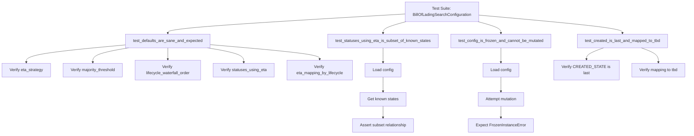
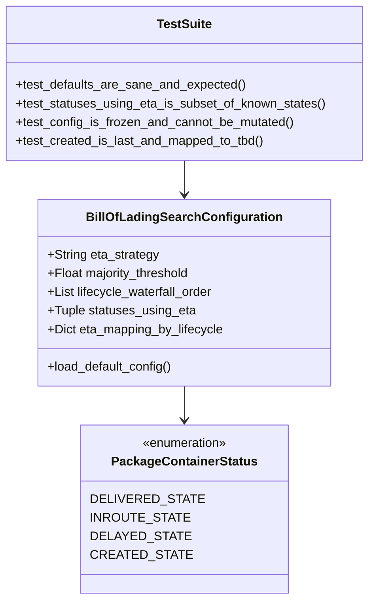

# Diagram: platform/partview_core/partview_service/partview_service/tests/unit/core/business/test_BillOfLadingSearchConfiguration.py


> Auto-generated by Obscura crawlers

## Diagram 1



### SVG

<svg id="container" width="2749.921875" xmlns="http://www.w3.org/2000/svg" class="flowchart" height="534" viewBox="0 0 2749.921875 534" role="graphics-document document" aria-roledescription="flowchart-v2"><style>#container{font-family:"trebuchet ms",verdana,arial,sans-serif;font-size:16px;fill:#333;}@keyframes edge-animation-frame{from{stroke-dashoffset:0;}}@keyframes dash{to{stroke-dashoffset:0;}}#container .edge-animation-slow{stroke-dasharray:9,5!important;stroke-dashoffset:900;animation:dash 50s linear infinite;stroke-linecap:round;}#container .edge-animation-fast{stroke-dasharray:9,5!important;stroke-dashoffset:900;animation:dash 20s linear infinite;stroke-linecap:round;}#container .error-icon{fill:#552222;}#container .error-text{fill:#552222;stroke:#552222;}#container .edge-thickness-normal{stroke-width:1px;}#container .edge-thickness-thick{stroke-width:3.5px;}#container .edge-pattern-solid{stroke-dasharray:0;}#container .edge-thickness-invisible{stroke-width:0;fill:none;}#container .edge-pattern-dashed{stroke-dasharray:3;}#container .edge-pattern-dotted{stroke-dasharray:2;}#container .marker{fill:#333333;stroke:#333333;}#container .marker.cross{stroke:#333333;}#container svg{font-family:"trebuchet ms",verdana,arial,sans-serif;font-size:16px;}#container p{margin:0;}#container .label{font-family:"trebuchet ms",verdana,arial,sans-serif;color:#333;}#container .cluster-label text{fill:#333;}#container .cluster-label span{color:#333;}#container .cluster-label span p{background-color:transparent;}#container .label text,#container span{fill:#333;color:#333;}#container .node rect,#container .node circle,#container .node ellipse,#container .node polygon,#container .node path{fill:#ECECFF;stroke:#9370DB;stroke-width:1px;}#container .rough-node .label text,#container .node .label text,#container .image-shape .label,#container .icon-shape .label{text-anchor:middle;}#container .node .katex path{fill:#000;stroke:#000;stroke-width:1px;}#container .rough-node .label,#container .node .label,#container .image-shape .label,#container .icon-shape .label{text-align:center;}#container .node.clickable{cursor:pointer;}#container .root .anchor path{fill:#333333!important;stroke-width:0;stroke:#333333;}#container .arrowheadPath{fill:#333333;}#container .edgePath .path{stroke:#333333;stroke-width:2.0px;}#container .flowchart-link{stroke:#333333;fill:none;}#container .edgeLabel{background-color:rgba(232,232,232, 0.8);text-align:center;}#container .edgeLabel p{background-color:rgba(232,232,232, 0.8);}#container .edgeLabel rect{opacity:0.5;background-color:rgba(232,232,232, 0.8);fill:rgba(232,232,232, 0.8);}#container .labelBkg{background-color:rgba(232, 232, 232, 0.5);}#container .cluster rect{fill:#ffffde;stroke:#aaaa33;stroke-width:1px;}#container .cluster text{fill:#333;}#container .cluster span{color:#333;}#container div.mermaidTooltip{position:absolute;text-align:center;max-width:200px;padding:2px;font-family:"trebuchet ms",verdana,arial,sans-serif;font-size:12px;background:hsl(80, 100%, 96.2745098039%);border:1px solid #aaaa33;border-radius:2px;pointer-events:none;z-index:100;}#container .flowchartTitleText{text-anchor:middle;font-size:18px;fill:#333;}#container rect.text{fill:none;stroke-width:0;}#container .icon-shape,#container .image-shape{background-color:rgba(232,232,232, 0.8);text-align:center;}#container .icon-shape p,#container .image-shape p{background-color:rgba(232,232,232, 0.8);padding:2px;}#container .icon-shape rect,#container .image-shape rect{opacity:0.5;background-color:rgba(232,232,232, 0.8);fill:rgba(232,232,232, 0.8);}#container .label-icon{display:inline-block;height:1em;overflow:visible;vertical-align:-0.125em;}#container .node .label-icon path{fill:currentColor;stroke:revert;stroke-width:revert;}#container :root{--mermaid-font-family:"trebuchet ms",verdana,arial,sans-serif;}</style><g><marker id="container_flowchart-v2-pointEnd" class="marker flowchart-v2" viewBox="0 0 10 10" refX="5" refY="5" markerUnits="userSpaceOnUse" markerWidth="8" markerHeight="8" orient="auto"><path d="M 0 0 L 10 5 L 0 10 z" class="arrowMarkerPath" style="stroke-width: 1; stroke-dasharray: 1, 0;"></path></marker><marker id="container_flowchart-v2-pointStart" class="marker flowchart-v2" viewBox="0 0 10 10" refX="4.5" refY="5" markerUnits="userSpaceOnUse" markerWidth="8" markerHeight="8" orient="auto"><path d="M 0 5 L 10 10 L 10 0 z" class="arrowMarkerPath" style="stroke-width: 1; stroke-dasharray: 1, 0;"></path></marker><marker id="container_flowchart-v2-circleEnd" class="marker flowchart-v2" viewBox="0 0 10 10" refX="11" refY="5" markerUnits="userSpaceOnUse" markerWidth="11" markerHeight="11" orient="auto"><circle cx="5" cy="5" r="5" class="arrowMarkerPath" style="stroke-width: 1; stroke-dasharray: 1, 0;"></circle></marker><marker id="container_flowchart-v2-circleStart" class="marker flowchart-v2" viewBox="0 0 10 10" refX="-1" refY="5" markerUnits="userSpaceOnUse" markerWidth="11" markerHeight="11" orient="auto"><circle cx="5" cy="5" r="5" class="arrowMarkerPath" style="stroke-width: 1; stroke-dasharray: 1, 0;"></circle></marker><marker id="container_flowchart-v2-crossEnd" class="marker cross flowchart-v2" viewBox="0 0 11 11" refX="12" refY="5.2" markerUnits="userSpaceOnUse" markerWidth="11" markerHeight="11" orient="auto"><path d="M 1,1 l 9,9 M 10,1 l -9,9" class="arrowMarkerPath" style="stroke-width: 2; stroke-dasharray: 1, 0;"></path></marker><marker id="container_flowchart-v2-crossStart" class="marker cross flowchart-v2" viewBox="0 0 11 11" refX="-1" refY="5.2" markerUnits="userSpaceOnUse" markerWidth="11" markerHeight="11" orient="auto"><path d="M 1,1 l 9,9 M 10,1 l -9,9" class="arrowMarkerPath" style="stroke-width: 2; stroke-dasharray: 1, 0;"></path></marker><g class="root"><g class="clusters"></g><g class="edgePaths"><path d="M1619.715,55.636L1462.426,64.863C1305.138,74.09,990.561,92.545,833.273,105.273C675.984,118,675.984,125,675.984,128.5L675.984,132" id="L_Start_T1_0" class="edge-thickness-normal edge-pattern-solid edge-thickness-normal edge-pattern-solid flowchart-link" style=";" data-edge="true" data-et="edge" data-id="L_Start_T1_0" data-points="W3sieCI6MTYxOS43MTQ4NDM3NSwieSI6NTUuNjM1NzIyNzAwMjM4ODN9LHsieCI6Njc1Ljk4NDM3NSwieSI6MTExfSx7IngiOjY3NS45ODQzNzUsInkiOjEzNn1d" marker-end="url(#container_flowchart-v2-pointEnd)"></path><path d="M1623.279,86L1607.933,90.167C1592.587,94.333,1561.895,102.667,1546.549,110.333C1531.203,118,1531.203,125,1531.203,128.5L1531.203,132" id="L_Start_T2_0" class="edge-thickness-normal edge-pattern-solid edge-thickness-normal edge-pattern-solid flowchart-link" style=";" data-edge="true" data-et="edge" data-id="L_Start_T2_0" data-points="W3sieCI6MTYyMy4yNzkyMzU4Mzk4NDM4LCJ5Ijo4Nn0seyJ4IjoxNTMxLjIwMzEyNSwieSI6MTExfSx7IngiOjE1MzEuMjAzMTI1LCJ5IjoxMzZ9XQ==" marker-end="url(#container_flowchart-v2-pointEnd)"></path><path d="M1910.557,86L1925.903,90.167C1941.249,94.333,1971.941,102.667,1987.287,110.333C2002.633,118,2002.633,125,2002.633,128.5L2002.633,132" id="L_Start_T3_0" class="edge-thickness-normal edge-pattern-solid edge-thickness-normal edge-pattern-solid flowchart-link" style=";" data-edge="true" data-et="edge" data-id="L_Start_T3_0" data-points="W3sieCI6MTkxMC41NTY3MDE2NjAxNTYyLCJ5Ijo4Nn0seyJ4IjoyMDAyLjYzMjgxMjUsInkiOjExMX0seyJ4IjoyMDAyLjYzMjgxMjUsInkiOjEzNn1d" marker-end="url(#container_flowchart-v2-pointEnd)"></path><path d="M1914.121,60.047L2009.936,68.539C2105.75,77.031,2297.379,94.016,2393.193,106.008C2489.008,118,2489.008,125,2489.008,128.5L2489.008,132" id="L_Start_T4_0" class="edge-thickness-normal edge-pattern-solid edge-thickness-normal edge-pattern-solid flowchart-link" style=";" data-edge="true" data-et="edge" data-id="L_Start_T4_0" data-points="W3sieCI6MTkxNC4xMjEwOTM3NSwieSI6NjAuMDQ2ODUyOTM4Nzg5ODZ9LHsieCI6MjQ4OS4wMDc4MTI1LCJ5IjoxMTF9LHsieCI6MjQ4OS4wMDc4MTI1LCJ5IjoxMzZ9XQ==" marker-end="url(#container_flowchart-v2-pointEnd)"></path><path d="M507.469,178.358L440.458,184.465C373.448,190.572,239.427,202.786,172.417,214.393C105.406,226,105.406,237,105.406,242.5L105.406,248" id="L_T1_V1_0" class="edge-thickness-normal edge-pattern-solid edge-thickness-normal edge-pattern-solid flowchart-link" style=";" data-edge="true" data-et="edge" data-id="L_T1_V1_0" data-points="W3sieCI6NTA3LjQ2ODc1LCJ5IjoxNzguMzU3Nzc4NTY4ODg1NzJ9LHsieCI6MTA1LjQwNjI1LCJ5IjoyMTV9LHsieCI6MTA1LjQwNjI1LCJ5IjoyNTJ9XQ==" marker-end="url(#container_flowchart-v2-pointEnd)"></path><path d="M519.392,190L495.226,194.167C471.061,198.333,422.73,206.667,398.564,216.333C374.398,226,374.398,237,374.398,242.5L374.398,248" id="L_T1_V2_0" class="edge-thickness-normal edge-pattern-solid edge-thickness-normal edge-pattern-solid flowchart-link" style=";" data-edge="true" data-et="edge" data-id="L_T1_V2_0" data-points="W3sieCI6NTE5LjM5MTY3NjY4MjY5MjQsInkiOjE5MH0seyJ4IjozNzQuMzk4NDM3NSwieSI6MjE1fSx7IngiOjM3NC4zOTg0Mzc1LCJ5IjoyNTJ9XQ==" marker-end="url(#container_flowchart-v2-pointEnd)"></path><path d="M675.984,190L675.984,194.167C675.984,198.333,675.984,206.667,675.984,214.333C675.984,222,675.984,229,675.984,232.5L675.984,236" id="L_T1_V3_0" class="edge-thickness-normal edge-pattern-solid edge-thickness-normal edge-pattern-solid flowchart-link" style=";" data-edge="true" data-et="edge" data-id="L_T1_V3_0" data-points="W3sieCI6Njc1Ljk4NDM3NSwieSI6MTkwfSx7IngiOjY3NS45ODQzNzUsInkiOjIxNX0seyJ4Ijo2NzUuOTg0Mzc1LCJ5IjoyNDB9XQ==" marker-end="url(#container_flowchart-v2-pointEnd)"></path><path d="M832.739,190L856.93,194.167C881.12,198.333,929.502,206.667,953.692,216.333C977.883,226,977.883,237,977.883,242.5L977.883,248" id="L_T1_V4_0" class="edge-thickness-normal edge-pattern-solid edge-thickness-normal edge-pattern-solid flowchart-link" style=";" data-edge="true" data-et="edge" data-id="L_T1_V4_0" data-points="W3sieCI6ODMyLjczOTMzMjkzMjY5MjQsInkiOjE5MH0seyJ4Ijo5NzcuODgyODEyNSwieSI6MjE1fSx7IngiOjk3Ny44ODI4MTI1LCJ5IjoyNTJ9XQ==" marker-end="url(#container_flowchart-v2-pointEnd)"></path><path d="M844.5,177.513L917.047,183.761C989.594,190.009,1134.688,202.504,1207.234,212.252C1279.781,222,1279.781,229,1279.781,232.5L1279.781,236" id="L_T1_V5_0" class="edge-thickness-normal edge-pattern-solid edge-thickness-normal edge-pattern-solid flowchart-link" style=";" data-edge="true" data-et="edge" data-id="L_T1_V5_0" data-points="W3sieCI6ODQ0LjUsInkiOjE3Ny41MTI4NDgzODEzMzY4NX0seyJ4IjoxMjc5Ljc4MTI1LCJ5IjoyMTV9LHsieCI6MTI3OS43ODEyNSwieSI6MjQwfV0=" marker-end="url(#container_flowchart-v2-pointEnd)"></path><path d="M1531.203,190L1531.203,194.167C1531.203,198.333,1531.203,206.667,1531.203,216.333C1531.203,226,1531.203,237,1531.203,242.5L1531.203,248" id="L_T2_C1_0" class="edge-thickness-normal edge-pattern-solid edge-thickness-normal edge-pattern-solid flowchart-link" style=";" data-edge="true" data-et="edge" data-id="L_T2_C1_0" data-points="W3sieCI6MTUzMS4yMDMxMjUsInkiOjE5MH0seyJ4IjoxNTMxLjIwMzEyNSwieSI6MjE1fSx7IngiOjE1MzEuMjAzMTI1LCJ5IjoyNTJ9XQ==" marker-end="url(#container_flowchart-v2-pointEnd)"></path><path d="M1531.203,306L1531.203,312.167C1531.203,318.333,1531.203,330.667,1531.203,340.333C1531.203,350,1531.203,357,1531.203,360.5L1531.203,364" id="L_C1_C2_0" class="edge-thickness-normal edge-pattern-solid edge-thickness-normal edge-pattern-solid flowchart-link" style=";" data-edge="true" data-et="edge" data-id="L_C1_C2_0" data-points="W3sieCI6MTUzMS4yMDMxMjUsInkiOjMwNn0seyJ4IjoxNTMxLjIwMzEyNSwieSI6MzQzfSx7IngiOjE1MzEuMjAzMTI1LCJ5IjozNjh9XQ==" marker-end="url(#container_flowchart-v2-pointEnd)"></path><path d="M1531.203,422L1531.203,426.167C1531.203,430.333,1531.203,438.667,1531.203,446.333C1531.203,454,1531.203,461,1531.203,464.5L1531.203,468" id="L_C2_C3_0" class="edge-thickness-normal edge-pattern-solid edge-thickness-normal edge-pattern-solid flowchart-link" style=";" data-edge="true" data-et="edge" data-id="L_C2_C3_0" data-points="W3sieCI6MTUzMS4yMDMxMjUsInkiOjQyMn0seyJ4IjoxNTMxLjIwMzEyNSwieSI6NDQ3fSx7IngiOjE1MzEuMjAzMTI1LCJ5Ijo0NzJ9XQ==" marker-end="url(#container_flowchart-v2-pointEnd)"></path><path d="M2002.633,190L2002.633,194.167C2002.633,198.333,2002.633,206.667,2002.633,216.333C2002.633,226,2002.633,237,2002.633,242.5L2002.633,248" id="L_T3_F1_0" class="edge-thickness-normal edge-pattern-solid edge-thickness-normal edge-pattern-solid flowchart-link" style=";" data-edge="true" data-et="edge" data-id="L_T3_F1_0" data-points="W3sieCI6MjAwMi42MzI4MTI1LCJ5IjoxOTB9LHsieCI6MjAwMi42MzI4MTI1LCJ5IjoyMTV9LHsieCI6MjAwMi42MzI4MTI1LCJ5IjoyNTJ9XQ==" marker-end="url(#container_flowchart-v2-pointEnd)"></path><path d="M2002.633,306L2002.633,312.167C2002.633,318.333,2002.633,330.667,2002.633,340.333C2002.633,350,2002.633,357,2002.633,360.5L2002.633,364" id="L_F1_F2_0" class="edge-thickness-normal edge-pattern-solid edge-thickness-normal edge-pattern-solid flowchart-link" style=";" data-edge="true" data-et="edge" data-id="L_F1_F2_0" data-points="W3sieCI6MjAwMi42MzI4MTI1LCJ5IjozMDZ9LHsieCI6MjAwMi42MzI4MTI1LCJ5IjozNDN9LHsieCI6MjAwMi42MzI4MTI1LCJ5IjozNjh9XQ==" marker-end="url(#container_flowchart-v2-pointEnd)"></path><path d="M2002.633,422L2002.633,426.167C2002.633,430.333,2002.633,438.667,2002.633,446.333C2002.633,454,2002.633,461,2002.633,464.5L2002.633,468" id="L_F2_F3_0" class="edge-thickness-normal edge-pattern-solid edge-thickness-normal edge-pattern-solid flowchart-link" style=";" data-edge="true" data-et="edge" data-id="L_F2_F3_0" data-points="W3sieCI6MjAwMi42MzI4MTI1LCJ5Ijo0MjJ9LHsieCI6MjAwMi42MzI4MTI1LCJ5Ijo0NDd9LHsieCI6MjAwMi42MzI4MTI1LCJ5Ijo0NzJ9XQ==" marker-end="url(#container_flowchart-v2-pointEnd)"></path><path d="M2414.08,190L2402.518,194.167C2390.955,198.333,2367.829,206.667,2356.266,214.333C2344.703,222,2344.703,229,2344.703,232.5L2344.703,236" id="L_T4_L1_0" class="edge-thickness-normal edge-pattern-solid edge-thickness-normal edge-pattern-solid flowchart-link" style=";" data-edge="true" data-et="edge" data-id="L_T4_L1_0" data-points="W3sieCI6MjQxNC4wODAzNzg2MDU3NjksInkiOjE5MH0seyJ4IjoyMzQ0LjcwMzEyNSwieSI6MjE1fSx7IngiOjIzNDQuNzAzMTI1LCJ5IjoyNDB9XQ==" marker-end="url(#container_flowchart-v2-pointEnd)"></path><path d="M2563.935,190L2575.498,194.167C2587.061,198.333,2610.187,206.667,2621.75,216.333C2633.313,226,2633.313,237,2633.313,242.5L2633.313,248" id="L_T4_L2_0" class="edge-thickness-normal edge-pattern-solid edge-thickness-normal edge-pattern-solid flowchart-link" style=";" data-edge="true" data-et="edge" data-id="L_T4_L2_0" data-points="W3sieCI6MjU2My45MzUyNDYzOTQyMzEsInkiOjE5MH0seyJ4IjoyNjMzLjMxMjUsInkiOjIxNX0seyJ4IjoyNjMzLjMxMjUsInkiOjI1Mn1d" marker-end="url(#container_flowchart-v2-pointEnd)"></path></g><g class="edgeLabels"><g class="edgeLabel"><g class="label" data-id="L_Start_T1_0" transform="translate(0, 0)"><foreignObject width="0" height="0"><div xmlns="http://www.w3.org/1999/xhtml" class="labelBkg" style="display: table-cell; white-space: nowrap; line-height: 1.5; max-width: 200px; text-align: center;"><span class="edgeLabel"></span></div></foreignObject></g></g><g class="edgeLabel"><g class="label" data-id="L_Start_T2_0" transform="translate(0, 0)"><foreignObject width="0" height="0"><div xmlns="http://www.w3.org/1999/xhtml" class="labelBkg" style="display: table-cell; white-space: nowrap; line-height: 1.5; max-width: 200px; text-align: center;"><span class="edgeLabel"></span></div></foreignObject></g></g><g class="edgeLabel"><g class="label" data-id="L_Start_T3_0" transform="translate(0, 0)"><foreignObject width="0" height="0"><div xmlns="http://www.w3.org/1999/xhtml" class="labelBkg" style="display: table-cell; white-space: nowrap; line-height: 1.5; max-width: 200px; text-align: center;"><span class="edgeLabel"></span></div></foreignObject></g></g><g class="edgeLabel"><g class="label" data-id="L_Start_T4_0" transform="translate(0, 0)"><foreignObject width="0" height="0"><div xmlns="http://www.w3.org/1999/xhtml" class="labelBkg" style="display: table-cell; white-space: nowrap; line-height: 1.5; max-width: 200px; text-align: center;"><span class="edgeLabel"></span></div></foreignObject></g></g><g class="edgeLabel"><g class="label" data-id="L_T1_V1_0" transform="translate(0, 0)"><foreignObject width="0" height="0"><div xmlns="http://www.w3.org/1999/xhtml" class="labelBkg" style="display: table-cell; white-space: nowrap; line-height: 1.5; max-width: 200px; text-align: center;"><span class="edgeLabel"></span></div></foreignObject></g></g><g class="edgeLabel"><g class="label" data-id="L_T1_V2_0" transform="translate(0, 0)"><foreignObject width="0" height="0"><div xmlns="http://www.w3.org/1999/xhtml" class="labelBkg" style="display: table-cell; white-space: nowrap; line-height: 1.5; max-width: 200px; text-align: center;"><span class="edgeLabel"></span></div></foreignObject></g></g><g class="edgeLabel"><g class="label" data-id="L_T1_V3_0" transform="translate(0, 0)"><foreignObject width="0" height="0"><div xmlns="http://www.w3.org/1999/xhtml" class="labelBkg" style="display: table-cell; white-space: nowrap; line-height: 1.5; max-width: 200px; text-align: center;"><span class="edgeLabel"></span></div></foreignObject></g></g><g class="edgeLabel"><g class="label" data-id="L_T1_V4_0" transform="translate(0, 0)"><foreignObject width="0" height="0"><div xmlns="http://www.w3.org/1999/xhtml" class="labelBkg" style="display: table-cell; white-space: nowrap; line-height: 1.5; max-width: 200px; text-align: center;"><span class="edgeLabel"></span></div></foreignObject></g></g><g class="edgeLabel"><g class="label" data-id="L_T1_V5_0" transform="translate(0, 0)"><foreignObject width="0" height="0"><div xmlns="http://www.w3.org/1999/xhtml" class="labelBkg" style="display: table-cell; white-space: nowrap; line-height: 1.5; max-width: 200px; text-align: center;"><span class="edgeLabel"></span></div></foreignObject></g></g><g class="edgeLabel"><g class="label" data-id="L_T2_C1_0" transform="translate(0, 0)"><foreignObject width="0" height="0"><div xmlns="http://www.w3.org/1999/xhtml" class="labelBkg" style="display: table-cell; white-space: nowrap; line-height: 1.5; max-width: 200px; text-align: center;"><span class="edgeLabel"></span></div></foreignObject></g></g><g class="edgeLabel"><g class="label" data-id="L_C1_C2_0" transform="translate(0, 0)"><foreignObject width="0" height="0"><div xmlns="http://www.w3.org/1999/xhtml" class="labelBkg" style="display: table-cell; white-space: nowrap; line-height: 1.5; max-width: 200px; text-align: center;"><span class="edgeLabel"></span></div></foreignObject></g></g><g class="edgeLabel"><g class="label" data-id="L_C2_C3_0" transform="translate(0, 0)"><foreignObject width="0" height="0"><div xmlns="http://www.w3.org/1999/xhtml" class="labelBkg" style="display: table-cell; white-space: nowrap; line-height: 1.5; max-width: 200px; text-align: center;"><span class="edgeLabel"></span></div></foreignObject></g></g><g class="edgeLabel"><g class="label" data-id="L_T3_F1_0" transform="translate(0, 0)"><foreignObject width="0" height="0"><div xmlns="http://www.w3.org/1999/xhtml" class="labelBkg" style="display: table-cell; white-space: nowrap; line-height: 1.5; max-width: 200px; text-align: center;"><span class="edgeLabel"></span></div></foreignObject></g></g><g class="edgeLabel"><g class="label" data-id="L_F1_F2_0" transform="translate(0, 0)"><foreignObject width="0" height="0"><div xmlns="http://www.w3.org/1999/xhtml" class="labelBkg" style="display: table-cell; white-space: nowrap; line-height: 1.5; max-width: 200px; text-align: center;"><span class="edgeLabel"></span></div></foreignObject></g></g><g class="edgeLabel"><g class="label" data-id="L_F2_F3_0" transform="translate(0, 0)"><foreignObject width="0" height="0"><div xmlns="http://www.w3.org/1999/xhtml" class="labelBkg" style="display: table-cell; white-space: nowrap; line-height: 1.5; max-width: 200px; text-align: center;"><span class="edgeLabel"></span></div></foreignObject></g></g><g class="edgeLabel"><g class="label" data-id="L_T4_L1_0" transform="translate(0, 0)"><foreignObject width="0" height="0"><div xmlns="http://www.w3.org/1999/xhtml" class="labelBkg" style="display: table-cell; white-space: nowrap; line-height: 1.5; max-width: 200px; text-align: center;"><span class="edgeLabel"></span></div></foreignObject></g></g><g class="edgeLabel"><g class="label" data-id="L_T4_L2_0" transform="translate(0, 0)"><foreignObject width="0" height="0"><div xmlns="http://www.w3.org/1999/xhtml" class="labelBkg" style="display: table-cell; white-space: nowrap; line-height: 1.5; max-width: 200px; text-align: center;"><span class="edgeLabel"></span></div></foreignObject></g></g></g><g class="nodes"><g class="node default" id="flowchart-Start-0" transform="translate(1766.91796875, 47)"><rect class="basic label-container" style="" x="-147.203125" y="-39" width="294.40625" height="78"></rect><g class="label" style="" transform="translate(-117.203125, -24)"><rect></rect><foreignObject width="234.40625" height="48"><div xmlns="http://www.w3.org/1999/xhtml" style="display: table; white-space: break-spaces; line-height: 1.5; max-width: 200px; text-align: center; width: 200px;"><span class="nodeLabel"><p>Test Suite: BillOfLadingSearchConfiguration</p></span></div></foreignObject></g></g><g class="node default" id="flowchart-T1-1" transform="translate(675.984375, 163)"><rect class="basic label-container" style="" x="-168.515625" y="-27" width="337.03125" height="54"></rect><g class="label" style="" transform="translate(-138.515625, -12)"><rect></rect><foreignObject width="277.03125" height="24"><div xmlns="http://www.w3.org/1999/xhtml" style="display: table; white-space: break-spaces; line-height: 1.5; max-width: 200px; text-align: center; width: 200px;"><span class="nodeLabel"><p>test_defaults_are_sane_and_expected</p></span></div></foreignObject></g></g><g class="node default" id="flowchart-T2-3" transform="translate(1531.203125, 163)"><rect class="basic label-container" style="" x="-220.5" y="-27" width="441" height="54"></rect><g class="label" style="" transform="translate(-190.5, -12)"><rect></rect><foreignObject width="381" height="24"><div xmlns="http://www.w3.org/1999/xhtml" style="display: table; white-space: break-spaces; line-height: 1.5; max-width: 200px; text-align: center; width: 200px;"><span class="nodeLabel"><p>test_statuses_using_eta_is_subset_of_known_states</p></span></div></foreignObject></g></g><g class="node default" id="flowchart-T3-5" transform="translate(2002.6328125, 163)"><rect class="basic label-container" style="" x="-200.9296875" y="-27" width="401.859375" height="54"></rect><g class="label" style="" transform="translate(-170.9296875, -12)"><rect></rect><foreignObject width="341.859375" height="24"><div xmlns="http://www.w3.org/1999/xhtml" style="display: table; white-space: break-spaces; line-height: 1.5; max-width: 200px; text-align: center; width: 200px;"><span class="nodeLabel"><p>test_config_is_frozen_and_cannot_be_mutated</p></span></div></foreignObject></g></g><g class="node default" id="flowchart-T4-7" transform="translate(2489.0078125, 163)"><rect class="basic label-container" style="" x="-181.7890625" y="-27" width="363.578125" height="54"></rect><g class="label" style="" transform="translate(-151.7890625, -12)"><rect></rect><foreignObject width="303.578125" height="24"><div xmlns="http://www.w3.org/1999/xhtml" style="display: table; white-space: break-spaces; line-height: 1.5; max-width: 200px; text-align: center; width: 200px;"><span class="nodeLabel"><p>test_created_is_last_and_mapped_to_tbd</p></span></div></foreignObject></g></g><g class="node default" id="flowchart-V1-9" transform="translate(105.40625, 279)"><rect class="basic label-container" style="" x="-97.40625" y="-27" width="194.8125" height="54"></rect><g class="label" style="" transform="translate(-67.40625, -12)"><rect></rect><foreignObject width="134.8125" height="24"><div xmlns="http://www.w3.org/1999/xhtml" style="display: table-cell; white-space: nowrap; line-height: 1.5; max-width: 200px; text-align: center;"><span class="nodeLabel"><p>Verify eta_strategy</p></span></div></foreignObject></g></g><g class="node default" id="flowchart-V2-11" transform="translate(374.3984375, 279)"><rect class="basic label-container" style="" x="-121.5859375" y="-27" width="243.171875" height="54"></rect><g class="label" style="" transform="translate(-91.5859375, -12)"><rect></rect><foreignObject width="183.171875" height="24"><div xmlns="http://www.w3.org/1999/xhtml" style="display: table-cell; white-space: nowrap; line-height: 1.5; max-width: 200px; text-align: center;"><span class="nodeLabel"><p>Verify majority_threshold</p></span></div></foreignObject></g></g><g class="node default" id="flowchart-V3-13" transform="translate(675.984375, 279)"><rect class="basic label-container" style="" x="-130" y="-39" width="260" height="78"></rect><g class="label" style="" transform="translate(-100, -24)"><rect></rect><foreignObject width="200" height="48"><div xmlns="http://www.w3.org/1999/xhtml" style="display: table; white-space: break-spaces; line-height: 1.5; max-width: 200px; text-align: center; width: 200px;"><span class="nodeLabel"><p>Verify lifecycle_waterfall_order</p></span></div></foreignObject></g></g><g class="node default" id="flowchart-V4-15" transform="translate(977.8828125, 279)"><rect class="basic label-container" style="" x="-121.8984375" y="-27" width="243.796875" height="54"></rect><g class="label" style="" transform="translate(-91.8984375, -12)"><rect></rect><foreignObject width="183.796875" height="24"><div xmlns="http://www.w3.org/1999/xhtml" style="display: table-cell; white-space: nowrap; line-height: 1.5; max-width: 200px; text-align: center;"><span class="nodeLabel"><p>Verify statuses_using_eta</p></span></div></foreignObject></g></g><g class="node default" id="flowchart-V5-17" transform="translate(1279.78125, 279)"><rect class="basic label-container" style="" x="-130" y="-39" width="260" height="78"></rect><g class="label" style="" transform="translate(-100, -24)"><rect></rect><foreignObject width="200" height="48"><div xmlns="http://www.w3.org/1999/xhtml" style="display: table; white-space: break-spaces; line-height: 1.5; max-width: 200px; text-align: center; width: 200px;"><span class="nodeLabel"><p>Verify eta_mapping_by_lifecycle</p></span></div></foreignObject></g></g><g class="node default" id="flowchart-C1-19" transform="translate(1531.203125, 279)"><rect class="basic label-container" style="" x="-71.421875" y="-27" width="142.84375" height="54"></rect><g class="label" style="" transform="translate(-41.421875, -12)"><rect></rect><foreignObject width="82.84375" height="24"><div xmlns="http://www.w3.org/1999/xhtml" style="display: table-cell; white-space: nowrap; line-height: 1.5; max-width: 200px; text-align: center;"><span class="nodeLabel"><p>Load config</p></span></div></foreignObject></g></g><g class="node default" id="flowchart-C2-21" transform="translate(1531.203125, 395)"><rect class="basic label-container" style="" x="-92.203125" y="-27" width="184.40625" height="54"></rect><g class="label" style="" transform="translate(-62.203125, -12)"><rect></rect><foreignObject width="124.40625" height="24"><div xmlns="http://www.w3.org/1999/xhtml" style="display: table-cell; white-space: nowrap; line-height: 1.5; max-width: 200px; text-align: center;"><span class="nodeLabel"><p>Get known states</p></span></div></foreignObject></g></g><g class="node default" id="flowchart-C3-23" transform="translate(1531.203125, 499)"><rect class="basic label-container" style="" x="-124.484375" y="-27" width="248.96875" height="54"></rect><g class="label" style="" transform="translate(-94.484375, -12)"><rect></rect><foreignObject width="188.96875" height="24"><div xmlns="http://www.w3.org/1999/xhtml" style="display: table-cell; white-space: nowrap; line-height: 1.5; max-width: 200px; text-align: center;"><span class="nodeLabel"><p>Assert subset relationship</p></span></div></foreignObject></g></g><g class="node default" id="flowchart-F1-25" transform="translate(2002.6328125, 279)"><rect class="basic label-container" style="" x="-71.421875" y="-27" width="142.84375" height="54"></rect><g class="label" style="" transform="translate(-41.421875, -12)"><rect></rect><foreignObject width="82.84375" height="24"><div xmlns="http://www.w3.org/1999/xhtml" style="display: table-cell; white-space: nowrap; line-height: 1.5; max-width: 200px; text-align: center;"><span class="nodeLabel"><p>Load config</p></span></div></foreignObject></g></g><g class="node default" id="flowchart-F2-27" transform="translate(2002.6328125, 395)"><rect class="basic label-container" style="" x="-94.421875" y="-27" width="188.84375" height="54"></rect><g class="label" style="" transform="translate(-64.421875, -12)"><rect></rect><foreignObject width="128.84375" height="24"><div xmlns="http://www.w3.org/1999/xhtml" style="display: table-cell; white-space: nowrap; line-height: 1.5; max-width: 200px; text-align: center;"><span class="nodeLabel"><p>Attempt mutation</p></span></div></foreignObject></g></g><g class="node default" id="flowchart-F3-29" transform="translate(2002.6328125, 499)"><rect class="basic label-container" style="" x="-128.28125" y="-27" width="256.5625" height="54"></rect><g class="label" style="" transform="translate(-98.28125, -12)"><rect></rect><foreignObject width="196.5625" height="24"><div xmlns="http://www.w3.org/1999/xhtml" style="display: table-cell; white-space: nowrap; line-height: 1.5; max-width: 200px; text-align: center;"><span class="nodeLabel"><p>Expect FrozenInstanceError</p></span></div></foreignObject></g></g><g class="node default" id="flowchart-L1-31" transform="translate(2344.703125, 279)"><rect class="basic label-container" style="" x="-130" y="-39" width="260" height="78"></rect><g class="label" style="" transform="translate(-100, -24)"><rect></rect><foreignObject width="200" height="48"><div xmlns="http://www.w3.org/1999/xhtml" style="display: table; white-space: break-spaces; line-height: 1.5; max-width: 200px; text-align: center; width: 200px;"><span class="nodeLabel"><p>Verify CREATED_STATE is last</p></span></div></foreignObject></g></g><g class="node default" id="flowchart-L2-33" transform="translate(2633.3125, 279)"><rect class="basic label-container" style="" x="-108.609375" y="-27" width="217.21875" height="54"></rect><g class="label" style="" transform="translate(-78.609375, -12)"><rect></rect><foreignObject width="157.21875" height="24"><div xmlns="http://www.w3.org/1999/xhtml" style="display: table-cell; white-space: nowrap; line-height: 1.5; max-width: 200px; text-align: center;"><span class="nodeLabel"><p>Verify mapping to tbd</p></span></div></foreignObject></g></g></g></g></g></svg>

## Diagram 2

```mermaid
stateDiagram-v2
    [*] --> CREATED_STATE
    CREATED_STATE --> DELAYED_STATE
    DELAYED_STATE --> INROUTE_STATE
    INROUTE_STATE --> DELIVERED_STATE
    DELIVERED_STATE --> [*]
    
    note right of CREATED_STATE: eta_mapping: tbd
    note right of DELAYED_STATE: eta_mapping: tbd
    note right of INROUTE_STATE: Uses ETA
    note right of DELIVERED_STATE: No eta_mapping
```

> SVG rendering failed for this diagram.

## Diagram 3



### SVG

<svg id="container" width="473.2890625" xmlns="http://www.w3.org/2000/svg" class="classDiagram" height="770" viewBox="0 0 473.2890625 770" role="graphics-document document" aria-roledescription="class"><style>#container{font-family:"trebuchet ms",verdana,arial,sans-serif;font-size:16px;fill:#333;}@keyframes edge-animation-frame{from{stroke-dashoffset:0;}}@keyframes dash{to{stroke-dashoffset:0;}}#container .edge-animation-slow{stroke-dasharray:9,5!important;stroke-dashoffset:900;animation:dash 50s linear infinite;stroke-linecap:round;}#container .edge-animation-fast{stroke-dasharray:9,5!important;stroke-dashoffset:900;animation:dash 20s linear infinite;stroke-linecap:round;}#container .error-icon{fill:#552222;}#container .error-text{fill:#552222;stroke:#552222;}#container .edge-thickness-normal{stroke-width:1px;}#container .edge-thickness-thick{stroke-width:3.5px;}#container .edge-pattern-solid{stroke-dasharray:0;}#container .edge-thickness-invisible{stroke-width:0;fill:none;}#container .edge-pattern-dashed{stroke-dasharray:3;}#container .edge-pattern-dotted{stroke-dasharray:2;}#container .marker{fill:#333333;stroke:#333333;}#container .marker.cross{stroke:#333333;}#container svg{font-family:"trebuchet ms",verdana,arial,sans-serif;font-size:16px;}#container p{margin:0;}#container g.classGroup text{fill:#9370DB;stroke:none;font-family:"trebuchet ms",verdana,arial,sans-serif;font-size:10px;}#container g.classGroup text .title{font-weight:bolder;}#container .nodeLabel,#container .edgeLabel{color:#131300;}#container .edgeLabel .label rect{fill:#ECECFF;}#container .label text{fill:#131300;}#container .labelBkg{background:#ECECFF;}#container .edgeLabel .label span{background:#ECECFF;}#container .classTitle{font-weight:bolder;}#container .node rect,#container .node circle,#container .node ellipse,#container .node polygon,#container .node path{fill:#ECECFF;stroke:#9370DB;stroke-width:1px;}#container .divider{stroke:#9370DB;stroke-width:1;}#container g.clickable{cursor:pointer;}#container g.classGroup rect{fill:#ECECFF;stroke:#9370DB;}#container g.classGroup line{stroke:#9370DB;stroke-width:1;}#container .classLabel .box{stroke:none;stroke-width:0;fill:#ECECFF;opacity:0.5;}#container .classLabel .label{fill:#9370DB;font-size:10px;}#container .relation{stroke:#333333;stroke-width:1;fill:none;}#container .dashed-line{stroke-dasharray:3;}#container .dotted-line{stroke-dasharray:1 2;}#container #compositionStart,#container .composition{fill:#333333!important;stroke:#333333!important;stroke-width:1;}#container #compositionEnd,#container .composition{fill:#333333!important;stroke:#333333!important;stroke-width:1;}#container #dependencyStart,#container .dependency{fill:#333333!important;stroke:#333333!important;stroke-width:1;}#container #dependencyStart,#container .dependency{fill:#333333!important;stroke:#333333!important;stroke-width:1;}#container #extensionStart,#container .extension{fill:transparent!important;stroke:#333333!important;stroke-width:1;}#container #extensionEnd,#container .extension{fill:transparent!important;stroke:#333333!important;stroke-width:1;}#container #aggregationStart,#container .aggregation{fill:transparent!important;stroke:#333333!important;stroke-width:1;}#container #aggregationEnd,#container .aggregation{fill:transparent!important;stroke:#333333!important;stroke-width:1;}#container #lollipopStart,#container .lollipop{fill:#ECECFF!important;stroke:#333333!important;stroke-width:1;}#container #lollipopEnd,#container .lollipop{fill:#ECECFF!important;stroke:#333333!important;stroke-width:1;}#container .edgeTerminals{font-size:11px;line-height:initial;}#container .classTitleText{text-anchor:middle;font-size:18px;fill:#333;}#container .label-icon{display:inline-block;height:1em;overflow:visible;vertical-align:-0.125em;}#container .node .label-icon path{fill:currentColor;stroke:revert;stroke-width:revert;}#container :root{--mermaid-font-family:"trebuchet ms",verdana,arial,sans-serif;}</style><g><defs><marker id="container_class-aggregationStart" class="marker aggregation class" refX="18" refY="7" markerWidth="190" markerHeight="240" orient="auto"><path d="M 18,7 L9,13 L1,7 L9,1 Z"></path></marker></defs><defs><marker id="container_class-aggregationEnd" class="marker aggregation class" refX="1" refY="7" markerWidth="20" markerHeight="28" orient="auto"><path d="M 18,7 L9,13 L1,7 L9,1 Z"></path></marker></defs><defs><marker id="container_class-extensionStart" class="marker extension class" refX="18" refY="7" markerWidth="190" markerHeight="240" orient="auto"><path d="M 1,7 L18,13 V 1 Z"></path></marker></defs><defs><marker id="container_class-extensionEnd" class="marker extension class" refX="1" refY="7" markerWidth="20" markerHeight="28" orient="auto"><path d="M 1,1 V 13 L18,7 Z"></path></marker></defs><defs><marker id="container_class-compositionStart" class="marker composition class" refX="18" refY="7" markerWidth="190" markerHeight="240" orient="auto"><path d="M 18,7 L9,13 L1,7 L9,1 Z"></path></marker></defs><defs><marker id="container_class-compositionEnd" class="marker composition class" refX="1" refY="7" markerWidth="20" markerHeight="28" orient="auto"><path d="M 18,7 L9,13 L1,7 L9,1 Z"></path></marker></defs><defs><marker id="container_class-dependencyStart" class="marker dependency class" refX="6" refY="7" markerWidth="190" markerHeight="240" orient="auto"><path d="M 5,7 L9,13 L1,7 L9,1 Z"></path></marker></defs><defs><marker id="container_class-dependencyEnd" class="marker dependency class" refX="13" refY="7" markerWidth="20" markerHeight="28" orient="auto"><path d="M 18,7 L9,13 L14,7 L9,1 Z"></path></marker></defs><defs><marker id="container_class-lollipopStart" class="marker lollipop class" refX="13" refY="7" markerWidth="190" markerHeight="240" orient="auto"><circle stroke="black" fill="transparent" cx="7" cy="7" r="6"></circle></marker></defs><defs><marker id="container_class-lollipopEnd" class="marker lollipop class" refX="1" refY="7" markerWidth="190" markerHeight="240" orient="auto"><circle stroke="black" fill="transparent" cx="7" cy="7" r="6"></circle></marker></defs><g class="root"><g class="clusters"></g><g class="edgePaths"><path d="M236.645,496L236.645,500.167C236.645,504.333,236.645,512.667,236.645,520C236.645,527.333,236.645,533.667,236.645,536.833L236.645,540" id="id_BillOfLadingSearchConfiguration_PackageContainerStatus_1" class="edge-thickness-normal edge-pattern-solid relation" style=";;;" data-edge="true" data-et="edge" data-id="id_BillOfLadingSearchConfiguration_PackageContainerStatus_1" data-points="W3sieCI6MjM2LjY0NDUzMTI1LCJ5Ijo0OTZ9LHsieCI6MjM2LjY0NDUzMTI1LCJ5Ijo1MjF9LHsieCI6MjM2LjY0NDUzMTI1LCJ5Ijo1NDZ9XQ==" marker-end="url(#container_class-dependencyEnd)"></path><path d="M236.645,206L236.645,210.167C236.645,214.333,236.645,222.667,236.645,230C236.645,237.333,236.645,243.667,236.645,246.833L236.645,250" id="id_TestSuite_BillOfLadingSearchConfiguration_2" class="edge-thickness-normal edge-pattern-solid relation" style=";;;" data-edge="true" data-et="edge" data-id="id_TestSuite_BillOfLadingSearchConfiguration_2" data-points="W3sieCI6MjM2LjY0NDUzMTI1LCJ5IjoyMDZ9LHsieCI6MjM2LjY0NDUzMTI1LCJ5IjoyMzF9LHsieCI6MjM2LjY0NDUzMTI1LCJ5IjoyNTZ9XQ==" marker-end="url(#container_class-dependencyEnd)"></path></g><g class="edgeLabels"><g class="edgeLabel"><g class="label" data-id="id_BillOfLadingSearchConfiguration_PackageContainerStatus_1" transform="translate(0, 0)"><foreignObject width="0" height="0"><div xmlns="http://www.w3.org/1999/xhtml" class="labelBkg" style="display: table-cell; white-space: nowrap; line-height: 1.5; max-width: 200px; text-align: center;"><span class="edgeLabel"></span></div></foreignObject></g></g><g class="edgeLabel"><g class="label" data-id="id_TestSuite_BillOfLadingSearchConfiguration_2" transform="translate(0, 0)"><foreignObject width="0" height="0"><div xmlns="http://www.w3.org/1999/xhtml" class="labelBkg" style="display: table-cell; white-space: nowrap; line-height: 1.5; max-width: 200px; text-align: center;"><span class="edgeLabel"></span></div></foreignObject></g></g></g><g class="nodes"><g class="node default" id="classId-BillOfLadingSearchConfiguration-0" transform="translate(236.64453125, 376)"><g class="basic label-container"><path d="M-185.6640625 -120 L185.6640625 -120 L185.6640625 120 L-185.6640625 120" stroke="none" stroke-width="0" fill="#ECECFF" style=""></path><path d="M-185.6640625 -120 C-65.23921704446686 -120, 55.18562841106629 -120, 185.6640625 -120 M-185.6640625 -120 C-85.54536360119471 -120, 14.573335297610583 -120, 185.6640625 -120 M185.6640625 -120 C185.6640625 -41.30575671297282, 185.6640625 37.388486574054355, 185.6640625 120 M185.6640625 -120 C185.6640625 -49.33373210938551, 185.6640625 21.332535781228984, 185.6640625 120 M185.6640625 120 C60.21573662694378 120, -65.23258924611244 120, -185.6640625 120 M185.6640625 120 C102.37455387362658 120, 19.085045247253163 120, -185.6640625 120 M-185.6640625 120 C-185.6640625 68.61730001192325, -185.6640625 17.234600023846482, -185.6640625 -120 M-185.6640625 120 C-185.6640625 68.84300112731553, -185.6640625 17.686002254631063, -185.6640625 -120" stroke="#9370DB" stroke-width="1.3" fill="none" stroke-dasharray="0 0" style=""></path></g><g class="annotation-group text" transform="translate(0, -96)"></g><g class="label-group text" transform="translate(-118.890625, -96)"><g class="label" style="font-weight: bolder" transform="translate(0,-12)"><foreignObject width="237.78125" height="24"><div xmlns="http://www.w3.org/1999/xhtml" style="display: table-cell; white-space: nowrap; line-height: 1.5; max-width: 284px; text-align: center;"><span class="nodeLabel markdown-node-label" style=""><p>BillOfLadingSearchConfiguration</p></span></div></foreignObject></g></g><g class="members-group text" transform="translate(-173.6640625, -48)"><g class="label" style="" transform="translate(0,-12)"><foreignObject width="143.890625" height="24"><div xmlns="http://www.w3.org/1999/xhtml" style="display: table-cell; white-space: nowrap; line-height: 1.5; max-width: 201px; text-align: center;"><span class="nodeLabel markdown-node-label" style=""><p>+String eta_strategy</p></span></div></foreignObject></g><g class="label" style="" transform="translate(0,12)"><foreignObject width="186" height="24"><div xmlns="http://www.w3.org/1999/xhtml" style="display: table-cell; white-space: nowrap; line-height: 1.5; max-width: 243px; text-align: center;"><span class="nodeLabel markdown-node-label" style=""><p>+Float majority_threshold</p></span></div></foreignObject></g><g class="label" style="" transform="translate(0,36)"><foreignObject width="216.046875" height="24"><div xmlns="http://www.w3.org/1999/xhtml" style="display: table-cell; white-space: nowrap; line-height: 1.5; max-width: 274px; text-align: center;"><span class="nodeLabel markdown-node-label" style=""><p>+List lifecycle_waterfall_order</p></span></div></foreignObject></g><g class="label" style="" transform="translate(0,60)"><foreignObject width="189.625" height="24"><div xmlns="http://www.w3.org/1999/xhtml" style="display: table-cell; white-space: nowrap; line-height: 1.5; max-width: 247px; text-align: center;"><span class="nodeLabel markdown-node-label" style=""><p>+Tuple statuses_using_eta</p></span></div></foreignObject></g><g class="label" style="" transform="translate(0,84)"><foreignObject width="228.4375" height="24"><div xmlns="http://www.w3.org/1999/xhtml" style="display: table-cell; white-space: nowrap; line-height: 1.5; max-width: 286px; text-align: center;"><span class="nodeLabel markdown-node-label" style=""><p>+Dict eta_mapping_by_lifecycle</p></span></div></foreignObject></g></g><g class="methods-group text" transform="translate(-173.6640625, 96)"><g class="label" style="" transform="translate(0,-12)"><foreignObject width="161.765625" height="24"><div xmlns="http://www.w3.org/1999/xhtml" style="display: table-cell; white-space: nowrap; line-height: 1.5; max-width: 219px; text-align: center;"><span class="nodeLabel markdown-node-label" style=""><p>+load_default_config()</p></span></div></foreignObject></g></g><g class="divider" style=""><path d="M-185.6640625 -72 C-45.068381862273526 -72, 95.52729877545295 -72, 185.6640625 -72 M-185.6640625 -72 C-96.32465167058032 -72, -6.985240841160646 -72, 185.6640625 -72" stroke="#9370DB" stroke-width="1.3" fill="none" stroke-dasharray="0 0" style=""></path></g><g class="divider" style=""><path d="M-185.6640625 72 C-92.02991509787849 72, 1.6042323042430269 72, 185.6640625 72 M-185.6640625 72 C-110.94505080566148 72, -36.22603911132296 72, 185.6640625 72" stroke="#9370DB" stroke-width="1.3" fill="none" stroke-dasharray="0 0" style=""></path></g></g><g class="node default" id="classId-PackageContainerStatus-1" transform="translate(236.64453125, 654)"><g class="basic label-container"><path d="M-119.44140625 -108 L119.44140625 -108 L119.44140625 108 L-119.44140625 108" stroke="none" stroke-width="0" fill="#ECECFF" style=""></path><path d="M-119.44140625 -108 C-28.87732256739116 -108, 61.68676111521768 -108, 119.44140625 -108 M-119.44140625 -108 C-30.403696811552066 -108, 58.63401262689587 -108, 119.44140625 -108 M119.44140625 -108 C119.44140625 -53.15260326415581, 119.44140625 1.694793471688385, 119.44140625 108 M119.44140625 -108 C119.44140625 -34.950055121304004, 119.44140625 38.09988975739199, 119.44140625 108 M119.44140625 108 C60.18235472287604 108, 0.9233031957520836 108, -119.44140625 108 M119.44140625 108 C50.92511492060824 108, -17.591176408783525 108, -119.44140625 108 M-119.44140625 108 C-119.44140625 61.38823037068698, -119.44140625 14.776460741373967, -119.44140625 -108 M-119.44140625 108 C-119.44140625 29.521559063458696, -119.44140625 -48.95688187308261, -119.44140625 -108" stroke="#9370DB" stroke-width="1.3" fill="none" stroke-dasharray="0 0" style=""></path></g><g class="annotation-group text" transform="translate(-55.5546875, -84)"><g class="label" style="" transform="translate(0,-12)"><foreignObject width="111.109375" height="24"><div xmlns="http://www.w3.org/1999/xhtml" style="display: table-cell; white-space: nowrap; line-height: 1.5; max-width: 161px; text-align: center;"><span class="nodeLabel markdown-node-label" style=""><p>«enumeration»</p></span></div></foreignObject></g></g><g class="label-group text" transform="translate(-88.9296875, -60)"><g class="label" style="font-weight: bolder" transform="translate(0,-12)"><foreignObject width="177.859375" height="24"><div xmlns="http://www.w3.org/1999/xhtml" style="display: table-cell; white-space: nowrap; line-height: 1.5; max-width: 224px; text-align: center;"><span class="nodeLabel markdown-node-label" style=""><p>PackageContainerStatus</p></span></div></foreignObject></g></g><g class="members-group text" transform="translate(-107.44140625, -12)"><g class="label" style="" transform="translate(0,-12)"><foreignObject width="125.953125" height="24"><div xmlns="http://www.w3.org/1999/xhtml" style="display: table-cell; white-space: nowrap; line-height: 1.5; max-width: 176px; text-align: center;"><span class="nodeLabel markdown-node-label" style=""><p>DELIVERED_STATE</p></span></div></foreignObject></g><g class="label" style="" transform="translate(0,12)"><foreignObject width="112.734375" height="24"><div xmlns="http://www.w3.org/1999/xhtml" style="display: table-cell; white-space: nowrap; line-height: 1.5; max-width: 163px; text-align: center;"><span class="nodeLabel markdown-node-label" style=""><p>INROUTE_STATE</p></span></div></foreignObject></g><g class="label" style="" transform="translate(0,36)"><foreignObject width="111.28125" height="24"><div xmlns="http://www.w3.org/1999/xhtml" style="display: table-cell; white-space: nowrap; line-height: 1.5; max-width: 161px; text-align: center;"><span class="nodeLabel markdown-node-label" style=""><p>DELAYED_STATE</p></span></div></foreignObject></g><g class="label" style="" transform="translate(0,60)"><foreignObject width="111.109375" height="24"><div xmlns="http://www.w3.org/1999/xhtml" style="display: table-cell; white-space: nowrap; line-height: 1.5; max-width: 161px; text-align: center;"><span class="nodeLabel markdown-node-label" style=""><p>CREATED_STATE</p></span></div></foreignObject></g></g><g class="methods-group text" transform="translate(-107.44140625, 108)"></g><g class="divider" style=""><path d="M-119.44140625 -36 C-59.21938550177221 -36, 1.0026352464555828 -36, 119.44140625 -36 M-119.44140625 -36 C-39.03993815629123 -36, 41.361529937417544 -36, 119.44140625 -36" stroke="#9370DB" stroke-width="1.3" fill="none" stroke-dasharray="0 0" style=""></path></g><g class="divider" style=""><path d="M-119.44140625 84 C-67.4043847032211 84, -15.36736315644221 84, 119.44140625 84 M-119.44140625 84 C-65.90935118920167 84, -12.377296128403344 84, 119.44140625 84" stroke="#9370DB" stroke-width="1.3" fill="none" stroke-dasharray="0 0" style=""></path></g></g><g class="node default" id="classId-TestSuite-2" transform="translate(236.64453125, 107)"><g class="basic label-container"><path d="M-228.64453125 -99 L228.64453125 -99 L228.64453125 99 L-228.64453125 99" stroke="none" stroke-width="0" fill="#ECECFF" style=""></path><path d="M-228.64453125 -99 C-50.77764653276995 -99, 127.0892381844601 -99, 228.64453125 -99 M-228.64453125 -99 C-54.50819357474026 -99, 119.62814410051948 -99, 228.64453125 -99 M228.64453125 -99 C228.64453125 -55.317634875118806, 228.64453125 -11.635269750237612, 228.64453125 99 M228.64453125 -99 C228.64453125 -26.270887308614704, 228.64453125 46.45822538277059, 228.64453125 99 M228.64453125 99 C57.204551918422425 99, -114.23542741315515 99, -228.64453125 99 M228.64453125 99 C94.9647212380662 99, -38.71508877386759 99, -228.64453125 99 M-228.64453125 99 C-228.64453125 55.696324826571804, -228.64453125 12.392649653143607, -228.64453125 -99 M-228.64453125 99 C-228.64453125 58.29909880096449, -228.64453125 17.598197601928973, -228.64453125 -99" stroke="#9370DB" stroke-width="1.3" fill="none" stroke-dasharray="0 0" style=""></path></g><g class="annotation-group text" transform="translate(0, -75)"></g><g class="label-group text" transform="translate(-34.0234375, -75)"><g class="label" style="font-weight: bolder" transform="translate(0,-12)"><foreignObject width="68.046875" height="24"><div xmlns="http://www.w3.org/1999/xhtml" style="display: table-cell; white-space: nowrap; line-height: 1.5; max-width: 116px; text-align: center;"><span class="nodeLabel markdown-node-label" style=""><p>TestSuite</p></span></div></foreignObject></g></g><g class="members-group text" transform="translate(-216.64453125, -27)"></g><g class="methods-group text" transform="translate(-216.64453125, 3)"><g class="label" style="" transform="translate(0,-12)"><foreignObject width="295.296875" height="24"><div xmlns="http://www.w3.org/1999/xhtml" style="display: table-cell; white-space: nowrap; line-height: 1.5; max-width: 353px; text-align: center;"><span class="nodeLabel markdown-node-label" style=""><p>+test_defaults_are_sane_and_expected()</p></span></div></foreignObject></g><g class="label" style="" transform="translate(0,12)"><foreignObject width="399.265625" height="24"><div xmlns="http://www.w3.org/1999/xhtml" style="display: table-cell; white-space: nowrap; line-height: 1.5; max-width: 457px; text-align: center;"><span class="nodeLabel markdown-node-label" style=""><p>+test_statuses_using_eta_is_subset_of_known_states()</p></span></div></foreignObject></g><g class="label" style="" transform="translate(0,36)"><foreignObject width="360.140625" height="24"><div xmlns="http://www.w3.org/1999/xhtml" style="display: table-cell; white-space: nowrap; line-height: 1.5; max-width: 418px; text-align: center;"><span class="nodeLabel markdown-node-label" style=""><p>+test_config_is_frozen_and_cannot_be_mutated()</p></span></div></foreignObject></g><g class="label" style="" transform="translate(0,60)"><foreignObject width="321.84375" height="24"><div xmlns="http://www.w3.org/1999/xhtml" style="display: table-cell; white-space: nowrap; line-height: 1.5; max-width: 379px; text-align: center;"><span class="nodeLabel markdown-node-label" style=""><p>+test_created_is_last_and_mapped_to_tbd()</p></span></div></foreignObject></g></g><g class="divider" style=""><path d="M-228.64453125 -51 C-53.20479566011127 -51, 122.23493992977745 -51, 228.64453125 -51 M-228.64453125 -51 C-130.23557426799402 -51, -31.82661728598802 -51, 228.64453125 -51" stroke="#9370DB" stroke-width="1.3" fill="none" stroke-dasharray="0 0" style=""></path></g><g class="divider" style=""><path d="M-228.64453125 -27 C-106.41427684630312 -27, 15.81597755739375 -27, 228.64453125 -27 M-228.64453125 -27 C-92.9781176064146 -27, 42.6882960371708 -27, 228.64453125 -27" stroke="#9370DB" stroke-width="1.3" fill="none" stroke-dasharray="0 0" style=""></path></g></g></g></g></g></svg>
