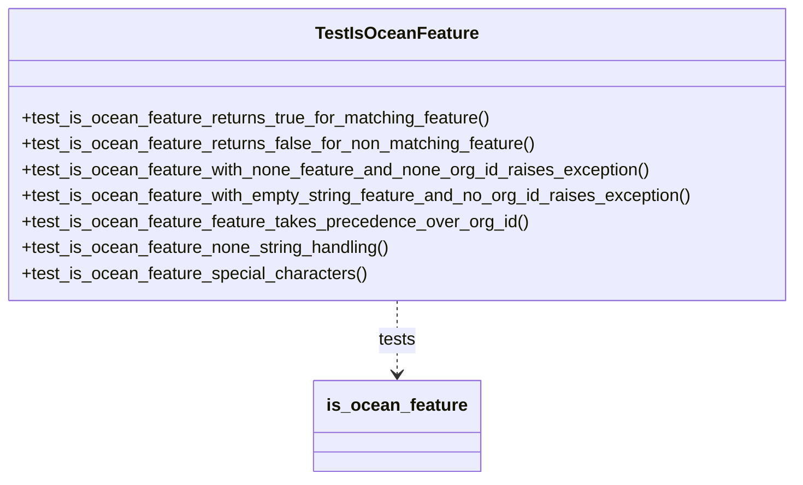
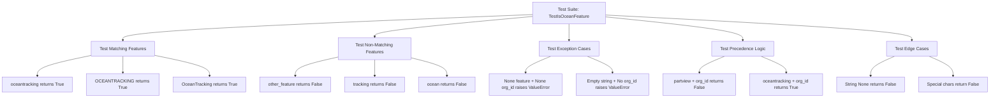

# Diagram: platform/partview_core/partview_service/partview_service/tests/unit/core/business/test_OceanConstants.py

> Auto-generated by Obscura crawlers

## Diagram 1

### SVG

<svg id="container" width="735.6171875" xmlns="http://www.w3.org/2000/svg" class="classDiagram" height="444" viewBox="0 0 735.6171875 444" role="graphics-document document" aria-roledescription="class"><g><defs><marker id="container_class-aggregationStart" class="marker aggregation class" refX="18" refY="7" markerWidth="190" markerHeight="240" orient="auto"><path d="M 18,7 L9,13 L1,7 L9,1 Z"></path></marker></defs><defs><marker id="container_class-aggregationEnd" class="marker aggregation class" refX="1" refY="7" markerWidth="20" markerHeight="28" orient="auto"><path d="M 18,7 L9,13 L1,7 L9,1 Z"></path></marker></defs><defs><marker id="container_class-extensionStart" class="marker extension class" refX="18" refY="7" markerWidth="190" markerHeight="240" orient="auto"><path d="M 1,7 L18,13 V 1 Z"></path></marker></defs><defs><marker id="container_class-extensionEnd" class="marker extension class" refX="1" refY="7" markerWidth="20" markerHeight="28" orient="auto"><path d="M 1,1 V 13 L18,7 Z"></path></marker></defs><defs><marker id="container_class-compositionStart" class="marker composition class" refX="18" refY="7" markerWidth="190" markerHeight="240" orient="auto"><path d="M 18,7 L9,13 L1,7 L9,1 Z"></path></marker></defs><defs><marker id="container_class-compositionEnd" class="marker composition class" refX="1" refY="7" markerWidth="20" markerHeight="28" orient="auto"><path d="M 18,7 L9,13 L1,7 L9,1 Z"></path></marker></defs><defs><marker id="container_class-dependencyStart" class="marker dependency class" refX="6" refY="7" markerWidth="190" markerHeight="240" orient="auto"><path d="M 5,7 L9,13 L1,7 L9,1 Z"></path></marker></defs><defs><marker id="container_class-dependencyEnd" class="marker dependency class" refX="13" refY="7" markerWidth="20" markerHeight="28" orient="auto"><path d="M 18,7 L9,13 L14,7 L9,1 Z"></path></marker></defs><defs><marker id="container_class-lollipopStart" class="marker lollipop class" refX="13" refY="7" markerWidth="190" markerHeight="240" orient="auto"><circle stroke="black" fill="transparent" cx="7" cy="7" r="6"></circle></marker></defs><defs><marker id="container_class-lollipopEnd" class="marker lollipop class" refX="1" refY="7" markerWidth="190" markerHeight="240" orient="auto"><circle stroke="black" fill="transparent" cx="7" cy="7" r="6"></circle></marker></defs><g class="root"><g class="clusters"></g><g class="edgePaths"><path d="M367.809,278L367.809,284.167C367.809,290.333,367.809,302.667,367.809,314C367.809,325.333,367.809,335.667,367.809,340.833L367.809,346" id="id_TestIsOceanFeature_is_ocean_feature_1" class="edge-thickness-normal edge-pattern-dashed relation" style=";;;" data-edge="true" data-et="edge" data-id="id_TestIsOceanFeature_is_ocean_feature_1" data-points="W3sieCI6MzY3LjgwODU5Mzc1LCJ5IjoyNzh9LHsieCI6MzY3LjgwODU5Mzc1LCJ5IjozMTV9LHsieCI6MzY3LjgwODU5Mzc1LCJ5IjozNTJ9XQ==" marker-end="url(#container_class-dependencyEnd)"></path></g><g class="edgeLabels"><g class="edgeLabel" transform="translate(367.80859375, 315)"><g class="label" data-id="id_TestIsOceanFeature_is_ocean_feature_1" transform="translate(-17.4921875, -12)"><foreignObject width="34.984375" height="24">

tests

</foreignObject></g></g></g><g class="nodes"><g class="node default" id="classId-TestIsOceanFeature-0" transform="translate(367.80859375, 143)"><g class="basic label-container"><path d="M-359.80859375 -135 L359.80859375 -135 L359.80859375 135 L-359.80859375 135" stroke="none" stroke-width="0" fill="#ECECFF" style=""></path><path d="M-359.80859375 -135 C-163.43110300653925 -135, 32.94638773692151 -135, 359.80859375 -135 M-359.80859375 -135 C-173.29005318253084 -135, 13.228487384938319 -135, 359.80859375 -135 M359.80859375 -135 C359.80859375 -70.87692468203329, 359.80859375 -6.753849364066582, 359.80859375 135 M359.80859375 -135 C359.80859375 -54.57847671747068, 359.80859375 25.843046565058643, 359.80859375 135 M359.80859375 135 C206.82754482802284 135, 53.846495906045675 135, -359.80859375 135 M359.80859375 135 C195.42710557662863 135, 31.045617403257268 135, -359.80859375 135 M-359.80859375 135 C-359.80859375 71.86451610817019, -359.80859375 8.729032216340372, -359.80859375 -135 M-359.80859375 135 C-359.80859375 33.01489845060067, -359.80859375 -68.97020309879866, -359.80859375 -135" stroke="#9370DB" stroke-width="1.3" fill="none" stroke-dasharray="0 0" style=""></path></g><g class="annotation-group text" transform="translate(0, -111)"></g><g class="label-group text" transform="translate(-71.3828125, -111)"><g class="label" style="font-weight: bolder" transform="translate(0,-12)"><foreignObject width="142.765625" height="24">

TestIsOceanFeature

</foreignObject></g></g><g class="members-group text" transform="translate(-347.80859375, -63)"></g><g class="methods-group text" transform="translate(-347.80859375, -33)"><g class="label" style="" transform="translate(0,-12)"><foreignObject width="437.890625" height="24">

+test_is_ocean_feature_returns_true_for_matching_feature()

</foreignObject></g><g class="label" style="" transform="translate(0,12)"><foreignObject width="478.765625" height="24">

+test_is_ocean_feature_returns_false_for_non_matching_feature()

</foreignObject></g><g class="label" style="" transform="translate(0,36)"><foreignObject width="584.109375" height="24">

+test_is_ocean_feature_with_none_feature_and_none_org_id_raises_exception()

</foreignObject></g><g class="label" style="" transform="translate(0,60)"><foreignObject width="624.234375" height="24">

+test_is_ocean_feature_with_empty_string_feature_and_no_org_id_raises_exception()

</foreignObject></g><g class="label" style="" transform="translate(0,84)"><foreignObject width="467.109375" height="24">

+test_is_ocean_feature_feature_takes_precedence_over_org_id()

</foreignObject></g><g class="label" style="" transform="translate(0,108)"><foreignObject width="343.796875" height="24">

+test_is_ocean_feature_none_string_handling()

</foreignObject></g><g class="label" style="" transform="translate(0,132)"><foreignObject width="319.5" height="24">

+test_is_ocean_feature_special_characters()

</foreignObject></g></g><g class="divider" style=""><path d="M-359.80859375 -87 C-155.8145070981333 -87, 48.17957955373339 -87, 359.80859375 -87 M-359.80859375 -87 C-79.5449280987043 -87, 200.7187375525914 -87, 359.80859375 -87" stroke="#9370DB" stroke-width="1.3" fill="none" stroke-dasharray="0 0" style=""></path></g><g class="divider" style=""><path d="M-359.80859375 -63 C-130.03761664193937 -63, 99.73336046612127 -63, 359.80859375 -63 M-359.80859375 -63 C-206.88193837727763 -63, -53.95528300455527 -63, 359.80859375 -63" stroke="#9370DB" stroke-width="1.3" fill="none" stroke-dasharray="0 0" style=""></path></g></g><g class="node default" id="classId-is_ocean_feature-1" transform="translate(367.80859375, 394)"><g class="basic label-container"><path d="M-74.1796875 -42 L74.1796875 -42 L74.1796875 42 L-74.1796875 42" stroke="none" stroke-width="0" fill="#ECECFF" style=""></path><path d="M-74.1796875 -42 C-21.951681078437836 -42, 30.276325343124327 -42, 74.1796875 -42 M-74.1796875 -42 C-26.851413394137765 -42, 20.47686071172447 -42, 74.1796875 -42 M74.1796875 -42 C74.1796875 -14.620896597314768, 74.1796875 12.758206805370463, 74.1796875 42 M74.1796875 -42 C74.1796875 -13.836619268278199, 74.1796875 14.326761463443603, 74.1796875 42 M74.1796875 42 C25.157994419207355 42, -23.86369866158529 42, -74.1796875 42 M74.1796875 42 C23.601021408250055 42, -26.97764468349989 42, -74.1796875 42 M-74.1796875 42 C-74.1796875 12.315201665757243, -74.1796875 -17.369596668485514, -74.1796875 -42 M-74.1796875 42 C-74.1796875 19.970262367186166, -74.1796875 -2.0594752656276683, -74.1796875 -42" stroke="#9370DB" stroke-width="1.3" fill="none" stroke-dasharray="0 0" style=""></path></g><g class="annotation-group text" transform="translate(0, -18)"></g><g class="label-group text" transform="translate(-62.1796875, -18)"><g class="label" style="font-weight: bolder" transform="translate(0,-12)"><foreignObject width="124.359375" height="24">

is_ocean_feature

</foreignObject></g></g><g class="members-group text" transform="translate(-62.1796875, 30)"></g><g class="methods-group text" transform="translate(-62.1796875, 60)"></g><g class="divider" style=""><path d="M-74.1796875 6 C-21.893765448575806 6, 30.392156602848388 6, 74.1796875 6 M-74.1796875 6 C-40.76069863470951 6, -7.341709769419026 6, 74.1796875 6" stroke="#9370DB" stroke-width="1.3" fill="none" stroke-dasharray="0 0" style=""></path></g><g class="divider" style=""><path d="M-74.1796875 24 C-33.19629434893839 24, 7.787098802123225 24, 74.1796875 24 M-74.1796875 24 C-35.19567323367448 24, 3.788341032651033 24, 74.1796875 24" stroke="#9370DB" stroke-width="1.3" fill="none" stroke-dasharray="0 0" style=""></path></g></g></g></g></g></svg>

## Diagram 2

### SVG

<svg id="container" width="3538.640625" xmlns="http://www.w3.org/2000/svg" class="flowchart" height="350" viewBox="0 0 3538.640625 350" role="graphics-document document" aria-roledescription="flowchart-v2"><g><marker id="container_flowchart-v2-pointEnd" class="marker flowchart-v2" viewBox="0 0 10 10" refX="5" refY="5" markerUnits="userSpaceOnUse" markerWidth="8" markerHeight="8" orient="auto"><path d="M 0 0 L 10 5 L 0 10 z" class="arrowMarkerPath" style="stroke-width: 1; stroke-dasharray: 1, 0;"></path></marker><marker id="container_flowchart-v2-pointStart" class="marker flowchart-v2" viewBox="0 0 10 10" refX="4.5" refY="5" markerUnits="userSpaceOnUse" markerWidth="8" markerHeight="8" orient="auto"><path d="M 0 5 L 10 10 L 10 0 z" class="arrowMarkerPath" style="stroke-width: 1; stroke-dasharray: 1, 0;"></path></marker><marker id="container_flowchart-v2-circleEnd" class="marker flowchart-v2" viewBox="0 0 10 10" refX="11" refY="5" markerUnits="userSpaceOnUse" markerWidth="11" markerHeight="11" orient="auto"><circle cx="5" cy="5" r="5" class="arrowMarkerPath" style="stroke-width: 1; stroke-dasharray: 1, 0;"></circle></marker><marker id="container_flowchart-v2-circleStart" class="marker flowchart-v2" viewBox="0 0 10 10" refX="-1" refY="5" markerUnits="userSpaceOnUse" markerWidth="11" markerHeight="11" orient="auto"><circle cx="5" cy="5" r="5" class="arrowMarkerPath" style="stroke-width: 1; stroke-dasharray: 1, 0;"></circle></marker><marker id="container_flowchart-v2-crossEnd" class="marker cross flowchart-v2" viewBox="0 0 11 11" refX="12" refY="5.2" markerUnits="userSpaceOnUse" markerWidth="11" markerHeight="11" orient="auto"><path d="M 1,1 l 9,9 M 10,1 l -9,9" class="arrowMarkerPath" style="stroke-width: 2; stroke-dasharray: 1, 0;"></path></marker><marker id="container_flowchart-v2-crossStart" class="marker cross flowchart-v2" viewBox="0 0 11 11" refX="-1" refY="5.2" markerUnits="userSpaceOnUse" markerWidth="11" markerHeight="11" orient="auto"><path d="M 1,1 l 9,9 M 10,1 l -9,9" class="arrowMarkerPath" style="stroke-width: 2; stroke-dasharray: 1, 0;"></path></marker><g class="root"><g class="clusters"></g><g class="edgePaths"><path d="M1907.234,52.217L1663.107,62.014C1418.979,71.811,930.724,91.406,686.596,106.703C442.469,122,442.469,133,442.469,138.5L442.469,144" id="L_A_B_0" class="edge-thickness-normal edge-pattern-solid edge-thickness-normal edge-pattern-solid flowchart-link" style=";" data-edge="true" data-et="edge" data-id="L_A_B_0" data-points="W3sieCI6MTkwNy4yMzQzNzUsInkiOjUyLjIxNzA2NzU1NDk4OTQ3fSx7IngiOjQ0Mi40Njg3NSwieSI6MTExfSx7IngiOjQ0Mi40Njg3NSwieSI6MTQ4fV0=" marker-end="url(#container_flowchart-v2-pointEnd)"></path><path d="M1907.234,58.999L1813.337,67.666C1719.44,76.333,1531.646,93.666,1437.749,105.833C1343.852,118,1343.852,125,1343.852,128.5L1343.852,132" id="L_A_C_0" class="edge-thickness-normal edge-pattern-solid edge-thickness-normal edge-pattern-solid flowchart-link" style=";" data-edge="true" data-et="edge" data-id="L_A_C_0" data-points="W3sieCI6MTkwNy4yMzQzNzUsInkiOjU4Ljk5OTE0MzY5MDkxNzQ5fSx7IngiOjEzNDMuODUxNTYyNSwieSI6MTExfSx7IngiOjEzNDMuODUxNTYyNSwieSI6MTM2fV0=" marker-end="url(#container_flowchart-v2-pointEnd)"></path><path d="M2037.234,86L2037.234,90.167C2037.234,94.333,2037.234,102.667,2037.234,112.333C2037.234,122,2037.234,133,2037.234,138.5L2037.234,144" id="L_A_D_0" class="edge-thickness-normal edge-pattern-solid edge-thickness-normal edge-pattern-solid flowchart-link" style=";" data-edge="true" data-et="edge" data-id="L_A_D_0" data-points="W3sieCI6MjAzNy4yMzQzNzUsInkiOjg2fSx7IngiOjIwMzcuMjM0Mzc1LCJ5IjoxMTF9LHsieCI6MjAzNy4yMzQzNzUsInkiOjE0OH1d" marker-end="url(#container_flowchart-v2-pointEnd)"></path><path d="M2167.234,60.419L2248.901,68.849C2330.568,77.28,2493.901,94.14,2575.568,108.07C2657.234,122,2657.234,133,2657.234,138.5L2657.234,144" id="L_A_E_0" class="edge-thickness-normal edge-pattern-solid edge-thickness-normal edge-pattern-solid flowchart-link" style=";" data-edge="true" data-et="edge" data-id="L_A_E_0" data-points="W3sieCI6MjE2Ny4yMzQzNzUsInkiOjYwLjQxOTM1NDgzODcwOTY4fSx7IngiOjI2NTcuMjM0Mzc1LCJ5IjoxMTF9LHsieCI6MjY1Ny4yMzQzNzUsInkiOjE0OH1d" marker-end="url(#container_flowchart-v2-pointEnd)"></path><path d="M2167.234,53.8L2349.487,63.333C2531.74,72.867,2896.245,91.933,3078.497,106.967C3260.75,122,3260.75,133,3260.75,138.5L3260.75,144" id="L_A_F_0" class="edge-thickness-normal edge-pattern-solid edge-thickness-normal edge-pattern-solid flowchart-link" style=";" data-edge="true" data-et="edge" data-id="L_A_F_0" data-points="W3sieCI6MjE2Ny4yMzQzNzUsInkiOjUzLjgwMDA3NjYyMzQ1OTU0Nn0seyJ4IjozMjYwLjc1LCJ5IjoxMTF9LHsieCI6MzI2MC43NSwieSI6MTQ4fV0=" marker-end="url(#container_flowchart-v2-pointEnd)"></path><path d="M329.82,198.466L297.389,205.221C264.958,211.977,200.096,225.489,167.665,237.744C135.234,250,135.234,261,135.234,266.5L135.234,272" id="L_B_B1_0" class="edge-thickness-normal edge-pattern-solid edge-thickness-normal edge-pattern-solid flowchart-link" style=";" data-edge="true" data-et="edge" data-id="L_B_B1_0" data-points="W3sieCI6MzI5LjgyMDMxMjUsInkiOjE5OC40NjU3OTg3MDgyMzM3M30seyJ4IjoxMzUuMjM0Mzc1LCJ5IjoyMzl9LHsieCI6MTM1LjIzNDM3NSwieSI6Mjc2fV0=" marker-end="url(#container_flowchart-v2-pointEnd)"></path><path d="M442.469,202L442.469,208.167C442.469,214.333,442.469,226.667,442.469,236.333C442.469,246,442.469,253,442.469,256.5L442.469,260" id="L_B_B2_0" class="edge-thickness-normal edge-pattern-solid edge-thickness-normal edge-pattern-solid flowchart-link" style=";" data-edge="true" data-et="edge" data-id="L_B_B2_0" data-points="W3sieCI6NDQyLjQ2ODc1LCJ5IjoyMDJ9LHsieCI6NDQyLjQ2ODc1LCJ5IjoyMzl9LHsieCI6NDQyLjQ2ODc1LCJ5IjoyNjR9XQ==" marker-end="url(#container_flowchart-v2-pointEnd)"></path><path d="M555.117,198.323L587.861,205.103C620.604,211.882,686.091,225.441,718.835,237.721C751.578,250,751.578,261,751.578,266.5L751.578,272" id="L_B_B3_0" class="edge-thickness-normal edge-pattern-solid edge-thickness-normal edge-pattern-solid flowchart-link" style=";" data-edge="true" data-et="edge" data-id="L_B_B3_0" data-points="W3sieCI6NTU1LjExNzE4NzUsInkiOjE5OC4zMjM0NTk1MzU5NjUyfSx7IngiOjc1MS41NzgxMjUsInkiOjIzOX0seyJ4Ijo3NTEuNTc4MTI1LCJ5IjoyNzZ9XQ==" marker-end="url(#container_flowchart-v2-pointEnd)"></path><path d="M1213.852,204.147L1187.943,209.956C1162.034,215.764,1110.216,227.382,1084.307,238.691C1058.398,250,1058.398,261,1058.398,266.5L1058.398,272" id="L_C_C1_0" class="edge-thickness-normal edge-pattern-solid edge-thickness-normal edge-pattern-solid flowchart-link" style=";" data-edge="true" data-et="edge" data-id="L_C_C1_0" data-points="W3sieCI6MTIxMy44NTE1NjI1LCJ5IjoyMDQuMTQ2NjQxODUyMzE4MTR9LHsieCI6MTA1OC4zOTg0Mzc1LCJ5IjoyMzl9LHsieCI6MTA1OC4zOTg0Mzc1LCJ5IjoyNzZ9XQ==" marker-end="url(#container_flowchart-v2-pointEnd)"></path><path d="M1343.852,214L1343.852,218.167C1343.852,222.333,1343.852,230.667,1343.852,240.333C1343.852,250,1343.852,261,1343.852,266.5L1343.852,272" id="L_C_C2_0" class="edge-thickness-normal edge-pattern-solid edge-thickness-normal edge-pattern-solid flowchart-link" style=";" data-edge="true" data-et="edge" data-id="L_C_C2_0" data-points="W3sieCI6MTM0My44NTE1NjI1LCJ5IjoyMTR9LHsieCI6MTM0My44NTE1NjI1LCJ5IjoyMzl9LHsieCI6MTM0My44NTE1NjI1LCJ5IjoyNzZ9XQ==" marker-end="url(#container_flowchart-v2-pointEnd)"></path><path d="M1473.852,207.24L1495.195,212.534C1516.539,217.827,1559.227,228.413,1580.57,239.207C1601.914,250,1601.914,261,1601.914,266.5L1601.914,272" id="L_C_C3_0" class="edge-thickness-normal edge-pattern-solid edge-thickness-normal edge-pattern-solid flowchart-link" style=";" data-edge="true" data-et="edge" data-id="L_C_C3_0" data-points="W3sieCI6MTQ3My44NTE1NjI1LCJ5IjoyMDcuMjQwMjUxODc2OTY3OH0seyJ4IjoxNjAxLjkxNDA2MjUsInkiOjIzOX0seyJ4IjoxNjAxLjkxNDA2MjUsInkiOjI3Nn1d" marker-end="url(#container_flowchart-v2-pointEnd)"></path><path d="M1971.844,202L1956.909,208.167C1941.974,214.333,1912.104,226.667,1897.169,236.333C1882.234,246,1882.234,253,1882.234,256.5L1882.234,260" id="L_D_D1_0" class="edge-thickness-normal edge-pattern-solid edge-thickness-normal edge-pattern-solid flowchart-link" style=";" data-edge="true" data-et="edge" data-id="L_D_D1_0" data-points="W3sieCI6MTk3MS44NDM3NSwieSI6MjAyfSx7IngiOjE4ODIuMjM0Mzc1LCJ5IjoyMzl9LHsieCI6MTg4Mi4yMzQzNzUsInkiOjI2NH1d" marker-end="url(#container_flowchart-v2-pointEnd)"></path><path d="M2102.625,202L2117.56,208.167C2132.495,214.333,2162.365,226.667,2177.299,236.333C2192.234,246,2192.234,253,2192.234,256.5L2192.234,260" id="L_D_D2_0" class="edge-thickness-normal edge-pattern-solid edge-thickness-normal edge-pattern-solid flowchart-link" style=";" data-edge="true" data-et="edge" data-id="L_D_D2_0" data-points="W3sieCI6MjEwMi42MjUsInkiOjIwMn0seyJ4IjoyMTkyLjIzNDM3NSwieSI6MjM5fSx7IngiOjIxOTIuMjM0Mzc1LCJ5IjoyNjR9XQ==" marker-end="url(#container_flowchart-v2-pointEnd)"></path><path d="M2591.844,202L2576.909,208.167C2561.974,214.333,2532.104,226.667,2517.169,236.333C2502.234,246,2502.234,253,2502.234,256.5L2502.234,260" id="L_E_E1_0" class="edge-thickness-normal edge-pattern-solid edge-thickness-normal edge-pattern-solid flowchart-link" style=";" data-edge="true" data-et="edge" data-id="L_E_E1_0" data-points="W3sieCI6MjU5MS44NDM3NSwieSI6MjAyfSx7IngiOjI1MDIuMjM0Mzc1LCJ5IjoyMzl9LHsieCI6MjUwMi4yMzQzNzUsInkiOjI2NH1d" marker-end="url(#container_flowchart-v2-pointEnd)"></path><path d="M2722.625,202L2737.56,208.167C2752.495,214.333,2782.365,226.667,2797.299,236.333C2812.234,246,2812.234,253,2812.234,256.5L2812.234,260" id="L_E_E2_0" class="edge-thickness-normal edge-pattern-solid edge-thickness-normal edge-pattern-solid flowchart-link" style=";" data-edge="true" data-et="edge" data-id="L_E_E2_0" data-points="W3sieCI6MjcyMi42MjUsInkiOjIwMn0seyJ4IjoyODEyLjIzNDM3NSwieSI6MjM5fSx7IngiOjI4MTIuMjM0Mzc1LCJ5IjoyNjR9XQ==" marker-end="url(#container_flowchart-v2-pointEnd)"></path><path d="M3198.692,202L3184.518,208.167C3170.344,214.333,3141.996,226.667,3127.822,238.333C3113.648,250,3113.648,261,3113.648,266.5L3113.648,272" id="L_F_F1_0" class="edge-thickness-normal edge-pattern-solid edge-thickness-normal edge-pattern-solid flowchart-link" style=";" data-edge="true" data-et="edge" data-id="L_F_F1_0" data-points="W3sieCI6MzE5OC42OTE1MjgzMjAzMTI1LCJ5IjoyMDJ9LHsieCI6MzExMy42NDg0Mzc1LCJ5IjoyMzl9LHsieCI6MzExMy42NDg0Mzc1LCJ5IjoyNzZ9XQ==" marker-end="url(#container_flowchart-v2-pointEnd)"></path><path d="M3322.808,202L3336.982,208.167C3351.156,214.333,3379.504,226.667,3393.678,238.333C3407.852,250,3407.852,261,3407.852,266.5L3407.852,272" id="L_F_F2_0" class="edge-thickness-normal edge-pattern-solid edge-thickness-normal edge-pattern-solid flowchart-link" style=";" data-edge="true" data-et="edge" data-id="L_F_F2_0" data-points="W3sieCI6MzMyMi44MDg0NzE2Nzk2ODc1LCJ5IjoyMDJ9LHsieCI6MzQwNy44NTE1NjI1LCJ5IjoyMzl9LHsieCI6MzQwNy44NTE1NjI1LCJ5IjoyNzZ9XQ==" marker-end="url(#container_flowchart-v2-pointEnd)"></path></g><g class="edgeLabels"><g class="edgeLabel"><g class="label" data-id="L_A_B_0" transform="translate(0, 0)"><foreignObject width="0" height="0">

</foreignObject></g></g><g class="edgeLabel"><g class="label" data-id="L_A_C_0" transform="translate(0, 0)"><foreignObject width="0" height="0">

</foreignObject></g></g><g class="edgeLabel"><g class="label" data-id="L_A_D_0" transform="translate(0, 0)"><foreignObject width="0" height="0">

</foreignObject></g></g><g class="edgeLabel"><g class="label" data-id="L_A_E_0" transform="translate(0, 0)"><foreignObject width="0" height="0">

</foreignObject></g></g><g class="edgeLabel"><g class="label" data-id="L_A_F_0" transform="translate(0, 0)"><foreignObject width="0" height="0">

</foreignObject></g></g><g class="edgeLabel"><g class="label" data-id="L_B_B1_0" transform="translate(0, 0)"><foreignObject width="0" height="0">

</foreignObject></g></g><g class="edgeLabel"><g class="label" data-id="L_B_B2_0" transform="translate(0, 0)"><foreignObject width="0" height="0">

</foreignObject></g></g><g class="edgeLabel"><g class="label" data-id="L_B_B3_0" transform="translate(0, 0)"><foreignObject width="0" height="0">

</foreignObject></g></g><g class="edgeLabel"><g class="label" data-id="L_C_C1_0" transform="translate(0, 0)"><foreignObject width="0" height="0">

</foreignObject></g></g><g class="edgeLabel"><g class="label" data-id="L_C_C2_0" transform="translate(0, 0)"><foreignObject width="0" height="0">

</foreignObject></g></g><g class="edgeLabel"><g class="label" data-id="L_C_C3_0" transform="translate(0, 0)"><foreignObject width="0" height="0">

</foreignObject></g></g><g class="edgeLabel"><g class="label" data-id="L_D_D1_0" transform="translate(0, 0)"><foreignObject width="0" height="0">

</foreignObject></g></g><g class="edgeLabel"><g class="label" data-id="L_D_D2_0" transform="translate(0, 0)"><foreignObject width="0" height="0">

</foreignObject></g></g><g class="edgeLabel"><g class="label" data-id="L_E_E1_0" transform="translate(0, 0)"><foreignObject width="0" height="0">

</foreignObject></g></g><g class="edgeLabel"><g class="label" data-id="L_E_E2_0" transform="translate(0, 0)"><foreignObject width="0" height="0">

</foreignObject></g></g><g class="edgeLabel"><g class="label" data-id="L_F_F1_0" transform="translate(0, 0)"><foreignObject width="0" height="0">

</foreignObject></g></g><g class="edgeLabel"><g class="label" data-id="L_F_F2_0" transform="translate(0, 0)"><foreignObject width="0" height="0">

</foreignObject></g></g></g><g class="nodes"><g class="node default" id="flowchart-A-0" transform="translate(2037.234375, 47)"><rect class="basic label-container" style="" x="-130" y="-39" width="260" height="78"></rect><g class="label" style="" transform="translate(-100, -24)"><rect></rect><foreignObject width="200" height="48">

Test Suite: TestIsOceanFeature

</foreignObject></g></g><g class="node default" id="flowchart-B-1" transform="translate(442.46875, 175)"><rect class="basic label-container" style="" x="-112.6484375" y="-27" width="225.296875" height="54"></rect><g class="label" style="" transform="translate(-82.6484375, -12)"><rect></rect><foreignObject width="165.296875" height="24">

Test Matching Features

</foreignObject></g></g><g class="node default" id="flowchart-C-3" transform="translate(1343.8515625, 175)"><rect class="basic label-container" style="" x="-130" y="-39" width="260" height="78"></rect><g class="label" style="" transform="translate(-100, -24)"><rect></rect><foreignObject width="200" height="48">

Test Non-Matching Features

</foreignObject></g></g><g class="node default" id="flowchart-D-5" transform="translate(2037.234375, 175)"><rect class="basic label-container" style="" x="-104.796875" y="-27" width="209.59375" height="54"></rect><g class="label" style="" transform="translate(-74.796875, -12)"><rect></rect><foreignObject width="149.59375" height="24">

Test Exception Cases

</foreignObject></g></g><g class="node default" id="flowchart-E-7" transform="translate(2657.234375, 175)"><rect class="basic label-container" style="" x="-109.1953125" y="-27" width="218.390625" height="54"></rect><g class="label" style="" transform="translate(-79.1953125, -12)"><rect></rect><foreignObject width="158.390625" height="24">

Test Precedence Logic

</foreignObject></g></g><g class="node default" id="flowchart-F-9" transform="translate(3260.75, 175)"><rect class="basic label-container" style="" x="-86.7265625" y="-27" width="173.453125" height="54"></rect><g class="label" style="" transform="translate(-56.7265625, -12)"><rect></rect><foreignObject width="113.453125" height="24">

Test Edge Cases

</foreignObject></g></g><g class="node default" id="flowchart-B1-11" transform="translate(135.234375, 303)"><rect class="basic label-container" style="" x="-127.234375" y="-27" width="254.46875" height="54"></rect><g class="label" style="" transform="translate(-97.234375, -12)"><rect></rect><foreignObject width="194.46875" height="24">

oceantracking returns True

</foreignObject></g></g><g class="node default" id="flowchart-B2-13" transform="translate(442.46875, 303)"><rect class="basic label-container" style="" x="-130" y="-39" width="260" height="78"></rect><g class="label" style="" transform="translate(-100, -24)"><rect></rect><foreignObject width="200" height="48">

OCEANTRACKING returns True

</foreignObject></g></g><g class="node default" id="flowchart-B3-15" transform="translate(751.578125, 303)"><rect class="basic label-container" style="" x="-129.109375" y="-27" width="258.21875" height="54"></rect><g class="label" style="" transform="translate(-99.109375, -12)"><rect></rect><foreignObject width="198.21875" height="24">

OceanTracking returns True

</foreignObject></g></g><g class="node default" id="flowchart-C1-17" transform="translate(1058.3984375, 303)"><rect class="basic label-container" style="" x="-127.7109375" y="-27" width="255.421875" height="54"></rect><g class="label" style="" transform="translate(-97.7109375, -12)"><rect></rect><foreignObject width="195.421875" height="24">

other_feature returns False

</foreignObject></g></g><g class="node default" id="flowchart-C2-19" transform="translate(1343.8515625, 303)"><rect class="basic label-container" style="" x="-107.7421875" y="-27" width="215.484375" height="54"></rect><g class="label" style="" transform="translate(-77.7421875, -12)"><rect></rect><foreignObject width="155.484375" height="24">

tracking returns False

</foreignObject></g></g><g class="node default" id="flowchart-C3-21" transform="translate(1601.9140625, 303)"><rect class="basic label-container" style="" x="-100.3203125" y="-27" width="200.640625" height="54"></rect><g class="label" style="" transform="translate(-70.3203125, -12)"><rect></rect><foreignObject width="140.640625" height="24">

ocean returns False

</foreignObject></g></g><g class="node default" id="flowchart-D1-23" transform="translate(1882.234375, 303)"><rect class="basic label-container" style="" x="-130" y="-39" width="260" height="78"></rect><g class="label" style="" transform="translate(-100, -24)"><rect></rect><foreignObject width="200" height="48">

None feature + None org_id raises ValueError

</foreignObject></g></g><g class="node default" id="flowchart-D2-25" transform="translate(2192.234375, 303)"><rect class="basic label-container" style="" x="-130" y="-39" width="260" height="78"></rect><g class="label" style="" transform="translate(-100, -24)"><rect></rect><foreignObject width="200" height="48">

Empty string + No org_id raises ValueError

</foreignObject></g></g><g class="node default" id="flowchart-E1-27" transform="translate(2502.234375, 303)"><rect class="basic label-container" style="" x="-130" y="-39" width="260" height="78"></rect><g class="label" style="" transform="translate(-100, -24)"><rect></rect><foreignObject width="200" height="48">

partview + org_id returns False

</foreignObject></g></g><g class="node default" id="flowchart-E2-29" transform="translate(2812.234375, 303)"><rect class="basic label-container" style="" x="-130" y="-39" width="260" height="78"></rect><g class="label" style="" transform="translate(-100, -24)"><rect></rect><foreignObject width="200" height="48">

oceantracking + org_id returns True

</foreignObject></g></g><g class="node default" id="flowchart-F1-31" transform="translate(3113.6484375, 303)"><rect class="basic label-container" style="" x="-121.4140625" y="-27" width="242.828125" height="54"></rect><g class="label" style="" transform="translate(-91.4140625, -12)"><rect></rect><foreignObject width="182.828125" height="24">

String None returns False

</foreignObject></g></g><g class="node default" id="flowchart-F2-33" transform="translate(3407.8515625, 303)"><rect class="basic label-container" style="" x="-122.7890625" y="-27" width="245.578125" height="54"></rect><g class="label" style="" transform="translate(-92.7890625, -12)"><rect></rect><foreignObject width="185.578125" height="24">

Special chars return False

</foreignObject></g></g></g></g></g></svg>
