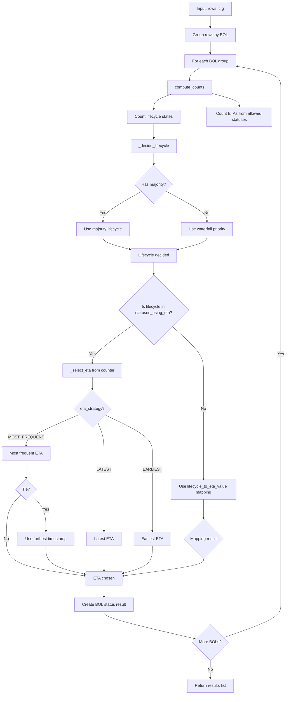
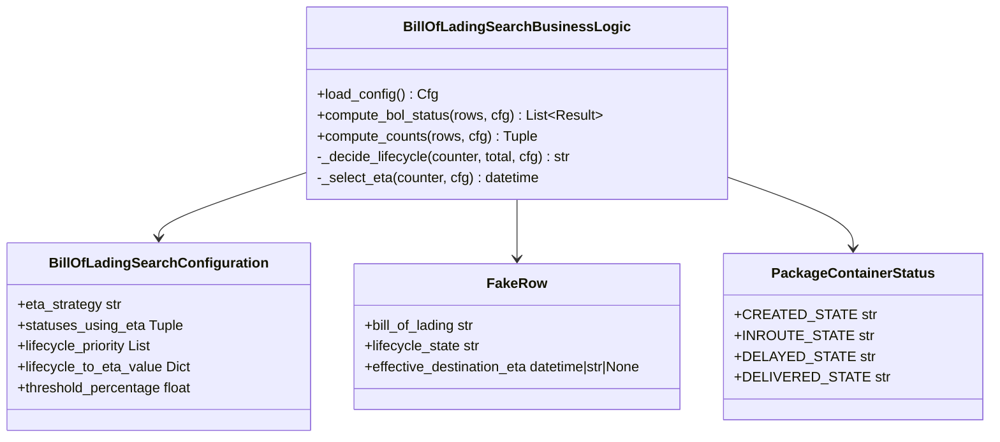
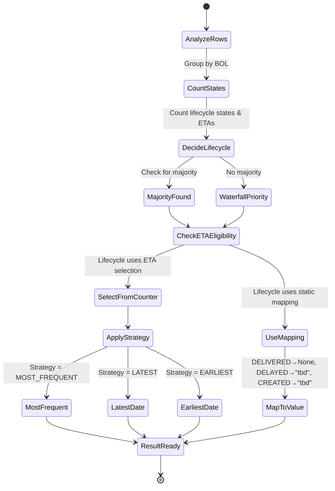

# Diagram: platform/partview_core/partview_service/partview_service/tests/unit/core/business/trip_leg/test_BillOfLadingSearchBusinessLogic.py

> Auto-generated by Obscura crawlers

## Diagram 1

### SVG

<svg id="container" width="1136.4140625" xmlns="http://www.w3.org/2000/svg" class="flowchart" height="2748.453125" viewBox="0 0 1136.4140625 2748.453125" role="graphics-document document" aria-roledescription="flowchart-v2"><g><marker id="container_flowchart-v2-pointEnd" class="marker flowchart-v2" viewBox="0 0 10 10" refX="5" refY="5" markerUnits="userSpaceOnUse" markerWidth="8" markerHeight="8" orient="auto"><path d="M 0 0 L 10 5 L 0 10 z" class="arrowMarkerPath" style="stroke-width: 1; stroke-dasharray: 1, 0;"></path></marker><marker id="container_flowchart-v2-pointStart" class="marker flowchart-v2" viewBox="0 0 10 10" refX="4.5" refY="5" markerUnits="userSpaceOnUse" markerWidth="8" markerHeight="8" orient="auto"><path d="M 0 5 L 10 10 L 10 0 z" class="arrowMarkerPath" style="stroke-width: 1; stroke-dasharray: 1, 0;"></path></marker><marker id="container_flowchart-v2-circleEnd" class="marker flowchart-v2" viewBox="0 0 10 10" refX="11" refY="5" markerUnits="userSpaceOnUse" markerWidth="11" markerHeight="11" orient="auto"><circle cx="5" cy="5" r="5" class="arrowMarkerPath" style="stroke-width: 1; stroke-dasharray: 1, 0;"></circle></marker><marker id="container_flowchart-v2-circleStart" class="marker flowchart-v2" viewBox="0 0 10 10" refX="-1" refY="5" markerUnits="userSpaceOnUse" markerWidth="11" markerHeight="11" orient="auto"><circle cx="5" cy="5" r="5" class="arrowMarkerPath" style="stroke-width: 1; stroke-dasharray: 1, 0;"></circle></marker><marker id="container_flowchart-v2-crossEnd" class="marker cross flowchart-v2" viewBox="0 0 11 11" refX="12" refY="5.2" markerUnits="userSpaceOnUse" markerWidth="11" markerHeight="11" orient="auto"><path d="M 1,1 l 9,9 M 10,1 l -9,9" class="arrowMarkerPath" style="stroke-width: 2; stroke-dasharray: 1, 0;"></path></marker><marker id="container_flowchart-v2-crossStart" class="marker cross flowchart-v2" viewBox="0 0 11 11" refX="-1" refY="5.2" markerUnits="userSpaceOnUse" markerWidth="11" markerHeight="11" orient="auto"><path d="M 1,1 l 9,9 M 10,1 l -9,9" class="arrowMarkerPath" style="stroke-width: 2; stroke-dasharray: 1, 0;"></path></marker><g class="root"><g class="clusters"></g><g class="edgePaths"><path d="M838.016,62L838.016,66.167C838.016,70.333,838.016,78.667,838.016,86.333C838.016,94,838.016,101,838.016,104.5L838.016,108" id="L_Start_GroupByBOL_0" class="edge-thickness-normal edge-pattern-solid edge-thickness-normal edge-pattern-solid flowchart-link" style=";" data-edge="true" data-et="edge" data-id="L_Start_GroupByBOL_0" data-points="W3sieCI6ODM4LjAxNTYyNSwieSI6NjJ9LHsieCI6ODM4LjAxNTYyNSwieSI6ODd9LHsieCI6ODM4LjAxNTYyNSwieSI6MTEyfV0=" marker-end="url(#container_flowchart-v2-pointEnd)"></path><path d="M838.016,166L838.016,170.167C838.016,174.333,838.016,182.667,838.016,190.333C838.016,198,838.016,205,838.016,208.5L838.016,212" id="L_GroupByBOL_ProcessEachBOL_0" class="edge-thickness-normal edge-pattern-solid edge-thickness-normal edge-pattern-solid flowchart-link" style=";" data-edge="true" data-et="edge" data-id="L_GroupByBOL_ProcessEachBOL_0" data-points="W3sieCI6ODM4LjAxNTYyNSwieSI6MTY2fSx7IngiOjgzOC4wMTU2MjUsInkiOjE5MX0seyJ4Ijo4MzguMDE1NjI1LCJ5IjoyMTZ9XQ==" marker-end="url(#container_flowchart-v2-pointEnd)"></path><path d="M795.179,270L788.569,274.167C781.958,278.333,768.737,286.667,762.126,294.333C755.516,302,755.516,309,755.516,312.5L755.516,316" id="L_ProcessEachBOL_ComputeCounts_0" class="edge-thickness-normal edge-pattern-solid edge-thickness-normal edge-pattern-solid flowchart-link" style=";" data-edge="true" data-et="edge" data-id="L_ProcessEachBOL_ComputeCounts_0" data-points="W3sieCI6Nzk1LjE3OTA4NjUzODQ2MTUsInkiOjI3MH0seyJ4Ijo3NTUuNTE1NjI1LCJ5IjoyOTV9LHsieCI6NzU1LjUxNTYyNSwieSI6MzIwfV0=" marker-end="url(#container_flowchart-v2-pointEnd)"></path><path d="M680.998,374L669.498,378.167C657.999,382.333,634.999,390.667,623.5,400.333C612,410,612,421,612,426.5L612,432" id="L_ComputeCounts_CountLifecycles_0" class="edge-thickness-normal edge-pattern-solid edge-thickness-normal edge-pattern-solid flowchart-link" style=";" data-edge="true" data-et="edge" data-id="L_ComputeCounts_CountLifecycles_0" data-points="W3sieCI6NjgwLjk5Nzg5NjYzNDYxNTQsInkiOjM3NH0seyJ4Ijo2MTIsInkiOjM5OX0seyJ4Ijo2MTIsInkiOjQzNn1d" marker-end="url(#container_flowchart-v2-pointEnd)"></path><path d="M845.391,370.861L863.056,375.55C880.721,380.24,916.052,389.62,933.717,397.81C951.383,406,951.383,413,951.383,416.5L951.383,420" id="L_ComputeCounts_CountETAs_0" class="edge-thickness-normal edge-pattern-solid edge-thickness-normal edge-pattern-solid flowchart-link" style=";" data-edge="true" data-et="edge" data-id="L_ComputeCounts_CountETAs_0" data-points="W3sieCI6ODQ1LjM5MDYyNSwieSI6MzcwLjg2MDU1NjAyMDkwMDZ9LHsieCI6OTUxLjM4MjgxMjUsInkiOjM5OX0seyJ4Ijo5NTEuMzgyODEyNSwieSI6NDI0fV0=" marker-end="url(#container_flowchart-v2-pointEnd)"></path><path d="M612,490L612,496.167C612,502.333,612,514.667,612,524.333C612,534,612,541,612,544.5L612,548" id="L_CountLifecycles_DecideLifecycle_0" class="edge-thickness-normal edge-pattern-solid edge-thickness-normal edge-pattern-solid flowchart-link" style=";" data-edge="true" data-et="edge" data-id="L_CountLifecycles_DecideLifecycle_0" data-points="W3sieCI6NjEyLCJ5Ijo0OTB9LHsieCI6NjEyLCJ5Ijo1Mjd9LHsieCI6NjEyLCJ5Ijo1NTJ9XQ==" marker-end="url(#container_flowchart-v2-pointEnd)"></path><path d="M612,606L612,610.167C612,614.333,612,622.667,612,630.333C612,638,612,645,612,648.5L612,652" id="L_DecideLifecycle_CheckMajority_0" class="edge-thickness-normal edge-pattern-solid edge-thickness-normal edge-pattern-solid flowchart-link" style=";" data-edge="true" data-et="edge" data-id="L_DecideLifecycle_CheckMajority_0" data-points="W3sieCI6NjEyLCJ5Ijo2MDZ9LHsieCI6NjEyLCJ5Ijo2MzF9LHsieCI6NjEyLCJ5Ijo2NTZ9XQ==" marker-end="url(#container_flowchart-v2-pointEnd)"></path><path d="M562.392,758.735L535.435,773.17C508.477,787.605,454.563,816.474,427.606,836.409C400.648,856.344,400.648,867.344,400.648,872.844L400.648,878.344" id="L_CheckMajority_UseMajority_0" class="edge-thickness-normal edge-pattern-solid edge-thickness-normal edge-pattern-solid flowchart-link" style=";" data-edge="true" data-et="edge" data-id="L_CheckMajority_UseMajority_0" data-points="W3sieCI6NTYyLjM5MTczNDY0OTk2NzUsInkiOjc1OC43MzU0ODQ2NDk5Njc1fSx7IngiOjQwMC42NDg0Mzc1LCJ5Ijo4NDUuMzQzNzV9LHsieCI6NDAwLjY0ODQzNzUsInkiOjg4Mi4zNDM3NX1d" marker-end="url(#container_flowchart-v2-pointEnd)"></path><path d="M661.313,759.031L687.725,773.416C714.137,787.802,766.961,816.573,793.373,836.458C819.785,856.344,819.785,867.344,819.785,872.844L819.785,878.344" id="L_CheckMajority_UseWaterfall_0" class="edge-thickness-normal edge-pattern-solid edge-thickness-normal edge-pattern-solid flowchart-link" style=";" data-edge="true" data-et="edge" data-id="L_CheckMajority_UseWaterfall_0" data-points="W3sieCI6NjYxLjMxMzA5NjE3MDgxNDgsInkiOjc1OS4wMzA2NTM4MjkxODUyfSx7IngiOjgxOS43ODUxNTYyNSwieSI6ODQ1LjM0Mzc1fSx7IngiOjgxOS43ODUxNTYyNSwieSI6ODgyLjM0Mzc1fV0=" marker-end="url(#container_flowchart-v2-pointEnd)"></path><path d="M400.648,936.344L400.648,940.51C400.648,944.677,400.648,953.01,419.777,961.883C438.906,970.756,477.163,980.169,496.292,984.875L515.421,989.582" id="L_UseMajority_LifecycleDecided_0" class="edge-thickness-normal edge-pattern-solid edge-thickness-normal edge-pattern-solid flowchart-link" style=";" data-edge="true" data-et="edge" data-id="L_UseMajority_LifecycleDecided_0" data-points="W3sieCI6NDAwLjY0ODQzNzUsInkiOjkzNi4zNDM3NX0seyJ4Ijo0MDAuNjQ4NDM3NSwieSI6OTYxLjM0Mzc1fSx7IngiOjUxOS4zMDQ2ODc1LCJ5Ijo5OTAuNTM3NDA2ODk1NzIzMn1d" marker-end="url(#container_flowchart-v2-pointEnd)"></path><path d="M819.785,936.344L819.785,940.51C819.785,944.677,819.785,953.01,801.25,961.816C782.715,970.621,745.645,979.898,727.111,984.536L708.576,989.175" id="L_UseWaterfall_LifecycleDecided_0" class="edge-thickness-normal edge-pattern-solid edge-thickness-normal edge-pattern-solid flowchart-link" style=";" data-edge="true" data-et="edge" data-id="L_UseWaterfall_LifecycleDecided_0" data-points="W3sieCI6ODE5Ljc4NTE1NjI1LCJ5Ijo5MzYuMzQzNzV9LHsieCI6ODE5Ljc4NTE1NjI1LCJ5Ijo5NjEuMzQzNzV9LHsieCI6NzA0LjY5NTMxMjUsInkiOjk5MC4xNDU5NjA4MTcyMTI4fV0=" marker-end="url(#container_flowchart-v2-pointEnd)"></path><path d="M612,1040.344L612,1044.51C612,1048.677,612,1057.01,612,1064.677C612,1072.344,612,1079.344,612,1082.844L612,1086.344" id="L_LifecycleDecided_CheckIfETAAllowed_0" class="edge-thickness-normal edge-pattern-solid edge-thickness-normal edge-pattern-solid flowchart-link" style=";" data-edge="true" data-et="edge" data-id="L_LifecycleDecided_CheckIfETAAllowed_0" data-points="W3sieCI6NjEyLCJ5IjoxMDQwLjM0Mzc1fSx7IngiOjYxMiwieSI6MTA2NS4zNDM3NX0seyJ4Ijo2MTIsInkiOjEwOTAuMzQzNzV9XQ==" marker-end="url(#container_flowchart-v2-pointEnd)"></path><path d="M531.102,1287.446L503.743,1307.096C476.385,1326.745,421.667,1366.045,394.308,1391.194C366.949,1416.344,366.949,1427.344,366.949,1432.844L366.949,1438.344" id="L_CheckIfETAAllowed_SelectETA_0" class="edge-thickness-normal edge-pattern-solid edge-thickness-normal edge-pattern-solid flowchart-link" style=";" data-edge="true" data-et="edge" data-id="L_CheckIfETAAllowed_SelectETA_0" data-points="W3sieCI6NTMxLjEwMjI1NTMzMjE3NjcsInkiOjEyODcuNDQ2MDA1MzMyMTc2OH0seyJ4IjozNjYuOTQ5MjE4NzUsInkiOjE0MDUuMzQzNzV9LHsieCI6MzY2Ljk0OTIxODc1LCJ5IjoxNDQyLjM0Mzc1fV0=" marker-end="url(#container_flowchart-v2-pointEnd)"></path><path d="M685.213,1295.131L705.655,1313.5C726.098,1331.868,766.982,1368.606,787.425,1397.642C807.867,1426.677,807.867,1448.01,807.867,1467.344C807.867,1486.677,807.867,1504.01,807.867,1529.368C807.867,1554.727,807.867,1588.109,807.867,1623.492C807.867,1658.875,807.867,1696.258,807.867,1725.616C807.867,1754.974,807.867,1776.307,807.867,1797.641C807.867,1818.974,807.867,1840.307,807.867,1856.826C807.867,1873.344,807.867,1885.047,807.867,1890.898L807.867,1896.75" id="L_CheckIfETAAllowed_UseMapping_0" class="edge-thickness-normal edge-pattern-solid edge-thickness-normal edge-pattern-solid flowchart-link" style=";" data-edge="true" data-et="edge" data-id="L_CheckIfETAAllowed_UseMapping_0" data-points="W3sieCI6Njg1LjIxMzA3MTcwMzE4NzEsInkiOjEyOTUuMTMwNjc4Mjk2ODEzfSx7IngiOjgwNy44NjcxODc1LCJ5IjoxNDA1LjM0Mzc1fSx7IngiOjgwNy44NjcxODc1LCJ5IjoxNDY5LjM0Mzc1fSx7IngiOjgwNy44NjcxODc1LCJ5IjoxNTIxLjM0Mzc1fSx7IngiOjgwNy44NjcxODc1LCJ5IjoxNjIxLjQ5MjE4NzV9LHsieCI6ODA3Ljg2NzE4NzUsInkiOjE3MzMuNjQwNjI1fSx7IngiOjgwNy44NjcxODc1LCJ5IjoxNzk3LjY0MDYyNX0seyJ4Ijo4MDcuODY3MTg3NSwieSI6MTg2MS42NDA2MjV9LHsieCI6ODA3Ljg2NzE4NzUsInkiOjE5MDAuNzV9XQ==" marker-end="url(#container_flowchart-v2-pointEnd)"></path><path d="M366.949,1496.344L366.949,1500.51C366.949,1504.677,366.949,1513.01,366.949,1520.677C366.949,1528.344,366.949,1535.344,366.949,1538.844L366.949,1542.344" id="L_SelectETA_ETAStrategy_0" class="edge-thickness-normal edge-pattern-solid edge-thickness-normal edge-pattern-solid flowchart-link" style=";" data-edge="true" data-et="edge" data-id="L_SelectETA_ETAStrategy_0" data-points="W3sieCI6MzY2Ljk0OTIxODc1LCJ5IjoxNDk2LjM0Mzc1fSx7IngiOjM2Ni45NDkyMTg3NSwieSI6MTUyMS4zNDM3NX0seyJ4IjozNjYuOTQ5MjE4NzUsInkiOjE1NDYuMzQzNzV9XQ==" marker-end="url(#container_flowchart-v2-pointEnd)"></path><path d="M314.247,1643.938L279.143,1658.888C244.039,1673.839,173.832,1703.74,138.729,1724.19C103.625,1744.641,103.625,1755.641,103.625,1761.141L103.625,1766.641" id="L_ETAStrategy_MostFrequent_0" class="edge-thickness-normal edge-pattern-solid edge-thickness-normal edge-pattern-solid flowchart-link" style=";" data-edge="true" data-et="edge" data-id="L_ETAStrategy_MostFrequent_0" data-points="W3sieCI6MzE0LjI0NjU2OTc5Mzg2NjU3LCJ5IjoxNjQzLjkzNzk3NjA0Mzg2Njd9LHsieCI6MTAzLjYyNSwieSI6MTczMy42NDA2MjV9LHsieCI6MTAzLjYyNSwieSI6MTc3MC42NDA2MjV9XQ==" marker-end="url(#container_flowchart-v2-pointEnd)"></path><path d="M389.859,1673.731L394.238,1683.716C398.617,1693.701,407.375,1713.671,411.754,1734.322C416.133,1754.974,416.133,1776.307,416.133,1797.641C416.133,1818.974,416.133,1840.307,416.133,1863.992C416.133,1887.677,416.133,1913.714,416.133,1939.75C416.133,1965.786,416.133,1991.823,416.133,2019.365C416.133,2046.906,416.133,2075.953,416.133,2090.477L416.133,2105" id="L_ETAStrategy_Latest_0" class="edge-thickness-normal edge-pattern-solid edge-thickness-normal edge-pattern-solid flowchart-link" style=";" data-edge="true" data-et="edge" data-id="L_ETAStrategy_Latest_0" data-points="W3sieCI6Mzg5Ljg1ODkyOTgxMTc3ODIsInkiOjE2NzMuNzMwOTEzOTM4MjIxOX0seyJ4Ijo0MTYuMTMyODEyNSwieSI6MTczMy42NDA2MjV9LHsieCI6NDE2LjEzMjgxMjUsInkiOjE3OTcuNjQwNjI1fSx7IngiOjQxNi4xMzI4MTI1LCJ5IjoxODYxLjY0MDYyNX0seyJ4Ijo0MTYuMTMyODEyNSwieSI6MTkzOS43NX0seyJ4Ijo0MTYuMTMyODEyNSwieSI6MjAxNy44NTkzNzV9LHsieCI6NDE2LjEzMjgxMjUsInkiOjIxMDl9XQ==" marker-end="url(#container_flowchart-v2-pointEnd)"></path><path d="M418.018,1645.572L449.148,1660.25C480.278,1674.928,542.537,1704.284,573.667,1729.629C604.797,1754.974,604.797,1776.307,604.797,1797.641C604.797,1818.974,604.797,1840.307,604.797,1863.992C604.797,1887.677,604.797,1913.714,604.797,1939.75C604.797,1965.786,604.797,1991.823,604.797,2019.365C604.797,2046.906,604.797,2075.953,604.797,2090.477L604.797,2105" id="L_ETAStrategy_Earliest_0" class="edge-thickness-normal edge-pattern-solid edge-thickness-normal edge-pattern-solid flowchart-link" style=";" data-edge="true" data-et="edge" data-id="L_ETAStrategy_Earliest_0" data-points="W3sieCI6NDE4LjAxODAxNjUxNDkwMjUsInkiOjE2NDUuNTcxODI3MjM1MDk3NX0seyJ4Ijo2MDQuNzk2ODc1LCJ5IjoxNzMzLjY0MDYyNX0seyJ4Ijo2MDQuNzk2ODc1LCJ5IjoxNzk3LjY0MDYyNX0seyJ4Ijo2MDQuNzk2ODc1LCJ5IjoxODYxLjY0MDYyNX0seyJ4Ijo2MDQuNzk2ODc1LCJ5IjoxOTM5Ljc1fSx7IngiOjYwNC43OTY4NzUsInkiOjIwMTcuODU5Mzc1fSx7IngiOjYwNC43OTY4NzUsInkiOjIxMDl9XQ==" marker-end="url(#container_flowchart-v2-pointEnd)"></path><path d="M103.625,1824.641L103.625,1830.807C103.625,1836.974,103.625,1849.307,103.625,1860.974C103.625,1872.641,103.625,1883.641,103.625,1889.141L103.625,1894.641" id="L_MostFrequent_TieBreak_0" class="edge-thickness-normal edge-pattern-solid edge-thickness-normal edge-pattern-solid flowchart-link" style=";" data-edge="true" data-et="edge" data-id="L_MostFrequent_TieBreak_0" data-points="W3sieCI6MTAzLjYyNSwieSI6MTgyNC42NDA2MjV9LHsieCI6MTAzLjYyNSwieSI6MTg2MS42NDA2MjV9LHsieCI6MTAzLjYyNSwieSI6MTg5OC42NDA2MjV9XQ==" marker-end="url(#container_flowchart-v2-pointEnd)"></path><path d="M124.465,1960.02L134.375,1969.66C144.286,1979.3,164.108,1998.58,174.019,2022.743C183.93,2046.906,183.93,2075.953,183.93,2090.477L183.93,2105" id="L_TieBreak_UseFurthest_0" class="edge-thickness-normal edge-pattern-solid edge-thickness-normal edge-pattern-solid flowchart-link" style=";" data-edge="true" data-et="edge" data-id="L_TieBreak_UseFurthest_0" data-points="W3sieCI6MTI0LjQ2NDUzNTcxMTY0MzczLCJ5IjoxOTYwLjAxOTgzOTI4ODM1NjN9LHsieCI6MTgzLjkyOTY4NzUsInkiOjIwMTcuODU5Mzc1fSx7IngiOjE4My45Mjk2ODc1LCJ5IjoyMTA5fV0=" marker-end="url(#container_flowchart-v2-pointEnd)"></path><path d="M82.785,1960.02L72.875,1969.66C62.964,1979.3,43.142,1998.58,33.231,2027.91C23.32,2057.24,23.32,2096.62,23.32,2134C23.32,2171.38,23.32,2206.76,76.346,2231.47C129.371,2256.179,235.422,2270.218,288.447,2277.238L341.472,2284.257" id="L_TieBreak_ETAChosen_0" class="edge-thickness-normal edge-pattern-solid edge-thickness-normal edge-pattern-solid flowchart-link" style=";" data-edge="true" data-et="edge" data-id="L_TieBreak_ETAChosen_0" data-points="W3sieCI6ODIuNzg1NDY0Mjg4MzU2MjcsInkiOjE5NjAuMDE5ODM5Mjg4MzU2M30seyJ4IjoyMy4zMjAzMTI1LCJ5IjoyMDE3Ljg1OTM3NX0seyJ4IjoyMy4zMjAzMTI1LCJ5IjoyMTM2fSx7IngiOjIzLjMyMDMxMjUsInkiOjIyNDIuMTQwNjI1fSx7IngiOjM0NS40Mzc1LCJ5IjoyMjg0Ljc4MjA3Mjg5MTgwNn1d" marker-end="url(#container_flowchart-v2-pointEnd)"></path><path d="M183.93,2163L183.93,2176.19C183.93,2189.38,183.93,2215.76,210.197,2234.833C236.465,2253.905,288.999,2265.67,315.267,2271.552L341.534,2277.435" id="L_UseFurthest_ETAChosen_0" class="edge-thickness-normal edge-pattern-solid edge-thickness-normal edge-pattern-solid flowchart-link" style=";" data-edge="true" data-et="edge" data-id="L_UseFurthest_ETAChosen_0" data-points="W3sieCI6MTgzLjkyOTY4NzUsInkiOjIxNjN9LHsieCI6MTgzLjkyOTY4NzUsInkiOjIyNDIuMTQwNjI1fSx7IngiOjM0NS40Mzc1LCJ5IjoyMjc4LjMwODk4NTEzNzI3Mn1d" marker-end="url(#container_flowchart-v2-pointEnd)"></path><path d="M416.133,2163L416.133,2176.19C416.133,2189.38,416.133,2215.76,416.133,2232.451C416.133,2249.141,416.133,2256.141,416.133,2259.641L416.133,2263.141" id="L_Latest_ETAChosen_0" class="edge-thickness-normal edge-pattern-solid edge-thickness-normal edge-pattern-solid flowchart-link" style=";" data-edge="true" data-et="edge" data-id="L_Latest_ETAChosen_0" data-points="W3sieCI6NDE2LjEzMjgxMjUsInkiOjIxNjN9LHsieCI6NDE2LjEzMjgxMjUsInkiOjIyNDIuMTQwNjI1fSx7IngiOjQxNi4xMzI4MTI1LCJ5IjoyMjY3LjE0MDYyNX1d" marker-end="url(#container_flowchart-v2-pointEnd)"></path><path d="M604.797,2163L604.797,2176.19C604.797,2189.38,604.797,2215.76,585.778,2234.193C566.759,2252.625,528.722,2263.109,509.703,2268.351L490.684,2273.593" id="L_Earliest_ETAChosen_0" class="edge-thickness-normal edge-pattern-solid edge-thickness-normal edge-pattern-solid flowchart-link" style=";" data-edge="true" data-et="edge" data-id="L_Earliest_ETAChosen_0" data-points="W3sieCI6NjA0Ljc5Njg3NSwieSI6MjE2M30seyJ4Ijo2MDQuNzk2ODc1LCJ5IjoyMjQyLjE0MDYyNX0seyJ4Ijo0ODYuODI4MTI1LCJ5IjoyMjc0LjY1NTQyODkyNTYyODN9XQ==" marker-end="url(#container_flowchart-v2-pointEnd)"></path><path d="M807.867,1978.75L807.867,1985.268C807.867,1991.786,807.867,2004.823,807.867,2016.841C807.867,2028.859,807.867,2039.859,807.867,2045.359L807.867,2050.859" id="L_UseMapping_MapResult_0" class="edge-thickness-normal edge-pattern-solid edge-thickness-normal edge-pattern-solid flowchart-link" style=";" data-edge="true" data-et="edge" data-id="L_UseMapping_MapResult_0" data-points="W3sieCI6ODA3Ljg2NzE4NzUsInkiOjE5NzguNzV9LHsieCI6ODA3Ljg2NzE4NzUsInkiOjIwMTcuODU5Mzc1fSx7IngiOjgwNy44NjcxODc1LCJ5IjoyMDU0Ljg1OTM3NX1d" marker-end="url(#container_flowchart-v2-pointEnd)"></path><path d="M807.867,2217.141L807.867,2221.307C807.867,2225.474,807.867,2233.807,755.022,2244.989C702.176,2256.17,596.485,2270.2,543.639,2277.215L490.793,2284.23" id="L_MapResult_ETAChosen_0" class="edge-thickness-normal edge-pattern-solid edge-thickness-normal edge-pattern-solid flowchart-link" style=";" data-edge="true" data-et="edge" data-id="L_MapResult_ETAChosen_0" data-points="W3sieCI6ODA3Ljg2NzE4NzUsInkiOjIyMTcuMTQwNjI1fSx7IngiOjgwNy44NjcxODc1LCJ5IjoyMjQyLjE0MDYyNX0seyJ4Ijo0ODYuODI4MTI1LCJ5IjoyMjg0Ljc1NjMxNjQzNjMyMX1d" marker-end="url(#container_flowchart-v2-pointEnd)"></path><path d="M416.133,2321.141L416.133,2325.307C416.133,2329.474,416.133,2337.807,416.133,2345.474C416.133,2353.141,416.133,2360.141,416.133,2363.641L416.133,2367.141" id="L_ETAChosen_CreateResult_0" class="edge-thickness-normal edge-pattern-solid edge-thickness-normal edge-pattern-solid flowchart-link" style=";" data-edge="true" data-et="edge" data-id="L_ETAChosen_CreateResult_0" data-points="W3sieCI6NDE2LjEzMjgxMjUsInkiOjIzMjEuMTQwNjI1fSx7IngiOjQxNi4xMzI4MTI1LCJ5IjoyMzQ2LjE0MDYyNX0seyJ4Ijo0MTYuMTMyODEyNSwieSI6MjM3MS4xNDA2MjV9XQ==" marker-end="url(#container_flowchart-v2-pointEnd)"></path><path d="M416.133,2425.141L416.133,2429.307C416.133,2433.474,416.133,2441.807,476.432,2459.36C536.731,2476.913,657.329,2503.685,717.628,2517.071L777.927,2530.457" id="L_CreateResult_MoreBOLs_0" class="edge-thickness-normal edge-pattern-solid edge-thickness-normal edge-pattern-solid flowchart-link" style=";" data-edge="true" data-et="edge" data-id="L_CreateResult_MoreBOLs_0" data-points="W3sieCI6NDE2LjEzMjgxMjUsInkiOjI0MjUuMTQwNjI1fSx7IngiOjQxNi4xMzI4MTI1LCJ5IjoyNDUwLjE0MDYyNX0seyJ4Ijo3ODEuODMxOTI1MzQ5MzAwNiwieSI6MjUzMS4zMjQzMjQ2NTA2OTk1fV0=" marker-end="url(#container_flowchart-v2-pointEnd)"></path><path d="M889.388,2526.513L927.22,2513.784C965.053,2501.055,1040.718,2475.598,1078.55,2454.203C1116.383,2432.807,1116.383,2415.474,1116.383,2398.141C1116.383,2380.807,1116.383,2363.474,1116.383,2346.141C1116.383,2328.807,1116.383,2311.474,1116.383,2294.141C1116.383,2276.807,1116.383,2259.474,1116.383,2233.117C1116.383,2206.76,1116.383,2171.38,1116.383,2134C1116.383,2096.62,1116.383,2057.24,1116.383,2024.531C1116.383,1991.823,1116.383,1965.786,1116.383,1939.75C1116.383,1913.714,1116.383,1887.677,1116.383,1863.992C1116.383,1840.307,1116.383,1818.974,1116.383,1797.641C1116.383,1776.307,1116.383,1754.974,1116.383,1725.616C1116.383,1696.258,1116.383,1658.875,1116.383,1623.492C1116.383,1588.109,1116.383,1554.727,1116.383,1529.368C1116.383,1504.01,1116.383,1486.677,1116.383,1467.344C1116.383,1448.01,1116.383,1426.677,1116.383,1386.677C1116.383,1346.677,1116.383,1288.01,1116.383,1231.344C1116.383,1174.677,1116.383,1120.01,1116.383,1084.01C1116.383,1048.01,1116.383,1030.677,1116.383,1013.344C1116.383,996.01,1116.383,978.677,1116.383,961.344C1116.383,944.01,1116.383,926.677,1116.383,907.344C1116.383,888.01,1116.383,866.677,1116.383,837.148C1116.383,807.62,1116.383,769.896,1116.383,734.172C1116.383,698.448,1116.383,664.724,1116.383,639.195C1116.383,613.667,1116.383,596.333,1116.383,579C1116.383,561.667,1116.383,544.333,1116.383,525C1116.383,505.667,1116.383,484.333,1116.383,463C1116.383,441.667,1116.383,420.333,1116.383,401C1116.383,381.667,1116.383,364.333,1116.383,347C1116.383,329.667,1116.383,312.333,1087.375,298.248C1058.368,284.163,1000.353,273.325,971.346,267.907L942.338,262.488" id="L_MoreBOLs_ProcessEachBOL_0" class="edge-thickness-normal edge-pattern-solid edge-thickness-normal edge-pattern-solid flowchart-link" style=";" data-edge="true" data-et="edge" data-id="L_MoreBOLs_ProcessEachBOL_0" data-points="W3sieCI6ODg5LjM4Nzc4NDA5MDkwOTEsInkiOjI1MjYuNTEyNzg0MDkwOTA5fSx7IngiOjExMTYuMzgyODEyNSwieSI6MjQ1MC4xNDA2MjV9LHsieCI6MTExNi4zODI4MTI1LCJ5IjoyMzk4LjE0MDYyNX0seyJ4IjoxMTE2LjM4MjgxMjUsInkiOjIzNDYuMTQwNjI1fSx7IngiOjExMTYuMzgyODEyNSwieSI6MjI5NC4xNDA2MjV9LHsieCI6MTExNi4zODI4MTI1LCJ5IjoyMjQyLjE0MDYyNX0seyJ4IjoxMTE2LjM4MjgxMjUsInkiOjIxMzZ9LHsieCI6MTExNi4zODI4MTI1LCJ5IjoyMDE3Ljg1OTM3NX0seyJ4IjoxMTE2LjM4MjgxMjUsInkiOjE5MzkuNzV9LHsieCI6MTExNi4zODI4MTI1LCJ5IjoxODYxLjY0MDYyNX0seyJ4IjoxMTE2LjM4MjgxMjUsInkiOjE3OTcuNjQwNjI1fSx7IngiOjExMTYuMzgyODEyNSwieSI6MTczMy42NDA2MjV9LHsieCI6MTExNi4zODI4MTI1LCJ5IjoxNjIxLjQ5MjE4NzV9LHsieCI6MTExNi4zODI4MTI1LCJ5IjoxNTIxLjM0Mzc1fSx7IngiOjExMTYuMzgyODEyNSwieSI6MTQ2OS4zNDM3NX0seyJ4IjoxMTE2LjM4MjgxMjUsInkiOjE0MDUuMzQzNzV9LHsieCI6MTExNi4zODI4MTI1LCJ5IjoxMjI5LjM0Mzc1fSx7IngiOjExMTYuMzgyODEyNSwieSI6MTA2NS4zNDM3NX0seyJ4IjoxMTE2LjM4MjgxMjUsInkiOjEwMTMuMzQzNzV9LHsieCI6MTExNi4zODI4MTI1LCJ5Ijo5NjEuMzQzNzV9LHsieCI6MTExNi4zODI4MTI1LCJ5Ijo5MDkuMzQzNzV9LHsieCI6MTExNi4zODI4MTI1LCJ5Ijo4NDUuMzQzNzV9LHsieCI6MTExNi4zODI4MTI1LCJ5Ijo3MzIuMTcxODc1fSx7IngiOjExMTYuMzgyODEyNSwieSI6NjMxfSx7IngiOjExMTYuMzgyODEyNSwieSI6NTc5fSx7IngiOjExMTYuMzgyODEyNSwieSI6NTI3fSx7IngiOjExMTYuMzgyODEyNSwieSI6NDYzfSx7IngiOjExMTYuMzgyODEyNSwieSI6Mzk5fSx7IngiOjExMTYuMzgyODEyNSwieSI6MzQ3fSx7IngiOjExMTYuMzgyODEyNSwieSI6Mjk1fSx7IngiOjkzOC40MDYyNSwieSI6MjYxLjc1MzMzMjc3MjAyNDM1fV0=" marker-end="url(#container_flowchart-v2-pointEnd)"></path><path d="M838.016,2612.453L838.016,2618.62C838.016,2624.786,838.016,2637.12,838.016,2648.786C838.016,2660.453,838.016,2671.453,838.016,2676.953L838.016,2682.453" id="L_MoreBOLs_Return_0" class="edge-thickness-normal edge-pattern-solid edge-thickness-normal edge-pattern-solid flowchart-link" style=";" data-edge="true" data-et="edge" data-id="L_MoreBOLs_Return_0" data-points="W3sieCI6ODM4LjAxNTYyNSwieSI6MjYxMi40NTMxMjV9LHsieCI6ODM4LjAxNTYyNSwieSI6MjY0OS40NTMxMjV9LHsieCI6ODM4LjAxNTYyNSwieSI6MjY4Ni40NTMxMjV9XQ==" marker-end="url(#container_flowchart-v2-pointEnd)"></path></g><g class="edgeLabels"><g class="edgeLabel"><g class="label" data-id="L_Start_GroupByBOL_0" transform="translate(0, 0)"><foreignObject width="0" height="0">

</foreignObject></g></g><g class="edgeLabel"><g class="label" data-id="L_GroupByBOL_ProcessEachBOL_0" transform="translate(0, 0)"><foreignObject width="0" height="0">

</foreignObject></g></g><g class="edgeLabel"><g class="label" data-id="L_ProcessEachBOL_ComputeCounts_0" transform="translate(0, 0)"><foreignObject width="0" height="0">

</foreignObject></g></g><g class="edgeLabel"><g class="label" data-id="L_ComputeCounts_CountLifecycles_0" transform="translate(0, 0)"><foreignObject width="0" height="0">

</foreignObject></g></g><g class="edgeLabel"><g class="label" data-id="L_ComputeCounts_CountETAs_0" transform="translate(0, 0)"><foreignObject width="0" height="0">

</foreignObject></g></g><g class="edgeLabel"><g class="label" data-id="L_CountLifecycles_DecideLifecycle_0" transform="translate(0, 0)"><foreignObject width="0" height="0">

</foreignObject></g></g><g class="edgeLabel"><g class="label" data-id="L_DecideLifecycle_CheckMajority_0" transform="translate(0, 0)"><foreignObject width="0" height="0">

</foreignObject></g></g><g class="edgeLabel" transform="translate(400.6484375, 845.34375)"><g class="label" data-id="L_CheckMajority_UseMajority_0" transform="translate(-12.03125, -12)"><foreignObject width="24.0625" height="24">

Yes

</foreignObject></g></g><g class="edgeLabel" transform="translate(819.78515625, 845.34375)"><g class="label" data-id="L_CheckMajority_UseWaterfall_0" transform="translate(-10.140625, -12)"><foreignObject width="20.28125" height="24">

No

</foreignObject></g></g><g class="edgeLabel"><g class="label" data-id="L_UseMajority_LifecycleDecided_0" transform="translate(0, 0)"><foreignObject width="0" height="0">

</foreignObject></g></g><g class="edgeLabel"><g class="label" data-id="L_UseWaterfall_LifecycleDecided_0" transform="translate(0, 0)"><foreignObject width="0" height="0">

</foreignObject></g></g><g class="edgeLabel"><g class="label" data-id="L_LifecycleDecided_CheckIfETAAllowed_0" transform="translate(0, 0)"><foreignObject width="0" height="0">

</foreignObject></g></g><g class="edgeLabel" transform="translate(366.94921875, 1405.34375)"><g class="label" data-id="L_CheckIfETAAllowed_SelectETA_0" transform="translate(-12.03125, -12)"><foreignObject width="24.0625" height="24">

Yes

</foreignObject></g></g><g class="edgeLabel" transform="translate(807.8671875, 1621.4921875)"><g class="label" data-id="L_CheckIfETAAllowed_UseMapping_0" transform="translate(-10.140625, -12)"><foreignObject width="20.28125" height="24">

No

</foreignObject></g></g><g class="edgeLabel"><g class="label" data-id="L_SelectETA_ETAStrategy_0" transform="translate(0, 0)"><foreignObject width="0" height="0">

</foreignObject></g></g><g class="edgeLabel" transform="translate(103.625, 1733.640625)"><g class="label" data-id="L_ETAStrategy_MostFrequent_0" transform="translate(-61.421875, -12)"><foreignObject width="122.84375" height="24">

MOST_FREQUENT

</foreignObject></g></g><g class="edgeLabel" transform="translate(416.1328125, 1861.640625)"><g class="label" data-id="L_ETAStrategy_Latest_0" transform="translate(-24.828125, -12)"><foreignObject width="49.65625" height="24">

LATEST

</foreignObject></g></g><g class="edgeLabel" transform="translate(604.796875, 1861.640625)"><g class="label" data-id="L_ETAStrategy_Earliest_0" transform="translate(-32.5703125, -12)"><foreignObject width="65.140625" height="24">

EARLIEST

</foreignObject></g></g><g class="edgeLabel"><g class="label" data-id="L_MostFrequent_TieBreak_0" transform="translate(0, 0)"><foreignObject width="0" height="0">

</foreignObject></g></g><g class="edgeLabel" transform="translate(183.9296875, 2017.859375)"><g class="label" data-id="L_TieBreak_UseFurthest_0" transform="translate(-12.03125, -12)"><foreignObject width="24.0625" height="24">

Yes

</foreignObject></g></g><g class="edgeLabel" transform="translate(23.3203125, 2136)"><g class="label" data-id="L_TieBreak_ETAChosen_0" transform="translate(-10.140625, -12)"><foreignObject width="20.28125" height="24">

No

</foreignObject></g></g><g class="edgeLabel"><g class="label" data-id="L_UseFurthest_ETAChosen_0" transform="translate(0, 0)"><foreignObject width="0" height="0">

</foreignObject></g></g><g class="edgeLabel"><g class="label" data-id="L_Latest_ETAChosen_0" transform="translate(0, 0)"><foreignObject width="0" height="0">

</foreignObject></g></g><g class="edgeLabel"><g class="label" data-id="L_Earliest_ETAChosen_0" transform="translate(0, 0)"><foreignObject width="0" height="0">

</foreignObject></g></g><g class="edgeLabel"><g class="label" data-id="L_UseMapping_MapResult_0" transform="translate(0, 0)"><foreignObject width="0" height="0">

</foreignObject></g></g><g class="edgeLabel"><g class="label" data-id="L_MapResult_ETAChosen_0" transform="translate(0, 0)"><foreignObject width="0" height="0">

</foreignObject></g></g><g class="edgeLabel"><g class="label" data-id="L_ETAChosen_CreateResult_0" transform="translate(0, 0)"><foreignObject width="0" height="0">

</foreignObject></g></g><g class="edgeLabel"><g class="label" data-id="L_CreateResult_MoreBOLs_0" transform="translate(0, 0)"><foreignObject width="0" height="0">

</foreignObject></g></g><g class="edgeLabel" transform="translate(1116.3828125, 1405.34375)"><g class="label" data-id="L_MoreBOLs_ProcessEachBOL_0" transform="translate(-12.03125, -12)"><foreignObject width="24.0625" height="24">

Yes

</foreignObject></g></g><g class="edgeLabel" transform="translate(838.015625, 2649.453125)"><g class="label" data-id="L_MoreBOLs_Return_0" transform="translate(-10.140625, -12)"><foreignObject width="20.28125" height="24">

No

</foreignObject></g></g></g><g class="nodes"><g class="node default" id="flowchart-Start-0" transform="translate(838.015625, 35)"><rect class="basic label-container" style="" x="-85.1171875" y="-27" width="170.234375" height="54"></rect><g class="label" style="" transform="translate(-55.1171875, -12)"><rect></rect><foreignObject width="110.234375" height="24">

Input: rows, cfg

</foreignObject></g></g><g class="node default" id="flowchart-GroupByBOL-1" transform="translate(838.015625, 139)"><rect class="basic label-container" style="" x="-98.375" y="-27" width="196.75" height="54"></rect><g class="label" style="" transform="translate(-68.375, -12)"><rect></rect><foreignObject width="136.75" height="24">

Group rows by BOL

</foreignObject></g></g><g class="node default" id="flowchart-ProcessEachBOL-3" transform="translate(838.015625, 243)"><rect class="basic label-container" style="" x="-100.390625" y="-27" width="200.78125" height="54"></rect><g class="label" style="" transform="translate(-70.390625, -12)"><rect></rect><foreignObject width="140.78125" height="24">

For each BOL group

</foreignObject></g></g><g class="node default" id="flowchart-ComputeCounts-5" transform="translate(755.515625, 347)"><rect class="basic label-container" style="" x="-89.875" y="-27" width="179.75" height="54"></rect><g class="label" style="" transform="translate(-59.875, -12)"><rect></rect><foreignObject width="119.75" height="24">

compute_counts

</foreignObject></g></g><g class="node default" id="flowchart-CountLifecycles-7" transform="translate(612, 463)"><rect class="basic label-container" style="" x="-107.03125" y="-27" width="214.0625" height="54"></rect><g class="label" style="" transform="translate(-77.03125, -12)"><rect></rect><foreignObject width="154.0625" height="24">

Count lifecycle states

</foreignObject></g></g><g class="node default" id="flowchart-CountETAs-9" transform="translate(951.3828125, 463)"><rect class="basic label-container" style="" x="-130" y="-39" width="260" height="78"></rect><g class="label" style="" transform="translate(-100, -24)"><rect></rect><foreignObject width="200" height="48">

Count ETAs from allowed statuses

</foreignObject></g></g><g class="node default" id="flowchart-DecideLifecycle-11" transform="translate(612, 579)"><rect class="basic label-container" style="" x="-92.0703125" y="-27" width="184.140625" height="54"></rect><g class="label" style="" transform="translate(-62.0703125, -12)"><rect></rect><foreignObject width="124.140625" height="24">

_decide_lifecycle

</foreignObject></g></g><g class="node default" id="flowchart-CheckMajority-13" transform="translate(612, 732.171875)"><polygon points="76.171875,0 152.34375,-76.171875 76.171875,-152.34375 0,-76.171875" class="label-container" transform="translate(-75.671875, 76.171875)"></polygon><g class="label" style="" transform="translate(-49.171875, -12)"><rect></rect><foreignObject width="98.34375" height="24">

Has majority?

</foreignObject></g></g><g class="node default" id="flowchart-UseMajority-15" transform="translate(400.6484375, 909.34375)"><rect class="basic label-container" style="" x="-107.5390625" y="-27" width="215.078125" height="54"></rect><g class="label" style="" transform="translate(-77.5390625, -12)"><rect></rect><foreignObject width="155.078125" height="24">

Use majority lifecycle

</foreignObject></g></g><g class="node default" id="flowchart-UseWaterfall-17" transform="translate(819.78515625, 909.34375)"><rect class="basic label-container" style="" x="-106.1640625" y="-27" width="212.328125" height="54"></rect><g class="label" style="" transform="translate(-76.1640625, -12)"><rect></rect><foreignObject width="152.328125" height="24">

Use waterfall priority

</foreignObject></g></g><g class="node default" id="flowchart-LifecycleDecided-19" transform="translate(612, 1013.34375)"><rect class="basic label-container" style="" x="-92.6953125" y="-27" width="185.390625" height="54"></rect><g class="label" style="" transform="translate(-62.6953125, -12)"><rect></rect><foreignObject width="125.390625" height="24">

Lifecycle decided

</foreignObject></g></g><g class="node default" id="flowchart-CheckIfETAAllowed-23" transform="translate(612, 1229.34375)"><polygon points="139,0 278,-139 139,-278 0,-139" class="label-container" transform="translate(-138.5, 139)"></polygon><g class="label" style="" transform="translate(-100, -24)"><rect></rect><foreignObject width="200" height="48">

Is lifecycle in statuses_using_eta?

</foreignObject></g></g><g class="node default" id="flowchart-SelectETA-25" transform="translate(366.94921875, 1469.34375)"><rect class="basic label-container" style="" x="-120.375" y="-27" width="240.75" height="54"></rect><g class="label" style="" transform="translate(-90.375, -12)"><rect></rect><foreignObject width="180.75" height="24">

_select_eta from counter

</foreignObject></g></g><g class="node default" id="flowchart-UseMapping-27" transform="translate(807.8671875, 1939.75)"><rect class="basic label-container" style="" x="-130" y="-39" width="260" height="78"></rect><g class="label" style="" transform="translate(-100, -24)"><rect></rect><foreignObject width="200" height="48">

Use lifecycle_to_eta_value mapping

</foreignObject></g></g><g class="node default" id="flowchart-ETAStrategy-29" transform="translate(366.94921875, 1621.4921875)"><polygon points="75.1484375,0 150.296875,-75.1484375 75.1484375,-150.296875 0,-75.1484375" class="label-container" transform="translate(-74.6484375, 75.1484375)"></polygon><g class="label" style="" transform="translate(-48.1484375, -12)"><rect></rect><foreignObject width="96.296875" height="24">

eta_strategy?

</foreignObject></g></g><g class="node default" id="flowchart-MostFrequent-31" transform="translate(103.625, 1797.640625)"><rect class="basic label-container" style="" x="-95.625" y="-27" width="191.25" height="54"></rect><g class="label" style="" transform="translate(-65.625, -12)"><rect></rect><foreignObject width="131.25" height="24">

Most frequent ETA

</foreignObject></g></g><g class="node default" id="flowchart-Latest-33" transform="translate(416.1328125, 2136)"><rect class="basic label-container" style="" x="-66.734375" y="-27" width="133.46875" height="54"></rect><g class="label" style="" transform="translate(-36.734375, -12)"><rect></rect><foreignObject width="73.46875" height="24">

Latest ETA

</foreignObject></g></g><g class="node default" id="flowchart-Earliest-35" transform="translate(604.796875, 2136)"><rect class="basic label-container" style="" x="-71.9296875" y="-27" width="143.859375" height="54"></rect><g class="label" style="" transform="translate(-41.9296875, -12)"><rect></rect><foreignObject width="83.859375" height="24">

Earliest ETA

</foreignObject></g></g><g class="node default" id="flowchart-TieBreak-37" transform="translate(103.625, 1939.75)"><polygon points="41.109375,0 82.21875,-41.109375 41.109375,-82.21875 0,-41.109375" class="label-container" transform="translate(-40.609375, 41.109375)"></polygon><g class="label" style="" transform="translate(-14.109375, -12)"><rect></rect><foreignObject width="28.21875" height="24">

Tie?

</foreignObject></g></g><g class="node default" id="flowchart-UseFurthest-39" transform="translate(183.9296875, 2136)"><rect class="basic label-container" style="" x="-115.46875" y="-27" width="230.9375" height="54"></rect><g class="label" style="" transform="translate(-85.46875, -12)"><rect></rect><foreignObject width="170.9375" height="24">

Use furthest timestamp

</foreignObject></g></g><g class="node default" id="flowchart-ETAChosen-41" transform="translate(416.1328125, 2294.140625)"><rect class="basic label-container" style="" x="-70.6953125" y="-27" width="141.390625" height="54"></rect><g class="label" style="" transform="translate(-40.6953125, -12)"><rect></rect><foreignObject width="81.390625" height="24">

ETA chosen

</foreignObject></g></g><g class="node default" id="flowchart-MapResult-49" transform="translate(807.8671875, 2136)"><polygon points="81.140625,0 162.28125,-81.140625 81.140625,-162.28125 0,-81.140625" class="label-container" transform="translate(-80.640625, 81.140625)"></polygon><g class="label" style="" transform="translate(-54.140625, -12)"><rect></rect><foreignObject width="108.28125" height="24">

Mapping result

</foreignObject></g></g><g class="node default" id="flowchart-CreateResult-53" transform="translate(416.1328125, 2398.140625)"><rect class="basic label-container" style="" x="-116.75" y="-27" width="233.5" height="54"></rect><g class="label" style="" transform="translate(-86.75, -12)"><rect></rect><foreignObject width="173.5" height="24">

Create BOL status result

</foreignObject></g></g><g class="node default" id="flowchart-MoreBOLs-55" transform="translate(838.015625, 2543.796875)"><polygon points="68.65625,0 137.3125,-68.65625 68.65625,-137.3125 0,-68.65625" class="label-container" transform="translate(-68.15625, 68.65625)"></polygon><g class="label" style="" transform="translate(-41.65625, -12)"><rect></rect><foreignObject width="83.3125" height="24">

More BOLs?

</foreignObject></g></g><g class="node default" id="flowchart-Return-59" transform="translate(838.015625, 2713.453125)"><rect class="basic label-container" style="" x="-94.4375" y="-27" width="188.875" height="54"></rect><g class="label" style="" transform="translate(-64.4375, -12)"><rect></rect><foreignObject width="128.875" height="24">

Return results list

</foreignObject></g></g></g></g></g></svg>

## Diagram 2

### SVG

<svg id="container" width="1121.7734375" xmlns="http://www.w3.org/2000/svg" class="classDiagram" height="504" viewBox="0 0 1121.7734375 504" role="graphics-document document" aria-roledescription="class"><g><defs><marker id="container_class-aggregationStart" class="marker aggregation class" refX="18" refY="7" markerWidth="190" markerHeight="240" orient="auto"><path d="M 18,7 L9,13 L1,7 L9,1 Z"></path></marker></defs><defs><marker id="container_class-aggregationEnd" class="marker aggregation class" refX="1" refY="7" markerWidth="20" markerHeight="28" orient="auto"><path d="M 18,7 L9,13 L1,7 L9,1 Z"></path></marker></defs><defs><marker id="container_class-extensionStart" class="marker extension class" refX="18" refY="7" markerWidth="190" markerHeight="240" orient="auto"><path d="M 1,7 L18,13 V 1 Z"></path></marker></defs><defs><marker id="container_class-extensionEnd" class="marker extension class" refX="1" refY="7" markerWidth="20" markerHeight="28" orient="auto"><path d="M 1,1 V 13 L18,7 Z"></path></marker></defs><defs><marker id="container_class-compositionStart" class="marker composition class" refX="18" refY="7" markerWidth="190" markerHeight="240" orient="auto"><path d="M 18,7 L9,13 L1,7 L9,1 Z"></path></marker></defs><defs><marker id="container_class-compositionEnd" class="marker composition class" refX="1" refY="7" markerWidth="20" markerHeight="28" orient="auto"><path d="M 18,7 L9,13 L1,7 L9,1 Z"></path></marker></defs><defs><marker id="container_class-dependencyStart" class="marker dependency class" refX="6" refY="7" markerWidth="190" markerHeight="240" orient="auto"><path d="M 5,7 L9,13 L1,7 L9,1 Z"></path></marker></defs><defs><marker id="container_class-dependencyEnd" class="marker dependency class" refX="13" refY="7" markerWidth="20" markerHeight="28" orient="auto"><path d="M 18,7 L9,13 L14,7 L9,1 Z"></path></marker></defs><defs><marker id="container_class-lollipopStart" class="marker lollipop class" refX="13" refY="7" markerWidth="190" markerHeight="240" orient="auto"><circle stroke="black" fill="transparent" cx="7" cy="7" r="6"></circle></marker></defs><defs><marker id="container_class-lollipopEnd" class="marker lollipop class" refX="1" refY="7" markerWidth="190" markerHeight="240" orient="auto"><circle stroke="black" fill="transparent" cx="7" cy="7" r="6"></circle></marker></defs><g class="root"><g class="clusters"></g><g class="edgePaths"><path d="M362.035,196.157L331.92,205.964C301.805,215.771,241.574,235.386,211.459,248.359C181.344,261.333,181.344,267.667,181.344,270.833L181.344,274" id="id_BillOfLadingSearchBusinessLogic_BillOfLadingSearchConfiguration_1" class="edge-thickness-normal edge-pattern-solid relation" style=";;;" data-edge="true" data-et="edge" data-id="id_BillOfLadingSearchBusinessLogic_BillOfLadingSearchConfiguration_1" data-points="W3sieCI6MzYyLjAzNTE1NjI1LCJ5IjoxOTYuMTU2NTYxNTkzODY0fSx7IngiOjE4MS4zNDM3NSwieSI6MjU1fSx7IngiOjE4MS4zNDM3NSwieSI6MjgwfV0=" marker-end="url(#container_class-dependencyEnd)"></path><path d="M598.961,230L598.961,234.167C598.961,238.333,598.961,246.667,598.961,258C598.961,269.333,598.961,283.667,598.961,290.833L598.961,298" id="id_BillOfLadingSearchBusinessLogic_FakeRow_2" class="edge-thickness-normal edge-pattern-solid relation" style=";;;" data-edge="true" data-et="edge" data-id="id_BillOfLadingSearchBusinessLogic_FakeRow_2" data-points="W3sieCI6NTk4Ljk2MDkzNzUsInkiOjIzMH0seyJ4Ijo1OTguOTYwOTM3NSwieSI6MjU1fSx7IngiOjU5OC45NjA5Mzc1LCJ5IjozMDR9XQ==" marker-end="url(#container_class-dependencyEnd)"></path><path d="M835.887,203.897L859.656,212.414C883.426,220.931,930.965,237.966,954.734,251.649C978.504,265.333,978.504,275.667,978.504,280.833L978.504,286" id="id_BillOfLadingSearchBusinessLogic_PackageContainerStatus_3" class="edge-thickness-normal edge-pattern-solid relation" style=";;;" data-edge="true" data-et="edge" data-id="id_BillOfLadingSearchBusinessLogic_PackageContainerStatus_3" data-points="W3sieCI6ODM1Ljg4NjcxODc1LCJ5IjoyMDMuODk2NTk2NDQxMDMyMDd9LHsieCI6OTc4LjUwMzkwNjI1LCJ5IjoyNTV9LHsieCI6OTc4LjUwMzkwNjI1LCJ5IjoyOTJ9XQ==" marker-end="url(#container_class-dependencyEnd)"></path></g><g class="edgeLabels"><g class="edgeLabel"><g class="label" data-id="id_BillOfLadingSearchBusinessLogic_BillOfLadingSearchConfiguration_1" transform="translate(0, 0)"><foreignObject width="0" height="0">

</foreignObject></g></g><g class="edgeLabel"><g class="label" data-id="id_BillOfLadingSearchBusinessLogic_FakeRow_2" transform="translate(0, 0)"><foreignObject width="0" height="0">

</foreignObject></g></g><g class="edgeLabel"><g class="label" data-id="id_BillOfLadingSearchBusinessLogic_PackageContainerStatus_3" transform="translate(0, 0)"><foreignObject width="0" height="0">

</foreignObject></g></g></g><g class="nodes"><g class="node default" id="classId-BillOfLadingSearchBusinessLogic-0" transform="translate(598.9609375, 119)"><g class="basic label-container"><path d="M-236.92578125 -111 L236.92578125 -111 L236.92578125 111 L-236.92578125 111" stroke="none" stroke-width="0" fill="#ECECFF" style=""></path><path d="M-236.92578125 -111 C-62.2091099579977 -111, 112.5075613340046 -111, 236.92578125 -111 M-236.92578125 -111 C-69.74247455689502 -111, 97.44083213620996 -111, 236.92578125 -111 M236.92578125 -111 C236.92578125 -43.015756121083655, 236.92578125 24.96848775783269, 236.92578125 111 M236.92578125 -111 C236.92578125 -52.29760910738271, 236.92578125 6.404781785234576, 236.92578125 111 M236.92578125 111 C92.419455108455 111, -52.086871033090006 111, -236.92578125 111 M236.92578125 111 C99.5321011588305 111, -37.861578932339 111, -236.92578125 111 M-236.92578125 111 C-236.92578125 33.76422351095587, -236.92578125 -43.471552978088255, -236.92578125 -111 M-236.92578125 111 C-236.92578125 23.365792386809304, -236.92578125 -64.26841522638139, -236.92578125 -111" stroke="#9370DB" stroke-width="1.3" fill="none" stroke-dasharray="0 0" style=""></path></g><g class="annotation-group text" transform="translate(0, -87)"></g><g class="label-group text" transform="translate(-120.9296875, -87)"><g class="label" style="font-weight: bolder" transform="translate(0,-12)"><foreignObject width="241.859375" height="24">

BillOfLadingSearchBusinessLogic

</foreignObject></g></g><g class="members-group text" transform="translate(-224.92578125, -39)"></g><g class="methods-group text" transform="translate(-224.92578125, -9)"><g class="label" style="" transform="translate(0,-12)"><foreignObject width="136.59375" height="24">

+load_config() : Cfg

</foreignObject></g><g class="label" style="" transform="translate(0,12)"><foreignObject width="328.921875" height="24">

+compute_bol_status(rows, cfg) : List&lt;Result&gt;

</foreignObject></g><g class="label" style="" transform="translate(0,36)"><foreignObject width="253.59375" height="24">

+compute_counts(rows, cfg) : Tuple

</foreignObject></g><g class="label" style="" transform="translate(0,60)"><foreignObject width="297.25" height="24">

-_decide_lifecycle(counter, total, cfg) : str

</foreignObject></g><g class="label" style="" transform="translate(0,84)"><foreignObject width="259.390625" height="24">

-_select_eta(counter, cfg) : datetime

</foreignObject></g></g><g class="divider" style=""><path d="M-236.92578125 -63 C-98.76106493584044 -63, 39.403651378319125 -63, 236.92578125 -63 M-236.92578125 -63 C-55.55199884904593 -63, 125.82178355190814 -63, 236.92578125 -63" stroke="#9370DB" stroke-width="1.3" fill="none" stroke-dasharray="0 0" style=""></path></g><g class="divider" style=""><path d="M-236.92578125 -39 C-109.00232960992764 -39, 18.921122030144716 -39, 236.92578125 -39 M-236.92578125 -39 C-91.2979615160553 -39, 54.32985821788941 -39, 236.92578125 -39" stroke="#9370DB" stroke-width="1.3" fill="none" stroke-dasharray="0 0" style=""></path></g></g><g class="node default" id="classId-BillOfLadingSearchConfiguration-1" transform="translate(181.34375, 388)"><g class="basic label-container"><path d="M-173.34375 -108 L173.34375 -108 L173.34375 108 L-173.34375 108" stroke="none" stroke-width="0" fill="#ECECFF" style=""></path><path d="M-173.34375 -108 C-43.47694018360659 -108, 86.38986963278683 -108, 173.34375 -108 M-173.34375 -108 C-35.407096037557494 -108, 102.52955792488501 -108, 173.34375 -108 M173.34375 -108 C173.34375 -41.11496734958702, 173.34375 25.770065300825962, 173.34375 108 M173.34375 -108 C173.34375 -57.523510915884785, 173.34375 -7.04702183176957, 173.34375 108 M173.34375 108 C40.00677601267549 108, -93.33019797464902 108, -173.34375 108 M173.34375 108 C88.6982698945816 108, 4.052789789163199 108, -173.34375 108 M-173.34375 108 C-173.34375 57.94069979496787, -173.34375 7.881399589935739, -173.34375 -108 M-173.34375 108 C-173.34375 50.79136732355442, -173.34375 -6.417265352891164, -173.34375 -108" stroke="#9370DB" stroke-width="1.3" fill="none" stroke-dasharray="0 0" style=""></path></g><g class="annotation-group text" transform="translate(0, -84)"></g><g class="label-group text" transform="translate(-118.890625, -84)"><g class="label" style="font-weight: bolder" transform="translate(0,-12)"><foreignObject width="237.78125" height="24">

BillOfLadingSearchConfiguration

</foreignObject></g></g><g class="members-group text" transform="translate(-161.34375, -36)"><g class="label" style="" transform="translate(0,-12)"><foreignObject width="121.078125" height="24">

+eta_strategy str

</foreignObject></g><g class="label" style="" transform="translate(0,12)"><foreignObject width="190.421875" height="24">

+statuses_using_eta Tuple

</foreignObject></g><g class="label" style="" transform="translate(0,36)"><foreignObject width="159.296875" height="24">

+lifecycle_priority List

</foreignObject></g><g class="label" style="" transform="translate(0,60)"><foreignObject width="200.078125" height="24">

+lifecycle_to_eta_value Dict

</foreignObject></g><g class="label" style="" transform="translate(0,84)"><foreignObject width="203.796875" height="24">

+threshold_percentage float

</foreignObject></g></g><g class="methods-group text" transform="translate(-161.34375, 108)"></g><g class="divider" style=""><path d="M-173.34375 -60 C-99.1595946120385 -60, -24.975439224077007 -60, 173.34375 -60 M-173.34375 -60 C-86.29610555172036 -60, 0.751538896559282 -60, 173.34375 -60" stroke="#9370DB" stroke-width="1.3" fill="none" stroke-dasharray="0 0" style=""></path></g><g class="divider" style=""><path d="M-173.34375 84 C-84.74852931156836 84, 3.8466913768632764 84, 173.34375 84 M-173.34375 84 C-48.36472748869747 84, 76.61429502260506 84, 173.34375 84" stroke="#9370DB" stroke-width="1.3" fill="none" stroke-dasharray="0 0" style=""></path></g></g><g class="node default" id="classId-FakeRow-2" transform="translate(598.9609375, 388)"><g class="basic label-container"><path d="M-194.2734375 -84 L194.2734375 -84 L194.2734375 84 L-194.2734375 84" stroke="none" stroke-width="0" fill="#ECECFF" style=""></path><path d="M-194.2734375 -84 C-88.55631960820998 -84, 17.16079828358005 -84, 194.2734375 -84 M-194.2734375 -84 C-67.32769967328635 -84, 59.61803815342731 -84, 194.2734375 -84 M194.2734375 -84 C194.2734375 -19.326769397759307, 194.2734375 45.346461204481386, 194.2734375 84 M194.2734375 -84 C194.2734375 -30.674897257447867, 194.2734375 22.650205485104266, 194.2734375 84 M194.2734375 84 C90.97051096869954 84, -12.332415562600914 84, -194.2734375 84 M194.2734375 84 C89.22180785709571 84, -15.829821785808576 84, -194.2734375 84 M-194.2734375 84 C-194.2734375 21.173932354936944, -194.2734375 -41.65213529012611, -194.2734375 -84 M-194.2734375 84 C-194.2734375 17.324243966570208, -194.2734375 -49.351512066859584, -194.2734375 -84" stroke="#9370DB" stroke-width="1.3" fill="none" stroke-dasharray="0 0" style=""></path></g><g class="annotation-group text" transform="translate(0, -60)"></g><g class="label-group text" transform="translate(-32.015625, -60)"><g class="label" style="font-weight: bolder" transform="translate(0,-12)"><foreignObject width="64.03125" height="24">

FakeRow

</foreignObject></g></g><g class="members-group text" transform="translate(-182.2734375, -12)"><g class="label" style="" transform="translate(0,-12)"><foreignObject width="130.515625" height="24">

+bill_of_lading str

</foreignObject></g><g class="label" style="" transform="translate(0,12)"><foreignObject width="135.296875" height="24">

+lifecycle_state str

</foreignObject></g><g class="label" style="" transform="translate(0,36)"><foreignObject width="332.53125" height="24">

+effective_destination_eta datetime|str|None

</foreignObject></g></g><g class="methods-group text" transform="translate(-182.2734375, 84)"></g><g class="divider" style=""><path d="M-194.2734375 -36 C-93.0235738023241 -36, 8.226289895351812 -36, 194.2734375 -36 M-194.2734375 -36 C-55.054753828896935 -36, 84.16392984220613 -36, 194.2734375 -36" stroke="#9370DB" stroke-width="1.3" fill="none" stroke-dasharray="0 0" style=""></path></g><g class="divider" style=""><path d="M-194.2734375 60 C-64.44454061675782 60, 65.38435626648436 60, 194.2734375 60 M-194.2734375 60 C-95.03428087155022 60, 4.204875756899554 60, 194.2734375 60" stroke="#9370DB" stroke-width="1.3" fill="none" stroke-dasharray="0 0" style=""></path></g></g><g class="node default" id="classId-PackageContainerStatus-3" transform="translate(978.50390625, 388)"><g class="basic label-container"><path d="M-135.26953125 -96 L135.26953125 -96 L135.26953125 96 L-135.26953125 96" stroke="none" stroke-width="0" fill="#ECECFF" style=""></path><path d="M-135.26953125 -96 C-45.534101396690076 -96, 44.20132845661985 -96, 135.26953125 -96 M-135.26953125 -96 C-37.06873975628169 -96, 61.132051737436626 -96, 135.26953125 -96 M135.26953125 -96 C135.26953125 -40.33485765705905, 135.26953125 15.330284685881907, 135.26953125 96 M135.26953125 -96 C135.26953125 -52.16148212131538, 135.26953125 -8.32296424263076, 135.26953125 96 M135.26953125 96 C56.492597178224386 96, -22.284336893551227 96, -135.26953125 96 M135.26953125 96 C40.58305338948183 96, -54.103424471036334 96, -135.26953125 96 M-135.26953125 96 C-135.26953125 43.470216077583224, -135.26953125 -9.059567844833552, -135.26953125 -96 M-135.26953125 96 C-135.26953125 38.48948364317927, -135.26953125 -19.02103271364146, -135.26953125 -96" stroke="#9370DB" stroke-width="1.3" fill="none" stroke-dasharray="0 0" style=""></path></g><g class="annotation-group text" transform="translate(0, -72)"></g><g class="label-group text" transform="translate(-88.9296875, -72)"><g class="label" style="font-weight: bolder" transform="translate(0,-12)"><foreignObject width="177.859375" height="24">

PackageContainerStatus

</foreignObject></g></g><g class="members-group text" transform="translate(-123.26953125, -24)"><g class="label" style="" transform="translate(0,-12)"><foreignObject width="142.765625" height="24">

+CREATED_STATE str

</foreignObject></g><g class="label" style="" transform="translate(0,12)"><foreignObject width="144.375" height="24">

+INROUTE_STATE str

</foreignObject></g><g class="label" style="" transform="translate(0,36)"><foreignObject width="142.9375" height="24">

+DELAYED_STATE str

</foreignObject></g><g class="label" style="" transform="translate(0,60)"><foreignObject width="157.609375" height="24">

+DELIVERED_STATE str

</foreignObject></g></g><g class="methods-group text" transform="translate(-123.26953125, 96)"></g><g class="divider" style=""><path d="M-135.26953125 -48 C-27.38586496743126 -48, 80.49780131513748 -48, 135.26953125 -48 M-135.26953125 -48 C-40.26016872884907 -48, 54.74919379230187 -48, 135.26953125 -48" stroke="#9370DB" stroke-width="1.3" fill="none" stroke-dasharray="0 0" style=""></path></g><g class="divider" style=""><path d="M-135.26953125 72 C-39.56030304924555 72, 56.148925151508905 72, 135.26953125 72 M-135.26953125 72 C-40.70052232595859 72, 53.868486598082825 72, 135.26953125 72" stroke="#9370DB" stroke-width="1.3" fill="none" stroke-dasharray="0 0" style=""></path></g></g></g></g></g></svg>

## Diagram 3

### SVG

<svg id="container" width="740.875" xmlns="http://www.w3.org/2000/svg" class="statediagram" height="1104" viewBox="0 0 740.875 1104" role="graphics-document document" aria-roledescription="stateDiagram"><g><defs><marker id="container_stateDiagram-barbEnd" refX="19" refY="7" markerWidth="20" markerHeight="14" markerUnits="userSpaceOnUse" orient="auto"><path d="M 19,7 L9,13 L14,7 L9,1 Z"></path></marker></defs><g class="root"><g class="clusters"></g><g class="edgePaths"><path d="M461.078,22L461.078,26.167C461.078,30.333,461.078,38.667,461.161,47.083C461.245,55.5,461.411,64,461.495,68.25L461.578,72.5" id="edge0" class="edge-thickness-normal edge-pattern-solid transition" style="fill:none;;;fill:none" data-edge="true" data-et="edge" data-id="edge0" data-points="W3sieCI6NDYxLjA3ODEyNSwieSI6MjJ9LHsieCI6NDYxLjA3ODEyNSwieSI6NDd9LHsieCI6NDYxLjU3ODEyNSwieSI6NzIuNX1d" marker-end="url(#container_stateDiagram-barbEnd)"></path><path d="M461.578,112.5L461.495,118.583C461.411,124.667,461.245,136.833,461.245,149.167C461.245,161.5,461.411,174,461.495,180.25L461.578,186.5" id="edge1" class="edge-thickness-normal edge-pattern-solid transition" style="fill:none;;;fill:none" data-edge="true" data-et="edge" data-id="edge1" data-points="W3sieCI6NDYxLjU3ODEyNSwieSI6MTEyLjV9LHsieCI6NDYxLjA3ODEyNSwieSI6MTQ5fSx7IngiOjQ2MS41NzgxMjUsInkiOjE4Ni41fV0=" marker-end="url(#container_stateDiagram-barbEnd)"></path><path d="M461.578,226.5L461.495,234.583C461.411,242.667,461.245,258.833,461.245,275.167C461.245,291.5,461.411,308,461.495,316.25L461.578,324.5" id="edge2" class="edge-thickness-normal edge-pattern-solid transition" style="fill:none;;;fill:none" data-edge="true" data-et="edge" data-id="edge2" data-points="W3sieCI6NDYxLjU3ODEyNSwieSI6MjI2LjV9LHsieCI6NDYxLjA3ODEyNSwieSI6Mjc1fSx7IngiOjQ2MS41NzgxMjUsInkiOjMyNC41fV0=" marker-end="url(#container_stateDiagram-barbEnd)"></path><path d="M430.521,364.5L420.862,370.583C411.203,376.667,391.885,388.833,382.309,401.167C372.733,413.5,372.9,426,372.983,432.25L373.066,438.5" id="edge3" class="edge-thickness-normal edge-pattern-solid transition" style="fill:none;;;fill:none" data-edge="true" data-et="edge" data-id="edge3" data-points="W3sieCI6NDMwLjUyMTM4MTU3ODk0NzM0LCJ5IjozNjQuNX0seyJ4IjozNzIuNTY2NDA2MjUsInkiOjQwMX0seyJ4IjozNzMuMDY2NDA2MjUsInkiOjQzOC41fV0=" marker-end="url(#container_stateDiagram-barbEnd)"></path><path d="M492.635,364.5L502.127,370.583C511.62,376.667,530.605,388.833,540.181,401.167C549.757,413.5,549.923,426,550.007,432.25L550.09,438.5" id="edge4" class="edge-thickness-normal edge-pattern-solid transition" style="fill:none;;;fill:none" data-edge="true" data-et="edge" data-id="edge4" data-points="W3sieCI6NDkyLjYzNDg2ODQyMTA1MjY2LCJ5IjozNjQuNX0seyJ4Ijo1NDkuNTg5ODQzNzUsInkiOjQwMX0seyJ4Ijo1NTAuMDg5ODQzNzUsInkiOjQzOC41fV0=" marker-end="url(#container_stateDiagram-barbEnd)"></path><path d="M373.066,478.5L372.983,482.583C372.9,486.667,372.733,494.833,380.929,503.167C389.124,511.5,405.682,520,413.961,524.25L422.24,528.5" id="edge5" class="edge-thickness-normal edge-pattern-solid transition" style="fill:none;;;fill:none" data-edge="true" data-et="edge" data-id="edge5" data-points="W3sieCI6MzczLjA2NjQwNjI1LCJ5Ijo0NzguNX0seyJ4IjozNzIuNTY2NDA2MjUsInkiOjUwM30seyJ4Ijo0MjIuMjM5NTgzMzMzMzMzMywieSI6NTI4LjV9XQ==" marker-end="url(#container_stateDiagram-barbEnd)"></path><path d="M550.09,478.5L550.007,482.583C549.923,486.667,549.757,494.833,541.561,503.167C533.365,511.5,517.141,520,509.029,524.25L500.917,528.5" id="edge6" class="edge-thickness-normal edge-pattern-solid transition" style="fill:none;;;fill:none" data-edge="true" data-et="edge" data-id="edge6" data-points="W3sieCI6NTUwLjA4OTg0Mzc1LCJ5Ijo0NzguNX0seyJ4Ijo1NDkuNTg5ODQzNzUsInkiOjUwM30seyJ4Ijo1MDAuOTE2NjY2NjY2NjY2NywieSI6NTI4LjV9XQ==" marker-end="url(#container_stateDiagram-barbEnd)"></path><path d="M401.299,568.5L382.629,574.583C363.959,580.667,326.62,592.833,308.034,605.833C289.448,618.833,289.615,632.667,289.698,639.583L289.781,646.5" id="edge7" class="edge-thickness-normal edge-pattern-solid transition" style="fill:none;;;fill:none" data-edge="true" data-et="edge" data-id="edge7" data-points="W3sieCI6NDAxLjI5ODUxOTczNjg0MjEsInkiOjU2OC41fSx7IngiOjI4OS4yODEyNSwieSI6NjA1fSx7IngiOjI4OS43ODEyNSwieSI6NjQ2LjV9XQ==" marker-end="url(#container_stateDiagram-barbEnd)"></path><path d="M521.858,568.5L540.361,574.583C558.863,580.667,595.869,592.833,614.372,609.083C632.875,625.333,632.875,645.667,632.875,664C632.875,682.333,632.875,698.667,632.958,711.083C633.042,723.5,633.208,732,633.292,736.25L633.375,740.5" id="edge8" class="edge-thickness-normal edge-pattern-solid transition" style="fill:none;;;fill:none" data-edge="true" data-et="edge" data-id="edge8" data-points="W3sieCI6NTIxLjg1NzczMDI2MzE1NzksInkiOjU2OC41fSx7IngiOjYzMi44NzUsInkiOjYwNX0seyJ4Ijo2MzIuODc1LCJ5Ijo2NjZ9LHsieCI6NjMyLjg3NSwieSI6NzE1fSx7IngiOjYzMy4zNzUsInkiOjc0MC41fV0=" marker-end="url(#container_stateDiagram-barbEnd)"></path><path d="M289.781,686.5L289.698,691.25C289.615,696,289.448,705.5,289.448,714.5C289.448,723.5,289.615,732,289.698,736.25L289.781,740.5" id="edge9" class="edge-thickness-normal edge-pattern-solid transition" style="fill:none;;;fill:none" data-edge="true" data-et="edge" data-id="edge9" data-points="W3sieCI6Mjg5Ljc4MTI1LCJ5Ijo2ODYuNX0seyJ4IjoyODkuMjgxMjUsInkiOjcxNX0seyJ4IjoyODkuNzgxMjUsInkiOjc0MC41fV0=" marker-end="url(#container_stateDiagram-barbEnd)"></path><path d="M244.845,780.5L221.919,790.583C198.993,800.667,153.141,820.833,130.298,841.167C107.456,861.5,107.622,882,107.706,892.25L107.789,902.5" id="edge10" class="edge-thickness-normal edge-pattern-solid transition" style="fill:none;;;fill:none" data-edge="true" data-et="edge" data-id="edge10" data-points="W3sieCI6MjQ0Ljg0NDkwNzQwNzQwNzQyLCJ5Ijo3ODAuNX0seyJ4IjoxMDcuMjg5MDYyNSwieSI6ODQxfSx7IngiOjEwNy43ODkwNjI1LCJ5Ijo5MDIuNX1d" marker-end="url(#container_stateDiagram-barbEnd)"></path><path d="M289.781,780.5L289.698,790.583C289.615,800.667,289.448,820.833,289.448,841.167C289.448,861.5,289.615,882,289.698,892.25L289.781,902.5" id="edge11" class="edge-thickness-normal edge-pattern-solid transition" style="fill:none;;;fill:none" data-edge="true" data-et="edge" data-id="edge11" data-points="W3sieCI6Mjg5Ljc4MTI1LCJ5Ijo3ODAuNX0seyJ4IjoyODkuMjgxMjUsInkiOjg0MX0seyJ4IjoyODkuNzgxMjUsInkiOjkwMi41fV0=" marker-end="url(#container_stateDiagram-barbEnd)"></path><path d="M327.596,780.5L346.735,790.583C365.874,800.667,404.152,820.833,423.374,841.167C442.596,861.5,442.763,882,442.846,892.25L442.93,902.5" id="edge12" class="edge-thickness-normal edge-pattern-solid transition" style="fill:none;;;fill:none" data-edge="true" data-et="edge" data-id="edge12" data-points="W3sieCI6MzI3LjU5NTY3OTAxMjM0NTY3LCJ5Ijo3ODAuNX0seyJ4Ijo0NDIuNDI5Njg3NSwieSI6ODQxfSx7IngiOjQ0Mi45Mjk2ODc1LCJ5Ijo5MDIuNX1d" marker-end="url(#container_stateDiagram-barbEnd)"></path><path d="M107.789,942.5L107.706,946.583C107.622,950.667,107.456,958.833,139.984,968.903C172.512,978.974,237.734,990.947,270.346,996.934L302.957,1002.921" id="edge13" class="edge-thickness-normal edge-pattern-solid transition" style="fill:none;;;fill:none" data-edge="true" data-et="edge" data-id="edge13" data-points="W3sieCI6MTA3Ljc4OTA2MjUsInkiOjk0Mi41fSx7IngiOjEwNy4yODkwNjI1LCJ5Ijo5Njd9LHsieCI6MzAyLjk1NzAzMTI1LCJ5IjoxMDAyLjkyMDc5NTU4ODgxNDV9XQ==" marker-end="url(#container_stateDiagram-barbEnd)"></path><path d="M289.781,942.5L289.698,946.583C289.615,950.667,289.448,958.833,295.555,967.167C301.662,975.5,314.043,984,320.234,988.25L326.424,992.5" id="edge14" class="edge-thickness-normal edge-pattern-solid transition" style="fill:none;;;fill:none" data-edge="true" data-et="edge" data-id="edge14" data-points="W3sieCI6Mjg5Ljc4MTI1LCJ5Ijo5NDIuNX0seyJ4IjoyODkuMjgxMjUsInkiOjk2N30seyJ4IjozMjYuNDI0MDQ1MTM4ODg4OSwieSI6OTkyLjV9XQ==" marker-end="url(#container_stateDiagram-barbEnd)"></path><path d="M442.93,942.5L442.846,946.583C442.763,950.667,442.596,958.833,434.523,967.167C426.45,975.5,410.47,984,402.48,988.25L394.49,992.5" id="edge15" class="edge-thickness-normal edge-pattern-solid transition" style="fill:none;;;fill:none" data-edge="true" data-et="edge" data-id="edge15" data-points="W3sieCI6NDQyLjkyOTY4NzUsInkiOjk0Mi41fSx7IngiOjQ0Mi40Mjk2ODc1LCJ5Ijo5Njd9LHsieCI6Mzk0LjQ5MDAxNzM2MTExMTEsInkiOjk5Mi41fV0=" marker-end="url(#container_stateDiagram-barbEnd)"></path><path d="M633.375,780.5L633.292,790.583C633.208,800.667,633.042,820.833,633.042,841.167C633.042,861.5,633.208,882,633.292,892.25L633.375,902.5" id="edge16" class="edge-thickness-normal edge-pattern-solid transition" style="fill:none;;;fill:none" data-edge="true" data-et="edge" data-id="edge16" data-points="W3sieCI6NjMzLjM3NSwieSI6NzgwLjV9LHsieCI6NjMyLjg3NSwieSI6ODQxfSx7IngiOjYzMy4zNzUsInkiOjkwMi41fV0=" marker-end="url(#container_stateDiagram-barbEnd)"></path><path d="M633.375,942.5L633.292,946.583C633.208,950.667,633.042,958.833,595.566,969.074C558.09,979.315,483.305,991.63,445.912,997.788L408.52,1003.945" id="edge17" class="edge-thickness-normal edge-pattern-solid transition" style="fill:none;;;fill:none" data-edge="true" data-et="edge" data-id="edge17" data-points="W3sieCI6NjMzLjM3NSwieSI6OTQyLjV9LHsieCI6NjMyLjg3NSwieSI6OTY3fSx7IngiOjQwOC41MTk1MzEyNSwieSI6MTAwMy45NDUwOTMyMTEzOTY0fV0=" marker-end="url(#container_stateDiagram-barbEnd)"></path><path d="M355.738,1032.5L355.655,1036.583C355.572,1040.667,355.405,1048.833,355.322,1057.083C355.238,1065.333,355.238,1073.667,355.238,1077.833L355.238,1082" id="edge18" class="edge-thickness-normal edge-pattern-solid transition" style="fill:none;;;fill:none" data-edge="true" data-et="edge" data-id="edge18" data-points="W3sieCI6MzU1LjczODI4MTI1LCJ5IjoxMDMyLjV9LHsieCI6MzU1LjIzODI4MTI1LCJ5IjoxMDU3fSx7IngiOjM1NS4yMzgyODEyNSwieSI6MTA4Mn1d" marker-end="url(#container_stateDiagram-barbEnd)"></path></g><g class="edgeLabels"><g class="edgeLabel"><g class="label" data-id="edge0" transform="translate(0, 0)"><foreignObject width="0" height="0">

</foreignObject></g></g><g class="edgeLabel" transform="translate(461.078125, 149)"><g class="label" data-id="edge1" transform="translate(-49.2578125, -12)"><foreignObject width="98.515625" height="24">

Group by BOL

</foreignObject></g></g><g class="edgeLabel" transform="translate(461.078125, 275)"><g class="label" data-id="edge2" transform="translate(-100, -24)"><foreignObject width="200" height="48">

Count lifecycle states &amp; ETAs

</foreignObject></g></g><g class="edgeLabel" transform="translate(372.56640625, 401)"><g class="label" data-id="edge3" transform="translate(-66.140625, -12)"><foreignObject width="132.28125" height="24">

Check for majority

</foreignObject></g></g><g class="edgeLabel" transform="translate(549.58984375, 401)"><g class="label" data-id="edge4" transform="translate(-42.4296875, -12)"><foreignObject width="84.859375" height="24">

No majority

</foreignObject></g></g><g class="edgeLabel"><g class="label" data-id="edge5" transform="translate(0, 0)"><foreignObject width="0" height="0">

</foreignObject></g></g><g class="edgeLabel"><g class="label" data-id="edge6" transform="translate(0, 0)"><foreignObject width="0" height="0">

</foreignObject></g></g><g class="edgeLabel" transform="translate(289.28125, 605)"><g class="label" data-id="edge7" transform="translate(-99.953125, -12)"><foreignObject width="199.90625" height="24">

Lifecycle uses ETA selection

</foreignObject></g></g><g class="edgeLabel" transform="translate(632.875, 666)"><g class="label" data-id="edge8" transform="translate(-100, -24)"><foreignObject width="200" height="48">

Lifecycle uses static mapping

</foreignObject></g></g><g class="edgeLabel"><g class="label" data-id="edge9" transform="translate(0, 0)"><foreignObject width="0" height="0">

</foreignObject></g></g><g class="edgeLabel" transform="translate(107.2890625, 841)"><g class="label" data-id="edge10" transform="translate(-99.2890625, -12)"><foreignObject width="198.578125" height="24">

Strategy = MOST_FREQUENT

</foreignObject></g></g><g class="edgeLabel" transform="translate(289.28125, 841)"><g class="label" data-id="edge11" transform="translate(-62.703125, -12)"><foreignObject width="125.40625" height="24">

Strategy = LATEST

</foreignObject></g></g><g class="edgeLabel" transform="translate(442.4296875, 841)"><g class="label" data-id="edge12" transform="translate(-70.4453125, -12)"><foreignObject width="140.890625" height="24">

Strategy = EARLIEST

</foreignObject></g></g><g class="edgeLabel"><g class="label" data-id="edge13" transform="translate(0, 0)"><foreignObject width="0" height="0">

</foreignObject></g></g><g class="edgeLabel"><g class="label" data-id="edge14" transform="translate(0, 0)"><foreignObject width="0" height="0">

</foreignObject></g></g><g class="edgeLabel"><g class="label" data-id="edge15" transform="translate(0, 0)"><foreignObject width="0" height="0">

</foreignObject></g></g><g class="edgeLabel" transform="translate(632.875, 841)"><g class="label" data-id="edge16" transform="translate(-100, -36)"><foreignObject width="200" height="72">

DELIVERED→None, DELAYED→"tbd", CREATED→"tbd"

</foreignObject></g></g><g class="edgeLabel"><g class="label" data-id="edge17" transform="translate(0, 0)"><foreignObject width="0" height="0">

</foreignObject></g></g><g class="edgeLabel"><g class="label" data-id="edge18" transform="translate(0, 0)"><foreignObject width="0" height="0">

</foreignObject></g></g></g><g class="nodes"><g class="node default" id="state-root_start-0" transform="translate(461.078125, 15)"><circle class="state-start" r="7" width="14" height="14"></circle></g><g class="node  statediagram-state" id="state-AnalyzeRows-1" transform="translate(461.078125, 92)"><g class="basic label-container outer-path"><path d="M-49.4140625 -20 C-27.879265615701705 -20, -6.34446873140341 -20, 49.4140625 -20 C49.4140625 -20, 49.4140625 -20, 49.4140625 -20 C49.524103685638 -19.99544866289565, 49.634144871276 -19.990897325791305, 49.82695922736166 -19.982922465033347 C49.95579329626174 -19.9668633150925, 50.084627365161815 -19.950804165151652, 50.23703545140367 -19.931806517013612 C50.347164662889426 -19.908714849664996, 50.45729387437519 -19.885623182316383, 50.641489935703994 -19.847001329696653 C50.75734501109018 -19.812509779343777, 50.873200086476366 -19.7780182289909, 51.03755984602342 -19.729086208503173 C51.12087965485204 -19.696574718211423, 51.20419946368066 -19.664063227919677, 51.422539623264846 -19.578866633275286 C51.52359613897118 -19.529463113122453, 51.62465265467752 -19.48005959296962, 51.793799465185366 -19.397368756032446 C51.909915952849 -19.32817834757736, 52.02603244051263 -19.258987939122274, 52.148803290612136 -19.185832391312644 C52.282946042008426 -19.09005630770332, 52.417088793404716 -18.994280224094, 52.48512606344834 -18.94570254698197 C52.596018900849764 -18.851781104661917, 52.70691173825119 -18.75785966234186, 52.800470358128706 -18.678619553365657 C52.882814506370366 -18.596275405123997, 52.965158654612026 -18.513931256882337, 53.09268205336566 -18.386407858128706 C53.14799638845819 -18.321098346095432, 53.20331072355072 -18.255788834062155, 53.35976504698197 -18.07106356344834 C53.45381821743911 -17.939333902063062, 53.54787138789624 -17.807604240677783, 53.599894891312644 -17.734740790612136 C53.65893489146563 -17.635658886017307, 53.7179748916186 -17.536576981422474, 53.81143125603245 -17.37973696518537 C53.87102840705885 -17.25782904424935, 53.930625558085254 -17.135921123313327, 53.99292913327529 -17.008477123264846 C54.045834167632925 -16.872893140211676, 54.098739201990554 -16.737309157158506, 54.143148708503176 -16.623497346023417 C54.17144969511065 -16.52843600771396, 54.19975068171813 -16.4333746694045, 54.26106382969665 -16.227427435703994 C54.29113726592667 -16.084000641584772, 54.32121070215669 -15.94057384746555, 54.34586901701361 -15.82297295140367 C54.36333674778319 -15.682838583284294, 54.380804478552754 -15.542704215164918, 54.39698496503335 -15.412896727361662 C54.403294346391 -15.260349950596911, 54.409603727748646 -15.10780317383216, 54.4140625 -15 C54.4140625 -15, 54.4140625 -15, 54.4140625 -15 C54.4140625 -8.600611336647344, 54.4140625 -2.201222673294687, 54.4140625 15 C54.4140625 15, 54.4140625 15, 54.4140625 15 C54.40876562583973 15.128066609747552, 54.40346875167945 15.256133219495103, 54.39698496503335 15.412896727361662 C54.38053548070817 15.544862242642788, 54.36408599638299 15.676827757923913, 54.34586901701361 15.822972951403669 C54.312396289492 15.982611709081064, 54.278923561970394 16.14225046675846, 54.26106382969665 16.227427435703994 C54.236177609518286 16.311018775766843, 54.21129138933991 16.394610115829696, 54.143148708503176 16.623497346023417 C54.090397124259226 16.75868807013883, 54.037645540015276 16.893878794254245, 53.99292913327529 17.008477123264846 C53.93573654824924 17.12546642583056, 53.87854396322319 17.242455728396273, 53.81143125603245 17.379736965185366 C53.741930818449646 17.496373748858048, 53.67243038086684 17.613010532530726, 53.599894891312644 17.734740790612133 C53.54229387869472 17.815416028360406, 53.4846928660768 17.896091266108684, 53.35976504698197 18.07106356344834 C53.273170893394855 18.173305087390528, 53.186576739807734 18.27554661133271, 53.09268205336566 18.386407858128706 C52.992997524666414 18.48609238682795, 52.89331299596717 18.585776915527195, 52.800470358128706 18.678619553365657 C52.73062307843432 18.737777181619695, 52.66077579873993 18.796934809873733, 52.48512606344834 18.94570254698197 C52.37377423172985 19.025206226709063, 52.262422400011346 19.10470990643616, 52.148803290612136 19.185832391312644 C52.04607324531951 19.24704621148086, 51.94334320002688 19.308260031649073, 51.793799465185366 19.397368756032446 C51.67749965181969 19.454224270327817, 51.561199838454 19.51107978462319, 51.422539623264846 19.578866633275286 C51.312426946386516 19.621832733121863, 51.20231426950819 19.66479883296844, 51.03755984602342 19.729086208503173 C50.89984505229071 19.770085678975523, 50.762130258558 19.811085149447873, 50.641489935703994 19.847001329696653 C50.524255970805434 19.87158270717929, 50.40702200590688 19.89616408466193, 50.23703545140367 19.931806517013612 C50.13866363044708 19.944068551708188, 50.04029180949048 19.956330586402764, 49.82695922736166 19.982922465033347 C49.725897089431726 19.98710242597741, 49.624834951501796 19.991282386921473, 49.4140625 20 C49.4140625 20, 49.4140625 20, 49.4140625 20 C21.882101214823216 20, -5.649860070353569 20, -49.4140625 20 C-49.4140625 20, -49.4140625 20, -49.4140625 20 C-49.528717968275906 19.99525781475404, -49.64337343655181 19.990515629508078, -49.82695922736166 19.982922465033347 C-49.911786196740245 19.97234879432723, -49.99661316611883 19.961775123621116, -50.23703545140367 19.931806517013612 C-50.3919386415191 19.899326733592595, -50.54684183163452 19.86684695017158, -50.641489935703994 19.847001329696653 C-50.77950915142863 19.805911228870578, -50.91752836715326 19.764821128044506, -51.03755984602342 19.729086208503173 C-51.17711144830787 19.674633004317347, -51.31666305059232 19.620179800131524, -51.422539623264846 19.578866633275286 C-51.51172183889371 19.535268104706397, -51.60090405452259 19.491669576137507, -51.793799465185366 19.397368756032446 C-51.916885204262634 19.32402557511896, -52.03997094333991 19.25068239420547, -52.148803290612136 19.185832391312644 C-52.25330719545887 19.111218037395506, -52.357811100305604 19.036603683478365, -52.48512606344834 18.94570254698197 C-52.5621076825385 18.88050244148816, -52.63908930162866 18.815302335994353, -52.800470358128706 18.67861955336566 C-52.872426087295146 18.60666382419922, -52.944381816461586 18.53470809503278, -53.09268205336566 18.386407858128706 C-53.17864132450856 18.284915938471933, -53.264600595651466 18.18342401881516, -53.35976504698197 18.07106356344834 C-53.414036025028835 17.995052329309033, -53.4683070030757 17.91904109516972, -53.599894891312644 17.734740790612133 C-53.679972710096514 17.600352870890802, -53.76005052888039 17.46596495116947, -53.81143125603244 17.37973696518537 C-53.84832372923234 17.304272205066297, -53.88521620243224 17.228807444947225, -53.99292913327528 17.00847712326485 C-54.04264721763251 16.881060593084413, -54.092365301989744 16.75364406290398, -54.143148708503176 16.623497346023417 C-54.187100361381965 16.475866346386585, -54.23105201426075 16.328235346749754, -54.26106382969665 16.227427435703994 C-54.278425328350465 16.14462665185025, -54.29578682700428 16.0618258679965, -54.34586901701361 15.82297295140367 C-54.36426621151858 15.675381987177548, -54.38266340602355 15.527791022951426, -54.39698496503335 15.412896727361664 C-54.40262296625728 15.27658242563307, -54.408260967481226 15.140268123904473, -54.4140625 15 C-54.4140625 15, -54.4140625 15, -54.4140625 15 C-54.4140625 4.047338757049012, -54.4140625 -6.905322485901976, -54.4140625 -15 C-54.4140625 -15, -54.4140625 -15, -54.4140625 -15 C-54.408492126173066 -15.134679222019694, -54.40292175234613 -15.269358444039387, -54.39698496503335 -15.41289672736166 C-54.37979556026293 -15.550798233151264, -54.3626061554925 -15.688699738940867, -54.34586901701361 -15.822972951403669 C-54.32177809003705 -15.937867850582466, -54.297687163060495 -16.052762749761264, -54.26106382969665 -16.227427435703994 C-54.214719842541506 -16.383094144524705, -54.16837585538636 -16.53876085334542, -54.143148708503176 -16.623497346023417 C-54.09228481001731 -16.75385034615015, -54.041420911531446 -16.88420334627688, -53.99292913327529 -17.008477123264846 C-53.93097965725224 -17.135196801890093, -53.869030181229185 -17.261916480515335, -53.81143125603245 -17.379736965185366 C-53.76634176780236 -17.45540688997309, -53.72125227957227 -17.53107681476082, -53.599894891312644 -17.734740790612133 C-53.51526259737073 -17.853275693465932, -53.43063030342881 -17.971810596319727, -53.35976504698197 -18.07106356344834 C-53.2678344273418 -18.179605840953304, -53.17590380770163 -18.288148118458267, -53.09268205336566 -18.386407858128706 C-53.008989529017285 -18.470100382477078, -52.92529700466891 -18.55379290682545, -52.800470358128706 -18.678619553365657 C-52.68344027878353 -18.777738974461723, -52.566410199438344 -18.876858395557786, -52.48512606344834 -18.945702546981966 C-52.41637959798851 -18.994786579888633, -52.34763313252868 -19.0438706127953, -52.148803290612136 -19.185832391312644 C-52.021924833646466 -19.261435541547748, -51.895046376680796 -19.337038691782848, -51.793799465185366 -19.397368756032446 C-51.71093180171705 -19.43788028815445, -51.62806413824874 -19.478391820276453, -51.422539623264846 -19.578866633275286 C-51.32659707984949 -19.616303529886867, -51.23065453643414 -19.65374042649845, -51.03755984602342 -19.729086208503173 C-50.94247396163639 -19.75739450279456, -50.84738807724936 -19.78570279708595, -50.641489935703994 -19.847001329696653 C-50.556250961094875 -19.86487406319085, -50.47101198648575 -19.882746796685044, -50.23703545140367 -19.931806517013612 C-50.10381396726828 -19.948412557693207, -49.97059248313289 -19.965018598372804, -49.82695922736166 -19.982922465033347 C-49.67477538115601 -19.989216835472035, -49.522591534950365 -19.995511205910724, -49.4140625 -20 C-49.4140625 -20, -49.4140625 -20, -49.4140625 -20" stroke="none" stroke-width="0" fill="#ECECFF" style=""></path><path d="M-49.4140625 -20 C-22.563324136243594 -20, 4.287414227512812 -20, 49.4140625 -20 M-49.4140625 -20 C-26.0032607348687 -20, -2.5924589697374003 -20, 49.4140625 -20 M49.4140625 -20 C49.4140625 -20, 49.4140625 -20, 49.4140625 -20 M49.4140625 -20 C49.4140625 -20, 49.4140625 -20, 49.4140625 -20 M49.4140625 -20 C49.54936560131831 -19.9944038223344, 49.684668702636614 -19.988807644668803, 49.82695922736166 -19.982922465033347 M49.4140625 -20 C49.52518247387058 -19.995404043884303, 49.636302447741166 -19.99080808776861, 49.82695922736166 -19.982922465033347 M49.82695922736166 -19.982922465033347 C49.91351526464739 -19.972133266237375, 50.00007130193311 -19.961344067441402, 50.23703545140367 -19.931806517013612 M49.82695922736166 -19.982922465033347 C49.9310355028066 -19.96994937082834, 50.03511177825153 -19.95697627662333, 50.23703545140367 -19.931806517013612 M50.23703545140367 -19.931806517013612 C50.38995172927098 -19.8997433452805, 50.542868007138296 -19.86768017354738, 50.641489935703994 -19.847001329696653 M50.23703545140367 -19.931806517013612 C50.39055724353437 -19.899616382290787, 50.54407903566506 -19.86742624756796, 50.641489935703994 -19.847001329696653 M50.641489935703994 -19.847001329696653 C50.74302869926758 -19.81677193003895, 50.84456746283117 -19.786542530381247, 51.03755984602342 -19.729086208503173 M50.641489935703994 -19.847001329696653 C50.77169237096467 -19.808238385243065, 50.90189480622536 -19.769475440789478, 51.03755984602342 -19.729086208503173 M51.03755984602342 -19.729086208503173 C51.153166124058714 -19.683976498833285, 51.26877240209401 -19.638866789163394, 51.422539623264846 -19.578866633275286 M51.03755984602342 -19.729086208503173 C51.14298325790455 -19.687949865536446, 51.24840666978568 -19.64681352256972, 51.422539623264846 -19.578866633275286 M51.422539623264846 -19.578866633275286 C51.520127417486854 -19.531158867726276, 51.61771521170887 -19.48345110217727, 51.793799465185366 -19.397368756032446 M51.422539623264846 -19.578866633275286 C51.51245869343151 -19.534907878473053, 51.60237776359818 -19.49094912367082, 51.793799465185366 -19.397368756032446 M51.793799465185366 -19.397368756032446 C51.901644395881306 -19.3331071257093, 52.009489326577246 -19.268845495386152, 52.148803290612136 -19.185832391312644 M51.793799465185366 -19.397368756032446 C51.91877360702249 -19.32290033131499, 52.043747748859616 -19.248431906597535, 52.148803290612136 -19.185832391312644 M52.148803290612136 -19.185832391312644 C52.26590160396279 -19.102225802561158, 52.38299991731344 -19.018619213809668, 52.48512606344834 -18.94570254698197 M52.148803290612136 -19.185832391312644 C52.25150673303116 -19.11250354286052, 52.35421017545018 -19.039174694408395, 52.48512606344834 -18.94570254698197 M52.48512606344834 -18.94570254698197 C52.60236770842594 -18.846403938935623, 52.719609353403534 -18.747105330889276, 52.800470358128706 -18.678619553365657 M52.48512606344834 -18.94570254698197 C52.60044313403571 -18.848033970295795, 52.71576020462307 -18.750365393609616, 52.800470358128706 -18.678619553365657 M52.800470358128706 -18.678619553365657 C52.87953004769411 -18.599559863800252, 52.958589737259516 -18.520500174234844, 53.09268205336566 -18.386407858128706 M52.800470358128706 -18.678619553365657 C52.90159690979072 -18.577493001703644, 53.00272346145273 -18.476366450041628, 53.09268205336566 -18.386407858128706 M53.09268205336566 -18.386407858128706 C53.16186981766852 -18.304718019179465, 53.231057581971385 -18.223028180230223, 53.35976504698197 -18.07106356344834 M53.09268205336566 -18.386407858128706 C53.190972827573965 -18.270356160315124, 53.28926360178228 -18.154304462501543, 53.35976504698197 -18.07106356344834 M53.35976504698197 -18.07106356344834 C53.4551310564601 -17.937495156608254, 53.55049706593822 -17.803926749768166, 53.599894891312644 -17.734740790612136 M53.35976504698197 -18.07106356344834 C53.45556750702854 -17.936883869553142, 53.551369967075104 -17.802704175657944, 53.599894891312644 -17.734740790612136 M53.599894891312644 -17.734740790612136 C53.66906202684175 -17.618663359957747, 53.73822916237086 -17.502585929303358, 53.81143125603245 -17.37973696518537 M53.599894891312644 -17.734740790612136 C53.680314004102755 -17.5997801056456, 53.760733116892865 -17.464819420679067, 53.81143125603245 -17.37973696518537 M53.81143125603245 -17.37973696518537 C53.87707500890695 -17.24546052247718, 53.94271876178144 -17.111184079768996, 53.99292913327529 -17.008477123264846 M53.81143125603245 -17.37973696518537 C53.8593351000108 -17.2817480861254, 53.907238943989164 -17.183759207065428, 53.99292913327529 -17.008477123264846 M53.99292913327529 -17.008477123264846 C54.04267513408899 -16.88098904933801, 54.09242113490269 -16.753500975411175, 54.143148708503176 -16.623497346023417 M53.99292913327529 -17.008477123264846 C54.03029201025828 -16.912724275899993, 54.06765488724126 -16.81697142853514, 54.143148708503176 -16.623497346023417 M54.143148708503176 -16.623497346023417 C54.17405563027662 -16.519682825789218, 54.20496255205007 -16.41586830555502, 54.26106382969665 -16.227427435703994 M54.143148708503176 -16.623497346023417 C54.17894456603544 -16.503261180049858, 54.214740423567704 -16.383025014076296, 54.26106382969665 -16.227427435703994 M54.26106382969665 -16.227427435703994 C54.28810020153636 -16.09848506583563, 54.31513657337606 -15.969542695967261, 54.34586901701361 -15.82297295140367 M54.26106382969665 -16.227427435703994 C54.290124936261016 -16.08882866314594, 54.31918604282538 -15.950229890587883, 54.34586901701361 -15.82297295140367 M54.34586901701361 -15.82297295140367 C54.363992890995554 -15.677574693218999, 54.382116764977496 -15.532176435034327, 54.39698496503335 -15.412896727361662 M54.34586901701361 -15.82297295140367 C54.356799440596504 -15.735283942323342, 54.367729864179395 -15.647594933243012, 54.39698496503335 -15.412896727361662 M54.39698496503335 -15.412896727361662 C54.40167555445286 -15.299488731155288, 54.40636614387236 -15.186080734948913, 54.4140625 -15 M54.39698496503335 -15.412896727361662 C54.40183941149811 -15.295527033060504, 54.40669385796288 -15.178157338759343, 54.4140625 -15 M54.4140625 -15 C54.4140625 -15, 54.4140625 -15, 54.4140625 -15 M54.4140625 -15 C54.4140625 -15, 54.4140625 -15, 54.4140625 -15 M54.4140625 -15 C54.4140625 -7.016532501809042, 54.4140625 0.9669349963819158, 54.4140625 15 M54.4140625 -15 C54.4140625 -5.260733585922237, 54.4140625 4.478532828155526, 54.4140625 15 M54.4140625 15 C54.4140625 15, 54.4140625 15, 54.4140625 15 M54.4140625 15 C54.4140625 15, 54.4140625 15, 54.4140625 15 M54.4140625 15 C54.41014125340667 15.09480700163838, 54.40622000681334 15.189614003276759, 54.39698496503335 15.412896727361662 M54.4140625 15 C54.410485538180865 15.086482963255634, 54.40690857636174 15.172965926511267, 54.39698496503335 15.412896727361662 M54.39698496503335 15.412896727361662 C54.38495377845171 15.509416575966231, 54.372922591870065 15.6059364245708, 54.34586901701361 15.822972951403669 M54.39698496503335 15.412896727361662 C54.377057835537705 15.572761551083858, 54.35713070604207 15.73262637480605, 54.34586901701361 15.822972951403669 M54.34586901701361 15.822972951403669 C54.32869396733143 15.904884519337315, 54.31151891764925 15.986796087270962, 54.26106382969665 16.227427435703994 M54.34586901701361 15.822972951403669 C54.31761954406189 15.957700865767467, 54.28937007111016 16.092428780131268, 54.26106382969665 16.227427435703994 M54.26106382969665 16.227427435703994 C54.223688663294624 16.35296840666001, 54.186313496892595 16.478509377616028, 54.143148708503176 16.623497346023417 M54.26106382969665 16.227427435703994 C54.236781765199304 16.308989452606433, 54.212499700701954 16.39055146950887, 54.143148708503176 16.623497346023417 M54.143148708503176 16.623497346023417 C54.11128185457782 16.70516509343222, 54.07941500065247 16.786832840841022, 53.99292913327529 17.008477123264846 M54.143148708503176 16.623497346023417 C54.10096606772778 16.731602189380425, 54.05878342695238 16.839707032737437, 53.99292913327529 17.008477123264846 M53.99292913327529 17.008477123264846 C53.95639999069779 17.083198678716816, 53.91987084812028 17.157920234168788, 53.81143125603245 17.379736965185366 M53.99292913327529 17.008477123264846 C53.940366163351655 17.115996396774648, 53.88780319342802 17.223515670284446, 53.81143125603245 17.379736965185366 M53.81143125603245 17.379736965185366 C53.736990558167946 17.504664575359346, 53.66254986030344 17.62959218553333, 53.599894891312644 17.734740790612133 M53.81143125603245 17.379736965185366 C53.76799269579685 17.45263627531152, 53.724554135561256 17.525535585437673, 53.599894891312644 17.734740790612133 M53.599894891312644 17.734740790612133 C53.53974705190659 17.81898308121761, 53.479599212500524 17.903225371823087, 53.35976504698197 18.07106356344834 M53.599894891312644 17.734740790612133 C53.515555367915674 17.852865642804563, 53.43121584451871 17.970990494996997, 53.35976504698197 18.07106356344834 M53.35976504698197 18.07106356344834 C53.27950763038926 18.165823316158967, 53.19925021379655 18.260583068869593, 53.09268205336566 18.386407858128706 M53.35976504698197 18.07106356344834 C53.272530091673346 18.174061680553432, 53.18529513636472 18.277059797658524, 53.09268205336566 18.386407858128706 M53.09268205336566 18.386407858128706 C52.97813530277442 18.500954608719944, 52.86358855218318 18.61550135931118, 52.800470358128706 18.678619553365657 M53.09268205336566 18.386407858128706 C53.01840451376749 18.460685397726873, 52.94412697416932 18.53496293732504, 52.800470358128706 18.678619553365657 M52.800470358128706 18.678619553365657 C52.715596597689775 18.750503961613727, 52.63072283725085 18.822388369861795, 52.48512606344834 18.94570254698197 M52.800470358128706 18.678619553365657 C52.69841375059968 18.765057090739866, 52.59635714307065 18.85149462811408, 52.48512606344834 18.94570254698197 M52.48512606344834 18.94570254698197 C52.41495190141535 18.995805935649095, 52.34477773938236 19.04590932431622, 52.148803290612136 19.185832391312644 M52.48512606344834 18.94570254698197 C52.352413758157546 19.04045731170248, 52.219701452866744 19.13521207642299, 52.148803290612136 19.185832391312644 M52.148803290612136 19.185832391312644 C52.07219693001969 19.231479874166272, 51.99559056942724 19.277127357019896, 51.793799465185366 19.397368756032446 M52.148803290612136 19.185832391312644 C52.014909841549304 19.265615569537548, 51.88101639248647 19.345398747762456, 51.793799465185366 19.397368756032446 M51.793799465185366 19.397368756032446 C51.695361692025834 19.445492050963956, 51.5969239188663 19.493615345895467, 51.422539623264846 19.578866633275286 M51.793799465185366 19.397368756032446 C51.69164258961173 19.447310209345744, 51.5894857140381 19.49725166265904, 51.422539623264846 19.578866633275286 M51.422539623264846 19.578866633275286 C51.31366377213141 19.621350122218608, 51.20478792099799 19.66383361116193, 51.03755984602342 19.729086208503173 M51.422539623264846 19.578866633275286 C51.322173817378264 19.618029492258998, 51.221808011491675 19.657192351242713, 51.03755984602342 19.729086208503173 M51.03755984602342 19.729086208503173 C50.92306126756343 19.763173912223717, 50.80856268910344 19.797261615944258, 50.641489935703994 19.847001329696653 M51.03755984602342 19.729086208503173 C50.88066832325442 19.775794838569556, 50.723776800485425 19.82250346863594, 50.641489935703994 19.847001329696653 M50.641489935703994 19.847001329696653 C50.51506644495724 19.873509548124716, 50.38864295421048 19.90001776655278, 50.23703545140367 19.931806517013612 M50.641489935703994 19.847001329696653 C50.484175525035575 19.879986692901294, 50.326861114367155 19.912972056105936, 50.23703545140367 19.931806517013612 M50.23703545140367 19.931806517013612 C50.13259143894346 19.94482544958977, 50.02814742648325 19.95784438216593, 49.82695922736166 19.982922465033347 M50.23703545140367 19.931806517013612 C50.12144172819944 19.946215259584626, 50.005848004995215 19.96062400215564, 49.82695922736166 19.982922465033347 M49.82695922736166 19.982922465033347 C49.70371047177489 19.988020071271542, 49.58046171618812 19.99311767750974, 49.4140625 20 M49.82695922736166 19.982922465033347 C49.696457583201315 19.988320052961917, 49.56595593904097 19.99371764089049, 49.4140625 20 M49.4140625 20 C49.4140625 20, 49.4140625 20, 49.4140625 20 M49.4140625 20 C49.4140625 20, 49.4140625 20, 49.4140625 20 M49.4140625 20 C29.248906308699997 20, 9.083750117399994 20, -49.4140625 20 M49.4140625 20 C23.853816661535237 20, -1.7064291769295252 20, -49.4140625 20 M-49.4140625 20 C-49.4140625 20, -49.4140625 20, -49.4140625 20 M-49.4140625 20 C-49.4140625 20, -49.4140625 20, -49.4140625 20 M-49.4140625 20 C-49.527414584007275 19.995311723126154, -49.64076666801455 19.990623446252304, -49.82695922736166 19.982922465033347 M-49.4140625 20 C-49.50466623945614 19.99625260161649, -49.595269978912285 19.99250520323298, -49.82695922736166 19.982922465033347 M-49.82695922736166 19.982922465033347 C-49.93224570044038 19.969798519850606, -50.037532173519104 19.956674574667865, -50.23703545140367 19.931806517013612 M-49.82695922736166 19.982922465033347 C-49.943028896395305 19.968454395876567, -50.059098565428954 19.953986326719786, -50.23703545140367 19.931806517013612 M-50.23703545140367 19.931806517013612 C-50.37488528544988 19.902902446341425, -50.51273511949608 19.873998375669235, -50.641489935703994 19.847001329696653 M-50.23703545140367 19.931806517013612 C-50.3467768416426 19.908796167229173, -50.45651823188153 19.88578581744473, -50.641489935703994 19.847001329696653 M-50.641489935703994 19.847001329696653 C-50.77606345997824 19.80693705566121, -50.910636984252484 19.766872781625764, -51.03755984602342 19.729086208503173 M-50.641489935703994 19.847001329696653 C-50.78257780153221 19.804997652152338, -50.923665667360424 19.76299397460802, -51.03755984602342 19.729086208503173 M-51.03755984602342 19.729086208503173 C-51.16036449610379 19.681167685345233, -51.28316914618416 19.63324916218729, -51.422539623264846 19.578866633275286 M-51.03755984602342 19.729086208503173 C-51.123902459911235 19.695395216017197, -51.21024507379906 19.66170422353122, -51.422539623264846 19.578866633275286 M-51.422539623264846 19.578866633275286 C-51.53770036097874 19.52256797913411, -51.65286109869263 19.466269324992933, -51.793799465185366 19.397368756032446 M-51.422539623264846 19.578866633275286 C-51.51507891593239 19.533626929746273, -51.60761820859993 19.48838722621726, -51.793799465185366 19.397368756032446 M-51.793799465185366 19.397368756032446 C-51.89344162088435 19.33799491868275, -51.99308377658334 19.278621081333057, -52.148803290612136 19.185832391312644 M-51.793799465185366 19.397368756032446 C-51.90134051734097 19.33328819801651, -52.008881569496566 19.26920764000058, -52.148803290612136 19.185832391312644 M-52.148803290612136 19.185832391312644 C-52.24381595623826 19.11799465194745, -52.33882862186437 19.050156912582253, -52.48512606344834 18.94570254698197 M-52.148803290612136 19.185832391312644 C-52.243928809809965 19.117914076045974, -52.339054329007794 19.049995760779307, -52.48512606344834 18.94570254698197 M-52.48512606344834 18.94570254698197 C-52.54860100119016 18.891942017054266, -52.61207593893198 18.838181487126565, -52.800470358128706 18.67861955336566 M-52.48512606344834 18.94570254698197 C-52.58164357792563 18.86395638211436, -52.678161092402924 18.782210217246753, -52.800470358128706 18.67861955336566 M-52.800470358128706 18.67861955336566 C-52.86016702906511 18.618922882429256, -52.919863700001514 18.559226211492856, -53.09268205336566 18.386407858128706 M-52.800470358128706 18.67861955336566 C-52.8613582155416 18.617731695952767, -52.92224607295449 18.556843838539873, -53.09268205336566 18.386407858128706 M-53.09268205336566 18.386407858128706 C-53.17375443978618 18.290685872360633, -53.25482682620671 18.19496388659256, -53.35976504698197 18.07106356344834 M-53.09268205336566 18.386407858128706 C-53.16919875729097 18.296064756518657, -53.24571546121629 18.205721654908604, -53.35976504698197 18.07106356344834 M-53.35976504698197 18.07106356344834 C-53.4289215611411 17.974203838800136, -53.498078075300235 17.87734411415193, -53.599894891312644 17.734740790612133 M-53.35976504698197 18.07106356344834 C-53.434284422393084 17.96669268427609, -53.5088037978042 17.86232180510384, -53.599894891312644 17.734740790612133 M-53.599894891312644 17.734740790612133 C-53.653836159653274 17.644215662061963, -53.7077774279939 17.553690533511794, -53.81143125603244 17.37973696518537 M-53.599894891312644 17.734740790612133 C-53.65601862488356 17.64055301282131, -53.71214235845447 17.54636523503049, -53.81143125603244 17.37973696518537 M-53.81143125603244 17.37973696518537 C-53.85948633651608 17.281438726909222, -53.907541416999706 17.183140488633075, -53.99292913327528 17.00847712326485 M-53.81143125603244 17.37973696518537 C-53.86147198776951 17.277377012350026, -53.91151271950658 17.175017059514683, -53.99292913327528 17.00847712326485 M-53.99292913327528 17.00847712326485 C-54.02869489139146 16.916817340766137, -54.06446064950764 16.825157558267428, -54.143148708503176 16.623497346023417 M-53.99292913327528 17.00847712326485 C-54.042369301673084 16.881772830647265, -54.091809470070885 16.75506853802968, -54.143148708503176 16.623497346023417 M-54.143148708503176 16.623497346023417 C-54.171640515780254 16.527795052383283, -54.20013232305733 16.432092758743146, -54.26106382969665 16.227427435703994 M-54.143148708503176 16.623497346023417 C-54.188153073344346 16.472330349236156, -54.23315743818551 16.321163352448895, -54.26106382969665 16.227427435703994 M-54.26106382969665 16.227427435703994 C-54.281610185991205 16.129437369267304, -54.302156542285765 16.03144730283061, -54.34586901701361 15.82297295140367 M-54.26106382969665 16.227427435703994 C-54.286375602778925 16.106710054461093, -54.3116873758612 15.985992673218192, -54.34586901701361 15.82297295140367 M-54.34586901701361 15.82297295140367 C-54.36401487298687 15.677398343325388, -54.38216072896012 15.531823735247103, -54.39698496503335 15.412896727361664 M-54.34586901701361 15.82297295140367 C-54.358276029683324 15.723438048807878, -54.37068304235303 15.623903146212086, -54.39698496503335 15.412896727361664 M-54.39698496503335 15.412896727361664 C-54.4007047678357 15.322960187543675, -54.40442457063805 15.233023647725686, -54.4140625 15 M-54.39698496503335 15.412896727361664 C-54.400563810013324 15.326368233474613, -54.40414265499331 15.239839739587559, -54.4140625 15 M-54.4140625 15 C-54.4140625 15, -54.4140625 15, -54.4140625 15 M-54.4140625 15 C-54.4140625 15, -54.4140625 15, -54.4140625 15 M-54.4140625 15 C-54.4140625 3.1290739813450195, -54.4140625 -8.741852037309961, -54.4140625 -15 M-54.4140625 15 C-54.4140625 4.541987980373838, -54.4140625 -5.916024039252324, -54.4140625 -15 M-54.4140625 -15 C-54.4140625 -15, -54.4140625 -15, -54.4140625 -15 M-54.4140625 -15 C-54.4140625 -15, -54.4140625 -15, -54.4140625 -15 M-54.4140625 -15 C-54.410441045454036 -15.08755869821003, -54.40681959090808 -15.175117396420061, -54.39698496503335 -15.41289672736166 M-54.4140625 -15 C-54.40994955262616 -15.099441899184331, -54.40583660525231 -15.198883798368662, -54.39698496503335 -15.41289672736166 M-54.39698496503335 -15.41289672736166 C-54.38134623684147 -15.538357974862478, -54.3657075086496 -15.663819222363296, -54.34586901701361 -15.822972951403669 M-54.39698496503335 -15.41289672736166 C-54.37754741367262 -15.568833924565794, -54.35810986231189 -15.724771121769928, -54.34586901701361 -15.822972951403669 M-54.34586901701361 -15.822972951403669 C-54.32412074452346 -15.926695219023332, -54.30237247203332 -16.030417486642992, -54.26106382969665 -16.227427435703994 M-54.34586901701361 -15.822972951403669 C-54.32693128766036 -15.913291124167811, -54.30799355830711 -16.003609296931952, -54.26106382969665 -16.227427435703994 M-54.26106382969665 -16.227427435703994 C-54.22504989822607 -16.34839609912418, -54.18903596675548 -16.469364762544366, -54.143148708503176 -16.623497346023417 M-54.26106382969665 -16.227427435703994 C-54.215869755135685 -16.37923165620733, -54.17067568057472 -16.531035876710668, -54.143148708503176 -16.623497346023417 M-54.143148708503176 -16.623497346023417 C-54.09393112312143 -16.749631207258755, -54.04471353773968 -16.875765068494093, -53.99292913327529 -17.008477123264846 M-54.143148708503176 -16.623497346023417 C-54.091389658519375 -16.756144422829248, -54.03963060853557 -16.88879149963508, -53.99292913327529 -17.008477123264846 M-53.99292913327529 -17.008477123264846 C-53.92295735169865 -17.1516066901869, -53.852985570122016 -17.294736257108955, -53.81143125603245 -17.379736965185366 M-53.99292913327529 -17.008477123264846 C-53.94017781563194 -17.1163816681933, -53.88742649798859 -17.224286213121754, -53.81143125603245 -17.379736965185366 M-53.81143125603245 -17.379736965185366 C-53.74546459802052 -17.490443301544474, -53.679497940008595 -17.601149637903582, -53.599894891312644 -17.734740790612133 M-53.81143125603245 -17.379736965185366 C-53.74550456624259 -17.490376226213257, -53.67957787645272 -17.601015487241146, -53.599894891312644 -17.734740790612133 M-53.599894891312644 -17.734740790612133 C-53.54184509258347 -17.816044592418184, -53.4837952938543 -17.897348394224235, -53.35976504698197 -18.07106356344834 M-53.599894891312644 -17.734740790612133 C-53.51249054257211 -17.857158197779064, -53.42508619383157 -17.979575604945996, -53.35976504698197 -18.07106356344834 M-53.35976504698197 -18.07106356344834 C-53.25315429567939 -18.196938639654626, -53.146543544376804 -18.32281371586091, -53.09268205336566 -18.386407858128706 M-53.35976504698197 -18.07106356344834 C-53.27051291610291 -18.176443355248974, -53.18126078522385 -18.28182314704961, -53.09268205336566 -18.386407858128706 M-53.09268205336566 -18.386407858128706 C-53.02554211130395 -18.453547800190414, -52.95840216924224 -18.520687742252118, -52.800470358128706 -18.678619553365657 M-53.09268205336566 -18.386407858128706 C-52.975856217129525 -18.503233694364837, -52.859030380893394 -18.62005953060097, -52.800470358128706 -18.678619553365657 M-52.800470358128706 -18.678619553365657 C-52.73628094201107 -18.73298521560971, -52.67209152589343 -18.78735087785376, -52.48512606344834 -18.945702546981966 M-52.800470358128706 -18.678619553365657 C-52.716780164709 -18.749501531482682, -52.633089971289294 -18.820383509599708, -52.48512606344834 -18.945702546981966 M-52.48512606344834 -18.945702546981966 C-52.353370891676136 -19.03977393150528, -52.22161571990392 -19.133845316028594, -52.148803290612136 -19.185832391312644 M-52.48512606344834 -18.945702546981966 C-52.36839379909969 -19.029047781769442, -52.251661534751044 -19.112393016556922, -52.148803290612136 -19.185832391312644 M-52.148803290612136 -19.185832391312644 C-52.01111635945697 -19.267875994225868, -51.87342942830181 -19.34991959713909, -51.793799465185366 -19.397368756032446 M-52.148803290612136 -19.185832391312644 C-52.0313536997678 -19.25581715684347, -51.91390410892346 -19.325801922374296, -51.793799465185366 -19.397368756032446 M-51.793799465185366 -19.397368756032446 C-51.665725262284965 -19.45998041862365, -51.53765105938456 -19.522592081214857, -51.422539623264846 -19.578866633275286 M-51.793799465185366 -19.397368756032446 C-51.66551226607419 -19.460084546126147, -51.537225066963 -19.522800336219852, -51.422539623264846 -19.578866633275286 M-51.422539623264846 -19.578866633275286 C-51.31561163609714 -19.620590063340636, -51.20868364892943 -19.662313493405982, -51.03755984602342 -19.729086208503173 M-51.422539623264846 -19.578866633275286 C-51.30904250216376 -19.623153347355597, -51.19554538106268 -19.667440061435908, -51.03755984602342 -19.729086208503173 M-51.03755984602342 -19.729086208503173 C-50.88586763497437 -19.774246936404797, -50.734175423925315 -19.819407664306418, -50.641489935703994 -19.847001329696653 M-51.03755984602342 -19.729086208503173 C-50.911010268076225 -19.766761650216463, -50.78446069012902 -19.804437091929753, -50.641489935703994 -19.847001329696653 M-50.641489935703994 -19.847001329696653 C-50.51944501997621 -19.872591457488863, -50.39740010424842 -19.898181585281073, -50.23703545140367 -19.931806517013612 M-50.641489935703994 -19.847001329696653 C-50.49969983844937 -19.876731586682602, -50.357909741194746 -19.906461843668552, -50.23703545140367 -19.931806517013612 M-50.23703545140367 -19.931806517013612 C-50.074982395159516 -19.952006409408657, -49.91292933891536 -19.972206301803705, -49.82695922736166 -19.982922465033347 M-50.23703545140367 -19.931806517013612 C-50.13733255930866 -19.944234469552562, -50.03762966721364 -19.95666242209151, -49.82695922736166 -19.982922465033347 M-49.82695922736166 -19.982922465033347 C-49.70007490054622 -19.98817043960984, -49.57319057373078 -19.993418414186333, -49.4140625 -20 M-49.82695922736166 -19.982922465033347 C-49.68893251803137 -19.988631291959592, -49.55090580870108 -19.994340118885834, -49.4140625 -20 M-49.4140625 -20 C-49.4140625 -20, -49.4140625 -20, -49.4140625 -20 M-49.4140625 -20 C-49.4140625 -20, -49.4140625 -20, -49.4140625 -20" stroke="#9370DB" stroke-width="1.3" fill="none" stroke-dasharray="0 0" style=""></path></g><g class="label" style="" transform="translate(-46.4140625, -12)"><rect></rect><foreignObject width="92.828125" height="24">

AnalyzeRows

</foreignObject></g></g><g class="node  statediagram-state" id="state-CountStates-2" transform="translate(461.078125, 206)"><g class="basic label-container outer-path"><path d="M-46.6328125 -20 C-18.878940483627133 -20, 8.874931532745734 -20, 46.6328125 -20 C46.6328125 -20, 46.6328125 -20, 46.6328125 -20 C46.73762404489311 -19.995664962436834, 46.84243558978622 -19.991329924873668, 47.04570922736166 -19.982922465033347 C47.184488032982685 -19.965623704952982, 47.32326683860371 -19.948324944872617, 47.45578545140367 -19.931806517013612 C47.58853458698635 -19.903971950341102, 47.721283722569034 -19.87613738366859, 47.860239935703994 -19.847001329696653 C47.99700368338106 -19.806284997902576, 48.133767431058125 -19.7655686661085, 48.25630984602342 -19.729086208503173 C48.36213724807099 -19.687792228084334, 48.46796465011855 -19.646498247665498, 48.641289623264846 -19.578866633275286 C48.72575548296077 -19.537573790626325, 48.810221342656696 -19.496280947977365, 49.012549465185366 -19.397368756032446 C49.1470319395636 -19.317234594902505, 49.28151441394182 -19.23710043377256, 49.367553290612136 -19.185832391312644 C49.48507314266538 -19.10192482971243, 49.60259299471862 -19.018017268112217, 49.70387606344834 -18.94570254698197 C49.77351007846746 -18.886725544694105, 49.84314409348658 -18.827748542406237, 50.019220358128706 -18.678619553365657 C50.08148856669771 -18.61635134479666, 50.1437567752667 -18.554083136227657, 50.31143205336566 -18.386407858128706 C50.38294370268745 -18.301974213322374, 50.45445535200925 -18.217540568516046, 50.57851504698197 -18.07106356344834 C50.64995443362966 -17.9710064769415, 50.72139382027735 -17.87094939043466, 50.818644891312644 -17.734740790612136 C50.874744981143195 -17.640592692137385, 50.930845070973746 -17.546444593662635, 51.03018125603245 -17.37973696518537 C51.0962427645801 -17.244605989589346, 51.16230427312775 -17.109475013993325, 51.21167913327529 -17.008477123264846 C51.24220510743878 -16.9302457561763, 51.27273108160227 -16.852014389087756, 51.361898708503176 -16.623497346023417 C51.406278192616256 -16.474429286602536, 51.450657676729335 -16.32536122718166, 51.47981382969665 -16.227427435703994 C51.50174588167075 -16.122828683534767, 51.52367793364485 -16.01822993136554, 51.56461901701361 -15.82297295140367 C51.575307123761185 -15.737227922171085, 51.585995230508765 -15.651482892938498, 51.61573496503335 -15.412896727361662 C51.62116471027006 -15.281617591173532, 51.62659445550676 -15.150338454985402, 51.6328125 -15 C51.6328125 -15, 51.6328125 -15, 51.6328125 -15 C51.6328125 -4.5238256423416505, 51.6328125 5.952348715316699, 51.6328125 15 C51.6328125 15, 51.6328125 15, 51.6328125 15 C51.62633048275508 15.156720727690319, 51.61984846551015 15.313441455380639, 51.61573496503335 15.412896727361662 C51.601684761205554 15.525614083801937, 51.587634557377754 15.63833144024221, 51.56461901701361 15.822972951403669 C51.537270910783384 15.953402050753422, 51.509922804553156 16.083831150103176, 51.47981382969665 16.227427435703994 C51.446248817266806 16.340170325067145, 51.412683804836966 16.4529132144303, 51.361898708503176 16.623497346023417 C51.313201370010226 16.74829792874925, 51.26450403151727 16.873098511475085, 51.21167913327529 17.008477123264846 C51.16229236395707 17.109499374591316, 51.11290559463885 17.21052162591778, 51.03018125603245 17.379736965185366 C50.97191347705176 17.477522915438726, 50.913645698071065 17.575308865692083, 50.818644891312644 17.734740790612133 C50.742990296145976 17.840701643979514, 50.66733570097931 17.946662497346896, 50.57851504698197 18.07106356344834 C50.524481595285145 18.13486073931405, 50.47044814358833 18.198657915179755, 50.31143205336566 18.386407858128706 C50.19772688232568 18.50011302916868, 50.08402171128571 18.61381820020866, 50.019220358128706 18.678619553365657 C49.91265179812847 18.768878519550828, 49.80608323812824 18.859137485736, 49.70387606344834 18.94570254698197 C49.62253682025648 19.003777650374236, 49.54119757706462 19.0618527537665, 49.367553290612136 19.185832391312644 C49.29237099690222 19.23063131448924, 49.2171887031923 19.27543023766584, 49.012549465185366 19.397368756032446 C48.89356543123434 19.45553650581165, 48.77458139728332 19.51370425559086, 48.641289623264846 19.578866633275286 C48.4968478952999 19.635227970422793, 48.352406167334955 19.6915893075703, 48.25630984602342 19.729086208503173 C48.13217606799736 19.766042435418626, 48.00804228997129 19.80299866233408, 47.860239935703994 19.847001329696653 C47.73026672079733 19.874253847011214, 47.60029350589067 19.901506364325776, 47.45578545140367 19.931806517013612 C47.2965086278245 19.95166035236786, 47.137231804245324 19.971514187722107, 47.04570922736166 19.982922465033347 C46.93815556869699 19.987370917261035, 46.830601910032314 19.991819369488724, 46.6328125 20 C46.6328125 20, 46.6328125 20, 46.6328125 20 C16.844960699106263 20, -12.942891101787474 20, -46.6328125 20 C-46.6328125 20, -46.6328125 20, -46.6328125 20 C-46.75939058739692 19.99476469157955, -46.88596867479384 19.9895293831591, -47.04570922736166 19.982922465033347 C-47.17792798030355 19.966441414666672, -47.310146733245446 19.949960364299997, -47.45578545140367 19.931806517013612 C-47.539784526401185 19.914193763128736, -47.623783601398706 19.89658100924386, -47.860239935703994 19.847001329696653 C-47.99787371856642 19.806025977205344, -48.13550750142884 19.765050624714032, -48.25630984602342 19.729086208503173 C-48.37034493006885 19.68458958063059, -48.484380014114286 19.64009295275801, -48.641289623264846 19.578866633275286 C-48.73560903626483 19.532756681943805, -48.82992844926482 19.486646730612325, -49.012549465185366 19.397368756032446 C-49.12571614290815 19.329936052781665, -49.23888282063094 19.262503349530885, -49.367553290612136 19.185832391312644 C-49.48902378528905 19.09910412509517, -49.61049427996596 19.012375858877697, -49.70387606344834 18.94570254698197 C-49.82007990642957 18.84728291238987, -49.9362837494108 18.748863277797767, -50.019220358128706 18.67861955336566 C-50.11946474705642 18.578375164437944, -50.21970913598414 18.478130775510227, -50.31143205336566 18.386407858128706 C-50.396181719881326 18.28634411595659, -50.480931386396996 18.186280373784474, -50.57851504698197 18.07106356344834 C-50.62909274152024 18.000225094709947, -50.67967043605851 17.929386625971553, -50.818644891312644 17.734740790612133 C-50.86899608620692 17.650240582688287, -50.919347281101196 17.565740374764445, -51.03018125603244 17.37973696518537 C-51.08724656920225 17.263008001362714, -51.14431188237206 17.146279037540058, -51.21167913327528 17.00847712326485 C-51.25117138970201 16.90726714408033, -51.290663646128735 16.806057164895808, -51.361898708503176 16.623497346023417 C-51.388436805914466 16.534357448143055, -51.414974903325756 16.44521755026269, -51.47981382969665 16.227427435703994 C-51.50540036721169 16.1053996427932, -51.530986904726724 15.983371849882401, -51.56461901701361 15.82297295140367 C-51.58487946341236 15.660434102404988, -51.60513990981111 15.497895253406307, -51.61573496503335 15.412896727361664 C-51.62003454318371 15.30894251202625, -51.62433412133408 15.204988296690836, -51.6328125 15 C-51.6328125 15, -51.6328125 15, -51.6328125 15 C-51.6328125 4.783824085365719, -51.6328125 -5.432351829268562, -51.6328125 -15 C-51.6328125 -15, -51.6328125 -15, -51.6328125 -15 C-51.62763913898024 -15.125080337337215, -51.62246577796049 -15.250160674674428, -51.61573496503335 -15.41289672736166 C-51.59703146710943 -15.562945001963838, -51.57832796918552 -15.712993276566014, -51.56461901701361 -15.822972951403669 C-51.53567540928445 -15.961011346320909, -51.50673180155529 -16.09904974123815, -51.47981382969665 -16.227427435703994 C-51.4498062180443 -16.3282212264897, -51.41979860639195 -16.429015017275407, -51.361898708503176 -16.623497346023417 C-51.30809675207846 -16.761379943335506, -51.25429479565375 -16.89926254064759, -51.21167913327529 -17.008477123264846 C-51.14425483793634 -17.1463957237984, -51.07683054259738 -17.284314324331948, -51.03018125603245 -17.379736965185366 C-50.95574369478484 -17.504659311437006, -50.88130613353723 -17.629581657688643, -50.818644891312644 -17.734740790612133 C-50.76203820936566 -17.814023381605896, -50.70543152741869 -17.89330597259966, -50.57851504698197 -18.07106356344834 C-50.493599807246014 -18.171322797552246, -50.40868456751006 -18.271582031656152, -50.31143205336566 -18.386407858128706 C-50.24471611381155 -18.453123797682817, -50.178000174257434 -18.51983973723693, -50.019220358128706 -18.678619553365657 C-49.93897615150318 -18.746582929546715, -49.85873194487765 -18.814546305727774, -49.70387606344834 -18.945702546981966 C-49.62128142032558 -19.004673988696606, -49.53868677720282 -19.063645430411245, -49.367553290612136 -19.185832391312644 C-49.247570770000685 -19.257326455382387, -49.12758824938923 -19.328820519452133, -49.012549465185366 -19.397368756032446 C-48.90639336389413 -19.449265311666007, -48.8002372626029 -19.501161867299565, -48.641289623264846 -19.578866633275286 C-48.55179948249144 -19.613785794563167, -48.462309341718026 -19.648704955851045, -48.25630984602342 -19.729086208503173 C-48.12608830145355 -19.767854842044596, -47.99586675688368 -19.80662347558602, -47.860239935703994 -19.847001329696653 C-47.77333569309848 -19.865223233171275, -47.686431450492975 -19.883445136645896, -47.45578545140367 -19.931806517013612 C-47.29853340305325 -19.951407964398804, -47.14128135470282 -19.971009411783996, -47.04570922736166 -19.982922465033347 C-46.89489957311932 -19.989159998472008, -46.74408991887698 -19.995397531910672, -46.6328125 -20 C-46.6328125 -20, -46.6328125 -20, -46.6328125 -20" stroke="none" stroke-width="0" fill="#ECECFF" style=""></path><path d="M-46.6328125 -20 C-22.707593231502404 -20, 1.217626036995192 -20, 46.6328125 -20 M-46.6328125 -20 C-18.062816496583128 -20, 10.507179506833744 -20, 46.6328125 -20 M46.6328125 -20 C46.6328125 -20, 46.6328125 -20, 46.6328125 -20 M46.6328125 -20 C46.6328125 -20, 46.6328125 -20, 46.6328125 -20 M46.6328125 -20 C46.74288628876371 -19.9954473144204, 46.85296007752741 -19.990894628840795, 47.04570922736166 -19.982922465033347 M46.6328125 -20 C46.732006526114745 -19.99589730473215, 46.83120055222949 -19.9917946094643, 47.04570922736166 -19.982922465033347 M47.04570922736166 -19.982922465033347 C47.14626896442939 -19.970387706879933, 47.246828701497115 -19.95785294872652, 47.45578545140367 -19.931806517013612 M47.04570922736166 -19.982922465033347 C47.1988958541658 -19.963827771915422, 47.35208248096994 -19.9447330787975, 47.45578545140367 -19.931806517013612 M47.45578545140367 -19.931806517013612 C47.56734555815567 -19.908414822478267, 47.678905664907674 -19.885023127942922, 47.860239935703994 -19.847001329696653 M47.45578545140367 -19.931806517013612 C47.54294055164616 -19.91353201422381, 47.63009565188866 -19.895257511434014, 47.860239935703994 -19.847001329696653 M47.860239935703994 -19.847001329696653 C47.98383305268779 -19.810206064547447, 48.1074261696716 -19.773410799398246, 48.25630984602342 -19.729086208503173 M47.860239935703994 -19.847001329696653 C47.95028390317388 -19.820194079107, 48.04032787064378 -19.79338682851735, 48.25630984602342 -19.729086208503173 M48.25630984602342 -19.729086208503173 C48.353861652764614 -19.691021375393287, 48.451413459505815 -19.652956542283405, 48.641289623264846 -19.578866633275286 M48.25630984602342 -19.729086208503173 C48.36008971450553 -19.68859117816081, 48.46386958298764 -19.648096147818443, 48.641289623264846 -19.578866633275286 M48.641289623264846 -19.578866633275286 C48.72795521233321 -19.536498408463956, 48.81462080140156 -19.494130183652626, 49.012549465185366 -19.397368756032446 M48.641289623264846 -19.578866633275286 C48.73672018049638 -19.532213476628915, 48.832150737727915 -19.485560319982547, 49.012549465185366 -19.397368756032446 M49.012549465185366 -19.397368756032446 C49.13565231387734 -19.32401538000151, 49.25875516256931 -19.25066200397057, 49.367553290612136 -19.185832391312644 M49.012549465185366 -19.397368756032446 C49.13187879907517 -19.3262639067674, 49.25120813296497 -19.25515905750236, 49.367553290612136 -19.185832391312644 M49.367553290612136 -19.185832391312644 C49.491860288714946 -19.097078900575404, 49.616167286817756 -19.00832540983816, 49.70387606344834 -18.94570254698197 M49.367553290612136 -19.185832391312644 C49.45691866963161 -19.122026737084916, 49.54628404865109 -19.058221082857184, 49.70387606344834 -18.94570254698197 M49.70387606344834 -18.94570254698197 C49.77672398437154 -18.884003505245335, 49.849571905294745 -18.8223044635087, 50.019220358128706 -18.678619553365657 M49.70387606344834 -18.94570254698197 C49.777862408715166 -18.883039309010204, 49.851848753982 -18.82037607103844, 50.019220358128706 -18.678619553365657 M50.019220358128706 -18.678619553365657 C50.134715478778794 -18.563124432715572, 50.250210599428875 -18.447629312065484, 50.31143205336566 -18.386407858128706 M50.019220358128706 -18.678619553365657 C50.1014474526719 -18.596392458822468, 50.183674547215084 -18.514165364279275, 50.31143205336566 -18.386407858128706 M50.31143205336566 -18.386407858128706 C50.37366218168618 -18.3129328844608, 50.43589231000671 -18.23945791079289, 50.57851504698197 -18.07106356344834 M50.31143205336566 -18.386407858128706 C50.3711886368874 -18.31585339328605, 50.43094522040914 -18.2452989284434, 50.57851504698197 -18.07106356344834 M50.57851504698197 -18.07106356344834 C50.66706336732579 -17.947043924360866, 50.75561168766961 -17.823024285273387, 50.818644891312644 -17.734740790612136 M50.57851504698197 -18.07106356344834 C50.62658627617032 -18.003735617855668, 50.67465750535868 -17.936407672262998, 50.818644891312644 -17.734740790612136 M50.818644891312644 -17.734740790612136 C50.86918180827728 -17.649928900838546, 50.91971872524192 -17.565117011064956, 51.03018125603245 -17.37973696518537 M50.818644891312644 -17.734740790612136 C50.894685015711865 -17.607128996378048, 50.970725140111085 -17.479517202143963, 51.03018125603245 -17.37973696518537 M51.03018125603245 -17.37973696518537 C51.07060824819309 -17.297042230972036, 51.11103524035373 -17.214347496758702, 51.21167913327529 -17.008477123264846 M51.03018125603245 -17.37973696518537 C51.08415115836105 -17.269339765441956, 51.138121060689656 -17.15894256569854, 51.21167913327529 -17.008477123264846 M51.21167913327529 -17.008477123264846 C51.26499639025448 -16.871836704172757, 51.31831364723368 -16.73519628508067, 51.361898708503176 -16.623497346023417 M51.21167913327529 -17.008477123264846 C51.246738586830624 -16.918627444223596, 51.28179804038596 -16.828777765182345, 51.361898708503176 -16.623497346023417 M51.361898708503176 -16.623497346023417 C51.38628551316375 -16.54158351311438, 51.41067231782433 -16.45966968020534, 51.47981382969665 -16.227427435703994 M51.361898708503176 -16.623497346023417 C51.39163651664774 -16.523609809245258, 51.42137432479231 -16.423722272467096, 51.47981382969665 -16.227427435703994 M51.47981382969665 -16.227427435703994 C51.506314405150626 -16.10104039597212, 51.53281498060459 -15.974653356240244, 51.56461901701361 -15.82297295140367 M51.47981382969665 -16.227427435703994 C51.504520999373455 -16.109593540322074, 51.529228169050256 -15.991759644940153, 51.56461901701361 -15.82297295140367 M51.56461901701361 -15.82297295140367 C51.576152376437555 -15.730446906865378, 51.587685735861506 -15.637920862327087, 51.61573496503335 -15.412896727361662 M51.56461901701361 -15.82297295140367 C51.57961380188697 -15.702677720670321, 51.59460858676032 -15.582382489936972, 51.61573496503335 -15.412896727361662 M51.61573496503335 -15.412896727361662 C51.620946019211075 -15.286905053487848, 51.6261570733888 -15.160913379614033, 51.6328125 -15 M51.61573496503335 -15.412896727361662 C51.622565296937914 -15.24775452764154, 51.62939562884249 -15.082612327921417, 51.6328125 -15 M51.6328125 -15 C51.6328125 -15, 51.6328125 -15, 51.6328125 -15 M51.6328125 -15 C51.6328125 -15, 51.6328125 -15, 51.6328125 -15 M51.6328125 -15 C51.6328125 -5.236050919355602, 51.6328125 4.527898161288796, 51.6328125 15 M51.6328125 -15 C51.6328125 -4.183277378412871, 51.6328125 6.633445243174258, 51.6328125 15 M51.6328125 15 C51.6328125 15, 51.6328125 15, 51.6328125 15 M51.6328125 15 C51.6328125 15, 51.6328125 15, 51.6328125 15 M51.6328125 15 C51.62903589792095 15.09130981971534, 51.6252592958419 15.18261963943068, 51.61573496503335 15.412896727361662 M51.6328125 15 C51.628654002879536 15.100543190521089, 51.62449550575907 15.201086381042177, 51.61573496503335 15.412896727361662 M51.61573496503335 15.412896727361662 C51.59673338336484 15.565336370238605, 51.577731801696345 15.717776013115548, 51.56461901701361 15.822972951403669 M51.61573496503335 15.412896727361662 C51.60170307574326 15.52546715594947, 51.58767118645318 15.638037584537274, 51.56461901701361 15.822972951403669 M51.56461901701361 15.822972951403669 C51.53722942410021 15.953599909818166, 51.50983983118681 16.084226868232665, 51.47981382969665 16.227427435703994 M51.56461901701361 15.822972951403669 C51.54237625020119 15.929053570586891, 51.52013348338876 16.035134189770112, 51.47981382969665 16.227427435703994 M51.47981382969665 16.227427435703994 C51.44462939266026 16.345609876434196, 51.40944495562387 16.4637923171644, 51.361898708503176 16.623497346023417 M51.47981382969665 16.227427435703994 C51.447057482763924 16.337454065543522, 51.414301135831195 16.44748069538305, 51.361898708503176 16.623497346023417 M51.361898708503176 16.623497346023417 C51.325289501909715 16.71731870171528, 51.288680295316254 16.811140057407137, 51.21167913327529 17.008477123264846 M51.361898708503176 16.623497346023417 C51.32199666271584 16.725757525333478, 51.28209461692851 16.828017704643543, 51.21167913327529 17.008477123264846 M51.21167913327529 17.008477123264846 C51.14771787682178 17.139311964535175, 51.08375662036826 17.270146805805506, 51.03018125603245 17.379736965185366 M51.21167913327529 17.008477123264846 C51.140120426295155 17.154852797983818, 51.06856171931502 17.30122847270279, 51.03018125603245 17.379736965185366 M51.03018125603245 17.379736965185366 C50.96658901413049 17.486458517163253, 50.90299677222854 17.59318006914114, 50.818644891312644 17.734740790612133 M51.03018125603245 17.379736965185366 C50.982146153938395 17.460350267870894, 50.93411105184435 17.54096357055642, 50.818644891312644 17.734740790612133 M50.818644891312644 17.734740790612133 C50.749774507190665 17.83119976520882, 50.680904123068686 17.9276587398055, 50.57851504698197 18.07106356344834 M50.818644891312644 17.734740790612133 C50.739076876732234 17.846182728899088, 50.659508862151824 17.957624667186042, 50.57851504698197 18.07106356344834 M50.57851504698197 18.07106356344834 C50.516848592768675 18.143873008355442, 50.45518213855538 18.216682453262546, 50.31143205336566 18.386407858128706 M50.57851504698197 18.07106356344834 C50.51482204673634 18.146265746734443, 50.451129046490706 18.221467930020545, 50.31143205336566 18.386407858128706 M50.31143205336566 18.386407858128706 C50.24533095140353 18.452508960090828, 50.17922984944141 18.51861006205295, 50.019220358128706 18.678619553365657 M50.31143205336566 18.386407858128706 C50.23848813800946 18.459351773484908, 50.16554422265325 18.532295688841106, 50.019220358128706 18.678619553365657 M50.019220358128706 18.678619553365657 C49.95601409952865 18.732152523668166, 49.8928078409286 18.78568549397067, 49.70387606344834 18.94570254698197 M50.019220358128706 18.678619553365657 C49.908628728008594 18.772285886131648, 49.798037097888475 18.86595221889764, 49.70387606344834 18.94570254698197 M49.70387606344834 18.94570254698197 C49.607322835526325 19.01464022668476, 49.51076960760431 19.083577906387557, 49.367553290612136 19.185832391312644 M49.70387606344834 18.94570254698197 C49.5771478203603 19.036184773411076, 49.45041957727227 19.12666699984018, 49.367553290612136 19.185832391312644 M49.367553290612136 19.185832391312644 C49.260831989029946 19.249424484011147, 49.154110687447755 19.31301657670965, 49.012549465185366 19.397368756032446 M49.367553290612136 19.185832391312644 C49.28366460184539 19.235819199881526, 49.19977591307864 19.28580600845041, 49.012549465185366 19.397368756032446 M49.012549465185366 19.397368756032446 C48.912939199647376 19.44606524756037, 48.813328934109386 19.494761739088293, 48.641289623264846 19.578866633275286 M49.012549465185366 19.397368756032446 C48.8891523280105 19.457693940515707, 48.76575519083564 19.518019124998965, 48.641289623264846 19.578866633275286 M48.641289623264846 19.578866633275286 C48.56260910684614 19.609567866051254, 48.48392859042743 19.64026909882722, 48.25630984602342 19.729086208503173 M48.641289623264846 19.578866633275286 C48.5246670732405 19.624372893505843, 48.40804452321616 19.669879153736396, 48.25630984602342 19.729086208503173 M48.25630984602342 19.729086208503173 C48.13842315425357 19.76418259725921, 48.020536462483726 19.79927898601525, 47.860239935703994 19.847001329696653 M48.25630984602342 19.729086208503173 C48.118234762282356 19.770192941958378, 47.98015967854129 19.811299675413583, 47.860239935703994 19.847001329696653 M47.860239935703994 19.847001329696653 C47.75511083724013 19.869044583594835, 47.64998173877627 19.89108783749302, 47.45578545140367 19.931806517013612 M47.860239935703994 19.847001329696653 C47.754769388035285 19.86911617796429, 47.64929884036658 19.891231026231928, 47.45578545140367 19.931806517013612 M47.45578545140367 19.931806517013612 C47.34006569573216 19.94623096951529, 47.22434594006065 19.960655422016966, 47.04570922736166 19.982922465033347 M47.45578545140367 19.931806517013612 C47.29907352399866 19.95134063839317, 47.14236159659364 19.970874759772727, 47.04570922736166 19.982922465033347 M47.04570922736166 19.982922465033347 C46.91174356436039 19.98846332584097, 46.77777790135912 19.9940041866486, 46.6328125 20 M47.04570922736166 19.982922465033347 C46.891777961064996 19.989289109301613, 46.737846694768336 19.995655753569878, 46.6328125 20 M46.6328125 20 C46.6328125 20, 46.6328125 20, 46.6328125 20 M46.6328125 20 C46.6328125 20, 46.6328125 20, 46.6328125 20 M46.6328125 20 C10.762301036595503 20, -25.108210426808995 20, -46.6328125 20 M46.6328125 20 C21.450366438520156 20, -3.732079622959688 20, -46.6328125 20 M-46.6328125 20 C-46.6328125 20, -46.6328125 20, -46.6328125 20 M-46.6328125 20 C-46.6328125 20, -46.6328125 20, -46.6328125 20 M-46.6328125 20 C-46.770946995139774 19.9942867150197, -46.90908149027954 19.9885734300394, -47.04570922736166 19.982922465033347 M-46.6328125 20 C-46.771746144392495 19.994253661962112, -46.910679788784996 19.988507323924225, -47.04570922736166 19.982922465033347 M-47.04570922736166 19.982922465033347 C-47.172382644800074 19.967132640016327, -47.299056062238485 19.951342814999304, -47.45578545140367 19.931806517013612 M-47.04570922736166 19.982922465033347 C-47.12983965776728 19.972435617819666, -47.2139700881729 19.961948770605986, -47.45578545140367 19.931806517013612 M-47.45578545140367 19.931806517013612 C-47.591493611938134 19.90335150805389, -47.7272017724726 19.87489649909417, -47.860239935703994 19.847001329696653 M-47.45578545140367 19.931806517013612 C-47.54798161452388 19.91247501449154, -47.640177777644084 19.893143511969473, -47.860239935703994 19.847001329696653 M-47.860239935703994 19.847001329696653 C-47.96444669435897 19.815977633485872, -48.068653453013944 19.78495393727509, -48.25630984602342 19.729086208503173 M-47.860239935703994 19.847001329696653 C-47.94365617540959 19.822167239153252, -48.027072415115185 19.797333148609848, -48.25630984602342 19.729086208503173 M-48.25630984602342 19.729086208503173 C-48.40793347341619 19.66992248550281, -48.559557100808966 19.610758762502446, -48.641289623264846 19.578866633275286 M-48.25630984602342 19.729086208503173 C-48.37739429347273 19.681838910494758, -48.498478740922046 19.634591612486343, -48.641289623264846 19.578866633275286 M-48.641289623264846 19.578866633275286 C-48.74242139100067 19.529426324646924, -48.84355315873648 19.479986016018564, -49.012549465185366 19.397368756032446 M-48.641289623264846 19.578866633275286 C-48.78232709389384 19.509917615254796, -48.923364564522835 19.44096859723431, -49.012549465185366 19.397368756032446 M-49.012549465185366 19.397368756032446 C-49.11559065352286 19.33596953485189, -49.21863184186035 19.274570313671337, -49.367553290612136 19.185832391312644 M-49.012549465185366 19.397368756032446 C-49.15231161955257 19.314088588488605, -49.292073773919775 19.230808420944765, -49.367553290612136 19.185832391312644 M-49.367553290612136 19.185832391312644 C-49.463378937760275 19.117414194297556, -49.55920458490841 19.048995997282468, -49.70387606344834 18.94570254698197 M-49.367553290612136 19.185832391312644 C-49.498904386092065 19.09204951171674, -49.630255481571986 18.99826663212084, -49.70387606344834 18.94570254698197 M-49.70387606344834 18.94570254698197 C-49.77290999281819 18.887233791313236, -49.84194392218804 18.828765035644498, -50.019220358128706 18.67861955336566 M-49.70387606344834 18.94570254698197 C-49.77766782671892 18.883204111554402, -49.851459589989496 18.82070567612684, -50.019220358128706 18.67861955336566 M-50.019220358128706 18.67861955336566 C-50.087809127148795 18.610030784345568, -50.15639789616889 18.541442015325476, -50.31143205336566 18.386407858128706 M-50.019220358128706 18.67861955336566 C-50.107372829744826 18.59046708174954, -50.19552530136094 18.502314610133425, -50.31143205336566 18.386407858128706 M-50.31143205336566 18.386407858128706 C-50.38263035899375 18.302344177522432, -50.45382866462185 18.218280496916158, -50.57851504698197 18.07106356344834 M-50.31143205336566 18.386407858128706 C-50.40809758745803 18.27227507769398, -50.504763121550404 18.158142297259253, -50.57851504698197 18.07106356344834 M-50.57851504698197 18.07106356344834 C-50.650457614808076 17.970301727851957, -50.72240018263418 17.869539892255574, -50.818644891312644 17.734740790612133 M-50.57851504698197 18.07106356344834 C-50.646597614914945 17.975707994077727, -50.71468018284793 17.88035242470711, -50.818644891312644 17.734740790612133 M-50.818644891312644 17.734740790612133 C-50.890095801346305 17.614830691817662, -50.961546711379974 17.494920593023192, -51.03018125603244 17.37973696518537 M-50.818644891312644 17.734740790612133 C-50.861748413812116 17.66240374635523, -50.90485193631158 17.59006670209833, -51.03018125603244 17.37973696518537 M-51.03018125603244 17.37973696518537 C-51.09035413098387 17.256651382137587, -51.150527005935295 17.133565799089805, -51.21167913327528 17.00847712326485 M-51.03018125603244 17.37973696518537 C-51.0766097877603 17.28476588556871, -51.123038319488145 17.189794805952047, -51.21167913327528 17.00847712326485 M-51.21167913327528 17.00847712326485 C-51.245483246590595 16.921844605537185, -51.27928735990591 16.83521208780952, -51.361898708503176 16.623497346023417 M-51.21167913327528 17.00847712326485 C-51.25821458279297 16.889216987147634, -51.30475003231066 16.769956851030418, -51.361898708503176 16.623497346023417 M-51.361898708503176 16.623497346023417 C-51.40113072222943 16.49171933484948, -51.440362735955695 16.35994132367555, -51.47981382969665 16.227427435703994 M-51.361898708503176 16.623497346023417 C-51.406768795134056 16.472781381793876, -51.45163888176494 16.322065417564332, -51.47981382969665 16.227427435703994 M-51.47981382969665 16.227427435703994 C-51.501942283602496 16.12189199977126, -51.524070737508346 16.01635656383853, -51.56461901701361 15.82297295140367 M-51.47981382969665 16.227427435703994 C-51.50816248622753 16.092226493160823, -51.53651114275841 15.95702555061765, -51.56461901701361 15.82297295140367 M-51.56461901701361 15.82297295140367 C-51.57683364388029 15.724981458383986, -51.58904827074697 15.626989965364302, -51.61573496503335 15.412896727361664 M-51.56461901701361 15.82297295140367 C-51.575123312770465 15.738702540561905, -51.58562760852731 15.654432129720139, -51.61573496503335 15.412896727361664 M-51.61573496503335 15.412896727361664 C-51.622429876028 15.251028703371844, -51.62912478702265 15.089160679382024, -51.6328125 15 M-51.61573496503335 15.412896727361664 C-51.6223721532184 15.252424312235984, -51.62900934140345 15.091951897110306, -51.6328125 15 M-51.6328125 15 C-51.6328125 15, -51.6328125 15, -51.6328125 15 M-51.6328125 15 C-51.6328125 15, -51.6328125 15, -51.6328125 15 M-51.6328125 15 C-51.6328125 6.7896584250721865, -51.6328125 -1.420683149855627, -51.6328125 -15 M-51.6328125 15 C-51.6328125 8.978464180948787, -51.6328125 2.9569283618975764, -51.6328125 -15 M-51.6328125 -15 C-51.6328125 -15, -51.6328125 -15, -51.6328125 -15 M-51.6328125 -15 C-51.6328125 -15, -51.6328125 -15, -51.6328125 -15 M-51.6328125 -15 C-51.62607387832908 -15.162924850704954, -51.61933525665816 -15.325849701409908, -51.61573496503335 -15.41289672736166 M-51.6328125 -15 C-51.62609338505917 -15.162453221454497, -51.61937427011834 -15.324906442908993, -51.61573496503335 -15.41289672736166 M-51.61573496503335 -15.41289672736166 C-51.60039199477176 -15.535985265366094, -51.58504902451018 -15.659073803370529, -51.56461901701361 -15.822972951403669 M-51.61573496503335 -15.41289672736166 C-51.59654954060613 -15.566811243487264, -51.5773641161789 -15.720725759612865, -51.56461901701361 -15.822972951403669 M-51.56461901701361 -15.822972951403669 C-51.53131329159027 -15.981815239552846, -51.49800756616693 -16.140657527702025, -51.47981382969665 -16.227427435703994 M-51.56461901701361 -15.822972951403669 C-51.544827554107584 -15.917362766183393, -51.52503609120155 -16.01175258096312, -51.47981382969665 -16.227427435703994 M-51.47981382969665 -16.227427435703994 C-51.45554109740173 -16.308958106291055, -51.4312683651068 -16.390488776878115, -51.361898708503176 -16.623497346023417 M-51.47981382969665 -16.227427435703994 C-51.447873951991966 -16.334711593749788, -51.41593407428727 -16.44199575179558, -51.361898708503176 -16.623497346023417 M-51.361898708503176 -16.623497346023417 C-51.320107813382876 -16.730598231309006, -51.27831691826258 -16.837699116594596, -51.21167913327529 -17.008477123264846 M-51.361898708503176 -16.623497346023417 C-51.31199502099329 -16.75138953631845, -51.2620913334834 -16.879281726613478, -51.21167913327529 -17.008477123264846 M-51.21167913327529 -17.008477123264846 C-51.165239344028066 -17.103471230505438, -51.11879955478084 -17.198465337746033, -51.03018125603245 -17.379736965185366 M-51.21167913327529 -17.008477123264846 C-51.154274697923405 -17.12589977259843, -51.09687026257153 -17.243322421932017, -51.03018125603245 -17.379736965185366 M-51.03018125603245 -17.379736965185366 C-50.97360914074986 -17.474677224579565, -50.917037025467266 -17.56961748397376, -50.818644891312644 -17.734740790612133 M-51.03018125603245 -17.379736965185366 C-50.957954797380104 -17.50094860249687, -50.88572833872776 -17.622160239808373, -50.818644891312644 -17.734740790612133 M-50.818644891312644 -17.734740790612133 C-50.73194656035551 -17.85616935834827, -50.64524822939837 -17.97759792608441, -50.57851504698197 -18.07106356344834 M-50.818644891312644 -17.734740790612133 C-50.762865684997216 -17.81286442987446, -50.70708647868178 -17.89098806913679, -50.57851504698197 -18.07106356344834 M-50.57851504698197 -18.07106356344834 C-50.49408151505513 -18.170754046216747, -50.409647983128295 -18.27044452898515, -50.31143205336566 -18.386407858128706 M-50.57851504698197 -18.07106356344834 C-50.52444896763612 -18.134899262706462, -50.47038288829027 -18.198734961964583, -50.31143205336566 -18.386407858128706 M-50.31143205336566 -18.386407858128706 C-50.24338300841247 -18.454456903081894, -50.17533396345928 -18.522505948035082, -50.019220358128706 -18.678619553365657 M-50.31143205336566 -18.386407858128706 C-50.2146418076926 -18.483198103801765, -50.11785156201954 -18.579988349474824, -50.019220358128706 -18.678619553365657 M-50.019220358128706 -18.678619553365657 C-49.91779903758609 -18.764519030108996, -49.81637771704347 -18.85041850685234, -49.70387606344834 -18.945702546981966 M-50.019220358128706 -18.678619553365657 C-49.93486741859651 -18.750062848807012, -49.85051447906431 -18.821506144248367, -49.70387606344834 -18.945702546981966 M-49.70387606344834 -18.945702546981966 C-49.624196955124916 -19.00259233686078, -49.5445178468015 -19.05948212673959, -49.367553290612136 -19.185832391312644 M-49.70387606344834 -18.945702546981966 C-49.59860800925538 -19.020862493045623, -49.493339955062424 -19.09602243910928, -49.367553290612136 -19.185832391312644 M-49.367553290612136 -19.185832391312644 C-49.22564736799962 -19.270389967461504, -49.0837414453871 -19.35494754361037, -49.012549465185366 -19.397368756032446 M-49.367553290612136 -19.185832391312644 C-49.23444759315157 -19.26514617146826, -49.101341895691014 -19.34445995162387, -49.012549465185366 -19.397368756032446 M-49.012549465185366 -19.397368756032446 C-48.91345813939741 -19.44581155337529, -48.81436681360946 -19.494254350718137, -48.641289623264846 -19.578866633275286 M-49.012549465185366 -19.397368756032446 C-48.864898185965856 -19.46955106805387, -48.71724690674634 -19.541733380075293, -48.641289623264846 -19.578866633275286 M-48.641289623264846 -19.578866633275286 C-48.49054009719576 -19.637689280880753, -48.33979057112667 -19.69651192848622, -48.25630984602342 -19.729086208503173 M-48.641289623264846 -19.578866633275286 C-48.55721953604797 -19.611670883102597, -48.47314944883109 -19.644475132929912, -48.25630984602342 -19.729086208503173 M-48.25630984602342 -19.729086208503173 C-48.15721837529309 -19.758587017516874, -48.05812690456276 -19.788087826530575, -47.860239935703994 -19.847001329696653 M-48.25630984602342 -19.729086208503173 C-48.14053503718316 -19.763553862469973, -48.024760228342906 -19.79802151643677, -47.860239935703994 -19.847001329696653 M-47.860239935703994 -19.847001329696653 C-47.71150913096996 -19.878186900001534, -47.562778326235915 -19.909372470306415, -47.45578545140367 -19.931806517013612 M-47.860239935703994 -19.847001329696653 C-47.7048201354423 -19.87958943487432, -47.54940033518059 -19.912177540051985, -47.45578545140367 -19.931806517013612 M-47.45578545140367 -19.931806517013612 C-47.32399602470312 -19.948234051920114, -47.192206598002564 -19.964661586826615, -47.04570922736166 -19.982922465033347 M-47.45578545140367 -19.931806517013612 C-47.32437574909739 -19.94818671932373, -47.19296604679111 -19.964566921633843, -47.04570922736166 -19.982922465033347 M-47.04570922736166 -19.982922465033347 C-46.90466476161142 -19.98875610728838, -46.76362029586119 -19.994589749543415, -46.6328125 -20 M-47.04570922736166 -19.982922465033347 C-46.934105588317124 -19.987538425688612, -46.82250194927258 -19.992154386343877, -46.6328125 -20 M-46.6328125 -20 C-46.6328125 -20, -46.6328125 -20, -46.6328125 -20 M-46.6328125 -20 C-46.6328125 -20, -46.6328125 -20, -46.6328125 -20" stroke="#9370DB" stroke-width="1.3" fill="none" stroke-dasharray="0 0" style=""></path></g><g class="label" style="" transform="translate(-43.6328125, -12)"><rect></rect><foreignObject width="87.265625" height="24">

CountStates

</foreignObject></g></g><g class="node  statediagram-state" id="state-DecideLifecycle-4" transform="translate(461.078125, 344)"><g class="basic label-container outer-path"><path d="M-59.15625 -20 C-32.50119712183852 -20, -5.846144243677045 -20, 59.15625 -20 C59.15625 -20, 59.15625 -20, 59.15625 -20 C59.30784199229228 -19.99373010882024, 59.45943398458456 -19.987460217640482, 59.56914672736166 -19.982922465033347 C59.66233951216361 -19.971305996522208, 59.75553229696557 -19.95968952801107, 59.97922295140367 -19.931806517013612 C60.131759055619355 -19.899823059312585, 60.28429515983503 -19.867839601611557, 60.383677435703994 -19.847001329696653 C60.47977771834128 -19.81839103596148, 60.57587800097857 -19.789780742226302, 60.77974734602342 -19.729086208503173 C60.87711232034349 -19.691094277630235, 60.974477294663565 -19.653102346757297, 61.164727123264846 -19.578866633275286 C61.255481686756674 -19.53449943067492, 61.3462362502485 -19.490132228074554, 61.535986965185366 -19.397368756032446 C61.66799011667092 -19.318711950677624, 61.79999326815647 -19.2400551453228, 61.890990790612136 -19.185832391312644 C62.00104178188496 -19.107257493811872, 62.111092773157786 -19.028682596311103, 62.22731356344834 -18.94570254698197 C62.34309094413639 -18.84764410752752, 62.45886832482445 -18.749585668073067, 62.542657858128706 -18.678619553365657 C62.611119667315 -18.61015774417936, 62.6795814765013 -18.54169593499306, 62.83486955336566 -18.386407858128706 C62.88857309417898 -18.323000207307082, 62.94227663499231 -18.25959255648546, 63.10195254698197 -18.07106356344834 C63.174070143781634 -17.970056584521778, 63.246187740581306 -17.86904960559521, 63.342082391312644 -17.734740790612136 C63.40372106456022 -17.631297749855978, 63.465359737807795 -17.52785470909982, 63.55361875603245 -17.37973696518537 C63.599077180550175 -17.286750271584395, 63.6445356050679 -17.193763577983425, 63.73511663327529 -17.008477123264846 C63.78677818446055 -16.876079914465148, 63.838439735645814 -16.743682705665453, 63.885336208503176 -16.623497346023417 C63.912405614008826 -16.532572815712925, 63.93947501951447 -16.441648285402433, 64.00325132969665 -16.227427435703994 C64.02259686471396 -16.135164348545267, 64.04194239973125 -16.04290126138654, 64.08805651701361 -15.82297295140367 C64.10727052043649 -15.668829161106789, 64.12648452385936 -15.514685370809907, 64.13917246503335 -15.412896727361662 C64.14448267132228 -15.284507776462513, 64.1497928776112 -15.156118825563365, 64.15625 -15 C64.15625 -15, 64.15625 -15, 64.15625 -15 C64.15625 -5.991241888771333, 64.15625 3.017516222457335, 64.15625 15 C64.15625 15, 64.15625 15, 64.15625 15 C64.15199206229866 15.102947442100174, 64.14773412459732 15.20589488420035, 64.13917246503335 15.412896727361662 C64.11995824854137 15.567042226999371, 64.10074403204939 15.72118772663708, 64.08805651701361 15.822972951403669 C64.06531345109401 15.931439606439039, 64.04257038517441 16.039906261474407, 64.00325132969665 16.227427435703994 C63.97623250691864 16.318182061627365, 63.94921368414063 16.408936687550735, 63.885336208503176 16.623497346023417 C63.82706104463909 16.772843791512106, 63.76878588077499 16.922190237000798, 63.73511663327529 17.008477123264846 C63.678711946521005 17.123854754155555, 63.62230725976672 17.239232385046265, 63.55361875603245 17.379736965185366 C63.48194042165643 17.500028731272057, 63.41026208728042 17.620320497358748, 63.342082391312644 17.734740790612133 C63.285639580893104 17.813793865251313, 63.229196770473564 17.892846939890493, 63.10195254698197 18.07106356344834 C63.003565588729224 18.187228825548594, 62.90517863047648 18.303394087648844, 62.83486955336566 18.386407858128706 C62.73478250026519 18.48649491122917, 62.63469544716473 18.586581964329632, 62.542657858128706 18.678619553365657 C62.43930904574216 18.76615153242641, 62.335960233355614 18.853683511487162, 62.22731356344834 18.94570254698197 C62.09380931579321 19.041022747682515, 61.96030506813808 19.13634294838306, 61.890990790612136 19.185832391312644 C61.780929639656264 19.251414602270778, 61.67086848870039 19.31699681322891, 61.535986965185366 19.397368756032446 C61.4029123684983 19.46242496218905, 61.269837771811225 19.527481168345656, 61.164727123264846 19.578866633275286 C61.05362248655144 19.62221979705061, 60.94251784983804 19.665572960825937, 60.77974734602342 19.729086208503173 C60.64453000187803 19.769342156018865, 60.50931265773264 19.809598103534558, 60.383677435703994 19.847001329696653 C60.23670906741548 19.877817355939843, 60.08974069912697 19.908633382183034, 59.97922295140367 19.931806517013612 C59.883795021061296 19.943701596125813, 59.78836709071893 19.95559667523801, 59.56914672736166 19.982922465033347 C59.464957400721886 19.987231767459193, 59.36076807408211 19.991541069885034, 59.15625 20 C59.15625 20, 59.15625 20, 59.15625 20 C12.28791640035029 20, -34.58041719929942 20, -59.15625 20 C-59.15625 20, -59.15625 20, -59.15625 20 C-59.2856479058209 19.99464806302683, -59.4150458116418 19.98929612605366, -59.56914672736166 19.982922465033347 C-59.659098958204076 19.971709931152017, -59.74905118904648 19.960497397270682, -59.97922295140367 19.931806517013612 C-60.11123674208325 19.904126135953256, -60.24325053276283 19.876445754892895, -60.383677435703994 19.847001329696653 C-60.49577597890524 19.813628147430602, -60.6078745221065 19.780254965164552, -60.77974734602342 19.729086208503173 C-60.87834039693867 19.690615080655796, -60.97693344785391 19.65214395280842, -61.164727123264846 19.578866633275286 C-61.29173172622655 19.516777866231763, -61.41873632918825 19.454689099188236, -61.535986965185366 19.397368756032446 C-61.63306344699619 19.339523728482778, -61.73013992880701 19.28167870093311, -61.890990790612136 19.185832391312644 C-61.98475201726256 19.118888162202165, -62.07851324391298 19.05194393309168, -62.22731356344834 18.94570254698197 C-62.3381681028013 18.851813541454362, -62.44902264215425 18.757924535926758, -62.542657858128706 18.67861955336566 C-62.64948394367146 18.571793467822904, -62.75631002921422 18.464967382280143, -62.83486955336566 18.386407858128706 C-62.89484447734001 18.315595599200797, -62.95481940131435 18.244783340272885, -63.10195254698197 18.07106356344834 C-63.15805990488449 17.992480319291886, -63.21416726278701 17.91389707513543, -63.342082391312644 17.734740790612133 C-63.42121060860616 17.601946507815374, -63.50033882589968 17.469152225018615, -63.55361875603244 17.37973696518537 C-63.62181218105501 17.240245084737516, -63.69000560607758 17.100753204289667, -63.73511663327528 17.00847712326485 C-63.79215199785329 16.8623080110382, -63.8491873624313 16.71613889881155, -63.885336208503176 16.623497346023417 C-63.91737637874411 16.51587631128671, -63.94941654898504 16.40825527655001, -64.00325132969665 16.227427435703994 C-64.03249950978604 16.087936468594144, -64.06174768987542 15.948445501484292, -64.08805651701361 15.82297295140367 C-64.10119439948645 15.717574666815757, -64.11433228195928 15.612176382227844, -64.13917246503335 15.412896727361664 C-64.14264279138378 15.328991972034453, -64.1461131177342 15.24508721670724, -64.15625 15 C-64.15625 15, -64.15625 15, -64.15625 15 C-64.15625 4.657593218232954, -64.15625 -5.684813563534092, -64.15625 -15 C-64.15625 -15, -64.15625 -15, -64.15625 -15 C-64.14945607063903 -15.164262067361928, -64.14266214127808 -15.328524134723857, -64.13917246503335 -15.41289672736166 C-64.11984250404772 -15.567970783873486, -64.10051254306208 -15.723044840385313, -64.08805651701361 -15.822972951403669 C-64.06814446118929 -15.917937900183095, -64.04823240536497 -16.01290284896252, -64.00325132969665 -16.227427435703994 C-63.96290347471437 -16.362953491587806, -63.92255561973209 -16.498479547471614, -63.885336208503176 -16.623497346023417 C-63.845500826407715 -16.725586680933155, -63.805665444312254 -16.827676015842894, -63.73511663327529 -17.008477123264846 C-63.678131274387226 -17.125042537990115, -63.621145915499156 -17.24160795271538, -63.55361875603245 -17.379736965185366 C-63.49915627662342 -17.47113679876974, -63.44469379721438 -17.562536632354117, -63.342082391312644 -17.734740790612133 C-63.27614756192045 -17.827088264994064, -63.21021273252826 -17.919435739376, -63.10195254698197 -18.07106356344834 C-63.03781641493285 -18.146788951466167, -62.97368028288372 -18.22251433948399, -62.83486955336566 -18.386407858128706 C-62.72267002818976 -18.498607383304606, -62.61047050301386 -18.6108069084805, -62.542657858128706 -18.678619553365657 C-62.452730382563274 -18.75478423998768, -62.36280290699784 -18.8309489266097, -62.22731356344834 -18.945702546981966 C-62.147767427463556 -19.002497396435817, -62.06822129147877 -19.059292245889665, -61.890990790612136 -19.185832391312644 C-61.75447230640933 -19.26717975096603, -61.61795382220653 -19.34852711061941, -61.535986965185366 -19.397368756032446 C-61.39934497061885 -19.464168956742977, -61.262702976052324 -19.530969157453512, -61.164727123264846 -19.578866633275286 C-61.06449382668918 -19.617977786965433, -60.96426053011351 -19.657088940655576, -60.77974734602342 -19.729086208503173 C-60.6946431197478 -19.75442283442175, -60.60953889347218 -19.779759460340323, -60.383677435703994 -19.847001329696653 C-60.28646720423979 -19.86738417179249, -60.18925697277559 -19.88776701388833, -59.97922295140367 -19.931806517013612 C-59.81802311590646 -19.951900055553462, -59.65682328040926 -19.971993594093316, -59.56914672736166 -19.982922465033347 C-59.45477010382508 -19.98765311717558, -59.3403934802885 -19.992383769317808, -59.15625 -20 C-59.15625 -20, -59.15625 -20, -59.15625 -20" stroke="none" stroke-width="0" fill="#ECECFF" style=""></path><path d="M-59.15625 -20 C-15.938305653233144 -20, 27.279638693533713 -20, 59.15625 -20 M-59.15625 -20 C-30.56193031126647 -20, -1.9676106225329377 -20, 59.15625 -20 M59.15625 -20 C59.15625 -20, 59.15625 -20, 59.15625 -20 M59.15625 -20 C59.15625 -20, 59.15625 -20, 59.15625 -20 M59.15625 -20 C59.299487259614864 -19.994075663119855, 59.44272451922973 -19.98815132623971, 59.56914672736166 -19.982922465033347 M59.15625 -20 C59.28075272633925 -19.994850529147836, 59.40525545267851 -19.989701058295676, 59.56914672736166 -19.982922465033347 M59.56914672736166 -19.982922465033347 C59.73122646565339 -19.96271924672454, 59.89330620394512 -19.94251602841573, 59.97922295140367 -19.931806517013612 M59.56914672736166 -19.982922465033347 C59.707337020421875 -19.965697062967184, 59.84552731348209 -19.94847166090102, 59.97922295140367 -19.931806517013612 M59.97922295140367 -19.931806517013612 C60.09523514990472 -19.90748131700513, 60.21124734840577 -19.883156116996645, 60.383677435703994 -19.847001329696653 M59.97922295140367 -19.931806517013612 C60.0876229835364 -19.909077420447694, 60.196023015669134 -19.886348323881776, 60.383677435703994 -19.847001329696653 M60.383677435703994 -19.847001329696653 C60.501389582931495 -19.811956905102313, 60.619101730159 -19.776912480507974, 60.77974734602342 -19.729086208503173 M60.383677435703994 -19.847001329696653 C60.49587756795565 -19.813597903059904, 60.60807770020732 -19.78019447642315, 60.77974734602342 -19.729086208503173 M60.77974734602342 -19.729086208503173 C60.88453062882676 -19.68819964467769, 60.9893139116301 -19.647313080852207, 61.164727123264846 -19.578866633275286 M60.77974734602342 -19.729086208503173 C60.91186484662795 -19.677533799794347, 61.04398234723248 -19.62598139108552, 61.164727123264846 -19.578866633275286 M61.164727123264846 -19.578866633275286 C61.26462992091473 -19.530027131512107, 61.36453271856462 -19.481187629748927, 61.535986965185366 -19.397368756032446 M61.164727123264846 -19.578866633275286 C61.293314932544405 -19.51600388382515, 61.42190274182396 -19.45314113437501, 61.535986965185366 -19.397368756032446 M61.535986965185366 -19.397368756032446 C61.66409928237787 -19.321030384686296, 61.79221159957037 -19.24469201334015, 61.890990790612136 -19.185832391312644 M61.535986965185366 -19.397368756032446 C61.65134576045373 -19.328629834247053, 61.76670455572209 -19.259890912461664, 61.890990790612136 -19.185832391312644 M61.890990790612136 -19.185832391312644 C61.960272789398445 -19.136365994960183, 62.029554788184754 -19.08689959860772, 62.22731356344834 -18.94570254698197 M61.890990790612136 -19.185832391312644 C61.97986365387632 -19.122378386575225, 62.06873651714051 -19.05892438183781, 62.22731356344834 -18.94570254698197 M62.22731356344834 -18.94570254698197 C62.35218745651377 -18.839939754545075, 62.477061349579195 -18.734176962108183, 62.542657858128706 -18.678619553365657 M62.22731356344834 -18.94570254698197 C62.313726806890315 -18.872514263141376, 62.40014005033229 -18.799325979300782, 62.542657858128706 -18.678619553365657 M62.542657858128706 -18.678619553365657 C62.643166116756525 -18.578111294737834, 62.74367437538435 -18.47760303611001, 62.83486955336566 -18.386407858128706 M62.542657858128706 -18.678619553365657 C62.62691593661632 -18.594361474878042, 62.711174015103936 -18.51010339639043, 62.83486955336566 -18.386407858128706 M62.83486955336566 -18.386407858128706 C62.917761413467076 -18.288537623844988, 63.000653273568496 -18.190667389561273, 63.10195254698197 -18.07106356344834 M62.83486955336566 -18.386407858128706 C62.91785178397169 -18.288430923591815, 63.00083401457772 -18.190453989054923, 63.10195254698197 -18.07106356344834 M63.10195254698197 -18.07106356344834 C63.169570827274605 -17.97635826937786, 63.23718910756724 -17.881652975307382, 63.342082391312644 -17.734740790612136 M63.10195254698197 -18.07106356344834 C63.18409684930926 -17.956013309664108, 63.266241151636564 -17.84096305587988, 63.342082391312644 -17.734740790612136 M63.342082391312644 -17.734740790612136 C63.42270759193681 -17.599434245634434, 63.503332792560975 -17.464127700656732, 63.55361875603245 -17.37973696518537 M63.342082391312644 -17.734740790612136 C63.388214985589855 -17.657320308006405, 63.43434757986706 -17.579899825400673, 63.55361875603245 -17.37973696518537 M63.55361875603245 -17.37973696518537 C63.595515653503895 -17.294035491600656, 63.63741255097534 -17.20833401801594, 63.73511663327529 -17.008477123264846 M63.55361875603245 -17.37973696518537 C63.617984234441685 -17.248075274688684, 63.68234971285092 -17.116413584191996, 63.73511663327529 -17.008477123264846 M63.73511663327529 -17.008477123264846 C63.778184696966825 -16.898103135447112, 63.82125276065837 -16.787729147629378, 63.885336208503176 -16.623497346023417 M63.73511663327529 -17.008477123264846 C63.78571851408968 -16.878795616880826, 63.836320394904064 -16.7491141104968, 63.885336208503176 -16.623497346023417 M63.885336208503176 -16.623497346023417 C63.91612980531697 -16.520063477618702, 63.946923402130764 -16.416629609213988, 64.00325132969665 -16.227427435703994 M63.885336208503176 -16.623497346023417 C63.92609075906421 -16.48660522377109, 63.966845309625235 -16.349713101518763, 64.00325132969665 -16.227427435703994 M64.00325132969665 -16.227427435703994 C64.03400169442915 -16.080772221519474, 64.06475205916163 -15.934117007334956, 64.08805651701361 -15.82297295140367 M64.00325132969665 -16.227427435703994 C64.02310311718672 -16.13274991979065, 64.04295490467679 -16.038072403877308, 64.08805651701361 -15.82297295140367 M64.08805651701361 -15.82297295140367 C64.10791299841237 -15.663674900008397, 64.12776947981115 -15.504376848613123, 64.13917246503335 -15.412896727361662 M64.08805651701361 -15.82297295140367 C64.09897054368359 -15.735415486086028, 64.10988457035356 -15.647858020768386, 64.13917246503335 -15.412896727361662 M64.13917246503335 -15.412896727361662 C64.1459911466504 -15.248036205623585, 64.15280982826745 -15.083175683885507, 64.15625 -15 M64.13917246503335 -15.412896727361662 C64.14436704207566 -15.287303433892417, 64.14956161911797 -15.161710140423171, 64.15625 -15 M64.15625 -15 C64.15625 -15, 64.15625 -15, 64.15625 -15 M64.15625 -15 C64.15625 -15, 64.15625 -15, 64.15625 -15 M64.15625 -15 C64.15625 -7.329925131230768, 64.15625 0.34014973753846434, 64.15625 15 M64.15625 -15 C64.15625 -7.303208239499822, 64.15625 0.3935835210003553, 64.15625 15 M64.15625 15 C64.15625 15, 64.15625 15, 64.15625 15 M64.15625 15 C64.15625 15, 64.15625 15, 64.15625 15 M64.15625 15 C64.1509006596063 15.129335126317656, 64.14555131921259 15.258670252635312, 64.13917246503335 15.412896727361662 M64.15625 15 C64.1500424693414 15.150084253900758, 64.1438349386828 15.300168507801516, 64.13917246503335 15.412896727361662 M64.13917246503335 15.412896727361662 C64.12795234510595 15.502909817040592, 64.11673222517857 15.59292290671952, 64.08805651701361 15.822972951403669 M64.13917246503335 15.412896727361662 C64.12629347849864 15.516218026726126, 64.11341449196391 15.619539326090589, 64.08805651701361 15.822972951403669 M64.08805651701361 15.822972951403669 C64.05702272275728 15.97097990297036, 64.02598892850095 16.11898685453705, 64.00325132969665 16.227427435703994 M64.08805651701361 15.822972951403669 C64.05558083647888 15.977856573957133, 64.02310515594415 16.1327401965106, 64.00325132969665 16.227427435703994 M64.00325132969665 16.227427435703994 C63.9582597416647 16.378551515945638, 63.913268153632735 16.52967559618728, 63.885336208503176 16.623497346023417 M64.00325132969665 16.227427435703994 C63.964931443346565 16.356141665028545, 63.92661155699648 16.4848558943531, 63.885336208503176 16.623497346023417 M63.885336208503176 16.623497346023417 C63.83433966962901 16.754190274332377, 63.783343130754844 16.884883202641337, 63.73511663327529 17.008477123264846 M63.885336208503176 16.623497346023417 C63.834931016708275 16.75267478165106, 63.78452582491337 16.881852217278706, 63.73511663327529 17.008477123264846 M63.73511663327529 17.008477123264846 C63.683746750532556 17.113555897938483, 63.632376867789816 17.218634672612122, 63.55361875603245 17.379736965185366 M63.73511663327529 17.008477123264846 C63.687328768841425 17.106228762374634, 63.63954090440757 17.203980401484426, 63.55361875603245 17.379736965185366 M63.55361875603245 17.379736965185366 C63.49318519356091 17.481157569108387, 63.432751631089374 17.582578173031408, 63.342082391312644 17.734740790612133 M63.55361875603245 17.379736965185366 C63.47788332311999 17.506837421127713, 63.40214789020754 17.633937877070064, 63.342082391312644 17.734740790612133 M63.342082391312644 17.734740790612133 C63.280157770734455 17.82147161808482, 63.218233150156266 17.908202445557507, 63.10195254698197 18.07106356344834 M63.342082391312644 17.734740790612133 C63.27882994053345 17.82333135999363, 63.21557748975425 17.91192192937513, 63.10195254698197 18.07106356344834 M63.10195254698197 18.07106356344834 C63.00632430588955 18.183971614352302, 62.91069606479713 18.296879665256263, 62.83486955336566 18.386407858128706 M63.10195254698197 18.07106356344834 C63.01338915907143 18.17563015796268, 62.92482577116089 18.280196752477018, 62.83486955336566 18.386407858128706 M62.83486955336566 18.386407858128706 C62.759477942710234 18.461799468784125, 62.68408633205482 18.537191079439545, 62.542657858128706 18.678619553365657 M62.83486955336566 18.386407858128706 C62.75701154071695 18.46426587077741, 62.67915352806825 18.54212388342611, 62.542657858128706 18.678619553365657 M62.542657858128706 18.678619553365657 C62.4553876439373 18.75253365440688, 62.368117429745894 18.8264477554481, 62.22731356344834 18.94570254698197 M62.542657858128706 18.678619553365657 C62.45802880608816 18.75029670417256, 62.37339975404761 18.821973854979458, 62.22731356344834 18.94570254698197 M62.22731356344834 18.94570254698197 C62.12222687086454 19.020733003345576, 62.01714017828074 19.09576345970918, 61.890990790612136 19.185832391312644 M62.22731356344834 18.94570254698197 C62.14670464768554 19.003256206612427, 62.066095731922736 19.060809866242884, 61.890990790612136 19.185832391312644 M61.890990790612136 19.185832391312644 C61.773960939037714 19.255567046526544, 61.65693108746329 19.325301701740443, 61.535986965185366 19.397368756032446 M61.890990790612136 19.185832391312644 C61.77895278419397 19.252592552445165, 61.66691477777581 19.319352713577686, 61.535986965185366 19.397368756032446 M61.535986965185366 19.397368756032446 C61.43530620206983 19.446588581936943, 61.33462543895429 19.49580840784144, 61.164727123264846 19.578866633275286 M61.535986965185366 19.397368756032446 C61.41458567133574 19.456718232168242, 61.29318437748612 19.516067708304035, 61.164727123264846 19.578866633275286 M61.164727123264846 19.578866633275286 C61.03665294481795 19.628841332782393, 60.90857876637106 19.678816032289497, 60.77974734602342 19.729086208503173 M61.164727123264846 19.578866633275286 C61.02764898185489 19.632354690032926, 60.89057084044492 19.685842746790563, 60.77974734602342 19.729086208503173 M60.77974734602342 19.729086208503173 C60.68635303022317 19.756890901006795, 60.592958714422906 19.78469559351042, 60.383677435703994 19.847001329696653 M60.77974734602342 19.729086208503173 C60.63291023571877 19.77280151028742, 60.486073125414116 19.81651681207167, 60.383677435703994 19.847001329696653 M60.383677435703994 19.847001329696653 C60.22706595232237 19.879839304548486, 60.070454468940746 19.91267727940032, 59.97922295140367 19.931806517013612 M60.383677435703994 19.847001329696653 C60.2326642613278 19.878665462590263, 60.08165108695161 19.910329595483873, 59.97922295140367 19.931806517013612 M59.97922295140367 19.931806517013612 C59.85080964145552 19.9478132194058, 59.722396331507376 19.963819921797985, 59.56914672736166 19.982922465033347 M59.97922295140367 19.931806517013612 C59.82640715114063 19.950854986651393, 59.67359135087759 19.969903456289174, 59.56914672736166 19.982922465033347 M59.56914672736166 19.982922465033347 C59.486041234404844 19.986359733647607, 59.402935741448026 19.989797002261867, 59.15625 20 M59.56914672736166 19.982922465033347 C59.409342165691335 19.98953203059516, 59.249537604021 19.996141596156978, 59.15625 20 M59.15625 20 C59.15625 20, 59.15625 20, 59.15625 20 M59.15625 20 C59.15625 20, 59.15625 20, 59.15625 20 M59.15625 20 C31.716205043847168 20, 4.276160087694336 20, -59.15625 20 M59.15625 20 C14.723266557871789 20, -29.709716884256423 20, -59.15625 20 M-59.15625 20 C-59.15625 20, -59.15625 20, -59.15625 20 M-59.15625 20 C-59.15625 20, -59.15625 20, -59.15625 20 M-59.15625 20 C-59.28282181269811 19.99476495110301, -59.40939362539621 19.989529902206023, -59.56914672736166 19.982922465033347 M-59.15625 20 C-59.27094376668202 19.995256230720244, -59.38563753336404 19.990512461440492, -59.56914672736166 19.982922465033347 M-59.56914672736166 19.982922465033347 C-59.723619405851665 19.96366746573996, -59.87809208434167 19.944412466446572, -59.97922295140367 19.931806517013612 M-59.56914672736166 19.982922465033347 C-59.67280641466389 19.970001298486174, -59.776466101966115 19.957080131939, -59.97922295140367 19.931806517013612 M-59.97922295140367 19.931806517013612 C-60.110652895928716 19.904248555618313, -60.24208284045377 19.87669059422301, -60.383677435703994 19.847001329696653 M-59.97922295140367 19.931806517013612 C-60.06167211899551 19.91451874453694, -60.14412128658735 19.89723097206027, -60.383677435703994 19.847001329696653 M-60.383677435703994 19.847001329696653 C-60.536821272388735 19.801408434118816, -60.68996510907348 19.755815538540983, -60.77974734602342 19.729086208503173 M-60.383677435703994 19.847001329696653 C-60.47094849426752 19.821019609856076, -60.558219552831034 19.795037890015504, -60.77974734602342 19.729086208503173 M-60.77974734602342 19.729086208503173 C-60.892541442783966 19.68507381537179, -61.005335539544504 19.641061422240405, -61.164727123264846 19.578866633275286 M-60.77974734602342 19.729086208503173 C-60.883232115537844 19.688706326135314, -60.986716885052275 19.648326443767456, -61.164727123264846 19.578866633275286 M-61.164727123264846 19.578866633275286 C-61.291002799388664 19.517134216848778, -61.41727847551248 19.45540180042227, -61.535986965185366 19.397368756032446 M-61.164727123264846 19.578866633275286 C-61.24604919631387 19.539110694267627, -61.32737126936289 19.499354755259972, -61.535986965185366 19.397368756032446 M-61.535986965185366 19.397368756032446 C-61.62701842704899 19.343125778524776, -61.71804988891262 19.28888280101711, -61.890990790612136 19.185832391312644 M-61.535986965185366 19.397368756032446 C-61.66933396327726 19.317911191909726, -61.802680961369155 19.23845362778701, -61.890990790612136 19.185832391312644 M-61.890990790612136 19.185832391312644 C-62.01465786615426 19.097535796501855, -62.138324941696375 19.009239201691067, -62.22731356344834 18.94570254698197 M-61.890990790612136 19.185832391312644 C-62.0021266828228 19.106482889430733, -62.11326257503345 19.027133387548822, -62.22731356344834 18.94570254698197 M-62.22731356344834 18.94570254698197 C-62.30572765828322 18.879289196420356, -62.384141753118094 18.81287584585874, -62.542657858128706 18.67861955336566 M-62.22731356344834 18.94570254698197 C-62.329450985010965 18.859196563612755, -62.43158840657359 18.772690580243538, -62.542657858128706 18.67861955336566 M-62.542657858128706 18.67861955336566 C-62.65510900212734 18.566168409367027, -62.76756014612597 18.453717265368393, -62.83486955336566 18.386407858128706 M-62.542657858128706 18.67861955336566 C-62.61857504320673 18.60270236828763, -62.69449222828476 18.526785183209604, -62.83486955336566 18.386407858128706 M-62.83486955336566 18.386407858128706 C-62.917677453602856 18.28863675506935, -63.000485353840055 18.19086565201, -63.10195254698197 18.07106356344834 M-62.83486955336566 18.386407858128706 C-62.93366942785854 18.269755066744974, -63.03246930235142 18.153102275361242, -63.10195254698197 18.07106356344834 M-63.10195254698197 18.07106356344834 C-63.19533561404812 17.94027244025756, -63.28871868111426 17.80948131706678, -63.342082391312644 17.734740790612133 M-63.10195254698197 18.07106356344834 C-63.173276281540744 17.9711684577704, -63.24460001609952 17.87127335209246, -63.342082391312644 17.734740790612133 M-63.342082391312644 17.734740790612133 C-63.406318926328865 17.626937975275272, -63.470555461345086 17.51913515993841, -63.55361875603244 17.37973696518537 M-63.342082391312644 17.734740790612133 C-63.40871494519984 17.6229169367833, -63.475347499087036 17.511093082954467, -63.55361875603244 17.37973696518537 M-63.55361875603244 17.37973696518537 C-63.618182389816496 17.247669941390864, -63.68274602360055 17.11560291759636, -63.73511663327528 17.00847712326485 M-63.55361875603244 17.37973696518537 C-63.59338538516431 17.29839302513776, -63.633152014296186 17.217049085090146, -63.73511663327528 17.00847712326485 M-63.73511663327528 17.00847712326485 C-63.768421399653576 16.92312432206073, -63.80172616603187 16.83777152085661, -63.885336208503176 16.623497346023417 M-63.73511663327528 17.00847712326485 C-63.773410632181935 16.91033801492027, -63.81170463108859 16.81219890657569, -63.885336208503176 16.623497346023417 M-63.885336208503176 16.623497346023417 C-63.92904967204102 16.476666410279595, -63.97276313557886 16.329835474535773, -64.00325132969665 16.227427435703994 M-63.885336208503176 16.623497346023417 C-63.923084740905956 16.49670226077793, -63.96083327330874 16.369907175532443, -64.00325132969665 16.227427435703994 M-64.00325132969665 16.227427435703994 C-64.03084317920396 16.095835871361867, -64.05843502871124 15.964244307019738, -64.08805651701361 15.82297295140367 M-64.00325132969665 16.227427435703994 C-64.02984267393474 16.100607499790552, -64.05643401817281 15.97378756387711, -64.08805651701361 15.82297295140367 M-64.08805651701361 15.82297295140367 C-64.1040261208198 15.6948572637956, -64.11999572462598 15.566741576187527, -64.13917246503335 15.412896727361664 M-64.08805651701361 15.82297295140367 C-64.1045861478483 15.690364463053234, -64.12111577868299 15.557755974702799, -64.13917246503335 15.412896727361664 M-64.13917246503335 15.412896727361664 C-64.14536637333485 15.263141831689499, -64.15156028163635 15.113386936017333, -64.15625 15 M-64.13917246503335 15.412896727361664 C-64.14463637286063 15.280791615886717, -64.1501002806879 15.14868650441177, -64.15625 15 M-64.15625 15 C-64.15625 15, -64.15625 15, -64.15625 15 M-64.15625 15 C-64.15625 15, -64.15625 15, -64.15625 15 M-64.15625 15 C-64.15625 8.778941686097989, -64.15625 2.5578833721959775, -64.15625 -15 M-64.15625 15 C-64.15625 3.2802086725318453, -64.15625 -8.43958265493631, -64.15625 -15 M-64.15625 -15 C-64.15625 -15, -64.15625 -15, -64.15625 -15 M-64.15625 -15 C-64.15625 -15, -64.15625 -15, -64.15625 -15 M-64.15625 -15 C-64.152212908616 -15.09760787044319, -64.148175817232 -15.19521574088638, -64.13917246503335 -15.41289672736166 M-64.15625 -15 C-64.15004938156642 -15.149917131708149, -64.14384876313284 -15.299834263416297, -64.13917246503335 -15.41289672736166 M-64.13917246503335 -15.41289672736166 C-64.12143577135942 -15.55518884265197, -64.10369907768548 -15.69748095794228, -64.08805651701361 -15.822972951403669 M-64.13917246503335 -15.41289672736166 C-64.12474651774043 -15.528628474952903, -64.11032057044753 -15.644360222544147, -64.08805651701361 -15.822972951403669 M-64.08805651701361 -15.822972951403669 C-64.05807875193115 -15.965943468897905, -64.0281009868487 -16.108913986392142, -64.00325132969665 -16.227427435703994 M-64.08805651701361 -15.822972951403669 C-64.0620953726582 -15.946787326258718, -64.03613422830279 -16.07060170111377, -64.00325132969665 -16.227427435703994 M-64.00325132969665 -16.227427435703994 C-63.96189830275001 -16.366329804699742, -63.92054527580336 -16.50523217369549, -63.885336208503176 -16.623497346023417 M-64.00325132969665 -16.227427435703994 C-63.9714599806622 -16.334212694740845, -63.93966863162776 -16.440997953777696, -63.885336208503176 -16.623497346023417 M-63.885336208503176 -16.623497346023417 C-63.8393503706834 -16.741348948075018, -63.79336453286363 -16.859200550126623, -63.73511663327529 -17.008477123264846 M-63.885336208503176 -16.623497346023417 C-63.83067649726458 -16.763578180527134, -63.776016786025984 -16.90365901503085, -63.73511663327529 -17.008477123264846 M-63.73511663327529 -17.008477123264846 C-63.689395621074446 -17.10200094855687, -63.643674608873596 -17.19552477384889, -63.55361875603245 -17.379736965185366 M-63.73511663327529 -17.008477123264846 C-63.68268433398278 -17.115729105726448, -63.630252034690265 -17.22298108818805, -63.55361875603245 -17.379736965185366 M-63.55361875603245 -17.379736965185366 C-63.47789926934518 -17.50681065990891, -63.4021797826579 -17.633884354632457, -63.342082391312644 -17.734740790612133 M-63.55361875603245 -17.379736965185366 C-63.5048990003893 -17.46149926477903, -63.45617924474615 -17.543261564372692, -63.342082391312644 -17.734740790612133 M-63.342082391312644 -17.734740790612133 C-63.28984869003035 -17.807898641106423, -63.23761498874805 -17.881056491600713, -63.10195254698197 -18.07106356344834 M-63.342082391312644 -17.734740790612133 C-63.283147628542615 -17.817284061676624, -63.224212865772586 -17.89982733274111, -63.10195254698197 -18.07106356344834 M-63.10195254698197 -18.07106356344834 C-62.997027040704474 -18.19494887461342, -62.89210153442697 -18.3188341857785, -62.83486955336566 -18.386407858128706 M-63.10195254698197 -18.07106356344834 C-63.01092690900278 -18.17853733112527, -62.91990127102358 -18.286011098802202, -62.83486955336566 -18.386407858128706 M-62.83486955336566 -18.386407858128706 C-62.74542876110255 -18.47584865039181, -62.65598796883945 -18.56528944265492, -62.542657858128706 -18.678619553365657 M-62.83486955336566 -18.386407858128706 C-62.72048672739392 -18.50079068410044, -62.60610390142219 -18.61517351007218, -62.542657858128706 -18.678619553365657 M-62.542657858128706 -18.678619553365657 C-62.44209695631044 -18.763790292622573, -62.34153605449218 -18.848961031879487, -62.22731356344834 -18.945702546981966 M-62.542657858128706 -18.678619553365657 C-62.441667904282355 -18.764153681153818, -62.340677950435996 -18.849687808941976, -62.22731356344834 -18.945702546981966 M-62.22731356344834 -18.945702546981966 C-62.09857209992649 -19.03762218517269, -61.96983063640464 -19.129541823363418, -61.890990790612136 -19.185832391312644 M-62.22731356344834 -18.945702546981966 C-62.13025721265326 -19.014999449511595, -62.03320086185819 -19.084296352041225, -61.890990790612136 -19.185832391312644 M-61.890990790612136 -19.185832391312644 C-61.782250489143415 -19.250627546811533, -61.6735101876747 -19.31542270231042, -61.535986965185366 -19.397368756032446 M-61.890990790612136 -19.185832391312644 C-61.800816549872 -19.239564575901372, -61.71064230913187 -19.2932967604901, -61.535986965185366 -19.397368756032446 M-61.535986965185366 -19.397368756032446 C-61.41545148639577 -19.45629496097719, -61.294916007606176 -19.51522116592193, -61.164727123264846 -19.578866633275286 M-61.535986965185366 -19.397368756032446 C-61.415810328341884 -19.45611953383929, -61.2956336914984 -19.51487031164613, -61.164727123264846 -19.578866633275286 M-61.164727123264846 -19.578866633275286 C-61.03760346090713 -19.628470440253473, -60.91047979854942 -19.67807424723166, -60.77974734602342 -19.729086208503173 M-61.164727123264846 -19.578866633275286 C-61.03078902162165 -19.631129442713853, -60.89685091997846 -19.683392252152416, -60.77974734602342 -19.729086208503173 M-60.77974734602342 -19.729086208503173 C-60.632644278024095 -19.772880689323703, -60.48554121002477 -19.816675170144233, -60.383677435703994 -19.847001329696653 M-60.77974734602342 -19.729086208503173 C-60.65314465507391 -19.766777462642356, -60.52654196412439 -19.804468716781535, -60.383677435703994 -19.847001329696653 M-60.383677435703994 -19.847001329696653 C-60.26569782099505 -19.871739053503283, -60.147718206286115 -19.896476777309914, -59.97922295140367 -19.931806517013612 M-60.383677435703994 -19.847001329696653 C-60.29884239654958 -19.864789366832593, -60.21400735739516 -19.882577403968533, -59.97922295140367 -19.931806517013612 M-59.97922295140367 -19.931806517013612 C-59.87025119749947 -19.94538983197219, -59.76127944359527 -19.958973146930767, -59.56914672736166 -19.982922465033347 M-59.97922295140367 -19.931806517013612 C-59.8478304400241 -19.94818457647695, -59.71643792864452 -19.964562635940286, -59.56914672736166 -19.982922465033347 M-59.56914672736166 -19.982922465033347 C-59.41441517536818 -19.989322209362875, -59.2596836233747 -19.995721953692403, -59.15625 -20 M-59.56914672736166 -19.982922465033347 C-59.469935641186375 -19.98702586591052, -59.37072455501109 -19.991129266787695, -59.15625 -20 M-59.15625 -20 C-59.15625 -20, -59.15625 -20, -59.15625 -20 M-59.15625 -20 C-59.15625 -20, -59.15625 -20, -59.15625 -20" stroke="#9370DB" stroke-width="1.3" fill="none" stroke-dasharray="0 0" style=""></path></g><g class="label" style="" transform="translate(-56.15625, -12)"><rect></rect><foreignObject width="112.3125" height="24">

DecideLifecycle

</foreignObject></g></g><g class="node  statediagram-state" id="state-MajorityFound-5" transform="translate(372.56640625, 458)"><g class="basic label-container outer-path"><path d="M-54.984375 -20 C-31.94397872778043 -20, -8.903582455560858 -20, 54.984375 -20 C54.984375 -20, 54.984375 -20, 54.984375 -20 C55.1233026192205 -19.99425391116507, 55.262230238441006 -19.98850782233014, 55.39727172736166 -19.982922465033347 C55.52230062732601 -19.967337628905693, 55.64732952729036 -19.951752792778038, 55.80734795140367 -19.931806517013612 C55.918220511207004 -19.908558985913302, 56.02909307101033 -19.88531145481299, 56.211802435703994 -19.847001329696653 C56.333551110995806 -19.81075517863054, 56.45529978628762 -19.774509027564427, 56.60787234602342 -19.729086208503173 C56.72650655668648 -19.682794995855595, 56.84514076734954 -19.636503783208013, 56.992852123264846 -19.578866633275286 C57.085433201830874 -19.533606501865265, 57.178014280396894 -19.488346370455247, 57.364111965185366 -19.397368756032446 C57.47225359022102 -19.33293033425647, 57.58039521525668 -19.268491912480496, 57.719115790612136 -19.185832391312644 C57.79141866815574 -19.134209128984043, 57.86372154569935 -19.082585866655442, 58.05543856344834 -18.94570254698197 C58.169465528885674 -18.84912663362081, 58.28349249432301 -18.75255072025965, 58.370782858128706 -18.678619553365657 C58.437888787738444 -18.611513623755915, 58.50499471734819 -18.544407694146177, 58.66299455336566 -18.386407858128706 C58.75265426633463 -18.280546835063856, 58.84231397930361 -18.174685811999005, 58.93007754698197 -18.07106356344834 C59.007779681604426 -17.962234952642557, 59.08548181622688 -17.853406341836777, 59.170207391312644 -17.734740790612136 C59.24039338612064 -17.61695349346715, 59.31057938092864 -17.499166196322165, 59.38174375603245 -17.37973696518537 C59.433479589290116 -17.27390962676879, 59.48521542254779 -17.16808228835221, 59.56324163327529 -17.008477123264846 C59.593566945512165 -16.930760008621036, 59.62389225774905 -16.853042893977225, 59.713461208503176 -16.623497346023417 C59.74383954170026 -16.52145832351943, 59.77421787489734 -16.41941930101544, 59.83137632969665 -16.227427435703994 C59.85134975613227 -16.132169797058175, 59.8713231825679 -16.036912158412356, 59.91618151701361 -15.82297295140367 C59.928427176963815 -15.724732496363249, 59.94067283691402 -15.626492041322827, 59.96729746503335 -15.412896727361662 C59.97387192568609 -15.253940924139162, 59.980446386338826 -15.094985120916663, 59.984375 -15 C59.984375 -15, 59.984375 -15, 59.984375 -15 C59.984375 -6.6873827556094, 59.984375 1.6252344887811994, 59.984375 15 C59.984375 15, 59.984375 15, 59.984375 15 C59.97876966601649 15.135524480674775, 59.97316433203298 15.27104896134955, 59.96729746503335 15.412896727361662 C59.95496430594283 15.511839141740726, 59.94263114685232 15.61078155611979, 59.91618151701361 15.822972951403669 C59.89190528016834 15.938751633871654, 59.86762904332306 16.054530316339637, 59.83137632969665 16.227427435703994 C59.79336303907006 16.355111828146917, 59.75534974844346 16.48279622058984, 59.713461208503176 16.623497346023417 C59.673654140752944 16.725514117485254, 59.63384707300272 16.82753088894709, 59.56324163327529 17.008477123264846 C59.50266090483008 17.13239698396881, 59.44208017638487 17.256316844672774, 59.38174375603245 17.379736965185366 C59.333353679867386 17.460945991227035, 59.284963603702316 17.54215501726871, 59.170207391312644 17.734740790612133 C59.110927940559414 17.81776682723455, 59.05164848980618 17.90079286385697, 58.93007754698197 18.07106356344834 C58.86717555774076 18.145331801806332, 58.804273568499546 18.21960004016432, 58.66299455336566 18.386407858128706 C58.59845319448988 18.450949217004485, 58.5339118356141 18.515490575880268, 58.370782858128706 18.678619553365657 C58.2685327037292 18.765221016577257, 58.1662825493297 18.851822479788858, 58.05543856344834 18.94570254698197 C57.96100418916186 19.013127394266757, 57.86656981487538 19.080552241551544, 57.719115790612136 19.185832391312644 C57.63652467809478 19.23504601226189, 57.55393356557743 19.284259633211136, 57.364111965185366 19.397368756032446 C57.23368445178126 19.461130882026065, 57.10325693837716 19.52489300801968, 56.992852123264846 19.578866633275286 C56.84082647566543 19.638187225047066, 56.68880082806601 19.697507816818845, 56.60787234602342 19.729086208503173 C56.462783051623965 19.77228116294743, 56.317693757224504 19.815476117391686, 56.211802435703994 19.847001329696653 C56.08245157808036 19.874123352411665, 55.953100720456725 19.901245375126678, 55.80734795140367 19.931806517013612 C55.65790775586444 19.950434217961377, 55.50846756032521 19.969061918909137, 55.39727172736166 19.982922465033347 C55.23529437712949 19.98962189779483, 55.07331702689732 19.996321330556313, 54.984375 20 C54.984375 20, 54.984375 20, 54.984375 20 C26.21891445627979 20, -2.5465460874404187 20, -54.984375 20 C-54.984375 20, -54.984375 20, -54.984375 20 C-55.11573776414972 19.994566795885213, -55.24710052829944 19.98913359177043, -55.39727172736166 19.982922465033347 C-55.522975155061324 19.96725354911117, -55.64867858276099 19.95158463318899, -55.80734795140367 19.931806517013612 C-55.92619323399013 19.906887281740655, -56.04503851657659 19.8819680464677, -56.211802435703994 19.847001329696653 C-56.3567670820151 19.80384348459613, -56.50173172832619 19.76068563949561, -56.60787234602342 19.729086208503173 C-56.6902135716669 19.696956562555172, -56.772554797310384 19.66482691660717, -56.992852123264846 19.578866633275286 C-57.12588316921273 19.513831717777734, -57.258914215160615 19.44879680228018, -57.364111965185366 19.397368756032446 C-57.43724254922347 19.353792386457666, -57.51037313326158 19.31021601688289, -57.719115790612136 19.185832391312644 C-57.80759483544302 19.122659567532097, -57.8960738802739 19.05948674375155, -58.05543856344834 18.94570254698197 C-58.14620818921105 18.868824595526686, -58.23697781497377 18.791946644071402, -58.370782858128706 18.67861955336566 C-58.44239284124857 18.607009570245797, -58.514002824368426 18.535399587125937, -58.66299455336566 18.386407858128706 C-58.74168619478105 18.29349681267657, -58.82037783619644 18.200585767224435, -58.93007754698197 18.07106356344834 C-58.97910806439476 18.002392051101236, -59.02813858180754 17.933720538754134, -59.170207391312644 17.734740790612133 C-59.243983562002704 17.61092840093152, -59.31775973269276 17.487116011250905, -59.38174375603244 17.37973696518537 C-59.45030219065945 17.239498445657752, -59.51886062528646 17.099259926130138, -59.56324163327528 17.00847712326485 C-59.59556486510467 16.92563977952637, -59.627888096934065 16.84280243578789, -59.713461208503176 16.623497346023417 C-59.7391184267526 16.537316269090805, -59.76477564500201 16.451135192158194, -59.83137632969665 16.227427435703994 C-59.852240290391876 16.127922644423833, -59.8731042510871 16.028417853143676, -59.91618151701361 15.82297295140367 C-59.93291560125121 15.688724241503849, -59.949649685488815 15.554475531604028, -59.96729746503335 15.412896727361664 C-59.97265799452318 15.283291073641749, -59.97801852401302 15.153685419921834, -59.984375 15 C-59.984375 15, -59.984375 15, -59.984375 15 C-59.984375 4.665282573966682, -59.984375 -5.669434852066637, -59.984375 -15 C-59.984375 -15, -59.984375 -15, -59.984375 -15 C-59.977702621979674 -15.161323226899665, -59.97103024395935 -15.32264645379933, -59.96729746503335 -15.41289672736166 C-59.953571624816156 -15.523011886057283, -59.939845784598965 -15.633127044752904, -59.91618151701361 -15.822972951403669 C-59.89449033227419 -15.92642295505567, -59.87279914753476 -16.02987295870767, -59.83137632969665 -16.227427435703994 C-59.80033841214132 -16.33168196301327, -59.76930049458599 -16.435936490322543, -59.713461208503176 -16.623497346023417 C-59.666937923804376 -16.742726306381694, -59.620414639105576 -16.861955266739976, -59.56324163327529 -17.008477123264846 C-59.49587003569634 -17.146287928807364, -59.428498438117394 -17.28409873434988, -59.38174375603245 -17.379736965185366 C-59.310062311336495 -17.50003395106242, -59.23838086664054 -17.62033093693947, -59.170207391312644 -17.734740790612133 C-59.11452633476701 -17.812726962568707, -59.058845278221376 -17.89071313452528, -58.93007754698197 -18.07106356344834 C-58.82371250949472 -18.19664852590107, -58.71734747200747 -18.322233488353802, -58.66299455336566 -18.386407858128706 C-58.594417817093024 -18.45498459440134, -58.52584108082039 -18.523561330673974, -58.370782858128706 -18.678619553365657 C-58.26119184061323 -18.771438410485487, -58.15160082309776 -18.864257267605314, -58.05543856344834 -18.945702546981966 C-57.97602469848578 -19.00240295674115, -57.89661083352322 -19.05910336650033, -57.719115790612136 -19.185832391312644 C-57.619437545206374 -19.245227733459828, -57.51975929980062 -19.304623075607015, -57.364111965185366 -19.397368756032446 C-57.2745111966361 -19.44117190265583, -57.18491042808683 -19.484975049279214, -56.992852123264846 -19.578866633275286 C-56.84944636692893 -19.63482373303875, -56.70604061059302 -19.690780832802215, -56.60787234602342 -19.729086208503173 C-56.52677375796302 -19.753230304256498, -56.445675169902614 -19.77737440000982, -56.211802435703994 -19.847001329696653 C-56.05016941957046 -19.880892209244006, -55.888536403436916 -19.914783088791363, -55.80734795140367 -19.931806517013612 C-55.68425056145479 -19.947150590668922, -55.5611531715059 -19.962494664324232, -55.39727172736166 -19.982922465033347 C-55.2797635321111 -19.987782639939752, -55.16225533686054 -19.992642814846157, -54.984375 -20 C-54.984375 -20, -54.984375 -20, -54.984375 -20" stroke="none" stroke-width="0" fill="#ECECFF" style=""></path><path d="M-54.984375 -20 C-12.396599901205022 -20, 30.191175197589956 -20, 54.984375 -20 M-54.984375 -20 C-16.567977906757193 -20, 21.848419186485614 -20, 54.984375 -20 M54.984375 -20 C54.984375 -20, 54.984375 -20, 54.984375 -20 M54.984375 -20 C54.984375 -20, 54.984375 -20, 54.984375 -20 M54.984375 -20 C55.08151900121235 -19.995982094389305, 55.1786630024247 -19.991964188778606, 55.39727172736166 -19.982922465033347 M54.984375 -20 C55.108075905277815 -19.99488369271225, 55.23177681055564 -19.9897673854245, 55.39727172736166 -19.982922465033347 M55.39727172736166 -19.982922465033347 C55.50172532565968 -19.969902337583754, 55.606178923957685 -19.956882210134157, 55.80734795140367 -19.931806517013612 M55.39727172736166 -19.982922465033347 C55.4957279032201 -19.97064991551122, 55.59418407907854 -19.958377365989097, 55.80734795140367 -19.931806517013612 M55.80734795140367 -19.931806517013612 C55.89172154822511 -19.9141152341603, 55.97609514504654 -19.89642395130699, 56.211802435703994 -19.847001329696653 M55.80734795140367 -19.931806517013612 C55.95830784661145 -19.90015355558684, 56.10926774181922 -19.868500594160064, 56.211802435703994 -19.847001329696653 M56.211802435703994 -19.847001329696653 C56.34907545391353 -19.806133381496, 56.48634847212306 -19.765265433295344, 56.60787234602342 -19.729086208503173 M56.211802435703994 -19.847001329696653 C56.358672832020396 -19.803276118237353, 56.5055432283368 -19.759550906778053, 56.60787234602342 -19.729086208503173 M56.60787234602342 -19.729086208503173 C56.69645162765252 -19.694522465556307, 56.78503090928162 -19.65995872260944, 56.992852123264846 -19.578866633275286 M56.60787234602342 -19.729086208503173 C56.74178090930904 -19.676834924967498, 56.875689472594665 -19.624583641431823, 56.992852123264846 -19.578866633275286 M56.992852123264846 -19.578866633275286 C57.09368342616593 -19.52957321295407, 57.19451472906701 -19.480279792632853, 57.364111965185366 -19.397368756032446 M56.992852123264846 -19.578866633275286 C57.11217211064412 -19.520534645872736, 57.23149209802339 -19.462202658470186, 57.364111965185366 -19.397368756032446 M57.364111965185366 -19.397368756032446 C57.44644182414508 -19.348310808413725, 57.52877168310479 -19.299252860795004, 57.719115790612136 -19.185832391312644 M57.364111965185366 -19.397368756032446 C57.460388490167254 -19.34000039928857, 57.556665015149136 -19.282632042544694, 57.719115790612136 -19.185832391312644 M57.719115790612136 -19.185832391312644 C57.848095510037474 -19.093742641676496, 57.97707522946282 -19.001652892040347, 58.05543856344834 -18.94570254698197 M57.719115790612136 -19.185832391312644 C57.799024991946574 -19.128778318181617, 57.87893419328101 -19.071724245050586, 58.05543856344834 -18.94570254698197 M58.05543856344834 -18.94570254698197 C58.12298939602435 -18.888489910222635, 58.19054022860037 -18.831277273463304, 58.370782858128706 -18.678619553365657 M58.05543856344834 -18.94570254698197 C58.15354823597077 -18.862607893036937, 58.25165790849319 -18.779513239091905, 58.370782858128706 -18.678619553365657 M58.370782858128706 -18.678619553365657 C58.43421424826795 -18.615188163226417, 58.497645638407185 -18.551756773087178, 58.66299455336566 -18.386407858128706 M58.370782858128706 -18.678619553365657 C58.44276766227949 -18.606634749214873, 58.514752466430274 -18.53464994506409, 58.66299455336566 -18.386407858128706 M58.66299455336566 -18.386407858128706 C58.76277111377786 -18.268601895859096, 58.862547674190054 -18.150795933589485, 58.93007754698197 -18.07106356344834 M58.66299455336566 -18.386407858128706 C58.763276298107286 -18.26800542584844, 58.86355804284892 -18.149602993568173, 58.93007754698197 -18.07106356344834 M58.93007754698197 -18.07106356344834 C58.98942783420391 -17.987938314178532, 59.04877812142585 -17.90481306490872, 59.170207391312644 -17.734740790612136 M58.93007754698197 -18.07106356344834 C59.01875415118292 -17.9468642516398, 59.10743075538387 -17.822664939831256, 59.170207391312644 -17.734740790612136 M59.170207391312644 -17.734740790612136 C59.22116902162816 -17.649216139869676, 59.27213065194366 -17.56369148912722, 59.38174375603245 -17.37973696518537 M59.170207391312644 -17.734740790612136 C59.23324593779707 -17.62894845944034, 59.2962844842815 -17.523156128268546, 59.38174375603245 -17.37973696518537 M59.38174375603245 -17.37973696518537 C59.42586576973141 -17.289483943607742, 59.469987783430376 -17.19923092203011, 59.56324163327529 -17.008477123264846 M59.38174375603245 -17.37973696518537 C59.421915866383515 -17.297563600046804, 59.46208797673458 -17.21539023490824, 59.56324163327529 -17.008477123264846 M59.56324163327529 -17.008477123264846 C59.60168956577576 -16.909943516929136, 59.64013749827622 -16.811409910593422, 59.713461208503176 -16.623497346023417 M59.56324163327529 -17.008477123264846 C59.60295082677129 -16.9067111820196, 59.64266002026729 -16.804945240774348, 59.713461208503176 -16.623497346023417 M59.713461208503176 -16.623497346023417 C59.75496646446289 -16.48408364878627, 59.7964717204226 -16.34466995154913, 59.83137632969665 -16.227427435703994 M59.713461208503176 -16.623497346023417 C59.743968634679696 -16.521024707845097, 59.77447606085622 -16.418552069666774, 59.83137632969665 -16.227427435703994 M59.83137632969665 -16.227427435703994 C59.85239184202301 -16.127199861552228, 59.873407354349375 -16.026972287400465, 59.91618151701361 -15.82297295140367 M59.83137632969665 -16.227427435703994 C59.85308918501133 -16.123874080339526, 59.874802040325996 -16.020320724975058, 59.91618151701361 -15.82297295140367 M59.91618151701361 -15.82297295140367 C59.93247091167988 -15.692291750810591, 59.948760306346145 -15.561610550217512, 59.96729746503335 -15.412896727361662 M59.91618151701361 -15.82297295140367 C59.92990652378523 -15.712864479001224, 59.94363153055685 -15.60275600659878, 59.96729746503335 -15.412896727361662 M59.96729746503335 -15.412896727361662 C59.97307949180297 -15.273100208990723, 59.9788615185726 -15.133303690619783, 59.984375 -15 M59.96729746503335 -15.412896727361662 C59.971281573421365 -15.31656986765502, 59.97526568180939 -15.220243007948374, 59.984375 -15 M59.984375 -15 C59.984375 -15, 59.984375 -15, 59.984375 -15 M59.984375 -15 C59.984375 -15, 59.984375 -15, 59.984375 -15 M59.984375 -15 C59.984375 -8.160032572528598, 59.984375 -1.320065145057196, 59.984375 15 M59.984375 -15 C59.984375 -3.0874294038658707, 59.984375 8.825141192268259, 59.984375 15 M59.984375 15 C59.984375 15, 59.984375 15, 59.984375 15 M59.984375 15 C59.984375 15, 59.984375 15, 59.984375 15 M59.984375 15 C59.980561826791565 15.092194028101815, 59.97674865358314 15.18438805620363, 59.96729746503335 15.412896727361662 M59.984375 15 C59.98033185125512 15.097754323926532, 59.976288702510246 15.195508647853066, 59.96729746503335 15.412896727361662 M59.96729746503335 15.412896727361662 C59.95446799213078 15.51582080503506, 59.94163851922822 15.618744882708459, 59.91618151701361 15.822972951403669 M59.96729746503335 15.412896727361662 C59.949902598059325 15.552446547775178, 59.9325077310853 15.691996368188692, 59.91618151701361 15.822972951403669 M59.91618151701361 15.822972951403669 C59.88726387000844 15.96088753395087, 59.85834622300327 16.098802116498074, 59.83137632969665 16.227427435703994 M59.91618151701361 15.822972951403669 C59.89650114656785 15.91683294194564, 59.87682077612209 16.01069293248761, 59.83137632969665 16.227427435703994 M59.83137632969665 16.227427435703994 C59.794974762322404 16.34969814517262, 59.758573194948156 16.471968854641243, 59.713461208503176 16.623497346023417 M59.83137632969665 16.227427435703994 C59.79768854535447 16.340582708651358, 59.764000761012284 16.453737981598717, 59.713461208503176 16.623497346023417 M59.713461208503176 16.623497346023417 C59.670860107067426 16.732674612142667, 59.62825900563167 16.841851878261917, 59.56324163327529 17.008477123264846 M59.713461208503176 16.623497346023417 C59.66683725819831 16.742984290219944, 59.62021330789346 16.86247123441647, 59.56324163327529 17.008477123264846 M59.56324163327529 17.008477123264846 C59.49520652205471 17.147645167654716, 59.42717141083412 17.286813212044585, 59.38174375603245 17.379736965185366 M59.56324163327529 17.008477123264846 C59.49080708626189 17.1566443574072, 59.41837253924849 17.304811591549548, 59.38174375603245 17.379736965185366 M59.38174375603245 17.379736965185366 C59.31061787518236 17.499101594628993, 59.23949199433226 17.61846622407262, 59.170207391312644 17.734740790612133 M59.38174375603245 17.379736965185366 C59.32372675593141 17.477102054175784, 59.26570975583038 17.5744671431662, 59.170207391312644 17.734740790612133 M59.170207391312644 17.734740790612133 C59.09434998216058 17.840985702640058, 59.01849257300852 17.947230614667983, 58.93007754698197 18.07106356344834 M59.170207391312644 17.734740790612133 C59.09402952443991 17.841434531603795, 59.01785165756718 17.94812827259546, 58.93007754698197 18.07106356344834 M58.93007754698197 18.07106356344834 C58.84643570318964 18.16981930180265, 58.762793859397306 18.268575040156957, 58.66299455336566 18.386407858128706 M58.93007754698197 18.07106356344834 C58.86783960993416 18.14454775686313, 58.805601672886354 18.218031950277922, 58.66299455336566 18.386407858128706 M58.66299455336566 18.386407858128706 C58.57191824985616 18.477484161638202, 58.480841946346665 18.568560465147698, 58.370782858128706 18.678619553365657 M58.66299455336566 18.386407858128706 C58.58269047084761 18.466711940646753, 58.50238638832956 18.5470160231648, 58.370782858128706 18.678619553365657 M58.370782858128706 18.678619553365657 C58.28725684311093 18.74936247946933, 58.203730828093164 18.820105405573, 58.05543856344834 18.94570254698197 M58.370782858128706 18.678619553365657 C58.30678775455619 18.732820641278973, 58.242792650983674 18.78702172919229, 58.05543856344834 18.94570254698197 M58.05543856344834 18.94570254698197 C57.97372341127432 19.00404604422877, 57.8920082591003 19.062389541475568, 57.719115790612136 19.185832391312644 M58.05543856344834 18.94570254698197 C57.93806641955913 19.02950464698012, 57.82069427566991 19.11330674697827, 57.719115790612136 19.185832391312644 M57.719115790612136 19.185832391312644 C57.61405224545018 19.24843667559442, 57.50898870028822 19.31104095987619, 57.364111965185366 19.397368756032446 M57.719115790612136 19.185832391312644 C57.62647080132221 19.241036822477113, 57.53382581203229 19.296241253641583, 57.364111965185366 19.397368756032446 M57.364111965185366 19.397368756032446 C57.23901364057982 19.458525600373836, 57.11391531597427 19.51968244471523, 56.992852123264846 19.578866633275286 M57.364111965185366 19.397368756032446 C57.26504667306213 19.44579882629213, 57.165981380938895 19.49422889655181, 56.992852123264846 19.578866633275286 M56.992852123264846 19.578866633275286 C56.84684306622378 19.63583954412608, 56.70083400918271 19.69281245497687, 56.60787234602342 19.729086208503173 M56.992852123264846 19.578866633275286 C56.88526500185746 19.62084725831906, 56.77767788045008 19.662827883362837, 56.60787234602342 19.729086208503173 M56.60787234602342 19.729086208503173 C56.52424021861308 19.753984571601006, 56.44060809120274 19.778882934698835, 56.211802435703994 19.847001329696653 M56.60787234602342 19.729086208503173 C56.4587353925998 19.77348620324953, 56.309598439176185 19.817886197995886, 56.211802435703994 19.847001329696653 M56.211802435703994 19.847001329696653 C56.074598413803734 19.875769987801707, 55.937394391903474 19.904538645906758, 55.80734795140367 19.931806517013612 M56.211802435703994 19.847001329696653 C56.095796868133114 19.87132513934529, 55.97979130056223 19.895648948993927, 55.80734795140367 19.931806517013612 M55.80734795140367 19.931806517013612 C55.71051622517594 19.943876579100436, 55.6136844989482 19.955946641187264, 55.39727172736166 19.982922465033347 M55.80734795140367 19.931806517013612 C55.66200044382402 19.949924064939236, 55.51665293624437 19.96804161286486, 55.39727172736166 19.982922465033347 M55.39727172736166 19.982922465033347 C55.29792222597308 19.98703159080609, 55.1985727245845 19.991140716578833, 54.984375 20 M55.39727172736166 19.982922465033347 C55.261193577156405 19.98855069895803, 55.125115426951155 19.994178932882715, 54.984375 20 M54.984375 20 C54.984375 20, 54.984375 20, 54.984375 20 M54.984375 20 C54.984375 20, 54.984375 20, 54.984375 20 M54.984375 20 C18.38142261904124 20, -18.221529761917523 20, -54.984375 20 M54.984375 20 C23.40771768095935 20, -8.168939638081298 20, -54.984375 20 M-54.984375 20 C-54.984375 20, -54.984375 20, -54.984375 20 M-54.984375 20 C-54.984375 20, -54.984375 20, -54.984375 20 M-54.984375 20 C-55.09620628074904 19.995374624014193, -55.208037561498074 19.990749248028383, -55.39727172736166 19.982922465033347 M-54.984375 20 C-55.12333279671975 19.994252663014468, -55.262290593439495 19.98850532602894, -55.39727172736166 19.982922465033347 M-55.39727172736166 19.982922465033347 C-55.54958323677857 19.963936855183984, -55.70189474619547 19.94495124533462, -55.80734795140367 19.931806517013612 M-55.39727172736166 19.982922465033347 C-55.5212278030964 19.967471356306454, -55.64518387883115 19.952020247579558, -55.80734795140367 19.931806517013612 M-55.80734795140367 19.931806517013612 C-55.935507869519185 19.90493420805377, -56.0636677876347 19.878061899093925, -56.211802435703994 19.847001329696653 M-55.80734795140367 19.931806517013612 C-55.89346716541696 19.91374921672525, -55.979586379430245 19.895691916436885, -56.211802435703994 19.847001329696653 M-56.211802435703994 19.847001329696653 C-56.3563873263764 19.803956542748224, -56.50097221704881 19.760911755799796, -56.60787234602342 19.729086208503173 M-56.211802435703994 19.847001329696653 C-56.294545654509655 19.822367606156433, -56.377288873315315 19.797733882616214, -56.60787234602342 19.729086208503173 M-56.60787234602342 19.729086208503173 C-56.7529461523315 19.67247823362083, -56.89801995863959 19.615870258738486, -56.992852123264846 19.578866633275286 M-56.60787234602342 19.729086208503173 C-56.75584313163424 19.671347828789127, -56.90381391724507 19.613609449075078, -56.992852123264846 19.578866633275286 M-56.992852123264846 19.578866633275286 C-57.13965167486048 19.507100705517033, -57.28645122645612 19.435334777758776, -57.364111965185366 19.397368756032446 M-56.992852123264846 19.578866633275286 C-57.12002771673668 19.516694274065003, -57.247203310208505 19.45452191485472, -57.364111965185366 19.397368756032446 M-57.364111965185366 19.397368756032446 C-57.45787803891777 19.341496303538285, -57.55164411265017 19.28562385104413, -57.719115790612136 19.185832391312644 M-57.364111965185366 19.397368756032446 C-57.503226122628725 19.314474710845044, -57.64234028007209 19.231580665657646, -57.719115790612136 19.185832391312644 M-57.719115790612136 19.185832391312644 C-57.821604833967726 19.11265662084954, -57.924093877323315 19.03948085038643, -58.05543856344834 18.94570254698197 M-57.719115790612136 19.185832391312644 C-57.79564505593765 19.131191546107953, -57.87217432126315 19.076550700903265, -58.05543856344834 18.94570254698197 M-58.05543856344834 18.94570254698197 C-58.129647980378785 18.882850376948596, -58.20385739730923 18.819998206915226, -58.370782858128706 18.67861955336566 M-58.05543856344834 18.94570254698197 C-58.15312360846632 18.862967534187806, -58.2508086534843 18.780232521393646, -58.370782858128706 18.67861955336566 M-58.370782858128706 18.67861955336566 C-58.448290882906846 18.60111152858752, -58.52579890768499 18.52360350380938, -58.66299455336566 18.386407858128706 M-58.370782858128706 18.67861955336566 C-58.48113580185424 18.568266609640123, -58.59148874557978 18.45791366591458, -58.66299455336566 18.386407858128706 M-58.66299455336566 18.386407858128706 C-58.731166981258504 18.305916824613476, -58.79933940915135 18.22542579109825, -58.93007754698197 18.07106356344834 M-58.66299455336566 18.386407858128706 C-58.73983330863369 18.29568451121683, -58.81667206390172 18.204961164304954, -58.93007754698197 18.07106356344834 M-58.93007754698197 18.07106356344834 C-59.00929691065144 17.96010994114495, -59.08851627432092 17.849156318841562, -59.170207391312644 17.734740790612133 M-58.93007754698197 18.07106356344834 C-58.99096342703635 17.985787582599155, -59.05184930709073 17.900511601749965, -59.170207391312644 17.734740790612133 M-59.170207391312644 17.734740790612133 C-59.253783920982265 17.594481276424542, -59.33736045065188 17.454221762236955, -59.38174375603244 17.37973696518537 M-59.170207391312644 17.734740790612133 C-59.2411115647096 17.61574823428272, -59.312015738106545 17.496755677953303, -59.38174375603244 17.37973696518537 M-59.38174375603244 17.37973696518537 C-59.44191871109211 17.256647127208183, -59.502093666151765 17.133557289230996, -59.56324163327528 17.00847712326485 M-59.38174375603244 17.37973696518537 C-59.450607522241505 17.238873879923936, -59.51947128845056 17.0980107946625, -59.56324163327528 17.00847712326485 M-59.56324163327528 17.00847712326485 C-59.6080102704139 16.893744939214397, -59.652778907552516 16.779012755163944, -59.713461208503176 16.623497346023417 M-59.56324163327528 17.00847712326485 C-59.60868507813848 16.892015555230355, -59.654128523001674 16.775553987195863, -59.713461208503176 16.623497346023417 M-59.713461208503176 16.623497346023417 C-59.74136582711599 16.52976738433903, -59.7692704457288 16.436037422654646, -59.83137632969665 16.227427435703994 M-59.713461208503176 16.623497346023417 C-59.758294886992154 16.472903674586792, -59.80312856548114 16.322310003150164, -59.83137632969665 16.227427435703994 M-59.83137632969665 16.227427435703994 C-59.86053571269632 16.088359961333996, -59.88969509569598 15.949292486963996, -59.91618151701361 15.82297295140367 M-59.83137632969665 16.227427435703994 C-59.84874496695459 16.14459260628603, -59.86611360421253 16.061757776868063, -59.91618151701361 15.82297295140367 M-59.91618151701361 15.82297295140367 C-59.93038808300035 15.709001184036747, -59.944594648987085 15.595029416669824, -59.96729746503335 15.412896727361664 M-59.91618151701361 15.82297295140367 C-59.927241947951856 15.734240962051128, -59.9383023788901 15.645508972698586, -59.96729746503335 15.412896727361664 M-59.96729746503335 15.412896727361664 C-59.9711039011271 15.320865587674819, -59.974910337220855 15.228834447987975, -59.984375 15 M-59.96729746503335 15.412896727361664 C-59.97153125877073 15.31053303248974, -59.97576505250812 15.208169337617814, -59.984375 15 M-59.984375 15 C-59.984375 15, -59.984375 15, -59.984375 15 M-59.984375 15 C-59.984375 15, -59.984375 15, -59.984375 15 M-59.984375 15 C-59.984375 8.87964276835884, -59.984375 2.7592855367176803, -59.984375 -15 M-59.984375 15 C-59.984375 6.142199153945603, -59.984375 -2.7156016921087947, -59.984375 -15 M-59.984375 -15 C-59.984375 -15, -59.984375 -15, -59.984375 -15 M-59.984375 -15 C-59.984375 -15, -59.984375 -15, -59.984375 -15 M-59.984375 -15 C-59.98093186014978 -15.083247446354612, -59.977488720299554 -15.166494892709224, -59.96729746503335 -15.41289672736166 M-59.984375 -15 C-59.97978801876077 -15.110902981363838, -59.97520103752154 -15.221805962727675, -59.96729746503335 -15.41289672736166 M-59.96729746503335 -15.41289672736166 C-59.955617097319774 -15.506602141678822, -59.9439367296062 -15.600307555995983, -59.91618151701361 -15.822972951403669 M-59.96729746503335 -15.41289672736166 C-59.95506006487449 -15.511070918463389, -59.942822664715635 -15.609245109565117, -59.91618151701361 -15.822972951403669 M-59.91618151701361 -15.822972951403669 C-59.89195720519578 -15.938503992060323, -59.867732893377955 -16.054035032716975, -59.83137632969665 -16.227427435703994 M-59.91618151701361 -15.822972951403669 C-59.896334849190126 -15.917626050507454, -59.876488181366646 -16.012279149611242, -59.83137632969665 -16.227427435703994 M-59.83137632969665 -16.227427435703994 C-59.787722226296005 -16.374058984261705, -59.74406812289536 -16.520690532819415, -59.713461208503176 -16.623497346023417 M-59.83137632969665 -16.227427435703994 C-59.79457367662124 -16.35104536829449, -59.75777102354583 -16.474663300884984, -59.713461208503176 -16.623497346023417 M-59.713461208503176 -16.623497346023417 C-59.67768182833158 -16.71519203885823, -59.64190244815998 -16.806886731693048, -59.56324163327529 -17.008477123264846 M-59.713461208503176 -16.623497346023417 C-59.67701641828073 -16.716897338668613, -59.640571628058275 -16.810297331313812, -59.56324163327529 -17.008477123264846 M-59.56324163327529 -17.008477123264846 C-59.50700748119816 -17.123505919897863, -59.45077332912102 -17.23853471653088, -59.38174375603245 -17.379736965185366 M-59.56324163327529 -17.008477123264846 C-59.494720034327955 -17.14864029420536, -59.42619843538062 -17.28880346514588, -59.38174375603245 -17.379736965185366 M-59.38174375603245 -17.379736965185366 C-59.332035253275656 -17.463158596535955, -59.282326750518855 -17.546580227886544, -59.170207391312644 -17.734740790612133 M-59.38174375603245 -17.379736965185366 C-59.30995136656016 -17.500220140420744, -59.23815897708787 -17.62070331565612, -59.170207391312644 -17.734740790612133 M-59.170207391312644 -17.734740790612133 C-59.091912703456636 -17.844399323858912, -59.01361801560062 -17.95405785710569, -58.93007754698197 -18.07106356344834 M-59.170207391312644 -17.734740790612133 C-59.107805437308215 -17.822140165144965, -59.04540348330378 -17.909539539677798, -58.93007754698197 -18.07106356344834 M-58.93007754698197 -18.07106356344834 C-58.82902127534773 -18.190380477902686, -58.727965003713486 -18.30969739235703, -58.66299455336566 -18.386407858128706 M-58.93007754698197 -18.07106356344834 C-58.87262337223917 -18.138899579382546, -58.81516919749637 -18.20673559531675, -58.66299455336566 -18.386407858128706 M-58.66299455336566 -18.386407858128706 C-58.58001408662338 -18.46938832487098, -58.49703361988111 -18.552368791613258, -58.370782858128706 -18.678619553365657 M-58.66299455336566 -18.386407858128706 C-58.596153399330206 -18.453249012164157, -58.529312245294754 -18.520090166199612, -58.370782858128706 -18.678619553365657 M-58.370782858128706 -18.678619553365657 C-58.297392099783764 -18.740778354946027, -58.224001341438814 -18.8029371565264, -58.05543856344834 -18.945702546981966 M-58.370782858128706 -18.678619553365657 C-58.2489222263519 -18.781830243674527, -58.127061594575096 -18.885040933983394, -58.05543856344834 -18.945702546981966 M-58.05543856344834 -18.945702546981966 C-57.92402660575275 -19.039528881364625, -57.79261464805715 -19.133355215747283, -57.719115790612136 -19.185832391312644 M-58.05543856344834 -18.945702546981966 C-57.92280404929774 -19.040401769895933, -57.79016953514714 -19.135100992809896, -57.719115790612136 -19.185832391312644 M-57.719115790612136 -19.185832391312644 C-57.58039660598137 -19.26849108378845, -57.441677421350605 -19.35114977626426, -57.364111965185366 -19.397368756032446 M-57.719115790612136 -19.185832391312644 C-57.60188249308465 -19.255688274001418, -57.48464919555717 -19.325544156690196, -57.364111965185366 -19.397368756032446 M-57.364111965185366 -19.397368756032446 C-57.28381654572012 -19.436622794686013, -57.20352112625487 -19.475876833339584, -56.992852123264846 -19.578866633275286 M-57.364111965185366 -19.397368756032446 C-57.250662745379636 -19.452830700052786, -57.13721352557391 -19.508292644073123, -56.992852123264846 -19.578866633275286 M-56.992852123264846 -19.578866633275286 C-56.89115224189255 -19.618550050128874, -56.789452360520244 -19.658233466982463, -56.60787234602342 -19.729086208503173 M-56.992852123264846 -19.578866633275286 C-56.888092248640646 -19.619744063200923, -56.783332374016446 -19.660621493126563, -56.60787234602342 -19.729086208503173 M-56.60787234602342 -19.729086208503173 C-56.51737270909917 -19.75602911776705, -56.42687307217493 -19.78297202703093, -56.211802435703994 -19.847001329696653 M-56.60787234602342 -19.729086208503173 C-56.51442223028668 -19.75690751336765, -56.42097211454994 -19.784728818232125, -56.211802435703994 -19.847001329696653 M-56.211802435703994 -19.847001329696653 C-56.08314026535808 -19.873978949874772, -55.95447809501218 -19.90095657005289, -55.80734795140367 -19.931806517013612 M-56.211802435703994 -19.847001329696653 C-56.077743598691214 -19.875110511880724, -55.94368476167844 -19.903219694064795, -55.80734795140367 -19.931806517013612 M-55.80734795140367 -19.931806517013612 C-55.675972103749096 -19.948182499345794, -55.54459625609452 -19.964558481677976, -55.39727172736166 -19.982922465033347 M-55.80734795140367 -19.931806517013612 C-55.65767924755919 -19.950462701491922, -55.5080105437147 -19.96911888597023, -55.39727172736166 -19.982922465033347 M-55.39727172736166 -19.982922465033347 C-55.28875626109817 -19.987410697917582, -55.18024079483469 -19.991898930801817, -54.984375 -20 M-55.39727172736166 -19.982922465033347 C-55.283439151168096 -19.987630615211025, -55.16960657497452 -19.992338765388702, -54.984375 -20 M-54.984375 -20 C-54.984375 -20, -54.984375 -20, -54.984375 -20 M-54.984375 -20 C-54.984375 -20, -54.984375 -20, -54.984375 -20" stroke="#9370DB" stroke-width="1.3" fill="none" stroke-dasharray="0 0" style=""></path></g><g class="label" style="" transform="translate(-51.984375, -12)"><rect></rect><foreignObject width="103.96875" height="24">

MajorityFound

</foreignObject></g></g><g class="node  statediagram-state" id="state-WaterfallPriority-6" transform="translate(549.58984375, 458)"><g class="basic label-container outer-path"><path d="M-62.0390625 -20 C-28.33299868481577 -20, 5.37306513036846 -20, 62.0390625 -20 C62.0390625 -20, 62.0390625 -20, 62.0390625 -20 C62.185279512008066 -19.993952419649236, 62.331496524016124 -19.987904839298473, 62.45195922736166 -19.982922465033347 C62.6033637685182 -19.96404990865974, 62.754768309674745 -19.94517735228613, 62.86203545140367 -19.931806517013612 C63.00578244107375 -19.901665942836747, 63.149529430743826 -19.87152536865988, 63.266489935703994 -19.847001329696653 C63.40517299653837 -19.805713593618496, 63.54385605737275 -19.764425857540335, 63.66255984602342 -19.729086208503173 C63.80832424686539 -19.67220876279751, 63.95408864770735 -19.615331317091847, 64.04753962326485 -19.578866633275286 C64.14411301618736 -19.53165477830357, 64.24068640910987 -19.48444292333185, 64.41879946518537 -19.397368756032446 C64.54163763114838 -19.324173096674624, 64.66447579711136 -19.250977437316806, 64.77380329061214 -19.185832391312644 C64.87650753639956 -19.1125029692665, 64.979211782187 -19.039173547220358, 65.11012606344833 -18.94570254698197 C65.17879410165212 -18.887543685323113, 65.2474621398559 -18.82938482366426, 65.4254703581287 -18.678619553365657 C65.52001878990885 -18.584071121585527, 65.61456722168897 -18.489522689805394, 65.71768205336566 -18.386407858128706 C65.81746874525184 -18.26858993365036, 65.91725543713804 -18.150772009172016, 65.98476504698196 -18.07106356344834 C66.0663831533683 -17.956750292934192, 66.14800125975464 -17.842437022420047, 66.22489489131264 -17.734740790612136 C66.30649000640877 -17.597806519128223, 66.3880851215049 -17.46087224764431, 66.43643125603245 -17.37973696518537 C66.5050572185272 -17.239360315196468, 66.57368318102196 -17.098983665207562, 66.61792913327528 -17.008477123264846 C66.65032714651029 -16.925448131208675, 66.6827251597453 -16.842419139152504, 66.76814870850318 -16.623497346023417 C66.79833001906204 -16.522120110895482, 66.8285113296209 -16.420742875767548, 66.88606382969665 -16.227427435703994 C66.90343169237711 -16.144596300415404, 66.92079955505758 -16.061765165126815, 66.97086901701361 -15.82297295140367 C66.98868486482377 -15.68004582433023, 67.00650071263394 -15.53711869725679, 67.02198496503335 -15.412896727361662 C67.02772441804797 -15.274129547484144, 67.0334638710626 -15.135362367606625, 67.0390625 -15 C67.0390625 -15, 67.0390625 -15, 67.0390625 -15 C67.0390625 -4.0437150628566805, 67.0390625 6.912569874286639, 67.0390625 15 C67.0390625 15, 67.0390625 15, 67.0390625 15 C67.03300831047967 15.146376806995562, 67.02695412095933 15.292753613991122, 67.02198496503335 15.412896727361662 C67.00295040458312 15.565600941567373, 66.98391584413287 15.718305155773084, 66.97086901701361 15.822972951403669 C66.93926444841495 15.973702050631177, 66.9076598798163 16.124431149858687, 66.88606382969665 16.227427435703994 C66.85808351788097 16.321411646375033, 66.83010320606527 16.415395857046075, 66.76814870850318 16.623497346023417 C66.72819631386982 16.725886558367275, 66.68824391923646 16.828275770711134, 66.61792913327528 17.008477123264846 C66.58041414665576 17.08521525493666, 66.54289916003623 17.16195338660847, 66.43643125603245 17.379736965185366 C66.39116551645259 17.455702677902934, 66.34589977687271 17.531668390620506, 66.22489489131264 17.734740790612133 C66.16908814199061 17.8129030062554, 66.1132813926686 17.89106522189867, 65.98476504698196 18.07106356344834 C65.91788161094894 18.150032687150517, 65.85099817491592 18.22900181085269, 65.71768205336566 18.386407858128706 C65.62016610293361 18.483923808560764, 65.52265015250154 18.581439758992822, 65.4254703581287 18.678619553365657 C65.35399703387786 18.73915437110819, 65.28252370962703 18.79968918885072, 65.11012606344833 18.94570254698197 C65.00013129550715 19.02423730179553, 64.89013652756594 19.10277205660909, 64.77380329061214 19.185832391312644 C64.6995754646661 19.23006257515025, 64.62534763872007 19.27429275898785, 64.41879946518537 19.397368756032446 C64.3322648802453 19.43967293682794, 64.24573029530525 19.48197711762343, 64.04753962326485 19.578866633275286 C63.89570238895413 19.63811370595368, 63.74386515464341 19.697360778632067, 63.66255984602342 19.729086208503173 C63.524835620340276 19.77008848698883, 63.38711139465714 19.811090765474486, 63.266489935703994 19.847001329696653 C63.15344260526329 19.8707048622469, 63.04039527482258 19.89440839479715, 62.86203545140367 19.931806517013612 C62.75275265763294 19.94542860305112, 62.6434698638622 19.959050689088627, 62.45195922736166 19.982922465033347 C62.336986180234035 19.987677785437775, 62.22201313310641 19.992433105842203, 62.0390625 20 C62.0390625 20, 62.0390625 20, 62.0390625 20 C27.023961338623266 20, -7.991139822753468 20, -62.0390625 20 C-62.0390625 20, -62.0390625 20, -62.0390625 20 C-62.15561703736276 19.9951792686756, -62.27217157472552 19.9903585373512, -62.45195922736166 19.982922465033347 C-62.558149333073786 19.969685882160316, -62.664339438785916 19.95644929928729, -62.86203545140367 19.931806517013612 C-62.97669218822066 19.90776552743295, -63.09134892503765 19.883724537852288, -63.266489935703994 19.847001329696653 C-63.39366222123238 19.80914049990416, -63.52083450676077 19.771279670111667, -63.66255984602342 19.729086208503173 C-63.75818241334164 19.69177416695213, -63.85380498065987 19.654462125401086, -64.04753962326485 19.578866633275286 C-64.1436039742123 19.531903633761306, -64.23966832515976 19.484940634247327, -64.41879946518537 19.397368756032446 C-64.523348639333 19.335070970347857, -64.62789781348063 19.272773184663265, -64.77380329061214 19.185832391312644 C-64.86166195311687 19.123102511999246, -64.9495206156216 19.060372632685848, -65.11012606344833 18.94570254698197 C-65.23273000097824 18.841862308813642, -65.35533393850814 18.73802207064531, -65.4254703581287 18.67861955336566 C-65.49948751132456 18.604602400169803, -65.57350466452041 18.53058524697395, -65.71768205336566 18.386407858128706 C-65.79049003886838 18.300443632085777, -65.8632980243711 18.214479406042848, -65.98476504698196 18.07106356344834 C-66.0679040969421 17.954620078918126, -66.15104314690224 17.838176594387907, -66.22489489131264 17.734740790612133 C-66.2953166410182 17.616557845699415, -66.36573839072375 17.498374900786693, -66.43643125603245 17.37973696518537 C-66.49055276227179 17.269029654685884, -66.54467426851114 17.1583223441864, -66.61792913327528 17.00847712326485 C-66.66465678469686 16.888724415883, -66.71138443611842 16.76897170850115, -66.76814870850318 16.623497346023417 C-66.8122390676796 16.475400440145656, -66.856329426856 16.32730353426789, -66.88606382969665 16.227427435703994 C-66.91524507082092 16.08825571515762, -66.9444263119452 15.949083994611245, -66.97086901701361 15.82297295140367 C-66.98846737723257 15.681790612280658, -67.00606573745151 15.540608273157645, -67.02198496503335 15.412896727361664 C-67.02603872834398 15.314885766896868, -67.03009249165459 15.216874806432074, -67.0390625 15 C-67.0390625 15, -67.0390625 15, -67.0390625 15 C-67.0390625 6.852024313451402, -67.0390625 -1.2959513730971963, -67.0390625 -15 C-67.0390625 -15, -67.0390625 -15, -67.0390625 -15 C-67.03328093918276 -15.139785252680985, -67.02749937836552 -15.27957050536197, -67.02198496503335 -15.41289672736166 C-67.00313297628426 -15.564136265341547, -66.98428098753517 -15.715375803321434, -66.97086901701361 -15.822972951403669 C-66.95027995962903 -15.921166668676989, -66.92969090224445 -16.019360385950307, -66.88606382969665 -16.227427435703994 C-66.85402362373597 -16.335048590421223, -66.82198341777529 -16.442669745138453, -66.76814870850318 -16.623497346023417 C-66.70810352954902 -16.77737995142371, -66.64805835059485 -16.93126255682401, -66.61792913327528 -17.008477123264846 C-66.57897065818213 -17.088167957803915, -66.54001218308896 -17.167858792342987, -66.43643125603245 -17.379736965185366 C-66.3606091437414 -17.506982887894285, -66.28478703145035 -17.6342288106032, -66.22489489131264 -17.734740790612133 C-66.16738137551496 -17.815293481438847, -66.10986785971728 -17.895846172265557, -65.98476504698196 -18.07106356344834 C-65.90900835553477 -18.160509320021134, -65.83325166408756 -18.249955076593928, -65.71768205336566 -18.386407858128706 C-65.64469055796775 -18.459399353526614, -65.57169906256985 -18.53239084892452, -65.4254703581287 -18.678619553365657 C-65.34987830112371 -18.742642759807275, -65.27428624411871 -18.806665966248897, -65.11012606344833 -18.945702546981966 C-65.00539226637784 -19.020481040791978, -64.90065846930736 -19.095259534601986, -64.77380329061214 -19.185832391312644 C-64.69318223106093 -19.233872115495387, -64.61256117150972 -19.281911839678127, -64.41879946518537 -19.397368756032446 C-64.31918477810724 -19.44606740911963, -64.21957009102911 -19.494766062206814, -64.04753962326485 -19.578866633275286 C-63.91141449453199 -19.63198282333238, -63.77528936579912 -19.68509901338947, -63.66255984602342 -19.729086208503173 C-63.524159560001905 -19.77028975887204, -63.3857592739804 -19.811493309240905, -63.266489935703994 -19.847001329696653 C-63.12007805691492 -19.877700672362156, -62.973666178125846 -19.908400015027663, -62.86203545140367 -19.931806517013612 C-62.7248556445505 -19.948905962105425, -62.58767583769733 -19.966005407197237, -62.45195922736166 -19.982922465033347 C-62.35256991028704 -19.987033237595046, -62.25318059321241 -19.991144010156745, -62.0390625 -20 C-62.0390625 -20, -62.0390625 -20, -62.0390625 -20" stroke="none" stroke-width="0" fill="#ECECFF" style=""></path><path d="M-62.0390625 -20 C-26.742067875896595 -20, 8.55492674820681 -20, 62.0390625 -20 M-62.0390625 -20 C-22.700282640826096 -20, 16.63849721834781 -20, 62.0390625 -20 M62.0390625 -20 C62.0390625 -20, 62.0390625 -20, 62.0390625 -20 M62.0390625 -20 C62.0390625 -20, 62.0390625 -20, 62.0390625 -20 M62.0390625 -20 C62.15509685213993 -19.995200783695562, 62.271131204279854 -19.990401567391128, 62.45195922736166 -19.982922465033347 M62.0390625 -20 C62.194185039461146 -19.99358408430919, 62.34930757892229 -19.987168168618382, 62.45195922736166 -19.982922465033347 M62.45195922736166 -19.982922465033347 C62.586651404680566 -19.966133102639606, 62.72134358199948 -19.949343740245865, 62.86203545140367 -19.931806517013612 M62.45195922736166 -19.982922465033347 C62.551135117197106 -19.970560203257545, 62.65031100703255 -19.958197941481746, 62.86203545140367 -19.931806517013612 M62.86203545140367 -19.931806517013612 C63.01632699748959 -19.899454981859105, 63.170618543575515 -19.867103446704597, 63.266489935703994 -19.847001329696653 M62.86203545140367 -19.931806517013612 C63.01987502506948 -19.89871103870803, 63.177714598735285 -19.865615560402443, 63.266489935703994 -19.847001329696653 M63.266489935703994 -19.847001329696653 C63.417360467101965 -19.802085226425973, 63.56823099849993 -19.757169123155293, 63.66255984602342 -19.729086208503173 M63.266489935703994 -19.847001329696653 C63.35905976094765 -19.819442098666805, 63.4516295861913 -19.791882867636954, 63.66255984602342 -19.729086208503173 M63.66255984602342 -19.729086208503173 C63.7866173334385 -19.680678826700245, 63.91067482085358 -19.632271444897317, 64.04753962326485 -19.578866633275286 M63.66255984602342 -19.729086208503173 C63.76735220302217 -19.688196103915658, 63.872144560020914 -19.64730599932814, 64.04753962326485 -19.578866633275286 M64.04753962326485 -19.578866633275286 C64.17614259480041 -19.51599647144986, 64.30474556633597 -19.453126309624434, 64.41879946518537 -19.397368756032446 M64.04753962326485 -19.578866633275286 C64.14846428315924 -19.529527573501053, 64.24938894305365 -19.480188513726823, 64.41879946518537 -19.397368756032446 M64.41879946518537 -19.397368756032446 C64.54065702116351 -19.324757413396156, 64.66251457714166 -19.252146070759867, 64.77380329061214 -19.185832391312644 M64.41879946518537 -19.397368756032446 C64.53472885356022 -19.328289834554553, 64.65065824193508 -19.259210913076664, 64.77380329061214 -19.185832391312644 M64.77380329061214 -19.185832391312644 C64.84396690758471 -19.135736531673942, 64.91413052455728 -19.08564067203524, 65.11012606344833 -18.94570254698197 M64.77380329061214 -19.185832391312644 C64.86446215995377 -19.121103202745903, 64.95512102929543 -19.056374014179163, 65.11012606344833 -18.94570254698197 M65.11012606344833 -18.94570254698197 C65.23546884500739 -18.839542626248598, 65.36081162656646 -18.733382705515226, 65.4254703581287 -18.678619553365657 M65.11012606344833 -18.94570254698197 C65.17739775718617 -18.888726328758796, 65.24466945092401 -18.83175011053562, 65.4254703581287 -18.678619553365657 M65.4254703581287 -18.678619553365657 C65.53355710690985 -18.570532804584516, 65.64164385569099 -18.46244605580338, 65.71768205336566 -18.386407858128706 M65.4254703581287 -18.678619553365657 C65.53338267124279 -18.570707240251572, 65.64129498435688 -18.462794927137487, 65.71768205336566 -18.386407858128706 M65.71768205336566 -18.386407858128706 C65.79997481962951 -18.289244972602383, 65.88226758589336 -18.192082087076056, 65.98476504698196 -18.07106356344834 M65.71768205336566 -18.386407858128706 C65.81556940418622 -18.270832481408977, 65.91345675500678 -18.155257104689245, 65.98476504698196 -18.07106356344834 M65.98476504698196 -18.07106356344834 C66.0396049251132 -17.994255535164697, 66.09444480324444 -17.917447506881054, 66.22489489131264 -17.734740790612136 M65.98476504698196 -18.07106356344834 C66.06191907605657 -17.963002622226377, 66.13907310513117 -17.854941681004412, 66.22489489131264 -17.734740790612136 M66.22489489131264 -17.734740790612136 C66.27821177730539 -17.645263510843524, 66.33152866329814 -17.555786231074915, 66.43643125603245 -17.37973696518537 M66.22489489131264 -17.734740790612136 C66.28463059995165 -17.6344913365312, 66.34436630859065 -17.53424188245027, 66.43643125603245 -17.37973696518537 M66.43643125603245 -17.37973696518537 C66.48608558931315 -17.278167403025712, 66.53573992259385 -17.176597840866055, 66.61792913327528 -17.008477123264846 M66.43643125603245 -17.37973696518537 C66.48829725166098 -17.27364337538356, 66.54016324728951 -17.167549785581752, 66.61792913327528 -17.008477123264846 M66.61792913327528 -17.008477123264846 C66.6603024495688 -16.899883620434643, 66.70267576586234 -16.79129011760444, 66.76814870850318 -16.623497346023417 M66.61792913327528 -17.008477123264846 C66.65538460265296 -16.912486981929312, 66.69284007203062 -16.81649684059378, 66.76814870850318 -16.623497346023417 M66.76814870850318 -16.623497346023417 C66.80210483801247 -16.509440717548483, 66.83606096752176 -16.39538408907355, 66.88606382969665 -16.227427435703994 M66.76814870850318 -16.623497346023417 C66.79934698809767 -16.51870417211964, 66.83054526769217 -16.41391099821587, 66.88606382969665 -16.227427435703994 M66.88606382969665 -16.227427435703994 C66.91305540999507 -16.098698686491495, 66.94004699029347 -15.969969937278993, 66.97086901701361 -15.82297295140367 M66.88606382969665 -16.227427435703994 C66.90321816027003 -16.14561468173127, 66.9203724908434 -16.063801927758544, 66.97086901701361 -15.82297295140367 M66.97086901701361 -15.82297295140367 C66.98374313024179 -15.719690748000875, 66.99661724346997 -15.61640854459808, 67.02198496503335 -15.412896727361662 M66.97086901701361 -15.82297295140367 C66.98944017570759 -15.673986364470638, 67.00801133440154 -15.524999777537603, 67.02198496503335 -15.412896727361662 M67.02198496503335 -15.412896727361662 C67.02749683629993 -15.279631966841261, 67.03300870756651 -15.14636720632086, 67.0390625 -15 M67.02198496503335 -15.412896727361662 C67.02726636697466 -15.285204201379164, 67.03254776891596 -15.157511675396664, 67.0390625 -15 M67.0390625 -15 C67.0390625 -15, 67.0390625 -15, 67.0390625 -15 M67.0390625 -15 C67.0390625 -15, 67.0390625 -15, 67.0390625 -15 M67.0390625 -15 C67.0390625 -7.754662175302722, 67.0390625 -0.5093243506054446, 67.0390625 15 M67.0390625 -15 C67.0390625 -7.054748121070736, 67.0390625 0.8905037578585286, 67.0390625 15 M67.0390625 15 C67.0390625 15, 67.0390625 15, 67.0390625 15 M67.0390625 15 C67.0390625 15, 67.0390625 15, 67.0390625 15 M67.0390625 15 C67.03264075308357 15.15526352549803, 67.02621900616715 15.310527050996063, 67.02198496503335 15.412896727361662 M67.0390625 15 C67.03249614055575 15.158759934059894, 67.0259297811115 15.317519868119788, 67.02198496503335 15.412896727361662 M67.02198496503335 15.412896727361662 C67.00248851155582 15.56930646510514, 66.9829920580783 15.725716202848618, 66.97086901701361 15.822972951403669 M67.02198496503335 15.412896727361662 C67.00755286947825 15.528677799209689, 66.99312077392312 15.644458871057717, 66.97086901701361 15.822972951403669 M66.97086901701361 15.822972951403669 C66.94317381483233 15.955057427250141, 66.91547861265106 16.08714190309661, 66.88606382969665 16.227427435703994 M66.97086901701361 15.822972951403669 C66.94154446666501 15.962828144981097, 66.9122199163164 16.102683338558524, 66.88606382969665 16.227427435703994 M66.88606382969665 16.227427435703994 C66.84419088456855 16.36807617908685, 66.80231793944044 16.5087249224697, 66.76814870850318 16.623497346023417 M66.88606382969665 16.227427435703994 C66.86178903518915 16.30896503314102, 66.83751424068163 16.390502630578048, 66.76814870850318 16.623497346023417 M66.76814870850318 16.623497346023417 C66.7120249121179 16.767330309187965, 66.65590111573262 16.911163272352518, 66.61792913327528 17.008477123264846 M66.76814870850318 16.623497346023417 C66.72522927007189 16.73349043994302, 66.6823098316406 16.843483533862617, 66.61792913327528 17.008477123264846 M66.61792913327528 17.008477123264846 C66.56010704835222 17.1267540884512, 66.50228496342918 17.245031053637554, 66.43643125603245 17.379736965185366 M66.61792913327528 17.008477123264846 C66.56121504514246 17.12448764479114, 66.50450095700964 17.240498166317437, 66.43643125603245 17.379736965185366 M66.43643125603245 17.379736965185366 C66.35633555083362 17.514154902184057, 66.27623984563479 17.648572839182744, 66.22489489131264 17.734740790612133 M66.43643125603245 17.379736965185366 C66.38571585095457 17.464848396662237, 66.33500044587669 17.54995982813911, 66.22489489131264 17.734740790612133 M66.22489489131264 17.734740790612133 C66.17223056861762 17.808501763920976, 66.1195662459226 17.88226273722982, 65.98476504698196 18.07106356344834 M66.22489489131264 17.734740790612133 C66.16229724334767 17.82241425159025, 66.09969959538269 17.910087712568366, 65.98476504698196 18.07106356344834 M65.98476504698196 18.07106356344834 C65.91145872119458 18.157616178753543, 65.83815239540719 18.244168794058744, 65.71768205336566 18.386407858128706 M65.98476504698196 18.07106356344834 C65.91973473177273 18.14784471152832, 65.8547044165635 18.224625859608302, 65.71768205336566 18.386407858128706 M65.71768205336566 18.386407858128706 C65.65147567506305 18.45261423643131, 65.58526929676046 18.518820614733915, 65.4254703581287 18.678619553365657 M65.71768205336566 18.386407858128706 C65.6009941537383 18.50309575775607, 65.48430625411092 18.61978365738344, 65.4254703581287 18.678619553365657 M65.4254703581287 18.678619553365657 C65.32279891004353 18.765577834127658, 65.22012746195836 18.85253611488966, 65.11012606344833 18.94570254698197 M65.4254703581287 18.678619553365657 C65.30938657808412 18.776937499837565, 65.19330279803953 18.875255446309474, 65.11012606344833 18.94570254698197 M65.11012606344833 18.94570254698197 C65.01795899089576 19.01150857194371, 64.92579191834321 19.077314596905456, 64.77380329061214 19.185832391312644 M65.11012606344833 18.94570254698197 C65.03427659098286 18.99985802941363, 64.95842711851739 19.05401351184529, 64.77380329061214 19.185832391312644 M64.77380329061214 19.185832391312644 C64.70008435784789 19.22975934063277, 64.62636542508363 19.2736862899529, 64.41879946518537 19.397368756032446 M64.77380329061214 19.185832391312644 C64.65932091138096 19.254049082493154, 64.54483853214977 19.322265773673667, 64.41879946518537 19.397368756032446 M64.41879946518537 19.397368756032446 C64.31279304403614 19.44919213750341, 64.2067866228869 19.501015518974373, 64.04753962326485 19.578866633275286 M64.41879946518537 19.397368756032446 C64.30147213272608 19.454726593803887, 64.18414480026678 19.512084431575325, 64.04753962326485 19.578866633275286 M64.04753962326485 19.578866633275286 C63.93890478686494 19.62125607797776, 63.83026995046502 19.663645522680234, 63.66255984602342 19.729086208503173 M64.04753962326485 19.578866633275286 C63.928556105759554 19.62529414587566, 63.809572588254255 19.671721658476034, 63.66255984602342 19.729086208503173 M63.66255984602342 19.729086208503173 C63.50426253649418 19.776213359421273, 63.34596522696494 19.823340510339374, 63.266489935703994 19.847001329696653 M63.66255984602342 19.729086208503173 C63.528229370281124 19.769078123855582, 63.39389889453883 19.80907003920799, 63.266489935703994 19.847001329696653 M63.266489935703994 19.847001329696653 C63.127381251242646 19.87616935354381, 62.9882725667813 19.90533737739096, 62.86203545140367 19.931806517013612 M63.266489935703994 19.847001329696653 C63.17472328805856 19.86624277229429, 63.082956640413116 19.885484214891925, 62.86203545140367 19.931806517013612 M62.86203545140367 19.931806517013612 C62.77782875218111 19.94230287112541, 62.693622052958546 19.952799225237207, 62.45195922736166 19.982922465033347 M62.86203545140367 19.931806517013612 C62.74784349958372 19.946040528963795, 62.633651547763776 19.960274540913982, 62.45195922736166 19.982922465033347 M62.45195922736166 19.982922465033347 C62.344056953953334 19.98738533607349, 62.23615468054501 19.991848207113634, 62.0390625 20 M62.45195922736166 19.982922465033347 C62.34557625151895 19.987322497461356, 62.239193275676236 19.99172252988937, 62.0390625 20 M62.0390625 20 C62.0390625 20, 62.0390625 20, 62.0390625 20 M62.0390625 20 C62.0390625 20, 62.0390625 20, 62.0390625 20 M62.0390625 20 C27.624222484131955 20, -6.790617531736089 20, -62.0390625 20 M62.0390625 20 C27.848666270113462 20, -6.341729959773076 20, -62.0390625 20 M-62.0390625 20 C-62.0390625 20, -62.0390625 20, -62.0390625 20 M-62.0390625 20 C-62.0390625 20, -62.0390625 20, -62.0390625 20 M-62.0390625 20 C-62.19099620607572 19.993715975433613, -62.34292991215144 19.987431950867226, -62.45195922736166 19.982922465033347 M-62.0390625 20 C-62.15302261370211 19.99528657483195, -62.26698272740423 19.990573149663902, -62.45195922736166 19.982922465033347 M-62.45195922736166 19.982922465033347 C-62.597869047578286 19.96473482491062, -62.74377886779491 19.9465471847879, -62.86203545140367 19.931806517013612 M-62.45195922736166 19.982922465033347 C-62.58431722301674 19.966424058080577, -62.71667521867182 19.949925651127803, -62.86203545140367 19.931806517013612 M-62.86203545140367 19.931806517013612 C-62.9855494809165 19.905908348453984, -63.10906351042933 19.880010179894352, -63.266489935703994 19.847001329696653 M-62.86203545140367 19.931806517013612 C-62.94816173051627 19.913747735329707, -63.03428800962887 19.8956889536458, -63.266489935703994 19.847001329696653 M-63.266489935703994 19.847001329696653 C-63.37907690583278 19.813482736434075, -63.49166387596157 19.779964143171497, -63.66255984602342 19.729086208503173 M-63.266489935703994 19.847001329696653 C-63.41580132708697 19.802549402519727, -63.56511271846995 19.7580974753428, -63.66255984602342 19.729086208503173 M-63.66255984602342 19.729086208503173 C-63.77385874999523 19.685657241408393, -63.885157653967035 19.642228274313613, -64.04753962326485 19.578866633275286 M-63.66255984602342 19.729086208503173 C-63.78758550648482 19.680301044405272, -63.91261116694621 19.63151588030737, -64.04753962326485 19.578866633275286 M-64.04753962326485 19.578866633275286 C-64.17065435830494 19.51867950678323, -64.29376909334503 19.458492380291172, -64.41879946518537 19.397368756032446 M-64.04753962326485 19.578866633275286 C-64.19363663982735 19.507444153966897, -64.33973365638984 19.43602167465851, -64.41879946518537 19.397368756032446 M-64.41879946518537 19.397368756032446 C-64.49552912832611 19.35164780080765, -64.57225879146685 19.305926845582857, -64.77380329061214 19.185832391312644 M-64.41879946518537 19.397368756032446 C-64.4966313173154 19.350991038724175, -64.57446316944545 19.304613321415903, -64.77380329061214 19.185832391312644 M-64.77380329061214 19.185832391312644 C-64.84311818663829 19.136342506782388, -64.91243308266445 19.086852622252135, -65.11012606344833 18.94570254698197 M-64.77380329061214 19.185832391312644 C-64.8694030096869 19.11757550384145, -64.96500272876166 19.04931861637026, -65.11012606344833 18.94570254698197 M-65.11012606344833 18.94570254698197 C-65.19329065067129 18.875265734605563, -65.27645523789425 18.804828922229152, -65.4254703581287 18.67861955336566 M-65.11012606344833 18.94570254698197 C-65.21599675222586 18.856034647571953, -65.32186744100338 18.76636674816194, -65.4254703581287 18.67861955336566 M-65.4254703581287 18.67861955336566 C-65.52358845361837 18.580501457875993, -65.62170654910804 18.482383362386326, -65.71768205336566 18.386407858128706 M-65.4254703581287 18.67861955336566 C-65.52362794660029 18.580461964894077, -65.62178553507188 18.48230437642249, -65.71768205336566 18.386407858128706 M-65.71768205336566 18.386407858128706 C-65.77407130104363 18.319829199204015, -65.8304605487216 18.25325054027932, -65.98476504698196 18.07106356344834 M-65.71768205336566 18.386407858128706 C-65.81251362130081 18.2744404374441, -65.90734518923594 18.162473016759495, -65.98476504698196 18.07106356344834 M-65.98476504698196 18.07106356344834 C-66.03558548527636 17.999885110925856, -66.08640592357075 17.92870665840337, -66.22489489131264 17.734740790612133 M-65.98476504698196 18.07106356344834 C-66.06377338376565 17.960405502688214, -66.14278172054932 17.849747441928084, -66.22489489131264 17.734740790612133 M-66.22489489131264 17.734740790612133 C-66.29395113955542 17.61884945283539, -66.3630073877982 17.50295811505865, -66.43643125603245 17.37973696518537 M-66.22489489131264 17.734740790612133 C-66.28096077672681 17.64065009455458, -66.337026662141 17.546559398497024, -66.43643125603245 17.37973696518537 M-66.43643125603245 17.37973696518537 C-66.5053671156028 17.238726410596346, -66.57430297517314 17.097715856007323, -66.61792913327528 17.00847712326485 M-66.43643125603245 17.37973696518537 C-66.48039396115571 17.289809814507866, -66.52435666627899 17.199882663830362, -66.61792913327528 17.00847712326485 M-66.61792913327528 17.00847712326485 C-66.6673728109053 16.881763837255857, -66.71681648853531 16.755050551246864, -66.76814870850318 16.623497346023417 M-66.61792913327528 17.00847712326485 C-66.6517347667869 16.921840709607952, -66.6855404002985 16.835204295951055, -66.76814870850318 16.623497346023417 M-66.76814870850318 16.623497346023417 C-66.80719369228544 16.49234755735728, -66.84623867606771 16.361197768691145, -66.88606382969665 16.227427435703994 M-66.76814870850318 16.623497346023417 C-66.81487062643252 16.466561190109505, -66.86159254436187 16.309625034195598, -66.88606382969665 16.227427435703994 M-66.88606382969665 16.227427435703994 C-66.90333303620628 16.145066813269192, -66.9206022427159 16.06270619083439, -66.97086901701361 15.82297295140367 M-66.88606382969665 16.227427435703994 C-66.905621342691 16.1341533792154, -66.92517885568536 16.04087932272681, -66.97086901701361 15.82297295140367 M-66.97086901701361 15.82297295140367 C-66.98551194551949 15.705500478266963, -67.00015487402537 15.588028005130255, -67.02198496503335 15.412896727361664 M-66.97086901701361 15.82297295140367 C-66.98570331705021 15.703965205661266, -67.00053761708682 15.584957459918861, -67.02198496503335 15.412896727361664 M-67.02198496503335 15.412896727361664 C-67.02774214147699 15.273701034478336, -67.03349931792063 15.134505341595007, -67.0390625 15 M-67.02198496503335 15.412896727361664 C-67.02613773628183 15.312491975661668, -67.0302905075303 15.212087223961674, -67.0390625 15 M-67.0390625 15 C-67.0390625 15, -67.0390625 15, -67.0390625 15 M-67.0390625 15 C-67.0390625 15, -67.0390625 15, -67.0390625 15 M-67.0390625 15 C-67.0390625 6.027329241014815, -67.0390625 -2.9453415179703697, -67.0390625 -15 M-67.0390625 15 C-67.0390625 3.0397018267974403, -67.0390625 -8.92059634640512, -67.0390625 -15 M-67.0390625 -15 C-67.0390625 -15, -67.0390625 -15, -67.0390625 -15 M-67.0390625 -15 C-67.0390625 -15, -67.0390625 -15, -67.0390625 -15 M-67.0390625 -15 C-67.03416770411435 -15.118345253353851, -67.0292729082287 -15.236690506707703, -67.02198496503335 -15.41289672736166 M-67.0390625 -15 C-67.03223827484966 -15.164994552015868, -67.02541404969931 -15.329989104031734, -67.02198496503335 -15.41289672736166 M-67.02198496503335 -15.41289672736166 C-67.00513180828045 -15.548100693093652, -66.98827865152755 -15.68330465882564, -66.97086901701361 -15.822972951403669 M-67.02198496503335 -15.41289672736166 C-67.005529678221 -15.54490879292941, -66.98907439140864 -15.67692085849716, -66.97086901701361 -15.822972951403669 M-66.97086901701361 -15.822972951403669 C-66.94137319857676 -15.96364495994848, -66.9118773801399 -16.10431696849329, -66.88606382969665 -16.227427435703994 M-66.97086901701361 -15.822972951403669 C-66.95301102565747 -15.90814161753244, -66.93515303430134 -15.993310283661211, -66.88606382969665 -16.227427435703994 M-66.88606382969665 -16.227427435703994 C-66.86008984242201 -16.314672521036403, -66.83411585514736 -16.401917606368812, -66.76814870850318 -16.623497346023417 M-66.88606382969665 -16.227427435703994 C-66.8618769165743 -16.30866984477175, -66.83769000345194 -16.3899122538395, -66.76814870850318 -16.623497346023417 M-66.76814870850318 -16.623497346023417 C-66.71235075130583 -16.766495254916244, -66.6565527941085 -16.90949316380907, -66.61792913327528 -17.008477123264846 M-66.76814870850318 -16.623497346023417 C-66.71596109163279 -16.757242745629583, -66.6637734747624 -16.89098814523575, -66.61792913327528 -17.008477123264846 M-66.61792913327528 -17.008477123264846 C-66.55758380943475 -17.131915456153465, -66.49723848559422 -17.255353789042083, -66.43643125603245 -17.379736965185366 M-66.61792913327528 -17.008477123264846 C-66.57880078705855 -17.088515434741055, -66.53967244084183 -17.168553746217267, -66.43643125603245 -17.379736965185366 M-66.43643125603245 -17.379736965185366 C-66.39406521522355 -17.4508363554735, -66.35169917441465 -17.52193574576163, -66.22489489131264 -17.734740790612133 M-66.43643125603245 -17.379736965185366 C-66.3746667260068 -17.483391220867777, -66.31290219598114 -17.58704547655019, -66.22489489131264 -17.734740790612133 M-66.22489489131264 -17.734740790612133 C-66.13078454900749 -17.866550526152736, -66.03667420670234 -17.998360261693335, -65.98476504698196 -18.07106356344834 M-66.22489489131264 -17.734740790612133 C-66.13210805688715 -17.864696838031648, -66.03932122246164 -17.994652885451163, -65.98476504698196 -18.07106356344834 M-65.98476504698196 -18.07106356344834 C-65.91558945074472 -18.15273903558966, -65.84641385450746 -18.234414507730985, -65.71768205336566 -18.386407858128706 M-65.98476504698196 -18.07106356344834 C-65.91337789460069 -18.15535021499477, -65.84199074221941 -18.239636866541193, -65.71768205336566 -18.386407858128706 M-65.71768205336566 -18.386407858128706 C-65.63096787030953 -18.47312204118484, -65.54425368725339 -18.55983622424097, -65.4254703581287 -18.678619553365657 M-65.71768205336566 -18.386407858128706 C-65.62248094546729 -18.481608966027085, -65.5272798375689 -18.57681007392547, -65.4254703581287 -18.678619553365657 M-65.4254703581287 -18.678619553365657 C-65.34797891895214 -18.744251454446637, -65.27048747977557 -18.809883355527617, -65.11012606344833 -18.945702546981966 M-65.4254703581287 -18.678619553365657 C-65.32966972626876 -18.759758549628206, -65.23386909440882 -18.84089754589076, -65.11012606344833 -18.945702546981966 M-65.11012606344833 -18.945702546981966 C-65.02975125098274 -19.0030890600709, -64.94937643851715 -19.060475573159827, -64.77380329061214 -19.185832391312644 M-65.11012606344833 -18.945702546981966 C-64.99454036735625 -19.028229147769014, -64.87895467126415 -19.110755748556063, -64.77380329061214 -19.185832391312644 M-64.77380329061214 -19.185832391312644 C-64.6537608572506 -19.25736215563248, -64.53371842388907 -19.328891919952323, -64.41879946518537 -19.397368756032446 M-64.77380329061214 -19.185832391312644 C-64.63584765145347 -19.268036109441987, -64.49789201229481 -19.350239827571333, -64.41879946518537 -19.397368756032446 M-64.41879946518537 -19.397368756032446 C-64.34426812937589 -19.433804905893194, -64.26973679356641 -19.470241055753945, -64.04753962326485 -19.578866633275286 M-64.41879946518537 -19.397368756032446 C-64.34270141282148 -19.43457082694567, -64.26660336045761 -19.471772897858894, -64.04753962326485 -19.578866633275286 M-64.04753962326485 -19.578866633275286 C-63.95652596775048 -19.61438027185982, -63.865512312236106 -19.64989391044435, -63.66255984602342 -19.729086208503173 M-64.04753962326485 -19.578866633275286 C-63.90596291387005 -19.63411003670765, -63.76438620447524 -19.689353440140014, -63.66255984602342 -19.729086208503173 M-63.66255984602342 -19.729086208503173 C-63.50633341799871 -19.77559683128515, -63.350106989974 -19.822107454067126, -63.266489935703994 -19.847001329696653 M-63.66255984602342 -19.729086208503173 C-63.515328072309785 -19.77291900667502, -63.36809629859616 -19.816751804846874, -63.266489935703994 -19.847001329696653 M-63.266489935703994 -19.847001329696653 C-63.16326720603163 -19.86864486009384, -63.06004447635926 -19.890288390491026, -62.86203545140367 -19.931806517013612 M-63.266489935703994 -19.847001329696653 C-63.18339209639487 -19.864425114329517, -63.10029425708574 -19.88184889896238, -62.86203545140367 -19.931806517013612 M-62.86203545140367 -19.931806517013612 C-62.70009116014704 -19.951992851867104, -62.53814686889041 -19.97217918672059, -62.45195922736166 -19.982922465033347 M-62.86203545140367 -19.931806517013612 C-62.73617870962316 -19.947494543516036, -62.61032196784266 -19.963182570018464, -62.45195922736166 -19.982922465033347 M-62.45195922736166 -19.982922465033347 C-62.3216031718289 -19.98831403137174, -62.19124711629614 -19.993705597710132, -62.0390625 -20 M-62.45195922736166 -19.982922465033347 C-62.339818624089865 -19.98756063469333, -62.22767802081807 -19.992198804353315, -62.0390625 -20 M-62.0390625 -20 C-62.0390625 -20, -62.0390625 -20, -62.0390625 -20 M-62.0390625 -20 C-62.0390625 -20, -62.0390625 -20, -62.0390625 -20" stroke="#9370DB" stroke-width="1.3" fill="none" stroke-dasharray="0 0" style=""></path></g><g class="label" style="" transform="translate(-59.0390625, -12)"><rect></rect><foreignObject width="118.078125" height="24">

WaterfallPriority

</foreignObject></g></g><g class="node  statediagram-state" id="state-CheckETAEligibility-8" transform="translate(461.078125, 548)"><g class="basic label-container outer-path"><path d="M-70.6015625 -20 C-24.687668969548767 -20, 21.226224560902466 -20, 70.6015625 -20 C70.6015625 -20, 70.6015625 -20, 70.6015625 -20 C70.7331616603887 -19.994557018464445, 70.8647608207774 -19.989114036928893, 71.01445922736166 -19.982922465033347 C71.14083184341781 -19.967170134869523, 71.26720445947397 -19.951417804705695, 71.42453545140367 -19.931806517013612 C71.5368558326244 -19.90825540968589, 71.64917621384514 -19.884704302358163, 71.828989935704 -19.847001329696653 C71.93338636432452 -19.815921166290583, 72.03778279294502 -19.784841002884516, 72.22505984602341 -19.729086208503173 C72.3461992229027 -19.68181747696467, 72.46733859978198 -19.63454874542617, 72.61003962326485 -19.578866633275286 C72.73668055613525 -19.516955653706017, 72.86332148900567 -19.455044674136744, 72.98129946518537 -19.397368756032446 C73.07420125894963 -19.342011302615674, 73.16710305271387 -19.286653849198903, 73.33630329061214 -19.185832391312644 C73.46887658013502 -19.091176881942662, 73.6014498696579 -18.99652137257268, 73.67262606344833 -18.94570254698197 C73.75674112657846 -18.874460722576075, 73.84085618970859 -18.803218898170183, 73.9879703581287 -18.678619553365657 C74.0691152862104 -18.59747462528396, 74.1502602142921 -18.51632969720227, 74.28018205336566 -18.386407858128706 C74.3611047338709 -18.290862629800802, 74.44202741437614 -18.195317401472902, 74.54726504698196 -18.07106356344834 C74.63451761013586 -17.94885874522269, 74.72177017328976 -17.82665392699704, 74.78739489131264 -17.734740790612136 C74.86079403342254 -17.61156113652965, 74.93419317553241 -17.488381482447164, 74.99893125603245 -17.37973696518537 C75.0426879819659 -17.290231151675066, 75.08644470789935 -17.200725338164762, 75.18042913327528 -17.008477123264846 C75.22098071560119 -16.90455232446995, 75.26153229792709 -16.800627525675054, 75.33064870850318 -16.623497346023417 C75.3720820820435 -16.484325097576797, 75.41351545558385 -16.34515284913018, 75.44856382969665 -16.227427435703994 C75.46862407318977 -16.131755747525037, 75.48868431668288 -16.03608405934608, 75.53336901701361 -15.82297295140367 C75.54402961257365 -15.737448629882492, 75.55469020813369 -15.651924308361313, 75.58448496503335 -15.412896727361662 C75.58850887473014 -15.315607560731571, 75.59253278442692 -15.218318394101482, 75.6015625 -15 C75.6015625 -15, 75.6015625 -15, 75.6015625 -15 C75.6015625 -7.413817147174642, 75.6015625 0.17236570565071574, 75.6015625 15 C75.6015625 15, 75.6015625 15, 75.6015625 15 C75.59677584383851 15.115730675881665, 75.59198918767703 15.23146135176333, 75.58448496503335 15.412896727361662 C75.56614083075185 15.560062017469775, 75.54779669647036 15.707227307577888, 75.53336901701361 15.822972951403669 C75.50997118584367 15.9345623251081, 75.48657335467372 16.04615169881253, 75.44856382969665 16.227427435703994 C75.42490836572462 16.30688473854298, 75.4012529017526 16.386342041381965, 75.33064870850318 16.623497346023417 C75.27919160786416 16.75537059297838, 75.22773450722515 16.887243839933344, 75.18042913327528 17.008477123264846 C75.13383002134458 17.1037971302635, 75.08723090941389 17.199117137262153, 74.99893125603245 17.379736965185366 C74.94675601409199 17.467298319026188, 74.89458077215151 17.554859672867014, 74.78739489131264 17.734740790612133 C74.70198182566281 17.854369232282355, 74.61656876001298 17.973997673952574, 74.54726504698196 18.07106356344834 C74.46877006413068 18.163742414572592, 74.3902750812794 18.256421265696847, 74.28018205336566 18.386407858128706 C74.21419774614985 18.45239216534452, 74.14821343893404 18.518376472560334, 73.9879703581287 18.678619553365657 C73.86984212338103 18.778669064643477, 73.75171388863335 18.878718575921297, 73.67262606344833 18.94570254698197 C73.53888692515896 19.04119045637188, 73.40514778686959 19.13667836576179, 73.33630329061214 19.185832391312644 C73.23817616948277 19.24430346400932, 73.14004904835339 19.302774536706, 72.98129946518537 19.397368756032446 C72.87529896722343 19.44918924183359, 72.76929846926147 19.501009727634738, 72.61003962326485 19.578866633275286 C72.49457087749455 19.62392267768884, 72.37910213172427 19.668978722102395, 72.22505984602341 19.729086208503173 C72.12673600271411 19.758358484932035, 72.02841215940481 19.7876307613609, 71.828989935704 19.847001329696653 C71.69884475177122 19.87428990512415, 71.56869956783844 19.90157848055165, 71.42453545140367 19.931806517013612 C71.26384662292055 19.951836358595585, 71.10315779443742 19.97186620017756, 71.01445922736166 19.982922465033347 C70.85885247738804 19.989358407819093, 70.70324572741441 19.99579435060484, 70.6015625 20 C70.6015625 20, 70.6015625 20, 70.6015625 20 C18.939394635420193 20, -32.722773229159614 20, -70.6015625 20 C-70.6015625 20, -70.6015625 20, -70.6015625 20 C-70.73619852541289 19.994431412797937, -70.87083455082579 19.988862825595874, -71.01445922736166 19.982922465033347 C-71.1687576843714 19.963689182424826, -71.32305614138114 19.944455899816305, -71.42453545140367 19.931806517013612 C-71.50863596227276 19.914172494263084, -71.59273647314185 19.896538471512553, -71.828989935704 19.847001329696653 C-71.96867617732435 19.805414933758517, -72.10836241894471 19.763828537820377, -72.22505984602341 19.729086208503173 C-72.3635938845778 19.675030058916928, -72.50212792313218 19.62097390933068, -72.61003962326485 19.578866633275286 C-72.72322188251556 19.523535198317802, -72.83640414176627 19.468203763360314, -72.98129946518537 19.397368756032446 C-73.10684118566621 19.32256212785242, -73.23238290614705 19.247755499672397, -73.33630329061214 19.185832391312644 C-73.43442173425115 19.11577716906792, -73.53254017789014 19.045721946823193, -73.67262606344833 18.94570254698197 C-73.74460527448946 18.884739264984145, -73.8165844855306 18.823775982986316, -73.9879703581287 18.67861955336566 C-74.0478293701028 18.618760541391566, -74.1076883820769 18.55890152941747, -74.28018205336566 18.386407858128706 C-74.33947357121285 18.316402495290404, -74.39876508906003 18.2463971324521, -74.54726504698196 18.07106356344834 C-74.60323988857871 17.9926659199261, -74.65921473017546 17.914268276403863, -74.78739489131264 17.734740790612133 C-74.8669713578789 17.601194248473227, -74.94654782444515 17.467647706334326, -74.99893125603245 17.37973696518537 C-75.04296904491625 17.289656228220846, -75.08700683380006 17.199575491256326, -75.18042913327528 17.00847712326485 C-75.23185489112397 16.876684200997403, -75.28328064897265 16.744891278729956, -75.33064870850318 16.623497346023417 C-75.35542982796977 16.540259033028406, -75.38021094743635 16.457020720033395, -75.44856382969665 16.227427435703994 C-75.47905392006622 16.082013526875468, -75.50954401043579 15.93659961804694, -75.53336901701361 15.82297295140367 C-75.55131106882781 15.679033356334592, -75.56925312064202 15.535093761265513, -75.58448496503335 15.412896727361664 C-75.59004268462856 15.278523456457167, -75.59560040422376 15.14415018555267, -75.6015625 15 C-75.6015625 15, -75.6015625 15, -75.6015625 15 C-75.6015625 8.5250887302983, -75.6015625 2.0501774605965988, -75.6015625 -15 C-75.6015625 -15, -75.6015625 -15, -75.6015625 -15 C-75.59661485101702 -15.119623123430529, -75.59166720203405 -15.239246246861056, -75.58448496503335 -15.41289672736166 C-75.56928632163633 -15.53482740724272, -75.55408767823931 -15.656758087123778, -75.53336901701361 -15.822972951403669 C-75.50193298930994 -15.972898242244925, -75.47049696160626 -16.122823533086184, -75.44856382969665 -16.227427435703994 C-75.40933967434393 -16.359179051066512, -75.37011551899121 -16.49093066642903, -75.33064870850318 -16.623497346023417 C-75.29376673742416 -16.718017737182027, -75.25688476634517 -16.812538128340638, -75.18042913327528 -17.008477123264846 C-75.12016833472448 -17.13174255690979, -75.05990753617368 -17.25500799055473, -74.99893125603245 -17.379736965185366 C-74.95588221351697 -17.45198258023221, -74.91283317100148 -17.524228195279058, -74.78739489131264 -17.734740790612133 C-74.69645618807789 -17.86210836924565, -74.60551748484313 -17.989475947879168, -74.54726504698196 -18.07106356344834 C-74.4901618796322 -18.138485145736716, -74.43305871228243 -18.205906728025095, -74.28018205336566 -18.386407858128706 C-74.1733341709245 -18.49325574056986, -74.06648628848335 -18.600103623011016, -73.9879703581287 -18.678619553365657 C-73.87029182951412 -18.77828818297763, -73.75261330089953 -18.8779568125896, -73.67262606344833 -18.945702546981966 C-73.59383768682916 -19.001956366647764, -73.51504931020999 -19.05821018631356, -73.33630329061214 -19.185832391312644 C-73.24539228520457 -19.240003592352014, -73.15448127979701 -19.294174793391385, -72.98129946518537 -19.397368756032446 C-72.86685610839797 -19.45331670400875, -72.75241275161055 -19.509264651985053, -72.61003962326485 -19.578866633275286 C-72.49117546596051 -19.62524757138072, -72.37231130865618 -19.67162850948615, -72.22505984602341 -19.729086208503173 C-72.0972666428927 -19.767131893475067, -71.96947343976201 -19.805177578446965, -71.828989935704 -19.847001329696653 C-71.74771102911683 -19.86404372424438, -71.66643212252966 -19.881086118792105, -71.42453545140367 -19.931806517013612 C-71.32543726194838 -19.94415909344713, -71.22633907249308 -19.956511669880644, -71.01445922736167 -19.982922465033347 C-70.8587905830982 -19.98936096778586, -70.70312193883473 -19.99579947053837, -70.6015625 -20 C-70.6015625 -20, -70.6015625 -20, -70.6015625 -20" stroke="none" stroke-width="0" fill="#ECECFF" style=""></path><path d="M-70.6015625 -20 C-32.00229072072933 -20, 6.5969810585413455 -20, 70.6015625 -20 M-70.6015625 -20 C-39.81841869723406 -20, -9.035274894468117 -20, 70.6015625 -20 M70.6015625 -20 C70.6015625 -20, 70.6015625 -20, 70.6015625 -20 M70.6015625 -20 C70.6015625 -20, 70.6015625 -20, 70.6015625 -20 M70.6015625 -20 C70.75918159504431 -19.993480826006465, 70.91680069008862 -19.986961652012933, 71.01445922736166 -19.982922465033347 M70.6015625 -20 C70.71253542481828 -19.995410125878095, 70.82350834963658 -19.990820251756194, 71.01445922736166 -19.982922465033347 M71.01445922736166 -19.982922465033347 C71.09747526701928 -19.97257452648154, 71.1804913066769 -19.962226587929734, 71.42453545140367 -19.931806517013612 M71.01445922736166 -19.982922465033347 C71.12881923544032 -19.96866750489236, 71.24317924351898 -19.954412544751374, 71.42453545140367 -19.931806517013612 M71.42453545140367 -19.931806517013612 C71.5342596022627 -19.908799781947017, 71.6439837531217 -19.885793046880426, 71.828989935704 -19.847001329696653 M71.42453545140367 -19.931806517013612 C71.50649314461279 -19.914621795878208, 71.5884508378219 -19.897437074742804, 71.828989935704 -19.847001329696653 M71.828989935704 -19.847001329696653 C71.93321850056778 -19.815971141496235, 72.03744706543155 -19.784940953295813, 72.22505984602341 -19.729086208503173 M71.828989935704 -19.847001329696653 C71.92159396362851 -19.81943191608753, 72.01419799155303 -19.79186250247841, 72.22505984602341 -19.729086208503173 M72.22505984602341 -19.729086208503173 C72.31101169427494 -19.695547693241632, 72.39696354252646 -19.662009177980096, 72.61003962326485 -19.578866633275286 M72.22505984602341 -19.729086208503173 C72.30775663225366 -19.69681782238369, 72.3904534184839 -19.66454943626421, 72.61003962326485 -19.578866633275286 M72.61003962326485 -19.578866633275286 C72.71228541426673 -19.528881711857828, 72.81453120526861 -19.478896790440366, 72.98129946518537 -19.397368756032446 M72.61003962326485 -19.578866633275286 C72.7165261668178 -19.526808534263527, 72.82301271037076 -19.474750435251767, 72.98129946518537 -19.397368756032446 M72.98129946518537 -19.397368756032446 C73.10940344928852 -19.321035350129772, 73.23750743339166 -19.244701944227103, 73.33630329061214 -19.185832391312644 M72.98129946518537 -19.397368756032446 C73.06366557293795 -19.3482892088215, 73.14603168069051 -19.29920966161056, 73.33630329061214 -19.185832391312644 M73.33630329061214 -19.185832391312644 C73.45450732322547 -19.101436334181773, 73.57271135583879 -19.017040277050903, 73.67262606344833 -18.94570254698197 M73.33630329061214 -19.185832391312644 C73.47031909894645 -19.09014694330749, 73.60433490728074 -18.994461495302343, 73.67262606344833 -18.94570254698197 M73.67262606344833 -18.94570254698197 C73.7483606201552 -18.881558649449357, 73.82409517686206 -18.81741475191674, 73.9879703581287 -18.678619553365657 M73.67262606344833 -18.94570254698197 C73.76251420781394 -18.869571172186955, 73.85240235217954 -18.79343979739194, 73.9879703581287 -18.678619553365657 M73.9879703581287 -18.678619553365657 C74.07516668144494 -18.591423230049422, 74.16236300476118 -18.504226906733187, 74.28018205336566 -18.386407858128706 M73.9879703581287 -18.678619553365657 C74.0568215802918 -18.60976833120257, 74.12567280245489 -18.540917109039484, 74.28018205336566 -18.386407858128706 M74.28018205336566 -18.386407858128706 C74.38268787654303 -18.265379461401448, 74.4851936997204 -18.14435106467419, 74.54726504698196 -18.07106356344834 M74.28018205336566 -18.386407858128706 C74.38456874105108 -18.263158728873137, 74.48895542873652 -18.139909599617567, 74.54726504698196 -18.07106356344834 M74.54726504698196 -18.07106356344834 C74.64018554668492 -17.94092030615964, 74.73310604638787 -17.81077704887094, 74.78739489131264 -17.734740790612136 M74.54726504698196 -18.07106356344834 C74.59811919805043 -17.999837893247918, 74.64897334911889 -17.92861222304749, 74.78739489131264 -17.734740790612136 M74.78739489131264 -17.734740790612136 C74.87141865735829 -17.5937307169424, 74.95544242340394 -17.452720643272663, 74.99893125603245 -17.37973696518537 M74.78739489131264 -17.734740790612136 C74.86597258590437 -17.602870404117446, 74.94455028049612 -17.47100001762276, 74.99893125603245 -17.37973696518537 M74.99893125603245 -17.37973696518537 C75.04586719286648 -17.28372797183454, 75.09280312970053 -17.187718978483712, 75.18042913327528 -17.008477123264846 M74.99893125603245 -17.37973696518537 C75.03713366854878 -17.301592681366454, 75.0753360810651 -17.223448397547543, 75.18042913327528 -17.008477123264846 M75.18042913327528 -17.008477123264846 C75.22809410345863 -16.886322273768247, 75.27575907364199 -16.76416742427165, 75.33064870850318 -16.623497346023417 M75.18042913327528 -17.008477123264846 C75.22370498681383 -16.897570615707966, 75.26698084035237 -16.78666410815109, 75.33064870850318 -16.623497346023417 M75.33064870850318 -16.623497346023417 C75.37338621337985 -16.47994459763583, 75.41612371825651 -16.33639184924824, 75.44856382969665 -16.227427435703994 M75.33064870850318 -16.623497346023417 C75.3676897293262 -16.499078750282493, 75.40473075014921 -16.374660154541566, 75.44856382969665 -16.227427435703994 M75.44856382969665 -16.227427435703994 C75.47826319871561 -16.085784649918846, 75.50796256773455 -15.9441418641337, 75.53336901701361 -15.82297295140367 M75.44856382969665 -16.227427435703994 C75.48033458192945 -16.07590577038265, 75.51210533416227 -15.924384105061309, 75.53336901701361 -15.82297295140367 M75.53336901701361 -15.82297295140367 C75.54590958488755 -15.722366606019952, 75.55845015276151 -15.621760260636233, 75.58448496503335 -15.412896727361662 M75.53336901701361 -15.82297295140367 C75.54360174144561 -15.74088121371126, 75.5538344658776 -15.65878947601885, 75.58448496503335 -15.412896727361662 M75.58448496503335 -15.412896727361662 C75.58833311454626 -15.319857050184549, 75.59218126405916 -15.226817373007435, 75.6015625 -15 M75.58448496503335 -15.412896727361662 C75.58875294333222 -15.30970652599498, 75.5930209216311 -15.206516324628295, 75.6015625 -15 M75.6015625 -15 C75.6015625 -15, 75.6015625 -15, 75.6015625 -15 M75.6015625 -15 C75.6015625 -15, 75.6015625 -15, 75.6015625 -15 M75.6015625 -15 C75.6015625 -5.001217690143724, 75.6015625 4.997564619712552, 75.6015625 15 M75.6015625 -15 C75.6015625 -8.053298030194991, 75.6015625 -1.1065960603899807, 75.6015625 15 M75.6015625 15 C75.6015625 15, 75.6015625 15, 75.6015625 15 M75.6015625 15 C75.6015625 15, 75.6015625 15, 75.6015625 15 M75.6015625 15 C75.59811814995795 15.083276706095404, 75.5946737999159 15.166553412190808, 75.58448496503335 15.412896727361662 M75.6015625 15 C75.59623161127975 15.12888900598479, 75.5909007225595 15.257778011969581, 75.58448496503335 15.412896727361662 M75.58448496503335 15.412896727361662 C75.57385846206644 15.498147542034202, 75.56323195909953 15.583398356706743, 75.53336901701361 15.822972951403669 M75.58448496503335 15.412896727361662 C75.56893914995796 15.53761258205567, 75.55339333488254 15.662328436749679, 75.53336901701361 15.822972951403669 M75.53336901701361 15.822972951403669 C75.51619472800942 15.904880891497632, 75.49902043900524 15.986788831591596, 75.44856382969665 16.227427435703994 M75.53336901701361 15.822972951403669 C75.49992349903582 15.982481940816209, 75.466477981058 16.141990930228747, 75.44856382969665 16.227427435703994 M75.44856382969665 16.227427435703994 C75.41292065681513 16.34715074297616, 75.37727748393363 16.466874050248332, 75.33064870850318 16.623497346023417 M75.44856382969665 16.227427435703994 C75.42120094008526 16.31933776174848, 75.39383805047386 16.411248087792963, 75.33064870850318 16.623497346023417 M75.33064870850318 16.623497346023417 C75.29122333946042 16.724535907533916, 75.25179797041764 16.82557446904442, 75.18042913327528 17.008477123264846 M75.33064870850318 16.623497346023417 C75.28769204598788 16.733585837094484, 75.24473538347257 16.84367432816555, 75.18042913327528 17.008477123264846 M75.18042913327528 17.008477123264846 C75.12675103925721 17.118277419568475, 75.07307294523915 17.228077715872104, 74.99893125603245 17.379736965185366 M75.18042913327528 17.008477123264846 C75.12910143249027 17.113469613364817, 75.07777373170528 17.218462103464788, 74.99893125603245 17.379736965185366 M74.99893125603245 17.379736965185366 C74.92859031356522 17.49778429805443, 74.85824937109798 17.615831630923495, 74.78739489131264 17.734740790612133 M74.99893125603245 17.379736965185366 C74.92529516520477 17.50331427052445, 74.8516590743771 17.62689157586353, 74.78739489131264 17.734740790612133 M74.78739489131264 17.734740790612133 C74.72206448505659 17.8262417177201, 74.65673407880055 17.91774264482807, 74.54726504698196 18.07106356344834 M74.78739489131264 17.734740790612133 C74.72737064378032 17.818809980028167, 74.66734639624799 17.902879169444198, 74.54726504698196 18.07106356344834 M74.54726504698196 18.07106356344834 C74.475280300463 18.156055793059856, 74.40329555394403 18.24104802267137, 74.28018205336566 18.386407858128706 M74.54726504698196 18.07106356344834 C74.46901795582458 18.163449729402664, 74.39077086466722 18.255835895356988, 74.28018205336566 18.386407858128706 M74.28018205336566 18.386407858128706 C74.2143328177218 18.452257093772573, 74.14848358207793 18.518106329416444, 73.9879703581287 18.678619553365657 M74.28018205336566 18.386407858128706 C74.16488737460169 18.501702536892683, 74.0495926958377 18.61699721565666, 73.9879703581287 18.678619553365657 M73.9879703581287 18.678619553365657 C73.92004430309994 18.73614998733154, 73.85211824807118 18.793680421297427, 73.67262606344833 18.94570254698197 M73.9879703581287 18.678619553365657 C73.87262123242796 18.77631527934797, 73.75727210672721 18.874011005330285, 73.67262606344833 18.94570254698197 M73.67262606344833 18.94570254698197 C73.57783497501714 19.013382083270766, 73.48304388658596 19.081061619559566, 73.33630329061214 19.185832391312644 M73.67262606344833 18.94570254698197 C73.58198463327008 19.010419284225375, 73.49134320309183 19.075136021468783, 73.33630329061214 19.185832391312644 M73.33630329061214 19.185832391312644 C73.26027660132075 19.231134465043958, 73.18424991202937 19.27643653877527, 72.98129946518537 19.397368756032446 M73.33630329061214 19.185832391312644 C73.2345439228801 19.24646781319955, 73.13278455514809 19.30710323508646, 72.98129946518537 19.397368756032446 M72.98129946518537 19.397368756032446 C72.84581244626936 19.463604323553053, 72.71032542735335 19.52983989107366, 72.61003962326485 19.578866633275286 M72.98129946518537 19.397368756032446 C72.84010464594131 19.46639469710358, 72.69890982669723 19.535420638174717, 72.61003962326485 19.578866633275286 M72.61003962326485 19.578866633275286 C72.46946727909453 19.63371813218093, 72.32889493492421 19.688569631086573, 72.22505984602341 19.729086208503173 M72.61003962326485 19.578866633275286 C72.49240805029626 19.624766615480446, 72.37477647732769 19.670666597685607, 72.22505984602341 19.729086208503173 M72.22505984602341 19.729086208503173 C72.0941527400428 19.76805894251961, 71.96324563406218 19.807031676536045, 71.828989935704 19.847001329696653 M72.22505984602341 19.729086208503173 C72.13581607849459 19.75565522924862, 72.04657231096576 19.78222424999407, 71.828989935704 19.847001329696653 M71.828989935704 19.847001329696653 C71.73455792773794 19.866801639583517, 71.64012591977188 19.886601949470382, 71.42453545140367 19.931806517013612 M71.828989935704 19.847001329696653 C71.72377219493389 19.869063169931934, 71.61855445416377 19.891125010167215, 71.42453545140367 19.931806517013612 M71.42453545140367 19.931806517013612 C71.28153672284705 19.94963128993934, 71.13853799429043 19.967456062865065, 71.01445922736166 19.982922465033347 M71.42453545140367 19.931806517013612 C71.32483878532369 19.944233693480598, 71.2251421192437 19.956660869947584, 71.01445922736166 19.982922465033347 M71.01445922736166 19.982922465033347 C70.8513604678517 19.989668279625647, 70.68826170834177 19.996414094217947, 70.6015625 20 M71.01445922736166 19.982922465033347 C70.863270165259 19.989175690897188, 70.71208110315634 19.995428916761032, 70.6015625 20 M70.6015625 20 C70.6015625 20, 70.6015625 20, 70.6015625 20 M70.6015625 20 C70.6015625 20, 70.6015625 20, 70.6015625 20 M70.6015625 20 C38.11193758647817 20, 5.62231267295634 20, -70.6015625 20 M70.6015625 20 C28.188988763963977 20, -14.223584972072047 20, -70.6015625 20 M-70.6015625 20 C-70.6015625 20, -70.6015625 20, -70.6015625 20 M-70.6015625 20 C-70.6015625 20, -70.6015625 20, -70.6015625 20 M-70.6015625 20 C-70.7529489629292 19.99373860957758, -70.9043354258584 19.987477219155156, -71.01445922736166 19.982922465033347 M-70.6015625 20 C-70.69895152986948 19.99597195992908, -70.79634055973895 19.991943919858162, -71.01445922736166 19.982922465033347 M-71.01445922736166 19.982922465033347 C-71.16867628905669 19.963699328340223, -71.32289335075171 19.9444761916471, -71.42453545140367 19.931806517013612 M-71.01445922736166 19.982922465033347 C-71.15679091825645 19.965180838265457, -71.29912260915123 19.947439211497567, -71.42453545140367 19.931806517013612 M-71.42453545140367 19.931806517013612 C-71.52608419401906 19.910513984791606, -71.62763293663446 19.889221452569597, -71.828989935704 19.847001329696653 M-71.42453545140367 19.931806517013612 C-71.5139022689291 19.91306826587696, -71.60326908645453 19.89433001474031, -71.828989935704 19.847001329696653 M-71.828989935704 19.847001329696653 C-71.94343844989032 19.812928530756157, -72.05788696407663 19.778855731815664, -72.22505984602341 19.729086208503173 M-71.828989935704 19.847001329696653 C-71.97223894832275 19.804354250876237, -72.11548796094152 19.761707172055818, -72.22505984602341 19.729086208503173 M-72.22505984602341 19.729086208503173 C-72.36802879142004 19.673299552897127, -72.51099773681666 19.617512897291082, -72.61003962326485 19.578866633275286 M-72.22505984602341 19.729086208503173 C-72.35129140322164 19.679830502038417, -72.47752296041985 19.630574795573665, -72.61003962326485 19.578866633275286 M-72.61003962326485 19.578866633275286 C-72.75668710934951 19.507175045815465, -72.90333459543417 19.43548345835564, -72.98129946518537 19.397368756032446 M-72.61003962326485 19.578866633275286 C-72.68852551383493 19.54049721939445, -72.767011404405 19.502127805513616, -72.98129946518537 19.397368756032446 M-72.98129946518537 19.397368756032446 C-73.08425137236726 19.336022734873247, -73.18720327954915 19.274676713714047, -73.33630329061214 19.185832391312644 M-72.98129946518537 19.397368756032446 C-73.06252621671122 19.348968117771374, -73.14375296823708 19.300567479510303, -73.33630329061214 19.185832391312644 M-73.33630329061214 19.185832391312644 C-73.43535750759732 19.11510903974069, -73.5344117245825 19.044385688168738, -73.67262606344833 18.94570254698197 M-73.33630329061214 19.185832391312644 C-73.4283368751781 19.120121674941434, -73.52037045974406 19.054410958570223, -73.67262606344833 18.94570254698197 M-73.67262606344833 18.94570254698197 C-73.74217347973573 18.886798890078513, -73.8117208960231 18.82789523317506, -73.9879703581287 18.67861955336566 M-73.67262606344833 18.94570254698197 C-73.7784032906657 18.856113805475545, -73.88418051788305 18.766525063969123, -73.9879703581287 18.67861955336566 M-73.9879703581287 18.67861955336566 C-74.07912547308442 18.587464438409945, -74.17028058804014 18.496309323454227, -74.28018205336566 18.386407858128706 M-73.9879703581287 18.67861955336566 C-74.0801879340473 18.586401977447064, -74.1724055099659 18.494184401528468, -74.28018205336566 18.386407858128706 M-74.28018205336566 18.386407858128706 C-74.38075431858964 18.26766240896311, -74.48132658381361 18.148916959797507, -74.54726504698196 18.07106356344834 M-74.28018205336566 18.386407858128706 C-74.34054025464619 18.315143064540518, -74.40089845592671 18.24387827095233, -74.54726504698196 18.07106356344834 M-74.54726504698196 18.07106356344834 C-74.59701186712653 18.00138880670398, -74.64675868727107 17.931714049959616, -74.78739489131264 17.734740790612133 M-74.54726504698196 18.07106356344834 C-74.62745917462345 17.95874469925741, -74.70765330226494 17.846425835066476, -74.78739489131264 17.734740790612133 M-74.78739489131264 17.734740790612133 C-74.86065317118083 17.6117975338731, -74.933911451049 17.48885427713407, -74.99893125603245 17.37973696518537 M-74.78739489131264 17.734740790612133 C-74.84104072668589 17.64471146255338, -74.89468656205912 17.554682134494627, -74.99893125603245 17.37973696518537 M-74.99893125603245 17.37973696518537 C-75.06073536599699 17.253314637585504, -75.12253947596153 17.126892309985635, -75.18042913327528 17.00847712326485 M-74.99893125603245 17.37973696518537 C-75.03618957518869 17.30352385520138, -75.07344789434492 17.227310745217387, -75.18042913327528 17.00847712326485 M-75.18042913327528 17.00847712326485 C-75.21092733180879 16.93031693901533, -75.24142553034231 16.852156754765815, -75.33064870850318 16.623497346023417 M-75.18042913327528 17.00847712326485 C-75.2261319994504 16.89135071538692, -75.27183486562552 16.774224307508987, -75.33064870850318 16.623497346023417 M-75.33064870850318 16.623497346023417 C-75.35440316670532 16.543707527426943, -75.37815762490746 16.463917708830465, -75.44856382969665 16.227427435703994 M-75.33064870850318 16.623497346023417 C-75.35834390987688 16.530470804445592, -75.38603911125057 16.437444262867768, -75.44856382969665 16.227427435703994 M-75.44856382969665 16.227427435703994 C-75.46738362529615 16.13767171480233, -75.48620342089566 16.04791599390067, -75.53336901701361 15.82297295140367 M-75.44856382969665 16.227427435703994 C-75.47676049252811 16.09295138435271, -75.50495715535959 15.958475333001426, -75.53336901701361 15.82297295140367 M-75.53336901701361 15.82297295140367 C-75.54996299823236 15.689848213946393, -75.56655697945111 15.556723476489116, -75.58448496503335 15.412896727361664 M-75.53336901701361 15.82297295140367 C-75.54745294660343 15.709985031006775, -75.56153687619324 15.596997110609879, -75.58448496503335 15.412896727361664 M-75.58448496503335 15.412896727361664 C-75.58987321818739 15.282620777240913, -75.59526147134144 15.152344827120164, -75.6015625 15 M-75.58448496503335 15.412896727361664 C-75.58923875363426 15.29796071582858, -75.59399254223517 15.183024704295494, -75.6015625 15 M-75.6015625 15 C-75.6015625 15, -75.6015625 15, -75.6015625 15 M-75.6015625 15 C-75.6015625 15, -75.6015625 15, -75.6015625 15 M-75.6015625 15 C-75.6015625 5.650623338263269, -75.6015625 -3.6987533234734613, -75.6015625 -15 M-75.6015625 15 C-75.6015625 6.8223430012208865, -75.6015625 -1.355313997558227, -75.6015625 -15 M-75.6015625 -15 C-75.6015625 -15, -75.6015625 -15, -75.6015625 -15 M-75.6015625 -15 C-75.6015625 -15, -75.6015625 -15, -75.6015625 -15 M-75.6015625 -15 C-75.59739914735066 -15.1006605863858, -75.59323579470131 -15.2013211727716, -75.58448496503335 -15.41289672736166 M-75.6015625 -15 C-75.59620178924499 -15.129610036307957, -75.59084107848997 -15.259220072615914, -75.58448496503335 -15.41289672736166 M-75.58448496503335 -15.41289672736166 C-75.57001512358822 -15.528980614527713, -75.55554528214307 -15.645064501693764, -75.53336901701361 -15.822972951403669 M-75.58448496503335 -15.41289672736166 C-75.5676890455043 -15.547641509110234, -75.55089312597522 -15.682386290858807, -75.53336901701361 -15.822972951403669 M-75.53336901701361 -15.822972951403669 C-75.5108385938709 -15.93042546653337, -75.48830817072819 -16.037877981663073, -75.44856382969665 -16.227427435703994 M-75.53336901701361 -15.822972951403669 C-75.51133083682575 -15.928077852233438, -75.48929265663789 -16.03318275306321, -75.44856382969665 -16.227427435703994 M-75.44856382969665 -16.227427435703994 C-75.42066546161789 -16.321136402214595, -75.39276709353913 -16.4148453687252, -75.33064870850318 -16.623497346023417 M-75.44856382969665 -16.227427435703994 C-75.40691367405944 -16.367327842378348, -75.36526351842221 -16.507228249052698, -75.33064870850318 -16.623497346023417 M-75.33064870850318 -16.623497346023417 C-75.28932515058457 -16.729400548706515, -75.24800159266596 -16.83530375138961, -75.18042913327528 -17.008477123264846 M-75.33064870850318 -16.623497346023417 C-75.27659579954704 -16.762023079554602, -75.22254289059089 -16.900548813085788, -75.18042913327528 -17.008477123264846 M-75.18042913327528 -17.008477123264846 C-75.12760890074954 -17.11652263583839, -75.0747886682238 -17.224568148411937, -74.99893125603245 -17.379736965185366 M-75.18042913327528 -17.008477123264846 C-75.12273915367382 -17.126483862696755, -75.06504917407234 -17.244490602128664, -74.99893125603245 -17.379736965185366 M-74.99893125603245 -17.379736965185366 C-74.95534338857658 -17.45288684515766, -74.91175552112071 -17.52603672512996, -74.78739489131264 -17.734740790612133 M-74.99893125603245 -17.379736965185366 C-74.94999756119499 -17.461858301072816, -74.90106386635752 -17.54397963696027, -74.78739489131264 -17.734740790612133 M-74.78739489131264 -17.734740790612133 C-74.73410862099959 -17.80937285575896, -74.68082235068654 -17.884004920905788, -74.54726504698196 -18.07106356344834 M-74.78739489131264 -17.734740790612133 C-74.6978888237648 -17.860101838120677, -74.60838275621694 -17.98546288562922, -74.54726504698196 -18.07106356344834 M-74.54726504698196 -18.07106356344834 C-74.46840526566255 -18.164173131310026, -74.38954548434313 -18.25728269917171, -74.28018205336566 -18.386407858128706 M-74.54726504698196 -18.07106356344834 C-74.48246989960947 -18.14756704938816, -74.41767475223698 -18.22407053532798, -74.28018205336566 -18.386407858128706 M-74.28018205336566 -18.386407858128706 C-74.16883207820511 -18.497757833289253, -74.05748210304456 -18.6091078084498, -73.9879703581287 -18.678619553365657 M-74.28018205336566 -18.386407858128706 C-74.19979414742205 -18.466795764072312, -74.11940624147844 -18.54718367001592, -73.9879703581287 -18.678619553365657 M-73.9879703581287 -18.678619553365657 C-73.89813957126115 -18.754702348837863, -73.8083087843936 -18.83078514431007, -73.67262606344833 -18.945702546981966 M-73.9879703581287 -18.678619553365657 C-73.86915248432487 -18.779253159129222, -73.75033461052102 -18.879886764892788, -73.67262606344833 -18.945702546981966 M-73.67262606344833 -18.945702546981966 C-73.54549770594645 -19.036470449611656, -73.41836934844456 -19.127238352241346, -73.33630329061214 -19.185832391312644 M-73.67262606344833 -18.945702546981966 C-73.59748528766865 -18.999352029705662, -73.52234451188897 -19.053001512429358, -73.33630329061214 -19.185832391312644 M-73.33630329061214 -19.185832391312644 C-73.19645445189711 -19.269164211516266, -73.0566056131821 -19.35249603171989, -72.98129946518537 -19.397368756032446 M-73.33630329061214 -19.185832391312644 C-73.22936818031077 -19.249551886354336, -73.12243307000941 -19.313271381396024, -72.98129946518537 -19.397368756032446 M-72.98129946518537 -19.397368756032446 C-72.85508266057185 -19.459072391931294, -72.72886585595835 -19.52077602783014, -72.61003962326485 -19.578866633275286 M-72.98129946518537 -19.397368756032446 C-72.8712474539832 -19.45116990596607, -72.76119544278103 -19.50497105589969, -72.61003962326485 -19.578866633275286 M-72.61003962326485 -19.578866633275286 C-72.47696451724566 -19.630792700776418, -72.34388941122647 -19.682718768277546, -72.22505984602341 -19.729086208503173 M-72.61003962326485 -19.578866633275286 C-72.47715226346479 -19.630719441974385, -72.34426490366471 -19.682572250673484, -72.22505984602341 -19.729086208503173 M-72.22505984602341 -19.729086208503173 C-72.09650508262297 -19.76735861979071, -71.96795031922252 -19.80563103107825, -71.828989935704 -19.847001329696653 M-72.22505984602341 -19.729086208503173 C-72.10585249882814 -19.764575773414446, -71.98664515163289 -19.80006533832572, -71.828989935704 -19.847001329696653 M-71.828989935704 -19.847001329696653 C-71.71556846613912 -19.87078331097164, -71.60214699657422 -19.89456529224663, -71.42453545140367 -19.931806517013612 M-71.828989935704 -19.847001329696653 C-71.67428831937978 -19.879438847538264, -71.51958670305555 -19.91187636537988, -71.42453545140367 -19.931806517013612 M-71.42453545140367 -19.931806517013612 C-71.27510827133202 -19.950432595585035, -71.12568109126038 -19.969058674156454, -71.01445922736167 -19.982922465033347 M-71.42453545140367 -19.931806517013612 C-71.29346657758158 -19.94814423509748, -71.16239770375948 -19.964481953181348, -71.01445922736167 -19.982922465033347 M-71.01445922736167 -19.982922465033347 C-70.90328405311564 -19.98752070425346, -70.79210887886961 -19.99211894347357, -70.6015625 -20 M-71.01445922736167 -19.982922465033347 C-70.84953486353652 -19.989743787178654, -70.68461049971135 -19.99656510932396, -70.6015625 -20 M-70.6015625 -20 C-70.6015625 -20, -70.6015625 -20, -70.6015625 -20 M-70.6015625 -20 C-70.6015625 -20, -70.6015625 -20, -70.6015625 -20" stroke="#9370DB" stroke-width="1.3" fill="none" stroke-dasharray="0 0" style=""></path></g><g class="label" style="" transform="translate(-67.6015625, -12)"><rect></rect><foreignObject width="135.203125" height="24">

CheckETAEligibility

</foreignObject></g></g><g class="node  statediagram-state" id="state-SelectFromCounter-9" transform="translate(289.28125, 666)"><g class="basic label-container outer-path"><path d="M-71.6796875 -20 C-40.72828286011613 -20, -9.776878220232263 -20, 71.6796875 -20 C71.6796875 -20, 71.6796875 -20, 71.6796875 -20 C71.79839251329257 -19.99509032433322, 71.91709752658514 -19.99018064866644, 72.09258422736166 -19.982922465033347 C72.2232991473083 -19.966628867254045, 72.35401406725495 -19.95033526947474, 72.50266045140367 -19.931806517013612 C72.61611968055614 -19.90801661838569, 72.7295789097086 -19.884226719757773, 72.907114935704 -19.847001329696653 C73.02651496748183 -19.81145440009972, 73.14591499925965 -19.775907470502787, 73.30318484602341 -19.729086208503173 C73.38680440425237 -19.696457755632466, 73.47042396248132 -19.663829302761762, 73.68816462326485 -19.578866633275286 C73.77957016229757 -19.53418118812491, 73.8709757013303 -19.489495742974537, 74.05942446518537 -19.397368756032446 C74.1531210013041 -19.341537738962227, 74.24681753742284 -19.285706721892012, 74.41442829061214 -19.185832391312644 C74.50575326798338 -19.120627610754, 74.59707824535462 -19.055422830195354, 74.75075106344833 -18.94570254698197 C74.82941310358069 -18.87907919746549, 74.90807514371306 -18.81245584794901, 75.0660953581287 -18.678619553365657 C75.15245908007199 -18.59225583142237, 75.23882280201528 -18.50589210947908, 75.35830705336566 -18.386407858128706 C75.4198874805192 -18.31369998517913, 75.48146790767272 -18.240992112229552, 75.62539004698196 -18.07106356344834 C75.6755201919543 -18.000851926878248, 75.72565033692665 -17.93064029030815, 75.86551989131264 -17.734740790612136 C75.93787899902932 -17.61330653944726, 76.010238106746 -17.491872288282387, 76.07705625603245 -17.37973696518537 C76.14711833257489 -17.2364226969586, 76.21718040911732 -17.093108428731828, 76.25855413327528 -17.008477123264846 C76.30368192134536 -16.89282451426059, 76.34880970941543 -16.777171905256328, 76.40877370850318 -16.623497346023417 C76.44317162232943 -16.507956790185904, 76.4775695361557 -16.392416234348392, 76.52668882969665 -16.227427435703994 C76.5458808917352 -16.13589629474389, 76.56507295377372 -16.04436515378379, 76.61149401701361 -15.82297295140367 C76.62860783498142 -15.685677838565805, 76.64572165294925 -15.548382725727938, 76.66260996503335 -15.412896727361662 C76.66869567837782 -15.265757744569541, 76.67478139172228 -15.118618761777418, 76.6796875 -15 C76.6796875 -15, 76.6796875 -15, 76.6796875 -15 C76.6796875 -7.009840619121471, 76.6796875 0.9803187617570579, 76.6796875 15 C76.6796875 15, 76.6796875 15, 76.6796875 15 C76.67594555257762 15.090471947367092, 76.67220360515523 15.180943894734185, 76.66260996503335 15.412896727361662 C76.64413126933788 15.561141532546428, 76.62565257364241 15.709386337731193, 76.61149401701361 15.822972951403669 C76.58845477136475 15.932852152339235, 76.56541552571589 16.042731353274803, 76.52668882969665 16.227427435703994 C76.4814918941832 16.37924126597737, 76.43629495866972 16.531055096250746, 76.40877370850318 16.623497346023417 C76.37701058541603 16.704899254077215, 76.34524746232889 16.786301162131014, 76.25855413327528 17.008477123264846 C76.20022394620925 17.127793427996924, 76.14189375914322 17.247109732729, 76.07705625603245 17.379736965185366 C75.99686814273856 17.514309982977327, 75.91668002944468 17.64888300076929, 75.86551989131264 17.734740790612133 C75.7699556377019 17.868586855635726, 75.67439138409114 18.002432920659324, 75.62539004698196 18.07106356344834 C75.53315521703516 18.179965021383644, 75.44092038708834 18.28886647931895, 75.35830705336566 18.386407858128706 C75.27307915145954 18.47163576003482, 75.18785124955343 18.556863661940934, 75.0660953581287 18.678619553365657 C74.95431879702525 18.773289471481366, 74.8425422359218 18.867959389597072, 74.75075106344833 18.94570254698197 C74.61999240522388 19.039062434507684, 74.48923374699945 19.132422322033403, 74.41442829061214 19.185832391312644 C74.29602090366646 19.25638787944111, 74.1776135167208 19.326943367569577, 74.05942446518537 19.397368756032446 C73.95690121636318 19.44748931831306, 73.85437796754098 19.497609880593675, 73.68816462326485 19.578866633275286 C73.60588204307949 19.610973395694522, 73.52359946289411 19.643080158113754, 73.30318484602341 19.729086208503173 C73.19804142921755 19.76038875992739, 73.0928980124117 19.791691311351613, 72.907114935704 19.847001329696653 C72.79047582397918 19.871457979585006, 72.67383671225434 19.89591462947336, 72.50266045140367 19.931806517013612 C72.37264100139254 19.94801342455586, 72.24262155138142 19.964220332098108, 72.09258422736166 19.982922465033347 C71.95573467610214 19.98858260434164, 71.81888512484264 19.99424274364993, 71.6796875 20 C71.6796875 20, 71.6796875 20, 71.6796875 20 C21.647763382409025 20, -28.38416073518195 20, -71.6796875 20 C-71.6796875 20, -71.6796875 20, -71.6796875 20 C-71.76652993287925 19.996408170407257, -71.85337236575849 19.992816340814514, -72.09258422736166 19.982922465033347 C-72.19159219543133 19.970581134683822, -72.290600163501 19.958239804334294, -72.50266045140367 19.931806517013612 C-72.65771052468331 19.89929593543177, -72.81276059796294 19.866785353849927, -72.907114935704 19.847001329696653 C-73.0120263677379 19.815767843131407, -73.1169377997718 19.784534356566162, -73.30318484602341 19.729086208503173 C-73.42883729208998 19.680056471903196, -73.55448973815656 19.63102673530322, -73.68816462326485 19.578866633275286 C-73.80912256115411 19.51973390066137, -73.93008049904336 19.460601168047454, -74.05942446518537 19.397368756032446 C-74.13871932244945 19.35011927688542, -74.2180141797135 19.302869797738392, -74.41442829061214 19.185832391312644 C-74.51088995156147 19.11696008917174, -74.6073516125108 19.048087787030838, -74.75075106344833 18.94570254698197 C-74.85242939328178 18.859585394473, -74.95410772311521 18.773468241964036, -75.0660953581287 18.67861955336566 C-75.17421527071794 18.570499640776436, -75.28233518330715 18.46237972818721, -75.35830705336566 18.386407858128706 C-75.45423199920018 18.273149488597728, -75.55015694503467 18.15989111906675, -75.62539004698196 18.07106356344834 C-75.69640885683894 17.97159553138758, -75.76742766669594 17.872127499326826, -75.86551989131264 17.734740790612133 C-75.93338530217352 17.620847935822447, -76.0012507130344 17.506955081032764, -76.07705625603245 17.37973696518537 C-76.1359801017961 17.259206312177827, -76.19490394755975 17.138675659170286, -76.25855413327528 17.00847712326485 C-76.3178810523455 16.856435260189276, -76.3772079714157 16.704393397113698, -76.40877370850318 16.623497346023417 C-76.44641879152931 16.497049741108825, -76.48406387455545 16.370602136194236, -76.52668882969665 16.227427435703994 C-76.55505372613152 16.09214904150723, -76.58341862256637 15.956870647310465, -76.61149401701361 15.82297295140367 C-76.62998223350857 15.674651765878679, -76.64847045000351 15.526330580353685, -76.66260996503335 15.412896727361664 C-76.66728646891339 15.299829288101318, -76.67196297279341 15.186761848840971, -76.6796875 15 C-76.6796875 15, -76.6796875 15, -76.6796875 15 C-76.6796875 7.172068816331949, -76.6796875 -0.6558623673361019, -76.6796875 -15 C-76.6796875 -15, -76.6796875 -15, -76.6796875 -15 C-76.67386375960167 -15.140805060927667, -76.66804001920335 -15.281610121855335, -76.66260996503335 -15.41289672736166 C-76.65076257247705 -15.507942093679793, -76.63891517992073 -15.602987459997923, -76.61149401701361 -15.822972951403669 C-76.58724346382513 -15.938629142895634, -76.56299291063667 -16.0542853343876, -76.52668882969665 -16.227427435703994 C-76.49204116667536 -16.343806884299926, -76.45739350365407 -16.46018633289586, -76.40877370850318 -16.623497346023417 C-76.35020373504999 -16.77359932373729, -76.2916337615968 -16.923701301451167, -76.25855413327528 -17.008477123264846 C-76.19213242308649 -17.14434490309451, -76.1257107128977 -17.280212682924173, -76.07705625603245 -17.379736965185366 C-76.02469750410808 -17.467606288515878, -75.97233875218369 -17.55547561184639, -75.86551989131264 -17.734740790612133 C-75.8145314208328 -17.80615458685332, -75.76354295035294 -17.87756838309451, -75.62539004698196 -18.07106356344834 C-75.5510669622311 -18.15881666379324, -75.47674387748026 -18.24656976413814, -75.35830705336566 -18.386407858128706 C-75.29221365368595 -18.452501257808425, -75.22612025400622 -18.518594657488144, -75.0660953581287 -18.678619553365657 C-74.95728103610502 -18.770780582959905, -74.84846671408134 -18.862941612554152, -74.75075106344833 -18.945702546981966 C-74.6232252706203 -19.036754212980387, -74.49569947779224 -19.12780587897881, -74.41442829061214 -19.185832391312644 C-74.28656371794932 -19.26202313896171, -74.1586991452865 -19.338213886610774, -74.05942446518537 -19.397368756032446 C-73.93489362236498 -19.45824817543381, -73.81036277954459 -19.519127594835172, -73.68816462326485 -19.578866633275286 C-73.56297769259315 -19.627714725204523, -73.43779076192143 -19.676562817133757, -73.30318484602341 -19.729086208503173 C-73.1677061347602 -19.76941996838121, -73.03222742349696 -19.80975372825925, -72.907114935704 -19.847001329696653 C-72.78698704546707 -19.872189499512984, -72.66685915523014 -19.89737766932932, -72.50266045140367 -19.931806517013612 C-72.36059349219923 -19.949515145010714, -72.21852653299479 -19.967223773007817, -72.09258422736167 -19.982922465033347 C-71.96375424333198 -19.988250912587482, -71.83492425930227 -19.993579360141617, -71.6796875 -20 C-71.6796875 -20, -71.6796875 -20, -71.6796875 -20" stroke="none" stroke-width="0" fill="#ECECFF" style=""></path><path d="M-71.6796875 -20 C-26.387942330804528 -20, 18.903802838390945 -20, 71.6796875 -20 M-71.6796875 -20 C-33.12320465923621 -20, 5.433278181527584 -20, 71.6796875 -20 M71.6796875 -20 C71.6796875 -20, 71.6796875 -20, 71.6796875 -20 M71.6796875 -20 C71.6796875 -20, 71.6796875 -20, 71.6796875 -20 M71.6796875 -20 C71.82299331164864 -19.994072827786763, 71.9662991232973 -19.988145655573526, 72.09258422736166 -19.982922465033347 M71.6796875 -20 C71.84251332913047 -19.993265473891697, 72.00533915826095 -19.986530947783393, 72.09258422736166 -19.982922465033347 M72.09258422736166 -19.982922465033347 C72.20652246246924 -19.968720078838377, 72.32046069757682 -19.954517692643407, 72.50266045140367 -19.931806517013612 M72.09258422736166 -19.982922465033347 C72.23359678487647 -19.965345268069793, 72.3746093423913 -19.94776807110624, 72.50266045140367 -19.931806517013612 M72.50266045140367 -19.931806517013612 C72.59917383408784 -19.911569788741744, 72.695687216772 -19.89133306046988, 72.907114935704 -19.847001329696653 M72.50266045140367 -19.931806517013612 C72.64928461178465 -19.901062663579, 72.79590877216562 -19.87031881014439, 72.907114935704 -19.847001329696653 M72.907114935704 -19.847001329696653 C73.02790803986758 -19.81103966448129, 73.14870114403116 -19.775077999265925, 73.30318484602341 -19.729086208503173 M72.907114935704 -19.847001329696653 C72.99444426039692 -19.821002263277784, 73.08177358508983 -19.795003196858914, 73.30318484602341 -19.729086208503173 M73.30318484602341 -19.729086208503173 C73.41971873612667 -19.68361454348118, 73.53625262622992 -19.63814287845919, 73.68816462326485 -19.578866633275286 M73.30318484602341 -19.729086208503173 C73.42800308664229 -19.680381979878973, 73.55282132726119 -19.63167775125477, 73.68816462326485 -19.578866633275286 M73.68816462326485 -19.578866633275286 C73.76381157072403 -19.54188509411199, 73.83945851818322 -19.504903554948694, 74.05942446518537 -19.397368756032446 M73.68816462326485 -19.578866633275286 C73.83345430768875 -19.507838834599806, 73.97874399211267 -19.43681103592433, 74.05942446518537 -19.397368756032446 M74.05942446518537 -19.397368756032446 C74.14475824427169 -19.346520860537176, 74.230092023358 -19.295672965041906, 74.41442829061214 -19.185832391312644 M74.05942446518537 -19.397368756032446 C74.16036729867739 -19.337219882944254, 74.2613101321694 -19.277071009856066, 74.41442829061214 -19.185832391312644 M74.41442829061214 -19.185832391312644 C74.499031220071 -19.12542706071444, 74.58363414952986 -19.065021730116232, 74.75075106344833 -18.94570254698197 M74.41442829061214 -19.185832391312644 C74.49827058544993 -19.12597014339543, 74.58211288028771 -19.06610789547822, 74.75075106344833 -18.94570254698197 M74.75075106344833 -18.94570254698197 C74.83891439972088 -18.87103201012403, 74.92707773599342 -18.79636147326609, 75.0660953581287 -18.678619553365657 M74.75075106344833 -18.94570254698197 C74.8756894999032 -18.839885089082728, 75.00062793635807 -18.734067631183482, 75.0660953581287 -18.678619553365657 M75.0660953581287 -18.678619553365657 C75.14865968935915 -18.59605522213521, 75.23122402058961 -18.513490890904762, 75.35830705336566 -18.386407858128706 M75.0660953581287 -18.678619553365657 C75.1564570132097 -18.588257898284663, 75.2468186682907 -18.49789624320367, 75.35830705336566 -18.386407858128706 M75.35830705336566 -18.386407858128706 C75.46473705401628 -18.260746193813922, 75.57116705466689 -18.135084529499142, 75.62539004698196 -18.07106356344834 M75.35830705336566 -18.386407858128706 C75.45799956624302 -18.268701130595964, 75.55769207912037 -18.15099440306322, 75.62539004698196 -18.07106356344834 M75.62539004698196 -18.07106356344834 C75.68994694244023 -17.980646005619402, 75.75450383789851 -17.890228447790463, 75.86551989131264 -17.734740790612136 M75.62539004698196 -18.07106356344834 C75.6934443585068 -17.975747569639708, 75.76149867003163 -17.880431575831075, 75.86551989131264 -17.734740790612136 M75.86551989131264 -17.734740790612136 C75.93767967887102 -17.613641041833073, 76.00983946642938 -17.492541293054014, 76.07705625603245 -17.37973696518537 M75.86551989131264 -17.734740790612136 C75.93467152130137 -17.618689381612036, 76.00382315129009 -17.50263797261194, 76.07705625603245 -17.37973696518537 M76.07705625603245 -17.37973696518537 C76.12765175425893 -17.276242219358004, 76.1782472524854 -17.17274747353064, 76.25855413327528 -17.008477123264846 M76.07705625603245 -17.37973696518537 C76.11670193455178 -17.29864043357014, 76.15634761307112 -17.217543901954908, 76.25855413327528 -17.008477123264846 M76.25855413327528 -17.008477123264846 C76.3102360877016 -16.876027625439665, 76.36191804212793 -16.743578127614484, 76.40877370850318 -16.623497346023417 M76.25855413327528 -17.008477123264846 C76.2970791544219 -16.909745955660746, 76.33560417556849 -16.811014788056642, 76.40877370850318 -16.623497346023417 M76.40877370850318 -16.623497346023417 C76.44020795696291 -16.517911566673074, 76.47164220542264 -16.412325787322732, 76.52668882969665 -16.227427435703994 M76.40877370850318 -16.623497346023417 C76.44828050476356 -16.490796356587285, 76.48778730102393 -16.358095367151154, 76.52668882969665 -16.227427435703994 M76.52668882969665 -16.227427435703994 C76.54532387614535 -16.13855282390523, 76.56395892259403 -16.049678212106464, 76.61149401701361 -15.82297295140367 M76.52668882969665 -16.227427435703994 C76.54490630167987 -16.140544327850122, 76.56312377366308 -16.05366121999625, 76.61149401701361 -15.82297295140367 M76.61149401701361 -15.82297295140367 C76.6235257165415 -15.72644898770261, 76.63555741606937 -15.629925024001551, 76.66260996503335 -15.412896727361662 M76.61149401701361 -15.82297295140367 C76.62762346271468 -15.693574936787355, 76.64375290841575 -15.56417692217104, 76.66260996503335 -15.412896727361662 M76.66260996503335 -15.412896727361662 C76.66623789544805 -15.325181457081138, 76.66986582586274 -15.237466186800614, 76.6796875 -15 M76.66260996503335 -15.412896727361662 C76.66801214425737 -15.282284075911857, 76.6734143234814 -15.151671424462052, 76.6796875 -15 M76.6796875 -15 C76.6796875 -15, 76.6796875 -15, 76.6796875 -15 M76.6796875 -15 C76.6796875 -15, 76.6796875 -15, 76.6796875 -15 M76.6796875 -15 C76.6796875 -8.638480124003737, 76.6796875 -2.276960248007473, 76.6796875 15 M76.6796875 -15 C76.6796875 -3.6443821855005716, 76.6796875 7.711235628998857, 76.6796875 15 M76.6796875 15 C76.6796875 15, 76.6796875 15, 76.6796875 15 M76.6796875 15 C76.6796875 15, 76.6796875 15, 76.6796875 15 M76.6796875 15 C76.67310331984486 15.15919079912471, 76.6665191396897 15.31838159824942, 76.66260996503335 15.412896727361662 M76.6796875 15 C76.67555661202451 15.099875662940095, 76.67142572404903 15.19975132588019, 76.66260996503335 15.412896727361662 M76.66260996503335 15.412896727361662 C76.64282614260907 15.571611874222155, 76.6230423201848 15.73032702108265, 76.61149401701361 15.822972951403669 M76.66260996503335 15.412896727361662 C76.64475907162846 15.556105006711825, 76.62690817822354 15.699313286061985, 76.61149401701361 15.822972951403669 M76.61149401701361 15.822972951403669 C76.59179462972044 15.916923637449738, 76.57209524242727 16.010874323495806, 76.52668882969665 16.227427435703994 M76.61149401701361 15.822972951403669 C76.57940665068494 15.976004618588256, 76.54731928435628 16.12903628577284, 76.52668882969665 16.227427435703994 M76.52668882969665 16.227427435703994 C76.48909220986268 16.353712255625624, 76.4514955900287 16.479997075547253, 76.40877370850318 16.623497346023417 M76.52668882969665 16.227427435703994 C76.48136793071626 16.379657651922898, 76.43604703173585 16.5318878681418, 76.40877370850318 16.623497346023417 M76.40877370850318 16.623497346023417 C76.37620401681805 16.70696631223998, 76.34363432513291 16.790435278456545, 76.25855413327528 17.008477123264846 M76.40877370850318 16.623497346023417 C76.37520528356522 16.70952584620626, 76.34163685862727 16.795554346389107, 76.25855413327528 17.008477123264846 M76.25855413327528 17.008477123264846 C76.19906941388922 17.130155061604647, 76.13958469450314 17.251832999944444, 76.07705625603245 17.379736965185366 M76.25855413327528 17.008477123264846 C76.20250757049399 17.123122199860056, 76.14646100771269 17.23776727645527, 76.07705625603245 17.379736965185366 M76.07705625603245 17.379736965185366 C76.00840912377703 17.494941717746617, 75.9397619915216 17.61014647030787, 75.86551989131264 17.734740790612133 M76.07705625603245 17.379736965185366 C75.99658386041673 17.51478707027097, 75.916111464801 17.649837175356573, 75.86551989131264 17.734740790612133 M75.86551989131264 17.734740790612133 C75.81114971501714 17.810890960543187, 75.75677953872163 17.887041130474238, 75.62539004698196 18.07106356344834 M75.86551989131264 17.734740790612133 C75.78647622227962 17.84544833726645, 75.7074325532466 17.95615588392077, 75.62539004698196 18.07106356344834 M75.62539004698196 18.07106356344834 C75.54340887946586 18.167858545028402, 75.46142771194977 18.26465352660846, 75.35830705336566 18.386407858128706 M75.62539004698196 18.07106356344834 C75.54934667009398 18.160847808881446, 75.473303293206 18.250632054314547, 75.35830705336566 18.386407858128706 M75.35830705336566 18.386407858128706 C75.296298269698 18.448416641796364, 75.23428948603035 18.510425425464017, 75.0660953581287 18.678619553365657 M75.35830705336566 18.386407858128706 C75.24169376659128 18.50302114490309, 75.12508047981689 18.619634431677472, 75.0660953581287 18.678619553365657 M75.0660953581287 18.678619553365657 C74.98546922366414 18.746906405925756, 74.90484308919957 18.815193258485852, 74.75075106344833 18.94570254698197 M75.0660953581287 18.678619553365657 C74.99758895626633 18.736641516026605, 74.92908255440395 18.79466347868755, 74.75075106344833 18.94570254698197 M74.75075106344833 18.94570254698197 C74.67616687818173 18.998954631717606, 74.60158269291514 19.052206716453245, 74.41442829061214 19.185832391312644 M74.75075106344833 18.94570254698197 C74.67809378476662 18.997578846859614, 74.6054365060849 19.04945514673726, 74.41442829061214 19.185832391312644 M74.41442829061214 19.185832391312644 C74.28315084672738 19.264056768798454, 74.15187340284263 19.342281146284265, 74.05942446518537 19.397368756032446 M74.41442829061214 19.185832391312644 C74.30482544574618 19.251141511117257, 74.19522260088023 19.31645063092187, 74.05942446518537 19.397368756032446 M74.05942446518537 19.397368756032446 C73.91184389173561 19.469516502109293, 73.76426331828586 19.54166424818614, 73.68816462326485 19.578866633275286 M74.05942446518537 19.397368756032446 C73.92299669907254 19.464064226833628, 73.78656893295971 19.53075969763481, 73.68816462326485 19.578866633275286 M73.68816462326485 19.578866633275286 C73.53783249596884 19.637526411374093, 73.38750036867283 19.696186189472904, 73.30318484602341 19.729086208503173 M73.68816462326485 19.578866633275286 C73.58556334496754 19.618901776300458, 73.48296206667023 19.658936919325633, 73.30318484602341 19.729086208503173 M73.30318484602341 19.729086208503173 C73.16521266149576 19.770162307535255, 73.0272404769681 19.811238406567334, 72.907114935704 19.847001329696653 M73.30318484602341 19.729086208503173 C73.15968195572025 19.771808869984994, 73.01617906541709 19.814531531466816, 72.907114935704 19.847001329696653 M72.907114935704 19.847001329696653 C72.78549013636615 19.87250336834527, 72.66386533702831 19.898005406993885, 72.50266045140367 19.931806517013612 M72.907114935704 19.847001329696653 C72.77158898795278 19.875418132653436, 72.63606304020158 19.90383493561022, 72.50266045140367 19.931806517013612 M72.50266045140367 19.931806517013612 C72.3716161636818 19.948141170443282, 72.24057187595992 19.964475823872956, 72.09258422736166 19.982922465033347 M72.50266045140367 19.931806517013612 C72.40780131487192 19.943630696051258, 72.31294217834017 19.9554548750889, 72.09258422736166 19.982922465033347 M72.09258422736166 19.982922465033347 C71.99232634306574 19.987069161801053, 71.89206845876981 19.991215858568754, 71.6796875 20 M72.09258422736166 19.982922465033347 C71.9347978502475 19.989448557864467, 71.77701147313336 19.99597465069559, 71.6796875 20 M71.6796875 20 C71.6796875 20, 71.6796875 20, 71.6796875 20 M71.6796875 20 C71.6796875 20, 71.6796875 20, 71.6796875 20 M71.6796875 20 C16.063271489402553 20, -39.553144521194895 20, -71.6796875 20 M71.6796875 20 C33.892795103934056 20, -3.894097292131889 20, -71.6796875 20 M-71.6796875 20 C-71.6796875 20, -71.6796875 20, -71.6796875 20 M-71.6796875 20 C-71.6796875 20, -71.6796875 20, -71.6796875 20 M-71.6796875 20 C-71.83537020535763 19.993560915676333, -71.99105291071527 19.987121831352663, -72.09258422736166 19.982922465033347 M-71.6796875 20 C-71.76571720732453 19.996441784984846, -71.85174691464906 19.992883569969695, -72.09258422736166 19.982922465033347 M-72.09258422736166 19.982922465033347 C-72.22411687399858 19.966526937728396, -72.35564952063552 19.95013141042345, -72.50266045140367 19.931806517013612 M-72.09258422736166 19.982922465033347 C-72.1955189294693 19.970091667796435, -72.29845363157695 19.957260870559526, -72.50266045140367 19.931806517013612 M-72.50266045140367 19.931806517013612 C-72.5909878881789 19.913286201102398, -72.67931532495412 19.89476588519118, -72.907114935704 19.847001329696653 M-72.50266045140367 19.931806517013612 C-72.62735869132176 19.905660045643312, -72.75205693123985 19.87951357427301, -72.907114935704 19.847001329696653 M-72.907114935704 19.847001329696653 C-73.01166884709903 19.815874281637246, -73.11622275849408 19.784747233577836, -73.30318484602341 19.729086208503173 M-72.907114935704 19.847001329696653 C-73.03084385013362 19.81016563589618, -73.15457276456324 19.773329942095707, -73.30318484602341 19.729086208503173 M-73.30318484602341 19.729086208503173 C-73.43872788190241 19.676197151782482, -73.57427091778142 19.62330809506179, -73.68816462326485 19.578866633275286 M-73.30318484602341 19.729086208503173 C-73.4480736861132 19.672550407663174, -73.592962526203 19.61601460682317, -73.68816462326485 19.578866633275286 M-73.68816462326485 19.578866633275286 C-73.82403639178844 19.512442973132856, -73.95990816031203 19.446019312990423, -74.05942446518537 19.397368756032446 M-73.68816462326485 19.578866633275286 C-73.77301922489018 19.537383746277293, -73.85787382651549 19.495900859279296, -74.05942446518537 19.397368756032446 M-74.05942446518537 19.397368756032446 C-74.19639632927098 19.315751240607835, -74.33336819335659 19.234133725183224, -74.41442829061214 19.185832391312644 M-74.05942446518537 19.397368756032446 C-74.18948407592661 19.31987004958893, -74.31954368666786 19.242371343145408, -74.41442829061214 19.185832391312644 M-74.41442829061214 19.185832391312644 C-74.5213189115009 19.109513954895235, -74.62820953238965 19.03319551847782, -74.75075106344833 18.94570254698197 M-74.41442829061214 19.185832391312644 C-74.49117084545598 19.13103926031891, -74.56791340029982 19.076246129325177, -74.75075106344833 18.94570254698197 M-74.75075106344833 18.94570254698197 C-74.8516662215451 18.86023176796227, -74.95258137964188 18.774760988942568, -75.0660953581287 18.67861955336566 M-74.75075106344833 18.94570254698197 C-74.8525150345024 18.859512860059134, -74.95427900555646 18.7733231731363, -75.0660953581287 18.67861955336566 M-75.0660953581287 18.67861955336566 C-75.15983242243671 18.584882489057655, -75.25356948674472 18.491145424749647, -75.35830705336566 18.386407858128706 M-75.0660953581287 18.67861955336566 C-75.15138216275649 18.593332748737872, -75.23666896738429 18.508045944110084, -75.35830705336566 18.386407858128706 M-75.35830705336566 18.386407858128706 C-75.43921839295702 18.290876019992535, -75.52012973254836 18.195344181856363, -75.62539004698196 18.07106356344834 M-75.35830705336566 18.386407858128706 C-75.43399648927397 18.297041510020644, -75.50968592518227 18.20767516191258, -75.62539004698196 18.07106356344834 M-75.62539004698196 18.07106356344834 C-75.69611093609693 17.972012795348768, -75.76683182521188 17.872962027249194, -75.86551989131264 17.734740790612133 M-75.62539004698196 18.07106356344834 C-75.70168221475552 17.964209734084456, -75.77797438252907 17.85735590472057, -75.86551989131264 17.734740790612133 M-75.86551989131264 17.734740790612133 C-75.9326462229017 17.622088270878507, -75.99977255449075 17.50943575114488, -76.07705625603245 17.37973696518537 M-75.86551989131264 17.734740790612133 C-75.9224916935539 17.639129769954334, -75.97946349579514 17.54351874929654, -76.07705625603245 17.37973696518537 M-76.07705625603245 17.37973696518537 C-76.12386138815822 17.28399553714192, -76.17066652028399 17.188254109098473, -76.25855413327528 17.00847712326485 M-76.07705625603245 17.37973696518537 C-76.13363332410232 17.264006722677653, -76.1902103921722 17.148276480169937, -76.25855413327528 17.00847712326485 M-76.25855413327528 17.00847712326485 C-76.31527074638171 16.86312490104962, -76.37198735948814 16.717772678834393, -76.40877370850318 16.623497346023417 M-76.25855413327528 17.00847712326485 C-76.28868216176944 16.931265603522437, -76.3188101902636 16.854054083780028, -76.40877370850318 16.623497346023417 M-76.40877370850318 16.623497346023417 C-76.4470074717366 16.49507239914841, -76.48524123497 16.366647452273398, -76.52668882969665 16.227427435703994 M-76.40877370850318 16.623497346023417 C-76.45477970383399 16.468965931728103, -76.50078569916481 16.314434517432787, -76.52668882969665 16.227427435703994 M-76.52668882969665 16.227427435703994 C-76.54489471991428 16.140599563823034, -76.5631006101319 16.053771691942075, -76.61149401701361 15.82297295140367 M-76.52668882969665 16.227427435703994 C-76.54994302373791 16.11652309887816, -76.57319721777918 16.005618762052325, -76.61149401701361 15.82297295140367 M-76.61149401701361 15.82297295140367 C-76.62876849543802 15.684388944669797, -76.64604297386242 15.545804937935921, -76.66260996503335 15.412896727361664 M-76.61149401701361 15.82297295140367 C-76.62647021354617 15.702826845100223, -76.64144641007873 15.582680738796775, -76.66260996503335 15.412896727361664 M-76.66260996503335 15.412896727361664 C-76.66831440377112 15.27497611464674, -76.6740188425089 15.137055501931819, -76.6796875 15 M-76.66260996503335 15.412896727361664 C-76.66895336990486 15.259527337875094, -76.67529677477634 15.106157948388523, -76.6796875 15 M-76.6796875 15 C-76.6796875 15, -76.6796875 15, -76.6796875 15 M-76.6796875 15 C-76.6796875 15, -76.6796875 15, -76.6796875 15 M-76.6796875 15 C-76.6796875 8.06435047744558, -76.6796875 1.1287009548911566, -76.6796875 -15 M-76.6796875 15 C-76.6796875 8.176193949646125, -76.6796875 1.3523878992922498, -76.6796875 -15 M-76.6796875 -15 C-76.6796875 -15, -76.6796875 -15, -76.6796875 -15 M-76.6796875 -15 C-76.6796875 -15, -76.6796875 -15, -76.6796875 -15 M-76.6796875 -15 C-76.67318140422267 -15.157302892929538, -76.66667530844535 -15.314605785859078, -76.66260996503335 -15.41289672736166 M-76.6796875 -15 C-76.67309736966088 -15.159334661309408, -76.66650723932176 -15.318669322618817, -76.66260996503335 -15.41289672736166 M-76.66260996503335 -15.41289672736166 C-76.64767859659659 -15.532683201554882, -76.63274722815983 -15.652469675748103, -76.61149401701361 -15.822972951403669 M-76.66260996503335 -15.41289672736166 C-76.64736948112164 -15.535163071569409, -76.63212899720993 -15.657429415777157, -76.61149401701361 -15.822972951403669 M-76.61149401701361 -15.822972951403669 C-76.5887361334319 -15.931510275110162, -76.56597824985018 -16.040047598816656, -76.52668882969665 -16.227427435703994 M-76.61149401701361 -15.822972951403669 C-76.58830744104141 -15.933554802870837, -76.5651208650692 -16.044136654338008, -76.52668882969665 -16.227427435703994 M-76.52668882969665 -16.227427435703994 C-76.49481899819374 -16.334476312705473, -76.46294916669082 -16.44152518970695, -76.40877370850318 -16.623497346023417 M-76.52668882969665 -16.227427435703994 C-76.48510459359915 -16.367106422547565, -76.44352035750164 -16.506785409391135, -76.40877370850318 -16.623497346023417 M-76.40877370850318 -16.623497346023417 C-76.37393930835071 -16.712770262623575, -76.33910490819827 -16.802043179223737, -76.25855413327528 -17.008477123264846 M-76.40877370850318 -16.623497346023417 C-76.35002249820907 -16.774063793953896, -76.29127128791497 -16.924630241884373, -76.25855413327528 -17.008477123264846 M-76.25855413327528 -17.008477123264846 C-76.209804876982 -17.108195320855504, -76.16105562068873 -17.207913518446166, -76.07705625603245 -17.379736965185366 M-76.25855413327528 -17.008477123264846 C-76.21986890077763 -17.087609031141213, -76.18118366827998 -17.16674093901758, -76.07705625603245 -17.379736965185366 M-76.07705625603245 -17.379736965185366 C-76.0157416404181 -17.48263616706254, -75.95442702480375 -17.585535368939716, -75.86551989131264 -17.734740790612133 M-76.07705625603245 -17.379736965185366 C-76.0007712610011 -17.507759705363675, -75.92448626596976 -17.635782445541988, -75.86551989131264 -17.734740790612133 M-75.86551989131264 -17.734740790612133 C-75.79615859256397 -17.83188733392372, -75.7267972938153 -17.92903387723531, -75.62539004698196 -18.07106356344834 M-75.86551989131264 -17.734740790612133 C-75.77847607501772 -17.85665324067078, -75.69143225872278 -17.97856569072943, -75.62539004698196 -18.07106356344834 M-75.62539004698196 -18.07106356344834 C-75.53504076774523 -18.17773875586706, -75.4446914885085 -18.284413948285785, -75.35830705336566 -18.386407858128706 M-75.62539004698196 -18.07106356344834 C-75.56768480524602 -18.1391960136212, -75.50997956351009 -18.20732846379406, -75.35830705336566 -18.386407858128706 M-75.35830705336566 -18.386407858128706 C-75.27784675699645 -18.46686815449791, -75.19738646062726 -18.547328450867113, -75.0660953581287 -18.678619553365657 M-75.35830705336566 -18.386407858128706 C-75.29548158437417 -18.4492333271202, -75.23265611538267 -18.5120587961117, -75.0660953581287 -18.678619553365657 M-75.0660953581287 -18.678619553365657 C-74.94545019682663 -18.78080079269502, -74.82480503552453 -18.882982032024376, -74.75075106344833 -18.945702546981966 M-75.0660953581287 -18.678619553365657 C-74.95917625798167 -18.769175411910602, -74.85225715783464 -18.85973127045555, -74.75075106344833 -18.945702546981966 M-74.75075106344833 -18.945702546981966 C-74.61629747897337 -19.041700561143802, -74.48184389449838 -19.137698575305638, -74.41442829061214 -19.185832391312644 M-74.75075106344833 -18.945702546981966 C-74.67651966408232 -18.99870274742599, -74.60228826471631 -19.051702947870016, -74.41442829061214 -19.185832391312644 M-74.41442829061214 -19.185832391312644 C-74.31966593544232 -19.242298498687155, -74.2249035802725 -19.298764606061667, -74.05942446518537 -19.397368756032446 M-74.41442829061214 -19.185832391312644 C-74.31984554293648 -19.242191475850582, -74.22526279526083 -19.29855056038852, -74.05942446518537 -19.397368756032446 M-74.05942446518537 -19.397368756032446 C-73.94262908416847 -19.454466538590015, -73.82583370315159 -19.511564321147585, -73.68816462326485 -19.578866633275286 M-74.05942446518537 -19.397368756032446 C-73.96743528261095 -19.442339527124183, -73.87544610003653 -19.48731029821592, -73.68816462326485 -19.578866633275286 M-73.68816462326485 -19.578866633275286 C-73.59296591894136 -19.616013282972556, -73.49776721461787 -19.653159932669823, -73.30318484602341 -19.729086208503173 M-73.68816462326485 -19.578866633275286 C-73.60102477531768 -19.61286870745654, -73.51388492737053 -19.646870781637794, -73.30318484602341 -19.729086208503173 M-73.30318484602341 -19.729086208503173 C-73.1775340262168 -19.766494078324964, -73.05188320641018 -19.803901948146756, -72.907114935704 -19.847001329696653 M-73.30318484602341 -19.729086208503173 C-73.18882501218096 -19.763132606161417, -73.0744651783385 -19.797179003819657, -72.907114935704 -19.847001329696653 M-72.907114935704 -19.847001329696653 C-72.7670450967805 -19.876370886441492, -72.62697525785701 -19.905740443186332, -72.50266045140367 -19.931806517013612 M-72.907114935704 -19.847001329696653 C-72.76703040847472 -19.876373966255343, -72.62694588124546 -19.905746602814034, -72.50266045140367 -19.931806517013612 M-72.50266045140367 -19.931806517013612 C-72.3648415720299 -19.948985622412042, -72.22702269265613 -19.966164727810472, -72.09258422736167 -19.982922465033347 M-72.50266045140367 -19.931806517013612 C-72.37054529190456 -19.94827465447111, -72.23843013240545 -19.964742791928607, -72.09258422736167 -19.982922465033347 M-72.09258422736167 -19.982922465033347 C-71.99439286767797 -19.98698368971085, -71.89620150799428 -19.991044914388354, -71.6796875 -20 M-72.09258422736167 -19.982922465033347 C-71.93464011945976 -19.989455081658107, -71.77669601155783 -19.995987698282867, -71.6796875 -20 M-71.6796875 -20 C-71.6796875 -20, -71.6796875 -20, -71.6796875 -20 M-71.6796875 -20 C-71.6796875 -20, -71.6796875 -20, -71.6796875 -20" stroke="#9370DB" stroke-width="1.3" fill="none" stroke-dasharray="0 0" style=""></path></g><g class="label" style="" transform="translate(-68.6796875, -12)"><rect></rect><foreignObject width="137.359375" height="24">

SelectFromCounter

</foreignObject></g></g><g class="node  statediagram-state" id="state-UseMapping-16" transform="translate(632.875, 760)"><g class="basic label-container outer-path"><path d="M-47.5390625 -20 C-10.733722765395562 -20, 26.071616969208876 -20, 47.5390625 -20 C47.5390625 -20, 47.5390625 -20, 47.5390625 -20 C47.64254862211492 -19.995719782328443, 47.74603474422984 -19.99143956465689, 47.95195922736166 -19.982922465033347 C48.10552990575804 -19.963779899934377, 48.259100584154424 -19.944637334835402, 48.36203545140367 -19.931806517013612 C48.500584442598864 -19.902755848503386, 48.63913343379406 -19.873705179993156, 48.766489935703994 -19.847001329696653 C48.918110047312354 -19.801862066728532, 49.069730158920706 -19.75672280376041, 49.16255984602342 -19.729086208503173 C49.297982428869204 -19.67624415270189, 49.43340501171499 -19.623402096900605, 49.547539623264846 -19.578866633275286 C49.64164171786905 -19.532862922433797, 49.73574381247326 -19.486859211592307, 49.918799465185366 -19.397368756032446 C49.99983600553097 -19.3490814590334, 50.08087254587659 -19.300794162034354, 50.273803290612136 -19.185832391312644 C50.34857943155614 -19.132443252857612, 50.42335557250014 -19.07905411440258, 50.61012606344834 -18.94570254698197 C50.72048676821452 -18.852231798013975, 50.8308474729807 -18.75876104904598, 50.925470358128706 -18.678619553365657 C51.027211208867016 -18.576878702627347, 51.128952059605325 -18.475137851889038, 51.21768205336566 -18.386407858128706 C51.31084324285283 -18.276412649550878, 51.40400443234001 -18.16641744097305, 51.48476504698197 -18.07106356344834 C51.54817059464589 -17.98225856853833, 51.61157614230981 -17.89345357362832, 51.724894891312644 -17.734740790612136 C51.798378565616716 -17.611419273203467, 51.87186223992079 -17.488097755794794, 51.93643125603245 -17.37973696518537 C52.006585150745664 -17.23623487988831, 52.07673904545888 -17.09273279459125, 52.11792913327529 -17.008477123264846 C52.148018570781296 -16.931364503748988, 52.1781080082873 -16.854251884233125, 52.268148708503176 -16.623497346023417 C52.29863616240269 -16.521091793541007, 52.329123616302205 -16.4186862410586, 52.38606382969665 -16.227427435703994 C52.41360757552981 -16.096065288303585, 52.44115132136297 -15.964703140903174, 52.47086901701361 -15.82297295140367 C52.48313255290699 -15.724589087122826, 52.49539608880037 -15.626205222841984, 52.52198496503335 -15.412896727361662 C52.52876257843396 -15.249029143550453, 52.53554019183458 -15.085161559739245, 52.5390625 -15 C52.5390625 -15, 52.5390625 -15, 52.5390625 -15 C52.5390625 -4.385926571557743, 52.5390625 6.228146856884514, 52.5390625 15 C52.5390625 15, 52.5390625 15, 52.5390625 15 C52.53341142339694 15.136630435248987, 52.52776034679388 15.273260870497975, 52.52198496503335 15.412896727361662 C52.5066051342597 15.536280977764818, 52.491225303486054 15.659665228167972, 52.47086901701361 15.822972951403669 C52.45380531767698 15.904353465188278, 52.43674161834034 15.985733978972888, 52.38606382969665 16.227427435703994 C52.35088000298134 16.345607826401825, 52.31569617626603 16.463788217099655, 52.268148708503176 16.623497346023417 C52.23349382032802 16.71231021285357, 52.198838932152874 16.80112307968372, 52.11792913327529 17.008477123264846 C52.079710630463566 17.08665432030905, 52.04149212765185 17.164831517353257, 51.93643125603245 17.379736965185366 C51.883575624026584 17.46844016088548, 51.83071999202072 17.55714335658559, 51.724894891312644 17.734740790612133 C51.64095901488296 17.852300300051514, 51.557023138453275 17.96985980949089, 51.48476504698197 18.07106356344834 C51.41308999763394 18.15569013430109, 51.34141494828591 18.240316705153834, 51.21768205336566 18.386407858128706 C51.14263730750126 18.461452603993102, 51.067592561636864 18.536497349857502, 50.925470358128706 18.678619553365657 C50.85333213539947 18.73971751139345, 50.781193912670226 18.800815469421245, 50.61012606344834 18.94570254698197 C50.53618684193032 18.99849413645218, 50.46224762041231 19.051285725922394, 50.273803290612136 19.185832391312644 C50.17290248430775 19.245956221632692, 50.07200167800337 19.306080051952737, 49.918799465185366 19.397368756032446 C49.81734573084334 19.446966464543504, 49.71589199650133 19.496564173054562, 49.547539623264846 19.578866633275286 C49.43797993951228 19.621616954534606, 49.32842025575972 19.66436727579392, 49.16255984602342 19.729086208503173 C49.02584577862501 19.769787749837466, 48.88913171122661 19.810489291171763, 48.766489935703994 19.847001329696653 C48.65669331088533 19.870023260954564, 48.54689668606666 19.89304519221248, 48.36203545140367 19.931806517013612 C48.23562528157107 19.94756352825079, 48.10921511173847 19.963320539487967, 47.95195922736166 19.982922465033347 C47.85710590373093 19.98684562751845, 47.7622525801002 19.990768790003553, 47.5390625 20 C47.5390625 20, 47.5390625 20, 47.5390625 20 C28.351432305704 20, 9.163802111408003 20, -47.5390625 20 C-47.5390625 20, -47.5390625 20, -47.5390625 20 C-47.70278183009998 19.99322851841824, -47.86650116019996 19.986457036836477, -47.95195922736166 19.982922465033347 C-48.093568376744194 19.965270902971035, -48.235177526126726 19.947619340908723, -48.36203545140367 19.931806517013612 C-48.44867569647386 19.913639968001117, -48.53531594154405 19.895473418988626, -48.766489935703994 19.847001329696653 C-48.87241695516252 19.815465489655075, -48.97834397462104 19.783929649613494, -49.16255984602342 19.729086208503173 C-49.314348481414655 19.66985809918201, -49.46613711680589 19.610629989860847, -49.547539623264846 19.578866633275286 C-49.650061460208434 19.528746761220066, -49.75258329715202 19.478626889164843, -49.918799465185366 19.397368756032446 C-50.042330359041415 19.32376032044592, -50.165861252897464 19.250151884859395, -50.273803290612136 19.185832391312644 C-50.400602540692056 19.09529946686579, -50.527401790771975 19.00476654241893, -50.61012606344834 18.94570254698197 C-50.6964428417012 18.872595964988925, -50.78275961995406 18.799489382995883, -50.925470358128706 18.67861955336566 C-51.00722735710851 18.596862554385854, -51.08898435608832 18.51510555540605, -51.21768205336566 18.386407858128706 C-51.28504748884799 18.30686963875211, -51.352412924330324 18.227331419375517, -51.48476504698197 18.07106356344834 C-51.57195716516456 17.94894340367241, -51.659149283347155 17.826823243896477, -51.724894891312644 17.734740790612133 C-51.78995775200395 17.625551221862484, -51.85502061269526 17.516361653112835, -51.93643125603244 17.37973696518537 C-51.97307630533041 17.304778318747154, -52.009721354628375 17.229819672308935, -52.11792913327528 17.00847712326485 C-52.16600967394756 16.88525725788058, -52.21409021461985 16.76203739249631, -52.268148708503176 16.623497346023417 C-52.299151681035845 16.519360196976162, -52.33015465356851 16.41522304792891, -52.38606382969665 16.227427435703994 C-52.41852835753122 16.072597002816572, -52.45099288536579 15.91776656992915, -52.47086901701361 15.82297295140367 C-52.49104484755913 15.661112930655893, -52.51122067810464 15.499252909908115, -52.52198496503335 15.412896727361664 C-52.528627567274626 15.252293412425065, -52.53527016951591 15.091690097488467, -52.5390625 15 C-52.5390625 15, -52.5390625 15, -52.5390625 15 C-52.5390625 7.110927114954459, -52.5390625 -0.7781457700910828, -52.5390625 -15 C-52.5390625 -15, -52.5390625 -15, -52.5390625 -15 C-52.53543667284032 -15.087664418262628, -52.53181084568064 -15.175328836525257, -52.52198496503335 -15.41289672736166 C-52.51046143022344 -15.505343954216173, -52.49893789541353 -15.597791181070685, -52.47086901701361 -15.822972951403669 C-52.4406681850087 -15.967007323833448, -52.41046735300379 -16.111041696263225, -52.38606382969665 -16.227427435703994 C-52.36029798498909 -16.313973382477737, -52.33453214028152 -16.400519329251484, -52.268148708503176 -16.623497346023417 C-52.215067319278994 -16.759533287865153, -52.16198593005481 -16.895569229706894, -52.11792913327529 -17.008477123264846 C-52.05154687565871 -17.144264201568156, -51.985164618042134 -17.28005127987147, -51.93643125603245 -17.379736965185366 C-51.88530457620853 -17.465538604742235, -51.834177896384624 -17.551340244299105, -51.724894891312644 -17.734740790612133 C-51.632899899374806 -17.863587793623434, -51.54090490743697 -17.99243479663474, -51.48476504698197 -18.07106356344834 C-51.383209817993496 -18.190969595737613, -51.28165458900502 -18.31087562802688, -51.21768205336566 -18.386407858128706 C-51.12437780490846 -18.479712106585897, -51.031073556451275 -18.57301635504309, -50.925470358128706 -18.678619553365657 C-50.82473550079431 -18.76393762542925, -50.72400064345991 -18.849255697492843, -50.61012606344834 -18.945702546981966 C-50.50955427049257 -19.017509426970694, -50.4089824775368 -19.08931630695942, -50.273803290612136 -19.185832391312644 C-50.179352011085435 -19.242113137837542, -50.08490073155873 -19.298393884362437, -49.918799465185366 -19.397368756032446 C-49.81438336230647 -19.448414678275086, -49.70996725942758 -19.499460600517722, -49.547539623264846 -19.578866633275286 C-49.39960368709526 -19.636591414695168, -49.25166775092567 -19.694316196115047, -49.16255984602342 -19.729086208503173 C-49.040483910338786 -19.76542978920955, -48.918407974654144 -19.801773369915924, -48.766489935703994 -19.847001329696653 C-48.64492176588695 -19.872491494383414, -48.523353596069896 -19.897981659070176, -48.36203545140367 -19.931806517013612 C-48.25537790176394 -19.94510136671145, -48.148720352124215 -19.958396216409295, -47.95195922736166 -19.982922465033347 C-47.813224495262155 -19.98866057599794, -47.67448976316264 -19.994398686962533, -47.5390625 -20 C-47.5390625 -20, -47.5390625 -20, -47.5390625 -20" stroke="none" stroke-width="0" fill="#ECECFF" style=""></path><path d="M-47.5390625 -20 C-23.158331842661735 -20, 1.2223988146765308 -20, 47.5390625 -20 M-47.5390625 -20 C-16.59733857298064 -20, 14.344385354038721 -20, 47.5390625 -20 M47.5390625 -20 C47.5390625 -20, 47.5390625 -20, 47.5390625 -20 M47.5390625 -20 C47.5390625 -20, 47.5390625 -20, 47.5390625 -20 M47.5390625 -20 C47.688735714896005 -19.99380947004039, 47.83840892979201 -19.98761894008078, 47.95195922736166 -19.982922465033347 M47.5390625 -20 C47.626976880451814 -19.9963638343277, 47.71489126090363 -19.9927276686554, 47.95195922736166 -19.982922465033347 M47.95195922736166 -19.982922465033347 C48.10019197936177 -19.964445271765776, 48.24842473136187 -19.945968078498208, 48.36203545140367 -19.931806517013612 M47.95195922736166 -19.982922465033347 C48.08903008903462 -19.965836599944087, 48.22610095070759 -19.948750734854826, 48.36203545140367 -19.931806517013612 M48.36203545140367 -19.931806517013612 C48.48709293231994 -19.905584720727095, 48.612150413236215 -19.879362924440578, 48.766489935703994 -19.847001329696653 M48.36203545140367 -19.931806517013612 C48.472529738348186 -19.908638301391047, 48.583024025292694 -19.885470085768482, 48.766489935703994 -19.847001329696653 M48.766489935703994 -19.847001329696653 C48.92364559882628 -19.80021406163996, 49.080801261948565 -19.753426793583262, 49.16255984602342 -19.729086208503173 M48.766489935703994 -19.847001329696653 C48.921483318084945 -19.800857800507835, 49.07647670046589 -19.754714271319017, 49.16255984602342 -19.729086208503173 M49.16255984602342 -19.729086208503173 C49.29555949636962 -19.677189583897007, 49.42855914671581 -19.625292959290842, 49.547539623264846 -19.578866633275286 M49.16255984602342 -19.729086208503173 C49.29869440104616 -19.67596634029636, 49.4348289560689 -19.622846472089545, 49.547539623264846 -19.578866633275286 M49.547539623264846 -19.578866633275286 C49.676737820681986 -19.515705483247558, 49.805936018099125 -19.452544333219834, 49.918799465185366 -19.397368756032446 M49.547539623264846 -19.578866633275286 C49.630719529737895 -19.538202454849685, 49.713899436210944 -19.497538276424084, 49.918799465185366 -19.397368756032446 M49.918799465185366 -19.397368756032446 C50.02662338761791 -19.33311964391713, 50.134447310050454 -19.268870531801817, 50.273803290612136 -19.185832391312644 M49.918799465185366 -19.397368756032446 C50.01785408789322 -19.33834501235554, 50.11690871060108 -19.27932126867863, 50.273803290612136 -19.185832391312644 M50.273803290612136 -19.185832391312644 C50.38337108833843 -19.107602487373065, 50.49293888606472 -19.029372583433485, 50.61012606344834 -18.94570254698197 M50.273803290612136 -19.185832391312644 C50.36677536477101 -19.119451606251314, 50.45974743892989 -19.053070821189984, 50.61012606344834 -18.94570254698197 M50.61012606344834 -18.94570254698197 C50.703770093022044 -18.866390099683088, 50.79741412259575 -18.78707765238421, 50.925470358128706 -18.678619553365657 M50.61012606344834 -18.94570254698197 C50.693835629441004 -18.874804161132612, 50.77754519543367 -18.80390577528325, 50.925470358128706 -18.678619553365657 M50.925470358128706 -18.678619553365657 C50.999197742502304 -18.604892168992063, 51.072925126875894 -18.53116478461847, 51.21768205336566 -18.386407858128706 M50.925470358128706 -18.678619553365657 C51.02095640038543 -18.583133511108937, 51.116442442642146 -18.487647468852217, 51.21768205336566 -18.386407858128706 M51.21768205336566 -18.386407858128706 C51.27605994810451 -18.31748120805605, 51.334437842843364 -18.2485545579834, 51.48476504698197 -18.07106356344834 M51.21768205336566 -18.386407858128706 C51.31356500390939 -18.273199072343854, 51.40944795445313 -18.159990286559, 51.48476504698197 -18.07106356344834 M51.48476504698197 -18.07106356344834 C51.547418401326716 -17.983312080830892, 51.61007175567146 -17.895560598213443, 51.724894891312644 -17.734740790612136 M51.48476504698197 -18.07106356344834 C51.56886227572873 -17.953278066028023, 51.6529595044755 -17.835492568607705, 51.724894891312644 -17.734740790612136 M51.724894891312644 -17.734740790612136 C51.80861728772986 -17.594236480436546, 51.892339684147075 -17.453732170260956, 51.93643125603245 -17.37973696518537 M51.724894891312644 -17.734740790612136 C51.788948676929266 -17.627244668339795, 51.85300246254589 -17.519748546067454, 51.93643125603245 -17.37973696518537 M51.93643125603245 -17.37973696518537 C51.998491466025236 -17.252790776604613, 52.06055167601802 -17.125844588023853, 52.11792913327529 -17.008477123264846 M51.93643125603245 -17.37973696518537 C52.00814500108129 -17.23304415502794, 52.07985874613013 -17.08635134487051, 52.11792913327529 -17.008477123264846 M52.11792913327529 -17.008477123264846 C52.15007823813111 -16.92608602871456, 52.18222734298693 -16.84369493416428, 52.268148708503176 -16.623497346023417 M52.11792913327529 -17.008477123264846 C52.17341807506856 -16.866271152980822, 52.22890701686183 -16.724065182696798, 52.268148708503176 -16.623497346023417 M52.268148708503176 -16.623497346023417 C52.30432960286023 -16.501967864153485, 52.340510497217274 -16.380438382283554, 52.38606382969665 -16.227427435703994 M52.268148708503176 -16.623497346023417 C52.31397674140892 -16.46956369697673, 52.35980477431467 -16.315630047930046, 52.38606382969665 -16.227427435703994 M52.38606382969665 -16.227427435703994 C52.410523649204784 -16.110773207369284, 52.434983468712915 -15.994118979034573, 52.47086901701361 -15.82297295140367 M52.38606382969665 -16.227427435703994 C52.414628983557854 -16.09119397004685, 52.44319413741906 -15.954960504389705, 52.47086901701361 -15.82297295140367 M52.47086901701361 -15.82297295140367 C52.486252689902244 -15.699557877743446, 52.501636362790876 -15.576142804083224, 52.52198496503335 -15.412896727361662 M52.47086901701361 -15.82297295140367 C52.48683669393512 -15.694872722172558, 52.50280437085662 -15.566772492941448, 52.52198496503335 -15.412896727361662 M52.52198496503335 -15.412896727361662 C52.52683683848941 -15.2955892426753, 52.53168871194547 -15.17828175798894, 52.5390625 -15 M52.52198496503335 -15.412896727361662 C52.52549806132152 -15.327957890279825, 52.52901115760969 -15.243019053197985, 52.5390625 -15 M52.5390625 -15 C52.5390625 -15, 52.5390625 -15, 52.5390625 -15 M52.5390625 -15 C52.5390625 -15, 52.5390625 -15, 52.5390625 -15 M52.5390625 -15 C52.5390625 -5.58429293426817, 52.5390625 3.83141413146366, 52.5390625 15 M52.5390625 -15 C52.5390625 -8.141881357541378, 52.5390625 -1.283762715082755, 52.5390625 15 M52.5390625 15 C52.5390625 15, 52.5390625 15, 52.5390625 15 M52.5390625 15 C52.5390625 15, 52.5390625 15, 52.5390625 15 M52.5390625 15 C52.53285810970744 15.150008326850186, 52.526653719414874 15.300016653700371, 52.52198496503335 15.412896727361662 M52.5390625 15 C52.53368715375208 15.129963889901763, 52.528311807504174 15.259927779803526, 52.52198496503335 15.412896727361662 M52.52198496503335 15.412896727361662 C52.5036444398175 15.560033063844319, 52.48530391460165 15.707169400326974, 52.47086901701361 15.822972951403669 M52.52198496503335 15.412896727361662 C52.509528908942784 15.512825079391895, 52.49707285285221 15.61275343142213, 52.47086901701361 15.822972951403669 M52.47086901701361 15.822972951403669 C52.45322621278125 15.907115343080024, 52.435583408548894 15.991257734756381, 52.38606382969665 16.227427435703994 M52.47086901701361 15.822972951403669 C52.44558147038662 15.943574791383279, 52.42029392375963 16.064176631362887, 52.38606382969665 16.227427435703994 M52.38606382969665 16.227427435703994 C52.346340786170664 16.360854786901275, 52.30661774264468 16.49428213809855, 52.268148708503176 16.623497346023417 M52.38606382969665 16.227427435703994 C52.33989991037854 16.382489307321947, 52.29373599106042 16.5375511789399, 52.268148708503176 16.623497346023417 M52.268148708503176 16.623497346023417 C52.235102598461815 16.708187267846984, 52.20205648842045 16.792877189670552, 52.11792913327529 17.008477123264846 M52.268148708503176 16.623497346023417 C52.23060501207527 16.71971359391061, 52.19306131564736 16.815929841797796, 52.11792913327529 17.008477123264846 M52.11792913327529 17.008477123264846 C52.06743981582352 17.111754672845993, 52.01695049837174 17.21503222242714, 51.93643125603245 17.379736965185366 M52.11792913327529 17.008477123264846 C52.06140200328579 17.12410521579643, 52.0048748732963 17.23973330832801, 51.93643125603245 17.379736965185366 M51.93643125603245 17.379736965185366 C51.87609723037407 17.480990524782516, 51.81576320471569 17.58224408437967, 51.724894891312644 17.734740790612133 M51.93643125603245 17.379736965185366 C51.88074327337019 17.473193458595308, 51.825055290707944 17.56664995200525, 51.724894891312644 17.734740790612133 M51.724894891312644 17.734740790612133 C51.646283095289775 17.844843461480636, 51.567671299266905 17.954946132349143, 51.48476504698197 18.07106356344834 M51.724894891312644 17.734740790612133 C51.672439900318814 17.808208576631475, 51.61998490932498 17.881676362650822, 51.48476504698197 18.07106356344834 M51.48476504698197 18.07106356344834 C51.39976387317652 18.17142425971637, 51.314762699371066 18.271784955984405, 51.21768205336566 18.386407858128706 M51.48476504698197 18.07106356344834 C51.42030583161955 18.147170415213353, 51.35584661625713 18.223277266978364, 51.21768205336566 18.386407858128706 M51.21768205336566 18.386407858128706 C51.11997498863222 18.48411492286214, 51.02226792389879 18.58182198759557, 50.925470358128706 18.678619553365657 M51.21768205336566 18.386407858128706 C51.156822153703324 18.447267757791042, 51.095962254040984 18.50812765745338, 50.925470358128706 18.678619553365657 M50.925470358128706 18.678619553365657 C50.806977499879025 18.778977884996664, 50.688484641629344 18.87933621662767, 50.61012606344834 18.94570254698197 M50.925470358128706 18.678619553365657 C50.80434031174067 18.78121146941409, 50.68321026535263 18.88380338546252, 50.61012606344834 18.94570254698197 M50.61012606344834 18.94570254698197 C50.49098549912365 19.0307672749024, 50.37184493479897 19.115832002822824, 50.273803290612136 19.185832391312644 M50.61012606344834 18.94570254698197 C50.49702815120127 19.026452904244398, 50.38393023895419 19.107203261506825, 50.273803290612136 19.185832391312644 M50.273803290612136 19.185832391312644 C50.18308113161584 19.239891064315778, 50.09235897261955 19.293949737318915, 49.918799465185366 19.397368756032446 M50.273803290612136 19.185832391312644 C50.13187180293731 19.270405200932128, 49.98994031526248 19.35497801055161, 49.918799465185366 19.397368756032446 M49.918799465185366 19.397368756032446 C49.812047708447075 19.44955650987007, 49.70529595170878 19.5017442637077, 49.547539623264846 19.578866633275286 M49.918799465185366 19.397368756032446 C49.79020186384988 19.460236292527032, 49.66160426251439 19.523103829021615, 49.547539623264846 19.578866633275286 M49.547539623264846 19.578866633275286 C49.46434880018153 19.611327793173032, 49.381157977098226 19.643788953070782, 49.16255984602342 19.729086208503173 M49.547539623264846 19.578866633275286 C49.439617492666216 19.620977979311128, 49.331695362067585 19.66308932534697, 49.16255984602342 19.729086208503173 M49.16255984602342 19.729086208503173 C49.05369488668979 19.761496711141948, 48.94482992735617 19.793907213780727, 48.766489935703994 19.847001329696653 M49.16255984602342 19.729086208503173 C49.0612587273299 19.759244858217684, 48.95995760863638 19.789403507932196, 48.766489935703994 19.847001329696653 M48.766489935703994 19.847001329696653 C48.631052921074705 19.875399485338704, 48.495615906445416 19.90379764098076, 48.36203545140367 19.931806517013612 M48.766489935703994 19.847001329696653 C48.6419240141904 19.873120056815093, 48.51735809267681 19.899238783933534, 48.36203545140367 19.931806517013612 M48.36203545140367 19.931806517013612 C48.22069324717658 19.949424804397, 48.07935104294948 19.96704309178039, 47.95195922736166 19.982922465033347 M48.36203545140367 19.931806517013612 C48.21407530483441 19.950249730049666, 48.06611515826514 19.968692943085717, 47.95195922736166 19.982922465033347 M47.95195922736166 19.982922465033347 C47.82697322642261 19.98809192427081, 47.701987225483556 19.993261383508276, 47.5390625 20 M47.95195922736166 19.982922465033347 C47.84280742913878 19.987437016802104, 47.7336556309159 19.991951568570858, 47.5390625 20 M47.5390625 20 C47.5390625 20, 47.5390625 20, 47.5390625 20 M47.5390625 20 C47.5390625 20, 47.5390625 20, 47.5390625 20 M47.5390625 20 C21.465079249389024 20, -4.608904001221951 20, -47.5390625 20 M47.5390625 20 C24.064262757208304 20, 0.5894630144166086 20, -47.5390625 20 M-47.5390625 20 C-47.5390625 20, -47.5390625 20, -47.5390625 20 M-47.5390625 20 C-47.5390625 20, -47.5390625 20, -47.5390625 20 M-47.5390625 20 C-47.63759765348354 19.995924555905752, -47.736132806967085 19.991849111811508, -47.95195922736166 19.982922465033347 M-47.5390625 20 C-47.670003044549645 19.99458425901705, -47.80094358909929 19.9891685180341, -47.95195922736166 19.982922465033347 M-47.95195922736166 19.982922465033347 C-48.0475948357496 19.971001498879765, -48.14323044413753 19.959080532726183, -48.36203545140367 19.931806517013612 M-47.95195922736166 19.982922465033347 C-48.07932994752638 19.967045721322137, -48.206700667691095 19.951168977610926, -48.36203545140367 19.931806517013612 M-48.36203545140367 19.931806517013612 C-48.4601452250984 19.911235060746538, -48.55825499879313 19.890663604479464, -48.766489935703994 19.847001329696653 M-48.36203545140367 19.931806517013612 C-48.47463965413691 19.908195898572853, -48.587243856870145 19.884585280132093, -48.766489935703994 19.847001329696653 M-48.766489935703994 19.847001329696653 C-48.88874721601428 19.810603760356063, -49.011004496324574 19.77420619101547, -49.16255984602342 19.729086208503173 M-48.766489935703994 19.847001329696653 C-48.88869893629803 19.81061813385035, -49.01090793689205 19.774234938004046, -49.16255984602342 19.729086208503173 M-49.16255984602342 19.729086208503173 C-49.24195481923415 19.698106193821864, -49.32134979244489 19.667126179140556, -49.547539623264846 19.578866633275286 M-49.16255984602342 19.729086208503173 C-49.29556134067981 19.677188864244936, -49.4285628353362 19.625291519986703, -49.547539623264846 19.578866633275286 M-49.547539623264846 19.578866633275286 C-49.69235564865876 19.508070392389726, -49.83717167405267 19.437274151504166, -49.918799465185366 19.397368756032446 M-49.547539623264846 19.578866633275286 C-49.64884867889751 19.529339653875393, -49.75015773453017 19.4798126744755, -49.918799465185366 19.397368756032446 M-49.918799465185366 19.397368756032446 C-50.03511176425724 19.328061669303764, -50.15142406332912 19.258754582575083, -50.273803290612136 19.185832391312644 M-49.918799465185366 19.397368756032446 C-49.99240888517418 19.353507062162393, -50.06601830516299 19.30964536829234, -50.273803290612136 19.185832391312644 M-50.273803290612136 19.185832391312644 C-50.35530174706152 19.127643611839446, -50.4368002035109 19.069454832366247, -50.61012606344834 18.94570254698197 M-50.273803290612136 19.185832391312644 C-50.35229376842153 19.129791267308857, -50.430784246230935 19.07375014330507, -50.61012606344834 18.94570254698197 M-50.61012606344834 18.94570254698197 C-50.69680785438988 18.87228681501144, -50.78348964533142 18.798871083040908, -50.925470358128706 18.67861955336566 M-50.61012606344834 18.94570254698197 C-50.69795091599082 18.871318691219702, -50.78577576853331 18.79693483545744, -50.925470358128706 18.67861955336566 M-50.925470358128706 18.67861955336566 C-51.03995077003864 18.56413914145573, -51.15443118194856 18.449658729545803, -51.21768205336566 18.386407858128706 M-50.925470358128706 18.67861955336566 C-51.01380943291791 18.590280478576457, -51.10214850770711 18.501941403787253, -51.21768205336566 18.386407858128706 M-51.21768205336566 18.386407858128706 C-51.275246633657076 18.318441486609572, -51.33281121394849 18.250475115090442, -51.48476504698197 18.07106356344834 M-51.21768205336566 18.386407858128706 C-51.29861243166467 18.29085354103287, -51.37954280996369 18.19529922393703, -51.48476504698197 18.07106356344834 M-51.48476504698197 18.07106356344834 C-51.563216641177284 17.961185269199937, -51.6416682353726 17.851306974951534, -51.724894891312644 17.734740790612133 M-51.48476504698197 18.07106356344834 C-51.534422938126305 18.00151335951841, -51.58408082927064 17.931963155588477, -51.724894891312644 17.734740790612133 M-51.724894891312644 17.734740790612133 C-51.79386400659482 17.61899568081077, -51.86283312187701 17.503250571009406, -51.93643125603244 17.37973696518537 M-51.724894891312644 17.734740790612133 C-51.769316366912896 17.660191935666646, -51.81373784251315 17.585643080721162, -51.93643125603244 17.37973696518537 M-51.93643125603244 17.37973696518537 C-51.98340611970524 17.28364834571315, -52.03038098337805 17.18755972624093, -52.11792913327528 17.00847712326485 M-51.93643125603244 17.37973696518537 C-51.98994379633185 17.27027531442599, -52.04345633663126 17.160813663666616, -52.11792913327528 17.00847712326485 M-52.11792913327528 17.00847712326485 C-52.16179837973541 16.896049879982158, -52.205667626195535 16.783622636699462, -52.268148708503176 16.623497346023417 M-52.11792913327528 17.00847712326485 C-52.165933062218265 16.885453596915855, -52.21393699116125 16.762430070566865, -52.268148708503176 16.623497346023417 M-52.268148708503176 16.623497346023417 C-52.29377406424022 16.53742329338331, -52.31939941997725 16.451349240743202, -52.38606382969665 16.227427435703994 M-52.268148708503176 16.623497346023417 C-52.29391329830146 16.53695561441565, -52.31967788809975 16.450413882807883, -52.38606382969665 16.227427435703994 M-52.38606382969665 16.227427435703994 C-52.416984166535585 16.079961587372786, -52.44790450337452 15.932495739041578, -52.47086901701361 15.82297295140367 M-52.38606382969665 16.227427435703994 C-52.41326077791555 16.0977192419669, -52.440457726134454 15.968011048229808, -52.47086901701361 15.82297295140367 M-52.47086901701361 15.82297295140367 C-52.48225546844361 15.73162547202506, -52.4936419198736 15.64027799264645, -52.52198496503335 15.412896727361664 M-52.47086901701361 15.82297295140367 C-52.48388343378981 15.718565166818845, -52.496897850566015 15.614157382234017, -52.52198496503335 15.412896727361664 M-52.52198496503335 15.412896727361664 C-52.528108290732575 15.264848361674348, -52.5342316164318 15.116799995987032, -52.5390625 15 M-52.52198496503335 15.412896727361664 C-52.52547021632902 15.32863112012811, -52.5289554676247 15.244365512894555, -52.5390625 15 M-52.5390625 15 C-52.5390625 15, -52.5390625 15, -52.5390625 15 M-52.5390625 15 C-52.5390625 15, -52.5390625 15, -52.5390625 15 M-52.5390625 15 C-52.5390625 4.298740151781113, -52.5390625 -6.402519696437775, -52.5390625 -15 M-52.5390625 15 C-52.5390625 6.727857054481326, -52.5390625 -1.5442858910373474, -52.5390625 -15 M-52.5390625 -15 C-52.5390625 -15, -52.5390625 -15, -52.5390625 -15 M-52.5390625 -15 C-52.5390625 -15, -52.5390625 -15, -52.5390625 -15 M-52.5390625 -15 C-52.53251143029923 -15.158390262145506, -52.525960360598454 -15.316780524291014, -52.52198496503335 -15.41289672736166 M-52.5390625 -15 C-52.534634285579834 -15.107064353591513, -52.530206071159675 -15.214128707183026, -52.52198496503335 -15.41289672736166 M-52.52198496503335 -15.41289672736166 C-52.51017667962383 -15.507628357718472, -52.49836839421432 -15.602359988075284, -52.47086901701361 -15.822972951403669 M-52.52198496503335 -15.41289672736166 C-52.509162915496184 -15.515761251299454, -52.49634086595902 -15.618625775237248, -52.47086901701361 -15.822972951403669 M-52.47086901701361 -15.822972951403669 C-52.44531630552903 -15.944839420577807, -52.41976359404446 -16.066705889751947, -52.38606382969665 -16.227427435703994 M-52.47086901701361 -15.822972951403669 C-52.45383969176455 -15.90418952764742, -52.43681036651548 -15.98540610389117, -52.38606382969665 -16.227427435703994 M-52.38606382969665 -16.227427435703994 C-52.35197085630984 -16.34194371466096, -52.31787788292303 -16.456459993617923, -52.268148708503176 -16.623497346023417 M-52.38606382969665 -16.227427435703994 C-52.347353947248656 -16.357451638829705, -52.30864406480066 -16.48747584195542, -52.268148708503176 -16.623497346023417 M-52.268148708503176 -16.623497346023417 C-52.22997107288451 -16.721338240818795, -52.191793437265844 -16.819179135614178, -52.11792913327529 -17.008477123264846 M-52.268148708503176 -16.623497346023417 C-52.21974456329018 -16.747546538769395, -52.17134041807717 -16.87159573151537, -52.11792913327529 -17.008477123264846 M-52.11792913327529 -17.008477123264846 C-52.077594643794235 -17.090982640222744, -52.03726015431318 -17.173488157180643, -51.93643125603245 -17.379736965185366 M-52.11792913327529 -17.008477123264846 C-52.05921979331477 -17.12856899763888, -52.00051045335425 -17.24866087201291, -51.93643125603245 -17.379736965185366 M-51.93643125603245 -17.379736965185366 C-51.88881978279672 -17.45963932691535, -51.84120830956099 -17.539541688645333, -51.724894891312644 -17.734740790612133 M-51.93643125603245 -17.379736965185366 C-51.853725246019486 -17.518535558889468, -51.77101923600652 -17.65733415259357, -51.724894891312644 -17.734740790612133 M-51.724894891312644 -17.734740790612133 C-51.66584828150145 -17.817440713204565, -51.60680167169025 -17.900140635796998, -51.48476504698197 -18.07106356344834 M-51.724894891312644 -17.734740790612133 C-51.67645806685417 -17.802580784240007, -51.62802124239569 -17.87042077786788, -51.48476504698197 -18.07106356344834 M-51.48476504698197 -18.07106356344834 C-51.379680532355785 -18.195136615415958, -51.27459601772959 -18.319209667383575, -51.21768205336566 -18.386407858128706 M-51.48476504698197 -18.07106356344834 C-51.39268640257082 -18.179780613470147, -51.30060775815967 -18.288497663491952, -51.21768205336566 -18.386407858128706 M-51.21768205336566 -18.386407858128706 C-51.1454744412375 -18.458615470256856, -51.07326682910936 -18.530823082385005, -50.925470358128706 -18.678619553365657 M-51.21768205336566 -18.386407858128706 C-51.107329421478035 -18.496760490016328, -50.99697678959041 -18.607113121903947, -50.925470358128706 -18.678619553365657 M-50.925470358128706 -18.678619553365657 C-50.858959629247416 -18.734951267231683, -50.792448900366125 -18.791282981097705, -50.61012606344834 -18.945702546981966 M-50.925470358128706 -18.678619553365657 C-50.80950592889423 -18.77683641485777, -50.693541499659766 -18.87505327634988, -50.61012606344834 -18.945702546981966 M-50.61012606344834 -18.945702546981966 C-50.488268655642635 -19.032707063863654, -50.36641124783693 -19.119711580745342, -50.273803290612136 -19.185832391312644 M-50.61012606344834 -18.945702546981966 C-50.512166799596436 -19.01564411704318, -50.41420753574454 -19.085585687104395, -50.273803290612136 -19.185832391312644 M-50.273803290612136 -19.185832391312644 C-50.14104455193934 -19.264939428905464, -50.00828581326653 -19.344046466498284, -49.918799465185366 -19.397368756032446 M-50.273803290612136 -19.185832391312644 C-50.13371631500284 -19.26930611030527, -49.99362933939356 -19.35277982929789, -49.918799465185366 -19.397368756032446 M-49.918799465185366 -19.397368756032446 C-49.792801269936106 -19.45896552032527, -49.666803074686854 -19.52056228461809, -49.547539623264846 -19.578866633275286 M-49.918799465185366 -19.397368756032446 C-49.8221748155929 -19.444605668863215, -49.725550166000446 -19.491842581693984, -49.547539623264846 -19.578866633275286 M-49.547539623264846 -19.578866633275286 C-49.40271402027076 -19.635377758923976, -49.25788841727667 -19.691888884572666, -49.16255984602342 -19.729086208503173 M-49.547539623264846 -19.578866633275286 C-49.44903327158597 -19.617303930975655, -49.35052691990708 -19.655741228676025, -49.16255984602342 -19.729086208503173 M-49.16255984602342 -19.729086208503173 C-49.06955663547718 -19.756774463927822, -48.97655342493094 -19.784462719352476, -48.766489935703994 -19.847001329696653 M-49.16255984602342 -19.729086208503173 C-49.05360280752514 -19.761524124296994, -48.94464576902685 -19.793962040090815, -48.766489935703994 -19.847001329696653 M-48.766489935703994 -19.847001329696653 C-48.63151829269453 -19.875301907171263, -48.496546649685065 -19.903602484645877, -48.36203545140367 -19.931806517013612 M-48.766489935703994 -19.847001329696653 C-48.67015563417661 -19.867200508598604, -48.573821332649224 -19.887399687500555, -48.36203545140367 -19.931806517013612 M-48.36203545140367 -19.931806517013612 C-48.27241210523095 -19.94297805546362, -48.18278875905823 -19.954149593913627, -47.95195922736166 -19.982922465033347 M-48.36203545140367 -19.931806517013612 C-48.24708365245775 -19.946135243809273, -48.13213185351183 -19.960463970604938, -47.95195922736166 -19.982922465033347 M-47.95195922736166 -19.982922465033347 C-47.79354514842071 -19.989474519804066, -47.63513106947976 -19.996026574574785, -47.5390625 -20 M-47.95195922736166 -19.982922465033347 C-47.80235744246707 -19.989110040626247, -47.65275565757248 -19.995297616219148, -47.5390625 -20 M-47.5390625 -20 C-47.5390625 -20, -47.5390625 -20, -47.5390625 -20 M-47.5390625 -20 C-47.5390625 -20, -47.5390625 -20, -47.5390625 -20" stroke="#9370DB" stroke-width="1.3" fill="none" stroke-dasharray="0 0" style=""></path></g><g class="label" style="" transform="translate(-44.5390625, -12)"><rect></rect><foreignObject width="89.078125" height="24">

UseMapping

</foreignObject></g></g><g class="node  statediagram-state" id="state-ApplyStrategy-12" transform="translate(289.28125, 760)"><g class="basic label-container outer-path"><path d="M-52.921875 -20 C-11.364368831908592 -20, 30.193137336182815 -20, 52.921875 -20 C52.921875 -20, 52.921875 -20, 52.921875 -20 C53.00828493464555 -19.996426058666522, 53.094694869291104 -19.992852117333044, 53.33477172736166 -19.982922465033347 C53.43929637451384 -19.969893481353317, 53.543821021666005 -19.956864497673287, 53.74484795140367 -19.931806517013612 C53.85663325803287 -19.908367603029575, 53.96841856466208 -19.884928689045537, 54.149302435703994 -19.847001329696653 C54.230678990150224 -19.822774479764792, 54.31205554459645 -19.798547629832928, 54.54537234602342 -19.729086208503173 C54.644372737272896 -19.69045613596416, 54.743373128522364 -19.65182606342514, 54.930352123264846 -19.578866633275286 C55.0100114686276 -19.539923552302394, 55.08967081399035 -19.500980471329502, 55.301611965185366 -19.397368756032446 C55.427527042557344 -19.322339655434273, 55.55344211992932 -19.247310554836105, 55.656615790612136 -19.185832391312644 C55.76639439616509 -19.10745197347782, 55.87617300171804 -19.029071555642993, 55.99293856344834 -18.94570254698197 C56.11320102691592 -18.843845436184548, 56.2334634903835 -18.741988325387123, 56.308282858128706 -18.678619553365657 C56.42108526981449 -18.565817141679876, 56.53388768150027 -18.453014729994095, 56.60049455336566 -18.386407858128706 C56.66838340628935 -18.306251640946876, 56.73627225921305 -18.22609542376505, 56.86757754698197 -18.07106356344834 C56.94661922244009 -17.960358808969392, 57.02566089789821 -17.849654054490447, 57.107707391312644 -17.734740790612136 C57.180893198958834 -17.611919157954514, 57.254079006605025 -17.489097525296888, 57.31924375603245 -17.37973696518537 C57.364718022247786 -17.286717866873992, 57.41019228846312 -17.193698768562612, 57.50074163327529 -17.008477123264846 C57.558677435815525 -16.860000386312244, 57.616613238355754 -16.71152364935964, 57.650961208503176 -16.623497346023417 C57.693847889567095 -16.479443523655604, 57.736734570631015 -16.33538970128779, 57.76887632969665 -16.227427435703994 C57.80074748487246 -16.075426926790435, 57.832618640048274 -15.923426417876872, 57.85368151701361 -15.82297295140367 C57.86687287928901 -15.717145626636496, 57.88006424156441 -15.611318301869321, 57.90479746503335 -15.412896727361662 C57.91033364051901 -15.27904434500119, 57.91586981600468 -15.145191962640718, 57.921875 -15 C57.921875 -15, 57.921875 -15, 57.921875 -15 C57.921875 -7.7517071470859396, 57.921875 -0.5034142941718791, 57.921875 15 C57.921875 15, 57.921875 15, 57.921875 15 C57.91827569872872 15.087023081410868, 57.91467639745744 15.174046162821737, 57.90479746503335 15.412896727361662 C57.89126228686151 15.521482305277587, 57.87772710868967 15.630067883193512, 57.85368151701361 15.822972951403669 C57.828066400457715 15.945137044010254, 57.80245128390182 16.067301136616837, 57.76887632969665 16.227427435703994 C57.74108619567805 16.32077285041507, 57.71329606165945 16.414118265126145, 57.650961208503176 16.623497346023417 C57.61050673642359 16.727173272586196, 57.57005226434401 16.83084919914898, 57.50074163327529 17.008477123264846 C57.46105034350252 17.089666954190218, 57.42135905372975 17.170856785115593, 57.31924375603245 17.379736965185366 C57.27338314898487 17.45670099432452, 57.22752254193728 17.533665023463673, 57.107707391312644 17.734740790612133 C57.03139390724679 17.84162447530098, 56.955080423180924 17.948508159989824, 56.86757754698197 18.07106356344834 C56.78946890114474 18.16328626732205, 56.711360255307504 18.255508971195756, 56.60049455336566 18.386407858128706 C56.48601128495725 18.500891126537113, 56.371528016548844 18.61537439494552, 56.308282858128706 18.678619553365657 C56.244318243254554 18.73279481866868, 56.180353628380395 18.786970083971706, 55.99293856344834 18.94570254698197 C55.87623664825929 19.029026112885987, 55.75953473307023 19.112349678790004, 55.656615790612136 19.185832391312644 C55.55885358350593 19.24408602244851, 55.461091376399715 19.302339653584372, 55.301611965185366 19.397368756032446 C55.18705898617495 19.453370295048035, 55.072506007164534 19.50937183406363, 54.930352123264846 19.578866633275286 C54.829914329510615 19.61805758201212, 54.72947653575639 19.65724853074895, 54.54537234602342 19.729086208503173 C54.39155735775885 19.77487891456348, 54.237742369494285 19.82067162062379, 54.149302435703994 19.847001329696653 C53.99504340736049 19.879346046597576, 53.84078437901698 19.911690763498502, 53.74484795140367 19.931806517013612 C53.59727026930141 19.95020205590357, 53.44969258719915 19.96859759479353, 53.33477172736166 19.982922465033347 C53.20994750365008 19.98808523311519, 53.08512327993849 19.99324800119703, 52.921875 20 C52.921875 20, 52.921875 20, 52.921875 20 C16.319267564376787 20, -20.283339871246426 20, -52.921875 20 C-52.921875 20, -52.921875 20, -52.921875 20 C-53.00965603611145 19.996369349490415, -53.0974370722229 19.992738698980826, -53.33477172736166 19.982922465033347 C-53.443980630408696 19.969309589464945, -53.553189533455736 19.95569671389654, -53.74484795140367 19.931806517013612 C-53.88438867003548 19.902547905127072, -54.02392938866728 19.873289293240536, -54.149302435703994 19.847001329696653 C-54.28426294266768 19.806821845922887, -54.41922344963137 19.766642362149117, -54.54537234602342 19.729086208503173 C-54.67743072036411 19.67755687093409, -54.809489094704794 19.62602753336501, -54.930352123264846 19.578866633275286 C-55.03899113756141 19.525756255437, -55.147630151857975 19.472645877598715, -55.301611965185366 19.397368756032446 C-55.38224347753015 19.349322803336662, -55.46287498987495 19.30127685064088, -55.656615790612136 19.185832391312644 C-55.73333404781354 19.131056608502163, -55.810052305014956 19.07628082569168, -55.99293856344834 18.94570254698197 C-56.072182918750755 18.87858600167451, -56.15142727405317 18.81146945636705, -56.308282858128706 18.67861955336566 C-56.39563962906582 18.591262782428544, -56.48299640000294 18.503906011491427, -56.60049455336566 18.386407858128706 C-56.69568983376271 18.274011002951802, -56.79088511415976 18.1616141477749, -56.86757754698197 18.07106356344834 C-56.94811395875301 17.958265300506, -57.028650370524055 17.845467037563655, -57.107707391312644 17.734740790612133 C-57.17760819261423 17.617432109925815, -57.247508993915815 17.500123429239498, -57.31924375603244 17.37973696518537 C-57.363386598698796 17.28944133727395, -57.40752944136514 17.199145709362533, -57.50074163327528 17.00847712326485 C-57.55825496050095 16.86108309775145, -57.615768287726624 16.71368907223805, -57.650961208503176 16.623497346023417 C-57.68954761369212 16.493887895699768, -57.72813401888106 16.364278445376122, -57.76887632969665 16.227427435703994 C-57.79246331991383 16.114935921136258, -57.816050310131004 16.00244440656852, -57.85368151701361 15.82297295140367 C-57.864726334275176 15.734366222323597, -57.87577115153674 15.645759493243522, -57.90479746503335 15.412896727361664 C-57.91050912811997 15.274801445995662, -57.916220791206584 15.13670616462966, -57.921875 15 C-57.921875 15, -57.921875 15, -57.921875 15 C-57.921875 3.588498907656952, -57.921875 -7.823002184686096, -57.921875 -15 C-57.921875 -15, -57.921875 -15, -57.921875 -15 C-57.91680191828535 -15.122655807275793, -57.91172883657071 -15.245311614551584, -57.90479746503335 -15.41289672736166 C-57.886968109440026 -15.555932220237352, -57.869138753846705 -15.698967713113044, -57.85368151701361 -15.822972951403669 C-57.8260845599077 -15.954588875000564, -57.79848760280179 -16.086204798597457, -57.76887632969665 -16.227427435703994 C-57.7404349870871 -16.322960221513945, -57.711993644477545 -16.418493007323896, -57.650961208503176 -16.623497346023417 C-57.616340413010235 -16.71222284079714, -57.5817196175173 -16.800948335570865, -57.50074163327529 -17.008477123264846 C-57.45186744258479 -17.108450878249705, -57.402993251894294 -17.20842463323456, -57.31924375603245 -17.379736965185366 C-57.27351815176166 -17.45647443043199, -57.22779254749086 -17.533211895678612, -57.107707391312644 -17.734740790612133 C-57.041762250014266 -17.827102707717298, -56.97581710871589 -17.919464624822464, -56.86757754698197 -18.07106356344834 C-56.796117544996065 -18.15543622836041, -56.72465754301017 -18.239808893272482, -56.60049455336566 -18.386407858128706 C-56.523978962808485 -18.46292344868588, -56.447463372251306 -18.539439039243057, -56.308282858128706 -18.678619553365657 C-56.228804092428966 -18.7459346341523, -56.14932532672923 -18.813249714938937, -55.99293856344834 -18.945702546981966 C-55.86195876408885 -19.03922032624331, -55.730978964729346 -19.132738105504654, -55.656615790612136 -19.185832391312644 C-55.527688682519205 -19.2626562726526, -55.398761574426274 -19.33948015399255, -55.301611965185366 -19.397368756032446 C-55.21357894464114 -19.44040547735786, -55.125545924096926 -19.483442198683278, -54.930352123264846 -19.578866633275286 C-54.80927398329782 -19.626111470096475, -54.688195843330796 -19.673356306917665, -54.54537234602342 -19.729086208503173 C-54.46385592778534 -19.753354697689968, -54.382339509547265 -19.77762318687676, -54.149302435703994 -19.847001329696653 C-54.010829663638816 -19.876036016735913, -53.872356891573645 -19.905070703775177, -53.74484795140367 -19.931806517013612 C-53.64486591788772 -19.944269264494395, -53.54488388437178 -19.956732011975177, -53.33477172736166 -19.982922465033347 C-53.17135919480859 -19.989681257374706, -53.00794666225551 -19.996440049716067, -52.921875 -20 C-52.921875 -20, -52.921875 -20, -52.921875 -20" stroke="none" stroke-width="0" fill="#ECECFF" style=""></path><path d="M-52.921875 -20 C-17.450409995736806 -20, 18.02105500852639 -20, 52.921875 -20 M-52.921875 -20 C-18.740732784840198 -20, 15.440409430319605 -20, 52.921875 -20 M52.921875 -20 C52.921875 -20, 52.921875 -20, 52.921875 -20 M52.921875 -20 C52.921875 -20, 52.921875 -20, 52.921875 -20 M52.921875 -20 C53.01726858465876 -19.99605449215349, 53.11266216931752 -19.992108984306977, 53.33477172736166 -19.982922465033347 M52.921875 -20 C53.08637846338805 -19.99319608642554, 53.250881926776096 -19.986392172851087, 53.33477172736166 -19.982922465033347 M53.33477172736166 -19.982922465033347 C53.48558527853336 -19.964123575484525, 53.63639882970506 -19.945324685935702, 53.74484795140367 -19.931806517013612 M53.33477172736166 -19.982922465033347 C53.495857998226974 -19.962843082310098, 53.656944269092286 -19.94276369958685, 53.74484795140367 -19.931806517013612 M53.74484795140367 -19.931806517013612 C53.87156905603798 -19.905235895515585, 53.99829016067228 -19.878665274017553, 54.149302435703994 -19.847001329696653 M53.74484795140367 -19.931806517013612 C53.83235372029747 -19.91345848673972, 53.91985948919127 -19.895110456465833, 54.149302435703994 -19.847001329696653 M54.149302435703994 -19.847001329696653 C54.28811051108844 -19.805676375174382, 54.42691858647288 -19.76435142065211, 54.54537234602342 -19.729086208503173 M54.149302435703994 -19.847001329696653 C54.25441648869378 -19.815707520259245, 54.359530541683554 -19.784413710821834, 54.54537234602342 -19.729086208503173 M54.54537234602342 -19.729086208503173 C54.66240658508845 -19.68341930671045, 54.779440824153475 -19.637752404917734, 54.930352123264846 -19.578866633275286 M54.54537234602342 -19.729086208503173 C54.67767812568567 -19.677460333078052, 54.809983905347906 -19.62583445765293, 54.930352123264846 -19.578866633275286 M54.930352123264846 -19.578866633275286 C55.05441642538255 -19.518215291725674, 55.178480727500244 -19.45756395017606, 55.301611965185366 -19.397368756032446 M54.930352123264846 -19.578866633275286 C55.06483641996577 -19.513121266775507, 55.199320716666705 -19.447375900275727, 55.301611965185366 -19.397368756032446 M55.301611965185366 -19.397368756032446 C55.39237091727104 -19.34328815910676, 55.483129869356716 -19.289207562181073, 55.656615790612136 -19.185832391312644 M55.301611965185366 -19.397368756032446 C55.37476770274643 -19.353777398211275, 55.44792344030749 -19.3101860403901, 55.656615790612136 -19.185832391312644 M55.656615790612136 -19.185832391312644 C55.76208662661869 -19.110527661816928, 55.86755746262524 -19.035222932321208, 55.99293856344834 -18.94570254698197 M55.656615790612136 -19.185832391312644 C55.76183659481728 -19.11070618109186, 55.86705739902243 -19.035579970871073, 55.99293856344834 -18.94570254698197 M55.99293856344834 -18.94570254698197 C56.077511155996405 -18.874073214925954, 56.162083748544475 -18.802443882869937, 56.308282858128706 -18.678619553365657 M55.99293856344834 -18.94570254698197 C56.056229120544764 -18.892098179495026, 56.119519677641186 -18.838493812008085, 56.308282858128706 -18.678619553365657 M56.308282858128706 -18.678619553365657 C56.38537907135172 -18.60152334014264, 56.46247528457474 -18.524427126919623, 56.60049455336566 -18.386407858128706 M56.308282858128706 -18.678619553365657 C56.3773410776385 -18.609561333855865, 56.44639929714829 -18.540503114346077, 56.60049455336566 -18.386407858128706 M56.60049455336566 -18.386407858128706 C56.69541224731647 -18.27433874864956, 56.79032994126728 -18.162269639170407, 56.86757754698197 -18.07106356344834 M56.60049455336566 -18.386407858128706 C56.69937043613396 -18.26966532394376, 56.79824631890227 -18.15292278975881, 56.86757754698197 -18.07106356344834 M56.86757754698197 -18.07106356344834 C56.95486590163622 -17.94880861610744, 57.04215425629046 -17.826553668766532, 57.107707391312644 -17.734740790612136 M56.86757754698197 -18.07106356344834 C56.930168241474256 -17.98339984141468, 56.99275893596655 -17.89573611938102, 57.107707391312644 -17.734740790612136 M57.107707391312644 -17.734740790612136 C57.155618718358944 -17.654335209258598, 57.203530045405245 -17.573929627905063, 57.31924375603245 -17.37973696518537 M57.107707391312644 -17.734740790612136 C57.170986331130294 -17.628545027373164, 57.23426527094795 -17.522349264134196, 57.31924375603245 -17.37973696518537 M57.31924375603245 -17.37973696518537 C57.360754352466024 -17.294825683003623, 57.40226494889959 -17.209914400821877, 57.50074163327529 -17.008477123264846 M57.31924375603245 -17.37973696518537 C57.38207705279039 -17.251209402350636, 57.44491034954834 -17.122681839515902, 57.50074163327529 -17.008477123264846 M57.50074163327529 -17.008477123264846 C57.54289859559198 -16.900438088157518, 57.58505555790866 -16.79239905305019, 57.650961208503176 -16.623497346023417 M57.50074163327529 -17.008477123264846 C57.55733533745536 -16.863439889632286, 57.61392904163543 -16.718402655999725, 57.650961208503176 -16.623497346023417 M57.650961208503176 -16.623497346023417 C57.688355303640414 -16.497892794566614, 57.72574939877765 -16.372288243109807, 57.76887632969665 -16.227427435703994 M57.650961208503176 -16.623497346023417 C57.68463029128139 -16.510404890522125, 57.7182993740596 -16.39731243502083, 57.76887632969665 -16.227427435703994 M57.76887632969665 -16.227427435703994 C57.78680244879765 -16.141933853461158, 57.80472856789866 -16.056440271218325, 57.85368151701361 -15.82297295140367 M57.76887632969665 -16.227427435703994 C57.79818059012554 -16.0876690091909, 57.82748485055442 -15.947910582677805, 57.85368151701361 -15.82297295140367 M57.85368151701361 -15.82297295140367 C57.86542780264167 -15.72873871251186, 57.877174088269726 -15.634504473620048, 57.90479746503335 -15.412896727361662 M57.85368151701361 -15.82297295140367 C57.872100891010554 -15.675204052840584, 57.8905202650075 -15.527435154277498, 57.90479746503335 -15.412896727361662 M57.90479746503335 -15.412896727361662 C57.910873743062695 -15.265985869456498, 57.91695002109204 -15.119075011551335, 57.921875 -15 M57.90479746503335 -15.412896727361662 C57.9090362294378 -15.310412852840294, 57.91327499384226 -15.207928978318925, 57.921875 -15 M57.921875 -15 C57.921875 -15, 57.921875 -15, 57.921875 -15 M57.921875 -15 C57.921875 -15, 57.921875 -15, 57.921875 -15 M57.921875 -15 C57.921875 -8.963717398877225, 57.921875 -2.9274347977544526, 57.921875 15 M57.921875 -15 C57.921875 -6.068463433543764, 57.921875 2.863073132912472, 57.921875 15 M57.921875 15 C57.921875 15, 57.921875 15, 57.921875 15 M57.921875 15 C57.921875 15, 57.921875 15, 57.921875 15 M57.921875 15 C57.916040608675125 15.141062576589183, 57.91020621735025 15.282125153178367, 57.90479746503335 15.412896727361662 M57.921875 15 C57.916278493129205 15.135311060766083, 57.91068198625841 15.270622121532167, 57.90479746503335 15.412896727361662 M57.90479746503335 15.412896727361662 C57.884899710590666 15.572525890565652, 57.86500195614799 15.732155053769644, 57.85368151701361 15.822972951403669 M57.90479746503335 15.412896727361662 C57.88472666348333 15.573914156011341, 57.86465586193331 15.734931584661021, 57.85368151701361 15.822972951403669 M57.85368151701361 15.822972951403669 C57.83359434885653 15.91877304919324, 57.813507180699446 16.01457314698281, 57.76887632969665 16.227427435703994 M57.85368151701361 15.822972951403669 C57.82859156147867 15.942632436254252, 57.80350160594372 16.062291921104837, 57.76887632969665 16.227427435703994 M57.76887632969665 16.227427435703994 C57.74143148628809 16.319613039700656, 57.713986642879526 16.41179864369732, 57.650961208503176 16.623497346023417 M57.76887632969665 16.227427435703994 C57.74036556958854 16.323193390781366, 57.711854809480435 16.418959345858738, 57.650961208503176 16.623497346023417 M57.650961208503176 16.623497346023417 C57.594842360958836 16.767317626395606, 57.538723513414496 16.91113790676779, 57.50074163327529 17.008477123264846 M57.650961208503176 16.623497346023417 C57.60378391476966 16.74440238789183, 57.55660662103614 16.865307429760243, 57.50074163327529 17.008477123264846 M57.50074163327529 17.008477123264846 C57.43573016239496 17.141460212481682, 57.37071869151463 17.27444330169852, 57.31924375603245 17.379736965185366 M57.50074163327529 17.008477123264846 C57.45977967715803 17.092266143741927, 57.41881772104078 17.17605516421901, 57.31924375603245 17.379736965185366 M57.31924375603245 17.379736965185366 C57.26191929679644 17.475939820643617, 57.204594837560435 17.57214267610187, 57.107707391312644 17.734740790612133 M57.31924375603245 17.379736965185366 C57.268407612609046 17.465051021750323, 57.21757146918565 17.550365078315284, 57.107707391312644 17.734740790612133 M57.107707391312644 17.734740790612133 C57.05340373689615 17.81079779085465, 56.99910008247966 17.88685479109717, 56.86757754698197 18.07106356344834 M57.107707391312644 17.734740790612133 C57.01733159981614 17.861319962301913, 56.926955808319626 17.98789913399169, 56.86757754698197 18.07106356344834 M56.86757754698197 18.07106356344834 C56.81303986517213 18.13545608268351, 56.758502183362296 18.19984860191868, 56.60049455336566 18.386407858128706 M56.86757754698197 18.07106356344834 C56.781408346514624 18.17280334619011, 56.695239146047285 18.27454312893188, 56.60049455336566 18.386407858128706 M56.60049455336566 18.386407858128706 C56.540542324628596 18.446360086865766, 56.480590095891536 18.50631231560283, 56.308282858128706 18.678619553365657 M56.60049455336566 18.386407858128706 C56.49673249755269 18.49016991394167, 56.39297044173973 18.59393196975463, 56.308282858128706 18.678619553365657 M56.308282858128706 18.678619553365657 C56.20125320485249 18.76926904563474, 56.09422355157628 18.859918537903823, 55.99293856344834 18.94570254698197 M56.308282858128706 18.678619553365657 C56.18764118124742 18.78079784154114, 56.066999504366144 18.882976129716624, 55.99293856344834 18.94570254698197 M55.99293856344834 18.94570254698197 C55.9167343412556 19.000111315850546, 55.840530119062855 19.054520084719123, 55.656615790612136 19.185832391312644 M55.99293856344834 18.94570254698197 C55.91560785694598 19.000915610188475, 55.838277150443616 19.056128673394984, 55.656615790612136 19.185832391312644 M55.656615790612136 19.185832391312644 C55.580568701400594 19.231146620757897, 55.50452161218906 19.27646085020315, 55.301611965185366 19.397368756032446 M55.656615790612136 19.185832391312644 C55.551059297707276 19.24873040869266, 55.44550280480242 19.311628426072676, 55.301611965185366 19.397368756032446 M55.301611965185366 19.397368756032446 C55.180425645744016 19.456613137583915, 55.05923932630267 19.515857519135388, 54.930352123264846 19.578866633275286 M55.301611965185366 19.397368756032446 C55.154072941437796 19.46949618969762, 55.00653391769023 19.541623623362792, 54.930352123264846 19.578866633275286 M54.930352123264846 19.578866633275286 C54.80687395348546 19.627047964635306, 54.68339578370607 19.67522929599533, 54.54537234602342 19.729086208503173 M54.930352123264846 19.578866633275286 C54.814879466064944 19.62392420393341, 54.69940680886505 19.668981774591533, 54.54537234602342 19.729086208503173 M54.54537234602342 19.729086208503173 C54.44520040929409 19.758908686181666, 54.34502847256476 19.788731163860163, 54.149302435703994 19.847001329696653 M54.54537234602342 19.729086208503173 C54.42908081216962 19.76370769817172, 54.31278927831582 19.798329187840267, 54.149302435703994 19.847001329696653 M54.149302435703994 19.847001329696653 C54.00308241568263 19.87766044380897, 53.85686239566125 19.908319557921285, 53.74484795140367 19.931806517013612 M54.149302435703994 19.847001329696653 C54.00590998630286 19.877067564596576, 53.86251753690173 19.9071337994965, 53.74484795140367 19.931806517013612 M53.74484795140367 19.931806517013612 C53.590289465006535 19.95107221225147, 53.43573097860939 19.970337907489327, 53.33477172736166 19.982922465033347 M53.74484795140367 19.931806517013612 C53.632917123679235 19.94575868013922, 53.520986295954806 19.95971084326483, 53.33477172736166 19.982922465033347 M53.33477172736166 19.982922465033347 C53.20430921876932 19.98831843430285, 53.07384671017698 19.99371440357236, 52.921875 20 M53.33477172736166 19.982922465033347 C53.230303769794574 19.98724329171959, 53.125835812227486 19.991564118405833, 52.921875 20 M52.921875 20 C52.921875 20, 52.921875 20, 52.921875 20 M52.921875 20 C52.921875 20, 52.921875 20, 52.921875 20 M52.921875 20 C31.48995145582378 20, 10.058027911647557 20, -52.921875 20 M52.921875 20 C22.635135611172295 20, -7.65160377765541 20, -52.921875 20 M-52.921875 20 C-52.921875 20, -52.921875 20, -52.921875 20 M-52.921875 20 C-52.921875 20, -52.921875 20, -52.921875 20 M-52.921875 20 C-53.03340714795039 19.995386996238263, -53.144939295900784 19.990773992476523, -53.33477172736166 19.982922465033347 M-52.921875 20 C-53.00592563677375 19.99652363994831, -53.08997627354751 19.993047279896622, -53.33477172736166 19.982922465033347 M-53.33477172736166 19.982922465033347 C-53.45449334178943 19.967999181357918, -53.5742149562172 19.953075897682485, -53.74484795140367 19.931806517013612 M-53.33477172736166 19.982922465033347 C-53.423349351129936 19.971881275745115, -53.51192697489821 19.960840086456887, -53.74484795140367 19.931806517013612 M-53.74484795140367 19.931806517013612 C-53.90253421577971 19.89874318428569, -54.060220480155756 19.86567985155777, -54.149302435703994 19.847001329696653 M-53.74484795140367 19.931806517013612 C-53.8564930723011 19.908396996886495, -53.96813819319853 19.88498747675938, -54.149302435703994 19.847001329696653 M-54.149302435703994 19.847001329696653 C-54.30727464040735 19.799970966678735, -54.4652468451107 19.752940603660814, -54.54537234602342 19.729086208503173 M-54.149302435703994 19.847001329696653 C-54.3062847776037 19.800265661603586, -54.463267119503406 19.753529993510515, -54.54537234602342 19.729086208503173 M-54.54537234602342 19.729086208503173 C-54.68333811362001 19.675251798932738, -54.8213038812166 19.621417389362303, -54.930352123264846 19.578866633275286 M-54.54537234602342 19.729086208503173 C-54.6397258500184 19.69226935699749, -54.73407935401338 19.655452505491805, -54.930352123264846 19.578866633275286 M-54.930352123264846 19.578866633275286 C-55.064494436898045 19.513288452109975, -55.19863675053124 19.447710270944665, -55.301611965185366 19.397368756032446 M-54.930352123264846 19.578866633275286 C-55.046438828770725 19.522115301064293, -55.162525534276604 19.465363968853303, -55.301611965185366 19.397368756032446 M-55.301611965185366 19.397368756032446 C-55.401851613198566 19.33763889054152, -55.50209126121176 19.277909025050597, -55.656615790612136 19.185832391312644 M-55.301611965185366 19.397368756032446 C-55.40418873626891 19.336246267468777, -55.50676550735244 19.275123778905105, -55.656615790612136 19.185832391312644 M-55.656615790612136 19.185832391312644 C-55.77838728220556 19.09888921742747, -55.900158773798985 19.01194604354229, -55.99293856344834 18.94570254698197 M-55.656615790612136 19.185832391312644 C-55.784304804283934 19.09466418787172, -55.91199381795573 19.0034959844308, -55.99293856344834 18.94570254698197 M-55.99293856344834 18.94570254698197 C-56.07420479296517 18.876873561566946, -56.155471022482004 18.808044576151925, -56.308282858128706 18.67861955336566 M-55.99293856344834 18.94570254698197 C-56.113890543662606 18.843261445289645, -56.23484252387687 18.740820343597317, -56.308282858128706 18.67861955336566 M-56.308282858128706 18.67861955336566 C-56.3775156002463 18.60938681124807, -56.44674834236389 18.540154069130473, -56.60049455336566 18.386407858128706 M-56.308282858128706 18.67861955336566 C-56.414189040023324 18.572713371471043, -56.52009522191794 18.466807189576425, -56.60049455336566 18.386407858128706 M-56.60049455336566 18.386407858128706 C-56.65967742337654 18.316530775548326, -56.71886029338742 18.24665369296795, -56.86757754698197 18.07106356344834 M-56.60049455336566 18.386407858128706 C-56.68618038597769 18.285238786735267, -56.77186621858973 18.184069715341828, -56.86757754698197 18.07106356344834 M-56.86757754698197 18.07106356344834 C-56.915614319814246 18.00378387698502, -56.96365109264652 17.936504190521692, -57.107707391312644 17.734740790612133 M-56.86757754698197 18.07106356344834 C-56.929461779061384 17.984389303587797, -56.991346011140806 17.897715043727253, -57.107707391312644 17.734740790612133 M-57.107707391312644 17.734740790612133 C-57.15260801729367 17.659387817573975, -57.1975086432747 17.584034844535815, -57.31924375603244 17.37973696518537 M-57.107707391312644 17.734740790612133 C-57.18615781827414 17.603083986759124, -57.26460824523563 17.471427182906115, -57.31924375603244 17.37973696518537 M-57.31924375603244 17.37973696518537 C-57.383332891612355 17.24864054298102, -57.44742202719227 17.117544120776667, -57.50074163327528 17.00847712326485 M-57.31924375603244 17.37973696518537 C-57.35841659623609 17.299607639804197, -57.39758943643974 17.219478314423025, -57.50074163327528 17.00847712326485 M-57.50074163327528 17.00847712326485 C-57.53286184387825 16.926160078338327, -57.56498205448121 16.8438430334118, -57.650961208503176 16.623497346023417 M-57.50074163327528 17.00847712326485 C-57.56022146760563 16.856043371963686, -57.61970130193598 16.703609620662526, -57.650961208503176 16.623497346023417 M-57.650961208503176 16.623497346023417 C-57.69656041288227 16.470332318448776, -57.74215961726137 16.317167290874135, -57.76887632969665 16.227427435703994 M-57.650961208503176 16.623497346023417 C-57.68686981443504 16.502882464851456, -57.7227784203669 16.382267583679496, -57.76887632969665 16.227427435703994 M-57.76887632969665 16.227427435703994 C-57.79815144559589 16.087808005826357, -57.82742656149514 15.948188575948723, -57.85368151701361 15.82297295140367 M-57.76887632969665 16.227427435703994 C-57.78760486939736 16.138106934140374, -57.806333409098066 16.048786432576755, -57.85368151701361 15.82297295140367 M-57.85368151701361 15.82297295140367 C-57.86780479887957 15.709669328502365, -57.88192808074552 15.596365705601059, -57.90479746503335 15.412896727361664 M-57.85368151701361 15.82297295140367 C-57.867539869378206 15.711794717813579, -57.881398221742806 15.600616484223488, -57.90479746503335 15.412896727361664 M-57.90479746503335 15.412896727361664 C-57.909277007321954 15.304591380327992, -57.913756549610554 15.196286033294319, -57.921875 15 M-57.90479746503335 15.412896727361664 C-57.91069566851296 15.270291315116845, -57.91659387199257 15.127685902872027, -57.921875 15 M-57.921875 15 C-57.921875 15, -57.921875 15, -57.921875 15 M-57.921875 15 C-57.921875 15, -57.921875 15, -57.921875 15 M-57.921875 15 C-57.921875 6.791513050153913, -57.921875 -1.4169738996921737, -57.921875 -15 M-57.921875 15 C-57.921875 5.031767658937303, -57.921875 -4.9364646821253935, -57.921875 -15 M-57.921875 -15 C-57.921875 -15, -57.921875 -15, -57.921875 -15 M-57.921875 -15 C-57.921875 -15, -57.921875 -15, -57.921875 -15 M-57.921875 -15 C-57.918018929836755 -15.093231180846027, -57.91416285967351 -15.186462361692055, -57.90479746503335 -15.41289672736166 M-57.921875 -15 C-57.91814977071553 -15.090067740059254, -57.91442454143106 -15.180135480118508, -57.90479746503335 -15.41289672736166 M-57.90479746503335 -15.41289672736166 C-57.891102749023695 -15.522762192996716, -57.87740803301404 -15.632627658631769, -57.85368151701361 -15.822972951403669 M-57.90479746503335 -15.41289672736166 C-57.889363611217746 -15.536714376066431, -57.87392975740214 -15.660532024771202, -57.85368151701361 -15.822972951403669 M-57.85368151701361 -15.822972951403669 C-57.830646609803416 -15.93283146137647, -57.80761170259322 -16.04268997134927, -57.76887632969665 -16.227427435703994 M-57.85368151701361 -15.822972951403669 C-57.82240522887856 -15.972136409308815, -57.791128940743505 -16.12129986721396, -57.76887632969665 -16.227427435703994 M-57.76887632969665 -16.227427435703994 C-57.74216084502502 -16.31716316688874, -57.71544536035338 -16.40689889807349, -57.650961208503176 -16.623497346023417 M-57.76887632969665 -16.227427435703994 C-57.734016415376416 -16.34451982384566, -57.69915650105618 -16.461612211987326, -57.650961208503176 -16.623497346023417 M-57.650961208503176 -16.623497346023417 C-57.59692601804722 -16.761977670930293, -57.54289082759127 -16.900457995837172, -57.50074163327529 -17.008477123264846 M-57.650961208503176 -16.623497346023417 C-57.6112610563296 -16.725240116345105, -57.57156090415603 -16.826982886666794, -57.50074163327529 -17.008477123264846 M-57.50074163327529 -17.008477123264846 C-57.451399572010885 -17.10940792280553, -57.402057510746474 -17.21033872234621, -57.31924375603245 -17.379736965185366 M-57.50074163327529 -17.008477123264846 C-57.431617769511405 -17.149872246578493, -57.36249390574751 -17.29126736989214, -57.31924375603245 -17.379736965185366 M-57.31924375603245 -17.379736965185366 C-57.271503428075874 -17.459855573038727, -57.22376310011931 -17.539974180892088, -57.107707391312644 -17.734740790612133 M-57.31924375603245 -17.379736965185366 C-57.266083383109766 -17.468951582131552, -57.212923010187076 -17.558166199077743, -57.107707391312644 -17.734740790612133 M-57.107707391312644 -17.734740790612133 C-57.04278164032533 -17.82567496275301, -56.97785588933801 -17.916609134893886, -56.86757754698197 -18.07106356344834 M-57.107707391312644 -17.734740790612133 C-57.050126139511455 -17.815388351614533, -56.99254488771027 -17.896035912616938, -56.86757754698197 -18.07106356344834 M-56.86757754698197 -18.07106356344834 C-56.79801472230228 -18.153196235347718, -56.728451897622584 -18.235328907247094, -56.60049455336566 -18.386407858128706 M-56.86757754698197 -18.07106356344834 C-56.79464985703634 -18.15716912425994, -56.721722167090704 -18.24327468507154, -56.60049455336566 -18.386407858128706 M-56.60049455336566 -18.386407858128706 C-56.513126254282234 -18.473776157212132, -56.425757955198804 -18.56114445629556, -56.308282858128706 -18.678619553365657 M-56.60049455336566 -18.386407858128706 C-56.51709999682044 -18.46980241467392, -56.433705440275226 -18.55319697121914, -56.308282858128706 -18.678619553365657 M-56.308282858128706 -18.678619553365657 C-56.23264161940203 -18.742684414600717, -56.15700038067536 -18.806749275835777, -55.99293856344834 -18.945702546981966 M-56.308282858128706 -18.678619553365657 C-56.184229624432916 -18.783687282771826, -56.060176390737126 -18.88875501217799, -55.99293856344834 -18.945702546981966 M-55.99293856344834 -18.945702546981966 C-55.875111194721704 -19.029829671266832, -55.75728382599506 -19.113956795551694, -55.656615790612136 -19.185832391312644 M-55.99293856344834 -18.945702546981966 C-55.90341772061308 -19.009619200240685, -55.81389687777782 -19.0735358534994, -55.656615790612136 -19.185832391312644 M-55.656615790612136 -19.185832391312644 C-55.527129609045005 -19.26298940813417, -55.39764342747787 -19.340146424955698, -55.301611965185366 -19.397368756032446 M-55.656615790612136 -19.185832391312644 C-55.531487798603784 -19.260392490833585, -55.40635980659543 -19.334952590354526, -55.301611965185366 -19.397368756032446 M-55.301611965185366 -19.397368756032446 C-55.1589503263745 -19.467111781494648, -55.016288687563645 -19.53685480695685, -54.930352123264846 -19.578866633275286 M-55.301611965185366 -19.397368756032446 C-55.21118433504589 -19.441576130655875, -55.12075670490642 -19.485783505279304, -54.930352123264846 -19.578866633275286 M-54.930352123264846 -19.578866633275286 C-54.79502591044477 -19.63167108537585, -54.659699697624696 -19.684475537476413, -54.54537234602342 -19.729086208503173 M-54.930352123264846 -19.578866633275286 C-54.81191012329243 -19.62508284507864, -54.69346812332 -19.671299056881995, -54.54537234602342 -19.729086208503173 M-54.54537234602342 -19.729086208503173 C-54.44331797770512 -19.75946911034712, -54.34126360938682 -19.78985201219107, -54.149302435703994 -19.847001329696653 M-54.54537234602342 -19.729086208503173 C-54.45650396004723 -19.755543473318365, -54.367635574071045 -19.78200073813356, -54.149302435703994 -19.847001329696653 M-54.149302435703994 -19.847001329696653 C-54.006538613713225 -19.876935755289576, -53.863774791722456 -19.9068701808825, -53.74484795140367 -19.931806517013612 M-54.149302435703994 -19.847001329696653 C-54.03248130185182 -19.871496145611605, -53.91566016799963 -19.895990961526557, -53.74484795140367 -19.931806517013612 M-53.74484795140367 -19.931806517013612 C-53.587448301629 -19.95142636289715, -53.430048651854335 -19.971046208780685, -53.33477172736166 -19.982922465033347 M-53.74484795140367 -19.931806517013612 C-53.62719538448171 -19.946471894186406, -53.50954281755975 -19.961137271359203, -53.33477172736166 -19.982922465033347 M-53.33477172736166 -19.982922465033347 C-53.175510531579825 -19.989509556815776, -53.016249335797994 -19.9960966485982, -52.921875 -20 M-53.33477172736166 -19.982922465033347 C-53.22773208575945 -19.987349657358074, -53.120692444157235 -19.991776849682797, -52.921875 -20 M-52.921875 -20 C-52.921875 -20, -52.921875 -20, -52.921875 -20 M-52.921875 -20 C-52.921875 -20, -52.921875 -20, -52.921875 -20" stroke="#9370DB" stroke-width="1.3" fill="none" stroke-dasharray="0 0" style=""></path></g><g class="label" style="" transform="translate(-49.921875, -12)"><rect></rect><foreignObject width="99.84375" height="24">

ApplyStrategy

</foreignObject></g></g><g class="node  statediagram-state" id="state-MostFrequent-13" transform="translate(107.2890625, 922)"><g class="basic label-container outer-path"><path d="M-52.7578125 -20 C-11.806221359153888 -20, 29.145369781692224 -20, 52.7578125 -20 C52.7578125 -20, 52.7578125 -20, 52.7578125 -20 C52.89889285779178 -19.994164873239146, 53.03997321558355 -19.988329746478293, 53.17070922736166 -19.982922465033347 C53.295751482982496 -19.967335964124846, 53.42079373860334 -19.95174946321635, 53.58078545140367 -19.931806517013612 C53.73814993130637 -19.898810655394545, 53.895514411209064 -19.86581479377548, 53.985239935703994 -19.847001329696653 C54.07718038528257 -19.819629471920592, 54.16912083486114 -19.792257614144532, 54.38130984602342 -19.729086208503173 C54.50605263018891 -19.68041142307845, 54.6307954143544 -19.631736637653727, 54.766289623264846 -19.578866633275286 C54.91282248654632 -19.507231081489437, 55.0593553498278 -19.43559552970359, 55.137549465185366 -19.397368756032446 C55.227424012022496 -19.343815150248307, 55.317298558859626 -19.29026154446417, 55.492553290612136 -19.185832391312644 C55.560853061079946 -19.13706729250013, 55.629152831547756 -19.088302193687614, 55.82887606344834 -18.94570254698197 C55.92136827375262 -18.867365640841665, 56.0138604840569 -18.789028734701358, 56.144220358128706 -18.678619553365657 C56.257723731318734 -18.565116180175632, 56.371227104508755 -18.451612806985608, 56.43643205336566 -18.386407858128706 C56.53741410962359 -18.267178569603587, 56.63839616588153 -18.147949281078468, 56.70351504698197 -18.07106356344834 C56.76423007886933 -17.98602687034543, 56.8249451107567 -17.90099017724252, 56.943644891312644 -17.734740790612136 C57.020435567777795 -17.6058694074892, 57.097226244242954 -17.476998024366264, 57.15518125603245 -17.37973696518537 C57.203950837293064 -17.279977192209518, 57.25272041855367 -17.180217419233664, 57.33667913327529 -17.008477123264846 C57.386794712064074 -16.88004190216158, 57.436910290852865 -16.751606681058313, 57.486898708503176 -16.623497346023417 C57.51500338505065 -16.529095401581976, 57.54310806159811 -16.434693457140536, 57.60481382969665 -16.227427435703994 C57.6229126657008 -16.141110128778703, 57.64101150170495 -16.054792821853408, 57.68961901701361 -15.82297295140367 C57.70919162749361 -15.665952246296449, 57.72876423797361 -15.508931541189227, 57.74073496503335 -15.412896727361662 C57.746405923404396 -15.275785595281826, 57.752076881775444 -15.138674463201992, 57.7578125 -15 C57.7578125 -15, 57.7578125 -15, 57.7578125 -15 C57.7578125 -7.5378687972310265, 57.7578125 -0.07573759446205308, 57.7578125 15 C57.7578125 15, 57.7578125 15, 57.7578125 15 C57.75178369704727 15.145763016380855, 57.745754894094546 15.291526032761709, 57.74073496503335 15.412896727361662 C57.72371625965322 15.549428802198088, 57.7066975542731 15.685960877034516, 57.68961901701361 15.822972951403669 C57.6609798644756 15.959559332933244, 57.63234071193758 16.09614571446282, 57.60481382969665 16.227427435703994 C57.575879556661825 16.32461594562595, 57.546945283627004 16.421804455547907, 57.486898708503176 16.623497346023417 C57.43066725416458 16.767606212876434, 57.374435799825996 16.911715079729454, 57.33667913327529 17.008477123264846 C57.28128568790668 17.12178622683891, 57.22589224253807 17.235095330412975, 57.15518125603245 17.379736965185366 C57.08353774396992 17.499970291889714, 57.01189423190739 17.62020361859406, 56.943644891312644 17.734740790612133 C56.85497124286454 17.858935962631232, 56.76629759441645 17.983131134650332, 56.70351504698197 18.07106356344834 C56.6271979181902 18.161171027143485, 56.55088078939842 18.251278490838633, 56.43643205336566 18.386407858128706 C56.32146446870416 18.501375442790202, 56.206496884042664 18.6163430274517, 56.144220358128706 18.678619553365657 C56.02191271547367 18.782208842575955, 55.89960507281863 18.885798131786252, 55.82887606344834 18.94570254698197 C55.70240139657256 19.03600372347544, 55.57592672969678 19.126304899968904, 55.492553290612136 19.185832391312644 C55.36208551530576 19.26357431104608, 55.23161773999938 19.34131623077952, 55.137549465185366 19.397368756032446 C54.98928656193402 19.469850072823345, 54.84102365868267 19.54233138961424, 54.766289623264846 19.578866633275286 C54.62806253138133 19.632803011898897, 54.48983543949782 19.68673939052251, 54.38130984602342 19.729086208503173 C54.274203861433776 19.760973041671715, 54.16709787684414 19.792859874840257, 53.985239935703994 19.847001329696653 C53.832848271123574 19.878954501590997, 53.68045660654315 19.910907673485337, 53.58078545140367 19.931806517013612 C53.417922096572504 19.952107413022198, 53.25505874174134 19.97240830903078, 53.17070922736166 19.982922465033347 C53.056649265916064 19.987640019934613, 52.94258930447047 19.992357574835882, 52.7578125 20 C52.7578125 20, 52.7578125 20, 52.7578125 20 C11.45455947321144 20, -29.84869355357712 20, -52.7578125 20 C-52.7578125 20, -52.7578125 20, -52.7578125 20 C-52.901338556254174 19.994063718402497, -53.04486461250834 19.988127436804994, -53.17070922736166 19.982922465033347 C-53.3322203169437 19.96279012871228, -53.49373140652573 19.942657792391216, -53.58078545140367 19.931806517013612 C-53.73429943309137 19.899618019968464, -53.887813414779075 19.867429522923317, -53.985239935703994 19.847001329696653 C-54.07360660316776 19.820693432954258, -54.16197327063152 19.79438553621186, -54.38130984602342 19.729086208503173 C-54.468055926982444 19.695237782677477, -54.554802007941475 19.661389356851785, -54.766289623264846 19.578866633275286 C-54.88098430846513 19.52279581832476, -54.995678993665415 19.466725003374233, -55.137549465185366 19.397368756032446 C-55.21193548775013 19.3530443074708, -55.2863215103149 19.308719858909154, -55.492553290612136 19.185832391312644 C-55.60983570893104 19.102094354140362, -55.72711812724994 19.01835631696808, -55.82887606344834 18.94570254698197 C-55.94463072914799 18.847663346141335, -56.060385394847636 18.749624145300697, -56.144220358128706 18.67861955336566 C-56.243640887723274 18.579199023771096, -56.343061417317834 18.47977849417653, -56.43643205336566 18.386407858128706 C-56.51952429238697 18.288301036901334, -56.60261653140827 18.19019421567396, -56.70351504698197 18.07106356344834 C-56.76983719853446 17.978173610628144, -56.83615935008695 17.885283657807946, -56.943644891312644 17.734740790612133 C-57.01944785494833 17.607527003493306, -57.09525081858402 17.480313216374483, -57.15518125603244 17.37973696518537 C-57.19401496575936 17.30030134228213, -57.23284867548627 17.220865719378885, -57.33667913327528 17.00847712326485 C-57.383177878973754 16.889311050974687, -57.42967662467223 16.77014497868452, -57.486898708503176 16.623497346023417 C-57.526113963917965 16.49177562502545, -57.56532921933275 16.36005390402748, -57.60481382969665 16.227427435703994 C-57.6227546099187 16.141863931368647, -57.64069539014075 16.0563004270333, -57.68961901701361 15.82297295140367 C-57.70491964039134 15.700224140058046, -57.720220263769065 15.57747532871242, -57.74073496503335 15.412896727361664 C-57.7446721379223 15.317704663396865, -57.74860931081126 15.222512599432065, -57.7578125 15 C-57.7578125 15, -57.7578125 15, -57.7578125 15 C-57.7578125 5.625954091723614, -57.7578125 -3.7480918165527726, -57.7578125 -15 C-57.7578125 -15, -57.7578125 -15, -57.7578125 -15 C-57.75155242805533 -15.1513545850764, -57.745292356110646 -15.3027091701528, -57.74073496503335 -15.41289672736166 C-57.730438124429575 -15.495502835199591, -57.72014128382581 -15.578108943037522, -57.68961901701361 -15.822972951403669 C-57.668610541867174 -15.923166963705434, -57.64760206672074 -16.023360976007197, -57.60481382969665 -16.227427435703994 C-57.57170809734007 -16.3386276304951, -57.53860236498348 -16.449827825286203, -57.486898708503176 -16.623497346023417 C-57.44894790412844 -16.720756922161573, -57.41099709975371 -16.818016498299734, -57.33667913327529 -17.008477123264846 C-57.268208212302966 -17.14853663075057, -57.19973729133065 -17.288596138236294, -57.15518125603245 -17.379736965185366 C-57.10158953838244 -17.469675471986047, -57.047997820732434 -17.55961397878673, -56.943644891312644 -17.734740790612133 C-56.857560827634614 -17.855309023494232, -56.77147676395659 -17.97587725637633, -56.70351504698197 -18.07106356344834 C-56.62427930571961 -18.164617026375858, -56.54504356445726 -18.258170489303374, -56.43643205336566 -18.386407858128706 C-56.32854346479103 -18.49429644670333, -56.22065487621641 -18.602185035277955, -56.144220358128706 -18.678619553365657 C-56.02059063722229 -18.78332858573646, -55.89696091631588 -18.888037618107262, -55.82887606344834 -18.945702546981966 C-55.720850105806406 -19.022831598260527, -55.612824148164464 -19.099960649539085, -55.492553290612136 -19.185832391312644 C-55.36466576657517 -19.262036815012234, -55.2367782425382 -19.33824123871182, -55.137549465185366 -19.397368756032446 C-55.03111498789 -19.449401401401875, -54.924680510594634 -19.5014340467713, -54.766289623264846 -19.578866633275286 C-54.64956322172481 -19.624413416493013, -54.53283682018477 -19.66996019971074, -54.38130984602342 -19.729086208503173 C-54.25152048864956 -19.76772617434158, -54.121731131275695 -19.806366140179982, -53.985239935703994 -19.847001329696653 C-53.86964814137119 -19.87123838022078, -53.754056347038386 -19.89547543074491, -53.58078545140367 -19.931806517013612 C-53.46867479224078 -19.945781096104646, -53.3565641330779 -19.959755675195684, -53.17070922736166 -19.982922465033347 C-53.0626165629764 -19.987393210702546, -52.95452389859114 -19.99186395637174, -52.7578125 -20 C-52.7578125 -20, -52.7578125 -20, -52.7578125 -20" stroke="none" stroke-width="0" fill="#ECECFF" style=""></path><path d="M-52.7578125 -20 C-11.598518832955527 -20, 29.560774834088946 -20, 52.7578125 -20 M-52.7578125 -20 C-24.978134632006117 -20, 2.801543235987765 -20, 52.7578125 -20 M52.7578125 -20 C52.7578125 -20, 52.7578125 -20, 52.7578125 -20 M52.7578125 -20 C52.7578125 -20, 52.7578125 -20, 52.7578125 -20 M52.7578125 -20 C52.867279424734576 -19.99547241450231, 52.97674634946915 -19.99094482900462, 53.17070922736166 -19.982922465033347 M52.7578125 -20 C52.90103994836277 -19.994076068916243, 53.04426739672554 -19.988152137832483, 53.17070922736166 -19.982922465033347 M53.17070922736166 -19.982922465033347 C53.29993881324914 -19.966814013951435, 53.42916839913662 -19.950705562869523, 53.58078545140367 -19.931806517013612 M53.17070922736166 -19.982922465033347 C53.274481419410556 -19.969987274784128, 53.37825361145945 -19.957052084534908, 53.58078545140367 -19.931806517013612 M53.58078545140367 -19.931806517013612 C53.68577745861072 -19.90979200812918, 53.79076946581778 -19.88777749924475, 53.985239935703994 -19.847001329696653 M53.58078545140367 -19.931806517013612 C53.68323605953432 -19.910324883478786, 53.785686667664976 -19.88884324994396, 53.985239935703994 -19.847001329696653 M53.985239935703994 -19.847001329696653 C54.12882284718366 -19.804254844878397, 54.272405758663325 -19.761508360060137, 54.38130984602342 -19.729086208503173 M53.985239935703994 -19.847001329696653 C54.071439040270356 -19.82133874438813, 54.15763814483671 -19.795676159079605, 54.38130984602342 -19.729086208503173 M54.38130984602342 -19.729086208503173 C54.50426400723119 -19.681109345922284, 54.62721816843897 -19.633132483341395, 54.766289623264846 -19.578866633275286 M54.38130984602342 -19.729086208503173 C54.50461660877488 -19.680971760372994, 54.627923371526336 -19.63285731224282, 54.766289623264846 -19.578866633275286 M54.766289623264846 -19.578866633275286 C54.86623859961402 -19.53000455612164, 54.966187575963204 -19.481142478967996, 55.137549465185366 -19.397368756032446 M54.766289623264846 -19.578866633275286 C54.87899966002535 -19.523766053826208, 54.99170969678585 -19.468665474377133, 55.137549465185366 -19.397368756032446 M55.137549465185366 -19.397368756032446 C55.27403677222795 -19.31603997393418, 55.41052407927054 -19.234711191835917, 55.492553290612136 -19.185832391312644 M55.137549465185366 -19.397368756032446 C55.21300414250136 -19.352407527455984, 55.28845881981736 -19.307446298879523, 55.492553290612136 -19.185832391312644 M55.492553290612136 -19.185832391312644 C55.619620970903405 -19.095107811378643, 55.74668865119468 -19.004383231444645, 55.82887606344834 -18.94570254698197 M55.492553290612136 -19.185832391312644 C55.60073972706617 -19.108588760364555, 55.7089261635202 -19.031345129416465, 55.82887606344834 -18.94570254698197 M55.82887606344834 -18.94570254698197 C55.8920729594727 -18.892177506376576, 55.955269855497065 -18.838652465771187, 56.144220358128706 -18.678619553365657 M55.82887606344834 -18.94570254698197 C55.90528243503778 -18.88098965126856, 55.981688806627226 -18.816276755555155, 56.144220358128706 -18.678619553365657 M56.144220358128706 -18.678619553365657 C56.25551234532572 -18.567327566168647, 56.366804332522726 -18.456035578971633, 56.43643205336566 -18.386407858128706 M56.144220358128706 -18.678619553365657 C56.217640507099375 -18.605199404394984, 56.29106065607005 -18.531779255424315, 56.43643205336566 -18.386407858128706 M56.43643205336566 -18.386407858128706 C56.52641722672483 -18.28016256470728, 56.616402400084 -18.173917271285852, 56.70351504698197 -18.07106356344834 M56.43643205336566 -18.386407858128706 C56.507105191597105 -18.302964241495964, 56.57777832982856 -18.219520624863218, 56.70351504698197 -18.07106356344834 M56.70351504698197 -18.07106356344834 C56.757307838629124 -17.99572207103285, 56.811100630276286 -17.920380578617362, 56.943644891312644 -17.734740790612136 M56.70351504698197 -18.07106356344834 C56.786778309962756 -17.954446107758304, 56.87004157294354 -17.837828652068268, 56.943644891312644 -17.734740790612136 M56.943644891312644 -17.734740790612136 C57.00386205279306 -17.63368335441101, 57.064079214273484 -17.532625918209884, 57.15518125603245 -17.37973696518537 M56.943644891312644 -17.734740790612136 C57.007516225631406 -17.627550861125037, 57.071387559950175 -17.520360931637935, 57.15518125603245 -17.37973696518537 M57.15518125603245 -17.37973696518537 C57.2039431730946 -17.27999286957805, 57.25270509015675 -17.180248773970728, 57.33667913327529 -17.008477123264846 M57.15518125603245 -17.37973696518537 C57.20132563858161 -17.2853471220039, 57.24747002113077 -17.190957278822427, 57.33667913327529 -17.008477123264846 M57.33667913327529 -17.008477123264846 C57.36983735486478 -16.923499884167484, 57.40299557645427 -16.838522645070118, 57.486898708503176 -16.623497346023417 M57.33667913327529 -17.008477123264846 C57.37591365260286 -16.90792766765636, 57.415148171930426 -16.807378212047873, 57.486898708503176 -16.623497346023417 M57.486898708503176 -16.623497346023417 C57.52622661143368 -16.491397248690046, 57.56555451436418 -16.359297151356675, 57.60481382969665 -16.227427435703994 M57.486898708503176 -16.623497346023417 C57.51823109707894 -16.518253707992177, 57.5495634856547 -16.413010069960933, 57.60481382969665 -16.227427435703994 M57.60481382969665 -16.227427435703994 C57.636762008765324 -16.075059583001078, 57.668710187833994 -15.922691730298164, 57.68961901701361 -15.82297295140367 M57.60481382969665 -16.227427435703994 C57.625392690580384 -16.12928234777312, 57.645971551464115 -16.031137259842247, 57.68961901701361 -15.82297295140367 M57.68961901701361 -15.82297295140367 C57.70082791350209 -15.733049901440912, 57.712036809990565 -15.643126851478156, 57.74073496503335 -15.412896727361662 M57.68961901701361 -15.82297295140367 C57.70560676740544 -15.694711683333727, 57.72159451779728 -15.566450415263784, 57.74073496503335 -15.412896727361662 M57.74073496503335 -15.412896727361662 C57.74457956166479 -15.319942950938474, 57.74842415829624 -15.226989174515285, 57.7578125 -15 M57.74073496503335 -15.412896727361662 C57.74643759963166 -15.27501973471713, 57.75214023422998 -15.137142742072598, 57.7578125 -15 M57.7578125 -15 C57.7578125 -15, 57.7578125 -15, 57.7578125 -15 M57.7578125 -15 C57.7578125 -15, 57.7578125 -15, 57.7578125 -15 M57.7578125 -15 C57.7578125 -7.526490661633954, 57.7578125 -0.0529813232679075, 57.7578125 15 M57.7578125 -15 C57.7578125 -5.897563627453259, 57.7578125 3.204872745093482, 57.7578125 15 M57.7578125 15 C57.7578125 15, 57.7578125 15, 57.7578125 15 M57.7578125 15 C57.7578125 15, 57.7578125 15, 57.7578125 15 M57.7578125 15 C57.75405369270645 15.09087958146887, 57.750294885412906 15.181759162937741, 57.74073496503335 15.412896727361662 M57.7578125 15 C57.75287880622203 15.119285717681494, 57.747945112444064 15.23857143536299, 57.74073496503335 15.412896727361662 M57.74073496503335 15.412896727361662 C57.72675447002502 15.525054846801018, 57.71277397501669 15.637212966240375, 57.68961901701361 15.822972951403669 M57.74073496503335 15.412896727361662 C57.725049074480765 15.538736333545906, 57.70936318392819 15.664575939730149, 57.68961901701361 15.822972951403669 M57.68961901701361 15.822972951403669 C57.66350649330036 15.947509287521285, 57.637393969587116 16.0720456236389, 57.60481382969665 16.227427435703994 M57.68961901701361 15.822972951403669 C57.66724875506917 15.929661622753306, 57.64487849312472 16.036350294102945, 57.60481382969665 16.227427435703994 M57.60481382969665 16.227427435703994 C57.574740005127964 16.328443631755206, 57.544666180559275 16.42945982780642, 57.486898708503176 16.623497346023417 M57.60481382969665 16.227427435703994 C57.568255420133404 16.350224968798827, 57.53169701057015 16.473022501893663, 57.486898708503176 16.623497346023417 M57.486898708503176 16.623497346023417 C57.444214981437675 16.73288636348391, 57.401531254372166 16.842275380944407, 57.33667913327529 17.008477123264846 M57.486898708503176 16.623497346023417 C57.430787164350455 16.76729890940699, 57.374675620197735 16.91110047279056, 57.33667913327529 17.008477123264846 M57.33667913327529 17.008477123264846 C57.291282651644856 17.10133711066465, 57.24588617001443 17.194197098064453, 57.15518125603245 17.379736965185366 M57.33667913327529 17.008477123264846 C57.291150346455154 17.10160774525587, 57.24562155963502 17.19473836724689, 57.15518125603245 17.379736965185366 M57.15518125603245 17.379736965185366 C57.098775872348845 17.474397412852923, 57.042370488665235 17.569057860520484, 56.943644891312644 17.734740790612133 M57.15518125603245 17.379736965185366 C57.07441806274359 17.51527509173492, 56.99365486945474 17.650813218284476, 56.943644891312644 17.734740790612133 M56.943644891312644 17.734740790612133 C56.87866836027602 17.825746084637228, 56.81369182923941 17.916751378662322, 56.70351504698197 18.07106356344834 M56.943644891312644 17.734740790612133 C56.86906319373747 17.839198957406147, 56.7944814961623 17.94365712420016, 56.70351504698197 18.07106356344834 M56.70351504698197 18.07106356344834 C56.622816817951446 18.16634378242081, 56.54211858892092 18.26162400139328, 56.43643205336566 18.386407858128706 M56.70351504698197 18.07106356344834 C56.64841297736503 18.13612245410817, 56.593310907748084 18.201181344768, 56.43643205336566 18.386407858128706 M56.43643205336566 18.386407858128706 C56.32864069275217 18.494199218742196, 56.22084933213868 18.60199057935569, 56.144220358128706 18.678619553365657 M56.43643205336566 18.386407858128706 C56.33375577703036 18.489084134464004, 56.23107950069506 18.5917604107993, 56.144220358128706 18.678619553365657 M56.144220358128706 18.678619553365657 C56.03007951427699 18.77529191682385, 55.91593867042528 18.871964280282043, 55.82887606344834 18.94570254698197 M56.144220358128706 18.678619553365657 C56.021469801770124 18.78258397134743, 55.89871924541155 18.886548389329203, 55.82887606344834 18.94570254698197 M55.82887606344834 18.94570254698197 C55.75844348260055 18.995990443136492, 55.688010901752754 19.046278339291014, 55.492553290612136 19.185832391312644 M55.82887606344834 18.94570254698197 C55.71103882972976 19.029836714735698, 55.593201596011184 19.113970882489422, 55.492553290612136 19.185832391312644 M55.492553290612136 19.185832391312644 C55.35669315100099 19.26678746273791, 55.22083301138984 19.347742534163174, 55.137549465185366 19.397368756032446 M55.492553290612136 19.185832391312644 C55.41725146498959 19.230702540049233, 55.34194963936705 19.27557268878582, 55.137549465185366 19.397368756032446 M55.137549465185366 19.397368756032446 C55.030060819709476 19.449916752822677, 54.92257217423359 19.502464749612912, 54.766289623264846 19.578866633275286 M55.137549465185366 19.397368756032446 C55.00778336996183 19.460807534380592, 54.87801727473829 19.52424631272874, 54.766289623264846 19.578866633275286 M54.766289623264846 19.578866633275286 C54.618475122301206 19.636544030530768, 54.470660621337565 19.69422142778625, 54.38130984602342 19.729086208503173 M54.766289623264846 19.578866633275286 C54.665734704594385 19.618103284296254, 54.56517978592392 19.65733993531722, 54.38130984602342 19.729086208503173 M54.38130984602342 19.729086208503173 C54.27837817004936 19.7597302961526, 54.1754464940753 19.79037438380203, 53.985239935703994 19.847001329696653 M54.38130984602342 19.729086208503173 C54.28293936527561 19.758372369499053, 54.1845688845278 19.787658530494934, 53.985239935703994 19.847001329696653 M53.985239935703994 19.847001329696653 C53.851689858757936 19.875003836112665, 53.71813978181188 19.903006342528677, 53.58078545140367 19.931806517013612 M53.985239935703994 19.847001329696653 C53.876461582591496 19.869809751830218, 53.767683229479005 19.892618173963786, 53.58078545140367 19.931806517013612 M53.58078545140367 19.931806517013612 C53.450413714188684 19.94805733711003, 53.32004197697369 19.964308157206442, 53.17070922736166 19.982922465033347 M53.58078545140367 19.931806517013612 C53.43058324627091 19.95052920235815, 53.28038104113816 19.96925188770269, 53.17070922736166 19.982922465033347 M53.17070922736166 19.982922465033347 C53.05562614916013 19.987682336356656, 52.9405430709586 19.992442207679964, 52.7578125 20 M53.17070922736166 19.982922465033347 C53.05868600859567 19.98755577963426, 52.946662789829674 19.99218909423517, 52.7578125 20 M52.7578125 20 C52.7578125 20, 52.7578125 20, 52.7578125 20 M52.7578125 20 C52.7578125 20, 52.7578125 20, 52.7578125 20 M52.7578125 20 C29.303739040859472 20, 5.849665581718945 20, -52.7578125 20 M52.7578125 20 C16.947566636324844 20, -18.862679227350313 20, -52.7578125 20 M-52.7578125 20 C-52.7578125 20, -52.7578125 20, -52.7578125 20 M-52.7578125 20 C-52.7578125 20, -52.7578125 20, -52.7578125 20 M-52.7578125 20 C-52.916624957837364 19.993431468156246, -53.075437415674735 19.986862936312487, -53.17070922736166 19.982922465033347 M-52.7578125 20 C-52.843867546058 19.996440736967077, -52.92992259211601 19.99288147393416, -53.17070922736166 19.982922465033347 M-53.17070922736166 19.982922465033347 C-53.33329840846159 19.962655744744723, -53.49588758956152 19.942389024456094, -53.58078545140367 19.931806517013612 M-53.17070922736166 19.982922465033347 C-53.281167155915504 19.969153898597884, -53.39162508446935 19.95538533216242, -53.58078545140367 19.931806517013612 M-53.58078545140367 19.931806517013612 C-53.69521185760803 19.907813822683732, -53.809638263812396 19.88382112835385, -53.985239935703994 19.847001329696653 M-53.58078545140367 19.931806517013612 C-53.70656068803077 19.905434223180727, -53.832335924657876 19.87906192934784, -53.985239935703994 19.847001329696653 M-53.985239935703994 19.847001329696653 C-54.06697628567291 19.822667363996697, -54.14871263564182 19.798333398296744, -54.38130984602342 19.729086208503173 M-53.985239935703994 19.847001329696653 C-54.072942965771446 19.820891006367372, -54.1606459958389 19.794780683038095, -54.38130984602342 19.729086208503173 M-54.38130984602342 19.729086208503173 C-54.52300423072569 19.67379688802335, -54.66469861542796 19.618507567543528, -54.766289623264846 19.578866633275286 M-54.38130984602342 19.729086208503173 C-54.515222309578405 19.67683340307767, -54.6491347731334 19.624580597652166, -54.766289623264846 19.578866633275286 M-54.766289623264846 19.578866633275286 C-54.84921095112643 19.538328866230025, -54.93213227898801 19.497791099184763, -55.137549465185366 19.397368756032446 M-54.766289623264846 19.578866633275286 C-54.86625976968549 19.529994206704338, -54.96622991610614 19.481121780133385, -55.137549465185366 19.397368756032446 M-55.137549465185366 19.397368756032446 C-55.23475266387023 19.339448221615065, -55.3319558625551 19.281527687197684, -55.492553290612136 19.185832391312644 M-55.137549465185366 19.397368756032446 C-55.27889928050115 19.31314254790702, -55.42024909581694 19.2289163397816, -55.492553290612136 19.185832391312644 M-55.492553290612136 19.185832391312644 C-55.59531042964707 19.112465204213656, -55.698067568682006 19.039098017114668, -55.82887606344834 18.94570254698197 M-55.492553290612136 19.185832391312644 C-55.59720858022808 19.1111099507478, -55.70186386984402 19.036387510182955, -55.82887606344834 18.94570254698197 M-55.82887606344834 18.94570254698197 C-55.909528252827855 18.877393627034568, -55.990180442207375 18.809084707087166, -56.144220358128706 18.67861955336566 M-55.82887606344834 18.94570254698197 C-55.9316734130835 18.85863763304652, -56.03447076271866 18.77157271911107, -56.144220358128706 18.67861955336566 M-56.144220358128706 18.67861955336566 C-56.24053186298048 18.582308048513887, -56.33684336783225 18.48599654366211, -56.43643205336566 18.386407858128706 M-56.144220358128706 18.67861955336566 C-56.26082128257906 18.562018628915308, -56.37742220702941 18.44541770446495, -56.43643205336566 18.386407858128706 M-56.43643205336566 18.386407858128706 C-56.499787965758344 18.31160367371851, -56.563143878151024 18.236799489308314, -56.70351504698197 18.07106356344834 M-56.43643205336566 18.386407858128706 C-56.497152684557705 18.314715144352594, -56.557873315749745 18.243022430576477, -56.70351504698197 18.07106356344834 M-56.70351504698197 18.07106356344834 C-56.79039159889591 17.949385381731332, -56.87726815080985 17.827707200014327, -56.943644891312644 17.734740790612133 M-56.70351504698197 18.07106356344834 C-56.79275418973297 17.946076367378655, -56.88199333248396 17.82108917130897, -56.943644891312644 17.734740790612133 M-56.943644891312644 17.734740790612133 C-57.026992452252905 17.594865535532577, -57.11034001319317 17.454990280453018, -57.15518125603244 17.37973696518537 M-56.943644891312644 17.734740790612133 C-56.99031989031437 17.656410035428024, -57.03699488931609 17.57807928024392, -57.15518125603244 17.37973696518537 M-57.15518125603244 17.37973696518537 C-57.21731909072675 17.252631992739744, -57.27945692542105 17.125527020294115, -57.33667913327528 17.00847712326485 M-57.15518125603244 17.37973696518537 C-57.226954898345554 17.232921633215543, -57.29872854065867 17.086106301245717, -57.33667913327528 17.00847712326485 M-57.33667913327528 17.00847712326485 C-57.39232928851046 16.865857998337972, -57.44797944374564 16.72323887341109, -57.486898708503176 16.623497346023417 M-57.33667913327528 17.00847712326485 C-57.383614616919004 16.888191787545672, -57.430550100562726 16.767906451826498, -57.486898708503176 16.623497346023417 M-57.486898708503176 16.623497346023417 C-57.52267093079844 16.503340569411495, -57.558443153093705 16.383183792799578, -57.60481382969665 16.227427435703994 M-57.486898708503176 16.623497346023417 C-57.523134097749455 16.501784819047206, -57.55936948699574 16.380072292071, -57.60481382969665 16.227427435703994 M-57.60481382969665 16.227427435703994 C-57.62549640335166 16.12878771888603, -57.64617897700667 16.030148002068064, -57.68961901701361 15.82297295140367 M-57.60481382969665 16.227427435703994 C-57.62651177878688 16.123945171383735, -57.64820972787711 16.02046290706347, -57.68961901701361 15.82297295140367 M-57.68961901701361 15.82297295140367 C-57.707057324814976 15.683074628201208, -57.72449563261634 15.543176304998747, -57.74073496503335 15.412896727361664 M-57.68961901701361 15.82297295140367 C-57.70831051847067 15.67302091811208, -57.72700201992773 15.52306888482049, -57.74073496503335 15.412896727361664 M-57.74073496503335 15.412896727361664 C-57.74561624561697 15.294878243883353, -57.7504975262006 15.176859760405042, -57.7578125 15 M-57.74073496503335 15.412896727361664 C-57.745646682561066 15.294142346423222, -57.750558400088785 15.17538796548478, -57.7578125 15 M-57.7578125 15 C-57.7578125 15, -57.7578125 15, -57.7578125 15 M-57.7578125 15 C-57.7578125 15, -57.7578125 15, -57.7578125 15 M-57.7578125 15 C-57.7578125 7.792303314087765, -57.7578125 0.5846066281755302, -57.7578125 -15 M-57.7578125 15 C-57.7578125 5.205224316212501, -57.7578125 -4.589551367574998, -57.7578125 -15 M-57.7578125 -15 C-57.7578125 -15, -57.7578125 -15, -57.7578125 -15 M-57.7578125 -15 C-57.7578125 -15, -57.7578125 -15, -57.7578125 -15 M-57.7578125 -15 C-57.75336627744684 -15.107499750104909, -57.748920054893674 -15.214999500209816, -57.74073496503335 -15.41289672736166 M-57.7578125 -15 C-57.75190556676197 -15.142816478343583, -57.74599863352394 -15.285632956687168, -57.74073496503335 -15.41289672736166 M-57.74073496503335 -15.41289672736166 C-57.72807035221017 -15.51449821978588, -57.71540573938699 -15.616099712210099, -57.68961901701361 -15.822972951403669 M-57.74073496503335 -15.41289672736166 C-57.72776302808526 -15.516963718746158, -57.71479109113719 -15.621030710130654, -57.68961901701361 -15.822972951403669 M-57.68961901701361 -15.822972951403669 C-57.65771933981054 -15.975109488102705, -57.62581966260747 -16.12724602480174, -57.60481382969665 -16.227427435703994 M-57.68961901701361 -15.822972951403669 C-57.66071042272491 -15.96084435956628, -57.63180182843622 -16.09871576772889, -57.60481382969665 -16.227427435703994 M-57.60481382969665 -16.227427435703994 C-57.55892839718763 -16.381553886619464, -57.5130429646786 -16.535680337534938, -57.486898708503176 -16.623497346023417 M-57.60481382969665 -16.227427435703994 C-57.57936010070006 -16.312925004284992, -57.55390637170346 -16.39842257286599, -57.486898708503176 -16.623497346023417 M-57.486898708503176 -16.623497346023417 C-57.442571260504096 -16.737098859211557, -57.398243812505015 -16.850700372399697, -57.33667913327529 -17.008477123264846 M-57.486898708503176 -16.623497346023417 C-57.45508278927212 -16.705034558997973, -57.42326687004106 -16.786571771972525, -57.33667913327529 -17.008477123264846 M-57.33667913327529 -17.008477123264846 C-57.28980728964159 -17.104355011878873, -57.242935446007884 -17.2002329004929, -57.15518125603245 -17.379736965185366 M-57.33667913327529 -17.008477123264846 C-57.28726872486154 -17.109547729134103, -57.237858316447785 -17.21061833500336, -57.15518125603245 -17.379736965185366 M-57.15518125603245 -17.379736965185366 C-57.10457219421294 -17.464669929647442, -57.053963132393434 -17.54960289410952, -56.943644891312644 -17.734740790612133 M-57.15518125603245 -17.379736965185366 C-57.07273538584058 -17.518098987939805, -56.990289515648705 -17.65646101069424, -56.943644891312644 -17.734740790612133 M-56.943644891312644 -17.734740790612133 C-56.852385353302864 -17.862557726306868, -56.761125815293084 -17.990374662001603, -56.70351504698197 -18.07106356344834 M-56.943644891312644 -17.734740790612133 C-56.8659363578711 -17.84357836352167, -56.788227824429555 -17.95241593643121, -56.70351504698197 -18.07106356344834 M-56.70351504698197 -18.07106356344834 C-56.6243557447931 -18.164526774932334, -56.54519644260423 -18.257989986416327, -56.43643205336566 -18.386407858128706 M-56.70351504698197 -18.07106356344834 C-56.61066993792757 -18.180685576564393, -56.51782482887317 -18.29030758968045, -56.43643205336566 -18.386407858128706 M-56.43643205336566 -18.386407858128706 C-56.32789890984173 -18.494941001652634, -56.2193657663178 -18.60347414517656, -56.144220358128706 -18.678619553365657 M-56.43643205336566 -18.386407858128706 C-56.33640176767022 -18.48643814382414, -56.236371481974786 -18.58646842951958, -56.144220358128706 -18.678619553365657 M-56.144220358128706 -18.678619553365657 C-56.03158847617868 -18.774013891285552, -55.91895659422867 -18.86940822920545, -55.82887606344834 -18.945702546981966 M-56.144220358128706 -18.678619553365657 C-56.05540445246349 -18.753842788305906, -55.966588546798285 -18.829066023246156, -55.82887606344834 -18.945702546981966 M-55.82887606344834 -18.945702546981966 C-55.74846109437596 -19.00311773133706, -55.668046125303576 -19.060532915692153, -55.492553290612136 -19.185832391312644 M-55.82887606344834 -18.945702546981966 C-55.72940200103336 -19.016725662429113, -55.62992793861837 -19.08774877787626, -55.492553290612136 -19.185832391312644 M-55.492553290612136 -19.185832391312644 C-55.40391273378401 -19.238650698652346, -55.31527217695588 -19.29146900599205, -55.137549465185366 -19.397368756032446 M-55.492553290612136 -19.185832391312644 C-55.350960893333 -19.270203146913328, -55.20936849605387 -19.354573902514012, -55.137549465185366 -19.397368756032446 M-55.137549465185366 -19.397368756032446 C-55.04256076004301 -19.443805904354765, -54.94757205490066 -19.49024305267708, -54.766289623264846 -19.578866633275286 M-55.137549465185366 -19.397368756032446 C-55.0612439939209 -19.434672227867356, -54.98493852265643 -19.47197569970227, -54.766289623264846 -19.578866633275286 M-54.766289623264846 -19.578866633275286 C-54.61689790400546 -19.637159463019522, -54.467506184746085 -19.695452292763754, -54.38130984602342 -19.729086208503173 M-54.766289623264846 -19.578866633275286 C-54.68433587574672 -19.610845084789602, -54.60238212822859 -19.642823536303915, -54.38130984602342 -19.729086208503173 M-54.38130984602342 -19.729086208503173 C-54.231347166901706 -19.773732032440858, -54.08138448778 -19.818377856378543, -53.985239935703994 -19.847001329696653 M-54.38130984602342 -19.729086208503173 C-54.246532086625415 -19.769211285969384, -54.1117543272274 -19.80933636343559, -53.985239935703994 -19.847001329696653 M-53.985239935703994 -19.847001329696653 C-53.8623921240926 -19.87275980705216, -53.73954431248121 -19.898518284407665, -53.58078545140367 -19.931806517013612 M-53.985239935703994 -19.847001329696653 C-53.888170353153 -19.867354680816636, -53.79110077060201 -19.88770803193662, -53.58078545140367 -19.931806517013612 M-53.58078545140367 -19.931806517013612 C-53.45571748363597 -19.947396222937876, -53.33064951586828 -19.96298592886214, -53.17070922736166 -19.982922465033347 M-53.58078545140367 -19.931806517013612 C-53.49042466694862 -19.94306997704965, -53.40006388249357 -19.95433343708569, -53.17070922736166 -19.982922465033347 M-53.17070922736166 -19.982922465033347 C-53.027980687603545 -19.98882576110458, -52.88525214784543 -19.99472905717581, -52.7578125 -20 M-53.17070922736166 -19.982922465033347 C-53.035097187380345 -19.988531420496564, -52.89948514739903 -19.994140375959784, -52.7578125 -20 M-52.7578125 -20 C-52.7578125 -20, -52.7578125 -20, -52.7578125 -20 M-52.7578125 -20 C-52.7578125 -20, -52.7578125 -20, -52.7578125 -20" stroke="#9370DB" stroke-width="1.3" fill="none" stroke-dasharray="0 0" style=""></path></g><g class="label" style="" transform="translate(-49.7578125, -12)"><rect></rect><foreignObject width="99.515625" height="24">

MostFrequent

</foreignObject></g></g><g class="node  statediagram-state" id="state-LatestDate-14" transform="translate(289.28125, 922)"><g class="basic label-container outer-path"><path d="M-41.5625 -20 C-11.291515087422273 -20, 18.979469825155455 -20, 41.5625 -20 C41.5625 -20, 41.5625 -20, 41.5625 -20 C41.710846472363684 -19.993864344517434, 41.85919294472737 -19.987728689034867, 41.97539672736166 -19.982922465033347 C42.10848217440769 -19.966333381359256, 42.241567621453726 -19.949744297685164, 42.38547295140367 -19.931806517013612 C42.467050336706535 -19.91470153806053, 42.5486277220094 -19.897596559107445, 42.789927435703994 -19.847001329696653 C42.880987302513866 -19.819891632769437, 42.972047169323744 -19.792781935842225, 43.18599734602342 -19.729086208503173 C43.30166054431339 -19.683954288480987, 43.41732374260337 -19.6388223684588, 43.570977123264846 -19.578866633275286 C43.66876190733641 -19.531062565256967, 43.76654669140798 -19.483258497238648, 43.942236965185366 -19.397368756032446 C44.03505109672244 -19.342063537965075, 44.127865228259516 -19.286758319897707, 44.297240790612136 -19.185832391312644 C44.365710700358264 -19.136945815390295, 44.434180610104384 -19.088059239467945, 44.63356356344834 -18.94570254698197 C44.7249617380187 -18.86829224184212, 44.816359912589064 -18.790881936702267, 44.948907858128706 -18.678619553365657 C45.00810325584791 -18.61942415564646, 45.0672986535671 -18.560228757927263, 45.24111955336566 -18.386407858128706 C45.3350298238509 -18.275528211287714, 45.42894009433614 -18.164648564446722, 45.50820254698197 -18.07106356344834 C45.55893320548903 -18.000010855341774, 45.6096638639961 -17.928958147235207, 45.748332391312644 -17.734740790612136 C45.82987976209563 -17.59788664442408, 45.911427132878615 -17.461032498236023, 45.95986875603245 -17.37973696518537 C46.02629661166206 -17.24385661465558, 46.092724467291674 -17.107976264125796, 46.14136663327529 -17.008477123264846 C46.187441293838816 -16.890397888029945, 46.23351595440234 -16.772318652795043, 46.291586208503176 -16.623497346023417 C46.33664466438089 -16.47214866064712, 46.381703120258614 -16.320799975270827, 46.40950132969665 -16.227427435703994 C46.431592032221374 -16.122072044363676, 46.45368273474609 -16.01671665302336, 46.49430651701361 -15.82297295140367 C46.5147243363816 -15.659171582281797, 46.53514215574958 -15.495370213159923, 46.54542246503335 -15.412896727361662 C46.55121766569165 -15.272781693728888, 46.55701286634995 -15.132666660096115, 46.5625 -15 C46.5625 -15, 46.5625 -15, 46.5625 -15 C46.5625 -6.8355761272387365, 46.5625 1.328847745522527, 46.5625 15 C46.5625 15, 46.5625 15, 46.5625 15 C46.55769693317269 15.116127449199558, 46.55289386634539 15.232254898399114, 46.54542246503335 15.412896727361662 C46.532658160720466 15.515297991897121, 46.519893856407585 15.617699256432578, 46.49430651701361 15.822972951403669 C46.46391783013349 15.96790324481517, 46.43352914325337 16.112833538226674, 46.40950132969665 16.227427435703994 C46.37016827423761 16.359544840075667, 46.33083521877856 16.49166224444734, 46.291586208503176 16.623497346023417 C46.2334498551241 16.772488050727198, 46.17531350174502 16.921478755430975, 46.14136663327529 17.008477123264846 C46.08457232029541 17.12465174733873, 46.027778007315526 17.240826371412616, 45.95986875603245 17.379736965185366 C45.899279366729985 17.481419080272943, 45.838689977427514 17.583101195360523, 45.748332391312644 17.734740790612133 C45.672092398590216 17.841521544270183, 45.59585240586779 17.948302297928237, 45.50820254698197 18.07106356344834 C45.41481527830656 18.18132570321932, 45.32142800963115 18.291587842990293, 45.24111955336566 18.386407858128706 C45.12781042591791 18.499716985576455, 45.01450129847016 18.613026113024205, 44.948907858128706 18.678619553365657 C44.83092520130329 18.778545766432803, 44.71294254447787 18.87847197949995, 44.63356356344834 18.94570254698197 C44.56003516384857 18.99820081524041, 44.48650676424879 19.050699083498852, 44.297240790612136 19.185832391312644 C44.22422761748042 19.229338799172822, 44.15121444434871 19.272845207032997, 43.942236965185366 19.397368756032446 C43.813537362143315 19.460286158122837, 43.68483775910126 19.52320356021323, 43.570977123264846 19.578866633275286 C43.43915460566905 19.630303939256926, 43.30733208807326 19.681741245238566, 43.18599734602342 19.729086208503173 C43.05171188420433 19.76906472263001, 42.91742642238524 19.809043236756846, 42.789927435703994 19.847001329696653 C42.631048754896405 19.88031468585802, 42.472170074088815 19.91362804201939, 42.38547295140367 19.931806517013612 C42.3019938369072 19.942212177783883, 42.21851472241073 19.952617838554154, 41.97539672736166 19.982922465033347 C41.83978058965551 19.98853158997972, 41.70416445194937 19.99414071492609, 41.5625 20 C41.5625 20, 41.5625 20, 41.5625 20 C13.877888695993292 20, -13.806722608013416 20, -41.5625 20 C-41.5625 20, -41.5625 20, -41.5625 20 C-41.709310235066745 19.993927883762037, -41.85612047013348 19.987855767524074, -41.97539672736166 19.982922465033347 C-42.07487563174415 19.970522432533645, -42.17435453612664 19.958122400033947, -42.38547295140367 19.931806517013612 C-42.499375771970115 19.907923607047174, -42.61327859253656 19.88404069708073, -42.789927435703994 19.847001329696653 C-42.9119846431037 19.810663324642274, -43.034041850503414 19.774325319587895, -43.18599734602342 19.729086208503173 C-43.28284050676257 19.691297889921344, -43.379683667501716 19.653509571339516, -43.570977123264846 19.578866633275286 C-43.67102970391256 19.52995390706636, -43.77108228456027 19.48104118085743, -43.942236965185366 19.397368756032446 C-44.04576010765748 19.3356823525223, -44.14928325012959 19.273995949012154, -44.297240790612136 19.185832391312644 C-44.37919618028787 19.127317367786485, -44.461151569963604 19.068802344260327, -44.63356356344834 18.94570254698197 C-44.715086026707105 18.876656542657724, -44.79660848996587 18.807610538333478, -44.948907858128706 18.67861955336566 C-45.04453077621113 18.582996635283234, -45.14015369429356 18.487373717200807, -45.24111955336566 18.386407858128706 C-45.29645355834461 18.321075121904418, -45.35178756332356 18.255742385680133, -45.50820254698197 18.07106356344834 C-45.59184710844294 17.953912066008968, -45.675491669903906 17.8367605685696, -45.748332391312644 17.734740790612133 C-45.80226547945373 17.644229390208118, -45.85619856759481 17.553717989804102, -45.95986875603244 17.37973696518537 C-46.02349551834938 17.249586342607596, -46.087122280666314 17.119435720029827, -46.14136663327528 17.00847712326485 C-46.19474746107331 16.87167378612671, -46.24812828887135 16.734870448988566, -46.291586208503176 16.623497346023417 C-46.319436204393945 16.52995085882815, -46.34728620028472 16.436404371632882, -46.40950132969665 16.227427435703994 C-46.42860715855811 16.136307559623656, -46.44771298741957 16.045187683543322, -46.49430651701361 15.82297295140367 C-46.506387556370264 15.726053160344216, -46.518468595726915 15.629133369284764, -46.54542246503335 15.412896727361664 C-46.55090860712759 15.280254040874661, -46.55639474922182 15.147611354387656, -46.5625 15 C-46.5625 15, -46.5625 15, -46.5625 15 C-46.5625 4.142867882625207, -46.5625 -6.714264234749585, -46.5625 -15 C-46.5625 -15, -46.5625 -15, -46.5625 -15 C-46.55777473262882 -15.114246431775904, -46.553049465257644 -15.228492863551807, -46.54542246503335 -15.41289672736166 C-46.53518345190363 -15.495038915950873, -46.5249444387739 -15.577181104540086, -46.49430651701361 -15.822972951403669 C-46.4716502214463 -15.931025779653238, -46.448993925878995 -16.03907860790281, -46.40950132969665 -16.227427435703994 C-46.3719038935393 -16.353714997607526, -46.33430645738194 -16.480002559511053, -46.291586208503176 -16.623497346023417 C-46.25049113886631 -16.728814983425337, -46.20939606922945 -16.83413262082726, -46.14136663327529 -17.008477123264846 C-46.08667182711918 -17.120357137487936, -46.031977020963076 -17.232237151711026, -45.95986875603245 -17.379736965185366 C-45.898926581957866 -17.482011129511477, -45.837984407883276 -17.58428529383759, -45.748332391312644 -17.734740790612133 C-45.66014122460531 -17.858260204907943, -45.571950057897986 -17.981779619203756, -45.50820254698197 -18.07106356344834 C-45.44076105632842 -18.150691580995908, -45.37331956567487 -18.23031959854347, -45.24111955336566 -18.386407858128706 C-45.14840328405262 -18.479124127441747, -45.055687014739576 -18.571840396754784, -44.948907858128706 -18.678619553365657 C-44.842815064950265 -18.768475565607563, -44.736722271771825 -18.85833157784947, -44.63356356344834 -18.945702546981966 C-44.52869137296017 -19.02057985179298, -44.423819182471995 -19.095457156603995, -44.297240790612136 -19.185832391312644 C-44.22611530516978 -19.228213981458385, -44.15498981972742 -19.27059557160413, -43.942236965185366 -19.397368756032446 C-43.839392415751675 -19.447646392610785, -43.736547866317984 -19.49792402918912, -43.570977123264846 -19.578866633275286 C-43.46180229513226 -19.62146678340569, -43.35262746699968 -19.664066933536095, -43.18599734602342 -19.729086208503173 C-43.04612277336552 -19.770728673020464, -42.90624820070761 -19.812371137537752, -42.789927435703994 -19.847001329696653 C-42.63477464796928 -19.879533448234916, -42.479621860234566 -19.912065566773183, -42.38547295140367 -19.931806517013612 C-42.274227747432846 -19.945673217227462, -42.16298254346203 -19.959539917441308, -41.97539672736166 -19.982922465033347 C-41.816724475730204 -19.98948519790553, -41.65805222409875 -19.996047930777717, -41.5625 -20 C-41.5625 -20, -41.5625 -20, -41.5625 -20" stroke="none" stroke-width="0" fill="#ECECFF" style=""></path><path d="M-41.5625 -20 C-17.425172118627252 -20, 6.712155762745496 -20, 41.5625 -20 M-41.5625 -20 C-20.385001430387188 -20, 0.7924971392256239 -20, 41.5625 -20 M41.5625 -20 C41.5625 -20, 41.5625 -20, 41.5625 -20 M41.5625 -20 C41.5625 -20, 41.5625 -20, 41.5625 -20 M41.5625 -20 C41.65224319281218 -19.99628819408896, 41.74198638562436 -19.992576388177923, 41.97539672736166 -19.982922465033347 M41.5625 -20 C41.69547886901207 -19.994499953293673, 41.82845773802414 -19.988999906587342, 41.97539672736166 -19.982922465033347 M41.97539672736166 -19.982922465033347 C42.09082859200392 -19.96853389811104, 42.206260456646184 -19.954145331188737, 42.38547295140367 -19.931806517013612 M41.97539672736166 -19.982922465033347 C42.131847730507126 -19.963420867828823, 42.288298733652596 -19.943919270624303, 42.38547295140367 -19.931806517013612 M42.38547295140367 -19.931806517013612 C42.540301630642986 -19.899342356880386, 42.6951303098823 -19.86687819674716, 42.789927435703994 -19.847001329696653 M42.38547295140367 -19.931806517013612 C42.49900428722879 -19.908001499206357, 42.612535623053915 -19.884196481399098, 42.789927435703994 -19.847001329696653 M42.789927435703994 -19.847001329696653 C42.92541744294283 -19.80666420686097, 43.060907450181666 -19.766327084025285, 43.18599734602342 -19.729086208503173 M42.789927435703994 -19.847001329696653 C42.93464467898355 -19.803917139669863, 43.07936192226311 -19.760832949643074, 43.18599734602342 -19.729086208503173 M43.18599734602342 -19.729086208503173 C43.265675245928826 -19.697995795483024, 43.34535314583423 -19.66690538246288, 43.570977123264846 -19.578866633275286 M43.18599734602342 -19.729086208503173 C43.30518134981458 -19.682580465911297, 43.42436535360575 -19.63607472331942, 43.570977123264846 -19.578866633275286 M43.570977123264846 -19.578866633275286 C43.690179600425886 -19.520592093117916, 43.809382077586925 -19.462317552960542, 43.942236965185366 -19.397368756032446 M43.570977123264846 -19.578866633275286 C43.669515425769006 -19.53069419254186, 43.768053728273166 -19.48252175180843, 43.942236965185366 -19.397368756032446 M43.942236965185366 -19.397368756032446 C44.05307684476574 -19.331322523532766, 44.16391672434611 -19.265276291033082, 44.297240790612136 -19.185832391312644 M43.942236965185366 -19.397368756032446 C44.04675900674198 -19.335087137862846, 44.151281048298586 -19.272805519693243, 44.297240790612136 -19.185832391312644 M44.297240790612136 -19.185832391312644 C44.37825168508429 -19.127991724400207, 44.45926257955644 -19.07015105748777, 44.63356356344834 -18.94570254698197 M44.297240790612136 -19.185832391312644 C44.415500615492114 -19.101396499269043, 44.5337604403721 -19.016960607225442, 44.63356356344834 -18.94570254698197 M44.63356356344834 -18.94570254698197 C44.72508673705193 -18.86818637306137, 44.816609910655515 -18.790670199140774, 44.948907858128706 -18.678619553365657 M44.63356356344834 -18.94570254698197 C44.704221081242316 -18.885858682062707, 44.774878599036285 -18.82601481714344, 44.948907858128706 -18.678619553365657 M44.948907858128706 -18.678619553365657 C45.02757982178677 -18.599947589707586, 45.10625178544485 -18.52127562604952, 45.24111955336566 -18.386407858128706 M44.948907858128706 -18.678619553365657 C45.01107920687334 -18.616448204621022, 45.073250555617975 -18.554276855876388, 45.24111955336566 -18.386407858128706 M45.24111955336566 -18.386407858128706 C45.32786517979821 -18.28398749053586, 45.41461080623076 -18.18156712294302, 45.50820254698197 -18.07106356344834 M45.24111955336566 -18.386407858128706 C45.32261862584869 -18.290182085078598, 45.404117698331724 -18.193956312028494, 45.50820254698197 -18.07106356344834 M45.50820254698197 -18.07106356344834 C45.55868237379953 -18.000362166981386, 45.60916220061708 -17.92966077051443, 45.748332391312644 -17.734740790612136 M45.50820254698197 -18.07106356344834 C45.58392253695298 -17.965011118958714, 45.659642526924 -17.85895867446909, 45.748332391312644 -17.734740790612136 M45.748332391312644 -17.734740790612136 C45.802729424736874 -17.643450789561733, 45.857126458161105 -17.55216078851133, 45.95986875603245 -17.37973696518537 M45.748332391312644 -17.734740790612136 C45.80346379201057 -17.642218362258873, 45.858595192708485 -17.549695933905607, 45.95986875603245 -17.37973696518537 M45.95986875603245 -17.37973696518537 C46.00879238046215 -17.279662091870758, 46.057716004891844 -17.179587218556147, 46.14136663327529 -17.008477123264846 M45.95986875603245 -17.37973696518537 C46.02478696812542 -17.24694463986715, 46.08970518021838 -17.114152314548928, 46.14136663327529 -17.008477123264846 M46.14136663327529 -17.008477123264846 C46.201407201670484 -16.85460633371451, 46.26144777006568 -16.70073554416417, 46.291586208503176 -16.623497346023417 M46.14136663327529 -17.008477123264846 C46.17300961492837 -16.92738311131882, 46.20465259658145 -16.846289099372797, 46.291586208503176 -16.623497346023417 M46.291586208503176 -16.623497346023417 C46.324379205209915 -16.51334761176302, 46.35717220191666 -16.40319787750262, 46.40950132969665 -16.227427435703994 M46.291586208503176 -16.623497346023417 C46.33071580361732 -16.492063352903347, 46.36984539873147 -16.360629359783275, 46.40950132969665 -16.227427435703994 M46.40950132969665 -16.227427435703994 C46.43251139971598 -16.11768737972608, 46.4555214697353 -16.007947323748162, 46.49430651701361 -15.82297295140367 M46.40950132969665 -16.227427435703994 C46.44125665142956 -16.075979361811175, 46.473011973162464 -15.924531287918356, 46.49430651701361 -15.82297295140367 M46.49430651701361 -15.82297295140367 C46.513170794362004 -15.671634828489028, 46.532035071710396 -15.520296705574387, 46.54542246503335 -15.412896727361662 M46.49430651701361 -15.82297295140367 C46.50870252553532 -15.707481386744043, 46.523098534057034 -15.591989822084415, 46.54542246503335 -15.412896727361662 M46.54542246503335 -15.412896727361662 C46.55144763950348 -15.267221439601618, 46.557472813973604 -15.121546151841574, 46.5625 -15 M46.54542246503335 -15.412896727361662 C46.54960870863695 -15.311682688728908, 46.55379495224056 -15.210468650096155, 46.5625 -15 M46.5625 -15 C46.5625 -15, 46.5625 -15, 46.5625 -15 M46.5625 -15 C46.5625 -15, 46.5625 -15, 46.5625 -15 M46.5625 -15 C46.5625 -3.5662425525134633, 46.5625 7.867514894973073, 46.5625 15 M46.5625 -15 C46.5625 -4.762573719351495, 46.5625 5.474852561297009, 46.5625 15 M46.5625 15 C46.5625 15, 46.5625 15, 46.5625 15 M46.5625 15 C46.5625 15, 46.5625 15, 46.5625 15 M46.5625 15 C46.55651122422129 15.144795248539136, 46.55052244844258 15.28959049707827, 46.54542246503335 15.412896727361662 M46.5625 15 C46.55736118581599 15.124245071858487, 46.55222237163198 15.248490143716976, 46.54542246503335 15.412896727361662 M46.54542246503335 15.412896727361662 C46.52713492505279 15.559607991316849, 46.50884738507224 15.706319255272035, 46.49430651701361 15.822972951403669 M46.54542246503335 15.412896727361662 C46.52790013323617 15.553469130655884, 46.510377801439 15.694041533950108, 46.49430651701361 15.822972951403669 M46.49430651701361 15.822972951403669 C46.47525278056525 15.913844387373903, 46.456199044116886 16.004715823344135, 46.40950132969665 16.227427435703994 M46.49430651701361 15.822972951403669 C46.461333614659615 15.98022793355032, 46.42836071230561 16.13748291569697, 46.40950132969665 16.227427435703994 M46.40950132969665 16.227427435703994 C46.380951695413245 16.323323966834444, 46.35240206112984 16.419220497964893, 46.291586208503176 16.623497346023417 M46.40950132969665 16.227427435703994 C46.36839168245582 16.365512306678447, 46.32728203521499 16.5035971776529, 46.291586208503176 16.623497346023417 M46.291586208503176 16.623497346023417 C46.250331218979746 16.72922482296998, 46.20907622945631 16.83495229991654, 46.14136663327529 17.008477123264846 M46.291586208503176 16.623497346023417 C46.2424707182058 16.749369559981574, 46.19335522790842 16.875241773939734, 46.14136663327529 17.008477123264846 M46.14136663327529 17.008477123264846 C46.07610572275608 17.14197044941836, 46.01084481223688 17.275463775571872, 45.95986875603245 17.379736965185366 M46.14136663327529 17.008477123264846 C46.079146392889456 17.13575065924672, 46.01692615250363 17.263024195228596, 45.95986875603245 17.379736965185366 M45.95986875603245 17.379736965185366 C45.91631245935177 17.45283386256065, 45.872756162671095 17.52593075993593, 45.748332391312644 17.734740790612133 M45.95986875603245 17.379736965185366 C45.887069210706514 17.50191036602956, 45.81426966538058 17.624083766873753, 45.748332391312644 17.734740790612133 M45.748332391312644 17.734740790612133 C45.68166062703198 17.828120406524746, 45.614988862751325 17.921500022437357, 45.50820254698197 18.07106356344834 M45.748332391312644 17.734740790612133 C45.65874541400746 17.860215159286614, 45.56915843670228 17.985689527961096, 45.50820254698197 18.07106356344834 M45.50820254698197 18.07106356344834 C45.43142836134159 18.16171067314491, 45.35465417570121 18.25235778284148, 45.24111955336566 18.386407858128706 M45.50820254698197 18.07106356344834 C45.44434018281458 18.146465714338998, 45.38047781864719 18.221867865229658, 45.24111955336566 18.386407858128706 M45.24111955336566 18.386407858128706 C45.181206243650266 18.446321167844097, 45.121292933934875 18.50623447755949, 44.948907858128706 18.678619553365657 M45.24111955336566 18.386407858128706 C45.171834066028154 18.45569334546621, 45.10254857869065 18.52497883280371, 44.948907858128706 18.678619553365657 M44.948907858128706 18.678619553365657 C44.84706715711098 18.76487422725271, 44.745226456093256 18.851128901139766, 44.63356356344834 18.94570254698197 M44.948907858128706 18.678619553365657 C44.88580436274429 18.732065487664254, 44.82270086735986 18.78551142196285, 44.63356356344834 18.94570254698197 M44.63356356344834 18.94570254698197 C44.51703733637307 19.028900673983774, 44.4005111092978 19.112098800985578, 44.297240790612136 19.185832391312644 M44.63356356344834 18.94570254698197 C44.53440038763815 19.016503693659697, 44.43523721182797 19.08730484033742, 44.297240790612136 19.185832391312644 M44.297240790612136 19.185832391312644 C44.20398388461899 19.24140144568858, 44.11072697862585 19.296970500064518, 43.942236965185366 19.397368756032446 M44.297240790612136 19.185832391312644 C44.15837728414636 19.268577080935923, 44.01951377768059 19.351321770559203, 43.942236965185366 19.397368756032446 M43.942236965185366 19.397368756032446 C43.856250277018624 19.439405086416777, 43.77026358885188 19.481441416801108, 43.570977123264846 19.578866633275286 M43.942236965185366 19.397368756032446 C43.801695028992675 19.466075522028518, 43.661153092799985 19.53478228802459, 43.570977123264846 19.578866633275286 M43.570977123264846 19.578866633275286 C43.451782729396285 19.625376430087943, 43.332588335527724 19.6718862269006, 43.18599734602342 19.729086208503173 M43.570977123264846 19.578866633275286 C43.42605658902411 19.635414801211365, 43.28113605478337 19.691962969147443, 43.18599734602342 19.729086208503173 M43.18599734602342 19.729086208503173 C43.08169452846165 19.760138502689568, 42.97739171089987 19.791190796875963, 42.789927435703994 19.847001329696653 M43.18599734602342 19.729086208503173 C43.05468734090551 19.768178890789763, 42.92337733578759 19.807271573076353, 42.789927435703994 19.847001329696653 M42.789927435703994 19.847001329696653 C42.67371148592023 19.871369251856496, 42.55749553613647 19.895737174016343, 42.38547295140367 19.931806517013612 M42.789927435703994 19.847001329696653 C42.661437712028615 19.873942791610332, 42.532947988353236 19.900884253524016, 42.38547295140367 19.931806517013612 M42.38547295140367 19.931806517013612 C42.30009547204363 19.942448808717355, 42.21471799268358 19.953091100421094, 41.97539672736166 19.982922465033347 M42.38547295140367 19.931806517013612 C42.291997603991916 19.94345820691733, 42.19852225658016 19.955109896821053, 41.97539672736166 19.982922465033347 M41.97539672736166 19.982922465033347 C41.843709701819726 19.988369080698522, 41.7120226762778 19.993815696363693, 41.5625 20 M41.97539672736166 19.982922465033347 C41.83644251285728 19.988669653857354, 41.697488298352894 19.994416842681364, 41.5625 20 M41.5625 20 C41.5625 20, 41.5625 20, 41.5625 20 M41.5625 20 C41.5625 20, 41.5625 20, 41.5625 20 M41.5625 20 C23.239495454270443 20, 4.9164909085408866 20, -41.5625 20 M41.5625 20 C20.492232639294578 20, -0.5780347214108446 20, -41.5625 20 M-41.5625 20 C-41.5625 20, -41.5625 20, -41.5625 20 M-41.5625 20 C-41.5625 20, -41.5625 20, -41.5625 20 M-41.5625 20 C-41.71278817339036 19.993784035168918, -41.863076346780716 19.98756807033784, -41.97539672736166 19.982922465033347 M-41.5625 20 C-41.682398403403376 19.995040965353127, -41.802296806806744 19.990081930706253, -41.97539672736166 19.982922465033347 M-41.97539672736166 19.982922465033347 C-42.121591421867514 19.964699315367504, -42.26778611637336 19.946476165701657, -42.38547295140367 19.931806517013612 M-41.97539672736166 19.982922465033347 C-42.13845011983837 19.96259788085695, -42.30150351231507 19.942273296680554, -42.38547295140367 19.931806517013612 M-42.38547295140367 19.931806517013612 C-42.54310435753244 19.89875468685054, -42.700735763661214 19.865702856687474, -42.789927435703994 19.847001329696653 M-42.38547295140367 19.931806517013612 C-42.49138318281859 19.909599476759226, -42.59729341423351 19.887392436504836, -42.789927435703994 19.847001329696653 M-42.789927435703994 19.847001329696653 C-42.93324511742394 19.804333807199054, -43.07656279914388 19.76166628470146, -43.18599734602342 19.729086208503173 M-42.789927435703994 19.847001329696653 C-42.873143385463834 19.822226868053637, -42.956359335223674 19.797452406410617, -43.18599734602342 19.729086208503173 M-43.18599734602342 19.729086208503173 C-43.290949074728026 19.688133916883054, -43.39590080343264 19.647181625262938, -43.570977123264846 19.578866633275286 M-43.18599734602342 19.729086208503173 C-43.26695095576617 19.697498011959816, -43.34790456550891 19.665909815416462, -43.570977123264846 19.578866633275286 M-43.570977123264846 19.578866633275286 C-43.67414348000179 19.528431674692715, -43.77730983673873 19.477996716110148, -43.942236965185366 19.397368756032446 M-43.570977123264846 19.578866633275286 C-43.65737649748686 19.53662855297205, -43.74377587170888 19.494390472668815, -43.942236965185366 19.397368756032446 M-43.942236965185366 19.397368756032446 C-44.05709336470307 19.32892919713594, -44.17194976422078 19.26048963823943, -44.297240790612136 19.185832391312644 M-43.942236965185366 19.397368756032446 C-44.068499242245366 19.322132769326082, -44.19476151930536 19.24689678261972, -44.297240790612136 19.185832391312644 M-44.297240790612136 19.185832391312644 C-44.40768723018159 19.10697514915496, -44.51813366975103 19.028117906997274, -44.63356356344834 18.94570254698197 M-44.297240790612136 19.185832391312644 C-44.43142361773981 19.09002769418109, -44.56560644486748 18.994222997049533, -44.63356356344834 18.94570254698197 M-44.63356356344834 18.94570254698197 C-44.73636127296169 18.858637328245244, -44.839158982475034 18.771572109508522, -44.948907858128706 18.67861955336566 M-44.63356356344834 18.94570254698197 C-44.74273108512018 18.853242372545196, -44.85189860679201 18.760782198108426, -44.948907858128706 18.67861955336566 M-44.948907858128706 18.67861955336566 C-45.053348728251386 18.57417868324298, -45.15778959837406 18.4697378131203, -45.24111955336566 18.386407858128706 M-44.948907858128706 18.67861955336566 C-45.022872809275995 18.604654602218368, -45.096837760423284 18.53068965107108, -45.24111955336566 18.386407858128706 M-45.24111955336566 18.386407858128706 C-45.344304764143125 18.26457730997778, -45.44748997492059 18.142746761826857, -45.50820254698197 18.07106356344834 M-45.24111955336566 18.386407858128706 C-45.34385837786749 18.265104357257496, -45.44659720236933 18.143800856386285, -45.50820254698197 18.07106356344834 M-45.50820254698197 18.07106356344834 C-45.56463287397724 17.9920279729327, -45.621063200972515 17.91299238241706, -45.748332391312644 17.734740790612133 M-45.50820254698197 18.07106356344834 C-45.59042224520493 17.955907711141943, -45.672641943427884 17.84075185883555, -45.748332391312644 17.734740790612133 M-45.748332391312644 17.734740790612133 C-45.817016750830355 17.61947356264368, -45.885701110348066 17.50420633467523, -45.95986875603244 17.37973696518537 M-45.748332391312644 17.734740790612133 C-45.82466568103648 17.60663700148223, -45.90099897076031 17.47853321235233, -45.95986875603244 17.37973696518537 M-45.95986875603244 17.37973696518537 C-46.01856785755506 17.259666033870804, -46.07726695907768 17.139595102556235, -46.14136663327528 17.00847712326485 M-45.95986875603244 17.37973696518537 C-46.03147550730008 17.233263014305514, -46.103082258567724 17.086789063425655, -46.14136663327528 17.00847712326485 M-46.14136663327528 17.00847712326485 C-46.199108911744425 16.86049634600103, -46.256851190213574 16.712515568737217, -46.291586208503176 16.623497346023417 M-46.14136663327528 17.00847712326485 C-46.19371739973251 16.87431360710161, -46.246068166189744 16.740150090938368, -46.291586208503176 16.623497346023417 M-46.291586208503176 16.623497346023417 C-46.31961921065616 16.52933615162921, -46.34765221280914 16.435174957235006, -46.40950132969665 16.227427435703994 M-46.291586208503176 16.623497346023417 C-46.32938360846017 16.49653811755679, -46.36718100841716 16.369578889090157, -46.40950132969665 16.227427435703994 M-46.40950132969665 16.227427435703994 C-46.43394952790659 16.110828631881823, -46.45839772611653 15.994229828059654, -46.49430651701361 15.82297295140367 M-46.40950132969665 16.227427435703994 C-46.43502378475612 16.10570526603795, -46.46054623981559 15.983983096371908, -46.49430651701361 15.82297295140367 M-46.49430651701361 15.82297295140367 C-46.51357876469644 15.668361898205077, -46.53285101237927 15.513750845006482, -46.54542246503335 15.412896727361664 M-46.49430651701361 15.82297295140367 C-46.50939829695147 15.701899580552752, -46.52449007688933 15.580826209701831, -46.54542246503335 15.412896727361664 M-46.54542246503335 15.412896727361664 C-46.55218150982634 15.2494780910909, -46.558940554619326 15.086059454820136, -46.5625 15 M-46.54542246503335 15.412896727361664 C-46.55113040341267 15.274891501115153, -46.556838341792 15.136886274868644, -46.5625 15 M-46.5625 15 C-46.5625 15, -46.5625 15, -46.5625 15 M-46.5625 15 C-46.5625 15, -46.5625 15, -46.5625 15 M-46.5625 15 C-46.5625 3.5392717880109306, -46.5625 -7.921456423978139, -46.5625 -15 M-46.5625 15 C-46.5625 4.040562324992521, -46.5625 -6.918875350014957, -46.5625 -15 M-46.5625 -15 C-46.5625 -15, -46.5625 -15, -46.5625 -15 M-46.5625 -15 C-46.5625 -15, -46.5625 -15, -46.5625 -15 M-46.5625 -15 C-46.558854343546486 -15.088143846385385, -46.55520868709297 -15.17628769277077, -46.54542246503335 -15.41289672736166 M-46.5625 -15 C-46.558911887198995 -15.086752569140245, -46.55532377439799 -15.17350513828049, -46.54542246503335 -15.41289672736166 M-46.54542246503335 -15.41289672736166 C-46.527301669556614 -15.558270288326773, -46.50918087407988 -15.703643849291884, -46.49430651701361 -15.822972951403669 M-46.54542246503335 -15.41289672736166 C-46.53085444226683 -15.529768271356975, -46.51628641950032 -15.64663981535229, -46.49430651701361 -15.822972951403669 M-46.49430651701361 -15.822972951403669 C-46.46200499326132 -15.977025982175483, -46.42970346950902 -16.131079012947296, -46.40950132969665 -16.227427435703994 M-46.49430651701361 -15.822972951403669 C-46.47496025592665 -15.915239501347383, -46.45561399483969 -16.0075060512911, -46.40950132969665 -16.227427435703994 M-46.40950132969665 -16.227427435703994 C-46.37335622437506 -16.348836704322903, -46.337211119053464 -16.47024597294181, -46.291586208503176 -16.623497346023417 M-46.40950132969665 -16.227427435703994 C-46.37777664200985 -16.333988783221137, -46.346051954323045 -16.440550130738277, -46.291586208503176 -16.623497346023417 M-46.291586208503176 -16.623497346023417 C-46.239174803104596 -16.757816266474666, -46.18676339770602 -16.892135186925916, -46.14136663327529 -17.008477123264846 M-46.291586208503176 -16.623497346023417 C-46.24571100318042 -16.74106542128437, -46.19983579785765 -16.85863349654533, -46.14136663327529 -17.008477123264846 M-46.14136663327529 -17.008477123264846 C-46.08400664296385 -17.125808858815084, -46.02664665265242 -17.24314059436532, -45.95986875603245 -17.379736965185366 M-46.14136663327529 -17.008477123264846 C-46.07856507976 -17.1369397542589, -46.0157635262447 -17.265402385252955, -45.95986875603245 -17.379736965185366 M-45.95986875603245 -17.379736965185366 C-45.90915389588805 -17.464847482145846, -45.858439035743665 -17.549957999106326, -45.748332391312644 -17.734740790612133 M-45.95986875603245 -17.379736965185366 C-45.88164359798627 -17.51101571901945, -45.80341843994008 -17.642294472853536, -45.748332391312644 -17.734740790612133 M-45.748332391312644 -17.734740790612133 C-45.67054023875954 -17.843695479374297, -45.59274808620645 -17.95265016813646, -45.50820254698197 -18.07106356344834 M-45.748332391312644 -17.734740790612133 C-45.65446916264673 -17.866204421966543, -45.56060593398082 -17.99766805332095, -45.50820254698197 -18.07106356344834 M-45.50820254698197 -18.07106356344834 C-45.41168203715323 -18.185025114058558, -45.315161527324484 -18.298986664668774, -45.24111955336566 -18.386407858128706 M-45.50820254698197 -18.07106356344834 C-45.419618388417064 -18.17565468182795, -45.33103422985215 -18.280245800207563, -45.24111955336566 -18.386407858128706 M-45.24111955336566 -18.386407858128706 C-45.15351855781189 -18.47400885368247, -45.06591756225813 -18.561609849236234, -44.948907858128706 -18.678619553365657 M-45.24111955336566 -18.386407858128706 C-45.16619436320783 -18.46133304828653, -45.09126917305001 -18.536258238444358, -44.948907858128706 -18.678619553365657 M-44.948907858128706 -18.678619553365657 C-44.844626643991994 -18.766941236425776, -44.74034542985528 -18.855262919485895, -44.63356356344834 -18.945702546981966 M-44.948907858128706 -18.678619553365657 C-44.88536178217571 -18.73244033428481, -44.82181570622271 -18.786261115203963, -44.63356356344834 -18.945702546981966 M-44.63356356344834 -18.945702546981966 C-44.49957941763661 -19.041365388380516, -44.36559527182488 -19.137028229779062, -44.297240790612136 -19.185832391312644 M-44.63356356344834 -18.945702546981966 C-44.55874895370052 -18.999119151635004, -44.483934343952704 -19.052535756288037, -44.297240790612136 -19.185832391312644 M-44.297240790612136 -19.185832391312644 C-44.214030674653735 -19.235414858252526, -44.130820558695326 -19.284997325192407, -43.942236965185366 -19.397368756032446 M-44.297240790612136 -19.185832391312644 C-44.17267318841308 -19.260058570986548, -44.04810558621403 -19.33428475066045, -43.942236965185366 -19.397368756032446 M-43.942236965185366 -19.397368756032446 C-43.84041518275626 -19.447146392289483, -43.738593400327154 -19.496924028546523, -43.570977123264846 -19.578866633275286 M-43.942236965185366 -19.397368756032446 C-43.83809301186309 -19.448281632463928, -43.733949058540816 -19.499194508895407, -43.570977123264846 -19.578866633275286 M-43.570977123264846 -19.578866633275286 C-43.44605179841057 -19.6276126462978, -43.321126473556305 -19.67635865932031, -43.18599734602342 -19.729086208503173 M-43.570977123264846 -19.578866633275286 C-43.46326688197027 -19.62089529984812, -43.3555566406757 -19.662923966420955, -43.18599734602342 -19.729086208503173 M-43.18599734602342 -19.729086208503173 C-43.06638177574174 -19.764697306692927, -42.94676620546005 -19.80030840488268, -42.789927435703994 -19.847001329696653 M-43.18599734602342 -19.729086208503173 C-43.07768498095324 -19.76133219670183, -42.969372615883046 -19.793578184900486, -42.789927435703994 -19.847001329696653 M-42.789927435703994 -19.847001329696653 C-42.6540963665834 -19.875482109876806, -42.518265297462804 -19.90396289005696, -42.38547295140367 -19.931806517013612 M-42.789927435703994 -19.847001329696653 C-42.63620297291826 -19.879233959987044, -42.48247851013253 -19.911466590277435, -42.38547295140367 -19.931806517013612 M-42.38547295140367 -19.931806517013612 C-42.22296362378682 -19.952063283575953, -42.060454296169965 -19.972320050138293, -41.97539672736166 -19.982922465033347 M-42.38547295140367 -19.931806517013612 C-42.25423696996684 -19.948165065039934, -42.123000988530016 -19.964523613066255, -41.97539672736166 -19.982922465033347 M-41.97539672736166 -19.982922465033347 C-41.84831092555577 -19.988178772677085, -41.72122512374988 -19.993435080320822, -41.5625 -20 M-41.97539672736166 -19.982922465033347 C-41.865724441203575 -19.987458544342342, -41.756052155045495 -19.99199462365134, -41.5625 -20 M-41.5625 -20 C-41.5625 -20, -41.5625 -20, -41.5625 -20 M-41.5625 -20 C-41.5625 -20, -41.5625 -20, -41.5625 -20" stroke="#9370DB" stroke-width="1.3" fill="none" stroke-dasharray="0 0" style=""></path></g><g class="label" style="" transform="translate(-38.5625, -12)"><rect></rect><foreignObject width="77.125" height="24">

LatestDate

</foreignObject></g></g><g class="node  statediagram-state" id="state-EarliestDate-15" transform="translate(442.4296875, 922)"><g class="basic label-container outer-path"><path d="M-46.765625 -20 C-25.669269901268517 -20, -4.572914802537035 -20, 46.765625 -20 C46.765625 -20, 46.765625 -20, 46.765625 -20 C46.92855856630165 -19.993261017849335, 47.09149213260331 -19.986522035698673, 47.17852172736166 -19.982922465033347 C47.31574493586489 -19.9658176099315, 47.45296814436812 -19.948712754829646, 47.58859795140367 -19.931806517013612 C47.704955426320424 -19.907408920153944, 47.821312901237185 -19.883011323294276, 47.993052435703994 -19.847001329696653 C48.11631253837935 -19.810305207202614, 48.2395726410547 -19.77360908470857, 48.38912234602342 -19.729086208503173 C48.484381494514516 -19.691915973418517, 48.579640643005604 -19.65474573833386, 48.774102123264846 -19.578866633275286 C48.88176601266903 -19.526232964948854, 48.989429902073226 -19.47359929662242, 49.145361965185366 -19.397368756032446 C49.23825107593283 -19.34201886005329, 49.3311401866803 -19.286668964074135, 49.500365790612136 -19.185832391312644 C49.60281667807101 -19.112683863636168, 49.70526756552988 -19.039535335959695, 49.83668856344834 -18.94570254698197 C49.92025890009089 -18.87492208237696, 50.00382923673345 -18.804141617771943, 50.152032858128706 -18.678619553365657 C50.2147476984101 -18.615904713084262, 50.277462538691495 -18.553189872802868, 50.44424455336566 -18.386407858128706 C50.537127959375006 -18.27674062788339, 50.630011365384355 -18.16707339763808, 50.71132754698197 -18.07106356344834 C50.79332629004021 -17.95621717810502, 50.875325033098456 -17.8413707927617, 50.951457391312644 -17.734740790612136 C51.01927985432536 -17.620920011611453, 51.087102317338086 -17.50709923261077, 51.16299375603245 -17.37973696518537 C51.21759629079339 -17.268045695117888, 51.27219882555432 -17.156354425050406, 51.34449163327529 -17.008477123264846 C51.39835410337763 -16.87043944268816, 51.45221657347997 -16.732401762111472, 51.494711208503176 -16.623497346023417 C51.54107885198673 -16.467751176996277, 51.58744649547029 -16.312005007969137, 51.61262632969665 -16.227427435703994 C51.631940386842004 -16.13531447340047, 51.651254443987355 -16.04320151109695, 51.69743151701361 -15.82297295140367 C51.71525167381993 -15.680011255532373, 51.733071830626244 -15.537049559661074, 51.74854746503335 -15.412896727361662 C51.75203103132236 -15.328671859833099, 51.75551459761137 -15.244446992304537, 51.765625 -15 C51.765625 -15, 51.765625 -15, 51.765625 -15 C51.765625 -5.662103352376036, 51.765625 3.675793295247928, 51.765625 15 C51.765625 15, 51.765625 15, 51.765625 15 C51.76082142746174 15.11613967616308, 51.756017854923485 15.23227935232616, 51.74854746503335 15.412896727361662 C51.73058082521598 15.557033578979581, 51.71261418539861 15.701170430597498, 51.69743151701361 15.822972951403669 C51.67081282246805 15.949923326914714, 51.64419412792249 16.076873702425758, 51.61262632969665 16.227427435703994 C51.580079675264194 16.336749720851024, 51.54753302083174 16.446072005998058, 51.494711208503176 16.623497346023417 C51.454809202766995 16.725757422691178, 51.41490719703081 16.82801749935894, 51.34449163327529 17.008477123264846 C51.30758688784736 17.0839669866276, 51.270682142419425 17.159456849990352, 51.16299375603245 17.379736965185366 C51.089809236330936 17.502556436392933, 51.01662471662942 17.6253759076005, 50.951457391312644 17.734740790612133 C50.8665617713779 17.853644504466136, 50.78166615144317 17.972548218320135, 50.71132754698197 18.07106356344834 C50.631262608213525 18.165596058021293, 50.55119766944508 18.260128552594246, 50.44424455336566 18.386407858128706 C50.35345738554251 18.477195025951854, 50.26267021771936 18.567982193775, 50.152032858128706 18.678619553365657 C50.059525882919246 18.756968964742754, 49.967018907709786 18.83531837611985, 49.83668856344834 18.94570254698197 C49.76690025456446 18.995530441795825, 49.69711194568058 19.04535833660968, 49.500365790612136 19.185832391312644 C49.3951999208981 19.248497647793076, 49.290034051184065 19.31116290427351, 49.145361965185366 19.397368756032446 C49.00317411316792 19.466880161244998, 48.86098626115048 19.53639156645755, 48.774102123264846 19.578866633275286 C48.66822682842748 19.620179301518696, 48.56235153359011 19.661491969762103, 48.38912234602342 19.729086208503173 C48.26468921268309 19.766131557357056, 48.140256079342755 19.80317690621094, 47.993052435703994 19.847001329696653 C47.88041531103817 19.87061885114076, 47.76777818637234 19.89423637258487, 47.58859795140367 19.931806517013612 C47.48575358048103 19.944626054480054, 47.38290920955839 19.9574455919465, 47.17852172736166 19.982922465033347 C47.02756335679135 19.989166149424832, 46.87660498622103 19.995409833816318, 46.765625 20 C46.765625 20, 46.765625 20, 46.765625 20 C17.71733196758216 20, -11.330961064835677 20, -46.765625 20 C-46.765625 20, -46.765625 20, -46.765625 20 C-46.87272437338866 19.995570337150312, -46.97982374677731 19.991140674300624, -47.17852172736166 19.982922465033347 C-47.271825611402846 19.97129214801648, -47.36512949544403 19.95966183099961, -47.58859795140367 19.931806517013612 C-47.70655980958649 19.907072516358987, -47.824521667769304 19.88233851570436, -47.993052435703994 19.847001329696653 C-48.095270894621514 19.816569575964717, -48.19748935353904 19.78613782223278, -48.38912234602342 19.729086208503173 C-48.46680692520265 19.69877359164397, -48.544491504381874 19.668460974784768, -48.774102123264846 19.578866633275286 C-48.91271928567237 19.51110083184563, -49.051336448079894 19.443335030415973, -49.145361965185366 19.397368756032446 C-49.24783183919103 19.33630996430141, -49.350301713196686 19.27525117257038, -49.500365790612136 19.185832391312644 C-49.62530927043528 19.096624461361742, -49.750252750258426 19.007416531410843, -49.83668856344834 18.94570254698197 C-49.95100994487494 18.848877275997705, -50.06533132630154 18.752052005013443, -50.152032858128706 18.67861955336566 C-50.230237248715156 18.600415162779207, -50.308441639301606 18.522210772192757, -50.44424455336566 18.386407858128706 C-50.54341023730139 18.269323156351952, -50.64257592123712 18.152238454575198, -50.71132754698197 18.07106356344834 C-50.80279073546284 17.942961397521945, -50.894253923943715 17.814859231595545, -50.951457391312644 17.734740790612133 C-50.99827705566348 17.656167255646828, -51.04509672001432 17.57759372068152, -51.16299375603244 17.37973696518537 C-51.20443794528749 17.294961521058465, -51.24588213454253 17.210186076931564, -51.34449163327528 17.00847712326485 C-51.3925600797474 16.88528825265925, -51.44062852621951 16.762099382053655, -51.494711208503176 16.623497346023417 C-51.5312604609889 16.500730571009818, -51.56780971347462 16.37796379599622, -51.61262632969665 16.227427435703994 C-51.63782984832487 16.107226343626554, -51.663033366953094 15.987025251549113, -51.69743151701361 15.82297295140367 C-51.71084845503519 15.715335951695304, -51.72426539305676 15.607698951986938, -51.74854746503335 15.412896727361664 C-51.754200084552814 15.276228987833411, -51.75985270407227 15.139561248305158, -51.765625 15 C-51.765625 15, -51.765625 15, -51.765625 15 C-51.765625 5.065412965399098, -51.765625 -4.869174069201804, -51.765625 -15 C-51.765625 -15, -51.765625 -15, -51.765625 -15 C-51.76039745470844 -15.126390392245488, -51.75516990941687 -15.252780784490975, -51.74854746503335 -15.41289672736166 C-51.73064091039411 -15.556551547364709, -51.712734355754876 -15.700206367367757, -51.69743151701361 -15.822972951403669 C-51.68008168509915 -15.90571809402609, -51.66273185318468 -15.98846323664851, -51.61262632969665 -16.227427435703994 C-51.577997929155806 -16.34374218276866, -51.54336952861496 -16.46005692983333, -51.494711208503176 -16.623497346023417 C-51.4581222799902 -16.717266733448863, -51.421533351477215 -16.81103612087431, -51.34449163327529 -17.008477123264846 C-51.274768923902876 -17.151097204849812, -51.20504621453046 -17.293717286434777, -51.16299375603245 -17.379736965185366 C-51.08335921337351 -17.51338097158341, -51.00372467071458 -17.647024977981452, -50.951457391312644 -17.734740790612133 C-50.86441383535216 -17.856652876049715, -50.77737027939167 -17.978564961487297, -50.71132754698197 -18.07106356344834 C-50.65500208251177 -18.137566913681923, -50.59867661804157 -18.204070263915504, -50.44424455336566 -18.386407858128706 C-50.379788376095924 -18.45086403539844, -50.31533219882619 -18.515320212668172, -50.152032858128706 -18.678619553365657 C-50.063519157142274 -18.75358683399928, -49.97500545615585 -18.8285541146329, -49.83668856344834 -18.945702546981966 C-49.76122850141954 -18.999579995705858, -49.68576843939074 -19.053457444429746, -49.500365790612136 -19.185832391312644 C-49.37606023321906 -19.259902426174353, -49.25175467582597 -19.333972461036062, -49.145361965185366 -19.397368756032446 C-49.02381751281481 -19.45678821810457, -48.90227306044426 -19.516207680176695, -48.774102123264846 -19.578866633275286 C-48.62583274527566 -19.636721524096917, -48.47756336728647 -19.694576414918547, -48.38912234602342 -19.729086208503173 C-48.241561635861785 -19.773016935298532, -48.09400092570014 -19.81694766209389, -47.993052435703994 -19.847001329696653 C-47.855603260693755 -19.875821391003353, -47.718154085683516 -19.904641452310052, -47.58859795140367 -19.931806517013612 C-47.43007324763521 -19.951566600731226, -47.27154854386674 -19.971326684448837, -47.17852172736166 -19.982922465033347 C-47.01591764580701 -19.989647819594072, -46.85331356425236 -19.996373174154797, -46.765625 -20 C-46.765625 -20, -46.765625 -20, -46.765625 -20" stroke="none" stroke-width="0" fill="#ECECFF" style=""></path><path d="M-46.765625 -20 C-13.257645139235315 -20, 20.25033472152937 -20, 46.765625 -20 M-46.765625 -20 C-26.862557722044052 -20, -6.959490444088104 -20, 46.765625 -20 M46.765625 -20 C46.765625 -20, 46.765625 -20, 46.765625 -20 M46.765625 -20 C46.765625 -20, 46.765625 -20, 46.765625 -20 M46.765625 -20 C46.901092329211686 -19.994397029818487, 47.03655965842337 -19.988794059636973, 47.17852172736166 -19.982922465033347 M46.765625 -20 C46.86233669817971 -19.995999974574993, 46.95904839635942 -19.99199994914999, 47.17852172736166 -19.982922465033347 M47.17852172736166 -19.982922465033347 C47.30832831249724 -19.966742091070163, 47.43813489763282 -19.950561717106982, 47.58859795140367 -19.931806517013612 M47.17852172736166 -19.982922465033347 C47.31342272716999 -19.966107072943444, 47.44832372697832 -19.949291680853545, 47.58859795140367 -19.931806517013612 M47.58859795140367 -19.931806517013612 C47.69361569578476 -19.90978661161128, 47.79863344016584 -19.887766706208946, 47.993052435703994 -19.847001329696653 M47.58859795140367 -19.931806517013612 C47.67423365447388 -19.913850598308812, 47.75986935754409 -19.895894679604012, 47.993052435703994 -19.847001329696653 M47.993052435703994 -19.847001329696653 C48.09535570130941 -19.816544327919814, 48.19765896691482 -19.786087326142976, 48.38912234602342 -19.729086208503173 M47.993052435703994 -19.847001329696653 C48.129752793045625 -19.806303870023104, 48.26645315038726 -19.76560641034956, 48.38912234602342 -19.729086208503173 M48.38912234602342 -19.729086208503173 C48.519530577966385 -19.678200758495738, 48.64993880990935 -19.627315308488303, 48.774102123264846 -19.578866633275286 M48.38912234602342 -19.729086208503173 C48.49701824281354 -19.686985098931178, 48.604914139603665 -19.64488398935918, 48.774102123264846 -19.578866633275286 M48.774102123264846 -19.578866633275286 C48.90586791784018 -19.514450261483155, 49.03763371241553 -19.45003388969102, 49.145361965185366 -19.397368756032446 M48.774102123264846 -19.578866633275286 C48.86678384872328 -19.53355729859774, 48.95946557418172 -19.488247963920195, 49.145361965185366 -19.397368756032446 M49.145361965185366 -19.397368756032446 C49.25633359773916 -19.33124401580118, 49.36730523029295 -19.265119275569912, 49.500365790612136 -19.185832391312644 M49.145361965185366 -19.397368756032446 C49.229766510779704 -19.347074563513846, 49.31417105637404 -19.296780370995247, 49.500365790612136 -19.185832391312644 M49.500365790612136 -19.185832391312644 C49.575922197814805 -19.131886153456794, 49.651478605017466 -19.077939915600943, 49.83668856344834 -18.94570254698197 M49.500365790612136 -19.185832391312644 C49.59482819495951 -19.118387530949047, 49.68929059930689 -19.050942670585446, 49.83668856344834 -18.94570254698197 M49.83668856344834 -18.94570254698197 C49.954888483761756 -18.845592321127036, 50.07308840407517 -18.745482095272102, 50.152032858128706 -18.678619553365657 M49.83668856344834 -18.94570254698197 C49.93984479566204 -18.858333675007483, 50.04300102787574 -18.770964803032992, 50.152032858128706 -18.678619553365657 M50.152032858128706 -18.678619553365657 C50.26840695400859 -18.562245457485773, 50.384781049888474 -18.44587136160589, 50.44424455336566 -18.386407858128706 M50.152032858128706 -18.678619553365657 C50.25657901849922 -18.574073392995146, 50.36112517886973 -18.469527232624632, 50.44424455336566 -18.386407858128706 M50.44424455336566 -18.386407858128706 C50.498424483170005 -18.322437735888247, 50.552604412974354 -18.258467613647785, 50.71132754698197 -18.07106356344834 M50.44424455336566 -18.386407858128706 C50.53408340218333 -18.280335329766967, 50.623922251001 -18.17426280140523, 50.71132754698197 -18.07106356344834 M50.71132754698197 -18.07106356344834 C50.762135188365356 -17.999903034114897, 50.81294282974874 -17.928742504781454, 50.951457391312644 -17.734740790612136 M50.71132754698197 -18.07106356344834 C50.77208923474928 -17.985961524719787, 50.8328509225166 -17.90085948599123, 50.951457391312644 -17.734740790612136 M50.951457391312644 -17.734740790612136 C51.00138797951356 -17.650946451796624, 51.051318567714475 -17.567152112981113, 51.16299375603245 -17.37973696518537 M50.951457391312644 -17.734740790612136 C51.01275472712046 -17.631870587992044, 51.07405206292828 -17.529000385371948, 51.16299375603245 -17.37973696518537 M51.16299375603245 -17.37973696518537 C51.21562409446579 -17.272079887186376, 51.26825443289913 -17.16442280918738, 51.34449163327529 -17.008477123264846 M51.16299375603245 -17.37973696518537 C51.23389323640981 -17.23470976003558, 51.30479271678718 -17.089682554885794, 51.34449163327529 -17.008477123264846 M51.34449163327529 -17.008477123264846 C51.3764031549194 -16.926694902303634, 51.40831467656352 -16.84491268134242, 51.494711208503176 -16.623497346023417 M51.34449163327529 -17.008477123264846 C51.38765553706853 -16.897857518316663, 51.430819440861775 -16.78723791336848, 51.494711208503176 -16.623497346023417 M51.494711208503176 -16.623497346023417 C51.537482286524046 -16.479831827432335, 51.580253364544916 -16.336166308841257, 51.61262632969665 -16.227427435703994 M51.494711208503176 -16.623497346023417 C51.53181760367749 -16.498859161707315, 51.56892399885181 -16.37422097739121, 51.61262632969665 -16.227427435703994 M51.61262632969665 -16.227427435703994 C51.63898256170689 -16.101728801421643, 51.665338793717126 -15.976030167139296, 51.69743151701361 -15.82297295140367 M51.61262632969665 -16.227427435703994 C51.632754030858855 -16.131434027148895, 51.65288173202105 -16.035440618593796, 51.69743151701361 -15.82297295140367 M51.69743151701361 -15.82297295140367 C51.71314421915022 -15.696918250057035, 51.728856921286834 -15.570863548710399, 51.74854746503335 -15.412896727361662 M51.69743151701361 -15.82297295140367 C51.70886541027632 -15.731244871285503, 51.72029930353903 -15.639516791167333, 51.74854746503335 -15.412896727361662 M51.74854746503335 -15.412896727361662 C51.754576827545215 -15.267120182088076, 51.76060619005708 -15.121343636814489, 51.765625 -15 M51.74854746503335 -15.412896727361662 C51.752985263305234 -15.305600657599165, 51.75742306157712 -15.198304587836667, 51.765625 -15 M51.765625 -15 C51.765625 -15, 51.765625 -15, 51.765625 -15 M51.765625 -15 C51.765625 -15, 51.765625 -15, 51.765625 -15 M51.765625 -15 C51.765625 -3.854947178040419, 51.765625 7.290105643919162, 51.765625 15 M51.765625 -15 C51.765625 -8.817453260177903, 51.765625 -2.6349065203558037, 51.765625 15 M51.765625 15 C51.765625 15, 51.765625 15, 51.765625 15 M51.765625 15 C51.765625 15, 51.765625 15, 51.765625 15 M51.765625 15 C51.76049988783392 15.123913787608563, 51.75537477566784 15.247827575217126, 51.74854746503335 15.412896727361662 M51.765625 15 C51.76107953801915 15.109899138248137, 51.756534076038314 15.219798276496272, 51.74854746503335 15.412896727361662 M51.74854746503335 15.412896727361662 C51.72947813079428 15.56587991328893, 51.710408796555214 15.718863099216197, 51.69743151701361 15.822972951403669 M51.74854746503335 15.412896727361662 C51.73033285592464 15.559022905493322, 51.71211824681593 15.70514908362498, 51.69743151701361 15.822972951403669 M51.69743151701361 15.822972951403669 C51.66749631040647 15.965740498222036, 51.637561103799335 16.108508045040406, 51.61262632969665 16.227427435703994 M51.69743151701361 15.822972951403669 C51.66894922019863 15.958811253687465, 51.640466923383634 16.09464955597126, 51.61262632969665 16.227427435703994 M51.61262632969665 16.227427435703994 C51.56583369577736 16.384601122441047, 51.51904106185806 16.541774809178104, 51.494711208503176 16.623497346023417 M51.61262632969665 16.227427435703994 C51.57824421731855 16.34291491541276, 51.543862104940445 16.458402395121524, 51.494711208503176 16.623497346023417 M51.494711208503176 16.623497346023417 C51.45822014275836 16.717015932668534, 51.421729077013545 16.810534519313656, 51.34449163327529 17.008477123264846 M51.494711208503176 16.623497346023417 C51.44366271533895 16.75432342176661, 51.39261422217473 16.885149497509804, 51.34449163327529 17.008477123264846 M51.34449163327529 17.008477123264846 C51.27543027848716 17.149744382424867, 51.20636892369903 17.291011641584888, 51.16299375603245 17.379736965185366 M51.34449163327529 17.008477123264846 C51.27932613384367 17.14177528291927, 51.21416063441205 17.27507344257369, 51.16299375603245 17.379736965185366 M51.16299375603245 17.379736965185366 C51.08150053896907 17.51650022970565, 51.00000732190569 17.653263494225932, 50.951457391312644 17.734740790612133 M51.16299375603245 17.379736965185366 C51.09649793604019 17.49133134993057, 51.030002116047925 17.60292573467577, 50.951457391312644 17.734740790612133 M50.951457391312644 17.734740790612133 C50.89522822772446 17.813494634245984, 50.838999064136274 17.89224847787984, 50.71132754698197 18.07106356344834 M50.951457391312644 17.734740790612133 C50.887988698828266 17.82363422534588, 50.824520006343896 17.91252766007963, 50.71132754698197 18.07106356344834 M50.71132754698197 18.07106356344834 C50.63314233241618 18.163376671849033, 50.55495711785038 18.25568978024972, 50.44424455336566 18.386407858128706 M50.71132754698197 18.07106356344834 C50.65242799205484 18.14060613654143, 50.59352843712771 18.21014870963452, 50.44424455336566 18.386407858128706 M50.44424455336566 18.386407858128706 C50.36504223321514 18.465610178279224, 50.28583991306462 18.54481249842974, 50.152032858128706 18.678619553365657 M50.44424455336566 18.386407858128706 C50.3396178319999 18.49103457949446, 50.23499111063415 18.59566130086022, 50.152032858128706 18.678619553365657 M50.152032858128706 18.678619553365657 C50.04880778618824 18.766046729614594, 49.945582714247784 18.853473905863535, 49.83668856344834 18.94570254698197 M50.152032858128706 18.678619553365657 C50.03911950223427 18.77425228755581, 49.92620614633984 18.86988502174597, 49.83668856344834 18.94570254698197 M49.83668856344834 18.94570254698197 C49.75509521471205 19.00395907824578, 49.67350186597576 19.06221560950959, 49.500365790612136 19.185832391312644 M49.83668856344834 18.94570254698197 C49.72353521934955 19.026492481825812, 49.61038187525076 19.107282416669655, 49.500365790612136 19.185832391312644 M49.500365790612136 19.185832391312644 C49.400900953457715 19.24510056974368, 49.30143611630329 19.304368748174713, 49.145361965185366 19.397368756032446 M49.500365790612136 19.185832391312644 C49.395982774061174 19.248031168559994, 49.29159975751022 19.310229945807343, 49.145361965185366 19.397368756032446 M49.145361965185366 19.397368756032446 C49.03546225164668 19.451095452175196, 48.92556253810798 19.504822148317942, 48.774102123264846 19.578866633275286 M49.145361965185366 19.397368756032446 C49.05324781515936 19.4424006199886, 48.96113366513335 19.487432483944755, 48.774102123264846 19.578866633275286 M48.774102123264846 19.578866633275286 C48.653121542134045 19.626073402520454, 48.53214096100324 19.67328017176562, 48.38912234602342 19.729086208503173 M48.774102123264846 19.578866633275286 C48.628422171517435 19.635711126842, 48.48274221977002 19.692555620408715, 48.38912234602342 19.729086208503173 M48.38912234602342 19.729086208503173 C48.28518917224899 19.760028454966054, 48.18125599847456 19.790970701428936, 47.993052435703994 19.847001329696653 M48.38912234602342 19.729086208503173 C48.280440077886205 19.76144232161625, 48.17175780974898 19.793798434729332, 47.993052435703994 19.847001329696653 M47.993052435703994 19.847001329696653 C47.833550222178474 19.880445426920353, 47.674048008652946 19.913889524144054, 47.58859795140367 19.931806517013612 M47.993052435703994 19.847001329696653 C47.84476690341535 19.878093536187794, 47.69648137112671 19.909185742678932, 47.58859795140367 19.931806517013612 M47.58859795140367 19.931806517013612 C47.42770577693167 19.951861705646667, 47.26681360245966 19.97191689427972, 47.17852172736166 19.982922465033347 M47.58859795140367 19.931806517013612 C47.4700899913078 19.94657851883434, 47.35158203121193 19.961350520655067, 47.17852172736166 19.982922465033347 M47.17852172736166 19.982922465033347 C47.05468361781316 19.98804444713171, 46.93084550826467 19.993166429230072, 46.765625 20 M47.17852172736166 19.982922465033347 C47.06212502792211 19.987736668132953, 46.94572832848256 19.99255087123256, 46.765625 20 M46.765625 20 C46.765625 20, 46.765625 20, 46.765625 20 M46.765625 20 C46.765625 20, 46.765625 20, 46.765625 20 M46.765625 20 C12.342672449814081 20, -22.080280100371837 20, -46.765625 20 M46.765625 20 C17.01358440617053 20, -12.73845618765894 20, -46.765625 20 M-46.765625 20 C-46.765625 20, -46.765625 20, -46.765625 20 M-46.765625 20 C-46.765625 20, -46.765625 20, -46.765625 20 M-46.765625 20 C-46.91280795318814 19.993912468026505, -47.05999090637628 19.98782493605301, -47.17852172736166 19.982922465033347 M-46.765625 20 C-46.90169257449699 19.994372203489846, -47.03776014899398 19.98874440697969, -47.17852172736166 19.982922465033347 M-47.17852172736166 19.982922465033347 C-47.317941424105804 19.965543817957798, -47.457361120849946 19.948165170882245, -47.58859795140367 19.931806517013612 M-47.17852172736166 19.982922465033347 C-47.27797477617215 19.970525655427334, -47.37742782498263 19.958128845821324, -47.58859795140367 19.931806517013612 M-47.58859795140367 19.931806517013612 C-47.69475393106961 19.909547948769625, -47.80090991073555 19.887289380525637, -47.993052435703994 19.847001329696653 M-47.58859795140367 19.931806517013612 C-47.71258930972129 19.905808263128506, -47.8365806680389 19.8798100092434, -47.993052435703994 19.847001329696653 M-47.993052435703994 19.847001329696653 C-48.09122220287839 19.817774923720574, -48.18939197005279 19.788548517744495, -48.38912234602342 19.729086208503173 M-47.993052435703994 19.847001329696653 C-48.07545352296497 19.822469463130428, -48.157854610225954 19.797937596564203, -48.38912234602342 19.729086208503173 M-48.38912234602342 19.729086208503173 C-48.52539045175177 19.675914228649322, -48.661658557480116 19.622742248795472, -48.774102123264846 19.578866633275286 M-48.38912234602342 19.729086208503173 C-48.52581922078992 19.675746922451467, -48.66251609555642 19.622407636399757, -48.774102123264846 19.578866633275286 M-48.774102123264846 19.578866633275286 C-48.86832735632749 19.532802723709644, -48.96255258939013 19.486738814144, -49.145361965185366 19.397368756032446 M-48.774102123264846 19.578866633275286 C-48.85068260238655 19.54142871829119, -48.92726308150825 19.503990803307097, -49.145361965185366 19.397368756032446 M-49.145361965185366 19.397368756032446 C-49.22930030566364 19.347352361465312, -49.31323864614192 19.297335966898178, -49.500365790612136 19.185832391312644 M-49.145361965185366 19.397368756032446 C-49.28422681786043 19.314623264242545, -49.42309167053549 19.23187777245265, -49.500365790612136 19.185832391312644 M-49.500365790612136 19.185832391312644 C-49.60906480560683 19.108222786320816, -49.717763820601526 19.03061318132899, -49.83668856344834 18.94570254698197 M-49.500365790612136 19.185832391312644 C-49.58546479961672 19.12507286672667, -49.6705638086213 19.06431334214069, -49.83668856344834 18.94570254698197 M-49.83668856344834 18.94570254698197 C-49.93840505070414 18.8595530767848, -50.040121537959934 18.773403606587628, -50.152032858128706 18.67861955336566 M-49.83668856344834 18.94570254698197 C-49.93380533404014 18.86344883807534, -50.03092210463194 18.781195129168708, -50.152032858128706 18.67861955336566 M-50.152032858128706 18.67861955336566 C-50.238953004670456 18.591699406823906, -50.325873151212214 18.50477926028215, -50.44424455336566 18.386407858128706 M-50.152032858128706 18.67861955336566 C-50.264551957031 18.56610045446336, -50.3770710559333 18.45358135556106, -50.44424455336566 18.386407858128706 M-50.44424455336566 18.386407858128706 C-50.532803887714834 18.28184604964522, -50.62136322206402 18.177284241161736, -50.71132754698197 18.07106356344834 M-50.44424455336566 18.386407858128706 C-50.529310765005604 18.285970371834587, -50.61437697664555 18.18553288554047, -50.71132754698197 18.07106356344834 M-50.71132754698197 18.07106356344834 C-50.79409654700143 17.95513836610764, -50.87686554702089 17.83921316876694, -50.951457391312644 17.734740790612133 M-50.71132754698197 18.07106356344834 C-50.7678115614022 17.991952779015513, -50.82429557582243 17.91284199458269, -50.951457391312644 17.734740790612133 M-50.951457391312644 17.734740790612133 C-51.01494687600376 17.628191687484758, -51.07843636069487 17.52164258435738, -51.16299375603244 17.37973696518537 M-50.951457391312644 17.734740790612133 C-51.017547485060156 17.623827302360315, -51.083637578807675 17.5129138141085, -51.16299375603244 17.37973696518537 M-51.16299375603244 17.37973696518537 C-51.225849270765224 17.25116395475669, -51.28870478549801 17.122590944328017, -51.34449163327528 17.00847712326485 M-51.16299375603244 17.37973696518537 C-51.22585973088035 17.251142558249217, -51.288725705728254 17.122548151313065, -51.34449163327528 17.00847712326485 M-51.34449163327528 17.00847712326485 C-51.38683250894647 16.899966758624476, -51.429173384617656 16.791456393984106, -51.494711208503176 16.623497346023417 M-51.34449163327528 17.00847712326485 C-51.389157981475066 16.894007083297996, -51.43382432967485 16.779537043331143, -51.494711208503176 16.623497346023417 M-51.494711208503176 16.623497346023417 C-51.5194782305455 16.540306385441802, -51.54424525258783 16.457115424860188, -51.61262632969665 16.227427435703994 M-51.494711208503176 16.623497346023417 C-51.528165170468945 16.511127468593788, -51.56161913243471 16.39875759116416, -51.61262632969665 16.227427435703994 M-51.61262632969665 16.227427435703994 C-51.64258760761644 16.08453554909409, -51.67254888553623 15.94164366248418, -51.69743151701361 15.82297295140367 M-51.61262632969665 16.227427435703994 C-51.64303966268226 16.08237959962558, -51.67345299566787 15.937331763547167, -51.69743151701361 15.82297295140367 M-51.69743151701361 15.82297295140367 C-51.714048440627884 15.689664159237577, -51.73066536424216 15.55635536707148, -51.74854746503335 15.412896727361664 M-51.69743151701361 15.82297295140367 C-51.710839771275964 15.715405616904116, -51.724248025538316 15.607838282404561, -51.74854746503335 15.412896727361664 M-51.74854746503335 15.412896727361664 C-51.75227836837286 15.322691801299563, -51.75600927171239 15.232486875237461, -51.765625 15 M-51.74854746503335 15.412896727361664 C-51.753188465031826 15.300687692814257, -51.757829465030305 15.18847865826685, -51.765625 15 M-51.765625 15 C-51.765625 15, -51.765625 15, -51.765625 15 M-51.765625 15 C-51.765625 15, -51.765625 15, -51.765625 15 M-51.765625 15 C-51.765625 3.570779760646884, -51.765625 -7.858440478706232, -51.765625 -15 M-51.765625 15 C-51.765625 8.681159427821795, -51.765625 2.36231885564359, -51.765625 -15 M-51.765625 -15 C-51.765625 -15, -51.765625 -15, -51.765625 -15 M-51.765625 -15 C-51.765625 -15, -51.765625 -15, -51.765625 -15 M-51.765625 -15 C-51.760382707019374 -15.126746958492491, -51.75514041403874 -15.253493916984985, -51.74854746503335 -15.41289672736166 M-51.765625 -15 C-51.76166141568871 -15.0958306332823, -51.75769783137741 -15.191661266564601, -51.74854746503335 -15.41289672736166 M-51.74854746503335 -15.41289672736166 C-51.73412358573162 -15.528611884553008, -51.7196997064299 -15.644327041744356, -51.69743151701361 -15.822972951403669 M-51.74854746503335 -15.41289672736166 C-51.735042655519926 -15.52123867358813, -51.72153784600651 -15.629580619814597, -51.69743151701361 -15.822972951403669 M-51.69743151701361 -15.822972951403669 C-51.67286270717352 -15.9401469784665, -51.64829389733344 -16.057321005529328, -51.61262632969665 -16.227427435703994 M-51.69743151701361 -15.822972951403669 C-51.67268770356929 -15.940981608926508, -51.647943890124964 -16.058990266449346, -51.61262632969665 -16.227427435703994 M-51.61262632969665 -16.227427435703994 C-51.57592987148334 -16.350688666040504, -51.53923341327003 -16.473949896377018, -51.494711208503176 -16.623497346023417 M-51.61262632969665 -16.227427435703994 C-51.587315663025585 -16.312444466404298, -51.56200499635451 -16.3974614971046, -51.494711208503176 -16.623497346023417 M-51.494711208503176 -16.623497346023417 C-51.4562988355359 -16.721939821085837, -51.41788646256861 -16.820382296148257, -51.34449163327529 -17.008477123264846 M-51.494711208503176 -16.623497346023417 C-51.44998071403276 -16.738131778792877, -51.405250219562355 -16.852766211562336, -51.34449163327529 -17.008477123264846 M-51.34449163327529 -17.008477123264846 C-51.307369150012 -17.084412376488697, -51.270246666748704 -17.160347629712547, -51.16299375603245 -17.379736965185366 M-51.34449163327529 -17.008477123264846 C-51.30354488466991 -17.092235036279174, -51.26259813606454 -17.1759929492935, -51.16299375603245 -17.379736965185366 M-51.16299375603245 -17.379736965185366 C-51.096103069916076 -17.491994020789907, -51.0292123837997 -17.604251076394448, -50.951457391312644 -17.734740790612133 M-51.16299375603245 -17.379736965185366 C-51.10527633688968 -17.47659929245748, -51.04755891774691 -17.573461619729592, -50.951457391312644 -17.734740790612133 M-50.951457391312644 -17.734740790612133 C-50.88096795844468 -17.833467384067795, -50.81047852557671 -17.932193977523458, -50.71132754698197 -18.07106356344834 M-50.951457391312644 -17.734740790612133 C-50.86406584658721 -17.857140264640126, -50.776674301861775 -17.979539738668116, -50.71132754698197 -18.07106356344834 M-50.71132754698197 -18.07106356344834 C-50.65701046132932 -18.135195625292884, -50.60269337567667 -18.19932768713743, -50.44424455336566 -18.386407858128706 M-50.71132754698197 -18.07106356344834 C-50.646842595874986 -18.14720080134954, -50.582357644768 -18.223338039250738, -50.44424455336566 -18.386407858128706 M-50.44424455336566 -18.386407858128706 C-50.366490887121294 -18.464161524373072, -50.288737220876925 -18.541915190617438, -50.152032858128706 -18.678619553365657 M-50.44424455336566 -18.386407858128706 C-50.36982051025172 -18.460831901242646, -50.29539646713778 -18.53525594435658, -50.152032858128706 -18.678619553365657 M-50.152032858128706 -18.678619553365657 C-50.031413380689635 -18.78077903957268, -49.910793903250564 -18.8829385257797, -49.83668856344834 -18.945702546981966 M-50.152032858128706 -18.678619553365657 C-50.06956869756348 -18.748463134623854, -49.98710453699825 -18.81830671588205, -49.83668856344834 -18.945702546981966 M-49.83668856344834 -18.945702546981966 C-49.75096499485092 -19.006907998546186, -49.66524142625349 -19.068113450110406, -49.500365790612136 -19.185832391312644 M-49.83668856344834 -18.945702546981966 C-49.75192866884441 -19.006219948539663, -49.66716877424048 -19.06673735009736, -49.500365790612136 -19.185832391312644 M-49.500365790612136 -19.185832391312644 C-49.41736788460361 -19.235288408569062, -49.33436997859507 -19.28474442582548, -49.145361965185366 -19.397368756032446 M-49.500365790612136 -19.185832391312644 C-49.414657975551165 -19.236903163872007, -49.3289501604902 -19.28797393643137, -49.145361965185366 -19.397368756032446 M-49.145361965185366 -19.397368756032446 C-49.04360630414898 -19.447114067510277, -48.941850643112595 -19.496859378988106, -48.774102123264846 -19.578866633275286 M-49.145361965185366 -19.397368756032446 C-49.02899108689708 -19.454259011851526, -48.91262020860879 -19.511149267670604, -48.774102123264846 -19.578866633275286 M-48.774102123264846 -19.578866633275286 C-48.66767062778039 -19.62039633168466, -48.561239132295924 -19.661926030094033, -48.38912234602342 -19.729086208503173 M-48.774102123264846 -19.578866633275286 C-48.62957683164709 -19.6352605770613, -48.485051540029346 -19.691654520847315, -48.38912234602342 -19.729086208503173 M-48.38912234602342 -19.729086208503173 C-48.27149298876667 -19.764105985455313, -48.153863631509914 -19.799125762407456, -47.993052435703994 -19.847001329696653 M-48.38912234602342 -19.729086208503173 C-48.23820553845742 -19.774016088785988, -48.08728873089143 -19.818945969068803, -47.993052435703994 -19.847001329696653 M-47.993052435703994 -19.847001329696653 C-47.90608041139487 -19.865237445499968, -47.819108387085734 -19.883473561303283, -47.58859795140367 -19.931806517013612 M-47.993052435703994 -19.847001329696653 C-47.90117243233294 -19.866266540490507, -47.809292428961896 -19.885531751284358, -47.58859795140367 -19.931806517013612 M-47.58859795140367 -19.931806517013612 C-47.503076055684005 -19.942466810197807, -47.41755415996434 -19.953127103382002, -47.17852172736166 -19.982922465033347 M-47.58859795140367 -19.931806517013612 C-47.48438224341139 -19.944796991467523, -47.38016653541911 -19.95778746592143, -47.17852172736166 -19.982922465033347 M-47.17852172736166 -19.982922465033347 C-47.02389801071865 -19.989317749259786, -46.86927429407565 -19.995713033486226, -46.765625 -20 M-47.17852172736166 -19.982922465033347 C-47.058344781708236 -19.9878930202729, -46.9381678360548 -19.992863575512455, -46.765625 -20 M-46.765625 -20 C-46.765625 -20, -46.765625 -20, -46.765625 -20 M-46.765625 -20 C-46.765625 -20, -46.765625 -20, -46.765625 -20" stroke="#9370DB" stroke-width="1.3" fill="none" stroke-dasharray="0 0" style=""></path></g><g class="label" style="" transform="translate(-43.765625, -12)"><rect></rect><foreignObject width="87.53125" height="24">

EarliestDate

</foreignObject></g></g><g class="node  statediagram-state" id="state-ResultReady-18" transform="translate(355.23828125, 1012)"><g class="basic label-container outer-path"><path d="M-47.78125 -20 C-25.205742903358587 -20, -2.630235806717174 -20, 47.78125 -20 C47.78125 -20, 47.78125 -20, 47.78125 -20 C47.8819555886116 -19.995834786044828, 47.9826611772232 -19.991669572089656, 48.19414672736166 -19.982922465033347 C48.35619400114436 -19.96272329342137, 48.51824127492706 -19.94252412180939, 48.60422295140367 -19.931806517013612 C48.69982477570963 -19.911760922434198, 48.79542660001559 -19.891715327854786, 49.008677435703994 -19.847001329696653 C49.10426586354204 -19.81854342173761, 49.199854291380085 -19.790085513778564, 49.40474734602342 -19.729086208503173 C49.50968182443201 -19.68814064796945, 49.61461630284059 -19.64719508743573, 49.789727123264846 -19.578866633275286 C49.91636209545432 -19.516958567705363, 50.04299706764378 -19.45505050213544, 50.160986965185366 -19.397368756032446 C50.284599040325354 -19.32371194690046, 50.40821111546534 -19.250055137768477, 50.515990790612136 -19.185832391312644 C50.63727123360763 -19.09923981938756, 50.75855167660312 -19.01264724746248, 50.85231356344834 -18.94570254698197 C50.92802935858103 -18.88157453969211, 51.00374515371372 -18.81744653240225, 51.167657858128706 -18.678619553365657 C51.24114513458034 -18.60513227691402, 51.31463241103198 -18.531645000462383, 51.45986955336566 -18.386407858128706 C51.52515719981298 -18.30932287963004, 51.590444846260304 -18.232237901131377, 51.72695254698197 -18.07106356344834 C51.82054080219681 -17.939985056374418, 51.91412905741166 -17.8089065493005, 51.967082391312644 -17.734740790612136 C52.05107211609508 -17.593787845553262, 52.13506184087751 -17.452834900494384, 52.17861875603245 -17.37973696518537 C52.23618759467436 -17.26197802354691, 52.29375643331627 -17.14421908190845, 52.36011663327529 -17.008477123264846 C52.41547719685601 -16.866600158142738, 52.47083776043673 -16.724723193020626, 52.510336208503176 -16.623497346023417 C52.538954179192 -16.5273712769534, 52.56757214988081 -16.431245207883382, 52.62825132969665 -16.227427435703994 C52.65327504437646 -16.10808386797773, 52.67829875905627 -15.988740300251468, 52.71305651701361 -15.82297295140367 C52.724269386219454 -15.73301803043002, 52.735482255425296 -15.64306310945637, 52.76417246503335 -15.412896727361662 C52.768809622685026 -15.300780592194851, 52.7734467803367 -15.188664457028041, 52.78125 -15 C52.78125 -15, 52.78125 -15, 52.78125 -15 C52.78125 -7.520798107982624, 52.78125 -0.04159621596524765, 52.78125 15 C52.78125 15, 52.78125 15, 52.78125 15 C52.77704825890124 15.101588733519671, 52.77284651780248 15.203177467039344, 52.76417246503335 15.412896727361662 C52.7510048083805 15.51853387445313, 52.73783715172765 15.624171021544596, 52.71305651701361 15.822972951403669 C52.68670859139225 15.948631970700967, 52.66036066577088 16.074290989998264, 52.62825132969665 16.227427435703994 C52.58768179524617 16.363698099795823, 52.547112260795686 16.499968763887647, 52.510336208503176 16.623497346023417 C52.45459702314009 16.766344635613656, 52.398857837777 16.909191925203896, 52.36011663327529 17.008477123264846 C52.289206106928795 17.153526923305627, 52.2182955805823 17.298576723346407, 52.17861875603245 17.379736965185366 C52.09490293570304 17.520230239261647, 52.01118711537363 17.660723513337928, 51.967082391312644 17.734740790612133 C51.875563531776045 17.862920928703463, 51.78404467223945 17.991101066794794, 51.72695254698197 18.07106356344834 C51.64565571712394 18.167050549082333, 51.5643588872659 18.26303753471632, 51.45986955336566 18.386407858128706 C51.379229887364055 18.46704752413031, 51.298590221362446 18.547687190131917, 51.167657858128706 18.678619553365657 C51.06970214826014 18.761583807594594, 50.971746438391584 18.84454806182353, 50.85231356344834 18.94570254698197 C50.724694548770785 19.036820772101624, 50.59707553409322 19.127938997221282, 50.515990790612136 19.185832391312644 C50.41554159375354 19.245687120812946, 50.31509239689493 19.30554185031325, 50.160986965185366 19.397368756032446 C50.028605272248406 19.462086222186556, 49.896223579311446 19.526803688340667, 49.789727123264846 19.578866633275286 C49.66227213798578 19.628599722858564, 49.534817152706715 19.678332812441838, 49.40474734602342 19.729086208503173 C49.28530422933829 19.76464596503276, 49.16586111265316 19.800205721562346, 49.008677435703994 19.847001329696653 C48.84722425829551 19.880854501028725, 48.68577108088704 19.9147076723608, 48.60422295140367 19.931806517013612 C48.47135811143406 19.948368102044306, 48.33849327146445 19.964929687074996, 48.19414672736166 19.982922465033347 C48.040085855242594 19.98929446983808, 47.88602498312353 19.99566647464281, 47.78125 20 C47.78125 20, 47.78125 20, 47.78125 20 C21.74533813990192 20, -4.290573720196157 20, -47.78125 20 C-47.78125 20, -47.78125 20, -47.78125 20 C-47.88766496281443 19.995598644581055, -47.99407992562887 19.991197289162105, -48.19414672736166 19.982922465033347 C-48.32415573347666 19.966716859321394, -48.45416473959166 19.950511253609438, -48.60422295140367 19.931806517013612 C-48.72768519006452 19.905919207853678, -48.85114742872537 19.880031898693744, -49.008677435703994 19.847001329696653 C-49.12431941706219 19.8125732201846, -49.23996139842038 19.77814511067255, -49.40474734602342 19.729086208503173 C-49.505893047186795 19.689619033438127, -49.60703874835018 19.650151858373082, -49.789727123264846 19.578866633275286 C-49.91328543974261 19.518462653032216, -50.03684375622037 19.458058672789143, -50.160986965185366 19.397368756032446 C-50.28141076156127 19.3256117486805, -50.40183455793718 19.25385474132856, -50.515990790612136 19.185832391312644 C-50.58983874383926 19.133105966149625, -50.66368669706638 19.080379540986602, -50.85231356344834 18.94570254698197 C-50.97665780843409 18.840388343585914, -51.10100205341984 18.735074140189855, -51.167657858128706 18.67861955336566 C-51.23476059454828 18.61151681694609, -51.30186333096784 18.544414080526522, -51.45986955336566 18.386407858128706 C-51.51540090309451 18.3208421173985, -51.57093225282337 18.255276376668295, -51.72695254698197 18.07106356344834 C-51.78686300316841 17.98715374872844, -51.84677345935485 17.903243934008533, -51.967082391312644 17.734740790612133 C-52.04877125867584 17.597649182523245, -52.13046012603904 17.460557574434354, -52.17861875603244 17.37973696518537 C-52.23494709060397 17.264515515180804, -52.29127542517549 17.149294065176242, -52.36011663327528 17.00847712326485 C-52.39102124471327 16.92927539200526, -52.421925856151255 16.85007366074567, -52.510336208503176 16.623497346023417 C-52.55024029773598 16.48946187301667, -52.59014438696879 16.355426400009918, -52.62825132969665 16.227427435703994 C-52.65434921224495 16.102960926503876, -52.68044709479326 15.978494417303754, -52.71305651701361 15.82297295140367 C-52.72640906033017 15.71585255636575, -52.73976160364673 15.608732161327831, -52.76417246503335 15.412896727361664 C-52.76987358485214 15.275056358709344, -52.77557470467093 15.137215990057026, -52.78125 15 C-52.78125 15, -52.78125 15, -52.78125 15 C-52.78125 3.530313833845856, -52.78125 -7.939372332308288, -52.78125 -15 C-52.78125 -15, -52.78125 -15, -52.78125 -15 C-52.77681565677327 -15.10721253447221, -52.77238131354655 -15.214425068944417, -52.76417246503335 -15.41289672736166 C-52.74854209387382 -15.538290930810636, -52.73291172271429 -15.66368513425961, -52.71305651701361 -15.822972951403669 C-52.69269985432045 -15.920058327571367, -52.672343191627284 -16.017143703739062, -52.62825132969665 -16.227427435703994 C-52.58359775525434 -16.37741614831185, -52.538944180812024 -16.5274048609197, -52.510336208503176 -16.623497346023417 C-52.45047498656939 -16.776908509984633, -52.3906137646356 -16.93031967394585, -52.36011663327529 -17.008477123264846 C-52.29545515902496 -17.140744282931976, -52.23079368477463 -17.27301144259911, -52.17861875603245 -17.379736965185366 C-52.105801699911865 -17.501939752934714, -52.03298464379128 -17.62414254068406, -51.967082391312644 -17.734740790612133 C-51.87358278683864 -17.865695134598138, -51.78008318236464 -17.996649478584143, -51.72695254698197 -18.07106356344834 C-51.670849629939774 -18.137304152430204, -51.61474671289757 -18.203544741412063, -51.45986955336566 -18.386407858128706 C-51.350887312643444 -18.495390098850923, -51.241905071921224 -18.604372339573136, -51.167657858128706 -18.678619553365657 C-51.045454908213884 -18.78212017234808, -50.92325195829907 -18.885620791330506, -50.85231356344834 -18.945702546981966 C-50.76551144261371 -19.007678070042203, -50.678709321779074 -19.069653593102437, -50.515990790612136 -19.185832391312644 C-50.421911175889505 -19.24189167368443, -50.32783156116688 -19.29795095605622, -50.160986965185366 -19.397368756032446 C-50.04741991458496 -19.452888304018238, -49.93385286398455 -19.50840785200403, -49.789727123264846 -19.578866633275286 C-49.70515507055521 -19.61186675064567, -49.620583017845576 -19.644866868016056, -49.40474734602342 -19.729086208503173 C-49.29914295415984 -19.760525998148175, -49.193538562296254 -19.79196578779318, -49.008677435703994 -19.847001329696653 C-48.92546966131524 -19.864448165291694, -48.842261886926494 -19.881895000886736, -48.60422295140367 -19.931806517013612 C-48.45147498875206 -19.950846530701945, -48.298727026100444 -19.96988654439028, -48.19414672736166 -19.982922465033347 C-48.09861683545017 -19.986873610589534, -48.00308694353868 -19.99082475614572, -47.78125 -20 C-47.78125 -20, -47.78125 -20, -47.78125 -20" stroke="none" stroke-width="0" fill="#ECECFF" style=""></path><path d="M-47.78125 -20 C-16.25308221361094 -20, 15.275085572778117 -20, 47.78125 -20 M-47.78125 -20 C-22.047660449060878 -20, 3.6859291018782443 -20, 47.78125 -20 M47.78125 -20 C47.78125 -20, 47.78125 -20, 47.78125 -20 M47.78125 -20 C47.78125 -20, 47.78125 -20, 47.78125 -20 M47.78125 -20 C47.93205228076778 -19.993762771530502, 48.08285456153556 -19.987525543061004, 48.19414672736166 -19.982922465033347 M47.78125 -20 C47.9451656952079 -19.993220396697296, 48.109081390415795 -19.986440793394596, 48.19414672736166 -19.982922465033347 M48.19414672736166 -19.982922465033347 C48.30103135120988 -19.969599310564938, 48.407915975058096 -19.956276156096525, 48.60422295140367 -19.931806517013612 M48.19414672736166 -19.982922465033347 C48.346908501497 -19.963880729745362, 48.499670275632326 -19.944838994457378, 48.60422295140367 -19.931806517013612 M48.60422295140367 -19.931806517013612 C48.71396896990942 -19.908795196783668, 48.82371498841518 -19.885783876553727, 49.008677435703994 -19.847001329696653 M48.60422295140367 -19.931806517013612 C48.74658142070436 -19.90195708494195, 48.88893989000504 -19.872107652870294, 49.008677435703994 -19.847001329696653 M49.008677435703994 -19.847001329696653 C49.104695422155096 -19.81841553659764, 49.20071340860619 -19.78982974349863, 49.40474734602342 -19.729086208503173 M49.008677435703994 -19.847001329696653 C49.161417663241124 -19.8015285937682, 49.314157890778255 -19.75605585783975, 49.40474734602342 -19.729086208503173 M49.40474734602342 -19.729086208503173 C49.49124934688758 -19.695333023026038, 49.57775134775174 -19.6615798375489, 49.789727123264846 -19.578866633275286 M49.40474734602342 -19.729086208503173 C49.52958077961915 -19.680376051561005, 49.65441421321489 -19.63166589461884, 49.789727123264846 -19.578866633275286 M49.789727123264846 -19.578866633275286 C49.92894928419626 -19.510805066089624, 50.06817144512767 -19.442743498903962, 50.160986965185366 -19.397368756032446 M49.789727123264846 -19.578866633275286 C49.89457552219564 -19.527609374370556, 49.999423921126436 -19.476352115465822, 50.160986965185366 -19.397368756032446 M50.160986965185366 -19.397368756032446 C50.233710580393975 -19.3540348872438, 50.30643419560259 -19.310701018455152, 50.515990790612136 -19.185832391312644 M50.160986965185366 -19.397368756032446 C50.247977044831224 -19.345533919625122, 50.33496712447708 -19.293699083217795, 50.515990790612136 -19.185832391312644 M50.515990790612136 -19.185832391312644 C50.622014867588284 -19.110132655356953, 50.72803894456444 -19.03443291940126, 50.85231356344834 -18.94570254698197 M50.515990790612136 -19.185832391312644 C50.631325490108495 -19.103484998650437, 50.746660189604846 -19.02113760598823, 50.85231356344834 -18.94570254698197 M50.85231356344834 -18.94570254698197 C50.94351349634398 -18.86846014397587, 51.03471342923962 -18.79121774096977, 51.167657858128706 -18.678619553365657 M50.85231356344834 -18.94570254698197 C50.93391975088565 -18.876585631895672, 51.015525938322966 -18.807468716809375, 51.167657858128706 -18.678619553365657 M51.167657858128706 -18.678619553365657 C51.27805065459139 -18.568226756902977, 51.388443451054066 -18.457833960440293, 51.45986955336566 -18.386407858128706 M51.167657858128706 -18.678619553365657 C51.226517979385164 -18.6197594321092, 51.28537810064162 -18.560899310852736, 51.45986955336566 -18.386407858128706 M51.45986955336566 -18.386407858128706 C51.53184754873079 -18.30142359958946, 51.603825544095926 -18.216439341050215, 51.72695254698197 -18.07106356344834 M51.45986955336566 -18.386407858128706 C51.51643252772221 -18.31962408050221, 51.57299550207876 -18.25284030287571, 51.72695254698197 -18.07106356344834 M51.72695254698197 -18.07106356344834 C51.7876111901661 -17.98610584763824, 51.84826983335024 -17.901148131828133, 51.967082391312644 -17.734740790612136 M51.72695254698197 -18.07106356344834 C51.815469406539926 -17.947087987933084, 51.90398626609788 -17.823112412417824, 51.967082391312644 -17.734740790612136 M51.967082391312644 -17.734740790612136 C52.0211397906406 -17.644020769118587, 52.07519718996856 -17.553300747625038, 52.17861875603245 -17.37973696518537 M51.967082391312644 -17.734740790612136 C52.02852081435405 -17.631633813063484, 52.08995923739546 -17.528526835514832, 52.17861875603245 -17.37973696518537 M52.17861875603245 -17.37973696518537 C52.24324510254369 -17.247541660457024, 52.307871449054936 -17.115346355728683, 52.36011663327529 -17.008477123264846 M52.17861875603245 -17.37973696518537 C52.245711046334776 -17.24249749180905, 52.312803336637096 -17.105258018432735, 52.36011663327529 -17.008477123264846 M52.36011663327529 -17.008477123264846 C52.413860683821085 -16.870742926002034, 52.46760473436689 -16.733008728739225, 52.510336208503176 -16.623497346023417 M52.36011663327529 -17.008477123264846 C52.39537475452452 -16.918118302559307, 52.430632875773746 -16.827759481853764, 52.510336208503176 -16.623497346023417 M52.510336208503176 -16.623497346023417 C52.543471954143946 -16.512196338387824, 52.57660769978472 -16.400895330752228, 52.62825132969665 -16.227427435703994 M52.510336208503176 -16.623497346023417 C52.541989171147875 -16.51717691867585, 52.573642133792575 -16.410856491328282, 52.62825132969665 -16.227427435703994 M52.62825132969665 -16.227427435703994 C52.646868505142194 -16.13863805462744, 52.66548568058773 -16.049848673550887, 52.71305651701361 -15.82297295140367 M52.62825132969665 -16.227427435703994 C52.65707513366423 -16.08996041112557, 52.6858989376318 -15.952493386547149, 52.71305651701361 -15.82297295140367 M52.71305651701361 -15.82297295140367 C52.72881440956907 -15.696555711220485, 52.74457230212453 -15.5701384710373, 52.76417246503335 -15.412896727361662 M52.71305651701361 -15.82297295140367 C52.73277441559505 -15.66478667667783, 52.7524923141765 -15.506600401951987, 52.76417246503335 -15.412896727361662 M52.76417246503335 -15.412896727361662 C52.76831564372767 -15.312723902237948, 52.77245882242198 -15.212551077114234, 52.78125 -15 M52.76417246503335 -15.412896727361662 C52.76869586099766 -15.30353109620506, 52.77321925696198 -15.194165465048458, 52.78125 -15 M52.78125 -15 C52.78125 -15, 52.78125 -15, 52.78125 -15 M52.78125 -15 C52.78125 -15, 52.78125 -15, 52.78125 -15 M52.78125 -15 C52.78125 -6.8774643143426655, 52.78125 1.245071371314669, 52.78125 15 M52.78125 -15 C52.78125 -6.525413987277096, 52.78125 1.949172025445808, 52.78125 15 M52.78125 15 C52.78125 15, 52.78125 15, 52.78125 15 M52.78125 15 C52.78125 15, 52.78125 15, 52.78125 15 M52.78125 15 C52.777267395800095 15.096290491790953, 52.7732847916002 15.192580983581907, 52.76417246503335 15.412896727361662 M52.78125 15 C52.77485647577181 15.154581163808446, 52.76846295154363 15.30916232761689, 52.76417246503335 15.412896727361662 M52.76417246503335 15.412896727361662 C52.74401203276566 15.574633215868069, 52.72385160049797 15.736369704374475, 52.71305651701361 15.822972951403669 M52.76417246503335 15.412896727361662 C52.75021447009219 15.524874340658743, 52.73625647515103 15.636851953955823, 52.71305651701361 15.822972951403669 M52.71305651701361 15.822972951403669 C52.69299959344065 15.918628806157388, 52.67294266986769 16.01428466091111, 52.62825132969665 16.227427435703994 M52.71305651701361 15.822972951403669 C52.68427412478898 15.960242474323717, 52.65549173256434 16.097511997243767, 52.62825132969665 16.227427435703994 M52.62825132969665 16.227427435703994 C52.58455111684001 16.37421386319424, 52.54085090398337 16.521000290684487, 52.510336208503176 16.623497346023417 M52.62825132969665 16.227427435703994 C52.58549850186551 16.37103165298839, 52.542745674034364 16.514635870272784, 52.510336208503176 16.623497346023417 M52.510336208503176 16.623497346023417 C52.45636725981403 16.761807907831233, 52.40239831112489 16.90011846963905, 52.36011663327529 17.008477123264846 M52.510336208503176 16.623497346023417 C52.47842289209528 16.705284166570006, 52.44650957568738 16.787070987116593, 52.36011663327529 17.008477123264846 M52.36011663327529 17.008477123264846 C52.29207893666216 17.147650456159703, 52.224041240049026 17.286823789054555, 52.17861875603245 17.379736965185366 M52.36011663327529 17.008477123264846 C52.30415712720784 17.12294412250559, 52.248197621140385 17.237411121746337, 52.17861875603245 17.379736965185366 M52.17861875603245 17.379736965185366 C52.12327434570479 17.472616869821763, 52.06792993537714 17.565496774458165, 51.967082391312644 17.734740790612133 M52.17861875603245 17.379736965185366 C52.124655274860245 17.470299371676813, 52.07069179368804 17.56086177816826, 51.967082391312644 17.734740790612133 M51.967082391312644 17.734740790612133 C51.895201914470505 17.835415662374622, 51.823321437628366 17.93609053413711, 51.72695254698197 18.07106356344834 M51.967082391312644 17.734740790612133 C51.8748613172668 17.86390444131738, 51.78264024322095 17.993068092022625, 51.72695254698197 18.07106356344834 M51.72695254698197 18.07106356344834 C51.6710392643 18.13708025156417, 51.61512598161803 18.20309693968, 51.45986955336566 18.386407858128706 M51.72695254698197 18.07106356344834 C51.649784140273525 18.162176129080436, 51.57261573356508 18.253288694712527, 51.45986955336566 18.386407858128706 M51.45986955336566 18.386407858128706 C51.34949425088634 18.49678316060803, 51.23911894840701 18.60715846308735, 51.167657858128706 18.678619553365657 M51.45986955336566 18.386407858128706 C51.39163506037194 18.45464235112242, 51.32340056737823 18.522876844116134, 51.167657858128706 18.678619553365657 M51.167657858128706 18.678619553365657 C51.04805917525514 18.7799144706776, 50.928460492381575 18.881209387989543, 50.85231356344834 18.94570254698197 M51.167657858128706 18.678619553365657 C51.095634365644685 18.739620339832502, 51.02361087316066 18.800621126299344, 50.85231356344834 18.94570254698197 M50.85231356344834 18.94570254698197 C50.73428638067546 19.029972335753733, 50.61625919790257 19.114242124525497, 50.515990790612136 19.185832391312644 M50.85231356344834 18.94570254698197 C50.78381804438937 18.994607407602246, 50.71532252533039 19.043512268222525, 50.515990790612136 19.185832391312644 M50.515990790612136 19.185832391312644 C50.38663114208778 19.262914010806117, 50.25727149356342 19.33999563029959, 50.160986965185366 19.397368756032446 M50.515990790612136 19.185832391312644 C50.383528755797236 19.26476263178103, 50.25106672098234 19.343692872249413, 50.160986965185366 19.397368756032446 M50.160986965185366 19.397368756032446 C50.01925332441525 19.46665811089669, 49.87751968364514 19.535947465760938, 49.789727123264846 19.578866633275286 M50.160986965185366 19.397368756032446 C50.044114408752314 19.454504267351993, 49.92724185231927 19.511639778671537, 49.789727123264846 19.578866633275286 M49.789727123264846 19.578866633275286 C49.696140970419684 19.615384063433172, 49.60255481757453 19.651901493591055, 49.40474734602342 19.729086208503173 M49.789727123264846 19.578866633275286 C49.69894201313966 19.61429109317223, 49.60815690301447 19.64971555306917, 49.40474734602342 19.729086208503173 M49.40474734602342 19.729086208503173 C49.28336884623416 19.765222153547295, 49.1619903464449 19.801358098591418, 49.008677435703994 19.847001329696653 M49.40474734602342 19.729086208503173 C49.29814191797742 19.760824019532013, 49.19153648993141 19.792561830560853, 49.008677435703994 19.847001329696653 M49.008677435703994 19.847001329696653 C48.90433737509835 19.8688791397539, 48.799997314492714 19.890756949811145, 48.60422295140367 19.931806517013612 M49.008677435703994 19.847001329696653 C48.87118255852414 19.87583097374061, 48.73368768134429 19.90466061778456, 48.60422295140367 19.931806517013612 M48.60422295140367 19.931806517013612 C48.444480017842956 19.951718452916467, 48.28473708428224 19.971630388819325, 48.19414672736166 19.982922465033347 M48.60422295140367 19.931806517013612 C48.4598654178624 19.94980066480404, 48.315507884321136 19.96779481259447, 48.19414672736166 19.982922465033347 M48.19414672736166 19.982922465033347 C48.07965859543977 19.98765772919651, 47.965170463517865 19.992392993359672, 47.78125 20 M48.19414672736166 19.982922465033347 C48.08129547902573 19.987590027190603, 47.968444230689784 19.992257589347854, 47.78125 20 M47.78125 20 C47.78125 20, 47.78125 20, 47.78125 20 M47.78125 20 C47.78125 20, 47.78125 20, 47.78125 20 M47.78125 20 C21.977611553036116 20, -3.826026893927768 20, -47.78125 20 M47.78125 20 C22.433703506283617 20, -2.9138429874327656 20, -47.78125 20 M-47.78125 20 C-47.78125 20, -47.78125 20, -47.78125 20 M-47.78125 20 C-47.78125 20, -47.78125 20, -47.78125 20 M-47.78125 20 C-47.88129055517801 19.995862292031102, -47.98133111035603 19.991724584062204, -48.19414672736166 19.982922465033347 M-47.78125 20 C-47.93638076051785 19.993583744283768, -48.091511521035706 19.98716748856754, -48.19414672736166 19.982922465033347 M-48.19414672736166 19.982922465033347 C-48.31047444496546 19.96842223015584, -48.42680216256925 19.953921995278336, -48.60422295140367 19.931806517013612 M-48.19414672736166 19.982922465033347 C-48.346486676607235 19.963933310163036, -48.49882662585281 19.944944155292728, -48.60422295140367 19.931806517013612 M-48.60422295140367 19.931806517013612 C-48.751620726125175 19.900900453709642, -48.89901850084668 19.869994390405672, -49.008677435703994 19.847001329696653 M-48.60422295140367 19.931806517013612 C-48.732331720973406 19.904944932776015, -48.860440490543134 19.87808334853842, -49.008677435703994 19.847001329696653 M-49.008677435703994 19.847001329696653 C-49.16038070723523 19.801837308946816, -49.31208397876645 19.756673288196982, -49.40474734602342 19.729086208503173 M-49.008677435703994 19.847001329696653 C-49.0994196276004 19.819986208688857, -49.190161819496794 19.79297108768106, -49.40474734602342 19.729086208503173 M-49.40474734602342 19.729086208503173 C-49.485023998643314 19.69776216144884, -49.56530065126321 19.66643811439451, -49.789727123264846 19.578866633275286 M-49.40474734602342 19.729086208503173 C-49.50972629993343 19.68812329357494, -49.614705253843454 19.647160378646706, -49.789727123264846 19.578866633275286 M-49.789727123264846 19.578866633275286 C-49.93155982573119 19.509528850098704, -50.073392528197544 19.44019106692212, -50.160986965185366 19.397368756032446 M-49.789727123264846 19.578866633275286 C-49.919865636289316 19.51524579095823, -50.05000414931378 19.451624948641175, -50.160986965185366 19.397368756032446 M-50.160986965185366 19.397368756032446 C-50.28790442117449 19.321742367423397, -50.41482187716361 19.246115978814345, -50.515990790612136 19.185832391312644 M-50.160986965185366 19.397368756032446 C-50.290600338669336 19.32013594927914, -50.42021371215331 19.242903142525837, -50.515990790612136 19.185832391312644 M-50.515990790612136 19.185832391312644 C-50.615493556572964 19.114788781927675, -50.71499632253379 19.043745172542707, -50.85231356344834 18.94570254698197 M-50.515990790612136 19.185832391312644 C-50.644575574986476 19.09402461988308, -50.77316035936082 19.002216848453514, -50.85231356344834 18.94570254698197 M-50.85231356344834 18.94570254698197 C-50.949495513993014 18.863393633471258, -51.04667746453768 18.781084719960546, -51.167657858128706 18.67861955336566 M-50.85231356344834 18.94570254698197 C-50.97188278233491 18.844432584394074, -51.09145200122147 18.743162621806174, -51.167657858128706 18.67861955336566 M-51.167657858128706 18.67861955336566 C-51.26637708947389 18.57990032202047, -51.365096320819084 18.481181090675282, -51.45986955336566 18.386407858128706 M-51.167657858128706 18.67861955336566 C-51.244303940793145 18.601973470701218, -51.320950023457584 18.52532738803678, -51.45986955336566 18.386407858128706 M-51.45986955336566 18.386407858128706 C-51.56094595182589 18.267067179975815, -51.662022350286136 18.14772650182292, -51.72695254698197 18.07106356344834 M-51.45986955336566 18.386407858128706 C-51.52931355622734 18.30441547888475, -51.59875755908903 18.222423099640793, -51.72695254698197 18.07106356344834 M-51.72695254698197 18.07106356344834 C-51.78989247150511 17.9829107143232, -51.85283239602826 17.89475786519806, -51.967082391312644 17.734740790612133 M-51.72695254698197 18.07106356344834 C-51.80179616141504 17.966238559270383, -51.87663977584811 17.861413555092426, -51.967082391312644 17.734740790612133 M-51.967082391312644 17.734740790612133 C-52.04746918449558 17.59983434494481, -52.12785597767853 17.46492789927749, -52.17861875603244 17.37973696518537 M-51.967082391312644 17.734740790612133 C-52.033695274502634 17.622949948472638, -52.10030815769263 17.511159106333142, -52.17861875603244 17.37973696518537 M-52.17861875603244 17.37973696518537 C-52.2486305086978 17.236525636094495, -52.31864226136316 17.09331430700362, -52.36011663327528 17.00847712326485 M-52.17861875603244 17.37973696518537 C-52.23239739148388 17.26973100809262, -52.286176026935316 17.159725050999867, -52.36011663327528 17.00847712326485 M-52.36011663327528 17.00847712326485 C-52.40750428806357 16.887032972216538, -52.45489194285186 16.76558882116823, -52.510336208503176 16.623497346023417 M-52.36011663327528 17.00847712326485 C-52.39303399402399 16.924117157600005, -52.42595135477269 16.839757191935163, -52.510336208503176 16.623497346023417 M-52.510336208503176 16.623497346023417 C-52.53489025699753 16.541021750979244, -52.55944430549189 16.45854615593507, -52.62825132969665 16.227427435703994 M-52.510336208503176 16.623497346023417 C-52.54375945743511 16.511230631855916, -52.57718270636704 16.398963917688413, -52.62825132969665 16.227427435703994 M-52.62825132969665 16.227427435703994 C-52.64935266538462 16.126790551172093, -52.67045400107258 16.02615366664019, -52.71305651701361 15.82297295140367 M-52.62825132969665 16.227427435703994 C-52.651032028834464 16.118781299620974, -52.673812727972276 16.010135163537957, -52.71305651701361 15.82297295140367 M-52.71305651701361 15.82297295140367 C-52.72335061333246 15.740388859512677, -52.7336447096513 15.657804767621684, -52.76417246503335 15.412896727361664 M-52.71305651701361 15.82297295140367 C-52.72588782509401 15.720034151068798, -52.73871913317442 15.617095350733925, -52.76417246503335 15.412896727361664 M-52.76417246503335 15.412896727361664 C-52.768245104263116 15.314429389248687, -52.77231774349289 15.215962051135708, -52.78125 15 M-52.76417246503335 15.412896727361664 C-52.76996777472111 15.272779057639642, -52.775763084408865 15.13266138791762, -52.78125 15 M-52.78125 15 C-52.78125 15, -52.78125 15, -52.78125 15 M-52.78125 15 C-52.78125 15, -52.78125 15, -52.78125 15 M-52.78125 15 C-52.78125 4.079633111822078, -52.78125 -6.840733776355844, -52.78125 -15 M-52.78125 15 C-52.78125 5.793747203493803, -52.78125 -3.412505593012394, -52.78125 -15 M-52.78125 -15 C-52.78125 -15, -52.78125 -15, -52.78125 -15 M-52.78125 -15 C-52.78125 -15, -52.78125 -15, -52.78125 -15 M-52.78125 -15 C-52.77673406842624 -15.109185158832137, -52.77221813685248 -15.218370317664272, -52.76417246503335 -15.41289672736166 M-52.78125 -15 C-52.77517674482742 -15.146837771966874, -52.769103489654846 -15.293675543933748, -52.76417246503335 -15.41289672736166 M-52.76417246503335 -15.41289672736166 C-52.75037426918747 -15.523592357009084, -52.736576073341595 -15.634287986656508, -52.71305651701361 -15.822972951403669 M-52.76417246503335 -15.41289672736166 C-52.74430310754826 -15.572298076789387, -52.724433750063184 -15.731699426217114, -52.71305651701361 -15.822972951403669 M-52.71305651701361 -15.822972951403669 C-52.68451641140457 -15.95908695646844, -52.65597630579554 -16.095200961533212, -52.62825132969665 -16.227427435703994 M-52.71305651701361 -15.822972951403669 C-52.69363055478069 -15.915619613542258, -52.67420459254777 -16.00826627568085, -52.62825132969665 -16.227427435703994 M-52.62825132969665 -16.227427435703994 C-52.58988135776776 -16.356309899522184, -52.551511385838864 -16.485192363340378, -52.510336208503176 -16.623497346023417 M-52.62825132969665 -16.227427435703994 C-52.60106077511569 -16.318758898585205, -52.57387022053474 -16.41009036146642, -52.510336208503176 -16.623497346023417 M-52.510336208503176 -16.623497346023417 C-52.46424818474099 -16.741610828201402, -52.41816016097881 -16.859724310379388, -52.36011663327529 -17.008477123264846 M-52.510336208503176 -16.623497346023417 C-52.47909322842295 -16.703566241794146, -52.44785024834272 -16.78363513756488, -52.36011663327529 -17.008477123264846 M-52.36011663327529 -17.008477123264846 C-52.30839508802018 -17.114275235105048, -52.25667354276507 -17.22007334694525, -52.17861875603245 -17.379736965185366 M-52.36011663327529 -17.008477123264846 C-52.308605077803115 -17.113845694138504, -52.25709352233093 -17.21921426501216, -52.17861875603245 -17.379736965185366 M-52.17861875603245 -17.379736965185366 C-52.09638378660262 -17.5177450507933, -52.01414881717279 -17.655753136401238, -51.967082391312644 -17.734740790612133 M-52.17861875603245 -17.379736965185366 C-52.09829937131086 -17.514530284858115, -52.017979986589275 -17.649323604530863, -51.967082391312644 -17.734740790612133 M-51.967082391312644 -17.734740790612133 C-51.91083290379469 -17.81352309968073, -51.85458341627674 -17.892305408749326, -51.72695254698197 -18.07106356344834 M-51.967082391312644 -17.734740790612133 C-51.89182866014662 -17.840140199013756, -51.8165749289806 -17.94553960741538, -51.72695254698197 -18.07106356344834 M-51.72695254698197 -18.07106356344834 C-51.629653370042426 -18.185944484579018, -51.53235419310288 -18.30082540570969, -51.45986955336566 -18.386407858128706 M-51.72695254698197 -18.07106356344834 C-51.666933981086345 -18.141927350295337, -51.60691541519071 -18.212791137142332, -51.45986955336566 -18.386407858128706 M-51.45986955336566 -18.386407858128706 C-51.35747152869353 -18.488805882800833, -51.255073504021404 -18.59120390747296, -51.167657858128706 -18.678619553365657 M-51.45986955336566 -18.386407858128706 C-51.36361878279103 -18.48265862870333, -51.26736801221641 -18.578909399277954, -51.167657858128706 -18.678619553365657 M-51.167657858128706 -18.678619553365657 C-51.06749242016055 -18.763455351826956, -50.9673269821924 -18.848291150288254, -50.85231356344834 -18.945702546981966 M-51.167657858128706 -18.678619553365657 C-51.04843257370119 -18.779598218325912, -50.92920728927367 -18.88057688328617, -50.85231356344834 -18.945702546981966 M-50.85231356344834 -18.945702546981966 C-50.765241705911755 -19.00787065834571, -50.67816984837517 -19.07003876970945, -50.515990790612136 -19.185832391312644 M-50.85231356344834 -18.945702546981966 C-50.77418133463197 -19.001487886121105, -50.696049105815604 -19.057273225260246, -50.515990790612136 -19.185832391312644 M-50.515990790612136 -19.185832391312644 C-50.414517863184706 -19.246297131825425, -50.313044935757276 -19.306761872338207, -50.160986965185366 -19.397368756032446 M-50.515990790612136 -19.185832391312644 C-50.44280637696221 -19.22944083637389, -50.369621963312284 -19.273049281435135, -50.160986965185366 -19.397368756032446 M-50.160986965185366 -19.397368756032446 C-50.03816280905339 -19.45741382715239, -49.91533865292142 -19.51745889827233, -49.789727123264846 -19.578866633275286 M-50.160986965185366 -19.397368756032446 C-50.02072279236729 -19.46593973178897, -49.88045861954921 -19.5345107075455, -49.789727123264846 -19.578866633275286 M-49.789727123264846 -19.578866633275286 C-49.659649089008454 -19.629623239745605, -49.529571054752054 -19.680379846215924, -49.40474734602342 -19.729086208503173 M-49.789727123264846 -19.578866633275286 C-49.668661072967204 -19.62610675269284, -49.54759502266957 -19.6733468721104, -49.40474734602342 -19.729086208503173 M-49.40474734602342 -19.729086208503173 C-49.27717197251489 -19.76706704278677, -49.14959659900637 -19.805047877070365, -49.008677435703994 -19.847001329696653 M-49.40474734602342 -19.729086208503173 C-49.28425212962261 -19.764959188689115, -49.163756913221796 -19.800832168875054, -49.008677435703994 -19.847001329696653 M-49.008677435703994 -19.847001329696653 C-48.91273326153424 -19.86711870749384, -48.8167890873645 -19.88723608529103, -48.60422295140367 -19.931806517013612 M-49.008677435703994 -19.847001329696653 C-48.91070331772595 -19.867544341951085, -48.812729199747906 -19.88808735420552, -48.60422295140367 -19.931806517013612 M-48.60422295140367 -19.931806517013612 C-48.45501843806422 -19.95040484020581, -48.305813924724774 -19.969003163398007, -48.19414672736166 -19.982922465033347 M-48.60422295140367 -19.931806517013612 C-48.444572332054875 -19.951706945961952, -48.28492171270607 -19.971607374910292, -48.19414672736166 -19.982922465033347 M-48.19414672736166 -19.982922465033347 C-48.09411979497945 -19.987059609559243, -47.994092862597235 -19.991196754085138, -47.78125 -20 M-48.19414672736166 -19.982922465033347 C-48.03798893528238 -19.989381199089173, -47.8818311432031 -19.995839933144996, -47.78125 -20 M-47.78125 -20 C-47.78125 -20, -47.78125 -20, -47.78125 -20 M-47.78125 -20 C-47.78125 -20, -47.78125 -20, -47.78125 -20" stroke="#9370DB" stroke-width="1.3" fill="none" stroke-dasharray="0 0" style=""></path></g><g class="label" style="" transform="translate(-44.78125, -12)"><rect></rect><foreignObject width="89.5625" height="24">

ResultReady

</foreignObject></g></g><g class="node  statediagram-state" id="state-MapToValue-17" transform="translate(632.875, 922)"><g class="basic label-container outer-path"><path d="M-46.4609375 -20 C-9.457169756886579 -20, 27.546597986226843 -20, 46.4609375 -20 C46.4609375 -20, 46.4609375 -20, 46.4609375 -20 C46.62092496561175 -19.99338286947521, 46.78091243122349 -19.98676573895042, 46.87383422736166 -19.982922465033347 C47.03558349904695 -19.962760439344073, 47.19733277073223 -19.942598413654803, 47.28391045140367 -19.931806517013612 C47.369274343151226 -19.913907591149854, 47.45463823489878 -19.896008665286097, 47.688364935703994 -19.847001329696653 C47.801110474874314 -19.813435528385035, 47.913856014044626 -19.779869727073418, 48.08443484602342 -19.729086208503173 C48.219991250757154 -19.676191935239178, 48.35554765549088 -19.62329766197518, 48.469414623264846 -19.578866633275286 C48.617006544280116 -19.50671333971169, 48.76459846529539 -19.434560046148096, 48.840674465185366 -19.397368756032446 C48.93594213205415 -19.340601548240997, 49.03120979892294 -19.283834340449552, 49.195678290612136 -19.185832391312644 C49.288129394568074 -19.119823571826757, 49.380580498524004 -19.05381475234087, 49.53200106344834 -18.94570254698197 C49.65083614519677 -18.84505436683278, 49.76967122694519 -18.744406186683587, 49.847345358128706 -18.678619553365657 C49.95604149764849 -18.56992341384587, 50.06473763716828 -18.46122727432608, 50.13955705336566 -18.386407858128706 C50.209909318140284 -18.30334309607054, 50.28026158291491 -18.22027833401238, 50.40664004698197 -18.07106356344834 C50.500934599718434 -17.938995825145863, 50.595229152454905 -17.80692808684339, 50.646769891312644 -17.734740790612136 C50.706035901258 -17.635279592646246, 50.76530191120335 -17.535818394680355, 50.85830625603245 -17.37973696518537 C50.91101615246271 -17.271917148702546, 50.963726048892966 -17.164097332219722, 51.03980413327529 -17.008477123264846 C51.09392547646607 -16.86977600782111, 51.14804681965684 -16.73107489237737, 51.190023708503176 -16.623497346023417 C51.2244503869843 -16.507860171413373, 51.25887706546543 -16.39222299680333, 51.30793882969665 -16.227427435703994 C51.33836498867564 -16.08231842965824, 51.36879114765464 -15.937209423612487, 51.39274401701361 -15.82297295140367 C51.41062792276314 -15.679499831467439, 51.42851182851267 -15.536026711531207, 51.44385996503335 -15.412896727361662 C51.45061556542308 -15.249561369083711, 51.45737116581281 -15.08622601080576, 51.4609375 -15 C51.4609375 -15, 51.4609375 -15, 51.4609375 -15 C51.4609375 -4.143740613866438, 51.4609375 6.712518772267124, 51.4609375 15 C51.4609375 15, 51.4609375 15, 51.4609375 15 C51.456486971208705 15.107603865343801, 51.4520364424174 15.215207730687604, 51.44385996503335 15.412896727361662 C51.431379868159844 15.513017945882154, 51.418899771286334 15.613139164402646, 51.39274401701361 15.822972951403669 C51.37369157780433 15.913838200557048, 51.35463913859504 16.004703449710426, 51.30793882969665 16.227427435703994 C51.2755613096561 16.336181608443088, 51.24318378961555 16.44493578118218, 51.190023708503176 16.623497346023417 C51.14882872710162 16.72907103533372, 51.10763374570007 16.834644724644026, 51.03980413327529 17.008477123264846 C50.98720060238705 17.11607936555388, 50.93459707149881 17.223681607842913, 50.85830625603245 17.379736965185366 C50.81154410220597 17.458213985037645, 50.764781948379486 17.536691004889928, 50.646769891312644 17.734740790612133 C50.55797432735346 17.8591067159287, 50.469178763394275 17.983472641245267, 50.40664004698197 18.07106356344834 C50.34860247658633 18.13958839332825, 50.29056490619069 18.208113223208162, 50.13955705336566 18.386407858128706 C50.08024891436777 18.44571599712659, 50.02094077536989 18.50502413612448, 49.847345358128706 18.678619553365657 C49.73986839644169 18.769647896533392, 49.63239143475469 18.86067623970113, 49.53200106344834 18.94570254698197 C49.40087050579259 19.03932796559793, 49.26973994813684 19.132953384213888, 49.195678290612136 19.185832391312644 C49.091596840016905 19.247851474254105, 48.98751538942168 19.309870557195563, 48.840674465185366 19.397368756032446 C48.74076846634264 19.446209822763446, 48.640862467499915 19.495050889494443, 48.469414623264846 19.578866633275286 C48.3466202026348 19.626781164889323, 48.22382578200476 19.674695696503363, 48.08443484602342 19.729086208503173 C47.93927726030249 19.772301494154718, 47.79411967458156 19.815516779806266, 47.688364935703994 19.847001329696653 C47.58019458012583 19.869682268153344, 47.47202422454765 19.892363206610035, 47.28391045140367 19.931806517013612 C47.1937417150615 19.943046038277345, 47.10357297871932 19.95428555954108, 46.87383422736166 19.982922465033347 C46.759568752656996 19.987648520025886, 46.64530327795232 19.992374575018424, 46.4609375 20 C46.4609375 20, 46.4609375 20, 46.4609375 20 C22.150582878526592 20, -2.159771742946816 20, -46.4609375 20 C-46.4609375 20, -46.4609375 20, -46.4609375 20 C-46.60428741919088 19.994071003485324, -46.74763733838176 19.988142006970644, -46.87383422736166 19.982922465033347 C-46.9966005656475 19.9676196569248, -47.11936690393333 19.952316848816256, -47.28391045140367 19.931806517013612 C-47.40665365936889 19.906069972736244, -47.529396867334114 19.880333428458876, -47.688364935703994 19.847001329696653 C-47.84329226889336 19.800877464204138, -47.99821960208271 19.75475359871162, -48.08443484602342 19.729086208503173 C-48.16286637054188 19.698482132668172, -48.241297895060335 19.66787805683317, -48.469414623264846 19.578866633275286 C-48.544700396058396 19.542061661646976, -48.61998616885194 19.505256690018665, -48.840674465185366 19.397368756032446 C-48.93623529923075 19.340426858521194, -49.03179613327614 19.283484961009943, -49.195678290612136 19.185832391312644 C-49.290698574462326 19.117989212640012, -49.38571885831251 19.05014603396738, -49.53200106344834 18.94570254698197 C-49.608890388449794 18.880580610593867, -49.68577971345125 18.815458674205765, -49.847345358128706 18.67861955336566 C-49.909846529775834 18.616118381718536, -49.972347701422954 18.55361721007141, -50.13955705336566 18.386407858128706 C-50.22477208703616 18.28579465799515, -50.30998712070665 18.185181457861596, -50.40664004698197 18.07106356344834 C-50.4880411296454 17.957054253570412, -50.569442212308836 17.843044943692483, -50.646769891312644 17.734740790612133 C-50.712102197978446 17.625099033172294, -50.77743450464424 17.51545727573246, -50.85830625603244 17.37973696518537 C-50.928533424125696 17.236084996793785, -50.99876059221896 17.0924330284022, -51.03980413327528 17.00847712326485 C-51.097326515148865 16.861059892677613, -51.15484889702244 16.71364266209038, -51.190023708503176 16.623497346023417 C-51.22073626371384 16.52033569156514, -51.2514488189245 16.41717403710686, -51.30793882969665 16.227427435703994 C-51.33138541308396 16.11560555201341, -51.354831996471255 16.00378366832282, -51.39274401701361 15.82297295140367 C-51.40666272625236 15.711310506525209, -51.42058143549111 15.599648061646745, -51.44385996503335 15.412896727361664 C-51.44855499412454 15.299381389790467, -51.453250023215745 15.185866052219268, -51.4609375 15 C-51.4609375 15, -51.4609375 15, -51.4609375 15 C-51.4609375 3.6395920542965623, -51.4609375 -7.720815891406875, -51.4609375 -15 C-51.4609375 -15, -51.4609375 -15, -51.4609375 -15 C-51.45552243653177 -15.130924163753924, -51.450107373063545 -15.261848327507849, -51.44385996503335 -15.41289672736166 C-51.423511815889896 -15.576139169109362, -51.403163666746444 -15.739381610857063, -51.39274401701361 -15.822972951403669 C-51.36042059031074 -15.977130442136751, -51.32809716360786 -16.131287932869835, -51.30793882969665 -16.227427435703994 C-51.268659588810394 -16.35936408011204, -51.229380347924135 -16.491300724520087, -51.190023708503176 -16.623497346023417 C-51.15300834902279 -16.718359582357476, -51.115992989542406 -16.813221818691535, -51.03980413327529 -17.008477123264846 C-50.983858956187376 -17.122914812109464, -50.92791377909946 -17.237352500954078, -50.85830625603245 -17.379736965185366 C-50.788708391800796 -17.496537251871278, -50.71911052756915 -17.61333753855719, -50.646769891312644 -17.734740790612133 C-50.57173804417239 -17.839829431099822, -50.49670619703215 -17.944918071587512, -50.40664004698197 -18.07106356344834 C-50.313580215525555 -18.180939098825384, -50.22052038406915 -18.29081463420243, -50.13955705336566 -18.386407858128706 C-50.02717962480201 -18.49878528669235, -49.91480219623837 -18.611162715255993, -49.847345358128706 -18.678619553365657 C-49.77479356664398 -18.74006778626173, -49.70224177515925 -18.801516019157802, -49.53200106344834 -18.945702546981966 C-49.44698407530932 -19.006403509795536, -49.36196708717029 -19.067104472609103, -49.195678290612136 -19.185832391312644 C-49.11661249087983 -19.232945381796423, -49.03754669114752 -19.2800583722802, -48.840674465185366 -19.397368756032446 C-48.69793746497913 -19.467148623435904, -48.555200464772895 -19.53692849083936, -48.469414623264846 -19.578866633275286 C-48.351174523735786 -19.625004063281175, -48.232934424206725 -19.671141493287063, -48.08443484602342 -19.729086208503173 C-47.95439049629996 -19.76780208885319, -47.824346146576495 -19.80651796920321, -47.688364935703994 -19.847001329696653 C-47.59214947999582 -19.867175589250813, -47.49593402428764 -19.887349848804973, -47.28391045140367 -19.931806517013612 C-47.15592807574896 -19.94775950350214, -47.02794570009425 -19.963712489990666, -46.87383422736166 -19.982922465033347 C-46.75983343240331 -19.9876375727906, -46.64583263744496 -19.992352680547853, -46.4609375 -20 C-46.4609375 -20, -46.4609375 -20, -46.4609375 -20" stroke="none" stroke-width="0" fill="#ECECFF" style=""></path><path d="M-46.4609375 -20 C-18.0617233223124 -20, 10.3374908553752 -20, 46.4609375 -20 M-46.4609375 -20 C-23.793151030862635 -20, -1.12536456172527 -20, 46.4609375 -20 M46.4609375 -20 C46.4609375 -20, 46.4609375 -20, 46.4609375 -20 M46.4609375 -20 C46.4609375 -20, 46.4609375 -20, 46.4609375 -20 M46.4609375 -20 C46.56939993337959 -19.99551396057207, 46.677862366759186 -19.991027921144138, 46.87383422736166 -19.982922465033347 M46.4609375 -20 C46.546172337947574 -19.996474661025463, 46.63140717589515 -19.992949322050926, 46.87383422736166 -19.982922465033347 M46.87383422736166 -19.982922465033347 C47.02697536314179 -19.963833442365654, 47.18011649892192 -19.944744419697958, 47.28391045140367 -19.931806517013612 M46.87383422736166 -19.982922465033347 C47.016572150300874 -19.965130201493928, 47.15931007324008 -19.947337937954508, 47.28391045140367 -19.931806517013612 M47.28391045140367 -19.931806517013612 C47.432877814784135 -19.900571345576587, 47.5818451781646 -19.869336174139566, 47.688364935703994 -19.847001329696653 M47.28391045140367 -19.931806517013612 C47.43466500122294 -19.900196611987035, 47.58541955104221 -19.868586706960457, 47.688364935703994 -19.847001329696653 M47.688364935703994 -19.847001329696653 C47.8017900886558 -19.81323319859597, 47.91521524160761 -19.77946506749529, 48.08443484602342 -19.729086208503173 M47.688364935703994 -19.847001329696653 C47.84338414413302 -19.800850111760194, 47.99840335256204 -19.754698893823733, 48.08443484602342 -19.729086208503173 M48.08443484602342 -19.729086208503173 C48.207178946554144 -19.68119131185282, 48.32992304708486 -19.633296415202466, 48.469414623264846 -19.578866633275286 M48.08443484602342 -19.729086208503173 C48.16325321579182 -19.698331185183235, 48.242071585560225 -19.667576161863302, 48.469414623264846 -19.578866633275286 M48.469414623264846 -19.578866633275286 C48.55719366872817 -19.53595407280125, 48.64497271419149 -19.493041512327213, 48.840674465185366 -19.397368756032446 M48.469414623264846 -19.578866633275286 C48.58606438793961 -19.521840038209614, 48.70271415261438 -19.464813443143942, 48.840674465185366 -19.397368756032446 M48.840674465185366 -19.397368756032446 C48.94289482236529 -19.33645864405772, 49.045115179545206 -19.275548532082997, 49.195678290612136 -19.185832391312644 M48.840674465185366 -19.397368756032446 C48.95012371338103 -19.33215115997755, 49.0595729615767 -19.266933563922652, 49.195678290612136 -19.185832391312644 M49.195678290612136 -19.185832391312644 C49.30238860235835 -19.10964269314857, 49.409098914104554 -19.033452994984494, 49.53200106344834 -18.94570254698197 M49.195678290612136 -19.185832391312644 C49.306621624925896 -19.106620373126578, 49.417564959239655 -19.027408354940512, 49.53200106344834 -18.94570254698197 M49.53200106344834 -18.94570254698197 C49.5957317193389 -18.891725434830207, 49.65946237522945 -18.83774832267844, 49.847345358128706 -18.678619553365657 M49.53200106344834 -18.94570254698197 C49.63648104627545 -18.857212515428586, 49.74096102910256 -18.7687224838752, 49.847345358128706 -18.678619553365657 M49.847345358128706 -18.678619553365657 C49.93125020704733 -18.59471470444704, 50.01515505596594 -18.51080985552842, 50.13955705336566 -18.386407858128706 M49.847345358128706 -18.678619553365657 C49.93890120933873 -18.587063702155632, 50.030457060548756 -18.495507850945607, 50.13955705336566 -18.386407858128706 M50.13955705336566 -18.386407858128706 C50.2352229835342 -18.273455307816654, 50.330888913702736 -18.160502757504606, 50.40664004698197 -18.07106356344834 M50.13955705336566 -18.386407858128706 C50.22237509694486 -18.288624778848078, 50.30519314052406 -18.190841699567446, 50.40664004698197 -18.07106356344834 M50.40664004698197 -18.07106356344834 C50.49392136340209 -17.94881847376767, 50.58120267982221 -17.826573384087, 50.646769891312644 -17.734740790612136 M50.40664004698197 -18.07106356344834 C50.49284837525443 -17.95032128717283, 50.5790567035269 -17.829579010897323, 50.646769891312644 -17.734740790612136 M50.646769891312644 -17.734740790612136 C50.727415437725256 -17.599400100995815, 50.80806098413786 -17.46405941137949, 50.85830625603245 -17.37973696518537 M50.646769891312644 -17.734740790612136 C50.724768748319995 -17.603841818923737, 50.80276760532734 -17.47294284723534, 50.85830625603245 -17.37973696518537 M50.85830625603245 -17.37973696518537 C50.9277934968427 -17.23759854224287, 50.99728073765296 -17.095460119300373, 51.03980413327529 -17.008477123264846 M50.85830625603245 -17.37973696518537 C50.92162709926485 -17.250212110096935, 50.984947942497264 -17.1206872550085, 51.03980413327529 -17.008477123264846 M51.03980413327529 -17.008477123264846 C51.081526609696475 -16.901551580077662, 51.12324908611767 -16.794626036890477, 51.190023708503176 -16.623497346023417 M51.03980413327529 -17.008477123264846 C51.09094155099008 -16.877423153429852, 51.142078968704865 -16.746369183594858, 51.190023708503176 -16.623497346023417 M51.190023708503176 -16.623497346023417 C51.22187594470173 -16.51650757060747, 51.25372818090028 -16.409517795191526, 51.30793882969665 -16.227427435703994 M51.190023708503176 -16.623497346023417 C51.232546191762175 -16.480666842518144, 51.27506867502117 -16.337836339012867, 51.30793882969665 -16.227427435703994 M51.30793882969665 -16.227427435703994 C51.339380023449664 -16.077477506843707, 51.37082121720268 -15.92752757798342, 51.39274401701361 -15.82297295140367 M51.30793882969665 -16.227427435703994 C51.32520379565321 -16.14508703739411, 51.34246876160977 -16.06274663908422, 51.39274401701361 -15.82297295140367 M51.39274401701361 -15.82297295140367 C51.404468523054454 -15.728913438624422, 51.4161930290953 -15.634853925845174, 51.44385996503335 -15.412896727361662 M51.39274401701361 -15.82297295140367 C51.40447866545236 -15.728832071528702, 51.416213313891106 -15.634691191653733, 51.44385996503335 -15.412896727361662 M51.44385996503335 -15.412896727361662 C51.4484197767217 -15.302650645173497, 51.452979588410045 -15.192404562985331, 51.4609375 -15 M51.44385996503335 -15.412896727361662 C51.45059441045843 -15.250072848971675, 51.4573288558835 -15.087248970581687, 51.4609375 -15 M51.4609375 -15 C51.4609375 -15, 51.4609375 -15, 51.4609375 -15 M51.4609375 -15 C51.4609375 -15, 51.4609375 -15, 51.4609375 -15 M51.4609375 -15 C51.4609375 -4.498521715457112, 51.4609375 6.002956569085775, 51.4609375 15 M51.4609375 -15 C51.4609375 -4.780682290215536, 51.4609375 5.438635419568929, 51.4609375 15 M51.4609375 15 C51.4609375 15, 51.4609375 15, 51.4609375 15 M51.4609375 15 C51.4609375 15, 51.4609375 15, 51.4609375 15 M51.4609375 15 C51.4542401219818 15.161927671119921, 51.447542743963595 15.32385534223984, 51.44385996503335 15.412896727361662 M51.4609375 15 C51.45446906971554 15.156392225273487, 51.44800063943108 15.312784450546976, 51.44385996503335 15.412896727361662 M51.44385996503335 15.412896727361662 C51.432814326344236 15.501510046320622, 51.42176868765513 15.590123365279583, 51.39274401701361 15.822972951403669 M51.44385996503335 15.412896727361662 C51.432797200883684 15.501647434835759, 51.42173443673402 15.590398142309857, 51.39274401701361 15.822972951403669 M51.39274401701361 15.822972951403669 C51.36647381067727 15.948261310434317, 51.34020360434093 16.073549669464967, 51.30793882969665 16.227427435703994 M51.39274401701361 15.822972951403669 C51.369212492594485 15.93519993745071, 51.345680968175365 16.047426923497753, 51.30793882969665 16.227427435703994 M51.30793882969665 16.227427435703994 C51.266019228040406 16.368232895602326, 51.22409962638416 16.50903835550066, 51.190023708503176 16.623497346023417 M51.30793882969665 16.227427435703994 C51.27726033908121 16.330474669203912, 51.24658184846576 16.433521902703827, 51.190023708503176 16.623497346023417 M51.190023708503176 16.623497346023417 C51.13825975149586 16.756156998452745, 51.086495794488535 16.888816650882077, 51.03980413327529 17.008477123264846 M51.190023708503176 16.623497346023417 C51.14868783627616 16.729432107574265, 51.10735196404915 16.83536686912511, 51.03980413327529 17.008477123264846 M51.03980413327529 17.008477123264846 C50.97670392790862 17.137550656385212, 50.913603722541964 17.26662418950558, 50.85830625603245 17.379736965185366 M51.03980413327529 17.008477123264846 C50.9784514729558 17.133975995855753, 50.9170988126363 17.259474868446656, 50.85830625603245 17.379736965185366 M50.85830625603245 17.379736965185366 C50.81406811691773 17.45397814180901, 50.76982997780301 17.528219318432658, 50.646769891312644 17.734740790612133 M50.85830625603245 17.379736965185366 C50.77772907619942 17.51496292087726, 50.6971518963664 17.650188876569153, 50.646769891312644 17.734740790612133 M50.646769891312644 17.734740790612133 C50.55903579354842 17.857620040022358, 50.47130169578419 17.980499289432583, 50.40664004698197 18.07106356344834 M50.646769891312644 17.734740790612133 C50.586591168020696 17.81902633679114, 50.52641244472875 17.903311882970144, 50.40664004698197 18.07106356344834 M50.40664004698197 18.07106356344834 C50.33918449482478 18.15070818338188, 50.27172894266759 18.23035280331542, 50.13955705336566 18.386407858128706 M50.40664004698197 18.07106356344834 C50.33340730395268 18.157529299755215, 50.260174560923396 18.243995036062092, 50.13955705336566 18.386407858128706 M50.13955705336566 18.386407858128706 C50.0792944054087 18.446670506085663, 50.01903175745174 18.50693315404262, 49.847345358128706 18.678619553365657 M50.13955705336566 18.386407858128706 C50.05959786647185 18.46636704502252, 49.97963867957803 18.546326231916332, 49.847345358128706 18.678619553365657 M49.847345358128706 18.678619553365657 C49.75429753834615 18.757427036729784, 49.6612497185636 18.836234520093914, 49.53200106344834 18.94570254698197 M49.847345358128706 18.678619553365657 C49.77150262543544 18.74285507128518, 49.69565989274217 18.8070905892047, 49.53200106344834 18.94570254698197 M49.53200106344834 18.94570254698197 C49.422832900471235 19.023647117194958, 49.31366473749412 19.10159168740795, 49.195678290612136 19.185832391312644 M49.53200106344834 18.94570254698197 C49.4132868443058 19.030462870293228, 49.29457262516326 19.115223193604486, 49.195678290612136 19.185832391312644 M49.195678290612136 19.185832391312644 C49.07953541363158 19.25503852438749, 48.963392536651035 19.324244657462337, 48.840674465185366 19.397368756032446 M49.195678290612136 19.185832391312644 C49.124515812353 19.228236024392633, 49.05335333409386 19.27063965747262, 48.840674465185366 19.397368756032446 M48.840674465185366 19.397368756032446 C48.701836088924246 19.465242702325376, 48.56299771266313 19.533116648618307, 48.469414623264846 19.578866633275286 M48.840674465185366 19.397368756032446 C48.74444812030536 19.44441094955441, 48.64822177542535 19.491453143076374, 48.469414623264846 19.578866633275286 M48.469414623264846 19.578866633275286 C48.35799368377663 19.622343218776336, 48.246572744288414 19.665819804277387, 48.08443484602342 19.729086208503173 M48.469414623264846 19.578866633275286 C48.376378443550394 19.615169463251643, 48.283342263835934 19.651472293227997, 48.08443484602342 19.729086208503173 M48.08443484602342 19.729086208503173 C47.92897619257043 19.775368254891653, 47.773517539117435 19.821650301280133, 47.688364935703994 19.847001329696653 M48.08443484602342 19.729086208503173 C47.97364815701165 19.762068834855455, 47.86286146799988 19.795051461207738, 47.688364935703994 19.847001329696653 M47.688364935703994 19.847001329696653 C47.5411181904384 19.87787572545385, 47.39387144517279 19.90875012121105, 47.28391045140367 19.931806517013612 M47.688364935703994 19.847001329696653 C47.57781468893209 19.870181278861132, 47.467264442160186 19.89336122802561, 47.28391045140367 19.931806517013612 M47.28391045140367 19.931806517013612 C47.18964139045397 19.94355714320666, 47.09537232950427 19.955307769399706, 46.87383422736166 19.982922465033347 M47.28391045140367 19.931806517013612 C47.14976708106425 19.948527470688703, 47.015623710724824 19.96524842436379, 46.87383422736166 19.982922465033347 M46.87383422736166 19.982922465033347 C46.781757570395584 19.9867307837357, 46.689680913429505 19.99053910243805, 46.4609375 20 M46.87383422736166 19.982922465033347 C46.72672312456695 19.989007025252587, 46.579612021772235 19.99509158547183, 46.4609375 20 M46.4609375 20 C46.4609375 20, 46.4609375 20, 46.4609375 20 M46.4609375 20 C46.4609375 20, 46.4609375 20, 46.4609375 20 M46.4609375 20 C16.830216056604062 20, -12.800505386791876 20, -46.4609375 20 M46.4609375 20 C14.613291244593118 20, -17.234355010813765 20, -46.4609375 20 M-46.4609375 20 C-46.4609375 20, -46.4609375 20, -46.4609375 20 M-46.4609375 20 C-46.4609375 20, -46.4609375 20, -46.4609375 20 M-46.4609375 20 C-46.54775128600379 19.99640935525079, -46.63456507200758 19.99281871050158, -46.87383422736166 19.982922465033347 M-46.4609375 20 C-46.5653728921494 19.995680520229396, -46.669808284298796 19.99136104045879, -46.87383422736166 19.982922465033347 M-46.87383422736166 19.982922465033347 C-46.96589144795771 19.971447544452857, -47.05794866855376 19.959972623872368, -47.28391045140367 19.931806517013612 M-46.87383422736166 19.982922465033347 C-46.99456729301745 19.967873104093826, -47.11530035867323 19.952823743154305, -47.28391045140367 19.931806517013612 M-47.28391045140367 19.931806517013612 C-47.38963003839091 19.909639450692083, -47.495349625378154 19.887472384370557, -47.688364935703994 19.847001329696653 M-47.28391045140367 19.931806517013612 C-47.44141501921884 19.898781282048176, -47.59891958703401 19.86575604708274, -47.688364935703994 19.847001329696653 M-47.688364935703994 19.847001329696653 C-47.812157695680455 19.810146628253346, -47.93595045565691 19.773291926810042, -48.08443484602342 19.729086208503173 M-47.688364935703994 19.847001329696653 C-47.768000382798654 19.823292829881833, -47.847635829893306 19.799584330067017, -48.08443484602342 19.729086208503173 M-48.08443484602342 19.729086208503173 C-48.237790682197065 19.669246575539088, -48.39114651837071 19.609406942575, -48.469414623264846 19.578866633275286 M-48.08443484602342 19.729086208503173 C-48.17066090536413 19.695440695742608, -48.25688696470484 19.66179518298204, -48.469414623264846 19.578866633275286 M-48.469414623264846 19.578866633275286 C-48.59978034554604 19.515134715120965, -48.73014606782722 19.45140279696664, -48.840674465185366 19.397368756032446 M-48.469414623264846 19.578866633275286 C-48.61625267513109 19.507081883881614, -48.76309072699734 19.435297134487946, -48.840674465185366 19.397368756032446 M-48.840674465185366 19.397368756032446 C-48.96257113145867 19.324734108718665, -49.08446779773197 19.25209946140488, -49.195678290612136 19.185832391312644 M-48.840674465185366 19.397368756032446 C-48.974105502721045 19.317861115270667, -49.10753654025672 19.23835347450889, -49.195678290612136 19.185832391312644 M-49.195678290612136 19.185832391312644 C-49.286204195307256 19.121198137678803, -49.37673010000237 19.056563884044962, -49.53200106344834 18.94570254698197 M-49.195678290612136 19.185832391312644 C-49.308320930864376 19.10540709200667, -49.42096357111662 19.024981792700693, -49.53200106344834 18.94570254698197 M-49.53200106344834 18.94570254698197 C-49.64984938613379 18.845890109127676, -49.767697708819234 18.74607767127338, -49.847345358128706 18.67861955336566 M-49.53200106344834 18.94570254698197 C-49.65801393024978 18.83897509299833, -49.784026797051226 18.732247639014687, -49.847345358128706 18.67861955336566 M-49.847345358128706 18.67861955336566 C-49.95421803516821 18.57174687632616, -50.06109071220771 18.464874199286655, -50.13955705336566 18.386407858128706 M-49.847345358128706 18.67861955336566 C-49.946587699567225 18.579377211927138, -50.04583004100574 18.48013487048862, -50.13955705336566 18.386407858128706 M-50.13955705336566 18.386407858128706 C-50.23610339504942 18.272415807904903, -50.332649736733174 18.158423757681096, -50.40664004698197 18.07106356344834 M-50.13955705336566 18.386407858128706 C-50.22807062626382 18.28190008008834, -50.31658419916198 18.177392302047977, -50.40664004698197 18.07106356344834 M-50.40664004698197 18.07106356344834 C-50.46613850036168 17.987730794562793, -50.5256369537414 17.904398025677246, -50.646769891312644 17.734740790612133 M-50.40664004698197 18.07106356344834 C-50.46808258816285 17.98500793018187, -50.529525129343725 17.898952296915393, -50.646769891312644 17.734740790612133 M-50.646769891312644 17.734740790612133 C-50.70316092788383 17.640104420505892, -50.759551964455014 17.545468050399652, -50.85830625603244 17.37973696518537 M-50.646769891312644 17.734740790612133 C-50.71467495852815 17.620781383872316, -50.782580025743655 17.5068219771325, -50.85830625603244 17.37973696518537 M-50.85830625603244 17.37973696518537 C-50.910178829782204 17.273629919621523, -50.962051403531966 17.167522874057678, -51.03980413327528 17.00847712326485 M-50.85830625603244 17.37973696518537 C-50.90839050723947 17.277287991851374, -50.9584747584465 17.17483901851738, -51.03980413327528 17.00847712326485 M-51.03980413327528 17.00847712326485 C-51.07251369804276 16.9246496930598, -51.10522326281024 16.840822262854747, -51.190023708503176 16.623497346023417 M-51.03980413327528 17.00847712326485 C-51.08759368242932 16.88600300522878, -51.135383231583354 16.763528887192706, -51.190023708503176 16.623497346023417 M-51.190023708503176 16.623497346023417 C-51.22903133336165 16.49247304377029, -51.26803895822012 16.36144874151716, -51.30793882969665 16.227427435703994 M-51.190023708503176 16.623497346023417 C-51.227009646798074 16.499263769233007, -51.26399558509297 16.375030192442598, -51.30793882969665 16.227427435703994 M-51.30793882969665 16.227427435703994 C-51.3317478678218 16.113876926103686, -51.35555690594693 16.000326416503373, -51.39274401701361 15.82297295140367 M-51.30793882969665 16.227427435703994 C-51.329322231763115 16.125445314928136, -51.35070563382958 16.023463194152278, -51.39274401701361 15.82297295140367 M-51.39274401701361 15.82297295140367 C-51.40793525015215 15.701101720108323, -51.423126483290694 15.579230488812975, -51.44385996503335 15.412896727361664 M-51.39274401701361 15.82297295140367 C-51.403807932783856 15.734213005086543, -51.4148718485541 15.645453058769416, -51.44385996503335 15.412896727361664 M-51.44385996503335 15.412896727361664 C-51.44937714116928 15.279503706925606, -51.45489431730521 15.146110686489546, -51.4609375 15 M-51.44385996503335 15.412896727361664 C-51.447407881904134 15.327116006211948, -51.45095579877492 15.241335285062231, -51.4609375 15 M-51.4609375 15 C-51.4609375 15, -51.4609375 15, -51.4609375 15 M-51.4609375 15 C-51.4609375 15, -51.4609375 15, -51.4609375 15 M-51.4609375 15 C-51.4609375 6.398545550342545, -51.4609375 -2.2029088993149095, -51.4609375 -15 M-51.4609375 15 C-51.4609375 7.015497884841674, -51.4609375 -0.9690042303166528, -51.4609375 -15 M-51.4609375 -15 C-51.4609375 -15, -51.4609375 -15, -51.4609375 -15 M-51.4609375 -15 C-51.4609375 -15, -51.4609375 -15, -51.4609375 -15 M-51.4609375 -15 C-51.45645609324717 -15.108350425622493, -51.45197468649434 -15.216700851244987, -51.44385996503335 -15.41289672736166 M-51.4609375 -15 C-51.457027301810335 -15.0945398758662, -51.45311710362067 -15.1890797517324, -51.44385996503335 -15.41289672736166 M-51.44385996503335 -15.41289672736166 C-51.42945940579841 -15.528424799987388, -51.41505884656347 -15.643952872613115, -51.39274401701361 -15.822972951403669 M-51.44385996503335 -15.41289672736166 C-51.43195943020865 -15.50836842600078, -51.420058895383946 -15.6038401246399, -51.39274401701361 -15.822972951403669 M-51.39274401701361 -15.822972951403669 C-51.37529440964423 -15.9061939449904, -51.35784480227485 -15.989414938577134, -51.30793882969665 -16.227427435703994 M-51.39274401701361 -15.822972951403669 C-51.36463596747984 -15.957026386559477, -51.336527917946064 -16.091079821715287, -51.30793882969665 -16.227427435703994 M-51.30793882969665 -16.227427435703994 C-51.26761462229309 -16.36287406077106, -51.22729041488953 -16.498320685838127, -51.190023708503176 -16.623497346023417 M-51.30793882969665 -16.227427435703994 C-51.27598785607831 -16.334748864266754, -51.24403688245997 -16.442070292829513, -51.190023708503176 -16.623497346023417 M-51.190023708503176 -16.623497346023417 C-51.14448609552565 -16.740200246251952, -51.09894848254813 -16.856903146480487, -51.03980413327529 -17.008477123264846 M-51.190023708503176 -16.623497346023417 C-51.14158232503657 -16.747641972234412, -51.09314094156996 -16.871786598445407, -51.03980413327529 -17.008477123264846 M-51.03980413327529 -17.008477123264846 C-50.998675042988154 -17.092608022150824, -50.95754595270102 -17.176738921036804, -50.85830625603245 -17.379736965185366 M-51.03980413327529 -17.008477123264846 C-50.9799194802986 -17.13097313883998, -50.9200348273219 -17.253469154415118, -50.85830625603245 -17.379736965185366 M-50.85830625603245 -17.379736965185366 C-50.78264832012226 -17.506707364376947, -50.70699038421208 -17.633677763568524, -50.646769891312644 -17.734740790612133 M-50.85830625603245 -17.379736965185366 C-50.787094545443466 -17.499245635516154, -50.71588283485448 -17.618754305846938, -50.646769891312644 -17.734740790612133 M-50.646769891312644 -17.734740790612133 C-50.59082577498712 -17.813095400714502, -50.53488165866159 -17.89145001081687, -50.40664004698197 -18.07106356344834 M-50.646769891312644 -17.734740790612133 C-50.59093197595445 -17.812946657004993, -50.53509406059624 -17.891152523397853, -50.40664004698197 -18.07106356344834 M-50.40664004698197 -18.07106356344834 C-50.34206138587919 -18.1473114445325, -50.27748272477641 -18.223559325616666, -50.13955705336566 -18.386407858128706 M-50.40664004698197 -18.07106356344834 C-50.33163536833761 -18.15962142018261, -50.25663068969325 -18.24817927691688, -50.13955705336566 -18.386407858128706 M-50.13955705336566 -18.386407858128706 C-50.04478374099798 -18.481181170496388, -49.95001042863029 -18.57595448286407, -49.847345358128706 -18.678619553365657 M-50.13955705336566 -18.386407858128706 C-50.07474143195384 -18.45122347954052, -50.00992581054203 -18.516039100952334, -49.847345358128706 -18.678619553365657 M-49.847345358128706 -18.678619553365657 C-49.75096668119578 -18.76024812883146, -49.65458800426284 -18.84187670429726, -49.53200106344834 -18.945702546981966 M-49.847345358128706 -18.678619553365657 C-49.72734152774448 -18.780257613115335, -49.60733769736025 -18.881895672865017, -49.53200106344834 -18.945702546981966 M-49.53200106344834 -18.945702546981966 C-49.434431827732794 -19.01536564230631, -49.336862592017255 -19.085028737630658, -49.195678290612136 -19.185832391312644 M-49.53200106344834 -18.945702546981966 C-49.42325684827837 -19.023344424278644, -49.3145126331084 -19.10098630157532, -49.195678290612136 -19.185832391312644 M-49.195678290612136 -19.185832391312644 C-49.06468717733141 -19.263886152791677, -48.93369606405068 -19.34193991427071, -48.840674465185366 -19.397368756032446 M-49.195678290612136 -19.185832391312644 C-49.05584589544653 -19.269154413287577, -48.916013500280926 -19.35247643526251, -48.840674465185366 -19.397368756032446 M-48.840674465185366 -19.397368756032446 C-48.717017462369355 -19.457820981086517, -48.59336045955335 -19.518273206140584, -48.469414623264846 -19.578866633275286 M-48.840674465185366 -19.397368756032446 C-48.74338428925496 -19.44493102486445, -48.64609411332456 -19.49249329369645, -48.469414623264846 -19.578866633275286 M-48.469414623264846 -19.578866633275286 C-48.38262250235658 -19.61273302394492, -48.295830381448326 -19.646599414614553, -48.08443484602342 -19.729086208503173 M-48.469414623264846 -19.578866633275286 C-48.34612457243972 -19.626974560391574, -48.2228345216146 -19.675082487507858, -48.08443484602342 -19.729086208503173 M-48.08443484602342 -19.729086208503173 C-47.9871026840047 -19.758063248620168, -47.88977052198598 -19.787040288737163, -47.688364935703994 -19.847001329696653 M-48.08443484602342 -19.729086208503173 C-47.9391963443989 -19.772325583862948, -47.79395784277438 -19.815564959222723, -47.688364935703994 -19.847001329696653 M-47.688364935703994 -19.847001329696653 C-47.54655157019959 -19.876736465521528, -47.404738204695185 -19.9064716013464, -47.28391045140367 -19.931806517013612 M-47.688364935703994 -19.847001329696653 C-47.59783602363943 -19.865983246434496, -47.50730711157487 -19.88496516317234, -47.28391045140367 -19.931806517013612 M-47.28391045140367 -19.931806517013612 C-47.14519266253352 -19.949097671363912, -47.00647487366337 -19.966388825714215, -46.87383422736166 -19.982922465033347 M-47.28391045140367 -19.931806517013612 C-47.14372003502012 -19.94928123419203, -47.00352961863657 -19.966755951370445, -46.87383422736166 -19.982922465033347 M-46.87383422736166 -19.982922465033347 C-46.7252280994342 -19.989068859949473, -46.576621971506725 -19.995215254865595, -46.4609375 -20 M-46.87383422736166 -19.982922465033347 C-46.73928030801499 -19.98848765630339, -46.60472638866832 -19.994052847573435, -46.4609375 -20 M-46.4609375 -20 C-46.4609375 -20, -46.4609375 -20, -46.4609375 -20 M-46.4609375 -20 C-46.4609375 -20, -46.4609375 -20, -46.4609375 -20" stroke="#9370DB" stroke-width="1.3" fill="none" stroke-dasharray="0 0" style=""></path></g><g class="label" style="" transform="translate(-43.4609375, -12)"><rect></rect><foreignObject width="86.921875" height="24">

MapToValue

</foreignObject></g></g><g class="node default" id="state-root_end-18" transform="translate(355.23828125, 1089)"><g><path d="M7 0 C7 0.40517908122283747, 6.964012880168563 0.816513743121899, 6.893654271085456 1.2155372436685123 C6.823295662002349 1.6145607442151257, 6.716427752933756 2.013397210557766, 6.5778483455013586 2.394141003279681 C6.439268938068961 2.7748847960015954, 6.26476736710249 3.149104622578984, 6.062177826491071 3.4999999999999996 C5.859588285879653 3.8508953774210153, 5.622755194947063 4.189128084166967, 5.362311101832846 4.499513267805774 C5.10186700871863 4.809898451444582, 4.809898451444583 5.10186700871863, 4.499513267805775 5.362311101832846 C4.189128084166968 5.622755194947063, 3.8508953774210166 5.859588285879652, 3.500000000000001 6.06217782649107 C3.149104622578985 6.264767367102489, 2.7748847960015963 6.439268938068961, 2.3941410032796817 6.5778483455013586 C2.013397210557767 6.716427752933756, 1.6145607442151264 6.823295662002349, 1.2155372436685128 6.893654271085456 C0.8165137431218992 6.964012880168563, 0.4051790812228379 7, 4.286263797015736e-16 7 C-0.405179081222837 7, -0.8165137431218985 6.964012880168563, -1.2155372436685121 6.893654271085456 C-1.6145607442151257 6.823295662002349, -2.0133972105577667 6.716427752933756, -2.394141003279681 6.5778483455013586 C-2.774884796001595 6.439268938068961, -3.149104622578983 6.26476736710249, -3.4999999999999982 6.062177826491071 C-3.8508953774210135 5.859588285879653, -4.189128084166966 5.6227551949470636, -4.499513267805773 5.362311101832848 C-4.809898451444581 5.101867008718632, -5.101867008718628 4.809898451444586, -5.3623111018328435 4.499513267805779 C-5.622755194947059 4.189128084166971, -5.859588285879649 3.8508953774210206, -6.062177826491068 3.5000000000000053 C-6.264767367102486 3.14910462257899, -6.439268938068958 2.774884796001602, -6.577848345501356 2.394141003279688 C-6.716427752933754 2.0133972105577738, -6.823295662002347 1.614560744215134, -6.893654271085454 1.215537243668521 C-6.9640128801685615 0.816513743121908, -6.999999999999999 0.4051790812228472, -7 1.0183126166254463e-14 C-7.000000000000001 -0.40517908122282686, -6.964012880168565 -0.8165137431218878, -6.893654271085459 -1.215537243668501 C-6.823295662002352 -1.6145607442151142, -6.716427752933759 -2.0133972105577542, -6.577848345501363 -2.394141003279669 C-6.439268938068967 -2.7748847960015834, -6.264767367102496 -3.149104622578972, -6.062177826491078 -3.4999999999999876 C-5.859588285879661 -3.8508953774210033, -5.6227551949470715 -4.1891280841669545, -5.362311101832856 -4.499513267805763 C-5.10186700871864 -4.809898451444571, -4.809898451444594 -5.10186700871862, -4.499513267805787 -5.362311101832836 C-4.189128084166979 -5.622755194947053, -3.850895377421028 -5.859588285879643, -3.5000000000000133 -6.062177826491062 C-3.1491046225789985 -6.264767367102482, -2.774884796001611 -6.439268938068954, -2.3941410032796973 -6.577848345501353 C-2.0133972105577835 -6.716427752933752, -1.6145607442151435 -6.823295662002345, -1.2155372436685306 -6.893654271085453 C-0.8165137431219176 -6.9640128801685615, -0.40517908122285695 -6.999999999999999, -1.9937625952807352e-14 -7 C0.4051790812228171 -7.000000000000001, 0.8165137431218781 -6.964012880168565, 1.2155372436684913 -6.89365427108546 C1.6145607442151044 -6.823295662002354, 2.013397210557745 -6.716427752933763, 2.3941410032796595 -6.5778483455013665 C2.774884796001574 -6.43926893806897, 3.149104622578963 -6.2647673671025, 3.499999999999979 -6.062177826491083 C3.8508953774209953 -5.859588285879665, 4.189128084166947 -5.622755194947077, 4.499513267805756 -5.362311101832862 C4.809898451444564 -5.1018670087186475, 5.101867008718613 -4.809898451444602, 5.362311101832829 -4.499513267805796 C5.622755194947046 -4.189128084166989, 5.859588285879637 -3.8508953774210393, 6.062177826491056 -3.500000000000025 C6.2647673671024755 -3.1491046225790105, 6.439268938068949 -2.774884796001623, 6.577848345501348 -2.3941410032797092 C6.716427752933747 -2.0133972105577955, 6.823295662002342 -1.6145607442151562, 6.893654271085451 -1.2155372436685434 C6.96401288016856 -0.8165137431219307, 6.982275711847575 -0.2025895406114567, 7 -3.2800750208310675e-14 C7.017724288152425 0.2025895406113911, 7.017724288152424 -0.2025895406114242, 7 0" stroke="none" stroke-width="0" fill="#ECECFF" style=""></path><path d="M7 0 C7 0.40517908122283747, 6.964012880168563 0.816513743121899, 6.893654271085456 1.2155372436685123 C6.823295662002349 1.6145607442151257, 6.716427752933756 2.013397210557766, 6.5778483455013586 2.394141003279681 C6.439268938068961 2.7748847960015954, 6.26476736710249 3.149104622578984, 6.062177826491071 3.4999999999999996 C5.859588285879653 3.8508953774210153, 5.622755194947063 4.189128084166967, 5.362311101832846 4.499513267805774 C5.10186700871863 4.809898451444582, 4.809898451444583 5.10186700871863, 4.499513267805775 5.362311101832846 C4.189128084166968 5.622755194947063, 3.8508953774210166 5.859588285879652, 3.500000000000001 6.06217782649107 C3.149104622578985 6.264767367102489, 2.7748847960015963 6.439268938068961, 2.3941410032796817 6.5778483455013586 C2.013397210557767 6.716427752933756, 1.6145607442151264 6.823295662002349, 1.2155372436685128 6.893654271085456 C0.8165137431218992 6.964012880168563, 0.4051790812228379 7, 4.286263797015736e-16 7 C-0.405179081222837 7, -0.8165137431218985 6.964012880168563, -1.2155372436685121 6.893654271085456 C-1.6145607442151257 6.823295662002349, -2.0133972105577667 6.716427752933756, -2.394141003279681 6.5778483455013586 C-2.774884796001595 6.439268938068961, -3.149104622578983 6.26476736710249, -3.4999999999999982 6.062177826491071 C-3.8508953774210135 5.859588285879653, -4.189128084166966 5.6227551949470636, -4.499513267805773 5.362311101832848 C-4.809898451444581 5.101867008718632, -5.101867008718628 4.809898451444586, -5.3623111018328435 4.499513267805779 C-5.622755194947059 4.189128084166971, -5.859588285879649 3.8508953774210206, -6.062177826491068 3.5000000000000053 C-6.264767367102486 3.14910462257899, -6.439268938068958 2.774884796001602, -6.577848345501356 2.394141003279688 C-6.716427752933754 2.0133972105577738, -6.823295662002347 1.614560744215134, -6.893654271085454 1.215537243668521 C-6.9640128801685615 0.816513743121908, -6.999999999999999 0.4051790812228472, -7 1.0183126166254463e-14 C-7.000000000000001 -0.40517908122282686, -6.964012880168565 -0.8165137431218878, -6.893654271085459 -1.215537243668501 C-6.823295662002352 -1.6145607442151142, -6.716427752933759 -2.0133972105577542, -6.577848345501363 -2.394141003279669 C-6.439268938068967 -2.7748847960015834, -6.264767367102496 -3.149104622578972, -6.062177826491078 -3.4999999999999876 C-5.859588285879661 -3.8508953774210033, -5.6227551949470715 -4.1891280841669545, -5.362311101832856 -4.499513267805763 C-5.10186700871864 -4.809898451444571, -4.809898451444594 -5.10186700871862, -4.499513267805787 -5.362311101832836 C-4.189128084166979 -5.622755194947053, -3.850895377421028 -5.859588285879643, -3.5000000000000133 -6.062177826491062 C-3.1491046225789985 -6.264767367102482, -2.774884796001611 -6.439268938068954, -2.3941410032796973 -6.577848345501353 C-2.0133972105577835 -6.716427752933752, -1.6145607442151435 -6.823295662002345, -1.2155372436685306 -6.893654271085453 C-0.8165137431219176 -6.9640128801685615, -0.40517908122285695 -6.999999999999999, -1.9937625952807352e-14 -7 C0.4051790812228171 -7.000000000000001, 0.8165137431218781 -6.964012880168565, 1.2155372436684913 -6.89365427108546 C1.6145607442151044 -6.823295662002354, 2.013397210557745 -6.716427752933763, 2.3941410032796595 -6.5778483455013665 C2.774884796001574 -6.43926893806897, 3.149104622578963 -6.2647673671025, 3.499999999999979 -6.062177826491083 C3.8508953774209953 -5.859588285879665, 4.189128084166947 -5.622755194947077, 4.499513267805756 -5.362311101832862 C4.809898451444564 -5.1018670087186475, 5.101867008718613 -4.809898451444602, 5.362311101832829 -4.499513267805796 C5.622755194947046 -4.189128084166989, 5.859588285879637 -3.8508953774210393, 6.062177826491056 -3.500000000000025 C6.2647673671024755 -3.1491046225790105, 6.439268938068949 -2.774884796001623, 6.577848345501348 -2.3941410032797092 C6.716427752933747 -2.0133972105577955, 6.823295662002342 -1.6145607442151562, 6.893654271085451 -1.2155372436685434 C6.96401288016856 -0.8165137431219307, 6.982275711847575 -0.2025895406114567, 7 -3.2800750208310675e-14 C7.017724288152425 0.2025895406113911, 7.017724288152424 -0.2025895406114242, 7 0" stroke="#333333" stroke-width="2" fill="none" stroke-dasharray="0 0" style=""></path><g><path d="M2.5 0 C2.5 0.14470681472244193, 2.487147457203058 0.29161205111496386, 2.46201938253052 0.4341204441673258 C2.436891307857982 0.5766288372196877, 2.3987241974763416 0.7190704323420595, 2.3492315519647713 0.8550503583141718 C2.299738906453201 0.991030284286284, 2.2374169168223177 1.124680222349637, 2.165063509461097 1.2499999999999998 C2.092710102099876 1.3753197776503625, 2.0081268553382365 1.496117172916774, 1.915111107797445 1.6069690242163481 C1.8220953602566536 1.7178208755159223, 1.7178208755159226 1.8220953602566536, 1.6069690242163484 1.915111107797445 C1.4961171729167742 2.0081268553382365, 1.375319777650363 2.0927101020998755, 1.2500000000000002 2.1650635094610964 C1.1246802223496375 2.2374169168223172, 0.9910302842862845 2.2997389064532, 0.8550503583141721 2.349231551964771 C0.7190704323420597 2.3987241974763416, 0.576628837219688 2.436891307857982, 0.43412044416732604 2.46201938253052 C0.291612051114964 2.487147457203058, 0.14470681472244212 2.5, 1.5308084989341916e-16 2.5 C-0.1447068147224418 2.5, -0.2916120511149638 2.487147457203058, -0.43412044416732576 2.46201938253052 C-0.5766288372196877 2.436891307857982, -0.7190704323420595 2.3987241974763416, -0.8550503583141718 2.3492315519647713 C-0.991030284286284 2.299738906453201, -1.124680222349637 2.2374169168223177, -1.2499999999999996 2.165063509461097 C-1.375319777650362 2.092710102099876, -1.4961171729167733 2.008126855338237, -1.6069690242163475 1.9151111077974459 C-1.7178208755159217 1.8220953602566548, -1.822095360256653 1.7178208755159234, -1.9151111077974443 1.6069690242163495 C-2.0081268553382357 1.4961171729167755, -2.0927101020998746 1.3753197776503645, -2.1650635094610955 1.250000000000002 C-2.2374169168223164 1.1246802223496395, -2.2997389064531992 0.9910302842862865, -2.34923155196477 0.8550503583141743 C-2.3987241974763407 0.7190704323420621, -2.436891307857981 0.5766288372196907, -2.4620193825305194 0.434120444167329 C-2.487147457203058 0.29161205111496724, -2.5 0.14470681472244545, -2.5 3.636830773662308e-15 C-2.5 -0.14470681472243818, -2.4871474572030587 -0.2916120511149599, -2.4620193825305208 -0.4341204441673218 C-2.436891307857983 -0.5766288372196837, -2.398724197476343 -0.7190704323420553, -2.3492315519647726 -0.8550503583141675 C-2.2997389064532023 -0.9910302842862798, -2.23741691682232 -1.1246802223496328, -2.165063509461099 -1.2499999999999956 C-2.092710102099878 -1.3753197776503583, -2.00812685533824 -1.4961171729167695, -1.9151111077974488 -1.606969024216344 C-1.8220953602566576 -1.7178208755159183, -1.7178208755159263 -1.82209536025665, -1.6069690242163523 -1.9151111077974416 C-1.4961171729167784 -2.0081268553382334, -1.3753197776503672 -2.0927101020998724, -1.2500000000000047 -2.1650635094610937 C-1.1246802223496422 -2.237416916822315, -0.9910302842862897 -2.299738906453198, -0.8550503583141776 -2.3492315519647686 C-0.7190704323420656 -2.3987241974763394, -0.5766288372196942 -2.4368913078579806, -0.43412044416733236 -2.462019382530519 C-0.29161205111497057 -2.4871474572030574, -0.1447068147224489 -2.4999999999999996, -7.120580697431198e-15 -2.5 C0.14470681472243463 -2.5000000000000004, 0.29161205111495647 -2.487147457203059, 0.4341204441673183 -2.4620193825305217 C0.5766288372196802 -2.436891307857984, 0.7190704323420518 -2.3987241974763442, 0.8550503583141642 -2.349231551964774 C0.9910302842862766 -2.2997389064532037, 1.1246802223496295 -2.2374169168223212, 1.2499999999999925 -2.165063509461101 C1.3753197776503554 -2.0927101020998804, 1.4961171729167668 -2.008126855338242, 1.6069690242163412 -1.915111107797451 C1.7178208755159157 -1.82209536025666, 1.8220953602566472 -1.7178208755159294, 1.915111107797439 -1.6069690242163557 C2.0081268553382308 -1.496117172916782, 2.09271010209987 -1.3753197776503712, 2.1650635094610915 -1.2500000000000089 C2.237416916822313 -1.1246802223496466, 2.299738906453196 -0.9910302842862939, 2.3492315519647673 -0.855050358314182 C2.3987241974763385 -0.71907043234207, 2.4368913078579792 -0.5766288372196986, 2.462019382530518 -0.4341204441673369 C2.487147457203057 -0.29161205111497523, 2.4936698970884197 -0.07235340736123454, 2.5 -1.1714553645825241e-14 C2.5063301029115803 0.07235340736121111, 2.50633010291158 -0.07235340736122292, 2.5 0" stroke="none" stroke-width="0" fill="#9370DB" style=""></path><path d="M2.5 0 C2.5 0.14470681472244193, 2.487147457203058 0.29161205111496386, 2.46201938253052 0.4341204441673258 C2.436891307857982 0.5766288372196877, 2.3987241974763416 0.7190704323420595, 2.3492315519647713 0.8550503583141718 C2.299738906453201 0.991030284286284, 2.2374169168223177 1.124680222349637, 2.165063509461097 1.2499999999999998 C2.092710102099876 1.3753197776503625, 2.0081268553382365 1.496117172916774, 1.915111107797445 1.6069690242163481 C1.8220953602566536 1.7178208755159223, 1.7178208755159226 1.8220953602566536, 1.6069690242163484 1.915111107797445 C1.4961171729167742 2.0081268553382365, 1.375319777650363 2.0927101020998755, 1.2500000000000002 2.1650635094610964 C1.1246802223496375 2.2374169168223172, 0.9910302842862845 2.2997389064532, 0.8550503583141721 2.349231551964771 C0.7190704323420597 2.3987241974763416, 0.576628837219688 2.436891307857982, 0.43412044416732604 2.46201938253052 C0.291612051114964 2.487147457203058, 0.14470681472244212 2.5, 1.5308084989341916e-16 2.5 C-0.1447068147224418 2.5, -0.2916120511149638 2.487147457203058, -0.43412044416732576 2.46201938253052 C-0.5766288372196877 2.436891307857982, -0.7190704323420595 2.3987241974763416, -0.8550503583141718 2.3492315519647713 C-0.991030284286284 2.299738906453201, -1.124680222349637 2.2374169168223177, -1.2499999999999996 2.165063509461097 C-1.375319777650362 2.092710102099876, -1.4961171729167733 2.008126855338237, -1.6069690242163475 1.9151111077974459 C-1.7178208755159217 1.8220953602566548, -1.822095360256653 1.7178208755159234, -1.9151111077974443 1.6069690242163495 C-2.0081268553382357 1.4961171729167755, -2.0927101020998746 1.3753197776503645, -2.1650635094610955 1.250000000000002 C-2.2374169168223164 1.1246802223496395, -2.2997389064531992 0.9910302842862865, -2.34923155196477 0.8550503583141743 C-2.3987241974763407 0.7190704323420621, -2.436891307857981 0.5766288372196907, -2.4620193825305194 0.434120444167329 C-2.487147457203058 0.29161205111496724, -2.5 0.14470681472244545, -2.5 3.636830773662308e-15 C-2.5 -0.14470681472243818, -2.4871474572030587 -0.2916120511149599, -2.4620193825305208 -0.4341204441673218 C-2.436891307857983 -0.5766288372196837, -2.398724197476343 -0.7190704323420553, -2.3492315519647726 -0.8550503583141675 C-2.2997389064532023 -0.9910302842862798, -2.23741691682232 -1.1246802223496328, -2.165063509461099 -1.2499999999999956 C-2.092710102099878 -1.3753197776503583, -2.00812685533824 -1.4961171729167695, -1.9151111077974488 -1.606969024216344 C-1.8220953602566576 -1.7178208755159183, -1.7178208755159263 -1.82209536025665, -1.6069690242163523 -1.9151111077974416 C-1.4961171729167784 -2.0081268553382334, -1.3753197776503672 -2.0927101020998724, -1.2500000000000047 -2.1650635094610937 C-1.1246802223496422 -2.237416916822315, -0.9910302842862897 -2.299738906453198, -0.8550503583141776 -2.3492315519647686 C-0.7190704323420656 -2.3987241974763394, -0.5766288372196942 -2.4368913078579806, -0.43412044416733236 -2.462019382530519 C-0.29161205111497057 -2.4871474572030574, -0.1447068147224489 -2.4999999999999996, -7.120580697431198e-15 -2.5 C0.14470681472243463 -2.5000000000000004, 0.29161205111495647 -2.487147457203059, 0.4341204441673183 -2.4620193825305217 C0.5766288372196802 -2.436891307857984, 0.7190704323420518 -2.3987241974763442, 0.8550503583141642 -2.349231551964774 C0.9910302842862766 -2.2997389064532037, 1.1246802223496295 -2.2374169168223212, 1.2499999999999925 -2.165063509461101 C1.3753197776503554 -2.0927101020998804, 1.4961171729167668 -2.008126855338242, 1.6069690242163412 -1.915111107797451 C1.7178208755159157 -1.82209536025666, 1.8220953602566472 -1.7178208755159294, 1.915111107797439 -1.6069690242163557 C2.0081268553382308 -1.496117172916782, 2.09271010209987 -1.3753197776503712, 2.1650635094610915 -1.2500000000000089 C2.237416916822313 -1.1246802223496466, 2.299738906453196 -0.9910302842862939, 2.3492315519647673 -0.855050358314182 C2.3987241974763385 -0.71907043234207, 2.4368913078579792 -0.5766288372196986, 2.462019382530518 -0.4341204441673369 C2.487147457203057 -0.29161205111497523, 2.4936698970884197 -0.07235340736123454, 2.5 -1.1714553645825241e-14 C2.5063301029115803 0.07235340736121111, 2.50633010291158 -0.07235340736122292, 2.5 0" stroke="#9370DB" stroke-width="2" fill="none" stroke-dasharray="0 0" style=""></path></g></g></g></g></g></g></svg>
