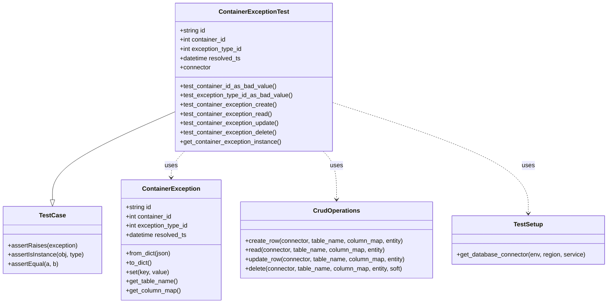
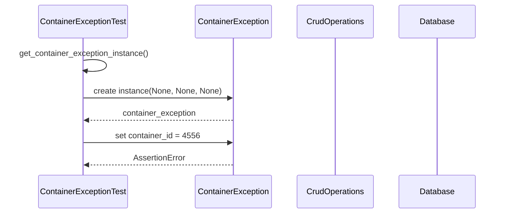
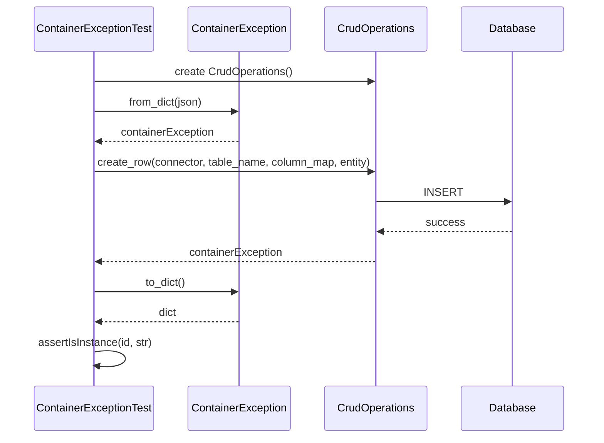
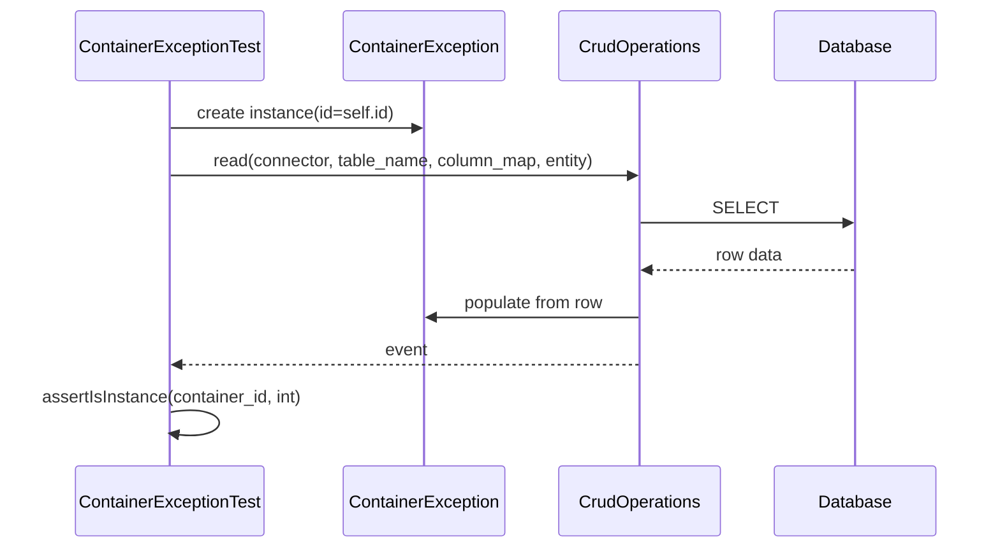
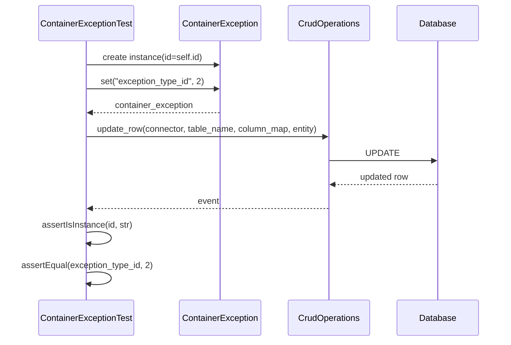
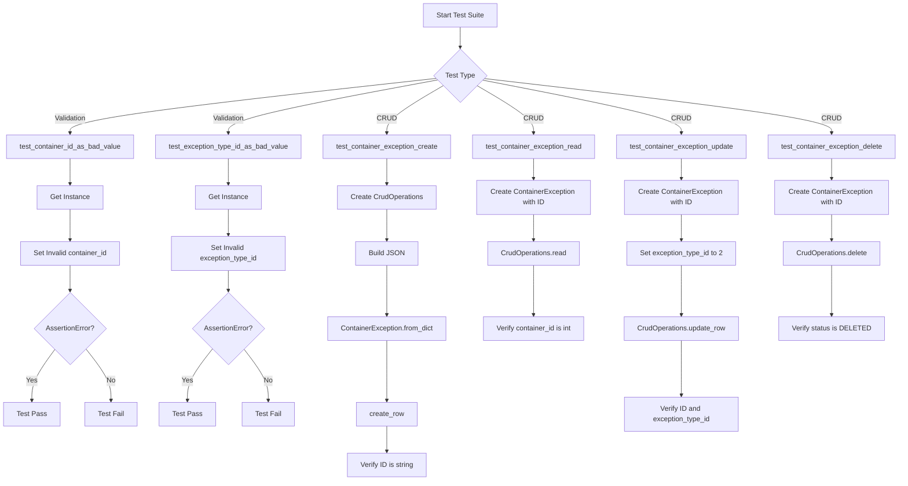

# Diagram: platform/partview_core/partview_service/partview_service/tests/unit/core/datamodel/container_exception_test.py

> Auto-generated by Obscura crawlers

## Diagram 1

### SVG

<svg id="container" width="1579.0390625" xmlns="http://www.w3.org/2000/svg" class="classDiagram" height="786" viewBox="0 0 1579.0390625 786" role="graphics-document document" aria-roledescription="class"><g><defs><marker id="container_class-aggregationStart" class="marker aggregation class" refX="18" refY="7" markerWidth="190" markerHeight="240" orient="auto"><path d="M 18,7 L9,13 L1,7 L9,1 Z"></path></marker></defs><defs><marker id="container_class-aggregationEnd" class="marker aggregation class" refX="1" refY="7" markerWidth="20" markerHeight="28" orient="auto"><path d="M 18,7 L9,13 L1,7 L9,1 Z"></path></marker></defs><defs><marker id="container_class-extensionStart" class="marker extension class" refX="18" refY="7" markerWidth="190" markerHeight="240" orient="auto"><path d="M 1,7 L18,13 V 1 Z"></path></marker></defs><defs><marker id="container_class-extensionEnd" class="marker extension class" refX="1" refY="7" markerWidth="20" markerHeight="28" orient="auto"><path d="M 1,1 V 13 L18,7 Z"></path></marker></defs><defs><marker id="container_class-compositionStart" class="marker composition class" refX="18" refY="7" markerWidth="190" markerHeight="240" orient="auto"><path d="M 18,7 L9,13 L1,7 L9,1 Z"></path></marker></defs><defs><marker id="container_class-compositionEnd" class="marker composition class" refX="1" refY="7" markerWidth="20" markerHeight="28" orient="auto"><path d="M 18,7 L9,13 L1,7 L9,1 Z"></path></marker></defs><defs><marker id="container_class-dependencyStart" class="marker dependency class" refX="6" refY="7" markerWidth="190" markerHeight="240" orient="auto"><path d="M 5,7 L9,13 L1,7 L9,1 Z"></path></marker></defs><defs><marker id="container_class-dependencyEnd" class="marker dependency class" refX="13" refY="7" markerWidth="20" markerHeight="28" orient="auto"><path d="M 18,7 L9,13 L14,7 L9,1 Z"></path></marker></defs><defs><marker id="container_class-lollipopStart" class="marker lollipop class" refX="13" refY="7" markerWidth="190" markerHeight="240" orient="auto"><circle stroke="black" fill="transparent" cx="7" cy="7" r="6"></circle></marker></defs><defs><marker id="container_class-lollipopEnd" class="marker lollipop class" refX="1" refY="7" markerWidth="190" markerHeight="240" orient="auto"><circle stroke="black" fill="transparent" cx="7" cy="7" r="6"></circle></marker></defs><g class="root"><g class="clusters"></g><g class="edgePaths"><path d="M457.186,288.259L403.591,311.716C349.996,335.173,242.807,382.086,189.212,420.335C135.617,458.583,135.617,488.167,135.617,502.958L135.617,517.75" id="id_ContainerExceptionTest_TestCase_1" class="edge-thickness-normal edge-pattern-solid relation" style=";;;" data-edge="true" data-et="edge" data-id="id_ContainerExceptionTest_TestCase_1" data-points="W3sieCI6NDU3LjE4NTU0Njg3NSwieSI6Mjg4LjI1OTAwMDg2MjI5MTAzfSx7IngiOjEzNS42MTcxODc1LCJ5Ijo0Mjl9LHsieCI6MTM1LjYxNzE4NzUsInkiOjUzNX1d" marker-end="url(#container_class-extensionEnd)"></path><path d="M477.992,392L472.183,398.167C466.375,404.333,454.758,416.667,448.949,428C443.141,439.333,443.141,449.667,443.141,454.833L443.141,460" id="id_ContainerExceptionTest_ContainerException_2" class="edge-thickness-normal edge-pattern-dashed relation" style=";;;" data-edge="true" data-et="edge" data-id="id_ContainerExceptionTest_ContainerException_2" data-points="W3sieCI6NDc3Ljk5MTkwNjA0NTMwNTY1LCJ5IjozOTJ9LHsieCI6NDQzLjE0MDYyNSwieSI6NDI5fSx7IngiOjQ0My4xNDA2MjUsInkiOjQ2Nn1d" marker-end="url(#container_class-dependencyEnd)"></path><path d="M839.692,392L845.5,398.167C851.309,404.333,862.926,416.667,868.734,437.5C874.543,458.333,874.543,487.667,874.543,502.333L874.543,517" id="id_ContainerExceptionTest_CrudOperations_3" class="edge-thickness-normal edge-pattern-dashed relation" style=";;;" data-edge="true" data-et="edge" data-id="id_ContainerExceptionTest_CrudOperations_3" data-points="W3sieCI6ODM5LjY5MTY4NzcwNDY5NDMsInkiOjM5Mn0seyJ4Ijo4NzQuNTQyOTY4NzUsInkiOjQyOX0seyJ4Ijo4NzQuNTQyOTY4NzUsInkiOjUyM31d" marker-end="url(#container_class-dependencyEnd)"></path><path d="M860.498,264.614L946.005,292.011C1031.512,319.409,1202.525,374.205,1288.032,422.269C1373.539,470.333,1373.539,511.667,1373.539,532.333L1373.539,553" id="id_ContainerExceptionTest_TestSetup_4" class="edge-thickness-normal edge-pattern-dashed relation" style=";;;" data-edge="true" data-et="edge" data-id="id_ContainerExceptionTest_TestSetup_4" data-points="W3sieCI6ODYwLjQ5ODA0Njg3NSwieSI6MjY0LjYxMzc2NTExNTgwMjQ0fSx7IngiOjEzNzMuNTM5MDYyNSwieSI6NDI5fSx7IngiOjEzNzMuNTM5MDYyNSwieSI6NTU5fV0=" marker-end="url(#container_class-dependencyEnd)"></path></g><g class="edgeLabels"><g class="edgeLabel"><g class="label" data-id="id_ContainerExceptionTest_TestCase_1" transform="translate(0, 0)"><foreignObject width="0" height="0">

</foreignObject></g></g><g class="edgeLabel" transform="translate(443.140625, 429)"><g class="label" data-id="id_ContainerExceptionTest_ContainerException_2" transform="translate(-16.4921875, -12)"><foreignObject width="32.984375" height="24">

uses

</foreignObject></g></g><g class="edgeLabel" transform="translate(874.54296875, 429)"><g class="label" data-id="id_ContainerExceptionTest_CrudOperations_3" transform="translate(-16.4921875, -12)"><foreignObject width="32.984375" height="24">

uses

</foreignObject></g></g><g class="edgeLabel" transform="translate(1373.5390625, 429)"><g class="label" data-id="id_ContainerExceptionTest_TestSetup_4" transform="translate(-16.4921875, -12)"><foreignObject width="32.984375" height="24">

uses

</foreignObject></g></g></g><g class="nodes"><g class="node default" id="classId-ContainerExceptionTest-0" transform="translate(658.841796875, 200)"><g class="basic label-container"><path d="M-201.65625 -192 L201.65625 -192 L201.65625 192 L-201.65625 192" stroke="none" stroke-width="0" fill="#ECECFF" style=""></path><path d="M-201.65625 -192 C-55.839419267626226 -192, 89.97741146474755 -192, 201.65625 -192 M-201.65625 -192 C-76.40816018625746 -192, 48.83992962748508 -192, 201.65625 -192 M201.65625 -192 C201.65625 -47.339316828388434, 201.65625 97.32136634322313, 201.65625 192 M201.65625 -192 C201.65625 -61.17613301593849, 201.65625 69.64773396812302, 201.65625 192 M201.65625 192 C72.20325512579126 192, -57.24973974841748 192, -201.65625 192 M201.65625 192 C106.19400550321028 192, 10.731761006420555 192, -201.65625 192 M-201.65625 192 C-201.65625 50.42639827940431, -201.65625 -91.14720344119138, -201.65625 -192 M-201.65625 192 C-201.65625 97.21964099029427, -201.65625 2.4392819805885324, -201.65625 -192" stroke="#9370DB" stroke-width="1.3" fill="none" stroke-dasharray="0 0" style=""></path></g><g class="annotation-group text" transform="translate(0, -168)"></g><g class="label-group text" transform="translate(-86.546875, -168)"><g class="label" style="font-weight: bolder" transform="translate(0,-12)"><foreignObject width="173.09375" height="24">

ContainerExceptionTest

</foreignObject></g></g><g class="members-group text" transform="translate(-189.65625, -120)"><g class="label" style="" transform="translate(0,-12)"><foreignObject width="67.9375" height="24">

+string id

</foreignObject></g><g class="label" style="" transform="translate(0,12)"><foreignObject width="122.21875" height="24">

+int container_id

</foreignObject></g><g class="label" style="" transform="translate(0,36)"><foreignObject width="164.515625" height="24">

+int exception_type_id

</foreignObject></g><g class="label" style="" transform="translate(0,60)"><foreignObject width="160.578125" height="24">

+datetime resolved_ts

</foreignObject></g><g class="label" style="" transform="translate(0,84)"><foreignObject width="80.84375" height="24">

+connector

</foreignObject></g></g><g class="methods-group text" transform="translate(-189.65625, 24)"><g class="label" style="" transform="translate(0,-12)"><foreignObject width="250.453125" height="24">

+test_container_id_as_bad_value()

</foreignObject></g><g class="label" style="" transform="translate(0,12)"><foreignObject width="292.765625" height="24">

+test_exception_type_id_as_bad_value()

</foreignObject></g><g class="label" style="" transform="translate(0,36)"><foreignObject width="253.3125" height="24">

+test_container_exception_create()

</foreignObject></g><g class="label" style="" transform="translate(0,60)"><foreignObject width="241.296875" height="24">

+test_container_exception_read()

</foreignObject></g><g class="label" style="" transform="translate(0,84)"><foreignObject width="259.796875" height="24">

+test_container_exception_update()

</foreignObject></g><g class="label" style="" transform="translate(0,108)"><foreignObject width="254.328125" height="24">

+test_container_exception_delete()

</foreignObject></g><g class="label" style="" transform="translate(0,132)"><foreignObject width="265.0625" height="24">

+get_container_exception_instance()

</foreignObject></g></g><g class="divider" style=""><path d="M-201.65625 -144 C-73.84895724546111 -144, 53.958335509077784 -144, 201.65625 -144 M-201.65625 -144 C-106.90188584105769 -144, -12.147521682115382 -144, 201.65625 -144" stroke="#9370DB" stroke-width="1.3" fill="none" stroke-dasharray="0 0" style=""></path></g><g class="divider" style=""><path d="M-201.65625 0 C-43.70530330246123 0, 114.24564339507754 0, 201.65625 0 M-201.65625 0 C-85.31886910592516 0, 31.01851178814968 0, 201.65625 0" stroke="#9370DB" stroke-width="1.3" fill="none" stroke-dasharray="0 0" style=""></path></g></g><g class="node default" id="classId-ContainerException-1" transform="translate(443.140625, 622)"><g class="basic label-container"><path d="M-129.90625 -156 L129.90625 -156 L129.90625 156 L-129.90625 156" stroke="none" stroke-width="0" fill="#ECECFF" style=""></path><path d="M-129.90625 -156 C-31.574147739552785 -156, 66.75795452089443 -156, 129.90625 -156 M-129.90625 -156 C-66.91357342818806 -156, -3.9208968563761175 -156, 129.90625 -156 M129.90625 -156 C129.90625 -89.61527529422091, 129.90625 -23.230550588441815, 129.90625 156 M129.90625 -156 C129.90625 -58.19605034141806, 129.90625 39.607899317163884, 129.90625 156 M129.90625 156 C74.64602831234724 156, 19.38580662469448 156, -129.90625 156 M129.90625 156 C57.244178662982804 156, -15.417892674034391 156, -129.90625 156 M-129.90625 156 C-129.90625 34.95629558087012, -129.90625 -86.08740883825976, -129.90625 -156 M-129.90625 156 C-129.90625 61.30906951111584, -129.90625 -33.381860977768326, -129.90625 -156" stroke="#9370DB" stroke-width="1.3" fill="none" stroke-dasharray="0 0" style=""></path></g><g class="annotation-group text" transform="translate(0, -132)"></g><g class="label-group text" transform="translate(-71.296875, -132)"><g class="label" style="font-weight: bolder" transform="translate(0,-12)"><foreignObject width="142.59375" height="24">

ContainerException

</foreignObject></g></g><g class="members-group text" transform="translate(-117.90625, -84)"><g class="label" style="" transform="translate(0,-12)"><foreignObject width="67.9375" height="24">

+string id

</foreignObject></g><g class="label" style="" transform="translate(0,12)"><foreignObject width="122.21875" height="24">

+int container_id

</foreignObject></g><g class="label" style="" transform="translate(0,36)"><foreignObject width="164.515625" height="24">

+int exception_type_id

</foreignObject></g><g class="label" style="" transform="translate(0,60)"><foreignObject width="160.578125" height="24">

+datetime resolved_ts

</foreignObject></g></g><g class="methods-group text" transform="translate(-117.90625, 36)"><g class="label" style="" transform="translate(0,-12)"><foreignObject width="118.984375" height="24">

+from_dict(json)

</foreignObject></g><g class="label" style="" transform="translate(0,12)"><foreignObject width="68.34375" height="24">

+to_dict()

</foreignObject></g><g class="label" style="" transform="translate(0,36)"><foreignObject width="111.21875" height="24">

+set(key, value)

</foreignObject></g><g class="label" style="" transform="translate(0,60)"><foreignObject width="134.625" height="24">

+get_table_name()

</foreignObject></g><g class="label" style="" transform="translate(0,84)"><foreignObject width="142.921875" height="24">

+get_column_map()

</foreignObject></g></g><g class="divider" style=""><path d="M-129.90625 -108 C-28.367055769401134 -108, 73.17213846119773 -108, 129.90625 -108 M-129.90625 -108 C-64.71572649416092 -108, 0.474797011678163 -108, 129.90625 -108" stroke="#9370DB" stroke-width="1.3" fill="none" stroke-dasharray="0 0" style=""></path></g><g class="divider" style=""><path d="M-129.90625 12 C-38.73115611017555 12, 52.443937779648905 12, 129.90625 12 M-129.90625 12 C-73.79221983628626 12, -17.67818967257253 12, 129.90625 12" stroke="#9370DB" stroke-width="1.3" fill="none" stroke-dasharray="0 0" style=""></path></g></g><g class="node default" id="classId-CrudOperations-2" transform="translate(874.54296875, 622)"><g class="basic label-container"><path d="M-251.49609375 -99 L251.49609375 -99 L251.49609375 99 L-251.49609375 99" stroke="none" stroke-width="0" fill="#ECECFF" style=""></path><path d="M-251.49609375 -99 C-55.28937835642182 -99, 140.91733703715636 -99, 251.49609375 -99 M-251.49609375 -99 C-148.6255489586834 -99, -45.75500416736682 -99, 251.49609375 -99 M251.49609375 -99 C251.49609375 -26.573014659256813, 251.49609375 45.85397068148637, 251.49609375 99 M251.49609375 -99 C251.49609375 -56.75038204691075, 251.49609375 -14.500764093821502, 251.49609375 99 M251.49609375 99 C75.76072206061247 99, -99.97464962877507 99, -251.49609375 99 M251.49609375 99 C116.91043286986795 99, -17.675228010264107 99, -251.49609375 99 M-251.49609375 99 C-251.49609375 20.761470535394338, -251.49609375 -57.477058929211324, -251.49609375 -99 M-251.49609375 99 C-251.49609375 27.793965001407116, -251.49609375 -43.41206999718577, -251.49609375 -99" stroke="#9370DB" stroke-width="1.3" fill="none" stroke-dasharray="0 0" style=""></path></g><g class="annotation-group text" transform="translate(0, -75)"></g><g class="label-group text" transform="translate(-57.6171875, -75)"><g class="label" style="font-weight: bolder" transform="translate(0,-12)"><foreignObject width="115.234375" height="24">

CrudOperations

</foreignObject></g></g><g class="members-group text" transform="translate(-239.49609375, -27)"></g><g class="methods-group text" transform="translate(-239.49609375, 3)"><g class="label" style="" transform="translate(0,-12)"><foreignObject width="414.890625" height="24">

+create_row(connector, table_name, column_map, entity)

</foreignObject></g><g class="label" style="" transform="translate(0,12)"><foreignObject width="368.046875" height="24">

+read(connector, table_name, column_map, entity)

</foreignObject></g><g class="label" style="" transform="translate(0,36)"><foreignObject width="421.375" height="24">

+update_row(connector, table_name, column_map, entity)

</foreignObject></g><g class="label" style="" transform="translate(0,60)"><foreignObject width="416.78125" height="24">

+delete(connector, table_name, column_map, entity, soft)

</foreignObject></g></g><g class="divider" style=""><path d="M-251.49609375 -51 C-130.65709834112545 -51, -9.818102932250895 -51, 251.49609375 -51 M-251.49609375 -51 C-58.46160267108064 -51, 134.57288840783872 -51, 251.49609375 -51" stroke="#9370DB" stroke-width="1.3" fill="none" stroke-dasharray="0 0" style=""></path></g><g class="divider" style=""><path d="M-251.49609375 -27 C-116.39634906761637 -27, 18.70339561476726 -27, 251.49609375 -27 M-251.49609375 -27 C-57.33712451581874 -27, 136.8218447183625 -27, 251.49609375 -27" stroke="#9370DB" stroke-width="1.3" fill="none" stroke-dasharray="0 0" style=""></path></g></g><g class="node default" id="classId-TestSetup-3" transform="translate(1373.5390625, 622)"><g class="basic label-container"><path d="M-197.5 -63 L197.5 -63 L197.5 63 L-197.5 63" stroke="none" stroke-width="0" fill="#ECECFF" style=""></path><path d="M-197.5 -63 C-77.17364618597321 -63, 43.15270762805358 -63, 197.5 -63 M-197.5 -63 C-67.78751351149373 -63, 61.924972977012544 -63, 197.5 -63 M197.5 -63 C197.5 -32.83369287094755, 197.5 -2.667385741895103, 197.5 63 M197.5 -63 C197.5 -22.082761956239082, 197.5 18.834476087521836, 197.5 63 M197.5 63 C58.67533859792229 63, -80.14932280415542 63, -197.5 63 M197.5 63 C41.915026881173645 63, -113.66994623765271 63, -197.5 63 M-197.5 63 C-197.5 30.662361095261815, -197.5 -1.6752778094763698, -197.5 -63 M-197.5 63 C-197.5 15.053776237024792, -197.5 -32.892447525950416, -197.5 -63" stroke="#9370DB" stroke-width="1.3" fill="none" stroke-dasharray="0 0" style=""></path></g><g class="annotation-group text" transform="translate(0, -39)"></g><g class="label-group text" transform="translate(-36.6875, -39)"><g class="label" style="font-weight: bolder" transform="translate(0,-12)"><foreignObject width="73.375" height="24">

TestSetup

</foreignObject></g></g><g class="members-group text" transform="translate(-185.5, 9)"></g><g class="methods-group text" transform="translate(-185.5, 39)"><g class="label" style="" transform="translate(0,-12)"><foreignObject width="334.3125" height="24">

+get_database_connector(env, region, service)

</foreignObject></g></g><g class="divider" style=""><path d="M-197.5 -15 C-82.17375076247549 -15, 33.152498475049015 -15, 197.5 -15 M-197.5 -15 C-54.88476707750942 -15, 87.73046584498115 -15, 197.5 -15" stroke="#9370DB" stroke-width="1.3" fill="none" stroke-dasharray="0 0" style=""></path></g><g class="divider" style=""><path d="M-197.5 9 C-72.28161447543242 9, 52.93677104913516 9, 197.5 9 M-197.5 9 C-79.99549358226824 9, 37.50901283546352 9, 197.5 9" stroke="#9370DB" stroke-width="1.3" fill="none" stroke-dasharray="0 0" style=""></path></g></g><g class="node default" id="classId-TestCase-4" transform="translate(135.6171875, 622)"><g class="basic label-container"><path d="M-127.6171875 -87 L127.6171875 -87 L127.6171875 87 L-127.6171875 87" stroke="none" stroke-width="0" fill="#ECECFF" style=""></path><path d="M-127.6171875 -87 C-59.01539547181747 -87, 9.58639655636506 -87, 127.6171875 -87 M-127.6171875 -87 C-37.3061886841395 -87, 53.004810131721 -87, 127.6171875 -87 M127.6171875 -87 C127.6171875 -50.18231094121482, 127.6171875 -13.364621882429645, 127.6171875 87 M127.6171875 -87 C127.6171875 -22.25694083136821, 127.6171875 42.48611833726358, 127.6171875 87 M127.6171875 87 C37.33662874615834 87, -52.94393000768332 87, -127.6171875 87 M127.6171875 87 C30.979382887757396 87, -65.65842172448521 87, -127.6171875 87 M-127.6171875 87 C-127.6171875 41.812474765429805, -127.6171875 -3.3750504691403904, -127.6171875 -87 M-127.6171875 87 C-127.6171875 36.549223150602344, -127.6171875 -13.901553698795311, -127.6171875 -87" stroke="#9370DB" stroke-width="1.3" fill="none" stroke-dasharray="0 0" style=""></path></g><g class="annotation-group text" transform="translate(0, -63)"></g><g class="label-group text" transform="translate(-32.359375, -63)"><g class="label" style="font-weight: bolder" transform="translate(0,-12)"><foreignObject width="64.71875" height="24">

TestCase

</foreignObject></g></g><g class="members-group text" transform="translate(-115.6171875, -15)"></g><g class="methods-group text" transform="translate(-115.6171875, 15)"><g class="label" style="" transform="translate(0,-12)"><foreignObject width="179.265625" height="24">

+assertRaises(exception)

</foreignObject></g><g class="label" style="" transform="translate(0,12)"><foreignObject width="198.875" height="24">

+assertIsInstance(obj, type)

</foreignObject></g><g class="label" style="" transform="translate(0,36)"><foreignObject width="128.765625" height="24">

+assertEqual(a, b)

</foreignObject></g></g><g class="divider" style=""><path d="M-127.6171875 -39 C-69.6988507438588 -39, -11.780513987717583 -39, 127.6171875 -39 M-127.6171875 -39 C-40.03672276933142 -39, 47.54374196133716 -39, 127.6171875 -39" stroke="#9370DB" stroke-width="1.3" fill="none" stroke-dasharray="0 0" style=""></path></g><g class="divider" style=""><path d="M-127.6171875 -15 C-52.38109346612916 -15, 22.855000567741683 -15, 127.6171875 -15 M-127.6171875 -15 C-71.79013986373187 -15, -15.963092227463733 -15, 127.6171875 -15" stroke="#9370DB" stroke-width="1.3" fill="none" stroke-dasharray="0 0" style=""></path></g></g></g></g></g></svg>

## Diagram 2

### SVG

<svg id="container" width="1030" xmlns="http://www.w3.org/2000/svg" height="441" viewBox="-82 -10 1030 441" role="graphics-document document" aria-roledescription="sequence"><g><rect x="748" y="355" fill="#eaeaea" stroke="#666" width="150" height="65" name="DB" rx="3" ry="3" class="actor actor-bottom"></rect><text x="823" y="387.5" dominant-baseline="central" alignment-baseline="central" class="actor actor-box" style="text-anchor: middle; font-size: 16px; font-weight: 400;"><tspan x="823" dy="0">Database</tspan></text></g><g><rect x="548" y="355" fill="#eaeaea" stroke="#666" width="150" height="65" name="CRUD" rx="3" ry="3" class="actor actor-bottom"></rect><text x="623" y="387.5" dominant-baseline="central" alignment-baseline="central" class="actor actor-box" style="text-anchor: middle; font-size: 16px; font-weight: 400;"><tspan x="623" dy="0">CrudOperations</tspan></text></g><g><rect x="337" y="355" fill="#eaeaea" stroke="#666" width="161" height="65" name="CE" rx="3" ry="3" class="actor actor-bottom"></rect><text x="417.5" y="387.5" dominant-baseline="central" alignment-baseline="central" class="actor actor-box" style="text-anchor: middle; font-size: 16px; font-weight: 400;"><tspan x="417.5" dy="0">ContainerException</tspan></text></g><g><rect x="0" y="355" fill="#eaeaea" stroke="#666" width="191" height="65" name="Test" rx="3" ry="3" class="actor actor-bottom"></rect><text x="95.5" y="387.5" dominant-baseline="central" alignment-baseline="central" class="actor actor-box" style="text-anchor: middle; font-size: 16px; font-weight: 400;"><tspan x="95.5" dy="0">ContainerExceptionTest</tspan></text></g><g><line id="actor3" x1="823" y1="65" x2="823" y2="355" class="actor-line 200" stroke-width="0.5px" stroke="#999" name="DB"></line><g id="root-3"><rect x="748" y="0" fill="#eaeaea" stroke="#666" width="150" height="65" name="DB" rx="3" ry="3" class="actor actor-top"></rect><text x="823" y="32.5" dominant-baseline="central" alignment-baseline="central" class="actor actor-box" style="text-anchor: middle; font-size: 16px; font-weight: 400;"><tspan x="823" dy="0">Database</tspan></text></g></g><g><line id="actor2" x1="623" y1="65" x2="623" y2="355" class="actor-line 200" stroke-width="0.5px" stroke="#999" name="CRUD"></line><g id="root-2"><rect x="548" y="0" fill="#eaeaea" stroke="#666" width="150" height="65" name="CRUD" rx="3" ry="3" class="actor actor-top"></rect><text x="623" y="32.5" dominant-baseline="central" alignment-baseline="central" class="actor actor-box" style="text-anchor: middle; font-size: 16px; font-weight: 400;"><tspan x="623" dy="0">CrudOperations</tspan></text></g></g><g><line id="actor1" x1="417.5" y1="65" x2="417.5" y2="355" class="actor-line 200" stroke-width="0.5px" stroke="#999" name="CE"></line><g id="root-1"><rect x="337" y="0" fill="#eaeaea" stroke="#666" width="161" height="65" name="CE" rx="3" ry="3" class="actor actor-top"></rect><text x="417.5" y="32.5" dominant-baseline="central" alignment-baseline="central" class="actor actor-box" style="text-anchor: middle; font-size: 16px; font-weight: 400;"><tspan x="417.5" dy="0">ContainerException</tspan></text></g></g><g><line id="actor0" x1="95.5" y1="65" x2="95.5" y2="355" class="actor-line 200" stroke-width="0.5px" stroke="#999" name="Test"></line><g id="root-0"><rect x="0" y="0" fill="#eaeaea" stroke="#666" width="191" height="65" name="Test" rx="3" ry="3" class="actor actor-top"></rect><text x="95.5" y="32.5" dominant-baseline="central" alignment-baseline="central" class="actor actor-box" style="text-anchor: middle; font-size: 16px; font-weight: 400;"><tspan x="95.5" dy="0">ContainerExceptionTest</tspan></text></g></g><g></g><defs><symbol id="computer" width="24" height="24"><path transform="scale(.5)" d="M2 2v13h20v-13h-20zm18 11h-16v-9h16v9zm-10.228 6l.466-1h3.524l.467 1h-4.457zm14.228 3h-24l2-6h2.104l-1.33 4h18.45l-1.297-4h2.073l2 6zm-5-10h-14v-7h14v7z"></path></symbol></defs><defs><symbol id="database" fill-rule="evenodd" clip-rule="evenodd"><path transform="scale(.5)" d="M12.258.001l.256.004.255.005.253.008.251.01.249.012.247.015.246.016.242.019.241.02.239.023.236.024.233.027.231.028.229.031.225.032.223.034.22.036.217.038.214.04.211.041.208.043.205.045.201.046.198.048.194.05.191.051.187.053.183.054.18.056.175.057.172.059.168.06.163.061.16.063.155.064.15.066.074.033.073.033.071.034.07.034.069.035.068.035.067.035.066.035.064.036.064.036.062.036.06.036.06.037.058.037.058.037.055.038.055.038.053.038.052.038.051.039.05.039.048.039.047.039.045.04.044.04.043.04.041.04.04.041.039.041.037.041.036.041.034.041.033.042.032.042.03.042.029.042.027.042.026.043.024.043.023.043.021.043.02.043.018.044.017.043.015.044.013.044.012.044.011.045.009.044.007.045.006.045.004.045.002.045.001.045v17l-.001.045-.002.045-.004.045-.006.045-.007.045-.009.044-.011.045-.012.044-.013.044-.015.044-.017.043-.018.044-.02.043-.021.043-.023.043-.024.043-.026.043-.027.042-.029.042-.03.042-.032.042-.033.042-.034.041-.036.041-.037.041-.039.041-.04.041-.041.04-.043.04-.044.04-.045.04-.047.039-.048.039-.05.039-.051.039-.052.038-.053.038-.055.038-.055.038-.058.037-.058.037-.06.037-.06.036-.062.036-.064.036-.064.036-.066.035-.067.035-.068.035-.069.035-.07.034-.071.034-.073.033-.074.033-.15.066-.155.064-.16.063-.163.061-.168.06-.172.059-.175.057-.18.056-.183.054-.187.053-.191.051-.194.05-.198.048-.201.046-.205.045-.208.043-.211.041-.214.04-.217.038-.22.036-.223.034-.225.032-.229.031-.231.028-.233.027-.236.024-.239.023-.241.02-.242.019-.246.016-.247.015-.249.012-.251.01-.253.008-.255.005-.256.004-.258.001-.258-.001-.256-.004-.255-.005-.253-.008-.251-.01-.249-.012-.247-.015-.245-.016-.243-.019-.241-.02-.238-.023-.236-.024-.234-.027-.231-.028-.228-.031-.226-.032-.223-.034-.22-.036-.217-.038-.214-.04-.211-.041-.208-.043-.204-.045-.201-.046-.198-.048-.195-.05-.19-.051-.187-.053-.184-.054-.179-.056-.176-.057-.172-.059-.167-.06-.164-.061-.159-.063-.155-.064-.151-.066-.074-.033-.072-.033-.072-.034-.07-.034-.069-.035-.068-.035-.067-.035-.066-.035-.064-.036-.063-.036-.062-.036-.061-.036-.06-.037-.058-.037-.057-.037-.056-.038-.055-.038-.053-.038-.052-.038-.051-.039-.049-.039-.049-.039-.046-.039-.046-.04-.044-.04-.043-.04-.041-.04-.04-.041-.039-.041-.037-.041-.036-.041-.034-.041-.033-.042-.032-.042-.03-.042-.029-.042-.027-.042-.026-.043-.024-.043-.023-.043-.021-.043-.02-.043-.018-.044-.017-.043-.015-.044-.013-.044-.012-.044-.011-.045-.009-.044-.007-.045-.006-.045-.004-.045-.002-.045-.001-.045v-17l.001-.045.002-.045.004-.045.006-.045.007-.045.009-.044.011-.045.012-.044.013-.044.015-.044.017-.043.018-.044.02-.043.021-.043.023-.043.024-.043.026-.043.027-.042.029-.042.03-.042.032-.042.033-.042.034-.041.036-.041.037-.041.039-.041.04-.041.041-.04.043-.04.044-.04.046-.04.046-.039.049-.039.049-.039.051-.039.052-.038.053-.038.055-.038.056-.038.057-.037.058-.037.06-.037.061-.036.062-.036.063-.036.064-.036.066-.035.067-.035.068-.035.069-.035.07-.034.072-.034.072-.033.074-.033.151-.066.155-.064.159-.063.164-.061.167-.06.172-.059.176-.057.179-.056.184-.054.187-.053.19-.051.195-.05.198-.048.201-.046.204-.045.208-.043.211-.041.214-.04.217-.038.22-.036.223-.034.226-.032.228-.031.231-.028.234-.027.236-.024.238-.023.241-.02.243-.019.245-.016.247-.015.249-.012.251-.01.253-.008.255-.005.256-.004.258-.001.258.001zm-9.258 20.499v.01l.001.021.003.021.004.022.005.021.006.022.007.022.009.023.01.022.011.023.012.023.013.023.015.023.016.024.017.023.018.024.019.024.021.024.022.025.023.024.024.025.052.049.056.05.061.051.066.051.07.051.075.051.079.052.084.052.088.052.092.052.097.052.102.051.105.052.11.052.114.051.119.051.123.051.127.05.131.05.135.05.139.048.144.049.147.047.152.047.155.047.16.045.163.045.167.043.171.043.176.041.178.041.183.039.187.039.19.037.194.035.197.035.202.033.204.031.209.03.212.029.216.027.219.025.222.024.226.021.23.02.233.018.236.016.24.015.243.012.246.01.249.008.253.005.256.004.259.001.26-.001.257-.004.254-.005.25-.008.247-.011.244-.012.241-.014.237-.016.233-.018.231-.021.226-.021.224-.024.22-.026.216-.027.212-.028.21-.031.205-.031.202-.034.198-.034.194-.036.191-.037.187-.039.183-.04.179-.04.175-.042.172-.043.168-.044.163-.045.16-.046.155-.046.152-.047.148-.048.143-.049.139-.049.136-.05.131-.05.126-.05.123-.051.118-.052.114-.051.11-.052.106-.052.101-.052.096-.052.092-.052.088-.053.083-.051.079-.052.074-.052.07-.051.065-.051.06-.051.056-.05.051-.05.023-.024.023-.025.021-.024.02-.024.019-.024.018-.024.017-.024.015-.023.014-.024.013-.023.012-.023.01-.023.01-.022.008-.022.006-.022.006-.022.004-.022.004-.021.001-.021.001-.021v-4.127l-.077.055-.08.053-.083.054-.085.053-.087.052-.09.052-.093.051-.095.05-.097.05-.1.049-.102.049-.105.048-.106.047-.109.047-.111.046-.114.045-.115.045-.118.044-.12.043-.122.042-.124.042-.126.041-.128.04-.13.04-.132.038-.134.038-.135.037-.138.037-.139.035-.142.035-.143.034-.144.033-.147.032-.148.031-.15.03-.151.03-.153.029-.154.027-.156.027-.158.026-.159.025-.161.024-.162.023-.163.022-.165.021-.166.02-.167.019-.169.018-.169.017-.171.016-.173.015-.173.014-.175.013-.175.012-.177.011-.178.01-.179.008-.179.008-.181.006-.182.005-.182.004-.184.003-.184.002h-.37l-.184-.002-.184-.003-.182-.004-.182-.005-.181-.006-.179-.008-.179-.008-.178-.01-.176-.011-.176-.012-.175-.013-.173-.014-.172-.015-.171-.016-.17-.017-.169-.018-.167-.019-.166-.02-.165-.021-.163-.022-.162-.023-.161-.024-.159-.025-.157-.026-.156-.027-.155-.027-.153-.029-.151-.03-.15-.03-.148-.031-.146-.032-.145-.033-.143-.034-.141-.035-.14-.035-.137-.037-.136-.037-.134-.038-.132-.038-.13-.04-.128-.04-.126-.041-.124-.042-.122-.042-.12-.044-.117-.043-.116-.045-.113-.045-.112-.046-.109-.047-.106-.047-.105-.048-.102-.049-.1-.049-.097-.05-.095-.05-.093-.052-.09-.051-.087-.052-.085-.053-.083-.054-.08-.054-.077-.054v4.127zm0-5.654v.011l.001.021.003.021.004.021.005.022.006.022.007.022.009.022.01.022.011.023.012.023.013.023.015.024.016.023.017.024.018.024.019.024.021.024.022.024.023.025.024.024.052.05.056.05.061.05.066.051.07.051.075.052.079.051.084.052.088.052.092.052.097.052.102.052.105.052.11.051.114.051.119.052.123.05.127.051.131.05.135.049.139.049.144.048.147.048.152.047.155.046.16.045.163.045.167.044.171.042.176.042.178.04.183.04.187.038.19.037.194.036.197.034.202.033.204.032.209.03.212.028.216.027.219.025.222.024.226.022.23.02.233.018.236.016.24.014.243.012.246.01.249.008.253.006.256.003.259.001.26-.001.257-.003.254-.006.25-.008.247-.01.244-.012.241-.015.237-.016.233-.018.231-.02.226-.022.224-.024.22-.025.216-.027.212-.029.21-.03.205-.032.202-.033.198-.035.194-.036.191-.037.187-.039.183-.039.179-.041.175-.042.172-.043.168-.044.163-.045.16-.045.155-.047.152-.047.148-.048.143-.048.139-.05.136-.049.131-.05.126-.051.123-.051.118-.051.114-.052.11-.052.106-.052.101-.052.096-.052.092-.052.088-.052.083-.052.079-.052.074-.051.07-.052.065-.051.06-.05.056-.051.051-.049.023-.025.023-.024.021-.025.02-.024.019-.024.018-.024.017-.024.015-.023.014-.023.013-.024.012-.022.01-.023.01-.023.008-.022.006-.022.006-.022.004-.021.004-.022.001-.021.001-.021v-4.139l-.077.054-.08.054-.083.054-.085.052-.087.053-.09.051-.093.051-.095.051-.097.05-.1.049-.102.049-.105.048-.106.047-.109.047-.111.046-.114.045-.115.044-.118.044-.12.044-.122.042-.124.042-.126.041-.128.04-.13.039-.132.039-.134.038-.135.037-.138.036-.139.036-.142.035-.143.033-.144.033-.147.033-.148.031-.15.03-.151.03-.153.028-.154.028-.156.027-.158.026-.159.025-.161.024-.162.023-.163.022-.165.021-.166.02-.167.019-.169.018-.169.017-.171.016-.173.015-.173.014-.175.013-.175.012-.177.011-.178.009-.179.009-.179.007-.181.007-.182.005-.182.004-.184.003-.184.002h-.37l-.184-.002-.184-.003-.182-.004-.182-.005-.181-.007-.179-.007-.179-.009-.178-.009-.176-.011-.176-.012-.175-.013-.173-.014-.172-.015-.171-.016-.17-.017-.169-.018-.167-.019-.166-.02-.165-.021-.163-.022-.162-.023-.161-.024-.159-.025-.157-.026-.156-.027-.155-.028-.153-.028-.151-.03-.15-.03-.148-.031-.146-.033-.145-.033-.143-.033-.141-.035-.14-.036-.137-.036-.136-.037-.134-.038-.132-.039-.13-.039-.128-.04-.126-.041-.124-.042-.122-.043-.12-.043-.117-.044-.116-.044-.113-.046-.112-.046-.109-.046-.106-.047-.105-.048-.102-.049-.1-.049-.097-.05-.095-.051-.093-.051-.09-.051-.087-.053-.085-.052-.083-.054-.08-.054-.077-.054v4.139zm0-5.666v.011l.001.02.003.022.004.021.005.022.006.021.007.022.009.023.01.022.011.023.012.023.013.023.015.023.016.024.017.024.018.023.019.024.021.025.022.024.023.024.024.025.052.05.056.05.061.05.066.051.07.051.075.052.079.051.084.052.088.052.092.052.097.052.102.052.105.051.11.052.114.051.119.051.123.051.127.05.131.05.135.05.139.049.144.048.147.048.152.047.155.046.16.045.163.045.167.043.171.043.176.042.178.04.183.04.187.038.19.037.194.036.197.034.202.033.204.032.209.03.212.028.216.027.219.025.222.024.226.021.23.02.233.018.236.017.24.014.243.012.246.01.249.008.253.006.256.003.259.001.26-.001.257-.003.254-.006.25-.008.247-.01.244-.013.241-.014.237-.016.233-.018.231-.02.226-.022.224-.024.22-.025.216-.027.212-.029.21-.03.205-.032.202-.033.198-.035.194-.036.191-.037.187-.039.183-.039.179-.041.175-.042.172-.043.168-.044.163-.045.16-.045.155-.047.152-.047.148-.048.143-.049.139-.049.136-.049.131-.051.126-.05.123-.051.118-.052.114-.051.11-.052.106-.052.101-.052.096-.052.092-.052.088-.052.083-.052.079-.052.074-.052.07-.051.065-.051.06-.051.056-.05.051-.049.023-.025.023-.025.021-.024.02-.024.019-.024.018-.024.017-.024.015-.023.014-.024.013-.023.012-.023.01-.022.01-.023.008-.022.006-.022.006-.022.004-.022.004-.021.001-.021.001-.021v-4.153l-.077.054-.08.054-.083.053-.085.053-.087.053-.09.051-.093.051-.095.051-.097.05-.1.049-.102.048-.105.048-.106.048-.109.046-.111.046-.114.046-.115.044-.118.044-.12.043-.122.043-.124.042-.126.041-.128.04-.13.039-.132.039-.134.038-.135.037-.138.036-.139.036-.142.034-.143.034-.144.033-.147.032-.148.032-.15.03-.151.03-.153.028-.154.028-.156.027-.158.026-.159.024-.161.024-.162.023-.163.023-.165.021-.166.02-.167.019-.169.018-.169.017-.171.016-.173.015-.173.014-.175.013-.175.012-.177.01-.178.01-.179.009-.179.007-.181.006-.182.006-.182.004-.184.003-.184.001-.185.001-.185-.001-.184-.001-.184-.003-.182-.004-.182-.006-.181-.006-.179-.007-.179-.009-.178-.01-.176-.01-.176-.012-.175-.013-.173-.014-.172-.015-.171-.016-.17-.017-.169-.018-.167-.019-.166-.02-.165-.021-.163-.023-.162-.023-.161-.024-.159-.024-.157-.026-.156-.027-.155-.028-.153-.028-.151-.03-.15-.03-.148-.032-.146-.032-.145-.033-.143-.034-.141-.034-.14-.036-.137-.036-.136-.037-.134-.038-.132-.039-.13-.039-.128-.041-.126-.041-.124-.041-.122-.043-.12-.043-.117-.044-.116-.044-.113-.046-.112-.046-.109-.046-.106-.048-.105-.048-.102-.048-.1-.05-.097-.049-.095-.051-.093-.051-.09-.052-.087-.052-.085-.053-.083-.053-.08-.054-.077-.054v4.153zm8.74-8.179l-.257.004-.254.005-.25.008-.247.011-.244.012-.241.014-.237.016-.233.018-.231.021-.226.022-.224.023-.22.026-.216.027-.212.028-.21.031-.205.032-.202.033-.198.034-.194.036-.191.038-.187.038-.183.04-.179.041-.175.042-.172.043-.168.043-.163.045-.16.046-.155.046-.152.048-.148.048-.143.048-.139.049-.136.05-.131.05-.126.051-.123.051-.118.051-.114.052-.11.052-.106.052-.101.052-.096.052-.092.052-.088.052-.083.052-.079.052-.074.051-.07.052-.065.051-.06.05-.056.05-.051.05-.023.025-.023.024-.021.024-.02.025-.019.024-.018.024-.017.023-.015.024-.014.023-.013.023-.012.023-.01.023-.01.022-.008.022-.006.023-.006.021-.004.022-.004.021-.001.021-.001.021.001.021.001.021.004.021.004.022.006.021.006.023.008.022.01.022.01.023.012.023.013.023.014.023.015.024.017.023.018.024.019.024.02.025.021.024.023.024.023.025.051.05.056.05.06.05.065.051.07.052.074.051.079.052.083.052.088.052.092.052.096.052.101.052.106.052.11.052.114.052.118.051.123.051.126.051.131.05.136.05.139.049.143.048.148.048.152.048.155.046.16.046.163.045.168.043.172.043.175.042.179.041.183.04.187.038.191.038.194.036.198.034.202.033.205.032.21.031.212.028.216.027.22.026.224.023.226.022.231.021.233.018.237.016.241.014.244.012.247.011.25.008.254.005.257.004.26.001.26-.001.257-.004.254-.005.25-.008.247-.011.244-.012.241-.014.237-.016.233-.018.231-.021.226-.022.224-.023.22-.026.216-.027.212-.028.21-.031.205-.032.202-.033.198-.034.194-.036.191-.038.187-.038.183-.04.179-.041.175-.042.172-.043.168-.043.163-.045.16-.046.155-.046.152-.048.148-.048.143-.048.139-.049.136-.05.131-.05.126-.051.123-.051.118-.051.114-.052.11-.052.106-.052.101-.052.096-.052.092-.052.088-.052.083-.052.079-.052.074-.051.07-.052.065-.051.06-.05.056-.05.051-.05.023-.025.023-.024.021-.024.02-.025.019-.024.018-.024.017-.023.015-.024.014-.023.013-.023.012-.023.01-.023.01-.022.008-.022.006-.023.006-.021.004-.022.004-.021.001-.021.001-.021-.001-.021-.001-.021-.004-.021-.004-.022-.006-.021-.006-.023-.008-.022-.01-.022-.01-.023-.012-.023-.013-.023-.014-.023-.015-.024-.017-.023-.018-.024-.019-.024-.02-.025-.021-.024-.023-.024-.023-.025-.051-.05-.056-.05-.06-.05-.065-.051-.07-.052-.074-.051-.079-.052-.083-.052-.088-.052-.092-.052-.096-.052-.101-.052-.106-.052-.11-.052-.114-.052-.118-.051-.123-.051-.126-.051-.131-.05-.136-.05-.139-.049-.143-.048-.148-.048-.152-.048-.155-.046-.16-.046-.163-.045-.168-.043-.172-.043-.175-.042-.179-.041-.183-.04-.187-.038-.191-.038-.194-.036-.198-.034-.202-.033-.205-.032-.21-.031-.212-.028-.216-.027-.22-.026-.224-.023-.226-.022-.231-.021-.233-.018-.237-.016-.241-.014-.244-.012-.247-.011-.25-.008-.254-.005-.257-.004-.26-.001-.26.001z"></path></symbol></defs><defs><symbol id="clock" width="24" height="24"><path transform="scale(.5)" d="M12 2c5.514 0 10 4.486 10 10s-4.486 10-10 10-10-4.486-10-10 4.486-10 10-10zm0-2c-6.627 0-12 5.373-12 12s5.373 12 12 12 12-5.373 12-12-5.373-12-12-12zm5.848 12.459c.202.038.202.333.001.372-1.907.361-6.045 1.111-6.547 1.111-.719 0-1.301-.582-1.301-1.301 0-.512.77-5.447 1.125-7.445.034-.192.312-.181.343.014l.985 6.238 5.394 1.011z"></path></symbol></defs><defs><marker id="arrowhead" refX="7.9" refY="5" markerUnits="userSpaceOnUse" markerWidth="12" markerHeight="12" orient="auto-start-reverse"><path d="M -1 0 L 10 5 L 0 10 z"></path></marker></defs><defs><marker id="crosshead" markerWidth="15" markerHeight="8" orient="auto" refX="4" refY="4.5"><path fill="none" stroke="#000000" stroke-width="1pt" d="M 1,2 L 6,7 M 6,2 L 1,7" style="stroke-dasharray: 0, 0;"></path></marker></defs><defs><marker id="filled-head" refX="15.5" refY="7" markerWidth="20" markerHeight="28" orient="auto"><path d="M 18,7 L9,13 L14,7 L9,1 Z"></path></marker></defs><defs><marker id="sequencenumber" refX="15" refY="15" markerWidth="60" markerHeight="40" orient="auto"><circle cx="15" cy="15" r="6"></circle></marker></defs><text x="97" y="80" text-anchor="middle" dominant-baseline="middle" alignment-baseline="middle" class="messageText" dy="1em" style="font-size: 16px; font-weight: 400;">get_container_exception_instance()</text><path d="M 96.5,113 C 156.5,103 156.5,143 96.5,133" class="messageLine0" stroke-width="2" stroke="none" marker-end="url(#arrowhead)" style="fill: none;"></path><text x="255" y="158" text-anchor="middle" dominant-baseline="middle" alignment-baseline="middle" class="messageText" dy="1em" style="font-size: 16px; font-weight: 400;">create instance(None, None, None)</text><line x1="96.5" y1="191" x2="413.5" y2="191" class="messageLine0" stroke-width="2" stroke="none" marker-end="url(#arrowhead)" style="fill: none;"></line><text x="258" y="206" text-anchor="middle" dominant-baseline="middle" alignment-baseline="middle" class="messageText" dy="1em" style="font-size: 16px; font-weight: 400;">container_exception</text><line x1="416.5" y1="239" x2="99.5" y2="239" class="messageLine1" stroke-width="2" stroke="none" marker-end="url(#arrowhead)" style="stroke-dasharray: 3, 3; fill: none;"></line><text x="255" y="254" text-anchor="middle" dominant-baseline="middle" alignment-baseline="middle" class="messageText" dy="1em" style="font-size: 16px; font-weight: 400;">set container_id = 4556</text><line x1="96.5" y1="287" x2="413.5" y2="287" class="messageLine0" stroke-width="2" stroke="none" marker-end="url(#arrowhead)" style="fill: none;"></line><text x="258" y="302" text-anchor="middle" dominant-baseline="middle" alignment-baseline="middle" class="messageText" dy="1em" style="font-size: 16px; font-weight: 400;">AssertionError</text><line x1="416.5" y1="335" x2="99.5" y2="335" class="messageLine1" stroke-width="2" stroke="none" marker-end="url(#arrowhead)" style="stroke-dasharray: 3, 3; fill: none;"></line></svg>

## Diagram 3

### SVG

<svg id="container" width="902" xmlns="http://www.w3.org/2000/svg" height="681" viewBox="-50 -10 902 681" role="graphics-document document" aria-roledescription="sequence"><g><rect x="652" y="595" fill="#eaeaea" stroke="#666" width="150" height="65" name="DB" rx="3" ry="3" class="actor actor-bottom"></rect><text x="727" y="627.5" dominant-baseline="central" alignment-baseline="central" class="actor actor-box" style="text-anchor: middle; font-size: 16px; font-weight: 400;"><tspan x="727" dy="0">Database</tspan></text></g><g><rect x="452" y="595" fill="#eaeaea" stroke="#666" width="150" height="65" name="CRUD" rx="3" ry="3" class="actor actor-bottom"></rect><text x="527" y="627.5" dominant-baseline="central" alignment-baseline="central" class="actor actor-box" style="text-anchor: middle; font-size: 16px; font-weight: 400;"><tspan x="527" dy="0">CrudOperations</tspan></text></g><g><rect x="241" y="595" fill="#eaeaea" stroke="#666" width="161" height="65" name="CE" rx="3" ry="3" class="actor actor-bottom"></rect><text x="321.5" y="627.5" dominant-baseline="central" alignment-baseline="central" class="actor actor-box" style="text-anchor: middle; font-size: 16px; font-weight: 400;"><tspan x="321.5" dy="0">ContainerException</tspan></text></g><g><rect x="0" y="595" fill="#eaeaea" stroke="#666" width="191" height="65" name="Test" rx="3" ry="3" class="actor actor-bottom"></rect><text x="95.5" y="627.5" dominant-baseline="central" alignment-baseline="central" class="actor actor-box" style="text-anchor: middle; font-size: 16px; font-weight: 400;"><tspan x="95.5" dy="0">ContainerExceptionTest</tspan></text></g><g><line id="actor3" x1="727" y1="65" x2="727" y2="595" class="actor-line 200" stroke-width="0.5px" stroke="#999" name="DB"></line><g id="root-3"><rect x="652" y="0" fill="#eaeaea" stroke="#666" width="150" height="65" name="DB" rx="3" ry="3" class="actor actor-top"></rect><text x="727" y="32.5" dominant-baseline="central" alignment-baseline="central" class="actor actor-box" style="text-anchor: middle; font-size: 16px; font-weight: 400;"><tspan x="727" dy="0">Database</tspan></text></g></g><g><line id="actor2" x1="527" y1="65" x2="527" y2="595" class="actor-line 200" stroke-width="0.5px" stroke="#999" name="CRUD"></line><g id="root-2"><rect x="452" y="0" fill="#eaeaea" stroke="#666" width="150" height="65" name="CRUD" rx="3" ry="3" class="actor actor-top"></rect><text x="527" y="32.5" dominant-baseline="central" alignment-baseline="central" class="actor actor-box" style="text-anchor: middle; font-size: 16px; font-weight: 400;"><tspan x="527" dy="0">CrudOperations</tspan></text></g></g><g><line id="actor1" x1="321.5" y1="65" x2="321.5" y2="595" class="actor-line 200" stroke-width="0.5px" stroke="#999" name="CE"></line><g id="root-1"><rect x="241" y="0" fill="#eaeaea" stroke="#666" width="161" height="65" name="CE" rx="3" ry="3" class="actor actor-top"></rect><text x="321.5" y="32.5" dominant-baseline="central" alignment-baseline="central" class="actor actor-box" style="text-anchor: middle; font-size: 16px; font-weight: 400;"><tspan x="321.5" dy="0">ContainerException</tspan></text></g></g><g><line id="actor0" x1="95.5" y1="65" x2="95.5" y2="595" class="actor-line 200" stroke-width="0.5px" stroke="#999" name="Test"></line><g id="root-0"><rect x="0" y="0" fill="#eaeaea" stroke="#666" width="191" height="65" name="Test" rx="3" ry="3" class="actor actor-top"></rect><text x="95.5" y="32.5" dominant-baseline="central" alignment-baseline="central" class="actor actor-box" style="text-anchor: middle; font-size: 16px; font-weight: 400;"><tspan x="95.5" dy="0">ContainerExceptionTest</tspan></text></g></g><g></g><defs><symbol id="computer" width="24" height="24"><path transform="scale(.5)" d="M2 2v13h20v-13h-20zm18 11h-16v-9h16v9zm-10.228 6l.466-1h3.524l.467 1h-4.457zm14.228 3h-24l2-6h2.104l-1.33 4h18.45l-1.297-4h2.073l2 6zm-5-10h-14v-7h14v7z"></path></symbol></defs><defs><symbol id="database" fill-rule="evenodd" clip-rule="evenodd"><path transform="scale(.5)" d="M12.258.001l.256.004.255.005.253.008.251.01.249.012.247.015.246.016.242.019.241.02.239.023.236.024.233.027.231.028.229.031.225.032.223.034.22.036.217.038.214.04.211.041.208.043.205.045.201.046.198.048.194.05.191.051.187.053.183.054.18.056.175.057.172.059.168.06.163.061.16.063.155.064.15.066.074.033.073.033.071.034.07.034.069.035.068.035.067.035.066.035.064.036.064.036.062.036.06.036.06.037.058.037.058.037.055.038.055.038.053.038.052.038.051.039.05.039.048.039.047.039.045.04.044.04.043.04.041.04.04.041.039.041.037.041.036.041.034.041.033.042.032.042.03.042.029.042.027.042.026.043.024.043.023.043.021.043.02.043.018.044.017.043.015.044.013.044.012.044.011.045.009.044.007.045.006.045.004.045.002.045.001.045v17l-.001.045-.002.045-.004.045-.006.045-.007.045-.009.044-.011.045-.012.044-.013.044-.015.044-.017.043-.018.044-.02.043-.021.043-.023.043-.024.043-.026.043-.027.042-.029.042-.03.042-.032.042-.033.042-.034.041-.036.041-.037.041-.039.041-.04.041-.041.04-.043.04-.044.04-.045.04-.047.039-.048.039-.05.039-.051.039-.052.038-.053.038-.055.038-.055.038-.058.037-.058.037-.06.037-.06.036-.062.036-.064.036-.064.036-.066.035-.067.035-.068.035-.069.035-.07.034-.071.034-.073.033-.074.033-.15.066-.155.064-.16.063-.163.061-.168.06-.172.059-.175.057-.18.056-.183.054-.187.053-.191.051-.194.05-.198.048-.201.046-.205.045-.208.043-.211.041-.214.04-.217.038-.22.036-.223.034-.225.032-.229.031-.231.028-.233.027-.236.024-.239.023-.241.02-.242.019-.246.016-.247.015-.249.012-.251.01-.253.008-.255.005-.256.004-.258.001-.258-.001-.256-.004-.255-.005-.253-.008-.251-.01-.249-.012-.247-.015-.245-.016-.243-.019-.241-.02-.238-.023-.236-.024-.234-.027-.231-.028-.228-.031-.226-.032-.223-.034-.22-.036-.217-.038-.214-.04-.211-.041-.208-.043-.204-.045-.201-.046-.198-.048-.195-.05-.19-.051-.187-.053-.184-.054-.179-.056-.176-.057-.172-.059-.167-.06-.164-.061-.159-.063-.155-.064-.151-.066-.074-.033-.072-.033-.072-.034-.07-.034-.069-.035-.068-.035-.067-.035-.066-.035-.064-.036-.063-.036-.062-.036-.061-.036-.06-.037-.058-.037-.057-.037-.056-.038-.055-.038-.053-.038-.052-.038-.051-.039-.049-.039-.049-.039-.046-.039-.046-.04-.044-.04-.043-.04-.041-.04-.04-.041-.039-.041-.037-.041-.036-.041-.034-.041-.033-.042-.032-.042-.03-.042-.029-.042-.027-.042-.026-.043-.024-.043-.023-.043-.021-.043-.02-.043-.018-.044-.017-.043-.015-.044-.013-.044-.012-.044-.011-.045-.009-.044-.007-.045-.006-.045-.004-.045-.002-.045-.001-.045v-17l.001-.045.002-.045.004-.045.006-.045.007-.045.009-.044.011-.045.012-.044.013-.044.015-.044.017-.043.018-.044.02-.043.021-.043.023-.043.024-.043.026-.043.027-.042.029-.042.03-.042.032-.042.033-.042.034-.041.036-.041.037-.041.039-.041.04-.041.041-.04.043-.04.044-.04.046-.04.046-.039.049-.039.049-.039.051-.039.052-.038.053-.038.055-.038.056-.038.057-.037.058-.037.06-.037.061-.036.062-.036.063-.036.064-.036.066-.035.067-.035.068-.035.069-.035.07-.034.072-.034.072-.033.074-.033.151-.066.155-.064.159-.063.164-.061.167-.06.172-.059.176-.057.179-.056.184-.054.187-.053.19-.051.195-.05.198-.048.201-.046.204-.045.208-.043.211-.041.214-.04.217-.038.22-.036.223-.034.226-.032.228-.031.231-.028.234-.027.236-.024.238-.023.241-.02.243-.019.245-.016.247-.015.249-.012.251-.01.253-.008.255-.005.256-.004.258-.001.258.001zm-9.258 20.499v.01l.001.021.003.021.004.022.005.021.006.022.007.022.009.023.01.022.011.023.012.023.013.023.015.023.016.024.017.023.018.024.019.024.021.024.022.025.023.024.024.025.052.049.056.05.061.051.066.051.07.051.075.051.079.052.084.052.088.052.092.052.097.052.102.051.105.052.11.052.114.051.119.051.123.051.127.05.131.05.135.05.139.048.144.049.147.047.152.047.155.047.16.045.163.045.167.043.171.043.176.041.178.041.183.039.187.039.19.037.194.035.197.035.202.033.204.031.209.03.212.029.216.027.219.025.222.024.226.021.23.02.233.018.236.016.24.015.243.012.246.01.249.008.253.005.256.004.259.001.26-.001.257-.004.254-.005.25-.008.247-.011.244-.012.241-.014.237-.016.233-.018.231-.021.226-.021.224-.024.22-.026.216-.027.212-.028.21-.031.205-.031.202-.034.198-.034.194-.036.191-.037.187-.039.183-.04.179-.04.175-.042.172-.043.168-.044.163-.045.16-.046.155-.046.152-.047.148-.048.143-.049.139-.049.136-.05.131-.05.126-.05.123-.051.118-.052.114-.051.11-.052.106-.052.101-.052.096-.052.092-.052.088-.053.083-.051.079-.052.074-.052.07-.051.065-.051.06-.051.056-.05.051-.05.023-.024.023-.025.021-.024.02-.024.019-.024.018-.024.017-.024.015-.023.014-.024.013-.023.012-.023.01-.023.01-.022.008-.022.006-.022.006-.022.004-.022.004-.021.001-.021.001-.021v-4.127l-.077.055-.08.053-.083.054-.085.053-.087.052-.09.052-.093.051-.095.05-.097.05-.1.049-.102.049-.105.048-.106.047-.109.047-.111.046-.114.045-.115.045-.118.044-.12.043-.122.042-.124.042-.126.041-.128.04-.13.04-.132.038-.134.038-.135.037-.138.037-.139.035-.142.035-.143.034-.144.033-.147.032-.148.031-.15.03-.151.03-.153.029-.154.027-.156.027-.158.026-.159.025-.161.024-.162.023-.163.022-.165.021-.166.02-.167.019-.169.018-.169.017-.171.016-.173.015-.173.014-.175.013-.175.012-.177.011-.178.01-.179.008-.179.008-.181.006-.182.005-.182.004-.184.003-.184.002h-.37l-.184-.002-.184-.003-.182-.004-.182-.005-.181-.006-.179-.008-.179-.008-.178-.01-.176-.011-.176-.012-.175-.013-.173-.014-.172-.015-.171-.016-.17-.017-.169-.018-.167-.019-.166-.02-.165-.021-.163-.022-.162-.023-.161-.024-.159-.025-.157-.026-.156-.027-.155-.027-.153-.029-.151-.03-.15-.03-.148-.031-.146-.032-.145-.033-.143-.034-.141-.035-.14-.035-.137-.037-.136-.037-.134-.038-.132-.038-.13-.04-.128-.04-.126-.041-.124-.042-.122-.042-.12-.044-.117-.043-.116-.045-.113-.045-.112-.046-.109-.047-.106-.047-.105-.048-.102-.049-.1-.049-.097-.05-.095-.05-.093-.052-.09-.051-.087-.052-.085-.053-.083-.054-.08-.054-.077-.054v4.127zm0-5.654v.011l.001.021.003.021.004.021.005.022.006.022.007.022.009.022.01.022.011.023.012.023.013.023.015.024.016.023.017.024.018.024.019.024.021.024.022.024.023.025.024.024.052.05.056.05.061.05.066.051.07.051.075.052.079.051.084.052.088.052.092.052.097.052.102.052.105.052.11.051.114.051.119.052.123.05.127.051.131.05.135.049.139.049.144.048.147.048.152.047.155.046.16.045.163.045.167.044.171.042.176.042.178.04.183.04.187.038.19.037.194.036.197.034.202.033.204.032.209.03.212.028.216.027.219.025.222.024.226.022.23.02.233.018.236.016.24.014.243.012.246.01.249.008.253.006.256.003.259.001.26-.001.257-.003.254-.006.25-.008.247-.01.244-.012.241-.015.237-.016.233-.018.231-.02.226-.022.224-.024.22-.025.216-.027.212-.029.21-.03.205-.032.202-.033.198-.035.194-.036.191-.037.187-.039.183-.039.179-.041.175-.042.172-.043.168-.044.163-.045.16-.045.155-.047.152-.047.148-.048.143-.048.139-.05.136-.049.131-.05.126-.051.123-.051.118-.051.114-.052.11-.052.106-.052.101-.052.096-.052.092-.052.088-.052.083-.052.079-.052.074-.051.07-.052.065-.051.06-.05.056-.051.051-.049.023-.025.023-.024.021-.025.02-.024.019-.024.018-.024.017-.024.015-.023.014-.023.013-.024.012-.022.01-.023.01-.023.008-.022.006-.022.006-.022.004-.021.004-.022.001-.021.001-.021v-4.139l-.077.054-.08.054-.083.054-.085.052-.087.053-.09.051-.093.051-.095.051-.097.05-.1.049-.102.049-.105.048-.106.047-.109.047-.111.046-.114.045-.115.044-.118.044-.12.044-.122.042-.124.042-.126.041-.128.04-.13.039-.132.039-.134.038-.135.037-.138.036-.139.036-.142.035-.143.033-.144.033-.147.033-.148.031-.15.03-.151.03-.153.028-.154.028-.156.027-.158.026-.159.025-.161.024-.162.023-.163.022-.165.021-.166.02-.167.019-.169.018-.169.017-.171.016-.173.015-.173.014-.175.013-.175.012-.177.011-.178.009-.179.009-.179.007-.181.007-.182.005-.182.004-.184.003-.184.002h-.37l-.184-.002-.184-.003-.182-.004-.182-.005-.181-.007-.179-.007-.179-.009-.178-.009-.176-.011-.176-.012-.175-.013-.173-.014-.172-.015-.171-.016-.17-.017-.169-.018-.167-.019-.166-.02-.165-.021-.163-.022-.162-.023-.161-.024-.159-.025-.157-.026-.156-.027-.155-.028-.153-.028-.151-.03-.15-.03-.148-.031-.146-.033-.145-.033-.143-.033-.141-.035-.14-.036-.137-.036-.136-.037-.134-.038-.132-.039-.13-.039-.128-.04-.126-.041-.124-.042-.122-.043-.12-.043-.117-.044-.116-.044-.113-.046-.112-.046-.109-.046-.106-.047-.105-.048-.102-.049-.1-.049-.097-.05-.095-.051-.093-.051-.09-.051-.087-.053-.085-.052-.083-.054-.08-.054-.077-.054v4.139zm0-5.666v.011l.001.02.003.022.004.021.005.022.006.021.007.022.009.023.01.022.011.023.012.023.013.023.015.023.016.024.017.024.018.023.019.024.021.025.022.024.023.024.024.025.052.05.056.05.061.05.066.051.07.051.075.052.079.051.084.052.088.052.092.052.097.052.102.052.105.051.11.052.114.051.119.051.123.051.127.05.131.05.135.05.139.049.144.048.147.048.152.047.155.046.16.045.163.045.167.043.171.043.176.042.178.04.183.04.187.038.19.037.194.036.197.034.202.033.204.032.209.03.212.028.216.027.219.025.222.024.226.021.23.02.233.018.236.017.24.014.243.012.246.01.249.008.253.006.256.003.259.001.26-.001.257-.003.254-.006.25-.008.247-.01.244-.013.241-.014.237-.016.233-.018.231-.02.226-.022.224-.024.22-.025.216-.027.212-.029.21-.03.205-.032.202-.033.198-.035.194-.036.191-.037.187-.039.183-.039.179-.041.175-.042.172-.043.168-.044.163-.045.16-.045.155-.047.152-.047.148-.048.143-.049.139-.049.136-.049.131-.051.126-.05.123-.051.118-.052.114-.051.11-.052.106-.052.101-.052.096-.052.092-.052.088-.052.083-.052.079-.052.074-.052.07-.051.065-.051.06-.051.056-.05.051-.049.023-.025.023-.025.021-.024.02-.024.019-.024.018-.024.017-.024.015-.023.014-.024.013-.023.012-.023.01-.022.01-.023.008-.022.006-.022.006-.022.004-.022.004-.021.001-.021.001-.021v-4.153l-.077.054-.08.054-.083.053-.085.053-.087.053-.09.051-.093.051-.095.051-.097.05-.1.049-.102.048-.105.048-.106.048-.109.046-.111.046-.114.046-.115.044-.118.044-.12.043-.122.043-.124.042-.126.041-.128.04-.13.039-.132.039-.134.038-.135.037-.138.036-.139.036-.142.034-.143.034-.144.033-.147.032-.148.032-.15.03-.151.03-.153.028-.154.028-.156.027-.158.026-.159.024-.161.024-.162.023-.163.023-.165.021-.166.02-.167.019-.169.018-.169.017-.171.016-.173.015-.173.014-.175.013-.175.012-.177.01-.178.01-.179.009-.179.007-.181.006-.182.006-.182.004-.184.003-.184.001-.185.001-.185-.001-.184-.001-.184-.003-.182-.004-.182-.006-.181-.006-.179-.007-.179-.009-.178-.01-.176-.01-.176-.012-.175-.013-.173-.014-.172-.015-.171-.016-.17-.017-.169-.018-.167-.019-.166-.02-.165-.021-.163-.023-.162-.023-.161-.024-.159-.024-.157-.026-.156-.027-.155-.028-.153-.028-.151-.03-.15-.03-.148-.032-.146-.032-.145-.033-.143-.034-.141-.034-.14-.036-.137-.036-.136-.037-.134-.038-.132-.039-.13-.039-.128-.041-.126-.041-.124-.041-.122-.043-.12-.043-.117-.044-.116-.044-.113-.046-.112-.046-.109-.046-.106-.048-.105-.048-.102-.048-.1-.05-.097-.049-.095-.051-.093-.051-.09-.052-.087-.052-.085-.053-.083-.053-.08-.054-.077-.054v4.153zm8.74-8.179l-.257.004-.254.005-.25.008-.247.011-.244.012-.241.014-.237.016-.233.018-.231.021-.226.022-.224.023-.22.026-.216.027-.212.028-.21.031-.205.032-.202.033-.198.034-.194.036-.191.038-.187.038-.183.04-.179.041-.175.042-.172.043-.168.043-.163.045-.16.046-.155.046-.152.048-.148.048-.143.048-.139.049-.136.05-.131.05-.126.051-.123.051-.118.051-.114.052-.11.052-.106.052-.101.052-.096.052-.092.052-.088.052-.083.052-.079.052-.074.051-.07.052-.065.051-.06.05-.056.05-.051.05-.023.025-.023.024-.021.024-.02.025-.019.024-.018.024-.017.023-.015.024-.014.023-.013.023-.012.023-.01.023-.01.022-.008.022-.006.023-.006.021-.004.022-.004.021-.001.021-.001.021.001.021.001.021.004.021.004.022.006.021.006.023.008.022.01.022.01.023.012.023.013.023.014.023.015.024.017.023.018.024.019.024.02.025.021.024.023.024.023.025.051.05.056.05.06.05.065.051.07.052.074.051.079.052.083.052.088.052.092.052.096.052.101.052.106.052.11.052.114.052.118.051.123.051.126.051.131.05.136.05.139.049.143.048.148.048.152.048.155.046.16.046.163.045.168.043.172.043.175.042.179.041.183.04.187.038.191.038.194.036.198.034.202.033.205.032.21.031.212.028.216.027.22.026.224.023.226.022.231.021.233.018.237.016.241.014.244.012.247.011.25.008.254.005.257.004.26.001.26-.001.257-.004.254-.005.25-.008.247-.011.244-.012.241-.014.237-.016.233-.018.231-.021.226-.022.224-.023.22-.026.216-.027.212-.028.21-.031.205-.032.202-.033.198-.034.194-.036.191-.038.187-.038.183-.04.179-.041.175-.042.172-.043.168-.043.163-.045.16-.046.155-.046.152-.048.148-.048.143-.048.139-.049.136-.05.131-.05.126-.051.123-.051.118-.051.114-.052.11-.052.106-.052.101-.052.096-.052.092-.052.088-.052.083-.052.079-.052.074-.051.07-.052.065-.051.06-.05.056-.05.051-.05.023-.025.023-.024.021-.024.02-.025.019-.024.018-.024.017-.023.015-.024.014-.023.013-.023.012-.023.01-.023.01-.022.008-.022.006-.023.006-.021.004-.022.004-.021.001-.021.001-.021-.001-.021-.001-.021-.004-.021-.004-.022-.006-.021-.006-.023-.008-.022-.01-.022-.01-.023-.012-.023-.013-.023-.014-.023-.015-.024-.017-.023-.018-.024-.019-.024-.02-.025-.021-.024-.023-.024-.023-.025-.051-.05-.056-.05-.06-.05-.065-.051-.07-.052-.074-.051-.079-.052-.083-.052-.088-.052-.092-.052-.096-.052-.101-.052-.106-.052-.11-.052-.114-.052-.118-.051-.123-.051-.126-.051-.131-.05-.136-.05-.139-.049-.143-.048-.148-.048-.152-.048-.155-.046-.16-.046-.163-.045-.168-.043-.172-.043-.175-.042-.179-.041-.183-.04-.187-.038-.191-.038-.194-.036-.198-.034-.202-.033-.205-.032-.21-.031-.212-.028-.216-.027-.22-.026-.224-.023-.226-.022-.231-.021-.233-.018-.237-.016-.241-.014-.244-.012-.247-.011-.25-.008-.254-.005-.257-.004-.26-.001-.26.001z"></path></symbol></defs><defs><symbol id="clock" width="24" height="24"><path transform="scale(.5)" d="M12 2c5.514 0 10 4.486 10 10s-4.486 10-10 10-10-4.486-10-10 4.486-10 10-10zm0-2c-6.627 0-12 5.373-12 12s5.373 12 12 12 12-5.373 12-12-5.373-12-12-12zm5.848 12.459c.202.038.202.333.001.372-1.907.361-6.045 1.111-6.547 1.111-.719 0-1.301-.582-1.301-1.301 0-.512.77-5.447 1.125-7.445.034-.192.312-.181.343.014l.985 6.238 5.394 1.011z"></path></symbol></defs><defs><marker id="arrowhead" refX="7.9" refY="5" markerUnits="userSpaceOnUse" markerWidth="12" markerHeight="12" orient="auto-start-reverse"><path d="M -1 0 L 10 5 L 0 10 z"></path></marker></defs><defs><marker id="crosshead" markerWidth="15" markerHeight="8" orient="auto" refX="4" refY="4.5"><path fill="none" stroke="#000000" stroke-width="1pt" d="M 1,2 L 6,7 M 6,2 L 1,7" style="stroke-dasharray: 0, 0;"></path></marker></defs><defs><marker id="filled-head" refX="15.5" refY="7" markerWidth="20" markerHeight="28" orient="auto"><path d="M 18,7 L9,13 L14,7 L9,1 Z"></path></marker></defs><defs><marker id="sequencenumber" refX="15" refY="15" markerWidth="60" markerHeight="40" orient="auto"><circle cx="15" cy="15" r="6"></circle></marker></defs><text x="310" y="80" text-anchor="middle" dominant-baseline="middle" alignment-baseline="middle" class="messageText" dy="1em" style="font-size: 16px; font-weight: 400;">create CrudOperations()</text><line x1="96.5" y1="113" x2="523" y2="113" class="messageLine0" stroke-width="2" stroke="none" marker-end="url(#arrowhead)" style="fill: none;"></line><text x="207" y="128" text-anchor="middle" dominant-baseline="middle" alignment-baseline="middle" class="messageText" dy="1em" style="font-size: 16px; font-weight: 400;">from_dict(json)</text><line x1="96.5" y1="161" x2="317.5" y2="161" class="messageLine0" stroke-width="2" stroke="none" marker-end="url(#arrowhead)" style="fill: none;"></line><text x="210" y="176" text-anchor="middle" dominant-baseline="middle" alignment-baseline="middle" class="messageText" dy="1em" style="font-size: 16px; font-weight: 400;">containerException</text><line x1="320.5" y1="209" x2="99.5" y2="209" class="messageLine1" stroke-width="2" stroke="none" marker-end="url(#arrowhead)" style="stroke-dasharray: 3, 3; fill: none;"></line><text x="310" y="224" text-anchor="middle" dominant-baseline="middle" alignment-baseline="middle" class="messageText" dy="1em" style="font-size: 16px; font-weight: 400;">create_row(connector, table_name, column_map, entity)</text><line x1="96.5" y1="257" x2="523" y2="257" class="messageLine0" stroke-width="2" stroke="none" marker-end="url(#arrowhead)" style="fill: none;"></line><text x="626" y="272" text-anchor="middle" dominant-baseline="middle" alignment-baseline="middle" class="messageText" dy="1em" style="font-size: 16px; font-weight: 400;">INSERT</text><line x1="528" y1="305" x2="723" y2="305" class="messageLine0" stroke-width="2" stroke="none" marker-end="url(#arrowhead)" style="fill: none;"></line><text x="629" y="320" text-anchor="middle" dominant-baseline="middle" alignment-baseline="middle" class="messageText" dy="1em" style="font-size: 16px; font-weight: 400;">success</text><line x1="726" y1="353" x2="531" y2="353" class="messageLine1" stroke-width="2" stroke="none" marker-end="url(#arrowhead)" style="stroke-dasharray: 3, 3; fill: none;"></line><text x="313" y="368" text-anchor="middle" dominant-baseline="middle" alignment-baseline="middle" class="messageText" dy="1em" style="font-size: 16px; font-weight: 400;">containerException</text><line x1="526" y1="401" x2="99.5" y2="401" class="messageLine1" stroke-width="2" stroke="none" marker-end="url(#arrowhead)" style="stroke-dasharray: 3, 3; fill: none;"></line><text x="207" y="416" text-anchor="middle" dominant-baseline="middle" alignment-baseline="middle" class="messageText" dy="1em" style="font-size: 16px; font-weight: 400;">to_dict()</text><line x1="96.5" y1="449" x2="317.5" y2="449" class="messageLine0" stroke-width="2" stroke="none" marker-end="url(#arrowhead)" style="fill: none;"></line><text x="210" y="464" text-anchor="middle" dominant-baseline="middle" alignment-baseline="middle" class="messageText" dy="1em" style="font-size: 16px; font-weight: 400;">dict</text><line x1="320.5" y1="497" x2="99.5" y2="497" class="messageLine1" stroke-width="2" stroke="none" marker-end="url(#arrowhead)" style="stroke-dasharray: 3, 3; fill: none;"></line><text x="97" y="512" text-anchor="middle" dominant-baseline="middle" alignment-baseline="middle" class="messageText" dy="1em" style="font-size: 16px; font-weight: 400;">assertIsInstance(id, str)</text><path d="M 96.5,545 C 156.5,535 156.5,575 96.5,565" class="messageLine0" stroke-width="2" stroke="none" marker-end="url(#arrowhead)" style="fill: none;"></path></svg>

## Diagram 4

### SVG

<svg id="container" width="958.5" xmlns="http://www.w3.org/2000/svg" height="537" viewBox="-76.5 -10 958.5 537" role="graphics-document document" aria-roledescription="sequence"><g><rect x="682" y="451" fill="#eaeaea" stroke="#666" width="150" height="65" name="DB" rx="3" ry="3" class="actor actor-bottom"></rect><text x="757" y="483.5" dominant-baseline="central" alignment-baseline="central" class="actor actor-box" style="text-anchor: middle; font-size: 16px; font-weight: 400;"><tspan x="757" dy="0">Database</tspan></text></g><g><rect x="482" y="451" fill="#eaeaea" stroke="#666" width="150" height="65" name="CRUD" rx="3" ry="3" class="actor actor-bottom"></rect><text x="557" y="483.5" dominant-baseline="central" alignment-baseline="central" class="actor actor-box" style="text-anchor: middle; font-size: 16px; font-weight: 400;"><tspan x="557" dy="0">CrudOperations</tspan></text></g><g><rect x="271" y="451" fill="#eaeaea" stroke="#666" width="161" height="65" name="CE" rx="3" ry="3" class="actor actor-bottom"></rect><text x="351.5" y="483.5" dominant-baseline="central" alignment-baseline="central" class="actor actor-box" style="text-anchor: middle; font-size: 16px; font-weight: 400;"><tspan x="351.5" dy="0">ContainerException</tspan></text></g><g><rect x="0" y="451" fill="#eaeaea" stroke="#666" width="191" height="65" name="Test" rx="3" ry="3" class="actor actor-bottom"></rect><text x="95.5" y="483.5" dominant-baseline="central" alignment-baseline="central" class="actor actor-box" style="text-anchor: middle; font-size: 16px; font-weight: 400;"><tspan x="95.5" dy="0">ContainerExceptionTest</tspan></text></g><g><line id="actor3" x1="757" y1="65" x2="757" y2="451" class="actor-line 200" stroke-width="0.5px" stroke="#999" name="DB"></line><g id="root-3"><rect x="682" y="0" fill="#eaeaea" stroke="#666" width="150" height="65" name="DB" rx="3" ry="3" class="actor actor-top"></rect><text x="757" y="32.5" dominant-baseline="central" alignment-baseline="central" class="actor actor-box" style="text-anchor: middle; font-size: 16px; font-weight: 400;"><tspan x="757" dy="0">Database</tspan></text></g></g><g><line id="actor2" x1="557" y1="65" x2="557" y2="451" class="actor-line 200" stroke-width="0.5px" stroke="#999" name="CRUD"></line><g id="root-2"><rect x="482" y="0" fill="#eaeaea" stroke="#666" width="150" height="65" name="CRUD" rx="3" ry="3" class="actor actor-top"></rect><text x="557" y="32.5" dominant-baseline="central" alignment-baseline="central" class="actor actor-box" style="text-anchor: middle; font-size: 16px; font-weight: 400;"><tspan x="557" dy="0">CrudOperations</tspan></text></g></g><g><line id="actor1" x1="351.5" y1="65" x2="351.5" y2="451" class="actor-line 200" stroke-width="0.5px" stroke="#999" name="CE"></line><g id="root-1"><rect x="271" y="0" fill="#eaeaea" stroke="#666" width="161" height="65" name="CE" rx="3" ry="3" class="actor actor-top"></rect><text x="351.5" y="32.5" dominant-baseline="central" alignment-baseline="central" class="actor actor-box" style="text-anchor: middle; font-size: 16px; font-weight: 400;"><tspan x="351.5" dy="0">ContainerException</tspan></text></g></g><g><line id="actor0" x1="95.5" y1="65" x2="95.5" y2="451" class="actor-line 200" stroke-width="0.5px" stroke="#999" name="Test"></line><g id="root-0"><rect x="0" y="0" fill="#eaeaea" stroke="#666" width="191" height="65" name="Test" rx="3" ry="3" class="actor actor-top"></rect><text x="95.5" y="32.5" dominant-baseline="central" alignment-baseline="central" class="actor actor-box" style="text-anchor: middle; font-size: 16px; font-weight: 400;"><tspan x="95.5" dy="0">ContainerExceptionTest</tspan></text></g></g><g></g><defs><symbol id="computer" width="24" height="24"><path transform="scale(.5)" d="M2 2v13h20v-13h-20zm18 11h-16v-9h16v9zm-10.228 6l.466-1h3.524l.467 1h-4.457zm14.228 3h-24l2-6h2.104l-1.33 4h18.45l-1.297-4h2.073l2 6zm-5-10h-14v-7h14v7z"></path></symbol></defs><defs><symbol id="database" fill-rule="evenodd" clip-rule="evenodd"><path transform="scale(.5)" d="M12.258.001l.256.004.255.005.253.008.251.01.249.012.247.015.246.016.242.019.241.02.239.023.236.024.233.027.231.028.229.031.225.032.223.034.22.036.217.038.214.04.211.041.208.043.205.045.201.046.198.048.194.05.191.051.187.053.183.054.18.056.175.057.172.059.168.06.163.061.16.063.155.064.15.066.074.033.073.033.071.034.07.034.069.035.068.035.067.035.066.035.064.036.064.036.062.036.06.036.06.037.058.037.058.037.055.038.055.038.053.038.052.038.051.039.05.039.048.039.047.039.045.04.044.04.043.04.041.04.04.041.039.041.037.041.036.041.034.041.033.042.032.042.03.042.029.042.027.042.026.043.024.043.023.043.021.043.02.043.018.044.017.043.015.044.013.044.012.044.011.045.009.044.007.045.006.045.004.045.002.045.001.045v17l-.001.045-.002.045-.004.045-.006.045-.007.045-.009.044-.011.045-.012.044-.013.044-.015.044-.017.043-.018.044-.02.043-.021.043-.023.043-.024.043-.026.043-.027.042-.029.042-.03.042-.032.042-.033.042-.034.041-.036.041-.037.041-.039.041-.04.041-.041.04-.043.04-.044.04-.045.04-.047.039-.048.039-.05.039-.051.039-.052.038-.053.038-.055.038-.055.038-.058.037-.058.037-.06.037-.06.036-.062.036-.064.036-.064.036-.066.035-.067.035-.068.035-.069.035-.07.034-.071.034-.073.033-.074.033-.15.066-.155.064-.16.063-.163.061-.168.06-.172.059-.175.057-.18.056-.183.054-.187.053-.191.051-.194.05-.198.048-.201.046-.205.045-.208.043-.211.041-.214.04-.217.038-.22.036-.223.034-.225.032-.229.031-.231.028-.233.027-.236.024-.239.023-.241.02-.242.019-.246.016-.247.015-.249.012-.251.01-.253.008-.255.005-.256.004-.258.001-.258-.001-.256-.004-.255-.005-.253-.008-.251-.01-.249-.012-.247-.015-.245-.016-.243-.019-.241-.02-.238-.023-.236-.024-.234-.027-.231-.028-.228-.031-.226-.032-.223-.034-.22-.036-.217-.038-.214-.04-.211-.041-.208-.043-.204-.045-.201-.046-.198-.048-.195-.05-.19-.051-.187-.053-.184-.054-.179-.056-.176-.057-.172-.059-.167-.06-.164-.061-.159-.063-.155-.064-.151-.066-.074-.033-.072-.033-.072-.034-.07-.034-.069-.035-.068-.035-.067-.035-.066-.035-.064-.036-.063-.036-.062-.036-.061-.036-.06-.037-.058-.037-.057-.037-.056-.038-.055-.038-.053-.038-.052-.038-.051-.039-.049-.039-.049-.039-.046-.039-.046-.04-.044-.04-.043-.04-.041-.04-.04-.041-.039-.041-.037-.041-.036-.041-.034-.041-.033-.042-.032-.042-.03-.042-.029-.042-.027-.042-.026-.043-.024-.043-.023-.043-.021-.043-.02-.043-.018-.044-.017-.043-.015-.044-.013-.044-.012-.044-.011-.045-.009-.044-.007-.045-.006-.045-.004-.045-.002-.045-.001-.045v-17l.001-.045.002-.045.004-.045.006-.045.007-.045.009-.044.011-.045.012-.044.013-.044.015-.044.017-.043.018-.044.02-.043.021-.043.023-.043.024-.043.026-.043.027-.042.029-.042.03-.042.032-.042.033-.042.034-.041.036-.041.037-.041.039-.041.04-.041.041-.04.043-.04.044-.04.046-.04.046-.039.049-.039.049-.039.051-.039.052-.038.053-.038.055-.038.056-.038.057-.037.058-.037.06-.037.061-.036.062-.036.063-.036.064-.036.066-.035.067-.035.068-.035.069-.035.07-.034.072-.034.072-.033.074-.033.151-.066.155-.064.159-.063.164-.061.167-.06.172-.059.176-.057.179-.056.184-.054.187-.053.19-.051.195-.05.198-.048.201-.046.204-.045.208-.043.211-.041.214-.04.217-.038.22-.036.223-.034.226-.032.228-.031.231-.028.234-.027.236-.024.238-.023.241-.02.243-.019.245-.016.247-.015.249-.012.251-.01.253-.008.255-.005.256-.004.258-.001.258.001zm-9.258 20.499v.01l.001.021.003.021.004.022.005.021.006.022.007.022.009.023.01.022.011.023.012.023.013.023.015.023.016.024.017.023.018.024.019.024.021.024.022.025.023.024.024.025.052.049.056.05.061.051.066.051.07.051.075.051.079.052.084.052.088.052.092.052.097.052.102.051.105.052.11.052.114.051.119.051.123.051.127.05.131.05.135.05.139.048.144.049.147.047.152.047.155.047.16.045.163.045.167.043.171.043.176.041.178.041.183.039.187.039.19.037.194.035.197.035.202.033.204.031.209.03.212.029.216.027.219.025.222.024.226.021.23.02.233.018.236.016.24.015.243.012.246.01.249.008.253.005.256.004.259.001.26-.001.257-.004.254-.005.25-.008.247-.011.244-.012.241-.014.237-.016.233-.018.231-.021.226-.021.224-.024.22-.026.216-.027.212-.028.21-.031.205-.031.202-.034.198-.034.194-.036.191-.037.187-.039.183-.04.179-.04.175-.042.172-.043.168-.044.163-.045.16-.046.155-.046.152-.047.148-.048.143-.049.139-.049.136-.05.131-.05.126-.05.123-.051.118-.052.114-.051.11-.052.106-.052.101-.052.096-.052.092-.052.088-.053.083-.051.079-.052.074-.052.07-.051.065-.051.06-.051.056-.05.051-.05.023-.024.023-.025.021-.024.02-.024.019-.024.018-.024.017-.024.015-.023.014-.024.013-.023.012-.023.01-.023.01-.022.008-.022.006-.022.006-.022.004-.022.004-.021.001-.021.001-.021v-4.127l-.077.055-.08.053-.083.054-.085.053-.087.052-.09.052-.093.051-.095.05-.097.05-.1.049-.102.049-.105.048-.106.047-.109.047-.111.046-.114.045-.115.045-.118.044-.12.043-.122.042-.124.042-.126.041-.128.04-.13.04-.132.038-.134.038-.135.037-.138.037-.139.035-.142.035-.143.034-.144.033-.147.032-.148.031-.15.03-.151.03-.153.029-.154.027-.156.027-.158.026-.159.025-.161.024-.162.023-.163.022-.165.021-.166.02-.167.019-.169.018-.169.017-.171.016-.173.015-.173.014-.175.013-.175.012-.177.011-.178.01-.179.008-.179.008-.181.006-.182.005-.182.004-.184.003-.184.002h-.37l-.184-.002-.184-.003-.182-.004-.182-.005-.181-.006-.179-.008-.179-.008-.178-.01-.176-.011-.176-.012-.175-.013-.173-.014-.172-.015-.171-.016-.17-.017-.169-.018-.167-.019-.166-.02-.165-.021-.163-.022-.162-.023-.161-.024-.159-.025-.157-.026-.156-.027-.155-.027-.153-.029-.151-.03-.15-.03-.148-.031-.146-.032-.145-.033-.143-.034-.141-.035-.14-.035-.137-.037-.136-.037-.134-.038-.132-.038-.13-.04-.128-.04-.126-.041-.124-.042-.122-.042-.12-.044-.117-.043-.116-.045-.113-.045-.112-.046-.109-.047-.106-.047-.105-.048-.102-.049-.1-.049-.097-.05-.095-.05-.093-.052-.09-.051-.087-.052-.085-.053-.083-.054-.08-.054-.077-.054v4.127zm0-5.654v.011l.001.021.003.021.004.021.005.022.006.022.007.022.009.022.01.022.011.023.012.023.013.023.015.024.016.023.017.024.018.024.019.024.021.024.022.024.023.025.024.024.052.05.056.05.061.05.066.051.07.051.075.052.079.051.084.052.088.052.092.052.097.052.102.052.105.052.11.051.114.051.119.052.123.05.127.051.131.05.135.049.139.049.144.048.147.048.152.047.155.046.16.045.163.045.167.044.171.042.176.042.178.04.183.04.187.038.19.037.194.036.197.034.202.033.204.032.209.03.212.028.216.027.219.025.222.024.226.022.23.02.233.018.236.016.24.014.243.012.246.01.249.008.253.006.256.003.259.001.26-.001.257-.003.254-.006.25-.008.247-.01.244-.012.241-.015.237-.016.233-.018.231-.02.226-.022.224-.024.22-.025.216-.027.212-.029.21-.03.205-.032.202-.033.198-.035.194-.036.191-.037.187-.039.183-.039.179-.041.175-.042.172-.043.168-.044.163-.045.16-.045.155-.047.152-.047.148-.048.143-.048.139-.05.136-.049.131-.05.126-.051.123-.051.118-.051.114-.052.11-.052.106-.052.101-.052.096-.052.092-.052.088-.052.083-.052.079-.052.074-.051.07-.052.065-.051.06-.05.056-.051.051-.049.023-.025.023-.024.021-.025.02-.024.019-.024.018-.024.017-.024.015-.023.014-.023.013-.024.012-.022.01-.023.01-.023.008-.022.006-.022.006-.022.004-.021.004-.022.001-.021.001-.021v-4.139l-.077.054-.08.054-.083.054-.085.052-.087.053-.09.051-.093.051-.095.051-.097.05-.1.049-.102.049-.105.048-.106.047-.109.047-.111.046-.114.045-.115.044-.118.044-.12.044-.122.042-.124.042-.126.041-.128.04-.13.039-.132.039-.134.038-.135.037-.138.036-.139.036-.142.035-.143.033-.144.033-.147.033-.148.031-.15.03-.151.03-.153.028-.154.028-.156.027-.158.026-.159.025-.161.024-.162.023-.163.022-.165.021-.166.02-.167.019-.169.018-.169.017-.171.016-.173.015-.173.014-.175.013-.175.012-.177.011-.178.009-.179.009-.179.007-.181.007-.182.005-.182.004-.184.003-.184.002h-.37l-.184-.002-.184-.003-.182-.004-.182-.005-.181-.007-.179-.007-.179-.009-.178-.009-.176-.011-.176-.012-.175-.013-.173-.014-.172-.015-.171-.016-.17-.017-.169-.018-.167-.019-.166-.02-.165-.021-.163-.022-.162-.023-.161-.024-.159-.025-.157-.026-.156-.027-.155-.028-.153-.028-.151-.03-.15-.03-.148-.031-.146-.033-.145-.033-.143-.033-.141-.035-.14-.036-.137-.036-.136-.037-.134-.038-.132-.039-.13-.039-.128-.04-.126-.041-.124-.042-.122-.043-.12-.043-.117-.044-.116-.044-.113-.046-.112-.046-.109-.046-.106-.047-.105-.048-.102-.049-.1-.049-.097-.05-.095-.051-.093-.051-.09-.051-.087-.053-.085-.052-.083-.054-.08-.054-.077-.054v4.139zm0-5.666v.011l.001.02.003.022.004.021.005.022.006.021.007.022.009.023.01.022.011.023.012.023.013.023.015.023.016.024.017.024.018.023.019.024.021.025.022.024.023.024.024.025.052.05.056.05.061.05.066.051.07.051.075.052.079.051.084.052.088.052.092.052.097.052.102.052.105.051.11.052.114.051.119.051.123.051.127.05.131.05.135.05.139.049.144.048.147.048.152.047.155.046.16.045.163.045.167.043.171.043.176.042.178.04.183.04.187.038.19.037.194.036.197.034.202.033.204.032.209.03.212.028.216.027.219.025.222.024.226.021.23.02.233.018.236.017.24.014.243.012.246.01.249.008.253.006.256.003.259.001.26-.001.257-.003.254-.006.25-.008.247-.01.244-.013.241-.014.237-.016.233-.018.231-.02.226-.022.224-.024.22-.025.216-.027.212-.029.21-.03.205-.032.202-.033.198-.035.194-.036.191-.037.187-.039.183-.039.179-.041.175-.042.172-.043.168-.044.163-.045.16-.045.155-.047.152-.047.148-.048.143-.049.139-.049.136-.049.131-.051.126-.05.123-.051.118-.052.114-.051.11-.052.106-.052.101-.052.096-.052.092-.052.088-.052.083-.052.079-.052.074-.052.07-.051.065-.051.06-.051.056-.05.051-.049.023-.025.023-.025.021-.024.02-.024.019-.024.018-.024.017-.024.015-.023.014-.024.013-.023.012-.023.01-.022.01-.023.008-.022.006-.022.006-.022.004-.022.004-.021.001-.021.001-.021v-4.153l-.077.054-.08.054-.083.053-.085.053-.087.053-.09.051-.093.051-.095.051-.097.05-.1.049-.102.048-.105.048-.106.048-.109.046-.111.046-.114.046-.115.044-.118.044-.12.043-.122.043-.124.042-.126.041-.128.04-.13.039-.132.039-.134.038-.135.037-.138.036-.139.036-.142.034-.143.034-.144.033-.147.032-.148.032-.15.03-.151.03-.153.028-.154.028-.156.027-.158.026-.159.024-.161.024-.162.023-.163.023-.165.021-.166.02-.167.019-.169.018-.169.017-.171.016-.173.015-.173.014-.175.013-.175.012-.177.01-.178.01-.179.009-.179.007-.181.006-.182.006-.182.004-.184.003-.184.001-.185.001-.185-.001-.184-.001-.184-.003-.182-.004-.182-.006-.181-.006-.179-.007-.179-.009-.178-.01-.176-.01-.176-.012-.175-.013-.173-.014-.172-.015-.171-.016-.17-.017-.169-.018-.167-.019-.166-.02-.165-.021-.163-.023-.162-.023-.161-.024-.159-.024-.157-.026-.156-.027-.155-.028-.153-.028-.151-.03-.15-.03-.148-.032-.146-.032-.145-.033-.143-.034-.141-.034-.14-.036-.137-.036-.136-.037-.134-.038-.132-.039-.13-.039-.128-.041-.126-.041-.124-.041-.122-.043-.12-.043-.117-.044-.116-.044-.113-.046-.112-.046-.109-.046-.106-.048-.105-.048-.102-.048-.1-.05-.097-.049-.095-.051-.093-.051-.09-.052-.087-.052-.085-.053-.083-.053-.08-.054-.077-.054v4.153zm8.74-8.179l-.257.004-.254.005-.25.008-.247.011-.244.012-.241.014-.237.016-.233.018-.231.021-.226.022-.224.023-.22.026-.216.027-.212.028-.21.031-.205.032-.202.033-.198.034-.194.036-.191.038-.187.038-.183.04-.179.041-.175.042-.172.043-.168.043-.163.045-.16.046-.155.046-.152.048-.148.048-.143.048-.139.049-.136.05-.131.05-.126.051-.123.051-.118.051-.114.052-.11.052-.106.052-.101.052-.096.052-.092.052-.088.052-.083.052-.079.052-.074.051-.07.052-.065.051-.06.05-.056.05-.051.05-.023.025-.023.024-.021.024-.02.025-.019.024-.018.024-.017.023-.015.024-.014.023-.013.023-.012.023-.01.023-.01.022-.008.022-.006.023-.006.021-.004.022-.004.021-.001.021-.001.021.001.021.001.021.004.021.004.022.006.021.006.023.008.022.01.022.01.023.012.023.013.023.014.023.015.024.017.023.018.024.019.024.02.025.021.024.023.024.023.025.051.05.056.05.06.05.065.051.07.052.074.051.079.052.083.052.088.052.092.052.096.052.101.052.106.052.11.052.114.052.118.051.123.051.126.051.131.05.136.05.139.049.143.048.148.048.152.048.155.046.16.046.163.045.168.043.172.043.175.042.179.041.183.04.187.038.191.038.194.036.198.034.202.033.205.032.21.031.212.028.216.027.22.026.224.023.226.022.231.021.233.018.237.016.241.014.244.012.247.011.25.008.254.005.257.004.26.001.26-.001.257-.004.254-.005.25-.008.247-.011.244-.012.241-.014.237-.016.233-.018.231-.021.226-.022.224-.023.22-.026.216-.027.212-.028.21-.031.205-.032.202-.033.198-.034.194-.036.191-.038.187-.038.183-.04.179-.041.175-.042.172-.043.168-.043.163-.045.16-.046.155-.046.152-.048.148-.048.143-.048.139-.049.136-.05.131-.05.126-.051.123-.051.118-.051.114-.052.11-.052.106-.052.101-.052.096-.052.092-.052.088-.052.083-.052.079-.052.074-.051.07-.052.065-.051.06-.05.056-.05.051-.05.023-.025.023-.024.021-.024.02-.025.019-.024.018-.024.017-.023.015-.024.014-.023.013-.023.012-.023.01-.023.01-.022.008-.022.006-.023.006-.021.004-.022.004-.021.001-.021.001-.021-.001-.021-.001-.021-.004-.021-.004-.022-.006-.021-.006-.023-.008-.022-.01-.022-.01-.023-.012-.023-.013-.023-.014-.023-.015-.024-.017-.023-.018-.024-.019-.024-.02-.025-.021-.024-.023-.024-.023-.025-.051-.05-.056-.05-.06-.05-.065-.051-.07-.052-.074-.051-.079-.052-.083-.052-.088-.052-.092-.052-.096-.052-.101-.052-.106-.052-.11-.052-.114-.052-.118-.051-.123-.051-.126-.051-.131-.05-.136-.05-.139-.049-.143-.048-.148-.048-.152-.048-.155-.046-.16-.046-.163-.045-.168-.043-.172-.043-.175-.042-.179-.041-.183-.04-.187-.038-.191-.038-.194-.036-.198-.034-.202-.033-.205-.032-.21-.031-.212-.028-.216-.027-.22-.026-.224-.023-.226-.022-.231-.021-.233-.018-.237-.016-.241-.014-.244-.012-.247-.011-.25-.008-.254-.005-.257-.004-.26-.001-.26.001z"></path></symbol></defs><defs><symbol id="clock" width="24" height="24"><path transform="scale(.5)" d="M12 2c5.514 0 10 4.486 10 10s-4.486 10-10 10-10-4.486-10-10 4.486-10 10-10zm0-2c-6.627 0-12 5.373-12 12s5.373 12 12 12 12-5.373 12-12-5.373-12-12-12zm5.848 12.459c.202.038.202.333.001.372-1.907.361-6.045 1.111-6.547 1.111-.719 0-1.301-.582-1.301-1.301 0-.512.77-5.447 1.125-7.445.034-.192.312-.181.343.014l.985 6.238 5.394 1.011z"></path></symbol></defs><defs><marker id="arrowhead" refX="7.9" refY="5" markerUnits="userSpaceOnUse" markerWidth="12" markerHeight="12" orient="auto-start-reverse"><path d="M -1 0 L 10 5 L 0 10 z"></path></marker></defs><defs><marker id="crosshead" markerWidth="15" markerHeight="8" orient="auto" refX="4" refY="4.5"><path fill="none" stroke="#000000" stroke-width="1pt" d="M 1,2 L 6,7 M 6,2 L 1,7" style="stroke-dasharray: 0, 0;"></path></marker></defs><defs><marker id="filled-head" refX="15.5" refY="7" markerWidth="20" markerHeight="28" orient="auto"><path d="M 18,7 L9,13 L14,7 L9,1 Z"></path></marker></defs><defs><marker id="sequencenumber" refX="15" refY="15" markerWidth="60" markerHeight="40" orient="auto"><circle cx="15" cy="15" r="6"></circle></marker></defs><text x="222" y="80" text-anchor="middle" dominant-baseline="middle" alignment-baseline="middle" class="messageText" dy="1em" style="font-size: 16px; font-weight: 400;">create instance(id=self.id)</text><line x1="96.5" y1="113" x2="347.5" y2="113" class="messageLine0" stroke-width="2" stroke="none" marker-end="url(#arrowhead)" style="fill: none;"></line><text x="325" y="128" text-anchor="middle" dominant-baseline="middle" alignment-baseline="middle" class="messageText" dy="1em" style="font-size: 16px; font-weight: 400;">read(connector, table_name, column_map, entity)</text><line x1="96.5" y1="161" x2="553" y2="161" class="messageLine0" stroke-width="2" stroke="none" marker-end="url(#arrowhead)" style="fill: none;"></line><text x="656" y="176" text-anchor="middle" dominant-baseline="middle" alignment-baseline="middle" class="messageText" dy="1em" style="font-size: 16px; font-weight: 400;">SELECT</text><line x1="558" y1="209" x2="753" y2="209" class="messageLine0" stroke-width="2" stroke="none" marker-end="url(#arrowhead)" style="fill: none;"></line><text x="659" y="224" text-anchor="middle" dominant-baseline="middle" alignment-baseline="middle" class="messageText" dy="1em" style="font-size: 16px; font-weight: 400;">row data</text><line x1="756" y1="257" x2="561" y2="257" class="messageLine1" stroke-width="2" stroke="none" marker-end="url(#arrowhead)" style="stroke-dasharray: 3, 3; fill: none;"></line><text x="456" y="272" text-anchor="middle" dominant-baseline="middle" alignment-baseline="middle" class="messageText" dy="1em" style="font-size: 16px; font-weight: 400;">populate from row</text><line x1="556" y1="305" x2="355.5" y2="305" class="messageLine0" stroke-width="2" stroke="none" marker-end="url(#arrowhead)" style="fill: none;"></line><text x="328" y="320" text-anchor="middle" dominant-baseline="middle" alignment-baseline="middle" class="messageText" dy="1em" style="font-size: 16px; font-weight: 400;">event</text><line x1="556" y1="353" x2="99.5" y2="353" class="messageLine1" stroke-width="2" stroke="none" marker-end="url(#arrowhead)" style="stroke-dasharray: 3, 3; fill: none;"></line><text x="97" y="368" text-anchor="middle" dominant-baseline="middle" alignment-baseline="middle" class="messageText" dy="1em" style="font-size: 16px; font-weight: 400;">assertIsInstance(container_id, int)</text><path d="M 96.5,401 C 156.5,391 156.5,431 96.5,421" class="messageLine0" stroke-width="2" stroke="none" marker-end="url(#arrowhead)" style="fill: none;"></path></svg>

## Diagram 5

### SVG

<svg id="container" width="963" xmlns="http://www.w3.org/2000/svg" height="663" viewBox="-75 -10 963 663" role="graphics-document document" aria-roledescription="sequence"><g><rect x="688" y="577" fill="#eaeaea" stroke="#666" width="150" height="65" name="DB" rx="3" ry="3" class="actor actor-bottom"></rect><text x="763" y="609.5" dominant-baseline="central" alignment-baseline="central" class="actor actor-box" style="text-anchor: middle; font-size: 16px; font-weight: 400;"><tspan x="763" dy="0">Database</tspan></text></g><g><rect x="488" y="577" fill="#eaeaea" stroke="#666" width="150" height="65" name="CRUD" rx="3" ry="3" class="actor actor-bottom"></rect><text x="563" y="609.5" dominant-baseline="central" alignment-baseline="central" class="actor actor-box" style="text-anchor: middle; font-size: 16px; font-weight: 400;"><tspan x="563" dy="0">CrudOperations</tspan></text></g><g><rect x="277" y="577" fill="#eaeaea" stroke="#666" width="161" height="65" name="CE" rx="3" ry="3" class="actor actor-bottom"></rect><text x="357.5" y="609.5" dominant-baseline="central" alignment-baseline="central" class="actor actor-box" style="text-anchor: middle; font-size: 16px; font-weight: 400;"><tspan x="357.5" dy="0">ContainerException</tspan></text></g><g><rect x="0" y="577" fill="#eaeaea" stroke="#666" width="191" height="65" name="Test" rx="3" ry="3" class="actor actor-bottom"></rect><text x="95.5" y="609.5" dominant-baseline="central" alignment-baseline="central" class="actor actor-box" style="text-anchor: middle; font-size: 16px; font-weight: 400;"><tspan x="95.5" dy="0">ContainerExceptionTest</tspan></text></g><g><line id="actor3" x1="763" y1="65" x2="763" y2="577" class="actor-line 200" stroke-width="0.5px" stroke="#999" name="DB"></line><g id="root-3"><rect x="688" y="0" fill="#eaeaea" stroke="#666" width="150" height="65" name="DB" rx="3" ry="3" class="actor actor-top"></rect><text x="763" y="32.5" dominant-baseline="central" alignment-baseline="central" class="actor actor-box" style="text-anchor: middle; font-size: 16px; font-weight: 400;"><tspan x="763" dy="0">Database</tspan></text></g></g><g><line id="actor2" x1="563" y1="65" x2="563" y2="577" class="actor-line 200" stroke-width="0.5px" stroke="#999" name="CRUD"></line><g id="root-2"><rect x="488" y="0" fill="#eaeaea" stroke="#666" width="150" height="65" name="CRUD" rx="3" ry="3" class="actor actor-top"></rect><text x="563" y="32.5" dominant-baseline="central" alignment-baseline="central" class="actor actor-box" style="text-anchor: middle; font-size: 16px; font-weight: 400;"><tspan x="563" dy="0">CrudOperations</tspan></text></g></g><g><line id="actor1" x1="357.5" y1="65" x2="357.5" y2="577" class="actor-line 200" stroke-width="0.5px" stroke="#999" name="CE"></line><g id="root-1"><rect x="277" y="0" fill="#eaeaea" stroke="#666" width="161" height="65" name="CE" rx="3" ry="3" class="actor actor-top"></rect><text x="357.5" y="32.5" dominant-baseline="central" alignment-baseline="central" class="actor actor-box" style="text-anchor: middle; font-size: 16px; font-weight: 400;"><tspan x="357.5" dy="0">ContainerException</tspan></text></g></g><g><line id="actor0" x1="95.5" y1="65" x2="95.5" y2="577" class="actor-line 200" stroke-width="0.5px" stroke="#999" name="Test"></line><g id="root-0"><rect x="0" y="0" fill="#eaeaea" stroke="#666" width="191" height="65" name="Test" rx="3" ry="3" class="actor actor-top"></rect><text x="95.5" y="32.5" dominant-baseline="central" alignment-baseline="central" class="actor actor-box" style="text-anchor: middle; font-size: 16px; font-weight: 400;"><tspan x="95.5" dy="0">ContainerExceptionTest</tspan></text></g></g><g></g><defs><symbol id="computer" width="24" height="24"><path transform="scale(.5)" d="M2 2v13h20v-13h-20zm18 11h-16v-9h16v9zm-10.228 6l.466-1h3.524l.467 1h-4.457zm14.228 3h-24l2-6h2.104l-1.33 4h18.45l-1.297-4h2.073l2 6zm-5-10h-14v-7h14v7z"></path></symbol></defs><defs><symbol id="database" fill-rule="evenodd" clip-rule="evenodd"><path transform="scale(.5)" d="M12.258.001l.256.004.255.005.253.008.251.01.249.012.247.015.246.016.242.019.241.02.239.023.236.024.233.027.231.028.229.031.225.032.223.034.22.036.217.038.214.04.211.041.208.043.205.045.201.046.198.048.194.05.191.051.187.053.183.054.18.056.175.057.172.059.168.06.163.061.16.063.155.064.15.066.074.033.073.033.071.034.07.034.069.035.068.035.067.035.066.035.064.036.064.036.062.036.06.036.06.037.058.037.058.037.055.038.055.038.053.038.052.038.051.039.05.039.048.039.047.039.045.04.044.04.043.04.041.04.04.041.039.041.037.041.036.041.034.041.033.042.032.042.03.042.029.042.027.042.026.043.024.043.023.043.021.043.02.043.018.044.017.043.015.044.013.044.012.044.011.045.009.044.007.045.006.045.004.045.002.045.001.045v17l-.001.045-.002.045-.004.045-.006.045-.007.045-.009.044-.011.045-.012.044-.013.044-.015.044-.017.043-.018.044-.02.043-.021.043-.023.043-.024.043-.026.043-.027.042-.029.042-.03.042-.032.042-.033.042-.034.041-.036.041-.037.041-.039.041-.04.041-.041.04-.043.04-.044.04-.045.04-.047.039-.048.039-.05.039-.051.039-.052.038-.053.038-.055.038-.055.038-.058.037-.058.037-.06.037-.06.036-.062.036-.064.036-.064.036-.066.035-.067.035-.068.035-.069.035-.07.034-.071.034-.073.033-.074.033-.15.066-.155.064-.16.063-.163.061-.168.06-.172.059-.175.057-.18.056-.183.054-.187.053-.191.051-.194.05-.198.048-.201.046-.205.045-.208.043-.211.041-.214.04-.217.038-.22.036-.223.034-.225.032-.229.031-.231.028-.233.027-.236.024-.239.023-.241.02-.242.019-.246.016-.247.015-.249.012-.251.01-.253.008-.255.005-.256.004-.258.001-.258-.001-.256-.004-.255-.005-.253-.008-.251-.01-.249-.012-.247-.015-.245-.016-.243-.019-.241-.02-.238-.023-.236-.024-.234-.027-.231-.028-.228-.031-.226-.032-.223-.034-.22-.036-.217-.038-.214-.04-.211-.041-.208-.043-.204-.045-.201-.046-.198-.048-.195-.05-.19-.051-.187-.053-.184-.054-.179-.056-.176-.057-.172-.059-.167-.06-.164-.061-.159-.063-.155-.064-.151-.066-.074-.033-.072-.033-.072-.034-.07-.034-.069-.035-.068-.035-.067-.035-.066-.035-.064-.036-.063-.036-.062-.036-.061-.036-.06-.037-.058-.037-.057-.037-.056-.038-.055-.038-.053-.038-.052-.038-.051-.039-.049-.039-.049-.039-.046-.039-.046-.04-.044-.04-.043-.04-.041-.04-.04-.041-.039-.041-.037-.041-.036-.041-.034-.041-.033-.042-.032-.042-.03-.042-.029-.042-.027-.042-.026-.043-.024-.043-.023-.043-.021-.043-.02-.043-.018-.044-.017-.043-.015-.044-.013-.044-.012-.044-.011-.045-.009-.044-.007-.045-.006-.045-.004-.045-.002-.045-.001-.045v-17l.001-.045.002-.045.004-.045.006-.045.007-.045.009-.044.011-.045.012-.044.013-.044.015-.044.017-.043.018-.044.02-.043.021-.043.023-.043.024-.043.026-.043.027-.042.029-.042.03-.042.032-.042.033-.042.034-.041.036-.041.037-.041.039-.041.04-.041.041-.04.043-.04.044-.04.046-.04.046-.039.049-.039.049-.039.051-.039.052-.038.053-.038.055-.038.056-.038.057-.037.058-.037.06-.037.061-.036.062-.036.063-.036.064-.036.066-.035.067-.035.068-.035.069-.035.07-.034.072-.034.072-.033.074-.033.151-.066.155-.064.159-.063.164-.061.167-.06.172-.059.176-.057.179-.056.184-.054.187-.053.19-.051.195-.05.198-.048.201-.046.204-.045.208-.043.211-.041.214-.04.217-.038.22-.036.223-.034.226-.032.228-.031.231-.028.234-.027.236-.024.238-.023.241-.02.243-.019.245-.016.247-.015.249-.012.251-.01.253-.008.255-.005.256-.004.258-.001.258.001zm-9.258 20.499v.01l.001.021.003.021.004.022.005.021.006.022.007.022.009.023.01.022.011.023.012.023.013.023.015.023.016.024.017.023.018.024.019.024.021.024.022.025.023.024.024.025.052.049.056.05.061.051.066.051.07.051.075.051.079.052.084.052.088.052.092.052.097.052.102.051.105.052.11.052.114.051.119.051.123.051.127.05.131.05.135.05.139.048.144.049.147.047.152.047.155.047.16.045.163.045.167.043.171.043.176.041.178.041.183.039.187.039.19.037.194.035.197.035.202.033.204.031.209.03.212.029.216.027.219.025.222.024.226.021.23.02.233.018.236.016.24.015.243.012.246.01.249.008.253.005.256.004.259.001.26-.001.257-.004.254-.005.25-.008.247-.011.244-.012.241-.014.237-.016.233-.018.231-.021.226-.021.224-.024.22-.026.216-.027.212-.028.21-.031.205-.031.202-.034.198-.034.194-.036.191-.037.187-.039.183-.04.179-.04.175-.042.172-.043.168-.044.163-.045.16-.046.155-.046.152-.047.148-.048.143-.049.139-.049.136-.05.131-.05.126-.05.123-.051.118-.052.114-.051.11-.052.106-.052.101-.052.096-.052.092-.052.088-.053.083-.051.079-.052.074-.052.07-.051.065-.051.06-.051.056-.05.051-.05.023-.024.023-.025.021-.024.02-.024.019-.024.018-.024.017-.024.015-.023.014-.024.013-.023.012-.023.01-.023.01-.022.008-.022.006-.022.006-.022.004-.022.004-.021.001-.021.001-.021v-4.127l-.077.055-.08.053-.083.054-.085.053-.087.052-.09.052-.093.051-.095.05-.097.05-.1.049-.102.049-.105.048-.106.047-.109.047-.111.046-.114.045-.115.045-.118.044-.12.043-.122.042-.124.042-.126.041-.128.04-.13.04-.132.038-.134.038-.135.037-.138.037-.139.035-.142.035-.143.034-.144.033-.147.032-.148.031-.15.03-.151.03-.153.029-.154.027-.156.027-.158.026-.159.025-.161.024-.162.023-.163.022-.165.021-.166.02-.167.019-.169.018-.169.017-.171.016-.173.015-.173.014-.175.013-.175.012-.177.011-.178.01-.179.008-.179.008-.181.006-.182.005-.182.004-.184.003-.184.002h-.37l-.184-.002-.184-.003-.182-.004-.182-.005-.181-.006-.179-.008-.179-.008-.178-.01-.176-.011-.176-.012-.175-.013-.173-.014-.172-.015-.171-.016-.17-.017-.169-.018-.167-.019-.166-.02-.165-.021-.163-.022-.162-.023-.161-.024-.159-.025-.157-.026-.156-.027-.155-.027-.153-.029-.151-.03-.15-.03-.148-.031-.146-.032-.145-.033-.143-.034-.141-.035-.14-.035-.137-.037-.136-.037-.134-.038-.132-.038-.13-.04-.128-.04-.126-.041-.124-.042-.122-.042-.12-.044-.117-.043-.116-.045-.113-.045-.112-.046-.109-.047-.106-.047-.105-.048-.102-.049-.1-.049-.097-.05-.095-.05-.093-.052-.09-.051-.087-.052-.085-.053-.083-.054-.08-.054-.077-.054v4.127zm0-5.654v.011l.001.021.003.021.004.021.005.022.006.022.007.022.009.022.01.022.011.023.012.023.013.023.015.024.016.023.017.024.018.024.019.024.021.024.022.024.023.025.024.024.052.05.056.05.061.05.066.051.07.051.075.052.079.051.084.052.088.052.092.052.097.052.102.052.105.052.11.051.114.051.119.052.123.05.127.051.131.05.135.049.139.049.144.048.147.048.152.047.155.046.16.045.163.045.167.044.171.042.176.042.178.04.183.04.187.038.19.037.194.036.197.034.202.033.204.032.209.03.212.028.216.027.219.025.222.024.226.022.23.02.233.018.236.016.24.014.243.012.246.01.249.008.253.006.256.003.259.001.26-.001.257-.003.254-.006.25-.008.247-.01.244-.012.241-.015.237-.016.233-.018.231-.02.226-.022.224-.024.22-.025.216-.027.212-.029.21-.03.205-.032.202-.033.198-.035.194-.036.191-.037.187-.039.183-.039.179-.041.175-.042.172-.043.168-.044.163-.045.16-.045.155-.047.152-.047.148-.048.143-.048.139-.05.136-.049.131-.05.126-.051.123-.051.118-.051.114-.052.11-.052.106-.052.101-.052.096-.052.092-.052.088-.052.083-.052.079-.052.074-.051.07-.052.065-.051.06-.05.056-.051.051-.049.023-.025.023-.024.021-.025.02-.024.019-.024.018-.024.017-.024.015-.023.014-.023.013-.024.012-.022.01-.023.01-.023.008-.022.006-.022.006-.022.004-.021.004-.022.001-.021.001-.021v-4.139l-.077.054-.08.054-.083.054-.085.052-.087.053-.09.051-.093.051-.095.051-.097.05-.1.049-.102.049-.105.048-.106.047-.109.047-.111.046-.114.045-.115.044-.118.044-.12.044-.122.042-.124.042-.126.041-.128.04-.13.039-.132.039-.134.038-.135.037-.138.036-.139.036-.142.035-.143.033-.144.033-.147.033-.148.031-.15.03-.151.03-.153.028-.154.028-.156.027-.158.026-.159.025-.161.024-.162.023-.163.022-.165.021-.166.02-.167.019-.169.018-.169.017-.171.016-.173.015-.173.014-.175.013-.175.012-.177.011-.178.009-.179.009-.179.007-.181.007-.182.005-.182.004-.184.003-.184.002h-.37l-.184-.002-.184-.003-.182-.004-.182-.005-.181-.007-.179-.007-.179-.009-.178-.009-.176-.011-.176-.012-.175-.013-.173-.014-.172-.015-.171-.016-.17-.017-.169-.018-.167-.019-.166-.02-.165-.021-.163-.022-.162-.023-.161-.024-.159-.025-.157-.026-.156-.027-.155-.028-.153-.028-.151-.03-.15-.03-.148-.031-.146-.033-.145-.033-.143-.033-.141-.035-.14-.036-.137-.036-.136-.037-.134-.038-.132-.039-.13-.039-.128-.04-.126-.041-.124-.042-.122-.043-.12-.043-.117-.044-.116-.044-.113-.046-.112-.046-.109-.046-.106-.047-.105-.048-.102-.049-.1-.049-.097-.05-.095-.051-.093-.051-.09-.051-.087-.053-.085-.052-.083-.054-.08-.054-.077-.054v4.139zm0-5.666v.011l.001.02.003.022.004.021.005.022.006.021.007.022.009.023.01.022.011.023.012.023.013.023.015.023.016.024.017.024.018.023.019.024.021.025.022.024.023.024.024.025.052.05.056.05.061.05.066.051.07.051.075.052.079.051.084.052.088.052.092.052.097.052.102.052.105.051.11.052.114.051.119.051.123.051.127.05.131.05.135.05.139.049.144.048.147.048.152.047.155.046.16.045.163.045.167.043.171.043.176.042.178.04.183.04.187.038.19.037.194.036.197.034.202.033.204.032.209.03.212.028.216.027.219.025.222.024.226.021.23.02.233.018.236.017.24.014.243.012.246.01.249.008.253.006.256.003.259.001.26-.001.257-.003.254-.006.25-.008.247-.01.244-.013.241-.014.237-.016.233-.018.231-.02.226-.022.224-.024.22-.025.216-.027.212-.029.21-.03.205-.032.202-.033.198-.035.194-.036.191-.037.187-.039.183-.039.179-.041.175-.042.172-.043.168-.044.163-.045.16-.045.155-.047.152-.047.148-.048.143-.049.139-.049.136-.049.131-.051.126-.05.123-.051.118-.052.114-.051.11-.052.106-.052.101-.052.096-.052.092-.052.088-.052.083-.052.079-.052.074-.052.07-.051.065-.051.06-.051.056-.05.051-.049.023-.025.023-.025.021-.024.02-.024.019-.024.018-.024.017-.024.015-.023.014-.024.013-.023.012-.023.01-.022.01-.023.008-.022.006-.022.006-.022.004-.022.004-.021.001-.021.001-.021v-4.153l-.077.054-.08.054-.083.053-.085.053-.087.053-.09.051-.093.051-.095.051-.097.05-.1.049-.102.048-.105.048-.106.048-.109.046-.111.046-.114.046-.115.044-.118.044-.12.043-.122.043-.124.042-.126.041-.128.04-.13.039-.132.039-.134.038-.135.037-.138.036-.139.036-.142.034-.143.034-.144.033-.147.032-.148.032-.15.03-.151.03-.153.028-.154.028-.156.027-.158.026-.159.024-.161.024-.162.023-.163.023-.165.021-.166.02-.167.019-.169.018-.169.017-.171.016-.173.015-.173.014-.175.013-.175.012-.177.01-.178.01-.179.009-.179.007-.181.006-.182.006-.182.004-.184.003-.184.001-.185.001-.185-.001-.184-.001-.184-.003-.182-.004-.182-.006-.181-.006-.179-.007-.179-.009-.178-.01-.176-.01-.176-.012-.175-.013-.173-.014-.172-.015-.171-.016-.17-.017-.169-.018-.167-.019-.166-.02-.165-.021-.163-.023-.162-.023-.161-.024-.159-.024-.157-.026-.156-.027-.155-.028-.153-.028-.151-.03-.15-.03-.148-.032-.146-.032-.145-.033-.143-.034-.141-.034-.14-.036-.137-.036-.136-.037-.134-.038-.132-.039-.13-.039-.128-.041-.126-.041-.124-.041-.122-.043-.12-.043-.117-.044-.116-.044-.113-.046-.112-.046-.109-.046-.106-.048-.105-.048-.102-.048-.1-.05-.097-.049-.095-.051-.093-.051-.09-.052-.087-.052-.085-.053-.083-.053-.08-.054-.077-.054v4.153zm8.74-8.179l-.257.004-.254.005-.25.008-.247.011-.244.012-.241.014-.237.016-.233.018-.231.021-.226.022-.224.023-.22.026-.216.027-.212.028-.21.031-.205.032-.202.033-.198.034-.194.036-.191.038-.187.038-.183.04-.179.041-.175.042-.172.043-.168.043-.163.045-.16.046-.155.046-.152.048-.148.048-.143.048-.139.049-.136.05-.131.05-.126.051-.123.051-.118.051-.114.052-.11.052-.106.052-.101.052-.096.052-.092.052-.088.052-.083.052-.079.052-.074.051-.07.052-.065.051-.06.05-.056.05-.051.05-.023.025-.023.024-.021.024-.02.025-.019.024-.018.024-.017.023-.015.024-.014.023-.013.023-.012.023-.01.023-.01.022-.008.022-.006.023-.006.021-.004.022-.004.021-.001.021-.001.021.001.021.001.021.004.021.004.022.006.021.006.023.008.022.01.022.01.023.012.023.013.023.014.023.015.024.017.023.018.024.019.024.02.025.021.024.023.024.023.025.051.05.056.05.06.05.065.051.07.052.074.051.079.052.083.052.088.052.092.052.096.052.101.052.106.052.11.052.114.052.118.051.123.051.126.051.131.05.136.05.139.049.143.048.148.048.152.048.155.046.16.046.163.045.168.043.172.043.175.042.179.041.183.04.187.038.191.038.194.036.198.034.202.033.205.032.21.031.212.028.216.027.22.026.224.023.226.022.231.021.233.018.237.016.241.014.244.012.247.011.25.008.254.005.257.004.26.001.26-.001.257-.004.254-.005.25-.008.247-.011.244-.012.241-.014.237-.016.233-.018.231-.021.226-.022.224-.023.22-.026.216-.027.212-.028.21-.031.205-.032.202-.033.198-.034.194-.036.191-.038.187-.038.183-.04.179-.041.175-.042.172-.043.168-.043.163-.045.16-.046.155-.046.152-.048.148-.048.143-.048.139-.049.136-.05.131-.05.126-.051.123-.051.118-.051.114-.052.11-.052.106-.052.101-.052.096-.052.092-.052.088-.052.083-.052.079-.052.074-.051.07-.052.065-.051.06-.05.056-.05.051-.05.023-.025.023-.024.021-.024.02-.025.019-.024.018-.024.017-.023.015-.024.014-.023.013-.023.012-.023.01-.023.01-.022.008-.022.006-.023.006-.021.004-.022.004-.021.001-.021.001-.021-.001-.021-.001-.021-.004-.021-.004-.022-.006-.021-.006-.023-.008-.022-.01-.022-.01-.023-.012-.023-.013-.023-.014-.023-.015-.024-.017-.023-.018-.024-.019-.024-.02-.025-.021-.024-.023-.024-.023-.025-.051-.05-.056-.05-.06-.05-.065-.051-.07-.052-.074-.051-.079-.052-.083-.052-.088-.052-.092-.052-.096-.052-.101-.052-.106-.052-.11-.052-.114-.052-.118-.051-.123-.051-.126-.051-.131-.05-.136-.05-.139-.049-.143-.048-.148-.048-.152-.048-.155-.046-.16-.046-.163-.045-.168-.043-.172-.043-.175-.042-.179-.041-.183-.04-.187-.038-.191-.038-.194-.036-.198-.034-.202-.033-.205-.032-.21-.031-.212-.028-.216-.027-.22-.026-.224-.023-.226-.022-.231-.021-.233-.018-.237-.016-.241-.014-.244-.012-.247-.011-.25-.008-.254-.005-.257-.004-.26-.001-.26.001z"></path></symbol></defs><defs><symbol id="clock" width="24" height="24"><path transform="scale(.5)" d="M12 2c5.514 0 10 4.486 10 10s-4.486 10-10 10-10-4.486-10-10 4.486-10 10-10zm0-2c-6.627 0-12 5.373-12 12s5.373 12 12 12 12-5.373 12-12-5.373-12-12-12zm5.848 12.459c.202.038.202.333.001.372-1.907.361-6.045 1.111-6.547 1.111-.719 0-1.301-.582-1.301-1.301 0-.512.77-5.447 1.125-7.445.034-.192.312-.181.343.014l.985 6.238 5.394 1.011z"></path></symbol></defs><defs><marker id="arrowhead" refX="7.9" refY="5" markerUnits="userSpaceOnUse" markerWidth="12" markerHeight="12" orient="auto-start-reverse"><path d="M -1 0 L 10 5 L 0 10 z"></path></marker></defs><defs><marker id="crosshead" markerWidth="15" markerHeight="8" orient="auto" refX="4" refY="4.5"><path fill="none" stroke="#000000" stroke-width="1pt" d="M 1,2 L 6,7 M 6,2 L 1,7" style="stroke-dasharray: 0, 0;"></path></marker></defs><defs><marker id="filled-head" refX="15.5" refY="7" markerWidth="20" markerHeight="28" orient="auto"><path d="M 18,7 L9,13 L14,7 L9,1 Z"></path></marker></defs><defs><marker id="sequencenumber" refX="15" refY="15" markerWidth="60" markerHeight="40" orient="auto"><circle cx="15" cy="15" r="6"></circle></marker></defs><text x="225" y="80" text-anchor="middle" dominant-baseline="middle" alignment-baseline="middle" class="messageText" dy="1em" style="font-size: 16px; font-weight: 400;">create instance(id=self.id)</text><line x1="96.5" y1="113" x2="353.5" y2="113" class="messageLine0" stroke-width="2" stroke="none" marker-end="url(#arrowhead)" style="fill: none;"></line><text x="225" y="128" text-anchor="middle" dominant-baseline="middle" alignment-baseline="middle" class="messageText" dy="1em" style="font-size: 16px; font-weight: 400;">set("exception_type_id", 2)</text><line x1="96.5" y1="161" x2="353.5" y2="161" class="messageLine0" stroke-width="2" stroke="none" marker-end="url(#arrowhead)" style="fill: none;"></line><text x="228" y="176" text-anchor="middle" dominant-baseline="middle" alignment-baseline="middle" class="messageText" dy="1em" style="font-size: 16px; font-weight: 400;">container_exception</text><line x1="356.5" y1="209" x2="99.5" y2="209" class="messageLine1" stroke-width="2" stroke="none" marker-end="url(#arrowhead)" style="stroke-dasharray: 3, 3; fill: none;"></line><text x="328" y="224" text-anchor="middle" dominant-baseline="middle" alignment-baseline="middle" class="messageText" dy="1em" style="font-size: 16px; font-weight: 400;">update_row(connector, table_name, column_map, entity)</text><line x1="96.5" y1="257" x2="559" y2="257" class="messageLine0" stroke-width="2" stroke="none" marker-end="url(#arrowhead)" style="fill: none;"></line><text x="662" y="272" text-anchor="middle" dominant-baseline="middle" alignment-baseline="middle" class="messageText" dy="1em" style="font-size: 16px; font-weight: 400;">UPDATE</text><line x1="564" y1="305" x2="759" y2="305" class="messageLine0" stroke-width="2" stroke="none" marker-end="url(#arrowhead)" style="fill: none;"></line><text x="665" y="320" text-anchor="middle" dominant-baseline="middle" alignment-baseline="middle" class="messageText" dy="1em" style="font-size: 16px; font-weight: 400;">updated row</text><line x1="762" y1="353" x2="567" y2="353" class="messageLine1" stroke-width="2" stroke="none" marker-end="url(#arrowhead)" style="stroke-dasharray: 3, 3; fill: none;"></line><text x="331" y="368" text-anchor="middle" dominant-baseline="middle" alignment-baseline="middle" class="messageText" dy="1em" style="font-size: 16px; font-weight: 400;">event</text><line x1="562" y1="401" x2="99.5" y2="401" class="messageLine1" stroke-width="2" stroke="none" marker-end="url(#arrowhead)" style="stroke-dasharray: 3, 3; fill: none;"></line><text x="97" y="416" text-anchor="middle" dominant-baseline="middle" alignment-baseline="middle" class="messageText" dy="1em" style="font-size: 16px; font-weight: 400;">assertIsInstance(id, str)</text><path d="M 96.5,449 C 156.5,439 156.5,479 96.5,469" class="messageLine0" stroke-width="2" stroke="none" marker-end="url(#arrowhead)" style="fill: none;"></path><text x="97" y="494" text-anchor="middle" dominant-baseline="middle" alignment-baseline="middle" class="messageText" dy="1em" style="font-size: 16px; font-weight: 400;">assertEqual(exception_type_id, 2)</text><path d="M 96.5,527 C 156.5,517 156.5,557 96.5,547" class="messageLine0" stroke-width="2" stroke="none" marker-end="url(#arrowhead)" style="fill: none;"></path></svg>

## Diagram 6

### SVG

<svg id="container" width="2070.87109375" xmlns="http://www.w3.org/2000/svg" class="flowchart" height="1095.84375" viewBox="0 0 2070.87109375 1095.84375" role="graphics-document document" aria-roledescription="flowchart-v2"><g><marker id="container_flowchart-v2-pointEnd" class="marker flowchart-v2" viewBox="0 0 10 10" refX="5" refY="5" markerUnits="userSpaceOnUse" markerWidth="8" markerHeight="8" orient="auto"><path d="M 0 0 L 10 5 L 0 10 z" class="arrowMarkerPath" style="stroke-width: 1; stroke-dasharray: 1, 0;"></path></marker><marker id="container_flowchart-v2-pointStart" class="marker flowchart-v2" viewBox="0 0 10 10" refX="4.5" refY="5" markerUnits="userSpaceOnUse" markerWidth="8" markerHeight="8" orient="auto"><path d="M 0 5 L 10 10 L 10 0 z" class="arrowMarkerPath" style="stroke-width: 1; stroke-dasharray: 1, 0;"></path></marker><marker id="container_flowchart-v2-circleEnd" class="marker flowchart-v2" viewBox="0 0 10 10" refX="11" refY="5" markerUnits="userSpaceOnUse" markerWidth="11" markerHeight="11" orient="auto"><circle cx="5" cy="5" r="5" class="arrowMarkerPath" style="stroke-width: 1; stroke-dasharray: 1, 0;"></circle></marker><marker id="container_flowchart-v2-circleStart" class="marker flowchart-v2" viewBox="0 0 10 10" refX="-1" refY="5" markerUnits="userSpaceOnUse" markerWidth="11" markerHeight="11" orient="auto"><circle cx="5" cy="5" r="5" class="arrowMarkerPath" style="stroke-width: 1; stroke-dasharray: 1, 0;"></circle></marker><marker id="container_flowchart-v2-crossEnd" class="marker cross flowchart-v2" viewBox="0 0 11 11" refX="12" refY="5.2" markerUnits="userSpaceOnUse" markerWidth="11" markerHeight="11" orient="auto"><path d="M 1,1 l 9,9 M 10,1 l -9,9" class="arrowMarkerPath" style="stroke-width: 2; stroke-dasharray: 1, 0;"></path></marker><marker id="container_flowchart-v2-crossStart" class="marker cross flowchart-v2" viewBox="0 0 11 11" refX="-1" refY="5.2" markerUnits="userSpaceOnUse" markerWidth="11" markerHeight="11" orient="auto"><path d="M 1,1 l 9,9 M 10,1 l -9,9" class="arrowMarkerPath" style="stroke-width: 2; stroke-dasharray: 1, 0;"></path></marker><g class="root"><g class="clusters"></g><g class="edgePaths"><path d="M1054.242,62L1054.242,66.167C1054.242,70.333,1054.242,78.667,1054.242,86.333C1054.242,94,1054.242,101,1054.242,104.5L1054.242,108" id="L_A_B_0" class="edge-thickness-normal edge-pattern-solid edge-thickness-normal edge-pattern-solid flowchart-link" style=";" data-edge="true" data-et="edge" data-id="L_A_B_0" data-points="W3sieCI6MTA1NC4yNDIxODc1LCJ5Ijo2Mn0seyJ4IjoxMDU0LjI0MjE4NzUsInkiOjg3fSx7IngiOjEwNTQuMjQyMTg3NSwieSI6MTEyfV0=" marker-end="url(#container_flowchart-v2-pointEnd)"></path><path d="M999.531,178.617L859.046,193.902C718.561,209.187,437.591,239.758,297.106,260.543C156.621,281.328,156.621,292.328,156.621,297.828L156.621,303.328" id="L_B_C_0" class="edge-thickness-normal edge-pattern-solid edge-thickness-normal edge-pattern-solid flowchart-link" style=";" data-edge="true" data-et="edge" data-id="L_B_C_0" data-points="W3sieCI6OTk5LjUzMDg5MDE0OTA2MjIsInkiOjE3OC42MTY4Mjc2NDkwNjIxN30seyJ4IjoxNTYuNjIxMDkzNzUsInkiOjI3MC4zMjgxMjV9LHsieCI6MTU2LjYyMTA5Mzc1LCJ5IjozMDcuMzI4MTI1fV0=" marker-end="url(#container_flowchart-v2-pointEnd)"></path><path d="M1002.953,182.039L922.454,196.754C841.955,211.469,680.956,240.899,600.456,261.113C519.957,281.328,519.957,292.328,519.957,297.828L519.957,303.328" id="L_B_D_0" class="edge-thickness-normal edge-pattern-solid edge-thickness-normal edge-pattern-solid flowchart-link" style=";" data-edge="true" data-et="edge" data-id="L_B_D_0" data-points="W3sieCI6MTAwMi45NTM0MDE3MDg1MDM1LCJ5IjoxODIuMDM5MzM5MjA4NTAzNTh9LHsieCI6NTE5Ljk1NzAzMTI1LCJ5IjoyNzAuMzI4MTI1fSx7IngiOjUxOS45NTcwMzEyNSwieSI6MzA3LjMyODEyNX1d" marker-end="url(#container_flowchart-v2-pointEnd)"></path><path d="M1015.753,194.839L993.914,207.42C972.076,220.002,928.399,245.165,906.561,263.247C884.723,281.328,884.723,292.328,884.723,297.828L884.723,303.328" id="L_B_E_0" class="edge-thickness-normal edge-pattern-solid edge-thickness-normal edge-pattern-solid flowchart-link" style=";" data-edge="true" data-et="edge" data-id="L_B_E_0" data-points="W3sieCI6MTAxNS43NTI3NjA0NTcwMjQyLCJ5IjoxOTQuODM4Njk3OTU3MDI0MjR9LHsieCI6ODg0LjcyMjY1NjI1LCJ5IjoyNzAuMzI4MTI1fSx7IngiOjg4NC43MjI2NTYyNSwieSI6MzA3LjMyODEyNX1d" marker-end="url(#container_flowchart-v2-pointEnd)"></path><path d="M1092.732,194.839L1114.57,207.42C1136.408,220.002,1180.085,245.165,1201.923,263.247C1223.762,281.328,1223.762,292.328,1223.762,297.828L1223.762,303.328" id="L_B_F_0" class="edge-thickness-normal edge-pattern-solid edge-thickness-normal edge-pattern-solid flowchart-link" style=";" data-edge="true" data-et="edge" data-id="L_B_F_0" data-points="W3sieCI6MTA5Mi43MzE2MTQ1NDI5NzU5LCJ5IjoxOTQuODM4Njk3OTU3MDI0MjR9LHsieCI6MTIyMy43NjE3MTg3NSwieSI6MjcwLjMyODEyNX0seyJ4IjoxMjIzLjc2MTcxODc1LCJ5IjozMDcuMzI4MTI1fV0=" marker-end="url(#container_flowchart-v2-pointEnd)"></path><path d="M1105.185,182.385L1181.995,197.042C1258.804,211.7,1412.424,241.014,1489.233,261.171C1566.043,281.328,1566.043,292.328,1566.043,297.828L1566.043,303.328" id="L_B_G_0" class="edge-thickness-normal edge-pattern-solid edge-thickness-normal edge-pattern-solid flowchart-link" style=";" data-edge="true" data-et="edge" data-id="L_B_G_0" data-points="W3sieCI6MTEwNS4xODUxMDA2MTQxNzI0LCJ5IjoxODIuMzg1MjExODg1ODI3NzR9LHsieCI6MTU2Ni4wNDI5Njg3NSwieSI6MjcwLjMyODEyNX0seyJ4IjoxNTY2LjA0Mjk2ODc1LCJ5IjozMDcuMzI4MTI1fV0=" marker-end="url(#container_flowchart-v2-pointEnd)"></path><path d="M1108.723,178.847L1243.076,194.094C1377.429,209.341,1646.134,239.834,1780.487,260.581C1914.84,281.328,1914.84,292.328,1914.84,297.828L1914.84,303.328" id="L_B_H_0" class="edge-thickness-normal edge-pattern-solid edge-thickness-normal edge-pattern-solid flowchart-link" style=";" data-edge="true" data-et="edge" data-id="L_B_H_0" data-points="W3sieCI6MTEwOC43MjM0OTM1ODIyMzEsInkiOjE3OC44NDY4MTg5MTc3Njg5OX0seyJ4IjoxOTE0LjgzOTg0Mzc1LCJ5IjoyNzAuMzI4MTI1fSx7IngiOjE5MTQuODM5ODQzNzUsInkiOjMwNy4zMjgxMjV9XQ==" marker-end="url(#container_flowchart-v2-pointEnd)"></path><path d="M156.621,361.328L156.621,365.495C156.621,369.661,156.621,377.995,156.621,387.661C156.621,397.328,156.621,408.328,156.621,413.828L156.621,419.328" id="L_C_I_0" class="edge-thickness-normal edge-pattern-solid edge-thickness-normal edge-pattern-solid flowchart-link" style=";" data-edge="true" data-et="edge" data-id="L_C_I_0" data-points="W3sieCI6MTU2LjYyMTA5Mzc1LCJ5IjozNjEuMzI4MTI1fSx7IngiOjE1Ni42MjEwOTM3NSwieSI6Mzg2LjMyODEyNX0seyJ4IjoxNTYuNjIxMDkzNzUsInkiOjQyMy4zMjgxMjV9XQ==" marker-end="url(#container_flowchart-v2-pointEnd)"></path><path d="M156.621,477.328L156.621,483.495C156.621,489.661,156.621,501.995,156.621,513.661C156.621,525.328,156.621,536.328,156.621,541.828L156.621,547.328" id="L_I_J_0" class="edge-thickness-normal edge-pattern-solid edge-thickness-normal edge-pattern-solid flowchart-link" style=";" data-edge="true" data-et="edge" data-id="L_I_J_0" data-points="W3sieCI6MTU2LjYyMTA5Mzc1LCJ5Ijo0NzcuMzI4MTI1fSx7IngiOjE1Ni42MjEwOTM3NSwieSI6NTE0LjMyODEyNX0seyJ4IjoxNTYuNjIxMDkzNzUsInkiOjU1MS4zMjgxMjV9XQ==" marker-end="url(#container_flowchart-v2-pointEnd)"></path><path d="M156.621,605.328L156.621,611.495C156.621,617.661,156.621,629.995,156.621,639.661C156.621,649.328,156.621,656.328,156.621,659.828L156.621,663.328" id="L_J_K_0" class="edge-thickness-normal edge-pattern-solid edge-thickness-normal edge-pattern-solid flowchart-link" style=";" data-edge="true" data-et="edge" data-id="L_J_K_0" data-points="W3sieCI6MTU2LjYyMTA5Mzc1LCJ5Ijo2MDUuMzI4MTI1fSx7IngiOjE1Ni42MjEwOTM3NSwieSI6NjQyLjMyODEyNX0seyJ4IjoxNTYuNjIxMDkzNzUsInkiOjY2Ny4zMjgxMjV9XQ==" marker-end="url(#container_flowchart-v2-pointEnd)"></path><path d="M122.17,797.393L113.588,809.301C105.007,821.21,87.843,845.027,79.261,864.435C70.68,883.844,70.68,898.844,70.68,906.344L70.68,913.844" id="L_K_L_0" class="edge-thickness-normal edge-pattern-solid edge-thickness-normal edge-pattern-solid flowchart-link" style=";" data-edge="true" data-et="edge" data-id="L_K_L_0" data-points="W3sieCI6MTIyLjE2OTkyOTA1MDgyMjM4LCJ5Ijo3OTcuMzkyNTg1MzAwODIyNH0seyJ4Ijo3MC42Nzk2ODc1LCJ5Ijo4NjguODQzNzV9LHsieCI6NzAuNjc5Njg3NSwieSI6OTE3Ljg0Mzc1fV0=" marker-end="url(#container_flowchart-v2-pointEnd)"></path><path d="M193.248,795.217L203.098,807.488C212.948,819.759,232.648,844.301,242.498,864.073C252.348,883.844,252.348,898.844,252.348,906.344L252.348,913.844" id="L_K_M_0" class="edge-thickness-normal edge-pattern-solid edge-thickness-normal edge-pattern-solid flowchart-link" style=";" data-edge="true" data-et="edge" data-id="L_K_M_0" data-points="W3sieCI6MTkzLjI0ODIwOTY5NDU2MzU3LCJ5Ijo3OTUuMjE2NjM0MDU1NDM2NH0seyJ4IjoyNTIuMzQ3NjU2MjUsInkiOjg2OC44NDM3NX0seyJ4IjoyNTIuMzQ3NjU2MjUsInkiOjkxNy44NDM3NX1d" marker-end="url(#container_flowchart-v2-pointEnd)"></path><path d="M519.957,361.328L519.957,365.495C519.957,369.661,519.957,377.995,519.957,387.661C519.957,397.328,519.957,408.328,519.957,413.828L519.957,419.328" id="L_D_N_0" class="edge-thickness-normal edge-pattern-solid edge-thickness-normal edge-pattern-solid flowchart-link" style=";" data-edge="true" data-et="edge" data-id="L_D_N_0" data-points="W3sieCI6NTE5Ljk1NzAzMTI1LCJ5IjozNjEuMzI4MTI1fSx7IngiOjUxOS45NTcwMzEyNSwieSI6Mzg2LjMyODEyNX0seyJ4Ijo1MTkuOTU3MDMxMjUsInkiOjQyMy4zMjgxMjV9XQ==" marker-end="url(#container_flowchart-v2-pointEnd)"></path><path d="M519.957,477.328L519.957,483.495C519.957,489.661,519.957,501.995,519.957,511.661C519.957,521.328,519.957,528.328,519.957,531.828L519.957,535.328" id="L_N_O_0" class="edge-thickness-normal edge-pattern-solid edge-thickness-normal edge-pattern-solid flowchart-link" style=";" data-edge="true" data-et="edge" data-id="L_N_O_0" data-points="W3sieCI6NTE5Ljk1NzAzMTI1LCJ5Ijo0NzcuMzI4MTI1fSx7IngiOjUxOS45NTcwMzEyNSwieSI6NTE0LjMyODEyNX0seyJ4Ijo1MTkuOTU3MDMxMjUsInkiOjUzOS4zMjgxMjV9XQ==" marker-end="url(#container_flowchart-v2-pointEnd)"></path><path d="M519.957,617.328L519.957,621.495C519.957,625.661,519.957,633.995,519.957,641.661C519.957,649.328,519.957,656.328,519.957,659.828L519.957,663.328" id="L_O_P_0" class="edge-thickness-normal edge-pattern-solid edge-thickness-normal edge-pattern-solid flowchart-link" style=";" data-edge="true" data-et="edge" data-id="L_O_P_0" data-points="W3sieCI6NTE5Ljk1NzAzMTI1LCJ5Ijo2MTcuMzI4MTI1fSx7IngiOjUxOS45NTcwMzEyNSwieSI6NjQyLjMyODEyNX0seyJ4Ijo1MTkuOTU3MDMxMjUsInkiOjY2Ny4zMjgxMjV9XQ==" marker-end="url(#container_flowchart-v2-pointEnd)"></path><path d="M483.33,795.217L473.48,807.488C463.63,819.759,443.93,844.301,434.08,864.073C424.23,883.844,424.23,898.844,424.23,906.344L424.23,913.844" id="L_P_Q_0" class="edge-thickness-normal edge-pattern-solid edge-thickness-normal edge-pattern-solid flowchart-link" style=";" data-edge="true" data-et="edge" data-id="L_P_Q_0" data-points="W3sieCI6NDgzLjMyOTkxNTMwNTQzNjQzLCJ5Ijo3OTUuMjE2NjM0MDU1NDM2NH0seyJ4Ijo0MjQuMjMwNDY4NzUsInkiOjg2OC44NDM3NX0seyJ4Ijo0MjQuMjMwNDY4NzUsInkiOjkxNy44NDM3NX1d" marker-end="url(#container_flowchart-v2-pointEnd)"></path><path d="M555.984,795.817L565.468,807.988C574.953,820.159,593.922,844.502,603.406,864.173C612.891,883.844,612.891,898.844,612.891,906.344L612.891,913.844" id="L_P_R_0" class="edge-thickness-normal edge-pattern-solid edge-thickness-normal edge-pattern-solid flowchart-link" style=";" data-edge="true" data-et="edge" data-id="L_P_R_0" data-points="W3sieCI6NTU1Ljk4MzUzMzI4NzY1NTcsInkiOjc5NS44MTcyNDc5NjIzNDQzfSx7IngiOjYxMi44OTA2MjUsInkiOjg2OC44NDM3NX0seyJ4Ijo2MTIuODkwNjI1LCJ5Ijo5MTcuODQzNzV9XQ==" marker-end="url(#container_flowchart-v2-pointEnd)"></path><path d="M884.723,361.328L884.723,365.495C884.723,369.661,884.723,377.995,884.723,387.661C884.723,397.328,884.723,408.328,884.723,413.828L884.723,419.328" id="L_E_S_0" class="edge-thickness-normal edge-pattern-solid edge-thickness-normal edge-pattern-solid flowchart-link" style=";" data-edge="true" data-et="edge" data-id="L_E_S_0" data-points="W3sieCI6ODg0LjcyMjY1NjI1LCJ5IjozNjEuMzI4MTI1fSx7IngiOjg4NC43MjI2NTYyNSwieSI6Mzg2LjMyODEyNX0seyJ4Ijo4ODQuNzIyNjU2MjUsInkiOjQyMy4zMjgxMjV9XQ==" marker-end="url(#container_flowchart-v2-pointEnd)"></path><path d="M884.723,477.328L884.723,483.495C884.723,489.661,884.723,501.995,884.723,513.661C884.723,525.328,884.723,536.328,884.723,541.828L884.723,547.328" id="L_S_T_0" class="edge-thickness-normal edge-pattern-solid edge-thickness-normal edge-pattern-solid flowchart-link" style=";" data-edge="true" data-et="edge" data-id="L_S_T_0" data-points="W3sieCI6ODg0LjcyMjY1NjI1LCJ5Ijo0NzcuMzI4MTI1fSx7IngiOjg4NC43MjI2NTYyNSwieSI6NTE0LjMyODEyNX0seyJ4Ijo4ODQuNzIyNjU2MjUsInkiOjU1MS4zMjgxMjV9XQ==" marker-end="url(#container_flowchart-v2-pointEnd)"></path><path d="M884.723,605.328L884.723,611.495C884.723,617.661,884.723,629.995,884.723,648.871C884.723,667.747,884.723,693.167,884.723,705.876L884.723,718.586" id="L_T_U_0" class="edge-thickness-normal edge-pattern-solid edge-thickness-normal edge-pattern-solid flowchart-link" style=";" data-edge="true" data-et="edge" data-id="L_T_U_0" data-points="W3sieCI6ODg0LjcyMjY1NjI1LCJ5Ijo2MDUuMzI4MTI1fSx7IngiOjg4NC43MjI2NTYyNSwieSI6NjQyLjMyODEyNX0seyJ4Ijo4ODQuNzIyNjU2MjUsInkiOjcyMi41ODU5Mzc1fV0=" marker-end="url(#container_flowchart-v2-pointEnd)"></path><path d="M884.723,776.586L884.723,791.962C884.723,807.339,884.723,838.091,884.723,860.967C884.723,883.844,884.723,898.844,884.723,906.344L884.723,913.844" id="L_U_V_0" class="edge-thickness-normal edge-pattern-solid edge-thickness-normal edge-pattern-solid flowchart-link" style=";" data-edge="true" data-et="edge" data-id="L_U_V_0" data-points="W3sieCI6ODg0LjcyMjY1NjI1LCJ5Ijo3NzYuNTg1OTM3NX0seyJ4Ijo4ODQuNzIyNjU2MjUsInkiOjg2OC44NDM3NX0seyJ4Ijo4ODQuNzIyNjU2MjUsInkiOjkxNy44NDM3NX1d" marker-end="url(#container_flowchart-v2-pointEnd)"></path><path d="M884.723,971.844L884.723,978.01C884.723,984.177,884.723,996.51,884.723,1006.177C884.723,1015.844,884.723,1022.844,884.723,1026.344L884.723,1029.844" id="L_V_W_0" class="edge-thickness-normal edge-pattern-solid edge-thickness-normal edge-pattern-solid flowchart-link" style=";" data-edge="true" data-et="edge" data-id="L_V_W_0" data-points="W3sieCI6ODg0LjcyMjY1NjI1LCJ5Ijo5NzEuODQzNzV9LHsieCI6ODg0LjcyMjY1NjI1LCJ5IjoxMDA4Ljg0Mzc1fSx7IngiOjg4NC43MjI2NTYyNSwieSI6MTAzMy44NDM3NX1d" marker-end="url(#container_flowchart-v2-pointEnd)"></path><path d="M1223.762,361.328L1223.762,365.495C1223.762,369.661,1223.762,377.995,1223.762,385.661C1223.762,393.328,1223.762,400.328,1223.762,403.828L1223.762,407.328" id="L_F_X_0" class="edge-thickness-normal edge-pattern-solid edge-thickness-normal edge-pattern-solid flowchart-link" style=";" data-edge="true" data-et="edge" data-id="L_F_X_0" data-points="W3sieCI6MTIyMy43NjE3MTg3NSwieSI6MzYxLjMyODEyNX0seyJ4IjoxMjIzLjc2MTcxODc1LCJ5IjozODYuMzI4MTI1fSx7IngiOjEyMjMuNzYxNzE4NzUsInkiOjQxMS4zMjgxMjV9XQ==" marker-end="url(#container_flowchart-v2-pointEnd)"></path><path d="M1223.762,489.328L1223.762,493.495C1223.762,497.661,1223.762,505.995,1223.762,515.661C1223.762,525.328,1223.762,536.328,1223.762,541.828L1223.762,547.328" id="L_X_Y_0" class="edge-thickness-normal edge-pattern-solid edge-thickness-normal edge-pattern-solid flowchart-link" style=";" data-edge="true" data-et="edge" data-id="L_X_Y_0" data-points="W3sieCI6MTIyMy43NjE3MTg3NSwieSI6NDg5LjMyODEyNX0seyJ4IjoxMjIzLjc2MTcxODc1LCJ5Ijo1MTQuMzI4MTI1fSx7IngiOjEyMjMuNzYxNzE4NzUsInkiOjU1MS4zMjgxMjV9XQ==" marker-end="url(#container_flowchart-v2-pointEnd)"></path><path d="M1223.762,605.328L1223.762,611.495C1223.762,617.661,1223.762,629.995,1223.762,648.871C1223.762,667.747,1223.762,693.167,1223.762,705.876L1223.762,718.586" id="L_Y_Z_0" class="edge-thickness-normal edge-pattern-solid edge-thickness-normal edge-pattern-solid flowchart-link" style=";" data-edge="true" data-et="edge" data-id="L_Y_Z_0" data-points="W3sieCI6MTIyMy43NjE3MTg3NSwieSI6NjA1LjMyODEyNX0seyJ4IjoxMjIzLjc2MTcxODc1LCJ5Ijo2NDIuMzI4MTI1fSx7IngiOjEyMjMuNzYxNzE4NzUsInkiOjcyMi41ODU5Mzc1fV0=" marker-end="url(#container_flowchart-v2-pointEnd)"></path><path d="M1566.043,361.328L1566.043,365.495C1566.043,369.661,1566.043,377.995,1566.043,385.661C1566.043,393.328,1566.043,400.328,1566.043,403.828L1566.043,407.328" id="L_G_AA_0" class="edge-thickness-normal edge-pattern-solid edge-thickness-normal edge-pattern-solid flowchart-link" style=";" data-edge="true" data-et="edge" data-id="L_G_AA_0" data-points="W3sieCI6MTU2Ni4wNDI5Njg3NSwieSI6MzYxLjMyODEyNX0seyJ4IjoxNTY2LjA0Mjk2ODc1LCJ5IjozODYuMzI4MTI1fSx7IngiOjE1NjYuMDQyOTY4NzUsInkiOjQxMS4zMjgxMjV9XQ==" marker-end="url(#container_flowchart-v2-pointEnd)"></path><path d="M1566.043,489.328L1566.043,493.495C1566.043,497.661,1566.043,505.995,1566.043,515.661C1566.043,525.328,1566.043,536.328,1566.043,541.828L1566.043,547.328" id="L_AA_AB_0" class="edge-thickness-normal edge-pattern-solid edge-thickness-normal edge-pattern-solid flowchart-link" style=";" data-edge="true" data-et="edge" data-id="L_AA_AB_0" data-points="W3sieCI6MTU2Ni4wNDI5Njg3NSwieSI6NDg5LjMyODEyNX0seyJ4IjoxNTY2LjA0Mjk2ODc1LCJ5Ijo1MTQuMzI4MTI1fSx7IngiOjE1NjYuMDQyOTY4NzUsInkiOjU1MS4zMjgxMjV9XQ==" marker-end="url(#container_flowchart-v2-pointEnd)"></path><path d="M1566.043,605.328L1566.043,611.495C1566.043,617.661,1566.043,629.995,1566.043,648.871C1566.043,667.747,1566.043,693.167,1566.043,705.876L1566.043,718.586" id="L_AB_AC_0" class="edge-thickness-normal edge-pattern-solid edge-thickness-normal edge-pattern-solid flowchart-link" style=";" data-edge="true" data-et="edge" data-id="L_AB_AC_0" data-points="W3sieCI6MTU2Ni4wNDI5Njg3NSwieSI6NjA1LjMyODEyNX0seyJ4IjoxNTY2LjA0Mjk2ODc1LCJ5Ijo2NDIuMzI4MTI1fSx7IngiOjE1NjYuMDQyOTY4NzUsInkiOjcyMi41ODU5Mzc1fV0=" marker-end="url(#container_flowchart-v2-pointEnd)"></path><path d="M1566.043,776.586L1566.043,791.962C1566.043,807.339,1566.043,838.091,1566.043,858.967C1566.043,879.844,1566.043,890.844,1566.043,896.344L1566.043,901.844" id="L_AC_AD_0" class="edge-thickness-normal edge-pattern-solid edge-thickness-normal edge-pattern-solid flowchart-link" style=";" data-edge="true" data-et="edge" data-id="L_AC_AD_0" data-points="W3sieCI6MTU2Ni4wNDI5Njg3NSwieSI6Nzc2LjU4NTkzNzV9LHsieCI6MTU2Ni4wNDI5Njg3NSwieSI6ODY4Ljg0Mzc1fSx7IngiOjE1NjYuMDQyOTY4NzUsInkiOjkwNS44NDM3NX1d" marker-end="url(#container_flowchart-v2-pointEnd)"></path><path d="M1914.84,361.328L1914.84,365.495C1914.84,369.661,1914.84,377.995,1914.84,385.661C1914.84,393.328,1914.84,400.328,1914.84,403.828L1914.84,407.328" id="L_H_AE_0" class="edge-thickness-normal edge-pattern-solid edge-thickness-normal edge-pattern-solid flowchart-link" style=";" data-edge="true" data-et="edge" data-id="L_H_AE_0" data-points="W3sieCI6MTkxNC44Mzk4NDM3NSwieSI6MzYxLjMyODEyNX0seyJ4IjoxOTE0LjgzOTg0Mzc1LCJ5IjozODYuMzI4MTI1fSx7IngiOjE5MTQuODM5ODQzNzUsInkiOjQxMS4zMjgxMjV9XQ==" marker-end="url(#container_flowchart-v2-pointEnd)"></path><path d="M1914.84,489.328L1914.84,493.495C1914.84,497.661,1914.84,505.995,1914.84,515.661C1914.84,525.328,1914.84,536.328,1914.84,541.828L1914.84,547.328" id="L_AE_AF_0" class="edge-thickness-normal edge-pattern-solid edge-thickness-normal edge-pattern-solid flowchart-link" style=";" data-edge="true" data-et="edge" data-id="L_AE_AF_0" data-points="W3sieCI6MTkxNC44Mzk4NDM3NSwieSI6NDg5LjMyODEyNX0seyJ4IjoxOTE0LjgzOTg0Mzc1LCJ5Ijo1MTQuMzI4MTI1fSx7IngiOjE5MTQuODM5ODQzNzUsInkiOjU1MS4zMjgxMjV9XQ==" marker-end="url(#container_flowchart-v2-pointEnd)"></path><path d="M1914.84,605.328L1914.84,611.495C1914.84,617.661,1914.84,629.995,1914.84,648.871C1914.84,667.747,1914.84,693.167,1914.84,705.876L1914.84,718.586" id="L_AF_AG_0" class="edge-thickness-normal edge-pattern-solid edge-thickness-normal edge-pattern-solid flowchart-link" style=";" data-edge="true" data-et="edge" data-id="L_AF_AG_0" data-points="W3sieCI6MTkxNC44Mzk4NDM3NSwieSI6NjA1LjMyODEyNX0seyJ4IjoxOTE0LjgzOTg0Mzc1LCJ5Ijo2NDIuMzI4MTI1fSx7IngiOjE5MTQuODM5ODQzNzUsInkiOjcyMi41ODU5Mzc1fV0=" marker-end="url(#container_flowchart-v2-pointEnd)"></path></g><g class="edgeLabels"><g class="edgeLabel"><g class="label" data-id="L_A_B_0" transform="translate(0, 0)"><foreignObject width="0" height="0">

</foreignObject></g></g><g class="edgeLabel" transform="translate(156.62109375, 270.328125)"><g class="label" data-id="L_B_C_0" transform="translate(-36.640625, -12)"><foreignObject width="73.28125" height="24">

Validation

</foreignObject></g></g><g class="edgeLabel" transform="translate(519.95703125, 270.328125)"><g class="label" data-id="L_B_D_0" transform="translate(-36.640625, -12)"><foreignObject width="73.28125" height="24">

Validation

</foreignObject></g></g><g class="edgeLabel" transform="translate(884.72265625, 270.328125)"><g class="label" data-id="L_B_E_0" transform="translate(-19.71875, -12)"><foreignObject width="39.4375" height="24">

CRUD

</foreignObject></g></g><g class="edgeLabel" transform="translate(1223.76171875, 270.328125)"><g class="label" data-id="L_B_F_0" transform="translate(-19.71875, -12)"><foreignObject width="39.4375" height="24">

CRUD

</foreignObject></g></g><g class="edgeLabel" transform="translate(1566.04296875, 270.328125)"><g class="label" data-id="L_B_G_0" transform="translate(-19.71875, -12)"><foreignObject width="39.4375" height="24">

CRUD

</foreignObject></g></g><g class="edgeLabel" transform="translate(1914.83984375, 270.328125)"><g class="label" data-id="L_B_H_0" transform="translate(-19.71875, -12)"><foreignObject width="39.4375" height="24">

CRUD

</foreignObject></g></g><g class="edgeLabel"><g class="label" data-id="L_C_I_0" transform="translate(0, 0)"><foreignObject width="0" height="0">

</foreignObject></g></g><g class="edgeLabel"><g class="label" data-id="L_I_J_0" transform="translate(0, 0)"><foreignObject width="0" height="0">

</foreignObject></g></g><g class="edgeLabel"><g class="label" data-id="L_J_K_0" transform="translate(0, 0)"><foreignObject width="0" height="0">

</foreignObject></g></g><g class="edgeLabel" transform="translate(70.6796875, 868.84375)"><g class="label" data-id="L_K_L_0" transform="translate(-12.03125, -12)"><foreignObject width="24.0625" height="24">

Yes

</foreignObject></g></g><g class="edgeLabel" transform="translate(252.34765625, 868.84375)"><g class="label" data-id="L_K_M_0" transform="translate(-10.140625, -12)"><foreignObject width="20.28125" height="24">

No

</foreignObject></g></g><g class="edgeLabel"><g class="label" data-id="L_D_N_0" transform="translate(0, 0)"><foreignObject width="0" height="0">

</foreignObject></g></g><g class="edgeLabel"><g class="label" data-id="L_N_O_0" transform="translate(0, 0)"><foreignObject width="0" height="0">

</foreignObject></g></g><g class="edgeLabel"><g class="label" data-id="L_O_P_0" transform="translate(0, 0)"><foreignObject width="0" height="0">

</foreignObject></g></g><g class="edgeLabel" transform="translate(424.23046875, 868.84375)"><g class="label" data-id="L_P_Q_0" transform="translate(-12.03125, -12)"><foreignObject width="24.0625" height="24">

Yes

</foreignObject></g></g><g class="edgeLabel" transform="translate(612.890625, 868.84375)"><g class="label" data-id="L_P_R_0" transform="translate(-10.140625, -12)"><foreignObject width="20.28125" height="24">

No

</foreignObject></g></g><g class="edgeLabel"><g class="label" data-id="L_E_S_0" transform="translate(0, 0)"><foreignObject width="0" height="0">

</foreignObject></g></g><g class="edgeLabel"><g class="label" data-id="L_S_T_0" transform="translate(0, 0)"><foreignObject width="0" height="0">

</foreignObject></g></g><g class="edgeLabel"><g class="label" data-id="L_T_U_0" transform="translate(0, 0)"><foreignObject width="0" height="0">

</foreignObject></g></g><g class="edgeLabel"><g class="label" data-id="L_U_V_0" transform="translate(0, 0)"><foreignObject width="0" height="0">

</foreignObject></g></g><g class="edgeLabel"><g class="label" data-id="L_V_W_0" transform="translate(0, 0)"><foreignObject width="0" height="0">

</foreignObject></g></g><g class="edgeLabel"><g class="label" data-id="L_F_X_0" transform="translate(0, 0)"><foreignObject width="0" height="0">

</foreignObject></g></g><g class="edgeLabel"><g class="label" data-id="L_X_Y_0" transform="translate(0, 0)"><foreignObject width="0" height="0">

</foreignObject></g></g><g class="edgeLabel"><g class="label" data-id="L_Y_Z_0" transform="translate(0, 0)"><foreignObject width="0" height="0">

</foreignObject></g></g><g class="edgeLabel"><g class="label" data-id="L_G_AA_0" transform="translate(0, 0)"><foreignObject width="0" height="0">

</foreignObject></g></g><g class="edgeLabel"><g class="label" data-id="L_AA_AB_0" transform="translate(0, 0)"><foreignObject width="0" height="0">

</foreignObject></g></g><g class="edgeLabel"><g class="label" data-id="L_AB_AC_0" transform="translate(0, 0)"><foreignObject width="0" height="0">

</foreignObject></g></g><g class="edgeLabel"><g class="label" data-id="L_AC_AD_0" transform="translate(0, 0)"><foreignObject width="0" height="0">

</foreignObject></g></g><g class="edgeLabel"><g class="label" data-id="L_H_AE_0" transform="translate(0, 0)"><foreignObject width="0" height="0">

</foreignObject></g></g><g class="edgeLabel"><g class="label" data-id="L_AE_AF_0" transform="translate(0, 0)"><foreignObject width="0" height="0">

</foreignObject></g></g><g class="edgeLabel"><g class="label" data-id="L_AF_AG_0" transform="translate(0, 0)"><foreignObject width="0" height="0">

</foreignObject></g></g></g><g class="nodes"><g class="node default" id="flowchart-A-0" transform="translate(1054.2421875, 35)"><rect class="basic label-container" style="" x="-84.84375" y="-27" width="169.6875" height="54"></rect><g class="label" style="" transform="translate(-54.84375, -12)"><rect></rect><foreignObject width="109.6875" height="24">

Start Test Suite

</foreignObject></g></g><g class="node default" id="flowchart-B-1" transform="translate(1054.2421875, 172.6640625)"><polygon points="60.6640625,0 121.328125,-60.6640625 60.6640625,-121.328125 0,-60.6640625" class="label-container" transform="translate(-60.1640625, 60.6640625)"></polygon><g class="label" style="" transform="translate(-33.6640625, -12)"><rect></rect><foreignObject width="67.328125" height="24">

Test Type

</foreignObject></g></g><g class="node default" id="flowchart-C-3" transform="translate(156.62109375, 334.328125)"><rect class="basic label-container" style="" x="-146.09375" y="-27" width="292.1875" height="54"></rect><g class="label" style="" transform="translate(-116.09375, -12)"><rect></rect><foreignObject width="232.1875" height="24">

test_container_id_as_bad_value

</foreignObject></g></g><g class="node default" id="flowchart-D-5" transform="translate(519.95703125, 334.328125)"><rect class="basic label-container" style="" x="-167.2421875" y="-27" width="334.484375" height="54"></rect><g class="label" style="" transform="translate(-137.2421875, -12)"><rect></rect><foreignObject width="274.484375" height="24">

test_exception_type_id_as_bad_value

</foreignObject></g></g><g class="node default" id="flowchart-E-7" transform="translate(884.72265625, 334.328125)"><rect class="basic label-container" style="" x="-147.5234375" y="-27" width="295.046875" height="54"></rect><g class="label" style="" transform="translate(-117.5234375, -12)"><rect></rect><foreignObject width="235.046875" height="24">

test_container_exception_create

</foreignObject></g></g><g class="node default" id="flowchart-F-9" transform="translate(1223.76171875, 334.328125)"><rect class="basic label-container" style="" x="-141.515625" y="-27" width="283.03125" height="54"></rect><g class="label" style="" transform="translate(-111.515625, -12)"><rect></rect><foreignObject width="223.03125" height="24">

test_container_exception_read

</foreignObject></g></g><g class="node default" id="flowchart-G-11" transform="translate(1566.04296875, 334.328125)"><rect class="basic label-container" style="" x="-150.765625" y="-27" width="301.53125" height="54"></rect><g class="label" style="" transform="translate(-120.765625, -12)"><rect></rect><foreignObject width="241.53125" height="24">

test_container_exception_update

</foreignObject></g></g><g class="node default" id="flowchart-H-13" transform="translate(1914.83984375, 334.328125)"><rect class="basic label-container" style="" x="-148.03125" y="-27" width="296.0625" height="54"></rect><g class="label" style="" transform="translate(-118.03125, -12)"><rect></rect><foreignObject width="236.0625" height="24">

test_container_exception_delete

</foreignObject></g></g><g class="node default" id="flowchart-I-15" transform="translate(156.62109375, 450.328125)"><rect class="basic label-container" style="" x="-75.1015625" y="-27" width="150.203125" height="54"></rect><g class="label" style="" transform="translate(-45.1015625, -12)"><rect></rect><foreignObject width="90.203125" height="24">

Get Instance

</foreignObject></g></g><g class="node default" id="flowchart-J-17" transform="translate(156.62109375, 578.328125)"><rect class="basic label-container" style="" x="-115.46875" y="-27" width="230.9375" height="54"></rect><g class="label" style="" transform="translate(-85.46875, -12)"><rect></rect><foreignObject width="170.9375" height="24">

Set Invalid container_id

</foreignObject></g></g><g class="node default" id="flowchart-K-19" transform="translate(156.62109375, 749.5859375)"><polygon points="82.2578125,0 164.515625,-82.2578125 82.2578125,-164.515625 0,-82.2578125" class="label-container" transform="translate(-81.7578125, 82.2578125)"></polygon><g class="label" style="" transform="translate(-55.2578125, -12)"><rect></rect><foreignObject width="110.515625" height="24">

AssertionError?

</foreignObject></g></g><g class="node default" id="flowchart-L-21" transform="translate(70.6796875, 944.84375)"><rect class="basic label-container" style="" x="-62.6796875" y="-27" width="125.359375" height="54"></rect><g class="label" style="" transform="translate(-32.6796875, -12)"><rect></rect><foreignObject width="65.359375" height="24">

Test Pass

</foreignObject></g></g><g class="node default" id="flowchart-M-23" transform="translate(252.34765625, 944.84375)"><rect class="basic label-container" style="" x="-59.203125" y="-27" width="118.40625" height="54"></rect><g class="label" style="" transform="translate(-29.203125, -12)"><rect></rect><foreignObject width="58.40625" height="24">

Test Fail

</foreignObject></g></g><g class="node default" id="flowchart-N-25" transform="translate(519.95703125, 450.328125)"><rect class="basic label-container" style="" x="-75.1015625" y="-27" width="150.203125" height="54"></rect><g class="label" style="" transform="translate(-45.1015625, -12)"><rect></rect><foreignObject width="90.203125" height="24">

Get Instance

</foreignObject></g></g><g class="node default" id="flowchart-O-27" transform="translate(519.95703125, 578.328125)"><rect class="basic label-container" style="" x="-130" y="-39" width="260" height="78"></rect><g class="label" style="" transform="translate(-100, -24)"><rect></rect><foreignObject width="200" height="48">

Set Invalid exception_type_id

</foreignObject></g></g><g class="node default" id="flowchart-P-29" transform="translate(519.95703125, 749.5859375)"><polygon points="82.2578125,0 164.515625,-82.2578125 82.2578125,-164.515625 0,-82.2578125" class="label-container" transform="translate(-81.7578125, 82.2578125)"></polygon><g class="label" style="" transform="translate(-55.2578125, -12)"><rect></rect><foreignObject width="110.515625" height="24">

AssertionError?

</foreignObject></g></g><g class="node default" id="flowchart-Q-31" transform="translate(424.23046875, 944.84375)"><rect class="basic label-container" style="" x="-62.6796875" y="-27" width="125.359375" height="54"></rect><g class="label" style="" transform="translate(-32.6796875, -12)"><rect></rect><foreignObject width="65.359375" height="24">

Test Pass

</foreignObject></g></g><g class="node default" id="flowchart-R-33" transform="translate(612.890625, 944.84375)"><rect class="basic label-container" style="" x="-59.203125" y="-27" width="118.40625" height="54"></rect><g class="label" style="" transform="translate(-29.203125, -12)"><rect></rect><foreignObject width="58.40625" height="24">

Test Fail

</foreignObject></g></g><g class="node default" id="flowchart-S-35" transform="translate(884.72265625, 450.328125)"><rect class="basic label-container" style="" x="-112.03125" y="-27" width="224.0625" height="54"></rect><g class="label" style="" transform="translate(-82.03125, -12)"><rect></rect><foreignObject width="164.0625" height="24">

Create CrudOperations

</foreignObject></g></g><g class="node default" id="flowchart-T-37" transform="translate(884.72265625, 578.328125)"><rect class="basic label-container" style="" x="-68.7890625" y="-27" width="137.578125" height="54"></rect><g class="label" style="" transform="translate(-38.7890625, -12)"><rect></rect><foreignObject width="77.578125" height="24">

Build JSON

</foreignObject></g></g><g class="node default" id="flowchart-U-39" transform="translate(884.72265625, 749.5859375)"><rect class="basic label-container" style="" x="-137.2421875" y="-27" width="274.484375" height="54"></rect><g class="label" style="" transform="translate(-107.2421875, -12)"><rect></rect><foreignObject width="214.484375" height="24">

ContainerException.from_dict

</foreignObject></g></g><g class="node default" id="flowchart-V-41" transform="translate(884.72265625, 944.84375)"><rect class="basic label-container" style="" x="-69.6953125" y="-27" width="139.390625" height="54"></rect><g class="label" style="" transform="translate(-39.6953125, -12)"><rect></rect><foreignObject width="79.390625" height="24">

create_row

</foreignObject></g></g><g class="node default" id="flowchart-W-43" transform="translate(884.72265625, 1060.84375)"><rect class="basic label-container" style="" x="-91.25" y="-27" width="182.5" height="54"></rect><g class="label" style="" transform="translate(-61.25, -12)"><rect></rect><foreignObject width="122.5" height="24">

Verify ID is string

</foreignObject></g></g><g class="node default" id="flowchart-X-45" transform="translate(1223.76171875, 450.328125)"><rect class="basic label-container" style="" x="-130" y="-39" width="260" height="78"></rect><g class="label" style="" transform="translate(-100, -24)"><rect></rect><foreignObject width="200" height="48">

Create ContainerException with ID

</foreignObject></g></g><g class="node default" id="flowchart-Y-47" transform="translate(1223.76171875, 578.328125)"><rect class="basic label-container" style="" x="-105.125" y="-27" width="210.25" height="54"></rect><g class="label" style="" transform="translate(-75.125, -12)"><rect></rect><foreignObject width="150.25" height="24">

CrudOperations.read

</foreignObject></g></g><g class="node default" id="flowchart-Z-49" transform="translate(1223.76171875, 749.5859375)"><rect class="basic label-container" style="" x="-117.9140625" y="-27" width="235.828125" height="54"></rect><g class="label" style="" transform="translate(-87.9140625, -12)"><rect></rect><foreignObject width="175.828125" height="24">

Verify container_id is int

</foreignObject></g></g><g class="node default" id="flowchart-AA-51" transform="translate(1566.04296875, 450.328125)"><rect class="basic label-container" style="" x="-130" y="-39" width="260" height="78"></rect><g class="label" style="" transform="translate(-100, -24)"><rect></rect><foreignObject width="200" height="48">

Create ContainerException with ID

</foreignObject></g></g><g class="node default" id="flowchart-AB-53" transform="translate(1566.04296875, 578.328125)"><rect class="basic label-container" style="" x="-125.6875" y="-27" width="251.375" height="54"></rect><g class="label" style="" transform="translate(-95.6875, -12)"><rect></rect><foreignObject width="191.375" height="24">

Set exception_type_id to 2

</foreignObject></g></g><g class="node default" id="flowchart-AC-55" transform="translate(1566.04296875, 749.5859375)"><rect class="basic label-container" style="" x="-131.7109375" y="-27" width="263.421875" height="54"></rect><g class="label" style="" transform="translate(-101.7109375, -12)"><rect></rect><foreignObject width="203.421875" height="24">

CrudOperations.update_row

</foreignObject></g></g><g class="node default" id="flowchart-AD-57" transform="translate(1566.04296875, 944.84375)"><rect class="basic label-container" style="" x="-130" y="-39" width="260" height="78"></rect><g class="label" style="" transform="translate(-100, -24)"><rect></rect><foreignObject width="200" height="48">

Verify ID and exception_type_id

</foreignObject></g></g><g class="node default" id="flowchart-AE-59" transform="translate(1914.83984375, 450.328125)"><rect class="basic label-container" style="" x="-130" y="-39" width="260" height="78"></rect><g class="label" style="" transform="translate(-100, -24)"><rect></rect><foreignObject width="200" height="48">

Create ContainerException with ID

</foreignObject></g></g><g class="node default" id="flowchart-AF-61" transform="translate(1914.83984375, 578.328125)"><rect class="basic label-container" style="" x="-111.71875" y="-27" width="223.4375" height="54"></rect><g class="label" style="" transform="translate(-81.71875, -12)"><rect></rect><foreignObject width="163.4375" height="24">

CrudOperations.delete

</foreignObject></g></g><g class="node default" id="flowchart-AG-63" transform="translate(1914.83984375, 749.5859375)"><rect class="basic label-container" style="" x="-116.390625" y="-27" width="232.78125" height="54"></rect><g class="label" style="" transform="translate(-86.390625, -12)"><rect></rect><foreignObject width="172.78125" height="24">

Verify status is DELETED

</foreignObject></g></g></g></g></g></svg>
