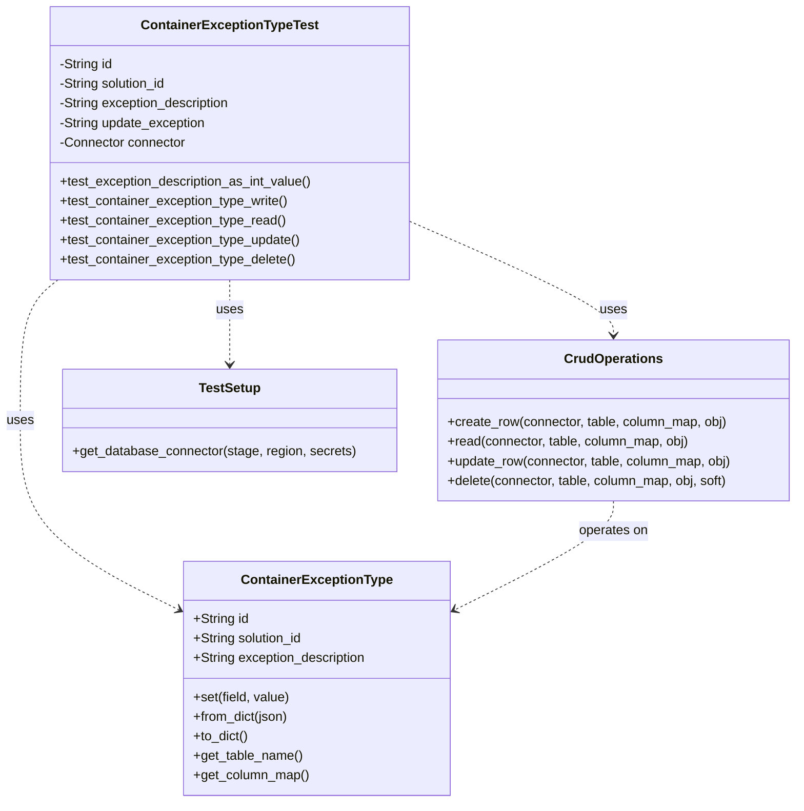
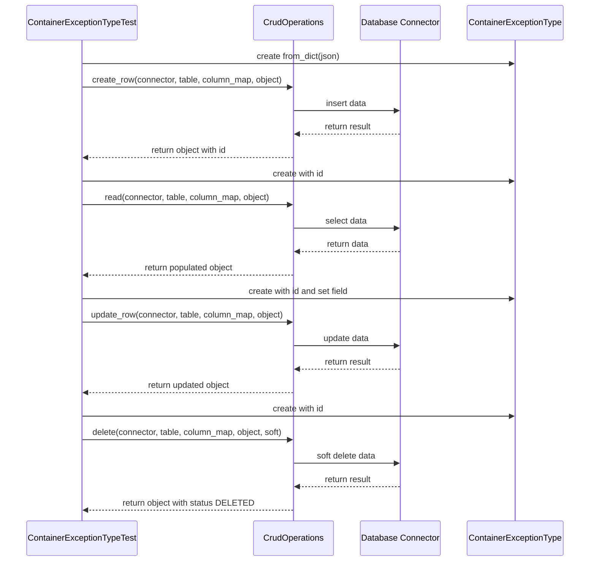
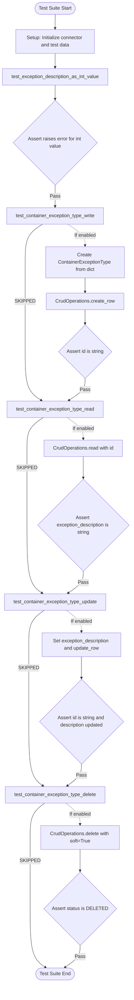

# Diagram: platform/partview_core/partview_service/partview_service/tests/unit/core/datamodel/container_exception_type_test.py

> Auto-generated by Obscura crawlers

## Diagram 1

### SVG

<svg id="container" width="978.6328125" xmlns="http://www.w3.org/2000/svg" class="classDiagram" height="986" viewBox="0 0 978.6328125 986" role="graphics-document document" aria-roledescription="class"><g><defs><marker id="container_class-aggregationStart" class="marker aggregation class" refX="18" refY="7" markerWidth="190" markerHeight="240" orient="auto"><path d="M 18,7 L9,13 L1,7 L9,1 Z"></path></marker></defs><defs><marker id="container_class-aggregationEnd" class="marker aggregation class" refX="1" refY="7" markerWidth="20" markerHeight="28" orient="auto"><path d="M 18,7 L9,13 L1,7 L9,1 Z"></path></marker></defs><defs><marker id="container_class-extensionStart" class="marker extension class" refX="18" refY="7" markerWidth="190" markerHeight="240" orient="auto"><path d="M 1,7 L18,13 V 1 Z"></path></marker></defs><defs><marker id="container_class-extensionEnd" class="marker extension class" refX="1" refY="7" markerWidth="20" markerHeight="28" orient="auto"><path d="M 1,1 V 13 L18,7 Z"></path></marker></defs><defs><marker id="container_class-compositionStart" class="marker composition class" refX="18" refY="7" markerWidth="190" markerHeight="240" orient="auto"><path d="M 18,7 L9,13 L1,7 L9,1 Z"></path></marker></defs><defs><marker id="container_class-compositionEnd" class="marker composition class" refX="1" refY="7" markerWidth="20" markerHeight="28" orient="auto"><path d="M 18,7 L9,13 L1,7 L9,1 Z"></path></marker></defs><defs><marker id="container_class-dependencyStart" class="marker dependency class" refX="6" refY="7" markerWidth="190" markerHeight="240" orient="auto"><path d="M 5,7 L9,13 L1,7 L9,1 Z"></path></marker></defs><defs><marker id="container_class-dependencyEnd" class="marker dependency class" refX="13" refY="7" markerWidth="20" markerHeight="28" orient="auto"><path d="M 18,7 L9,13 L14,7 L9,1 Z"></path></marker></defs><defs><marker id="container_class-lollipopStart" class="marker lollipop class" refX="13" refY="7" markerWidth="190" markerHeight="240" orient="auto"><circle stroke="black" fill="transparent" cx="7" cy="7" r="6"></circle></marker></defs><defs><marker id="container_class-lollipopEnd" class="marker lollipop class" refX="1" refY="7" markerWidth="190" markerHeight="240" orient="auto"><circle stroke="black" fill="transparent" cx="7" cy="7" r="6"></circle></marker></defs><g class="root"><g class="clusters"></g><g class="edgePaths"><path d="M70.677,344L62.98,350.167C55.282,356.333,39.887,368.667,32.19,397.5C24.492,426.333,24.492,471.667,24.492,517C24.492,562.333,24.492,607.667,56.91,646.448C89.327,685.23,154.162,717.459,186.579,733.574L218.996,749.689" id="id_ContainerExceptionTypeTest_ContainerExceptionType_1" class="edge-thickness-normal edge-pattern-dashed relation" style=";;;" data-edge="true" data-et="edge" data-id="id_ContainerExceptionTypeTest_ContainerExceptionType_1" data-points="W3sieCI6NzAuNjc3MzI0Njk1MTIxOTQsInkiOjM0NH0seyJ4IjoyNC40OTIxODc1LCJ5IjozODF9LHsieCI6MjQuNDkyMTg3NSwieSI6NTE3fSx7IngiOjI0LjQ5MjE4NzUsInkiOjY1M30seyJ4IjoyMjQuMzY5MTQwNjI1LCJ5Ijo3NTIuMzYwMDQxNDExMTk5M31d" marker-end="url(#container_class-dependencyEnd)"></path><path d="M501.098,271.796L543.033,289.996C584.967,308.197,668.837,344.599,710.772,367.966C752.707,391.333,752.707,401.667,752.707,406.833L752.707,412" id="id_ContainerExceptionTypeTest_CrudOperations_2" class="edge-thickness-normal edge-pattern-dashed relation" style=";;;" data-edge="true" data-et="edge" data-id="id_ContainerExceptionTypeTest_CrudOperations_2" data-points="W3sieCI6NTAxLjA5NzY1NjI1LCJ5IjoyNzEuNzk1NTE3NTEyMzAyfSx7IngiOjc1Mi43MDcwMzEyNSwieSI6MzgxfSx7IngiOjc1Mi43MDcwMzEyNSwieSI6NDE4fV0=" marker-end="url(#container_class-dependencyEnd)"></path><path d="M280.383,344L280.383,350.167C280.383,356.333,280.383,368.667,280.383,386C280.383,403.333,280.383,425.667,280.383,436.833L280.383,448" id="id_ContainerExceptionTypeTest_TestSetup_3" class="edge-thickness-normal edge-pattern-dashed relation" style=";;;" data-edge="true" data-et="edge" data-id="id_ContainerExceptionTypeTest_TestSetup_3" data-points="W3sieCI6MjgwLjM4MjgxMjUsInkiOjM0NH0seyJ4IjoyODAuMzgyODEyNSwieSI6MzgxfSx7IngiOjI4MC4zODI4MTI1LCJ5Ijo0NTR9XQ==" marker-end="url(#container_class-dependencyEnd)"></path><path d="M752.707,616L752.707,622.167C752.707,628.333,752.707,640.667,720.29,662.948C687.872,685.23,623.038,717.459,590.62,733.574L558.203,749.689" id="id_CrudOperations_ContainerExceptionType_4" class="edge-thickness-normal edge-pattern-dashed relation" style=";;;" data-edge="true" data-et="edge" data-id="id_CrudOperations_ContainerExceptionType_4" data-points="W3sieCI6NzUyLjcwNzAzMTI1LCJ5Ijo2MTZ9LHsieCI6NzUyLjcwNzAzMTI1LCJ5Ijo2NTN9LHsieCI6NTUyLjgzMDA3ODEyNSwieSI6NzUyLjM2MDA0MTQxMTE5OTN9XQ==" marker-end="url(#container_class-dependencyEnd)"></path></g><g class="edgeLabels"><g class="edgeLabel" transform="translate(24.4921875, 517)"><g class="label" data-id="id_ContainerExceptionTypeTest_ContainerExceptionType_1" transform="translate(-16.4921875, -12)"><foreignObject width="32.984375" height="24">

uses

</foreignObject></g></g><g class="edgeLabel" transform="translate(752.70703125, 381)"><g class="label" data-id="id_ContainerExceptionTypeTest_CrudOperations_2" transform="translate(-16.4921875, -12)"><foreignObject width="32.984375" height="24">

uses

</foreignObject></g></g><g class="edgeLabel" transform="translate(280.3828125, 381)"><g class="label" data-id="id_ContainerExceptionTypeTest_TestSetup_3" transform="translate(-16.4921875, -12)"><foreignObject width="32.984375" height="24">

uses

</foreignObject></g></g><g class="edgeLabel" transform="translate(752.70703125, 653)"><g class="label" data-id="id_CrudOperations_ContainerExceptionType_4" transform="translate(-43.2890625, -12)"><foreignObject width="86.578125" height="24">

operates on

</foreignObject></g></g></g><g class="nodes"><g class="node default" id="classId-ContainerExceptionTypeTest-0" transform="translate(280.3828125, 176)"><g class="basic label-container"><path d="M-220.71484375 -168 L220.71484375 -168 L220.71484375 168 L-220.71484375 168" stroke="none" stroke-width="0" fill="#ECECFF" style=""></path><path d="M-220.71484375 -168 C-106.57431334774586 -168, 7.566217054508286 -168, 220.71484375 -168 M-220.71484375 -168 C-47.48371979678225 -168, 125.7474041564355 -168, 220.71484375 -168 M220.71484375 -168 C220.71484375 -37.59012264413897, 220.71484375 92.81975471172206, 220.71484375 168 M220.71484375 -168 C220.71484375 -81.65978824135493, 220.71484375 4.680423517290137, 220.71484375 168 M220.71484375 168 C119.66248388406365 168, 18.610124018127294 168, -220.71484375 168 M220.71484375 168 C90.96781387138137 168, -38.77921600723727 168, -220.71484375 168 M-220.71484375 168 C-220.71484375 66.22003870761556, -220.71484375 -35.559922584768884, -220.71484375 -168 M-220.71484375 168 C-220.71484375 91.10830040007458, -220.71484375 14.216600800149166, -220.71484375 -168" stroke="#9370DB" stroke-width="1.3" fill="none" stroke-dasharray="0 0" style=""></path></g><g class="annotation-group text" transform="translate(0, -144)"></g><g class="label-group text" transform="translate(-103.8828125, -144)"><g class="label" style="font-weight: bolder" transform="translate(0,-12)"><foreignObject width="207.765625" height="24">

ContainerExceptionTypeTest

</foreignObject></g></g><g class="members-group text" transform="translate(-208.71484375, -96)"><g class="label" style="" transform="translate(0,-12)"><foreignObject width="67.015625" height="24">

-String id

</foreignObject></g><g class="label" style="" transform="translate(0,12)"><foreignObject width="135.15625" height="24">

-String solution_id

</foreignObject></g><g class="label" style="" transform="translate(0,36)"><foreignObject width="214.296875" height="24">

-String exception_description

</foreignObject></g><g class="label" style="" transform="translate(0,60)"><foreignObject width="182.71875" height="24">

-String update_exception

</foreignObject></g><g class="label" style="" transform="translate(0,84)"><foreignObject width="157.703125" height="24">

-Connector connector

</foreignObject></g></g><g class="methods-group text" transform="translate(-208.71484375, 48)"><g class="label" style="" transform="translate(0,-12)"><foreignObject width="313.546875" height="24">

+test_exception_description_as_int_value()

</foreignObject></g><g class="label" style="" transform="translate(0,12)"><foreignObject width="284.34375" height="24">

+test_container_exception_type_write()

</foreignObject></g><g class="label" style="" transform="translate(0,36)"><foreignObject width="280.78125" height="24">

+test_container_exception_type_read()

</foreignObject></g><g class="label" style="" transform="translate(0,60)"><foreignObject width="299.265625" height="24">

+test_container_exception_type_update()

</foreignObject></g><g class="label" style="" transform="translate(0,84)"><foreignObject width="293.796875" height="24">

+test_container_exception_type_delete()

</foreignObject></g></g><g class="divider" style=""><path d="M-220.71484375 -120 C-61.52977893202129 -120, 97.65528588595743 -120, 220.71484375 -120 M-220.71484375 -120 C-100.8858833700701 -120, 18.943077009859792 -120, 220.71484375 -120" stroke="#9370DB" stroke-width="1.3" fill="none" stroke-dasharray="0 0" style=""></path></g><g class="divider" style=""><path d="M-220.71484375 24 C-73.92574274680186 24, 72.86335825639628 24, 220.71484375 24 M-220.71484375 24 C-129.86470200259993 24, -39.01456025519988 24, 220.71484375 24" stroke="#9370DB" stroke-width="1.3" fill="none" stroke-dasharray="0 0" style=""></path></g></g><g class="node default" id="classId-ContainerExceptionType-1" transform="translate(388.599609375, 834)"><g class="basic label-container"><path d="M-164.23046875 -144 L164.23046875 -144 L164.23046875 144 L-164.23046875 144" stroke="none" stroke-width="0" fill="#ECECFF" style=""></path><path d="M-164.23046875 -144 C-89.79321052371829 -144, -15.355952297436573 -144, 164.23046875 -144 M-164.23046875 -144 C-75.33764311740318 -144, 13.55518251519365 -144, 164.23046875 -144 M164.23046875 -144 C164.23046875 -58.98056069776726, 164.23046875 26.03887860446548, 164.23046875 144 M164.23046875 -144 C164.23046875 -46.71531217415769, 164.23046875 50.569375651684624, 164.23046875 144 M164.23046875 144 C82.94332452628996 144, 1.6561803025799122 144, -164.23046875 144 M164.23046875 144 C81.24598204634023 144, -1.7385046573195382 144, -164.23046875 144 M-164.23046875 144 C-164.23046875 59.31539907236042, -164.23046875 -25.369201855279158, -164.23046875 -144 M-164.23046875 144 C-164.23046875 80.58863620104486, -164.23046875 17.177272402089713, -164.23046875 -144" stroke="#9370DB" stroke-width="1.3" fill="none" stroke-dasharray="0 0" style=""></path></g><g class="annotation-group text" transform="translate(0, -120)"></g><g class="label-group text" transform="translate(-88.6328125, -120)"><g class="label" style="font-weight: bolder" transform="translate(0,-12)"><foreignObject width="177.265625" height="24">

ContainerExceptionType

</foreignObject></g></g><g class="members-group text" transform="translate(-152.23046875, -72)"><g class="label" style="" transform="translate(0,-12)"><foreignObject width="68.546875" height="24">

+String id

</foreignObject></g><g class="label" style="" transform="translate(0,12)"><foreignObject width="136.703125" height="24">

+String solution_id

</foreignObject></g><g class="label" style="" transform="translate(0,36)"><foreignObject width="215.828125" height="24">

+String exception_description

</foreignObject></g></g><g class="methods-group text" transform="translate(-152.23046875, 24)"><g class="label" style="" transform="translate(0,-12)"><foreignObject width="119.390625" height="24">

+set(field, value)

</foreignObject></g><g class="label" style="" transform="translate(0,12)"><foreignObject width="118.984375" height="24">

+from_dict(json)

</foreignObject></g><g class="label" style="" transform="translate(0,36)"><foreignObject width="68.34375" height="24">

+to_dict()

</foreignObject></g><g class="label" style="" transform="translate(0,60)"><foreignObject width="134.625" height="24">

+get_table_name()

</foreignObject></g><g class="label" style="" transform="translate(0,84)"><foreignObject width="142.921875" height="24">

+get_column_map()

</foreignObject></g></g><g class="divider" style=""><path d="M-164.23046875 -96 C-72.18606671198971 -96, 19.85833532602058 -96, 164.23046875 -96 M-164.23046875 -96 C-64.3141403168335 -96, 35.602188116333 -96, 164.23046875 -96" stroke="#9370DB" stroke-width="1.3" fill="none" stroke-dasharray="0 0" style=""></path></g><g class="divider" style=""><path d="M-164.23046875 0 C-72.49710531244101 0, 19.236258125117985 0, 164.23046875 0 M-164.23046875 0 C-42.0050499710776 0, 80.2203688078448 0, 164.23046875 0" stroke="#9370DB" stroke-width="1.3" fill="none" stroke-dasharray="0 0" style=""></path></g></g><g class="node default" id="classId-CrudOperations-2" transform="translate(752.70703125, 517)"><g class="basic label-container"><path d="M-217.92578125 -99 L217.92578125 -99 L217.92578125 99 L-217.92578125 99" stroke="none" stroke-width="0" fill="#ECECFF" style=""></path><path d="M-217.92578125 -99 C-111.72072491000299 -99, -5.515668570005971 -99, 217.92578125 -99 M-217.92578125 -99 C-94.23317675070024 -99, 29.459427748599524 -99, 217.92578125 -99 M217.92578125 -99 C217.92578125 -45.53235603444515, 217.92578125 7.935287931109698, 217.92578125 99 M217.92578125 -99 C217.92578125 -30.04632697814668, 217.92578125 38.90734604370664, 217.92578125 99 M217.92578125 99 C112.35975145497942 99, 6.793721659958834 99, -217.92578125 99 M217.92578125 99 C84.64196173085813 99, -48.641857788283744 99, -217.92578125 99 M-217.92578125 99 C-217.92578125 31.409916637139474, -217.92578125 -36.18016672572105, -217.92578125 -99 M-217.92578125 99 C-217.92578125 32.85386840033148, -217.92578125 -33.29226319933704, -217.92578125 -99" stroke="#9370DB" stroke-width="1.3" fill="none" stroke-dasharray="0 0" style=""></path></g><g class="annotation-group text" transform="translate(0, -75)"></g><g class="label-group text" transform="translate(-57.6171875, -75)"><g class="label" style="font-weight: bolder" transform="translate(0,-12)"><foreignObject width="115.234375" height="24">

CrudOperations

</foreignObject></g></g><g class="members-group text" transform="translate(-205.92578125, -27)"></g><g class="methods-group text" transform="translate(-205.92578125, 3)"><g class="label" style="" transform="translate(0,-12)"><foreignObject width="347.75" height="24">

+create_row(connector, table, column_map, obj)

</foreignObject></g><g class="label" style="" transform="translate(0,12)"><foreignObject width="300.90625" height="24">

+read(connector, table, column_map, obj)

</foreignObject></g><g class="label" style="" transform="translate(0,36)"><foreignObject width="354.234375" height="24">

+update_row(connector, table, column_map, obj)

</foreignObject></g><g class="label" style="" transform="translate(0,60)"><foreignObject width="350.28125" height="24">

+delete(connector, table, column_map, obj, soft)

</foreignObject></g></g><g class="divider" style=""><path d="M-217.92578125 -51 C-99.96738436013081 -51, 17.991012529738384 -51, 217.92578125 -51 M-217.92578125 -51 C-85.69200727141731 -51, 46.54176670716538 -51, 217.92578125 -51" stroke="#9370DB" stroke-width="1.3" fill="none" stroke-dasharray="0 0" style=""></path></g><g class="divider" style=""><path d="M-217.92578125 -27 C-118.42893741548748 -27, -18.932093580974964 -27, 217.92578125 -27 M-217.92578125 -27 C-90.82694344469101 -27, 36.27189436061798 -27, 217.92578125 -27" stroke="#9370DB" stroke-width="1.3" fill="none" stroke-dasharray="0 0" style=""></path></g></g><g class="node default" id="classId-TestSetup-3" transform="translate(280.3828125, 517)"><g class="basic label-container"><path d="M-204.3984375 -63 L204.3984375 -63 L204.3984375 63 L-204.3984375 63" stroke="none" stroke-width="0" fill="#ECECFF" style=""></path><path d="M-204.3984375 -63 C-65.10092239883576 -63, 74.19659270232847 -63, 204.3984375 -63 M-204.3984375 -63 C-86.28424563079787 -63, 31.82994623840426 -63, 204.3984375 -63 M204.3984375 -63 C204.3984375 -17.38876225007568, 204.3984375 28.222475499848642, 204.3984375 63 M204.3984375 -63 C204.3984375 -37.252455325273786, 204.3984375 -11.504910650547572, 204.3984375 63 M204.3984375 63 C71.8964507403287 63, -60.605536019342594 63, -204.3984375 63 M204.3984375 63 C101.94992906455722 63, -0.49857937088555104 63, -204.3984375 63 M-204.3984375 63 C-204.3984375 35.45216152307988, -204.3984375 7.904323046159753, -204.3984375 -63 M-204.3984375 63 C-204.3984375 35.39751284698895, -204.3984375 7.795025693977905, -204.3984375 -63" stroke="#9370DB" stroke-width="1.3" fill="none" stroke-dasharray="0 0" style=""></path></g><g class="annotation-group text" transform="translate(0, -39)"></g><g class="label-group text" transform="translate(-36.6875, -39)"><g class="label" style="font-weight: bolder" transform="translate(0,-12)"><foreignObject width="73.375" height="24">

TestSetup

</foreignObject></g></g><g class="members-group text" transform="translate(-192.3984375, 9)"></g><g class="methods-group text" transform="translate(-192.3984375, 39)"><g class="label" style="" transform="translate(0,-12)"><foreignObject width="348.109375" height="24">

+get_database_connector(stage, region, secrets)

</foreignObject></g></g><g class="divider" style=""><path d="M-204.3984375 -15 C-119.51626272603733 -15, -34.63408795207465 -15, 204.3984375 -15 M-204.3984375 -15 C-105.05995155216871 -15, -5.721465604337425 -15, 204.3984375 -15" stroke="#9370DB" stroke-width="1.3" fill="none" stroke-dasharray="0 0" style=""></path></g><g class="divider" style=""><path d="M-204.3984375 9 C-106.57589287748466 9, -8.753348254969325 9, 204.3984375 9 M-204.3984375 9 C-91.50107142548632 9, 21.396294649027368 9, 204.3984375 9" stroke="#9370DB" stroke-width="1.3" fill="none" stroke-dasharray="0 0" style=""></path></g></g></g></g></g></svg>

## Diagram 2

### SVG

<svg id="container" width="1187.5" xmlns="http://www.w3.org/2000/svg" height="1131" viewBox="-50 -10 1187.5 1131" role="graphics-document document" aria-roledescription="sequence"><g><rect x="892.5" y="1045" fill="#eaeaea" stroke="#666" width="195" height="65" name="Model" rx="3" ry="3" class="actor actor-bottom"></rect><text x="990" y="1077.5" dominant-baseline="central" alignment-baseline="central" class="actor actor-box" style="text-anchor: middle; font-size: 16px; font-weight: 400;"><tspan x="990" dy="0">ContainerExceptionType</tspan></text></g><g><rect x="675.5" y="1045" fill="#eaeaea" stroke="#666" width="167" height="65" name="DB" rx="3" ry="3" class="actor actor-bottom"></rect><text x="759" y="1077.5" dominant-baseline="central" alignment-baseline="central" class="actor actor-box" style="text-anchor: middle; font-size: 16px; font-weight: 400;"><tspan x="759" dy="0">Database Connector</tspan></text></g><g><rect x="475.5" y="1045" fill="#eaeaea" stroke="#666" width="150" height="65" name="CRUD" rx="3" ry="3" class="actor actor-bottom"></rect><text x="550.5" y="1077.5" dominant-baseline="central" alignment-baseline="central" class="actor actor-box" style="text-anchor: middle; font-size: 16px; font-weight: 400;"><tspan x="550.5" dy="0">CrudOperations</tspan></text></g><g><rect x="0" y="1045" fill="#eaeaea" stroke="#666" width="225" height="65" name="Test" rx="3" ry="3" class="actor actor-bottom"></rect><text x="112.5" y="1077.5" dominant-baseline="central" alignment-baseline="central" class="actor actor-box" style="text-anchor: middle; font-size: 16px; font-weight: 400;"><tspan x="112.5" dy="0">ContainerExceptionTypeTest</tspan></text></g><g><line id="actor3" x1="990" y1="65" x2="990" y2="1045" class="actor-line 200" stroke-width="0.5px" stroke="#999" name="Model"></line><g id="root-3"><rect x="892.5" y="0" fill="#eaeaea" stroke="#666" width="195" height="65" name="Model" rx="3" ry="3" class="actor actor-top"></rect><text x="990" y="32.5" dominant-baseline="central" alignment-baseline="central" class="actor actor-box" style="text-anchor: middle; font-size: 16px; font-weight: 400;"><tspan x="990" dy="0">ContainerExceptionType</tspan></text></g></g><g><line id="actor2" x1="759" y1="65" x2="759" y2="1045" class="actor-line 200" stroke-width="0.5px" stroke="#999" name="DB"></line><g id="root-2"><rect x="675.5" y="0" fill="#eaeaea" stroke="#666" width="167" height="65" name="DB" rx="3" ry="3" class="actor actor-top"></rect><text x="759" y="32.5" dominant-baseline="central" alignment-baseline="central" class="actor actor-box" style="text-anchor: middle; font-size: 16px; font-weight: 400;"><tspan x="759" dy="0">Database Connector</tspan></text></g></g><g><line id="actor1" x1="550.5" y1="65" x2="550.5" y2="1045" class="actor-line 200" stroke-width="0.5px" stroke="#999" name="CRUD"></line><g id="root-1"><rect x="475.5" y="0" fill="#eaeaea" stroke="#666" width="150" height="65" name="CRUD" rx="3" ry="3" class="actor actor-top"></rect><text x="550.5" y="32.5" dominant-baseline="central" alignment-baseline="central" class="actor actor-box" style="text-anchor: middle; font-size: 16px; font-weight: 400;"><tspan x="550.5" dy="0">CrudOperations</tspan></text></g></g><g><line id="actor0" x1="112.5" y1="65" x2="112.5" y2="1045" class="actor-line 200" stroke-width="0.5px" stroke="#999" name="Test"></line><g id="root-0"><rect x="0" y="0" fill="#eaeaea" stroke="#666" width="225" height="65" name="Test" rx="3" ry="3" class="actor actor-top"></rect><text x="112.5" y="32.5" dominant-baseline="central" alignment-baseline="central" class="actor actor-box" style="text-anchor: middle; font-size: 16px; font-weight: 400;"><tspan x="112.5" dy="0">ContainerExceptionTypeTest</tspan></text></g></g><g></g><defs><symbol id="computer" width="24" height="24"><path transform="scale(.5)" d="M2 2v13h20v-13h-20zm18 11h-16v-9h16v9zm-10.228 6l.466-1h3.524l.467 1h-4.457zm14.228 3h-24l2-6h2.104l-1.33 4h18.45l-1.297-4h2.073l2 6zm-5-10h-14v-7h14v7z"></path></symbol></defs><defs><symbol id="database" fill-rule="evenodd" clip-rule="evenodd"><path transform="scale(.5)" d="M12.258.001l.256.004.255.005.253.008.251.01.249.012.247.015.246.016.242.019.241.02.239.023.236.024.233.027.231.028.229.031.225.032.223.034.22.036.217.038.214.04.211.041.208.043.205.045.201.046.198.048.194.05.191.051.187.053.183.054.18.056.175.057.172.059.168.06.163.061.16.063.155.064.15.066.074.033.073.033.071.034.07.034.069.035.068.035.067.035.066.035.064.036.064.036.062.036.06.036.06.037.058.037.058.037.055.038.055.038.053.038.052.038.051.039.05.039.048.039.047.039.045.04.044.04.043.04.041.04.04.041.039.041.037.041.036.041.034.041.033.042.032.042.03.042.029.042.027.042.026.043.024.043.023.043.021.043.02.043.018.044.017.043.015.044.013.044.012.044.011.045.009.044.007.045.006.045.004.045.002.045.001.045v17l-.001.045-.002.045-.004.045-.006.045-.007.045-.009.044-.011.045-.012.044-.013.044-.015.044-.017.043-.018.044-.02.043-.021.043-.023.043-.024.043-.026.043-.027.042-.029.042-.03.042-.032.042-.033.042-.034.041-.036.041-.037.041-.039.041-.04.041-.041.04-.043.04-.044.04-.045.04-.047.039-.048.039-.05.039-.051.039-.052.038-.053.038-.055.038-.055.038-.058.037-.058.037-.06.037-.06.036-.062.036-.064.036-.064.036-.066.035-.067.035-.068.035-.069.035-.07.034-.071.034-.073.033-.074.033-.15.066-.155.064-.16.063-.163.061-.168.06-.172.059-.175.057-.18.056-.183.054-.187.053-.191.051-.194.05-.198.048-.201.046-.205.045-.208.043-.211.041-.214.04-.217.038-.22.036-.223.034-.225.032-.229.031-.231.028-.233.027-.236.024-.239.023-.241.02-.242.019-.246.016-.247.015-.249.012-.251.01-.253.008-.255.005-.256.004-.258.001-.258-.001-.256-.004-.255-.005-.253-.008-.251-.01-.249-.012-.247-.015-.245-.016-.243-.019-.241-.02-.238-.023-.236-.024-.234-.027-.231-.028-.228-.031-.226-.032-.223-.034-.22-.036-.217-.038-.214-.04-.211-.041-.208-.043-.204-.045-.201-.046-.198-.048-.195-.05-.19-.051-.187-.053-.184-.054-.179-.056-.176-.057-.172-.059-.167-.06-.164-.061-.159-.063-.155-.064-.151-.066-.074-.033-.072-.033-.072-.034-.07-.034-.069-.035-.068-.035-.067-.035-.066-.035-.064-.036-.063-.036-.062-.036-.061-.036-.06-.037-.058-.037-.057-.037-.056-.038-.055-.038-.053-.038-.052-.038-.051-.039-.049-.039-.049-.039-.046-.039-.046-.04-.044-.04-.043-.04-.041-.04-.04-.041-.039-.041-.037-.041-.036-.041-.034-.041-.033-.042-.032-.042-.03-.042-.029-.042-.027-.042-.026-.043-.024-.043-.023-.043-.021-.043-.02-.043-.018-.044-.017-.043-.015-.044-.013-.044-.012-.044-.011-.045-.009-.044-.007-.045-.006-.045-.004-.045-.002-.045-.001-.045v-17l.001-.045.002-.045.004-.045.006-.045.007-.045.009-.044.011-.045.012-.044.013-.044.015-.044.017-.043.018-.044.02-.043.021-.043.023-.043.024-.043.026-.043.027-.042.029-.042.03-.042.032-.042.033-.042.034-.041.036-.041.037-.041.039-.041.04-.041.041-.04.043-.04.044-.04.046-.04.046-.039.049-.039.049-.039.051-.039.052-.038.053-.038.055-.038.056-.038.057-.037.058-.037.06-.037.061-.036.062-.036.063-.036.064-.036.066-.035.067-.035.068-.035.069-.035.07-.034.072-.034.072-.033.074-.033.151-.066.155-.064.159-.063.164-.061.167-.06.172-.059.176-.057.179-.056.184-.054.187-.053.19-.051.195-.05.198-.048.201-.046.204-.045.208-.043.211-.041.214-.04.217-.038.22-.036.223-.034.226-.032.228-.031.231-.028.234-.027.236-.024.238-.023.241-.02.243-.019.245-.016.247-.015.249-.012.251-.01.253-.008.255-.005.256-.004.258-.001.258.001zm-9.258 20.499v.01l.001.021.003.021.004.022.005.021.006.022.007.022.009.023.01.022.011.023.012.023.013.023.015.023.016.024.017.023.018.024.019.024.021.024.022.025.023.024.024.025.052.049.056.05.061.051.066.051.07.051.075.051.079.052.084.052.088.052.092.052.097.052.102.051.105.052.11.052.114.051.119.051.123.051.127.05.131.05.135.05.139.048.144.049.147.047.152.047.155.047.16.045.163.045.167.043.171.043.176.041.178.041.183.039.187.039.19.037.194.035.197.035.202.033.204.031.209.03.212.029.216.027.219.025.222.024.226.021.23.02.233.018.236.016.24.015.243.012.246.01.249.008.253.005.256.004.259.001.26-.001.257-.004.254-.005.25-.008.247-.011.244-.012.241-.014.237-.016.233-.018.231-.021.226-.021.224-.024.22-.026.216-.027.212-.028.21-.031.205-.031.202-.034.198-.034.194-.036.191-.037.187-.039.183-.04.179-.04.175-.042.172-.043.168-.044.163-.045.16-.046.155-.046.152-.047.148-.048.143-.049.139-.049.136-.05.131-.05.126-.05.123-.051.118-.052.114-.051.11-.052.106-.052.101-.052.096-.052.092-.052.088-.053.083-.051.079-.052.074-.052.07-.051.065-.051.06-.051.056-.05.051-.05.023-.024.023-.025.021-.024.02-.024.019-.024.018-.024.017-.024.015-.023.014-.024.013-.023.012-.023.01-.023.01-.022.008-.022.006-.022.006-.022.004-.022.004-.021.001-.021.001-.021v-4.127l-.077.055-.08.053-.083.054-.085.053-.087.052-.09.052-.093.051-.095.05-.097.05-.1.049-.102.049-.105.048-.106.047-.109.047-.111.046-.114.045-.115.045-.118.044-.12.043-.122.042-.124.042-.126.041-.128.04-.13.04-.132.038-.134.038-.135.037-.138.037-.139.035-.142.035-.143.034-.144.033-.147.032-.148.031-.15.03-.151.03-.153.029-.154.027-.156.027-.158.026-.159.025-.161.024-.162.023-.163.022-.165.021-.166.02-.167.019-.169.018-.169.017-.171.016-.173.015-.173.014-.175.013-.175.012-.177.011-.178.01-.179.008-.179.008-.181.006-.182.005-.182.004-.184.003-.184.002h-.37l-.184-.002-.184-.003-.182-.004-.182-.005-.181-.006-.179-.008-.179-.008-.178-.01-.176-.011-.176-.012-.175-.013-.173-.014-.172-.015-.171-.016-.17-.017-.169-.018-.167-.019-.166-.02-.165-.021-.163-.022-.162-.023-.161-.024-.159-.025-.157-.026-.156-.027-.155-.027-.153-.029-.151-.03-.15-.03-.148-.031-.146-.032-.145-.033-.143-.034-.141-.035-.14-.035-.137-.037-.136-.037-.134-.038-.132-.038-.13-.04-.128-.04-.126-.041-.124-.042-.122-.042-.12-.044-.117-.043-.116-.045-.113-.045-.112-.046-.109-.047-.106-.047-.105-.048-.102-.049-.1-.049-.097-.05-.095-.05-.093-.052-.09-.051-.087-.052-.085-.053-.083-.054-.08-.054-.077-.054v4.127zm0-5.654v.011l.001.021.003.021.004.021.005.022.006.022.007.022.009.022.01.022.011.023.012.023.013.023.015.024.016.023.017.024.018.024.019.024.021.024.022.024.023.025.024.024.052.05.056.05.061.05.066.051.07.051.075.052.079.051.084.052.088.052.092.052.097.052.102.052.105.052.11.051.114.051.119.052.123.05.127.051.131.05.135.049.139.049.144.048.147.048.152.047.155.046.16.045.163.045.167.044.171.042.176.042.178.04.183.04.187.038.19.037.194.036.197.034.202.033.204.032.209.03.212.028.216.027.219.025.222.024.226.022.23.02.233.018.236.016.24.014.243.012.246.01.249.008.253.006.256.003.259.001.26-.001.257-.003.254-.006.25-.008.247-.01.244-.012.241-.015.237-.016.233-.018.231-.02.226-.022.224-.024.22-.025.216-.027.212-.029.21-.03.205-.032.202-.033.198-.035.194-.036.191-.037.187-.039.183-.039.179-.041.175-.042.172-.043.168-.044.163-.045.16-.045.155-.047.152-.047.148-.048.143-.048.139-.05.136-.049.131-.05.126-.051.123-.051.118-.051.114-.052.11-.052.106-.052.101-.052.096-.052.092-.052.088-.052.083-.052.079-.052.074-.051.07-.052.065-.051.06-.05.056-.051.051-.049.023-.025.023-.024.021-.025.02-.024.019-.024.018-.024.017-.024.015-.023.014-.023.013-.024.012-.022.01-.023.01-.023.008-.022.006-.022.006-.022.004-.021.004-.022.001-.021.001-.021v-4.139l-.077.054-.08.054-.083.054-.085.052-.087.053-.09.051-.093.051-.095.051-.097.05-.1.049-.102.049-.105.048-.106.047-.109.047-.111.046-.114.045-.115.044-.118.044-.12.044-.122.042-.124.042-.126.041-.128.04-.13.039-.132.039-.134.038-.135.037-.138.036-.139.036-.142.035-.143.033-.144.033-.147.033-.148.031-.15.03-.151.03-.153.028-.154.028-.156.027-.158.026-.159.025-.161.024-.162.023-.163.022-.165.021-.166.02-.167.019-.169.018-.169.017-.171.016-.173.015-.173.014-.175.013-.175.012-.177.011-.178.009-.179.009-.179.007-.181.007-.182.005-.182.004-.184.003-.184.002h-.37l-.184-.002-.184-.003-.182-.004-.182-.005-.181-.007-.179-.007-.179-.009-.178-.009-.176-.011-.176-.012-.175-.013-.173-.014-.172-.015-.171-.016-.17-.017-.169-.018-.167-.019-.166-.02-.165-.021-.163-.022-.162-.023-.161-.024-.159-.025-.157-.026-.156-.027-.155-.028-.153-.028-.151-.03-.15-.03-.148-.031-.146-.033-.145-.033-.143-.033-.141-.035-.14-.036-.137-.036-.136-.037-.134-.038-.132-.039-.13-.039-.128-.04-.126-.041-.124-.042-.122-.043-.12-.043-.117-.044-.116-.044-.113-.046-.112-.046-.109-.046-.106-.047-.105-.048-.102-.049-.1-.049-.097-.05-.095-.051-.093-.051-.09-.051-.087-.053-.085-.052-.083-.054-.08-.054-.077-.054v4.139zm0-5.666v.011l.001.02.003.022.004.021.005.022.006.021.007.022.009.023.01.022.011.023.012.023.013.023.015.023.016.024.017.024.018.023.019.024.021.025.022.024.023.024.024.025.052.05.056.05.061.05.066.051.07.051.075.052.079.051.084.052.088.052.092.052.097.052.102.052.105.051.11.052.114.051.119.051.123.051.127.05.131.05.135.05.139.049.144.048.147.048.152.047.155.046.16.045.163.045.167.043.171.043.176.042.178.04.183.04.187.038.19.037.194.036.197.034.202.033.204.032.209.03.212.028.216.027.219.025.222.024.226.021.23.02.233.018.236.017.24.014.243.012.246.01.249.008.253.006.256.003.259.001.26-.001.257-.003.254-.006.25-.008.247-.01.244-.013.241-.014.237-.016.233-.018.231-.02.226-.022.224-.024.22-.025.216-.027.212-.029.21-.03.205-.032.202-.033.198-.035.194-.036.191-.037.187-.039.183-.039.179-.041.175-.042.172-.043.168-.044.163-.045.16-.045.155-.047.152-.047.148-.048.143-.049.139-.049.136-.049.131-.051.126-.05.123-.051.118-.052.114-.051.11-.052.106-.052.101-.052.096-.052.092-.052.088-.052.083-.052.079-.052.074-.052.07-.051.065-.051.06-.051.056-.05.051-.049.023-.025.023-.025.021-.024.02-.024.019-.024.018-.024.017-.024.015-.023.014-.024.013-.023.012-.023.01-.022.01-.023.008-.022.006-.022.006-.022.004-.022.004-.021.001-.021.001-.021v-4.153l-.077.054-.08.054-.083.053-.085.053-.087.053-.09.051-.093.051-.095.051-.097.05-.1.049-.102.048-.105.048-.106.048-.109.046-.111.046-.114.046-.115.044-.118.044-.12.043-.122.043-.124.042-.126.041-.128.04-.13.039-.132.039-.134.038-.135.037-.138.036-.139.036-.142.034-.143.034-.144.033-.147.032-.148.032-.15.03-.151.03-.153.028-.154.028-.156.027-.158.026-.159.024-.161.024-.162.023-.163.023-.165.021-.166.02-.167.019-.169.018-.169.017-.171.016-.173.015-.173.014-.175.013-.175.012-.177.01-.178.01-.179.009-.179.007-.181.006-.182.006-.182.004-.184.003-.184.001-.185.001-.185-.001-.184-.001-.184-.003-.182-.004-.182-.006-.181-.006-.179-.007-.179-.009-.178-.01-.176-.01-.176-.012-.175-.013-.173-.014-.172-.015-.171-.016-.17-.017-.169-.018-.167-.019-.166-.02-.165-.021-.163-.023-.162-.023-.161-.024-.159-.024-.157-.026-.156-.027-.155-.028-.153-.028-.151-.03-.15-.03-.148-.032-.146-.032-.145-.033-.143-.034-.141-.034-.14-.036-.137-.036-.136-.037-.134-.038-.132-.039-.13-.039-.128-.041-.126-.041-.124-.041-.122-.043-.12-.043-.117-.044-.116-.044-.113-.046-.112-.046-.109-.046-.106-.048-.105-.048-.102-.048-.1-.05-.097-.049-.095-.051-.093-.051-.09-.052-.087-.052-.085-.053-.083-.053-.08-.054-.077-.054v4.153zm8.74-8.179l-.257.004-.254.005-.25.008-.247.011-.244.012-.241.014-.237.016-.233.018-.231.021-.226.022-.224.023-.22.026-.216.027-.212.028-.21.031-.205.032-.202.033-.198.034-.194.036-.191.038-.187.038-.183.04-.179.041-.175.042-.172.043-.168.043-.163.045-.16.046-.155.046-.152.048-.148.048-.143.048-.139.049-.136.05-.131.05-.126.051-.123.051-.118.051-.114.052-.11.052-.106.052-.101.052-.096.052-.092.052-.088.052-.083.052-.079.052-.074.051-.07.052-.065.051-.06.05-.056.05-.051.05-.023.025-.023.024-.021.024-.02.025-.019.024-.018.024-.017.023-.015.024-.014.023-.013.023-.012.023-.01.023-.01.022-.008.022-.006.023-.006.021-.004.022-.004.021-.001.021-.001.021.001.021.001.021.004.021.004.022.006.021.006.023.008.022.01.022.01.023.012.023.013.023.014.023.015.024.017.023.018.024.019.024.02.025.021.024.023.024.023.025.051.05.056.05.06.05.065.051.07.052.074.051.079.052.083.052.088.052.092.052.096.052.101.052.106.052.11.052.114.052.118.051.123.051.126.051.131.05.136.05.139.049.143.048.148.048.152.048.155.046.16.046.163.045.168.043.172.043.175.042.179.041.183.04.187.038.191.038.194.036.198.034.202.033.205.032.21.031.212.028.216.027.22.026.224.023.226.022.231.021.233.018.237.016.241.014.244.012.247.011.25.008.254.005.257.004.26.001.26-.001.257-.004.254-.005.25-.008.247-.011.244-.012.241-.014.237-.016.233-.018.231-.021.226-.022.224-.023.22-.026.216-.027.212-.028.21-.031.205-.032.202-.033.198-.034.194-.036.191-.038.187-.038.183-.04.179-.041.175-.042.172-.043.168-.043.163-.045.16-.046.155-.046.152-.048.148-.048.143-.048.139-.049.136-.05.131-.05.126-.051.123-.051.118-.051.114-.052.11-.052.106-.052.101-.052.096-.052.092-.052.088-.052.083-.052.079-.052.074-.051.07-.052.065-.051.06-.05.056-.05.051-.05.023-.025.023-.024.021-.024.02-.025.019-.024.018-.024.017-.023.015-.024.014-.023.013-.023.012-.023.01-.023.01-.022.008-.022.006-.023.006-.021.004-.022.004-.021.001-.021.001-.021-.001-.021-.001-.021-.004-.021-.004-.022-.006-.021-.006-.023-.008-.022-.01-.022-.01-.023-.012-.023-.013-.023-.014-.023-.015-.024-.017-.023-.018-.024-.019-.024-.02-.025-.021-.024-.023-.024-.023-.025-.051-.05-.056-.05-.06-.05-.065-.051-.07-.052-.074-.051-.079-.052-.083-.052-.088-.052-.092-.052-.096-.052-.101-.052-.106-.052-.11-.052-.114-.052-.118-.051-.123-.051-.126-.051-.131-.05-.136-.05-.139-.049-.143-.048-.148-.048-.152-.048-.155-.046-.16-.046-.163-.045-.168-.043-.172-.043-.175-.042-.179-.041-.183-.04-.187-.038-.191-.038-.194-.036-.198-.034-.202-.033-.205-.032-.21-.031-.212-.028-.216-.027-.22-.026-.224-.023-.226-.022-.231-.021-.233-.018-.237-.016-.241-.014-.244-.012-.247-.011-.25-.008-.254-.005-.257-.004-.26-.001-.26.001z"></path></symbol></defs><defs><symbol id="clock" width="24" height="24"><path transform="scale(.5)" d="M12 2c5.514 0 10 4.486 10 10s-4.486 10-10 10-10-4.486-10-10 4.486-10 10-10zm0-2c-6.627 0-12 5.373-12 12s5.373 12 12 12 12-5.373 12-12-5.373-12-12-12zm5.848 12.459c.202.038.202.333.001.372-1.907.361-6.045 1.111-6.547 1.111-.719 0-1.301-.582-1.301-1.301 0-.512.77-5.447 1.125-7.445.034-.192.312-.181.343.014l.985 6.238 5.394 1.011z"></path></symbol></defs><defs><marker id="arrowhead" refX="7.9" refY="5" markerUnits="userSpaceOnUse" markerWidth="12" markerHeight="12" orient="auto-start-reverse"><path d="M -1 0 L 10 5 L 0 10 z"></path></marker></defs><defs><marker id="crosshead" markerWidth="15" markerHeight="8" orient="auto" refX="4" refY="4.5"><path fill="none" stroke="#000000" stroke-width="1pt" d="M 1,2 L 6,7 M 6,2 L 1,7" style="stroke-dasharray: 0, 0;"></path></marker></defs><defs><marker id="filled-head" refX="15.5" refY="7" markerWidth="20" markerHeight="28" orient="auto"><path d="M 18,7 L9,13 L14,7 L9,1 Z"></path></marker></defs><defs><marker id="sequencenumber" refX="15" refY="15" markerWidth="60" markerHeight="40" orient="auto"><circle cx="15" cy="15" r="6"></circle></marker></defs><text x="550" y="80" text-anchor="middle" dominant-baseline="middle" alignment-baseline="middle" class="messageText" dy="1em" style="font-size: 16px; font-weight: 400;">create from_dict(json)</text><line x1="113.5" y1="113" x2="986" y2="113" class="messageLine0" stroke-width="2" stroke="none" marker-end="url(#arrowhead)" style="fill: none;"></line><text x="330" y="128" text-anchor="middle" dominant-baseline="middle" alignment-baseline="middle" class="messageText" dy="1em" style="font-size: 16px; font-weight: 400;">create_row(connector, table, column_map, object)</text><line x1="113.5" y1="161" x2="546.5" y2="161" class="messageLine0" stroke-width="2" stroke="none" marker-end="url(#arrowhead)" style="fill: none;"></line><text x="653" y="176" text-anchor="middle" dominant-baseline="middle" alignment-baseline="middle" class="messageText" dy="1em" style="font-size: 16px; font-weight: 400;">insert data</text><line x1="551.5" y1="209" x2="755" y2="209" class="messageLine0" stroke-width="2" stroke="none" marker-end="url(#arrowhead)" style="fill: none;"></line><text x="656" y="224" text-anchor="middle" dominant-baseline="middle" alignment-baseline="middle" class="messageText" dy="1em" style="font-size: 16px; font-weight: 400;">return result</text><line x1="758" y1="257" x2="554.5" y2="257" class="messageLine1" stroke-width="2" stroke="none" marker-end="url(#arrowhead)" style="stroke-dasharray: 3, 3; fill: none;"></line><text x="333" y="272" text-anchor="middle" dominant-baseline="middle" alignment-baseline="middle" class="messageText" dy="1em" style="font-size: 16px; font-weight: 400;">return object with id</text><line x1="549.5" y1="305" x2="116.5" y2="305" class="messageLine1" stroke-width="2" stroke="none" marker-end="url(#arrowhead)" style="stroke-dasharray: 3, 3; fill: none;"></line><text x="550" y="320" text-anchor="middle" dominant-baseline="middle" alignment-baseline="middle" class="messageText" dy="1em" style="font-size: 16px; font-weight: 400;">create with id</text><line x1="113.5" y1="353" x2="986" y2="353" class="messageLine0" stroke-width="2" stroke="none" marker-end="url(#arrowhead)" style="fill: none;"></line><text x="330" y="368" text-anchor="middle" dominant-baseline="middle" alignment-baseline="middle" class="messageText" dy="1em" style="font-size: 16px; font-weight: 400;">read(connector, table, column_map, object)</text><line x1="113.5" y1="401" x2="546.5" y2="401" class="messageLine0" stroke-width="2" stroke="none" marker-end="url(#arrowhead)" style="fill: none;"></line><text x="653" y="416" text-anchor="middle" dominant-baseline="middle" alignment-baseline="middle" class="messageText" dy="1em" style="font-size: 16px; font-weight: 400;">select data</text><line x1="551.5" y1="449" x2="755" y2="449" class="messageLine0" stroke-width="2" stroke="none" marker-end="url(#arrowhead)" style="fill: none;"></line><text x="656" y="464" text-anchor="middle" dominant-baseline="middle" alignment-baseline="middle" class="messageText" dy="1em" style="font-size: 16px; font-weight: 400;">return data</text><line x1="758" y1="497" x2="554.5" y2="497" class="messageLine1" stroke-width="2" stroke="none" marker-end="url(#arrowhead)" style="stroke-dasharray: 3, 3; fill: none;"></line><text x="333" y="512" text-anchor="middle" dominant-baseline="middle" alignment-baseline="middle" class="messageText" dy="1em" style="font-size: 16px; font-weight: 400;">return populated object</text><line x1="549.5" y1="545" x2="116.5" y2="545" class="messageLine1" stroke-width="2" stroke="none" marker-end="url(#arrowhead)" style="stroke-dasharray: 3, 3; fill: none;"></line><text x="550" y="560" text-anchor="middle" dominant-baseline="middle" alignment-baseline="middle" class="messageText" dy="1em" style="font-size: 16px; font-weight: 400;">create with id and set field</text><line x1="113.5" y1="593" x2="986" y2="593" class="messageLine0" stroke-width="2" stroke="none" marker-end="url(#arrowhead)" style="fill: none;"></line><text x="330" y="608" text-anchor="middle" dominant-baseline="middle" alignment-baseline="middle" class="messageText" dy="1em" style="font-size: 16px; font-weight: 400;">update_row(connector, table, column_map, object)</text><line x1="113.5" y1="641" x2="546.5" y2="641" class="messageLine0" stroke-width="2" stroke="none" marker-end="url(#arrowhead)" style="fill: none;"></line><text x="653" y="656" text-anchor="middle" dominant-baseline="middle" alignment-baseline="middle" class="messageText" dy="1em" style="font-size: 16px; font-weight: 400;">update data</text><line x1="551.5" y1="689" x2="755" y2="689" class="messageLine0" stroke-width="2" stroke="none" marker-end="url(#arrowhead)" style="fill: none;"></line><text x="656" y="704" text-anchor="middle" dominant-baseline="middle" alignment-baseline="middle" class="messageText" dy="1em" style="font-size: 16px; font-weight: 400;">return result</text><line x1="758" y1="737" x2="554.5" y2="737" class="messageLine1" stroke-width="2" stroke="none" marker-end="url(#arrowhead)" style="stroke-dasharray: 3, 3; fill: none;"></line><text x="333" y="752" text-anchor="middle" dominant-baseline="middle" alignment-baseline="middle" class="messageText" dy="1em" style="font-size: 16px; font-weight: 400;">return updated object</text><line x1="549.5" y1="785" x2="116.5" y2="785" class="messageLine1" stroke-width="2" stroke="none" marker-end="url(#arrowhead)" style="stroke-dasharray: 3, 3; fill: none;"></line><text x="550" y="800" text-anchor="middle" dominant-baseline="middle" alignment-baseline="middle" class="messageText" dy="1em" style="font-size: 16px; font-weight: 400;">create with id</text><line x1="113.5" y1="833" x2="986" y2="833" class="messageLine0" stroke-width="2" stroke="none" marker-end="url(#arrowhead)" style="fill: none;"></line><text x="330" y="848" text-anchor="middle" dominant-baseline="middle" alignment-baseline="middle" class="messageText" dy="1em" style="font-size: 16px; font-weight: 400;">delete(connector, table, column_map, object, soft)</text><line x1="113.5" y1="881" x2="546.5" y2="881" class="messageLine0" stroke-width="2" stroke="none" marker-end="url(#arrowhead)" style="fill: none;"></line><text x="653" y="896" text-anchor="middle" dominant-baseline="middle" alignment-baseline="middle" class="messageText" dy="1em" style="font-size: 16px; font-weight: 400;">soft delete data</text><line x1="551.5" y1="929" x2="755" y2="929" class="messageLine0" stroke-width="2" stroke="none" marker-end="url(#arrowhead)" style="fill: none;"></line><text x="656" y="944" text-anchor="middle" dominant-baseline="middle" alignment-baseline="middle" class="messageText" dy="1em" style="font-size: 16px; font-weight: 400;">return result</text><line x1="758" y1="977" x2="554.5" y2="977" class="messageLine1" stroke-width="2" stroke="none" marker-end="url(#arrowhead)" style="stroke-dasharray: 3, 3; fill: none;"></line><text x="333" y="992" text-anchor="middle" dominant-baseline="middle" alignment-baseline="middle" class="messageText" dy="1em" style="font-size: 16px; font-weight: 400;">return object with status DELETED</text><line x1="549.5" y1="1025" x2="116.5" y2="1025" class="messageLine1" stroke-width="2" stroke="none" marker-end="url(#arrowhead)" style="stroke-dasharray: 3, 3; fill: none;"></line></svg>

## Diagram 3

### SVG

<svg id="container" width="438.1328125" xmlns="http://www.w3.org/2000/svg" class="flowchart" height="3237.3125" viewBox="0 0 438.1328125 3237.3125" role="graphics-document document" aria-roledescription="flowchart-v2"><g><marker id="container_flowchart-v2-pointEnd" class="marker flowchart-v2" viewBox="0 0 10 10" refX="5" refY="5" markerUnits="userSpaceOnUse" markerWidth="8" markerHeight="8" orient="auto"><path d="M 0 0 L 10 5 L 0 10 z" class="arrowMarkerPath" style="stroke-width: 1; stroke-dasharray: 1, 0;"></path></marker><marker id="container_flowchart-v2-pointStart" class="marker flowchart-v2" viewBox="0 0 10 10" refX="4.5" refY="5" markerUnits="userSpaceOnUse" markerWidth="8" markerHeight="8" orient="auto"><path d="M 0 5 L 10 10 L 10 0 z" class="arrowMarkerPath" style="stroke-width: 1; stroke-dasharray: 1, 0;"></path></marker><marker id="container_flowchart-v2-circleEnd" class="marker flowchart-v2" viewBox="0 0 10 10" refX="11" refY="5" markerUnits="userSpaceOnUse" markerWidth="11" markerHeight="11" orient="auto"><circle cx="5" cy="5" r="5" class="arrowMarkerPath" style="stroke-width: 1; stroke-dasharray: 1, 0;"></circle></marker><marker id="container_flowchart-v2-circleStart" class="marker flowchart-v2" viewBox="0 0 10 10" refX="-1" refY="5" markerUnits="userSpaceOnUse" markerWidth="11" markerHeight="11" orient="auto"><circle cx="5" cy="5" r="5" class="arrowMarkerPath" style="stroke-width: 1; stroke-dasharray: 1, 0;"></circle></marker><marker id="container_flowchart-v2-crossEnd" class="marker cross flowchart-v2" viewBox="0 0 11 11" refX="12" refY="5.2" markerUnits="userSpaceOnUse" markerWidth="11" markerHeight="11" orient="auto"><path d="M 1,1 l 9,9 M 10,1 l -9,9" class="arrowMarkerPath" style="stroke-width: 2; stroke-dasharray: 1, 0;"></path></marker><marker id="container_flowchart-v2-crossStart" class="marker cross flowchart-v2" viewBox="0 0 11 11" refX="-1" refY="5.2" markerUnits="userSpaceOnUse" markerWidth="11" markerHeight="11" orient="auto"><path d="M 1,1 l 9,9 M 10,1 l -9,9" class="arrowMarkerPath" style="stroke-width: 2; stroke-dasharray: 1, 0;"></path></marker><g class="root"><g class="clusters"></g><g class="edgePaths"><path d="M186.133,47.5L186.049,51.583C185.966,55.667,185.799,63.833,185.716,71.417C185.633,79,185.633,86,185.633,89.5L185.633,93" id="L_Start_Setup_0" class="edge-thickness-normal edge-pattern-solid edge-thickness-normal edge-pattern-solid flowchart-link" style=";" data-edge="true" data-et="edge" data-id="L_Start_Setup_0" data-points="W3sieCI6MTg2LjEzMjgxMjUsInkiOjQ3LjUwMDAwMDAwMDAwMDAxfSx7IngiOjE4NS42MzI4MTI1LCJ5Ijo3Mn0seyJ4IjoxODUuNjMyODEyNSwieSI6OTd9XQ==" marker-end="url(#container_flowchart-v2-pointEnd)"></path><path d="M185.633,175L185.633,179.167C185.633,183.333,185.633,191.667,185.633,199.333C185.633,207,185.633,214,185.633,217.5L185.633,221" id="L_Setup_Test1_0" class="edge-thickness-normal edge-pattern-solid edge-thickness-normal edge-pattern-solid flowchart-link" style=";" data-edge="true" data-et="edge" data-id="L_Setup_Test1_0" data-points="W3sieCI6MTg1LjYzMjgxMjUsInkiOjE3NX0seyJ4IjoxODUuNjMyODEyNSwieSI6MjAwfSx7IngiOjE4NS42MzI4MTI1LCJ5IjoyMjV9XQ==" marker-end="url(#container_flowchart-v2-pointEnd)"></path><path d="M185.633,279L185.633,283.167C185.633,287.333,185.633,295.667,185.633,303.333C185.633,311,185.633,318,185.633,321.5L185.633,325" id="L_Test1_Validate1_0" class="edge-thickness-normal edge-pattern-solid edge-thickness-normal edge-pattern-solid flowchart-link" style=";" data-edge="true" data-et="edge" data-id="L_Test1_Validate1_0" data-points="W3sieCI6MTg1LjYzMjgxMjUsInkiOjI3OX0seyJ4IjoxODUuNjMyODEyNSwieSI6MzA0fSx7IngiOjE4NS42MzI4MTI1LCJ5IjozMjl9XQ==" marker-end="url(#container_flowchart-v2-pointEnd)"></path><path d="M185.633,607L185.633,613.167C185.633,619.333,185.633,631.667,185.633,643.333C185.633,655,185.633,666,185.633,671.5L185.633,677" id="L_Validate1_Test2_0" class="edge-thickness-normal edge-pattern-solid edge-thickness-normal edge-pattern-solid flowchart-link" style=";" data-edge="true" data-et="edge" data-id="L_Validate1_Test2_0" data-points="W3sieCI6MTg1LjYzMjgxMjUsInkiOjYwN30seyJ4IjoxODUuNjMyODEyNSwieSI6NjQ0fSx7IngiOjE4NS42MzI4MTI1LCJ5Ijo2ODF9XQ==" marker-end="url(#container_flowchart-v2-pointEnd)"></path><path d="M144.788,735L135.46,741.167C126.131,747.333,107.474,759.667,98.145,780.5C88.816,801.333,88.816,830.667,88.816,858C88.816,885.333,88.816,910.667,88.816,932C88.816,953.333,88.816,970.667,88.816,988C88.816,1005.333,88.816,1022.667,88.816,1050.421C88.816,1078.174,88.816,1116.349,88.816,1156.523C88.816,1196.698,88.816,1238.872,97.589,1265.759C106.361,1292.645,123.907,1304.243,132.679,1310.042L141.452,1315.841" id="L_Test2_Test3_0" class="edge-thickness-normal edge-pattern-solid edge-thickness-normal edge-pattern-solid flowchart-link" style=";" data-edge="true" data-et="edge" data-id="L_Test2_Test3_0" data-points="W3sieCI6MTQ0Ljc4ODM5MTExMzI4MTI1LCJ5Ijo3MzV9LHsieCI6ODguODE2NDA2MjUsInkiOjc3Mn0seyJ4Ijo4OC44MTY0MDYyNSwieSI6ODYwfSx7IngiOjg4LjgxNjQwNjI1LCJ5Ijo5MzZ9LHsieCI6ODguODE2NDA2MjUsInkiOjk4OH0seyJ4Ijo4OC44MTY0MDYyNSwieSI6MTA0MH0seyJ4Ijo4OC44MTY0MDYyNSwieSI6MTE1NC41MjM0Mzc1fSx7IngiOjg4LjgxNjQwNjI1LCJ5IjoxMjgxLjA0Njg3NX0seyJ4IjoxNDQuNzg4MzkxMTEzMjgxMjUsInkiOjEzMTguMDQ2ODc1fV0=" marker-end="url(#container_flowchart-v2-pointEnd)"></path><path d="M146.398,1372.047L137.438,1378.214C128.477,1384.38,110.555,1396.714,101.594,1415.547C92.633,1434.38,92.633,1459.714,92.633,1485.047C92.633,1510.38,92.633,1535.714,92.633,1579.714C92.633,1623.714,92.633,1686.38,92.633,1749.047C92.633,1811.714,92.633,1874.38,101.045,1911.502C109.456,1948.624,126.28,1960.202,134.692,1965.991L143.103,1971.779" id="L_Test3_Test4_0" class="edge-thickness-normal edge-pattern-solid edge-thickness-normal edge-pattern-solid flowchart-link" style=";" data-edge="true" data-et="edge" data-id="L_Test3_Test4_0" data-points="W3sieCI6MTQ2LjM5ODQzNzUsInkiOjEzNzIuMDQ2ODc1fSx7IngiOjkyLjYzMjgxMjUsInkiOjE0MDkuMDQ2ODc1fSx7IngiOjkyLjYzMjgxMjUsInkiOjE0ODUuMDQ2ODc1fSx7IngiOjkyLjYzMjgxMjUsInkiOjE1NjEuMDQ2ODc1fSx7IngiOjkyLjYzMjgxMjUsInkiOjE3NDkuMDQ2ODc1fSx7IngiOjkyLjYzMjgxMjUsInkiOjE5MzcuMDQ2ODc1fSx7IngiOjE0Ni4zOTg0Mzc1LCJ5IjoxOTc0LjA0Njg3NX1d" marker-end="url(#container_flowchart-v2-pointEnd)"></path><path d="M148.93,2028.047L140.547,2034.214C132.164,2040.38,115.398,2052.714,107.016,2071.547C98.633,2090.38,98.633,2115.714,98.633,2141.047C98.633,2166.38,98.633,2191.714,98.633,2233.714C98.633,2275.714,98.633,2334.38,98.633,2393.047C98.633,2451.714,98.633,2510.38,106.479,2545.485C114.324,2580.59,130.016,2592.133,137.862,2597.905L145.708,2603.677" id="L_Test4_Test5_0" class="edge-thickness-normal edge-pattern-solid edge-thickness-normal edge-pattern-solid flowchart-link" style=";" data-edge="true" data-et="edge" data-id="L_Test4_Test5_0" data-points="W3sieCI6MTQ4LjkyOTY4NzUsInkiOjIwMjguMDQ2ODc1fSx7IngiOjk4LjYzMjgxMjUsInkiOjIwNjUuMDQ2ODc1fSx7IngiOjk4LjYzMjgxMjUsInkiOjIxNDEuMDQ2ODc1fSx7IngiOjk4LjYzMjgxMjUsInkiOjIyMTcuMDQ2ODc1fSx7IngiOjk4LjYzMjgxMjUsInkiOjIzOTMuMDQ2ODc1fSx7IngiOjk4LjYzMjgxMjUsInkiOjI1NjkuMDQ2ODc1fSx7IngiOjE0OC45Mjk2ODc1LCJ5IjoyNjA2LjA0Njg3NX1d" marker-end="url(#container_flowchart-v2-pointEnd)"></path><path d="M150.828,2660.047L142.879,2666.214C134.93,2672.38,119.031,2684.714,111.082,2703.547C103.133,2722.38,103.133,2747.714,103.133,2773.047C103.133,2798.38,103.133,2823.714,103.133,2861.736C103.133,2899.758,103.133,2950.469,103.133,3001.18C103.133,3051.891,103.133,3102.602,111.671,3133.829C120.21,3165.057,137.287,3176.801,145.825,3182.674L154.364,3188.546" id="L_Test5_End_0" class="edge-thickness-normal edge-pattern-solid edge-thickness-normal edge-pattern-solid flowchart-link" style=";" data-edge="true" data-et="edge" data-id="L_Test5_End_0" data-points="W3sieCI6MTUwLjgyODEyNSwieSI6MjY2MC4wNDY4NzV9LHsieCI6MTAzLjEzMjgxMjUsInkiOjI2OTcuMDQ2ODc1fSx7IngiOjEwMy4xMzI4MTI1LCJ5IjoyNzczLjA0Njg3NX0seyJ4IjoxMDMuMTMyODEyNSwieSI6Mjg0OS4wNDY4NzV9LHsieCI6MTAzLjEzMjgxMjUsInkiOjMwMDEuMTc5Njg3NX0seyJ4IjoxMDMuMTMyODEyNSwieSI6MzE1My4zMTI1fSx7IngiOjE1Ny42NTkzNjExNzI1NjYzOCwieSI6MzE5MC44MTI1fV0=" marker-end="url(#container_flowchart-v2-pointEnd)"></path><path d="M226.477,735L235.806,741.167C245.135,747.333,263.792,759.667,273.121,771.333C282.449,783,282.449,794,282.449,799.5L282.449,805" id="L_Test2_Create_0" class="edge-thickness-normal edge-pattern-dotted edge-thickness-normal edge-pattern-solid flowchart-link" style=";" data-edge="true" data-et="edge" data-id="L_Test2_Create_0" data-points="W3sieCI6MjI2LjQ3NzIzMzg4NjcxODc1LCJ5Ijo3MzV9LHsieCI6MjgyLjQ0OTIxODc1LCJ5Ijo3NzJ9LHsieCI6MjgyLjQ0OTIxODc1LCJ5Ijo4MDl9XQ==" marker-end="url(#container_flowchart-v2-pointEnd)"></path><path d="M282.449,911L282.449,915.167C282.449,919.333,282.449,927.667,282.449,935.333C282.449,943,282.449,950,282.449,953.5L282.449,957" id="L_Create_Insert_0" class="edge-thickness-normal edge-pattern-solid edge-thickness-normal edge-pattern-solid flowchart-link" style=";" data-edge="true" data-et="edge" data-id="L_Create_Insert_0" data-points="W3sieCI6MjgyLjQ0OTIxODc1LCJ5Ijo5MTF9LHsieCI6MjgyLjQ0OTIxODc1LCJ5Ijo5MzZ9LHsieCI6MjgyLjQ0OTIxODc1LCJ5Ijo5NjF9XQ==" marker-end="url(#container_flowchart-v2-pointEnd)"></path><path d="M282.449,1015L282.449,1019.167C282.449,1023.333,282.449,1031.667,282.449,1039.333C282.449,1047,282.449,1054,282.449,1057.5L282.449,1061" id="L_Insert_Validate2_0" class="edge-thickness-normal edge-pattern-solid edge-thickness-normal edge-pattern-solid flowchart-link" style=";" data-edge="true" data-et="edge" data-id="L_Insert_Validate2_0" data-points="W3sieCI6MjgyLjQ0OTIxODc1LCJ5IjoxMDE1fSx7IngiOjI4Mi40NDkyMTg3NSwieSI6MTA0MH0seyJ4IjoyODIuNDQ5MjE4NzUsInkiOjEwNjV9XQ==" marker-end="url(#container_flowchart-v2-pointEnd)"></path><path d="M282.449,1244.047L282.449,1250.214C282.449,1256.38,282.449,1268.714,273.677,1280.679C264.904,1292.645,247.359,1304.243,238.587,1310.042L229.814,1315.841" id="L_Validate2_Test3_0" class="edge-thickness-normal edge-pattern-solid edge-thickness-normal edge-pattern-solid flowchart-link" style=";" data-edge="true" data-et="edge" data-id="L_Validate2_Test3_0" data-points="W3sieCI6MjgyLjQ0OTIxODc1LCJ5IjoxMjQ0LjA0Njg3NX0seyJ4IjoyODIuNDQ5MjE4NzUsInkiOjEyODEuMDQ2ODc1fSx7IngiOjIyNi40NzcyMzM4ODY3MTg3NSwieSI6MTMxOC4wNDY4NzV9XQ==" marker-end="url(#container_flowchart-v2-pointEnd)"></path><path d="M224.867,1372.047L233.828,1378.214C242.789,1384.38,260.711,1396.714,269.672,1408.38C278.633,1420.047,278.633,1431.047,278.633,1436.547L278.633,1442.047" id="L_Test3_Read_0" class="edge-thickness-normal edge-pattern-dotted edge-thickness-normal edge-pattern-solid flowchart-link" style=";" data-edge="true" data-et="edge" data-id="L_Test3_Read_0" data-points="W3sieCI6MjI0Ljg2NzE4NzUsInkiOjEzNzIuMDQ2ODc1fSx7IngiOjI3OC42MzI4MTI1LCJ5IjoxNDA5LjA0Njg3NX0seyJ4IjoyNzguNjMyODEyNSwieSI6MTQ0Ni4wNDY4NzV9XQ==" marker-end="url(#container_flowchart-v2-pointEnd)"></path><path d="M278.633,1524.047L278.633,1530.214C278.633,1536.38,278.633,1548.714,278.633,1560.38C278.633,1572.047,278.633,1583.047,278.633,1588.547L278.633,1594.047" id="L_Read_Validate3_0" class="edge-thickness-normal edge-pattern-solid edge-thickness-normal edge-pattern-solid flowchart-link" style=";" data-edge="true" data-et="edge" data-id="L_Read_Validate3_0" data-points="W3sieCI6Mjc4LjYzMjgxMjUsInkiOjE1MjQuMDQ2ODc1fSx7IngiOjI3OC42MzI4MTI1LCJ5IjoxNTYxLjA0Njg3NX0seyJ4IjoyNzguNjMyODEyNSwieSI6MTU5OC4wNDY4NzV9XQ==" marker-end="url(#container_flowchart-v2-pointEnd)"></path><path d="M278.633,1900.047L278.633,1906.214C278.633,1912.38,278.633,1924.714,270.221,1936.669C261.809,1948.624,244.986,1960.202,236.574,1965.991L228.162,1971.779" id="L_Validate3_Test4_0" class="edge-thickness-normal edge-pattern-solid edge-thickness-normal edge-pattern-solid flowchart-link" style=";" data-edge="true" data-et="edge" data-id="L_Validate3_Test4_0" data-points="W3sieCI6Mjc4LjYzMjgxMjUsInkiOjE5MDAuMDQ2ODc1fSx7IngiOjI3OC42MzI4MTI1LCJ5IjoxOTM3LjA0Njg3NX0seyJ4IjoyMjQuODY3MTg3NSwieSI6MTk3NC4wNDY4NzV9XQ==" marker-end="url(#container_flowchart-v2-pointEnd)"></path><path d="M222.336,2028.047L230.719,2034.214C239.102,2040.38,255.867,2052.714,264.25,2064.38C272.633,2076.047,272.633,2087.047,272.633,2092.547L272.633,2098.047" id="L_Test4_Update_0" class="edge-thickness-normal edge-pattern-dotted edge-thickness-normal edge-pattern-solid flowchart-link" style=";" data-edge="true" data-et="edge" data-id="L_Test4_Update_0" data-points="W3sieCI6MjIyLjMzNTkzNzUsInkiOjIwMjguMDQ2ODc1fSx7IngiOjI3Mi42MzI4MTI1LCJ5IjoyMDY1LjA0Njg3NX0seyJ4IjoyNzIuNjMyODEyNSwieSI6MjEwMi4wNDY4NzV9XQ==" marker-end="url(#container_flowchart-v2-pointEnd)"></path><path d="M272.633,2180.047L272.633,2186.214C272.633,2192.38,272.633,2204.714,272.633,2216.38C272.633,2228.047,272.633,2239.047,272.633,2244.547L272.633,2250.047" id="L_Update_Validate4_0" class="edge-thickness-normal edge-pattern-solid edge-thickness-normal edge-pattern-solid flowchart-link" style=";" data-edge="true" data-et="edge" data-id="L_Update_Validate4_0" data-points="W3sieCI6MjcyLjYzMjgxMjUsInkiOjIxODAuMDQ2ODc1fSx7IngiOjI3Mi42MzI4MTI1LCJ5IjoyMjE3LjA0Njg3NX0seyJ4IjoyNzIuNjMyODEyNSwieSI6MjI1NC4wNDY4NzV9XQ==" marker-end="url(#container_flowchart-v2-pointEnd)"></path><path d="M272.633,2532.047L272.633,2538.214C272.633,2544.38,272.633,2556.714,264.787,2568.652C256.941,2580.59,241.25,2592.133,233.404,2597.905L225.558,2603.677" id="L_Validate4_Test5_0" class="edge-thickness-normal edge-pattern-solid edge-thickness-normal edge-pattern-solid flowchart-link" style=";" data-edge="true" data-et="edge" data-id="L_Validate4_Test5_0" data-points="W3sieCI6MjcyLjYzMjgxMjUsInkiOjI1MzIuMDQ2ODc1fSx7IngiOjI3Mi42MzI4MTI1LCJ5IjoyNTY5LjA0Njg3NX0seyJ4IjoyMjIuMzM1OTM3NSwieSI6MjYwNi4wNDY4NzV9XQ==" marker-end="url(#container_flowchart-v2-pointEnd)"></path><path d="M220.438,2660.047L228.387,2666.214C236.336,2672.38,252.234,2684.714,260.184,2696.38C268.133,2708.047,268.133,2719.047,268.133,2724.547L268.133,2730.047" id="L_Test5_Delete_0" class="edge-thickness-normal edge-pattern-dotted edge-thickness-normal edge-pattern-solid flowchart-link" style=";" data-edge="true" data-et="edge" data-id="L_Test5_Delete_0" data-points="W3sieCI6MjIwLjQzNzUsInkiOjI2NjAuMDQ2ODc1fSx7IngiOjI2OC4xMzI4MTI1LCJ5IjoyNjk3LjA0Njg3NX0seyJ4IjoyNjguMTMyODEyNSwieSI6MjczNC4wNDY4NzV9XQ==" marker-end="url(#container_flowchart-v2-pointEnd)"></path><path d="M268.133,2812.047L268.133,2818.214C268.133,2824.38,268.133,2836.714,268.133,2848.38C268.133,2860.047,268.133,2871.047,268.133,2876.547L268.133,2882.047" id="L_Delete_Validate5_0" class="edge-thickness-normal edge-pattern-solid edge-thickness-normal edge-pattern-solid flowchart-link" style=";" data-edge="true" data-et="edge" data-id="L_Delete_Validate5_0" data-points="W3sieCI6MjY4LjEzMjgxMjUsInkiOjI4MTIuMDQ2ODc1fSx7IngiOjI2OC4xMzI4MTI1LCJ5IjoyODQ5LjA0Njg3NX0seyJ4IjoyNjguMTMyODEyNSwieSI6Mjg4Ni4wNDY4NzV9XQ==" marker-end="url(#container_flowchart-v2-pointEnd)"></path><path d="M268.133,3116.313L268.133,3122.479C268.133,3128.646,268.133,3140.979,259.758,3153.013C251.383,3165.047,234.632,3176.782,226.257,3182.65L217.882,3188.517" id="L_Validate5_End_0" class="edge-thickness-normal edge-pattern-solid edge-thickness-normal edge-pattern-solid flowchart-link" style=";" data-edge="true" data-et="edge" data-id="L_Validate5_End_0" data-points="W3sieCI6MjY4LjEzMjgxMjUsInkiOjMxMTYuMzEyNX0seyJ4IjoyNjguMTMyODEyNSwieSI6MzE1My4zMTI1fSx7IngiOjIxNC42MDYyNjM4Mjc0MzM2MiwieSI6MzE5MC44MTI1fV0=" marker-end="url(#container_flowchart-v2-pointEnd)"></path></g><g class="edgeLabels"><g class="edgeLabel"><g class="label" data-id="L_Start_Setup_0" transform="translate(0, 0)"><foreignObject width="0" height="0">

</foreignObject></g></g><g class="edgeLabel"><g class="label" data-id="L_Setup_Test1_0" transform="translate(0, 0)"><foreignObject width="0" height="0">

</foreignObject></g></g><g class="edgeLabel"><g class="label" data-id="L_Test1_Validate1_0" transform="translate(0, 0)"><foreignObject width="0" height="0">

</foreignObject></g></g><g class="edgeLabel" transform="translate(185.6328125, 644)"><g class="label" data-id="L_Validate1_Test2_0" transform="translate(-15.875, -12)"><foreignObject width="31.75" height="24">

Pass

</foreignObject></g></g><g class="edgeLabel" transform="translate(88.81640625, 988)"><g class="label" data-id="L_Test2_Test3_0" transform="translate(-30.1640625, -12)"><foreignObject width="60.328125" height="24">

SKIPPED

</foreignObject></g></g><g class="edgeLabel" transform="translate(92.6328125, 1561.046875)"><g class="label" data-id="L_Test3_Test4_0" transform="translate(-30.1640625, -12)"><foreignObject width="60.328125" height="24">

SKIPPED

</foreignObject></g></g><g class="edgeLabel" transform="translate(98.6328125, 2217.046875)"><g class="label" data-id="L_Test4_Test5_0" transform="translate(-30.1640625, -12)"><foreignObject width="60.328125" height="24">

SKIPPED

</foreignObject></g></g><g class="edgeLabel" transform="translate(103.1328125, 2849.046875)"><g class="label" data-id="L_Test5_End_0" transform="translate(-30.1640625, -12)"><foreignObject width="60.328125" height="24">

SKIPPED

</foreignObject></g></g><g class="edgeLabel" transform="translate(282.44921875, 772)"><g class="label" data-id="L_Test2_Create_0" transform="translate(-36.765625, -12)"><foreignObject width="73.53125" height="24">

If enabled

</foreignObject></g></g><g class="edgeLabel"><g class="label" data-id="L_Create_Insert_0" transform="translate(0, 0)"><foreignObject width="0" height="0">

</foreignObject></g></g><g class="edgeLabel"><g class="label" data-id="L_Insert_Validate2_0" transform="translate(0, 0)"><foreignObject width="0" height="0">

</foreignObject></g></g><g class="edgeLabel" transform="translate(282.44921875, 1281.046875)"><g class="label" data-id="L_Validate2_Test3_0" transform="translate(-15.875, -12)"><foreignObject width="31.75" height="24">

Pass

</foreignObject></g></g><g class="edgeLabel" transform="translate(278.6328125, 1409.046875)"><g class="label" data-id="L_Test3_Read_0" transform="translate(-36.765625, -12)"><foreignObject width="73.53125" height="24">

If enabled

</foreignObject></g></g><g class="edgeLabel"><g class="label" data-id="L_Read_Validate3_0" transform="translate(0, 0)"><foreignObject width="0" height="0">

</foreignObject></g></g><g class="edgeLabel" transform="translate(278.6328125, 1937.046875)"><g class="label" data-id="L_Validate3_Test4_0" transform="translate(-15.875, -12)"><foreignObject width="31.75" height="24">

Pass

</foreignObject></g></g><g class="edgeLabel" transform="translate(272.6328125, 2065.046875)"><g class="label" data-id="L_Test4_Update_0" transform="translate(-36.765625, -12)"><foreignObject width="73.53125" height="24">

If enabled

</foreignObject></g></g><g class="edgeLabel"><g class="label" data-id="L_Update_Validate4_0" transform="translate(0, 0)"><foreignObject width="0" height="0">

</foreignObject></g></g><g class="edgeLabel" transform="translate(272.6328125, 2569.046875)"><g class="label" data-id="L_Validate4_Test5_0" transform="translate(-15.875, -12)"><foreignObject width="31.75" height="24">

Pass

</foreignObject></g></g><g class="edgeLabel" transform="translate(268.1328125, 2697.046875)"><g class="label" data-id="L_Test5_Delete_0" transform="translate(-36.765625, -12)"><foreignObject width="73.53125" height="24">

If enabled

</foreignObject></g></g><g class="edgeLabel"><g class="label" data-id="L_Delete_Validate5_0" transform="translate(0, 0)"><foreignObject width="0" height="0">

</foreignObject></g></g><g class="edgeLabel" transform="translate(268.1328125, 3153.3125)"><g class="label" data-id="L_Validate5_End_0" transform="translate(-15.875, -12)"><foreignObject width="31.75" height="24">

Pass

</foreignObject></g></g></g><g class="nodes"><g class="node default" id="flowchart-Start-0" transform="translate(185.6328125, 27.5)"><g class="basic label-container outer-path"><path d="M-47.71875 -19.5 C-18.781112755558222 -19.5, 10.156524488883555 -19.5, 47.71875 -19.5 C47.71875 -19.5, 47.71875 -19.5, 47.71875 -19.5 C47.99345400277036 -19.49119077731006, 48.26815800554073 -19.48238155462012, 48.9681192896239 -19.45993515863156 C49.456461697468654 -19.41282535386445, 49.944804105313416 -19.365715549097338, 50.212354652847864 -19.3399052695533 C50.5129212115217 -19.29131199927539, 50.813487770195536 -19.242718728997477, 51.44634325967676 -19.140403561325776 C51.8326585540639 -19.0522296163248, 52.21897384845104 -18.964055671323827, 52.66501438623539 -18.862249829261074 C52.927135701882705 -18.784453598679814, 53.18925701753002 -18.706657368098554, 53.863360251460605 -18.50658706670804 C54.12060903887336 -18.411917134958422, 54.37785782628612 -18.317247203208805, 55.0364565951478 -18.074876768247425 C55.294367422710366 -17.960707295538345, 55.552278250272934 -17.84653782282927, 56.17948291279238 -17.568892924097174 C56.52939906058406 -17.386341893926243, 56.87931520837574 -17.203790863755312, 57.28774226407678 -16.990714730406097 C57.519106813765674 -16.850460180735677, 57.750471363454565 -16.71020563106526, 58.3566805736057 -16.342718045390892 C58.642430671614036 -16.14339114694265, 58.92818076962237 -15.944064248494408, 59.38190534457871 -15.627565626425154 C59.61937294594737 -15.438191533611915, 59.856840547316025 -15.248817440798677, 60.359203708501866 -14.848196188198123 C60.711014972831855 -14.5286905063496, 61.06282623716184 -14.209184824501076, 61.28455973676799 -14.007812326905688 C61.6207545306278 -13.660663600139527, 61.95694932448761 -13.313514873373368, 62.15417094296865 -13.10986736009568 C62.35332791168706 -12.875926252286481, 62.55248488040548 -12.64198514447728, 62.96446390812658 -12.158051136245305 C63.13797366514406 -11.92556386890593, 63.31148342216154 -11.693076601566556, 63.712108964640635 -11.156274872382312 C63.94634885012175 -10.796419506066925, 64.18058873560287 -10.436564139751539, 64.39403387860425 -10.108655082055241 C64.59851492568868 -9.745578277005535, 64.80299597277312 -9.382501471955829, 65.0074364742735 -9.019496659696287 C65.14160753942517 -8.740887572107955, 65.27577860457683 -8.46227848451962, 65.54979614880834 -7.893275190886684 C65.71843084403415 -7.47674423334893, 65.88706553925994 -7.060213275811174, 66.01888422997033 -6.734618561215508 C66.13564987958593 -6.382939028653092, 66.25241552920154 -6.0312594960906765, 66.41277313421489 -5.548287939305138 C66.48919086330608 -5.256874018627112, 66.56560859239728 -4.9654600979490855, 66.72984428754556 -4.339158212148133 C66.78160794181402 -4.073362787731829, 66.83337159608247 -3.807567363315524, 66.96879477658177 -3.1121979531509023 C67.01927058867408 -2.7207175221395437, 67.06974640076638 -2.329237091128185, 67.12864270250937 -1.872449005199798 C67.15145755977828 -1.51708918741507, 67.1742724170472 -1.1617293696303423, 67.20873121591342 -0.6250057626472757 C67.20873121591342 -0.19112577037987083, 67.20873121591342 0.24275422188753404, 67.20873121591342 0.625005762647271 C67.1773120587232 1.1143844969720103, 67.14589290153299 1.6037632312967496, 67.12864270250937 1.8724490051997846 C67.0648390783788 2.367297314505829, 67.00103545424822 2.862145623811873, 66.96879477658177 3.1121979531508885 C66.89036912857026 3.514897080423428, 66.81194348055875 3.917596207695967, 66.72984428754556 4.339158212148129 C66.66623330158629 4.581734470786532, 66.60262231562702 4.824310729424937, 66.41277313421489 5.548287939305125 C66.32230787806114 5.820754877159062, 66.23184262190739 6.093221815012997, 66.01888422997033 6.734618561215495 C65.84804579574585 7.156592796686387, 65.67720736152137 7.578567032157279, 65.54979614880834 7.893275190886679 C65.34935299840144 8.309499681502984, 65.14890984799453 8.72572417211929, 65.0074364742735 9.019496659696284 C64.8058036645584 9.377516130881435, 64.60417085484329 9.735535602066587, 64.39403387860425 10.108655082055236 C64.15960916873782 10.468794388258766, 63.925184458871385 10.828933694462297, 63.71210896464064 11.156274872382301 C63.491345321113826 11.45207804272657, 63.270581677587 11.747881213070839, 62.96446390812658 12.158051136245302 C62.796946235226486 12.354826926859372, 62.62942856232639 12.551602717473445, 62.15417094296866 13.10986736009567 C61.97477981391073 13.295103429133592, 61.79538868485279 13.480339498171514, 61.28455973676799 14.007812326905684 C61.03222535448677 14.236975736491587, 60.77989097220556 14.46613914607749, 60.35920370850189 14.848196188198111 C60.12117045917082 15.038021370208845, 59.88313720983975 15.227846552219582, 59.38190534457871 15.627565626425152 C59.115819137009105 15.813175846139433, 58.849732929439504 15.998786065853714, 58.35668057360571 16.34271804539089 C57.93830419288732 16.596340266034893, 57.51992781216893 16.849962486678898, 57.28774226407678 16.990714730406093 C56.93825595257853 17.173041515258067, 56.588769641080276 17.355368300110037, 56.17948291279239 17.56889292409717 C55.81279852157165 17.731213226784597, 55.446114130350914 17.893533529472023, 55.036456595147804 18.07487676824742 C54.63594746740374 18.222267829523027, 54.23543833965968 18.369658890798636, 53.86336025146062 18.506587066708033 C53.6151011445385 18.580269066503874, 53.36684203761638 18.653951066299715, 52.66501438623541 18.86224982926107 C52.3478171943649 18.934648018400395, 52.03062000249438 19.00704620753972, 51.446343259676766 19.140403561325773 C50.99421282326566 19.21350050396082, 50.54208238685456 19.286597446595867, 50.21235465284788 19.3399052695533 C49.92133973869532 19.367979128324954, 49.63032482454276 19.396052987096613, 48.9681192896239 19.45993515863156 C48.58386742212139 19.472257368121475, 48.19961555461888 19.484579577611395, 47.71875000000001 19.5 C47.71875000000001 19.5, 47.71875 19.5, 47.71875 19.5 C21.223017919016257 19.5, -5.272714161967485 19.5, -47.71874999999999 19.5 C-48.12954499495747 19.486826604075667, -48.540339989914955 19.47365320815133, -48.96811928962389 19.45993515863156 C-49.229158407479744 19.434753028877477, -49.490197525335596 19.409570899123395, -50.21235465284787 19.3399052695533 C-50.66165232977353 19.26726630550348, -51.11095000669919 19.194627341453664, -51.44634325967676 19.140403561325773 C-51.82655883691952 19.05362183695863, -52.206774414162275 18.966840112591488, -52.665014386235384 18.862249829261074 C-53.126262949755514 18.725353676751418, -53.58751151327564 18.58845752424176, -53.86336025146059 18.506587066708043 C-54.18602173178847 18.387844659297357, -54.50868321211635 18.269102251886668, -55.0364565951478 18.074876768247425 C-55.291895874266835 17.96180137671842, -55.54733515338587 17.84872598518941, -56.17948291279238 17.568892924097174 C-56.45944306642431 17.422837891270433, -56.739403220056246 17.27678285844369, -57.28774226407678 16.990714730406097 C-57.597297645283895 16.803060439169002, -57.906853026491014 16.615406147931903, -58.356680573605686 16.3427180453909 C-58.766749715502236 16.056671563610912, -59.17681885739879 15.770625081830927, -59.38190534457871 15.627565626425156 C-59.673691547009696 15.394873894743391, -59.96547774944068 15.162182163061626, -60.359203708501866 14.848196188198125 C-60.5734101562773 14.653659559920515, -60.78761660405272 14.459122931642906, -61.284559736767974 14.007812326905697 C-61.61826658839493 13.663232604758818, -61.95197344002189 13.318652882611937, -62.154170942968655 13.109867360095677 C-62.389857135923585 12.833016946926525, -62.62554332887851 12.556166533757372, -62.964463908126575 12.158051136245307 C-63.13427462421978 11.930520246754906, -63.30408534031297 11.702989357264503, -63.712108964640635 11.156274872382316 C-63.903766271032005 10.861837782572325, -64.09542357742338 10.567400692762334, -64.39403387860425 10.108655082055249 C-64.61212157140133 9.72141829972045, -64.83020926419842 9.334181517385652, -65.0074364742735 9.019496659696289 C-65.14960386143825 8.72428303835391, -65.291771248603 8.429069417011531, -65.54979614880834 7.893275190886686 C-65.73455760630236 7.436910818756694, -65.91931906379638 6.980546446626701, -66.01888422997033 6.73461856121551 C-66.13243240175389 6.392629559247732, -66.24598057353745 6.050640557279955, -66.41277313421489 5.5482879393051325 C-66.51855889235301 5.144880995686832, -66.62434465049115 4.741474052068531, -66.72984428754556 4.339158212148136 C-66.82486602385804 3.851241679034677, -66.9198877601705 3.363325145921218, -66.96879477658177 3.112197953150904 C-67.01061554836747 2.7878443056265088, -67.05243632015318 2.4634906581021134, -67.12864270250937 1.872449005199809 C-67.15149898706659 1.516443923960209, -67.17435527162381 1.1604388427206087, -67.20873121591342 0.6250057626472781 C-67.20873121591342 0.23114241959668674, -67.20873121591342 -0.16272092345390465, -67.20873121591342 -0.6250057626472687 C-67.18432269002211 -1.0051882556118694, -67.1599141641308 -1.3853707485764701, -67.12864270250937 -1.8724490051997822 C-67.08678875973216 -2.197059920383972, -67.04493481695495 -2.5216708355681616, -66.96879477658177 -3.112197953150895 C-66.88227506290853 -3.556458396915026, -66.7957553492353 -4.0007188406791565, -66.72984428754556 -4.339158212148126 C-66.6582659372921 -4.612117483917799, -66.58668758703864 -4.885076755687472, -66.41277313421489 -5.548287939305123 C-66.27686307040317 -5.9576273971780545, -66.14095300659145 -6.366966855050986, -66.01888422997033 -6.734618561215485 C-65.89334316246861 -7.044707425116139, -65.7678020949669 -7.354796289016793, -65.54979614880834 -7.893275190886676 C-65.417716416752 -8.167541580555197, -65.28563668469567 -8.441807970223717, -65.0074364742735 -9.019496659696282 C-64.8671051019343 -9.268669221376866, -64.72677372959511 -9.517841783057452, -64.39403387860425 -10.108655082055243 C-64.12619632972871 -10.520125481580305, -63.85835878085319 -10.931595881105364, -63.71210896464064 -11.156274872382308 C-63.437447710204985 -11.524295931171059, -63.16278645576933 -11.89231698995981, -62.96446390812659 -12.158051136245302 C-62.751044666402244 -12.408745521473591, -62.5376254246779 -12.659439906701882, -62.15417094296866 -13.10986736009567 C-61.84467230585284 -13.429450113228434, -61.53517366873701 -13.749032866361198, -61.284559736767996 -14.007812326905677 C-60.97022647322417 -14.293281480053773, -60.65589320968034 -14.578750633201867, -60.35920370850189 -14.848196188198107 C-59.970458527785595 -15.15821012487563, -59.58171334706931 -15.468224061553155, -59.38190534457872 -15.627565626425149 C-58.98801503817172 -15.902326452938127, -58.59412473176472 -16.177087279451104, -58.356680573605715 -16.342718045390885 C-58.12984426755723 -16.480227547155575, -57.90300796150874 -16.61773704892027, -57.28774226407679 -16.99071473040609 C-56.849325250371976 -17.219436605636393, -56.41090823666717 -17.44815848086669, -56.17948291279239 -17.56889292409717 C-55.7875243988347 -17.74240133119003, -55.395565884877016 -17.915909738282892, -55.036456595147804 -18.07487676824742 C-54.65732231927651 -18.214401686446884, -54.27818804340522 -18.353926604646347, -53.86336025146062 -18.506587066708033 C-53.49335702439014 -18.61640208231598, -53.12335379731967 -18.72621709792392, -52.66501438623541 -18.862249829261067 C-52.23904826201211 -18.9594738174263, -51.81308213778881 -19.056697805591533, -51.446343259676766 -19.140403561325773 C-50.97858890541225 -19.216026457834065, -50.51083455114774 -19.291649354342358, -50.21235465284788 -19.3399052695533 C-49.936501627059215 -19.36651647918933, -49.66064860127056 -19.39312768882536, -48.9681192896239 -19.45993515863156 C-48.589532945334604 -19.472075685819302, -48.2109466010453 -19.48421621300704, -47.71875000000001 -19.5 C-47.71875000000001 -19.5, -47.71875 -19.5, -47.71875 -19.5" stroke="none" stroke-width="0" fill="#ECECFF" style=""></path><path d="M-47.71875 -19.5 C-18.006654742158872 -19.5, 11.705440515682255 -19.5, 47.71875 -19.5 M-47.71875 -19.5 C-10.923912847201144 -19.5, 25.87092430559771 -19.5, 47.71875 -19.5 M47.71875 -19.5 C47.71875 -19.5, 47.71875 -19.5, 47.71875 -19.5 M47.71875 -19.5 C47.71875 -19.5, 47.71875 -19.5, 47.71875 -19.5 M47.71875 -19.5 C47.98245962204212 -19.49154334570075, 48.246169244084236 -19.4830866914015, 48.9681192896239 -19.45993515863156 M47.71875 -19.5 C47.977614591461915 -19.491698716401178, 48.23647918292382 -19.483397432802356, 48.9681192896239 -19.45993515863156 M48.9681192896239 -19.45993515863156 C49.30654349825952 -19.42728778223914, 49.644967706895144 -19.39464040584672, 50.212354652847864 -19.3399052695533 M48.9681192896239 -19.45993515863156 C49.410722457038425 -19.41723776337927, 49.85332562445295 -19.374540368126976, 50.212354652847864 -19.3399052695533 M50.212354652847864 -19.3399052695533 C50.691899965630284 -19.262376102312082, 51.171445278412705 -19.184846935070862, 51.44634325967676 -19.140403561325776 M50.212354652847864 -19.3399052695533 C50.58335923933784 -19.27992412519314, 50.954363825827805 -19.219942980832982, 51.44634325967676 -19.140403561325776 M51.44634325967676 -19.140403561325776 C51.84246915622465 -19.049990410401772, 52.238595052772546 -18.95957725947777, 52.66501438623539 -18.862249829261074 M51.44634325967676 -19.140403561325776 C51.9329515877409 -19.029338385861234, 52.419559915805046 -18.91827321039669, 52.66501438623539 -18.862249829261074 M52.66501438623539 -18.862249829261074 C52.9776863043815 -18.7694504452037, 53.29035822252761 -18.676651061146323, 53.863360251460605 -18.50658706670804 M52.66501438623539 -18.862249829261074 C53.075134639950605 -18.74052829072354, 53.485254893665825 -18.618806752186007, 53.863360251460605 -18.50658706670804 M53.863360251460605 -18.50658706670804 C54.13941433310644 -18.404996612846418, 54.41546841475226 -18.303406158984792, 55.0364565951478 -18.074876768247425 M53.863360251460605 -18.50658706670804 C54.16896222844566 -18.394122714223833, 54.47456420543071 -18.281658361739627, 55.0364565951478 -18.074876768247425 M55.0364565951478 -18.074876768247425 C55.38190943490425 -17.92195504358164, 55.727362274660706 -17.769033318915856, 56.17948291279238 -17.568892924097174 M55.0364565951478 -18.074876768247425 C55.416325490256696 -17.90672007679312, 55.796194385365595 -17.738563385338814, 56.17948291279238 -17.568892924097174 M56.17948291279238 -17.568892924097174 C56.44419548807284 -17.430792543129854, 56.708908063353306 -17.29269216216253, 57.28774226407678 -16.990714730406097 M56.17948291279238 -17.568892924097174 C56.4646324253788 -17.42013060602782, 56.749781937965224 -17.271368287958463, 57.28774226407678 -16.990714730406097 M57.28774226407678 -16.990714730406097 C57.512666223353555 -16.85436450449261, 57.737590182630335 -16.71801427857913, 58.3566805736057 -16.342718045390892 M57.28774226407678 -16.990714730406097 C57.52012625746207 -16.84984218797601, 57.752510250847344 -16.708969645545924, 58.3566805736057 -16.342718045390892 M58.3566805736057 -16.342718045390892 C58.57265945408472 -16.192060527943774, 58.78863833456374 -16.041403010496655, 59.38190534457871 -15.627565626425154 M58.3566805736057 -16.342718045390892 C58.56515869760333 -16.197292730962676, 58.77363682160097 -16.05186741653446, 59.38190534457871 -15.627565626425154 M59.38190534457871 -15.627565626425154 C59.605384761446025 -15.449346738510513, 59.82886417831334 -15.271127850595871, 60.359203708501866 -14.848196188198123 M59.38190534457871 -15.627565626425154 C59.706945540423646 -15.36835471992169, 60.03198573626859 -15.109143813418227, 60.359203708501866 -14.848196188198123 M60.359203708501866 -14.848196188198123 C60.628210941644795 -14.603890936599079, 60.897218174787724 -14.359585685000033, 61.28455973676799 -14.007812326905688 M60.359203708501866 -14.848196188198123 C60.58229393460335 -14.645591547496684, 60.80538416070483 -14.442986906795245, 61.28455973676799 -14.007812326905688 M61.28455973676799 -14.007812326905688 C61.519244712928185 -13.765480821025404, 61.75392968908838 -13.523149315145123, 62.15417094296865 -13.10986736009568 M61.28455973676799 -14.007812326905688 C61.50905437010895 -13.776003186628971, 61.73354900344991 -13.544194046352256, 62.15417094296865 -13.10986736009568 M62.15417094296865 -13.10986736009568 C62.44028867176841 -12.773777195287511, 62.72640640056816 -12.437687030479344, 62.96446390812658 -12.158051136245305 M62.15417094296865 -13.10986736009568 C62.424030993466154 -12.792874389309437, 62.69389104396366 -12.475881418523194, 62.96446390812658 -12.158051136245305 M62.96446390812658 -12.158051136245305 C63.22048993689384 -11.814999582148227, 63.4765159656611 -11.471948028051148, 63.712108964640635 -11.156274872382312 M62.96446390812658 -12.158051136245305 C63.22873515640519 -11.803951739157963, 63.49300640468381 -11.44985234207062, 63.712108964640635 -11.156274872382312 M63.712108964640635 -11.156274872382312 C63.909905800875755 -10.852405816037713, 64.10770263711088 -10.548536759693112, 64.39403387860425 -10.108655082055241 M63.712108964640635 -11.156274872382312 C63.93714017017653 -10.810566511339594, 64.16217137571242 -10.464858150296878, 64.39403387860425 -10.108655082055241 M64.39403387860425 -10.108655082055241 C64.52080457613772 -9.88356087165944, 64.6475752736712 -9.658466661263642, 65.0074364742735 -9.019496659696287 M64.39403387860425 -10.108655082055241 C64.54913122471814 -9.8332640387207, 64.70422857083204 -9.557872995386157, 65.0074364742735 -9.019496659696287 M65.0074364742735 -9.019496659696287 C65.20216213462217 -8.615144659520606, 65.39688779497084 -8.210792659344925, 65.54979614880834 -7.893275190886684 M65.0074364742735 -9.019496659696287 C65.17360884373893 -8.674436178982189, 65.33978121320438 -8.329375698268093, 65.54979614880834 -7.893275190886684 M65.54979614880834 -7.893275190886684 C65.73248815798166 -7.442022396118868, 65.91518016715499 -6.990769601351051, 66.01888422997033 -6.734618561215508 M65.54979614880834 -7.893275190886684 C65.70072309213587 -7.520482722893727, 65.85165003546341 -7.1476902549007715, 66.01888422997033 -6.734618561215508 M66.01888422997033 -6.734618561215508 C66.1229459825908 -6.421201142311312, 66.22700773521127 -6.107783723407116, 66.41277313421489 -5.548287939305138 M66.01888422997033 -6.734618561215508 C66.10985555715196 -6.460627418057051, 66.2008268843336 -6.186636274898594, 66.41277313421489 -5.548287939305138 M66.41277313421489 -5.548287939305138 C66.52085616470774 -5.136120500554173, 66.62893919520059 -4.723953061803209, 66.72984428754556 -4.339158212148133 M66.41277313421489 -5.548287939305138 C66.50341525710905 -5.2026302401651074, 66.59405738000322 -4.856972541025077, 66.72984428754556 -4.339158212148133 M66.72984428754556 -4.339158212148133 C66.79543430050398 -4.002367358060788, 66.86102431346241 -3.665576503973442, 66.96879477658177 -3.1121979531509023 M66.72984428754556 -4.339158212148133 C66.81798338237691 -3.8865825883934546, 66.90612247720826 -3.434006964638776, 66.96879477658177 -3.1121979531509023 M66.96879477658177 -3.1121979531509023 C67.0087346588393 -2.802432113383354, 67.04867454109683 -2.492666273615805, 67.12864270250937 -1.872449005199798 M66.96879477658177 -3.1121979531509023 C67.02455664641228 -2.679719902172172, 67.08031851624278 -2.2472418511934418, 67.12864270250937 -1.872449005199798 M67.12864270250937 -1.872449005199798 C67.14485685545515 -1.6199004852405583, 67.16107100840092 -1.3673519652813189, 67.20873121591342 -0.6250057626472757 M67.12864270250937 -1.872449005199798 C67.1518922634632 -1.5103183266361586, 67.17514182441701 -1.1481876480725193, 67.20873121591342 -0.6250057626472757 M67.20873121591342 -0.6250057626472757 C67.20873121591342 -0.1434120386541804, 67.20873121591342 0.3381816853389149, 67.20873121591342 0.625005762647271 M67.20873121591342 -0.6250057626472757 C67.20873121591342 -0.35898777737430665, 67.20873121591342 -0.0929697921013376, 67.20873121591342 0.625005762647271 M67.20873121591342 0.625005762647271 C67.18882692968745 0.9350310870673232, 67.16892264346149 1.2450564114873752, 67.12864270250937 1.8724490051997846 M67.20873121591342 0.625005762647271 C67.18716380116253 0.9609356562961651, 67.16559638641165 1.2968655499450592, 67.12864270250937 1.8724490051997846 M67.12864270250937 1.8724490051997846 C67.06597960749008 2.358451595941641, 67.00331651247079 2.844454186683498, 66.96879477658177 3.1121979531508885 M67.12864270250937 1.8724490051997846 C67.06754797562066 2.3462876424302417, 67.00645324873193 2.820126279660699, 66.96879477658177 3.1121979531508885 M66.96879477658177 3.1121979531508885 C66.90667878368139 3.43115044847466, 66.84456279078098 3.7501029437984315, 66.72984428754556 4.339158212148129 M66.96879477658177 3.1121979531508885 C66.91891990080155 3.368294899223589, 66.86904502502134 3.6243918452962895, 66.72984428754556 4.339158212148129 M66.72984428754556 4.339158212148129 C66.62695901645455 4.7315043415766915, 66.52407374536355 5.123850471005254, 66.41277313421489 5.548287939305125 M66.72984428754556 4.339158212148129 C66.63227146856129 4.711245659262419, 66.53469864957701 5.083333106376708, 66.41277313421489 5.548287939305125 M66.41277313421489 5.548287939305125 C66.29307594795165 5.908796793173262, 66.17337876168843 6.269305647041399, 66.01888422997033 6.734618561215495 M66.41277313421489 5.548287939305125 C66.27563388740538 5.961329500523696, 66.13849464059587 6.374371061742266, 66.01888422997033 6.734618561215495 M66.01888422997033 6.734618561215495 C65.91099267814478 7.001112780165831, 65.80310112631925 7.2676069991161665, 65.54979614880834 7.893275190886679 M66.01888422997033 6.734618561215495 C65.89928473949233 7.030031614994974, 65.77968524901435 7.325444668774454, 65.54979614880834 7.893275190886679 M65.54979614880834 7.893275190886679 C65.34189846347813 8.324979182772724, 65.13400077814792 8.756683174658768, 65.0074364742735 9.019496659696284 M65.54979614880834 7.893275190886679 C65.39997575925459 8.204380435437857, 65.25015536970083 8.515485679989034, 65.0074364742735 9.019496659696284 M65.0074364742735 9.019496659696284 C64.78241323072466 9.419048214691497, 64.55738998717582 9.818599769686712, 64.39403387860425 10.108655082055236 M65.0074364742735 9.019496659696284 C64.79970414969276 9.388346437168238, 64.59197182511201 9.757196214640192, 64.39403387860425 10.108655082055236 M64.39403387860425 10.108655082055236 C64.17242921256027 10.449099358283677, 63.95082454651631 10.789543634512118, 63.71210896464064 11.156274872382301 M64.39403387860425 10.108655082055236 C64.14972556940151 10.483978250957367, 63.90541726019877 10.859301419859499, 63.71210896464064 11.156274872382301 M63.71210896464064 11.156274872382301 C63.49462624915497 11.447681898050133, 63.27714353366929 11.739088923717965, 62.96446390812658 12.158051136245302 M63.71210896464064 11.156274872382301 C63.41526857027651 11.554013958113993, 63.11842817591238 11.951753043845684, 62.96446390812658 12.158051136245302 M62.96446390812658 12.158051136245302 C62.699501517858714 12.469291036641053, 62.434539127590845 12.780530937036804, 62.15417094296866 13.10986736009567 M62.96446390812658 12.158051136245302 C62.65615734156184 12.52020557247287, 62.347850774997084 12.882360008700438, 62.15417094296866 13.10986736009567 M62.15417094296866 13.10986736009567 C61.83980635821759 13.434474603663562, 61.52544177346651 13.759081847231451, 61.28455973676799 14.007812326905684 M62.15417094296866 13.10986736009567 C61.93332939587908 13.33790438889388, 61.71248784878949 13.565941417692091, 61.28455973676799 14.007812326905684 M61.28455973676799 14.007812326905684 C60.92177297514423 14.337285665000671, 60.55898621352046 14.666759003095658, 60.35920370850189 14.848196188198111 M61.28455973676799 14.007812326905684 C61.08884559583372 14.18555473138978, 60.893131454899454 14.363297135873877, 60.35920370850189 14.848196188198111 M60.35920370850189 14.848196188198111 C59.985874319252126 15.145916441412515, 59.612544930002365 15.443636694626917, 59.38190534457871 15.627565626425152 M60.35920370850189 14.848196188198111 C60.015994824208015 15.121896140250497, 59.672785939914135 15.395596092302881, 59.38190534457871 15.627565626425152 M59.38190534457871 15.627565626425152 C59.029237644698114 15.873571347123189, 58.67656994481751 16.119577067821226, 58.35668057360571 16.34271804539089 M59.38190534457871 15.627565626425152 C59.127283369737086 15.80517889366703, 58.87266139489547 15.982792160908907, 58.35668057360571 16.34271804539089 M58.35668057360571 16.34271804539089 C57.99212946148141 16.563711071900766, 57.62757834935712 16.784704098410643, 57.28774226407678 16.990714730406093 M58.35668057360571 16.34271804539089 C57.964477028873056 16.580474139051685, 57.5722734841404 16.81823023271248, 57.28774226407678 16.990714730406093 M57.28774226407678 16.990714730406093 C57.02579589416766 17.127371983803027, 56.76384952425853 17.26402923719996, 56.17948291279239 17.56889292409717 M57.28774226407678 16.990714730406093 C56.97443301993865 17.154167962388808, 56.66112377580052 17.317621194371526, 56.17948291279239 17.56889292409717 M56.17948291279239 17.56889292409717 C55.72351418552611 17.770736753826228, 55.267545458259846 17.972580583555285, 55.036456595147804 18.07487676824742 M56.17948291279239 17.56889292409717 C55.72254751497942 17.77116467020199, 55.26561211716644 17.973436416306807, 55.036456595147804 18.07487676824742 M55.036456595147804 18.07487676824742 C54.60364963240899 18.23415373135901, 54.17084266967017 18.393430694470602, 53.86336025146062 18.506587066708033 M55.036456595147804 18.07487676824742 C54.72910629816435 18.187984518652332, 54.4217560011809 18.301092269057243, 53.86336025146062 18.506587066708033 M53.86336025146062 18.506587066708033 C53.424025328345344 18.63697936577258, 52.98469040523007 18.76737166483712, 52.66501438623541 18.86224982926107 M53.86336025146062 18.506587066708033 C53.590910638549865 18.587448681702746, 53.3184610256391 18.668310296697456, 52.66501438623541 18.86224982926107 M52.66501438623541 18.86224982926107 C52.33071717741151 18.938550985681967, 51.996419968587595 19.014852142102868, 51.446343259676766 19.140403561325773 M52.66501438623541 18.86224982926107 C52.17758030200279 18.973503478182504, 51.69014621777016 19.08475712710394, 51.446343259676766 19.140403561325773 M51.446343259676766 19.140403561325773 C50.965241186053014 19.218184413586958, 50.48413911242926 19.295965265848142, 50.21235465284788 19.3399052695533 M51.446343259676766 19.140403561325773 C51.02584945083849 19.208385739360555, 50.60535564200022 19.276367917395337, 50.21235465284788 19.3399052695533 M50.21235465284788 19.3399052695533 C49.8960994137194 19.37041403211945, 49.579844174590924 19.400922794685602, 48.9681192896239 19.45993515863156 M50.21235465284788 19.3399052695533 C49.857419308933835 19.374145455308483, 49.50248396501979 19.408385641063663, 48.9681192896239 19.45993515863156 M48.9681192896239 19.45993515863156 C48.53365797848316 19.4738674872522, 48.099196667342426 19.487799815872844, 47.71875000000001 19.5 M48.9681192896239 19.45993515863156 C48.62361076205554 19.470982876565508, 48.27910223448718 19.482030594499456, 47.71875000000001 19.5 M47.71875000000001 19.5 C47.71875000000001 19.5, 47.71875 19.5, 47.71875 19.5 M47.71875000000001 19.5 C47.71875000000001 19.5, 47.71875 19.5, 47.71875 19.5 M47.71875 19.5 C11.318306046447283 19.5, -25.082137907105434 19.5, -47.71874999999999 19.5 M47.71875 19.5 C23.114458899868534 19.5, -1.4898322002629314 19.5, -47.71874999999999 19.5 M-47.71874999999999 19.5 C-47.97078104969299 19.491917854785026, -48.22281209938598 19.483835709570048, -48.96811928962389 19.45993515863156 M-47.71874999999999 19.5 C-48.142118353351734 19.486423400944517, -48.565486706703474 19.472846801889037, -48.96811928962389 19.45993515863156 M-48.96811928962389 19.45993515863156 C-49.27518406277997 19.430312989264614, -49.58224883593605 19.400690819897665, -50.21235465284787 19.3399052695533 M-48.96811928962389 19.45993515863156 C-49.45012091142009 19.41343704186864, -49.9321225332163 19.366938925105725, -50.21235465284787 19.3399052695533 M-50.21235465284787 19.3399052695533 C-50.564416102136576 19.282986704709618, -50.91647755142528 19.226068139865934, -51.44634325967676 19.140403561325773 M-50.21235465284787 19.3399052695533 C-50.48086415959435 19.296494734824854, -50.749373666340816 19.253084200096406, -51.44634325967676 19.140403561325773 M-51.44634325967676 19.140403561325773 C-51.75867845381285 19.06911509144183, -52.07101364794894 18.997826621557888, -52.665014386235384 18.862249829261074 M-51.44634325967676 19.140403561325773 C-51.865532169004794 19.044726428234924, -52.284721078332836 18.949049295144075, -52.665014386235384 18.862249829261074 M-52.665014386235384 18.862249829261074 C-52.9415380856284 18.780179046783744, -53.218061785021426 18.698108264306416, -53.86336025146059 18.506587066708043 M-52.665014386235384 18.862249829261074 C-52.97431806123449 18.77045012208946, -53.28362173623359 18.67865041491785, -53.86336025146059 18.506587066708043 M-53.86336025146059 18.506587066708043 C-54.31642434979121 18.33985529044376, -54.769488448121834 18.17312351417948, -55.0364565951478 18.074876768247425 M-53.86336025146059 18.506587066708043 C-54.23905541695926 18.36832777291649, -54.61475058245794 18.23006847912494, -55.0364565951478 18.074876768247425 M-55.0364565951478 18.074876768247425 C-55.382187481602585 17.921831960556247, -55.727918368057374 17.768787152865073, -56.17948291279238 17.568892924097174 M-55.0364565951478 18.074876768247425 C-55.44752541355837 17.892908796260315, -55.85859423196894 17.7109408242732, -56.17948291279238 17.568892924097174 M-56.17948291279238 17.568892924097174 C-56.61951945073499 17.33932614410937, -57.059555988677594 17.10975936412157, -57.28774226407678 16.990714730406097 M-56.17948291279238 17.568892924097174 C-56.54600405656652 17.377679078158206, -56.912525200340646 17.186465232219238, -57.28774226407678 16.990714730406097 M-57.28774226407678 16.990714730406097 C-57.61087584962553 16.79482925190272, -57.934009435174275 16.59894377339934, -58.356680573605686 16.3427180453909 M-57.28774226407678 16.990714730406097 C-57.652934952917626 16.769332776320322, -58.018127641758475 16.547950822234547, -58.356680573605686 16.3427180453909 M-58.356680573605686 16.3427180453909 C-58.72267123120191 16.087418806131993, -59.08866188879813 15.832119566873086, -59.38190534457871 15.627565626425156 M-58.356680573605686 16.3427180453909 C-58.71022600764231 16.09610005534212, -59.06377144167894 15.849482065293342, -59.38190534457871 15.627565626425156 M-59.38190534457871 15.627565626425156 C-59.68104575384303 15.389009110497469, -59.98018616310735 15.150452594569783, -60.359203708501866 14.848196188198125 M-59.38190534457871 15.627565626425156 C-59.73418324920549 15.346633371994043, -60.086461153832275 15.065701117562929, -60.359203708501866 14.848196188198125 M-60.359203708501866 14.848196188198125 C-60.57292231242361 14.654102606800796, -60.78664091634534 14.460009025403467, -61.284559736767974 14.007812326905697 M-60.359203708501866 14.848196188198125 C-60.62950453947 14.602716125280953, -60.89980537043812 14.35723606236378, -61.284559736767974 14.007812326905697 M-61.284559736767974 14.007812326905697 C-61.458956737718005 13.82773310516473, -61.633353738668035 13.647653883423766, -62.154170942968655 13.109867360095677 M-61.284559736767974 14.007812326905697 C-61.5330924309862 13.751181915211703, -61.78162512520443 13.494551503517709, -62.154170942968655 13.109867360095677 M-62.154170942968655 13.109867360095677 C-62.42484292935418 12.791920643214901, -62.69551491573971 12.473973926334125, -62.964463908126575 12.158051136245307 M-62.154170942968655 13.109867360095677 C-62.37573934562091 12.84960050674107, -62.59730774827316 12.589333653386461, -62.964463908126575 12.158051136245307 M-62.964463908126575 12.158051136245307 C-63.17057470948197 11.881881439509371, -63.376685510837355 11.605711742773435, -63.712108964640635 11.156274872382316 M-62.964463908126575 12.158051136245307 C-63.156671667019346 11.900510249816058, -63.348879425912116 11.642969363386808, -63.712108964640635 11.156274872382316 M-63.712108964640635 11.156274872382316 C-63.935024078226036 10.813817396825806, -64.15793919181144 10.471359921269295, -64.39403387860425 10.108655082055249 M-63.712108964640635 11.156274872382316 C-63.90498442727496 10.859966367462388, -64.09785988990929 10.56365786254246, -64.39403387860425 10.108655082055249 M-64.39403387860425 10.108655082055249 C-64.54835383218008 9.834644377891554, -64.70267378575593 9.56063367372786, -65.0074364742735 9.019496659696289 M-64.39403387860425 10.108655082055249 C-64.53236765269065 9.863029458351253, -64.67070142677706 9.61740383464726, -65.0074364742735 9.019496659696289 M-65.0074364742735 9.019496659696289 C-65.12012149411974 8.785503804912395, -65.23280651396598 8.5515109501285, -65.54979614880834 7.893275190886686 M-65.0074364742735 9.019496659696289 C-65.20040698366523 8.618789268036894, -65.39337749305697 8.218081876377497, -65.54979614880834 7.893275190886686 M-65.54979614880834 7.893275190886686 C-65.7231442690623 7.465101982401483, -65.89649238931628 7.036928773916279, -66.01888422997033 6.73461856121551 M-65.54979614880834 7.893275190886686 C-65.68548536392338 7.558120206180028, -65.82117457903843 7.2229652214733715, -66.01888422997033 6.73461856121551 M-66.01888422997033 6.73461856121551 C-66.1257555278981 6.412739239486006, -66.23262682582586 6.090859917756502, -66.41277313421489 5.5482879393051325 M-66.01888422997033 6.73461856121551 C-66.13945320527974 6.371484017641022, -66.26002218058913 6.008349474066534, -66.41277313421489 5.5482879393051325 M-66.41277313421489 5.5482879393051325 C-66.52574500071043 5.117477250040964, -66.63871686720597 4.686666560776796, -66.72984428754556 4.339158212148136 M-66.41277313421489 5.5482879393051325 C-66.5124260750056 5.168268086212394, -66.61207901579631 4.788248233119655, -66.72984428754556 4.339158212148136 M-66.72984428754556 4.339158212148136 C-66.78369137405278 4.062664803519342, -66.83753846056 3.7861713948905473, -66.96879477658177 3.112197953150904 M-66.72984428754556 4.339158212148136 C-66.82021984640213 3.8750988183008332, -66.91059540525868 3.4110394244535307, -66.96879477658177 3.112197953150904 M-66.96879477658177 3.112197953150904 C-67.00822519096465 2.80638344561335, -67.04765560534753 2.500568938075796, -67.12864270250937 1.872449005199809 M-66.96879477658177 3.112197953150904 C-67.0104057019492 2.789471833007854, -67.0520166273166 2.466745712864804, -67.12864270250937 1.872449005199809 M-67.12864270250937 1.872449005199809 C-67.14875552646467 1.5591755373167464, -67.16886835041997 1.2459020694336838, -67.20873121591342 0.6250057626472781 M-67.12864270250937 1.872449005199809 C-67.15794971180983 1.4159686791528994, -67.1872567211103 0.9594883531059898, -67.20873121591342 0.6250057626472781 M-67.20873121591342 0.6250057626472781 C-67.20873121591342 0.20735600072317623, -67.20873121591342 -0.2102937612009257, -67.20873121591342 -0.6250057626472687 M-67.20873121591342 0.6250057626472781 C-67.20873121591342 0.15617421688973632, -67.20873121591342 -0.3126573288678055, -67.20873121591342 -0.6250057626472687 M-67.20873121591342 -0.6250057626472687 C-67.1804167420729 -1.0660265477454005, -67.15210226823235 -1.5070473328435323, -67.12864270250937 -1.8724490051997822 M-67.20873121591342 -0.6250057626472687 C-67.17737958709418 -1.1133326880862853, -67.14602795827493 -1.6016596135253018, -67.12864270250937 -1.8724490051997822 M-67.12864270250937 -1.8724490051997822 C-67.07971120228854 -2.2519520582949224, -67.0307797020677 -2.6314551113900624, -66.96879477658177 -3.112197953150895 M-67.12864270250937 -1.8724490051997822 C-67.07798239641276 -2.2653603352761, -67.02732209031615 -2.658271665352418, -66.96879477658177 -3.112197953150895 M-66.96879477658177 -3.112197953150895 C-66.89880787568809 -3.4715658975032255, -66.82882097479441 -3.8309338418555563, -66.72984428754556 -4.339158212148126 M-66.96879477658177 -3.112197953150895 C-66.88756773145244 -3.5292816625480063, -66.80634068632308 -3.9463653719451175, -66.72984428754556 -4.339158212148126 M-66.72984428754556 -4.339158212148126 C-66.63677974836432 -4.694053634472649, -66.54371520918306 -5.048949056797172, -66.41277313421489 -5.548287939305123 M-66.72984428754556 -4.339158212148126 C-66.65480981900198 -4.625297160849158, -66.5797753504584 -4.9114361095501895, -66.41277313421489 -5.548287939305123 M-66.41277313421489 -5.548287939305123 C-66.31694338594363 -5.8369118727012355, -66.22111363767237 -6.125535806097348, -66.01888422997033 -6.734618561215485 M-66.41277313421489 -5.548287939305123 C-66.26136901303502 -6.0042930293281165, -66.10996489185516 -6.46029811935111, -66.01888422997033 -6.734618561215485 M-66.01888422997033 -6.734618561215485 C-65.88532965015736 -7.064500955455664, -65.7517750703444 -7.394383349695842, -65.54979614880834 -7.893275190886676 M-66.01888422997033 -6.734618561215485 C-65.92067881805542 -6.977187827317777, -65.82247340614052 -7.219757093420069, -65.54979614880834 -7.893275190886676 M-65.54979614880834 -7.893275190886676 C-65.36825008422801 -8.27025947845123, -65.18670401964769 -8.647243766015782, -65.0074364742735 -9.019496659696282 M-65.54979614880834 -7.893275190886676 C-65.3445997585688 -8.319369885718487, -65.13940336832927 -8.745464580550298, -65.0074364742735 -9.019496659696282 M-65.0074364742735 -9.019496659696282 C-64.79377351138366 -9.398876886028274, -64.58011054849383 -9.778257112360267, -64.39403387860425 -10.108655082055243 M-65.0074364742735 -9.019496659696282 C-64.82631323077537 -9.341099319244421, -64.64518998727723 -9.662701978792562, -64.39403387860425 -10.108655082055243 M-64.39403387860425 -10.108655082055243 C-64.14292536343882 -10.494425193427034, -63.89181684827341 -10.880195304798823, -63.71210896464064 -11.156274872382308 M-64.39403387860425 -10.108655082055243 C-64.25763108438149 -10.318206403260234, -64.12122829015873 -10.527757724465225, -63.71210896464064 -11.156274872382308 M-63.71210896464064 -11.156274872382308 C-63.4264421417351 -11.539042390292783, -63.14077531882957 -11.921809908203258, -62.96446390812659 -12.158051136245302 M-63.71210896464064 -11.156274872382308 C-63.476476150098925 -11.472001377277197, -63.24084333555721 -11.787727882172085, -62.96446390812659 -12.158051136245302 M-62.96446390812659 -12.158051136245302 C-62.65937522075065 -12.516425668475183, -62.354286533374705 -12.874800200705062, -62.15417094296866 -13.10986736009567 M-62.96446390812659 -12.158051136245302 C-62.79813387476018 -12.353431857884498, -62.631803841393776 -12.548812579523693, -62.15417094296866 -13.10986736009567 M-62.15417094296866 -13.10986736009567 C-61.848130905071336 -13.425878825579057, -61.54209086717401 -13.741890291062443, -61.284559736767996 -14.007812326905677 M-62.15417094296866 -13.10986736009567 C-61.81833262882631 -13.456647992286022, -61.48249431468396 -13.803428624476373, -61.284559736767996 -14.007812326905677 M-61.284559736767996 -14.007812326905677 C-60.98886723850746 -14.276352430231114, -60.69317474024692 -14.54489253355655, -60.35920370850189 -14.848196188198107 M-61.284559736767996 -14.007812326905677 C-60.98469248613379 -14.280143829878986, -60.68482523549958 -14.552475332852294, -60.35920370850189 -14.848196188198107 M-60.35920370850189 -14.848196188198107 C-60.00045430858028 -15.134289287913123, -59.64170490865867 -15.42038238762814, -59.38190534457872 -15.627565626425149 M-60.35920370850189 -14.848196188198107 C-59.96923453432682 -15.159186227087169, -59.57926536015176 -15.47017626597623, -59.38190534457872 -15.627565626425149 M-59.38190534457872 -15.627565626425149 C-59.06074222198754 -15.851595117817254, -58.739579099396366 -16.07562460920936, -58.356680573605715 -16.342718045390885 M-59.38190534457872 -15.627565626425149 C-59.02740892478865 -15.87484698296802, -58.672912504998585 -16.12212833951089, -58.356680573605715 -16.342718045390885 M-58.356680573605715 -16.342718045390885 C-58.108176820313744 -16.49336248100663, -57.85967306702177 -16.644006916622377, -57.28774226407679 -16.99071473040609 M-58.356680573605715 -16.342718045390885 C-57.97836639221943 -16.572054325368157, -57.600052210833134 -16.80139060534543, -57.28774226407679 -16.99071473040609 M-57.28774226407679 -16.99071473040609 C-56.85693873211911 -17.21546465708558, -56.426135200161426 -17.440214583765073, -56.17948291279239 -17.56889292409717 M-57.28774226407679 -16.99071473040609 C-56.92542537826399 -17.17973521765959, -56.56310849245118 -17.368755704913088, -56.17948291279239 -17.56889292409717 M-56.17948291279239 -17.56889292409717 C-55.77599008052937 -17.747507231750408, -55.37249724826634 -17.926121539403645, -55.036456595147804 -18.07487676824742 M-56.17948291279239 -17.56889292409717 C-55.92357658949615 -17.68217506222905, -55.66767026619991 -17.79545720036093, -55.036456595147804 -18.07487676824742 M-55.036456595147804 -18.07487676824742 C-54.567754165552934 -18.247363594976097, -54.09905173595807 -18.419850421704773, -53.86336025146062 -18.506587066708033 M-55.036456595147804 -18.07487676824742 C-54.619143202982215 -18.228451954167067, -54.20182981081663 -18.382027140086713, -53.86336025146062 -18.506587066708033 M-53.86336025146062 -18.506587066708033 C-53.46484944013806 -18.624862983682632, -53.06633862881551 -18.743138900657232, -52.66501438623541 -18.862249829261067 M-53.86336025146062 -18.506587066708033 C-53.478990067676385 -18.620666119654928, -53.09461988389215 -18.73474517260182, -52.66501438623541 -18.862249829261067 M-52.66501438623541 -18.862249829261067 C-52.236091355571276 -18.960148712025802, -51.80716832490714 -19.05804759479054, -51.446343259676766 -19.140403561325773 M-52.66501438623541 -18.862249829261067 C-52.383623257236074 -18.926475518206445, -52.102232128236736 -18.99070120715182, -51.446343259676766 -19.140403561325773 M-51.446343259676766 -19.140403561325773 C-51.156913571064415 -19.18719630881986, -50.867483882452056 -19.23398905631395, -50.21235465284788 -19.3399052695533 M-51.446343259676766 -19.140403561325773 C-50.97388764774133 -19.2167865207155, -50.50143203580589 -19.293169480105234, -50.21235465284788 -19.3399052695533 M-50.21235465284788 -19.3399052695533 C-49.89835096304745 -19.37019682786366, -49.58434727324702 -19.40048838617402, -48.9681192896239 -19.45993515863156 M-50.21235465284788 -19.3399052695533 C-49.79574945567748 -19.380094671883274, -49.37914425850708 -19.420284074213246, -48.9681192896239 -19.45993515863156 M-48.9681192896239 -19.45993515863156 C-48.52751728783324 -19.474064407249216, -48.08691528604259 -19.488193655866873, -47.71875000000001 -19.5 M-48.9681192896239 -19.45993515863156 C-48.51873176720424 -19.47434614179581, -48.06934424478457 -19.48875712496006, -47.71875000000001 -19.5 M-47.71875000000001 -19.5 C-47.71875000000001 -19.5, -47.71875 -19.5, -47.71875 -19.5 M-47.71875000000001 -19.5 C-47.71875000000001 -19.5, -47.71875 -19.5, -47.71875 -19.5" stroke="#9370DB" stroke-width="1.3" fill="none" stroke-dasharray="0 0" style=""></path></g><g class="label" style="" transform="translate(-54.84375, -12)"><rect></rect><foreignObject width="109.6875" height="24">

Test Suite Start

</foreignObject></g></g><g class="node default" id="flowchart-Setup-1" transform="translate(185.6328125, 136)"><rect class="basic label-container" style="" x="-130" y="-39" width="260" height="78"></rect><g class="label" style="" transform="translate(-100, -24)"><rect></rect><foreignObject width="200" height="48">

Setup: Initialize connector and test data

</foreignObject></g></g><g class="node default" id="flowchart-Test1-3" transform="translate(185.6328125, 252)"><rect class="basic label-container" style="" x="-177.6328125" y="-27" width="355.265625" height="54"></rect><g class="label" style="" transform="translate(-147.6328125, -12)"><rect></rect><foreignObject width="295.265625" height="24">

test_exception_description_as_int_value

</foreignObject></g></g><g class="node default" id="flowchart-Validate1-5" transform="translate(185.6328125, 468)"><polygon points="139,0 278,-139 139,-278 0,-139" class="label-container" transform="translate(-138.5, 139)"></polygon><g class="label" style="" transform="translate(-100, -24)"><rect></rect><foreignObject width="200" height="48">

Assert raises error for int value

</foreignObject></g></g><g class="node default" id="flowchart-Test2-7" transform="translate(185.6328125, 708)"><rect class="basic label-container" style="" x="-163.0390625" y="-27" width="326.078125" height="54"></rect><g class="label" style="" transform="translate(-133.0390625, -12)"><rect></rect><foreignObject width="266.078125" height="24">

test_container_exception_type_write

</foreignObject></g></g><g class="node default" id="flowchart-Test3-9" transform="translate(185.6328125, 1345.046875)"><rect class="basic label-container" style="" x="-161.25" y="-27" width="322.5" height="54"></rect><g class="label" style="" transform="translate(-131.25, -12)"><rect></rect><foreignObject width="262.5" height="24">

test_container_exception_type_read

</foreignObject></g></g><g class="node default" id="flowchart-Test4-11" transform="translate(185.6328125, 2001.046875)"><rect class="basic label-container" style="" x="-170.5" y="-27" width="341" height="54"></rect><g class="label" style="" transform="translate(-140.5, -12)"><rect></rect><foreignObject width="281" height="24">

test_container_exception_type_update

</foreignObject></g></g><g class="node default" id="flowchart-Test5-13" transform="translate(185.6328125, 2633.046875)"><rect class="basic label-container" style="" x="-167.765625" y="-27" width="335.53125" height="54"></rect><g class="label" style="" transform="translate(-137.765625, -12)"><rect></rect><foreignObject width="275.53125" height="24">

test_container_exception_type_delete

</foreignObject></g></g><g class="node default" id="flowchart-End-15" transform="translate(185.6328125, 3209.8125)"><g class="basic label-container outer-path"><path d="M-43.8671875 -19.5 C-22.372610423927064 -19.5, -0.878033347854128 -19.5, 43.8671875 -19.5 C43.8671875 -19.5, 43.8671875 -19.5, 43.8671875 -19.5 C44.361009825581405 -19.48416407918545, 44.85483215116281 -19.468328158370902, 45.1165567896239 -19.45993515863156 C45.5463172478011 -19.418476684093775, 45.9760777059783 -19.37701820955599, 46.360792152847864 -19.3399052695533 C46.8163404634376 -19.266255751527062, 47.27188877402733 -19.19260623350083, 47.59478075967676 -19.140403561325776 C47.97701434290779 -19.05316124026053, 48.35924792613883 -18.96591891919528, 48.81345188623539 -18.862249829261074 C49.28169308899129 -18.723278298131355, 49.74993429174719 -18.58430676700163, 50.011797751460605 -18.50658706670804 C50.31129493811969 -18.39636933349585, 50.610792124778776 -18.286151600283663, 51.1848940951478 -18.074876768247425 C51.563142607802604 -17.907437372038608, 51.94139112045742 -17.73999797582979, 52.32792041279238 -17.568892924097174 C52.65236336030063 -17.399631246197746, 52.97680630780888 -17.23036956829832, 53.43617976407678 -16.990714730406097 C53.68254784000818 -16.841364954956962, 53.928915915939584 -16.69201517950783, 54.5051180736057 -16.342718045390892 C54.75934232571256 -16.16538221231165, 55.01356657781942 -15.988046379232404, 55.53034284457871 -15.627565626425154 C55.88877164902941 -15.341728193066789, 56.2472004534801 -15.055890759708426, 56.507641208501866 -14.848196188198123 C56.792304313298985 -14.589672688194408, 57.0769674180961 -14.331149188190693, 57.43299723676799 -14.007812326905688 C57.67040937566116 -13.762664801599383, 57.90782151455433 -13.51751727629308, 58.30260844296865 -13.10986736009568 C58.60498680892574 -12.754676525626046, 58.90736517488282 -12.399485691156409, 59.11290140812658 -12.158051136245305 C59.3563111145699 -11.8319043046917, 59.599720821013214 -11.505757473138095, 59.860546464640635 -11.156274872382312 C60.041350830847996 -10.878510813117451, 60.22215519705536 -10.60074675385259, 60.54247137860425 -10.108655082055241 C60.71782480112074 -9.797297323917732, 60.893178223637236 -9.485939565780223, 61.155873974273504 -9.019496659696287 C61.26575895797885 -8.791318139870121, 61.3756439416842 -8.563139620043957, 61.69823364880834 -7.893275190886684 C61.84868405670853 -7.521659774612465, 61.999134464608716 -7.1500443583382465, 62.167321729970325 -6.734618561215508 C62.287635533267185 -6.372252555086669, 62.407949336564045 -6.009886548957828, 62.56121063421488 -5.548287939305138 C62.6630934458205 -5.159764622363037, 62.76497625742612 -4.771241305420935, 62.87828178754556 -4.339158212148133 C62.96291168804774 -3.9046015596052275, 63.047541588549926 -3.4700449070623223, 63.117232276581774 -3.1121979531509023 C63.18039738728618 -2.622301827889525, 63.243562497990574 -2.1324057026281475, 63.27708020250937 -1.872449005199798 C63.303148941697486 -1.4664073500373411, 63.3292176808856 -1.0603656948748845, 63.35716871591342 -0.6250057626472757 C63.35716871591342 -0.19299206738231856, 63.35716871591342 0.2390216278826386, 63.35716871591342 0.625005762647271 C63.34104480196681 0.8761487373547618, 63.3249208880202 1.1272917120622528, 63.27708020250937 1.8724490051997846 C63.215791894418075 2.347789020010498, 63.15450358632678 2.8231290348212115, 63.117232276581774 3.1121979531508885 C63.03600260881825 3.529295129220217, 62.954772941054735 3.9463923052895455, 62.87828178754556 4.339158212148129 C62.81059364263014 4.5972824449382035, 62.74290549771472 4.855406677728278, 62.56121063421489 5.548287939305125 C62.424467012470586 5.9601379408615776, 62.287723390726285 6.371987942418029, 62.167321729970325 6.734618561215495 C61.98118326975222 7.194384156696516, 61.79504480953412 7.6541497521775375, 61.69823364880834 7.893275190886679 C61.51572796756508 8.272252142984325, 61.33322228632182 8.65122909508197, 61.155873974273504 9.019496659696284 C60.98095724252535 9.330079029154863, 60.8060405107772 9.640661398613444, 60.54247137860425 10.108655082055236 C60.279810054284674 10.512173410651439, 60.01714872996509 10.915691739247642, 59.86054646464064 11.156274872382301 C59.60263786817674 11.501848895687436, 59.344729271712836 11.847422918992569, 59.11290140812658 12.158051136245302 C58.84241272594 12.475782533583692, 58.57192404375342 12.793513930922082, 58.30260844296866 13.10986736009567 C58.12245319714424 13.295892442430143, 57.942297951319816 13.481917524764617, 57.43299723676799 14.007812326905684 C57.20726976203625 14.212812047035348, 56.98154228730451 14.417811767165011, 56.50764120850189 14.848196188198111 C56.14253764514676 15.139356564159966, 55.777434081791625 15.430516940121823, 55.53034284457871 15.627565626425152 C55.29001277932883 15.79520947622262, 55.04968271407896 15.96285332602009, 54.50511807360571 16.34271804539089 C54.16764647396979 16.547295312293432, 53.83017487433387 16.751872579195975, 53.43617976407678 16.990714730406093 C53.197586357600336 17.115188757738487, 52.95899295112388 17.23966278507088, 52.32792041279239 17.56889292409717 C51.945186586130795 17.738317835764676, 51.56245275946921 17.90774274743218, 51.184894095147804 18.07487676824742 C50.947661096935136 18.162180704547477, 50.710428098722474 18.249484640847534, 50.01179775146062 18.506587066708033 C49.68199369878099 18.60447117836655, 49.352189646101365 18.702355290025064, 48.81345188623541 18.86224982926107 C48.4871848829393 18.936718143672238, 48.1609178796432 19.0111864580834, 47.594780759676766 19.140403561325773 C47.21854825604455 19.20122991478639, 46.84231575241233 19.262056268247004, 46.36079215284788 19.3399052695533 C45.99000902082861 19.375674272367238, 45.619225888809346 19.41144327518118, 45.1165567896239 19.45993515863156 C44.63804869491685 19.47527998186931, 44.15954060020979 19.49062480510706, 43.86718750000001 19.5 C43.86718750000001 19.5, 43.8671875 19.5, 43.8671875 19.5 C25.717812254623905 19.5, 7.568437009247809 19.5, -43.86718749999999 19.5 C-44.1199022250029 19.49189593064853, -44.37261695000582 19.483791861297057, -45.11655678962389 19.45993515863156 C-45.503284978586414 19.42262795535104, -45.890013167548936 19.38532075207052, -46.36079215284787 19.3399052695533 C-46.71382767903356 19.28282922351099, -47.06686320521925 19.225753177468683, -47.59478075967676 19.140403561325773 C-47.87934832901087 19.075452870602195, -48.163915898344975 19.010502179878618, -48.813451886235384 18.862249829261074 C-49.08274745461878 18.782324318126165, -49.35204302300218 18.70239880699126, -50.01179775146059 18.506587066708043 C-50.429857075035436 18.352737371134477, -50.84791639861027 18.19888767556091, -51.1848940951478 18.074876768247425 C-51.41385131415994 17.973524199165336, -51.64280853317209 17.87217163008325, -52.32792041279238 17.568892924097174 C-52.602015225578675 17.42589783583267, -52.87611003836497 17.28290274756817, -53.43617976407678 16.990714730406097 C-53.74450526738402 16.80380599837947, -54.052830770691266 16.61689726635284, -54.505118073605686 16.3427180453909 C-54.84703357212315 16.104212594908493, -55.18894907064062 15.865707144426086, -55.53034284457871 15.627565626425156 C-55.73545451905128 15.46399452428417, -55.94056619352386 15.300423422143181, -56.507641208501866 14.848196188198125 C-56.75668686155482 14.622019515482325, -57.00573251460777 14.395842842766525, -57.432997236767974 14.007812326905697 C-57.683020951430095 13.749642314188328, -57.933044666092215 13.491472301470958, -58.302608442968655 13.109867360095677 C-58.47984659839971 12.901673337589617, -58.657084753830766 12.693479315083556, -59.112901408126575 12.158051136245307 C-59.30570928106058 11.899706151672312, -59.49851715399459 11.64136116709932, -59.860546464640635 11.156274872382316 C-60.06177377495837 10.847135686635546, -60.26300108527611 10.537996500888777, -60.54247137860425 10.108655082055249 C-60.6865634210707 9.852805069754574, -60.830655463537155 9.5969550574539, -61.155873974273504 9.019496659696289 C-61.369683572651574 8.575516453871689, -61.583493171029644 8.131536248047087, -61.69823364880834 7.893275190886686 C-61.87868568419389 7.4475551746816135, -62.05913771957944 7.001835158476541, -62.167321729970325 6.73461856121551 C-62.29543017247029 6.348776343714011, -62.423538614970255 5.962934126212512, -62.56121063421488 5.5482879393051325 C-62.659922326529475 5.17185747459151, -62.75863401884407 4.795427009877887, -62.87828178754556 4.339158212148136 C-62.95474467354545 3.946537452975391, -63.03120755954534 3.553916693802647, -63.117232276581774 3.112197953150904 C-63.15135509206555 2.847548134570829, -63.18547790754932 2.5828983159907537, -63.27708020250937 1.872449005199809 C-63.30640372606985 1.4157114562231017, -63.33572724963033 0.9589739072463942, -63.35716871591342 0.6250057626472781 C-63.35716871591342 0.21194797239232294, -63.35716871591342 -0.20110981786263227, -63.35716871591342 -0.6250057626472687 C-63.3312316263209 -1.0289968690926266, -63.30529453672838 -1.4329879755379844, -63.27708020250937 -1.8724490051997822 C-63.220719241128876 -2.309573491936162, -63.16435827974839 -2.7466979786725414, -63.117232276581774 -3.112197953150895 C-63.04187381130125 -3.4991477453491218, -62.96651534602072 -3.8860975375473483, -62.87828178754556 -4.339158212148126 C-62.806458710369526 -4.613050733738903, -62.73463563319349 -4.8869432553296805, -62.56121063421489 -5.548287939305123 C-62.41664769111217 -5.983688490953471, -62.27208474800945 -6.4190890426018195, -62.16732172997033 -6.734618561215485 C-62.002080122186264 -7.142768527171287, -61.836838514402196 -7.550918493127089, -61.69823364880834 -7.893275190886676 C-61.51445027293484 -8.274905303222303, -61.330666897061334 -8.656535415557931, -61.155873974273504 -9.019496659696282 C-60.92838786786 -9.42342127709961, -60.7009017614465 -9.82734589450294, -60.54247137860425 -10.108655082055243 C-60.357351205538606 -10.393049379610838, -60.172231032472965 -10.677443677166432, -59.86054646464064 -11.156274872382308 C-59.66716357614091 -11.41539032542838, -59.47378068764118 -11.674505778474451, -59.11290140812659 -12.158051136245302 C-58.91312125173838 -12.392724275751828, -58.71334109535017 -12.627397415258352, -58.30260844296866 -13.10986736009567 C-58.05065057591554 -13.370034543953611, -57.79869270886242 -13.630201727811555, -57.432997236767996 -14.007812326905677 C-57.126806172314936 -14.285886950270324, -56.82061510786187 -14.563961573634973, -56.50764120850189 -14.848196188198107 C-56.128874739328445 -15.150252367964875, -55.750108270155 -15.452308547731644, -55.53034284457872 -15.627565626425149 C-55.14847051894144 -15.893943229803174, -54.766598193304155 -16.1603208331812, -54.505118073605715 -16.342718045390885 C-54.22042946404027 -16.515297953525426, -53.93574085447483 -16.68787786165997, -53.43617976407679 -16.99071473040609 C-53.140602486207634 -17.144917206944147, -52.84502520833848 -17.299119683482207, -52.32792041279239 -17.56889292409717 C-51.98675285869479 -17.71991767992026, -51.6455853045972 -17.870942435743352, -51.184894095147804 -18.07487676824742 C-50.81085755548137 -18.212525672400538, -50.436821015814935 -18.35017457655366, -50.01179775146062 -18.506587066708033 C-49.75329318493379 -18.583309865135035, -49.494788618406965 -18.66003266356204, -48.81345188623541 -18.862249829261067 C-48.49452730524827 -18.935042283693996, -48.175602724261125 -19.007834738126924, -47.594780759676766 -19.140403561325773 C-47.27248266790663 -19.192510217344136, -46.9501845761365 -19.244616873362503, -46.36079215284788 -19.3399052695533 C-45.992433405038675 -19.37544039493824, -45.62407465722947 -19.410975520323188, -45.1165567896239 -19.45993515863156 C-44.79824970249174 -19.47014264736873, -44.47994261535958 -19.480350136105898, -43.86718750000001 -19.5 C-43.86718750000001 -19.5, -43.8671875 -19.5, -43.8671875 -19.5" stroke="none" stroke-width="0" fill="#ECECFF" style=""></path><path d="M-43.8671875 -19.5 C-24.046103738708062 -19.5, -4.225019977416125 -19.5, 43.8671875 -19.5 M-43.8671875 -19.5 C-20.373104142195626 -19.5, 3.120979215608749 -19.5, 43.8671875 -19.5 M43.8671875 -19.5 C43.8671875 -19.5, 43.8671875 -19.5, 43.8671875 -19.5 M43.8671875 -19.5 C43.8671875 -19.5, 43.8671875 -19.5, 43.8671875 -19.5 M43.8671875 -19.5 C44.32903612587826 -19.4851894135019, 44.79088475175652 -19.4703788270038, 45.1165567896239 -19.45993515863156 M43.8671875 -19.5 C44.122920945654094 -19.491799126152827, 44.37865439130819 -19.483598252305658, 45.1165567896239 -19.45993515863156 M45.1165567896239 -19.45993515863156 C45.42023391165506 -19.430639791894386, 45.723911033686214 -19.401344425157212, 46.360792152847864 -19.3399052695533 M45.1165567896239 -19.45993515863156 C45.603246595290116 -19.412984778409065, 46.08993640095634 -19.366034398186574, 46.360792152847864 -19.3399052695533 M46.360792152847864 -19.3399052695533 C46.80895407813224 -19.26744992502096, 47.25711600341661 -19.194994580488622, 47.59478075967676 -19.140403561325776 M46.360792152847864 -19.3399052695533 C46.70428873553714 -19.28437140591988, 47.047785318226424 -19.228837542286463, 47.59478075967676 -19.140403561325776 M47.59478075967676 -19.140403561325776 C47.86490445241134 -19.078749591180937, 48.13502814514591 -19.017095621036102, 48.81345188623539 -18.862249829261074 M47.59478075967676 -19.140403561325776 C47.89757130828723 -19.07129359449842, 48.200361856897715 -19.002183627671066, 48.81345188623539 -18.862249829261074 M48.81345188623539 -18.862249829261074 C49.24533816837358 -18.734068247739817, 49.677224450511765 -18.60588666621856, 50.011797751460605 -18.50658706670804 M48.81345188623539 -18.862249829261074 C49.23446978399765 -18.737293927173276, 49.65548768175992 -18.61233802508548, 50.011797751460605 -18.50658706670804 M50.011797751460605 -18.50658706670804 C50.40341310923413 -18.3624689949947, 50.79502846700765 -18.21835092328136, 51.1848940951478 -18.074876768247425 M50.011797751460605 -18.50658706670804 C50.303725962207416 -18.399154786598416, 50.59565417295423 -18.291722506488792, 51.1848940951478 -18.074876768247425 M51.1848940951478 -18.074876768247425 C51.477724357157015 -17.945249497757032, 51.77055461916624 -17.81562222726664, 52.32792041279238 -17.568892924097174 M51.1848940951478 -18.074876768247425 C51.62122863572126 -17.881724410539817, 52.05756317629472 -17.688572052832214, 52.32792041279238 -17.568892924097174 M52.32792041279238 -17.568892924097174 C52.62251694507334 -17.41520210190428, 52.9171134773543 -17.261511279711392, 53.43617976407678 -16.990714730406097 M52.32792041279238 -17.568892924097174 C52.679092971924874 -17.385686424934512, 53.03026553105737 -17.202479925771854, 53.43617976407678 -16.990714730406097 M53.43617976407678 -16.990714730406097 C53.681456726809806 -16.842026394189915, 53.92673368954282 -16.69333805797373, 54.5051180736057 -16.342718045390892 M53.43617976407678 -16.990714730406097 C53.65902049901601 -16.85562736732842, 53.881861233955235 -16.720540004250747, 54.5051180736057 -16.342718045390892 M54.5051180736057 -16.342718045390892 C54.87587676947516 -16.08409282903762, 55.24663546534463 -15.825467612684346, 55.53034284457871 -15.627565626425154 M54.5051180736057 -16.342718045390892 C54.77481136021038 -16.15459168348968, 55.044504646815064 -15.966465321588466, 55.53034284457871 -15.627565626425154 M55.53034284457871 -15.627565626425154 C55.84854553690311 -15.37380744702571, 56.16674822922751 -15.120049267626266, 56.507641208501866 -14.848196188198123 M55.53034284457871 -15.627565626425154 C55.85092301155294 -15.371911474259727, 56.17150317852717 -15.1162573220943, 56.507641208501866 -14.848196188198123 M56.507641208501866 -14.848196188198123 C56.844386027312865 -14.542373453533644, 57.18113084612386 -14.236550718869164, 57.43299723676799 -14.007812326905688 M56.507641208501866 -14.848196188198123 C56.770424708856616 -14.609543166046352, 57.033208209211374 -14.370890143894583, 57.43299723676799 -14.007812326905688 M57.43299723676799 -14.007812326905688 C57.63818142184479 -13.795942809879005, 57.84336560692159 -13.58407329285232, 58.30260844296865 -13.10986736009568 M57.43299723676799 -14.007812326905688 C57.61953292308538 -13.815198915918316, 57.80606860940277 -13.622585504930944, 58.30260844296865 -13.10986736009568 M58.30260844296865 -13.10986736009568 C58.592863983849774 -12.76891668576856, 58.883119524730894 -12.427966011441438, 59.11290140812658 -12.158051136245305 M58.30260844296865 -13.10986736009568 C58.62408124457136 -12.732247115012528, 58.94555404617407 -12.354626869929376, 59.11290140812658 -12.158051136245305 M59.11290140812658 -12.158051136245305 C59.33422842702102 -11.861493094232985, 59.555555445915445 -11.564935052220665, 59.860546464640635 -11.156274872382312 M59.11290140812658 -12.158051136245305 C59.38716840450716 -11.790558347332722, 59.661435400887726 -11.42306555842014, 59.860546464640635 -11.156274872382312 M59.860546464640635 -11.156274872382312 C60.107093035030815 -10.77751313323899, 60.353639605420994 -10.39875139409567, 60.54247137860425 -10.108655082055241 M59.860546464640635 -11.156274872382312 C60.0035672009875 -10.936556614908408, 60.14658793733437 -10.716838357434504, 60.54247137860425 -10.108655082055241 M60.54247137860425 -10.108655082055241 C60.76349091398342 -9.7162125163347, 60.98451044936258 -9.323769950614158, 61.155873974273504 -9.019496659696287 M60.54247137860425 -10.108655082055241 C60.69832117232273 -9.831927991805173, 60.85417096604122 -9.555200901555107, 61.155873974273504 -9.019496659696287 M61.155873974273504 -9.019496659696287 C61.30097947355317 -8.718181985681753, 61.44608497283283 -8.41686731166722, 61.69823364880834 -7.893275190886684 M61.155873974273504 -9.019496659696287 C61.27526847658337 -8.771571421016747, 61.39466297889324 -8.523646182337206, 61.69823364880834 -7.893275190886684 M61.69823364880834 -7.893275190886684 C61.84880235287948 -7.521367580783107, 61.99937105695063 -7.149459970679529, 62.167321729970325 -6.734618561215508 M61.69823364880834 -7.893275190886684 C61.80826764729106 -7.621489087271722, 61.91830164577379 -7.349702983656759, 62.167321729970325 -6.734618561215508 M62.167321729970325 -6.734618561215508 C62.298449772739154 -6.339681788812161, 62.42957781550798 -5.944745016408815, 62.56121063421488 -5.548287939305138 M62.167321729970325 -6.734618561215508 C62.26740155910503 -6.433194061417103, 62.36748138823973 -6.131769561618698, 62.56121063421488 -5.548287939305138 M62.56121063421488 -5.548287939305138 C62.68530027484419 -5.075080358795151, 62.80938991547349 -4.601872778285164, 62.87828178754556 -4.339158212148133 M62.56121063421488 -5.548287939305138 C62.62502463615196 -5.304937492755662, 62.68883863808904 -5.061587046206186, 62.87828178754556 -4.339158212148133 M62.87828178754556 -4.339158212148133 C62.94777009662099 -3.9823504314051172, 63.017258405696424 -3.625542650662102, 63.117232276581774 -3.1121979531509023 M62.87828178754556 -4.339158212148133 C62.933233152846526 -4.056994565302824, 62.9881845181475 -3.7748309184575133, 63.117232276581774 -3.1121979531509023 M63.117232276581774 -3.1121979531509023 C63.16634945830643 -2.7312547909790914, 63.21546664003108 -2.35031162880728, 63.27708020250937 -1.872449005199798 M63.117232276581774 -3.1121979531509023 C63.15463432615749 -2.8221150425117014, 63.19203637573322 -2.5320321318725, 63.27708020250937 -1.872449005199798 M63.27708020250937 -1.872449005199798 C63.30112059306479 -1.4980005172451356, 63.32516098362021 -1.1235520292904733, 63.35716871591342 -0.6250057626472757 M63.27708020250937 -1.872449005199798 C63.29854313664634 -1.5381464814478778, 63.32000607078331 -1.2038439576959574, 63.35716871591342 -0.6250057626472757 M63.35716871591342 -0.6250057626472757 C63.35716871591342 -0.26546782432054566, 63.35716871591342 0.09407011400618437, 63.35716871591342 0.625005762647271 M63.35716871591342 -0.6250057626472757 C63.35716871591342 -0.2941609383248548, 63.35716871591342 0.03668388599756611, 63.35716871591342 0.625005762647271 M63.35716871591342 0.625005762647271 C63.32942636507369 1.0571152701985835, 63.30168401423396 1.4892247777498957, 63.27708020250937 1.8724490051997846 M63.35716871591342 0.625005762647271 C63.327090382943716 1.0935000774437593, 63.297012049974015 1.5619943922402475, 63.27708020250937 1.8724490051997846 M63.27708020250937 1.8724490051997846 C63.229034602680294 2.245081189797266, 63.18098900285122 2.6177133743947465, 63.117232276581774 3.1121979531508885 M63.27708020250937 1.8724490051997846 C63.225985068644086 2.2687327735834706, 63.174889934778804 2.665016541967156, 63.117232276581774 3.1121979531508885 M63.117232276581774 3.1121979531508885 C63.03440457694413 3.5375006851497037, 62.95157687730648 3.9628034171485194, 62.87828178754556 4.339158212148129 M63.117232276581774 3.1121979531508885 C63.02903735048861 3.565060258635064, 62.94084242439545 4.01792256411924, 62.87828178754556 4.339158212148129 M62.87828178754556 4.339158212148129 C62.791912551869245 4.668521540445443, 62.70554331619294 4.997884868742759, 62.56121063421489 5.548287939305125 M62.87828178754556 4.339158212148129 C62.785294521320345 4.693758959200979, 62.69230725509514 5.048359706253828, 62.56121063421489 5.548287939305125 M62.56121063421489 5.548287939305125 C62.414086340818706 5.991402869941616, 62.26696204742253 6.4345178005781065, 62.167321729970325 6.734618561215495 M62.56121063421489 5.548287939305125 C62.43440301719319 5.93021227772446, 62.30759540017149 6.312136616143795, 62.167321729970325 6.734618561215495 M62.167321729970325 6.734618561215495 C62.056413689376164 7.008563565744173, 61.945505648781996 7.282508570272852, 61.69823364880834 7.893275190886679 M62.167321729970325 6.734618561215495 C62.03701628991351 7.056475517440125, 61.906710849856694 7.378332473664757, 61.69823364880834 7.893275190886679 M61.69823364880834 7.893275190886679 C61.54152049098509 8.218693416231073, 61.384807333161845 8.544111641575467, 61.155873974273504 9.019496659696284 M61.69823364880834 7.893275190886679 C61.521996296257576 8.259235824333606, 61.34575894370681 8.625196457780532, 61.155873974273504 9.019496659696284 M61.155873974273504 9.019496659696284 C60.97940470594502 9.332835715064615, 60.80293543761654 9.646174770432946, 60.54247137860425 10.108655082055236 M61.155873974273504 9.019496659696284 C61.02679895959505 9.248682418520414, 60.897723944916585 9.477868177344543, 60.54247137860425 10.108655082055236 M60.54247137860425 10.108655082055236 C60.322806122049265 10.446119904504224, 60.10314086549429 10.783584726953212, 59.86054646464064 11.156274872382301 M60.54247137860425 10.108655082055236 C60.28583330022127 10.502920087424824, 60.02919522183829 10.897185092794414, 59.86054646464064 11.156274872382301 M59.86054646464064 11.156274872382301 C59.67839476563433 11.400341554689605, 59.49624306662801 11.64440823699691, 59.11290140812658 12.158051136245302 M59.86054646464064 11.156274872382301 C59.624930136993456 11.471979286340506, 59.38931380934626 11.787683700298713, 59.11290140812658 12.158051136245302 M59.11290140812658 12.158051136245302 C58.85252522986617 12.463903811054246, 58.592149051605745 12.76975648586319, 58.30260844296866 13.10986736009567 M59.11290140812658 12.158051136245302 C58.8037154055423 12.521238608062747, 58.49452940295801 12.88442607988019, 58.30260844296866 13.10986736009567 M58.30260844296866 13.10986736009567 C57.99306366196919 13.429497760576782, 57.68351888096972 13.749128161057891, 57.43299723676799 14.007812326905684 M58.30260844296866 13.10986736009567 C58.04482240976238 13.37605260400809, 57.7870363765561 13.642237847920507, 57.43299723676799 14.007812326905684 M57.43299723676799 14.007812326905684 C57.117211105092274 14.294600936450378, 56.80142497341656 14.581389545995071, 56.50764120850189 14.848196188198111 M57.43299723676799 14.007812326905684 C57.11808619330732 14.293806204487039, 56.80317514984665 14.579800082068395, 56.50764120850189 14.848196188198111 M56.50764120850189 14.848196188198111 C56.27960651055897 15.030047791549425, 56.051571812616054 15.211899394900737, 55.53034284457871 15.627565626425152 M56.50764120850189 14.848196188198111 C56.17506916202239 15.113413545151671, 55.84249711554289 15.378630902105233, 55.53034284457871 15.627565626425152 M55.53034284457871 15.627565626425152 C55.13277504118998 15.904891715636307, 54.73520723780125 16.18221780484746, 54.50511807360571 16.34271804539089 M55.53034284457871 15.627565626425152 C55.195088243174915 15.861424723426657, 54.85983364177111 16.09528382042816, 54.50511807360571 16.34271804539089 M54.50511807360571 16.34271804539089 C54.20773981322676 16.522990494421244, 53.91036155284781 16.7032629434516, 53.43617976407678 16.990714730406093 M54.50511807360571 16.34271804539089 C54.24043651682188 16.503169560554724, 53.975754960038046 16.663621075718563, 53.43617976407678 16.990714730406093 M53.43617976407678 16.990714730406093 C53.1840339803824 17.122259024252372, 52.93188819668802 17.253803318098647, 52.32792041279239 17.56889292409717 M53.43617976407678 16.990714730406093 C53.01058926951597 17.21274501881475, 52.58499877495515 17.434775307223404, 52.32792041279239 17.56889292409717 M52.32792041279239 17.56889292409717 C51.88189044319626 17.766337160628424, 51.435860473600144 17.96378139715968, 51.184894095147804 18.07487676824742 M52.32792041279239 17.56889292409717 C51.90601983975875 17.75565579254333, 51.48411926672511 17.942418660989492, 51.184894095147804 18.07487676824742 M51.184894095147804 18.07487676824742 C50.89921334717739 18.18000992430442, 50.61353259920696 18.285143080361422, 50.01179775146062 18.506587066708033 M51.184894095147804 18.07487676824742 C50.71757316750542 18.246855189487118, 50.250252239863045 18.418833610726814, 50.01179775146062 18.506587066708033 M50.01179775146062 18.506587066708033 C49.68208901895909 18.604442887838037, 49.35238028645755 18.702298708968037, 48.81345188623541 18.86224982926107 M50.01179775146062 18.506587066708033 C49.718523772814436 18.593629244143692, 49.42524979416826 18.68067142157935, 48.81345188623541 18.86224982926107 M48.81345188623541 18.86224982926107 C48.34352278908297 18.96950807911217, 47.87359369193053 19.07676632896327, 47.594780759676766 19.140403561325773 M48.81345188623541 18.86224982926107 C48.433969256020525 18.948864263252027, 48.054486625805644 19.035478697242986, 47.594780759676766 19.140403561325773 M47.594780759676766 19.140403561325773 C47.224641888865754 19.200244743488682, 46.85450301805475 19.260085925651595, 46.36079215284788 19.3399052695533 M47.594780759676766 19.140403561325773 C47.33111514670629 19.183030972873475, 47.067449533735804 19.225658384421173, 46.36079215284788 19.3399052695533 M46.36079215284788 19.3399052695533 C45.89520027669277 19.384820357889826, 45.42960840053766 19.429735446226356, 45.1165567896239 19.45993515863156 M46.36079215284788 19.3399052695533 C45.945994919537675 19.379920259784075, 45.53119768622747 19.41993525001485, 45.1165567896239 19.45993515863156 M45.1165567896239 19.45993515863156 C44.78199776584479 19.47066381534452, 44.44743874206568 19.481392472057482, 43.86718750000001 19.5 M45.1165567896239 19.45993515863156 C44.75906959419068 19.47139907718249, 44.401582398757455 19.482862995733417, 43.86718750000001 19.5 M43.86718750000001 19.5 C43.86718750000001 19.5, 43.86718750000001 19.5, 43.8671875 19.5 M43.86718750000001 19.5 C43.86718750000001 19.5, 43.86718750000001 19.5, 43.8671875 19.5 M43.8671875 19.5 C19.271124083955282 19.5, -5.324939332089436 19.5, -43.86718749999999 19.5 M43.8671875 19.5 C21.661110614574397 19.5, -0.5449662708512051 19.5, -43.86718749999999 19.5 M-43.86718749999999 19.5 C-44.1735839578125 19.49017446196248, -44.47998041562499 19.480348923924957, -45.11655678962389 19.45993515863156 M-43.86718749999999 19.5 C-44.204288513558424 19.4891898266225, -44.54138952711686 19.478379653245, -45.11655678962389 19.45993515863156 M-45.11655678962389 19.45993515863156 C-45.612738241191444 19.41206913074434, -46.108919692758995 19.36420310285712, -46.36079215284787 19.3399052695533 M-45.11655678962389 19.45993515863156 C-45.505071130047725 19.42245564746773, -45.893585470471564 19.384976136303898, -46.36079215284787 19.3399052695533 M-46.36079215284787 19.3399052695533 C-46.663223502214244 19.291010514377888, -46.96565485158062 19.242115759202473, -47.59478075967676 19.140403561325773 M-46.36079215284787 19.3399052695533 C-46.6255083114674 19.297108013932164, -46.89022447008692 19.25431075831103, -47.59478075967676 19.140403561325773 M-47.59478075967676 19.140403561325773 C-47.913588629937394 19.067637745354563, -48.23239650019802 18.99487192938335, -48.813451886235384 18.862249829261074 M-47.59478075967676 19.140403561325773 C-48.065967475852844 19.032858268139258, -48.53715419202892 18.925312974952742, -48.813451886235384 18.862249829261074 M-48.813451886235384 18.862249829261074 C-49.22400720889866 18.74039916454348, -49.63456253156195 18.618548499825884, -50.01179775146059 18.506587066708043 M-48.813451886235384 18.862249829261074 C-49.13240424545266 18.767586443260488, -49.45135660466993 18.672923057259897, -50.01179775146059 18.506587066708043 M-50.01179775146059 18.506587066708043 C-50.46188908003431 18.340949297194282, -50.91198040860804 18.17531152768052, -51.1848940951478 18.074876768247425 M-50.01179775146059 18.506587066708043 C-50.31273969665597 18.395837648999297, -50.61368164185134 18.285088231290555, -51.1848940951478 18.074876768247425 M-51.1848940951478 18.074876768247425 C-51.613437234593235 17.885173432695492, -52.04198037403867 17.695470097143563, -52.32792041279238 17.568892924097174 M-51.1848940951478 18.074876768247425 C-51.4445893388955 17.959917387426017, -51.70428458264319 17.844958006604607, -52.32792041279238 17.568892924097174 M-52.32792041279238 17.568892924097174 C-52.74404379051286 17.351801624480142, -53.16016716823335 17.13471032486311, -53.43617976407678 16.990714730406097 M-52.32792041279238 17.568892924097174 C-52.56935773650979 17.44293522696179, -52.8107950602272 17.316977529826403, -53.43617976407678 16.990714730406097 M-53.43617976407678 16.990714730406097 C-53.70330832604148 16.82877982632142, -53.970436888006176 16.66684492223674, -54.505118073605686 16.3427180453909 M-53.43617976407678 16.990714730406097 C-53.664955295800695 16.85202965864081, -53.8937308275246 16.71334458687552, -54.505118073605686 16.3427180453909 M-54.505118073605686 16.3427180453909 C-54.90138475194914 16.066299564686542, -55.29765143029258 15.789881083982182, -55.53034284457871 15.627565626425156 M-54.505118073605686 16.3427180453909 C-54.77110305272443 16.157178438261834, -55.037088031843176 15.971638831132767, -55.53034284457871 15.627565626425156 M-55.53034284457871 15.627565626425156 C-55.76514543732806 15.440316807066957, -55.99994803007741 15.253067987708757, -56.507641208501866 14.848196188198125 M-55.53034284457871 15.627565626425156 C-55.749413727798434 15.452862426778465, -55.96848461101815 15.278159227131773, -56.507641208501866 14.848196188198125 M-56.507641208501866 14.848196188198125 C-56.79357353756895 14.588520012294255, -57.07950586663604 14.328843836390385, -57.432997236767974 14.007812326905697 M-56.507641208501866 14.848196188198125 C-56.815227054749116 14.568854860911905, -57.12281290099636 14.289513533625684, -57.432997236767974 14.007812326905697 M-57.432997236767974 14.007812326905697 C-57.61266981513964 13.822285638343933, -57.7923423935113 13.636758949782168, -58.302608442968655 13.109867360095677 M-57.432997236767974 14.007812326905697 C-57.684482853364905 13.748132780416256, -57.935968469961836 13.488453233926815, -58.302608442968655 13.109867360095677 M-58.302608442968655 13.109867360095677 C-58.54892517957273 12.820529705461169, -58.7952419161768 12.531192050826663, -59.112901408126575 12.158051136245307 M-58.302608442968655 13.109867360095677 C-58.47601432957461 12.906174938613852, -58.649420216180566 12.702482517132028, -59.112901408126575 12.158051136245307 M-59.112901408126575 12.158051136245307 C-59.31331451141628 11.889515835846414, -59.51372761470599 11.620980535447519, -59.860546464640635 11.156274872382316 M-59.112901408126575 12.158051136245307 C-59.33338622354852 11.862621570159801, -59.55387103897048 11.567192004074295, -59.860546464640635 11.156274872382316 M-59.860546464640635 11.156274872382316 C-60.02473131255312 10.904042856183912, -60.18891616046562 10.65181083998551, -60.54247137860425 10.108655082055249 M-59.860546464640635 11.156274872382316 C-60.029095531864996 10.897338243363901, -60.197644599089365 10.638401614345486, -60.54247137860425 10.108655082055249 M-60.54247137860425 10.108655082055249 C-60.697720705799604 9.832994180920817, -60.85297003299497 9.557333279786384, -61.155873974273504 9.019496659696289 M-60.54247137860425 10.108655082055249 C-60.704981625451545 9.820101682830952, -60.86749187229885 9.531548283606657, -61.155873974273504 9.019496659696289 M-61.155873974273504 9.019496659696289 C-61.35460177823927 8.606834122667532, -61.553329582205045 8.194171585638777, -61.69823364880834 7.893275190886686 M-61.155873974273504 9.019496659696289 C-61.36476398367349 8.58573208564702, -61.57365399307348 8.15196751159775, -61.69823364880834 7.893275190886686 M-61.69823364880834 7.893275190886686 C-61.80176067683588 7.6375614300997405, -61.90528770486342 7.381847669312796, -62.167321729970325 6.73461856121551 M-61.69823364880834 7.893275190886686 C-61.79678399437953 7.649853931984528, -61.89533433995073 7.406432673082369, -62.167321729970325 6.73461856121551 M-62.167321729970325 6.73461856121551 C-62.31364724969733 6.293909409603243, -62.45997276942435 5.853200257990976, -62.56121063421488 5.5482879393051325 M-62.167321729970325 6.73461856121551 C-62.298843863863794 6.33849484913463, -62.43036599775727 5.942371137053751, -62.56121063421488 5.5482879393051325 M-62.56121063421488 5.5482879393051325 C-62.66963930398581 5.134802428185842, -62.77806797375674 4.721316917066551, -62.87828178754556 4.339158212148136 M-62.56121063421488 5.5482879393051325 C-62.661712194298374 5.165031933055091, -62.762213754381875 4.781775926805048, -62.87828178754556 4.339158212148136 M-62.87828178754556 4.339158212148136 C-62.9728450003455 3.8535961003625347, -63.06740821314544 3.3680339885769333, -63.117232276581774 3.112197953150904 M-62.87828178754556 4.339158212148136 C-62.945995135075776 3.991464483801529, -63.013708482606 3.6437707554549226, -63.117232276581774 3.112197953150904 M-63.117232276581774 3.112197953150904 C-63.1795455664464 2.6289083821117636, -63.241858856311026 2.1456188110726226, -63.27708020250937 1.872449005199809 M-63.117232276581774 3.112197953150904 C-63.17096070415566 2.695490878765912, -63.224689131729555 2.27878380438092, -63.27708020250937 1.872449005199809 M-63.27708020250937 1.872449005199809 C-63.3074122260049 1.4000032556882172, -63.33774424950043 0.9275575061766251, -63.35716871591342 0.6250057626472781 M-63.27708020250937 1.872449005199809 C-63.3050770314972 1.4363757950806932, -63.33307386048504 1.0003025849615774, -63.35716871591342 0.6250057626472781 M-63.35716871591342 0.6250057626472781 C-63.35716871591342 0.3529042854584721, -63.35716871591342 0.08080280826966602, -63.35716871591342 -0.6250057626472687 M-63.35716871591342 0.6250057626472781 C-63.35716871591342 0.2194690278417027, -63.35716871591342 -0.18606770696387276, -63.35716871591342 -0.6250057626472687 M-63.35716871591342 -0.6250057626472687 C-63.33155798081829 -1.0239136343671538, -63.30594724572316 -1.4228215060870388, -63.27708020250937 -1.8724490051997822 M-63.35716871591342 -0.6250057626472687 C-63.32940994515854 -1.0573710236310125, -63.30165117440365 -1.4897362846147562, -63.27708020250937 -1.8724490051997822 M-63.27708020250937 -1.8724490051997822 C-63.24223714097104 -2.1426849099502667, -63.207394079432724 -2.412920814700751, -63.117232276581774 -3.112197953150895 M-63.27708020250937 -1.8724490051997822 C-63.2173511576499 -2.3356956822957837, -63.15762211279044 -2.798942359391785, -63.117232276581774 -3.112197953150895 M-63.117232276581774 -3.112197953150895 C-63.04899084137599 -3.462603300100155, -62.98074940617021 -3.8130086470494153, -62.87828178754556 -4.339158212148126 M-63.117232276581774 -3.112197953150895 C-63.039591790904716 -3.5108654377801214, -62.961951305227664 -3.9095329224093476, -62.87828178754556 -4.339158212148126 M-62.87828178754556 -4.339158212148126 C-62.79455792369451 -4.658433591164316, -62.71083405984346 -4.977708970180506, -62.56121063421489 -5.548287939305123 M-62.87828178754556 -4.339158212148126 C-62.77009710100565 -4.751713309464552, -62.66191241446574 -5.1642684067809785, -62.56121063421489 -5.548287939305123 M-62.56121063421489 -5.548287939305123 C-62.47362152235039 -5.81209238881119, -62.386032410485896 -6.075896838317257, -62.16732172997033 -6.734618561215485 M-62.56121063421489 -5.548287939305123 C-62.44564380356387 -5.896356820152074, -62.33007697291285 -6.244425700999026, -62.16732172997033 -6.734618561215485 M-62.16732172997033 -6.734618561215485 C-62.0629479586836 -6.992423794223306, -61.95857418739686 -7.250229027231127, -61.69823364880834 -7.893275190886676 M-62.16732172997033 -6.734618561215485 C-62.03306220523333 -7.066242183047207, -61.898802680496324 -7.397865804878929, -61.69823364880834 -7.893275190886676 M-61.69823364880834 -7.893275190886676 C-61.533587552617746 -8.235166332488554, -61.36894145642715 -8.57705747409043, -61.155873974273504 -9.019496659696282 M-61.69823364880834 -7.893275190886676 C-61.50064153101235 -8.303579451284092, -61.303049413216364 -8.713883711681508, -61.155873974273504 -9.019496659696282 M-61.155873974273504 -9.019496659696282 C-60.95412338206574 -9.377725265623924, -60.75237278985797 -9.735953871551567, -60.54247137860425 -10.108655082055243 M-61.155873974273504 -9.019496659696282 C-60.99425835779674 -9.306461552106546, -60.83264274131997 -9.59342644451681, -60.54247137860425 -10.108655082055243 M-60.54247137860425 -10.108655082055243 C-60.370187542496 -10.373329319005176, -60.19790370638775 -10.63800355595511, -59.86054646464064 -11.156274872382308 M-60.54247137860425 -10.108655082055243 C-60.30913097343517 -10.467128605067062, -60.075790568266086 -10.825602128078883, -59.86054646464064 -11.156274872382308 M-59.86054646464064 -11.156274872382308 C-59.585181946682326 -11.525238240222793, -59.30981742872402 -11.894201608063277, -59.11290140812659 -12.158051136245302 M-59.86054646464064 -11.156274872382308 C-59.683743926920855 -11.39317416588428, -59.506941389201074 -11.630073459386253, -59.11290140812659 -12.158051136245302 M-59.11290140812659 -12.158051136245302 C-58.91567526217293 -12.38972418976809, -58.718449116219276 -12.621397243290877, -58.30260844296866 -13.10986736009567 M-59.11290140812659 -12.158051136245302 C-58.7950452709483 -12.531423041501492, -58.47718913377001 -12.904794946757685, -58.30260844296866 -13.10986736009567 M-58.30260844296866 -13.10986736009567 C-58.011664691176726 -13.410290670747102, -57.72072093938479 -13.710713981398536, -57.432997236767996 -14.007812326905677 M-58.30260844296866 -13.10986736009567 C-57.98020258211122 -13.44277788144443, -57.657796721253774 -13.77568840279319, -57.432997236767996 -14.007812326905677 M-57.432997236767996 -14.007812326905677 C-57.18843505162963 -14.229917232687505, -56.94387286649127 -14.452022138469333, -56.50764120850189 -14.848196188198107 M-57.432997236767996 -14.007812326905677 C-57.21516044269813 -14.2056459396342, -56.99732364862825 -14.403479552362723, -56.50764120850189 -14.848196188198107 M-56.50764120850189 -14.848196188198107 C-56.140831950582715 -15.140716810184347, -55.77402269266355 -15.43323743217059, -55.53034284457872 -15.627565626425149 M-56.50764120850189 -14.848196188198107 C-56.188236106804275 -15.10291325707523, -55.86883100510667 -15.357630325952352, -55.53034284457872 -15.627565626425149 M-55.53034284457872 -15.627565626425149 C-55.189238707764034 -15.865505106106978, -54.848134570949355 -16.103444585788807, -54.505118073605715 -16.342718045390885 M-55.53034284457872 -15.627565626425149 C-55.136219346153425 -15.90248911759537, -54.74209584772812 -16.177412608765593, -54.505118073605715 -16.342718045390885 M-54.505118073605715 -16.342718045390885 C-54.247773447525915 -16.498721870045348, -53.990428821446116 -16.65472569469981, -53.43617976407679 -16.99071473040609 M-54.505118073605715 -16.342718045390885 C-54.21364681747057 -16.519409633735236, -53.92217556133543 -16.696101222079587, -53.43617976407679 -16.99071473040609 M-53.43617976407679 -16.99071473040609 C-53.169282888894564 -17.12995465923305, -52.90238601371234 -17.26919458806001, -52.32792041279239 -17.56889292409717 M-53.43617976407679 -16.99071473040609 C-53.17714214202031 -17.125854491911443, -52.91810451996382 -17.260994253416797, -52.32792041279239 -17.56889292409717 M-52.32792041279239 -17.56889292409717 C-52.04414020301 -17.694514004927, -51.760359993227624 -17.82013508575683, -51.184894095147804 -18.07487676824742 M-52.32792041279239 -17.56889292409717 C-51.976406427978546 -17.72449773788238, -51.6248924431647 -17.880102551667594, -51.184894095147804 -18.07487676824742 M-51.184894095147804 -18.07487676824742 C-50.79438935196446 -18.218586123525167, -50.40388460878111 -18.362295478802913, -50.01179775146062 -18.506587066708033 M-51.184894095147804 -18.07487676824742 C-50.784978127829675 -18.22204954100317, -50.38506216051155 -18.369222313758915, -50.01179775146062 -18.506587066708033 M-50.01179775146062 -18.506587066708033 C-49.70909008918138 -18.596429111927566, -49.40638242690214 -18.6862711571471, -48.81345188623541 -18.862249829261067 M-50.01179775146062 -18.506587066708033 C-49.62057508309349 -18.622699901109705, -49.229352414726364 -18.738812735511374, -48.81345188623541 -18.862249829261067 M-48.81345188623541 -18.862249829261067 C-48.45408305350711 -18.94427342023051, -48.094714220778805 -19.02629701119995, -47.594780759676766 -19.140403561325773 M-48.81345188623541 -18.862249829261067 C-48.3559971264037 -18.96666089302137, -47.89854236657198 -19.071071956781672, -47.594780759676766 -19.140403561325773 M-47.594780759676766 -19.140403561325773 C-47.19425157660415 -19.20515801349475, -46.79372239353153 -19.269912465663726, -46.36079215284788 -19.3399052695533 M-47.594780759676766 -19.140403561325773 C-47.174037850002364 -19.208426012051934, -46.75329494032796 -19.276448462778095, -46.36079215284788 -19.3399052695533 M-46.36079215284788 -19.3399052695533 C-45.919310182328005 -19.3824945042896, -45.47782821180813 -19.4250837390259, -45.1165567896239 -19.45993515863156 M-46.36079215284788 -19.3399052695533 C-45.93208466901836 -19.38126216492215, -45.50337718518883 -19.422619060290998, -45.1165567896239 -19.45993515863156 M-45.1165567896239 -19.45993515863156 C-44.726646725458586 -19.472438815475442, -44.33673666129327 -19.48494247231932, -43.86718750000001 -19.5 M-45.1165567896239 -19.45993515863156 C-44.75176062856128 -19.471633461484185, -44.38696446749865 -19.48333176433681, -43.86718750000001 -19.5 M-43.86718750000001 -19.5 C-43.86718750000001 -19.5, -43.8671875 -19.5, -43.8671875 -19.5 M-43.86718750000001 -19.5 C-43.86718750000001 -19.5, -43.8671875 -19.5, -43.8671875 -19.5" stroke="#9370DB" stroke-width="1.3" fill="none" stroke-dasharray="0 0" style=""></path></g><g class="label" style="" transform="translate(-50.9921875, -12)"><rect></rect><foreignObject width="101.984375" height="24">

Test Suite End

</foreignObject></g></g><g class="node default" id="flowchart-Create-17" transform="translate(282.44921875, 860)"><rect class="basic label-container" style="" x="-130" y="-51" width="260" height="102"></rect><g class="label" style="" transform="translate(-100, -36)"><rect></rect><foreignObject width="200" height="72">

Create ContainerExceptionType from dict

</foreignObject></g></g><g class="node default" id="flowchart-Insert-19" transform="translate(282.44921875, 988)"><rect class="basic label-container" style="" x="-128.46875" y="-27" width="256.9375" height="54"></rect><g class="label" style="" transform="translate(-98.46875, -12)"><rect></rect><foreignObject width="196.9375" height="24">

CrudOperations.create_row

</foreignObject></g></g><g class="node default" id="flowchart-Validate2-21" transform="translate(282.44921875, 1154.5234375)"><polygon points="89.5234375,0 179.046875,-89.5234375 89.5234375,-179.046875 0,-89.5234375" class="label-container" transform="translate(-89.0234375, 89.5234375)"></polygon><g class="label" style="" transform="translate(-62.5234375, -12)"><rect></rect><foreignObject width="125.046875" height="24">

Assert id is string

</foreignObject></g></g><g class="node default" id="flowchart-Read-25" transform="translate(278.6328125, 1485.046875)"><rect class="basic label-container" style="" x="-130" y="-39" width="260" height="78"></rect><g class="label" style="" transform="translate(-100, -24)"><rect></rect><foreignObject width="200" height="48">

CrudOperations.read with id

</foreignObject></g></g><g class="node default" id="flowchart-Validate3-27" transform="translate(278.6328125, 1749.046875)"><polygon points="151,0 302,-151 151,-302 0,-151" class="label-container" transform="translate(-150.5, 151)"></polygon><g class="label" style="" transform="translate(-100, -36)"><rect></rect><foreignObject width="200" height="72">

Assert exception_description is string

</foreignObject></g></g><g class="node default" id="flowchart-Update-31" transform="translate(272.6328125, 2141.046875)"><rect class="basic label-container" style="" x="-130" y="-39" width="260" height="78"></rect><g class="label" style="" transform="translate(-100, -24)"><rect></rect><foreignObject width="200" height="48">

Set exception_description and update_row

</foreignObject></g></g><g class="node default" id="flowchart-Validate4-33" transform="translate(272.6328125, 2393.046875)"><polygon points="139,0 278,-139 139,-278 0,-139" class="label-container" transform="translate(-138.5, 139)"></polygon><g class="label" style="" transform="translate(-100, -24)"><rect></rect><foreignObject width="200" height="48">

Assert id is string and description updated

</foreignObject></g></g><g class="node default" id="flowchart-Delete-37" transform="translate(268.1328125, 2773.046875)"><rect class="basic label-container" style="" x="-130" y="-39" width="260" height="78"></rect><g class="label" style="" transform="translate(-100, -24)"><rect></rect><foreignObject width="200" height="48">

CrudOperations.delete with soft=True

</foreignObject></g></g><g class="node default" id="flowchart-Validate5-39" transform="translate(268.1328125, 3001.1796875)"><polygon points="115.1328125,0 230.265625,-115.1328125 115.1328125,-230.265625 0,-115.1328125" class="label-container" transform="translate(-114.6328125, 115.1328125)"></polygon><g class="label" style="" transform="translate(-88.1328125, -12)"><rect></rect><foreignObject width="176.265625" height="24">

Assert status is DELETED

</foreignObject></g></g></g></g></g></svg>
