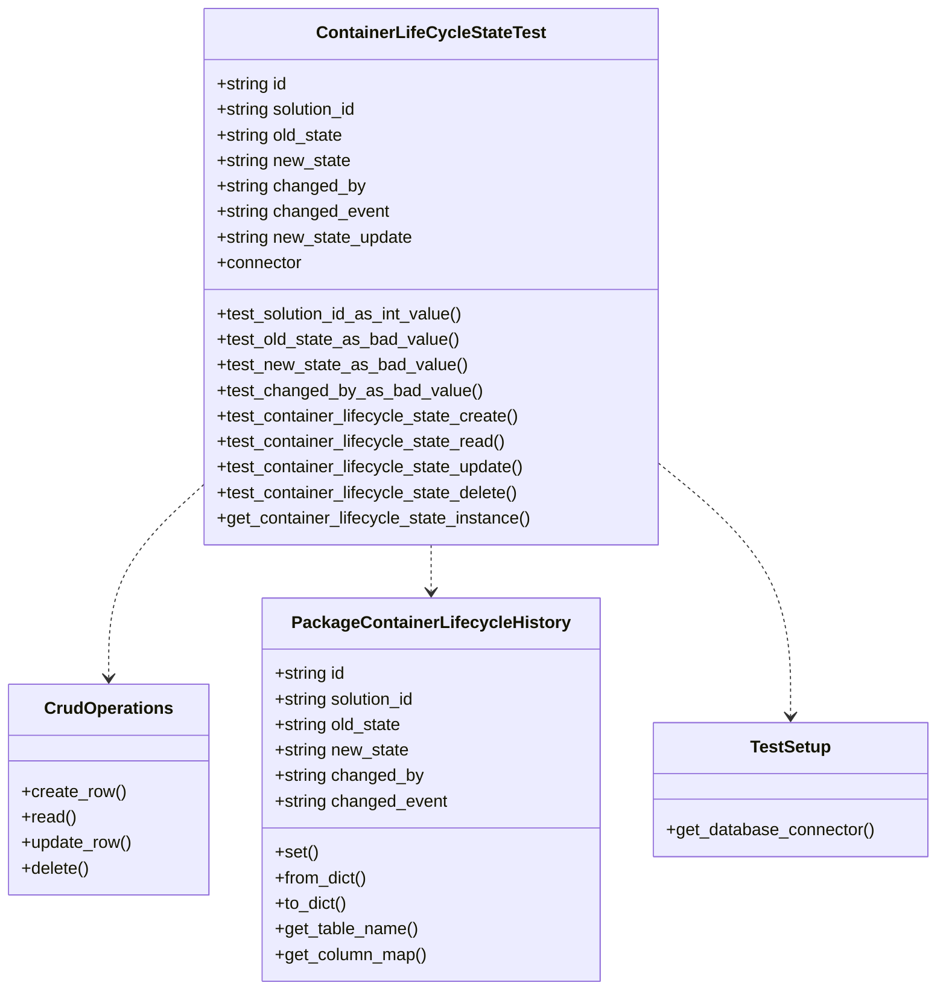
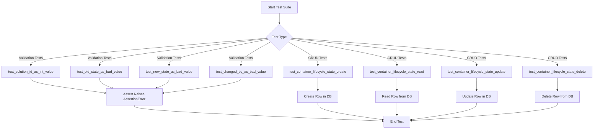
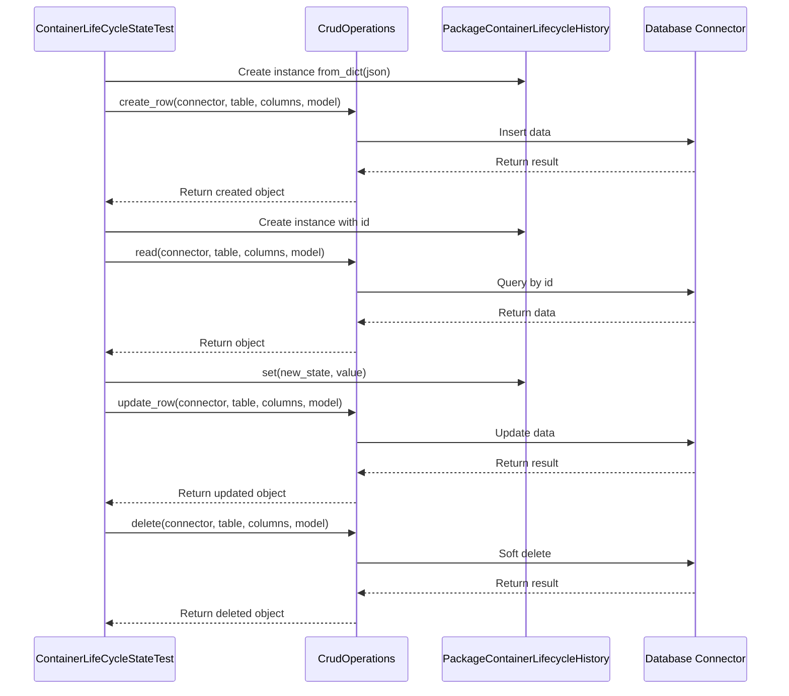
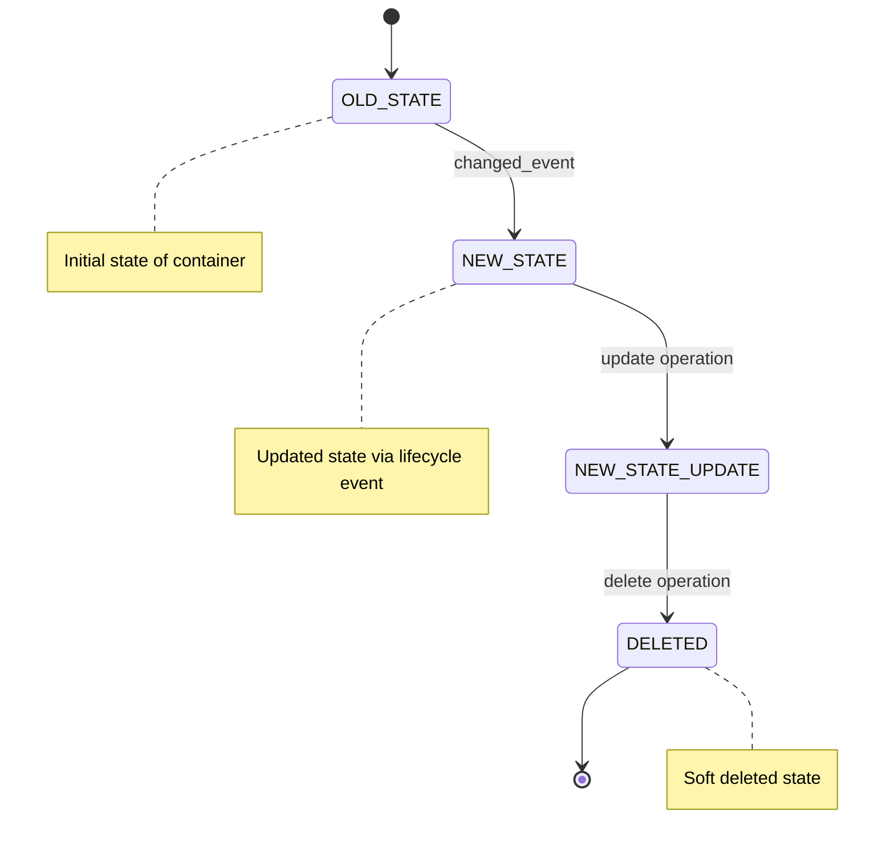

# Diagram: platform/partview_core/partview_service/partview_service/tests/unit/core/datamodel/container_lifecycle_state_test.py


> Auto-generated by Obscura crawlers

## Diagram 1

```mermaid
classDiagram
      class ContainerLifeCycleStateTest {
          +string id
          +string solution_id...
  └ 219 lines...
```

> SVG rendering failed for this diagram.

## Diagram 2



### SVG

<svg id="container" width="870.2578125" xmlns="http://www.w3.org/2000/svg" class="classDiagram" height="930" viewBox="0 0 870.2578125 930" role="graphics-document document" aria-roledescription="class"><style>#container{font-family:"trebuchet ms",verdana,arial,sans-serif;font-size:16px;fill:#333;}@keyframes edge-animation-frame{from{stroke-dashoffset:0;}}@keyframes dash{to{stroke-dashoffset:0;}}#container .edge-animation-slow{stroke-dasharray:9,5!important;stroke-dashoffset:900;animation:dash 50s linear infinite;stroke-linecap:round;}#container .edge-animation-fast{stroke-dasharray:9,5!important;stroke-dashoffset:900;animation:dash 20s linear infinite;stroke-linecap:round;}#container .error-icon{fill:#552222;}#container .error-text{fill:#552222;stroke:#552222;}#container .edge-thickness-normal{stroke-width:1px;}#container .edge-thickness-thick{stroke-width:3.5px;}#container .edge-pattern-solid{stroke-dasharray:0;}#container .edge-thickness-invisible{stroke-width:0;fill:none;}#container .edge-pattern-dashed{stroke-dasharray:3;}#container .edge-pattern-dotted{stroke-dasharray:2;}#container .marker{fill:#333333;stroke:#333333;}#container .marker.cross{stroke:#333333;}#container svg{font-family:"trebuchet ms",verdana,arial,sans-serif;font-size:16px;}#container p{margin:0;}#container g.classGroup text{fill:#9370DB;stroke:none;font-family:"trebuchet ms",verdana,arial,sans-serif;font-size:10px;}#container g.classGroup text .title{font-weight:bolder;}#container .nodeLabel,#container .edgeLabel{color:#131300;}#container .edgeLabel .label rect{fill:#ECECFF;}#container .label text{fill:#131300;}#container .labelBkg{background:#ECECFF;}#container .edgeLabel .label span{background:#ECECFF;}#container .classTitle{font-weight:bolder;}#container .node rect,#container .node circle,#container .node ellipse,#container .node polygon,#container .node path{fill:#ECECFF;stroke:#9370DB;stroke-width:1px;}#container .divider{stroke:#9370DB;stroke-width:1;}#container g.clickable{cursor:pointer;}#container g.classGroup rect{fill:#ECECFF;stroke:#9370DB;}#container g.classGroup line{stroke:#9370DB;stroke-width:1;}#container .classLabel .box{stroke:none;stroke-width:0;fill:#ECECFF;opacity:0.5;}#container .classLabel .label{fill:#9370DB;font-size:10px;}#container .relation{stroke:#333333;stroke-width:1;fill:none;}#container .dashed-line{stroke-dasharray:3;}#container .dotted-line{stroke-dasharray:1 2;}#container #compositionStart,#container .composition{fill:#333333!important;stroke:#333333!important;stroke-width:1;}#container #compositionEnd,#container .composition{fill:#333333!important;stroke:#333333!important;stroke-width:1;}#container #dependencyStart,#container .dependency{fill:#333333!important;stroke:#333333!important;stroke-width:1;}#container #dependencyStart,#container .dependency{fill:#333333!important;stroke:#333333!important;stroke-width:1;}#container #extensionStart,#container .extension{fill:transparent!important;stroke:#333333!important;stroke-width:1;}#container #extensionEnd,#container .extension{fill:transparent!important;stroke:#333333!important;stroke-width:1;}#container #aggregationStart,#container .aggregation{fill:transparent!important;stroke:#333333!important;stroke-width:1;}#container #aggregationEnd,#container .aggregation{fill:transparent!important;stroke:#333333!important;stroke-width:1;}#container #lollipopStart,#container .lollipop{fill:#ECECFF!important;stroke:#333333!important;stroke-width:1;}#container #lollipopEnd,#container .lollipop{fill:#ECECFF!important;stroke:#333333!important;stroke-width:1;}#container .edgeTerminals{font-size:11px;line-height:initial;}#container .classTitleText{text-anchor:middle;font-size:18px;fill:#333;}#container .label-icon{display:inline-block;height:1em;overflow:visible;vertical-align:-0.125em;}#container .node .label-icon path{fill:currentColor;stroke:revert;stroke-width:revert;}#container :root{--mermaid-font-family:"trebuchet ms",verdana,arial,sans-serif;}</style><g><defs><marker id="container_class-aggregationStart" class="marker aggregation class" refX="18" refY="7" markerWidth="190" markerHeight="240" orient="auto"><path d="M 18,7 L9,13 L1,7 L9,1 Z"></path></marker></defs><defs><marker id="container_class-aggregationEnd" class="marker aggregation class" refX="1" refY="7" markerWidth="20" markerHeight="28" orient="auto"><path d="M 18,7 L9,13 L1,7 L9,1 Z"></path></marker></defs><defs><marker id="container_class-extensionStart" class="marker extension class" refX="18" refY="7" markerWidth="190" markerHeight="240" orient="auto"><path d="M 1,7 L18,13 V 1 Z"></path></marker></defs><defs><marker id="container_class-extensionEnd" class="marker extension class" refX="1" refY="7" markerWidth="20" markerHeight="28" orient="auto"><path d="M 1,1 V 13 L18,7 Z"></path></marker></defs><defs><marker id="container_class-compositionStart" class="marker composition class" refX="18" refY="7" markerWidth="190" markerHeight="240" orient="auto"><path d="M 18,7 L9,13 L1,7 L9,1 Z"></path></marker></defs><defs><marker id="container_class-compositionEnd" class="marker composition class" refX="1" refY="7" markerWidth="20" markerHeight="28" orient="auto"><path d="M 18,7 L9,13 L1,7 L9,1 Z"></path></marker></defs><defs><marker id="container_class-dependencyStart" class="marker dependency class" refX="6" refY="7" markerWidth="190" markerHeight="240" orient="auto"><path d="M 5,7 L9,13 L1,7 L9,1 Z"></path></marker></defs><defs><marker id="container_class-dependencyEnd" class="marker dependency class" refX="13" refY="7" markerWidth="20" markerHeight="28" orient="auto"><path d="M 18,7 L9,13 L14,7 L9,1 Z"></path></marker></defs><defs><marker id="container_class-lollipopStart" class="marker lollipop class" refX="13" refY="7" markerWidth="190" markerHeight="240" orient="auto"><circle stroke="black" fill="transparent" cx="7" cy="7" r="6"></circle></marker></defs><defs><marker id="container_class-lollipopEnd" class="marker lollipop class" refX="1" refY="7" markerWidth="190" markerHeight="240" orient="auto"><circle stroke="black" fill="transparent" cx="7" cy="7" r="6"></circle></marker></defs><g class="root"><g class="clusters"></g><g class="edgePaths"><path d="M187.434,456.769L173.014,470.141C158.595,483.513,129.757,510.256,115.337,540.295C100.918,570.333,100.918,603.667,100.918,620.333L100.918,637" id="id_ContainerLifeCycleStateTest_CrudOperations_1" class="edge-thickness-normal edge-pattern-dashed relation" style=";;;" data-edge="true" data-et="edge" data-id="id_ContainerLifeCycleStateTest_CrudOperations_1" data-points="W3sieCI6MTg3LjQzMzU5Mzc1LCJ5Ijo0NTYuNzY5MzY0NTYyNDkxfSx7IngiOjEwMC45MTc5Njg3NSwieSI6NTM3fSx7IngiOjEwMC45MTc5Njg3NSwieSI6NjQzfV0=" marker-end="url(#container_class-dependencyEnd)"></path><path d="M399.617,512L399.617,516.167C399.617,520.333,399.617,528.667,399.617,536C399.617,543.333,399.617,549.667,399.617,552.833L399.617,556" id="id_ContainerLifeCycleStateTest_PackageContainerLifecycleHistory_2" class="edge-thickness-normal edge-pattern-dashed relation" style=";;;" data-edge="true" data-et="edge" data-id="id_ContainerLifeCycleStateTest_PackageContainerLifecycleHistory_2" data-points="W3sieCI6Mzk5LjYxNzE4NzUsInkiOjUxMn0seyJ4IjozOTkuNjE3MTg3NSwieSI6NTM3fSx7IngiOjM5OS42MTcxODc1LCJ5Ijo1NjJ9XQ==" marker-end="url(#container_class-dependencyEnd)"></path><path d="M611.801,435.862L632.139,452.718C652.477,469.574,693.152,503.287,713.49,542.81C733.828,582.333,733.828,627.667,733.828,650.333L733.828,673" id="id_ContainerLifeCycleStateTest_TestSetup_3" class="edge-thickness-normal edge-pattern-dashed relation" style=";;;" data-edge="true" data-et="edge" data-id="id_ContainerLifeCycleStateTest_TestSetup_3" data-points="W3sieCI6NjExLjgwMDc4MTI1LCJ5Ijo0MzUuODYxNTU1OTAzNTk3NTV9LHsieCI6NzMzLjgyODEyNSwieSI6NTM3fSx7IngiOjczMy44MjgxMjUsInkiOjY3OX1d" marker-end="url(#container_class-dependencyEnd)"></path></g><g class="edgeLabels"><g class="edgeLabel"><g class="label" data-id="id_ContainerLifeCycleStateTest_CrudOperations_1" transform="translate(0, 0)"><foreignObject width="0" height="0"><div xmlns="http://www.w3.org/1999/xhtml" class="labelBkg" style="display: table-cell; white-space: nowrap; line-height: 1.5; max-width: 200px; text-align: center;"><span class="edgeLabel"></span></div></foreignObject></g></g><g class="edgeLabel"><g class="label" data-id="id_ContainerLifeCycleStateTest_PackageContainerLifecycleHistory_2" transform="translate(0, 0)"><foreignObject width="0" height="0"><div xmlns="http://www.w3.org/1999/xhtml" class="labelBkg" style="display: table-cell; white-space: nowrap; line-height: 1.5; max-width: 200px; text-align: center;"><span class="edgeLabel"></span></div></foreignObject></g></g><g class="edgeLabel"><g class="label" data-id="id_ContainerLifeCycleStateTest_TestSetup_3" transform="translate(0, 0)"><foreignObject width="0" height="0"><div xmlns="http://www.w3.org/1999/xhtml" class="labelBkg" style="display: table-cell; white-space: nowrap; line-height: 1.5; max-width: 200px; text-align: center;"><span class="edgeLabel"></span></div></foreignObject></g></g></g><g class="nodes"><g class="node default" id="classId-ContainerLifeCycleStateTest-0" transform="translate(399.6171875, 260)"><g class="basic label-container"><path d="M-212.18359375 -252 L212.18359375 -252 L212.18359375 252 L-212.18359375 252" stroke="none" stroke-width="0" fill="#ECECFF" style=""></path><path d="M-212.18359375 -252 C-90.69659906793824 -252, 30.790395614123526 -252, 212.18359375 -252 M-212.18359375 -252 C-105.01662446636249 -252, 2.150344817275027 -252, 212.18359375 -252 M212.18359375 -252 C212.18359375 -92.49741948874538, 212.18359375 67.00516102250924, 212.18359375 252 M212.18359375 -252 C212.18359375 -133.4351160091623, 212.18359375 -14.8702320183246, 212.18359375 252 M212.18359375 252 C106.04621002409529 252, -0.0911737018094243 252, -212.18359375 252 M212.18359375 252 C69.35227980700071 252, -73.47903413599857 252, -212.18359375 252 M-212.18359375 252 C-212.18359375 90.56748904211159, -212.18359375 -70.86502191577682, -212.18359375 -252 M-212.18359375 252 C-212.18359375 90.11244599116625, -212.18359375 -71.77510801766749, -212.18359375 -252" stroke="#9370DB" stroke-width="1.3" fill="none" stroke-dasharray="0 0" style=""></path></g><g class="annotation-group text" transform="translate(0, -228)"></g><g class="label-group text" transform="translate(-102.5703125, -228)"><g class="label" style="font-weight: bolder" transform="translate(0,-12)"><foreignObject width="205.140625" height="24"><div xmlns="http://www.w3.org/1999/xhtml" style="display: table-cell; white-space: nowrap; line-height: 1.5; max-width: 251px; text-align: center;"><span class="nodeLabel markdown-node-label" style=""><p>ContainerLifeCycleStateTest</p></span></div></foreignObject></g></g><g class="members-group text" transform="translate(-200.18359375, -180)"><g class="label" style="" transform="translate(0,-12)"><foreignObject width="67.9375" height="24"><div xmlns="http://www.w3.org/1999/xhtml" style="display: table-cell; white-space: nowrap; line-height: 1.5; max-width: 125px; text-align: center;"><span class="nodeLabel markdown-node-label" style=""><p>+string id</p></span></div></foreignObject></g><g class="label" style="" transform="translate(0,12)"><foreignObject width="136.09375" height="24"><div xmlns="http://www.w3.org/1999/xhtml" style="display: table-cell; white-space: nowrap; line-height: 1.5; max-width: 193px; text-align: center;"><span class="nodeLabel markdown-node-label" style=""><p>+string solution_id</p></span></div></foreignObject></g><g class="label" style="" transform="translate(0,36)"><foreignObject width="121.796875" height="24"><div xmlns="http://www.w3.org/1999/xhtml" style="display: table-cell; white-space: nowrap; line-height: 1.5; max-width: 179px; text-align: center;"><span class="nodeLabel markdown-node-label" style=""><p>+string old_state</p></span></div></foreignObject></g><g class="label" style="" transform="translate(0,60)"><foreignObject width="127.53125" height="24"><div xmlns="http://www.w3.org/1999/xhtml" style="display: table-cell; white-space: nowrap; line-height: 1.5; max-width: 185px; text-align: center;"><span class="nodeLabel markdown-node-label" style=""><p>+string new_state</p></span></div></foreignObject></g><g class="label" style="" transform="translate(0,84)"><foreignObject width="140.953125" height="24"><div xmlns="http://www.w3.org/1999/xhtml" style="display: table-cell; white-space: nowrap; line-height: 1.5; max-width: 198px; text-align: center;"><span class="nodeLabel markdown-node-label" style=""><p>+string changed_by</p></span></div></foreignObject></g><g class="label" style="" transform="translate(0,108)"><foreignObject width="163.65625" height="24"><div xmlns="http://www.w3.org/1999/xhtml" style="display: table-cell; white-space: nowrap; line-height: 1.5; max-width: 221px; text-align: center;"><span class="nodeLabel markdown-node-label" style=""><p>+string changed_event</p></span></div></foreignObject></g><g class="label" style="" transform="translate(0,132)"><foreignObject width="186.546875" height="24"><div xmlns="http://www.w3.org/1999/xhtml" style="display: table-cell; white-space: nowrap; line-height: 1.5; max-width: 244px; text-align: center;"><span class="nodeLabel markdown-node-label" style=""><p>+string new_state_update</p></span></div></foreignObject></g><g class="label" style="" transform="translate(0,156)"><foreignObject width="80.84375" height="24"><div xmlns="http://www.w3.org/1999/xhtml" style="display: table-cell; white-space: nowrap; line-height: 1.5; max-width: 139px; text-align: center;"><span class="nodeLabel markdown-node-label" style=""><p>+connector</p></span></div></foreignObject></g></g><g class="methods-group text" transform="translate(-200.18359375, 36)"><g class="label" style="" transform="translate(0,-12)"><foreignObject width="234.734375" height="24"><div xmlns="http://www.w3.org/1999/xhtml" style="display: table-cell; white-space: nowrap; line-height: 1.5; max-width: 292px; text-align: center;"><span class="nodeLabel markdown-node-label" style=""><p>+test_solution_id_as_int_value()</p></span></div></foreignObject></g><g class="label" style="" transform="translate(0,12)"><foreignObject width="227.75" height="24"><div xmlns="http://www.w3.org/1999/xhtml" style="display: table-cell; white-space: nowrap; line-height: 1.5; max-width: 285px; text-align: center;"><span class="nodeLabel markdown-node-label" style=""><p>+test_old_state_as_bad_value()</p></span></div></foreignObject></g><g class="label" style="" transform="translate(0,36)"><foreignObject width="233.796875" height="24"><div xmlns="http://www.w3.org/1999/xhtml" style="display: table-cell; white-space: nowrap; line-height: 1.5; max-width: 291px; text-align: center;"><span class="nodeLabel markdown-node-label" style=""><p>+test_new_state_as_bad_value()</p></span></div></foreignObject></g><g class="label" style="" transform="translate(0,60)"><foreignObject width="246.75" height="24"><div xmlns="http://www.w3.org/1999/xhtml" style="display: table-cell; white-space: nowrap; line-height: 1.5; max-width: 304px; text-align: center;"><span class="nodeLabel markdown-node-label" style=""><p>+test_changed_by_as_bad_value()</p></span></div></foreignObject></g><g class="label" style="" transform="translate(0,84)"><foreignObject width="286.0625" height="24"><div xmlns="http://www.w3.org/1999/xhtml" style="display: table-cell; white-space: nowrap; line-height: 1.5; max-width: 343px; text-align: center;"><span class="nodeLabel markdown-node-label" style=""><p>+test_container_lifecycle_state_create()</p></span></div></foreignObject></g><g class="label" style="" transform="translate(0,108)"><foreignObject width="274.046875" height="24"><div xmlns="http://www.w3.org/1999/xhtml" style="display: table-cell; white-space: nowrap; line-height: 1.5; max-width: 331px; text-align: center;"><span class="nodeLabel markdown-node-label" style=""><p>+test_container_lifecycle_state_read()</p></span></div></foreignObject></g><g class="label" style="" transform="translate(0,132)"><foreignObject width="292.53125" height="24"><div xmlns="http://www.w3.org/1999/xhtml" style="display: table-cell; white-space: nowrap; line-height: 1.5; max-width: 350px; text-align: center;"><span class="nodeLabel markdown-node-label" style=""><p>+test_container_lifecycle_state_update()</p></span></div></foreignObject></g><g class="label" style="" transform="translate(0,156)"><foreignObject width="287.0625" height="24"><div xmlns="http://www.w3.org/1999/xhtml" style="display: table-cell; white-space: nowrap; line-height: 1.5; max-width: 344px; text-align: center;"><span class="nodeLabel markdown-node-label" style=""><p>+test_container_lifecycle_state_delete()</p></span></div></foreignObject></g><g class="label" style="" transform="translate(0,180)"><foreignObject width="297.796875" height="24"><div xmlns="http://www.w3.org/1999/xhtml" style="display: table-cell; white-space: nowrap; line-height: 1.5; max-width: 355px; text-align: center;"><span class="nodeLabel markdown-node-label" style=""><p>+get_container_lifecycle_state_instance()</p></span></div></foreignObject></g></g><g class="divider" style=""><path d="M-212.18359375 -204 C-48.606754403424446 -204, 114.97008494315111 -204, 212.18359375 -204 M-212.18359375 -204 C-57.10648935296558 -204, 97.97061504406884 -204, 212.18359375 -204" stroke="#9370DB" stroke-width="1.3" fill="none" stroke-dasharray="0 0" style=""></path></g><g class="divider" style=""><path d="M-212.18359375 12 C-109.73515422445851 12, -7.286714698917024 12, 212.18359375 12 M-212.18359375 12 C-87.03022048593549 12, 38.123152778129025 12, 212.18359375 12" stroke="#9370DB" stroke-width="1.3" fill="none" stroke-dasharray="0 0" style=""></path></g></g><g class="node default" id="classId-CrudOperations-1" transform="translate(100.91796875, 742)"><g class="basic label-container"><path d="M-92.91796875 -99 L92.91796875 -99 L92.91796875 99 L-92.91796875 99" stroke="none" stroke-width="0" fill="#ECECFF" style=""></path><path d="M-92.91796875 -99 C-18.700900452637583 -99, 55.51616784472483 -99, 92.91796875 -99 M-92.91796875 -99 C-31.23278276950721 -99, 30.45240321098558 -99, 92.91796875 -99 M92.91796875 -99 C92.91796875 -30.68335972929944, 92.91796875 37.63328054140112, 92.91796875 99 M92.91796875 -99 C92.91796875 -33.732058796718334, 92.91796875 31.53588240656333, 92.91796875 99 M92.91796875 99 C52.24180709947715 99, 11.5656454489543 99, -92.91796875 99 M92.91796875 99 C22.27015973798379 99, -48.37764927403242 99, -92.91796875 99 M-92.91796875 99 C-92.91796875 40.50245161234793, -92.91796875 -17.995096775304134, -92.91796875 -99 M-92.91796875 99 C-92.91796875 34.08051356602056, -92.91796875 -30.838972867958887, -92.91796875 -99" stroke="#9370DB" stroke-width="1.3" fill="none" stroke-dasharray="0 0" style=""></path></g><g class="annotation-group text" transform="translate(0, -75)"></g><g class="label-group text" transform="translate(-57.6171875, -75)"><g class="label" style="font-weight: bolder" transform="translate(0,-12)"><foreignObject width="115.234375" height="24"><div xmlns="http://www.w3.org/1999/xhtml" style="display: table-cell; white-space: nowrap; line-height: 1.5; max-width: 164px; text-align: center;"><span class="nodeLabel markdown-node-label" style=""><p>CrudOperations</p></span></div></foreignObject></g></g><g class="members-group text" transform="translate(-80.91796875, -27)"></g><g class="methods-group text" transform="translate(-80.91796875, 3)"><g class="label" style="" transform="translate(0,-12)"><foreignObject width="97.734375" height="24"><div xmlns="http://www.w3.org/1999/xhtml" style="display: table-cell; white-space: nowrap; line-height: 1.5; max-width: 155px; text-align: center;"><span class="nodeLabel markdown-node-label" style=""><p>+create_row()</p></span></div></foreignObject></g><g class="label" style="" transform="translate(0,12)"><foreignObject width="50.890625" height="24"><div xmlns="http://www.w3.org/1999/xhtml" style="display: table-cell; white-space: nowrap; line-height: 1.5; max-width: 108px; text-align: center;"><span class="nodeLabel markdown-node-label" style=""><p>+read()</p></span></div></foreignObject></g><g class="label" style="" transform="translate(0,36)"><foreignObject width="104.21875" height="24"><div xmlns="http://www.w3.org/1999/xhtml" style="display: table-cell; white-space: nowrap; line-height: 1.5; max-width: 162px; text-align: center;"><span class="nodeLabel markdown-node-label" style=""><p>+update_row()</p></span></div></foreignObject></g><g class="label" style="" transform="translate(0,60)"><foreignObject width="64.234375" height="24"><div xmlns="http://www.w3.org/1999/xhtml" style="display: table-cell; white-space: nowrap; line-height: 1.5; max-width: 122px; text-align: center;"><span class="nodeLabel markdown-node-label" style=""><p>+delete()</p></span></div></foreignObject></g></g><g class="divider" style=""><path d="M-92.91796875 -51 C-47.855158296775606 -51, -2.7923478435512123 -51, 92.91796875 -51 M-92.91796875 -51 C-51.056083633593225 -51, -9.19419851718645 -51, 92.91796875 -51" stroke="#9370DB" stroke-width="1.3" fill="none" stroke-dasharray="0 0" style=""></path></g><g class="divider" style=""><path d="M-92.91796875 -27 C-49.7171163393159 -27, -6.516263928631801 -27, 92.91796875 -27 M-92.91796875 -27 C-34.01170770455923 -27, 24.894553340881544 -27, 92.91796875 -27" stroke="#9370DB" stroke-width="1.3" fill="none" stroke-dasharray="0 0" style=""></path></g></g><g class="node default" id="classId-PackageContainerLifecycleHistory-2" transform="translate(399.6171875, 742)"><g class="basic label-container"><path d="M-155.78125 -180 L155.78125 -180 L155.78125 180 L-155.78125 180" stroke="none" stroke-width="0" fill="#ECECFF" style=""></path><path d="M-155.78125 -180 C-89.32948782379117 -180, -22.877725647582338 -180, 155.78125 -180 M-155.78125 -180 C-34.0643323038646 -180, 87.6525853922708 -180, 155.78125 -180 M155.78125 -180 C155.78125 -72.50346685743115, 155.78125 34.9930662851377, 155.78125 180 M155.78125 -180 C155.78125 -54.1420947441987, 155.78125 71.7158105116026, 155.78125 180 M155.78125 180 C38.423094808061364 180, -78.93506038387727 180, -155.78125 180 M155.78125 180 C44.34354703290988 180, -67.09415593418024 180, -155.78125 180 M-155.78125 180 C-155.78125 59.306616248802825, -155.78125 -61.38676750239435, -155.78125 -180 M-155.78125 180 C-155.78125 37.46100656375242, -155.78125 -105.07798687249516, -155.78125 -180" stroke="#9370DB" stroke-width="1.3" fill="none" stroke-dasharray="0 0" style=""></path></g><g class="annotation-group text" transform="translate(0, -156)"></g><g class="label-group text" transform="translate(-123.90625, -156)"><g class="label" style="font-weight: bolder" transform="translate(0,-12)"><foreignObject width="247.8125" height="24"><div xmlns="http://www.w3.org/1999/xhtml" style="display: table-cell; white-space: nowrap; line-height: 1.5; max-width: 293px; text-align: center;"><span class="nodeLabel markdown-node-label" style=""><p>PackageContainerLifecycleHistory</p></span></div></foreignObject></g></g><g class="members-group text" transform="translate(-143.78125, -108)"><g class="label" style="" transform="translate(0,-12)"><foreignObject width="67.9375" height="24"><div xmlns="http://www.w3.org/1999/xhtml" style="display: table-cell; white-space: nowrap; line-height: 1.5; max-width: 125px; text-align: center;"><span class="nodeLabel markdown-node-label" style=""><p>+string id</p></span></div></foreignObject></g><g class="label" style="" transform="translate(0,12)"><foreignObject width="136.09375" height="24"><div xmlns="http://www.w3.org/1999/xhtml" style="display: table-cell; white-space: nowrap; line-height: 1.5; max-width: 193px; text-align: center;"><span class="nodeLabel markdown-node-label" style=""><p>+string solution_id</p></span></div></foreignObject></g><g class="label" style="" transform="translate(0,36)"><foreignObject width="121.796875" height="24"><div xmlns="http://www.w3.org/1999/xhtml" style="display: table-cell; white-space: nowrap; line-height: 1.5; max-width: 179px; text-align: center;"><span class="nodeLabel markdown-node-label" style=""><p>+string old_state</p></span></div></foreignObject></g><g class="label" style="" transform="translate(0,60)"><foreignObject width="127.53125" height="24"><div xmlns="http://www.w3.org/1999/xhtml" style="display: table-cell; white-space: nowrap; line-height: 1.5; max-width: 185px; text-align: center;"><span class="nodeLabel markdown-node-label" style=""><p>+string new_state</p></span></div></foreignObject></g><g class="label" style="" transform="translate(0,84)"><foreignObject width="140.953125" height="24"><div xmlns="http://www.w3.org/1999/xhtml" style="display: table-cell; white-space: nowrap; line-height: 1.5; max-width: 198px; text-align: center;"><span class="nodeLabel markdown-node-label" style=""><p>+string changed_by</p></span></div></foreignObject></g><g class="label" style="" transform="translate(0,108)"><foreignObject width="163.65625" height="24"><div xmlns="http://www.w3.org/1999/xhtml" style="display: table-cell; white-space: nowrap; line-height: 1.5; max-width: 221px; text-align: center;"><span class="nodeLabel markdown-node-label" style=""><p>+string changed_event</p></span></div></foreignObject></g></g><g class="methods-group text" transform="translate(-143.78125, 60)"><g class="label" style="" transform="translate(0,-12)"><foreignObject width="40.328125" height="24"><div xmlns="http://www.w3.org/1999/xhtml" style="display: table-cell; white-space: nowrap; line-height: 1.5; max-width: 98px; text-align: center;"><span class="nodeLabel markdown-node-label" style=""><p>+set()</p></span></div></foreignObject></g><g class="label" style="" transform="translate(0,12)"><foreignObject width="87.734375" height="24"><div xmlns="http://www.w3.org/1999/xhtml" style="display: table-cell; white-space: nowrap; line-height: 1.5; max-width: 145px; text-align: center;"><span class="nodeLabel markdown-node-label" style=""><p>+from_dict()</p></span></div></foreignObject></g><g class="label" style="" transform="translate(0,36)"><foreignObject width="68.34375" height="24"><div xmlns="http://www.w3.org/1999/xhtml" style="display: table-cell; white-space: nowrap; line-height: 1.5; max-width: 126px; text-align: center;"><span class="nodeLabel markdown-node-label" style=""><p>+to_dict()</p></span></div></foreignObject></g><g class="label" style="" transform="translate(0,60)"><foreignObject width="134.625" height="24"><div xmlns="http://www.w3.org/1999/xhtml" style="display: table-cell; white-space: nowrap; line-height: 1.5; max-width: 192px; text-align: center;"><span class="nodeLabel markdown-node-label" style=""><p>+get_table_name()</p></span></div></foreignObject></g><g class="label" style="" transform="translate(0,84)"><foreignObject width="142.921875" height="24"><div xmlns="http://www.w3.org/1999/xhtml" style="display: table-cell; white-space: nowrap; line-height: 1.5; max-width: 200px; text-align: center;"><span class="nodeLabel markdown-node-label" style=""><p>+get_column_map()</p></span></div></foreignObject></g></g><g class="divider" style=""><path d="M-155.78125 -132 C-63.31001746592824 -132, 29.16121506814352 -132, 155.78125 -132 M-155.78125 -132 C-64.97265295300015 -132, 25.8359440939997 -132, 155.78125 -132" stroke="#9370DB" stroke-width="1.3" fill="none" stroke-dasharray="0 0" style=""></path></g><g class="divider" style=""><path d="M-155.78125 36 C-85.38033520266916 36, -14.979420405338317 36, 155.78125 36 M-155.78125 36 C-59.42356240517499 36, 36.93412518965002 36, 155.78125 36" stroke="#9370DB" stroke-width="1.3" fill="none" stroke-dasharray="0 0" style=""></path></g></g><g class="node default" id="classId-TestSetup-3" transform="translate(733.828125, 742)"><g class="basic label-container"><path d="M-128.4296875 -63 L128.4296875 -63 L128.4296875 63 L-128.4296875 63" stroke="none" stroke-width="0" fill="#ECECFF" style=""></path><path d="M-128.4296875 -63 C-32.71368641061103 -63, 63.002314678777935 -63, 128.4296875 -63 M-128.4296875 -63 C-74.64972338720918 -63, -20.86975927441837 -63, 128.4296875 -63 M128.4296875 -63 C128.4296875 -27.093090336817262, 128.4296875 8.813819326365476, 128.4296875 63 M128.4296875 -63 C128.4296875 -21.52280603274911, 128.4296875 19.95438793450178, 128.4296875 63 M128.4296875 63 C46.89424536430478 63, -34.64119677139044 63, -128.4296875 63 M128.4296875 63 C52.945579602719164 63, -22.538528294561672 63, -128.4296875 63 M-128.4296875 63 C-128.4296875 27.073915477074443, -128.4296875 -8.852169045851113, -128.4296875 -63 M-128.4296875 63 C-128.4296875 30.190556591927667, -128.4296875 -2.6188868161446663, -128.4296875 -63" stroke="#9370DB" stroke-width="1.3" fill="none" stroke-dasharray="0 0" style=""></path></g><g class="annotation-group text" transform="translate(0, -39)"></g><g class="label-group text" transform="translate(-36.6875, -39)"><g class="label" style="font-weight: bolder" transform="translate(0,-12)"><foreignObject width="73.375" height="24"><div xmlns="http://www.w3.org/1999/xhtml" style="display: table-cell; white-space: nowrap; line-height: 1.5; max-width: 121px; text-align: center;"><span class="nodeLabel markdown-node-label" style=""><p>TestSetup</p></span></div></foreignObject></g></g><g class="members-group text" transform="translate(-116.4296875, 9)"></g><g class="methods-group text" transform="translate(-116.4296875, 39)"><g class="label" style="" transform="translate(0,-12)"><foreignObject width="196.171875" height="24"><div xmlns="http://www.w3.org/1999/xhtml" style="display: table-cell; white-space: nowrap; line-height: 1.5; max-width: 254px; text-align: center;"><span class="nodeLabel markdown-node-label" style=""><p>+get_database_connector()</p></span></div></foreignObject></g></g><g class="divider" style=""><path d="M-128.4296875 -15 C-52.00815479034807 -15, 24.413377919303855 -15, 128.4296875 -15 M-128.4296875 -15 C-74.33130321536922 -15, -20.23291893073845 -15, 128.4296875 -15" stroke="#9370DB" stroke-width="1.3" fill="none" stroke-dasharray="0 0" style=""></path></g><g class="divider" style=""><path d="M-128.4296875 9 C-32.010702309375844 9, 64.40828288124831 9, 128.4296875 9 M-128.4296875 9 C-37.331572771968766 9, 53.76654195606247 9, 128.4296875 9" stroke="#9370DB" stroke-width="1.3" fill="none" stroke-dasharray="0 0" style=""></path></g></g></g></g></g></svg>

## Diagram 3



### SVG

<svg id="container" width="2782.546875" xmlns="http://www.w3.org/2000/svg" class="flowchart" height="601.328125" viewBox="0 0 2782.546875 601.328125" role="graphics-document document" aria-roledescription="flowchart-v2"><style>#container{font-family:"trebuchet ms",verdana,arial,sans-serif;font-size:16px;fill:#333;}@keyframes edge-animation-frame{from{stroke-dashoffset:0;}}@keyframes dash{to{stroke-dashoffset:0;}}#container .edge-animation-slow{stroke-dasharray:9,5!important;stroke-dashoffset:900;animation:dash 50s linear infinite;stroke-linecap:round;}#container .edge-animation-fast{stroke-dasharray:9,5!important;stroke-dashoffset:900;animation:dash 20s linear infinite;stroke-linecap:round;}#container .error-icon{fill:#552222;}#container .error-text{fill:#552222;stroke:#552222;}#container .edge-thickness-normal{stroke-width:1px;}#container .edge-thickness-thick{stroke-width:3.5px;}#container .edge-pattern-solid{stroke-dasharray:0;}#container .edge-thickness-invisible{stroke-width:0;fill:none;}#container .edge-pattern-dashed{stroke-dasharray:3;}#container .edge-pattern-dotted{stroke-dasharray:2;}#container .marker{fill:#333333;stroke:#333333;}#container .marker.cross{stroke:#333333;}#container svg{font-family:"trebuchet ms",verdana,arial,sans-serif;font-size:16px;}#container p{margin:0;}#container .label{font-family:"trebuchet ms",verdana,arial,sans-serif;color:#333;}#container .cluster-label text{fill:#333;}#container .cluster-label span{color:#333;}#container .cluster-label span p{background-color:transparent;}#container .label text,#container span{fill:#333;color:#333;}#container .node rect,#container .node circle,#container .node ellipse,#container .node polygon,#container .node path{fill:#ECECFF;stroke:#9370DB;stroke-width:1px;}#container .rough-node .label text,#container .node .label text,#container .image-shape .label,#container .icon-shape .label{text-anchor:middle;}#container .node .katex path{fill:#000;stroke:#000;stroke-width:1px;}#container .rough-node .label,#container .node .label,#container .image-shape .label,#container .icon-shape .label{text-align:center;}#container .node.clickable{cursor:pointer;}#container .root .anchor path{fill:#333333!important;stroke-width:0;stroke:#333333;}#container .arrowheadPath{fill:#333333;}#container .edgePath .path{stroke:#333333;stroke-width:2.0px;}#container .flowchart-link{stroke:#333333;fill:none;}#container .edgeLabel{background-color:rgba(232,232,232, 0.8);text-align:center;}#container .edgeLabel p{background-color:rgba(232,232,232, 0.8);}#container .edgeLabel rect{opacity:0.5;background-color:rgba(232,232,232, 0.8);fill:rgba(232,232,232, 0.8);}#container .labelBkg{background-color:rgba(232, 232, 232, 0.5);}#container .cluster rect{fill:#ffffde;stroke:#aaaa33;stroke-width:1px;}#container .cluster text{fill:#333;}#container .cluster span{color:#333;}#container div.mermaidTooltip{position:absolute;text-align:center;max-width:200px;padding:2px;font-family:"trebuchet ms",verdana,arial,sans-serif;font-size:12px;background:hsl(80, 100%, 96.2745098039%);border:1px solid #aaaa33;border-radius:2px;pointer-events:none;z-index:100;}#container .flowchartTitleText{text-anchor:middle;font-size:18px;fill:#333;}#container rect.text{fill:none;stroke-width:0;}#container .icon-shape,#container .image-shape{background-color:rgba(232,232,232, 0.8);text-align:center;}#container .icon-shape p,#container .image-shape p{background-color:rgba(232,232,232, 0.8);padding:2px;}#container .icon-shape rect,#container .image-shape rect{opacity:0.5;background-color:rgba(232,232,232, 0.8);fill:rgba(232,232,232, 0.8);}#container .label-icon{display:inline-block;height:1em;overflow:visible;vertical-align:-0.125em;}#container .node .label-icon path{fill:currentColor;stroke:revert;stroke-width:revert;}#container :root{--mermaid-font-family:"trebuchet ms",verdana,arial,sans-serif;}</style><g><marker id="container_flowchart-v2-pointEnd" class="marker flowchart-v2" viewBox="0 0 10 10" refX="5" refY="5" markerUnits="userSpaceOnUse" markerWidth="8" markerHeight="8" orient="auto"><path d="M 0 0 L 10 5 L 0 10 z" class="arrowMarkerPath" style="stroke-width: 1; stroke-dasharray: 1, 0;"></path></marker><marker id="container_flowchart-v2-pointStart" class="marker flowchart-v2" viewBox="0 0 10 10" refX="4.5" refY="5" markerUnits="userSpaceOnUse" markerWidth="8" markerHeight="8" orient="auto"><path d="M 0 5 L 10 10 L 10 0 z" class="arrowMarkerPath" style="stroke-width: 1; stroke-dasharray: 1, 0;"></path></marker><marker id="container_flowchart-v2-circleEnd" class="marker flowchart-v2" viewBox="0 0 10 10" refX="11" refY="5" markerUnits="userSpaceOnUse" markerWidth="11" markerHeight="11" orient="auto"><circle cx="5" cy="5" r="5" class="arrowMarkerPath" style="stroke-width: 1; stroke-dasharray: 1, 0;"></circle></marker><marker id="container_flowchart-v2-circleStart" class="marker flowchart-v2" viewBox="0 0 10 10" refX="-1" refY="5" markerUnits="userSpaceOnUse" markerWidth="11" markerHeight="11" orient="auto"><circle cx="5" cy="5" r="5" class="arrowMarkerPath" style="stroke-width: 1; stroke-dasharray: 1, 0;"></circle></marker><marker id="container_flowchart-v2-crossEnd" class="marker cross flowchart-v2" viewBox="0 0 11 11" refX="12" refY="5.2" markerUnits="userSpaceOnUse" markerWidth="11" markerHeight="11" orient="auto"><path d="M 1,1 l 9,9 M 10,1 l -9,9" class="arrowMarkerPath" style="stroke-width: 2; stroke-dasharray: 1, 0;"></path></marker><marker id="container_flowchart-v2-crossStart" class="marker cross flowchart-v2" viewBox="0 0 11 11" refX="-1" refY="5.2" markerUnits="userSpaceOnUse" markerWidth="11" markerHeight="11" orient="auto"><path d="M 1,1 l 9,9 M 10,1 l -9,9" class="arrowMarkerPath" style="stroke-width: 2; stroke-dasharray: 1, 0;"></path></marker><g class="root"><g class="clusters"></g><g class="edgePaths"><path d="M1302.766,62L1302.766,66.167C1302.766,70.333,1302.766,78.667,1302.766,86.333C1302.766,94,1302.766,101,1302.766,104.5L1302.766,108" id="L_A_B_0" class="edge-thickness-normal edge-pattern-solid edge-thickness-normal edge-pattern-solid flowchart-link" style=";" data-edge="true" data-et="edge" data-id="L_A_B_0" data-points="W3sieCI6MTMwMi43NjU2MjUsInkiOjYyfSx7IngiOjEzMDIuNzY1NjI1LCJ5Ijo4N30seyJ4IjoxMzAyLjc2NTYyNSwieSI6MTEyfV0=" marker-end="url(#container_flowchart-v2-pointEnd)"></path><path d="M1246.825,177.388L1063.392,192.878C879.959,208.368,513.093,239.348,329.66,260.338C146.227,281.328,146.227,292.328,146.227,297.828L146.227,303.328" id="L_B_C_0" class="edge-thickness-normal edge-pattern-solid edge-thickness-normal edge-pattern-solid flowchart-link" style=";" data-edge="true" data-et="edge" data-id="L_B_C_0" data-points="W3sieCI6MTI0Ni44MjU0Mzc1MDM1MDM3LCJ5IjoxNzcuMzg3OTM3NTAzNTAzODV9LHsieCI6MTQ2LjIyNjU2MjUsInkiOjI3MC4zMjgxMjV9LHsieCI6MTQ2LjIyNjU2MjUsInkiOjMwNy4zMjgxMjV9XQ==" marker-end="url(#container_flowchart-v2-pointEnd)"></path><path d="M1248.464,179.026L1118.586,194.243C988.708,209.46,728.951,239.894,599.073,260.611C469.195,281.328,469.195,292.328,469.195,297.828L469.195,303.328" id="L_B_D_0" class="edge-thickness-normal edge-pattern-solid edge-thickness-normal edge-pattern-solid flowchart-link" style=";" data-edge="true" data-et="edge" data-id="L_B_D_0" data-points="W3sieCI6MTI0OC40NjM3NjE5MTAzMjk4LCJ5IjoxNzkuMDI2MjYxOTEwMzI5ODh9LHsieCI6NDY5LjE5NTMxMjUsInkiOjI3MC4zMjgxMjV9LHsieCI6NDY5LjE5NTMxMjUsInkiOjMwNy4zMjgxMjV9XQ==" marker-end="url(#container_flowchart-v2-pointEnd)"></path><path d="M1251.835,182.397L1175.146,197.052C1098.457,211.707,945.08,241.018,868.392,261.173C791.703,281.328,791.703,292.328,791.703,297.828L791.703,303.328" id="L_B_E_0" class="edge-thickness-normal edge-pattern-solid edge-thickness-normal edge-pattern-solid flowchart-link" style=";" data-edge="true" data-et="edge" data-id="L_B_E_0" data-points="W3sieCI6MTI1MS44MzQ1MDE5NzgwNjYzLCJ5IjoxODIuMzk3MDAxOTc4MDY2NH0seyJ4Ijo3OTEuNzAzMTI1LCJ5IjoyNzAuMzI4MTI1fSx7IngiOjc5MS43MDMxMjUsInkiOjMwNy4zMjgxMjV9XQ==" marker-end="url(#container_flowchart-v2-pointEnd)"></path><path d="M1263.512,194.074L1240.21,206.783C1216.909,219.492,1170.306,244.91,1147.005,263.119C1123.703,281.328,1123.703,292.328,1123.703,297.828L1123.703,303.328" id="L_B_F_0" class="edge-thickness-normal edge-pattern-solid edge-thickness-normal edge-pattern-solid flowchart-link" style=";" data-edge="true" data-et="edge" data-id="L_B_F_0" data-points="W3sieCI6MTI2My41MTE1MDEzODY4ODkyLCJ5IjoxOTQuMDc0MDAxMzg2ODg5MTR9LHsieCI6MTEyMy43MDMxMjUsInkiOjI3MC4zMjgxMjV9LHsieCI6MTEyMy43MDMxMjUsInkiOjMwNy4zMjgxMjV9XQ==" marker-end="url(#container_flowchart-v2-pointEnd)"></path><path d="M1342.02,194.074L1365.321,206.783C1388.623,219.492,1435.225,244.91,1458.527,263.119C1481.828,281.328,1481.828,292.328,1481.828,297.828L1481.828,303.328" id="L_B_G_0" class="edge-thickness-normal edge-pattern-solid edge-thickness-normal edge-pattern-solid flowchart-link" style=";" data-edge="true" data-et="edge" data-id="L_B_G_0" data-points="W3sieCI6MTM0Mi4wMTk3NDg2MTMxMTA4LCJ5IjoxOTQuMDc0MDAxMzg2ODg5MTR9LHsieCI6MTQ4MS44MjgxMjUsInkiOjI3MC4zMjgxMjV9LHsieCI6MTQ4MS44MjgxMjUsInkiOjMwNy4zMjgxMjV9XQ==" marker-end="url(#container_flowchart-v2-pointEnd)"></path><path d="M1354.294,181.8L1437.512,196.555C1520.73,211.309,1687.166,240.819,1770.384,261.073C1853.602,281.328,1853.602,292.328,1853.602,297.828L1853.602,303.328" id="L_B_H_0" class="edge-thickness-normal edge-pattern-solid edge-thickness-normal edge-pattern-solid flowchart-link" style=";" data-edge="true" data-et="edge" data-id="L_B_H_0" data-points="W3sieCI6MTM1NC4yOTM2ODMxOTU0NDUsInkiOjE4MS44MDAwNjY4MDQ1NTQ5N30seyJ4IjoxODUzLjYwMTU2MjUsInkiOjI3MC4zMjgxMjV9LHsieCI6MTg1My42MDE1NjI1LCJ5IjozMDcuMzI4MTI1fV0=" marker-end="url(#container_flowchart-v2-pointEnd)"></path><path d="M1357.641,178.453L1502.804,193.765C1647.966,209.078,1938.292,239.703,2083.455,260.516C2228.617,281.328,2228.617,292.328,2228.617,297.828L2228.617,303.328" id="L_B_I_0" class="edge-thickness-normal edge-pattern-solid edge-thickness-normal edge-pattern-solid flowchart-link" style=";" data-edge="true" data-et="edge" data-id="L_B_I_0" data-points="W3sieCI6MTM1Ny42NDExMTA3MDk1ODMyLCJ5IjoxNzguNDUyNjM5MjkwNDE2NzZ9LHsieCI6MjIyOC42MTcxODc1LCJ5IjoyNzAuMzI4MTI1fSx7IngiOjIyMjguNjE3MTg3NSwieSI6MzA3LjMyODEyNX1d" marker-end="url(#container_flowchart-v2-pointEnd)"></path><path d="M1359.213,176.881L1567.702,192.455C1776.191,208.03,2193.17,239.179,2401.659,260.254C2610.148,281.328,2610.148,292.328,2610.148,297.828L2610.148,303.328" id="L_B_J_0" class="edge-thickness-normal edge-pattern-solid edge-thickness-normal edge-pattern-solid flowchart-link" style=";" data-edge="true" data-et="edge" data-id="L_B_J_0" data-points="W3sieCI6MTM1OS4yMTI5NjA3MTUzNDgxLCJ5IjoxNzYuODgwNzg5Mjg0NjUxODh9LHsieCI6MjYxMC4xNDg0Mzc1LCJ5IjoyNzAuMzI4MTI1fSx7IngiOjI2MTAuMTQ4NDM3NSwieSI6MzA3LjMyODEyNX1d" marker-end="url(#container_flowchart-v2-pointEnd)"></path><path d="M146.227,361.328L146.227,365.495C146.227,369.661,146.227,377.995,204.603,389.877C262.979,401.759,379.731,417.191,438.108,424.906L496.484,432.622" id="L_C_K_0" class="edge-thickness-normal edge-pattern-solid edge-thickness-normal edge-pattern-solid flowchart-link" style=";" data-edge="true" data-et="edge" data-id="L_C_K_0" data-points="W3sieCI6MTQ2LjIyNjU2MjUsInkiOjM2MS4zMjgxMjV9LHsieCI6MTQ2LjIyNjU2MjUsInkiOjM4Ni4zMjgxMjV9LHsieCI6NTAwLjQ0OTIxODc1LCJ5Ijo0MzMuMTQ1OTQ2NzM0MjU1MX1d" marker-end="url(#container_flowchart-v2-pointEnd)"></path><path d="M469.195,361.328L469.195,365.495C469.195,369.661,469.195,377.995,479.074,386.082C488.953,394.17,508.71,402.011,518.589,405.932L528.467,409.853" id="L_D_K_0" class="edge-thickness-normal edge-pattern-solid edge-thickness-normal edge-pattern-solid flowchart-link" style=";" data-edge="true" data-et="edge" data-id="L_D_K_0" data-points="W3sieCI6NDY5LjE5NTMxMjUsInkiOjM2MS4zMjgxMjV9LHsieCI6NDY5LjE5NTMxMjUsInkiOjM4Ni4zMjgxMjV9LHsieCI6NTMyLjE4NTExOTYyODkwNjIsInkiOjQxMS4zMjgxMjV9XQ==" marker-end="url(#container_flowchart-v2-pointEnd)"></path><path d="M791.703,361.328L791.703,365.495C791.703,369.661,791.703,377.995,781.824,386.082C771.946,394.17,752.189,402.011,742.31,405.932L732.431,409.853" id="L_E_K_0" class="edge-thickness-normal edge-pattern-solid edge-thickness-normal edge-pattern-solid flowchart-link" style=";" data-edge="true" data-et="edge" data-id="L_E_K_0" data-points="W3sieCI6NzkxLjcwMzEyNSwieSI6MzYxLjMyODEyNX0seyJ4Ijo3OTEuNzAzMTI1LCJ5IjozODYuMzI4MTI1fSx7IngiOjcyOC43MTMzMTc4NzEwOTM4LCJ5Ijo0MTEuMzI4MTI1fV0=" marker-end="url(#container_flowchart-v2-pointEnd)"></path><path d="M1123.703,361.328L1123.703,365.495C1123.703,369.661,1123.703,377.995,1063.822,389.931C1003.941,401.867,884.178,417.407,824.297,425.176L764.416,432.946" id="L_F_K_0" class="edge-thickness-normal edge-pattern-solid edge-thickness-normal edge-pattern-solid flowchart-link" style=";" data-edge="true" data-et="edge" data-id="L_F_K_0" data-points="W3sieCI6MTEyMy43MDMxMjUsInkiOjM2MS4zMjgxMjV9LHsieCI6MTEyMy43MDMxMjUsInkiOjM4Ni4zMjgxMjV9LHsieCI6NzYwLjQ0OTIxODc1LCJ5Ijo0MzMuNDYwNTQ0NDQwNDE4OH1d" marker-end="url(#container_flowchart-v2-pointEnd)"></path><path d="M1481.828,361.328L1481.828,365.495C1481.828,369.661,1481.828,377.995,1481.828,387.661C1481.828,397.328,1481.828,408.328,1481.828,413.828L1481.828,419.328" id="L_G_L_0" class="edge-thickness-normal edge-pattern-solid edge-thickness-normal edge-pattern-solid flowchart-link" style=";" data-edge="true" data-et="edge" data-id="L_G_L_0" data-points="W3sieCI6MTQ4MS44MjgxMjUsInkiOjM2MS4zMjgxMjV9LHsieCI6MTQ4MS44MjgxMjUsInkiOjM4Ni4zMjgxMjV9LHsieCI6MTQ4MS44MjgxMjUsInkiOjQyMy4zMjgxMjV9XQ==" marker-end="url(#container_flowchart-v2-pointEnd)"></path><path d="M1853.602,361.328L1853.602,365.495C1853.602,369.661,1853.602,377.995,1853.602,387.661C1853.602,397.328,1853.602,408.328,1853.602,413.828L1853.602,419.328" id="L_H_M_0" class="edge-thickness-normal edge-pattern-solid edge-thickness-normal edge-pattern-solid flowchart-link" style=";" data-edge="true" data-et="edge" data-id="L_H_M_0" data-points="W3sieCI6MTg1My42MDE1NjI1LCJ5IjozNjEuMzI4MTI1fSx7IngiOjE4NTMuNjAxNTYyNSwieSI6Mzg2LjMyODEyNX0seyJ4IjoxODUzLjYwMTU2MjUsInkiOjQyMy4zMjgxMjV9XQ==" marker-end="url(#container_flowchart-v2-pointEnd)"></path><path d="M2228.617,361.328L2228.617,365.495C2228.617,369.661,2228.617,377.995,2228.617,387.661C2228.617,397.328,2228.617,408.328,2228.617,413.828L2228.617,419.328" id="L_I_N_0" class="edge-thickness-normal edge-pattern-solid edge-thickness-normal edge-pattern-solid flowchart-link" style=";" data-edge="true" data-et="edge" data-id="L_I_N_0" data-points="W3sieCI6MjIyOC42MTcxODc1LCJ5IjozNjEuMzI4MTI1fSx7IngiOjIyMjguNjE3MTg3NSwieSI6Mzg2LjMyODEyNX0seyJ4IjoyMjI4LjYxNzE4NzUsInkiOjQyMy4zMjgxMjV9XQ==" marker-end="url(#container_flowchart-v2-pointEnd)"></path><path d="M2610.148,361.328L2610.148,365.495C2610.148,369.661,2610.148,377.995,2610.148,387.661C2610.148,397.328,2610.148,408.328,2610.148,413.828L2610.148,419.328" id="L_J_O_0" class="edge-thickness-normal edge-pattern-solid edge-thickness-normal edge-pattern-solid flowchart-link" style=";" data-edge="true" data-et="edge" data-id="L_J_O_0" data-points="W3sieCI6MjYxMC4xNDg0Mzc1LCJ5IjozNjEuMzI4MTI1fSx7IngiOjI2MTAuMTQ4NDM3NSwieSI6Mzg2LjMyODEyNX0seyJ4IjoyNjEwLjE0ODQzNzUsInkiOjQyMy4zMjgxMjV9XQ==" marker-end="url(#container_flowchart-v2-pointEnd)"></path><path d="M630.449,489.328L630.449,493.495C630.449,497.661,630.449,505.995,823.562,518.371C1016.676,530.748,1402.902,547.167,1596.015,555.377L1789.129,563.587" id="L_K_P_0" class="edge-thickness-normal edge-pattern-solid edge-thickness-normal edge-pattern-solid flowchart-link" style=";" data-edge="true" data-et="edge" data-id="L_K_P_0" data-points="W3sieCI6NjMwLjQ0OTIxODc1LCJ5Ijo0ODkuMzI4MTI1fSx7IngiOjYzMC40NDkyMTg3NSwieSI6NTE0LjMyODEyNX0seyJ4IjoxNzkzLjEyNSwieSI6NTYzLjc1NzA3ODc0NzIwMTZ9XQ==" marker-end="url(#container_flowchart-v2-pointEnd)"></path><path d="M1481.828,477.328L1481.828,483.495C1481.828,489.661,1481.828,501.995,1533.051,515.326C1584.273,528.657,1686.718,542.986,1737.941,550.151L1789.164,557.315" id="L_L_P_0" class="edge-thickness-normal edge-pattern-solid edge-thickness-normal edge-pattern-solid flowchart-link" style=";" data-edge="true" data-et="edge" data-id="L_L_P_0" data-points="W3sieCI6MTQ4MS44MjgxMjUsInkiOjQ3Ny4zMjgxMjV9LHsieCI6MTQ4MS44MjgxMjUsInkiOjUxNC4zMjgxMjV9LHsieCI6MTc5My4xMjUsInkiOjU1Ny44NjkyNjAxODM5Nzg4fV0=" marker-end="url(#container_flowchart-v2-pointEnd)"></path><path d="M1853.602,477.328L1853.602,483.495C1853.602,489.661,1853.602,501.995,1853.602,511.661C1853.602,521.328,1853.602,528.328,1853.602,531.828L1853.602,535.328" id="L_M_P_0" class="edge-thickness-normal edge-pattern-solid edge-thickness-normal edge-pattern-solid flowchart-link" style=";" data-edge="true" data-et="edge" data-id="L_M_P_0" data-points="W3sieCI6MTg1My42MDE1NjI1LCJ5Ijo0NzcuMzI4MTI1fSx7IngiOjE4NTMuNjAxNTYyNSwieSI6NTE0LjMyODEyNX0seyJ4IjoxODUzLjYwMTU2MjUsInkiOjUzOS4zMjgxMjV9XQ==" marker-end="url(#container_flowchart-v2-pointEnd)"></path><path d="M2228.617,477.328L2228.617,483.495C2228.617,489.661,2228.617,501.995,2176.854,515.339C2125.092,528.683,2021.566,543.038,1969.803,550.216L1918.04,557.393" id="L_N_P_0" class="edge-thickness-normal edge-pattern-solid edge-thickness-normal edge-pattern-solid flowchart-link" style=";" data-edge="true" data-et="edge" data-id="L_N_P_0" data-points="W3sieCI6MjIyOC42MTcxODc1LCJ5Ijo0NzcuMzI4MTI1fSx7IngiOjIyMjguNjE3MTg3NSwieSI6NTE0LjMyODEyNX0seyJ4IjoxOTE0LjA3ODEyNSwieSI6NTU3Ljk0MjM5MTA3MjI0N31d" marker-end="url(#container_flowchart-v2-pointEnd)"></path><path d="M2610.148,477.328L2610.148,483.495C2610.148,489.661,2610.148,501.995,2494.802,516.09C2379.455,530.184,2148.762,546.041,2033.415,553.969L1918.069,561.897" id="L_O_P_0" class="edge-thickness-normal edge-pattern-solid edge-thickness-normal edge-pattern-solid flowchart-link" style=";" data-edge="true" data-et="edge" data-id="L_O_P_0" data-points="W3sieCI6MjYxMC4xNDg0Mzc1LCJ5Ijo0NzcuMzI4MTI1fSx7IngiOjI2MTAuMTQ4NDM3NSwieSI6NTE0LjMyODEyNX0seyJ4IjoxOTE0LjA3ODEyNSwieSI6NTYyLjE3MTM2ODM1NDg4MTN9XQ==" marker-end="url(#container_flowchart-v2-pointEnd)"></path></g><g class="edgeLabels"><g class="edgeLabel"><g class="label" data-id="L_A_B_0" transform="translate(0, 0)"><foreignObject width="0" height="0"><div xmlns="http://www.w3.org/1999/xhtml" class="labelBkg" style="display: table-cell; white-space: nowrap; line-height: 1.5; max-width: 200px; text-align: center;"><span class="edgeLabel"></span></div></foreignObject></g></g><g class="edgeLabel" transform="translate(146.2265625, 270.328125)"><g class="label" data-id="L_B_C_0" transform="translate(-57.1796875, -12)"><foreignObject width="114.359375" height="24"><div xmlns="http://www.w3.org/1999/xhtml" class="labelBkg" style="display: table-cell; white-space: nowrap; line-height: 1.5; max-width: 200px; text-align: center;"><span class="edgeLabel"><p>Validation Tests</p></span></div></foreignObject></g></g><g class="edgeLabel" transform="translate(469.1953125, 270.328125)"><g class="label" data-id="L_B_D_0" transform="translate(-57.1796875, -12)"><foreignObject width="114.359375" height="24"><div xmlns="http://www.w3.org/1999/xhtml" class="labelBkg" style="display: table-cell; white-space: nowrap; line-height: 1.5; max-width: 200px; text-align: center;"><span class="edgeLabel"><p>Validation Tests</p></span></div></foreignObject></g></g><g class="edgeLabel" transform="translate(791.703125, 270.328125)"><g class="label" data-id="L_B_E_0" transform="translate(-57.1796875, -12)"><foreignObject width="114.359375" height="24"><div xmlns="http://www.w3.org/1999/xhtml" class="labelBkg" style="display: table-cell; white-space: nowrap; line-height: 1.5; max-width: 200px; text-align: center;"><span class="edgeLabel"><p>Validation Tests</p></span></div></foreignObject></g></g><g class="edgeLabel" transform="translate(1123.703125, 270.328125)"><g class="label" data-id="L_B_F_0" transform="translate(-57.1796875, -12)"><foreignObject width="114.359375" height="24"><div xmlns="http://www.w3.org/1999/xhtml" class="labelBkg" style="display: table-cell; white-space: nowrap; line-height: 1.5; max-width: 200px; text-align: center;"><span class="edgeLabel"><p>Validation Tests</p></span></div></foreignObject></g></g><g class="edgeLabel" transform="translate(1481.828125, 270.328125)"><g class="label" data-id="L_B_G_0" transform="translate(-40.25, -12)"><foreignObject width="80.5" height="24"><div xmlns="http://www.w3.org/1999/xhtml" class="labelBkg" style="display: table-cell; white-space: nowrap; line-height: 1.5; max-width: 200px; text-align: center;"><span class="edgeLabel"><p>CRUD Tests</p></span></div></foreignObject></g></g><g class="edgeLabel" transform="translate(1853.6015625, 270.328125)"><g class="label" data-id="L_B_H_0" transform="translate(-40.25, -12)"><foreignObject width="80.5" height="24"><div xmlns="http://www.w3.org/1999/xhtml" class="labelBkg" style="display: table-cell; white-space: nowrap; line-height: 1.5; max-width: 200px; text-align: center;"><span class="edgeLabel"><p>CRUD Tests</p></span></div></foreignObject></g></g><g class="edgeLabel" transform="translate(2228.6171875, 270.328125)"><g class="label" data-id="L_B_I_0" transform="translate(-40.25, -12)"><foreignObject width="80.5" height="24"><div xmlns="http://www.w3.org/1999/xhtml" class="labelBkg" style="display: table-cell; white-space: nowrap; line-height: 1.5; max-width: 200px; text-align: center;"><span class="edgeLabel"><p>CRUD Tests</p></span></div></foreignObject></g></g><g class="edgeLabel" transform="translate(2610.1484375, 270.328125)"><g class="label" data-id="L_B_J_0" transform="translate(-40.25, -12)"><foreignObject width="80.5" height="24"><div xmlns="http://www.w3.org/1999/xhtml" class="labelBkg" style="display: table-cell; white-space: nowrap; line-height: 1.5; max-width: 200px; text-align: center;"><span class="edgeLabel"><p>CRUD Tests</p></span></div></foreignObject></g></g><g class="edgeLabel"><g class="label" data-id="L_C_K_0" transform="translate(0, 0)"><foreignObject width="0" height="0"><div xmlns="http://www.w3.org/1999/xhtml" class="labelBkg" style="display: table-cell; white-space: nowrap; line-height: 1.5; max-width: 200px; text-align: center;"><span class="edgeLabel"></span></div></foreignObject></g></g><g class="edgeLabel"><g class="label" data-id="L_D_K_0" transform="translate(0, 0)"><foreignObject width="0" height="0"><div xmlns="http://www.w3.org/1999/xhtml" class="labelBkg" style="display: table-cell; white-space: nowrap; line-height: 1.5; max-width: 200px; text-align: center;"><span class="edgeLabel"></span></div></foreignObject></g></g><g class="edgeLabel"><g class="label" data-id="L_E_K_0" transform="translate(0, 0)"><foreignObject width="0" height="0"><div xmlns="http://www.w3.org/1999/xhtml" class="labelBkg" style="display: table-cell; white-space: nowrap; line-height: 1.5; max-width: 200px; text-align: center;"><span class="edgeLabel"></span></div></foreignObject></g></g><g class="edgeLabel"><g class="label" data-id="L_F_K_0" transform="translate(0, 0)"><foreignObject width="0" height="0"><div xmlns="http://www.w3.org/1999/xhtml" class="labelBkg" style="display: table-cell; white-space: nowrap; line-height: 1.5; max-width: 200px; text-align: center;"><span class="edgeLabel"></span></div></foreignObject></g></g><g class="edgeLabel"><g class="label" data-id="L_G_L_0" transform="translate(0, 0)"><foreignObject width="0" height="0"><div xmlns="http://www.w3.org/1999/xhtml" class="labelBkg" style="display: table-cell; white-space: nowrap; line-height: 1.5; max-width: 200px; text-align: center;"><span class="edgeLabel"></span></div></foreignObject></g></g><g class="edgeLabel"><g class="label" data-id="L_H_M_0" transform="translate(0, 0)"><foreignObject width="0" height="0"><div xmlns="http://www.w3.org/1999/xhtml" class="labelBkg" style="display: table-cell; white-space: nowrap; line-height: 1.5; max-width: 200px; text-align: center;"><span class="edgeLabel"></span></div></foreignObject></g></g><g class="edgeLabel"><g class="label" data-id="L_I_N_0" transform="translate(0, 0)"><foreignObject width="0" height="0"><div xmlns="http://www.w3.org/1999/xhtml" class="labelBkg" style="display: table-cell; white-space: nowrap; line-height: 1.5; max-width: 200px; text-align: center;"><span class="edgeLabel"></span></div></foreignObject></g></g><g class="edgeLabel"><g class="label" data-id="L_J_O_0" transform="translate(0, 0)"><foreignObject width="0" height="0"><div xmlns="http://www.w3.org/1999/xhtml" class="labelBkg" style="display: table-cell; white-space: nowrap; line-height: 1.5; max-width: 200px; text-align: center;"><span class="edgeLabel"></span></div></foreignObject></g></g><g class="edgeLabel"><g class="label" data-id="L_K_P_0" transform="translate(0, 0)"><foreignObject width="0" height="0"><div xmlns="http://www.w3.org/1999/xhtml" class="labelBkg" style="display: table-cell; white-space: nowrap; line-height: 1.5; max-width: 200px; text-align: center;"><span class="edgeLabel"></span></div></foreignObject></g></g><g class="edgeLabel"><g class="label" data-id="L_L_P_0" transform="translate(0, 0)"><foreignObject width="0" height="0"><div xmlns="http://www.w3.org/1999/xhtml" class="labelBkg" style="display: table-cell; white-space: nowrap; line-height: 1.5; max-width: 200px; text-align: center;"><span class="edgeLabel"></span></div></foreignObject></g></g><g class="edgeLabel"><g class="label" data-id="L_M_P_0" transform="translate(0, 0)"><foreignObject width="0" height="0"><div xmlns="http://www.w3.org/1999/xhtml" class="labelBkg" style="display: table-cell; white-space: nowrap; line-height: 1.5; max-width: 200px; text-align: center;"><span class="edgeLabel"></span></div></foreignObject></g></g><g class="edgeLabel"><g class="label" data-id="L_N_P_0" transform="translate(0, 0)"><foreignObject width="0" height="0"><div xmlns="http://www.w3.org/1999/xhtml" class="labelBkg" style="display: table-cell; white-space: nowrap; line-height: 1.5; max-width: 200px; text-align: center;"><span class="edgeLabel"></span></div></foreignObject></g></g><g class="edgeLabel"><g class="label" data-id="L_O_P_0" transform="translate(0, 0)"><foreignObject width="0" height="0"><div xmlns="http://www.w3.org/1999/xhtml" class="labelBkg" style="display: table-cell; white-space: nowrap; line-height: 1.5; max-width: 200px; text-align: center;"><span class="edgeLabel"></span></div></foreignObject></g></g></g><g class="nodes"><g class="node default" id="flowchart-A-0" transform="translate(1302.765625, 35)"><rect class="basic label-container" style="" x="-84.84375" y="-27" width="169.6875" height="54"></rect><g class="label" style="" transform="translate(-54.84375, -12)"><rect></rect><foreignObject width="109.6875" height="24"><div xmlns="http://www.w3.org/1999/xhtml" style="display: table-cell; white-space: nowrap; line-height: 1.5; max-width: 200px; text-align: center;"><span class="nodeLabel"><p>Start Test Suite</p></span></div></foreignObject></g></g><g class="node default" id="flowchart-B-1" transform="translate(1302.765625, 172.6640625)"><polygon points="60.6640625,0 121.328125,-60.6640625 60.6640625,-121.328125 0,-60.6640625" class="label-container" transform="translate(-60.1640625, 60.6640625)"></polygon><g class="label" style="" transform="translate(-33.6640625, -12)"><rect></rect><foreignObject width="67.328125" height="24"><div xmlns="http://www.w3.org/1999/xhtml" style="display: table-cell; white-space: nowrap; line-height: 1.5; max-width: 200px; text-align: center;"><span class="nodeLabel"><p>Test Type</p></span></div></foreignObject></g></g><g class="node default" id="flowchart-C-3" transform="translate(146.2265625, 334.328125)"><rect class="basic label-container" style="" x="-138.2265625" y="-27" width="276.453125" height="54"></rect><g class="label" style="" transform="translate(-108.2265625, -12)"><rect></rect><foreignObject width="216.453125" height="24"><div xmlns="http://www.w3.org/1999/xhtml" style="display: table; white-space: break-spaces; line-height: 1.5; max-width: 200px; text-align: center; width: 200px;"><span class="nodeLabel"><p>test_solution_id_as_int_value</p></span></div></foreignObject></g></g><g class="node default" id="flowchart-D-5" transform="translate(469.1953125, 334.328125)"><rect class="basic label-container" style="" x="-134.7421875" y="-27" width="269.484375" height="54"></rect><g class="label" style="" transform="translate(-104.7421875, -12)"><rect></rect><foreignObject width="209.484375" height="24"><div xmlns="http://www.w3.org/1999/xhtml" style="display: table; white-space: break-spaces; line-height: 1.5; max-width: 200px; text-align: center; width: 200px;"><span class="nodeLabel"><p>test_old_state_as_bad_value</p></span></div></foreignObject></g></g><g class="node default" id="flowchart-E-7" transform="translate(791.703125, 334.328125)"><rect class="basic label-container" style="" x="-137.765625" y="-27" width="275.53125" height="54"></rect><g class="label" style="" transform="translate(-107.765625, -12)"><rect></rect><foreignObject width="215.53125" height="24"><div xmlns="http://www.w3.org/1999/xhtml" style="display: table; white-space: break-spaces; line-height: 1.5; max-width: 200px; text-align: center; width: 200px;"><span class="nodeLabel"><p>test_new_state_as_bad_value</p></span></div></foreignObject></g></g><g class="node default" id="flowchart-F-9" transform="translate(1123.703125, 334.328125)"><rect class="basic label-container" style="" x="-144.234375" y="-27" width="288.46875" height="54"></rect><g class="label" style="" transform="translate(-114.234375, -12)"><rect></rect><foreignObject width="228.46875" height="24"><div xmlns="http://www.w3.org/1999/xhtml" style="display: table; white-space: break-spaces; line-height: 1.5; max-width: 200px; text-align: center; width: 200px;"><span class="nodeLabel"><p>test_changed_by_as_bad_value</p></span></div></foreignObject></g></g><g class="node default" id="flowchart-G-11" transform="translate(1481.828125, 334.328125)"><rect class="basic label-container" style="" x="-163.890625" y="-27" width="327.78125" height="54"></rect><g class="label" style="" transform="translate(-133.890625, -12)"><rect></rect><foreignObject width="267.78125" height="24"><div xmlns="http://www.w3.org/1999/xhtml" style="display: table; white-space: break-spaces; line-height: 1.5; max-width: 200px; text-align: center; width: 200px;"><span class="nodeLabel"><p>test_container_lifecycle_state_create</p></span></div></foreignObject></g></g><g class="node default" id="flowchart-H-13" transform="translate(1853.6015625, 334.328125)"><rect class="basic label-container" style="" x="-157.8828125" y="-27" width="315.765625" height="54"></rect><g class="label" style="" transform="translate(-127.8828125, -12)"><rect></rect><foreignObject width="255.765625" height="24"><div xmlns="http://www.w3.org/1999/xhtml" style="display: table; white-space: break-spaces; line-height: 1.5; max-width: 200px; text-align: center; width: 200px;"><span class="nodeLabel"><p>test_container_lifecycle_state_read</p></span></div></foreignObject></g></g><g class="node default" id="flowchart-I-15" transform="translate(2228.6171875, 334.328125)"><rect class="basic label-container" style="" x="-167.1328125" y="-27" width="334.265625" height="54"></rect><g class="label" style="" transform="translate(-137.1328125, -12)"><rect></rect><foreignObject width="274.265625" height="24"><div xmlns="http://www.w3.org/1999/xhtml" style="display: table; white-space: break-spaces; line-height: 1.5; max-width: 200px; text-align: center; width: 200px;"><span class="nodeLabel"><p>test_container_lifecycle_state_update</p></span></div></foreignObject></g></g><g class="node default" id="flowchart-J-17" transform="translate(2610.1484375, 334.328125)"><rect class="basic label-container" style="" x="-164.3984375" y="-27" width="328.796875" height="54"></rect><g class="label" style="" transform="translate(-134.3984375, -12)"><rect></rect><foreignObject width="268.796875" height="24"><div xmlns="http://www.w3.org/1999/xhtml" style="display: table; white-space: break-spaces; line-height: 1.5; max-width: 200px; text-align: center; width: 200px;"><span class="nodeLabel"><p>test_container_lifecycle_state_delete</p></span></div></foreignObject></g></g><g class="node default" id="flowchart-K-19" transform="translate(630.44921875, 450.328125)"><rect class="basic label-container" style="" x="-130" y="-39" width="260" height="78"></rect><g class="label" style="" transform="translate(-100, -24)"><rect></rect><foreignObject width="200" height="48"><div xmlns="http://www.w3.org/1999/xhtml" style="display: table; white-space: break-spaces; line-height: 1.5; max-width: 200px; text-align: center; width: 200px;"><span class="nodeLabel"><p>Assert Raises AssertionError</p></span></div></foreignObject></g></g><g class="node default" id="flowchart-L-27" transform="translate(1481.828125, 450.328125)"><rect class="basic label-container" style="" x="-91.421875" y="-27" width="182.84375" height="54"></rect><g class="label" style="" transform="translate(-61.421875, -12)"><rect></rect><foreignObject width="122.84375" height="24"><div xmlns="http://www.w3.org/1999/xhtml" style="display: table-cell; white-space: nowrap; line-height: 1.5; max-width: 200px; text-align: center;"><span class="nodeLabel"><p>Create Row in DB</p></span></div></foreignObject></g></g><g class="node default" id="flowchart-M-29" transform="translate(1853.6015625, 450.328125)"><rect class="basic label-container" style="" x="-96.703125" y="-27" width="193.40625" height="54"></rect><g class="label" style="" transform="translate(-66.703125, -12)"><rect></rect><foreignObject width="133.40625" height="24"><div xmlns="http://www.w3.org/1999/xhtml" style="display: table-cell; white-space: nowrap; line-height: 1.5; max-width: 200px; text-align: center;"><span class="nodeLabel"><p>Read Row from DB</p></span></div></foreignObject></g></g><g class="node default" id="flowchart-N-31" transform="translate(2228.6171875, 450.328125)"><rect class="basic label-container" style="" x="-94.765625" y="-27" width="189.53125" height="54"></rect><g class="label" style="" transform="translate(-64.765625, -12)"><rect></rect><foreignObject width="129.53125" height="24"><div xmlns="http://www.w3.org/1999/xhtml" style="display: table-cell; white-space: nowrap; line-height: 1.5; max-width: 200px; text-align: center;"><span class="nodeLabel"><p>Update Row in DB</p></span></div></foreignObject></g></g><g class="node default" id="flowchart-O-33" transform="translate(2610.1484375, 450.328125)"><rect class="basic label-container" style="" x="-101.8671875" y="-27" width="203.734375" height="54"></rect><g class="label" style="" transform="translate(-71.8671875, -12)"><rect></rect><foreignObject width="143.734375" height="24"><div xmlns="http://www.w3.org/1999/xhtml" style="display: table-cell; white-space: nowrap; line-height: 1.5; max-width: 200px; text-align: center;"><span class="nodeLabel"><p>Delete Row from DB</p></span></div></foreignObject></g></g><g class="node default" id="flowchart-P-35" transform="translate(1853.6015625, 566.328125)"><rect class="basic label-container" style="" x="-60.4765625" y="-27" width="120.953125" height="54"></rect><g class="label" style="" transform="translate(-30.4765625, -12)"><rect></rect><foreignObject width="60.953125" height="24"><div xmlns="http://www.w3.org/1999/xhtml" style="display: table-cell; white-space: nowrap; line-height: 1.5; max-width: 200px; text-align: center;"><span class="nodeLabel"><p>End Test</p></span></div></foreignObject></g></g></g></g></g></svg>

## Diagram 4



### SVG

<svg id="container" width="1221.5" xmlns="http://www.w3.org/2000/svg" height="1083" viewBox="-50 -10 1221.5 1083" role="graphics-document document" aria-roledescription="sequence"><g><rect x="954.5" y="997" fill="#eaeaea" stroke="#666" width="167" height="65" name="DB" rx="3" ry="3" class="actor actor-bottom"></rect><text x="1038" y="1029.5" dominant-baseline="central" alignment-baseline="central" class="actor actor-box" style="text-anchor: middle; font-size: 16px; font-weight: 400;"><tspan x="1038" dy="0">Database Connector</tspan></text></g><g><rect x="641.5" y="997" fill="#eaeaea" stroke="#666" width="263" height="65" name="Model" rx="3" ry="3" class="actor actor-bottom"></rect><text x="773" y="1029.5" dominant-baseline="central" alignment-baseline="central" class="actor actor-box" style="text-anchor: middle; font-size: 16px; font-weight: 400;"><tspan x="773" dy="0">PackageContainerLifecycleHistory</tspan></text></g><g><rect x="441.5" y="997" fill="#eaeaea" stroke="#666" width="150" height="65" name="CRUD" rx="3" ry="3" class="actor actor-bottom"></rect><text x="516.5" y="1029.5" dominant-baseline="central" alignment-baseline="central" class="actor actor-box" style="text-anchor: middle; font-size: 16px; font-weight: 400;"><tspan x="516.5" dy="0">CrudOperations</tspan></text></g><g><rect x="0" y="997" fill="#eaeaea" stroke="#666" width="221" height="65" name="Test" rx="3" ry="3" class="actor actor-bottom"></rect><text x="110.5" y="1029.5" dominant-baseline="central" alignment-baseline="central" class="actor actor-box" style="text-anchor: middle; font-size: 16px; font-weight: 400;"><tspan x="110.5" dy="0">ContainerLifeCycleStateTest</tspan></text></g><g><line id="actor3" x1="1038" y1="65" x2="1038" y2="997" class="actor-line 200" stroke-width="0.5px" stroke="#999" name="DB"></line><g id="root-3"><rect x="954.5" y="0" fill="#eaeaea" stroke="#666" width="167" height="65" name="DB" rx="3" ry="3" class="actor actor-top"></rect><text x="1038" y="32.5" dominant-baseline="central" alignment-baseline="central" class="actor actor-box" style="text-anchor: middle; font-size: 16px; font-weight: 400;"><tspan x="1038" dy="0">Database Connector</tspan></text></g></g><g><line id="actor2" x1="773" y1="65" x2="773" y2="997" class="actor-line 200" stroke-width="0.5px" stroke="#999" name="Model"></line><g id="root-2"><rect x="641.5" y="0" fill="#eaeaea" stroke="#666" width="263" height="65" name="Model" rx="3" ry="3" class="actor actor-top"></rect><text x="773" y="32.5" dominant-baseline="central" alignment-baseline="central" class="actor actor-box" style="text-anchor: middle; font-size: 16px; font-weight: 400;"><tspan x="773" dy="0">PackageContainerLifecycleHistory</tspan></text></g></g><g><line id="actor1" x1="516.5" y1="65" x2="516.5" y2="997" class="actor-line 200" stroke-width="0.5px" stroke="#999" name="CRUD"></line><g id="root-1"><rect x="441.5" y="0" fill="#eaeaea" stroke="#666" width="150" height="65" name="CRUD" rx="3" ry="3" class="actor actor-top"></rect><text x="516.5" y="32.5" dominant-baseline="central" alignment-baseline="central" class="actor actor-box" style="text-anchor: middle; font-size: 16px; font-weight: 400;"><tspan x="516.5" dy="0">CrudOperations</tspan></text></g></g><g><line id="actor0" x1="110.5" y1="65" x2="110.5" y2="997" class="actor-line 200" stroke-width="0.5px" stroke="#999" name="Test"></line><g id="root-0"><rect x="0" y="0" fill="#eaeaea" stroke="#666" width="221" height="65" name="Test" rx="3" ry="3" class="actor actor-top"></rect><text x="110.5" y="32.5" dominant-baseline="central" alignment-baseline="central" class="actor actor-box" style="text-anchor: middle; font-size: 16px; font-weight: 400;"><tspan x="110.5" dy="0">ContainerLifeCycleStateTest</tspan></text></g></g><style>#container{font-family:"trebuchet ms",verdana,arial,sans-serif;font-size:16px;fill:#333;}@keyframes edge-animation-frame{from{stroke-dashoffset:0;}}@keyframes dash{to{stroke-dashoffset:0;}}#container .edge-animation-slow{stroke-dasharray:9,5!important;stroke-dashoffset:900;animation:dash 50s linear infinite;stroke-linecap:round;}#container .edge-animation-fast{stroke-dasharray:9,5!important;stroke-dashoffset:900;animation:dash 20s linear infinite;stroke-linecap:round;}#container .error-icon{fill:#552222;}#container .error-text{fill:#552222;stroke:#552222;}#container .edge-thickness-normal{stroke-width:1px;}#container .edge-thickness-thick{stroke-width:3.5px;}#container .edge-pattern-solid{stroke-dasharray:0;}#container .edge-thickness-invisible{stroke-width:0;fill:none;}#container .edge-pattern-dashed{stroke-dasharray:3;}#container .edge-pattern-dotted{stroke-dasharray:2;}#container .marker{fill:#333333;stroke:#333333;}#container .marker.cross{stroke:#333333;}#container svg{font-family:"trebuchet ms",verdana,arial,sans-serif;font-size:16px;}#container p{margin:0;}#container .actor{stroke:hsl(259.6261682243, 59.7765363128%, 87.9019607843%);fill:#ECECFF;}#container text.actor&gt;tspan{fill:black;stroke:none;}#container .actor-line{stroke:hsl(259.6261682243, 59.7765363128%, 87.9019607843%);}#container .innerArc{stroke-width:1.5;stroke-dasharray:none;}#container .messageLine0{stroke-width:1.5;stroke-dasharray:none;stroke:#333;}#container .messageLine1{stroke-width:1.5;stroke-dasharray:2,2;stroke:#333;}#container #arrowhead path{fill:#333;stroke:#333;}#container .sequenceNumber{fill:white;}#container #sequencenumber{fill:#333;}#container #crosshead path{fill:#333;stroke:#333;}#container .messageText{fill:#333;stroke:none;}#container .labelBox{stroke:hsl(259.6261682243, 59.7765363128%, 87.9019607843%);fill:#ECECFF;}#container .labelText,#container .labelText&gt;tspan{fill:black;stroke:none;}#container .loopText,#container .loopText&gt;tspan{fill:black;stroke:none;}#container .loopLine{stroke-width:2px;stroke-dasharray:2,2;stroke:hsl(259.6261682243, 59.7765363128%, 87.9019607843%);fill:hsl(259.6261682243, 59.7765363128%, 87.9019607843%);}#container .note{stroke:#aaaa33;fill:#fff5ad;}#container .noteText,#container .noteText&gt;tspan{fill:black;stroke:none;}#container .activation0{fill:#f4f4f4;stroke:#666;}#container .activation1{fill:#f4f4f4;stroke:#666;}#container .activation2{fill:#f4f4f4;stroke:#666;}#container .actorPopupMenu{position:absolute;}#container .actorPopupMenuPanel{position:absolute;fill:#ECECFF;box-shadow:0px 8px 16px 0px rgba(0,0,0,0.2);filter:drop-shadow(3px 5px 2px rgb(0 0 0 / 0.4));}#container .actor-man line{stroke:hsl(259.6261682243, 59.7765363128%, 87.9019607843%);fill:#ECECFF;}#container .actor-man circle,#container line{stroke:hsl(259.6261682243, 59.7765363128%, 87.9019607843%);fill:#ECECFF;stroke-width:2px;}#container :root{--mermaid-font-family:"trebuchet ms",verdana,arial,sans-serif;}</style><g></g><defs><symbol id="computer" width="24" height="24"><path transform="scale(.5)" d="M2 2v13h20v-13h-20zm18 11h-16v-9h16v9zm-10.228 6l.466-1h3.524l.467 1h-4.457zm14.228 3h-24l2-6h2.104l-1.33 4h18.45l-1.297-4h2.073l2 6zm-5-10h-14v-7h14v7z"></path></symbol></defs><defs><symbol id="database" fill-rule="evenodd" clip-rule="evenodd"><path transform="scale(.5)" d="M12.258.001l.256.004.255.005.253.008.251.01.249.012.247.015.246.016.242.019.241.02.239.023.236.024.233.027.231.028.229.031.225.032.223.034.22.036.217.038.214.04.211.041.208.043.205.045.201.046.198.048.194.05.191.051.187.053.183.054.18.056.175.057.172.059.168.06.163.061.16.063.155.064.15.066.074.033.073.033.071.034.07.034.069.035.068.035.067.035.066.035.064.036.064.036.062.036.06.036.06.037.058.037.058.037.055.038.055.038.053.038.052.038.051.039.05.039.048.039.047.039.045.04.044.04.043.04.041.04.04.041.039.041.037.041.036.041.034.041.033.042.032.042.03.042.029.042.027.042.026.043.024.043.023.043.021.043.02.043.018.044.017.043.015.044.013.044.012.044.011.045.009.044.007.045.006.045.004.045.002.045.001.045v17l-.001.045-.002.045-.004.045-.006.045-.007.045-.009.044-.011.045-.012.044-.013.044-.015.044-.017.043-.018.044-.02.043-.021.043-.023.043-.024.043-.026.043-.027.042-.029.042-.03.042-.032.042-.033.042-.034.041-.036.041-.037.041-.039.041-.04.041-.041.04-.043.04-.044.04-.045.04-.047.039-.048.039-.05.039-.051.039-.052.038-.053.038-.055.038-.055.038-.058.037-.058.037-.06.037-.06.036-.062.036-.064.036-.064.036-.066.035-.067.035-.068.035-.069.035-.07.034-.071.034-.073.033-.074.033-.15.066-.155.064-.16.063-.163.061-.168.06-.172.059-.175.057-.18.056-.183.054-.187.053-.191.051-.194.05-.198.048-.201.046-.205.045-.208.043-.211.041-.214.04-.217.038-.22.036-.223.034-.225.032-.229.031-.231.028-.233.027-.236.024-.239.023-.241.02-.242.019-.246.016-.247.015-.249.012-.251.01-.253.008-.255.005-.256.004-.258.001-.258-.001-.256-.004-.255-.005-.253-.008-.251-.01-.249-.012-.247-.015-.245-.016-.243-.019-.241-.02-.238-.023-.236-.024-.234-.027-.231-.028-.228-.031-.226-.032-.223-.034-.22-.036-.217-.038-.214-.04-.211-.041-.208-.043-.204-.045-.201-.046-.198-.048-.195-.05-.19-.051-.187-.053-.184-.054-.179-.056-.176-.057-.172-.059-.167-.06-.164-.061-.159-.063-.155-.064-.151-.066-.074-.033-.072-.033-.072-.034-.07-.034-.069-.035-.068-.035-.067-.035-.066-.035-.064-.036-.063-.036-.062-.036-.061-.036-.06-.037-.058-.037-.057-.037-.056-.038-.055-.038-.053-.038-.052-.038-.051-.039-.049-.039-.049-.039-.046-.039-.046-.04-.044-.04-.043-.04-.041-.04-.04-.041-.039-.041-.037-.041-.036-.041-.034-.041-.033-.042-.032-.042-.03-.042-.029-.042-.027-.042-.026-.043-.024-.043-.023-.043-.021-.043-.02-.043-.018-.044-.017-.043-.015-.044-.013-.044-.012-.044-.011-.045-.009-.044-.007-.045-.006-.045-.004-.045-.002-.045-.001-.045v-17l.001-.045.002-.045.004-.045.006-.045.007-.045.009-.044.011-.045.012-.044.013-.044.015-.044.017-.043.018-.044.02-.043.021-.043.023-.043.024-.043.026-.043.027-.042.029-.042.03-.042.032-.042.033-.042.034-.041.036-.041.037-.041.039-.041.04-.041.041-.04.043-.04.044-.04.046-.04.046-.039.049-.039.049-.039.051-.039.052-.038.053-.038.055-.038.056-.038.057-.037.058-.037.06-.037.061-.036.062-.036.063-.036.064-.036.066-.035.067-.035.068-.035.069-.035.07-.034.072-.034.072-.033.074-.033.151-.066.155-.064.159-.063.164-.061.167-.06.172-.059.176-.057.179-.056.184-.054.187-.053.19-.051.195-.05.198-.048.201-.046.204-.045.208-.043.211-.041.214-.04.217-.038.22-.036.223-.034.226-.032.228-.031.231-.028.234-.027.236-.024.238-.023.241-.02.243-.019.245-.016.247-.015.249-.012.251-.01.253-.008.255-.005.256-.004.258-.001.258.001zm-9.258 20.499v.01l.001.021.003.021.004.022.005.021.006.022.007.022.009.023.01.022.011.023.012.023.013.023.015.023.016.024.017.023.018.024.019.024.021.024.022.025.023.024.024.025.052.049.056.05.061.051.066.051.07.051.075.051.079.052.084.052.088.052.092.052.097.052.102.051.105.052.11.052.114.051.119.051.123.051.127.05.131.05.135.05.139.048.144.049.147.047.152.047.155.047.16.045.163.045.167.043.171.043.176.041.178.041.183.039.187.039.19.037.194.035.197.035.202.033.204.031.209.03.212.029.216.027.219.025.222.024.226.021.23.02.233.018.236.016.24.015.243.012.246.01.249.008.253.005.256.004.259.001.26-.001.257-.004.254-.005.25-.008.247-.011.244-.012.241-.014.237-.016.233-.018.231-.021.226-.021.224-.024.22-.026.216-.027.212-.028.21-.031.205-.031.202-.034.198-.034.194-.036.191-.037.187-.039.183-.04.179-.04.175-.042.172-.043.168-.044.163-.045.16-.046.155-.046.152-.047.148-.048.143-.049.139-.049.136-.05.131-.05.126-.05.123-.051.118-.052.114-.051.11-.052.106-.052.101-.052.096-.052.092-.052.088-.053.083-.051.079-.052.074-.052.07-.051.065-.051.06-.051.056-.05.051-.05.023-.024.023-.025.021-.024.02-.024.019-.024.018-.024.017-.024.015-.023.014-.024.013-.023.012-.023.01-.023.01-.022.008-.022.006-.022.006-.022.004-.022.004-.021.001-.021.001-.021v-4.127l-.077.055-.08.053-.083.054-.085.053-.087.052-.09.052-.093.051-.095.05-.097.05-.1.049-.102.049-.105.048-.106.047-.109.047-.111.046-.114.045-.115.045-.118.044-.12.043-.122.042-.124.042-.126.041-.128.04-.13.04-.132.038-.134.038-.135.037-.138.037-.139.035-.142.035-.143.034-.144.033-.147.032-.148.031-.15.03-.151.03-.153.029-.154.027-.156.027-.158.026-.159.025-.161.024-.162.023-.163.022-.165.021-.166.02-.167.019-.169.018-.169.017-.171.016-.173.015-.173.014-.175.013-.175.012-.177.011-.178.01-.179.008-.179.008-.181.006-.182.005-.182.004-.184.003-.184.002h-.37l-.184-.002-.184-.003-.182-.004-.182-.005-.181-.006-.179-.008-.179-.008-.178-.01-.176-.011-.176-.012-.175-.013-.173-.014-.172-.015-.171-.016-.17-.017-.169-.018-.167-.019-.166-.02-.165-.021-.163-.022-.162-.023-.161-.024-.159-.025-.157-.026-.156-.027-.155-.027-.153-.029-.151-.03-.15-.03-.148-.031-.146-.032-.145-.033-.143-.034-.141-.035-.14-.035-.137-.037-.136-.037-.134-.038-.132-.038-.13-.04-.128-.04-.126-.041-.124-.042-.122-.042-.12-.044-.117-.043-.116-.045-.113-.045-.112-.046-.109-.047-.106-.047-.105-.048-.102-.049-.1-.049-.097-.05-.095-.05-.093-.052-.09-.051-.087-.052-.085-.053-.083-.054-.08-.054-.077-.054v4.127zm0-5.654v.011l.001.021.003.021.004.021.005.022.006.022.007.022.009.022.01.022.011.023.012.023.013.023.015.024.016.023.017.024.018.024.019.024.021.024.022.024.023.025.024.024.052.05.056.05.061.05.066.051.07.051.075.052.079.051.084.052.088.052.092.052.097.052.102.052.105.052.11.051.114.051.119.052.123.05.127.051.131.05.135.049.139.049.144.048.147.048.152.047.155.046.16.045.163.045.167.044.171.042.176.042.178.04.183.04.187.038.19.037.194.036.197.034.202.033.204.032.209.03.212.028.216.027.219.025.222.024.226.022.23.02.233.018.236.016.24.014.243.012.246.01.249.008.253.006.256.003.259.001.26-.001.257-.003.254-.006.25-.008.247-.01.244-.012.241-.015.237-.016.233-.018.231-.02.226-.022.224-.024.22-.025.216-.027.212-.029.21-.03.205-.032.202-.033.198-.035.194-.036.191-.037.187-.039.183-.039.179-.041.175-.042.172-.043.168-.044.163-.045.16-.045.155-.047.152-.047.148-.048.143-.048.139-.05.136-.049.131-.05.126-.051.123-.051.118-.051.114-.052.11-.052.106-.052.101-.052.096-.052.092-.052.088-.052.083-.052.079-.052.074-.051.07-.052.065-.051.06-.05.056-.051.051-.049.023-.025.023-.024.021-.025.02-.024.019-.024.018-.024.017-.024.015-.023.014-.023.013-.024.012-.022.01-.023.01-.023.008-.022.006-.022.006-.022.004-.021.004-.022.001-.021.001-.021v-4.139l-.077.054-.08.054-.083.054-.085.052-.087.053-.09.051-.093.051-.095.051-.097.05-.1.049-.102.049-.105.048-.106.047-.109.047-.111.046-.114.045-.115.044-.118.044-.12.044-.122.042-.124.042-.126.041-.128.04-.13.039-.132.039-.134.038-.135.037-.138.036-.139.036-.142.035-.143.033-.144.033-.147.033-.148.031-.15.03-.151.03-.153.028-.154.028-.156.027-.158.026-.159.025-.161.024-.162.023-.163.022-.165.021-.166.02-.167.019-.169.018-.169.017-.171.016-.173.015-.173.014-.175.013-.175.012-.177.011-.178.009-.179.009-.179.007-.181.007-.182.005-.182.004-.184.003-.184.002h-.37l-.184-.002-.184-.003-.182-.004-.182-.005-.181-.007-.179-.007-.179-.009-.178-.009-.176-.011-.176-.012-.175-.013-.173-.014-.172-.015-.171-.016-.17-.017-.169-.018-.167-.019-.166-.02-.165-.021-.163-.022-.162-.023-.161-.024-.159-.025-.157-.026-.156-.027-.155-.028-.153-.028-.151-.03-.15-.03-.148-.031-.146-.033-.145-.033-.143-.033-.141-.035-.14-.036-.137-.036-.136-.037-.134-.038-.132-.039-.13-.039-.128-.04-.126-.041-.124-.042-.122-.043-.12-.043-.117-.044-.116-.044-.113-.046-.112-.046-.109-.046-.106-.047-.105-.048-.102-.049-.1-.049-.097-.05-.095-.051-.093-.051-.09-.051-.087-.053-.085-.052-.083-.054-.08-.054-.077-.054v4.139zm0-5.666v.011l.001.02.003.022.004.021.005.022.006.021.007.022.009.023.01.022.011.023.012.023.013.023.015.023.016.024.017.024.018.023.019.024.021.025.022.024.023.024.024.025.052.05.056.05.061.05.066.051.07.051.075.052.079.051.084.052.088.052.092.052.097.052.102.052.105.051.11.052.114.051.119.051.123.051.127.05.131.05.135.05.139.049.144.048.147.048.152.047.155.046.16.045.163.045.167.043.171.043.176.042.178.04.183.04.187.038.19.037.194.036.197.034.202.033.204.032.209.03.212.028.216.027.219.025.222.024.226.021.23.02.233.018.236.017.24.014.243.012.246.01.249.008.253.006.256.003.259.001.26-.001.257-.003.254-.006.25-.008.247-.01.244-.013.241-.014.237-.016.233-.018.231-.02.226-.022.224-.024.22-.025.216-.027.212-.029.21-.03.205-.032.202-.033.198-.035.194-.036.191-.037.187-.039.183-.039.179-.041.175-.042.172-.043.168-.044.163-.045.16-.045.155-.047.152-.047.148-.048.143-.049.139-.049.136-.049.131-.051.126-.05.123-.051.118-.052.114-.051.11-.052.106-.052.101-.052.096-.052.092-.052.088-.052.083-.052.079-.052.074-.052.07-.051.065-.051.06-.051.056-.05.051-.049.023-.025.023-.025.021-.024.02-.024.019-.024.018-.024.017-.024.015-.023.014-.024.013-.023.012-.023.01-.022.01-.023.008-.022.006-.022.006-.022.004-.022.004-.021.001-.021.001-.021v-4.153l-.077.054-.08.054-.083.053-.085.053-.087.053-.09.051-.093.051-.095.051-.097.05-.1.049-.102.048-.105.048-.106.048-.109.046-.111.046-.114.046-.115.044-.118.044-.12.043-.122.043-.124.042-.126.041-.128.04-.13.039-.132.039-.134.038-.135.037-.138.036-.139.036-.142.034-.143.034-.144.033-.147.032-.148.032-.15.03-.151.03-.153.028-.154.028-.156.027-.158.026-.159.024-.161.024-.162.023-.163.023-.165.021-.166.02-.167.019-.169.018-.169.017-.171.016-.173.015-.173.014-.175.013-.175.012-.177.01-.178.01-.179.009-.179.007-.181.006-.182.006-.182.004-.184.003-.184.001-.185.001-.185-.001-.184-.001-.184-.003-.182-.004-.182-.006-.181-.006-.179-.007-.179-.009-.178-.01-.176-.01-.176-.012-.175-.013-.173-.014-.172-.015-.171-.016-.17-.017-.169-.018-.167-.019-.166-.02-.165-.021-.163-.023-.162-.023-.161-.024-.159-.024-.157-.026-.156-.027-.155-.028-.153-.028-.151-.03-.15-.03-.148-.032-.146-.032-.145-.033-.143-.034-.141-.034-.14-.036-.137-.036-.136-.037-.134-.038-.132-.039-.13-.039-.128-.041-.126-.041-.124-.041-.122-.043-.12-.043-.117-.044-.116-.044-.113-.046-.112-.046-.109-.046-.106-.048-.105-.048-.102-.048-.1-.05-.097-.049-.095-.051-.093-.051-.09-.052-.087-.052-.085-.053-.083-.053-.08-.054-.077-.054v4.153zm8.74-8.179l-.257.004-.254.005-.25.008-.247.011-.244.012-.241.014-.237.016-.233.018-.231.021-.226.022-.224.023-.22.026-.216.027-.212.028-.21.031-.205.032-.202.033-.198.034-.194.036-.191.038-.187.038-.183.04-.179.041-.175.042-.172.043-.168.043-.163.045-.16.046-.155.046-.152.048-.148.048-.143.048-.139.049-.136.05-.131.05-.126.051-.123.051-.118.051-.114.052-.11.052-.106.052-.101.052-.096.052-.092.052-.088.052-.083.052-.079.052-.074.051-.07.052-.065.051-.06.05-.056.05-.051.05-.023.025-.023.024-.021.024-.02.025-.019.024-.018.024-.017.023-.015.024-.014.023-.013.023-.012.023-.01.023-.01.022-.008.022-.006.023-.006.021-.004.022-.004.021-.001.021-.001.021.001.021.001.021.004.021.004.022.006.021.006.023.008.022.01.022.01.023.012.023.013.023.014.023.015.024.017.023.018.024.019.024.02.025.021.024.023.024.023.025.051.05.056.05.06.05.065.051.07.052.074.051.079.052.083.052.088.052.092.052.096.052.101.052.106.052.11.052.114.052.118.051.123.051.126.051.131.05.136.05.139.049.143.048.148.048.152.048.155.046.16.046.163.045.168.043.172.043.175.042.179.041.183.04.187.038.191.038.194.036.198.034.202.033.205.032.21.031.212.028.216.027.22.026.224.023.226.022.231.021.233.018.237.016.241.014.244.012.247.011.25.008.254.005.257.004.26.001.26-.001.257-.004.254-.005.25-.008.247-.011.244-.012.241-.014.237-.016.233-.018.231-.021.226-.022.224-.023.22-.026.216-.027.212-.028.21-.031.205-.032.202-.033.198-.034.194-.036.191-.038.187-.038.183-.04.179-.041.175-.042.172-.043.168-.043.163-.045.16-.046.155-.046.152-.048.148-.048.143-.048.139-.049.136-.05.131-.05.126-.051.123-.051.118-.051.114-.052.11-.052.106-.052.101-.052.096-.052.092-.052.088-.052.083-.052.079-.052.074-.051.07-.052.065-.051.06-.05.056-.05.051-.05.023-.025.023-.024.021-.024.02-.025.019-.024.018-.024.017-.023.015-.024.014-.023.013-.023.012-.023.01-.023.01-.022.008-.022.006-.023.006-.021.004-.022.004-.021.001-.021.001-.021-.001-.021-.001-.021-.004-.021-.004-.022-.006-.021-.006-.023-.008-.022-.01-.022-.01-.023-.012-.023-.013-.023-.014-.023-.015-.024-.017-.023-.018-.024-.019-.024-.02-.025-.021-.024-.023-.024-.023-.025-.051-.05-.056-.05-.06-.05-.065-.051-.07-.052-.074-.051-.079-.052-.083-.052-.088-.052-.092-.052-.096-.052-.101-.052-.106-.052-.11-.052-.114-.052-.118-.051-.123-.051-.126-.051-.131-.05-.136-.05-.139-.049-.143-.048-.148-.048-.152-.048-.155-.046-.16-.046-.163-.045-.168-.043-.172-.043-.175-.042-.179-.041-.183-.04-.187-.038-.191-.038-.194-.036-.198-.034-.202-.033-.205-.032-.21-.031-.212-.028-.216-.027-.22-.026-.224-.023-.226-.022-.231-.021-.233-.018-.237-.016-.241-.014-.244-.012-.247-.011-.25-.008-.254-.005-.257-.004-.26-.001-.26.001z"></path></symbol></defs><defs><symbol id="clock" width="24" height="24"><path transform="scale(.5)" d="M12 2c5.514 0 10 4.486 10 10s-4.486 10-10 10-10-4.486-10-10 4.486-10 10-10zm0-2c-6.627 0-12 5.373-12 12s5.373 12 12 12 12-5.373 12-12-5.373-12-12-12zm5.848 12.459c.202.038.202.333.001.372-1.907.361-6.045 1.111-6.547 1.111-.719 0-1.301-.582-1.301-1.301 0-.512.77-5.447 1.125-7.445.034-.192.312-.181.343.014l.985 6.238 5.394 1.011z"></path></symbol></defs><defs><marker id="arrowhead" refX="7.9" refY="5" markerUnits="userSpaceOnUse" markerWidth="12" markerHeight="12" orient="auto-start-reverse"><path d="M -1 0 L 10 5 L 0 10 z"></path></marker></defs><defs><marker id="crosshead" markerWidth="15" markerHeight="8" orient="auto" refX="4" refY="4.5"><path fill="none" stroke="#000000" stroke-width="1pt" d="M 1,2 L 6,7 M 6,2 L 1,7" style="stroke-dasharray: 0, 0;"></path></marker></defs><defs><marker id="filled-head" refX="15.5" refY="7" markerWidth="20" markerHeight="28" orient="auto"><path d="M 18,7 L9,13 L14,7 L9,1 Z"></path></marker></defs><defs><marker id="sequencenumber" refX="15" refY="15" markerWidth="60" markerHeight="40" orient="auto"><circle cx="15" cy="15" r="6"></circle></marker></defs><text x="440" y="80" text-anchor="middle" dominant-baseline="middle" alignment-baseline="middle" class="messageText" dy="1em" style="font-size: 16px; font-weight: 400;">Create instance from_dict(json)</text><line x1="111.5" y1="113" x2="769" y2="113" class="messageLine0" stroke-width="2" stroke="none" marker-end="url(#arrowhead)" style="fill: none;"></line><text x="312" y="128" text-anchor="middle" dominant-baseline="middle" alignment-baseline="middle" class="messageText" dy="1em" style="font-size: 16px; font-weight: 400;">create_row(connector, table, columns, model)</text><line x1="111.5" y1="161" x2="512.5" y2="161" class="messageLine0" stroke-width="2" stroke="none" marker-end="url(#arrowhead)" style="fill: none;"></line><text x="776" y="176" text-anchor="middle" dominant-baseline="middle" alignment-baseline="middle" class="messageText" dy="1em" style="font-size: 16px; font-weight: 400;">Insert data</text><line x1="517.5" y1="209" x2="1034" y2="209" class="messageLine0" stroke-width="2" stroke="none" marker-end="url(#arrowhead)" style="fill: none;"></line><text x="779" y="224" text-anchor="middle" dominant-baseline="middle" alignment-baseline="middle" class="messageText" dy="1em" style="font-size: 16px; font-weight: 400;">Return result</text><line x1="1037" y1="257" x2="520.5" y2="257" class="messageLine1" stroke-width="2" stroke="none" marker-end="url(#arrowhead)" style="stroke-dasharray: 3, 3; fill: none;"></line><text x="315" y="272" text-anchor="middle" dominant-baseline="middle" alignment-baseline="middle" class="messageText" dy="1em" style="font-size: 16px; font-weight: 400;">Return created object</text><line x1="515.5" y1="305" x2="114.5" y2="305" class="messageLine1" stroke-width="2" stroke="none" marker-end="url(#arrowhead)" style="stroke-dasharray: 3, 3; fill: none;"></line><text x="440" y="320" text-anchor="middle" dominant-baseline="middle" alignment-baseline="middle" class="messageText" dy="1em" style="font-size: 16px; font-weight: 400;">Create instance with id</text><line x1="111.5" y1="353" x2="769" y2="353" class="messageLine0" stroke-width="2" stroke="none" marker-end="url(#arrowhead)" style="fill: none;"></line><text x="312" y="368" text-anchor="middle" dominant-baseline="middle" alignment-baseline="middle" class="messageText" dy="1em" style="font-size: 16px; font-weight: 400;">read(connector, table, columns, model)</text><line x1="111.5" y1="401" x2="512.5" y2="401" class="messageLine0" stroke-width="2" stroke="none" marker-end="url(#arrowhead)" style="fill: none;"></line><text x="776" y="416" text-anchor="middle" dominant-baseline="middle" alignment-baseline="middle" class="messageText" dy="1em" style="font-size: 16px; font-weight: 400;">Query by id</text><line x1="517.5" y1="449" x2="1034" y2="449" class="messageLine0" stroke-width="2" stroke="none" marker-end="url(#arrowhead)" style="fill: none;"></line><text x="779" y="464" text-anchor="middle" dominant-baseline="middle" alignment-baseline="middle" class="messageText" dy="1em" style="font-size: 16px; font-weight: 400;">Return data</text><line x1="1037" y1="497" x2="520.5" y2="497" class="messageLine1" stroke-width="2" stroke="none" marker-end="url(#arrowhead)" style="stroke-dasharray: 3, 3; fill: none;"></line><text x="315" y="512" text-anchor="middle" dominant-baseline="middle" alignment-baseline="middle" class="messageText" dy="1em" style="font-size: 16px; font-weight: 400;">Return object</text><line x1="515.5" y1="545" x2="114.5" y2="545" class="messageLine1" stroke-width="2" stroke="none" marker-end="url(#arrowhead)" style="stroke-dasharray: 3, 3; fill: none;"></line><text x="440" y="560" text-anchor="middle" dominant-baseline="middle" alignment-baseline="middle" class="messageText" dy="1em" style="font-size: 16px; font-weight: 400;">set(new_state, value)</text><line x1="111.5" y1="593" x2="769" y2="593" class="messageLine0" stroke-width="2" stroke="none" marker-end="url(#arrowhead)" style="fill: none;"></line><text x="312" y="608" text-anchor="middle" dominant-baseline="middle" alignment-baseline="middle" class="messageText" dy="1em" style="font-size: 16px; font-weight: 400;">update_row(connector, table, columns, model)</text><line x1="111.5" y1="641" x2="512.5" y2="641" class="messageLine0" stroke-width="2" stroke="none" marker-end="url(#arrowhead)" style="fill: none;"></line><text x="776" y="656" text-anchor="middle" dominant-baseline="middle" alignment-baseline="middle" class="messageText" dy="1em" style="font-size: 16px; font-weight: 400;">Update data</text><line x1="517.5" y1="689" x2="1034" y2="689" class="messageLine0" stroke-width="2" stroke="none" marker-end="url(#arrowhead)" style="fill: none;"></line><text x="779" y="704" text-anchor="middle" dominant-baseline="middle" alignment-baseline="middle" class="messageText" dy="1em" style="font-size: 16px; font-weight: 400;">Return result</text><line x1="1037" y1="737" x2="520.5" y2="737" class="messageLine1" stroke-width="2" stroke="none" marker-end="url(#arrowhead)" style="stroke-dasharray: 3, 3; fill: none;"></line><text x="315" y="752" text-anchor="middle" dominant-baseline="middle" alignment-baseline="middle" class="messageText" dy="1em" style="font-size: 16px; font-weight: 400;">Return updated object</text><line x1="515.5" y1="785" x2="114.5" y2="785" class="messageLine1" stroke-width="2" stroke="none" marker-end="url(#arrowhead)" style="stroke-dasharray: 3, 3; fill: none;"></line><text x="312" y="800" text-anchor="middle" dominant-baseline="middle" alignment-baseline="middle" class="messageText" dy="1em" style="font-size: 16px; font-weight: 400;">delete(connector, table, columns, model)</text><line x1="111.5" y1="833" x2="512.5" y2="833" class="messageLine0" stroke-width="2" stroke="none" marker-end="url(#arrowhead)" style="fill: none;"></line><text x="776" y="848" text-anchor="middle" dominant-baseline="middle" alignment-baseline="middle" class="messageText" dy="1em" style="font-size: 16px; font-weight: 400;">Soft delete</text><line x1="517.5" y1="881" x2="1034" y2="881" class="messageLine0" stroke-width="2" stroke="none" marker-end="url(#arrowhead)" style="fill: none;"></line><text x="779" y="896" text-anchor="middle" dominant-baseline="middle" alignment-baseline="middle" class="messageText" dy="1em" style="font-size: 16px; font-weight: 400;">Return result</text><line x1="1037" y1="929" x2="520.5" y2="929" class="messageLine1" stroke-width="2" stroke="none" marker-end="url(#arrowhead)" style="stroke-dasharray: 3, 3; fill: none;"></line><text x="315" y="944" text-anchor="middle" dominant-baseline="middle" alignment-baseline="middle" class="messageText" dy="1em" style="font-size: 16px; font-weight: 400;">Return deleted object</text><line x1="515.5" y1="977" x2="114.5" y2="977" class="messageLine1" stroke-width="2" stroke="none" marker-end="url(#arrowhead)" style="stroke-dasharray: 3, 3; fill: none;"></line></svg>

## Diagram 5



### SVG

<svg id="container" width="800.4056396484375" xmlns="http://www.w3.org/2000/svg" class="statediagram" height="768" viewBox="0 0 800.4056396484375 768" role="graphics-document document" aria-roledescription="stateDiagram"><style>#container{font-family:"trebuchet ms",verdana,arial,sans-serif;font-size:16px;fill:#333;}@keyframes edge-animation-frame{from{stroke-dashoffset:0;}}@keyframes dash{to{stroke-dashoffset:0;}}#container .edge-animation-slow{stroke-dasharray:9,5!important;stroke-dashoffset:900;animation:dash 50s linear infinite;stroke-linecap:round;}#container .edge-animation-fast{stroke-dasharray:9,5!important;stroke-dashoffset:900;animation:dash 20s linear infinite;stroke-linecap:round;}#container .error-icon{fill:#552222;}#container .error-text{fill:#552222;stroke:#552222;}#container .edge-thickness-normal{stroke-width:1px;}#container .edge-thickness-thick{stroke-width:3.5px;}#container .edge-pattern-solid{stroke-dasharray:0;}#container .edge-thickness-invisible{stroke-width:0;fill:none;}#container .edge-pattern-dashed{stroke-dasharray:3;}#container .edge-pattern-dotted{stroke-dasharray:2;}#container .marker{fill:#333333;stroke:#333333;}#container .marker.cross{stroke:#333333;}#container svg{font-family:"trebuchet ms",verdana,arial,sans-serif;font-size:16px;}#container p{margin:0;}#container defs #statediagram-barbEnd{fill:#333333;stroke:#333333;}#container g.stateGroup text{fill:#9370DB;stroke:none;font-size:10px;}#container g.stateGroup text{fill:#333;stroke:none;font-size:10px;}#container g.stateGroup .state-title{font-weight:bolder;fill:#131300;}#container g.stateGroup rect{fill:#ECECFF;stroke:#9370DB;}#container g.stateGroup line{stroke:#333333;stroke-width:1;}#container .transition{stroke:#333333;stroke-width:1;fill:none;}#container .stateGroup .composit{fill:white;border-bottom:1px;}#container .stateGroup .alt-composit{fill:#e0e0e0;border-bottom:1px;}#container .state-note{stroke:#aaaa33;fill:#fff5ad;}#container .state-note text{fill:black;stroke:none;font-size:10px;}#container .stateLabel .box{stroke:none;stroke-width:0;fill:#ECECFF;opacity:0.5;}#container .edgeLabel .label rect{fill:#ECECFF;opacity:0.5;}#container .edgeLabel{background-color:rgba(232,232,232, 0.8);text-align:center;}#container .edgeLabel p{background-color:rgba(232,232,232, 0.8);}#container .edgeLabel rect{opacity:0.5;background-color:rgba(232,232,232, 0.8);fill:rgba(232,232,232, 0.8);}#container .edgeLabel .label text{fill:#333;}#container .label div .edgeLabel{color:#333;}#container .stateLabel text{fill:#131300;font-size:10px;font-weight:bold;}#container .node circle.state-start{fill:#333333;stroke:#333333;}#container .node .fork-join{fill:#333333;stroke:#333333;}#container .node circle.state-end{fill:#9370DB;stroke:white;stroke-width:1.5;}#container .end-state-inner{fill:white;stroke-width:1.5;}#container .node rect{fill:#ECECFF;stroke:#9370DB;stroke-width:1px;}#container .node polygon{fill:#ECECFF;stroke:#9370DB;stroke-width:1px;}#container #statediagram-barbEnd{fill:#333333;}#container .statediagram-cluster rect{fill:#ECECFF;stroke:#9370DB;stroke-width:1px;}#container .cluster-label,#container .nodeLabel{color:#131300;}#container .statediagram-cluster rect.outer{rx:5px;ry:5px;}#container .statediagram-state .divider{stroke:#9370DB;}#container .statediagram-state .title-state{rx:5px;ry:5px;}#container .statediagram-cluster.statediagram-cluster .inner{fill:white;}#container .statediagram-cluster.statediagram-cluster-alt .inner{fill:#f0f0f0;}#container .statediagram-cluster .inner{rx:0;ry:0;}#container .statediagram-state rect.basic{rx:5px;ry:5px;}#container .statediagram-state rect.divider{stroke-dasharray:10,10;fill:#f0f0f0;}#container .note-edge{stroke-dasharray:5;}#container .statediagram-note rect{fill:#fff5ad;stroke:#aaaa33;stroke-width:1px;rx:0;ry:0;}#container .statediagram-note rect{fill:#fff5ad;stroke:#aaaa33;stroke-width:1px;rx:0;ry:0;}#container .statediagram-note text{fill:black;}#container .statediagram-note .nodeLabel{color:black;}#container .statediagram .edgeLabel{color:red;}#container #dependencyStart,#container #dependencyEnd{fill:#333333;stroke:#333333;stroke-width:1;}#container .statediagramTitleText{text-anchor:middle;font-size:18px;fill:#333;}#container :root{--mermaid-font-family:"trebuchet ms",verdana,arial,sans-serif;}</style><g><defs><marker id="container_stateDiagram-barbEnd" refX="19" refY="7" markerWidth="20" markerHeight="14" markerUnits="userSpaceOnUse" orient="auto"><path d="M 19,7 L9,13 L14,7 L9,1 Z"></path></marker></defs><g class="root"><g class="clusters"><g class="note-cluster" id="OLD_STATE----parent"><rect x="8" y="186" width="274.859375" height="104" fill="none"></rect></g><g class="note-cluster" id="NEW_STATE----parent"><rect x="184.55859375" y="364" width="300" height="128" fill="none"></rect></g><g class="note-cluster" id="DELETED----parent"><rect x="563.1869170665741" y="656" width="229.21875" height="104" fill="none"></rect></g></g><g class="edgePaths"><path d="M356.609,22L356.609,26.167C356.609,30.333,356.609,38.667,356.693,47.083C356.776,55.5,356.943,64,357.026,68.25L357.109,72.5" id="edge0" class="edge-thickness-normal edge-pattern-solid transition" style="fill:none;;;fill:none" data-edge="true" data-et="edge" data-id="edge0" data-points="W3sieCI6MzU2LjYwOTM3NSwieSI6MjJ9LHsieCI6MzU2LjYwOTM3NSwieSI6NDd9LHsieCI6MzU3LjEwOTM3NSwieSI6NzIuNX1d" marker-end="url(#container_stateDiagram-barbEnd)"></path><path d="M395.851,112.5L407.713,118.583C419.575,124.667,443.299,136.833,455.161,149.083C467.023,161.333,467.023,173.667,467.107,185.25C467.19,196.833,467.357,207.667,467.44,213.083L467.523,218.5" id="edge1" class="edge-thickness-normal edge-pattern-solid transition" style="fill:none;;;fill:none" data-edge="true" data-et="edge" data-id="edge1" data-points="W3sieCI6Mzk1Ljg1MTE1MTMxNTc4OTUsInkiOjExMi41fSx7IngiOjQ2Ny4wMjM0Mzc1LCJ5IjoxNDl9LHsieCI6NDY3LjAyMzQzNzUsInkiOjE4Nn0seyJ4Ijo0NjcuNTIzNDM3NSwieSI6MjE4LjV9XQ==" marker-end="url(#container_stateDiagram-barbEnd)"></path><path d="M514.533,256.954L528.692,262.462C542.851,267.969,571.17,278.985,585.329,290.659C599.488,302.333,599.488,314.667,599.488,327C599.488,339.333,599.488,351.667,599.572,365.25C599.655,378.833,599.822,393.667,599.905,401.083L599.988,408.5" id="edge2" class="edge-thickness-normal edge-pattern-solid transition" style="fill:none;;;fill:none" data-edge="true" data-et="edge" data-id="edge2" data-points="W3sieCI6NTE0LjUzMjk3ODU4NDEzMzMsInkiOjI1Ni45NTM5MjM4Mjc0MzAwNn0seyJ4Ijo1OTkuNDg4MjgxMjUsInkiOjI5MH0seyJ4Ijo1OTkuNDg4MjgxMjUsInkiOjMyN30seyJ4Ijo1OTkuNDg4MjgxMjUsInkiOjM2NH0seyJ4Ijo1OTkuOTg4MjgxMjUsInkiOjQwOC41fV0=" marker-end="url(#container_stateDiagram-barbEnd)"></path><path d="M599.988,448.5L599.905,455.75C599.822,463,599.655,477.5,599.572,490.917C599.488,504.333,599.488,516.667,599.572,529.083C599.655,541.5,599.822,554,599.905,560.25L599.988,566.5" id="edge3" class="edge-thickness-normal edge-pattern-solid transition" style="fill:none;;;fill:none" data-edge="true" data-et="edge" data-id="edge3" data-points="W3sieCI6NTk5Ljk4ODI4MTI1LCJ5Ijo0NDguNX0seyJ4Ijo1OTkuNDg4MjgxMjUsInkiOjQ5Mn0seyJ4Ijo1OTkuNDg4MjgxMjUsInkiOjUyOX0seyJ4Ijo1OTkuOTg4MjgxMjUsInkiOjU2Ni41fV0=" marker-end="url(#container_stateDiagram-barbEnd)"></path><path d="M565.231,606.473L557.89,610.561C550.548,614.649,535.864,622.824,528.522,631.079C521.18,639.333,521.18,647.667,521.18,659.333C521.18,671,521.18,686,521.18,693.5L521.18,701" id="edge4" class="edge-thickness-normal edge-pattern-solid transition" style="fill:none;;;fill:none" data-edge="true" data-et="edge" data-id="edge4" data-points="W3sieCI6NTY1LjIzMTQyOTYxMTE0NzYsInkiOjYwNi40NzMxNTg2NTE4MjYyfSx7IngiOjUyMS4xODAyNzA0MzM0MjU5LCJ5Ijo2MzF9LHsieCI6NTIxLjE4MDI3MDQzMzQyNTksInkiOjY1Nn0seyJ4Ijo1MjEuMTgwMjcwNDMzNDI1OSwieSI6NzAxfV0=" marker-end="url(#container_stateDiagram-barbEnd)"></path><path d="M310.234,105.152L282.767,112.46C255.299,119.768,200.365,134.384,172.897,147.859C145.43,161.333,145.43,173.667,145.43,184C145.43,194.333,145.43,202.667,145.43,206.833L145.43,211" id="OLD_STATE-OLD_STATE----note-5" class="edge-thickness-normal edge-pattern-solid transition note-edge" style="fill:none;;;fill:none" data-edge="true" data-et="edge" data-id="OLD_STATE-OLD_STATE----note-5" data-points="W3sieCI6MzEwLjIzNDM3NSwieSI6MTA1LjE1MjE0MDEzNTQwMDF9LHsieCI6MTQ1LjQyOTY4NzUsInkiOjE0OX0seyJ4IjoxNDUuNDI5Njg3NSwieSI6MTg2fSx7IngiOjE0NS40Mjk2ODc1LCJ5IjoyMTF9XQ=="></path><path d="M420.514,256.954L406.188,262.462C391.862,267.969,363.21,278.985,348.884,290.659C334.559,302.333,334.559,314.667,334.559,327C334.559,339.333,334.559,351.667,334.559,362C334.559,372.333,334.559,380.667,334.559,384.833L334.559,389" id="NEW_STATE-NEW_STATE----note-6" class="edge-thickness-normal edge-pattern-solid transition note-edge" style="fill:none;;;fill:none" data-edge="true" data-et="edge" data-id="NEW_STATE-NEW_STATE----note-6" data-points="W3sieCI6NDIwLjUxMzg5NjQxNTkxMTksInkiOjI1Ni45NTM5MjM4Mjc0MTI0fSx7IngiOjMzNC41NTg1OTM3NSwieSI6MjkwfSx7IngiOjMzNC41NTg1OTM3NSwieSI6MzI3fSx7IngiOjMzNC41NTg1OTM3NSwieSI6MzY0fSx7IngiOjMzNC41NTg1OTM3NSwieSI6Mzg5fV0="></path><path d="M634.745,606.473L641.92,610.561C649.096,614.649,663.446,622.824,670.621,631.079C677.796,639.333,677.796,647.667,677.796,656C677.796,664.333,677.796,672.667,677.796,676.833L677.796,681" id="DELETED-DELETED----note-7" class="edge-thickness-normal edge-pattern-solid transition note-edge" style="fill:none;;;fill:none" data-edge="true" data-et="edge" data-id="DELETED-DELETED----note-7" data-points="W3sieCI6NjM0Ljc0NTEzMjg4ODY1ODMsInkiOjYwNi40NzMxNTg2NTE3MTQ2fSx7IngiOjY3Ny43OTYyOTIwNjY1NzQxLCJ5Ijo2MzF9LHsieCI6Njc3Ljc5NjI5MjA2NjU3NDEsInkiOjY1Nn0seyJ4Ijo2NzcuNzk2MjkyMDY2NTc0MSwieSI6NjgxfV0="></path></g><g class="edgeLabels"><g class="edgeLabel"><g class="label" data-id="edge0" transform="translate(0, 0)"><foreignObject width="0" height="0"><div xmlns="http://www.w3.org/1999/xhtml" class="labelBkg" style="display: table-cell; white-space: nowrap; line-height: 1.5; max-width: 200px; text-align: center;"><span class="edgeLabel"></span></div></foreignObject></g></g><g class="edgeLabel" transform="translate(467.0234375, 149)"><g class="label" data-id="edge1" transform="translate(-54.8984375, -12)"><foreignObject width="109.796875" height="24"><div xmlns="http://www.w3.org/1999/xhtml" class="labelBkg" style="display: table-cell; white-space: nowrap; line-height: 1.5; max-width: 200px; text-align: center;"><span class="edgeLabel"><p>changed_event</p></span></div></foreignObject></g></g><g class="edgeLabel" transform="translate(599.48828125, 327)"><g class="label" data-id="edge2" transform="translate(-63.2421875, -12)"><foreignObject width="126.484375" height="24"><div xmlns="http://www.w3.org/1999/xhtml" class="labelBkg" style="display: table-cell; white-space: nowrap; line-height: 1.5; max-width: 200px; text-align: center;"><span class="edgeLabel"><p>update operation</p></span></div></foreignObject></g></g><g class="edgeLabel" transform="translate(599.48828125, 529)"><g class="label" data-id="edge3" transform="translate(-60.5078125, -12)"><foreignObject width="121.015625" height="24"><div xmlns="http://www.w3.org/1999/xhtml" class="labelBkg" style="display: table-cell; white-space: nowrap; line-height: 1.5; max-width: 200px; text-align: center;"><span class="edgeLabel"><p>delete operation</p></span></div></foreignObject></g></g><g class="edgeLabel"><g class="label" data-id="edge4" transform="translate(0, 0)"><foreignObject width="0" height="0"><div xmlns="http://www.w3.org/1999/xhtml" class="labelBkg" style="display: table-cell; white-space: nowrap; line-height: 1.5; max-width: 200px; text-align: center;"><span class="edgeLabel"></span></div></foreignObject></g></g><g class="edgeLabel"><g class="label" data-id="OLD_STATE-OLD_STATE----note-5" transform="translate(0, 0)"><foreignObject width="0" height="0"><div xmlns="http://www.w3.org/1999/xhtml" class="labelBkg" style="display: table-cell; white-space: nowrap; line-height: 1.5; max-width: 200px; text-align: center;"><span class="edgeLabel"></span></div></foreignObject></g></g><g class="edgeLabel"><g class="label" data-id="NEW_STATE-NEW_STATE----note-6" transform="translate(0, 0)"><foreignObject width="0" height="0"><div xmlns="http://www.w3.org/1999/xhtml" class="labelBkg" style="display: table-cell; white-space: nowrap; line-height: 1.5; max-width: 200px; text-align: center;"><span class="edgeLabel"></span></div></foreignObject></g></g><g class="edgeLabel"><g class="label" data-id="DELETED-DELETED----note-7" transform="translate(0, 0)"><foreignObject width="0" height="0"><div xmlns="http://www.w3.org/1999/xhtml" class="labelBkg" style="display: table-cell; white-space: nowrap; line-height: 1.5; max-width: 200px; text-align: center;"><span class="edgeLabel"></span></div></foreignObject></g></g></g><g class="nodes"><g class="node default" id="state-root_start-0" transform="translate(356.609375, 15)"><circle class="state-start" r="7" width="14" height="14"></circle></g><g class="node  statediagram-state" id="state-OLD_STATE-5" transform="translate(356.609375, 92)"><g class="basic label-container outer-path"><path d="M-41.875 -20 C-23.57907152746904 -20, -5.28314305493808 -20, 41.875 -20 C41.875 -20, 41.875 -20, 41.875 -20 C42.00389141161829 -19.99466901178201, 42.13278282323659 -19.989338023564017, 42.28789672736166 -19.982922465033347 C42.431593264962174 -19.96501071030101, 42.57528980256268 -19.947098955568674, 42.69797295140367 -19.931806517013612 C42.8343957330658 -19.903201667760495, 42.97081851472793 -19.87459681850738, 43.102427435703994 -19.847001329696653 C43.244392923200564 -19.804736372861257, 43.38635841069713 -19.762471416025864, 43.49849734602342 -19.729086208503173 C43.65060424919944 -19.669733910707016, 43.802711152375466 -19.61038161291086, 43.883477123264846 -19.578866633275286 C43.983749900543685 -19.529846259492846, 44.084022677822524 -19.480825885710406, 44.254736965185366 -19.397368756032446 C44.330497042264525 -19.35222554869672, 44.406257119343685 -19.30708234136099, 44.609740790612136 -19.185832391312644 C44.68437318471435 -19.13254588612996, 44.75900557881657 -19.079259380947274, 44.94606356344834 -18.94570254698197 C45.06033868379159 -18.848916457136657, 45.17461380413485 -18.752130367291343, 45.261407858128706 -18.678619553365657 C45.375272331322584 -18.564755080171775, 45.48913680451647 -18.450890606977893, 45.55361955336566 -18.386407858128706 C45.63689274128701 -18.28808739093877, 45.72016592920835 -18.189766923748834, 45.82070254698197 -18.07106356344834 C45.896294563435816 -17.965190357021626, 45.971886579889656 -17.85931715059491, 46.060832391312644 -17.734740790612136 C46.112573055429515 -17.647908752461433, 46.16431371954639 -17.561076714310726, 46.27236875603245 -17.37973696518537 C46.33047082537194 -17.260887282721185, 46.38857289471143 -17.142037600257, 46.45386663327529 -17.008477123264846 C46.50986290497142 -16.86497097786918, 46.56585917666756 -16.721464832473515, 46.604086208503176 -16.623497346023417 C46.64081598779502 -16.500124192157053, 46.67754576708687 -16.376751038290692, 46.72200132969665 -16.227427435703994 C46.7474403313701 -16.106103273486234, 46.772879333043555 -15.984779111268475, 46.80680651701361 -15.82297295140367 C46.82080154677143 -15.710698227354259, 46.83479657652924 -15.598423503304847, 46.85792246503335 -15.412896727361662 C46.86406620769894 -15.264354724939903, 46.870209950364526 -15.115812722518143, 46.875 -15 C46.875 -15, 46.875 -15, 46.875 -15 C46.875 -3.171090442301459, 46.875 8.657819115397082, 46.875 15 C46.875 15, 46.875 15, 46.875 15 C46.869587239106785 15.130868492622781, 46.86417447821358 15.261736985245564, 46.85792246503335 15.412896727361662 C46.83944507173682 15.561131084088343, 46.82096767844029 15.709365440815024, 46.80680651701361 15.822972951403669 C46.77839754339654 15.958461559321636, 46.749988569779454 16.0939501672396, 46.72200132969665 16.227427435703994 C46.67871809736676 16.372813250294364, 46.63543486503686 16.518199064884737, 46.604086208503176 16.623497346023417 C46.56382892840228 16.726667912855852, 46.523571648301385 16.82983847968829, 46.45386663327529 17.008477123264846 C46.41445373225097 17.08909750090343, 46.37504083122664 17.169717878542016, 46.27236875603245 17.379736965185366 C46.21673830653956 17.473096905479053, 46.16110785704668 17.56645684577274, 46.060832391312644 17.734740790612133 C45.97228753708347 17.858755575104006, 45.88374268285428 17.982770359595875, 45.82070254698197 18.07106356344834 C45.717582388633296 18.192817304341723, 45.61446223028463 18.314571045235102, 45.55361955336566 18.386407858128706 C45.4861748127799 18.453852598714466, 45.41873007219414 18.521297339300226, 45.261407858128706 18.678619553365657 C45.16586892032142 18.759536906071705, 45.070329982514146 18.840454258777754, 44.94606356344834 18.94570254698197 C44.83738737319748 19.02329585541993, 44.72871118294661 19.100889163857897, 44.609740790612136 19.185832391312644 C44.49782067589137 19.252522304241307, 44.3859005611706 19.319212217169973, 44.254736965185366 19.397368756032446 C44.15634834835713 19.445468019897906, 44.05795973152889 19.493567283763365, 43.883477123264846 19.578866633275286 C43.770898370285366 19.62279499900255, 43.658319617305885 19.66672336472982, 43.49849734602342 19.729086208503173 C43.34120257980828 19.775914889344897, 43.18390781359314 19.82274357018662, 43.102427435703994 19.847001329696653 C43.01892397187804 19.864510164846855, 42.93542050805208 19.88201899999706, 42.69797295140367 19.931806517013612 C42.553627896712015 19.94979910931706, 42.40928284202036 19.967791701620506, 42.28789672736166 19.982922465033347 C42.150689053882566 19.988597416386206, 42.01348138040347 19.994272367739065, 41.875 20 C41.875 20, 41.875 20, 41.875 20 C21.16975728066583 20, 0.46451456133166147 20, -41.875 20 C-41.875 20, -41.875 20, -41.875 20 C-42.029718031698216 19.99360081487402, -42.18443606339643 19.987201629748043, -42.28789672736166 19.982922465033347 C-42.4032458989924 19.968544205784177, -42.518595070623135 19.95416594653501, -42.69797295140367 19.931806517013612 C-42.823268837150216 19.905534732490906, -42.94856472289676 19.8792629479682, -43.102427435703994 19.847001329696653 C-43.24837195209579 19.8035517646338, -43.39431646848758 19.760102199570948, -43.49849734602342 19.729086208503173 C-43.64600649366869 19.67152796048225, -43.793515641313974 19.61396971246133, -43.883477123264846 19.578866633275286 C-44.00971048473282 19.517154903223506, -44.13594384620079 19.45544317317173, -44.254736965185366 19.397368756032446 C-44.38104348888851 19.32210640404951, -44.50735001259165 19.246844052066574, -44.609740790612136 19.185832391312644 C-44.701608386626724 19.1202401884892, -44.79347598264131 19.054647985665753, -44.94606356344834 18.94570254698197 C-45.01959807305476 18.883421994293688, -45.09313258266118 18.82114144160541, -45.261407858128706 18.67861955336566 C-45.32146729219015 18.618560119304217, -45.38152672625159 18.558500685242773, -45.55361955336566 18.386407858128706 C-45.65667258578649 18.264733372668562, -45.75972561820732 18.143058887208422, -45.82070254698197 18.07106356344834 C-45.88552017286306 17.980280829941183, -45.950337798744144 17.88949809643402, -46.060832391312644 17.734740790612133 C-46.14167281666252 17.5990730519406, -46.22251324201239 17.463405313269067, -46.27236875603244 17.37973696518537 C-46.30942609651837 17.303934963642433, -46.3464834370043 17.228132962099497, -46.45386663327528 17.00847712326485 C-46.49531056418593 16.90226543104176, -46.53675449509657 16.796053738818664, -46.604086208503176 16.623497346023417 C-46.64155687477683 16.49763559665318, -46.67902754105048 16.37177384728294, -46.72200132969665 16.227427435703994 C-46.754097386213516 16.074354323111436, -46.78619344273038 15.92128121051888, -46.80680651701361 15.82297295140367 C-46.82288281272824 15.69400133102618, -46.838959108442864 15.565029710648691, -46.85792246503335 15.412896727361664 C-46.86255507242026 15.300890607453818, -46.86718767980716 15.188884487545971, -46.875 15 C-46.875 15, -46.875 15, -46.875 15 C-46.875 6.978535577156762, -46.875 -1.0429288456864754, -46.875 -15 C-46.875 -15, -46.875 -15, -46.875 -15 C-46.871502206280226 -15.08456885508955, -46.868004412560445 -15.1691377101791, -46.85792246503335 -15.41289672736166 C-46.838625134628344 -15.567709005978092, -46.81932780422334 -15.722521284594524, -46.80680651701361 -15.822972951403669 C-46.77566756345271 -15.971481430691112, -46.7445286098918 -16.119989909978553, -46.72200132969665 -16.227427435703994 C-46.691241446176036 -16.33074806315309, -46.66048156265542 -16.43406869060219, -46.604086208503176 -16.623497346023417 C-46.56932432852932 -16.712584409334095, -46.534562448555455 -16.801671472644774, -46.45386663327529 -17.008477123264846 C-46.38207378031739 -17.15533175123666, -46.3102809273595 -17.30218637920847, -46.27236875603245 -17.379736965185366 C-46.19550436595093 -17.508732055718273, -46.118639975869414 -17.637727146251184, -46.060832391312644 -17.734740790612133 C-45.990885723132486 -17.832707194823886, -45.92093905495233 -17.930673599035643, -45.82070254698197 -18.07106356344834 C-45.7399337501869 -18.166427101622972, -45.65916495339182 -18.2617906397976, -45.55361955336566 -18.386407858128706 C-45.47393070645124 -18.466096705043118, -45.394241859536834 -18.545785551957533, -45.261407858128706 -18.678619553365657 C-45.17017779511304 -18.75588747528169, -45.07894773209737 -18.833155397197725, -44.94606356344834 -18.945702546981966 C-44.82281076301463 -19.03370335505059, -44.699557962580926 -19.121704163119215, -44.609740790612136 -19.185832391312644 C-44.51906244913921 -19.23986495473909, -44.42838410766628 -19.29389751816554, -44.254736965185366 -19.397368756032446 C-44.12489910580331 -19.460842617739907, -43.99506124642126 -19.52431647944737, -43.883477123264846 -19.578866633275286 C-43.80050093410667 -19.61124404275556, -43.7175247449485 -19.64362145223583, -43.49849734602342 -19.729086208503173 C-43.34642413644887 -19.774360364580325, -43.194350926874314 -19.819634520657473, -43.102427435703994 -19.847001329696653 C-42.953921520264444 -19.87813974567519, -42.8054156048249 -19.909278161653724, -42.69797295140367 -19.931806517013612 C-42.53794380104789 -19.951754129802765, -42.37791465069211 -19.97170174259192, -42.28789672736166 -19.982922465033347 C-42.12432142560701 -19.989687989558682, -41.96074612385236 -19.996453514084017, -41.875 -20 C-41.875 -20, -41.875 -20, -41.875 -20" stroke="none" stroke-width="0" fill="#ECECFF" style=""></path><path d="M-41.875 -20 C-8.440038696628989 -20, 24.994922606742023 -20, 41.875 -20 M-41.875 -20 C-23.618346460053598 -20, -5.3616929201071954 -20, 41.875 -20 M41.875 -20 C41.875 -20, 41.875 -20, 41.875 -20 M41.875 -20 C41.875 -20, 41.875 -20, 41.875 -20 M41.875 -20 C41.96709169832374 -19.996191059182493, 42.059183396647484 -19.99238211836499, 42.28789672736166 -19.982922465033347 M41.875 -20 C41.99285865870679 -19.995125329817824, 42.110717317413574 -19.99025065963565, 42.28789672736166 -19.982922465033347 M42.28789672736166 -19.982922465033347 C42.42314764710212 -19.966063455469392, 42.55839856684258 -19.949204445905437, 42.69797295140367 -19.931806517013612 M42.28789672736166 -19.982922465033347 C42.44043082849932 -19.963909109154926, 42.59296492963699 -19.944895753276505, 42.69797295140367 -19.931806517013612 M42.69797295140367 -19.931806517013612 C42.84993944157226 -19.899942494818525, 43.00190593174085 -19.868078472623438, 43.102427435703994 -19.847001329696653 M42.69797295140367 -19.931806517013612 C42.84369490762981 -19.90125183589707, 42.98941686385596 -19.87069715478053, 43.102427435703994 -19.847001329696653 M43.102427435703994 -19.847001329696653 C43.21611283474801 -19.813155719977416, 43.32979823379202 -19.77931011025818, 43.49849734602342 -19.729086208503173 M43.102427435703994 -19.847001329696653 C43.24700870370688 -19.803957621263667, 43.39158997170977 -19.760913912830684, 43.49849734602342 -19.729086208503173 M43.49849734602342 -19.729086208503173 C43.62535611530459 -19.679585763124194, 43.75221488458576 -19.63008531774522, 43.883477123264846 -19.578866633275286 M43.49849734602342 -19.729086208503173 C43.60857163431108 -19.686135087931156, 43.71864592259874 -19.64318396735914, 43.883477123264846 -19.578866633275286 M43.883477123264846 -19.578866633275286 C43.95939399011683 -19.54175313856149, 44.035310856968806 -19.504639643847696, 44.254736965185366 -19.397368756032446 M43.883477123264846 -19.578866633275286 C43.98172913432551 -19.530834151900237, 44.07998114538618 -19.48280167052519, 44.254736965185366 -19.397368756032446 M44.254736965185366 -19.397368756032446 C44.36338573732909 -19.3326281401731, 44.47203450947281 -19.267887524313753, 44.609740790612136 -19.185832391312644 M44.254736965185366 -19.397368756032446 C44.374472139886436 -19.326022078134237, 44.49420731458751 -19.254675400236028, 44.609740790612136 -19.185832391312644 M44.609740790612136 -19.185832391312644 C44.69826978342944 -19.122623905355248, 44.78679877624674 -19.05941541939785, 44.94606356344834 -18.94570254698197 M44.609740790612136 -19.185832391312644 C44.70523471482205 -19.1176510399231, 44.80072863903196 -19.049469688533552, 44.94606356344834 -18.94570254698197 M44.94606356344834 -18.94570254698197 C45.06245130953012 -18.847127154408962, 45.17883905561189 -18.74855176183595, 45.261407858128706 -18.678619553365657 M44.94606356344834 -18.94570254698197 C45.059969297025404 -18.849229311768816, 45.173875030602474 -18.752756076555663, 45.261407858128706 -18.678619553365657 M45.261407858128706 -18.678619553365657 C45.350600770522455 -18.589426640971908, 45.4397936829162 -18.50023372857816, 45.55361955336566 -18.386407858128706 M45.261407858128706 -18.678619553365657 C45.36421763819647 -18.57580977329789, 45.46702741826424 -18.472999993230125, 45.55361955336566 -18.386407858128706 M45.55361955336566 -18.386407858128706 C45.638030348075915 -18.28674422114119, 45.72244114278617 -18.18708058415368, 45.82070254698197 -18.07106356344834 M45.55361955336566 -18.386407858128706 C45.62696549273927 -18.299808471150637, 45.700311432112876 -18.213209084172572, 45.82070254698197 -18.07106356344834 M45.82070254698197 -18.07106356344834 C45.88963368498905 -17.974519497741237, 45.95856482299614 -17.877975432034134, 46.060832391312644 -17.734740790612136 M45.82070254698197 -18.07106356344834 C45.89988234349581 -17.960165358394452, 45.97906214000965 -17.84926715334056, 46.060832391312644 -17.734740790612136 M46.060832391312644 -17.734740790612136 C46.111447589344486 -17.649797528257047, 46.16206278737632 -17.564854265901953, 46.27236875603245 -17.37973696518537 M46.060832391312644 -17.734740790612136 C46.13481183454019 -17.610587265597626, 46.20879127776772 -17.486433740583117, 46.27236875603245 -17.37973696518537 M46.27236875603245 -17.37973696518537 C46.31935583348742 -17.283623362022396, 46.36634291094239 -17.187509758859424, 46.45386663327529 -17.008477123264846 M46.27236875603245 -17.37973696518537 C46.31303229005043 -17.296558376869182, 46.3536958240684 -17.213379788552995, 46.45386663327529 -17.008477123264846 M46.45386663327529 -17.008477123264846 C46.50849217046847 -16.868483869333584, 46.563117707661654 -16.72849061540232, 46.604086208503176 -16.623497346023417 M46.45386663327529 -17.008477123264846 C46.49698591531838 -16.897971874061625, 46.54010519736147 -16.787466624858403, 46.604086208503176 -16.623497346023417 M46.604086208503176 -16.623497346023417 C46.64979912597434 -16.469950362905493, 46.695512043445504 -16.31640337978757, 46.72200132969665 -16.227427435703994 M46.604086208503176 -16.623497346023417 C46.635712181299986 -16.517267575976838, 46.6673381540968 -16.411037805930263, 46.72200132969665 -16.227427435703994 M46.72200132969665 -16.227427435703994 C46.75241956284563 -16.082356229674883, 46.7828377959946 -15.937285023645769, 46.80680651701361 -15.82297295140367 M46.72200132969665 -16.227427435703994 C46.754082444209914 -16.074425584794284, 46.78616355872317 -15.921423733884572, 46.80680651701361 -15.82297295140367 M46.80680651701361 -15.82297295140367 C46.817774102221776 -15.734985814252516, 46.82874168742995 -15.646998677101363, 46.85792246503335 -15.412896727361662 M46.80680651701361 -15.82297295140367 C46.81970500442704 -15.719495206800161, 46.83260349184047 -15.616017462196652, 46.85792246503335 -15.412896727361662 M46.85792246503335 -15.412896727361662 C46.86386012058656 -15.269337451921196, 46.86979777613977 -15.12577817648073, 46.875 -15 M46.85792246503335 -15.412896727361662 C46.8631404861489 -15.286736608461498, 46.868358507264446 -15.160576489561333, 46.875 -15 M46.875 -15 C46.875 -15, 46.875 -15, 46.875 -15 M46.875 -15 C46.875 -15, 46.875 -15, 46.875 -15 M46.875 -15 C46.875 -6.7690321245019796, 46.875 1.461935750996041, 46.875 15 M46.875 -15 C46.875 -5.903449889938928, 46.875 3.193100220122144, 46.875 15 M46.875 15 C46.875 15, 46.875 15, 46.875 15 M46.875 15 C46.875 15, 46.875 15, 46.875 15 M46.875 15 C46.869730819887444 15.127397029407518, 46.86446163977488 15.254794058815039, 46.85792246503335 15.412896727361662 M46.875 15 C46.871195840131406 15.091976105636496, 46.867391680262806 15.183952211272992, 46.85792246503335 15.412896727361662 M46.85792246503335 15.412896727361662 C46.83859941442815 15.567915345545032, 46.81927636382295 15.722933963728401, 46.80680651701361 15.822972951403669 M46.85792246503335 15.412896727361662 C46.839851660057 15.557869240974021, 46.821780855080654 15.70284175458638, 46.80680651701361 15.822972951403669 M46.80680651701361 15.822972951403669 C46.78662616533571 15.919217461782262, 46.7664458136578 16.015461972160857, 46.72200132969665 16.227427435703994 M46.80680651701361 15.822972951403669 C46.78576179267907 15.923339844010831, 46.76471706834452 16.023706736617992, 46.72200132969665 16.227427435703994 M46.72200132969665 16.227427435703994 C46.69461933090421 16.319401948356155, 46.66723733211176 16.411376461008317, 46.604086208503176 16.623497346023417 M46.72200132969665 16.227427435703994 C46.68538949902271 16.350404407146574, 46.648777668348764 16.473381378589153, 46.604086208503176 16.623497346023417 M46.604086208503176 16.623497346023417 C46.570457225259126 16.70968104384383, 46.53682824201507 16.795864741664246, 46.45386663327529 17.008477123264846 M46.604086208503176 16.623497346023417 C46.56606296287232 16.72094257319008, 46.52803971724148 16.818387800356742, 46.45386663327529 17.008477123264846 M46.45386663327529 17.008477123264846 C46.40849158755821 17.10129326280305, 46.36311654184113 17.194109402341255, 46.27236875603245 17.379736965185366 M46.45386663327529 17.008477123264846 C46.40380145624213 17.110887079752573, 46.35373627920897 17.213297036240295, 46.27236875603245 17.379736965185366 M46.27236875603245 17.379736965185366 C46.21521140221798 17.475659381561783, 46.158054048403514 17.5715817979382, 46.060832391312644 17.734740790612133 M46.27236875603245 17.379736965185366 C46.21796413686901 17.471039696748758, 46.163559517705565 17.56234242831215, 46.060832391312644 17.734740790612133 M46.060832391312644 17.734740790612133 C45.983844343002076 17.84256926130985, 45.906856294691515 17.950397732007566, 45.82070254698197 18.07106356344834 M46.060832391312644 17.734740790612133 C45.98164384054852 17.845651256756426, 45.90245528978439 17.956561722900716, 45.82070254698197 18.07106356344834 M45.82070254698197 18.07106356344834 C45.7153393431497 18.195465663139807, 45.609976139317425 18.31986776283127, 45.55361955336566 18.386407858128706 M45.82070254698197 18.07106356344834 C45.76032312745924 18.142353409367765, 45.699943707936505 18.21364325528719, 45.55361955336566 18.386407858128706 M45.55361955336566 18.386407858128706 C45.48802280600712 18.45200460548724, 45.42242605864859 18.51760135284577, 45.261407858128706 18.678619553365657 M45.55361955336566 18.386407858128706 C45.4889704641237 18.45105694737066, 45.42432137488175 18.515706036612617, 45.261407858128706 18.678619553365657 M45.261407858128706 18.678619553365657 C45.14795101991139 18.774712593602953, 45.03449418169408 18.87080563384025, 44.94606356344834 18.94570254698197 M45.261407858128706 18.678619553365657 C45.160047561839164 18.764467345203105, 45.05868726554962 18.850315137040557, 44.94606356344834 18.94570254698197 M44.94606356344834 18.94570254698197 C44.83324849033716 19.02625096098287, 44.72043341722598 19.10679937498377, 44.609740790612136 19.185832391312644 M44.94606356344834 18.94570254698197 C44.8350367592482 19.024974161521428, 44.724009955048054 19.104245776060882, 44.609740790612136 19.185832391312644 M44.609740790612136 19.185832391312644 C44.511260034029945 19.244514185000945, 44.41277927744776 19.30319597868925, 44.254736965185366 19.397368756032446 M44.609740790612136 19.185832391312644 C44.5257069340193 19.235905701130264, 44.44167307742646 19.28597901094788, 44.254736965185366 19.397368756032446 M44.254736965185366 19.397368756032446 C44.17193997726822 19.437845736982844, 44.08914298935106 19.47832271793324, 43.883477123264846 19.578866633275286 M44.254736965185366 19.397368756032446 C44.1728027039814 19.437423975592562, 44.09086844277743 19.47747919515268, 43.883477123264846 19.578866633275286 M43.883477123264846 19.578866633275286 C43.73907264186763 19.635213436766964, 43.59466816047041 19.691560240258642, 43.49849734602342 19.729086208503173 M43.883477123264846 19.578866633275286 C43.755930206947184 19.628635594461137, 43.628383290629515 19.67840455564699, 43.49849734602342 19.729086208503173 M43.49849734602342 19.729086208503173 C43.350012885402826 19.773291947725586, 43.20152842478224 19.817497686948002, 43.102427435703994 19.847001329696653 M43.49849734602342 19.729086208503173 C43.37087973475631 19.767079617512323, 43.243262123489195 19.805073026521477, 43.102427435703994 19.847001329696653 M43.102427435703994 19.847001329696653 C42.973732852384465 19.87398574616065, 42.845038269064936 19.900970162624645, 42.69797295140367 19.931806517013612 M43.102427435703994 19.847001329696653 C42.9519581555091 19.878551419973068, 42.80148887531419 19.910101510249486, 42.69797295140367 19.931806517013612 M42.69797295140367 19.931806517013612 C42.56100540696877 19.948879503622578, 42.424037862533865 19.965952490231548, 42.28789672736166 19.982922465033347 M42.69797295140367 19.931806517013612 C42.60249849398964 19.943707395719244, 42.50702403657561 19.95560827442488, 42.28789672736166 19.982922465033347 M42.28789672736166 19.982922465033347 C42.15531384846122 19.98840613346751, 42.02273096956077 19.99388980190167, 41.875 20 M42.28789672736166 19.982922465033347 C42.20144356039113 19.986498194469014, 42.114990393420584 19.990073923904678, 41.875 20 M41.875 20 C41.875 20, 41.875 20, 41.875 20 M41.875 20 C41.875 20, 41.875 20, 41.875 20 M41.875 20 C21.39540542216037 20, 0.9158108443207382 20, -41.875 20 M41.875 20 C15.640117262388603 20, -10.594765475222793 20, -41.875 20 M-41.875 20 C-41.875 20, -41.875 20, -41.875 20 M-41.875 20 C-41.875 20, -41.875 20, -41.875 20 M-41.875 20 C-41.99535246896141 19.99502218506273, -42.11570493792282 19.990044370125457, -42.28789672736166 19.982922465033347 M-41.875 20 C-42.018799104653404 19.994052425037168, -42.16259820930681 19.988104850074333, -42.28789672736166 19.982922465033347 M-42.28789672736166 19.982922465033347 C-42.45167183668553 19.96250791894577, -42.61544694600939 19.942093372858192, -42.69797295140367 19.931806517013612 M-42.28789672736166 19.982922465033347 C-42.398403567336125 19.969147801795664, -42.50891040731058 19.95537313855798, -42.69797295140367 19.931806517013612 M-42.69797295140367 19.931806517013612 C-42.79206608218212 19.9120772622009, -42.886159212960564 19.892348007388186, -43.102427435703994 19.847001329696653 M-42.69797295140367 19.931806517013612 C-42.81324037697582 19.90763747946641, -42.92850780254797 19.883468441919202, -43.102427435703994 19.847001329696653 M-43.102427435703994 19.847001329696653 C-43.20563552935408 19.81627494893957, -43.30884362300417 19.785548568182488, -43.49849734602342 19.729086208503173 M-43.102427435703994 19.847001329696653 C-43.198830164278995 19.818300993904582, -43.295232892853996 19.78960065811251, -43.49849734602342 19.729086208503173 M-43.49849734602342 19.729086208503173 C-43.62042423316746 19.681510189505815, -43.7423511203115 19.63393417050846, -43.883477123264846 19.578866633275286 M-43.49849734602342 19.729086208503173 C-43.64687415115344 19.67118939948111, -43.79525095628346 19.61329259045905, -43.883477123264846 19.578866633275286 M-43.883477123264846 19.578866633275286 C-43.972531531491285 19.535330585938187, -44.06158593971772 19.491794538601088, -44.254736965185366 19.397368756032446 M-43.883477123264846 19.578866633275286 C-43.985499631909356 19.528990867950977, -44.087522140553865 19.47911510262667, -44.254736965185366 19.397368756032446 M-44.254736965185366 19.397368756032446 C-44.348611563531726 19.341431636904648, -44.44248616187809 19.285494517776854, -44.609740790612136 19.185832391312644 M-44.254736965185366 19.397368756032446 C-44.37340775301365 19.326656315045497, -44.492078540841945 19.255943874058552, -44.609740790612136 19.185832391312644 M-44.609740790612136 19.185832391312644 C-44.683725825707604 19.133008091576848, -44.75771086080307 19.08018379184105, -44.94606356344834 18.94570254698197 M-44.609740790612136 19.185832391312644 C-44.72187548975092 19.105769754991027, -44.8340101888897 19.02570711866941, -44.94606356344834 18.94570254698197 M-44.94606356344834 18.94570254698197 C-45.040889066620004 18.86538944258941, -45.13571456979167 18.785076338196856, -45.261407858128706 18.67861955336566 M-44.94606356344834 18.94570254698197 C-45.03827897421818 18.867600078088625, -45.13049438498802 18.789497609195283, -45.261407858128706 18.67861955336566 M-45.261407858128706 18.67861955336566 C-45.341617891371776 18.598409520122587, -45.421827924614846 18.518199486879517, -45.55361955336566 18.386407858128706 M-45.261407858128706 18.67861955336566 C-45.337577253891084 18.602450157603283, -45.41374664965346 18.526280761840905, -45.55361955336566 18.386407858128706 M-45.55361955336566 18.386407858128706 C-45.637045239254995 18.2879073369282, -45.720470925144326 18.189406815727693, -45.82070254698197 18.07106356344834 M-45.55361955336566 18.386407858128706 C-45.61245335607759 18.316942918529406, -45.67128715878952 18.24747797893011, -45.82070254698197 18.07106356344834 M-45.82070254698197 18.07106356344834 C-45.900420977048604 17.959410955165136, -45.98013940711524 17.84775834688193, -46.060832391312644 17.734740790612133 M-45.82070254698197 18.07106356344834 C-45.89568216310827 17.9660480770473, -45.97066177923457 17.86103259064626, -46.060832391312644 17.734740790612133 M-46.060832391312644 17.734740790612133 C-46.10668343376957 17.65779281292719, -46.15253447622649 17.580844835242253, -46.27236875603244 17.37973696518537 M-46.060832391312644 17.734740790612133 C-46.111192413704835 17.650225768235313, -46.161552436097026 17.565710745858492, -46.27236875603244 17.37973696518537 M-46.27236875603244 17.37973696518537 C-46.33713655631049 17.247252312152238, -46.40190435658854 17.11476765911911, -46.45386663327528 17.00847712326485 M-46.27236875603244 17.37973696518537 C-46.30896126672698 17.304885788178193, -46.34555377742153 17.230034611171014, -46.45386663327528 17.00847712326485 M-46.45386663327528 17.00847712326485 C-46.500702981922714 16.88844584876726, -46.547539330570146 16.768414574269674, -46.604086208503176 16.623497346023417 M-46.45386663327528 17.00847712326485 C-46.48912326338806 16.91812212401453, -46.52437989350083 16.82776712476421, -46.604086208503176 16.623497346023417 M-46.604086208503176 16.623497346023417 C-46.64853568414132 16.474194189214035, -46.692985159779475 16.324891032404654, -46.72200132969665 16.227427435703994 M-46.604086208503176 16.623497346023417 C-46.643620380400804 16.49070440344267, -46.68315455229844 16.35791146086192, -46.72200132969665 16.227427435703994 M-46.72200132969665 16.227427435703994 C-46.75124405532217 16.087962482125178, -46.780486780947676 15.948497528546362, -46.80680651701361 15.82297295140367 M-46.72200132969665 16.227427435703994 C-46.746230559753116 16.111872938891732, -46.77045978980958 15.996318442079469, -46.80680651701361 15.82297295140367 M-46.80680651701361 15.82297295140367 C-46.81914371456936 15.723998138553327, -46.83148091212511 15.625023325702983, -46.85792246503335 15.412896727361664 M-46.80680651701361 15.82297295140367 C-46.82487774437912 15.677997049186361, -46.84294897174464 15.533021146969054, -46.85792246503335 15.412896727361664 M-46.85792246503335 15.412896727361664 C-46.8646197147089 15.250972159280938, -46.87131696438445 15.089047591200211, -46.875 15 M-46.85792246503335 15.412896727361664 C-46.86439123539127 15.256496279869985, -46.870860005749186 15.100095832378306, -46.875 15 M-46.875 15 C-46.875 15, -46.875 15, -46.875 15 M-46.875 15 C-46.875 15, -46.875 15, -46.875 15 M-46.875 15 C-46.875 7.366122522164191, -46.875 -0.26775495567161833, -46.875 -15 M-46.875 15 C-46.875 5.259532064705873, -46.875 -4.4809358705882545, -46.875 -15 M-46.875 -15 C-46.875 -15, -46.875 -15, -46.875 -15 M-46.875 -15 C-46.875 -15, -46.875 -15, -46.875 -15 M-46.875 -15 C-46.870443048631785 -15.110176926023293, -46.86588609726358 -15.220353852046586, -46.85792246503335 -15.41289672736166 M-46.875 -15 C-46.86876407589172 -15.15077074422118, -46.86252815178344 -15.301541488442362, -46.85792246503335 -15.41289672736166 M-46.85792246503335 -15.41289672736166 C-46.84031596850069 -15.554144339827594, -46.82270947196803 -15.695391952293527, -46.80680651701361 -15.822972951403669 M-46.85792246503335 -15.41289672736166 C-46.838345255345125 -15.569954329484673, -46.8187680456569 -15.727011931607688, -46.80680651701361 -15.822972951403669 M-46.80680651701361 -15.822972951403669 C-46.77549560753359 -15.972301526074284, -46.74418469805357 -16.1216301007449, -46.72200132969665 -16.227427435703994 M-46.80680651701361 -15.822972951403669 C-46.77298491998661 -15.98427554404628, -46.73916332295962 -16.145578136688894, -46.72200132969665 -16.227427435703994 M-46.72200132969665 -16.227427435703994 C-46.684495813182714 -16.353406244967875, -46.64699029666877 -16.479385054231756, -46.604086208503176 -16.623497346023417 M-46.72200132969665 -16.227427435703994 C-46.67560924588513 -16.38325569834568, -46.629217162073594 -16.539083960987362, -46.604086208503176 -16.623497346023417 M-46.604086208503176 -16.623497346023417 C-46.55363037909763 -16.752804554725152, -46.50317454969208 -16.88211176342689, -46.45386663327529 -17.008477123264846 M-46.604086208503176 -16.623497346023417 C-46.54816907097988 -16.76680068791504, -46.492251933456586 -16.910104029806664, -46.45386663327529 -17.008477123264846 M-46.45386663327529 -17.008477123264846 C-46.39971950050898 -17.11923685366309, -46.34557236774266 -17.229996584061336, -46.27236875603245 -17.379736965185366 M-46.45386663327529 -17.008477123264846 C-46.4053623187886 -17.10769428438182, -46.356858004301905 -17.206911445498797, -46.27236875603245 -17.379736965185366 M-46.27236875603245 -17.379736965185366 C-46.19250779060816 -17.51376095801255, -46.11264682518388 -17.647784950839736, -46.060832391312644 -17.734740790612133 M-46.27236875603245 -17.379736965185366 C-46.2029837515034 -17.496180027198324, -46.133598746974364 -17.612623089211283, -46.060832391312644 -17.734740790612133 M-46.060832391312644 -17.734740790612133 C-45.98183469965407 -17.84538394194689, -45.9028370079955 -17.956027093281644, -45.82070254698197 -18.07106356344834 M-46.060832391312644 -17.734740790612133 C-45.98993388169388 -17.834040331705832, -45.919035372075115 -17.933339872799532, -45.82070254698197 -18.07106356344834 M-45.82070254698197 -18.07106356344834 C-45.72409819317461 -18.185124108457046, -45.62749383936726 -18.299184653465748, -45.55361955336566 -18.386407858128706 M-45.82070254698197 -18.07106356344834 C-45.746399528294354 -18.15879297183714, -45.67209650960673 -18.24652238022594, -45.55361955336566 -18.386407858128706 M-45.55361955336566 -18.386407858128706 C-45.4546508441711 -18.485376567323264, -45.35568213497654 -18.584345276517826, -45.261407858128706 -18.678619553365657 M-45.55361955336566 -18.386407858128706 C-45.47580984368327 -18.464217567811094, -45.39800013400088 -18.54202727749348, -45.261407858128706 -18.678619553365657 M-45.261407858128706 -18.678619553365657 C-45.14462148797682 -18.777532563304096, -45.02783511782493 -18.87644557324253, -44.94606356344834 -18.945702546981966 M-45.261407858128706 -18.678619553365657 C-45.17302302873072 -18.753477685331575, -45.08463819933272 -18.828335817297493, -44.94606356344834 -18.945702546981966 M-44.94606356344834 -18.945702546981966 C-44.8765374470779 -18.995343239939384, -44.80701133070747 -19.044983932896805, -44.609740790612136 -19.185832391312644 M-44.94606356344834 -18.945702546981966 C-44.81989695934065 -19.03578377088667, -44.693730355232965 -19.125864994791378, -44.609740790612136 -19.185832391312644 M-44.609740790612136 -19.185832391312644 C-44.52223262545618 -19.237975939676208, -44.434724460300224 -19.29011948803977, -44.254736965185366 -19.397368756032446 M-44.609740790612136 -19.185832391312644 C-44.53354734885704 -19.231233827945015, -44.45735390710194 -19.27663526457739, -44.254736965185366 -19.397368756032446 M-44.254736965185366 -19.397368756032446 C-44.13260943899608 -19.457073265525345, -44.01048191280679 -19.51677777501824, -43.883477123264846 -19.578866633275286 M-44.254736965185366 -19.397368756032446 C-44.13178269926152 -19.45747743395379, -44.00882843333767 -19.517586111875136, -43.883477123264846 -19.578866633275286 M-43.883477123264846 -19.578866633275286 C-43.76402114828577 -19.625478499354, -43.64456517330669 -19.672090365432712, -43.49849734602342 -19.729086208503173 M-43.883477123264846 -19.578866633275286 C-43.74431954369393 -19.633166089321193, -43.60516196412301 -19.6874655453671, -43.49849734602342 -19.729086208503173 M-43.49849734602342 -19.729086208503173 C-43.373620058461896 -19.766263787797836, -43.248742770900364 -19.8034413670925, -43.102427435703994 -19.847001329696653 M-43.49849734602342 -19.729086208503173 C-43.35136424503654 -19.77288963053149, -43.204231144049665 -19.81669305255981, -43.102427435703994 -19.847001329696653 M-43.102427435703994 -19.847001329696653 C-42.985970854162 -19.871419707030377, -42.86951427262 -19.895838084364097, -42.69797295140367 -19.931806517013612 M-43.102427435703994 -19.847001329696653 C-42.94169497298775 -19.8807033830492, -42.7809625102715 -19.91440543640175, -42.69797295140367 -19.931806517013612 M-42.69797295140367 -19.931806517013612 C-42.53873245437839 -19.95165582426764, -42.3794919573531 -19.971505131521667, -42.28789672736166 -19.982922465033347 M-42.69797295140367 -19.931806517013612 C-42.55407695106529 -19.949743134750296, -42.41018095072691 -19.96767975248698, -42.28789672736166 -19.982922465033347 M-42.28789672736166 -19.982922465033347 C-42.17114833984722 -19.987751214059326, -42.05439995233278 -19.99257996308531, -41.875 -20 M-42.28789672736166 -19.982922465033347 C-42.17254222199588 -19.98769356266721, -42.05718771663011 -19.992464660301074, -41.875 -20 M-41.875 -20 C-41.875 -20, -41.875 -20, -41.875 -20 M-41.875 -20 C-41.875 -20, -41.875 -20, -41.875 -20" stroke="#9370DB" stroke-width="1.3" fill="none" stroke-dasharray="0 0" style=""></path></g><g class="label" style="" transform="translate(-38.875, -12)"><rect></rect><foreignObject width="77.75" height="24"><div xmlns="http://www.w3.org/1999/xhtml" style="display: table-cell; white-space: nowrap; line-height: 1.5; max-width: 200px; text-align: center;"><span class="nodeLabel"><p>OLD_STATE</p></span></div></foreignObject></g></g><g class="node  statediagram-state" id="state-NEW_STATE-6" transform="translate(467.0234375, 238)"><g class="basic label-container outer-path"><path d="M-43.3984375 -20 C-25.158547659362572 -20, -6.918657818725144 -20, 43.3984375 -20 C43.3984375 -20, 43.3984375 -20, 43.3984375 -20 C43.51042032199398 -19.995368356221938, 43.622403143987974 -19.990736712443876, 43.81133422736166 -19.982922465033347 C43.8967795758315 -19.972271713453893, 43.98222492430135 -19.961620961874438, 44.22141045140367 -19.931806517013612 C44.31810069703094 -19.911532704482322, 44.414790942658215 -19.891258891951036, 44.625864935703994 -19.847001329696653 C44.772860141431245 -19.80323896086583, 44.91985534715849 -19.75947659203501, 45.02193484602342 -19.729086208503173 C45.16143288737703 -19.67465390385741, 45.30093092873065 -19.620221599211654, 45.406914623264846 -19.578866633275286 C45.551767269115594 -19.508052489739264, 45.69661991496635 -19.437238346203245, 45.778174465185366 -19.397368756032446 C45.85176059271295 -19.3535209414567, 45.92534672024054 -19.309673126880956, 46.133178290612136 -19.185832391312644 C46.262893161822255 -19.09321775339091, 46.392608033032374 -19.000603115469175, 46.46950106344834 -18.94570254698197 C46.58666773565961 -18.846467437629617, 46.70383440787088 -18.747232328277263, 46.784845358128706 -18.678619553365657 C46.85434857308421 -18.609116338410153, 46.92385178803971 -18.539613123454654, 47.07705705336566 -18.386407858128706 C47.142082914132665 -18.309631969398726, 47.20710877489967 -18.232856080668746, 47.34414004698197 -18.07106356344834 C47.42771617700672 -17.95400791019877, 47.51129230703148 -17.836952256949196, 47.584269891312644 -17.734740790612136 C47.637520521150925 -17.64537470301763, 47.6907711509892 -17.556008615423124, 47.79580625603245 -17.37973696518537 C47.83311878336105 -17.303412970612484, 47.87043131068966 -17.2270889760396, 47.97730413327529 -17.008477123264846 C48.017429217387864 -16.905645345715094, 48.05755430150044 -16.802813568165345, 48.127523708503176 -16.623497346023417 C48.160051079070094 -16.51423983423893, 48.19257844963701 -16.40498232245444, 48.24543882969665 -16.227427435703994 C48.27752806846506 -16.07438683844479, 48.30961730723347 -15.92134624118559, 48.33024401701361 -15.82297295140367 C48.34283592111284 -15.721954762627915, 48.35542782521206 -15.620936573852157, 48.38135996503335 -15.412896727361662 C48.386146738527714 -15.297163214632526, 48.39093351202208 -15.18142970190339, 48.3984375 -15 C48.3984375 -15, 48.3984375 -15, 48.3984375 -15 C48.3984375 -6.763410533379924, 48.3984375 1.4731789332401526, 48.3984375 15 C48.3984375 15, 48.3984375 15, 48.3984375 15 C48.3926064915947 15.140980785134843, 48.3867754831894 15.281961570269686, 48.38135996503335 15.412896727361662 C48.37096382888819 15.496299430826811, 48.36056769274305 15.57970213429196, 48.33024401701361 15.822972951403669 C48.2968708587551 15.982136841490632, 48.26349770049658 16.141300731577598, 48.24543882969665 16.227427435703994 C48.22089164973655 16.30987995974829, 48.196344469776456 16.39233248379259, 48.127523708503176 16.623497346023417 C48.08106295769349 16.74256604575877, 48.03460220688381 16.86163474549413, 47.97730413327529 17.008477123264846 C47.9198433272678 17.126015080617506, 47.8623825212603 17.24355303797017, 47.79580625603245 17.379736965185366 C47.75142395428667 17.454220077920453, 47.707041652540894 17.52870319065554, 47.584269891312644 17.734740790612133 C47.49347444676442 17.861907722971054, 47.40267900221618 17.989074655329972, 47.34414004698197 18.07106356344834 C47.25835704248163 18.172347365473506, 47.172574037981285 18.273631167498674, 47.07705705336566 18.386407858128706 C46.97523483569708 18.488230075797283, 46.8734126180285 18.590052293465863, 46.784845358128706 18.678619553365657 C46.69755381357675 18.752551720300723, 46.61026226902479 18.826483887235785, 46.46950106344834 18.94570254698197 C46.396221515290755 18.998023138725763, 46.32294196713316 19.05034373046956, 46.133178290612136 19.185832391312644 C46.02133574123931 19.25247608532603, 45.90949319186648 19.319119779339413, 45.778174465185366 19.397368756032446 C45.67028205227228 19.450114142694886, 45.56238963935918 19.502859529357323, 45.406914623264846 19.578866633275286 C45.28185025929523 19.62766689952896, 45.15678589532561 19.676467165782633, 45.02193484602342 19.729086208503173 C44.91084336692391 19.76215957479605, 44.79975188782441 19.795232941088926, 44.625864935703994 19.847001329696653 C44.46616393900405 19.88048710736895, 44.3064629423041 19.913972885041247, 44.22141045140367 19.931806517013612 C44.139149191948896 19.94206037231125, 44.056887932494114 19.952314227608888, 43.81133422736166 19.982922465033347 C43.691340697578305 19.9878854341364, 43.57134716779494 19.992848403239453, 43.3984375 20 C43.3984375 20, 43.3984375 20, 43.3984375 20 C17.211505053755015 20, -8.97542739248997 20, -43.3984375 20 C-43.3984375 20, -43.3984375 20, -43.3984375 20 C-43.511717105366266 19.99531472086492, -43.624996710732525 19.990629441729837, -43.81133422736166 19.982922465033347 C-43.923587911623706 19.968930057882293, -44.03584159588575 19.954937650731242, -44.22141045140367 19.931806517013612 C-44.34847242192291 19.905164423455453, -44.47553439244215 19.878522329897294, -44.625864935703994 19.847001329696653 C-44.75736257180765 19.807852787245363, -44.88886020791129 19.768704244794076, -45.02193484602342 19.729086208503173 C-45.13399261693312 19.68536113061036, -45.246050387842814 19.64163605271755, -45.406914623264846 19.578866633275286 C-45.50855303051788 19.52917864367926, -45.610191437770915 19.479490654083236, -45.778174465185366 19.397368756032446 C-45.8633039798586 19.346642575708366, -45.948433494531834 19.295916395384285, -46.133178290612136 19.185832391312644 C-46.2673985350504 19.090000978734817, -46.401618779488665 18.994169566156987, -46.46950106344834 18.94570254698197 C-46.577037368700644 18.854623942378282, -46.68457367395294 18.763545337774595, -46.784845358128706 18.67861955336566 C-46.86286371014584 18.60060120134853, -46.94088206216297 18.522582849331396, -47.07705705336566 18.386407858128706 C-47.154821476859475 18.294591576807886, -47.232585900353286 18.202775295487065, -47.34414004698197 18.07106356344834 C-47.43409530821721 17.94507338103611, -47.524050569452456 17.81908319862388, -47.584269891312644 17.734740790612133 C-47.663102850176195 17.6024420153952, -47.741935809039745 17.47014324017827, -47.79580625603244 17.37973696518537 C-47.838919915718236 17.291546564709524, -47.88203357540402 17.20335616423368, -47.97730413327528 17.00847712326485 C-48.01643128451257 16.908202828489536, -48.055558435749866 16.80792853371422, -48.127523708503176 16.623497346023417 C-48.16987788380798 16.481232178970753, -48.21223205911278 16.33896701191809, -48.24543882969665 16.227427435703994 C-48.275351467887866 16.084767522596646, -48.30526410607908 15.942107609489296, -48.33024401701361 15.82297295140367 C-48.34612161164074 15.695595404790453, -48.36199920626787 15.568217858177235, -48.38135996503335 15.412896727361664 C-48.385199522429076 15.32006478842488, -48.38903907982481 15.227232849488097, -48.3984375 15 C-48.3984375 15, -48.3984375 15, -48.3984375 15 C-48.3984375 4.594935706817406, -48.3984375 -5.810128586365188, -48.3984375 -15 C-48.3984375 -15, -48.3984375 -15, -48.3984375 -15 C-48.39402216356673 -15.106752992575203, -48.38960682713346 -15.213505985150405, -48.38135996503335 -15.41289672736166 C-48.365453185971525 -15.540508405263546, -48.349546406909695 -15.668120083165432, -48.33024401701361 -15.822972951403669 C-48.303922925287424 -15.948503993986584, -48.277601833561235 -16.0740350365695, -48.24543882969665 -16.227427435703994 C-48.217845524180085 -16.320111715130995, -48.19025221866351 -16.412795994557996, -48.127523708503176 -16.623497346023417 C-48.09179973724728 -16.715050037977253, -48.05607576599138 -16.80660272993109, -47.97730413327529 -17.008477123264846 C-47.91453645052609 -17.136870470499453, -47.851768767776896 -17.265263817734056, -47.79580625603245 -17.379736965185366 C-47.71686775862015 -17.51221285694009, -47.637929261207844 -17.644688748694808, -47.584269891312644 -17.734740790612133 C-47.51768374945718 -17.828000484856787, -47.45109760760172 -17.921260179101438, -47.34414004698197 -18.07106356344834 C-47.27464995983159 -18.153110354309135, -47.20515987268122 -18.235157145169925, -47.07705705336566 -18.386407858128706 C-46.96307051049932 -18.500394400995038, -46.84908396763299 -18.614380943861374, -46.784845358128706 -18.678619553365657 C-46.71220972871364 -18.740138793366633, -46.63957409929858 -18.801658033367612, -46.46950106344834 -18.945702546981966 C-46.35154519304473 -19.029921419700717, -46.233589322641116 -19.114140292419464, -46.133178290612136 -19.185832391312644 C-46.053519793762725 -19.233298552620376, -45.97386129691331 -19.280764713928104, -45.778174465185366 -19.397368756032446 C-45.69966226910798 -19.43575102989219, -45.62115007303059 -19.474133303751938, -45.406914623264846 -19.578866633275286 C-45.310900099900756 -19.61633161655002, -45.21488557653667 -19.653796599824755, -45.02193484602342 -19.729086208503173 C-44.90822618216312 -19.76293874445831, -44.79451751830281 -19.796791280413448, -44.625864935703994 -19.847001329696653 C-44.50049344515272 -19.87328896687986, -44.37512195460145 -19.899576604063064, -44.22141045140367 -19.931806517013612 C-44.12975713401826 -19.9432310911114, -44.03810381663286 -19.954655665209188, -43.81133422736166 -19.982922465033347 C-43.71215140380131 -19.98702469696012, -43.61296858024095 -19.991126928886896, -43.3984375 -20 C-43.3984375 -20, -43.3984375 -20, -43.3984375 -20" stroke="none" stroke-width="0" fill="#ECECFF" style=""></path><path d="M-43.3984375 -20 C-23.473389584622826 -20, -3.5483416692456515 -20, 43.3984375 -20 M-43.3984375 -20 C-20.963555780226258 -20, 1.4713259395474836 -20, 43.3984375 -20 M43.3984375 -20 C43.3984375 -20, 43.3984375 -20, 43.3984375 -20 M43.3984375 -20 C43.3984375 -20, 43.3984375 -20, 43.3984375 -20 M43.3984375 -20 C43.514694591923984 -19.99519157110995, 43.630951683847975 -19.990383142219898, 43.81133422736166 -19.982922465033347 M43.3984375 -20 C43.527691784526006 -19.994654003247526, 43.656946069052005 -19.98930800649505, 43.81133422736166 -19.982922465033347 M43.81133422736166 -19.982922465033347 C43.902908934414214 -19.971507689703333, 43.99448364146676 -19.960092914373316, 44.22141045140367 -19.931806517013612 M43.81133422736166 -19.982922465033347 C43.93863114666093 -19.96705492059042, 44.0659280659602 -19.951187376147494, 44.22141045140367 -19.931806517013612 M44.22141045140367 -19.931806517013612 C44.377975877961134 -19.898978199262274, 44.53454130451859 -19.866149881510932, 44.625864935703994 -19.847001329696653 M44.22141045140367 -19.931806517013612 C44.368828548348915 -19.90089619258742, 44.51624664529416 -19.86998586816123, 44.625864935703994 -19.847001329696653 M44.625864935703994 -19.847001329696653 C44.75946281216557 -19.807227518599884, 44.893060688627145 -19.76745370750312, 45.02193484602342 -19.729086208503173 M44.625864935703994 -19.847001329696653 C44.708819229735745 -19.822304766338974, 44.7917735237675 -19.797608202981294, 45.02193484602342 -19.729086208503173 M45.02193484602342 -19.729086208503173 C45.12474836437651 -19.688968249151245, 45.227561882729596 -19.64885028979932, 45.406914623264846 -19.578866633275286 M45.02193484602342 -19.729086208503173 C45.128604324270604 -19.687463648931626, 45.23527380251779 -19.64584108936008, 45.406914623264846 -19.578866633275286 M45.406914623264846 -19.578866633275286 C45.51335468469444 -19.52683125798898, 45.61979474612403 -19.474795882702676, 45.778174465185366 -19.397368756032446 M45.406914623264846 -19.578866633275286 C45.51574064989863 -19.52566483067625, 45.624566676532424 -19.47246302807721, 45.778174465185366 -19.397368756032446 M45.778174465185366 -19.397368756032446 C45.90481694161249 -19.321906219677235, 46.0314594180396 -19.246443683322028, 46.133178290612136 -19.185832391312644 M45.778174465185366 -19.397368756032446 C45.898834998831006 -19.3254706838867, 46.01949553247665 -19.253572611740953, 46.133178290612136 -19.185832391312644 M46.133178290612136 -19.185832391312644 C46.26187528002427 -19.093944507025924, 46.390572269436404 -19.0020566227392, 46.46950106344834 -18.94570254698197 M46.133178290612136 -19.185832391312644 C46.229911020672105 -19.11676654954672, 46.326643750732075 -19.047700707780802, 46.46950106344834 -18.94570254698197 M46.46950106344834 -18.94570254698197 C46.58019579975756 -18.851948887728355, 46.69089053606678 -18.75819522847474, 46.784845358128706 -18.678619553365657 M46.46950106344834 -18.94570254698197 C46.55946223326359 -18.869509322786065, 46.64942340307883 -18.793316098590157, 46.784845358128706 -18.678619553365657 M46.784845358128706 -18.678619553365657 C46.87961972100057 -18.583845190493786, 46.97439408387245 -18.48907082762192, 47.07705705336566 -18.386407858128706 M46.784845358128706 -18.678619553365657 C46.89482129152039 -18.56864361997398, 47.00479722491206 -18.458667686582302, 47.07705705336566 -18.386407858128706 M47.07705705336566 -18.386407858128706 C47.17834748761293 -18.26681446839959, 47.2796379218602 -18.14722107867048, 47.34414004698197 -18.07106356344834 M47.07705705336566 -18.386407858128706 C47.13919232965929 -18.31304487603733, 47.20132760595292 -18.239681893945953, 47.34414004698197 -18.07106356344834 M47.34414004698197 -18.07106356344834 C47.406145781470194 -17.98421912887607, 47.46815151595841 -17.897374694303803, 47.584269891312644 -17.734740790612136 M47.34414004698197 -18.07106356344834 C47.41485381429261 -17.972022770056334, 47.48556758160325 -17.87298197666433, 47.584269891312644 -17.734740790612136 M47.584269891312644 -17.734740790612136 C47.64385784170082 -17.6347393068712, 47.703445792089006 -17.534737823130264, 47.79580625603245 -17.37973696518537 M47.584269891312644 -17.734740790612136 C47.655533004589486 -17.615145855440538, 47.72679611786633 -17.495550920268943, 47.79580625603245 -17.37973696518537 M47.79580625603245 -17.37973696518537 C47.841141335901675 -17.28700257709562, 47.8864764157709 -17.19426818900587, 47.97730413327529 -17.008477123264846 M47.79580625603245 -17.37973696518537 C47.85083883624112 -17.267166023094333, 47.90587141644979 -17.1545950810033, 47.97730413327529 -17.008477123264846 M47.97730413327529 -17.008477123264846 C48.012155605905065 -16.91916045365509, 48.04700707853485 -16.829843784045327, 48.127523708503176 -16.623497346023417 M47.97730413327529 -17.008477123264846 C48.01915639907062 -16.901218958418546, 48.061008664865945 -16.793960793572243, 48.127523708503176 -16.623497346023417 M48.127523708503176 -16.623497346023417 C48.15508326933397 -16.53092641299792, 48.18264283016476 -16.438355479972426, 48.24543882969665 -16.227427435703994 M48.127523708503176 -16.623497346023417 C48.1745633734069 -16.465493896836428, 48.22160303831061 -16.30749044764944, 48.24543882969665 -16.227427435703994 M48.24543882969665 -16.227427435703994 C48.264281852676824 -16.137560938344357, 48.28312487565699 -16.04769444098472, 48.33024401701361 -15.82297295140367 M48.24543882969665 -16.227427435703994 C48.27818262293199 -16.071265125047923, 48.31092641616734 -15.915102814391851, 48.33024401701361 -15.82297295140367 M48.33024401701361 -15.82297295140367 C48.34682784542831 -15.68992966452514, 48.363411673843 -15.55688637764661, 48.38135996503335 -15.412896727361662 M48.33024401701361 -15.82297295140367 C48.34634314510085 -15.693818158973047, 48.36244227318809 -15.564663366542423, 48.38135996503335 -15.412896727361662 M48.38135996503335 -15.412896727361662 C48.38505508982168 -15.323556846912112, 48.388750214610006 -15.234216966462562, 48.3984375 -15 M48.38135996503335 -15.412896727361662 C48.387261720967146 -15.27020542469354, 48.393163476900945 -15.127514122025417, 48.3984375 -15 M48.3984375 -15 C48.3984375 -15, 48.3984375 -15, 48.3984375 -15 M48.3984375 -15 C48.3984375 -15, 48.3984375 -15, 48.3984375 -15 M48.3984375 -15 C48.3984375 -7.422233994760004, 48.3984375 0.15553201047999288, 48.3984375 15 M48.3984375 -15 C48.3984375 -8.26785764847939, 48.3984375 -1.5357152969587808, 48.3984375 15 M48.3984375 15 C48.3984375 15, 48.3984375 15, 48.3984375 15 M48.3984375 15 C48.3984375 15, 48.3984375 15, 48.3984375 15 M48.3984375 15 C48.3924435727974 15.144919798485557, 48.3864496455948 15.289839596971113, 48.38135996503335 15.412896727361662 M48.3984375 15 C48.39260317231664 15.141061037879297, 48.38676884463327 15.282122075758595, 48.38135996503335 15.412896727361662 M48.38135996503335 15.412896727361662 C48.370108260204375 15.503163206005858, 48.3588565553754 15.593429684650054, 48.33024401701361 15.822972951403669 M48.38135996503335 15.412896727361662 C48.36816672565201 15.518739111157274, 48.35497348627067 15.624581494952885, 48.33024401701361 15.822972951403669 M48.33024401701361 15.822972951403669 C48.297837235198834 15.977527980894282, 48.265430453384056 16.132083010384896, 48.24543882969665 16.227427435703994 M48.33024401701361 15.822972951403669 C48.296444110477076 15.984172097353781, 48.262644203940546 16.145371243303895, 48.24543882969665 16.227427435703994 M48.24543882969665 16.227427435703994 C48.21558846873518 16.327693030729886, 48.1857381077737 16.427958625755778, 48.127523708503176 16.623497346023417 M48.24543882969665 16.227427435703994 C48.20020158337105 16.37937666760855, 48.154964337045435 16.531325899513106, 48.127523708503176 16.623497346023417 M48.127523708503176 16.623497346023417 C48.09564855740883 16.70518635725396, 48.06377340631448 16.786875368484505, 47.97730413327529 17.008477123264846 M48.127523708503176 16.623497346023417 C48.07135209072909 16.767452864904033, 48.01518047295502 16.911408383784647, 47.97730413327529 17.008477123264846 M47.97730413327529 17.008477123264846 C47.93500547865612 17.095000404230557, 47.89270682403696 17.181523685196268, 47.79580625603245 17.379736965185366 M47.97730413327529 17.008477123264846 C47.92097731105083 17.123695479714044, 47.86465048882637 17.238913836163242, 47.79580625603245 17.379736965185366 M47.79580625603245 17.379736965185366 C47.72551948384292 17.497693388598577, 47.6552327116534 17.61564981201179, 47.584269891312644 17.734740790612133 M47.79580625603245 17.379736965185366 C47.74721882122602 17.461277201762666, 47.6986313864196 17.542817438339966, 47.584269891312644 17.734740790612133 M47.584269891312644 17.734740790612133 C47.53137311720363 17.808827332382997, 47.478476343094606 17.88291387415386, 47.34414004698197 18.07106356344834 M47.584269891312644 17.734740790612133 C47.52907560772796 17.8120451946176, 47.47388132414328 17.889349598623063, 47.34414004698197 18.07106356344834 M47.34414004698197 18.07106356344834 C47.238150711753356 18.196204935082523, 47.132161376524735 18.321346306716705, 47.07705705336566 18.386407858128706 M47.34414004698197 18.07106356344834 C47.278164026647424 18.148961303459835, 47.21218800631288 18.22685904347133, 47.07705705336566 18.386407858128706 M47.07705705336566 18.386407858128706 C46.9964642787681 18.467000632726265, 46.91587150417054 18.547593407323824, 46.784845358128706 18.678619553365657 M47.07705705336566 18.386407858128706 C46.9967404654697 18.466724446024664, 46.91642387757374 18.547041033920625, 46.784845358128706 18.678619553365657 M46.784845358128706 18.678619553365657 C46.661285799459954 18.78326916135242, 46.537726240791194 18.88791876933918, 46.46950106344834 18.94570254698197 M46.784845358128706 18.678619553365657 C46.674486144630734 18.772089039293906, 46.56412693113276 18.865558525222156, 46.46950106344834 18.94570254698197 M46.46950106344834 18.94570254698197 C46.36180872442638 19.022593399144228, 46.25411638540442 19.099484251306485, 46.133178290612136 19.185832391312644 M46.46950106344834 18.94570254698197 C46.39073268404337 19.001942088911253, 46.3119643046384 19.058181630840537, 46.133178290612136 19.185832391312644 M46.133178290612136 19.185832391312644 C46.02596981122668 19.249714778971633, 45.918761331841225 19.313597166630625, 45.778174465185366 19.397368756032446 M46.133178290612136 19.185832391312644 C46.011744987608715 19.25819093404773, 45.8903116846053 19.330549476782814, 45.778174465185366 19.397368756032446 M45.778174465185366 19.397368756032446 C45.68166791809317 19.444547932068996, 45.58516137100098 19.491727108105543, 45.406914623264846 19.578866633275286 M45.778174465185366 19.397368756032446 C45.68945964608367 19.44073878836249, 45.60074482698198 19.484108820692533, 45.406914623264846 19.578866633275286 M45.406914623264846 19.578866633275286 C45.321789861798734 19.61208241827169, 45.23666510033262 19.645298203268094, 45.02193484602342 19.729086208503173 M45.406914623264846 19.578866633275286 C45.25678232754205 19.637448436852264, 45.10665003181926 19.69603024042924, 45.02193484602342 19.729086208503173 M45.02193484602342 19.729086208503173 C44.86677672745268 19.775278781780617, 44.711618608881935 19.821471355058065, 44.625864935703994 19.847001329696653 M45.02193484602342 19.729086208503173 C44.89278829600916 19.767534802299075, 44.7636417459949 19.805983396094977, 44.625864935703994 19.847001329696653 M44.625864935703994 19.847001329696653 C44.46598725537296 19.880524154030592, 44.30610957504192 19.914046978364535, 44.22141045140367 19.931806517013612 M44.625864935703994 19.847001329696653 C44.5173812867826 19.86974795885944, 44.40889763786121 19.892494588022227, 44.22141045140367 19.931806517013612 M44.22141045140367 19.931806517013612 C44.110534582047464 19.94562717971576, 43.99965871269126 19.959447842417905, 43.81133422736166 19.982922465033347 M44.22141045140367 19.931806517013612 C44.07706930946302 19.949798621593153, 43.93272816752236 19.967790726172698, 43.81133422736166 19.982922465033347 M43.81133422736166 19.982922465033347 C43.706981122720315 19.987238541367443, 43.60262801807897 19.99155461770154, 43.3984375 20 M43.81133422736166 19.982922465033347 C43.709161450553374 19.987148362341213, 43.60698867374509 19.991374259649074, 43.3984375 20 M43.3984375 20 C43.3984375 20, 43.3984375 20, 43.3984375 20 M43.3984375 20 C43.3984375 20, 43.3984375 20, 43.3984375 20 M43.3984375 20 C11.32646496441565 20, -20.7455075711687 20, -43.3984375 20 M43.3984375 20 C13.135578855087562 20, -17.127279789824875 20, -43.3984375 20 M-43.3984375 20 C-43.3984375 20, -43.3984375 20, -43.3984375 20 M-43.3984375 20 C-43.3984375 20, -43.3984375 20, -43.3984375 20 M-43.3984375 20 C-43.49498906514157 19.996006597726442, -43.59154063028314 19.992013195452888, -43.81133422736166 19.982922465033347 M-43.3984375 20 C-43.55170715289981 19.993660720264245, -43.70497680579961 19.98732144052849, -43.81133422736166 19.982922465033347 M-43.81133422736166 19.982922465033347 C-43.920676055733864 19.96929302034044, -44.03001788410606 19.955663575647534, -44.22141045140367 19.931806517013612 M-43.81133422736166 19.982922465033347 C-43.97235229879775 19.962851583360084, -44.13337037023384 19.942780701686825, -44.22141045140367 19.931806517013612 M-44.22141045140367 19.931806517013612 C-44.3309409419983 19.90884038823434, -44.440471432592936 19.885874259455065, -44.625864935703994 19.847001329696653 M-44.22141045140367 19.931806517013612 C-44.37543165674158 19.89951166635307, -44.529452862079495 19.86721681569253, -44.625864935703994 19.847001329696653 M-44.625864935703994 19.847001329696653 C-44.75464975434953 19.80866042799518, -44.883434572995064 19.770319526293704, -45.02193484602342 19.729086208503173 M-44.625864935703994 19.847001329696653 C-44.782916861825726 19.800244945483122, -44.93996878794746 19.75348856126959, -45.02193484602342 19.729086208503173 M-45.02193484602342 19.729086208503173 C-45.10066519553579 19.69836553079372, -45.17939554504816 19.667644853084266, -45.406914623264846 19.578866633275286 M-45.02193484602342 19.729086208503173 C-45.1285417683683 19.687488058320447, -45.23514869071319 19.645889908137725, -45.406914623264846 19.578866633275286 M-45.406914623264846 19.578866633275286 C-45.4849879045308 19.540698931792, -45.56306118579675 19.50253123030872, -45.778174465185366 19.397368756032446 M-45.406914623264846 19.578866633275286 C-45.53179108781228 19.51781824970731, -45.656667552359714 19.456769866139332, -45.778174465185366 19.397368756032446 M-45.778174465185366 19.397368756032446 C-45.851217886543616 19.353844324141477, -45.92426130790187 19.310319892250504, -46.133178290612136 19.185832391312644 M-45.778174465185366 19.397368756032446 C-45.89814488314177 19.325881903579788, -46.01811530109816 19.254395051127133, -46.133178290612136 19.185832391312644 M-46.133178290612136 19.185832391312644 C-46.26294300270515 19.093182167684507, -46.392707714798156 19.00053194405637, -46.46950106344834 18.94570254698197 M-46.133178290612136 19.185832391312644 C-46.212636279612106 19.129100477596282, -46.292094268612075 19.07236856387992, -46.46950106344834 18.94570254698197 M-46.46950106344834 18.94570254698197 C-46.59249820101719 18.84152928536827, -46.71549533858604 18.73735602375457, -46.784845358128706 18.67861955336566 M-46.46950106344834 18.94570254698197 C-46.576473001799094 18.85510193676127, -46.68344494014984 18.764501326540564, -46.784845358128706 18.67861955336566 M-46.784845358128706 18.67861955336566 C-46.85815855055223 18.60530636094213, -46.93147174297576 18.531993168518603, -47.07705705336566 18.386407858128706 M-46.784845358128706 18.67861955336566 C-46.86472334869862 18.598741562795748, -46.94460133926853 18.518863572225836, -47.07705705336566 18.386407858128706 M-47.07705705336566 18.386407858128706 C-47.14433128410608 18.306977323987397, -47.21160551484651 18.227546789846087, -47.34414004698197 18.07106356344834 M-47.07705705336566 18.386407858128706 C-47.139705997680096 18.312438389351193, -47.202354941994535 18.23846892057368, -47.34414004698197 18.07106356344834 M-47.34414004698197 18.07106356344834 C-47.41806363782493 17.967527132482783, -47.49198722866789 17.863990701517228, -47.584269891312644 17.734740790612133 M-47.34414004698197 18.07106356344834 C-47.39287526405191 18.002805644965015, -47.44161048112185 17.934547726481693, -47.584269891312644 17.734740790612133 M-47.584269891312644 17.734740790612133 C-47.663344315633026 17.602036784072464, -47.74241873995341 17.46933277753279, -47.79580625603244 17.37973696518537 M-47.584269891312644 17.734740790612133 C-47.64499454069974 17.632831679813748, -47.70571919008683 17.53092256901536, -47.79580625603244 17.37973696518537 M-47.79580625603244 17.37973696518537 C-47.8683612467848 17.231323359437106, -47.94091623753716 17.082909753688842, -47.97730413327528 17.00847712326485 M-47.79580625603244 17.37973696518537 C-47.84950472844566 17.2698949842082, -47.903203200858876 17.160053003231027, -47.97730413327528 17.00847712326485 M-47.97730413327528 17.00847712326485 C-48.03481638588255 16.86108585176238, -48.092328638489825 16.71369458025991, -48.127523708503176 16.623497346023417 M-47.97730413327528 17.00847712326485 C-48.01145883138312 16.920946133716004, -48.045613529490964 16.833415144167162, -48.127523708503176 16.623497346023417 M-48.127523708503176 16.623497346023417 C-48.15778687594981 16.521845158456195, -48.18805004339645 16.42019297088897, -48.24543882969665 16.227427435703994 M-48.127523708503176 16.623497346023417 C-48.15410310618538 16.534218722978444, -48.18068250386758 16.444940099933472, -48.24543882969665 16.227427435703994 M-48.24543882969665 16.227427435703994 C-48.26518050342619 16.133275076395336, -48.28492217715572 16.039122717086677, -48.33024401701361 15.82297295140367 M-48.24543882969665 16.227427435703994 C-48.2793034232534 16.065919783208123, -48.31316801681015 15.904412130712252, -48.33024401701361 15.82297295140367 M-48.33024401701361 15.82297295140367 C-48.345623123552926 15.699594511149632, -48.36100223009224 15.576216070895592, -48.38135996503335 15.412896727361664 M-48.33024401701361 15.82297295140367 C-48.349342425684966 15.669756516678909, -48.36844083435632 15.516540081954147, -48.38135996503335 15.412896727361664 M-48.38135996503335 15.412896727361664 C-48.38699750329311 15.276593619074808, -48.39263504155287 15.14029051078795, -48.3984375 15 M-48.38135996503335 15.412896727361664 C-48.38698688309 15.27685039191205, -48.39261380114666 15.140804056462438, -48.3984375 15 M-48.3984375 15 C-48.3984375 15, -48.3984375 15, -48.3984375 15 M-48.3984375 15 C-48.3984375 15, -48.3984375 15, -48.3984375 15 M-48.3984375 15 C-48.3984375 5.250299148888644, -48.3984375 -4.499401702222713, -48.3984375 -15 M-48.3984375 15 C-48.3984375 8.87144063609117, -48.3984375 2.7428812721823412, -48.3984375 -15 M-48.3984375 -15 C-48.3984375 -15, -48.3984375 -15, -48.3984375 -15 M-48.3984375 -15 C-48.3984375 -15, -48.3984375 -15, -48.3984375 -15 M-48.3984375 -15 C-48.391977014476694 -15.156200138658644, -48.385516528953396 -15.312400277317286, -48.38135996503335 -15.41289672736166 M-48.3984375 -15 C-48.394260748623275 -15.100984537746358, -48.39008399724654 -15.201969075492716, -48.38135996503335 -15.41289672736166 M-48.38135996503335 -15.41289672736166 C-48.363342713513504 -15.557439609908243, -48.34532546199365 -15.701982492454826, -48.33024401701361 -15.822972951403669 M-48.38135996503335 -15.41289672736166 C-48.36968563691964 -15.506553689162448, -48.358011308805935 -15.600210650963236, -48.33024401701361 -15.822972951403669 M-48.33024401701361 -15.822972951403669 C-48.30323006979462 -15.951808373351822, -48.27621612257563 -16.080643795299974, -48.24543882969665 -16.227427435703994 M-48.33024401701361 -15.822972951403669 C-48.29741779458171 -15.979528384924496, -48.26459157214981 -16.136083818445325, -48.24543882969665 -16.227427435703994 M-48.24543882969665 -16.227427435703994 C-48.214034029932 -16.332914298631238, -48.18262923016734 -16.43840116155848, -48.127523708503176 -16.623497346023417 M-48.24543882969665 -16.227427435703994 C-48.19952285763729 -16.381656467160784, -48.153606885577936 -16.53588549861757, -48.127523708503176 -16.623497346023417 M-48.127523708503176 -16.623497346023417 C-48.08662792777623 -16.72830424972083, -48.04573214704928 -16.83311115341824, -47.97730413327529 -17.008477123264846 M-48.127523708503176 -16.623497346023417 C-48.092313265239724 -16.713733978523358, -48.05710282197627 -16.8039706110233, -47.97730413327529 -17.008477123264846 M-47.97730413327529 -17.008477123264846 C-47.912022958981545 -17.142011899631704, -47.8467417846878 -17.275546675998562, -47.79580625603245 -17.379736965185366 M-47.97730413327529 -17.008477123264846 C-47.938277679850316 -17.088307009704174, -47.899251226425335 -17.168136896143505, -47.79580625603245 -17.379736965185366 M-47.79580625603245 -17.379736965185366 C-47.72267148757948 -17.50247294302489, -47.649536719126516 -17.625208920864416, -47.584269891312644 -17.734740790612133 M-47.79580625603245 -17.379736965185366 C-47.727428458320176 -17.49448971606235, -47.6590506606079 -17.60924246693933, -47.584269891312644 -17.734740790612133 M-47.584269891312644 -17.734740790612133 C-47.53054635064147 -17.80998529100096, -47.476822809970294 -17.885229791389783, -47.34414004698197 -18.07106356344834 M-47.584269891312644 -17.734740790612133 C-47.521365870791136 -17.822843353054164, -47.458461850269636 -17.910945915496196, -47.34414004698197 -18.07106356344834 M-47.34414004698197 -18.07106356344834 C-47.268056528683296 -18.160895203755487, -47.19197301038462 -18.25072684406263, -47.07705705336566 -18.386407858128706 M-47.34414004698197 -18.07106356344834 C-47.27607600597828 -18.151426624805357, -47.208011964974595 -18.231789686162372, -47.07705705336566 -18.386407858128706 M-47.07705705336566 -18.386407858128706 C-46.96824519374621 -18.49521971774815, -46.85943333412677 -18.604031577367593, -46.784845358128706 -18.678619553365657 M-47.07705705336566 -18.386407858128706 C-46.978622415761116 -18.48484249573325, -46.88018777815657 -18.583277133337795, -46.784845358128706 -18.678619553365657 M-46.784845358128706 -18.678619553365657 C-46.67819117993305 -18.768951034463345, -46.57153700173739 -18.859282515561034, -46.46950106344834 -18.945702546981966 M-46.784845358128706 -18.678619553365657 C-46.68442925691959 -18.763667652762518, -46.58401315571047 -18.848715752159382, -46.46950106344834 -18.945702546981966 M-46.46950106344834 -18.945702546981966 C-46.342378430094215 -19.036466362648707, -46.21525579674008 -19.12723017831545, -46.133178290612136 -19.185832391312644 M-46.46950106344834 -18.945702546981966 C-46.39728734245259 -18.997262152758925, -46.325073621456845 -19.04882175853588, -46.133178290612136 -19.185832391312644 M-46.133178290612136 -19.185832391312644 C-46.062058026830854 -19.22821087002374, -45.990937763049565 -19.270589348734838, -45.778174465185366 -19.397368756032446 M-46.133178290612136 -19.185832391312644 C-46.04769383032445 -19.236770073315235, -45.96220937003676 -19.287707755317825, -45.778174465185366 -19.397368756032446 M-45.778174465185366 -19.397368756032446 C-45.651759345860164 -19.459169342086234, -45.52534422653496 -19.52096992814002, -45.406914623264846 -19.578866633275286 M-45.778174465185366 -19.397368756032446 C-45.68228747387565 -19.44424504970291, -45.58640048256593 -19.491121343373376, -45.406914623264846 -19.578866633275286 M-45.406914623264846 -19.578866633275286 C-45.27604286035724 -19.629932953626383, -45.145171097449634 -19.680999273977484, -45.02193484602342 -19.729086208503173 M-45.406914623264846 -19.578866633275286 C-45.29135735517329 -19.623957219205785, -45.17580008708173 -19.669047805136284, -45.02193484602342 -19.729086208503173 M-45.02193484602342 -19.729086208503173 C-44.91811901083898 -19.759993521754268, -44.81430317565454 -19.790900835005363, -44.625864935703994 -19.847001329696653 M-45.02193484602342 -19.729086208503173 C-44.87570290917673 -19.772621342342873, -44.72947097233004 -19.816156476182574, -44.625864935703994 -19.847001329696653 M-44.625864935703994 -19.847001329696653 C-44.49254730311048 -19.87495509765723, -44.35922967051697 -19.90290886561781, -44.22141045140367 -19.931806517013612 M-44.625864935703994 -19.847001329696653 C-44.49610689814614 -19.874208729065735, -44.366348860588275 -19.901416128434818, -44.22141045140367 -19.931806517013612 M-44.22141045140367 -19.931806517013612 C-44.06689794054112 -19.95106648140706, -43.912385429678565 -19.97032644580051, -43.81133422736166 -19.982922465033347 M-44.22141045140367 -19.931806517013612 C-44.11971612279933 -19.944482701854575, -44.018021794195 -19.95715888669554, -43.81133422736166 -19.982922465033347 M-43.81133422736166 -19.982922465033347 C-43.65111510044237 -19.98954917714069, -43.49089597352307 -19.99617588924804, -43.3984375 -20 M-43.81133422736166 -19.982922465033347 C-43.68261068980156 -19.98824650992893, -43.55388715224146 -19.99357055482452, -43.3984375 -20 M-43.3984375 -20 C-43.3984375 -20, -43.3984375 -20, -43.3984375 -20 M-43.3984375 -20 C-43.3984375 -20, -43.3984375 -20, -43.3984375 -20" stroke="#9370DB" stroke-width="1.3" fill="none" stroke-dasharray="0 0" style=""></path></g><g class="label" style="" transform="translate(-40.3984375, -12)"><rect></rect><foreignObject width="80.796875" height="24"><div xmlns="http://www.w3.org/1999/xhtml" style="display: table-cell; white-space: nowrap; line-height: 1.5; max-width: 200px; text-align: center;"><span class="nodeLabel"><p>NEW_STATE</p></span></div></foreignObject></g></g><g class="node  statediagram-state" id="state-NEW_STATE_UPDATE-3" transform="translate(599.48828125, 428)"><g class="basic label-container outer-path"><path d="M-74.9296875 -20 C-25.772410480309915 -20, 23.38486653938017 -20, 74.9296875 -20 C74.9296875 -20, 74.9296875 -20, 74.9296875 -20 C75.06828021342865 -19.994267762971084, 75.20687292685732 -19.988535525942165, 75.34258422736166 -19.982922465033347 C75.50548547159109 -19.962616846116195, 75.66838671582052 -19.942311227199045, 75.75266045140367 -19.931806517013612 C75.89838517434112 -19.901251255778714, 76.04410989727857 -19.870695994543816, 76.157114935704 -19.847001329696653 C76.25534496186646 -19.81775698384255, 76.35357498802891 -19.788512637988443, 76.55318484602341 -19.729086208503173 C76.66901250461288 -19.68389011587299, 76.78484016320236 -19.63869402324281, 76.93816462326485 -19.578866633275286 C77.01287320745107 -19.542343831963212, 77.08758179163728 -19.505821030651138, 77.30942446518537 -19.397368756032446 C77.41080563963855 -19.33695868842523, 77.51218681409175 -19.276548620818012, 77.66442829061214 -19.185832391312644 C77.78243393969694 -19.10157797729865, 77.90043958878177 -19.017323563284652, 78.00075106344833 -18.94570254698197 C78.08954677983891 -18.870496411485085, 78.17834249622949 -18.7952902759882, 78.3160953581287 -18.678619553365657 C78.43274575159218 -18.561969159902183, 78.54939614505567 -18.44531876643871, 78.60830705336566 -18.386407858128706 C78.6650266832615 -18.319439117656483, 78.72174631315734 -18.25247037718426, 78.87539004698196 -18.07106356344834 C78.95723454049651 -17.956433218032867, 79.03907903401107 -17.841802872617393, 79.11551989131264 -17.734740790612136 C79.18918898226366 -17.61110810392036, 79.26285807321467 -17.487475417228577, 79.32705625603245 -17.37973696518537 C79.37928051486854 -17.272910536279177, 79.43150477370465 -17.166084107372985, 79.50855413327528 -17.008477123264846 C79.55288289791812 -16.894872235807924, 79.59721166256098 -16.781267348351005, 79.65877370850318 -16.623497346023417 C79.70217242849546 -16.477723615213137, 79.74557114848773 -16.33194988440286, 79.77668882969665 -16.227427435703994 C79.80595361217023 -16.087857288193195, 79.83521839464379 -15.948287140682398, 79.86149401701361 -15.82297295140367 C79.8805008744137 -15.670490984121683, 79.8995077318138 -15.518009016839695, 79.91260996503335 -15.412896727361662 C79.91936885823495 -15.249481756232841, 79.92612775143654 -15.08606678510402, 79.9296875 -15 C79.9296875 -15, 79.9296875 -15, 79.9296875 -15 C79.9296875 -7.554653984458988, 79.9296875 -0.10930796891797634, 79.9296875 15 C79.9296875 15, 79.9296875 15, 79.9296875 15 C79.92519218642137 15.10868666167007, 79.92069687284275 15.21737332334014, 79.91260996503335 15.412896727361662 C79.89435569293293 15.559341100704492, 79.87610142083251 15.70578547404732, 79.86149401701361 15.822972951403669 C79.8434084850121 15.9092268086309, 79.8253229530106 15.995480665858128, 79.77668882969665 16.227427435703994 C79.75294451300422 16.30718318956984, 79.72920019631178 16.386938943435688, 79.65877370850318 16.623497346023417 C79.61338981848789 16.739806288063303, 79.56800592847259 16.856115230103185, 79.50855413327528 17.008477123264846 C79.4408242928117 17.147020726340553, 79.3730944523481 17.28556432941626, 79.32705625603245 17.379736965185366 C79.26339932589937 17.48656707802248, 79.19974239576628 17.593397190859587, 79.11551989131264 17.734740790612133 C79.02116822923585 17.86688851552245, 78.92681656715908 17.999036240432773, 78.87539004698196 18.07106356344834 C78.79234229510206 18.16911785880711, 78.70929454322217 18.267172154165873, 78.60830705336566 18.386407858128706 C78.50378821251124 18.490926698983124, 78.39926937165683 18.59544553983754, 78.3160953581287 18.678619553365657 C78.19755456059004 18.779018487503286, 78.07901376305138 18.879417421640916, 78.00075106344833 18.94570254698197 C77.90896495258619 19.01123657052482, 77.81717884172406 19.07677059406767, 77.66442829061214 19.185832391312644 C77.57833111890807 19.237135170072964, 77.49223394720399 19.28843794883328, 77.30942446518537 19.397368756032446 C77.20807363644381 19.446916157060897, 77.10672280770225 19.49646355808935, 76.93816462326485 19.578866633275286 C76.79876840342442 19.63325920704331, 76.659372183584 19.687651780811333, 76.55318484602341 19.729086208503173 C76.43391117576721 19.764595518645187, 76.31463750551099 19.800104828787205, 76.157114935704 19.847001329696653 C76.04473541599273 19.870564837061863, 75.93235589628148 19.894128344427074, 75.75266045140367 19.931806517013612 C75.65351518412588 19.944164961691584, 75.55436991684809 19.956523406369552, 75.34258422736166 19.982922465033347 C75.24144771754625 19.987105502021347, 75.14031120773085 19.991288539009346, 74.9296875 20 C74.9296875 20, 74.9296875 20, 74.9296875 20 C38.069724003412084 20, 1.2097605068241677 20, -74.9296875 20 C-74.9296875 20, -74.9296875 20, -74.9296875 20 C-75.0209247603005 19.996226399000545, -75.11216202060099 19.992452798001093, -75.34258422736166 19.982922465033347 C-75.47199827753177 19.966791020502583, -75.60141232770188 19.95065957597182, -75.75266045140367 19.931806517013612 C-75.83922314231056 19.913656229399127, -75.92578583321745 19.895505941784645, -76.157114935704 19.847001329696653 C-76.25271286175108 19.81854059399826, -76.34831078779817 19.790079858299865, -76.55318484602341 19.729086208503173 C-76.69203678119855 19.674906015270587, -76.83088871637369 19.620725822037997, -76.93816462326485 19.578866633275286 C-77.037074088094 19.53051274233774, -77.13598355292314 19.482158851400197, -77.30942446518537 19.397368756032446 C-77.44483614504122 19.31668090861876, -77.58024782489709 19.235993061205075, -77.66442829061214 19.185832391312644 C-77.75357503418098 19.122182839796253, -77.84272177774983 19.05853328827986, -78.00075106344833 18.94570254698197 C-78.0891197892016 18.870858054107394, -78.17748851495489 18.796013561232815, -78.3160953581287 18.67861955336566 C-78.39681721256854 18.597897698925824, -78.47753906700838 18.51717584448599, -78.60830705336566 18.386407858128706 C-78.7137203207965 18.261946648458107, -78.81913358822733 18.13748543878751, -78.87539004698196 18.07106356344834 C-78.9413572304282 17.978670774394267, -79.00732441387443 17.886277985340197, -79.11551989131264 17.734740790612133 C-79.19953379957592 17.593747260435794, -79.28354770783919 17.452753730259452, -79.32705625603245 17.37973696518537 C-79.37888161118613 17.273726506803595, -79.43070696633981 17.167716048421823, -79.50855413327528 17.00847712326485 C-79.55051011104372 16.90095316741066, -79.59246608881216 16.793429211556468, -79.65877370850318 16.623497346023417 C-79.70590141167885 16.465198181493673, -79.75302911485453 16.30689901696393, -79.77668882969665 16.227427435703994 C-79.80130110596605 16.110046107734167, -79.82591338223544 15.992664779764338, -79.86149401701361 15.82297295140367 C-79.88145920774976 15.662802782473342, -79.9014243984859 15.502632613543016, -79.91260996503335 15.412896727361664 C-79.91643866819533 15.320327219601666, -79.9202673713573 15.227757711841667, -79.9296875 15 C-79.9296875 15, -79.9296875 15, -79.9296875 15 C-79.9296875 4.877223427380622, -79.9296875 -5.245553145238755, -79.9296875 -15 C-79.9296875 -15, -79.9296875 -15, -79.9296875 -15 C-79.9233830217462 -15.15242823064339, -79.91707854349241 -15.304856461286779, -79.91260996503335 -15.41289672736166 C-79.90058158475773 -15.509394062456806, -79.88855320448212 -15.605891397551952, -79.86149401701361 -15.822972951403669 C-79.83280064224606 -15.959817930603744, -79.8041072674785 -16.09666290980382, -79.77668882969665 -16.227427435703994 C-79.73804195785286 -16.35723998994108, -79.69939508600905 -16.487052544178166, -79.65877370850318 -16.623497346023417 C-79.6211637363557 -16.71988344402315, -79.5835537642082 -16.816269542022887, -79.50855413327528 -17.008477123264846 C-79.43951684574122 -17.149695152069796, -79.37047955820717 -17.290913180874742, -79.32705625603245 -17.379736965185366 C-79.25401003560629 -17.502324340262003, -79.18096381518012 -17.624911715338644, -79.11551989131264 -17.734740790612133 C-79.06693522555167 -17.80278784886762, -79.01835055979069 -17.870834907123108, -78.87539004698196 -18.07106356344834 C-78.79426206288102 -18.166851193273644, -78.71313407878007 -18.262638823098946, -78.60830705336566 -18.386407858128706 C-78.51605869867713 -18.478656212817235, -78.4238103439886 -18.570904567505764, -78.3160953581287 -18.678619553365657 C-78.19258166768634 -18.783230312946333, -78.06906797724396 -18.88784107252701, -78.00075106344833 -18.945702546981966 C-77.92457320303082 -19.000092493904802, -77.84839534261332 -19.054482440827634, -77.66442829061214 -19.185832391312644 C-77.55969267732769 -19.24824127060925, -77.45495706404324 -19.310650149905854, -77.30942446518537 -19.397368756032446 C-77.21513414714293 -19.443464483705892, -77.1208438291005 -19.489560211379338, -76.93816462326485 -19.578866633275286 C-76.79043629469672 -19.636510405957694, -76.6427079661286 -19.694154178640105, -76.55318484602341 -19.729086208503173 C-76.43347367164236 -19.764725769266505, -76.3137624972613 -19.800365330029837, -76.157114935704 -19.847001329696653 C-76.02024693282809 -19.87569953202137, -75.88337892995217 -19.904397734346087, -75.75266045140367 -19.931806517013612 C-75.6283439638281 -19.947302551029615, -75.50402747625255 -19.96279858504562, -75.34258422736167 -19.982922465033347 C-75.22364323295473 -19.987841900951214, -75.10470223854779 -19.992761336869084, -74.9296875 -20 C-74.9296875 -20, -74.9296875 -20, -74.9296875 -20" stroke="none" stroke-width="0" fill="#ECECFF" style=""></path><path d="M-74.9296875 -20 C-20.536719127090024 -20, 33.85624924581995 -20, 74.9296875 -20 M-74.9296875 -20 C-18.68833826862963 -20, 37.55301096274074 -20, 74.9296875 -20 M74.9296875 -20 C74.9296875 -20, 74.9296875 -20, 74.9296875 -20 M74.9296875 -20 C74.9296875 -20, 74.9296875 -20, 74.9296875 -20 M74.9296875 -20 C75.05983970758827 -19.994616864874956, 75.18999191517655 -19.989233729749913, 75.34258422736166 -19.982922465033347 M74.9296875 -20 C75.04635392492199 -19.995174640971918, 75.16302034984398 -19.99034928194384, 75.34258422736166 -19.982922465033347 M75.34258422736166 -19.982922465033347 C75.47964776483619 -19.965837512904468, 75.61671130231073 -19.94875256077559, 75.75266045140367 -19.931806517013612 M75.34258422736166 -19.982922465033347 C75.48669933263014 -19.964958535895608, 75.63081443789861 -19.94699460675787, 75.75266045140367 -19.931806517013612 M75.75266045140367 -19.931806517013612 C75.91074077489307 -19.89866055877845, 76.06882109838247 -19.865514600543282, 76.157114935704 -19.847001329696653 M75.75266045140367 -19.931806517013612 C75.84205738063925 -19.913061952115292, 75.93145430987482 -19.894317387216972, 76.157114935704 -19.847001329696653 M76.157114935704 -19.847001329696653 C76.27818882133121 -19.810956072217778, 76.39926270695842 -19.774910814738902, 76.55318484602341 -19.729086208503173 M76.157114935704 -19.847001329696653 C76.3079473984293 -19.80209655996087, 76.45877986115461 -19.75719179022509, 76.55318484602341 -19.729086208503173 M76.55318484602341 -19.729086208503173 C76.64854451847786 -19.6918767488463, 76.7439041909323 -19.654667289189426, 76.93816462326485 -19.578866633275286 M76.55318484602341 -19.729086208503173 C76.68126325668558 -19.679109857580542, 76.80934166734777 -19.629133506657908, 76.93816462326485 -19.578866633275286 M76.93816462326485 -19.578866633275286 C77.01483589311572 -19.541384333408274, 77.09150716296658 -19.50390203354126, 77.30942446518537 -19.397368756032446 M76.93816462326485 -19.578866633275286 C77.0770438180092 -19.510972732041843, 77.21592301275355 -19.443078830808403, 77.30942446518537 -19.397368756032446 M77.30942446518537 -19.397368756032446 C77.40311963889886 -19.34153855077955, 77.49681481261233 -19.285708345526654, 77.66442829061214 -19.185832391312644 M77.30942446518537 -19.397368756032446 C77.39216602703075 -19.348065486742406, 77.47490758887614 -19.298762217452364, 77.66442829061214 -19.185832391312644 M77.66442829061214 -19.185832391312644 C77.79075715007441 -19.09563531931145, 77.91708600953669 -19.005438247310256, 78.00075106344833 -18.94570254698197 M77.66442829061214 -19.185832391312644 C77.78189536838026 -19.101962509827764, 77.89936244614839 -19.01809262834288, 78.00075106344833 -18.94570254698197 M78.00075106344833 -18.94570254698197 C78.12648461837722 -18.839211658087134, 78.2522181733061 -18.7327207691923, 78.3160953581287 -18.678619553365657 M78.00075106344833 -18.94570254698197 C78.11103585129005 -18.852296096369113, 78.22132063913179 -18.75888964575626, 78.3160953581287 -18.678619553365657 M78.3160953581287 -18.678619553365657 C78.4232317622094 -18.571483149284962, 78.5303681662901 -18.46434674520427, 78.60830705336566 -18.386407858128706 M78.3160953581287 -18.678619553365657 C78.42275624634348 -18.571958665150877, 78.52941713455827 -18.4652977769361, 78.60830705336566 -18.386407858128706 M78.60830705336566 -18.386407858128706 C78.70237018419431 -18.275347729421306, 78.79643331502294 -18.1642876007139, 78.87539004698196 -18.07106356344834 M78.60830705336566 -18.386407858128706 C78.69616966648915 -18.282668666841946, 78.78403227961265 -18.178929475555186, 78.87539004698196 -18.07106356344834 M78.87539004698196 -18.07106356344834 C78.94424445414778 -17.97462696597105, 79.01309886131361 -17.878190368493765, 79.11551989131264 -17.734740790612136 M78.87539004698196 -18.07106356344834 C78.96466415801291 -17.94602739125532, 79.05393826904385 -17.820991219062304, 79.11551989131264 -17.734740790612136 M79.11551989131264 -17.734740790612136 C79.1826467345835 -17.622087412165644, 79.24977357785434 -17.509434033719156, 79.32705625603245 -17.37973696518537 M79.11551989131264 -17.734740790612136 C79.17945656532218 -17.627441206975455, 79.24339323933174 -17.52014162333877, 79.32705625603245 -17.37973696518537 M79.32705625603245 -17.37973696518537 C79.39072999279517 -17.249490254842925, 79.45440372955788 -17.11924354450048, 79.50855413327528 -17.008477123264846 M79.32705625603245 -17.37973696518537 C79.38432190432732 -17.2625982093145, 79.44158755262218 -17.14545945344363, 79.50855413327528 -17.008477123264846 M79.50855413327528 -17.008477123264846 C79.53922063220645 -16.929885622061462, 79.56988713113762 -16.85129412085808, 79.65877370850318 -16.623497346023417 M79.50855413327528 -17.008477123264846 C79.55779895129304 -16.882273470764773, 79.60704376931079 -16.756069818264695, 79.65877370850318 -16.623497346023417 M79.65877370850318 -16.623497346023417 C79.68780363553253 -16.525987539997498, 79.7168335625619 -16.428477733971583, 79.77668882969665 -16.227427435703994 M79.65877370850318 -16.623497346023417 C79.68921005148894 -16.521263472074008, 79.71964639447471 -16.419029598124595, 79.77668882969665 -16.227427435703994 M79.77668882969665 -16.227427435703994 C79.80054255963711 -16.113663781062833, 79.82439628957756 -15.999900126421673, 79.86149401701361 -15.82297295140367 M79.77668882969665 -16.227427435703994 C79.8073190284282 -16.08134531945702, 79.83794922715974 -15.93526320321005, 79.86149401701361 -15.82297295140367 M79.86149401701361 -15.82297295140367 C79.88042336437117 -15.67111280621049, 79.89935271172872 -15.519252661017308, 79.91260996503335 -15.412896727361662 M79.86149401701361 -15.82297295140367 C79.87968225235913 -15.67705835602935, 79.89787048770464 -15.53114376065503, 79.91260996503335 -15.412896727361662 M79.91260996503335 -15.412896727361662 C79.91688248436644 -15.309596733910423, 79.92115500369951 -15.206296740459186, 79.9296875 -15 M79.91260996503335 -15.412896727361662 C79.91812185889249 -15.279631420603446, 79.92363375275164 -15.14636611384523, 79.9296875 -15 M79.9296875 -15 C79.9296875 -15, 79.9296875 -15, 79.9296875 -15 M79.9296875 -15 C79.9296875 -15, 79.9296875 -15, 79.9296875 -15 M79.9296875 -15 C79.9296875 -6.616343963203249, 79.9296875 1.7673120735935015, 79.9296875 15 M79.9296875 -15 C79.9296875 -3.0122497816841936, 79.9296875 8.975500436631613, 79.9296875 15 M79.9296875 15 C79.9296875 15, 79.9296875 15, 79.9296875 15 M79.9296875 15 C79.9296875 15, 79.9296875 15, 79.9296875 15 M79.9296875 15 C79.92295029402399 15.162890622358056, 79.91621308804797 15.32578124471611, 79.91260996503335 15.412896727361662 M79.9296875 15 C79.92481990700306 15.117687548144, 79.91995231400611 15.235375096287997, 79.91260996503335 15.412896727361662 M79.91260996503335 15.412896727361662 C79.89260395857211 15.573394339273632, 79.87259795211088 15.7338919511856, 79.86149401701361 15.822972951403669 M79.91260996503335 15.412896727361662 C79.90155857400487 15.501556194297908, 79.89050718297639 15.590215661234154, 79.86149401701361 15.822972951403669 M79.86149401701361 15.822972951403669 C79.84344159000548 15.909068923677811, 79.82538916299734 15.995164895951953, 79.77668882969665 16.227427435703994 M79.86149401701361 15.822972951403669 C79.83306005687434 15.958580725510242, 79.80462609673508 16.094188499616813, 79.77668882969665 16.227427435703994 M79.77668882969665 16.227427435703994 C79.75098824477651 16.31375417871581, 79.72528765985638 16.400080921727632, 79.65877370850318 16.623497346023417 M79.77668882969665 16.227427435703994 C79.73094477449793 16.381079008605106, 79.68520071929922 16.53473058150622, 79.65877370850318 16.623497346023417 M79.65877370850318 16.623497346023417 C79.60580348148554 16.759248403545307, 79.55283325446791 16.8949994610672, 79.50855413327528 17.008477123264846 M79.65877370850318 16.623497346023417 C79.60684648785916 16.756575407294537, 79.55491926721514 16.889653468565662, 79.50855413327528 17.008477123264846 M79.50855413327528 17.008477123264846 C79.45769347973349 17.11251425295884, 79.40683282619172 17.216551382652835, 79.32705625603245 17.379736965185366 M79.50855413327528 17.008477123264846 C79.44343205451179 17.141686464522987, 79.37830997574831 17.27489580578113, 79.32705625603245 17.379736965185366 M79.32705625603245 17.379736965185366 C79.27364097158005 17.46937937887616, 79.22022568712767 17.55902179256695, 79.11551989131264 17.734740790612133 M79.32705625603245 17.379736965185366 C79.26087790867199 17.490798562109877, 79.19469956131151 17.601860159034388, 79.11551989131264 17.734740790612133 M79.11551989131264 17.734740790612133 C79.02415311214793 17.862707926889772, 78.9327863329832 17.990675063167412, 78.87539004698196 18.07106356344834 M79.11551989131264 17.734740790612133 C79.05413205519362 17.820719804672258, 78.99274421907461 17.906698818732384, 78.87539004698196 18.07106356344834 M78.87539004698196 18.07106356344834 C78.77312226774265 18.191810902229026, 78.67085448850335 18.312558241009707, 78.60830705336566 18.386407858128706 M78.87539004698196 18.07106356344834 C78.78665804131467 18.175829244571897, 78.69792603564736 18.280594925695453, 78.60830705336566 18.386407858128706 M78.60830705336566 18.386407858128706 C78.54708895147503 18.447625960019337, 78.4858708495844 18.508844061909972, 78.3160953581287 18.678619553365657 M78.60830705336566 18.386407858128706 C78.49277442000663 18.50194049148774, 78.37724178664759 18.617473124846775, 78.3160953581287 18.678619553365657 M78.3160953581287 18.678619553365657 C78.24364193336447 18.73998447389926, 78.17118850860024 18.80134939443286, 78.00075106344833 18.94570254698197 M78.3160953581287 18.678619553365657 C78.2008077168753 18.776263204677416, 78.0855200756219 18.873906855989176, 78.00075106344833 18.94570254698197 M78.00075106344833 18.94570254698197 C77.93070078811577 18.99571748224513, 77.86065051278321 19.045732417508294, 77.66442829061214 19.185832391312644 M78.00075106344833 18.94570254698197 C77.88915995906058 19.025377064111296, 77.77756885467282 19.105051581240623, 77.66442829061214 19.185832391312644 M77.66442829061214 19.185832391312644 C77.54955121556456 19.25428427015084, 77.43467414051698 19.322736148989037, 77.30942446518537 19.397368756032446 M77.66442829061214 19.185832391312644 C77.52843273801324 19.266868151364662, 77.39243718541434 19.34790391141668, 77.30942446518537 19.397368756032446 M77.30942446518537 19.397368756032446 C77.16475372073492 19.468093973392524, 77.02008297628448 19.5388191907526, 76.93816462326485 19.578866633275286 M77.30942446518537 19.397368756032446 C77.21748021270791 19.4423175621382, 77.12553596023047 19.48726636824395, 76.93816462326485 19.578866633275286 M76.93816462326485 19.578866633275286 C76.80047580464685 19.632592977018934, 76.66278698602883 19.686319320762582, 76.55318484602341 19.729086208503173 M76.93816462326485 19.578866633275286 C76.8051014059759 19.63078806177948, 76.67203818868695 19.682709490283674, 76.55318484602341 19.729086208503173 M76.55318484602341 19.729086208503173 C76.41733691093104 19.769529891077752, 76.28148897583868 19.809973573652332, 76.157114935704 19.847001329696653 M76.55318484602341 19.729086208503173 C76.44813862880608 19.760359822356115, 76.34309241158873 19.79163343620906, 76.157114935704 19.847001329696653 M76.157114935704 19.847001329696653 C76.05486943044781 19.86843995768113, 75.95262392519162 19.889878585665606, 75.75266045140367 19.931806517013612 M76.157114935704 19.847001329696653 C75.9969117577952 19.880592403695573, 75.83670857988639 19.914183477694497, 75.75266045140367 19.931806517013612 M75.75266045140367 19.931806517013612 C75.66433898562049 19.942815776242302, 75.5760175198373 19.953825035470988, 75.34258422736166 19.982922465033347 M75.75266045140367 19.931806517013612 C75.62439665276422 19.947794582840604, 75.49613285412477 19.963782648667596, 75.34258422736166 19.982922465033347 M75.34258422736166 19.982922465033347 C75.20874465604898 19.988458110650157, 75.07490508473629 19.993993756266963, 74.9296875 20 M75.34258422736166 19.982922465033347 C75.20403261731497 19.988653002013812, 75.06548100726826 19.994383538994274, 74.9296875 20 M74.9296875 20 C74.9296875 20, 74.9296875 20, 74.9296875 20 M74.9296875 20 C74.9296875 20, 74.9296875 20, 74.9296875 20 M74.9296875 20 C15.418709285857751 20, -44.0922689282845 20, -74.9296875 20 M74.9296875 20 C43.883535045748346 20, 12.837382591496699 20, -74.9296875 20 M-74.9296875 20 C-74.9296875 20, -74.9296875 20, -74.9296875 20 M-74.9296875 20 C-74.9296875 20, -74.9296875 20, -74.9296875 20 M-74.9296875 20 C-75.02921439678508 19.995883537099385, -75.12874129357016 19.99176707419877, -75.34258422736166 19.982922465033347 M-74.9296875 20 C-75.01916981257249 19.99629898417549, -75.10865212514499 19.99259796835098, -75.34258422736166 19.982922465033347 M-75.34258422736166 19.982922465033347 C-75.46152257198801 19.96809681583684, -75.58046091661438 19.953271166640338, -75.75266045140367 19.931806517013612 M-75.34258422736166 19.982922465033347 C-75.46024853027642 19.968255624970578, -75.57791283319118 19.953588784907804, -75.75266045140367 19.931806517013612 M-75.75266045140367 19.931806517013612 C-75.84403074925667 19.912648180228114, -75.93540104710969 19.893489843442616, -76.157114935704 19.847001329696653 M-75.75266045140367 19.931806517013612 C-75.89946192337558 19.901025485248024, -76.04626339534751 19.87024445348243, -76.157114935704 19.847001329696653 M-76.157114935704 19.847001329696653 C-76.27180573901546 19.812856398158324, -76.38649654232692 19.778711466619992, -76.55318484602341 19.729086208503173 M-76.157114935704 19.847001329696653 C-76.28845131985167 19.80790079403264, -76.41978770399935 19.76880025836863, -76.55318484602341 19.729086208503173 M-76.55318484602341 19.729086208503173 C-76.69670409103196 19.673084825322235, -76.8402233360405 19.617083442141297, -76.93816462326485 19.578866633275286 M-76.55318484602341 19.729086208503173 C-76.64219614153636 19.694353893215734, -76.73120743704929 19.65962157792829, -76.93816462326485 19.578866633275286 M-76.93816462326485 19.578866633275286 C-77.03210916050037 19.532939947537866, -77.12605369773588 19.48701326180045, -77.30942446518537 19.397368756032446 M-76.93816462326485 19.578866633275286 C-77.02069293856736 19.538520998362692, -77.10322125386988 19.498175363450095, -77.30942446518537 19.397368756032446 M-77.30942446518537 19.397368756032446 C-77.3983906732391 19.344356402681132, -77.48735688129284 19.291344049329815, -77.66442829061214 19.185832391312644 M-77.30942446518537 19.397368756032446 C-77.41530496184612 19.33427767431969, -77.52118545850686 19.271186592606934, -77.66442829061214 19.185832391312644 M-77.66442829061214 19.185832391312644 C-77.79817123313379 19.0903417657531, -77.93191417565544 18.994851140193553, -78.00075106344833 18.94570254698197 M-77.66442829061214 19.185832391312644 C-77.75856620303111 19.118619213732803, -77.8527041154501 19.05140603615296, -78.00075106344833 18.94570254698197 M-78.00075106344833 18.94570254698197 C-78.10206130030417 18.859897153322134, -78.20337153716 18.774091759662294, -78.3160953581287 18.67861955336566 M-78.00075106344833 18.94570254698197 C-78.11036918355919 18.852860735134787, -78.21998730367002 18.760018923287603, -78.3160953581287 18.67861955336566 M-78.3160953581287 18.67861955336566 C-78.39737063266975 18.59734427882462, -78.47864590721078 18.516069004283587, -78.60830705336566 18.386407858128706 M-78.3160953581287 18.67861955336566 C-78.38952179294903 18.605193118545348, -78.46294822776933 18.53176668372503, -78.60830705336566 18.386407858128706 M-78.60830705336566 18.386407858128706 C-78.69624553306973 18.282579091339525, -78.7841840127738 18.178750324550343, -78.87539004698196 18.07106356344834 M-78.60830705336566 18.386407858128706 C-78.71126565443967 18.264844867549062, -78.8142242555137 18.143281876969418, -78.87539004698196 18.07106356344834 M-78.87539004698196 18.07106356344834 C-78.95974577256922 17.952916018676497, -79.04410149815646 17.834768473904656, -79.11551989131264 17.734740790612133 M-78.87539004698196 18.07106356344834 C-78.96334476448254 17.94787531687169, -79.05129948198312 17.824687070295045, -79.11551989131264 17.734740790612133 M-79.11551989131264 17.734740790612133 C-79.18812659668889 17.612891016960475, -79.26073330206515 17.491041243308818, -79.32705625603245 17.37973696518537 M-79.11551989131264 17.734740790612133 C-79.17057571601674 17.642345195141495, -79.22563154072084 17.549949599670853, -79.32705625603245 17.37973696518537 M-79.32705625603245 17.37973696518537 C-79.368207647164 17.295560449193022, -79.40935903829555 17.211383933200676, -79.50855413327528 17.00847712326485 M-79.32705625603245 17.37973696518537 C-79.37632560386942 17.27895490333785, -79.42559495170639 17.178172841490333, -79.50855413327528 17.00847712326485 M-79.50855413327528 17.00847712326485 C-79.56230634133469 16.870722020086365, -79.6160585493941 16.732966916907884, -79.65877370850318 16.623497346023417 M-79.50855413327528 17.00847712326485 C-79.55774667814428 16.88240743536381, -79.60693922301328 16.75633774746277, -79.65877370850318 16.623497346023417 M-79.65877370850318 16.623497346023417 C-79.70054792525447 16.483180225412543, -79.74232214200578 16.342863104801673, -79.77668882969665 16.227427435703994 M-79.65877370850318 16.623497346023417 C-79.68945267654146 16.520448508888443, -79.72013164457975 16.41739967175347, -79.77668882969665 16.227427435703994 M-79.77668882969665 16.227427435703994 C-79.79410046364022 16.144387545689355, -79.81151209758379 16.061347655674716, -79.86149401701361 15.82297295140367 M-79.77668882969665 16.227427435703994 C-79.80959715770211 16.07048042274725, -79.84250548570758 15.9135334097905, -79.86149401701361 15.82297295140367 M-79.86149401701361 15.82297295140367 C-79.87792861745959 15.691126841615702, -79.89436321790558 15.559280731827734, -79.91260996503335 15.412896727361664 M-79.86149401701361 15.82297295140367 C-79.87504795129874 15.714236903107919, -79.88860188558387 15.605500854812167, -79.91260996503335 15.412896727361664 M-79.91260996503335 15.412896727361664 C-79.91761194250269 15.291960062236562, -79.92261391997202 15.171023397111462, -79.9296875 15 M-79.91260996503335 15.412896727361664 C-79.91607731886525 15.329063840906338, -79.91954467269716 15.245230954451012, -79.9296875 15 M-79.9296875 15 C-79.9296875 15, -79.9296875 15, -79.9296875 15 M-79.9296875 15 C-79.9296875 15, -79.9296875 15, -79.9296875 15 M-79.9296875 15 C-79.9296875 7.7431843475249815, -79.9296875 0.48636869504996305, -79.9296875 -15 M-79.9296875 15 C-79.9296875 6.727165793593771, -79.9296875 -1.5456684128124571, -79.9296875 -15 M-79.9296875 -15 C-79.9296875 -15, -79.9296875 -15, -79.9296875 -15 M-79.9296875 -15 C-79.9296875 -15, -79.9296875 -15, -79.9296875 -15 M-79.9296875 -15 C-79.92465846124784 -15.121590946620394, -79.9196294224957 -15.24318189324079, -79.91260996503335 -15.41289672736166 M-79.9296875 -15 C-79.92394482691839 -15.138845033919676, -79.91820215383676 -15.277690067839353, -79.91260996503335 -15.41289672736166 M-79.91260996503335 -15.41289672736166 C-79.89453343638199 -15.557915158992317, -79.87645690773063 -15.702933590622974, -79.86149401701361 -15.822972951403669 M-79.91260996503335 -15.41289672736166 C-79.89591355392707 -15.546843205648065, -79.87921714282079 -15.680789683934469, -79.86149401701361 -15.822972951403669 M-79.86149401701361 -15.822972951403669 C-79.84370605555465 -15.90780762963803, -79.82591809409568 -15.992642307872394, -79.77668882969665 -16.227427435703994 M-79.86149401701361 -15.822972951403669 C-79.83953666093129 -15.927692384398801, -79.81757930484895 -16.032411817393935, -79.77668882969665 -16.227427435703994 M-79.77668882969665 -16.227427435703994 C-79.74619150510895 -16.32986614324356, -79.71569418052125 -16.432304850783126, -79.65877370850318 -16.623497346023417 M-79.77668882969665 -16.227427435703994 C-79.73807517252277 -16.35712842383149, -79.69946151534887 -16.486829411958983, -79.65877370850318 -16.623497346023417 M-79.65877370850318 -16.623497346023417 C-79.61340231244574 -16.739774268793475, -79.5680309163883 -16.856051191563534, -79.50855413327528 -17.008477123264846 M-79.65877370850318 -16.623497346023417 C-79.60564356552845 -16.75965823301955, -79.55251342255374 -16.895819120015688, -79.50855413327528 -17.008477123264846 M-79.50855413327528 -17.008477123264846 C-79.4664982575192 -17.09450379212853, -79.42444238176313 -17.180530460992216, -79.32705625603245 -17.379736965185366 M-79.50855413327528 -17.008477123264846 C-79.43612159773005 -17.1566402428833, -79.36368906218482 -17.30480336250175, -79.32705625603245 -17.379736965185366 M-79.32705625603245 -17.379736965185366 C-79.27567389912603 -17.465967686250202, -79.2242915422196 -17.552198407315036, -79.11551989131264 -17.734740790612133 M-79.32705625603245 -17.379736965185366 C-79.28375450052776 -17.452406687349782, -79.24045274502308 -17.525076409514202, -79.11551989131264 -17.734740790612133 M-79.11551989131264 -17.734740790612133 C-79.0321619389178 -17.851490867078173, -78.94880398652295 -17.968240943544213, -78.87539004698196 -18.07106356344834 M-79.11551989131264 -17.734740790612133 C-79.05299485630057 -17.822312550821923, -78.9904698212885 -17.909884311031714, -78.87539004698196 -18.07106356344834 M-78.87539004698196 -18.07106356344834 C-78.79785680744683 -18.16260688638494, -78.72032356791169 -18.25415020932154, -78.60830705336566 -18.386407858128706 M-78.87539004698196 -18.07106356344834 C-78.77566180246953 -18.18881247924291, -78.67593355795708 -18.306561395037477, -78.60830705336566 -18.386407858128706 M-78.60830705336566 -18.386407858128706 C-78.49284992033849 -18.501864991155884, -78.37739278731131 -18.61732212418306, -78.3160953581287 -18.678619553365657 M-78.60830705336566 -18.386407858128706 C-78.54120312866122 -18.453511782833143, -78.47409920395678 -18.52061570753758, -78.3160953581287 -18.678619553365657 M-78.3160953581287 -18.678619553365657 C-78.24634520450918 -18.737694920030474, -78.17659505088965 -18.796770286695292, -78.00075106344833 -18.945702546981966 M-78.3160953581287 -18.678619553365657 C-78.2047753845043 -18.772902761612787, -78.0934554108799 -18.867185969859918, -78.00075106344833 -18.945702546981966 M-78.00075106344833 -18.945702546981966 C-77.87558686107928 -19.035068069801593, -77.75042265871024 -19.124433592621216, -77.66442829061214 -19.185832391312644 M-78.00075106344833 -18.945702546981966 C-77.90580735267903 -19.013491053525687, -77.81086364190973 -19.081279560069408, -77.66442829061214 -19.185832391312644 M-77.66442829061214 -19.185832391312644 C-77.53042776607386 -19.265679372672064, -77.39642724153558 -19.345526354031488, -77.30942446518537 -19.397368756032446 M-77.66442829061214 -19.185832391312644 C-77.58816770061188 -19.231273839614364, -77.51190711061162 -19.27671528791608, -77.30942446518537 -19.397368756032446 M-77.30942446518537 -19.397368756032446 C-77.18228445942044 -19.459523717472948, -77.05514445365553 -19.521678678913446, -76.93816462326485 -19.578866633275286 M-77.30942446518537 -19.397368756032446 C-77.16788058869874 -19.466565340791394, -77.0263367122121 -19.535761925550343, -76.93816462326485 -19.578866633275286 M-76.93816462326485 -19.578866633275286 C-76.8607384823335 -19.60907840721724, -76.78331234140215 -19.639290181159193, -76.55318484602341 -19.729086208503173 M-76.93816462326485 -19.578866633275286 C-76.84873915872578 -19.613760557818214, -76.75931369418672 -19.648654482361138, -76.55318484602341 -19.729086208503173 M-76.55318484602341 -19.729086208503173 C-76.4179696256726 -19.76934152373783, -76.28275440532178 -19.809596838972485, -76.157114935704 -19.847001329696653 M-76.55318484602341 -19.729086208503173 C-76.44608037074812 -19.760972592329363, -76.33897589547284 -19.792858976155554, -76.157114935704 -19.847001329696653 M-76.157114935704 -19.847001329696653 C-76.0551553443741 -19.86838000783506, -75.95319575304421 -19.88975868597347, -75.75266045140367 -19.931806517013612 M-76.157114935704 -19.847001329696653 C-75.99703623632249 -19.880566303293097, -75.83695753694097 -19.91413127688954, -75.75266045140367 -19.931806517013612 M-75.75266045140367 -19.931806517013612 C-75.65136657236586 -19.944432785868166, -75.55007269332805 -19.95705905472272, -75.34258422736167 -19.982922465033347 M-75.75266045140367 -19.931806517013612 C-75.60805485076011 -19.949831586336096, -75.46344925011655 -19.967856655658576, -75.34258422736167 -19.982922465033347 M-75.34258422736167 -19.982922465033347 C-75.21021313448985 -19.98839737393257, -75.07784204161803 -19.993872282831795, -74.9296875 -20 M-75.34258422736167 -19.982922465033347 C-75.24577886900371 -19.98692636427198, -75.14897351064576 -19.990930263510613, -74.9296875 -20 M-74.9296875 -20 C-74.9296875 -20, -74.9296875 -20, -74.9296875 -20 M-74.9296875 -20 C-74.9296875 -20, -74.9296875 -20, -74.9296875 -20" stroke="#9370DB" stroke-width="1.3" fill="none" stroke-dasharray="0 0" style=""></path></g><g class="label" style="" transform="translate(-71.9296875, -12)"><rect></rect><foreignObject width="143.859375" height="24"><div xmlns="http://www.w3.org/1999/xhtml" style="display: table-cell; white-space: nowrap; line-height: 1.5; max-width: 200px; text-align: center;"><span class="nodeLabel"><p>NEW_STATE_UPDATE</p></span></div></foreignObject></g></g><g class="node  statediagram-state" id="state-DELETED-7" transform="translate(599.48828125, 586)"><g class="basic label-container outer-path"><path d="M-34.265625 -20 C-17.254335482568848 -20, -0.24304596513769638 -20, 34.265625 -20 C34.265625 -20, 34.265625 -20, 34.265625 -20 C34.38453648002643 -19.99508178480594, 34.50344796005287 -19.99016356961188, 34.67852172736166 -19.982922465033347 C34.78059440092706 -19.97019911954217, 34.88266707449245 -19.95747577405099, 35.08859795140367 -19.931806517013612 C35.23634073019561 -19.900828113963257, 35.38408350898755 -19.869849710912906, 35.493052435703994 -19.847001329696653 C35.58766437079463 -19.818834136224257, 35.68227630588526 -19.790666942751862, 35.88912234602342 -19.729086208503173 C35.98468817419661 -19.691796306635222, 36.080254002369806 -19.65450640476727, 36.274102123264846 -19.578866633275286 C36.354944795887555 -19.53934505885518, 36.43578746851026 -19.49982348443507, 36.645361965185366 -19.397368756032446 C36.76203431972695 -19.327847122812415, 36.87870667426854 -19.258325489592387, 37.000365790612136 -19.185832391312644 C37.1319167503265 -19.091906811396157, 37.263467710040864 -18.99798123147967, 37.33668856344834 -18.94570254698197 C37.40602133467657 -18.886980685170197, 37.475354105904806 -18.828258823358425, 37.652032858128706 -18.678619553365657 C37.75834781906704 -18.57230459242732, 37.86466278000538 -18.46598963148898, 37.94424455336566 -18.386407858128706 C38.03524431506883 -18.278964642513138, 38.126244076772004 -18.17152142689757, 38.21132754698197 -18.07106356344834 C38.2751873752192 -17.981622309007633, 38.33904720345642 -17.892181054566926, 38.451457391312644 -17.734740790612136 C38.516369731815075 -17.625803827332604, 38.5812820723175 -17.516866864053075, 38.66299375603245 -17.37973696518537 C38.72789364627037 -17.24698211782067, 38.79279353650829 -17.114227270455974, 38.84449163327529 -17.008477123264846 C38.89803158249559 -16.871265992870676, 38.9515715317159 -16.73405486247651, 38.994711208503176 -16.623497346023417 C39.028622154592306 -16.509592485981507, 39.062533100681435 -16.395687625939598, 39.11262632969665 -16.227427435703994 C39.142377359930286 -16.08553826628827, 39.17212839016392 -15.943649096872548, 39.19743151701361 -15.82297295140367 C39.21181001938819 -15.707621829306344, 39.226188521762765 -15.59227070720902, 39.24854746503335 -15.412896727361662 C39.25208512489176 -15.32736399790693, 39.255622784750166 -15.241831268452199, 39.265625 -15 C39.265625 -15, 39.265625 -15, 39.265625 -15 C39.265625 -4.889987406079282, 39.265625 5.220025187841436, 39.265625 15 C39.265625 15, 39.265625 15, 39.265625 15 C39.25888725357258 15.162903689268235, 39.252149507145155 15.325807378536469, 39.24854746503335 15.412896727361662 C39.23799068730085 15.497588173344866, 39.22743390956835 15.582279619328068, 39.19743151701361 15.822972951403669 C39.178691457251446 15.912348394659716, 39.15995139748927 16.001723837915762, 39.11262632969665 16.227427435703994 C39.06934701569466 16.372800088862938, 39.026067701692675 16.51817274202188, 38.994711208503176 16.623497346023417 C38.95452001684951 16.726498542681203, 38.91432882519584 16.829499739338992, 38.84449163327529 17.008477123264846 C38.77589824402271 17.148787143621902, 38.70730485477013 17.289097163978955, 38.66299375603245 17.379736965185366 C38.615396388791396 17.459615654001823, 38.567799021550336 17.539494342818276, 38.451457391312644 17.734740790612133 C38.36265365971003 17.859118155425087, 38.27384992810741 17.98349552023804, 38.21132754698197 18.07106356344834 C38.109690039279165 18.191066742032056, 38.008052531576354 18.311069920615772, 37.94424455336566 18.386407858128706 C37.84563368718693 18.48501872430743, 37.74702282100821 18.583629590486154, 37.652032858128706 18.678619553365657 C37.53465580305738 18.778032847911202, 37.41727874798605 18.877446142456748, 37.33668856344834 18.94570254698197 C37.259259252127336 19.0009860126758, 37.18182994080633 19.05626947836963, 37.000365790612136 19.185832391312644 C36.90439784558135 19.24301687431656, 36.808429900550564 19.300201357320475, 36.645361965185366 19.397368756032446 C36.558296656384634 19.43993239191367, 36.471231347583895 19.48249602779489, 36.274102123264846 19.578866633275286 C36.13323529836643 19.633833038917604, 35.99236847346801 19.688799444559923, 35.88912234602342 19.729086208503173 C35.80614500866244 19.753789632157197, 35.72316767130146 19.77849305581122, 35.493052435703994 19.847001329696653 C35.338790884853246 19.879346575511725, 35.1845293340025 19.911691821326798, 35.08859795140367 19.931806517013612 C34.962924345614006 19.947471715638585, 34.83725073982434 19.963136914263558, 34.67852172736166 19.982922465033347 C34.590092957736765 19.98657990599922, 34.501664188111874 19.990237346965092, 34.265625 20 C34.265625 20, 34.265625 20, 34.265625 20 C18.62433355425906 20, 2.98304210851812 20, -34.265625 20 C-34.265625 20, -34.265625 20, -34.265625 20 C-34.40401378050073 19.994276197699374, -34.54240256100147 19.98855239539875, -34.67852172736166 19.982922465033347 C-34.797618821696126 19.968077027706364, -34.91671591603058 19.953231590379378, -35.08859795140367 19.931806517013612 C-35.21519797908192 19.905261282683576, -35.34179800676017 19.87871604835354, -35.493052435703994 19.847001329696653 C-35.585321876285576 19.819531527055354, -35.67759131686716 19.792061724414054, -35.88912234602342 19.729086208503173 C-36.012326965239666 19.681011616904115, -36.13553158445592 19.632937025305054, -36.274102123264846 19.578866633275286 C-36.38145633877748 19.526384355289547, -36.488810554290126 19.47390207730381, -36.645361965185366 19.397368756032446 C-36.77062431819856 19.322728594730506, -36.89588667121175 19.24808843342857, -37.000365790612136 19.185832391312644 C-37.110356112336106 19.107300811037167, -37.220346434060076 19.028769230761686, -37.33668856344834 18.94570254698197 C-37.45663191770109 18.844115707902873, -37.576575271953836 18.742528868823776, -37.652032858128706 18.67861955336566 C-37.71476787962378 18.61588453187059, -37.777502901118844 18.55314951037552, -37.94424455336566 18.386407858128706 C-38.04424118781394 18.268342054935694, -38.14423782226223 18.150276251742678, -38.21132754698197 18.07106356344834 C-38.29866772974375 17.948736026326333, -38.38600791250553 17.826408489204326, -38.451457391312644 17.734740790612133 C-38.502502059910924 17.649076783650337, -38.5535467285092 17.563412776688537, -38.66299375603244 17.37973696518537 C-38.70236899033773 17.299193636052063, -38.74174422464303 17.21865030691876, -38.84449163327528 17.00847712326485 C-38.89425924834437 16.880933656748805, -38.94402686341345 16.75339019023276, -38.994711208503176 16.623497346023417 C-39.04070112204747 16.4690199494968, -39.08669103559178 16.31454255297018, -39.11262632969665 16.227427435703994 C-39.140447214864096 16.094743550210975, -39.16826810003154 15.962059664717957, -39.19743151701361 15.82297295140367 C-39.21216411666113 15.70478109411009, -39.22689671630864 15.58658923681651, -39.24854746503335 15.412896727361664 C-39.25206469990064 15.327857828661985, -39.25558193476794 15.242818929962308, -39.265625 15 C-39.265625 15, -39.265625 15, -39.265625 15 C-39.265625 7.85584385705843, -39.265625 0.7116877141168594, -39.265625 -15 C-39.265625 -15, -39.265625 -15, -39.265625 -15 C-39.26131395828461 -15.104231378783798, -39.25700291656923 -15.208462757567595, -39.24854746503335 -15.41289672736166 C-39.229566097007286 -15.565174206872994, -39.21058472898123 -15.717451686384326, -39.19743151701361 -15.822972951403669 C-39.174965659888144 -15.930117537077239, -39.152499802762684 -16.037262122750807, -39.11262632969665 -16.227427435703994 C-39.08499879460743 -16.3202266902388, -39.0573712595182 -16.41302594477361, -38.994711208503176 -16.623497346023417 C-38.95975485173805 -16.713082810635445, -38.92479849497292 -16.802668275247473, -38.84449163327529 -17.008477123264846 C-38.797937937596764 -17.1037042298348, -38.751384241918245 -17.198931336404755, -38.66299375603245 -17.379736965185366 C-38.59164425138063 -17.49947688379109, -38.520294746728815 -17.619216802396814, -38.451457391312644 -17.734740790612133 C-38.40131893657176 -17.80496406573721, -38.35118048183089 -17.875187340862286, -38.21132754698197 -18.07106356344834 C-38.10921198394847 -18.191631180894433, -38.00709642091496 -18.312198798340525, -37.94424455336566 -18.386407858128706 C-37.841321531667006 -18.48933087982736, -37.73839850996835 -18.59225390152601, -37.652032858128706 -18.678619553365657 C-37.53526364066948 -18.777518035714472, -37.41849442321024 -18.876416518063287, -37.33668856344834 -18.945702546981966 C-37.231060122336544 -19.02111980435996, -37.12543168122475 -19.09653706173795, -37.000365790612136 -19.185832391312644 C-36.877467038649684 -19.259064152090108, -36.75456828668723 -19.332295912867572, -36.645361965185366 -19.397368756032446 C-36.51804063742847 -19.459612360393415, -36.390719309671574 -19.52185596475438, -36.274102123264846 -19.578866633275286 C-36.14670811999873 -19.628575927603272, -36.01931411673261 -19.678285221931258, -35.88912234602342 -19.729086208503173 C-35.7694587096661 -19.764711616583647, -35.64979507330878 -19.80033702466412, -35.493052435703994 -19.847001329696653 C-35.338243958000454 -19.87946125401326, -35.183435480296914 -19.911921178329873, -35.08859795140367 -19.931806517013612 C-34.991139137084275 -19.943954745549547, -34.89368032276487 -19.956102974085482, -34.67852172736166 -19.982922465033347 C-34.523026402627146 -19.989353799237115, -34.367531077892636 -19.995785133440883, -34.265625 -20 C-34.265625 -20, -34.265625 -20, -34.265625 -20" stroke="none" stroke-width="0" fill="#ECECFF" style=""></path><path d="M-34.265625 -20 C-17.087267750326912 -20, 0.09108949934617527 -20, 34.265625 -20 M-34.265625 -20 C-13.44734486182799 -20, 7.370935276344021 -20, 34.265625 -20 M34.265625 -20 C34.265625 -20, 34.265625 -20, 34.265625 -20 M34.265625 -20 C34.265625 -20, 34.265625 -20, 34.265625 -20 M34.265625 -20 C34.36100912747059 -19.996054883305685, 34.456393254941176 -19.99210976661137, 34.67852172736166 -19.982922465033347 M34.265625 -20 C34.40895315354436 -19.99407190371912, 34.55228130708871 -19.98814380743824, 34.67852172736166 -19.982922465033347 M34.67852172736166 -19.982922465033347 C34.76606365960379 -19.97201037455922, 34.853605591845906 -19.96109828408509, 35.08859795140367 -19.931806517013612 M34.67852172736166 -19.982922465033347 C34.77258461474576 -19.971197538348452, 34.86664750212986 -19.959472611663553, 35.08859795140367 -19.931806517013612 M35.08859795140367 -19.931806517013612 C35.185571449872505 -19.911473312607047, 35.28254494834134 -19.89114010820048, 35.493052435703994 -19.847001329696653 M35.08859795140367 -19.931806517013612 C35.178643827465 -19.91292588227492, 35.26868970352633 -19.894045247536226, 35.493052435703994 -19.847001329696653 M35.493052435703994 -19.847001329696653 C35.587061180917594 -19.819013713631172, 35.6810699261312 -19.791026097565695, 35.88912234602342 -19.729086208503173 M35.493052435703994 -19.847001329696653 C35.617516944227404 -19.809946640046057, 35.74198145275082 -19.772891950395465, 35.88912234602342 -19.729086208503173 M35.88912234602342 -19.729086208503173 C36.017907524076875 -19.67883407608868, 36.14669270213032 -19.62858194367419, 36.274102123264846 -19.578866633275286 M35.88912234602342 -19.729086208503173 C35.96724704436417 -19.698601856614232, 36.045371742704916 -19.668117504725288, 36.274102123264846 -19.578866633275286 M36.274102123264846 -19.578866633275286 C36.37026390785656 -19.531856001355077, 36.46642569244828 -19.484845369434872, 36.645361965185366 -19.397368756032446 M36.274102123264846 -19.578866633275286 C36.360339772705274 -19.536707615400143, 36.446577422145694 -19.494548597525004, 36.645361965185366 -19.397368756032446 M36.645361965185366 -19.397368756032446 C36.74299684865079 -19.339190993318795, 36.840631732116215 -19.281013230605144, 37.000365790612136 -19.185832391312644 M36.645361965185366 -19.397368756032446 C36.72615044526971 -19.34922927086567, 36.80693892535406 -19.301089785698895, 37.000365790612136 -19.185832391312644 M37.000365790612136 -19.185832391312644 C37.12898252339145 -19.094001809160368, 37.257599256170764 -19.002171227008095, 37.33668856344834 -18.94570254698197 M37.000365790612136 -19.185832391312644 C37.12409444367992 -19.09749183099358, 37.24782309674771 -19.009151270674515, 37.33668856344834 -18.94570254698197 M37.33668856344834 -18.94570254698197 C37.4220203676543 -18.873430195452325, 37.507352171860255 -18.801157843922677, 37.652032858128706 -18.678619553365657 M37.33668856344834 -18.94570254698197 C37.417184341921875 -18.877526100314434, 37.497680120395415 -18.809349653646898, 37.652032858128706 -18.678619553365657 M37.652032858128706 -18.678619553365657 C37.715676244229144 -18.614976167265223, 37.779319630329574 -18.551332781164785, 37.94424455336566 -18.386407858128706 M37.652032858128706 -18.678619553365657 C37.75773783063425 -18.572914580860115, 37.86344280313979 -18.467209608354572, 37.94424455336566 -18.386407858128706 M37.94424455336566 -18.386407858128706 C38.03854558493644 -18.27506684054583, 38.13284661650724 -18.16372582296295, 38.21132754698197 -18.07106356344834 M37.94424455336566 -18.386407858128706 C38.019518352205324 -18.29753225178026, 38.094792151045 -18.208656645431816, 38.21132754698197 -18.07106356344834 M38.21132754698197 -18.07106356344834 C38.29412191721063 -17.955102832918797, 38.37691628743929 -17.839142102389253, 38.451457391312644 -17.734740790612136 M38.21132754698197 -18.07106356344834 C38.30499156624283 -17.939878942225587, 38.398655585503704 -17.808694321002832, 38.451457391312644 -17.734740790612136 M38.451457391312644 -17.734740790612136 C38.521965843836135 -17.616412339596554, 38.59247429635963 -17.498083888580975, 38.66299375603245 -17.37973696518537 M38.451457391312644 -17.734740790612136 C38.51501554619047 -17.628076444041834, 38.578573701068294 -17.521412097471533, 38.66299375603245 -17.37973696518537 M38.66299375603245 -17.37973696518537 C38.73082944185608 -17.24097685196512, 38.79866512767971 -17.10221673874487, 38.84449163327529 -17.008477123264846 M38.66299375603245 -17.37973696518537 C38.72195946062128 -17.259120688582367, 38.7809251652101 -17.13850441197937, 38.84449163327529 -17.008477123264846 M38.84449163327529 -17.008477123264846 C38.88507727088813 -16.904465048249378, 38.92566290850098 -16.800452973233913, 38.994711208503176 -16.623497346023417 M38.84449163327529 -17.008477123264846 C38.89453280285253 -16.88023259662761, 38.94457397242977 -16.75198806999038, 38.994711208503176 -16.623497346023417 M38.994711208503176 -16.623497346023417 C39.03639068914778 -16.48349843838558, 39.07807016979239 -16.34349953074775, 39.11262632969665 -16.227427435703994 M38.994711208503176 -16.623497346023417 C39.02915525880707 -16.507801820489274, 39.06359930911096 -16.392106294955134, 39.11262632969665 -16.227427435703994 M39.11262632969665 -16.227427435703994 C39.13795277516109 -16.106640078661865, 39.16327922062552 -15.985852721619738, 39.19743151701361 -15.82297295140367 M39.11262632969665 -16.227427435703994 C39.142991841847035 -16.082607667646705, 39.17335735399741 -15.937787899589413, 39.19743151701361 -15.82297295140367 M39.19743151701361 -15.82297295140367 C39.21748065547173 -15.662129314286233, 39.237529793929845 -15.501285677168797, 39.24854746503335 -15.412896727361662 M39.19743151701361 -15.82297295140367 C39.21590529929372 -15.67476756395243, 39.234379081573834 -15.526562176501193, 39.24854746503335 -15.412896727361662 M39.24854746503335 -15.412896727361662 C39.2545558966186 -15.267626245235885, 39.26056432820384 -15.122355763110107, 39.265625 -15 M39.24854746503335 -15.412896727361662 C39.25346153942967 -15.294085362594148, 39.25837561382599 -15.175273997826634, 39.265625 -15 M39.265625 -15 C39.265625 -15, 39.265625 -15, 39.265625 -15 M39.265625 -15 C39.265625 -15, 39.265625 -15, 39.265625 -15 M39.265625 -15 C39.265625 -4.962155412323508, 39.265625 5.075689175352984, 39.265625 15 M39.265625 -15 C39.265625 -5.582816726383427, 39.265625 3.834366547233145, 39.265625 15 M39.265625 15 C39.265625 15, 39.265625 15, 39.265625 15 M39.265625 15 C39.265625 15, 39.265625 15, 39.265625 15 M39.265625 15 C39.25900795661099 15.159985358862778, 39.25239091322199 15.319970717725557, 39.24854746503335 15.412896727361662 M39.265625 15 C39.260252504951225 15.129894954262305, 39.25488000990245 15.25978990852461, 39.24854746503335 15.412896727361662 M39.24854746503335 15.412896727361662 C39.232059558779866 15.54517048145842, 39.21557165252639 15.677444235555178, 39.19743151701361 15.822972951403669 M39.24854746503335 15.412896727361662 C39.23758935746049 15.500807830455898, 39.22663124988764 15.588718933550135, 39.19743151701361 15.822972951403669 M39.19743151701361 15.822972951403669 C39.16667545992963 15.969655313657324, 39.13591940284564 16.11633767591098, 39.11262632969665 16.227427435703994 M39.19743151701361 15.822972951403669 C39.1650925354222 15.977204626801877, 39.13275355383078 16.131436302200086, 39.11262632969665 16.227427435703994 M39.11262632969665 16.227427435703994 C39.0688438455796 16.374490207486655, 39.025061361462555 16.52155297926932, 38.994711208503176 16.623497346023417 M39.11262632969665 16.227427435703994 C39.08779910064163 16.310820628076396, 39.062971871586605 16.394213820448794, 38.994711208503176 16.623497346023417 M38.994711208503176 16.623497346023417 C38.9397885906483 16.764251952440137, 38.88486597279341 16.905006558856858, 38.84449163327529 17.008477123264846 M38.994711208503176 16.623497346023417 C38.939639966722474 16.764632842918413, 38.88456872494178 16.905768339813406, 38.84449163327529 17.008477123264846 M38.84449163327529 17.008477123264846 C38.794812634932335 17.110097138615753, 38.74513363658939 17.211717153966656, 38.66299375603245 17.379736965185366 M38.84449163327529 17.008477123264846 C38.78026397217888 17.139856903942245, 38.71603631108247 17.27123668461964, 38.66299375603245 17.379736965185366 M38.66299375603245 17.379736965185366 C38.58426636957125 17.51185856705082, 38.505538983110064 17.643980168916272, 38.451457391312644 17.734740790612133 M38.66299375603245 17.379736965185366 C38.58495264118443 17.510706854680787, 38.50691152633641 17.64167674417621, 38.451457391312644 17.734740790612133 M38.451457391312644 17.734740790612133 C38.3774668098677 17.838371047753597, 38.30347622842275 17.942001304895065, 38.21132754698197 18.07106356344834 M38.451457391312644 17.734740790612133 C38.37585236403566 17.84063221983048, 38.300247336758666 17.94652364904882, 38.21132754698197 18.07106356344834 M38.21132754698197 18.07106356344834 C38.1267088093643 18.1709727181627, 38.042090071746635 18.27088187287706, 37.94424455336566 18.386407858128706 M38.21132754698197 18.07106356344834 C38.12323723076009 18.175071603275335, 38.03514691453822 18.279079643102328, 37.94424455336566 18.386407858128706 M37.94424455336566 18.386407858128706 C37.84003542831226 18.4906169831821, 37.73582630325887 18.594826108235495, 37.652032858128706 18.678619553365657 M37.94424455336566 18.386407858128706 C37.85151106049013 18.479141351004227, 37.758777567614615 18.57187484387975, 37.652032858128706 18.678619553365657 M37.652032858128706 18.678619553365657 C37.53051097675934 18.78154333671463, 37.40898909538997 18.884467120063608, 37.33668856344834 18.94570254698197 M37.652032858128706 18.678619553365657 C37.552203846309226 18.763170413413818, 37.452374834489746 18.847721273461975, 37.33668856344834 18.94570254698197 M37.33668856344834 18.94570254698197 C37.21996154192173 19.029044038466463, 37.103234520395105 19.112385529950956, 37.000365790612136 19.185832391312644 M37.33668856344834 18.94570254698197 C37.20288130750538 19.04123909144174, 37.06907405156241 19.136775635901508, 37.000365790612136 19.185832391312644 M37.000365790612136 19.185832391312644 C36.92199154544312 19.232533304720498, 36.843617300274104 19.279234218128348, 36.645361965185366 19.397368756032446 M37.000365790612136 19.185832391312644 C36.86910107549225 19.26404918410089, 36.73783636037236 19.342265976889138, 36.645361965185366 19.397368756032446 M36.645361965185366 19.397368756032446 C36.51698973737997 19.460126114121827, 36.38861750957458 19.52288347221121, 36.274102123264846 19.578866633275286 M36.645361965185366 19.397368756032446 C36.54092801419082 19.44842340368715, 36.43649406319627 19.499478051341853, 36.274102123264846 19.578866633275286 M36.274102123264846 19.578866633275286 C36.1633812042776 19.622070069929247, 36.05266028529035 19.665273506583205, 35.88912234602342 19.729086208503173 M36.274102123264846 19.578866633275286 C36.14961771723858 19.627440599237232, 36.02513331121231 19.676014565199175, 35.88912234602342 19.729086208503173 M35.88912234602342 19.729086208503173 C35.734566702092046 19.775099417309182, 35.580011058160665 19.82111262611519, 35.493052435703994 19.847001329696653 M35.88912234602342 19.729086208503173 C35.7411152578432 19.77314982779248, 35.59310816966298 19.817213447081784, 35.493052435703994 19.847001329696653 M35.493052435703994 19.847001329696653 C35.35658725770581 19.875615068526617, 35.22012207970763 19.904228807356585, 35.08859795140367 19.931806517013612 M35.493052435703994 19.847001329696653 C35.35204096642598 19.876568325564307, 35.21102949714797 19.90613532143196, 35.08859795140367 19.931806517013612 M35.08859795140367 19.931806517013612 C34.966078854416416 19.94707850652643, 34.843559757429155 19.96235049603925, 34.67852172736166 19.982922465033347 M35.08859795140367 19.931806517013612 C34.96733649695714 19.946921741547214, 34.846075042510606 19.962036966080817, 34.67852172736166 19.982922465033347 M34.67852172736166 19.982922465033347 C34.52159875191739 19.98941284730725, 34.36467577647311 19.995903229581153, 34.265625 20 M34.67852172736166 19.982922465033347 C34.528620240273995 19.989122436400645, 34.37871875318633 19.99532240776794, 34.265625 20 M34.265625 20 C34.265625 20, 34.265625 20, 34.265625 20 M34.265625 20 C34.265625 20, 34.265625 20, 34.265625 20 M34.265625 20 C19.818751772262228 20, 5.371878544524456 20, -34.265625 20 M34.265625 20 C16.564797111411735 20, -1.1360307771765292 20, -34.265625 20 M-34.265625 20 C-34.265625 20, -34.265625 20, -34.265625 20 M-34.265625 20 C-34.265625 20, -34.265625 20, -34.265625 20 M-34.265625 20 C-34.381555769683594 19.995205067897647, -34.49748653936719 19.990410135795297, -34.67852172736166 19.982922465033347 M-34.265625 20 C-34.42036064832337 19.993600086245017, -34.575096296646734 19.98720017249003, -34.67852172736166 19.982922465033347 M-34.67852172736166 19.982922465033347 C-34.82100614975938 19.96516180030347, -34.96349057215709 19.947401135573596, -35.08859795140367 19.931806517013612 M-34.67852172736166 19.982922465033347 C-34.833870616771186 19.96355824616274, -34.98921950618071 19.944194027292138, -35.08859795140367 19.931806517013612 M-35.08859795140367 19.931806517013612 C-35.23884534379862 19.90030295171632, -35.389092736193575 19.868799386419024, -35.493052435703994 19.847001329696653 M-35.08859795140367 19.931806517013612 C-35.19196774012494 19.910132151576455, -35.295337528846204 19.888457786139302, -35.493052435703994 19.847001329696653 M-35.493052435703994 19.847001329696653 C-35.60400565885719 19.81396912398235, -35.71495888201039 19.780936918268047, -35.88912234602342 19.729086208503173 M-35.493052435703994 19.847001329696653 C-35.58107730186614 19.82079519161063, -35.66910216802828 19.79458905352461, -35.88912234602342 19.729086208503173 M-35.88912234602342 19.729086208503173 C-35.98418162801168 19.691993961569928, -36.079240909999946 19.65490171463668, -36.274102123264846 19.578866633275286 M-35.88912234602342 19.729086208503173 C-36.01051186294194 19.681719872018483, -36.131901379860466 19.63435353553379, -36.274102123264846 19.578866633275286 M-36.274102123264846 19.578866633275286 C-36.3684030968359 19.53276569643132, -36.46270407040696 19.48666475958735, -36.645361965185366 19.397368756032446 M-36.274102123264846 19.578866633275286 C-36.35890324062377 19.537409893141888, -36.443704357982696 19.49595315300849, -36.645361965185366 19.397368756032446 M-36.645361965185366 19.397368756032446 C-36.76553003066094 19.325764131221558, -36.885698096136515 19.254159506410666, -37.000365790612136 19.185832391312644 M-36.645361965185366 19.397368756032446 C-36.753809977889546 19.332747766833382, -36.862257990593726 19.268126777634322, -37.000365790612136 19.185832391312644 M-37.000365790612136 19.185832391312644 C-37.06853403991359 19.137161196808, -37.13670228921504 19.08849000230336, -37.33668856344834 18.94570254698197 M-37.000365790612136 19.185832391312644 C-37.13447275775504 19.090081857169157, -37.268579724897954 18.99433132302567, -37.33668856344834 18.94570254698197 M-37.33668856344834 18.94570254698197 C-37.43804473792714 18.859858246140142, -37.539400912405945 18.774013945298314, -37.652032858128706 18.67861955336566 M-37.33668856344834 18.94570254698197 C-37.43832763674628 18.85961864306255, -37.53996671004422 18.773534739143134, -37.652032858128706 18.67861955336566 M-37.652032858128706 18.67861955336566 C-37.739051478959624 18.59160093253474, -37.82607009979055 18.504582311703818, -37.94424455336566 18.386407858128706 M-37.652032858128706 18.67861955336566 C-37.75043775085152 18.58021466064285, -37.84884264357432 18.48180976792004, -37.94424455336566 18.386407858128706 M-37.94424455336566 18.386407858128706 C-38.01917882809652 18.297933127138023, -38.094113102827386 18.20945839614734, -38.21132754698197 18.07106356344834 M-37.94424455336566 18.386407858128706 C-38.047056336737455 18.26501821488251, -38.149868120109254 18.143628571636317, -38.21132754698197 18.07106356344834 M-38.21132754698197 18.07106356344834 C-38.29078189327655 17.959780827501184, -38.370236239571135 17.848498091554028, -38.451457391312644 17.734740790612133 M-38.21132754698197 18.07106356344834 C-38.273581127223316 17.983871999300575, -38.33583470746466 17.896680435152806, -38.451457391312644 17.734740790612133 M-38.451457391312644 17.734740790612133 C-38.49390303415441 17.663507810876084, -38.53634867699616 17.59227483114003, -38.66299375603244 17.37973696518537 M-38.451457391312644 17.734740790612133 C-38.53028117494531 17.6024574134194, -38.60910495857798 17.470174036226666, -38.66299375603244 17.37973696518537 M-38.66299375603244 17.37973696518537 C-38.70300149143996 17.297899834368014, -38.743009226847484 17.21606270355066, -38.84449163327528 17.00847712326485 M-38.66299375603244 17.37973696518537 C-38.71493974674553 17.2734797428227, -38.766885737458615 17.167222520460033, -38.84449163327528 17.00847712326485 M-38.84449163327528 17.00847712326485 C-38.8877490421556 16.897617885315867, -38.931006451035906 16.786758647366884, -38.994711208503176 16.623497346023417 M-38.84449163327528 17.00847712326485 C-38.888775133244906 16.894988239223515, -38.93305863321453 16.78149935518218, -38.994711208503176 16.623497346023417 M-38.994711208503176 16.623497346023417 C-39.02047132544677 16.53697063846972, -39.04623144239036 16.45044393091603, -39.11262632969665 16.227427435703994 M-38.994711208503176 16.623497346023417 C-39.01868104974088 16.542984068563367, -39.04265089097857 16.462470791103318, -39.11262632969665 16.227427435703994 M-39.11262632969665 16.227427435703994 C-39.13467756020589 16.122260295037638, -39.15672879071512 16.017093154371285, -39.19743151701361 15.82297295140367 M-39.11262632969665 16.227427435703994 C-39.14246526189081 16.085119042615318, -39.17230419408497 15.942810649526642, -39.19743151701361 15.82297295140367 M-39.19743151701361 15.82297295140367 C-39.21365517939547 15.69281908617332, -39.229878841777314 15.562665220942968, -39.24854746503335 15.412896727361664 M-39.19743151701361 15.82297295140367 C-39.21416303302683 15.68874484501015, -39.230894549040045 15.55451673861663, -39.24854746503335 15.412896727361664 M-39.24854746503335 15.412896727361664 C-39.25457992663096 15.267045253103008, -39.26061238822858 15.121193778844352, -39.265625 15 M-39.24854746503335 15.412896727361664 C-39.25503907638635 15.255944035524513, -39.26153068773935 15.098991343687363, -39.265625 15 M-39.265625 15 C-39.265625 15, -39.265625 15, -39.265625 15 M-39.265625 15 C-39.265625 15, -39.265625 15, -39.265625 15 M-39.265625 15 C-39.265625 4.736772951050577, -39.265625 -5.526454097898846, -39.265625 -15 M-39.265625 15 C-39.265625 5.95361594939304, -39.265625 -3.0927681012139203, -39.265625 -15 M-39.265625 -15 C-39.265625 -15, -39.265625 -15, -39.265625 -15 M-39.265625 -15 C-39.265625 -15, -39.265625 -15, -39.265625 -15 M-39.265625 -15 C-39.259194955318975 -15.155464146949091, -39.25276491063795 -15.310928293898183, -39.24854746503335 -15.41289672736166 M-39.265625 -15 C-39.25988146024795 -15.138865988078766, -39.25413792049589 -15.277731976157533, -39.24854746503335 -15.41289672736166 M-39.24854746503335 -15.41289672736166 C-39.23380169751402 -15.531194223528502, -39.21905592999468 -15.649491719695343, -39.19743151701361 -15.822972951403669 M-39.24854746503335 -15.41289672736166 C-39.23172195300447 -15.547878914089628, -39.214896440975586 -15.682861100817595, -39.19743151701361 -15.822972951403669 M-39.19743151701361 -15.822972951403669 C-39.177426120737174 -15.918383061211818, -39.15742072446073 -16.01379317101997, -39.11262632969665 -16.227427435703994 M-39.19743151701361 -15.822972951403669 C-39.169759301072624 -15.95494780084334, -39.14208708513164 -16.08692265028301, -39.11262632969665 -16.227427435703994 M-39.11262632969665 -16.227427435703994 C-39.06735571670405 -16.37948874426734, -39.02208510371145 -16.531550052830685, -38.994711208503176 -16.623497346023417 M-39.11262632969665 -16.227427435703994 C-39.08527766763353 -16.31928997225625, -39.057929005570394 -16.41115250880851, -38.994711208503176 -16.623497346023417 M-38.994711208503176 -16.623497346023417 C-38.94164356071789 -16.759498071575415, -38.88857591293261 -16.895498797127416, -38.84449163327529 -17.008477123264846 M-38.994711208503176 -16.623497346023417 C-38.9392872900516 -16.76553667576433, -38.88386337160003 -16.907576005505245, -38.84449163327529 -17.008477123264846 M-38.84449163327529 -17.008477123264846 C-38.78206372155402 -17.13617545775312, -38.719635809832745 -17.26387379224139, -38.66299375603245 -17.379736965185366 M-38.84449163327529 -17.008477123264846 C-38.786705217792615 -17.126681125444694, -38.72891880230994 -17.244885127624542, -38.66299375603245 -17.379736965185366 M-38.66299375603245 -17.379736965185366 C-38.615925851452886 -17.458727101007643, -38.568857946873315 -17.53771723682992, -38.451457391312644 -17.734740790612133 M-38.66299375603245 -17.379736965185366 C-38.59635666983848 -17.491568425206378, -38.52971958364451 -17.60339988522739, -38.451457391312644 -17.734740790612133 M-38.451457391312644 -17.734740790612133 C-38.380403899805785 -17.834257397345834, -38.30935040829893 -17.93377400407953, -38.21132754698197 -18.07106356344834 M-38.451457391312644 -17.734740790612133 C-38.36848104521618 -17.85095639420262, -38.28550469911972 -17.96717199779311, -38.21132754698197 -18.07106356344834 M-38.21132754698197 -18.07106356344834 C-38.145022841090636 -18.14934938176341, -38.0787181351993 -18.22763520007848, -37.94424455336566 -18.386407858128706 M-38.21132754698197 -18.07106356344834 C-38.13749827969332 -18.158233614617355, -38.06366901240467 -18.24540366578637, -37.94424455336566 -18.386407858128706 M-37.94424455336566 -18.386407858128706 C-37.839980289574015 -18.490672121920344, -37.73571602578238 -18.594936385711986, -37.652032858128706 -18.678619553365657 M-37.94424455336566 -18.386407858128706 C-37.869242167354585 -18.461410244139778, -37.794239781343514 -18.53641263015085, -37.652032858128706 -18.678619553365657 M-37.652032858128706 -18.678619553365657 C-37.56549362415465 -18.751914545743688, -37.4789543901806 -18.82520953812172, -37.33668856344834 -18.945702546981966 M-37.652032858128706 -18.678619553365657 C-37.55495635636264 -18.76083915631665, -37.45787985459657 -18.84305875926764, -37.33668856344834 -18.945702546981966 M-37.33668856344834 -18.945702546981966 C-37.24717264403446 -19.009615684985388, -37.157656724620566 -19.073528822988813, -37.000365790612136 -19.185832391312644 M-37.33668856344834 -18.945702546981966 C-37.266089492521154 -18.99610931476838, -37.19549042159396 -19.04651608255479, -37.000365790612136 -19.185832391312644 M-37.000365790612136 -19.185832391312644 C-36.916822807539575 -19.23561320400043, -36.833279824467006 -19.28539401668822, -36.645361965185366 -19.397368756032446 M-37.000365790612136 -19.185832391312644 C-36.90803049908074 -19.240852282668506, -36.81569520754933 -19.295872174024364, -36.645361965185366 -19.397368756032446 M-36.645361965185366 -19.397368756032446 C-36.51833169697941 -19.459470070049342, -36.39130142877345 -19.52157138406624, -36.274102123264846 -19.578866633275286 M-36.645361965185366 -19.397368756032446 C-36.507886359528904 -19.464576484372383, -36.370410753872434 -19.53178421271232, -36.274102123264846 -19.578866633275286 M-36.274102123264846 -19.578866633275286 C-36.182385981685286 -19.614654382773054, -36.090669840105726 -19.650442132270822, -35.88912234602342 -19.729086208503173 M-36.274102123264846 -19.578866633275286 C-36.15692180878915 -19.624590533870123, -36.039741494313446 -19.67031443446496, -35.88912234602342 -19.729086208503173 M-35.88912234602342 -19.729086208503173 C-35.794788177932084 -19.75717070715697, -35.70045400984075 -19.78525520581077, -35.493052435703994 -19.847001329696653 M-35.88912234602342 -19.729086208503173 C-35.75842151227808 -19.767997532614466, -35.627720678532754 -19.80690885672576, -35.493052435703994 -19.847001329696653 M-35.493052435703994 -19.847001329696653 C-35.40492738754652 -19.865479209177305, -35.31680233938905 -19.883957088657954, -35.08859795140367 -19.931806517013612 M-35.493052435703994 -19.847001329696653 C-35.4019262860108 -19.8661084739964, -35.3108001363176 -19.88521561829614, -35.08859795140367 -19.931806517013612 M-35.08859795140367 -19.931806517013612 C-34.98453177045643 -19.944778352940794, -34.88046558950918 -19.95775018886798, -34.67852172736166 -19.982922465033347 M-35.08859795140367 -19.931806517013612 C-34.969964119569845 -19.94659420873011, -34.851330287736026 -19.96138190044661, -34.67852172736166 -19.982922465033347 M-34.67852172736166 -19.982922465033347 C-34.55329337731574 -19.988101947904017, -34.428065027269824 -19.993281430774687, -34.265625 -20 M-34.67852172736166 -19.982922465033347 C-34.538012151375725 -19.988733984084085, -34.39750257538979 -19.994545503134823, -34.265625 -20 M-34.265625 -20 C-34.265625 -20, -34.265625 -20, -34.265625 -20 M-34.265625 -20 C-34.265625 -20, -34.265625 -20, -34.265625 -20" stroke="#9370DB" stroke-width="1.3" fill="none" stroke-dasharray="0 0" style=""></path></g><g class="label" style="" transform="translate(-31.265625, -12)"><rect></rect><foreignObject width="62.53125" height="24"><div xmlns="http://www.w3.org/1999/xhtml" style="display: table-cell; white-space: nowrap; line-height: 1.5; max-width: 200px; text-align: center;"><span class="nodeLabel"><p>DELETED</p></span></div></foreignObject></g></g><g class="node default" id="state-root_end-4" transform="translate(521.1802704334259, 708)"><g><path d="M7 0 C7 0.40517908122283747, 6.964012880168563 0.816513743121899, 6.893654271085456 1.2155372436685123 C6.823295662002349 1.6145607442151257, 6.716427752933756 2.013397210557766, 6.5778483455013586 2.394141003279681 C6.439268938068961 2.7748847960015954, 6.26476736710249 3.149104622578984, 6.062177826491071 3.4999999999999996 C5.859588285879653 3.8508953774210153, 5.622755194947063 4.189128084166967, 5.362311101832846 4.499513267805774 C5.10186700871863 4.809898451444582, 4.809898451444583 5.10186700871863, 4.499513267805775 5.362311101832846 C4.189128084166968 5.622755194947063, 3.8508953774210166 5.859588285879652, 3.500000000000001 6.06217782649107 C3.149104622578985 6.264767367102489, 2.7748847960015963 6.439268938068961, 2.3941410032796817 6.5778483455013586 C2.013397210557767 6.716427752933756, 1.6145607442151264 6.823295662002349, 1.2155372436685128 6.893654271085456 C0.8165137431218992 6.964012880168563, 0.4051790812228379 7, 4.286263797015736e-16 7 C-0.405179081222837 7, -0.8165137431218985 6.964012880168563, -1.2155372436685121 6.893654271085456 C-1.6145607442151257 6.823295662002349, -2.0133972105577667 6.716427752933756, -2.394141003279681 6.5778483455013586 C-2.774884796001595 6.439268938068961, -3.149104622578983 6.26476736710249, -3.4999999999999982 6.062177826491071 C-3.8508953774210135 5.859588285879653, -4.189128084166966 5.6227551949470636, -4.499513267805773 5.362311101832848 C-4.809898451444581 5.101867008718632, -5.101867008718628 4.809898451444586, -5.3623111018328435 4.499513267805779 C-5.622755194947059 4.189128084166971, -5.859588285879649 3.8508953774210206, -6.062177826491068 3.5000000000000053 C-6.264767367102486 3.14910462257899, -6.439268938068958 2.774884796001602, -6.577848345501356 2.394141003279688 C-6.716427752933754 2.0133972105577738, -6.823295662002347 1.614560744215134, -6.893654271085454 1.215537243668521 C-6.9640128801685615 0.816513743121908, -6.999999999999999 0.4051790812228472, -7 1.0183126166254463e-14 C-7.000000000000001 -0.40517908122282686, -6.964012880168565 -0.8165137431218878, -6.893654271085459 -1.215537243668501 C-6.823295662002352 -1.6145607442151142, -6.716427752933759 -2.0133972105577542, -6.577848345501363 -2.394141003279669 C-6.439268938068967 -2.7748847960015834, -6.264767367102496 -3.149104622578972, -6.062177826491078 -3.4999999999999876 C-5.859588285879661 -3.8508953774210033, -5.6227551949470715 -4.1891280841669545, -5.362311101832856 -4.499513267805763 C-5.10186700871864 -4.809898451444571, -4.809898451444594 -5.10186700871862, -4.499513267805787 -5.362311101832836 C-4.189128084166979 -5.622755194947053, -3.850895377421028 -5.859588285879643, -3.5000000000000133 -6.062177826491062 C-3.1491046225789985 -6.264767367102482, -2.774884796001611 -6.439268938068954, -2.3941410032796973 -6.577848345501353 C-2.0133972105577835 -6.716427752933752, -1.6145607442151435 -6.823295662002345, -1.2155372436685306 -6.893654271085453 C-0.8165137431219176 -6.9640128801685615, -0.40517908122285695 -6.999999999999999, -1.9937625952807352e-14 -7 C0.4051790812228171 -7.000000000000001, 0.8165137431218781 -6.964012880168565, 1.2155372436684913 -6.89365427108546 C1.6145607442151044 -6.823295662002354, 2.013397210557745 -6.716427752933763, 2.3941410032796595 -6.5778483455013665 C2.774884796001574 -6.43926893806897, 3.149104622578963 -6.2647673671025, 3.499999999999979 -6.062177826491083 C3.8508953774209953 -5.859588285879665, 4.189128084166947 -5.622755194947077, 4.499513267805756 -5.362311101832862 C4.809898451444564 -5.1018670087186475, 5.101867008718613 -4.809898451444602, 5.362311101832829 -4.499513267805796 C5.622755194947046 -4.189128084166989, 5.859588285879637 -3.8508953774210393, 6.062177826491056 -3.500000000000025 C6.2647673671024755 -3.1491046225790105, 6.439268938068949 -2.774884796001623, 6.577848345501348 -2.3941410032797092 C6.716427752933747 -2.0133972105577955, 6.823295662002342 -1.6145607442151562, 6.893654271085451 -1.2155372436685434 C6.96401288016856 -0.8165137431219307, 6.982275711847575 -0.2025895406114567, 7 -3.2800750208310675e-14 C7.017724288152425 0.2025895406113911, 7.017724288152424 -0.2025895406114242, 7 0" stroke="none" stroke-width="0" fill="#ECECFF" style=""></path><path d="M7 0 C7 0.40517908122283747, 6.964012880168563 0.816513743121899, 6.893654271085456 1.2155372436685123 C6.823295662002349 1.6145607442151257, 6.716427752933756 2.013397210557766, 6.5778483455013586 2.394141003279681 C6.439268938068961 2.7748847960015954, 6.26476736710249 3.149104622578984, 6.062177826491071 3.4999999999999996 C5.859588285879653 3.8508953774210153, 5.622755194947063 4.189128084166967, 5.362311101832846 4.499513267805774 C5.10186700871863 4.809898451444582, 4.809898451444583 5.10186700871863, 4.499513267805775 5.362311101832846 C4.189128084166968 5.622755194947063, 3.8508953774210166 5.859588285879652, 3.500000000000001 6.06217782649107 C3.149104622578985 6.264767367102489, 2.7748847960015963 6.439268938068961, 2.3941410032796817 6.5778483455013586 C2.013397210557767 6.716427752933756, 1.6145607442151264 6.823295662002349, 1.2155372436685128 6.893654271085456 C0.8165137431218992 6.964012880168563, 0.4051790812228379 7, 4.286263797015736e-16 7 C-0.405179081222837 7, -0.8165137431218985 6.964012880168563, -1.2155372436685121 6.893654271085456 C-1.6145607442151257 6.823295662002349, -2.0133972105577667 6.716427752933756, -2.394141003279681 6.5778483455013586 C-2.774884796001595 6.439268938068961, -3.149104622578983 6.26476736710249, -3.4999999999999982 6.062177826491071 C-3.8508953774210135 5.859588285879653, -4.189128084166966 5.6227551949470636, -4.499513267805773 5.362311101832848 C-4.809898451444581 5.101867008718632, -5.101867008718628 4.809898451444586, -5.3623111018328435 4.499513267805779 C-5.622755194947059 4.189128084166971, -5.859588285879649 3.8508953774210206, -6.062177826491068 3.5000000000000053 C-6.264767367102486 3.14910462257899, -6.439268938068958 2.774884796001602, -6.577848345501356 2.394141003279688 C-6.716427752933754 2.0133972105577738, -6.823295662002347 1.614560744215134, -6.893654271085454 1.215537243668521 C-6.9640128801685615 0.816513743121908, -6.999999999999999 0.4051790812228472, -7 1.0183126166254463e-14 C-7.000000000000001 -0.40517908122282686, -6.964012880168565 -0.8165137431218878, -6.893654271085459 -1.215537243668501 C-6.823295662002352 -1.6145607442151142, -6.716427752933759 -2.0133972105577542, -6.577848345501363 -2.394141003279669 C-6.439268938068967 -2.7748847960015834, -6.264767367102496 -3.149104622578972, -6.062177826491078 -3.4999999999999876 C-5.859588285879661 -3.8508953774210033, -5.6227551949470715 -4.1891280841669545, -5.362311101832856 -4.499513267805763 C-5.10186700871864 -4.809898451444571, -4.809898451444594 -5.10186700871862, -4.499513267805787 -5.362311101832836 C-4.189128084166979 -5.622755194947053, -3.850895377421028 -5.859588285879643, -3.5000000000000133 -6.062177826491062 C-3.1491046225789985 -6.264767367102482, -2.774884796001611 -6.439268938068954, -2.3941410032796973 -6.577848345501353 C-2.0133972105577835 -6.716427752933752, -1.6145607442151435 -6.823295662002345, -1.2155372436685306 -6.893654271085453 C-0.8165137431219176 -6.9640128801685615, -0.40517908122285695 -6.999999999999999, -1.9937625952807352e-14 -7 C0.4051790812228171 -7.000000000000001, 0.8165137431218781 -6.964012880168565, 1.2155372436684913 -6.89365427108546 C1.6145607442151044 -6.823295662002354, 2.013397210557745 -6.716427752933763, 2.3941410032796595 -6.5778483455013665 C2.774884796001574 -6.43926893806897, 3.149104622578963 -6.2647673671025, 3.499999999999979 -6.062177826491083 C3.8508953774209953 -5.859588285879665, 4.189128084166947 -5.622755194947077, 4.499513267805756 -5.362311101832862 C4.809898451444564 -5.1018670087186475, 5.101867008718613 -4.809898451444602, 5.362311101832829 -4.499513267805796 C5.622755194947046 -4.189128084166989, 5.859588285879637 -3.8508953774210393, 6.062177826491056 -3.500000000000025 C6.2647673671024755 -3.1491046225790105, 6.439268938068949 -2.774884796001623, 6.577848345501348 -2.3941410032797092 C6.716427752933747 -2.0133972105577955, 6.823295662002342 -1.6145607442151562, 6.893654271085451 -1.2155372436685434 C6.96401288016856 -0.8165137431219307, 6.982275711847575 -0.2025895406114567, 7 -3.2800750208310675e-14 C7.017724288152425 0.2025895406113911, 7.017724288152424 -0.2025895406114242, 7 0" stroke="#333333" stroke-width="2" fill="none" stroke-dasharray="0 0" style=""></path><g><path d="M2.5 0 C2.5 0.14470681472244193, 2.487147457203058 0.29161205111496386, 2.46201938253052 0.4341204441673258 C2.436891307857982 0.5766288372196877, 2.3987241974763416 0.7190704323420595, 2.3492315519647713 0.8550503583141718 C2.299738906453201 0.991030284286284, 2.2374169168223177 1.124680222349637, 2.165063509461097 1.2499999999999998 C2.092710102099876 1.3753197776503625, 2.0081268553382365 1.496117172916774, 1.915111107797445 1.6069690242163481 C1.8220953602566536 1.7178208755159223, 1.7178208755159226 1.8220953602566536, 1.6069690242163484 1.915111107797445 C1.4961171729167742 2.0081268553382365, 1.375319777650363 2.0927101020998755, 1.2500000000000002 2.1650635094610964 C1.1246802223496375 2.2374169168223172, 0.9910302842862845 2.2997389064532, 0.8550503583141721 2.349231551964771 C0.7190704323420597 2.3987241974763416, 0.576628837219688 2.436891307857982, 0.43412044416732604 2.46201938253052 C0.291612051114964 2.487147457203058, 0.14470681472244212 2.5, 1.5308084989341916e-16 2.5 C-0.1447068147224418 2.5, -0.2916120511149638 2.487147457203058, -0.43412044416732576 2.46201938253052 C-0.5766288372196877 2.436891307857982, -0.7190704323420595 2.3987241974763416, -0.8550503583141718 2.3492315519647713 C-0.991030284286284 2.299738906453201, -1.124680222349637 2.2374169168223177, -1.2499999999999996 2.165063509461097 C-1.375319777650362 2.092710102099876, -1.4961171729167733 2.008126855338237, -1.6069690242163475 1.9151111077974459 C-1.7178208755159217 1.8220953602566548, -1.822095360256653 1.7178208755159234, -1.9151111077974443 1.6069690242163495 C-2.0081268553382357 1.4961171729167755, -2.0927101020998746 1.3753197776503645, -2.1650635094610955 1.250000000000002 C-2.2374169168223164 1.1246802223496395, -2.2997389064531992 0.9910302842862865, -2.34923155196477 0.8550503583141743 C-2.3987241974763407 0.7190704323420621, -2.436891307857981 0.5766288372196907, -2.4620193825305194 0.434120444167329 C-2.487147457203058 0.29161205111496724, -2.5 0.14470681472244545, -2.5 3.636830773662308e-15 C-2.5 -0.14470681472243818, -2.4871474572030587 -0.2916120511149599, -2.4620193825305208 -0.4341204441673218 C-2.436891307857983 -0.5766288372196837, -2.398724197476343 -0.7190704323420553, -2.3492315519647726 -0.8550503583141675 C-2.2997389064532023 -0.9910302842862798, -2.23741691682232 -1.1246802223496328, -2.165063509461099 -1.2499999999999956 C-2.092710102099878 -1.3753197776503583, -2.00812685533824 -1.4961171729167695, -1.9151111077974488 -1.606969024216344 C-1.8220953602566576 -1.7178208755159183, -1.7178208755159263 -1.82209536025665, -1.6069690242163523 -1.9151111077974416 C-1.4961171729167784 -2.0081268553382334, -1.3753197776503672 -2.0927101020998724, -1.2500000000000047 -2.1650635094610937 C-1.1246802223496422 -2.237416916822315, -0.9910302842862897 -2.299738906453198, -0.8550503583141776 -2.3492315519647686 C-0.7190704323420656 -2.3987241974763394, -0.5766288372196942 -2.4368913078579806, -0.43412044416733236 -2.462019382530519 C-0.29161205111497057 -2.4871474572030574, -0.1447068147224489 -2.4999999999999996, -7.120580697431198e-15 -2.5 C0.14470681472243463 -2.5000000000000004, 0.29161205111495647 -2.487147457203059, 0.4341204441673183 -2.4620193825305217 C0.5766288372196802 -2.436891307857984, 0.7190704323420518 -2.3987241974763442, 0.8550503583141642 -2.349231551964774 C0.9910302842862766 -2.2997389064532037, 1.1246802223496295 -2.2374169168223212, 1.2499999999999925 -2.165063509461101 C1.3753197776503554 -2.0927101020998804, 1.4961171729167668 -2.008126855338242, 1.6069690242163412 -1.915111107797451 C1.7178208755159157 -1.82209536025666, 1.8220953602566472 -1.7178208755159294, 1.915111107797439 -1.6069690242163557 C2.0081268553382308 -1.496117172916782, 2.09271010209987 -1.3753197776503712, 2.1650635094610915 -1.2500000000000089 C2.237416916822313 -1.1246802223496466, 2.299738906453196 -0.9910302842862939, 2.3492315519647673 -0.855050358314182 C2.3987241974763385 -0.71907043234207, 2.4368913078579792 -0.5766288372196986, 2.462019382530518 -0.4341204441673369 C2.487147457203057 -0.29161205111497523, 2.4936698970884197 -0.07235340736123454, 2.5 -1.1714553645825241e-14 C2.5063301029115803 0.07235340736121111, 2.50633010291158 -0.07235340736122292, 2.5 0" stroke="none" stroke-width="0" fill="#9370DB" style=""></path><path d="M2.5 0 C2.5 0.14470681472244193, 2.487147457203058 0.29161205111496386, 2.46201938253052 0.4341204441673258 C2.436891307857982 0.5766288372196877, 2.3987241974763416 0.7190704323420595, 2.3492315519647713 0.8550503583141718 C2.299738906453201 0.991030284286284, 2.2374169168223177 1.124680222349637, 2.165063509461097 1.2499999999999998 C2.092710102099876 1.3753197776503625, 2.0081268553382365 1.496117172916774, 1.915111107797445 1.6069690242163481 C1.8220953602566536 1.7178208755159223, 1.7178208755159226 1.8220953602566536, 1.6069690242163484 1.915111107797445 C1.4961171729167742 2.0081268553382365, 1.375319777650363 2.0927101020998755, 1.2500000000000002 2.1650635094610964 C1.1246802223496375 2.2374169168223172, 0.9910302842862845 2.2997389064532, 0.8550503583141721 2.349231551964771 C0.7190704323420597 2.3987241974763416, 0.576628837219688 2.436891307857982, 0.43412044416732604 2.46201938253052 C0.291612051114964 2.487147457203058, 0.14470681472244212 2.5, 1.5308084989341916e-16 2.5 C-0.1447068147224418 2.5, -0.2916120511149638 2.487147457203058, -0.43412044416732576 2.46201938253052 C-0.5766288372196877 2.436891307857982, -0.7190704323420595 2.3987241974763416, -0.8550503583141718 2.3492315519647713 C-0.991030284286284 2.299738906453201, -1.124680222349637 2.2374169168223177, -1.2499999999999996 2.165063509461097 C-1.375319777650362 2.092710102099876, -1.4961171729167733 2.008126855338237, -1.6069690242163475 1.9151111077974459 C-1.7178208755159217 1.8220953602566548, -1.822095360256653 1.7178208755159234, -1.9151111077974443 1.6069690242163495 C-2.0081268553382357 1.4961171729167755, -2.0927101020998746 1.3753197776503645, -2.1650635094610955 1.250000000000002 C-2.2374169168223164 1.1246802223496395, -2.2997389064531992 0.9910302842862865, -2.34923155196477 0.8550503583141743 C-2.3987241974763407 0.7190704323420621, -2.436891307857981 0.5766288372196907, -2.4620193825305194 0.434120444167329 C-2.487147457203058 0.29161205111496724, -2.5 0.14470681472244545, -2.5 3.636830773662308e-15 C-2.5 -0.14470681472243818, -2.4871474572030587 -0.2916120511149599, -2.4620193825305208 -0.4341204441673218 C-2.436891307857983 -0.5766288372196837, -2.398724197476343 -0.7190704323420553, -2.3492315519647726 -0.8550503583141675 C-2.2997389064532023 -0.9910302842862798, -2.23741691682232 -1.1246802223496328, -2.165063509461099 -1.2499999999999956 C-2.092710102099878 -1.3753197776503583, -2.00812685533824 -1.4961171729167695, -1.9151111077974488 -1.606969024216344 C-1.8220953602566576 -1.7178208755159183, -1.7178208755159263 -1.82209536025665, -1.6069690242163523 -1.9151111077974416 C-1.4961171729167784 -2.0081268553382334, -1.3753197776503672 -2.0927101020998724, -1.2500000000000047 -2.1650635094610937 C-1.1246802223496422 -2.237416916822315, -0.9910302842862897 -2.299738906453198, -0.8550503583141776 -2.3492315519647686 C-0.7190704323420656 -2.3987241974763394, -0.5766288372196942 -2.4368913078579806, -0.43412044416733236 -2.462019382530519 C-0.29161205111497057 -2.4871474572030574, -0.1447068147224489 -2.4999999999999996, -7.120580697431198e-15 -2.5 C0.14470681472243463 -2.5000000000000004, 0.29161205111495647 -2.487147457203059, 0.4341204441673183 -2.4620193825305217 C0.5766288372196802 -2.436891307857984, 0.7190704323420518 -2.3987241974763442, 0.8550503583141642 -2.349231551964774 C0.9910302842862766 -2.2997389064532037, 1.1246802223496295 -2.2374169168223212, 1.2499999999999925 -2.165063509461101 C1.3753197776503554 -2.0927101020998804, 1.4961171729167668 -2.008126855338242, 1.6069690242163412 -1.915111107797451 C1.7178208755159157 -1.82209536025666, 1.8220953602566472 -1.7178208755159294, 1.915111107797439 -1.6069690242163557 C2.0081268553382308 -1.496117172916782, 2.09271010209987 -1.3753197776503712, 2.1650635094610915 -1.2500000000000089 C2.237416916822313 -1.1246802223496466, 2.299738906453196 -0.9910302842862939, 2.3492315519647673 -0.855050358314182 C2.3987241974763385 -0.71907043234207, 2.4368913078579792 -0.5766288372196986, 2.462019382530518 -0.4341204441673369 C2.487147457203057 -0.29161205111497523, 2.4936698970884197 -0.07235340736123454, 2.5 -1.1714553645825241e-14 C2.5063301029115803 0.07235340736121111, 2.50633010291158 -0.07235340736122292, 2.5 0" stroke="#9370DB" stroke-width="2" fill="none" stroke-dasharray="0 0" style=""></path></g></g></g><g class="node statediagram-note" id="state-OLD_STATE----note-5" transform="translate(145.4296875, 238)"><g class="basic label-container"><path d="M-102.4296875 -27 L102.4296875 -27 L102.4296875 27 L-102.4296875 27" stroke="none" stroke-width="0" fill="#fff5ad" style=""></path><path d="M-102.4296875 -27 C-38.02393411749452 -27, 26.38181926501096 -27, 102.4296875 -27 M-102.4296875 -27 C-51.826654151531244 -27, -1.223620803062488 -27, 102.4296875 -27 M102.4296875 -27 C102.4296875 -15.382937707079613, 102.4296875 -3.7658754141592254, 102.4296875 27 M102.4296875 -27 C102.4296875 -7.910716572909571, 102.4296875 11.178566854180858, 102.4296875 27 M102.4296875 27 C53.9770754000917 27, 5.524463300183399 27, -102.4296875 27 M102.4296875 27 C21.73222158827498 27, -58.96524432345004 27, -102.4296875 27 M-102.4296875 27 C-102.4296875 6.257773268356889, -102.4296875 -14.484453463286222, -102.4296875 -27 M-102.4296875 27 C-102.4296875 10.76640304710163, -102.4296875 -5.467193905796741, -102.4296875 -27" stroke="#aaaa33" stroke-width="1.3" fill="none" stroke-dasharray="0 0" style=""></path></g><g class="label" style="" transform="translate(-87.4296875, -12)"><rect></rect><foreignObject width="174.859375" height="24"><div xmlns="http://www.w3.org/1999/xhtml" style="display: table-cell; white-space: nowrap; line-height: 1.5; max-width: 200px; text-align: center;"><span class="nodeLabel"><p>Initial state of container</p></span></div></foreignObject></g></g><g class="node statediagram-note" id="state-NEW_STATE----note-6" transform="translate(334.55859375, 428)"><g class="basic label-container"><path d="M-115 -39 L115 -39 L115 39 L-115 39" stroke="none" stroke-width="0" fill="#fff5ad" style=""></path><path d="M-115 -39 C-56.28964057987238 -39, 2.4207188402552333 -39, 115 -39 M-115 -39 C-65.10565784661586 -39, -15.211315693231711 -39, 115 -39 M115 -39 C115 -11.569150510476966, 115 15.861698979046068, 115 39 M115 -39 C115 -7.808803484366052, 115 23.382393031267895, 115 39 M115 39 C51.999324251458475 39, -11.00135149708305 39, -115 39 M115 39 C34.52622582095151 39, -45.94754835809698 39, -115 39 M-115 39 C-115 21.825731402557356, -115 4.651462805114711, -115 -39 M-115 39 C-115 15.004855234475166, -115 -8.990289531049669, -115 -39" stroke="#aaaa33" stroke-width="1.3" fill="none" stroke-dasharray="0 0" style=""></path></g><g class="label" style="" transform="translate(-100, -24)"><rect></rect><foreignObject width="200" height="48"><div xmlns="http://www.w3.org/1999/xhtml" style="display: table; white-space: break-spaces; line-height: 1.5; max-width: 200px; text-align: center; width: 200px;"><span class="nodeLabel"><p>Updated state via lifecycle event</p></span></div></foreignObject></g></g><g class="node statediagram-note" id="state-DELETED----note-7" transform="translate(677.7962920665741, 708)"><g class="basic label-container"><path d="M-79.609375 -27 L79.609375 -27 L79.609375 27 L-79.609375 27" stroke="none" stroke-width="0" fill="#fff5ad" style=""></path><path d="M-79.609375 -27 C-26.947636030637184 -27, 25.71410293872563 -27, 79.609375 -27 M-79.609375 -27 C-22.715280774076817 -27, 34.178813451846366 -27, 79.609375 -27 M79.609375 -27 C79.609375 -15.225041289137518, 79.609375 -3.450082578275037, 79.609375 27 M79.609375 -27 C79.609375 -9.720134742327211, 79.609375 7.559730515345578, 79.609375 27 M79.609375 27 C44.75163673006471 27, 9.89389846012942 27, -79.609375 27 M79.609375 27 C39.77513675282025 27, -0.05910149435949563 27, -79.609375 27 M-79.609375 27 C-79.609375 11.909838586039987, -79.609375 -3.180322827920026, -79.609375 -27 M-79.609375 27 C-79.609375 11.792742045330126, -79.609375 -3.414515909339748, -79.609375 -27" stroke="#aaaa33" stroke-width="1.3" fill="none" stroke-dasharray="0 0" style=""></path></g><g class="label" style="" transform="translate(-64.609375, -12)"><rect></rect><foreignObject width="129.21875" height="24"><div xmlns="http://www.w3.org/1999/xhtml" style="display: table-cell; white-space: nowrap; line-height: 1.5; max-width: 200px; text-align: center;"><span class="nodeLabel"><p>Soft deleted state</p></span></div></foreignObject></g></g></g></g></g></svg>
