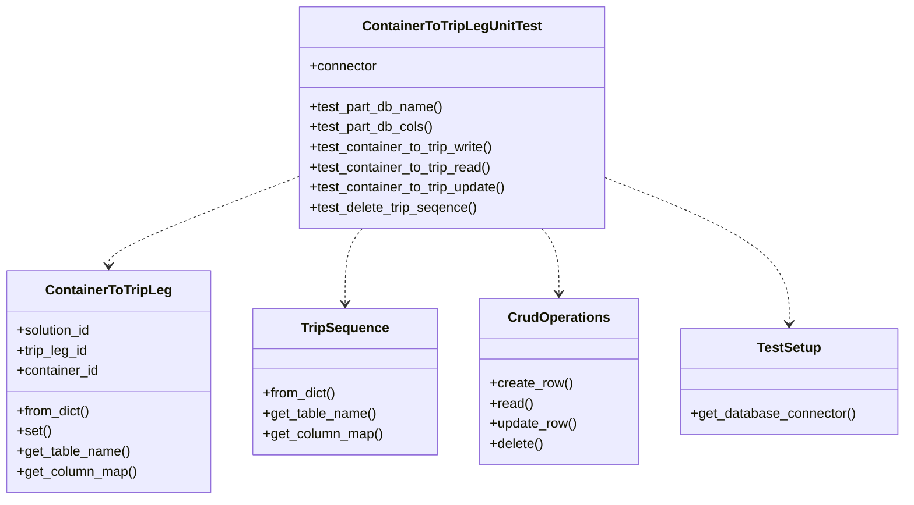
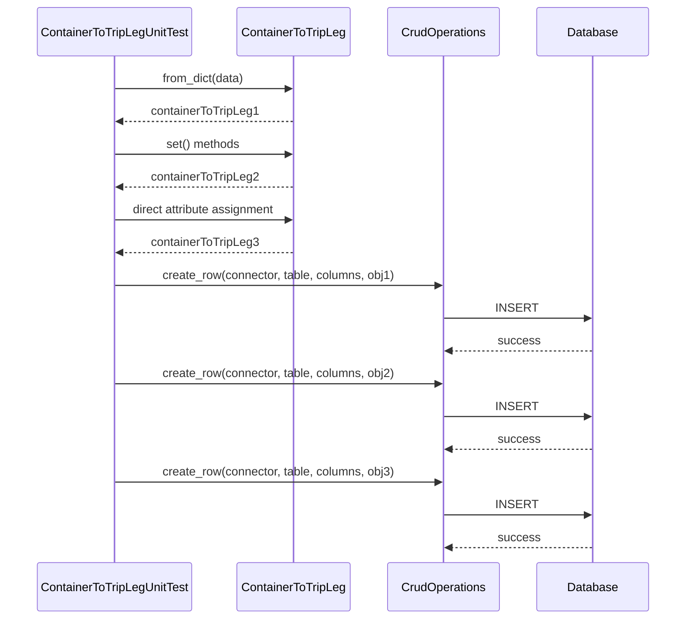
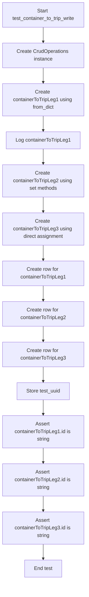
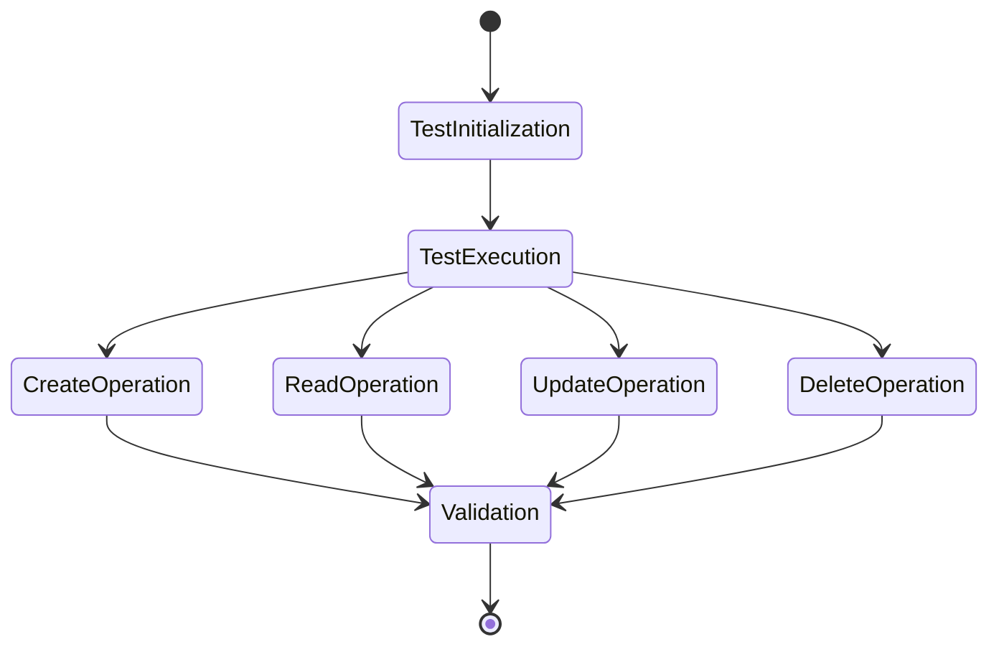

# Diagram: platform/partview_core/partview_service/partview_service/tests/unit/core/datamodel/container_to_trip_leg_test.py


> Auto-generated by Obscura crawlers

## Diagram 1

```mermaid
classDiagram
      class ContainerToTripLegUnitTest {
          +connector
          +test_part_db_name()...
  └ 171 lines...
```

> SVG rendering failed for this diagram.

## Diagram 2



### SVG

<svg id="container" width="1063.5546875" xmlns="http://www.w3.org/2000/svg" class="classDiagram" height="594" viewBox="0 0 1063.5546875 594" role="graphics-document document" aria-roledescription="class"><style>#container{font-family:"trebuchet ms",verdana,arial,sans-serif;font-size:16px;fill:#333;}@keyframes edge-animation-frame{from{stroke-dashoffset:0;}}@keyframes dash{to{stroke-dashoffset:0;}}#container .edge-animation-slow{stroke-dasharray:9,5!important;stroke-dashoffset:900;animation:dash 50s linear infinite;stroke-linecap:round;}#container .edge-animation-fast{stroke-dasharray:9,5!important;stroke-dashoffset:900;animation:dash 20s linear infinite;stroke-linecap:round;}#container .error-icon{fill:#552222;}#container .error-text{fill:#552222;stroke:#552222;}#container .edge-thickness-normal{stroke-width:1px;}#container .edge-thickness-thick{stroke-width:3.5px;}#container .edge-pattern-solid{stroke-dasharray:0;}#container .edge-thickness-invisible{stroke-width:0;fill:none;}#container .edge-pattern-dashed{stroke-dasharray:3;}#container .edge-pattern-dotted{stroke-dasharray:2;}#container .marker{fill:#333333;stroke:#333333;}#container .marker.cross{stroke:#333333;}#container svg{font-family:"trebuchet ms",verdana,arial,sans-serif;font-size:16px;}#container p{margin:0;}#container g.classGroup text{fill:#9370DB;stroke:none;font-family:"trebuchet ms",verdana,arial,sans-serif;font-size:10px;}#container g.classGroup text .title{font-weight:bolder;}#container .nodeLabel,#container .edgeLabel{color:#131300;}#container .edgeLabel .label rect{fill:#ECECFF;}#container .label text{fill:#131300;}#container .labelBkg{background:#ECECFF;}#container .edgeLabel .label span{background:#ECECFF;}#container .classTitle{font-weight:bolder;}#container .node rect,#container .node circle,#container .node ellipse,#container .node polygon,#container .node path{fill:#ECECFF;stroke:#9370DB;stroke-width:1px;}#container .divider{stroke:#9370DB;stroke-width:1;}#container g.clickable{cursor:pointer;}#container g.classGroup rect{fill:#ECECFF;stroke:#9370DB;}#container g.classGroup line{stroke:#9370DB;stroke-width:1;}#container .classLabel .box{stroke:none;stroke-width:0;fill:#ECECFF;opacity:0.5;}#container .classLabel .label{fill:#9370DB;font-size:10px;}#container .relation{stroke:#333333;stroke-width:1;fill:none;}#container .dashed-line{stroke-dasharray:3;}#container .dotted-line{stroke-dasharray:1 2;}#container #compositionStart,#container .composition{fill:#333333!important;stroke:#333333!important;stroke-width:1;}#container #compositionEnd,#container .composition{fill:#333333!important;stroke:#333333!important;stroke-width:1;}#container #dependencyStart,#container .dependency{fill:#333333!important;stroke:#333333!important;stroke-width:1;}#container #dependencyStart,#container .dependency{fill:#333333!important;stroke:#333333!important;stroke-width:1;}#container #extensionStart,#container .extension{fill:transparent!important;stroke:#333333!important;stroke-width:1;}#container #extensionEnd,#container .extension{fill:transparent!important;stroke:#333333!important;stroke-width:1;}#container #aggregationStart,#container .aggregation{fill:transparent!important;stroke:#333333!important;stroke-width:1;}#container #aggregationEnd,#container .aggregation{fill:transparent!important;stroke:#333333!important;stroke-width:1;}#container #lollipopStart,#container .lollipop{fill:#ECECFF!important;stroke:#333333!important;stroke-width:1;}#container #lollipopEnd,#container .lollipop{fill:#ECECFF!important;stroke:#333333!important;stroke-width:1;}#container .edgeTerminals{font-size:11px;line-height:initial;}#container .classTitleText{text-anchor:middle;font-size:18px;fill:#333;}#container .label-icon{display:inline-block;height:1em;overflow:visible;vertical-align:-0.125em;}#container .node .label-icon path{fill:currentColor;stroke:revert;stroke-width:revert;}#container :root{--mermaid-font-family:"trebuchet ms",verdana,arial,sans-serif;}</style><g><defs><marker id="container_class-aggregationStart" class="marker aggregation class" refX="18" refY="7" markerWidth="190" markerHeight="240" orient="auto"><path d="M 18,7 L9,13 L1,7 L9,1 Z"></path></marker></defs><defs><marker id="container_class-aggregationEnd" class="marker aggregation class" refX="1" refY="7" markerWidth="20" markerHeight="28" orient="auto"><path d="M 18,7 L9,13 L1,7 L9,1 Z"></path></marker></defs><defs><marker id="container_class-extensionStart" class="marker extension class" refX="18" refY="7" markerWidth="190" markerHeight="240" orient="auto"><path d="M 1,7 L18,13 V 1 Z"></path></marker></defs><defs><marker id="container_class-extensionEnd" class="marker extension class" refX="1" refY="7" markerWidth="20" markerHeight="28" orient="auto"><path d="M 1,1 V 13 L18,7 Z"></path></marker></defs><defs><marker id="container_class-compositionStart" class="marker composition class" refX="18" refY="7" markerWidth="190" markerHeight="240" orient="auto"><path d="M 18,7 L9,13 L1,7 L9,1 Z"></path></marker></defs><defs><marker id="container_class-compositionEnd" class="marker composition class" refX="1" refY="7" markerWidth="20" markerHeight="28" orient="auto"><path d="M 18,7 L9,13 L1,7 L9,1 Z"></path></marker></defs><defs><marker id="container_class-dependencyStart" class="marker dependency class" refX="6" refY="7" markerWidth="190" markerHeight="240" orient="auto"><path d="M 5,7 L9,13 L1,7 L9,1 Z"></path></marker></defs><defs><marker id="container_class-dependencyEnd" class="marker dependency class" refX="13" refY="7" markerWidth="20" markerHeight="28" orient="auto"><path d="M 18,7 L9,13 L14,7 L9,1 Z"></path></marker></defs><defs><marker id="container_class-lollipopStart" class="marker lollipop class" refX="13" refY="7" markerWidth="190" markerHeight="240" orient="auto"><circle stroke="black" fill="transparent" cx="7" cy="7" r="6"></circle></marker></defs><defs><marker id="container_class-lollipopEnd" class="marker lollipop class" refX="1" refY="7" markerWidth="190" markerHeight="240" orient="auto"><circle stroke="black" fill="transparent" cx="7" cy="7" r="6"></circle></marker></defs><g class="root"><g class="clusters"></g><g class="edgePaths"><path d="M348.701,210.67L311.761,225.058C274.822,239.447,200.942,268.223,164.002,285.778C127.063,303.333,127.063,309.667,127.063,312.833L127.063,316" id="id_ContainerToTripLegUnitTest_ContainerToTripLeg_1" class="edge-thickness-normal edge-pattern-dashed relation" style=";;;" data-edge="true" data-et="edge" data-id="id_ContainerToTripLegUnitTest_ContainerToTripLeg_1" data-points="W3sieCI6MzQ4LjcwMTE3MTg3NSwieSI6MjEwLjY2OTg5MzgzMzAxMTF9LHsieCI6MTI3LjA2MjUsInkiOjI5N30seyJ4IjoxMjcuMDYyNSwieSI6MzIyfV0=" marker-end="url(#container_class-dependencyEnd)"></path><path d="M424.499,272L421.165,276.167C417.83,280.333,411.161,288.667,407.827,303.5C404.492,318.333,404.492,339.667,404.492,350.333L404.492,361" id="id_ContainerToTripLegUnitTest_TripSequence_2" class="edge-thickness-normal edge-pattern-dashed relation" style=";;;" data-edge="true" data-et="edge" data-id="id_ContainerToTripLegUnitTest_TripSequence_2" data-points="W3sieCI6NDI0LjQ5ODk2NzQ1NjIxMDIsInkiOjI3Mn0seyJ4Ijo0MDQuNDkyMTg3NSwieSI6Mjk3fSx7IngiOjQwNC40OTIxODc1LCJ5IjozNjd9XQ==" marker-end="url(#container_class-dependencyEnd)"></path><path d="M635.771,272L639.105,276.167C642.439,280.333,649.108,288.667,652.443,301.5C655.777,314.333,655.777,331.667,655.777,340.333L655.777,349" id="id_ContainerToTripLegUnitTest_CrudOperations_3" class="edge-thickness-normal edge-pattern-dashed relation" style=";;;" data-edge="true" data-et="edge" data-id="id_ContainerToTripLegUnitTest_CrudOperations_3" data-points="W3sieCI6NjM1Ljc3MDU2Mzc5Mzc4OTgsInkiOjI3Mn0seyJ4Ijo2NTUuNzc3MzQzNzUsInkiOjI5N30seyJ4Ijo2NTUuNzc3MzQzNzUsInkiOjM1NX1d" marker-end="url(#container_class-dependencyEnd)"></path><path d="M711.568,211.753L747.494,225.96C783.421,240.168,855.273,268.584,891.199,297.459C927.125,326.333,927.125,355.667,927.125,370.333L927.125,385" id="id_ContainerToTripLegUnitTest_TestSetup_4" class="edge-thickness-normal edge-pattern-dashed relation" style=";;;" data-edge="true" data-et="edge" data-id="id_ContainerToTripLegUnitTest_TestSetup_4" data-points="W3sieCI6NzExLjU2ODM1OTM3NSwieSI6MjExLjc1MjU4MTY4MTQ5OTk4fSx7IngiOjkyNy4xMjUsInkiOjI5N30seyJ4Ijo5MjcuMTI1LCJ5IjozOTF9XQ==" marker-end="url(#container_class-dependencyEnd)"></path></g><g class="edgeLabels"><g class="edgeLabel"><g class="label" data-id="id_ContainerToTripLegUnitTest_ContainerToTripLeg_1" transform="translate(0, 0)"><foreignObject width="0" height="0"><div xmlns="http://www.w3.org/1999/xhtml" class="labelBkg" style="display: table-cell; white-space: nowrap; line-height: 1.5; max-width: 200px; text-align: center;"><span class="edgeLabel"></span></div></foreignObject></g></g><g class="edgeLabel"><g class="label" data-id="id_ContainerToTripLegUnitTest_TripSequence_2" transform="translate(0, 0)"><foreignObject width="0" height="0"><div xmlns="http://www.w3.org/1999/xhtml" class="labelBkg" style="display: table-cell; white-space: nowrap; line-height: 1.5; max-width: 200px; text-align: center;"><span class="edgeLabel"></span></div></foreignObject></g></g><g class="edgeLabel"><g class="label" data-id="id_ContainerToTripLegUnitTest_CrudOperations_3" transform="translate(0, 0)"><foreignObject width="0" height="0"><div xmlns="http://www.w3.org/1999/xhtml" class="labelBkg" style="display: table-cell; white-space: nowrap; line-height: 1.5; max-width: 200px; text-align: center;"><span class="edgeLabel"></span></div></foreignObject></g></g><g class="edgeLabel"><g class="label" data-id="id_ContainerToTripLegUnitTest_TestSetup_4" transform="translate(0, 0)"><foreignObject width="0" height="0"><div xmlns="http://www.w3.org/1999/xhtml" class="labelBkg" style="display: table-cell; white-space: nowrap; line-height: 1.5; max-width: 200px; text-align: center;"><span class="edgeLabel"></span></div></foreignObject></g></g></g><g class="nodes"><g class="node default" id="classId-ContainerToTripLegUnitTest-0" transform="translate(530.134765625, 140)"><g class="basic label-container"><path d="M-181.43359375 -132 L181.43359375 -132 L181.43359375 132 L-181.43359375 132" stroke="none" stroke-width="0" fill="#ECECFF" style=""></path><path d="M-181.43359375 -132 C-90.65743121914086 -132, 0.11873131171827822 -132, 181.43359375 -132 M-181.43359375 -132 C-104.57594532681702 -132, -27.71829690363404 -132, 181.43359375 -132 M181.43359375 -132 C181.43359375 -61.93810791631516, 181.43359375 8.123784167369678, 181.43359375 132 M181.43359375 -132 C181.43359375 -26.762711986913914, 181.43359375 78.47457602617217, 181.43359375 132 M181.43359375 132 C83.15983906166042 132, -15.113915626679159 132, -181.43359375 132 M181.43359375 132 C72.67824165673744 132, -36.07711043652512 132, -181.43359375 132 M-181.43359375 132 C-181.43359375 41.43318840065639, -181.43359375 -49.13362319868722, -181.43359375 -132 M-181.43359375 132 C-181.43359375 36.90750784855274, -181.43359375 -58.18498430289452, -181.43359375 -132" stroke="#9370DB" stroke-width="1.3" fill="none" stroke-dasharray="0 0" style=""></path></g><g class="annotation-group text" transform="translate(0, -108)"></g><g class="label-group text" transform="translate(-101.6171875, -108)"><g class="label" style="font-weight: bolder" transform="translate(0,-12)"><foreignObject width="203.234375" height="24"><div xmlns="http://www.w3.org/1999/xhtml" style="display: table-cell; white-space: nowrap; line-height: 1.5; max-width: 250px; text-align: center;"><span class="nodeLabel markdown-node-label" style=""><p>ContainerToTripLegUnitTest</p></span></div></foreignObject></g></g><g class="members-group text" transform="translate(-169.43359375, -60)"><g class="label" style="" transform="translate(0,-12)"><foreignObject width="80.84375" height="24"><div xmlns="http://www.w3.org/1999/xhtml" style="display: table-cell; white-space: nowrap; line-height: 1.5; max-width: 139px; text-align: center;"><span class="nodeLabel markdown-node-label" style=""><p>+connector</p></span></div></foreignObject></g></g><g class="methods-group text" transform="translate(-169.43359375, -12)"><g class="label" style="" transform="translate(0,-12)"><foreignObject width="159.6875" height="24"><div xmlns="http://www.w3.org/1999/xhtml" style="display: table-cell; white-space: nowrap; line-height: 1.5; max-width: 217px; text-align: center;"><span class="nodeLabel markdown-node-label" style=""><p>+test_part_db_name()</p></span></div></foreignObject></g><g class="label" style="" transform="translate(0,12)"><foreignObject width="147.6875" height="24"><div xmlns="http://www.w3.org/1999/xhtml" style="display: table-cell; white-space: nowrap; line-height: 1.5; max-width: 205px; text-align: center;"><span class="nodeLabel markdown-node-label" style=""><p>+test_part_db_cols()</p></span></div></foreignObject></g><g class="label" style="" transform="translate(0,36)"><foreignObject width="222.328125" height="24"><div xmlns="http://www.w3.org/1999/xhtml" style="display: table-cell; white-space: nowrap; line-height: 1.5; max-width: 280px; text-align: center;"><span class="nodeLabel markdown-node-label" style=""><p>+test_container_to_trip_write()</p></span></div></foreignObject></g><g class="label" style="" transform="translate(0,60)"><foreignObject width="218.765625" height="24"><div xmlns="http://www.w3.org/1999/xhtml" style="display: table-cell; white-space: nowrap; line-height: 1.5; max-width: 276px; text-align: center;"><span class="nodeLabel markdown-node-label" style=""><p>+test_container_to_trip_read()</p></span></div></foreignObject></g><g class="label" style="" transform="translate(0,84)"><foreignObject width="237.25" height="24"><div xmlns="http://www.w3.org/1999/xhtml" style="display: table-cell; white-space: nowrap; line-height: 1.5; max-width: 295px; text-align: center;"><span class="nodeLabel markdown-node-label" style=""><p>+test_container_to_trip_update()</p></span></div></foreignObject></g><g class="label" style="" transform="translate(0,108)"><foreignObject width="201.203125" height="24"><div xmlns="http://www.w3.org/1999/xhtml" style="display: table-cell; white-space: nowrap; line-height: 1.5; max-width: 259px; text-align: center;"><span class="nodeLabel markdown-node-label" style=""><p>+test_delete_trip_seqence()</p></span></div></foreignObject></g></g><g class="divider" style=""><path d="M-181.43359375 -84 C-86.8856417288465 -84, 7.662310292307012 -84, 181.43359375 -84 M-181.43359375 -84 C-103.14749799177002 -84, -24.861402233540048 -84, 181.43359375 -84" stroke="#9370DB" stroke-width="1.3" fill="none" stroke-dasharray="0 0" style=""></path></g><g class="divider" style=""><path d="M-181.43359375 -36 C-93.49432250534252 -36, -5.5550512606850475 -36, 181.43359375 -36 M-181.43359375 -36 C-40.55241337686604 -36, 100.32876699626792 -36, 181.43359375 -36" stroke="#9370DB" stroke-width="1.3" fill="none" stroke-dasharray="0 0" style=""></path></g></g><g class="node default" id="classId-ContainerToTripLeg-1" transform="translate(127.0625, 454)"><g class="basic label-container"><path d="M-119.0625 -132 L119.0625 -132 L119.0625 132 L-119.0625 132" stroke="none" stroke-width="0" fill="#ECECFF" style=""></path><path d="M-119.0625 -132 C-44.77463499467959 -132, 29.513230010640825 -132, 119.0625 -132 M-119.0625 -132 C-27.79642511152163 -132, 63.46964977695674 -132, 119.0625 -132 M119.0625 -132 C119.0625 -57.32579275297576, 119.0625 17.348414494048484, 119.0625 132 M119.0625 -132 C119.0625 -44.08035782411619, 119.0625 43.83928435176762, 119.0625 132 M119.0625 132 C28.353952515997648 132, -62.354594968004704 132, -119.0625 132 M119.0625 132 C64.41157795915217 132, 9.760655918304337 132, -119.0625 132 M-119.0625 132 C-119.0625 58.94454094539407, -119.0625 -14.110918109211866, -119.0625 -132 M-119.0625 132 C-119.0625 37.81929884102426, -119.0625 -56.36140231795147, -119.0625 -132" stroke="#9370DB" stroke-width="1.3" fill="none" stroke-dasharray="0 0" style=""></path></g><g class="annotation-group text" transform="translate(0, -108)"></g><g class="label-group text" transform="translate(-71.203125, -108)"><g class="label" style="font-weight: bolder" transform="translate(0,-12)"><foreignObject width="142.40625" height="24"><div xmlns="http://www.w3.org/1999/xhtml" style="display: table-cell; white-space: nowrap; line-height: 1.5; max-width: 191px; text-align: center;"><span class="nodeLabel markdown-node-label" style=""><p>ContainerToTripLeg</p></span></div></foreignObject></g></g><g class="members-group text" transform="translate(-107.0625, -60)"><g class="label" style="" transform="translate(0,-12)"><foreignObject width="90.21875" height="24"><div xmlns="http://www.w3.org/1999/xhtml" style="display: table-cell; white-space: nowrap; line-height: 1.5; max-width: 148px; text-align: center;"><span class="nodeLabel markdown-node-label" style=""><p>+solution_id</p></span></div></foreignObject></g><g class="label" style="" transform="translate(0,12)"><foreignObject width="85.828125" height="24"><div xmlns="http://www.w3.org/1999/xhtml" style="display: table-cell; white-space: nowrap; line-height: 1.5; max-width: 143px; text-align: center;"><span class="nodeLabel markdown-node-label" style=""><p>+trip_leg_id</p></span></div></foreignObject></g><g class="label" style="" transform="translate(0,36)"><foreignObject width="98.3125" height="24"><div xmlns="http://www.w3.org/1999/xhtml" style="display: table-cell; white-space: nowrap; line-height: 1.5; max-width: 156px; text-align: center;"><span class="nodeLabel markdown-node-label" style=""><p>+container_id</p></span></div></foreignObject></g></g><g class="methods-group text" transform="translate(-107.0625, 36)"><g class="label" style="" transform="translate(0,-12)"><foreignObject width="87.734375" height="24"><div xmlns="http://www.w3.org/1999/xhtml" style="display: table-cell; white-space: nowrap; line-height: 1.5; max-width: 145px; text-align: center;"><span class="nodeLabel markdown-node-label" style=""><p>+from_dict()</p></span></div></foreignObject></g><g class="label" style="" transform="translate(0,12)"><foreignObject width="40.328125" height="24"><div xmlns="http://www.w3.org/1999/xhtml" style="display: table-cell; white-space: nowrap; line-height: 1.5; max-width: 98px; text-align: center;"><span class="nodeLabel markdown-node-label" style=""><p>+set()</p></span></div></foreignObject></g><g class="label" style="" transform="translate(0,36)"><foreignObject width="134.625" height="24"><div xmlns="http://www.w3.org/1999/xhtml" style="display: table-cell; white-space: nowrap; line-height: 1.5; max-width: 192px; text-align: center;"><span class="nodeLabel markdown-node-label" style=""><p>+get_table_name()</p></span></div></foreignObject></g><g class="label" style="" transform="translate(0,60)"><foreignObject width="142.921875" height="24"><div xmlns="http://www.w3.org/1999/xhtml" style="display: table-cell; white-space: nowrap; line-height: 1.5; max-width: 200px; text-align: center;"><span class="nodeLabel markdown-node-label" style=""><p>+get_column_map()</p></span></div></foreignObject></g></g><g class="divider" style=""><path d="M-119.0625 -84 C-34.37311242597808 -84, 50.31627514804384 -84, 119.0625 -84 M-119.0625 -84 C-33.038589425240914 -84, 52.98532114951817 -84, 119.0625 -84" stroke="#9370DB" stroke-width="1.3" fill="none" stroke-dasharray="0 0" style=""></path></g><g class="divider" style=""><path d="M-119.0625 12 C-68.88642931544851 12, -18.710358630897005 12, 119.0625 12 M-119.0625 12 C-42.63934527770263 12, 33.78380944459474 12, 119.0625 12" stroke="#9370DB" stroke-width="1.3" fill="none" stroke-dasharray="0 0" style=""></path></g></g><g class="node default" id="classId-TripSequence-2" transform="translate(404.4921875, 454)"><g class="basic label-container"><path d="M-108.3671875 -87 L108.3671875 -87 L108.3671875 87 L-108.3671875 87" stroke="none" stroke-width="0" fill="#ECECFF" style=""></path><path d="M-108.3671875 -87 C-57.87986825843224 -87, -7.3925490168644785 -87, 108.3671875 -87 M-108.3671875 -87 C-42.34400561374504 -87, 23.67917627250992 -87, 108.3671875 -87 M108.3671875 -87 C108.3671875 -48.8743184842626, 108.3671875 -10.748636968525204, 108.3671875 87 M108.3671875 -87 C108.3671875 -48.90406265415608, 108.3671875 -10.808125308312157, 108.3671875 87 M108.3671875 87 C51.555015717770345 87, -5.257156064459309 87, -108.3671875 87 M108.3671875 87 C49.101513550231104 87, -10.164160399537792 87, -108.3671875 87 M-108.3671875 87 C-108.3671875 38.76660825493835, -108.3671875 -9.466783490123305, -108.3671875 -87 M-108.3671875 87 C-108.3671875 32.989263640965675, -108.3671875 -21.02147271806865, -108.3671875 -87" stroke="#9370DB" stroke-width="1.3" fill="none" stroke-dasharray="0 0" style=""></path></g><g class="annotation-group text" transform="translate(0, -63)"></g><g class="label-group text" transform="translate(-49.8125, -63)"><g class="label" style="font-weight: bolder" transform="translate(0,-12)"><foreignObject width="99.625" height="24"><div xmlns="http://www.w3.org/1999/xhtml" style="display: table-cell; white-space: nowrap; line-height: 1.5; max-width: 148px; text-align: center;"><span class="nodeLabel markdown-node-label" style=""><p>TripSequence</p></span></div></foreignObject></g></g><g class="members-group text" transform="translate(-96.3671875, -15)"></g><g class="methods-group text" transform="translate(-96.3671875, 15)"><g class="label" style="" transform="translate(0,-12)"><foreignObject width="87.734375" height="24"><div xmlns="http://www.w3.org/1999/xhtml" style="display: table-cell; white-space: nowrap; line-height: 1.5; max-width: 145px; text-align: center;"><span class="nodeLabel markdown-node-label" style=""><p>+from_dict()</p></span></div></foreignObject></g><g class="label" style="" transform="translate(0,12)"><foreignObject width="134.625" height="24"><div xmlns="http://www.w3.org/1999/xhtml" style="display: table-cell; white-space: nowrap; line-height: 1.5; max-width: 192px; text-align: center;"><span class="nodeLabel markdown-node-label" style=""><p>+get_table_name()</p></span></div></foreignObject></g><g class="label" style="" transform="translate(0,36)"><foreignObject width="142.921875" height="24"><div xmlns="http://www.w3.org/1999/xhtml" style="display: table-cell; white-space: nowrap; line-height: 1.5; max-width: 200px; text-align: center;"><span class="nodeLabel markdown-node-label" style=""><p>+get_column_map()</p></span></div></foreignObject></g></g><g class="divider" style=""><path d="M-108.3671875 -39 C-46.64065330775501 -39, 15.085880884489981 -39, 108.3671875 -39 M-108.3671875 -39 C-50.06782433213127 -39, 8.231538835737453 -39, 108.3671875 -39" stroke="#9370DB" stroke-width="1.3" fill="none" stroke-dasharray="0 0" style=""></path></g><g class="divider" style=""><path d="M-108.3671875 -15 C-63.6776318637716 -15, -18.988076227543203 -15, 108.3671875 -15 M-108.3671875 -15 C-32.02019003883542 -15, 44.32680742232915 -15, 108.3671875 -15" stroke="#9370DB" stroke-width="1.3" fill="none" stroke-dasharray="0 0" style=""></path></g></g><g class="node default" id="classId-CrudOperations-3" transform="translate(655.77734375, 454)"><g class="basic label-container"><path d="M-92.91796875 -99 L92.91796875 -99 L92.91796875 99 L-92.91796875 99" stroke="none" stroke-width="0" fill="#ECECFF" style=""></path><path d="M-92.91796875 -99 C-25.013227655210855 -99, 42.89151343957829 -99, 92.91796875 -99 M-92.91796875 -99 C-43.44166340710986 -99, 6.034641935780286 -99, 92.91796875 -99 M92.91796875 -99 C92.91796875 -46.47065350327758, 92.91796875 6.058692993444836, 92.91796875 99 M92.91796875 -99 C92.91796875 -30.403445402090313, 92.91796875 38.193109195819375, 92.91796875 99 M92.91796875 99 C55.69853584371294 99, 18.47910293742588 99, -92.91796875 99 M92.91796875 99 C45.90898307176026 99, -1.1000026064794781 99, -92.91796875 99 M-92.91796875 99 C-92.91796875 41.60457983209105, -92.91796875 -15.790840335817904, -92.91796875 -99 M-92.91796875 99 C-92.91796875 37.044817537117574, -92.91796875 -24.910364925764853, -92.91796875 -99" stroke="#9370DB" stroke-width="1.3" fill="none" stroke-dasharray="0 0" style=""></path></g><g class="annotation-group text" transform="translate(0, -75)"></g><g class="label-group text" transform="translate(-57.6171875, -75)"><g class="label" style="font-weight: bolder" transform="translate(0,-12)"><foreignObject width="115.234375" height="24"><div xmlns="http://www.w3.org/1999/xhtml" style="display: table-cell; white-space: nowrap; line-height: 1.5; max-width: 164px; text-align: center;"><span class="nodeLabel markdown-node-label" style=""><p>CrudOperations</p></span></div></foreignObject></g></g><g class="members-group text" transform="translate(-80.91796875, -27)"></g><g class="methods-group text" transform="translate(-80.91796875, 3)"><g class="label" style="" transform="translate(0,-12)"><foreignObject width="97.734375" height="24"><div xmlns="http://www.w3.org/1999/xhtml" style="display: table-cell; white-space: nowrap; line-height: 1.5; max-width: 155px; text-align: center;"><span class="nodeLabel markdown-node-label" style=""><p>+create_row()</p></span></div></foreignObject></g><g class="label" style="" transform="translate(0,12)"><foreignObject width="50.890625" height="24"><div xmlns="http://www.w3.org/1999/xhtml" style="display: table-cell; white-space: nowrap; line-height: 1.5; max-width: 108px; text-align: center;"><span class="nodeLabel markdown-node-label" style=""><p>+read()</p></span></div></foreignObject></g><g class="label" style="" transform="translate(0,36)"><foreignObject width="104.21875" height="24"><div xmlns="http://www.w3.org/1999/xhtml" style="display: table-cell; white-space: nowrap; line-height: 1.5; max-width: 162px; text-align: center;"><span class="nodeLabel markdown-node-label" style=""><p>+update_row()</p></span></div></foreignObject></g><g class="label" style="" transform="translate(0,60)"><foreignObject width="64.234375" height="24"><div xmlns="http://www.w3.org/1999/xhtml" style="display: table-cell; white-space: nowrap; line-height: 1.5; max-width: 122px; text-align: center;"><span class="nodeLabel markdown-node-label" style=""><p>+delete()</p></span></div></foreignObject></g></g><g class="divider" style=""><path d="M-92.91796875 -51 C-45.30677491163736 -51, 2.304418926725276 -51, 92.91796875 -51 M-92.91796875 -51 C-26.815138931595712 -51, 39.287690886808576 -51, 92.91796875 -51" stroke="#9370DB" stroke-width="1.3" fill="none" stroke-dasharray="0 0" style=""></path></g><g class="divider" style=""><path d="M-92.91796875 -27 C-36.66215146662902 -27, 19.59366581674196 -27, 92.91796875 -27 M-92.91796875 -27 C-38.44051838805999 -27, 16.036931973880016 -27, 92.91796875 -27" stroke="#9370DB" stroke-width="1.3" fill="none" stroke-dasharray="0 0" style=""></path></g></g><g class="node default" id="classId-TestSetup-4" transform="translate(927.125, 454)"><g class="basic label-container"><path d="M-128.4296875 -63 L128.4296875 -63 L128.4296875 63 L-128.4296875 63" stroke="none" stroke-width="0" fill="#ECECFF" style=""></path><path d="M-128.4296875 -63 C-75.62568088157016 -63, -22.82167426314031 -63, 128.4296875 -63 M-128.4296875 -63 C-57.30380455583804 -63, 13.822078388323916 -63, 128.4296875 -63 M128.4296875 -63 C128.4296875 -20.09283487614219, 128.4296875 22.814330247715617, 128.4296875 63 M128.4296875 -63 C128.4296875 -35.96287763547379, 128.4296875 -8.925755270947569, 128.4296875 63 M128.4296875 63 C50.54400038825935 63, -27.341686723481303 63, -128.4296875 63 M128.4296875 63 C64.203359026534 63, -0.022969446931995208 63, -128.4296875 63 M-128.4296875 63 C-128.4296875 14.568219667678278, -128.4296875 -33.863560664643444, -128.4296875 -63 M-128.4296875 63 C-128.4296875 21.027851994788243, -128.4296875 -20.944296010423514, -128.4296875 -63" stroke="#9370DB" stroke-width="1.3" fill="none" stroke-dasharray="0 0" style=""></path></g><g class="annotation-group text" transform="translate(0, -39)"></g><g class="label-group text" transform="translate(-36.6875, -39)"><g class="label" style="font-weight: bolder" transform="translate(0,-12)"><foreignObject width="73.375" height="24"><div xmlns="http://www.w3.org/1999/xhtml" style="display: table-cell; white-space: nowrap; line-height: 1.5; max-width: 121px; text-align: center;"><span class="nodeLabel markdown-node-label" style=""><p>TestSetup</p></span></div></foreignObject></g></g><g class="members-group text" transform="translate(-116.4296875, 9)"></g><g class="methods-group text" transform="translate(-116.4296875, 39)"><g class="label" style="" transform="translate(0,-12)"><foreignObject width="196.171875" height="24"><div xmlns="http://www.w3.org/1999/xhtml" style="display: table-cell; white-space: nowrap; line-height: 1.5; max-width: 254px; text-align: center;"><span class="nodeLabel markdown-node-label" style=""><p>+get_database_connector()</p></span></div></foreignObject></g></g><g class="divider" style=""><path d="M-128.4296875 -15 C-30.04325491616204 -15, 68.34317766767592 -15, 128.4296875 -15 M-128.4296875 -15 C-47.95521929945245 -15, 32.5192489010951 -15, 128.4296875 -15" stroke="#9370DB" stroke-width="1.3" fill="none" stroke-dasharray="0 0" style=""></path></g><g class="divider" style=""><path d="M-128.4296875 9 C-47.871499246641875 9, 32.68668900671625 9, 128.4296875 9 M-128.4296875 9 C-61.30798924256197 9, 5.8137090148760535 9, 128.4296875 9" stroke="#9370DB" stroke-width="1.3" fill="none" stroke-dasharray="0 0" style=""></path></g></g></g></g></g></svg>

## Diagram 3



### SVG

<svg id="container" width="958.5" xmlns="http://www.w3.org/2000/svg" height="891" viewBox="-50 -10 958.5 891" role="graphics-document document" aria-roledescription="sequence"><g><rect x="708.5" y="805" fill="#eaeaea" stroke="#666" width="150" height="65" name="DB" rx="3" ry="3" class="actor actor-bottom"></rect><text x="783.5" y="837.5" dominant-baseline="central" alignment-baseline="central" class="actor actor-box" style="text-anchor: middle; font-size: 16px; font-weight: 400;"><tspan x="783.5" dy="0">Database</tspan></text></g><g><rect x="508.5" y="805" fill="#eaeaea" stroke="#666" width="150" height="65" name="CRUD" rx="3" ry="3" class="actor actor-bottom"></rect><text x="583.5" y="837.5" dominant-baseline="central" alignment-baseline="central" class="actor actor-box" style="text-anchor: middle; font-size: 16px; font-weight: 400;"><tspan x="583.5" dy="0">CrudOperations</tspan></text></g><g><rect x="297.5" y="805" fill="#eaeaea" stroke="#666" width="161" height="65" name="CTTL" rx="3" ry="3" class="actor actor-bottom"></rect><text x="378" y="837.5" dominant-baseline="central" alignment-baseline="central" class="actor actor-box" style="text-anchor: middle; font-size: 16px; font-weight: 400;"><tspan x="378" dy="0">ContainerToTripLeg</tspan></text></g><g><rect x="0" y="805" fill="#eaeaea" stroke="#666" width="220" height="65" name="Test" rx="3" ry="3" class="actor actor-bottom"></rect><text x="110" y="837.5" dominant-baseline="central" alignment-baseline="central" class="actor actor-box" style="text-anchor: middle; font-size: 16px; font-weight: 400;"><tspan x="110" dy="0">ContainerToTripLegUnitTest</tspan></text></g><g><line id="actor3" x1="783.5" y1="65" x2="783.5" y2="805" class="actor-line 200" stroke-width="0.5px" stroke="#999" name="DB"></line><g id="root-3"><rect x="708.5" y="0" fill="#eaeaea" stroke="#666" width="150" height="65" name="DB" rx="3" ry="3" class="actor actor-top"></rect><text x="783.5" y="32.5" dominant-baseline="central" alignment-baseline="central" class="actor actor-box" style="text-anchor: middle; font-size: 16px; font-weight: 400;"><tspan x="783.5" dy="0">Database</tspan></text></g></g><g><line id="actor2" x1="583.5" y1="65" x2="583.5" y2="805" class="actor-line 200" stroke-width="0.5px" stroke="#999" name="CRUD"></line><g id="root-2"><rect x="508.5" y="0" fill="#eaeaea" stroke="#666" width="150" height="65" name="CRUD" rx="3" ry="3" class="actor actor-top"></rect><text x="583.5" y="32.5" dominant-baseline="central" alignment-baseline="central" class="actor actor-box" style="text-anchor: middle; font-size: 16px; font-weight: 400;"><tspan x="583.5" dy="0">CrudOperations</tspan></text></g></g><g><line id="actor1" x1="378" y1="65" x2="378" y2="805" class="actor-line 200" stroke-width="0.5px" stroke="#999" name="CTTL"></line><g id="root-1"><rect x="297.5" y="0" fill="#eaeaea" stroke="#666" width="161" height="65" name="CTTL" rx="3" ry="3" class="actor actor-top"></rect><text x="378" y="32.5" dominant-baseline="central" alignment-baseline="central" class="actor actor-box" style="text-anchor: middle; font-size: 16px; font-weight: 400;"><tspan x="378" dy="0">ContainerToTripLeg</tspan></text></g></g><g><line id="actor0" x1="110" y1="65" x2="110" y2="805" class="actor-line 200" stroke-width="0.5px" stroke="#999" name="Test"></line><g id="root-0"><rect x="0" y="0" fill="#eaeaea" stroke="#666" width="220" height="65" name="Test" rx="3" ry="3" class="actor actor-top"></rect><text x="110" y="32.5" dominant-baseline="central" alignment-baseline="central" class="actor actor-box" style="text-anchor: middle; font-size: 16px; font-weight: 400;"><tspan x="110" dy="0">ContainerToTripLegUnitTest</tspan></text></g></g><style>#container{font-family:"trebuchet ms",verdana,arial,sans-serif;font-size:16px;fill:#333;}@keyframes edge-animation-frame{from{stroke-dashoffset:0;}}@keyframes dash{to{stroke-dashoffset:0;}}#container .edge-animation-slow{stroke-dasharray:9,5!important;stroke-dashoffset:900;animation:dash 50s linear infinite;stroke-linecap:round;}#container .edge-animation-fast{stroke-dasharray:9,5!important;stroke-dashoffset:900;animation:dash 20s linear infinite;stroke-linecap:round;}#container .error-icon{fill:#552222;}#container .error-text{fill:#552222;stroke:#552222;}#container .edge-thickness-normal{stroke-width:1px;}#container .edge-thickness-thick{stroke-width:3.5px;}#container .edge-pattern-solid{stroke-dasharray:0;}#container .edge-thickness-invisible{stroke-width:0;fill:none;}#container .edge-pattern-dashed{stroke-dasharray:3;}#container .edge-pattern-dotted{stroke-dasharray:2;}#container .marker{fill:#333333;stroke:#333333;}#container .marker.cross{stroke:#333333;}#container svg{font-family:"trebuchet ms",verdana,arial,sans-serif;font-size:16px;}#container p{margin:0;}#container .actor{stroke:hsl(259.6261682243, 59.7765363128%, 87.9019607843%);fill:#ECECFF;}#container text.actor&gt;tspan{fill:black;stroke:none;}#container .actor-line{stroke:hsl(259.6261682243, 59.7765363128%, 87.9019607843%);}#container .innerArc{stroke-width:1.5;stroke-dasharray:none;}#container .messageLine0{stroke-width:1.5;stroke-dasharray:none;stroke:#333;}#container .messageLine1{stroke-width:1.5;stroke-dasharray:2,2;stroke:#333;}#container #arrowhead path{fill:#333;stroke:#333;}#container .sequenceNumber{fill:white;}#container #sequencenumber{fill:#333;}#container #crosshead path{fill:#333;stroke:#333;}#container .messageText{fill:#333;stroke:none;}#container .labelBox{stroke:hsl(259.6261682243, 59.7765363128%, 87.9019607843%);fill:#ECECFF;}#container .labelText,#container .labelText&gt;tspan{fill:black;stroke:none;}#container .loopText,#container .loopText&gt;tspan{fill:black;stroke:none;}#container .loopLine{stroke-width:2px;stroke-dasharray:2,2;stroke:hsl(259.6261682243, 59.7765363128%, 87.9019607843%);fill:hsl(259.6261682243, 59.7765363128%, 87.9019607843%);}#container .note{stroke:#aaaa33;fill:#fff5ad;}#container .noteText,#container .noteText&gt;tspan{fill:black;stroke:none;}#container .activation0{fill:#f4f4f4;stroke:#666;}#container .activation1{fill:#f4f4f4;stroke:#666;}#container .activation2{fill:#f4f4f4;stroke:#666;}#container .actorPopupMenu{position:absolute;}#container .actorPopupMenuPanel{position:absolute;fill:#ECECFF;box-shadow:0px 8px 16px 0px rgba(0,0,0,0.2);filter:drop-shadow(3px 5px 2px rgb(0 0 0 / 0.4));}#container .actor-man line{stroke:hsl(259.6261682243, 59.7765363128%, 87.9019607843%);fill:#ECECFF;}#container .actor-man circle,#container line{stroke:hsl(259.6261682243, 59.7765363128%, 87.9019607843%);fill:#ECECFF;stroke-width:2px;}#container :root{--mermaid-font-family:"trebuchet ms",verdana,arial,sans-serif;}</style><g></g><defs><symbol id="computer" width="24" height="24"><path transform="scale(.5)" d="M2 2v13h20v-13h-20zm18 11h-16v-9h16v9zm-10.228 6l.466-1h3.524l.467 1h-4.457zm14.228 3h-24l2-6h2.104l-1.33 4h18.45l-1.297-4h2.073l2 6zm-5-10h-14v-7h14v7z"></path></symbol></defs><defs><symbol id="database" fill-rule="evenodd" clip-rule="evenodd"><path transform="scale(.5)" d="M12.258.001l.256.004.255.005.253.008.251.01.249.012.247.015.246.016.242.019.241.02.239.023.236.024.233.027.231.028.229.031.225.032.223.034.22.036.217.038.214.04.211.041.208.043.205.045.201.046.198.048.194.05.191.051.187.053.183.054.18.056.175.057.172.059.168.06.163.061.16.063.155.064.15.066.074.033.073.033.071.034.07.034.069.035.068.035.067.035.066.035.064.036.064.036.062.036.06.036.06.037.058.037.058.037.055.038.055.038.053.038.052.038.051.039.05.039.048.039.047.039.045.04.044.04.043.04.041.04.04.041.039.041.037.041.036.041.034.041.033.042.032.042.03.042.029.042.027.042.026.043.024.043.023.043.021.043.02.043.018.044.017.043.015.044.013.044.012.044.011.045.009.044.007.045.006.045.004.045.002.045.001.045v17l-.001.045-.002.045-.004.045-.006.045-.007.045-.009.044-.011.045-.012.044-.013.044-.015.044-.017.043-.018.044-.02.043-.021.043-.023.043-.024.043-.026.043-.027.042-.029.042-.03.042-.032.042-.033.042-.034.041-.036.041-.037.041-.039.041-.04.041-.041.04-.043.04-.044.04-.045.04-.047.039-.048.039-.05.039-.051.039-.052.038-.053.038-.055.038-.055.038-.058.037-.058.037-.06.037-.06.036-.062.036-.064.036-.064.036-.066.035-.067.035-.068.035-.069.035-.07.034-.071.034-.073.033-.074.033-.15.066-.155.064-.16.063-.163.061-.168.06-.172.059-.175.057-.18.056-.183.054-.187.053-.191.051-.194.05-.198.048-.201.046-.205.045-.208.043-.211.041-.214.04-.217.038-.22.036-.223.034-.225.032-.229.031-.231.028-.233.027-.236.024-.239.023-.241.02-.242.019-.246.016-.247.015-.249.012-.251.01-.253.008-.255.005-.256.004-.258.001-.258-.001-.256-.004-.255-.005-.253-.008-.251-.01-.249-.012-.247-.015-.245-.016-.243-.019-.241-.02-.238-.023-.236-.024-.234-.027-.231-.028-.228-.031-.226-.032-.223-.034-.22-.036-.217-.038-.214-.04-.211-.041-.208-.043-.204-.045-.201-.046-.198-.048-.195-.05-.19-.051-.187-.053-.184-.054-.179-.056-.176-.057-.172-.059-.167-.06-.164-.061-.159-.063-.155-.064-.151-.066-.074-.033-.072-.033-.072-.034-.07-.034-.069-.035-.068-.035-.067-.035-.066-.035-.064-.036-.063-.036-.062-.036-.061-.036-.06-.037-.058-.037-.057-.037-.056-.038-.055-.038-.053-.038-.052-.038-.051-.039-.049-.039-.049-.039-.046-.039-.046-.04-.044-.04-.043-.04-.041-.04-.04-.041-.039-.041-.037-.041-.036-.041-.034-.041-.033-.042-.032-.042-.03-.042-.029-.042-.027-.042-.026-.043-.024-.043-.023-.043-.021-.043-.02-.043-.018-.044-.017-.043-.015-.044-.013-.044-.012-.044-.011-.045-.009-.044-.007-.045-.006-.045-.004-.045-.002-.045-.001-.045v-17l.001-.045.002-.045.004-.045.006-.045.007-.045.009-.044.011-.045.012-.044.013-.044.015-.044.017-.043.018-.044.02-.043.021-.043.023-.043.024-.043.026-.043.027-.042.029-.042.03-.042.032-.042.033-.042.034-.041.036-.041.037-.041.039-.041.04-.041.041-.04.043-.04.044-.04.046-.04.046-.039.049-.039.049-.039.051-.039.052-.038.053-.038.055-.038.056-.038.057-.037.058-.037.06-.037.061-.036.062-.036.063-.036.064-.036.066-.035.067-.035.068-.035.069-.035.07-.034.072-.034.072-.033.074-.033.151-.066.155-.064.159-.063.164-.061.167-.06.172-.059.176-.057.179-.056.184-.054.187-.053.19-.051.195-.05.198-.048.201-.046.204-.045.208-.043.211-.041.214-.04.217-.038.22-.036.223-.034.226-.032.228-.031.231-.028.234-.027.236-.024.238-.023.241-.02.243-.019.245-.016.247-.015.249-.012.251-.01.253-.008.255-.005.256-.004.258-.001.258.001zm-9.258 20.499v.01l.001.021.003.021.004.022.005.021.006.022.007.022.009.023.01.022.011.023.012.023.013.023.015.023.016.024.017.023.018.024.019.024.021.024.022.025.023.024.024.025.052.049.056.05.061.051.066.051.07.051.075.051.079.052.084.052.088.052.092.052.097.052.102.051.105.052.11.052.114.051.119.051.123.051.127.05.131.05.135.05.139.048.144.049.147.047.152.047.155.047.16.045.163.045.167.043.171.043.176.041.178.041.183.039.187.039.19.037.194.035.197.035.202.033.204.031.209.03.212.029.216.027.219.025.222.024.226.021.23.02.233.018.236.016.24.015.243.012.246.01.249.008.253.005.256.004.259.001.26-.001.257-.004.254-.005.25-.008.247-.011.244-.012.241-.014.237-.016.233-.018.231-.021.226-.021.224-.024.22-.026.216-.027.212-.028.21-.031.205-.031.202-.034.198-.034.194-.036.191-.037.187-.039.183-.04.179-.04.175-.042.172-.043.168-.044.163-.045.16-.046.155-.046.152-.047.148-.048.143-.049.139-.049.136-.05.131-.05.126-.05.123-.051.118-.052.114-.051.11-.052.106-.052.101-.052.096-.052.092-.052.088-.053.083-.051.079-.052.074-.052.07-.051.065-.051.06-.051.056-.05.051-.05.023-.024.023-.025.021-.024.02-.024.019-.024.018-.024.017-.024.015-.023.014-.024.013-.023.012-.023.01-.023.01-.022.008-.022.006-.022.006-.022.004-.022.004-.021.001-.021.001-.021v-4.127l-.077.055-.08.053-.083.054-.085.053-.087.052-.09.052-.093.051-.095.05-.097.05-.1.049-.102.049-.105.048-.106.047-.109.047-.111.046-.114.045-.115.045-.118.044-.12.043-.122.042-.124.042-.126.041-.128.04-.13.04-.132.038-.134.038-.135.037-.138.037-.139.035-.142.035-.143.034-.144.033-.147.032-.148.031-.15.03-.151.03-.153.029-.154.027-.156.027-.158.026-.159.025-.161.024-.162.023-.163.022-.165.021-.166.02-.167.019-.169.018-.169.017-.171.016-.173.015-.173.014-.175.013-.175.012-.177.011-.178.01-.179.008-.179.008-.181.006-.182.005-.182.004-.184.003-.184.002h-.37l-.184-.002-.184-.003-.182-.004-.182-.005-.181-.006-.179-.008-.179-.008-.178-.01-.176-.011-.176-.012-.175-.013-.173-.014-.172-.015-.171-.016-.17-.017-.169-.018-.167-.019-.166-.02-.165-.021-.163-.022-.162-.023-.161-.024-.159-.025-.157-.026-.156-.027-.155-.027-.153-.029-.151-.03-.15-.03-.148-.031-.146-.032-.145-.033-.143-.034-.141-.035-.14-.035-.137-.037-.136-.037-.134-.038-.132-.038-.13-.04-.128-.04-.126-.041-.124-.042-.122-.042-.12-.044-.117-.043-.116-.045-.113-.045-.112-.046-.109-.047-.106-.047-.105-.048-.102-.049-.1-.049-.097-.05-.095-.05-.093-.052-.09-.051-.087-.052-.085-.053-.083-.054-.08-.054-.077-.054v4.127zm0-5.654v.011l.001.021.003.021.004.021.005.022.006.022.007.022.009.022.01.022.011.023.012.023.013.023.015.024.016.023.017.024.018.024.019.024.021.024.022.024.023.025.024.024.052.05.056.05.061.05.066.051.07.051.075.052.079.051.084.052.088.052.092.052.097.052.102.052.105.052.11.051.114.051.119.052.123.05.127.051.131.05.135.049.139.049.144.048.147.048.152.047.155.046.16.045.163.045.167.044.171.042.176.042.178.04.183.04.187.038.19.037.194.036.197.034.202.033.204.032.209.03.212.028.216.027.219.025.222.024.226.022.23.02.233.018.236.016.24.014.243.012.246.01.249.008.253.006.256.003.259.001.26-.001.257-.003.254-.006.25-.008.247-.01.244-.012.241-.015.237-.016.233-.018.231-.02.226-.022.224-.024.22-.025.216-.027.212-.029.21-.03.205-.032.202-.033.198-.035.194-.036.191-.037.187-.039.183-.039.179-.041.175-.042.172-.043.168-.044.163-.045.16-.045.155-.047.152-.047.148-.048.143-.048.139-.05.136-.049.131-.05.126-.051.123-.051.118-.051.114-.052.11-.052.106-.052.101-.052.096-.052.092-.052.088-.052.083-.052.079-.052.074-.051.07-.052.065-.051.06-.05.056-.051.051-.049.023-.025.023-.024.021-.025.02-.024.019-.024.018-.024.017-.024.015-.023.014-.023.013-.024.012-.022.01-.023.01-.023.008-.022.006-.022.006-.022.004-.021.004-.022.001-.021.001-.021v-4.139l-.077.054-.08.054-.083.054-.085.052-.087.053-.09.051-.093.051-.095.051-.097.05-.1.049-.102.049-.105.048-.106.047-.109.047-.111.046-.114.045-.115.044-.118.044-.12.044-.122.042-.124.042-.126.041-.128.04-.13.039-.132.039-.134.038-.135.037-.138.036-.139.036-.142.035-.143.033-.144.033-.147.033-.148.031-.15.03-.151.03-.153.028-.154.028-.156.027-.158.026-.159.025-.161.024-.162.023-.163.022-.165.021-.166.02-.167.019-.169.018-.169.017-.171.016-.173.015-.173.014-.175.013-.175.012-.177.011-.178.009-.179.009-.179.007-.181.007-.182.005-.182.004-.184.003-.184.002h-.37l-.184-.002-.184-.003-.182-.004-.182-.005-.181-.007-.179-.007-.179-.009-.178-.009-.176-.011-.176-.012-.175-.013-.173-.014-.172-.015-.171-.016-.17-.017-.169-.018-.167-.019-.166-.02-.165-.021-.163-.022-.162-.023-.161-.024-.159-.025-.157-.026-.156-.027-.155-.028-.153-.028-.151-.03-.15-.03-.148-.031-.146-.033-.145-.033-.143-.033-.141-.035-.14-.036-.137-.036-.136-.037-.134-.038-.132-.039-.13-.039-.128-.04-.126-.041-.124-.042-.122-.043-.12-.043-.117-.044-.116-.044-.113-.046-.112-.046-.109-.046-.106-.047-.105-.048-.102-.049-.1-.049-.097-.05-.095-.051-.093-.051-.09-.051-.087-.053-.085-.052-.083-.054-.08-.054-.077-.054v4.139zm0-5.666v.011l.001.02.003.022.004.021.005.022.006.021.007.022.009.023.01.022.011.023.012.023.013.023.015.023.016.024.017.024.018.023.019.024.021.025.022.024.023.024.024.025.052.05.056.05.061.05.066.051.07.051.075.052.079.051.084.052.088.052.092.052.097.052.102.052.105.051.11.052.114.051.119.051.123.051.127.05.131.05.135.05.139.049.144.048.147.048.152.047.155.046.16.045.163.045.167.043.171.043.176.042.178.04.183.04.187.038.19.037.194.036.197.034.202.033.204.032.209.03.212.028.216.027.219.025.222.024.226.021.23.02.233.018.236.017.24.014.243.012.246.01.249.008.253.006.256.003.259.001.26-.001.257-.003.254-.006.25-.008.247-.01.244-.013.241-.014.237-.016.233-.018.231-.02.226-.022.224-.024.22-.025.216-.027.212-.029.21-.03.205-.032.202-.033.198-.035.194-.036.191-.037.187-.039.183-.039.179-.041.175-.042.172-.043.168-.044.163-.045.16-.045.155-.047.152-.047.148-.048.143-.049.139-.049.136-.049.131-.051.126-.05.123-.051.118-.052.114-.051.11-.052.106-.052.101-.052.096-.052.092-.052.088-.052.083-.052.079-.052.074-.052.07-.051.065-.051.06-.051.056-.05.051-.049.023-.025.023-.025.021-.024.02-.024.019-.024.018-.024.017-.024.015-.023.014-.024.013-.023.012-.023.01-.022.01-.023.008-.022.006-.022.006-.022.004-.022.004-.021.001-.021.001-.021v-4.153l-.077.054-.08.054-.083.053-.085.053-.087.053-.09.051-.093.051-.095.051-.097.05-.1.049-.102.048-.105.048-.106.048-.109.046-.111.046-.114.046-.115.044-.118.044-.12.043-.122.043-.124.042-.126.041-.128.04-.13.039-.132.039-.134.038-.135.037-.138.036-.139.036-.142.034-.143.034-.144.033-.147.032-.148.032-.15.03-.151.03-.153.028-.154.028-.156.027-.158.026-.159.024-.161.024-.162.023-.163.023-.165.021-.166.02-.167.019-.169.018-.169.017-.171.016-.173.015-.173.014-.175.013-.175.012-.177.01-.178.01-.179.009-.179.007-.181.006-.182.006-.182.004-.184.003-.184.001-.185.001-.185-.001-.184-.001-.184-.003-.182-.004-.182-.006-.181-.006-.179-.007-.179-.009-.178-.01-.176-.01-.176-.012-.175-.013-.173-.014-.172-.015-.171-.016-.17-.017-.169-.018-.167-.019-.166-.02-.165-.021-.163-.023-.162-.023-.161-.024-.159-.024-.157-.026-.156-.027-.155-.028-.153-.028-.151-.03-.15-.03-.148-.032-.146-.032-.145-.033-.143-.034-.141-.034-.14-.036-.137-.036-.136-.037-.134-.038-.132-.039-.13-.039-.128-.041-.126-.041-.124-.041-.122-.043-.12-.043-.117-.044-.116-.044-.113-.046-.112-.046-.109-.046-.106-.048-.105-.048-.102-.048-.1-.05-.097-.049-.095-.051-.093-.051-.09-.052-.087-.052-.085-.053-.083-.053-.08-.054-.077-.054v4.153zm8.74-8.179l-.257.004-.254.005-.25.008-.247.011-.244.012-.241.014-.237.016-.233.018-.231.021-.226.022-.224.023-.22.026-.216.027-.212.028-.21.031-.205.032-.202.033-.198.034-.194.036-.191.038-.187.038-.183.04-.179.041-.175.042-.172.043-.168.043-.163.045-.16.046-.155.046-.152.048-.148.048-.143.048-.139.049-.136.05-.131.05-.126.051-.123.051-.118.051-.114.052-.11.052-.106.052-.101.052-.096.052-.092.052-.088.052-.083.052-.079.052-.074.051-.07.052-.065.051-.06.05-.056.05-.051.05-.023.025-.023.024-.021.024-.02.025-.019.024-.018.024-.017.023-.015.024-.014.023-.013.023-.012.023-.01.023-.01.022-.008.022-.006.023-.006.021-.004.022-.004.021-.001.021-.001.021.001.021.001.021.004.021.004.022.006.021.006.023.008.022.01.022.01.023.012.023.013.023.014.023.015.024.017.023.018.024.019.024.02.025.021.024.023.024.023.025.051.05.056.05.06.05.065.051.07.052.074.051.079.052.083.052.088.052.092.052.096.052.101.052.106.052.11.052.114.052.118.051.123.051.126.051.131.05.136.05.139.049.143.048.148.048.152.048.155.046.16.046.163.045.168.043.172.043.175.042.179.041.183.04.187.038.191.038.194.036.198.034.202.033.205.032.21.031.212.028.216.027.22.026.224.023.226.022.231.021.233.018.237.016.241.014.244.012.247.011.25.008.254.005.257.004.26.001.26-.001.257-.004.254-.005.25-.008.247-.011.244-.012.241-.014.237-.016.233-.018.231-.021.226-.022.224-.023.22-.026.216-.027.212-.028.21-.031.205-.032.202-.033.198-.034.194-.036.191-.038.187-.038.183-.04.179-.041.175-.042.172-.043.168-.043.163-.045.16-.046.155-.046.152-.048.148-.048.143-.048.139-.049.136-.05.131-.05.126-.051.123-.051.118-.051.114-.052.11-.052.106-.052.101-.052.096-.052.092-.052.088-.052.083-.052.079-.052.074-.051.07-.052.065-.051.06-.05.056-.05.051-.05.023-.025.023-.024.021-.024.02-.025.019-.024.018-.024.017-.023.015-.024.014-.023.013-.023.012-.023.01-.023.01-.022.008-.022.006-.023.006-.021.004-.022.004-.021.001-.021.001-.021-.001-.021-.001-.021-.004-.021-.004-.022-.006-.021-.006-.023-.008-.022-.01-.022-.01-.023-.012-.023-.013-.023-.014-.023-.015-.024-.017-.023-.018-.024-.019-.024-.02-.025-.021-.024-.023-.024-.023-.025-.051-.05-.056-.05-.06-.05-.065-.051-.07-.052-.074-.051-.079-.052-.083-.052-.088-.052-.092-.052-.096-.052-.101-.052-.106-.052-.11-.052-.114-.052-.118-.051-.123-.051-.126-.051-.131-.05-.136-.05-.139-.049-.143-.048-.148-.048-.152-.048-.155-.046-.16-.046-.163-.045-.168-.043-.172-.043-.175-.042-.179-.041-.183-.04-.187-.038-.191-.038-.194-.036-.198-.034-.202-.033-.205-.032-.21-.031-.212-.028-.216-.027-.22-.026-.224-.023-.226-.022-.231-.021-.233-.018-.237-.016-.241-.014-.244-.012-.247-.011-.25-.008-.254-.005-.257-.004-.26-.001-.26.001z"></path></symbol></defs><defs><symbol id="clock" width="24" height="24"><path transform="scale(.5)" d="M12 2c5.514 0 10 4.486 10 10s-4.486 10-10 10-10-4.486-10-10 4.486-10 10-10zm0-2c-6.627 0-12 5.373-12 12s5.373 12 12 12 12-5.373 12-12-5.373-12-12-12zm5.848 12.459c.202.038.202.333.001.372-1.907.361-6.045 1.111-6.547 1.111-.719 0-1.301-.582-1.301-1.301 0-.512.77-5.447 1.125-7.445.034-.192.312-.181.343.014l.985 6.238 5.394 1.011z"></path></symbol></defs><defs><marker id="arrowhead" refX="7.9" refY="5" markerUnits="userSpaceOnUse" markerWidth="12" markerHeight="12" orient="auto-start-reverse"><path d="M -1 0 L 10 5 L 0 10 z"></path></marker></defs><defs><marker id="crosshead" markerWidth="15" markerHeight="8" orient="auto" refX="4" refY="4.5"><path fill="none" stroke="#000000" stroke-width="1pt" d="M 1,2 L 6,7 M 6,2 L 1,7" style="stroke-dasharray: 0, 0;"></path></marker></defs><defs><marker id="filled-head" refX="15.5" refY="7" markerWidth="20" markerHeight="28" orient="auto"><path d="M 18,7 L9,13 L14,7 L9,1 Z"></path></marker></defs><defs><marker id="sequencenumber" refX="15" refY="15" markerWidth="60" markerHeight="40" orient="auto"><circle cx="15" cy="15" r="6"></circle></marker></defs><text x="243" y="80" text-anchor="middle" dominant-baseline="middle" alignment-baseline="middle" class="messageText" dy="1em" style="font-size: 16px; font-weight: 400;">from_dict(data)</text><line x1="111" y1="113" x2="374" y2="113" class="messageLine0" stroke-width="2" stroke="none" marker-end="url(#arrowhead)" style="fill: none;"></line><text x="246" y="128" text-anchor="middle" dominant-baseline="middle" alignment-baseline="middle" class="messageText" dy="1em" style="font-size: 16px; font-weight: 400;">containerToTripLeg1</text><line x1="377" y1="161" x2="114" y2="161" class="messageLine1" stroke-width="2" stroke="none" marker-end="url(#arrowhead)" style="stroke-dasharray: 3, 3; fill: none;"></line><text x="243" y="176" text-anchor="middle" dominant-baseline="middle" alignment-baseline="middle" class="messageText" dy="1em" style="font-size: 16px; font-weight: 400;">set() methods</text><line x1="111" y1="209" x2="374" y2="209" class="messageLine0" stroke-width="2" stroke="none" marker-end="url(#arrowhead)" style="fill: none;"></line><text x="246" y="224" text-anchor="middle" dominant-baseline="middle" alignment-baseline="middle" class="messageText" dy="1em" style="font-size: 16px; font-weight: 400;">containerToTripLeg2</text><line x1="377" y1="257" x2="114" y2="257" class="messageLine1" stroke-width="2" stroke="none" marker-end="url(#arrowhead)" style="stroke-dasharray: 3, 3; fill: none;"></line><text x="243" y="272" text-anchor="middle" dominant-baseline="middle" alignment-baseline="middle" class="messageText" dy="1em" style="font-size: 16px; font-weight: 400;">direct attribute assignment</text><line x1="111" y1="305" x2="374" y2="305" class="messageLine0" stroke-width="2" stroke="none" marker-end="url(#arrowhead)" style="fill: none;"></line><text x="246" y="320" text-anchor="middle" dominant-baseline="middle" alignment-baseline="middle" class="messageText" dy="1em" style="font-size: 16px; font-weight: 400;">containerToTripLeg3</text><line x1="377" y1="353" x2="114" y2="353" class="messageLine1" stroke-width="2" stroke="none" marker-end="url(#arrowhead)" style="stroke-dasharray: 3, 3; fill: none;"></line><text x="345" y="368" text-anchor="middle" dominant-baseline="middle" alignment-baseline="middle" class="messageText" dy="1em" style="font-size: 16px; font-weight: 400;">create_row(connector, table, columns, obj1)</text><line x1="111" y1="401" x2="579.5" y2="401" class="messageLine0" stroke-width="2" stroke="none" marker-end="url(#arrowhead)" style="fill: none;"></line><text x="682" y="416" text-anchor="middle" dominant-baseline="middle" alignment-baseline="middle" class="messageText" dy="1em" style="font-size: 16px; font-weight: 400;">INSERT</text><line x1="584.5" y1="449" x2="779.5" y2="449" class="messageLine0" stroke-width="2" stroke="none" marker-end="url(#arrowhead)" style="fill: none;"></line><text x="685" y="464" text-anchor="middle" dominant-baseline="middle" alignment-baseline="middle" class="messageText" dy="1em" style="font-size: 16px; font-weight: 400;">success</text><line x1="782.5" y1="497" x2="587.5" y2="497" class="messageLine1" stroke-width="2" stroke="none" marker-end="url(#arrowhead)" style="stroke-dasharray: 3, 3; fill: none;"></line><text x="345" y="512" text-anchor="middle" dominant-baseline="middle" alignment-baseline="middle" class="messageText" dy="1em" style="font-size: 16px; font-weight: 400;">create_row(connector, table, columns, obj2)</text><line x1="111" y1="545" x2="579.5" y2="545" class="messageLine0" stroke-width="2" stroke="none" marker-end="url(#arrowhead)" style="fill: none;"></line><text x="682" y="560" text-anchor="middle" dominant-baseline="middle" alignment-baseline="middle" class="messageText" dy="1em" style="font-size: 16px; font-weight: 400;">INSERT</text><line x1="584.5" y1="593" x2="779.5" y2="593" class="messageLine0" stroke-width="2" stroke="none" marker-end="url(#arrowhead)" style="fill: none;"></line><text x="685" y="608" text-anchor="middle" dominant-baseline="middle" alignment-baseline="middle" class="messageText" dy="1em" style="font-size: 16px; font-weight: 400;">success</text><line x1="782.5" y1="641" x2="587.5" y2="641" class="messageLine1" stroke-width="2" stroke="none" marker-end="url(#arrowhead)" style="stroke-dasharray: 3, 3; fill: none;"></line><text x="345" y="656" text-anchor="middle" dominant-baseline="middle" alignment-baseline="middle" class="messageText" dy="1em" style="font-size: 16px; font-weight: 400;">create_row(connector, table, columns, obj3)</text><line x1="111" y1="689" x2="579.5" y2="689" class="messageLine0" stroke-width="2" stroke="none" marker-end="url(#arrowhead)" style="fill: none;"></line><text x="682" y="704" text-anchor="middle" dominant-baseline="middle" alignment-baseline="middle" class="messageText" dy="1em" style="font-size: 16px; font-weight: 400;">INSERT</text><line x1="584.5" y1="737" x2="779.5" y2="737" class="messageLine0" stroke-width="2" stroke="none" marker-end="url(#arrowhead)" style="fill: none;"></line><text x="685" y="752" text-anchor="middle" dominant-baseline="middle" alignment-baseline="middle" class="messageText" dy="1em" style="font-size: 16px; font-weight: 400;">success</text><line x1="782.5" y1="785" x2="587.5" y2="785" class="messageLine1" stroke-width="2" stroke="none" marker-end="url(#arrowhead)" style="stroke-dasharray: 3, 3; fill: none;"></line></svg>

## Diagram 4



### SVG

<svg id="container" width="280.0625" xmlns="http://www.w3.org/2000/svg" class="flowchart" height="1806" viewBox="0 0 280.0625 1806" role="graphics-document document" aria-roledescription="flowchart-v2"><style>#container{font-family:"trebuchet ms",verdana,arial,sans-serif;font-size:16px;fill:#333;}@keyframes edge-animation-frame{from{stroke-dashoffset:0;}}@keyframes dash{to{stroke-dashoffset:0;}}#container .edge-animation-slow{stroke-dasharray:9,5!important;stroke-dashoffset:900;animation:dash 50s linear infinite;stroke-linecap:round;}#container .edge-animation-fast{stroke-dasharray:9,5!important;stroke-dashoffset:900;animation:dash 20s linear infinite;stroke-linecap:round;}#container .error-icon{fill:#552222;}#container .error-text{fill:#552222;stroke:#552222;}#container .edge-thickness-normal{stroke-width:1px;}#container .edge-thickness-thick{stroke-width:3.5px;}#container .edge-pattern-solid{stroke-dasharray:0;}#container .edge-thickness-invisible{stroke-width:0;fill:none;}#container .edge-pattern-dashed{stroke-dasharray:3;}#container .edge-pattern-dotted{stroke-dasharray:2;}#container .marker{fill:#333333;stroke:#333333;}#container .marker.cross{stroke:#333333;}#container svg{font-family:"trebuchet ms",verdana,arial,sans-serif;font-size:16px;}#container p{margin:0;}#container .label{font-family:"trebuchet ms",verdana,arial,sans-serif;color:#333;}#container .cluster-label text{fill:#333;}#container .cluster-label span{color:#333;}#container .cluster-label span p{background-color:transparent;}#container .label text,#container span{fill:#333;color:#333;}#container .node rect,#container .node circle,#container .node ellipse,#container .node polygon,#container .node path{fill:#ECECFF;stroke:#9370DB;stroke-width:1px;}#container .rough-node .label text,#container .node .label text,#container .image-shape .label,#container .icon-shape .label{text-anchor:middle;}#container .node .katex path{fill:#000;stroke:#000;stroke-width:1px;}#container .rough-node .label,#container .node .label,#container .image-shape .label,#container .icon-shape .label{text-align:center;}#container .node.clickable{cursor:pointer;}#container .root .anchor path{fill:#333333!important;stroke-width:0;stroke:#333333;}#container .arrowheadPath{fill:#333333;}#container .edgePath .path{stroke:#333333;stroke-width:2.0px;}#container .flowchart-link{stroke:#333333;fill:none;}#container .edgeLabel{background-color:rgba(232,232,232, 0.8);text-align:center;}#container .edgeLabel p{background-color:rgba(232,232,232, 0.8);}#container .edgeLabel rect{opacity:0.5;background-color:rgba(232,232,232, 0.8);fill:rgba(232,232,232, 0.8);}#container .labelBkg{background-color:rgba(232, 232, 232, 0.5);}#container .cluster rect{fill:#ffffde;stroke:#aaaa33;stroke-width:1px;}#container .cluster text{fill:#333;}#container .cluster span{color:#333;}#container div.mermaidTooltip{position:absolute;text-align:center;max-width:200px;padding:2px;font-family:"trebuchet ms",verdana,arial,sans-serif;font-size:12px;background:hsl(80, 100%, 96.2745098039%);border:1px solid #aaaa33;border-radius:2px;pointer-events:none;z-index:100;}#container .flowchartTitleText{text-anchor:middle;font-size:18px;fill:#333;}#container rect.text{fill:none;stroke-width:0;}#container .icon-shape,#container .image-shape{background-color:rgba(232,232,232, 0.8);text-align:center;}#container .icon-shape p,#container .image-shape p{background-color:rgba(232,232,232, 0.8);padding:2px;}#container .icon-shape rect,#container .image-shape rect{opacity:0.5;background-color:rgba(232,232,232, 0.8);fill:rgba(232,232,232, 0.8);}#container .label-icon{display:inline-block;height:1em;overflow:visible;vertical-align:-0.125em;}#container .node .label-icon path{fill:currentColor;stroke:revert;stroke-width:revert;}#container :root{--mermaid-font-family:"trebuchet ms",verdana,arial,sans-serif;}</style><g><marker id="container_flowchart-v2-pointEnd" class="marker flowchart-v2" viewBox="0 0 10 10" refX="5" refY="5" markerUnits="userSpaceOnUse" markerWidth="8" markerHeight="8" orient="auto"><path d="M 0 0 L 10 5 L 0 10 z" class="arrowMarkerPath" style="stroke-width: 1; stroke-dasharray: 1, 0;"></path></marker><marker id="container_flowchart-v2-pointStart" class="marker flowchart-v2" viewBox="0 0 10 10" refX="4.5" refY="5" markerUnits="userSpaceOnUse" markerWidth="8" markerHeight="8" orient="auto"><path d="M 0 5 L 10 10 L 10 0 z" class="arrowMarkerPath" style="stroke-width: 1; stroke-dasharray: 1, 0;"></path></marker><marker id="container_flowchart-v2-circleEnd" class="marker flowchart-v2" viewBox="0 0 10 10" refX="11" refY="5" markerUnits="userSpaceOnUse" markerWidth="11" markerHeight="11" orient="auto"><circle cx="5" cy="5" r="5" class="arrowMarkerPath" style="stroke-width: 1; stroke-dasharray: 1, 0;"></circle></marker><marker id="container_flowchart-v2-circleStart" class="marker flowchart-v2" viewBox="0 0 10 10" refX="-1" refY="5" markerUnits="userSpaceOnUse" markerWidth="11" markerHeight="11" orient="auto"><circle cx="5" cy="5" r="5" class="arrowMarkerPath" style="stroke-width: 1; stroke-dasharray: 1, 0;"></circle></marker><marker id="container_flowchart-v2-crossEnd" class="marker cross flowchart-v2" viewBox="0 0 11 11" refX="12" refY="5.2" markerUnits="userSpaceOnUse" markerWidth="11" markerHeight="11" orient="auto"><path d="M 1,1 l 9,9 M 10,1 l -9,9" class="arrowMarkerPath" style="stroke-width: 2; stroke-dasharray: 1, 0;"></path></marker><marker id="container_flowchart-v2-crossStart" class="marker cross flowchart-v2" viewBox="0 0 11 11" refX="-1" refY="5.2" markerUnits="userSpaceOnUse" markerWidth="11" markerHeight="11" orient="auto"><path d="M 1,1 l 9,9 M 10,1 l -9,9" class="arrowMarkerPath" style="stroke-width: 2; stroke-dasharray: 1, 0;"></path></marker><g class="root"><g class="clusters"></g><g class="edgePaths"><path d="M140.031,86L140.031,90.167C140.031,94.333,140.031,102.667,140.031,110.333C140.031,118,140.031,125,140.031,128.5L140.031,132" id="L_A_B_0" class="edge-thickness-normal edge-pattern-solid edge-thickness-normal edge-pattern-solid flowchart-link" style=";" data-edge="true" data-et="edge" data-id="L_A_B_0" data-points="W3sieCI6MTQwLjAzMTI1LCJ5Ijo4Nn0seyJ4IjoxNDAuMDMxMjUsInkiOjExMX0seyJ4IjoxNDAuMDMxMjUsInkiOjEzNn1d" marker-end="url(#container_flowchart-v2-pointEnd)"></path><path d="M140.031,214L140.031,218.167C140.031,222.333,140.031,230.667,140.031,238.333C140.031,246,140.031,253,140.031,256.5L140.031,260" id="L_B_C_0" class="edge-thickness-normal edge-pattern-solid edge-thickness-normal edge-pattern-solid flowchart-link" style=";" data-edge="true" data-et="edge" data-id="L_B_C_0" data-points="W3sieCI6MTQwLjAzMTI1LCJ5IjoyMTR9LHsieCI6MTQwLjAzMTI1LCJ5IjoyMzl9LHsieCI6MTQwLjAzMTI1LCJ5IjoyNjR9XQ==" marker-end="url(#container_flowchart-v2-pointEnd)"></path><path d="M140.031,342L140.031,346.167C140.031,350.333,140.031,358.667,140.031,366.333C140.031,374,140.031,381,140.031,384.5L140.031,388" id="L_C_D_0" class="edge-thickness-normal edge-pattern-solid edge-thickness-normal edge-pattern-solid flowchart-link" style=";" data-edge="true" data-et="edge" data-id="L_C_D_0" data-points="W3sieCI6MTQwLjAzMTI1LCJ5IjozNDJ9LHsieCI6MTQwLjAzMTI1LCJ5IjozNjd9LHsieCI6MTQwLjAzMTI1LCJ5IjozOTJ9XQ==" marker-end="url(#container_flowchart-v2-pointEnd)"></path><path d="M140.031,446L140.031,450.167C140.031,454.333,140.031,462.667,140.031,470.333C140.031,478,140.031,485,140.031,488.5L140.031,492" id="L_D_E_0" class="edge-thickness-normal edge-pattern-solid edge-thickness-normal edge-pattern-solid flowchart-link" style=";" data-edge="true" data-et="edge" data-id="L_D_E_0" data-points="W3sieCI6MTQwLjAzMTI1LCJ5Ijo0NDZ9LHsieCI6MTQwLjAzMTI1LCJ5Ijo0NzF9LHsieCI6MTQwLjAzMTI1LCJ5Ijo0OTZ9XQ==" marker-end="url(#container_flowchart-v2-pointEnd)"></path><path d="M140.031,598L140.031,602.167C140.031,606.333,140.031,614.667,140.031,622.333C140.031,630,140.031,637,140.031,640.5L140.031,644" id="L_E_F_0" class="edge-thickness-normal edge-pattern-solid edge-thickness-normal edge-pattern-solid flowchart-link" style=";" data-edge="true" data-et="edge" data-id="L_E_F_0" data-points="W3sieCI6MTQwLjAzMTI1LCJ5Ijo1OTh9LHsieCI6MTQwLjAzMTI1LCJ5Ijo2MjN9LHsieCI6MTQwLjAzMTI1LCJ5Ijo2NDh9XQ==" marker-end="url(#container_flowchart-v2-pointEnd)"></path><path d="M140.031,750L140.031,754.167C140.031,758.333,140.031,766.667,140.031,774.333C140.031,782,140.031,789,140.031,792.5L140.031,796" id="L_F_G_0" class="edge-thickness-normal edge-pattern-solid edge-thickness-normal edge-pattern-solid flowchart-link" style=";" data-edge="true" data-et="edge" data-id="L_F_G_0" data-points="W3sieCI6MTQwLjAzMTI1LCJ5Ijo3NTB9LHsieCI6MTQwLjAzMTI1LCJ5Ijo3NzV9LHsieCI6MTQwLjAzMTI1LCJ5Ijo4MDB9XQ==" marker-end="url(#container_flowchart-v2-pointEnd)"></path><path d="M140.031,878L140.031,882.167C140.031,886.333,140.031,894.667,140.031,902.333C140.031,910,140.031,917,140.031,920.5L140.031,924" id="L_G_H_0" class="edge-thickness-normal edge-pattern-solid edge-thickness-normal edge-pattern-solid flowchart-link" style=";" data-edge="true" data-et="edge" data-id="L_G_H_0" data-points="W3sieCI6MTQwLjAzMTI1LCJ5Ijo4Nzh9LHsieCI6MTQwLjAzMTI1LCJ5Ijo5MDN9LHsieCI6MTQwLjAzMTI1LCJ5Ijo5Mjh9XQ==" marker-end="url(#container_flowchart-v2-pointEnd)"></path><path d="M140.031,1006L140.031,1010.167C140.031,1014.333,140.031,1022.667,140.031,1030.333C140.031,1038,140.031,1045,140.031,1048.5L140.031,1052" id="L_H_I_0" class="edge-thickness-normal edge-pattern-solid edge-thickness-normal edge-pattern-solid flowchart-link" style=";" data-edge="true" data-et="edge" data-id="L_H_I_0" data-points="W3sieCI6MTQwLjAzMTI1LCJ5IjoxMDA2fSx7IngiOjE0MC4wMzEyNSwieSI6MTAzMX0seyJ4IjoxNDAuMDMxMjUsInkiOjEwNTZ9XQ==" marker-end="url(#container_flowchart-v2-pointEnd)"></path><path d="M140.031,1134L140.031,1138.167C140.031,1142.333,140.031,1150.667,140.031,1158.333C140.031,1166,140.031,1173,140.031,1176.5L140.031,1180" id="L_I_J_0" class="edge-thickness-normal edge-pattern-solid edge-thickness-normal edge-pattern-solid flowchart-link" style=";" data-edge="true" data-et="edge" data-id="L_I_J_0" data-points="W3sieCI6MTQwLjAzMTI1LCJ5IjoxMTM0fSx7IngiOjE0MC4wMzEyNSwieSI6MTE1OX0seyJ4IjoxNDAuMDMxMjUsInkiOjExODR9XQ==" marker-end="url(#container_flowchart-v2-pointEnd)"></path><path d="M140.031,1238L140.031,1242.167C140.031,1246.333,140.031,1254.667,140.031,1262.333C140.031,1270,140.031,1277,140.031,1280.5L140.031,1284" id="L_J_K_0" class="edge-thickness-normal edge-pattern-solid edge-thickness-normal edge-pattern-solid flowchart-link" style=";" data-edge="true" data-et="edge" data-id="L_J_K_0" data-points="W3sieCI6MTQwLjAzMTI1LCJ5IjoxMjM4fSx7IngiOjE0MC4wMzEyNSwieSI6MTI2M30seyJ4IjoxNDAuMDMxMjUsInkiOjEyODh9XQ==" marker-end="url(#container_flowchart-v2-pointEnd)"></path><path d="M140.031,1390L140.031,1394.167C140.031,1398.333,140.031,1406.667,140.031,1414.333C140.031,1422,140.031,1429,140.031,1432.5L140.031,1436" id="L_K_L_0" class="edge-thickness-normal edge-pattern-solid edge-thickness-normal edge-pattern-solid flowchart-link" style=";" data-edge="true" data-et="edge" data-id="L_K_L_0" data-points="W3sieCI6MTQwLjAzMTI1LCJ5IjoxMzkwfSx7IngiOjE0MC4wMzEyNSwieSI6MTQxNX0seyJ4IjoxNDAuMDMxMjUsInkiOjE0NDB9XQ==" marker-end="url(#container_flowchart-v2-pointEnd)"></path><path d="M140.031,1542L140.031,1546.167C140.031,1550.333,140.031,1558.667,140.031,1566.333C140.031,1574,140.031,1581,140.031,1584.5L140.031,1588" id="L_L_M_0" class="edge-thickness-normal edge-pattern-solid edge-thickness-normal edge-pattern-solid flowchart-link" style=";" data-edge="true" data-et="edge" data-id="L_L_M_0" data-points="W3sieCI6MTQwLjAzMTI1LCJ5IjoxNTQyfSx7IngiOjE0MC4wMzEyNSwieSI6MTU2N30seyJ4IjoxNDAuMDMxMjUsInkiOjE1OTJ9XQ==" marker-end="url(#container_flowchart-v2-pointEnd)"></path><path d="M140.031,1694L140.031,1698.167C140.031,1702.333,140.031,1710.667,140.031,1718.333C140.031,1726,140.031,1733,140.031,1736.5L140.031,1740" id="L_M_N_0" class="edge-thickness-normal edge-pattern-solid edge-thickness-normal edge-pattern-solid flowchart-link" style=";" data-edge="true" data-et="edge" data-id="L_M_N_0" data-points="W3sieCI6MTQwLjAzMTI1LCJ5IjoxNjk0fSx7IngiOjE0MC4wMzEyNSwieSI6MTcxOX0seyJ4IjoxNDAuMDMxMjUsInkiOjE3NDR9XQ==" marker-end="url(#container_flowchart-v2-pointEnd)"></path></g><g class="edgeLabels"><g class="edgeLabel"><g class="label" data-id="L_A_B_0" transform="translate(0, 0)"><foreignObject width="0" height="0"><div xmlns="http://www.w3.org/1999/xhtml" class="labelBkg" style="display: table-cell; white-space: nowrap; line-height: 1.5; max-width: 200px; text-align: center;"><span class="edgeLabel"></span></div></foreignObject></g></g><g class="edgeLabel"><g class="label" data-id="L_B_C_0" transform="translate(0, 0)"><foreignObject width="0" height="0"><div xmlns="http://www.w3.org/1999/xhtml" class="labelBkg" style="display: table-cell; white-space: nowrap; line-height: 1.5; max-width: 200px; text-align: center;"><span class="edgeLabel"></span></div></foreignObject></g></g><g class="edgeLabel"><g class="label" data-id="L_C_D_0" transform="translate(0, 0)"><foreignObject width="0" height="0"><div xmlns="http://www.w3.org/1999/xhtml" class="labelBkg" style="display: table-cell; white-space: nowrap; line-height: 1.5; max-width: 200px; text-align: center;"><span class="edgeLabel"></span></div></foreignObject></g></g><g class="edgeLabel"><g class="label" data-id="L_D_E_0" transform="translate(0, 0)"><foreignObject width="0" height="0"><div xmlns="http://www.w3.org/1999/xhtml" class="labelBkg" style="display: table-cell; white-space: nowrap; line-height: 1.5; max-width: 200px; text-align: center;"><span class="edgeLabel"></span></div></foreignObject></g></g><g class="edgeLabel"><g class="label" data-id="L_E_F_0" transform="translate(0, 0)"><foreignObject width="0" height="0"><div xmlns="http://www.w3.org/1999/xhtml" class="labelBkg" style="display: table-cell; white-space: nowrap; line-height: 1.5; max-width: 200px; text-align: center;"><span class="edgeLabel"></span></div></foreignObject></g></g><g class="edgeLabel"><g class="label" data-id="L_F_G_0" transform="translate(0, 0)"><foreignObject width="0" height="0"><div xmlns="http://www.w3.org/1999/xhtml" class="labelBkg" style="display: table-cell; white-space: nowrap; line-height: 1.5; max-width: 200px; text-align: center;"><span class="edgeLabel"></span></div></foreignObject></g></g><g class="edgeLabel"><g class="label" data-id="L_G_H_0" transform="translate(0, 0)"><foreignObject width="0" height="0"><div xmlns="http://www.w3.org/1999/xhtml" class="labelBkg" style="display: table-cell; white-space: nowrap; line-height: 1.5; max-width: 200px; text-align: center;"><span class="edgeLabel"></span></div></foreignObject></g></g><g class="edgeLabel"><g class="label" data-id="L_H_I_0" transform="translate(0, 0)"><foreignObject width="0" height="0"><div xmlns="http://www.w3.org/1999/xhtml" class="labelBkg" style="display: table-cell; white-space: nowrap; line-height: 1.5; max-width: 200px; text-align: center;"><span class="edgeLabel"></span></div></foreignObject></g></g><g class="edgeLabel"><g class="label" data-id="L_I_J_0" transform="translate(0, 0)"><foreignObject width="0" height="0"><div xmlns="http://www.w3.org/1999/xhtml" class="labelBkg" style="display: table-cell; white-space: nowrap; line-height: 1.5; max-width: 200px; text-align: center;"><span class="edgeLabel"></span></div></foreignObject></g></g><g class="edgeLabel"><g class="label" data-id="L_J_K_0" transform="translate(0, 0)"><foreignObject width="0" height="0"><div xmlns="http://www.w3.org/1999/xhtml" class="labelBkg" style="display: table-cell; white-space: nowrap; line-height: 1.5; max-width: 200px; text-align: center;"><span class="edgeLabel"></span></div></foreignObject></g></g><g class="edgeLabel"><g class="label" data-id="L_K_L_0" transform="translate(0, 0)"><foreignObject width="0" height="0"><div xmlns="http://www.w3.org/1999/xhtml" class="labelBkg" style="display: table-cell; white-space: nowrap; line-height: 1.5; max-width: 200px; text-align: center;"><span class="edgeLabel"></span></div></foreignObject></g></g><g class="edgeLabel"><g class="label" data-id="L_L_M_0" transform="translate(0, 0)"><foreignObject width="0" height="0"><div xmlns="http://www.w3.org/1999/xhtml" class="labelBkg" style="display: table-cell; white-space: nowrap; line-height: 1.5; max-width: 200px; text-align: center;"><span class="edgeLabel"></span></div></foreignObject></g></g><g class="edgeLabel"><g class="label" data-id="L_M_N_0" transform="translate(0, 0)"><foreignObject width="0" height="0"><div xmlns="http://www.w3.org/1999/xhtml" class="labelBkg" style="display: table-cell; white-space: nowrap; line-height: 1.5; max-width: 200px; text-align: center;"><span class="edgeLabel"></span></div></foreignObject></g></g></g><g class="nodes"><g class="node default" id="flowchart-A-0" transform="translate(140.03125, 47)"><rect class="basic label-container" style="" x="-132.03125" y="-39" width="264.0625" height="78"></rect><g class="label" style="" transform="translate(-102.03125, -24)"><rect></rect><foreignObject width="204.0625" height="48"><div xmlns="http://www.w3.org/1999/xhtml" style="display: table; white-space: break-spaces; line-height: 1.5; max-width: 200px; text-align: center; width: 200px;"><span class="nodeLabel"><p>Start test_container_to_trip_write</p></span></div></foreignObject></g></g><g class="node default" id="flowchart-B-1" transform="translate(140.03125, 175)"><rect class="basic label-container" style="" x="-130" y="-39" width="260" height="78"></rect><g class="label" style="" transform="translate(-100, -24)"><rect></rect><foreignObject width="200" height="48"><div xmlns="http://www.w3.org/1999/xhtml" style="display: table; white-space: break-spaces; line-height: 1.5; max-width: 200px; text-align: center; width: 200px;"><span class="nodeLabel"><p>Create CrudOperations instance</p></span></div></foreignObject></g></g><g class="node default" id="flowchart-C-3" transform="translate(140.03125, 303)"><rect class="basic label-container" style="" x="-130" y="-39" width="260" height="78"></rect><g class="label" style="" transform="translate(-100, -24)"><rect></rect><foreignObject width="200" height="48"><div xmlns="http://www.w3.org/1999/xhtml" style="display: table; white-space: break-spaces; line-height: 1.5; max-width: 200px; text-align: center; width: 200px;"><span class="nodeLabel"><p>Create containerToTripLeg1 using from_dict</p></span></div></foreignObject></g></g><g class="node default" id="flowchart-D-5" transform="translate(140.03125, 419)"><rect class="basic label-container" style="" x="-117.46875" y="-27" width="234.9375" height="54"></rect><g class="label" style="" transform="translate(-87.46875, -12)"><rect></rect><foreignObject width="174.9375" height="24"><div xmlns="http://www.w3.org/1999/xhtml" style="display: table-cell; white-space: nowrap; line-height: 1.5; max-width: 200px; text-align: center;"><span class="nodeLabel"><p>Log containerToTripLeg1</p></span></div></foreignObject></g></g><g class="node default" id="flowchart-E-7" transform="translate(140.03125, 547)"><rect class="basic label-container" style="" x="-130" y="-51" width="260" height="102"></rect><g class="label" style="" transform="translate(-100, -36)"><rect></rect><foreignObject width="200" height="72"><div xmlns="http://www.w3.org/1999/xhtml" style="display: table; white-space: break-spaces; line-height: 1.5; max-width: 200px; text-align: center; width: 200px;"><span class="nodeLabel"><p>Create containerToTripLeg2 using set methods</p></span></div></foreignObject></g></g><g class="node default" id="flowchart-F-9" transform="translate(140.03125, 699)"><rect class="basic label-container" style="" x="-130" y="-51" width="260" height="102"></rect><g class="label" style="" transform="translate(-100, -36)"><rect></rect><foreignObject width="200" height="72"><div xmlns="http://www.w3.org/1999/xhtml" style="display: table; white-space: break-spaces; line-height: 1.5; max-width: 200px; text-align: center; width: 200px;"><span class="nodeLabel"><p>Create containerToTripLeg3 using direct assignment</p></span></div></foreignObject></g></g><g class="node default" id="flowchart-G-11" transform="translate(140.03125, 839)"><rect class="basic label-container" style="" x="-130" y="-39" width="260" height="78"></rect><g class="label" style="" transform="translate(-100, -24)"><rect></rect><foreignObject width="200" height="48"><div xmlns="http://www.w3.org/1999/xhtml" style="display: table; white-space: break-spaces; line-height: 1.5; max-width: 200px; text-align: center; width: 200px;"><span class="nodeLabel"><p>Create row for containerToTripLeg1</p></span></div></foreignObject></g></g><g class="node default" id="flowchart-H-13" transform="translate(140.03125, 967)"><rect class="basic label-container" style="" x="-130" y="-39" width="260" height="78"></rect><g class="label" style="" transform="translate(-100, -24)"><rect></rect><foreignObject width="200" height="48"><div xmlns="http://www.w3.org/1999/xhtml" style="display: table; white-space: break-spaces; line-height: 1.5; max-width: 200px; text-align: center; width: 200px;"><span class="nodeLabel"><p>Create row for containerToTripLeg2</p></span></div></foreignObject></g></g><g class="node default" id="flowchart-I-15" transform="translate(140.03125, 1095)"><rect class="basic label-container" style="" x="-130" y="-39" width="260" height="78"></rect><g class="label" style="" transform="translate(-100, -24)"><rect></rect><foreignObject width="200" height="48"><div xmlns="http://www.w3.org/1999/xhtml" style="display: table; white-space: break-spaces; line-height: 1.5; max-width: 200px; text-align: center; width: 200px;"><span class="nodeLabel"><p>Create row for containerToTripLeg3</p></span></div></foreignObject></g></g><g class="node default" id="flowchart-J-17" transform="translate(140.03125, 1211)"><rect class="basic label-container" style="" x="-85.234375" y="-27" width="170.46875" height="54"></rect><g class="label" style="" transform="translate(-55.234375, -12)"><rect></rect><foreignObject width="110.46875" height="24"><div xmlns="http://www.w3.org/1999/xhtml" style="display: table-cell; white-space: nowrap; line-height: 1.5; max-width: 200px; text-align: center;"><span class="nodeLabel"><p>Store test_uuid</p></span></div></foreignObject></g></g><g class="node default" id="flowchart-K-19" transform="translate(140.03125, 1339)"><rect class="basic label-container" style="" x="-130" y="-51" width="260" height="102"></rect><g class="label" style="" transform="translate(-100, -36)"><rect></rect><foreignObject width="200" height="72"><div xmlns="http://www.w3.org/1999/xhtml" style="display: table; white-space: break-spaces; line-height: 1.5; max-width: 200px; text-align: center; width: 200px;"><span class="nodeLabel"><p>Assert containerToTripLeg1.id is string</p></span></div></foreignObject></g></g><g class="node default" id="flowchart-L-21" transform="translate(140.03125, 1491)"><rect class="basic label-container" style="" x="-130" y="-51" width="260" height="102"></rect><g class="label" style="" transform="translate(-100, -36)"><rect></rect><foreignObject width="200" height="72"><div xmlns="http://www.w3.org/1999/xhtml" style="display: table; white-space: break-spaces; line-height: 1.5; max-width: 200px; text-align: center; width: 200px;"><span class="nodeLabel"><p>Assert containerToTripLeg2.id is string</p></span></div></foreignObject></g></g><g class="node default" id="flowchart-M-23" transform="translate(140.03125, 1643)"><rect class="basic label-container" style="" x="-130" y="-51" width="260" height="102"></rect><g class="label" style="" transform="translate(-100, -36)"><rect></rect><foreignObject width="200" height="72"><div xmlns="http://www.w3.org/1999/xhtml" style="display: table; white-space: break-spaces; line-height: 1.5; max-width: 200px; text-align: center; width: 200px;"><span class="nodeLabel"><p>Assert containerToTripLeg3.id is string</p></span></div></foreignObject></g></g><g class="node default" id="flowchart-N-25" transform="translate(140.03125, 1771)"><rect class="basic label-container" style="" x="-59.546875" y="-27" width="119.09375" height="54"></rect><g class="label" style="" transform="translate(-29.546875, -12)"><rect></rect><foreignObject width="59.09375" height="24"><div xmlns="http://www.w3.org/1999/xhtml" style="display: table-cell; white-space: nowrap; line-height: 1.5; max-width: 200px; text-align: center;"><span class="nodeLabel"><p>End test</p></span></div></foreignObject></g></g></g></g></g></svg>

## Diagram 5



### SVG

<svg id="container" width="701.953125" xmlns="http://www.w3.org/2000/svg" class="statediagram" height="454" viewBox="0 0 701.953125 454" role="graphics-document document" aria-roledescription="stateDiagram"><style>#container{font-family:"trebuchet ms",verdana,arial,sans-serif;font-size:16px;fill:#333;}@keyframes edge-animation-frame{from{stroke-dashoffset:0;}}@keyframes dash{to{stroke-dashoffset:0;}}#container .edge-animation-slow{stroke-dasharray:9,5!important;stroke-dashoffset:900;animation:dash 50s linear infinite;stroke-linecap:round;}#container .edge-animation-fast{stroke-dasharray:9,5!important;stroke-dashoffset:900;animation:dash 20s linear infinite;stroke-linecap:round;}#container .error-icon{fill:#552222;}#container .error-text{fill:#552222;stroke:#552222;}#container .edge-thickness-normal{stroke-width:1px;}#container .edge-thickness-thick{stroke-width:3.5px;}#container .edge-pattern-solid{stroke-dasharray:0;}#container .edge-thickness-invisible{stroke-width:0;fill:none;}#container .edge-pattern-dashed{stroke-dasharray:3;}#container .edge-pattern-dotted{stroke-dasharray:2;}#container .marker{fill:#333333;stroke:#333333;}#container .marker.cross{stroke:#333333;}#container svg{font-family:"trebuchet ms",verdana,arial,sans-serif;font-size:16px;}#container p{margin:0;}#container defs #statediagram-barbEnd{fill:#333333;stroke:#333333;}#container g.stateGroup text{fill:#9370DB;stroke:none;font-size:10px;}#container g.stateGroup text{fill:#333;stroke:none;font-size:10px;}#container g.stateGroup .state-title{font-weight:bolder;fill:#131300;}#container g.stateGroup rect{fill:#ECECFF;stroke:#9370DB;}#container g.stateGroup line{stroke:#333333;stroke-width:1;}#container .transition{stroke:#333333;stroke-width:1;fill:none;}#container .stateGroup .composit{fill:white;border-bottom:1px;}#container .stateGroup .alt-composit{fill:#e0e0e0;border-bottom:1px;}#container .state-note{stroke:#aaaa33;fill:#fff5ad;}#container .state-note text{fill:black;stroke:none;font-size:10px;}#container .stateLabel .box{stroke:none;stroke-width:0;fill:#ECECFF;opacity:0.5;}#container .edgeLabel .label rect{fill:#ECECFF;opacity:0.5;}#container .edgeLabel{background-color:rgba(232,232,232, 0.8);text-align:center;}#container .edgeLabel p{background-color:rgba(232,232,232, 0.8);}#container .edgeLabel rect{opacity:0.5;background-color:rgba(232,232,232, 0.8);fill:rgba(232,232,232, 0.8);}#container .edgeLabel .label text{fill:#333;}#container .label div .edgeLabel{color:#333;}#container .stateLabel text{fill:#131300;font-size:10px;font-weight:bold;}#container .node circle.state-start{fill:#333333;stroke:#333333;}#container .node .fork-join{fill:#333333;stroke:#333333;}#container .node circle.state-end{fill:#9370DB;stroke:white;stroke-width:1.5;}#container .end-state-inner{fill:white;stroke-width:1.5;}#container .node rect{fill:#ECECFF;stroke:#9370DB;stroke-width:1px;}#container .node polygon{fill:#ECECFF;stroke:#9370DB;stroke-width:1px;}#container #statediagram-barbEnd{fill:#333333;}#container .statediagram-cluster rect{fill:#ECECFF;stroke:#9370DB;stroke-width:1px;}#container .cluster-label,#container .nodeLabel{color:#131300;}#container .statediagram-cluster rect.outer{rx:5px;ry:5px;}#container .statediagram-state .divider{stroke:#9370DB;}#container .statediagram-state .title-state{rx:5px;ry:5px;}#container .statediagram-cluster.statediagram-cluster .inner{fill:white;}#container .statediagram-cluster.statediagram-cluster-alt .inner{fill:#f0f0f0;}#container .statediagram-cluster .inner{rx:0;ry:0;}#container .statediagram-state rect.basic{rx:5px;ry:5px;}#container .statediagram-state rect.divider{stroke-dasharray:10,10;fill:#f0f0f0;}#container .note-edge{stroke-dasharray:5;}#container .statediagram-note rect{fill:#fff5ad;stroke:#aaaa33;stroke-width:1px;rx:0;ry:0;}#container .statediagram-note rect{fill:#fff5ad;stroke:#aaaa33;stroke-width:1px;rx:0;ry:0;}#container .statediagram-note text{fill:black;}#container .statediagram-note .nodeLabel{color:black;}#container .statediagram .edgeLabel{color:red;}#container #dependencyStart,#container #dependencyEnd{fill:#333333;stroke:#333333;stroke-width:1;}#container .statediagramTitleText{text-anchor:middle;font-size:18px;fill:#333;}#container :root{--mermaid-font-family:"trebuchet ms",verdana,arial,sans-serif;}</style><g><defs><marker id="container_stateDiagram-barbEnd" refX="19" refY="7" markerWidth="20" markerHeight="14" markerUnits="userSpaceOnUse" orient="auto"><path d="M 19,7 L9,13 L14,7 L9,1 Z"></path></marker></defs><g class="root"><g class="clusters"></g><g class="edgePaths"><path d="M346.555,22L346.555,26.167C346.555,30.333,346.555,38.667,346.638,47.083C346.721,55.5,346.888,64,346.971,68.25L347.055,72.5" id="edge0" class="edge-thickness-normal edge-pattern-solid transition" style="fill:none;;;fill:none" data-edge="true" data-et="edge" data-id="edge0" data-points="W3sieCI6MzQ2LjU1NDY4NzUsInkiOjIyfSx7IngiOjM0Ni41NTQ2ODc1LCJ5Ijo0N30seyJ4IjozNDcuMDU0Njg3NSwieSI6NzIuNX1d" marker-end="url(#container_stateDiagram-barbEnd)"></path><path d="M347.055,112.5L346.971,116.583C346.888,120.667,346.721,128.833,346.721,137.167C346.721,145.5,346.888,154,346.971,158.25L347.055,162.5" id="edge1" class="edge-thickness-normal edge-pattern-solid transition" style="fill:none;;;fill:none" data-edge="true" data-et="edge" data-id="edge1" data-points="W3sieCI6MzQ3LjA1NDY4NzUsInkiOjExMi41fSx7IngiOjM0Ni41NTQ2ODc1LCJ5IjoxMzd9LHsieCI6MzQ3LjA1NDY4NzUsInkiOjE2Mi41fV0=" marker-end="url(#container_stateDiagram-barbEnd)"></path><path d="M289.016,192.128L253.393,197.94C217.771,203.752,146.526,215.376,110.987,225.438C75.448,235.5,75.615,244,75.698,248.25L75.781,252.5" id="edge2" class="edge-thickness-normal edge-pattern-solid transition" style="fill:none;;;fill:none" data-edge="true" data-et="edge" data-id="edge2" data-points="W3sieCI6Mjg5LjAxNTYyNSwieSI6MTkyLjEyNzc2ODMzNzk4OTI0fSx7IngiOjc1LjI4MTI1LCJ5IjoyMjd9LHsieCI6NzUuNzgxMjUsInkiOjI1Mi41fV0=" marker-end="url(#container_stateDiagram-barbEnd)"></path><path d="M306.371,202.5L297.811,206.583C289.252,210.667,272.134,218.833,263.658,227.167C255.182,235.5,255.349,244,255.432,248.25L255.516,252.5" id="edge3" class="edge-thickness-normal edge-pattern-solid transition" style="fill:none;;;fill:none" data-edge="true" data-et="edge" data-id="edge3" data-points="W3sieCI6MzA2LjM3MDY1OTcyMjIyMjIzLCJ5IjoyMDIuNX0seyJ4IjoyNTUuMDE1NjI1LCJ5IjoyMjd9LHsieCI6MjU1LjUxNTYyNSwieSI6MjUyLjV9XQ==" marker-end="url(#container_stateDiagram-barbEnd)"></path><path d="M387.739,202.5L396.131,206.583C404.524,210.667,421.309,218.833,429.785,227.167C438.26,235.5,438.427,244,438.51,248.25L438.594,252.5" id="edge4" class="edge-thickness-normal edge-pattern-solid transition" style="fill:none;;;fill:none" data-edge="true" data-et="edge" data-id="edge4" data-points="W3sieCI6Mzg3LjczODcxNTI3Nzc3Nzc3LCJ5IjoyMDIuNX0seyJ4Ijo0MzguMDkzNzUsInkiOjIyN30seyJ4Ijo0MzguNTkzNzUsInkiOjI1Mi41fV0=" marker-end="url(#container_stateDiagram-barbEnd)"></path><path d="M405.094,191.835L441.967,197.696C478.841,203.557,552.589,215.278,589.546,225.389C626.503,235.5,626.669,244,626.753,248.25L626.836,252.5" id="edge5" class="edge-thickness-normal edge-pattern-solid transition" style="fill:none;;;fill:none" data-edge="true" data-et="edge" data-id="edge5" data-points="W3sieCI6NDA1LjA5Mzc1LCJ5IjoxOTEuODM0OTk5NDQxNTI3OTd9LHsieCI6NjI2LjMzNTkzNzUsInkiOjIyN30seyJ4Ijo2MjYuODM1OTM3NSwieSI6MjUyLjV9XQ==" marker-end="url(#container_stateDiagram-barbEnd)"></path><path d="M75.781,292.5L75.698,296.583C75.615,300.667,75.448,308.833,113.22,319.266C150.992,329.698,226.703,342.397,264.559,348.746L302.414,355.095" id="edge6" class="edge-thickness-normal edge-pattern-solid transition" style="fill:none;;;fill:none" data-edge="true" data-et="edge" data-id="edge6" data-points="W3sieCI6NzUuNzgxMjUsInkiOjI5Mi41fSx7IngiOjc1LjI4MTI1LCJ5IjozMTd9LHsieCI6MzAyLjQxNDA2MjUsInkiOjM1NS4wOTQ4MjE4NzU5ODk5Nn1d" marker-end="url(#container_stateDiagram-barbEnd)"></path><path d="M255.516,292.5L255.432,296.583C255.349,300.667,255.182,308.833,263.685,317.18C272.188,325.527,289.361,334.053,297.947,338.317L306.534,342.58" id="edge7" class="edge-thickness-normal edge-pattern-solid transition" style="fill:none;;;fill:none" data-edge="true" data-et="edge" data-id="edge7" data-points="W3sieCI6MjU1LjUxNTYyNSwieSI6MjkyLjV9LHsieCI6MjU1LjAxNTYyNSwieSI6MzE3fSx7IngiOjMwNi41MzM4MTAxOTkyNDAyNCwieSI6MzQyLjU4MDIwMzY5OTU0OTc3fV0=" marker-end="url(#container_stateDiagram-barbEnd)"></path><path d="M438.594,292.5L438.51,296.583C438.427,300.667,438.26,308.833,429.757,317.18C421.254,325.527,404.415,334.053,395.995,338.317L387.576,342.58" id="edge8" class="edge-thickness-normal edge-pattern-solid transition" style="fill:none;;;fill:none" data-edge="true" data-et="edge" data-id="edge8" data-points="W3sieCI6NDM4LjU5Mzc1LCJ5IjoyOTIuNX0seyJ4Ijo0MzguMDkzNzUsInkiOjMxN30seyJ4IjozODcuNTc1NTY0ODAwNzM2LCJ5IjozNDIuNTgwMjAzNjk5NTYxM31d" marker-end="url(#container_stateDiagram-barbEnd)"></path><path d="M626.836,292.5L626.753,296.583C626.669,300.667,626.503,308.833,587.313,319.303C548.122,329.773,469.909,342.547,430.802,348.933L391.695,355.32" id="edge9" class="edge-thickness-normal edge-pattern-solid transition" style="fill:none;;;fill:none" data-edge="true" data-et="edge" data-id="edge9" data-points="W3sieCI6NjI2LjgzNTkzNzUsInkiOjI5Mi41fSx7IngiOjYyNi4zMzU5Mzc1LCJ5IjozMTd9LHsieCI6MzkxLjY5NTMxMjUsInkiOjM1NS4zMjAwMDQ0Njc3NzYyfV0=" marker-end="url(#container_stateDiagram-barbEnd)"></path><path d="M347.055,382.5L346.971,386.583C346.888,390.667,346.721,398.833,346.638,407.083C346.555,415.333,346.555,423.667,346.555,427.833L346.555,432" id="edge10" class="edge-thickness-normal edge-pattern-solid transition" style="fill:none;;;fill:none" data-edge="true" data-et="edge" data-id="edge10" data-points="W3sieCI6MzQ3LjA1NDY4NzUsInkiOjM4Mi41fSx7IngiOjM0Ni41NTQ2ODc1LCJ5Ijo0MDd9LHsieCI6MzQ2LjU1NDY4NzUsInkiOjQzMn1d" marker-end="url(#container_stateDiagram-barbEnd)"></path></g><g class="edgeLabels"><g class="edgeLabel"><g class="label" data-id="edge0" transform="translate(0, 0)"><foreignObject width="0" height="0"><div xmlns="http://www.w3.org/1999/xhtml" class="labelBkg" style="display: table-cell; white-space: nowrap; line-height: 1.5; max-width: 200px; text-align: center;"><span class="edgeLabel"></span></div></foreignObject></g></g><g class="edgeLabel"><g class="label" data-id="edge1" transform="translate(0, 0)"><foreignObject width="0" height="0"><div xmlns="http://www.w3.org/1999/xhtml" class="labelBkg" style="display: table-cell; white-space: nowrap; line-height: 1.5; max-width: 200px; text-align: center;"><span class="edgeLabel"></span></div></foreignObject></g></g><g class="edgeLabel"><g class="label" data-id="edge2" transform="translate(0, 0)"><foreignObject width="0" height="0"><div xmlns="http://www.w3.org/1999/xhtml" class="labelBkg" style="display: table-cell; white-space: nowrap; line-height: 1.5; max-width: 200px; text-align: center;"><span class="edgeLabel"></span></div></foreignObject></g></g><g class="edgeLabel"><g class="label" data-id="edge3" transform="translate(0, 0)"><foreignObject width="0" height="0"><div xmlns="http://www.w3.org/1999/xhtml" class="labelBkg" style="display: table-cell; white-space: nowrap; line-height: 1.5; max-width: 200px; text-align: center;"><span class="edgeLabel"></span></div></foreignObject></g></g><g class="edgeLabel"><g class="label" data-id="edge4" transform="translate(0, 0)"><foreignObject width="0" height="0"><div xmlns="http://www.w3.org/1999/xhtml" class="labelBkg" style="display: table-cell; white-space: nowrap; line-height: 1.5; max-width: 200px; text-align: center;"><span class="edgeLabel"></span></div></foreignObject></g></g><g class="edgeLabel"><g class="label" data-id="edge5" transform="translate(0, 0)"><foreignObject width="0" height="0"><div xmlns="http://www.w3.org/1999/xhtml" class="labelBkg" style="display: table-cell; white-space: nowrap; line-height: 1.5; max-width: 200px; text-align: center;"><span class="edgeLabel"></span></div></foreignObject></g></g><g class="edgeLabel"><g class="label" data-id="edge6" transform="translate(0, 0)"><foreignObject width="0" height="0"><div xmlns="http://www.w3.org/1999/xhtml" class="labelBkg" style="display: table-cell; white-space: nowrap; line-height: 1.5; max-width: 200px; text-align: center;"><span class="edgeLabel"></span></div></foreignObject></g></g><g class="edgeLabel"><g class="label" data-id="edge7" transform="translate(0, 0)"><foreignObject width="0" height="0"><div xmlns="http://www.w3.org/1999/xhtml" class="labelBkg" style="display: table-cell; white-space: nowrap; line-height: 1.5; max-width: 200px; text-align: center;"><span class="edgeLabel"></span></div></foreignObject></g></g><g class="edgeLabel"><g class="label" data-id="edge8" transform="translate(0, 0)"><foreignObject width="0" height="0"><div xmlns="http://www.w3.org/1999/xhtml" class="labelBkg" style="display: table-cell; white-space: nowrap; line-height: 1.5; max-width: 200px; text-align: center;"><span class="edgeLabel"></span></div></foreignObject></g></g><g class="edgeLabel"><g class="label" data-id="edge9" transform="translate(0, 0)"><foreignObject width="0" height="0"><div xmlns="http://www.w3.org/1999/xhtml" class="labelBkg" style="display: table-cell; white-space: nowrap; line-height: 1.5; max-width: 200px; text-align: center;"><span class="edgeLabel"></span></div></foreignObject></g></g><g class="edgeLabel"><g class="label" data-id="edge10" transform="translate(0, 0)"><foreignObject width="0" height="0"><div xmlns="http://www.w3.org/1999/xhtml" class="labelBkg" style="display: table-cell; white-space: nowrap; line-height: 1.5; max-width: 200px; text-align: center;"><span class="edgeLabel"></span></div></foreignObject></g></g></g><g class="nodes"><g class="node default" id="state-root_start-0" transform="translate(346.5546875, 15)"><circle class="state-start" r="7" width="14" height="14"></circle></g><g class="node  statediagram-state" id="state-TestInitialization-1" transform="translate(346.5546875, 92)"><g class="basic label-container outer-path"><path d="M-63.234375 -20 C-25.59000189439628 -20, 12.054371211207439 -20, 63.234375 -20 C63.234375 -20, 63.234375 -20, 63.234375 -20 C63.34101589968064 -19.995589299763143, 63.44765679936128 -19.991178599526286, 63.64727172736166 -19.982922465033347 C63.79548826932682 -19.964447292344527, 63.943704811291965 -19.945972119655707, 64.05734795140367 -19.931806517013612 C64.1784697400062 -19.90640994862503, 64.2995915286087 -19.88101338023645, 64.461802435704 -19.847001329696653 C64.60100758469346 -19.805558161240327, 64.74021273368294 -19.764114992784, 64.85787234602341 -19.729086208503173 C65.00481626752591 -19.67174851240756, 65.15176018902841 -19.614410816311953, 65.24285212326485 -19.578866633275286 C65.35791770306918 -19.52261449900144, 65.4729832828735 -19.466362364727587, 65.61411196518537 -19.397368756032446 C65.71094290922937 -19.339670037234615, 65.80777385327336 -19.28197131843678, 65.96911579061214 -19.185832391312644 C66.03661654609603 -19.137637778233483, 66.10411730157993 -19.08944316515432, 66.30543856344833 -18.94570254698197 C66.38901585554487 -18.874916191407934, 66.4725931476414 -18.804129835833898, 66.6207828581287 -18.678619553365657 C66.73643246302865 -18.562969948465714, 66.85208206792859 -18.44732034356577, 66.91299455336566 -18.386407858128706 C66.96807505218408 -18.321374436062573, 67.02315555100249 -18.256341013996437, 67.18007754698196 -18.07106356344834 C67.26446074347808 -17.952877543274713, 67.34884393997419 -17.83469152310109, 67.42020739131264 -17.734740790612136 C67.48726865813273 -17.622197463649744, 67.55432992495282 -17.50965413668735, 67.63174375603245 -17.37973696518537 C67.70385806959432 -17.23222477903806, 67.77597238315619 -17.084712592890746, 67.81324163327528 -17.008477123264846 C67.85106199470913 -16.911551843733847, 67.88888235614297 -16.814626564202847, 67.96346120850318 -16.623497346023417 C68.00339230683063 -16.489371151066926, 68.0433234051581 -16.355244956110432, 68.08137632969665 -16.227427435703994 C68.11199947320823 -16.081378967343912, 68.14262261671982 -15.935330498983829, 68.16618151701361 -15.82297295140367 C68.17761808936166 -15.73122337840036, 68.1890546617097 -15.63947380539705, 68.21729746503335 -15.412896727361662 C68.22139686672027 -15.313782332692101, 68.22549626840718 -15.214667938022542, 68.234375 -15 C68.234375 -15, 68.234375 -15, 68.234375 -15 C68.234375 -8.914249472229528, 68.234375 -2.8284989444590565, 68.234375 15 C68.234375 15, 68.234375 15, 68.234375 15 C68.22780250365588 15.158908310618873, 68.22123000731176 15.317816621237746, 68.21729746503335 15.412896727361662 C68.20009817832059 15.550877510749743, 68.18289889160782 15.688858294137823, 68.16618151701361 15.822972951403669 C68.14488675538728 15.924532326535855, 68.12359199376094 16.026091701668044, 68.08137632969665 16.227427435703994 C68.0416466253644 16.360877160155173, 68.00191692103212 16.494326884606348, 67.96346120850318 16.623497346023417 C67.93055951382703 16.707817162985148, 67.89765781915091 16.792136979946875, 67.81324163327528 17.008477123264846 C67.77170448505414 17.093442717996155, 67.73016733683302 17.178408312727463, 67.63174375603245 17.379736965185366 C67.5684292869036 17.48599235430195, 67.50511481777473 17.592247743418536, 67.42020739131264 17.734740790612133 C67.35508977919682 17.825943680983006, 67.289972167081 17.917146571353875, 67.18007754698196 18.07106356344834 C67.12454828465069 18.136626839592886, 67.06901902231941 18.20219011573743, 66.91299455336566 18.386407858128706 C66.84390481347596 18.45549759801841, 66.77481507358625 18.524587337908116, 66.6207828581287 18.678619553365657 C66.54259035788307 18.744845222883846, 66.46439785763744 18.811070892402036, 66.30543856344833 18.94570254698197 C66.23543742939938 18.995682396043012, 66.16543629535045 19.045662245104054, 65.96911579061214 19.185832391312644 C65.8632380958951 19.24892180342935, 65.75736040117805 19.312011215546054, 65.61411196518537 19.397368756032446 C65.51467275991497 19.445981621291264, 65.41523355464459 19.49459448655008, 65.24285212326485 19.578866633275286 C65.12435611331463 19.625103919837372, 65.00586010336443 19.671341206399457, 64.85787234602341 19.729086208503173 C64.75314321280494 19.7602654223596, 64.64841407958646 19.791444636216024, 64.461802435704 19.847001329696653 C64.36321376972005 19.867673199117416, 64.26462510373608 19.88834506853818, 64.05734795140367 19.931806517013612 C63.93196723913973 19.947435206498678, 63.80658652687578 19.963063895983744, 63.64727172736166 19.982922465033347 C63.50152855591095 19.98895044719369, 63.35578538446024 19.994978429354035, 63.234375 20 C63.234375 20, 63.234375 20, 63.234375 20 C20.05173882317161 20, -23.130897353656778 20, -63.234375 20 C-63.234375 20, -63.234375 20, -63.234375 20 C-63.3768411072784 19.99410755821642, -63.5193072145568 19.988215116432837, -63.64727172736166 19.982922465033347 C-63.76125513613332 19.968714447947022, -63.87523854490498 19.954506430860697, -64.05734795140367 19.931806517013612 C-64.15929485481868 19.91043049925119, -64.2612417582337 19.88905448148877, -64.461802435704 19.847001329696653 C-64.54543059638284 19.822104147545957, -64.62905875706167 19.797206965395258, -64.85787234602341 19.729086208503173 C-64.9414360949511 19.6964795324894, -65.02499984387877 19.663872856475624, -65.24285212326485 19.578866633275286 C-65.33272492763754 19.53493049644151, -65.42259773201025 19.49099435960774, -65.61411196518537 19.397368756032446 C-65.73644637682804 19.324473269095318, -65.85878078847072 19.25157778215819, -65.96911579061214 19.185832391312644 C-66.06685863197228 19.1160453439405, -66.16460147333244 19.046258296568357, -66.30543856344833 18.94570254698197 C-66.40105254330823 18.864721636899443, -66.49666652316812 18.783740726816916, -66.6207828581287 18.67861955336566 C-66.69020000035833 18.609202411136042, -66.75961714258794 18.539785268906424, -66.91299455336566 18.386407858128706 C-67.01697909456495 18.2636335423321, -67.12096363576424 18.140859226535497, -67.18007754698196 18.07106356344834 C-67.27089640173263 17.94386384306085, -67.36171525648331 17.81666412267336, -67.42020739131264 17.734740790612133 C-67.47251919331711 17.646950259413618, -67.52483099532158 17.559159728215104, -67.63174375603245 17.37973696518537 C-67.6927414878286 17.25496411049326, -67.75373921962473 17.130191255801144, -67.81324163327528 17.00847712326485 C-67.85145955695445 16.91053297901923, -67.88967748063362 16.812588834773607, -67.96346120850318 16.623497346023417 C-68.00684608729387 16.477770106989748, -68.05023096608454 16.332042867956083, -68.08137632969665 16.227427435703994 C-68.10465155030505 16.11642281858119, -68.12792677091345 16.005418201458383, -68.16618151701361 15.82297295140367 C-68.17776312064744 15.73005986907801, -68.18934472428127 15.637146786752348, -68.21729746503335 15.412896727361664 C-68.22241303232288 15.289213713591355, -68.2275285996124 15.165530699821048, -68.234375 15 C-68.234375 15, -68.234375 15, -68.234375 15 C-68.234375 4.16095621321805, -68.234375 -6.6780875735639, -68.234375 -15 C-68.234375 -15, -68.234375 -15, -68.234375 -15 C-68.23057754921675 -15.091813894908416, -68.2267800984335 -15.183627789816832, -68.21729746503335 -15.41289672736166 C-68.20362355045643 -15.522595314100455, -68.1899496358795 -15.63229390083925, -68.16618151701361 -15.822972951403669 C-68.13275899993631 -15.98237224449167, -68.09933648285902 -16.141771537579668, -68.08137632969665 -16.227427435703994 C-68.05396951999033 -16.319485286746794, -68.02656271028401 -16.411543137789597, -67.96346120850318 -16.623497346023417 C-67.91696519255143 -16.742656422572264, -67.87046917659968 -16.86181549912111, -67.81324163327528 -17.008477123264846 C-67.7686925010312 -17.099603829791036, -67.72414336878713 -17.190730536317226, -67.63174375603245 -17.379736965185366 C-67.57873708158004 -17.46869364281703, -67.52573040712764 -17.557650320448694, -67.42020739131264 -17.734740790612133 C-67.32644662738552 -17.866060911170685, -67.2326858634584 -17.997381031729237, -67.18007754698196 -18.07106356344834 C-67.1093969861033 -18.15451594398408, -67.03871642522465 -18.237968324519823, -66.91299455336566 -18.386407858128706 C-66.80108451300052 -18.498317898493845, -66.68917447263537 -18.610227938858987, -66.6207828581287 -18.678619553365657 C-66.5258513511442 -18.759022438407953, -66.43091984415969 -18.839425323450254, -66.30543856344833 -18.945702546981966 C-66.2299250091233 -18.99961818847127, -66.15441145479828 -19.05353382996058, -65.96911579061214 -19.185832391312644 C-65.87699023131232 -19.240727309384685, -65.78486467201249 -19.29562222745672, -65.61411196518537 -19.397368756032446 C-65.50313338250683 -19.4516228791592, -65.39215479982829 -19.50587700228595, -65.24285212326485 -19.578866633275286 C-65.14569029013161 -19.616779298211153, -65.04852845699835 -19.65469196314702, -64.85787234602341 -19.729086208503173 C-64.71159100902555 -19.772636049405087, -64.56530967202771 -19.816185890307004, -64.461802435704 -19.847001329696653 C-64.32951907927358 -19.87473823275116, -64.19723572284315 -19.902475135805663, -64.05734795140367 -19.931806517013612 C-63.93290838347182 -19.947317892980024, -63.80846881553997 -19.96282926894644, -63.64727172736166 -19.982922465033347 C-63.54176082281096 -19.987286428325916, -63.43624991826025 -19.991650391618485, -63.234375 -20 C-63.234375 -20, -63.234375 -20, -63.234375 -20" stroke="none" stroke-width="0" fill="#ECECFF" style=""></path><path d="M-63.234375 -20 C-33.082334801001295 -20, -2.930294602002583 -20, 63.234375 -20 M-63.234375 -20 C-29.259095946453577 -20, 4.716183107092846 -20, 63.234375 -20 M63.234375 -20 C63.234375 -20, 63.234375 -20, 63.234375 -20 M63.234375 -20 C63.234375 -20, 63.234375 -20, 63.234375 -20 M63.234375 -20 C63.35278720084817 -19.995102435145505, 63.471199401696346 -19.99020487029101, 63.64727172736166 -19.982922465033347 M63.234375 -20 C63.3584172483083 -19.99486957466008, 63.4824594966166 -19.989739149320155, 63.64727172736166 -19.982922465033347 M63.64727172736166 -19.982922465033347 C63.80615164982219 -19.963118103351945, 63.96503157228272 -19.94331374167054, 64.05734795140367 -19.931806517013612 M63.64727172736166 -19.982922465033347 C63.758771378004376 -19.969024048074925, 63.87027102864709 -19.955125631116502, 64.05734795140367 -19.931806517013612 M64.05734795140367 -19.931806517013612 C64.18555253285376 -19.904924843137316, 64.31375711430384 -19.87804316926102, 64.461802435704 -19.847001329696653 M64.05734795140367 -19.931806517013612 C64.18761707073868 -19.904491955064987, 64.3178861900737 -19.877177393116362, 64.461802435704 -19.847001329696653 M64.461802435704 -19.847001329696653 C64.56899875947889 -19.815087601387383, 64.67619508325377 -19.78317387307811, 64.85787234602341 -19.729086208503173 M64.461802435704 -19.847001329696653 C64.58762171150016 -19.809543308353867, 64.71344098729632 -19.772085287011077, 64.85787234602341 -19.729086208503173 M64.85787234602341 -19.729086208503173 C65.00319163674371 -19.672382445305946, 65.148510927464 -19.61567868210872, 65.24285212326485 -19.578866633275286 M64.85787234602341 -19.729086208503173 C64.96800094632069 -19.686113895319245, 65.07812954661796 -19.643141582135318, 65.24285212326485 -19.578866633275286 M65.24285212326485 -19.578866633275286 C65.34515163888608 -19.528855447491832, 65.4474511545073 -19.478844261708375, 65.61411196518537 -19.397368756032446 M65.24285212326485 -19.578866633275286 C65.37120925216337 -19.516116656591695, 65.49956638106188 -19.453366679908108, 65.61411196518537 -19.397368756032446 M65.61411196518537 -19.397368756032446 C65.7068902000012 -19.34208492776816, 65.79966843481701 -19.28680109950387, 65.96911579061214 -19.185832391312644 M65.61411196518537 -19.397368756032446 C65.69520218819964 -19.349049471106042, 65.77629241121393 -19.300730186179642, 65.96911579061214 -19.185832391312644 M65.96911579061214 -19.185832391312644 C66.0799959863811 -19.106665453181083, 66.19087618215009 -19.02749851504952, 66.30543856344833 -18.94570254698197 M65.96911579061214 -19.185832391312644 C66.09223418606123 -19.09792754655854, 66.21535258151034 -19.01002270180444, 66.30543856344833 -18.94570254698197 M66.30543856344833 -18.94570254698197 C66.38031835752162 -18.882282596471253, 66.45519815159491 -18.818862645960532, 66.6207828581287 -18.678619553365657 M66.30543856344833 -18.94570254698197 C66.36877021254969 -18.892063376342172, 66.43210186165105 -18.83842420570237, 66.6207828581287 -18.678619553365657 M66.6207828581287 -18.678619553365657 C66.7169263900624 -18.58247602143197, 66.81306992199609 -18.48633248949828, 66.91299455336566 -18.386407858128706 M66.6207828581287 -18.678619553365657 C66.72101126464648 -18.57839114684789, 66.82123967116425 -18.478162740330124, 66.91299455336566 -18.386407858128706 M66.91299455336566 -18.386407858128706 C66.97807518578672 -18.309567300628988, 67.04315581820778 -18.23272674312927, 67.18007754698196 -18.07106356344834 M66.91299455336566 -18.386407858128706 C66.97898071663072 -18.30849814238179, 67.04496687989577 -18.23058842663487, 67.18007754698196 -18.07106356344834 M67.18007754698196 -18.07106356344834 C67.23739867386692 -17.99078033005942, 67.29471980075188 -17.910497096670497, 67.42020739131264 -17.734740790612136 M67.18007754698196 -18.07106356344834 C67.26440057831748 -17.952961809825158, 67.34872360965299 -17.83486005620198, 67.42020739131264 -17.734740790612136 M67.42020739131264 -17.734740790612136 C67.4627144363626 -17.663404764674894, 67.50522148141256 -17.59206873873765, 67.63174375603245 -17.37973696518537 M67.42020739131264 -17.734740790612136 C67.47560585755161 -17.64177016845145, 67.53100432379058 -17.548799546290766, 67.63174375603245 -17.37973696518537 M67.63174375603245 -17.37973696518537 C67.67957924990574 -17.281887898499992, 67.72741474377904 -17.18403883181461, 67.81324163327528 -17.008477123264846 M67.63174375603245 -17.37973696518537 C67.68928282691397 -17.26203891447404, 67.74682189779548 -17.14434086376271, 67.81324163327528 -17.008477123264846 M67.81324163327528 -17.008477123264846 C67.84986273113928 -16.9146252928584, 67.88648382900327 -16.82077346245195, 67.96346120850318 -16.623497346023417 M67.81324163327528 -17.008477123264846 C67.85466758267862 -16.902311513695555, 67.89609353208195 -16.79614590412626, 67.96346120850318 -16.623497346023417 M67.96346120850318 -16.623497346023417 C68.00468169772877 -16.485040163385122, 68.04590218695435 -16.346582980746827, 68.08137632969665 -16.227427435703994 M67.96346120850318 -16.623497346023417 C68.00151441388333 -16.495678882286658, 68.03956761926348 -16.3678604185499, 68.08137632969665 -16.227427435703994 M68.08137632969665 -16.227427435703994 C68.10778199397238 -16.101493048137193, 68.13418765824812 -15.975558660570394, 68.16618151701361 -15.82297295140367 M68.08137632969665 -16.227427435703994 C68.10315177966267 -16.123575552758478, 68.1249272296287 -16.019723669812958, 68.16618151701361 -15.82297295140367 M68.16618151701361 -15.82297295140367 C68.18424904814235 -15.678026702139743, 68.20231657927107 -15.533080452875815, 68.21729746503335 -15.412896727361662 M68.16618151701361 -15.82297295140367 C68.1839625796562 -15.680324887337441, 68.20174364229878 -15.537676823271212, 68.21729746503335 -15.412896727361662 M68.21729746503335 -15.412896727361662 C68.22201174307362 -15.298915993110391, 68.22672602111389 -15.184935258859118, 68.234375 -15 M68.21729746503335 -15.412896727361662 C68.22191493386566 -15.30125662395797, 68.22653240269798 -15.189616520554278, 68.234375 -15 M68.234375 -15 C68.234375 -15, 68.234375 -15, 68.234375 -15 M68.234375 -15 C68.234375 -15, 68.234375 -15, 68.234375 -15 M68.234375 -15 C68.234375 -8.639175516234461, 68.234375 -2.2783510324689225, 68.234375 15 M68.234375 -15 C68.234375 -3.183060191792972, 68.234375 8.633879616414056, 68.234375 15 M68.234375 15 C68.234375 15, 68.234375 15, 68.234375 15 M68.234375 15 C68.234375 15, 68.234375 15, 68.234375 15 M68.234375 15 C68.22792856804075 15.15586035480731, 68.22148213608149 15.311720709614619, 68.21729746503335 15.412896727361662 M68.234375 15 C68.22896099277764 15.130898626083184, 68.2235469855553 15.261797252166367, 68.21729746503335 15.412896727361662 M68.21729746503335 15.412896727361662 C68.20039574811526 15.548490265623395, 68.18349403119716 15.684083803885127, 68.16618151701361 15.822972951403669 M68.21729746503335 15.412896727361662 C68.19734429393579 15.572970469086934, 68.17739112283822 15.733044210812208, 68.16618151701361 15.822972951403669 M68.16618151701361 15.822972951403669 C68.13432571870915 15.97490022003939, 68.10246992040469 16.12682748867511, 68.08137632969665 16.227427435703994 M68.16618151701361 15.822972951403669 C68.14395930964837 15.928955518087173, 68.12173710228312 16.03493808477068, 68.08137632969665 16.227427435703994 M68.08137632969665 16.227427435703994 C68.05228475984767 16.325144296311155, 68.02319318999868 16.422861156918312, 67.96346120850318 16.623497346023417 M68.08137632969665 16.227427435703994 C68.04909078910097 16.335872654933883, 68.01680524850529 16.444317874163772, 67.96346120850318 16.623497346023417 M67.96346120850318 16.623497346023417 C67.9192036604061 16.73691972111547, 67.874946112309 16.850342096207523, 67.81324163327528 17.008477123264846 M67.96346120850318 16.623497346023417 C67.92077051307687 16.732904221862096, 67.87807981765059 16.842311097700776, 67.81324163327528 17.008477123264846 M67.81324163327528 17.008477123264846 C67.75140680549744 17.134962285156146, 67.68957197771958 17.26144744704745, 67.63174375603245 17.379736965185366 M67.81324163327528 17.008477123264846 C67.7438931822129 17.15033164724039, 67.67454473115052 17.292186171215928, 67.63174375603245 17.379736965185366 M67.63174375603245 17.379736965185366 C67.55025778782463 17.516488064556356, 67.46877181961683 17.653239163927346, 67.42020739131264 17.734740790612133 M67.63174375603245 17.379736965185366 C67.58736490799772 17.454214281845456, 67.542986059963 17.528691598505546, 67.42020739131264 17.734740790612133 M67.42020739131264 17.734740790612133 C67.34371601601964 17.84187362746673, 67.26722464072664 17.949006464321325, 67.18007754698196 18.07106356344834 M67.42020739131264 17.734740790612133 C67.32939021712383 17.8619381572263, 67.238573042935 17.98913552384047, 67.18007754698196 18.07106356344834 M67.18007754698196 18.07106356344834 C67.08507849173279 18.183228736030948, 66.99007943648363 18.29539390861355, 66.91299455336566 18.386407858128706 M67.18007754698196 18.07106356344834 C67.10464566169293 18.16012582211485, 67.02921377640389 18.249188080781355, 66.91299455336566 18.386407858128706 M66.91299455336566 18.386407858128706 C66.83652728018242 18.46287513131194, 66.7600600069992 18.539342404495173, 66.6207828581287 18.678619553365657 M66.91299455336566 18.386407858128706 C66.81787459352391 18.481527817970452, 66.72275463368217 18.5766477778122, 66.6207828581287 18.678619553365657 M66.6207828581287 18.678619553365657 C66.52306874446684 18.761379186045325, 66.42535463080496 18.844138818724993, 66.30543856344833 18.94570254698197 M66.6207828581287 18.678619553365657 C66.55658378195048 18.732993397263677, 66.49238470577227 18.787367241161697, 66.30543856344833 18.94570254698197 M66.30543856344833 18.94570254698197 C66.22224839092563 19.00509918851551, 66.13905821840294 19.06449583004905, 65.96911579061214 19.185832391312644 M66.30543856344833 18.94570254698197 C66.21589543477668 19.009635112022032, 66.12635230610505 19.07356767706209, 65.96911579061214 19.185832391312644 M65.96911579061214 19.185832391312644 C65.84023347732004 19.26262958074494, 65.71135116402795 19.339426770177234, 65.61411196518537 19.397368756032446 M65.96911579061214 19.185832391312644 C65.83119408253783 19.268015890904262, 65.69327237446353 19.35019939049588, 65.61411196518537 19.397368756032446 M65.61411196518537 19.397368756032446 C65.53283046875947 19.437104858337797, 65.45154897233357 19.476840960643152, 65.24285212326485 19.578866633275286 M65.61411196518537 19.397368756032446 C65.52094710366083 19.442914281540556, 65.42778224213627 19.48845980704867, 65.24285212326485 19.578866633275286 M65.24285212326485 19.578866633275286 C65.14971618024406 19.61520839101457, 65.05658023722327 19.651550148753856, 64.85787234602341 19.729086208503173 M65.24285212326485 19.578866633275286 C65.11460610776679 19.628908383807826, 64.98636009226873 19.67895013434036, 64.85787234602341 19.729086208503173 M64.85787234602341 19.729086208503173 C64.70161003388424 19.775607514448893, 64.54534772174507 19.822128820394614, 64.461802435704 19.847001329696653 M64.85787234602341 19.729086208503173 C64.75535629702928 19.759606558639522, 64.65284024803513 19.79012690877587, 64.461802435704 19.847001329696653 M64.461802435704 19.847001329696653 C64.3626126433019 19.86779924207273, 64.2634228508998 19.88859715444881, 64.05734795140367 19.931806517013612 M64.461802435704 19.847001329696653 C64.32454023962453 19.875782185644375, 64.18727804354504 19.904563041592095, 64.05734795140367 19.931806517013612 M64.05734795140367 19.931806517013612 C63.90659184961074 19.95059824550484, 63.75583574781782 19.969389973996066, 63.64727172736166 19.982922465033347 M64.05734795140367 19.931806517013612 C63.914414022252835 19.94962321270183, 63.771480093102 19.967439908390052, 63.64727172736166 19.982922465033347 M63.64727172736166 19.982922465033347 C63.55226562229928 19.986851946605206, 63.45725951723689 19.990781428177065, 63.234375 20 M63.64727172736166 19.982922465033347 C63.52919852556649 19.9878060087833, 63.41112532377132 19.992689552533246, 63.234375 20 M63.234375 20 C63.234375 20, 63.234375 20, 63.234375 20 M63.234375 20 C63.234375 20, 63.234375 20, 63.234375 20 M63.234375 20 C26.42974127570873 20, -10.374892448582543 20, -63.234375 20 M63.234375 20 C33.01838770246963 20, 2.802400404939263 20, -63.234375 20 M-63.234375 20 C-63.234375 20, -63.234375 20, -63.234375 20 M-63.234375 20 C-63.234375 20, -63.234375 20, -63.234375 20 M-63.234375 20 C-63.32992454004128 19.996048041791155, -63.42547408008256 19.992096083582307, -63.64727172736166 19.982922465033347 M-63.234375 20 C-63.32719100708805 19.996161101550406, -63.42000701417609 19.992322203100812, -63.64727172736166 19.982922465033347 M-63.64727172736166 19.982922465033347 C-63.74346521526793 19.970931959270324, -63.8396587031742 19.958941453507304, -64.05734795140367 19.931806517013612 M-63.64727172736166 19.982922465033347 C-63.760467815959416 19.968812587304352, -63.87366390455716 19.95470270957536, -64.05734795140367 19.931806517013612 M-64.05734795140367 19.931806517013612 C-64.15504768096261 19.911321037960526, -64.25274741052154 19.890835558907437, -64.461802435704 19.847001329696653 M-64.05734795140367 19.931806517013612 C-64.18589068576188 19.904853939928604, -64.31443342012008 19.877901362843595, -64.461802435704 19.847001329696653 M-64.461802435704 19.847001329696653 C-64.61071805774061 19.802667228159155, -64.75963367977721 19.758333126621654, -64.85787234602341 19.729086208503173 M-64.461802435704 19.847001329696653 C-64.5839451144281 19.810637878726507, -64.70608779315222 19.774274427756364, -64.85787234602341 19.729086208503173 M-64.85787234602341 19.729086208503173 C-64.95640943356932 19.690636917630275, -65.05494652111523 19.65218762675738, -65.24285212326485 19.578866633275286 M-64.85787234602341 19.729086208503173 C-65.01108721803062 19.66930157992752, -65.16430209003782 19.609516951351864, -65.24285212326485 19.578866633275286 M-65.24285212326485 19.578866633275286 C-65.34180220585462 19.530492885524534, -65.4407522884444 19.482119137773783, -65.61411196518537 19.397368756032446 M-65.24285212326485 19.578866633275286 C-65.38066450687573 19.511494264225725, -65.51847689048661 19.444121895176167, -65.61411196518537 19.397368756032446 M-65.61411196518537 19.397368756032446 C-65.73668056778897 19.324333721572238, -65.85924917039256 19.251298687112026, -65.96911579061214 19.185832391312644 M-65.61411196518537 19.397368756032446 C-65.68662682235286 19.354159280036104, -65.75914167952037 19.310949804039762, -65.96911579061214 19.185832391312644 M-65.96911579061214 19.185832391312644 C-66.07736581922767 19.108543356433945, -66.1856158478432 19.031254321555245, -66.30543856344833 18.94570254698197 M-65.96911579061214 19.185832391312644 C-66.10355982010827 19.089841199274574, -66.23800384960441 18.9938500072365, -66.30543856344833 18.94570254698197 M-66.30543856344833 18.94570254698197 C-66.4078187005595 18.858990994029295, -66.51019883767069 18.77227944107662, -66.6207828581287 18.67861955336566 M-66.30543856344833 18.94570254698197 C-66.40252876671723 18.863471339450044, -66.4996189699861 18.781240131918118, -66.6207828581287 18.67861955336566 M-66.6207828581287 18.67861955336566 C-66.69030186238277 18.609100549111602, -66.75982086663683 18.539581544857544, -66.91299455336566 18.386407858128706 M-66.6207828581287 18.67861955336566 C-66.68264904026398 18.616753371230384, -66.74451522239926 18.554887189095112, -66.91299455336566 18.386407858128706 M-66.91299455336566 18.386407858128706 C-67.00355464004538 18.27948376583239, -67.09411472672508 18.172559673536075, -67.18007754698196 18.07106356344834 M-66.91299455336566 18.386407858128706 C-67.00427403376885 18.278634379268098, -67.09555351417204 18.17086090040749, -67.18007754698196 18.07106356344834 M-67.18007754698196 18.07106356344834 C-67.25468375330396 17.966571070018603, -67.32928995962598 17.862078576588864, -67.42020739131264 17.734740790612133 M-67.18007754698196 18.07106356344834 C-67.27169765567322 17.942741617092672, -67.36331776436447 17.814419670737, -67.42020739131264 17.734740790612133 M-67.42020739131264 17.734740790612133 C-67.46694101717155 17.656311646866804, -67.51367464303046 17.577882503121472, -67.63174375603245 17.37973696518537 M-67.42020739131264 17.734740790612133 C-67.49586886379429 17.607764456287853, -67.57153033627593 17.480788121963574, -67.63174375603245 17.37973696518537 M-67.63174375603245 17.37973696518537 C-67.69269448247702 17.25506026147672, -67.7536452089216 17.13038355776807, -67.81324163327528 17.00847712326485 M-67.63174375603245 17.37973696518537 C-67.66863108584725 17.304282726028664, -67.70551841566206 17.228828486871958, -67.81324163327528 17.00847712326485 M-67.81324163327528 17.00847712326485 C-67.84884370677541 16.917236828485553, -67.88444578027554 16.825996533706256, -67.96346120850318 16.623497346023417 M-67.81324163327528 17.00847712326485 C-67.84775361846171 16.920030485407754, -67.88226560364812 16.831583847550657, -67.96346120850318 16.623497346023417 M-67.96346120850318 16.623497346023417 C-67.99365145329642 16.522090101331152, -68.02384169808968 16.420682856638884, -68.08137632969665 16.227427435703994 M-67.96346120850318 16.623497346023417 C-68.00816384358404 16.473343841635526, -68.05286647866492 16.32319033724763, -68.08137632969665 16.227427435703994 M-68.08137632969665 16.227427435703994 C-68.10876486146401 16.09680553812702, -68.13615339323138 15.96618364055004, -68.16618151701361 15.82297295140367 M-68.08137632969665 16.227427435703994 C-68.09892568046388 16.14373074404013, -68.1164750312311 16.060034052376263, -68.16618151701361 15.82297295140367 M-68.16618151701361 15.82297295140367 C-68.17763488908766 15.731088603081378, -68.18908826116169 15.639204254759086, -68.21729746503335 15.412896727361664 M-68.16618151701361 15.82297295140367 C-68.18534219856438 15.66925693429331, -68.20450288011517 15.51554091718295, -68.21729746503335 15.412896727361664 M-68.21729746503335 15.412896727361664 C-68.22181943038765 15.303565685166266, -68.22634139574194 15.194234642970866, -68.234375 15 M-68.21729746503335 15.412896727361664 C-68.22399101087808 15.251061709653921, -68.2306845567228 15.089226691946177, -68.234375 15 M-68.234375 15 C-68.234375 15, -68.234375 15, -68.234375 15 M-68.234375 15 C-68.234375 15, -68.234375 15, -68.234375 15 M-68.234375 15 C-68.234375 8.197434459203807, -68.234375 1.3948689184076137, -68.234375 -15 M-68.234375 15 C-68.234375 6.501403461372911, -68.234375 -1.9971930772541775, -68.234375 -15 M-68.234375 -15 C-68.234375 -15, -68.234375 -15, -68.234375 -15 M-68.234375 -15 C-68.234375 -15, -68.234375 -15, -68.234375 -15 M-68.234375 -15 C-68.23013031488945 -15.102627023996707, -68.2258856297789 -15.205254047993412, -68.21729746503335 -15.41289672736166 M-68.234375 -15 C-68.22814812095149 -15.150552054838581, -68.22192124190298 -15.301104109677162, -68.21729746503335 -15.41289672736166 M-68.21729746503335 -15.41289672736166 C-68.20315932449907 -15.52631955350264, -68.18902118396478 -15.639742379643618, -68.16618151701361 -15.822972951403669 M-68.21729746503335 -15.41289672736166 C-68.19963119921 -15.554623837244536, -68.18196493338665 -15.69635094712741, -68.16618151701361 -15.822972951403669 M-68.16618151701361 -15.822972951403669 C-68.13578834856808 -15.967924618380662, -68.10539518012256 -16.112876285357657, -68.08137632969665 -16.227427435703994 M-68.16618151701361 -15.822972951403669 C-68.14026917638654 -15.946554570605416, -68.11435683575947 -16.070136189807165, -68.08137632969665 -16.227427435703994 M-68.08137632969665 -16.227427435703994 C-68.0566944060888 -16.310332555682912, -68.03201248248094 -16.39323767566183, -67.96346120850318 -16.623497346023417 M-68.08137632969665 -16.227427435703994 C-68.05725171642392 -16.30846058326564, -68.0331271031512 -16.389493730827283, -67.96346120850318 -16.623497346023417 M-67.96346120850318 -16.623497346023417 C-67.92937712387375 -16.71084736873655, -67.89529303924432 -16.79819739144969, -67.81324163327528 -17.008477123264846 M-67.96346120850318 -16.623497346023417 C-67.9153716743004 -16.746740259851, -67.86728214009763 -16.86998317367858, -67.81324163327528 -17.008477123264846 M-67.81324163327528 -17.008477123264846 C-67.74176471221249 -17.154685502215933, -67.67028779114969 -17.30089388116702, -67.63174375603245 -17.379736965185366 M-67.81324163327528 -17.008477123264846 C-67.76492942317249 -17.107301328583777, -67.71661721306968 -17.206125533902707, -67.63174375603245 -17.379736965185366 M-67.63174375603245 -17.379736965185366 C-67.57489693628672 -17.475138238152358, -67.51805011654099 -17.570539511119346, -67.42020739131264 -17.734740790612133 M-67.63174375603245 -17.379736965185366 C-67.57135636950919 -17.481080075868388, -67.51096898298593 -17.582423186551406, -67.42020739131264 -17.734740790612133 M-67.42020739131264 -17.734740790612133 C-67.36584121736131 -17.810885354911395, -67.31147504340997 -17.887029919210658, -67.18007754698196 -18.07106356344834 M-67.42020739131264 -17.734740790612133 C-67.36807395835669 -17.807758206577603, -67.31594052540073 -17.880775622543077, -67.18007754698196 -18.07106356344834 M-67.18007754698196 -18.07106356344834 C-67.10678352054867 -18.15760165693359, -67.0334894941154 -18.24413975041884, -66.91299455336566 -18.386407858128706 M-67.18007754698196 -18.07106356344834 C-67.12544358945367 -18.135569755209506, -67.07080963192536 -18.200075946970674, -66.91299455336566 -18.386407858128706 M-66.91299455336566 -18.386407858128706 C-66.84553172791254 -18.453870683581826, -66.77806890245942 -18.521333509034946, -66.6207828581287 -18.678619553365657 M-66.91299455336566 -18.386407858128706 C-66.80666163111934 -18.492740780375033, -66.700328708873 -18.59907370262136, -66.6207828581287 -18.678619553365657 M-66.6207828581287 -18.678619553365657 C-66.5036006606781 -18.777867811924978, -66.3864184632275 -18.8771160704843, -66.30543856344833 -18.945702546981966 M-66.6207828581287 -18.678619553365657 C-66.50297739412099 -18.77839569177156, -66.38517193011326 -18.878171830177465, -66.30543856344833 -18.945702546981966 M-66.30543856344833 -18.945702546981966 C-66.1734825909667 -19.039917300456153, -66.04152661848508 -19.13413205393034, -65.96911579061214 -19.185832391312644 M-66.30543856344833 -18.945702546981966 C-66.22016634598174 -19.006585740032822, -66.13489412851514 -19.067468933083678, -65.96911579061214 -19.185832391312644 M-65.96911579061214 -19.185832391312644 C-65.85846153947398 -19.251768013269444, -65.74780728833584 -19.317703635226245, -65.61411196518537 -19.397368756032446 M-65.96911579061214 -19.185832391312644 C-65.83516967659868 -19.265646951036583, -65.70122356258523 -19.345461510760522, -65.61411196518537 -19.397368756032446 M-65.61411196518537 -19.397368756032446 C-65.52353801173555 -19.44164766376347, -65.43296405828575 -19.485926571494492, -65.24285212326485 -19.578866633275286 M-65.61411196518537 -19.397368756032446 C-65.53579711181233 -19.43565455492269, -65.45748225843927 -19.47394035381293, -65.24285212326485 -19.578866633275286 M-65.24285212326485 -19.578866633275286 C-65.11021450267445 -19.630621993432378, -64.97757688208405 -19.68237735358947, -64.85787234602341 -19.729086208503173 M-65.24285212326485 -19.578866633275286 C-65.1386093147166 -19.619542303392, -65.03436650616837 -19.660217973508715, -64.85787234602341 -19.729086208503173 M-64.85787234602341 -19.729086208503173 C-64.75013608840663 -19.761160682081762, -64.64239983078987 -19.793235155660348, -64.461802435704 -19.847001329696653 M-64.85787234602341 -19.729086208503173 C-64.75149207749797 -19.760756986638416, -64.64511180897254 -19.79242776477366, -64.461802435704 -19.847001329696653 M-64.461802435704 -19.847001329696653 C-64.36798133553627 -19.86667354568845, -64.27416023536854 -19.88634576168025, -64.05734795140367 -19.931806517013612 M-64.461802435704 -19.847001329696653 C-64.36576509362725 -19.86713824274963, -64.26972775155048 -19.88727515580261, -64.05734795140367 -19.931806517013612 M-64.05734795140367 -19.931806517013612 C-63.89948312111577 -19.95148434758765, -63.74161829082787 -19.97116217816169, -63.64727172736166 -19.982922465033347 M-64.05734795140367 -19.931806517013612 C-63.91362960219076 -19.9497209905606, -63.76991125297784 -19.967635464107587, -63.64727172736166 -19.982922465033347 M-63.64727172736166 -19.982922465033347 C-63.507223245377254 -19.988714913095112, -63.36717476339285 -19.994507361156877, -63.234375 -20 M-63.64727172736166 -19.982922465033347 C-63.50976566719592 -19.988609757750854, -63.37225960703018 -19.994297050468365, -63.234375 -20 M-63.234375 -20 C-63.234375 -20, -63.234375 -20, -63.234375 -20 M-63.234375 -20 C-63.234375 -20, -63.234375 -20, -63.234375 -20" stroke="#9370DB" stroke-width="1.3" fill="none" stroke-dasharray="0 0" style=""></path></g><g class="label" style="" transform="translate(-60.234375, -12)"><rect></rect><foreignObject width="120.46875" height="24"><div xmlns="http://www.w3.org/1999/xhtml" style="display: table-cell; white-space: nowrap; line-height: 1.5; max-width: 200px; text-align: center;"><span class="nodeLabel"><p>TestInitialization</p></span></div></foreignObject></g></g><g class="node  statediagram-state" id="state-TestExecution-5" transform="translate(346.5546875, 182)"><g class="basic label-container outer-path"><path d="M-53.0390625 -20 C-19.851446387684774 -20, 13.336169724630452 -20, 53.0390625 -20 C53.0390625 -20, 53.0390625 -20, 53.0390625 -20 C53.18550056135275 -19.993943276980712, 53.33193862270549 -19.987886553961424, 53.45195922736166 -19.982922465033347 C53.59465140694391 -19.965135903397428, 53.73734358652616 -19.947349341761505, 53.86203545140367 -19.931806517013612 C53.99266587656119 -19.904416197200636, 54.12329630171872 -19.877025877387663, 54.266489935703994 -19.847001329696653 C54.35085893163976 -19.82188359133396, 54.43522792757553 -19.79676585297127, 54.66255984602342 -19.729086208503173 C54.749606101204634 -19.69512065433252, 54.83665235638585 -19.661155100161864, 55.047539623264846 -19.578866633275286 C55.16611890625833 -19.52089675418208, 55.28469818925182 -19.462926875088872, 55.418799465185366 -19.397368756032446 C55.52228554481406 -19.33570443718337, 55.625771624442756 -19.274040118334295, 55.773803290612136 -19.185832391312644 C55.861983274820986 -19.122873092712112, 55.95016325902984 -19.059913794111583, 56.11012606344834 -18.94570254698197 C56.22508327210488 -18.848338757803905, 56.340040480761424 -18.75097496862584, 56.425470358128706 -18.678619553365657 C56.53833073952442 -18.565759171969944, 56.65119112092013 -18.45289879057423, 56.71768205336566 -18.386407858128706 C56.77129615222677 -18.32310581122052, 56.82491025108787 -18.259803764312327, 56.98476504698197 -18.07106356344834 C57.04291361269246 -17.989621429878014, 57.101062178402955 -17.908179296307686, 57.224894891312644 -17.734740790612136 C57.29453300130544 -17.617872962824332, 57.36417111129823 -17.501005135036525, 57.43643125603245 -17.37973696518537 C57.508206686299175 -17.232917975897976, 57.579982116565894 -17.086098986610583, 57.61792913327529 -17.008477123264846 C57.66644913929924 -16.88413100470796, 57.71496914532318 -16.759784886151074, 57.768148708503176 -16.623497346023417 C57.79621891482493 -16.529211185029183, 57.82428912114667 -16.434925024034953, 57.88606382969665 -16.227427435703994 C57.914141655695445 -16.093518143196086, 57.94221948169423 -15.95960885068818, 57.97086901701361 -15.82297295140367 C57.985717608443956 -15.70385055336562, 58.00056619987431 -15.584728155327568, 58.02198496503335 -15.412896727361662 C58.02575808161457 -15.321671179214272, 58.029531198195784 -15.230445631066882, 58.0390625 -15 C58.0390625 -15, 58.0390625 -15, 58.0390625 -15 C58.0390625 -7.847347048528749, 58.0390625 -0.6946940970574982, 58.0390625 15 C58.0390625 15, 58.0390625 15, 58.0390625 15 C58.03419364138635 15.1177181479346, 58.0293247827727 15.235436295869198, 58.02198496503335 15.412896727361662 C58.0052891615049 15.546838331372404, 57.988593357976455 15.680779935383145, 57.97086901701361 15.822972951403669 C57.940581385002254 15.9674212920464, 57.9102937529909 16.11186963268913, 57.88606382969665 16.227427435703994 C57.85274162215463 16.339354757825465, 57.819419414612604 16.45128207994694, 57.768148708503176 16.623497346023417 C57.7238134983973 16.73711875178641, 57.67947828829142 16.850740157549406, 57.61792913327529 17.008477123264846 C57.55766599213288 17.13174734875751, 57.49740285099047 17.255017574250175, 57.43643125603245 17.379736965185366 C57.3725057972432 17.48701772725388, 57.30858033845396 17.594298489322394, 57.224894891312644 17.734740790612133 C57.150969460868865 17.838279798098945, 57.07704403042509 17.94181880558576, 56.98476504698197 18.07106356344834 C56.91819879817852 18.14965818489622, 56.851632549375076 18.228252806344106, 56.71768205336566 18.386407858128706 C56.657559592511234 18.44653031898313, 56.59743713165681 18.506652779837548, 56.425470358128706 18.678619553365657 C56.310459961085755 18.776028390809085, 56.195449564042804 18.873437228252516, 56.11012606344834 18.94570254698197 C56.00908424453697 19.017845019052668, 55.9080424256256 19.089987491123367, 55.773803290612136 19.185832391312644 C55.679631924783656 19.24194634547668, 55.58546055895518 19.298060299640714, 55.418799465185366 19.397368756032446 C55.30417253163513 19.453406449219518, 55.189545598084905 19.50944414240659, 55.047539623264846 19.578866633275286 C54.9552833547254 19.614865140966806, 54.86302708618595 19.65086364865833, 54.66255984602342 19.729086208503173 C54.52327263464474 19.770553807991288, 54.383985423266054 19.8120214074794, 54.266489935703994 19.847001329696653 C54.159170005801556 19.86950395264065, 54.05185007589912 19.89200657558465, 53.86203545140367 19.931806517013612 C53.72597387996995 19.948766574205752, 53.58991230853623 19.965726631397896, 53.45195922736166 19.982922465033347 C53.32357054257842 19.988232660315635, 53.19518185779519 19.993542855597923, 53.0390625 20 C53.0390625 20, 53.0390625 20, 53.0390625 20 C29.459323663037885 20, 5.879584826075771 20, -53.0390625 20 C-53.0390625 20, -53.0390625 20, -53.0390625 20 C-53.17165290488566 19.99451602028879, -53.304243309771316 19.989032040577573, -53.45195922736166 19.982922465033347 C-53.56106052796556 19.969323002095493, -53.670161828569455 19.95572353915764, -53.86203545140367 19.931806517013612 C-53.95830042592837 19.911621874455495, -54.054565400453065 19.891437231897378, -54.266489935703994 19.847001329696653 C-54.39020850316626 19.81016871632183, -54.51392707062852 19.773336102947006, -54.66255984602342 19.729086208503173 C-54.79707295853711 19.676599029126695, -54.931586071050795 19.624111849750218, -55.047539623264846 19.578866633275286 C-55.14038528696858 19.533477154073175, -55.233230950672315 19.488087674871064, -55.418799465185366 19.397368756032446 C-55.50356894312503 19.346857111035394, -55.5883384210647 19.296345466038343, -55.773803290612136 19.185832391312644 C-55.84330518881102 19.136208989797357, -55.91280708700992 19.08658558828207, -56.11012606344834 18.94570254698197 C-56.23254354104418 18.842020232322067, -56.354961018640026 18.738337917662165, -56.425470358128706 18.67861955336566 C-56.51766240757442 18.586427503919943, -56.60985445702014 18.494235454474225, -56.71768205336566 18.386407858128706 C-56.774298989547965 18.319560367894933, -56.830915925730274 18.25271287766116, -56.98476504698197 18.07106356344834 C-57.05691589700227 17.970010010488465, -57.12906674702257 17.868956457528594, -57.224894891312644 17.734740790612133 C-57.2753473871332 17.6500705777986, -57.32579988295376 17.56540036498507, -57.43643125603244 17.37973696518537 C-57.49505190974813 17.25982650142472, -57.55367256346381 17.13991603766407, -57.61792913327528 17.00847712326485 C-57.653213671596795 16.918050601405273, -57.6884982099183 16.827624079545696, -57.768148708503176 16.623497346023417 C-57.79178126092817 16.54411700171433, -57.81541381335316 16.464736657405247, -57.88606382969665 16.227427435703994 C-57.90947301241943 16.115783923961647, -57.932882195142206 16.004140412219297, -57.97086901701361 15.82297295140367 C-57.986724004066566 15.695776773404571, -58.00257899111952 15.568580595405473, -58.02198496503335 15.412896727361664 C-58.027318975462585 15.283932245412396, -58.03265298589182 15.15496776346313, -58.0390625 15 C-58.0390625 15, -58.0390625 15, -58.0390625 15 C-58.0390625 5.537304838118716, -58.0390625 -3.925390323762567, -58.0390625 -15 C-58.0390625 -15, -58.0390625 -15, -58.0390625 -15 C-58.03461584988581 -15.107510087577483, -58.03016919977161 -15.215020175154965, -58.02198496503335 -15.41289672736166 C-58.00235225443077 -15.570399583975144, -57.98271954382819 -15.727902440588627, -57.97086901701361 -15.822972951403669 C-57.95373407825153 -15.904693221587536, -57.93659913948945 -15.986413491771401, -57.88606382969665 -16.227427435703994 C-57.859109797100196 -16.317964435243773, -57.83215576450373 -16.408501434783552, -57.768148708503176 -16.623497346023417 C-57.73706201272686 -16.703165719449345, -57.705975316950536 -16.78283409287527, -57.61792913327529 -17.008477123264846 C-57.549052609800114 -17.14936630393121, -57.480176086324946 -17.29025548459757, -57.43643125603245 -17.379736965185366 C-57.36409163283243 -17.501138517112174, -57.291752009632404 -17.62254006903898, -57.224894891312644 -17.734740790612133 C-57.17423416615195 -17.805695550972843, -57.12357344099126 -17.876650311333552, -56.98476504698197 -18.07106356344834 C-56.90739773561964 -18.16241097536151, -56.8300304242573 -18.253758387274676, -56.71768205336566 -18.386407858128706 C-56.62163928715316 -18.482450624341205, -56.52559652094066 -18.578493390553707, -56.425470358128706 -18.678619553365657 C-56.33494932723186 -18.755286955709717, -56.244428296335016 -18.831954358053782, -56.11012606344834 -18.945702546981966 C-56.02522442140247 -19.006321154267958, -55.940322779356606 -19.066939761553947, -55.773803290612136 -19.185832391312644 C-55.690295838611036 -19.23559203207733, -55.60678838660994 -19.285351672842015, -55.418799465185366 -19.397368756032446 C-55.30636422421325 -19.452334996006485, -55.19392898324113 -19.507301235980524, -55.047539623264846 -19.578866633275286 C-54.951666679036215 -19.616276372199938, -54.855793734807584 -19.65368611112459, -54.66255984602342 -19.729086208503173 C-54.58170095658247 -19.75315894288562, -54.50084206714153 -19.77723167726807, -54.266489935703994 -19.847001329696653 C-54.10623080813406 -19.880604135105852, -53.945971680564114 -19.914206940515047, -53.86203545140367 -19.931806517013612 C-53.70756277064015 -19.951061516590393, -53.553090089876626 -19.970316516167177, -53.45195922736166 -19.982922465033347 C-53.35670092490067 -19.98686237756677, -53.261442622439674 -19.990802290100195, -53.0390625 -20 C-53.0390625 -20, -53.0390625 -20, -53.0390625 -20" stroke="none" stroke-width="0" fill="#ECECFF" style=""></path><path d="M-53.0390625 -20 C-26.002699531904266 -20, 1.0336634361914676 -20, 53.0390625 -20 M-53.0390625 -20 C-31.708637295613325 -20, -10.37821209122665 -20, 53.0390625 -20 M53.0390625 -20 C53.0390625 -20, 53.0390625 -20, 53.0390625 -20 M53.0390625 -20 C53.0390625 -20, 53.0390625 -20, 53.0390625 -20 M53.0390625 -20 C53.20008673160085 -19.99333998851671, 53.361110963201696 -19.98667997703342, 53.45195922736166 -19.982922465033347 M53.0390625 -20 C53.17378663203731 -19.994427768680996, 53.30851076407463 -19.988855537361992, 53.45195922736166 -19.982922465033347 M53.45195922736166 -19.982922465033347 C53.59894653485696 -19.964600516261402, 53.745933842352244 -19.946278567489458, 53.86203545140367 -19.931806517013612 M53.45195922736166 -19.982922465033347 C53.59520682172809 -19.96506667101678, 53.73845441609453 -19.94721087700021, 53.86203545140367 -19.931806517013612 M53.86203545140367 -19.931806517013612 C53.974884780996895 -19.908144500875252, 54.08773411059013 -19.88448248473689, 54.266489935703994 -19.847001329696653 M53.86203545140367 -19.931806517013612 C53.98593310234628 -19.90582791149884, 54.10983075328889 -19.879849305984067, 54.266489935703994 -19.847001329696653 M54.266489935703994 -19.847001329696653 C54.362017191531514 -19.818561633434197, 54.457544447359034 -19.79012193717174, 54.66255984602342 -19.729086208503173 M54.266489935703994 -19.847001329696653 C54.40048211144493 -19.80711013061837, 54.534474287185866 -19.767218931540086, 54.66255984602342 -19.729086208503173 M54.66255984602342 -19.729086208503173 C54.78852477559786 -19.67993454046006, 54.91448970517229 -19.630782872416948, 55.047539623264846 -19.578866633275286 M54.66255984602342 -19.729086208503173 C54.77357817370469 -19.68576672261669, 54.88459650138596 -19.64244723673021, 55.047539623264846 -19.578866633275286 M55.047539623264846 -19.578866633275286 C55.1699635927206 -19.519017201500173, 55.29238756217636 -19.459167769725056, 55.418799465185366 -19.397368756032446 M55.047539623264846 -19.578866633275286 C55.15818331992697 -19.52477622594603, 55.26882701658909 -19.470685818616772, 55.418799465185366 -19.397368756032446 M55.418799465185366 -19.397368756032446 C55.52415503823885 -19.334590460897417, 55.629510611292346 -19.271812165762384, 55.773803290612136 -19.185832391312644 M55.418799465185366 -19.397368756032446 C55.557951460029614 -19.314452164647903, 55.69710345487387 -19.231535573263358, 55.773803290612136 -19.185832391312644 M55.773803290612136 -19.185832391312644 C55.90564176443912 -19.091701530265404, 56.037480238266106 -18.997570669218163, 56.11012606344834 -18.94570254698197 M55.773803290612136 -19.185832391312644 C55.87274230458257 -19.11519129311225, 55.97168131855301 -19.044550194911857, 56.11012606344834 -18.94570254698197 M56.11012606344834 -18.94570254698197 C56.19374467484954 -18.874881195742024, 56.27736328625074 -18.804059844502074, 56.425470358128706 -18.678619553365657 M56.11012606344834 -18.94570254698197 C56.21629995919554 -18.85577784436824, 56.322473854942736 -18.765853141754512, 56.425470358128706 -18.678619553365657 M56.425470358128706 -18.678619553365657 C56.518726011653854 -18.585363899840512, 56.611981665178995 -18.492108246315365, 56.71768205336566 -18.386407858128706 M56.425470358128706 -18.678619553365657 C56.51194799283923 -18.592141918655127, 56.598425627549766 -18.505664283944597, 56.71768205336566 -18.386407858128706 M56.71768205336566 -18.386407858128706 C56.78695074909346 -18.304622463626604, 56.856219444821264 -18.222837069124502, 56.98476504698197 -18.07106356344834 M56.71768205336566 -18.386407858128706 C56.78667694184981 -18.304945747228288, 56.855671830333975 -18.223483636327874, 56.98476504698197 -18.07106356344834 M56.98476504698197 -18.07106356344834 C57.052102312622054 -17.97675185488747, 57.11943957826214 -17.8824401463266, 57.224894891312644 -17.734740790612136 M56.98476504698197 -18.07106356344834 C57.0495394279852 -17.980341398161148, 57.114313808988435 -17.88961923287395, 57.224894891312644 -17.734740790612136 M57.224894891312644 -17.734740790612136 C57.290410983654404 -17.624790601011657, 57.35592707599616 -17.51484041141118, 57.43643125603245 -17.37973696518537 M57.224894891312644 -17.734740790612136 C57.274874041100404 -17.650864954938527, 57.324853190888156 -17.566989119264914, 57.43643125603245 -17.37973696518537 M57.43643125603245 -17.37973696518537 C57.50560078466345 -17.238248432893045, 57.57477031329445 -17.096759900600716, 57.61792913327529 -17.008477123264846 M57.43643125603245 -17.37973696518537 C57.50699080366252 -17.235405103584185, 57.57755035129259 -17.091073241983, 57.61792913327529 -17.008477123264846 M57.61792913327529 -17.008477123264846 C57.66656290008909 -16.883839460789872, 57.715196666902884 -16.759201798314898, 57.768148708503176 -16.623497346023417 M57.61792913327529 -17.008477123264846 C57.65115649908089 -16.92332268272835, 57.6843838648865 -16.838168242191852, 57.768148708503176 -16.623497346023417 M57.768148708503176 -16.623497346023417 C57.81522548835971 -16.465369229907495, 57.86230226821625 -16.307241113791573, 57.88606382969665 -16.227427435703994 M57.768148708503176 -16.623497346023417 C57.79477889637914 -16.534048121724883, 57.821409084255116 -16.44459889742635, 57.88606382969665 -16.227427435703994 M57.88606382969665 -16.227427435703994 C57.91050316235139 -16.110870913653393, 57.93494249500612 -15.994314391602794, 57.97086901701361 -15.82297295140367 M57.88606382969665 -16.227427435703994 C57.91269496851466 -16.10041771073624, 57.93932610733266 -15.973407985768485, 57.97086901701361 -15.82297295140367 M57.97086901701361 -15.82297295140367 C57.987568412118726 -15.689002534072337, 58.00426780722384 -15.555032116741003, 58.02198496503335 -15.412896727361662 M57.97086901701361 -15.82297295140367 C57.98470673680999 -15.71196024199915, 57.998544456606375 -15.600947532594631, 58.02198496503335 -15.412896727361662 M58.02198496503335 -15.412896727361662 C58.026938947712964 -15.293120469265032, 58.03189293039258 -15.1733442111684, 58.0390625 -15 M58.02198496503335 -15.412896727361662 C58.026145172585835 -15.31231218240699, 58.03030538013833 -15.211727637452318, 58.0390625 -15 M58.0390625 -15 C58.0390625 -15, 58.0390625 -15, 58.0390625 -15 M58.0390625 -15 C58.0390625 -15, 58.0390625 -15, 58.0390625 -15 M58.0390625 -15 C58.0390625 -7.26607557102107, 58.0390625 0.46784885795785947, 58.0390625 15 M58.0390625 -15 C58.0390625 -5.913037377728882, 58.0390625 3.173925244542236, 58.0390625 15 M58.0390625 15 C58.0390625 15, 58.0390625 15, 58.0390625 15 M58.0390625 15 C58.0390625 15, 58.0390625 15, 58.0390625 15 M58.0390625 15 C58.03258113665259 15.156704917906115, 58.02609977330518 15.313409835812232, 58.02198496503335 15.412896727361662 M58.0390625 15 C58.0341378820182 15.119066285161272, 58.0292132640364 15.238132570322545, 58.02198496503335 15.412896727361662 M58.02198496503335 15.412896727361662 C58.004569758667046 15.552609719965213, 57.987154552300744 15.692322712568762, 57.97086901701361 15.822972951403669 M58.02198496503335 15.412896727361662 C58.00947201302344 15.513281525269742, 57.996959061013534 15.61366632317782, 57.97086901701361 15.822972951403669 M57.97086901701361 15.822972951403669 C57.94490307390226 15.94681021257523, 57.91893713079091 16.07064747374679, 57.88606382969665 16.227427435703994 M57.97086901701361 15.822972951403669 C57.953229955767306 15.907097491961, 57.93559089452099 15.991222032518332, 57.88606382969665 16.227427435703994 M57.88606382969665 16.227427435703994 C57.85050636983963 16.346862838001968, 57.81494890998261 16.46629824029994, 57.768148708503176 16.623497346023417 M57.88606382969665 16.227427435703994 C57.84714975170685 16.35813751956418, 57.80823567371705 16.48884760342437, 57.768148708503176 16.623497346023417 M57.768148708503176 16.623497346023417 C57.72618861789299 16.73103184218768, 57.6842285272828 16.83856633835194, 57.61792913327529 17.008477123264846 M57.768148708503176 16.623497346023417 C57.72095212856153 16.744451814207267, 57.67375554861988 16.865406282391113, 57.61792913327529 17.008477123264846 M57.61792913327529 17.008477123264846 C57.54951293837166 17.14842468678781, 57.48109674346803 17.28837225031077, 57.43643125603245 17.379736965185366 M57.61792913327529 17.008477123264846 C57.57605623504982 17.094129505607278, 57.53418333682434 17.17978188794971, 57.43643125603245 17.379736965185366 M57.43643125603245 17.379736965185366 C57.35252234759151 17.5205542829235, 57.26861343915057 17.661371600661628, 57.224894891312644 17.734740790612133 M57.43643125603245 17.379736965185366 C57.3840728205219 17.46760575750496, 57.331714385011345 17.555474549824552, 57.224894891312644 17.734740790612133 M57.224894891312644 17.734740790612133 C57.142458465896034 17.850200188239693, 57.060022040479424 17.965659585867254, 56.98476504698197 18.07106356344834 M57.224894891312644 17.734740790612133 C57.13696483742681 17.857894493647052, 57.049034783540975 17.98104819668197, 56.98476504698197 18.07106356344834 M56.98476504698197 18.07106356344834 C56.904058032255755 18.16635415567211, 56.82335101752954 18.261644747895883, 56.71768205336566 18.386407858128706 M56.98476504698197 18.07106356344834 C56.88374768965746 18.190334531864, 56.78273033233295 18.30960550027966, 56.71768205336566 18.386407858128706 M56.71768205336566 18.386407858128706 C56.619365019603045 18.484724891891318, 56.52104798584043 18.58304192565393, 56.425470358128706 18.678619553365657 M56.71768205336566 18.386407858128706 C56.6551476461079 18.448942265386464, 56.59261323885014 18.51147667264422, 56.425470358128706 18.678619553365657 M56.425470358128706 18.678619553365657 C56.336768249991934 18.753746406715774, 56.248066141855155 18.82887326006589, 56.11012606344834 18.94570254698197 M56.425470358128706 18.678619553365657 C56.34209185447747 18.74923754371488, 56.258713350826234 18.819855534064104, 56.11012606344834 18.94570254698197 M56.11012606344834 18.94570254698197 C56.02335356120092 19.0076569227774, 55.93658105895351 19.06961129857283, 55.773803290612136 19.185832391312644 M56.11012606344834 18.94570254698197 C56.006947017380725 19.019370969912316, 55.9037679713131 19.093039392842666, 55.773803290612136 19.185832391312644 M55.773803290612136 19.185832391312644 C55.67809162523696 19.242864164788333, 55.58237995986178 19.299895938264026, 55.418799465185366 19.397368756032446 M55.773803290612136 19.185832391312644 C55.693592235307 19.23362780599357, 55.613381180001866 19.281423220674494, 55.418799465185366 19.397368756032446 M55.418799465185366 19.397368756032446 C55.31286399889223 19.44915744978794, 55.2069285325991 19.50094614354343, 55.047539623264846 19.578866633275286 M55.418799465185366 19.397368756032446 C55.28077671060387 19.464843969182795, 55.14275395602237 19.532319182333143, 55.047539623264846 19.578866633275286 M55.047539623264846 19.578866633275286 C54.92677657837225 19.625988519616907, 54.80601353347964 19.673110405958525, 54.66255984602342 19.729086208503173 M55.047539623264846 19.578866633275286 C54.90313776280837 19.635212414072715, 54.75873590235189 19.691558194870147, 54.66255984602342 19.729086208503173 M54.66255984602342 19.729086208503173 C54.564791240602574 19.75819318345065, 54.46702263518173 19.787300158398125, 54.266489935703994 19.847001329696653 M54.66255984602342 19.729086208503173 C54.509310100772595 19.77471063442724, 54.35606035552178 19.820335060351308, 54.266489935703994 19.847001329696653 M54.266489935703994 19.847001329696653 C54.15505862973836 19.870366017547095, 54.04362732377273 19.893730705397537, 53.86203545140367 19.931806517013612 M54.266489935703994 19.847001329696653 C54.17450745880975 19.866288026928824, 54.0825249819155 19.885574724160996, 53.86203545140367 19.931806517013612 M53.86203545140367 19.931806517013612 C53.71067770018888 19.950673241027065, 53.55931994897409 19.969539965040518, 53.45195922736166 19.982922465033347 M53.86203545140367 19.931806517013612 C53.77298745237024 19.9429063385175, 53.683939453336805 19.954006160021386, 53.45195922736166 19.982922465033347 M53.45195922736166 19.982922465033347 C53.35698883372956 19.986850469569525, 53.262018440097464 19.9907784741057, 53.0390625 20 M53.45195922736166 19.982922465033347 C53.334811149006406 19.987767745394788, 53.21766307065114 19.992613025756228, 53.0390625 20 M53.0390625 20 C53.0390625 20, 53.0390625 20, 53.0390625 20 M53.0390625 20 C53.0390625 20, 53.0390625 20, 53.0390625 20 M53.0390625 20 C16.054696251091435 20, -20.92966999781713 20, -53.0390625 20 M53.0390625 20 C13.575067066642944 20, -25.88892836671411 20, -53.0390625 20 M-53.0390625 20 C-53.0390625 20, -53.0390625 20, -53.0390625 20 M-53.0390625 20 C-53.0390625 20, -53.0390625 20, -53.0390625 20 M-53.0390625 20 C-53.162181081131806 19.994907777817087, -53.285299662263604 19.989815555634173, -53.45195922736166 19.982922465033347 M-53.0390625 20 C-53.154061253963185 19.995243616352987, -53.26906000792637 19.990487232705977, -53.45195922736166 19.982922465033347 M-53.45195922736166 19.982922465033347 C-53.53556313733878 19.972501248522637, -53.6191670473159 19.962080032011922, -53.86203545140367 19.931806517013612 M-53.45195922736166 19.982922465033347 C-53.601960654902754 19.96422480658951, -53.751962082443846 19.94552714814567, -53.86203545140367 19.931806517013612 M-53.86203545140367 19.931806517013612 C-53.97968086705312 19.90713886738082, -54.09732628270257 19.882471217748023, -54.266489935703994 19.847001329696653 M-53.86203545140367 19.931806517013612 C-53.97477738150326 19.908167020180954, -54.08751931160285 19.8845275233483, -54.266489935703994 19.847001329696653 M-54.266489935703994 19.847001329696653 C-54.36567040690909 19.8174740240936, -54.464850878114184 19.78794671849055, -54.66255984602342 19.729086208503173 M-54.266489935703994 19.847001329696653 C-54.363106013350155 19.818237477134115, -54.45972209099631 19.789473624571578, -54.66255984602342 19.729086208503173 M-54.66255984602342 19.729086208503173 C-54.761613542628744 19.690435336149758, -54.860667239234076 19.651784463796343, -55.047539623264846 19.578866633275286 M-54.66255984602342 19.729086208503173 C-54.79338937091178 19.678036369478324, -54.924218895800145 19.62698653045348, -55.047539623264846 19.578866633275286 M-55.047539623264846 19.578866633275286 C-55.138573621459116 19.534362823372987, -55.229607619653386 19.48985901347069, -55.418799465185366 19.397368756032446 M-55.047539623264846 19.578866633275286 C-55.12472606639164 19.54113248054019, -55.20191250951843 19.503398327805087, -55.418799465185366 19.397368756032446 M-55.418799465185366 19.397368756032446 C-55.51114106438381 19.342345106122846, -55.60348266358225 19.287321456213245, -55.773803290612136 19.185832391312644 M-55.418799465185366 19.397368756032446 C-55.509272337457794 19.343458625674664, -55.59974520973022 19.28954849531688, -55.773803290612136 19.185832391312644 M-55.773803290612136 19.185832391312644 C-55.8851186582651 19.106354746427932, -55.99643402591806 19.02687710154322, -56.11012606344834 18.94570254698197 M-55.773803290612136 19.185832391312644 C-55.90172440450443 19.09449847149948, -56.02964551839672 19.00316455168632, -56.11012606344834 18.94570254698197 M-56.11012606344834 18.94570254698197 C-56.194379267956386 18.874343722797168, -56.27863247246444 18.80298489861237, -56.425470358128706 18.67861955336566 M-56.11012606344834 18.94570254698197 C-56.225422894680335 18.848051112155385, -56.34071972591233 18.750399677328797, -56.425470358128706 18.67861955336566 M-56.425470358128706 18.67861955336566 C-56.485127306583614 18.618962604910752, -56.54478425503852 18.559305656455845, -56.71768205336566 18.386407858128706 M-56.425470358128706 18.67861955336566 C-56.5165614622378 18.587528449256563, -56.60765256634689 18.49643734514747, -56.71768205336566 18.386407858128706 M-56.71768205336566 18.386407858128706 C-56.81355180409564 18.273214657334503, -56.90942155482562 18.160021456540296, -56.98476504698197 18.07106356344834 M-56.71768205336566 18.386407858128706 C-56.805746057955155 18.28243088438736, -56.89381006254465 18.178453910646013, -56.98476504698197 18.07106356344834 M-56.98476504698197 18.07106356344834 C-57.05934345320856 17.96661000647484, -57.13392185943515 17.86215644950134, -57.224894891312644 17.734740790612133 M-56.98476504698197 18.07106356344834 C-57.04320300588249 17.989216109496528, -57.10164096478301 17.90736865554472, -57.224894891312644 17.734740790612133 M-57.224894891312644 17.734740790612133 C-57.30945986427546 17.592822454544123, -57.39402483723827 17.450904118476114, -57.43643125603244 17.37973696518537 M-57.224894891312644 17.734740790612133 C-57.28668259615642 17.631047642566717, -57.34847030100019 17.527354494521305, -57.43643125603244 17.37973696518537 M-57.43643125603244 17.37973696518537 C-57.48742443837166 17.275428743503245, -57.538417620710874 17.171120521821116, -57.61792913327528 17.00847712326485 M-57.43643125603244 17.37973696518537 C-57.50738915583253 17.23459026119641, -57.578347055632605 17.089443557207453, -57.61792913327528 17.00847712326485 M-57.61792913327528 17.00847712326485 C-57.66099179387488 16.898116982385034, -57.70405445447448 16.787756841505214, -57.768148708503176 16.623497346023417 M-57.61792913327528 17.00847712326485 C-57.66940784312965 16.87654849663716, -57.72088655298402 16.74461987000947, -57.768148708503176 16.623497346023417 M-57.768148708503176 16.623497346023417 C-57.798900079707295 16.520205310941428, -57.829651450911406 16.416913275859443, -57.88606382969665 16.227427435703994 M-57.768148708503176 16.623497346023417 C-57.79214911115639 16.54288141457819, -57.816149513809606 16.46226548313296, -57.88606382969665 16.227427435703994 M-57.88606382969665 16.227427435703994 C-57.91015212331413 16.112545095590544, -57.93424041693161 15.997662755477096, -57.97086901701361 15.82297295140367 M-57.88606382969665 16.227427435703994 C-57.90988849822143 16.113802381309615, -57.93371316674621 16.000177326915235, -57.97086901701361 15.82297295140367 M-57.97086901701361 15.82297295140367 C-57.989819805703824 15.670940793735374, -58.008770594394036 15.518908636067078, -58.02198496503335 15.412896727361664 M-57.97086901701361 15.82297295140367 C-57.987990765312105 15.685614217715836, -58.0051125136106 15.548255484028003, -58.02198496503335 15.412896727361664 M-58.02198496503335 15.412896727361664 C-58.025594177713984 15.325634010166333, -58.02920339039463 15.238371292971003, -58.0390625 15 M-58.02198496503335 15.412896727361664 C-58.02755541834415 15.278215583599199, -58.03312587165496 15.143534439836735, -58.0390625 15 M-58.0390625 15 C-58.0390625 15, -58.0390625 15, -58.0390625 15 M-58.0390625 15 C-58.0390625 15, -58.0390625 15, -58.0390625 15 M-58.0390625 15 C-58.0390625 5.795318063035001, -58.0390625 -3.4093638739299976, -58.0390625 -15 M-58.0390625 15 C-58.0390625 7.563719852568827, -58.0390625 0.1274397051376539, -58.0390625 -15 M-58.0390625 -15 C-58.0390625 -15, -58.0390625 -15, -58.0390625 -15 M-58.0390625 -15 C-58.0390625 -15, -58.0390625 -15, -58.0390625 -15 M-58.0390625 -15 C-58.034221330917205 -15.117048676802233, -58.02938016183441 -15.234097353604465, -58.02198496503335 -15.41289672736166 M-58.0390625 -15 C-58.03317101234406 -15.14244303859882, -58.027279524688126 -15.28488607719764, -58.02198496503335 -15.41289672736166 M-58.02198496503335 -15.41289672736166 C-58.005553272442825 -15.544719508962809, -57.9891215798523 -15.676542290563956, -57.97086901701361 -15.822972951403669 M-58.02198496503335 -15.41289672736166 C-58.00220606131346 -15.57157241405754, -57.98242715759357 -15.73024810075342, -57.97086901701361 -15.822972951403669 M-57.97086901701361 -15.822972951403669 C-57.952992525210284 -15.908229850210953, -57.935116033406956 -15.993486749018237, -57.88606382969665 -16.227427435703994 M-57.97086901701361 -15.822972951403669 C-57.95146138720974 -15.915532182178998, -57.932053757405875 -16.008091412954325, -57.88606382969665 -16.227427435703994 M-57.88606382969665 -16.227427435703994 C-57.85408443785148 -16.334844319408013, -57.82210504600632 -16.442261203112032, -57.768148708503176 -16.623497346023417 M-57.88606382969665 -16.227427435703994 C-57.848076505752466 -16.3550246075982, -57.81008918180827 -16.482621779492405, -57.768148708503176 -16.623497346023417 M-57.768148708503176 -16.623497346023417 C-57.734861588500785 -16.70880492344194, -57.701574468498386 -16.79411250086046, -57.61792913327529 -17.008477123264846 M-57.768148708503176 -16.623497346023417 C-57.72681725514315 -16.729420782988726, -57.68548580178313 -16.835344219954035, -57.61792913327529 -17.008477123264846 M-57.61792913327529 -17.008477123264846 C-57.56486152214332 -17.1170286568654, -57.511793911011345 -17.225580190465955, -57.43643125603245 -17.379736965185366 M-57.61792913327529 -17.008477123264846 C-57.55409461242963 -17.139052722705728, -57.49026009158397 -17.269628322146612, -57.43643125603245 -17.379736965185366 M-57.43643125603245 -17.379736965185366 C-57.39283071320784 -17.452908117171077, -57.349230170383244 -17.52607926915679, -57.224894891312644 -17.734740790612133 M-57.43643125603245 -17.379736965185366 C-57.37121389208226 -17.489185823859074, -57.30599652813206 -17.598634682532783, -57.224894891312644 -17.734740790612133 M-57.224894891312644 -17.734740790612133 C-57.13460392441662 -17.861201158056982, -57.04431295752061 -17.987661525501828, -56.98476504698197 -18.07106356344834 M-57.224894891312644 -17.734740790612133 C-57.16921412389588 -17.812726557618536, -57.1135333564791 -17.89071232462494, -56.98476504698197 -18.07106356344834 M-56.98476504698197 -18.07106356344834 C-56.91789720727392 -18.150014272604416, -56.851029367565864 -18.228964981760495, -56.71768205336566 -18.386407858128706 M-56.98476504698197 -18.07106356344834 C-56.88979709616977 -18.1831920110916, -56.794829145357575 -18.29532045873486, -56.71768205336566 -18.386407858128706 M-56.71768205336566 -18.386407858128706 C-56.60173400732963 -18.502355904164734, -56.4857859612936 -18.61830395020076, -56.425470358128706 -18.678619553365657 M-56.71768205336566 -18.386407858128706 C-56.65397644209293 -18.45011346940143, -56.59027083082021 -18.513819080674153, -56.425470358128706 -18.678619553365657 M-56.425470358128706 -18.678619553365657 C-56.35381654052688 -18.73930724117853, -56.28216272292506 -18.7999949289914, -56.11012606344834 -18.945702546981966 M-56.425470358128706 -18.678619553365657 C-56.315554868221405 -18.771713224583024, -56.205639378314096 -18.86480689580039, -56.11012606344834 -18.945702546981966 M-56.11012606344834 -18.945702546981966 C-56.033884754088795 -19.000137795578677, -55.95764344472926 -19.05457304417539, -55.773803290612136 -19.185832391312644 M-56.11012606344834 -18.945702546981966 C-56.00599969646587 -19.020047344045103, -55.9018733294834 -19.09439214110824, -55.773803290612136 -19.185832391312644 M-55.773803290612136 -19.185832391312644 C-55.67615826537651 -19.244016197209625, -55.578513240140886 -19.30220000310661, -55.418799465185366 -19.397368756032446 M-55.773803290612136 -19.185832391312644 C-55.66484772528764 -19.25075581622793, -55.55589215996314 -19.31567924114322, -55.418799465185366 -19.397368756032446 M-55.418799465185366 -19.397368756032446 C-55.27830723100469 -19.46605122419542, -55.137814996824005 -19.534733692358397, -55.047539623264846 -19.578866633275286 M-55.418799465185366 -19.397368756032446 C-55.32142157548018 -19.444973905516033, -55.224043685774994 -19.492579054999617, -55.047539623264846 -19.578866633275286 M-55.047539623264846 -19.578866633275286 C-54.91359851035572 -19.631130617713463, -54.77965739744659 -19.683394602151644, -54.66255984602342 -19.729086208503173 M-55.047539623264846 -19.578866633275286 C-54.92814396470147 -19.625454963815557, -54.8087483061381 -19.67204329435583, -54.66255984602342 -19.729086208503173 M-54.66255984602342 -19.729086208503173 C-54.57492623499832 -19.75517586488811, -54.48729262397323 -19.781265521273045, -54.266489935703994 -19.847001329696653 M-54.66255984602342 -19.729086208503173 C-54.58281551569091 -19.75282712426238, -54.5030711853584 -19.77656804002159, -54.266489935703994 -19.847001329696653 M-54.266489935703994 -19.847001329696653 C-54.15849144287507 -19.869646232324325, -54.05049295004614 -19.892291134952, -53.86203545140367 -19.931806517013612 M-54.266489935703994 -19.847001329696653 C-54.142031499418714 -19.873097519532717, -54.01757306313343 -19.899193709368785, -53.86203545140367 -19.931806517013612 M-53.86203545140367 -19.931806517013612 C-53.74010561026668 -19.947005055861293, -53.61817576912969 -19.962203594708974, -53.45195922736166 -19.982922465033347 M-53.86203545140367 -19.931806517013612 C-53.723413816821505 -19.949085685744414, -53.58479218223934 -19.96636485447522, -53.45195922736166 -19.982922465033347 M-53.45195922736166 -19.982922465033347 C-53.35780927260245 -19.98681653596673, -53.26365931784324 -19.99071060690012, -53.0390625 -20 M-53.45195922736166 -19.982922465033347 C-53.32171355976698 -19.988309465692847, -53.19146789217229 -19.99369646635235, -53.0390625 -20 M-53.0390625 -20 C-53.0390625 -20, -53.0390625 -20, -53.0390625 -20 M-53.0390625 -20 C-53.0390625 -20, -53.0390625 -20, -53.0390625 -20" stroke="#9370DB" stroke-width="1.3" fill="none" stroke-dasharray="0 0" style=""></path></g><g class="label" style="" transform="translate(-50.0390625, -12)"><rect></rect><foreignObject width="100.078125" height="24"><div xmlns="http://www.w3.org/1999/xhtml" style="display: table-cell; white-space: nowrap; line-height: 1.5; max-width: 200px; text-align: center;"><span class="nodeLabel"><p>TestExecution</p></span></div></foreignObject></g></g><g class="node  statediagram-state" id="state-CreateOperation-6" transform="translate(75.28125, 272)"><g class="basic label-container outer-path"><path d="M-62.28125 -20 C-25.998428802745877 -20, 10.284392394508245 -20, 62.28125 -20 C62.28125 -20, 62.28125 -20, 62.28125 -20 C62.38233075729224 -19.995819268953415, 62.48341151458448 -19.99163853790683, 62.69414672736166 -19.982922465033347 C62.80291034038379 -19.969365094808666, 62.911673953405916 -19.95580772458398, 63.10422295140367 -19.931806517013612 C63.23296334505093 -19.90481249513399, 63.361703738698196 -19.87781847325436, 63.508677435703994 -19.847001329696653 C63.591312271986325 -19.82239987303165, 63.67394710826866 -19.797798416366646, 63.90474734602342 -19.729086208503173 C63.993030078834366 -19.694638179264224, 64.0813128116453 -19.660190150025276, 64.28972712326485 -19.578866633275286 C64.3686076668329 -19.54030428530007, 64.44748821040096 -19.501741937324855, 64.66098696518537 -19.397368756032446 C64.73290051351854 -19.354517582329702, 64.80481406185172 -19.31166640862696, 65.01599079061214 -19.185832391312644 C65.09589177664189 -19.128784183796412, 65.17579276267166 -19.07173597628018, 65.35231356344833 -18.94570254698197 C65.43849002954296 -18.872714803324975, 65.52466649563758 -18.79972705966798, 65.6676578581287 -18.678619553365657 C65.76373388759042 -18.58254352390395, 65.85980991705212 -18.486467494442245, 65.95986955336566 -18.386407858128706 C66.04614535922674 -18.2845422066364, 66.1324211650878 -18.182676555144088, 66.22695254698196 -18.07106356344834 C66.2858317029446 -17.988598174563386, 66.34471085890726 -17.906132785678434, 66.46708239131264 -17.734740790612136 C66.53202895878826 -17.625746387060186, 66.59697552626389 -17.516751983508236, 66.67861875603245 -17.37973696518537 C66.73385590170925 -17.266747577741075, 66.78909304738603 -17.153758190296777, 66.86011663327528 -17.008477123264846 C66.89095355433307 -16.92944886758226, 66.92179047539086 -16.850420611899676, 67.01033620850318 -16.623497346023417 C67.04189006070037 -16.517509824800698, 67.07344391289756 -16.411522303577975, 67.12825132969665 -16.227427435703994 C67.15195682684693 -16.11437073565615, 67.17566232399719 -16.001314035608303, 67.21305651701361 -15.82297295140367 C67.22859316368518 -15.698330649965973, 67.24412981035674 -15.573688348528274, 67.26417246503335 -15.412896727361662 C67.26857820355822 -15.306375790816599, 67.27298394208309 -15.199854854271535, 67.28125 -15 C67.28125 -15, 67.28125 -15, 67.28125 -15 C67.28125 -6.3258356857387135, 67.28125 2.348328628522573, 67.28125 15 C67.28125 15, 67.28125 15, 67.28125 15 C67.27709757870949 15.100396290496672, 67.27294515741897 15.200792580993346, 67.26417246503335 15.412896727361662 C67.24682875812157 15.552036117646091, 67.22948505120978 15.691175507930518, 67.21305651701361 15.822972951403669 C67.18285074243866 15.967030896030847, 67.15264496786371 16.111088840658027, 67.12825132969665 16.227427435703994 C67.0963571921441 16.334557955287064, 67.06446305459153 16.441688474870134, 67.01033620850318 16.623497346023417 C66.95109886487437 16.77530964691693, 66.89186152124556 16.927121947810445, 66.86011663327528 17.008477123264846 C66.79728837275255 17.136994384315813, 66.73446011222981 17.26551164536678, 66.67861875603245 17.379736965185366 C66.62135170988918 17.47584346904194, 66.56408466374592 17.571949972898516, 66.46708239131264 17.734740790612133 C66.38896744127976 17.844147585374568, 66.31085249124686 17.953554380137003, 66.22695254698196 18.07106356344834 C66.1570868816772 18.153553798598086, 66.08722121637243 18.236044033747827, 65.95986955336566 18.386407858128706 C65.88754044610263 18.45873696539173, 65.81521133883962 18.531066072654752, 65.6676578581287 18.678619553365657 C65.57704704919924 18.755362993824626, 65.48643624026977 18.832106434283595, 65.35231356344833 18.94570254698197 C65.28431473773986 18.994252775366288, 65.21631591203138 19.04280300375061, 65.01599079061214 19.185832391312644 C64.9323922394788 19.235646315377632, 64.84879368834545 19.28546023944262, 64.66098696518537 19.397368756032446 C64.53244418109341 19.46020949400962, 64.40390139700145 19.5230502319868, 64.28972712326485 19.578866633275286 C64.14343524597655 19.635949900929003, 63.99714336868823 19.693033168582716, 63.90474734602342 19.729086208503173 C63.78323083121604 19.76526324239844, 63.661714316408656 19.80144027629371, 63.508677435703994 19.847001329696653 C63.42034808498023 19.865522046920674, 63.33201873425648 19.884042764144695, 63.10422295140367 19.931806517013612 C62.97323798280149 19.948133776322724, 62.842253014199315 19.964461035631835, 62.69414672736166 19.982922465033347 C62.53029491053565 19.989699426306633, 62.36644309370965 19.996476387579914, 62.28125 20 C62.28125 20, 62.28125 20, 62.28125 20 C26.72343178558669 20, -8.834386428826619 20, -62.28125 20 C-62.28125 20, -62.28125 20, -62.28125 20 C-62.38199888195662 19.99583299541883, -62.482747763913245 19.991665990837664, -62.69414672736166 19.982922465033347 C-62.82327431953273 19.966826727454926, -62.952401911703795 19.950730989876504, -63.10422295140367 19.931806517013612 C-63.198496847841795 19.912039359627865, -63.29277074427993 19.892272202242122, -63.508677435703994 19.847001329696653 C-63.59078434108737 19.82255704487003, -63.67289124647075 19.79811276004341, -63.90474734602342 19.729086208503173 C-63.99318001624403 19.694579673505423, -64.08161268646464 19.66007313850767, -64.28972712326485 19.578866633275286 C-64.385039812253 19.53227109890193, -64.48035250124113 19.485675564528574, -64.66098696518537 19.397368756032446 C-64.77451090252735 19.329723172255616, -64.88803483986933 19.262077588478782, -65.01599079061214 19.185832391312644 C-65.10357687353253 19.123297130081756, -65.19116295645293 19.060761868850864, -65.35231356344833 18.94570254698197 C-65.4275460807385 18.881983855145435, -65.50277859802866 18.818265163308904, -65.6676578581287 18.67861955336566 C-65.72674062733947 18.6195367841549, -65.78582339655023 18.56045401494414, -65.95986955336566 18.386407858128706 C-66.05070749977324 18.279155697471626, -66.14154544618081 18.17190353681455, -66.22695254698196 18.07106356344834 C-66.28729008247021 17.98655558694891, -66.34762761795845 17.90204761044948, -66.46708239131264 17.734740790612133 C-66.5252254392651 17.63716416603303, -66.58336848721754 17.539587541453933, -66.67861875603245 17.37973696518537 C-66.72850316694677 17.277696771703834, -66.77838757786108 17.175656578222302, -66.86011663327528 17.00847712326485 C-66.89764431576036 16.912301915595844, -66.93517199824544 16.816126707926838, -67.01033620850318 16.623497346023417 C-67.03786300434425 16.531036468658368, -67.06538980018532 16.438575591293322, -67.12825132969665 16.227427435703994 C-67.15693867089118 16.090611231933174, -67.1856260120857 15.953795028162354, -67.21305651701361 15.82297295140367 C-67.23257324977257 15.66640052370768, -67.25208998253154 15.509828096011686, -67.26417246503335 15.412896727361664 C-67.26870035995945 15.30342232133786, -67.27322825488555 15.193947915314057, -67.28125 15 C-67.28125 15, -67.28125 15, -67.28125 15 C-67.28125 3.6997452411021996, -67.28125 -7.600509517795601, -67.28125 -15 C-67.28125 -15, -67.28125 -15, -67.28125 -15 C-67.27589850911218 -15.129387120471538, -67.27054701822436 -15.258774240943074, -67.26417246503335 -15.41289672736166 C-67.25010545714086 -15.525748893928087, -67.23603844924835 -15.638601060494514, -67.21305651701361 -15.822972951403669 C-67.18505637306548 -15.9565117612238, -67.15705622911733 -16.090050571043932, -67.12825132969665 -16.227427435703994 C-67.09681662624575 -16.333014743342723, -67.06538192279487 -16.438602050981448, -67.01033620850318 -16.623497346023417 C-66.95806584466187 -16.757454807941585, -66.90579548082057 -16.891412269859757, -66.86011663327528 -17.008477123264846 C-66.81322450356947 -17.104396507702617, -66.76633237386366 -17.200315892140388, -66.67861875603245 -17.379736965185366 C-66.63425339889291 -17.454191641202062, -66.58988804175335 -17.52864631721876, -66.46708239131264 -17.734740790612133 C-66.40532111990449 -17.821242833337298, -66.34355984849634 -17.907744876062463, -66.22695254698196 -18.07106356344834 C-66.15350034664515 -18.157788412508594, -66.08004814630833 -18.24451326156885, -65.95986955336566 -18.386407858128706 C-65.89619979259743 -18.450077618896945, -65.83253003182918 -18.513747379665187, -65.6676578581287 -18.678619553365657 C-65.57617216579364 -18.756103982271142, -65.48468647345855 -18.83358841117663, -65.35231356344833 -18.945702546981966 C-65.28444626906602 -18.99415886380445, -65.21657897468373 -19.042615180626935, -65.01599079061214 -19.185832391312644 C-64.94242401816385 -19.22966867276446, -64.86885724571556 -19.27350495421628, -64.66098696518537 -19.397368756032446 C-64.57907388210542 -19.437413622238612, -64.49716079902545 -19.477458488444775, -64.28972712326485 -19.578866633275286 C-64.16066970967505 -19.629224992325693, -64.03161229608526 -19.679583351376095, -63.90474734602342 -19.729086208503173 C-63.75729454981898 -19.772984807921496, -63.609841753614546 -19.81688340733982, -63.508677435703994 -19.847001329696653 C-63.399486070827926 -19.869896351290315, -63.29029470595186 -19.892791372883977, -63.10422295140367 -19.931806517013612 C-62.97621501383714 -19.947762689791123, -62.84820707627062 -19.963718862568637, -62.69414672736166 -19.982922465033347 C-62.5863272207867 -19.98738191281194, -62.47850771421173 -19.991841360590534, -62.28125 -20 C-62.28125 -20, -62.28125 -20, -62.28125 -20" stroke="none" stroke-width="0" fill="#ECECFF" style=""></path><path d="M-62.28125 -20 C-36.22945968165547 -20, -10.177669363310947 -20, 62.28125 -20 M-62.28125 -20 C-16.534974449900254 -20, 29.211301100199492 -20, 62.28125 -20 M62.28125 -20 C62.28125 -20, 62.28125 -20, 62.28125 -20 M62.28125 -20 C62.28125 -20, 62.28125 -20, 62.28125 -20 M62.28125 -20 C62.422316289961955 -19.994165455088893, 62.5633825799239 -19.988330910177783, 62.69414672736166 -19.982922465033347 M62.28125 -20 C62.420341209133774 -19.99424714503621, 62.559432418267555 -19.988494290072417, 62.69414672736166 -19.982922465033347 M62.69414672736166 -19.982922465033347 C62.81412897043295 -19.967966694031382, 62.93411121350423 -19.953010923029417, 63.10422295140367 -19.931806517013612 M62.69414672736166 -19.982922465033347 C62.81095408926186 -19.968362442556643, 62.92776145116207 -19.953802420079942, 63.10422295140367 -19.931806517013612 M63.10422295140367 -19.931806517013612 C63.22059434044478 -19.907406002668868, 63.33696572948588 -19.883005488324127, 63.508677435703994 -19.847001329696653 M63.10422295140367 -19.931806517013612 C63.25563065944296 -19.900059659110145, 63.40703836748224 -19.868312801206674, 63.508677435703994 -19.847001329696653 M63.508677435703994 -19.847001329696653 C63.591126060281404 -19.822455310658142, 63.673574684858814 -19.797909291619636, 63.90474734602342 -19.729086208503173 M63.508677435703994 -19.847001329696653 C63.622085230783554 -19.81323836625844, 63.73549302586312 -19.77947540282022, 63.90474734602342 -19.729086208503173 M63.90474734602342 -19.729086208503173 C64.01820368547872 -19.684815407470428, 64.13166002493402 -19.640544606437683, 64.28972712326485 -19.578866633275286 M63.90474734602342 -19.729086208503173 C64.01969947776043 -19.684231747510943, 64.13465160949742 -19.639377286518716, 64.28972712326485 -19.578866633275286 M64.28972712326485 -19.578866633275286 C64.36638599503927 -19.541390394458524, 64.44304486681368 -19.50391415564176, 64.66098696518537 -19.397368756032446 M64.28972712326485 -19.578866633275286 C64.36660822006291 -19.54128175526433, 64.44348931686098 -19.503696877253375, 64.66098696518537 -19.397368756032446 M64.66098696518537 -19.397368756032446 C64.75639804543367 -19.34051609241551, 64.85180912568197 -19.283663428798572, 65.01599079061214 -19.185832391312644 M64.66098696518537 -19.397368756032446 C64.78499289320153 -19.32347726152613, 64.9089988212177 -19.24958576701981, 65.01599079061214 -19.185832391312644 M65.01599079061214 -19.185832391312644 C65.13160092258734 -19.1032883436404, 65.24721105456253 -19.020744295968154, 65.35231356344833 -18.94570254698197 M65.01599079061214 -19.185832391312644 C65.08624621900049 -19.135670979583036, 65.15650164738884 -19.08550956785343, 65.35231356344833 -18.94570254698197 M65.35231356344833 -18.94570254698197 C65.45697860697688 -18.857055777009748, 65.5616436505054 -18.76840900703753, 65.6676578581287 -18.678619553365657 M65.35231356344833 -18.94570254698197 C65.4631871522087 -18.85179740742928, 65.57406074096907 -18.757892267876592, 65.6676578581287 -18.678619553365657 M65.6676578581287 -18.678619553365657 C65.77837775935726 -18.567899652137115, 65.88909766058579 -18.457179750908576, 65.95986955336566 -18.386407858128706 M65.6676578581287 -18.678619553365657 C65.74494593615425 -18.60133147534011, 65.8222340141798 -18.524043397314564, 65.95986955336566 -18.386407858128706 M65.95986955336566 -18.386407858128706 C66.06654253898192 -18.26045930200711, 66.17321552459818 -18.134510745885514, 66.22695254698196 -18.07106356344834 M65.95986955336566 -18.386407858128706 C66.03971194362899 -18.29213812607922, 66.11955433389232 -18.197868394029733, 66.22695254698196 -18.07106356344834 M66.22695254698196 -18.07106356344834 C66.29693948887605 -17.973040752390627, 66.36692643077014 -17.87501794133291, 66.46708239131264 -17.734740790612136 M66.22695254698196 -18.07106356344834 C66.28374896116416 -17.99151523592514, 66.34054537534637 -17.911966908401936, 66.46708239131264 -17.734740790612136 M66.46708239131264 -17.734740790612136 C66.54824273840043 -17.598536153989524, 66.62940308548822 -17.462331517366913, 66.67861875603245 -17.37973696518537 M66.46708239131264 -17.734740790612136 C66.53661579904899 -17.618048675882555, 66.60614920678533 -17.501356561152978, 66.67861875603245 -17.37973696518537 M66.67861875603245 -17.37973696518537 C66.74963029191443 -17.234480546837272, 66.82064182779641 -17.089224128489175, 66.86011663327528 -17.008477123264846 M66.67861875603245 -17.37973696518537 C66.7430188038905 -17.248004561750914, 66.80741885174854 -17.11627215831646, 66.86011663327528 -17.008477123264846 M66.86011663327528 -17.008477123264846 C66.90898271826863 -16.88324408032179, 66.957848803262 -16.75801103737874, 67.01033620850318 -16.623497346023417 M66.86011663327528 -17.008477123264846 C66.90521412673932 -16.89290215268199, 66.95031162020337 -16.77732718209914, 67.01033620850318 -16.623497346023417 M67.01033620850318 -16.623497346023417 C67.04235116028356 -16.515961018602507, 67.07436611206394 -16.4084246911816, 67.12825132969665 -16.227427435703994 M67.01033620850318 -16.623497346023417 C67.04659376982957 -16.501710344342918, 67.08285133115596 -16.37992334266242, 67.12825132969665 -16.227427435703994 M67.12825132969665 -16.227427435703994 C67.14856719833871 -16.13053661528722, 67.16888306698078 -16.033645794870445, 67.21305651701361 -15.82297295140367 M67.12825132969665 -16.227427435703994 C67.15237283083502 -16.112386721661284, 67.17649433197339 -15.997346007618576, 67.21305651701361 -15.82297295140367 M67.21305651701361 -15.82297295140367 C67.22637905396141 -15.71609328159683, 67.2397015909092 -15.609213611789988, 67.26417246503335 -15.412896727361662 M67.21305651701361 -15.82297295140367 C67.22382650614176 -15.736571023126057, 67.23459649526991 -15.650169094848444, 67.26417246503335 -15.412896727361662 M67.26417246503335 -15.412896727361662 C67.2684468121771 -15.309552541522962, 67.27272115932084 -15.20620835568426, 67.28125 -15 M67.26417246503335 -15.412896727361662 C67.26825665509024 -15.314150115997327, 67.27234084514713 -15.215403504632992, 67.28125 -15 M67.28125 -15 C67.28125 -15, 67.28125 -15, 67.28125 -15 M67.28125 -15 C67.28125 -15, 67.28125 -15, 67.28125 -15 M67.28125 -15 C67.28125 -4.614738517334308, 67.28125 5.770522965331384, 67.28125 15 M67.28125 -15 C67.28125 -3.016332607934869, 67.28125 8.967334784130262, 67.28125 15 M67.28125 15 C67.28125 15, 67.28125 15, 67.28125 15 M67.28125 15 C67.28125 15, 67.28125 15, 67.28125 15 M67.28125 15 C67.27444307651037 15.164576236427642, 67.26763615302073 15.329152472855284, 67.26417246503335 15.412896727361662 M67.28125 15 C67.27526922854435 15.144601721850263, 67.2692884570887 15.289203443700528, 67.26417246503335 15.412896727361662 M67.26417246503335 15.412896727361662 C67.25156203906765 15.514063507278918, 67.23895161310196 15.615230287196175, 67.21305651701361 15.822972951403669 M67.26417246503335 15.412896727361662 C67.24400282702464 15.574707068660903, 67.22383318901592 15.736517409960141, 67.21305651701361 15.822972951403669 M67.21305651701361 15.822972951403669 C67.18889822130166 15.938189146814365, 67.16473992558971 16.05340534222506, 67.12825132969665 16.227427435703994 M67.21305651701361 15.822972951403669 C67.1873968328028 15.945349596902973, 67.16173714859201 16.06772624240228, 67.12825132969665 16.227427435703994 M67.12825132969665 16.227427435703994 C67.08959654283095 16.35726657603101, 67.05094175596524 16.487105716358023, 67.01033620850318 16.623497346023417 M67.12825132969665 16.227427435703994 C67.10221820789855 16.31487115039937, 67.07618508610042 16.40231486509474, 67.01033620850318 16.623497346023417 M67.01033620850318 16.623497346023417 C66.97613519215324 16.711147039053483, 66.94193417580328 16.79879673208355, 66.86011663327528 17.008477123264846 M67.01033620850318 16.623497346023417 C66.98023473385054 16.700640814102275, 66.9501332591979 16.77778428218113, 66.86011663327528 17.008477123264846 M66.86011663327528 17.008477123264846 C66.7961834538202 17.13925453211691, 66.73225027436513 17.270031940968977, 66.67861875603245 17.379736965185366 M66.86011663327528 17.008477123264846 C66.80995452713489 17.111085351410477, 66.75979242099451 17.213693579556107, 66.67861875603245 17.379736965185366 M66.67861875603245 17.379736965185366 C66.59494179682856 17.520165021878164, 66.51126483762467 17.66059307857096, 66.46708239131264 17.734740790612133 M66.67861875603245 17.379736965185366 C66.60087591011417 17.510206294830457, 66.52313306419589 17.640675624475552, 66.46708239131264 17.734740790612133 M66.46708239131264 17.734740790612133 C66.38011430895835 17.85654716868716, 66.29314622660408 17.97835354676219, 66.22695254698196 18.07106356344834 M66.46708239131264 17.734740790612133 C66.3986397204019 17.830600715583884, 66.33019704949116 17.926460640555636, 66.22695254698196 18.07106356344834 M66.22695254698196 18.07106356344834 C66.16558989936604 18.143514304583746, 66.10422725175012 18.21596504571915, 65.95986955336566 18.386407858128706 M66.22695254698196 18.07106356344834 C66.12064292181856 18.196583100693946, 66.01433329665515 18.322102637939555, 65.95986955336566 18.386407858128706 M65.95986955336566 18.386407858128706 C65.86806419351474 18.478213217979622, 65.77625883366383 18.570018577830538, 65.6676578581287 18.678619553365657 M65.95986955336566 18.386407858128706 C65.89711250420469 18.449164907289678, 65.83435545504372 18.51192195645065, 65.6676578581287 18.678619553365657 M65.6676578581287 18.678619553365657 C65.56415729296357 18.766280060473623, 65.46065672779842 18.853940567581592, 65.35231356344833 18.94570254698197 M65.6676578581287 18.678619553365657 C65.58582012610492 18.747932576713154, 65.50398239408115 18.81724560006065, 65.35231356344833 18.94570254698197 M65.35231356344833 18.94570254698197 C65.23527006115937 19.029270001387605, 65.1182265588704 19.11283745579324, 65.01599079061214 19.185832391312644 M65.35231356344833 18.94570254698197 C65.26508060126413 19.00798568485321, 65.17784763907994 19.07026882272445, 65.01599079061214 19.185832391312644 M65.01599079061214 19.185832391312644 C64.89219576716735 19.259598213972254, 64.76840074372255 19.333364036631863, 64.66098696518537 19.397368756032446 M65.01599079061214 19.185832391312644 C64.90893411912118 19.249624321100935, 64.80187744763022 19.313416250889226, 64.66098696518537 19.397368756032446 M64.66098696518537 19.397368756032446 C64.52248432506144 19.465078570929165, 64.3839816849375 19.53278838582588, 64.28972712326485 19.578866633275286 M64.66098696518537 19.397368756032446 C64.57580889379575 19.439009777762358, 64.49063082240612 19.48065079949227, 64.28972712326485 19.578866633275286 M64.28972712326485 19.578866633275286 C64.14448551000974 19.635540086631547, 63.999243896754635 19.692213539987804, 63.90474734602342 19.729086208503173 M64.28972712326485 19.578866633275286 C64.14440313675608 19.635572228774866, 63.9990791502473 19.69227782427445, 63.90474734602342 19.729086208503173 M63.90474734602342 19.729086208503173 C63.81730202915787 19.75511980728801, 63.729856712292325 19.781153406072853, 63.508677435703994 19.847001329696653 M63.90474734602342 19.729086208503173 C63.80023575813516 19.760200656308683, 63.695724170246905 19.791315104114194, 63.508677435703994 19.847001329696653 M63.508677435703994 19.847001329696653 C63.35278458178435 19.87968862379577, 63.196891727864696 19.912375917894884, 63.10422295140367 19.931806517013612 M63.508677435703994 19.847001329696653 C63.38733350140778 19.872444477138988, 63.26598956711157 19.897887624581326, 63.10422295140367 19.931806517013612 M63.10422295140367 19.931806517013612 C62.94706395299247 19.951396365735974, 62.78990495458128 19.970986214458335, 62.69414672736166 19.982922465033347 M63.10422295140367 19.931806517013612 C62.952078443587496 19.950771310135153, 62.799933935771314 19.969736103256697, 62.69414672736166 19.982922465033347 M62.69414672736166 19.982922465033347 C62.584486449748404 19.987458047665257, 62.47482617213514 19.991993630297163, 62.28125 20 M62.69414672736166 19.982922465033347 C62.57491238200123 19.9878540340364, 62.4556780366408 19.992785603039454, 62.28125 20 M62.28125 20 C62.28125 20, 62.28125 20, 62.28125 20 M62.28125 20 C62.28125 20, 62.28125 20, 62.28125 20 M62.28125 20 C22.897716610854665 20, -16.48581677829067 20, -62.28125 20 M62.28125 20 C19.805864929706857 20, -22.669520140586286 20, -62.28125 20 M-62.28125 20 C-62.28125 20, -62.28125 20, -62.28125 20 M-62.28125 20 C-62.28125 20, -62.28125 20, -62.28125 20 M-62.28125 20 C-62.42727984890352 19.993960160772502, -62.57330969780704 19.987920321545, -62.69414672736166 19.982922465033347 M-62.28125 20 C-62.440963432004544 19.99339420358904, -62.60067686400909 19.986788407178086, -62.69414672736166 19.982922465033347 M-62.69414672736166 19.982922465033347 C-62.84528844049566 19.964082670138584, -62.99643015362965 19.945242875243817, -63.10422295140367 19.931806517013612 M-62.69414672736166 19.982922465033347 C-62.85327241392915 19.96308746888796, -63.01239810049664 19.94325247274257, -63.10422295140367 19.931806517013612 M-63.10422295140367 19.931806517013612 C-63.20308670815397 19.911076967124774, -63.30195046490427 19.890347417235937, -63.508677435703994 19.847001329696653 M-63.10422295140367 19.931806517013612 C-63.24284575708704 19.90274037123279, -63.3814685627704 19.873674225451968, -63.508677435703994 19.847001329696653 M-63.508677435703994 19.847001329696653 C-63.61506137724004 19.815329458058773, -63.721445318776084 19.783657586420894, -63.90474734602342 19.729086208503173 M-63.508677435703994 19.847001329696653 C-63.6028319063076 19.818970329302864, -63.696986376911205 19.790939328909072, -63.90474734602342 19.729086208503173 M-63.90474734602342 19.729086208503173 C-64.0475818437192 19.67335201455279, -64.19041634141499 19.61761782060241, -64.28972712326485 19.578866633275286 M-63.90474734602342 19.729086208503173 C-64.02240347609478 19.683176644086775, -64.14005960616613 19.637267079670377, -64.28972712326485 19.578866633275286 M-64.28972712326485 19.578866633275286 C-64.3738515028077 19.537740730100804, -64.45797588235054 19.496614826926322, -64.66098696518537 19.397368756032446 M-64.28972712326485 19.578866633275286 C-64.40901407379954 19.520550796601917, -64.52830102433423 19.46223495992855, -64.66098696518537 19.397368756032446 M-64.66098696518537 19.397368756032446 C-64.79762911602215 19.315947707059916, -64.93427126685894 19.234526658087386, -65.01599079061214 19.185832391312644 M-64.66098696518537 19.397368756032446 C-64.76149797836382 19.33747719200067, -64.86200899154227 19.27758562796889, -65.01599079061214 19.185832391312644 M-65.01599079061214 19.185832391312644 C-65.09184268708239 19.13167517817483, -65.16769458355266 19.07751796503702, -65.35231356344833 18.94570254698197 M-65.01599079061214 19.185832391312644 C-65.09767671648076 19.12750976124681, -65.17936264234939 19.06918713118098, -65.35231356344833 18.94570254698197 M-65.35231356344833 18.94570254698197 C-65.45809718021785 18.856108393800916, -65.56388079698738 18.766514240619866, -65.6676578581287 18.67861955336566 M-65.35231356344833 18.94570254698197 C-65.44678238862188 18.865691533444082, -65.54125121379543 18.78568051990619, -65.6676578581287 18.67861955336566 M-65.6676578581287 18.67861955336566 C-65.78082972686073 18.565447684633643, -65.89400159559274 18.452275815901622, -65.95986955336566 18.386407858128706 M-65.6676578581287 18.67861955336566 C-65.73441906274685 18.611858348747518, -65.801180267365 18.545097144129375, -65.95986955336566 18.386407858128706 M-65.95986955336566 18.386407858128706 C-66.03166106331985 18.301643782498104, -66.10345257327403 18.2168797068675, -66.22695254698196 18.07106356344834 M-65.95986955336566 18.386407858128706 C-66.0644111393715 18.262975840771812, -66.16895272537734 18.139543823414918, -66.22695254698196 18.07106356344834 M-66.22695254698196 18.07106356344834 C-66.28122972793925 17.995043641592446, -66.33550690889653 17.91902371973655, -66.46708239131264 17.734740790612133 M-66.22695254698196 18.07106356344834 C-66.29573905484142 17.974722064866633, -66.36452556270086 17.878380566284928, -66.46708239131264 17.734740790612133 M-66.46708239131264 17.734740790612133 C-66.52217491384363 17.642283608241556, -66.57726743637461 17.549826425870975, -66.67861875603245 17.37973696518537 M-66.46708239131264 17.734740790612133 C-66.52615226058789 17.63560875916238, -66.58522212986313 17.536476727712625, -66.67861875603245 17.37973696518537 M-66.67861875603245 17.37973696518537 C-66.73374102252009 17.26698256687843, -66.78886328900774 17.154228168571493, -66.86011663327528 17.00847712326485 M-66.67861875603245 17.37973696518537 C-66.73466560069087 17.26509131200128, -66.7907124453493 17.150445658817198, -66.86011663327528 17.00847712326485 M-66.86011663327528 17.00847712326485 C-66.90487642140381 16.893767617283668, -66.94963620953234 16.77905811130249, -67.01033620850318 16.623497346023417 M-66.86011663327528 17.00847712326485 C-66.89369831905847 16.922414638448284, -66.92728000484165 16.836352153631715, -67.01033620850318 16.623497346023417 M-67.01033620850318 16.623497346023417 C-67.0367511440658 16.534771141500272, -67.06316607962843 16.446044936977128, -67.12825132969665 16.227427435703994 M-67.01033620850318 16.623497346023417 C-67.04870527281177 16.494617930848076, -67.08707433712036 16.36573851567274, -67.12825132969665 16.227427435703994 M-67.12825132969665 16.227427435703994 C-67.15758131615384 16.087546316135928, -67.18691130261102 15.947665196567861, -67.21305651701361 15.82297295140367 M-67.12825132969665 16.227427435703994 C-67.1516064983002 16.116041529108564, -67.17496166690374 16.004655622513134, -67.21305651701361 15.82297295140367 M-67.21305651701361 15.82297295140367 C-67.22846618923475 15.699349298845613, -67.24387586145588 15.575725646287557, -67.26417246503335 15.412896727361664 M-67.21305651701361 15.82297295140367 C-67.22690091725546 15.711906648317322, -67.24074531749733 15.600840345230976, -67.26417246503335 15.412896727361664 M-67.26417246503335 15.412896727361664 C-67.26962332231311 15.281107149034158, -67.27507417959286 15.149317570706652, -67.28125 15 M-67.26417246503335 15.412896727361664 C-67.26829177969131 15.313300881440927, -67.27241109434927 15.213705035520189, -67.28125 15 M-67.28125 15 C-67.28125 15, -67.28125 15, -67.28125 15 M-67.28125 15 C-67.28125 15, -67.28125 15, -67.28125 15 M-67.28125 15 C-67.28125 3.2335061931060096, -67.28125 -8.53298761378798, -67.28125 -15 M-67.28125 15 C-67.28125 7.748862189045131, -67.28125 0.49772437809026115, -67.28125 -15 M-67.28125 -15 C-67.28125 -15, -67.28125 -15, -67.28125 -15 M-67.28125 -15 C-67.28125 -15, -67.28125 -15, -67.28125 -15 M-67.28125 -15 C-67.27624740746904 -15.120951535944005, -67.2712448149381 -15.241903071888009, -67.26417246503335 -15.41289672736166 M-67.28125 -15 C-67.27646045527722 -15.11580051485489, -67.27167091055443 -15.231601029709779, -67.26417246503335 -15.41289672736166 M-67.26417246503335 -15.41289672736166 C-67.25118890780294 -15.517056942127232, -67.23820535057253 -15.621217156892802, -67.21305651701361 -15.822972951403669 M-67.26417246503335 -15.41289672736166 C-67.25112190507363 -15.517594469597581, -67.23807134511391 -15.6222922118335, -67.21305651701361 -15.822972951403669 M-67.21305651701361 -15.822972951403669 C-67.19155887934987 -15.925499886725078, -67.17006124168611 -16.02802682204649, -67.12825132969665 -16.227427435703994 M-67.21305651701361 -15.822972951403669 C-67.19361630254039 -15.915687585593068, -67.17417608806717 -16.008402219782464, -67.12825132969665 -16.227427435703994 M-67.12825132969665 -16.227427435703994 C-67.09037716355054 -16.35464451725454, -67.05250299740443 -16.481861598805086, -67.01033620850318 -16.623497346023417 M-67.12825132969665 -16.227427435703994 C-67.0823502821038 -16.381606336761475, -67.03644923451094 -16.535785237818953, -67.01033620850318 -16.623497346023417 M-67.01033620850318 -16.623497346023417 C-66.97139751402732 -16.723288667511618, -66.93245881955146 -16.823079988999822, -66.86011663327528 -17.008477123264846 M-67.01033620850318 -16.623497346023417 C-66.96235965631205 -16.7464507117704, -66.91438310412093 -16.86940407751738, -66.86011663327528 -17.008477123264846 M-66.86011663327528 -17.008477123264846 C-66.79699864137528 -17.13758703932068, -66.73388064947528 -17.266696955376517, -66.67861875603245 -17.379736965185366 M-66.86011663327528 -17.008477123264846 C-66.8211414179612 -17.088202200473138, -66.78216620264712 -17.167927277681425, -66.67861875603245 -17.379736965185366 M-66.67861875603245 -17.379736965185366 C-66.61606635856155 -17.484713433043265, -66.55351396109064 -17.589689900901163, -66.46708239131264 -17.734740790612133 M-66.67861875603245 -17.379736965185366 C-66.59900220398266 -17.513350779445624, -66.51938565193288 -17.646964593705885, -66.46708239131264 -17.734740790612133 M-66.46708239131264 -17.734740790612133 C-66.37294935990599 -17.866582304216603, -66.27881632849935 -17.998423817821074, -66.22695254698196 -18.07106356344834 M-66.46708239131264 -17.734740790612133 C-66.38564403848564 -17.84880230060201, -66.30420568565863 -17.96286381059189, -66.22695254698196 -18.07106356344834 M-66.22695254698196 -18.07106356344834 C-66.16051123850134 -18.14951066813582, -66.09406993002071 -18.227957772823306, -65.95986955336566 -18.386407858128706 M-66.22695254698196 -18.07106356344834 C-66.12378458765299 -18.192873742852516, -66.02061662832403 -18.314683922256688, -65.95986955336566 -18.386407858128706 M-65.95986955336566 -18.386407858128706 C-65.89926983322844 -18.447007578265918, -65.83867011309124 -18.507607298403126, -65.6676578581287 -18.678619553365657 M-65.95986955336566 -18.386407858128706 C-65.84418852029651 -18.50208889119786, -65.72850748722735 -18.617769924267016, -65.6676578581287 -18.678619553365657 M-65.6676578581287 -18.678619553365657 C-65.595161285313 -18.740021018434707, -65.5226647124973 -18.801422483503753, -65.35231356344833 -18.945702546981966 M-65.6676578581287 -18.678619553365657 C-65.55928799505124 -18.770404145434643, -65.45091813197376 -18.862188737503626, -65.35231356344833 -18.945702546981966 M-65.35231356344833 -18.945702546981966 C-65.25448663696949 -19.015549629974934, -65.15665971049063 -19.085396712967903, -65.01599079061214 -19.185832391312644 M-65.35231356344833 -18.945702546981966 C-65.27535932411885 -19.000646817793434, -65.19840508478936 -19.055591088604903, -65.01599079061214 -19.185832391312644 M-65.01599079061214 -19.185832391312644 C-64.93827879154239 -19.232138691698452, -64.86056679247264 -19.27844499208426, -64.66098696518537 -19.397368756032446 M-65.01599079061214 -19.185832391312644 C-64.91819303877095 -19.244107202513295, -64.82039528692977 -19.30238201371394, -64.66098696518537 -19.397368756032446 M-64.66098696518537 -19.397368756032446 C-64.53691073458106 -19.45802592906383, -64.41283450397674 -19.518683102095213, -64.28972712326485 -19.578866633275286 M-64.66098696518537 -19.397368756032446 C-64.56710565942227 -19.443264529786603, -64.47322435365918 -19.48916030354076, -64.28972712326485 -19.578866633275286 M-64.28972712326485 -19.578866633275286 C-64.19894444815019 -19.614290143028175, -64.10816177303552 -19.64971365278106, -63.90474734602342 -19.729086208503173 M-64.28972712326485 -19.578866633275286 C-64.20459608136612 -19.612084868904102, -64.1194650394674 -19.645303104532918, -63.90474734602342 -19.729086208503173 M-63.90474734602342 -19.729086208503173 C-63.813857844592064 -19.756145185459665, -63.72296834316071 -19.78320416241616, -63.508677435703994 -19.847001329696653 M-63.90474734602342 -19.729086208503173 C-63.82103416101505 -19.754008703493497, -63.73732097600668 -19.77893119848382, -63.508677435703994 -19.847001329696653 M-63.508677435703994 -19.847001329696653 C-63.39409328101064 -19.87102710040639, -63.27950912631729 -19.89505287111613, -63.10422295140367 -19.931806517013612 M-63.508677435703994 -19.847001329696653 C-63.347592896941606 -19.88077720563296, -63.18650835817922 -19.914553081569267, -63.10422295140367 -19.931806517013612 M-63.10422295140367 -19.931806517013612 C-62.98071158697849 -19.94720219253358, -62.8572002225533 -19.962597868053546, -62.69414672736166 -19.982922465033347 M-63.10422295140367 -19.931806517013612 C-62.964876416350776 -19.94917604449386, -62.825529881297875 -19.96654557197411, -62.69414672736166 -19.982922465033347 M-62.69414672736166 -19.982922465033347 C-62.56438934904819 -19.98828926989879, -62.43463197073471 -19.993656074764232, -62.28125 -20 M-62.69414672736166 -19.982922465033347 C-62.54557188854899 -19.98906756582211, -62.39699704973632 -19.995212666610875, -62.28125 -20 M-62.28125 -20 C-62.28125 -20, -62.28125 -20, -62.28125 -20 M-62.28125 -20 C-62.28125 -20, -62.28125 -20, -62.28125 -20" stroke="#9370DB" stroke-width="1.3" fill="none" stroke-dasharray="0 0" style=""></path></g><g class="label" style="" transform="translate(-59.28125, -12)"><rect></rect><foreignObject width="118.5625" height="24"><div xmlns="http://www.w3.org/1999/xhtml" style="display: table-cell; white-space: nowrap; line-height: 1.5; max-width: 200px; text-align: center;"><span class="nodeLabel"><p>CreateOperation</p></span></div></foreignObject></g></g><g class="node  statediagram-state" id="state-ReadOperation-7" transform="translate(255.015625, 272)"><g class="basic label-container outer-path"><path d="M-57.453125 -20 C-17.318199372118634 -20, 22.81672625576273 -20, 57.453125 -20 C57.453125 -20, 57.453125 -20, 57.453125 -20 C57.58341027808914 -19.99461136103833, 57.71369555617828 -19.989222722076658, 57.86602172736166 -19.982922465033347 C57.982777614415035 -19.96836885888961, 58.09953350146841 -19.953815252745873, 58.27609795140367 -19.931806517013612 C58.389386249539626 -19.9080524588509, 58.50267454767559 -19.884298400688188, 58.680552435703994 -19.847001329696653 C58.81217309029233 -19.807816163055662, 58.94379374488067 -19.768630996414668, 59.07662234602342 -19.729086208503173 C59.200776681205994 -19.680641036584102, 59.32493101638856 -19.632195864665032, 59.461602123264846 -19.578866633275286 C59.57184383129153 -19.524972746215045, 59.68208553931821 -19.4710788591548, 59.832861965185366 -19.397368756032446 C59.93993937315385 -19.33356446998555, 60.04701678112233 -19.269760183938654, 60.187865790612136 -19.185832391312644 C60.27881374143551 -19.12089680253511, 60.36976169225889 -19.05596121375758, 60.52418856344834 -18.94570254698197 C60.61305217594375 -18.87043890641764, 60.701915788439166 -18.795175265853313, 60.839532858128706 -18.678619553365657 C60.955526894235675 -18.562625517258688, 61.07152093034264 -18.44663148115172, 61.13174455336566 -18.386407858128706 C61.20336130050268 -18.30185012456642, 61.2749780476397 -18.217292391004136, 61.39882754698197 -18.07106356344834 C61.4509190552114 -17.99810486671585, 61.50301056344083 -17.925146169983357, 61.638957391312644 -17.734740790612136 C61.702167945138065 -17.628659793876217, 61.76537849896349 -17.522578797140298, 61.85049375603245 -17.37973696518537 C61.91089023520708 -17.256193992388358, 61.9712867143817 -17.13265101959135, 62.03199163327529 -17.008477123264846 C62.07425243589332 -16.900171968272545, 62.11651323851135 -16.791866813280244, 62.182211208503176 -16.623497346023417 C62.225726376713986 -16.477332472541992, 62.2692415449248 -16.331167599060567, 62.30012632969665 -16.227427435703994 C62.31763513538238 -16.143924112400548, 62.33514394106812 -16.0604207890971, 62.38493151701361 -15.82297295140367 C62.402058256358806 -15.685574177187114, 62.419184995704 -15.548175402970555, 62.43604746503335 -15.412896727361662 C62.44099858130732 -15.293189772563991, 62.445949697581284 -15.173482817766319, 62.453125 -15 C62.453125 -15, 62.453125 -15, 62.453125 -15 C62.453125 -6.166461363992127, 62.453125 2.667077272015746, 62.453125 15 C62.453125 15, 62.453125 15, 62.453125 15 C62.447245978639515 15.14214163136384, 62.44136695727903 15.284283262727682, 62.43604746503335 15.412896727361662 C62.420553929718174 15.537193169181604, 62.40506039440301 15.661489611001546, 62.38493151701361 15.822972951403669 C62.3565284047312 15.958433605334791, 62.32812529244879 16.093894259265912, 62.30012632969665 16.227427435703994 C62.2690052959403 16.331961145411164, 62.237884262183954 16.436494855118333, 62.182211208503176 16.623497346023417 C62.12626992650551 16.76686256489979, 62.070328644507846 16.91022778377616, 62.03199163327529 17.008477123264846 C61.9654442313299 17.14460200969209, 61.898896829384505 17.280726896119333, 61.85049375603245 17.379736965185366 C61.7882680370993 17.484165195718962, 61.72604231816615 17.588593426252558, 61.638957391312644 17.734740790612133 C61.5566634748317 17.850000592056503, 61.474369558350766 17.965260393500877, 61.39882754698197 18.07106356344834 C61.32319833438386 18.160358806028416, 61.24756912178576 18.24965404860849, 61.13174455336566 18.386407858128706 C61.05856978659577 18.459582624898594, 60.98539501982588 18.532757391668483, 60.839532858128706 18.678619553365657 C60.7197435520317 18.780075920312257, 60.599954245934704 18.881532287258857, 60.52418856344834 18.94570254698197 C60.45050686310839 18.998310269865097, 60.376825162768434 19.050917992748225, 60.187865790612136 19.185832391312644 C60.0630294479117 19.2602187055672, 59.93819310521126 19.33460501982176, 59.832861965185366 19.397368756032446 C59.691449532702 19.46650108173378, 59.550037100218645 19.53563340743512, 59.461602123264846 19.578866633275286 C59.34400933270956 19.62475148253582, 59.22641654215427 19.670636331796356, 59.07662234602342 19.729086208503173 C58.93358605977533 19.771669955939092, 58.79054977352723 19.81425370337501, 58.680552435703994 19.847001329696653 C58.57904862915486 19.868284439816385, 58.47754482260572 19.88956754993612, 58.27609795140367 19.931806517013612 C58.14639337101032 19.947974176098935, 58.01668879061696 19.96414183518426, 57.86602172736166 19.982922465033347 C57.7716866852682 19.986824191235502, 57.677351643174745 19.99072591743766, 57.453125 20 C57.453125 20, 57.453125 20, 57.453125 20 C27.322017857444102 20, -2.8090892851117957 20, -57.453125 20 C-57.453125 20, -57.453125 20, -57.453125 20 C-57.586643009713164 19.99447765426933, -57.72016101942633 19.988955308538653, -57.86602172736166 19.982922465033347 C-58.02386370621259 19.963247482887954, -58.18170568506352 19.943572500742565, -58.27609795140367 19.931806517013612 C-58.406990483740316 19.90436123910452, -58.53788301607696 19.87691596119543, -58.680552435703994 19.847001329696653 C-58.81143639745032 19.808035486017303, -58.94232035919665 19.76906964233795, -59.07662234602342 19.729086208503173 C-59.20598431348851 19.678609012161864, -59.33534628095359 19.628131815820556, -59.461602123264846 19.578866633275286 C-59.576919229640644 19.522491535153375, -59.69223633601644 19.466116437031463, -59.832861965185366 19.397368756032446 C-59.945511404181815 19.330244260164303, -60.058160843178264 19.26311976429616, -60.187865790612136 19.185832391312644 C-60.2560918810305 19.137119899044297, -60.32431797144886 19.088407406775953, -60.52418856344834 18.94570254698197 C-60.61382012239403 18.86978848895223, -60.70345168133973 18.793874430922493, -60.839532858128706 18.67861955336566 C-60.92936453035522 18.58878788113914, -61.01919620258174 18.49895620891262, -61.13174455336566 18.386407858128706 C-61.19973280733943 18.306134278348825, -61.2677210613132 18.225860698568944, -61.39882754698197 18.07106356344834 C-61.47905882492698 17.95869266701991, -61.559290102871984 17.846321770591477, -61.638957391312644 17.734740790612133 C-61.686582075270266 17.6548162584302, -61.73420675922789 17.574891726248268, -61.85049375603244 17.37973696518537 C-61.89348232232509 17.291802447335094, -61.936470888617734 17.203867929484815, -62.03199163327528 17.00847712326485 C-62.06899915364363 16.913634976853164, -62.10600667401199 16.818792830441474, -62.182211208503176 16.623497346023417 C-62.22638434866414 16.47512238372003, -62.27055748882511 16.326747421416645, -62.30012632969665 16.227427435703994 C-62.32234826765235 16.12144615389357, -62.34457020560804 16.015464872083143, -62.38493151701361 15.82297295140367 C-62.397700371729734 15.720535181388996, -62.410469226445855 15.618097411374324, -62.43604746503335 15.412896727361664 C-62.440415489332636 15.307287636721039, -62.44478351363192 15.201678546080416, -62.453125 15 C-62.453125 15, -62.453125 15, -62.453125 15 C-62.453125 3.488572963520335, -62.453125 -8.02285407295933, -62.453125 -15 C-62.453125 -15, -62.453125 -15, -62.453125 -15 C-62.448765310653044 -15.105407570072938, -62.444405621306096 -15.210815140145874, -62.43604746503335 -15.41289672736166 C-62.41826374447174 -15.5555661145069, -62.40048002391013 -15.698235501652139, -62.38493151701361 -15.822972951403669 C-62.355923883253936 -15.96131670046223, -62.32691624949426 -16.099660449520794, -62.30012632969665 -16.227427435703994 C-62.26044851715016 -16.3607028587193, -62.22077070460366 -16.493978281734602, -62.182211208503176 -16.623497346023417 C-62.12864852165324 -16.760766747968265, -62.0750858348033 -16.898036149913118, -62.03199163327529 -17.008477123264846 C-61.988676560291665 -17.09707952122655, -61.94536148730805 -17.185681919188255, -61.85049375603245 -17.379736965185366 C-61.784211993293475 -17.490972115508253, -61.7179302305545 -17.602207265831144, -61.638957391312644 -17.734740790612133 C-61.57480733204035 -17.824588538909325, -61.51065727276805 -17.914436287206513, -61.39882754698197 -18.07106356344834 C-61.295353091365136 -18.193235622335774, -61.19187863574831 -18.31540768122321, -61.13174455336566 -18.386407858128706 C-61.07087300544346 -18.447279406050907, -61.010001457521255 -18.508150953973107, -60.839532858128706 -18.678619553365657 C-60.73429006229261 -18.767755654581464, -60.6290472664565 -18.856891755797268, -60.52418856344834 -18.945702546981966 C-60.452775261824016 -18.99669066431216, -60.3813619601997 -19.04767878164235, -60.187865790612136 -19.185832391312644 C-60.08637091469833 -19.246310210284552, -59.98487603878452 -19.306788029256456, -59.832861965185366 -19.397368756032446 C-59.748474215309365 -19.43862341311726, -59.664086465433364 -19.479878070202076, -59.461602123264846 -19.578866633275286 C-59.350534250483896 -19.622205451719655, -59.239466377702946 -19.66554427016402, -59.07662234602342 -19.729086208503173 C-58.99517680023566 -19.753333598047327, -58.913731254447896 -19.77758098759148, -58.680552435703994 -19.847001329696653 C-58.55090206071228 -19.874186154599524, -58.42125168572057 -19.9013709795024, -58.27609795140367 -19.931806517013612 C-58.121335491198295 -19.951097637560153, -57.96657303099292 -19.970388758106694, -57.86602172736166 -19.982922465033347 C-57.78019841138432 -19.986472143639237, -57.69437509540697 -19.990021822245126, -57.453125 -20 C-57.453125 -20, -57.453125 -20, -57.453125 -20" stroke="none" stroke-width="0" fill="#ECECFF" style=""></path><path d="M-57.453125 -20 C-23.111152361288248 -20, 11.230820277423504 -20, 57.453125 -20 M-57.453125 -20 C-13.658365783202981 -20, 30.136393433594037 -20, 57.453125 -20 M57.453125 -20 C57.453125 -20, 57.453125 -20, 57.453125 -20 M57.453125 -20 C57.453125 -20, 57.453125 -20, 57.453125 -20 M57.453125 -20 C57.615647130683215 -19.99327803495239, 57.77816926136643 -19.98655606990478, 57.86602172736166 -19.982922465033347 M57.453125 -20 C57.55090701958329 -19.995955705754284, 57.648689039166584 -19.991911411508568, 57.86602172736166 -19.982922465033347 M57.86602172736166 -19.982922465033347 C57.95476948605036 -19.971860068449402, 58.04351724473906 -19.960797671865457, 58.27609795140367 -19.931806517013612 M57.86602172736166 -19.982922465033347 C57.972029946449524 -19.969708554304386, 58.078038165537386 -19.95649464357543, 58.27609795140367 -19.931806517013612 M58.27609795140367 -19.931806517013612 C58.43237425429051 -19.899038822120957, 58.58865055717734 -19.8662711272283, 58.680552435703994 -19.847001329696653 M58.27609795140367 -19.931806517013612 C58.36579822495574 -19.91299834750073, 58.455498498507815 -19.89419017798785, 58.680552435703994 -19.847001329696653 M58.680552435703994 -19.847001329696653 C58.813722242270444 -19.807354960529324, 58.946892048836894 -19.76770859136199, 59.07662234602342 -19.729086208503173 M58.680552435703994 -19.847001329696653 C58.76717469603962 -19.821212765457346, 58.85379695637524 -19.795424201218044, 59.07662234602342 -19.729086208503173 M59.07662234602342 -19.729086208503173 C59.1890057818549 -19.68523405576355, 59.30138921768639 -19.64138190302393, 59.461602123264846 -19.578866633275286 M59.07662234602342 -19.729086208503173 C59.17430584052341 -19.690969990670354, 59.271989335023406 -19.652853772837535, 59.461602123264846 -19.578866633275286 M59.461602123264846 -19.578866633275286 C59.590639212167396 -19.515784244401075, 59.719676301069946 -19.452701855526865, 59.832861965185366 -19.397368756032446 M59.461602123264846 -19.578866633275286 C59.594547780781845 -19.513873461637957, 59.72749343829884 -19.448880290000623, 59.832861965185366 -19.397368756032446 M59.832861965185366 -19.397368756032446 C59.94681120434597 -19.329469747379104, 60.060760443506574 -19.261570738725762, 60.187865790612136 -19.185832391312644 M59.832861965185366 -19.397368756032446 C59.97077892885363 -19.315188083493197, 60.108695892521894 -19.23300741095395, 60.187865790612136 -19.185832391312644 M60.187865790612136 -19.185832391312644 C60.279276898725364 -19.12056611458623, 60.370688006838584 -19.055299837859813, 60.52418856344834 -18.94570254698197 M60.187865790612136 -19.185832391312644 C60.2743006087913 -19.12411911730779, 60.36073542697047 -19.062405843302933, 60.52418856344834 -18.94570254698197 M60.52418856344834 -18.94570254698197 C60.64054749642392 -18.84715155786508, 60.75690642939951 -18.748600568748184, 60.839532858128706 -18.678619553365657 M60.52418856344834 -18.94570254698197 C60.62641059152413 -18.8591249055514, 60.728632619599914 -18.77254726412083, 60.839532858128706 -18.678619553365657 M60.839532858128706 -18.678619553365657 C60.95272050163466 -18.565431909859704, 61.06590814514061 -18.45224426635375, 61.13174455336566 -18.386407858128706 M60.839532858128706 -18.678619553365657 C60.954854005019094 -18.563298406475266, 61.07017515190949 -18.447977259584874, 61.13174455336566 -18.386407858128706 M61.13174455336566 -18.386407858128706 C61.230589411862724 -18.269701954231596, 61.32943427035979 -18.152996050334487, 61.39882754698197 -18.07106356344834 M61.13174455336566 -18.386407858128706 C61.197471305600004 -18.30880442840698, 61.26319805783436 -18.23120099868525, 61.39882754698197 -18.07106356344834 M61.39882754698197 -18.07106356344834 C61.4834150001748 -17.95259146397123, 61.56800245336764 -17.83411936449412, 61.638957391312644 -17.734740790612136 M61.39882754698197 -18.07106356344834 C61.46170513954605 -17.98299801566373, 61.52458273211012 -17.894932467879112, 61.638957391312644 -17.734740790612136 M61.638957391312644 -17.734740790612136 C61.688206782975946 -17.65208964709091, 61.737456174639256 -17.56943850356969, 61.85049375603245 -17.37973696518537 M61.638957391312644 -17.734740790612136 C61.69087394838525 -17.64761356599439, 61.74279050545787 -17.560486341376645, 61.85049375603245 -17.37973696518537 M61.85049375603245 -17.37973696518537 C61.90404380341315 -17.270198592464922, 61.957593850793856 -17.16066021974448, 62.03199163327529 -17.008477123264846 M61.85049375603245 -17.37973696518537 C61.90644629351726 -17.265284220408244, 61.96239883100208 -17.15083147563112, 62.03199163327529 -17.008477123264846 M62.03199163327529 -17.008477123264846 C62.06353981718296 -16.92762605711902, 62.09508800109064 -16.846774990973195, 62.182211208503176 -16.623497346023417 M62.03199163327529 -17.008477123264846 C62.081358558050646 -16.88196053796444, 62.130725482825994 -16.75544395266403, 62.182211208503176 -16.623497346023417 M62.182211208503176 -16.623497346023417 C62.226460881896294 -16.474865313124788, 62.270710555289405 -16.32623328022616, 62.30012632969665 -16.227427435703994 M62.182211208503176 -16.623497346023417 C62.21856802627812 -16.501376947809224, 62.254924844053065 -16.379256549595034, 62.30012632969665 -16.227427435703994 M62.30012632969665 -16.227427435703994 C62.321381002408955 -16.126059253369856, 62.34263567512126 -16.02469107103572, 62.38493151701361 -15.82297295140367 M62.30012632969665 -16.227427435703994 C62.31714924116331 -16.146241448191184, 62.33417215262996 -16.065055460678373, 62.38493151701361 -15.82297295140367 M62.38493151701361 -15.82297295140367 C62.40104747697716 -15.69368312572902, 62.41716343694072 -15.56439330005437, 62.43604746503335 -15.412896727361662 M62.38493151701361 -15.82297295140367 C62.40412243435692 -15.66901436851661, 62.42331335170023 -15.51505578562955, 62.43604746503335 -15.412896727361662 M62.43604746503335 -15.412896727361662 C62.442453750401405 -15.258007027637285, 62.44886003576947 -15.103117327912909, 62.453125 -15 M62.43604746503335 -15.412896727361662 C62.44261814665378 -15.25403229271636, 62.44918882827422 -15.095167858071058, 62.453125 -15 M62.453125 -15 C62.453125 -15, 62.453125 -15, 62.453125 -15 M62.453125 -15 C62.453125 -15, 62.453125 -15, 62.453125 -15 M62.453125 -15 C62.453125 -7.534063449874974, 62.453125 -0.06812689974994868, 62.453125 15 M62.453125 -15 C62.453125 -4.031740195175836, 62.453125 6.936519609648329, 62.453125 15 M62.453125 15 C62.453125 15, 62.453125 15, 62.453125 15 M62.453125 15 C62.453125 15, 62.453125 15, 62.453125 15 M62.453125 15 C62.44819353775 15.119231764309605, 62.443262075499995 15.23846352861921, 62.43604746503335 15.412896727361662 M62.453125 15 C62.447064590757485 15.146527186013234, 62.44100418151497 15.293054372026468, 62.43604746503335 15.412896727361662 M62.43604746503335 15.412896727361662 C62.41674578826223 15.567743874575342, 62.39744411149111 15.722591021789022, 62.38493151701361 15.822972951403669 M62.43604746503335 15.412896727361662 C62.41613412394083 15.572650934016076, 62.39622078284831 15.732405140670492, 62.38493151701361 15.822972951403669 M62.38493151701361 15.822972951403669 C62.36646648937305 15.911036706325163, 62.3480014617325 15.999100461246659, 62.30012632969665 16.227427435703994 M62.38493151701361 15.822972951403669 C62.36103267700252 15.936951745836797, 62.33713383699143 16.050930540269924, 62.30012632969665 16.227427435703994 M62.30012632969665 16.227427435703994 C62.271667095010365 16.323020319940305, 62.24320786032407 16.418613204176616, 62.182211208503176 16.623497346023417 M62.30012632969665 16.227427435703994 C62.259037067251214 16.365443835357716, 62.217947804805775 16.503460235011435, 62.182211208503176 16.623497346023417 M62.182211208503176 16.623497346023417 C62.135903693796195 16.74217333528416, 62.08959617908921 16.86084932454491, 62.03199163327529 17.008477123264846 M62.182211208503176 16.623497346023417 C62.14158929432894 16.72760238989798, 62.10096738015471 16.83170743377255, 62.03199163327529 17.008477123264846 M62.03199163327529 17.008477123264846 C61.99431854907891 17.085538648699067, 61.956645464882534 17.16260017413329, 61.85049375603245 17.379736965185366 M62.03199163327529 17.008477123264846 C61.965689649023275 17.14409999977643, 61.89938766477126 17.279722876288012, 61.85049375603245 17.379736965185366 M61.85049375603245 17.379736965185366 C61.77939333638045 17.4990588652253, 61.70829291672845 17.618380765265233, 61.638957391312644 17.734740790612133 M61.85049375603245 17.379736965185366 C61.786190035805504 17.4876525318539, 61.72188631557855 17.595568098522435, 61.638957391312644 17.734740790612133 M61.638957391312644 17.734740790612133 C61.54328837664728 17.868733582622003, 61.44761936198192 18.002726374631873, 61.39882754698197 18.07106356344834 M61.638957391312644 17.734740790612133 C61.55078612971018 17.858232326073974, 61.462614868107714 17.981723861535812, 61.39882754698197 18.07106356344834 M61.39882754698197 18.07106356344834 C61.30868477260241 18.177494936042915, 61.21854199822286 18.28392630863749, 61.13174455336566 18.386407858128706 M61.39882754698197 18.07106356344834 C61.32875228529249 18.15380126858189, 61.258677023603006 18.23653897371544, 61.13174455336566 18.386407858128706 M61.13174455336566 18.386407858128706 C61.05148719594113 18.46666521555323, 60.97122983851661 18.54692257297776, 60.839532858128706 18.678619553365657 M61.13174455336566 18.386407858128706 C61.04682535291676 18.4713270585776, 60.96190615246787 18.556246259026494, 60.839532858128706 18.678619553365657 M60.839532858128706 18.678619553365657 C60.7350624451137 18.76710147970164, 60.63059203209869 18.855583406037628, 60.52418856344834 18.94570254698197 M60.839532858128706 18.678619553365657 C60.76707140760327 18.739991271372258, 60.69460995707784 18.80136298937886, 60.52418856344834 18.94570254698197 M60.52418856344834 18.94570254698197 C60.427338607265085 19.014852086591183, 60.330488651081836 19.084001626200394, 60.187865790612136 19.185832391312644 M60.52418856344834 18.94570254698197 C60.440988828595394 19.005106015888078, 60.35778909374245 19.064509484794186, 60.187865790612136 19.185832391312644 M60.187865790612136 19.185832391312644 C60.06894702855196 19.256692592869477, 59.95002826649179 19.32755279442631, 59.832861965185366 19.397368756032446 M60.187865790612136 19.185832391312644 C60.11048904771134 19.231938922382884, 60.033112304810544 19.278045453453124, 59.832861965185366 19.397368756032446 M59.832861965185366 19.397368756032446 C59.7410497918435 19.44225299258332, 59.64923761850164 19.48713722913419, 59.461602123264846 19.578866633275286 M59.832861965185366 19.397368756032446 C59.70223748265488 19.46122717436443, 59.571613000124394 19.525085592696417, 59.461602123264846 19.578866633275286 M59.461602123264846 19.578866633275286 C59.34349022561686 19.624954038751945, 59.22537832796888 19.671041444228607, 59.07662234602342 19.729086208503173 M59.461602123264846 19.578866633275286 C59.354342303446245 19.62071954484281, 59.247082483627636 19.662572456410334, 59.07662234602342 19.729086208503173 M59.07662234602342 19.729086208503173 C58.925358984829074 19.77411926227133, 58.77409562363473 19.819152316039492, 58.680552435703994 19.847001329696653 M59.07662234602342 19.729086208503173 C58.977307355811064 19.758653562149842, 58.8779923655987 19.788220915796515, 58.680552435703994 19.847001329696653 M58.680552435703994 19.847001329696653 C58.553099074320286 19.873725489289097, 58.42564571293657 19.90044964888154, 58.27609795140367 19.931806517013612 M58.680552435703994 19.847001329696653 C58.5760581985296 19.868911467180844, 58.47156396135521 19.89082160466503, 58.27609795140367 19.931806517013612 M58.27609795140367 19.931806517013612 C58.16238521636809 19.94598079465392, 58.048672481332495 19.96015507229423, 57.86602172736166 19.982922465033347 M58.27609795140367 19.931806517013612 C58.13882574495313 19.948917479703226, 58.001553538502584 19.96602844239284, 57.86602172736166 19.982922465033347 M57.86602172736166 19.982922465033347 C57.75166200503126 19.98765241813652, 57.63730228270085 19.992382371239692, 57.453125 20 M57.86602172736166 19.982922465033347 C57.70652976608059 19.989519101347422, 57.54703780479952 19.9961157376615, 57.453125 20 M57.453125 20 C57.453125 20, 57.453125 20, 57.453125 20 M57.453125 20 C57.453125 20, 57.453125 20, 57.453125 20 M57.453125 20 C18.23104170372377 20, -20.991041592552463 20, -57.453125 20 M57.453125 20 C21.73319883892426 20, -13.98672732215148 20, -57.453125 20 M-57.453125 20 C-57.453125 20, -57.453125 20, -57.453125 20 M-57.453125 20 C-57.453125 20, -57.453125 20, -57.453125 20 M-57.453125 20 C-57.61017406655619 19.993504402559132, -57.76722313311238 19.98700880511826, -57.86602172736166 19.982922465033347 M-57.453125 20 C-57.606828083461515 19.99364279344361, -57.76053116692303 19.987285586887214, -57.86602172736166 19.982922465033347 M-57.86602172736166 19.982922465033347 C-57.99681315542072 19.966619330527777, -58.127604583479766 19.950316196022207, -58.27609795140367 19.931806517013612 M-57.86602172736166 19.982922465033347 C-57.95885955433509 19.97135024196939, -58.05169738130852 19.959778018905435, -58.27609795140367 19.931806517013612 M-58.27609795140367 19.931806517013612 C-58.35820231956035 19.91459104137582, -58.440306687717026 19.89737556573803, -58.680552435703994 19.847001329696653 M-58.27609795140367 19.931806517013612 C-58.366161889950824 19.91292209496991, -58.456225828497985 19.89403767292621, -58.680552435703994 19.847001329696653 M-58.680552435703994 19.847001329696653 C-58.814698564078896 19.807064296933408, -58.9488446924538 19.767127264170163, -59.07662234602342 19.729086208503173 M-58.680552435703994 19.847001329696653 C-58.82813692775644 19.803063522725637, -58.97572141980889 19.75912571575462, -59.07662234602342 19.729086208503173 M-59.07662234602342 19.729086208503173 C-59.223804245990806 19.671655652922407, -59.37098614595819 19.61422509734164, -59.461602123264846 19.578866633275286 M-59.07662234602342 19.729086208503173 C-59.156174252706 19.69804495819113, -59.23572615938859 19.667003707879083, -59.461602123264846 19.578866633275286 M-59.461602123264846 19.578866633275286 C-59.60876441392114 19.50692337319592, -59.75592670457744 19.434980113116556, -59.832861965185366 19.397368756032446 M-59.461602123264846 19.578866633275286 C-59.54586913491318 19.5376710015133, -59.630136146561526 19.496475369751312, -59.832861965185366 19.397368756032446 M-59.832861965185366 19.397368756032446 C-59.91987227822602 19.345521863138757, -60.006882591266674 19.293674970245064, -60.187865790612136 19.185832391312644 M-59.832861965185366 19.397368756032446 C-59.96844985893286 19.316575907930375, -60.10403775268035 19.235783059828307, -60.187865790612136 19.185832391312644 M-60.187865790612136 19.185832391312644 C-60.30996401486146 19.09865593479502, -60.432062239110785 19.011479478277398, -60.52418856344834 18.94570254698197 M-60.187865790612136 19.185832391312644 C-60.307032616722 19.100748912838, -60.42619944283186 19.015665434363356, -60.52418856344834 18.94570254698197 M-60.52418856344834 18.94570254698197 C-60.62703824018196 18.85859331425484, -60.72988791691558 18.77148408152771, -60.839532858128706 18.67861955336566 M-60.52418856344834 18.94570254698197 C-60.63166808089553 18.854672039195783, -60.73914759834271 18.763641531409593, -60.839532858128706 18.67861955336566 M-60.839532858128706 18.67861955336566 C-60.90116695089283 18.616985460601537, -60.96280104365695 18.555351367837414, -61.13174455336566 18.386407858128706 M-60.839532858128706 18.67861955336566 C-60.911038979395684 18.607113432098682, -60.98254510066266 18.5356073108317, -61.13174455336566 18.386407858128706 M-61.13174455336566 18.386407858128706 C-61.23804779142321 18.26089586212473, -61.34435102948078 18.13538386612076, -61.39882754698197 18.07106356344834 M-61.13174455336566 18.386407858128706 C-61.235246505902275 18.264203333689427, -61.33874845843889 18.141998809250147, -61.39882754698197 18.07106356344834 M-61.39882754698197 18.07106356344834 C-61.459033050448106 17.986740509301658, -61.51923855391424 17.90241745515497, -61.638957391312644 17.734740790612133 M-61.39882754698197 18.07106356344834 C-61.46202168901179 17.982554660551596, -61.525215831041606 17.894045757654855, -61.638957391312644 17.734740790612133 M-61.638957391312644 17.734740790612133 C-61.701579072903215 17.629648048998856, -61.764200754493785 17.52455530738558, -61.85049375603244 17.37973696518537 M-61.638957391312644 17.734740790612133 C-61.6884486829806 17.651683686502825, -61.73793997464856 17.56862658239352, -61.85049375603244 17.37973696518537 M-61.85049375603244 17.37973696518537 C-61.9153016168973 17.247170366912144, -61.98010947776216 17.11460376863892, -62.03199163327528 17.00847712326485 M-61.85049375603244 17.37973696518537 C-61.91329852777354 17.251267751205205, -61.97610329951465 17.12279853722504, -62.03199163327528 17.00847712326485 M-62.03199163327528 17.00847712326485 C-62.07185515615888 16.90631566969594, -62.111718679042475 16.80415421612703, -62.182211208503176 16.623497346023417 M-62.03199163327528 17.00847712326485 C-62.06866979657585 16.91447904667826, -62.10534795987641 16.820480970091673, -62.182211208503176 16.623497346023417 M-62.182211208503176 16.623497346023417 C-62.21811912002309 16.502884797340087, -62.254027031542996 16.382272248656754, -62.30012632969665 16.227427435703994 M-62.182211208503176 16.623497346023417 C-62.21101951121522 16.526731962956955, -62.23982781392727 16.429966579890497, -62.30012632969665 16.227427435703994 M-62.30012632969665 16.227427435703994 C-62.33084635058023 16.08091693797082, -62.36156637146381 15.934406440237646, -62.38493151701361 15.82297295140367 M-62.30012632969665 16.227427435703994 C-62.33143543295263 16.078107475310826, -62.362744536208616 15.928787514917659, -62.38493151701361 15.82297295140367 M-62.38493151701361 15.82297295140367 C-62.40489988758055 15.662777272372175, -62.424868258147484 15.502581593340679, -62.43604746503335 15.412896727361664 M-62.38493151701361 15.82297295140367 C-62.39918052920146 15.708660660608137, -62.413429541389306 15.594348369812602, -62.43604746503335 15.412896727361664 M-62.43604746503335 15.412896727361664 C-62.43986875207647 15.320506524823791, -62.4436900391196 15.22811632228592, -62.453125 15 M-62.43604746503335 15.412896727361664 C-62.439828321038114 15.321484057205138, -62.44360917704288 15.230071387048614, -62.453125 15 M-62.453125 15 C-62.453125 15, -62.453125 15, -62.453125 15 M-62.453125 15 C-62.453125 15, -62.453125 15, -62.453125 15 M-62.453125 15 C-62.453125 8.534931642579394, -62.453125 2.069863285158789, -62.453125 -15 M-62.453125 15 C-62.453125 7.930357250172574, -62.453125 0.8607145003451482, -62.453125 -15 M-62.453125 -15 C-62.453125 -15, -62.453125 -15, -62.453125 -15 M-62.453125 -15 C-62.453125 -15, -62.453125 -15, -62.453125 -15 M-62.453125 -15 C-62.449306817460005 -15.09231514257251, -62.44548863492001 -15.184630285145019, -62.43604746503335 -15.41289672736166 M-62.453125 -15 C-62.44801196064222 -15.123621894015775, -62.442898921284446 -15.247243788031549, -62.43604746503335 -15.41289672736166 M-62.43604746503335 -15.41289672736166 C-62.423814374547874 -15.511036344232524, -62.4115812840624 -15.60917596110339, -62.38493151701361 -15.822972951403669 M-62.43604746503335 -15.41289672736166 C-62.423388834917205 -15.514450223690577, -62.41073020480107 -15.616003720019494, -62.38493151701361 -15.822972951403669 M-62.38493151701361 -15.822972951403669 C-62.365221576313424 -15.916973968955705, -62.345511635613235 -16.01097498650774, -62.30012632969665 -16.227427435703994 M-62.38493151701361 -15.822972951403669 C-62.362144613008155 -15.931648679857442, -62.33935770900269 -16.040324408311218, -62.30012632969665 -16.227427435703994 M-62.30012632969665 -16.227427435703994 C-62.27463019439575 -16.313067444550285, -62.24913405909485 -16.39870745339657, -62.182211208503176 -16.623497346023417 M-62.30012632969665 -16.227427435703994 C-62.26181241648905 -16.356121601596612, -62.22349850328145 -16.484815767489234, -62.182211208503176 -16.623497346023417 M-62.182211208503176 -16.623497346023417 C-62.12748893492159 -16.76373851407109, -62.072766661340005 -16.90397968211876, -62.03199163327529 -17.008477123264846 M-62.182211208503176 -16.623497346023417 C-62.141517786740366 -16.72778564814165, -62.100824364977555 -16.832073950259886, -62.03199163327529 -17.008477123264846 M-62.03199163327529 -17.008477123264846 C-61.994752834121634 -17.084650304445354, -61.95751403496798 -17.160823485625865, -61.85049375603245 -17.379736965185366 M-62.03199163327529 -17.008477123264846 C-61.96256989806588 -17.150481552359132, -61.89314816285647 -17.292485981453417, -61.85049375603245 -17.379736965185366 M-61.85049375603245 -17.379736965185366 C-61.80156613020071 -17.46184811596704, -61.75263850436898 -17.543959266748715, -61.638957391312644 -17.734740790612133 M-61.85049375603245 -17.379736965185366 C-61.77563540152251 -17.505365493648462, -61.70077704701257 -17.630994022111558, -61.638957391312644 -17.734740790612133 M-61.638957391312644 -17.734740790612133 C-61.54517180764675 -17.86609567337772, -61.45138622398086 -17.997450556143306, -61.39882754698197 -18.07106356344834 M-61.638957391312644 -17.734740790612133 C-61.557659905969835 -17.848605003414658, -61.47636242062703 -17.96246921621718, -61.39882754698197 -18.07106356344834 M-61.39882754698197 -18.07106356344834 C-61.31337652460387 -18.171955394922453, -61.227925502225766 -18.272847226396568, -61.13174455336566 -18.386407858128706 M-61.39882754698197 -18.07106356344834 C-61.32344419810099 -18.16006851528615, -61.24806084922 -18.24907346712396, -61.13174455336566 -18.386407858128706 M-61.13174455336566 -18.386407858128706 C-61.059968828948094 -18.458183582546265, -60.98819310453054 -18.529959306963825, -60.839532858128706 -18.678619553365657 M-61.13174455336566 -18.386407858128706 C-61.06951732972788 -18.44863508176648, -61.00729010609011 -18.510862305404256, -60.839532858128706 -18.678619553365657 M-60.839532858128706 -18.678619553365657 C-60.74314665940389 -18.760254499464214, -60.64676046067908 -18.841889445562774, -60.52418856344834 -18.945702546981966 M-60.839532858128706 -18.678619553365657 C-60.76966913319447 -18.737791110027352, -60.69980540826023 -18.79696266668905, -60.52418856344834 -18.945702546981966 M-60.52418856344834 -18.945702546981966 C-60.400442768839575 -19.034055346126053, -60.27669697423081 -19.12240814527014, -60.187865790612136 -19.185832391312644 M-60.52418856344834 -18.945702546981966 C-60.39694394460695 -19.036553458612563, -60.26969932576556 -19.127404370243163, -60.187865790612136 -19.185832391312644 M-60.187865790612136 -19.185832391312644 C-60.08044801443038 -19.249839492792344, -59.97303023824863 -19.313846594272047, -59.832861965185366 -19.397368756032446 M-60.187865790612136 -19.185832391312644 C-60.064069282056685 -19.259599098906126, -59.94027277350123 -19.33336580649961, -59.832861965185366 -19.397368756032446 M-59.832861965185366 -19.397368756032446 C-59.69907048483816 -19.46277542525522, -59.56527900449095 -19.528182094477998, -59.461602123264846 -19.578866633275286 M-59.832861965185366 -19.397368756032446 C-59.74713544316745 -19.439277898936712, -59.661408921149544 -19.48118704184098, -59.461602123264846 -19.578866633275286 M-59.461602123264846 -19.578866633275286 C-59.32669185441977 -19.631508783533164, -59.191781585574695 -19.68415093379104, -59.07662234602342 -19.729086208503173 M-59.461602123264846 -19.578866633275286 C-59.34324251819433 -19.625050694488152, -59.224882913123814 -19.67123475570102, -59.07662234602342 -19.729086208503173 M-59.07662234602342 -19.729086208503173 C-58.96512606975291 -19.76228008813532, -58.853629793482405 -19.795473967767467, -58.680552435703994 -19.847001329696653 M-59.07662234602342 -19.729086208503173 C-58.92127175091588 -19.775336084528373, -58.765921155808336 -19.82158596055357, -58.680552435703994 -19.847001329696653 M-58.680552435703994 -19.847001329696653 C-58.52439754399026 -19.879743567343372, -58.36824265227653 -19.912485804990094, -58.27609795140367 -19.931806517013612 M-58.680552435703994 -19.847001329696653 C-58.52244793675129 -19.880152356993417, -58.36434343779859 -19.913303384290177, -58.27609795140367 -19.931806517013612 M-58.27609795140367 -19.931806517013612 C-58.11591633650681 -19.951773134487993, -57.955734721609936 -19.971739751962374, -57.86602172736166 -19.982922465033347 M-58.27609795140367 -19.931806517013612 C-58.162618222020015 -19.945951750529698, -58.04913849263637 -19.96009698404578, -57.86602172736166 -19.982922465033347 M-57.86602172736166 -19.982922465033347 C-57.77623890714633 -19.986635909945903, -57.686456086930995 -19.99034935485846, -57.453125 -20 M-57.86602172736166 -19.982922465033347 C-57.77663166286747 -19.986619665449116, -57.68724159837329 -19.990316865864884, -57.453125 -20 M-57.453125 -20 C-57.453125 -20, -57.453125 -20, -57.453125 -20 M-57.453125 -20 C-57.453125 -20, -57.453125 -20, -57.453125 -20" stroke="#9370DB" stroke-width="1.3" fill="none" stroke-dasharray="0 0" style=""></path></g><g class="label" style="" transform="translate(-54.453125, -12)"><rect></rect><foreignObject width="108.90625" height="24"><div xmlns="http://www.w3.org/1999/xhtml" style="display: table-cell; white-space: nowrap; line-height: 1.5; max-width: 200px; text-align: center;"><span class="nodeLabel"><p>ReadOperation</p></span></div></foreignObject></g></g><g class="node  statediagram-state" id="state-UpdateOperation-8" transform="translate(438.09375, 272)"><g class="basic label-container outer-path"><path d="M-65.625 -20 C-17.933492859746977 -20, 29.758014280506046 -20, 65.625 -20 C65.625 -20, 65.625 -20, 65.625 -20 C65.78923710580463 -19.993207103056683, 65.95347421160926 -19.986414206113366, 66.03789672736166 -19.982922465033347 C66.18161757860621 -19.96500767960844, 66.32533842985076 -19.947092894183534, 66.44797295140367 -19.931806517013612 C66.58452618666456 -19.90317431451728, 66.72107942192545 -19.874542112020947, 66.852427435704 -19.847001329696653 C66.9420521503289 -19.820318896086878, 67.03167686495381 -19.793636462477103, 67.24849734602341 -19.729086208503173 C67.35139262563682 -19.68893634580847, 67.45428790525023 -19.648786483113774, 67.63347712326485 -19.578866633275286 C67.76115104164003 -19.51645065786437, 67.88882496001523 -19.454034682453454, 68.00473696518537 -19.397368756032446 C68.09463289706376 -19.343802407529605, 68.18452882894213 -19.290236059026764, 68.35974079061214 -19.185832391312644 C68.47671265002651 -19.10231608893628, 68.5936845094409 -19.018799786559917, 68.69606356344833 -18.94570254698197 C68.80089920122215 -18.856911291054264, 68.90573483899597 -18.768120035126557, 69.0114078581287 -18.678619553365657 C69.1112492514333 -18.578778160061063, 69.2110906447379 -18.478936766756473, 69.30361955336566 -18.386407858128706 C69.38144981740966 -18.29451383901717, 69.45928008145367 -18.202619819905635, 69.57070254698196 -18.07106356344834 C69.63996300500592 -17.97405825635937, 69.70922346302989 -17.8770529492704, 69.81083239131264 -17.734740790612136 C69.8846295657784 -17.61089315204781, 69.95842674024415 -17.487045513483487, 70.02236875603245 -17.37973696518537 C70.06843044618167 -17.285516272011584, 70.11449213633088 -17.191295578837803, 70.20386663327528 -17.008477123264846 C70.25753484352356 -16.870937288027104, 70.31120305377183 -16.733397452789365, 70.35408620850318 -16.623497346023417 C70.39723585757304 -16.47856022969402, 70.4403855066429 -16.33362311336462, 70.47200132969665 -16.227427435703994 C70.49300218471214 -16.12726976547316, 70.51400303972764 -16.027112095242323, 70.55680651701361 -15.82297295140367 C70.56956399517249 -15.72062644949259, 70.58232147333136 -15.618279947581511, 70.60792246503335 -15.412896727361662 C70.61312141824406 -15.287197627895592, 70.61832037145477 -15.161498528429524, 70.625 -15 C70.625 -15, 70.625 -15, 70.625 -15 C70.625 -6.813206306754163, 70.625 1.3735873864916748, 70.625 15 C70.625 15, 70.625 15, 70.625 15 C70.61964914963758 15.129371633995271, 70.61429829927515 15.258743267990543, 70.60792246503335 15.412896727361662 C70.5923677002271 15.537684381014273, 70.57681293542083 15.662472034666886, 70.55680651701361 15.822972951403669 C70.52439251442435 15.977562418346878, 70.4919785118351 16.13215188529009, 70.47200132969665 16.227427435703994 C70.43467318907005 16.352810449864734, 70.39734504844346 16.47819346402547, 70.35408620850318 16.623497346023417 C70.2974859664226 16.768551334858994, 70.24088572434202 16.91360532369457, 70.20386663327528 17.008477123264846 C70.15732953564427 17.103670277985977, 70.11079243801323 17.198863432707107, 70.02236875603245 17.379736965185366 C69.95031205531897 17.500663711916587, 69.8782553546055 17.621590458647812, 69.81083239131264 17.734740790612133 C69.72597969624901 17.853584384443508, 69.64112700118537 17.972427978274887, 69.57070254698196 18.07106356344834 C69.47872625722987 18.179659763552575, 69.38674996747775 18.28825596365681, 69.30361955336566 18.386407858128706 C69.21290080761364 18.477126603880738, 69.1221820618616 18.56784534963277, 69.0114078581287 18.678619553365657 C68.91793674392534 18.75778554881641, 68.82446562972197 18.83695154426717, 68.69606356344833 18.94570254698197 C68.62118314519216 18.999166138006856, 68.54630272693599 19.052629729031743, 68.35974079061214 19.185832391312644 C68.23776852641811 19.258512085209553, 68.11579626222407 19.33119177910646, 68.00473696518537 19.397368756032446 C67.9262465328084 19.43574039026738, 67.84775610043143 19.47411202450231, 67.63347712326485 19.578866633275286 C67.49152783218597 19.634255418531914, 67.34957854110708 19.68964420378854, 67.24849734602341 19.729086208503173 C67.10067898869599 19.77309364018317, 66.95286063136858 19.817101071863163, 66.852427435704 19.847001329696653 C66.70317230462712 19.87829683967447, 66.55391717355022 19.909592349652282, 66.44797295140367 19.931806517013612 C66.33731259427029 19.9456003161452, 66.22665223713689 19.959394115276787, 66.03789672736166 19.982922465033347 C65.87699222720501 19.989577524387474, 65.71608772704836 19.9962325837416, 65.625 20 C65.625 20, 65.625 20, 65.625 20 C16.816370786554586 20, -31.992258426890828 20, -65.625 20 C-65.625 20, -65.625 20, -65.625 20 C-65.73946746914872 19.995265590455457, -65.85393493829744 19.990531180910914, -66.03789672736166 19.982922465033347 C-66.15507698271682 19.96831596143596, -66.27225723807197 19.953709457838567, -66.44797295140367 19.931806517013612 C-66.57024596131127 19.90616856290127, -66.69251897121887 19.88053060878893, -66.852427435704 19.847001329696653 C-66.97326009796478 19.811027887525494, -67.09409276022558 19.775054445354336, -67.24849734602341 19.729086208503173 C-67.34050724002283 19.693183836455493, -67.43251713402225 19.657281464407813, -67.63347712326485 19.578866633275286 C-67.72856169848062 19.53238261692995, -67.8236462736964 19.48589860058462, -68.00473696518537 19.397368756032446 C-68.0900681072326 19.346522431871403, -68.17539924927983 19.29567610771036, -68.35974079061214 19.185832391312644 C-68.4848758643901 19.096487665907308, -68.61001093816807 19.00714294050197, -68.69606356344833 18.94570254698197 C-68.81944448169517 18.841204239714685, -68.94282539994201 18.7367059324474, -69.0114078581287 18.67861955336566 C-69.11436690601822 18.575660505476147, -69.21732595390773 18.472701457586638, -69.30361955336566 18.386407858128706 C-69.40001091334791 18.272598794454098, -69.49640227333015 18.15878973077949, -69.57070254698196 18.07106356344834 C-69.65664234921843 17.950697381286645, -69.74258215145491 17.830331199124952, -69.81083239131264 17.734740790612133 C-69.85548584697273 17.659802622894027, -69.9001393026328 17.58486445517592, -70.02236875603245 17.37973696518537 C-70.08261759214645 17.256496001096, -70.14286642826046 17.133255037006634, -70.20386663327528 17.00847712326485 C-70.24370237942061 16.90638685537526, -70.28353812556594 16.80429658748567, -70.35408620850318 16.623497346023417 C-70.39184265909552 16.496675664048016, -70.42959910968787 16.369853982072613, -70.47200132969665 16.227427435703994 C-70.49815362749703 16.102701408266658, -70.52430592529743 15.977975380829319, -70.55680651701361 15.82297295140367 C-70.57536858862838 15.67405926530244, -70.59393066024313 15.525145579201208, -70.60792246503335 15.412896727361664 C-70.61447927368121 15.254367710268335, -70.62103608232908 15.095838693175006, -70.625 15 C-70.625 15, -70.625 15, -70.625 15 C-70.625 4.960865052855096, -70.625 -5.078269894289807, -70.625 -15 C-70.625 -15, -70.625 -15, -70.625 -15 C-70.61964495963761 -15.129472938854253, -70.61428991927524 -15.258945877708506, -70.60792246503335 -15.41289672736166 C-70.58844496048724 -15.569154447847438, -70.5689674559411 -15.725412168333216, -70.55680651701361 -15.822972951403669 C-70.53865985598804 -15.909518346314895, -70.52051319496249 -15.996063741226122, -70.47200132969665 -16.227427435703994 C-70.4301130001097 -16.36812785457322, -70.38822467052273 -16.508828273442443, -70.35408620850318 -16.623497346023417 C-70.3061863206927 -16.74625423780126, -70.25828643288223 -16.869011129579107, -70.20386663327528 -17.008477123264846 C-70.15202375749463 -17.11452342066191, -70.10018088171398 -17.220569718058975, -70.02236875603245 -17.379736965185366 C-69.9539003740231 -17.49464173612767, -69.88543199201378 -17.60954650706997, -69.81083239131264 -17.734740790612133 C-69.7179981608074 -17.864763220371604, -69.62516393030216 -17.994785650131075, -69.57070254698196 -18.07106356344834 C-69.48728946203975 -18.169549206738687, -69.40387637709756 -18.268034850029032, -69.30361955336566 -18.386407858128706 C-69.23353540238543 -18.45649200910895, -69.16345125140518 -18.52657616008919, -69.0114078581287 -18.678619553365657 C-68.92205666742913 -18.75429615160382, -68.83270547672956 -18.829972749841986, -68.69606356344833 -18.945702546981966 C-68.59988735163239 -19.01437104235895, -68.50371113981645 -19.08303953773593, -68.35974079061214 -19.185832391312644 C-68.25935349926225 -19.245650233136445, -68.15896620791237 -19.305468074960245, -68.00473696518537 -19.397368756032446 C-67.88903154577179 -19.45393368883106, -67.7733261263582 -19.510498621629672, -67.63347712326485 -19.578866633275286 C-67.50394272113536 -19.629411113831434, -67.37440831900588 -19.679955594387582, -67.24849734602341 -19.729086208503173 C-67.15302668111072 -19.757509056920323, -67.057556016198 -19.785931905337474, -66.852427435704 -19.847001329696653 C-66.75253458679848 -19.86794665751942, -66.65264173789296 -19.88889198534218, -66.44797295140367 -19.931806517013612 C-66.30276406222887 -19.949906786173088, -66.15755517305409 -19.968007055332567, -66.03789672736167 -19.982922465033347 C-65.91542644439703 -19.987987873405725, -65.79295616143239 -19.9930532817781, -65.625 -20 C-65.625 -20, -65.625 -20, -65.625 -20" stroke="none" stroke-width="0" fill="#ECECFF" style=""></path><path d="M-65.625 -20 C-36.70460707006695 -20, -7.784214140133898 -20, 65.625 -20 M-65.625 -20 C-34.97024075493032 -20, -4.315481509860646 -20, 65.625 -20 M65.625 -20 C65.625 -20, 65.625 -20, 65.625 -20 M65.625 -20 C65.625 -20, 65.625 -20, 65.625 -20 M65.625 -20 C65.7522131418689 -19.994738425532297, 65.87942628373781 -19.989476851064595, 66.03789672736166 -19.982922465033347 M65.625 -20 C65.73013040068464 -19.995651774463745, 65.83526080136927 -19.99130354892749, 66.03789672736166 -19.982922465033347 M66.03789672736166 -19.982922465033347 C66.17765524209769 -19.96550158433915, 66.31741375683372 -19.948080703644955, 66.44797295140367 -19.931806517013612 M66.03789672736166 -19.982922465033347 C66.18242260636748 -19.964907333002646, 66.3269484853733 -19.946892200971945, 66.44797295140367 -19.931806517013612 M66.44797295140367 -19.931806517013612 C66.57316521224617 -19.905556460348404, 66.69835747308866 -19.879306403683195, 66.852427435704 -19.847001329696653 M66.44797295140367 -19.931806517013612 C66.58725405966781 -19.90260233969688, 66.72653516793194 -19.87339816238015, 66.852427435704 -19.847001329696653 M66.852427435704 -19.847001329696653 C66.98751763105751 -19.806783236016386, 67.12260782641103 -19.76656514233612, 67.24849734602341 -19.729086208503173 M66.852427435704 -19.847001329696653 C66.9954952972387 -19.80440818189062, 67.13856315877342 -19.761815034084584, 67.24849734602341 -19.729086208503173 M67.24849734602341 -19.729086208503173 C67.35712944565809 -19.68669783168981, 67.46576154529276 -19.64430945487645, 67.63347712326485 -19.578866633275286 M67.24849734602341 -19.729086208503173 C67.33987420958996 -19.69343084569689, 67.43125107315652 -19.657775482890614, 67.63347712326485 -19.578866633275286 M67.63347712326485 -19.578866633275286 C67.74408493795924 -19.52479376757117, 67.85469275265363 -19.470720901867047, 68.00473696518537 -19.397368756032446 M67.63347712326485 -19.578866633275286 C67.76377654055817 -19.515167129654376, 67.89407595785147 -19.451467626033466, 68.00473696518537 -19.397368756032446 M68.00473696518537 -19.397368756032446 C68.08087821665865 -19.35199841805789, 68.15701946813192 -19.306628080083335, 68.35974079061214 -19.185832391312644 M68.00473696518537 -19.397368756032446 C68.08007001322774 -19.35248000277187, 68.15540306127009 -19.30759124951129, 68.35974079061214 -19.185832391312644 M68.35974079061214 -19.185832391312644 C68.45830536367576 -19.115458638781124, 68.5568699367394 -19.0450848862496, 68.69606356344833 -18.94570254698197 M68.35974079061214 -19.185832391312644 C68.47838600535046 -19.10112133619902, 68.59703122008878 -19.016410281085403, 68.69606356344833 -18.94570254698197 M68.69606356344833 -18.94570254698197 C68.75932920348144 -18.89211928317116, 68.82259484351454 -18.838536019360344, 69.0114078581287 -18.678619553365657 M68.69606356344833 -18.94570254698197 C68.80770251037237 -18.85114918213081, 68.91934145729641 -18.756595817279653, 69.0114078581287 -18.678619553365657 M69.0114078581287 -18.678619553365657 C69.07708727294579 -18.61294013854858, 69.14276668776286 -18.547260723731505, 69.30361955336566 -18.386407858128706 M69.0114078581287 -18.678619553365657 C69.0870231969265 -18.603004214567864, 69.1626385357243 -18.527388875770075, 69.30361955336566 -18.386407858128706 M69.30361955336566 -18.386407858128706 C69.4085210907512 -18.26255084698089, 69.51342262813672 -18.138693835833074, 69.57070254698196 -18.07106356344834 M69.30361955336566 -18.386407858128706 C69.3780903746371 -18.298480325603567, 69.45256119590853 -18.210552793078428, 69.57070254698196 -18.07106356344834 M69.57070254698196 -18.07106356344834 C69.65137925268056 -17.95806880663471, 69.73205595837915 -17.845074049821076, 69.81083239131264 -17.734740790612136 M69.57070254698196 -18.07106356344834 C69.6537329695876 -17.954772220994332, 69.73676339219323 -17.838480878540327, 69.81083239131264 -17.734740790612136 M69.81083239131264 -17.734740790612136 C69.87011861851575 -17.635245663709966, 69.92940484571884 -17.5357505368078, 70.02236875603245 -17.37973696518537 M69.81083239131264 -17.734740790612136 C69.869080136971 -17.63698846061163, 69.92732788262934 -17.53923613061112, 70.02236875603245 -17.37973696518537 M70.02236875603245 -17.37973696518537 C70.07745775707193 -17.267050612440258, 70.1325467581114 -17.15436425969515, 70.20386663327528 -17.008477123264846 M70.02236875603245 -17.37973696518537 C70.07325248802844 -17.275652627758745, 70.12413622002444 -17.171568290332125, 70.20386663327528 -17.008477123264846 M70.20386663327528 -17.008477123264846 C70.23438750658997 -16.930258828531432, 70.26490837990467 -16.852040533798014, 70.35408620850318 -16.623497346023417 M70.20386663327528 -17.008477123264846 C70.23754235037094 -16.922173656847335, 70.2712180674666 -16.835870190429823, 70.35408620850318 -16.623497346023417 M70.35408620850318 -16.623497346023417 C70.39984756606766 -16.46978765550014, 70.44560892363216 -16.316077964976863, 70.47200132969665 -16.227427435703994 M70.35408620850318 -16.623497346023417 C70.39761511407193 -16.47728632957006, 70.44114401964069 -16.331075313116706, 70.47200132969665 -16.227427435703994 M70.47200132969665 -16.227427435703994 C70.49126537539969 -16.135552988905797, 70.51052942110275 -16.0436785421076, 70.55680651701361 -15.82297295140367 M70.47200132969665 -16.227427435703994 C70.49597041724302 -16.113113615412765, 70.51993950478939 -15.998799795121533, 70.55680651701361 -15.82297295140367 M70.55680651701361 -15.82297295140367 C70.57473338242862 -15.679155188785709, 70.59266024784363 -15.535337426167745, 70.60792246503335 -15.412896727361662 M70.55680651701361 -15.82297295140367 C70.57665972820334 -15.663701135166422, 70.59651293939308 -15.504429318929173, 70.60792246503335 -15.412896727361662 M70.60792246503335 -15.412896727361662 C70.61448087098078 -15.254329091125497, 70.6210392769282 -15.095761454889333, 70.625 -15 M70.60792246503335 -15.412896727361662 C70.61366482178468 -15.274059341603332, 70.61940717853601 -15.135221955845003, 70.625 -15 M70.625 -15 C70.625 -15, 70.625 -15, 70.625 -15 M70.625 -15 C70.625 -15, 70.625 -15, 70.625 -15 M70.625 -15 C70.625 -7.358172144133467, 70.625 0.2836557117330667, 70.625 15 M70.625 -15 C70.625 -3.531312881805281, 70.625 7.937374236389438, 70.625 15 M70.625 15 C70.625 15, 70.625 15, 70.625 15 M70.625 15 C70.625 15, 70.625 15, 70.625 15 M70.625 15 C70.61965744569268 15.129171053875968, 70.61431489138536 15.258342107751936, 70.60792246503335 15.412896727361662 M70.625 15 C70.619332029181 15.137038899731035, 70.61366405836199 15.274077799462068, 70.60792246503335 15.412896727361662 M70.60792246503335 15.412896727361662 C70.59653850838984 15.504224192387431, 70.58515455174631 15.595551657413198, 70.55680651701361 15.822972951403669 M70.60792246503335 15.412896727361662 C70.59591239472621 15.50924717126088, 70.58390232441907 15.605597615160095, 70.55680651701361 15.822972951403669 M70.55680651701361 15.822972951403669 C70.52608385134083 15.969496062714923, 70.49536118566806 16.116019174026178, 70.47200132969665 16.227427435703994 M70.55680651701361 15.822972951403669 C70.53256115239127 15.938604397489094, 70.50831578776892 16.054235843574517, 70.47200132969665 16.227427435703994 M70.47200132969665 16.227427435703994 C70.44168144367075 16.329270137620668, 70.41136155764484 16.43111283953734, 70.35408620850318 16.623497346023417 M70.47200132969665 16.227427435703994 C70.445698286749 16.31577779955861, 70.41939524380135 16.404128163413223, 70.35408620850318 16.623497346023417 M70.35408620850318 16.623497346023417 C70.30640572669023 16.74569194841972, 70.25872524487727 16.86788655081602, 70.20386663327528 17.008477123264846 M70.35408620850318 16.623497346023417 C70.31408348756113 16.72601553364281, 70.2740807666191 16.8285337212622, 70.20386663327528 17.008477123264846 M70.20386663327528 17.008477123264846 C70.16146827478588 17.095204351756916, 70.11906991629648 17.181931580248985, 70.02236875603245 17.379736965185366 M70.20386663327528 17.008477123264846 C70.14856567676685 17.121597037851526, 70.09326472025842 17.234716952438205, 70.02236875603245 17.379736965185366 M70.02236875603245 17.379736965185366 C69.97058864551927 17.466635202930657, 69.91880853500611 17.553533440675952, 69.81083239131264 17.734740790612133 M70.02236875603245 17.379736965185366 C69.94276718158474 17.51332564378614, 69.86316560713703 17.646914322386912, 69.81083239131264 17.734740790612133 M69.81083239131264 17.734740790612133 C69.7254035068314 17.854391387934257, 69.63997462235017 17.97404198525638, 69.57070254698196 18.07106356344834 M69.81083239131264 17.734740790612133 C69.7205524749114 17.86118568087606, 69.63027255851016 17.987630571139988, 69.57070254698196 18.07106356344834 M69.57070254698196 18.07106356344834 C69.49706181413302 18.15801101242504, 69.42342108128406 18.244958461401737, 69.30361955336566 18.386407858128706 M69.57070254698196 18.07106356344834 C69.50021511945296 18.154287911869048, 69.42972769192394 18.23751226028976, 69.30361955336566 18.386407858128706 M69.30361955336566 18.386407858128706 C69.20049650782296 18.489530903671408, 69.09737346228026 18.592653949214107, 69.0114078581287 18.678619553365657 M69.30361955336566 18.386407858128706 C69.2233822286395 18.46664518285487, 69.14314490391334 18.54688250758103, 69.0114078581287 18.678619553365657 M69.0114078581287 18.678619553365657 C68.94147868585472 18.737846541096573, 68.87154951358072 18.797073528827486, 68.69606356344833 18.94570254698197 M69.0114078581287 18.678619553365657 C68.90092613401225 18.77219280049487, 68.7904444098958 18.865766047624085, 68.69606356344833 18.94570254698197 M68.69606356344833 18.94570254698197 C68.59288043414556 19.019373885286182, 68.48969730484279 19.093045223590394, 68.35974079061214 19.185832391312644 M68.69606356344833 18.94570254698197 C68.580408701458 19.028278531271184, 68.46475383946765 19.110854515560398, 68.35974079061214 19.185832391312644 M68.35974079061214 19.185832391312644 C68.23011021835792 19.263075446308576, 68.1004796461037 19.340318501304505, 68.00473696518537 19.397368756032446 M68.35974079061214 19.185832391312644 C68.28526681995645 19.230209245561507, 68.21079284930076 19.274586099810374, 68.00473696518537 19.397368756032446 M68.00473696518537 19.397368756032446 C67.89584591743694 19.450602345517517, 67.78695486968851 19.503835935002588, 67.63347712326485 19.578866633275286 M68.00473696518537 19.397368756032446 C67.88163078423435 19.457551700685176, 67.75852460328332 19.517734645337907, 67.63347712326485 19.578866633275286 M67.63347712326485 19.578866633275286 C67.51468042187744 19.625221250000255, 67.39588372049003 19.671575866725224, 67.24849734602341 19.729086208503173 M67.63347712326485 19.578866633275286 C67.5516162239063 19.61080885532531, 67.46975532454773 19.642751077375337, 67.24849734602341 19.729086208503173 M67.24849734602341 19.729086208503173 C67.11531922101946 19.76873505417665, 66.9821410960155 19.808383899850124, 66.852427435704 19.847001329696653 M67.24849734602341 19.729086208503173 C67.13991181079992 19.761413522980085, 67.0313262755764 19.793740837456998, 66.852427435704 19.847001329696653 M66.852427435704 19.847001329696653 C66.73301667138286 19.872039134020753, 66.6136059070617 19.897076938344853, 66.44797295140367 19.931806517013612 M66.852427435704 19.847001329696653 C66.69549401135224 19.87990680847127, 66.53856058700049 19.912812287245885, 66.44797295140367 19.931806517013612 M66.44797295140367 19.931806517013612 C66.32061022671797 19.9476822640894, 66.19324750203228 19.96355801116519, 66.03789672736166 19.982922465033347 M66.44797295140367 19.931806517013612 C66.28969285205336 19.951536110822296, 66.13141275270307 19.971265704630984, 66.03789672736166 19.982922465033347 M66.03789672736166 19.982922465033347 C65.88244040791739 19.98935218596638, 65.72698408847312 19.995781906899406, 65.625 20 M66.03789672736166 19.982922465033347 C65.92799747653807 19.98746793167035, 65.8180982257145 19.992013398307346, 65.625 20 M65.625 20 C65.625 20, 65.625 20, 65.625 20 M65.625 20 C65.625 20, 65.625 20, 65.625 20 M65.625 20 C32.205775857678006 20, -1.213448284643988 20, -65.625 20 M65.625 20 C37.53106931935305 20, 9.437138638706095 20, -65.625 20 M-65.625 20 C-65.625 20, -65.625 20, -65.625 20 M-65.625 20 C-65.625 20, -65.625 20, -65.625 20 M-65.625 20 C-65.76741309228244 19.99410975093287, -65.90982618456488 19.988219501865743, -66.03789672736166 19.982922465033347 M-65.625 20 C-65.77469004006544 19.993808774146235, -65.92438008013087 19.987617548292466, -66.03789672736166 19.982922465033347 M-66.03789672736166 19.982922465033347 C-66.1374935495794 19.97050773409081, -66.23709037179715 19.958093003148274, -66.44797295140367 19.931806517013612 M-66.03789672736166 19.982922465033347 C-66.1404259371072 19.97014221236666, -66.24295514685274 19.957361959699973, -66.44797295140367 19.931806517013612 M-66.44797295140367 19.931806517013612 C-66.52941445239897 19.91473003000364, -66.61085595339426 19.897653542993663, -66.852427435704 19.847001329696653 M-66.44797295140367 19.931806517013612 C-66.55485255441978 19.909396220908665, -66.66173215743589 19.88698592480372, -66.852427435704 19.847001329696653 M-66.852427435704 19.847001329696653 C-66.99582532222325 19.80430992919574, -67.13922320874251 19.76161852869483, -67.24849734602341 19.729086208503173 M-66.852427435704 19.847001329696653 C-66.95631169077743 19.816073646962057, -67.06019594585086 19.785145964227464, -67.24849734602341 19.729086208503173 M-67.24849734602341 19.729086208503173 C-67.3830082950512 19.676599873321518, -67.51751924407897 19.624113538139866, -67.63347712326485 19.578866633275286 M-67.24849734602341 19.729086208503173 C-67.34135494018513 19.692853062825737, -67.43421253434683 19.6566199171483, -67.63347712326485 19.578866633275286 M-67.63347712326485 19.578866633275286 C-67.77036178944284 19.51194779764286, -67.90724645562084 19.445028962010433, -68.00473696518537 19.397368756032446 M-67.63347712326485 19.578866633275286 C-67.78062314688462 19.5069313256655, -67.92776917050439 19.43499601805572, -68.00473696518537 19.397368756032446 M-68.00473696518537 19.397368756032446 C-68.12013482772383 19.328606555206928, -68.2355326902623 19.25984435438141, -68.35974079061214 19.185832391312644 M-68.00473696518537 19.397368756032446 C-68.07776624199141 19.353852752465176, -68.15079551879745 19.310336748897907, -68.35974079061214 19.185832391312644 M-68.35974079061214 19.185832391312644 C-68.42871046149604 19.136588992796316, -68.49768013237994 19.087345594279988, -68.69606356344833 18.94570254698197 M-68.35974079061214 19.185832391312644 C-68.48756187289239 19.09456989269771, -68.61538295517263 19.003307394082775, -68.69606356344833 18.94570254698197 M-68.69606356344833 18.94570254698197 C-68.76251190234868 18.889423674734346, -68.828960241249 18.833144802486725, -69.0114078581287 18.67861955336566 M-68.69606356344833 18.94570254698197 C-68.8151685463736 18.84482577219668, -68.93427352929886 18.743948997411383, -69.0114078581287 18.67861955336566 M-69.0114078581287 18.67861955336566 C-69.1208719653872 18.569155446107168, -69.2303360726457 18.459691338848675, -69.30361955336566 18.386407858128706 M-69.0114078581287 18.67861955336566 C-69.11480789766738 18.575219513826994, -69.21820793720605 18.471819474288324, -69.30361955336566 18.386407858128706 M-69.30361955336566 18.386407858128706 C-69.38985692351 18.284587587601404, -69.47609429365433 18.182767317074102, -69.57070254698196 18.07106356344834 M-69.30361955336566 18.386407858128706 C-69.3713186770455 18.306475653841815, -69.43901780072531 18.22654344955492, -69.57070254698196 18.07106356344834 M-69.57070254698196 18.07106356344834 C-69.64248173063103 17.970530561629833, -69.7142609142801 17.86999755981132, -69.81083239131264 17.734740790612133 M-69.57070254698196 18.07106356344834 C-69.65316720102662 17.95556462916726, -69.73563185507126 17.840065694886178, -69.81083239131264 17.734740790612133 M-69.81083239131264 17.734740790612133 C-69.88122948413542 17.61659922528784, -69.95162657695819 17.498457659963545, -70.02236875603245 17.37973696518537 M-69.81083239131264 17.734740790612133 C-69.86690660071281 17.640636125103633, -69.92298081011297 17.546531459595137, -70.02236875603245 17.37973696518537 M-70.02236875603245 17.37973696518537 C-70.06650137331738 17.289462253625963, -70.11063399060231 17.199187542066557, -70.20386663327528 17.00847712326485 M-70.02236875603245 17.37973696518537 C-70.06631189100756 17.28984984588576, -70.11025502598267 17.19996272658615, -70.20386663327528 17.00847712326485 M-70.20386663327528 17.00847712326485 C-70.2518927427259 16.88539675314651, -70.2999188521765 16.76231638302817, -70.35408620850318 16.623497346023417 M-70.20386663327528 17.00847712326485 C-70.25248517702182 16.88387847416769, -70.30110372076835 16.75927982507053, -70.35408620850318 16.623497346023417 M-70.35408620850318 16.623497346023417 C-70.39375483109922 16.490252791507576, -70.43342345369524 16.357008236991735, -70.47200132969665 16.227427435703994 M-70.35408620850318 16.623497346023417 C-70.38162479830923 16.5309968534283, -70.4091633881153 16.43849636083318, -70.47200132969665 16.227427435703994 M-70.47200132969665 16.227427435703994 C-70.48964581972588 16.143277004093687, -70.50729030975512 16.059126572483382, -70.55680651701361 15.82297295140367 M-70.47200132969665 16.227427435703994 C-70.49132221151442 16.13528192504528, -70.51064309333218 16.043136414386563, -70.55680651701361 15.82297295140367 M-70.55680651701361 15.82297295140367 C-70.57686669235764 15.662040771186229, -70.59692686770167 15.501108590968789, -70.60792246503335 15.412896727361664 M-70.55680651701361 15.82297295140367 C-70.5713272436411 15.706480839324652, -70.58584797026856 15.589988727245634, -70.60792246503335 15.412896727361664 M-70.60792246503335 15.412896727361664 C-70.6117776121751 15.319687863117709, -70.61563275931687 15.226478998873754, -70.625 15 M-70.60792246503335 15.412896727361664 C-70.61195583140866 15.315378919325083, -70.61598919778397 15.2178611112885, -70.625 15 M-70.625 15 C-70.625 15, -70.625 15, -70.625 15 M-70.625 15 C-70.625 15, -70.625 15, -70.625 15 M-70.625 15 C-70.625 6.680771320350335, -70.625 -1.6384573592993306, -70.625 -15 M-70.625 15 C-70.625 3.742491098137032, -70.625 -7.515017803725936, -70.625 -15 M-70.625 -15 C-70.625 -15, -70.625 -15, -70.625 -15 M-70.625 -15 C-70.625 -15, -70.625 -15, -70.625 -15 M-70.625 -15 C-70.61916187095721 -15.141152946276556, -70.61332374191441 -15.282305892553113, -70.60792246503335 -15.41289672736166 M-70.625 -15 C-70.62109349082424 -15.094450683733426, -70.61718698164847 -15.188901367466851, -70.60792246503335 -15.41289672736166 M-70.60792246503335 -15.41289672736166 C-70.59676690867411 -15.502391857670522, -70.58561135231486 -15.591886987979384, -70.55680651701361 -15.822972951403669 M-70.60792246503335 -15.41289672736166 C-70.59004419665116 -15.5563246216804, -70.57216592826897 -15.699752515999139, -70.55680651701361 -15.822972951403669 M-70.55680651701361 -15.822972951403669 C-70.52503827038578 -15.974482666946942, -70.49327002375794 -16.125992382490214, -70.47200132969665 -16.227427435703994 M-70.55680651701361 -15.822972951403669 C-70.52906441899326 -15.955281083762308, -70.5013223209729 -16.087589216120946, -70.47200132969665 -16.227427435703994 M-70.47200132969665 -16.227427435703994 C-70.43979340823283 -16.335611936865828, -70.407585486769 -16.443796438027665, -70.35408620850318 -16.623497346023417 M-70.47200132969665 -16.227427435703994 C-70.43747139365195 -16.34341144635623, -70.40294145760723 -16.45939545700847, -70.35408620850318 -16.623497346023417 M-70.35408620850318 -16.623497346023417 C-70.29646546213003 -16.771166663218384, -70.23884471575687 -16.91883598041335, -70.20386663327528 -17.008477123264846 M-70.35408620850318 -16.623497346023417 C-70.2986976459979 -16.765446066239495, -70.24330908349263 -16.907394786455573, -70.20386663327528 -17.008477123264846 M-70.20386663327528 -17.008477123264846 C-70.15008248815019 -17.11849435057519, -70.09629834302511 -17.228511577885534, -70.02236875603245 -17.379736965185366 M-70.20386663327528 -17.008477123264846 C-70.14863450590391 -17.121456245601323, -70.09340237853255 -17.2344353679378, -70.02236875603245 -17.379736965185366 M-70.02236875603245 -17.379736965185366 C-69.96525742816586 -17.475582140054943, -69.90814610029925 -17.57142731492452, -69.81083239131264 -17.734740790612133 M-70.02236875603245 -17.379736965185366 C-69.9526144535985 -17.49679978904937, -69.88286015116456 -17.613862612913373, -69.81083239131264 -17.734740790612133 M-69.81083239131264 -17.734740790612133 C-69.73867391760025 -17.835805021217144, -69.66651544388786 -17.936869251822152, -69.57070254698196 -18.07106356344834 M-69.81083239131264 -17.734740790612133 C-69.75661100908256 -17.810682561488058, -69.70238962685248 -17.886624332363983, -69.57070254698196 -18.07106356344834 M-69.57070254698196 -18.07106356344834 C-69.47564934723228 -18.18329266432191, -69.38059614748258 -18.29552176519548, -69.30361955336566 -18.386407858128706 M-69.57070254698196 -18.07106356344834 C-69.46892357583083 -18.19123376760989, -69.3671446046797 -18.31140397177144, -69.30361955336566 -18.386407858128706 M-69.30361955336566 -18.386407858128706 C-69.22405297113333 -18.465974440361034, -69.144486388901 -18.54554102259336, -69.0114078581287 -18.678619553365657 M-69.30361955336566 -18.386407858128706 C-69.2137680921842 -18.476259319310167, -69.12391663100274 -18.566110780491627, -69.0114078581287 -18.678619553365657 M-69.0114078581287 -18.678619553365657 C-68.92978012851162 -18.747754713747526, -68.84815239889453 -18.816889874129394, -68.69606356344833 -18.945702546981966 M-69.0114078581287 -18.678619553365657 C-68.89759231486055 -18.7750164012837, -68.78377677159239 -18.871413249201748, -68.69606356344833 -18.945702546981966 M-68.69606356344833 -18.945702546981966 C-68.56564996898975 -19.038816063714293, -68.43523637453116 -19.13192958044662, -68.35974079061214 -19.185832391312644 M-68.69606356344833 -18.945702546981966 C-68.57692697712102 -19.03076443466687, -68.45779039079369 -19.115826322351772, -68.35974079061214 -19.185832391312644 M-68.35974079061214 -19.185832391312644 C-68.26079931348819 -19.24478871485548, -68.16185783636426 -19.303745038398322, -68.00473696518537 -19.397368756032446 M-68.35974079061214 -19.185832391312644 C-68.26591793870205 -19.241738676257167, -68.17209508679197 -19.297644961201687, -68.00473696518537 -19.397368756032446 M-68.00473696518537 -19.397368756032446 C-67.8788001381444 -19.458935519236334, -67.75286331110344 -19.520502282440226, -67.63347712326485 -19.578866633275286 M-68.00473696518537 -19.397368756032446 C-67.90694677653661 -19.445175466187557, -67.80915658788786 -19.492982176342665, -67.63347712326485 -19.578866633275286 M-67.63347712326485 -19.578866633275286 C-67.53988429314983 -19.61538666891196, -67.44629146303478 -19.651906704548633, -67.24849734602341 -19.729086208503173 M-67.63347712326485 -19.578866633275286 C-67.51825910866145 -19.623824842083923, -67.40304109405805 -19.66878305089256, -67.24849734602341 -19.729086208503173 M-67.24849734602341 -19.729086208503173 C-67.12631669421192 -19.765460964551245, -67.00413604240042 -19.80183572059932, -66.852427435704 -19.847001329696653 M-67.24849734602341 -19.729086208503173 C-67.10434816450051 -19.7720012792176, -66.96019898297759 -19.81491634993203, -66.852427435704 -19.847001329696653 M-66.852427435704 -19.847001329696653 C-66.69353874240383 -19.88031678525694, -66.53465004910366 -19.913632240817233, -66.44797295140367 -19.931806517013612 M-66.852427435704 -19.847001329696653 C-66.7713050883071 -19.864010897234238, -66.6901827409102 -19.881020464771822, -66.44797295140367 -19.931806517013612 M-66.44797295140367 -19.931806517013612 C-66.33748256920292 -19.945579128791945, -66.22699218700217 -19.959351740570273, -66.03789672736167 -19.982922465033347 M-66.44797295140367 -19.931806517013612 C-66.30234571382186 -19.94995893324764, -66.15671847624006 -19.96811134948167, -66.03789672736167 -19.982922465033347 M-66.03789672736167 -19.982922465033347 C-65.9076093566449 -19.988311190546735, -65.77732198592814 -19.993699916060127, -65.625 -20 M-66.03789672736167 -19.982922465033347 C-65.91079639336405 -19.98817937373298, -65.78369605936643 -19.993436282432615, -65.625 -20 M-65.625 -20 C-65.625 -20, -65.625 -20, -65.625 -20 M-65.625 -20 C-65.625 -20, -65.625 -20, -65.625 -20" stroke="#9370DB" stroke-width="1.3" fill="none" stroke-dasharray="0 0" style=""></path></g><g class="label" style="" transform="translate(-62.625, -12)"><rect></rect><foreignObject width="125.25" height="24"><div xmlns="http://www.w3.org/1999/xhtml" style="display: table-cell; white-space: nowrap; line-height: 1.5; max-width: 200px; text-align: center;"><span class="nodeLabel"><p>UpdateOperation</p></span></div></foreignObject></g></g><g class="node  statediagram-state" id="state-DeleteOperation-9" transform="translate(626.3359375, 272)"><g class="basic label-container outer-path"><path d="M-62.6171875 -20 C-18.195749986287993 -20, 26.225687527424014 -20, 62.6171875 -20 C62.6171875 -20, 62.6171875 -20, 62.6171875 -20 C62.75222509536716 -19.994414803741773, 62.88726269073432 -19.98882960748354, 63.03008422736166 -19.982922465033347 C63.153109755749995 -19.967587348912218, 63.27613528413832 -19.95225223279109, 63.44016045140367 -19.931806517013612 C63.54106792735951 -19.91064844427047, 63.64197540331535 -19.889490371527327, 63.844614935703994 -19.847001329696653 C64.00000223870904 -19.80074052525687, 64.15538954171409 -19.75447972081709, 64.24068484602341 -19.729086208503173 C64.37936570038735 -19.674972771210264, 64.51804655475131 -19.62085933391736, 64.62566462326485 -19.578866633275286 C64.73417952469057 -19.525816930522357, 64.84269442611628 -19.472767227769424, 64.99692446518537 -19.397368756032446 C65.12432126358614 -19.321456741342907, 65.25171806198689 -19.245544726653367, 65.35192829061214 -19.185832391312644 C65.42260941280732 -19.13536704004691, 65.49329053500249 -19.084901688781173, 65.68825106344833 -18.94570254698197 C65.75450529614106 -18.889588074306126, 65.82075952883379 -18.833473601630285, 66.0035953581287 -18.678619553365657 C66.09126995089008 -18.59094496060429, 66.17894454365144 -18.503270367842923, 66.29580705336566 -18.386407858128706 C66.35655424842723 -18.31468378045111, 66.4173014434888 -18.24295970277351, 66.56289004698196 -18.07106356344834 C66.61589645531548 -17.996823469392115, 66.668902863649 -17.922583375335893, 66.80301989131264 -17.734740790612136 C66.8699858978571 -17.62235733101962, 66.93695190440155 -17.509973871427103, 67.01455625603245 -17.37973696518537 C67.08325482257631 -17.239211801240252, 67.15195338912017 -17.09868663729514, 67.19605413327528 -17.008477123264846 C67.24436586948745 -16.884664754491393, 67.29267760569962 -16.760852385717943, 67.34627370850318 -16.623497346023417 C67.37228977823759 -16.53611090820038, 67.39830584797198 -16.44872447037735, 67.46418882969665 -16.227427435703994 C67.4920644436847 -16.094482536496955, 67.51994005767273 -15.961537637289917, 67.54899401701361 -15.82297295140367 C67.56029037094237 -15.732348276639632, 67.57158672487111 -15.641723601875592, 67.60010996503335 -15.412896727361662 C67.60653821258379 -15.257476031024321, 67.6129664601342 -15.102055334686979, 67.6171875 -15 C67.6171875 -15, 67.6171875 -15, 67.6171875 -15 C67.6171875 -7.38952468590396, 67.6171875 0.2209506281920799, 67.6171875 15 C67.6171875 15, 67.6171875 15, 67.6171875 15 C67.611616267422 15.1346999847065, 67.60604503484397 15.269399969413001, 67.60010996503335 15.412896727361662 C67.5892221624274 15.5002438108793, 67.57833435982145 15.58759089439694, 67.54899401701361 15.822972951403669 C67.51761113401365 15.972644783530706, 67.4862282510137 16.122316615657745, 67.46418882969665 16.227427435703994 C67.43328303785067 16.331238160578724, 67.4023772460047 16.435048885453458, 67.34627370850318 16.623497346023417 C67.29181973217683 16.76305092713443, 67.23736575585048 16.902604508245446, 67.19605413327528 17.008477123264846 C67.13889782779384 17.125392214835905, 67.08174152231241 17.242307306406964, 67.01455625603245 17.379736965185366 C66.94282645518255 17.50011510315962, 66.87109665433266 17.620493241133875, 66.80301989131264 17.734740790612133 C66.70797164771996 17.867864138638296, 66.61292340412729 18.00098748666446, 66.56289004698196 18.07106356344834 C66.46599499368072 18.185467336700906, 66.36909994037948 18.299871109953468, 66.29580705336566 18.386407858128706 C66.21110164990795 18.471113261586424, 66.12639624645023 18.555818665044146, 66.0035953581287 18.678619553365657 C65.92584444072625 18.744471221293598, 65.8480935233238 18.810322889221542, 65.68825106344833 18.94570254698197 C65.5667436039488 19.03245720557552, 65.44523614444927 19.119211864169063, 65.35192829061214 19.185832391312644 C65.24835798782978 19.24754689626811, 65.14478768504743 19.30926140122357, 64.99692446518537 19.397368756032446 C64.85668148331592 19.465929372165448, 64.71643850144646 19.53448998829845, 64.62566462326485 19.578866633275286 C64.47532116303597 19.637530833498225, 64.32497770280708 19.696195033721164, 64.24068484602341 19.729086208503173 C64.1082149258196 19.768524212472542, 63.975745005615764 19.807962216441908, 63.844614935703994 19.847001329696653 C63.72192958567069 19.87272574244144, 63.5992442356374 19.89845015518622, 63.44016045140367 19.931806517013612 C63.27815105474574 19.95200096724691, 63.11614165808781 19.972195417480208, 63.03008422736166 19.982922465033347 C62.93384007806413 19.986903152493543, 62.837595928766596 19.99088383995374, 62.6171875 20 C62.6171875 20, 62.6171875 20, 62.6171875 20 C27.15061385294598 20, -8.31595979410804 20, -62.6171875 20 C-62.6171875 20, -62.6171875 20, -62.6171875 20 C-62.7758872633361 19.993436129235295, -62.934587026672205 19.986872258470587, -63.03008422736166 19.982922465033347 C-63.17629768102744 19.964696977040656, -63.322511134693215 19.946471489047966, -63.44016045140367 19.931806517013612 C-63.552711611229995 19.90820702050086, -63.66526277105632 19.88460752398811, -63.844614935703994 19.847001329696653 C-63.94624026089687 19.816746159525355, -64.04786558608976 19.786490989354053, -64.24068484602341 19.729086208503173 C-64.34546177409482 19.688202124301792, -64.4502387021662 19.64731804010041, -64.62566462326485 19.578866633275286 C-64.7579430412375 19.514199655174767, -64.89022145921015 19.44953267707425, -64.99692446518537 19.397368756032446 C-65.09278398542143 19.34024888018282, -65.18864350565748 19.28312900433319, -65.35192829061214 19.185832391312644 C-65.45466205599944 19.112481892677298, -65.55739582138675 19.03913139404195, -65.68825106344833 18.94570254698197 C-65.78549413939429 18.863341862897204, -65.88273721534024 18.78098117881244, -66.0035953581287 18.67861955336566 C-66.08679924874637 18.59541566274799, -66.17000313936406 18.512211772130318, -66.29580705336566 18.386407858128706 C-66.39079806402272 18.27425218377807, -66.48578907467977 18.162096509427432, -66.56289004698196 18.07106356344834 C-66.6262337492863 17.98234518835388, -66.68957745159062 17.893626813259413, -66.80301989131264 17.734740790612133 C-66.86392282339136 17.632532482852415, -66.9248257554701 17.530324175092694, -67.01455625603245 17.37973696518537 C-67.06323909773556 17.280154620810293, -67.11192193943869 17.18057227643522, -67.19605413327528 17.00847712326485 C-67.2534146471888 16.86147472470674, -67.31077516110233 16.714472326148623, -67.34627370850318 16.623497346023417 C-67.37271927385589 16.534668257848978, -67.3991648392086 16.445839169674542, -67.46418882969665 16.227427435703994 C-67.49117055371364 16.09874569325306, -67.51815227773062 15.970063950802126, -67.54899401701361 15.82297295140367 C-67.56075879162549 15.728590385170552, -67.57252356623735 15.634207818937432, -67.60010996503335 15.412896727361664 C-67.60618398565832 15.266040448462446, -67.61225800628327 15.119184169563228, -67.6171875 15 C-67.6171875 15, -67.6171875 15, -67.6171875 15 C-67.6171875 8.88946442811535, -67.6171875 2.7789288562306975, -67.6171875 -15 C-67.6171875 -15, -67.6171875 -15, -67.6171875 -15 C-67.61054680930731 -15.160557097952756, -67.60390611861463 -15.32111419590551, -67.60010996503335 -15.41289672736166 C-67.58243474405091 -15.554695679750976, -67.56475952306847 -15.696494632140292, -67.54899401701361 -15.822972951403669 C-67.5239826661583 -15.942257553347051, -67.498971315303 -16.061542155290432, -67.46418882969665 -16.227427435703994 C-67.4396417495199 -16.30987962458195, -67.41509466934313 -16.392331813459904, -67.34627370850318 -16.623497346023417 C-67.29558710569924 -16.753395976258407, -67.2449005028953 -16.883294606493394, -67.19605413327528 -17.008477123264846 C-67.15453088038417 -17.093414294644294, -67.11300762749306 -17.178351466023745, -67.01455625603245 -17.379736965185366 C-66.95653053176379 -17.477116695218168, -66.89850480749512 -17.57449642525097, -66.80301989131264 -17.734740790612133 C-66.7301835201451 -17.836754475677704, -66.65734714897756 -17.93876816074328, -66.56289004698196 -18.07106356344834 C-66.50058550420619 -18.144626398097547, -66.43828096143041 -18.218189232746752, -66.29580705336566 -18.386407858128706 C-66.19886071955936 -18.483354191935, -66.10191438575308 -18.580300525741293, -66.0035953581287 -18.678619553365657 C-65.91830892584902 -18.750853476833978, -65.83302249356933 -18.823087400302295, -65.68825106344833 -18.945702546981966 C-65.5601819690609 -19.037142122837874, -65.43211287467346 -19.128581698693782, -65.35192829061214 -19.185832391312644 C-65.25383003164133 -19.244286265895767, -65.15573177267053 -19.302740140478893, -64.99692446518537 -19.397368756032446 C-64.8933234815102 -19.448016190778002, -64.78972249783502 -19.498663625523555, -64.62566462326485 -19.578866633275286 C-64.48590721272187 -19.63340014409279, -64.34614980217889 -19.687933654910292, -64.24068484602341 -19.729086208503173 C-64.16038564643787 -19.75299231599625, -64.08008644685232 -19.776898423489325, -63.844614935703994 -19.847001329696653 C-63.68853484286654 -19.8797278836683, -63.53245475002908 -19.912454437639944, -63.44016045140367 -19.931806517013612 C-63.29403607010156 -19.950020902147752, -63.14791168879946 -19.96823528728189, -63.03008422736166 -19.982922465033347 C-62.871313822863854 -19.989489257538114, -62.71254341836604 -19.996056050042878, -62.6171875 -20 C-62.6171875 -20, -62.6171875 -20, -62.6171875 -20" stroke="none" stroke-width="0" fill="#ECECFF" style=""></path><path d="M-62.6171875 -20 C-12.593215249888836 -20, 37.43075700022233 -20, 62.6171875 -20 M-62.6171875 -20 C-35.60578679584802 -20, -8.59438609169603 -20, 62.6171875 -20 M62.6171875 -20 C62.6171875 -20, 62.6171875 -20, 62.6171875 -20 M62.6171875 -20 C62.6171875 -20, 62.6171875 -20, 62.6171875 -20 M62.6171875 -20 C62.738381465121535 -19.994987380524094, 62.85957543024306 -19.98997476104819, 63.03008422736166 -19.982922465033347 M62.6171875 -20 C62.70054045045774 -19.996552496467793, 62.783893400915474 -19.99310499293559, 63.03008422736166 -19.982922465033347 M63.03008422736166 -19.982922465033347 C63.15160887563102 -19.967774433423944, 63.27313352390038 -19.95262640181454, 63.44016045140367 -19.931806517013612 M63.03008422736166 -19.982922465033347 C63.16651456601481 -19.965916441055242, 63.30294490466796 -19.948910417077137, 63.44016045140367 -19.931806517013612 M63.44016045140367 -19.931806517013612 C63.58200670794591 -19.902064484663338, 63.72385296448815 -19.87232245231306, 63.844614935703994 -19.847001329696653 M63.44016045140367 -19.931806517013612 C63.55107137858946 -19.90855094111918, 63.66198230577526 -19.88529536522475, 63.844614935703994 -19.847001329696653 M63.844614935703994 -19.847001329696653 C63.994856535061516 -19.802272467606983, 64.14509813441904 -19.757543605517316, 64.24068484602341 -19.729086208503173 M63.844614935703994 -19.847001329696653 C63.99222717945201 -19.8030552606879, 64.13983942320002 -19.759109191679144, 64.24068484602341 -19.729086208503173 M64.24068484602341 -19.729086208503173 C64.36373563752271 -19.681071640665532, 64.48678642902199 -19.633057072827892, 64.62566462326485 -19.578866633275286 M64.24068484602341 -19.729086208503173 C64.35281526471694 -19.685332783357147, 64.46494568341046 -19.641579358211125, 64.62566462326485 -19.578866633275286 M64.62566462326485 -19.578866633275286 C64.71812148968027 -19.53366722548554, 64.81057835609568 -19.488467817695796, 64.99692446518537 -19.397368756032446 M64.62566462326485 -19.578866633275286 C64.76822672376157 -19.509172269129714, 64.9107888242583 -19.439477904984145, 64.99692446518537 -19.397368756032446 M64.99692446518537 -19.397368756032446 C65.10987790845564 -19.330063112936198, 65.2228313517259 -19.26275746983995, 65.35192829061214 -19.185832391312644 M64.99692446518537 -19.397368756032446 C65.09769013266711 -19.33732545097221, 65.19845580014884 -19.277282145911972, 65.35192829061214 -19.185832391312644 M65.35192829061214 -19.185832391312644 C65.4596700509801 -19.108906252987566, 65.56741181134805 -19.031980114662492, 65.68825106344833 -18.94570254698197 M65.35192829061214 -19.185832391312644 C65.46640866518084 -19.10409497492459, 65.58088903974952 -19.02235755853653, 65.68825106344833 -18.94570254698197 M65.68825106344833 -18.94570254698197 C65.80572465731775 -18.846207488245255, 65.92319825118717 -18.74671242950854, 66.0035953581287 -18.678619553365657 M65.68825106344833 -18.94570254698197 C65.7552309234975 -18.88897349928485, 65.8222107835467 -18.832244451587737, 66.0035953581287 -18.678619553365657 M66.0035953581287 -18.678619553365657 C66.09812235434775 -18.584092557146615, 66.1926493505668 -18.489565560927574, 66.29580705336566 -18.386407858128706 M66.0035953581287 -18.678619553365657 C66.10936704780892 -18.57284786368545, 66.21513873748913 -18.46707617400524, 66.29580705336566 -18.386407858128706 M66.29580705336566 -18.386407858128706 C66.36699911500793 -18.302351549782568, 66.4381911766502 -18.218295241436426, 66.56289004698196 -18.07106356344834 M66.29580705336566 -18.386407858128706 C66.36229054921195 -18.30791094291271, 66.42877404505825 -18.229414027696716, 66.56289004698196 -18.07106356344834 M66.56289004698196 -18.07106356344834 C66.6531624012002 -17.944629264680703, 66.74343475541845 -17.818194965913065, 66.80301989131264 -17.734740790612136 M66.56289004698196 -18.07106356344834 C66.64084051898578 -17.961887134498877, 66.7187909909896 -17.85271070554941, 66.80301989131264 -17.734740790612136 M66.80301989131264 -17.734740790612136 C66.86095778331594 -17.637508462139543, 66.91889567531925 -17.540276133666946, 67.01455625603245 -17.37973696518537 M66.80301989131264 -17.734740790612136 C66.85130023453294 -17.65371592021302, 66.89958057775324 -17.572691049813905, 67.01455625603245 -17.37973696518537 M67.01455625603245 -17.37973696518537 C67.0757450995114 -17.254573185297733, 67.13693394299035 -17.129409405410094, 67.19605413327528 -17.008477123264846 M67.01455625603245 -17.37973696518537 C67.07757000183636 -17.250840287927367, 67.14058374764028 -17.121943610669366, 67.19605413327528 -17.008477123264846 M67.19605413327528 -17.008477123264846 C67.228318930997 -16.925789533309903, 67.26058372871873 -16.84310194335496, 67.34627370850318 -16.623497346023417 M67.19605413327528 -17.008477123264846 C67.23192843657547 -16.916539163300275, 67.26780273987565 -16.824601203335703, 67.34627370850318 -16.623497346023417 M67.34627370850318 -16.623497346023417 C67.38720783113527 -16.486002051816875, 67.42814195376737 -16.348506757610334, 67.46418882969665 -16.227427435703994 M67.34627370850318 -16.623497346023417 C67.38191686656428 -16.50377408853214, 67.41756002462537 -16.384050831040863, 67.46418882969665 -16.227427435703994 M67.46418882969665 -16.227427435703994 C67.48447943082361 -16.13065712159249, 67.50477003195057 -16.033886807480982, 67.54899401701361 -15.82297295140367 M67.46418882969665 -16.227427435703994 C67.49753239924735 -16.068404660635352, 67.53087596879804 -15.90938188556671, 67.54899401701361 -15.82297295140367 M67.54899401701361 -15.82297295140367 C67.56301397731013 -15.710498222823883, 67.57703393760667 -15.598023494244094, 67.60010996503335 -15.412896727361662 M67.54899401701361 -15.82297295140367 C67.56226710154324 -15.716490012200417, 67.57554018607289 -15.610007072997163, 67.60010996503335 -15.412896727361662 M67.60010996503335 -15.412896727361662 C67.60663397794788 -15.255160637994353, 67.6131579908624 -15.097424548627044, 67.6171875 -15 M67.60010996503335 -15.412896727361662 C67.6045984696725 -15.304374690670139, 67.60908697431165 -15.195852653978616, 67.6171875 -15 M67.6171875 -15 C67.6171875 -15, 67.6171875 -15, 67.6171875 -15 M67.6171875 -15 C67.6171875 -15, 67.6171875 -15, 67.6171875 -15 M67.6171875 -15 C67.6171875 -4.939217409308101, 67.6171875 5.121565181383797, 67.6171875 15 M67.6171875 -15 C67.6171875 -3.9144662535063155, 67.6171875 7.171067492987369, 67.6171875 15 M67.6171875 15 C67.6171875 15, 67.6171875 15, 67.6171875 15 M67.6171875 15 C67.6171875 15, 67.6171875 15, 67.6171875 15 M67.6171875 15 C67.61052127941556 15.161174353825652, 67.60385505883113 15.322348707651305, 67.60010996503335 15.412896727361662 M67.6171875 15 C67.611108796025 15.146969511863432, 67.60503009205 15.293939023726864, 67.60010996503335 15.412896727361662 M67.60010996503335 15.412896727361662 C67.58513025634079 15.533071009867818, 67.57015054764824 15.653245292373976, 67.54899401701361 15.822972951403669 M67.60010996503335 15.412896727361662 C67.57970868077228 15.576565444063506, 67.5593073965112 15.74023416076535, 67.54899401701361 15.822972951403669 M67.54899401701361 15.822972951403669 C67.52177436172565 15.952789440118922, 67.49455470643768 16.082605928834177, 67.46418882969665 16.227427435703994 M67.54899401701361 15.822972951403669 C67.51928693289526 15.964652532185102, 67.4895798487769 16.106332112966538, 67.46418882969665 16.227427435703994 M67.46418882969665 16.227427435703994 C67.42851174577805 16.347264648141863, 67.39283466185945 16.46710186057973, 67.34627370850318 16.623497346023417 M67.46418882969665 16.227427435703994 C67.43198305286012 16.33560473318974, 67.39977727602358 16.443782030675482, 67.34627370850318 16.623497346023417 M67.34627370850318 16.623497346023417 C67.30368589811185 16.732640550115036, 67.26109808772051 16.841783754206656, 67.19605413327528 17.008477123264846 M67.34627370850318 16.623497346023417 C67.29875840379954 16.74526863576789, 67.25124309909589 16.867039925512366, 67.19605413327528 17.008477123264846 M67.19605413327528 17.008477123264846 C67.15692579215097 17.088515424324346, 67.11779745102668 17.16855372538384, 67.01455625603245 17.379736965185366 M67.19605413327528 17.008477123264846 C67.14715442598069 17.10850307329765, 67.09825471868609 17.208529023330456, 67.01455625603245 17.379736965185366 M67.01455625603245 17.379736965185366 C66.96175331606948 17.468351732227738, 66.9089503761065 17.556966499270114, 66.80301989131264 17.734740790612133 M67.01455625603245 17.379736965185366 C66.93652936763179 17.51068297962156, 66.85850247923113 17.641628994057754, 66.80301989131264 17.734740790612133 M66.80301989131264 17.734740790612133 C66.72313545904525 17.846625899443577, 66.64325102677786 17.958511008275025, 66.56289004698196 18.07106356344834 M66.80301989131264 17.734740790612133 C66.7226177282142 17.84735102658954, 66.64221556511576 17.95996126256695, 66.56289004698196 18.07106356344834 M66.56289004698196 18.07106356344834 C66.50508119711242 18.139318343513384, 66.44727234724287 18.20757312357843, 66.29580705336566 18.386407858128706 M66.56289004698196 18.07106356344834 C66.49981040181973 18.145541559755927, 66.43673075665748 18.220019556063512, 66.29580705336566 18.386407858128706 M66.29580705336566 18.386407858128706 C66.2128839230088 18.46933098848557, 66.12996079265193 18.552254118842434, 66.0035953581287 18.678619553365657 M66.29580705336566 18.386407858128706 C66.18982958165827 18.49238532983609, 66.0838521099509 18.59836280154347, 66.0035953581287 18.678619553365657 M66.0035953581287 18.678619553365657 C65.92518123459904 18.745032928230515, 65.84676711106937 18.811446303095376, 65.68825106344833 18.94570254698197 M66.0035953581287 18.678619553365657 C65.93791208772545 18.734250445649884, 65.87222881732221 18.789881337934112, 65.68825106344833 18.94570254698197 M65.68825106344833 18.94570254698197 C65.61201185875981 19.00013629287245, 65.5357726540713 19.054570038762932, 65.35192829061214 19.185832391312644 M65.68825106344833 18.94570254698197 C65.5883388386287 19.017038504372984, 65.48842661380907 19.088374461763998, 65.35192829061214 19.185832391312644 M65.35192829061214 19.185832391312644 C65.21024211324135 19.27025902771869, 65.06855593587056 19.354685664124734, 64.99692446518537 19.397368756032446 M65.35192829061214 19.185832391312644 C65.22127644504853 19.263683993112245, 65.09062459948491 19.341535594911843, 64.99692446518537 19.397368756032446 M64.99692446518537 19.397368756032446 C64.91920817232922 19.435361936516518, 64.84149187947307 19.47335511700059, 64.62566462326485 19.578866633275286 M64.99692446518537 19.397368756032446 C64.87408736208549 19.45742015653932, 64.7512502589856 19.5174715570462, 64.62566462326485 19.578866633275286 M64.62566462326485 19.578866633275286 C64.51623439343781 19.621566441456118, 64.40680416361076 19.66426624963695, 64.24068484602341 19.729086208503173 M64.62566462326485 19.578866633275286 C64.49452957642026 19.630035687337386, 64.36339452957567 19.68120474139949, 64.24068484602341 19.729086208503173 M64.24068484602341 19.729086208503173 C64.14773654318915 19.756758117193712, 64.05478824035491 19.78443002588425, 63.844614935703994 19.847001329696653 M64.24068484602341 19.729086208503173 C64.13663294049978 19.76006380293931, 64.03258103497615 19.791041397375444, 63.844614935703994 19.847001329696653 M63.844614935703994 19.847001329696653 C63.68375267889462 19.88073059800863, 63.522890422085254 19.914459866320605, 63.44016045140367 19.931806517013612 M63.844614935703994 19.847001329696653 C63.695733621763274 19.878218458463515, 63.54685230782255 19.909435587230377, 63.44016045140367 19.931806517013612 M63.44016045140367 19.931806517013612 C63.30214516650072 19.949010104335724, 63.16412988159778 19.96621369165783, 63.03008422736166 19.982922465033347 M63.44016045140367 19.931806517013612 C63.32530606866952 19.946123100891143, 63.21045168593537 19.96043968476867, 63.03008422736166 19.982922465033347 M63.03008422736166 19.982922465033347 C62.92417084353488 19.98730307499191, 62.8182574597081 19.991683684950473, 62.6171875 20 M63.03008422736166 19.982922465033347 C62.871374946372555 19.989486729451095, 62.71266566538344 19.996050993868838, 62.6171875 20 M62.6171875 20 C62.6171875 20, 62.6171875 20, 62.6171875 20 M62.6171875 20 C62.6171875 20, 62.6171875 20, 62.6171875 20 M62.6171875 20 C28.5111038970135 20, -5.594979705973003 20, -62.6171875 20 M62.6171875 20 C33.47156589093784 20, 4.325944281875685 20, -62.6171875 20 M-62.6171875 20 C-62.6171875 20, -62.6171875 20, -62.6171875 20 M-62.6171875 20 C-62.6171875 20, -62.6171875 20, -62.6171875 20 M-62.6171875 20 C-62.70367183193363 19.996422981571925, -62.790156163867266 19.99284596314385, -63.03008422736166 19.982922465033347 M-62.6171875 20 C-62.764540499733606 19.99390543484936, -62.911893499467205 19.98781086969872, -63.03008422736166 19.982922465033347 M-63.03008422736166 19.982922465033347 C-63.15098956791387 19.967851630050383, -63.271894908466074 19.952780795067415, -63.44016045140367 19.931806517013612 M-63.03008422736166 19.982922465033347 C-63.14259030108115 19.968898597569233, -63.25509637480064 19.954874730105118, -63.44016045140367 19.931806517013612 M-63.44016045140367 19.931806517013612 C-63.57573270641692 19.903380004445033, -63.71130496143018 19.874953491876454, -63.844614935703994 19.847001329696653 M-63.44016045140367 19.931806517013612 C-63.554182160276696 19.907898678790716, -63.66820386914972 19.883990840567822, -63.844614935703994 19.847001329696653 M-63.844614935703994 19.847001329696653 C-63.95411270139115 19.81440243244388, -64.06361046707832 19.78180353519111, -64.24068484602341 19.729086208503173 M-63.844614935703994 19.847001329696653 C-63.94779102344111 19.816284477512703, -64.05096711117822 19.785567625328756, -64.24068484602341 19.729086208503173 M-64.24068484602341 19.729086208503173 C-64.3915676710242 19.670211547493153, -64.54245049602501 19.61133688648313, -64.62566462326485 19.578866633275286 M-64.24068484602341 19.729086208503173 C-64.31856623374833 19.69869679671114, -64.39644762147324 19.668307384919107, -64.62566462326485 19.578866633275286 M-64.62566462326485 19.578866633275286 C-64.70698678491875 19.539110650951343, -64.78830894657266 19.4993546686274, -64.99692446518537 19.397368756032446 M-64.62566462326485 19.578866633275286 C-64.75076341769837 19.517709559249, -64.87586221213188 19.456552485222716, -64.99692446518537 19.397368756032446 M-64.99692446518537 19.397368756032446 C-65.1298363266853 19.31817047703915, -65.26274818818523 19.238972198045854, -65.35192829061214 19.185832391312644 M-64.99692446518537 19.397368756032446 C-65.08022858375263 19.347730275695728, -65.1635327023199 19.29809179535901, -65.35192829061214 19.185832391312644 M-65.35192829061214 19.185832391312644 C-65.43051272158179 19.129724186041788, -65.50909715255143 19.07361598077093, -65.68825106344833 18.94570254698197 M-65.35192829061214 19.185832391312644 C-65.4561216147442 19.111439787763565, -65.56031493887627 19.037047184214487, -65.68825106344833 18.94570254698197 M-65.68825106344833 18.94570254698197 C-65.78151528005841 18.866711784854033, -65.8747794966685 18.787721022726092, -66.0035953581287 18.67861955336566 M-65.68825106344833 18.94570254698197 C-65.81173815540032 18.8411143151735, -65.93522524735232 18.736526083365025, -66.0035953581287 18.67861955336566 M-66.0035953581287 18.67861955336566 C-66.10019458106129 18.582020330433085, -66.19679380399386 18.485421107500507, -66.29580705336566 18.386407858128706 M-66.0035953581287 18.67861955336566 C-66.0761781294452 18.606036782049173, -66.14876090076169 18.533454010732683, -66.29580705336566 18.386407858128706 M-66.29580705336566 18.386407858128706 C-66.3497373770588 18.322732445266855, -66.40366770075194 18.259057032405, -66.56289004698196 18.07106356344834 M-66.29580705336566 18.386407858128706 C-66.38660156853445 18.279206976638367, -66.47739608370323 18.172006095148028, -66.56289004698196 18.07106356344834 M-66.56289004698196 18.07106356344834 C-66.64202610411438 17.960226619209763, -66.7211621612468 17.849389674971185, -66.80301989131264 17.734740790612133 M-66.56289004698196 18.07106356344834 C-66.64547042949646 17.955402541360222, -66.72805081201093 17.839741519272103, -66.80301989131264 17.734740790612133 M-66.80301989131264 17.734740790612133 C-66.84709173640996 17.66077869135848, -66.89116358150727 17.586816592104825, -67.01455625603245 17.37973696518537 M-66.80301989131264 17.734740790612133 C-66.86976774312375 17.622723441900725, -66.93651559493486 17.51070609318932, -67.01455625603245 17.37973696518537 M-67.01455625603245 17.37973696518537 C-67.08627201312255 17.233040039331748, -67.15798777021266 17.086343113478126, -67.19605413327528 17.00847712326485 M-67.01455625603245 17.37973696518537 C-67.06112710972403 17.284474761338725, -67.10769796341562 17.189212557492077, -67.19605413327528 17.00847712326485 M-67.19605413327528 17.00847712326485 C-67.2548498779121 16.85779654359551, -67.31364562254889 16.707115963926164, -67.34627370850318 16.623497346023417 M-67.19605413327528 17.00847712326485 C-67.24911831642002 16.872485276825596, -67.30218249956476 16.736493430386346, -67.34627370850318 16.623497346023417 M-67.34627370850318 16.623497346023417 C-67.37254998284367 16.535236896335274, -67.39882625718417 16.446976446647128, -67.46418882969665 16.227427435703994 M-67.34627370850318 16.623497346023417 C-67.37188552102631 16.537468784236893, -67.39749733354945 16.451440222450366, -67.46418882969665 16.227427435703994 M-67.46418882969665 16.227427435703994 C-67.48716616217044 16.1178435122401, -67.51014349464423 16.00825958877621, -67.54899401701361 15.82297295140367 M-67.46418882969665 16.227427435703994 C-67.49529789958332 16.07906147819425, -67.52640696946999 15.930695520684507, -67.54899401701361 15.82297295140367 M-67.54899401701361 15.82297295140367 C-67.56850801950198 15.666422427225156, -67.58802202199033 15.50987190304664, -67.60010996503335 15.412896727361664 M-67.54899401701361 15.82297295140367 C-67.56481874619719 15.696019516292104, -67.58064347538078 15.569066081180537, -67.60010996503335 15.412896727361664 M-67.60010996503335 15.412896727361664 C-67.60625847349229 15.264239498680288, -67.61240698195122 15.11558226999891, -67.6171875 15 M-67.60010996503335 15.412896727361664 C-67.60377025273083 15.324399130112319, -67.60743054042831 15.235901532862975, -67.6171875 15 M-67.6171875 15 C-67.6171875 15, -67.6171875 15, -67.6171875 15 M-67.6171875 15 C-67.6171875 15, -67.6171875 15, -67.6171875 15 M-67.6171875 15 C-67.6171875 7.376340094599224, -67.6171875 -0.2473198108015513, -67.6171875 -15 M-67.6171875 15 C-67.6171875 3.710537399632731, -67.6171875 -7.578925200734538, -67.6171875 -15 M-67.6171875 -15 C-67.6171875 -15, -67.6171875 -15, -67.6171875 -15 M-67.6171875 -15 C-67.6171875 -15, -67.6171875 -15, -67.6171875 -15 M-67.6171875 -15 C-67.61160647148526 -15.134936828619947, -67.60602544297053 -15.269873657239897, -67.60010996503335 -15.41289672736166 M-67.6171875 -15 C-67.61054078709108 -15.160702701716774, -67.60389407418218 -15.321405403433547, -67.60010996503335 -15.41289672736166 M-67.60010996503335 -15.41289672736166 C-67.58884743055873 -15.503250086526856, -67.5775848960841 -15.593603445692052, -67.54899401701361 -15.822972951403669 M-67.60010996503335 -15.41289672736166 C-67.58168824244513 -15.560684467430868, -67.56326651985688 -15.708472207500076, -67.54899401701361 -15.822972951403669 M-67.54899401701361 -15.822972951403669 C-67.51843932494309 -15.968694959871737, -67.48788463287256 -16.114416968339807, -67.46418882969665 -16.227427435703994 M-67.54899401701361 -15.822972951403669 C-67.52015276774345 -15.960523176445257, -67.49131151847328 -16.098073401486847, -67.46418882969665 -16.227427435703994 M-67.46418882969665 -16.227427435703994 C-67.4298457072297 -16.342783950609775, -67.39550258476277 -16.45814046551556, -67.34627370850318 -16.623497346023417 M-67.46418882969665 -16.227427435703994 C-67.43594961503237 -16.322281285713814, -67.40771040036807 -16.417135135723633, -67.34627370850318 -16.623497346023417 M-67.34627370850318 -16.623497346023417 C-67.31165543267933 -16.71221638343866, -67.27703715685549 -16.8009354208539, -67.19605413327528 -17.008477123264846 M-67.34627370850318 -16.623497346023417 C-67.31111810114756 -16.713593446135683, -67.27596249379194 -16.80368954624795, -67.19605413327528 -17.008477123264846 M-67.19605413327528 -17.008477123264846 C-67.13033192141936 -17.142914056384733, -67.06460970956344 -17.277350989504622, -67.01455625603245 -17.379736965185366 M-67.19605413327528 -17.008477123264846 C-67.13538922958799 -17.13256916717859, -67.07472432590069 -17.256661211092336, -67.01455625603245 -17.379736965185366 M-67.01455625603245 -17.379736965185366 C-66.93985541230515 -17.5051011564483, -66.86515456857785 -17.630465347711233, -66.80301989131264 -17.734740790612133 M-67.01455625603245 -17.379736965185366 C-66.93957341017042 -17.50557441709422, -66.86459056430841 -17.631411869003074, -66.80301989131264 -17.734740790612133 M-66.80301989131264 -17.734740790612133 C-66.7341079857169 -17.831257919651154, -66.66519608012118 -17.927775048690172, -66.56289004698196 -18.07106356344834 M-66.80301989131264 -17.734740790612133 C-66.73593742766285 -17.828695626781162, -66.66885496401305 -17.922650462950195, -66.56289004698196 -18.07106356344834 M-66.56289004698196 -18.07106356344834 C-66.47812330162931 -18.171147470565185, -66.39335655627666 -18.271231377682028, -66.29580705336566 -18.386407858128706 M-66.56289004698196 -18.07106356344834 C-66.46262750174623 -18.189443326914837, -66.36236495651049 -18.30782309038133, -66.29580705336566 -18.386407858128706 M-66.29580705336566 -18.386407858128706 C-66.23288819932486 -18.4493267121695, -66.16996934528407 -18.512245566210293, -66.0035953581287 -18.678619553365657 M-66.29580705336566 -18.386407858128706 C-66.20914129032535 -18.473073621169014, -66.12247552728505 -18.559739384209323, -66.0035953581287 -18.678619553365657 M-66.0035953581287 -18.678619553365657 C-65.93060496361007 -18.74043926408227, -65.85761456909142 -18.802258974798878, -65.68825106344833 -18.945702546981966 M-66.0035953581287 -18.678619553365657 C-65.88011126090602 -18.783205248767796, -65.75662716368332 -18.88779094416994, -65.68825106344833 -18.945702546981966 M-65.68825106344833 -18.945702546981966 C-65.59723215410467 -19.0106887991692, -65.50621324476101 -19.075675051356427, -65.35192829061214 -19.185832391312644 M-65.68825106344833 -18.945702546981966 C-65.56461966849763 -19.03397366634014, -65.44098827354692 -19.12224478569832, -65.35192829061214 -19.185832391312644 M-65.35192829061214 -19.185832391312644 C-65.25247864039078 -19.245091520295812, -65.1530289901694 -19.304350649278984, -64.99692446518537 -19.397368756032446 M-65.35192829061214 -19.185832391312644 C-65.22015516350609 -19.26435213188801, -65.08838203640005 -19.342871872463377, -64.99692446518537 -19.397368756032446 M-64.99692446518537 -19.397368756032446 C-64.89487841886057 -19.447256028227486, -64.79283237253577 -19.497143300422522, -64.62566462326485 -19.578866633275286 M-64.99692446518537 -19.397368756032446 C-64.87401796089267 -19.4574540847151, -64.75111145659996 -19.517539413397753, -64.62566462326485 -19.578866633275286 M-64.62566462326485 -19.578866633275286 C-64.4794721438242 -19.63591111576849, -64.33327966438354 -19.692955598261694, -64.24068484602341 -19.729086208503173 M-64.62566462326485 -19.578866633275286 C-64.48787784736162 -19.63263120007024, -64.3500910714584 -19.686395766865193, -64.24068484602341 -19.729086208503173 M-64.24068484602341 -19.729086208503173 C-64.0871331423533 -19.774800531343615, -63.93358143868319 -19.820514854184054, -63.844614935703994 -19.847001329696653 M-64.24068484602341 -19.729086208503173 C-64.11463892972994 -19.766611703645438, -63.988593013436464 -19.8041371987877, -63.844614935703994 -19.847001329696653 M-63.844614935703994 -19.847001329696653 C-63.71075286310904 -19.875069254720874, -63.576890790514085 -19.903137179745094, -63.44016045140367 -19.931806517013612 M-63.844614935703994 -19.847001329696653 C-63.74127604724401 -19.868669216030355, -63.63793715878401 -19.890337102364057, -63.44016045140367 -19.931806517013612 M-63.44016045140367 -19.931806517013612 C-63.29438038328768 -19.94997798355386, -63.14860031517169 -19.968149450094106, -63.03008422736166 -19.982922465033347 M-63.44016045140367 -19.931806517013612 C-63.32867938560285 -19.94570261737391, -63.217198319802016 -19.95959871773421, -63.03008422736166 -19.982922465033347 M-63.03008422736166 -19.982922465033347 C-62.91835316881547 -19.987543695798184, -62.80662211026928 -19.992164926563017, -62.6171875 -20 M-63.03008422736166 -19.982922465033347 C-62.885891493773514 -19.98888632060935, -62.741698760185365 -19.994850176185352, -62.6171875 -20 M-62.6171875 -20 C-62.6171875 -20, -62.6171875 -20, -62.6171875 -20 M-62.6171875 -20 C-62.6171875 -20, -62.6171875 -20, -62.6171875 -20" stroke="#9370DB" stroke-width="1.3" fill="none" stroke-dasharray="0 0" style=""></path></g><g class="label" style="" transform="translate(-59.6171875, -12)"><rect></rect><foreignObject width="119.234375" height="24"><div xmlns="http://www.w3.org/1999/xhtml" style="display: table-cell; white-space: nowrap; line-height: 1.5; max-width: 200px; text-align: center;"><span class="nodeLabel"><p>DeleteOperation</p></span></div></foreignObject></g></g><g class="node  statediagram-state" id="state-Validation-10" transform="translate(346.5546875, 362)"><g class="basic label-container outer-path"><path d="M-39.640625 -20 C-14.94264162793592 -20, 9.75534174412816 -20, 39.640625 -20 C39.640625 -20, 39.640625 -20, 39.640625 -20 C39.763293215199795 -19.99492640508982, 39.88596143039959 -19.989852810179645, 40.05352172736166 -19.982922465033347 C40.16036811985259 -19.96960407609865, 40.26721451234352 -19.95628568716396, 40.46359795140367 -19.931806517013612 C40.58573032324724 -19.906198051602292, 40.70786269509081 -19.880589586190972, 40.868052435703994 -19.847001329696653 C40.95022074588554 -19.82253876386956, 41.03238905606708 -19.798076198042466, 41.26412234602342 -19.729086208503173 C41.37071273205295 -19.687494510810723, 41.47730311808248 -19.64590281311827, 41.649102123264846 -19.578866633275286 C41.78644592736813 -19.51172333878846, 41.92378973147141 -19.444580044301635, 42.020361965185366 -19.397368756032446 C42.121865178708205 -19.336885968923923, 42.22336839223104 -19.2764031818154, 42.375365790612136 -19.185832391312644 C42.45405077221861 -19.129652394266987, 42.53273575382509 -19.073472397221334, 42.71168856344834 -18.94570254698197 C42.82900135269109 -18.846343682816723, 42.946314141933826 -18.746984818651477, 43.027032858128706 -18.678619553365657 C43.08738473647444 -18.618267675019922, 43.147736614820175 -18.557915796674187, 43.31924455336566 -18.386407858128706 C43.396172466467775 -18.295579242761043, 43.47310037956989 -18.20475062739338, 43.58632754698197 -18.07106356344834 C43.63611340499774 -18.001334130763432, 43.68589926301351 -17.931604698078523, 43.826457391312644 -17.734740790612136 C43.88697822629455 -17.63317372451899, 43.94749906127647 -17.531606658425844, 44.03799375603245 -17.37973696518537 C44.10135708102703 -17.25012521226347, 44.164720406021615 -17.12051345934157, 44.21949163327529 -17.008477123264846 C44.26307035433613 -16.896794432769827, 44.306649075396976 -16.785111742274808, 44.369711208503176 -16.623497346023417 C44.40242457003376 -16.513615101604532, 44.435137931564334 -16.40373285718565, 44.48762632969665 -16.227427435703994 C44.52110345618688 -16.06776769838326, 44.554580582677104 -15.908107961062527, 44.57243151701361 -15.82297295140367 C44.58279381732985 -15.73984169490359, 44.593156117646096 -15.656710438403511, 44.62354746503335 -15.412896727361662 C44.62731601299689 -15.321781638205481, 44.631084560960446 -15.230666549049298, 44.640625 -15 C44.640625 -15, 44.640625 -15, 44.640625 -15 C44.640625 -4.321862718250426, 44.640625 6.356274563499149, 44.640625 15 C44.640625 15, 44.640625 15, 44.640625 15 C44.634866343494224 15.13923147748659, 44.62910768698844 15.27846295497318, 44.62354746503335 15.412896727361662 C44.61049532249588 15.517607165782087, 44.59744317995842 15.622317604202511, 44.57243151701361 15.822972951403669 C44.553170667295326 15.914832155851625, 44.53390981757704 16.00669136029958, 44.48762632969665 16.227427435703994 C44.441088860237755 16.38374404012688, 44.394551390778865 16.54006064454977, 44.369711208503176 16.623497346023417 C44.31298090573573 16.768884651833055, 44.25625060296828 16.914271957642693, 44.21949163327529 17.008477123264846 C44.15362206284321 17.143215483170103, 44.087752492411134 17.27795384307536, 44.03799375603245 17.379736965185366 C43.98131330507353 17.474859035303115, 43.924632854114606 17.569981105420865, 43.826457391312644 17.734740790612133 C43.734593183422774 17.863404619167227, 43.6427289755329 17.992068447722325, 43.58632754698197 18.07106356344834 C43.482160075463646 18.194053864664497, 43.37799260394532 18.317044165880652, 43.31924455336566 18.386407858128706 C43.24399172658728 18.46166068490708, 43.16873889980891 18.536913511685455, 43.027032858128706 18.678619553365657 C42.913914181966994 18.774426184951643, 42.800795505805276 18.870232816537634, 42.71168856344834 18.94570254698197 C42.57771357121964 19.04135885284785, 42.443738578990946 19.137015158713726, 42.375365790612136 19.185832391312644 C42.29982445995329 19.230845254073934, 42.22428312929445 19.275858116835224, 42.020361965185366 19.397368756032446 C41.928404126584084 19.442324203989422, 41.8364462879828 19.487279651946395, 41.649102123264846 19.578866633275286 C41.50774524652217 19.63402425774061, 41.366388369779486 19.68918188220593, 41.26412234602342 19.729086208503173 C41.14428352956444 19.76476376995955, 41.02444471310547 19.80044133141593, 40.868052435703994 19.847001329696653 C40.780223965206396 19.865417023381433, 40.692395494708805 19.883832717066213, 40.46359795140367 19.931806517013612 C40.305146875071614 19.951557423080846, 40.146695798739565 19.971308329148084, 40.05352172736166 19.982922465033347 C39.91304019870326 19.98873282403804, 39.772558670044845 19.994543183042726, 39.640625 20 C39.640625 20, 39.640625 20, 39.640625 20 C11.217230158815084 20, -17.20616468236983 20, -39.640625 20 C-39.640625 20, -39.640625 20, -39.640625 20 C-39.80004549764717 19.993406319443686, -39.95946599529434 19.98681263888737, -40.05352172736166 19.982922465033347 C-40.19685129622214 19.96505645290675, -40.340180865082615 19.947190440780155, -40.46359795140367 19.931806517013612 C-40.58729259017106 19.905870478675656, -40.71098722893845 19.879934440337696, -40.868052435703994 19.847001329696653 C-40.97676521821187 19.814636132061825, -41.085478000719746 19.782270934426997, -41.26412234602342 19.729086208503173 C-41.39709468685661 19.67720024010205, -41.53006702768981 19.625314271700926, -41.649102123264846 19.578866633275286 C-41.79329296232185 19.508376027366143, -41.93748380137885 19.437885421457, -42.020361965185366 19.397368756032446 C-42.10930389991267 19.344370866444237, -42.19824583463998 19.291372976856028, -42.375365790612136 19.185832391312644 C-42.50313967363841 19.09460359231732, -42.63091355666468 19.003374793321996, -42.71168856344834 18.94570254698197 C-42.7920670483704 18.877625442885048, -42.87244553329245 18.809548338788126, -43.027032858128706 18.67861955336566 C-43.115670572136466 18.5899818393579, -43.204308286144226 18.50134412535014, -43.31924455336566 18.386407858128706 C-43.39432548018615 18.29775997534299, -43.469406407006645 18.20911209255728, -43.58632754698197 18.07106356344834 C-43.682316408758545 17.93662279768649, -43.77830527053512 17.802182031924637, -43.826457391312644 17.734740790612133 C-43.87640515230869 17.650917632127843, -43.92635291330474 17.567094473643554, -44.03799375603244 17.37973696518537 C-44.08420821092047 17.28520378674375, -44.1304226658085 17.19067060830213, -44.21949163327528 17.00847712326485 C-44.261169644568454 16.901665534434496, -44.30284765586163 16.794853945604142, -44.369711208503176 16.623497346023417 C-44.396563679894555 16.533301484558045, -44.42341615128594 16.443105623092677, -44.48762632969665 16.227427435703994 C-44.521498852436146 16.065881967201584, -44.55537137517564 15.904336498699177, -44.57243151701361 15.82297295140367 C-44.583322896466946 15.735597172730694, -44.59421427592028 15.648221394057718, -44.62354746503335 15.412896727361664 C-44.62861683296029 15.290330711193986, -44.63368620088723 15.167764695026309, -44.640625 15 C-44.640625 15, -44.640625 15, -44.640625 15 C-44.640625 5.491062634136375, -44.640625 -4.01787473172725, -44.640625 -15 C-44.640625 -15, -44.640625 -15, -44.640625 -15 C-44.635308328310416 -15.128545269874795, -44.62999165662084 -15.25709053974959, -44.62354746503335 -15.41289672736166 C-44.608503482659415 -15.533586643629592, -44.593459500285476 -15.654276559897525, -44.57243151701361 -15.822972951403669 C-44.54155136490301 -15.970247149977517, -44.5106712127924 -16.117521348551367, -44.48762632969665 -16.227427435703994 C-44.45525082040772 -16.336174854447464, -44.42287531111879 -16.444922273190933, -44.369711208503176 -16.623497346023417 C-44.31481296008161 -16.764189498935018, -44.25991471166005 -16.904881651846623, -44.21949163327529 -17.008477123264846 C-44.17055112387526 -17.108586535338322, -44.12161061447523 -17.208695947411798, -44.03799375603245 -17.379736965185366 C-43.973350415851456 -17.488222487677035, -43.90870707567046 -17.5967080101687, -43.826457391312644 -17.734740790612133 C-43.75927584859355 -17.828834395651842, -43.69209430587447 -17.922928000691552, -43.58632754698197 -18.07106356344834 C-43.50551058831183 -18.16648396624141, -43.42469362964169 -18.261904369034482, -43.31924455336566 -18.386407858128706 C-43.20396283232138 -18.501689579172982, -43.088681111277104 -18.616971300217262, -43.027032858128706 -18.678619553365657 C-42.92432842476763 -18.765605771231264, -42.82162399140656 -18.852591989096872, -42.71168856344834 -18.945702546981966 C-42.638064605661235 -18.998269042474785, -42.56444064787413 -19.0508355379676, -42.375365790612136 -19.185832391312644 C-42.27675233464617 -19.2445932566707, -42.1781388786802 -19.303354122028754, -42.020361965185366 -19.397368756032446 C-41.89401056302712 -19.45913819266138, -41.76765916086888 -19.520907629290313, -41.649102123264846 -19.578866633275286 C-41.50107699998729 -19.636626215612687, -41.35305187670974 -19.694385797950083, -41.26412234602342 -19.729086208503173 C-41.14902162930767 -19.763353176549415, -41.03392091259192 -19.79762014459566, -40.868052435703994 -19.847001329696653 C-40.779059498092145 -19.865661186459313, -40.690066560480304 -19.88432104322197, -40.46359795140367 -19.931806517013612 C-40.3731119335723 -19.94308558737373, -40.28262591574092 -19.954364657733848, -40.05352172736166 -19.982922465033347 C-39.957300167776644 -19.986902218176123, -39.861078608191626 -19.990881971318895, -39.640625 -20 C-39.640625 -20, -39.640625 -20, -39.640625 -20" stroke="none" stroke-width="0" fill="#ECECFF" style=""></path><path d="M-39.640625 -20 C-14.793123012211492 -20, 10.054378975577016 -20, 39.640625 -20 M-39.640625 -20 C-15.774954454192862 -20, 8.090716091614276 -20, 39.640625 -20 M39.640625 -20 C39.640625 -20, 39.640625 -20, 39.640625 -20 M39.640625 -20 C39.640625 -20, 39.640625 -20, 39.640625 -20 M39.640625 -20 C39.78753829010382 -19.993923621374176, 39.93445158020763 -19.987847242748348, 40.05352172736166 -19.982922465033347 M39.640625 -20 C39.72553417964976 -19.996488130352294, 39.81044335929952 -19.992976260704587, 40.05352172736166 -19.982922465033347 M40.05352172736166 -19.982922465033347 C40.1976487933973 -19.964957044987536, 40.341775859432936 -19.946991624941727, 40.46359795140367 -19.931806517013612 M40.05352172736166 -19.982922465033347 C40.16976707728498 -19.968432497276506, 40.2860124272083 -19.95394252951966, 40.46359795140367 -19.931806517013612 M40.46359795140367 -19.931806517013612 C40.60663137547219 -19.901815561809588, 40.74966479954071 -19.871824606605568, 40.868052435703994 -19.847001329696653 M40.46359795140367 -19.931806517013612 C40.57087488456358 -19.909312909538464, 40.67815181772348 -19.886819302063316, 40.868052435703994 -19.847001329696653 M40.868052435703994 -19.847001329696653 C41.004041328082906 -19.806515682319667, 41.14003022046182 -19.766030034942684, 41.26412234602342 -19.729086208503173 M40.868052435703994 -19.847001329696653 C40.990765018885305 -19.810468210818424, 41.11347760206662 -19.773935091940192, 41.26412234602342 -19.729086208503173 M41.26412234602342 -19.729086208503173 C41.387797200107876 -19.68082813068916, 41.511472054192325 -19.632570052875153, 41.649102123264846 -19.578866633275286 M41.26412234602342 -19.729086208503173 C41.35856727966588 -19.69223368103834, 41.453012213308334 -19.6553811535735, 41.649102123264846 -19.578866633275286 M41.649102123264846 -19.578866633275286 C41.769130522849146 -19.52018832424861, 41.88915892243345 -19.46151001522194, 42.020361965185366 -19.397368756032446 M41.649102123264846 -19.578866633275286 C41.73247581287445 -19.53810772004684, 41.81584950248405 -19.49734880681839, 42.020361965185366 -19.397368756032446 M42.020361965185366 -19.397368756032446 C42.117964197720696 -19.339210449050146, 42.215566430256025 -19.28105214206785, 42.375365790612136 -19.185832391312644 M42.020361965185366 -19.397368756032446 C42.12274815638591 -19.336359828429952, 42.225134347586454 -19.275350900827462, 42.375365790612136 -19.185832391312644 M42.375365790612136 -19.185832391312644 C42.50741448973886 -19.091551432286384, 42.639463188865584 -18.997270473260123, 42.71168856344834 -18.94570254698197 M42.375365790612136 -19.185832391312644 C42.49595655716641 -19.09973223890192, 42.61654732372068 -19.0136320864912, 42.71168856344834 -18.94570254698197 M42.71168856344834 -18.94570254698197 C42.79598604493167 -18.87430622211203, 42.880283526414985 -18.80290989724209, 43.027032858128706 -18.678619553365657 M42.71168856344834 -18.94570254698197 C42.82310527316277 -18.851337407445925, 42.934521982877186 -18.756972267909884, 43.027032858128706 -18.678619553365657 M43.027032858128706 -18.678619553365657 C43.14290564147775 -18.562746770016613, 43.258778424826794 -18.446873986667566, 43.31924455336566 -18.386407858128706 M43.027032858128706 -18.678619553365657 C43.12909007860777 -18.576562332886596, 43.23114729908683 -18.47450511240753, 43.31924455336566 -18.386407858128706 M43.31924455336566 -18.386407858128706 C43.419355399051234 -18.268207205982634, 43.51946624473681 -18.150006553836562, 43.58632754698197 -18.07106356344834 M43.31924455336566 -18.386407858128706 C43.378196519751924 -18.31680340294275, 43.43714848613819 -18.24719894775679, 43.58632754698197 -18.07106356344834 M43.58632754698197 -18.07106356344834 C43.637193314699296 -17.999821623118855, 43.68805908241663 -17.92857968278937, 43.826457391312644 -17.734740790612136 M43.58632754698197 -18.07106356344834 C43.6450432394497 -17.98882711943287, 43.70375893191742 -17.906590675417398, 43.826457391312644 -17.734740790612136 M43.826457391312644 -17.734740790612136 C43.873712766436675 -17.65543603862196, 43.92096814156071 -17.57613128663178, 44.03799375603245 -17.37973696518537 M43.826457391312644 -17.734740790612136 C43.90193770708527 -17.608068476472706, 43.97741802285788 -17.481396162333272, 44.03799375603245 -17.37973696518537 M44.03799375603245 -17.37973696518537 C44.10177966416169 -17.249260804645303, 44.16556557229093 -17.118784644105233, 44.21949163327529 -17.008477123264846 M44.03799375603245 -17.37973696518537 C44.099333216007736 -17.254265094330126, 44.160672675983015 -17.128793223474887, 44.21949163327529 -17.008477123264846 M44.21949163327529 -17.008477123264846 C44.25436370025765 -16.919107674852746, 44.28923576724 -16.829738226440647, 44.369711208503176 -16.623497346023417 M44.21949163327529 -17.008477123264846 C44.27118062847932 -16.876009581472815, 44.32286962368335 -16.743542039680783, 44.369711208503176 -16.623497346023417 M44.369711208503176 -16.623497346023417 C44.39759259040905 -16.529845435061787, 44.425473972314926 -16.436193524100155, 44.48762632969665 -16.227427435703994 M44.369711208503176 -16.623497346023417 C44.410989923841704 -16.484844585319333, 44.45226863918023 -16.346191824615254, 44.48762632969665 -16.227427435703994 M44.48762632969665 -16.227427435703994 C44.51030525551562 -16.119266678835274, 44.53298418133459 -16.01110592196655, 44.57243151701361 -15.82297295140367 M44.48762632969665 -16.227427435703994 C44.51345740541453 -16.10423338662599, 44.5392884811324 -15.98103933754798, 44.57243151701361 -15.82297295140367 M44.57243151701361 -15.82297295140367 C44.58270595804342 -15.740546543504163, 44.59298039907322 -15.658120135604657, 44.62354746503335 -15.412896727361662 M44.57243151701361 -15.82297295140367 C44.58673440900952 -15.708228411396313, 44.60103730100544 -15.593483871388955, 44.62354746503335 -15.412896727361662 M44.62354746503335 -15.412896727361662 C44.62865617270417 -15.289379563880528, 44.633764880375 -15.165862400399394, 44.640625 -15 M44.62354746503335 -15.412896727361662 C44.62812093917566 -15.302320317492097, 44.63269441331797 -15.19174390762253, 44.640625 -15 M44.640625 -15 C44.640625 -15, 44.640625 -15, 44.640625 -15 M44.640625 -15 C44.640625 -15, 44.640625 -15, 44.640625 -15 M44.640625 -15 C44.640625 -7.84473991487242, 44.640625 -0.6894798297448403, 44.640625 15 M44.640625 -15 C44.640625 -3.5793570335573452, 44.640625 7.8412859328853095, 44.640625 15 M44.640625 15 C44.640625 15, 44.640625 15, 44.640625 15 M44.640625 15 C44.640625 15, 44.640625 15, 44.640625 15 M44.640625 15 C44.634605458669476 15.145539091001433, 44.62858591733895 15.291078182002867, 44.62354746503335 15.412896727361662 M44.640625 15 C44.63686643397334 15.090873748173355, 44.63310786794668 15.181747496346707, 44.62354746503335 15.412896727361662 M44.62354746503335 15.412896727361662 C44.60479739091873 15.563318658115225, 44.58604731680413 15.713740588868788, 44.57243151701361 15.822972951403669 M44.62354746503335 15.412896727361662 C44.60738904942858 15.542527152197874, 44.59123063382381 15.672157577034085, 44.57243151701361 15.822972951403669 M44.57243151701361 15.822972951403669 C44.55415277003472 15.910148293112126, 44.53587402305582 15.997323634820585, 44.48762632969665 16.227427435703994 M44.57243151701361 15.822972951403669 C44.55350409434184 15.913241969349889, 44.53457667167006 16.003510987296107, 44.48762632969665 16.227427435703994 M44.48762632969665 16.227427435703994 C44.46038016233423 16.318945698625306, 44.433133994971804 16.41046396154662, 44.369711208503176 16.623497346023417 M44.48762632969665 16.227427435703994 C44.45978486499836 16.320945267128852, 44.43194340030007 16.414463098553707, 44.369711208503176 16.623497346023417 M44.369711208503176 16.623497346023417 C44.33729449681367 16.706574258111555, 44.30487778512417 16.789651170199697, 44.21949163327529 17.008477123264846 M44.369711208503176 16.623497346023417 C44.33727956887008 16.706612515152223, 44.304847929236985 16.78972768428103, 44.21949163327529 17.008477123264846 M44.21949163327529 17.008477123264846 C44.16817690617902 17.11344307526034, 44.11686217908275 17.218409027255834, 44.03799375603245 17.379736965185366 M44.21949163327529 17.008477123264846 C44.17097369621591 17.10772214979965, 44.12245575915652 17.20696717633445, 44.03799375603245 17.379736965185366 M44.03799375603245 17.379736965185366 C43.962086064634285 17.507126508167048, 43.88617837323612 17.634516051148733, 43.826457391312644 17.734740790612133 M44.03799375603245 17.379736965185366 C43.987705836115644 17.46413098399564, 43.93741791619884 17.54852500280592, 43.826457391312644 17.734740790612133 M43.826457391312644 17.734740790612133 C43.76509715912328 17.820681142963263, 43.703736926933914 17.906621495314397, 43.58632754698197 18.07106356344834 M43.826457391312644 17.734740790612133 C43.73354355884855 17.8648747098518, 43.64062972638446 17.99500862909147, 43.58632754698197 18.07106356344834 M43.58632754698197 18.07106356344834 C43.507416267440576 18.164233935145816, 43.428504987899174 18.257404306843295, 43.31924455336566 18.386407858128706 M43.58632754698197 18.07106356344834 C43.50093372809143 18.17188785489231, 43.415539909200895 18.272712146336286, 43.31924455336566 18.386407858128706 M43.31924455336566 18.386407858128706 C43.23916402066074 18.466488390833625, 43.15908348795582 18.546568923538544, 43.027032858128706 18.678619553365657 M43.31924455336566 18.386407858128706 C43.238057954673884 18.467594456820475, 43.15687135598212 18.548781055512247, 43.027032858128706 18.678619553365657 M43.027032858128706 18.678619553365657 C42.93951573227862 18.75274277791433, 42.85199860642854 18.82686600246301, 42.71168856344834 18.94570254698197 M43.027032858128706 18.678619553365657 C42.950698352132946 18.743271582026065, 42.87436384613718 18.807923610686473, 42.71168856344834 18.94570254698197 M42.71168856344834 18.94570254698197 C42.61802259041075 19.012578766320086, 42.524356617373165 19.0794549856582, 42.375365790612136 19.185832391312644 M42.71168856344834 18.94570254698197 C42.578359636785486 19.040897570900018, 42.44503071012263 19.136092594818066, 42.375365790612136 19.185832391312644 M42.375365790612136 19.185832391312644 C42.29494357751659 19.233753628726074, 42.21452136442105 19.281674866139504, 42.020361965185366 19.397368756032446 M42.375365790612136 19.185832391312644 C42.256660649400935 19.256565302472634, 42.137955508189734 19.327298213632627, 42.020361965185366 19.397368756032446 M42.020361965185366 19.397368756032446 C41.89920522744686 19.456598675970604, 41.77804848970837 19.515828595908758, 41.649102123264846 19.578866633275286 M42.020361965185366 19.397368756032446 C41.88785909698972 19.462145461160834, 41.75535622879407 19.52692216628922, 41.649102123264846 19.578866633275286 M41.649102123264846 19.578866633275286 C41.51224863445021 19.63226703031821, 41.37539514563557 19.685667427361135, 41.26412234602342 19.729086208503173 M41.649102123264846 19.578866633275286 C41.498800027021936 19.637514693220812, 41.34849793077903 19.696162753166337, 41.26412234602342 19.729086208503173 M41.26412234602342 19.729086208503173 C41.161781775328066 19.759554316486483, 41.059441204632705 19.790022424469797, 40.868052435703994 19.847001329696653 M41.26412234602342 19.729086208503173 C41.143152330018246 19.765100542655755, 41.02218231401307 19.801114876808338, 40.868052435703994 19.847001329696653 M40.868052435703994 19.847001329696653 C40.779076450725846 19.865657631865822, 40.6901004657477 19.884313934034992, 40.46359795140367 19.931806517013612 M40.868052435703994 19.847001329696653 C40.74884780506673 19.871995912332398, 40.62964317442947 19.896990494968144, 40.46359795140367 19.931806517013612 M40.46359795140367 19.931806517013612 C40.355032522915195 19.945339183561938, 40.24646709442672 19.958871850110263, 40.05352172736166 19.982922465033347 M40.46359795140367 19.931806517013612 C40.38143279247756 19.942048393392845, 40.299267633551445 19.952290269772075, 40.05352172736166 19.982922465033347 M40.05352172736166 19.982922465033347 C39.88991561340299 19.989689263960866, 39.72630949944432 19.996456062888388, 39.640625 20 M40.05352172736166 19.982922465033347 C39.90467591031112 19.989078773564934, 39.75583009326057 19.99523508209652, 39.640625 20 M39.640625 20 C39.640625 20, 39.640625 20, 39.640625 20 M39.640625 20 C39.640625 20, 39.640625 20, 39.640625 20 M39.640625 20 C18.290287222809834 20, -3.0600505543803322 20, -39.640625 20 M39.640625 20 C12.23652194547601 20, -15.16758110904798 20, -39.640625 20 M-39.640625 20 C-39.640625 20, -39.640625 20, -39.640625 20 M-39.640625 20 C-39.640625 20, -39.640625 20, -39.640625 20 M-39.640625 20 C-39.802773961233115 19.993293469355017, -39.96492292246623 19.98658693871003, -40.05352172736166 19.982922465033347 M-39.640625 20 C-39.800364583064486 19.993393121973202, -39.96010416612898 19.986786243946405, -40.05352172736166 19.982922465033347 M-40.05352172736166 19.982922465033347 C-40.201340096011315 19.964496924596542, -40.349158464660974 19.94607138415974, -40.46359795140367 19.931806517013612 M-40.05352172736166 19.982922465033347 C-40.21027569252581 19.96338310365258, -40.36702965768996 19.94384374227181, -40.46359795140367 19.931806517013612 M-40.46359795140367 19.931806517013612 C-40.598560343635285 19.90350787922314, -40.7335227358669 19.875209241432668, -40.868052435703994 19.847001329696653 M-40.46359795140367 19.931806517013612 C-40.598114356561986 19.903601392878596, -40.73263076172031 19.875396268743575, -40.868052435703994 19.847001329696653 M-40.868052435703994 19.847001329696653 C-40.96914736336619 19.816904065711817, -41.07024229102838 19.786806801726982, -41.26412234602342 19.729086208503173 M-40.868052435703994 19.847001329696653 C-41.01267197589991 19.80394622713813, -41.15729151609583 19.76089112457961, -41.26412234602342 19.729086208503173 M-41.26412234602342 19.729086208503173 C-41.410574376957044 19.671940448703136, -41.55702640789066 19.6147946889031, -41.649102123264846 19.578866633275286 M-41.26412234602342 19.729086208503173 C-41.39873665005943 19.67655954407216, -41.53335095409545 19.624032879641142, -41.649102123264846 19.578866633275286 M-41.649102123264846 19.578866633275286 C-41.77730023646223 19.516194394631054, -41.90549834965962 19.45352215598682, -42.020361965185366 19.397368756032446 M-41.649102123264846 19.578866633275286 C-41.76664042818358 19.521405657353096, -41.88417873310231 19.463944681430903, -42.020361965185366 19.397368756032446 M-42.020361965185366 19.397368756032446 C-42.145323612226136 19.322907776597575, -42.270285259266906 19.2484467971627, -42.375365790612136 19.185832391312644 M-42.020361965185366 19.397368756032446 C-42.1610421288779 19.31354157366355, -42.30172229257044 19.229714391294653, -42.375365790612136 19.185832391312644 M-42.375365790612136 19.185832391312644 C-42.475232607157785 19.114528854806107, -42.57509942370343 19.04322531829957, -42.71168856344834 18.94570254698197 M-42.375365790612136 19.185832391312644 C-42.44395237314777 19.13686251261972, -42.51253895568341 19.087892633926803, -42.71168856344834 18.94570254698197 M-42.71168856344834 18.94570254698197 C-42.81382952490751 18.859193565473316, -42.91597048636668 18.77268458396466, -43.027032858128706 18.67861955336566 M-42.71168856344834 18.94570254698197 C-42.83462311186399 18.84158229567696, -42.95755766027964 18.73746204437195, -43.027032858128706 18.67861955336566 M-43.027032858128706 18.67861955336566 C-43.13986092496017 18.5657914865342, -43.25268899179163 18.452963419702733, -43.31924455336566 18.386407858128706 M-43.027032858128706 18.67861955336566 C-43.10501118383943 18.60064122765494, -43.18298950955015 18.522662901944216, -43.31924455336566 18.386407858128706 M-43.31924455336566 18.386407858128706 C-43.403724382803325 18.286662711992555, -43.488204212241 18.1869175658564, -43.58632754698197 18.07106356344834 M-43.31924455336566 18.386407858128706 C-43.3943493356588 18.297731809239657, -43.46945411795195 18.209055760350605, -43.58632754698197 18.07106356344834 M-43.58632754698197 18.07106356344834 C-43.679735173341314 17.940238042827243, -43.77314279970066 17.809412522206145, -43.826457391312644 17.734740790612133 M-43.58632754698197 18.07106356344834 C-43.65962828529014 17.96839949173555, -43.73292902359831 17.86573542002276, -43.826457391312644 17.734740790612133 M-43.826457391312644 17.734740790612133 C-43.88508683573467 17.6363478874343, -43.9437162801567 17.53795498425647, -44.03799375603244 17.37973696518537 M-43.826457391312644 17.734740790612133 C-43.88711799169534 17.63293916791209, -43.947778592078045 17.531137545212054, -44.03799375603244 17.37973696518537 M-44.03799375603244 17.37973696518537 C-44.101564416887385 17.249701099982328, -44.16513507774232 17.11966523477929, -44.21949163327528 17.00847712326485 M-44.03799375603244 17.37973696518537 C-44.07704159758308 17.299863328635716, -44.116089439133724 17.219989692086067, -44.21949163327528 17.00847712326485 M-44.21949163327528 17.00847712326485 C-44.260539902331296 16.903279425472416, -44.301588171387316 16.798081727679985, -44.369711208503176 16.623497346023417 M-44.21949163327528 17.00847712326485 C-44.27298163016842 16.87139400971374, -44.32647162706156 16.734310896162633, -44.369711208503176 16.623497346023417 M-44.369711208503176 16.623497346023417 C-44.41018121594347 16.487560987265827, -44.45065122338375 16.351624628508237, -44.48762632969665 16.227427435703994 M-44.369711208503176 16.623497346023417 C-44.39424758352819 16.5410811151163, -44.41878395855321 16.45866488420918, -44.48762632969665 16.227427435703994 M-44.48762632969665 16.227427435703994 C-44.505427719114564 16.14252871659686, -44.523229108532476 16.05762999748973, -44.57243151701361 15.82297295140367 M-44.48762632969665 16.227427435703994 C-44.519025722019215 16.07767686700705, -44.55042511434178 15.927926298310105, -44.57243151701361 15.82297295140367 M-44.57243151701361 15.82297295140367 C-44.58825627684372 15.696019270431165, -44.60408103667384 15.56906558945866, -44.62354746503335 15.412896727361664 M-44.57243151701361 15.82297295140367 C-44.59171331030268 15.66828531885331, -44.61099510359175 15.513597686302951, -44.62354746503335 15.412896727361664 M-44.62354746503335 15.412896727361664 C-44.628521838096155 15.292627475252432, -44.633496211158956 15.172358223143199, -44.640625 15 M-44.62354746503335 15.412896727361664 C-44.62889279559138 15.283658549932206, -44.63423812614941 15.154420372502745, -44.640625 15 M-44.640625 15 C-44.640625 15, -44.640625 15, -44.640625 15 M-44.640625 15 C-44.640625 15, -44.640625 15, -44.640625 15 M-44.640625 15 C-44.640625 3.056095193433274, -44.640625 -8.887809613133452, -44.640625 -15 M-44.640625 15 C-44.640625 8.385076557775205, -44.640625 1.7701531155504107, -44.640625 -15 M-44.640625 -15 C-44.640625 -15, -44.640625 -15, -44.640625 -15 M-44.640625 -15 C-44.640625 -15, -44.640625 -15, -44.640625 -15 M-44.640625 -15 C-44.63652510021381 -15.099126437599779, -44.63242520042761 -15.198252875199557, -44.62354746503335 -15.41289672736166 M-44.640625 -15 C-44.63503145719127 -15.135239396352667, -44.62943791438254 -15.270478792705333, -44.62354746503335 -15.41289672736166 M-44.62354746503335 -15.41289672736166 C-44.61199324229442 -15.505590147244845, -44.60043901955549 -15.598283567128032, -44.57243151701361 -15.822972951403669 M-44.62354746503335 -15.41289672736166 C-44.603391672537384 -15.574595993432759, -44.583235880041414 -15.736295259503855, -44.57243151701361 -15.822972951403669 M-44.57243151701361 -15.822972951403669 C-44.55358180010487 -15.912871373572555, -44.53473208319613 -16.00276979574144, -44.48762632969665 -16.227427435703994 M-44.57243151701361 -15.822972951403669 C-44.540802718524965 -15.973817608275345, -44.50917392003632 -16.124662265147023, -44.48762632969665 -16.227427435703994 M-44.48762632969665 -16.227427435703994 C-44.45908018746343 -16.32331223724464, -44.43053404523021 -16.41919703878528, -44.369711208503176 -16.623497346023417 M-44.48762632969665 -16.227427435703994 C-44.46286679084544 -16.310593260689757, -44.43810725199422 -16.39375908567552, -44.369711208503176 -16.623497346023417 M-44.369711208503176 -16.623497346023417 C-44.32705707471375 -16.73281052241717, -44.284402940924316 -16.842123698810926, -44.21949163327529 -17.008477123264846 M-44.369711208503176 -16.623497346023417 C-44.31637805165011 -16.760178512999996, -44.263044894797055 -16.896859679976576, -44.21949163327529 -17.008477123264846 M-44.21949163327529 -17.008477123264846 C-44.1811949474403 -17.086814246239324, -44.1428982616053 -17.165151369213802, -44.03799375603245 -17.379736965185366 M-44.21949163327529 -17.008477123264846 C-44.18130259880294 -17.086594041857417, -44.143113564330584 -17.164710960449987, -44.03799375603245 -17.379736965185366 M-44.03799375603245 -17.379736965185366 C-43.96594231462855 -17.50065488565628, -43.893890873224656 -17.621572806127197, -43.826457391312644 -17.734740790612133 M-44.03799375603245 -17.379736965185366 C-43.98062670313942 -17.476011302023196, -43.92325965024639 -17.572285638861025, -43.826457391312644 -17.734740790612133 M-43.826457391312644 -17.734740790612133 C-43.76471972327958 -17.821209774753594, -43.70298205524652 -17.907678758895056, -43.58632754698197 -18.07106356344834 M-43.826457391312644 -17.734740790612133 C-43.731868615332495 -17.86722061420715, -43.637279839352345 -17.999700437802165, -43.58632754698197 -18.07106356344834 M-43.58632754698197 -18.07106356344834 C-43.5309490141922 -18.136448873559516, -43.47557048140243 -18.20183418367069, -43.31924455336566 -18.386407858128706 M-43.58632754698197 -18.07106356344834 C-43.52565054129573 -18.14270476868708, -43.464973535609495 -18.21434597392582, -43.31924455336566 -18.386407858128706 M-43.31924455336566 -18.386407858128706 C-43.24859319286316 -18.457059218631198, -43.17794183236067 -18.52771057913369, -43.027032858128706 -18.678619553365657 M-43.31924455336566 -18.386407858128706 C-43.24544264277683 -18.460209768717533, -43.171640732188 -18.534011679306364, -43.027032858128706 -18.678619553365657 M-43.027032858128706 -18.678619553365657 C-42.940516993803065 -18.75189475266113, -42.854001129477425 -18.825169951956603, -42.71168856344834 -18.945702546981966 M-43.027032858128706 -18.678619553365657 C-42.913220512618665 -18.775013692920727, -42.79940816710863 -18.8714078324758, -42.71168856344834 -18.945702546981966 M-42.71168856344834 -18.945702546981966 C-42.598604130309496 -19.0264432803461, -42.485519697170645 -19.107184013710235, -42.375365790612136 -19.185832391312644 M-42.71168856344834 -18.945702546981966 C-42.602944640164615 -19.023344215875873, -42.49420071688088 -19.100985884769777, -42.375365790612136 -19.185832391312644 M-42.375365790612136 -19.185832391312644 C-42.23381991773844 -19.27017542438503, -42.09227404486474 -19.354518457457417, -42.020361965185366 -19.397368756032446 M-42.375365790612136 -19.185832391312644 C-42.27613104469201 -19.24496346512742, -42.17689629877187 -19.30409453894219, -42.020361965185366 -19.397368756032446 M-42.020361965185366 -19.397368756032446 C-41.93220603653706 -19.440465563468635, -41.84405010788875 -19.483562370904828, -41.649102123264846 -19.578866633275286 M-42.020361965185366 -19.397368756032446 C-41.916374067498666 -19.44820534151244, -41.812386169811965 -19.499041926992433, -41.649102123264846 -19.578866633275286 M-41.649102123264846 -19.578866633275286 C-41.57122190823181 -19.609255587481528, -41.49334169319878 -19.63964454168777, -41.26412234602342 -19.729086208503173 M-41.649102123264846 -19.578866633275286 C-41.51603479393271 -19.63078966630371, -41.38296746460058 -19.682712699332136, -41.26412234602342 -19.729086208503173 M-41.26412234602342 -19.729086208503173 C-41.120389140546756 -19.771877437782972, -40.976655935070085 -19.814668667062776, -40.868052435703994 -19.847001329696653 M-41.26412234602342 -19.729086208503173 C-41.128924504612264 -19.769336349803318, -40.99372666320111 -19.809586491103467, -40.868052435703994 -19.847001329696653 M-40.868052435703994 -19.847001329696653 C-40.78636221369044 -19.86412996801997, -40.70467199167688 -19.881258606343284, -40.46359795140367 -19.931806517013612 M-40.868052435703994 -19.847001329696653 C-40.78573096717165 -19.864262326496256, -40.70340949863931 -19.881523323295855, -40.46359795140367 -19.931806517013612 M-40.46359795140367 -19.931806517013612 C-40.30738321406857 -19.951278663715588, -40.15116847673347 -19.97075081041756, -40.05352172736166 -19.982922465033347 M-40.46359795140367 -19.931806517013612 C-40.36126319372678 -19.94456253125522, -40.258928436049885 -19.957318545496825, -40.05352172736166 -19.982922465033347 M-40.05352172736166 -19.982922465033347 C-39.908914542334585 -19.988903462447663, -39.764307357307516 -19.994884459861975, -39.640625 -20 M-40.05352172736166 -19.982922465033347 C-39.9603571735111 -19.986775779483676, -39.86719261966053 -19.990629093934004, -39.640625 -20 M-39.640625 -20 C-39.640625 -20, -39.640625 -20, -39.640625 -20 M-39.640625 -20 C-39.640625 -20, -39.640625 -20, -39.640625 -20" stroke="#9370DB" stroke-width="1.3" fill="none" stroke-dasharray="0 0" style=""></path></g><g class="label" style="" transform="translate(-36.640625, -12)"><rect></rect><foreignObject width="73.28125" height="24"><div xmlns="http://www.w3.org/1999/xhtml" style="display: table-cell; white-space: nowrap; line-height: 1.5; max-width: 200px; text-align: center;"><span class="nodeLabel"><p>Validation</p></span></div></foreignObject></g></g><g class="node default" id="state-root_end-10" transform="translate(346.5546875, 439)"><g><path d="M7 0 C7 0.40517908122283747, 6.964012880168563 0.816513743121899, 6.893654271085456 1.2155372436685123 C6.823295662002349 1.6145607442151257, 6.716427752933756 2.013397210557766, 6.5778483455013586 2.394141003279681 C6.439268938068961 2.7748847960015954, 6.26476736710249 3.149104622578984, 6.062177826491071 3.4999999999999996 C5.859588285879653 3.8508953774210153, 5.622755194947063 4.189128084166967, 5.362311101832846 4.499513267805774 C5.10186700871863 4.809898451444582, 4.809898451444583 5.10186700871863, 4.499513267805775 5.362311101832846 C4.189128084166968 5.622755194947063, 3.8508953774210166 5.859588285879652, 3.500000000000001 6.06217782649107 C3.149104622578985 6.264767367102489, 2.7748847960015963 6.439268938068961, 2.3941410032796817 6.5778483455013586 C2.013397210557767 6.716427752933756, 1.6145607442151264 6.823295662002349, 1.2155372436685128 6.893654271085456 C0.8165137431218992 6.964012880168563, 0.4051790812228379 7, 4.286263797015736e-16 7 C-0.405179081222837 7, -0.8165137431218985 6.964012880168563, -1.2155372436685121 6.893654271085456 C-1.6145607442151257 6.823295662002349, -2.0133972105577667 6.716427752933756, -2.394141003279681 6.5778483455013586 C-2.774884796001595 6.439268938068961, -3.149104622578983 6.26476736710249, -3.4999999999999982 6.062177826491071 C-3.8508953774210135 5.859588285879653, -4.189128084166966 5.6227551949470636, -4.499513267805773 5.362311101832848 C-4.809898451444581 5.101867008718632, -5.101867008718628 4.809898451444586, -5.3623111018328435 4.499513267805779 C-5.622755194947059 4.189128084166971, -5.859588285879649 3.8508953774210206, -6.062177826491068 3.5000000000000053 C-6.264767367102486 3.14910462257899, -6.439268938068958 2.774884796001602, -6.577848345501356 2.394141003279688 C-6.716427752933754 2.0133972105577738, -6.823295662002347 1.614560744215134, -6.893654271085454 1.215537243668521 C-6.9640128801685615 0.816513743121908, -6.999999999999999 0.4051790812228472, -7 1.0183126166254463e-14 C-7.000000000000001 -0.40517908122282686, -6.964012880168565 -0.8165137431218878, -6.893654271085459 -1.215537243668501 C-6.823295662002352 -1.6145607442151142, -6.716427752933759 -2.0133972105577542, -6.577848345501363 -2.394141003279669 C-6.439268938068967 -2.7748847960015834, -6.264767367102496 -3.149104622578972, -6.062177826491078 -3.4999999999999876 C-5.859588285879661 -3.8508953774210033, -5.6227551949470715 -4.1891280841669545, -5.362311101832856 -4.499513267805763 C-5.10186700871864 -4.809898451444571, -4.809898451444594 -5.10186700871862, -4.499513267805787 -5.362311101832836 C-4.189128084166979 -5.622755194947053, -3.850895377421028 -5.859588285879643, -3.5000000000000133 -6.062177826491062 C-3.1491046225789985 -6.264767367102482, -2.774884796001611 -6.439268938068954, -2.3941410032796973 -6.577848345501353 C-2.0133972105577835 -6.716427752933752, -1.6145607442151435 -6.823295662002345, -1.2155372436685306 -6.893654271085453 C-0.8165137431219176 -6.9640128801685615, -0.40517908122285695 -6.999999999999999, -1.9937625952807352e-14 -7 C0.4051790812228171 -7.000000000000001, 0.8165137431218781 -6.964012880168565, 1.2155372436684913 -6.89365427108546 C1.6145607442151044 -6.823295662002354, 2.013397210557745 -6.716427752933763, 2.3941410032796595 -6.5778483455013665 C2.774884796001574 -6.43926893806897, 3.149104622578963 -6.2647673671025, 3.499999999999979 -6.062177826491083 C3.8508953774209953 -5.859588285879665, 4.189128084166947 -5.622755194947077, 4.499513267805756 -5.362311101832862 C4.809898451444564 -5.1018670087186475, 5.101867008718613 -4.809898451444602, 5.362311101832829 -4.499513267805796 C5.622755194947046 -4.189128084166989, 5.859588285879637 -3.8508953774210393, 6.062177826491056 -3.500000000000025 C6.2647673671024755 -3.1491046225790105, 6.439268938068949 -2.774884796001623, 6.577848345501348 -2.3941410032797092 C6.716427752933747 -2.0133972105577955, 6.823295662002342 -1.6145607442151562, 6.893654271085451 -1.2155372436685434 C6.96401288016856 -0.8165137431219307, 6.982275711847575 -0.2025895406114567, 7 -3.2800750208310675e-14 C7.017724288152425 0.2025895406113911, 7.017724288152424 -0.2025895406114242, 7 0" stroke="none" stroke-width="0" fill="#ECECFF" style=""></path><path d="M7 0 C7 0.40517908122283747, 6.964012880168563 0.816513743121899, 6.893654271085456 1.2155372436685123 C6.823295662002349 1.6145607442151257, 6.716427752933756 2.013397210557766, 6.5778483455013586 2.394141003279681 C6.439268938068961 2.7748847960015954, 6.26476736710249 3.149104622578984, 6.062177826491071 3.4999999999999996 C5.859588285879653 3.8508953774210153, 5.622755194947063 4.189128084166967, 5.362311101832846 4.499513267805774 C5.10186700871863 4.809898451444582, 4.809898451444583 5.10186700871863, 4.499513267805775 5.362311101832846 C4.189128084166968 5.622755194947063, 3.8508953774210166 5.859588285879652, 3.500000000000001 6.06217782649107 C3.149104622578985 6.264767367102489, 2.7748847960015963 6.439268938068961, 2.3941410032796817 6.5778483455013586 C2.013397210557767 6.716427752933756, 1.6145607442151264 6.823295662002349, 1.2155372436685128 6.893654271085456 C0.8165137431218992 6.964012880168563, 0.4051790812228379 7, 4.286263797015736e-16 7 C-0.405179081222837 7, -0.8165137431218985 6.964012880168563, -1.2155372436685121 6.893654271085456 C-1.6145607442151257 6.823295662002349, -2.0133972105577667 6.716427752933756, -2.394141003279681 6.5778483455013586 C-2.774884796001595 6.439268938068961, -3.149104622578983 6.26476736710249, -3.4999999999999982 6.062177826491071 C-3.8508953774210135 5.859588285879653, -4.189128084166966 5.6227551949470636, -4.499513267805773 5.362311101832848 C-4.809898451444581 5.101867008718632, -5.101867008718628 4.809898451444586, -5.3623111018328435 4.499513267805779 C-5.622755194947059 4.189128084166971, -5.859588285879649 3.8508953774210206, -6.062177826491068 3.5000000000000053 C-6.264767367102486 3.14910462257899, -6.439268938068958 2.774884796001602, -6.577848345501356 2.394141003279688 C-6.716427752933754 2.0133972105577738, -6.823295662002347 1.614560744215134, -6.893654271085454 1.215537243668521 C-6.9640128801685615 0.816513743121908, -6.999999999999999 0.4051790812228472, -7 1.0183126166254463e-14 C-7.000000000000001 -0.40517908122282686, -6.964012880168565 -0.8165137431218878, -6.893654271085459 -1.215537243668501 C-6.823295662002352 -1.6145607442151142, -6.716427752933759 -2.0133972105577542, -6.577848345501363 -2.394141003279669 C-6.439268938068967 -2.7748847960015834, -6.264767367102496 -3.149104622578972, -6.062177826491078 -3.4999999999999876 C-5.859588285879661 -3.8508953774210033, -5.6227551949470715 -4.1891280841669545, -5.362311101832856 -4.499513267805763 C-5.10186700871864 -4.809898451444571, -4.809898451444594 -5.10186700871862, -4.499513267805787 -5.362311101832836 C-4.189128084166979 -5.622755194947053, -3.850895377421028 -5.859588285879643, -3.5000000000000133 -6.062177826491062 C-3.1491046225789985 -6.264767367102482, -2.774884796001611 -6.439268938068954, -2.3941410032796973 -6.577848345501353 C-2.0133972105577835 -6.716427752933752, -1.6145607442151435 -6.823295662002345, -1.2155372436685306 -6.893654271085453 C-0.8165137431219176 -6.9640128801685615, -0.40517908122285695 -6.999999999999999, -1.9937625952807352e-14 -7 C0.4051790812228171 -7.000000000000001, 0.8165137431218781 -6.964012880168565, 1.2155372436684913 -6.89365427108546 C1.6145607442151044 -6.823295662002354, 2.013397210557745 -6.716427752933763, 2.3941410032796595 -6.5778483455013665 C2.774884796001574 -6.43926893806897, 3.149104622578963 -6.2647673671025, 3.499999999999979 -6.062177826491083 C3.8508953774209953 -5.859588285879665, 4.189128084166947 -5.622755194947077, 4.499513267805756 -5.362311101832862 C4.809898451444564 -5.1018670087186475, 5.101867008718613 -4.809898451444602, 5.362311101832829 -4.499513267805796 C5.622755194947046 -4.189128084166989, 5.859588285879637 -3.8508953774210393, 6.062177826491056 -3.500000000000025 C6.2647673671024755 -3.1491046225790105, 6.439268938068949 -2.774884796001623, 6.577848345501348 -2.3941410032797092 C6.716427752933747 -2.0133972105577955, 6.823295662002342 -1.6145607442151562, 6.893654271085451 -1.2155372436685434 C6.96401288016856 -0.8165137431219307, 6.982275711847575 -0.2025895406114567, 7 -3.2800750208310675e-14 C7.017724288152425 0.2025895406113911, 7.017724288152424 -0.2025895406114242, 7 0" stroke="#333333" stroke-width="2" fill="none" stroke-dasharray="0 0" style=""></path><g><path d="M2.5 0 C2.5 0.14470681472244193, 2.487147457203058 0.29161205111496386, 2.46201938253052 0.4341204441673258 C2.436891307857982 0.5766288372196877, 2.3987241974763416 0.7190704323420595, 2.3492315519647713 0.8550503583141718 C2.299738906453201 0.991030284286284, 2.2374169168223177 1.124680222349637, 2.165063509461097 1.2499999999999998 C2.092710102099876 1.3753197776503625, 2.0081268553382365 1.496117172916774, 1.915111107797445 1.6069690242163481 C1.8220953602566536 1.7178208755159223, 1.7178208755159226 1.8220953602566536, 1.6069690242163484 1.915111107797445 C1.4961171729167742 2.0081268553382365, 1.375319777650363 2.0927101020998755, 1.2500000000000002 2.1650635094610964 C1.1246802223496375 2.2374169168223172, 0.9910302842862845 2.2997389064532, 0.8550503583141721 2.349231551964771 C0.7190704323420597 2.3987241974763416, 0.576628837219688 2.436891307857982, 0.43412044416732604 2.46201938253052 C0.291612051114964 2.487147457203058, 0.14470681472244212 2.5, 1.5308084989341916e-16 2.5 C-0.1447068147224418 2.5, -0.2916120511149638 2.487147457203058, -0.43412044416732576 2.46201938253052 C-0.5766288372196877 2.436891307857982, -0.7190704323420595 2.3987241974763416, -0.8550503583141718 2.3492315519647713 C-0.991030284286284 2.299738906453201, -1.124680222349637 2.2374169168223177, -1.2499999999999996 2.165063509461097 C-1.375319777650362 2.092710102099876, -1.4961171729167733 2.008126855338237, -1.6069690242163475 1.9151111077974459 C-1.7178208755159217 1.8220953602566548, -1.822095360256653 1.7178208755159234, -1.9151111077974443 1.6069690242163495 C-2.0081268553382357 1.4961171729167755, -2.0927101020998746 1.3753197776503645, -2.1650635094610955 1.250000000000002 C-2.2374169168223164 1.1246802223496395, -2.2997389064531992 0.9910302842862865, -2.34923155196477 0.8550503583141743 C-2.3987241974763407 0.7190704323420621, -2.436891307857981 0.5766288372196907, -2.4620193825305194 0.434120444167329 C-2.487147457203058 0.29161205111496724, -2.5 0.14470681472244545, -2.5 3.636830773662308e-15 C-2.5 -0.14470681472243818, -2.4871474572030587 -0.2916120511149599, -2.4620193825305208 -0.4341204441673218 C-2.436891307857983 -0.5766288372196837, -2.398724197476343 -0.7190704323420553, -2.3492315519647726 -0.8550503583141675 C-2.2997389064532023 -0.9910302842862798, -2.23741691682232 -1.1246802223496328, -2.165063509461099 -1.2499999999999956 C-2.092710102099878 -1.3753197776503583, -2.00812685533824 -1.4961171729167695, -1.9151111077974488 -1.606969024216344 C-1.8220953602566576 -1.7178208755159183, -1.7178208755159263 -1.82209536025665, -1.6069690242163523 -1.9151111077974416 C-1.4961171729167784 -2.0081268553382334, -1.3753197776503672 -2.0927101020998724, -1.2500000000000047 -2.1650635094610937 C-1.1246802223496422 -2.237416916822315, -0.9910302842862897 -2.299738906453198, -0.8550503583141776 -2.3492315519647686 C-0.7190704323420656 -2.3987241974763394, -0.5766288372196942 -2.4368913078579806, -0.43412044416733236 -2.462019382530519 C-0.29161205111497057 -2.4871474572030574, -0.1447068147224489 -2.4999999999999996, -7.120580697431198e-15 -2.5 C0.14470681472243463 -2.5000000000000004, 0.29161205111495647 -2.487147457203059, 0.4341204441673183 -2.4620193825305217 C0.5766288372196802 -2.436891307857984, 0.7190704323420518 -2.3987241974763442, 0.8550503583141642 -2.349231551964774 C0.9910302842862766 -2.2997389064532037, 1.1246802223496295 -2.2374169168223212, 1.2499999999999925 -2.165063509461101 C1.3753197776503554 -2.0927101020998804, 1.4961171729167668 -2.008126855338242, 1.6069690242163412 -1.915111107797451 C1.7178208755159157 -1.82209536025666, 1.8220953602566472 -1.7178208755159294, 1.915111107797439 -1.6069690242163557 C2.0081268553382308 -1.496117172916782, 2.09271010209987 -1.3753197776503712, 2.1650635094610915 -1.2500000000000089 C2.237416916822313 -1.1246802223496466, 2.299738906453196 -0.9910302842862939, 2.3492315519647673 -0.855050358314182 C2.3987241974763385 -0.71907043234207, 2.4368913078579792 -0.5766288372196986, 2.462019382530518 -0.4341204441673369 C2.487147457203057 -0.29161205111497523, 2.4936698970884197 -0.07235340736123454, 2.5 -1.1714553645825241e-14 C2.5063301029115803 0.07235340736121111, 2.50633010291158 -0.07235340736122292, 2.5 0" stroke="none" stroke-width="0" fill="#9370DB" style=""></path><path d="M2.5 0 C2.5 0.14470681472244193, 2.487147457203058 0.29161205111496386, 2.46201938253052 0.4341204441673258 C2.436891307857982 0.5766288372196877, 2.3987241974763416 0.7190704323420595, 2.3492315519647713 0.8550503583141718 C2.299738906453201 0.991030284286284, 2.2374169168223177 1.124680222349637, 2.165063509461097 1.2499999999999998 C2.092710102099876 1.3753197776503625, 2.0081268553382365 1.496117172916774, 1.915111107797445 1.6069690242163481 C1.8220953602566536 1.7178208755159223, 1.7178208755159226 1.8220953602566536, 1.6069690242163484 1.915111107797445 C1.4961171729167742 2.0081268553382365, 1.375319777650363 2.0927101020998755, 1.2500000000000002 2.1650635094610964 C1.1246802223496375 2.2374169168223172, 0.9910302842862845 2.2997389064532, 0.8550503583141721 2.349231551964771 C0.7190704323420597 2.3987241974763416, 0.576628837219688 2.436891307857982, 0.43412044416732604 2.46201938253052 C0.291612051114964 2.487147457203058, 0.14470681472244212 2.5, 1.5308084989341916e-16 2.5 C-0.1447068147224418 2.5, -0.2916120511149638 2.487147457203058, -0.43412044416732576 2.46201938253052 C-0.5766288372196877 2.436891307857982, -0.7190704323420595 2.3987241974763416, -0.8550503583141718 2.3492315519647713 C-0.991030284286284 2.299738906453201, -1.124680222349637 2.2374169168223177, -1.2499999999999996 2.165063509461097 C-1.375319777650362 2.092710102099876, -1.4961171729167733 2.008126855338237, -1.6069690242163475 1.9151111077974459 C-1.7178208755159217 1.8220953602566548, -1.822095360256653 1.7178208755159234, -1.9151111077974443 1.6069690242163495 C-2.0081268553382357 1.4961171729167755, -2.0927101020998746 1.3753197776503645, -2.1650635094610955 1.250000000000002 C-2.2374169168223164 1.1246802223496395, -2.2997389064531992 0.9910302842862865, -2.34923155196477 0.8550503583141743 C-2.3987241974763407 0.7190704323420621, -2.436891307857981 0.5766288372196907, -2.4620193825305194 0.434120444167329 C-2.487147457203058 0.29161205111496724, -2.5 0.14470681472244545, -2.5 3.636830773662308e-15 C-2.5 -0.14470681472243818, -2.4871474572030587 -0.2916120511149599, -2.4620193825305208 -0.4341204441673218 C-2.436891307857983 -0.5766288372196837, -2.398724197476343 -0.7190704323420553, -2.3492315519647726 -0.8550503583141675 C-2.2997389064532023 -0.9910302842862798, -2.23741691682232 -1.1246802223496328, -2.165063509461099 -1.2499999999999956 C-2.092710102099878 -1.3753197776503583, -2.00812685533824 -1.4961171729167695, -1.9151111077974488 -1.606969024216344 C-1.8220953602566576 -1.7178208755159183, -1.7178208755159263 -1.82209536025665, -1.6069690242163523 -1.9151111077974416 C-1.4961171729167784 -2.0081268553382334, -1.3753197776503672 -2.0927101020998724, -1.2500000000000047 -2.1650635094610937 C-1.1246802223496422 -2.237416916822315, -0.9910302842862897 -2.299738906453198, -0.8550503583141776 -2.3492315519647686 C-0.7190704323420656 -2.3987241974763394, -0.5766288372196942 -2.4368913078579806, -0.43412044416733236 -2.462019382530519 C-0.29161205111497057 -2.4871474572030574, -0.1447068147224489 -2.4999999999999996, -7.120580697431198e-15 -2.5 C0.14470681472243463 -2.5000000000000004, 0.29161205111495647 -2.487147457203059, 0.4341204441673183 -2.4620193825305217 C0.5766288372196802 -2.436891307857984, 0.7190704323420518 -2.3987241974763442, 0.8550503583141642 -2.349231551964774 C0.9910302842862766 -2.2997389064532037, 1.1246802223496295 -2.2374169168223212, 1.2499999999999925 -2.165063509461101 C1.3753197776503554 -2.0927101020998804, 1.4961171729167668 -2.008126855338242, 1.6069690242163412 -1.915111107797451 C1.7178208755159157 -1.82209536025666, 1.8220953602566472 -1.7178208755159294, 1.915111107797439 -1.6069690242163557 C2.0081268553382308 -1.496117172916782, 2.09271010209987 -1.3753197776503712, 2.1650635094610915 -1.2500000000000089 C2.237416916822313 -1.1246802223496466, 2.299738906453196 -0.9910302842862939, 2.3492315519647673 -0.855050358314182 C2.3987241974763385 -0.71907043234207, 2.4368913078579792 -0.5766288372196986, 2.462019382530518 -0.4341204441673369 C2.487147457203057 -0.29161205111497523, 2.4936698970884197 -0.07235340736123454, 2.5 -1.1714553645825241e-14 C2.5063301029115803 0.07235340736121111, 2.50633010291158 -0.07235340736122292, 2.5 0" stroke="#9370DB" stroke-width="2" fill="none" stroke-dasharray="0 0" style=""></path></g></g></g></g></g></g></svg>
