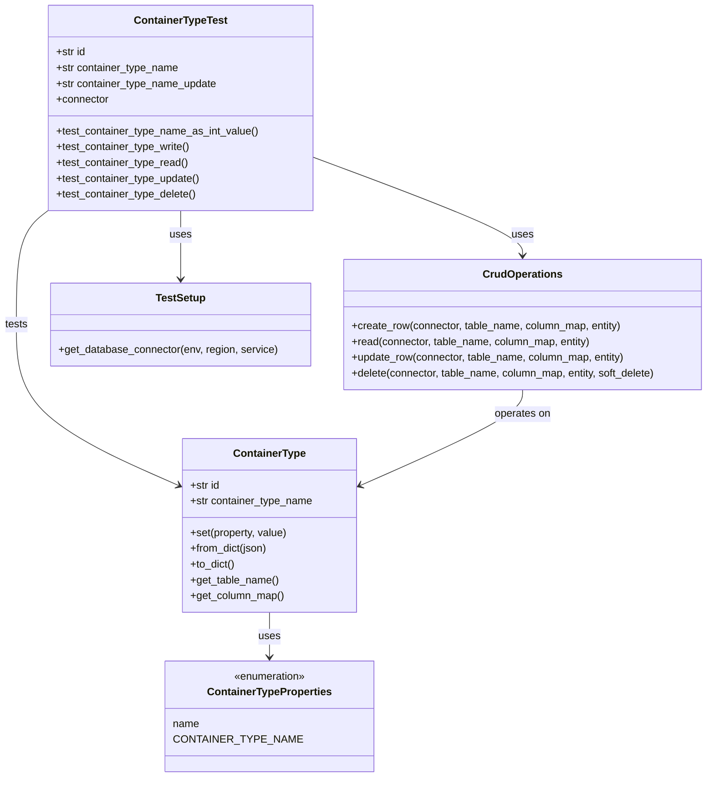
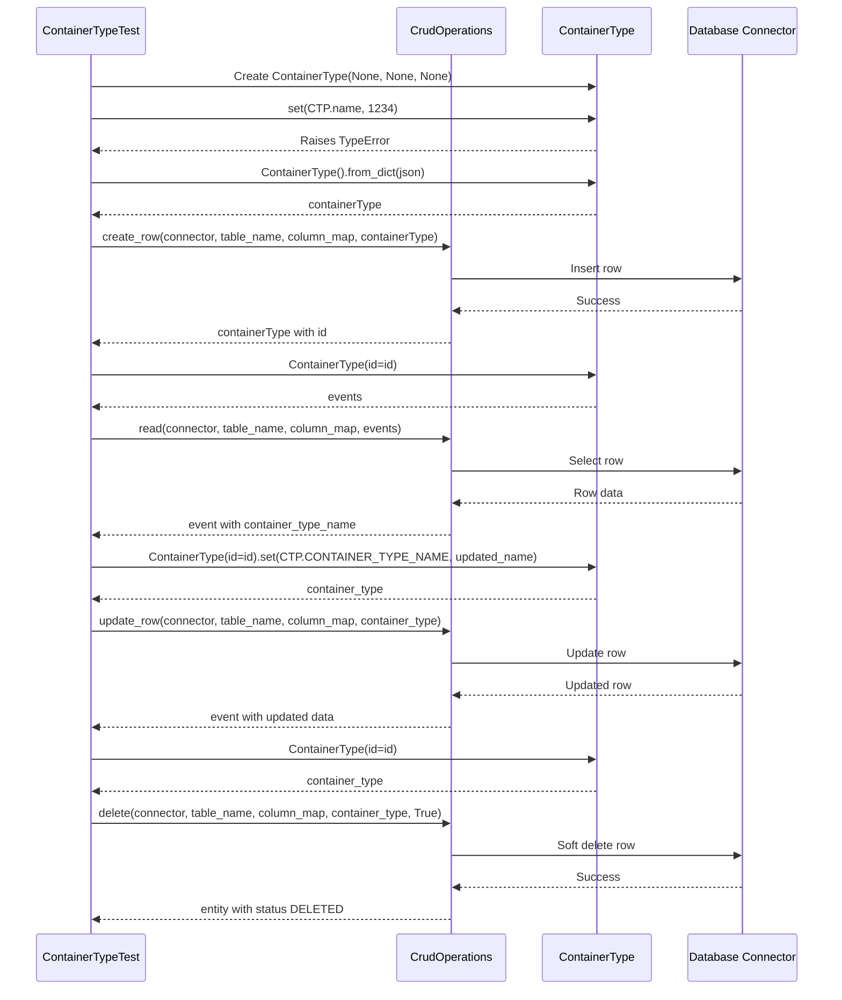
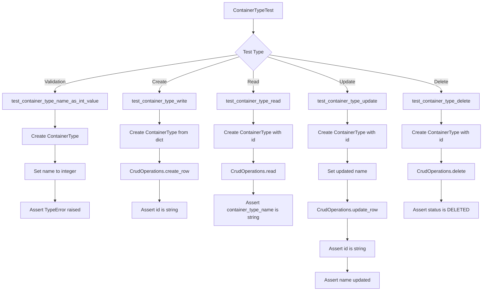

# Diagram: platform/partview_core/partview_service/partview_service/tests/unit/core/datamodel/container_type_test.py

> Auto-generated by Obscura crawlers

## Diagram 1

### SVG

<svg id="container" width="1083.2578125" xmlns="http://www.w3.org/2000/svg" class="classDiagram" height="1180" viewBox="0 0 1083.2578125 1180" role="graphics-document document" aria-roledescription="class"><g><defs><marker id="container_class-aggregationStart" class="marker aggregation class" refX="18" refY="7" markerWidth="190" markerHeight="240" orient="auto"><path d="M 18,7 L9,13 L1,7 L9,1 Z"></path></marker></defs><defs><marker id="container_class-aggregationEnd" class="marker aggregation class" refX="1" refY="7" markerWidth="20" markerHeight="28" orient="auto"><path d="M 18,7 L9,13 L1,7 L9,1 Z"></path></marker></defs><defs><marker id="container_class-extensionStart" class="marker extension class" refX="18" refY="7" markerWidth="190" markerHeight="240" orient="auto"><path d="M 1,7 L18,13 V 1 Z"></path></marker></defs><defs><marker id="container_class-extensionEnd" class="marker extension class" refX="1" refY="7" markerWidth="20" markerHeight="28" orient="auto"><path d="M 1,1 V 13 L18,7 Z"></path></marker></defs><defs><marker id="container_class-compositionStart" class="marker composition class" refX="18" refY="7" markerWidth="190" markerHeight="240" orient="auto"><path d="M 18,7 L9,13 L1,7 L9,1 Z"></path></marker></defs><defs><marker id="container_class-compositionEnd" class="marker composition class" refX="1" refY="7" markerWidth="20" markerHeight="28" orient="auto"><path d="M 18,7 L9,13 L1,7 L9,1 Z"></path></marker></defs><defs><marker id="container_class-dependencyStart" class="marker dependency class" refX="6" refY="7" markerWidth="190" markerHeight="240" orient="auto"><path d="M 5,7 L9,13 L1,7 L9,1 Z"></path></marker></defs><defs><marker id="container_class-dependencyEnd" class="marker dependency class" refX="13" refY="7" markerWidth="20" markerHeight="28" orient="auto"><path d="M 18,7 L9,13 L14,7 L9,1 Z"></path></marker></defs><defs><marker id="container_class-lollipopStart" class="marker lollipop class" refX="13" refY="7" markerWidth="190" markerHeight="240" orient="auto"><circle stroke="black" fill="transparent" cx="7" cy="7" r="6"></circle></marker></defs><defs><marker id="container_class-lollipopEnd" class="marker lollipop class" refX="1" refY="7" markerWidth="190" markerHeight="240" orient="auto"><circle stroke="black" fill="transparent" cx="7" cy="7" r="6"></circle></marker></defs><g class="root"><g class="clusters"></g><g class="edgePaths"><path d="M75.344,318.513L67.035,324.928C58.727,331.342,42.109,344.171,33.801,373.252C25.492,402.333,25.492,447.667,25.492,493C25.492,538.333,25.492,583.667,66.977,624.458C108.462,665.25,191.432,701.5,232.917,719.624L274.402,737.749" id="id_ContainerTypeTest_ContainerType_1" class="edge-thickness-normal edge-pattern-solid relation" style=";;;" data-edge="true" data-et="edge" data-id="id_ContainerTypeTest_ContainerType_1" data-points="W3sieCI6NzUuMzQzNzUsInkiOjMxOC41MTMzOTEwNDM0NzAxfSx7IngiOjI1LjQ5MjE4NzUsInkiOjM1N30seyJ4IjoyNS40OTIxODc1LCJ5Ijo0OTN9LHsieCI6MjUuNDkyMTg3NSwieSI6NjI5fSx7IngiOjI3OS45MDAzOTA2MjUsInkiOjc0MC4xNTE0NDczNjkwODU0fV0=" marker-end="url(#container_class-dependencyEnd)"></path><path d="M475.625,237.767L529.541,257.639C583.457,277.511,691.289,317.256,745.205,342.295C799.121,367.333,799.121,377.667,799.121,382.833L799.121,388" id="id_ContainerTypeTest_CrudOperations_2" class="edge-thickness-normal edge-pattern-solid relation" style=";;;" data-edge="true" data-et="edge" data-id="id_ContainerTypeTest_CrudOperations_2" data-points="W3sieCI6NDc1LjYyNSwieSI6MjM3Ljc2NzA1ODgwNTk3NjgzfSx7IngiOjc5OS4xMjEwOTM3NSwieSI6MzU3fSx7IngiOjc5OS4xMjEwOTM3NSwieSI6Mzk0fV0=" marker-end="url(#container_class-dependencyEnd)"></path><path d="M275.484,320L275.484,326.167C275.484,332.333,275.484,344.667,275.484,362C275.484,379.333,275.484,401.667,275.484,412.833L275.484,424" id="id_ContainerTypeTest_TestSetup_3" class="edge-thickness-normal edge-pattern-solid relation" style=";;;" data-edge="true" data-et="edge" data-id="id_ContainerTypeTest_TestSetup_3" data-points="W3sieCI6Mjc1LjQ4NDM3NSwieSI6MzIwfSx7IngiOjI3NS40ODQzNzUsInkiOjM1N30seyJ4IjoyNzUuNDg0Mzc1LCJ5Ijo0MzB9XQ==" marker-end="url(#container_class-dependencyEnd)"></path><path d="M412.307,930L412.307,936.167C412.307,942.333,412.307,954.667,412.307,966C412.307,977.333,412.307,987.667,412.307,992.833L412.307,998" id="id_ContainerType_ContainerTypeProperties_4" class="edge-thickness-normal edge-pattern-solid relation" style=";;;" data-edge="true" data-et="edge" data-id="id_ContainerType_ContainerTypeProperties_4" data-points="W3sieCI6NDEyLjMwNjY0MDYyNSwieSI6OTMwfSx7IngiOjQxMi4zMDY2NDA2MjUsInkiOjk2N30seyJ4Ijo0MTIuMzA2NjQwNjI1LCJ5IjoxMDA0fV0=" marker-end="url(#container_class-dependencyEnd)"></path><path d="M799.121,592L799.121,598.167C799.121,604.333,799.121,616.667,757.636,640.958C716.151,665.25,633.181,701.5,591.696,719.624L550.211,737.749" id="id_CrudOperations_ContainerType_5" class="edge-thickness-normal edge-pattern-solid relation" style=";;;" data-edge="true" data-et="edge" data-id="id_CrudOperations_ContainerType_5" data-points="W3sieCI6Nzk5LjEyMTA5Mzc1LCJ5Ijo1OTJ9LHsieCI6Nzk5LjEyMTA5Mzc1LCJ5Ijo2Mjl9LHsieCI6NTQ0LjcxMjg5MDYyNSwieSI6NzQwLjE1MTQ0NzM2OTA4NTR9XQ==" marker-end="url(#container_class-dependencyEnd)"></path></g><g class="edgeLabels"><g class="edgeLabel" transform="translate(25.4921875, 493)"><g class="label" data-id="id_ContainerTypeTest_ContainerType_1" transform="translate(-17.4921875, -12)"><foreignObject width="34.984375" height="24">

tests

</foreignObject></g></g><g class="edgeLabel" transform="translate(799.12109375, 357)"><g class="label" data-id="id_ContainerTypeTest_CrudOperations_2" transform="translate(-16.4921875, -12)"><foreignObject width="32.984375" height="24">

uses

</foreignObject></g></g><g class="edgeLabel" transform="translate(275.484375, 357)"><g class="label" data-id="id_ContainerTypeTest_TestSetup_3" transform="translate(-16.4921875, -12)"><foreignObject width="32.984375" height="24">

uses

</foreignObject></g></g><g class="edgeLabel" transform="translate(412.306640625, 967)"><g class="label" data-id="id_ContainerType_ContainerTypeProperties_4" transform="translate(-16.4921875, -12)"><foreignObject width="32.984375" height="24">

uses

</foreignObject></g></g><g class="edgeLabel" transform="translate(799.12109375, 629)"><g class="label" data-id="id_CrudOperations_ContainerType_5" transform="translate(-43.2890625, -12)"><foreignObject width="86.578125" height="24">

operates on

</foreignObject></g></g></g><g class="nodes"><g class="node default" id="classId-ContainerTypeTest-0" transform="translate(275.484375, 164)"><g class="basic label-container"><path d="M-200.140625 -156 L200.140625 -156 L200.140625 156 L-200.140625 156" stroke="none" stroke-width="0" fill="#ECECFF" style=""></path><path d="M-200.140625 -156 C-70.8506404368795 -156, 58.439344126241 -156, 200.140625 -156 M-200.140625 -156 C-56.92053799550823 -156, 86.29954900898355 -156, 200.140625 -156 M200.140625 -156 C200.140625 -56.25481729851903, 200.140625 43.49036540296194, 200.140625 156 M200.140625 -156 C200.140625 -83.73175547183641, 200.140625 -11.463510943672816, 200.140625 156 M200.140625 156 C100.08927842475157 156, 0.03793184950313844 156, -200.140625 156 M200.140625 156 C73.06790312698456 156, -54.00481874603088 156, -200.140625 156 M-200.140625 156 C-200.140625 38.56441061801448, -200.140625 -78.87117876397105, -200.140625 -156 M-200.140625 156 C-200.140625 65.97149506381467, -200.140625 -24.057009872370656, -200.140625 -156" stroke="#9370DB" stroke-width="1.3" fill="none" stroke-dasharray="0 0" style=""></path></g><g class="annotation-group text" transform="translate(0, -132)"></g><g class="label-group text" transform="translate(-68.1875, -132)"><g class="label" style="font-weight: bolder" transform="translate(0,-12)"><foreignObject width="136.375" height="24">

ContainerTypeTest

</foreignObject></g></g><g class="members-group text" transform="translate(-188.140625, -84)"><g class="label" style="" transform="translate(0,-12)"><foreignObject width="45.734375" height="24">

+str id

</foreignObject></g><g class="label" style="" transform="translate(0,12)"><foreignObject width="187.875" height="24">

+str container_type_name

</foreignObject></g><g class="label" style="" transform="translate(0,36)"><foreignObject width="246.90625" height="24">

+str container_type_name_update

</foreignObject></g><g class="label" style="" transform="translate(0,60)"><foreignObject width="80.84375" height="24">

+connector

</foreignObject></g></g><g class="methods-group text" transform="translate(-188.140625, 36)"><g class="label" style="" transform="translate(0,-12)"><foreignObject width="308.09375" height="24">

+test_container_type_name_as_int_value()

</foreignObject></g><g class="label" style="" transform="translate(0,12)"><foreignObject width="205.59375" height="24">

+test_container_type_write()

</foreignObject></g><g class="label" style="" transform="translate(0,36)"><foreignObject width="202.03125" height="24">

+test_container_type_read()

</foreignObject></g><g class="label" style="" transform="translate(0,60)"><foreignObject width="220.515625" height="24">

+test_container_type_update()

</foreignObject></g><g class="label" style="" transform="translate(0,84)"><foreignObject width="215.046875" height="24">

+test_container_type_delete()

</foreignObject></g></g><g class="divider" style=""><path d="M-200.140625 -108 C-98.81923555076604 -108, 2.502153898467924 -108, 200.140625 -108 M-200.140625 -108 C-100.40820959691267 -108, -0.6757941938253396 -108, 200.140625 -108" stroke="#9370DB" stroke-width="1.3" fill="none" stroke-dasharray="0 0" style=""></path></g><g class="divider" style=""><path d="M-200.140625 12 C-76.17183417002114 12, 47.796956659957715 12, 200.140625 12 M-200.140625 12 C-112.05347715767468 12, -23.966329315349356 12, 200.140625 12" stroke="#9370DB" stroke-width="1.3" fill="none" stroke-dasharray="0 0" style=""></path></g></g><g class="node default" id="classId-ContainerType-1" transform="translate(412.306640625, 798)"><g class="basic label-container"><path d="M-132.40625 -132 L132.40625 -132 L132.40625 132 L-132.40625 132" stroke="none" stroke-width="0" fill="#ECECFF" style=""></path><path d="M-132.40625 -132 C-44.17707509518654 -132, 44.052099809626924 -132, 132.40625 -132 M-132.40625 -132 C-64.82550437557613 -132, 2.7552412488477387 -132, 132.40625 -132 M132.40625 -132 C132.40625 -33.532276583291164, 132.40625 64.93544683341767, 132.40625 132 M132.40625 -132 C132.40625 -48.65011372556279, 132.40625 34.69977254887442, 132.40625 132 M132.40625 132 C34.8961987938096 132, -62.613852412380794 132, -132.40625 132 M132.40625 132 C52.97850661500661 132, -26.449236769986783 132, -132.40625 132 M-132.40625 132 C-132.40625 33.519730229697345, -132.40625 -64.96053954060531, -132.40625 -132 M-132.40625 132 C-132.40625 42.03528339250309, -132.40625 -47.92943321499382, -132.40625 -132" stroke="#9370DB" stroke-width="1.3" fill="none" stroke-dasharray="0 0" style=""></path></g><g class="annotation-group text" transform="translate(0, -108)"></g><g class="label-group text" transform="translate(-52.9375, -108)"><g class="label" style="font-weight: bolder" transform="translate(0,-12)"><foreignObject width="105.875" height="24">

ContainerType

</foreignObject></g></g><g class="members-group text" transform="translate(-120.40625, -60)"><g class="label" style="" transform="translate(0,-12)"><foreignObject width="45.734375" height="24">

+str id

</foreignObject></g><g class="label" style="" transform="translate(0,12)"><foreignObject width="187.875" height="24">

+str container_type_name

</foreignObject></g></g><g class="methods-group text" transform="translate(-120.40625, 12)"><g class="label" style="" transform="translate(0,-12)"><foreignObject width="149.15625" height="24">

+set(property, value)

</foreignObject></g><g class="label" style="" transform="translate(0,12)"><foreignObject width="118.984375" height="24">

+from_dict(json)

</foreignObject></g><g class="label" style="" transform="translate(0,36)"><foreignObject width="68.34375" height="24">

+to_dict()

</foreignObject></g><g class="label" style="" transform="translate(0,60)"><foreignObject width="134.625" height="24">

+get_table_name()

</foreignObject></g><g class="label" style="" transform="translate(0,84)"><foreignObject width="142.921875" height="24">

+get_column_map()

</foreignObject></g></g><g class="divider" style=""><path d="M-132.40625 -84 C-40.61353261349667 -84, 51.179184773006654 -84, 132.40625 -84 M-132.40625 -84 C-61.97390025635923 -84, 8.458449487281541 -84, 132.40625 -84" stroke="#9370DB" stroke-width="1.3" fill="none" stroke-dasharray="0 0" style=""></path></g><g class="divider" style=""><path d="M-132.40625 -12 C-64.52860851103924 -12, 3.3490329779215244 -12, 132.40625 -12 M-132.40625 -12 C-33.7270237974617 -12, 64.9522024050766 -12, 132.40625 -12" stroke="#9370DB" stroke-width="1.3" fill="none" stroke-dasharray="0 0" style=""></path></g></g><g class="node default" id="classId-CrudOperations-2" transform="translate(799.12109375, 493)"><g class="basic label-container"><path d="M-276.13671875 -99 L276.13671875 -99 L276.13671875 99 L-276.13671875 99" stroke="none" stroke-width="0" fill="#ECECFF" style=""></path><path d="M-276.13671875 -99 C-133.48853114933004 -99, 9.159656451339913 -99, 276.13671875 -99 M-276.13671875 -99 C-89.61940634855952 -99, 96.89790605288096 -99, 276.13671875 -99 M276.13671875 -99 C276.13671875 -39.692047880960324, 276.13671875 19.615904238079352, 276.13671875 99 M276.13671875 -99 C276.13671875 -32.84529896648699, 276.13671875 33.309402067026014, 276.13671875 99 M276.13671875 99 C61.37559795593165 99, -153.3855228381367 99, -276.13671875 99 M276.13671875 99 C137.46871938331134 99, -1.1992799833773233 99, -276.13671875 99 M-276.13671875 99 C-276.13671875 22.827344609660273, -276.13671875 -53.345310780679455, -276.13671875 -99 M-276.13671875 99 C-276.13671875 22.17653355207591, -276.13671875 -54.64693289584818, -276.13671875 -99" stroke="#9370DB" stroke-width="1.3" fill="none" stroke-dasharray="0 0" style=""></path></g><g class="annotation-group text" transform="translate(0, -75)"></g><g class="label-group text" transform="translate(-57.6171875, -75)"><g class="label" style="font-weight: bolder" transform="translate(0,-12)"><foreignObject width="115.234375" height="24">

CrudOperations

</foreignObject></g></g><g class="members-group text" transform="translate(-264.13671875, -27)"></g><g class="methods-group text" transform="translate(-264.13671875, 3)"><g class="label" style="" transform="translate(0,-12)"><foreignObject width="414.890625" height="24">

+create_row(connector, table_name, column_map, entity)

</foreignObject></g><g class="label" style="" transform="translate(0,12)"><foreignObject width="368.046875" height="24">

+read(connector, table_name, column_map, entity)

</foreignObject></g><g class="label" style="" transform="translate(0,36)"><foreignObject width="421.375" height="24">

+update_row(connector, table_name, column_map, entity)

</foreignObject></g><g class="label" style="" transform="translate(0,60)"><foreignObject width="470.65625" height="24">

+delete(connector, table_name, column_map, entity, soft_delete)

</foreignObject></g></g><g class="divider" style=""><path d="M-276.13671875 -51 C-73.7763299253402 -51, 128.5840588993196 -51, 276.13671875 -51 M-276.13671875 -51 C-67.75295373505205 -51, 140.6308112798959 -51, 276.13671875 -51" stroke="#9370DB" stroke-width="1.3" fill="none" stroke-dasharray="0 0" style=""></path></g><g class="divider" style=""><path d="M-276.13671875 -27 C-117.11633034619456 -27, 41.90405805761088 -27, 276.13671875 -27 M-276.13671875 -27 C-155.9407853932384 -27, -35.7448520364768 -27, 276.13671875 -27" stroke="#9370DB" stroke-width="1.3" fill="none" stroke-dasharray="0 0" style=""></path></g></g><g class="node default" id="classId-ContainerTypeProperties-3" transform="translate(412.306640625, 1088)"><g class="basic label-container"><path d="M-144.14453125 -84 L144.14453125 -84 L144.14453125 84 L-144.14453125 84" stroke="none" stroke-width="0" fill="#ECECFF" style=""></path><path d="M-144.14453125 -84 C-55.27985965299753 -84, 33.58481194400494 -84, 144.14453125 -84 M-144.14453125 -84 C-86.4058886210629 -84, -28.667245992125785 -84, 144.14453125 -84 M144.14453125 -84 C144.14453125 -45.26884818340213, 144.14453125 -6.537696366804255, 144.14453125 84 M144.14453125 -84 C144.14453125 -25.16897126461707, 144.14453125 33.66205747076586, 144.14453125 84 M144.14453125 84 C65.6848061108863 84, -12.774919028227401 84, -144.14453125 84 M144.14453125 84 C78.48140233828197 84, 12.818273426563934 84, -144.14453125 84 M-144.14453125 84 C-144.14453125 46.03653745302651, -144.14453125 8.073074906053023, -144.14453125 -84 M-144.14453125 84 C-144.14453125 18.453179363369884, -144.14453125 -47.09364127326023, -144.14453125 -84" stroke="#9370DB" stroke-width="1.3" fill="none" stroke-dasharray="0 0" style=""></path></g><g class="annotation-group text" transform="translate(-55.5546875, -60)"><g class="label" style="" transform="translate(0,-12)"><foreignObject width="111.109375" height="24">

«enumeration»

</foreignObject></g></g><g class="label-group text" transform="translate(-91.2421875, -36)"><g class="label" style="font-weight: bolder" transform="translate(0,-12)"><foreignObject width="182.484375" height="24">

ContainerTypeProperties

</foreignObject></g></g><g class="members-group text" transform="translate(-132.14453125, 12)"><g class="label" style="" transform="translate(0,-12)"><foreignObject width="40.515625" height="24">

name

</foreignObject></g><g class="label" style="" transform="translate(0,12)"><foreignObject width="173.046875" height="24">

CONTAINER_TYPE_NAME

</foreignObject></g></g><g class="methods-group text" transform="translate(-132.14453125, 84)"></g><g class="divider" style=""><path d="M-144.14453125 -12 C-56.500948980637915 -12, 31.14263328872417 -12, 144.14453125 -12 M-144.14453125 -12 C-59.343893235227625 -12, 25.45674477954475 -12, 144.14453125 -12" stroke="#9370DB" stroke-width="1.3" fill="none" stroke-dasharray="0 0" style=""></path></g><g class="divider" style=""><path d="M-144.14453125 60 C-61.15697748754705 60, 21.830576274905894 60, 144.14453125 60 M-144.14453125 60 C-69.06537798445348 60, 6.0137752810930465 60, 144.14453125 60" stroke="#9370DB" stroke-width="1.3" fill="none" stroke-dasharray="0 0" style=""></path></g></g><g class="node default" id="classId-TestSetup-4" transform="translate(275.484375, 493)"><g class="basic label-container"><path d="M-197.5 -63 L197.5 -63 L197.5 63 L-197.5 63" stroke="none" stroke-width="0" fill="#ECECFF" style=""></path><path d="M-197.5 -63 C-71.37576618428105 -63, 54.748467631437904 -63, 197.5 -63 M-197.5 -63 C-83.72180443116973 -63, 30.05639113766054 -63, 197.5 -63 M197.5 -63 C197.5 -20.164284845358416, 197.5 22.671430309283167, 197.5 63 M197.5 -63 C197.5 -22.552335569376098, 197.5 17.895328861247805, 197.5 63 M197.5 63 C63.54105628623657 63, -70.41788742752686 63, -197.5 63 M197.5 63 C43.853596106943655 63, -109.79280778611269 63, -197.5 63 M-197.5 63 C-197.5 26.921569907621347, -197.5 -9.156860184757306, -197.5 -63 M-197.5 63 C-197.5 35.77252751204911, -197.5 8.545055024098225, -197.5 -63" stroke="#9370DB" stroke-width="1.3" fill="none" stroke-dasharray="0 0" style=""></path></g><g class="annotation-group text" transform="translate(0, -39)"></g><g class="label-group text" transform="translate(-36.6875, -39)"><g class="label" style="font-weight: bolder" transform="translate(0,-12)"><foreignObject width="73.375" height="24">

TestSetup

</foreignObject></g></g><g class="members-group text" transform="translate(-185.5, 9)"></g><g class="methods-group text" transform="translate(-185.5, 39)"><g class="label" style="" transform="translate(0,-12)"><foreignObject width="334.3125" height="24">

+get_database_connector(env, region, service)

</foreignObject></g></g><g class="divider" style=""><path d="M-197.5 -15 C-96.4040601277191 -15, 4.691879744561788 -15, 197.5 -15 M-197.5 -15 C-115.91005645521864 -15, -34.320112910437274 -15, 197.5 -15" stroke="#9370DB" stroke-width="1.3" fill="none" stroke-dasharray="0 0" style=""></path></g><g class="divider" style=""><path d="M-197.5 9 C-84.27006438707868 9, 28.959871225842647 9, 197.5 9 M-197.5 9 C-89.37924440399324 9, 18.74151119201352 9, 197.5 9" stroke="#9370DB" stroke-width="1.3" fill="none" stroke-dasharray="0 0" style=""></path></g></g></g></g></g></svg>

## Diagram 2

### SVG

<svg id="container" width="1218" xmlns="http://www.w3.org/2000/svg" height="1467" viewBox="-50 -10 1218 1467" role="graphics-document document" aria-roledescription="sequence"><g><rect x="951" y="1381" fill="#eaeaea" stroke="#666" width="167" height="65" name="DB" rx="3" ry="3" class="actor actor-bottom"></rect><text x="1034.5" y="1413.5" dominant-baseline="central" alignment-baseline="central" class="actor actor-box" style="text-anchor: middle; font-size: 16px; font-weight: 400;"><tspan x="1034.5" dy="0">Database Connector</tspan></text></g><g><rect x="751" y="1381" fill="#eaeaea" stroke="#666" width="150" height="65" name="CT" rx="3" ry="3" class="actor actor-bottom"></rect><text x="826" y="1413.5" dominant-baseline="central" alignment-baseline="central" class="actor actor-box" style="text-anchor: middle; font-size: 16px; font-weight: 400;"><tspan x="826" dy="0">ContainerType</tspan></text></g><g><rect x="551" y="1381" fill="#eaeaea" stroke="#666" width="150" height="65" name="CRUD" rx="3" ry="3" class="actor actor-bottom"></rect><text x="626" y="1413.5" dominant-baseline="central" alignment-baseline="central" class="actor actor-box" style="text-anchor: middle; font-size: 16px; font-weight: 400;"><tspan x="626" dy="0">CrudOperations</tspan></text></g><g><rect x="0" y="1381" fill="#eaeaea" stroke="#666" width="154" height="65" name="Test" rx="3" ry="3" class="actor actor-bottom"></rect><text x="77" y="1413.5" dominant-baseline="central" alignment-baseline="central" class="actor actor-box" style="text-anchor: middle; font-size: 16px; font-weight: 400;"><tspan x="77" dy="0">ContainerTypeTest</tspan></text></g><g><line id="actor3" x1="1034.5" y1="65" x2="1034.5" y2="1381" class="actor-line 200" stroke-width="0.5px" stroke="#999" name="DB"></line><g id="root-3"><rect x="951" y="0" fill="#eaeaea" stroke="#666" width="167" height="65" name="DB" rx="3" ry="3" class="actor actor-top"></rect><text x="1034.5" y="32.5" dominant-baseline="central" alignment-baseline="central" class="actor actor-box" style="text-anchor: middle; font-size: 16px; font-weight: 400;"><tspan x="1034.5" dy="0">Database Connector</tspan></text></g></g><g><line id="actor2" x1="826" y1="65" x2="826" y2="1381" class="actor-line 200" stroke-width="0.5px" stroke="#999" name="CT"></line><g id="root-2"><rect x="751" y="0" fill="#eaeaea" stroke="#666" width="150" height="65" name="CT" rx="3" ry="3" class="actor actor-top"></rect><text x="826" y="32.5" dominant-baseline="central" alignment-baseline="central" class="actor actor-box" style="text-anchor: middle; font-size: 16px; font-weight: 400;"><tspan x="826" dy="0">ContainerType</tspan></text></g></g><g><line id="actor1" x1="626" y1="65" x2="626" y2="1381" class="actor-line 200" stroke-width="0.5px" stroke="#999" name="CRUD"></line><g id="root-1"><rect x="551" y="0" fill="#eaeaea" stroke="#666" width="150" height="65" name="CRUD" rx="3" ry="3" class="actor actor-top"></rect><text x="626" y="32.5" dominant-baseline="central" alignment-baseline="central" class="actor actor-box" style="text-anchor: middle; font-size: 16px; font-weight: 400;"><tspan x="626" dy="0">CrudOperations</tspan></text></g></g><g><line id="actor0" x1="77" y1="65" x2="77" y2="1381" class="actor-line 200" stroke-width="0.5px" stroke="#999" name="Test"></line><g id="root-0"><rect x="0" y="0" fill="#eaeaea" stroke="#666" width="154" height="65" name="Test" rx="3" ry="3" class="actor actor-top"></rect><text x="77" y="32.5" dominant-baseline="central" alignment-baseline="central" class="actor actor-box" style="text-anchor: middle; font-size: 16px; font-weight: 400;"><tspan x="77" dy="0">ContainerTypeTest</tspan></text></g></g><g></g><defs><symbol id="computer" width="24" height="24"><path transform="scale(.5)" d="M2 2v13h20v-13h-20zm18 11h-16v-9h16v9zm-10.228 6l.466-1h3.524l.467 1h-4.457zm14.228 3h-24l2-6h2.104l-1.33 4h18.45l-1.297-4h2.073l2 6zm-5-10h-14v-7h14v7z"></path></symbol></defs><defs><symbol id="database" fill-rule="evenodd" clip-rule="evenodd"><path transform="scale(.5)" d="M12.258.001l.256.004.255.005.253.008.251.01.249.012.247.015.246.016.242.019.241.02.239.023.236.024.233.027.231.028.229.031.225.032.223.034.22.036.217.038.214.04.211.041.208.043.205.045.201.046.198.048.194.05.191.051.187.053.183.054.18.056.175.057.172.059.168.06.163.061.16.063.155.064.15.066.074.033.073.033.071.034.07.034.069.035.068.035.067.035.066.035.064.036.064.036.062.036.06.036.06.037.058.037.058.037.055.038.055.038.053.038.052.038.051.039.05.039.048.039.047.039.045.04.044.04.043.04.041.04.04.041.039.041.037.041.036.041.034.041.033.042.032.042.03.042.029.042.027.042.026.043.024.043.023.043.021.043.02.043.018.044.017.043.015.044.013.044.012.044.011.045.009.044.007.045.006.045.004.045.002.045.001.045v17l-.001.045-.002.045-.004.045-.006.045-.007.045-.009.044-.011.045-.012.044-.013.044-.015.044-.017.043-.018.044-.02.043-.021.043-.023.043-.024.043-.026.043-.027.042-.029.042-.03.042-.032.042-.033.042-.034.041-.036.041-.037.041-.039.041-.04.041-.041.04-.043.04-.044.04-.045.04-.047.039-.048.039-.05.039-.051.039-.052.038-.053.038-.055.038-.055.038-.058.037-.058.037-.06.037-.06.036-.062.036-.064.036-.064.036-.066.035-.067.035-.068.035-.069.035-.07.034-.071.034-.073.033-.074.033-.15.066-.155.064-.16.063-.163.061-.168.06-.172.059-.175.057-.18.056-.183.054-.187.053-.191.051-.194.05-.198.048-.201.046-.205.045-.208.043-.211.041-.214.04-.217.038-.22.036-.223.034-.225.032-.229.031-.231.028-.233.027-.236.024-.239.023-.241.02-.242.019-.246.016-.247.015-.249.012-.251.01-.253.008-.255.005-.256.004-.258.001-.258-.001-.256-.004-.255-.005-.253-.008-.251-.01-.249-.012-.247-.015-.245-.016-.243-.019-.241-.02-.238-.023-.236-.024-.234-.027-.231-.028-.228-.031-.226-.032-.223-.034-.22-.036-.217-.038-.214-.04-.211-.041-.208-.043-.204-.045-.201-.046-.198-.048-.195-.05-.19-.051-.187-.053-.184-.054-.179-.056-.176-.057-.172-.059-.167-.06-.164-.061-.159-.063-.155-.064-.151-.066-.074-.033-.072-.033-.072-.034-.07-.034-.069-.035-.068-.035-.067-.035-.066-.035-.064-.036-.063-.036-.062-.036-.061-.036-.06-.037-.058-.037-.057-.037-.056-.038-.055-.038-.053-.038-.052-.038-.051-.039-.049-.039-.049-.039-.046-.039-.046-.04-.044-.04-.043-.04-.041-.04-.04-.041-.039-.041-.037-.041-.036-.041-.034-.041-.033-.042-.032-.042-.03-.042-.029-.042-.027-.042-.026-.043-.024-.043-.023-.043-.021-.043-.02-.043-.018-.044-.017-.043-.015-.044-.013-.044-.012-.044-.011-.045-.009-.044-.007-.045-.006-.045-.004-.045-.002-.045-.001-.045v-17l.001-.045.002-.045.004-.045.006-.045.007-.045.009-.044.011-.045.012-.044.013-.044.015-.044.017-.043.018-.044.02-.043.021-.043.023-.043.024-.043.026-.043.027-.042.029-.042.03-.042.032-.042.033-.042.034-.041.036-.041.037-.041.039-.041.04-.041.041-.04.043-.04.044-.04.046-.04.046-.039.049-.039.049-.039.051-.039.052-.038.053-.038.055-.038.056-.038.057-.037.058-.037.06-.037.061-.036.062-.036.063-.036.064-.036.066-.035.067-.035.068-.035.069-.035.07-.034.072-.034.072-.033.074-.033.151-.066.155-.064.159-.063.164-.061.167-.06.172-.059.176-.057.179-.056.184-.054.187-.053.19-.051.195-.05.198-.048.201-.046.204-.045.208-.043.211-.041.214-.04.217-.038.22-.036.223-.034.226-.032.228-.031.231-.028.234-.027.236-.024.238-.023.241-.02.243-.019.245-.016.247-.015.249-.012.251-.01.253-.008.255-.005.256-.004.258-.001.258.001zm-9.258 20.499v.01l.001.021.003.021.004.022.005.021.006.022.007.022.009.023.01.022.011.023.012.023.013.023.015.023.016.024.017.023.018.024.019.024.021.024.022.025.023.024.024.025.052.049.056.05.061.051.066.051.07.051.075.051.079.052.084.052.088.052.092.052.097.052.102.051.105.052.11.052.114.051.119.051.123.051.127.05.131.05.135.05.139.048.144.049.147.047.152.047.155.047.16.045.163.045.167.043.171.043.176.041.178.041.183.039.187.039.19.037.194.035.197.035.202.033.204.031.209.03.212.029.216.027.219.025.222.024.226.021.23.02.233.018.236.016.24.015.243.012.246.01.249.008.253.005.256.004.259.001.26-.001.257-.004.254-.005.25-.008.247-.011.244-.012.241-.014.237-.016.233-.018.231-.021.226-.021.224-.024.22-.026.216-.027.212-.028.21-.031.205-.031.202-.034.198-.034.194-.036.191-.037.187-.039.183-.04.179-.04.175-.042.172-.043.168-.044.163-.045.16-.046.155-.046.152-.047.148-.048.143-.049.139-.049.136-.05.131-.05.126-.05.123-.051.118-.052.114-.051.11-.052.106-.052.101-.052.096-.052.092-.052.088-.053.083-.051.079-.052.074-.052.07-.051.065-.051.06-.051.056-.05.051-.05.023-.024.023-.025.021-.024.02-.024.019-.024.018-.024.017-.024.015-.023.014-.024.013-.023.012-.023.01-.023.01-.022.008-.022.006-.022.006-.022.004-.022.004-.021.001-.021.001-.021v-4.127l-.077.055-.08.053-.083.054-.085.053-.087.052-.09.052-.093.051-.095.05-.097.05-.1.049-.102.049-.105.048-.106.047-.109.047-.111.046-.114.045-.115.045-.118.044-.12.043-.122.042-.124.042-.126.041-.128.04-.13.04-.132.038-.134.038-.135.037-.138.037-.139.035-.142.035-.143.034-.144.033-.147.032-.148.031-.15.03-.151.03-.153.029-.154.027-.156.027-.158.026-.159.025-.161.024-.162.023-.163.022-.165.021-.166.02-.167.019-.169.018-.169.017-.171.016-.173.015-.173.014-.175.013-.175.012-.177.011-.178.01-.179.008-.179.008-.181.006-.182.005-.182.004-.184.003-.184.002h-.37l-.184-.002-.184-.003-.182-.004-.182-.005-.181-.006-.179-.008-.179-.008-.178-.01-.176-.011-.176-.012-.175-.013-.173-.014-.172-.015-.171-.016-.17-.017-.169-.018-.167-.019-.166-.02-.165-.021-.163-.022-.162-.023-.161-.024-.159-.025-.157-.026-.156-.027-.155-.027-.153-.029-.151-.03-.15-.03-.148-.031-.146-.032-.145-.033-.143-.034-.141-.035-.14-.035-.137-.037-.136-.037-.134-.038-.132-.038-.13-.04-.128-.04-.126-.041-.124-.042-.122-.042-.12-.044-.117-.043-.116-.045-.113-.045-.112-.046-.109-.047-.106-.047-.105-.048-.102-.049-.1-.049-.097-.05-.095-.05-.093-.052-.09-.051-.087-.052-.085-.053-.083-.054-.08-.054-.077-.054v4.127zm0-5.654v.011l.001.021.003.021.004.021.005.022.006.022.007.022.009.022.01.022.011.023.012.023.013.023.015.024.016.023.017.024.018.024.019.024.021.024.022.024.023.025.024.024.052.05.056.05.061.05.066.051.07.051.075.052.079.051.084.052.088.052.092.052.097.052.102.052.105.052.11.051.114.051.119.052.123.05.127.051.131.05.135.049.139.049.144.048.147.048.152.047.155.046.16.045.163.045.167.044.171.042.176.042.178.04.183.04.187.038.19.037.194.036.197.034.202.033.204.032.209.03.212.028.216.027.219.025.222.024.226.022.23.02.233.018.236.016.24.014.243.012.246.01.249.008.253.006.256.003.259.001.26-.001.257-.003.254-.006.25-.008.247-.01.244-.012.241-.015.237-.016.233-.018.231-.02.226-.022.224-.024.22-.025.216-.027.212-.029.21-.03.205-.032.202-.033.198-.035.194-.036.191-.037.187-.039.183-.039.179-.041.175-.042.172-.043.168-.044.163-.045.16-.045.155-.047.152-.047.148-.048.143-.048.139-.05.136-.049.131-.05.126-.051.123-.051.118-.051.114-.052.11-.052.106-.052.101-.052.096-.052.092-.052.088-.052.083-.052.079-.052.074-.051.07-.052.065-.051.06-.05.056-.051.051-.049.023-.025.023-.024.021-.025.02-.024.019-.024.018-.024.017-.024.015-.023.014-.023.013-.024.012-.022.01-.023.01-.023.008-.022.006-.022.006-.022.004-.021.004-.022.001-.021.001-.021v-4.139l-.077.054-.08.054-.083.054-.085.052-.087.053-.09.051-.093.051-.095.051-.097.05-.1.049-.102.049-.105.048-.106.047-.109.047-.111.046-.114.045-.115.044-.118.044-.12.044-.122.042-.124.042-.126.041-.128.04-.13.039-.132.039-.134.038-.135.037-.138.036-.139.036-.142.035-.143.033-.144.033-.147.033-.148.031-.15.03-.151.03-.153.028-.154.028-.156.027-.158.026-.159.025-.161.024-.162.023-.163.022-.165.021-.166.02-.167.019-.169.018-.169.017-.171.016-.173.015-.173.014-.175.013-.175.012-.177.011-.178.009-.179.009-.179.007-.181.007-.182.005-.182.004-.184.003-.184.002h-.37l-.184-.002-.184-.003-.182-.004-.182-.005-.181-.007-.179-.007-.179-.009-.178-.009-.176-.011-.176-.012-.175-.013-.173-.014-.172-.015-.171-.016-.17-.017-.169-.018-.167-.019-.166-.02-.165-.021-.163-.022-.162-.023-.161-.024-.159-.025-.157-.026-.156-.027-.155-.028-.153-.028-.151-.03-.15-.03-.148-.031-.146-.033-.145-.033-.143-.033-.141-.035-.14-.036-.137-.036-.136-.037-.134-.038-.132-.039-.13-.039-.128-.04-.126-.041-.124-.042-.122-.043-.12-.043-.117-.044-.116-.044-.113-.046-.112-.046-.109-.046-.106-.047-.105-.048-.102-.049-.1-.049-.097-.05-.095-.051-.093-.051-.09-.051-.087-.053-.085-.052-.083-.054-.08-.054-.077-.054v4.139zm0-5.666v.011l.001.02.003.022.004.021.005.022.006.021.007.022.009.023.01.022.011.023.012.023.013.023.015.023.016.024.017.024.018.023.019.024.021.025.022.024.023.024.024.025.052.05.056.05.061.05.066.051.07.051.075.052.079.051.084.052.088.052.092.052.097.052.102.052.105.051.11.052.114.051.119.051.123.051.127.05.131.05.135.05.139.049.144.048.147.048.152.047.155.046.16.045.163.045.167.043.171.043.176.042.178.04.183.04.187.038.19.037.194.036.197.034.202.033.204.032.209.03.212.028.216.027.219.025.222.024.226.021.23.02.233.018.236.017.24.014.243.012.246.01.249.008.253.006.256.003.259.001.26-.001.257-.003.254-.006.25-.008.247-.01.244-.013.241-.014.237-.016.233-.018.231-.02.226-.022.224-.024.22-.025.216-.027.212-.029.21-.03.205-.032.202-.033.198-.035.194-.036.191-.037.187-.039.183-.039.179-.041.175-.042.172-.043.168-.044.163-.045.16-.045.155-.047.152-.047.148-.048.143-.049.139-.049.136-.049.131-.051.126-.05.123-.051.118-.052.114-.051.11-.052.106-.052.101-.052.096-.052.092-.052.088-.052.083-.052.079-.052.074-.052.07-.051.065-.051.06-.051.056-.05.051-.049.023-.025.023-.025.021-.024.02-.024.019-.024.018-.024.017-.024.015-.023.014-.024.013-.023.012-.023.01-.022.01-.023.008-.022.006-.022.006-.022.004-.022.004-.021.001-.021.001-.021v-4.153l-.077.054-.08.054-.083.053-.085.053-.087.053-.09.051-.093.051-.095.051-.097.05-.1.049-.102.048-.105.048-.106.048-.109.046-.111.046-.114.046-.115.044-.118.044-.12.043-.122.043-.124.042-.126.041-.128.04-.13.039-.132.039-.134.038-.135.037-.138.036-.139.036-.142.034-.143.034-.144.033-.147.032-.148.032-.15.03-.151.03-.153.028-.154.028-.156.027-.158.026-.159.024-.161.024-.162.023-.163.023-.165.021-.166.02-.167.019-.169.018-.169.017-.171.016-.173.015-.173.014-.175.013-.175.012-.177.01-.178.01-.179.009-.179.007-.181.006-.182.006-.182.004-.184.003-.184.001-.185.001-.185-.001-.184-.001-.184-.003-.182-.004-.182-.006-.181-.006-.179-.007-.179-.009-.178-.01-.176-.01-.176-.012-.175-.013-.173-.014-.172-.015-.171-.016-.17-.017-.169-.018-.167-.019-.166-.02-.165-.021-.163-.023-.162-.023-.161-.024-.159-.024-.157-.026-.156-.027-.155-.028-.153-.028-.151-.03-.15-.03-.148-.032-.146-.032-.145-.033-.143-.034-.141-.034-.14-.036-.137-.036-.136-.037-.134-.038-.132-.039-.13-.039-.128-.041-.126-.041-.124-.041-.122-.043-.12-.043-.117-.044-.116-.044-.113-.046-.112-.046-.109-.046-.106-.048-.105-.048-.102-.048-.1-.05-.097-.049-.095-.051-.093-.051-.09-.052-.087-.052-.085-.053-.083-.053-.08-.054-.077-.054v4.153zm8.74-8.179l-.257.004-.254.005-.25.008-.247.011-.244.012-.241.014-.237.016-.233.018-.231.021-.226.022-.224.023-.22.026-.216.027-.212.028-.21.031-.205.032-.202.033-.198.034-.194.036-.191.038-.187.038-.183.04-.179.041-.175.042-.172.043-.168.043-.163.045-.16.046-.155.046-.152.048-.148.048-.143.048-.139.049-.136.05-.131.05-.126.051-.123.051-.118.051-.114.052-.11.052-.106.052-.101.052-.096.052-.092.052-.088.052-.083.052-.079.052-.074.051-.07.052-.065.051-.06.05-.056.05-.051.05-.023.025-.023.024-.021.024-.02.025-.019.024-.018.024-.017.023-.015.024-.014.023-.013.023-.012.023-.01.023-.01.022-.008.022-.006.023-.006.021-.004.022-.004.021-.001.021-.001.021.001.021.001.021.004.021.004.022.006.021.006.023.008.022.01.022.01.023.012.023.013.023.014.023.015.024.017.023.018.024.019.024.02.025.021.024.023.024.023.025.051.05.056.05.06.05.065.051.07.052.074.051.079.052.083.052.088.052.092.052.096.052.101.052.106.052.11.052.114.052.118.051.123.051.126.051.131.05.136.05.139.049.143.048.148.048.152.048.155.046.16.046.163.045.168.043.172.043.175.042.179.041.183.04.187.038.191.038.194.036.198.034.202.033.205.032.21.031.212.028.216.027.22.026.224.023.226.022.231.021.233.018.237.016.241.014.244.012.247.011.25.008.254.005.257.004.26.001.26-.001.257-.004.254-.005.25-.008.247-.011.244-.012.241-.014.237-.016.233-.018.231-.021.226-.022.224-.023.22-.026.216-.027.212-.028.21-.031.205-.032.202-.033.198-.034.194-.036.191-.038.187-.038.183-.04.179-.041.175-.042.172-.043.168-.043.163-.045.16-.046.155-.046.152-.048.148-.048.143-.048.139-.049.136-.05.131-.05.126-.051.123-.051.118-.051.114-.052.11-.052.106-.052.101-.052.096-.052.092-.052.088-.052.083-.052.079-.052.074-.051.07-.052.065-.051.06-.05.056-.05.051-.05.023-.025.023-.024.021-.024.02-.025.019-.024.018-.024.017-.023.015-.024.014-.023.013-.023.012-.023.01-.023.01-.022.008-.022.006-.023.006-.021.004-.022.004-.021.001-.021.001-.021-.001-.021-.001-.021-.004-.021-.004-.022-.006-.021-.006-.023-.008-.022-.01-.022-.01-.023-.012-.023-.013-.023-.014-.023-.015-.024-.017-.023-.018-.024-.019-.024-.02-.025-.021-.024-.023-.024-.023-.025-.051-.05-.056-.05-.06-.05-.065-.051-.07-.052-.074-.051-.079-.052-.083-.052-.088-.052-.092-.052-.096-.052-.101-.052-.106-.052-.11-.052-.114-.052-.118-.051-.123-.051-.126-.051-.131-.05-.136-.05-.139-.049-.143-.048-.148-.048-.152-.048-.155-.046-.16-.046-.163-.045-.168-.043-.172-.043-.175-.042-.179-.041-.183-.04-.187-.038-.191-.038-.194-.036-.198-.034-.202-.033-.205-.032-.21-.031-.212-.028-.216-.027-.22-.026-.224-.023-.226-.022-.231-.021-.233-.018-.237-.016-.241-.014-.244-.012-.247-.011-.25-.008-.254-.005-.257-.004-.26-.001-.26.001z"></path></symbol></defs><defs><symbol id="clock" width="24" height="24"><path transform="scale(.5)" d="M12 2c5.514 0 10 4.486 10 10s-4.486 10-10 10-10-4.486-10-10 4.486-10 10-10zm0-2c-6.627 0-12 5.373-12 12s5.373 12 12 12 12-5.373 12-12-5.373-12-12-12zm5.848 12.459c.202.038.202.333.001.372-1.907.361-6.045 1.111-6.547 1.111-.719 0-1.301-.582-1.301-1.301 0-.512.77-5.447 1.125-7.445.034-.192.312-.181.343.014l.985 6.238 5.394 1.011z"></path></symbol></defs><defs><marker id="arrowhead" refX="7.9" refY="5" markerUnits="userSpaceOnUse" markerWidth="12" markerHeight="12" orient="auto-start-reverse"><path d="M -1 0 L 10 5 L 0 10 z"></path></marker></defs><defs><marker id="crosshead" markerWidth="15" markerHeight="8" orient="auto" refX="4" refY="4.5"><path fill="none" stroke="#000000" stroke-width="1pt" d="M 1,2 L 6,7 M 6,2 L 1,7" style="stroke-dasharray: 0, 0;"></path></marker></defs><defs><marker id="filled-head" refX="15.5" refY="7" markerWidth="20" markerHeight="28" orient="auto"><path d="M 18,7 L9,13 L14,7 L9,1 Z"></path></marker></defs><defs><marker id="sequencenumber" refX="15" refY="15" markerWidth="60" markerHeight="40" orient="auto"><circle cx="15" cy="15" r="6"></circle></marker></defs><text x="450" y="80" text-anchor="middle" dominant-baseline="middle" alignment-baseline="middle" class="messageText" dy="1em" style="font-size: 16px; font-weight: 400;">Create ContainerType(None, None, None)</text><line x1="78" y1="113" x2="822" y2="113" class="messageLine0" stroke-width="2" stroke="none" marker-end="url(#arrowhead)" style="fill: none;"></line><text x="450" y="128" text-anchor="middle" dominant-baseline="middle" alignment-baseline="middle" class="messageText" dy="1em" style="font-size: 16px; font-weight: 400;">set(CTP.name, 1234)</text><line x1="78" y1="161" x2="822" y2="161" class="messageLine0" stroke-width="2" stroke="none" marker-end="url(#arrowhead)" style="fill: none;"></line><text x="453" y="176" text-anchor="middle" dominant-baseline="middle" alignment-baseline="middle" class="messageText" dy="1em" style="font-size: 16px; font-weight: 400;">Raises TypeError</text><line x1="825" y1="209" x2="81" y2="209" class="messageLine1" stroke-width="2" stroke="none" marker-end="url(#arrowhead)" style="stroke-dasharray: 3, 3; fill: none;"></line><text x="450" y="224" text-anchor="middle" dominant-baseline="middle" alignment-baseline="middle" class="messageText" dy="1em" style="font-size: 16px; font-weight: 400;">ContainerType().from_dict(json)</text><line x1="78" y1="257" x2="822" y2="257" class="messageLine0" stroke-width="2" stroke="none" marker-end="url(#arrowhead)" style="fill: none;"></line><text x="453" y="272" text-anchor="middle" dominant-baseline="middle" alignment-baseline="middle" class="messageText" dy="1em" style="font-size: 16px; font-weight: 400;">containerType</text><line x1="825" y1="305" x2="81" y2="305" class="messageLine1" stroke-width="2" stroke="none" marker-end="url(#arrowhead)" style="stroke-dasharray: 3, 3; fill: none;"></line><text x="350" y="320" text-anchor="middle" dominant-baseline="middle" alignment-baseline="middle" class="messageText" dy="1em" style="font-size: 16px; font-weight: 400;">create_row(connector, table_name, column_map, containerType)</text><line x1="78" y1="353" x2="622" y2="353" class="messageLine0" stroke-width="2" stroke="none" marker-end="url(#arrowhead)" style="fill: none;"></line><text x="829" y="368" text-anchor="middle" dominant-baseline="middle" alignment-baseline="middle" class="messageText" dy="1em" style="font-size: 16px; font-weight: 400;">Insert row</text><line x1="627" y1="401" x2="1030.5" y2="401" class="messageLine0" stroke-width="2" stroke="none" marker-end="url(#arrowhead)" style="fill: none;"></line><text x="832" y="416" text-anchor="middle" dominant-baseline="middle" alignment-baseline="middle" class="messageText" dy="1em" style="font-size: 16px; font-weight: 400;">Success</text><line x1="1033.5" y1="449" x2="630" y2="449" class="messageLine1" stroke-width="2" stroke="none" marker-end="url(#arrowhead)" style="stroke-dasharray: 3, 3; fill: none;"></line><text x="353" y="464" text-anchor="middle" dominant-baseline="middle" alignment-baseline="middle" class="messageText" dy="1em" style="font-size: 16px; font-weight: 400;">containerType with id</text><line x1="625" y1="497" x2="81" y2="497" class="messageLine1" stroke-width="2" stroke="none" marker-end="url(#arrowhead)" style="stroke-dasharray: 3, 3; fill: none;"></line><text x="450" y="512" text-anchor="middle" dominant-baseline="middle" alignment-baseline="middle" class="messageText" dy="1em" style="font-size: 16px; font-weight: 400;">ContainerType(id=id)</text><line x1="78" y1="545" x2="822" y2="545" class="messageLine0" stroke-width="2" stroke="none" marker-end="url(#arrowhead)" style="fill: none;"></line><text x="453" y="560" text-anchor="middle" dominant-baseline="middle" alignment-baseline="middle" class="messageText" dy="1em" style="font-size: 16px; font-weight: 400;">events</text><line x1="825" y1="593" x2="81" y2="593" class="messageLine1" stroke-width="2" stroke="none" marker-end="url(#arrowhead)" style="stroke-dasharray: 3, 3; fill: none;"></line><text x="350" y="608" text-anchor="middle" dominant-baseline="middle" alignment-baseline="middle" class="messageText" dy="1em" style="font-size: 16px; font-weight: 400;">read(connector, table_name, column_map, events)</text><line x1="78" y1="641" x2="622" y2="641" class="messageLine0" stroke-width="2" stroke="none" marker-end="url(#arrowhead)" style="fill: none;"></line><text x="829" y="656" text-anchor="middle" dominant-baseline="middle" alignment-baseline="middle" class="messageText" dy="1em" style="font-size: 16px; font-weight: 400;">Select row</text><line x1="627" y1="689" x2="1030.5" y2="689" class="messageLine0" stroke-width="2" stroke="none" marker-end="url(#arrowhead)" style="fill: none;"></line><text x="832" y="704" text-anchor="middle" dominant-baseline="middle" alignment-baseline="middle" class="messageText" dy="1em" style="font-size: 16px; font-weight: 400;">Row data</text><line x1="1033.5" y1="737" x2="630" y2="737" class="messageLine1" stroke-width="2" stroke="none" marker-end="url(#arrowhead)" style="stroke-dasharray: 3, 3; fill: none;"></line><text x="353" y="752" text-anchor="middle" dominant-baseline="middle" alignment-baseline="middle" class="messageText" dy="1em" style="font-size: 16px; font-weight: 400;">event with container_type_name</text><line x1="625" y1="785" x2="81" y2="785" class="messageLine1" stroke-width="2" stroke="none" marker-end="url(#arrowhead)" style="stroke-dasharray: 3, 3; fill: none;"></line><text x="450" y="800" text-anchor="middle" dominant-baseline="middle" alignment-baseline="middle" class="messageText" dy="1em" style="font-size: 16px; font-weight: 400;">ContainerType(id=id).set(CTP.CONTAINER_TYPE_NAME, updated_name)</text><line x1="78" y1="833" x2="822" y2="833" class="messageLine0" stroke-width="2" stroke="none" marker-end="url(#arrowhead)" style="fill: none;"></line><text x="453" y="848" text-anchor="middle" dominant-baseline="middle" alignment-baseline="middle" class="messageText" dy="1em" style="font-size: 16px; font-weight: 400;">container_type</text><line x1="825" y1="881" x2="81" y2="881" class="messageLine1" stroke-width="2" stroke="none" marker-end="url(#arrowhead)" style="stroke-dasharray: 3, 3; fill: none;"></line><text x="350" y="896" text-anchor="middle" dominant-baseline="middle" alignment-baseline="middle" class="messageText" dy="1em" style="font-size: 16px; font-weight: 400;">update_row(connector, table_name, column_map, container_type)</text><line x1="78" y1="929" x2="622" y2="929" class="messageLine0" stroke-width="2" stroke="none" marker-end="url(#arrowhead)" style="fill: none;"></line><text x="829" y="944" text-anchor="middle" dominant-baseline="middle" alignment-baseline="middle" class="messageText" dy="1em" style="font-size: 16px; font-weight: 400;">Update row</text><line x1="627" y1="977" x2="1030.5" y2="977" class="messageLine0" stroke-width="2" stroke="none" marker-end="url(#arrowhead)" style="fill: none;"></line><text x="832" y="992" text-anchor="middle" dominant-baseline="middle" alignment-baseline="middle" class="messageText" dy="1em" style="font-size: 16px; font-weight: 400;">Updated row</text><line x1="1033.5" y1="1025" x2="630" y2="1025" class="messageLine1" stroke-width="2" stroke="none" marker-end="url(#arrowhead)" style="stroke-dasharray: 3, 3; fill: none;"></line><text x="353" y="1040" text-anchor="middle" dominant-baseline="middle" alignment-baseline="middle" class="messageText" dy="1em" style="font-size: 16px; font-weight: 400;">event with updated data</text><line x1="625" y1="1073" x2="81" y2="1073" class="messageLine1" stroke-width="2" stroke="none" marker-end="url(#arrowhead)" style="stroke-dasharray: 3, 3; fill: none;"></line><text x="450" y="1088" text-anchor="middle" dominant-baseline="middle" alignment-baseline="middle" class="messageText" dy="1em" style="font-size: 16px; font-weight: 400;">ContainerType(id=id)</text><line x1="78" y1="1121" x2="822" y2="1121" class="messageLine0" stroke-width="2" stroke="none" marker-end="url(#arrowhead)" style="fill: none;"></line><text x="453" y="1136" text-anchor="middle" dominant-baseline="middle" alignment-baseline="middle" class="messageText" dy="1em" style="font-size: 16px; font-weight: 400;">container_type</text><line x1="825" y1="1169" x2="81" y2="1169" class="messageLine1" stroke-width="2" stroke="none" marker-end="url(#arrowhead)" style="stroke-dasharray: 3, 3; fill: none;"></line><text x="350" y="1184" text-anchor="middle" dominant-baseline="middle" alignment-baseline="middle" class="messageText" dy="1em" style="font-size: 16px; font-weight: 400;">delete(connector, table_name, column_map, container_type, True)</text><line x1="78" y1="1217" x2="622" y2="1217" class="messageLine0" stroke-width="2" stroke="none" marker-end="url(#arrowhead)" style="fill: none;"></line><text x="829" y="1232" text-anchor="middle" dominant-baseline="middle" alignment-baseline="middle" class="messageText" dy="1em" style="font-size: 16px; font-weight: 400;">Soft delete row</text><line x1="627" y1="1265" x2="1030.5" y2="1265" class="messageLine0" stroke-width="2" stroke="none" marker-end="url(#arrowhead)" style="fill: none;"></line><text x="832" y="1280" text-anchor="middle" dominant-baseline="middle" alignment-baseline="middle" class="messageText" dy="1em" style="font-size: 16px; font-weight: 400;">Success</text><line x1="1033.5" y1="1313" x2="630" y2="1313" class="messageLine1" stroke-width="2" stroke="none" marker-end="url(#arrowhead)" style="stroke-dasharray: 3, 3; fill: none;"></line><text x="353" y="1328" text-anchor="middle" dominant-baseline="middle" alignment-baseline="middle" class="messageText" dy="1em" style="font-size: 16px; font-weight: 400;">entity with status DELETED</text><line x1="625" y1="1361" x2="81" y2="1361" class="messageLine1" stroke-width="2" stroke="none" marker-end="url(#arrowhead)" style="stroke-dasharray: 3, 3; fill: none;"></line></svg>

## Diagram 3

### SVG

<svg id="container" width="1601.1796875" xmlns="http://www.w3.org/2000/svg" class="flowchart" height="961.328125" viewBox="0 0 1601.1796875 961.328125" role="graphics-document document" aria-roledescription="flowchart-v2"><g><marker id="container_flowchart-v2-pointEnd" class="marker flowchart-v2" viewBox="0 0 10 10" refX="5" refY="5" markerUnits="userSpaceOnUse" markerWidth="8" markerHeight="8" orient="auto"><path d="M 0 0 L 10 5 L 0 10 z" class="arrowMarkerPath" style="stroke-width: 1; stroke-dasharray: 1, 0;"></path></marker><marker id="container_flowchart-v2-pointStart" class="marker flowchart-v2" viewBox="0 0 10 10" refX="4.5" refY="5" markerUnits="userSpaceOnUse" markerWidth="8" markerHeight="8" orient="auto"><path d="M 0 5 L 10 10 L 10 0 z" class="arrowMarkerPath" style="stroke-width: 1; stroke-dasharray: 1, 0;"></path></marker><marker id="container_flowchart-v2-circleEnd" class="marker flowchart-v2" viewBox="0 0 10 10" refX="11" refY="5" markerUnits="userSpaceOnUse" markerWidth="11" markerHeight="11" orient="auto"><circle cx="5" cy="5" r="5" class="arrowMarkerPath" style="stroke-width: 1; stroke-dasharray: 1, 0;"></circle></marker><marker id="container_flowchart-v2-circleStart" class="marker flowchart-v2" viewBox="0 0 10 10" refX="-1" refY="5" markerUnits="userSpaceOnUse" markerWidth="11" markerHeight="11" orient="auto"><circle cx="5" cy="5" r="5" class="arrowMarkerPath" style="stroke-width: 1; stroke-dasharray: 1, 0;"></circle></marker><marker id="container_flowchart-v2-crossEnd" class="marker cross flowchart-v2" viewBox="0 0 11 11" refX="12" refY="5.2" markerUnits="userSpaceOnUse" markerWidth="11" markerHeight="11" orient="auto"><path d="M 1,1 l 9,9 M 10,1 l -9,9" class="arrowMarkerPath" style="stroke-width: 2; stroke-dasharray: 1, 0;"></path></marker><marker id="container_flowchart-v2-crossStart" class="marker cross flowchart-v2" viewBox="0 0 11 11" refX="-1" refY="5.2" markerUnits="userSpaceOnUse" markerWidth="11" markerHeight="11" orient="auto"><path d="M 1,1 l 9,9 M 10,1 l -9,9" class="arrowMarkerPath" style="stroke-width: 2; stroke-dasharray: 1, 0;"></path></marker><g class="root"><g class="clusters"></g><g class="edgePaths"><path d="M841.469,62L841.469,66.167C841.469,70.333,841.469,78.667,841.469,86.333C841.469,94,841.469,101,841.469,104.5L841.469,108" id="L_A_B_0" class="edge-thickness-normal edge-pattern-solid edge-thickness-normal edge-pattern-solid flowchart-link" style=";" data-edge="true" data-et="edge" data-id="L_A_B_0" data-points="W3sieCI6ODQxLjQ2ODc1LCJ5Ijo2Mn0seyJ4Ijo4NDEuNDY4NzUsInkiOjg3fSx7IngiOjg0MS40Njg3NSwieSI6MTEyfV0=" marker-end="url(#container_flowchart-v2-pointEnd)"></path><path d="M788.639,180.499L687.684,195.47C586.728,210.442,384.817,240.385,283.862,260.857C182.906,281.328,182.906,292.328,182.906,297.828L182.906,303.328" id="L_B_C_0" class="edge-thickness-normal edge-pattern-solid edge-thickness-normal edge-pattern-solid flowchart-link" style=";" data-edge="true" data-et="edge" data-id="L_B_C_0" data-points="W3sieCI6Nzg4LjYzOTI0Mjc1ODA0LCJ5IjoxODAuNDk4NjE3NzU4MDR9LHsieCI6MTgyLjkwNjI1LCJ5IjoyNzAuMzI4MTI1fSx7IngiOjE4Mi45MDYyNSwieSI6MzA3LjMyODEyNX1d" marker-end="url(#container_flowchart-v2-pointEnd)"></path><path d="M795.338,187.197L751.36,201.052C707.382,214.908,619.425,242.618,575.447,261.973C531.469,281.328,531.469,292.328,531.469,297.828L531.469,303.328" id="L_B_D_0" class="edge-thickness-normal edge-pattern-solid edge-thickness-normal edge-pattern-solid flowchart-link" style=";" data-edge="true" data-et="edge" data-id="L_B_D_0" data-points="W3sieCI6Nzk1LjMzNzk3NDQzMDM0ODMsInkiOjE4Ny4xOTczNDk0MzAzNDgyfSx7IngiOjUzMS40Njg3NSwieSI6MjcwLjMyODEyNX0seyJ4Ijo1MzEuNDY4NzUsInkiOjMwNy4zMjgxMjV9XQ==" marker-end="url(#container_flowchart-v2-pointEnd)"></path><path d="M841.469,233.328L841.469,239.495C841.469,245.661,841.469,257.995,841.469,269.661C841.469,281.328,841.469,292.328,841.469,297.828L841.469,303.328" id="L_B_E_0" class="edge-thickness-normal edge-pattern-solid edge-thickness-normal edge-pattern-solid flowchart-link" style=";" data-edge="true" data-et="edge" data-id="L_B_E_0" data-points="W3sieCI6ODQxLjQ2ODc1LCJ5IjoyMzMuMzI4MTI1fSx7IngiOjg0MS40Njg3NSwieSI6MjcwLjMyODEyNX0seyJ4Ijo4NDEuNDY4NzUsInkiOjMwNy4zMjgxMjV9XQ==" marker-end="url(#container_flowchart-v2-pointEnd)"></path><path d="M887.66,187.137L931.914,201.002C976.167,214.867,1064.673,242.598,1108.926,261.963C1153.18,281.328,1153.18,292.328,1153.18,297.828L1153.18,303.328" id="L_B_F_0" class="edge-thickness-normal edge-pattern-solid edge-thickness-normal edge-pattern-solid flowchart-link" style=";" data-edge="true" data-et="edge" data-id="L_B_F_0" data-points="W3sieCI6ODg3LjY2MDI2NTgzMzczMDksInkiOjE4Ny4xMzY2MDkxNjYyNjkxfSx7IngiOjExNTMuMTc5Njg3NSwieSI6MjcwLjMyODEyNX0seyJ4IjoxMTUzLjE3OTY4NzUsInkiOjMwNy4zMjgxMjV9XQ==" marker-end="url(#container_flowchart-v2-pointEnd)"></path><path d="M893.897,180.9L988.777,195.805C1083.658,210.709,1273.419,240.519,1368.299,260.923C1463.18,281.328,1463.18,292.328,1463.18,297.828L1463.18,303.328" id="L_B_G_0" class="edge-thickness-normal edge-pattern-solid edge-thickness-normal edge-pattern-solid flowchart-link" style=";" data-edge="true" data-et="edge" data-id="L_B_G_0" data-points="W3sieCI6ODkzLjg5NjkxNDk2MTg1MzgsInkiOjE4MC44OTk5NjAwMzgxNDYyfSx7IngiOjE0NjMuMTc5Njg3NSwieSI6MjcwLjMyODEyNX0seyJ4IjoxNDYzLjE3OTY4NzUsInkiOjMwNy4zMjgxMjV9XQ==" marker-end="url(#container_flowchart-v2-pointEnd)"></path><path d="M182.906,361.328L182.906,365.495C182.906,369.661,182.906,377.995,182.906,387.661C182.906,397.328,182.906,408.328,182.906,413.828L182.906,419.328" id="L_C_C1_0" class="edge-thickness-normal edge-pattern-solid edge-thickness-normal edge-pattern-solid flowchart-link" style=";" data-edge="true" data-et="edge" data-id="L_C_C1_0" data-points="W3sieCI6MTgyLjkwNjI1LCJ5IjozNjEuMzI4MTI1fSx7IngiOjE4Mi45MDYyNSwieSI6Mzg2LjMyODEyNX0seyJ4IjoxODIuOTA2MjUsInkiOjQyMy4zMjgxMjV9XQ==" marker-end="url(#container_flowchart-v2-pointEnd)"></path><path d="M182.906,477.328L182.906,483.495C182.906,489.661,182.906,501.995,182.906,511.661C182.906,521.328,182.906,528.328,182.906,531.828L182.906,535.328" id="L_C1_C2_0" class="edge-thickness-normal edge-pattern-solid edge-thickness-normal edge-pattern-solid flowchart-link" style=";" data-edge="true" data-et="edge" data-id="L_C1_C2_0" data-points="W3sieCI6MTgyLjkwNjI1LCJ5Ijo0NzcuMzI4MTI1fSx7IngiOjE4Mi45MDYyNSwieSI6NTE0LjMyODEyNX0seyJ4IjoxODIuOTA2MjUsInkiOjUzOS4zMjgxMjV9XQ==" marker-end="url(#container_flowchart-v2-pointEnd)"></path><path d="M182.906,593.328L182.906,597.495C182.906,601.661,182.906,609.995,182.906,621.661C182.906,633.328,182.906,648.328,182.906,655.828L182.906,663.328" id="L_C2_C3_0" class="edge-thickness-normal edge-pattern-solid edge-thickness-normal edge-pattern-solid flowchart-link" style=";" data-edge="true" data-et="edge" data-id="L_C2_C3_0" data-points="W3sieCI6MTgyLjkwNjI1LCJ5Ijo1OTMuMzI4MTI1fSx7IngiOjE4Mi45MDYyNSwieSI6NjE4LjMyODEyNX0seyJ4IjoxODIuOTA2MjUsInkiOjY2Ny4zMjgxMjV9XQ==" marker-end="url(#container_flowchart-v2-pointEnd)"></path><path d="M531.469,361.328L531.469,365.495C531.469,369.661,531.469,377.995,531.469,385.661C531.469,393.328,531.469,400.328,531.469,403.828L531.469,407.328" id="L_D_D1_0" class="edge-thickness-normal edge-pattern-solid edge-thickness-normal edge-pattern-solid flowchart-link" style=";" data-edge="true" data-et="edge" data-id="L_D_D1_0" data-points="W3sieCI6NTMxLjQ2ODc1LCJ5IjozNjEuMzI4MTI1fSx7IngiOjUzMS40Njg3NSwieSI6Mzg2LjMyODEyNX0seyJ4Ijo1MzEuNDY4NzUsInkiOjQxMS4zMjgxMjV9XQ==" marker-end="url(#container_flowchart-v2-pointEnd)"></path><path d="M531.469,489.328L531.469,493.495C531.469,497.661,531.469,505.995,531.469,513.661C531.469,521.328,531.469,528.328,531.469,531.828L531.469,535.328" id="L_D1_D2_0" class="edge-thickness-normal edge-pattern-solid edge-thickness-normal edge-pattern-solid flowchart-link" style=";" data-edge="true" data-et="edge" data-id="L_D1_D2_0" data-points="W3sieCI6NTMxLjQ2ODc1LCJ5Ijo0ODkuMzI4MTI1fSx7IngiOjUzMS40Njg3NSwieSI6NTE0LjMyODEyNX0seyJ4Ijo1MzEuNDY4NzUsInkiOjUzOS4zMjgxMjV9XQ==" marker-end="url(#container_flowchart-v2-pointEnd)"></path><path d="M531.469,593.328L531.469,597.495C531.469,601.661,531.469,609.995,531.469,621.661C531.469,633.328,531.469,648.328,531.469,655.828L531.469,663.328" id="L_D2_D3_0" class="edge-thickness-normal edge-pattern-solid edge-thickness-normal edge-pattern-solid flowchart-link" style=";" data-edge="true" data-et="edge" data-id="L_D2_D3_0" data-points="W3sieCI6NTMxLjQ2ODc1LCJ5Ijo1OTMuMzI4MTI1fSx7IngiOjUzMS40Njg3NSwieSI6NjE4LjMyODEyNX0seyJ4Ijo1MzEuNDY4NzUsInkiOjY2Ny4zMjgxMjV9XQ==" marker-end="url(#container_flowchart-v2-pointEnd)"></path><path d="M841.469,361.328L841.469,365.495C841.469,369.661,841.469,377.995,841.469,385.661C841.469,393.328,841.469,400.328,841.469,403.828L841.469,407.328" id="L_E_E1_0" class="edge-thickness-normal edge-pattern-solid edge-thickness-normal edge-pattern-solid flowchart-link" style=";" data-edge="true" data-et="edge" data-id="L_E_E1_0" data-points="W3sieCI6ODQxLjQ2ODc1LCJ5IjozNjEuMzI4MTI1fSx7IngiOjg0MS40Njg3NSwieSI6Mzg2LjMyODEyNX0seyJ4Ijo4NDEuNDY4NzUsInkiOjQxMS4zMjgxMjV9XQ==" marker-end="url(#container_flowchart-v2-pointEnd)"></path><path d="M841.469,489.328L841.469,493.495C841.469,497.661,841.469,505.995,841.469,513.661C841.469,521.328,841.469,528.328,841.469,531.828L841.469,535.328" id="L_E1_E2_0" class="edge-thickness-normal edge-pattern-solid edge-thickness-normal edge-pattern-solid flowchart-link" style=";" data-edge="true" data-et="edge" data-id="L_E1_E2_0" data-points="W3sieCI6ODQxLjQ2ODc1LCJ5Ijo0ODkuMzI4MTI1fSx7IngiOjg0MS40Njg3NSwieSI6NTE0LjMyODEyNX0seyJ4Ijo4NDEuNDY4NzUsInkiOjUzOS4zMjgxMjV9XQ==" marker-end="url(#container_flowchart-v2-pointEnd)"></path><path d="M841.469,593.328L841.469,597.495C841.469,601.661,841.469,609.995,841.469,617.661C841.469,625.328,841.469,632.328,841.469,635.828L841.469,639.328" id="L_E2_E3_0" class="edge-thickness-normal edge-pattern-solid edge-thickness-normal edge-pattern-solid flowchart-link" style=";" data-edge="true" data-et="edge" data-id="L_E2_E3_0" data-points="W3sieCI6ODQxLjQ2ODc1LCJ5Ijo1OTMuMzI4MTI1fSx7IngiOjg0MS40Njg3NSwieSI6NjE4LjMyODEyNX0seyJ4Ijo4NDEuNDY4NzUsInkiOjY0My4zMjgxMjV9XQ==" marker-end="url(#container_flowchart-v2-pointEnd)"></path><path d="M1153.18,361.328L1153.18,365.495C1153.18,369.661,1153.18,377.995,1153.18,385.661C1153.18,393.328,1153.18,400.328,1153.18,403.828L1153.18,407.328" id="L_F_F1_0" class="edge-thickness-normal edge-pattern-solid edge-thickness-normal edge-pattern-solid flowchart-link" style=";" data-edge="true" data-et="edge" data-id="L_F_F1_0" data-points="W3sieCI6MTE1My4xNzk2ODc1LCJ5IjozNjEuMzI4MTI1fSx7IngiOjExNTMuMTc5Njg3NSwieSI6Mzg2LjMyODEyNX0seyJ4IjoxMTUzLjE3OTY4NzUsInkiOjQxMS4zMjgxMjV9XQ==" marker-end="url(#container_flowchart-v2-pointEnd)"></path><path d="M1153.18,489.328L1153.18,493.495C1153.18,497.661,1153.18,505.995,1153.18,513.661C1153.18,521.328,1153.18,528.328,1153.18,531.828L1153.18,535.328" id="L_F1_F2_0" class="edge-thickness-normal edge-pattern-solid edge-thickness-normal edge-pattern-solid flowchart-link" style=";" data-edge="true" data-et="edge" data-id="L_F1_F2_0" data-points="W3sieCI6MTE1My4xNzk2ODc1LCJ5Ijo0ODkuMzI4MTI1fSx7IngiOjExNTMuMTc5Njg3NSwieSI6NTE0LjMyODEyNX0seyJ4IjoxMTUzLjE3OTY4NzUsInkiOjUzOS4zMjgxMjV9XQ==" marker-end="url(#container_flowchart-v2-pointEnd)"></path><path d="M1153.18,593.328L1153.18,597.495C1153.18,601.661,1153.18,609.995,1153.18,621.661C1153.18,633.328,1153.18,648.328,1153.18,655.828L1153.18,663.328" id="L_F2_F3_0" class="edge-thickness-normal edge-pattern-solid edge-thickness-normal edge-pattern-solid flowchart-link" style=";" data-edge="true" data-et="edge" data-id="L_F2_F3_0" data-points="W3sieCI6MTE1My4xNzk2ODc1LCJ5Ijo1OTMuMzI4MTI1fSx7IngiOjExNTMuMTc5Njg3NSwieSI6NjE4LjMyODEyNX0seyJ4IjoxMTUzLjE3OTY4NzUsInkiOjY2Ny4zMjgxMjV9XQ==" marker-end="url(#container_flowchart-v2-pointEnd)"></path><path d="M1153.18,721.328L1153.18,729.495C1153.18,737.661,1153.18,753.995,1153.18,765.661C1153.18,777.328,1153.18,784.328,1153.18,787.828L1153.18,791.328" id="L_F3_F4_0" class="edge-thickness-normal edge-pattern-solid edge-thickness-normal edge-pattern-solid flowchart-link" style=";" data-edge="true" data-et="edge" data-id="L_F3_F4_0" data-points="W3sieCI6MTE1My4xNzk2ODc1LCJ5Ijo3MjEuMzI4MTI1fSx7IngiOjExNTMuMTc5Njg3NSwieSI6NzcwLjMyODEyNX0seyJ4IjoxMTUzLjE3OTY4NzUsInkiOjc5NS4zMjgxMjV9XQ==" marker-end="url(#container_flowchart-v2-pointEnd)"></path><path d="M1153.18,849.328L1153.18,853.495C1153.18,857.661,1153.18,865.995,1153.18,873.661C1153.18,881.328,1153.18,888.328,1153.18,891.828L1153.18,895.328" id="L_F4_F5_0" class="edge-thickness-normal edge-pattern-solid edge-thickness-normal edge-pattern-solid flowchart-link" style=";" data-edge="true" data-et="edge" data-id="L_F4_F5_0" data-points="W3sieCI6MTE1My4xNzk2ODc1LCJ5Ijo4NDkuMzI4MTI1fSx7IngiOjExNTMuMTc5Njg3NSwieSI6ODc0LjMyODEyNX0seyJ4IjoxMTUzLjE3OTY4NzUsInkiOjg5OS4zMjgxMjV9XQ==" marker-end="url(#container_flowchart-v2-pointEnd)"></path><path d="M1463.18,361.328L1463.18,365.495C1463.18,369.661,1463.18,377.995,1463.18,385.661C1463.18,393.328,1463.18,400.328,1463.18,403.828L1463.18,407.328" id="L_G_G1_0" class="edge-thickness-normal edge-pattern-solid edge-thickness-normal edge-pattern-solid flowchart-link" style=";" data-edge="true" data-et="edge" data-id="L_G_G1_0" data-points="W3sieCI6MTQ2My4xNzk2ODc1LCJ5IjozNjEuMzI4MTI1fSx7IngiOjE0NjMuMTc5Njg3NSwieSI6Mzg2LjMyODEyNX0seyJ4IjoxNDYzLjE3OTY4NzUsInkiOjQxMS4zMjgxMjV9XQ==" marker-end="url(#container_flowchart-v2-pointEnd)"></path><path d="M1463.18,489.328L1463.18,493.495C1463.18,497.661,1463.18,505.995,1463.18,513.661C1463.18,521.328,1463.18,528.328,1463.18,531.828L1463.18,535.328" id="L_G1_G2_0" class="edge-thickness-normal edge-pattern-solid edge-thickness-normal edge-pattern-solid flowchart-link" style=";" data-edge="true" data-et="edge" data-id="L_G1_G2_0" data-points="W3sieCI6MTQ2My4xNzk2ODc1LCJ5Ijo0ODkuMzI4MTI1fSx7IngiOjE0NjMuMTc5Njg3NSwieSI6NTE0LjMyODEyNX0seyJ4IjoxNDYzLjE3OTY4NzUsInkiOjUzOS4zMjgxMjV9XQ==" marker-end="url(#container_flowchart-v2-pointEnd)"></path><path d="M1463.18,593.328L1463.18,597.495C1463.18,601.661,1463.18,609.995,1463.18,621.661C1463.18,633.328,1463.18,648.328,1463.18,655.828L1463.18,663.328" id="L_G2_G3_0" class="edge-thickness-normal edge-pattern-solid edge-thickness-normal edge-pattern-solid flowchart-link" style=";" data-edge="true" data-et="edge" data-id="L_G2_G3_0" data-points="W3sieCI6MTQ2My4xNzk2ODc1LCJ5Ijo1OTMuMzI4MTI1fSx7IngiOjE0NjMuMTc5Njg3NSwieSI6NjE4LjMyODEyNX0seyJ4IjoxNDYzLjE3OTY4NzUsInkiOjY2Ny4zMjgxMjV9XQ==" marker-end="url(#container_flowchart-v2-pointEnd)"></path></g><g class="edgeLabels"><g class="edgeLabel"><g class="label" data-id="L_A_B_0" transform="translate(0, 0)"><foreignObject width="0" height="0">

</foreignObject></g></g><g class="edgeLabel" transform="translate(182.90625, 270.328125)"><g class="label" data-id="L_B_C_0" transform="translate(-36.640625, -12)"><foreignObject width="73.28125" height="24">

Validation

</foreignObject></g></g><g class="edgeLabel" transform="translate(531.46875, 270.328125)"><g class="label" data-id="L_B_D_0" transform="translate(-22.96875, -12)"><foreignObject width="45.9375" height="24">

Create

</foreignObject></g></g><g class="edgeLabel" transform="translate(841.46875, 270.328125)"><g class="label" data-id="L_B_E_0" transform="translate(-18.140625, -12)"><foreignObject width="36.28125" height="24">

Read

</foreignObject></g></g><g class="edgeLabel" transform="translate(1153.1796875, 270.328125)"><g class="label" data-id="L_B_F_0" transform="translate(-26.3125, -12)"><foreignObject width="52.625" height="24">

Update

</foreignObject></g></g><g class="edgeLabel" transform="translate(1463.1796875, 270.328125)"><g class="label" data-id="L_B_G_0" transform="translate(-23.3046875, -12)"><foreignObject width="46.609375" height="24">

Delete

</foreignObject></g></g><g class="edgeLabel"><g class="label" data-id="L_C_C1_0" transform="translate(0, 0)"><foreignObject width="0" height="0">

</foreignObject></g></g><g class="edgeLabel"><g class="label" data-id="L_C1_C2_0" transform="translate(0, 0)"><foreignObject width="0" height="0">

</foreignObject></g></g><g class="edgeLabel"><g class="label" data-id="L_C2_C3_0" transform="translate(0, 0)"><foreignObject width="0" height="0">

</foreignObject></g></g><g class="edgeLabel"><g class="label" data-id="L_D_D1_0" transform="translate(0, 0)"><foreignObject width="0" height="0">

</foreignObject></g></g><g class="edgeLabel"><g class="label" data-id="L_D1_D2_0" transform="translate(0, 0)"><foreignObject width="0" height="0">

</foreignObject></g></g><g class="edgeLabel"><g class="label" data-id="L_D2_D3_0" transform="translate(0, 0)"><foreignObject width="0" height="0">

</foreignObject></g></g><g class="edgeLabel"><g class="label" data-id="L_E_E1_0" transform="translate(0, 0)"><foreignObject width="0" height="0">

</foreignObject></g></g><g class="edgeLabel"><g class="label" data-id="L_E1_E2_0" transform="translate(0, 0)"><foreignObject width="0" height="0">

</foreignObject></g></g><g class="edgeLabel"><g class="label" data-id="L_E2_E3_0" transform="translate(0, 0)"><foreignObject width="0" height="0">

</foreignObject></g></g><g class="edgeLabel"><g class="label" data-id="L_F_F1_0" transform="translate(0, 0)"><foreignObject width="0" height="0">

</foreignObject></g></g><g class="edgeLabel"><g class="label" data-id="L_F1_F2_0" transform="translate(0, 0)"><foreignObject width="0" height="0">

</foreignObject></g></g><g class="edgeLabel"><g class="label" data-id="L_F2_F3_0" transform="translate(0, 0)"><foreignObject width="0" height="0">

</foreignObject></g></g><g class="edgeLabel"><g class="label" data-id="L_F3_F4_0" transform="translate(0, 0)"><foreignObject width="0" height="0">

</foreignObject></g></g><g class="edgeLabel"><g class="label" data-id="L_F4_F5_0" transform="translate(0, 0)"><foreignObject width="0" height="0">

</foreignObject></g></g><g class="edgeLabel"><g class="label" data-id="L_G_G1_0" transform="translate(0, 0)"><foreignObject width="0" height="0">

</foreignObject></g></g><g class="edgeLabel"><g class="label" data-id="L_G1_G2_0" transform="translate(0, 0)"><foreignObject width="0" height="0">

</foreignObject></g></g><g class="edgeLabel"><g class="label" data-id="L_G2_G3_0" transform="translate(0, 0)"><foreignObject width="0" height="0">

</foreignObject></g></g></g><g class="nodes"><g class="node default" id="flowchart-A-0" transform="translate(841.46875, 35)"><rect class="basic label-container" style="" x="-96.8046875" y="-27" width="193.609375" height="54"></rect><g class="label" style="" transform="translate(-66.8046875, -12)"><rect></rect><foreignObject width="133.609375" height="24">

ContainerTypeTest

</foreignObject></g></g><g class="node default" id="flowchart-B-1" transform="translate(841.46875, 172.6640625)"><polygon points="60.6640625,0 121.328125,-60.6640625 60.6640625,-121.328125 0,-60.6640625" class="label-container" transform="translate(-60.1640625, 60.6640625)"></polygon><g class="label" style="" transform="translate(-33.6640625, -12)"><rect></rect><foreignObject width="67.328125" height="24">

Test Type

</foreignObject></g></g><g class="node default" id="flowchart-C-3" transform="translate(182.90625, 334.328125)"><rect class="basic label-container" style="" x="-174.90625" y="-27" width="349.8125" height="54"></rect><g class="label" style="" transform="translate(-144.90625, -12)"><rect></rect><foreignObject width="289.8125" height="24">

test_container_type_name_as_int_value

</foreignObject></g></g><g class="node default" id="flowchart-D-5" transform="translate(531.46875, 334.328125)"><rect class="basic label-container" style="" x="-123.65625" y="-27" width="247.3125" height="54"></rect><g class="label" style="" transform="translate(-93.65625, -12)"><rect></rect><foreignObject width="187.3125" height="24">

test_container_type_write

</foreignObject></g></g><g class="node default" id="flowchart-E-7" transform="translate(841.46875, 334.328125)"><rect class="basic label-container" style="" x="-121.875" y="-27" width="243.75" height="54"></rect><g class="label" style="" transform="translate(-91.875, -12)"><rect></rect><foreignObject width="183.75" height="24">

test_container_type_read

</foreignObject></g></g><g class="node default" id="flowchart-F-9" transform="translate(1153.1796875, 334.328125)"><rect class="basic label-container" style="" x="-131.125" y="-27" width="262.25" height="54"></rect><g class="label" style="" transform="translate(-101.125, -12)"><rect></rect><foreignObject width="202.25" height="24">

test_container_type_update

</foreignObject></g></g><g class="node default" id="flowchart-G-11" transform="translate(1463.1796875, 334.328125)"><rect class="basic label-container" style="" x="-128.390625" y="-27" width="256.78125" height="54"></rect><g class="label" style="" transform="translate(-98.390625, -12)"><rect></rect><foreignObject width="196.78125" height="24">

test_container_type_delete

</foreignObject></g></g><g class="node default" id="flowchart-C1-13" transform="translate(182.90625, 450.328125)"><rect class="basic label-container" style="" x="-107.2109375" y="-27" width="214.421875" height="54"></rect><g class="label" style="" transform="translate(-77.2109375, -12)"><rect></rect><foreignObject width="154.421875" height="24">

Create ContainerType

</foreignObject></g></g><g class="node default" id="flowchart-C2-15" transform="translate(182.90625, 566.328125)"><rect class="basic label-container" style="" x="-101.21875" y="-27" width="202.4375" height="54"></rect><g class="label" style="" transform="translate(-71.21875, -12)"><rect></rect><foreignObject width="142.4375" height="24">

Set name to integer

</foreignObject></g></g><g class="node default" id="flowchart-C3-17" transform="translate(182.90625, 694.328125)"><rect class="basic label-container" style="" x="-113.609375" y="-27" width="227.21875" height="54"></rect><g class="label" style="" transform="translate(-83.609375, -12)"><rect></rect><foreignObject width="167.21875" height="24">

Assert TypeError raised

</foreignObject></g></g><g class="node default" id="flowchart-D1-19" transform="translate(531.46875, 450.328125)"><rect class="basic label-container" style="" x="-130" y="-39" width="260" height="78"></rect><g class="label" style="" transform="translate(-100, -24)"><rect></rect><foreignObject width="200" height="48">

Create ContainerType from dict

</foreignObject></g></g><g class="node default" id="flowchart-D2-21" transform="translate(531.46875, 566.328125)"><rect class="basic label-container" style="" x="-128.46875" y="-27" width="256.9375" height="54"></rect><g class="label" style="" transform="translate(-98.46875, -12)"><rect></rect><foreignObject width="196.9375" height="24">

CrudOperations.create_row

</foreignObject></g></g><g class="node default" id="flowchart-D3-23" transform="translate(531.46875, 694.328125)"><rect class="basic label-container" style="" x="-92.5234375" y="-27" width="185.046875" height="54"></rect><g class="label" style="" transform="translate(-62.5234375, -12)"><rect></rect><foreignObject width="125.046875" height="24">

Assert id is string

</foreignObject></g></g><g class="node default" id="flowchart-E1-25" transform="translate(841.46875, 450.328125)"><rect class="basic label-container" style="" x="-130" y="-39" width="260" height="78"></rect><g class="label" style="" transform="translate(-100, -24)"><rect></rect><foreignObject width="200" height="48">

Create ContainerType with id

</foreignObject></g></g><g class="node default" id="flowchart-E2-27" transform="translate(841.46875, 566.328125)"><rect class="basic label-container" style="" x="-105.125" y="-27" width="210.25" height="54"></rect><g class="label" style="" transform="translate(-75.125, -12)"><rect></rect><foreignObject width="150.25" height="24">

CrudOperations.read

</foreignObject></g></g><g class="node default" id="flowchart-E3-29" transform="translate(841.46875, 694.328125)"><rect class="basic label-container" style="" x="-130" y="-51" width="260" height="102"></rect><g class="label" style="" transform="translate(-100, -36)"><rect></rect><foreignObject width="200" height="72">

Assert container_type_name is string

</foreignObject></g></g><g class="node default" id="flowchart-F1-31" transform="translate(1153.1796875, 450.328125)"><rect class="basic label-container" style="" x="-130" y="-39" width="260" height="78"></rect><g class="label" style="" transform="translate(-100, -24)"><rect></rect><foreignObject width="200" height="48">

Create ContainerType with id

</foreignObject></g></g><g class="node default" id="flowchart-F2-33" transform="translate(1153.1796875, 566.328125)"><rect class="basic label-container" style="" x="-96.5625" y="-27" width="193.125" height="54"></rect><g class="label" style="" transform="translate(-66.5625, -12)"><rect></rect><foreignObject width="133.125" height="24">

Set updated name

</foreignObject></g></g><g class="node default" id="flowchart-F3-35" transform="translate(1153.1796875, 694.328125)"><rect class="basic label-container" style="" x="-131.7109375" y="-27" width="263.421875" height="54"></rect><g class="label" style="" transform="translate(-101.7109375, -12)"><rect></rect><foreignObject width="203.421875" height="24">

CrudOperations.update_row

</foreignObject></g></g><g class="node default" id="flowchart-F4-37" transform="translate(1153.1796875, 822.328125)"><rect class="basic label-container" style="" x="-92.5234375" y="-27" width="185.046875" height="54"></rect><g class="label" style="" transform="translate(-62.5234375, -12)"><rect></rect><foreignObject width="125.046875" height="24">

Assert id is string

</foreignObject></g></g><g class="node default" id="flowchart-F5-39" transform="translate(1153.1796875, 926.328125)"><rect class="basic label-container" style="" x="-107.265625" y="-27" width="214.53125" height="54"></rect><g class="label" style="" transform="translate(-77.265625, -12)"><rect></rect><foreignObject width="154.53125" height="24">

Assert name updated

</foreignObject></g></g><g class="node default" id="flowchart-G1-41" transform="translate(1463.1796875, 450.328125)"><rect class="basic label-container" style="" x="-130" y="-39" width="260" height="78"></rect><g class="label" style="" transform="translate(-100, -24)"><rect></rect><foreignObject width="200" height="48">

Create ContainerType with id

</foreignObject></g></g><g class="node default" id="flowchart-G2-43" transform="translate(1463.1796875, 566.328125)"><rect class="basic label-container" style="" x="-111.71875" y="-27" width="223.4375" height="54"></rect><g class="label" style="" transform="translate(-81.71875, -12)"><rect></rect><foreignObject width="163.4375" height="24">

CrudOperations.delete

</foreignObject></g></g><g class="node default" id="flowchart-G3-45" transform="translate(1463.1796875, 694.328125)"><rect class="basic label-container" style="" x="-118.1328125" y="-27" width="236.265625" height="54"></rect><g class="label" style="" transform="translate(-88.1328125, -12)"><rect></rect><foreignObject width="176.265625" height="24">

Assert status is DELETED

</foreignObject></g></g></g></g></g></svg>
