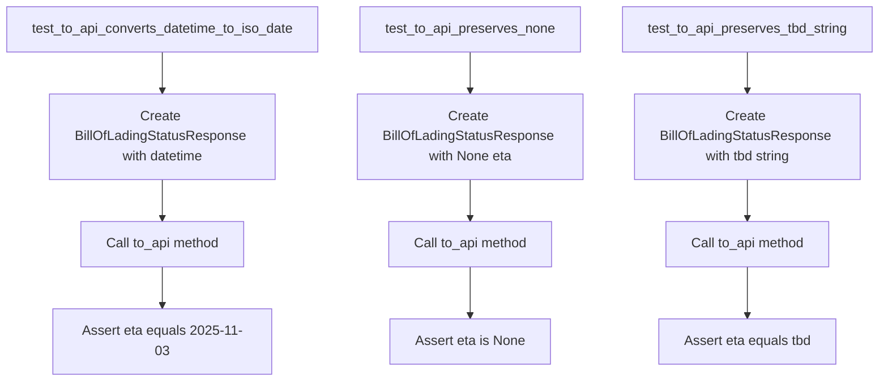
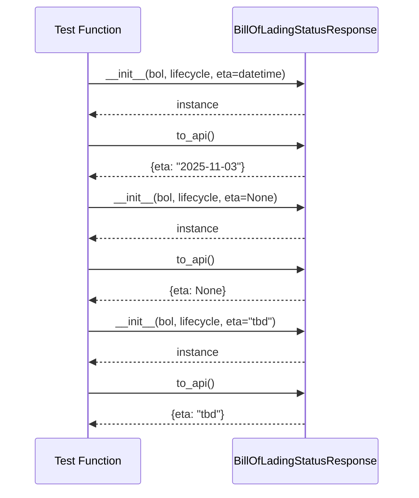
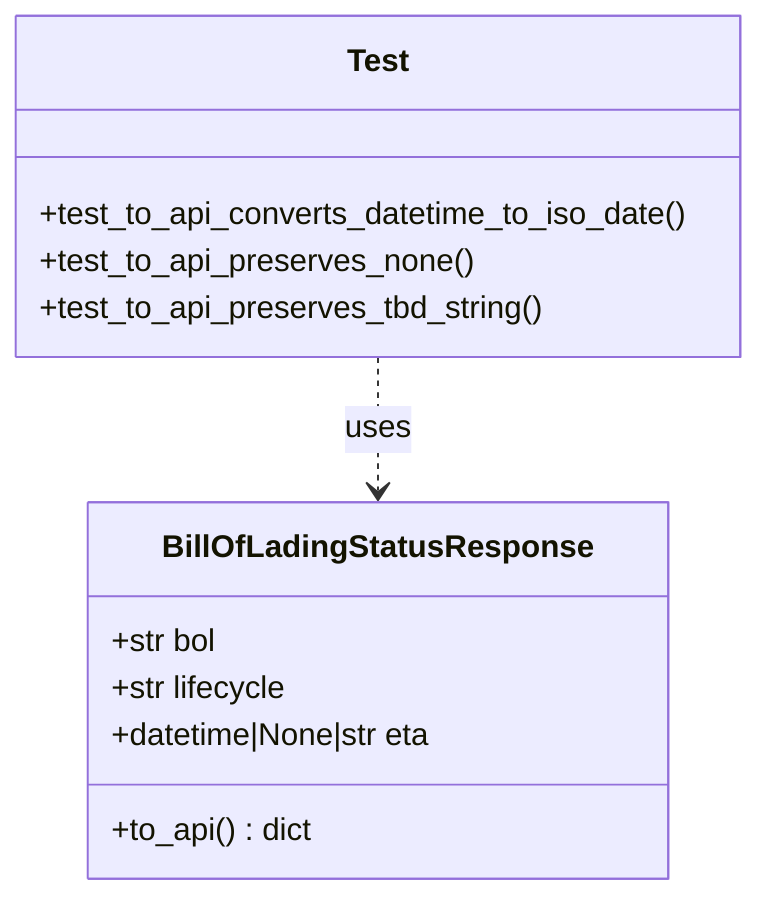
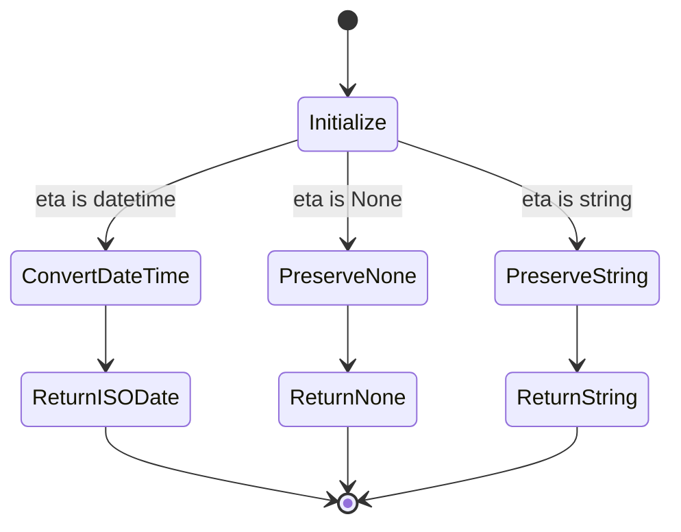

# Diagram: platform/partview_core/partview_service/partview_service/tests/unit/core/model/bill_of_lading_status_response_test.py

> Auto-generated by Obscura crawlers

## Diagram 1

### SVG

<svg id="container" width="1057.796875" xmlns="http://www.w3.org/2000/svg" class="flowchart" height="454" viewBox="0 0 1057.796875 454" role="graphics-document document" aria-roledescription="flowchart-v2"><g><marker id="container_flowchart-v2-pointEnd" class="marker flowchart-v2" viewBox="0 0 10 10" refX="5" refY="5" markerUnits="userSpaceOnUse" markerWidth="8" markerHeight="8" orient="auto"><path d="M 0 0 L 10 5 L 0 10 z" class="arrowMarkerPath" style="stroke-width: 1; stroke-dasharray: 1, 0;"></path></marker><marker id="container_flowchart-v2-pointStart" class="marker flowchart-v2" viewBox="0 0 10 10" refX="4.5" refY="5" markerUnits="userSpaceOnUse" markerWidth="8" markerHeight="8" orient="auto"><path d="M 0 5 L 10 10 L 10 0 z" class="arrowMarkerPath" style="stroke-width: 1; stroke-dasharray: 1, 0;"></path></marker><marker id="container_flowchart-v2-circleEnd" class="marker flowchart-v2" viewBox="0 0 10 10" refX="11" refY="5" markerUnits="userSpaceOnUse" markerWidth="11" markerHeight="11" orient="auto"><circle cx="5" cy="5" r="5" class="arrowMarkerPath" style="stroke-width: 1; stroke-dasharray: 1, 0;"></circle></marker><marker id="container_flowchart-v2-circleStart" class="marker flowchart-v2" viewBox="0 0 10 10" refX="-1" refY="5" markerUnits="userSpaceOnUse" markerWidth="11" markerHeight="11" orient="auto"><circle cx="5" cy="5" r="5" class="arrowMarkerPath" style="stroke-width: 1; stroke-dasharray: 1, 0;"></circle></marker><marker id="container_flowchart-v2-crossEnd" class="marker cross flowchart-v2" viewBox="0 0 11 11" refX="12" refY="5.2" markerUnits="userSpaceOnUse" markerWidth="11" markerHeight="11" orient="auto"><path d="M 1,1 l 9,9 M 10,1 l -9,9" class="arrowMarkerPath" style="stroke-width: 2; stroke-dasharray: 1, 0;"></path></marker><marker id="container_flowchart-v2-crossStart" class="marker cross flowchart-v2" viewBox="0 0 11 11" refX="-1" refY="5.2" markerUnits="userSpaceOnUse" markerWidth="11" markerHeight="11" orient="auto"><path d="M 1,1 l 9,9 M 10,1 l -9,9" class="arrowMarkerPath" style="stroke-width: 2; stroke-dasharray: 1, 0;"></path></marker><g class="root"><g class="clusters"></g><g class="edgePaths"><path d="M195.852,62L195.852,66.167C195.852,70.333,195.852,78.667,195.852,86.333C195.852,94,195.852,101,195.852,104.5L195.852,108" id="L_A_B_0" class="edge-thickness-normal edge-pattern-solid edge-thickness-normal edge-pattern-solid flowchart-link" style=";" data-edge="true" data-et="edge" data-id="L_A_B_0" data-points="W3sieCI6MTk1Ljg1MTU2MjUsInkiOjYyfSx7IngiOjE5NS44NTE1NjI1LCJ5Ijo4N30seyJ4IjoxOTUuODUxNTYyNSwieSI6MTEyfV0=" marker-end="url(#container_flowchart-v2-pointEnd)"></path><path d="M195.852,214L195.852,218.167C195.852,222.333,195.852,230.667,195.852,238.333C195.852,246,195.852,253,195.852,256.5L195.852,260" id="L_B_C_0" class="edge-thickness-normal edge-pattern-solid edge-thickness-normal edge-pattern-solid flowchart-link" style=";" data-edge="true" data-et="edge" data-id="L_B_C_0" data-points="W3sieCI6MTk1Ljg1MTU2MjUsInkiOjIxNH0seyJ4IjoxOTUuODUxNTYyNSwieSI6MjM5fSx7IngiOjE5NS44NTE1NjI1LCJ5IjoyNjR9XQ==" marker-end="url(#container_flowchart-v2-pointEnd)"></path><path d="M195.852,318L195.852,322.167C195.852,326.333,195.852,334.667,195.852,342.333C195.852,350,195.852,357,195.852,360.5L195.852,364" id="L_C_D_0" class="edge-thickness-normal edge-pattern-solid edge-thickness-normal edge-pattern-solid flowchart-link" style=";" data-edge="true" data-et="edge" data-id="L_C_D_0" data-points="W3sieCI6MTk1Ljg1MTU2MjUsInkiOjMxOH0seyJ4IjoxOTUuODUxNTYyNSwieSI6MzQzfSx7IngiOjE5NS44NTE1NjI1LCJ5IjozNjh9XQ==" marker-end="url(#container_flowchart-v2-pointEnd)"></path><path d="M565.813,62L565.813,66.167C565.813,70.333,565.813,78.667,565.813,86.333C565.813,94,565.813,101,565.813,104.5L565.813,108" id="L_E_F_0" class="edge-thickness-normal edge-pattern-solid edge-thickness-normal edge-pattern-solid flowchart-link" style=";" data-edge="true" data-et="edge" data-id="L_E_F_0" data-points="W3sieCI6NTY1LjgxMjUsInkiOjYyfSx7IngiOjU2NS44MTI1LCJ5Ijo4N30seyJ4Ijo1NjUuODEyNSwieSI6MTEyfV0=" marker-end="url(#container_flowchart-v2-pointEnd)"></path><path d="M565.813,214L565.813,218.167C565.813,222.333,565.813,230.667,565.813,238.333C565.813,246,565.813,253,565.813,256.5L565.813,260" id="L_F_G_0" class="edge-thickness-normal edge-pattern-solid edge-thickness-normal edge-pattern-solid flowchart-link" style=";" data-edge="true" data-et="edge" data-id="L_F_G_0" data-points="W3sieCI6NTY1LjgxMjUsInkiOjIxNH0seyJ4Ijo1NjUuODEyNSwieSI6MjM5fSx7IngiOjU2NS44MTI1LCJ5IjoyNjR9XQ==" marker-end="url(#container_flowchart-v2-pointEnd)"></path><path d="M565.813,318L565.813,322.167C565.813,326.333,565.813,334.667,565.813,344.333C565.813,354,565.813,365,565.813,370.5L565.813,376" id="L_G_H_0" class="edge-thickness-normal edge-pattern-solid edge-thickness-normal edge-pattern-solid flowchart-link" style=";" data-edge="true" data-et="edge" data-id="L_G_H_0" data-points="W3sieCI6NTY1LjgxMjUsInkiOjMxOH0seyJ4Ijo1NjUuODEyNSwieSI6MzQzfSx7IngiOjU2NS44MTI1LCJ5IjozODB9XQ==" marker-end="url(#container_flowchart-v2-pointEnd)"></path><path d="M898.859,62L898.859,66.167C898.859,70.333,898.859,78.667,898.859,86.333C898.859,94,898.859,101,898.859,104.5L898.859,108" id="L_I_J_0" class="edge-thickness-normal edge-pattern-solid edge-thickness-normal edge-pattern-solid flowchart-link" style=";" data-edge="true" data-et="edge" data-id="L_I_J_0" data-points="W3sieCI6ODk4Ljg1OTM3NSwieSI6NjJ9LHsieCI6ODk4Ljg1OTM3NSwieSI6ODd9LHsieCI6ODk4Ljg1OTM3NSwieSI6MTEyfV0=" marker-end="url(#container_flowchart-v2-pointEnd)"></path><path d="M898.859,214L898.859,218.167C898.859,222.333,898.859,230.667,898.859,238.333C898.859,246,898.859,253,898.859,256.5L898.859,260" id="L_J_K_0" class="edge-thickness-normal edge-pattern-solid edge-thickness-normal edge-pattern-solid flowchart-link" style=";" data-edge="true" data-et="edge" data-id="L_J_K_0" data-points="W3sieCI6ODk4Ljg1OTM3NSwieSI6MjE0fSx7IngiOjg5OC44NTkzNzUsInkiOjIzOX0seyJ4Ijo4OTguODU5Mzc1LCJ5IjoyNjR9XQ==" marker-end="url(#container_flowchart-v2-pointEnd)"></path><path d="M898.859,318L898.859,322.167C898.859,326.333,898.859,334.667,898.859,344.333C898.859,354,898.859,365,898.859,370.5L898.859,376" id="L_K_L_0" class="edge-thickness-normal edge-pattern-solid edge-thickness-normal edge-pattern-solid flowchart-link" style=";" data-edge="true" data-et="edge" data-id="L_K_L_0" data-points="W3sieCI6ODk4Ljg1OTM3NSwieSI6MzE4fSx7IngiOjg5OC44NTkzNzUsInkiOjM0M30seyJ4Ijo4OTguODU5Mzc1LCJ5IjozODB9XQ==" marker-end="url(#container_flowchart-v2-pointEnd)"></path></g><g class="edgeLabels"><g class="edgeLabel"><g class="label" data-id="L_A_B_0" transform="translate(0, 0)"><foreignObject width="0" height="0">

</foreignObject></g></g><g class="edgeLabel"><g class="label" data-id="L_B_C_0" transform="translate(0, 0)"><foreignObject width="0" height="0">

</foreignObject></g></g><g class="edgeLabel"><g class="label" data-id="L_C_D_0" transform="translate(0, 0)"><foreignObject width="0" height="0">

</foreignObject></g></g><g class="edgeLabel"><g class="label" data-id="L_E_F_0" transform="translate(0, 0)"><foreignObject width="0" height="0">

</foreignObject></g></g><g class="edgeLabel"><g class="label" data-id="L_F_G_0" transform="translate(0, 0)"><foreignObject width="0" height="0">

</foreignObject></g></g><g class="edgeLabel"><g class="label" data-id="L_G_H_0" transform="translate(0, 0)"><foreignObject width="0" height="0">

</foreignObject></g></g><g class="edgeLabel"><g class="label" data-id="L_I_J_0" transform="translate(0, 0)"><foreignObject width="0" height="0">

</foreignObject></g></g><g class="edgeLabel"><g class="label" data-id="L_J_K_0" transform="translate(0, 0)"><foreignObject width="0" height="0">

</foreignObject></g></g><g class="edgeLabel"><g class="label" data-id="L_K_L_0" transform="translate(0, 0)"><foreignObject width="0" height="0">

</foreignObject></g></g></g><g class="nodes"><g class="node default" id="flowchart-A-0" transform="translate(195.8515625, 35)"><rect class="basic label-container" style="" x="-187.8515625" y="-27" width="375.703125" height="54"></rect><g class="label" style="" transform="translate(-157.8515625, -12)"><rect></rect><foreignObject width="315.703125" height="24">

test_to_api_converts_datetime_to_iso_date

</foreignObject></g></g><g class="node default" id="flowchart-B-1" transform="translate(195.8515625, 163)"><rect class="basic label-container" style="" x="-134.1328125" y="-51" width="268.265625" height="102"></rect><g class="label" style="" transform="translate(-104.1328125, -36)"><rect></rect><foreignObject width="208.265625" height="72">

Create BillOfLadingStatusResponse with datetime

</foreignObject></g></g><g class="node default" id="flowchart-C-3" transform="translate(195.8515625, 291)"><rect class="basic label-container" style="" x="-98.4921875" y="-27" width="196.984375" height="54"></rect><g class="label" style="" transform="translate(-68.4921875, -12)"><rect></rect><foreignObject width="136.984375" height="24">

Call to_api method

</foreignObject></g></g><g class="node default" id="flowchart-D-5" transform="translate(195.8515625, 407)"><rect class="basic label-container" style="" x="-130" y="-39" width="260" height="78"></rect><g class="label" style="" transform="translate(-100, -24)"><rect></rect><foreignObject width="200" height="48">

Assert eta equals 2025-11-03

</foreignObject></g></g><g class="node default" id="flowchart-E-6" transform="translate(565.8125, 35)"><rect class="basic label-container" style="" x="-132.109375" y="-27" width="264.21875" height="54"></rect><g class="label" style="" transform="translate(-102.109375, -12)"><rect></rect><foreignObject width="204.21875" height="24">

test_to_api_preserves_none

</foreignObject></g></g><g class="node default" id="flowchart-F-7" transform="translate(565.8125, 163)"><rect class="basic label-container" style="" x="-134.1328125" y="-51" width="268.265625" height="102"></rect><g class="label" style="" transform="translate(-104.1328125, -36)"><rect></rect><foreignObject width="208.265625" height="72">

Create BillOfLadingStatusResponse with None eta

</foreignObject></g></g><g class="node default" id="flowchart-G-9" transform="translate(565.8125, 291)"><rect class="basic label-container" style="" x="-98.4921875" y="-27" width="196.984375" height="54"></rect><g class="label" style="" transform="translate(-68.4921875, -12)"><rect></rect><foreignObject width="136.984375" height="24">

Call to_api method

</foreignObject></g></g><g class="node default" id="flowchart-H-11" transform="translate(565.8125, 407)"><rect class="basic label-container" style="" x="-95.3984375" y="-27" width="190.796875" height="54"></rect><g class="label" style="" transform="translate(-65.3984375, -12)"><rect></rect><foreignObject width="130.796875" height="24">

Assert eta is None

</foreignObject></g></g><g class="node default" id="flowchart-I-12" transform="translate(898.859375, 35)"><rect class="basic label-container" style="" x="-150.9375" y="-27" width="301.875" height="54"></rect><g class="label" style="" transform="translate(-120.9375, -12)"><rect></rect><foreignObject width="241.875" height="24">

test_to_api_preserves_tbd_string

</foreignObject></g></g><g class="node default" id="flowchart-J-13" transform="translate(898.859375, 163)"><rect class="basic label-container" style="" x="-134.1328125" y="-51" width="268.265625" height="102"></rect><g class="label" style="" transform="translate(-104.1328125, -36)"><rect></rect><foreignObject width="208.265625" height="72">

Create BillOfLadingStatusResponse with tbd string

</foreignObject></g></g><g class="node default" id="flowchart-K-15" transform="translate(898.859375, 291)"><rect class="basic label-container" style="" x="-98.4921875" y="-27" width="196.984375" height="54"></rect><g class="label" style="" transform="translate(-68.4921875, -12)"><rect></rect><foreignObject width="136.984375" height="24">

Call to_api method

</foreignObject></g></g><g class="node default" id="flowchart-L-17" transform="translate(898.859375, 407)"><rect class="basic label-container" style="" x="-106.796875" y="-27" width="213.59375" height="54"></rect><g class="label" style="" transform="translate(-76.796875, -12)"><rect></rect><foreignObject width="153.59375" height="24">

Assert eta equals tbd

</foreignObject></g></g></g></g></g></svg>

## Diagram 2

### SVG

<svg id="container" width="620" xmlns="http://www.w3.org/2000/svg" height="747" viewBox="-50 -10 620 747" role="graphics-document document" aria-roledescription="sequence"><g><rect x="296" y="661" fill="#eaeaea" stroke="#666" width="224" height="65" name="BOL" rx="3" ry="3" class="actor actor-bottom"></rect><text x="408" y="693.5" dominant-baseline="central" alignment-baseline="central" class="actor actor-box" style="text-anchor: middle; font-size: 16px; font-weight: 400;"><tspan x="408" dy="0">BillOfLadingStatusResponse</tspan></text></g><g><rect x="0" y="661" fill="#eaeaea" stroke="#666" width="150" height="65" name="Test" rx="3" ry="3" class="actor actor-bottom"></rect><text x="75" y="693.5" dominant-baseline="central" alignment-baseline="central" class="actor actor-box" style="text-anchor: middle; font-size: 16px; font-weight: 400;"><tspan x="75" dy="0">Test Function</tspan></text></g><g><line id="actor1" x1="408" y1="65" x2="408" y2="661" class="actor-line 200" stroke-width="0.5px" stroke="#999" name="BOL"></line><g id="root-1"><rect x="296" y="0" fill="#eaeaea" stroke="#666" width="224" height="65" name="BOL" rx="3" ry="3" class="actor actor-top"></rect><text x="408" y="32.5" dominant-baseline="central" alignment-baseline="central" class="actor actor-box" style="text-anchor: middle; font-size: 16px; font-weight: 400;"><tspan x="408" dy="0">BillOfLadingStatusResponse</tspan></text></g></g><g><line id="actor0" x1="75" y1="65" x2="75" y2="661" class="actor-line 200" stroke-width="0.5px" stroke="#999" name="Test"></line><g id="root-0"><rect x="0" y="0" fill="#eaeaea" stroke="#666" width="150" height="65" name="Test" rx="3" ry="3" class="actor actor-top"></rect><text x="75" y="32.5" dominant-baseline="central" alignment-baseline="central" class="actor actor-box" style="text-anchor: middle; font-size: 16px; font-weight: 400;"><tspan x="75" dy="0">Test Function</tspan></text></g></g><g></g><defs><symbol id="computer" width="24" height="24"><path transform="scale(.5)" d="M2 2v13h20v-13h-20zm18 11h-16v-9h16v9zm-10.228 6l.466-1h3.524l.467 1h-4.457zm14.228 3h-24l2-6h2.104l-1.33 4h18.45l-1.297-4h2.073l2 6zm-5-10h-14v-7h14v7z"></path></symbol></defs><defs><symbol id="database" fill-rule="evenodd" clip-rule="evenodd"><path transform="scale(.5)" d="M12.258.001l.256.004.255.005.253.008.251.01.249.012.247.015.246.016.242.019.241.02.239.023.236.024.233.027.231.028.229.031.225.032.223.034.22.036.217.038.214.04.211.041.208.043.205.045.201.046.198.048.194.05.191.051.187.053.183.054.18.056.175.057.172.059.168.06.163.061.16.063.155.064.15.066.074.033.073.033.071.034.07.034.069.035.068.035.067.035.066.035.064.036.064.036.062.036.06.036.06.037.058.037.058.037.055.038.055.038.053.038.052.038.051.039.05.039.048.039.047.039.045.04.044.04.043.04.041.04.04.041.039.041.037.041.036.041.034.041.033.042.032.042.03.042.029.042.027.042.026.043.024.043.023.043.021.043.02.043.018.044.017.043.015.044.013.044.012.044.011.045.009.044.007.045.006.045.004.045.002.045.001.045v17l-.001.045-.002.045-.004.045-.006.045-.007.045-.009.044-.011.045-.012.044-.013.044-.015.044-.017.043-.018.044-.02.043-.021.043-.023.043-.024.043-.026.043-.027.042-.029.042-.03.042-.032.042-.033.042-.034.041-.036.041-.037.041-.039.041-.04.041-.041.04-.043.04-.044.04-.045.04-.047.039-.048.039-.05.039-.051.039-.052.038-.053.038-.055.038-.055.038-.058.037-.058.037-.06.037-.06.036-.062.036-.064.036-.064.036-.066.035-.067.035-.068.035-.069.035-.07.034-.071.034-.073.033-.074.033-.15.066-.155.064-.16.063-.163.061-.168.06-.172.059-.175.057-.18.056-.183.054-.187.053-.191.051-.194.05-.198.048-.201.046-.205.045-.208.043-.211.041-.214.04-.217.038-.22.036-.223.034-.225.032-.229.031-.231.028-.233.027-.236.024-.239.023-.241.02-.242.019-.246.016-.247.015-.249.012-.251.01-.253.008-.255.005-.256.004-.258.001-.258-.001-.256-.004-.255-.005-.253-.008-.251-.01-.249-.012-.247-.015-.245-.016-.243-.019-.241-.02-.238-.023-.236-.024-.234-.027-.231-.028-.228-.031-.226-.032-.223-.034-.22-.036-.217-.038-.214-.04-.211-.041-.208-.043-.204-.045-.201-.046-.198-.048-.195-.05-.19-.051-.187-.053-.184-.054-.179-.056-.176-.057-.172-.059-.167-.06-.164-.061-.159-.063-.155-.064-.151-.066-.074-.033-.072-.033-.072-.034-.07-.034-.069-.035-.068-.035-.067-.035-.066-.035-.064-.036-.063-.036-.062-.036-.061-.036-.06-.037-.058-.037-.057-.037-.056-.038-.055-.038-.053-.038-.052-.038-.051-.039-.049-.039-.049-.039-.046-.039-.046-.04-.044-.04-.043-.04-.041-.04-.04-.041-.039-.041-.037-.041-.036-.041-.034-.041-.033-.042-.032-.042-.03-.042-.029-.042-.027-.042-.026-.043-.024-.043-.023-.043-.021-.043-.02-.043-.018-.044-.017-.043-.015-.044-.013-.044-.012-.044-.011-.045-.009-.044-.007-.045-.006-.045-.004-.045-.002-.045-.001-.045v-17l.001-.045.002-.045.004-.045.006-.045.007-.045.009-.044.011-.045.012-.044.013-.044.015-.044.017-.043.018-.044.02-.043.021-.043.023-.043.024-.043.026-.043.027-.042.029-.042.03-.042.032-.042.033-.042.034-.041.036-.041.037-.041.039-.041.04-.041.041-.04.043-.04.044-.04.046-.04.046-.039.049-.039.049-.039.051-.039.052-.038.053-.038.055-.038.056-.038.057-.037.058-.037.06-.037.061-.036.062-.036.063-.036.064-.036.066-.035.067-.035.068-.035.069-.035.07-.034.072-.034.072-.033.074-.033.151-.066.155-.064.159-.063.164-.061.167-.06.172-.059.176-.057.179-.056.184-.054.187-.053.19-.051.195-.05.198-.048.201-.046.204-.045.208-.043.211-.041.214-.04.217-.038.22-.036.223-.034.226-.032.228-.031.231-.028.234-.027.236-.024.238-.023.241-.02.243-.019.245-.016.247-.015.249-.012.251-.01.253-.008.255-.005.256-.004.258-.001.258.001zm-9.258 20.499v.01l.001.021.003.021.004.022.005.021.006.022.007.022.009.023.01.022.011.023.012.023.013.023.015.023.016.024.017.023.018.024.019.024.021.024.022.025.023.024.024.025.052.049.056.05.061.051.066.051.07.051.075.051.079.052.084.052.088.052.092.052.097.052.102.051.105.052.11.052.114.051.119.051.123.051.127.05.131.05.135.05.139.048.144.049.147.047.152.047.155.047.16.045.163.045.167.043.171.043.176.041.178.041.183.039.187.039.19.037.194.035.197.035.202.033.204.031.209.03.212.029.216.027.219.025.222.024.226.021.23.02.233.018.236.016.24.015.243.012.246.01.249.008.253.005.256.004.259.001.26-.001.257-.004.254-.005.25-.008.247-.011.244-.012.241-.014.237-.016.233-.018.231-.021.226-.021.224-.024.22-.026.216-.027.212-.028.21-.031.205-.031.202-.034.198-.034.194-.036.191-.037.187-.039.183-.04.179-.04.175-.042.172-.043.168-.044.163-.045.16-.046.155-.046.152-.047.148-.048.143-.049.139-.049.136-.05.131-.05.126-.05.123-.051.118-.052.114-.051.11-.052.106-.052.101-.052.096-.052.092-.052.088-.053.083-.051.079-.052.074-.052.07-.051.065-.051.06-.051.056-.05.051-.05.023-.024.023-.025.021-.024.02-.024.019-.024.018-.024.017-.024.015-.023.014-.024.013-.023.012-.023.01-.023.01-.022.008-.022.006-.022.006-.022.004-.022.004-.021.001-.021.001-.021v-4.127l-.077.055-.08.053-.083.054-.085.053-.087.052-.09.052-.093.051-.095.05-.097.05-.1.049-.102.049-.105.048-.106.047-.109.047-.111.046-.114.045-.115.045-.118.044-.12.043-.122.042-.124.042-.126.041-.128.04-.13.04-.132.038-.134.038-.135.037-.138.037-.139.035-.142.035-.143.034-.144.033-.147.032-.148.031-.15.03-.151.03-.153.029-.154.027-.156.027-.158.026-.159.025-.161.024-.162.023-.163.022-.165.021-.166.02-.167.019-.169.018-.169.017-.171.016-.173.015-.173.014-.175.013-.175.012-.177.011-.178.01-.179.008-.179.008-.181.006-.182.005-.182.004-.184.003-.184.002h-.37l-.184-.002-.184-.003-.182-.004-.182-.005-.181-.006-.179-.008-.179-.008-.178-.01-.176-.011-.176-.012-.175-.013-.173-.014-.172-.015-.171-.016-.17-.017-.169-.018-.167-.019-.166-.02-.165-.021-.163-.022-.162-.023-.161-.024-.159-.025-.157-.026-.156-.027-.155-.027-.153-.029-.151-.03-.15-.03-.148-.031-.146-.032-.145-.033-.143-.034-.141-.035-.14-.035-.137-.037-.136-.037-.134-.038-.132-.038-.13-.04-.128-.04-.126-.041-.124-.042-.122-.042-.12-.044-.117-.043-.116-.045-.113-.045-.112-.046-.109-.047-.106-.047-.105-.048-.102-.049-.1-.049-.097-.05-.095-.05-.093-.052-.09-.051-.087-.052-.085-.053-.083-.054-.08-.054-.077-.054v4.127zm0-5.654v.011l.001.021.003.021.004.021.005.022.006.022.007.022.009.022.01.022.011.023.012.023.013.023.015.024.016.023.017.024.018.024.019.024.021.024.022.024.023.025.024.024.052.05.056.05.061.05.066.051.07.051.075.052.079.051.084.052.088.052.092.052.097.052.102.052.105.052.11.051.114.051.119.052.123.05.127.051.131.05.135.049.139.049.144.048.147.048.152.047.155.046.16.045.163.045.167.044.171.042.176.042.178.04.183.04.187.038.19.037.194.036.197.034.202.033.204.032.209.03.212.028.216.027.219.025.222.024.226.022.23.02.233.018.236.016.24.014.243.012.246.01.249.008.253.006.256.003.259.001.26-.001.257-.003.254-.006.25-.008.247-.01.244-.012.241-.015.237-.016.233-.018.231-.02.226-.022.224-.024.22-.025.216-.027.212-.029.21-.03.205-.032.202-.033.198-.035.194-.036.191-.037.187-.039.183-.039.179-.041.175-.042.172-.043.168-.044.163-.045.16-.045.155-.047.152-.047.148-.048.143-.048.139-.05.136-.049.131-.05.126-.051.123-.051.118-.051.114-.052.11-.052.106-.052.101-.052.096-.052.092-.052.088-.052.083-.052.079-.052.074-.051.07-.052.065-.051.06-.05.056-.051.051-.049.023-.025.023-.024.021-.025.02-.024.019-.024.018-.024.017-.024.015-.023.014-.023.013-.024.012-.022.01-.023.01-.023.008-.022.006-.022.006-.022.004-.021.004-.022.001-.021.001-.021v-4.139l-.077.054-.08.054-.083.054-.085.052-.087.053-.09.051-.093.051-.095.051-.097.05-.1.049-.102.049-.105.048-.106.047-.109.047-.111.046-.114.045-.115.044-.118.044-.12.044-.122.042-.124.042-.126.041-.128.04-.13.039-.132.039-.134.038-.135.037-.138.036-.139.036-.142.035-.143.033-.144.033-.147.033-.148.031-.15.03-.151.03-.153.028-.154.028-.156.027-.158.026-.159.025-.161.024-.162.023-.163.022-.165.021-.166.02-.167.019-.169.018-.169.017-.171.016-.173.015-.173.014-.175.013-.175.012-.177.011-.178.009-.179.009-.179.007-.181.007-.182.005-.182.004-.184.003-.184.002h-.37l-.184-.002-.184-.003-.182-.004-.182-.005-.181-.007-.179-.007-.179-.009-.178-.009-.176-.011-.176-.012-.175-.013-.173-.014-.172-.015-.171-.016-.17-.017-.169-.018-.167-.019-.166-.02-.165-.021-.163-.022-.162-.023-.161-.024-.159-.025-.157-.026-.156-.027-.155-.028-.153-.028-.151-.03-.15-.03-.148-.031-.146-.033-.145-.033-.143-.033-.141-.035-.14-.036-.137-.036-.136-.037-.134-.038-.132-.039-.13-.039-.128-.04-.126-.041-.124-.042-.122-.043-.12-.043-.117-.044-.116-.044-.113-.046-.112-.046-.109-.046-.106-.047-.105-.048-.102-.049-.1-.049-.097-.05-.095-.051-.093-.051-.09-.051-.087-.053-.085-.052-.083-.054-.08-.054-.077-.054v4.139zm0-5.666v.011l.001.02.003.022.004.021.005.022.006.021.007.022.009.023.01.022.011.023.012.023.013.023.015.023.016.024.017.024.018.023.019.024.021.025.022.024.023.024.024.025.052.05.056.05.061.05.066.051.07.051.075.052.079.051.084.052.088.052.092.052.097.052.102.052.105.051.11.052.114.051.119.051.123.051.127.05.131.05.135.05.139.049.144.048.147.048.152.047.155.046.16.045.163.045.167.043.171.043.176.042.178.04.183.04.187.038.19.037.194.036.197.034.202.033.204.032.209.03.212.028.216.027.219.025.222.024.226.021.23.02.233.018.236.017.24.014.243.012.246.01.249.008.253.006.256.003.259.001.26-.001.257-.003.254-.006.25-.008.247-.01.244-.013.241-.014.237-.016.233-.018.231-.02.226-.022.224-.024.22-.025.216-.027.212-.029.21-.03.205-.032.202-.033.198-.035.194-.036.191-.037.187-.039.183-.039.179-.041.175-.042.172-.043.168-.044.163-.045.16-.045.155-.047.152-.047.148-.048.143-.049.139-.049.136-.049.131-.051.126-.05.123-.051.118-.052.114-.051.11-.052.106-.052.101-.052.096-.052.092-.052.088-.052.083-.052.079-.052.074-.052.07-.051.065-.051.06-.051.056-.05.051-.049.023-.025.023-.025.021-.024.02-.024.019-.024.018-.024.017-.024.015-.023.014-.024.013-.023.012-.023.01-.022.01-.023.008-.022.006-.022.006-.022.004-.022.004-.021.001-.021.001-.021v-4.153l-.077.054-.08.054-.083.053-.085.053-.087.053-.09.051-.093.051-.095.051-.097.05-.1.049-.102.048-.105.048-.106.048-.109.046-.111.046-.114.046-.115.044-.118.044-.12.043-.122.043-.124.042-.126.041-.128.04-.13.039-.132.039-.134.038-.135.037-.138.036-.139.036-.142.034-.143.034-.144.033-.147.032-.148.032-.15.03-.151.03-.153.028-.154.028-.156.027-.158.026-.159.024-.161.024-.162.023-.163.023-.165.021-.166.02-.167.019-.169.018-.169.017-.171.016-.173.015-.173.014-.175.013-.175.012-.177.01-.178.01-.179.009-.179.007-.181.006-.182.006-.182.004-.184.003-.184.001-.185.001-.185-.001-.184-.001-.184-.003-.182-.004-.182-.006-.181-.006-.179-.007-.179-.009-.178-.01-.176-.01-.176-.012-.175-.013-.173-.014-.172-.015-.171-.016-.17-.017-.169-.018-.167-.019-.166-.02-.165-.021-.163-.023-.162-.023-.161-.024-.159-.024-.157-.026-.156-.027-.155-.028-.153-.028-.151-.03-.15-.03-.148-.032-.146-.032-.145-.033-.143-.034-.141-.034-.14-.036-.137-.036-.136-.037-.134-.038-.132-.039-.13-.039-.128-.041-.126-.041-.124-.041-.122-.043-.12-.043-.117-.044-.116-.044-.113-.046-.112-.046-.109-.046-.106-.048-.105-.048-.102-.048-.1-.05-.097-.049-.095-.051-.093-.051-.09-.052-.087-.052-.085-.053-.083-.053-.08-.054-.077-.054v4.153zm8.74-8.179l-.257.004-.254.005-.25.008-.247.011-.244.012-.241.014-.237.016-.233.018-.231.021-.226.022-.224.023-.22.026-.216.027-.212.028-.21.031-.205.032-.202.033-.198.034-.194.036-.191.038-.187.038-.183.04-.179.041-.175.042-.172.043-.168.043-.163.045-.16.046-.155.046-.152.048-.148.048-.143.048-.139.049-.136.05-.131.05-.126.051-.123.051-.118.051-.114.052-.11.052-.106.052-.101.052-.096.052-.092.052-.088.052-.083.052-.079.052-.074.051-.07.052-.065.051-.06.05-.056.05-.051.05-.023.025-.023.024-.021.024-.02.025-.019.024-.018.024-.017.023-.015.024-.014.023-.013.023-.012.023-.01.023-.01.022-.008.022-.006.023-.006.021-.004.022-.004.021-.001.021-.001.021.001.021.001.021.004.021.004.022.006.021.006.023.008.022.01.022.01.023.012.023.013.023.014.023.015.024.017.023.018.024.019.024.02.025.021.024.023.024.023.025.051.05.056.05.06.05.065.051.07.052.074.051.079.052.083.052.088.052.092.052.096.052.101.052.106.052.11.052.114.052.118.051.123.051.126.051.131.05.136.05.139.049.143.048.148.048.152.048.155.046.16.046.163.045.168.043.172.043.175.042.179.041.183.04.187.038.191.038.194.036.198.034.202.033.205.032.21.031.212.028.216.027.22.026.224.023.226.022.231.021.233.018.237.016.241.014.244.012.247.011.25.008.254.005.257.004.26.001.26-.001.257-.004.254-.005.25-.008.247-.011.244-.012.241-.014.237-.016.233-.018.231-.021.226-.022.224-.023.22-.026.216-.027.212-.028.21-.031.205-.032.202-.033.198-.034.194-.036.191-.038.187-.038.183-.04.179-.041.175-.042.172-.043.168-.043.163-.045.16-.046.155-.046.152-.048.148-.048.143-.048.139-.049.136-.05.131-.05.126-.051.123-.051.118-.051.114-.052.11-.052.106-.052.101-.052.096-.052.092-.052.088-.052.083-.052.079-.052.074-.051.07-.052.065-.051.06-.05.056-.05.051-.05.023-.025.023-.024.021-.024.02-.025.019-.024.018-.024.017-.023.015-.024.014-.023.013-.023.012-.023.01-.023.01-.022.008-.022.006-.023.006-.021.004-.022.004-.021.001-.021.001-.021-.001-.021-.001-.021-.004-.021-.004-.022-.006-.021-.006-.023-.008-.022-.01-.022-.01-.023-.012-.023-.013-.023-.014-.023-.015-.024-.017-.023-.018-.024-.019-.024-.02-.025-.021-.024-.023-.024-.023-.025-.051-.05-.056-.05-.06-.05-.065-.051-.07-.052-.074-.051-.079-.052-.083-.052-.088-.052-.092-.052-.096-.052-.101-.052-.106-.052-.11-.052-.114-.052-.118-.051-.123-.051-.126-.051-.131-.05-.136-.05-.139-.049-.143-.048-.148-.048-.152-.048-.155-.046-.16-.046-.163-.045-.168-.043-.172-.043-.175-.042-.179-.041-.183-.04-.187-.038-.191-.038-.194-.036-.198-.034-.202-.033-.205-.032-.21-.031-.212-.028-.216-.027-.22-.026-.224-.023-.226-.022-.231-.021-.233-.018-.237-.016-.241-.014-.244-.012-.247-.011-.25-.008-.254-.005-.257-.004-.26-.001-.26.001z"></path></symbol></defs><defs><symbol id="clock" width="24" height="24"><path transform="scale(.5)" d="M12 2c5.514 0 10 4.486 10 10s-4.486 10-10 10-10-4.486-10-10 4.486-10 10-10zm0-2c-6.627 0-12 5.373-12 12s5.373 12 12 12 12-5.373 12-12-5.373-12-12-12zm5.848 12.459c.202.038.202.333.001.372-1.907.361-6.045 1.111-6.547 1.111-.719 0-1.301-.582-1.301-1.301 0-.512.77-5.447 1.125-7.445.034-.192.312-.181.343.014l.985 6.238 5.394 1.011z"></path></symbol></defs><defs><marker id="arrowhead" refX="7.9" refY="5" markerUnits="userSpaceOnUse" markerWidth="12" markerHeight="12" orient="auto-start-reverse"><path d="M -1 0 L 10 5 L 0 10 z"></path></marker></defs><defs><marker id="crosshead" markerWidth="15" markerHeight="8" orient="auto" refX="4" refY="4.5"><path fill="none" stroke="#000000" stroke-width="1pt" d="M 1,2 L 6,7 M 6,2 L 1,7" style="stroke-dasharray: 0, 0;"></path></marker></defs><defs><marker id="filled-head" refX="15.5" refY="7" markerWidth="20" markerHeight="28" orient="auto"><path d="M 18,7 L9,13 L14,7 L9,1 Z"></path></marker></defs><defs><marker id="sequencenumber" refX="15" refY="15" markerWidth="60" markerHeight="40" orient="auto"><circle cx="15" cy="15" r="6"></circle></marker></defs><text x="240" y="80" text-anchor="middle" dominant-baseline="middle" alignment-baseline="middle" class="messageText" dy="1em" style="font-size: 16px; font-weight: 400;">__init__(bol, lifecycle, eta=datetime)</text><line x1="76" y1="113" x2="404" y2="113" class="messageLine0" stroke-width="2" stroke="none" marker-end="url(#arrowhead)" style="fill: none;"></line><text x="243" y="128" text-anchor="middle" dominant-baseline="middle" alignment-baseline="middle" class="messageText" dy="1em" style="font-size: 16px; font-weight: 400;">instance</text><line x1="407" y1="161" x2="79" y2="161" class="messageLine1" stroke-width="2" stroke="none" marker-end="url(#arrowhead)" style="stroke-dasharray: 3, 3; fill: none;"></line><text x="240" y="176" text-anchor="middle" dominant-baseline="middle" alignment-baseline="middle" class="messageText" dy="1em" style="font-size: 16px; font-weight: 400;">to_api()</text><line x1="76" y1="209" x2="404" y2="209" class="messageLine0" stroke-width="2" stroke="none" marker-end="url(#arrowhead)" style="fill: none;"></line><text x="243" y="224" text-anchor="middle" dominant-baseline="middle" alignment-baseline="middle" class="messageText" dy="1em" style="font-size: 16px; font-weight: 400;">{eta: "2025-11-03"}</text><line x1="407" y1="257" x2="79" y2="257" class="messageLine1" stroke-width="2" stroke="none" marker-end="url(#arrowhead)" style="stroke-dasharray: 3, 3; fill: none;"></line><text x="240" y="272" text-anchor="middle" dominant-baseline="middle" alignment-baseline="middle" class="messageText" dy="1em" style="font-size: 16px; font-weight: 400;">__init__(bol, lifecycle, eta=None)</text><line x1="76" y1="305" x2="404" y2="305" class="messageLine0" stroke-width="2" stroke="none" marker-end="url(#arrowhead)" style="fill: none;"></line><text x="243" y="320" text-anchor="middle" dominant-baseline="middle" alignment-baseline="middle" class="messageText" dy="1em" style="font-size: 16px; font-weight: 400;">instance</text><line x1="407" y1="353" x2="79" y2="353" class="messageLine1" stroke-width="2" stroke="none" marker-end="url(#arrowhead)" style="stroke-dasharray: 3, 3; fill: none;"></line><text x="240" y="368" text-anchor="middle" dominant-baseline="middle" alignment-baseline="middle" class="messageText" dy="1em" style="font-size: 16px; font-weight: 400;">to_api()</text><line x1="76" y1="401" x2="404" y2="401" class="messageLine0" stroke-width="2" stroke="none" marker-end="url(#arrowhead)" style="fill: none;"></line><text x="243" y="416" text-anchor="middle" dominant-baseline="middle" alignment-baseline="middle" class="messageText" dy="1em" style="font-size: 16px; font-weight: 400;">{eta: None}</text><line x1="407" y1="449" x2="79" y2="449" class="messageLine1" stroke-width="2" stroke="none" marker-end="url(#arrowhead)" style="stroke-dasharray: 3, 3; fill: none;"></line><text x="240" y="464" text-anchor="middle" dominant-baseline="middle" alignment-baseline="middle" class="messageText" dy="1em" style="font-size: 16px; font-weight: 400;">__init__(bol, lifecycle, eta="tbd")</text><line x1="76" y1="497" x2="404" y2="497" class="messageLine0" stroke-width="2" stroke="none" marker-end="url(#arrowhead)" style="fill: none;"></line><text x="243" y="512" text-anchor="middle" dominant-baseline="middle" alignment-baseline="middle" class="messageText" dy="1em" style="font-size: 16px; font-weight: 400;">instance</text><line x1="407" y1="545" x2="79" y2="545" class="messageLine1" stroke-width="2" stroke="none" marker-end="url(#arrowhead)" style="stroke-dasharray: 3, 3; fill: none;"></line><text x="240" y="560" text-anchor="middle" dominant-baseline="middle" alignment-baseline="middle" class="messageText" dy="1em" style="font-size: 16px; font-weight: 400;">to_api()</text><line x1="76" y1="593" x2="404" y2="593" class="messageLine0" stroke-width="2" stroke="none" marker-end="url(#arrowhead)" style="fill: none;"></line><text x="243" y="608" text-anchor="middle" dominant-baseline="middle" alignment-baseline="middle" class="messageText" dy="1em" style="font-size: 16px; font-weight: 400;">{eta: "tbd"}</text><line x1="407" y1="641" x2="79" y2="641" class="messageLine1" stroke-width="2" stroke="none" marker-end="url(#arrowhead)" style="stroke-dasharray: 3, 3; fill: none;"></line></svg>

## Diagram 3

### SVG

<svg id="container" width="389.21875" xmlns="http://www.w3.org/2000/svg" class="classDiagram" height="456" viewBox="0 0 389.21875 456" role="graphics-document document" aria-roledescription="class"><g><defs><marker id="container_class-aggregationStart" class="marker aggregation class" refX="18" refY="7" markerWidth="190" markerHeight="240" orient="auto"><path d="M 18,7 L9,13 L1,7 L9,1 Z"></path></marker></defs><defs><marker id="container_class-aggregationEnd" class="marker aggregation class" refX="1" refY="7" markerWidth="20" markerHeight="28" orient="auto"><path d="M 18,7 L9,13 L1,7 L9,1 Z"></path></marker></defs><defs><marker id="container_class-extensionStart" class="marker extension class" refX="18" refY="7" markerWidth="190" markerHeight="240" orient="auto"><path d="M 1,7 L18,13 V 1 Z"></path></marker></defs><defs><marker id="container_class-extensionEnd" class="marker extension class" refX="1" refY="7" markerWidth="20" markerHeight="28" orient="auto"><path d="M 1,1 V 13 L18,7 Z"></path></marker></defs><defs><marker id="container_class-compositionStart" class="marker composition class" refX="18" refY="7" markerWidth="190" markerHeight="240" orient="auto"><path d="M 18,7 L9,13 L1,7 L9,1 Z"></path></marker></defs><defs><marker id="container_class-compositionEnd" class="marker composition class" refX="1" refY="7" markerWidth="20" markerHeight="28" orient="auto"><path d="M 18,7 L9,13 L1,7 L9,1 Z"></path></marker></defs><defs><marker id="container_class-dependencyStart" class="marker dependency class" refX="6" refY="7" markerWidth="190" markerHeight="240" orient="auto"><path d="M 5,7 L9,13 L1,7 L9,1 Z"></path></marker></defs><defs><marker id="container_class-dependencyEnd" class="marker dependency class" refX="13" refY="7" markerWidth="20" markerHeight="28" orient="auto"><path d="M 18,7 L9,13 L14,7 L9,1 Z"></path></marker></defs><defs><marker id="container_class-lollipopStart" class="marker lollipop class" refX="13" refY="7" markerWidth="190" markerHeight="240" orient="auto"><circle stroke="black" fill="transparent" cx="7" cy="7" r="6"></circle></marker></defs><defs><marker id="container_class-lollipopEnd" class="marker lollipop class" refX="1" refY="7" markerWidth="190" markerHeight="240" orient="auto"><circle stroke="black" fill="transparent" cx="7" cy="7" r="6"></circle></marker></defs><g class="root"><g class="clusters"></g><g class="edgePaths"><path d="M194.609,182L194.609,188.167C194.609,194.333,194.609,206.667,194.609,218C194.609,229.333,194.609,239.667,194.609,244.833L194.609,250" id="id_Test_BillOfLadingStatusResponse_1" class="edge-thickness-normal edge-pattern-dashed relation" style=";;;" data-edge="true" data-et="edge" data-id="id_Test_BillOfLadingStatusResponse_1" data-points="W3sieCI6MTk0LjYwOTM3NSwieSI6MTgyfSx7IngiOjE5NC42MDkzNzUsInkiOjIxOX0seyJ4IjoxOTQuNjA5Mzc1LCJ5IjoyNTZ9XQ==" marker-end="url(#container_class-dependencyEnd)"></path></g><g class="edgeLabels"><g class="edgeLabel" transform="translate(194.609375, 219)"><g class="label" data-id="id_Test_BillOfLadingStatusResponse_1" transform="translate(-16.4921875, -12)"><foreignObject width="32.984375" height="24">

uses

</foreignObject></g></g></g><g class="nodes"><g class="node default" id="classId-BillOfLadingStatusResponse-0" transform="translate(194.609375, 352)"><g class="basic label-container"><path d="M-149.4921875 -96 L149.4921875 -96 L149.4921875 96 L-149.4921875 96" stroke="none" stroke-width="0" fill="#ECECFF" style=""></path><path d="M-149.4921875 -96 C-82.73350624204619 -96, -15.974824984092379 -96, 149.4921875 -96 M-149.4921875 -96 C-67.69402265536723 -96, 14.10414218926553 -96, 149.4921875 -96 M149.4921875 -96 C149.4921875 -24.0188247208541, 149.4921875 47.9623505582918, 149.4921875 96 M149.4921875 -96 C149.4921875 -23.813321777821656, 149.4921875 48.37335644435669, 149.4921875 96 M149.4921875 96 C82.2533816303566 96, 15.0145757607132 96, -149.4921875 96 M149.4921875 96 C51.58511697578555 96, -46.321953548428894 96, -149.4921875 96 M-149.4921875 96 C-149.4921875 46.50670626746679, -149.4921875 -2.986587465066421, -149.4921875 -96 M-149.4921875 96 C-149.4921875 36.70678823051149, -149.4921875 -22.586423538977016, -149.4921875 -96" stroke="#9370DB" stroke-width="1.3" fill="none" stroke-dasharray="0 0" style=""></path></g><g class="annotation-group text" transform="translate(0, -72)"></g><g class="label-group text" transform="translate(-103.734375, -72)"><g class="label" style="font-weight: bolder" transform="translate(0,-12)"><foreignObject width="207.46875" height="24">

BillOfLadingStatusResponse

</foreignObject></g></g><g class="members-group text" transform="translate(-137.4921875, -24)"><g class="label" style="" transform="translate(0,-12)"><foreignObject width="55.1875" height="24">

+str bol

</foreignObject></g><g class="label" style="" transform="translate(0,12)"><foreignObject width="91.203125" height="24">

+str lifecycle

</foreignObject></g><g class="label" style="" transform="translate(0,36)"><foreignObject width="171.25" height="24">

+datetime|None|str eta

</foreignObject></g></g><g class="methods-group text" transform="translate(-137.4921875, 72)"><g class="label" style="" transform="translate(0,-12)"><foreignObject width="103.390625" height="24">

+to_api() : dict

</foreignObject></g></g><g class="divider" style=""><path d="M-149.4921875 -48 C-77.71946407078426 -48, -5.9467406415685105 -48, 149.4921875 -48 M-149.4921875 -48 C-64.02376551035654 -48, 21.44465647928692 -48, 149.4921875 -48" stroke="#9370DB" stroke-width="1.3" fill="none" stroke-dasharray="0 0" style=""></path></g><g class="divider" style=""><path d="M-149.4921875 48 C-67.05072950141836 48, 15.39072849716328 48, 149.4921875 48 M-149.4921875 48 C-77.42239689256917 48, -5.352606285138336 48, 149.4921875 48" stroke="#9370DB" stroke-width="1.3" fill="none" stroke-dasharray="0 0" style=""></path></g></g><g class="node default" id="classId-Test-1" transform="translate(194.609375, 95)"><g class="basic label-container"><path d="M-186.609375 -87 L186.609375 -87 L186.609375 87 L-186.609375 87" stroke="none" stroke-width="0" fill="#ECECFF" style=""></path><path d="M-186.609375 -87 C-77.64064808593805 -87, 31.328078828123893 -87, 186.609375 -87 M-186.609375 -87 C-75.53088456232835 -87, 35.547605875343294 -87, 186.609375 -87 M186.609375 -87 C186.609375 -26.4928847172256, 186.609375 34.0142305655488, 186.609375 87 M186.609375 -87 C186.609375 -26.76951131223064, 186.609375 33.46097737553872, 186.609375 87 M186.609375 87 C52.716269777102724 87, -81.17683544579455 87, -186.609375 87 M186.609375 87 C72.24546168736495 87, -42.1184516252701 87, -186.609375 87 M-186.609375 87 C-186.609375 42.7018487040024, -186.609375 -1.5963025919951974, -186.609375 -87 M-186.609375 87 C-186.609375 41.166179072672584, -186.609375 -4.667641854654832, -186.609375 -87" stroke="#9370DB" stroke-width="1.3" fill="none" stroke-dasharray="0 0" style=""></path></g><g class="annotation-group text" transform="translate(0, -63)"></g><g class="label-group text" transform="translate(-15.25, -63)"><g class="label" style="font-weight: bolder" transform="translate(0,-12)"><foreignObject width="30.5" height="24">

Test

</foreignObject></g></g><g class="members-group text" transform="translate(-174.609375, -15)"></g><g class="methods-group text" transform="translate(-174.609375, 15)"><g class="label" style="" transform="translate(0,-12)"><foreignObject width="333.96875" height="24">

+test_to_api_converts_datetime_to_iso_date()

</foreignObject></g><g class="label" style="" transform="translate(0,12)"><foreignObject width="222.484375" height="24">

+test_to_api_preserves_none()

</foreignObject></g><g class="label" style="" transform="translate(0,36)"><foreignObject width="260.15625" height="24">

+test_to_api_preserves_tbd_string()

</foreignObject></g></g><g class="divider" style=""><path d="M-186.609375 -39 C-50.626039085173716 -39, 85.35729682965257 -39, 186.609375 -39 M-186.609375 -39 C-86.97279109005017 -39, 12.663792819899669 -39, 186.609375 -39" stroke="#9370DB" stroke-width="1.3" fill="none" stroke-dasharray="0 0" style=""></path></g><g class="divider" style=""><path d="M-186.609375 -15 C-88.60229222232417 -15, 9.404790555351667 -15, 186.609375 -15 M-186.609375 -15 C-90.75589108189678 -15, 5.097592836206445 -15, 186.609375 -15" stroke="#9370DB" stroke-width="1.3" fill="none" stroke-dasharray="0 0" style=""></path></g></g></g></g></g></svg>

## Diagram 4

### SVG

<svg id="container" width="493.890625" xmlns="http://www.w3.org/2000/svg" class="statediagram" height="388" viewBox="0 0 493.890625 388" role="graphics-document document" aria-roledescription="stateDiagram"><g><defs><marker id="container_stateDiagram-barbEnd" refX="19" refY="7" markerWidth="20" markerHeight="14" markerUnits="userSpaceOnUse" orient="auto"><path d="M 19,7 L9,13 L14,7 L9,1 Z"></path></marker></defs><g class="root"><g class="clusters"></g><g class="edgePaths"><path d="M256.391,22L256.391,26.167C256.391,30.333,256.391,38.667,256.474,47.083C256.557,55.5,256.724,64,256.807,68.25L256.891,72.5" id="edge0" class="edge-thickness-normal edge-pattern-solid transition" style="fill:none;;;fill:none" data-edge="true" data-et="edge" data-id="edge0" data-points="W3sieCI6MjU2LjM5MDYyNSwieSI6MjJ9LHsieCI6MjU2LjM5MDYyNSwieSI6NDd9LHsieCI6MjU2Ljg5MDYyNSwieSI6NzIuNX1d" marker-end="url(#container_stateDiagram-barbEnd)"></path><path d="M217.766,105.004L194.477,112.336C171.188,119.669,124.609,134.335,101.404,147.917C78.198,161.5,78.365,174,78.448,180.25L78.531,186.5" id="edge1" class="edge-thickness-normal edge-pattern-solid transition" style="fill:none;;;fill:none" data-edge="true" data-et="edge" data-id="edge1" data-points="W3sieCI6MjE3Ljc2NTYyNSwieSI6MTA1LjAwMzU0Nzk2MzIwNjN9LHsieCI6NzguMDMxMjUsInkiOjE0OX0seyJ4Ijo3OC41MzEyNSwieSI6MTg2LjV9XQ==" marker-end="url(#container_stateDiagram-barbEnd)"></path><path d="M256.891,112.5L256.807,118.583C256.724,124.667,256.557,136.833,256.557,149.167C256.557,161.5,256.724,174,256.807,180.25L256.891,186.5" id="edge2" class="edge-thickness-normal edge-pattern-solid transition" style="fill:none;;;fill:none" data-edge="true" data-et="edge" data-id="edge2" data-points="W3sieCI6MjU2Ljg5MDYyNSwieSI6MTEyLjV9LHsieCI6MjU2LjM5MDYyNSwieSI6MTQ5fSx7IngiOjI1Ni44OTA2MjUsInkiOjE4Ni41fV0=" marker-end="url(#container_stateDiagram-barbEnd)"></path><path d="M296.016,105.703L317.564,112.919C339.112,120.135,382.208,134.568,403.84,148.034C425.471,161.5,425.638,174,425.721,180.25L425.805,186.5" id="edge3" class="edge-thickness-normal edge-pattern-solid transition" style="fill:none;;;fill:none" data-edge="true" data-et="edge" data-id="edge3" data-points="W3sieCI6Mjk2LjAxNTYyNSwieSI6MTA1LjcwMjcxOTU3ODE4Nzg3fSx7IngiOjQyNS4zMDQ2ODc1LCJ5IjoxNDl9LHsieCI6NDI1LjgwNDY4NzUsInkiOjE4Ni41fV0=" marker-end="url(#container_stateDiagram-barbEnd)"></path><path d="M78.531,226.5L78.448,230.583C78.365,234.667,78.198,242.833,78.198,251.167C78.198,259.5,78.365,268,78.448,272.25L78.531,276.5" id="edge4" class="edge-thickness-normal edge-pattern-solid transition" style="fill:none;;;fill:none" data-edge="true" data-et="edge" data-id="edge4" data-points="W3sieCI6NzguNTMxMjUsInkiOjIyNi41fSx7IngiOjc4LjAzMTI1LCJ5IjoyNTF9LHsieCI6NzguNTMxMjUsInkiOjI3Ni41fV0=" marker-end="url(#container_stateDiagram-barbEnd)"></path><path d="M256.891,226.5L256.807,230.583C256.724,234.667,256.557,242.833,256.557,251.167C256.557,259.5,256.724,268,256.807,272.25L256.891,276.5" id="edge5" class="edge-thickness-normal edge-pattern-solid transition" style="fill:none;;;fill:none" data-edge="true" data-et="edge" data-id="edge5" data-points="W3sieCI6MjU2Ljg5MDYyNSwieSI6MjI2LjV9LHsieCI6MjU2LjM5MDYyNSwieSI6MjUxfSx7IngiOjI1Ni44OTA2MjUsInkiOjI3Ni41fV0=" marker-end="url(#container_stateDiagram-barbEnd)"></path><path d="M425.805,226.5L425.721,230.583C425.638,234.667,425.471,242.833,425.471,251.167C425.471,259.5,425.638,268,425.721,272.25L425.805,276.5" id="edge6" class="edge-thickness-normal edge-pattern-solid transition" style="fill:none;;;fill:none" data-edge="true" data-et="edge" data-id="edge6" data-points="W3sieCI6NDI1LjgwNDY4NzUsInkiOjIyNi41fSx7IngiOjQyNS4zMDQ2ODc1LCJ5IjoyNTF9LHsieCI6NDI1LjgwNDY4NzUsInkiOjI3Ni41fV0=" marker-end="url(#container_stateDiagram-barbEnd)"></path><path d="M78.531,316.5L78.448,320.583C78.365,324.667,78.198,332.833,106.693,342.044C135.188,351.255,192.344,361.509,220.922,366.637L249.501,371.764" id="edge7" class="edge-thickness-normal edge-pattern-solid transition" style="fill:none;;;fill:none" data-edge="true" data-et="edge" data-id="edge7" data-points="W3sieCI6NzguNTMxMjUsInkiOjMxNi41fSx7IngiOjc4LjAzMTI1LCJ5IjozNDF9LHsieCI6MjQ5LjUwMDYzNzc2MDI0OTAyLCJ5IjozNzEuNzYzODQ2MzU0MTgyMn1d" marker-end="url(#container_stateDiagram-barbEnd)"></path><path d="M256.891,316.5L256.807,320.583C256.724,324.667,256.557,332.833,256.474,341.083C256.391,349.333,256.391,357.667,256.391,361.833L256.391,366" id="edge8" class="edge-thickness-normal edge-pattern-solid transition" style="fill:none;;;fill:none" data-edge="true" data-et="edge" data-id="edge8" data-points="W3sieCI6MjU2Ljg5MDYyNSwieSI6MzE2LjV9LHsieCI6MjU2LjM5MDYyNSwieSI6MzQxfSx7IngiOjI1Ni4zOTA2MjUsInkiOjM2Nn1d" marker-end="url(#container_stateDiagram-barbEnd)"></path><path d="M425.805,316.5L425.721,320.583C425.638,324.667,425.471,332.833,398.382,342.033C371.293,351.232,317.28,361.465,290.274,366.581L263.268,371.697" id="edge9" class="edge-thickness-normal edge-pattern-solid transition" style="fill:none;;;fill:none" data-edge="true" data-et="edge" data-id="edge9" data-points="W3sieCI6NDI1LjgwNDY4NzUsInkiOjMxNi41fSx7IngiOjQyNS4zMDQ2ODc1LCJ5IjozNDF9LHsieCI6MjYzLjI2ODI5NDU5NDQxNDQsInkiOjM3MS42OTcwNTY4MTI0MTc1fV0=" marker-end="url(#container_stateDiagram-barbEnd)"></path></g><g class="edgeLabels"><g class="edgeLabel"><g class="label" data-id="edge0" transform="translate(0, 0)"><foreignObject width="0" height="0">

</foreignObject></g></g><g class="edgeLabel" transform="translate(78.03125, 149)"><g class="label" data-id="edge1" transform="translate(-54.40625, -12)"><foreignObject width="108.8125" height="24">

eta is datetime

</foreignObject></g></g><g class="edgeLabel" transform="translate(256.390625, 149)"><g class="label" data-id="edge2" transform="translate(-40.9609375, -12)"><foreignObject width="81.921875" height="24">

eta is None

</foreignObject></g></g><g class="edgeLabel" transform="translate(425.3046875, 149)"><g class="label" data-id="edge3" transform="translate(-42.59375, -12)"><foreignObject width="85.1875" height="24">

eta is string

</foreignObject></g></g><g class="edgeLabel"><g class="label" data-id="edge4" transform="translate(0, 0)"><foreignObject width="0" height="0">

</foreignObject></g></g><g class="edgeLabel"><g class="label" data-id="edge5" transform="translate(0, 0)"><foreignObject width="0" height="0">

</foreignObject></g></g><g class="edgeLabel"><g class="label" data-id="edge6" transform="translate(0, 0)"><foreignObject width="0" height="0">

</foreignObject></g></g><g class="edgeLabel"><g class="label" data-id="edge7" transform="translate(0, 0)"><foreignObject width="0" height="0">

</foreignObject></g></g><g class="edgeLabel"><g class="label" data-id="edge8" transform="translate(0, 0)"><foreignObject width="0" height="0">

</foreignObject></g></g><g class="edgeLabel"><g class="label" data-id="edge9" transform="translate(0, 0)"><foreignObject width="0" height="0">

</foreignObject></g></g></g><g class="nodes"><g class="node default" id="state-root_start-0" transform="translate(256.390625, 15)"><circle class="state-start" r="7" width="14" height="14"></circle></g><g class="node  statediagram-state" id="state-Initialize-3" transform="translate(256.390625, 92)"><g class="basic label-container outer-path"><path d="M-34.125 -20 C-7.276122998294959 -20, 19.572754003410083 -20, 34.125 -20 C34.125 -20, 34.125 -20, 34.125 -20 C34.269892407749595 -19.99400720568662, 34.41478481549919 -19.98801441137324, 34.53789672736166 -19.982922465033347 C34.641269466039326 -19.970037066594923, 34.744642204716996 -19.957151668156502, 34.94797295140367 -19.931806517013612 C35.05445402193951 -19.909479784382317, 35.160935092475356 -19.887153051751017, 35.352427435703994 -19.847001329696653 C35.459931307319195 -19.814996040428273, 35.567435178934396 -19.782990751159893, 35.74849734602342 -19.729086208503173 C35.82931252738392 -19.697552026882185, 35.91012770874442 -19.666017845261194, 36.133477123264846 -19.578866633275286 C36.27113365251076 -19.511570456782003, 36.40879018175668 -19.444274280288724, 36.504736965185366 -19.397368756032446 C36.620653517653 -19.3282974830951, 36.73657007012063 -19.25922621015775, 36.859740790612136 -19.185832391312644 C36.99004572532389 -19.09279645614839, 37.12035066003564 -18.999760520984132, 37.19606356344834 -18.94570254698197 C37.31484543700879 -18.845099431869215, 37.433627310569236 -18.744496316756464, 37.511407858128706 -18.678619553365657 C37.61133565231981 -18.578691759174554, 37.71126344651091 -18.47876396498345, 37.80361955336566 -18.386407858128706 C37.889957302331005 -18.284469070551385, 37.976295051296354 -18.182530282974064, 38.07070254698197 -18.07106356344834 C38.12087890335331 -18.000787203786913, 38.171055259724646 -17.930510844125482, 38.310832391312644 -17.734740790612136 C38.359283304635916 -17.6534296666455, 38.407734217959195 -17.57211854267887, 38.52236875603245 -17.37973696518537 C38.565197089046144 -17.29213020974597, 38.60802542205984 -17.20452345430657, 38.70386663327529 -17.008477123264846 C38.75606179017959 -16.874712400207848, 38.80825694708388 -16.74094767715085, 38.854086208503176 -16.623497346023417 C38.88728208560565 -16.51199436036837, 38.92047796270811 -16.40049137471332, 38.97200132969665 -16.227427435703994 C38.99740757775433 -16.106259482642734, 39.022813825812 -15.98509152958147, 39.05680651701361 -15.82297295140367 C39.07466233930744 -15.679725130183769, 39.09251816160126 -15.53647730896387, 39.10792246503335 -15.412896727361662 C39.11184092557365 -15.318157086274875, 39.11575938611396 -15.223417445188087, 39.125 -15 C39.125 -15, 39.125 -15, 39.125 -15 C39.125 -3.8811964244701205, 39.125 7.237607151059759, 39.125 15 C39.125 15, 39.125 15, 39.125 15 C39.120747433750964 15.102817572357166, 39.11649486750193 15.205635144714332, 39.10792246503335 15.412896727361662 C39.088657733077994 15.567447485852592, 39.06939300112264 15.72199824434352, 39.05680651701361 15.822972951403669 C39.03746108373829 15.91523555333262, 39.01811565046298 16.007498155261572, 38.97200132969665 16.227427435703994 C38.947214859248184 16.310683722330303, 38.922428388799716 16.393940008956612, 38.854086208503176 16.623497346023417 C38.79546091479126 16.77374109740992, 38.73683562107936 16.923984848796422, 38.70386663327529 17.008477123264846 C38.65308615816209 17.112350245361757, 38.60230568304889 17.216223367458667, 38.52236875603245 17.379736965185366 C38.47207323544502 17.46414373956677, 38.4217777148576 17.54855051394817, 38.310832391312644 17.734740790612133 C38.217813222308024 17.865022242856245, 38.12479405330341 17.995303695100358, 38.07070254698197 18.07106356344834 C37.990037628616975 18.16630445259234, 37.90937271025198 18.26154534173634, 37.80361955336566 18.386407858128706 C37.73874399222683 18.451283419267533, 37.673868431088 18.51615898040636, 37.511407858128706 18.678619553365657 C37.41301084103475 18.761957575748486, 37.31461382394079 18.84529559813132, 37.19606356344834 18.94570254698197 C37.11070611120544 19.0066465964934, 37.02534865896253 19.067590646004835, 36.859740790612136 19.185832391312644 C36.76054374179729 19.244941002528307, 36.661346692982455 19.30404961374397, 36.504736965185366 19.397368756032446 C36.392225507382854 19.45237225614444, 36.279714049580335 19.50737575625643, 36.133477123264846 19.578866633275286 C36.02579223578517 19.62088540675885, 35.91810734830549 19.66290418024241, 35.74849734602342 19.729086208503173 C35.624845296886434 19.765899018514542, 35.501193247749455 19.80271182852591, 35.352427435703994 19.847001329696653 C35.2311143119497 19.872438016847706, 35.10980118819542 19.89787470399876, 34.94797295140367 19.931806517013612 C34.81850600351477 19.94794455523815, 34.68903905562587 19.96408259346268, 34.53789672736166 19.982922465033347 C34.40340538030851 19.98848506829419, 34.26891403325536 19.994047671555027, 34.125 20 C34.125 20, 34.125 20, 34.125 20 C17.43483207028028 20, 0.744664140560559 20, -34.125 20 C-34.125 20, -34.125 20, -34.125 20 C-34.214303616595615 19.996306375095767, -34.30360723319124 19.99261275019153, -34.53789672736166 19.982922465033347 C-34.6718437669132 19.966225983965447, -34.80579080646473 19.949529502897548, -34.94797295140367 19.931806517013612 C-35.05936601128196 19.908449848524377, -35.17075907116025 19.885093180035142, -35.352427435703994 19.847001329696653 C-35.48335397436313 19.80802281032116, -35.61428051302227 19.76904429094567, -35.74849734602342 19.729086208503173 C-35.8756342994346 19.67947721533983, -36.00277125284579 19.629868222176484, -36.133477123264846 19.578866633275286 C-36.25445970604084 19.51972185251039, -36.37544228881683 19.460577071745497, -36.504736965185366 19.397368756032446 C-36.608837960454956 19.335338026992922, -36.712938955724546 19.273307297953398, -36.859740790612136 19.185832391312644 C-36.975712227405126 19.103030376958806, -37.09168366419812 19.02022836260497, -37.19606356344834 18.94570254698197 C-37.30111940622253 18.856724786932574, -37.406175248996725 18.767747026883175, -37.511407858128706 18.67861955336566 C-37.61528061552754 18.574746795966824, -37.71915337292637 18.47087403856799, -37.80361955336566 18.386407858128706 C-37.8636390301774 18.315542995765085, -37.92365850698914 18.244678133401464, -38.07070254698197 18.07106356344834 C-38.136956674584454 17.978268884098, -38.203210802186945 17.88547420474766, -38.310832391312644 17.734740790612133 C-38.36374061085223 17.64594934164329, -38.41664883039182 17.557157892674446, -38.52236875603244 17.37973696518537 C-38.58271035196137 17.256306257861823, -38.6430519478903 17.13287555053828, -38.70386663327528 17.00847712326485 C-38.75391339348503 16.88021826906442, -38.80396015369478 16.751959414863997, -38.854086208503176 16.623497346023417 C-38.88053758465181 16.534648739729523, -38.90698896080045 16.44580013343563, -38.97200132969665 16.227427435703994 C-38.99820057874937 16.102477487476555, -39.024399827802085 15.977527539249113, -39.05680651701361 15.82297295140367 C-39.071420779010374 15.705730454512478, -39.08603504100714 15.588487957621288, -39.10792246503335 15.412896727361664 C-39.11316724096308 15.286089736694613, -39.11841201689282 15.159282746027564, -39.125 15 C-39.125 15, -39.125 15, -39.125 15 C-39.125 4.108025001147762, -39.125 -6.783949997704475, -39.125 -15 C-39.125 -15, -39.125 -15, -39.125 -15 C-39.1209878628328 -15.097004533107265, -39.1169757256656 -15.19400906621453, -39.10792246503335 -15.41289672736166 C-39.096568853913084 -15.503980746299204, -39.08521524279281 -15.595064765236748, -39.05680651701361 -15.822972951403669 C-39.03663439058534 -15.91917823376798, -39.01646226415708 -16.015383516132292, -38.97200132969665 -16.227427435703994 C-38.940642073742374 -16.332761319668847, -38.909282817788096 -16.438095203633704, -38.854086208503176 -16.623497346023417 C-38.80038653877348 -16.76111780500231, -38.746686869043785 -16.898738263981205, -38.70386663327529 -17.008477123264846 C-38.66284240235152 -17.09239352889471, -38.62181817142775 -17.17630993452458, -38.52236875603245 -17.379736965185366 C-38.46912303414275 -17.46909481617941, -38.415877312253045 -17.55845266717346, -38.310832391312644 -17.734740790612133 C-38.24967704481238 -17.820394182701136, -38.18852169831212 -17.906047574790144, -38.07070254698197 -18.07106356344834 C-37.97948401771795 -18.178765077434914, -37.888265488453925 -18.286466591421487, -37.80361955336566 -18.386407858128706 C-37.718502161519304 -18.47152524997506, -37.63338476967295 -18.556642641821416, -37.511407858128706 -18.678619553365657 C-37.42219345153227 -18.754180301378014, -37.33297904493585 -18.82974104939037, -37.19606356344834 -18.945702546981966 C-37.12759058661202 -18.994591312764623, -37.05911760977571 -19.043480078547276, -36.859740790612136 -19.185832391312644 C-36.73721284950466 -19.258843196780216, -36.61468490839718 -19.331854002247788, -36.504736965185366 -19.397368756032446 C-36.366193283356395 -19.465098634996163, -36.227649601527425 -19.53282851395988, -36.133477123264846 -19.578866633275286 C-35.98270769842673 -19.637697045404522, -35.83193827358861 -19.696527457533758, -35.74849734602342 -19.729086208503173 C-35.595477604433015 -19.774642159370725, -35.44245786284261 -19.82019811023828, -35.352427435703994 -19.847001329696653 C-35.19666566801209 -19.879661137904204, -35.04090390032018 -19.912320946111755, -34.94797295140367 -19.931806517013612 C-34.80734639178066 -19.949335599390132, -34.66671983215765 -19.966864681766648, -34.53789672736166 -19.982922465033347 C-34.435225794454745 -19.98716896622986, -34.33255486154782 -19.991415467426368, -34.125 -20 C-34.125 -20, -34.125 -20, -34.125 -20" stroke="none" stroke-width="0" fill="#ECECFF" style=""></path><path d="M-34.125 -20 C-8.375257296976429 -20, 17.374485406047143 -20, 34.125 -20 M-34.125 -20 C-18.028383090258984 -20, -1.9317661805179682 -20, 34.125 -20 M34.125 -20 C34.125 -20, 34.125 -20, 34.125 -20 M34.125 -20 C34.125 -20, 34.125 -20, 34.125 -20 M34.125 -20 C34.267004063456596 -19.99412666849025, 34.4090081269132 -19.988253336980495, 34.53789672736166 -19.982922465033347 M34.125 -20 C34.276613212194384 -19.9937292311586, 34.428226424388775 -19.987458462317196, 34.53789672736166 -19.982922465033347 M34.53789672736166 -19.982922465033347 C34.632697309745815 -19.97110558476259, 34.72749789212997 -19.95928870449183, 34.94797295140367 -19.931806517013612 M34.53789672736166 -19.982922465033347 C34.62042469401672 -19.972635364717867, 34.70295266067177 -19.962348264402383, 34.94797295140367 -19.931806517013612 M34.94797295140367 -19.931806517013612 C35.04996175327949 -19.9104217140678, 35.15195055515531 -19.889036911121995, 35.352427435703994 -19.847001329696653 M34.94797295140367 -19.931806517013612 C35.10423952853903 -19.89904086139659, 35.2605061056744 -19.86627520577957, 35.352427435703994 -19.847001329696653 M35.352427435703994 -19.847001329696653 C35.465260389217605 -19.81340950400748, 35.57809334273121 -19.779817678318313, 35.74849734602342 -19.729086208503173 M35.352427435703994 -19.847001329696653 C35.48360510622646 -19.807948045126107, 35.61478277674894 -19.768894760555558, 35.74849734602342 -19.729086208503173 M35.74849734602342 -19.729086208503173 C35.882864479284564 -19.676655990407795, 36.0172316125457 -19.62422577231242, 36.133477123264846 -19.578866633275286 M35.74849734602342 -19.729086208503173 C35.82978450351406 -19.697367861224713, 35.91107166100471 -19.665649513946256, 36.133477123264846 -19.578866633275286 M36.133477123264846 -19.578866633275286 C36.24539133308982 -19.524155109908072, 36.3573055429148 -19.469443586540855, 36.504736965185366 -19.397368756032446 M36.133477123264846 -19.578866633275286 C36.250477952647365 -19.521668413131874, 36.367478782029885 -19.464470192988458, 36.504736965185366 -19.397368756032446 M36.504736965185366 -19.397368756032446 C36.61691908931112 -19.330522719385996, 36.72910121343687 -19.263676682739547, 36.859740790612136 -19.185832391312644 M36.504736965185366 -19.397368756032446 C36.590441622994916 -19.346299864786577, 36.676146280804474 -19.295230973540708, 36.859740790612136 -19.185832391312644 M36.859740790612136 -19.185832391312644 C36.97188028584536 -19.105766330645416, 37.08401978107858 -19.025700269978184, 37.19606356344834 -18.94570254698197 M36.859740790612136 -19.185832391312644 C36.93899091607614 -19.129248889308375, 37.01824104154015 -19.07266538730411, 37.19606356344834 -18.94570254698197 M37.19606356344834 -18.94570254698197 C37.28296018472619 -18.872104862998004, 37.36985680600405 -18.798507179014035, 37.511407858128706 -18.678619553365657 M37.19606356344834 -18.94570254698197 C37.26286919285371 -18.889121065112786, 37.32967482225908 -18.8325395832436, 37.511407858128706 -18.678619553365657 M37.511407858128706 -18.678619553365657 C37.62784845079624 -18.562178960698123, 37.74428904346377 -18.445738368030586, 37.80361955336566 -18.386407858128706 M37.511407858128706 -18.678619553365657 C37.58282134539159 -18.607206066102776, 37.65423483265447 -18.535792578839896, 37.80361955336566 -18.386407858128706 M37.80361955336566 -18.386407858128706 C37.87109201508563 -18.30674327311211, 37.9385644768056 -18.22707868809552, 38.07070254698197 -18.07106356344834 M37.80361955336566 -18.386407858128706 C37.87291925999198 -18.304585849127903, 37.94221896661831 -18.2227638401271, 38.07070254698197 -18.07106356344834 M38.07070254698197 -18.07106356344834 C38.15960968747051 -17.946541365479202, 38.248516827959044 -17.822019167510064, 38.310832391312644 -17.734740790612136 M38.07070254698197 -18.07106356344834 C38.14598301168295 -17.96562671240134, 38.22126347638394 -17.860189861354336, 38.310832391312644 -17.734740790612136 M38.310832391312644 -17.734740790612136 C38.38158363822863 -17.616004878032005, 38.45233488514462 -17.497268965451873, 38.52236875603245 -17.37973696518537 M38.310832391312644 -17.734740790612136 C38.38980385016786 -17.602209582418837, 38.46877530902307 -17.469678374225538, 38.52236875603245 -17.37973696518537 M38.52236875603245 -17.37973696518537 C38.59104179336482 -17.239264022077027, 38.6597148306972 -17.09879107896868, 38.70386663327529 -17.008477123264846 M38.52236875603245 -17.37973696518537 C38.582656372745504 -17.256416674112728, 38.64294398945856 -17.133096383040087, 38.70386663327529 -17.008477123264846 M38.70386663327529 -17.008477123264846 C38.74551905441229 -16.901731116384166, 38.78717147554929 -16.794985109503486, 38.854086208503176 -16.623497346023417 M38.70386663327529 -17.008477123264846 C38.73947375945455 -16.917223879578714, 38.775080885633805 -16.82597063589258, 38.854086208503176 -16.623497346023417 M38.854086208503176 -16.623497346023417 C38.88126836284494 -16.532194099048276, 38.90845051718671 -16.44089085207313, 38.97200132969665 -16.227427435703994 M38.854086208503176 -16.623497346023417 C38.88022722586085 -16.535691216531987, 38.90636824321852 -16.44788508704056, 38.97200132969665 -16.227427435703994 M38.97200132969665 -16.227427435703994 C38.99627832678968 -16.111645127448245, 39.0205553238827 -15.995862819192496, 39.05680651701361 -15.82297295140367 M38.97200132969665 -16.227427435703994 C39.00060741270106 -16.09099877001215, 39.02921349570547 -15.954570104320306, 39.05680651701361 -15.82297295140367 M39.05680651701361 -15.82297295140367 C39.067679814895364 -15.735742231619112, 39.07855311277711 -15.64851151183455, 39.10792246503335 -15.412896727361662 M39.05680651701361 -15.82297295140367 C39.06973315610329 -15.71926936078648, 39.08265979519297 -15.61556577016929, 39.10792246503335 -15.412896727361662 M39.10792246503335 -15.412896727361662 C39.11313452048273 -15.286880844971185, 39.11834657593211 -15.160864962580705, 39.125 -15 M39.10792246503335 -15.412896727361662 C39.11400377644144 -15.265864173578438, 39.12008508784954 -15.118831619795213, 39.125 -15 M39.125 -15 C39.125 -15, 39.125 -15, 39.125 -15 M39.125 -15 C39.125 -15, 39.125 -15, 39.125 -15 M39.125 -15 C39.125 -4.099899432425879, 39.125 6.800201135148242, 39.125 15 M39.125 -15 C39.125 -6.879004114106987, 39.125 1.2419917717860258, 39.125 15 M39.125 15 C39.125 15, 39.125 15, 39.125 15 M39.125 15 C39.125 15, 39.125 15, 39.125 15 M39.125 15 C39.120351132846416 15.11239924482094, 39.115702265692825 15.22479848964188, 39.10792246503335 15.412896727361662 M39.125 15 C39.12000560939677 15.12075323161485, 39.11501121879354 15.241506463229701, 39.10792246503335 15.412896727361662 M39.10792246503335 15.412896727361662 C39.09187514665253 15.541635877911409, 39.07582782827171 15.670375028461153, 39.05680651701361 15.822972951403669 M39.10792246503335 15.412896727361662 C39.09251059007276 15.536538051333663, 39.07709871511218 15.660179375305662, 39.05680651701361 15.822972951403669 M39.05680651701361 15.822972951403669 C39.03071509699689 15.947408639377386, 39.004623676980174 16.0718443273511, 38.97200132969665 16.227427435703994 M39.05680651701361 15.822972951403669 C39.027599822198475 15.962266066168262, 38.99839312738334 16.101559180932856, 38.97200132969665 16.227427435703994 M38.97200132969665 16.227427435703994 C38.94157447039601 16.32962945451659, 38.91114761109538 16.43183147332918, 38.854086208503176 16.623497346023417 M38.97200132969665 16.227427435703994 C38.94321818650739 16.32410830942313, 38.91443504331812 16.42078918314227, 38.854086208503176 16.623497346023417 M38.854086208503176 16.623497346023417 C38.80878154368325 16.739603251288507, 38.76347687886333 16.855709156553598, 38.70386663327529 17.008477123264846 M38.854086208503176 16.623497346023417 C38.80489216148641 16.74957088359927, 38.75569811446963 16.875644421175117, 38.70386663327529 17.008477123264846 M38.70386663327529 17.008477123264846 C38.645079137126956 17.12872886867635, 38.586291640978615 17.248980614087856, 38.52236875603245 17.379736965185366 M38.70386663327529 17.008477123264846 C38.64032271285509 17.13845829003436, 38.57677879243488 17.26843945680388, 38.52236875603245 17.379736965185366 M38.52236875603245 17.379736965185366 C38.45971170978558 17.484889056349658, 38.39705466353872 17.590041147513947, 38.310832391312644 17.734740790612133 M38.52236875603245 17.379736965185366 C38.47708006545514 17.455741194646382, 38.43179137487783 17.5317454241074, 38.310832391312644 17.734740790612133 M38.310832391312644 17.734740790612133 C38.26028143070906 17.805541816145308, 38.20973047010546 17.87634284167848, 38.07070254698197 18.07106356344834 M38.310832391312644 17.734740790612133 C38.25565062187838 17.812027667459407, 38.20046885244412 17.889314544306682, 38.07070254698197 18.07106356344834 M38.07070254698197 18.07106356344834 C37.9939584885485 18.161675102018926, 37.917214430115024 18.25228664058951, 37.80361955336566 18.386407858128706 M38.07070254698197 18.07106356344834 C37.984170935728415 18.173231243796824, 37.89763932447486 18.275398924145307, 37.80361955336566 18.386407858128706 M37.80361955336566 18.386407858128706 C37.71675227182154 18.473275139672822, 37.629884990277425 18.560142421216934, 37.511407858128706 18.678619553365657 M37.80361955336566 18.386407858128706 C37.70741539632988 18.482612015164484, 37.6112112392941 18.57881617220026, 37.511407858128706 18.678619553365657 M37.511407858128706 18.678619553365657 C37.396719902992274 18.775755296444885, 37.282031947855835 18.872891039524113, 37.19606356344834 18.94570254698197 M37.511407858128706 18.678619553365657 C37.41919135904179 18.75672294401654, 37.32697485995488 18.83482633466743, 37.19606356344834 18.94570254698197 M37.19606356344834 18.94570254698197 C37.06900857196429 19.036418067281748, 36.941953580480245 19.127133587581522, 36.859740790612136 19.185832391312644 M37.19606356344834 18.94570254698197 C37.07701738387778 19.030699885483227, 36.95797120430722 19.115697223984483, 36.859740790612136 19.185832391312644 M36.859740790612136 19.185832391312644 C36.777133459572035 19.235055676403785, 36.69452612853193 19.28427896149493, 36.504736965185366 19.397368756032446 M36.859740790612136 19.185832391312644 C36.762850481644236 19.243566483927022, 36.665960172676336 19.3013005765414, 36.504736965185366 19.397368756032446 M36.504736965185366 19.397368756032446 C36.420278169911455 19.438658145095925, 36.33581937463755 19.479947534159404, 36.133477123264846 19.578866633275286 M36.504736965185366 19.397368756032446 C36.378793469583336 19.45893877929719, 36.252849973981306 19.520508802561935, 36.133477123264846 19.578866633275286 M36.133477123264846 19.578866633275286 C36.03323267940708 19.617982136648404, 35.93298823554931 19.657097640021526, 35.74849734602342 19.729086208503173 M36.133477123264846 19.578866633275286 C35.99035260755881 19.634713992604436, 35.84722809185278 19.69056135193358, 35.74849734602342 19.729086208503173 M35.74849734602342 19.729086208503173 C35.625771395855054 19.76562330690587, 35.503045445686695 19.802160405308562, 35.352427435703994 19.847001329696653 M35.74849734602342 19.729086208503173 C35.66487112333095 19.75398281369033, 35.581244900638474 19.77887941887749, 35.352427435703994 19.847001329696653 M35.352427435703994 19.847001329696653 C35.20077935526934 19.878798588391327, 35.04913127483469 19.910595847086, 34.94797295140367 19.931806517013612 M35.352427435703994 19.847001329696653 C35.191082260607 19.88083185532541, 35.02973708551001 19.91466238095417, 34.94797295140367 19.931806517013612 M34.94797295140367 19.931806517013612 C34.85152886443249 19.9438282599175, 34.755084777461306 19.955850002821386, 34.53789672736166 19.982922465033347 M34.94797295140367 19.931806517013612 C34.787344785812664 19.95182879697397, 34.62671662022166 19.971851076934325, 34.53789672736166 19.982922465033347 M34.53789672736166 19.982922465033347 C34.37508561142956 19.989656382599264, 34.212274495497454 19.99639030016518, 34.125 20 M34.53789672736166 19.982922465033347 C34.44182263123841 19.98689611904223, 34.345748535115156 19.99086977305111, 34.125 20 M34.125 20 C34.125 20, 34.125 20, 34.125 20 M34.125 20 C34.125 20, 34.125 20, 34.125 20 M34.125 20 C11.552701279686534 20, -11.019597440626931 20, -34.125 20 M34.125 20 C7.261809948708034 20, -19.60138010258393 20, -34.125 20 M-34.125 20 C-34.125 20, -34.125 20, -34.125 20 M-34.125 20 C-34.125 20, -34.125 20, -34.125 20 M-34.125 20 C-34.25001250317186 19.994829444622077, -34.37502500634372 19.989658889244158, -34.53789672736166 19.982922465033347 M-34.125 20 C-34.25376988693866 19.994674038079935, -34.382539773877326 19.989348076159875, -34.53789672736166 19.982922465033347 M-34.53789672736166 19.982922465033347 C-34.64476775650343 19.96960100514333, -34.751638785645184 19.95627954525331, -34.94797295140367 19.931806517013612 M-34.53789672736166 19.982922465033347 C-34.67553722372636 19.96576559505381, -34.813177720091055 19.948608725074273, -34.94797295140367 19.931806517013612 M-34.94797295140367 19.931806517013612 C-35.06556513715914 19.90715002851589, -35.1831573229146 19.882493540018167, -35.352427435703994 19.847001329696653 M-34.94797295140367 19.931806517013612 C-35.09962971785653 19.900007437052444, -35.25128648430938 19.868208357091277, -35.352427435703994 19.847001329696653 M-35.352427435703994 19.847001329696653 C-35.4623101961379 19.814287814541743, -35.57219295657181 19.781574299386833, -35.74849734602342 19.729086208503173 M-35.352427435703994 19.847001329696653 C-35.484853091032015 19.807576503951783, -35.617278746360036 19.768151678206912, -35.74849734602342 19.729086208503173 M-35.74849734602342 19.729086208503173 C-35.885159005530525 19.675760663488322, -36.02182066503763 19.62243511847347, -36.133477123264846 19.578866633275286 M-35.74849734602342 19.729086208503173 C-35.85197967055079 19.688707280172224, -35.95546199507816 19.64832835184128, -36.133477123264846 19.578866633275286 M-36.133477123264846 19.578866633275286 C-36.20879194685947 19.542047459575727, -36.28410677045409 19.505228285876168, -36.504736965185366 19.397368756032446 M-36.133477123264846 19.578866633275286 C-36.25105790932844 19.521384889586848, -36.36863869539202 19.463903145898406, -36.504736965185366 19.397368756032446 M-36.504736965185366 19.397368756032446 C-36.58459615811753 19.34978300581688, -36.664455351049696 19.30219725560132, -36.859740790612136 19.185832391312644 M-36.504736965185366 19.397368756032446 C-36.637136473907276 19.318475773028528, -36.76953598262918 19.23958279002461, -36.859740790612136 19.185832391312644 M-36.859740790612136 19.185832391312644 C-36.987495497842666 19.094617283572322, -37.1152502050732 19.003402175831997, -37.19606356344834 18.94570254698197 M-36.859740790612136 19.185832391312644 C-36.98743567164932 19.094659998653356, -37.11513055268651 19.003487605994067, -37.19606356344834 18.94570254698197 M-37.19606356344834 18.94570254698197 C-37.29836480044178 18.859057819020254, -37.40066603743522 18.77241309105854, -37.511407858128706 18.67861955336566 M-37.19606356344834 18.94570254698197 C-37.2629635209962 18.889041173251403, -37.329863478544056 18.832379799520837, -37.511407858128706 18.67861955336566 M-37.511407858128706 18.67861955336566 C-37.588852515086295 18.601174896408068, -37.66629717204389 18.523730239450476, -37.80361955336566 18.386407858128706 M-37.511407858128706 18.67861955336566 C-37.59180152558682 18.59822588590755, -37.67219519304492 18.517832218449442, -37.80361955336566 18.386407858128706 M-37.80361955336566 18.386407858128706 C-37.88243277482304 18.293353263392255, -37.96124599628041 18.2002986686558, -38.07070254698197 18.07106356344834 M-37.80361955336566 18.386407858128706 C-37.90449602660818 18.267303231234322, -38.0053724998507 18.148198604339935, -38.07070254698197 18.07106356344834 M-38.07070254698197 18.07106356344834 C-38.12521444955886 17.99471489350963, -38.17972635213575 17.918366223570917, -38.310832391312644 17.734740790612133 M-38.07070254698197 18.07106356344834 C-38.12592578284079 17.993718609259936, -38.1811490186996 17.916373655071528, -38.310832391312644 17.734740790612133 M-38.310832391312644 17.734740790612133 C-38.356915247448114 17.65740377937837, -38.40299810358359 17.58006676814461, -38.52236875603244 17.37973696518537 M-38.310832391312644 17.734740790612133 C-38.394712262757636 17.593972203240778, -38.47859213420263 17.453203615869427, -38.52236875603244 17.37973696518537 M-38.52236875603244 17.37973696518537 C-38.58744355833981 17.246624329463923, -38.65251836064717 17.113511693742478, -38.70386663327528 17.00847712326485 M-38.52236875603244 17.37973696518537 C-38.560143462273075 17.30246756853713, -38.5979181685137 17.22519817188889, -38.70386663327528 17.00847712326485 M-38.70386663327528 17.00847712326485 C-38.75820658942717 16.869215750817705, -38.81254654557906 16.729954378370564, -38.854086208503176 16.623497346023417 M-38.70386663327528 17.00847712326485 C-38.7560576072571 16.874723120119445, -38.808248581238914 16.74096911697404, -38.854086208503176 16.623497346023417 M-38.854086208503176 16.623497346023417 C-38.89580126206211 16.483378951072645, -38.93751631562104 16.343260556121876, -38.97200132969665 16.227427435703994 M-38.854086208503176 16.623497346023417 C-38.89986009047368 16.46974558676192, -38.945633972444185 16.315993827500428, -38.97200132969665 16.227427435703994 M-38.97200132969665 16.227427435703994 C-38.993764927999564 16.12363207593167, -39.015528526302475 16.01983671615935, -39.05680651701361 15.82297295140367 M-38.97200132969665 16.227427435703994 C-38.999787258399344 16.094910265236, -39.02757318710203 15.962393094768007, -39.05680651701361 15.82297295140367 M-39.05680651701361 15.82297295140367 C-39.072849431950154 15.694269127359094, -39.088892346886695 15.565565303314518, -39.10792246503335 15.412896727361664 M-39.05680651701361 15.82297295140367 C-39.074684038282605 15.679551050779084, -39.09256155955159 15.536129150154496, -39.10792246503335 15.412896727361664 M-39.10792246503335 15.412896727361664 C-39.112851681714154 15.293719255909515, -39.11778089839496 15.174541784457368, -39.125 15 M-39.10792246503335 15.412896727361664 C-39.11449488154708 15.253990346863754, -39.12106729806081 15.095083966365843, -39.125 15 M-39.125 15 C-39.125 15, -39.125 15, -39.125 15 M-39.125 15 C-39.125 15, -39.125 15, -39.125 15 M-39.125 15 C-39.125 8.49279156951695, -39.125 1.985583139033901, -39.125 -15 M-39.125 15 C-39.125 7.890844212705672, -39.125 0.7816884254113443, -39.125 -15 M-39.125 -15 C-39.125 -15, -39.125 -15, -39.125 -15 M-39.125 -15 C-39.125 -15, -39.125 -15, -39.125 -15 M-39.125 -15 C-39.12127097380481 -15.090159540896533, -39.11754194760963 -15.180319081793067, -39.10792246503335 -15.41289672736166 M-39.125 -15 C-39.11890722963944 -15.147309605710346, -39.11281445927887 -15.294619211420692, -39.10792246503335 -15.41289672736166 M-39.10792246503335 -15.41289672736166 C-39.095782254108585 -15.510291220625827, -39.08364204318382 -15.607685713889994, -39.05680651701361 -15.822972951403669 M-39.10792246503335 -15.41289672736166 C-39.09031427769794 -15.554157904244033, -39.072706090362544 -15.695419081126403, -39.05680651701361 -15.822972951403669 M-39.05680651701361 -15.822972951403669 C-39.03346511649318 -15.934293194999768, -39.01012371597276 -16.045613438595865, -38.97200132969665 -16.227427435703994 M-39.05680651701361 -15.822972951403669 C-39.034617920089 -15.92879522254554, -39.01242932316438 -16.03461749368741, -38.97200132969665 -16.227427435703994 M-38.97200132969665 -16.227427435703994 C-38.933382913008735 -16.357144410757307, -38.89476449632081 -16.486861385810624, -38.854086208503176 -16.623497346023417 M-38.97200132969665 -16.227427435703994 C-38.93853857873049 -16.339826834865566, -38.90507582776432 -16.45222623402714, -38.854086208503176 -16.623497346023417 M-38.854086208503176 -16.623497346023417 C-38.810803727590134 -16.734420838085498, -38.76752124667709 -16.84534433014758, -38.70386663327529 -17.008477123264846 M-38.854086208503176 -16.623497346023417 C-38.79811066671092 -16.76695036522854, -38.74213512491866 -16.91040338443366, -38.70386663327529 -17.008477123264846 M-38.70386663327529 -17.008477123264846 C-38.661235794190084 -17.095679898416517, -38.61860495510488 -17.182882673568184, -38.52236875603245 -17.379736965185366 M-38.70386663327529 -17.008477123264846 C-38.65655130426714 -17.105262175711925, -38.609235975259 -17.202047228159003, -38.52236875603245 -17.379736965185366 M-38.52236875603245 -17.379736965185366 C-38.47200887834291 -17.464251744719796, -38.42164900065338 -17.548766524254226, -38.310832391312644 -17.734740790612133 M-38.52236875603245 -17.379736965185366 C-38.465049840403964 -17.475930517269795, -38.407730924775485 -17.572124069354224, -38.310832391312644 -17.734740790612133 M-38.310832391312644 -17.734740790612133 C-38.2402446700215 -17.8336050455697, -38.16965694873034 -17.93246930052727, -38.07070254698197 -18.07106356344834 M-38.310832391312644 -17.734740790612133 C-38.23408929242937 -17.84222618829108, -38.1573461935461 -17.949711585970025, -38.07070254698197 -18.07106356344834 M-38.07070254698197 -18.07106356344834 C-37.99539068290347 -18.159984113339345, -37.92007881882497 -18.24890466323035, -37.80361955336566 -18.386407858128706 M-38.07070254698197 -18.07106356344834 C-37.969204174612166 -18.1909024652548, -37.86770580224236 -18.310741367061258, -37.80361955336566 -18.386407858128706 M-37.80361955336566 -18.386407858128706 C-37.73100098996218 -18.45902642153218, -37.65838242655871 -18.531644984935657, -37.511407858128706 -18.678619553365657 M-37.80361955336566 -18.386407858128706 C-37.7005435531941 -18.48948385830026, -37.59746755302255 -18.59255985847182, -37.511407858128706 -18.678619553365657 M-37.511407858128706 -18.678619553365657 C-37.39493235931443 -18.777269268711862, -37.278456860500164 -18.87591898405807, -37.19606356344834 -18.945702546981966 M-37.511407858128706 -18.678619553365657 C-37.41575790551015 -18.75963093082063, -37.32010795289158 -18.840642308275605, -37.19606356344834 -18.945702546981966 M-37.19606356344834 -18.945702546981966 C-37.09668991756937 -19.01665396640045, -36.9973162716904 -19.087605385818932, -36.859740790612136 -19.185832391312644 M-37.19606356344834 -18.945702546981966 C-37.06590895490335 -19.038631151326133, -36.93575434635836 -19.131559755670303, -36.859740790612136 -19.185832391312644 M-36.859740790612136 -19.185832391312644 C-36.75489178988019 -19.24830883486273, -36.650042789148245 -19.310785278412812, -36.504736965185366 -19.397368756032446 M-36.859740790612136 -19.185832391312644 C-36.7397919012414 -19.257306415512698, -36.61984301187066 -19.328780439712748, -36.504736965185366 -19.397368756032446 M-36.504736965185366 -19.397368756032446 C-36.368948326026015 -19.463751776705045, -36.233159686866664 -19.530134797377645, -36.133477123264846 -19.578866633275286 M-36.504736965185366 -19.397368756032446 C-36.38912675349171 -19.453887144612935, -36.273516541798045 -19.510405533193424, -36.133477123264846 -19.578866633275286 M-36.133477123264846 -19.578866633275286 C-35.98823286406559 -19.63554111908216, -35.84298860486633 -19.69221560488903, -35.74849734602342 -19.729086208503173 M-36.133477123264846 -19.578866633275286 C-35.98890609095453 -19.635278425134924, -35.844335058644205 -19.691690216994562, -35.74849734602342 -19.729086208503173 M-35.74849734602342 -19.729086208503173 C-35.60147359764621 -19.772857074849057, -35.454449849269004 -19.81662794119494, -35.352427435703994 -19.847001329696653 M-35.74849734602342 -19.729086208503173 C-35.601875968394204 -19.772737283887217, -35.45525459076498 -19.816388359271258, -35.352427435703994 -19.847001329696653 M-35.352427435703994 -19.847001329696653 C-35.23139352701988 -19.872379471604056, -35.11035961833578 -19.897757613511462, -34.94797295140367 -19.931806517013612 M-35.352427435703994 -19.847001329696653 C-35.25985231542537 -19.866412291179007, -35.16727719514674 -19.88582325266136, -34.94797295140367 -19.931806517013612 M-34.94797295140367 -19.931806517013612 C-34.81686506888099 -19.948149097526937, -34.685757186358316 -19.96449167804026, -34.53789672736166 -19.982922465033347 M-34.94797295140367 -19.931806517013612 C-34.81301929559844 -19.948628472666684, -34.6780656397932 -19.965450428319755, -34.53789672736166 -19.982922465033347 M-34.53789672736166 -19.982922465033347 C-34.391639692791195 -19.988971700729536, -34.24538265822073 -19.99502093642573, -34.125 -20 M-34.53789672736166 -19.982922465033347 C-34.39420190520368 -19.988865726840263, -34.2505070830457 -19.994808988647183, -34.125 -20 M-34.125 -20 C-34.125 -20, -34.125 -20, -34.125 -20 M-34.125 -20 C-34.125 -20, -34.125 -20, -34.125 -20" stroke="#9370DB" stroke-width="1.3" fill="none" stroke-dasharray="0 0" style=""></path></g><g class="label" style="" transform="translate(-31.125, -12)"><rect></rect><foreignObject width="62.25" height="24">

Initialize

</foreignObject></g></g><g class="node  statediagram-state" id="state-ConvertDateTime-4" transform="translate(78.03125, 206)"><g class="basic label-container outer-path"><path d="M-65.03125 -20 C-22.51303905361592 -20, 20.00517189276816 -20, 65.03125 -20 C65.03125 -20, 65.03125 -20, 65.03125 -20 C65.13953344471332 -19.995521363598066, 65.24781688942664 -19.99104272719613, 65.44414672736166 -19.982922465033347 C65.54086254619402 -19.970866850788287, 65.63757836502639 -19.958811236543227, 65.85422295140367 -19.931806517013612 C65.95715225826571 -19.91022451090991, 66.06008156512775 -19.888642504806207, 66.258677435704 -19.847001329696653 C66.38719925310154 -19.808738726859147, 66.51572107049908 -19.770476124021645, 66.65474734602341 -19.729086208503173 C66.74545803319336 -19.69369078853348, 66.83616872036332 -19.658295368563785, 67.03972712326485 -19.578866633275286 C67.14048251365443 -19.529610324319588, 67.241237904044 -19.480354015363886, 67.41098696518537 -19.397368756032446 C67.52177787898314 -19.331351700806092, 67.63256879278092 -19.265334645579742, 67.76599079061214 -19.185832391312644 C67.85420845978871 -19.122846186162324, 67.94242612896528 -19.059859981012004, 68.10231356344833 -18.94570254698197 C68.19543929421947 -18.866829076376543, 68.2885650249906 -18.787955605771117, 68.4176578581287 -18.678619553365657 C68.51762508026452 -18.578652331229843, 68.61759230240034 -18.47868510909403, 68.70986955336566 -18.386407858128706 C68.79420133239034 -18.286837514784857, 68.87853311141502 -18.18726717144101, 68.97695254698196 -18.07106356344834 C69.03715651886559 -17.986742654416428, 69.09736049074921 -17.90242174538452, 69.21708239131264 -17.734740790612136 C69.29064306803518 -17.611290046471424, 69.36420374475772 -17.487839302330713, 69.42861875603245 -17.37973696518537 C69.49798866912519 -17.237838539925026, 69.56735858221793 -17.095940114664685, 69.61011663327528 -17.008477123264846 C69.64823333838146 -16.91079237999026, 69.68635004348765 -16.813107636715667, 69.76033620850318 -16.623497346023417 C69.80564647348523 -16.471302848775302, 69.85095673846729 -16.319108351527188, 69.87825132969665 -16.227427435703994 C69.90143223507418 -16.116872628542914, 69.92461314045173 -16.006317821381835, 69.96305651701361 -15.82297295140367 C69.97797931161188 -15.703255260583424, 69.99290210621014 -15.583537569763175, 70.01417246503335 -15.412896727361662 C70.01879268672785 -15.301190065886924, 70.02341290842234 -15.189483404412188, 70.03125 -15 C70.03125 -15, 70.03125 -15, 70.03125 -15 C70.03125 -8.317364055138844, 70.03125 -1.6347281102776883, 70.03125 15 C70.03125 15, 70.03125 15, 70.03125 15 C70.02782659332865 15.082770342077469, 70.0244031866573 15.165540684154937, 70.01417246503335 15.412896727361662 C69.99649348800772 15.554725812499672, 69.97881451098206 15.696554897637682, 69.96305651701361 15.822972951403669 C69.93809398621033 15.942024719842488, 69.91313145540707 16.061076488281305, 69.87825132969665 16.227427435703994 C69.8345844081959 16.374102039500993, 69.79091748669515 16.520776643297992, 69.76033620850318 16.623497346023417 C69.72046449023884 16.72567980255315, 69.68059277197449 16.827862259082877, 69.61011663327528 17.008477123264846 C69.56461637504326 17.101549389096153, 69.51911611681125 17.19462165492746, 69.42861875603245 17.379736965185366 C69.36388466966274 17.48837477943161, 69.29915058329301 17.59701259367785, 69.21708239131264 17.734740790612133 C69.12161288029402 17.868454160379216, 69.0261433692754 18.0021675301463, 68.97695254698196 18.07106356344834 C68.88343479438906 18.181479765289595, 68.78991704179614 18.29189596713085, 68.70986955336566 18.386407858128706 C68.59540043023081 18.50087698126356, 68.48093130709596 18.61534610439841, 68.4176578581287 18.678619553365657 C68.31938345321579 18.76185372852842, 68.22110904830286 18.845087903691184, 68.10231356344833 18.94570254698197 C68.00102533516039 19.01802095196598, 67.89973710687245 19.09033935694999, 67.76599079061214 19.185832391312644 C67.65113790117746 19.254269858653647, 67.5362850117428 19.32270732599465, 67.41098696518537 19.397368756032446 C67.31437253807175 19.444600671397826, 67.21775811095814 19.491832586763206, 67.03972712326485 19.578866633275286 C66.90761264735136 19.630417861746007, 66.77549817143786 19.68196909021673, 66.65474734602341 19.729086208503173 C66.50503459262171 19.773657626330227, 66.35532183922003 19.81822904415728, 66.258677435704 19.847001329696653 C66.1229185981466 19.87546696451068, 65.98715976058918 19.903932599324705, 65.85422295140367 19.931806517013612 C65.71331363368164 19.949370845150415, 65.5724043159596 19.966935173287222, 65.44414672736166 19.982922465033347 C65.33658188223659 19.98737137993646, 65.22901703711152 19.991820294839574, 65.03125 20 C65.03125 20, 65.03125 20, 65.03125 20 C14.312269977705668 20, -36.406710044588664 20, -65.03125 20 C-65.03125 20, -65.03125 20, -65.03125 20 C-65.15840380273563 19.994740879817005, -65.28555760547127 19.989481759634007, -65.44414672736166 19.982922465033347 C-65.58236089108948 19.96569408749157, -65.72057505481729 19.948465709949794, -65.85422295140367 19.931806517013612 C-66.01526967144082 19.898038570830103, -66.17631639147798 19.864270624646593, -66.258677435704 19.847001329696653 C-66.34167765770839 19.822291092989094, -66.42467787971279 19.797580856281538, -66.65474734602341 19.729086208503173 C-66.75578319901756 19.689661896326772, -66.8568190520117 19.65023758415037, -67.03972712326485 19.578866633275286 C-67.162693050086 19.518752254688614, -67.28565897690717 19.45863787610194, -67.41098696518537 19.397368756032446 C-67.54261361735615 19.318936295573824, -67.67424026952693 19.2405038351152, -67.76599079061214 19.185832391312644 C-67.85826970103523 19.119946515646138, -67.95054861145832 19.05406063997963, -68.10231356344833 18.94570254698197 C-68.18070734382347 18.879306401890094, -68.25910112419862 18.81291025679822, -68.4176578581287 18.67861955336566 C-68.52414526736325 18.57213214413111, -68.6306326765978 18.465644734896564, -68.70986955336566 18.386407858128706 C-68.79268392828746 18.288629110423685, -68.87549830320926 18.190850362718663, -68.97695254698196 18.07106356344834 C-69.05734468251336 17.958467371952427, -69.13773681804474 17.84587118045651, -69.21708239131264 17.734740790612133 C-69.29958212256729 17.596288377331465, -69.38208185382192 17.457835964050798, -69.42861875603245 17.37973696518537 C-69.4666955824685 17.301849571799643, -69.50477240890457 17.223962178413913, -69.61011663327528 17.00847712326485 C-69.64466867806553 16.919927821441817, -69.67922072285576 16.83137851961878, -69.76033620850318 16.623497346023417 C-69.79611829785568 16.503307426550457, -69.83190038720818 16.3831175070775, -69.87825132969665 16.227427435703994 C-69.8991959897665 16.127537771458197, -69.92014064983634 16.0276481072124, -69.96305651701361 15.82297295140367 C-69.97366797163775 15.737842861628558, -69.98427942626189 15.652712771853443, -70.01417246503335 15.412896727361664 C-70.01913469093935 15.292921166426405, -70.02409691684535 15.172945605491146, -70.03125 15 C-70.03125 15, -70.03125 15, -70.03125 15 C-70.03125 6.422561661584554, -70.03125 -2.1548766768308916, -70.03125 -15 C-70.03125 -15, -70.03125 -15, -70.03125 -15 C-70.02512474431119 -15.148095028533533, -70.01899948862236 -15.296190057067063, -70.01417246503335 -15.41289672736166 C-69.99637107048619 -15.555707903548033, -69.97856967593904 -15.698519079734405, -69.96305651701361 -15.822972951403669 C-69.94479222975674 -15.91007933153562, -69.92652794249986 -15.997185711667571, -69.87825132969665 -16.227427435703994 C-69.84400181987814 -16.342469511266508, -69.80975231005962 -16.45751158682902, -69.76033620850318 -16.623497346023417 C-69.71154889037038 -16.748528526803128, -69.66276157223759 -16.873559707582842, -69.61011663327528 -17.008477123264846 C-69.54856030324002 -17.134392608918276, -69.48700397320476 -17.260308094571705, -69.42861875603245 -17.379736965185366 C-69.35911019812612 -17.49638737651928, -69.28960164021979 -17.613037787853195, -69.21708239131264 -17.734740790612133 C-69.1565938948895 -17.819460201056213, -69.09610539846636 -17.904179611500293, -68.97695254698196 -18.07106356344834 C-68.90263989813688 -18.158804342142574, -68.8283272492918 -18.246545120836803, -68.70986955336566 -18.386407858128706 C-68.61165294931152 -18.48462446218285, -68.51343634525736 -18.582841066237, -68.4176578581287 -18.678619553365657 C-68.34458056783816 -18.740512861046863, -68.27150327754762 -18.802406168728073, -68.10231356344833 -18.945702546981966 C-68.02564774662832 -19.000440888079787, -67.94898192980833 -19.055179229177604, -67.76599079061214 -19.185832391312644 C-67.65090434167031 -19.254409029911958, -67.53581789272849 -19.322985668511272, -67.41098696518537 -19.397368756032446 C-67.33106812562481 -19.436438695988567, -67.25114928606425 -19.475508635944685, -67.03972712326485 -19.578866633275286 C-66.9619079526064 -19.609231767892652, -66.88408878194794 -19.63959690251002, -66.65474734602341 -19.729086208503173 C-66.50460725481436 -19.773784850307692, -66.3544671636053 -19.818483492112215, -66.258677435704 -19.847001329696653 C-66.16234344235536 -19.867200443980316, -66.06600944900673 -19.887399558263976, -65.85422295140367 -19.931806517013612 C-65.73575505966397 -19.94657352431895, -65.61728716792427 -19.96134053162429, -65.44414672736167 -19.982922465033347 C-65.29050162596565 -19.98927727343377, -65.13685652456961 -19.995632081834195, -65.03125 -20 C-65.03125 -20, -65.03125 -20, -65.03125 -20" stroke="none" stroke-width="0" fill="#ECECFF" style=""></path><path d="M-65.03125 -20 C-23.207324441567657 -20, 18.616601116864686 -20, 65.03125 -20 M-65.03125 -20 C-26.16698320558565 -20, 12.697283588828697 -20, 65.03125 -20 M65.03125 -20 C65.03125 -20, 65.03125 -20, 65.03125 -20 M65.03125 -20 C65.03125 -20, 65.03125 -20, 65.03125 -20 M65.03125 -20 C65.18163697439539 -19.993779948729124, 65.33202394879078 -19.987559897458247, 65.44414672736166 -19.982922465033347 M65.03125 -20 C65.19539874591136 -19.993210757648903, 65.35954749182271 -19.986421515297806, 65.44414672736166 -19.982922465033347 M65.44414672736166 -19.982922465033347 C65.53165612027628 -19.97201443058216, 65.61916551319092 -19.961106396130972, 65.85422295140367 -19.931806517013612 M65.44414672736166 -19.982922465033347 C65.54362486084642 -19.97052252862595, 65.64310299433119 -19.958122592218547, 65.85422295140367 -19.931806517013612 M65.85422295140367 -19.931806517013612 C65.94491745134543 -19.912789880149063, 66.03561195128718 -19.89377324328451, 66.258677435704 -19.847001329696653 M65.85422295140367 -19.931806517013612 C65.97739650566561 -19.905979738606767, 66.10057005992755 -19.880152960199922, 66.258677435704 -19.847001329696653 M66.258677435704 -19.847001329696653 C66.40970341043301 -19.802038948941263, 66.56072938516202 -19.757076568185873, 66.65474734602341 -19.729086208503173 M66.258677435704 -19.847001329696653 C66.36507607386147 -19.815325082685003, 66.47147471201896 -19.78364883567335, 66.65474734602341 -19.729086208503173 M66.65474734602341 -19.729086208503173 C66.80242258676566 -19.671463150754704, 66.9500978275079 -19.613840093006235, 67.03972712326485 -19.578866633275286 M66.65474734602341 -19.729086208503173 C66.78540720092492 -19.67810257491264, 66.91606705582643 -19.62711894132211, 67.03972712326485 -19.578866633275286 M67.03972712326485 -19.578866633275286 C67.16871983431693 -19.5158059394102, 67.297712545369 -19.452745245545113, 67.41098696518537 -19.397368756032446 M67.03972712326485 -19.578866633275286 C67.13682594982535 -19.53139790945012, 67.23392477638583 -19.48392918562495, 67.41098696518537 -19.397368756032446 M67.41098696518537 -19.397368756032446 C67.54266003839295 -19.31890863463986, 67.67433311160053 -19.240448513247276, 67.76599079061214 -19.185832391312644 M67.41098696518537 -19.397368756032446 C67.48376301712106 -19.35400364173648, 67.55653906905677 -19.310638527440517, 67.76599079061214 -19.185832391312644 M67.76599079061214 -19.185832391312644 C67.87360629915027 -19.10899639506146, 67.98122180768841 -19.03216039881028, 68.10231356344833 -18.94570254698197 M67.76599079061214 -19.185832391312644 C67.855799798737 -19.12170999199174, 67.94560880686187 -19.057587592670835, 68.10231356344833 -18.94570254698197 M68.10231356344833 -18.94570254698197 C68.2206895536447 -18.845443197543005, 68.33906554384109 -18.745183848104045, 68.4176578581287 -18.678619553365657 M68.10231356344833 -18.94570254698197 C68.17158967824001 -18.8870286707242, 68.2408657930317 -18.82835479446643, 68.4176578581287 -18.678619553365657 M68.4176578581287 -18.678619553365657 C68.50812869088014 -18.588148720614218, 68.59859952363159 -18.497677887862782, 68.70986955336566 -18.386407858128706 M68.4176578581287 -18.678619553365657 C68.51221108616642 -18.584066325327946, 68.60676431420413 -18.489513097290235, 68.70986955336566 -18.386407858128706 M68.70986955336566 -18.386407858128706 C68.77569963485102 -18.308682427790846, 68.84152971633638 -18.230956997452985, 68.97695254698196 -18.07106356344834 M68.70986955336566 -18.386407858128706 C68.78163895573961 -18.301669884868765, 68.85340835811355 -18.216931911608825, 68.97695254698196 -18.07106356344834 M68.97695254698196 -18.07106356344834 C69.06218346715224 -17.951690232395098, 69.14741438732253 -17.83231690134186, 69.21708239131264 -17.734740790612136 M68.97695254698196 -18.07106356344834 C69.05619211572407 -17.960081642179986, 69.13543168446617 -17.849099720911635, 69.21708239131264 -17.734740790612136 M69.21708239131264 -17.734740790612136 C69.29065881234055 -17.611263624117786, 69.36423523336846 -17.48778645762344, 69.42861875603245 -17.37973696518537 M69.21708239131264 -17.734740790612136 C69.29928958279685 -17.596779322411923, 69.38149677428103 -17.45881785421171, 69.42861875603245 -17.37973696518537 M69.42861875603245 -17.37973696518537 C69.4885537470661 -17.257137981468922, 69.54848873809976 -17.134538997752475, 69.61011663327528 -17.008477123264846 M69.42861875603245 -17.37973696518537 C69.48770054677935 -17.258883230550627, 69.54678233752624 -17.138029495915884, 69.61011663327528 -17.008477123264846 M69.61011663327528 -17.008477123264846 C69.64223085686707 -16.926175421732967, 69.67434508045888 -16.843873720201092, 69.76033620850318 -16.623497346023417 M69.61011663327528 -17.008477123264846 C69.66924489060985 -16.85694438658388, 69.72837314794441 -16.705411649902917, 69.76033620850318 -16.623497346023417 M69.76033620850318 -16.623497346023417 C69.79019429701694 -16.523205794606948, 69.8200523855307 -16.422914243190483, 69.87825132969665 -16.227427435703994 M69.76033620850318 -16.623497346023417 C69.78648167136454 -16.5356762843483, 69.8126271342259 -16.44785522267318, 69.87825132969665 -16.227427435703994 M69.87825132969665 -16.227427435703994 C69.9112956783002 -16.069831710768714, 69.94434002690375 -15.912235985833432, 69.96305651701361 -15.82297295140367 M69.87825132969665 -16.227427435703994 C69.90099048452528 -16.118979433516753, 69.92372963935391 -16.01053143132951, 69.96305651701361 -15.82297295140367 M69.96305651701361 -15.82297295140367 C69.98282358333113 -15.66439222992824, 70.00259064964862 -15.505811508452807, 70.01417246503335 -15.412896727361662 M69.96305651701361 -15.82297295140367 C69.98101560117313 -15.678896714833758, 69.99897468533264 -15.534820478263846, 70.01417246503335 -15.412896727361662 M70.01417246503335 -15.412896727361662 C70.01896328911171 -15.29706528054075, 70.02375411319008 -15.181233833719837, 70.03125 -15 M70.01417246503335 -15.412896727361662 C70.01850891363077 -15.308051066805756, 70.02284536222818 -15.203205406249849, 70.03125 -15 M70.03125 -15 C70.03125 -15, 70.03125 -15, 70.03125 -15 M70.03125 -15 C70.03125 -15, 70.03125 -15, 70.03125 -15 M70.03125 -15 C70.03125 -8.41518959417731, 70.03125 -1.8303791883546197, 70.03125 15 M70.03125 -15 C70.03125 -4.5231004223972135, 70.03125 5.953799155205573, 70.03125 15 M70.03125 15 C70.03125 15, 70.03125 15, 70.03125 15 M70.03125 15 C70.03125 15, 70.03125 15, 70.03125 15 M70.03125 15 C70.0272270591886 15.09726574114133, 70.0232041183772 15.19453148228266, 70.01417246503335 15.412896727361662 M70.03125 15 C70.02767015382288 15.086552700602182, 70.02409030764576 15.173105401204365, 70.01417246503335 15.412896727361662 M70.01417246503335 15.412896727361662 C69.99504982234279 15.56630757880912, 69.97592717965222 15.719718430256577, 69.96305651701361 15.822972951403669 M70.01417246503335 15.412896727361662 C70.00346849208522 15.498769042732267, 69.99276451913708 15.584641358102871, 69.96305651701361 15.822972951403669 M69.96305651701361 15.822972951403669 C69.93691759130978 15.947635204388227, 69.91077866560595 16.072297457372787, 69.87825132969665 16.227427435703994 M69.96305651701361 15.822972951403669 C69.94268480923641 15.920130080867347, 69.92231310145921 16.017287210331027, 69.87825132969665 16.227427435703994 M69.87825132969665 16.227427435703994 C69.83267503577851 16.380515508396844, 69.78709874186035 16.533603581089697, 69.76033620850318 16.623497346023417 M69.87825132969665 16.227427435703994 C69.83335326366198 16.378237381094223, 69.7884551976273 16.529047326484452, 69.76033620850318 16.623497346023417 M69.76033620850318 16.623497346023417 C69.70479776775308 16.765830171261886, 69.64925932700298 16.90816299650036, 69.61011663327528 17.008477123264846 M69.76033620850318 16.623497346023417 C69.72952085290514 16.70247033416927, 69.6987054973071 16.781443322315123, 69.61011663327528 17.008477123264846 M69.61011663327528 17.008477123264846 C69.56660850690183 17.097474418247288, 69.52310038052838 17.186471713229725, 69.42861875603245 17.379736965185366 M69.61011663327528 17.008477123264846 C69.57231399596188 17.085803653835644, 69.53451135864847 17.163130184406445, 69.42861875603245 17.379736965185366 M69.42861875603245 17.379736965185366 C69.37940161685758 17.46233398204714, 69.3301844776827 17.544930998908917, 69.21708239131264 17.734740790612133 M69.42861875603245 17.379736965185366 C69.35163800060653 17.50892734196358, 69.2746572451806 17.638117718741793, 69.21708239131264 17.734740790612133 M69.21708239131264 17.734740790612133 C69.1646561728246 17.80816827822977, 69.11222995433656 17.8815957658474, 68.97695254698196 18.07106356344834 M69.21708239131264 17.734740790612133 C69.16485156339165 17.80789461671351, 69.11262073547067 17.881048442814894, 68.97695254698196 18.07106356344834 M68.97695254698196 18.07106356344834 C68.88093629111829 18.184429742527044, 68.7849200352546 18.297795921605747, 68.70986955336566 18.386407858128706 M68.97695254698196 18.07106356344834 C68.89405600701095 18.168939323243663, 68.81115946703993 18.26681508303898, 68.70986955336566 18.386407858128706 M68.70986955336566 18.386407858128706 C68.64298125987082 18.45329615162354, 68.576092966376 18.520184445118378, 68.4176578581287 18.678619553365657 M68.70986955336566 18.386407858128706 C68.60235449812373 18.493922913370636, 68.4948394428818 18.601437968612565, 68.4176578581287 18.678619553365657 M68.4176578581287 18.678619553365657 C68.2941610155859 18.783216043503288, 68.17066417304311 18.88781253364092, 68.10231356344833 18.94570254698197 M68.4176578581287 18.678619553365657 C68.34419788842133 18.740836973979825, 68.27073791871398 18.803054394593993, 68.10231356344833 18.94570254698197 M68.10231356344833 18.94570254698197 C68.00856540062506 19.01263744869915, 67.91481723780178 19.079572350416324, 67.76599079061214 19.185832391312644 M68.10231356344833 18.94570254698197 C67.9977778909572 19.020339582561252, 67.89324221846607 19.09497661814053, 67.76599079061214 19.185832391312644 M67.76599079061214 19.185832391312644 C67.68242012760771 19.235629697659775, 67.59884946460328 19.285427004006905, 67.41098696518537 19.397368756032446 M67.76599079061214 19.185832391312644 C67.66672174009412 19.244983906230896, 67.5674526895761 19.30413542114915, 67.41098696518537 19.397368756032446 M67.41098696518537 19.397368756032446 C67.30094906608143 19.451163006981634, 67.19091116697749 19.50495725793082, 67.03972712326485 19.578866633275286 M67.41098696518537 19.397368756032446 C67.28627284878998 19.458337772425082, 67.16155873239458 19.519306788817723, 67.03972712326485 19.578866633275286 M67.03972712326485 19.578866633275286 C66.95432460190018 19.61219080052043, 66.86892208053551 19.64551496776557, 66.65474734602341 19.729086208503173 M67.03972712326485 19.578866633275286 C66.93872491952861 19.618277815470506, 66.83772271579238 19.65768899766573, 66.65474734602341 19.729086208503173 M66.65474734602341 19.729086208503173 C66.52898767747021 19.766526484000856, 66.40322800891703 19.803966759498543, 66.258677435704 19.847001329696653 M66.65474734602341 19.729086208503173 C66.50374040173884 19.77404292364978, 66.35273345745428 19.818999638796388, 66.258677435704 19.847001329696653 M66.258677435704 19.847001329696653 C66.14052588409206 19.87177510488071, 66.02237433248011 19.896548880064767, 65.85422295140367 19.931806517013612 M66.258677435704 19.847001329696653 C66.11815029914382 19.876466771672696, 65.97762316258363 19.905932213648743, 65.85422295140367 19.931806517013612 M65.85422295140367 19.931806517013612 C65.71667219552485 19.948952200853252, 65.57912143964602 19.96609788469289, 65.44414672736166 19.982922465033347 M65.85422295140367 19.931806517013612 C65.7688791687822 19.94244460842327, 65.68353538616074 19.953082699832926, 65.44414672736166 19.982922465033347 M65.44414672736166 19.982922465033347 C65.30711060994281 19.988590320775067, 65.17007449252395 19.99425817651679, 65.03125 20 M65.44414672736166 19.982922465033347 C65.3049068534988 19.988681468815816, 65.16566697963594 19.99444047259829, 65.03125 20 M65.03125 20 C65.03125 20, 65.03125 20, 65.03125 20 M65.03125 20 C65.03125 20, 65.03125 20, 65.03125 20 M65.03125 20 C29.04734165758861 20, -6.936566684822779 20, -65.03125 20 M65.03125 20 C19.11209666815426 20, -26.807056663691483 20, -65.03125 20 M-65.03125 20 C-65.03125 20, -65.03125 20, -65.03125 20 M-65.03125 20 C-65.03125 20, -65.03125 20, -65.03125 20 M-65.03125 20 C-65.1306750999965 19.995887747445703, -65.23010019999299 19.99177549489141, -65.44414672736166 19.982922465033347 M-65.03125 20 C-65.13540155057778 19.995692260003636, -65.23955310115556 19.991384520007273, -65.44414672736166 19.982922465033347 M-65.44414672736166 19.982922465033347 C-65.55645787352638 19.968922895263596, -65.66876901969111 19.95492332549384, -65.85422295140367 19.931806517013612 M-65.44414672736166 19.982922465033347 C-65.53507070759798 19.971588802716383, -65.62599468783432 19.96025514039942, -65.85422295140367 19.931806517013612 M-65.85422295140367 19.931806517013612 C-65.97056798024066 19.90741152982244, -66.08691300907766 19.88301654263127, -66.258677435704 19.847001329696653 M-65.85422295140367 19.931806517013612 C-65.96751325024223 19.90805203934768, -66.08080354908078 19.88429756168175, -66.258677435704 19.847001329696653 M-66.258677435704 19.847001329696653 C-66.40050362410508 19.804777843998796, -66.54232981250618 19.762554358300935, -66.65474734602341 19.729086208503173 M-66.258677435704 19.847001329696653 C-66.35263022363758 19.819030372835226, -66.44658301157116 19.7910594159738, -66.65474734602341 19.729086208503173 M-66.65474734602341 19.729086208503173 C-66.75042334099184 19.691753319418325, -66.84609933596029 19.654420430333477, -67.03972712326485 19.578866633275286 M-66.65474734602341 19.729086208503173 C-66.75605527779177 19.68955573085963, -66.85736320956013 19.65002525321609, -67.03972712326485 19.578866633275286 M-67.03972712326485 19.578866633275286 C-67.18306428651722 19.508793364036848, -67.32640144976959 19.438720094798413, -67.41098696518537 19.397368756032446 M-67.03972712326485 19.578866633275286 C-67.18628353320578 19.507219570229065, -67.33283994314671 19.435572507182844, -67.41098696518537 19.397368756032446 M-67.41098696518537 19.397368756032446 C-67.53512680553827 19.323397467093294, -67.65926664589115 19.249426178154145, -67.76599079061214 19.185832391312644 M-67.41098696518537 19.397368756032446 C-67.53671450702318 19.322451402357306, -67.66244204886097 19.247534048682166, -67.76599079061214 19.185832391312644 M-67.76599079061214 19.185832391312644 C-67.8877448741853 19.098901646515035, -68.00949895775847 19.011970901717422, -68.10231356344833 18.94570254698197 M-67.76599079061214 19.185832391312644 C-67.86305785184304 19.11652784167882, -67.96012491307393 19.047223292045, -68.10231356344833 18.94570254698197 M-68.10231356344833 18.94570254698197 C-68.18864791252531 18.872581083260012, -68.2749822616023 18.79945961953806, -68.4176578581287 18.67861955336566 M-68.10231356344833 18.94570254698197 C-68.22630938313391 18.84068344476197, -68.35030520281948 18.735664342541977, -68.4176578581287 18.67861955336566 M-68.4176578581287 18.67861955336566 C-68.53374809215893 18.562529319335436, -68.64983832618915 18.446439085305208, -68.70986955336566 18.386407858128706 M-68.4176578581287 18.67861955336566 C-68.47696681070714 18.61931060078722, -68.53627576328559 18.560001648208782, -68.70986955336566 18.386407858128706 M-68.70986955336566 18.386407858128706 C-68.78971704282478 18.292132105470127, -68.8695645322839 18.19785635281155, -68.97695254698196 18.07106356344834 M-68.70986955336566 18.386407858128706 C-68.80562152038533 18.273353724298488, -68.90137348740498 18.160299590468266, -68.97695254698196 18.07106356344834 M-68.97695254698196 18.07106356344834 C-69.04015039364391 17.982549471891456, -69.10334824030588 17.89403538033457, -69.21708239131264 17.734740790612133 M-68.97695254698196 18.07106356344834 C-69.05700431456654 17.95894408692292, -69.13705608215113 17.8468246103975, -69.21708239131264 17.734740790612133 M-69.21708239131264 17.734740790612133 C-69.2964953973812 17.601468570583588, -69.37590840344976 17.468196350555047, -69.42861875603245 17.37973696518537 M-69.21708239131264 17.734740790612133 C-69.27607455427099 17.63573916718842, -69.33506671722934 17.53673754376471, -69.42861875603245 17.37973696518537 M-69.42861875603245 17.37973696518537 C-69.47615755687627 17.28249479379207, -69.52369635772008 17.185252622398767, -69.61011663327528 17.00847712326485 M-69.42861875603245 17.37973696518537 C-69.49012370688317 17.253926577333754, -69.55162865773387 17.12811618948214, -69.61011663327528 17.00847712326485 M-69.61011663327528 17.00847712326485 C-69.66516943865895 16.86738887480611, -69.72022224404262 16.72630062634737, -69.76033620850318 16.623497346023417 M-69.61011663327528 17.00847712326485 C-69.66482627099504 16.868268338155733, -69.71953590871479 16.72805955304662, -69.76033620850318 16.623497346023417 M-69.76033620850318 16.623497346023417 C-69.79159058029683 16.518515761743892, -69.82284495209049 16.413534177464367, -69.87825132969665 16.227427435703994 M-69.76033620850318 16.623497346023417 C-69.79852217799747 16.495232935488264, -69.83670814749175 16.366968524953112, -69.87825132969665 16.227427435703994 M-69.87825132969665 16.227427435703994 C-69.90617121483105 16.09427139771836, -69.93409109996544 15.961115359732725, -69.96305651701361 15.82297295140367 M-69.87825132969665 16.227427435703994 C-69.91146916098386 16.069004333911543, -69.94468699227107 15.910581232119096, -69.96305651701361 15.82297295140367 M-69.96305651701361 15.82297295140367 C-69.97512259620129 15.72617317786989, -69.98718867538898 15.62937340433611, -70.01417246503335 15.412896727361664 M-69.96305651701361 15.82297295140367 C-69.9790022425282 15.695048826703749, -69.99494796804278 15.567124702003829, -70.01417246503335 15.412896727361664 M-70.01417246503335 15.412896727361664 C-70.02018674784328 15.267484775666322, -70.0262010306532 15.122072823970981, -70.03125 15 M-70.01417246503335 15.412896727361664 C-70.02002525860792 15.271389225396012, -70.02587805218248 15.129881723430362, -70.03125 15 M-70.03125 15 C-70.03125 15, -70.03125 15, -70.03125 15 M-70.03125 15 C-70.03125 15, -70.03125 15, -70.03125 15 M-70.03125 15 C-70.03125 3.7416351130367254, -70.03125 -7.516729773926549, -70.03125 -15 M-70.03125 15 C-70.03125 5.139791539058567, -70.03125 -4.720416921882865, -70.03125 -15 M-70.03125 -15 C-70.03125 -15, -70.03125 -15, -70.03125 -15 M-70.03125 -15 C-70.03125 -15, -70.03125 -15, -70.03125 -15 M-70.03125 -15 C-70.02608854798972 -15.124792404035182, -70.02092709597942 -15.249584808070363, -70.01417246503335 -15.41289672736166 M-70.03125 -15 C-70.0270437198966 -15.101698476533935, -70.0228374397932 -15.203396953067868, -70.01417246503335 -15.41289672736166 M-70.01417246503335 -15.41289672736166 C-70.0013717099665 -15.515590417023276, -69.98857095489966 -15.618284106684891, -69.96305651701361 -15.822972951403669 M-70.01417246503335 -15.41289672736166 C-70.00026852799235 -15.524440662708235, -69.98636459095134 -15.63598459805481, -69.96305651701361 -15.822972951403669 M-69.96305651701361 -15.822972951403669 C-69.9456926140314 -15.905785202025347, -69.92832871104919 -15.988597452647026, -69.87825132969665 -16.227427435703994 M-69.96305651701361 -15.822972951403669 C-69.93666427918325 -15.948843305316286, -69.91027204135288 -16.0747136592289, -69.87825132969665 -16.227427435703994 M-69.87825132969665 -16.227427435703994 C-69.85175395367165 -16.31643055285897, -69.82525657764663 -16.405433670013945, -69.76033620850318 -16.623497346023417 M-69.87825132969665 -16.227427435703994 C-69.83856126694981 -16.360744006416937, -69.79887120420297 -16.494060577129876, -69.76033620850318 -16.623497346023417 M-69.76033620850318 -16.623497346023417 C-69.70198008797661 -16.77305126565681, -69.64362396745003 -16.922605185290205, -69.61011663327528 -17.008477123264846 M-69.76033620850318 -16.623497346023417 C-69.71198298872757 -16.74741602805854, -69.66362976895198 -16.871334710093667, -69.61011663327528 -17.008477123264846 M-69.61011663327528 -17.008477123264846 C-69.55975458979904 -17.111494329767865, -69.5093925463228 -17.21451153627088, -69.42861875603245 -17.379736965185366 M-69.61011663327528 -17.008477123264846 C-69.55327041681058 -17.124757917613902, -69.49642420034588 -17.241038711962954, -69.42861875603245 -17.379736965185366 M-69.42861875603245 -17.379736965185366 C-69.37400739444146 -17.47138665530954, -69.31939603285048 -17.56303634543372, -69.21708239131264 -17.734740790612133 M-69.42861875603245 -17.379736965185366 C-69.35528144999681 -17.502812844945467, -69.28194414396118 -17.62588872470557, -69.21708239131264 -17.734740790612133 M-69.21708239131264 -17.734740790612133 C-69.13463056343167 -17.85022176073327, -69.05217873555068 -17.965702730854407, -68.97695254698196 -18.07106356344834 M-69.21708239131264 -17.734740790612133 C-69.14218265658542 -17.839644396152583, -69.0672829218582 -17.944548001693036, -68.97695254698196 -18.07106356344834 M-68.97695254698196 -18.07106356344834 C-68.87159245648802 -18.19546198722819, -68.76623236599409 -18.319860411008037, -68.70986955336566 -18.386407858128706 M-68.97695254698196 -18.07106356344834 C-68.9156402251192 -18.143454885079265, -68.85432790325645 -18.21584620671019, -68.70986955336566 -18.386407858128706 M-68.70986955336566 -18.386407858128706 C-68.63260512623849 -18.463672285255885, -68.5553406991113 -18.54093671238306, -68.4176578581287 -18.678619553365657 M-68.70986955336566 -18.386407858128706 C-68.60917404166322 -18.487103369831146, -68.50847852996078 -18.587798881533587, -68.4176578581287 -18.678619553365657 M-68.4176578581287 -18.678619553365657 C-68.33873166383552 -18.745466630043975, -68.25980546954231 -18.812313706722293, -68.10231356344833 -18.945702546981966 M-68.4176578581287 -18.678619553365657 C-68.29428239486136 -18.78311324050099, -68.170906931594 -18.887606927636327, -68.10231356344833 -18.945702546981966 M-68.10231356344833 -18.945702546981966 C-68.03226863567491 -18.995713664161293, -67.96222370790147 -19.04572478134062, -67.76599079061214 -19.185832391312644 M-68.10231356344833 -18.945702546981966 C-67.97685718675618 -19.03527667825868, -67.85140081006402 -19.124850809535396, -67.76599079061214 -19.185832391312644 M-67.76599079061214 -19.185832391312644 C-67.67322282310296 -19.24111010159012, -67.58045485559379 -19.296387811867596, -67.41098696518537 -19.397368756032446 M-67.76599079061214 -19.185832391312644 C-67.64661373004147 -19.256965679506642, -67.52723666947081 -19.328098967700644, -67.41098696518537 -19.397368756032446 M-67.41098696518537 -19.397368756032446 C-67.33435651249384 -19.434831101606168, -67.2577260598023 -19.47229344717989, -67.03972712326485 -19.578866633275286 M-67.41098696518537 -19.397368756032446 C-67.3235759585559 -19.44010139328413, -67.23616495192644 -19.482834030535816, -67.03972712326485 -19.578866633275286 M-67.03972712326485 -19.578866633275286 C-66.93072839191557 -19.621398070227624, -66.82172966056626 -19.66392950717996, -66.65474734602341 -19.729086208503173 M-67.03972712326485 -19.578866633275286 C-66.8993797306903 -19.633630355795884, -66.75903233811574 -19.68839407831648, -66.65474734602341 -19.729086208503173 M-66.65474734602341 -19.729086208503173 C-66.50920445759989 -19.77241620373929, -66.36366156917636 -19.815746198975408, -66.258677435704 -19.847001329696653 M-66.65474734602341 -19.729086208503173 C-66.56618328768332 -19.755452871055592, -66.47761922934322 -19.78181953360801, -66.258677435704 -19.847001329696653 M-66.258677435704 -19.847001329696653 C-66.15897218630403 -19.86790732203959, -66.05926693690405 -19.888813314382524, -65.85422295140367 -19.931806517013612 M-66.258677435704 -19.847001329696653 C-66.12306556059232 -19.87543614972627, -65.98745368548063 -19.903870969755882, -65.85422295140367 -19.931806517013612 M-65.85422295140367 -19.931806517013612 C-65.71708807527875 -19.948900361495987, -65.57995319915383 -19.965994205978365, -65.44414672736167 -19.982922465033347 M-65.85422295140367 -19.931806517013612 C-65.76976922587076 -19.942333662922884, -65.68531550033784 -19.952860808832156, -65.44414672736167 -19.982922465033347 M-65.44414672736167 -19.982922465033347 C-65.30034346456232 -19.98887021197837, -65.15654020176297 -19.99481795892339, -65.03125 -20 M-65.44414672736167 -19.982922465033347 C-65.28554951983425 -19.989482094058427, -65.12695231230684 -19.99604172308351, -65.03125 -20 M-65.03125 -20 C-65.03125 -20, -65.03125 -20, -65.03125 -20 M-65.03125 -20 C-65.03125 -20, -65.03125 -20, -65.03125 -20" stroke="#9370DB" stroke-width="1.3" fill="none" stroke-dasharray="0 0" style=""></path></g><g class="label" style="" transform="translate(-62.03125, -12)"><rect></rect><foreignObject width="124.0625" height="24">

ConvertDateTime

</foreignObject></g></g><g class="node  statediagram-state" id="state-PreserveNone-5" transform="translate(256.390625, 206)"><g class="basic label-container outer-path"><path d="M-53.328125 -20 C-17.688340223258813 -20, 17.951444553482375 -20, 53.328125 -20 C53.328125 -20, 53.328125 -20, 53.328125 -20 C53.42431273406515 -19.996021645891076, 53.5205004681303 -19.992043291782153, 53.74102172736166 -19.982922465033347 C53.881606836508546 -19.96539854945329, 54.02219194565543 -19.947874633873234, 54.15109795140367 -19.931806517013612 C54.29375121301329 -19.90189527349481, 54.43640447462291 -19.871984029976005, 54.555552435703994 -19.847001329696653 C54.684328151890256 -19.808663137914717, 54.81310386807651 -19.77032494613278, 54.95162234602342 -19.729086208503173 C55.088937280208654 -19.675505754917904, 55.22625221439389 -19.621925301332638, 55.336602123264846 -19.578866633275286 C55.48010286244155 -19.508713396640214, 55.62360360161825 -19.43856016000514, 55.707861965185366 -19.397368756032446 C55.80759673098332 -19.337939735041708, 55.90733149678127 -19.27851071405097, 56.062865790612136 -19.185832391312644 C56.171095507000196 -19.108557859085607, 56.279325223388255 -19.03128332685857, 56.39918856344834 -18.94570254698197 C56.52112842368921 -18.84242475358698, 56.64306828393009 -18.73914696019199, 56.714532858128706 -18.678619553365657 C56.78100366678381 -18.61214874471055, 56.84747447543892 -18.54567793605544, 57.00674455336566 -18.386407858128706 C57.09146800233512 -18.286375070954904, 57.17619145130458 -18.1863422837811, 57.27382754698197 -18.07106356344834 C57.33416515828195 -17.98655548076797, 57.394502769581926 -17.902047398087596, 57.513957391312644 -17.734740790612136 C57.584601595633536 -17.616184518685245, 57.65524579995443 -17.497628246758357, 57.72549375603245 -17.37973696518537 C57.79136148160896 -17.245002378992492, 57.85722920718547 -17.110267792799615, 57.90699163327529 -17.008477123264846 C57.950464179659846 -16.897066535145044, 57.99393672604441 -16.78565594702524, 58.057211208503176 -16.623497346023417 C58.08788637466989 -16.52046127914995, 58.1185615408366 -16.417425212276484, 58.17512632969665 -16.227427435703994 C58.20280143971773 -16.09543878376347, 58.2304765497388 -15.963450131822949, 58.25993151701361 -15.82297295140367 C58.28014032176007 -15.660848396076409, 58.30034912650653 -15.498723840749147, 58.31104746503335 -15.412896727361662 C58.31656585769273 -15.279474294100373, 58.32208425035211 -15.146051860839085, 58.328125 -15 C58.328125 -15, 58.328125 -15, 58.328125 -15 C58.328125 -4.335838659910207, 58.328125 6.3283226801795855, 58.328125 15 C58.328125 15, 58.328125 15, 58.328125 15 C58.32333807288678 15.115737226890715, 58.31855114577355 15.23147445378143, 58.31104746503335 15.412896727361662 C58.29782494027131 15.51897405228234, 58.284602415509276 15.62505137720302, 58.25993151701361 15.822972951403669 C58.22886609689984 15.971130733600747, 58.197800676786066 16.119288515797823, 58.17512632969665 16.227427435703994 C58.13842001705295 16.350721766488693, 58.101713704409256 16.474016097273395, 58.057211208503176 16.623497346023417 C58.02479277085269 16.706578681370463, 57.99237433320221 16.789660016717505, 57.90699163327529 17.008477123264846 C57.852868115066954 17.11918854931267, 57.798744596858626 17.229899975360496, 57.72549375603245 17.379736965185366 C57.657314441265896 17.494156618700547, 57.58913512649935 17.608576272215725, 57.513957391312644 17.734740790612133 C57.44324630250641 17.833777832525303, 57.372535213700175 17.93281487443847, 57.27382754698197 18.07106356344834 C57.212846074444315 18.14306425201926, 57.15186460190666 18.215064940590178, 57.00674455336566 18.386407858128706 C56.946232203667954 18.446920207826405, 56.88571985397026 18.50743255752411, 56.714532858128706 18.678619553365657 C56.59321592913886 18.781369750903842, 56.471899000149 18.884119948442027, 56.39918856344834 18.94570254698197 C56.28689078235731 19.02588162157946, 56.174593001266274 19.106060696176954, 56.062865790612136 19.185832391312644 C55.98468954139473 19.2324153247416, 55.90651329217732 19.278998258170553, 55.707861965185366 19.397368756032446 C55.595384671239955 19.452355554452406, 55.48290737729455 19.50734235287237, 55.336602123264846 19.578866633275286 C55.23547646851613 19.618325986205058, 55.13435081376741 19.65778533913483, 54.95162234602342 19.729086208503173 C54.86732207240101 19.75418348734673, 54.783021798778606 19.77928076619029, 54.555552435703994 19.847001329696653 C54.42628593428558 19.874105664775445, 54.29701943286716 19.90120999985424, 54.15109795140367 19.931806517013612 C54.01980787998427 19.94817180734923, 53.88851780856487 19.964537097684847, 53.74102172736166 19.982922465033347 C53.6020975875394 19.988668409959303, 53.463173447717125 19.994414354885254, 53.328125 20 C53.328125 20, 53.328125 20, 53.328125 20 C25.77735384895284 20, -1.7734173020943231 20, -53.328125 20 C-53.328125 20, -53.328125 20, -53.328125 20 C-53.42759331476967 19.995885960069465, -53.52706162953935 19.99177192013893, -53.74102172736166 19.982922465033347 C-53.85803124735459 19.968337243576666, -53.97504076734751 19.953752022119986, -54.15109795140367 19.931806517013612 C-54.25787957581688 19.90941676486131, -54.36466120023009 19.88702701270901, -54.555552435703994 19.847001329696653 C-54.68317095104508 19.80900765153302, -54.81078946638616 19.77101397336938, -54.95162234602342 19.729086208503173 C-55.04454981557737 19.692825797363078, -55.137477285131325 19.65656538622298, -55.336602123264846 19.578866633275286 C-55.47383625995194 19.511776951921348, -55.61107039663903 19.44468727056741, -55.707861965185366 19.397368756032446 C-55.79959841547431 19.342705696604586, -55.89133486576325 19.288042637176726, -56.062865790612136 19.185832391312644 C-56.15053980048488 19.12323435144443, -56.23821381035763 19.060636311576218, -56.39918856344834 18.94570254698197 C-56.502404430306896 18.858283167039712, -56.60562029716545 18.770863787097458, -56.714532858128706 18.67861955336566 C-56.80438123019649 18.588771181297872, -56.894229602264275 18.498922809230088, -57.00674455336566 18.386407858128706 C-57.10229917086331 18.273586734438826, -57.197853788360966 18.160765610748943, -57.27382754698197 18.07106356344834 C-57.359147978155676 17.951564864434463, -57.444468409329374 17.83206616542058, -57.513957391312644 17.734740790612133 C-57.58582174839237 17.614136838147832, -57.657686105472095 17.493532885683532, -57.72549375603244 17.37973696518537 C-57.775049453043245 17.27836916674068, -57.82460515005404 17.177001368295993, -57.90699163327528 17.00847712326485 C-57.96365885047125 16.86325149191888, -58.02032606766721 16.718025860572915, -58.057211208503176 16.623497346023417 C-58.09118859961322 16.50936930109048, -58.12516599072326 16.395241256157544, -58.17512632969665 16.227427435703994 C-58.20323957515956 16.093349220025857, -58.23135282062247 15.959271004347718, -58.25993151701361 15.82297295140367 C-58.275378873914086 15.699046974588581, -58.29082623081456 15.575120997773492, -58.31104746503335 15.412896727361664 C-58.315115708578375 15.314535667107238, -58.3191839521234 15.216174606852814, -58.328125 15 C-58.328125 15, -58.328125 15, -58.328125 15 C-58.328125 4.52524149018153, -58.328125 -5.949517019636939, -58.328125 -15 C-58.328125 -15, -58.328125 -15, -58.328125 -15 C-58.32179160589466 -15.153127351476206, -58.31545821178932 -15.306254702952412, -58.31104746503335 -15.41289672736166 C-58.29153154265695 -15.569462653786836, -58.27201562028055 -15.726028580212013, -58.25993151701361 -15.822972951403669 C-58.24124025713031 -15.912115657365396, -58.222548997247 -16.001258363327125, -58.17512632969665 -16.227427435703994 C-58.133005441050486 -16.368909006683246, -58.09088455240432 -16.5103905776625, -58.057211208503176 -16.623497346023417 C-58.02306799540382 -16.71099890201807, -57.988924782304466 -16.798500458012725, -57.90699163327529 -17.008477123264846 C-57.8523916486275 -17.12016317699251, -57.797791663979716 -17.23184923072017, -57.72549375603245 -17.379736965185366 C-57.6425964391028 -17.51885661332066, -57.55969912217316 -17.657976261455957, -57.513957391312644 -17.734740790612133 C-57.42123810117568 -17.86460223636948, -57.32851881103872 -17.994463682126824, -57.27382754698197 -18.07106356344834 C-57.20576303634699 -18.151427179297983, -57.137698525712004 -18.23179079514762, -57.00674455336566 -18.386407858128706 C-56.900747051218936 -18.492405360275423, -56.79474954907222 -18.59840286242214, -56.714532858128706 -18.678619553365657 C-56.601679597574524 -18.774201389398947, -56.48882633702034 -18.86978322543224, -56.39918856344834 -18.945702546981966 C-56.330707595497465 -18.994597018310753, -56.26222662754659 -19.04349148963954, -56.062865790612136 -19.185832391312644 C-55.95239151296279 -19.251660772347396, -55.84191723531345 -19.317489153382148, -55.707861965185366 -19.397368756032446 C-55.627898562710854 -19.43646048146971, -55.54793516023634 -19.475552206906972, -55.336602123264846 -19.578866633275286 C-55.23536835385295 -19.61836817267754, -55.13413458444105 -19.657869712079794, -54.95162234602342 -19.729086208503173 C-54.82910279831249 -19.765561858231912, -54.70658325060156 -19.80203750796065, -54.555552435703994 -19.847001329696653 C-54.466156867898114 -19.865745609133185, -54.376761300092234 -19.884489888569718, -54.15109795140367 -19.931806517013612 C-54.04729850516488 -19.94474510449406, -53.94349905892609 -19.95768369197451, -53.74102172736166 -19.982922465033347 C-53.628597467678034 -19.987572366809307, -53.516173207994406 -19.99222226858527, -53.328125 -20 C-53.328125 -20, -53.328125 -20, -53.328125 -20" stroke="none" stroke-width="0" fill="#ECECFF" style=""></path><path d="M-53.328125 -20 C-19.87082001231653 -20, 13.586484975366943 -20, 53.328125 -20 M-53.328125 -20 C-25.38395624312017 -20, 2.5602125137596587 -20, 53.328125 -20 M53.328125 -20 C53.328125 -20, 53.328125 -20, 53.328125 -20 M53.328125 -20 C53.328125 -20, 53.328125 -20, 53.328125 -20 M53.328125 -20 C53.44577741516331 -19.99513386011388, 53.56342983032662 -19.990267720227763, 53.74102172736166 -19.982922465033347 M53.328125 -20 C53.41833465202643 -19.99626890119315, 53.50854430405286 -19.992537802386302, 53.74102172736166 -19.982922465033347 M53.74102172736166 -19.982922465033347 C53.867165171597875 -19.967198701107087, 53.99330861583409 -19.951474937180826, 54.15109795140367 -19.931806517013612 M53.74102172736166 -19.982922465033347 C53.90111001144684 -19.96296748123251, 54.061198295532016 -19.943012497431674, 54.15109795140367 -19.931806517013612 M54.15109795140367 -19.931806517013612 C54.262937222444286 -19.908356287882395, 54.3747764934849 -19.884906058751174, 54.555552435703994 -19.847001329696653 M54.15109795140367 -19.931806517013612 C54.289905041563976 -19.90270173084137, 54.428712131724275 -19.87359694466912, 54.555552435703994 -19.847001329696653 M54.555552435703994 -19.847001329696653 C54.637850579229735 -19.822500110808278, 54.72014872275547 -19.7979988919199, 54.95162234602342 -19.729086208503173 M54.555552435703994 -19.847001329696653 C54.6761942517416 -19.811084704907856, 54.7968360677792 -19.775168080119055, 54.95162234602342 -19.729086208503173 M54.95162234602342 -19.729086208503173 C55.032107366636374 -19.697680856005647, 55.112592387249336 -19.66627550350812, 55.336602123264846 -19.578866633275286 M54.95162234602342 -19.729086208503173 C55.08901476109018 -19.675475521784115, 55.22640717615695 -19.621864835065058, 55.336602123264846 -19.578866633275286 M55.336602123264846 -19.578866633275286 C55.45479065605704 -19.52108778031542, 55.57297918884924 -19.463308927355552, 55.707861965185366 -19.397368756032446 M55.336602123264846 -19.578866633275286 C55.42421891088993 -19.536033395824862, 55.511835698515 -19.49320015837444, 55.707861965185366 -19.397368756032446 M55.707861965185366 -19.397368756032446 C55.79657931816028 -19.344504688121862, 55.8852966711352 -19.29164062021128, 56.062865790612136 -19.185832391312644 M55.707861965185366 -19.397368756032446 C55.82509792424241 -19.327511287416293, 55.94233388329944 -19.257653818800136, 56.062865790612136 -19.185832391312644 M56.062865790612136 -19.185832391312644 C56.13332184374914 -19.135527736265743, 56.203777896886145 -19.085223081218842, 56.39918856344834 -18.94570254698197 M56.062865790612136 -19.185832391312644 C56.16213250831185 -19.114957317146736, 56.26139922601156 -19.04408224298083, 56.39918856344834 -18.94570254698197 M56.39918856344834 -18.94570254698197 C56.51951903761242 -18.843787834062915, 56.63984951177649 -18.741873121143858, 56.714532858128706 -18.678619553365657 M56.39918856344834 -18.94570254698197 C56.47909323096202 -18.878026745759364, 56.55899789847571 -18.81035094453676, 56.714532858128706 -18.678619553365657 M56.714532858128706 -18.678619553365657 C56.774928181810886 -18.61822422968348, 56.83532350549306 -18.557828906001305, 57.00674455336566 -18.386407858128706 M56.714532858128706 -18.678619553365657 C56.81268033499875 -18.58047207649561, 56.9108278118688 -18.48232459962556, 57.00674455336566 -18.386407858128706 M57.00674455336566 -18.386407858128706 C57.091088972993326 -18.28682259005311, 57.175433392621 -18.187237321977516, 57.27382754698197 -18.07106356344834 M57.00674455336566 -18.386407858128706 C57.090010098631176 -18.28809641460546, 57.17327564389669 -18.189784971082208, 57.27382754698197 -18.07106356344834 M57.27382754698197 -18.07106356344834 C57.36164777666015 -17.94806367878676, 57.44946800633832 -17.825063794125175, 57.513957391312644 -17.734740790612136 M57.27382754698197 -18.07106356344834 C57.349546887286024 -17.96501202887391, 57.42526622759007 -17.85896049429948, 57.513957391312644 -17.734740790612136 M57.513957391312644 -17.734740790612136 C57.59176076224389 -17.60416988688939, 57.66956413317513 -17.473598983166646, 57.72549375603245 -17.37973696518537 M57.513957391312644 -17.734740790612136 C57.57206052465423 -17.637231151393046, 57.63016365799582 -17.539721512173955, 57.72549375603245 -17.37973696518537 M57.72549375603245 -17.37973696518537 C57.790834252637154 -17.246080843091914, 57.856174749241866 -17.112424720998458, 57.90699163327529 -17.008477123264846 M57.72549375603245 -17.37973696518537 C57.789048215807114 -17.249734239821716, 57.852602675581785 -17.119731514458064, 57.90699163327529 -17.008477123264846 M57.90699163327529 -17.008477123264846 C57.93894316123001 -16.92659237491651, 57.97089468918472 -16.844707626568173, 58.057211208503176 -16.623497346023417 M57.90699163327529 -17.008477123264846 C57.96303954221928 -16.864838642944484, 58.01908745116326 -16.721200162624125, 58.057211208503176 -16.623497346023417 M58.057211208503176 -16.623497346023417 C58.10418606570843 -16.465711582058276, 58.1511609229137 -16.307925818093135, 58.17512632969665 -16.227427435703994 M58.057211208503176 -16.623497346023417 C58.08903169734613 -16.516614208095156, 58.12085218618909 -16.409731070166895, 58.17512632969665 -16.227427435703994 M58.17512632969665 -16.227427435703994 C58.19512752296437 -16.13203737096361, 58.21512871623209 -16.03664730622322, 58.25993151701361 -15.82297295140367 M58.17512632969665 -16.227427435703994 C58.193902239913385 -16.137881013790025, 58.21267815013012 -16.048334591876056, 58.25993151701361 -15.82297295140367 M58.25993151701361 -15.82297295140367 C58.27265388256556 -15.720908139372634, 58.285376248117494 -15.618843327341596, 58.31104746503335 -15.412896727361662 M58.25993151701361 -15.82297295140367 C58.27780875440159 -15.679553328206312, 58.295685991789576 -15.536133705008956, 58.31104746503335 -15.412896727361662 M58.31104746503335 -15.412896727361662 C58.31678931103514 -15.274071690388565, 58.322531157036934 -15.135246653415468, 58.328125 -15 M58.31104746503335 -15.412896727361662 C58.31634710209228 -15.284763316883476, 58.32164673915121 -15.15662990640529, 58.328125 -15 M58.328125 -15 C58.328125 -15, 58.328125 -15, 58.328125 -15 M58.328125 -15 C58.328125 -15, 58.328125 -15, 58.328125 -15 M58.328125 -15 C58.328125 -6.874788252900254, 58.328125 1.2504234941994916, 58.328125 15 M58.328125 -15 C58.328125 -7.150247158286321, 58.328125 0.6995056834273576, 58.328125 15 M58.328125 15 C58.328125 15, 58.328125 15, 58.328125 15 M58.328125 15 C58.328125 15, 58.328125 15, 58.328125 15 M58.328125 15 C58.32355940895045 15.110385814259041, 58.318993817900896 15.220771628518083, 58.31104746503335 15.412896727361662 M58.328125 15 C58.32336326443612 15.115128151382997, 58.318601528872236 15.230256302765993, 58.31104746503335 15.412896727361662 M58.31104746503335 15.412896727361662 C58.29327536413611 15.555472896083403, 58.27550326323887 15.698049064805144, 58.25993151701361 15.822972951403669 M58.31104746503335 15.412896727361662 C58.30037884749729 15.49848540495488, 58.289710229961244 15.5840740825481, 58.25993151701361 15.822972951403669 M58.25993151701361 15.822972951403669 C58.23317896991164 15.950561699028366, 58.20642642280966 16.078150446653066, 58.17512632969665 16.227427435703994 M58.25993151701361 15.822972951403669 C58.23623868146379 15.935969265510032, 58.212545845913965 16.048965579616397, 58.17512632969665 16.227427435703994 M58.17512632969665 16.227427435703994 C58.13292005660936 16.369195807965376, 58.09071378352206 16.510964180226757, 58.057211208503176 16.623497346023417 M58.17512632969665 16.227427435703994 C58.15019407444096 16.31117340486583, 58.12526181918527 16.394919374027666, 58.057211208503176 16.623497346023417 M58.057211208503176 16.623497346023417 C58.02003962097431 16.71875996053198, 57.98286803344544 16.81402257504054, 57.90699163327529 17.008477123264846 M58.057211208503176 16.623497346023417 C57.9975525031465 16.776389504478022, 57.937893797789826 16.929281662932624, 57.90699163327529 17.008477123264846 M57.90699163327529 17.008477123264846 C57.83755669252848 17.150508564717626, 57.76812175178168 17.29254000617041, 57.72549375603245 17.379736965185366 M57.90699163327529 17.008477123264846 C57.85190364504176 17.121161404282287, 57.79681565680822 17.233845685299723, 57.72549375603245 17.379736965185366 M57.72549375603245 17.379736965185366 C57.658715341936755 17.49180560402817, 57.59193692784107 17.60387424287097, 57.513957391312644 17.734740790612133 M57.72549375603245 17.379736965185366 C57.65321193708363 17.5010415090619, 57.58093011813481 17.622346052938433, 57.513957391312644 17.734740790612133 M57.513957391312644 17.734740790612133 C57.449091091335724 17.825591696432156, 57.384224791358804 17.91644260225218, 57.27382754698197 18.07106356344834 M57.513957391312644 17.734740790612133 C57.42473989134666 17.859697674075374, 57.33552239138067 17.984654557538615, 57.27382754698197 18.07106356344834 M57.27382754698197 18.07106356344834 C57.215263089421654 18.140210487828057, 57.156698631861346 18.209357412207773, 57.00674455336566 18.386407858128706 M57.27382754698197 18.07106356344834 C57.19816716725791 18.160395604984494, 57.12250678753385 18.249727646520643, 57.00674455336566 18.386407858128706 M57.00674455336566 18.386407858128706 C56.94333521519257 18.449817196301794, 56.87992587701948 18.513226534474885, 56.714532858128706 18.678619553365657 M57.00674455336566 18.386407858128706 C56.927536108933886 18.465616302560477, 56.848327664502115 18.54482474699225, 56.714532858128706 18.678619553365657 M56.714532858128706 18.678619553365657 C56.60297372953544 18.773105315539087, 56.49141460094217 18.867591077712515, 56.39918856344834 18.94570254698197 M56.714532858128706 18.678619553365657 C56.60060188182978 18.775114168073653, 56.48667090553085 18.87160878278165, 56.39918856344834 18.94570254698197 M56.39918856344834 18.94570254698197 C56.291347955783735 19.022699260920337, 56.18350734811913 19.0996959748587, 56.062865790612136 19.185832391312644 M56.39918856344834 18.94570254698197 C56.30765953235474 19.011053019098078, 56.216130501261134 19.076403491214183, 56.062865790612136 19.185832391312644 M56.062865790612136 19.185832391312644 C55.968180252590656 19.242252725602068, 55.873494714569176 19.298673059891488, 55.707861965185366 19.397368756032446 M56.062865790612136 19.185832391312644 C55.93233111535288 19.263614174765337, 55.80179644009363 19.341395958218026, 55.707861965185366 19.397368756032446 M55.707861965185366 19.397368756032446 C55.62706804728727 19.43686649572005, 55.54627412938917 19.476364235407654, 55.336602123264846 19.578866633275286 M55.707861965185366 19.397368756032446 C55.6060193915441 19.44715655649376, 55.50417681790283 19.496944356955073, 55.336602123264846 19.578866633275286 M55.336602123264846 19.578866633275286 C55.21000199479333 19.628266156697162, 55.08340186632182 19.677665680119038, 54.95162234602342 19.729086208503173 M55.336602123264846 19.578866633275286 C55.19581500356847 19.63380193785126, 55.055027883872086 19.68873724242723, 54.95162234602342 19.729086208503173 M54.95162234602342 19.729086208503173 C54.863613027865185 19.755287717747876, 54.77560370970695 19.781489226992583, 54.555552435703994 19.847001329696653 M54.95162234602342 19.729086208503173 C54.84698618513687 19.760237743297136, 54.74235002425032 19.791389278091103, 54.555552435703994 19.847001329696653 M54.555552435703994 19.847001329696653 C54.45891004909775 19.8672651072465, 54.36226766249152 19.88752888479635, 54.15109795140367 19.931806517013612 M54.555552435703994 19.847001329696653 C54.47158327262568 19.864607811711615, 54.38761410954737 19.882214293726577, 54.15109795140367 19.931806517013612 M54.15109795140367 19.931806517013612 C54.059102772665405 19.943273704084593, 53.96710759392713 19.954740891155577, 53.74102172736166 19.982922465033347 M54.15109795140367 19.931806517013612 C54.05577563381967 19.94368843150921, 53.96045331623567 19.955570346004805, 53.74102172736166 19.982922465033347 M53.74102172736166 19.982922465033347 C53.58790624206659 19.989255368349802, 53.43479075677151 19.99558827166626, 53.328125 20 M53.74102172736166 19.982922465033347 C53.606423721990815 19.98848947971484, 53.47182571661997 19.994056494396332, 53.328125 20 M53.328125 20 C53.328125 20, 53.328125 20, 53.328125 20 M53.328125 20 C53.328125 20, 53.328125 20, 53.328125 20 M53.328125 20 C21.193574911950122 20, -10.940975176099755 20, -53.328125 20 M53.328125 20 C14.988244470218334 20, -23.351636059563333 20, -53.328125 20 M-53.328125 20 C-53.328125 20, -53.328125 20, -53.328125 20 M-53.328125 20 C-53.328125 20, -53.328125 20, -53.328125 20 M-53.328125 20 C-53.42873431030035 19.995838768145237, -53.5293436206007 19.99167753629047, -53.74102172736166 19.982922465033347 M-53.328125 20 C-53.41162401118807 19.9965464553513, -53.49512302237614 19.993092910702604, -53.74102172736166 19.982922465033347 M-53.74102172736166 19.982922465033347 C-53.84848899179406 19.969526684491857, -53.955956256226465 19.956130903950367, -54.15109795140367 19.931806517013612 M-53.74102172736166 19.982922465033347 C-53.830555091037596 19.971762142889865, -53.92008845471352 19.960601820746387, -54.15109795140367 19.931806517013612 M-54.15109795140367 19.931806517013612 C-54.311099668941104 19.898257684812457, -54.47110138647854 19.864708852611297, -54.555552435703994 19.847001329696653 M-54.15109795140367 19.931806517013612 C-54.23660305880853 19.91387798134026, -54.32210816621338 19.895949445666908, -54.555552435703994 19.847001329696653 M-54.555552435703994 19.847001329696653 C-54.684208194317854 19.808698850831348, -54.812863952931714 19.770396371966047, -54.95162234602342 19.729086208503173 M-54.555552435703994 19.847001329696653 C-54.66733865477806 19.813721130351926, -54.77912487385211 19.7804409310072, -54.95162234602342 19.729086208503173 M-54.95162234602342 19.729086208503173 C-55.09153593687886 19.674491755938636, -55.231449527734306 19.6198973033741, -55.336602123264846 19.578866633275286 M-54.95162234602342 19.729086208503173 C-55.092374767821816 19.67416444308901, -55.233127189620205 19.619242677674844, -55.336602123264846 19.578866633275286 M-55.336602123264846 19.578866633275286 C-55.43385486216519 19.531322666292066, -55.531107601065536 19.483778699308846, -55.707861965185366 19.397368756032446 M-55.336602123264846 19.578866633275286 C-55.48439622242627 19.50661450083873, -55.63219032158769 19.434362368402173, -55.707861965185366 19.397368756032446 M-55.707861965185366 19.397368756032446 C-55.78272651830228 19.352759165153568, -55.8575910714192 19.308149574274687, -56.062865790612136 19.185832391312644 M-55.707861965185366 19.397368756032446 C-55.84358495496243 19.316495408169704, -55.979307944739496 19.235622060306966, -56.062865790612136 19.185832391312644 M-56.062865790612136 19.185832391312644 C-56.15493269750165 19.12009788325971, -56.24699960439117 19.05436337520678, -56.39918856344834 18.94570254698197 M-56.062865790612136 19.185832391312644 C-56.157901626232764 19.11797810888934, -56.25293746185339 19.050123826466034, -56.39918856344834 18.94570254698197 M-56.39918856344834 18.94570254698197 C-56.50416186801975 18.856794693224394, -56.60913517259115 18.76788683946682, -56.714532858128706 18.67861955336566 M-56.39918856344834 18.94570254698197 C-56.4666298378788 18.88858270123863, -56.53407111230925 18.83146285549529, -56.714532858128706 18.67861955336566 M-56.714532858128706 18.67861955336566 C-56.803425410341966 18.5897270011524, -56.892317962555225 18.500834448939138, -57.00674455336566 18.386407858128706 M-56.714532858128706 18.67861955336566 C-56.8234456334148 18.569706778079563, -56.9323584087009 18.460794002793467, -57.00674455336566 18.386407858128706 M-57.00674455336566 18.386407858128706 C-57.10147162316427 18.274563818160754, -57.196198692962895 18.162719778192805, -57.27382754698197 18.07106356344834 M-57.00674455336566 18.386407858128706 C-57.061716508686224 18.32150259312831, -57.1166884640068 18.256597328127913, -57.27382754698197 18.07106356344834 M-57.27382754698197 18.07106356344834 C-57.35679306867383 17.954863120379773, -57.4397585903657 17.83866267731121, -57.513957391312644 17.734740790612133 M-57.27382754698197 18.07106356344834 C-57.348947792700585 17.965851113048252, -57.4240680384192 17.86063866264816, -57.513957391312644 17.734740790612133 M-57.513957391312644 17.734740790612133 C-57.581096391422435 17.62206701035749, -57.648235391532225 17.50939323010285, -57.72549375603244 17.37973696518537 M-57.513957391312644 17.734740790612133 C-57.573629401787784 17.634598235843168, -57.633301412262924 17.534455681074203, -57.72549375603244 17.37973696518537 M-57.72549375603244 17.37973696518537 C-57.764186113893594 17.300590482144997, -57.802878471754745 17.22144399910463, -57.90699163327528 17.00847712326485 M-57.72549375603244 17.37973696518537 C-57.771592735911064 17.28543999465092, -57.81769171578968 17.19114302411647, -57.90699163327528 17.00847712326485 M-57.90699163327528 17.00847712326485 C-57.956339617154086 16.882009079322152, -58.00568760103288 16.755541035379455, -58.057211208503176 16.623497346023417 M-57.90699163327528 17.00847712326485 C-57.93891216306644 16.9266718164013, -57.970832692857606 16.844866509537752, -58.057211208503176 16.623497346023417 M-58.057211208503176 16.623497346023417 C-58.08342621742688 16.53544268324273, -58.10964122635059 16.44738802046205, -58.17512632969665 16.227427435703994 M-58.057211208503176 16.623497346023417 C-58.08552760528594 16.52838424584761, -58.113844002068696 16.433271145671807, -58.17512632969665 16.227427435703994 M-58.17512632969665 16.227427435703994 C-58.192474099366194 16.144692128378598, -58.20982186903574 16.061956821053204, -58.25993151701361 15.82297295140367 M-58.17512632969665 16.227427435703994 C-58.2051976258712 16.084010847977343, -58.23526892204574 15.94059426025069, -58.25993151701361 15.82297295140367 M-58.25993151701361 15.82297295140367 C-58.27020591513534 15.740546887732979, -58.280480313257065 15.658120824062287, -58.31104746503335 15.412896727361664 M-58.25993151701361 15.82297295140367 C-58.27545509525297 15.698435491087778, -58.29097867349233 15.573898030771886, -58.31104746503335 15.412896727361664 M-58.31104746503335 15.412896727361664 C-58.31576397661466 15.298861991066836, -58.320480488195976 15.184827254772008, -58.328125 15 M-58.31104746503335 15.412896727361664 C-58.3155185692127 15.304795395000001, -58.31998967339205 15.196694062638338, -58.328125 15 M-58.328125 15 C-58.328125 15, -58.328125 15, -58.328125 15 M-58.328125 15 C-58.328125 15, -58.328125 15, -58.328125 15 M-58.328125 15 C-58.328125 3.3282193134496936, -58.328125 -8.343561373100613, -58.328125 -15 M-58.328125 15 C-58.328125 3.9533867285691944, -58.328125 -7.093226542861611, -58.328125 -15 M-58.328125 -15 C-58.328125 -15, -58.328125 -15, -58.328125 -15 M-58.328125 -15 C-58.328125 -15, -58.328125 -15, -58.328125 -15 M-58.328125 -15 C-58.32369667241907 -15.107067089566602, -58.31926834483814 -15.214134179133202, -58.31104746503335 -15.41289672736166 M-58.328125 -15 C-58.323374752485535 -15.11485039595643, -58.318624504971076 -15.229700791912864, -58.31104746503335 -15.41289672736166 M-58.31104746503335 -15.41289672736166 C-58.299601221937635 -15.504723883660208, -58.28815497884192 -15.596551039958756, -58.25993151701361 -15.822972951403669 M-58.31104746503335 -15.41289672736166 C-58.29398645135093 -15.549768219337384, -58.27692543766851 -15.68663971131311, -58.25993151701361 -15.822972951403669 M-58.25993151701361 -15.822972951403669 C-58.238471315427105 -15.925321345885854, -58.2170111138406 -16.02766974036804, -58.17512632969665 -16.227427435703994 M-58.25993151701361 -15.822972951403669 C-58.231896435463874 -15.956678386286297, -58.203861353914135 -16.090383821168924, -58.17512632969665 -16.227427435703994 M-58.17512632969665 -16.227427435703994 C-58.142911733391834 -16.335634357261487, -58.11069713708702 -16.443841278818976, -58.057211208503176 -16.623497346023417 M-58.17512632969665 -16.227427435703994 C-58.151374026463245 -16.307210015888096, -58.12762172322983 -16.3869925960722, -58.057211208503176 -16.623497346023417 M-58.057211208503176 -16.623497346023417 C-58.02419047831751 -16.708122224851248, -57.99116974813184 -16.79274710367908, -57.90699163327529 -17.008477123264846 M-58.057211208503176 -16.623497346023417 C-58.001410905533895 -16.76650126661453, -57.94561060256461 -16.909505187205646, -57.90699163327529 -17.008477123264846 M-57.90699163327529 -17.008477123264846 C-57.85306529203106 -17.11878521738595, -57.79913895078683 -17.22909331150705, -57.72549375603245 -17.379736965185366 M-57.90699163327529 -17.008477123264846 C-57.862199323677146 -17.100101257019375, -57.81740701407901 -17.191725390773904, -57.72549375603245 -17.379736965185366 M-57.72549375603245 -17.379736965185366 C-57.65328858001552 -17.50091288562616, -57.58108340399859 -17.62208880606696, -57.513957391312644 -17.734740790612133 M-57.72549375603245 -17.379736965185366 C-57.65147434168185 -17.503957570399596, -57.577454927331246 -17.628178175613826, -57.513957391312644 -17.734740790612133 M-57.513957391312644 -17.734740790612133 C-57.425510955355676 -17.85861773173722, -57.337064519398716 -17.982494672862302, -57.27382754698197 -18.07106356344834 M-57.513957391312644 -17.734740790612133 C-57.46418423054347 -17.804452439696707, -57.41441106977428 -17.874164088781278, -57.27382754698197 -18.07106356344834 M-57.27382754698197 -18.07106356344834 C-57.21571117768456 -18.139681431015763, -57.15759480838715 -18.20829929858319, -57.00674455336566 -18.386407858128706 M-57.27382754698197 -18.07106356344834 C-57.18994890735753 -18.17009888611331, -57.10607026773309 -18.26913420877828, -57.00674455336566 -18.386407858128706 M-57.00674455336566 -18.386407858128706 C-56.905211491137905 -18.48794092035646, -56.803678428910146 -18.589473982584213, -56.714532858128706 -18.678619553365657 M-57.00674455336566 -18.386407858128706 C-56.911289390393705 -18.481863021100658, -56.81583422742175 -18.57731818407261, -56.714532858128706 -18.678619553365657 M-56.714532858128706 -18.678619553365657 C-56.634590469407634 -18.746327302821232, -56.55464808068656 -18.814035052276804, -56.39918856344834 -18.945702546981966 M-56.714532858128706 -18.678619553365657 C-56.615747459467464 -18.762286518156532, -56.51696206080622 -18.845953482947404, -56.39918856344834 -18.945702546981966 M-56.39918856344834 -18.945702546981966 C-56.28828295561492 -19.024887628978803, -56.177377347781494 -19.104072710975643, -56.062865790612136 -19.185832391312644 M-56.39918856344834 -18.945702546981966 C-56.26496235908484 -19.041538214864623, -56.13073615472135 -19.137373882747276, -56.062865790612136 -19.185832391312644 M-56.062865790612136 -19.185832391312644 C-55.94519626343658 -19.25594821045091, -55.82752673626102 -19.326064029589173, -55.707861965185366 -19.397368756032446 M-56.062865790612136 -19.185832391312644 C-55.93802174005409 -19.260223298453425, -55.81317768949604 -19.334614205594207, -55.707861965185366 -19.397368756032446 M-55.707861965185366 -19.397368756032446 C-55.605804714166375 -19.447261505868696, -55.50374746314739 -19.497154255704945, -55.336602123264846 -19.578866633275286 M-55.707861965185366 -19.397368756032446 C-55.59533634101286 -19.452379181660724, -55.482810716840355 -19.507389607289003, -55.336602123264846 -19.578866633275286 M-55.336602123264846 -19.578866633275286 C-55.22307036343611 -19.62316686342907, -55.10953860360737 -19.667467093582854, -54.95162234602342 -19.729086208503173 M-55.336602123264846 -19.578866633275286 C-55.218328804897666 -19.625017025312033, -55.10005548653048 -19.671167417348776, -54.95162234602342 -19.729086208503173 M-54.95162234602342 -19.729086208503173 C-54.806582344618874 -19.772266487787014, -54.661542343214336 -19.815446767070856, -54.555552435703994 -19.847001329696653 M-54.95162234602342 -19.729086208503173 C-54.834698653505185 -19.763895899960314, -54.717774960986944 -19.798705591417455, -54.555552435703994 -19.847001329696653 M-54.555552435703994 -19.847001329696653 C-54.46177378656369 -19.866664644644025, -54.367995137423385 -19.8863279595914, -54.15109795140367 -19.931806517013612 M-54.555552435703994 -19.847001329696653 C-54.409215586773314 -19.87768494025523, -54.26287873784263 -19.9083685508138, -54.15109795140367 -19.931806517013612 M-54.15109795140367 -19.931806517013612 C-54.05138287591436 -19.944235988211076, -53.95166780042506 -19.95666545940854, -53.74102172736166 -19.982922465033347 M-54.15109795140367 -19.931806517013612 C-54.02562023209289 -19.947447298414456, -53.90014251278212 -19.9630880798153, -53.74102172736166 -19.982922465033347 M-53.74102172736166 -19.982922465033347 C-53.648003832325614 -19.98676971363024, -53.554985937289565 -19.990616962227126, -53.328125 -20 M-53.74102172736166 -19.982922465033347 C-53.58219097498252 -19.989491753544947, -53.42336022260337 -19.99606104205655, -53.328125 -20 M-53.328125 -20 C-53.328125 -20, -53.328125 -20, -53.328125 -20 M-53.328125 -20 C-53.328125 -20, -53.328125 -20, -53.328125 -20" stroke="#9370DB" stroke-width="1.3" fill="none" stroke-dasharray="0 0" style=""></path></g><g class="label" style="" transform="translate(-50.328125, -12)"><rect></rect><foreignObject width="100.65625" height="24">

PreserveNone

</foreignObject></g></g><g class="node  statediagram-state" id="state-PreserveString-6" transform="translate(425.3046875, 206)"><g class="basic label-container outer-path"><path d="M-55.5859375 -20 C-26.244951977324238 -20, 3.096033545351524 -20, 55.5859375 -20 C55.5859375 -20, 55.5859375 -20, 55.5859375 -20 C55.70299482760426 -19.995158473117385, 55.820052155208515 -19.990316946234774, 55.99883422736166 -19.982922465033347 C56.12398811545651 -19.967322049151473, 56.24914200355137 -19.951721633269596, 56.40891045140367 -19.931806517013612 C56.52887028141324 -19.906653585721305, 56.648830111422804 -19.881500654428997, 56.813364935703994 -19.847001329696653 C56.953307781303494 -19.805338539443998, 57.09325062690299 -19.763675749191346, 57.20943484602342 -19.729086208503173 C57.32807643947142 -19.682792115083974, 57.44671803291941 -19.636498021664774, 57.594414623264846 -19.578866633275286 C57.731692482052104 -19.511755577489016, 57.86897034083936 -19.44464452170275, 57.965674465185366 -19.397368756032446 C58.06454907270871 -19.33845227812283, 58.16342368023206 -19.279535800213214, 58.320678290612136 -19.185832391312644 C58.421807351380394 -19.11362762975338, 58.52293641214865 -19.041422868194115, 58.65700106344834 -18.94570254698197 C58.738765951047455 -18.87645121971503, 58.82053083864657 -18.80719989244809, 58.972345358128706 -18.678619553365657 C59.07329421705706 -18.577670694437302, 59.174243075985416 -18.476721835508947, 59.26455705336566 -18.386407858128706 C59.33002076437917 -18.309115000589554, 59.39548447539269 -18.231822143050398, 59.53164004698197 -18.07106356344834 C59.61866827497697 -17.94917294616216, 59.705696502971975 -17.82728232887598, 59.771769891312644 -17.734740790612136 C59.84481774546416 -17.612150673790598, 59.91786559961567 -17.48956055696906, 59.98330625603245 -17.37973696518537 C60.04457961834982 -17.254400299250424, 60.1058529806672 -17.12906363331548, 60.16480413327529 -17.008477123264846 C60.20969029854827 -16.893443740419787, 60.25457646382124 -16.778410357574728, 60.315023708503176 -16.623497346023417 C60.344292363627055 -16.52518566646314, 60.37356101875093 -16.426873986902866, 60.43293882969665 -16.227427435703994 C60.45447375366703 -16.12472267383216, 60.4760086776374 -16.022017911960326, 60.51774401701361 -15.82297295140367 C60.528009507724384 -15.740618347181387, 60.538274998435156 -15.658263742959104, 60.56885996503335 -15.412896727361662 C60.57458798829117 -15.274405893524898, 60.580316011549 -15.135915059688134, 60.5859375 -15 C60.5859375 -15, 60.5859375 -15, 60.5859375 -15 C60.5859375 -4.013614195328902, 60.5859375 6.972771609342196, 60.5859375 15 C60.5859375 15, 60.5859375 15, 60.5859375 15 C60.58168856273899 15.10272983151616, 60.57743962547798 15.205459663032322, 60.56885996503335 15.412896727361662 C60.555586420617104 15.51938335599201, 60.54231287620087 15.625869984622359, 60.51774401701361 15.822972951403669 C60.48949480918994 15.95769960131381, 60.461245601366265 16.09242625122395, 60.43293882969665 16.227427435703994 C60.394609377047324 16.356173797661267, 60.356279924398 16.48492015961854, 60.315023708503176 16.623497346023417 C60.27271956268976 16.731913580105644, 60.23041541687634 16.840329814187868, 60.16480413327529 17.008477123264846 C60.11826917545355 17.103665900936118, 60.071734217631814 17.19885467860739, 59.98330625603245 17.379736965185366 C59.92285454711861 17.481188022767945, 59.86240283820477 17.582639080350525, 59.771769891312644 17.734740790612133 C59.69673315766701 17.839836275076443, 59.62169642402138 17.94493175954075, 59.53164004698197 18.07106356344834 C59.45213310262666 18.16493723526263, 59.37262615827135 18.25881090707692, 59.26455705336566 18.386407858128706 C59.189296618918064 18.461668292576302, 59.114036184470464 18.5369287270239, 58.972345358128706 18.678619553365657 C58.90306610166553 18.73729609048345, 58.833786845202354 18.795972627601248, 58.65700106344834 18.94570254698197 C58.57596164657765 19.00356357849554, 58.49492222970696 19.061424610009112, 58.320678290612136 19.185832391312644 C58.20958806282932 19.25202779896162, 58.0984978350465 19.3182232066106, 57.965674465185366 19.397368756032446 C57.87622984285273 19.441095567421964, 57.786785220520095 19.484822378811483, 57.594414623264846 19.578866633275286 C57.46082578282609 19.63099316056898, 57.32723694238734 19.683119687862675, 57.20943484602342 19.729086208503173 C57.108026952444405 19.75927664647838, 57.00661905886539 19.78946708445359, 56.813364935703994 19.847001329696653 C56.72390318298642 19.865759486649818, 56.63444143026884 19.884517643602987, 56.40891045140367 19.931806517013612 C56.263064220657675 19.94998623071709, 56.11721798991167 19.968165944420566, 55.99883422736166 19.982922465033347 C55.86735924819785 19.988360310395446, 55.73588426903404 19.99379815575755, 55.5859375 20 C55.5859375 20, 55.5859375 20, 55.5859375 20 C18.110543391796284 20, -19.36485071640743 20, -55.5859375 20 C-55.5859375 20, -55.5859375 20, -55.5859375 20 C-55.67995623169432 19.996111356492726, -55.77397496338864 19.99222271298545, -55.99883422736166 19.982922465033347 C-56.158625836325896 19.963004461747772, -56.31841744529013 19.943086458462194, -56.40891045140367 19.931806517013612 C-56.548101668620085 19.90262118786753, -56.687292885836506 19.87343585872145, -56.813364935703994 19.847001329696653 C-56.93514038886496 19.810747206513486, -57.056915842025916 19.774493083330324, -57.20943484602342 19.729086208503173 C-57.29182874413987 19.69693600969244, -57.37422264225633 19.664785810881707, -57.594414623264846 19.578866633275286 C-57.6868037580637 19.533700337455215, -57.779192892862554 19.48853404163515, -57.965674465185366 19.397368756032446 C-58.09726739909357 19.31895638729729, -58.22886033300177 19.24054401856214, -58.320678290612136 19.185832391312644 C-58.39804524777967 19.130593445628687, -58.4754122049472 19.075354499944726, -58.65700106344834 18.94570254698197 C-58.77855058211538 18.842755356035894, -58.900100100782424 18.73980816508982, -58.972345358128706 18.67861955336566 C-59.044592412817444 18.606372498676922, -59.11683946750618 18.534125443988184, -59.26455705336566 18.386407858128706 C-59.36433745352475 18.26859736227851, -59.46411785368384 18.150786866428312, -59.53164004698197 18.07106356344834 C-59.5938826943539 17.98388731173693, -59.656125341725826 17.896711060025517, -59.771769891312644 17.734740790612133 C-59.82076555582878 17.652515456185146, -59.86976122034492 17.570290121758156, -59.98330625603244 17.37973696518537 C-60.04665171930013 17.250161749009823, -60.10999718256782 17.12058653283428, -60.16480413327528 17.00847712326485 C-60.21880821498904 16.870076523231536, -60.272812296702796 16.73167592319822, -60.315023708503176 16.623497346023417 C-60.34175753568828 16.533700003422002, -60.36849136287338 16.443902660820587, -60.43293882969665 16.227427435703994 C-60.45251856773616 16.13404738311465, -60.47209830577568 16.040667330525306, -60.51774401701361 15.82297295140367 C-60.53057531960948 15.720034195068322, -60.543406622205346 15.617095438732974, -60.56885996503335 15.412896727361664 C-60.574976311811035 15.265017096440152, -60.58109265858873 15.117137465518642, -60.5859375 15 C-60.5859375 15, -60.5859375 15, -60.5859375 15 C-60.5859375 4.485220364697486, -60.5859375 -6.029559270605027, -60.5859375 -15 C-60.5859375 -15, -60.5859375 -15, -60.5859375 -15 C-60.579392990023585 -15.158231662633073, -60.57284848004717 -15.316463325266144, -60.56885996503335 -15.41289672736166 C-60.5492877600378 -15.569914179481552, -60.529715555042245 -15.726931631601444, -60.51774401701361 -15.822972951403669 C-60.49486268283152 -15.932099038020695, -60.471981348649415 -16.04122512463772, -60.43293882969665 -16.227427435703994 C-60.40024302732175 -16.33725069995865, -60.36754722494684 -16.447073964213303, -60.315023708503176 -16.623497346023417 C-60.26319916582683 -16.756312266215474, -60.2113746231505 -16.889127186407528, -60.16480413327529 -17.008477123264846 C-60.10828620447828 -17.12408639445636, -60.051768275681276 -17.239695665647876, -59.98330625603245 -17.379736965185366 C-59.92335522598001 -17.480347775223066, -59.86340419592758 -17.580958585260767, -59.771769891312644 -17.734740790612133 C-59.681552933240475 -17.86109750224976, -59.591335975168306 -17.98745421388739, -59.53164004698197 -18.07106356344834 C-59.47297418248344 -18.14033021877376, -59.41430831798492 -18.209596874099176, -59.26455705336566 -18.386407858128706 C-59.14897971817228 -18.50198519332208, -59.033402382978906 -18.617562528515457, -58.972345358128706 -18.678619553365657 C-58.89915668727818 -18.740607195569144, -58.82596801642765 -18.80259483777263, -58.65700106344834 -18.945702546981966 C-58.543703133558076 -19.02659571409672, -58.43040520366782 -19.107488881211474, -58.320678290612136 -19.185832391312644 C-58.182208980592435 -19.268342190838364, -58.04373967057274 -19.35085199036408, -57.965674465185366 -19.397368756032446 C-57.81895085252017 -19.469097559509756, -57.67222723985496 -19.54082636298707, -57.594414623264846 -19.578866633275286 C-57.452143118315576 -19.634381146774288, -57.3098716133663 -19.68989566027329, -57.20943484602342 -19.729086208503173 C-57.07655978269645 -19.768644828806227, -56.943684719369486 -19.808203449109282, -56.813364935703994 -19.847001329696653 C-56.688704882917726 -19.87313979406742, -56.56404483013145 -19.89927825843819, -56.40891045140367 -19.931806517013612 C-56.323410385191316 -19.94246408915256, -56.23791031897897 -19.953121661291505, -55.99883422736166 -19.982922465033347 C-55.9019655867157 -19.986928981646773, -55.80509694606974 -19.9909354982602, -55.5859375 -20 C-55.5859375 -20, -55.5859375 -20, -55.5859375 -20" stroke="none" stroke-width="0" fill="#ECECFF" style=""></path><path d="M-55.5859375 -20 C-29.579251460784185 -20, -3.5725654215683704 -20, 55.5859375 -20 M-55.5859375 -20 C-16.118355424534307 -20, 23.349226650931385 -20, 55.5859375 -20 M55.5859375 -20 C55.5859375 -20, 55.5859375 -20, 55.5859375 -20 M55.5859375 -20 C55.5859375 -20, 55.5859375 -20, 55.5859375 -20 M55.5859375 -20 C55.708429038388445 -19.994933712496792, 55.83092057677688 -19.989867424993584, 55.99883422736166 -19.982922465033347 M55.5859375 -20 C55.72077224199267 -19.9944231938194, 55.85560698398533 -19.9888463876388, 55.99883422736166 -19.982922465033347 M55.99883422736166 -19.982922465033347 C56.11322142698748 -19.96866411546954, 56.2276086266133 -19.954405765905737, 56.40891045140367 -19.931806517013612 M55.99883422736166 -19.982922465033347 C56.122390834658354 -19.967521149995328, 56.24594744195504 -19.95211983495731, 56.40891045140367 -19.931806517013612 M56.40891045140367 -19.931806517013612 C56.56627660051697 -19.898810305397888, 56.723642749630265 -19.865814093782166, 56.813364935703994 -19.847001329696653 M56.40891045140367 -19.931806517013612 C56.562268648535145 -19.899650684554924, 56.71562684566663 -19.867494852096236, 56.813364935703994 -19.847001329696653 M56.813364935703994 -19.847001329696653 C56.930066512447326 -19.812257764970763, 57.04676808919066 -19.777514200244873, 57.20943484602342 -19.729086208503173 M56.813364935703994 -19.847001329696653 C56.96371438467001 -19.802240359387387, 57.114063833636024 -19.757479389078124, 57.20943484602342 -19.729086208503173 M57.20943484602342 -19.729086208503173 C57.339948066177584 -19.678159791968607, 57.47046128633174 -19.627233375434038, 57.594414623264846 -19.578866633275286 M57.20943484602342 -19.729086208503173 C57.32929963371301 -19.68231482320981, 57.44916442140261 -19.63554343791645, 57.594414623264846 -19.578866633275286 M57.594414623264846 -19.578866633275286 C57.70369937381297 -19.525440574219477, 57.81298412436108 -19.472014515163664, 57.965674465185366 -19.397368756032446 M57.594414623264846 -19.578866633275286 C57.73647692882167 -19.50941660398742, 57.8785392343785 -19.439966574699557, 57.965674465185366 -19.397368756032446 M57.965674465185366 -19.397368756032446 C58.058763136753825 -19.341899947614635, 58.15185180832228 -19.28643113919683, 58.320678290612136 -19.185832391312644 M57.965674465185366 -19.397368756032446 C58.068455106915 -19.33612478693178, 58.17123574864464 -19.27488081783111, 58.320678290612136 -19.185832391312644 M58.320678290612136 -19.185832391312644 C58.4120640814809 -19.120584190751337, 58.503449872349655 -19.055335990190034, 58.65700106344834 -18.94570254698197 M58.320678290612136 -19.185832391312644 C58.39397220669293 -19.133501541068856, 58.46726612277373 -19.08117069082507, 58.65700106344834 -18.94570254698197 M58.65700106344834 -18.94570254698197 C58.73280614936001 -18.88149891425999, 58.80861123527168 -18.81729528153801, 58.972345358128706 -18.678619553365657 M58.65700106344834 -18.94570254698197 C58.78087958750204 -18.840782789094582, 58.90475811155574 -18.73586303120719, 58.972345358128706 -18.678619553365657 M58.972345358128706 -18.678619553365657 C59.07478385582918 -18.57618105566518, 59.17722235352966 -18.47374255796471, 59.26455705336566 -18.386407858128706 M58.972345358128706 -18.678619553365657 C59.07955508176576 -18.5714098297286, 59.18676480540282 -18.464200106091543, 59.26455705336566 -18.386407858128706 M59.26455705336566 -18.386407858128706 C59.31967032629948 -18.32133573973763, 59.37478359923331 -18.25626362134655, 59.53164004698197 -18.07106356344834 M59.26455705336566 -18.386407858128706 C59.33011512481435 -18.309003589434266, 59.39567319626304 -18.23159932073983, 59.53164004698197 -18.07106356344834 M59.53164004698197 -18.07106356344834 C59.61878953705974 -17.94900310804799, 59.70593902713752 -17.826942652647638, 59.771769891312644 -17.734740790612136 M59.53164004698197 -18.07106356344834 C59.59438063880299 -17.98318989714316, 59.65712123062401 -17.895316230837974, 59.771769891312644 -17.734740790612136 M59.771769891312644 -17.734740790612136 C59.82870367958806 -17.639193565620435, 59.885637467863475 -17.543646340628733, 59.98330625603245 -17.37973696518537 M59.771769891312644 -17.734740790612136 C59.82601124456504 -17.643712054600574, 59.88025259781743 -17.552683318589015, 59.98330625603245 -17.37973696518537 M59.98330625603245 -17.37973696518537 C60.05155135680598 -17.240139380299397, 60.11979645757951 -17.100541795413424, 60.16480413327529 -17.008477123264846 M59.98330625603245 -17.37973696518537 C60.02867172169412 -17.28694042196373, 60.07403718735578 -17.194143878742093, 60.16480413327529 -17.008477123264846 M60.16480413327529 -17.008477123264846 C60.223728619724156 -16.8574666066079, 60.28265310617302 -16.706456089950954, 60.315023708503176 -16.623497346023417 M60.16480413327529 -17.008477123264846 C60.22057059792652 -16.865559922850693, 60.27633706257775 -16.72264272243654, 60.315023708503176 -16.623497346023417 M60.315023708503176 -16.623497346023417 C60.36075522923858 -16.46988787564242, 60.40648674997398 -16.31627840526142, 60.43293882969665 -16.227427435703994 M60.315023708503176 -16.623497346023417 C60.3459900670914 -16.519483181047654, 60.376956425679616 -16.41546901607189, 60.43293882969665 -16.227427435703994 M60.43293882969665 -16.227427435703994 C60.450771376713554 -16.142380119193444, 60.468603923730456 -16.057332802682893, 60.51774401701361 -15.82297295140367 M60.43293882969665 -16.227427435703994 C60.450997131804364 -16.141303443795156, 60.469055433912075 -16.055179451886314, 60.51774401701361 -15.82297295140367 M60.51774401701361 -15.82297295140367 C60.53023930249335 -15.722729882726195, 60.54273458797308 -15.622486814048719, 60.56885996503335 -15.412896727361662 M60.51774401701361 -15.82297295140367 C60.53325928975252 -15.698502121726474, 60.548774562491424 -15.574031292049279, 60.56885996503335 -15.412896727361662 M60.56885996503335 -15.412896727361662 C60.57501494032932 -15.264083144976404, 60.58116991562528 -15.115269562591145, 60.5859375 -15 M60.56885996503335 -15.412896727361662 C60.572739823449446 -15.319090399588816, 60.576619681865544 -15.22528407181597, 60.5859375 -15 M60.5859375 -15 C60.5859375 -15, 60.5859375 -15, 60.5859375 -15 M60.5859375 -15 C60.5859375 -15, 60.5859375 -15, 60.5859375 -15 M60.5859375 -15 C60.5859375 -7.385997438227911, 60.5859375 0.22800512354417712, 60.5859375 15 M60.5859375 -15 C60.5859375 -5.8783825957790015, 60.5859375 3.243234808441997, 60.5859375 15 M60.5859375 15 C60.5859375 15, 60.5859375 15, 60.5859375 15 M60.5859375 15 C60.5859375 15, 60.5859375 15, 60.5859375 15 M60.5859375 15 C60.58068896064513 15.126897981897645, 60.57544042129026 15.253795963795291, 60.56885996503335 15.412896727361662 M60.5859375 15 C60.57987244249156 15.14663957072156, 60.573807384983134 15.293279141443119, 60.56885996503335 15.412896727361662 M60.56885996503335 15.412896727361662 C60.552535698712575 15.543857684800876, 60.53621143239181 15.674818642240092, 60.51774401701361 15.822972951403669 M60.56885996503335 15.412896727361662 C60.55283182747518 15.54148200031289, 60.536803689917015 15.670067273264117, 60.51774401701361 15.822972951403669 M60.51774401701361 15.822972951403669 C60.48953400961917 15.957512645894104, 60.46132400222473 16.092052340384537, 60.43293882969665 16.227427435703994 M60.51774401701361 15.822972951403669 C60.489937758386645 15.95558707972648, 60.46213149975968 16.08820120804929, 60.43293882969665 16.227427435703994 M60.43293882969665 16.227427435703994 C60.395289295726826 16.3538899910749, 60.357639761757 16.480352546445808, 60.315023708503176 16.623497346023417 M60.43293882969665 16.227427435703994 C60.399054961214965 16.34124134366578, 60.36517109273328 16.455055251627563, 60.315023708503176 16.623497346023417 M60.315023708503176 16.623497346023417 C60.26913888955285 16.74109005890029, 60.22325407060253 16.85868277177717, 60.16480413327529 17.008477123264846 M60.315023708503176 16.623497346023417 C60.25847878011066 16.768409578025544, 60.20193385171814 16.91332181002767, 60.16480413327529 17.008477123264846 M60.16480413327529 17.008477123264846 C60.11348242711383 17.113457351166367, 60.06216072095236 17.218437579067892, 59.98330625603245 17.379736965185366 M60.16480413327529 17.008477123264846 C60.108436154601236 17.123779666577292, 60.052068175927175 17.239082209889737, 59.98330625603245 17.379736965185366 M59.98330625603245 17.379736965185366 C59.92975071190849 17.46961476497643, 59.87619516778454 17.5594925647675, 59.771769891312644 17.734740790612133 M59.98330625603245 17.379736965185366 C59.90400259201322 17.512825685578555, 59.82469892799399 17.64591440597174, 59.771769891312644 17.734740790612133 M59.771769891312644 17.734740790612133 C59.71077411136603 17.820170695837504, 59.64977833141941 17.905600601062876, 59.53164004698197 18.07106356344834 M59.771769891312644 17.734740790612133 C59.683906065052874 17.85780173608541, 59.59604223879311 17.98086268155869, 59.53164004698197 18.07106356344834 M59.53164004698197 18.07106356344834 C59.478061217650044 18.134323967702112, 59.42448238831812 18.197584371955884, 59.26455705336566 18.386407858128706 M59.53164004698197 18.07106356344834 C59.46891426368414 18.145123755842103, 59.40618848038632 18.21918394823587, 59.26455705336566 18.386407858128706 M59.26455705336566 18.386407858128706 C59.155384239158394 18.49558067233597, 59.04621142495113 18.604753486543228, 58.972345358128706 18.678619553365657 M59.26455705336566 18.386407858128706 C59.17955414901799 18.471410762476374, 59.09455124467032 18.556413666824046, 58.972345358128706 18.678619553365657 M58.972345358128706 18.678619553365657 C58.865516030700135 18.769099378296563, 58.758686703271565 18.85957920322747, 58.65700106344834 18.94570254698197 M58.972345358128706 18.678619553365657 C58.88840726516027 18.749711491690334, 58.80446917219183 18.82080343001501, 58.65700106344834 18.94570254698197 M58.65700106344834 18.94570254698197 C58.586218852187876 18.996240074453038, 58.51543664092741 19.04677760192411, 58.320678290612136 19.185832391312644 M58.65700106344834 18.94570254698197 C58.58971779121982 18.99374188000139, 58.5224345189913 19.04178121302081, 58.320678290612136 19.185832391312644 M58.320678290612136 19.185832391312644 C58.23400503136371 19.237478443739793, 58.14733177211528 19.28912449616694, 57.965674465185366 19.397368756032446 M58.320678290612136 19.185832391312644 C58.225152063095344 19.242753667808767, 58.12962583557855 19.299674944304893, 57.965674465185366 19.397368756032446 M57.965674465185366 19.397368756032446 C57.868840373793574 19.44470805871984, 57.77200628240178 19.492047361407234, 57.594414623264846 19.578866633275286 M57.965674465185366 19.397368756032446 C57.838101755116185 19.459735253717454, 57.710529045047 19.522101751402467, 57.594414623264846 19.578866633275286 M57.594414623264846 19.578866633275286 C57.44481295801095 19.63724138420079, 57.29521129275705 19.695616135126297, 57.20943484602342 19.729086208503173 M57.594414623264846 19.578866633275286 C57.493368928649296 19.618294785664276, 57.392323234033746 19.65772293805327, 57.20943484602342 19.729086208503173 M57.20943484602342 19.729086208503173 C57.11275498103491 19.757869051380318, 57.0160751160464 19.786651894257464, 56.813364935703994 19.847001329696653 M57.20943484602342 19.729086208503173 C57.09289823967581 19.76378065941431, 56.9763616333282 19.798475110325445, 56.813364935703994 19.847001329696653 M56.813364935703994 19.847001329696653 C56.660803052326905 19.87899019271941, 56.50824116894981 19.910979055742164, 56.40891045140367 19.931806517013612 M56.813364935703994 19.847001329696653 C56.700536558432944 19.870658952595043, 56.587708181161894 19.894316575493434, 56.40891045140367 19.931806517013612 M56.40891045140367 19.931806517013612 C56.302277406009786 19.945098312260395, 56.1956443606159 19.958390107507178, 55.99883422736166 19.982922465033347 M56.40891045140367 19.931806517013612 C56.30531084861689 19.944720194033746, 56.20171124583012 19.95763387105388, 55.99883422736166 19.982922465033347 M55.99883422736166 19.982922465033347 C55.85549557746454 19.988850995446587, 55.712156927567406 19.994779525859826, 55.5859375 20 M55.99883422736166 19.982922465033347 C55.86149214688452 19.98860297550077, 55.72415006640738 19.994283485968186, 55.5859375 20 M55.5859375 20 C55.5859375 20, 55.5859375 20, 55.5859375 20 M55.5859375 20 C55.5859375 20, 55.5859375 20, 55.5859375 20 M55.5859375 20 C20.574605839857057 20, -14.436725820285886 20, -55.5859375 20 M55.5859375 20 C13.836535656280027 20, -27.912866187439946 20, -55.5859375 20 M-55.5859375 20 C-55.5859375 20, -55.5859375 20, -55.5859375 20 M-55.5859375 20 C-55.5859375 20, -55.5859375 20, -55.5859375 20 M-55.5859375 20 C-55.69268822482296 19.995584757361655, -55.79943894964592 19.991169514723314, -55.99883422736166 19.982922465033347 M-55.5859375 20 C-55.747094044701825 19.99333451600637, -55.90825058940365 19.986669032012745, -55.99883422736166 19.982922465033347 M-55.99883422736166 19.982922465033347 C-56.14204494247378 19.965071268011034, -56.28525565758589 19.94722007098872, -56.40891045140367 19.931806517013612 M-55.99883422736166 19.982922465033347 C-56.13613615862948 19.965807797149125, -56.273438089897304 19.948693129264903, -56.40891045140367 19.931806517013612 M-56.40891045140367 19.931806517013612 C-56.507962594692636 19.91103746662146, -56.607014737981594 19.8902684162293, -56.813364935703994 19.847001329696653 M-56.40891045140367 19.931806517013612 C-56.49893984631037 19.912929338009643, -56.58896924121707 19.894052159005675, -56.813364935703994 19.847001329696653 M-56.813364935703994 19.847001329696653 C-56.89527738356141 19.82261493738381, -56.977189831418826 19.79822854507097, -57.20943484602342 19.729086208503173 M-56.813364935703994 19.847001329696653 C-56.97016704562945 19.80031931898712, -57.12696915555492 19.753637308277593, -57.20943484602342 19.729086208503173 M-57.20943484602342 19.729086208503173 C-57.30189808688159 19.693006939962274, -57.394361327739766 19.65692767142138, -57.594414623264846 19.578866633275286 M-57.20943484602342 19.729086208503173 C-57.31227317522017 19.68895856793001, -57.41511150441692 19.64883092735684, -57.594414623264846 19.578866633275286 M-57.594414623264846 19.578866633275286 C-57.67228084716904 19.540800155968128, -57.750147071073236 19.502733678660967, -57.965674465185366 19.397368756032446 M-57.594414623264846 19.578866633275286 C-57.67948515522647 19.537278184368226, -57.76455568718809 19.49568973546117, -57.965674465185366 19.397368756032446 M-57.965674465185366 19.397368756032446 C-58.064440997943116 19.338516676705026, -58.16320753070086 19.27966459737761, -58.320678290612136 19.185832391312644 M-57.965674465185366 19.397368756032446 C-58.09914023702049 19.317840418120635, -58.23260600885562 19.238312080208825, -58.320678290612136 19.185832391312644 M-58.320678290612136 19.185832391312644 C-58.43174732469424 19.106530625217, -58.54281635877635 19.027228859121358, -58.65700106344834 18.94570254698197 M-58.320678290612136 19.185832391312644 C-58.39532603463327 19.132534926498504, -58.469973778654406 19.079237461684368, -58.65700106344834 18.94570254698197 M-58.65700106344834 18.94570254698197 C-58.77286020108395 18.84757486292513, -58.88871933871956 18.749447178868287, -58.972345358128706 18.67861955336566 M-58.65700106344834 18.94570254698197 C-58.77157028433144 18.848667366685582, -58.88613950521454 18.751632186389198, -58.972345358128706 18.67861955336566 M-58.972345358128706 18.67861955336566 C-59.04766599983393 18.603298911660435, -59.12298664153916 18.527978269955206, -59.26455705336566 18.386407858128706 M-58.972345358128706 18.67861955336566 C-59.046296953178356 18.604667958316014, -59.120248548228 18.530716363266365, -59.26455705336566 18.386407858128706 M-59.26455705336566 18.386407858128706 C-59.35875402202744 18.275189707390318, -59.452950990689224 18.16397155665193, -59.53164004698197 18.07106356344834 M-59.26455705336566 18.386407858128706 C-59.36331020851403 18.269810228170805, -59.4620633636624 18.1532125982129, -59.53164004698197 18.07106356344834 M-59.53164004698197 18.07106356344834 C-59.60967931589027 17.96176276669604, -59.68771858479857 17.852461969943736, -59.771769891312644 17.734740790612133 M-59.53164004698197 18.07106356344834 C-59.62713190730573 17.937318891531802, -59.72262376762949 17.80357421961526, -59.771769891312644 17.734740790612133 M-59.771769891312644 17.734740790612133 C-59.82263536977103 17.649377503506358, -59.87350084822941 17.56401421640058, -59.98330625603244 17.37973696518537 M-59.771769891312644 17.734740790612133 C-59.85028041032839 17.60298313927995, -59.928790929344125 17.47122548794777, -59.98330625603244 17.37973696518537 M-59.98330625603244 17.37973696518537 C-60.03018468366242 17.283845608791697, -60.0770631112924 17.18795425239803, -60.16480413327528 17.00847712326485 M-59.98330625603244 17.37973696518537 C-60.03321944312491 17.277637909090593, -60.08313263021738 17.175538852995818, -60.16480413327528 17.00847712326485 M-60.16480413327528 17.00847712326485 C-60.20685097099435 16.900720313313567, -60.24889780871342 16.792963503362284, -60.315023708503176 16.623497346023417 M-60.16480413327528 17.00847712326485 C-60.20362552097002 16.908986433291517, -60.24244690866476 16.80949574331818, -60.315023708503176 16.623497346023417 M-60.315023708503176 16.623497346023417 C-60.357976914569846 16.47922007011032, -60.40093012063652 16.334942794197218, -60.43293882969665 16.227427435703994 M-60.315023708503176 16.623497346023417 C-60.34025933629363 16.538732366480044, -60.365494964084085 16.453967386936675, -60.43293882969665 16.227427435703994 M-60.43293882969665 16.227427435703994 C-60.45469785193704 16.12365390017458, -60.47645687417743 16.019880364645168, -60.51774401701361 15.82297295140367 M-60.43293882969665 16.227427435703994 C-60.46274483820002 16.085276062896764, -60.49255084670339 15.94312469008953, -60.51774401701361 15.82297295140367 M-60.51774401701361 15.82297295140367 C-60.53651260430422 15.672402499227676, -60.55528119159483 15.521832047051682, -60.56885996503335 15.412896727361664 M-60.51774401701361 15.82297295140367 C-60.531659117953765 15.71133945399697, -60.545574218893925 15.599705956590268, -60.56885996503335 15.412896727361664 M-60.56885996503335 15.412896727361664 C-60.57409166490619 15.286405886601846, -60.57932336477904 15.159915045842029, -60.5859375 15 M-60.56885996503335 15.412896727361664 C-60.575376648388264 15.255337850407127, -60.58189333174318 15.09777897345259, -60.5859375 15 M-60.5859375 15 C-60.5859375 15, -60.5859375 15, -60.5859375 15 M-60.5859375 15 C-60.5859375 15, -60.5859375 15, -60.5859375 15 M-60.5859375 15 C-60.5859375 4.989934984336406, -60.5859375 -5.020130031327188, -60.5859375 -15 M-60.5859375 15 C-60.5859375 6.687448718656338, -60.5859375 -1.6251025626873243, -60.5859375 -15 M-60.5859375 -15 C-60.5859375 -15, -60.5859375 -15, -60.5859375 -15 M-60.5859375 -15 C-60.5859375 -15, -60.5859375 -15, -60.5859375 -15 M-60.5859375 -15 C-60.581190993229185 -15.114759953113666, -60.576444486458364 -15.22951990622733, -60.56885996503335 -15.41289672736166 M-60.5859375 -15 C-60.58225679712861 -15.088991190646471, -60.578576094257215 -15.177982381292942, -60.56885996503335 -15.41289672736166 M-60.56885996503335 -15.41289672736166 C-60.55280236840119 -15.541718334887392, -60.53674477176904 -15.670539942413123, -60.51774401701361 -15.822972951403669 M-60.56885996503335 -15.41289672736166 C-60.54865597460629 -15.574982659949843, -60.528451984179235 -15.737068592538026, -60.51774401701361 -15.822972951403669 M-60.51774401701361 -15.822972951403669 C-60.4913383056839 -15.948907563381214, -60.464932594354174 -16.074842175358757, -60.43293882969665 -16.227427435703994 M-60.51774401701361 -15.822972951403669 C-60.486102044825664 -15.973880436528251, -60.454460072637715 -16.124787921652832, -60.43293882969665 -16.227427435703994 M-60.43293882969665 -16.227427435703994 C-60.40381928733502 -16.325238254324873, -60.37469974497339 -16.42304907294575, -60.315023708503176 -16.623497346023417 M-60.43293882969665 -16.227427435703994 C-60.39274147204002 -16.362447979981912, -60.35254411438339 -16.49746852425983, -60.315023708503176 -16.623497346023417 M-60.315023708503176 -16.623497346023417 C-60.2781926536492 -16.717887250080473, -60.241361598795216 -16.81227715413753, -60.16480413327529 -17.008477123264846 M-60.315023708503176 -16.623497346023417 C-60.270219095093445 -16.738321729354944, -60.22541448168372 -16.853146112686467, -60.16480413327529 -17.008477123264846 M-60.16480413327529 -17.008477123264846 C-60.092715295970784 -17.155937196894776, -60.02062645866628 -17.30339727052471, -59.98330625603245 -17.379736965185366 M-60.16480413327529 -17.008477123264846 C-60.11708200884806 -17.106094289041728, -60.06935988442082 -17.203711454818606, -59.98330625603245 -17.379736965185366 M-59.98330625603245 -17.379736965185366 C-59.90994646086177 -17.502850586583804, -59.83658666569109 -17.625964207982243, -59.771769891312644 -17.734740790612133 M-59.98330625603245 -17.379736965185366 C-59.924909988599424 -17.47773854688423, -59.8665137211664 -17.575740128583096, -59.771769891312644 -17.734740790612133 M-59.771769891312644 -17.734740790612133 C-59.68669736456051 -17.853892277880245, -59.60162483780838 -17.973043765148358, -59.53164004698197 -18.07106356344834 M-59.771769891312644 -17.734740790612133 C-59.7148331967565 -17.814485593023615, -59.65789650220036 -17.894230395435102, -59.53164004698197 -18.07106356344834 M-59.53164004698197 -18.07106356344834 C-59.437889611038806 -18.181754494002103, -59.344139175095634 -18.29244542455587, -59.26455705336566 -18.386407858128706 M-59.53164004698197 -18.07106356344834 C-59.47129250648349 -18.142315769874948, -59.410944965985024 -18.213567976301555, -59.26455705336566 -18.386407858128706 M-59.26455705336566 -18.386407858128706 C-59.16451620614476 -18.4864487053496, -59.06447535892387 -18.586489552570495, -58.972345358128706 -18.678619553365657 M-59.26455705336566 -18.386407858128706 C-59.159724486048326 -18.49124042544604, -59.05489191873099 -18.59607299276337, -58.972345358128706 -18.678619553365657 M-58.972345358128706 -18.678619553365657 C-58.90174716376814 -18.738413173899804, -58.83114896940757 -18.798206794433952, -58.65700106344834 -18.945702546981966 M-58.972345358128706 -18.678619553365657 C-58.88144919435008 -18.755604677053526, -58.790553030571466 -18.8325898007414, -58.65700106344834 -18.945702546981966 M-58.65700106344834 -18.945702546981966 C-58.55687489401855 -19.017191257888594, -58.456748724588756 -19.088679968795223, -58.320678290612136 -19.185832391312644 M-58.65700106344834 -18.945702546981966 C-58.5630519714576 -19.012780909367294, -58.46910287946686 -19.07985927175262, -58.320678290612136 -19.185832391312644 M-58.320678290612136 -19.185832391312644 C-58.24056718452913 -19.233568249184344, -58.16045607844612 -19.281304107056044, -57.965674465185366 -19.397368756032446 M-58.320678290612136 -19.185832391312644 C-58.227962748686195 -19.24107886272309, -58.13524720676026 -19.296325334133538, -57.965674465185366 -19.397368756032446 M-57.965674465185366 -19.397368756032446 C-57.832482127535854 -19.462482522238197, -57.69928978988635 -19.527596288443952, -57.594414623264846 -19.578866633275286 M-57.965674465185366 -19.397368756032446 C-57.89026479531825 -19.434234297249247, -57.81485512545114 -19.471099838466053, -57.594414623264846 -19.578866633275286 M-57.594414623264846 -19.578866633275286 C-57.515406532711324 -19.609695685875298, -57.436398442157795 -19.64052473847531, -57.20943484602342 -19.729086208503173 M-57.594414623264846 -19.578866633275286 C-57.493766628639264 -19.61813960264664, -57.39311863401369 -19.657412572017993, -57.20943484602342 -19.729086208503173 M-57.20943484602342 -19.729086208503173 C-57.09544356666817 -19.7630228827366, -56.98145228731293 -19.79695955697003, -56.813364935703994 -19.847001329696653 M-57.20943484602342 -19.729086208503173 C-57.11488680609649 -19.75723437956115, -57.020338766169566 -19.78538255061913, -56.813364935703994 -19.847001329696653 M-56.813364935703994 -19.847001329696653 C-56.71698306251807 -19.867210483326467, -56.620601189332135 -19.88741963695628, -56.40891045140367 -19.931806517013612 M-56.813364935703994 -19.847001329696653 C-56.67173021761017 -19.876699007098626, -56.530095499516335 -19.906396684500596, -56.40891045140367 -19.931806517013612 M-56.40891045140367 -19.931806517013612 C-56.315940282980044 -19.94339523642213, -56.222970114556425 -19.954983955830652, -55.99883422736166 -19.982922465033347 M-56.40891045140367 -19.931806517013612 C-56.30851604020017 -19.94432066731954, -56.208121628996665 -19.956834817625474, -55.99883422736166 -19.982922465033347 M-55.99883422736166 -19.982922465033347 C-55.85081130377249 -19.989044738439613, -55.70278838018332 -19.99516701184588, -55.5859375 -20 M-55.99883422736166 -19.982922465033347 C-55.901934438118225 -19.986930269962293, -55.80503464887478 -19.99093807489124, -55.5859375 -20 M-55.5859375 -20 C-55.5859375 -20, -55.5859375 -20, -55.5859375 -20 M-55.5859375 -20 C-55.5859375 -20, -55.5859375 -20, -55.5859375 -20" stroke="#9370DB" stroke-width="1.3" fill="none" stroke-dasharray="0 0" style=""></path></g><g class="label" style="" transform="translate(-52.5859375, -12)"><rect></rect><foreignObject width="105.171875" height="24">

PreserveString

</foreignObject></g></g><g class="node  statediagram-state" id="state-ReturnISODate-7" transform="translate(78.03125, 296)"><g class="basic label-container outer-path"><path d="M-56.2109375 -20 C-30.41160724910923 -20, -4.612276998218462 -20, 56.2109375 -20 C56.2109375 -20, 56.2109375 -20, 56.2109375 -20 C56.373179366283345 -19.993289626773713, 56.53542123256669 -19.98657925354743, 56.62383422736166 -19.982922465033347 C56.780733449667935 -19.963364997368696, 56.937632671974214 -19.943807529704042, 57.03391045140367 -19.931806517013612 C57.11482621506964 -19.914840265529325, 57.19574197873561 -19.897874014045033, 57.438364935703994 -19.847001329696653 C57.52494477020029 -19.821225396176963, 57.6115246046966 -19.795449462657274, 57.83443484602342 -19.729086208503173 C57.927118820047326 -19.692920809613735, 58.019802794071225 -19.656755410724298, 58.219414623264846 -19.578866633275286 C58.356013901711876 -19.5120873152031, 58.492613180158905 -19.445307997130914, 58.590674465185366 -19.397368756032446 C58.72440145301163 -19.31768476717489, 58.858128440837895 -19.238000778317332, 58.945678290612136 -19.185832391312644 C59.07356013906237 -19.094526506486257, 59.2014419875126 -19.00322062165987, 59.28200106344834 -18.94570254698197 C59.40667349966461 -18.84011037979267, 59.531345935880886 -18.73451821260337, 59.597345358128706 -18.678619553365657 C59.665119166058425 -18.610845745435935, 59.73289297398815 -18.543071937506213, 59.88955705336566 -18.386407858128706 C59.97277205167955 -18.288156095278467, 60.05598704999344 -18.189904332428227, 60.15664004698197 -18.07106356344834 C60.22016299352444 -17.982094141178326, 60.2836859400669 -17.893124718908314, 60.396769891312644 -17.734740790612136 C60.440644683922706 -17.661109388101224, 60.484519476532775 -17.587477985590315, 60.60830625603245 -17.37973696518537 C60.672751740822044 -17.247911619021878, 60.73719722561164 -17.11608627285839, 60.78980413327529 -17.008477123264846 C60.83988456765061 -16.88013196957422, 60.889965002025924 -16.75178681588359, 60.940023708503176 -16.623497346023417 C60.97481581863505 -16.506632708135758, 61.009607928766926 -16.3897680702481, 61.05793882969665 -16.227427435703994 C61.09051052714566 -16.072085887488456, 61.12308222459467 -15.916744339272917, 61.14274401701361 -15.82297295140367 C61.156073346274425 -15.71603879046086, 61.16940267553524 -15.60910462951805, 61.19385996503335 -15.412896727361662 C61.20039210958855 -15.254964033049438, 61.20692425414374 -15.097031338737215, 61.2109375 -15 C61.2109375 -15, 61.2109375 -15, 61.2109375 -15 C61.2109375 -5.863592351078644, 61.2109375 3.272815297842712, 61.2109375 15 C61.2109375 15, 61.2109375 15, 61.2109375 15 C61.2052177335773 15.138291201968968, 61.1994979671546 15.276582403937937, 61.19385996503335 15.412896727361662 C61.180172811983205 15.522701519371395, 61.16648565893306 15.632506311381128, 61.14274401701361 15.822972951403669 C61.115443451450766 15.953175318914036, 61.08814288588792 16.083377686424402, 61.05793882969665 16.227427435703994 C61.02559436030658 16.336070593265063, 60.99324989091651 16.444713750826132, 60.940023708503176 16.623497346023417 C60.89051031300155 16.75038930362458, 60.84099691749993 16.877281261225747, 60.78980413327529 17.008477123264846 C60.72436473668938 17.14233554850335, 60.65892534010348 17.27619397374185, 60.60830625603245 17.379736965185366 C60.545997789427055 17.484304064230916, 60.48368932282166 17.588871163276465, 60.396769891312644 17.734740790612133 C60.331223392165505 17.82654437464526, 60.265676893018366 17.918347958678385, 60.15664004698197 18.07106356344834 C60.050708301861505 18.196136938570316, 59.94477655674104 18.321210313692294, 59.88955705336566 18.386407858128706 C59.77343891132282 18.502526000171542, 59.657320769279984 18.618644142214375, 59.597345358128706 18.678619553365657 C59.52719196661319 18.738036445107088, 59.45703857509768 18.79745333684852, 59.28200106344834 18.94570254698197 C59.15144632849407 19.038916836091285, 59.0208915935398 19.132131125200605, 58.945678290612136 19.185832391312644 C58.82958706547855 19.25500774656721, 58.71349584034497 19.324183101821774, 58.590674465185366 19.397368756032446 C58.51565661619749 19.434042747693354, 58.44063876720962 19.470716739354263, 58.219414623264846 19.578866633275286 C58.134581631667636 19.611968569315557, 58.04974864007043 19.645070505355825, 57.83443484602342 19.729086208503173 C57.685856935524676 19.77331976895972, 57.53727902502593 19.817553329416267, 57.438364935703994 19.847001329696653 C57.29657302812063 19.876731966268622, 57.15478112053727 19.90646260284059, 57.03391045140367 19.931806517013612 C56.943566718524906 19.943067851572884, 56.853222985646134 19.954329186132156, 56.62383422736166 19.982922465033347 C56.5271313523714 19.986922125528537, 56.430428477381135 19.99092178602373, 56.2109375 20 C56.2109375 20, 56.2109375 20, 56.2109375 20 C23.996462143287857 20, -8.218013213424285 20, -56.2109375 20 C-56.2109375 20, -56.2109375 20, -56.2109375 20 C-56.34187370849525 19.994584438357585, -56.4728099169905 19.98916887671517, -56.62383422736166 19.982922465033347 C-56.71182377201816 19.971954579729953, -56.79981331667465 19.96098669442656, -57.03391045140367 19.931806517013612 C-57.19096751964916 19.898875112840773, -57.348024587894656 19.86594370866793, -57.438364935703994 19.847001329696653 C-57.54146262829136 19.816307816760002, -57.64456032087873 19.785614303823348, -57.83443484602342 19.729086208503173 C-57.97749910439016 19.67326236166078, -58.1205633627569 19.617438514818385, -58.219414623264846 19.578866633275286 C-58.36153777607207 19.509386857579287, -58.503660928879285 19.439907081883284, -58.590674465185366 19.397368756032446 C-58.67977737165004 19.344274948108414, -58.768880278114715 19.29118114018438, -58.945678290612136 19.185832391312644 C-59.06914578400046 19.097678295420728, -59.192613277388794 19.009524199528812, -59.28200106344834 18.94570254698197 C-59.34555262419407 18.89187712068034, -59.40910418493979 18.838051694378713, -59.597345358128706 18.67861955336566 C-59.713481695614114 18.56248321588025, -59.82961803309953 18.446346878394838, -59.88955705336566 18.386407858128706 C-59.973485001011845 18.28731431759247, -60.057412948658026 18.188220777056237, -60.15664004698197 18.07106356344834 C-60.234395727948844 17.962159956320964, -60.31215140891571 17.853256349193586, -60.396769891312644 17.734740790612133 C-60.45556665572966 17.63606708825176, -60.51436342014667 17.53739338589139, -60.60830625603244 17.37973696518537 C-60.67811031572088 17.236950478869254, -60.74791437540931 17.09416399255314, -60.78980413327528 17.00847712326485 C-60.82659997723935 16.914177456984973, -60.863395821203405 16.819877790705096, -60.940023708503176 16.623497346023417 C-60.98224800199007 16.481668444306763, -61.024472295476976 16.339839542590113, -61.05793882969665 16.227427435703994 C-61.08273654566339 16.10916170526386, -61.10753426163013 15.990895974823722, -61.14274401701361 15.82297295140367 C-61.154976268378384 15.72484006635456, -61.16720851974315 15.62670718130545, -61.19385996503335 15.412896727361664 C-61.199679100450126 15.272203004622764, -61.205498235866905 15.131509281883861, -61.2109375 15 C-61.2109375 15, -61.2109375 15, -61.2109375 15 C-61.2109375 4.9719302067189215, -61.2109375 -5.056139586562157, -61.2109375 -15 C-61.2109375 -15, -61.2109375 -15, -61.2109375 -15 C-61.20630405805894 -15.112026297566867, -61.20167061611789 -15.224052595133735, -61.19385996503335 -15.41289672736166 C-61.17695382173708 -15.548525776115085, -61.16004767844081 -15.684154824868507, -61.14274401701361 -15.822972951403669 C-61.119276650997705 -15.934893951995017, -61.0958092849818 -16.046814952586363, -61.05793882969665 -16.227427435703994 C-61.02405067612536 -16.341255737028032, -60.99016252255407 -16.45508403835207, -60.940023708503176 -16.623497346023417 C-60.904698207989895 -16.71402884498361, -60.86937270747662 -16.8045603439438, -60.78980413327529 -17.008477123264846 C-60.74087723532382 -17.10855869267527, -60.69195033737235 -17.208640262085698, -60.60830625603245 -17.379736965185366 C-60.54535864782474 -17.48537668223733, -60.482411039617034 -17.5910163992893, -60.396769891312644 -17.734740790612133 C-60.33591816340306 -17.81996893840639, -60.27506643549347 -17.90519708620065, -60.15664004698197 -18.07106356344834 C-60.06562381988729 -18.17852621971492, -59.974607592792616 -18.285988875981502, -59.88955705336566 -18.386407858128706 C-59.82803709253065 -18.447927818963713, -59.76651713169564 -18.509447779798716, -59.597345358128706 -18.678619553365657 C-59.519005816291816 -18.744969760758927, -59.44066627445493 -18.811319968152198, -59.28200106344834 -18.945702546981966 C-59.192237004333435 -19.00979285332661, -59.10247294521852 -19.073883159671254, -58.945678290612136 -19.185832391312644 C-58.836568172069825 -19.250847909956253, -58.72745805352751 -19.315863428599865, -58.590674465185366 -19.397368756032446 C-58.49640292538494 -19.44345530358276, -58.40213138558451 -19.48954185113307, -58.219414623264846 -19.578866633275286 C-58.10558406565968 -19.62328345468323, -57.991753508054515 -19.66770027609117, -57.83443484602342 -19.729086208503173 C-57.73586629420164 -19.758431337812688, -57.63729774237986 -19.7877764671222, -57.438364935703994 -19.847001329696653 C-57.34226271125873 -19.86715184715168, -57.246160486813466 -19.887302364606704, -57.03391045140367 -19.931806517013612 C-56.91568194706105 -19.946543684711024, -56.797453442718435 -19.961280852408436, -56.62383422736166 -19.982922465033347 C-56.48678779171137 -19.98859074754028, -56.349741356061074 -19.994259030047207, -56.2109375 -20 C-56.2109375 -20, -56.2109375 -20, -56.2109375 -20" stroke="none" stroke-width="0" fill="#ECECFF" style=""></path><path d="M-56.2109375 -20 C-31.287586722891984 -20, -6.3642359457839675 -20, 56.2109375 -20 M-56.2109375 -20 C-17.96888651611375 -20, 20.273164467772503 -20, 56.2109375 -20 M56.2109375 -20 C56.2109375 -20, 56.2109375 -20, 56.2109375 -20 M56.2109375 -20 C56.2109375 -20, 56.2109375 -20, 56.2109375 -20 M56.2109375 -20 C56.29666173453451 -19.9964544194329, 56.38238596906903 -19.9929088388658, 56.62383422736166 -19.982922465033347 M56.2109375 -20 C56.36018442972194 -19.993827101325607, 56.50943135944388 -19.987654202651214, 56.62383422736166 -19.982922465033347 M56.62383422736166 -19.982922465033347 C56.712583876123055 -19.971859832852086, 56.80133352488445 -19.960797200670825, 57.03391045140367 -19.931806517013612 M56.62383422736166 -19.982922465033347 C56.75564120308916 -19.96649274264292, 56.887448178816655 -19.95006302025249, 57.03391045140367 -19.931806517013612 M57.03391045140367 -19.931806517013612 C57.12483575786386 -19.912741485111326, 57.21576106432406 -19.89367645320904, 57.438364935703994 -19.847001329696653 M57.03391045140367 -19.931806517013612 C57.13325900963326 -19.910975314944224, 57.23260756786285 -19.890144112874836, 57.438364935703994 -19.847001329696653 M57.438364935703994 -19.847001329696653 C57.57888106568752 -19.8051678652881, 57.719397195671036 -19.76333440087955, 57.83443484602342 -19.729086208503173 M57.438364935703994 -19.847001329696653 C57.520057371407866 -19.82268043783985, 57.60174980711174 -19.798359545983043, 57.83443484602342 -19.729086208503173 M57.83443484602342 -19.729086208503173 C57.920383774282804 -19.695548832626102, 58.00633270254219 -19.66201145674903, 58.219414623264846 -19.578866633275286 M57.83443484602342 -19.729086208503173 C57.94290490189494 -19.6867610613624, 58.05137495776647 -19.644435914221628, 58.219414623264846 -19.578866633275286 M58.219414623264846 -19.578866633275286 C58.3321190989101 -19.52376877248979, 58.44482357455535 -19.4686709117043, 58.590674465185366 -19.397368756032446 M58.219414623264846 -19.578866633275286 C58.35292780234441 -19.513596017251935, 58.486440981423975 -19.448325401228583, 58.590674465185366 -19.397368756032446 M58.590674465185366 -19.397368756032446 C58.665398471289365 -19.352842912995296, 58.74012247739336 -19.308317069958147, 58.945678290612136 -19.185832391312644 M58.590674465185366 -19.397368756032446 C58.69589888667418 -19.334668610267176, 58.801123308162985 -19.271968464501906, 58.945678290612136 -19.185832391312644 M58.945678290612136 -19.185832391312644 C59.03346045471572 -19.12315713080785, 59.12124261881931 -19.060481870303057, 59.28200106344834 -18.94570254698197 M58.945678290612136 -19.185832391312644 C59.013693918016685 -19.137270166747903, 59.08170954542123 -19.088707942183166, 59.28200106344834 -18.94570254698197 M59.28200106344834 -18.94570254698197 C59.36518218661357 -18.875251729376867, 59.4483633097788 -18.80480091177176, 59.597345358128706 -18.678619553365657 M59.28200106344834 -18.94570254698197 C59.377443548846806 -18.864866885299108, 59.47288603424526 -18.784031223616246, 59.597345358128706 -18.678619553365657 M59.597345358128706 -18.678619553365657 C59.676948508162575 -18.59901640333179, 59.756551658196436 -18.519413253297927, 59.88955705336566 -18.386407858128706 M59.597345358128706 -18.678619553365657 C59.66653034542604 -18.609434566068323, 59.73571533272337 -18.540249578770993, 59.88955705336566 -18.386407858128706 M59.88955705336566 -18.386407858128706 C59.954490839486866 -18.309740681727597, 60.019424625608075 -18.23307350532649, 60.15664004698197 -18.07106356344834 M59.88955705336566 -18.386407858128706 C59.987633272435595 -18.270609485088315, 60.08570949150553 -18.154811112047923, 60.15664004698197 -18.07106356344834 M60.15664004698197 -18.07106356344834 C60.23814591238198 -17.95690749621666, 60.319651777781985 -17.842751428984982, 60.396769891312644 -17.734740790612136 M60.15664004698197 -18.07106356344834 C60.232270962257154 -17.965135875832544, 60.30790187753234 -17.859208188216748, 60.396769891312644 -17.734740790612136 M60.396769891312644 -17.734740790612136 C60.44436763602195 -17.65486146832222, 60.49196538073126 -17.57498214603231, 60.60830625603245 -17.37973696518537 M60.396769891312644 -17.734740790612136 C60.47406059940531 -17.60503024614294, 60.551351307497974 -17.475319701673747, 60.60830625603245 -17.37973696518537 M60.60830625603245 -17.37973696518537 C60.67041996728112 -17.2526813380365, 60.73253367852979 -17.12562571088763, 60.78980413327529 -17.008477123264846 M60.60830625603245 -17.37973696518537 C60.64956657677229 -17.295337630117853, 60.69082689751212 -17.210938295050337, 60.78980413327529 -17.008477123264846 M60.78980413327529 -17.008477123264846 C60.82619814380992 -16.915207267806338, 60.86259215434455 -16.82193741234783, 60.940023708503176 -16.623497346023417 M60.78980413327529 -17.008477123264846 C60.82097569467011 -16.928591257898486, 60.85214725606494 -16.848705392532125, 60.940023708503176 -16.623497346023417 M60.940023708503176 -16.623497346023417 C60.97961994482269 -16.490495932724418, 61.0192161811422 -16.35749451942542, 61.05793882969665 -16.227427435703994 M60.940023708503176 -16.623497346023417 C60.97023621944675 -16.522015310650623, 61.00044873039031 -16.42053327527783, 61.05793882969665 -16.227427435703994 M61.05793882969665 -16.227427435703994 C61.083703754747326 -16.10454887362431, 61.109468679798 -15.981670311544626, 61.14274401701361 -15.82297295140367 M61.05793882969665 -16.227427435703994 C61.076541924991304 -16.138705205946206, 61.095145020285955 -16.049982976188417, 61.14274401701361 -15.82297295140367 M61.14274401701361 -15.82297295140367 C61.160831424272914 -15.677867246453419, 61.178918831532215 -15.532761541503167, 61.19385996503335 -15.412896727361662 M61.14274401701361 -15.82297295140367 C61.15635810672209 -15.71375430795278, 61.16997219643057 -15.604535664501888, 61.19385996503335 -15.412896727361662 M61.19385996503335 -15.412896727361662 C61.200680135990744 -15.2480001966941, 61.207500306948134 -15.08310366602654, 61.2109375 -15 M61.19385996503335 -15.412896727361662 C61.19911896565801 -15.285745815280036, 61.20437796628267 -15.15859490319841, 61.2109375 -15 M61.2109375 -15 C61.2109375 -15, 61.2109375 -15, 61.2109375 -15 M61.2109375 -15 C61.2109375 -15, 61.2109375 -15, 61.2109375 -15 M61.2109375 -15 C61.2109375 -6.7932638710586115, 61.2109375 1.413472257882777, 61.2109375 15 M61.2109375 -15 C61.2109375 -6.377893530923075, 61.2109375 2.2442129381538507, 61.2109375 15 M61.2109375 15 C61.2109375 15, 61.2109375 15, 61.2109375 15 M61.2109375 15 C61.2109375 15, 61.2109375 15, 61.2109375 15 M61.2109375 15 C61.206957501861844 15.096227483027295, 61.20297750372368 15.192454966054589, 61.19385996503335 15.412896727361662 M61.2109375 15 C61.205922627491226 15.121248438433927, 61.20090775498246 15.242496876867854, 61.19385996503335 15.412896727361662 M61.19385996503335 15.412896727361662 C61.1791424244354 15.530967773862887, 61.16442488383745 15.649038820364112, 61.14274401701361 15.822972951403669 M61.19385996503335 15.412896727361662 C61.17449298393957 15.568267776627167, 61.155126002845805 15.72363882589267, 61.14274401701361 15.822972951403669 M61.14274401701361 15.822972951403669 C61.11381581402509 15.96093787774397, 61.08488761103656 16.098902804084272, 61.05793882969665 16.227427435703994 M61.14274401701361 15.822972951403669 C61.115781220294615 15.951564425431307, 61.08881842357561 16.080155899458944, 61.05793882969665 16.227427435703994 M61.05793882969665 16.227427435703994 C61.027727382303745 16.328905898673103, 60.99751593491083 16.430384361642208, 60.940023708503176 16.623497346023417 M61.05793882969665 16.227427435703994 C61.01816833234584 16.36101418148913, 60.97839783499502 16.494600927274263, 60.940023708503176 16.623497346023417 M60.940023708503176 16.623497346023417 C60.88360185997916 16.768094151355708, 60.82718001145514 16.912690956688, 60.78980413327529 17.008477123264846 M60.940023708503176 16.623497346023417 C60.893485390155085 16.742764834322866, 60.84694707180699 16.862032322622312, 60.78980413327529 17.008477123264846 M60.78980413327529 17.008477123264846 C60.752936798991946 17.083890460908197, 60.716069464708596 17.159303798551548, 60.60830625603245 17.379736965185366 M60.78980413327529 17.008477123264846 C60.73888123911968 17.112641568169366, 60.68795834496406 17.21680601307388, 60.60830625603245 17.379736965185366 M60.60830625603245 17.379736965185366 C60.53565956018532 17.501653851506564, 60.463012864338204 17.62357073782776, 60.396769891312644 17.734740790612133 M60.60830625603245 17.379736965185366 C60.54138461054628 17.492045977316273, 60.474462965060106 17.60435498944718, 60.396769891312644 17.734740790612133 M60.396769891312644 17.734740790612133 C60.34729349688275 17.804036792577158, 60.29781710245285 17.873332794542183, 60.15664004698197 18.07106356344834 M60.396769891312644 17.734740790612133 C60.33224410632977 17.825114775509192, 60.26771832134689 17.91548876040625, 60.15664004698197 18.07106356344834 M60.15664004698197 18.07106356344834 C60.07412272077497 18.16849158639853, 59.991605394567976 18.265919609348718, 59.88955705336566 18.386407858128706 M60.15664004698197 18.07106356344834 C60.05483379127348 18.19126598242588, 59.953027535564985 18.311468401403413, 59.88955705336566 18.386407858128706 M59.88955705336566 18.386407858128706 C59.774333340594474 18.501631570899892, 59.659109627823284 18.616855283671075, 59.597345358128706 18.678619553365657 M59.88955705336566 18.386407858128706 C59.8251941177741 18.450770793720256, 59.76083118218256 18.51513372931181, 59.597345358128706 18.678619553365657 M59.597345358128706 18.678619553365657 C59.4889923183851 18.77038989679769, 59.3806392786415 18.862160240229716, 59.28200106344834 18.94570254698197 M59.597345358128706 18.678619553365657 C59.52908847725103 18.73643018253274, 59.46083159637335 18.794240811699822, 59.28200106344834 18.94570254698197 M59.28200106344834 18.94570254698197 C59.205913092825824 19.000028313824764, 59.12982512220331 19.054354080667558, 58.945678290612136 19.185832391312644 M59.28200106344834 18.94570254698197 C59.15159876677058 19.038807997253823, 59.02119647009282 19.131913447525676, 58.945678290612136 19.185832391312644 M58.945678290612136 19.185832391312644 C58.873390632374125 19.228906486132306, 58.801102974136114 19.271980580951972, 58.590674465185366 19.397368756032446 M58.945678290612136 19.185832391312644 C58.81631631378199 19.26291539817523, 58.68695433695185 19.339998405037814, 58.590674465185366 19.397368756032446 M58.590674465185366 19.397368756032446 C58.470453440207145 19.45614123387608, 58.35023241522893 19.514913711719714, 58.219414623264846 19.578866633275286 M58.590674465185366 19.397368756032446 C58.49256846997528 19.445329854607817, 58.3944624747652 19.493290953183184, 58.219414623264846 19.578866633275286 M58.219414623264846 19.578866633275286 C58.132057890694 19.612953336099313, 58.04470115812316 19.64704003892334, 57.83443484602342 19.729086208503173 M58.219414623264846 19.578866633275286 C58.093604570143455 19.62795786833889, 57.96779451702207 19.677049103402496, 57.83443484602342 19.729086208503173 M57.83443484602342 19.729086208503173 C57.68358297530856 19.773996756247787, 57.5327311045937 19.8189073039924, 57.438364935703994 19.847001329696653 M57.83443484602342 19.729086208503173 C57.696243184237076 19.770227648746193, 57.558051522450725 19.811369088989217, 57.438364935703994 19.847001329696653 M57.438364935703994 19.847001329696653 C57.2772531483689 19.880782919057836, 57.116141361033804 19.91456450841902, 57.03391045140367 19.931806517013612 M57.438364935703994 19.847001329696653 C57.299961058902305 19.87602157091827, 57.16155718210062 19.90504181213989, 57.03391045140367 19.931806517013612 M57.03391045140367 19.931806517013612 C56.881053729195074 19.950860087566586, 56.72819700698648 19.969913658119562, 56.62383422736166 19.982922465033347 M57.03391045140367 19.931806517013612 C56.89264463952371 19.949415282100862, 56.75137882764374 19.96702404718811, 56.62383422736166 19.982922465033347 M56.62383422736166 19.982922465033347 C56.540454769327745 19.986371064927013, 56.45707531129383 19.98981966482068, 56.2109375 20 M56.62383422736166 19.982922465033347 C56.47081162065436 19.989251526862997, 56.317789013947056 19.995580588692647, 56.2109375 20 M56.2109375 20 C56.2109375 20, 56.2109375 20, 56.2109375 20 M56.2109375 20 C56.2109375 20, 56.2109375 20, 56.2109375 20 M56.2109375 20 C13.074294784067781 20, -30.062347931864437 20, -56.2109375 20 M56.2109375 20 C18.57606576692875 20, -19.0588059661425 20, -56.2109375 20 M-56.2109375 20 C-56.2109375 20, -56.2109375 20, -56.2109375 20 M-56.2109375 20 C-56.2109375 20, -56.2109375 20, -56.2109375 20 M-56.2109375 20 C-56.31252372958798 19.99579836246462, -56.41410995917597 19.991596724929234, -56.62383422736166 19.982922465033347 M-56.2109375 20 C-56.34691939248811 19.994375747323947, -56.482901284976215 19.988751494647893, -56.62383422736166 19.982922465033347 M-56.62383422736166 19.982922465033347 C-56.70981080623702 19.9722054956529, -56.79578738511239 19.96148852627245, -57.03391045140367 19.931806517013612 M-56.62383422736166 19.982922465033347 C-56.7707392414448 19.96461077412453, -56.91764425552794 19.946299083215713, -57.03391045140367 19.931806517013612 M-57.03391045140367 19.931806517013612 C-57.13443574873139 19.910728578701917, -57.23496104605911 19.889650640390222, -57.438364935703994 19.847001329696653 M-57.03391045140367 19.931806517013612 C-57.121080361022955 19.91352890902404, -57.20825027064224 19.895251301034467, -57.438364935703994 19.847001329696653 M-57.438364935703994 19.847001329696653 C-57.54718418686991 19.81460443496899, -57.65600343803583 19.78220754024133, -57.83443484602342 19.729086208503173 M-57.438364935703994 19.847001329696653 C-57.58043559437019 19.804705062047457, -57.7225062530364 19.762408794398265, -57.83443484602342 19.729086208503173 M-57.83443484602342 19.729086208503173 C-57.92451600542532 19.693936431030828, -58.014597164827215 19.658786653558483, -58.219414623264846 19.578866633275286 M-57.83443484602342 19.729086208503173 C-57.98024000511317 19.672192858879875, -58.12604516420291 19.615299509256577, -58.219414623264846 19.578866633275286 M-58.219414623264846 19.578866633275286 C-58.3375675659224 19.52110517927205, -58.45572050857996 19.46334372526881, -58.590674465185366 19.397368756032446 M-58.219414623264846 19.578866633275286 C-58.35450220175254 19.51282634028114, -58.48958978024022 19.446786047286995, -58.590674465185366 19.397368756032446 M-58.590674465185366 19.397368756032446 C-58.68887790903505 19.338852204865837, -58.787081352884734 19.280335653699225, -58.945678290612136 19.185832391312644 M-58.590674465185366 19.397368756032446 C-58.73203887202424 19.313133853246487, -58.87340327886312 19.22889895046053, -58.945678290612136 19.185832391312644 M-58.945678290612136 19.185832391312644 C-59.030317729751715 19.125400993303444, -59.114957168891294 19.06496959529424, -59.28200106344834 18.94570254698197 M-58.945678290612136 19.185832391312644 C-59.023632609020964 19.130174077762966, -59.101586927429786 19.074515764213285, -59.28200106344834 18.94570254698197 M-59.28200106344834 18.94570254698197 C-59.37859378853448 18.86389268197803, -59.47518651362062 18.782082816974086, -59.597345358128706 18.67861955336566 M-59.28200106344834 18.94570254698197 C-59.37153655350495 18.86986985515077, -59.46107204356156 18.794037163319572, -59.597345358128706 18.67861955336566 M-59.597345358128706 18.67861955336566 C-59.668443367438265 18.6075215440561, -59.73954137674782 18.536423534746543, -59.88955705336566 18.386407858128706 M-59.597345358128706 18.67861955336566 C-59.659247930311835 18.61671698118253, -59.72115050249496 18.554814408999405, -59.88955705336566 18.386407858128706 M-59.88955705336566 18.386407858128706 C-59.96431995781599 18.298135463645913, -60.03908286226631 18.20986306916312, -60.15664004698197 18.07106356344834 M-59.88955705336566 18.386407858128706 C-59.984740757479834 18.27402467104316, -60.07992446159401 18.161641483957617, -60.15664004698197 18.07106356344834 M-60.15664004698197 18.07106356344834 C-60.211146019256105 17.994723199415425, -60.26565199153024 17.91838283538251, -60.396769891312644 17.734740790612133 M-60.15664004698197 18.07106356344834 C-60.230862154343775 17.967109034084245, -60.30508426170558 17.86315450472015, -60.396769891312644 17.734740790612133 M-60.396769891312644 17.734740790612133 C-60.47585928356178 17.602011664646895, -60.55494867581093 17.469282538681657, -60.60830625603244 17.37973696518537 M-60.396769891312644 17.734740790612133 C-60.43925825881926 17.663436109636997, -60.481746626325865 17.59213142866186, -60.60830625603244 17.37973696518537 M-60.60830625603244 17.37973696518537 C-60.66247510017843 17.268932823450147, -60.716643944324424 17.158128681714924, -60.78980413327528 17.00847712326485 M-60.60830625603244 17.37973696518537 C-60.645746742149946 17.303151226726214, -60.68318722826745 17.226565488267056, -60.78980413327528 17.00847712326485 M-60.78980413327528 17.00847712326485 C-60.837918936696276 16.88516944998106, -60.88603374011728 16.761861776697273, -60.940023708503176 16.623497346023417 M-60.78980413327528 17.00847712326485 C-60.834725172090565 16.893354367190454, -60.87964621090584 16.778231611116055, -60.940023708503176 16.623497346023417 M-60.940023708503176 16.623497346023417 C-60.96741704738925 16.531484742668226, -60.99481038627531 16.439472139313033, -61.05793882969665 16.227427435703994 M-60.940023708503176 16.623497346023417 C-60.96944579028359 16.524670315408258, -60.998867872064 16.425843284793096, -61.05793882969665 16.227427435703994 M-61.05793882969665 16.227427435703994 C-61.09003745740452 16.074342060539255, -61.12213608511238 15.921256685374512, -61.14274401701361 15.82297295140367 M-61.05793882969665 16.227427435703994 C-61.07713852199322 16.135859904374694, -61.09633821428979 16.044292373045394, -61.14274401701361 15.82297295140367 M-61.14274401701361 15.82297295140367 C-61.15310963784741 15.739815056146949, -61.1634752586812 15.656657160890225, -61.19385996503335 15.412896727361664 M-61.14274401701361 15.82297295140367 C-61.15451812356523 15.728515519952092, -61.16629223011685 15.634058088500511, -61.19385996503335 15.412896727361664 M-61.19385996503335 15.412896727361664 C-61.20044667082123 15.253644864067516, -61.20703337660911 15.094393000773367, -61.2109375 15 M-61.19385996503335 15.412896727361664 C-61.20057822863608 15.250464089364433, -61.207296492238825 15.0880314513672, -61.2109375 15 M-61.2109375 15 C-61.2109375 15, -61.2109375 15, -61.2109375 15 M-61.2109375 15 C-61.2109375 15, -61.2109375 15, -61.2109375 15 M-61.2109375 15 C-61.2109375 6.844870862139084, -61.2109375 -1.3102582757218322, -61.2109375 -15 M-61.2109375 15 C-61.2109375 5.28010912752468, -61.2109375 -4.43978174495064, -61.2109375 -15 M-61.2109375 -15 C-61.2109375 -15, -61.2109375 -15, -61.2109375 -15 M-61.2109375 -15 C-61.2109375 -15, -61.2109375 -15, -61.2109375 -15 M-61.2109375 -15 C-61.20652573342515 -15.106666681356298, -61.2021139668503 -15.213333362712598, -61.19385996503335 -15.41289672736166 M-61.2109375 -15 C-61.2070526316857 -15.093927455943687, -61.20316776337139 -15.187854911887374, -61.19385996503335 -15.41289672736166 M-61.19385996503335 -15.41289672736166 C-61.176249089711604 -15.554179468537214, -61.15863821438986 -15.695462209712767, -61.14274401701361 -15.822972951403669 M-61.19385996503335 -15.41289672736166 C-61.180785583356695 -15.51778557863709, -61.16771120168005 -15.62267442991252, -61.14274401701361 -15.822972951403669 M-61.14274401701361 -15.822972951403669 C-61.116822197604 -15.946599776992255, -61.090900378194384 -16.07022660258084, -61.05793882969665 -16.227427435703994 M-61.14274401701361 -15.822972951403669 C-61.11473417011434 -15.956558036719686, -61.086724323215066 -16.090143122035705, -61.05793882969665 -16.227427435703994 M-61.05793882969665 -16.227427435703994 C-61.01997580432584 -16.354942990128944, -60.98201277895503 -16.482458544553893, -60.940023708503176 -16.623497346023417 M-61.05793882969665 -16.227427435703994 C-61.03107265152585 -16.31766933742988, -61.00420647335504 -16.407911239155762, -60.940023708503176 -16.623497346023417 M-60.940023708503176 -16.623497346023417 C-60.90054988563551 -16.724660084044785, -60.86107606276785 -16.825822822066158, -60.78980413327529 -17.008477123264846 M-60.940023708503176 -16.623497346023417 C-60.90148516314776 -16.722263173204247, -60.86294661779235 -16.821029000385078, -60.78980413327529 -17.008477123264846 M-60.78980413327529 -17.008477123264846 C-60.739435097546675 -17.1115086326487, -60.68906606181805 -17.214540142032554, -60.60830625603245 -17.379736965185366 M-60.78980413327529 -17.008477123264846 C-60.74144706784915 -17.107393081614198, -60.69309000242301 -17.20630903996355, -60.60830625603245 -17.379736965185366 M-60.60830625603245 -17.379736965185366 C-60.556182026856504 -17.46721270856118, -60.50405779768056 -17.554688451936997, -60.396769891312644 -17.734740790612133 M-60.60830625603245 -17.379736965185366 C-60.53532509153293 -17.50221516233008, -60.462343927033416 -17.624693359474797, -60.396769891312644 -17.734740790612133 M-60.396769891312644 -17.734740790612133 C-60.33695447551725 -17.81851749298218, -60.27713905972186 -17.902294195352226, -60.15664004698197 -18.07106356344834 M-60.396769891312644 -17.734740790612133 C-60.307845198503514 -17.859287572135845, -60.21892050569438 -17.983834353659557, -60.15664004698197 -18.07106356344834 M-60.15664004698197 -18.07106356344834 C-60.1003289384003 -18.137549963716364, -60.044017829818635 -18.204036363984383, -59.88955705336566 -18.386407858128706 M-60.15664004698197 -18.07106356344834 C-60.08552908800327 -18.155024114060552, -60.01441812902457 -18.23898466467276, -59.88955705336566 -18.386407858128706 M-59.88955705336566 -18.386407858128706 C-59.80038784530391 -18.475577066190453, -59.71121863724216 -18.5647462742522, -59.597345358128706 -18.678619553365657 M-59.88955705336566 -18.386407858128706 C-59.81600732597747 -18.45995758551689, -59.74245759858929 -18.53350731290507, -59.597345358128706 -18.678619553365657 M-59.597345358128706 -18.678619553365657 C-59.510621616386366 -18.752070815852047, -59.42389787464402 -18.825522078338434, -59.28200106344834 -18.945702546981966 M-59.597345358128706 -18.678619553365657 C-59.50989820315145 -18.752683515608027, -59.4224510481742 -18.8267474778504, -59.28200106344834 -18.945702546981966 M-59.28200106344834 -18.945702546981966 C-59.190849410960205 -19.01078357595267, -59.09969775847207 -19.075864604923375, -58.945678290612136 -19.185832391312644 M-59.28200106344834 -18.945702546981966 C-59.20014338507454 -19.00414780597947, -59.11828570670074 -19.06259306497698, -58.945678290612136 -19.185832391312644 M-58.945678290612136 -19.185832391312644 C-58.86821826739749 -19.23198854667869, -58.79075824418284 -19.27814470204473, -58.590674465185366 -19.397368756032446 M-58.945678290612136 -19.185832391312644 C-58.86854493870589 -19.231793892829664, -58.79141158679965 -19.277755394346684, -58.590674465185366 -19.397368756032446 M-58.590674465185366 -19.397368756032446 C-58.455889691277264 -19.463261016887884, -58.32110491736917 -19.529153277743326, -58.219414623264846 -19.578866633275286 M-58.590674465185366 -19.397368756032446 C-58.47561399251672 -19.4536183935798, -58.36055351984808 -19.509868031127148, -58.219414623264846 -19.578866633275286 M-58.219414623264846 -19.578866633275286 C-58.13309799563012 -19.61254748589384, -58.04678136799541 -19.64622833851239, -57.83443484602342 -19.729086208503173 M-58.219414623264846 -19.578866633275286 C-58.09254720266638 -19.628370454408746, -57.965679782067916 -19.677874275542205, -57.83443484602342 -19.729086208503173 M-57.83443484602342 -19.729086208503173 C-57.693104720701136 -19.77116200982377, -57.55177459537885 -19.81323781114437, -57.438364935703994 -19.847001329696653 M-57.83443484602342 -19.729086208503173 C-57.725245271187035 -19.761593353364322, -57.61605569635066 -19.794100498225475, -57.438364935703994 -19.847001329696653 M-57.438364935703994 -19.847001329696653 C-57.32605128149874 -19.87055102651756, -57.21373762729349 -19.894100723338465, -57.03391045140367 -19.931806517013612 M-57.438364935703994 -19.847001329696653 C-57.341177357854804 -19.867379421828925, -57.24398978000561 -19.887757513961194, -57.03391045140367 -19.931806517013612 M-57.03391045140367 -19.931806517013612 C-56.907323715660745 -19.94758553716856, -56.78073697991782 -19.963364557323505, -56.62383422736166 -19.982922465033347 M-57.03391045140367 -19.931806517013612 C-56.94017496051485 -19.94349063376793, -56.84643946962604 -19.95517475052225, -56.62383422736166 -19.982922465033347 M-56.62383422736166 -19.982922465033347 C-56.52174206033485 -19.987145028295988, -56.41964989330804 -19.991367591558628, -56.2109375 -20 M-56.62383422736166 -19.982922465033347 C-56.49131979491477 -19.98840330250125, -56.35880536246789 -19.99388413996915, -56.2109375 -20 M-56.2109375 -20 C-56.2109375 -20, -56.2109375 -20, -56.2109375 -20 M-56.2109375 -20 C-56.2109375 -20, -56.2109375 -20, -56.2109375 -20" stroke="#9370DB" stroke-width="1.3" fill="none" stroke-dasharray="0 0" style=""></path></g><g class="label" style="" transform="translate(-53.2109375, -12)"><rect></rect><foreignObject width="106.421875" height="24">

ReturnISODate

</foreignObject></g></g><g class="node  statediagram-state" id="state-ReturnNone-8" transform="translate(256.390625, 296)"><g class="basic label-container outer-path"><path d="M-46.5859375 -20 C-12.217533844879114 -20, 22.150869810241772 -20, 46.5859375 -20 C46.5859375 -20, 46.5859375 -20, 46.5859375 -20 C46.69250581560945 -19.995592301862533, 46.7990741312189 -19.991184603725067, 46.99883422736166 -19.982922465033347 C47.090974392324675 -19.971437205448296, 47.18311455728769 -19.95995194586325, 47.40891045140367 -19.931806517013612 C47.53273073946597 -19.905844132789024, 47.65655102752827 -19.879881748564433, 47.813364935703994 -19.847001329696653 C47.93818113035586 -19.809841938549233, 48.062997325007714 -19.77268254740181, 48.20943484602342 -19.729086208503173 C48.29617504618995 -19.695240077369828, 48.38291524635649 -19.661393946236487, 48.594414623264846 -19.578866633275286 C48.74239364720518 -19.50652409662305, 48.89037267114552 -19.434181559970813, 48.965674465185366 -19.397368756032446 C49.07045707233024 -19.33493187447309, 49.17523967947511 -19.27249499291373, 49.320678290612136 -19.185832391312644 C49.45059237603229 -19.093075517178832, 49.58050646145244 -19.00031864304502, 49.65700106344834 -18.94570254698197 C49.77510743406877 -18.84567155367532, 49.893213804689196 -18.74564056036867, 49.972345358128706 -18.678619553365657 C50.04978435315264 -18.601180558341724, 50.12722334817657 -18.52374156331779, 50.26455705336566 -18.386407858128706 C50.32575633685796 -18.31415000064959, 50.38695562035026 -18.241892143170475, 50.53164004698197 -18.07106356344834 C50.61074908991431 -17.960264454951094, 50.68985813284664 -17.849465346453847, 50.771769891312644 -17.734740790612136 C50.828705893966095 -17.639189849414592, 50.885641896619546 -17.543638908217048, 50.98330625603245 -17.37973696518537 C51.04060354594182 -17.26253348535753, 51.097900835851185 -17.145330005529694, 51.16480413327529 -17.008477123264846 C51.19646178438439 -16.927345516725026, 51.22811943549349 -16.846213910185206, 51.315023708503176 -16.623497346023417 C51.35593271280068 -16.486086422815507, 51.39684171709818 -16.348675499607598, 51.43293882969665 -16.227427435703994 C51.45296561470704 -16.13191531834618, 51.47299239971742 -16.036403200988367, 51.51774401701361 -15.82297295140367 C51.535359637358184 -15.681652143418814, 51.55297525770276 -15.540331335433958, 51.56885996503335 -15.412896727361662 C51.57346512015422 -15.301554342051801, 51.57807027527509 -15.19021195674194, 51.5859375 -15 C51.5859375 -15, 51.5859375 -15, 51.5859375 -15 C51.5859375 -7.214565528008201, 51.5859375 0.5708689439835979, 51.5859375 15 C51.5859375 15, 51.5859375 15, 51.5859375 15 C51.57993115885728 15.145219939885404, 51.573924817714556 15.290439879770807, 51.56885996503335 15.412896727361662 C51.55691714584239 15.508707651113903, 51.54497432665144 15.604518574866145, 51.51774401701361 15.822972951403669 C51.497836072029514 15.917918294687064, 51.47792812704542 16.01286363797046, 51.43293882969665 16.227427435703994 C51.404724504947474 16.322197681962695, 51.376510180198295 16.416967928221396, 51.315023708503176 16.623497346023417 C51.284892697824226 16.700716508450448, 51.254761687145276 16.77793567087748, 51.16480413327529 17.008477123264846 C51.10485339301392 17.131108322541493, 51.04490265275255 17.25373952181814, 50.98330625603245 17.379736965185366 C50.92426074358538 17.478828120603296, 50.86521523113831 17.577919276021227, 50.771769891312644 17.734740790612133 C50.68269361942549 17.859499871843802, 50.59361734753834 17.984258953075475, 50.53164004698197 18.07106356344834 C50.46714592772975 18.14721162615816, 50.40265180847754 18.223359688867976, 50.26455705336566 18.386407858128706 C50.19245319064537 18.458511720848996, 50.12034932792508 18.530615583569286, 49.972345358128706 18.678619553365657 C49.86971633002054 18.76554190623982, 49.767087301912376 18.852464259113987, 49.65700106344834 18.94570254698197 C49.583302010253064 18.998322659565662, 49.50960295705778 19.050942772149355, 49.320678290612136 19.185832391312644 C49.197491722735414 19.25923565314968, 49.074305154858685 19.33263891498672, 48.965674465185366 19.397368756032446 C48.825556748264596 19.46586813386356, 48.68543903134382 19.534367511694676, 48.594414623264846 19.578866633275286 C48.462685892969105 19.630267343338886, 48.33095716267336 19.681668053402483, 48.20943484602342 19.729086208503173 C48.07099971583994 19.770300132428513, 47.93256458565645 19.81151405635385, 47.813364935703994 19.847001329696653 C47.686374232671014 19.87362848003436, 47.559383529638026 19.90025563037207, 47.40891045140367 19.931806517013612 C47.257516002196276 19.950677815427074, 47.106121552988874 19.969549113840532, 46.99883422736166 19.982922465033347 C46.84832529027954 19.98914756071826, 46.69781635319742 19.995372656403173, 46.5859375 20 C46.5859375 20, 46.5859375 20, 46.5859375 20 C20.971087683007998 20, -4.643762133984005 20, -46.5859375 20 C-46.5859375 20, -46.5859375 20, -46.5859375 20 C-46.74959764770466 19.993230966220214, -46.913257795409315 19.98646193244043, -46.99883422736166 19.982922465033347 C-47.085414810103046 19.972130206649517, -47.17199539284444 19.961337948265687, -47.40891045140367 19.931806517013612 C-47.549680340171115 19.902290175252283, -47.69045022893856 19.872773833490953, -47.813364935703994 19.847001329696653 C-47.9139275706371 19.81706253612329, -48.014490205570205 19.787123742549934, -48.20943484602342 19.729086208503173 C-48.30084913524909 19.69341624215939, -48.392263424474756 19.657746275815605, -48.594414623264846 19.578866633275286 C-48.668917594665174 19.542444349929223, -48.7434205660655 19.50602206658316, -48.965674465185366 19.397368756032446 C-49.05153968707999 19.3462041893588, -49.13740490897461 19.295039622685152, -49.320678290612136 19.185832391312644 C-49.4287122899875 19.108697598346776, -49.536746289362874 19.031562805380908, -49.65700106344834 18.94570254698197 C-49.76092692690926 18.857681830591854, -49.86485279037017 18.76966111420174, -49.972345358128706 18.67861955336566 C-50.08406542004439 18.56689949144998, -50.195785481960066 18.455179429534297, -50.26455705336566 18.386407858128706 C-50.363151772327605 18.269997293422634, -50.461746491289546 18.153586728716558, -50.53164004698197 18.07106356344834 C-50.60122847254977 17.973598909233854, -50.670816898117565 17.876134255019366, -50.771769891312644 17.734740790612133 C-50.82463527472738 17.646021229936395, -50.87750065814211 17.557301669260656, -50.98330625603244 17.37973696518537 C-51.02409239436825 17.296307585728538, -51.064878532704064 17.212878206271707, -51.16480413327528 17.00847712326485 C-51.213579118629106 16.88347754868889, -51.26235410398292 16.75847797411293, -51.315023708503176 16.623497346023417 C-51.353011713623616 16.49589788609851, -51.39099971874406 16.368298426173606, -51.43293882969665 16.227427435703994 C-51.45926441293039 16.101874972139367, -51.485589996164116 15.976322508574736, -51.51774401701361 15.82297295140367 C-51.52890113770499 15.733465271285233, -51.54005825839637 15.643957591166796, -51.56885996503335 15.412896727361664 C-51.57394642544042 15.289917453125934, -51.57903288584749 15.166938178890204, -51.5859375 15 C-51.5859375 15, -51.5859375 15, -51.5859375 15 C-51.5859375 6.046950318234936, -51.5859375 -2.906099363530128, -51.5859375 -15 C-51.5859375 -15, -51.5859375 -15, -51.5859375 -15 C-51.58023010469089 -15.137992096019298, -51.574522709381775 -15.275984192038598, -51.56885996503335 -15.41289672736166 C-51.55557507440732 -15.519474380633955, -51.5422901837813 -15.626052033906252, -51.51774401701361 -15.822972951403669 C-51.498554228886604 -15.914493247582405, -51.479364440759596 -16.00601354376114, -51.43293882969665 -16.227427435703994 C-51.40691970404094 -16.31482413818576, -51.38090057838523 -16.40222084066753, -51.315023708503176 -16.623497346023417 C-51.284838757614494 -16.700854745360623, -51.25465380672581 -16.778212144697825, -51.16480413327529 -17.008477123264846 C-51.09563443185373 -17.149966009005905, -51.026464730432174 -17.291454894746963, -50.98330625603245 -17.379736965185366 C-50.93672363545467 -17.45791268937075, -50.890141014876896 -17.536088413556136, -50.771769891312644 -17.734740790612133 C-50.693923525972686 -17.84377140910661, -50.61607716063273 -17.952802027601084, -50.53164004698197 -18.07106356344834 C-50.46968271898028 -18.144216442388437, -50.40772539097859 -18.217369321328537, -50.26455705336566 -18.386407858128706 C-50.15528041734625 -18.495684494148115, -50.04600378132684 -18.60496113016752, -49.972345358128706 -18.678619553365657 C-49.868555702587436 -18.76652490753249, -49.76476604704617 -18.85443026169932, -49.65700106344834 -18.945702546981966 C-49.53550228331339 -19.032451008628307, -49.41400350317844 -19.119199470274648, -49.320678290612136 -19.185832391312644 C-49.22872065913379 -19.24062724612241, -49.136763027655455 -19.29542210093218, -48.965674465185366 -19.397368756032446 C-48.824381660875304 -19.466442599083464, -48.68308885656525 -19.535516442134483, -48.594414623264846 -19.578866633275286 C-48.485239293034574 -19.621466979324815, -48.3760639628043 -19.664067325374347, -48.20943484602342 -19.729086208503173 C-48.12895421276585 -19.753046331140716, -48.048473579508276 -19.777006453778263, -47.813364935703994 -19.847001329696653 C-47.7204517210067 -19.86648318212377, -47.627538506309406 -19.88596503455089, -47.40891045140367 -19.931806517013612 C-47.305254934244516 -19.944727163752994, -47.201599417085355 -19.957647810492375, -46.99883422736166 -19.982922465033347 C-46.849410406402825 -19.989102679983418, -46.69998658544399 -19.995282894933485, -46.5859375 -20 C-46.5859375 -20, -46.5859375 -20, -46.5859375 -20" stroke="none" stroke-width="0" fill="#ECECFF" style=""></path><path d="M-46.5859375 -20 C-25.25564987617713 -20, -3.9253622523542617 -20, 46.5859375 -20 M-46.5859375 -20 C-21.335426114731852 -20, 3.915085270536295 -20, 46.5859375 -20 M46.5859375 -20 C46.5859375 -20, 46.5859375 -20, 46.5859375 -20 M46.5859375 -20 C46.5859375 -20, 46.5859375 -20, 46.5859375 -20 M46.5859375 -20 C46.7139809895309 -19.99470408209896, 46.8420244790618 -19.989408164197915, 46.99883422736166 -19.982922465033347 M46.5859375 -20 C46.724384199393505 -19.99427380215625, 46.86283089878701 -19.988547604312497, 46.99883422736166 -19.982922465033347 M46.99883422736166 -19.982922465033347 C47.117062235174885 -19.96818535922826, 47.235290242988114 -19.953448253423172, 47.40891045140367 -19.931806517013612 M46.99883422736166 -19.982922465033347 C47.099733803440934 -19.97034534599132, 47.2006333795202 -19.957768226949295, 47.40891045140367 -19.931806517013612 M47.40891045140367 -19.931806517013612 C47.549174345714526 -19.902396271132876, 47.68943824002539 -19.872986025252143, 47.813364935703994 -19.847001329696653 M47.40891045140367 -19.931806517013612 C47.52936465004341 -19.906549927520164, 47.649818848683154 -19.881293338026715, 47.813364935703994 -19.847001329696653 M47.813364935703994 -19.847001329696653 C47.89354097875666 -19.823131887492007, 47.973717021809335 -19.799262445287358, 48.20943484602342 -19.729086208503173 M47.813364935703994 -19.847001329696653 C47.95591673285314 -19.8045618209149, 48.098468530002286 -19.762122312133144, 48.20943484602342 -19.729086208503173 M48.20943484602342 -19.729086208503173 C48.31181798887144 -19.68913618219444, 48.41420113171946 -19.649186155885705, 48.594414623264846 -19.578866633275286 M48.20943484602342 -19.729086208503173 C48.33095854914088 -19.681667512401177, 48.45248225225835 -19.63424881629918, 48.594414623264846 -19.578866633275286 M48.594414623264846 -19.578866633275286 C48.7223300171036 -19.51633260770355, 48.85024541094236 -19.453798582131814, 48.965674465185366 -19.397368756032446 M48.594414623264846 -19.578866633275286 C48.720740345567975 -19.51710975076254, 48.84706606787111 -19.45535286824979, 48.965674465185366 -19.397368756032446 M48.965674465185366 -19.397368756032446 C49.104254484164095 -19.314792988285944, 49.24283450314282 -19.232217220539443, 49.320678290612136 -19.185832391312644 M48.965674465185366 -19.397368756032446 C49.102813412458595 -19.315651680638105, 49.23995235973182 -19.233934605243764, 49.320678290612136 -19.185832391312644 M49.320678290612136 -19.185832391312644 C49.4467810081687 -19.095796781528705, 49.57288372572526 -19.005761171744766, 49.65700106344834 -18.94570254698197 M49.320678290612136 -19.185832391312644 C49.43933679059114 -19.101111850719494, 49.55799529057015 -19.016391310126345, 49.65700106344834 -18.94570254698197 M49.65700106344834 -18.94570254698197 C49.727734872230954 -18.885794066891364, 49.798468681013574 -18.825885586800755, 49.972345358128706 -18.678619553365657 M49.65700106344834 -18.94570254698197 C49.720927674185546 -18.89155946954103, 49.78485428492275 -18.83741639210009, 49.972345358128706 -18.678619553365657 M49.972345358128706 -18.678619553365657 C50.07151043273172 -18.579454478762642, 50.170675507334735 -18.480289404159624, 50.26455705336566 -18.386407858128706 M49.972345358128706 -18.678619553365657 C50.07639190283614 -18.574573008658216, 50.18043844754359 -18.470526463950776, 50.26455705336566 -18.386407858128706 M50.26455705336566 -18.386407858128706 C50.36330314624643 -18.269818566574397, 50.462049239127204 -18.153229275020088, 50.53164004698197 -18.07106356344834 M50.26455705336566 -18.386407858128706 C50.35416373898347 -18.280609444339067, 50.44377042460128 -18.174811030549424, 50.53164004698197 -18.07106356344834 M50.53164004698197 -18.07106356344834 C50.618267766801395 -17.949733892763902, 50.70489548662082 -17.828404222079463, 50.771769891312644 -17.734740790612136 M50.53164004698197 -18.07106356344834 C50.59315763808303 -17.984902816228512, 50.654675229184086 -17.898742069008687, 50.771769891312644 -17.734740790612136 M50.771769891312644 -17.734740790612136 C50.85024529181112 -17.603042075756377, 50.928720692309604 -17.47134336090062, 50.98330625603245 -17.37973696518537 M50.771769891312644 -17.734740790612136 C50.855960666488855 -17.59345043945767, 50.94015144166507 -17.452160088303206, 50.98330625603245 -17.37973696518537 M50.98330625603245 -17.37973696518537 C51.035949796517784 -17.272052881957382, 51.08859333700312 -17.16436879872939, 51.16480413327529 -17.008477123264846 M50.98330625603245 -17.37973696518537 C51.05015051315853 -17.243004851780434, 51.11699477028461 -17.106272738375495, 51.16480413327529 -17.008477123264846 M51.16480413327529 -17.008477123264846 C51.20725360505575 -16.899688450648338, 51.249703076836205 -16.79089977803183, 51.315023708503176 -16.623497346023417 M51.16480413327529 -17.008477123264846 C51.22223409888774 -16.861296735256673, 51.27966406450019 -16.714116347248503, 51.315023708503176 -16.623497346023417 M51.315023708503176 -16.623497346023417 C51.361610332738586 -16.46701563361669, 51.40819695697399 -16.310533921209963, 51.43293882969665 -16.227427435703994 M51.315023708503176 -16.623497346023417 C51.35884129488271 -16.476316667819482, 51.40265888126224 -16.329135989615548, 51.43293882969665 -16.227427435703994 M51.43293882969665 -16.227427435703994 C51.46670074232314 -16.06640949101975, 51.50046265494963 -15.905391546335508, 51.51774401701361 -15.82297295140367 M51.43293882969665 -16.227427435703994 C51.451915407393514 -16.136923986693475, 51.47089198509037 -16.046420537682955, 51.51774401701361 -15.82297295140367 M51.51774401701361 -15.82297295140367 C51.53576736220837 -15.678381182525222, 51.55379070740313 -15.533789413646774, 51.56885996503335 -15.412896727361662 M51.51774401701361 -15.82297295140367 C51.53242302008289 -15.705211071118736, 51.54710202315217 -15.587449190833803, 51.56885996503335 -15.412896727361662 M51.56885996503335 -15.412896727361662 C51.57396848052613 -15.289384210317115, 51.57907699601892 -15.165871693272567, 51.5859375 -15 M51.56885996503335 -15.412896727361662 C51.57431356953051 -15.281040727441354, 51.579767174027666 -15.149184727521046, 51.5859375 -15 M51.5859375 -15 C51.5859375 -15, 51.5859375 -15, 51.5859375 -15 M51.5859375 -15 C51.5859375 -15, 51.5859375 -15, 51.5859375 -15 M51.5859375 -15 C51.5859375 -5.274801298270994, 51.5859375 4.4503974034580125, 51.5859375 15 M51.5859375 -15 C51.5859375 -3.7442987003192023, 51.5859375 7.511402599361595, 51.5859375 15 M51.5859375 15 C51.5859375 15, 51.5859375 15, 51.5859375 15 M51.5859375 15 C51.5859375 15, 51.5859375 15, 51.5859375 15 M51.5859375 15 C51.57919513478425 15.16301536127407, 51.57245276956851 15.326030722548142, 51.56885996503335 15.412896727361662 M51.5859375 15 C51.57969521479082 15.150924541461245, 51.57345292958163 15.301849082922491, 51.56885996503335 15.412896727361662 M51.56885996503335 15.412896727361662 C51.55266873984523 15.542790366137417, 51.53647751465712 15.672684004913172, 51.51774401701361 15.822972951403669 M51.56885996503335 15.412896727361662 C51.55625318454262 15.51403426156072, 51.5436464040519 15.615171795759778, 51.51774401701361 15.822972951403669 M51.51774401701361 15.822972951403669 C51.48721501348529 15.968572445596182, 51.45668600995697 16.114171939788697, 51.43293882969665 16.227427435703994 M51.51774401701361 15.822972951403669 C51.486249520346284 15.973177093519093, 51.45475502367896 16.12338123563452, 51.43293882969665 16.227427435703994 M51.43293882969665 16.227427435703994 C51.38885535572665 16.375501214581075, 51.34477188175665 16.52357499345816, 51.315023708503176 16.623497346023417 M51.43293882969665 16.227427435703994 C51.40703552757871 16.31443509378033, 51.38113222546076 16.401442751856663, 51.315023708503176 16.623497346023417 M51.315023708503176 16.623497346023417 C51.27216059222473 16.73334609863583, 51.22929747594628 16.843194851248246, 51.16480413327529 17.008477123264846 M51.315023708503176 16.623497346023417 C51.27145920915632 16.73514358938913, 51.22789470980947 16.84678983275484, 51.16480413327529 17.008477123264846 M51.16480413327529 17.008477123264846 C51.12745065004213 17.084884894479544, 51.09009716680897 17.16129266569424, 50.98330625603245 17.379736965185366 M51.16480413327529 17.008477123264846 C51.094490181315784 17.152306610892218, 51.02417622935628 17.29613609851959, 50.98330625603245 17.379736965185366 M50.98330625603245 17.379736965185366 C50.922669176439136 17.4814991149077, 50.862032096845816 17.58326126463003, 50.771769891312644 17.734740790612133 M50.98330625603245 17.379736965185366 C50.93116823698622 17.467235850949532, 50.87903021793999 17.554734736713698, 50.771769891312644 17.734740790612133 M50.771769891312644 17.734740790612133 C50.718644706653336 17.809147241263265, 50.66551952199403 17.883553691914397, 50.53164004698197 18.07106356344834 M50.771769891312644 17.734740790612133 C50.705149417013885 17.82804857043548, 50.638528942715126 17.921356350258833, 50.53164004698197 18.07106356344834 M50.53164004698197 18.07106356344834 C50.46186069529687 18.153451888299912, 50.39208134361177 18.235840213151487, 50.26455705336566 18.386407858128706 M50.53164004698197 18.07106356344834 C50.442206460234246 18.176657599788264, 50.35277287348652 18.282251636128183, 50.26455705336566 18.386407858128706 M50.26455705336566 18.386407858128706 C50.186110131068816 18.464854780425547, 50.107663208771974 18.543301702722392, 49.972345358128706 18.678619553365657 M50.26455705336566 18.386407858128706 C50.155694945381875 18.495269966112485, 50.0468328373981 18.604132074096267, 49.972345358128706 18.678619553365657 M49.972345358128706 18.678619553365657 C49.90247479348491 18.73779690296585, 49.83260422884112 18.796974252566045, 49.65700106344834 18.94570254698197 M49.972345358128706 18.678619553365657 C49.867816965692235 18.767150585766707, 49.763288573255764 18.855681618167754, 49.65700106344834 18.94570254698197 M49.65700106344834 18.94570254698197 C49.56756193046048 19.009560860530975, 49.478122797472615 19.073419174079984, 49.320678290612136 19.185832391312644 M49.65700106344834 18.94570254698197 C49.57252309734586 19.006018655458636, 49.488045131243375 19.0663347639353, 49.320678290612136 19.185832391312644 M49.320678290612136 19.185832391312644 C49.21330026422349 19.24981580705678, 49.105922237834854 19.31379922280092, 48.965674465185366 19.397368756032446 M49.320678290612136 19.185832391312644 C49.18159115691565 19.268710333842083, 49.04250402321917 19.351588276371523, 48.965674465185366 19.397368756032446 M48.965674465185366 19.397368756032446 C48.8610452463728 19.44851886430654, 48.75641602756023 19.499668972580636, 48.594414623264846 19.578866633275286 M48.965674465185366 19.397368756032446 C48.8393166529587 19.45914132635288, 48.712958840732036 19.520913896673317, 48.594414623264846 19.578866633275286 M48.594414623264846 19.578866633275286 C48.51106849151906 19.611388394801185, 48.42772235977328 19.64391015632708, 48.20943484602342 19.729086208503173 M48.594414623264846 19.578866633275286 C48.49988294028346 19.61575301043721, 48.40535125730209 19.65263938759913, 48.20943484602342 19.729086208503173 M48.20943484602342 19.729086208503173 C48.09729609956566 19.762471359797264, 47.9851573531079 19.79585651109136, 47.813364935703994 19.847001329696653 M48.20943484602342 19.729086208503173 C48.075934129418826 19.768831093857255, 47.94243341281423 19.808575979211337, 47.813364935703994 19.847001329696653 M47.813364935703994 19.847001329696653 C47.67312984381247 19.876405536345136, 47.532894751920935 19.90580974299362, 47.40891045140367 19.931806517013612 M47.813364935703994 19.847001329696653 C47.69240112467692 19.872364773671, 47.571437313649845 19.897728217645344, 47.40891045140367 19.931806517013612 M47.40891045140367 19.931806517013612 C47.32503531216076 19.942261542217047, 47.24116017291785 19.95271656742048, 46.99883422736166 19.982922465033347 M47.40891045140367 19.931806517013612 C47.29406916489884 19.94612146844786, 47.179227878394016 19.960436419882104, 46.99883422736166 19.982922465033347 M46.99883422736166 19.982922465033347 C46.84463693294226 19.989300112306157, 46.69043963852286 19.995677759578967, 46.5859375 20 M46.99883422736166 19.982922465033347 C46.87356583111479 19.988103604227142, 46.748297434867915 19.993284743420933, 46.5859375 20 M46.5859375 20 C46.5859375 20, 46.5859375 20, 46.5859375 20 M46.5859375 20 C46.5859375 20, 46.5859375 20, 46.5859375 20 M46.5859375 20 C21.98374942690425 20, -2.6184386461914997 20, -46.5859375 20 M46.5859375 20 C20.765012986690866 20, -5.055911526618267 20, -46.5859375 20 M-46.5859375 20 C-46.5859375 20, -46.5859375 20, -46.5859375 20 M-46.5859375 20 C-46.5859375 20, -46.5859375 20, -46.5859375 20 M-46.5859375 20 C-46.718910352721515 19.994500202129288, -46.85188320544303 19.98900040425858, -46.99883422736166 19.982922465033347 M-46.5859375 20 C-46.6965508486706 19.995424998057576, -46.807164197341194 19.99084999611515, -46.99883422736166 19.982922465033347 M-46.99883422736166 19.982922465033347 C-47.130415994953545 19.966520814807748, -47.26199776254543 19.950119164582148, -47.40891045140367 19.931806517013612 M-46.99883422736166 19.982922465033347 C-47.12994866291435 19.966579067685682, -47.261063098467034 19.95023567033802, -47.40891045140367 19.931806517013612 M-47.40891045140367 19.931806517013612 C-47.53416196520063 19.905544036310353, -47.65941347899759 19.879281555607093, -47.813364935703994 19.847001329696653 M-47.40891045140367 19.931806517013612 C-47.49695215216229 19.913346113644728, -47.58499385292091 19.89488571027584, -47.813364935703994 19.847001329696653 M-47.813364935703994 19.847001329696653 C-47.93224361380597 19.811609613813943, -48.05112229190795 19.776217897931232, -48.20943484602342 19.729086208503173 M-47.813364935703994 19.847001329696653 C-47.966981709943894 19.801267634508243, -48.12059848418379 19.755533939319836, -48.20943484602342 19.729086208503173 M-48.20943484602342 19.729086208503173 C-48.29264996241605 19.696615569326713, -48.37586507880867 19.664144930150258, -48.594414623264846 19.578866633275286 M-48.20943484602342 19.729086208503173 C-48.35718076776348 19.67143557094377, -48.50492668950354 19.61378493338437, -48.594414623264846 19.578866633275286 M-48.594414623264846 19.578866633275286 C-48.69963006096903 19.527429940047977, -48.80484549867321 19.475993246820668, -48.965674465185366 19.397368756032446 M-48.594414623264846 19.578866633275286 C-48.70815100471533 19.523264304481092, -48.82188738616581 19.4676619756869, -48.965674465185366 19.397368756032446 M-48.965674465185366 19.397368756032446 C-49.0703339871103 19.335005217344662, -49.17499350903525 19.272641678656875, -49.320678290612136 19.185832391312644 M-48.965674465185366 19.397368756032446 C-49.06171658886349 19.34014007214878, -49.157758712541614 19.282911388265116, -49.320678290612136 19.185832391312644 M-49.320678290612136 19.185832391312644 C-49.448572197520434 19.09451789691268, -49.57646610442874 19.003203402512717, -49.65700106344834 18.94570254698197 M-49.320678290612136 19.185832391312644 C-49.420056764680844 19.11487752463295, -49.51943523874955 19.04392265795325, -49.65700106344834 18.94570254698197 M-49.65700106344834 18.94570254698197 C-49.74647631554797 18.869920874097843, -49.835951567647605 18.794139201213714, -49.972345358128706 18.67861955336566 M-49.65700106344834 18.94570254698197 C-49.73950276081088 18.875827173678175, -49.82200445817341 18.80595180037438, -49.972345358128706 18.67861955336566 M-49.972345358128706 18.67861955336566 C-50.067160084655875 18.58380482683849, -50.16197481118304 18.488990100311323, -50.26455705336566 18.386407858128706 M-49.972345358128706 18.67861955336566 C-50.08268887446673 18.56827603702763, -50.19303239080476 18.457932520689603, -50.26455705336566 18.386407858128706 M-50.26455705336566 18.386407858128706 C-50.3386911770324 18.29887786371423, -50.41282530069915 18.21134786929976, -50.53164004698197 18.07106356344834 M-50.26455705336566 18.386407858128706 C-50.36201792927737 18.27133601938235, -50.459478805189086 18.156264180635997, -50.53164004698197 18.07106356344834 M-50.53164004698197 18.07106356344834 C-50.615148812883064 17.954102259524326, -50.69865757878416 17.83714095560031, -50.771769891312644 17.734740790612133 M-50.53164004698197 18.07106356344834 C-50.61152336809815 17.959180010881003, -50.691406689214325 17.84729645831366, -50.771769891312644 17.734740790612133 M-50.771769891312644 17.734740790612133 C-50.824588703212854 17.646099387022222, -50.877407515113056 17.557457983432315, -50.98330625603244 17.37973696518537 M-50.771769891312644 17.734740790612133 C-50.82860896330275 17.63935252005675, -50.88544803529285 17.543964249501368, -50.98330625603244 17.37973696518537 M-50.98330625603244 17.37973696518537 C-51.05425591038547 17.23460712752794, -51.1252055647385 17.089477289870516, -51.16480413327528 17.00847712326485 M-50.98330625603244 17.37973696518537 C-51.04659296551389 17.250281931800522, -51.109879674995334 17.120826898415675, -51.16480413327528 17.00847712326485 M-51.16480413327528 17.00847712326485 C-51.21895140343065 16.86970956270545, -51.27309867358601 16.730942002146048, -51.315023708503176 16.623497346023417 M-51.16480413327528 17.00847712326485 C-51.1965932848077 16.92700851002268, -51.22838243634012 16.845539896780508, -51.315023708503176 16.623497346023417 M-51.315023708503176 16.623497346023417 C-51.35229340684641 16.49831063603214, -51.38956310518963 16.373123926040865, -51.43293882969665 16.227427435703994 M-51.315023708503176 16.623497346023417 C-51.35798933148126 16.47917836244009, -51.40095495445934 16.33485937885677, -51.43293882969665 16.227427435703994 M-51.43293882969665 16.227427435703994 C-51.45049346834491 16.143705524979083, -51.468048106993166 16.059983614254175, -51.51774401701361 15.82297295140367 M-51.43293882969665 16.227427435703994 C-51.45796396393749 16.108077097780757, -51.48298909817832 15.98872675985752, -51.51774401701361 15.82297295140367 M-51.51774401701361 15.82297295140367 C-51.52854299707678 15.736338444182975, -51.53934197713995 15.649703936962279, -51.56885996503335 15.412896727361664 M-51.51774401701361 15.82297295140367 C-51.53446893314058 15.68879779240794, -51.55119384926754 15.554622633412206, -51.56885996503335 15.412896727361664 M-51.56885996503335 15.412896727361664 C-51.574535801905625 15.275667643996993, -51.580211638777904 15.138438560632322, -51.5859375 15 M-51.56885996503335 15.412896727361664 C-51.57373877371844 15.294938008879736, -51.578617582403524 15.176979290397808, -51.5859375 15 M-51.5859375 15 C-51.5859375 15, -51.5859375 15, -51.5859375 15 M-51.5859375 15 C-51.5859375 15, -51.5859375 15, -51.5859375 15 M-51.5859375 15 C-51.5859375 5.246845452070573, -51.5859375 -4.506309095858853, -51.5859375 -15 M-51.5859375 15 C-51.5859375 4.535533516503223, -51.5859375 -5.928932966993553, -51.5859375 -15 M-51.5859375 -15 C-51.5859375 -15, -51.5859375 -15, -51.5859375 -15 M-51.5859375 -15 C-51.5859375 -15, -51.5859375 -15, -51.5859375 -15 M-51.5859375 -15 C-51.58051005123603 -15.131223612596322, -51.57508260247207 -15.262447225192645, -51.56885996503335 -15.41289672736166 M-51.5859375 -15 C-51.58178865817313 -15.100309747044806, -51.57763981634627 -15.200619494089612, -51.56885996503335 -15.41289672736166 M-51.56885996503335 -15.41289672736166 C-51.555352410475834 -15.521260695625527, -51.54184485591831 -15.629624663889391, -51.51774401701361 -15.822972951403669 M-51.56885996503335 -15.41289672736166 C-51.55077029444302 -15.558020589820032, -51.53268062385269 -15.703144452278405, -51.51774401701361 -15.822972951403669 M-51.51774401701361 -15.822972951403669 C-51.49210957201137 -15.945229225597796, -51.46647512700913 -16.06748549979192, -51.43293882969665 -16.227427435703994 M-51.51774401701361 -15.822972951403669 C-51.49621055264521 -15.925670752114515, -51.4746770882768 -16.028368552825363, -51.43293882969665 -16.227427435703994 M-51.43293882969665 -16.227427435703994 C-51.38627851367188 -16.384156674467903, -51.339618197647106 -16.540885913231815, -51.315023708503176 -16.623497346023417 M-51.43293882969665 -16.227427435703994 C-51.39183084495323 -16.365506722448092, -51.35072286020981 -16.50358600919219, -51.315023708503176 -16.623497346023417 M-51.315023708503176 -16.623497346023417 C-51.27680480546292 -16.721444000156396, -51.23858590242267 -16.81939065428937, -51.16480413327529 -17.008477123264846 M-51.315023708503176 -16.623497346023417 C-51.27532627892848 -16.725233138922167, -51.23562884935379 -16.82696893182092, -51.16480413327529 -17.008477123264846 M-51.16480413327529 -17.008477123264846 C-51.10700195304681 -17.126713372747663, -51.04919977281833 -17.244949622230482, -50.98330625603245 -17.379736965185366 M-51.16480413327529 -17.008477123264846 C-51.12832575478667 -17.083094839113283, -51.091847376298055 -17.157712554961716, -50.98330625603245 -17.379736965185366 M-50.98330625603245 -17.379736965185366 C-50.9126732053783 -17.498274518844287, -50.842040154724145 -17.616812072503205, -50.771769891312644 -17.734740790612133 M-50.98330625603245 -17.379736965185366 C-50.900089457573664 -17.519392772506095, -50.81687265911488 -17.659048579826823, -50.771769891312644 -17.734740790612133 M-50.771769891312644 -17.734740790612133 C-50.68162086585258 -17.861002356706596, -50.591471840392515 -17.98726392280106, -50.53164004698197 -18.07106356344834 M-50.771769891312644 -17.734740790612133 C-50.69883730540669 -17.83688923280338, -50.62590471950074 -17.939037674994626, -50.53164004698197 -18.07106356344834 M-50.53164004698197 -18.07106356344834 C-50.44545245212131 -18.172825064409263, -50.35926485726065 -18.274586565370186, -50.26455705336566 -18.386407858128706 M-50.53164004698197 -18.07106356344834 C-50.45998899839181 -18.155661796659825, -50.38833794980164 -18.24026002987131, -50.26455705336566 -18.386407858128706 M-50.26455705336566 -18.386407858128706 C-50.19600414840221 -18.454960763092153, -50.12745124343876 -18.5235136680556, -49.972345358128706 -18.678619553365657 M-50.26455705336566 -18.386407858128706 C-50.17083500555731 -18.480129905937055, -50.07711295774896 -18.573851953745404, -49.972345358128706 -18.678619553365657 M-49.972345358128706 -18.678619553365657 C-49.86861722847919 -18.76647279776031, -49.76488909882966 -18.85432604215497, -49.65700106344834 -18.945702546981966 M-49.972345358128706 -18.678619553365657 C-49.889479926835506 -18.748802993594147, -49.806614495542306 -18.818986433822637, -49.65700106344834 -18.945702546981966 M-49.65700106344834 -18.945702546981966 C-49.58466790906131 -18.997347426561273, -49.51233475467428 -19.048992306140583, -49.320678290612136 -19.185832391312644 M-49.65700106344834 -18.945702546981966 C-49.55089228271016 -19.02146276026133, -49.44478350197198 -19.09722297354069, -49.320678290612136 -19.185832391312644 M-49.320678290612136 -19.185832391312644 C-49.2344871985117 -19.237191134481783, -49.148296106411266 -19.288549877650926, -48.965674465185366 -19.397368756032446 M-49.320678290612136 -19.185832391312644 C-49.246102144232424 -19.230270129077898, -49.171525997852704 -19.27470786684315, -48.965674465185366 -19.397368756032446 M-48.965674465185366 -19.397368756032446 C-48.86633944355631 -19.445930689012542, -48.767004421927254 -19.494492621992638, -48.594414623264846 -19.578866633275286 M-48.965674465185366 -19.397368756032446 C-48.84974334569272 -19.45404402687632, -48.73381222620009 -19.5107192977202, -48.594414623264846 -19.578866633275286 M-48.594414623264846 -19.578866633275286 C-48.50429800849341 -19.614030245475757, -48.41418139372197 -19.649193857676224, -48.20943484602342 -19.729086208503173 M-48.594414623264846 -19.578866633275286 C-48.4592590454601 -19.631604503386257, -48.32410346765536 -19.684342373497223, -48.20943484602342 -19.729086208503173 M-48.20943484602342 -19.729086208503173 C-48.10788157926414 -19.75931992594931, -48.006328312504856 -19.789553643395447, -47.813364935703994 -19.847001329696653 M-48.20943484602342 -19.729086208503173 C-48.05106508204447 -19.77623493004554, -47.89269531806552 -19.823383651587907, -47.813364935703994 -19.847001329696653 M-47.813364935703994 -19.847001329696653 C-47.667484016129265 -19.877589341922324, -47.521603096554536 -19.90817735414799, -47.40891045140367 -19.931806517013612 M-47.813364935703994 -19.847001329696653 C-47.68049324019972 -19.87486159448233, -47.54762154469545 -19.90272185926801, -47.40891045140367 -19.931806517013612 M-47.40891045140367 -19.931806517013612 C-47.29646338772016 -19.945823028884412, -47.18401632403665 -19.959839540755215, -46.99883422736166 -19.982922465033347 M-47.40891045140367 -19.931806517013612 C-47.325457667257396 -19.942208895709154, -47.24200488311112 -19.9526112744047, -46.99883422736166 -19.982922465033347 M-46.99883422736166 -19.982922465033347 C-46.89210867950955 -19.987336666344472, -46.78538313165743 -19.9917508676556, -46.5859375 -20 M-46.99883422736166 -19.982922465033347 C-46.85888360118613 -19.98871086574892, -46.71893297501059 -19.99449926646449, -46.5859375 -20 M-46.5859375 -20 C-46.5859375 -20, -46.5859375 -20, -46.5859375 -20 M-46.5859375 -20 C-46.5859375 -20, -46.5859375 -20, -46.5859375 -20" stroke="#9370DB" stroke-width="1.3" fill="none" stroke-dasharray="0 0" style=""></path></g><g class="label" style="" transform="translate(-43.5859375, -12)"><rect></rect><foreignObject width="87.171875" height="24">

ReturnNone

</foreignObject></g></g><g class="node  statediagram-state" id="state-ReturnString-9" transform="translate(425.3046875, 296)"><g class="basic label-container outer-path"><path d="M-48.84375 -20 C-23.054624010747112 -20, 2.734501978505776 -20, 48.84375 -20 C48.84375 -20, 48.84375 -20, 48.84375 -20 C49.001475197717696 -19.993476437567434, 49.15920039543539 -19.986952875134868, 49.25664672736166 -19.982922465033347 C49.42057136774735 -19.96248927991835, 49.58449600813303 -19.94205609480336, 49.66672295140367 -19.931806517013612 C49.77720023099567 -19.908641867457867, 49.88767751058766 -19.88547721790212, 50.071177435703994 -19.847001329696653 C50.19527544643573 -19.810055751166082, 50.31937345716746 -19.773110172635512, 50.46724734602342 -19.729086208503173 C50.58474314516583 -19.683239205409382, 50.70223894430825 -19.637392202315592, 50.852227123264846 -19.578866633275286 C50.97558924199897 -19.518558568264538, 51.098951360733096 -19.45825050325379, 51.223486965185366 -19.397368756032446 C51.31988260174429 -19.339929424194224, 51.416278238303214 -19.282490092356007, 51.578490790612136 -19.185832391312644 C51.70236952115863 -19.097384677733352, 51.82624825170512 -19.008936964154056, 51.91481356344834 -18.94570254698197 C51.99553608323581 -18.877334060217553, 52.07625860302328 -18.808965573453136, 52.230157858128706 -18.678619553365657 C52.31167486249641 -18.59710254899795, 52.39319186686412 -18.515585544630245, 52.52236955336566 -18.386407858128706 C52.61777854910886 -18.27375866971941, 52.71318754485207 -18.161109481310113, 52.78945254698197 -18.07106356344834 C52.84539803287488 -17.992707035147493, 52.9013435187678 -17.91435050684665, 53.029582391312644 -17.734740790612136 C53.11247753610415 -17.595624787794986, 53.19537268089566 -17.456508784977835, 53.24111875603245 -17.37973696518537 C53.2915587146637 -17.27656038068537, 53.34199867329495 -17.173383796185373, 53.42261663327529 -17.008477123264846 C53.47730849714831 -16.868313888621085, 53.53200036102132 -16.728150653977327, 53.572836208503176 -16.623497346023417 C53.6078839557157 -16.505774038318158, 53.64293170292822 -16.388050730612903, 53.69075132969665 -16.227427435703994 C53.71334930607457 -16.119652744422435, 53.73594728245248 -16.011878053140872, 53.77555651701361 -15.82297295140367 C53.78896488430284 -15.715404710149235, 53.80237325159207 -15.6078364688948, 53.82667246503335 -15.412896727361662 C53.83140107292763 -15.298569529183522, 53.83612968082192 -15.184242331005384, 53.84375 -15 C53.84375 -15, 53.84375 -15, 53.84375 -15 C53.84375 -6.245334189504035, 53.84375 2.5093316209919294, 53.84375 15 C53.84375 15, 53.84375 15, 53.84375 15 C53.83718076821678 15.158829380813321, 53.830611536433565 15.31765876162664, 53.82667246503335 15.412896727361662 C53.81485771258657 15.50768023933907, 53.80304296013979 15.602463751316478, 53.77555651701361 15.822972951403669 C53.75235315611048 15.933634853877104, 53.72914979520735 16.044296756350537, 53.69075132969665 16.227427435703994 C53.6459673207304 16.37785427015472, 53.601183311764146 16.528281104605444, 53.572836208503176 16.623497346023417 C53.5344098989747 16.721975537431167, 53.495983589446226 16.82045372883892, 53.42261663327529 17.008477123264846 C53.35125421273892 17.154451287645553, 53.27989179220256 17.300425452026264, 53.24111875603245 17.379736965185366 C53.17151116955004 17.496553567913278, 53.10190358306763 17.61337017064119, 53.029582391312644 17.734740790612133 C52.933878765600966 17.86878205840851, 52.83817513988929 18.00282332620489, 52.78945254698197 18.07106356344834 C52.69229492993633 18.185777345128116, 52.595137312890685 18.300491126807895, 52.52236955336566 18.386407858128706 C52.420797738063406 18.48797967343096, 52.31922592276115 18.589551488733214, 52.230157858128706 18.678619553365657 C52.13430612457859 18.759801830552014, 52.03845439102848 18.84098410773837, 51.91481356344834 18.94570254698197 C51.83402971475367 19.003381106325115, 51.753245866059 19.061059665668264, 51.578490790612136 19.185832391312644 C51.443769664675074 19.2661087579051, 51.30904853873801 19.346385124497562, 51.223486965185366 19.397368756032446 C51.10405257100266 19.455756673513125, 50.984618176819964 19.5141445909938, 50.852227123264846 19.578866633275286 C50.74674642500444 19.62002532945657, 50.64126572674404 19.66118402563786, 50.46724734602342 19.729086208503173 C50.349966480714755 19.764002234907185, 50.23268561540609 19.798918261311197, 50.071177435703994 19.847001329696653 C49.94035393168478 19.87443213388962, 49.80953042766557 19.90186293808259, 49.66672295140367 19.931806517013612 C49.58353864008056 19.942175430606646, 49.50035432875745 19.95254434419968, 49.25664672736166 19.982922465033347 C49.151738180709856 19.98726151461893, 49.04682963405805 19.99160056420451, 48.84375 20 C48.84375 20, 48.84375 20, 48.84375 20 C25.79548266865139 20, 2.7472153373027766 20, -48.84375 20 C-48.84375 20, -48.84375 20, -48.84375 20 C-48.926469002303634 19.9965787167574, -49.009188004607275 19.9931574335148, -49.25664672736166 19.982922465033347 C-49.41938158372297 19.96263758634233, -49.582116440084285 19.942352707651306, -49.66672295140367 19.931806517013612 C-49.78985707031422 19.90598800733042, -49.91299118922477 19.88016949764723, -50.071177435703994 19.847001329696653 C-50.22700737180713 19.80060874767406, -50.38283730791027 19.75421616565147, -50.46724734602342 19.729086208503173 C-50.60606172878985 19.674920668265933, -50.74487611155627 19.620755128028694, -50.852227123264846 19.578866633275286 C-50.961052468965235 19.5256651635643, -51.06987781466563 19.472463693853317, -51.223486965185366 19.397368756032446 C-51.315097074782464 19.342780979316363, -51.406707184379556 19.288193202600276, -51.578490790612136 19.185832391312644 C-51.64909196584301 19.13542412108228, -51.71969314107389 19.085015850851914, -51.91481356344834 18.94570254698197 C-52.03119612240782 18.847131547677446, -52.1475786813673 18.748560548372918, -52.230157858128706 18.67861955336566 C-52.32784609525593 18.580931316238438, -52.425534332383144 18.48324307911122, -52.52236955336566 18.386407858128706 C-52.59626677352164 18.299157575160837, -52.670163993677626 18.21190729219297, -52.78945254698197 18.07106356344834 C-52.87997723279244 17.944275852296627, -52.970501918602906 17.817488141144914, -53.029582391312644 17.734740790612133 C-53.07952304292978 17.650929563205104, -53.12946369454691 17.567118335798078, -53.24111875603244 17.37973696518537 C-53.2925227228179 17.274588470487977, -53.34392668960336 17.169439975790585, -53.42261663327528 17.00847712326485 C-53.45307331137065 16.93042334677878, -53.48352998946603 16.852369570292712, -53.572836208503176 16.623497346023417 C-53.5969010078298 16.542665109965153, -53.620965807156416 16.46183287390689, -53.69075132969665 16.227427435703994 C-53.72224963257897 16.077205140916888, -53.75374793546129 15.926982846129782, -53.77555651701361 15.82297295140367 C-53.794654423499736 15.66976054544546, -53.81375232998587 15.51654813948725, -53.82667246503335 15.412896727361664 C-53.83236486025294 15.275267300069675, -53.838057255472535 15.137637872777686, -53.84375 15 C-53.84375 15, -53.84375 15, -53.84375 15 C-53.84375 3.6530807072456053, -53.84375 -7.693838585508789, -53.84375 -15 C-53.84375 -15, -53.84375 -15, -53.84375 -15 C-53.83787641995553 -15.142010072472182, -53.83200283991105 -15.284020144944366, -53.82667246503335 -15.41289672736166 C-53.813626038040674 -15.517561312988212, -53.80057961104801 -15.622225898614763, -53.77555651701361 -15.822972951403669 C-53.7429822318707 -15.978326840897358, -53.71040794672778 -16.133680730391045, -53.69075132969665 -16.227427435703994 C-53.662281712379524 -16.323055194582533, -53.633812095062396 -16.418682953461072, -53.572836208503176 -16.623497346023417 C-53.53498150474589 -16.72051063738649, -53.4971268009886 -16.817523928749562, -53.42261663327529 -17.008477123264846 C-53.38216382656393 -17.09122466198567, -53.341711019852575 -17.173972200706494, -53.24111875603245 -17.379736965185366 C-53.19769026820184 -17.452619371634906, -53.15426178037122 -17.52550177808445, -53.029582391312644 -17.734740790612133 C-52.96791709505054 -17.821108411781612, -52.90625179878843 -17.90747603295109, -52.78945254698197 -18.07106356344834 C-52.69944442513802 -18.17733595209455, -52.60943630329407 -18.283608340740752, -52.52236955336566 -18.386407858128706 C-52.451719413996884 -18.45705799749748, -52.38106927462811 -18.527708136866252, -52.230157858128706 -18.678619553365657 C-52.12968841038458 -18.763712834972914, -52.029218962640456 -18.848806116580167, -51.91481356344834 -18.945702546981966 C-51.81713279251679 -19.015445276919905, -51.719452021585234 -19.085188006857848, -51.578490790612136 -19.185832391312644 C-51.43668324020599 -19.270331350349707, -51.29487568979983 -19.35483030938677, -51.223486965185366 -19.397368756032446 C-51.14508057714088 -19.435699303496826, -51.066674189096396 -19.4740298509612, -50.852227123264846 -19.578866633275286 C-50.73005927778175 -19.626536674508305, -50.60789143229865 -19.674206715741324, -50.46724734602342 -19.729086208503173 C-50.33160046431697 -19.769470034891384, -50.19595358261052 -19.809853861279592, -50.071177435703994 -19.847001329696653 C-49.95784076125391 -19.87076553130576, -49.84450408680384 -19.894529732914865, -49.66672295140367 -19.931806517013612 C-49.56984127539891 -19.94388280533365, -49.472959599394144 -19.95595909365369, -49.25664672736166 -19.982922465033347 C-49.1400447376664 -19.98774515900074, -49.023442747971146 -19.992567852968126, -48.84375 -20 C-48.84375 -20, -48.84375 -20, -48.84375 -20" stroke="none" stroke-width="0" fill="#ECECFF" style=""></path><path d="M-48.84375 -20 C-16.2734523317837 -20, 16.296845336432597 -20, 48.84375 -20 M-48.84375 -20 C-27.214223410708605 -20, -5.584696821417211 -20, 48.84375 -20 M48.84375 -20 C48.84375 -20, 48.84375 -20, 48.84375 -20 M48.84375 -20 C48.84375 -20, 48.84375 -20, 48.84375 -20 M48.84375 -20 C48.995428010301495 -19.993726551089065, 49.14710602060299 -19.98745310217813, 49.25664672736166 -19.982922465033347 M48.84375 -20 C48.979692505995594 -19.994377376361328, 49.115635011991195 -19.988754752722656, 49.25664672736166 -19.982922465033347 M49.25664672736166 -19.982922465033347 C49.39449964808472 -19.965739116385155, 49.532352568807774 -19.94855576773696, 49.66672295140367 -19.931806517013612 M49.25664672736166 -19.982922465033347 C49.38225237107509 -19.967265737872342, 49.507858014788525 -19.951609010711337, 49.66672295140367 -19.931806517013612 M49.66672295140367 -19.931806517013612 C49.79242580787081 -19.90544939970432, 49.91812866433795 -19.87909228239503, 50.071177435703994 -19.847001329696653 M49.66672295140367 -19.931806517013612 C49.76943868067375 -19.910269293421653, 49.872154409943825 -19.88873206982969, 50.071177435703994 -19.847001329696653 M50.071177435703994 -19.847001329696653 C50.20123723295386 -19.808280850418768, 50.33129703020372 -19.769560371140884, 50.46724734602342 -19.729086208503173 M50.071177435703994 -19.847001329696653 C50.179599809068534 -19.814722590609772, 50.288022182433075 -19.782443851522896, 50.46724734602342 -19.729086208503173 M50.46724734602342 -19.729086208503173 C50.5639071903444 -19.69136942020968, 50.660567034665384 -19.653652631916184, 50.852227123264846 -19.578866633275286 M50.46724734602342 -19.729086208503173 C50.560752958829816 -19.692600205165935, 50.654258571636205 -19.656114201828697, 50.852227123264846 -19.578866633275286 M50.852227123264846 -19.578866633275286 C50.93314286851767 -19.539309335823077, 51.014058613770494 -19.49975203837087, 51.223486965185366 -19.397368756032446 M50.852227123264846 -19.578866633275286 C50.98669551591054 -19.513129041794347, 51.12116390855623 -19.447391450313404, 51.223486965185366 -19.397368756032446 M51.223486965185366 -19.397368756032446 C51.30813584905856 -19.3469289695017, 51.39278473293175 -19.29648918297096, 51.578490790612136 -19.185832391312644 M51.223486965185366 -19.397368756032446 C51.31022512865852 -19.345684029081895, 51.39696329213168 -19.293999302131343, 51.578490790612136 -19.185832391312644 M51.578490790612136 -19.185832391312644 C51.70593173740015 -19.094841304222435, 51.83337268418816 -19.003850217132225, 51.91481356344834 -18.94570254698197 M51.578490790612136 -19.185832391312644 C51.701935453174094 -19.09769459631744, 51.82538011573605 -19.009556801322237, 51.91481356344834 -18.94570254698197 M51.91481356344834 -18.94570254698197 C52.03565801322764 -18.843352518922366, 52.15650246300694 -18.741002490862762, 52.230157858128706 -18.678619553365657 M51.91481356344834 -18.94570254698197 C52.01551361111718 -18.860413957201203, 52.11621365878602 -18.775125367420436, 52.230157858128706 -18.678619553365657 M52.230157858128706 -18.678619553365657 C52.337294408868885 -18.571483002625477, 52.444430959609065 -18.4643464518853, 52.52236955336566 -18.386407858128706 M52.230157858128706 -18.678619553365657 C52.30504297438312 -18.603734437111246, 52.37992809063753 -18.528849320856832, 52.52236955336566 -18.386407858128706 M52.52236955336566 -18.386407858128706 C52.60597277201292 -18.287697724397006, 52.68957599066018 -18.188987590665302, 52.78945254698197 -18.07106356344834 M52.52236955336566 -18.386407858128706 C52.6116261096436 -18.281022841269486, 52.70088266592155 -18.175637824410263, 52.78945254698197 -18.07106356344834 M52.78945254698197 -18.07106356344834 C52.86147521621238 -17.97018953885487, 52.9334978854428 -17.869315514261405, 53.029582391312644 -17.734740790612136 M52.78945254698197 -18.07106356344834 C52.85937978500951 -17.973124372858546, 52.92930702303705 -17.875185182268755, 53.029582391312644 -17.734740790612136 M53.029582391312644 -17.734740790612136 C53.10548455709483 -17.607360520810563, 53.18138672287702 -17.479980251008985, 53.24111875603245 -17.37973696518537 M53.029582391312644 -17.734740790612136 C53.07380890157126 -17.660519129727113, 53.11803541182987 -17.586297468842087, 53.24111875603245 -17.37973696518537 M53.24111875603245 -17.37973696518537 C53.30565017874247 -17.247735830195932, 53.370181601452494 -17.11573469520649, 53.42261663327529 -17.008477123264846 M53.24111875603245 -17.37973696518537 C53.289269897995524 -17.281242230012328, 53.33742103995859 -17.182747494839287, 53.42261663327529 -17.008477123264846 M53.42261663327529 -17.008477123264846 C53.47316391476702 -16.87893554295265, 53.52371119625875 -16.749393962640458, 53.572836208503176 -16.623497346023417 M53.42261663327529 -17.008477123264846 C53.47812702718592 -16.86621617591575, 53.53363742109655 -16.723955228566652, 53.572836208503176 -16.623497346023417 M53.572836208503176 -16.623497346023417 C53.61683488886299 -16.475708383862322, 53.6608335692228 -16.32791942170123, 53.69075132969665 -16.227427435703994 M53.572836208503176 -16.623497346023417 C53.61151785398124 -16.493567989207783, 53.65019949945931 -16.36363863239215, 53.69075132969665 -16.227427435703994 M53.69075132969665 -16.227427435703994 C53.709725941742064 -16.1369333613151, 53.72870055378747 -16.046439286926212, 53.77555651701361 -15.82297295140367 M53.69075132969665 -16.227427435703994 C53.70806122388659 -16.14487276482382, 53.725371118076524 -16.062318093943645, 53.77555651701361 -15.82297295140367 M53.77555651701361 -15.82297295140367 C53.785928901050305 -15.739760798546053, 53.796301285087 -15.656548645688437, 53.82667246503335 -15.412896727361662 M53.77555651701361 -15.82297295140367 C53.788871585426314 -15.716153197704998, 53.802186653839016 -15.609333444006326, 53.82667246503335 -15.412896727361662 M53.82667246503335 -15.412896727361662 C53.830756227291246 -15.314160459223238, 53.83483998954915 -15.215424191084814, 53.84375 -15 M53.82667246503335 -15.412896727361662 C53.830355830181176 -15.323841168805528, 53.834039195329005 -15.234785610249393, 53.84375 -15 M53.84375 -15 C53.84375 -15, 53.84375 -15, 53.84375 -15 M53.84375 -15 C53.84375 -15, 53.84375 -15, 53.84375 -15 M53.84375 -15 C53.84375 -3.8638466328308123, 53.84375 7.272306734338375, 53.84375 15 M53.84375 -15 C53.84375 -8.808117592140377, 53.84375 -2.6162351842807556, 53.84375 15 M53.84375 15 C53.84375 15, 53.84375 15, 53.84375 15 M53.84375 15 C53.84375 15, 53.84375 15, 53.84375 15 M53.84375 15 C53.83912716310287 15.11176989124476, 53.83450432620574 15.223539782489521, 53.82667246503335 15.412896727361662 M53.84375 15 C53.83728726813524 15.156254450187715, 53.83082453627048 15.312508900375432, 53.82667246503335 15.412896727361662 M53.82667246503335 15.412896727361662 C53.812011661138264 15.530512605294634, 53.797350857243174 15.648128483227605, 53.77555651701361 15.822972951403669 M53.82667246503335 15.412896727361662 C53.81311320758975 15.52167548054327, 53.79955395014616 15.630454233724876, 53.77555651701361 15.822972951403669 M53.77555651701361 15.822972951403669 C53.747986853739185 15.954458704749333, 53.720417190464765 16.085944458095, 53.69075132969665 16.227427435703994 M53.77555651701361 15.822972951403669 C53.74164252734772 15.984716184746432, 53.70772853768183 16.146459418089197, 53.69075132969665 16.227427435703994 M53.69075132969665 16.227427435703994 C53.650463111959354 16.362753173613022, 53.61017489422206 16.498078911522054, 53.572836208503176 16.623497346023417 M53.69075132969665 16.227427435703994 C53.651621492713154 16.358862241248893, 53.612491655729656 16.490297046793792, 53.572836208503176 16.623497346023417 M53.572836208503176 16.623497346023417 C53.51367978515122 16.775102266020617, 53.45452336179926 16.926707186017815, 53.42261663327529 17.008477123264846 M53.572836208503176 16.623497346023417 C53.51575222815591 16.769791049788765, 53.458668247808646 16.916084753554113, 53.42261663327529 17.008477123264846 M53.42261663327529 17.008477123264846 C53.35821202237912 17.14021886054297, 53.29380741148296 17.27196059782109, 53.24111875603245 17.379736965185366 M53.42261663327529 17.008477123264846 C53.364835054735195 17.1266712313205, 53.30705347619511 17.244865339376155, 53.24111875603245 17.379736965185366 M53.24111875603245 17.379736965185366 C53.18376239051308 17.47599336629598, 53.12640602499371 17.5722497674066, 53.029582391312644 17.734740790612133 M53.24111875603245 17.379736965185366 C53.17882512744616 17.484279162821878, 53.11653149885987 17.588821360458386, 53.029582391312644 17.734740790612133 M53.029582391312644 17.734740790612133 C52.945097041776755 17.853069885019988, 52.86061169224086 17.97139897942784, 52.78945254698197 18.07106356344834 M53.029582391312644 17.734740790612133 C52.9795343571721 17.804837423806845, 52.92948632303155 17.874934057001553, 52.78945254698197 18.07106356344834 M52.78945254698197 18.07106356344834 C52.71228551365561 18.162174507531272, 52.63511848032924 18.253285451614207, 52.52236955336566 18.386407858128706 M52.78945254698197 18.07106356344834 C52.73055199907344 18.14060730895235, 52.67165145116491 18.21015105445636, 52.52236955336566 18.386407858128706 M52.52236955336566 18.386407858128706 C52.41983341517128 18.48894399632308, 52.31729727697691 18.591480134517457, 52.230157858128706 18.678619553365657 M52.52236955336566 18.386407858128706 C52.43271783707644 18.476059574417924, 52.34306612078722 18.565711290707142, 52.230157858128706 18.678619553365657 M52.230157858128706 18.678619553365657 C52.13926214346635 18.75560429667146, 52.04836642880398 18.832589039977265, 51.91481356344834 18.94570254698197 M52.230157858128706 18.678619553365657 C52.147595685199214 18.74854614686191, 52.06503351226973 18.81847274035816, 51.91481356344834 18.94570254698197 M51.91481356344834 18.94570254698197 C51.8190698559706 19.014062240196886, 51.72332614849285 19.0824219334118, 51.578490790612136 19.185832391312644 M51.91481356344834 18.94570254698197 C51.83742428336938 19.000957430918344, 51.76003500329042 19.05621231485472, 51.578490790612136 19.185832391312644 M51.578490790612136 19.185832391312644 C51.47321508282638 19.248563097077664, 51.36793937504062 19.311293802842687, 51.223486965185366 19.397368756032446 M51.578490790612136 19.185832391312644 C51.505598585594484 19.229266717822526, 51.43270638057684 19.27270104433241, 51.223486965185366 19.397368756032446 M51.223486965185366 19.397368756032446 C51.076589264650615 19.46918266588327, 50.92969156411586 19.5409965757341, 50.852227123264846 19.578866633275286 M51.223486965185366 19.397368756032446 C51.14619548769188 19.43515425694055, 51.06890401019839 19.472939757848657, 50.852227123264846 19.578866633275286 M50.852227123264846 19.578866633275286 C50.76812150975739 19.6116847455042, 50.68401589624993 19.644502857733112, 50.46724734602342 19.729086208503173 M50.852227123264846 19.578866633275286 C50.7449815010578 19.620714004917588, 50.637735878850755 19.66256137655989, 50.46724734602342 19.729086208503173 M50.46724734602342 19.729086208503173 C50.36655770607746 19.759062813107093, 50.265868066131496 19.789039417711017, 50.071177435703994 19.847001329696653 M50.46724734602342 19.729086208503173 C50.36749440126882 19.758783946866227, 50.26774145651423 19.788481685229282, 50.071177435703994 19.847001329696653 M50.071177435703994 19.847001329696653 C49.93008602477855 19.876585087565097, 49.788994613853106 19.906168845433537, 49.66672295140367 19.931806517013612 M50.071177435703994 19.847001329696653 C49.952670892745545 19.871849538738672, 49.8341643497871 19.896697747780692, 49.66672295140367 19.931806517013612 M49.66672295140367 19.931806517013612 C49.532589934694066 19.94852618011009, 49.39845691798446 19.96524584320657, 49.25664672736166 19.982922465033347 M49.66672295140367 19.931806517013612 C49.560361093635485 19.945064508758104, 49.4539992358673 19.958322500502593, 49.25664672736166 19.982922465033347 M49.25664672736166 19.982922465033347 C49.09197753643591 19.989733233149465, 48.92730834551016 19.996544001265587, 48.84375 20 M49.25664672736166 19.982922465033347 C49.14289183011594 19.987627402385975, 49.02913693287022 19.992332339738603, 48.84375 20 M48.84375 20 C48.84375 20, 48.84375 20, 48.84375 20 M48.84375 20 C48.84375 20, 48.84375 20, 48.84375 20 M48.84375 20 C20.723479771436914 20, -7.396790457126173 20, -48.84375 20 M48.84375 20 C28.888001039598606 20, 8.932252079197212 20, -48.84375 20 M-48.84375 20 C-48.84375 20, -48.84375 20, -48.84375 20 M-48.84375 20 C-48.84375 20, -48.84375 20, -48.84375 20 M-48.84375 20 C-48.977063753357335 19.994486102374694, -49.11037750671467 19.98897220474939, -49.25664672736166 19.982922465033347 M-48.84375 20 C-48.96641887297205 19.99492637788416, -49.0890877459441 19.98985275576832, -49.25664672736166 19.982922465033347 M-49.25664672736166 19.982922465033347 C-49.33892061274466 19.9726670359154, -49.421194498127655 19.96241160679745, -49.66672295140367 19.931806517013612 M-49.25664672736166 19.982922465033347 C-49.38706380831959 19.966665992845268, -49.517480889277515 19.950409520657193, -49.66672295140367 19.931806517013612 M-49.66672295140367 19.931806517013612 C-49.79725926551132 19.90443593021269, -49.92779557961898 19.877065343411765, -50.071177435703994 19.847001329696653 M-49.66672295140367 19.931806517013612 C-49.80985831712593 19.90179418689257, -49.95299368284819 19.871781856771527, -50.071177435703994 19.847001329696653 M-50.071177435703994 19.847001329696653 C-50.21786055680735 19.80333187248393, -50.36454367791071 19.75966241527121, -50.46724734602342 19.729086208503173 M-50.071177435703994 19.847001329696653 C-50.17764829256167 19.815303582246408, -50.28411914941935 19.783605834796163, -50.46724734602342 19.729086208503173 M-50.46724734602342 19.729086208503173 C-50.60443346989372 19.67555601685876, -50.74161959376403 19.622025825214347, -50.852227123264846 19.578866633275286 M-50.46724734602342 19.729086208503173 C-50.59796626500417 19.6780795280374, -50.72868518398492 19.627072847571633, -50.852227123264846 19.578866633275286 M-50.852227123264846 19.578866633275286 C-50.93860332478972 19.53663988141339, -51.024979526314596 19.494413129551493, -51.223486965185366 19.397368756032446 M-50.852227123264846 19.578866633275286 C-50.927844753508644 19.54189942642526, -51.00346238375245 19.504932219575235, -51.223486965185366 19.397368756032446 M-51.223486965185366 19.397368756032446 C-51.30784878872097 19.3471000203353, -51.39221061225657 19.296831284638152, -51.578490790612136 19.185832391312644 M-51.223486965185366 19.397368756032446 C-51.34860702685706 19.322813381966462, -51.47372708852876 19.24825800790048, -51.578490790612136 19.185832391312644 M-51.578490790612136 19.185832391312644 C-51.68356395017434 19.11081159734074, -51.78863710973655 19.035790803368837, -51.91481356344834 18.94570254698197 M-51.578490790612136 19.185832391312644 C-51.671126188132305 19.119691988751022, -51.76376158565247 19.0535515861894, -51.91481356344834 18.94570254698197 M-51.91481356344834 18.94570254698197 C-52.02933840584774 18.84870495334397, -52.14386324824714 18.751707359705968, -52.230157858128706 18.67861955336566 M-51.91481356344834 18.94570254698197 C-51.98666077127253 18.884851066005886, -52.058507979096724 18.823999585029807, -52.230157858128706 18.67861955336566 M-52.230157858128706 18.67861955336566 C-52.337619702787656 18.57115770870671, -52.445081547446605 18.46369586404776, -52.52236955336566 18.386407858128706 M-52.230157858128706 18.67861955336566 C-52.32803937411077 18.58073803738359, -52.42592089009284 18.482856521401523, -52.52236955336566 18.386407858128706 M-52.52236955336566 18.386407858128706 C-52.60648842738285 18.287088891252193, -52.69060730140004 18.18776992437568, -52.78945254698197 18.07106356344834 M-52.52236955336566 18.386407858128706 C-52.5951267460902 18.300503603005655, -52.66788393881474 18.2145993478826, -52.78945254698197 18.07106356344834 M-52.78945254698197 18.07106356344834 C-52.870966085522795 17.956896749314275, -52.95247962406363 17.84272993518021, -53.029582391312644 17.734740790612133 M-52.78945254698197 18.07106356344834 C-52.84840207002724 17.988499619332107, -52.90735159307251 17.905935675215876, -53.029582391312644 17.734740790612133 M-53.029582391312644 17.734740790612133 C-53.10712242225661 17.604611828410864, -53.18466245320057 17.47448286620959, -53.24111875603244 17.37973696518537 M-53.029582391312644 17.734740790612133 C-53.10073429305029 17.61533249248472, -53.17188619478792 17.495924194357304, -53.24111875603244 17.37973696518537 M-53.24111875603244 17.37973696518537 C-53.29944769756093 17.26042320824108, -53.357776639089415 17.141109451296792, -53.42261663327528 17.00847712326485 M-53.24111875603244 17.37973696518537 C-53.30942213764864 17.240020164930243, -53.37772551926484 17.10030336467512, -53.42261663327528 17.00847712326485 M-53.42261663327528 17.00847712326485 C-53.46941122798195 16.888552854946646, -53.51620582268862 16.76862858662844, -53.572836208503176 16.623497346023417 M-53.42261663327528 17.00847712326485 C-53.464262077213334 16.901748997412618, -53.505907521151386 16.79502087156039, -53.572836208503176 16.623497346023417 M-53.572836208503176 16.623497346023417 C-53.60956450990428 16.500129156304553, -53.64629281130538 16.376760966585692, -53.69075132969665 16.227427435703994 M-53.572836208503176 16.623497346023417 C-53.60904980915117 16.501858005658725, -53.64526340979918 16.380218665294034, -53.69075132969665 16.227427435703994 M-53.69075132969665 16.227427435703994 C-53.709632437131546 16.13737930525111, -53.72851354456644 16.047331174798227, -53.77555651701361 15.82297295140367 M-53.69075132969665 16.227427435703994 C-53.72434511087448 16.067211346666973, -53.7579388920523 15.906995257629951, -53.77555651701361 15.82297295140367 M-53.77555651701361 15.82297295140367 C-53.789390567711756 15.711989677234298, -53.80322461840991 15.601006403064925, -53.82667246503335 15.412896727361664 M-53.77555651701361 15.82297295140367 C-53.7874052645016 15.727916715185085, -53.79925401198959 15.6328604789665, -53.82667246503335 15.412896727361664 M-53.82667246503335 15.412896727361664 C-53.83039797757057 15.322822138882238, -53.83412349010779 15.23274755040281, -53.84375 15 M-53.82667246503335 15.412896727361664 C-53.83165391557213 15.292456357659951, -53.83663536611091 15.172015987958238, -53.84375 15 M-53.84375 15 C-53.84375 15, -53.84375 15, -53.84375 15 M-53.84375 15 C-53.84375 15, -53.84375 15, -53.84375 15 M-53.84375 15 C-53.84375 3.203936024888675, -53.84375 -8.59212795022265, -53.84375 -15 M-53.84375 15 C-53.84375 6.103111917542062, -53.84375 -2.793776164915876, -53.84375 -15 M-53.84375 -15 C-53.84375 -15, -53.84375 -15, -53.84375 -15 M-53.84375 -15 C-53.84375 -15, -53.84375 -15, -53.84375 -15 M-53.84375 -15 C-53.83774606724048 -15.145161710548194, -53.831742134480955 -15.290323421096389, -53.82667246503335 -15.41289672736166 M-53.84375 -15 C-53.8384669701009 -15.127731886372999, -53.833183940201806 -15.255463772745996, -53.82667246503335 -15.41289672736166 M-53.82667246503335 -15.41289672736166 C-53.81252568911276 -15.52638883064112, -53.798378913192174 -15.639880933920576, -53.77555651701361 -15.822972951403669 M-53.82667246503335 -15.41289672736166 C-53.810269002789276 -15.544493031819679, -53.7938655405452 -15.676089336277695, -53.77555651701361 -15.822972951403669 M-53.77555651701361 -15.822972951403669 C-53.746785677265144 -15.960187378038475, -53.71801483751668 -16.09740180467328, -53.69075132969665 -16.227427435703994 M-53.77555651701361 -15.822972951403669 C-53.75441044686854 -15.923823184344457, -53.733264376723476 -16.024673417285243, -53.69075132969665 -16.227427435703994 M-53.69075132969665 -16.227427435703994 C-53.645862154074734 -16.378207518724167, -53.600972978452816 -16.52898760174434, -53.572836208503176 -16.623497346023417 M-53.69075132969665 -16.227427435703994 C-53.648593336709936 -16.369033637966208, -53.60643534372321 -16.51063984022842, -53.572836208503176 -16.623497346023417 M-53.572836208503176 -16.623497346023417 C-53.514491773315754 -16.77302131869913, -53.456147338128325 -16.922545291374842, -53.42261663327529 -17.008477123264846 M-53.572836208503176 -16.623497346023417 C-53.523000795492415 -16.751214563772923, -53.47316538248165 -16.878931781522425, -53.42261663327529 -17.008477123264846 M-53.42261663327529 -17.008477123264846 C-53.3652766419437 -17.125767950247944, -53.30793665061211 -17.243058777231045, -53.24111875603245 -17.379736965185366 M-53.42261663327529 -17.008477123264846 C-53.37984592618968 -17.095966002984287, -53.337075219104065 -17.183454882703728, -53.24111875603245 -17.379736965185366 M-53.24111875603245 -17.379736965185366 C-53.18086224776944 -17.480860433807706, -53.12060573950644 -17.581983902430043, -53.029582391312644 -17.734740790612133 M-53.24111875603245 -17.379736965185366 C-53.1867352964959 -17.471004186312992, -53.13235183695935 -17.56227140744062, -53.029582391312644 -17.734740790612133 M-53.029582391312644 -17.734740790612133 C-52.97393622468307 -17.812678096200813, -52.91829005805351 -17.890615401789493, -52.78945254698197 -18.07106356344834 M-53.029582391312644 -17.734740790612133 C-52.97106088285826 -17.81670526299497, -52.91253937440388 -17.898669735377805, -52.78945254698197 -18.07106356344834 M-52.78945254698197 -18.07106356344834 C-52.71401355324486 -18.160134215043627, -52.63857455950776 -18.24920486663891, -52.52236955336566 -18.386407858128706 M-52.78945254698197 -18.07106356344834 C-52.728027789789955 -18.14358763722166, -52.66660303259794 -18.216111710994976, -52.52236955336566 -18.386407858128706 M-52.52236955336566 -18.386407858128706 C-52.44272545472115 -18.466051956773217, -52.363081356076634 -18.54569605541773, -52.230157858128706 -18.678619553365657 M-52.52236955336566 -18.386407858128706 C-52.43953294606132 -18.469244465433047, -52.356696338756976 -18.552081072737383, -52.230157858128706 -18.678619553365657 M-52.230157858128706 -18.678619553365657 C-52.13511487041498 -18.759116857769243, -52.040071882701255 -18.83961416217283, -51.91481356344834 -18.945702546981966 M-52.230157858128706 -18.678619553365657 C-52.10826996483327 -18.781853333003017, -51.986382071537825 -18.885087112640374, -51.91481356344834 -18.945702546981966 M-51.91481356344834 -18.945702546981966 C-51.83900014441622 -18.999832287756984, -51.7631867253841 -19.053962028532005, -51.578490790612136 -19.185832391312644 M-51.91481356344834 -18.945702546981966 C-51.80733339715276 -19.022441910729313, -51.69985323085718 -19.099181274476656, -51.578490790612136 -19.185832391312644 M-51.578490790612136 -19.185832391312644 C-51.440917110181985 -19.267808511441302, -51.30334342975183 -19.349784631569964, -51.223486965185366 -19.397368756032446 M-51.578490790612136 -19.185832391312644 C-51.471897811317056 -19.249348020524888, -51.36530483202197 -19.31286364973713, -51.223486965185366 -19.397368756032446 M-51.223486965185366 -19.397368756032446 C-51.12994330565772 -19.443099464600248, -51.036399646130064 -19.48883017316805, -50.852227123264846 -19.578866633275286 M-51.223486965185366 -19.397368756032446 C-51.133020852479554 -19.4415949436362, -51.04255473977374 -19.485821131239952, -50.852227123264846 -19.578866633275286 M-50.852227123264846 -19.578866633275286 C-50.70985187533452 -19.634421627411108, -50.567476627404204 -19.689976621546933, -50.46724734602342 -19.729086208503173 M-50.852227123264846 -19.578866633275286 C-50.71264052255325 -19.63333349388976, -50.573053921841655 -19.687800354504237, -50.46724734602342 -19.729086208503173 M-50.46724734602342 -19.729086208503173 C-50.32242645166642 -19.772201256792705, -50.17760555730943 -19.81531630508224, -50.071177435703994 -19.847001329696653 M-50.46724734602342 -19.729086208503173 C-50.367572438408686 -19.758760714203092, -50.26789753079395 -19.78843521990301, -50.071177435703994 -19.847001329696653 M-50.071177435703994 -19.847001329696653 C-49.93402640376718 -19.87575887697478, -49.79687537183036 -19.9045164242529, -49.66672295140367 -19.931806517013612 M-50.071177435703994 -19.847001329696653 C-49.973155427120744 -19.86755438355503, -49.875133418537494 -19.88810743741341, -49.66672295140367 -19.931806517013612 M-49.66672295140367 -19.931806517013612 C-49.56299545028004 -19.944736136544808, -49.459267949156406 -19.957665756076004, -49.25664672736166 -19.982922465033347 M-49.66672295140367 -19.931806517013612 C-49.547754466822994 -19.946635923151504, -49.42878598224232 -19.9614653292894, -49.25664672736166 -19.982922465033347 M-49.25664672736166 -19.982922465033347 C-49.133930411416735 -19.98799804940506, -49.011214095471814 -19.993073633776774, -48.84375 -20 M-49.25664672736166 -19.982922465033347 C-49.11945300161845 -19.988596839503582, -48.98225927587525 -19.994271213973818, -48.84375 -20 M-48.84375 -20 C-48.84375 -20, -48.84375 -20, -48.84375 -20 M-48.84375 -20 C-48.84375 -20, -48.84375 -20, -48.84375 -20" stroke="#9370DB" stroke-width="1.3" fill="none" stroke-dasharray="0 0" style=""></path></g><g class="label" style="" transform="translate(-45.84375, -12)"><rect></rect><foreignObject width="91.6875" height="24">

ReturnString

</foreignObject></g></g><g class="node default" id="state-root_end-9" transform="translate(256.390625, 373)"><g><path d="M7 0 C7 0.40517908122283747, 6.964012880168563 0.816513743121899, 6.893654271085456 1.2155372436685123 C6.823295662002349 1.6145607442151257, 6.716427752933756 2.013397210557766, 6.5778483455013586 2.394141003279681 C6.439268938068961 2.7748847960015954, 6.26476736710249 3.149104622578984, 6.062177826491071 3.4999999999999996 C5.859588285879653 3.8508953774210153, 5.622755194947063 4.189128084166967, 5.362311101832846 4.499513267805774 C5.10186700871863 4.809898451444582, 4.809898451444583 5.10186700871863, 4.499513267805775 5.362311101832846 C4.189128084166968 5.622755194947063, 3.8508953774210166 5.859588285879652, 3.500000000000001 6.06217782649107 C3.149104622578985 6.264767367102489, 2.7748847960015963 6.439268938068961, 2.3941410032796817 6.5778483455013586 C2.013397210557767 6.716427752933756, 1.6145607442151264 6.823295662002349, 1.2155372436685128 6.893654271085456 C0.8165137431218992 6.964012880168563, 0.4051790812228379 7, 4.286263797015736e-16 7 C-0.405179081222837 7, -0.8165137431218985 6.964012880168563, -1.2155372436685121 6.893654271085456 C-1.6145607442151257 6.823295662002349, -2.0133972105577667 6.716427752933756, -2.394141003279681 6.5778483455013586 C-2.774884796001595 6.439268938068961, -3.149104622578983 6.26476736710249, -3.4999999999999982 6.062177826491071 C-3.8508953774210135 5.859588285879653, -4.189128084166966 5.6227551949470636, -4.499513267805773 5.362311101832848 C-4.809898451444581 5.101867008718632, -5.101867008718628 4.809898451444586, -5.3623111018328435 4.499513267805779 C-5.622755194947059 4.189128084166971, -5.859588285879649 3.8508953774210206, -6.062177826491068 3.5000000000000053 C-6.264767367102486 3.14910462257899, -6.439268938068958 2.774884796001602, -6.577848345501356 2.394141003279688 C-6.716427752933754 2.0133972105577738, -6.823295662002347 1.614560744215134, -6.893654271085454 1.215537243668521 C-6.9640128801685615 0.816513743121908, -6.999999999999999 0.4051790812228472, -7 1.0183126166254463e-14 C-7.000000000000001 -0.40517908122282686, -6.964012880168565 -0.8165137431218878, -6.893654271085459 -1.215537243668501 C-6.823295662002352 -1.6145607442151142, -6.716427752933759 -2.0133972105577542, -6.577848345501363 -2.394141003279669 C-6.439268938068967 -2.7748847960015834, -6.264767367102496 -3.149104622578972, -6.062177826491078 -3.4999999999999876 C-5.859588285879661 -3.8508953774210033, -5.6227551949470715 -4.1891280841669545, -5.362311101832856 -4.499513267805763 C-5.10186700871864 -4.809898451444571, -4.809898451444594 -5.10186700871862, -4.499513267805787 -5.362311101832836 C-4.189128084166979 -5.622755194947053, -3.850895377421028 -5.859588285879643, -3.5000000000000133 -6.062177826491062 C-3.1491046225789985 -6.264767367102482, -2.774884796001611 -6.439268938068954, -2.3941410032796973 -6.577848345501353 C-2.0133972105577835 -6.716427752933752, -1.6145607442151435 -6.823295662002345, -1.2155372436685306 -6.893654271085453 C-0.8165137431219176 -6.9640128801685615, -0.40517908122285695 -6.999999999999999, -1.9937625952807352e-14 -7 C0.4051790812228171 -7.000000000000001, 0.8165137431218781 -6.964012880168565, 1.2155372436684913 -6.89365427108546 C1.6145607442151044 -6.823295662002354, 2.013397210557745 -6.716427752933763, 2.3941410032796595 -6.5778483455013665 C2.774884796001574 -6.43926893806897, 3.149104622578963 -6.2647673671025, 3.499999999999979 -6.062177826491083 C3.8508953774209953 -5.859588285879665, 4.189128084166947 -5.622755194947077, 4.499513267805756 -5.362311101832862 C4.809898451444564 -5.1018670087186475, 5.101867008718613 -4.809898451444602, 5.362311101832829 -4.499513267805796 C5.622755194947046 -4.189128084166989, 5.859588285879637 -3.8508953774210393, 6.062177826491056 -3.500000000000025 C6.2647673671024755 -3.1491046225790105, 6.439268938068949 -2.774884796001623, 6.577848345501348 -2.3941410032797092 C6.716427752933747 -2.0133972105577955, 6.823295662002342 -1.6145607442151562, 6.893654271085451 -1.2155372436685434 C6.96401288016856 -0.8165137431219307, 6.982275711847575 -0.2025895406114567, 7 -3.2800750208310675e-14 C7.017724288152425 0.2025895406113911, 7.017724288152424 -0.2025895406114242, 7 0" stroke="none" stroke-width="0" fill="#ECECFF" style=""></path><path d="M7 0 C7 0.40517908122283747, 6.964012880168563 0.816513743121899, 6.893654271085456 1.2155372436685123 C6.823295662002349 1.6145607442151257, 6.716427752933756 2.013397210557766, 6.5778483455013586 2.394141003279681 C6.439268938068961 2.7748847960015954, 6.26476736710249 3.149104622578984, 6.062177826491071 3.4999999999999996 C5.859588285879653 3.8508953774210153, 5.622755194947063 4.189128084166967, 5.362311101832846 4.499513267805774 C5.10186700871863 4.809898451444582, 4.809898451444583 5.10186700871863, 4.499513267805775 5.362311101832846 C4.189128084166968 5.622755194947063, 3.8508953774210166 5.859588285879652, 3.500000000000001 6.06217782649107 C3.149104622578985 6.264767367102489, 2.7748847960015963 6.439268938068961, 2.3941410032796817 6.5778483455013586 C2.013397210557767 6.716427752933756, 1.6145607442151264 6.823295662002349, 1.2155372436685128 6.893654271085456 C0.8165137431218992 6.964012880168563, 0.4051790812228379 7, 4.286263797015736e-16 7 C-0.405179081222837 7, -0.8165137431218985 6.964012880168563, -1.2155372436685121 6.893654271085456 C-1.6145607442151257 6.823295662002349, -2.0133972105577667 6.716427752933756, -2.394141003279681 6.5778483455013586 C-2.774884796001595 6.439268938068961, -3.149104622578983 6.26476736710249, -3.4999999999999982 6.062177826491071 C-3.8508953774210135 5.859588285879653, -4.189128084166966 5.6227551949470636, -4.499513267805773 5.362311101832848 C-4.809898451444581 5.101867008718632, -5.101867008718628 4.809898451444586, -5.3623111018328435 4.499513267805779 C-5.622755194947059 4.189128084166971, -5.859588285879649 3.8508953774210206, -6.062177826491068 3.5000000000000053 C-6.264767367102486 3.14910462257899, -6.439268938068958 2.774884796001602, -6.577848345501356 2.394141003279688 C-6.716427752933754 2.0133972105577738, -6.823295662002347 1.614560744215134, -6.893654271085454 1.215537243668521 C-6.9640128801685615 0.816513743121908, -6.999999999999999 0.4051790812228472, -7 1.0183126166254463e-14 C-7.000000000000001 -0.40517908122282686, -6.964012880168565 -0.8165137431218878, -6.893654271085459 -1.215537243668501 C-6.823295662002352 -1.6145607442151142, -6.716427752933759 -2.0133972105577542, -6.577848345501363 -2.394141003279669 C-6.439268938068967 -2.7748847960015834, -6.264767367102496 -3.149104622578972, -6.062177826491078 -3.4999999999999876 C-5.859588285879661 -3.8508953774210033, -5.6227551949470715 -4.1891280841669545, -5.362311101832856 -4.499513267805763 C-5.10186700871864 -4.809898451444571, -4.809898451444594 -5.10186700871862, -4.499513267805787 -5.362311101832836 C-4.189128084166979 -5.622755194947053, -3.850895377421028 -5.859588285879643, -3.5000000000000133 -6.062177826491062 C-3.1491046225789985 -6.264767367102482, -2.774884796001611 -6.439268938068954, -2.3941410032796973 -6.577848345501353 C-2.0133972105577835 -6.716427752933752, -1.6145607442151435 -6.823295662002345, -1.2155372436685306 -6.893654271085453 C-0.8165137431219176 -6.9640128801685615, -0.40517908122285695 -6.999999999999999, -1.9937625952807352e-14 -7 C0.4051790812228171 -7.000000000000001, 0.8165137431218781 -6.964012880168565, 1.2155372436684913 -6.89365427108546 C1.6145607442151044 -6.823295662002354, 2.013397210557745 -6.716427752933763, 2.3941410032796595 -6.5778483455013665 C2.774884796001574 -6.43926893806897, 3.149104622578963 -6.2647673671025, 3.499999999999979 -6.062177826491083 C3.8508953774209953 -5.859588285879665, 4.189128084166947 -5.622755194947077, 4.499513267805756 -5.362311101832862 C4.809898451444564 -5.1018670087186475, 5.101867008718613 -4.809898451444602, 5.362311101832829 -4.499513267805796 C5.622755194947046 -4.189128084166989, 5.859588285879637 -3.8508953774210393, 6.062177826491056 -3.500000000000025 C6.2647673671024755 -3.1491046225790105, 6.439268938068949 -2.774884796001623, 6.577848345501348 -2.3941410032797092 C6.716427752933747 -2.0133972105577955, 6.823295662002342 -1.6145607442151562, 6.893654271085451 -1.2155372436685434 C6.96401288016856 -0.8165137431219307, 6.982275711847575 -0.2025895406114567, 7 -3.2800750208310675e-14 C7.017724288152425 0.2025895406113911, 7.017724288152424 -0.2025895406114242, 7 0" stroke="#333333" stroke-width="2" fill="none" stroke-dasharray="0 0" style=""></path><g><path d="M2.5 0 C2.5 0.14470681472244193, 2.487147457203058 0.29161205111496386, 2.46201938253052 0.4341204441673258 C2.436891307857982 0.5766288372196877, 2.3987241974763416 0.7190704323420595, 2.3492315519647713 0.8550503583141718 C2.299738906453201 0.991030284286284, 2.2374169168223177 1.124680222349637, 2.165063509461097 1.2499999999999998 C2.092710102099876 1.3753197776503625, 2.0081268553382365 1.496117172916774, 1.915111107797445 1.6069690242163481 C1.8220953602566536 1.7178208755159223, 1.7178208755159226 1.8220953602566536, 1.6069690242163484 1.915111107797445 C1.4961171729167742 2.0081268553382365, 1.375319777650363 2.0927101020998755, 1.2500000000000002 2.1650635094610964 C1.1246802223496375 2.2374169168223172, 0.9910302842862845 2.2997389064532, 0.8550503583141721 2.349231551964771 C0.7190704323420597 2.3987241974763416, 0.576628837219688 2.436891307857982, 0.43412044416732604 2.46201938253052 C0.291612051114964 2.487147457203058, 0.14470681472244212 2.5, 1.5308084989341916e-16 2.5 C-0.1447068147224418 2.5, -0.2916120511149638 2.487147457203058, -0.43412044416732576 2.46201938253052 C-0.5766288372196877 2.436891307857982, -0.7190704323420595 2.3987241974763416, -0.8550503583141718 2.3492315519647713 C-0.991030284286284 2.299738906453201, -1.124680222349637 2.2374169168223177, -1.2499999999999996 2.165063509461097 C-1.375319777650362 2.092710102099876, -1.4961171729167733 2.008126855338237, -1.6069690242163475 1.9151111077974459 C-1.7178208755159217 1.8220953602566548, -1.822095360256653 1.7178208755159234, -1.9151111077974443 1.6069690242163495 C-2.0081268553382357 1.4961171729167755, -2.0927101020998746 1.3753197776503645, -2.1650635094610955 1.250000000000002 C-2.2374169168223164 1.1246802223496395, -2.2997389064531992 0.9910302842862865, -2.34923155196477 0.8550503583141743 C-2.3987241974763407 0.7190704323420621, -2.436891307857981 0.5766288372196907, -2.4620193825305194 0.434120444167329 C-2.487147457203058 0.29161205111496724, -2.5 0.14470681472244545, -2.5 3.636830773662308e-15 C-2.5 -0.14470681472243818, -2.4871474572030587 -0.2916120511149599, -2.4620193825305208 -0.4341204441673218 C-2.436891307857983 -0.5766288372196837, -2.398724197476343 -0.7190704323420553, -2.3492315519647726 -0.8550503583141675 C-2.2997389064532023 -0.9910302842862798, -2.23741691682232 -1.1246802223496328, -2.165063509461099 -1.2499999999999956 C-2.092710102099878 -1.3753197776503583, -2.00812685533824 -1.4961171729167695, -1.9151111077974488 -1.606969024216344 C-1.8220953602566576 -1.7178208755159183, -1.7178208755159263 -1.82209536025665, -1.6069690242163523 -1.9151111077974416 C-1.4961171729167784 -2.0081268553382334, -1.3753197776503672 -2.0927101020998724, -1.2500000000000047 -2.1650635094610937 C-1.1246802223496422 -2.237416916822315, -0.9910302842862897 -2.299738906453198, -0.8550503583141776 -2.3492315519647686 C-0.7190704323420656 -2.3987241974763394, -0.5766288372196942 -2.4368913078579806, -0.43412044416733236 -2.462019382530519 C-0.29161205111497057 -2.4871474572030574, -0.1447068147224489 -2.4999999999999996, -7.120580697431198e-15 -2.5 C0.14470681472243463 -2.5000000000000004, 0.29161205111495647 -2.487147457203059, 0.4341204441673183 -2.4620193825305217 C0.5766288372196802 -2.436891307857984, 0.7190704323420518 -2.3987241974763442, 0.8550503583141642 -2.349231551964774 C0.9910302842862766 -2.2997389064532037, 1.1246802223496295 -2.2374169168223212, 1.2499999999999925 -2.165063509461101 C1.3753197776503554 -2.0927101020998804, 1.4961171729167668 -2.008126855338242, 1.6069690242163412 -1.915111107797451 C1.7178208755159157 -1.82209536025666, 1.8220953602566472 -1.7178208755159294, 1.915111107797439 -1.6069690242163557 C2.0081268553382308 -1.496117172916782, 2.09271010209987 -1.3753197776503712, 2.1650635094610915 -1.2500000000000089 C2.237416916822313 -1.1246802223496466, 2.299738906453196 -0.9910302842862939, 2.3492315519647673 -0.855050358314182 C2.3987241974763385 -0.71907043234207, 2.4368913078579792 -0.5766288372196986, 2.462019382530518 -0.4341204441673369 C2.487147457203057 -0.29161205111497523, 2.4936698970884197 -0.07235340736123454, 2.5 -1.1714553645825241e-14 C2.5063301029115803 0.07235340736121111, 2.50633010291158 -0.07235340736122292, 2.5 0" stroke="none" stroke-width="0" fill="#9370DB" style=""></path><path d="M2.5 0 C2.5 0.14470681472244193, 2.487147457203058 0.29161205111496386, 2.46201938253052 0.4341204441673258 C2.436891307857982 0.5766288372196877, 2.3987241974763416 0.7190704323420595, 2.3492315519647713 0.8550503583141718 C2.299738906453201 0.991030284286284, 2.2374169168223177 1.124680222349637, 2.165063509461097 1.2499999999999998 C2.092710102099876 1.3753197776503625, 2.0081268553382365 1.496117172916774, 1.915111107797445 1.6069690242163481 C1.8220953602566536 1.7178208755159223, 1.7178208755159226 1.8220953602566536, 1.6069690242163484 1.915111107797445 C1.4961171729167742 2.0081268553382365, 1.375319777650363 2.0927101020998755, 1.2500000000000002 2.1650635094610964 C1.1246802223496375 2.2374169168223172, 0.9910302842862845 2.2997389064532, 0.8550503583141721 2.349231551964771 C0.7190704323420597 2.3987241974763416, 0.576628837219688 2.436891307857982, 0.43412044416732604 2.46201938253052 C0.291612051114964 2.487147457203058, 0.14470681472244212 2.5, 1.5308084989341916e-16 2.5 C-0.1447068147224418 2.5, -0.2916120511149638 2.487147457203058, -0.43412044416732576 2.46201938253052 C-0.5766288372196877 2.436891307857982, -0.7190704323420595 2.3987241974763416, -0.8550503583141718 2.3492315519647713 C-0.991030284286284 2.299738906453201, -1.124680222349637 2.2374169168223177, -1.2499999999999996 2.165063509461097 C-1.375319777650362 2.092710102099876, -1.4961171729167733 2.008126855338237, -1.6069690242163475 1.9151111077974459 C-1.7178208755159217 1.8220953602566548, -1.822095360256653 1.7178208755159234, -1.9151111077974443 1.6069690242163495 C-2.0081268553382357 1.4961171729167755, -2.0927101020998746 1.3753197776503645, -2.1650635094610955 1.250000000000002 C-2.2374169168223164 1.1246802223496395, -2.2997389064531992 0.9910302842862865, -2.34923155196477 0.8550503583141743 C-2.3987241974763407 0.7190704323420621, -2.436891307857981 0.5766288372196907, -2.4620193825305194 0.434120444167329 C-2.487147457203058 0.29161205111496724, -2.5 0.14470681472244545, -2.5 3.636830773662308e-15 C-2.5 -0.14470681472243818, -2.4871474572030587 -0.2916120511149599, -2.4620193825305208 -0.4341204441673218 C-2.436891307857983 -0.5766288372196837, -2.398724197476343 -0.7190704323420553, -2.3492315519647726 -0.8550503583141675 C-2.2997389064532023 -0.9910302842862798, -2.23741691682232 -1.1246802223496328, -2.165063509461099 -1.2499999999999956 C-2.092710102099878 -1.3753197776503583, -2.00812685533824 -1.4961171729167695, -1.9151111077974488 -1.606969024216344 C-1.8220953602566576 -1.7178208755159183, -1.7178208755159263 -1.82209536025665, -1.6069690242163523 -1.9151111077974416 C-1.4961171729167784 -2.0081268553382334, -1.3753197776503672 -2.0927101020998724, -1.2500000000000047 -2.1650635094610937 C-1.1246802223496422 -2.237416916822315, -0.9910302842862897 -2.299738906453198, -0.8550503583141776 -2.3492315519647686 C-0.7190704323420656 -2.3987241974763394, -0.5766288372196942 -2.4368913078579806, -0.43412044416733236 -2.462019382530519 C-0.29161205111497057 -2.4871474572030574, -0.1447068147224489 -2.4999999999999996, -7.120580697431198e-15 -2.5 C0.14470681472243463 -2.5000000000000004, 0.29161205111495647 -2.487147457203059, 0.4341204441673183 -2.4620193825305217 C0.5766288372196802 -2.436891307857984, 0.7190704323420518 -2.3987241974763442, 0.8550503583141642 -2.349231551964774 C0.9910302842862766 -2.2997389064532037, 1.1246802223496295 -2.2374169168223212, 1.2499999999999925 -2.165063509461101 C1.3753197776503554 -2.0927101020998804, 1.4961171729167668 -2.008126855338242, 1.6069690242163412 -1.915111107797451 C1.7178208755159157 -1.82209536025666, 1.8220953602566472 -1.7178208755159294, 1.915111107797439 -1.6069690242163557 C2.0081268553382308 -1.496117172916782, 2.09271010209987 -1.3753197776503712, 2.1650635094610915 -1.2500000000000089 C2.237416916822313 -1.1246802223496466, 2.299738906453196 -0.9910302842862939, 2.3492315519647673 -0.855050358314182 C2.3987241974763385 -0.71907043234207, 2.4368913078579792 -0.5766288372196986, 2.462019382530518 -0.4341204441673369 C2.487147457203057 -0.29161205111497523, 2.4936698970884197 -0.07235340736123454, 2.5 -1.1714553645825241e-14 C2.5063301029115803 0.07235340736121111, 2.50633010291158 -0.07235340736122292, 2.5 0" stroke="#9370DB" stroke-width="2" fill="none" stroke-dasharray="0 0" style=""></path></g></g></g></g></g></g></svg>
