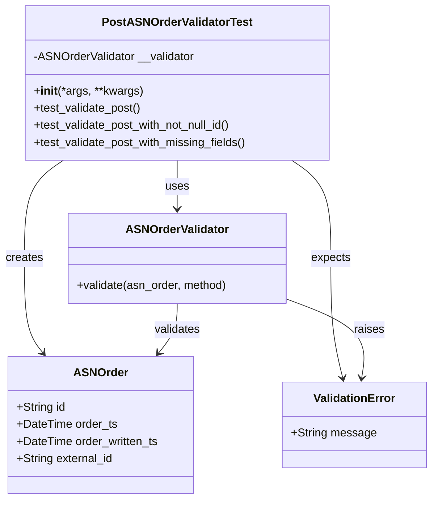
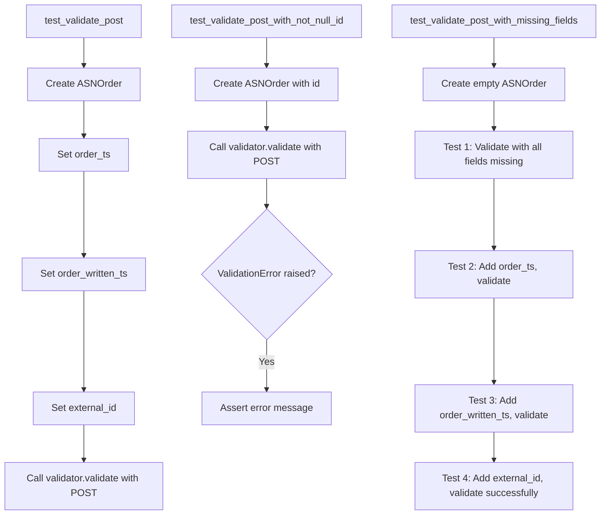
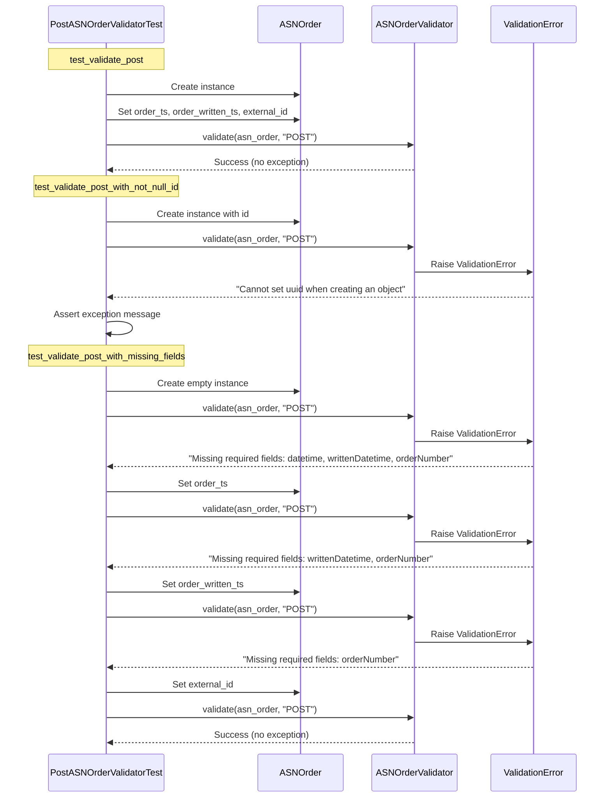

# Diagram: platform/partview_core/partview_service/partview_service/tests/unit/core/validators/asn_order/asn_order_post_validator_test.py

> Auto-generated by Obscura crawlers

## Diagram 1

### SVG

<svg id="container" width="600.263671875" xmlns="http://www.w3.org/2000/svg" class="classDiagram" height="698" viewBox="0 0 600.263671875 698" role="graphics-document document" aria-roledescription="class"><g><defs><marker id="container_class-aggregationStart" class="marker aggregation class" refX="18" refY="7" markerWidth="190" markerHeight="240" orient="auto"><path d="M 18,7 L9,13 L1,7 L9,1 Z"></path></marker></defs><defs><marker id="container_class-aggregationEnd" class="marker aggregation class" refX="1" refY="7" markerWidth="20" markerHeight="28" orient="auto"><path d="M 18,7 L9,13 L1,7 L9,1 Z"></path></marker></defs><defs><marker id="container_class-extensionStart" class="marker extension class" refX="18" refY="7" markerWidth="190" markerHeight="240" orient="auto"><path d="M 1,7 L18,13 V 1 Z"></path></marker></defs><defs><marker id="container_class-extensionEnd" class="marker extension class" refX="1" refY="7" markerWidth="20" markerHeight="28" orient="auto"><path d="M 1,1 V 13 L18,7 Z"></path></marker></defs><defs><marker id="container_class-compositionStart" class="marker composition class" refX="18" refY="7" markerWidth="190" markerHeight="240" orient="auto"><path d="M 18,7 L9,13 L1,7 L9,1 Z"></path></marker></defs><defs><marker id="container_class-compositionEnd" class="marker composition class" refX="1" refY="7" markerWidth="20" markerHeight="28" orient="auto"><path d="M 18,7 L9,13 L1,7 L9,1 Z"></path></marker></defs><defs><marker id="container_class-dependencyStart" class="marker dependency class" refX="6" refY="7" markerWidth="190" markerHeight="240" orient="auto"><path d="M 5,7 L9,13 L1,7 L9,1 Z"></path></marker></defs><defs><marker id="container_class-dependencyEnd" class="marker dependency class" refX="13" refY="7" markerWidth="20" markerHeight="28" orient="auto"><path d="M 18,7 L9,13 L14,7 L9,1 Z"></path></marker></defs><defs><marker id="container_class-lollipopStart" class="marker lollipop class" refX="13" refY="7" markerWidth="190" markerHeight="240" orient="auto"><circle stroke="black" fill="transparent" cx="7" cy="7" r="6"></circle></marker></defs><defs><marker id="container_class-lollipopEnd" class="marker lollipop class" refX="1" refY="7" markerWidth="190" markerHeight="240" orient="auto"><circle stroke="black" fill="transparent" cx="7" cy="7" r="6"></circle></marker></defs><g class="root"><g class="clusters"></g><g class="edgePaths"><path d="M247.84,224L247.84,230.167C247.84,236.333,247.84,248.667,247.84,260C247.84,271.333,247.84,281.667,247.84,286.833L247.84,292" id="id_PostASNOrderValidatorTest_ASNOrderValidator_1" class="edge-thickness-normal edge-pattern-solid relation" style=";;;" data-edge="true" data-et="edge" data-id="id_PostASNOrderValidatorTest_ASNOrderValidator_1" data-points="W3sieCI6MjQ3LjgzOTg0Mzc1LCJ5IjoyMjR9LHsieCI6MjQ3LjgzOTg0Mzc1LCJ5IjoyNjF9LHsieCI6MjQ3LjgzOTg0Mzc1LCJ5IjoyOTh9XQ==" marker-end="url(#container_class-dependencyEnd)"></path><path d="M88.694,224L79.607,230.167C70.52,236.333,52.346,248.667,43.259,271.5C34.172,294.333,34.172,327.667,34.172,361C34.172,394.333,34.172,427.667,38.499,449.72C42.826,471.774,51.481,482.548,55.808,487.935L60.135,493.322" id="id_PostASNOrderValidatorTest_ASNOrder_2" class="edge-thickness-normal edge-pattern-solid relation" style=";;;" data-edge="true" data-et="edge" data-id="id_PostASNOrderValidatorTest_ASNOrder_2" data-points="W3sieCI6ODguNjk0MDQ2MzM2MjA2OSwieSI6MjI0fSx7IngiOjM0LjE3MTg3NSwieSI6MjYxfSx7IngiOjM0LjE3MTg3NSwieSI6MzYxfSx7IngiOjM0LjE3MTg3NSwieSI6NDYxfSx7IngiOjYzLjg5MjYwNzQ5NTMwMDc1LCJ5Ijo0OTh9XQ==" marker-end="url(#container_class-dependencyEnd)"></path><path d="M408.149,224L417.303,230.167C426.456,236.333,444.763,248.667,453.917,271.5C463.07,294.333,463.07,327.667,463.07,361C463.07,394.333,463.07,427.667,465.694,455.526C468.317,483.386,473.564,505.772,476.188,516.965L478.812,528.158" id="id_PostASNOrderValidatorTest_ValidationError_3" class="edge-thickness-normal edge-pattern-solid relation" style=";;;" data-edge="true" data-et="edge" data-id="id_PostASNOrderValidatorTest_ValidationError_3" data-points="W3sieCI6NDA4LjE0OTQzNDI2NzI0MTQsInkiOjIyNH0seyJ4Ijo0NjMuMDcwMzEyNSwieSI6MjYxfSx7IngiOjQ2My4wNzAzMTI1LCJ5IjozNjF9LHsieCI6NDYzLjA3MDMxMjUsInkiOjQ2MX0seyJ4Ijo0ODAuMTgwNzU5NTE1OTc3NDYsInkiOjUzNH1d" marker-end="url(#container_class-dependencyEnd)"></path><path d="M247.84,424L247.84,430.167C247.84,436.333,247.84,448.667,243.513,460.22C239.185,471.774,230.531,482.548,226.204,487.935L221.877,493.322" id="id_ASNOrderValidator_ASNOrder_4" class="edge-thickness-normal edge-pattern-solid relation" style=";;;" data-edge="true" data-et="edge" data-id="id_ASNOrderValidator_ASNOrder_4" data-points="W3sieCI6MjQ3LjgzOTg0Mzc1LCJ5Ijo0MjR9LHsieCI6MjQ3LjgzOTg0Mzc1LCJ5Ijo0NjF9LHsieCI6MjE4LjExOTExMTI1NDY5OTI1LCJ5Ijo0OTh9XQ==" marker-end="url(#container_class-dependencyEnd)"></path><path d="M400.336,418.108L419.425,425.257C438.514,432.406,476.691,446.703,494.047,465.03C511.402,483.357,507.935,505.714,506.202,516.892L504.468,528.071" id="id_ASNOrderValidator_ValidationError_5" class="edge-thickness-normal edge-pattern-solid relation" style=";;;" data-edge="true" data-et="edge" data-id="id_ASNOrderValidator_ValidationError_5" data-points="W3sieCI6NDAwLjMzNTkzNzUsInkiOjQxOC4xMDgzNzU1NzMyNTYxfSx7IngiOjUxNC44NjkxNDA2MjUsInkiOjQ2MX0seyJ4Ijo1MDMuNTQ4NjUxOTAzMTk1NSwieSI6NTM0fV0=" marker-end="url(#container_class-dependencyEnd)"></path></g><g class="edgeLabels"><g class="edgeLabel" transform="translate(247.83984375, 261)"><g class="label" data-id="id_PostASNOrderValidatorTest_ASNOrderValidator_1" transform="translate(-16.4921875, -12)"><foreignObject width="32.984375" height="24">

uses

</foreignObject></g></g><g class="edgeLabel" transform="translate(34.171875, 361)"><g class="label" data-id="id_PostASNOrderValidatorTest_ASNOrder_2" transform="translate(-26.171875, -12)"><foreignObject width="52.34375" height="24">

creates

</foreignObject></g></g><g class="edgeLabel" transform="translate(463.0703125, 361)"><g class="label" data-id="id_PostASNOrderValidatorTest_ValidationError_3" transform="translate(-27.734375, -12)"><foreignObject width="55.46875" height="24">

expects

</foreignObject></g></g><g class="edgeLabel" transform="translate(247.83984375, 461)"><g class="label" data-id="id_ASNOrderValidator_ASNOrder_4" transform="translate(-32.6875, -12)"><foreignObject width="65.375" height="24">

validates

</foreignObject></g></g><g class="edgeLabel" transform="translate(492.19284, 452.50793)"><g class="label" data-id="id_ASNOrderValidator_ValidationError_5" transform="translate(-21.25, -12)"><foreignObject width="42.5" height="24">

raises

</foreignObject></g></g></g><g class="nodes"><g class="node default" id="classId-PostASNOrderValidatorTest-0" transform="translate(247.83984375, 116)"><g class="basic label-container"><path d="M-213.0234375 -108 L213.0234375 -108 L213.0234375 108 L-213.0234375 108" stroke="none" stroke-width="0" fill="#ECECFF" style=""></path><path d="M-213.0234375 -108 C-116.88279902602213 -108, -20.742160552044254 -108, 213.0234375 -108 M-213.0234375 -108 C-78.42409486607895 -108, 56.17524776784211 -108, 213.0234375 -108 M213.0234375 -108 C213.0234375 -62.18509474480141, 213.0234375 -16.370189489602822, 213.0234375 108 M213.0234375 -108 C213.0234375 -54.105350262719995, 213.0234375 -0.2107005254399894, 213.0234375 108 M213.0234375 108 C70.73288054049914 108, -71.55767641900172 108, -213.0234375 108 M213.0234375 108 C86.2850434688447 108, -40.45335056231059 108, -213.0234375 108 M-213.0234375 108 C-213.0234375 24.87377729727649, -213.0234375 -58.25244540544702, -213.0234375 -108 M-213.0234375 108 C-213.0234375 56.494590940889076, -213.0234375 4.989181881778151, -213.0234375 -108" stroke="#9370DB" stroke-width="1.3" fill="none" stroke-dasharray="0 0" style=""></path></g><g class="annotation-group text" transform="translate(0, -84)"></g><g class="label-group text" transform="translate(-100.140625, -84)"><g class="label" style="font-weight: bolder" transform="translate(0,-12)"><foreignObject width="200.28125" height="24">

PostASNOrderValidatorTest

</foreignObject></g></g><g class="members-group text" transform="translate(-201.0234375, -36)"><g class="label" style="" transform="translate(0,-12)"><foreignObject width="226.59375" height="24">

-ASNOrderValidator __validator

</foreignObject></g></g><g class="methods-group text" transform="translate(-201.0234375, 12)"><g class="label" style="" transform="translate(0,-12)"><foreignObject width="151.8125" height="24">

+<strong>init</strong>(*args, **kwargs)

</foreignObject></g><g class="label" style="" transform="translate(0,12)"><foreignObject width="151.609375" height="24">

+test_validate_post()

</foreignObject></g><g class="label" style="" transform="translate(0,36)"><foreignObject width="282.34375" height="24">

+test_validate_post_with_not_null_id()

</foreignObject></g><g class="label" style="" transform="translate(0,60)"><foreignObject width="301.90625" height="24">

+test_validate_post_with_missing_fields()

</foreignObject></g></g><g class="divider" style=""><path d="M-213.0234375 -60 C-54.10337045141057 -60, 104.81669659717886 -60, 213.0234375 -60 M-213.0234375 -60 C-50.392081062587806 -60, 112.23927537482439 -60, 213.0234375 -60" stroke="#9370DB" stroke-width="1.3" fill="none" stroke-dasharray="0 0" style=""></path></g><g class="divider" style=""><path d="M-213.0234375 -12 C-117.59991669174089 -12, -22.176395883481774 -12, 213.0234375 -12 M-213.0234375 -12 C-64.02358711230883 -12, 84.97626327538234 -12, 213.0234375 -12" stroke="#9370DB" stroke-width="1.3" fill="none" stroke-dasharray="0 0" style=""></path></g></g><g class="node default" id="classId-ASNOrder-1" transform="translate(141.005859375, 594)"><g class="basic label-container"><path d="M-129.55859375 -96 L129.55859375 -96 L129.55859375 96 L-129.55859375 96" stroke="none" stroke-width="0" fill="#ECECFF" style=""></path><path d="M-129.55859375 -96 C-26.090938792399427 -96, 77.37671616520115 -96, 129.55859375 -96 M-129.55859375 -96 C-63.8706862521191 -96, 1.8172212457618002 -96, 129.55859375 -96 M129.55859375 -96 C129.55859375 -24.035632947133465, 129.55859375 47.92873410573307, 129.55859375 96 M129.55859375 -96 C129.55859375 -42.177752775673596, 129.55859375 11.644494448652807, 129.55859375 96 M129.55859375 96 C33.21237219371004 96, -63.13384936257992 96, -129.55859375 96 M129.55859375 96 C26.21387013789311 96, -77.13085347421378 96, -129.55859375 96 M-129.55859375 96 C-129.55859375 22.673299573089196, -129.55859375 -50.65340085382161, -129.55859375 -96 M-129.55859375 96 C-129.55859375 44.374650237195524, -129.55859375 -7.250699525608951, -129.55859375 -96" stroke="#9370DB" stroke-width="1.3" fill="none" stroke-dasharray="0 0" style=""></path></g><g class="annotation-group text" transform="translate(0, -72)"></g><g class="label-group text" transform="translate(-35.5234375, -72)"><g class="label" style="font-weight: bolder" transform="translate(0,-12)"><foreignObject width="71.046875" height="24">

ASNOrder

</foreignObject></g></g><g class="members-group text" transform="translate(-117.55859375, -24)"><g class="label" style="" transform="translate(0,-12)"><foreignObject width="68.546875" height="24">

+String id

</foreignObject></g><g class="label" style="" transform="translate(0,12)"><foreignObject width="140.03125" height="24">

+DateTime order_ts

</foreignObject></g><g class="label" style="" transform="translate(0,36)"><foreignObject width="199.59375" height="24">

+DateTime order_written_ts

</foreignObject></g><g class="label" style="" transform="translate(0,60)"><foreignObject width="136.25" height="24">

+String external_id

</foreignObject></g></g><g class="methods-group text" transform="translate(-117.55859375, 96)"></g><g class="divider" style=""><path d="M-129.55859375 -48 C-73.2921978982736 -48, -17.0258020465472 -48, 129.55859375 -48 M-129.55859375 -48 C-29.011945103803527 -48, 71.53470354239295 -48, 129.55859375 -48" stroke="#9370DB" stroke-width="1.3" fill="none" stroke-dasharray="0 0" style=""></path></g><g class="divider" style=""><path d="M-129.55859375 72 C-72.83289634890218 72, -16.10719894780435 72, 129.55859375 72 M-129.55859375 72 C-45.59515071496297 72, 38.36829232007406 72, 129.55859375 72" stroke="#9370DB" stroke-width="1.3" fill="none" stroke-dasharray="0 0" style=""></path></g></g><g class="node default" id="classId-ASNOrderValidator-2" transform="translate(247.83984375, 361)"><g class="basic label-container"><path d="M-152.49609375 -63 L152.49609375 -63 L152.49609375 63 L-152.49609375 63" stroke="none" stroke-width="0" fill="#ECECFF" style=""></path><path d="M-152.49609375 -63 C-31.07872551491799 -63, 90.33864272016402 -63, 152.49609375 -63 M-152.49609375 -63 C-52.939181393180476 -63, 46.61773096363905 -63, 152.49609375 -63 M152.49609375 -63 C152.49609375 -29.41820565520983, 152.49609375 4.163588689580337, 152.49609375 63 M152.49609375 -63 C152.49609375 -19.771681582939983, 152.49609375 23.456636834120033, 152.49609375 63 M152.49609375 63 C52.84019320851199 63, -46.81570733297602 63, -152.49609375 63 M152.49609375 63 C61.738100051910564 63, -29.019893646178872 63, -152.49609375 63 M-152.49609375 63 C-152.49609375 17.794332338248964, -152.49609375 -27.411335323502072, -152.49609375 -63 M-152.49609375 63 C-152.49609375 31.69343569658682, -152.49609375 0.3868713931736423, -152.49609375 -63" stroke="#9370DB" stroke-width="1.3" fill="none" stroke-dasharray="0 0" style=""></path></g><g class="annotation-group text" transform="translate(0, -39)"></g><g class="label-group text" transform="translate(-68.7109375, -39)"><g class="label" style="font-weight: bolder" transform="translate(0,-12)"><foreignObject width="137.421875" height="24">

ASNOrderValidator

</foreignObject></g></g><g class="members-group text" transform="translate(-140.49609375, 9)"></g><g class="methods-group text" transform="translate(-140.49609375, 39)"><g class="label" style="" transform="translate(0,-12)"><foreignObject width="212.28125" height="24">

+validate(asn_order, method)

</foreignObject></g></g><g class="divider" style=""><path d="M-152.49609375 -15 C-58.82348542511275 -15, 34.8491228997745 -15, 152.49609375 -15 M-152.49609375 -15 C-77.20582666299966 -15, -1.9155595759993105 -15, 152.49609375 -15" stroke="#9370DB" stroke-width="1.3" fill="none" stroke-dasharray="0 0" style=""></path></g><g class="divider" style=""><path d="M-152.49609375 9 C-51.1977575129295 9, 50.100578724141 9, 152.49609375 9 M-152.49609375 9 C-71.31453181123123 9, 9.867030127537532 9, 152.49609375 9" stroke="#9370DB" stroke-width="1.3" fill="none" stroke-dasharray="0 0" style=""></path></g></g><g class="node default" id="classId-ValidationError-3" transform="translate(494.244140625, 594)"><g class="basic label-container"><path d="M-98.01953125 -60 L98.01953125 -60 L98.01953125 60 L-98.01953125 60" stroke="none" stroke-width="0" fill="#ECECFF" style=""></path><path d="M-98.01953125 -60 C-28.395524873009123 -60, 41.228481503981754 -60, 98.01953125 -60 M-98.01953125 -60 C-25.30824169634917 -60, 47.40304785730166 -60, 98.01953125 -60 M98.01953125 -60 C98.01953125 -15.449192438927376, 98.01953125 29.101615122145247, 98.01953125 60 M98.01953125 -60 C98.01953125 -22.34123562421228, 98.01953125 15.317528751575438, 98.01953125 60 M98.01953125 60 C56.39631311271143 60, 14.773094975422865 60, -98.01953125 60 M98.01953125 60 C47.46198923840074 60, -3.09555277319852 60, -98.01953125 60 M-98.01953125 60 C-98.01953125 27.083484169826335, -98.01953125 -5.833031660347331, -98.01953125 -60 M-98.01953125 60 C-98.01953125 32.40489070263132, -98.01953125 4.8097814052626475, -98.01953125 -60" stroke="#9370DB" stroke-width="1.3" fill="none" stroke-dasharray="0 0" style=""></path></g><g class="annotation-group text" transform="translate(0, -36)"></g><g class="label-group text" transform="translate(-55.1796875, -36)"><g class="label" style="font-weight: bolder" transform="translate(0,-12)"><foreignObject width="110.359375" height="24">

ValidationError

</foreignObject></g></g><g class="members-group text" transform="translate(-86.01953125, 12)"><g class="label" style="" transform="translate(0,-12)"><foreignObject width="116.859375" height="24">

+String message

</foreignObject></g></g><g class="methods-group text" transform="translate(-86.01953125, 60)"></g><g class="divider" style=""><path d="M-98.01953125 -12 C-56.13217050915545 -12, -14.244809768310901 -12, 98.01953125 -12 M-98.01953125 -12 C-56.159939649471994 -12, -14.300348048943988 -12, 98.01953125 -12" stroke="#9370DB" stroke-width="1.3" fill="none" stroke-dasharray="0 0" style=""></path></g><g class="divider" style=""><path d="M-98.01953125 36 C-30.918362474128216 36, 36.18280630174357 36, 98.01953125 36 M-98.01953125 36 C-26.698194708013688 36, 44.623141833972625 36, 98.01953125 36" stroke="#9370DB" stroke-width="1.3" fill="none" stroke-dasharray="0 0" style=""></path></g></g></g></g></g></svg>

## Diagram 2

### SVG

<svg id="container" width="1010.390625" xmlns="http://www.w3.org/2000/svg" class="flowchart" height="851.25" viewBox="0 0 1010.390625 851.25" role="graphics-document document" aria-roledescription="flowchart-v2"><g><marker id="container_flowchart-v2-pointEnd" class="marker flowchart-v2" viewBox="0 0 10 10" refX="5" refY="5" markerUnits="userSpaceOnUse" markerWidth="8" markerHeight="8" orient="auto"><path d="M 0 0 L 10 5 L 0 10 z" class="arrowMarkerPath" style="stroke-width: 1; stroke-dasharray: 1, 0;"></path></marker><marker id="container_flowchart-v2-pointStart" class="marker flowchart-v2" viewBox="0 0 10 10" refX="4.5" refY="5" markerUnits="userSpaceOnUse" markerWidth="8" markerHeight="8" orient="auto"><path d="M 0 5 L 10 10 L 10 0 z" class="arrowMarkerPath" style="stroke-width: 1; stroke-dasharray: 1, 0;"></path></marker><marker id="container_flowchart-v2-circleEnd" class="marker flowchart-v2" viewBox="0 0 10 10" refX="11" refY="5" markerUnits="userSpaceOnUse" markerWidth="11" markerHeight="11" orient="auto"><circle cx="5" cy="5" r="5" class="arrowMarkerPath" style="stroke-width: 1; stroke-dasharray: 1, 0;"></circle></marker><marker id="container_flowchart-v2-circleStart" class="marker flowchart-v2" viewBox="0 0 10 10" refX="-1" refY="5" markerUnits="userSpaceOnUse" markerWidth="11" markerHeight="11" orient="auto"><circle cx="5" cy="5" r="5" class="arrowMarkerPath" style="stroke-width: 1; stroke-dasharray: 1, 0;"></circle></marker><marker id="container_flowchart-v2-crossEnd" class="marker cross flowchart-v2" viewBox="0 0 11 11" refX="12" refY="5.2" markerUnits="userSpaceOnUse" markerWidth="11" markerHeight="11" orient="auto"><path d="M 1,1 l 9,9 M 10,1 l -9,9" class="arrowMarkerPath" style="stroke-width: 2; stroke-dasharray: 1, 0;"></path></marker><marker id="container_flowchart-v2-crossStart" class="marker cross flowchart-v2" viewBox="0 0 11 11" refX="-1" refY="5.2" markerUnits="userSpaceOnUse" markerWidth="11" markerHeight="11" orient="auto"><path d="M 1,1 l 9,9 M 10,1 l -9,9" class="arrowMarkerPath" style="stroke-width: 2; stroke-dasharray: 1, 0;"></path></marker><g class="root"><g class="clusters"></g><g class="edgePaths"><path d="M138,62L138,66.167C138,70.333,138,78.667,138,86.333C138,94,138,101,138,104.5L138,108" id="L_A_B_0" class="edge-thickness-normal edge-pattern-solid edge-thickness-normal edge-pattern-solid flowchart-link" style=";" data-edge="true" data-et="edge" data-id="L_A_B_0" data-points="W3sieCI6MTM4LCJ5Ijo2Mn0seyJ4IjoxMzgsInkiOjg3fSx7IngiOjEzOCwieSI6MTEyfV0=" marker-end="url(#container_flowchart-v2-pointEnd)"></path><path d="M138,166L138,170.167C138,174.333,138,182.667,138,192.333C138,202,138,213,138,218.5L138,224" id="L_B_C_0" class="edge-thickness-normal edge-pattern-solid edge-thickness-normal edge-pattern-solid flowchart-link" style=";" data-edge="true" data-et="edge" data-id="L_B_C_0" data-points="W3sieCI6MTM4LCJ5IjoxNjZ9LHsieCI6MTM4LCJ5IjoxOTF9LHsieCI6MTM4LCJ5IjoyMjh9XQ==" marker-end="url(#container_flowchart-v2-pointEnd)"></path><path d="M138,282L138,288.167C138,294.333,138,306.667,138,330.104C138,353.542,138,388.083,138,405.354L138,422.625" id="L_C_D_0" class="edge-thickness-normal edge-pattern-solid edge-thickness-normal edge-pattern-solid flowchart-link" style=";" data-edge="true" data-et="edge" data-id="L_C_D_0" data-points="W3sieCI6MTM4LCJ5IjoyODJ9LHsieCI6MTM4LCJ5IjozMTl9LHsieCI6MTM4LCJ5Ijo0MjYuNjI1fV0=" marker-end="url(#container_flowchart-v2-pointEnd)"></path><path d="M138,480.625L138,500.563C138,520.5,138,560.375,138,587.813C138,615.25,138,630.25,138,637.75L138,645.25" id="L_D_E_0" class="edge-thickness-normal edge-pattern-solid edge-thickness-normal edge-pattern-solid flowchart-link" style=";" data-edge="true" data-et="edge" data-id="L_D_E_0" data-points="W3sieCI6MTM4LCJ5Ijo0ODAuNjI1fSx7IngiOjEzOCwieSI6NjAwLjI1fSx7IngiOjEzOCwieSI6NjQ5LjI1fV0=" marker-end="url(#container_flowchart-v2-pointEnd)"></path><path d="M138,703.25L138,709.417C138,715.583,138,727.917,138,737.583C138,747.25,138,754.25,138,757.75L138,761.25" id="L_E_F_0" class="edge-thickness-normal edge-pattern-solid edge-thickness-normal edge-pattern-solid flowchart-link" style=";" data-edge="true" data-et="edge" data-id="L_E_F_0" data-points="W3sieCI6MTM4LCJ5Ijo3MDMuMjV9LHsieCI6MTM4LCJ5Ijo3NDAuMjV9LHsieCI6MTM4LCJ5Ijo3NjUuMjV9XQ==" marker-end="url(#container_flowchart-v2-pointEnd)"></path><path d="M446.711,62L446.711,66.167C446.711,70.333,446.711,78.667,446.711,86.333C446.711,94,446.711,101,446.711,104.5L446.711,108" id="L_G_H_0" class="edge-thickness-normal edge-pattern-solid edge-thickness-normal edge-pattern-solid flowchart-link" style=";" data-edge="true" data-et="edge" data-id="L_G_H_0" data-points="W3sieCI6NDQ2LjcxMDkzNzUsInkiOjYyfSx7IngiOjQ0Ni43MTA5Mzc1LCJ5Ijo4N30seyJ4Ijo0NDYuNzEwOTM3NSwieSI6MTEyfV0=" marker-end="url(#container_flowchart-v2-pointEnd)"></path><path d="M446.711,166L446.711,170.167C446.711,174.333,446.711,182.667,446.711,190.333C446.711,198,446.711,205,446.711,208.5L446.711,212" id="L_H_I_0" class="edge-thickness-normal edge-pattern-solid edge-thickness-normal edge-pattern-solid flowchart-link" style=";" data-edge="true" data-et="edge" data-id="L_H_I_0" data-points="W3sieCI6NDQ2LjcxMDkzNzUsInkiOjE2Nn0seyJ4Ijo0NDYuNzEwOTM3NSwieSI6MTkxfSx7IngiOjQ0Ni43MTA5Mzc1LCJ5IjoyMTZ9XQ==" marker-end="url(#container_flowchart-v2-pointEnd)"></path><path d="M446.711,294L446.711,298.167C446.711,302.333,446.711,310.667,446.711,318.333C446.711,326,446.711,333,446.711,336.5L446.711,340" id="L_I_J_0" class="edge-thickness-normal edge-pattern-solid edge-thickness-normal edge-pattern-solid flowchart-link" style=";" data-edge="true" data-et="edge" data-id="L_I_J_0" data-points="W3sieCI6NDQ2LjcxMDkzNzUsInkiOjI5NH0seyJ4Ijo0NDYuNzEwOTM3NSwieSI6MzE5fSx7IngiOjQ0Ni43MTA5Mzc1LCJ5IjozNDR9XQ==" marker-end="url(#container_flowchart-v2-pointEnd)"></path><path d="M446.711,563.25L446.711,569.417C446.711,575.583,446.711,587.917,446.711,601.583C446.711,615.25,446.711,630.25,446.711,637.75L446.711,645.25" id="L_J_K_0" class="edge-thickness-normal edge-pattern-solid edge-thickness-normal edge-pattern-solid flowchart-link" style=";" data-edge="true" data-et="edge" data-id="L_J_K_0" data-points="W3sieCI6NDQ2LjcxMDkzNzUsInkiOjU2My4yNX0seyJ4Ijo0NDYuNzEwOTM3NSwieSI6NjAwLjI1fSx7IngiOjQ0Ni43MTA5Mzc1LCJ5Ijo2NDkuMjV9XQ==" marker-end="url(#container_flowchart-v2-pointEnd)"></path><path d="M830.57,62L830.57,66.167C830.57,70.333,830.57,78.667,830.57,86.333C830.57,94,830.57,101,830.57,104.5L830.57,108" id="L_L_M_0" class="edge-thickness-normal edge-pattern-solid edge-thickness-normal edge-pattern-solid flowchart-link" style=";" data-edge="true" data-et="edge" data-id="L_L_M_0" data-points="W3sieCI6ODMwLjU3MDMxMjUsInkiOjYyfSx7IngiOjgzMC41NzAzMTI1LCJ5Ijo4N30seyJ4Ijo4MzAuNTcwMzEyNSwieSI6MTEyfV0=" marker-end="url(#container_flowchart-v2-pointEnd)"></path><path d="M830.57,166L830.57,170.167C830.57,174.333,830.57,182.667,830.57,190.333C830.57,198,830.57,205,830.57,208.5L830.57,212" id="L_M_N_0" class="edge-thickness-normal edge-pattern-solid edge-thickness-normal edge-pattern-solid flowchart-link" style=";" data-edge="true" data-et="edge" data-id="L_M_N_0" data-points="W3sieCI6ODMwLjU3MDMxMjUsInkiOjE2Nn0seyJ4Ijo4MzAuNTcwMzEyNSwieSI6MTkxfSx7IngiOjgzMC41NzAzMTI1LCJ5IjoyMTZ9XQ==" marker-end="url(#container_flowchart-v2-pointEnd)"></path><path d="M830.57,294L830.57,298.167C830.57,302.333,830.57,310.667,830.57,330.104C830.57,349.542,830.57,380.083,830.57,395.354L830.57,410.625" id="L_N_O_0" class="edge-thickness-normal edge-pattern-solid edge-thickness-normal edge-pattern-solid flowchart-link" style=";" data-edge="true" data-et="edge" data-id="L_N_O_0" data-points="W3sieCI6ODMwLjU3MDMxMjUsInkiOjI5NH0seyJ4Ijo4MzAuNTcwMzEyNSwieSI6MzE5fSx7IngiOjgzMC41NzAzMTI1LCJ5Ijo0MTQuNjI1fV0=" marker-end="url(#container_flowchart-v2-pointEnd)"></path><path d="M830.57,492.625L830.57,510.563C830.57,528.5,830.57,564.375,830.57,587.813C830.57,611.25,830.57,622.25,830.57,627.75L830.57,633.25" id="L_O_P_0" class="edge-thickness-normal edge-pattern-solid edge-thickness-normal edge-pattern-solid flowchart-link" style=";" data-edge="true" data-et="edge" data-id="L_O_P_0" data-points="W3sieCI6ODMwLjU3MDMxMjUsInkiOjQ5Mi42MjV9LHsieCI6ODMwLjU3MDMxMjUsInkiOjYwMC4yNX0seyJ4Ijo4MzAuNTcwMzEyNSwieSI6NjM3LjI1fV0=" marker-end="url(#container_flowchart-v2-pointEnd)"></path><path d="M830.57,715.25L830.57,719.417C830.57,723.583,830.57,731.917,830.57,739.583C830.57,747.25,830.57,754.25,830.57,757.75L830.57,761.25" id="L_P_Q_0" class="edge-thickness-normal edge-pattern-solid edge-thickness-normal edge-pattern-solid flowchart-link" style=";" data-edge="true" data-et="edge" data-id="L_P_Q_0" data-points="W3sieCI6ODMwLjU3MDMxMjUsInkiOjcxNS4yNX0seyJ4Ijo4MzAuNTcwMzEyNSwieSI6NzQwLjI1fSx7IngiOjgzMC41NzAzMTI1LCJ5Ijo3NjUuMjV9XQ==" marker-end="url(#container_flowchart-v2-pointEnd)"></path></g><g class="edgeLabels"><g class="edgeLabel"><g class="label" data-id="L_A_B_0" transform="translate(0, 0)"><foreignObject width="0" height="0">

</foreignObject></g></g><g class="edgeLabel"><g class="label" data-id="L_B_C_0" transform="translate(0, 0)"><foreignObject width="0" height="0">

</foreignObject></g></g><g class="edgeLabel"><g class="label" data-id="L_C_D_0" transform="translate(0, 0)"><foreignObject width="0" height="0">

</foreignObject></g></g><g class="edgeLabel"><g class="label" data-id="L_D_E_0" transform="translate(0, 0)"><foreignObject width="0" height="0">

</foreignObject></g></g><g class="edgeLabel"><g class="label" data-id="L_E_F_0" transform="translate(0, 0)"><foreignObject width="0" height="0">

</foreignObject></g></g><g class="edgeLabel"><g class="label" data-id="L_G_H_0" transform="translate(0, 0)"><foreignObject width="0" height="0">

</foreignObject></g></g><g class="edgeLabel"><g class="label" data-id="L_H_I_0" transform="translate(0, 0)"><foreignObject width="0" height="0">

</foreignObject></g></g><g class="edgeLabel"><g class="label" data-id="L_I_J_0" transform="translate(0, 0)"><foreignObject width="0" height="0">

</foreignObject></g></g><g class="edgeLabel" transform="translate(446.7109375, 600.25)"><g class="label" data-id="L_J_K_0" transform="translate(-12.03125, -12)"><foreignObject width="24.0625" height="24">

Yes

</foreignObject></g></g><g class="edgeLabel"><g class="label" data-id="L_L_M_0" transform="translate(0, 0)"><foreignObject width="0" height="0">

</foreignObject></g></g><g class="edgeLabel"><g class="label" data-id="L_M_N_0" transform="translate(0, 0)"><foreignObject width="0" height="0">

</foreignObject></g></g><g class="edgeLabel"><g class="label" data-id="L_N_O_0" transform="translate(0, 0)"><foreignObject width="0" height="0">

</foreignObject></g></g><g class="edgeLabel"><g class="label" data-id="L_O_P_0" transform="translate(0, 0)"><foreignObject width="0" height="0">

</foreignObject></g></g><g class="edgeLabel"><g class="label" data-id="L_P_Q_0" transform="translate(0, 0)"><foreignObject width="0" height="0">

</foreignObject></g></g></g><g class="nodes"><g class="node default" id="flowchart-A-0" transform="translate(138, 35)"><rect class="basic label-container" style="" x="-96.671875" y="-27" width="193.34375" height="54"></rect><g class="label" style="" transform="translate(-66.671875, -12)"><rect></rect><foreignObject width="133.34375" height="24">

test_validate_post

</foreignObject></g></g><g class="node default" id="flowchart-B-1" transform="translate(138, 139)"><rect class="basic label-container" style="" x="-90.1171875" y="-27" width="180.234375" height="54"></rect><g class="label" style="" transform="translate(-60.1171875, -12)"><rect></rect><foreignObject width="120.234375" height="24">

Create ASNOrder

</foreignObject></g></g><g class="node default" id="flowchart-C-3" transform="translate(138, 255)"><rect class="basic label-container" style="" x="-73.46875" y="-27" width="146.9375" height="54"></rect><g class="label" style="" transform="translate(-43.46875, -12)"><rect></rect><foreignObject width="86.9375" height="24">

Set order_ts

</foreignObject></g></g><g class="node default" id="flowchart-D-5" transform="translate(138, 453.625)"><rect class="basic label-container" style="" x="-103.25" y="-27" width="206.5" height="54"></rect><g class="label" style="" transform="translate(-73.25, -12)"><rect></rect><foreignObject width="146.5" height="24">

Set order_written_ts

</foreignObject></g></g><g class="node default" id="flowchart-E-7" transform="translate(138, 676.25)"><rect class="basic label-container" style="" x="-84.6171875" y="-27" width="169.234375" height="54"></rect><g class="label" style="" transform="translate(-54.6171875, -12)"><rect></rect><foreignObject width="109.234375" height="24">

Set external_id

</foreignObject></g></g><g class="node default" id="flowchart-F-9" transform="translate(138, 804.25)"><rect class="basic label-container" style="" x="-130" y="-39" width="260" height="78"></rect><g class="label" style="" transform="translate(-100, -24)"><rect></rect><foreignObject width="200" height="48">

Call validator.validate with POST

</foreignObject></g></g><g class="node default" id="flowchart-G-10" transform="translate(446.7109375, 35)"><rect class="basic label-container" style="" x="-162.0390625" y="-27" width="324.078125" height="54"></rect><g class="label" style="" transform="translate(-132.0390625, -12)"><rect></rect><foreignObject width="264.078125" height="24">

test_validate_post_with_not_null_id

</foreignObject></g></g><g class="node default" id="flowchart-H-11" transform="translate(446.7109375, 139)"><rect class="basic label-container" style="" x="-116.9609375" y="-27" width="233.921875" height="54"></rect><g class="label" style="" transform="translate(-86.9609375, -12)"><rect></rect><foreignObject width="173.921875" height="24">

Create ASNOrder with id

</foreignObject></g></g><g class="node default" id="flowchart-I-13" transform="translate(446.7109375, 255)"><rect class="basic label-container" style="" x="-130" y="-39" width="260" height="78"></rect><g class="label" style="" transform="translate(-100, -24)"><rect></rect><foreignObject width="200" height="48">

Call validator.validate with POST

</foreignObject></g></g><g class="node default" id="flowchart-J-15" transform="translate(446.7109375, 453.625)"><polygon points="109.625,0 219.25,-109.625 109.625,-219.25 0,-109.625" class="label-container" transform="translate(-109.125, 109.625)"></polygon><g class="label" style="" transform="translate(-82.625, -12)"><rect></rect><foreignObject width="165.25" height="24">

ValidationError raised?

</foreignObject></g></g><g class="node default" id="flowchart-K-17" transform="translate(446.7109375, 676.25)"><rect class="basic label-container" style="" x="-105.8046875" y="-27" width="211.609375" height="54"></rect><g class="label" style="" transform="translate(-75.8046875, -12)"><rect></rect><foreignObject width="151.609375" height="24">

Assert error message

</foreignObject></g></g><g class="node default" id="flowchart-L-18" transform="translate(830.5703125, 35)"><rect class="basic label-container" style="" x="-171.8203125" y="-27" width="343.640625" height="54"></rect><g class="label" style="" transform="translate(-141.8203125, -12)"><rect></rect><foreignObject width="283.640625" height="24">

test_validate_post_with_missing_fields

</foreignObject></g></g><g class="node default" id="flowchart-M-19" transform="translate(830.5703125, 139)"><rect class="basic label-container" style="" x="-114.984375" y="-27" width="229.96875" height="54"></rect><g class="label" style="" transform="translate(-84.984375, -12)"><rect></rect><foreignObject width="169.96875" height="24">

Create empty ASNOrder

</foreignObject></g></g><g class="node default" id="flowchart-N-21" transform="translate(830.5703125, 255)"><rect class="basic label-container" style="" x="-130" y="-39" width="260" height="78"></rect><g class="label" style="" transform="translate(-100, -24)"><rect></rect><foreignObject width="200" height="48">

Test 1: Validate with all fields missing

</foreignObject></g></g><g class="node default" id="flowchart-O-23" transform="translate(830.5703125, 453.625)"><rect class="basic label-container" style="" x="-130" y="-39" width="260" height="78"></rect><g class="label" style="" transform="translate(-100, -24)"><rect></rect><foreignObject width="200" height="48">

Test 2: Add order_ts, validate

</foreignObject></g></g><g class="node default" id="flowchart-P-25" transform="translate(830.5703125, 676.25)"><rect class="basic label-container" style="" x="-130" y="-39" width="260" height="78"></rect><g class="label" style="" transform="translate(-100, -24)"><rect></rect><foreignObject width="200" height="48">

Test 3: Add order_written_ts, validate

</foreignObject></g></g><g class="node default" id="flowchart-Q-27" transform="translate(830.5703125, 804.25)"><rect class="basic label-container" style="" x="-130" y="-39" width="260" height="78"></rect><g class="label" style="" transform="translate(-100, -24)"><rect></rect><foreignObject width="200" height="48">

Test 4: Add external_id, validate successfully

</foreignObject></g></g></g></g></g></svg>

## Diagram 3

### SVG

<svg id="container" width="1127" xmlns="http://www.w3.org/2000/svg" height="1500" viewBox="-94 -10 1127 1500" role="graphics-document document" aria-roledescription="sequence"><g><rect x="833" y="1414" fill="#eaeaea" stroke="#666" width="150" height="65" name="Err" rx="3" ry="3" class="actor actor-bottom"></rect><text x="908" y="1446.5" dominant-baseline="central" alignment-baseline="central" class="actor actor-box" style="text-anchor: middle; font-size: 16px; font-weight: 400;"><tspan x="908" dy="0">ValidationError</tspan></text></g><g><rect x="607" y="1414" fill="#eaeaea" stroke="#666" width="156" height="65" name="Val" rx="3" ry="3" class="actor actor-bottom"></rect><text x="685" y="1446.5" dominant-baseline="central" alignment-baseline="central" class="actor actor-box" style="text-anchor: middle; font-size: 16px; font-weight: 400;"><tspan x="685" dy="0">ASNOrderValidator</tspan></text></g><g><rect x="407" y="1414" fill="#eaeaea" stroke="#666" width="150" height="65" name="ASN" rx="3" ry="3" class="actor actor-bottom"></rect><text x="482" y="1446.5" dominant-baseline="central" alignment-baseline="central" class="actor actor-box" style="text-anchor: middle; font-size: 16px; font-weight: 400;"><tspan x="482" dy="0">ASNOrder</tspan></text></g><g><rect x="0" y="1414" fill="#eaeaea" stroke="#666" width="216" height="65" name="Test" rx="3" ry="3" class="actor actor-bottom"></rect><text x="108" y="1446.5" dominant-baseline="central" alignment-baseline="central" class="actor actor-box" style="text-anchor: middle; font-size: 16px; font-weight: 400;"><tspan x="108" dy="0">PostASNOrderValidatorTest</tspan></text></g><g><line id="actor3" x1="908" y1="65" x2="908" y2="1414" class="actor-line 200" stroke-width="0.5px" stroke="#999" name="Err"></line><g id="root-3"><rect x="833" y="0" fill="#eaeaea" stroke="#666" width="150" height="65" name="Err" rx="3" ry="3" class="actor actor-top"></rect><text x="908" y="32.5" dominant-baseline="central" alignment-baseline="central" class="actor actor-box" style="text-anchor: middle; font-size: 16px; font-weight: 400;"><tspan x="908" dy="0">ValidationError</tspan></text></g></g><g><line id="actor2" x1="685" y1="65" x2="685" y2="1414" class="actor-line 200" stroke-width="0.5px" stroke="#999" name="Val"></line><g id="root-2"><rect x="607" y="0" fill="#eaeaea" stroke="#666" width="156" height="65" name="Val" rx="3" ry="3" class="actor actor-top"></rect><text x="685" y="32.5" dominant-baseline="central" alignment-baseline="central" class="actor actor-box" style="text-anchor: middle; font-size: 16px; font-weight: 400;"><tspan x="685" dy="0">ASNOrderValidator</tspan></text></g></g><g><line id="actor1" x1="482" y1="65" x2="482" y2="1414" class="actor-line 200" stroke-width="0.5px" stroke="#999" name="ASN"></line><g id="root-1"><rect x="407" y="0" fill="#eaeaea" stroke="#666" width="150" height="65" name="ASN" rx="3" ry="3" class="actor actor-top"></rect><text x="482" y="32.5" dominant-baseline="central" alignment-baseline="central" class="actor actor-box" style="text-anchor: middle; font-size: 16px; font-weight: 400;"><tspan x="482" dy="0">ASNOrder</tspan></text></g></g><g><line id="actor0" x1="108" y1="65" x2="108" y2="1414" class="actor-line 200" stroke-width="0.5px" stroke="#999" name="Test"></line><g id="root-0"><rect x="0" y="0" fill="#eaeaea" stroke="#666" width="216" height="65" name="Test" rx="3" ry="3" class="actor actor-top"></rect><text x="108" y="32.5" dominant-baseline="central" alignment-baseline="central" class="actor actor-box" style="text-anchor: middle; font-size: 16px; font-weight: 400;"><tspan x="108" dy="0">PostASNOrderValidatorTest</tspan></text></g></g><g></g><defs><symbol id="computer" width="24" height="24"><path transform="scale(.5)" d="M2 2v13h20v-13h-20zm18 11h-16v-9h16v9zm-10.228 6l.466-1h3.524l.467 1h-4.457zm14.228 3h-24l2-6h2.104l-1.33 4h18.45l-1.297-4h2.073l2 6zm-5-10h-14v-7h14v7z"></path></symbol></defs><defs><symbol id="database" fill-rule="evenodd" clip-rule="evenodd"><path transform="scale(.5)" d="M12.258.001l.256.004.255.005.253.008.251.01.249.012.247.015.246.016.242.019.241.02.239.023.236.024.233.027.231.028.229.031.225.032.223.034.22.036.217.038.214.04.211.041.208.043.205.045.201.046.198.048.194.05.191.051.187.053.183.054.18.056.175.057.172.059.168.06.163.061.16.063.155.064.15.066.074.033.073.033.071.034.07.034.069.035.068.035.067.035.066.035.064.036.064.036.062.036.06.036.06.037.058.037.058.037.055.038.055.038.053.038.052.038.051.039.05.039.048.039.047.039.045.04.044.04.043.04.041.04.04.041.039.041.037.041.036.041.034.041.033.042.032.042.03.042.029.042.027.042.026.043.024.043.023.043.021.043.02.043.018.044.017.043.015.044.013.044.012.044.011.045.009.044.007.045.006.045.004.045.002.045.001.045v17l-.001.045-.002.045-.004.045-.006.045-.007.045-.009.044-.011.045-.012.044-.013.044-.015.044-.017.043-.018.044-.02.043-.021.043-.023.043-.024.043-.026.043-.027.042-.029.042-.03.042-.032.042-.033.042-.034.041-.036.041-.037.041-.039.041-.04.041-.041.04-.043.04-.044.04-.045.04-.047.039-.048.039-.05.039-.051.039-.052.038-.053.038-.055.038-.055.038-.058.037-.058.037-.06.037-.06.036-.062.036-.064.036-.064.036-.066.035-.067.035-.068.035-.069.035-.07.034-.071.034-.073.033-.074.033-.15.066-.155.064-.16.063-.163.061-.168.06-.172.059-.175.057-.18.056-.183.054-.187.053-.191.051-.194.05-.198.048-.201.046-.205.045-.208.043-.211.041-.214.04-.217.038-.22.036-.223.034-.225.032-.229.031-.231.028-.233.027-.236.024-.239.023-.241.02-.242.019-.246.016-.247.015-.249.012-.251.01-.253.008-.255.005-.256.004-.258.001-.258-.001-.256-.004-.255-.005-.253-.008-.251-.01-.249-.012-.247-.015-.245-.016-.243-.019-.241-.02-.238-.023-.236-.024-.234-.027-.231-.028-.228-.031-.226-.032-.223-.034-.22-.036-.217-.038-.214-.04-.211-.041-.208-.043-.204-.045-.201-.046-.198-.048-.195-.05-.19-.051-.187-.053-.184-.054-.179-.056-.176-.057-.172-.059-.167-.06-.164-.061-.159-.063-.155-.064-.151-.066-.074-.033-.072-.033-.072-.034-.07-.034-.069-.035-.068-.035-.067-.035-.066-.035-.064-.036-.063-.036-.062-.036-.061-.036-.06-.037-.058-.037-.057-.037-.056-.038-.055-.038-.053-.038-.052-.038-.051-.039-.049-.039-.049-.039-.046-.039-.046-.04-.044-.04-.043-.04-.041-.04-.04-.041-.039-.041-.037-.041-.036-.041-.034-.041-.033-.042-.032-.042-.03-.042-.029-.042-.027-.042-.026-.043-.024-.043-.023-.043-.021-.043-.02-.043-.018-.044-.017-.043-.015-.044-.013-.044-.012-.044-.011-.045-.009-.044-.007-.045-.006-.045-.004-.045-.002-.045-.001-.045v-17l.001-.045.002-.045.004-.045.006-.045.007-.045.009-.044.011-.045.012-.044.013-.044.015-.044.017-.043.018-.044.02-.043.021-.043.023-.043.024-.043.026-.043.027-.042.029-.042.03-.042.032-.042.033-.042.034-.041.036-.041.037-.041.039-.041.04-.041.041-.04.043-.04.044-.04.046-.04.046-.039.049-.039.049-.039.051-.039.052-.038.053-.038.055-.038.056-.038.057-.037.058-.037.06-.037.061-.036.062-.036.063-.036.064-.036.066-.035.067-.035.068-.035.069-.035.07-.034.072-.034.072-.033.074-.033.151-.066.155-.064.159-.063.164-.061.167-.06.172-.059.176-.057.179-.056.184-.054.187-.053.19-.051.195-.05.198-.048.201-.046.204-.045.208-.043.211-.041.214-.04.217-.038.22-.036.223-.034.226-.032.228-.031.231-.028.234-.027.236-.024.238-.023.241-.02.243-.019.245-.016.247-.015.249-.012.251-.01.253-.008.255-.005.256-.004.258-.001.258.001zm-9.258 20.499v.01l.001.021.003.021.004.022.005.021.006.022.007.022.009.023.01.022.011.023.012.023.013.023.015.023.016.024.017.023.018.024.019.024.021.024.022.025.023.024.024.025.052.049.056.05.061.051.066.051.07.051.075.051.079.052.084.052.088.052.092.052.097.052.102.051.105.052.11.052.114.051.119.051.123.051.127.05.131.05.135.05.139.048.144.049.147.047.152.047.155.047.16.045.163.045.167.043.171.043.176.041.178.041.183.039.187.039.19.037.194.035.197.035.202.033.204.031.209.03.212.029.216.027.219.025.222.024.226.021.23.02.233.018.236.016.24.015.243.012.246.01.249.008.253.005.256.004.259.001.26-.001.257-.004.254-.005.25-.008.247-.011.244-.012.241-.014.237-.016.233-.018.231-.021.226-.021.224-.024.22-.026.216-.027.212-.028.21-.031.205-.031.202-.034.198-.034.194-.036.191-.037.187-.039.183-.04.179-.04.175-.042.172-.043.168-.044.163-.045.16-.046.155-.046.152-.047.148-.048.143-.049.139-.049.136-.05.131-.05.126-.05.123-.051.118-.052.114-.051.11-.052.106-.052.101-.052.096-.052.092-.052.088-.053.083-.051.079-.052.074-.052.07-.051.065-.051.06-.051.056-.05.051-.05.023-.024.023-.025.021-.024.02-.024.019-.024.018-.024.017-.024.015-.023.014-.024.013-.023.012-.023.01-.023.01-.022.008-.022.006-.022.006-.022.004-.022.004-.021.001-.021.001-.021v-4.127l-.077.055-.08.053-.083.054-.085.053-.087.052-.09.052-.093.051-.095.05-.097.05-.1.049-.102.049-.105.048-.106.047-.109.047-.111.046-.114.045-.115.045-.118.044-.12.043-.122.042-.124.042-.126.041-.128.04-.13.04-.132.038-.134.038-.135.037-.138.037-.139.035-.142.035-.143.034-.144.033-.147.032-.148.031-.15.03-.151.03-.153.029-.154.027-.156.027-.158.026-.159.025-.161.024-.162.023-.163.022-.165.021-.166.02-.167.019-.169.018-.169.017-.171.016-.173.015-.173.014-.175.013-.175.012-.177.011-.178.01-.179.008-.179.008-.181.006-.182.005-.182.004-.184.003-.184.002h-.37l-.184-.002-.184-.003-.182-.004-.182-.005-.181-.006-.179-.008-.179-.008-.178-.01-.176-.011-.176-.012-.175-.013-.173-.014-.172-.015-.171-.016-.17-.017-.169-.018-.167-.019-.166-.02-.165-.021-.163-.022-.162-.023-.161-.024-.159-.025-.157-.026-.156-.027-.155-.027-.153-.029-.151-.03-.15-.03-.148-.031-.146-.032-.145-.033-.143-.034-.141-.035-.14-.035-.137-.037-.136-.037-.134-.038-.132-.038-.13-.04-.128-.04-.126-.041-.124-.042-.122-.042-.12-.044-.117-.043-.116-.045-.113-.045-.112-.046-.109-.047-.106-.047-.105-.048-.102-.049-.1-.049-.097-.05-.095-.05-.093-.052-.09-.051-.087-.052-.085-.053-.083-.054-.08-.054-.077-.054v4.127zm0-5.654v.011l.001.021.003.021.004.021.005.022.006.022.007.022.009.022.01.022.011.023.012.023.013.023.015.024.016.023.017.024.018.024.019.024.021.024.022.024.023.025.024.024.052.05.056.05.061.05.066.051.07.051.075.052.079.051.084.052.088.052.092.052.097.052.102.052.105.052.11.051.114.051.119.052.123.05.127.051.131.05.135.049.139.049.144.048.147.048.152.047.155.046.16.045.163.045.167.044.171.042.176.042.178.04.183.04.187.038.19.037.194.036.197.034.202.033.204.032.209.03.212.028.216.027.219.025.222.024.226.022.23.02.233.018.236.016.24.014.243.012.246.01.249.008.253.006.256.003.259.001.26-.001.257-.003.254-.006.25-.008.247-.01.244-.012.241-.015.237-.016.233-.018.231-.02.226-.022.224-.024.22-.025.216-.027.212-.029.21-.03.205-.032.202-.033.198-.035.194-.036.191-.037.187-.039.183-.039.179-.041.175-.042.172-.043.168-.044.163-.045.16-.045.155-.047.152-.047.148-.048.143-.048.139-.05.136-.049.131-.05.126-.051.123-.051.118-.051.114-.052.11-.052.106-.052.101-.052.096-.052.092-.052.088-.052.083-.052.079-.052.074-.051.07-.052.065-.051.06-.05.056-.051.051-.049.023-.025.023-.024.021-.025.02-.024.019-.024.018-.024.017-.024.015-.023.014-.023.013-.024.012-.022.01-.023.01-.023.008-.022.006-.022.006-.022.004-.021.004-.022.001-.021.001-.021v-4.139l-.077.054-.08.054-.083.054-.085.052-.087.053-.09.051-.093.051-.095.051-.097.05-.1.049-.102.049-.105.048-.106.047-.109.047-.111.046-.114.045-.115.044-.118.044-.12.044-.122.042-.124.042-.126.041-.128.04-.13.039-.132.039-.134.038-.135.037-.138.036-.139.036-.142.035-.143.033-.144.033-.147.033-.148.031-.15.03-.151.03-.153.028-.154.028-.156.027-.158.026-.159.025-.161.024-.162.023-.163.022-.165.021-.166.02-.167.019-.169.018-.169.017-.171.016-.173.015-.173.014-.175.013-.175.012-.177.011-.178.009-.179.009-.179.007-.181.007-.182.005-.182.004-.184.003-.184.002h-.37l-.184-.002-.184-.003-.182-.004-.182-.005-.181-.007-.179-.007-.179-.009-.178-.009-.176-.011-.176-.012-.175-.013-.173-.014-.172-.015-.171-.016-.17-.017-.169-.018-.167-.019-.166-.02-.165-.021-.163-.022-.162-.023-.161-.024-.159-.025-.157-.026-.156-.027-.155-.028-.153-.028-.151-.03-.15-.03-.148-.031-.146-.033-.145-.033-.143-.033-.141-.035-.14-.036-.137-.036-.136-.037-.134-.038-.132-.039-.13-.039-.128-.04-.126-.041-.124-.042-.122-.043-.12-.043-.117-.044-.116-.044-.113-.046-.112-.046-.109-.046-.106-.047-.105-.048-.102-.049-.1-.049-.097-.05-.095-.051-.093-.051-.09-.051-.087-.053-.085-.052-.083-.054-.08-.054-.077-.054v4.139zm0-5.666v.011l.001.02.003.022.004.021.005.022.006.021.007.022.009.023.01.022.011.023.012.023.013.023.015.023.016.024.017.024.018.023.019.024.021.025.022.024.023.024.024.025.052.05.056.05.061.05.066.051.07.051.075.052.079.051.084.052.088.052.092.052.097.052.102.052.105.051.11.052.114.051.119.051.123.051.127.05.131.05.135.05.139.049.144.048.147.048.152.047.155.046.16.045.163.045.167.043.171.043.176.042.178.04.183.04.187.038.19.037.194.036.197.034.202.033.204.032.209.03.212.028.216.027.219.025.222.024.226.021.23.02.233.018.236.017.24.014.243.012.246.01.249.008.253.006.256.003.259.001.26-.001.257-.003.254-.006.25-.008.247-.01.244-.013.241-.014.237-.016.233-.018.231-.02.226-.022.224-.024.22-.025.216-.027.212-.029.21-.03.205-.032.202-.033.198-.035.194-.036.191-.037.187-.039.183-.039.179-.041.175-.042.172-.043.168-.044.163-.045.16-.045.155-.047.152-.047.148-.048.143-.049.139-.049.136-.049.131-.051.126-.05.123-.051.118-.052.114-.051.11-.052.106-.052.101-.052.096-.052.092-.052.088-.052.083-.052.079-.052.074-.052.07-.051.065-.051.06-.051.056-.05.051-.049.023-.025.023-.025.021-.024.02-.024.019-.024.018-.024.017-.024.015-.023.014-.024.013-.023.012-.023.01-.022.01-.023.008-.022.006-.022.006-.022.004-.022.004-.021.001-.021.001-.021v-4.153l-.077.054-.08.054-.083.053-.085.053-.087.053-.09.051-.093.051-.095.051-.097.05-.1.049-.102.048-.105.048-.106.048-.109.046-.111.046-.114.046-.115.044-.118.044-.12.043-.122.043-.124.042-.126.041-.128.04-.13.039-.132.039-.134.038-.135.037-.138.036-.139.036-.142.034-.143.034-.144.033-.147.032-.148.032-.15.03-.151.03-.153.028-.154.028-.156.027-.158.026-.159.024-.161.024-.162.023-.163.023-.165.021-.166.02-.167.019-.169.018-.169.017-.171.016-.173.015-.173.014-.175.013-.175.012-.177.01-.178.01-.179.009-.179.007-.181.006-.182.006-.182.004-.184.003-.184.001-.185.001-.185-.001-.184-.001-.184-.003-.182-.004-.182-.006-.181-.006-.179-.007-.179-.009-.178-.01-.176-.01-.176-.012-.175-.013-.173-.014-.172-.015-.171-.016-.17-.017-.169-.018-.167-.019-.166-.02-.165-.021-.163-.023-.162-.023-.161-.024-.159-.024-.157-.026-.156-.027-.155-.028-.153-.028-.151-.03-.15-.03-.148-.032-.146-.032-.145-.033-.143-.034-.141-.034-.14-.036-.137-.036-.136-.037-.134-.038-.132-.039-.13-.039-.128-.041-.126-.041-.124-.041-.122-.043-.12-.043-.117-.044-.116-.044-.113-.046-.112-.046-.109-.046-.106-.048-.105-.048-.102-.048-.1-.05-.097-.049-.095-.051-.093-.051-.09-.052-.087-.052-.085-.053-.083-.053-.08-.054-.077-.054v4.153zm8.74-8.179l-.257.004-.254.005-.25.008-.247.011-.244.012-.241.014-.237.016-.233.018-.231.021-.226.022-.224.023-.22.026-.216.027-.212.028-.21.031-.205.032-.202.033-.198.034-.194.036-.191.038-.187.038-.183.04-.179.041-.175.042-.172.043-.168.043-.163.045-.16.046-.155.046-.152.048-.148.048-.143.048-.139.049-.136.05-.131.05-.126.051-.123.051-.118.051-.114.052-.11.052-.106.052-.101.052-.096.052-.092.052-.088.052-.083.052-.079.052-.074.051-.07.052-.065.051-.06.05-.056.05-.051.05-.023.025-.023.024-.021.024-.02.025-.019.024-.018.024-.017.023-.015.024-.014.023-.013.023-.012.023-.01.023-.01.022-.008.022-.006.023-.006.021-.004.022-.004.021-.001.021-.001.021.001.021.001.021.004.021.004.022.006.021.006.023.008.022.01.022.01.023.012.023.013.023.014.023.015.024.017.023.018.024.019.024.02.025.021.024.023.024.023.025.051.05.056.05.06.05.065.051.07.052.074.051.079.052.083.052.088.052.092.052.096.052.101.052.106.052.11.052.114.052.118.051.123.051.126.051.131.05.136.05.139.049.143.048.148.048.152.048.155.046.16.046.163.045.168.043.172.043.175.042.179.041.183.04.187.038.191.038.194.036.198.034.202.033.205.032.21.031.212.028.216.027.22.026.224.023.226.022.231.021.233.018.237.016.241.014.244.012.247.011.25.008.254.005.257.004.26.001.26-.001.257-.004.254-.005.25-.008.247-.011.244-.012.241-.014.237-.016.233-.018.231-.021.226-.022.224-.023.22-.026.216-.027.212-.028.21-.031.205-.032.202-.033.198-.034.194-.036.191-.038.187-.038.183-.04.179-.041.175-.042.172-.043.168-.043.163-.045.16-.046.155-.046.152-.048.148-.048.143-.048.139-.049.136-.05.131-.05.126-.051.123-.051.118-.051.114-.052.11-.052.106-.052.101-.052.096-.052.092-.052.088-.052.083-.052.079-.052.074-.051.07-.052.065-.051.06-.05.056-.05.051-.05.023-.025.023-.024.021-.024.02-.025.019-.024.018-.024.017-.023.015-.024.014-.023.013-.023.012-.023.01-.023.01-.022.008-.022.006-.023.006-.021.004-.022.004-.021.001-.021.001-.021-.001-.021-.001-.021-.004-.021-.004-.022-.006-.021-.006-.023-.008-.022-.01-.022-.01-.023-.012-.023-.013-.023-.014-.023-.015-.024-.017-.023-.018-.024-.019-.024-.02-.025-.021-.024-.023-.024-.023-.025-.051-.05-.056-.05-.06-.05-.065-.051-.07-.052-.074-.051-.079-.052-.083-.052-.088-.052-.092-.052-.096-.052-.101-.052-.106-.052-.11-.052-.114-.052-.118-.051-.123-.051-.126-.051-.131-.05-.136-.05-.139-.049-.143-.048-.148-.048-.152-.048-.155-.046-.16-.046-.163-.045-.168-.043-.172-.043-.175-.042-.179-.041-.183-.04-.187-.038-.191-.038-.194-.036-.198-.034-.202-.033-.205-.032-.21-.031-.212-.028-.216-.027-.22-.026-.224-.023-.226-.022-.231-.021-.233-.018-.237-.016-.241-.014-.244-.012-.247-.011-.25-.008-.254-.005-.257-.004-.26-.001-.26.001z"></path></symbol></defs><defs><symbol id="clock" width="24" height="24"><path transform="scale(.5)" d="M12 2c5.514 0 10 4.486 10 10s-4.486 10-10 10-10-4.486-10-10 4.486-10 10-10zm0-2c-6.627 0-12 5.373-12 12s5.373 12 12 12 12-5.373 12-12-5.373-12-12-12zm5.848 12.459c.202.038.202.333.001.372-1.907.361-6.045 1.111-6.547 1.111-.719 0-1.301-.582-1.301-1.301 0-.512.77-5.447 1.125-7.445.034-.192.312-.181.343.014l.985 6.238 5.394 1.011z"></path></symbol></defs><defs><marker id="arrowhead" refX="7.9" refY="5" markerUnits="userSpaceOnUse" markerWidth="12" markerHeight="12" orient="auto-start-reverse"><path d="M -1 0 L 10 5 L 0 10 z"></path></marker></defs><defs><marker id="crosshead" markerWidth="15" markerHeight="8" orient="auto" refX="4" refY="4.5"><path fill="none" stroke="#000000" stroke-width="1pt" d="M 1,2 L 6,7 M 6,2 L 1,7" style="stroke-dasharray: 0, 0;"></path></marker></defs><defs><marker id="filled-head" refX="15.5" refY="7" markerWidth="20" markerHeight="28" orient="auto"><path d="M 18,7 L9,13 L14,7 L9,1 Z"></path></marker></defs><defs><marker id="sequencenumber" refX="15" refY="15" markerWidth="60" markerHeight="40" orient="auto"><circle cx="15" cy="15" r="6"></circle></marker></defs><g><rect x="0" y="75" fill="#EDF2AE" stroke="#666" width="216" height="39" class="note"></rect><text x="108" y="80" text-anchor="middle" dominant-baseline="middle" alignment-baseline="middle" class="noteText" dy="1em" style="font-size: 16px; font-weight: 400;"><tspan x="108">test_validate_post</tspan></text></g><g><rect x="-34" y="316" fill="#EDF2AE" stroke="#666" width="284" height="39" class="note"></rect><text x="108" y="321" text-anchor="middle" dominant-baseline="middle" alignment-baseline="middle" class="noteText" dy="1em" style="font-size: 16px; font-weight: 400;"><tspan x="108">test_validate_post_with_not_null_id</tspan></text></g><g><rect x="-44" y="635" fill="#EDF2AE" stroke="#666" width="304" height="39" class="note"></rect><text x="108" y="640" text-anchor="middle" dominant-baseline="middle" alignment-baseline="middle" class="noteText" dy="1em" style="font-size: 16px; font-weight: 400;"><tspan x="108">test_validate_post_with_missing_fields</tspan></text></g><text x="294" y="129" text-anchor="middle" dominant-baseline="middle" alignment-baseline="middle" class="messageText" dy="1em" style="font-size: 16px; font-weight: 400;">Create instance</text><line x1="109" y1="162" x2="478" y2="162" class="messageLine0" stroke-width="2" stroke="none" marker-end="url(#arrowhead)" style="fill: none;"></line><text x="294" y="177" text-anchor="middle" dominant-baseline="middle" alignment-baseline="middle" class="messageText" dy="1em" style="font-size: 16px; font-weight: 400;">Set order_ts, order_written_ts, external_id</text><line x1="109" y1="210" x2="478" y2="210" class="messageLine0" stroke-width="2" stroke="none" marker-end="url(#arrowhead)" style="fill: none;"></line><text x="395" y="225" text-anchor="middle" dominant-baseline="middle" alignment-baseline="middle" class="messageText" dy="1em" style="font-size: 16px; font-weight: 400;">validate(asn_order, "POST")</text><line x1="109" y1="258" x2="681" y2="258" class="messageLine0" stroke-width="2" stroke="none" marker-end="url(#arrowhead)" style="fill: none;"></line><text x="398" y="273" text-anchor="middle" dominant-baseline="middle" alignment-baseline="middle" class="messageText" dy="1em" style="font-size: 16px; font-weight: 400;">Success (no exception)</text><line x1="684" y1="306" x2="112" y2="306" class="messageLine1" stroke-width="2" stroke="none" marker-end="url(#arrowhead)" style="stroke-dasharray: 3, 3; fill: none;"></line><text x="294" y="370" text-anchor="middle" dominant-baseline="middle" alignment-baseline="middle" class="messageText" dy="1em" style="font-size: 16px; font-weight: 400;">Create instance with id</text><line x1="109" y1="403" x2="478" y2="403" class="messageLine0" stroke-width="2" stroke="none" marker-end="url(#arrowhead)" style="fill: none;"></line><text x="395" y="418" text-anchor="middle" dominant-baseline="middle" alignment-baseline="middle" class="messageText" dy="1em" style="font-size: 16px; font-weight: 400;">validate(asn_order, "POST")</text><line x1="109" y1="451" x2="681" y2="451" class="messageLine0" stroke-width="2" stroke="none" marker-end="url(#arrowhead)" style="fill: none;"></line><text x="795" y="466" text-anchor="middle" dominant-baseline="middle" alignment-baseline="middle" class="messageText" dy="1em" style="font-size: 16px; font-weight: 400;">Raise ValidationError</text><line x1="686" y1="499" x2="904" y2="499" class="messageLine0" stroke-width="2" stroke="none" marker-end="url(#arrowhead)" style="fill: none;"></line><text x="510" y="514" text-anchor="middle" dominant-baseline="middle" alignment-baseline="middle" class="messageText" dy="1em" style="font-size: 16px; font-weight: 400;">"Cannot set uuid when creating an object"</text><line x1="907" y1="547" x2="112" y2="547" class="messageLine1" stroke-width="2" stroke="none" marker-end="url(#arrowhead)" style="stroke-dasharray: 3, 3; fill: none;"></line><text x="109" y="562" text-anchor="middle" dominant-baseline="middle" alignment-baseline="middle" class="messageText" dy="1em" style="font-size: 16px; font-weight: 400;">Assert exception message</text><path d="M 109,595 C 169,585 169,625 109,615" class="messageLine0" stroke-width="2" stroke="none" marker-end="url(#arrowhead)" style="fill: none;"></path><text x="294" y="689" text-anchor="middle" dominant-baseline="middle" alignment-baseline="middle" class="messageText" dy="1em" style="font-size: 16px; font-weight: 400;">Create empty instance</text><line x1="109" y1="722" x2="478" y2="722" class="messageLine0" stroke-width="2" stroke="none" marker-end="url(#arrowhead)" style="fill: none;"></line><text x="395" y="737" text-anchor="middle" dominant-baseline="middle" alignment-baseline="middle" class="messageText" dy="1em" style="font-size: 16px; font-weight: 400;">validate(asn_order, "POST")</text><line x1="109" y1="770" x2="681" y2="770" class="messageLine0" stroke-width="2" stroke="none" marker-end="url(#arrowhead)" style="fill: none;"></line><text x="795" y="785" text-anchor="middle" dominant-baseline="middle" alignment-baseline="middle" class="messageText" dy="1em" style="font-size: 16px; font-weight: 400;">Raise ValidationError</text><line x1="686" y1="818" x2="904" y2="818" class="messageLine0" stroke-width="2" stroke="none" marker-end="url(#arrowhead)" style="fill: none;"></line><text x="510" y="833" text-anchor="middle" dominant-baseline="middle" alignment-baseline="middle" class="messageText" dy="1em" style="font-size: 16px; font-weight: 400;">"Missing required fields: datetime, writtenDatetime, orderNumber"</text><line x1="907" y1="866" x2="112" y2="866" class="messageLine1" stroke-width="2" stroke="none" marker-end="url(#arrowhead)" style="stroke-dasharray: 3, 3; fill: none;"></line><text x="294" y="881" text-anchor="middle" dominant-baseline="middle" alignment-baseline="middle" class="messageText" dy="1em" style="font-size: 16px; font-weight: 400;">Set order_ts</text><line x1="109" y1="914" x2="478" y2="914" class="messageLine0" stroke-width="2" stroke="none" marker-end="url(#arrowhead)" style="fill: none;"></line><text x="395" y="929" text-anchor="middle" dominant-baseline="middle" alignment-baseline="middle" class="messageText" dy="1em" style="font-size: 16px; font-weight: 400;">validate(asn_order, "POST")</text><line x1="109" y1="962" x2="681" y2="962" class="messageLine0" stroke-width="2" stroke="none" marker-end="url(#arrowhead)" style="fill: none;"></line><text x="795" y="977" text-anchor="middle" dominant-baseline="middle" alignment-baseline="middle" class="messageText" dy="1em" style="font-size: 16px; font-weight: 400;">Raise ValidationError</text><line x1="686" y1="1010" x2="904" y2="1010" class="messageLine0" stroke-width="2" stroke="none" marker-end="url(#arrowhead)" style="fill: none;"></line><text x="510" y="1025" text-anchor="middle" dominant-baseline="middle" alignment-baseline="middle" class="messageText" dy="1em" style="font-size: 16px; font-weight: 400;">"Missing required fields: writtenDatetime, orderNumber"</text><line x1="907" y1="1058" x2="112" y2="1058" class="messageLine1" stroke-width="2" stroke="none" marker-end="url(#arrowhead)" style="stroke-dasharray: 3, 3; fill: none;"></line><text x="294" y="1073" text-anchor="middle" dominant-baseline="middle" alignment-baseline="middle" class="messageText" dy="1em" style="font-size: 16px; font-weight: 400;">Set order_written_ts</text><line x1="109" y1="1106" x2="478" y2="1106" class="messageLine0" stroke-width="2" stroke="none" marker-end="url(#arrowhead)" style="fill: none;"></line><text x="395" y="1121" text-anchor="middle" dominant-baseline="middle" alignment-baseline="middle" class="messageText" dy="1em" style="font-size: 16px; font-weight: 400;">validate(asn_order, "POST")</text><line x1="109" y1="1154" x2="681" y2="1154" class="messageLine0" stroke-width="2" stroke="none" marker-end="url(#arrowhead)" style="fill: none;"></line><text x="795" y="1169" text-anchor="middle" dominant-baseline="middle" alignment-baseline="middle" class="messageText" dy="1em" style="font-size: 16px; font-weight: 400;">Raise ValidationError</text><line x1="686" y1="1202" x2="904" y2="1202" class="messageLine0" stroke-width="2" stroke="none" marker-end="url(#arrowhead)" style="fill: none;"></line><text x="510" y="1217" text-anchor="middle" dominant-baseline="middle" alignment-baseline="middle" class="messageText" dy="1em" style="font-size: 16px; font-weight: 400;">"Missing required fields: orderNumber"</text><line x1="907" y1="1250" x2="112" y2="1250" class="messageLine1" stroke-width="2" stroke="none" marker-end="url(#arrowhead)" style="stroke-dasharray: 3, 3; fill: none;"></line><text x="294" y="1265" text-anchor="middle" dominant-baseline="middle" alignment-baseline="middle" class="messageText" dy="1em" style="font-size: 16px; font-weight: 400;">Set external_id</text><line x1="109" y1="1298" x2="478" y2="1298" class="messageLine0" stroke-width="2" stroke="none" marker-end="url(#arrowhead)" style="fill: none;"></line><text x="395" y="1313" text-anchor="middle" dominant-baseline="middle" alignment-baseline="middle" class="messageText" dy="1em" style="font-size: 16px; font-weight: 400;">validate(asn_order, "POST")</text><line x1="109" y1="1346" x2="681" y2="1346" class="messageLine0" stroke-width="2" stroke="none" marker-end="url(#arrowhead)" style="fill: none;"></line><text x="398" y="1361" text-anchor="middle" dominant-baseline="middle" alignment-baseline="middle" class="messageText" dy="1em" style="font-size: 16px; font-weight: 400;">Success (no exception)</text><line x1="684" y1="1394" x2="112" y2="1394" class="messageLine1" stroke-width="2" stroke="none" marker-end="url(#arrowhead)" style="stroke-dasharray: 3, 3; fill: none;"></line></svg>
