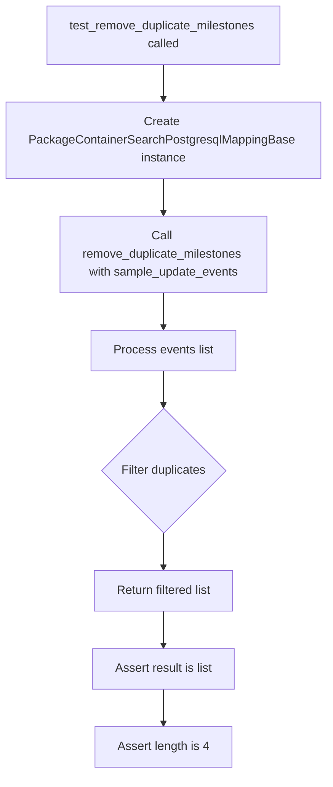
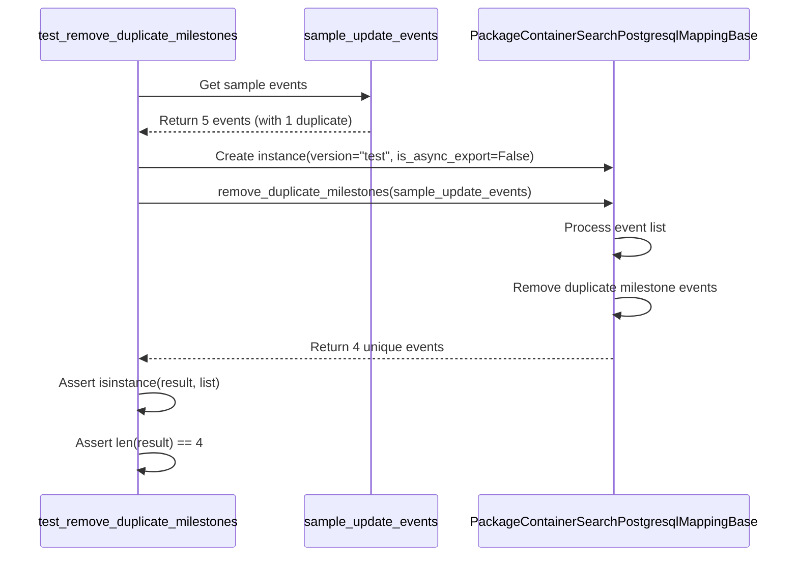
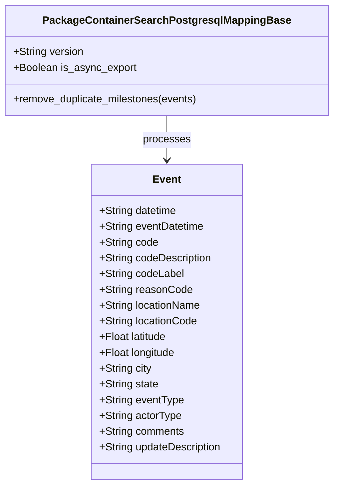
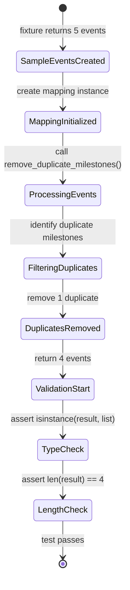

# Diagram: platform/partview_core/partview_service/partview_service/tests/unit/core/validators/package_container/PackageContainerSearchPostgresqlMappingBase_test.py

> Auto-generated by Obscura crawlers

## Diagram 1

### SVG

<svg id="container" width="429.96875" xmlns="http://www.w3.org/2000/svg" class="flowchart" height="1034.6875" viewBox="0 0 429.96875 1034.6875" role="graphics-document document" aria-roledescription="flowchart-v2"><g><marker id="container_flowchart-v2-pointEnd" class="marker flowchart-v2" viewBox="0 0 10 10" refX="5" refY="5" markerUnits="userSpaceOnUse" markerWidth="8" markerHeight="8" orient="auto"><path d="M 0 0 L 10 5 L 0 10 z" class="arrowMarkerPath" style="stroke-width: 1; stroke-dasharray: 1, 0;"></path></marker><marker id="container_flowchart-v2-pointStart" class="marker flowchart-v2" viewBox="0 0 10 10" refX="4.5" refY="5" markerUnits="userSpaceOnUse" markerWidth="8" markerHeight="8" orient="auto"><path d="M 0 5 L 10 10 L 10 0 z" class="arrowMarkerPath" style="stroke-width: 1; stroke-dasharray: 1, 0;"></path></marker><marker id="container_flowchart-v2-circleEnd" class="marker flowchart-v2" viewBox="0 0 10 10" refX="11" refY="5" markerUnits="userSpaceOnUse" markerWidth="11" markerHeight="11" orient="auto"><circle cx="5" cy="5" r="5" class="arrowMarkerPath" style="stroke-width: 1; stroke-dasharray: 1, 0;"></circle></marker><marker id="container_flowchart-v2-circleStart" class="marker flowchart-v2" viewBox="0 0 10 10" refX="-1" refY="5" markerUnits="userSpaceOnUse" markerWidth="11" markerHeight="11" orient="auto"><circle cx="5" cy="5" r="5" class="arrowMarkerPath" style="stroke-width: 1; stroke-dasharray: 1, 0;"></circle></marker><marker id="container_flowchart-v2-crossEnd" class="marker cross flowchart-v2" viewBox="0 0 11 11" refX="12" refY="5.2" markerUnits="userSpaceOnUse" markerWidth="11" markerHeight="11" orient="auto"><path d="M 1,1 l 9,9 M 10,1 l -9,9" class="arrowMarkerPath" style="stroke-width: 2; stroke-dasharray: 1, 0;"></path></marker><marker id="container_flowchart-v2-crossStart" class="marker cross flowchart-v2" viewBox="0 0 11 11" refX="-1" refY="5.2" markerUnits="userSpaceOnUse" markerWidth="11" markerHeight="11" orient="auto"><path d="M 1,1 l 9,9 M 10,1 l -9,9" class="arrowMarkerPath" style="stroke-width: 2; stroke-dasharray: 1, 0;"></path></marker><g class="root"><g class="clusters"></g><g class="edgePaths"><path d="M214.984,86L214.984,90.167C214.984,94.333,214.984,102.667,214.984,110.333C214.984,118,214.984,125,214.984,128.5L214.984,132" id="L_A_B_0" class="edge-thickness-normal edge-pattern-solid edge-thickness-normal edge-pattern-solid flowchart-link" style=";" data-edge="true" data-et="edge" data-id="L_A_B_0" data-points="W3sieCI6MjE0Ljk4NDM3NSwieSI6ODZ9LHsieCI6MjE0Ljk4NDM3NSwieSI6MTExfSx7IngiOjIxNC45ODQzNzUsInkiOjEzNn1d" marker-end="url(#container_flowchart-v2-pointEnd)"></path><path d="M214.984,238L214.984,242.167C214.984,246.333,214.984,254.667,214.984,262.333C214.984,270,214.984,277,214.984,280.5L214.984,284" id="L_B_C_0" class="edge-thickness-normal edge-pattern-solid edge-thickness-normal edge-pattern-solid flowchart-link" style=";" data-edge="true" data-et="edge" data-id="L_B_C_0" data-points="W3sieCI6MjE0Ljk4NDM3NSwieSI6MjM4fSx7IngiOjIxNC45ODQzNzUsInkiOjI2M30seyJ4IjoyMTQuOTg0Mzc1LCJ5IjoyODh9XQ==" marker-end="url(#container_flowchart-v2-pointEnd)"></path><path d="M214.984,390L214.984,394.167C214.984,398.333,214.984,406.667,214.984,414.333C214.984,422,214.984,429,214.984,432.5L214.984,436" id="L_C_D_0" class="edge-thickness-normal edge-pattern-solid edge-thickness-normal edge-pattern-solid flowchart-link" style=";" data-edge="true" data-et="edge" data-id="L_C_D_0" data-points="W3sieCI6MjE0Ljk4NDM3NSwieSI6MzkwfSx7IngiOjIxNC45ODQzNzUsInkiOjQxNX0seyJ4IjoyMTQuOTg0Mzc1LCJ5Ijo0NDB9XQ==" marker-end="url(#container_flowchart-v2-pointEnd)"></path><path d="M214.984,494L214.984,498.167C214.984,502.333,214.984,510.667,214.984,518.333C214.984,526,214.984,533,214.984,536.5L214.984,540" id="L_D_E_0" class="edge-thickness-normal edge-pattern-solid edge-thickness-normal edge-pattern-solid flowchart-link" style=";" data-edge="true" data-et="edge" data-id="L_D_E_0" data-points="W3sieCI6MjE0Ljk4NDM3NSwieSI6NDk0fSx7IngiOjIxNC45ODQzNzUsInkiOjUxOX0seyJ4IjoyMTQuOTg0Mzc1LCJ5Ijo1NDR9XQ==" marker-end="url(#container_flowchart-v2-pointEnd)"></path><path d="M214.984,714.688L214.984,718.854C214.984,723.021,214.984,731.354,214.984,739.021C214.984,746.688,214.984,753.688,214.984,757.188L214.984,760.688" id="L_E_F_0" class="edge-thickness-normal edge-pattern-solid edge-thickness-normal edge-pattern-solid flowchart-link" style=";" data-edge="true" data-et="edge" data-id="L_E_F_0" data-points="W3sieCI6MjE0Ljk4NDM3NSwieSI6NzE0LjY4NzV9LHsieCI6MjE0Ljk4NDM3NSwieSI6NzM5LjY4NzV9LHsieCI6MjE0Ljk4NDM3NSwieSI6NzY0LjY4NzV9XQ==" marker-end="url(#container_flowchart-v2-pointEnd)"></path><path d="M214.984,818.688L214.984,822.854C214.984,827.021,214.984,835.354,214.984,843.021C214.984,850.688,214.984,857.688,214.984,861.188L214.984,864.688" id="L_F_G_0" class="edge-thickness-normal edge-pattern-solid edge-thickness-normal edge-pattern-solid flowchart-link" style=";" data-edge="true" data-et="edge" data-id="L_F_G_0" data-points="W3sieCI6MjE0Ljk4NDM3NSwieSI6ODE4LjY4NzV9LHsieCI6MjE0Ljk4NDM3NSwieSI6ODQzLjY4NzV9LHsieCI6MjE0Ljk4NDM3NSwieSI6ODY4LjY4NzV9XQ==" marker-end="url(#container_flowchart-v2-pointEnd)"></path><path d="M214.984,922.688L214.984,926.854C214.984,931.021,214.984,939.354,214.984,947.021C214.984,954.688,214.984,961.688,214.984,965.188L214.984,968.688" id="L_G_H_0" class="edge-thickness-normal edge-pattern-solid edge-thickness-normal edge-pattern-solid flowchart-link" style=";" data-edge="true" data-et="edge" data-id="L_G_H_0" data-points="W3sieCI6MjE0Ljk4NDM3NSwieSI6OTIyLjY4NzV9LHsieCI6MjE0Ljk4NDM3NSwieSI6OTQ3LjY4NzV9LHsieCI6MjE0Ljk4NDM3NSwieSI6OTcyLjY4NzV9XQ==" marker-end="url(#container_flowchart-v2-pointEnd)"></path></g><g class="edgeLabels"><g class="edgeLabel"><g class="label" data-id="L_A_B_0" transform="translate(0, 0)"><foreignObject width="0" height="0">

</foreignObject></g></g><g class="edgeLabel"><g class="label" data-id="L_B_C_0" transform="translate(0, 0)"><foreignObject width="0" height="0">

</foreignObject></g></g><g class="edgeLabel"><g class="label" data-id="L_C_D_0" transform="translate(0, 0)"><foreignObject width="0" height="0">

</foreignObject></g></g><g class="edgeLabel"><g class="label" data-id="L_D_E_0" transform="translate(0, 0)"><foreignObject width="0" height="0">

</foreignObject></g></g><g class="edgeLabel"><g class="label" data-id="L_E_F_0" transform="translate(0, 0)"><foreignObject width="0" height="0">

</foreignObject></g></g><g class="edgeLabel"><g class="label" data-id="L_F_G_0" transform="translate(0, 0)"><foreignObject width="0" height="0">

</foreignObject></g></g><g class="edgeLabel"><g class="label" data-id="L_G_H_0" transform="translate(0, 0)"><foreignObject width="0" height="0">

</foreignObject></g></g></g><g class="nodes"><g class="node default" id="flowchart-A-0" transform="translate(214.984375, 47)"><rect class="basic label-container" style="" x="-158.59375" y="-39" width="317.1875" height="78"></rect><g class="label" style="" transform="translate(-128.59375, -24)"><rect></rect><foreignObject width="257.1875" height="48">

test_remove_duplicate_milestones called

</foreignObject></g></g><g class="node default" id="flowchart-B-1" transform="translate(214.984375, 187)"><rect class="basic label-container" style="" x="-206.984375" y="-51" width="413.96875" height="102"></rect><g class="label" style="" transform="translate(-176.984375, -36)"><rect></rect><foreignObject width="353.96875" height="72">

Create PackageContainerSearchPostgresqlMappingBase instance

</foreignObject></g></g><g class="node default" id="flowchart-C-3" transform="translate(214.984375, 339)"><rect class="basic label-container" style="" x="-140.6796875" y="-51" width="281.359375" height="102"></rect><g class="label" style="" transform="translate(-110.6796875, -36)"><rect></rect><foreignObject width="221.359375" height="72">

Call remove_duplicate_milestones with sample_update_events

</foreignObject></g></g><g class="node default" id="flowchart-D-5" transform="translate(214.984375, 467)"><rect class="basic label-container" style="" x="-96.796875" y="-27" width="193.59375" height="54"></rect><g class="label" style="" transform="translate(-66.796875, -12)"><rect></rect><foreignObject width="133.59375" height="24">

Process events list

</foreignObject></g></g><g class="node default" id="flowchart-E-7" transform="translate(214.984375, 629.34375)"><polygon points="85.34375,0 170.6875,-85.34375 85.34375,-170.6875 0,-85.34375" class="label-container" transform="translate(-84.84375, 85.34375)"></polygon><g class="label" style="" transform="translate(-58.34375, -12)"><rect></rect><foreignObject width="116.6875" height="24">

Filter duplicates

</foreignObject></g></g><g class="node default" id="flowchart-F-9" transform="translate(214.984375, 791.6875)"><rect class="basic label-container" style="" x="-95.9296875" y="-27" width="191.859375" height="54"></rect><g class="label" style="" transform="translate(-65.9296875, -12)"><rect></rect><foreignObject width="131.859375" height="24">

Return filtered list

</foreignObject></g></g><g class="node default" id="flowchart-G-11" transform="translate(214.984375, 895.6875)"><rect class="basic label-container" style="" x="-96.7265625" y="-27" width="193.453125" height="54"></rect><g class="label" style="" transform="translate(-66.7265625, -12)"><rect></rect><foreignObject width="133.453125" height="24">

Assert result is list

</foreignObject></g></g><g class="node default" id="flowchart-H-13" transform="translate(214.984375, 999.6875)"><rect class="basic label-container" style="" x="-92.015625" y="-27" width="184.03125" height="54"></rect><g class="label" style="" transform="translate(-62.015625, -12)"><rect></rect><foreignObject width="124.03125" height="24">

Assert length is 4

</foreignObject></g></g></g></g></g></svg>

## Diagram 2

### SVG

<svg id="container" width="1062" xmlns="http://www.w3.org/2000/svg" height="723" viewBox="-50 -10 1062 723" role="graphics-document document" aria-roledescription="sequence"><g><rect x="592" y="637" fill="#eaeaea" stroke="#666" width="370" height="65" name="Mapping" rx="3" ry="3" class="actor actor-bottom"></rect><text x="777" y="669.5" dominant-baseline="central" alignment-baseline="central" class="actor actor-box" style="text-anchor: middle; font-size: 16px; font-weight: 400;"><tspan x="777" dy="0">PackageContainerSearchPostgresqlMappingBase</tspan></text></g><g><rect x="355" y="637" fill="#eaeaea" stroke="#666" width="187" height="65" name="Fixture" rx="3" ry="3" class="actor actor-bottom"></rect><text x="448.5" y="669.5" dominant-baseline="central" alignment-baseline="central" class="actor actor-box" style="text-anchor: middle; font-size: 16px; font-weight: 400;"><tspan x="448.5" dy="0">sample_update_events</tspan></text></g><g><rect x="0" y="637" fill="#eaeaea" stroke="#666" width="273" height="65" name="Test" rx="3" ry="3" class="actor actor-bottom"></rect><text x="136.5" y="669.5" dominant-baseline="central" alignment-baseline="central" class="actor actor-box" style="text-anchor: middle; font-size: 16px; font-weight: 400;"><tspan x="136.5" dy="0">test_remove_duplicate_milestones</tspan></text></g><g><line id="actor2" x1="777" y1="65" x2="777" y2="637" class="actor-line 200" stroke-width="0.5px" stroke="#999" name="Mapping"></line><g id="root-2"><rect x="592" y="0" fill="#eaeaea" stroke="#666" width="370" height="65" name="Mapping" rx="3" ry="3" class="actor actor-top"></rect><text x="777" y="32.5" dominant-baseline="central" alignment-baseline="central" class="actor actor-box" style="text-anchor: middle; font-size: 16px; font-weight: 400;"><tspan x="777" dy="0">PackageContainerSearchPostgresqlMappingBase</tspan></text></g></g><g><line id="actor1" x1="448.5" y1="65" x2="448.5" y2="637" class="actor-line 200" stroke-width="0.5px" stroke="#999" name="Fixture"></line><g id="root-1"><rect x="355" y="0" fill="#eaeaea" stroke="#666" width="187" height="65" name="Fixture" rx="3" ry="3" class="actor actor-top"></rect><text x="448.5" y="32.5" dominant-baseline="central" alignment-baseline="central" class="actor actor-box" style="text-anchor: middle; font-size: 16px; font-weight: 400;"><tspan x="448.5" dy="0">sample_update_events</tspan></text></g></g><g><line id="actor0" x1="136.5" y1="65" x2="136.5" y2="637" class="actor-line 200" stroke-width="0.5px" stroke="#999" name="Test"></line><g id="root-0"><rect x="0" y="0" fill="#eaeaea" stroke="#666" width="273" height="65" name="Test" rx="3" ry="3" class="actor actor-top"></rect><text x="136.5" y="32.5" dominant-baseline="central" alignment-baseline="central" class="actor actor-box" style="text-anchor: middle; font-size: 16px; font-weight: 400;"><tspan x="136.5" dy="0">test_remove_duplicate_milestones</tspan></text></g></g><g></g><defs><symbol id="computer" width="24" height="24"><path transform="scale(.5)" d="M2 2v13h20v-13h-20zm18 11h-16v-9h16v9zm-10.228 6l.466-1h3.524l.467 1h-4.457zm14.228 3h-24l2-6h2.104l-1.33 4h18.45l-1.297-4h2.073l2 6zm-5-10h-14v-7h14v7z"></path></symbol></defs><defs><symbol id="database" fill-rule="evenodd" clip-rule="evenodd"><path transform="scale(.5)" d="M12.258.001l.256.004.255.005.253.008.251.01.249.012.247.015.246.016.242.019.241.02.239.023.236.024.233.027.231.028.229.031.225.032.223.034.22.036.217.038.214.04.211.041.208.043.205.045.201.046.198.048.194.05.191.051.187.053.183.054.18.056.175.057.172.059.168.06.163.061.16.063.155.064.15.066.074.033.073.033.071.034.07.034.069.035.068.035.067.035.066.035.064.036.064.036.062.036.06.036.06.037.058.037.058.037.055.038.055.038.053.038.052.038.051.039.05.039.048.039.047.039.045.04.044.04.043.04.041.04.04.041.039.041.037.041.036.041.034.041.033.042.032.042.03.042.029.042.027.042.026.043.024.043.023.043.021.043.02.043.018.044.017.043.015.044.013.044.012.044.011.045.009.044.007.045.006.045.004.045.002.045.001.045v17l-.001.045-.002.045-.004.045-.006.045-.007.045-.009.044-.011.045-.012.044-.013.044-.015.044-.017.043-.018.044-.02.043-.021.043-.023.043-.024.043-.026.043-.027.042-.029.042-.03.042-.032.042-.033.042-.034.041-.036.041-.037.041-.039.041-.04.041-.041.04-.043.04-.044.04-.045.04-.047.039-.048.039-.05.039-.051.039-.052.038-.053.038-.055.038-.055.038-.058.037-.058.037-.06.037-.06.036-.062.036-.064.036-.064.036-.066.035-.067.035-.068.035-.069.035-.07.034-.071.034-.073.033-.074.033-.15.066-.155.064-.16.063-.163.061-.168.06-.172.059-.175.057-.18.056-.183.054-.187.053-.191.051-.194.05-.198.048-.201.046-.205.045-.208.043-.211.041-.214.04-.217.038-.22.036-.223.034-.225.032-.229.031-.231.028-.233.027-.236.024-.239.023-.241.02-.242.019-.246.016-.247.015-.249.012-.251.01-.253.008-.255.005-.256.004-.258.001-.258-.001-.256-.004-.255-.005-.253-.008-.251-.01-.249-.012-.247-.015-.245-.016-.243-.019-.241-.02-.238-.023-.236-.024-.234-.027-.231-.028-.228-.031-.226-.032-.223-.034-.22-.036-.217-.038-.214-.04-.211-.041-.208-.043-.204-.045-.201-.046-.198-.048-.195-.05-.19-.051-.187-.053-.184-.054-.179-.056-.176-.057-.172-.059-.167-.06-.164-.061-.159-.063-.155-.064-.151-.066-.074-.033-.072-.033-.072-.034-.07-.034-.069-.035-.068-.035-.067-.035-.066-.035-.064-.036-.063-.036-.062-.036-.061-.036-.06-.037-.058-.037-.057-.037-.056-.038-.055-.038-.053-.038-.052-.038-.051-.039-.049-.039-.049-.039-.046-.039-.046-.04-.044-.04-.043-.04-.041-.04-.04-.041-.039-.041-.037-.041-.036-.041-.034-.041-.033-.042-.032-.042-.03-.042-.029-.042-.027-.042-.026-.043-.024-.043-.023-.043-.021-.043-.02-.043-.018-.044-.017-.043-.015-.044-.013-.044-.012-.044-.011-.045-.009-.044-.007-.045-.006-.045-.004-.045-.002-.045-.001-.045v-17l.001-.045.002-.045.004-.045.006-.045.007-.045.009-.044.011-.045.012-.044.013-.044.015-.044.017-.043.018-.044.02-.043.021-.043.023-.043.024-.043.026-.043.027-.042.029-.042.03-.042.032-.042.033-.042.034-.041.036-.041.037-.041.039-.041.04-.041.041-.04.043-.04.044-.04.046-.04.046-.039.049-.039.049-.039.051-.039.052-.038.053-.038.055-.038.056-.038.057-.037.058-.037.06-.037.061-.036.062-.036.063-.036.064-.036.066-.035.067-.035.068-.035.069-.035.07-.034.072-.034.072-.033.074-.033.151-.066.155-.064.159-.063.164-.061.167-.06.172-.059.176-.057.179-.056.184-.054.187-.053.19-.051.195-.05.198-.048.201-.046.204-.045.208-.043.211-.041.214-.04.217-.038.22-.036.223-.034.226-.032.228-.031.231-.028.234-.027.236-.024.238-.023.241-.02.243-.019.245-.016.247-.015.249-.012.251-.01.253-.008.255-.005.256-.004.258-.001.258.001zm-9.258 20.499v.01l.001.021.003.021.004.022.005.021.006.022.007.022.009.023.01.022.011.023.012.023.013.023.015.023.016.024.017.023.018.024.019.024.021.024.022.025.023.024.024.025.052.049.056.05.061.051.066.051.07.051.075.051.079.052.084.052.088.052.092.052.097.052.102.051.105.052.11.052.114.051.119.051.123.051.127.05.131.05.135.05.139.048.144.049.147.047.152.047.155.047.16.045.163.045.167.043.171.043.176.041.178.041.183.039.187.039.19.037.194.035.197.035.202.033.204.031.209.03.212.029.216.027.219.025.222.024.226.021.23.02.233.018.236.016.24.015.243.012.246.01.249.008.253.005.256.004.259.001.26-.001.257-.004.254-.005.25-.008.247-.011.244-.012.241-.014.237-.016.233-.018.231-.021.226-.021.224-.024.22-.026.216-.027.212-.028.21-.031.205-.031.202-.034.198-.034.194-.036.191-.037.187-.039.183-.04.179-.04.175-.042.172-.043.168-.044.163-.045.16-.046.155-.046.152-.047.148-.048.143-.049.139-.049.136-.05.131-.05.126-.05.123-.051.118-.052.114-.051.11-.052.106-.052.101-.052.096-.052.092-.052.088-.053.083-.051.079-.052.074-.052.07-.051.065-.051.06-.051.056-.05.051-.05.023-.024.023-.025.021-.024.02-.024.019-.024.018-.024.017-.024.015-.023.014-.024.013-.023.012-.023.01-.023.01-.022.008-.022.006-.022.006-.022.004-.022.004-.021.001-.021.001-.021v-4.127l-.077.055-.08.053-.083.054-.085.053-.087.052-.09.052-.093.051-.095.05-.097.05-.1.049-.102.049-.105.048-.106.047-.109.047-.111.046-.114.045-.115.045-.118.044-.12.043-.122.042-.124.042-.126.041-.128.04-.13.04-.132.038-.134.038-.135.037-.138.037-.139.035-.142.035-.143.034-.144.033-.147.032-.148.031-.15.03-.151.03-.153.029-.154.027-.156.027-.158.026-.159.025-.161.024-.162.023-.163.022-.165.021-.166.02-.167.019-.169.018-.169.017-.171.016-.173.015-.173.014-.175.013-.175.012-.177.011-.178.01-.179.008-.179.008-.181.006-.182.005-.182.004-.184.003-.184.002h-.37l-.184-.002-.184-.003-.182-.004-.182-.005-.181-.006-.179-.008-.179-.008-.178-.01-.176-.011-.176-.012-.175-.013-.173-.014-.172-.015-.171-.016-.17-.017-.169-.018-.167-.019-.166-.02-.165-.021-.163-.022-.162-.023-.161-.024-.159-.025-.157-.026-.156-.027-.155-.027-.153-.029-.151-.03-.15-.03-.148-.031-.146-.032-.145-.033-.143-.034-.141-.035-.14-.035-.137-.037-.136-.037-.134-.038-.132-.038-.13-.04-.128-.04-.126-.041-.124-.042-.122-.042-.12-.044-.117-.043-.116-.045-.113-.045-.112-.046-.109-.047-.106-.047-.105-.048-.102-.049-.1-.049-.097-.05-.095-.05-.093-.052-.09-.051-.087-.052-.085-.053-.083-.054-.08-.054-.077-.054v4.127zm0-5.654v.011l.001.021.003.021.004.021.005.022.006.022.007.022.009.022.01.022.011.023.012.023.013.023.015.024.016.023.017.024.018.024.019.024.021.024.022.024.023.025.024.024.052.05.056.05.061.05.066.051.07.051.075.052.079.051.084.052.088.052.092.052.097.052.102.052.105.052.11.051.114.051.119.052.123.05.127.051.131.05.135.049.139.049.144.048.147.048.152.047.155.046.16.045.163.045.167.044.171.042.176.042.178.04.183.04.187.038.19.037.194.036.197.034.202.033.204.032.209.03.212.028.216.027.219.025.222.024.226.022.23.02.233.018.236.016.24.014.243.012.246.01.249.008.253.006.256.003.259.001.26-.001.257-.003.254-.006.25-.008.247-.01.244-.012.241-.015.237-.016.233-.018.231-.02.226-.022.224-.024.22-.025.216-.027.212-.029.21-.03.205-.032.202-.033.198-.035.194-.036.191-.037.187-.039.183-.039.179-.041.175-.042.172-.043.168-.044.163-.045.16-.045.155-.047.152-.047.148-.048.143-.048.139-.05.136-.049.131-.05.126-.051.123-.051.118-.051.114-.052.11-.052.106-.052.101-.052.096-.052.092-.052.088-.052.083-.052.079-.052.074-.051.07-.052.065-.051.06-.05.056-.051.051-.049.023-.025.023-.024.021-.025.02-.024.019-.024.018-.024.017-.024.015-.023.014-.023.013-.024.012-.022.01-.023.01-.023.008-.022.006-.022.006-.022.004-.021.004-.022.001-.021.001-.021v-4.139l-.077.054-.08.054-.083.054-.085.052-.087.053-.09.051-.093.051-.095.051-.097.05-.1.049-.102.049-.105.048-.106.047-.109.047-.111.046-.114.045-.115.044-.118.044-.12.044-.122.042-.124.042-.126.041-.128.04-.13.039-.132.039-.134.038-.135.037-.138.036-.139.036-.142.035-.143.033-.144.033-.147.033-.148.031-.15.03-.151.03-.153.028-.154.028-.156.027-.158.026-.159.025-.161.024-.162.023-.163.022-.165.021-.166.02-.167.019-.169.018-.169.017-.171.016-.173.015-.173.014-.175.013-.175.012-.177.011-.178.009-.179.009-.179.007-.181.007-.182.005-.182.004-.184.003-.184.002h-.37l-.184-.002-.184-.003-.182-.004-.182-.005-.181-.007-.179-.007-.179-.009-.178-.009-.176-.011-.176-.012-.175-.013-.173-.014-.172-.015-.171-.016-.17-.017-.169-.018-.167-.019-.166-.02-.165-.021-.163-.022-.162-.023-.161-.024-.159-.025-.157-.026-.156-.027-.155-.028-.153-.028-.151-.03-.15-.03-.148-.031-.146-.033-.145-.033-.143-.033-.141-.035-.14-.036-.137-.036-.136-.037-.134-.038-.132-.039-.13-.039-.128-.04-.126-.041-.124-.042-.122-.043-.12-.043-.117-.044-.116-.044-.113-.046-.112-.046-.109-.046-.106-.047-.105-.048-.102-.049-.1-.049-.097-.05-.095-.051-.093-.051-.09-.051-.087-.053-.085-.052-.083-.054-.08-.054-.077-.054v4.139zm0-5.666v.011l.001.02.003.022.004.021.005.022.006.021.007.022.009.023.01.022.011.023.012.023.013.023.015.023.016.024.017.024.018.023.019.024.021.025.022.024.023.024.024.025.052.05.056.05.061.05.066.051.07.051.075.052.079.051.084.052.088.052.092.052.097.052.102.052.105.051.11.052.114.051.119.051.123.051.127.05.131.05.135.05.139.049.144.048.147.048.152.047.155.046.16.045.163.045.167.043.171.043.176.042.178.04.183.04.187.038.19.037.194.036.197.034.202.033.204.032.209.03.212.028.216.027.219.025.222.024.226.021.23.02.233.018.236.017.24.014.243.012.246.01.249.008.253.006.256.003.259.001.26-.001.257-.003.254-.006.25-.008.247-.01.244-.013.241-.014.237-.016.233-.018.231-.02.226-.022.224-.024.22-.025.216-.027.212-.029.21-.03.205-.032.202-.033.198-.035.194-.036.191-.037.187-.039.183-.039.179-.041.175-.042.172-.043.168-.044.163-.045.16-.045.155-.047.152-.047.148-.048.143-.049.139-.049.136-.049.131-.051.126-.05.123-.051.118-.052.114-.051.11-.052.106-.052.101-.052.096-.052.092-.052.088-.052.083-.052.079-.052.074-.052.07-.051.065-.051.06-.051.056-.05.051-.049.023-.025.023-.025.021-.024.02-.024.019-.024.018-.024.017-.024.015-.023.014-.024.013-.023.012-.023.01-.022.01-.023.008-.022.006-.022.006-.022.004-.022.004-.021.001-.021.001-.021v-4.153l-.077.054-.08.054-.083.053-.085.053-.087.053-.09.051-.093.051-.095.051-.097.05-.1.049-.102.048-.105.048-.106.048-.109.046-.111.046-.114.046-.115.044-.118.044-.12.043-.122.043-.124.042-.126.041-.128.04-.13.039-.132.039-.134.038-.135.037-.138.036-.139.036-.142.034-.143.034-.144.033-.147.032-.148.032-.15.03-.151.03-.153.028-.154.028-.156.027-.158.026-.159.024-.161.024-.162.023-.163.023-.165.021-.166.02-.167.019-.169.018-.169.017-.171.016-.173.015-.173.014-.175.013-.175.012-.177.01-.178.01-.179.009-.179.007-.181.006-.182.006-.182.004-.184.003-.184.001-.185.001-.185-.001-.184-.001-.184-.003-.182-.004-.182-.006-.181-.006-.179-.007-.179-.009-.178-.01-.176-.01-.176-.012-.175-.013-.173-.014-.172-.015-.171-.016-.17-.017-.169-.018-.167-.019-.166-.02-.165-.021-.163-.023-.162-.023-.161-.024-.159-.024-.157-.026-.156-.027-.155-.028-.153-.028-.151-.03-.15-.03-.148-.032-.146-.032-.145-.033-.143-.034-.141-.034-.14-.036-.137-.036-.136-.037-.134-.038-.132-.039-.13-.039-.128-.041-.126-.041-.124-.041-.122-.043-.12-.043-.117-.044-.116-.044-.113-.046-.112-.046-.109-.046-.106-.048-.105-.048-.102-.048-.1-.05-.097-.049-.095-.051-.093-.051-.09-.052-.087-.052-.085-.053-.083-.053-.08-.054-.077-.054v4.153zm8.74-8.179l-.257.004-.254.005-.25.008-.247.011-.244.012-.241.014-.237.016-.233.018-.231.021-.226.022-.224.023-.22.026-.216.027-.212.028-.21.031-.205.032-.202.033-.198.034-.194.036-.191.038-.187.038-.183.04-.179.041-.175.042-.172.043-.168.043-.163.045-.16.046-.155.046-.152.048-.148.048-.143.048-.139.049-.136.05-.131.05-.126.051-.123.051-.118.051-.114.052-.11.052-.106.052-.101.052-.096.052-.092.052-.088.052-.083.052-.079.052-.074.051-.07.052-.065.051-.06.05-.056.05-.051.05-.023.025-.023.024-.021.024-.02.025-.019.024-.018.024-.017.023-.015.024-.014.023-.013.023-.012.023-.01.023-.01.022-.008.022-.006.023-.006.021-.004.022-.004.021-.001.021-.001.021.001.021.001.021.004.021.004.022.006.021.006.023.008.022.01.022.01.023.012.023.013.023.014.023.015.024.017.023.018.024.019.024.02.025.021.024.023.024.023.025.051.05.056.05.06.05.065.051.07.052.074.051.079.052.083.052.088.052.092.052.096.052.101.052.106.052.11.052.114.052.118.051.123.051.126.051.131.05.136.05.139.049.143.048.148.048.152.048.155.046.16.046.163.045.168.043.172.043.175.042.179.041.183.04.187.038.191.038.194.036.198.034.202.033.205.032.21.031.212.028.216.027.22.026.224.023.226.022.231.021.233.018.237.016.241.014.244.012.247.011.25.008.254.005.257.004.26.001.26-.001.257-.004.254-.005.25-.008.247-.011.244-.012.241-.014.237-.016.233-.018.231-.021.226-.022.224-.023.22-.026.216-.027.212-.028.21-.031.205-.032.202-.033.198-.034.194-.036.191-.038.187-.038.183-.04.179-.041.175-.042.172-.043.168-.043.163-.045.16-.046.155-.046.152-.048.148-.048.143-.048.139-.049.136-.05.131-.05.126-.051.123-.051.118-.051.114-.052.11-.052.106-.052.101-.052.096-.052.092-.052.088-.052.083-.052.079-.052.074-.051.07-.052.065-.051.06-.05.056-.05.051-.05.023-.025.023-.024.021-.024.02-.025.019-.024.018-.024.017-.023.015-.024.014-.023.013-.023.012-.023.01-.023.01-.022.008-.022.006-.023.006-.021.004-.022.004-.021.001-.021.001-.021-.001-.021-.001-.021-.004-.021-.004-.022-.006-.021-.006-.023-.008-.022-.01-.022-.01-.023-.012-.023-.013-.023-.014-.023-.015-.024-.017-.023-.018-.024-.019-.024-.02-.025-.021-.024-.023-.024-.023-.025-.051-.05-.056-.05-.06-.05-.065-.051-.07-.052-.074-.051-.079-.052-.083-.052-.088-.052-.092-.052-.096-.052-.101-.052-.106-.052-.11-.052-.114-.052-.118-.051-.123-.051-.126-.051-.131-.05-.136-.05-.139-.049-.143-.048-.148-.048-.152-.048-.155-.046-.16-.046-.163-.045-.168-.043-.172-.043-.175-.042-.179-.041-.183-.04-.187-.038-.191-.038-.194-.036-.198-.034-.202-.033-.205-.032-.21-.031-.212-.028-.216-.027-.22-.026-.224-.023-.226-.022-.231-.021-.233-.018-.237-.016-.241-.014-.244-.012-.247-.011-.25-.008-.254-.005-.257-.004-.26-.001-.26.001z"></path></symbol></defs><defs><symbol id="clock" width="24" height="24"><path transform="scale(.5)" d="M12 2c5.514 0 10 4.486 10 10s-4.486 10-10 10-10-4.486-10-10 4.486-10 10-10zm0-2c-6.627 0-12 5.373-12 12s5.373 12 12 12 12-5.373 12-12-5.373-12-12-12zm5.848 12.459c.202.038.202.333.001.372-1.907.361-6.045 1.111-6.547 1.111-.719 0-1.301-.582-1.301-1.301 0-.512.77-5.447 1.125-7.445.034-.192.312-.181.343.014l.985 6.238 5.394 1.011z"></path></symbol></defs><defs><marker id="arrowhead" refX="7.9" refY="5" markerUnits="userSpaceOnUse" markerWidth="12" markerHeight="12" orient="auto-start-reverse"><path d="M -1 0 L 10 5 L 0 10 z"></path></marker></defs><defs><marker id="crosshead" markerWidth="15" markerHeight="8" orient="auto" refX="4" refY="4.5"><path fill="none" stroke="#000000" stroke-width="1pt" d="M 1,2 L 6,7 M 6,2 L 1,7" style="stroke-dasharray: 0, 0;"></path></marker></defs><defs><marker id="filled-head" refX="15.5" refY="7" markerWidth="20" markerHeight="28" orient="auto"><path d="M 18,7 L9,13 L14,7 L9,1 Z"></path></marker></defs><defs><marker id="sequencenumber" refX="15" refY="15" markerWidth="60" markerHeight="40" orient="auto"><circle cx="15" cy="15" r="6"></circle></marker></defs><text x="291" y="80" text-anchor="middle" dominant-baseline="middle" alignment-baseline="middle" class="messageText" dy="1em" style="font-size: 16px; font-weight: 400;">Get sample events</text><line x1="137.5" y1="113" x2="444.5" y2="113" class="messageLine0" stroke-width="2" stroke="none" marker-end="url(#arrowhead)" style="fill: none;"></line><text x="294" y="128" text-anchor="middle" dominant-baseline="middle" alignment-baseline="middle" class="messageText" dy="1em" style="font-size: 16px; font-weight: 400;">Return 5 events (with 1 duplicate)</text><line x1="447.5" y1="161" x2="140.5" y2="161" class="messageLine1" stroke-width="2" stroke="none" marker-end="url(#arrowhead)" style="stroke-dasharray: 3, 3; fill: none;"></line><text x="455" y="176" text-anchor="middle" dominant-baseline="middle" alignment-baseline="middle" class="messageText" dy="1em" style="font-size: 16px; font-weight: 400;">Create instance(version="test", is_async_export=False)</text><line x1="137.5" y1="209" x2="773" y2="209" class="messageLine0" stroke-width="2" stroke="none" marker-end="url(#arrowhead)" style="fill: none;"></line><text x="455" y="224" text-anchor="middle" dominant-baseline="middle" alignment-baseline="middle" class="messageText" dy="1em" style="font-size: 16px; font-weight: 400;">remove_duplicate_milestones(sample_update_events)</text><line x1="137.5" y1="257" x2="773" y2="257" class="messageLine0" stroke-width="2" stroke="none" marker-end="url(#arrowhead)" style="fill: none;"></line><text x="778" y="272" text-anchor="middle" dominant-baseline="middle" alignment-baseline="middle" class="messageText" dy="1em" style="font-size: 16px; font-weight: 400;">Process event list</text><path d="M 778,305 C 838,295 838,335 778,325" class="messageLine0" stroke-width="2" stroke="none" marker-end="url(#arrowhead)" style="fill: none;"></path><text x="778" y="350" text-anchor="middle" dominant-baseline="middle" alignment-baseline="middle" class="messageText" dy="1em" style="font-size: 16px; font-weight: 400;">Remove duplicate milestone events</text><path d="M 778,383 C 838,373 838,413 778,403" class="messageLine0" stroke-width="2" stroke="none" marker-end="url(#arrowhead)" style="fill: none;"></path><text x="458" y="428" text-anchor="middle" dominant-baseline="middle" alignment-baseline="middle" class="messageText" dy="1em" style="font-size: 16px; font-weight: 400;">Return 4 unique events</text><line x1="776" y1="461" x2="140.5" y2="461" class="messageLine1" stroke-width="2" stroke="none" marker-end="url(#arrowhead)" style="stroke-dasharray: 3, 3; fill: none;"></line><text x="138" y="476" text-anchor="middle" dominant-baseline="middle" alignment-baseline="middle" class="messageText" dy="1em" style="font-size: 16px; font-weight: 400;">Assert isinstance(result, list)</text><path d="M 137.5,509 C 197.5,499 197.5,539 137.5,529" class="messageLine0" stroke-width="2" stroke="none" marker-end="url(#arrowhead)" style="fill: none;"></path><text x="138" y="554" text-anchor="middle" dominant-baseline="middle" alignment-baseline="middle" class="messageText" dy="1em" style="font-size: 16px; font-weight: 400;">Assert len(result) == 4</text><path d="M 137.5,587 C 197.5,577 197.5,617 137.5,607" class="messageLine0" stroke-width="2" stroke="none" marker-end="url(#arrowhead)" style="fill: none;"></path></svg>

## Diagram 3

### SVG

<svg id="container" width="501.3671875" xmlns="http://www.w3.org/2000/svg" class="classDiagram" height="738" viewBox="0 0 501.3671875 738" role="graphics-document document" aria-roledescription="class"><g><defs><marker id="container_class-aggregationStart" class="marker aggregation class" refX="18" refY="7" markerWidth="190" markerHeight="240" orient="auto"><path d="M 18,7 L9,13 L1,7 L9,1 Z"></path></marker></defs><defs><marker id="container_class-aggregationEnd" class="marker aggregation class" refX="1" refY="7" markerWidth="20" markerHeight="28" orient="auto"><path d="M 18,7 L9,13 L1,7 L9,1 Z"></path></marker></defs><defs><marker id="container_class-extensionStart" class="marker extension class" refX="18" refY="7" markerWidth="190" markerHeight="240" orient="auto"><path d="M 1,7 L18,13 V 1 Z"></path></marker></defs><defs><marker id="container_class-extensionEnd" class="marker extension class" refX="1" refY="7" markerWidth="20" markerHeight="28" orient="auto"><path d="M 1,1 V 13 L18,7 Z"></path></marker></defs><defs><marker id="container_class-compositionStart" class="marker composition class" refX="18" refY="7" markerWidth="190" markerHeight="240" orient="auto"><path d="M 18,7 L9,13 L1,7 L9,1 Z"></path></marker></defs><defs><marker id="container_class-compositionEnd" class="marker composition class" refX="1" refY="7" markerWidth="20" markerHeight="28" orient="auto"><path d="M 18,7 L9,13 L1,7 L9,1 Z"></path></marker></defs><defs><marker id="container_class-dependencyStart" class="marker dependency class" refX="6" refY="7" markerWidth="190" markerHeight="240" orient="auto"><path d="M 5,7 L9,13 L1,7 L9,1 Z"></path></marker></defs><defs><marker id="container_class-dependencyEnd" class="marker dependency class" refX="13" refY="7" markerWidth="20" markerHeight="28" orient="auto"><path d="M 18,7 L9,13 L14,7 L9,1 Z"></path></marker></defs><defs><marker id="container_class-lollipopStart" class="marker lollipop class" refX="13" refY="7" markerWidth="190" markerHeight="240" orient="auto"><circle stroke="black" fill="transparent" cx="7" cy="7" r="6"></circle></marker></defs><defs><marker id="container_class-lollipopEnd" class="marker lollipop class" refX="1" refY="7" markerWidth="190" markerHeight="240" orient="auto"><circle stroke="black" fill="transparent" cx="7" cy="7" r="6"></circle></marker></defs><g class="root"><g class="clusters"></g><g class="edgePaths"><path d="M250.684,176L250.684,182.167C250.684,188.333,250.684,200.667,250.684,212C250.684,223.333,250.684,233.667,250.684,238.833L250.684,244" id="id_PackageContainerSearchPostgresqlMappingBase_Event_1" class="edge-thickness-normal edge-pattern-solid relation" style=";;;" data-edge="true" data-et="edge" data-id="id_PackageContainerSearchPostgresqlMappingBase_Event_1" data-points="W3sieCI6MjUwLjY4MzU5Mzc1LCJ5IjoxNzZ9LHsieCI6MjUwLjY4MzU5Mzc1LCJ5IjoyMTN9LHsieCI6MjUwLjY4MzU5Mzc1LCJ5IjoyNTB9XQ==" marker-end="url(#container_class-dependencyEnd)"></path></g><g class="edgeLabels"><g class="edgeLabel" transform="translate(250.68359375, 213)"><g class="label" data-id="id_PackageContainerSearchPostgresqlMappingBase_Event_1" transform="translate(-35.7890625, -12)"><foreignObject width="71.578125" height="24">

processes

</foreignObject></g></g></g><g class="nodes"><g class="node default" id="classId-PackageContainerSearchPostgresqlMappingBase-0" transform="translate(250.68359375, 92)"><g class="basic label-container"><path d="M-242.68359375 -84 L242.68359375 -84 L242.68359375 84 L-242.68359375 84" stroke="none" stroke-width="0" fill="#ECECFF" style=""></path><path d="M-242.68359375 -84 C-136.21629803840653 -84, -29.74900232681307 -84, 242.68359375 -84 M-242.68359375 -84 C-75.80351893184135 -84, 91.0765558863173 -84, 242.68359375 -84 M242.68359375 -84 C242.68359375 -36.566781657980336, 242.68359375 10.866436684039328, 242.68359375 84 M242.68359375 -84 C242.68359375 -49.12421008837878, 242.68359375 -14.248420176757563, 242.68359375 84 M242.68359375 84 C93.94140977080798 84, -54.80077420838404 84, -242.68359375 84 M242.68359375 84 C81.59237515728876 84, -79.49884343542249 84, -242.68359375 84 M-242.68359375 84 C-242.68359375 32.00011571246134, -242.68359375 -19.999768575077326, -242.68359375 -84 M-242.68359375 84 C-242.68359375 42.323289136027775, -242.68359375 0.6465782720555495, -242.68359375 -84" stroke="#9370DB" stroke-width="1.3" fill="none" stroke-dasharray="0 0" style=""></path></g><g class="annotation-group text" transform="translate(0, -60)"></g><g class="label-group text" transform="translate(-178.0859375, -60)"><g class="label" style="font-weight: bolder" transform="translate(0,-12)"><foreignObject width="356.171875" height="24">

PackageContainerSearchPostgresqlMappingBase

</foreignObject></g></g><g class="members-group text" transform="translate(-230.68359375, -12)"><g class="label" style="" transform="translate(0,-12)"><foreignObject width="107.640625" height="24">

+String version

</foreignObject></g><g class="label" style="" transform="translate(0,12)"><foreignObject width="187.34375" height="24">

+Boolean is_async_export

</foreignObject></g></g><g class="methods-group text" transform="translate(-230.68359375, 60)"><g class="label" style="" transform="translate(0,-12)"><foreignObject width="283.28125" height="24">

+remove_duplicate_milestones(events)

</foreignObject></g></g><g class="divider" style=""><path d="M-242.68359375 -36 C-95.47047885443845 -36, 51.74263604112309 -36, 242.68359375 -36 M-242.68359375 -36 C-119.53148025730091 -36, 3.6206332353981736 -36, 242.68359375 -36" stroke="#9370DB" stroke-width="1.3" fill="none" stroke-dasharray="0 0" style=""></path></g><g class="divider" style=""><path d="M-242.68359375 36 C-103.79990926851937 36, 35.08377521296126 36, 242.68359375 36 M-242.68359375 36 C-122.87212469582698 36, -3.060655641653966 36, 242.68359375 36" stroke="#9370DB" stroke-width="1.3" fill="none" stroke-dasharray="0 0" style=""></path></g></g><g class="node default" id="classId-Event-1" transform="translate(250.68359375, 490)"><g class="basic label-container"><path d="M-116.68359375 -240 L116.68359375 -240 L116.68359375 240 L-116.68359375 240" stroke="none" stroke-width="0" fill="#ECECFF" style=""></path><path d="M-116.68359375 -240 C-44.89897596200099 -240, 26.88564182599802 -240, 116.68359375 -240 M-116.68359375 -240 C-65.93076488569932 -240, -15.177936021398637 -240, 116.68359375 -240 M116.68359375 -240 C116.68359375 -110.68400718483767, 116.68359375 18.631985630324664, 116.68359375 240 M116.68359375 -240 C116.68359375 -66.98749939238684, 116.68359375 106.02500121522633, 116.68359375 240 M116.68359375 240 C24.892134921524544 240, -66.89932390695091 240, -116.68359375 240 M116.68359375 240 C30.594178285382043 240, -55.495237179235914 240, -116.68359375 240 M-116.68359375 240 C-116.68359375 98.06779938719782, -116.68359375 -43.864401225604354, -116.68359375 -240 M-116.68359375 240 C-116.68359375 124.07584532248308, -116.68359375 8.151690644966152, -116.68359375 -240" stroke="#9370DB" stroke-width="1.3" fill="none" stroke-dasharray="0 0" style=""></path></g><g class="annotation-group text" transform="translate(0, -216)"></g><g class="label-group text" transform="translate(-20.2109375, -216)"><g class="label" style="font-weight: bolder" transform="translate(0,-12)"><foreignObject width="40.421875" height="24">

Event

</foreignObject></g></g><g class="members-group text" transform="translate(-104.68359375, -168)"><g class="label" style="" transform="translate(0,-12)"><foreignObject width="119.71875" height="24">

+String datetime

</foreignObject></g><g class="label" style="" transform="translate(0,12)"><foreignObject width="160.625" height="24">

+String eventDatetime

</foreignObject></g><g class="label" style="" transform="translate(0,36)"><foreignObject width="89.4375" height="24">

+String code

</foreignObject></g><g class="label" style="" transform="translate(0,60)"><foreignObject width="172.78125" height="24">

+String codeDescription

</foreignObject></g><g class="label" style="" transform="translate(0,84)"><foreignObject width="128.859375" height="24">

+String codeLabel

</foreignObject></g><g class="label" style="" transform="translate(0,108)"><foreignObject width="139.734375" height="24">

+String reasonCode

</foreignObject></g><g class="label" style="" transform="translate(0,132)"><foreignObject width="155.6875" height="24">

+String locationName

</foreignObject></g><g class="label" style="" transform="translate(0,156)"><foreignObject width="149.890625" height="24">

+String locationCode

</foreignObject></g><g class="label" style="" transform="translate(0,180)"><foreignObject width="105.171875" height="24">

+Float latitude

</foreignObject></g><g class="label" style="" transform="translate(0,204)"><foreignObject width="117.734375" height="24">

+Float longitude

</foreignObject></g><g class="label" style="" transform="translate(0,228)"><foreignObject width="80.203125" height="24">

+String city

</foreignObject></g><g class="label" style="" transform="translate(0,252)"><foreignObject width="90.5625" height="24">

+String state

</foreignObject></g><g class="label" style="" transform="translate(0,276)"><foreignObject width="128.53125" height="24">

+String eventType

</foreignObject></g><g class="label" style="" transform="translate(0,300)"><foreignObject width="125.609375" height="24">

+String actorType

</foreignObject></g><g class="label" style="" transform="translate(0,324)"><foreignObject width="129.90625" height="24">

+String comments

</foreignObject></g><g class="label" style="" transform="translate(0,348)"><foreignObject width="189.15625" height="24">

+String updateDescription

</foreignObject></g></g><g class="methods-group text" transform="translate(-104.68359375, 240)"></g><g class="divider" style=""><path d="M-116.68359375 -192 C-44.12700821885488 -192, 28.429577312290235 -192, 116.68359375 -192 M-116.68359375 -192 C-48.5095772811936 -192, 19.6644391876128 -192, 116.68359375 -192" stroke="#9370DB" stroke-width="1.3" fill="none" stroke-dasharray="0 0" style=""></path></g><g class="divider" style=""><path d="M-116.68359375 216 C-40.08984674020702 216, 36.503900269585955 216, 116.68359375 216 M-116.68359375 216 C-67.08463216080523 216, -17.48567057161047 216, 116.68359375 216" stroke="#9370DB" stroke-width="1.3" fill="none" stroke-dasharray="0 0" style=""></path></g></g></g></g></g></svg>

## Diagram 4

### SVG

<svg id="container" width="243.484375" xmlns="http://www.w3.org/2000/svg" class="statediagram" height="1102" viewBox="0 0 243.484375 1102" role="graphics-document document" aria-roledescription="stateDiagram"><g><defs><marker id="container_stateDiagram-barbEnd" refX="19" refY="7" markerWidth="20" markerHeight="14" markerUnits="userSpaceOnUse" orient="auto"><path d="M 19,7 L9,13 L14,7 L9,1 Z"></path></marker></defs><g class="root"><g class="clusters"></g><g class="edgePaths"><path d="M121.742,22L121.742,28.167C121.742,34.333,121.742,46.667,121.826,59.083C121.909,71.5,122.076,84,122.159,90.25L122.242,96.5" id="edge0" class="edge-thickness-normal edge-pattern-solid transition" style="fill:none;;;fill:none" data-edge="true" data-et="edge" data-id="edge0" data-points="W3sieCI6MTIxLjc0MjE4NzUsInkiOjIyfSx7IngiOjEyMS43NDIxODc1LCJ5Ijo1OX0seyJ4IjoxMjIuMjQyMTg3NSwieSI6OTYuNX1d" marker-end="url(#container_stateDiagram-barbEnd)"></path><path d="M122.242,136.5L122.159,142.583C122.076,148.667,121.909,160.833,121.909,173.167C121.909,185.5,122.076,198,122.159,204.25L122.242,210.5" id="edge1" class="edge-thickness-normal edge-pattern-solid transition" style="fill:none;;;fill:none" data-edge="true" data-et="edge" data-id="edge1" data-points="W3sieCI6MTIyLjI0MjE4NzUsInkiOjEzNi41fSx7IngiOjEyMS43NDIxODc1LCJ5IjoxNzN9LHsieCI6MTIyLjI0MjE4NzUsInkiOjIxMC41fV0=" marker-end="url(#container_stateDiagram-barbEnd)"></path><path d="M122.242,250.5L122.159,258.583C122.076,266.667,121.909,282.833,121.909,299.167C121.909,315.5,122.076,332,122.159,340.25L122.242,348.5" id="edge2" class="edge-thickness-normal edge-pattern-solid transition" style="fill:none;;;fill:none" data-edge="true" data-et="edge" data-id="edge2" data-points="W3sieCI6MTIyLjI0MjE4NzUsInkiOjI1MC41fSx7IngiOjEyMS43NDIxODc1LCJ5IjoyOTl9LHsieCI6MTIyLjI0MjE4NzUsInkiOjM0OC41fV0=" marker-end="url(#container_stateDiagram-barbEnd)"></path><path d="M122.242,388.5L122.159,396.583C122.076,404.667,121.909,420.833,121.909,437.167C121.909,453.5,122.076,470,122.159,478.25L122.242,486.5" id="edge3" class="edge-thickness-normal edge-pattern-solid transition" style="fill:none;;;fill:none" data-edge="true" data-et="edge" data-id="edge3" data-points="W3sieCI6MTIyLjI0MjE4NzUsInkiOjM4OC41fSx7IngiOjEyMS43NDIxODc1LCJ5Ijo0Mzd9LHsieCI6MTIyLjI0MjE4NzUsInkiOjQ4Ni41fV0=" marker-end="url(#container_stateDiagram-barbEnd)"></path><path d="M122.242,526.5L122.159,532.583C122.076,538.667,121.909,550.833,121.909,563.167C121.909,575.5,122.076,588,122.159,594.25L122.242,600.5" id="edge4" class="edge-thickness-normal edge-pattern-solid transition" style="fill:none;;;fill:none" data-edge="true" data-et="edge" data-id="edge4" data-points="W3sieCI6MTIyLjI0MjE4NzUsInkiOjUyNi41fSx7IngiOjEyMS43NDIxODc1LCJ5Ijo1NjN9LHsieCI6MTIyLjI0MjE4NzUsInkiOjYwMC41fV0=" marker-end="url(#container_stateDiagram-barbEnd)"></path><path d="M122.242,640.5L122.159,646.583C122.076,652.667,121.909,664.833,121.909,677.167C121.909,689.5,122.076,702,122.159,708.25L122.242,714.5" id="edge5" class="edge-thickness-normal edge-pattern-solid transition" style="fill:none;;;fill:none" data-edge="true" data-et="edge" data-id="edge5" data-points="W3sieCI6MTIyLjI0MjE4NzUsInkiOjY0MC41fSx7IngiOjEyMS43NDIxODc1LCJ5Ijo2Nzd9LHsieCI6MTIyLjI0MjE4NzUsInkiOjcxNC41fV0=" marker-end="url(#container_stateDiagram-barbEnd)"></path><path d="M122.242,754.5L122.159,762.583C122.076,770.667,121.909,786.833,121.909,803.167C121.909,819.5,122.076,836,122.159,844.25L122.242,852.5" id="edge6" class="edge-thickness-normal edge-pattern-solid transition" style="fill:none;;;fill:none" data-edge="true" data-et="edge" data-id="edge6" data-points="W3sieCI6MTIyLjI0MjE4NzUsInkiOjc1NC41fSx7IngiOjEyMS43NDIxODc1LCJ5Ijo4MDN9LHsieCI6MTIyLjI0MjE4NzUsInkiOjg1Mi41fV0=" marker-end="url(#container_stateDiagram-barbEnd)"></path><path d="M122.242,892.5L122.159,898.583C122.076,904.667,121.909,916.833,121.909,929.167C121.909,941.5,122.076,954,122.159,960.25L122.242,966.5" id="edge7" class="edge-thickness-normal edge-pattern-solid transition" style="fill:none;;;fill:none" data-edge="true" data-et="edge" data-id="edge7" data-points="W3sieCI6MTIyLjI0MjE4NzUsInkiOjg5Mi41fSx7IngiOjEyMS43NDIxODc1LCJ5Ijo5Mjl9LHsieCI6MTIyLjI0MjE4NzUsInkiOjk2Ni41fV0=" marker-end="url(#container_stateDiagram-barbEnd)"></path><path d="M122.242,1006.5L122.159,1012.583C122.076,1018.667,121.909,1030.833,121.826,1043.083C121.742,1055.333,121.742,1067.667,121.742,1073.833L121.742,1080" id="edge8" class="edge-thickness-normal edge-pattern-solid transition" style="fill:none;;;fill:none" data-edge="true" data-et="edge" data-id="edge8" data-points="W3sieCI6MTIyLjI0MjE4NzUsInkiOjEwMDYuNX0seyJ4IjoxMjEuNzQyMTg3NSwieSI6MTA0M30seyJ4IjoxMjEuNzQyMTg3NSwieSI6MTA4MH1d" marker-end="url(#container_stateDiagram-barbEnd)"></path></g><g class="edgeLabels"><g class="edgeLabel" transform="translate(121.7421875, 59)"><g class="label" data-id="edge0" transform="translate(-83.7734375, -12)"><foreignObject width="167.546875" height="24">

fixture returns 5 events

</foreignObject></g></g><g class="edgeLabel" transform="translate(121.7421875, 173)"><g class="label" data-id="edge1" transform="translate(-89.0703125, -12)"><foreignObject width="178.140625" height="24">

create mapping instance

</foreignObject></g></g><g class="edgeLabel" transform="translate(121.7421875, 299)"><g class="label" data-id="edge2" transform="translate(-113.7421875, -24)"><foreignObject width="227.484375" height="48">

call remove_duplicate_milestones()

</foreignObject></g></g><g class="edgeLabel" transform="translate(121.7421875, 437)"><g class="label" data-id="edge3" transform="translate(-100, -24)"><foreignObject width="200" height="48">

identify duplicate milestones

</foreignObject></g></g><g class="edgeLabel" transform="translate(121.7421875, 563)"><g class="label" data-id="edge4" transform="translate(-68.6953125, -12)"><foreignObject width="137.390625" height="24">

remove 1 duplicate

</foreignObject></g></g><g class="edgeLabel" transform="translate(121.7421875, 677)"><g class="label" data-id="edge5" transform="translate(-54.9296875, -12)"><foreignObject width="109.859375" height="24">

return 4 events

</foreignObject></g></g><g class="edgeLabel" transform="translate(121.7421875, 803)"><g class="label" data-id="edge6" transform="translate(-100, -24)"><foreignObject width="200" height="48">

assert isinstance(result, list)

</foreignObject></g></g><g class="edgeLabel" transform="translate(121.7421875, 929)"><g class="label" data-id="edge7" transform="translate(-77.984375, -12)"><foreignObject width="155.96875" height="24">

assert len(result) == 4

</foreignObject></g></g><g class="edgeLabel" transform="translate(121.7421875, 1043)"><g class="label" data-id="edge8" transform="translate(-40.3046875, -12)"><foreignObject width="80.609375" height="24">

test passes

</foreignObject></g></g></g><g class="nodes"><g class="node default" id="state-root_start-0" transform="translate(121.7421875, 15)"><circle class="state-start" r="7" width="14" height="14"></circle></g><g class="node  statediagram-state" id="state-SampleEventsCreated-1" transform="translate(121.7421875, 116)"><g class="basic label-container outer-path"><path d="M-81.4375 -20 C-39.902867814902905 -20, 1.6317643701941904 -20, 81.4375 -20 C81.4375 -20, 81.4375 -20, 81.4375 -20 C81.5670423776866 -19.994642087626264, 81.69658475537321 -19.98928417525253, 81.85039672736166 -19.982922465033347 C81.95755599019643 -19.969565076850962, 82.0647152530312 -19.95620768866858, 82.26047295140367 -19.931806517013612 C82.38113881915106 -19.9065055451755, 82.50180468689847 -19.881204573337385, 82.664927435704 -19.847001329696653 C82.75801055723913 -19.81928928373984, 82.85109367877426 -19.791577237783027, 83.06099734602341 -19.729086208503173 C83.1561599946426 -19.69195362778538, 83.2513226432618 -19.654821047067585, 83.44597712326485 -19.578866633275286 C83.56929178889146 -19.51858176667522, 83.69260645451807 -19.458296900075155, 83.81723696518537 -19.397368756032446 C83.92915363485463 -19.330680895908902, 84.0410703045239 -19.26399303578536, 84.17224079061214 -19.185832391312644 C84.29943643618907 -19.09501644592079, 84.426632081766 -19.00420050052894, 84.50856356344833 -18.94570254698197 C84.58979328972737 -18.8769044782323, 84.67102301600639 -18.80810640948263, 84.8239078581287 -18.678619553365657 C84.88994115890544 -18.612586252588926, 84.95597445968217 -18.546552951812192, 85.11611955336566 -18.386407858128706 C85.21998963905057 -18.263768679702565, 85.32385972473548 -18.141129501276428, 85.38320254698196 -18.07106356344834 C85.44938339168898 -17.978371523179263, 85.515564236396 -17.885679482910188, 85.62333239131264 -17.734740790612136 C85.70782658733886 -17.592941233569565, 85.79232078336507 -17.451141676526994, 85.83486875603245 -17.37973696518537 C85.87162087957701 -17.30455929487498, 85.90837300312157 -17.229381624564596, 86.01636663327528 -17.008477123264846 C86.0490967926037 -16.924596913723455, 86.08182695193214 -16.84071670418206, 86.16658620850318 -16.623497346023417 C86.20593554562492 -16.49132525251076, 86.24528488274667 -16.359153158998105, 86.28450132969665 -16.227427435703994 C86.30693502707732 -16.12043622688639, 86.32936872445798 -16.013445018068786, 86.36930651701361 -15.82297295140367 C86.38869049386838 -15.66746555413398, 86.40807447072316 -15.51195815686429, 86.42042246503335 -15.412896727361662 C86.4250730219796 -15.300456627121045, 86.42972357892583 -15.188016526880427, 86.4375 -15 C86.4375 -15, 86.4375 -15, 86.4375 -15 C86.4375 -4.478384284160169, 86.4375 6.043231431679661, 86.4375 15 C86.4375 15, 86.4375 15, 86.4375 15 C86.43171622501482 15.139838786326036, 86.42593245002965 15.279677572652075, 86.42042246503335 15.412896727361662 C86.40169174777287 15.56316336830927, 86.38296103051238 15.713430009256879, 86.36930651701361 15.822972951403669 C86.34203116079617 15.953055090032787, 86.31475580457872 16.083137228661908, 86.28450132969665 16.227427435703994 C86.25830690753058 16.31541294878473, 86.23211248536451 16.40339846186546, 86.16658620850318 16.623497346023417 C86.12611140454673 16.72722537872089, 86.0856366005903 16.83095341141837, 86.01636663327528 17.008477123264846 C85.95509700326582 17.13380615464194, 85.89382737325636 17.25913518601903, 85.83486875603245 17.379736965185366 C85.77731372140454 17.4763267760793, 85.71975868677664 17.572916586973236, 85.62333239131264 17.734740790612133 C85.56190792719447 17.820771105376988, 85.50048346307628 17.906801420141846, 85.38320254698196 18.07106356344834 C85.28766823135189 18.18386071676847, 85.19213391572181 18.296657870088602, 85.11611955336566 18.386407858128706 C85.0250008216255 18.47752658986887, 84.93388208988533 18.568645321609033, 84.8239078581287 18.678619553365657 C84.74388781546759 18.746393072353527, 84.66386777280647 18.814166591341394, 84.50856356344833 18.94570254698197 C84.38326074383082 19.035167040614702, 84.25795792421331 19.124631534247435, 84.17224079061214 19.185832391312644 C84.0798640414129 19.240876986076508, 83.98748729221369 19.295921580840368, 83.81723696518537 19.397368756032446 C83.73430556278538 19.437911448219424, 83.6513741603854 19.478454140406402, 83.44597712326485 19.578866633275286 C83.33640102555869 19.621623359279177, 83.2268249278525 19.664380085283064, 83.06099734602341 19.729086208503173 C82.94088062183246 19.76484650667608, 82.82076389764153 19.80060680484899, 82.664927435704 19.847001329696653 C82.5678424248048 19.867357915801065, 82.4707574139056 19.887714501905478, 82.26047295140367 19.931806517013612 C82.09723868705487 19.952153646845353, 81.93400442270607 19.972500776677094, 81.85039672736166 19.982922465033347 C81.76768067937567 19.986343626084466, 81.68496463138968 19.989764787135584, 81.4375 20 C81.4375 20, 81.4375 20, 81.4375 20 C24.883827622148843 20, -31.669844755702314 20, -81.4375 20 C-81.4375 20, -81.4375 20, -81.4375 20 C-81.57301300849741 19.994395140509255, -81.70852601699482 19.98879028101851, -81.85039672736166 19.982922465033347 C-81.93384172773081 19.97252105658461, -82.01728672809995 19.962119648135875, -82.26047295140367 19.931806517013612 C-82.38904069906891 19.904848695189653, -82.51760844673416 19.87789087336569, -82.664927435704 19.847001329696653 C-82.80180986471542 19.80624966493847, -82.93869229372685 19.765498000180287, -83.06099734602341 19.729086208503173 C-83.14744230917583 19.695355279210222, -83.23388727232825 19.661624349917275, -83.44597712326485 19.578866633275286 C-83.55750470558641 19.524344120577233, -83.66903228790797 19.46982160787918, -83.81723696518537 19.397368756032446 C-83.89635269764835 19.35022601209935, -83.97546843011135 19.303083268166247, -84.17224079061214 19.185832391312644 C-84.25282976210923 19.128292971614197, -84.33341873360634 19.070753551915747, -84.50856356344833 18.94570254698197 C-84.59021082003221 18.876550848102863, -84.67185807661609 18.807399149223755, -84.8239078581287 18.67861955336566 C-84.90197284638435 18.600554565110016, -84.98003783464 18.52248957685437, -85.11611955336566 18.386407858128706 C-85.21466575959961 18.27005457229233, -85.31321196583357 18.153701286455956, -85.38320254698196 18.07106356344834 C-85.47596914203899 17.941135863028116, -85.568735737096 17.81120816260789, -85.62333239131264 17.734740790612133 C-85.68299769781657 17.634609486558524, -85.74266300432049 17.534478182504916, -85.83486875603245 17.37973696518537 C-85.87608942155711 17.295418746157015, -85.91731008708176 17.21110052712866, -86.01636663327528 17.00847712326485 C-86.05325650182377 16.91393649262655, -86.09014637037225 16.819395861988255, -86.16658620850318 16.623497346023417 C-86.20043968131156 16.5097855353285, -86.23429315411995 16.39607372463358, -86.28450132969665 16.227427435703994 C-86.30584146955412 16.125651641863822, -86.32718160941158 16.02387584802365, -86.36930651701361 15.82297295140367 C-86.38964095204855 15.659840530697364, -86.4099753870835 15.496708109991058, -86.42042246503335 15.412896727361664 C-86.42567667288301 15.285861693895765, -86.43093088073267 15.158826660429865, -86.4375 15 C-86.4375 15, -86.4375 15, -86.4375 15 C-86.4375 5.170593952080512, -86.4375 -4.658812095838975, -86.4375 -15 C-86.4375 -15, -86.4375 -15, -86.4375 -15 C-86.43312288279584 -15.105828936811239, -86.42874576559167 -15.211657873622478, -86.42042246503335 -15.41289672736166 C-86.40699769097203 -15.5205965914737, -86.39357291691071 -15.628296455585739, -86.36930651701361 -15.822972951403669 C-86.33800165436618 -15.972272687407283, -86.30669679171875 -16.1215724234109, -86.28450132969665 -16.227427435703994 C-86.25942906973724 -16.311643672375947, -86.23435680977782 -16.395859909047903, -86.16658620850318 -16.623497346023417 C-86.12572305395298 -16.72822063599578, -86.08485989940279 -16.83294392596814, -86.01636663327528 -17.008477123264846 C-85.96437915062953 -17.114819218732354, -85.91239166798378 -17.221161314199865, -85.83486875603245 -17.379736965185366 C-85.7819921170487 -17.468475415143157, -85.72911547806495 -17.557213865100948, -85.62333239131264 -17.734740790612133 C-85.56756097800661 -17.812853515085685, -85.51178956470058 -17.890966239559237, -85.38320254698196 -18.07106356344834 C-85.28392343711246 -18.188282186972042, -85.18464432724296 -18.305500810495744, -85.11611955336566 -18.386407858128706 C-85.00009307429724 -18.502434337197126, -84.88406659522882 -18.618460816265543, -84.8239078581287 -18.678619553365657 C-84.74623730330033 -18.744403157665296, -84.66856674847195 -18.81018676196494, -84.50856356344833 -18.945702546981966 C-84.40368995824684 -19.02058086187888, -84.29881635304534 -19.09545917677579, -84.17224079061214 -19.185832391312644 C-84.03796137080798 -19.265845558178974, -83.9036819510038 -19.345858725045304, -83.81723696518537 -19.397368756032446 C-83.69250262295566 -19.458347660232977, -83.56776828072594 -19.51932656443351, -83.44597712326485 -19.578866633275286 C-83.36089956259363 -19.61206400046437, -83.27582200192242 -19.64526136765345, -83.06099734602341 -19.729086208503173 C-82.91385736629374 -19.77289167842195, -82.76671738656408 -19.81669714834073, -82.664927435704 -19.847001329696653 C-82.5182127121476 -19.877764172232272, -82.3714979885912 -19.908527014767895, -82.26047295140367 -19.931806517013612 C-82.16511633814287 -19.943692706460865, -82.06975972488206 -19.95557889590812, -81.85039672736167 -19.982922465033347 C-81.71178454846016 -19.98865550716018, -81.57317236955865 -19.994388549287006, -81.4375 -20 C-81.4375 -20, -81.4375 -20, -81.4375 -20" stroke="none" stroke-width="0" fill="#ECECFF" style=""></path><path d="M-81.4375 -20 C-41.47631461899082 -20, -1.5151292379816397 -20, 81.4375 -20 M-81.4375 -20 C-37.64862837669856 -20, 6.1402432466028785 -20, 81.4375 -20 M81.4375 -20 C81.4375 -20, 81.4375 -20, 81.4375 -20 M81.4375 -20 C81.4375 -20, 81.4375 -20, 81.4375 -20 M81.4375 -20 C81.55729516875029 -19.99504523516996, 81.67709033750057 -19.990090470339926, 81.85039672736166 -19.982922465033347 M81.4375 -20 C81.56837873452345 -19.994586815498643, 81.69925746904691 -19.989173630997282, 81.85039672736166 -19.982922465033347 M81.85039672736166 -19.982922465033347 C82.01066371866834 -19.962945205400583, 82.17093070997501 -19.942967945767816, 82.26047295140367 -19.931806517013612 M81.85039672736166 -19.982922465033347 C81.97380143274592 -19.967540084548965, 82.09720613813018 -19.952157704064586, 82.26047295140367 -19.931806517013612 M82.26047295140367 -19.931806517013612 C82.36281829634228 -19.91034695484915, 82.4651636412809 -19.88888739268469, 82.664927435704 -19.847001329696653 M82.26047295140367 -19.931806517013612 C82.38473071397279 -19.90575240403106, 82.50898847654192 -19.87969829104851, 82.664927435704 -19.847001329696653 M82.664927435704 -19.847001329696653 C82.81873960186586 -19.80120946381272, 82.97255176802771 -19.75541759792879, 83.06099734602341 -19.729086208503173 M82.664927435704 -19.847001329696653 C82.78437081867257 -19.81144149389105, 82.90381420164114 -19.775881658085446, 83.06099734602341 -19.729086208503173 M83.06099734602341 -19.729086208503173 C83.17762039478016 -19.683579753666628, 83.29424344353691 -19.638073298830083, 83.44597712326485 -19.578866633275286 M83.06099734602341 -19.729086208503173 C83.14032368493092 -19.69813297501009, 83.21965002383844 -19.667179741517003, 83.44597712326485 -19.578866633275286 M83.44597712326485 -19.578866633275286 C83.57544542242096 -19.51557343855345, 83.70491372157706 -19.452280243831616, 83.81723696518537 -19.397368756032446 M83.44597712326485 -19.578866633275286 C83.58594038040972 -19.510442766227403, 83.7259036375546 -19.442018899179516, 83.81723696518537 -19.397368756032446 M83.81723696518537 -19.397368756032446 C83.94493320713708 -19.321278311715762, 84.0726294490888 -19.24518786739908, 84.17224079061214 -19.185832391312644 M83.81723696518537 -19.397368756032446 C83.8972681232473 -19.34968053684105, 83.97729928130923 -19.301992317649653, 84.17224079061214 -19.185832391312644 M84.17224079061214 -19.185832391312644 C84.29090443234485 -19.101108179577917, 84.40956807407754 -19.016383967843186, 84.50856356344833 -18.94570254698197 M84.17224079061214 -19.185832391312644 C84.30417354798479 -19.09163421310768, 84.43610630535743 -18.997436034902723, 84.50856356344833 -18.94570254698197 M84.50856356344833 -18.94570254698197 C84.62913119124819 -18.84358697517927, 84.74969881904806 -18.741471403376575, 84.8239078581287 -18.678619553365657 M84.50856356344833 -18.94570254698197 C84.5924975985884 -18.87461404546262, 84.67643163372846 -18.803525543943273, 84.8239078581287 -18.678619553365657 M84.8239078581287 -18.678619553365657 C84.88468495742477 -18.617842454069596, 84.94546205672083 -18.557065354773535, 85.11611955336566 -18.386407858128706 M84.8239078581287 -18.678619553365657 C84.9197091029972 -18.582818308497163, 85.0155103478657 -18.487017063628674, 85.11611955336566 -18.386407858128706 M85.11611955336566 -18.386407858128706 C85.17087412608093 -18.32175925628539, 85.2256286987962 -18.257110654442076, 85.38320254698196 -18.07106356344834 M85.11611955336566 -18.386407858128706 C85.17662962369441 -18.31496375309411, 85.23713969402316 -18.243519648059507, 85.38320254698196 -18.07106356344834 M85.38320254698196 -18.07106356344834 C85.45426667655444 -17.9715320571767, 85.52533080612692 -17.872000550905057, 85.62333239131264 -17.734740790612136 M85.38320254698196 -18.07106356344834 C85.47688508610317 -17.939853003547288, 85.57056762522438 -17.80864244364624, 85.62333239131264 -17.734740790612136 M85.62333239131264 -17.734740790612136 C85.69635631117255 -17.612190840714568, 85.76938023103247 -17.489640890816997, 85.83486875603245 -17.37973696518537 M85.62333239131264 -17.734740790612136 C85.67143254536475 -17.654018316654852, 85.71953269941685 -17.57329584269757, 85.83486875603245 -17.37973696518537 M85.83486875603245 -17.37973696518537 C85.8859671052793 -17.275213621155245, 85.93706545452618 -17.170690277125125, 86.01636663327528 -17.008477123264846 M85.83486875603245 -17.37973696518537 C85.87982789704792 -17.28777157231219, 85.92478703806339 -17.195806179439014, 86.01636663327528 -17.008477123264846 M86.01636663327528 -17.008477123264846 C86.05921687055144 -16.898661376706595, 86.10206710782758 -16.788845630148344, 86.16658620850318 -16.623497346023417 M86.01636663327528 -17.008477123264846 C86.04646473189817 -16.931342307208737, 86.07656283052106 -16.85420749115263, 86.16658620850318 -16.623497346023417 M86.16658620850318 -16.623497346023417 C86.19500990551612 -16.528023830727687, 86.22343360252907 -16.432550315431957, 86.28450132969665 -16.227427435703994 M86.16658620850318 -16.623497346023417 C86.19134313992784 -16.54034027922909, 86.21610007135249 -16.45718321243476, 86.28450132969665 -16.227427435703994 M86.28450132969665 -16.227427435703994 C86.30981873189015 -16.10668320799864, 86.33513613408364 -15.985938980293286, 86.36930651701361 -15.82297295140367 M86.28450132969665 -16.227427435703994 C86.30402334286558 -16.134322685646303, 86.3235453560345 -16.041217935588616, 86.36930651701361 -15.82297295140367 M86.36930651701361 -15.82297295140367 C86.38052241254904 -15.732993751787923, 86.39173830808446 -15.643014552172177, 86.42042246503335 -15.412896727361662 M86.36930651701361 -15.82297295140367 C86.38970172271195 -15.65935299979671, 86.41009692841028 -15.49573304818975, 86.42042246503335 -15.412896727361662 M86.42042246503335 -15.412896727361662 C86.42525899636527 -15.295960181037316, 86.4300955276972 -15.17902363471297, 86.4375 -15 M86.42042246503335 -15.412896727361662 C86.42630567690249 -15.270653778839687, 86.43218888877163 -15.128410830317714, 86.4375 -15 M86.4375 -15 C86.4375 -15, 86.4375 -15, 86.4375 -15 M86.4375 -15 C86.4375 -15, 86.4375 -15, 86.4375 -15 M86.4375 -15 C86.4375 -5.375810322626993, 86.4375 4.248379354746014, 86.4375 15 M86.4375 -15 C86.4375 -4.19112225153156, 86.4375 6.61775549693688, 86.4375 15 M86.4375 15 C86.4375 15, 86.4375 15, 86.4375 15 M86.4375 15 C86.4375 15, 86.4375 15, 86.4375 15 M86.4375 15 C86.43160994513399 15.142408396932343, 86.42571989026798 15.284816793864684, 86.42042246503335 15.412896727361662 M86.4375 15 C86.43336120514088 15.100066833760714, 86.42922241028177 15.200133667521428, 86.42042246503335 15.412896727361662 M86.42042246503335 15.412896727361662 C86.40448972124081 15.540716706569544, 86.38855697744827 15.668536685777427, 86.36930651701361 15.822972951403669 M86.42042246503335 15.412896727361662 C86.40357146243768 15.548083411429113, 86.38672045984202 15.683270095496566, 86.36930651701361 15.822972951403669 M86.36930651701361 15.822972951403669 C86.34878506736808 15.92084423258435, 86.32826361772256 16.01871551376503, 86.28450132969665 16.227427435703994 M86.36930651701361 15.822972951403669 C86.3511336006388 15.909643563817186, 86.33296068426401 15.996314176230703, 86.28450132969665 16.227427435703994 M86.28450132969665 16.227427435703994 C86.25946737232871 16.31151501623909, 86.23443341496076 16.395602596774182, 86.16658620850318 16.623497346023417 M86.28450132969665 16.227427435703994 C86.25770273385794 16.317442332377937, 86.23090413801923 16.40745722905188, 86.16658620850318 16.623497346023417 M86.16658620850318 16.623497346023417 C86.1334328402277 16.70846214714293, 86.10027947195222 16.793426948262443, 86.01636663327528 17.008477123264846 M86.16658620850318 16.623497346023417 C86.11740491089014 16.749538209677752, 86.0682236132771 16.875579073332084, 86.01636663327528 17.008477123264846 M86.01636663327528 17.008477123264846 C85.97405530597258 17.09502632661905, 85.93174397866989 17.18157552997325, 85.83486875603245 17.379736965185366 M86.01636663327528 17.008477123264846 C85.95291067558225 17.138278359400033, 85.88945471788921 17.26807959553522, 85.83486875603245 17.379736965185366 M85.83486875603245 17.379736965185366 C85.78522508506377 17.46304979475703, 85.73558141409508 17.54636262432869, 85.62333239131264 17.734740790612133 M85.83486875603245 17.379736965185366 C85.7520249219393 17.51876685754001, 85.66918108784616 17.657796749894658, 85.62333239131264 17.734740790612133 M85.62333239131264 17.734740790612133 C85.53963381686721 17.851967937943158, 85.45593524242176 17.969195085274183, 85.38320254698196 18.07106356344834 M85.62333239131264 17.734740790612133 C85.55766686253483 17.82671108601571, 85.49200133375703 17.918681381419287, 85.38320254698196 18.07106356344834 M85.38320254698196 18.07106356344834 C85.28213156828063 18.190397842503987, 85.1810605895793 18.30973212155963, 85.11611955336566 18.386407858128706 M85.38320254698196 18.07106356344834 C85.3024045658226 18.16646155953678, 85.22160658466323 18.261859555625218, 85.11611955336566 18.386407858128706 M85.11611955336566 18.386407858128706 C85.04723229975438 18.45529511173999, 84.97834504614309 18.524182365351272, 84.8239078581287 18.678619553365657 M85.11611955336566 18.386407858128706 C85.05358631964982 18.44894109184455, 84.99105308593397 18.511474325560396, 84.8239078581287 18.678619553365657 M84.8239078581287 18.678619553365657 C84.72150497466656 18.765350371494886, 84.61910209120441 18.852081189624116, 84.50856356344833 18.94570254698197 M84.8239078581287 18.678619553365657 C84.74929343945554 18.74181474237762, 84.67467902078238 18.80500993138958, 84.50856356344833 18.94570254698197 M84.50856356344833 18.94570254698197 C84.43897507293396 18.995387774222177, 84.3693865824196 19.045073001462384, 84.17224079061214 19.185832391312644 M84.50856356344833 18.94570254698197 C84.41242880890749 19.014341442433462, 84.31629405436665 19.082980337884955, 84.17224079061214 19.185832391312644 M84.17224079061214 19.185832391312644 C84.0863747880341 19.23699742317263, 84.00050878545606 19.288162455032623, 83.81723696518537 19.397368756032446 M84.17224079061214 19.185832391312644 C84.03864516425801 19.26543810572274, 83.9050495379039 19.345043820132837, 83.81723696518537 19.397368756032446 M83.81723696518537 19.397368756032446 C83.70675546869455 19.451379868529738, 83.59627397220373 19.505390981027034, 83.44597712326485 19.578866633275286 M83.81723696518537 19.397368756032446 C83.71903345238022 19.44537752805509, 83.62082993957506 19.493386300077738, 83.44597712326485 19.578866633275286 M83.44597712326485 19.578866633275286 C83.31736038886926 19.62905303877052, 83.18874365447367 19.679239444265757, 83.06099734602341 19.729086208503173 M83.44597712326485 19.578866633275286 C83.33296668771897 19.62296344206266, 83.21995625217308 19.667060250850035, 83.06099734602341 19.729086208503173 M83.06099734602341 19.729086208503173 C82.91017343757467 19.773988431520483, 82.75934952912591 19.818890654537796, 82.664927435704 19.847001329696653 M83.06099734602341 19.729086208503173 C82.97420630526841 19.754925020850422, 82.88741526451341 19.780763833197668, 82.664927435704 19.847001329696653 M82.664927435704 19.847001329696653 C82.54101543451533 19.872982944141608, 82.41710343332666 19.898964558586563, 82.26047295140367 19.931806517013612 M82.664927435704 19.847001329696653 C82.5435530559223 19.872450860885984, 82.42217867614062 19.897900392075314, 82.26047295140367 19.931806517013612 M82.26047295140367 19.931806517013612 C82.10047174272073 19.951750646876878, 81.9404705340378 19.971694776740144, 81.85039672736166 19.982922465033347 M82.26047295140367 19.931806517013612 C82.10072547045466 19.951719019747827, 81.94097798950564 19.971631522482042, 81.85039672736166 19.982922465033347 M81.85039672736166 19.982922465033347 C81.76223489565612 19.986568865365207, 81.67407306395057 19.990215265697067, 81.4375 20 M81.85039672736166 19.982922465033347 C81.7340642835583 19.987734010500184, 81.61773183975492 19.992545555967016, 81.4375 20 M81.4375 20 C81.4375 20, 81.4375 20, 81.4375 20 M81.4375 20 C81.4375 20, 81.4375 20, 81.4375 20 M81.4375 20 C27.182722212698174 20, -27.072055574603652 20, -81.4375 20 M81.4375 20 C48.253636558249994 20, 15.069773116499988 20, -81.4375 20 M-81.4375 20 C-81.4375 20, -81.4375 20, -81.4375 20 M-81.4375 20 C-81.4375 20, -81.4375 20, -81.4375 20 M-81.4375 20 C-81.57782120461461 19.99419627204681, -81.71814240922923 19.988392544093625, -81.85039672736166 19.982922465033347 M-81.4375 20 C-81.53766299645967 19.995857227822235, -81.63782599291936 19.991714455644466, -81.85039672736166 19.982922465033347 M-81.85039672736166 19.982922465033347 C-82.011641623706 19.96282330966476, -82.17288652005033 19.94272415429617, -82.26047295140367 19.931806517013612 M-81.85039672736166 19.982922465033347 C-81.97968997957089 19.966806077952704, -82.10898323178012 19.95068969087206, -82.26047295140367 19.931806517013612 M-82.26047295140367 19.931806517013612 C-82.39616390107527 19.903355116792344, -82.53185485074687 19.874903716571072, -82.664927435704 19.847001329696653 M-82.26047295140367 19.931806517013612 C-82.34694268172036 19.913675721185154, -82.43341241203706 19.895544925356692, -82.664927435704 19.847001329696653 M-82.664927435704 19.847001329696653 C-82.77053850982091 19.815559550658637, -82.87614958393782 19.784117771620625, -83.06099734602341 19.729086208503173 M-82.664927435704 19.847001329696653 C-82.79526509878836 19.808198126175654, -82.92560276187272 19.76939492265466, -83.06099734602341 19.729086208503173 M-83.06099734602341 19.729086208503173 C-83.14152551617275 19.697664019004307, -83.22205368632207 19.66624182950544, -83.44597712326485 19.578866633275286 M-83.06099734602341 19.729086208503173 C-83.17006090809657 19.68652947452388, -83.27912447016975 19.643972740544587, -83.44597712326485 19.578866633275286 M-83.44597712326485 19.578866633275286 C-83.58476889693848 19.51101546959913, -83.72356067061212 19.443164305922974, -83.81723696518537 19.397368756032446 M-83.44597712326485 19.578866633275286 C-83.56102881322792 19.522621289331063, -83.67608050319097 19.46637594538684, -83.81723696518537 19.397368756032446 M-83.81723696518537 19.397368756032446 C-83.89045704585433 19.35373905804093, -83.9636771265233 19.310109360049413, -84.17224079061214 19.185832391312644 M-83.81723696518537 19.397368756032446 C-83.94379377785992 19.321957264194243, -84.07035059053449 19.246545772356043, -84.17224079061214 19.185832391312644 M-84.17224079061214 19.185832391312644 C-84.2753871704698 19.11218729160791, -84.37853355032748 19.038542191903176, -84.50856356344833 18.94570254698197 M-84.17224079061214 19.185832391312644 C-84.24379762879414 19.13474179085007, -84.31535446697613 19.0836511903875, -84.50856356344833 18.94570254698197 M-84.50856356344833 18.94570254698197 C-84.60429811336466 18.86461951927069, -84.700032663281 18.783536491559406, -84.8239078581287 18.67861955336566 M-84.50856356344833 18.94570254698197 C-84.62757073660525 18.844908612844748, -84.74657790976215 18.744114678707525, -84.8239078581287 18.67861955336566 M-84.8239078581287 18.67861955336566 C-84.89570803076373 18.606819380730638, -84.96750820339875 18.53501920809562, -85.11611955336566 18.386407858128706 M-84.8239078581287 18.67861955336566 C-84.89299930001225 18.609528111482113, -84.96209074189579 18.54043666959857, -85.11611955336566 18.386407858128706 M-85.11611955336566 18.386407858128706 C-85.2071802243932 18.27889272700976, -85.29824089542072 18.171377595890817, -85.38320254698196 18.07106356344834 M-85.11611955336566 18.386407858128706 C-85.18220023751488 18.308386541784742, -85.24828092166409 18.230365225440778, -85.38320254698196 18.07106356344834 M-85.38320254698196 18.07106356344834 C-85.47772251993636 17.938680104486657, -85.57224249289075 17.806296645524977, -85.62333239131264 17.734740790612133 M-85.38320254698196 18.07106356344834 C-85.47653596302085 17.940341980848014, -85.56986937905975 17.809620398247688, -85.62333239131264 17.734740790612133 M-85.62333239131264 17.734740790612133 C-85.70514470036736 17.5974420206352, -85.78695700942208 17.460143250658266, -85.83486875603245 17.37973696518537 M-85.62333239131264 17.734740790612133 C-85.6809356775205 17.63807000311879, -85.73853896372836 17.541399215625454, -85.83486875603245 17.37973696518537 M-85.83486875603245 17.37973696518537 C-85.90622961364213 17.233765997822307, -85.97759047125179 17.087795030459244, -86.01636663327528 17.00847712326485 M-85.83486875603245 17.37973696518537 C-85.90495353090145 17.236376266789495, -85.97503830577045 17.09301556839362, -86.01636663327528 17.00847712326485 M-86.01636663327528 17.00847712326485 C-86.05396165505087 16.912129339784585, -86.09155667682647 16.815781556304323, -86.16658620850318 16.623497346023417 M-86.01636663327528 17.00847712326485 C-86.06451631618533 16.885080061511495, -86.1126659990954 16.761682999758136, -86.16658620850318 16.623497346023417 M-86.16658620850318 16.623497346023417 C-86.192367809791 16.53689847382955, -86.21814941107881 16.45029960163568, -86.28450132969665 16.227427435703994 M-86.16658620850318 16.623497346023417 C-86.19520049571615 16.527383649530666, -86.22381478292913 16.431269953037912, -86.28450132969665 16.227427435703994 M-86.28450132969665 16.227427435703994 C-86.31780900078834 16.06857586823694, -86.35111667188004 15.909724300769888, -86.36930651701361 15.82297295140367 M-86.28450132969665 16.227427435703994 C-86.31736839507768 16.070677213226887, -86.35023546045869 15.913926990749783, -86.36930651701361 15.82297295140367 M-86.36930651701361 15.82297295140367 C-86.38655133001478 15.684626934675185, -86.40379614301595 15.546280917946698, -86.42042246503335 15.412896727361664 M-86.36930651701361 15.82297295140367 C-86.38724662828076 15.679048924317543, -86.40518673954791 15.535124897231416, -86.42042246503335 15.412896727361664 M-86.42042246503335 15.412896727361664 C-86.4257279266981 15.28462249089882, -86.43103338836283 15.156348254435978, -86.4375 15 M-86.42042246503335 15.412896727361664 C-86.4269074406294 15.25610447333571, -86.43339241622544 15.099312219309756, -86.4375 15 M-86.4375 15 C-86.4375 15, -86.4375 15, -86.4375 15 M-86.4375 15 C-86.4375 15, -86.4375 15, -86.4375 15 M-86.4375 15 C-86.4375 3.3188149973922645, -86.4375 -8.362370005215471, -86.4375 -15 M-86.4375 15 C-86.4375 7.337609306747261, -86.4375 -0.32478138650547805, -86.4375 -15 M-86.4375 -15 C-86.4375 -15, -86.4375 -15, -86.4375 -15 M-86.4375 -15 C-86.4375 -15, -86.4375 -15, -86.4375 -15 M-86.4375 -15 C-86.43368699572312 -15.092189943713596, -86.42987399144623 -15.184379887427191, -86.42042246503335 -15.41289672736166 M-86.4375 -15 C-86.43150488759271 -15.144948454093084, -86.42550977518542 -15.289896908186169, -86.42042246503335 -15.41289672736166 M-86.42042246503335 -15.41289672736166 C-86.40003743399342 -15.57643505306404, -86.37965240295347 -15.73997337876642, -86.36930651701361 -15.822972951403669 M-86.42042246503335 -15.41289672736166 C-86.40389400635111 -15.545495812152836, -86.38736554766885 -15.67809489694401, -86.36930651701361 -15.822972951403669 M-86.36930651701361 -15.822972951403669 C-86.35206033049958 -15.905223786445275, -86.33481414398555 -15.987474621486879, -86.28450132969665 -16.227427435703994 M-86.36930651701361 -15.822972951403669 C-86.34347451986632 -15.946171394980105, -86.31764252271901 -16.069369838556543, -86.28450132969665 -16.227427435703994 M-86.28450132969665 -16.227427435703994 C-86.24802957601266 -16.349933896831335, -86.21155782232866 -16.472440357958675, -86.16658620850318 -16.623497346023417 M-86.28450132969665 -16.227427435703994 C-86.24913138035882 -16.34623300127056, -86.21376143102097 -16.465038566837123, -86.16658620850318 -16.623497346023417 M-86.16658620850318 -16.623497346023417 C-86.12461766647074 -16.731053501326635, -86.0826491244383 -16.838609656629853, -86.01636663327528 -17.008477123264846 M-86.16658620850318 -16.623497346023417 C-86.11450206611629 -16.75697756325541, -86.06241792372938 -16.890457780487406, -86.01636663327528 -17.008477123264846 M-86.01636663327528 -17.008477123264846 C-85.9736414429278 -17.095872897008295, -85.93091625258032 -17.183268670751747, -85.83486875603245 -17.379736965185366 M-86.01636663327528 -17.008477123264846 C-85.96285954244541 -17.117927626956103, -85.90935245161556 -17.22737813064736, -85.83486875603245 -17.379736965185366 M-85.83486875603245 -17.379736965185366 C-85.78575606704004 -17.462158692023653, -85.73664337804763 -17.544580418861937, -85.62333239131264 -17.734740790612133 M-85.83486875603245 -17.379736965185366 C-85.76206947268992 -17.501909926364675, -85.6892701893474 -17.62408288754398, -85.62333239131264 -17.734740790612133 M-85.62333239131264 -17.734740790612133 C-85.57187090411736 -17.806817087983806, -85.52040941692208 -17.878893385355482, -85.38320254698196 -18.07106356344834 M-85.62333239131264 -17.734740790612133 C-85.56663697427305 -17.814147662835815, -85.50994155723347 -17.8935545350595, -85.38320254698196 -18.07106356344834 M-85.38320254698196 -18.07106356344834 C-85.32869728964738 -18.135417799177926, -85.2741920323128 -18.199772034907514, -85.11611955336566 -18.386407858128706 M-85.38320254698196 -18.07106356344834 C-85.30175927876721 -18.167223448523398, -85.22031601055245 -18.26338333359846, -85.11611955336566 -18.386407858128706 M-85.11611955336566 -18.386407858128706 C-85.04590712092839 -18.45662029056598, -84.97569468849112 -18.526832723003256, -84.8239078581287 -18.678619553365657 M-85.11611955336566 -18.386407858128706 C-85.04486346919 -18.457663942304357, -84.97360738501436 -18.52892002648001, -84.8239078581287 -18.678619553365657 M-84.8239078581287 -18.678619553365657 C-84.71158041534989 -18.77375604446038, -84.59925297257107 -18.868892535555105, -84.50856356344833 -18.945702546981966 M-84.8239078581287 -18.678619553365657 C-84.69877100510215 -18.784605061528833, -84.57363415207558 -18.89059056969201, -84.50856356344833 -18.945702546981966 M-84.50856356344833 -18.945702546981966 C-84.37911730330704 -19.03812540028681, -84.24967104316575 -19.130548253591652, -84.17224079061214 -19.185832391312644 M-84.50856356344833 -18.945702546981966 C-84.4278915928147 -19.003301226924876, -84.34721962218106 -19.060899906867785, -84.17224079061214 -19.185832391312644 M-84.17224079061214 -19.185832391312644 C-84.09438773720004 -19.232222741842907, -84.01653468378794 -19.27861309237317, -83.81723696518537 -19.397368756032446 M-84.17224079061214 -19.185832391312644 C-84.04124195768476 -19.263890752702643, -83.91024312475737 -19.341949114092643, -83.81723696518537 -19.397368756032446 M-83.81723696518537 -19.397368756032446 C-83.69694740030727 -19.456174740991397, -83.57665783542916 -19.51498072595035, -83.44597712326485 -19.578866633275286 M-83.81723696518537 -19.397368756032446 C-83.67954109286462 -19.464684166183023, -83.54184522054386 -19.5319995763336, -83.44597712326485 -19.578866633275286 M-83.44597712326485 -19.578866633275286 C-83.35333323473347 -19.615016390757006, -83.26068934620208 -19.651166148238726, -83.06099734602341 -19.729086208503173 M-83.44597712326485 -19.578866633275286 C-83.31428951685749 -19.630251296747844, -83.18260191045013 -19.6816359602204, -83.06099734602341 -19.729086208503173 M-83.06099734602341 -19.729086208503173 C-82.97332551465303 -19.755187243577904, -82.88565368328264 -19.78128827865264, -82.664927435704 -19.847001329696653 M-83.06099734602341 -19.729086208503173 C-82.93354828404065 -19.767029438216262, -82.8060992220579 -19.804972667929352, -82.664927435704 -19.847001329696653 M-82.664927435704 -19.847001329696653 C-82.52898012930773 -19.875506482270534, -82.39303282291147 -19.904011634844416, -82.26047295140367 -19.931806517013612 M-82.664927435704 -19.847001329696653 C-82.57577540241418 -19.865694545314994, -82.48662336912436 -19.884387760933336, -82.26047295140367 -19.931806517013612 M-82.26047295140367 -19.931806517013612 C-82.17666516037491 -19.942253147270907, -82.09285736934613 -19.952699777528206, -81.85039672736167 -19.982922465033347 M-82.26047295140367 -19.931806517013612 C-82.15181191896231 -19.94535110058224, -82.04315088652093 -19.958895684150864, -81.85039672736167 -19.982922465033347 M-81.85039672736167 -19.982922465033347 C-81.73464114263307 -19.987710151432363, -81.61888555790445 -19.992497837831383, -81.4375 -20 M-81.85039672736167 -19.982922465033347 C-81.73053494715879 -19.987879984933443, -81.6106731669559 -19.99283750483354, -81.4375 -20 M-81.4375 -20 C-81.4375 -20, -81.4375 -20, -81.4375 -20 M-81.4375 -20 C-81.4375 -20, -81.4375 -20, -81.4375 -20" stroke="#9370DB" stroke-width="1.3" fill="none" stroke-dasharray="0 0" style=""></path></g><g class="label" style="" transform="translate(-78.4375, -12)"><rect></rect><foreignObject width="156.875" height="24">

SampleEventsCreated

</foreignObject></g></g><g class="node  statediagram-state" id="state-MappingInitialized-2" transform="translate(121.7421875, 230)"><g class="basic label-container outer-path"><path d="M-70.09375 -20 C-30.825957277319006 -20, 8.441835445361988 -20, 70.09375 -20 C70.09375 -20, 70.09375 -20, 70.09375 -20 C70.18690071603808 -19.99614725788583, 70.28005143207618 -19.99229451577166, 70.50664672736166 -19.982922465033347 C70.61864949850674 -19.968961334169705, 70.73065226965181 -19.955000203306067, 70.91672295140367 -19.931806517013612 C71.07588992800345 -19.898432711581417, 71.23505690460323 -19.86505890614922, 71.321177435704 -19.847001329696653 C71.46518081553552 -19.804129666026444, 71.60918419536702 -19.761258002356236, 71.71724734602341 -19.729086208503173 C71.8347271735711 -19.683245437544983, 71.9522070011188 -19.637404666586797, 72.10222712326485 -19.578866633275286 C72.23073607644378 -19.516042434223703, 72.3592450296227 -19.453218235172123, 72.47348696518537 -19.397368756032446 C72.6037001750674 -19.319778524367113, 72.73391338494945 -19.24218829270178, 72.82849079061214 -19.185832391312644 C72.95264483076812 -19.09718811045034, 73.07679887092411 -19.00854382958803, 73.16481356344833 -18.94570254698197 C73.27732436606875 -18.850410758023195, 73.38983516868917 -18.75511896906442, 73.4801578581287 -18.678619553365657 C73.58902709670375 -18.569750314790614, 73.6978963352788 -18.460881076215568, 73.77236955336566 -18.386407858128706 C73.83449062514819 -18.3130616472719, 73.8966116969307 -18.2397154364151, 74.03945254698196 -18.07106356344834 C74.12109833290188 -17.956711525335315, 74.2027441188218 -17.842359487222286, 74.27958239131264 -17.734740790612136 C74.35534783227257 -17.607589974668272, 74.43111327323251 -17.480439158724405, 74.49111875603245 -17.37973696518537 C74.52915368748316 -17.301935269361913, 74.56718861893388 -17.224133573538452, 74.67261663327528 -17.008477123264846 C74.7135170757393 -16.90365827255921, 74.75441751820334 -16.79883942185357, 74.82283620850318 -16.623497346023417 C74.86352095700427 -16.486839684757413, 74.90420570550538 -16.35018202349141, 74.94075132969665 -16.227427435703994 C74.97333935817848 -16.072008001221512, 75.00592738666032 -15.91658856673903, 75.02555651701361 -15.82297295140367 C75.03771837959265 -15.725404758365332, 75.04988024217168 -15.627836565326993, 75.07667246503335 -15.412896727361662 C75.0809821335508 -15.308698549442761, 75.08529180206827 -15.20450037152386, 75.09375 -15 C75.09375 -15, 75.09375 -15, 75.09375 -15 C75.09375 -3.2897030610943325, 75.09375 8.420593877811335, 75.09375 15 C75.09375 15, 75.09375 15, 75.09375 15 C75.0876899276729 15.146519040149542, 75.08162985534581 15.293038080299082, 75.07667246503335 15.412896727361662 C75.06248592278727 15.526707854844544, 75.04829938054121 15.640518982327425, 75.02555651701361 15.822972951403669 C74.99923942686495 15.948484909588268, 74.97292233671628 16.073996867772866, 74.94075132969665 16.227427435703994 C74.90360753674486 16.35219123694034, 74.86646374379305 16.47695503817668, 74.82283620850318 16.623497346023417 C74.77702891308843 16.740891383105804, 74.73122161767367 16.858285420188192, 74.67261663327528 17.008477123264846 C74.6313754547834 17.092837302238323, 74.59013427629152 17.177197481211802, 74.49111875603245 17.379736965185366 C74.43699090367338 17.47057522212081, 74.38286305131429 17.561413479056256, 74.27958239131264 17.734740790612133 C74.21413835262004 17.826400869849873, 74.14869431392744 17.918060949087614, 74.03945254698196 18.07106356344834 C73.96144311627042 18.163169124244508, 73.88343368555887 18.255274685040675, 73.77236955336566 18.386407858128706 C73.70963457365191 18.449142837842462, 73.64689959393814 18.51187781755622, 73.4801578581287 18.678619553365657 C73.36967124473597 18.772196941500646, 73.25918463134325 18.86577432963563, 73.16481356344833 18.94570254698197 C73.08416093303333 19.003287418274184, 73.00350830261834 19.060872289566397, 72.82849079061214 19.185832391312644 C72.74038722344272 19.238330722268543, 72.65228365627331 19.290829053224446, 72.47348696518537 19.397368756032446 C72.3612028908627 19.45226109513468, 72.24891881654001 19.507153434236916, 72.10222712326485 19.578866633275286 C72.00642054824303 19.61625047485508, 71.9106139732212 19.65363431643487, 71.71724734602341 19.729086208503173 C71.56676015903767 19.77388818519759, 71.41627297205194 19.818690161892, 71.321177435704 19.847001329696653 C71.19431060254789 19.873602507252453, 71.06744376939177 19.900203684808258, 70.91672295140367 19.931806517013612 C70.75750596474991 19.951652893702885, 70.59828897809614 19.971499270392158, 70.50664672736166 19.982922465033347 C70.39167946612068 19.987677546131735, 70.27671220487971 19.99243262723012, 70.09375 20 C70.09375 20, 70.09375 20, 70.09375 20 C39.08302964202808 20, 8.07230928405616 20, -70.09375 20 C-70.09375 20, -70.09375 20, -70.09375 20 C-70.19168845744639 19.995949235436406, -70.28962691489276 19.991898470872812, -70.50664672736166 19.982922465033347 C-70.66242209982062 19.963505085106068, -70.81819747227959 19.94408770517879, -70.91672295140367 19.931806517013612 C-71.0152228423754 19.911153261755466, -71.1137227333471 19.89050000649732, -71.321177435704 19.847001329696653 C-71.47692139618762 19.800634343724987, -71.63266535667124 19.75426735775332, -71.71724734602341 19.729086208503173 C-71.83144047090812 19.684527912903743, -71.94563359579284 19.639969617304317, -72.10222712326485 19.578866633275286 C-72.22452279489741 19.519079922484067, -72.34681846652995 19.45929321169285, -72.47348696518537 19.397368756032446 C-72.58819830072144 19.329015636506806, -72.70290963625752 19.260662516981167, -72.82849079061214 19.185832391312644 C-72.92179949427612 19.119211257404356, -73.01510819794008 19.052590123496067, -73.16481356344833 18.94570254698197 C-73.22788405540565 18.892284565160267, -73.29095454736297 18.838866583338564, -73.4801578581287 18.67861955336566 C-73.57289845505547 18.585878956438904, -73.66563905198223 18.493138359512145, -73.77236955336566 18.386407858128706 C-73.83078141450073 18.31744110400782, -73.8891932756358 18.24847434988693, -74.03945254698196 18.07106356344834 C-74.10985584675142 17.97245760690312, -74.18025914652087 17.873851650357896, -74.27958239131264 17.734740790612133 C-74.34619264805505 17.622954356220408, -74.41280290479746 17.511167921828687, -74.49111875603245 17.37973696518537 C-74.55995914005423 17.238921708952475, -74.62879952407602 17.09810645271958, -74.67261663327528 17.00847712326485 C-74.7257275406007 16.87236553301297, -74.77883844792612 16.736253942761092, -74.82283620850318 16.623497346023417 C-74.86160961622708 16.493259765257275, -74.90038302395098 16.36302218449113, -74.94075132969665 16.227427435703994 C-74.96576287597858 16.108141901728324, -74.9907744222605 15.988856367752653, -75.02555651701361 15.82297295140367 C-75.04395750715881 15.675351536762902, -75.06235849730402 15.527730122122133, -75.07667246503335 15.412896727361664 C-75.0823039338149 15.276740365528234, -75.08793540259646 15.140584003694801, -75.09375 15 C-75.09375 15, -75.09375 15, -75.09375 15 C-75.09375 3.902651627597514, -75.09375 -7.194696744804972, -75.09375 -15 C-75.09375 -15, -75.09375 -15, -75.09375 -15 C-75.08985348981943 -15.094208930318688, -75.08595697963887 -15.188417860637376, -75.07667246503335 -15.41289672736166 C-75.05707434412176 -15.57012208917326, -75.03747622321016 -15.72734745098486, -75.02555651701361 -15.822972951403669 C-75.00407651211117 -15.92541579223032, -74.98259650720873 -16.02785863305697, -74.94075132969665 -16.227427435703994 C-74.90963494187119 -16.331945540004394, -74.87851855404574 -16.43646364430479, -74.82283620850318 -16.623497346023417 C-74.78981999561762 -16.70811064800323, -74.75680378273206 -16.792723949983046, -74.67261663327528 -17.008477123264846 C-74.60084312001943 -17.155292191243834, -74.52906960676357 -17.30210725922282, -74.49111875603245 -17.379736965185366 C-74.41408249425409 -17.50902049364215, -74.33704623247571 -17.638304022098932, -74.27958239131264 -17.734740790612133 C-74.18395725831093 -17.868672122528036, -74.08833212530922 -18.00260345444394, -74.03945254698196 -18.07106356344834 C-73.96464450733711 -18.159389248954614, -73.88983646769226 -18.247714934460884, -73.77236955336566 -18.386407858128706 C-73.69948837839704 -18.45928903309733, -73.6266072034284 -18.53217020806596, -73.4801578581287 -18.678619553365657 C-73.37129719424173 -18.770819832515976, -73.26243653035478 -18.86302011166629, -73.16481356344833 -18.945702546981966 C-73.06153114762334 -19.0194447745005, -72.95824873179835 -19.093187002019036, -72.82849079061214 -19.185832391312644 C-72.74668998795997 -19.234575089798778, -72.66488918530781 -19.28331778828491, -72.47348696518537 -19.397368756032446 C-72.35195236171295 -19.456783403271668, -72.2304177582405 -19.516198050510887, -72.10222712326485 -19.578866633275286 C-71.98980127616183 -19.622735334944416, -71.8773754290588 -19.666604036613542, -71.71724734602341 -19.729086208503173 C-71.58144111290746 -19.76951747586146, -71.44563487979151 -19.80994874321975, -71.321177435704 -19.847001329696653 C-71.21140889954218 -19.870017371382566, -71.10164036338035 -19.893033413068483, -70.91672295140367 -19.931806517013612 C-70.83462975948459 -19.942039422714775, -70.7525365675655 -19.952272328415933, -70.50664672736167 -19.982922465033347 C-70.39199341702088 -19.98766456102645, -70.2773401066801 -19.992406657019554, -70.09375 -20 C-70.09375 -20, -70.09375 -20, -70.09375 -20" stroke="none" stroke-width="0" fill="#ECECFF" style=""></path><path d="M-70.09375 -20 C-28.833261302254513 -20, 12.427227395490974 -20, 70.09375 -20 M-70.09375 -20 C-33.103410846120816 -20, 3.8869283077583674 -20, 70.09375 -20 M70.09375 -20 C70.09375 -20, 70.09375 -20, 70.09375 -20 M70.09375 -20 C70.09375 -20, 70.09375 -20, 70.09375 -20 M70.09375 -20 C70.24037371703744 -19.993935598204793, 70.38699743407489 -19.987871196409586, 70.50664672736166 -19.982922465033347 M70.09375 -20 C70.24264750206419 -19.993841553760436, 70.39154500412837 -19.987683107520873, 70.50664672736166 -19.982922465033347 M70.50664672736166 -19.982922465033347 C70.63021817016696 -19.967519300751107, 70.75378961297227 -19.952116136468867, 70.91672295140367 -19.931806517013612 M70.50664672736166 -19.982922465033347 C70.62385369780755 -19.96831263140337, 70.74106066825345 -19.953702797773392, 70.91672295140367 -19.931806517013612 M70.91672295140367 -19.931806517013612 C71.04870864458303 -19.904132027379514, 71.18069433776239 -19.876457537745413, 71.321177435704 -19.847001329696653 M70.91672295140367 -19.931806517013612 C71.04869851041109 -19.904134152291917, 71.18067406941849 -19.87646178757022, 71.321177435704 -19.847001329696653 M71.321177435704 -19.847001329696653 C71.47457115500325 -19.801334040841255, 71.62796487430249 -19.755666751985853, 71.71724734602341 -19.729086208503173 M71.321177435704 -19.847001329696653 C71.43450829709523 -19.813261270409814, 71.54783915848648 -19.77952121112298, 71.71724734602341 -19.729086208503173 M71.71724734602341 -19.729086208503173 C71.81498289942269 -19.69094967722482, 71.91271845282196 -19.652813145946467, 72.10222712326485 -19.578866633275286 M71.71724734602341 -19.729086208503173 C71.81491601383308 -19.69097577606287, 71.91258468164274 -19.652865343622572, 72.10222712326485 -19.578866633275286 M72.10222712326485 -19.578866633275286 C72.23019066987055 -19.51630906725022, 72.35815421647625 -19.45375150122515, 72.47348696518537 -19.397368756032446 M72.10222712326485 -19.578866633275286 C72.20986354476075 -19.526246393190977, 72.31749996625663 -19.473626153106668, 72.47348696518537 -19.397368756032446 M72.47348696518537 -19.397368756032446 C72.59769690250222 -19.32335569836893, 72.72190683981907 -19.249342640705407, 72.82849079061214 -19.185832391312644 M72.47348696518537 -19.397368756032446 C72.60202205858006 -19.32077846475052, 72.73055715197476 -19.244188173468594, 72.82849079061214 -19.185832391312644 M72.82849079061214 -19.185832391312644 C72.90351154218244 -19.132268604227303, 72.97853229375276 -19.078704817141965, 73.16481356344833 -18.94570254698197 M72.82849079061214 -19.185832391312644 C72.95338043412906 -19.09666289974557, 73.07827007764598 -19.0074934081785, 73.16481356344833 -18.94570254698197 M73.16481356344833 -18.94570254698197 C73.28820420809339 -18.84119600187561, 73.41159485273845 -18.736689456769252, 73.4801578581287 -18.678619553365657 M73.16481356344833 -18.94570254698197 C73.26355155932788 -18.862075730299225, 73.36228955520743 -18.77844891361648, 73.4801578581287 -18.678619553365657 M73.4801578581287 -18.678619553365657 C73.5910099269542 -18.567767484540166, 73.7018619957797 -18.45691541571468, 73.77236955336566 -18.386407858128706 M73.4801578581287 -18.678619553365657 C73.56660271203144 -18.59217469946293, 73.65304756593416 -18.505729845560204, 73.77236955336566 -18.386407858128706 M73.77236955336566 -18.386407858128706 C73.84605344689122 -18.299409449437434, 73.91973734041677 -18.212411040746158, 74.03945254698196 -18.07106356344834 M73.77236955336566 -18.386407858128706 C73.84524469870502 -18.300364336616497, 73.91811984404438 -18.214320815104287, 74.03945254698196 -18.07106356344834 M74.03945254698196 -18.07106356344834 C74.11432797770898 -17.966193997778117, 74.189203408436 -17.861324432107896, 74.27958239131264 -17.734740790612136 M74.03945254698196 -18.07106356344834 C74.1286125902879 -17.946187153044498, 74.21777263359384 -17.82131074264066, 74.27958239131264 -17.734740790612136 M74.27958239131264 -17.734740790612136 C74.35569940730792 -17.606999955630002, 74.43181642330319 -17.479259120647868, 74.49111875603245 -17.37973696518537 M74.27958239131264 -17.734740790612136 C74.33074931884961 -17.64887160667766, 74.38191624638657 -17.563002422743182, 74.49111875603245 -17.37973696518537 M74.49111875603245 -17.37973696518537 C74.53775041040959 -17.284350391548568, 74.58438206478671 -17.188963817911763, 74.67261663327528 -17.008477123264846 M74.49111875603245 -17.37973696518537 C74.53059950653133 -17.298977799228258, 74.57008025703021 -17.218218633271146, 74.67261663327528 -17.008477123264846 M74.67261663327528 -17.008477123264846 C74.71225349333909 -16.90689655671906, 74.75189035340291 -16.805315990173277, 74.82283620850318 -16.623497346023417 M74.67261663327528 -17.008477123264846 C74.72400514676647 -16.876779650105338, 74.77539366025768 -16.74508217694583, 74.82283620850318 -16.623497346023417 M74.82283620850318 -16.623497346023417 C74.85962161773409 -16.499937334485587, 74.896407026965 -16.376377322947757, 74.94075132969665 -16.227427435703994 M74.82283620850318 -16.623497346023417 C74.85732832761855 -16.507640360197705, 74.8918204467339 -16.391783374371993, 74.94075132969665 -16.227427435703994 M74.94075132969665 -16.227427435703994 C74.968976862973 -16.092813694887415, 74.99720239624935 -15.958199954070832, 75.02555651701361 -15.82297295140367 M74.94075132969665 -16.227427435703994 C74.95825893817235 -16.14392982215705, 74.97576654664803 -16.060432208610106, 75.02555651701361 -15.82297295140367 M75.02555651701361 -15.82297295140367 C75.0382815385804 -15.720886831569768, 75.05100656014721 -15.618800711735863, 75.07667246503335 -15.412896727361662 M75.02555651701361 -15.82297295140367 C75.0410759655193 -15.698468621757533, 75.05659541402498 -15.573964292111393, 75.07667246503335 -15.412896727361662 M75.07667246503335 -15.412896727361662 C75.08210773234438 -15.281484079725887, 75.08754299965541 -15.15007143209011, 75.09375 -15 M75.07667246503335 -15.412896727361662 C75.08280443377144 -15.264639392261223, 75.08893640250953 -15.116382057160786, 75.09375 -15 M75.09375 -15 C75.09375 -15, 75.09375 -15, 75.09375 -15 M75.09375 -15 C75.09375 -15, 75.09375 -15, 75.09375 -15 M75.09375 -15 C75.09375 -5.543171082456189, 75.09375 3.9136578350876228, 75.09375 15 M75.09375 -15 C75.09375 -3.2288652214273252, 75.09375 8.54226955714535, 75.09375 15 M75.09375 15 C75.09375 15, 75.09375 15, 75.09375 15 M75.09375 15 C75.09375 15, 75.09375 15, 75.09375 15 M75.09375 15 C75.08753777088597 15.150197852079586, 75.08132554177193 15.300395704159172, 75.07667246503335 15.412896727361662 M75.09375 15 C75.08886161816328 15.118190175948502, 75.08397323632657 15.236380351897006, 75.07667246503335 15.412896727361662 M75.07667246503335 15.412896727361662 C75.05824240565602 15.56075134908189, 75.03981234627868 15.708605970802118, 75.02555651701361 15.822972951403669 M75.07667246503335 15.412896727361662 C75.0567901764189 15.572401816403177, 75.03690788780443 15.731906905444692, 75.02555651701361 15.822972951403669 M75.02555651701361 15.822972951403669 C75.00609037773155 15.915811226675912, 74.98662423844948 16.008649501948156, 74.94075132969665 16.227427435703994 M75.02555651701361 15.822972951403669 C75.00476485592624 15.92213293004282, 74.98397319483888 16.02129290868197, 74.94075132969665 16.227427435703994 M74.94075132969665 16.227427435703994 C74.91013495235678 16.330266034388977, 74.87951857501692 16.433104633073956, 74.82283620850318 16.623497346023417 M74.94075132969665 16.227427435703994 C74.91472762334976 16.314839524456204, 74.88870391700287 16.402251613208417, 74.82283620850318 16.623497346023417 M74.82283620850318 16.623497346023417 C74.77476935937257 16.746682122993555, 74.72670251024196 16.869866899963696, 74.67261663327528 17.008477123264846 M74.82283620850318 16.623497346023417 C74.76737309404915 16.765637126509663, 74.7119099795951 16.907776906995906, 74.67261663327528 17.008477123264846 M74.67261663327528 17.008477123264846 C74.6201938959547 17.11570954640025, 74.56777115863412 17.222941969535654, 74.49111875603245 17.379736965185366 M74.67261663327528 17.008477123264846 C74.61965658931695 17.116808624694865, 74.5666965453586 17.225140126124888, 74.49111875603245 17.379736965185366 M74.49111875603245 17.379736965185366 C74.43920519245165 17.466859166075647, 74.38729162887086 17.553981366965928, 74.27958239131264 17.734740790612133 M74.49111875603245 17.379736965185366 C74.43604113074306 17.472169146758734, 74.38096350545369 17.564601328332103, 74.27958239131264 17.734740790612133 M74.27958239131264 17.734740790612133 C74.19502889356099 17.853165332534868, 74.11047539580932 17.971589874457607, 74.03945254698196 18.07106356344834 M74.27958239131264 17.734740790612133 C74.20469539501825 17.839626554867333, 74.12980839872385 17.94451231912253, 74.03945254698196 18.07106356344834 M74.03945254698196 18.07106356344834 C73.95128886890177 18.175158221457778, 73.86312519082158 18.279252879467215, 73.77236955336566 18.386407858128706 M74.03945254698196 18.07106356344834 C73.98447907603881 18.135970617940934, 73.92950560509567 18.20087767243353, 73.77236955336566 18.386407858128706 M73.77236955336566 18.386407858128706 C73.69445743207395 18.464319979420427, 73.61654531078221 18.542232100712145, 73.4801578581287 18.678619553365657 M73.77236955336566 18.386407858128706 C73.6892640116845 18.469513399809863, 73.60615847000335 18.55261894149102, 73.4801578581287 18.678619553365657 M73.4801578581287 18.678619553365657 C73.38500242396219 18.75921209505667, 73.28984698979569 18.839804636747687, 73.16481356344833 18.94570254698197 M73.4801578581287 18.678619553365657 C73.36438267589631 18.776676130823144, 73.24860749366391 18.87473270828063, 73.16481356344833 18.94570254698197 M73.16481356344833 18.94570254698197 C73.09104070270017 18.998375357145537, 73.01726784195199 19.05104816730911, 72.82849079061214 19.185832391312644 M73.16481356344833 18.94570254698197 C73.04089249820349 19.034180486954916, 72.91697143295865 19.12265842692786, 72.82849079061214 19.185832391312644 M72.82849079061214 19.185832391312644 C72.74103299453778 19.23794592621818, 72.6535751984634 19.290059461123718, 72.47348696518537 19.397368756032446 M72.82849079061214 19.185832391312644 C72.69686558058626 19.26426399243942, 72.5652403705604 19.3426955935662, 72.47348696518537 19.397368756032446 M72.47348696518537 19.397368756032446 C72.37249018766232 19.446743071967013, 72.27149341013926 19.496117387901585, 72.10222712326485 19.578866633275286 M72.47348696518537 19.397368756032446 C72.36285900843862 19.451451468585958, 72.25223105169185 19.50553418113947, 72.10222712326485 19.578866633275286 M72.10222712326485 19.578866633275286 C71.96021111955184 19.634281449882526, 71.81819511583883 19.689696266489765, 71.71724734602341 19.729086208503173 M72.10222712326485 19.578866633275286 C71.9821683038621 19.625713729978067, 71.86210948445932 19.672560826680847, 71.71724734602341 19.729086208503173 M71.71724734602341 19.729086208503173 C71.58255049789662 19.769187197640274, 71.44785364976981 19.809288186777376, 71.321177435704 19.847001329696653 M71.71724734602341 19.729086208503173 C71.57082207303428 19.772678901006316, 71.42439680004514 19.816271593509462, 71.321177435704 19.847001329696653 M71.321177435704 19.847001329696653 C71.16736079597891 19.879253287458766, 71.01354415625381 19.91150524522088, 70.91672295140367 19.931806517013612 M71.321177435704 19.847001329696653 C71.2350877750458 19.865052433298093, 71.1489981143876 19.883103536899533, 70.91672295140367 19.931806517013612 M70.91672295140367 19.931806517013612 C70.77319988856816 19.949696648139042, 70.62967682573266 19.967586779264472, 70.50664672736166 19.982922465033347 M70.91672295140367 19.931806517013612 C70.7604902510167 19.951280902807667, 70.60425755062974 19.97075528860172, 70.50664672736166 19.982922465033347 M70.50664672736166 19.982922465033347 C70.4041625001984 19.98716124402318, 70.30167827303512 19.99140002301301, 70.09375 20 M70.50664672736166 19.982922465033347 C70.35996867163533 19.988989114293354, 70.213290615909 19.995055763553356, 70.09375 20 M70.09375 20 C70.09375 20, 70.09375 20, 70.09375 20 M70.09375 20 C70.09375 20, 70.09375 20, 70.09375 20 M70.09375 20 C19.45364173361287 20, -31.18646653277426 20, -70.09375 20 M70.09375 20 C19.174532828596305 20, -31.74468434280739 20, -70.09375 20 M-70.09375 20 C-70.09375 20, -70.09375 20, -70.09375 20 M-70.09375 20 C-70.09375 20, -70.09375 20, -70.09375 20 M-70.09375 20 C-70.23018424772016 19.994357037773156, -70.36661849544032 19.98871407554631, -70.50664672736166 19.982922465033347 M-70.09375 20 C-70.19725623117243 19.995718950611675, -70.30076246234488 19.991437901223346, -70.50664672736166 19.982922465033347 M-70.50664672736166 19.982922465033347 C-70.58946077410418 19.972599704872152, -70.6722748208467 19.962276944710954, -70.91672295140367 19.931806517013612 M-70.50664672736166 19.982922465033347 C-70.62500568571728 19.968169036260175, -70.7433646440729 19.953415607487, -70.91672295140367 19.931806517013612 M-70.91672295140367 19.931806517013612 C-71.04963012739526 19.903938812752074, -71.18253730338685 19.876071108490535, -71.321177435704 19.847001329696653 M-70.91672295140367 19.931806517013612 C-71.04484491166352 19.904942166979147, -71.17296687192338 19.878077816944685, -71.321177435704 19.847001329696653 M-71.321177435704 19.847001329696653 C-71.45662993840493 19.806675372445675, -71.59208244110584 19.766349415194696, -71.71724734602341 19.729086208503173 M-71.321177435704 19.847001329696653 C-71.4369518669899 19.812533788132654, -71.5527262982758 19.77806624656866, -71.71724734602341 19.729086208503173 M-71.71724734602341 19.729086208503173 C-71.8612883628091 19.67288122934301, -72.0053293795948 19.616676250182845, -72.10222712326485 19.578866633275286 M-71.71724734602341 19.729086208503173 C-71.86597621530825 19.67105202362161, -72.01470508459309 19.613017838740046, -72.10222712326485 19.578866633275286 M-72.10222712326485 19.578866633275286 C-72.21748692332297 19.522519550504995, -72.33274672338108 19.4661724677347, -72.47348696518537 19.397368756032446 M-72.10222712326485 19.578866633275286 C-72.22659322503101 19.51806775086786, -72.35095932679717 19.457268868460435, -72.47348696518537 19.397368756032446 M-72.47348696518537 19.397368756032446 C-72.60930340075899 19.31643972656098, -72.74511983633262 19.235510697089516, -72.82849079061214 19.185832391312644 M-72.47348696518537 19.397368756032446 C-72.59722306826262 19.32363804229129, -72.72095917133987 19.249907328550137, -72.82849079061214 19.185832391312644 M-72.82849079061214 19.185832391312644 C-72.96144353569807 19.090905955878046, -73.094396280784 18.995979520443452, -73.16481356344833 18.94570254698197 M-72.82849079061214 19.185832391312644 C-72.96250390873031 19.090148864084895, -73.09651702684847 18.994465336857147, -73.16481356344833 18.94570254698197 M-73.16481356344833 18.94570254698197 C-73.23489675172888 18.886345114347534, -73.30497994000942 18.8269876817131, -73.4801578581287 18.67861955336566 M-73.16481356344833 18.94570254698197 C-73.28700586550504 18.84221094627535, -73.40919816756173 18.738719345568732, -73.4801578581287 18.67861955336566 M-73.4801578581287 18.67861955336566 C-73.57708710204692 18.581690309447445, -73.67401634596513 18.484761065529234, -73.77236955336566 18.386407858128706 M-73.4801578581287 18.67861955336566 C-73.5748513768388 18.583926034655576, -73.66954489554887 18.489232515945496, -73.77236955336566 18.386407858128706 M-73.77236955336566 18.386407858128706 C-73.83061341849623 18.317639456515533, -73.88885728362678 18.24887105490236, -74.03945254698196 18.07106356344834 M-73.77236955336566 18.386407858128706 C-73.84330498388044 18.302654553582222, -73.91424041439524 18.21890124903574, -74.03945254698196 18.07106356344834 M-74.03945254698196 18.07106356344834 C-74.12672022299206 17.948837578350588, -74.21398789900216 17.82661159325283, -74.27958239131264 17.734740790612133 M-74.03945254698196 18.07106356344834 C-74.12558955275445 17.950421180549384, -74.21172655852692 17.829778797650427, -74.27958239131264 17.734740790612133 M-74.27958239131264 17.734740790612133 C-74.33288826280923 17.64528199555313, -74.38619413430581 17.555823200494128, -74.49111875603245 17.37973696518537 M-74.27958239131264 17.734740790612133 C-74.36278868641448 17.595102610198722, -74.44599498151632 17.455464429785316, -74.49111875603245 17.37973696518537 M-74.49111875603245 17.37973696518537 C-74.55380270305147 17.25151490212454, -74.6164866500705 17.12329283906371, -74.67261663327528 17.00847712326485 M-74.49111875603245 17.37973696518537 C-74.54358705931648 17.27241133538196, -74.59605536260052 17.165085705578555, -74.67261663327528 17.00847712326485 M-74.67261663327528 17.00847712326485 C-74.72985244051057 16.861794320532592, -74.78708824774587 16.715111517800338, -74.82283620850318 16.623497346023417 M-74.67261663327528 17.00847712326485 C-74.71685725722071 16.895098121056304, -74.76109788116612 16.781719118847757, -74.82283620850318 16.623497346023417 M-74.82283620850318 16.623497346023417 C-74.86437901355114 16.4839575236221, -74.90592181859913 16.344417701220785, -74.94075132969665 16.227427435703994 M-74.82283620850318 16.623497346023417 C-74.86108370001458 16.495026286675525, -74.89933119152596 16.366555227327638, -74.94075132969665 16.227427435703994 M-74.94075132969665 16.227427435703994 C-74.96849634654143 16.095105382833356, -74.9962413633862 15.962783329962722, -75.02555651701361 15.82297295140367 M-74.94075132969665 16.227427435703994 C-74.97058303924005 16.08515348901627, -75.00041474878347 15.942879542328546, -75.02555651701361 15.82297295140367 M-75.02555651701361 15.82297295140367 C-75.04237140780799 15.688075973224324, -75.05918629860236 15.553178995044975, -75.07667246503335 15.412896727361664 M-75.02555651701361 15.82297295140367 C-75.03730382138396 15.728730539681107, -75.04905112575432 15.634488127958543, -75.07667246503335 15.412896727361664 M-75.07667246503335 15.412896727361664 C-75.08165611486213 15.292403183730306, -75.08663976469091 15.171909640098947, -75.09375 15 M-75.07667246503335 15.412896727361664 C-75.08269899664329 15.267188626986409, -75.08872552825322 15.121480526611155, -75.09375 15 M-75.09375 15 C-75.09375 15, -75.09375 15, -75.09375 15 M-75.09375 15 C-75.09375 15, -75.09375 15, -75.09375 15 M-75.09375 15 C-75.09375 5.99051024839534, -75.09375 -3.0189795032093194, -75.09375 -15 M-75.09375 15 C-75.09375 8.17595162564669, -75.09375 1.3519032512933773, -75.09375 -15 M-75.09375 -15 C-75.09375 -15, -75.09375 -15, -75.09375 -15 M-75.09375 -15 C-75.09375 -15, -75.09375 -15, -75.09375 -15 M-75.09375 -15 C-75.0890634645141 -15.113309981128415, -75.08437692902821 -15.22661996225683, -75.07667246503335 -15.41289672736166 M-75.09375 -15 C-75.08912695953963 -15.111774812950419, -75.08450391907924 -15.223549625900835, -75.07667246503335 -15.41289672736166 M-75.07667246503335 -15.41289672736166 C-75.06432785305164 -15.511931022231298, -75.0519832410699 -15.610965317100936, -75.02555651701361 -15.822972951403669 M-75.07667246503335 -15.41289672736166 C-75.06263398189144 -15.525520054936262, -75.04859549874952 -15.638143382510863, -75.02555651701361 -15.822972951403669 M-75.02555651701361 -15.822972951403669 C-75.00653801965345 -15.913676324455885, -74.98751952229328 -16.004379697508103, -74.94075132969665 -16.227427435703994 M-75.02555651701361 -15.822972951403669 C-75.00351127415468 -15.928111535656345, -74.98146603129572 -16.033250119909024, -74.94075132969665 -16.227427435703994 M-74.94075132969665 -16.227427435703994 C-74.90212892876004 -16.357157793612775, -74.86350652782342 -16.486888151521555, -74.82283620850318 -16.623497346023417 M-74.94075132969665 -16.227427435703994 C-74.90708499844943 -16.34051064897562, -74.8734186672022 -16.453593862247242, -74.82283620850318 -16.623497346023417 M-74.82283620850318 -16.623497346023417 C-74.78823616245958 -16.71216966451586, -74.75363611641598 -16.800841983008304, -74.67261663327528 -17.008477123264846 M-74.82283620850318 -16.623497346023417 C-74.79086853012696 -16.705423484354807, -74.75890085175074 -16.787349622686197, -74.67261663327528 -17.008477123264846 M-74.67261663327528 -17.008477123264846 C-74.62019399245322 -17.115709349009354, -74.56777135163117 -17.22294157475386, -74.49111875603245 -17.379736965185366 M-74.67261663327528 -17.008477123264846 C-74.61625051556958 -17.12377585990569, -74.55988439786387 -17.239074596546537, -74.49111875603245 -17.379736965185366 M-74.49111875603245 -17.379736965185366 C-74.42186762315471 -17.495955361579274, -74.35261649027699 -17.612173757973185, -74.27958239131264 -17.734740790612133 M-74.49111875603245 -17.379736965185366 C-74.40805949168718 -17.519128396151654, -74.32500022734193 -17.658519827117946, -74.27958239131264 -17.734740790612133 M-74.27958239131264 -17.734740790612133 C-74.19703167563583 -17.850360261708804, -74.11448095995902 -17.965979732805472, -74.03945254698196 -18.07106356344834 M-74.27958239131264 -17.734740790612133 C-74.22900436602053 -17.805579722600093, -74.17842634072844 -17.876418654588054, -74.03945254698196 -18.07106356344834 M-74.03945254698196 -18.07106356344834 C-73.96561564435552 -18.15824262964366, -73.89177874172907 -18.245421695838974, -73.77236955336566 -18.386407858128706 M-74.03945254698196 -18.07106356344834 C-73.93266471608318 -18.19714771713879, -73.8258768851844 -18.323231870829243, -73.77236955336566 -18.386407858128706 M-73.77236955336566 -18.386407858128706 C-73.65634697566054 -18.502430435833826, -73.54032439795542 -18.618453013538947, -73.4801578581287 -18.678619553365657 M-73.77236955336566 -18.386407858128706 C-73.68933920798312 -18.469438203511242, -73.60630886260059 -18.552468548893778, -73.4801578581287 -18.678619553365657 M-73.4801578581287 -18.678619553365657 C-73.38453136979649 -18.75961105758384, -73.28890488146426 -18.84060256180202, -73.16481356344833 -18.945702546981966 M-73.4801578581287 -18.678619553365657 C-73.38382011800654 -18.760213457121353, -73.28748237788437 -18.841807360877052, -73.16481356344833 -18.945702546981966 M-73.16481356344833 -18.945702546981966 C-73.03596519288295 -19.037698515334647, -72.90711682231759 -19.129694483687327, -72.82849079061214 -19.185832391312644 M-73.16481356344833 -18.945702546981966 C-73.04617958889706 -19.03040557675629, -72.92754561434577 -19.11510860653062, -72.82849079061214 -19.185832391312644 M-72.82849079061214 -19.185832391312644 C-72.74466236961837 -19.235783288083702, -72.6608339486246 -19.28573418485476, -72.47348696518537 -19.397368756032446 M-72.82849079061214 -19.185832391312644 C-72.71732592369058 -19.252072274234692, -72.60616105676901 -19.318312157156736, -72.47348696518537 -19.397368756032446 M-72.47348696518537 -19.397368756032446 C-72.35772726584945 -19.453960224668148, -72.24196756651352 -19.510551693303846, -72.10222712326485 -19.578866633275286 M-72.47348696518537 -19.397368756032446 C-72.3504316150316 -19.457526851022607, -72.2273762648778 -19.517684946012764, -72.10222712326485 -19.578866633275286 M-72.10222712326485 -19.578866633275286 C-72.00745669782621 -19.61584616803311, -71.91268627238757 -19.652825702790935, -71.71724734602341 -19.729086208503173 M-72.10222712326485 -19.578866633275286 C-71.9706165417567 -19.63022124153891, -71.83900596024854 -19.68157584980253, -71.71724734602341 -19.729086208503173 M-71.71724734602341 -19.729086208503173 C-71.5797102163418 -19.77003278609583, -71.44217308666019 -19.81097936368849, -71.321177435704 -19.847001329696653 M-71.71724734602341 -19.729086208503173 C-71.5980169520752 -19.764582634730075, -71.478786558127 -19.800079060956982, -71.321177435704 -19.847001329696653 M-71.321177435704 -19.847001329696653 C-71.1769236014724 -19.877248178002375, -71.03266976724078 -19.907495026308098, -70.91672295140367 -19.931806517013612 M-71.321177435704 -19.847001329696653 C-71.20815301906181 -19.87070005772859, -71.09512860241962 -19.894398785760526, -70.91672295140367 -19.931806517013612 M-70.91672295140367 -19.931806517013612 C-70.76328517841411 -19.950932515470903, -70.60984740542455 -19.97005851392819, -70.50664672736167 -19.982922465033347 M-70.91672295140367 -19.931806517013612 C-70.77305735763605 -19.949714414601203, -70.62939176386844 -19.967622312188794, -70.50664672736167 -19.982922465033347 M-70.50664672736167 -19.982922465033347 C-70.37474296279807 -19.988378045090766, -70.24283919823448 -19.993833625148184, -70.09375 -20 M-70.50664672736167 -19.982922465033347 C-70.38298784251127 -19.988037034343364, -70.25932895766088 -19.993151603653377, -70.09375 -20 M-70.09375 -20 C-70.09375 -20, -70.09375 -20, -70.09375 -20 M-70.09375 -20 C-70.09375 -20, -70.09375 -20, -70.09375 -20" stroke="#9370DB" stroke-width="1.3" fill="none" stroke-dasharray="0 0" style=""></path></g><g class="label" style="" transform="translate(-67.09375, -12)"><rect></rect><foreignObject width="134.1875" height="24">

MappingInitialized

</foreignObject></g></g><g class="node  statediagram-state" id="state-ProcessingEvents-3" transform="translate(121.7421875, 368)"><g class="basic label-container outer-path"><path d="M-65.2265625 -20 C-38.832119547553226 -20, -12.437676595106453 -20, 65.2265625 -20 C65.2265625 -20, 65.2265625 -20, 65.2265625 -20 C65.3288489472806 -19.995769401246623, 65.43113539456121 -19.99153880249325, 65.63945922736166 -19.982922465033347 C65.78124383800132 -19.965249031748144, 65.92302844864098 -19.947575598462937, 66.04953545140367 -19.931806517013612 C66.13594018809209 -19.91368934891592, 66.2223449247805 -19.89557218081823, 66.453989935704 -19.847001329696653 C66.56223308798924 -19.814775947036846, 66.67047624027448 -19.78255056437704, 66.85005984602341 -19.729086208503173 C66.96340198981797 -19.68485996675552, 67.07674413361252 -19.640633725007874, 67.23503962326485 -19.578866633275286 C67.35778396880356 -19.51886057917691, 67.48052831434228 -19.458854525078532, 67.60629946518537 -19.397368756032446 C67.68149099991665 -19.352564326402323, 67.75668253464794 -19.3077598967722, 67.96130329061214 -19.185832391312644 C68.07254932292948 -19.106404250906053, 68.18379535524682 -19.02697611049946, 68.29762606344833 -18.94570254698197 C68.36436955196356 -18.889173695762032, 68.43111304047879 -18.8326448445421, 68.6129703581287 -18.678619553365657 C68.7014438422917 -18.59014606920267, 68.78991732645468 -18.50167258503968, 68.90518205336566 -18.386407858128706 C69.00272176842975 -18.271242934171035, 69.10026148349384 -18.156078010213367, 69.17226504698196 -18.07106356344834 C69.2467415060337 -17.9667527923773, 69.32121796508544 -17.86244202130626, 69.41239489131264 -17.734740790612136 C69.4834590392658 -17.615479762337017, 69.55452318721896 -17.496218734061898, 69.62393125603245 -17.37973696518537 C69.67573755293674 -17.273765491075842, 69.72754384984103 -17.16779401696631, 69.80542913327528 -17.008477123264846 C69.84110291310151 -16.91705306092128, 69.87677669292773 -16.825628998577713, 69.95564870850318 -16.623497346023417 C69.99144095158712 -16.50327332076777, 70.02723319467106 -16.383049295512123, 70.07356382969665 -16.227427435703994 C70.10414552293797 -16.081576652747543, 70.13472721617929 -15.935725869791096, 70.15836901701361 -15.82297295140367 C70.172331185581 -15.710961855310112, 70.18629335414839 -15.598950759216555, 70.20948496503335 -15.412896727361662 C70.21312726624639 -15.324834003211974, 70.21676956745941 -15.236771279062284, 70.2265625 -15 C70.2265625 -15, 70.2265625 -15, 70.2265625 -15 C70.2265625 -6.1516305686120525, 70.2265625 2.696738862775895, 70.2265625 15 C70.2265625 15, 70.2265625 15, 70.2265625 15 C70.22187707563515 15.113283116698462, 70.2171916512703 15.226566233396923, 70.20948496503335 15.412896727361662 C70.19658135608474 15.516415559334003, 70.18367774713613 15.619934391306344, 70.15836901701361 15.822972951403669 C70.13044419155476 15.956152550877068, 70.10251936609589 16.08933215035047, 70.07356382969665 16.227427435703994 C70.04592017735474 16.320280827136276, 70.01827652501282 16.413134218568555, 69.95564870850318 16.623497346023417 C69.92386703328418 16.704946799116374, 69.89208535806519 16.786396252209332, 69.80542913327528 17.008477123264846 C69.76283168478254 17.095611596867933, 69.7202342362898 17.18274607047102, 69.62393125603245 17.379736965185366 C69.54887435009567 17.505698705936396, 69.4738174441589 17.63166044668743, 69.41239489131264 17.734740790612133 C69.31969115142402 17.864580456891563, 69.2269874115354 17.994420123170993, 69.17226504698196 18.07106356344834 C69.07939159667201 18.180719039021596, 68.98651814636206 18.290374514594852, 68.90518205336566 18.386407858128706 C68.84134877448712 18.450241137007247, 68.77751549560858 18.514074415885787, 68.6129703581287 18.678619553365657 C68.5451292590309 18.73607803332841, 68.47728815993311 18.793536513291166, 68.29762606344833 18.94570254698197 C68.21745896622087 19.00294075424142, 68.13729186899343 19.060178961500867, 67.96130329061214 19.185832391312644 C67.88055283252748 19.233949220285268, 67.79980237444282 19.282066049257892, 67.60629946518537 19.397368756032446 C67.50868492824048 19.445089595302033, 67.41107039129558 19.49281043457162, 67.23503962326485 19.578866633275286 C67.1556395431296 19.609848640684728, 67.07623946299432 19.64083064809417, 66.85005984602341 19.729086208503173 C66.7195016051699 19.76795508087127, 66.58894336431638 19.806823953239373, 66.453989935704 19.847001329696653 C66.34592351004231 19.86966047634147, 66.23785708438062 19.89231962298628, 66.04953545140367 19.931806517013612 C65.9129881291295 19.94882712298487, 65.77644080685533 19.965847728956128, 65.63945922736166 19.982922465033347 C65.52185615342137 19.987786564151385, 65.40425307948107 19.992650663269426, 65.2265625 20 C65.2265625 20, 65.2265625 20, 65.2265625 20 C36.05736992942444 20, 6.888177358848878 20, -65.2265625 20 C-65.2265625 20, -65.2265625 20, -65.2265625 20 C-65.35725551792639 19.994594496793916, -65.4879485358528 19.98918899358783, -65.63945922736166 19.982922465033347 C-65.75305694983979 19.968762523693375, -65.86665467231794 19.9546025823534, -66.04953545140367 19.931806517013612 C-66.16322857082835 19.907967576752785, -66.27692169025303 19.88412863649196, -66.453989935704 19.847001329696653 C-66.57211438588152 19.81183415719581, -66.69023883605904 19.776666984694973, -66.85005984602341 19.729086208503173 C-66.95902931626922 19.68656618926884, -67.06799878651505 19.64404617003451, -67.23503962326485 19.578866633275286 C-67.33907305303508 19.528007788516017, -67.44310648280529 19.477148943756745, -67.60629946518537 19.397368756032446 C-67.70427770614728 19.33898639665982, -67.80225594710919 19.280604037287194, -67.96130329061214 19.185832391312644 C-68.0515483830332 19.121398633788797, -68.14179347545425 19.05696487626495, -68.29762606344833 18.94570254698197 C-68.39163937614943 18.86607733282851, -68.48565268885054 18.786452118675054, -68.6129703581287 18.67861955336566 C-68.70970092857402 18.58188898292034, -68.80643149901935 18.48515841247502, -68.90518205336566 18.386407858128706 C-68.98344681282282 18.294000831252255, -69.06171157227996 18.201593804375808, -69.17226504698196 18.07106356344834 C-69.25929796602863 17.94916637593552, -69.34633088507528 17.8272691884227, -69.41239489131264 17.734740790612133 C-69.45981321435214 17.65516257673558, -69.50723153739162 17.575584362859033, -69.62393125603245 17.37973696518537 C-69.68012477845082 17.26479127784772, -69.73631830086919 17.149845590510072, -69.80542913327528 17.00847712326485 C-69.84517029363236 16.906629257975812, -69.88491145398946 16.804781392686774, -69.95564870850318 16.623497346023417 C-69.98081002262754 16.538981981684316, -70.00597133675191 16.45446661734521, -70.07356382969665 16.227427435703994 C-70.10204389325997 16.091599784285766, -70.13052395682331 15.955772132867535, -70.15836901701361 15.82297295140367 C-70.17059237066043 15.724911448041095, -70.18281572430726 15.626849944678519, -70.20948496503335 15.412896727361664 C-70.21489614127988 15.28206654796321, -70.22030731752642 15.151236368564755, -70.2265625 15 C-70.2265625 15, -70.2265625 15, -70.2265625 15 C-70.2265625 3.3068463905625105, -70.2265625 -8.386307218874979, -70.2265625 -15 C-70.2265625 -15, -70.2265625 -15, -70.2265625 -15 C-70.22118390951923 -15.130042328220387, -70.21580531903847 -15.260084656440776, -70.20948496503335 -15.41289672736166 C-70.19041583304922 -15.565878290704564, -70.17134670106508 -15.71885985404747, -70.15836901701361 -15.822972951403669 C-70.13911559389174 -15.914796736789157, -70.11986217076989 -16.006620522174646, -70.07356382969665 -16.227427435703994 C-70.04800882205517 -16.31326519325647, -70.02245381441368 -16.399102950808942, -69.95564870850318 -16.623497346023417 C-69.92014536164098 -16.7144846261139, -69.88464201477878 -16.805471906204385, -69.80542913327528 -17.008477123264846 C-69.76197298578208 -17.0973680937483, -69.71851683828888 -17.186259064231756, -69.62393125603245 -17.379736965185366 C-69.556507909499 -17.492887940310375, -69.48908456296557 -17.606038915435384, -69.41239489131264 -17.734740790612133 C-69.32649359881209 -17.85505303653278, -69.24059230631154 -17.975365282453424, -69.17226504698196 -18.07106356344834 C-69.10127545592657 -18.15488081522428, -69.03028586487119 -18.23869806700022, -68.90518205336566 -18.386407858128706 C-68.84006969218501 -18.45152021930936, -68.77495733100436 -18.516632580490008, -68.6129703581287 -18.678619553365657 C-68.5030056720882 -18.771754891582408, -68.39304098604767 -18.86489022979916, -68.29762606344833 -18.945702546981966 C-68.22076931173025 -19.000577212976744, -68.14391256001218 -19.05545187897152, -67.96130329061214 -19.185832391312644 C-67.85961237117063 -19.246427026871324, -67.7579214517291 -19.307021662430003, -67.60629946518537 -19.397368756032446 C-67.48420614140413 -19.45705654498691, -67.36211281762289 -19.51674433394137, -67.23503962326485 -19.578866633275286 C-67.09905899423883 -19.6319264393718, -66.96307836521281 -19.684986245468316, -66.85005984602341 -19.729086208503173 C-66.70604151738766 -19.771962322625228, -66.5620231887519 -19.814838436747284, -66.453989935704 -19.847001329696653 C-66.35737936882582 -19.86725843535114, -66.26076880194763 -19.887515541005623, -66.04953545140367 -19.931806517013612 C-65.90597770944075 -19.949700970887765, -65.76241996747784 -19.96759542476192, -65.63945922736167 -19.982922465033347 C-65.48252369660597 -19.98941336659877, -65.32558816585028 -19.995904268164196, -65.2265625 -20 C-65.2265625 -20, -65.2265625 -20, -65.2265625 -20" stroke="none" stroke-width="0" fill="#ECECFF" style=""></path><path d="M-65.2265625 -20 C-22.739864556463928 -20, 19.746833387072144 -20, 65.2265625 -20 M-65.2265625 -20 C-16.12282934396773 -20, 32.98090381206454 -20, 65.2265625 -20 M65.2265625 -20 C65.2265625 -20, 65.2265625 -20, 65.2265625 -20 M65.2265625 -20 C65.2265625 -20, 65.2265625 -20, 65.2265625 -20 M65.2265625 -20 C65.34881967230257 -19.994943405949808, 65.47107684460515 -19.989886811899613, 65.63945922736166 -19.982922465033347 M65.2265625 -20 C65.36068640179306 -19.994452594387536, 65.49481030358612 -19.988905188775068, 65.63945922736166 -19.982922465033347 M65.63945922736166 -19.982922465033347 C65.7699111681928 -19.966661647566603, 65.90036310902396 -19.95040083009986, 66.04953545140367 -19.931806517013612 M65.63945922736166 -19.982922465033347 C65.75068121553947 -19.96905865866508, 65.86190320371728 -19.955194852296813, 66.04953545140367 -19.931806517013612 M66.04953545140367 -19.931806517013612 C66.16757218502228 -19.907056816631073, 66.28560891864088 -19.882307116248533, 66.453989935704 -19.847001329696653 M66.04953545140367 -19.931806517013612 C66.15587762009928 -19.90950890903549, 66.26221978879487 -19.88721130105737, 66.453989935704 -19.847001329696653 M66.453989935704 -19.847001329696653 C66.59664070703651 -19.804532355023845, 66.73929147836901 -19.762063380351037, 66.85005984602341 -19.729086208503173 M66.453989935704 -19.847001329696653 C66.56540061049982 -19.81383293472769, 66.67681128529564 -19.78066453975872, 66.85005984602341 -19.729086208503173 M66.85005984602341 -19.729086208503173 C66.9395570374266 -19.694164296051017, 67.02905422882978 -19.659242383598865, 67.23503962326485 -19.578866633275286 M66.85005984602341 -19.729086208503173 C66.99184206539356 -19.67376261482959, 67.13362428476371 -19.61843902115601, 67.23503962326485 -19.578866633275286 M67.23503962326485 -19.578866633275286 C67.35117259021413 -19.5220926852227, 67.46730555716341 -19.465318737170115, 67.60629946518537 -19.397368756032446 M67.23503962326485 -19.578866633275286 C67.37263387366986 -19.511600903052102, 67.51022812407486 -19.444335172828918, 67.60629946518537 -19.397368756032446 M67.60629946518537 -19.397368756032446 C67.72235840075015 -19.32821264118464, 67.83841733631493 -19.259056526336835, 67.96130329061214 -19.185832391312644 M67.60629946518537 -19.397368756032446 C67.6807713541553 -19.352993142199054, 67.75524324312522 -19.308617528365662, 67.96130329061214 -19.185832391312644 M67.96130329061214 -19.185832391312644 C68.05037574654523 -19.122235880148708, 68.13944820247832 -19.058639368984768, 68.29762606344833 -18.94570254698197 M67.96130329061214 -19.185832391312644 C68.07900067243867 -19.101798075890606, 68.19669805426518 -19.017763760468565, 68.29762606344833 -18.94570254698197 M68.29762606344833 -18.94570254698197 C68.3700720031427 -18.884343965979166, 68.44251794283706 -18.822985384976363, 68.6129703581287 -18.678619553365657 M68.29762606344833 -18.94570254698197 C68.40857922969447 -18.85173000873687, 68.5195323959406 -18.757757470491768, 68.6129703581287 -18.678619553365657 M68.6129703581287 -18.678619553365657 C68.70728147264533 -18.584308438849035, 68.80159258716195 -18.489997324332414, 68.90518205336566 -18.386407858128706 M68.6129703581287 -18.678619553365657 C68.70954164346136 -18.582048268032995, 68.80611292879404 -18.485476982700334, 68.90518205336566 -18.386407858128706 M68.90518205336566 -18.386407858128706 C68.97466782860356 -18.30436615833335, 69.04415360384145 -18.222324458538, 69.17226504698196 -18.07106356344834 M68.90518205336566 -18.386407858128706 C68.96754484582787 -18.312776248204695, 69.02990763829008 -18.23914463828068, 69.17226504698196 -18.07106356344834 M69.17226504698196 -18.07106356344834 C69.22752996739463 -17.993660226409705, 69.28279488780731 -17.916256889371066, 69.41239489131264 -17.734740790612136 M69.17226504698196 -18.07106356344834 C69.23878912889893 -17.977890789555698, 69.3053132108159 -17.884718015663054, 69.41239489131264 -17.734740790612136 M69.41239489131264 -17.734740790612136 C69.4671016433496 -17.642931014664086, 69.52180839538654 -17.551121238716036, 69.62393125603245 -17.37973696518537 M69.41239489131264 -17.734740790612136 C69.47327044963548 -17.632578421942227, 69.53414600795831 -17.530416053272322, 69.62393125603245 -17.37973696518537 M69.62393125603245 -17.37973696518537 C69.69429316684568 -17.23580937615468, 69.76465507765893 -17.091881787123995, 69.80542913327528 -17.008477123264846 M69.62393125603245 -17.37973696518537 C69.66033727308883 -17.30526726701242, 69.69674329014519 -17.23079756883947, 69.80542913327528 -17.008477123264846 M69.80542913327528 -17.008477123264846 C69.86137844262421 -16.8650913320503, 69.91732775197315 -16.721705540835753, 69.95564870850318 -16.623497346023417 M69.80542913327528 -17.008477123264846 C69.84887883740343 -16.897125074831184, 69.89232854153158 -16.78577302639752, 69.95564870850318 -16.623497346023417 M69.95564870850318 -16.623497346023417 C69.9837434605922 -16.529128737250293, 70.01183821268121 -16.434760128477173, 70.07356382969665 -16.227427435703994 M69.95564870850318 -16.623497346023417 C70.00257804378055 -16.465864487518694, 70.04950737905791 -16.30823162901397, 70.07356382969665 -16.227427435703994 M70.07356382969665 -16.227427435703994 C70.10114946199951 -16.09586552256945, 70.12873509430237 -15.96430360943491, 70.15836901701361 -15.82297295140367 M70.07356382969665 -16.227427435703994 C70.10717376434175 -16.06713430724895, 70.14078369898685 -15.906841178793908, 70.15836901701361 -15.82297295140367 M70.15836901701361 -15.82297295140367 C70.17490209984759 -15.69033676948817, 70.19143518268156 -15.557700587572667, 70.20948496503335 -15.412896727361662 M70.15836901701361 -15.82297295140367 C70.16957658961073 -15.733060522321384, 70.18078416220783 -15.643148093239096, 70.20948496503335 -15.412896727361662 M70.20948496503335 -15.412896727361662 C70.21627432773259 -15.248745071700514, 70.22306369043183 -15.084593416039365, 70.2265625 -15 M70.20948496503335 -15.412896727361662 C70.212941528354 -15.329324731415165, 70.21639809167462 -15.245752735468667, 70.2265625 -15 M70.2265625 -15 C70.2265625 -15, 70.2265625 -15, 70.2265625 -15 M70.2265625 -15 C70.2265625 -15, 70.2265625 -15, 70.2265625 -15 M70.2265625 -15 C70.2265625 -6.873289431968727, 70.2265625 1.2534211360625456, 70.2265625 15 M70.2265625 -15 C70.2265625 -6.935365991986227, 70.2265625 1.1292680160275452, 70.2265625 15 M70.2265625 15 C70.2265625 15, 70.2265625 15, 70.2265625 15 M70.2265625 15 C70.2265625 15, 70.2265625 15, 70.2265625 15 M70.2265625 15 C70.22000432341818 15.158562090687067, 70.21344614683636 15.317124181374133, 70.20948496503335 15.412896727361662 M70.2265625 15 C70.2229265645756 15.08790881357071, 70.21929062915122 15.175817627141422, 70.20948496503335 15.412896727361662 M70.20948496503335 15.412896727361662 C70.19600151328673 15.521067331517749, 70.18251806154011 15.629237935673837, 70.15836901701361 15.822972951403669 M70.20948496503335 15.412896727361662 C70.19464392821114 15.531958518773047, 70.17980289138893 15.65102031018443, 70.15836901701361 15.822972951403669 M70.15836901701361 15.822972951403669 C70.14127721105373 15.90448751182112, 70.12418540509387 15.986002072238572, 70.07356382969665 16.227427435703994 M70.15836901701361 15.822972951403669 C70.13276433208762 15.945087293285964, 70.10715964716162 16.067201635168257, 70.07356382969665 16.227427435703994 M70.07356382969665 16.227427435703994 C70.04085536304794 16.337293238504532, 70.00814689639921 16.447159041305074, 69.95564870850318 16.623497346023417 M70.07356382969665 16.227427435703994 C70.04025495319887 16.339309979637203, 70.00694607670108 16.45119252357041, 69.95564870850318 16.623497346023417 M69.95564870850318 16.623497346023417 C69.91721496149322 16.72199459806265, 69.87878121448325 16.820491850101885, 69.80542913327528 17.008477123264846 M69.95564870850318 16.623497346023417 C69.89574517098337 16.777016955537437, 69.83584163346356 16.930536565051458, 69.80542913327528 17.008477123264846 M69.80542913327528 17.008477123264846 C69.76144535144688 17.098447387031786, 69.7174615696185 17.18841765079873, 69.62393125603245 17.379736965185366 M69.80542913327528 17.008477123264846 C69.7412607074722 17.13973573621308, 69.6770922816691 17.270994349161313, 69.62393125603245 17.379736965185366 M69.62393125603245 17.379736965185366 C69.57789595776947 17.456994164011054, 69.53186065950648 17.53425136283674, 69.41239489131264 17.734740790612133 M69.62393125603245 17.379736965185366 C69.54124715013353 17.51849879904305, 69.45856304423461 17.657260632900734, 69.41239489131264 17.734740790612133 M69.41239489131264 17.734740790612133 C69.35128510357752 17.820330373680388, 69.2901753158424 17.90591995674864, 69.17226504698196 18.07106356344834 M69.41239489131264 17.734740790612133 C69.35773414721253 17.811297926074765, 69.30307340311239 17.887855061537394, 69.17226504698196 18.07106356344834 M69.17226504698196 18.07106356344834 C69.0784572698108 18.181822196662075, 68.98464949263963 18.29258082987581, 68.90518205336566 18.386407858128706 M69.17226504698196 18.07106356344834 C69.08683735581822 18.17192784780972, 69.00140966465447 18.2727921321711, 68.90518205336566 18.386407858128706 M68.90518205336566 18.386407858128706 C68.79302795826725 18.498561953227128, 68.68087386316881 18.61071604832555, 68.6129703581287 18.678619553365657 M68.90518205336566 18.386407858128706 C68.8316841702029 18.459905741291465, 68.75818628704015 18.533403624454223, 68.6129703581287 18.678619553365657 M68.6129703581287 18.678619553365657 C68.51542283552878 18.761238090613173, 68.41787531292886 18.84385662786069, 68.29762606344833 18.94570254698197 M68.6129703581287 18.678619553365657 C68.50538982133502 18.76973562017395, 68.39780928454131 18.86085168698224, 68.29762606344833 18.94570254698197 M68.29762606344833 18.94570254698197 C68.16476048224976 19.040566748597175, 68.03189490105119 19.13543095021238, 67.96130329061214 19.185832391312644 M68.29762606344833 18.94570254698197 C68.16660245585416 19.03925160472168, 68.03557884825997 19.132800662461392, 67.96130329061214 19.185832391312644 M67.96130329061214 19.185832391312644 C67.86741346095656 19.241778586330756, 67.77352363130099 19.29772478134887, 67.60629946518537 19.397368756032446 M67.96130329061214 19.185832391312644 C67.84536015839973 19.254919502340123, 67.72941702618733 19.3240066133676, 67.60629946518537 19.397368756032446 M67.60629946518537 19.397368756032446 C67.48182157564432 19.45822228815297, 67.35734368610325 19.519075820273496, 67.23503962326485 19.578866633275286 M67.60629946518537 19.397368756032446 C67.48048103593058 19.45887763808563, 67.35466260667577 19.52038652013882, 67.23503962326485 19.578866633275286 M67.23503962326485 19.578866633275286 C67.11127200517359 19.627160907717077, 66.98750438708232 19.675455182158863, 66.85005984602341 19.729086208503173 M67.23503962326485 19.578866633275286 C67.1222171465229 19.622890100309778, 67.00939466978095 19.66691356734427, 66.85005984602341 19.729086208503173 M66.85005984602341 19.729086208503173 C66.69380977763714 19.77560386932572, 66.53755970925089 19.822121530148273, 66.453989935704 19.847001329696653 M66.85005984602341 19.729086208503173 C66.7066813950175 19.771771822801067, 66.56330294401157 19.814457437098962, 66.453989935704 19.847001329696653 M66.453989935704 19.847001329696653 C66.36385805886502 19.86589999690214, 66.27372618202602 19.88479866410763, 66.04953545140367 19.931806517013612 M66.453989935704 19.847001329696653 C66.35240109410846 19.868302269790632, 66.2508122525129 19.889603209884616, 66.04953545140367 19.931806517013612 M66.04953545140367 19.931806517013612 C65.92195587555446 19.947709294558745, 65.79437629970523 19.963612072103878, 65.63945922736166 19.982922465033347 M66.04953545140367 19.931806517013612 C65.92068626859012 19.94786755090181, 65.79183708577655 19.963928584790008, 65.63945922736166 19.982922465033347 M65.63945922736166 19.982922465033347 C65.52614563120258 19.98760915003802, 65.4128320350435 19.99229583504269, 65.2265625 20 M65.63945922736166 19.982922465033347 C65.4866316380139 19.989243460885344, 65.33380404866614 19.995564456737338, 65.2265625 20 M65.2265625 20 C65.2265625 20, 65.2265625 20, 65.2265625 20 M65.2265625 20 C65.2265625 20, 65.2265625 20, 65.2265625 20 M65.2265625 20 C21.504061535765153 20, -22.218439428469694 20, -65.2265625 20 M65.2265625 20 C25.17519769905759 20, -14.876167101884818 20, -65.2265625 20 M-65.2265625 20 C-65.2265625 20, -65.2265625 20, -65.2265625 20 M-65.2265625 20 C-65.2265625 20, -65.2265625 20, -65.2265625 20 M-65.2265625 20 C-65.38868169910386 19.993294700325787, -65.55080089820771 19.986589400651575, -65.63945922736166 19.982922465033347 M-65.2265625 20 C-65.35221033497609 19.99480316710428, -65.47785816995219 19.98960633420856, -65.63945922736166 19.982922465033347 M-65.63945922736166 19.982922465033347 C-65.79763360513977 19.963206049404892, -65.95580798291788 19.943489633776437, -66.04953545140367 19.931806517013612 M-65.63945922736166 19.982922465033347 C-65.79474928903447 19.963565579032476, -65.95003935070727 19.944208693031605, -66.04953545140367 19.931806517013612 M-66.04953545140367 19.931806517013612 C-66.14396552685322 19.91200661233285, -66.23839560230276 19.89220670765209, -66.453989935704 19.847001329696653 M-66.04953545140367 19.931806517013612 C-66.15564110862061 19.90955850027759, -66.26174676583757 19.88731048354157, -66.453989935704 19.847001329696653 M-66.453989935704 19.847001329696653 C-66.60310171167114 19.80260883060385, -66.75221348763829 19.758216331511047, -66.85005984602341 19.729086208503173 M-66.453989935704 19.847001329696653 C-66.54101525914015 19.821092768373223, -66.62804058257632 19.79518420704979, -66.85005984602341 19.729086208503173 M-66.85005984602341 19.729086208503173 C-66.92956889123406 19.698061682789383, -67.00907793644468 19.66703715707559, -67.23503962326485 19.578866633275286 M-66.85005984602341 19.729086208503173 C-66.98757287914603 19.675428456472677, -67.12508591226863 19.62177070444218, -67.23503962326485 19.578866633275286 M-67.23503962326485 19.578866633275286 C-67.35937142116393 19.5180845210066, -67.483703219063 19.457302408737913, -67.60629946518537 19.397368756032446 M-67.23503962326485 19.578866633275286 C-67.37291742948923 19.511462281058858, -67.51079523571363 19.444057928842433, -67.60629946518537 19.397368756032446 M-67.60629946518537 19.397368756032446 C-67.68820090767849 19.34856608921759, -67.7701023501716 19.299763422402734, -67.96130329061214 19.185832391312644 M-67.60629946518537 19.397368756032446 C-67.74630978104213 19.313940716337363, -67.88632009689888 19.23051267664228, -67.96130329061214 19.185832391312644 M-67.96130329061214 19.185832391312644 C-68.06115895404889 19.114536817972795, -68.16101461748565 19.04324124463294, -68.29762606344833 18.94570254698197 M-67.96130329061214 19.185832391312644 C-68.08660049579642 19.096371906308185, -68.21189770098071 19.006911421303723, -68.29762606344833 18.94570254698197 M-68.29762606344833 18.94570254698197 C-68.37386637982496 18.881130292859652, -68.45010669620159 18.81655803873733, -68.6129703581287 18.67861955336566 M-68.29762606344833 18.94570254698197 C-68.41125215415714 18.849466157196684, -68.52487824486595 18.753229767411398, -68.6129703581287 18.67861955336566 M-68.6129703581287 18.67861955336566 C-68.68494269159198 18.606647219902374, -68.75691502505528 18.534674886439092, -68.90518205336566 18.386407858128706 M-68.6129703581287 18.67861955336566 C-68.72790981922114 18.56368009227323, -68.84284928031357 18.4487406311808, -68.90518205336566 18.386407858128706 M-68.90518205336566 18.386407858128706 C-69.00594909378822 18.267432438320693, -69.10671613421079 18.148457018512683, -69.17226504698196 18.07106356344834 M-68.90518205336566 18.386407858128706 C-69.01077308371757 18.261736764173797, -69.11636411406948 18.137065670218888, -69.17226504698196 18.07106356344834 M-69.17226504698196 18.07106356344834 C-69.22965430710764 17.990684903518407, -69.2870435672333 17.910306243588476, -69.41239489131264 17.734740790612133 M-69.17226504698196 18.07106356344834 C-69.25327497340383 17.957602101973595, -69.33428489982572 17.844140640498846, -69.41239489131264 17.734740790612133 M-69.41239489131264 17.734740790612133 C-69.48805998407438 17.607758380673918, -69.56372507683614 17.480775970735706, -69.62393125603245 17.37973696518537 M-69.41239489131264 17.734740790612133 C-69.46816108940104 17.641153034780608, -69.52392728748943 17.547565278949087, -69.62393125603245 17.37973696518537 M-69.62393125603245 17.37973696518537 C-69.68150238251937 17.261973343685153, -69.73907350900627 17.144209722184936, -69.80542913327528 17.00847712326485 M-69.62393125603245 17.37973696518537 C-69.66333489931685 17.29913552455648, -69.70273854260124 17.21853408392759, -69.80542913327528 17.00847712326485 M-69.80542913327528 17.00847712326485 C-69.85822676519486 16.873168389070674, -69.91102439711443 16.737859654876498, -69.95564870850318 16.623497346023417 M-69.80542913327528 17.00847712326485 C-69.83969959263844 16.920649463044313, -69.8739700520016 16.832821802823776, -69.95564870850318 16.623497346023417 M-69.95564870850318 16.623497346023417 C-69.98139568190537 16.53701478684706, -70.00714265530756 16.4505322276707, -70.07356382969665 16.227427435703994 M-69.95564870850318 16.623497346023417 C-69.98363311524524 16.52949938073712, -70.01161752198732 16.43550141545083, -70.07356382969665 16.227427435703994 M-70.07356382969665 16.227427435703994 C-70.10151380471419 16.094127892485304, -70.12946377973174 15.96082834926661, -70.15836901701361 15.82297295140367 M-70.07356382969665 16.227427435703994 C-70.10627808625499 16.07140599191994, -70.13899234281332 15.915384548135883, -70.15836901701361 15.82297295140367 M-70.15836901701361 15.82297295140367 C-70.17838675447018 15.66238122791874, -70.19840449192677 15.501789504433807, -70.20948496503335 15.412896727361664 M-70.15836901701361 15.82297295140367 C-70.17228944168662 15.711296744503196, -70.18620986635962 15.599620537602723, -70.20948496503335 15.412896727361664 M-70.20948496503335 15.412896727361664 C-70.21598637646889 15.25570709137459, -70.22248778790443 15.098517455387515, -70.2265625 15 M-70.20948496503335 15.412896727361664 C-70.21487833987022 15.282496946366974, -70.2202717147071 15.152097165372282, -70.2265625 15 M-70.2265625 15 C-70.2265625 15, -70.2265625 15, -70.2265625 15 M-70.2265625 15 C-70.2265625 15, -70.2265625 15, -70.2265625 15 M-70.2265625 15 C-70.2265625 6.113065848700952, -70.2265625 -2.773868302598096, -70.2265625 -15 M-70.2265625 15 C-70.2265625 5.157151239811579, -70.2265625 -4.685697520376841, -70.2265625 -15 M-70.2265625 -15 C-70.2265625 -15, -70.2265625 -15, -70.2265625 -15 M-70.2265625 -15 C-70.2265625 -15, -70.2265625 -15, -70.2265625 -15 M-70.2265625 -15 C-70.22008402895472 -15.156634988487959, -70.21360555790945 -15.313269976975919, -70.20948496503335 -15.41289672736166 M-70.2265625 -15 C-70.22010487639864 -15.156130943765739, -70.21364725279729 -15.312261887531477, -70.20948496503335 -15.41289672736166 M-70.20948496503335 -15.41289672736166 C-70.19240726010156 -15.549902124405808, -70.17532955516977 -15.686907521449957, -70.15836901701361 -15.822972951403669 M-70.20948496503335 -15.41289672736166 C-70.19296925303843 -15.545393552220057, -70.17645354104351 -15.677890377078453, -70.15836901701361 -15.822972951403669 M-70.15836901701361 -15.822972951403669 C-70.13254988886908 -15.946110019891602, -70.10673076072455 -16.069247088379537, -70.07356382969665 -16.227427435703994 M-70.15836901701361 -15.822972951403669 C-70.13492223922952 -15.934795762215039, -70.11147546144544 -16.04661857302641, -70.07356382969665 -16.227427435703994 M-70.07356382969665 -16.227427435703994 C-70.0359946817636 -16.353619979137036, -69.99842553383056 -16.479812522570082, -69.95564870850318 -16.623497346023417 M-70.07356382969665 -16.227427435703994 C-70.03309091698961 -16.363373553080613, -69.99261800428255 -16.499319670457236, -69.95564870850318 -16.623497346023417 M-69.95564870850318 -16.623497346023417 C-69.91345854263143 -16.731621474549566, -69.87126837675967 -16.83974560307572, -69.80542913327528 -17.008477123264846 M-69.95564870850318 -16.623497346023417 C-69.92444340499883 -16.703469685005405, -69.89323810149448 -16.783442023987394, -69.80542913327528 -17.008477123264846 M-69.80542913327528 -17.008477123264846 C-69.73572330510864 -17.151062673791508, -69.66601747694197 -17.29364822431817, -69.62393125603245 -17.379736965185366 M-69.80542913327528 -17.008477123264846 C-69.76851996527759 -17.083976033138637, -69.7316107972799 -17.159474943012423, -69.62393125603245 -17.379736965185366 M-69.62393125603245 -17.379736965185366 C-69.57810136497288 -17.456649446245486, -69.53227147391331 -17.533561927305605, -69.41239489131264 -17.734740790612133 M-69.62393125603245 -17.379736965185366 C-69.57678291746493 -17.458862086656357, -69.5296345788974 -17.537987208127344, -69.41239489131264 -17.734740790612133 M-69.41239489131264 -17.734740790612133 C-69.3312415639351 -17.84840309762182, -69.25008823655754 -17.962065404631506, -69.17226504698196 -18.07106356344834 M-69.41239489131264 -17.734740790612133 C-69.3561810292043 -17.81347320319004, -69.29996716709596 -17.892205615767942, -69.17226504698196 -18.07106356344834 M-69.17226504698196 -18.07106356344834 C-69.08834630640513 -18.17014623321834, -69.0044275658283 -18.269228902988342, -68.90518205336566 -18.386407858128706 M-69.17226504698196 -18.07106356344834 C-69.07777310350805 -18.182629990289303, -68.98328116003414 -18.294196417130266, -68.90518205336566 -18.386407858128706 M-68.90518205336566 -18.386407858128706 C-68.82910466483645 -18.462485246657913, -68.75302727630725 -18.538562635187116, -68.6129703581287 -18.678619553365657 M-68.90518205336566 -18.386407858128706 C-68.81004411898971 -18.481545792504665, -68.71490618461374 -18.576683726880628, -68.6129703581287 -18.678619553365657 M-68.6129703581287 -18.678619553365657 C-68.53364439882803 -18.745805213734066, -68.45431843952734 -18.812990874102475, -68.29762606344833 -18.945702546981966 M-68.6129703581287 -18.678619553365657 C-68.53838484995626 -18.741790256432544, -68.46379934178381 -18.80496095949943, -68.29762606344833 -18.945702546981966 M-68.29762606344833 -18.945702546981966 C-68.16625972818314 -19.03949630757542, -68.03489339291792 -19.133290068168876, -67.96130329061214 -19.185832391312644 M-68.29762606344833 -18.945702546981966 C-68.16577045610897 -19.039845641121914, -68.03391484876963 -19.133988735261863, -67.96130329061214 -19.185832391312644 M-67.96130329061214 -19.185832391312644 C-67.82039997200917 -19.269792545145908, -67.67949665340619 -19.35375269897917, -67.60629946518537 -19.397368756032446 M-67.96130329061214 -19.185832391312644 C-67.87094423366871 -19.239674702454913, -67.78058517672527 -19.29351701359718, -67.60629946518537 -19.397368756032446 M-67.60629946518537 -19.397368756032446 C-67.52966623414657 -19.43483245985738, -67.45303300310778 -19.472296163682316, -67.23503962326485 -19.578866633275286 M-67.60629946518537 -19.397368756032446 C-67.48533931150267 -19.45650257188177, -67.36437915781997 -19.515636387731096, -67.23503962326485 -19.578866633275286 M-67.23503962326485 -19.578866633275286 C-67.14172369088283 -19.615278623081263, -67.04840775850079 -19.651690612887244, -66.85005984602341 -19.729086208503173 M-67.23503962326485 -19.578866633275286 C-67.09709773883243 -19.63269172360614, -66.95915585440001 -19.686516813936993, -66.85005984602341 -19.729086208503173 M-66.85005984602341 -19.729086208503173 C-66.76873098799138 -19.753298858597297, -66.68740212995934 -19.777511508691422, -66.453989935704 -19.847001329696653 M-66.85005984602341 -19.729086208503173 C-66.7420160224482 -19.76125224843487, -66.63397219887298 -19.793418288366567, -66.453989935704 -19.847001329696653 M-66.453989935704 -19.847001329696653 C-66.31910476547647 -19.87528377573558, -66.18421959524893 -19.903566221774504, -66.04953545140367 -19.931806517013612 M-66.453989935704 -19.847001329696653 C-66.34426280962361 -19.870008688601565, -66.23453568354323 -19.893016047506475, -66.04953545140367 -19.931806517013612 M-66.04953545140367 -19.931806517013612 C-65.89623518233442 -19.95091537562511, -65.74293491326516 -19.970024234236607, -65.63945922736167 -19.982922465033347 M-66.04953545140367 -19.931806517013612 C-65.95698550474299 -19.943342855834008, -65.86443555808229 -19.954879194654403, -65.63945922736167 -19.982922465033347 M-65.63945922736167 -19.982922465033347 C-65.4790990751997 -19.989555009987875, -65.31873892303773 -19.996187554942402, -65.2265625 -20 M-65.63945922736167 -19.982922465033347 C-65.48525225721282 -19.989300512497287, -65.33104528706397 -19.995678559961227, -65.2265625 -20 M-65.2265625 -20 C-65.2265625 -20, -65.2265625 -20, -65.2265625 -20 M-65.2265625 -20 C-65.2265625 -20, -65.2265625 -20, -65.2265625 -20" stroke="#9370DB" stroke-width="1.3" fill="none" stroke-dasharray="0 0" style=""></path></g><g class="label" style="" transform="translate(-62.2265625, -12)"><rect></rect><foreignObject width="124.453125" height="24">

ProcessingEvents

</foreignObject></g></g><g class="node  statediagram-state" id="state-FilteringDuplicates-4" transform="translate(121.7421875, 506)"><g class="basic label-container outer-path"><path d="M-70.6953125 -20 C-35.04214225497802 -20, 0.611027990043965 -20, 70.6953125 -20 C70.6953125 -20, 70.6953125 -20, 70.6953125 -20 C70.80348922866477 -19.995525777406485, 70.91166595732955 -19.991051554812966, 71.10820922736166 -19.982922465033347 C71.2158860566386 -19.969500562261228, 71.32356288591554 -19.95607865948911, 71.51828545140367 -19.931806517013612 C71.67480831680804 -19.898987123397625, 71.83133118221241 -19.866167729781633, 71.922739935704 -19.847001329696653 C72.05380805826957 -19.80798065896593, 72.18487618083513 -19.768959988235206, 72.31880984602341 -19.729086208503173 C72.47253601536619 -19.66910207108808, 72.62626218470896 -19.60911793367299, 72.70378962326485 -19.578866633275286 C72.78272371712993 -19.54027810615507, 72.86165781099498 -19.501689579034856, 73.07504946518537 -19.397368756032446 C73.2118344658355 -19.315862587046976, 73.34861946648562 -19.234356418061502, 73.43005329061214 -19.185832391312644 C73.53645113290276 -19.10986579205173, 73.64284897519339 -19.033899192790816, 73.76637606344833 -18.94570254698197 C73.87165467882289 -18.85653610816462, 73.97693329419745 -18.767369669347268, 74.0817203581287 -18.678619553365657 C74.14451092358803 -18.61582898790634, 74.20730148904734 -18.553038422447028, 74.37393205336566 -18.386407858128706 C74.47399741694325 -18.268260906606066, 74.57406278052083 -18.150113955083423, 74.64101504698196 -18.07106356344834 C74.70039927684347 -17.98789077455392, 74.75978350670498 -17.904717985659506, 74.88114489131264 -17.734740790612136 C74.95098372942132 -17.617536097580846, 75.02082256752999 -17.50033140454956, 75.09268125603245 -17.37973696518537 C75.15165169907407 -17.25911099592226, 75.21062214211568 -17.138485026659154, 75.27417913327528 -17.008477123264846 C75.33147282209222 -16.86164598275186, 75.38876651090918 -16.714814842238876, 75.42439870850318 -16.623497346023417 C75.45291675867794 -16.527706904043782, 75.48143480885271 -16.431916462064148, 75.54231382969665 -16.227427435703994 C75.56414307696006 -16.123318981682324, 75.58597232422348 -16.019210527660654, 75.62711901701361 -15.82297295140367 C75.6401491823611 -15.718438824358248, 75.6531793477086 -15.613904697312826, 75.67823496503335 -15.412896727361662 C75.68327910349277 -15.29094070347891, 75.68832324195218 -15.168984679596155, 75.6953125 -15 C75.6953125 -15, 75.6953125 -15, 75.6953125 -15 C75.6953125 -5.66922234259153, 75.6953125 3.6615553148169404, 75.6953125 15 C75.6953125 15, 75.6953125 15, 75.6953125 15 C75.68886287816342 15.155937478930364, 75.68241325632684 15.311874957860727, 75.67823496503335 15.412896727361662 C75.65871277993031 15.569512896331346, 75.63919059482727 15.726129065301032, 75.62711901701361 15.822972951403669 C75.594412972804 15.978955228700775, 75.56170692859436 16.134937505997883, 75.54231382969665 16.227427435703994 C75.50428296008478 16.355170874917615, 75.4662520904729 16.482914314131232, 75.42439870850318 16.623497346023417 C75.38460352045641 16.72548367241452, 75.34480833240964 16.827469998805622, 75.27417913327528 17.008477123264846 C75.22800476956567 17.10292829389024, 75.18183040585606 17.197379464515638, 75.09268125603245 17.379736965185366 C75.04680686192695 17.456724131993113, 75.00093246782144 17.53371129880086, 74.88114489131264 17.734740790612133 C74.83089160994056 17.80512489044064, 74.78063832856849 17.875508990269147, 74.64101504698196 18.07106356344834 C74.55552459155251 18.172001953438205, 74.47003413612308 18.272940343428065, 74.37393205336566 18.386407858128706 C74.25801162945805 18.50232828203632, 74.14209120555043 18.61824870594393, 74.0817203581287 18.678619553365657 C74.01835383416477 18.73228826150735, 73.95498731020082 18.785956969649042, 73.76637606344833 18.94570254698197 C73.661635606449 19.020485795889783, 73.55689514944964 19.0952690447976, 73.43005329061214 19.185832391312644 C73.32508613960628 19.248379237144743, 73.22011898860042 19.31092608297684, 73.07504946518537 19.397368756032446 C72.9994942190127 19.434305465168457, 72.92393897284003 19.471242174304468, 72.70378962326485 19.578866633275286 C72.6238552290309 19.610057130693008, 72.54392083479692 19.64124762811073, 72.31880984602341 19.729086208503173 C72.21537965380855 19.759878710867827, 72.11194946159371 19.790671213232486, 71.922739935704 19.847001329696653 C71.81189841247257 19.87024235311218, 71.70105688924114 19.893483376527705, 71.51828545140367 19.931806517013612 C71.41137850427722 19.94513245407575, 71.30447155715079 19.958458391137892, 71.10820922736166 19.982922465033347 C70.9651710958197 19.988838565915476, 70.82213296427774 19.994754666797604, 70.6953125 20 C70.6953125 20, 70.6953125 20, 70.6953125 20 C30.494862195535603 20, -9.705588108928794 20, -70.6953125 20 C-70.6953125 20, -70.6953125 20, -70.6953125 20 C-70.81368799916736 19.99510395313825, -70.93206349833471 19.990207906276503, -71.10820922736166 19.982922465033347 C-71.23382843704044 19.967264046876522, -71.35944764671925 19.951605628719697, -71.51828545140367 19.931806517013612 C-71.65756661469183 19.902602328159556, -71.79684777798 19.8733981393055, -71.922739935704 19.847001329696653 C-72.02950025701011 19.815217404946313, -72.13626057831623 19.783433480195978, -72.31880984602341 19.729086208503173 C-72.46684929628454 19.671321035759437, -72.61488874654566 19.613555863015705, -72.70378962326485 19.578866633275286 C-72.82540143424285 19.519414241586528, -72.94701324522086 19.459961849897773, -73.07504946518537 19.397368756032446 C-73.16220594067808 19.34543476922159, -73.24936241617078 19.293500782410735, -73.43005329061214 19.185832391312644 C-73.5151859497781 19.125048840973236, -73.60031860894406 19.064265290633823, -73.76637606344833 18.94570254698197 C-73.87243807903664 18.85587260202921, -73.97850009462495 18.76604265707645, -74.0817203581287 18.67861955336566 C-74.16149918672674 18.59884072476762, -74.2412780153248 18.51906189616958, -74.37393205336566 18.386407858128706 C-74.46059104143241 18.284089784261077, -74.54725002949914 18.181771710393452, -74.64101504698196 18.07106356344834 C-74.72486753979054 17.953620840036706, -74.80872003259911 17.83617811662507, -74.88114489131264 17.734740790612133 C-74.92821711895118 17.655743399760794, -74.97528934658973 17.57674600890946, -75.09268125603245 17.37973696518537 C-75.1615591840935 17.238844911392665, -75.23043711215455 17.09795285759996, -75.27417913327528 17.00847712326485 C-75.30758660039183 16.922861122625687, -75.34099406750836 16.837245121986523, -75.42439870850318 16.623497346023417 C-75.46049379184245 16.502256098281286, -75.49658887518174 16.381014850539152, -75.54231382969665 16.227427435703994 C-75.57263456358456 16.082821224972964, -75.60295529747246 15.938215014241935, -75.62711901701361 15.82297295140367 C-75.64448956404887 15.683618237000013, -75.66186011108414 15.544263522596358, -75.67823496503335 15.412896727361664 C-75.68440271156425 15.263774364984707, -75.69057045809514 15.114652002607752, -75.6953125 15 C-75.6953125 15, -75.6953125 15, -75.6953125 15 C-75.6953125 6.693272268911496, -75.6953125 -1.6134554621770079, -75.6953125 -15 C-75.6953125 -15, -75.6953125 -15, -75.6953125 -15 C-75.68885312585385 -15.156173268036651, -75.68239375170769 -15.312346536073303, -75.67823496503335 -15.41289672736166 C-75.66016702560742 -15.557846252178152, -75.64209908618149 -15.702795776994645, -75.62711901701361 -15.822972951403669 C-75.60140344790507 -15.945616124201699, -75.57568787879653 -16.06825929699973, -75.54231382969665 -16.227427435703994 C-75.50535930658594 -16.3515554907508, -75.46840478347524 -16.47568354579761, -75.42439870850318 -16.623497346023417 C-75.36450011409234 -16.777004287434874, -75.30460151968148 -16.930511228846328, -75.27417913327528 -17.008477123264846 C-75.23215414532535 -17.094440610111196, -75.19012915737541 -17.180404096957542, -75.09268125603245 -17.379736965185366 C-75.0258707750652 -17.4918594191823, -74.95906029409795 -17.603981873179237, -74.88114489131264 -17.734740790612133 C-74.82690972447452 -17.810701868032872, -74.77267455763639 -17.88666294545361, -74.64101504698196 -18.07106356344834 C-74.53637613775157 -18.194610490119317, -74.4317372285212 -18.318157416790292, -74.37393205336566 -18.386407858128706 C-74.2667506024914 -18.49358930900297, -74.15956915161713 -18.600770759877236, -74.0817203581287 -18.678619553365657 C-74.00331293999065 -18.745027249053525, -73.92490552185258 -18.81143494474139, -73.76637606344833 -18.945702546981966 C-73.68549205760628 -19.003452617153854, -73.60460805176422 -19.061202687325743, -73.43005329061214 -19.185832391312644 C-73.34911232245135 -19.23406273965059, -73.26817135429054 -19.282293087988535, -73.07504946518537 -19.397368756032446 C-72.93838563537307 -19.46417963134419, -72.80172180556076 -19.53099050665594, -72.70378962326485 -19.578866633275286 C-72.60518090766332 -19.617343873502218, -72.5065721920618 -19.655821113729147, -72.31880984602341 -19.729086208503173 C-72.1985432395942 -19.76489112855174, -72.07827663316498 -19.800696048600305, -71.922739935704 -19.847001329696653 C-71.83262540007483 -19.865896360832807, -71.74251086444566 -19.884791391968964, -71.51828545140367 -19.931806517013612 C-71.38525838315387 -19.948388323778342, -71.25223131490407 -19.964970130543072, -71.10820922736167 -19.982922465033347 C-70.98002458529494 -19.988224221046455, -70.8518399432282 -19.993525977059566, -70.6953125 -20 C-70.6953125 -20, -70.6953125 -20, -70.6953125 -20" stroke="none" stroke-width="0" fill="#ECECFF" style=""></path><path d="M-70.6953125 -20 C-23.179230789390516 -20, 24.336850921218968 -20, 70.6953125 -20 M-70.6953125 -20 C-32.35210425895261 -20, 5.991103982094785 -20, 70.6953125 -20 M70.6953125 -20 C70.6953125 -20, 70.6953125 -20, 70.6953125 -20 M70.6953125 -20 C70.6953125 -20, 70.6953125 -20, 70.6953125 -20 M70.6953125 -20 C70.8111127997986 -19.995210464172008, 70.92691309959719 -19.990420928344015, 71.10820922736166 -19.982922465033347 M70.6953125 -20 C70.794057904432 -19.9959158598622, 70.89280330886399 -19.991831719724402, 71.10820922736166 -19.982922465033347 M71.10820922736166 -19.982922465033347 C71.2242738124972 -19.968455029583804, 71.34033839763273 -19.95398759413426, 71.51828545140367 -19.931806517013612 M71.10820922736166 -19.982922465033347 C71.26274498631976 -19.96365960276781, 71.41728074527788 -19.94439674050227, 71.51828545140367 -19.931806517013612 M71.51828545140367 -19.931806517013612 C71.6707726310941 -19.89983331770677, 71.8232598107845 -19.867860118399925, 71.922739935704 -19.847001329696653 M71.51828545140367 -19.931806517013612 C71.61019296317224 -19.91253553831535, 71.7021004749408 -19.893264559617084, 71.922739935704 -19.847001329696653 M71.922739935704 -19.847001329696653 C72.04959736806315 -19.809234235753923, 72.17645480042229 -19.77146714181119, 72.31880984602341 -19.729086208503173 M71.922739935704 -19.847001329696653 C72.02773596651797 -19.815742656983346, 72.13273199733193 -19.78448398427004, 72.31880984602341 -19.729086208503173 M72.31880984602341 -19.729086208503173 C72.40538469007008 -19.695304599528026, 72.49195953411673 -19.661522990552875, 72.70378962326485 -19.578866633275286 M72.31880984602341 -19.729086208503173 C72.46657144464922 -19.671429453803974, 72.61433304327502 -19.61377269910478, 72.70378962326485 -19.578866633275286 M72.70378962326485 -19.578866633275286 C72.78596543684918 -19.538693325952025, 72.8681412504335 -19.498520018628767, 73.07504946518537 -19.397368756032446 M72.70378962326485 -19.578866633275286 C72.8480176153105 -19.50835786437675, 72.99224560735614 -19.437849095478214, 73.07504946518537 -19.397368756032446 M73.07504946518537 -19.397368756032446 C73.16366532329002 -19.344565165937475, 73.25228118139465 -19.291761575842504, 73.43005329061214 -19.185832391312644 M73.07504946518537 -19.397368756032446 C73.2093804766164 -19.317324847229226, 73.34371148804743 -19.237280938426007, 73.43005329061214 -19.185832391312644 M73.43005329061214 -19.185832391312644 C73.50924541662593 -19.129290300119884, 73.58843754263971 -19.072748208927123, 73.76637606344833 -18.94570254698197 M73.43005329061214 -19.185832391312644 C73.52570839456185 -19.117535959800804, 73.62136349851156 -19.049239528288968, 73.76637606344833 -18.94570254698197 M73.76637606344833 -18.94570254698197 C73.8379137461842 -18.885113220383133, 73.90945142892006 -18.824523893784292, 74.0817203581287 -18.678619553365657 M73.76637606344833 -18.94570254698197 C73.8476500103474 -18.87686702527762, 73.92892395724645 -18.808031503573265, 74.0817203581287 -18.678619553365657 M74.0817203581287 -18.678619553365657 C74.17868639045088 -18.58165352104349, 74.27565242277305 -18.48468748872132, 74.37393205336566 -18.386407858128706 M74.0817203581287 -18.678619553365657 C74.19624096901023 -18.564098942484137, 74.31076157989175 -18.449578331602616, 74.37393205336566 -18.386407858128706 M74.37393205336566 -18.386407858128706 C74.45295733569657 -18.293102883592, 74.53198261802747 -18.19979790905529, 74.64101504698196 -18.07106356344834 M74.37393205336566 -18.386407858128706 C74.46915133856487 -18.273982660535445, 74.56437062376408 -18.161557462942184, 74.64101504698196 -18.07106356344834 M74.64101504698196 -18.07106356344834 C74.73301743142609 -17.942206206587773, 74.82501981587022 -17.813348849727202, 74.88114489131264 -17.734740790612136 M74.64101504698196 -18.07106356344834 C74.73004942043723 -17.946363164621737, 74.81908379389247 -17.821662765795132, 74.88114489131264 -17.734740790612136 M74.88114489131264 -17.734740790612136 C74.94246139897753 -17.631838413464465, 75.00377790664241 -17.528936036316793, 75.09268125603245 -17.37973696518537 M74.88114489131264 -17.734740790612136 C74.92944416511875 -17.653684150590855, 74.97774343892486 -17.57262751056958, 75.09268125603245 -17.37973696518537 M75.09268125603245 -17.37973696518537 C75.13191160961551 -17.299489994306214, 75.17114196319858 -17.219243023427058, 75.27417913327528 -17.008477123264846 M75.09268125603245 -17.37973696518537 C75.14548804511281 -17.27171895161889, 75.19829483419316 -17.163700938052408, 75.27417913327528 -17.008477123264846 M75.27417913327528 -17.008477123264846 C75.31224552337738 -16.91092132629458, 75.35031191347949 -16.813365529324315, 75.42439870850318 -16.623497346023417 M75.27417913327528 -17.008477123264846 C75.32124663966759 -16.88785344223837, 75.36831414605992 -16.76722976121189, 75.42439870850318 -16.623497346023417 M75.42439870850318 -16.623497346023417 C75.46815496541669 -16.476522669864508, 75.51191122233021 -16.3295479937056, 75.54231382969665 -16.227427435703994 M75.42439870850318 -16.623497346023417 C75.45311414539897 -16.527043893735136, 75.48182958229476 -16.43059044144686, 75.54231382969665 -16.227427435703994 M75.54231382969665 -16.227427435703994 C75.57431848927254 -16.07479021511046, 75.60632314884843 -15.92215299451693, 75.62711901701361 -15.82297295140367 M75.54231382969665 -16.227427435703994 C75.56020141931432 -16.142117608993125, 75.578089008932 -16.056807782282252, 75.62711901701361 -15.82297295140367 M75.62711901701361 -15.82297295140367 C75.63803002573411 -15.735439697498922, 75.64894103445462 -15.647906443594174, 75.67823496503335 -15.412896727361662 M75.62711901701361 -15.82297295140367 C75.63991650619114 -15.720305462245268, 75.65271399536866 -15.617637973086866, 75.67823496503335 -15.412896727361662 M75.67823496503335 -15.412896727361662 C75.68284208406972 -15.301506858952921, 75.68744920310608 -15.190116990544182, 75.6953125 -15 M75.67823496503335 -15.412896727361662 C75.68298132371982 -15.298140354597502, 75.68772768240628 -15.183383981833343, 75.6953125 -15 M75.6953125 -15 C75.6953125 -15, 75.6953125 -15, 75.6953125 -15 M75.6953125 -15 C75.6953125 -15, 75.6953125 -15, 75.6953125 -15 M75.6953125 -15 C75.6953125 -5.147101584645691, 75.6953125 4.705796830708618, 75.6953125 15 M75.6953125 -15 C75.6953125 -3.5361307300154152, 75.6953125 7.9277385399691696, 75.6953125 15 M75.6953125 15 C75.6953125 15, 75.6953125 15, 75.6953125 15 M75.6953125 15 C75.6953125 15, 75.6953125 15, 75.6953125 15 M75.6953125 15 C75.69092656229759 15.106042196796716, 75.68654062459518 15.212084393593432, 75.67823496503335 15.412896727361662 M75.6953125 15 C75.68925700476139 15.146408376353058, 75.68320150952276 15.292816752706118, 75.67823496503335 15.412896727361662 M75.67823496503335 15.412896727361662 C75.66214796777918 15.541954200532627, 75.646060970525 15.671011673703594, 75.62711901701361 15.822972951403669 M75.67823496503335 15.412896727361662 C75.66227082395427 15.540968590398515, 75.64630668287519 15.66904045343537, 75.62711901701361 15.822972951403669 M75.62711901701361 15.822972951403669 C75.59664931356878 15.968289630529714, 75.56617961012395 16.113606309655758, 75.54231382969665 16.227427435703994 M75.62711901701361 15.822972951403669 C75.59997110771243 15.952447267817837, 75.57282319841126 16.081921584232006, 75.54231382969665 16.227427435703994 M75.54231382969665 16.227427435703994 C75.51210723175132 16.328889609665854, 75.48190063380596 16.430351783627717, 75.42439870850318 16.623497346023417 M75.54231382969665 16.227427435703994 C75.50908048817206 16.339056262134665, 75.47584714664748 16.450685088565333, 75.42439870850318 16.623497346023417 M75.42439870850318 16.623497346023417 C75.37957757788502 16.73836405933231, 75.33475644726687 16.8532307726412, 75.27417913327528 17.008477123264846 M75.42439870850318 16.623497346023417 C75.38581160410503 16.72238761936531, 75.34722449970688 16.821277892707204, 75.27417913327528 17.008477123264846 M75.27417913327528 17.008477123264846 C75.22391488220653 17.111294292201055, 75.17365063113778 17.214111461137268, 75.09268125603245 17.379736965185366 M75.27417913327528 17.008477123264846 C75.23621403235646 17.086135978452244, 75.19824893143762 17.163794833639642, 75.09268125603245 17.379736965185366 M75.09268125603245 17.379736965185366 C75.02360826358799 17.495656403358264, 74.95453527114353 17.61157584153116, 74.88114489131264 17.734740790612133 M75.09268125603245 17.379736965185366 C75.02206420990825 17.49824765977745, 74.95144716378405 17.616758354369534, 74.88114489131264 17.734740790612133 M74.88114489131264 17.734740790612133 C74.82955151107201 17.807001815687485, 74.7779581308314 17.879262840762838, 74.64101504698196 18.07106356344834 M74.88114489131264 17.734740790612133 C74.82412405660664 17.814603438635807, 74.76710322190063 17.89446608665948, 74.64101504698196 18.07106356344834 M74.64101504698196 18.07106356344834 C74.5465327523337 18.182618597942373, 74.45205045768546 18.294173632436408, 74.37393205336566 18.386407858128706 M74.64101504698196 18.07106356344834 C74.56660747019019 18.15891642335745, 74.4921998933984 18.24676928326656, 74.37393205336566 18.386407858128706 M74.37393205336566 18.386407858128706 C74.2683344086889 18.49200550280547, 74.16273676401214 18.597603147482232, 74.0817203581287 18.678619553365657 M74.37393205336566 18.386407858128706 C74.28750189426313 18.472838017231236, 74.2010717351606 18.559268176333763, 74.0817203581287 18.678619553365657 M74.0817203581287 18.678619553365657 C73.96504166151973 18.777441368465116, 73.84836296491076 18.876263183564575, 73.76637606344833 18.94570254698197 M74.0817203581287 18.678619553365657 C73.99126180786125 18.755234037316015, 73.90080325759378 18.83184852126637, 73.76637606344833 18.94570254698197 M73.76637606344833 18.94570254698197 C73.68362191064173 19.00478787642187, 73.60086775783513 19.063873205861764, 73.43005329061214 19.185832391312644 M73.76637606344833 18.94570254698197 C73.66717377367824 19.016531620490294, 73.56797148390815 19.08736069399862, 73.43005329061214 19.185832391312644 M73.43005329061214 19.185832391312644 C73.29063699447015 19.268906472086623, 73.15122069832816 19.351980552860603, 73.07504946518537 19.397368756032446 M73.43005329061214 19.185832391312644 C73.29125317211239 19.268539309906593, 73.15245305361266 19.351246228500546, 73.07504946518537 19.397368756032446 M73.07504946518537 19.397368756032446 C72.94418858823681 19.46134274055347, 72.81332771128824 19.525316725074493, 72.70378962326485 19.578866633275286 M73.07504946518537 19.397368756032446 C72.9462338541774 19.46034287096161, 72.81741824316943 19.523316985890776, 72.70378962326485 19.578866633275286 M72.70378962326485 19.578866633275286 C72.59055292867666 19.623051728614932, 72.47731623408846 19.66723682395458, 72.31880984602341 19.729086208503173 M72.70378962326485 19.578866633275286 C72.57130414189677 19.630562628523613, 72.4388186605287 19.682258623771936, 72.31880984602341 19.729086208503173 M72.31880984602341 19.729086208503173 C72.23934627073996 19.752743539862827, 72.15988269545652 19.77640087122248, 71.922739935704 19.847001329696653 M72.31880984602341 19.729086208503173 C72.2102740448046 19.76139871652537, 72.1017382435858 19.793711224547568, 71.922739935704 19.847001329696653 M71.922739935704 19.847001329696653 C71.76958826436703 19.879113858250033, 71.61643659303006 19.911226386803413, 71.51828545140367 19.931806517013612 M71.922739935704 19.847001329696653 C71.82914564965236 19.866625987769456, 71.73555136360072 19.886250645842264, 71.51828545140367 19.931806517013612 M71.51828545140367 19.931806517013612 C71.43240257025042 19.942511806985177, 71.34651968909716 19.953217096956745, 71.10820922736166 19.982922465033347 M71.51828545140367 19.931806517013612 C71.4259606153106 19.943314795831018, 71.33363577921753 19.95482307464842, 71.10820922736166 19.982922465033347 M71.10820922736166 19.982922465033347 C70.97345467520928 19.98849595453762, 70.8387001230569 19.994069444041887, 70.6953125 20 M71.10820922736166 19.982922465033347 C71.00890236120871 19.9870298273997, 70.90959549505577 19.991137189766054, 70.6953125 20 M70.6953125 20 C70.6953125 20, 70.6953125 20, 70.6953125 20 M70.6953125 20 C70.6953125 20, 70.6953125 20, 70.6953125 20 M70.6953125 20 C26.904655306581716 20, -16.886001886836567 20, -70.6953125 20 M70.6953125 20 C33.802312411772334 20, -3.0906876764553317 20, -70.6953125 20 M-70.6953125 20 C-70.6953125 20, -70.6953125 20, -70.6953125 20 M-70.6953125 20 C-70.6953125 20, -70.6953125 20, -70.6953125 20 M-70.6953125 20 C-70.80225611613655 19.99557677931791, -70.9091997322731 19.991153558635826, -71.10820922736166 19.982922465033347 M-70.6953125 20 C-70.7826245911304 19.9963887451983, -70.86993668226081 19.9927774903966, -71.10820922736166 19.982922465033347 M-71.10820922736166 19.982922465033347 C-71.19078493423899 19.972629413905363, -71.27336064111634 19.96233636277738, -71.51828545140367 19.931806517013612 M-71.10820922736166 19.982922465033347 C-71.22868918328453 19.96790465418913, -71.34916913920739 19.952886843344913, -71.51828545140367 19.931806517013612 M-71.51828545140367 19.931806517013612 C-71.61204208390973 19.912147818468984, -71.70579871641579 19.892489119924356, -71.922739935704 19.847001329696653 M-71.51828545140367 19.931806517013612 C-71.67523814647798 19.89889699759339, -71.83219084155228 19.865987478173167, -71.922739935704 19.847001329696653 M-71.922739935704 19.847001329696653 C-72.00780983212677 19.821674924218087, -72.09287972854955 19.796348518739524, -72.31880984602341 19.729086208503173 M-71.922739935704 19.847001329696653 C-72.07105141978842 19.802847087820272, -72.21936290387283 19.758692845943894, -72.31880984602341 19.729086208503173 M-72.31880984602341 19.729086208503173 C-72.41924548254846 19.68989610151978, -72.51968111907351 19.650705994536384, -72.70378962326485 19.578866633275286 M-72.31880984602341 19.729086208503173 C-72.4232213858829 19.688344699224505, -72.5276329257424 19.647603189945833, -72.70378962326485 19.578866633275286 M-72.70378962326485 19.578866633275286 C-72.79902542827087 19.532308685190497, -72.89426123327686 19.485750737105704, -73.07504946518537 19.397368756032446 M-72.70378962326485 19.578866633275286 C-72.82829137130115 19.518001437447165, -72.95279311933743 19.457136241619047, -73.07504946518537 19.397368756032446 M-73.07504946518537 19.397368756032446 C-73.16991698282709 19.340839985426108, -73.26478450046882 19.28431121481977, -73.43005329061214 19.185832391312644 M-73.07504946518537 19.397368756032446 C-73.18860531837919 19.329704154535836, -73.30216117157299 19.262039553039227, -73.43005329061214 19.185832391312644 M-73.43005329061214 19.185832391312644 C-73.52446141350592 19.11842628716198, -73.61886953639971 19.05102018301132, -73.76637606344833 18.94570254698197 M-73.43005329061214 19.185832391312644 C-73.53145699053272 19.113431541167586, -73.6328606904533 19.041030691022527, -73.76637606344833 18.94570254698197 M-73.76637606344833 18.94570254698197 C-73.83874058110261 18.8844129269294, -73.91110509875689 18.823123306876834, -74.0817203581287 18.67861955336566 M-73.76637606344833 18.94570254698197 C-73.88213470371132 18.847659979857905, -73.9978933439743 18.749617412733837, -74.0817203581287 18.67861955336566 M-74.0817203581287 18.67861955336566 C-74.1500809734342 18.610258938060166, -74.2184415887397 18.541898322754673, -74.37393205336566 18.386407858128706 M-74.0817203581287 18.67861955336566 C-74.17218817849458 18.58815173299979, -74.26265599886045 18.497683912633924, -74.37393205336566 18.386407858128706 M-74.37393205336566 18.386407858128706 C-74.47321232846606 18.26918785881948, -74.57249260356647 18.15196785951025, -74.64101504698196 18.07106356344834 M-74.37393205336566 18.386407858128706 C-74.45859984399841 18.28644078662888, -74.54326763463115 18.186473715129054, -74.64101504698196 18.07106356344834 M-74.64101504698196 18.07106356344834 C-74.71412377166834 17.968668423545687, -74.78723249635473 17.866273283643032, -74.88114489131264 17.734740790612133 M-74.64101504698196 18.07106356344834 C-74.70343097998683 17.98364461010721, -74.7658469129917 17.896225656766077, -74.88114489131264 17.734740790612133 M-74.88114489131264 17.734740790612133 C-74.94345114493454 17.630177405432097, -75.00575739855643 17.52561402025206, -75.09268125603245 17.37973696518537 M-74.88114489131264 17.734740790612133 C-74.94349500421343 17.630103800064948, -75.00584511711423 17.52546680951776, -75.09268125603245 17.37973696518537 M-75.09268125603245 17.37973696518537 C-75.1590595911209 17.24395791054159, -75.22543792620935 17.10817885589781, -75.27417913327528 17.00847712326485 M-75.09268125603245 17.37973696518537 C-75.13128103243747 17.300779860540445, -75.16988080884248 17.22182275589552, -75.27417913327528 17.00847712326485 M-75.27417913327528 17.00847712326485 C-75.32255470436306 16.884501159725843, -75.37093027545083 16.76052519618684, -75.42439870850318 16.623497346023417 M-75.27417913327528 17.00847712326485 C-75.33174616805479 16.860945457087215, -75.38931320283432 16.71341379090958, -75.42439870850318 16.623497346023417 M-75.42439870850318 16.623497346023417 C-75.44860217275355 16.54219934269664, -75.47280563700392 16.46090133936986, -75.54231382969665 16.227427435703994 M-75.42439870850318 16.623497346023417 C-75.4538701747505 16.524504435907932, -75.48334164099784 16.425511525792448, -75.54231382969665 16.227427435703994 M-75.54231382969665 16.227427435703994 C-75.56019551180947 16.142145783175735, -75.57807719392227 16.05686413064748, -75.62711901701361 15.82297295140367 M-75.54231382969665 16.227427435703994 C-75.56217274096034 16.132715944956402, -75.58203165222402 16.03800445420881, -75.62711901701361 15.82297295140367 M-75.62711901701361 15.82297295140367 C-75.63901693485708 15.727522247421264, -75.65091485270055 15.632071543438856, -75.67823496503335 15.412896727361664 M-75.62711901701361 15.82297295140367 C-75.64676927977469 15.665329283103082, -75.66641954253576 15.507685614802492, -75.67823496503335 15.412896727361664 M-75.67823496503335 15.412896727361664 C-75.68223197764969 15.316257872179525, -75.68622899026603 15.219619016997386, -75.6953125 15 M-75.67823496503335 15.412896727361664 C-75.6826624737715 15.305849435588163, -75.68708998250965 15.198802143814664, -75.6953125 15 M-75.6953125 15 C-75.6953125 15, -75.6953125 15, -75.6953125 15 M-75.6953125 15 C-75.6953125 15, -75.6953125 15, -75.6953125 15 M-75.6953125 15 C-75.6953125 3.1722352528518556, -75.6953125 -8.655529494296289, -75.6953125 -15 M-75.6953125 15 C-75.6953125 3.5449438655369487, -75.6953125 -7.9101122689261025, -75.6953125 -15 M-75.6953125 -15 C-75.6953125 -15, -75.6953125 -15, -75.6953125 -15 M-75.6953125 -15 C-75.6953125 -15, -75.6953125 -15, -75.6953125 -15 M-75.6953125 -15 C-75.69019640661797 -15.123695733514309, -75.68508031323594 -15.247391467028615, -75.67823496503335 -15.41289672736166 M-75.6953125 -15 C-75.68889782414682 -15.155092562951008, -75.68248314829364 -15.310185125902017, -75.67823496503335 -15.41289672736166 M-75.67823496503335 -15.41289672736166 C-75.65778981787294 -15.576917332912915, -75.63734467071254 -15.74093793846417, -75.62711901701361 -15.822972951403669 M-75.67823496503335 -15.41289672736166 C-75.66498553812379 -15.51918987398784, -75.6517361112142 -15.625483020614018, -75.62711901701361 -15.822972951403669 M-75.62711901701361 -15.822972951403669 C-75.5978009410971 -15.96279726699854, -75.5684828651806 -16.10262158259341, -75.54231382969665 -16.227427435703994 M-75.62711901701361 -15.822972951403669 C-75.60174360728853 -15.943993829712822, -75.57636819756344 -16.065014708021973, -75.54231382969665 -16.227427435703994 M-75.54231382969665 -16.227427435703994 C-75.5069022466889 -16.346372846302692, -75.47149066368112 -16.46531825690139, -75.42439870850318 -16.623497346023417 M-75.54231382969665 -16.227427435703994 C-75.49997270209337 -16.36964877629979, -75.45763157449011 -16.511870116895587, -75.42439870850318 -16.623497346023417 M-75.42439870850318 -16.623497346023417 C-75.37612919192534 -16.747201515147125, -75.32785967534753 -16.870905684270834, -75.27417913327528 -17.008477123264846 M-75.42439870850318 -16.623497346023417 C-75.36662655996527 -16.771554673712846, -75.30885441142736 -16.919612001402278, -75.27417913327528 -17.008477123264846 M-75.27417913327528 -17.008477123264846 C-75.23218983428174 -17.094367607184065, -75.19020053528818 -17.180258091103283, -75.09268125603245 -17.379736965185366 M-75.27417913327528 -17.008477123264846 C-75.21995479441993 -17.119394781242438, -75.1657304555646 -17.230312439220025, -75.09268125603245 -17.379736965185366 M-75.09268125603245 -17.379736965185366 C-75.02584440988386 -17.491903665665617, -74.95900756373528 -17.604070366145866, -74.88114489131264 -17.734740790612133 M-75.09268125603245 -17.379736965185366 C-75.01893935100911 -17.503491849657447, -74.94519744598577 -17.627246734129525, -74.88114489131264 -17.734740790612133 M-74.88114489131264 -17.734740790612133 C-74.81786086890652 -17.823375578808417, -74.7545768465004 -17.9120103670047, -74.64101504698196 -18.07106356344834 M-74.88114489131264 -17.734740790612133 C-74.81007790212306 -17.834276302026726, -74.73901091293348 -17.933811813441324, -74.64101504698196 -18.07106356344834 M-74.64101504698196 -18.07106356344834 C-74.53937147717735 -18.191073899542136, -74.43772790737275 -18.31108423563593, -74.37393205336566 -18.386407858128706 M-74.64101504698196 -18.07106356344834 C-74.54260871836232 -18.18725169609758, -74.44420238974267 -18.303439828746814, -74.37393205336566 -18.386407858128706 M-74.37393205336566 -18.386407858128706 C-74.25893517454563 -18.501404736948736, -74.1439382957256 -18.616401615768762, -74.0817203581287 -18.678619553365657 M-74.37393205336566 -18.386407858128706 C-74.30853231850749 -18.451807592986878, -74.24313258364931 -18.51720732784505, -74.0817203581287 -18.678619553365657 M-74.0817203581287 -18.678619553365657 C-73.98964688183469 -18.75660180989005, -73.89757340554065 -18.834584066414443, -73.76637606344833 -18.945702546981966 M-74.0817203581287 -18.678619553365657 C-73.97524060895395 -18.76880330061858, -73.8687608597792 -18.8589870478715, -73.76637606344833 -18.945702546981966 M-73.76637606344833 -18.945702546981966 C-73.66641361184406 -19.01707436560793, -73.5664511602398 -19.088446184233888, -73.43005329061214 -19.185832391312644 M-73.76637606344833 -18.945702546981966 C-73.64994157146505 -19.02883517638701, -73.53350707948177 -19.111967805792055, -73.43005329061214 -19.185832391312644 M-73.43005329061214 -19.185832391312644 C-73.29399643982643 -19.26690467715586, -73.15793958904071 -19.347976962999077, -73.07504946518537 -19.397368756032446 M-73.43005329061214 -19.185832391312644 C-73.32629080379289 -19.247661413097532, -73.22252831697365 -19.309490434882417, -73.07504946518537 -19.397368756032446 M-73.07504946518537 -19.397368756032446 C-72.93732030352948 -19.464700440347315, -72.79959114187358 -19.532032124662187, -72.70378962326485 -19.578866633275286 M-73.07504946518537 -19.397368756032446 C-72.9633044660442 -19.451997557336966, -72.85155946690304 -19.50662635864149, -72.70378962326485 -19.578866633275286 M-72.70378962326485 -19.578866633275286 C-72.58504365456855 -19.625201454042756, -72.46629768587225 -19.671536274810222, -72.31880984602341 -19.729086208503173 M-72.70378962326485 -19.578866633275286 C-72.55776364011508 -19.635846148714187, -72.4117376569653 -19.69282566415309, -72.31880984602341 -19.729086208503173 M-72.31880984602341 -19.729086208503173 C-72.17168258315631 -19.772887892447933, -72.0245553202892 -19.81668957639269, -71.922739935704 -19.847001329696653 M-72.31880984602341 -19.729086208503173 C-72.1764167719758 -19.77147846337024, -72.03402369792816 -19.81387071823731, -71.922739935704 -19.847001329696653 M-71.922739935704 -19.847001329696653 C-71.76701502658635 -19.879653409473896, -71.6112901174687 -19.912305489251143, -71.51828545140367 -19.931806517013612 M-71.922739935704 -19.847001329696653 C-71.79953449212545 -19.872834794590048, -71.67632904854689 -19.89866825948344, -71.51828545140367 -19.931806517013612 M-71.51828545140367 -19.931806517013612 C-71.39269204602904 -19.947461718667277, -71.2670986406544 -19.963116920320942, -71.10820922736167 -19.982922465033347 M-71.51828545140367 -19.931806517013612 C-71.40465964334558 -19.945969959217475, -71.2910338352875 -19.96013340142134, -71.10820922736167 -19.982922465033347 M-71.10820922736167 -19.982922465033347 C-70.96553311081699 -19.98882359286443, -70.82285699427233 -19.99472472069552, -70.6953125 -20 M-71.10820922736167 -19.982922465033347 C-70.94917217352209 -19.989500286236467, -70.7901351196825 -19.99607810743959, -70.6953125 -20 M-70.6953125 -20 C-70.6953125 -20, -70.6953125 -20, -70.6953125 -20 M-70.6953125 -20 C-70.6953125 -20, -70.6953125 -20, -70.6953125 -20" stroke="#9370DB" stroke-width="1.3" fill="none" stroke-dasharray="0 0" style=""></path></g><g class="label" style="" transform="translate(-67.6953125, -12)"><rect></rect><foreignObject width="135.390625" height="24">

FilteringDuplicates

</foreignObject></g></g><g class="node  statediagram-state" id="state-DuplicatesRemoved-5" transform="translate(121.7421875, 620)"><g class="basic label-container outer-path"><path d="M-74.75 -20 C-26.576897221356802 -20, 21.596205557286396 -20, 74.75 -20 C74.75 -20, 74.75 -20, 74.75 -20 C74.89131828729121 -19.994155032402258, 75.03263657458241 -19.988310064804512, 75.16289672736166 -19.982922465033347 C75.2706094986274 -19.969496082096995, 75.37832226989312 -19.956069699160647, 75.57297295140367 -19.931806517013612 C75.69344943248144 -19.906545255384227, 75.81392591355923 -19.881283993754842, 75.977427435704 -19.847001329696653 C76.11268071662502 -19.806734683339307, 76.24793399754603 -19.766468036981962, 76.37349734602341 -19.729086208503173 C76.47948504756215 -19.687729679028784, 76.58547274910089 -19.646373149554396, 76.75847712326485 -19.578866633275286 C76.84531270181418 -19.536415305670538, 76.93214828036349 -19.493963978065786, 77.12973696518537 -19.397368756032446 C77.20604488338726 -19.35189910624386, 77.28235280158914 -19.306429456455273, 77.48474079061214 -19.185832391312644 C77.56133860104697 -19.13114260584056, 77.63793641148182 -19.076452820368473, 77.82106356344833 -18.94570254698197 C77.89072953021463 -18.88669848294467, 77.96039549698094 -18.827694418907367, 78.1364078581287 -18.678619553365657 C78.23767144394108 -18.577355967553288, 78.33893502975346 -18.476092381740916, 78.42861955336566 -18.386407858128706 C78.48479225595547 -18.320084873506477, 78.54096495854527 -18.25376188888425, 78.69570254698196 -18.07106356344834 C78.77490544042087 -17.960133009138143, 78.85410833385978 -17.849202454827942, 78.93583239131264 -17.734740790612136 C79.01407289234747 -17.603436287920776, 79.09231339338231 -17.47213178522942, 79.14736875603245 -17.37973696518537 C79.21815319203347 -17.23494508706875, 79.28893762803447 -17.090153208952128, 79.32886663327528 -17.008477123264846 C79.37037867559123 -16.902090876469885, 79.41189071790717 -16.795704629674926, 79.47908620850318 -16.623497346023417 C79.50745255184563 -16.528216478310938, 79.53581889518809 -16.43293561059846, 79.59700132969665 -16.227427435703994 C79.62621038648577 -16.088123056168975, 79.65541944327488 -15.948818676633953, 79.68180651701361 -15.82297295140367 C79.69501533610439 -15.717005579836771, 79.70822415519518 -15.611038208269871, 79.73292246503335 -15.412896727361662 C79.73693087980696 -15.315982193433813, 79.74093929458056 -15.219067659505965, 79.75 -15 C79.75 -15, 79.75 -15, 79.75 -15 C79.75 -5.124742884630043, 79.75 4.750514230739913, 79.75 15 C79.75 15, 79.75 15, 79.75 15 C79.7459386116801 15.09819531619196, 79.7418772233602 15.19639063238392, 79.73292246503335 15.412896727361662 C79.71922809072782 15.5227594516852, 79.7055337164223 15.632622176008738, 79.68180651701361 15.822972951403669 C79.65817751833397 15.935664813515713, 79.63454851965432 16.04835667562776, 79.59700132969665 16.227427435703994 C79.56583962564332 16.33209775453062, 79.53467792159 16.436768073357246, 79.47908620850318 16.623497346023417 C79.4220952496394 16.769552656157728, 79.3651042907756 16.915607966292036, 79.32886663327528 17.008477123264846 C79.29040711792827 17.087147319329837, 79.25194760258125 17.165817515394828, 79.14736875603245 17.379736965185366 C79.06963539737492 17.510190373152565, 78.99190203871741 17.64064378111976, 78.93583239131264 17.734740790612133 C78.87379144279116 17.821634545506676, 78.81175049426967 17.90852830040122, 78.69570254698196 18.07106356344834 C78.622619032203 18.157353106292998, 78.54953551742405 18.24364264913765, 78.42861955336566 18.386407858128706 C78.33012868408973 18.484898727404644, 78.23163781481378 18.583389596680583, 78.1364078581287 18.678619553365657 C78.03143715219929 18.767525206185734, 77.92646644626987 18.856430859005815, 77.82106356344833 18.94570254698197 C77.74531177674451 18.99978828312038, 77.66955999004071 19.053874019258792, 77.48474079061214 19.185832391312644 C77.3553522461961 19.262931229020243, 77.22596370178006 19.34003006672784, 77.12973696518537 19.397368756032446 C77.0400599243308 19.441209189913817, 76.95038288347622 19.485049623795188, 76.75847712326485 19.578866633275286 C76.60920813330792 19.6371115738971, 76.45993914335097 19.695356514518917, 76.37349734602341 19.729086208503173 C76.26053386993014 19.762716892447916, 76.14757039383687 19.796347576392655, 75.977427435704 19.847001329696653 C75.83251465016988 19.87738634556093, 75.68760186463575 19.90777136142521, 75.57297295140367 19.931806517013612 C75.44806360492262 19.947376450815113, 75.32315425844158 19.962946384616618, 75.16289672736166 19.982922465033347 C75.0796245143742 19.986366629239082, 74.99635230138674 19.989810793444818, 74.75 20 C74.75 20, 74.75 20, 74.75 20 C35.15389386408424 20, -4.442212271831522 20, -74.75 20 C-74.75 20, -74.75 20, -74.75 20 C-74.89797708646253 19.993879622431315, -75.04595417292508 19.98775924486263, -75.16289672736166 19.982922465033347 C-75.30367850860901 19.965374034301533, -75.44446028985635 19.94782560356972, -75.57297295140367 19.931806517013612 C-75.66807462762421 19.91186579245967, -75.76317630384474 19.891925067905728, -75.977427435704 19.847001329696653 C-76.12685716713787 19.802514171160112, -76.27628689857173 19.75802701262357, -76.37349734602341 19.729086208503173 C-76.46339581794096 19.69400771590843, -76.5532942898585 19.658929223313685, -76.75847712326485 19.578866633275286 C-76.86719465876018 19.525717868761994, -76.97591219425553 19.4725691042487, -77.12973696518537 19.397368756032446 C-77.24122643669233 19.330935450760986, -77.35271590819927 19.264502145489526, -77.48474079061214 19.185832391312644 C-77.60924029564637 19.096941453268197, -77.73373980068062 19.00805051522375, -77.82106356344833 18.94570254698197 C-77.91076800828509 18.869726757751426, -78.00047245312184 18.793750968520886, -78.1364078581287 18.67861955336566 C-78.23252028631019 18.582507125184176, -78.32863271449168 18.48639469700269, -78.42861955336566 18.386407858128706 C-78.50517184580316 18.29602273724172, -78.58172413824066 18.205637616354736, -78.69570254698196 18.07106356344834 C-78.75255874508059 17.991431503340376, -78.80941494317923 17.911799443232415, -78.93583239131264 17.734740790612133 C-79.01503790877945 17.60181678138626, -79.09424342624627 17.46889277216038, -79.14736875603245 17.37973696518537 C-79.1908367039026 17.290821856645067, -79.23430465177275 17.20190674810477, -79.32886663327528 17.00847712326485 C-79.36332059950135 16.920179175259907, -79.39777456572743 16.831881227254964, -79.47908620850318 16.623497346023417 C-79.51416130478353 16.505682174418666, -79.54923640106388 16.387867002813916, -79.59700132969665 16.227427435703994 C-79.61783330600095 16.128075184978815, -79.63866528230524 16.028722934253636, -79.68180651701361 15.82297295140367 C-79.69856854704514 15.68850004717513, -79.71533057707668 15.554027142946593, -79.73292246503335 15.412896727361664 C-79.73643414284301 15.327992185928201, -79.73994582065268 15.243087644494738, -79.75 15 C-79.75 15, -79.75 15, -79.75 15 C-79.75 5.857789842313952, -79.75 -3.2844203153720954, -79.75 -15 C-79.75 -15, -79.75 -15, -79.75 -15 C-79.74356618894964 -15.155555209363879, -79.73713237789929 -15.311110418727758, -79.73292246503335 -15.41289672736166 C-79.71864493029554 -15.52743783949459, -79.70436739555772 -15.64197895162752, -79.68180651701361 -15.822972951403669 C-79.66367464557706 -15.909447811530573, -79.64554277414051 -15.995922671657476, -79.59700132969665 -16.227427435703994 C-79.5609352588359 -16.348571232248588, -79.52486918797514 -16.469715028793182, -79.47908620850318 -16.623497346023417 C-79.4257050022082 -16.76030165316607, -79.37232379591323 -16.897105960308725, -79.32886663327528 -17.008477123264846 C-79.28689755502849 -17.094326244985474, -79.2449284767817 -17.180175366706102, -79.14736875603245 -17.379736965185366 C-79.09987795265222 -17.45943681676835, -79.052387149272 -17.539136668351333, -78.93583239131264 -17.734740790612133 C-78.88279173492793 -17.809028852048563, -78.82975107854323 -17.88331691348499, -78.69570254698196 -18.07106356344834 C-78.60188811484674 -18.18183005416329, -78.50807368271153 -18.292596544878233, -78.42861955336566 -18.386407858128706 C-78.35882684639539 -18.45620056509898, -78.28903413942511 -18.52599327206926, -78.1364078581287 -18.678619553365657 C-78.01167170063043 -18.784265689727825, -77.88693554313215 -18.889911826089996, -77.82106356344833 -18.945702546981966 C-77.7327163019367 -19.008781279281077, -77.64436904042508 -19.07186001158019, -77.48474079061214 -19.185832391312644 C-77.36339568948584 -19.25813837713676, -77.24205058835953 -19.330444362960876, -77.12973696518537 -19.397368756032446 C-77.00288827345135 -19.459381302721205, -76.87603958171732 -19.521393849409964, -76.75847712326485 -19.578866633275286 C-76.60562253117988 -19.638510680189047, -76.4527679390949 -19.698154727102807, -76.37349734602341 -19.729086208503173 C-76.23815641871015 -19.76937894832204, -76.10281549139688 -19.809671688140906, -75.977427435704 -19.847001329696653 C-75.89074813092061 -19.865176068669754, -75.80406882613723 -19.88335080764286, -75.57297295140367 -19.931806517013612 C-75.4520532008614 -19.946879148199965, -75.33113345031914 -19.96195177938632, -75.16289672736167 -19.982922465033347 C-75.06955494609443 -19.98678310966385, -74.9762131648272 -19.990643754294354, -74.75 -20 C-74.75 -20, -74.75 -20, -74.75 -20" stroke="none" stroke-width="0" fill="#ECECFF" style=""></path><path d="M-74.75 -20 C-24.21098759337623 -20, 26.328024813247538 -20, 74.75 -20 M-74.75 -20 C-35.22690410550603 -20, 4.29619178898794 -20, 74.75 -20 M74.75 -20 C74.75 -20, 74.75 -20, 74.75 -20 M74.75 -20 C74.75 -20, 74.75 -20, 74.75 -20 M74.75 -20 C74.89355930633398 -19.994062343169023, 75.03711861266797 -19.988124686338047, 75.16289672736166 -19.982922465033347 M74.75 -20 C74.85837642983226 -19.9955175177051, 74.96675285966454 -19.991035035410196, 75.16289672736166 -19.982922465033347 M75.16289672736166 -19.982922465033347 C75.27894932474446 -19.96845652385562, 75.39500192212728 -19.9539905826779, 75.57297295140367 -19.931806517013612 M75.16289672736166 -19.982922465033347 C75.32494240910741 -19.96272349186857, 75.48698809085315 -19.94252451870379, 75.57297295140367 -19.931806517013612 M75.57297295140367 -19.931806517013612 C75.70872698648914 -19.903341889172058, 75.84448102157461 -19.874877261330507, 75.977427435704 -19.847001329696653 M75.57297295140367 -19.931806517013612 C75.67125786536131 -19.911198337695172, 75.76954277931894 -19.89059015837673, 75.977427435704 -19.847001329696653 M75.977427435704 -19.847001329696653 C76.126491933479 -19.80262290593149, 76.275556431254 -19.75824448216633, 76.37349734602341 -19.729086208503173 M75.977427435704 -19.847001329696653 C76.07816933073701 -19.81700916807928, 76.17891122577002 -19.78701700646191, 76.37349734602341 -19.729086208503173 M76.37349734602341 -19.729086208503173 C76.50600605572949 -19.677381149529236, 76.63851476543557 -19.625676090555295, 76.75847712326485 -19.578866633275286 M76.37349734602341 -19.729086208503173 C76.50506216813062 -19.67774945561321, 76.63662699023783 -19.626412702723243, 76.75847712326485 -19.578866633275286 M76.75847712326485 -19.578866633275286 C76.89342486765548 -19.512894701005674, 77.0283726120461 -19.44692276873606, 77.12973696518537 -19.397368756032446 M76.75847712326485 -19.578866633275286 C76.86129828604882 -19.52860042973333, 76.9641194488328 -19.47833422619137, 77.12973696518537 -19.397368756032446 M77.12973696518537 -19.397368756032446 C77.22740637986563 -19.33917041718093, 77.32507579454587 -19.280972078329416, 77.48474079061214 -19.185832391312644 M77.12973696518537 -19.397368756032446 C77.25800687813717 -19.320936477996767, 77.38627679108896 -19.24450419996109, 77.48474079061214 -19.185832391312644 M77.48474079061214 -19.185832391312644 C77.59613791345346 -19.106296374345398, 77.70753503629479 -19.026760357378148, 77.82106356344833 -18.94570254698197 M77.48474079061214 -19.185832391312644 C77.59885588033185 -19.10435578329383, 77.71297097005156 -19.02287917527502, 77.82106356344833 -18.94570254698197 M77.82106356344833 -18.94570254698197 C77.90369726147416 -18.875715374819247, 77.98633095950001 -18.80572820265653, 78.1364078581287 -18.678619553365657 M77.82106356344833 -18.94570254698197 C77.9235388672655 -18.858910391940853, 78.02601417108266 -18.77211823689974, 78.1364078581287 -18.678619553365657 M78.1364078581287 -18.678619553365657 C78.22207971939696 -18.5929476920974, 78.30775158066523 -18.50727583082914, 78.42861955336566 -18.386407858128706 M78.1364078581287 -18.678619553365657 C78.2415725541141 -18.57345485738027, 78.34673725009948 -18.468290161394886, 78.42861955336566 -18.386407858128706 M78.42861955336566 -18.386407858128706 C78.52403111057315 -18.27375564540424, 78.61944266778063 -18.161103432679777, 78.69570254698196 -18.07106356344834 M78.42861955336566 -18.386407858128706 C78.5000456669453 -18.3020752051823, 78.57147178052493 -18.217742552235897, 78.69570254698196 -18.07106356344834 M78.69570254698196 -18.07106356344834 C78.7826117361385 -17.949339670428937, 78.86952092529505 -17.827615777409534, 78.93583239131264 -17.734740790612136 M78.69570254698196 -18.07106356344834 C78.78170728658318 -17.950606430848413, 78.86771202618442 -17.83014929824849, 78.93583239131264 -17.734740790612136 M78.93583239131264 -17.734740790612136 C78.98583624343752 -17.65082349906788, 79.03584009556239 -17.566906207523626, 79.14736875603245 -17.37973696518537 M78.93583239131264 -17.734740790612136 C78.99444874939705 -17.636369849142515, 79.05306510748144 -17.537998907672893, 79.14736875603245 -17.37973696518537 M79.14736875603245 -17.37973696518537 C79.19315159770656 -17.286086665684277, 79.23893443938067 -17.192436366183188, 79.32886663327528 -17.008477123264846 M79.14736875603245 -17.37973696518537 C79.21456078732406 -17.24229346835447, 79.28175281861566 -17.104849971523574, 79.32886663327528 -17.008477123264846 M79.32886663327528 -17.008477123264846 C79.36514072020799 -16.91551460565819, 79.40141480714068 -16.82255208805153, 79.47908620850318 -16.623497346023417 M79.32886663327528 -17.008477123264846 C79.38180807921489 -16.872799825324496, 79.43474952515449 -16.737122527384145, 79.47908620850318 -16.623497346023417 M79.47908620850318 -16.623497346023417 C79.50427858909488 -16.538877631259982, 79.52947096968657 -16.45425791649655, 79.59700132969665 -16.227427435703994 M79.47908620850318 -16.623497346023417 C79.51082387073694 -16.516892417771267, 79.5425615329707 -16.410287489519117, 79.59700132969665 -16.227427435703994 M79.59700132969665 -16.227427435703994 C79.625430431061 -16.09184283415757, 79.65385953242536 -15.95625823261115, 79.68180651701361 -15.82297295140367 M79.59700132969665 -16.227427435703994 C79.61910807324716 -16.121995541203678, 79.64121481679767 -16.016563646703364, 79.68180651701361 -15.82297295140367 M79.68180651701361 -15.82297295140367 C79.6963720736521 -15.706121191849581, 79.71093763029059 -15.58926943229549, 79.73292246503335 -15.412896727361662 M79.68180651701361 -15.82297295140367 C79.69755509234571 -15.696630458377149, 79.7133036676778 -15.570287965350627, 79.73292246503335 -15.412896727361662 M79.73292246503335 -15.412896727361662 C79.73647766750778 -15.326939856556246, 79.74003286998223 -15.240982985750831, 79.75 -15 M79.73292246503335 -15.412896727361662 C79.73787689267705 -15.293109711025544, 79.74283132032073 -15.173322694689425, 79.75 -15 M79.75 -15 C79.75 -15, 79.75 -15, 79.75 -15 M79.75 -15 C79.75 -15, 79.75 -15, 79.75 -15 M79.75 -15 C79.75 -5.6189903338644545, 79.75 3.762019332271091, 79.75 15 M79.75 -15 C79.75 -8.29110345785172, 79.75 -1.5822069157034413, 79.75 15 M79.75 15 C79.75 15, 79.75 15, 79.75 15 M79.75 15 C79.75 15, 79.75 15, 79.75 15 M79.75 15 C79.74344591871296 15.15846307558815, 79.73689183742593 15.3169261511763, 79.73292246503335 15.412896727361662 M79.75 15 C79.74387320758667 15.148132183106469, 79.73774641517335 15.296264366212936, 79.73292246503335 15.412896727361662 M79.73292246503335 15.412896727361662 C79.71835866560676 15.529734389733884, 79.70379486618015 15.646572052106105, 79.68180651701361 15.822972951403669 M79.73292246503335 15.412896727361662 C79.7144514153814 15.561080192382022, 79.69598036572944 15.709263657402381, 79.68180651701361 15.822972951403669 M79.68180651701361 15.822972951403669 C79.66404591636264 15.907677139961189, 79.64628531571168 15.99238132851871, 79.59700132969665 16.227427435703994 M79.68180651701361 15.822972951403669 C79.65068861527757 15.971381029934484, 79.61957071354155 16.119789108465298, 79.59700132969665 16.227427435703994 M79.59700132969665 16.227427435703994 C79.56024506758219 16.350889543803493, 79.52348880546772 16.47435165190299, 79.47908620850318 16.623497346023417 M79.59700132969665 16.227427435703994 C79.56350160872289 16.339951014932073, 79.53000188774914 16.452474594160147, 79.47908620850318 16.623497346023417 M79.47908620850318 16.623497346023417 C79.43357402303168 16.740135081138874, 79.38806183756019 16.85677281625433, 79.32886663327528 17.008477123264846 M79.47908620850318 16.623497346023417 C79.44614357014888 16.70792209263945, 79.41320093179458 16.792346839255487, 79.32886663327528 17.008477123264846 M79.32886663327528 17.008477123264846 C79.2645929972472 17.139950947168117, 79.20031936121913 17.271424771071388, 79.14736875603245 17.379736965185366 M79.32886663327528 17.008477123264846 C79.25667317489335 17.156151202729205, 79.18447971651142 17.303825282193564, 79.14736875603245 17.379736965185366 M79.14736875603245 17.379736965185366 C79.07928488413519 17.493996444898983, 79.01120101223792 17.608255924612596, 78.93583239131264 17.734740790612133 M79.14736875603245 17.379736965185366 C79.08914122295937 17.47745537409102, 79.0309136898863 17.575173782996675, 78.93583239131264 17.734740790612133 M78.93583239131264 17.734740790612133 C78.8413471213308 17.867075645036607, 78.74686185134895 17.99941049946108, 78.69570254698196 18.07106356344834 M78.93583239131264 17.734740790612133 C78.87446403563645 17.82069252061447, 78.81309567996027 17.90664425061681, 78.69570254698196 18.07106356344834 M78.69570254698196 18.07106356344834 C78.62409153999454 18.155614519628806, 78.55248053300711 18.24016547580927, 78.42861955336566 18.386407858128706 M78.69570254698196 18.07106356344834 C78.60332156855307 18.180137578570367, 78.51094059012418 18.289211593692393, 78.42861955336566 18.386407858128706 M78.42861955336566 18.386407858128706 C78.35393443622738 18.461092975266997, 78.27924931908908 18.535778092405288, 78.1364078581287 18.678619553365657 M78.42861955336566 18.386407858128706 C78.34745189599427 18.467575515500094, 78.26628423862289 18.54874317287148, 78.1364078581287 18.678619553365657 M78.1364078581287 18.678619553365657 C78.0362444199351 18.763453658104307, 77.9360809817415 18.848287762842958, 77.82106356344833 18.94570254698197 M78.1364078581287 18.678619553365657 C78.03488267618825 18.76460699622579, 77.9333574942478 18.85059443908592, 77.82106356344833 18.94570254698197 M77.82106356344833 18.94570254698197 C77.7416150984158 19.002427660716283, 77.66216663338326 19.0591527744506, 77.48474079061214 19.185832391312644 M77.82106356344833 18.94570254698197 C77.74910714516264 18.997078442155, 77.67715072687696 19.04845433732803, 77.48474079061214 19.185832391312644 M77.48474079061214 19.185832391312644 C77.36971157107868 19.254374928586465, 77.25468235154523 19.322917465860282, 77.12973696518537 19.397368756032446 M77.48474079061214 19.185832391312644 C77.35421067288553 19.263611459065338, 77.22368055515894 19.341390526818028, 77.12973696518537 19.397368756032446 M77.12973696518537 19.397368756032446 C77.05491121400004 19.433948836800095, 76.98008546281473 19.470528917567744, 76.75847712326485 19.578866633275286 M77.12973696518537 19.397368756032446 C76.99702918256372 19.4622456377195, 76.86432139994209 19.527122519406557, 76.75847712326485 19.578866633275286 M76.75847712326485 19.578866633275286 C76.6097625178577 19.636895252374504, 76.46104791245055 19.69492387147372, 76.37349734602341 19.729086208503173 M76.75847712326485 19.578866633275286 C76.62636195363477 19.63041813243506, 76.49424678400467 19.681969631594832, 76.37349734602341 19.729086208503173 M76.37349734602341 19.729086208503173 C76.25915750883023 19.763126652900993, 76.14481767163703 19.797167097298814, 75.977427435704 19.847001329696653 M76.37349734602341 19.729086208503173 C76.23743057640617 19.769595040938547, 76.10136380678892 19.810103873373922, 75.977427435704 19.847001329696653 M75.977427435704 19.847001329696653 C75.87893840479323 19.867652307839478, 75.78044937388246 19.888303285982303, 75.57297295140367 19.931806517013612 M75.977427435704 19.847001329696653 C75.86455447374433 19.870668301021176, 75.75168151178465 19.894335272345696, 75.57297295140367 19.931806517013612 M75.57297295140367 19.931806517013612 C75.41412161458663 19.95160731549827, 75.25527027776958 19.97140811398293, 75.16289672736166 19.982922465033347 M75.57297295140367 19.931806517013612 C75.43247889239741 19.949319083205477, 75.29198483339115 19.966831649397342, 75.16289672736166 19.982922465033347 M75.16289672736166 19.982922465033347 C75.01895245314705 19.988876044253644, 74.87500817893243 19.994829623473944, 74.75 20 M75.16289672736166 19.982922465033347 C75.06914130330694 19.986800218056093, 74.9753858792522 19.990677971078835, 74.75 20 M74.75 20 C74.75 20, 74.75 20, 74.75 20 M74.75 20 C74.75 20, 74.75 20, 74.75 20 M74.75 20 C27.294780980804795 20, -20.16043803839041 20, -74.75 20 M74.75 20 C31.101660600646632 20, -12.546678798706736 20, -74.75 20 M-74.75 20 C-74.75 20, -74.75 20, -74.75 20 M-74.75 20 C-74.75 20, -74.75 20, -74.75 20 M-74.75 20 C-74.85094668953545 19.995824814036855, -74.9518933790709 19.991649628073706, -75.16289672736166 19.982922465033347 M-74.75 20 C-74.90916764438676 19.993416777531895, -75.06833528877351 19.98683355506379, -75.16289672736166 19.982922465033347 M-75.16289672736166 19.982922465033347 C-75.27490297541202 19.968960900773915, -75.38690922346238 19.954999336514483, -75.57297295140367 19.931806517013612 M-75.16289672736166 19.982922465033347 C-75.3245507132812 19.962772316702388, -75.48620469920075 19.94262216837143, -75.57297295140367 19.931806517013612 M-75.57297295140367 19.931806517013612 C-75.72894745657264 19.899102102447888, -75.88492196174161 19.866397687882163, -75.977427435704 19.847001329696653 M-75.57297295140367 19.931806517013612 C-75.7069544482418 19.903713551358848, -75.84093594507993 19.875620585704084, -75.977427435704 19.847001329696653 M-75.977427435704 19.847001329696653 C-76.11371790417004 19.806425899228508, -76.25000837263609 19.765850468760362, -76.37349734602341 19.729086208503173 M-75.977427435704 19.847001329696653 C-76.13214340352562 19.800940390400505, -76.28685937134725 19.754879451104358, -76.37349734602341 19.729086208503173 M-76.37349734602341 19.729086208503173 C-76.45671386161578 19.696615023357282, -76.53993037720815 19.66414383821139, -76.75847712326485 19.578866633275286 M-76.37349734602341 19.729086208503173 C-76.47623513598116 19.688997798462808, -76.5789729259389 19.64890938842244, -76.75847712326485 19.578866633275286 M-76.75847712326485 19.578866633275286 C-76.89039239889621 19.51437718464776, -77.02230767452758 19.449887736020234, -77.12973696518537 19.397368756032446 M-76.75847712326485 19.578866633275286 C-76.87010730003848 19.524293965205803, -76.98173747681211 19.46972129713632, -77.12973696518537 19.397368756032446 M-77.12973696518537 19.397368756032446 C-77.20318489648824 19.353603288532707, -77.2766328277911 19.309837821032968, -77.48474079061214 19.185832391312644 M-77.12973696518537 19.397368756032446 C-77.26742237234708 19.31532606122221, -77.4051077795088 19.233283366411975, -77.48474079061214 19.185832391312644 M-77.48474079061214 19.185832391312644 C-77.60238865463211 19.101833430924938, -77.72003651865207 19.01783447053723, -77.82106356344833 18.94570254698197 M-77.48474079061214 19.185832391312644 C-77.55730916132036 19.134019570507956, -77.6298775320286 19.082206749703268, -77.82106356344833 18.94570254698197 M-77.82106356344833 18.94570254698197 C-77.893716268747 18.88416884444532, -77.96636897404566 18.822635141908673, -78.1364078581287 18.67861955336566 M-77.82106356344833 18.94570254698197 C-77.90566778103017 18.87404642988866, -77.99027199861202 18.80239031279535, -78.1364078581287 18.67861955336566 M-78.1364078581287 18.67861955336566 C-78.23511977932542 18.579907632168954, -78.33383170052213 18.481195710972248, -78.42861955336566 18.386407858128706 M-78.1364078581287 18.67861955336566 C-78.1964877273282 18.61853968416616, -78.25656759652772 18.558459814966657, -78.42861955336566 18.386407858128706 M-78.42861955336566 18.386407858128706 C-78.53271058716676 18.26350780675474, -78.63680162096786 18.140607755380767, -78.69570254698196 18.07106356344834 M-78.42861955336566 18.386407858128706 C-78.53473964692695 18.26111210042287, -78.64085974048822 18.135816342717032, -78.69570254698196 18.07106356344834 M-78.69570254698196 18.07106356344834 C-78.76917407065984 17.968160291942375, -78.84264559433772 17.865257020436413, -78.93583239131264 17.734740790612133 M-78.69570254698196 18.07106356344834 C-78.78817654812896 17.94154566629688, -78.88065054927596 17.812027769145416, -78.93583239131264 17.734740790612133 M-78.93583239131264 17.734740790612133 C-78.98569451788869 17.65106134522762, -79.03555664446473 17.56738189984311, -79.14736875603245 17.37973696518537 M-78.93583239131264 17.734740790612133 C-79.00770114009877 17.61412946791351, -79.07956988888492 17.493518145214892, -79.14736875603245 17.37973696518537 M-79.14736875603245 17.37973696518537 C-79.21091014164254 17.249760983452813, -79.27445152725262 17.11978500172026, -79.32886663327528 17.00847712326485 M-79.14736875603245 17.37973696518537 C-79.20778024112245 17.25616329729785, -79.26819172621244 17.132589629410326, -79.32886663327528 17.00847712326485 M-79.32886663327528 17.00847712326485 C-79.38201196641212 16.872277307219537, -79.43515729954898 16.736077491174225, -79.47908620850318 16.623497346023417 M-79.32886663327528 17.00847712326485 C-79.36616991607009 16.91287700271508, -79.40347319886492 16.817276882165313, -79.47908620850318 16.623497346023417 M-79.47908620850318 16.623497346023417 C-79.50659833423153 16.531085744698384, -79.53411045995988 16.438674143373348, -79.59700132969665 16.227427435703994 M-79.47908620850318 16.623497346023417 C-79.50381382439878 16.540438748355417, -79.52854144029438 16.457380150687417, -79.59700132969665 16.227427435703994 M-79.59700132969665 16.227427435703994 C-79.61493721882127 16.141887258081923, -79.6328731079459 16.05634708045985, -79.68180651701361 15.82297295140367 M-79.59700132969665 16.227427435703994 C-79.62756956010332 16.081640859950145, -79.65813779051 15.935854284196296, -79.68180651701361 15.82297295140367 M-79.68180651701361 15.82297295140367 C-79.69949726747605 15.681049414207338, -79.71718801793848 15.539125877011006, -79.73292246503335 15.412896727361664 M-79.68180651701361 15.82297295140367 C-79.70116690198057 15.667654819375953, -79.72052728694754 15.512336687348236, -79.73292246503335 15.412896727361664 M-79.73292246503335 15.412896727361664 C-79.7384572849426 15.279077119817142, -79.74399210485186 15.145257512272622, -79.75 15 M-79.73292246503335 15.412896727361664 C-79.73888689739756 15.268690048320456, -79.74485132976176 15.124483369279249, -79.75 15 M-79.75 15 C-79.75 15, -79.75 15, -79.75 15 M-79.75 15 C-79.75 15, -79.75 15, -79.75 15 M-79.75 15 C-79.75 6.271452741833254, -79.75 -2.457094516333491, -79.75 -15 M-79.75 15 C-79.75 7.28160854271569, -79.75 -0.43678291456862084, -79.75 -15 M-79.75 -15 C-79.75 -15, -79.75 -15, -79.75 -15 M-79.75 -15 C-79.75 -15, -79.75 -15, -79.75 -15 M-79.75 -15 C-79.74435357955603 -15.136517859701307, -79.73870715911207 -15.273035719402612, -79.73292246503335 -15.41289672736166 M-79.75 -15 C-79.74552321144739 -15.108238767835811, -79.74104642289478 -15.216477535671624, -79.73292246503335 -15.41289672736166 M-79.73292246503335 -15.41289672736166 C-79.7215953900241 -15.503767861111154, -79.71026831501486 -15.594638994860647, -79.68180651701361 -15.822972951403669 M-79.73292246503335 -15.41289672736166 C-79.71669049777279 -15.543117218242768, -79.70045853051224 -15.673337709123878, -79.68180651701361 -15.822972951403669 M-79.68180651701361 -15.822972951403669 C-79.65906257100826 -15.931443803760471, -79.63631862500291 -16.039914656117276, -79.59700132969665 -16.227427435703994 M-79.68180651701361 -15.822972951403669 C-79.65349114368891 -15.958015159057915, -79.62517577036421 -16.093057366712163, -79.59700132969665 -16.227427435703994 M-79.59700132969665 -16.227427435703994 C-79.5693055783843 -16.320455824493166, -79.54160982707197 -16.41348421328234, -79.47908620850318 -16.623497346023417 M-79.59700132969665 -16.227427435703994 C-79.56749495966154 -16.32653758557594, -79.53798858962645 -16.425647735447885, -79.47908620850318 -16.623497346023417 M-79.47908620850318 -16.623497346023417 C-79.42493623255251 -16.762271840941867, -79.37078625660185 -16.90104633586032, -79.32886663327528 -17.008477123264846 M-79.47908620850318 -16.623497346023417 C-79.43031515250752 -16.74848685051743, -79.38154409651187 -16.873476355011444, -79.32886663327528 -17.008477123264846 M-79.32886663327528 -17.008477123264846 C-79.2606261821561 -17.148065197130826, -79.19238573103692 -17.287653270996806, -79.14736875603245 -17.379736965185366 M-79.32886663327528 -17.008477123264846 C-79.25820801246361 -17.153011642298175, -79.18754939165194 -17.297546161331507, -79.14736875603245 -17.379736965185366 M-79.14736875603245 -17.379736965185366 C-79.09670737167863 -17.46475773818978, -79.04604598732482 -17.549778511194194, -78.93583239131264 -17.734740790612133 M-79.14736875603245 -17.379736965185366 C-79.08069694155778 -17.49162670678135, -79.0140251270831 -17.60351644837733, -78.93583239131264 -17.734740790612133 M-78.93583239131264 -17.734740790612133 C-78.84427107897662 -17.862980387548564, -78.75270976664059 -17.991219984485, -78.69570254698196 -18.07106356344834 M-78.93583239131264 -17.734740790612133 C-78.87840567744026 -17.815171907778208, -78.82097896356787 -17.895603024944283, -78.69570254698196 -18.07106356344834 M-78.69570254698196 -18.07106356344834 C-78.6391785541937 -18.13780131562412, -78.58265456140545 -18.204539067799903, -78.42861955336566 -18.386407858128706 M-78.69570254698196 -18.07106356344834 C-78.59784892940637 -18.186599111401016, -78.49999531183076 -18.30213465935369, -78.42861955336566 -18.386407858128706 M-78.42861955336566 -18.386407858128706 C-78.34234938674615 -18.47267802474822, -78.25607922012664 -18.558948191367737, -78.1364078581287 -18.678619553365657 M-78.42861955336566 -18.386407858128706 C-78.3249023200305 -18.490125091463867, -78.22118508669534 -18.593842324799027, -78.1364078581287 -18.678619553365657 M-78.1364078581287 -18.678619553365657 C-78.0314552250193 -18.767509899287997, -77.9265025919099 -18.856400245210338, -77.82106356344833 -18.945702546981966 M-78.1364078581287 -18.678619553365657 C-78.02083767751948 -18.77650250330511, -77.90526749691024 -18.87438545324456, -77.82106356344833 -18.945702546981966 M-77.82106356344833 -18.945702546981966 C-77.69053205960577 -19.038900249396338, -77.56000055576321 -19.13209795181071, -77.48474079061214 -19.185832391312644 M-77.82106356344833 -18.945702546981966 C-77.70402515546729 -19.029266364121657, -77.58698674748625 -19.11283018126135, -77.48474079061214 -19.185832391312644 M-77.48474079061214 -19.185832391312644 C-77.39773219820007 -19.23767825893423, -77.31072360578803 -19.289524126555822, -77.12973696518537 -19.397368756032446 M-77.48474079061214 -19.185832391312644 C-77.4118371407551 -19.22927353746656, -77.33893349089806 -19.272714683620475, -77.12973696518537 -19.397368756032446 M-77.12973696518537 -19.397368756032446 C-77.01791453663496 -19.452035410268603, -76.90609210808454 -19.50670206450476, -76.75847712326485 -19.578866633275286 M-77.12973696518537 -19.397368756032446 C-77.00167696933211 -19.459973473221517, -76.87361697347886 -19.522578190410588, -76.75847712326485 -19.578866633275286 M-76.75847712326485 -19.578866633275286 C-76.61386129833517 -19.635295903269235, -76.4692454734055 -19.691725173263183, -76.37349734602341 -19.729086208503173 M-76.75847712326485 -19.578866633275286 C-76.6228696215748 -19.63178084463351, -76.48726211988473 -19.684695055991735, -76.37349734602341 -19.729086208503173 M-76.37349734602341 -19.729086208503173 C-76.23175193337033 -19.771285646218928, -76.09000652071724 -19.81348508393468, -75.977427435704 -19.847001329696653 M-76.37349734602341 -19.729086208503173 C-76.26072000414294 -19.76266147789183, -76.14794266226247 -19.796236747280485, -75.977427435704 -19.847001329696653 M-75.977427435704 -19.847001329696653 C-75.88242707902661 -19.86692080977645, -75.78742672234921 -19.886840289856245, -75.57297295140367 -19.931806517013612 M-75.977427435704 -19.847001329696653 C-75.82587593256994 -19.878778338260876, -75.6743244294359 -19.9105553468251, -75.57297295140367 -19.931806517013612 M-75.57297295140367 -19.931806517013612 C-75.44334181665025 -19.947965021109468, -75.31371068189681 -19.964123525205324, -75.16289672736167 -19.982922465033347 M-75.57297295140367 -19.931806517013612 C-75.4159911159525 -19.95137428239604, -75.25900928050133 -19.97094204777846, -75.16289672736167 -19.982922465033347 M-75.16289672736167 -19.982922465033347 C-75.0278844843803 -19.988506612709145, -74.89287224139892 -19.99409076038494, -74.75 -20 M-75.16289672736167 -19.982922465033347 C-74.99838033798001 -19.989726913230854, -74.83386394859835 -19.99653136142836, -74.75 -20 M-74.75 -20 C-74.75 -20, -74.75 -20, -74.75 -20 M-74.75 -20 C-74.75 -20, -74.75 -20, -74.75 -20" stroke="#9370DB" stroke-width="1.3" fill="none" stroke-dasharray="0 0" style=""></path></g><g class="label" style="" transform="translate(-71.75, -12)"><rect></rect><foreignObject width="143.5" height="24">

DuplicatesRemoved

</foreignObject></g></g><g class="node  statediagram-state" id="state-ValidationStart-6" transform="translate(121.7421875, 734)"><g class="basic label-container outer-path"><path d="M-57.1640625 -20 C-31.698722171310344 -20, -6.2333818426206875 -20, 57.1640625 -20 C57.1640625 -20, 57.1640625 -20, 57.1640625 -20 C57.26365865357849 -19.995880672617222, 57.363254807156984 -19.99176134523444, 57.57695922736166 -19.982922465033347 C57.7074713057607 -19.966654151426585, 57.837983384159735 -19.95038583781982, 57.98703545140367 -19.931806517013612 C58.089582877090606 -19.910304582972017, 58.19213030277754 -19.888802648930422, 58.391489935703994 -19.847001329696653 C58.51049374372997 -19.811572361021526, 58.62949755175593 -19.776143392346395, 58.78755984602342 -19.729086208503173 C58.895111713838524 -19.68711933945379, 59.002663581653636 -19.64515247040441, 59.172539623264846 -19.578866633275286 C59.27014432462032 -19.531150602332374, 59.3677490259758 -19.483434571389463, 59.543799465185366 -19.397368756032446 C59.63178310780821 -19.34494188459559, 59.71976675043105 -19.29251501315873, 59.898803290612136 -19.185832391312644 C60.03104927539341 -19.09141057303646, 60.16329526017467 -18.996988754760274, 60.23512606344834 -18.94570254698197 C60.33586698468656 -18.860379339053818, 60.43660790592478 -18.775056131125666, 60.550470358128706 -18.678619553365657 C60.63559609314633 -18.59349381834803, 60.72072182816396 -18.5083680833304, 60.84268205336566 -18.386407858128706 C60.9248256711475 -18.289421071882323, 61.00696928892934 -18.192434285635944, 61.10976504698197 -18.07106356344834 C61.16696731038604 -17.990946808722622, 61.22416957379012 -17.910830053996904, 61.349894891312644 -17.734740790612136 C61.420353690277594 -17.616495669019614, 61.49081248924255 -17.49825054742709, 61.56143125603245 -17.37973696518537 C61.59794865087027 -17.305039440119007, 61.63446604570809 -17.230341915052648, 61.74292913327529 -17.008477123264846 C61.78370175502454 -16.90398584897678, 61.824474376773786 -16.799494574688712, 61.893148708503176 -16.623497346023417 C61.92219643197915 -16.525927762787056, 61.95124415545512 -16.428358179550695, 62.01106382969665 -16.227427435703994 C62.035049721801876 -16.11303347079661, 62.0590356139071 -15.998639505889221, 62.09586901701361 -15.82297295140367 C62.11255068147225 -15.689144777674176, 62.12923234593088 -15.55531660394468, 62.14698496503335 -15.412896727361662 C62.15283320805802 -15.2714992475486, 62.1586814510827 -15.13010176773554, 62.1640625 -15 C62.1640625 -15, 62.1640625 -15, 62.1640625 -15 C62.1640625 -4.873319403246315, 62.1640625 5.25336119350737, 62.1640625 15 C62.1640625 15, 62.1640625 15, 62.1640625 15 C62.16043211338318 15.087774655772526, 62.15680172676637 15.175549311545051, 62.14698496503335 15.412896727361662 C62.13486544068326 15.510125263175041, 62.12274591633316 15.60735379898842, 62.09586901701361 15.822972951403669 C62.066633758036836 15.962402294901775, 62.03739849906007 16.101831638399883, 62.01106382969665 16.227427435703994 C61.96791431786923 16.372364091044172, 61.92476480604181 16.51730074638435, 61.893148708503176 16.623497346023417 C61.839851501196385 16.760086382208822, 61.786554293889594 16.89667541839423, 61.74292913327529 17.008477123264846 C61.69910793380481 17.098114819503078, 61.65528673433433 17.18775251574131, 61.56143125603245 17.379736965185366 C61.50354310708766 17.476885814034578, 61.44565495814286 17.574034662883786, 61.349894891312644 17.734740790612133 C61.258220784614004 17.86313836588275, 61.166546677915356 17.991535941153373, 61.10976504698197 18.07106356344834 C61.052278252988074 18.13893809285954, 60.99479145899417 18.20681262227074, 60.84268205336566 18.386407858128706 C60.74162477555901 18.48746513593535, 60.64056749775237 18.58852241374199, 60.550470358128706 18.678619553365657 C60.437132110630436 18.774612152387455, 60.32379386313217 18.870604751409253, 60.23512606344834 18.94570254698197 C60.11948662649812 19.028267518004217, 60.003847189547905 19.11083248902646, 59.898803290612136 19.185832391312644 C59.75804608809308 19.26970547885815, 59.617288885574034 19.35357856640366, 59.543799465185366 19.397368756032446 C59.43071217750291 19.452653762219324, 59.317624889820465 19.507938768406202, 59.172539623264846 19.578866633275286 C59.087200635529065 19.612166009621507, 59.00186164779329 19.64546538596773, 58.78755984602342 19.729086208503173 C58.63116499510005 19.77564697295456, 58.47477014417668 19.82220773740595, 58.391489935703994 19.847001329696653 C58.26678268643596 19.873149690128987, 58.142075437167925 19.89929805056132, 57.98703545140367 19.931806517013612 C57.888347206341074 19.94410799393187, 57.78965896127847 19.956409470850126, 57.57695922736166 19.982922465033347 C57.46885406213654 19.987393727741107, 57.360748896911424 19.991864990448864, 57.1640625 20 C57.1640625 20, 57.1640625 20, 57.1640625 20 C32.83137552926798 20, 8.49868855853596 20, -57.1640625 20 C-57.1640625 20, -57.1640625 20, -57.1640625 20 C-57.28692899461916 19.994918204192373, -57.40979548923832 19.98983640838475, -57.57695922736166 19.982922465033347 C-57.66998681861756 19.97132658787625, -57.763014409873456 19.959730710719153, -57.98703545140367 19.931806517013612 C-58.07106932642466 19.914186466331138, -58.155103201445655 19.896566415648667, -58.391489935703994 19.847001329696653 C-58.4709809463252 19.823335830483064, -58.550471956946396 19.79967033126947, -58.78755984602342 19.729086208503173 C-58.911619845336055 19.680677846554776, -59.03567984464869 19.63226948460638, -59.172539623264846 19.578866633275286 C-59.28325256693328 19.524742373147447, -59.39396551060172 19.470618113019604, -59.543799465185366 19.397368756032446 C-59.6673109635315 19.32377187766127, -59.79082246187763 19.250174999290092, -59.898803290612136 19.185832391312644 C-59.966786766841864 19.137293122245502, -60.0347702430716 19.088753853178364, -60.23512606344834 18.94570254698197 C-60.350798994792754 18.847732571609008, -60.46647192613716 18.749762596236046, -60.550470358128706 18.67861955336566 C-60.65559809235763 18.573491819136738, -60.760725826586544 18.468364084907815, -60.84268205336566 18.386407858128706 C-60.94183341139126 18.26934007092208, -61.04098476941686 18.15227228371545, -61.10976504698197 18.07106356344834 C-61.16143108951879 17.998700768495084, -61.21309713205562 17.926337973541823, -61.349894891312644 17.734740790612133 C-61.39814717883566 17.653763003748153, -61.44639946635866 17.572785216884174, -61.56143125603244 17.37973696518537 C-61.608970870571056 17.282493129352773, -61.65651048510966 17.185249293520176, -61.74292913327528 17.00847712326485 C-61.789383985455466 16.889423540421348, -61.83583883763564 16.77036995757785, -61.893148708503176 16.623497346023417 C-61.92103382989787 16.529832874340244, -61.948918951292576 16.436168402657067, -62.01106382969665 16.227427435703994 C-62.034376631184024 16.116243587150848, -62.057689432671395 16.0050597385977, -62.09586901701361 15.82297295140367 C-62.110650943600305 15.704385370158072, -62.12543287018699 15.585797788912473, -62.14698496503335 15.412896727361664 C-62.153013301446094 15.267144990877522, -62.15904163785884 15.121393254393382, -62.1640625 15 C-62.1640625 15, -62.1640625 15, -62.1640625 15 C-62.1640625 4.617613467315529, -62.1640625 -5.764773065368942, -62.1640625 -15 C-62.1640625 -15, -62.1640625 -15, -62.1640625 -15 C-62.1596806243953 -15.105943984329048, -62.15529874879061 -15.211887968658095, -62.14698496503335 -15.41289672736166 C-62.12664435806748 -15.57607866220645, -62.106303751101606 -15.739260597051242, -62.09586901701361 -15.822972951403669 C-62.07534553976677 -15.920853902658402, -62.05482206251993 -16.018734853913134, -62.01106382969665 -16.227427435703994 C-61.96827434761817 -16.371154772434895, -61.92548486553968 -16.5148821091658, -61.893148708503176 -16.623497346023417 C-61.84810685075789 -16.73892973447889, -61.8030649930126 -16.854362122934365, -61.74292913327529 -17.008477123264846 C-61.670824571249184 -17.155969362326925, -61.59872000922308 -17.303461601389, -61.56143125603245 -17.379736965185366 C-61.48267742792483 -17.511902941859116, -61.403923599817205 -17.644068918532867, -61.349894891312644 -17.734740790612133 C-61.28997670876562 -17.818661426773335, -61.2300585262186 -17.90258206293454, -61.10976504698197 -18.07106356344834 C-61.00340676164203 -18.1966405536558, -60.897048476302096 -18.32221754386326, -60.84268205336566 -18.386407858128706 C-60.75510118702664 -18.473988724467727, -60.667520320687615 -18.561569590806744, -60.550470358128706 -18.678619553365657 C-60.456042815792536 -18.758595602123847, -60.36161527345637 -18.83857165088204, -60.23512606344834 -18.945702546981966 C-60.125988109733555 -19.02362554819623, -60.016850156018776 -19.101548549410488, -59.898803290612136 -19.185832391312644 C-59.76516451868201 -19.265463814905708, -59.63152574675189 -19.34509523849877, -59.543799465185366 -19.397368756032446 C-59.45857847050104 -19.439030761682492, -59.37335747581672 -19.480692767332542, -59.172539623264846 -19.578866633275286 C-59.087110334769186 -19.612201245087352, -59.001681046273525 -19.645535856899418, -58.78755984602342 -19.729086208503173 C-58.63222407782874 -19.775331670365162, -58.476888309634056 -19.82157713222715, -58.391489935703994 -19.847001329696653 C-58.245091314279364 -19.87769789258515, -58.09869269285474 -19.90839445547365, -57.98703545140367 -19.931806517013612 C-57.89323914792496 -19.943498214049356, -57.79944284444625 -19.9551899110851, -57.57695922736166 -19.982922465033347 C-57.45409338346933 -19.988004233926713, -57.33122753957699 -19.99308600282008, -57.1640625 -20 C-57.1640625 -20, -57.1640625 -20, -57.1640625 -20" stroke="none" stroke-width="0" fill="#ECECFF" style=""></path><path d="M-57.1640625 -20 C-19.519190450765045 -20, 18.12568159846991 -20, 57.1640625 -20 M-57.1640625 -20 C-30.621740993594535 -20, -4.079419487189071 -20, 57.1640625 -20 M57.1640625 -20 C57.1640625 -20, 57.1640625 -20, 57.1640625 -20 M57.1640625 -20 C57.1640625 -20, 57.1640625 -20, 57.1640625 -20 M57.1640625 -20 C57.26043031112541 -19.99601419784877, 57.35679812225082 -19.992028395697538, 57.57695922736166 -19.982922465033347 M57.1640625 -20 C57.2476239402635 -19.99654387326564, 57.331185380527 -19.993087746531284, 57.57695922736166 -19.982922465033347 M57.57695922736166 -19.982922465033347 C57.67091472768547 -19.971210924131555, 57.76487022800928 -19.959499383229765, 57.98703545140367 -19.931806517013612 M57.57695922736166 -19.982922465033347 C57.66879893587731 -19.971474657305404, 57.76063864439297 -19.96002684957746, 57.98703545140367 -19.931806517013612 M57.98703545140367 -19.931806517013612 C58.133106909409705 -19.901178553080186, 58.27917836741574 -19.87055058914676, 58.391489935703994 -19.847001329696653 M57.98703545140367 -19.931806517013612 C58.12814410108291 -19.902219144558607, 58.26925275076214 -19.872631772103603, 58.391489935703994 -19.847001329696653 M58.391489935703994 -19.847001329696653 C58.485255586455125 -19.819086085988317, 58.579021237206256 -19.791170842279982, 58.78755984602342 -19.729086208503173 M58.391489935703994 -19.847001329696653 C58.49907975114868 -19.81497045384165, 58.60666956659337 -19.782939577986642, 58.78755984602342 -19.729086208503173 M58.78755984602342 -19.729086208503173 C58.91854145677564 -19.677977025390096, 59.049523067527865 -19.626867842277022, 59.172539623264846 -19.578866633275286 M58.78755984602342 -19.729086208503173 C58.876675420068054 -19.694313203606402, 58.96579099411269 -19.659540198709628, 59.172539623264846 -19.578866633275286 M59.172539623264846 -19.578866633275286 C59.313990145098984 -19.509715686825, 59.455440666933114 -19.440564740374715, 59.543799465185366 -19.397368756032446 M59.172539623264846 -19.578866633275286 C59.25920614382035 -19.53649795308764, 59.345872664375854 -19.494129272899993, 59.543799465185366 -19.397368756032446 M59.543799465185366 -19.397368756032446 C59.62041576038966 -19.351715353435072, 59.697032055593965 -19.306061950837694, 59.898803290612136 -19.185832391312644 M59.543799465185366 -19.397368756032446 C59.63055984917463 -19.345670788528235, 59.7173202331639 -19.293972821024024, 59.898803290612136 -19.185832391312644 M59.898803290612136 -19.185832391312644 C60.01942616336254 -19.09970931551849, 60.14004903611294 -19.013586239724336, 60.23512606344834 -18.94570254698197 M59.898803290612136 -19.185832391312644 C60.02919005924976 -19.092738027848355, 60.15957682788737 -18.999643664384067, 60.23512606344834 -18.94570254698197 M60.23512606344834 -18.94570254698197 C60.314309876344176 -18.87863727847724, 60.39349368924001 -18.811572009972508, 60.550470358128706 -18.678619553365657 M60.23512606344834 -18.94570254698197 C60.3247796947797 -18.86976979459517, 60.414433326111066 -18.793837042208374, 60.550470358128706 -18.678619553365657 M60.550470358128706 -18.678619553365657 C60.634465174233746 -18.59462473726062, 60.71845999033878 -18.510629921155584, 60.84268205336566 -18.386407858128706 M60.550470358128706 -18.678619553365657 C60.633688555092746 -18.595401356401617, 60.716906752056786 -18.512183159437576, 60.84268205336566 -18.386407858128706 M60.84268205336566 -18.386407858128706 C60.92255395483124 -18.292103282268563, 61.002425856296824 -18.19779870640842, 61.10976504698197 -18.07106356344834 M60.84268205336566 -18.386407858128706 C60.908720618358174 -18.308436271779087, 60.9747591833507 -18.230464685429464, 61.10976504698197 -18.07106356344834 M61.10976504698197 -18.07106356344834 C61.167369332349814 -17.990383741928603, 61.22497361771766 -17.909703920408866, 61.349894891312644 -17.734740790612136 M61.10976504698197 -18.07106356344834 C61.20422373709849 -17.938765936441527, 61.298682427215006 -17.806468309434717, 61.349894891312644 -17.734740790612136 M61.349894891312644 -17.734740790612136 C61.421109041370855 -17.615228026323752, 61.49232319142906 -17.495715262035368, 61.56143125603245 -17.37973696518537 M61.349894891312644 -17.734740790612136 C61.42348670269932 -17.611237795763184, 61.497078514086006 -17.48773480091423, 61.56143125603245 -17.37973696518537 M61.56143125603245 -17.37973696518537 C61.60433954370516 -17.291966659876856, 61.647247831377875 -17.204196354568342, 61.74292913327529 -17.008477123264846 M61.56143125603245 -17.37973696518537 C61.5998170637949 -17.30121754039445, 61.63820287155736 -17.22269811560353, 61.74292913327529 -17.008477123264846 M61.74292913327529 -17.008477123264846 C61.79232145036007 -16.88189546305252, 61.84171376744485 -16.755313802840192, 61.893148708503176 -16.623497346023417 M61.74292913327529 -17.008477123264846 C61.78115080304524 -16.910523378611337, 61.81937247281519 -16.81256963395783, 61.893148708503176 -16.623497346023417 M61.893148708503176 -16.623497346023417 C61.92275749283709 -16.52404319258572, 61.95236627717101 -16.42458903914802, 62.01106382969665 -16.227427435703994 M61.893148708503176 -16.623497346023417 C61.9282822614598 -16.5054858219043, 61.96341581441642 -16.387474297785186, 62.01106382969665 -16.227427435703994 M62.01106382969665 -16.227427435703994 C62.02980704662795 -16.13803693521794, 62.04855026355924 -16.04864643473189, 62.09586901701361 -15.82297295140367 M62.01106382969665 -16.227427435703994 C62.04490216240188 -16.06604502695197, 62.07874049510712 -15.904662618199946, 62.09586901701361 -15.82297295140367 M62.09586901701361 -15.82297295140367 C62.107888019370925 -15.726550850388639, 62.11990702172823 -15.630128749373608, 62.14698496503335 -15.412896727361662 M62.09586901701361 -15.82297295140367 C62.113811396352006 -15.679030728781127, 62.131753775690406 -15.535088506158583, 62.14698496503335 -15.412896727361662 M62.14698496503335 -15.412896727361662 C62.15281872195483 -15.271849489232332, 62.15865247887631 -15.130802251103002, 62.1640625 -15 M62.14698496503335 -15.412896727361662 C62.152695922761325 -15.274818499995236, 62.15840688048931 -15.136740272628812, 62.1640625 -15 M62.1640625 -15 C62.1640625 -15, 62.1640625 -15, 62.1640625 -15 M62.1640625 -15 C62.1640625 -15, 62.1640625 -15, 62.1640625 -15 M62.1640625 -15 C62.1640625 -7.1669796444545995, 62.1640625 0.6660407110908011, 62.1640625 15 M62.1640625 -15 C62.1640625 -6.658126186568907, 62.1640625 1.6837476268621856, 62.1640625 15 M62.1640625 15 C62.1640625 15, 62.1640625 15, 62.1640625 15 M62.1640625 15 C62.1640625 15, 62.1640625 15, 62.1640625 15 M62.1640625 15 C62.15852906076022 15.133786226034301, 62.15299562152045 15.267572452068604, 62.14698496503335 15.412896727361662 M62.1640625 15 C62.16009686879506 15.095880122607971, 62.15613123759011 15.191760245215942, 62.14698496503335 15.412896727361662 M62.14698496503335 15.412896727361662 C62.13363213820208 15.520019396888149, 62.12027931137082 15.627142066414635, 62.09586901701361 15.822972951403669 M62.14698496503335 15.412896727361662 C62.12917056080119 15.555812273372092, 62.11135615656903 15.698727819382523, 62.09586901701361 15.822972951403669 M62.09586901701361 15.822972951403669 C62.06931173000896 15.949630460922947, 62.04275444300431 16.076287970442223, 62.01106382969665 16.227427435703994 M62.09586901701361 15.822972951403669 C62.062121096288784 15.983924165649013, 62.02837317556396 16.144875379894355, 62.01106382969665 16.227427435703994 M62.01106382969665 16.227427435703994 C61.97335576275135 16.354086599873778, 61.93564769580605 16.480745764043558, 61.893148708503176 16.623497346023417 M62.01106382969665 16.227427435703994 C61.983247924236416 16.32085941516159, 61.955432018776186 16.414291394619184, 61.893148708503176 16.623497346023417 M61.893148708503176 16.623497346023417 C61.86165477863466 16.704209370983193, 61.830160848766134 16.78492139594297, 61.74292913327529 17.008477123264846 M61.893148708503176 16.623497346023417 C61.850415213506714 16.73301390775999, 61.807681718510246 16.842530469496563, 61.74292913327529 17.008477123264846 M61.74292913327529 17.008477123264846 C61.69621234507029 17.10403784092997, 61.64949555686529 17.199598558595092, 61.56143125603245 17.379736965185366 M61.74292913327529 17.008477123264846 C61.69100516185969 17.114689304434588, 61.639081190444095 17.22090148560433, 61.56143125603245 17.379736965185366 M61.56143125603245 17.379736965185366 C61.49282966597372 17.494865288078998, 61.424228075914996 17.609993610972626, 61.349894891312644 17.734740790612133 M61.56143125603245 17.379736965185366 C61.47945129149646 17.51731709736347, 61.39747132696047 17.654897229541575, 61.349894891312644 17.734740790612133 M61.349894891312644 17.734740790612133 C61.29631960902726 17.809777642211852, 61.24274432674187 17.884814493811568, 61.10976504698197 18.07106356344834 M61.349894891312644 17.734740790612133 C61.28794568923734 17.821506046613653, 61.225996487162035 17.908271302615177, 61.10976504698197 18.07106356344834 M61.10976504698197 18.07106356344834 C61.015224759739446 18.182687069669033, 60.92068447249693 18.294310575889728, 60.84268205336566 18.386407858128706 M61.10976504698197 18.07106356344834 C61.038375269674425 18.15535331423935, 60.96698549236689 18.239643065030354, 60.84268205336566 18.386407858128706 M60.84268205336566 18.386407858128706 C60.74019347213784 18.488896439356523, 60.63770489091002 18.59138502058434, 60.550470358128706 18.678619553365657 M60.84268205336566 18.386407858128706 C60.74862665875294 18.480463252741426, 60.654571264140216 18.574518647354143, 60.550470358128706 18.678619553365657 M60.550470358128706 18.678619553365657 C60.45269472474245 18.761431290594015, 60.354919091356194 18.844243027822372, 60.23512606344834 18.94570254698197 M60.550470358128706 18.678619553365657 C60.47910634206506 18.739061791796136, 60.40774232600141 18.799504030226615, 60.23512606344834 18.94570254698197 M60.23512606344834 18.94570254698197 C60.12716765955005 19.02278336581463, 60.01920925565176 19.099864184647284, 59.898803290612136 19.185832391312644 M60.23512606344834 18.94570254698197 C60.15191872143459 19.005111447296496, 60.06871137942084 19.064520347611023, 59.898803290612136 19.185832391312644 M59.898803290612136 19.185832391312644 C59.79414814859532 19.248193320141674, 59.68949300657851 19.3105542489707, 59.543799465185366 19.397368756032446 M59.898803290612136 19.185832391312644 C59.79691608869147 19.246543985842255, 59.6950288867708 19.307255580371866, 59.543799465185366 19.397368756032446 M59.543799465185366 19.397368756032446 C59.44975269946402 19.443345418231296, 59.355705933742684 19.489322080430146, 59.172539623264846 19.578866633275286 M59.543799465185366 19.397368756032446 C59.39812918785985 19.468582615240027, 59.25245891053434 19.53979647444761, 59.172539623264846 19.578866633275286 M59.172539623264846 19.578866633275286 C59.036932364677945 19.631780749774368, 58.901325106091036 19.684694866273446, 58.78755984602342 19.729086208503173 M59.172539623264846 19.578866633275286 C59.02141629756337 19.63783513794992, 58.8702929718619 19.696803642624555, 58.78755984602342 19.729086208503173 M58.78755984602342 19.729086208503173 C58.655810573566875 19.768309666342567, 58.52406130111033 19.80753312418196, 58.391489935703994 19.847001329696653 M58.78755984602342 19.729086208503173 C58.6843227900203 19.759821211726337, 58.581085734017186 19.7905562149495, 58.391489935703994 19.847001329696653 M58.391489935703994 19.847001329696653 C58.267908792278675 19.8729135705639, 58.14432764885335 19.89882581143115, 57.98703545140367 19.931806517013612 M58.391489935703994 19.847001329696653 C58.23030473304361 19.880798312632777, 58.06911953038322 19.914595295568898, 57.98703545140367 19.931806517013612 M57.98703545140367 19.931806517013612 C57.877049708247874 19.94551622560059, 57.76706396509207 19.959225934187565, 57.57695922736166 19.982922465033347 M57.98703545140367 19.931806517013612 C57.88993833011493 19.943909660560294, 57.79284120882619 19.956012804106972, 57.57695922736166 19.982922465033347 M57.57695922736166 19.982922465033347 C57.4918596493075 19.986442209617312, 57.40676007125334 19.989961954201274, 57.1640625 20 M57.57695922736166 19.982922465033347 C57.45859232765284 19.98781815621886, 57.34022542794401 19.992713847404374, 57.1640625 20 M57.1640625 20 C57.1640625 20, 57.1640625 20, 57.1640625 20 M57.1640625 20 C57.1640625 20, 57.1640625 20, 57.1640625 20 M57.1640625 20 C31.97449463289247 20, 6.784926765784938 20, -57.1640625 20 M57.1640625 20 C20.727894236181008 20, -15.708274027637984 20, -57.1640625 20 M-57.1640625 20 C-57.1640625 20, -57.1640625 20, -57.1640625 20 M-57.1640625 20 C-57.1640625 20, -57.1640625 20, -57.1640625 20 M-57.1640625 20 C-57.28959367196123 19.994807992322265, -57.415124843922456 19.989615984644534, -57.57695922736166 19.982922465033347 M-57.1640625 20 C-57.289242642320936 19.994822511015585, -57.414422784641864 19.98964502203117, -57.57695922736166 19.982922465033347 M-57.57695922736166 19.982922465033347 C-57.66471020894826 19.971984316585605, -57.75246119053485 19.961046168137862, -57.98703545140367 19.931806517013612 M-57.57695922736166 19.982922465033347 C-57.70338931945919 19.967162970488438, -57.82981941155672 19.951403475943525, -57.98703545140367 19.931806517013612 M-57.98703545140367 19.931806517013612 C-58.14088848517467 19.89954692822254, -58.29474151894568 19.867287339431474, -58.391489935703994 19.847001329696653 M-57.98703545140367 19.931806517013612 C-58.119674720399516 19.90399498694185, -58.25231398939536 19.876183456870088, -58.391489935703994 19.847001329696653 M-58.391489935703994 19.847001329696653 C-58.5294704539681 19.805922749603734, -58.6674509722322 19.764844169510816, -58.78755984602342 19.729086208503173 M-58.391489935703994 19.847001329696653 C-58.503873497519926 19.813543293712566, -58.616257059335865 19.78008525772848, -58.78755984602342 19.729086208503173 M-58.78755984602342 19.729086208503173 C-58.94130718002203 19.669093812613745, -59.095054514020646 19.609101416724318, -59.172539623264846 19.578866633275286 M-58.78755984602342 19.729086208503173 C-58.865687836726046 19.69860057193064, -58.94381582742867 19.66811493535811, -59.172539623264846 19.578866633275286 M-59.172539623264846 19.578866633275286 C-59.24828772652702 19.541835642053243, -59.32403582978919 19.5048046508312, -59.543799465185366 19.397368756032446 M-59.172539623264846 19.578866633275286 C-59.29373795286201 19.51961638031641, -59.41493628245917 19.460366127357535, -59.543799465185366 19.397368756032446 M-59.543799465185366 19.397368756032446 C-59.630506066354386 19.345702836132975, -59.717212667523405 19.29403691623351, -59.898803290612136 19.185832391312644 M-59.543799465185366 19.397368756032446 C-59.67013923148522 19.322086595761373, -59.79647899778509 19.2468044354903, -59.898803290612136 19.185832391312644 M-59.898803290612136 19.185832391312644 C-60.02019947595728 19.099157180938285, -60.14159566130241 19.01248197056393, -60.23512606344834 18.94570254698197 M-59.898803290612136 19.185832391312644 C-60.03223302592258 19.09056539140365, -60.165662761233015 18.995298391494657, -60.23512606344834 18.94570254698197 M-60.23512606344834 18.94570254698197 C-60.317167518474996 18.876216979052582, -60.39920897350165 18.806731411123195, -60.550470358128706 18.67861955336566 M-60.23512606344834 18.94570254698197 C-60.33911665023266 18.857627012733204, -60.44310723701699 18.769551478484434, -60.550470358128706 18.67861955336566 M-60.550470358128706 18.67861955336566 C-60.62108452138593 18.608005390108435, -60.69169868464315 18.537391226851213, -60.84268205336566 18.386407858128706 M-60.550470358128706 18.67861955336566 C-60.63850649385057 18.590583417643796, -60.726542629572435 18.50254728192193, -60.84268205336566 18.386407858128706 M-60.84268205336566 18.386407858128706 C-60.92339987107606 18.291104510845607, -61.004117688786465 18.195801163562507, -61.10976504698197 18.07106356344834 M-60.84268205336566 18.386407858128706 C-60.90020557082453 18.318489969404343, -60.95772908828341 18.250572080679976, -61.10976504698197 18.07106356344834 M-61.10976504698197 18.07106356344834 C-61.17105801994558 17.985217413504103, -61.2323509929092 17.899371263559868, -61.349894891312644 17.734740790612133 M-61.10976504698197 18.07106356344834 C-61.174987942053136 17.979713215123734, -61.24021083712431 17.888362866799127, -61.349894891312644 17.734740790612133 M-61.349894891312644 17.734740790612133 C-61.39439310947982 17.660063145021756, -61.43889132764699 17.585385499431375, -61.56143125603244 17.37973696518537 M-61.349894891312644 17.734740790612133 C-61.407739569330296 17.637664895391723, -61.46558424734795 17.540589000171313, -61.56143125603244 17.37973696518537 M-61.56143125603244 17.37973696518537 C-61.60263316171549 17.295457120026388, -61.64383506739853 17.211177274867406, -61.74292913327528 17.00847712326485 M-61.56143125603244 17.37973696518537 C-61.62880123241747 17.24192947584801, -61.696171208802504 17.104121986510652, -61.74292913327528 17.00847712326485 M-61.74292913327528 17.00847712326485 C-61.78380078455248 16.90373205804739, -61.824672435829676 16.798986992829924, -61.893148708503176 16.623497346023417 M-61.74292913327528 17.00847712326485 C-61.79380881894761 16.878083664046688, -61.844688504619945 16.747690204828523, -61.893148708503176 16.623497346023417 M-61.893148708503176 16.623497346023417 C-61.92650371549243 16.511459852500757, -61.959858722481684 16.3994223589781, -62.01106382969665 16.227427435703994 M-61.893148708503176 16.623497346023417 C-61.939798211377706 16.46680442799093, -61.986447714252236 16.310111509958443, -62.01106382969665 16.227427435703994 M-62.01106382969665 16.227427435703994 C-62.03797269099527 16.099093191491274, -62.06488155229388 15.970758947278554, -62.09586901701361 15.82297295140367 M-62.01106382969665 16.227427435703994 C-62.039816783970394 16.090298308809526, -62.068569738244136 15.953169181915055, -62.09586901701361 15.82297295140367 M-62.09586901701361 15.82297295140367 C-62.107511956401055 15.729567804757256, -62.119154895788505 15.63616265811084, -62.14698496503335 15.412896727361664 M-62.09586901701361 15.82297295140367 C-62.11573031190951 15.663636283865994, -62.135591606805406 15.504299616328318, -62.14698496503335 15.412896727361664 M-62.14698496503335 15.412896727361664 C-62.150632777333655 15.324700757406553, -62.15428058963396 15.236504787451443, -62.1640625 15 M-62.14698496503335 15.412896727361664 C-62.15088832981158 15.31852206815126, -62.15479169458982 15.224147408940855, -62.1640625 15 M-62.1640625 15 C-62.1640625 15, -62.1640625 15, -62.1640625 15 M-62.1640625 15 C-62.1640625 15, -62.1640625 15, -62.1640625 15 M-62.1640625 15 C-62.1640625 7.49932698755458, -62.1640625 -0.001346024890839459, -62.1640625 -15 M-62.1640625 15 C-62.1640625 4.059952582738383, -62.1640625 -6.880094834523234, -62.1640625 -15 M-62.1640625 -15 C-62.1640625 -15, -62.1640625 -15, -62.1640625 -15 M-62.1640625 -15 C-62.1640625 -15, -62.1640625 -15, -62.1640625 -15 M-62.1640625 -15 C-62.15906665912166 -15.120788296034021, -62.15407081824333 -15.241576592068045, -62.14698496503335 -15.41289672736166 M-62.1640625 -15 C-62.158900099434966 -15.12481533797446, -62.153737698869925 -15.249630675948923, -62.14698496503335 -15.41289672736166 M-62.14698496503335 -15.41289672736166 C-62.12937587488577 -15.554165147028785, -62.11176678473819 -15.69543356669591, -62.09586901701361 -15.822972951403669 M-62.14698496503335 -15.41289672736166 C-62.13390191754925 -15.517855099828287, -62.12081887006516 -15.622813472294913, -62.09586901701361 -15.822972951403669 M-62.09586901701361 -15.822972951403669 C-62.066993106672186 -15.96068848267412, -62.03811719633075 -16.09840401394457, -62.01106382969665 -16.227427435703994 M-62.09586901701361 -15.822972951403669 C-62.07478284529847 -15.923537515632997, -62.053696673583325 -16.024102079862324, -62.01106382969665 -16.227427435703994 M-62.01106382969665 -16.227427435703994 C-61.97667171869544 -16.342948500195757, -61.94227960769423 -16.45846956468752, -61.893148708503176 -16.623497346023417 M-62.01106382969665 -16.227427435703994 C-61.97700086484811 -16.341842917757724, -61.94293789999957 -16.456258399811453, -61.893148708503176 -16.623497346023417 M-61.893148708503176 -16.623497346023417 C-61.84338124325478 -16.751040428581945, -61.79361377800639 -16.878583511140473, -61.74292913327529 -17.008477123264846 M-61.893148708503176 -16.623497346023417 C-61.83379868076144 -16.775598431548545, -61.77444865301971 -16.92769951707367, -61.74292913327529 -17.008477123264846 M-61.74292913327529 -17.008477123264846 C-61.69956154938236 -17.097186934008366, -61.656193965489436 -17.18589674475189, -61.56143125603245 -17.379736965185366 M-61.74292913327529 -17.008477123264846 C-61.70649086895138 -17.083012784277855, -61.67005260462747 -17.157548445290864, -61.56143125603245 -17.379736965185366 M-61.56143125603245 -17.379736965185366 C-61.49949722068273 -17.48367568750571, -61.43756318533301 -17.587614409826053, -61.349894891312644 -17.734740790612133 M-61.56143125603245 -17.379736965185366 C-61.5094908470822 -17.46690421841861, -61.45755043813194 -17.554071471651852, -61.349894891312644 -17.734740790612133 M-61.349894891312644 -17.734740790612133 C-61.29469764740753 -17.812049340804336, -61.23950040350242 -17.889357890996536, -61.10976504698197 -18.07106356344834 M-61.349894891312644 -17.734740790612133 C-61.281594537214524 -17.830401388485765, -61.2132941831164 -17.9260619863594, -61.10976504698197 -18.07106356344834 M-61.10976504698197 -18.07106356344834 C-61.053595369780176 -18.137382976001692, -60.997425692578375 -18.203702388555044, -60.84268205336566 -18.386407858128706 M-61.10976504698197 -18.07106356344834 C-61.003257930134666 -18.196816278684494, -60.89675081328737 -18.322568993920648, -60.84268205336566 -18.386407858128706 M-60.84268205336566 -18.386407858128706 C-60.77043746871734 -18.458652442777023, -60.69819288406902 -18.53089702742534, -60.550470358128706 -18.678619553365657 M-60.84268205336566 -18.386407858128706 C-60.782273256471605 -18.446816655022758, -60.72186445957755 -18.50722545191681, -60.550470358128706 -18.678619553365657 M-60.550470358128706 -18.678619553365657 C-60.459117956939046 -18.755991090429625, -60.36776555574938 -18.833362627493596, -60.23512606344834 -18.945702546981966 M-60.550470358128706 -18.678619553365657 C-60.458494426232065 -18.756519193999726, -60.36651849433542 -18.834418834633798, -60.23512606344834 -18.945702546981966 M-60.23512606344834 -18.945702546981966 C-60.16328634764974 -18.996995118180767, -60.091446631851134 -19.048287689379567, -59.898803290612136 -19.185832391312644 M-60.23512606344834 -18.945702546981966 C-60.1398335210769 -19.01374011450248, -60.044540978705456 -19.081777682022988, -59.898803290612136 -19.185832391312644 M-59.898803290612136 -19.185832391312644 C-59.7617081859244 -19.267523342196515, -59.62461308123666 -19.349214293080387, -59.543799465185366 -19.397368756032446 M-59.898803290612136 -19.185832391312644 C-59.8074522213582 -19.240265813487785, -59.71610115210425 -19.29469923566293, -59.543799465185366 -19.397368756032446 M-59.543799465185366 -19.397368756032446 C-59.43512691995886 -19.450495526143524, -59.326454374732364 -19.5036222962546, -59.172539623264846 -19.578866633275286 M-59.543799465185366 -19.397368756032446 C-59.40598653303449 -19.464741393246868, -59.268173600883614 -19.532114030461294, -59.172539623264846 -19.578866633275286 M-59.172539623264846 -19.578866633275286 C-59.050672718859154 -19.62641924693551, -58.92880581445347 -19.67397186059573, -58.78755984602342 -19.729086208503173 M-59.172539623264846 -19.578866633275286 C-59.06044599739442 -19.62260570181719, -58.948352371523995 -19.66634477035909, -58.78755984602342 -19.729086208503173 M-58.78755984602342 -19.729086208503173 C-58.661179101787106 -19.766711386242953, -58.5347983575508 -19.804336563982734, -58.391489935703994 -19.847001329696653 M-58.78755984602342 -19.729086208503173 C-58.70596825453984 -19.75337707773481, -58.62437666305626 -19.777667946966446, -58.391489935703994 -19.847001329696653 M-58.391489935703994 -19.847001329696653 C-58.26209105640239 -19.87413342149868, -58.13269217710078 -19.901265513300704, -57.98703545140367 -19.931806517013612 M-58.391489935703994 -19.847001329696653 C-58.24078409178272 -19.878601022170365, -58.09007824786144 -19.910200714644077, -57.98703545140367 -19.931806517013612 M-57.98703545140367 -19.931806517013612 C-57.85021717944403 -19.948860896827945, -57.71339890748438 -19.965915276642274, -57.57695922736166 -19.982922465033347 M-57.98703545140367 -19.931806517013612 C-57.83080324786012 -19.951280840876198, -57.674571044316565 -19.970755164738787, -57.57695922736166 -19.982922465033347 M-57.57695922736166 -19.982922465033347 C-57.47836417199832 -19.98700038668767, -57.37976911663498 -19.99107830834199, -57.1640625 -20 M-57.57695922736166 -19.982922465033347 C-57.46520937511553 -19.987544473111363, -57.353459522869386 -19.99216648118938, -57.1640625 -20 M-57.1640625 -20 C-57.1640625 -20, -57.1640625 -20, -57.1640625 -20 M-57.1640625 -20 C-57.1640625 -20, -57.1640625 -20, -57.1640625 -20" stroke="#9370DB" stroke-width="1.3" fill="none" stroke-dasharray="0 0" style=""></path></g><g class="label" style="" transform="translate(-54.1640625, -12)"><rect></rect><foreignObject width="108.328125" height="24">

ValidationStart

</foreignObject></g></g><g class="node  statediagram-state" id="state-TypeCheck-7" transform="translate(121.7421875, 872)"><g class="basic label-container outer-path"><path d="M-41.234375 -20 C-14.516556036210925 -20, 12.20126292757815 -20, 41.234375 -20 C41.234375 -20, 41.234375 -20, 41.234375 -20 C41.322337976442206 -19.99636182438267, 41.41030095288442 -19.992723648765338, 41.64727172736166 -19.982922465033347 C41.78271220678192 -19.966039826879946, 41.918152686202184 -19.949157188726545, 42.05734795140367 -19.931806517013612 C42.148732963540226 -19.912645094967296, 42.24011797567678 -19.893483672920983, 42.461802435703994 -19.847001329696653 C42.607578713125136 -19.803601851545473, 42.75335499054628 -19.76020237339429, 42.85787234602342 -19.729086208503173 C42.967550419246926 -19.68628969152894, 43.07722849247043 -19.643493174554713, 43.242852123264846 -19.578866633275286 C43.34548166694436 -19.52869410660535, 43.44811121062388 -19.478521579935414, 43.614111965185366 -19.397368756032446 C43.751499840166716 -19.3155033519197, 43.88888771514807 -19.233637947806947, 43.969115790612136 -19.185832391312644 C44.04972274261926 -19.128280133776794, 44.13032969462638 -19.070727876240944, 44.30543856344834 -18.94570254698197 C44.40561926051197 -18.860853824726053, 44.5057999575756 -18.776005102470133, 44.620782858128706 -18.678619553365657 C44.690719850684765 -18.608682560809598, 44.760656843240824 -18.538745568253542, 44.91299455336566 -18.386407858128706 C45.00809576096264 -18.27412207449695, 45.10319696855963 -18.1618362908652, 45.18007754698197 -18.07106356344834 C45.23037075443525 -18.000623543663792, 45.28066396188853 -17.930183523879247, 45.420207391312644 -17.734740790612136 C45.48969289033778 -17.61812907707397, 45.55917838936292 -17.5015173635358, 45.63174375603245 -17.37973696518537 C45.68855332938476 -17.26353112552074, 45.74536290273708 -17.147325285856105, 45.81324163327529 -17.008477123264846 C45.847858898658565 -16.919760675386836, 45.88247616404185 -16.831044227508826, 45.963461208503176 -16.623497346023417 C45.98978037867067 -16.53509281179225, 46.01609954883816 -16.446688277561083, 46.08137632969665 -16.227427435703994 C46.10814556728723 -16.09975908748911, 46.13491480487781 -15.97209073927423, 46.16618151701361 -15.82297295140367 C46.18551407639766 -15.667878049315261, 46.2048466357817 -15.512783147226854, 46.21729746503335 -15.412896727361662 C46.22136741581746 -15.314494389871733, 46.22543736660158 -15.216092052381802, 46.234375 -15 C46.234375 -15, 46.234375 -15, 46.234375 -15 C46.234375 -4.575432175052876, 46.234375 5.849135649894247, 46.234375 15 C46.234375 15, 46.234375 15, 46.234375 15 C46.22833573479819 15.14601597024192, 46.22229646959638 15.292031940483842, 46.21729746503335 15.412896727361662 C46.19823149245847 15.565852944434564, 46.1791655198836 15.718809161507464, 46.16618151701361 15.822972951403669 C46.14325682937529 15.932305800134376, 46.12033214173697 16.04163864886508, 46.08137632969665 16.227427435703994 C46.04053043054138 16.364626392475614, 45.999684531386116 16.50182534924723, 45.963461208503176 16.623497346023417 C45.91624281140633 16.744507726784143, 45.869024414309486 16.86551810754487, 45.81324163327529 17.008477123264846 C45.74586510638664 17.14629801187153, 45.67848857949799 17.284118900478212, 45.63174375603245 17.379736965185366 C45.56056076573649 17.49919743664546, 45.48937777544053 17.61865790810555, 45.420207391312644 17.734740790612133 C45.36161328663244 17.81680694033555, 45.30301918195223 17.898873090058967, 45.18007754698197 18.07106356344834 C45.07766291272976 18.191984293615114, 44.975248278477544 18.312905023781887, 44.91299455336566 18.386407858128706 C44.80226910666693 18.497133304827436, 44.691543659968204 18.607858751526162, 44.620782858128706 18.678619553365657 C44.50970901057937 18.772694303460717, 44.39863516303003 18.86676905355578, 44.30543856344834 18.94570254698197 C44.1995319183736 19.021318438171615, 44.093625273298855 19.096934329361257, 43.969115790612136 19.185832391312644 C43.83920456917705 19.263242676921962, 43.70929334774197 19.34065296253128, 43.614111965185366 19.397368756032446 C43.48570424200787 19.460143466751877, 43.35729651883037 19.522918177471308, 43.242852123264846 19.578866633275286 C43.108532967476215 19.631278130502796, 42.974213811687584 19.683689627730306, 42.85787234602342 19.729086208503173 C42.747738074975985 19.761874601611957, 42.63760380392854 19.794662994720742, 42.461802435703994 19.847001329696653 C42.32872866271081 19.874903965676037, 42.19565488971763 19.90280660165542, 42.05734795140367 19.931806517013612 C41.922627745388006 19.94859937318076, 41.78790753937234 19.96539222934791, 41.64727172736166 19.982922465033347 C41.49021293055957 19.989418464920163, 41.33315413375748 19.99591446480698, 41.234375 20 C41.234375 20, 41.234375 20, 41.234375 20 C16.377345011406522 20, -8.479684977186956 20, -41.234375 20 C-41.234375 20, -41.234375 20, -41.234375 20 C-41.3955573553557 19.993333448469834, -41.55673971071139 19.986666896939663, -41.64727172736166 19.982922465033347 C-41.77290195433307 19.96726267357243, -41.89853218130449 19.951602882111512, -42.05734795140367 19.931806517013612 C-42.18938696571582 19.904120847113674, -42.321425980027975 19.876435177213736, -42.461802435703994 19.847001329696653 C-42.5463936710469 19.821817427795796, -42.630984906389806 19.796633525894944, -42.85787234602342 19.729086208503173 C-42.95317308357785 19.691899745315645, -43.04847382113228 19.654713282128117, -43.242852123264846 19.578866633275286 C-43.35303524899836 19.525001385353065, -43.46321837473187 19.471136137430843, -43.614111965185366 19.397368756032446 C-43.710264211488315 19.34007445330735, -43.80641645779127 19.282780150582248, -43.969115790612136 19.185832391312644 C-44.044050202860916 19.132330249318013, -44.1189846151097 19.078828107323382, -44.30543856344834 18.94570254698197 C-44.39821372579586 18.867125992685555, -44.49098888814339 18.78854943838914, -44.620782858128706 18.67861955336566 C-44.70800487194095 18.591397539553416, -44.795226885753195 18.50417552574117, -44.91299455336566 18.386407858128706 C-44.99291554171275 18.29204532549708, -45.07283653005984 18.197682792865457, -45.18007754698197 18.07106356344834 C-45.274374485364625 17.938992483840483, -45.36867142374728 17.806921404232625, -45.420207391312644 17.734740790612133 C-45.48459640705306 17.62668207960237, -45.54898542279348 17.518623368592607, -45.63174375603244 17.37973696518537 C-45.68662080665608 17.267484163945518, -45.74149785727972 17.155231362705663, -45.81324163327528 17.00847712326485 C-45.85853098516656 16.89241046167257, -45.90382033705783 16.77634380008029, -45.963461208503176 16.623497346023417 C-45.9902510892631 16.533511722783132, -46.01704097002301 16.443526099542847, -46.08137632969665 16.227427435703994 C-46.10308129808038 16.12391169483796, -46.12478626646412 16.020395953971928, -46.16618151701361 15.82297295140367 C-46.184021848763166 15.679849402630031, -46.20186218051272 15.536725853856394, -46.21729746503335 15.412896727361664 C-46.222526127190385 15.286479331798592, -46.22775478934743 15.160061936235522, -46.234375 15 C-46.234375 15, -46.234375 15, -46.234375 15 C-46.234375 3.7109806644607968, -46.234375 -7.5780386710784065, -46.234375 -15 C-46.234375 -15, -46.234375 -15, -46.234375 -15 C-46.22860327705456 -15.139547394870748, -46.22283155410912 -15.279094789741496, -46.21729746503335 -15.41289672736166 C-46.20037190923088 -15.548681512388184, -46.18344635342842 -15.684466297414707, -46.16618151701361 -15.822972951403669 C-46.14869836562814 -15.906353923738859, -46.131215214242665 -15.989734896074047, -46.08137632969665 -16.227427435703994 C-46.05670560517403 -16.31029493861871, -46.03203488065141 -16.393162441533427, -45.963461208503176 -16.623497346023417 C-45.92188246928774 -16.730054522322558, -45.88030373007229 -16.8366116986217, -45.81324163327529 -17.008477123264846 C-45.768578069262624 -17.099837903714977, -45.723914505249965 -17.191198684165112, -45.63174375603245 -17.379736965185366 C-45.554992227611216 -17.50854264941361, -45.478240699189975 -17.637348333641853, -45.420207391312644 -17.734740790612133 C-45.335866213110734 -17.852867960503094, -45.25152503490882 -17.970995130394055, -45.18007754698197 -18.07106356344834 C-45.112007457500646 -18.151433766229406, -45.04393736801932 -18.23180396901047, -44.91299455336566 -18.386407858128706 C-44.80922674884822 -18.490175662646145, -44.70545894433078 -18.593943467163584, -44.620782858128706 -18.678619553365657 C-44.50522382492422 -18.776493061934897, -44.38966479171974 -18.874366570504137, -44.30543856344834 -18.945702546981966 C-44.17956062860221 -19.03557766499543, -44.05368269375608 -19.12545278300889, -43.969115790612136 -19.185832391312644 C-43.876592739044945 -19.24096416336546, -43.78406968747775 -19.296095935418276, -43.614111965185366 -19.397368756032446 C-43.52906202681057 -19.438947137348364, -43.444012088435784 -19.480525518664283, -43.242852123264846 -19.578866633275286 C-43.1298233669742 -19.62297059083945, -43.01679461068356 -19.667074548403612, -42.85787234602342 -19.729086208503173 C-42.72388032128987 -19.76897736262461, -42.58988829655632 -19.80886851674605, -42.461802435703994 -19.847001329696653 C-42.35380790252478 -19.86964540207309, -42.245813369345555 -19.892289474449527, -42.05734795140367 -19.931806517013612 C-41.91903929664744 -19.949046672849796, -41.78073064189121 -19.966286828685984, -41.64727172736166 -19.982922465033347 C-41.506630637434704 -19.98873942354092, -41.36598954750775 -19.994556382048494, -41.234375 -20 C-41.234375 -20, -41.234375 -20, -41.234375 -20" stroke="none" stroke-width="0" fill="#ECECFF" style=""></path><path d="M-41.234375 -20 C-10.226064810422628 -20, 20.782245379154745 -20, 41.234375 -20 M-41.234375 -20 C-21.991876186388218 -20, -2.7493773727764363 -20, 41.234375 -20 M41.234375 -20 C41.234375 -20, 41.234375 -20, 41.234375 -20 M41.234375 -20 C41.234375 -20, 41.234375 -20, 41.234375 -20 M41.234375 -20 C41.375711960794575 -19.994154260060444, 41.51704892158915 -19.98830852012089, 41.64727172736166 -19.982922465033347 M41.234375 -20 C41.34268306235946 -19.99552034540469, 41.450991124718925 -19.99104069080938, 41.64727172736166 -19.982922465033347 M41.64727172736166 -19.982922465033347 C41.74459315330007 -19.97079136194124, 41.841914579238484 -19.95866025884914, 42.05734795140367 -19.931806517013612 M41.64727172736166 -19.982922465033347 C41.75431182790455 -19.969579930415158, 41.86135192844745 -19.956237395796965, 42.05734795140367 -19.931806517013612 M42.05734795140367 -19.931806517013612 C42.18014098126503 -19.906059526183174, 42.302934011126396 -19.880312535352736, 42.461802435703994 -19.847001329696653 M42.05734795140367 -19.931806517013612 C42.15995473821089 -19.91029213625398, 42.26256152501812 -19.888777755494345, 42.461802435703994 -19.847001329696653 M42.461802435703994 -19.847001329696653 C42.58746749122638 -19.809589221718653, 42.71313254674875 -19.772177113740653, 42.85787234602342 -19.729086208503173 M42.461802435703994 -19.847001329696653 C42.58242775441777 -19.811089616373955, 42.70305307313155 -19.77517790305126, 42.85787234602342 -19.729086208503173 M42.85787234602342 -19.729086208503173 C42.97229527239843 -19.684438244083974, 43.08671819877345 -19.639790279664776, 43.242852123264846 -19.578866633275286 M42.85787234602342 -19.729086208503173 C42.9403766252065 -19.69689293886659, 43.02288090438958 -19.664699669230007, 43.242852123264846 -19.578866633275286 M43.242852123264846 -19.578866633275286 C43.35081252440206 -19.526088009195377, 43.45877292553927 -19.473309385115467, 43.614111965185366 -19.397368756032446 M43.242852123264846 -19.578866633275286 C43.38721862550662 -19.508290150867946, 43.531585127748386 -19.437713668460606, 43.614111965185366 -19.397368756032446 M43.614111965185366 -19.397368756032446 C43.70336058102147 -19.344188124168696, 43.79260919685758 -19.291007492304946, 43.969115790612136 -19.185832391312644 M43.614111965185366 -19.397368756032446 C43.69067265043221 -19.35174848977727, 43.767233335679066 -19.306128223522094, 43.969115790612136 -19.185832391312644 M43.969115790612136 -19.185832391312644 C44.10056572665941 -19.091978940908078, 44.23201566270669 -18.998125490503508, 44.30543856344834 -18.94570254698197 M43.969115790612136 -19.185832391312644 C44.08907943609178 -19.100179994743005, 44.20904308157142 -19.01452759817337, 44.30543856344834 -18.94570254698197 M44.30543856344834 -18.94570254698197 C44.426761999970715 -18.842946837844888, 44.54808543649308 -18.740191128707806, 44.620782858128706 -18.678619553365657 M44.30543856344834 -18.94570254698197 C44.40339383812484 -18.862738661341908, 44.501349112801336 -18.77977477570185, 44.620782858128706 -18.678619553365657 M44.620782858128706 -18.678619553365657 C44.690204595763845 -18.609197815730518, 44.759626333398984 -18.53977607809538, 44.91299455336566 -18.386407858128706 M44.620782858128706 -18.678619553365657 C44.70249542019471 -18.59690699129965, 44.78420798226072 -18.515194429233645, 44.91299455336566 -18.386407858128706 M44.91299455336566 -18.386407858128706 C44.9997344401033 -18.283994267380837, 45.08647432684094 -18.181580676632965, 45.18007754698197 -18.07106356344834 M44.91299455336566 -18.386407858128706 C45.0074865020223 -18.27484142516851, 45.10197845067894 -18.163274992208315, 45.18007754698197 -18.07106356344834 M45.18007754698197 -18.07106356344834 C45.247705107640364 -17.97634527141689, 45.31533266829876 -17.881626979385434, 45.420207391312644 -17.734740790612136 M45.18007754698197 -18.07106356344834 C45.27236650315045 -17.94180483791483, 45.36465545931893 -17.812546112381323, 45.420207391312644 -17.734740790612136 M45.420207391312644 -17.734740790612136 C45.475361342017614 -17.642180518464134, 45.53051529272259 -17.54962024631613, 45.63174375603245 -17.37973696518537 M45.420207391312644 -17.734740790612136 C45.50110366715853 -17.598979322714598, 45.581999943004426 -17.463217854817056, 45.63174375603245 -17.37973696518537 M45.63174375603245 -17.37973696518537 C45.69781240003638 -17.244591393780233, 45.76388104404031 -17.1094458223751, 45.81324163327529 -17.008477123264846 M45.63174375603245 -17.37973696518537 C45.70352244718755 -17.23291130564418, 45.775301138342655 -17.08608564610299, 45.81324163327529 -17.008477123264846 M45.81324163327529 -17.008477123264846 C45.86160543905937 -16.884531311615092, 45.909969244843445 -16.76058549996534, 45.963461208503176 -16.623497346023417 M45.81324163327529 -17.008477123264846 C45.866231074664384 -16.872676823529105, 45.919220516053485 -16.736876523793367, 45.963461208503176 -16.623497346023417 M45.963461208503176 -16.623497346023417 C46.004015902599484 -16.487276529802557, 46.0445705966958 -16.351055713581697, 46.08137632969665 -16.227427435703994 M45.963461208503176 -16.623497346023417 C45.99866109547759 -16.505263009866187, 46.033860982452005 -16.387028673708958, 46.08137632969665 -16.227427435703994 M46.08137632969665 -16.227427435703994 C46.11520433825289 -16.066094265076323, 46.14903234680912 -15.90476109444865, 46.16618151701361 -15.82297295140367 M46.08137632969665 -16.227427435703994 C46.102096970987745 -16.128606166004573, 46.12281761227883 -16.02978489630515, 46.16618151701361 -15.82297295140367 M46.16618151701361 -15.82297295140367 C46.183825559937745 -15.681424124091107, 46.20146960286188 -15.539875296778542, 46.21729746503335 -15.412896727361662 M46.16618151701361 -15.82297295140367 C46.181073264387194 -15.703504336051186, 46.195965011760784 -15.5840357206987, 46.21729746503335 -15.412896727361662 M46.21729746503335 -15.412896727361662 C46.222942286787614 -15.276417520413638, 46.22858710854188 -15.139938313465613, 46.234375 -15 M46.21729746503335 -15.412896727361662 C46.22293596227178 -15.276570433108331, 46.228574459510206 -15.140244138854998, 46.234375 -15 M46.234375 -15 C46.234375 -15, 46.234375 -15, 46.234375 -15 M46.234375 -15 C46.234375 -15, 46.234375 -15, 46.234375 -15 M46.234375 -15 C46.234375 -3.9547498627720703, 46.234375 7.090500274455859, 46.234375 15 M46.234375 -15 C46.234375 -6.994386487860977, 46.234375 1.0112270242780461, 46.234375 15 M46.234375 15 C46.234375 15, 46.234375 15, 46.234375 15 M46.234375 15 C46.234375 15, 46.234375 15, 46.234375 15 M46.234375 15 C46.22843602644978 15.143591141670159, 46.222497052899556 15.28718228334032, 46.21729746503335 15.412896727361662 M46.234375 15 C46.23033941563399 15.097571434107417, 46.22630383126799 15.195142868214834, 46.21729746503335 15.412896727361662 M46.21729746503335 15.412896727361662 C46.200201639698186 15.550047494821145, 46.18310581436302 15.687198262280628, 46.16618151701361 15.822972951403669 M46.21729746503335 15.412896727361662 C46.20384825406942 15.5207926358226, 46.190399043105494 15.628688544283536, 46.16618151701361 15.822972951403669 M46.16618151701361 15.822972951403669 C46.138437033921775 15.955292458689783, 46.110692550829945 16.087611965975896, 46.08137632969665 16.227427435703994 M46.16618151701361 15.822972951403669 C46.14255901448813 15.935633831935869, 46.11893651196265 16.048294712468067, 46.08137632969665 16.227427435703994 M46.08137632969665 16.227427435703994 C46.03430198067692 16.38554738678301, 45.9872276316572 16.543667337862022, 45.963461208503176 16.623497346023417 M46.08137632969665 16.227427435703994 C46.040123185993345 16.36599430279946, 45.998870042290044 16.504561169894927, 45.963461208503176 16.623497346023417 M45.963461208503176 16.623497346023417 C45.91920491414075 16.736916508068926, 45.874948619778316 16.85033567011444, 45.81324163327529 17.008477123264846 M45.963461208503176 16.623497346023417 C45.92598320912764 16.71954522679503, 45.88850520975209 16.81559310756665, 45.81324163327529 17.008477123264846 M45.81324163327529 17.008477123264846 C45.77426211002013 17.088211012507443, 45.735282586764974 17.167944901750037, 45.63174375603245 17.379736965185366 M45.81324163327529 17.008477123264846 C45.75822907187316 17.12100711623259, 45.70321651047103 17.233537109200334, 45.63174375603245 17.379736965185366 M45.63174375603245 17.379736965185366 C45.56464813849108 17.492337940096267, 45.49755252094971 17.604938915007168, 45.420207391312644 17.734740790612133 M45.63174375603245 17.379736965185366 C45.56398751320787 17.49344661237124, 45.496231270383284 17.607156259557115, 45.420207391312644 17.734740790612133 M45.420207391312644 17.734740790612133 C45.34354562701759 17.842112272112463, 45.26688386272254 17.94948375361279, 45.18007754698197 18.07106356344834 M45.420207391312644 17.734740790612133 C45.35837303494115 17.821345195197363, 45.29653867856966 17.907949599782594, 45.18007754698197 18.07106356344834 M45.18007754698197 18.07106356344834 C45.10472940197407 18.160026950151742, 45.02938125696617 18.248990336855144, 44.91299455336566 18.386407858128706 M45.18007754698197 18.07106356344834 C45.081044717576205 18.18799140417797, 44.98201188817045 18.304919244907598, 44.91299455336566 18.386407858128706 M44.91299455336566 18.386407858128706 C44.823118088849505 18.47628432264486, 44.733241624333345 18.566160787161017, 44.620782858128706 18.678619553365657 M44.91299455336566 18.386407858128706 C44.806500886799725 18.49290152469464, 44.700007220233786 18.599395191260573, 44.620782858128706 18.678619553365657 M44.620782858128706 18.678619553365657 C44.49524184887137 18.784947364395336, 44.36970083961405 18.891275175425015, 44.30543856344834 18.94570254698197 M44.620782858128706 18.678619553365657 C44.50695492605734 18.77502689406478, 44.39312699398597 18.871434234763903, 44.30543856344834 18.94570254698197 M44.30543856344834 18.94570254698197 C44.225152868098014 19.003025431673585, 44.14486717274769 19.060348316365197, 43.969115790612136 19.185832391312644 M44.30543856344834 18.94570254698197 C44.19053927432146 19.02773906261566, 44.07563998519458 19.109775578249348, 43.969115790612136 19.185832391312644 M43.969115790612136 19.185832391312644 C43.88252479615982 19.237429424561217, 43.7959338017075 19.28902645780979, 43.614111965185366 19.397368756032446 M43.969115790612136 19.185832391312644 C43.87634986011302 19.241108887795583, 43.783583929613904 19.296385384278523, 43.614111965185366 19.397368756032446 M43.614111965185366 19.397368756032446 C43.48568196093212 19.460154359306078, 43.35725195667887 19.522939962579713, 43.242852123264846 19.578866633275286 M43.614111965185366 19.397368756032446 C43.50709110192863 19.449688068030515, 43.400070238671894 19.502007380028587, 43.242852123264846 19.578866633275286 M43.242852123264846 19.578866633275286 C43.13525416041694 19.62085148866228, 43.02765619756904 19.66283634404927, 42.85787234602342 19.729086208503173 M43.242852123264846 19.578866633275286 C43.09045021237092 19.638334043440178, 42.93804830147698 19.69780145360507, 42.85787234602342 19.729086208503173 M42.85787234602342 19.729086208503173 C42.77634084914321 19.753359186796228, 42.694809352263 19.777632165089283, 42.461802435703994 19.847001329696653 M42.85787234602342 19.729086208503173 C42.758857579871936 19.758564181574343, 42.659842813720445 19.788042154645513, 42.461802435703994 19.847001329696653 M42.461802435703994 19.847001329696653 C42.332219571699945 19.874171999034, 42.202636707695895 19.90134266837135, 42.05734795140367 19.931806517013612 M42.461802435703994 19.847001329696653 C42.36355684836573 19.867601263090144, 42.26531126102748 19.888201196483635, 42.05734795140367 19.931806517013612 M42.05734795140367 19.931806517013612 C41.94426376655486 19.945902445954847, 41.83117958170605 19.95999837489608, 41.64727172736166 19.982922465033347 M42.05734795140367 19.931806517013612 C41.89679952379138 19.95181885764529, 41.73625109617909 19.971831198276963, 41.64727172736166 19.982922465033347 M41.64727172736166 19.982922465033347 C41.542970994511116 19.987236375254152, 41.43867026166056 19.991550285474958, 41.234375 20 M41.64727172736166 19.982922465033347 C41.543923073935986 19.98719699695786, 41.4405744205103 19.991471528882368, 41.234375 20 M41.234375 20 C41.234375 20, 41.234375 20, 41.234375 20 M41.234375 20 C41.234375 20, 41.234375 20, 41.234375 20 M41.234375 20 C22.540094743444758 20, 3.845814486889516 20, -41.234375 20 M41.234375 20 C17.687973529453213 20, -5.858427941093574 20, -41.234375 20 M-41.234375 20 C-41.234375 20, -41.234375 20, -41.234375 20 M-41.234375 20 C-41.234375 20, -41.234375 20, -41.234375 20 M-41.234375 20 C-41.321179626102825 19.996409734107097, -41.40798425220565 19.992819468214194, -41.64727172736166 19.982922465033347 M-41.234375 20 C-41.34650946995718 19.995362084015785, -41.45864393991436 19.99072416803157, -41.64727172736166 19.982922465033347 M-41.64727172736166 19.982922465033347 C-41.796349802939574 19.96433990229169, -41.945427878517485 19.94575733955003, -42.05734795140367 19.931806517013612 M-41.64727172736166 19.982922465033347 C-41.74323753475241 19.97096033961699, -41.83920334214315 19.95899821420063, -42.05734795140367 19.931806517013612 M-42.05734795140367 19.931806517013612 C-42.17743206275914 19.906627526663417, -42.2975161741146 19.881448536313222, -42.461802435703994 19.847001329696653 M-42.05734795140367 19.931806517013612 C-42.182645587088636 19.905534365567405, -42.3079432227736 19.879262214121198, -42.461802435703994 19.847001329696653 M-42.461802435703994 19.847001329696653 C-42.569037659608384 19.815076020317058, -42.67627288351278 19.783150710937463, -42.85787234602342 19.729086208503173 M-42.461802435703994 19.847001329696653 C-42.613236135775196 19.80191756384766, -42.7646698358464 19.756833797998667, -42.85787234602342 19.729086208503173 M-42.85787234602342 19.729086208503173 C-42.977578496073136 19.682376723808975, -43.09728464612285 19.635667239114778, -43.242852123264846 19.578866633275286 M-42.85787234602342 19.729086208503173 C-42.97373593797104 19.68387609463313, -43.08959952991866 19.638665980763086, -43.242852123264846 19.578866633275286 M-43.242852123264846 19.578866633275286 C-43.32970041802592 19.536409089093414, -43.41654871278699 19.493951544911543, -43.614111965185366 19.397368756032446 M-43.242852123264846 19.578866633275286 C-43.37973313360108 19.51194958487499, -43.51661414393731 19.445032536474695, -43.614111965185366 19.397368756032446 M-43.614111965185366 19.397368756032446 C-43.686107855192645 19.354468517341786, -43.75810374519992 19.311568278651123, -43.969115790612136 19.185832391312644 M-43.614111965185366 19.397368756032446 C-43.74077319767393 19.32189504349047, -43.867434430162504 19.246421330948497, -43.969115790612136 19.185832391312644 M-43.969115790612136 19.185832391312644 C-44.06492648788967 19.117424868300002, -44.160737185167214 19.049017345287357, -44.30543856344834 18.94570254698197 M-43.969115790612136 19.185832391312644 C-44.04975336816825 19.128258267555104, -44.13039094572435 19.07068414379756, -44.30543856344834 18.94570254698197 M-44.30543856344834 18.94570254698197 C-44.372966154619924 18.888509594688077, -44.440493745791514 18.831316642394185, -44.620782858128706 18.67861955336566 M-44.30543856344834 18.94570254698197 C-44.416646605254314 18.8515141401492, -44.527854647060295 18.757325733316424, -44.620782858128706 18.67861955336566 M-44.620782858128706 18.67861955336566 C-44.72239335420714 18.57700905728722, -44.82400385028558 18.47539856120878, -44.91299455336566 18.386407858128706 M-44.620782858128706 18.67861955336566 C-44.699603840865805 18.599798570628558, -44.77842482360291 18.520977587891455, -44.91299455336566 18.386407858128706 M-44.91299455336566 18.386407858128706 C-44.96775758152276 18.321749272964087, -45.02252060967986 18.257090687799465, -45.18007754698197 18.07106356344834 M-44.91299455336566 18.386407858128706 C-44.97931352441504 18.30810519697335, -45.04563249546443 18.229802535817996, -45.18007754698197 18.07106356344834 M-45.18007754698197 18.07106356344834 C-45.27476077852583 17.938451446605125, -45.369444010069685 17.805839329761906, -45.420207391312644 17.734740790612133 M-45.18007754698197 18.07106356344834 C-45.26622222415514 17.95041043608419, -45.352366901328324 17.829757308720037, -45.420207391312644 17.734740790612133 M-45.420207391312644 17.734740790612133 C-45.504780926119174 17.59280808591641, -45.589354460925705 17.45087538122069, -45.63174375603244 17.37973696518537 M-45.420207391312644 17.734740790612133 C-45.49447041905109 17.61011134938181, -45.56873344678954 17.48548190815149, -45.63174375603244 17.37973696518537 M-45.63174375603244 17.37973696518537 C-45.67674737889825 17.287680583233012, -45.72175100176405 17.19562420128065, -45.81324163327528 17.00847712326485 M-45.63174375603244 17.37973696518537 C-45.68869341591619 17.263244573940597, -45.74564307579994 17.146752182695824, -45.81324163327528 17.00847712326485 M-45.81324163327528 17.00847712326485 C-45.84553094428238 16.92572671114358, -45.87782025528947 16.842976299022304, -45.963461208503176 16.623497346023417 M-45.81324163327528 17.00847712326485 C-45.845412419569 16.926030463951317, -45.87758320586272 16.84358380463778, -45.963461208503176 16.623497346023417 M-45.963461208503176 16.623497346023417 C-45.987929289317506 16.541310511326284, -46.012397370131836 16.459123676629154, -46.08137632969665 16.227427435703994 M-45.963461208503176 16.623497346023417 C-46.003958883252466 16.487468054413082, -46.04445655800175 16.351438762802747, -46.08137632969665 16.227427435703994 M-46.08137632969665 16.227427435703994 C-46.10029118849335 16.137218337625605, -46.11920604729005 16.047009239547215, -46.16618151701361 15.82297295140367 M-46.08137632969665 16.227427435703994 C-46.100972751670284 16.133967813784242, -46.120569173643915 16.040508191864493, -46.16618151701361 15.82297295140367 M-46.16618151701361 15.82297295140367 C-46.17749293810669 15.732227400746794, -46.18880435919977 15.641481850089917, -46.21729746503335 15.412896727361664 M-46.16618151701361 15.82297295140367 C-46.18346311481307 15.684331829688011, -46.20074471261253 15.545690707972353, -46.21729746503335 15.412896727361664 M-46.21729746503335 15.412896727361664 C-46.2230945910248 15.272735143465205, -46.228891717016246 15.132573559568744, -46.234375 15 M-46.21729746503335 15.412896727361664 C-46.22359701492923 15.260587653426677, -46.22989656482512 15.108278579491689, -46.234375 15 M-46.234375 15 C-46.234375 15, -46.234375 15, -46.234375 15 M-46.234375 15 C-46.234375 15, -46.234375 15, -46.234375 15 M-46.234375 15 C-46.234375 4.21752407789349, -46.234375 -6.56495184421302, -46.234375 -15 M-46.234375 15 C-46.234375 7.483559312666489, -46.234375 -0.032881374667022456, -46.234375 -15 M-46.234375 -15 C-46.234375 -15, -46.234375 -15, -46.234375 -15 M-46.234375 -15 C-46.234375 -15, -46.234375 -15, -46.234375 -15 M-46.234375 -15 C-46.2282778787685 -15.147414800070978, -46.222180757537 -15.294829600141957, -46.21729746503335 -15.41289672736166 M-46.234375 -15 C-46.2282718450447 -15.147560682062409, -46.222168690089404 -15.29512136412482, -46.21729746503335 -15.41289672736166 M-46.21729746503335 -15.41289672736166 C-46.20207780299505 -15.534996028688369, -46.186858140956744 -15.657095330015078, -46.16618151701361 -15.822972951403669 M-46.21729746503335 -15.41289672736166 C-46.200350436284225 -15.548853778485684, -46.1834034075351 -15.68481082960971, -46.16618151701361 -15.822972951403669 M-46.16618151701361 -15.822972951403669 C-46.14014903810655 -15.947127536335648, -46.11411655919948 -16.071282121267625, -46.08137632969665 -16.227427435703994 M-46.16618151701361 -15.822972951403669 C-46.13648906960526 -15.964582726514166, -46.10679662219692 -16.106192501624662, -46.08137632969665 -16.227427435703994 M-46.08137632969665 -16.227427435703994 C-46.05362392068964 -16.320646134334844, -46.02587151168263 -16.413864832965693, -45.963461208503176 -16.623497346023417 M-46.08137632969665 -16.227427435703994 C-46.05462471445189 -16.31728452734459, -46.02787309920712 -16.407141618985186, -45.963461208503176 -16.623497346023417 M-45.963461208503176 -16.623497346023417 C-45.91465062590007 -16.74858814853075, -45.86584004329697 -16.873678951038087, -45.81324163327529 -17.008477123264846 M-45.963461208503176 -16.623497346023417 C-45.923148787509376 -16.726809226853284, -45.88283636651557 -16.83012110768315, -45.81324163327529 -17.008477123264846 M-45.81324163327529 -17.008477123264846 C-45.762398939224326 -17.112477516233184, -45.711556245173355 -17.216477909201526, -45.63174375603245 -17.379736965185366 M-45.81324163327529 -17.008477123264846 C-45.74243790660669 -17.153308461072715, -45.67163417993808 -17.298139798880584, -45.63174375603245 -17.379736965185366 M-45.63174375603245 -17.379736965185366 C-45.588685846753926 -17.45199746058057, -45.5456279374754 -17.524257955975777, -45.420207391312644 -17.734740790612133 M-45.63174375603245 -17.379736965185366 C-45.55347419320002 -17.511090239866046, -45.47520463036759 -17.642443514546724, -45.420207391312644 -17.734740790612133 M-45.420207391312644 -17.734740790612133 C-45.37188669756622 -17.8024181330577, -45.32356600381979 -17.870095475503266, -45.18007754698197 -18.07106356344834 M-45.420207391312644 -17.734740790612133 C-45.34598875218995 -17.83869046240511, -45.27177011306727 -17.94264013419809, -45.18007754698197 -18.07106356344834 M-45.18007754698197 -18.07106356344834 C-45.094261498250304 -18.172386380723704, -45.00844544951864 -18.273709197999068, -44.91299455336566 -18.386407858128706 M-45.18007754698197 -18.07106356344834 C-45.11748468612965 -18.144966814607255, -45.05489182527733 -18.218870065766165, -44.91299455336566 -18.386407858128706 M-44.91299455336566 -18.386407858128706 C-44.84908732669665 -18.45031508479772, -44.78518010002763 -18.51422231146673, -44.620782858128706 -18.678619553365657 M-44.91299455336566 -18.386407858128706 C-44.820491473482875 -18.478910938011488, -44.72798839360009 -18.57141401789427, -44.620782858128706 -18.678619553365657 M-44.620782858128706 -18.678619553365657 C-44.53107289053589 -18.75460002013198, -44.44136292294307 -18.83058048689831, -44.30543856344834 -18.945702546981966 M-44.620782858128706 -18.678619553365657 C-44.53922931118455 -18.747691884228505, -44.45767576424039 -18.816764215091357, -44.30543856344834 -18.945702546981966 M-44.30543856344834 -18.945702546981966 C-44.186718915073996 -19.030466746690227, -44.06799926669966 -19.115230946398487, -43.969115790612136 -19.185832391312644 M-44.30543856344834 -18.945702546981966 C-44.189815943260065 -19.02825551106697, -44.07419332307178 -19.110808475151973, -43.969115790612136 -19.185832391312644 M-43.969115790612136 -19.185832391312644 C-43.879618140266814 -19.239161415534436, -43.79012048992149 -19.29249043975623, -43.614111965185366 -19.397368756032446 M-43.969115790612136 -19.185832391312644 C-43.8443382064709 -19.26018369306559, -43.71956062232967 -19.334534994818533, -43.614111965185366 -19.397368756032446 M-43.614111965185366 -19.397368756032446 C-43.48866733417592 -19.458694899258568, -43.36322270316648 -19.52002104248469, -43.242852123264846 -19.578866633275286 M-43.614111965185366 -19.397368756032446 C-43.51410383311897 -19.446259752654043, -43.41409570105259 -19.49515074927564, -43.242852123264846 -19.578866633275286 M-43.242852123264846 -19.578866633275286 C-43.12046208218506 -19.626623375499175, -42.99807204110527 -19.674380117723068, -42.85787234602342 -19.729086208503173 M-43.242852123264846 -19.578866633275286 C-43.142253704750274 -19.618120257988096, -43.0416552862357 -19.657373882700906, -42.85787234602342 -19.729086208503173 M-42.85787234602342 -19.729086208503173 C-42.7362551267378 -19.765293223420596, -42.61463790745218 -19.80150023833802, -42.461802435703994 -19.847001329696653 M-42.85787234602342 -19.729086208503173 C-42.77010918767408 -19.755214432797562, -42.68234602932474 -19.78134265709195, -42.461802435703994 -19.847001329696653 M-42.461802435703994 -19.847001329696653 C-42.30989744558886 -19.87885245668658, -42.15799245547373 -19.910703583676504, -42.05734795140367 -19.931806517013612 M-42.461802435703994 -19.847001329696653 C-42.33745652764805 -19.873073924844224, -42.2131106195921 -19.899146519991795, -42.05734795140367 -19.931806517013612 M-42.05734795140367 -19.931806517013612 C-41.96454414765261 -19.943374499087323, -41.87174034390155 -19.954942481161034, -41.64727172736166 -19.982922465033347 M-42.05734795140367 -19.931806517013612 C-41.967415154760104 -19.943016628424584, -41.87748235811653 -19.95422673983556, -41.64727172736166 -19.982922465033347 M-41.64727172736166 -19.982922465033347 C-41.52092860633814 -19.988148055172708, -41.394585485314614 -19.99337364531207, -41.234375 -20 M-41.64727172736166 -19.982922465033347 C-41.49648203063562 -19.98915917302303, -41.34569233390957 -19.995395881012712, -41.234375 -20 M-41.234375 -20 C-41.234375 -20, -41.234375 -20, -41.234375 -20 M-41.234375 -20 C-41.234375 -20, -41.234375 -20, -41.234375 -20" stroke="#9370DB" stroke-width="1.3" fill="none" stroke-dasharray="0 0" style=""></path></g><g class="label" style="" transform="translate(-38.234375, -12)"><rect></rect><foreignObject width="76.46875" height="24">

TypeCheck

</foreignObject></g></g><g class="node  statediagram-state" id="state-LengthCheck-8" transform="translate(121.7421875, 986)"><g class="basic label-container outer-path"><path d="M-48.9375 -20 C-22.275209701471997 -20, 4.387080597056006 -20, 48.9375 -20 C48.9375 -20, 48.9375 -20, 48.9375 -20 C49.07102608399209 -19.99447732031468, 49.20455216798417 -19.988954640629363, 49.35039672736166 -19.982922465033347 C49.45408445742699 -19.969997802959398, 49.55777218749231 -19.957073140885452, 49.76047295140367 -19.931806517013612 C49.849065917832924 -19.913230525388755, 49.937658884262184 -19.8946545337639, 50.164927435703994 -19.847001329696653 C50.307746288176766 -19.80448231510032, 50.45056514064953 -19.761963300503986, 50.56099734602342 -19.729086208503173 C50.663877639859784 -19.688942193276816, 50.76675793369615 -19.648798178050463, 50.945977123264846 -19.578866633275286 C51.06182812744763 -19.52223052841984, 51.17767913163041 -19.465594423564394, 51.317236965185366 -19.397368756032446 C51.41452402783204 -19.339398249540565, 51.51181109047871 -19.281427743048685, 51.672240790612136 -19.185832391312644 C51.7503617132911 -19.130055124600457, 51.82848263597006 -19.074277857888266, 52.00856356344834 -18.94570254698197 C52.130976407603036 -18.842024156646538, 52.25338925175773 -18.738345766311102, 52.323907858128706 -18.678619553365657 C52.41266193229826 -18.589865479196103, 52.501416006467814 -18.50111140502655, 52.61611955336566 -18.386407858128706 C52.69266142470264 -18.296035041411848, 52.76920329603963 -18.20566222469499, 52.88320254698197 -18.07106356344834 C52.95305323721536 -17.97323158471493, 53.022903927448745 -17.87539960598152, 53.123332391312644 -17.734740790612136 C53.19228280279235 -17.619027069841394, 53.26123321427205 -17.503313349070655, 53.33486875603245 -17.37973696518537 C53.40224170541655 -17.24192339448122, 53.469614654800644 -17.10410982377707, 53.51636663327529 -17.008477123264846 C53.55183785751749 -16.917572166394024, 53.5873090817597 -16.8266672095232, 53.666586208503176 -16.623497346023417 C53.70406435655193 -16.497610465813594, 53.741542504600694 -16.37172358560377, 53.78450132969665 -16.227427435703994 C53.80505226908633 -16.129415511484368, 53.82560320847602 -16.03140358726474, 53.86930651701361 -15.82297295140367 C53.88763920490296 -15.675899489647652, 53.9059718927923 -15.52882602789163, 53.92042246503335 -15.412896727361662 C53.92483458370619 -15.306221533060626, 53.92924670237905 -15.199546338759589, 53.9375 -15 C53.9375 -15, 53.9375 -15, 53.9375 -15 C53.9375 -8.82001071678137, 53.9375 -2.6400214335627403, 53.9375 15 C53.9375 15, 53.9375 15, 53.9375 15 C53.93077791318215 15.162525074816257, 53.924055826364295 15.325050149632515, 53.92042246503335 15.412896727361662 C53.90690910609689 15.521307261088754, 53.89339574716044 15.629717794815846, 53.86930651701361 15.822972951403669 C53.850401385231336 15.913135659223078, 53.83149625344907 16.00329836704249, 53.78450132969665 16.227427435703994 C53.740963352119245 16.373668924497263, 53.69742537454184 16.51991041329053, 53.666586208503176 16.623497346023417 C53.623632531217744 16.733578186606003, 53.58067885393232 16.843659027188586, 53.51636663327529 17.008477123264846 C53.46830572481797 17.106787282851723, 53.420244816360636 17.2050974424386, 53.33486875603245 17.379736965185366 C53.256699391868004 17.510922084804463, 53.17853002770355 17.642107204423564, 53.123332391312644 17.734740790612133 C53.02986910980423 17.865644261119506, 52.93640582829582 17.996547731626876, 52.88320254698197 18.07106356344834 C52.82803306008704 18.13620205353788, 52.772863573192105 18.20134054362742, 52.61611955336566 18.386407858128706 C52.553820712633645 18.44870669886072, 52.49152187190163 18.511005539592734, 52.323907858128706 18.678619553365657 C52.21654015456023 18.76955535962733, 52.10917245099176 18.860491165889, 52.00856356344834 18.94570254698197 C51.90508281296042 19.019586382728015, 51.801602062472504 19.093470218474064, 51.672240790612136 19.185832391312644 C51.54166218739133 19.263640350148897, 51.41108358417053 19.34144830898515, 51.317236965185366 19.397368756032446 C51.23649442054003 19.436841380867133, 51.155751875894694 19.476314005701816, 50.945977123264846 19.578866633275286 C50.82306249842127 19.62682806871899, 50.700147873577706 19.674789504162696, 50.56099734602342 19.729086208503173 C50.45601645272227 19.760340374583656, 50.35103555942111 19.79159454066414, 50.164927435703994 19.847001329696653 C50.02111317253009 19.87715600964392, 49.877298909356185 19.90731068959119, 49.76047295140367 19.931806517013612 C49.67004044372832 19.943078917339736, 49.57960793605297 19.954351317665864, 49.35039672736166 19.982922465033347 C49.26557752724974 19.986430613099838, 49.18075832713782 19.989938761166332, 48.9375 20 C48.9375 20, 48.9375 20, 48.9375 20 C18.94520125332282 20, -11.047097493354357 20, -48.9375 20 C-48.9375 20, -48.9375 20, -48.9375 20 C-49.06443188591356 19.99475005836466, -49.19136377182712 19.989500116729317, -49.35039672736166 19.982922465033347 C-49.47201767622013 19.96776242956803, -49.593638625078604 19.952602394102712, -49.76047295140367 19.931806517013612 C-49.886619879860035 19.90535628759977, -50.0127668083164 19.878906058185926, -50.164927435703994 19.847001329696653 C-50.254188549333044 19.820427144793424, -50.343449662962094 19.79385295989019, -50.56099734602342 19.729086208503173 C-50.7031979966165 19.67359934245975, -50.84539864720958 19.61811247641633, -50.945977123264846 19.578866633275286 C-51.07921522717806 19.513730493306543, -51.21245333109127 19.448594353337796, -51.317236965185366 19.397368756032446 C-51.40981413408396 19.342204737049503, -51.50239130298255 19.287040718066564, -51.672240790612136 19.185832391312644 C-51.8033894731617 19.092194031771236, -51.93453815571126 18.99855567222983, -52.00856356344834 18.94570254698197 C-52.10263149912332 18.86603106952954, -52.1966994347983 18.78635959207711, -52.323907858128706 18.67861955336566 C-52.40691343523121 18.595613976263152, -52.489919012333715 18.512608399160648, -52.61611955336566 18.386407858128706 C-52.719706251147706 18.26410327516722, -52.823292948929755 18.14179869220573, -52.88320254698197 18.07106356344834 C-52.966646182231514 17.95419348067756, -53.05008981748106 17.83732339790678, -53.123332391312644 17.734740790612133 C-53.17534450190382 17.64745320649936, -53.22735661249501 17.560165622386588, -53.33486875603244 17.37973696518537 C-53.40607957786542 17.234072900908917, -53.4772903996984 17.08840883663246, -53.51636663327528 17.00847712326485 C-53.55710193500382 16.90408149199293, -53.59783723673236 16.799685860721006, -53.666586208503176 16.623497346023417 C-53.69369052989764 16.532455535309783, -53.72079485129209 16.441413724596146, -53.78450132969665 16.227427435703994 C-53.8063045902894 16.12344291779773, -53.82810785088214 16.019458399891466, -53.86930651701361 15.82297295140367 C-53.887534404308006 15.676740249408946, -53.9057622916024 15.530507547414222, -53.92042246503335 15.412896727361664 C-53.9246079347541 15.31170139949112, -53.92879340447486 15.210506071620577, -53.9375 15 C-53.9375 15, -53.9375 15, -53.9375 15 C-53.9375 7.17356508990282, -53.9375 -0.6528698201943595, -53.9375 -15 C-53.9375 -15, -53.9375 -15, -53.9375 -15 C-53.933541689156336 -15.095703132590392, -53.929583378312664 -15.191406265180785, -53.92042246503335 -15.41289672736166 C-53.90488619253132 -15.537536027035014, -53.88934992002929 -15.662175326708368, -53.86930651701361 -15.822972951403669 C-53.841183844361055 -15.957096127410892, -53.81306117170849 -16.091219303418114, -53.78450132969665 -16.227427435703994 C-53.757889353052704 -16.316815489552454, -53.73127737640876 -16.406203543400913, -53.666586208503176 -16.623497346023417 C-53.6271473618762 -16.72457044762206, -53.58770851524922 -16.825643549220704, -53.51636663327529 -17.008477123264846 C-53.45405164110151 -17.135944477126852, -53.391736648927726 -17.26341183098886, -53.33486875603245 -17.379736965185366 C-53.2781186744114 -17.474975890631775, -53.22136859279035 -17.57021481607818, -53.123332391312644 -17.734740790612133 C-53.03214509771327 -17.862456541714433, -52.94095780411389 -17.990172292816737, -52.88320254698197 -18.07106356344834 C-52.7764459292735 -18.19711086379462, -52.66968931156503 -18.3231581641409, -52.61611955336566 -18.386407858128706 C-52.54169479962673 -18.460832611867634, -52.4672700458878 -18.535257365606558, -52.323907858128706 -18.678619553365657 C-52.230050514432314 -18.758112668510538, -52.13619317073592 -18.83760578365542, -52.00856356344834 -18.945702546981966 C-51.89279554304433 -19.028359324825626, -51.777027522640324 -19.111016102669282, -51.672240790612136 -19.185832391312644 C-51.57804090030916 -19.241963342374202, -51.48384101000618 -19.29809429343576, -51.317236965185366 -19.397368756032446 C-51.234915323276326 -19.437613354479574, -51.152593681367286 -19.477857952926705, -50.945977123264846 -19.578866633275286 C-50.84532087594536 -19.618142822857795, -50.74466462862587 -19.657419012440304, -50.56099734602342 -19.729086208503173 C-50.41760771019786 -19.771775152666144, -50.274218074372314 -19.814464096829116, -50.164927435703994 -19.847001329696653 C-50.05491431018795 -19.870068656377065, -49.94490118467189 -19.893135983057476, -49.76047295140367 -19.931806517013612 C-49.627810471694154 -19.94834287786419, -49.49514799198464 -19.964879238714765, -49.35039672736166 -19.982922465033347 C-49.26249571984526 -19.986558077596946, -49.17459471232887 -19.990193690160545, -48.9375 -20 C-48.9375 -20, -48.9375 -20, -48.9375 -20" stroke="none" stroke-width="0" fill="#ECECFF" style=""></path><path d="M-48.9375 -20 C-21.933863289577314 -20, 5.069773420845372 -20, 48.9375 -20 M-48.9375 -20 C-23.226737145827002 -20, 2.484025708345996 -20, 48.9375 -20 M48.9375 -20 C48.9375 -20, 48.9375 -20, 48.9375 -20 M48.9375 -20 C48.9375 -20, 48.9375 -20, 48.9375 -20 M48.9375 -20 C49.058397644285954 -19.99499963644451, 49.17929528857191 -19.989999272889026, 49.35039672736166 -19.982922465033347 M48.9375 -20 C49.05576148921989 -19.99510866862456, 49.17402297843979 -19.990217337249117, 49.35039672736166 -19.982922465033347 M49.35039672736166 -19.982922465033347 C49.4979027506119 -19.964535858409977, 49.64540877386214 -19.946149251786608, 49.76047295140367 -19.931806517013612 M49.35039672736166 -19.982922465033347 C49.51127828836248 -19.962868599368097, 49.672159849363304 -19.942814733702846, 49.76047295140367 -19.931806517013612 M49.76047295140367 -19.931806517013612 C49.866418204290845 -19.9095921335287, 49.97236345717802 -19.88737775004379, 50.164927435703994 -19.847001329696653 M49.76047295140367 -19.931806517013612 C49.868227204780695 -19.909212826013633, 49.97598145815771 -19.886619135013653, 50.164927435703994 -19.847001329696653 M50.164927435703994 -19.847001329696653 C50.29669821186626 -19.807771469926692, 50.42846898802851 -19.76854161015673, 50.56099734602342 -19.729086208503173 M50.164927435703994 -19.847001329696653 C50.277840395749365 -19.813385685030976, 50.39075335579473 -19.7797700403653, 50.56099734602342 -19.729086208503173 M50.56099734602342 -19.729086208503173 C50.688471379862364 -19.679345686148768, 50.815945413701314 -19.62960516379436, 50.945977123264846 -19.578866633275286 M50.56099734602342 -19.729086208503173 C50.64077220692991 -19.697957961183, 50.72054706783639 -19.66682971386283, 50.945977123264846 -19.578866633275286 M50.945977123264846 -19.578866633275286 C51.092169885457295 -19.50739734678058, 51.23836264764975 -19.43592806028587, 51.317236965185366 -19.397368756032446 M50.945977123264846 -19.578866633275286 C51.07865140733951 -19.51400612802996, 51.211325691414174 -19.44914562278463, 51.317236965185366 -19.397368756032446 M51.317236965185366 -19.397368756032446 C51.45778838512839 -19.31361828828689, 51.59833980507142 -19.229867820541333, 51.672240790612136 -19.185832391312644 M51.317236965185366 -19.397368756032446 C51.42874024403167 -19.330927223372534, 51.54024352287798 -19.264485690712622, 51.672240790612136 -19.185832391312644 M51.672240790612136 -19.185832391312644 C51.7928149404419 -19.099744103015183, 51.913389090271664 -19.013655814717723, 52.00856356344834 -18.94570254698197 M51.672240790612136 -19.185832391312644 C51.793126900703776 -19.099521367669347, 51.91401301079541 -19.013210344026046, 52.00856356344834 -18.94570254698197 M52.00856356344834 -18.94570254698197 C52.108297877414294 -18.861231891924472, 52.20803219138024 -18.77676123686697, 52.323907858128706 -18.678619553365657 M52.00856356344834 -18.94570254698197 C52.074119183608055 -18.89017976893908, 52.13967480376776 -18.83465699089619, 52.323907858128706 -18.678619553365657 M52.323907858128706 -18.678619553365657 C52.41012914520402 -18.592398266290346, 52.49635043227933 -18.506176979215034, 52.61611955336566 -18.386407858128706 M52.323907858128706 -18.678619553365657 C52.4063433064629 -18.596184105031462, 52.488778754797096 -18.513748656697267, 52.61611955336566 -18.386407858128706 M52.61611955336566 -18.386407858128706 C52.71182151882095 -18.27341276103399, 52.80752348427624 -18.16041766393927, 52.88320254698197 -18.07106356344834 M52.61611955336566 -18.386407858128706 C52.717676645053736 -18.266499626554168, 52.81923373674181 -18.14659139497963, 52.88320254698197 -18.07106356344834 M52.88320254698197 -18.07106356344834 C52.96889593376412 -17.951042507604036, 53.054589320546256 -17.83102145175973, 53.123332391312644 -17.734740790612136 M52.88320254698197 -18.07106356344834 C52.956741279790144 -17.968066159698527, 53.03028001259832 -17.865068755948712, 53.123332391312644 -17.734740790612136 M53.123332391312644 -17.734740790612136 C53.19231340949599 -17.618975705165216, 53.261294427679324 -17.503210619718292, 53.33486875603245 -17.37973696518537 M53.123332391312644 -17.734740790612136 C53.181153035899044 -17.63770522869349, 53.238973680485444 -17.54066966677485, 53.33486875603245 -17.37973696518537 M53.33486875603245 -17.37973696518537 C53.38408528285567 -17.279062950448438, 53.4333018096789 -17.178388935711506, 53.51636663327529 -17.008477123264846 M53.33486875603245 -17.37973696518537 C53.37945397480201 -17.28853644249147, 53.42403919357158 -17.19733591979757, 53.51636663327529 -17.008477123264846 M53.51636663327529 -17.008477123264846 C53.558318924685345 -16.90096261473752, 53.60027121609539 -16.793448106210192, 53.666586208503176 -16.623497346023417 M53.51636663327529 -17.008477123264846 C53.55211924250836 -16.916851038465534, 53.58787185174143 -16.82522495366622, 53.666586208503176 -16.623497346023417 M53.666586208503176 -16.623497346023417 C53.70615656927714 -16.490582847149824, 53.7457269300511 -16.357668348276228, 53.78450132969665 -16.227427435703994 M53.666586208503176 -16.623497346023417 C53.70105962882463 -16.50770316833929, 53.735533049146085 -16.391908990655168, 53.78450132969665 -16.227427435703994 M53.78450132969665 -16.227427435703994 C53.810020811036225 -16.10571944835846, 53.835540292375796 -15.984011461012926, 53.86930651701361 -15.82297295140367 M53.78450132969665 -16.227427435703994 C53.81316610975462 -16.090718830927305, 53.84183088981259 -15.954010226150611, 53.86930651701361 -15.82297295140367 M53.86930651701361 -15.82297295140367 C53.88491298120733 -15.69777054090087, 53.900519445401045 -15.572568130398068, 53.92042246503335 -15.412896727361662 M53.86930651701361 -15.82297295140367 C53.87957150746658 -15.740622360485242, 53.88983649791955 -15.658271769566813, 53.92042246503335 -15.412896727361662 M53.92042246503335 -15.412896727361662 C53.92625850002735 -15.271794410516952, 53.93209453502135 -15.13069209367224, 53.9375 -15 M53.92042246503335 -15.412896727361662 C53.92391386578123 -15.328482440081608, 53.92740526652912 -15.244068152801553, 53.9375 -15 M53.9375 -15 C53.9375 -15, 53.9375 -15, 53.9375 -15 M53.9375 -15 C53.9375 -15, 53.9375 -15, 53.9375 -15 M53.9375 -15 C53.9375 -6.868833732384298, 53.9375 1.2623325352314048, 53.9375 15 M53.9375 -15 C53.9375 -8.09405073935506, 53.9375 -1.18810147871012, 53.9375 15 M53.9375 15 C53.9375 15, 53.9375 15, 53.9375 15 M53.9375 15 C53.9375 15, 53.9375 15, 53.9375 15 M53.9375 15 C53.93361825540651 15.093851931337662, 53.929736510813015 15.187703862675324, 53.92042246503335 15.412896727361662 M53.9375 15 C53.93072792555918 15.163733664110373, 53.923955851118365 15.327467328220745, 53.92042246503335 15.412896727361662 M53.92042246503335 15.412896727361662 C53.9016906867614 15.563171880243232, 53.88295890848946 15.7134470331248, 53.86930651701361 15.822972951403669 M53.92042246503335 15.412896727361662 C53.90070482250487 15.571080947909913, 53.8809871799764 15.729265168458165, 53.86930651701361 15.822972951403669 M53.86930651701361 15.822972951403669 C53.83600281396264 15.981805594416759, 53.80269911091166 16.14063823742985, 53.78450132969665 16.227427435703994 M53.86930651701361 15.822972951403669 C53.838115254734696 15.971730902406659, 53.80692399245578 16.12048885340965, 53.78450132969665 16.227427435703994 M53.78450132969665 16.227427435703994 C53.740288935259706 16.37593425079614, 53.696076540822766 16.524441065888286, 53.666586208503176 16.623497346023417 M53.78450132969665 16.227427435703994 C53.74033435324961 16.37578169445728, 53.696167376802556 16.524135953210568, 53.666586208503176 16.623497346023417 M53.666586208503176 16.623497346023417 C53.622740251403755 16.735864903789878, 53.578894294304334 16.848232461556336, 53.51636663327529 17.008477123264846 M53.666586208503176 16.623497346023417 C53.611776447669556 16.763962724682436, 53.55696668683594 16.90442810334146, 53.51636663327529 17.008477123264846 M53.51636663327529 17.008477123264846 C53.47203966483755 17.099149386461573, 53.427712696399816 17.1898216496583, 53.33486875603245 17.379736965185366 M53.51636663327529 17.008477123264846 C53.46071726325187 17.12230972908771, 53.40506789322845 17.23614233491058, 53.33486875603245 17.379736965185366 M53.33486875603245 17.379736965185366 C53.2558998981833 17.512263808327265, 53.17693104033416 17.64479065146916, 53.123332391312644 17.734740790612133 M53.33486875603245 17.379736965185366 C53.27044052197305 17.48786149302659, 53.20601228791365 17.59598602086781, 53.123332391312644 17.734740790612133 M53.123332391312644 17.734740790612133 C53.072984865477444 17.80525688802408, 53.022637339642245 17.875772985436026, 52.88320254698197 18.07106356344834 M53.123332391312644 17.734740790612133 C53.060534125847205 17.822695233882236, 52.997735860381766 17.91064967715234, 52.88320254698197 18.07106356344834 M52.88320254698197 18.07106356344834 C52.79417638662433 18.176176552358495, 52.70515022626668 18.281289541268645, 52.61611955336566 18.386407858128706 M52.88320254698197 18.07106356344834 C52.823473083160124 18.141586008121827, 52.763743619338285 18.212108452795313, 52.61611955336566 18.386407858128706 M52.61611955336566 18.386407858128706 C52.520168790769524 18.48235862072484, 52.42421802817339 18.57830938332097, 52.323907858128706 18.678619553365657 M52.61611955336566 18.386407858128706 C52.552038015145506 18.450489396348857, 52.487956476925355 18.514570934569008, 52.323907858128706 18.678619553365657 M52.323907858128706 18.678619553365657 C52.231308154648026 18.75704750158229, 52.138708451167346 18.835475449798924, 52.00856356344834 18.94570254698197 M52.323907858128706 18.678619553365657 C52.200445755439084 18.783186620348534, 52.076983652749455 18.887753687331408, 52.00856356344834 18.94570254698197 M52.00856356344834 18.94570254698197 C51.90989970559527 19.016147187490628, 51.8112358477422 19.086591827999282, 51.672240790612136 19.185832391312644 M52.00856356344834 18.94570254698197 C51.88005099172733 19.037458759568057, 51.75153842000632 19.129214972154145, 51.672240790612136 19.185832391312644 M51.672240790612136 19.185832391312644 C51.601146088386926 19.22819563864238, 51.53005138616172 19.270558885972118, 51.317236965185366 19.397368756032446 M51.672240790612136 19.185832391312644 C51.58952971711587 19.23511749348989, 51.50681864361961 19.28440259566714, 51.317236965185366 19.397368756032446 M51.317236965185366 19.397368756032446 C51.21024835497509 19.449672300476887, 51.10325974476482 19.50197584492133, 50.945977123264846 19.578866633275286 M51.317236965185366 19.397368756032446 C51.19208238866446 19.458553100259564, 51.066927812143554 19.519737444486683, 50.945977123264846 19.578866633275286 M50.945977123264846 19.578866633275286 C50.83172715861407 19.623447107820258, 50.71747719396329 19.668027582365234, 50.56099734602342 19.729086208503173 M50.945977123264846 19.578866633275286 C50.83721296416628 19.621306539851364, 50.7284488050677 19.663746446427442, 50.56099734602342 19.729086208503173 M50.56099734602342 19.729086208503173 C50.469464954348425 19.756336582177813, 50.377932562673436 19.783586955852456, 50.164927435703994 19.847001329696653 M50.56099734602342 19.729086208503173 C50.43540222666483 19.76647749558311, 50.30980710730623 19.803868782663045, 50.164927435703994 19.847001329696653 M50.164927435703994 19.847001329696653 C50.07905747978174 19.865006366059355, 49.99318752385949 19.88301140242206, 49.76047295140367 19.931806517013612 M50.164927435703994 19.847001329696653 C50.07990654065957 19.864828336714687, 49.99488564561514 19.882655343732726, 49.76047295140367 19.931806517013612 M49.76047295140367 19.931806517013612 C49.611576498386256 19.950366440526714, 49.46268004536885 19.968926364039813, 49.35039672736166 19.982922465033347 M49.76047295140367 19.931806517013612 C49.65976644212501 19.94435957030404, 49.55905993284636 19.95691262359447, 49.35039672736166 19.982922465033347 M49.35039672736166 19.982922465033347 C49.19122741608711 19.98950575644444, 49.03205810481256 19.996089047855538, 48.9375 20 M49.35039672736166 19.982922465033347 C49.252148045428996 19.986986060576605, 49.15389936349632 19.991049656119863, 48.9375 20 M48.9375 20 C48.9375 20, 48.9375 20, 48.9375 20 M48.9375 20 C48.9375 20, 48.9375 20, 48.9375 20 M48.9375 20 C18.144756884340012 20, -12.647986231319976 20, -48.9375 20 M48.9375 20 C24.67801885536329 20, 0.4185377107265822 20, -48.9375 20 M-48.9375 20 C-48.9375 20, -48.9375 20, -48.9375 20 M-48.9375 20 C-48.9375 20, -48.9375 20, -48.9375 20 M-48.9375 20 C-49.098542449926704 19.993339235001176, -49.25958489985341 19.986678470002357, -49.35039672736166 19.982922465033347 M-48.9375 20 C-49.02086058709625 19.99655218061409, -49.10422117419251 19.993104361228177, -49.35039672736166 19.982922465033347 M-49.35039672736166 19.982922465033347 C-49.449028343991 19.970628046841934, -49.54765996062034 19.95833362865052, -49.76047295140367 19.931806517013612 M-49.35039672736166 19.982922465033347 C-49.478449873933954 19.96696065695914, -49.606503020506246 19.95099884888494, -49.76047295140367 19.931806517013612 M-49.76047295140367 19.931806517013612 C-49.89953572616276 19.902648119418732, -50.03859850092185 19.87348972182385, -50.164927435703994 19.847001329696653 M-49.76047295140367 19.931806517013612 C-49.84807229773 19.91343886561546, -49.93567164405632 19.89507121421731, -50.164927435703994 19.847001329696653 M-50.164927435703994 19.847001329696653 C-50.31116636598746 19.803464113820617, -50.45740529627093 19.759926897944577, -50.56099734602342 19.729086208503173 M-50.164927435703994 19.847001329696653 C-50.29212509728765 19.80913294512518, -50.4193227588713 19.77126456055371, -50.56099734602342 19.729086208503173 M-50.56099734602342 19.729086208503173 C-50.6414682688222 19.69768635698981, -50.72193919162098 19.666286505476442, -50.945977123264846 19.578866633275286 M-50.56099734602342 19.729086208503173 C-50.68688327202629 19.679965367749343, -50.81276919802917 19.63084452699551, -50.945977123264846 19.578866633275286 M-50.945977123264846 19.578866633275286 C-51.09055405994034 19.50818727574194, -51.23513099661583 19.437507918208592, -51.317236965185366 19.397368756032446 M-50.945977123264846 19.578866633275286 C-51.086116549569084 19.510356642373296, -51.22625597587332 19.44184665147131, -51.317236965185366 19.397368756032446 M-51.317236965185366 19.397368756032446 C-51.39965457692837 19.348258519104593, -51.482072188671374 19.299148282176738, -51.672240790612136 19.185832391312644 M-51.317236965185366 19.397368756032446 C-51.456957434561666 19.31411342735176, -51.596677903937966 19.23085809867107, -51.672240790612136 19.185832391312644 M-51.672240790612136 19.185832391312644 C-51.754628912009515 19.127008403275756, -51.8370170334069 19.068184415238868, -52.00856356344834 18.94570254698197 M-51.672240790612136 19.185832391312644 C-51.78367536105333 19.106269637273, -51.89510993149451 19.026706883233356, -52.00856356344834 18.94570254698197 M-52.00856356344834 18.94570254698197 C-52.0745200193588 18.889840278375704, -52.14047647526927 18.833978009769435, -52.323907858128706 18.67861955336566 M-52.00856356344834 18.94570254698197 C-52.10864523677876 18.860937693549904, -52.20872691010919 18.776172840117837, -52.323907858128706 18.67861955336566 M-52.323907858128706 18.67861955336566 C-52.40399809511582 18.59852931637855, -52.48408833210293 18.518439079391435, -52.61611955336566 18.386407858128706 M-52.323907858128706 18.67861955336566 C-52.38400644046399 18.618520971030378, -52.44410502279927 18.558422388695092, -52.61611955336566 18.386407858128706 M-52.61611955336566 18.386407858128706 C-52.71349495624861 18.271436937196714, -52.81087035913156 18.15646601626472, -52.88320254698197 18.07106356344834 M-52.61611955336566 18.386407858128706 C-52.69315300253276 18.295454636564575, -52.770186451699864 18.204501415000443, -52.88320254698197 18.07106356344834 M-52.88320254698197 18.07106356344834 C-52.95689154214249 17.967855704179613, -53.03058053730302 17.864647844910884, -53.123332391312644 17.734740790612133 M-52.88320254698197 18.07106356344834 C-52.93862099652316 17.99344519548609, -52.99403944606435 17.915826827523837, -53.123332391312644 17.734740790612133 M-53.123332391312644 17.734740790612133 C-53.183205585993136 17.63426060518279, -53.24307878067362 17.533780419753445, -53.33486875603244 17.37973696518537 M-53.123332391312644 17.734740790612133 C-53.19324285053526 17.617415901843028, -53.26315330975788 17.500091013073924, -53.33486875603244 17.37973696518537 M-53.33486875603244 17.37973696518537 C-53.384973985154275 17.27724508084077, -53.43507921427611 17.17475319649617, -53.51636663327528 17.00847712326485 M-53.33486875603244 17.37973696518537 C-53.3858423648052 17.275468781873386, -53.43681597357796 17.171200598561406, -53.51636663327528 17.00847712326485 M-53.51636663327528 17.00847712326485 C-53.57265711516718 16.86421698175745, -53.62894759705909 16.719956840250052, -53.666586208503176 16.623497346023417 M-53.51636663327528 17.00847712326485 C-53.55987912098162 16.89696417431, -53.603391608687964 16.78545122535515, -53.666586208503176 16.623497346023417 M-53.666586208503176 16.623497346023417 C-53.704120733867946 16.497421097747218, -53.741655259232715 16.371344849471022, -53.78450132969665 16.227427435703994 M-53.666586208503176 16.623497346023417 C-53.71097663553215 16.474392529995978, -53.75536706256112 16.325287713968542, -53.78450132969665 16.227427435703994 M-53.78450132969665 16.227427435703994 C-53.81532353549712 16.08042959575544, -53.84614574129758 15.933431755806884, -53.86930651701361 15.82297295140367 M-53.78450132969665 16.227427435703994 C-53.81793441853116 16.067977723593938, -53.85136750736567 15.908528011483885, -53.86930651701361 15.82297295140367 M-53.86930651701361 15.82297295140367 C-53.88658653611831 15.684344494721385, -53.903866555223004 15.545716038039098, -53.92042246503335 15.412896727361664 M-53.86930651701361 15.82297295140367 C-53.88270651206514 15.715471876185578, -53.89610650711668 15.607970800967486, -53.92042246503335 15.412896727361664 M-53.92042246503335 15.412896727361664 C-53.926750530663 15.259898206549561, -53.93307859629266 15.10689968573746, -53.9375 15 M-53.92042246503335 15.412896727361664 C-53.92414813057396 15.322818439601308, -53.927873796114575 15.232740151840952, -53.9375 15 M-53.9375 15 C-53.9375 15, -53.9375 15, -53.9375 15 M-53.9375 15 C-53.9375 15, -53.9375 15, -53.9375 15 M-53.9375 15 C-53.9375 8.156107013567944, -53.9375 1.3122140271358873, -53.9375 -15 M-53.9375 15 C-53.9375 6.703984253592743, -53.9375 -1.5920314928145132, -53.9375 -15 M-53.9375 -15 C-53.9375 -15, -53.9375 -15, -53.9375 -15 M-53.9375 -15 C-53.9375 -15, -53.9375 -15, -53.9375 -15 M-53.9375 -15 C-53.931744451772346 -15.13915632625034, -53.92598890354469 -15.278312652500682, -53.92042246503335 -15.41289672736166 M-53.9375 -15 C-53.93320079142859 -15.103945279740046, -53.928901582857186 -15.20789055948009, -53.92042246503335 -15.41289672736166 M-53.92042246503335 -15.41289672736166 C-53.910046577744005 -15.496136984963009, -53.899670690454656 -15.579377242564355, -53.86930651701361 -15.822972951403669 M-53.92042246503335 -15.41289672736166 C-53.907184318131044 -15.519099380453666, -53.89394617122875 -15.62530203354567, -53.86930651701361 -15.822972951403669 M-53.86930651701361 -15.822972951403669 C-53.844480592099686 -15.941373216481947, -53.81965466718576 -16.059773481560228, -53.78450132969665 -16.227427435703994 M-53.86930651701361 -15.822972951403669 C-53.848344082327735 -15.922947386680475, -53.82738164764185 -16.02292182195728, -53.78450132969665 -16.227427435703994 M-53.78450132969665 -16.227427435703994 C-53.742850550831434 -16.36732993576429, -53.70119977196622 -16.507232435824584, -53.666586208503176 -16.623497346023417 M-53.78450132969665 -16.227427435703994 C-53.74704822011119 -16.353230213198145, -53.70959511052572 -16.4790329906923, -53.666586208503176 -16.623497346023417 M-53.666586208503176 -16.623497346023417 C-53.63612973549545 -16.70155059691489, -53.605673262487734 -16.77960384780636, -53.51636663327529 -17.008477123264846 M-53.666586208503176 -16.623497346023417 C-53.6130825037636 -16.760615589774172, -53.55957879902403 -16.89773383352493, -53.51636663327529 -17.008477123264846 M-53.51636663327529 -17.008477123264846 C-53.4746385628037 -17.093833255701618, -53.4329104923321 -17.179189388138386, -53.33486875603245 -17.379736965185366 M-53.51636663327529 -17.008477123264846 C-53.451899435600886 -17.140346883844106, -53.38743223792649 -17.272216644423363, -53.33486875603245 -17.379736965185366 M-53.33486875603245 -17.379736965185366 C-53.25226129989064 -17.518370164153122, -53.169653843748826 -17.657003363120882, -53.123332391312644 -17.734740790612133 M-53.33486875603245 -17.379736965185366 C-53.27055466864463 -17.48766993019472, -53.2062405812568 -17.595602895204077, -53.123332391312644 -17.734740790612133 M-53.123332391312644 -17.734740790612133 C-53.06202123106553 -17.820612413431817, -53.00071007081842 -17.906484036251506, -52.88320254698197 -18.07106356344834 M-53.123332391312644 -17.734740790612133 C-53.03027767666441 -17.86507202762771, -52.93722296201618 -17.995403264643294, -52.88320254698197 -18.07106356344834 M-52.88320254698197 -18.07106356344834 C-52.7912166634835 -18.179671090867497, -52.69923077998504 -18.288278618286654, -52.61611955336566 -18.386407858128706 M-52.88320254698197 -18.07106356344834 C-52.806326145781966 -18.161831358828103, -52.72944974458196 -18.25259915420786, -52.61611955336566 -18.386407858128706 M-52.61611955336566 -18.386407858128706 C-52.54312610081525 -18.459401310679112, -52.470132648264844 -18.532394763229515, -52.323907858128706 -18.678619553365657 M-52.61611955336566 -18.386407858128706 C-52.55120355399254 -18.45132385750182, -52.48628755461943 -18.516239856874932, -52.323907858128706 -18.678619553365657 M-52.323907858128706 -18.678619553365657 C-52.23686643477396 -18.752339878452798, -52.1498250114192 -18.826060203539935, -52.00856356344834 -18.945702546981966 M-52.323907858128706 -18.678619553365657 C-52.20806654954867 -18.77673213698271, -52.092225240968624 -18.874844720599764, -52.00856356344834 -18.945702546981966 M-52.00856356344834 -18.945702546981966 C-51.93314106226274 -18.999553177779273, -51.857718561077135 -19.05340380857658, -51.672240790612136 -19.185832391312644 M-52.00856356344834 -18.945702546981966 C-51.875602026435104 -19.040635259732007, -51.74264048942186 -19.13556797248205, -51.672240790612136 -19.185832391312644 M-51.672240790612136 -19.185832391312644 C-51.57554695741025 -19.24344940978212, -51.47885312420838 -19.301066428251595, -51.317236965185366 -19.397368756032446 M-51.672240790612136 -19.185832391312644 C-51.546207252083505 -19.260932079438735, -51.420173713554874 -19.336031767564826, -51.317236965185366 -19.397368756032446 M-51.317236965185366 -19.397368756032446 C-51.2060430353926 -19.45172815594836, -51.094849105599835 -19.506087555864273, -50.945977123264846 -19.578866633275286 M-51.317236965185366 -19.397368756032446 C-51.176842449847605 -19.466003452364067, -51.036447934509845 -19.53463814869569, -50.945977123264846 -19.578866633275286 M-50.945977123264846 -19.578866633275286 C-50.862695778238006 -19.611363114945004, -50.77941443321117 -19.643859596614725, -50.56099734602342 -19.729086208503173 M-50.945977123264846 -19.578866633275286 C-50.82069079905574 -19.627753508683167, -50.69540447484663 -19.676640384091048, -50.56099734602342 -19.729086208503173 M-50.56099734602342 -19.729086208503173 C-50.4580280396582 -19.75974149920544, -50.355058733292985 -19.790396789907707, -50.164927435703994 -19.847001329696653 M-50.56099734602342 -19.729086208503173 C-50.43786861176022 -19.765743220926396, -50.314739877497026 -19.802400233349623, -50.164927435703994 -19.847001329696653 M-50.164927435703994 -19.847001329696653 C-50.022446303413886 -19.87687648149253, -49.87996517112377 -19.90675163328841, -49.76047295140367 -19.931806517013612 M-50.164927435703994 -19.847001329696653 C-50.05356475216419 -19.87035162893749, -49.94220206862439 -19.893701928178334, -49.76047295140367 -19.931806517013612 M-49.76047295140367 -19.931806517013612 C-49.62943782080362 -19.948140029009238, -49.49840269020357 -19.964473541004864, -49.35039672736166 -19.982922465033347 M-49.76047295140367 -19.931806517013612 C-49.62863141256825 -19.94824054769095, -49.496789873732816 -19.96467457836829, -49.35039672736166 -19.982922465033347 M-49.35039672736166 -19.982922465033347 C-49.22062264850019 -19.988289960638564, -49.09084856963872 -19.99365745624378, -48.9375 -20 M-49.35039672736166 -19.982922465033347 C-49.22913260676327 -19.98793798616124, -49.10786848616489 -19.99295350728913, -48.9375 -20 M-48.9375 -20 C-48.9375 -20, -48.9375 -20, -48.9375 -20 M-48.9375 -20 C-48.9375 -20, -48.9375 -20, -48.9375 -20" stroke="#9370DB" stroke-width="1.3" fill="none" stroke-dasharray="0 0" style=""></path></g><g class="label" style="" transform="translate(-45.9375, -12)"><rect></rect><foreignObject width="91.875" height="24">

LengthCheck

</foreignObject></g></g><g class="node default" id="state-root_end-8" transform="translate(121.7421875, 1087)"><g><path d="M7 0 C7 0.40517908122283747, 6.964012880168563 0.816513743121899, 6.893654271085456 1.2155372436685123 C6.823295662002349 1.6145607442151257, 6.716427752933756 2.013397210557766, 6.5778483455013586 2.394141003279681 C6.439268938068961 2.7748847960015954, 6.26476736710249 3.149104622578984, 6.062177826491071 3.4999999999999996 C5.859588285879653 3.8508953774210153, 5.622755194947063 4.189128084166967, 5.362311101832846 4.499513267805774 C5.10186700871863 4.809898451444582, 4.809898451444583 5.10186700871863, 4.499513267805775 5.362311101832846 C4.189128084166968 5.622755194947063, 3.8508953774210166 5.859588285879652, 3.500000000000001 6.06217782649107 C3.149104622578985 6.264767367102489, 2.7748847960015963 6.439268938068961, 2.3941410032796817 6.5778483455013586 C2.013397210557767 6.716427752933756, 1.6145607442151264 6.823295662002349, 1.2155372436685128 6.893654271085456 C0.8165137431218992 6.964012880168563, 0.4051790812228379 7, 4.286263797015736e-16 7 C-0.405179081222837 7, -0.8165137431218985 6.964012880168563, -1.2155372436685121 6.893654271085456 C-1.6145607442151257 6.823295662002349, -2.0133972105577667 6.716427752933756, -2.394141003279681 6.5778483455013586 C-2.774884796001595 6.439268938068961, -3.149104622578983 6.26476736710249, -3.4999999999999982 6.062177826491071 C-3.8508953774210135 5.859588285879653, -4.189128084166966 5.6227551949470636, -4.499513267805773 5.362311101832848 C-4.809898451444581 5.101867008718632, -5.101867008718628 4.809898451444586, -5.3623111018328435 4.499513267805779 C-5.622755194947059 4.189128084166971, -5.859588285879649 3.8508953774210206, -6.062177826491068 3.5000000000000053 C-6.264767367102486 3.14910462257899, -6.439268938068958 2.774884796001602, -6.577848345501356 2.394141003279688 C-6.716427752933754 2.0133972105577738, -6.823295662002347 1.614560744215134, -6.893654271085454 1.215537243668521 C-6.9640128801685615 0.816513743121908, -6.999999999999999 0.4051790812228472, -7 1.0183126166254463e-14 C-7.000000000000001 -0.40517908122282686, -6.964012880168565 -0.8165137431218878, -6.893654271085459 -1.215537243668501 C-6.823295662002352 -1.6145607442151142, -6.716427752933759 -2.0133972105577542, -6.577848345501363 -2.394141003279669 C-6.439268938068967 -2.7748847960015834, -6.264767367102496 -3.149104622578972, -6.062177826491078 -3.4999999999999876 C-5.859588285879661 -3.8508953774210033, -5.6227551949470715 -4.1891280841669545, -5.362311101832856 -4.499513267805763 C-5.10186700871864 -4.809898451444571, -4.809898451444594 -5.10186700871862, -4.499513267805787 -5.362311101832836 C-4.189128084166979 -5.622755194947053, -3.850895377421028 -5.859588285879643, -3.5000000000000133 -6.062177826491062 C-3.1491046225789985 -6.264767367102482, -2.774884796001611 -6.439268938068954, -2.3941410032796973 -6.577848345501353 C-2.0133972105577835 -6.716427752933752, -1.6145607442151435 -6.823295662002345, -1.2155372436685306 -6.893654271085453 C-0.8165137431219176 -6.9640128801685615, -0.40517908122285695 -6.999999999999999, -1.9937625952807352e-14 -7 C0.4051790812228171 -7.000000000000001, 0.8165137431218781 -6.964012880168565, 1.2155372436684913 -6.89365427108546 C1.6145607442151044 -6.823295662002354, 2.013397210557745 -6.716427752933763, 2.3941410032796595 -6.5778483455013665 C2.774884796001574 -6.43926893806897, 3.149104622578963 -6.2647673671025, 3.499999999999979 -6.062177826491083 C3.8508953774209953 -5.859588285879665, 4.189128084166947 -5.622755194947077, 4.499513267805756 -5.362311101832862 C4.809898451444564 -5.1018670087186475, 5.101867008718613 -4.809898451444602, 5.362311101832829 -4.499513267805796 C5.622755194947046 -4.189128084166989, 5.859588285879637 -3.8508953774210393, 6.062177826491056 -3.500000000000025 C6.2647673671024755 -3.1491046225790105, 6.439268938068949 -2.774884796001623, 6.577848345501348 -2.3941410032797092 C6.716427752933747 -2.0133972105577955, 6.823295662002342 -1.6145607442151562, 6.893654271085451 -1.2155372436685434 C6.96401288016856 -0.8165137431219307, 6.982275711847575 -0.2025895406114567, 7 -3.2800750208310675e-14 C7.017724288152425 0.2025895406113911, 7.017724288152424 -0.2025895406114242, 7 0" stroke="none" stroke-width="0" fill="#ECECFF" style=""></path><path d="M7 0 C7 0.40517908122283747, 6.964012880168563 0.816513743121899, 6.893654271085456 1.2155372436685123 C6.823295662002349 1.6145607442151257, 6.716427752933756 2.013397210557766, 6.5778483455013586 2.394141003279681 C6.439268938068961 2.7748847960015954, 6.26476736710249 3.149104622578984, 6.062177826491071 3.4999999999999996 C5.859588285879653 3.8508953774210153, 5.622755194947063 4.189128084166967, 5.362311101832846 4.499513267805774 C5.10186700871863 4.809898451444582, 4.809898451444583 5.10186700871863, 4.499513267805775 5.362311101832846 C4.189128084166968 5.622755194947063, 3.8508953774210166 5.859588285879652, 3.500000000000001 6.06217782649107 C3.149104622578985 6.264767367102489, 2.7748847960015963 6.439268938068961, 2.3941410032796817 6.5778483455013586 C2.013397210557767 6.716427752933756, 1.6145607442151264 6.823295662002349, 1.2155372436685128 6.893654271085456 C0.8165137431218992 6.964012880168563, 0.4051790812228379 7, 4.286263797015736e-16 7 C-0.405179081222837 7, -0.8165137431218985 6.964012880168563, -1.2155372436685121 6.893654271085456 C-1.6145607442151257 6.823295662002349, -2.0133972105577667 6.716427752933756, -2.394141003279681 6.5778483455013586 C-2.774884796001595 6.439268938068961, -3.149104622578983 6.26476736710249, -3.4999999999999982 6.062177826491071 C-3.8508953774210135 5.859588285879653, -4.189128084166966 5.6227551949470636, -4.499513267805773 5.362311101832848 C-4.809898451444581 5.101867008718632, -5.101867008718628 4.809898451444586, -5.3623111018328435 4.499513267805779 C-5.622755194947059 4.189128084166971, -5.859588285879649 3.8508953774210206, -6.062177826491068 3.5000000000000053 C-6.264767367102486 3.14910462257899, -6.439268938068958 2.774884796001602, -6.577848345501356 2.394141003279688 C-6.716427752933754 2.0133972105577738, -6.823295662002347 1.614560744215134, -6.893654271085454 1.215537243668521 C-6.9640128801685615 0.816513743121908, -6.999999999999999 0.4051790812228472, -7 1.0183126166254463e-14 C-7.000000000000001 -0.40517908122282686, -6.964012880168565 -0.8165137431218878, -6.893654271085459 -1.215537243668501 C-6.823295662002352 -1.6145607442151142, -6.716427752933759 -2.0133972105577542, -6.577848345501363 -2.394141003279669 C-6.439268938068967 -2.7748847960015834, -6.264767367102496 -3.149104622578972, -6.062177826491078 -3.4999999999999876 C-5.859588285879661 -3.8508953774210033, -5.6227551949470715 -4.1891280841669545, -5.362311101832856 -4.499513267805763 C-5.10186700871864 -4.809898451444571, -4.809898451444594 -5.10186700871862, -4.499513267805787 -5.362311101832836 C-4.189128084166979 -5.622755194947053, -3.850895377421028 -5.859588285879643, -3.5000000000000133 -6.062177826491062 C-3.1491046225789985 -6.264767367102482, -2.774884796001611 -6.439268938068954, -2.3941410032796973 -6.577848345501353 C-2.0133972105577835 -6.716427752933752, -1.6145607442151435 -6.823295662002345, -1.2155372436685306 -6.893654271085453 C-0.8165137431219176 -6.9640128801685615, -0.40517908122285695 -6.999999999999999, -1.9937625952807352e-14 -7 C0.4051790812228171 -7.000000000000001, 0.8165137431218781 -6.964012880168565, 1.2155372436684913 -6.89365427108546 C1.6145607442151044 -6.823295662002354, 2.013397210557745 -6.716427752933763, 2.3941410032796595 -6.5778483455013665 C2.774884796001574 -6.43926893806897, 3.149104622578963 -6.2647673671025, 3.499999999999979 -6.062177826491083 C3.8508953774209953 -5.859588285879665, 4.189128084166947 -5.622755194947077, 4.499513267805756 -5.362311101832862 C4.809898451444564 -5.1018670087186475, 5.101867008718613 -4.809898451444602, 5.362311101832829 -4.499513267805796 C5.622755194947046 -4.189128084166989, 5.859588285879637 -3.8508953774210393, 6.062177826491056 -3.500000000000025 C6.2647673671024755 -3.1491046225790105, 6.439268938068949 -2.774884796001623, 6.577848345501348 -2.3941410032797092 C6.716427752933747 -2.0133972105577955, 6.823295662002342 -1.6145607442151562, 6.893654271085451 -1.2155372436685434 C6.96401288016856 -0.8165137431219307, 6.982275711847575 -0.2025895406114567, 7 -3.2800750208310675e-14 C7.017724288152425 0.2025895406113911, 7.017724288152424 -0.2025895406114242, 7 0" stroke="#333333" stroke-width="2" fill="none" stroke-dasharray="0 0" style=""></path><g><path d="M2.5 0 C2.5 0.14470681472244193, 2.487147457203058 0.29161205111496386, 2.46201938253052 0.4341204441673258 C2.436891307857982 0.5766288372196877, 2.3987241974763416 0.7190704323420595, 2.3492315519647713 0.8550503583141718 C2.299738906453201 0.991030284286284, 2.2374169168223177 1.124680222349637, 2.165063509461097 1.2499999999999998 C2.092710102099876 1.3753197776503625, 2.0081268553382365 1.496117172916774, 1.915111107797445 1.6069690242163481 C1.8220953602566536 1.7178208755159223, 1.7178208755159226 1.8220953602566536, 1.6069690242163484 1.915111107797445 C1.4961171729167742 2.0081268553382365, 1.375319777650363 2.0927101020998755, 1.2500000000000002 2.1650635094610964 C1.1246802223496375 2.2374169168223172, 0.9910302842862845 2.2997389064532, 0.8550503583141721 2.349231551964771 C0.7190704323420597 2.3987241974763416, 0.576628837219688 2.436891307857982, 0.43412044416732604 2.46201938253052 C0.291612051114964 2.487147457203058, 0.14470681472244212 2.5, 1.5308084989341916e-16 2.5 C-0.1447068147224418 2.5, -0.2916120511149638 2.487147457203058, -0.43412044416732576 2.46201938253052 C-0.5766288372196877 2.436891307857982, -0.7190704323420595 2.3987241974763416, -0.8550503583141718 2.3492315519647713 C-0.991030284286284 2.299738906453201, -1.124680222349637 2.2374169168223177, -1.2499999999999996 2.165063509461097 C-1.375319777650362 2.092710102099876, -1.4961171729167733 2.008126855338237, -1.6069690242163475 1.9151111077974459 C-1.7178208755159217 1.8220953602566548, -1.822095360256653 1.7178208755159234, -1.9151111077974443 1.6069690242163495 C-2.0081268553382357 1.4961171729167755, -2.0927101020998746 1.3753197776503645, -2.1650635094610955 1.250000000000002 C-2.2374169168223164 1.1246802223496395, -2.2997389064531992 0.9910302842862865, -2.34923155196477 0.8550503583141743 C-2.3987241974763407 0.7190704323420621, -2.436891307857981 0.5766288372196907, -2.4620193825305194 0.434120444167329 C-2.487147457203058 0.29161205111496724, -2.5 0.14470681472244545, -2.5 3.636830773662308e-15 C-2.5 -0.14470681472243818, -2.4871474572030587 -0.2916120511149599, -2.4620193825305208 -0.4341204441673218 C-2.436891307857983 -0.5766288372196837, -2.398724197476343 -0.7190704323420553, -2.3492315519647726 -0.8550503583141675 C-2.2997389064532023 -0.9910302842862798, -2.23741691682232 -1.1246802223496328, -2.165063509461099 -1.2499999999999956 C-2.092710102099878 -1.3753197776503583, -2.00812685533824 -1.4961171729167695, -1.9151111077974488 -1.606969024216344 C-1.8220953602566576 -1.7178208755159183, -1.7178208755159263 -1.82209536025665, -1.6069690242163523 -1.9151111077974416 C-1.4961171729167784 -2.0081268553382334, -1.3753197776503672 -2.0927101020998724, -1.2500000000000047 -2.1650635094610937 C-1.1246802223496422 -2.237416916822315, -0.9910302842862897 -2.299738906453198, -0.8550503583141776 -2.3492315519647686 C-0.7190704323420656 -2.3987241974763394, -0.5766288372196942 -2.4368913078579806, -0.43412044416733236 -2.462019382530519 C-0.29161205111497057 -2.4871474572030574, -0.1447068147224489 -2.4999999999999996, -7.120580697431198e-15 -2.5 C0.14470681472243463 -2.5000000000000004, 0.29161205111495647 -2.487147457203059, 0.4341204441673183 -2.4620193825305217 C0.5766288372196802 -2.436891307857984, 0.7190704323420518 -2.3987241974763442, 0.8550503583141642 -2.349231551964774 C0.9910302842862766 -2.2997389064532037, 1.1246802223496295 -2.2374169168223212, 1.2499999999999925 -2.165063509461101 C1.3753197776503554 -2.0927101020998804, 1.4961171729167668 -2.008126855338242, 1.6069690242163412 -1.915111107797451 C1.7178208755159157 -1.82209536025666, 1.8220953602566472 -1.7178208755159294, 1.915111107797439 -1.6069690242163557 C2.0081268553382308 -1.496117172916782, 2.09271010209987 -1.3753197776503712, 2.1650635094610915 -1.2500000000000089 C2.237416916822313 -1.1246802223496466, 2.299738906453196 -0.9910302842862939, 2.3492315519647673 -0.855050358314182 C2.3987241974763385 -0.71907043234207, 2.4368913078579792 -0.5766288372196986, 2.462019382530518 -0.4341204441673369 C2.487147457203057 -0.29161205111497523, 2.4936698970884197 -0.07235340736123454, 2.5 -1.1714553645825241e-14 C2.5063301029115803 0.07235340736121111, 2.50633010291158 -0.07235340736122292, 2.5 0" stroke="none" stroke-width="0" fill="#9370DB" style=""></path><path d="M2.5 0 C2.5 0.14470681472244193, 2.487147457203058 0.29161205111496386, 2.46201938253052 0.4341204441673258 C2.436891307857982 0.5766288372196877, 2.3987241974763416 0.7190704323420595, 2.3492315519647713 0.8550503583141718 C2.299738906453201 0.991030284286284, 2.2374169168223177 1.124680222349637, 2.165063509461097 1.2499999999999998 C2.092710102099876 1.3753197776503625, 2.0081268553382365 1.496117172916774, 1.915111107797445 1.6069690242163481 C1.8220953602566536 1.7178208755159223, 1.7178208755159226 1.8220953602566536, 1.6069690242163484 1.915111107797445 C1.4961171729167742 2.0081268553382365, 1.375319777650363 2.0927101020998755, 1.2500000000000002 2.1650635094610964 C1.1246802223496375 2.2374169168223172, 0.9910302842862845 2.2997389064532, 0.8550503583141721 2.349231551964771 C0.7190704323420597 2.3987241974763416, 0.576628837219688 2.436891307857982, 0.43412044416732604 2.46201938253052 C0.291612051114964 2.487147457203058, 0.14470681472244212 2.5, 1.5308084989341916e-16 2.5 C-0.1447068147224418 2.5, -0.2916120511149638 2.487147457203058, -0.43412044416732576 2.46201938253052 C-0.5766288372196877 2.436891307857982, -0.7190704323420595 2.3987241974763416, -0.8550503583141718 2.3492315519647713 C-0.991030284286284 2.299738906453201, -1.124680222349637 2.2374169168223177, -1.2499999999999996 2.165063509461097 C-1.375319777650362 2.092710102099876, -1.4961171729167733 2.008126855338237, -1.6069690242163475 1.9151111077974459 C-1.7178208755159217 1.8220953602566548, -1.822095360256653 1.7178208755159234, -1.9151111077974443 1.6069690242163495 C-2.0081268553382357 1.4961171729167755, -2.0927101020998746 1.3753197776503645, -2.1650635094610955 1.250000000000002 C-2.2374169168223164 1.1246802223496395, -2.2997389064531992 0.9910302842862865, -2.34923155196477 0.8550503583141743 C-2.3987241974763407 0.7190704323420621, -2.436891307857981 0.5766288372196907, -2.4620193825305194 0.434120444167329 C-2.487147457203058 0.29161205111496724, -2.5 0.14470681472244545, -2.5 3.636830773662308e-15 C-2.5 -0.14470681472243818, -2.4871474572030587 -0.2916120511149599, -2.4620193825305208 -0.4341204441673218 C-2.436891307857983 -0.5766288372196837, -2.398724197476343 -0.7190704323420553, -2.3492315519647726 -0.8550503583141675 C-2.2997389064532023 -0.9910302842862798, -2.23741691682232 -1.1246802223496328, -2.165063509461099 -1.2499999999999956 C-2.092710102099878 -1.3753197776503583, -2.00812685533824 -1.4961171729167695, -1.9151111077974488 -1.606969024216344 C-1.8220953602566576 -1.7178208755159183, -1.7178208755159263 -1.82209536025665, -1.6069690242163523 -1.9151111077974416 C-1.4961171729167784 -2.0081268553382334, -1.3753197776503672 -2.0927101020998724, -1.2500000000000047 -2.1650635094610937 C-1.1246802223496422 -2.237416916822315, -0.9910302842862897 -2.299738906453198, -0.8550503583141776 -2.3492315519647686 C-0.7190704323420656 -2.3987241974763394, -0.5766288372196942 -2.4368913078579806, -0.43412044416733236 -2.462019382530519 C-0.29161205111497057 -2.4871474572030574, -0.1447068147224489 -2.4999999999999996, -7.120580697431198e-15 -2.5 C0.14470681472243463 -2.5000000000000004, 0.29161205111495647 -2.487147457203059, 0.4341204441673183 -2.4620193825305217 C0.5766288372196802 -2.436891307857984, 0.7190704323420518 -2.3987241974763442, 0.8550503583141642 -2.349231551964774 C0.9910302842862766 -2.2997389064532037, 1.1246802223496295 -2.2374169168223212, 1.2499999999999925 -2.165063509461101 C1.3753197776503554 -2.0927101020998804, 1.4961171729167668 -2.008126855338242, 1.6069690242163412 -1.915111107797451 C1.7178208755159157 -1.82209536025666, 1.8220953602566472 -1.7178208755159294, 1.915111107797439 -1.6069690242163557 C2.0081268553382308 -1.496117172916782, 2.09271010209987 -1.3753197776503712, 2.1650635094610915 -1.2500000000000089 C2.237416916822313 -1.1246802223496466, 2.299738906453196 -0.9910302842862939, 2.3492315519647673 -0.855050358314182 C2.3987241974763385 -0.71907043234207, 2.4368913078579792 -0.5766288372196986, 2.462019382530518 -0.4341204441673369 C2.487147457203057 -0.29161205111497523, 2.4936698970884197 -0.07235340736123454, 2.5 -1.1714553645825241e-14 C2.5063301029115803 0.07235340736121111, 2.50633010291158 -0.07235340736122292, 2.5 0" stroke="#9370DB" stroke-width="2" fill="none" stroke-dasharray="0 0" style=""></path></g></g></g></g></g></g></svg>
