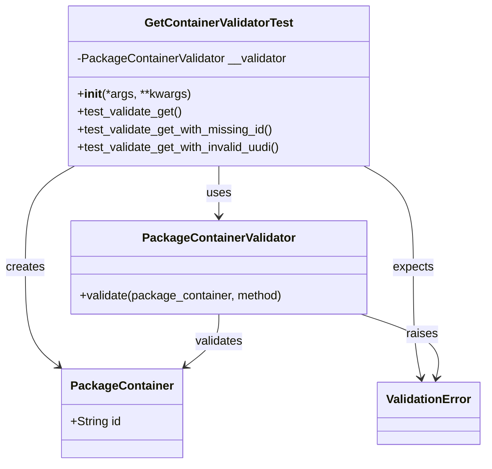
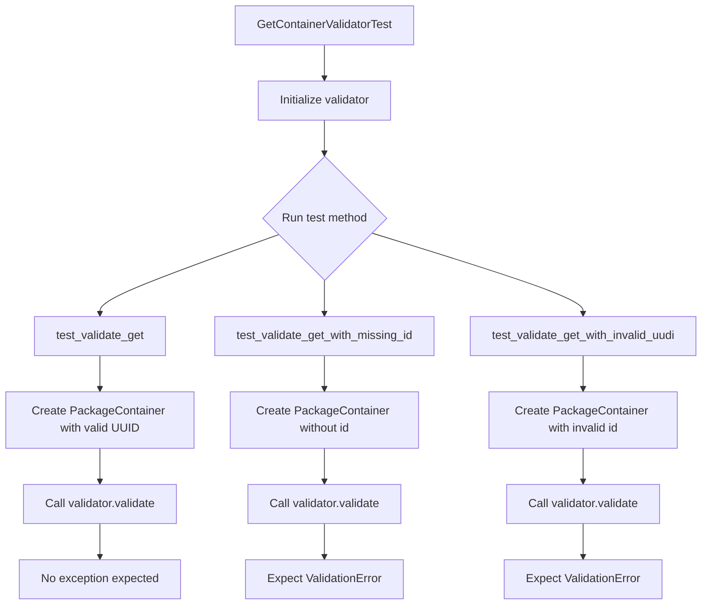
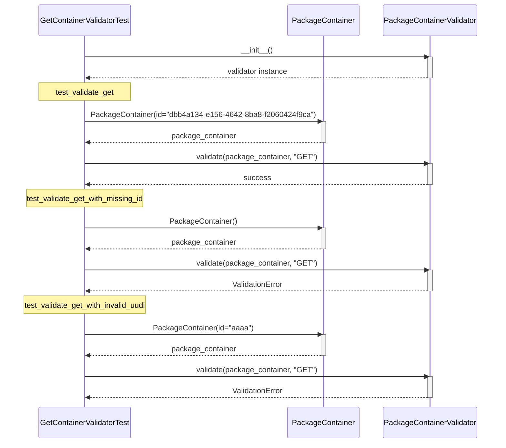
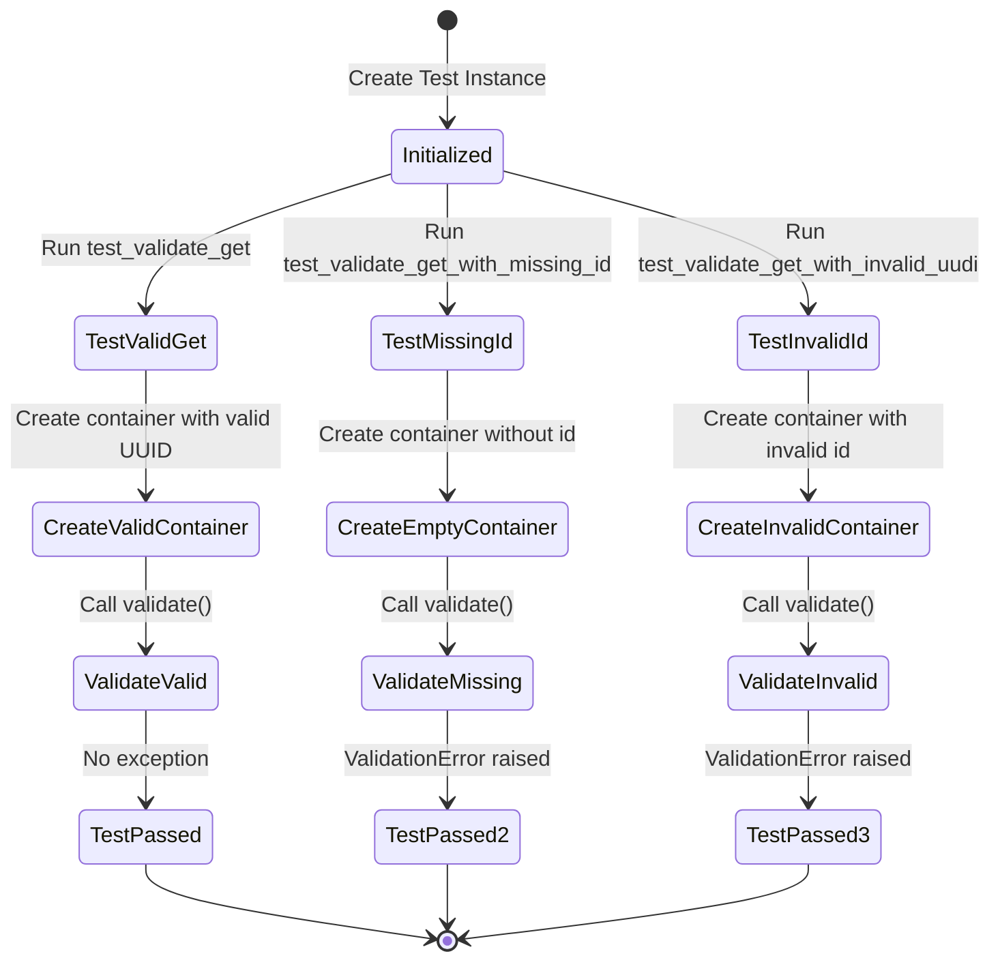

# Diagram: platform/partview_core/partview_service/partview_service/tests/unit/core/validators/package_container/container_get_validator_test.py


> Auto-generated by Obscura crawlers

## Diagram 1

```mermaid
classDiagram
      class GetContainerValidatorTest {
          -PackageContainerValidator __validator
          +__init__(*args, **kwargs)...
  └ 193 lines...
```

> SVG rendering failed for this diagram.

## Diagram 2



### SVG

<svg id="container" width="651.75" xmlns="http://www.w3.org/2000/svg" class="classDiagram" height="626" viewBox="0 0 651.75 626" role="graphics-document document" aria-roledescription="class"><style>#container{font-family:"trebuchet ms",verdana,arial,sans-serif;font-size:16px;fill:#333;}@keyframes edge-animation-frame{from{stroke-dashoffset:0;}}@keyframes dash{to{stroke-dashoffset:0;}}#container .edge-animation-slow{stroke-dasharray:9,5!important;stroke-dashoffset:900;animation:dash 50s linear infinite;stroke-linecap:round;}#container .edge-animation-fast{stroke-dasharray:9,5!important;stroke-dashoffset:900;animation:dash 20s linear infinite;stroke-linecap:round;}#container .error-icon{fill:#552222;}#container .error-text{fill:#552222;stroke:#552222;}#container .edge-thickness-normal{stroke-width:1px;}#container .edge-thickness-thick{stroke-width:3.5px;}#container .edge-pattern-solid{stroke-dasharray:0;}#container .edge-thickness-invisible{stroke-width:0;fill:none;}#container .edge-pattern-dashed{stroke-dasharray:3;}#container .edge-pattern-dotted{stroke-dasharray:2;}#container .marker{fill:#333333;stroke:#333333;}#container .marker.cross{stroke:#333333;}#container svg{font-family:"trebuchet ms",verdana,arial,sans-serif;font-size:16px;}#container p{margin:0;}#container g.classGroup text{fill:#9370DB;stroke:none;font-family:"trebuchet ms",verdana,arial,sans-serif;font-size:10px;}#container g.classGroup text .title{font-weight:bolder;}#container .nodeLabel,#container .edgeLabel{color:#131300;}#container .edgeLabel .label rect{fill:#ECECFF;}#container .label text{fill:#131300;}#container .labelBkg{background:#ECECFF;}#container .edgeLabel .label span{background:#ECECFF;}#container .classTitle{font-weight:bolder;}#container .node rect,#container .node circle,#container .node ellipse,#container .node polygon,#container .node path{fill:#ECECFF;stroke:#9370DB;stroke-width:1px;}#container .divider{stroke:#9370DB;stroke-width:1;}#container g.clickable{cursor:pointer;}#container g.classGroup rect{fill:#ECECFF;stroke:#9370DB;}#container g.classGroup line{stroke:#9370DB;stroke-width:1;}#container .classLabel .box{stroke:none;stroke-width:0;fill:#ECECFF;opacity:0.5;}#container .classLabel .label{fill:#9370DB;font-size:10px;}#container .relation{stroke:#333333;stroke-width:1;fill:none;}#container .dashed-line{stroke-dasharray:3;}#container .dotted-line{stroke-dasharray:1 2;}#container #compositionStart,#container .composition{fill:#333333!important;stroke:#333333!important;stroke-width:1;}#container #compositionEnd,#container .composition{fill:#333333!important;stroke:#333333!important;stroke-width:1;}#container #dependencyStart,#container .dependency{fill:#333333!important;stroke:#333333!important;stroke-width:1;}#container #dependencyStart,#container .dependency{fill:#333333!important;stroke:#333333!important;stroke-width:1;}#container #extensionStart,#container .extension{fill:transparent!important;stroke:#333333!important;stroke-width:1;}#container #extensionEnd,#container .extension{fill:transparent!important;stroke:#333333!important;stroke-width:1;}#container #aggregationStart,#container .aggregation{fill:transparent!important;stroke:#333333!important;stroke-width:1;}#container #aggregationEnd,#container .aggregation{fill:transparent!important;stroke:#333333!important;stroke-width:1;}#container #lollipopStart,#container .lollipop{fill:#ECECFF!important;stroke:#333333!important;stroke-width:1;}#container #lollipopEnd,#container .lollipop{fill:#ECECFF!important;stroke:#333333!important;stroke-width:1;}#container .edgeTerminals{font-size:11px;line-height:initial;}#container .classTitleText{text-anchor:middle;font-size:18px;fill:#333;}#container .label-icon{display:inline-block;height:1em;overflow:visible;vertical-align:-0.125em;}#container .node .label-icon path{fill:currentColor;stroke:revert;stroke-width:revert;}#container :root{--mermaid-font-family:"trebuchet ms",verdana,arial,sans-serif;}</style><g><defs><marker id="container_class-aggregationStart" class="marker aggregation class" refX="18" refY="7" markerWidth="190" markerHeight="240" orient="auto"><path d="M 18,7 L9,13 L1,7 L9,1 Z"></path></marker></defs><defs><marker id="container_class-aggregationEnd" class="marker aggregation class" refX="1" refY="7" markerWidth="20" markerHeight="28" orient="auto"><path d="M 18,7 L9,13 L1,7 L9,1 Z"></path></marker></defs><defs><marker id="container_class-extensionStart" class="marker extension class" refX="18" refY="7" markerWidth="190" markerHeight="240" orient="auto"><path d="M 1,7 L18,13 V 1 Z"></path></marker></defs><defs><marker id="container_class-extensionEnd" class="marker extension class" refX="1" refY="7" markerWidth="20" markerHeight="28" orient="auto"><path d="M 1,1 V 13 L18,7 Z"></path></marker></defs><defs><marker id="container_class-compositionStart" class="marker composition class" refX="18" refY="7" markerWidth="190" markerHeight="240" orient="auto"><path d="M 18,7 L9,13 L1,7 L9,1 Z"></path></marker></defs><defs><marker id="container_class-compositionEnd" class="marker composition class" refX="1" refY="7" markerWidth="20" markerHeight="28" orient="auto"><path d="M 18,7 L9,13 L1,7 L9,1 Z"></path></marker></defs><defs><marker id="container_class-dependencyStart" class="marker dependency class" refX="6" refY="7" markerWidth="190" markerHeight="240" orient="auto"><path d="M 5,7 L9,13 L1,7 L9,1 Z"></path></marker></defs><defs><marker id="container_class-dependencyEnd" class="marker dependency class" refX="13" refY="7" markerWidth="20" markerHeight="28" orient="auto"><path d="M 18,7 L9,13 L14,7 L9,1 Z"></path></marker></defs><defs><marker id="container_class-lollipopStart" class="marker lollipop class" refX="13" refY="7" markerWidth="190" markerHeight="240" orient="auto"><circle stroke="black" fill="transparent" cx="7" cy="7" r="6"></circle></marker></defs><defs><marker id="container_class-lollipopEnd" class="marker lollipop class" refX="1" refY="7" markerWidth="190" markerHeight="240" orient="auto"><circle stroke="black" fill="transparent" cx="7" cy="7" r="6"></circle></marker></defs><g class="root"><g class="clusters"></g><g class="edgePaths"><path d="M294.277,224L294.277,230.167C294.277,236.333,294.277,248.667,294.277,260C294.277,271.333,294.277,281.667,294.277,286.833L294.277,292" id="id_GetContainerValidatorTest_PackageContainerValidator_1" class="edge-thickness-normal edge-pattern-solid relation" style=";;;" data-edge="true" data-et="edge" data-id="id_GetContainerValidatorTest_PackageContainerValidator_1" data-points="W3sieCI6Mjk0LjI3NzM0Mzc1LCJ5IjoyMjR9LHsieCI6Mjk0LjI3NzM0Mzc1LCJ5IjoyNjF9LHsieCI6Mjk0LjI3NzM0Mzc1LCJ5IjoyOTh9XQ==" marker-end="url(#container_class-dependencyEnd)"></path><path d="M100.544,224L89.482,230.167C78.42,236.333,56.296,248.667,45.234,271.5C34.172,294.333,34.172,327.667,34.172,361C34.172,394.333,34.172,427.667,41.879,450.082C49.586,472.497,65.001,483.994,72.708,489.742L80.415,495.491" id="id_GetContainerValidatorTest_PackageContainer_2" class="edge-thickness-normal edge-pattern-solid relation" style=";;;" data-edge="true" data-et="edge" data-id="id_GetContainerValidatorTest_PackageContainer_2" data-points="W3sieCI6MTAwLjU0MzYxNTMwMTcyNDE1LCJ5IjoyMjR9LHsieCI6MzQuMTcxODc1LCJ5IjoyNjF9LHsieCI6MzQuMTcxODc1LCJ5IjozNjF9LHsieCI6MzQuMTcxODc1LCJ5Ijo0NjF9LHsieCI6ODUuMjI0NjA5Mzc1LCJ5Ijo0OTkuMDc3NzQ3OTA4NzUwOTV9XQ==" marker-end="url(#container_class-dependencyEnd)"></path><path d="M489.175,224L500.303,230.167C511.432,236.333,533.688,248.667,544.817,271.5C555.945,294.333,555.945,327.667,555.945,361C555.945,394.333,555.945,427.667,557.686,452.522C559.428,477.377,562.91,493.754,564.651,501.943L566.392,510.131" id="id_GetContainerValidatorTest_ValidationError_3" class="edge-thickness-normal edge-pattern-solid relation" style=";;;" data-edge="true" data-et="edge" data-id="id_GetContainerValidatorTest_ValidationError_3" data-points="W3sieCI6NDg5LjE3NDg2NTMwMTcyNDE0LCJ5IjoyMjR9LHsieCI6NTU1Ljk0NTMxMjUsInkiOjI2MX0seyJ4Ijo1NTUuOTQ1MzEyNSwieSI6MzYxfSx7IngiOjU1NS45NDUzMTI1LCJ5Ijo0NjF9LHsieCI6NTY3LjYzOTkwMDEyODg2NiwieSI6NTE2fV0=" marker-end="url(#container_class-dependencyEnd)"></path><path d="M294.277,424L294.277,430.167C294.277,436.333,294.277,448.667,286.57,460.582C278.863,472.497,263.449,483.994,255.741,489.742L248.034,495.491" id="id_PackageContainerValidator_PackageContainer_4" class="edge-thickness-normal edge-pattern-solid relation" style=";;;" data-edge="true" data-et="edge" data-id="id_PackageContainerValidator_PackageContainer_4" data-points="W3sieCI6Mjk0LjI3NzM0Mzc1LCJ5Ijo0MjR9LHsieCI6Mjk0LjI3NzM0Mzc1LCJ5Ijo0NjF9LHsieCI6MjQzLjIyNDYwOTM3NSwieSI6NDk5LjA3Nzc0NzkwODc1MDk1fV0=" marker-end="url(#container_class-dependencyEnd)"></path><path d="M485.116,424L503.796,430.167C522.476,436.333,559.835,448.667,576.774,463.022C593.713,477.377,590.231,493.754,588.49,501.943L586.749,510.131" id="id_PackageContainerValidator_ValidationError_5" class="edge-thickness-normal edge-pattern-solid relation" style=";;;" data-edge="true" data-et="edge" data-id="id_PackageContainerValidator_ValidationError_5" data-points="W3sieCI6NDg1LjExNTY2NDA2MjUsInkiOjQyNH0seyJ4Ijo1OTcuMTk1MzEyNSwieSI6NDYxfSx7IngiOjU4NS41MDA3MjQ4NzExMzQsInkiOjUxNn1d" marker-end="url(#container_class-dependencyEnd)"></path></g><g class="edgeLabels"><g class="edgeLabel" transform="translate(294.27734375, 261)"><g class="label" data-id="id_GetContainerValidatorTest_PackageContainerValidator_1" transform="translate(-16.4921875, -12)"><foreignObject width="32.984375" height="24"><div xmlns="http://www.w3.org/1999/xhtml" class="labelBkg" style="display: table-cell; white-space: nowrap; line-height: 1.5; max-width: 200px; text-align: center;"><span class="edgeLabel"><p>uses</p></span></div></foreignObject></g></g><g class="edgeLabel" transform="translate(34.171875, 361)"><g class="label" data-id="id_GetContainerValidatorTest_PackageContainer_2" transform="translate(-26.171875, -12)"><foreignObject width="52.34375" height="24"><div xmlns="http://www.w3.org/1999/xhtml" class="labelBkg" style="display: table-cell; white-space: nowrap; line-height: 1.5; max-width: 200px; text-align: center;"><span class="edgeLabel"><p>creates</p></span></div></foreignObject></g></g><g class="edgeLabel" transform="translate(555.9453125, 361)"><g class="label" data-id="id_GetContainerValidatorTest_ValidationError_3" transform="translate(-27.734375, -12)"><foreignObject width="55.46875" height="24"><div xmlns="http://www.w3.org/1999/xhtml" class="labelBkg" style="display: table-cell; white-space: nowrap; line-height: 1.5; max-width: 200px; text-align: center;"><span class="edgeLabel"><p>expects</p></span></div></foreignObject></g></g><g class="edgeLabel" transform="translate(294.27734375, 461)"><g class="label" data-id="id_PackageContainerValidator_PackageContainer_4" transform="translate(-32.6875, -12)"><foreignObject width="65.375" height="24"><div xmlns="http://www.w3.org/1999/xhtml" class="labelBkg" style="display: table-cell; white-space: nowrap; line-height: 1.5; max-width: 200px; text-align: center;"><span class="edgeLabel"><p>validates</p></span></div></foreignObject></g></g><g class="edgeLabel" transform="translate(567.85312, 451.31348)"><g class="label" data-id="id_PackageContainerValidator_ValidationError_5" transform="translate(-21.25, -12)"><foreignObject width="42.5" height="24"><div xmlns="http://www.w3.org/1999/xhtml" class="labelBkg" style="display: table-cell; white-space: nowrap; line-height: 1.5; max-width: 200px; text-align: center;"><span class="edgeLabel"><p>raises</p></span></div></foreignObject></g></g></g><g class="nodes"><g class="node default" id="classId-GetContainerValidatorTest-0" transform="translate(294.27734375, 116)"><g class="basic label-container"><path d="M-202.984375 -108 L202.984375 -108 L202.984375 108 L-202.984375 108" stroke="none" stroke-width="0" fill="#ECECFF" style=""></path><path d="M-202.984375 -108 C-57.07737770424285 -108, 88.8296195915143 -108, 202.984375 -108 M-202.984375 -108 C-70.32677922038457 -108, 62.33081655923087 -108, 202.984375 -108 M202.984375 -108 C202.984375 -63.5754747194185, 202.984375 -19.150949438837003, 202.984375 108 M202.984375 -108 C202.984375 -33.06537427755947, 202.984375 41.86925144488106, 202.984375 108 M202.984375 108 C93.61061852962541 108, -15.763137940749175 108, -202.984375 108 M202.984375 108 C75.07619683278911 108, -52.83198133442178 108, -202.984375 108 M-202.984375 108 C-202.984375 52.7986812913137, -202.984375 -2.4026374173726026, -202.984375 -108 M-202.984375 108 C-202.984375 42.27798683395591, -202.984375 -23.444026332088185, -202.984375 -108" stroke="#9370DB" stroke-width="1.3" fill="none" stroke-dasharray="0 0" style=""></path></g><g class="annotation-group text" transform="translate(0, -84)"></g><g class="label-group text" transform="translate(-96.703125, -84)"><g class="label" style="font-weight: bolder" transform="translate(0,-12)"><foreignObject width="193.40625" height="24"><div xmlns="http://www.w3.org/1999/xhtml" style="display: table-cell; white-space: nowrap; line-height: 1.5; max-width: 240px; text-align: center;"><span class="nodeLabel markdown-node-label" style=""><p>GetContainerValidatorTest</p></span></div></foreignObject></g></g><g class="members-group text" transform="translate(-190.984375, -36)"><g class="label" style="" transform="translate(0,-12)"><foreignObject width="285.265625" height="24"><div xmlns="http://www.w3.org/1999/xhtml" style="display: table-cell; white-space: nowrap; line-height: 1.5; max-width: 343px; text-align: center;"><span class="nodeLabel markdown-node-label" style=""><p>-PackageContainerValidator __validator</p></span></div></foreignObject></g></g><g class="methods-group text" transform="translate(-190.984375, 12)"><g class="label" style="" transform="translate(0,-12)"><foreignObject width="151.8125" height="24"><div xmlns="http://www.w3.org/1999/xhtml" style="display: table-cell; white-space: nowrap; line-height: 1.5; max-width: 241px; text-align: center;"><span class="nodeLabel markdown-node-label" style=""><p>+<strong>init</strong>(*args, **kwargs)</p></span></div></foreignObject></g><g class="label" style="" transform="translate(0,12)"><foreignObject width="142.21875" height="24"><div xmlns="http://www.w3.org/1999/xhtml" style="display: table-cell; white-space: nowrap; line-height: 1.5; max-width: 200px; text-align: center;"><span class="nodeLabel markdown-node-label" style=""><p>+test_validate_get()</p></span></div></foreignObject></g><g class="label" style="" transform="translate(0,36)"><foreignObject width="267.359375" height="24"><div xmlns="http://www.w3.org/1999/xhtml" style="display: table-cell; white-space: nowrap; line-height: 1.5; max-width: 325px; text-align: center;"><span class="nodeLabel markdown-node-label" style=""><p>+test_validate_get_with_missing_id()</p></span></div></foreignObject></g><g class="label" style="" transform="translate(0,60)"><foreignObject width="279.078125" height="24"><div xmlns="http://www.w3.org/1999/xhtml" style="display: table-cell; white-space: nowrap; line-height: 1.5; max-width: 336px; text-align: center;"><span class="nodeLabel markdown-node-label" style=""><p>+test_validate_get_with_invalid_uudi()</p></span></div></foreignObject></g></g><g class="divider" style=""><path d="M-202.984375 -60 C-74.4440803550529 -60, 54.09621428989419 -60, 202.984375 -60 M-202.984375 -60 C-99.61467242122605 -60, 3.755030157547907 -60, 202.984375 -60" stroke="#9370DB" stroke-width="1.3" fill="none" stroke-dasharray="0 0" style=""></path></g><g class="divider" style=""><path d="M-202.984375 -12 C-91.83221077993235 -12, 19.319953440135293 -12, 202.984375 -12 M-202.984375 -12 C-57.75650111112657 -12, 87.47137277774686 -12, 202.984375 -12" stroke="#9370DB" stroke-width="1.3" fill="none" stroke-dasharray="0 0" style=""></path></g></g><g class="node default" id="classId-PackageContainerValidator-1" transform="translate(294.27734375, 361)"><g class="basic label-container"><path d="M-198.93359375 -63 L198.93359375 -63 L198.93359375 63 L-198.93359375 63" stroke="none" stroke-width="0" fill="#ECECFF" style=""></path><path d="M-198.93359375 -63 C-52.63786494170279 -63, 93.65786386659443 -63, 198.93359375 -63 M-198.93359375 -63 C-73.68172503346669 -63, 51.57014368306662 -63, 198.93359375 -63 M198.93359375 -63 C198.93359375 -27.08705091518329, 198.93359375 8.825898169633419, 198.93359375 63 M198.93359375 -63 C198.93359375 -15.009026014407603, 198.93359375 32.981947971184795, 198.93359375 63 M198.93359375 63 C77.28577626041081 63, -44.362041229178374 63, -198.93359375 63 M198.93359375 63 C70.44478925476011 63, -58.04401524047978 63, -198.93359375 63 M-198.93359375 63 C-198.93359375 13.088832830359166, -198.93359375 -36.82233433928167, -198.93359375 -63 M-198.93359375 63 C-198.93359375 24.659317593269527, -198.93359375 -13.681364813460945, -198.93359375 -63" stroke="#9370DB" stroke-width="1.3" fill="none" stroke-dasharray="0 0" style=""></path></g><g class="annotation-group text" transform="translate(0, -39)"></g><g class="label-group text" transform="translate(-98.6328125, -39)"><g class="label" style="font-weight: bolder" transform="translate(0,-12)"><foreignObject width="197.265625" height="24"><div xmlns="http://www.w3.org/1999/xhtml" style="display: table-cell; white-space: nowrap; line-height: 1.5; max-width: 245px; text-align: center;"><span class="nodeLabel markdown-node-label" style=""><p>PackageContainerValidator</p></span></div></foreignObject></g></g><g class="members-group text" transform="translate(-186.93359375, 9)"></g><g class="methods-group text" transform="translate(-186.93359375, 39)"><g class="label" style="" transform="translate(0,-12)"><foreignObject width="275.234375" height="24"><div xmlns="http://www.w3.org/1999/xhtml" style="display: table-cell; white-space: nowrap; line-height: 1.5; max-width: 333px; text-align: center;"><span class="nodeLabel markdown-node-label" style=""><p>+validate(package_container, method)</p></span></div></foreignObject></g></g><g class="divider" style=""><path d="M-198.93359375 -15 C-73.34978556400951 -15, 52.234022621980984 -15, 198.93359375 -15 M-198.93359375 -15 C-89.3671319895577 -15, 20.19932977088459 -15, 198.93359375 -15" stroke="#9370DB" stroke-width="1.3" fill="none" stroke-dasharray="0 0" style=""></path></g><g class="divider" style=""><path d="M-198.93359375 9 C-49.70804927019492 9, 99.51749520961016 9, 198.93359375 9 M-198.93359375 9 C-100.52923852457451 9, -2.124883299149019 9, 198.93359375 9" stroke="#9370DB" stroke-width="1.3" fill="none" stroke-dasharray="0 0" style=""></path></g></g><g class="node default" id="classId-PackageContainer-2" transform="translate(164.224609375, 558)"><g class="basic label-container"><path d="M-79 -60 L79 -60 L79 60 L-79 60" stroke="none" stroke-width="0" fill="#ECECFF" style=""></path><path d="M-79 -60 C-36.127040502670525 -60, 6.74591899465895 -60, 79 -60 M-79 -60 C-25.265429395087907 -60, 28.469141209824187 -60, 79 -60 M79 -60 C79 -35.97919694834447, 79 -11.958393896688946, 79 60 M79 -60 C79 -12.392362282705932, 79 35.215275434588136, 79 60 M79 60 C26.94820388793334 60, -25.103592224133322 60, -79 60 M79 60 C40.83377594184102 60, 2.6675518836820373 60, -79 60 M-79 60 C-79 30.838080421208026, -79 1.6761608424160528, -79 -60 M-79 60 C-79 31.67534108670598, -79 3.350682173411961, -79 -60" stroke="#9370DB" stroke-width="1.3" fill="none" stroke-dasharray="0 0" style=""></path></g><g class="annotation-group text" transform="translate(0, -36)"></g><g class="label-group text" transform="translate(-65.453125, -36)"><g class="label" style="font-weight: bolder" transform="translate(0,-12)"><foreignObject width="130.90625" height="24"><div xmlns="http://www.w3.org/1999/xhtml" style="display: table-cell; white-space: nowrap; line-height: 1.5; max-width: 179px; text-align: center;"><span class="nodeLabel markdown-node-label" style=""><p>PackageContainer</p></span></div></foreignObject></g></g><g class="members-group text" transform="translate(-67, 12)"><g class="label" style="" transform="translate(0,-12)"><foreignObject width="68.546875" height="24"><div xmlns="http://www.w3.org/1999/xhtml" style="display: table-cell; white-space: nowrap; line-height: 1.5; max-width: 126px; text-align: center;"><span class="nodeLabel markdown-node-label" style=""><p>+String id</p></span></div></foreignObject></g></g><g class="methods-group text" transform="translate(-67, 60)"></g><g class="divider" style=""><path d="M-79 -12 C-43.605410282468206 -12, -8.210820564936412 -12, 79 -12 M-79 -12 C-24.26144450843396 -12, 30.47711098313208 -12, 79 -12" stroke="#9370DB" stroke-width="1.3" fill="none" stroke-dasharray="0 0" style=""></path></g><g class="divider" style=""><path d="M-79 36 C-20.9760887610417 36, 37.0478224779166 36, 79 36 M-79 36 C-24.37124173573322 36, 30.257516528533557 36, 79 36" stroke="#9370DB" stroke-width="1.3" fill="none" stroke-dasharray="0 0" style=""></path></g></g><g class="node default" id="classId-ValidationError-3" transform="translate(576.5703125, 558)"><g class="basic label-container"><path d="M-67.1796875 -42 L67.1796875 -42 L67.1796875 42 L-67.1796875 42" stroke="none" stroke-width="0" fill="#ECECFF" style=""></path><path d="M-67.1796875 -42 C-24.05614217714522 -42, 19.067403145709562 -42, 67.1796875 -42 M-67.1796875 -42 C-22.74437428424762 -42, 21.69093893150476 -42, 67.1796875 -42 M67.1796875 -42 C67.1796875 -17.128162559517133, 67.1796875 7.7436748809657345, 67.1796875 42 M67.1796875 -42 C67.1796875 -23.340649327908345, 67.1796875 -4.68129865581669, 67.1796875 42 M67.1796875 42 C33.5853228467832 42, -0.009041806433600641 42, -67.1796875 42 M67.1796875 42 C13.474831075966769 42, -40.23002534806646 42, -67.1796875 42 M-67.1796875 42 C-67.1796875 22.64157993156034, -67.1796875 3.28315986312068, -67.1796875 -42 M-67.1796875 42 C-67.1796875 22.756416319011223, -67.1796875 3.512832638022445, -67.1796875 -42" stroke="#9370DB" stroke-width="1.3" fill="none" stroke-dasharray="0 0" style=""></path></g><g class="annotation-group text" transform="translate(0, -18)"></g><g class="label-group text" transform="translate(-55.1796875, -18)"><g class="label" style="font-weight: bolder" transform="translate(0,-12)"><foreignObject width="110.359375" height="24"><div xmlns="http://www.w3.org/1999/xhtml" style="display: table-cell; white-space: nowrap; line-height: 1.5; max-width: 160px; text-align: center;"><span class="nodeLabel markdown-node-label" style=""><p>ValidationError</p></span></div></foreignObject></g></g><g class="members-group text" transform="translate(-55.1796875, 30)"></g><g class="methods-group text" transform="translate(-55.1796875, 60)"></g><g class="divider" style=""><path d="M-67.1796875 6 C-37.80359460711647 6, -8.427501714232946 6, 67.1796875 6 M-67.1796875 6 C-19.42544804415595 6, 28.3287914116881 6, 67.1796875 6" stroke="#9370DB" stroke-width="1.3" fill="none" stroke-dasharray="0 0" style=""></path></g><g class="divider" style=""><path d="M-67.1796875 24 C-30.61494922933678 24, 5.94978904132644 24, 67.1796875 24 M-67.1796875 24 C-22.062339793269615 24, 23.05500791346077 24, 67.1796875 24" stroke="#9370DB" stroke-width="1.3" fill="none" stroke-dasharray="0 0" style=""></path></g></g></g></g></g></svg>

## Diagram 3



### SVG

<svg id="container" width="981.3515625" xmlns="http://www.w3.org/2000/svg" class="flowchart" height="838.859375" viewBox="0 0 981.3515625 838.859375" role="graphics-document document" aria-roledescription="flowchart-v2"><style>#container{font-family:"trebuchet ms",verdana,arial,sans-serif;font-size:16px;fill:#333;}@keyframes edge-animation-frame{from{stroke-dashoffset:0;}}@keyframes dash{to{stroke-dashoffset:0;}}#container .edge-animation-slow{stroke-dasharray:9,5!important;stroke-dashoffset:900;animation:dash 50s linear infinite;stroke-linecap:round;}#container .edge-animation-fast{stroke-dasharray:9,5!important;stroke-dashoffset:900;animation:dash 20s linear infinite;stroke-linecap:round;}#container .error-icon{fill:#552222;}#container .error-text{fill:#552222;stroke:#552222;}#container .edge-thickness-normal{stroke-width:1px;}#container .edge-thickness-thick{stroke-width:3.5px;}#container .edge-pattern-solid{stroke-dasharray:0;}#container .edge-thickness-invisible{stroke-width:0;fill:none;}#container .edge-pattern-dashed{stroke-dasharray:3;}#container .edge-pattern-dotted{stroke-dasharray:2;}#container .marker{fill:#333333;stroke:#333333;}#container .marker.cross{stroke:#333333;}#container svg{font-family:"trebuchet ms",verdana,arial,sans-serif;font-size:16px;}#container p{margin:0;}#container .label{font-family:"trebuchet ms",verdana,arial,sans-serif;color:#333;}#container .cluster-label text{fill:#333;}#container .cluster-label span{color:#333;}#container .cluster-label span p{background-color:transparent;}#container .label text,#container span{fill:#333;color:#333;}#container .node rect,#container .node circle,#container .node ellipse,#container .node polygon,#container .node path{fill:#ECECFF;stroke:#9370DB;stroke-width:1px;}#container .rough-node .label text,#container .node .label text,#container .image-shape .label,#container .icon-shape .label{text-anchor:middle;}#container .node .katex path{fill:#000;stroke:#000;stroke-width:1px;}#container .rough-node .label,#container .node .label,#container .image-shape .label,#container .icon-shape .label{text-align:center;}#container .node.clickable{cursor:pointer;}#container .root .anchor path{fill:#333333!important;stroke-width:0;stroke:#333333;}#container .arrowheadPath{fill:#333333;}#container .edgePath .path{stroke:#333333;stroke-width:2.0px;}#container .flowchart-link{stroke:#333333;fill:none;}#container .edgeLabel{background-color:rgba(232,232,232, 0.8);text-align:center;}#container .edgeLabel p{background-color:rgba(232,232,232, 0.8);}#container .edgeLabel rect{opacity:0.5;background-color:rgba(232,232,232, 0.8);fill:rgba(232,232,232, 0.8);}#container .labelBkg{background-color:rgba(232, 232, 232, 0.5);}#container .cluster rect{fill:#ffffde;stroke:#aaaa33;stroke-width:1px;}#container .cluster text{fill:#333;}#container .cluster span{color:#333;}#container div.mermaidTooltip{position:absolute;text-align:center;max-width:200px;padding:2px;font-family:"trebuchet ms",verdana,arial,sans-serif;font-size:12px;background:hsl(80, 100%, 96.2745098039%);border:1px solid #aaaa33;border-radius:2px;pointer-events:none;z-index:100;}#container .flowchartTitleText{text-anchor:middle;font-size:18px;fill:#333;}#container rect.text{fill:none;stroke-width:0;}#container .icon-shape,#container .image-shape{background-color:rgba(232,232,232, 0.8);text-align:center;}#container .icon-shape p,#container .image-shape p{background-color:rgba(232,232,232, 0.8);padding:2px;}#container .icon-shape rect,#container .image-shape rect{opacity:0.5;background-color:rgba(232,232,232, 0.8);fill:rgba(232,232,232, 0.8);}#container .label-icon{display:inline-block;height:1em;overflow:visible;vertical-align:-0.125em;}#container .node .label-icon path{fill:currentColor;stroke:revert;stroke-width:revert;}#container :root{--mermaid-font-family:"trebuchet ms",verdana,arial,sans-serif;}</style><g><marker id="container_flowchart-v2-pointEnd" class="marker flowchart-v2" viewBox="0 0 10 10" refX="5" refY="5" markerUnits="userSpaceOnUse" markerWidth="8" markerHeight="8" orient="auto"><path d="M 0 0 L 10 5 L 0 10 z" class="arrowMarkerPath" style="stroke-width: 1; stroke-dasharray: 1, 0;"></path></marker><marker id="container_flowchart-v2-pointStart" class="marker flowchart-v2" viewBox="0 0 10 10" refX="4.5" refY="5" markerUnits="userSpaceOnUse" markerWidth="8" markerHeight="8" orient="auto"><path d="M 0 5 L 10 10 L 10 0 z" class="arrowMarkerPath" style="stroke-width: 1; stroke-dasharray: 1, 0;"></path></marker><marker id="container_flowchart-v2-circleEnd" class="marker flowchart-v2" viewBox="0 0 10 10" refX="11" refY="5" markerUnits="userSpaceOnUse" markerWidth="11" markerHeight="11" orient="auto"><circle cx="5" cy="5" r="5" class="arrowMarkerPath" style="stroke-width: 1; stroke-dasharray: 1, 0;"></circle></marker><marker id="container_flowchart-v2-circleStart" class="marker flowchart-v2" viewBox="0 0 10 10" refX="-1" refY="5" markerUnits="userSpaceOnUse" markerWidth="11" markerHeight="11" orient="auto"><circle cx="5" cy="5" r="5" class="arrowMarkerPath" style="stroke-width: 1; stroke-dasharray: 1, 0;"></circle></marker><marker id="container_flowchart-v2-crossEnd" class="marker cross flowchart-v2" viewBox="0 0 11 11" refX="12" refY="5.2" markerUnits="userSpaceOnUse" markerWidth="11" markerHeight="11" orient="auto"><path d="M 1,1 l 9,9 M 10,1 l -9,9" class="arrowMarkerPath" style="stroke-width: 2; stroke-dasharray: 1, 0;"></path></marker><marker id="container_flowchart-v2-crossStart" class="marker cross flowchart-v2" viewBox="0 0 11 11" refX="-1" refY="5.2" markerUnits="userSpaceOnUse" markerWidth="11" markerHeight="11" orient="auto"><path d="M 1,1 l 9,9 M 10,1 l -9,9" class="arrowMarkerPath" style="stroke-width: 2; stroke-dasharray: 1, 0;"></path></marker><g class="root"><g class="clusters"></g><g class="edgePaths"><path d="M448,62L448,66.167C448,70.333,448,78.667,448,86.333C448,94,448,101,448,104.5L448,108" id="L_A_B_0" class="edge-thickness-normal edge-pattern-solid edge-thickness-normal edge-pattern-solid flowchart-link" style=";" data-edge="true" data-et="edge" data-id="L_A_B_0" data-points="W3sieCI6NDQ4LCJ5Ijo2Mn0seyJ4Ijo0NDgsInkiOjg3fSx7IngiOjQ0OCwieSI6MTEyfV0=" marker-end="url(#container_flowchart-v2-pointEnd)"></path><path d="M448,166L448,170.167C448,174.333,448,182.667,448,190.333C448,198,448,205,448,208.5L448,212" id="L_B_C_0" class="edge-thickness-normal edge-pattern-solid edge-thickness-normal edge-pattern-solid flowchart-link" style=";" data-edge="true" data-et="edge" data-id="L_B_C_0" data-points="W3sieCI6NDQ4LCJ5IjoxNjZ9LHsieCI6NDQ4LCJ5IjoxOTF9LHsieCI6NDQ4LCJ5IjoyMTZ9XQ==" marker-end="url(#container_flowchart-v2-pointEnd)"></path><path d="M383.84,326.699L342.866,341.559C301.893,356.419,219.947,386.139,178.973,404.499C138,422.859,138,429.859,138,433.359L138,436.859" id="L_C_D_0" class="edge-thickness-normal edge-pattern-solid edge-thickness-normal edge-pattern-solid flowchart-link" style=";" data-edge="true" data-et="edge" data-id="L_C_D_0" data-points="W3sieCI6MzgzLjgzOTcyOTI0NDg4MTcsInkiOjMyNi42OTkxMDQyNDQ4ODE3fSx7IngiOjEzOCwieSI6NDE1Ljg1OTM3NX0seyJ4IjoxMzgsInkiOjQ0MC44NTkzNzV9XQ==" marker-end="url(#container_flowchart-v2-pointEnd)"></path><path d="M448,390.859L448,395.026C448,399.193,448,407.526,448,415.193C448,422.859,448,429.859,448,433.359L448,436.859" id="L_C_E_0" class="edge-thickness-normal edge-pattern-solid edge-thickness-normal edge-pattern-solid flowchart-link" style=";" data-edge="true" data-et="edge" data-id="L_C_E_0" data-points="W3sieCI6NDQ4LCJ5IjozOTAuODU5Mzc1fSx7IngiOjQ0OCwieSI6NDE1Ljg1OTM3NX0seyJ4Ijo0NDgsInkiOjQ0MC44NTkzNzV9XQ==" marker-end="url(#container_flowchart-v2-pointEnd)"></path><path d="M514.839,324.021L564.523,339.327C614.207,354.634,713.576,385.247,763.261,404.053C812.945,422.859,812.945,429.859,812.945,433.359L812.945,436.859" id="L_C_F_0" class="edge-thickness-normal edge-pattern-solid edge-thickness-normal edge-pattern-solid flowchart-link" style=";" data-edge="true" data-et="edge" data-id="L_C_F_0" data-points="W3sieCI6NTE0LjgzODU1MzgxMjk2NjQsInkiOjMyNC4wMjA4MjExODcwMzM1Nn0seyJ4Ijo4MTIuOTQ1MzEyNSwieSI6NDE1Ljg1OTM3NX0seyJ4Ijo4MTIuOTQ1MzEyNSwieSI6NDQwLjg1OTM3NX1d" marker-end="url(#container_flowchart-v2-pointEnd)"></path><path d="M138,494.859L138,499.026C138,503.193,138,511.526,138,519.193C138,526.859,138,533.859,138,537.359L138,540.859" id="L_D_D1_0" class="edge-thickness-normal edge-pattern-solid edge-thickness-normal edge-pattern-solid flowchart-link" style=";" data-edge="true" data-et="edge" data-id="L_D_D1_0" data-points="W3sieCI6MTM4LCJ5Ijo0OTQuODU5Mzc1fSx7IngiOjEzOCwieSI6NTE5Ljg1OTM3NX0seyJ4IjoxMzgsInkiOjU0NC44NTkzNzV9XQ==" marker-end="url(#container_flowchart-v2-pointEnd)"></path><path d="M138,622.859L138,627.026C138,631.193,138,639.526,138,647.193C138,654.859,138,661.859,138,665.359L138,668.859" id="L_D1_D2_0" class="edge-thickness-normal edge-pattern-solid edge-thickness-normal edge-pattern-solid flowchart-link" style=";" data-edge="true" data-et="edge" data-id="L_D1_D2_0" data-points="W3sieCI6MTM4LCJ5Ijo2MjIuODU5Mzc1fSx7IngiOjEzOCwieSI6NjQ3Ljg1OTM3NX0seyJ4IjoxMzgsInkiOjY3Mi44NTkzNzV9XQ==" marker-end="url(#container_flowchart-v2-pointEnd)"></path><path d="M138,726.859L138,731.026C138,735.193,138,743.526,138,751.193C138,758.859,138,765.859,138,769.359L138,772.859" id="L_D2_D3_0" class="edge-thickness-normal edge-pattern-solid edge-thickness-normal edge-pattern-solid flowchart-link" style=";" data-edge="true" data-et="edge" data-id="L_D2_D3_0" data-points="W3sieCI6MTM4LCJ5Ijo3MjYuODU5Mzc1fSx7IngiOjEzOCwieSI6NzUxLjg1OTM3NX0seyJ4IjoxMzgsInkiOjc3Ni44NTkzNzV9XQ==" marker-end="url(#container_flowchart-v2-pointEnd)"></path><path d="M448,494.859L448,499.026C448,503.193,448,511.526,448,519.193C448,526.859,448,533.859,448,537.359L448,540.859" id="L_E_E1_0" class="edge-thickness-normal edge-pattern-solid edge-thickness-normal edge-pattern-solid flowchart-link" style=";" data-edge="true" data-et="edge" data-id="L_E_E1_0" data-points="W3sieCI6NDQ4LCJ5Ijo0OTQuODU5Mzc1fSx7IngiOjQ0OCwieSI6NTE5Ljg1OTM3NX0seyJ4Ijo0NDgsInkiOjU0NC44NTkzNzV9XQ==" marker-end="url(#container_flowchart-v2-pointEnd)"></path><path d="M448,622.859L448,627.026C448,631.193,448,639.526,448,647.193C448,654.859,448,661.859,448,665.359L448,668.859" id="L_E1_E2_0" class="edge-thickness-normal edge-pattern-solid edge-thickness-normal edge-pattern-solid flowchart-link" style=";" data-edge="true" data-et="edge" data-id="L_E1_E2_0" data-points="W3sieCI6NDQ4LCJ5Ijo2MjIuODU5Mzc1fSx7IngiOjQ0OCwieSI6NjQ3Ljg1OTM3NX0seyJ4Ijo0NDgsInkiOjY3Mi44NTkzNzV9XQ==" marker-end="url(#container_flowchart-v2-pointEnd)"></path><path d="M448,726.859L448,731.026C448,735.193,448,743.526,448,751.193C448,758.859,448,765.859,448,769.359L448,772.859" id="L_E2_E3_0" class="edge-thickness-normal edge-pattern-solid edge-thickness-normal edge-pattern-solid flowchart-link" style=";" data-edge="true" data-et="edge" data-id="L_E2_E3_0" data-points="W3sieCI6NDQ4LCJ5Ijo3MjYuODU5Mzc1fSx7IngiOjQ0OCwieSI6NzUxLjg1OTM3NX0seyJ4Ijo0NDgsInkiOjc3Ni44NTkzNzV9XQ==" marker-end="url(#container_flowchart-v2-pointEnd)"></path><path d="M812.945,494.859L812.945,499.026C812.945,503.193,812.945,511.526,812.945,519.193C812.945,526.859,812.945,533.859,812.945,537.359L812.945,540.859" id="L_F_F1_0" class="edge-thickness-normal edge-pattern-solid edge-thickness-normal edge-pattern-solid flowchart-link" style=";" data-edge="true" data-et="edge" data-id="L_F_F1_0" data-points="W3sieCI6ODEyLjk0NTMxMjUsInkiOjQ5NC44NTkzNzV9LHsieCI6ODEyLjk0NTMxMjUsInkiOjUxOS44NTkzNzV9LHsieCI6ODEyLjk0NTMxMjUsInkiOjU0NC44NTkzNzV9XQ==" marker-end="url(#container_flowchart-v2-pointEnd)"></path><path d="M812.945,622.859L812.945,627.026C812.945,631.193,812.945,639.526,812.945,647.193C812.945,654.859,812.945,661.859,812.945,665.359L812.945,668.859" id="L_F1_F2_0" class="edge-thickness-normal edge-pattern-solid edge-thickness-normal edge-pattern-solid flowchart-link" style=";" data-edge="true" data-et="edge" data-id="L_F1_F2_0" data-points="W3sieCI6ODEyLjk0NTMxMjUsInkiOjYyMi44NTkzNzV9LHsieCI6ODEyLjk0NTMxMjUsInkiOjY0Ny44NTkzNzV9LHsieCI6ODEyLjk0NTMxMjUsInkiOjY3Mi44NTkzNzV9XQ==" marker-end="url(#container_flowchart-v2-pointEnd)"></path><path d="M812.945,726.859L812.945,731.026C812.945,735.193,812.945,743.526,812.945,751.193C812.945,758.859,812.945,765.859,812.945,769.359L812.945,772.859" id="L_F2_F3_0" class="edge-thickness-normal edge-pattern-solid edge-thickness-normal edge-pattern-solid flowchart-link" style=";" data-edge="true" data-et="edge" data-id="L_F2_F3_0" data-points="W3sieCI6ODEyLjk0NTMxMjUsInkiOjcyNi44NTkzNzV9LHsieCI6ODEyLjk0NTMxMjUsInkiOjc1MS44NTkzNzV9LHsieCI6ODEyLjk0NTMxMjUsInkiOjc3Ni44NTkzNzV9XQ==" marker-end="url(#container_flowchart-v2-pointEnd)"></path></g><g class="edgeLabels"><g class="edgeLabel"><g class="label" data-id="L_A_B_0" transform="translate(0, 0)"><foreignObject width="0" height="0"><div xmlns="http://www.w3.org/1999/xhtml" class="labelBkg" style="display: table-cell; white-space: nowrap; line-height: 1.5; max-width: 200px; text-align: center;"><span class="edgeLabel"></span></div></foreignObject></g></g><g class="edgeLabel"><g class="label" data-id="L_B_C_0" transform="translate(0, 0)"><foreignObject width="0" height="0"><div xmlns="http://www.w3.org/1999/xhtml" class="labelBkg" style="display: table-cell; white-space: nowrap; line-height: 1.5; max-width: 200px; text-align: center;"><span class="edgeLabel"></span></div></foreignObject></g></g><g class="edgeLabel"><g class="label" data-id="L_C_D_0" transform="translate(0, 0)"><foreignObject width="0" height="0"><div xmlns="http://www.w3.org/1999/xhtml" class="labelBkg" style="display: table-cell; white-space: nowrap; line-height: 1.5; max-width: 200px; text-align: center;"><span class="edgeLabel"></span></div></foreignObject></g></g><g class="edgeLabel"><g class="label" data-id="L_C_E_0" transform="translate(0, 0)"><foreignObject width="0" height="0"><div xmlns="http://www.w3.org/1999/xhtml" class="labelBkg" style="display: table-cell; white-space: nowrap; line-height: 1.5; max-width: 200px; text-align: center;"><span class="edgeLabel"></span></div></foreignObject></g></g><g class="edgeLabel"><g class="label" data-id="L_C_F_0" transform="translate(0, 0)"><foreignObject width="0" height="0"><div xmlns="http://www.w3.org/1999/xhtml" class="labelBkg" style="display: table-cell; white-space: nowrap; line-height: 1.5; max-width: 200px; text-align: center;"><span class="edgeLabel"></span></div></foreignObject></g></g><g class="edgeLabel"><g class="label" data-id="L_D_D1_0" transform="translate(0, 0)"><foreignObject width="0" height="0"><div xmlns="http://www.w3.org/1999/xhtml" class="labelBkg" style="display: table-cell; white-space: nowrap; line-height: 1.5; max-width: 200px; text-align: center;"><span class="edgeLabel"></span></div></foreignObject></g></g><g class="edgeLabel"><g class="label" data-id="L_D1_D2_0" transform="translate(0, 0)"><foreignObject width="0" height="0"><div xmlns="http://www.w3.org/1999/xhtml" class="labelBkg" style="display: table-cell; white-space: nowrap; line-height: 1.5; max-width: 200px; text-align: center;"><span class="edgeLabel"></span></div></foreignObject></g></g><g class="edgeLabel"><g class="label" data-id="L_D2_D3_0" transform="translate(0, 0)"><foreignObject width="0" height="0"><div xmlns="http://www.w3.org/1999/xhtml" class="labelBkg" style="display: table-cell; white-space: nowrap; line-height: 1.5; max-width: 200px; text-align: center;"><span class="edgeLabel"></span></div></foreignObject></g></g><g class="edgeLabel"><g class="label" data-id="L_E_E1_0" transform="translate(0, 0)"><foreignObject width="0" height="0"><div xmlns="http://www.w3.org/1999/xhtml" class="labelBkg" style="display: table-cell; white-space: nowrap; line-height: 1.5; max-width: 200px; text-align: center;"><span class="edgeLabel"></span></div></foreignObject></g></g><g class="edgeLabel"><g class="label" data-id="L_E1_E2_0" transform="translate(0, 0)"><foreignObject width="0" height="0"><div xmlns="http://www.w3.org/1999/xhtml" class="labelBkg" style="display: table-cell; white-space: nowrap; line-height: 1.5; max-width: 200px; text-align: center;"><span class="edgeLabel"></span></div></foreignObject></g></g><g class="edgeLabel"><g class="label" data-id="L_E2_E3_0" transform="translate(0, 0)"><foreignObject width="0" height="0"><div xmlns="http://www.w3.org/1999/xhtml" class="labelBkg" style="display: table-cell; white-space: nowrap; line-height: 1.5; max-width: 200px; text-align: center;"><span class="edgeLabel"></span></div></foreignObject></g></g><g class="edgeLabel"><g class="label" data-id="L_F_F1_0" transform="translate(0, 0)"><foreignObject width="0" height="0"><div xmlns="http://www.w3.org/1999/xhtml" class="labelBkg" style="display: table-cell; white-space: nowrap; line-height: 1.5; max-width: 200px; text-align: center;"><span class="edgeLabel"></span></div></foreignObject></g></g><g class="edgeLabel"><g class="label" data-id="L_F1_F2_0" transform="translate(0, 0)"><foreignObject width="0" height="0"><div xmlns="http://www.w3.org/1999/xhtml" class="labelBkg" style="display: table-cell; white-space: nowrap; line-height: 1.5; max-width: 200px; text-align: center;"><span class="edgeLabel"></span></div></foreignObject></g></g><g class="edgeLabel"><g class="label" data-id="L_F2_F3_0" transform="translate(0, 0)"><foreignObject width="0" height="0"><div xmlns="http://www.w3.org/1999/xhtml" class="labelBkg" style="display: table-cell; white-space: nowrap; line-height: 1.5; max-width: 200px; text-align: center;"><span class="edgeLabel"></span></div></foreignObject></g></g></g><g class="nodes"><g class="node default" id="flowchart-A-0" transform="translate(448, 35)"><rect class="basic label-container" style="" x="-124.8984375" y="-27" width="249.796875" height="54"></rect><g class="label" style="" transform="translate(-94.8984375, -12)"><rect></rect><foreignObject width="189.796875" height="24"><div xmlns="http://www.w3.org/1999/xhtml" style="display: table-cell; white-space: nowrap; line-height: 1.5; max-width: 200px; text-align: center;"><span class="nodeLabel"><p>GetContainerValidatorTest</p></span></div></foreignObject></g></g><g class="node default" id="flowchart-B-1" transform="translate(448, 139)"><rect class="basic label-container" style="" x="-95.5859375" y="-27" width="191.171875" height="54"></rect><g class="label" style="" transform="translate(-65.5859375, -12)"><rect></rect><foreignObject width="131.171875" height="24"><div xmlns="http://www.w3.org/1999/xhtml" style="display: table-cell; white-space: nowrap; line-height: 1.5; max-width: 200px; text-align: center;"><span class="nodeLabel"><p>Initialize validator</p></span></div></foreignObject></g></g><g class="node default" id="flowchart-C-3" transform="translate(448, 303.4296875)"><polygon points="87.4296875,0 174.859375,-87.4296875 87.4296875,-174.859375 0,-87.4296875" class="label-container" transform="translate(-86.9296875, 87.4296875)"></polygon><g class="label" style="" transform="translate(-60.4296875, -12)"><rect></rect><foreignObject width="120.859375" height="24"><div xmlns="http://www.w3.org/1999/xhtml" style="display: table-cell; white-space: nowrap; line-height: 1.5; max-width: 200px; text-align: center;"><span class="nodeLabel"><p>Run test method</p></span></div></foreignObject></g></g><g class="node default" id="flowchart-D-5" transform="translate(138, 467.859375)"><rect class="basic label-container" style="" x="-91.96875" y="-27" width="183.9375" height="54"></rect><g class="label" style="" transform="translate(-61.96875, -12)"><rect></rect><foreignObject width="123.9375" height="24"><div xmlns="http://www.w3.org/1999/xhtml" style="display: table-cell; white-space: nowrap; line-height: 1.5; max-width: 200px; text-align: center;"><span class="nodeLabel"><p>test_validate_get</p></span></div></foreignObject></g></g><g class="node default" id="flowchart-E-7" transform="translate(448, 467.859375)"><rect class="basic label-container" style="" x="-154.5390625" y="-27" width="309.078125" height="54"></rect><g class="label" style="" transform="translate(-124.5390625, -12)"><rect></rect><foreignObject width="249.078125" height="24"><div xmlns="http://www.w3.org/1999/xhtml" style="display: table; white-space: break-spaces; line-height: 1.5; max-width: 200px; text-align: center; width: 200px;"><span class="nodeLabel"><p>test_validate_get_with_missing_id</p></span></div></foreignObject></g></g><g class="node default" id="flowchart-F-9" transform="translate(812.9453125, 467.859375)"><rect class="basic label-container" style="" x="-160.40625" y="-27" width="320.8125" height="54"></rect><g class="label" style="" transform="translate(-130.40625, -12)"><rect></rect><foreignObject width="260.8125" height="24"><div xmlns="http://www.w3.org/1999/xhtml" style="display: table; white-space: break-spaces; line-height: 1.5; max-width: 200px; text-align: center; width: 200px;"><span class="nodeLabel"><p>test_validate_get_with_invalid_uudi</p></span></div></foreignObject></g></g><g class="node default" id="flowchart-D1-11" transform="translate(138, 583.859375)"><rect class="basic label-container" style="" x="-130" y="-39" width="260" height="78"></rect><g class="label" style="" transform="translate(-100, -24)"><rect></rect><foreignObject width="200" height="48"><div xmlns="http://www.w3.org/1999/xhtml" style="display: table; white-space: break-spaces; line-height: 1.5; max-width: 200px; text-align: center; width: 200px;"><span class="nodeLabel"><p>Create PackageContainer with valid UUID</p></span></div></foreignObject></g></g><g class="node default" id="flowchart-D2-13" transform="translate(138, 699.859375)"><rect class="basic label-container" style="" x="-107.734375" y="-27" width="215.46875" height="54"></rect><g class="label" style="" transform="translate(-77.734375, -12)"><rect></rect><foreignObject width="155.46875" height="24"><div xmlns="http://www.w3.org/1999/xhtml" style="display: table-cell; white-space: nowrap; line-height: 1.5; max-width: 200px; text-align: center;"><span class="nodeLabel"><p>Call validator.validate</p></span></div></foreignObject></g></g><g class="node default" id="flowchart-D3-15" transform="translate(138, 803.859375)"><rect class="basic label-container" style="" x="-112.7734375" y="-27" width="225.546875" height="54"></rect><g class="label" style="" transform="translate(-82.7734375, -12)"><rect></rect><foreignObject width="165.546875" height="24"><div xmlns="http://www.w3.org/1999/xhtml" style="display: table-cell; white-space: nowrap; line-height: 1.5; max-width: 200px; text-align: center;"><span class="nodeLabel"><p>No exception expected</p></span></div></foreignObject></g></g><g class="node default" id="flowchart-E1-17" transform="translate(448, 583.859375)"><rect class="basic label-container" style="" x="-130" y="-39" width="260" height="78"></rect><g class="label" style="" transform="translate(-100, -24)"><rect></rect><foreignObject width="200" height="48"><div xmlns="http://www.w3.org/1999/xhtml" style="display: table; white-space: break-spaces; line-height: 1.5; max-width: 200px; text-align: center; width: 200px;"><span class="nodeLabel"><p>Create PackageContainer without id</p></span></div></foreignObject></g></g><g class="node default" id="flowchart-E2-19" transform="translate(448, 699.859375)"><rect class="basic label-container" style="" x="-107.734375" y="-27" width="215.46875" height="54"></rect><g class="label" style="" transform="translate(-77.734375, -12)"><rect></rect><foreignObject width="155.46875" height="24"><div xmlns="http://www.w3.org/1999/xhtml" style="display: table-cell; white-space: nowrap; line-height: 1.5; max-width: 200px; text-align: center;"><span class="nodeLabel"><p>Call validator.validate</p></span></div></foreignObject></g></g><g class="node default" id="flowchart-E3-21" transform="translate(448, 803.859375)"><rect class="basic label-container" style="" x="-110.640625" y="-27" width="221.28125" height="54"></rect><g class="label" style="" transform="translate(-80.640625, -12)"><rect></rect><foreignObject width="161.28125" height="24"><div xmlns="http://www.w3.org/1999/xhtml" style="display: table-cell; white-space: nowrap; line-height: 1.5; max-width: 200px; text-align: center;"><span class="nodeLabel"><p>Expect ValidationError</p></span></div></foreignObject></g></g><g class="node default" id="flowchart-F1-23" transform="translate(812.9453125, 583.859375)"><rect class="basic label-container" style="" x="-130" y="-39" width="260" height="78"></rect><g class="label" style="" transform="translate(-100, -24)"><rect></rect><foreignObject width="200" height="48"><div xmlns="http://www.w3.org/1999/xhtml" style="display: table; white-space: break-spaces; line-height: 1.5; max-width: 200px; text-align: center; width: 200px;"><span class="nodeLabel"><p>Create PackageContainer with invalid id</p></span></div></foreignObject></g></g><g class="node default" id="flowchart-F2-25" transform="translate(812.9453125, 699.859375)"><rect class="basic label-container" style="" x="-107.734375" y="-27" width="215.46875" height="54"></rect><g class="label" style="" transform="translate(-77.734375, -12)"><rect></rect><foreignObject width="155.46875" height="24"><div xmlns="http://www.w3.org/1999/xhtml" style="display: table-cell; white-space: nowrap; line-height: 1.5; max-width: 200px; text-align: center;"><span class="nodeLabel"><p>Call validator.validate</p></span></div></foreignObject></g></g><g class="node default" id="flowchart-F3-27" transform="translate(812.9453125, 803.859375)"><rect class="basic label-container" style="" x="-110.640625" y="-27" width="221.28125" height="54"></rect><g class="label" style="" transform="translate(-80.640625, -12)"><rect></rect><foreignObject width="161.28125" height="24"><div xmlns="http://www.w3.org/1999/xhtml" style="display: table-cell; white-space: nowrap; line-height: 1.5; max-width: 200px; text-align: center;"><span class="nodeLabel"><p>Expect ValidationError</p></span></div></foreignObject></g></g></g></g></g></svg>

## Diagram 4



### SVG

<svg id="container" width="1111.5" xmlns="http://www.w3.org/2000/svg" height="990" viewBox="-85.5 -10 1111.5 990" role="graphics-document document" aria-roledescription="sequence"><g><rect x="761" y="904" fill="#eaeaea" stroke="#666" width="215" height="65" name="Validator" rx="3" ry="3" class="actor actor-bottom"></rect><text x="868.5" y="936.5" dominant-baseline="central" alignment-baseline="central" class="actor actor-box" style="text-anchor: middle; font-size: 16px; font-weight: 400;"><tspan x="868.5" dy="0">PackageContainerValidator</tspan></text></g><g><rect x="561" y="904" fill="#eaeaea" stroke="#666" width="150" height="65" name="PC" rx="3" ry="3" class="actor actor-bottom"></rect><text x="636" y="936.5" dominant-baseline="central" alignment-baseline="central" class="actor actor-box" style="text-anchor: middle; font-size: 16px; font-weight: 400;"><tspan x="636" dy="0">PackageContainer</tspan></text></g><g><rect x="0" y="904" fill="#eaeaea" stroke="#666" width="210" height="65" name="Test" rx="3" ry="3" class="actor actor-bottom"></rect><text x="105" y="936.5" dominant-baseline="central" alignment-baseline="central" class="actor actor-box" style="text-anchor: middle; font-size: 16px; font-weight: 400;"><tspan x="105" dy="0">GetContainerValidatorTest</tspan></text></g><g><line id="actor2" x1="868.5" y1="65" x2="868.5" y2="904" class="actor-line 200" stroke-width="0.5px" stroke="#999" name="Validator"></line><g id="root-2"><rect x="761" y="0" fill="#eaeaea" stroke="#666" width="215" height="65" name="Validator" rx="3" ry="3" class="actor actor-top"></rect><text x="868.5" y="32.5" dominant-baseline="central" alignment-baseline="central" class="actor actor-box" style="text-anchor: middle; font-size: 16px; font-weight: 400;"><tspan x="868.5" dy="0">PackageContainerValidator</tspan></text></g></g><g><line id="actor1" x1="636" y1="65" x2="636" y2="904" class="actor-line 200" stroke-width="0.5px" stroke="#999" name="PC"></line><g id="root-1"><rect x="561" y="0" fill="#eaeaea" stroke="#666" width="150" height="65" name="PC" rx="3" ry="3" class="actor actor-top"></rect><text x="636" y="32.5" dominant-baseline="central" alignment-baseline="central" class="actor actor-box" style="text-anchor: middle; font-size: 16px; font-weight: 400;"><tspan x="636" dy="0">PackageContainer</tspan></text></g></g><g><line id="actor0" x1="105" y1="65" x2="105" y2="904" class="actor-line 200" stroke-width="0.5px" stroke="#999" name="Test"></line><g id="root-0"><rect x="0" y="0" fill="#eaeaea" stroke="#666" width="210" height="65" name="Test" rx="3" ry="3" class="actor actor-top"></rect><text x="105" y="32.5" dominant-baseline="central" alignment-baseline="central" class="actor actor-box" style="text-anchor: middle; font-size: 16px; font-weight: 400;"><tspan x="105" dy="0">GetContainerValidatorTest</tspan></text></g></g><style>#container{font-family:"trebuchet ms",verdana,arial,sans-serif;font-size:16px;fill:#333;}@keyframes edge-animation-frame{from{stroke-dashoffset:0;}}@keyframes dash{to{stroke-dashoffset:0;}}#container .edge-animation-slow{stroke-dasharray:9,5!important;stroke-dashoffset:900;animation:dash 50s linear infinite;stroke-linecap:round;}#container .edge-animation-fast{stroke-dasharray:9,5!important;stroke-dashoffset:900;animation:dash 20s linear infinite;stroke-linecap:round;}#container .error-icon{fill:#552222;}#container .error-text{fill:#552222;stroke:#552222;}#container .edge-thickness-normal{stroke-width:1px;}#container .edge-thickness-thick{stroke-width:3.5px;}#container .edge-pattern-solid{stroke-dasharray:0;}#container .edge-thickness-invisible{stroke-width:0;fill:none;}#container .edge-pattern-dashed{stroke-dasharray:3;}#container .edge-pattern-dotted{stroke-dasharray:2;}#container .marker{fill:#333333;stroke:#333333;}#container .marker.cross{stroke:#333333;}#container svg{font-family:"trebuchet ms",verdana,arial,sans-serif;font-size:16px;}#container p{margin:0;}#container .actor{stroke:hsl(259.6261682243, 59.7765363128%, 87.9019607843%);fill:#ECECFF;}#container text.actor&gt;tspan{fill:black;stroke:none;}#container .actor-line{stroke:hsl(259.6261682243, 59.7765363128%, 87.9019607843%);}#container .innerArc{stroke-width:1.5;stroke-dasharray:none;}#container .messageLine0{stroke-width:1.5;stroke-dasharray:none;stroke:#333;}#container .messageLine1{stroke-width:1.5;stroke-dasharray:2,2;stroke:#333;}#container #arrowhead path{fill:#333;stroke:#333;}#container .sequenceNumber{fill:white;}#container #sequencenumber{fill:#333;}#container #crosshead path{fill:#333;stroke:#333;}#container .messageText{fill:#333;stroke:none;}#container .labelBox{stroke:hsl(259.6261682243, 59.7765363128%, 87.9019607843%);fill:#ECECFF;}#container .labelText,#container .labelText&gt;tspan{fill:black;stroke:none;}#container .loopText,#container .loopText&gt;tspan{fill:black;stroke:none;}#container .loopLine{stroke-width:2px;stroke-dasharray:2,2;stroke:hsl(259.6261682243, 59.7765363128%, 87.9019607843%);fill:hsl(259.6261682243, 59.7765363128%, 87.9019607843%);}#container .note{stroke:#aaaa33;fill:#fff5ad;}#container .noteText,#container .noteText&gt;tspan{fill:black;stroke:none;}#container .activation0{fill:#f4f4f4;stroke:#666;}#container .activation1{fill:#f4f4f4;stroke:#666;}#container .activation2{fill:#f4f4f4;stroke:#666;}#container .actorPopupMenu{position:absolute;}#container .actorPopupMenuPanel{position:absolute;fill:#ECECFF;box-shadow:0px 8px 16px 0px rgba(0,0,0,0.2);filter:drop-shadow(3px 5px 2px rgb(0 0 0 / 0.4));}#container .actor-man line{stroke:hsl(259.6261682243, 59.7765363128%, 87.9019607843%);fill:#ECECFF;}#container .actor-man circle,#container line{stroke:hsl(259.6261682243, 59.7765363128%, 87.9019607843%);fill:#ECECFF;stroke-width:2px;}#container :root{--mermaid-font-family:"trebuchet ms",verdana,arial,sans-serif;}</style><g></g><defs><symbol id="computer" width="24" height="24"><path transform="scale(.5)" d="M2 2v13h20v-13h-20zm18 11h-16v-9h16v9zm-10.228 6l.466-1h3.524l.467 1h-4.457zm14.228 3h-24l2-6h2.104l-1.33 4h18.45l-1.297-4h2.073l2 6zm-5-10h-14v-7h14v7z"></path></symbol></defs><defs><symbol id="database" fill-rule="evenodd" clip-rule="evenodd"><path transform="scale(.5)" d="M12.258.001l.256.004.255.005.253.008.251.01.249.012.247.015.246.016.242.019.241.02.239.023.236.024.233.027.231.028.229.031.225.032.223.034.22.036.217.038.214.04.211.041.208.043.205.045.201.046.198.048.194.05.191.051.187.053.183.054.18.056.175.057.172.059.168.06.163.061.16.063.155.064.15.066.074.033.073.033.071.034.07.034.069.035.068.035.067.035.066.035.064.036.064.036.062.036.06.036.06.037.058.037.058.037.055.038.055.038.053.038.052.038.051.039.05.039.048.039.047.039.045.04.044.04.043.04.041.04.04.041.039.041.037.041.036.041.034.041.033.042.032.042.03.042.029.042.027.042.026.043.024.043.023.043.021.043.02.043.018.044.017.043.015.044.013.044.012.044.011.045.009.044.007.045.006.045.004.045.002.045.001.045v17l-.001.045-.002.045-.004.045-.006.045-.007.045-.009.044-.011.045-.012.044-.013.044-.015.044-.017.043-.018.044-.02.043-.021.043-.023.043-.024.043-.026.043-.027.042-.029.042-.03.042-.032.042-.033.042-.034.041-.036.041-.037.041-.039.041-.04.041-.041.04-.043.04-.044.04-.045.04-.047.039-.048.039-.05.039-.051.039-.052.038-.053.038-.055.038-.055.038-.058.037-.058.037-.06.037-.06.036-.062.036-.064.036-.064.036-.066.035-.067.035-.068.035-.069.035-.07.034-.071.034-.073.033-.074.033-.15.066-.155.064-.16.063-.163.061-.168.06-.172.059-.175.057-.18.056-.183.054-.187.053-.191.051-.194.05-.198.048-.201.046-.205.045-.208.043-.211.041-.214.04-.217.038-.22.036-.223.034-.225.032-.229.031-.231.028-.233.027-.236.024-.239.023-.241.02-.242.019-.246.016-.247.015-.249.012-.251.01-.253.008-.255.005-.256.004-.258.001-.258-.001-.256-.004-.255-.005-.253-.008-.251-.01-.249-.012-.247-.015-.245-.016-.243-.019-.241-.02-.238-.023-.236-.024-.234-.027-.231-.028-.228-.031-.226-.032-.223-.034-.22-.036-.217-.038-.214-.04-.211-.041-.208-.043-.204-.045-.201-.046-.198-.048-.195-.05-.19-.051-.187-.053-.184-.054-.179-.056-.176-.057-.172-.059-.167-.06-.164-.061-.159-.063-.155-.064-.151-.066-.074-.033-.072-.033-.072-.034-.07-.034-.069-.035-.068-.035-.067-.035-.066-.035-.064-.036-.063-.036-.062-.036-.061-.036-.06-.037-.058-.037-.057-.037-.056-.038-.055-.038-.053-.038-.052-.038-.051-.039-.049-.039-.049-.039-.046-.039-.046-.04-.044-.04-.043-.04-.041-.04-.04-.041-.039-.041-.037-.041-.036-.041-.034-.041-.033-.042-.032-.042-.03-.042-.029-.042-.027-.042-.026-.043-.024-.043-.023-.043-.021-.043-.02-.043-.018-.044-.017-.043-.015-.044-.013-.044-.012-.044-.011-.045-.009-.044-.007-.045-.006-.045-.004-.045-.002-.045-.001-.045v-17l.001-.045.002-.045.004-.045.006-.045.007-.045.009-.044.011-.045.012-.044.013-.044.015-.044.017-.043.018-.044.02-.043.021-.043.023-.043.024-.043.026-.043.027-.042.029-.042.03-.042.032-.042.033-.042.034-.041.036-.041.037-.041.039-.041.04-.041.041-.04.043-.04.044-.04.046-.04.046-.039.049-.039.049-.039.051-.039.052-.038.053-.038.055-.038.056-.038.057-.037.058-.037.06-.037.061-.036.062-.036.063-.036.064-.036.066-.035.067-.035.068-.035.069-.035.07-.034.072-.034.072-.033.074-.033.151-.066.155-.064.159-.063.164-.061.167-.06.172-.059.176-.057.179-.056.184-.054.187-.053.19-.051.195-.05.198-.048.201-.046.204-.045.208-.043.211-.041.214-.04.217-.038.22-.036.223-.034.226-.032.228-.031.231-.028.234-.027.236-.024.238-.023.241-.02.243-.019.245-.016.247-.015.249-.012.251-.01.253-.008.255-.005.256-.004.258-.001.258.001zm-9.258 20.499v.01l.001.021.003.021.004.022.005.021.006.022.007.022.009.023.01.022.011.023.012.023.013.023.015.023.016.024.017.023.018.024.019.024.021.024.022.025.023.024.024.025.052.049.056.05.061.051.066.051.07.051.075.051.079.052.084.052.088.052.092.052.097.052.102.051.105.052.11.052.114.051.119.051.123.051.127.05.131.05.135.05.139.048.144.049.147.047.152.047.155.047.16.045.163.045.167.043.171.043.176.041.178.041.183.039.187.039.19.037.194.035.197.035.202.033.204.031.209.03.212.029.216.027.219.025.222.024.226.021.23.02.233.018.236.016.24.015.243.012.246.01.249.008.253.005.256.004.259.001.26-.001.257-.004.254-.005.25-.008.247-.011.244-.012.241-.014.237-.016.233-.018.231-.021.226-.021.224-.024.22-.026.216-.027.212-.028.21-.031.205-.031.202-.034.198-.034.194-.036.191-.037.187-.039.183-.04.179-.04.175-.042.172-.043.168-.044.163-.045.16-.046.155-.046.152-.047.148-.048.143-.049.139-.049.136-.05.131-.05.126-.05.123-.051.118-.052.114-.051.11-.052.106-.052.101-.052.096-.052.092-.052.088-.053.083-.051.079-.052.074-.052.07-.051.065-.051.06-.051.056-.05.051-.05.023-.024.023-.025.021-.024.02-.024.019-.024.018-.024.017-.024.015-.023.014-.024.013-.023.012-.023.01-.023.01-.022.008-.022.006-.022.006-.022.004-.022.004-.021.001-.021.001-.021v-4.127l-.077.055-.08.053-.083.054-.085.053-.087.052-.09.052-.093.051-.095.05-.097.05-.1.049-.102.049-.105.048-.106.047-.109.047-.111.046-.114.045-.115.045-.118.044-.12.043-.122.042-.124.042-.126.041-.128.04-.13.04-.132.038-.134.038-.135.037-.138.037-.139.035-.142.035-.143.034-.144.033-.147.032-.148.031-.15.03-.151.03-.153.029-.154.027-.156.027-.158.026-.159.025-.161.024-.162.023-.163.022-.165.021-.166.02-.167.019-.169.018-.169.017-.171.016-.173.015-.173.014-.175.013-.175.012-.177.011-.178.01-.179.008-.179.008-.181.006-.182.005-.182.004-.184.003-.184.002h-.37l-.184-.002-.184-.003-.182-.004-.182-.005-.181-.006-.179-.008-.179-.008-.178-.01-.176-.011-.176-.012-.175-.013-.173-.014-.172-.015-.171-.016-.17-.017-.169-.018-.167-.019-.166-.02-.165-.021-.163-.022-.162-.023-.161-.024-.159-.025-.157-.026-.156-.027-.155-.027-.153-.029-.151-.03-.15-.03-.148-.031-.146-.032-.145-.033-.143-.034-.141-.035-.14-.035-.137-.037-.136-.037-.134-.038-.132-.038-.13-.04-.128-.04-.126-.041-.124-.042-.122-.042-.12-.044-.117-.043-.116-.045-.113-.045-.112-.046-.109-.047-.106-.047-.105-.048-.102-.049-.1-.049-.097-.05-.095-.05-.093-.052-.09-.051-.087-.052-.085-.053-.083-.054-.08-.054-.077-.054v4.127zm0-5.654v.011l.001.021.003.021.004.021.005.022.006.022.007.022.009.022.01.022.011.023.012.023.013.023.015.024.016.023.017.024.018.024.019.024.021.024.022.024.023.025.024.024.052.05.056.05.061.05.066.051.07.051.075.052.079.051.084.052.088.052.092.052.097.052.102.052.105.052.11.051.114.051.119.052.123.05.127.051.131.05.135.049.139.049.144.048.147.048.152.047.155.046.16.045.163.045.167.044.171.042.176.042.178.04.183.04.187.038.19.037.194.036.197.034.202.033.204.032.209.03.212.028.216.027.219.025.222.024.226.022.23.02.233.018.236.016.24.014.243.012.246.01.249.008.253.006.256.003.259.001.26-.001.257-.003.254-.006.25-.008.247-.01.244-.012.241-.015.237-.016.233-.018.231-.02.226-.022.224-.024.22-.025.216-.027.212-.029.21-.03.205-.032.202-.033.198-.035.194-.036.191-.037.187-.039.183-.039.179-.041.175-.042.172-.043.168-.044.163-.045.16-.045.155-.047.152-.047.148-.048.143-.048.139-.05.136-.049.131-.05.126-.051.123-.051.118-.051.114-.052.11-.052.106-.052.101-.052.096-.052.092-.052.088-.052.083-.052.079-.052.074-.051.07-.052.065-.051.06-.05.056-.051.051-.049.023-.025.023-.024.021-.025.02-.024.019-.024.018-.024.017-.024.015-.023.014-.023.013-.024.012-.022.01-.023.01-.023.008-.022.006-.022.006-.022.004-.021.004-.022.001-.021.001-.021v-4.139l-.077.054-.08.054-.083.054-.085.052-.087.053-.09.051-.093.051-.095.051-.097.05-.1.049-.102.049-.105.048-.106.047-.109.047-.111.046-.114.045-.115.044-.118.044-.12.044-.122.042-.124.042-.126.041-.128.04-.13.039-.132.039-.134.038-.135.037-.138.036-.139.036-.142.035-.143.033-.144.033-.147.033-.148.031-.15.03-.151.03-.153.028-.154.028-.156.027-.158.026-.159.025-.161.024-.162.023-.163.022-.165.021-.166.02-.167.019-.169.018-.169.017-.171.016-.173.015-.173.014-.175.013-.175.012-.177.011-.178.009-.179.009-.179.007-.181.007-.182.005-.182.004-.184.003-.184.002h-.37l-.184-.002-.184-.003-.182-.004-.182-.005-.181-.007-.179-.007-.179-.009-.178-.009-.176-.011-.176-.012-.175-.013-.173-.014-.172-.015-.171-.016-.17-.017-.169-.018-.167-.019-.166-.02-.165-.021-.163-.022-.162-.023-.161-.024-.159-.025-.157-.026-.156-.027-.155-.028-.153-.028-.151-.03-.15-.03-.148-.031-.146-.033-.145-.033-.143-.033-.141-.035-.14-.036-.137-.036-.136-.037-.134-.038-.132-.039-.13-.039-.128-.04-.126-.041-.124-.042-.122-.043-.12-.043-.117-.044-.116-.044-.113-.046-.112-.046-.109-.046-.106-.047-.105-.048-.102-.049-.1-.049-.097-.05-.095-.051-.093-.051-.09-.051-.087-.053-.085-.052-.083-.054-.08-.054-.077-.054v4.139zm0-5.666v.011l.001.02.003.022.004.021.005.022.006.021.007.022.009.023.01.022.011.023.012.023.013.023.015.023.016.024.017.024.018.023.019.024.021.025.022.024.023.024.024.025.052.05.056.05.061.05.066.051.07.051.075.052.079.051.084.052.088.052.092.052.097.052.102.052.105.051.11.052.114.051.119.051.123.051.127.05.131.05.135.05.139.049.144.048.147.048.152.047.155.046.16.045.163.045.167.043.171.043.176.042.178.04.183.04.187.038.19.037.194.036.197.034.202.033.204.032.209.03.212.028.216.027.219.025.222.024.226.021.23.02.233.018.236.017.24.014.243.012.246.01.249.008.253.006.256.003.259.001.26-.001.257-.003.254-.006.25-.008.247-.01.244-.013.241-.014.237-.016.233-.018.231-.02.226-.022.224-.024.22-.025.216-.027.212-.029.21-.03.205-.032.202-.033.198-.035.194-.036.191-.037.187-.039.183-.039.179-.041.175-.042.172-.043.168-.044.163-.045.16-.045.155-.047.152-.047.148-.048.143-.049.139-.049.136-.049.131-.051.126-.05.123-.051.118-.052.114-.051.11-.052.106-.052.101-.052.096-.052.092-.052.088-.052.083-.052.079-.052.074-.052.07-.051.065-.051.06-.051.056-.05.051-.049.023-.025.023-.025.021-.024.02-.024.019-.024.018-.024.017-.024.015-.023.014-.024.013-.023.012-.023.01-.022.01-.023.008-.022.006-.022.006-.022.004-.022.004-.021.001-.021.001-.021v-4.153l-.077.054-.08.054-.083.053-.085.053-.087.053-.09.051-.093.051-.095.051-.097.05-.1.049-.102.048-.105.048-.106.048-.109.046-.111.046-.114.046-.115.044-.118.044-.12.043-.122.043-.124.042-.126.041-.128.04-.13.039-.132.039-.134.038-.135.037-.138.036-.139.036-.142.034-.143.034-.144.033-.147.032-.148.032-.15.03-.151.03-.153.028-.154.028-.156.027-.158.026-.159.024-.161.024-.162.023-.163.023-.165.021-.166.02-.167.019-.169.018-.169.017-.171.016-.173.015-.173.014-.175.013-.175.012-.177.01-.178.01-.179.009-.179.007-.181.006-.182.006-.182.004-.184.003-.184.001-.185.001-.185-.001-.184-.001-.184-.003-.182-.004-.182-.006-.181-.006-.179-.007-.179-.009-.178-.01-.176-.01-.176-.012-.175-.013-.173-.014-.172-.015-.171-.016-.17-.017-.169-.018-.167-.019-.166-.02-.165-.021-.163-.023-.162-.023-.161-.024-.159-.024-.157-.026-.156-.027-.155-.028-.153-.028-.151-.03-.15-.03-.148-.032-.146-.032-.145-.033-.143-.034-.141-.034-.14-.036-.137-.036-.136-.037-.134-.038-.132-.039-.13-.039-.128-.041-.126-.041-.124-.041-.122-.043-.12-.043-.117-.044-.116-.044-.113-.046-.112-.046-.109-.046-.106-.048-.105-.048-.102-.048-.1-.05-.097-.049-.095-.051-.093-.051-.09-.052-.087-.052-.085-.053-.083-.053-.08-.054-.077-.054v4.153zm8.74-8.179l-.257.004-.254.005-.25.008-.247.011-.244.012-.241.014-.237.016-.233.018-.231.021-.226.022-.224.023-.22.026-.216.027-.212.028-.21.031-.205.032-.202.033-.198.034-.194.036-.191.038-.187.038-.183.04-.179.041-.175.042-.172.043-.168.043-.163.045-.16.046-.155.046-.152.048-.148.048-.143.048-.139.049-.136.05-.131.05-.126.051-.123.051-.118.051-.114.052-.11.052-.106.052-.101.052-.096.052-.092.052-.088.052-.083.052-.079.052-.074.051-.07.052-.065.051-.06.05-.056.05-.051.05-.023.025-.023.024-.021.024-.02.025-.019.024-.018.024-.017.023-.015.024-.014.023-.013.023-.012.023-.01.023-.01.022-.008.022-.006.023-.006.021-.004.022-.004.021-.001.021-.001.021.001.021.001.021.004.021.004.022.006.021.006.023.008.022.01.022.01.023.012.023.013.023.014.023.015.024.017.023.018.024.019.024.02.025.021.024.023.024.023.025.051.05.056.05.06.05.065.051.07.052.074.051.079.052.083.052.088.052.092.052.096.052.101.052.106.052.11.052.114.052.118.051.123.051.126.051.131.05.136.05.139.049.143.048.148.048.152.048.155.046.16.046.163.045.168.043.172.043.175.042.179.041.183.04.187.038.191.038.194.036.198.034.202.033.205.032.21.031.212.028.216.027.22.026.224.023.226.022.231.021.233.018.237.016.241.014.244.012.247.011.25.008.254.005.257.004.26.001.26-.001.257-.004.254-.005.25-.008.247-.011.244-.012.241-.014.237-.016.233-.018.231-.021.226-.022.224-.023.22-.026.216-.027.212-.028.21-.031.205-.032.202-.033.198-.034.194-.036.191-.038.187-.038.183-.04.179-.041.175-.042.172-.043.168-.043.163-.045.16-.046.155-.046.152-.048.148-.048.143-.048.139-.049.136-.05.131-.05.126-.051.123-.051.118-.051.114-.052.11-.052.106-.052.101-.052.096-.052.092-.052.088-.052.083-.052.079-.052.074-.051.07-.052.065-.051.06-.05.056-.05.051-.05.023-.025.023-.024.021-.024.02-.025.019-.024.018-.024.017-.023.015-.024.014-.023.013-.023.012-.023.01-.023.01-.022.008-.022.006-.023.006-.021.004-.022.004-.021.001-.021.001-.021-.001-.021-.001-.021-.004-.021-.004-.022-.006-.021-.006-.023-.008-.022-.01-.022-.01-.023-.012-.023-.013-.023-.014-.023-.015-.024-.017-.023-.018-.024-.019-.024-.02-.025-.021-.024-.023-.024-.023-.025-.051-.05-.056-.05-.06-.05-.065-.051-.07-.052-.074-.051-.079-.052-.083-.052-.088-.052-.092-.052-.096-.052-.101-.052-.106-.052-.11-.052-.114-.052-.118-.051-.123-.051-.126-.051-.131-.05-.136-.05-.139-.049-.143-.048-.148-.048-.152-.048-.155-.046-.16-.046-.163-.045-.168-.043-.172-.043-.175-.042-.179-.041-.183-.04-.187-.038-.191-.038-.194-.036-.198-.034-.202-.033-.205-.032-.21-.031-.212-.028-.216-.027-.22-.026-.224-.023-.226-.022-.231-.021-.233-.018-.237-.016-.241-.014-.244-.012-.247-.011-.25-.008-.254-.005-.257-.004-.26-.001-.26.001z"></path></symbol></defs><defs><symbol id="clock" width="24" height="24"><path transform="scale(.5)" d="M12 2c5.514 0 10 4.486 10 10s-4.486 10-10 10-10-4.486-10-10 4.486-10 10-10zm0-2c-6.627 0-12 5.373-12 12s5.373 12 12 12 12-5.373 12-12-5.373-12-12-12zm5.848 12.459c.202.038.202.333.001.372-1.907.361-6.045 1.111-6.547 1.111-.719 0-1.301-.582-1.301-1.301 0-.512.77-5.447 1.125-7.445.034-.192.312-.181.343.014l.985 6.238 5.394 1.011z"></path></symbol></defs><defs><marker id="arrowhead" refX="7.9" refY="5" markerUnits="userSpaceOnUse" markerWidth="12" markerHeight="12" orient="auto-start-reverse"><path d="M -1 0 L 10 5 L 0 10 z"></path></marker></defs><defs><marker id="crosshead" markerWidth="15" markerHeight="8" orient="auto" refX="4" refY="4.5"><path fill="none" stroke="#000000" stroke-width="1pt" d="M 1,2 L 6,7 M 6,2 L 1,7" style="stroke-dasharray: 0, 0;"></path></marker></defs><defs><marker id="filled-head" refX="15.5" refY="7" markerWidth="20" markerHeight="28" orient="auto"><path d="M 18,7 L9,13 L14,7 L9,1 Z"></path></marker></defs><defs><marker id="sequencenumber" refX="15" refY="15" markerWidth="60" markerHeight="40" orient="auto"><circle cx="15" cy="15" r="6"></circle></marker></defs><g><rect x="863.5" y="113" fill="#EDF2AE" stroke="#666" width="10" height="48" class="activation0"></rect></g><g><rect x="0" y="171" fill="#EDF2AE" stroke="#666" width="210" height="39" class="note"></rect><text x="105" y="176" text-anchor="middle" dominant-baseline="middle" alignment-baseline="middle" class="noteText" dy="1em" style="font-size: 16px; font-weight: 400;"><tspan x="105">test_validate_get</tspan></text></g><g><rect x="631" y="258" fill="#EDF2AE" stroke="#666" width="10" height="48" class="activation0"></rect></g><g><rect x="863.5" y="354" fill="#EDF2AE" stroke="#666" width="10" height="48" class="activation0"></rect></g><g><rect x="-29.5" y="412" fill="#EDF2AE" stroke="#666" width="269" height="39" class="note"></rect><text x="105" y="417" text-anchor="middle" dominant-baseline="middle" alignment-baseline="middle" class="noteText" dy="1em" style="font-size: 16px; font-weight: 400;"><tspan x="105">test_validate_get_with_missing_id</tspan></text></g><g><rect x="631" y="499" fill="#EDF2AE" stroke="#666" width="10" height="48" class="activation0"></rect></g><g><rect x="863.5" y="595" fill="#EDF2AE" stroke="#666" width="10" height="48" class="activation0"></rect></g><g><rect x="-35.5" y="653" fill="#EDF2AE" stroke="#666" width="281" height="39" class="note"></rect><text x="105" y="658" text-anchor="middle" dominant-baseline="middle" alignment-baseline="middle" class="noteText" dy="1em" style="font-size: 16px; font-weight: 400;"><tspan x="105">test_validate_get_with_invalid_uudi</tspan></text></g><g><rect x="631" y="740" fill="#EDF2AE" stroke="#666" width="10" height="48" class="activation0"></rect></g><g><rect x="863.5" y="836" fill="#EDF2AE" stroke="#666" width="10" height="48" class="activation0"></rect></g><text x="485" y="80" text-anchor="middle" dominant-baseline="middle" alignment-baseline="middle" class="messageText" dy="1em" style="font-size: 16px; font-weight: 400;">__init__()</text><line x1="106" y1="113" x2="864.5" y2="113" class="messageLine0" stroke-width="2" stroke="none" marker-end="url(#arrowhead)" style="fill: none;"></line><text x="486" y="128" text-anchor="middle" dominant-baseline="middle" alignment-baseline="middle" class="messageText" dy="1em" style="font-size: 16px; font-weight: 400;">validator instance</text><line x1="863.5" y1="161" x2="109" y2="161" class="messageLine1" stroke-width="2" stroke="none" marker-end="url(#arrowhead)" style="stroke-dasharray: 3, 3; fill: none;"></line><text x="369" y="225" text-anchor="middle" dominant-baseline="middle" alignment-baseline="middle" class="messageText" dy="1em" style="font-size: 16px; font-weight: 400;">PackageContainer(id="dbb4a134-e156-4642-8ba8-f2060424f9ca")</text><line x1="106" y1="258" x2="632" y2="258" class="messageLine0" stroke-width="2" stroke="none" marker-end="url(#arrowhead)" style="fill: none;"></line><text x="370" y="273" text-anchor="middle" dominant-baseline="middle" alignment-baseline="middle" class="messageText" dy="1em" style="font-size: 16px; font-weight: 400;">package_container</text><line x1="631" y1="306" x2="109" y2="306" class="messageLine1" stroke-width="2" stroke="none" marker-end="url(#arrowhead)" style="stroke-dasharray: 3, 3; fill: none;"></line><text x="485" y="321" text-anchor="middle" dominant-baseline="middle" alignment-baseline="middle" class="messageText" dy="1em" style="font-size: 16px; font-weight: 400;">validate(package_container, "GET")</text><line x1="106" y1="354" x2="864.5" y2="354" class="messageLine0" stroke-width="2" stroke="none" marker-end="url(#arrowhead)" style="fill: none;"></line><text x="486" y="369" text-anchor="middle" dominant-baseline="middle" alignment-baseline="middle" class="messageText" dy="1em" style="font-size: 16px; font-weight: 400;">success</text><line x1="863.5" y1="402" x2="109" y2="402" class="messageLine1" stroke-width="2" stroke="none" marker-end="url(#arrowhead)" style="stroke-dasharray: 3, 3; fill: none;"></line><text x="369" y="466" text-anchor="middle" dominant-baseline="middle" alignment-baseline="middle" class="messageText" dy="1em" style="font-size: 16px; font-weight: 400;">PackageContainer()</text><line x1="106" y1="499" x2="632" y2="499" class="messageLine0" stroke-width="2" stroke="none" marker-end="url(#arrowhead)" style="fill: none;"></line><text x="370" y="514" text-anchor="middle" dominant-baseline="middle" alignment-baseline="middle" class="messageText" dy="1em" style="font-size: 16px; font-weight: 400;">package_container</text><line x1="631" y1="547" x2="109" y2="547" class="messageLine1" stroke-width="2" stroke="none" marker-end="url(#arrowhead)" style="stroke-dasharray: 3, 3; fill: none;"></line><text x="485" y="562" text-anchor="middle" dominant-baseline="middle" alignment-baseline="middle" class="messageText" dy="1em" style="font-size: 16px; font-weight: 400;">validate(package_container, "GET")</text><line x1="106" y1="595" x2="864.5" y2="595" class="messageLine0" stroke-width="2" stroke="none" marker-end="url(#arrowhead)" style="fill: none;"></line><text x="486" y="610" text-anchor="middle" dominant-baseline="middle" alignment-baseline="middle" class="messageText" dy="1em" style="font-size: 16px; font-weight: 400;">ValidationError</text><line x1="863.5" y1="643" x2="109" y2="643" class="messageLine1" stroke-width="2" stroke="none" marker-end="url(#arrowhead)" style="stroke-dasharray: 3, 3; fill: none;"></line><text x="369" y="707" text-anchor="middle" dominant-baseline="middle" alignment-baseline="middle" class="messageText" dy="1em" style="font-size: 16px; font-weight: 400;">PackageContainer(id="aaaa")</text><line x1="106" y1="740" x2="632" y2="740" class="messageLine0" stroke-width="2" stroke="none" marker-end="url(#arrowhead)" style="fill: none;"></line><text x="370" y="755" text-anchor="middle" dominant-baseline="middle" alignment-baseline="middle" class="messageText" dy="1em" style="font-size: 16px; font-weight: 400;">package_container</text><line x1="631" y1="788" x2="109" y2="788" class="messageLine1" stroke-width="2" stroke="none" marker-end="url(#arrowhead)" style="stroke-dasharray: 3, 3; fill: none;"></line><text x="485" y="803" text-anchor="middle" dominant-baseline="middle" alignment-baseline="middle" class="messageText" dy="1em" style="font-size: 16px; font-weight: 400;">validate(package_container, "GET")</text><line x1="106" y1="836" x2="864.5" y2="836" class="messageLine0" stroke-width="2" stroke="none" marker-end="url(#arrowhead)" style="fill: none;"></line><text x="486" y="851" text-anchor="middle" dominant-baseline="middle" alignment-baseline="middle" class="messageText" dy="1em" style="font-size: 16px; font-weight: 400;">ValidationError</text><line x1="863.5" y1="884" x2="109" y2="884" class="messageLine1" stroke-width="2" stroke="none" marker-end="url(#arrowhead)" style="stroke-dasharray: 3, 3; fill: none;"></line></svg>

## Diagram 5



### SVG

<svg id="container" width="744.1875" xmlns="http://www.w3.org/2000/svg" class="statediagram" height="712" viewBox="0 0 744.1875 712" role="graphics-document document" aria-roledescription="stateDiagram"><style>#container{font-family:"trebuchet ms",verdana,arial,sans-serif;font-size:16px;fill:#333;}@keyframes edge-animation-frame{from{stroke-dashoffset:0;}}@keyframes dash{to{stroke-dashoffset:0;}}#container .edge-animation-slow{stroke-dasharray:9,5!important;stroke-dashoffset:900;animation:dash 50s linear infinite;stroke-linecap:round;}#container .edge-animation-fast{stroke-dasharray:9,5!important;stroke-dashoffset:900;animation:dash 20s linear infinite;stroke-linecap:round;}#container .error-icon{fill:#552222;}#container .error-text{fill:#552222;stroke:#552222;}#container .edge-thickness-normal{stroke-width:1px;}#container .edge-thickness-thick{stroke-width:3.5px;}#container .edge-pattern-solid{stroke-dasharray:0;}#container .edge-thickness-invisible{stroke-width:0;fill:none;}#container .edge-pattern-dashed{stroke-dasharray:3;}#container .edge-pattern-dotted{stroke-dasharray:2;}#container .marker{fill:#333333;stroke:#333333;}#container .marker.cross{stroke:#333333;}#container svg{font-family:"trebuchet ms",verdana,arial,sans-serif;font-size:16px;}#container p{margin:0;}#container defs #statediagram-barbEnd{fill:#333333;stroke:#333333;}#container g.stateGroup text{fill:#9370DB;stroke:none;font-size:10px;}#container g.stateGroup text{fill:#333;stroke:none;font-size:10px;}#container g.stateGroup .state-title{font-weight:bolder;fill:#131300;}#container g.stateGroup rect{fill:#ECECFF;stroke:#9370DB;}#container g.stateGroup line{stroke:#333333;stroke-width:1;}#container .transition{stroke:#333333;stroke-width:1;fill:none;}#container .stateGroup .composit{fill:white;border-bottom:1px;}#container .stateGroup .alt-composit{fill:#e0e0e0;border-bottom:1px;}#container .state-note{stroke:#aaaa33;fill:#fff5ad;}#container .state-note text{fill:black;stroke:none;font-size:10px;}#container .stateLabel .box{stroke:none;stroke-width:0;fill:#ECECFF;opacity:0.5;}#container .edgeLabel .label rect{fill:#ECECFF;opacity:0.5;}#container .edgeLabel{background-color:rgba(232,232,232, 0.8);text-align:center;}#container .edgeLabel p{background-color:rgba(232,232,232, 0.8);}#container .edgeLabel rect{opacity:0.5;background-color:rgba(232,232,232, 0.8);fill:rgba(232,232,232, 0.8);}#container .edgeLabel .label text{fill:#333;}#container .label div .edgeLabel{color:#333;}#container .stateLabel text{fill:#131300;font-size:10px;font-weight:bold;}#container .node circle.state-start{fill:#333333;stroke:#333333;}#container .node .fork-join{fill:#333333;stroke:#333333;}#container .node circle.state-end{fill:#9370DB;stroke:white;stroke-width:1.5;}#container .end-state-inner{fill:white;stroke-width:1.5;}#container .node rect{fill:#ECECFF;stroke:#9370DB;stroke-width:1px;}#container .node polygon{fill:#ECECFF;stroke:#9370DB;stroke-width:1px;}#container #statediagram-barbEnd{fill:#333333;}#container .statediagram-cluster rect{fill:#ECECFF;stroke:#9370DB;stroke-width:1px;}#container .cluster-label,#container .nodeLabel{color:#131300;}#container .statediagram-cluster rect.outer{rx:5px;ry:5px;}#container .statediagram-state .divider{stroke:#9370DB;}#container .statediagram-state .title-state{rx:5px;ry:5px;}#container .statediagram-cluster.statediagram-cluster .inner{fill:white;}#container .statediagram-cluster.statediagram-cluster-alt .inner{fill:#f0f0f0;}#container .statediagram-cluster .inner{rx:0;ry:0;}#container .statediagram-state rect.basic{rx:5px;ry:5px;}#container .statediagram-state rect.divider{stroke-dasharray:10,10;fill:#f0f0f0;}#container .note-edge{stroke-dasharray:5;}#container .statediagram-note rect{fill:#fff5ad;stroke:#aaaa33;stroke-width:1px;rx:0;ry:0;}#container .statediagram-note rect{fill:#fff5ad;stroke:#aaaa33;stroke-width:1px;rx:0;ry:0;}#container .statediagram-note text{fill:black;}#container .statediagram-note .nodeLabel{color:black;}#container .statediagram .edgeLabel{color:red;}#container #dependencyStart,#container #dependencyEnd{fill:#333333;stroke:#333333;stroke-width:1;}#container .statediagramTitleText{text-anchor:middle;font-size:18px;fill:#333;}#container :root{--mermaid-font-family:"trebuchet ms",verdana,arial,sans-serif;}</style><g><defs><marker id="container_stateDiagram-barbEnd" refX="19" refY="7" markerWidth="20" markerHeight="14" markerUnits="userSpaceOnUse" orient="auto"><path d="M 19,7 L9,13 L14,7 L9,1 Z"></path></marker></defs><g class="root"><g class="clusters"></g><g class="edgePaths"><path d="M330.836,22L330.836,28.167C330.836,34.333,330.836,46.667,330.919,59.083C331.003,71.5,331.169,84,331.253,90.25L331.336,96.5" id="edge0" class="edge-thickness-normal edge-pattern-solid transition" style="fill:none;;;fill:none" data-edge="true" data-et="edge" data-id="edge0" data-points="W3sieCI6MzMwLjgzNTkzNzUsInkiOjIyfSx7IngiOjMzMC44MzU5Mzc1LCJ5Ijo1OX0seyJ4IjozMzEuMzM1OTM3NSwieSI6OTYuNX1d" marker-end="url(#container_stateDiagram-barbEnd)"></path><path d="M287.43,130.095L257.525,139.246C227.62,148.397,167.81,166.698,137.988,184.099C108.167,201.5,108.333,218,108.417,226.25L108.5,234.5" id="edge1" class="edge-thickness-normal edge-pattern-solid transition" style="fill:none;;;fill:none" data-edge="true" data-et="edge" data-id="edge1" data-points="W3sieCI6Mjg3LjQyOTY4NzUsInkiOjEzMC4wOTUzNDQxMDgyNjM1fSx7IngiOjEwOCwieSI6MTg1fSx7IngiOjEwOC41LCJ5IjoyMzQuNX1d" marker-end="url(#container_stateDiagram-barbEnd)"></path><path d="M108.5,274.5L108.417,282.583C108.333,290.667,108.167,306.833,108.167,323.167C108.167,339.5,108.333,356,108.417,364.25L108.5,372.5" id="edge2" class="edge-thickness-normal edge-pattern-solid transition" style="fill:none;;;fill:none" data-edge="true" data-et="edge" data-id="edge2" data-points="W3sieCI6MTA4LjUsInkiOjI3NC41fSx7IngiOjEwOCwieSI6MzIzfSx7IngiOjEwOC41LCJ5IjozNzIuNX1d" marker-end="url(#container_stateDiagram-barbEnd)"></path><path d="M108.5,412.5L108.417,418.583C108.333,424.667,108.167,436.833,108.167,449.167C108.167,461.5,108.333,474,108.417,480.25L108.5,486.5" id="edge3" class="edge-thickness-normal edge-pattern-solid transition" style="fill:none;;;fill:none" data-edge="true" data-et="edge" data-id="edge3" data-points="W3sieCI6MTA4LjUsInkiOjQxMi41fSx7IngiOjEwOCwieSI6NDQ5fSx7IngiOjEwOC41LCJ5Ijo0ODYuNX1d" marker-end="url(#container_stateDiagram-barbEnd)"></path><path d="M108.5,526.5L108.417,532.583C108.333,538.667,108.167,550.833,108.167,563.167C108.167,575.5,108.333,588,108.417,594.25L108.5,600.5" id="edge4" class="edge-thickness-normal edge-pattern-solid transition" style="fill:none;;;fill:none" data-edge="true" data-et="edge" data-id="edge4" data-points="W3sieCI6MTA4LjUsInkiOjUyNi41fSx7IngiOjEwOCwieSI6NTYzfSx7IngiOjEwOC41LCJ5Ijo2MDAuNX1d" marker-end="url(#container_stateDiagram-barbEnd)"></path><path d="M108.5,640.5L108.417,644.583C108.333,648.667,108.167,656.833,144.068,666.084C179.969,675.335,251.938,685.67,287.923,690.837L323.907,696.005" id="edge5" class="edge-thickness-normal edge-pattern-solid transition" style="fill:none;;;fill:none" data-edge="true" data-et="edge" data-id="edge5" data-points="W3sieCI6MTA4LjUsInkiOjY0MC41fSx7IngiOjEwOCwieSI6NjY1fSx7IngiOjMyMy45MDcwMTY4MTA2MzIzNCwieSI6Njk2LjAwNDk4MzM3Njc5Nn1d" marker-end="url(#container_stateDiagram-barbEnd)"></path><path d="M331.336,136.5L331.253,144.583C331.169,152.667,331.003,168.833,331.003,185.167C331.003,201.5,331.169,218,331.253,226.25L331.336,234.5" id="edge6" class="edge-thickness-normal edge-pattern-solid transition" style="fill:none;;;fill:none" data-edge="true" data-et="edge" data-id="edge6" data-points="W3sieCI6MzMxLjMzNTkzNzUsInkiOjEzNi41fSx7IngiOjMzMC44MzU5Mzc1LCJ5IjoxODV9LHsieCI6MzMxLjMzNTkzNzUsInkiOjIzNC41fV0=" marker-end="url(#container_stateDiagram-barbEnd)"></path><path d="M331.336,274.5L331.253,282.583C331.169,290.667,331.003,306.833,331.003,323.167C331.003,339.5,331.169,356,331.253,364.25L331.336,372.5" id="edge7" class="edge-thickness-normal edge-pattern-solid transition" style="fill:none;;;fill:none" data-edge="true" data-et="edge" data-id="edge7" data-points="W3sieCI6MzMxLjMzNTkzNzUsInkiOjI3NC41fSx7IngiOjMzMC44MzU5Mzc1LCJ5IjozMjN9LHsieCI6MzMxLjMzNTkzNzUsInkiOjM3Mi41fV0=" marker-end="url(#container_stateDiagram-barbEnd)"></path><path d="M331.336,412.5L331.253,418.583C331.169,424.667,331.003,436.833,331.003,449.167C331.003,461.5,331.169,474,331.253,480.25L331.336,486.5" id="edge8" class="edge-thickness-normal edge-pattern-solid transition" style="fill:none;;;fill:none" data-edge="true" data-et="edge" data-id="edge8" data-points="W3sieCI6MzMxLjMzNTkzNzUsInkiOjQxMi41fSx7IngiOjMzMC44MzU5Mzc1LCJ5Ijo0NDl9LHsieCI6MzMxLjMzNTkzNzUsInkiOjQ4Ni41fV0=" marker-end="url(#container_stateDiagram-barbEnd)"></path><path d="M331.336,526.5L331.253,532.583C331.169,538.667,331.003,550.833,331.003,563.167C331.003,575.5,331.169,588,331.253,594.25L331.336,600.5" id="edge9" class="edge-thickness-normal edge-pattern-solid transition" style="fill:none;;;fill:none" data-edge="true" data-et="edge" data-id="edge9" data-points="W3sieCI6MzMxLjMzNTkzNzUsInkiOjUyNi41fSx7IngiOjMzMC44MzU5Mzc1LCJ5Ijo1NjN9LHsieCI6MzMxLjMzNTkzNzUsInkiOjYwMC41fV0=" marker-end="url(#container_stateDiagram-barbEnd)"></path><path d="M331.336,640.5L331.253,644.583C331.169,648.667,331.003,656.833,330.919,665.083C330.836,673.333,330.836,681.667,330.836,685.833L330.836,690" id="edge10" class="edge-thickness-normal edge-pattern-solid transition" style="fill:none;;;fill:none" data-edge="true" data-et="edge" data-id="edge10" data-points="W3sieCI6MzMxLjMzNTkzNzUsInkiOjY0MC41fSx7IngiOjMzMC44MzU5Mzc1LCJ5Ijo2NjV9LHsieCI6MzMwLjgzNTkzNzUsInkiOjY5MH1d" marker-end="url(#container_stateDiagram-barbEnd)"></path><path d="M375.242,127.519L413.665,137.099C452.089,146.679,528.935,165.84,567.441,183.67C605.948,201.5,606.115,218,606.198,226.25L606.281,234.5" id="edge11" class="edge-thickness-normal edge-pattern-solid transition" style="fill:none;;;fill:none" data-edge="true" data-et="edge" data-id="edge11" data-points="W3sieCI6Mzc1LjI0MjE4NzUsInkiOjEyNy41MTg2Njg0ODUyMTAxM30seyJ4Ijo2MDUuNzgxMjUsInkiOjE4NX0seyJ4Ijo2MDYuMjgxMjUsInkiOjIzNC41fV0=" marker-end="url(#container_stateDiagram-barbEnd)"></path><path d="M606.281,274.5L606.198,282.583C606.115,290.667,605.948,306.833,605.948,323.167C605.948,339.5,606.115,356,606.198,364.25L606.281,372.5" id="edge12" class="edge-thickness-normal edge-pattern-solid transition" style="fill:none;;;fill:none" data-edge="true" data-et="edge" data-id="edge12" data-points="W3sieCI6NjA2LjI4MTI1LCJ5IjoyNzQuNX0seyJ4Ijo2MDUuNzgxMjUsInkiOjMyM30seyJ4Ijo2MDYuMjgxMjUsInkiOjM3Mi41fV0=" marker-end="url(#container_stateDiagram-barbEnd)"></path><path d="M606.281,412.5L606.198,418.583C606.115,424.667,605.948,436.833,605.948,449.167C605.948,461.5,606.115,474,606.198,480.25L606.281,486.5" id="edge13" class="edge-thickness-normal edge-pattern-solid transition" style="fill:none;;;fill:none" data-edge="true" data-et="edge" data-id="edge13" data-points="W3sieCI6NjA2LjI4MTI1LCJ5Ijo0MTIuNX0seyJ4Ijo2MDUuNzgxMjUsInkiOjQ0OX0seyJ4Ijo2MDYuMjgxMjUsInkiOjQ4Ni41fV0=" marker-end="url(#container_stateDiagram-barbEnd)"></path><path d="M606.281,526.5L606.198,532.583C606.115,538.667,605.948,550.833,605.948,563.167C605.948,575.5,606.115,588,606.198,594.25L606.281,600.5" id="edge14" class="edge-thickness-normal edge-pattern-solid transition" style="fill:none;;;fill:none" data-edge="true" data-et="edge" data-id="edge14" data-points="W3sieCI6NjA2LjI4MTI1LCJ5Ijo1MjYuNX0seyJ4Ijo2MDUuNzgxMjUsInkiOjU2M30seyJ4Ijo2MDYuMjgxMjUsInkiOjYwMC41fV0=" marker-end="url(#container_stateDiagram-barbEnd)"></path><path d="M606.281,640.5L606.198,644.583C606.115,648.667,605.948,656.833,561.199,666.115C516.451,675.397,427.12,685.794,382.454,690.992L337.789,696.191" id="edge15" class="edge-thickness-normal edge-pattern-solid transition" style="fill:none;;;fill:none" data-edge="true" data-et="edge" data-id="edge15" data-points="W3sieCI6NjA2LjI4MTI1LCJ5Ijo2NDAuNX0seyJ4Ijo2MDUuNzgxMjUsInkiOjY2NX0seyJ4IjozMzcuNzg5MDAzMjAwMTE0NDUsInkiOjY5Ni4xOTA3NTUwNjE4NjgzfV0=" marker-end="url(#container_stateDiagram-barbEnd)"></path></g><g class="edgeLabels"><g class="edgeLabel" transform="translate(330.8359375, 59)"><g class="label" data-id="edge0" transform="translate(-72.5703125, -12)"><foreignObject width="145.140625" height="24"><div xmlns="http://www.w3.org/1999/xhtml" class="labelBkg" style="display: table-cell; white-space: nowrap; line-height: 1.5; max-width: 200px; text-align: center;"><span class="edgeLabel"><p>Create Test Instance</p></span></div></foreignObject></g></g><g class="edgeLabel" transform="translate(108, 185)"><g class="label" data-id="edge1" transform="translate(-78.2734375, -12)"><foreignObject width="156.546875" height="24"><div xmlns="http://www.w3.org/1999/xhtml" class="labelBkg" style="display: table-cell; white-space: nowrap; line-height: 1.5; max-width: 200px; text-align: center;"><span class="edgeLabel"><p>Run test_validate_get</p></span></div></foreignObject></g></g><g class="edgeLabel" transform="translate(108, 323)"><g class="label" data-id="edge2" transform="translate(-100, -24)"><foreignObject width="200" height="48"><div xmlns="http://www.w3.org/1999/xhtml" class="labelBkg" style="display: table; white-space: break-spaces; line-height: 1.5; max-width: 200px; text-align: center; width: 200px;"><span class="edgeLabel"><p>Create container with valid UUID</p></span></div></foreignObject></g></g><g class="edgeLabel" transform="translate(108, 449)"><g class="label" data-id="edge3" transform="translate(-49.609375, -12)"><foreignObject width="99.21875" height="24"><div xmlns="http://www.w3.org/1999/xhtml" class="labelBkg" style="display: table-cell; white-space: nowrap; line-height: 1.5; max-width: 200px; text-align: center;"><span class="edgeLabel"><p>Call validate()</p></span></div></foreignObject></g></g><g class="edgeLabel" transform="translate(108, 563)"><g class="label" data-id="edge4" transform="translate(-47.6328125, -12)"><foreignObject width="95.265625" height="24"><div xmlns="http://www.w3.org/1999/xhtml" class="labelBkg" style="display: table-cell; white-space: nowrap; line-height: 1.5; max-width: 200px; text-align: center;"><span class="edgeLabel"><p>No exception</p></span></div></foreignObject></g></g><g class="edgeLabel"><g class="label" data-id="edge5" transform="translate(0, 0)"><foreignObject width="0" height="0"><div xmlns="http://www.w3.org/1999/xhtml" class="labelBkg" style="display: table-cell; white-space: nowrap; line-height: 1.5; max-width: 200px; text-align: center;"><span class="edgeLabel"></span></div></foreignObject></g></g><g class="edgeLabel" transform="translate(330.8359375, 185)"><g class="label" data-id="edge6" transform="translate(-124.5390625, -24)"><foreignObject width="249.078125" height="48"><div xmlns="http://www.w3.org/1999/xhtml" class="labelBkg" style="display: table; white-space: break-spaces; line-height: 1.5; max-width: 200px; text-align: center; width: 200px;"><span class="edgeLabel"><p>Run test_validate_get_with_missing_id</p></span></div></foreignObject></g></g><g class="edgeLabel" transform="translate(330.8359375, 323)"><g class="label" data-id="edge7" transform="translate(-98.7578125, -12)"><foreignObject width="197.515625" height="24"><div xmlns="http://www.w3.org/1999/xhtml" class="labelBkg" style="display: table-cell; white-space: nowrap; line-height: 1.5; max-width: 200px; text-align: center;"><span class="edgeLabel"><p>Create container without id</p></span></div></foreignObject></g></g><g class="edgeLabel" transform="translate(330.8359375, 449)"><g class="label" data-id="edge8" transform="translate(-49.609375, -12)"><foreignObject width="99.21875" height="24"><div xmlns="http://www.w3.org/1999/xhtml" class="labelBkg" style="display: table-cell; white-space: nowrap; line-height: 1.5; max-width: 200px; text-align: center;"><span class="edgeLabel"><p>Call validate()</p></span></div></foreignObject></g></g><g class="edgeLabel" transform="translate(330.8359375, 563)"><g class="label" data-id="edge9" transform="translate(-78.953125, -12)"><foreignObject width="157.90625" height="24"><div xmlns="http://www.w3.org/1999/xhtml" class="labelBkg" style="display: table-cell; white-space: nowrap; line-height: 1.5; max-width: 200px; text-align: center;"><span class="edgeLabel"><p>ValidationError raised</p></span></div></foreignObject></g></g><g class="edgeLabel"><g class="label" data-id="edge10" transform="translate(0, 0)"><foreignObject width="0" height="0"><div xmlns="http://www.w3.org/1999/xhtml" class="labelBkg" style="display: table-cell; white-space: nowrap; line-height: 1.5; max-width: 200px; text-align: center;"><span class="edgeLabel"></span></div></foreignObject></g></g><g class="edgeLabel" transform="translate(605.78125, 185)"><g class="label" data-id="edge11" transform="translate(-130.40625, -24)"><foreignObject width="260.8125" height="48"><div xmlns="http://www.w3.org/1999/xhtml" class="labelBkg" style="display: table; white-space: break-spaces; line-height: 1.5; max-width: 200px; text-align: center; width: 200px;"><span class="edgeLabel"><p>Run test_validate_get_with_invalid_uudi</p></span></div></foreignObject></g></g><g class="edgeLabel" transform="translate(605.78125, 323)"><g class="label" data-id="edge12" transform="translate(-100, -24)"><foreignObject width="200" height="48"><div xmlns="http://www.w3.org/1999/xhtml" class="labelBkg" style="display: table; white-space: break-spaces; line-height: 1.5; max-width: 200px; text-align: center; width: 200px;"><span class="edgeLabel"><p>Create container with invalid id</p></span></div></foreignObject></g></g><g class="edgeLabel" transform="translate(605.78125, 449)"><g class="label" data-id="edge13" transform="translate(-49.609375, -12)"><foreignObject width="99.21875" height="24"><div xmlns="http://www.w3.org/1999/xhtml" class="labelBkg" style="display: table-cell; white-space: nowrap; line-height: 1.5; max-width: 200px; text-align: center;"><span class="edgeLabel"><p>Call validate()</p></span></div></foreignObject></g></g><g class="edgeLabel" transform="translate(605.78125, 563)"><g class="label" data-id="edge14" transform="translate(-78.953125, -12)"><foreignObject width="157.90625" height="24"><div xmlns="http://www.w3.org/1999/xhtml" class="labelBkg" style="display: table-cell; white-space: nowrap; line-height: 1.5; max-width: 200px; text-align: center;"><span class="edgeLabel"><p>ValidationError raised</p></span></div></foreignObject></g></g><g class="edgeLabel"><g class="label" data-id="edge15" transform="translate(0, 0)"><foreignObject width="0" height="0"><div xmlns="http://www.w3.org/1999/xhtml" class="labelBkg" style="display: table-cell; white-space: nowrap; line-height: 1.5; max-width: 200px; text-align: center;"><span class="edgeLabel"></span></div></foreignObject></g></g></g><g class="nodes"><g class="node default" id="state-root_start-0" transform="translate(330.8359375, 15)"><circle class="state-start" r="7" width="14" height="14"></circle></g><g class="node  statediagram-state" id="state-Initialized-11" transform="translate(330.8359375, 116)"><g class="basic label-container outer-path"><path d="M-38.90625 -20 C-17.05524938185287 -20, 4.795751236294258 -20, 38.90625 -20 C38.90625 -20, 38.90625 -20, 38.90625 -20 C39.0453822472719 -19.99424544768626, 39.184514494543805 -19.988490895372518, 39.31914672736166 -19.982922465033347 C39.43569773733984 -19.9683943967904, 39.55224874731801 -19.953866328547456, 39.72922295140367 -19.931806517013612 C39.88950554839927 -19.898198790583344, 40.04978814539488 -19.864591064153075, 40.133677435703994 -19.847001329696653 C40.28511395592923 -19.801916724251427, 40.436550476154466 -19.756832118806198, 40.52974734602342 -19.729086208503173 C40.667969832994146 -19.675151626722105, 40.80619231996487 -19.62121704494104, 40.914727123264846 -19.578866633275286 C41.043474077987 -19.515926082359055, 41.172221032709146 -19.452985531442824, 41.285986965185366 -19.397368756032446 C41.37213265003136 -19.3460370697141, 41.458278334877356 -19.294705383395755, 41.640990790612136 -19.185832391312644 C41.76437318632343 -19.097739053994307, 41.88775558203473 -19.009645716675966, 41.97731356344834 -18.94570254698197 C42.09088744084994 -18.84951037961209, 42.20446131825153 -18.75331821224221, 42.292657858128706 -18.678619553365657 C42.35356898454869 -18.617708426945672, 42.414480110968675 -18.55679730052569, 42.58486955336566 -18.386407858128706 C42.67787993718352 -18.276590705468173, 42.77089032100139 -18.16677355280764, 42.85195254698197 -18.07106356344834 C42.93024222542315 -17.96141204632357, 43.00853190386433 -17.851760529198803, 43.092082391312644 -17.734740790612136 C43.135857752368324 -17.66127625578008, 43.179633113424 -17.587811720948025, 43.30361875603245 -17.37973696518537 C43.34965664539495 -17.28556495729897, 43.39569453475745 -17.19139294941257, 43.48511663327529 -17.008477123264846 C43.53414014699962 -16.88284062506177, 43.58316366072395 -16.757204126858696, 43.635336208503176 -16.623497346023417 C43.672311881218974 -16.49929825070539, 43.709287553934765 -16.37509915538736, 43.75325132969665 -16.227427435703994 C43.78222365218689 -16.08925209381157, 43.811195974677126 -15.951076751919144, 43.83805651701361 -15.82297295140367 C43.84924011372658 -15.733252868162875, 43.86042371043955 -15.643532784922082, 43.88917246503335 -15.412896727361662 C43.89551279849546 -15.259601597707404, 43.90185313195757 -15.106306468053146, 43.90625 -15 C43.90625 -15, 43.90625 -15, 43.90625 -15 C43.90625 -6.383818811010611, 43.90625 2.2323623779787773, 43.90625 15 C43.90625 15, 43.90625 15, 43.90625 15 C43.90199760552095 15.102813419341942, 43.89774521104189 15.205626838683882, 43.88917246503335 15.412896727361662 C43.87343984256066 15.539111239032051, 43.85770722008797 15.665325750702442, 43.83805651701361 15.822972951403669 C43.81122597004503 15.950933697449958, 43.78439542307645 16.078894443496246, 43.75325132969665 16.227427435703994 C43.72864248010513 16.310087104388767, 43.704033630513614 16.392746773073544, 43.635336208503176 16.623497346023417 C43.597287440026285 16.721007982638667, 43.559238671549394 16.818518619253915, 43.48511663327529 17.008477123264846 C43.44108192215103 17.09855156457159, 43.397047211026766 17.188626005878334, 43.30361875603245 17.379736965185366 C43.25994403301956 17.453032607589765, 43.21626931000667 17.52632824999417, 43.092082391312644 17.734740790612133 C43.03678498162611 17.812189631710055, 42.981487571939574 17.889638472807977, 42.85195254698197 18.07106356344834 C42.78984965673807 18.144388307403055, 42.72774676649417 18.217713051357766, 42.58486955336566 18.386407858128706 C42.483697293749955 18.48758011774441, 42.38252503413425 18.588752377360116, 42.292657858128706 18.678619553365657 C42.184548374411676 18.770183615365653, 42.076438890694654 18.86174767736565, 41.97731356344834 18.94570254698197 C41.87987130789832 19.015274980210723, 41.782429052348306 19.084847413439476, 41.640990790612136 19.185832391312644 C41.5342590206715 19.24943072179883, 41.42752725073087 19.313029052285017, 41.285986965185366 19.397368756032446 C41.19370167788723 19.44248428390293, 41.101416390589094 19.487599811773418, 40.914727123264846 19.578866633275286 C40.77250730952042 19.634360976803567, 40.630287495775995 19.689855320331848, 40.52974734602342 19.729086208503173 C40.40312023825949 19.766784731842957, 40.27649313049556 19.804483255182742, 40.133677435703994 19.847001329696653 C40.03456516028153 19.867782988471316, 39.93545288485907 19.888564647245982, 39.72922295140367 19.931806517013612 C39.61619100912238 19.945895933925595, 39.50315906684109 19.95998535083758, 39.31914672736166 19.982922465033347 C39.199578081298654 19.987867860815737, 39.08000943523564 19.992813256598126, 38.90625 20 C38.90625 20, 38.90625 20, 38.90625 20 C12.48025129262944 20, -13.94574741474112 20, -38.90625 20 C-38.90625 20, -38.90625 20, -38.90625 20 C-39.04270009545779 19.994356382305877, -39.179150190915585 19.988712764611755, -39.31914672736166 19.982922465033347 C-39.46369876322149 19.964904072554194, -39.60825079908131 19.94688568007504, -39.72922295140367 19.931806517013612 C-39.868773601343946 19.902545822750668, -40.00832425128423 19.873285128487723, -40.133677435703994 19.847001329696653 C-40.21744330898105 19.822063148729114, -40.30120918225811 19.79712496776158, -40.52974734602342 19.729086208503173 C-40.670989673056845 19.673973281473103, -40.81223200009026 19.618860354443036, -40.914727123264846 19.578866633275286 C-41.00437467277805 19.535040616832195, -41.09402222229125 19.491214600389103, -41.285986965185366 19.397368756032446 C-41.427602931724465 19.312983956201204, -41.569218898263564 19.228599156369967, -41.640990790612136 19.185832391312644 C-41.742849012420464 19.1131070187773, -41.844707234228785 19.040381646241958, -41.97731356344834 18.94570254698197 C-42.08600064261275 18.853649286592187, -42.194687721777164 18.761596026202405, -42.292657858128706 18.67861955336566 C-42.382358509210135 18.588918902284234, -42.47205916029156 18.499218251202805, -42.58486955336566 18.386407858128706 C-42.650490929960185 18.30892884518982, -42.716112306554706 18.23144983225093, -42.85195254698197 18.07106356344834 C-42.92074738643826 17.97471039573921, -42.989542225894546 17.87835722803008, -43.092082391312644 17.734740790612133 C-43.149639218679056 17.63814797111479, -43.20719604604547 17.541555151617445, -43.30361875603244 17.37973696518537 C-43.373482336537826 17.236828727092163, -43.44334591704321 17.09392048899896, -43.48511663327528 17.00847712326485 C-43.52955475625019 16.8945919744222, -43.5739928792251 16.78070682557955, -43.635336208503176 16.623497346023417 C-43.6795834049775 16.474873632948338, -43.72383060145183 16.32624991987326, -43.75325132969665 16.227427435703994 C-43.77725790742284 16.112934816546485, -43.801264485149034 15.998442197388977, -43.83805651701361 15.82297295140367 C-43.85572534265001 15.681225305494163, -43.8733941682864 15.539477659584655, -43.88917246503335 15.412896727361664 C-43.892994462388664 15.320489351058363, -43.89681645974399 15.228081974755064, -43.90625 15 C-43.90625 15, -43.90625 15, -43.90625 15 C-43.90625 4.730409965436694, -43.90625 -5.539180069126612, -43.90625 -15 C-43.90625 -15, -43.90625 -15, -43.90625 -15 C-43.90112861544996 -15.123823662161994, -43.896007230899926 -15.247647324323989, -43.88917246503335 -15.41289672736166 C-43.8709836419127 -15.55881603814512, -43.852794818792056 -15.704735348928578, -43.83805651701361 -15.822972951403669 C-43.815715016573755 -15.929524452848089, -43.793373516133904 -16.036075954292507, -43.75325132969665 -16.227427435703994 C-43.71398984966537 -16.35930442245182, -43.674728369634074 -16.491181409199648, -43.635336208503176 -16.623497346023417 C-43.58567601906139 -16.750765504251554, -43.5360158296196 -16.878033662479687, -43.48511663327529 -17.008477123264846 C-43.433254551477035 -17.114562707198846, -43.38139246967879 -17.220648291132846, -43.30361875603245 -17.379736965185366 C-43.224139501636 -17.51312036425331, -43.144660247239564 -17.64650376332126, -43.092082391312644 -17.734740790612133 C-43.03355721881402 -17.816710394808233, -42.975032046315384 -17.89867999900433, -42.85195254698197 -18.07106356344834 C-42.789456195578005 -18.144852866116903, -42.72695984417404 -18.21864216878547, -42.58486955336566 -18.386407858128706 C-42.51651683704782 -18.454760574446546, -42.44816412072998 -18.52311329076439, -42.292657858128706 -18.678619553365657 C-42.18951081288238 -18.765980644375684, -42.086363767636065 -18.853341735385712, -41.97731356344834 -18.945702546981966 C-41.87859882913186 -19.016183512587304, -41.77988409481538 -19.086664478192642, -41.640990790612136 -19.185832391312644 C-41.537240961970575 -19.247653870460805, -41.43349113332901 -19.309475349608967, -41.285986965185366 -19.397368756032446 C-41.16914698517287 -19.454488341710398, -41.05230700516039 -19.511607927388354, -40.914727123264846 -19.578866633275286 C-40.79149417530292 -19.62695227878521, -40.668261227341 -19.675037924295133, -40.52974734602342 -19.729086208503173 C-40.437583383289855 -19.756524609028563, -40.3454194205563 -19.78396300955395, -40.133677435703994 -19.847001329696653 C-40.04770207097777 -19.86502846796133, -39.961726706251554 -19.88305560622601, -39.72922295140367 -19.931806517013612 C-39.63599638975711 -19.94342719580404, -39.54276982811055 -19.95504787459447, -39.31914672736166 -19.982922465033347 C-39.2219419858759 -19.986942882880335, -39.12473724439013 -19.990963300727323, -38.90625 -20 C-38.90625 -20, -38.90625 -20, -38.90625 -20" stroke="none" stroke-width="0" fill="#ECECFF" style=""></path><path d="M-38.90625 -20 C-18.345858924711795 -20, 2.21453215057641 -20, 38.90625 -20 M-38.90625 -20 C-9.343869773342714 -20, 20.218510453314572 -20, 38.90625 -20 M38.90625 -20 C38.90625 -20, 38.90625 -20, 38.90625 -20 M38.90625 -20 C38.90625 -20, 38.90625 -20, 38.90625 -20 M38.90625 -20 C39.0256708113783 -19.9950607187054, 39.1450916227566 -19.9901214374108, 39.31914672736166 -19.982922465033347 M38.90625 -20 C39.031141067517765 -19.994834467237883, 39.15603213503553 -19.989668934475766, 39.31914672736166 -19.982922465033347 M39.31914672736166 -19.982922465033347 C39.4474726667088 -19.96692665337522, 39.575798606055926 -19.950930841717092, 39.72922295140367 -19.931806517013612 M39.31914672736166 -19.982922465033347 C39.418058337893925 -19.970593145638333, 39.51696994842619 -19.958263826243318, 39.72922295140367 -19.931806517013612 M39.72922295140367 -19.931806517013612 C39.84703911752858 -19.907103064771086, 39.964855283653485 -19.88239961252856, 40.133677435703994 -19.847001329696653 M39.72922295140367 -19.931806517013612 C39.82610546006713 -19.911492391162948, 39.92298796873059 -19.891178265312288, 40.133677435703994 -19.847001329696653 M40.133677435703994 -19.847001329696653 C40.215304953234586 -19.82269976481741, 40.29693247076518 -19.79839819993817, 40.52974734602342 -19.729086208503173 M40.133677435703994 -19.847001329696653 C40.25772107057936 -19.81007193955992, 40.381764705454714 -19.77314254942318, 40.52974734602342 -19.729086208503173 M40.52974734602342 -19.729086208503173 C40.63960023084084 -19.68622147983333, 40.74945311565827 -19.64335675116348, 40.914727123264846 -19.578866633275286 M40.52974734602342 -19.729086208503173 C40.640130080828804 -19.686014731726463, 40.75051281563419 -19.642943254949753, 40.914727123264846 -19.578866633275286 M40.914727123264846 -19.578866633275286 C41.03475918118396 -19.520186535797702, 41.154791239103076 -19.461506438320118, 41.285986965185366 -19.397368756032446 M40.914727123264846 -19.578866633275286 C40.98996969346291 -19.542082782108945, 41.065212263660975 -19.505298930942605, 41.285986965185366 -19.397368756032446 M41.285986965185366 -19.397368756032446 C41.4229996212041 -19.31572693389161, 41.56001227722284 -19.23408511175078, 41.640990790612136 -19.185832391312644 M41.285986965185366 -19.397368756032446 C41.35704805685752 -19.355025536245225, 41.428109148529686 -19.31268231645801, 41.640990790612136 -19.185832391312644 M41.640990790612136 -19.185832391312644 C41.713850145699155 -19.13381181165478, 41.78670950078617 -19.081791231996917, 41.97731356344834 -18.94570254698197 M41.640990790612136 -19.185832391312644 C41.7712238429672 -19.092847779164593, 41.90145689532227 -18.999863167016546, 41.97731356344834 -18.94570254698197 M41.97731356344834 -18.94570254698197 C42.04884075442967 -18.885122106445944, 42.12036794541099 -18.824541665909923, 42.292657858128706 -18.678619553365657 M41.97731356344834 -18.94570254698197 C42.075861313206495 -18.862236860544748, 42.17440906296464 -18.778771174107522, 42.292657858128706 -18.678619553365657 M42.292657858128706 -18.678619553365657 C42.40160428815622 -18.56967312333814, 42.51055071818374 -18.460726693310622, 42.58486955336566 -18.386407858128706 M42.292657858128706 -18.678619553365657 C42.367104740826264 -18.604172670668095, 42.44155162352383 -18.529725787970534, 42.58486955336566 -18.386407858128706 M42.58486955336566 -18.386407858128706 C42.68400042345466 -18.269364260983103, 42.783131293543676 -18.1523206638375, 42.85195254698197 -18.07106356344834 M42.58486955336566 -18.386407858128706 C42.68357250713879 -18.269869500822544, 42.78227546091192 -18.153331143516382, 42.85195254698197 -18.07106356344834 M42.85195254698197 -18.07106356344834 C42.90981891535768 -17.990016671837154, 42.96768528373339 -17.908969780225963, 43.092082391312644 -17.734740790612136 M42.85195254698197 -18.07106356344834 C42.9271061852565 -17.965804343863734, 43.002259823531034 -17.860545124279128, 43.092082391312644 -17.734740790612136 M43.092082391312644 -17.734740790612136 C43.14057008258996 -17.65336794527483, 43.18905777386728 -17.571995099937528, 43.30361875603245 -17.37973696518537 M43.092082391312644 -17.734740790612136 C43.16154168496973 -17.618173055355992, 43.23100097862681 -17.50160532009985, 43.30361875603245 -17.37973696518537 M43.30361875603245 -17.37973696518537 C43.36155954668512 -17.261217183548027, 43.4195003373378 -17.142697401910688, 43.48511663327529 -17.008477123264846 M43.30361875603245 -17.37973696518537 C43.34489011202702 -17.2953150571435, 43.38616146802159 -17.210893149101633, 43.48511663327529 -17.008477123264846 M43.48511663327529 -17.008477123264846 C43.52560279956015 -16.90471997141524, 43.566088965845 -16.800962819565637, 43.635336208503176 -16.623497346023417 M43.48511663327529 -17.008477123264846 C43.52132708376433 -16.915677691886252, 43.55753753425336 -16.822878260507657, 43.635336208503176 -16.623497346023417 M43.635336208503176 -16.623497346023417 C43.67703652528474 -16.483428451035262, 43.7187368420663 -16.34335955604711, 43.75325132969665 -16.227427435703994 M43.635336208503176 -16.623497346023417 C43.669965356470556 -16.507180088397277, 43.70459450443794 -16.390862830771134, 43.75325132969665 -16.227427435703994 M43.75325132969665 -16.227427435703994 C43.77958382219261 -16.101842020356823, 43.80591631468857 -15.976256605009656, 43.83805651701361 -15.82297295140367 M43.75325132969665 -16.227427435703994 C43.77086147994035 -16.143440778040638, 43.78847163018405 -16.05945412037728, 43.83805651701361 -15.82297295140367 M43.83805651701361 -15.82297295140367 C43.85031209746999 -15.724652909387567, 43.862567677926364 -15.626332867371463, 43.88917246503335 -15.412896727361662 M43.83805651701361 -15.82297295140367 C43.852368738605506 -15.708153564980666, 43.8666809601974 -15.593334178557662, 43.88917246503335 -15.412896727361662 M43.88917246503335 -15.412896727361662 C43.89591966071169 -15.249764576269868, 43.90266685639003 -15.086632425178072, 43.90625 -15 M43.88917246503335 -15.412896727361662 C43.895929455481415 -15.249527760571748, 43.90268644592948 -15.086158793781832, 43.90625 -15 M43.90625 -15 C43.90625 -15, 43.90625 -15, 43.90625 -15 M43.90625 -15 C43.90625 -15, 43.90625 -15, 43.90625 -15 M43.90625 -15 C43.90625 -7.037193639817107, 43.90625 0.9256127203657858, 43.90625 15 M43.90625 -15 C43.90625 -8.296058398463229, 43.90625 -1.592116796926458, 43.90625 15 M43.90625 15 C43.90625 15, 43.90625 15, 43.90625 15 M43.90625 15 C43.90625 15, 43.90625 15, 43.90625 15 M43.90625 15 C43.90205082594988 15.101526668005839, 43.89785165189976 15.203053336011676, 43.88917246503335 15.412896727361662 M43.90625 15 C43.901561731534805 15.11335188070475, 43.89687346306961 15.226703761409501, 43.88917246503335 15.412896727361662 M43.88917246503335 15.412896727361662 C43.87511202863574 15.5256961742992, 43.861051592238134 15.63849562123674, 43.83805651701361 15.822972951403669 M43.88917246503335 15.412896727361662 C43.87097596077011 15.558877659890838, 43.852779456506866 15.704858592420013, 43.83805651701361 15.822972951403669 M43.83805651701361 15.822972951403669 C43.814610087344235 15.934794101979854, 43.79116365767486 16.04661525255604, 43.75325132969665 16.227427435703994 M43.83805651701361 15.822972951403669 C43.80902716487112 15.961420280179473, 43.779997812728624 16.09986760895528, 43.75325132969665 16.227427435703994 M43.75325132969665 16.227427435703994 C43.718424297329065 16.344409375313663, 43.68359726496148 16.461391314923336, 43.635336208503176 16.623497346023417 M43.75325132969665 16.227427435703994 C43.71557851573121 16.353968187201776, 43.67790570176576 16.480508938699558, 43.635336208503176 16.623497346023417 M43.635336208503176 16.623497346023417 C43.58526883114419 16.751809037449018, 43.535201453785206 16.88012072887462, 43.48511663327529 17.008477123264846 M43.635336208503176 16.623497346023417 C43.586461778208005 16.748751776142075, 43.53758734791284 16.874006206260734, 43.48511663327529 17.008477123264846 M43.48511663327529 17.008477123264846 C43.434228627390546 17.112570203070636, 43.3833406215058 17.21666328287642, 43.30361875603245 17.379736965185366 M43.48511663327529 17.008477123264846 C43.4348836329053 17.11123036787499, 43.38465063253531 17.213983612485137, 43.30361875603245 17.379736965185366 M43.30361875603245 17.379736965185366 C43.21910921426682 17.52156227570159, 43.1345996725012 17.663387586217812, 43.092082391312644 17.734740790612133 M43.30361875603245 17.379736965185366 C43.223915455073985 17.513496362898728, 43.14421215411552 17.64725576061209, 43.092082391312644 17.734740790612133 M43.092082391312644 17.734740790612133 C43.00241571124994 17.860326789944132, 42.91274903118724 17.98591278927613, 42.85195254698197 18.07106356344834 M43.092082391312644 17.734740790612133 C43.042833399915914 17.80371829481243, 42.993584408519176 17.872695799012725, 42.85195254698197 18.07106356344834 M42.85195254698197 18.07106356344834 C42.75715082857172 18.182995740865504, 42.66234911016146 18.29492791828267, 42.58486955336566 18.386407858128706 M42.85195254698197 18.07106356344834 C42.776540605842555 18.160102274101888, 42.701128664703134 18.24914098475544, 42.58486955336566 18.386407858128706 M42.58486955336566 18.386407858128706 C42.51147806734865 18.45979934414571, 42.438086581331646 18.533190830162717, 42.292657858128706 18.678619553365657 M42.58486955336566 18.386407858128706 C42.52139920944625 18.44987820204811, 42.457928865526846 18.51334854596752, 42.292657858128706 18.678619553365657 M42.292657858128706 18.678619553365657 C42.16697978426155 18.785063452198187, 42.041301710394386 18.891507351030718, 41.97731356344834 18.94570254698197 M42.292657858128706 18.678619553365657 C42.18358732160867 18.770997585568956, 42.074516785088626 18.863375617772252, 41.97731356344834 18.94570254698197 M41.97731356344834 18.94570254698197 C41.844516000476226 19.04051818451692, 41.71171843750411 19.13533382205187, 41.640990790612136 19.185832391312644 M41.97731356344834 18.94570254698197 C41.8506052209605 19.036170564655635, 41.72389687847267 19.1266385823293, 41.640990790612136 19.185832391312644 M41.640990790612136 19.185832391312644 C41.528455688018695 19.252888757472554, 41.41592058542525 19.31994512363247, 41.285986965185366 19.397368756032446 M41.640990790612136 19.185832391312644 C41.56727338045008 19.22975843335879, 41.493555970288035 19.273684475404934, 41.285986965185366 19.397368756032446 M41.285986965185366 19.397368756032446 C41.146537907276915 19.46554124639114, 41.00708884936847 19.533713736749835, 40.914727123264846 19.578866633275286 M41.285986965185366 19.397368756032446 C41.154206030288 19.461792529477, 41.02242509539064 19.526216302921554, 40.914727123264846 19.578866633275286 M40.914727123264846 19.578866633275286 C40.76278008068882 19.63815655327176, 40.610833038112794 19.697446473268233, 40.52974734602342 19.729086208503173 M40.914727123264846 19.578866633275286 C40.8235940434824 19.614426871353825, 40.732460963699964 19.649987109432363, 40.52974734602342 19.729086208503173 M40.52974734602342 19.729086208503173 C40.39248733356253 19.769950284724693, 40.255227321101636 19.810814360946218, 40.133677435703994 19.847001329696653 M40.52974734602342 19.729086208503173 C40.395272604302505 19.769121073698297, 40.26079786258159 19.809155938893422, 40.133677435703994 19.847001329696653 M40.133677435703994 19.847001329696653 C40.046511354899934 19.865278134868095, 39.95934527409587 19.88355494003954, 39.72922295140367 19.931806517013612 M40.133677435703994 19.847001329696653 C40.043518515911416 19.865905667213227, 39.95335959611884 19.884810004729797, 39.72922295140367 19.931806517013612 M39.72922295140367 19.931806517013612 C39.617080309397075 19.945785082761958, 39.50493766739048 19.959763648510304, 39.31914672736166 19.982922465033347 M39.72922295140367 19.931806517013612 C39.64435731420285 19.942385007658743, 39.559491677002036 19.952963498303873, 39.31914672736166 19.982922465033347 M39.31914672736166 19.982922465033347 C39.17753523681072 19.988779559607618, 39.03592374625977 19.994636654181885, 38.90625 20 M39.31914672736166 19.982922465033347 C39.21205461824839 19.98735182743038, 39.10496250913512 19.991781189827417, 38.90625 20 M38.90625 20 C38.90625 20, 38.90625 20, 38.90625 20 M38.90625 20 C38.90625 20, 38.90625 20, 38.90625 20 M38.90625 20 C10.399875532624868 20, -18.106498934750263 20, -38.90625 20 M38.90625 20 C19.60822733920077 20, 0.31020467840154 20, -38.90625 20 M-38.90625 20 C-38.90625 20, -38.90625 20, -38.90625 20 M-38.90625 20 C-38.90625 20, -38.90625 20, -38.90625 20 M-38.90625 20 C-39.015530640127515 19.99548011929065, -39.12481128025503 19.990960238581298, -39.31914672736166 19.982922465033347 M-38.90625 20 C-39.023572467964655 19.995147506830964, -39.1408949359293 19.990295013661925, -39.31914672736166 19.982922465033347 M-39.31914672736166 19.982922465033347 C-39.408194993768355 19.971822610201418, -39.49724326017505 19.96072275536949, -39.72922295140367 19.931806517013612 M-39.31914672736166 19.982922465033347 C-39.42022427667952 19.970323161650267, -39.52130182599738 19.957723858267183, -39.72922295140367 19.931806517013612 M-39.72922295140367 19.931806517013612 C-39.866559776174434 19.90301001307486, -40.0038966009452 19.874213509136105, -40.133677435703994 19.847001329696653 M-39.72922295140367 19.931806517013612 C-39.88868614171079 19.898370602098367, -40.04814933201791 19.864934687183123, -40.133677435703994 19.847001329696653 M-40.133677435703994 19.847001329696653 C-40.284131945880254 19.80220908130992, -40.43458645605652 19.75741683292318, -40.52974734602342 19.729086208503173 M-40.133677435703994 19.847001329696653 C-40.228638004706326 19.81873034341173, -40.32359857370866 19.790459357126803, -40.52974734602342 19.729086208503173 M-40.52974734602342 19.729086208503173 C-40.651917978589054 19.681415079747175, -40.77408861115469 19.633743950991175, -40.914727123264846 19.578866633275286 M-40.52974734602342 19.729086208503173 C-40.61055310767337 19.697555702464648, -40.691358869323324 19.66602519642612, -40.914727123264846 19.578866633275286 M-40.914727123264846 19.578866633275286 C-41.035480405868746 19.519833950533894, -41.15623368847265 19.460801267792505, -41.285986965185366 19.397368756032446 M-40.914727123264846 19.578866633275286 C-41.01678297386824 19.5289745680605, -41.11883882447164 19.47908250284572, -41.285986965185366 19.397368756032446 M-41.285986965185366 19.397368756032446 C-41.37111948502277 19.3466407850192, -41.45625200486017 19.295912814005955, -41.640990790612136 19.185832391312644 M-41.285986965185366 19.397368756032446 C-41.3776179301018 19.342768552243406, -41.46924889501824 19.288168348454366, -41.640990790612136 19.185832391312644 M-41.640990790612136 19.185832391312644 C-41.77265125587575 19.091828625936778, -41.904311721139365 18.997824860560907, -41.97731356344834 18.94570254698197 M-41.640990790612136 19.185832391312644 C-41.72573484431862 19.125326299938333, -41.81047889802511 19.064820208564022, -41.97731356344834 18.94570254698197 M-41.97731356344834 18.94570254698197 C-42.06846971677599 18.868497223378537, -42.159625870103625 18.7912918997751, -42.292657858128706 18.67861955336566 M-41.97731356344834 18.94570254698197 C-42.103297837836834 18.838999309536803, -42.229282112225334 18.732296072091636, -42.292657858128706 18.67861955336566 M-42.292657858128706 18.67861955336566 C-42.38167649697583 18.589600914518538, -42.47069513582295 18.500582275671416, -42.58486955336566 18.386407858128706 M-42.292657858128706 18.67861955336566 C-42.369854793351415 18.601422618142955, -42.44705172857412 18.524225682920246, -42.58486955336566 18.386407858128706 M-42.58486955336566 18.386407858128706 C-42.68480054696792 18.268419556936134, -42.78473154057019 18.150431255743566, -42.85195254698197 18.07106356344834 M-42.58486955336566 18.386407858128706 C-42.68650836710932 18.266403137505463, -42.78814718085299 18.14639841688222, -42.85195254698197 18.07106356344834 M-42.85195254698197 18.07106356344834 C-42.94753001588337 17.93719898925855, -43.04310748478478 17.803334415068758, -43.092082391312644 17.734740790612133 M-42.85195254698197 18.07106356344834 C-42.90623975185976 17.995029602218253, -42.960526956737546 17.918995640988165, -43.092082391312644 17.734740790612133 M-43.092082391312644 17.734740790612133 C-43.170602039303134 17.602967818883563, -43.24912168729362 17.471194847154994, -43.30361875603244 17.37973696518537 M-43.092082391312644 17.734740790612133 C-43.16426170462812 17.613608273384607, -43.236441017943584 17.49247575615708, -43.30361875603244 17.37973696518537 M-43.30361875603244 17.37973696518537 C-43.37443480513376 17.2348804214385, -43.44525085423508 17.090023877691635, -43.48511663327528 17.00847712326485 M-43.30361875603244 17.37973696518537 C-43.358426993892344 17.267624922703547, -43.413235231752246 17.155512880221725, -43.48511663327528 17.00847712326485 M-43.48511663327528 17.00847712326485 C-43.538090739922325 16.872716123104887, -43.591064846569374 16.736955122944927, -43.635336208503176 16.623497346023417 M-43.48511663327528 17.00847712326485 C-43.53489384635326 16.880909059160093, -43.58467105943125 16.753340995055336, -43.635336208503176 16.623497346023417 M-43.635336208503176 16.623497346023417 C-43.66121023375438 16.536588027208985, -43.68708425900558 16.44967870839455, -43.75325132969665 16.227427435703994 M-43.635336208503176 16.623497346023417 C-43.68077439427692 16.470873170410226, -43.726212580050664 16.318248994797035, -43.75325132969665 16.227427435703994 M-43.75325132969665 16.227427435703994 C-43.784658771539775 16.077638477083152, -43.816066213382896 15.927849518462308, -43.83805651701361 15.82297295140367 M-43.75325132969665 16.227427435703994 C-43.77290092773017 16.133714205525628, -43.79255052576368 16.04000097534726, -43.83805651701361 15.82297295140367 M-43.83805651701361 15.82297295140367 C-43.857353750331455 15.668161451666164, -43.876650983649306 15.513349951928657, -43.88917246503335 15.412896727361664 M-43.83805651701361 15.82297295140367 C-43.85722771369738 15.669172576941097, -43.87639891038114 15.515372202478524, -43.88917246503335 15.412896727361664 M-43.88917246503335 15.412896727361664 C-43.89263544450033 15.329169603298995, -43.89609842396731 15.245442479236324, -43.90625 15 M-43.88917246503335 15.412896727361664 C-43.89334158882549 15.312096607607605, -43.89751071261764 15.211296487853549, -43.90625 15 M-43.90625 15 C-43.90625 15, -43.90625 15, -43.90625 15 M-43.90625 15 C-43.90625 15, -43.90625 15, -43.90625 15 M-43.90625 15 C-43.90625 5.5544436844606295, -43.90625 -3.891112631078741, -43.90625 -15 M-43.90625 15 C-43.90625 8.41498618467008, -43.90625 1.8299723693401635, -43.90625 -15 M-43.90625 -15 C-43.90625 -15, -43.90625 -15, -43.90625 -15 M-43.90625 -15 C-43.90625 -15, -43.90625 -15, -43.90625 -15 M-43.90625 -15 C-43.902685524572604 -15.08618107013724, -43.89912104914521 -15.172362140274478, -43.88917246503335 -15.41289672736166 M-43.90625 -15 C-43.90108216734429 -15.124946673818101, -43.89591433468858 -15.249893347636204, -43.88917246503335 -15.41289672736166 M-43.88917246503335 -15.41289672736166 C-43.871890479910775 -15.551540956365834, -43.85460849478821 -15.690185185370009, -43.83805651701361 -15.822972951403669 M-43.88917246503335 -15.41289672736166 C-43.87650158342807 -15.514548510910089, -43.8638307018228 -15.616200294458519, -43.83805651701361 -15.822972951403669 M-43.83805651701361 -15.822972951403669 C-43.80807825247761 -15.965945850901099, -43.7780999879416 -16.10891875039853, -43.75325132969665 -16.227427435703994 M-43.83805651701361 -15.822972951403669 C-43.81465053918412 -15.934601178309054, -43.79124456135463 -16.046229405214437, -43.75325132969665 -16.227427435703994 M-43.75325132969665 -16.227427435703994 C-43.7159142868276 -16.352840351970045, -43.67857724395854 -16.478253268236095, -43.635336208503176 -16.623497346023417 M-43.75325132969665 -16.227427435703994 C-43.71562675906163 -16.353806140711395, -43.678002188426596 -16.480184845718796, -43.635336208503176 -16.623497346023417 M-43.635336208503176 -16.623497346023417 C-43.58712091362957 -16.74706255682841, -43.53890561875597 -16.870627767633405, -43.48511663327529 -17.008477123264846 M-43.635336208503176 -16.623497346023417 C-43.60509919232507 -16.700988177261838, -43.57486217614697 -16.77847900850026, -43.48511663327529 -17.008477123264846 M-43.48511663327529 -17.008477123264846 C-43.42241705231782 -17.136731166057906, -43.359717471360355 -17.264985208850963, -43.30361875603245 -17.379736965185366 M-43.48511663327529 -17.008477123264846 C-43.443970621866 -17.092642634859416, -43.40282461045671 -17.176808146453986, -43.30361875603245 -17.379736965185366 M-43.30361875603245 -17.379736965185366 C-43.24316237275365 -17.481195867364512, -43.182705989474854 -17.582654769543662, -43.092082391312644 -17.734740790612133 M-43.30361875603245 -17.379736965185366 C-43.250273612482765 -17.469261667253317, -43.19692846893308 -17.558786369321272, -43.092082391312644 -17.734740790612133 M-43.092082391312644 -17.734740790612133 C-43.033940934288296 -17.816172967848036, -42.975799477263955 -17.89760514508394, -42.85195254698197 -18.07106356344834 M-43.092082391312644 -17.734740790612133 C-43.01327070642626 -17.845123423253085, -42.93445902153988 -17.955506055894038, -42.85195254698197 -18.07106356344834 M-42.85195254698197 -18.07106356344834 C-42.78206807259012 -18.15357600644523, -42.71218359819827 -18.236088449442125, -42.58486955336566 -18.386407858128706 M-42.85195254698197 -18.07106356344834 C-42.74603638037004 -18.19611854506004, -42.640120213758124 -18.321173526671735, -42.58486955336566 -18.386407858128706 M-42.58486955336566 -18.386407858128706 C-42.50279889518139 -18.46847851631297, -42.42072823699713 -18.550549174497235, -42.292657858128706 -18.678619553365657 M-42.58486955336566 -18.386407858128706 C-42.515746733710714 -18.45553067778365, -42.44662391405577 -18.52465349743859, -42.292657858128706 -18.678619553365657 M-42.292657858128706 -18.678619553365657 C-42.182397951654714 -18.772004930535008, -42.072138045180715 -18.86539030770436, -41.97731356344834 -18.945702546981966 M-42.292657858128706 -18.678619553365657 C-42.17294111613594 -18.780014461650993, -42.05322437414317 -18.88140936993633, -41.97731356344834 -18.945702546981966 M-41.97731356344834 -18.945702546981966 C-41.849342466793274 -19.037072153801823, -41.7213713701382 -19.12844176062168, -41.640990790612136 -19.185832391312644 M-41.97731356344834 -18.945702546981966 C-41.899504083006654 -19.001257448210772, -41.82169460256496 -19.05681234943958, -41.640990790612136 -19.185832391312644 M-41.640990790612136 -19.185832391312644 C-41.55568824924279 -19.236661673168804, -41.47038570787345 -19.28749095502496, -41.285986965185366 -19.397368756032446 M-41.640990790612136 -19.185832391312644 C-41.5384082966712 -19.246958289959146, -41.43582580273026 -19.308084188605648, -41.285986965185366 -19.397368756032446 M-41.285986965185366 -19.397368756032446 C-41.14119066630855 -19.468155353211433, -40.99639436743173 -19.538941950390416, -40.914727123264846 -19.578866633275286 M-41.285986965185366 -19.397368756032446 C-41.168605428322046 -19.454753092722314, -41.051223891458726 -19.512137429412185, -40.914727123264846 -19.578866633275286 M-40.914727123264846 -19.578866633275286 C-40.799578160716266 -19.623797897888522, -40.684429198167685 -19.668729162501762, -40.52974734602342 -19.729086208503173 M-40.914727123264846 -19.578866633275286 C-40.82570480023273 -19.613603251514064, -40.73668247720061 -19.64833986975284, -40.52974734602342 -19.729086208503173 M-40.52974734602342 -19.729086208503173 C-40.38958854281937 -19.77081329212033, -40.249429739615316 -19.812540375737488, -40.133677435703994 -19.847001329696653 M-40.52974734602342 -19.729086208503173 C-40.39996946180213 -19.767722758636065, -40.270191577580846 -19.806359308768958, -40.133677435703994 -19.847001329696653 M-40.133677435703994 -19.847001329696653 C-40.03613975328515 -19.867452831037532, -39.938602070866295 -19.88790433237841, -39.72922295140367 -19.931806517013612 M-40.133677435703994 -19.847001329696653 C-40.04926087011791 -19.86470162215247, -39.96484430453182 -19.882401914608288, -39.72922295140367 -19.931806517013612 M-39.72922295140367 -19.931806517013612 C-39.64159093983474 -19.942729835864117, -39.553958928265814 -19.953653154714623, -39.31914672736166 -19.982922465033347 M-39.72922295140367 -19.931806517013612 C-39.58449870796057 -19.949846375145633, -39.43977446451748 -19.967886233277653, -39.31914672736166 -19.982922465033347 M-39.31914672736166 -19.982922465033347 C-39.164570701194606 -19.98931577676711, -39.00999467502755 -19.995709088500877, -38.90625 -20 M-39.31914672736166 -19.982922465033347 C-39.20826852653611 -19.987508421341932, -39.09739032571056 -19.992094377650517, -38.90625 -20 M-38.90625 -20 C-38.90625 -20, -38.90625 -20, -38.90625 -20 M-38.90625 -20 C-38.90625 -20, -38.90625 -20, -38.90625 -20" stroke="#9370DB" stroke-width="1.3" fill="none" stroke-dasharray="0 0" style=""></path></g><g class="label" style="" transform="translate(-35.90625, -12)"><rect></rect><foreignObject width="71.8125" height="24"><div xmlns="http://www.w3.org/1999/xhtml" style="display: table-cell; white-space: nowrap; line-height: 1.5; max-width: 200px; text-align: center;"><span class="nodeLabel"><p>Initialized</p></span></div></foreignObject></g></g><g class="node  statediagram-state" id="state-TestValidGet-2" transform="translate(108, 254)"><g class="basic label-container outer-path"><path d="M-47.765625 -20 C-22.949656569809793 -20, 1.8663118603804136 -20, 47.765625 -20 C47.765625 -20, 47.765625 -20, 47.765625 -20 C47.867131094998015 -19.995801676855777, 47.96863718999604 -19.99160335371155, 48.17852172736166 -19.982922465033347 C48.2894826760262 -19.969091197206478, 48.400443624690745 -19.955259929379604, 48.58859795140367 -19.931806517013612 C48.68263259855842 -19.91208952492725, 48.77666724571317 -19.89237253284089, 48.993052435703994 -19.847001329696653 C49.131254393045054 -19.805856824334192, 49.269456350386115 -19.76471231897173, 49.38912234602342 -19.729086208503173 C49.530442198376775 -19.673943030999396, 49.67176205073013 -19.618799853495617, 49.774102123264846 -19.578866633275286 C49.88907689627437 -19.52265889173837, 50.00405166928388 -19.46645115020145, 50.145361965185366 -19.397368756032446 C50.282363439779076 -19.31573359657475, 50.41936491437279 -19.234098437117055, 50.500365790612136 -19.185832391312644 C50.587962930879954 -19.123289235287444, 50.67556007114777 -19.06074607926224, 50.83668856344834 -18.94570254698197 C50.90531117058368 -18.887582163475304, 50.97393377771902 -18.829461779968636, 51.152032858128706 -18.678619553365657 C51.21421572048898 -18.61643669100538, 51.27639858284926 -18.554253828645106, 51.44424455336566 -18.386407858128706 C51.53340281133418 -18.281138901864107, 51.622561069302705 -18.17586994559951, 51.71132754698197 -18.07106356344834 C51.765454201631805 -17.995254466803477, 51.81958085628164 -17.91944537015861, 51.951457391312644 -17.734740790612136 C52.02137369796627 -17.61740608858762, 52.09129000461989 -17.500071386563107, 52.16299375603245 -17.37973696518537 C52.22919315991267 -17.244323920178136, 52.29539256379288 -17.1089108751709, 52.34449163327529 -17.008477123264846 C52.40034253505105 -16.865343529046203, 52.45619343682681 -16.722209934827557, 52.494711208503176 -16.623497346023417 C52.521249274944196 -16.534357552170363, 52.54778734138521 -16.44521775831731, 52.61262632969665 -16.227427435703994 C52.64439875411501 -16.075897795364103, 52.67617117853336 -15.92436815502421, 52.69743151701361 -15.82297295140367 C52.70821741282398 -15.73644341222507, 52.71900330863434 -15.64991387304647, 52.74854746503335 -15.412896727361662 C52.75405735162207 -15.27967995192767, 52.7595672382108 -15.146463176493677, 52.765625 -15 C52.765625 -15, 52.765625 -15, 52.765625 -15 C52.765625 -6.718799425444921, 52.765625 1.5624011491101584, 52.765625 15 C52.765625 15, 52.765625 15, 52.765625 15 C52.76141463134017 15.101797328714236, 52.75720426268035 15.203594657428471, 52.74854746503335 15.412896727361662 C52.73398471240976 15.529725991786822, 52.71942195978616 15.646555256211984, 52.69743151701361 15.822972951403669 C52.67428819553985 15.933348512708452, 52.65114487406609 16.043724074013237, 52.61262632969665 16.227427435703994 C52.58315416638557 16.32642268721536, 52.55368200307448 16.425417938726728, 52.494711208503176 16.623497346023417 C52.46347623167531 16.703545731216177, 52.43224125484743 16.78359411640894, 52.34449163327529 17.008477123264846 C52.305498985386144 17.088237859375365, 52.266506337497006 17.167998595485884, 52.16299375603245 17.379736965185366 C52.0847646017634 17.51102242554674, 52.00653544749436 17.642307885908117, 51.951457391312644 17.734740790612133 C51.89098978684013 17.819430940058755, 51.830522182367616 17.90412108950538, 51.71132754698197 18.07106356344834 C51.60822445671866 18.192797152091416, 51.50512136645535 18.31453074073449, 51.44424455336566 18.386407858128706 C51.33772594250403 18.492926468990333, 51.2312073316424 18.59944507985196, 51.152032858128706 18.678619553365657 C51.06169146292811 18.75513481203589, 50.971350067727506 18.831650070706125, 50.83668856344834 18.94570254698197 C50.70353792468151 19.04077027578896, 50.57038728591469 19.135838004595954, 50.500365790612136 19.185832391312644 C50.37139695718583 19.262681135554647, 50.242428123759524 19.33952987979665, 50.145361965185366 19.397368756032446 C50.039048062447094 19.449342456092708, 49.93273415970882 19.501316156152974, 49.774102123264846 19.578866633275286 C49.64231140990283 19.630291529206396, 49.510520696540816 19.681716425137505, 49.38912234602342 19.729086208503173 C49.29792563143148 19.7562366467803, 49.20672891683955 19.783387085057427, 48.993052435703994 19.847001329696653 C48.89418362303438 19.86773193970029, 48.795314810364765 19.888462549703927, 48.58859795140367 19.931806517013612 C48.4859444072905 19.94460226794306, 48.383290863177336 19.95739801887251, 48.17852172736166 19.982922465033347 C48.02453845136098 19.989291260438883, 47.87055517536031 19.995660055844418, 47.765625 20 C47.765625 20, 47.765625 20, 47.765625 20 C18.03348717436189 20, -11.698650651276218 20, -47.765625 20 C-47.765625 20, -47.765625 20, -47.765625 20 C-47.907902052815004 19.994115377566864, -48.05017910563001 19.98823075513373, -48.17852172736166 19.982922465033347 C-48.33346592175228 19.96360869134424, -48.488410116142894 19.944294917655135, -48.58859795140367 19.931806517013612 C-48.746829285899985 19.89862889510002, -48.90506062039629 19.865451273186434, -48.993052435703994 19.847001329696653 C-49.12915584177271 19.806481590117105, -49.26525924784142 19.765961850537558, -49.38912234602342 19.729086208503173 C-49.51692601350861 19.679217062700868, -49.6447296809938 19.629347916898567, -49.774102123264846 19.578866633275286 C-49.911483065363754 19.511705183128704, -50.04886400746266 19.44454373298212, -50.145361965185366 19.397368756032446 C-50.224460455006984 19.350236286483486, -50.30355894482861 19.303103816934524, -50.500365790612136 19.185832391312644 C-50.602059893525706 19.113224197415896, -50.70375399643928 19.040616003519144, -50.83668856344834 18.94570254698197 C-50.942047052820705 18.856468458339318, -51.04740554219307 18.767234369696663, -51.152032858128706 18.67861955336566 C-51.2669970862432 18.563655325251165, -51.38196131435769 18.448691097136674, -51.44424455336566 18.386407858128706 C-51.49859846240493 18.322232318993734, -51.5529523714442 18.25805677985876, -51.71132754698197 18.07106356344834 C-51.76659993790692 17.993649763306255, -51.82187232883186 17.916235963164173, -51.951457391312644 17.734740790612133 C-51.99574529114414 17.66041610473071, -52.04003319097563 17.58609141884929, -52.16299375603244 17.37973696518537 C-52.20202227808589 17.299902847298867, -52.24105080013934 17.220068729412368, -52.34449163327528 17.00847712326485 C-52.4040189673108 16.855921640652124, -52.46354630134632 16.703366158039394, -52.494711208503176 16.623497346023417 C-52.52105490501618 16.53501042924989, -52.54739860152918 16.446523512476364, -52.61262632969665 16.227427435703994 C-52.64049697893726 16.094506214463216, -52.66836762817786 15.961584993222434, -52.69743151701361 15.82297295140367 C-52.71026166691384 15.72004344253601, -52.723091816814055 15.61711393366835, -52.74854746503335 15.412896727361664 C-52.753816823872526 15.285495376742894, -52.759086182711705 15.158094026124123, -52.765625 15 C-52.765625 15, -52.765625 15, -52.765625 15 C-52.765625 4.169878747415332, -52.765625 -6.660242505169336, -52.765625 -15 C-52.765625 -15, -52.765625 -15, -52.765625 -15 C-52.76133007793551 -15.103841641557887, -52.75703515587103 -15.207683283115774, -52.74854746503335 -15.41289672736166 C-52.72817594405407 -15.5763266689906, -52.7078044230748 -15.739756610619537, -52.69743151701361 -15.822972951403669 C-52.676958906094555 -15.920611310017279, -52.656486295175505 -16.01824966863089, -52.61262632969665 -16.227427435703994 C-52.58753455860179 -16.31170920912465, -52.562442787506924 -16.395990982545307, -52.494711208503176 -16.623497346023417 C-52.44718940481885 -16.745285291227948, -52.39966760113453 -16.86707323643248, -52.34449163327529 -17.008477123264846 C-52.294440466586174 -17.110858421135763, -52.24438929989706 -17.213239719006683, -52.16299375603245 -17.379736965185366 C-52.10716943299045 -17.47342226727524, -52.05134510994846 -17.567107569365113, -51.951457391312644 -17.734740790612133 C-51.88901544639903 -17.822196175898238, -51.82657350148542 -17.909651561184347, -51.71132754698197 -18.07106356344834 C-51.61736173471627 -18.182008788345605, -51.52339592245056 -18.292954013242866, -51.44424455336566 -18.386407858128706 C-51.383566850895384 -18.44708556059898, -51.32288914842511 -18.50776326306925, -51.152032858128706 -18.678619553365657 C-51.06682013123576 -18.75079105155574, -50.98160740434282 -18.822962549745824, -50.83668856344834 -18.945702546981966 C-50.740991870152776 -19.014028672715995, -50.64529517685722 -19.082354798450027, -50.500365790612136 -19.185832391312644 C-50.37524389325345 -19.26038885921065, -50.250121995894766 -19.33494532710866, -50.145361965185366 -19.397368756032446 C-50.02054074092778 -19.45839013426827, -49.89571951667019 -19.519411512504096, -49.774102123264846 -19.578866633275286 C-49.64587074047548 -19.628902674107174, -49.517639357686114 -19.67893871493906, -49.38912234602342 -19.729086208503173 C-49.2393376510367 -19.77367904426806, -49.08955295604997 -19.81827188003295, -48.993052435703994 -19.847001329696653 C-48.90584907311023 -19.86528595203735, -48.81864571051647 -19.883570574378044, -48.58859795140367 -19.931806517013612 C-48.490011805967036 -19.944095267226764, -48.391425660530395 -19.95638401743992, -48.17852172736166 -19.982922465033347 C-48.0831588161795 -19.986866704215483, -47.98779590499733 -19.99081094339762, -47.765625 -20 C-47.765625 -20, -47.765625 -20, -47.765625 -20" stroke="none" stroke-width="0" fill="#ECECFF" style=""></path><path d="M-47.765625 -20 C-24.19272348220728 -20, -0.6198219644145624 -20, 47.765625 -20 M-47.765625 -20 C-24.807944907676585 -20, -1.8502648153531709 -20, 47.765625 -20 M47.765625 -20 C47.765625 -20, 47.765625 -20, 47.765625 -20 M47.765625 -20 C47.765625 -20, 47.765625 -20, 47.765625 -20 M47.765625 -20 C47.905461484040316 -19.99421632023806, 48.04529796808063 -19.988432640476123, 48.17852172736166 -19.982922465033347 M47.765625 -20 C47.87065472627104 -19.995655938388293, 47.97568445254208 -19.991311876776585, 48.17852172736166 -19.982922465033347 M48.17852172736166 -19.982922465033347 C48.2715604462721 -19.971325200815556, 48.36459916518253 -19.95972793659777, 48.58859795140367 -19.931806517013612 M48.17852172736166 -19.982922465033347 C48.3294733429946 -19.96410636576738, 48.48042495862754 -19.94529026650141, 48.58859795140367 -19.931806517013612 M48.58859795140367 -19.931806517013612 C48.736097831226914 -19.90087904452118, 48.88359771105016 -19.869951572028747, 48.993052435703994 -19.847001329696653 M48.58859795140367 -19.931806517013612 C48.74638281530333 -19.898722510139663, 48.90416767920298 -19.865638503265714, 48.993052435703994 -19.847001329696653 M48.993052435703994 -19.847001329696653 C49.0723951886541 -19.823379968704117, 49.1517379416042 -19.799758607711585, 49.38912234602342 -19.729086208503173 M48.993052435703994 -19.847001329696653 C49.1180009477182 -19.809802545963706, 49.24294945973241 -19.77260376223076, 49.38912234602342 -19.729086208503173 M49.38912234602342 -19.729086208503173 C49.467322752413516 -19.698572315241705, 49.54552315880362 -19.668058421980238, 49.774102123264846 -19.578866633275286 M49.38912234602342 -19.729086208503173 C49.538810297647956 -19.670677788531364, 49.68849824927249 -19.61226936855956, 49.774102123264846 -19.578866633275286 M49.774102123264846 -19.578866633275286 C49.90223507236623 -19.516226251416413, 50.030368021467616 -19.45358586955754, 50.145361965185366 -19.397368756032446 M49.774102123264846 -19.578866633275286 C49.848369980461634 -19.54255929025951, 49.922637837658414 -19.506251947243737, 50.145361965185366 -19.397368756032446 M50.145361965185366 -19.397368756032446 C50.24737537138612 -19.336581960074824, 50.349388777586874 -19.275795164117202, 50.500365790612136 -19.185832391312644 M50.145361965185366 -19.397368756032446 C50.242064263846125 -19.33974669324438, 50.33876656250688 -19.28212463045631, 50.500365790612136 -19.185832391312644 M50.500365790612136 -19.185832391312644 C50.59378692946353 -19.119130980223524, 50.68720806831493 -19.052429569134404, 50.83668856344834 -18.94570254698197 M50.500365790612136 -19.185832391312644 C50.62029873599033 -19.10020191419413, 50.74023168136853 -19.01457143707562, 50.83668856344834 -18.94570254698197 M50.83668856344834 -18.94570254698197 C50.90751096859305 -18.88571902960034, 50.97833337373776 -18.825735512218714, 51.152032858128706 -18.678619553365657 M50.83668856344834 -18.94570254698197 C50.961945191584654 -18.839615594475532, 51.08720181972097 -18.733528641969095, 51.152032858128706 -18.678619553365657 M51.152032858128706 -18.678619553365657 C51.26386914786043 -18.56678326363393, 51.37570543759216 -18.4549469739022, 51.44424455336566 -18.386407858128706 M51.152032858128706 -18.678619553365657 C51.24782501788443 -18.582827393609932, 51.343617177640155 -18.487035233854208, 51.44424455336566 -18.386407858128706 M51.44424455336566 -18.386407858128706 C51.52567238200413 -18.29026620252692, 51.60710021064261 -18.194124546925128, 51.71132754698197 -18.07106356344834 M51.44424455336566 -18.386407858128706 C51.53471833967461 -18.279585660487605, 51.62519212598357 -18.1727634628465, 51.71132754698197 -18.07106356344834 M51.71132754698197 -18.07106356344834 C51.767051172478176 -17.993017769966862, 51.82277479797439 -17.914971976485386, 51.951457391312644 -17.734740790612136 M51.71132754698197 -18.07106356344834 C51.78376073706539 -17.969614568625847, 51.856193927148816 -17.868165573803356, 51.951457391312644 -17.734740790612136 M51.951457391312644 -17.734740790612136 C52.0122258473386 -17.632758162787994, 52.07299430336455 -17.53077553496385, 52.16299375603245 -17.37973696518537 M51.951457391312644 -17.734740790612136 C52.0292089333526 -17.604256866991836, 52.10696047539256 -17.473772943371536, 52.16299375603245 -17.37973696518537 M52.16299375603245 -17.37973696518537 C52.203771048961165 -17.296325679297958, 52.244548341889875 -17.212914393410546, 52.34449163327529 -17.008477123264846 M52.16299375603245 -17.37973696518537 C52.2012061408619 -17.30157228267392, 52.239418525691356 -17.223407600162467, 52.34449163327529 -17.008477123264846 M52.34449163327529 -17.008477123264846 C52.39706732151068 -16.873737181985756, 52.44964300974607 -16.738997240706667, 52.494711208503176 -16.623497346023417 M52.34449163327529 -17.008477123264846 C52.39920694466876 -16.868253797776152, 52.45392225606223 -16.728030472287454, 52.494711208503176 -16.623497346023417 M52.494711208503176 -16.623497346023417 C52.532586505260966 -16.496276466815193, 52.57046180201875 -16.36905558760697, 52.61262632969665 -16.227427435703994 M52.494711208503176 -16.623497346023417 C52.51847411659888 -16.543679144734792, 52.54223702469458 -16.463860943446164, 52.61262632969665 -16.227427435703994 M52.61262632969665 -16.227427435703994 C52.63373993342784 -16.126732042191072, 52.65485353715903 -16.026036648678154, 52.69743151701361 -15.82297295140367 M52.61262632969665 -16.227427435703994 C52.64044456815641 -16.09475617293874, 52.66826280661617 -15.962084910173488, 52.69743151701361 -15.82297295140367 M52.69743151701361 -15.82297295140367 C52.708928983831456 -15.730734854266377, 52.7204264506493 -15.638496757129085, 52.74854746503335 -15.412896727361662 M52.69743151701361 -15.82297295140367 C52.71308427976266 -15.697399112071235, 52.72873704251171 -15.5718252727388, 52.74854746503335 -15.412896727361662 M52.74854746503335 -15.412896727361662 C52.75258172923931 -15.315357211781198, 52.75661599344528 -15.217817696200735, 52.765625 -15 M52.74854746503335 -15.412896727361662 C52.75405350171599 -15.279773034074928, 52.75955953839862 -15.146649340788194, 52.765625 -15 M52.765625 -15 C52.765625 -15, 52.765625 -15, 52.765625 -15 M52.765625 -15 C52.765625 -15, 52.765625 -15, 52.765625 -15 M52.765625 -15 C52.765625 -3.2682716354179426, 52.765625 8.463456729164115, 52.765625 15 M52.765625 -15 C52.765625 -7.33955977759925, 52.765625 0.32088044480149946, 52.765625 15 M52.765625 15 C52.765625 15, 52.765625 15, 52.765625 15 M52.765625 15 C52.765625 15, 52.765625 15, 52.765625 15 M52.765625 15 C52.759698285892064 15.143294735683574, 52.753771571784135 15.286589471367149, 52.74854746503335 15.412896727361662 M52.765625 15 C52.761404349088885 15.10204593062984, 52.75718369817777 15.20409186125968, 52.74854746503335 15.412896727361662 M52.74854746503335 15.412896727361662 C52.72998306309363 15.561829108427915, 52.71141866115391 15.710761489494168, 52.69743151701361 15.822972951403669 M52.74854746503335 15.412896727361662 C52.7299706777249 15.561928469692631, 52.711393890416446 15.710960212023602, 52.69743151701361 15.822972951403669 M52.69743151701361 15.822972951403669 C52.66571646400976 15.974228974921278, 52.63400141100591 16.12548499843889, 52.61262632969665 16.227427435703994 M52.69743151701361 15.822972951403669 C52.668485022363775 15.961025114676936, 52.639538527713945 16.099077277950204, 52.61262632969665 16.227427435703994 M52.61262632969665 16.227427435703994 C52.58441689370762 16.32218126090682, 52.55620745771859 16.41693508610965, 52.494711208503176 16.623497346023417 M52.61262632969665 16.227427435703994 C52.56758386266784 16.37872241548353, 52.522541395639024 16.53001739526307, 52.494711208503176 16.623497346023417 M52.494711208503176 16.623497346023417 C52.439362357639276 16.7653442940249, 52.38401350677537 16.907191242026382, 52.34449163327529 17.008477123264846 M52.494711208503176 16.623497346023417 C52.43805436025546 16.76869640403247, 52.38139751200773 16.913895462041523, 52.34449163327529 17.008477123264846 M52.34449163327529 17.008477123264846 C52.306088886542696 17.087031197273003, 52.267686139810095 17.165585271281163, 52.16299375603245 17.379736965185366 M52.34449163327529 17.008477123264846 C52.3081457875287 17.082823739056337, 52.27179994178212 17.15717035484783, 52.16299375603245 17.379736965185366 M52.16299375603245 17.379736965185366 C52.11082031584552 17.467295295293606, 52.058646875658596 17.55485362540185, 51.951457391312644 17.734740790612133 M52.16299375603245 17.379736965185366 C52.11859788752978 17.454242845876216, 52.07420201902712 17.528748726567066, 51.951457391312644 17.734740790612133 M51.951457391312644 17.734740790612133 C51.87392166440255 17.843336332915335, 51.79638593749246 17.951931875218538, 51.71132754698197 18.07106356344834 M51.951457391312644 17.734740790612133 C51.871145935415896 17.847223983248995, 51.79083447951915 17.95970717588586, 51.71132754698197 18.07106356344834 M51.71132754698197 18.07106356344834 C51.622724271172665 18.175677253515758, 51.53412099536336 18.280290943583175, 51.44424455336566 18.386407858128706 M51.71132754698197 18.07106356344834 C51.61741559349202 18.18194519740923, 51.523503640002076 18.292826831370125, 51.44424455336566 18.386407858128706 M51.44424455336566 18.386407858128706 C51.35379328383759 18.476859127656777, 51.263342014309515 18.567310397184848, 51.152032858128706 18.678619553365657 M51.44424455336566 18.386407858128706 C51.35953984907936 18.471112562415, 51.274835144793066 18.5558172667013, 51.152032858128706 18.678619553365657 M51.152032858128706 18.678619553365657 C51.05380046744824 18.761818144288693, 50.95556807676778 18.84501673521173, 50.83668856344834 18.94570254698197 M51.152032858128706 18.678619553365657 C51.081111532227446 18.73868685235436, 51.010190206326186 18.79875415134306, 50.83668856344834 18.94570254698197 M50.83668856344834 18.94570254698197 C50.762076459924785 18.998974564969945, 50.68746435640123 19.05224658295792, 50.500365790612136 19.185832391312644 M50.83668856344834 18.94570254698197 C50.74289939395311 19.012666726900175, 50.64911022445788 19.079630906818377, 50.500365790612136 19.185832391312644 M50.500365790612136 19.185832391312644 C50.427050323872535 19.229518927065286, 50.353734857132935 19.273205462817923, 50.145361965185366 19.397368756032446 M50.500365790612136 19.185832391312644 C50.3977334927632 19.24698796664681, 50.29510119491426 19.30814354198098, 50.145361965185366 19.397368756032446 M50.145361965185366 19.397368756032446 C50.0591630378268 19.43950884383526, 49.972964110468226 19.481648931638077, 49.774102123264846 19.578866633275286 M50.145361965185366 19.397368756032446 C50.06520649697984 19.43655437668415, 49.98505102877431 19.475739997335854, 49.774102123264846 19.578866633275286 M49.774102123264846 19.578866633275286 C49.625402344749325 19.636889466903437, 49.476702566233804 19.694912300531588, 49.38912234602342 19.729086208503173 M49.774102123264846 19.578866633275286 C49.63543325241388 19.632975394586918, 49.49676438156292 19.687084155898553, 49.38912234602342 19.729086208503173 M49.38912234602342 19.729086208503173 C49.29078973470043 19.758361095282808, 49.19245712337745 19.78763598206244, 48.993052435703994 19.847001329696653 M49.38912234602342 19.729086208503173 C49.26992505494114 19.764572779579897, 49.15072776385885 19.80005935065662, 48.993052435703994 19.847001329696653 M48.993052435703994 19.847001329696653 C48.83456339034144 19.880232987896484, 48.67607434497887 19.91346464609632, 48.58859795140367 19.931806517013612 M48.993052435703994 19.847001329696653 C48.840579530925226 19.87897153586928, 48.688106626146464 19.910941742041903, 48.58859795140367 19.931806517013612 M48.58859795140367 19.931806517013612 C48.504738636858946 19.942259569670476, 48.42087932231423 19.95271262232734, 48.17852172736166 19.982922465033347 M48.58859795140367 19.931806517013612 C48.4940028020522 19.94359779008355, 48.39940765270073 19.95538906315349, 48.17852172736166 19.982922465033347 M48.17852172736166 19.982922465033347 C48.06787728449822 19.987498753041102, 47.957232841634784 19.992075041048857, 47.765625 20 M48.17852172736166 19.982922465033347 C48.047677986674124 19.988334202178944, 47.91683424598659 19.993745939324544, 47.765625 20 M47.765625 20 C47.765625 20, 47.765625 20, 47.765625 20 M47.765625 20 C47.765625 20, 47.765625 20, 47.765625 20 M47.765625 20 C10.83841804854113 20, -26.08878890291774 20, -47.765625 20 M47.765625 20 C24.089461178799827 20, 0.413297357599653 20, -47.765625 20 M-47.765625 20 C-47.765625 20, -47.765625 20, -47.765625 20 M-47.765625 20 C-47.765625 20, -47.765625 20, -47.765625 20 M-47.765625 20 C-47.86279513120133 19.995981013644965, -47.95996526240266 19.99196202728993, -48.17852172736166 19.982922465033347 M-47.765625 20 C-47.88858111829241 19.99491449732983, -48.011537236584815 19.989828994659657, -48.17852172736166 19.982922465033347 M-48.17852172736166 19.982922465033347 C-48.26702182535134 19.97189093932334, -48.355521923341016 19.960859413613335, -48.58859795140367 19.931806517013612 M-48.17852172736166 19.982922465033347 C-48.266906980405366 19.971905254730927, -48.35529223344907 19.960888044428508, -48.58859795140367 19.931806517013612 M-48.58859795140367 19.931806517013612 C-48.709402799012516 19.906476404162998, -48.83020764662136 19.88114629131238, -48.993052435703994 19.847001329696653 M-48.58859795140367 19.931806517013612 C-48.724689013973524 19.90327122193989, -48.86078007654338 19.874735926866165, -48.993052435703994 19.847001329696653 M-48.993052435703994 19.847001329696653 C-49.10233998993999 19.814465015104403, -49.21162754417599 19.781928700512157, -49.38912234602342 19.729086208503173 M-48.993052435703994 19.847001329696653 C-49.10359143875142 19.814092442650846, -49.21413044179886 19.781183555605043, -49.38912234602342 19.729086208503173 M-49.38912234602342 19.729086208503173 C-49.46634112720204 19.698955346587812, -49.54355990838066 19.668824484672452, -49.774102123264846 19.578866633275286 M-49.38912234602342 19.729086208503173 C-49.51945807024224 19.678229051097496, -49.649793794461054 19.62737189369182, -49.774102123264846 19.578866633275286 M-49.774102123264846 19.578866633275286 C-49.906515473000056 19.514133691055534, -50.03892882273527 19.449400748835785, -50.145361965185366 19.397368756032446 M-49.774102123264846 19.578866633275286 C-49.852038657116786 19.54076578352914, -49.92997519096873 19.50266493378299, -50.145361965185366 19.397368756032446 M-50.145361965185366 19.397368756032446 C-50.22977932203739 19.347066929661242, -50.3141966788894 19.29676510329004, -50.500365790612136 19.185832391312644 M-50.145361965185366 19.397368756032446 C-50.272802883097896 19.321430451820195, -50.40024380101042 19.245492147607944, -50.500365790612136 19.185832391312644 M-50.500365790612136 19.185832391312644 C-50.576521641764195 19.131458158703303, -50.65267749291626 19.077083926093962, -50.83668856344834 18.94570254698197 M-50.500365790612136 19.185832391312644 C-50.59326195435045 19.11950580524985, -50.68615811808876 19.053179219187054, -50.83668856344834 18.94570254698197 M-50.83668856344834 18.94570254698197 C-50.927368287860894 18.868900738086218, -51.018048012273454 18.792098929190463, -51.152032858128706 18.67861955336566 M-50.83668856344834 18.94570254698197 C-50.9625909446891 18.839068669494864, -51.08849332592986 18.73243479200776, -51.152032858128706 18.67861955336566 M-51.152032858128706 18.67861955336566 C-51.233537766217374 18.59711464527699, -51.31504267430604 18.51560973718832, -51.44424455336566 18.386407858128706 M-51.152032858128706 18.67861955336566 C-51.250628389007275 18.58002402248709, -51.34922391988584 18.481428491608526, -51.44424455336566 18.386407858128706 M-51.44424455336566 18.386407858128706 C-51.51118336564338 18.307373351817965, -51.5781221779211 18.22833884550722, -51.71132754698197 18.07106356344834 M-51.44424455336566 18.386407858128706 C-51.540658249247855 18.272572422506865, -51.63707194513005 18.158736986885025, -51.71132754698197 18.07106356344834 M-51.71132754698197 18.07106356344834 C-51.7940585773707 17.955191545884304, -51.87678960775943 17.839319528320267, -51.951457391312644 17.734740790612133 M-51.71132754698197 18.07106356344834 C-51.78030024912311 17.97446128354943, -51.84927295126425 17.877859003650524, -51.951457391312644 17.734740790612133 M-51.951457391312644 17.734740790612133 C-52.019933753007635 17.61982262802941, -52.08841011470262 17.50490446544669, -52.16299375603244 17.37973696518537 M-51.951457391312644 17.734740790612133 C-52.00423457653605 17.64616924559961, -52.057011761759455 17.557597700587085, -52.16299375603244 17.37973696518537 M-52.16299375603244 17.37973696518537 C-52.22140896117327 17.26024675320167, -52.2798241663141 17.14075654121797, -52.34449163327528 17.00847712326485 M-52.16299375603244 17.37973696518537 C-52.20278828584332 17.298335953386655, -52.24258281565419 17.21693494158794, -52.34449163327528 17.00847712326485 M-52.34449163327528 17.00847712326485 C-52.39269834028763 16.88493392126203, -52.440905047299985 16.761390719259207, -52.494711208503176 16.623497346023417 M-52.34449163327528 17.00847712326485 C-52.38302867012463 16.90971516205374, -52.42156570697398 16.81095320084263, -52.494711208503176 16.623497346023417 M-52.494711208503176 16.623497346023417 C-52.54108145303226 16.467742440238347, -52.58745169756135 16.311987534453277, -52.61262632969665 16.227427435703994 M-52.494711208503176 16.623497346023417 C-52.52961939341438 16.506242819824795, -52.56452757832558 16.388988293626173, -52.61262632969665 16.227427435703994 M-52.61262632969665 16.227427435703994 C-52.636064980393364 16.115643384749614, -52.65950363109008 16.003859333795237, -52.69743151701361 15.82297295140367 M-52.61262632969665 16.227427435703994 C-52.6404275820047 16.09483718361094, -52.66822883431274 15.96224693151789, -52.69743151701361 15.82297295140367 M-52.69743151701361 15.82297295140367 C-52.71287509240092 15.699077311669244, -52.72831866778824 15.575181671934818, -52.74854746503335 15.412896727361664 M-52.69743151701361 15.82297295140367 C-52.71595437789017 15.674373832322848, -52.73447723876673 15.525774713242024, -52.74854746503335 15.412896727361664 M-52.74854746503335 15.412896727361664 C-52.75434728655013 15.272669971671363, -52.76014710806691 15.132443215981063, -52.765625 15 M-52.74854746503335 15.412896727361664 C-52.75332953651496 15.297276898819405, -52.75811160799658 15.181657070277145, -52.765625 15 M-52.765625 15 C-52.765625 15, -52.765625 15, -52.765625 15 M-52.765625 15 C-52.765625 15, -52.765625 15, -52.765625 15 M-52.765625 15 C-52.765625 3.5440143699840405, -52.765625 -7.911971260031919, -52.765625 -15 M-52.765625 15 C-52.765625 7.939152027161314, -52.765625 0.8783040543226281, -52.765625 -15 M-52.765625 -15 C-52.765625 -15, -52.765625 -15, -52.765625 -15 M-52.765625 -15 C-52.765625 -15, -52.765625 -15, -52.765625 -15 M-52.765625 -15 C-52.761396368827306 -15.10223887556576, -52.75716773765461 -15.204477751131522, -52.74854746503335 -15.41289672736166 M-52.765625 -15 C-52.75992367901412 -15.137845232423967, -52.75422235802825 -15.275690464847933, -52.74854746503335 -15.41289672736166 M-52.74854746503335 -15.41289672736166 C-52.73326795691954 -15.53547614210928, -52.717988448805734 -15.658055556856898, -52.69743151701361 -15.822972951403669 M-52.74854746503335 -15.41289672736166 C-52.73478934863718 -15.523270820775577, -52.72103123224101 -15.633644914189494, -52.69743151701361 -15.822972951403669 M-52.69743151701361 -15.822972951403669 C-52.66932442487708 -15.95702182052265, -52.64121733274055 -16.091070689641633, -52.61262632969665 -16.227427435703994 M-52.69743151701361 -15.822972951403669 C-52.67662695790072 -15.922194443547184, -52.65582239878783 -16.0214159356907, -52.61262632969665 -16.227427435703994 M-52.61262632969665 -16.227427435703994 C-52.585773758165786 -16.317623633531976, -52.55892118663491 -16.407819831359955, -52.494711208503176 -16.623497346023417 M-52.61262632969665 -16.227427435703994 C-52.568406232727156 -16.375960123146914, -52.52418613575766 -16.524492810589834, -52.494711208503176 -16.623497346023417 M-52.494711208503176 -16.623497346023417 C-52.45721203298842 -16.719599496588724, -52.41971285747367 -16.81570164715403, -52.34449163327529 -17.008477123264846 M-52.494711208503176 -16.623497346023417 C-52.4489326975196 -16.740817614930883, -52.40315418653603 -16.85813788383835, -52.34449163327529 -17.008477123264846 M-52.34449163327529 -17.008477123264846 C-52.288532441135445 -17.1229434803564, -52.2325732489956 -17.23740983744796, -52.16299375603245 -17.379736965185366 M-52.34449163327529 -17.008477123264846 C-52.27367282312933 -17.153339314818794, -52.20285401298337 -17.29820150637274, -52.16299375603245 -17.379736965185366 M-52.16299375603245 -17.379736965185366 C-52.093264383881525 -17.49675795063613, -52.02353501173061 -17.61377893608689, -51.951457391312644 -17.734740790612133 M-52.16299375603245 -17.379736965185366 C-52.07851436075367 -17.521511683368832, -51.994034965474896 -17.6632864015523, -51.951457391312644 -17.734740790612133 M-51.951457391312644 -17.734740790612133 C-51.88410117411004 -17.82907904248782, -51.81674495690744 -17.923417294363503, -51.71132754698197 -18.07106356344834 M-51.951457391312644 -17.734740790612133 C-51.88407344590388 -17.829117878256895, -51.816689500495116 -17.923494965901654, -51.71132754698197 -18.07106356344834 M-51.71132754698197 -18.07106356344834 C-51.62333136191394 -18.174960462831997, -51.53533517684591 -18.278857362215657, -51.44424455336566 -18.386407858128706 M-51.71132754698197 -18.07106356344834 C-51.61465295345661 -18.185207040335378, -51.517978359931256 -18.29935051722242, -51.44424455336566 -18.386407858128706 M-51.44424455336566 -18.386407858128706 C-51.382813618055714 -18.44783879343865, -51.32138268274577 -18.509269728748592, -51.152032858128706 -18.678619553365657 M-51.44424455336566 -18.386407858128706 C-51.35505526716891 -18.475597144325455, -51.26586598097216 -18.5647864305222, -51.152032858128706 -18.678619553365657 M-51.152032858128706 -18.678619553365657 C-51.05952965942769 -18.75696576620326, -50.96702646072668 -18.83531197904086, -50.83668856344834 -18.945702546981966 M-51.152032858128706 -18.678619553365657 C-51.05706707244456 -18.759051470985586, -50.96210128676042 -18.839483388605515, -50.83668856344834 -18.945702546981966 M-50.83668856344834 -18.945702546981966 C-50.70612824574654 -19.03892082209641, -50.575567928044734 -19.132139097210853, -50.500365790612136 -19.185832391312644 M-50.83668856344834 -18.945702546981966 C-50.75532981594744 -19.003791576183225, -50.673971068446534 -19.061880605384484, -50.500365790612136 -19.185832391312644 M-50.500365790612136 -19.185832391312644 C-50.360178636613654 -19.269365803668425, -50.21999148261517 -19.352899216024205, -50.145361965185366 -19.397368756032446 M-50.500365790612136 -19.185832391312644 C-50.42856638814494 -19.228615548842583, -50.35676698567774 -19.271398706372526, -50.145361965185366 -19.397368756032446 M-50.145361965185366 -19.397368756032446 C-50.057966531817165 -19.44009377998061, -49.97057109844897 -19.482818803928776, -49.774102123264846 -19.578866633275286 M-50.145361965185366 -19.397368756032446 C-50.00307720379532 -19.466927537350426, -49.860792442405284 -19.536486318668402, -49.774102123264846 -19.578866633275286 M-49.774102123264846 -19.578866633275286 C-49.625205393123395 -19.636966317666353, -49.476308662981936 -19.695066002057423, -49.38912234602342 -19.729086208503173 M-49.774102123264846 -19.578866633275286 C-49.64529403440187 -19.629127705515394, -49.516485945538896 -19.679388777755502, -49.38912234602342 -19.729086208503173 M-49.38912234602342 -19.729086208503173 C-49.30207461309986 -19.755001441420063, -49.215026880176296 -19.78091667433695, -48.993052435703994 -19.847001329696653 M-49.38912234602342 -19.729086208503173 C-49.254115743946976 -19.769279415386585, -49.11910914187054 -19.80947262227, -48.993052435703994 -19.847001329696653 M-48.993052435703994 -19.847001329696653 C-48.85827515855987 -19.875261152934982, -48.723497881415746 -19.903520976173315, -48.58859795140367 -19.931806517013612 M-48.993052435703994 -19.847001329696653 C-48.91054160408823 -19.864302031759475, -48.82803077247247 -19.8816027338223, -48.58859795140367 -19.931806517013612 M-48.58859795140367 -19.931806517013612 C-48.449254387204014 -19.94917567417739, -48.30991082300435 -19.966544831341167, -48.17852172736166 -19.982922465033347 M-48.58859795140367 -19.931806517013612 C-48.44627366289967 -19.949547221074454, -48.30394937439567 -19.96728792513529, -48.17852172736166 -19.982922465033347 M-48.17852172736166 -19.982922465033347 C-48.02974328084593 -19.989075987099003, -47.88096483433019 -19.995229509164655, -47.765625 -20 M-48.17852172736166 -19.982922465033347 C-48.093906884550364 -19.986422160819362, -48.009292041739066 -19.98992185660538, -47.765625 -20 M-47.765625 -20 C-47.765625 -20, -47.765625 -20, -47.765625 -20 M-47.765625 -20 C-47.765625 -20, -47.765625 -20, -47.765625 -20" stroke="#9370DB" stroke-width="1.3" fill="none" stroke-dasharray="0 0" style=""></path></g><g class="label" style="" transform="translate(-44.765625, -12)"><rect></rect><foreignObject width="89.53125" height="24"><div xmlns="http://www.w3.org/1999/xhtml" style="display: table-cell; white-space: nowrap; line-height: 1.5; max-width: 200px; text-align: center;"><span class="nodeLabel"><p>TestValidGet</p></span></div></foreignObject></g></g><g class="node  statediagram-state" id="state-CreateValidContainer-3" transform="translate(108, 392)"><g class="basic label-container outer-path"><path d="M-79.015625 -20 C-34.8547789934717 -20, 9.306067013056605 -20, 79.015625 -20 C79.015625 -20, 79.015625 -20, 79.015625 -20 C79.11513971815306 -19.99588404081133, 79.2146544363061 -19.991768081622663, 79.42852172736166 -19.982922465033347 C79.57594197078348 -19.96454655085444, 79.7233622142053 -19.946170636675532, 79.83859795140367 -19.931806517013612 C79.94762085874694 -19.908946817250165, 80.0566437660902 -19.886087117486717, 80.243052435704 -19.847001329696653 C80.3645768801904 -19.810821935033655, 80.4861013246768 -19.77464254037066, 80.63912234602341 -19.729086208503173 C80.76110243000859 -19.681489432033995, 80.88308251399376 -19.633892655564814, 81.02410212326485 -19.578866633275286 C81.1479693836553 -19.518311619556446, 81.27183664404573 -19.457756605837606, 81.39536196518537 -19.397368756032446 C81.53551917093417 -19.31385318896005, 81.67567637668297 -19.230337621887653, 81.75036579061214 -19.185832391312644 C81.84358990981532 -19.119271649548576, 81.9368140290185 -19.05271090778451, 82.08668856344833 -18.94570254698197 C82.15415565835751 -18.888560832408682, 82.2216227532667 -18.831419117835395, 82.4020328581287 -18.678619553365657 C82.49947898378804 -18.581173427706332, 82.59692510944735 -18.483727302047008, 82.69424455336566 -18.386407858128706 C82.77982177666244 -18.28536702151147, 82.86539899995923 -18.184326184894232, 82.96132754698196 -18.07106356344834 C83.03411062960613 -17.969124513631527, 83.10689371223032 -17.867185463814714, 83.20145739131264 -17.734740790612136 C83.2599944525148 -17.636502926481633, 83.31853151371695 -17.53826506235113, 83.41299375603245 -17.37973696518537 C83.45953898351685 -17.284527180583353, 83.50608421100125 -17.189317395981337, 83.59449163327528 -17.008477123264846 C83.65149937107212 -16.862378812410427, 83.70850710886896 -16.71628050155601, 83.74471120850318 -16.623497346023417 C83.77197067282444 -16.53193441940466, 83.79923013714571 -16.440371492785903, 83.86262632969665 -16.227427435703994 C83.89621311857125 -16.067244694490167, 83.92979990744587 -15.907061953276342, 83.94743151701361 -15.82297295140367 C83.96161686005698 -15.709171444490101, 83.97580220310033 -15.595369937576534, 83.99854746503335 -15.412896727361662 C84.00385710151929 -15.284521553028759, 84.0091667380052 -15.156146378695855, 84.015625 -15 C84.015625 -15, 84.015625 -15, 84.015625 -15 C84.015625 -8.686635423410497, 84.015625 -2.3732708468209918, 84.015625 15 C84.015625 15, 84.015625 15, 84.015625 15 C84.00986066094869 15.139368868770598, 84.00409632189736 15.278737737541196, 83.99854746503335 15.412896727361662 C83.97824234699843 15.57579395327776, 83.95793722896352 15.738691179193857, 83.94743151701361 15.822972951403669 C83.91938593463219 15.95672846704902, 83.89134035225077 16.090483982694373, 83.86262632969665 16.227427435703994 C83.8344624282192 16.322028313178542, 83.80629852674174 16.416629190653087, 83.74471120850318 16.623497346023417 C83.69589552772328 16.748601214038104, 83.64707984694338 16.873705082052794, 83.59449163327528 17.008477123264846 C83.54054431451036 17.118828127590387, 83.48659699574544 17.22917913191593, 83.41299375603245 17.379736965185366 C83.33228019803302 17.51519179297139, 83.25156664003359 17.650646620757414, 83.20145739131264 17.734740790612133 C83.13398616662542 17.829240120492234, 83.0665149419382 17.923739450372334, 82.96132754698196 18.07106356344834 C82.8836366684217 18.162793010430207, 82.80594578986144 18.254522457412076, 82.69424455336566 18.386407858128706 C82.62505607452799 18.455596336966373, 82.55586759569033 18.52478481580404, 82.4020328581287 18.678619553365657 C82.30427173069297 18.761419004680622, 82.20651060325726 18.84421845599559, 82.08668856344833 18.94570254698197 C81.98960108044588 19.01502167748043, 81.89251359744343 19.084340807978894, 81.75036579061214 19.185832391312644 C81.67569293726818 19.230327753920772, 81.60102008392421 19.2748231165289, 81.39536196518537 19.397368756032446 C81.25778157147714 19.464627712129356, 81.1202011777689 19.53188666822627, 81.02410212326485 19.578866633275286 C80.87205915449906 19.638193983787154, 80.72001618573326 19.697521334299026, 80.63912234602341 19.729086208503173 C80.50696390830143 19.768431480119894, 80.37480547057946 19.80777675173662, 80.243052435704 19.847001329696653 C80.16088041526565 19.864230990526206, 80.0787083948273 19.881460651355763, 79.83859795140367 19.931806517013612 C79.74463469069018 19.94351902524697, 79.65067142997667 19.955231533480326, 79.42852172736166 19.982922465033347 C79.30301522875288 19.988113452213675, 79.17750873014411 19.993304439394002, 79.015625 20 C79.015625 20, 79.015625 20, 79.015625 20 C32.60551082186351 20, -13.804603356272978 20, -79.015625 20 C-79.015625 20, -79.015625 20, -79.015625 20 C-79.16891449663689 19.99365989952121, -79.32220399327377 19.987319799042417, -79.42852172736166 19.982922465033347 C-79.57526339375359 19.964631135393006, -79.7220050601455 19.946339805752665, -79.83859795140367 19.931806517013612 C-79.95328617973952 19.907758924355818, -80.06797440807537 19.883711331698027, -80.243052435704 19.847001329696653 C-80.34428064623437 19.81686438568275, -80.44550885676475 19.786727441668845, -80.63912234602341 19.729086208503173 C-80.79179413413767 19.669513491920135, -80.94446592225192 19.609940775337094, -81.02410212326485 19.578866633275286 C-81.10454198105768 19.53954198302604, -81.1849818388505 19.5002173327768, -81.39536196518537 19.397368756032446 C-81.48129464877879 19.346163990911638, -81.56722733237218 19.294959225790826, -81.75036579061214 19.185832391312644 C-81.8348282677438 19.125527341748583, -81.91929074487545 19.065222292184526, -82.08668856344833 18.94570254698197 C-82.16993491049152 18.875196487570136, -82.2531812575347 18.804690428158302, -82.4020328581287 18.67861955336566 C-82.51564377835207 18.5650086331423, -82.62925469857544 18.451397712918936, -82.69424455336566 18.386407858128706 C-82.76709763522285 18.300390386920668, -82.83995071708004 18.21437291571263, -82.96132754698196 18.07106356344834 C-83.03429411608619 17.968867524826493, -83.10726068519041 17.86667148620465, -83.20145739131264 17.734740790612133 C-83.25868774219036 17.638695869357036, -83.31591809306806 17.54265094810194, -83.41299375603245 17.37973696518537 C-83.47733309915274 17.248128735276698, -83.54167244227304 17.11652050536803, -83.59449163327528 17.00847712326485 C-83.64487943520083 16.87934425405285, -83.6952672371264 16.750211384840846, -83.74471120850318 16.623497346023417 C-83.76873036756531 16.54281841291122, -83.79274952662743 16.46213947979902, -83.86262632969665 16.227427435703994 C-83.88021697853479 16.143533784508527, -83.89780762737291 16.05964013331306, -83.94743151701361 15.82297295140367 C-83.96277390340909 15.699889097448393, -83.97811628980455 15.576805243493114, -83.99854746503335 15.412896727361664 C-84.00268302450316 15.312908118102271, -84.00681858397297 15.212919508842877, -84.015625 15 C-84.015625 15, -84.015625 15, -84.015625 15 C-84.015625 4.1275164240610565, -84.015625 -6.744967151877887, -84.015625 -15 C-84.015625 -15, -84.015625 -15, -84.015625 -15 C-84.00894372039289 -15.161538447425214, -84.00226244078578 -15.323076894850429, -83.99854746503335 -15.41289672736166 C-83.98206749437853 -15.545106818346277, -83.9655875237237 -15.67731690933089, -83.94743151701361 -15.822972951403669 C-83.91490601742406 -15.978094171924457, -83.88238051783452 -16.133215392445244, -83.86262632969665 -16.227427435703994 C-83.82071621382127 -16.368201033426047, -83.77880609794589 -16.508974631148103, -83.74471120850318 -16.623497346023417 C-83.70787553654742 -16.717899082698214, -83.67103986459168 -16.81230081937301, -83.59449163327528 -17.008477123264846 C-83.52909616551477 -17.14224569065476, -83.46370069775426 -17.276014258044672, -83.41299375603245 -17.379736965185366 C-83.33321691687449 -17.51361977592122, -83.25344007771652 -17.647502586657076, -83.20145739131264 -17.734740790612133 C-83.13614490706762 -17.826216616381878, -83.07083242282259 -17.917692442151623, -82.96132754698196 -18.07106356344834 C-82.87544990006404 -18.172459109564794, -82.78957225314612 -18.273854655681248, -82.69424455336566 -18.386407858128706 C-82.57922400480153 -18.501428406692835, -82.4642034562374 -18.616448955256967, -82.4020328581287 -18.678619553365657 C-82.29336533142974 -18.77065625366194, -82.18469780473077 -18.862692953958227, -82.08668856344833 -18.945702546981966 C-82.01618084247525 -18.99604409215478, -81.94567312150215 -19.046385637327592, -81.75036579061214 -19.185832391312644 C-81.67783506018883 -19.229051325716448, -81.60530432976552 -19.27227026012025, -81.39536196518537 -19.397368756032446 C-81.2807245999752 -19.45341154894731, -81.16608723476504 -19.509454341862178, -81.02410212326485 -19.578866633275286 C-80.89260153106875 -19.630178323576168, -80.76110093887263 -19.68149001387705, -80.63912234602341 -19.729086208503173 C-80.53533662835063 -19.759984555382562, -80.43155091067786 -19.790882902261952, -80.243052435704 -19.847001329696653 C-80.14381162045606 -19.867809940438473, -80.04457080520811 -19.888618551180297, -79.83859795140367 -19.931806517013612 C-79.74292865427572 -19.943731682464257, -79.64725935714776 -19.955656847914906, -79.42852172736167 -19.982922465033347 C-79.27155624781845 -19.989414605289788, -79.11459076827524 -19.995906745546225, -79.015625 -20 C-79.015625 -20, -79.015625 -20, -79.015625 -20" stroke="none" stroke-width="0" fill="#ECECFF" style=""></path><path d="M-79.015625 -20 C-23.02473814617568 -20, 32.96614870764864 -20, 79.015625 -20 M-79.015625 -20 C-36.46163157885935 -20, 6.092361842281306 -20, 79.015625 -20 M79.015625 -20 C79.015625 -20, 79.015625 -20, 79.015625 -20 M79.015625 -20 C79.015625 -20, 79.015625 -20, 79.015625 -20 M79.015625 -20 C79.16671812380307 -19.99375074217358, 79.31781124760612 -19.987501484347163, 79.42852172736166 -19.982922465033347 M79.015625 -20 C79.10080030578077 -19.996477123294095, 79.18597561156153 -19.99295424658819, 79.42852172736166 -19.982922465033347 M79.42852172736166 -19.982922465033347 C79.58531457084277 -19.963378257475423, 79.74210741432388 -19.9438340499175, 79.83859795140367 -19.931806517013612 M79.42852172736166 -19.982922465033347 C79.51593924601634 -19.97202588269672, 79.60335676467103 -19.961129300360092, 79.83859795140367 -19.931806517013612 M79.83859795140367 -19.931806517013612 C79.92530012482729 -19.9136269829909, 80.01200229825092 -19.89544744896818, 80.243052435704 -19.847001329696653 M79.83859795140367 -19.931806517013612 C79.97992794410196 -19.902172733808026, 80.12125793680025 -19.87253895060244, 80.243052435704 -19.847001329696653 M80.243052435704 -19.847001329696653 C80.35852367347644 -19.812624052752497, 80.47399491124887 -19.77824677580834, 80.63912234602341 -19.729086208503173 M80.243052435704 -19.847001329696653 C80.39818224909874 -19.80081718323521, 80.55331206249346 -19.754633036773768, 80.63912234602341 -19.729086208503173 M80.63912234602341 -19.729086208503173 C80.73572945398718 -19.69138999800012, 80.83233656195094 -19.65369378749707, 81.02410212326485 -19.578866633275286 M80.63912234602341 -19.729086208503173 C80.78380716730348 -19.672630016049762, 80.92849198858354 -19.61617382359635, 81.02410212326485 -19.578866633275286 M81.02410212326485 -19.578866633275286 C81.13066213585617 -19.526772617439246, 81.23722214844747 -19.474678601603205, 81.39536196518537 -19.397368756032446 M81.02410212326485 -19.578866633275286 C81.14139863826894 -19.521523861239675, 81.25869515327304 -19.46418108920406, 81.39536196518537 -19.397368756032446 M81.39536196518537 -19.397368756032446 C81.50968881681952 -19.32924473918425, 81.62401566845365 -19.26112072233606, 81.75036579061214 -19.185832391312644 M81.39536196518537 -19.397368756032446 C81.49400264633299 -19.338591667987362, 81.59264332748059 -19.279814579942276, 81.75036579061214 -19.185832391312644 M81.75036579061214 -19.185832391312644 C81.87931212575336 -19.09376647759721, 82.00825846089458 -19.001700563881776, 82.08668856344833 -18.94570254698197 M81.75036579061214 -19.185832391312644 C81.84983527898254 -19.114812541670556, 81.94930476735294 -19.043792692028465, 82.08668856344833 -18.94570254698197 M82.08668856344833 -18.94570254698197 C82.16883062184027 -18.876131772348607, 82.25097268023221 -18.80656099771524, 82.4020328581287 -18.678619553365657 M82.08668856344833 -18.94570254698197 C82.16400993278874 -18.880214687704605, 82.24133130212914 -18.81472682842724, 82.4020328581287 -18.678619553365657 M82.4020328581287 -18.678619553365657 C82.49456216068648 -18.586090250807874, 82.58709146324428 -18.49356094825009, 82.69424455336566 -18.386407858128706 M82.4020328581287 -18.678619553365657 C82.46583208832479 -18.61482032316958, 82.52963131852086 -18.551021092973507, 82.69424455336566 -18.386407858128706 M82.69424455336566 -18.386407858128706 C82.7727002109628 -18.293775438244296, 82.85115586855991 -18.201143018359886, 82.96132754698196 -18.07106356344834 M82.69424455336566 -18.386407858128706 C82.7922524030202 -18.27069020870454, 82.89026025267472 -18.154972559280374, 82.96132754698196 -18.07106356344834 M82.96132754698196 -18.07106356344834 C83.0376788287184 -17.964126939828027, 83.11403011045482 -17.857190316207713, 83.20145739131264 -17.734740790612136 M82.96132754698196 -18.07106356344834 C83.01568778123548 -17.994927318213485, 83.070048015489 -17.918791072978628, 83.20145739131264 -17.734740790612136 M83.20145739131264 -17.734740790612136 C83.24575742821641 -17.66039573609531, 83.29005746512019 -17.586050681578488, 83.41299375603245 -17.37973696518537 M83.20145739131264 -17.734740790612136 C83.28447452026596 -17.59542007195741, 83.36749164921926 -17.456099353302683, 83.41299375603245 -17.37973696518537 M83.41299375603245 -17.37973696518537 C83.45829792651115 -17.287065803264525, 83.50360209698984 -17.194394641343678, 83.59449163327528 -17.008477123264846 M83.41299375603245 -17.37973696518537 C83.4557745772386 -17.29222739670167, 83.49855539844476 -17.204717828217966, 83.59449163327528 -17.008477123264846 M83.59449163327528 -17.008477123264846 C83.63378458777888 -16.907777911134854, 83.67307754228247 -16.807078699004858, 83.74471120850318 -16.623497346023417 M83.59449163327528 -17.008477123264846 C83.62666482120261 -16.92602430909188, 83.65883800912992 -16.843571494918912, 83.74471120850318 -16.623497346023417 M83.74471120850318 -16.623497346023417 C83.77191200259578 -16.532131489228835, 83.7991127966884 -16.440765632434257, 83.86262632969665 -16.227427435703994 M83.74471120850318 -16.623497346023417 C83.77337627568824 -16.527213082611098, 83.80204134287331 -16.43092881919878, 83.86262632969665 -16.227427435703994 M83.86262632969665 -16.227427435703994 C83.88129937704494 -16.138371589304626, 83.89997242439324 -16.049315742905254, 83.94743151701361 -15.82297295140367 M83.86262632969665 -16.227427435703994 C83.8861204292271 -16.11537893713542, 83.90961452875757 -16.003330438566845, 83.94743151701361 -15.82297295140367 M83.94743151701361 -15.82297295140367 C83.96451771164799 -15.685899445964566, 83.98160390628234 -15.54882594052546, 83.99854746503335 -15.412896727361662 M83.94743151701361 -15.82297295140367 C83.96409190609342 -15.689315458789423, 83.98075229517323 -15.555657966175177, 83.99854746503335 -15.412896727361662 M83.99854746503335 -15.412896727361662 C84.00439595743413 -15.271493218190406, 84.0102444498349 -15.130089709019149, 84.015625 -15 M83.99854746503335 -15.412896727361662 C84.00430128548827 -15.273782174804811, 84.01005510594318 -15.134667622247958, 84.015625 -15 M84.015625 -15 C84.015625 -15, 84.015625 -15, 84.015625 -15 M84.015625 -15 C84.015625 -15, 84.015625 -15, 84.015625 -15 M84.015625 -15 C84.015625 -4.73162451738715, 84.015625 5.5367509652257, 84.015625 15 M84.015625 -15 C84.015625 -4.159644597234994, 84.015625 6.680710805530012, 84.015625 15 M84.015625 15 C84.015625 15, 84.015625 15, 84.015625 15 M84.015625 15 C84.015625 15, 84.015625 15, 84.015625 15 M84.015625 15 C84.01079316614087 15.116822971903488, 84.00596133228174 15.233645943806977, 83.99854746503335 15.412896727361662 M84.015625 15 C84.01065951120903 15.120054450220648, 84.00569402241806 15.240108900441296, 83.99854746503335 15.412896727361662 M83.99854746503335 15.412896727361662 C83.98379002589155 15.531287858784333, 83.96903258674975 15.649678990207006, 83.94743151701361 15.822972951403669 M83.99854746503335 15.412896727361662 C83.9828596623059 15.538751673913886, 83.96717185957844 15.66460662046611, 83.94743151701361 15.822972951403669 M83.94743151701361 15.822972951403669 C83.91650566280785 15.970465113263861, 83.8855798086021 16.117957275124056, 83.86262632969665 16.227427435703994 M83.94743151701361 15.822972951403669 C83.92997745564341 15.906215187094327, 83.91252339427322 15.989457422784985, 83.86262632969665 16.227427435703994 M83.86262632969665 16.227427435703994 C83.82056472462861 16.3687098766545, 83.77850311956057 16.509992317605008, 83.74471120850318 16.623497346023417 M83.86262632969665 16.227427435703994 C83.81949820392622 16.372292256545006, 83.7763700781558 16.517157077386017, 83.74471120850318 16.623497346023417 M83.74471120850318 16.623497346023417 C83.69191628014404 16.75879915158599, 83.63912135178491 16.894100957148567, 83.59449163327528 17.008477123264846 M83.74471120850318 16.623497346023417 C83.71197293050147 16.707398361941227, 83.67923465249977 16.791299377859033, 83.59449163327528 17.008477123264846 M83.59449163327528 17.008477123264846 C83.53029859744247 17.13978607683351, 83.46610556160965 17.271095030402172, 83.41299375603245 17.379736965185366 M83.59449163327528 17.008477123264846 C83.52994702693763 17.14050522579564, 83.46540242059999 17.27253332832643, 83.41299375603245 17.379736965185366 M83.41299375603245 17.379736965185366 C83.35048697555607 17.484636877848704, 83.28798019507968 17.589536790512046, 83.20145739131264 17.734740790612133 M83.41299375603245 17.379736965185366 C83.34664353677313 17.491087000372758, 83.28029331751381 17.60243703556015, 83.20145739131264 17.734740790612133 M83.20145739131264 17.734740790612133 C83.10759358473274 17.866205231385443, 83.01372977815284 17.997669672158754, 82.96132754698196 18.07106356344834 M83.20145739131264 17.734740790612133 C83.11557501546234 17.855026542115645, 83.02969263961202 17.975312293619155, 82.96132754698196 18.07106356344834 M82.96132754698196 18.07106356344834 C82.87600471599609 18.171804039631656, 82.79068188501023 18.272544515814968, 82.69424455336566 18.386407858128706 M82.96132754698196 18.07106356344834 C82.90499126743255 18.137579683021816, 82.84865498788315 18.20409580259529, 82.69424455336566 18.386407858128706 M82.69424455336566 18.386407858128706 C82.60555305120103 18.475099360293342, 82.51686154903639 18.563790862457978, 82.4020328581287 18.678619553365657 M82.69424455336566 18.386407858128706 C82.5790567932627 18.501595618231676, 82.46386903315971 18.61678337833465, 82.4020328581287 18.678619553365657 M82.4020328581287 18.678619553365657 C82.31111947089535 18.75561926457557, 82.220206083662 18.832618975785486, 82.08668856344833 18.94570254698197 M82.4020328581287 18.678619553365657 C82.30292779256916 18.762557262208656, 82.20382272700964 18.84649497105165, 82.08668856344833 18.94570254698197 M82.08668856344833 18.94570254698197 C82.00530831791154 19.003806925485833, 81.92392807237474 19.061911303989696, 81.75036579061214 19.185832391312644 M82.08668856344833 18.94570254698197 C81.97475539742608 19.025621291424095, 81.86282223140383 19.10554003586622, 81.75036579061214 19.185832391312644 M81.75036579061214 19.185832391312644 C81.61493443888354 19.266531960618178, 81.47950308715494 19.347231529923707, 81.39536196518537 19.397368756032446 M81.75036579061214 19.185832391312644 C81.62689147484409 19.259407113676378, 81.50341715907604 19.332981836040112, 81.39536196518537 19.397368756032446 M81.39536196518537 19.397368756032446 C81.27328504730166 19.45704852463232, 81.15120812941795 19.51672829323219, 81.02410212326485 19.578866633275286 M81.39536196518537 19.397368756032446 C81.31098950181857 19.438615939998282, 81.22661703845178 19.479863123964122, 81.02410212326485 19.578866633275286 M81.02410212326485 19.578866633275286 C80.92414855084013 19.617868638263033, 80.82419497841539 19.65687064325078, 80.63912234602341 19.729086208503173 M81.02410212326485 19.578866633275286 C80.92807418144582 19.616336852447386, 80.83204623962679 19.653807071619486, 80.63912234602341 19.729086208503173 M80.63912234602341 19.729086208503173 C80.54175457254388 19.758073850611403, 80.44438679906436 19.787061492719634, 80.243052435704 19.847001329696653 M80.63912234602341 19.729086208503173 C80.55554678580515 19.753967730818268, 80.47197122558687 19.778849253133362, 80.243052435704 19.847001329696653 M80.243052435704 19.847001329696653 C80.14920654614993 19.86667874347617, 80.05536065659585 19.88635615725569, 79.83859795140367 19.931806517013612 M80.243052435704 19.847001329696653 C80.10312831673632 19.87634033217982, 79.96320419776863 19.905679334662985, 79.83859795140367 19.931806517013612 M79.83859795140367 19.931806517013612 C79.71802258227889 19.946836221101044, 79.59744721315411 19.961865925188473, 79.42852172736166 19.982922465033347 M79.83859795140367 19.931806517013612 C79.7286735872083 19.94550857472115, 79.61874922301293 19.95921063242869, 79.42852172736166 19.982922465033347 M79.42852172736166 19.982922465033347 C79.33707565909273 19.98670470239426, 79.24562959082382 19.99048693975517, 79.015625 20 M79.42852172736166 19.982922465033347 C79.30311774833642 19.988109211972336, 79.17771376931118 19.99329595891132, 79.015625 20 M79.015625 20 C79.015625 20, 79.015625 20, 79.015625 20 M79.015625 20 C79.015625 20, 79.015625 20, 79.015625 20 M79.015625 20 C40.37495936289014 20, 1.734293725780276 20, -79.015625 20 M79.015625 20 C46.14968117531749 20, 13.28373735063498 20, -79.015625 20 M-79.015625 20 C-79.015625 20, -79.015625 20, -79.015625 20 M-79.015625 20 C-79.015625 20, -79.015625 20, -79.015625 20 M-79.015625 20 C-79.17296606661678 19.99349232534729, -79.33030713323356 19.98698465069458, -79.42852172736166 19.982922465033347 M-79.015625 20 C-79.11995134388076 19.99568503049915, -79.22427768776153 19.991370060998296, -79.42852172736166 19.982922465033347 M-79.42852172736166 19.982922465033347 C-79.51334748571107 19.972348945281862, -79.59817324406049 19.961775425530373, -79.83859795140367 19.931806517013612 M-79.42852172736166 19.982922465033347 C-79.51160915359654 19.972565628153966, -79.59469657983144 19.962208791274584, -79.83859795140367 19.931806517013612 M-79.83859795140367 19.931806517013612 C-79.97556905601564 19.903086696528188, -80.11254016062763 19.874366876042767, -80.243052435704 19.847001329696653 M-79.83859795140367 19.931806517013612 C-79.97667477258963 19.902854852143182, -80.1147515937756 19.873903187272752, -80.243052435704 19.847001329696653 M-80.243052435704 19.847001329696653 C-80.38833434985865 19.80374902986668, -80.53361626401329 19.760496730036706, -80.63912234602341 19.729086208503173 M-80.243052435704 19.847001329696653 C-80.33476829670391 19.819696334837417, -80.42648415770384 19.79239133997818, -80.63912234602341 19.729086208503173 M-80.63912234602341 19.729086208503173 C-80.74086050206026 19.689387856829132, -80.84259865809712 19.649689505155095, -81.02410212326485 19.578866633275286 M-80.63912234602341 19.729086208503173 C-80.7829697849046 19.67295676367574, -80.92681722378579 19.616827318848305, -81.02410212326485 19.578866633275286 M-81.02410212326485 19.578866633275286 C-81.1180164233283 19.532954729590557, -81.21193072339176 19.487042825905824, -81.39536196518537 19.397368756032446 M-81.02410212326485 19.578866633275286 C-81.11198551381959 19.5359030615944, -81.19986890437431 19.49293948991351, -81.39536196518537 19.397368756032446 M-81.39536196518537 19.397368756032446 C-81.47596141399666 19.349341909055617, -81.55656086280794 19.301315062078793, -81.75036579061214 19.185832391312644 M-81.39536196518537 19.397368756032446 C-81.49280686677805 19.339304197943203, -81.59025176837075 19.28123963985396, -81.75036579061214 19.185832391312644 M-81.75036579061214 19.185832391312644 C-81.86800677292962 19.10183834436607, -81.98564775524711 19.017844297419494, -82.08668856344833 18.94570254698197 M-81.75036579061214 19.185832391312644 C-81.8406233941272 19.121389701039366, -81.93088099764228 19.056947010766088, -82.08668856344833 18.94570254698197 M-82.08668856344833 18.94570254698197 C-82.18771200684334 18.86014005499297, -82.28873545023833 18.774577563003977, -82.4020328581287 18.67861955336566 M-82.08668856344833 18.94570254698197 C-82.19996268588217 18.84976425911932, -82.313236808316 18.753825971256667, -82.4020328581287 18.67861955336566 M-82.4020328581287 18.67861955336566 C-82.48967760891706 18.5909748025773, -82.57732235970543 18.503330051788936, -82.69424455336566 18.386407858128706 M-82.4020328581287 18.67861955336566 C-82.49499176646432 18.58566064503004, -82.58795067479996 18.492701736694418, -82.69424455336566 18.386407858128706 M-82.69424455336566 18.386407858128706 C-82.78458198491236 18.279746654251166, -82.87491941645908 18.173085450373627, -82.96132754698196 18.07106356344834 M-82.69424455336566 18.386407858128706 C-82.78243108539054 18.282286216517775, -82.8706176174154 18.178164574906845, -82.96132754698196 18.07106356344834 M-82.96132754698196 18.07106356344834 C-83.0542916800797 17.940859193787865, -83.14725581317744 17.810654824127386, -83.20145739131264 17.734740790612133 M-82.96132754698196 18.07106356344834 C-83.03799104784434 17.96368964973414, -83.11465454870672 17.856315736019937, -83.20145739131264 17.734740790612133 M-83.20145739131264 17.734740790612133 C-83.26322757187734 17.63107705210166, -83.32499775244204 17.527413313591186, -83.41299375603245 17.37973696518537 M-83.20145739131264 17.734740790612133 C-83.24440777411279 17.66266074793109, -83.28735815691294 17.590580705250048, -83.41299375603245 17.37973696518537 M-83.41299375603245 17.37973696518537 C-83.46201901558237 17.27945419390939, -83.5110442751323 17.179171422633413, -83.59449163327528 17.00847712326485 M-83.41299375603245 17.37973696518537 C-83.46397375657132 17.27545570730681, -83.5149537571102 17.171174449428253, -83.59449163327528 17.00847712326485 M-83.59449163327528 17.00847712326485 C-83.63773547312829 16.897652659752584, -83.68097931298128 16.786828196240315, -83.74471120850318 16.623497346023417 M-83.59449163327528 17.00847712326485 C-83.65253631436264 16.859721354509947, -83.71058099544999 16.710965585755048, -83.74471120850318 16.623497346023417 M-83.74471120850318 16.623497346023417 C-83.7782350016691 16.510892909727147, -83.81175879483504 16.398288473430878, -83.86262632969665 16.227427435703994 M-83.74471120850318 16.623497346023417 C-83.78012476737048 16.5045452986295, -83.81553832623779 16.385593251235584, -83.86262632969665 16.227427435703994 M-83.86262632969665 16.227427435703994 C-83.89209313314589 16.086893805980413, -83.92155993659513 15.946360176256828, -83.94743151701361 15.82297295140367 M-83.86262632969665 16.227427435703994 C-83.89476728378587 16.07414019677026, -83.92690823787508 15.920852957836527, -83.94743151701361 15.82297295140367 M-83.94743151701361 15.82297295140367 C-83.95865353739974 15.73294461534922, -83.96987555778585 15.64291627929477, -83.99854746503335 15.412896727361664 M-83.94743151701361 15.82297295140367 C-83.96390195354138 15.69083934767938, -83.98037239006915 15.55870574395509, -83.99854746503335 15.412896727361664 M-83.99854746503335 15.412896727361664 C-84.0023132405068 15.321848670835854, -84.00607901598025 15.230800614310045, -84.015625 15 M-83.99854746503335 15.412896727361664 C-84.00404606343147 15.279952875213636, -84.0095446618296 15.147009023065609, -84.015625 15 M-84.015625 15 C-84.015625 15, -84.015625 15, -84.015625 15 M-84.015625 15 C-84.015625 15, -84.015625 15, -84.015625 15 M-84.015625 15 C-84.015625 6.25610545901297, -84.015625 -2.4877890819740607, -84.015625 -15 M-84.015625 15 C-84.015625 5.147579104551422, -84.015625 -4.704841790897156, -84.015625 -15 M-84.015625 -15 C-84.015625 -15, -84.015625 -15, -84.015625 -15 M-84.015625 -15 C-84.015625 -15, -84.015625 -15, -84.015625 -15 M-84.015625 -15 C-84.01217237741443 -15.083476717756884, -84.00871975482887 -15.16695343551377, -83.99854746503335 -15.41289672736166 M-84.015625 -15 C-84.01141794766626 -15.101717147342164, -84.0072108953325 -15.203434294684326, -83.99854746503335 -15.41289672736166 M-83.99854746503335 -15.41289672736166 C-83.98732125946978 -15.502958638881971, -83.9760950539062 -15.593020550402281, -83.94743151701361 -15.822972951403669 M-83.99854746503335 -15.41289672736166 C-83.98064264851263 -15.5565376033589, -83.9627378319919 -15.700178479356136, -83.94743151701361 -15.822972951403669 M-83.94743151701361 -15.822972951403669 C-83.92314205452678 -15.938814709848568, -83.89885259203994 -16.054656468293466, -83.86262632969665 -16.227427435703994 M-83.94743151701361 -15.822972951403669 C-83.92601818151756 -15.925097831251357, -83.90460484602151 -16.027222711099046, -83.86262632969665 -16.227427435703994 M-83.86262632969665 -16.227427435703994 C-83.83070939839152 -16.334634518152345, -83.79879246708639 -16.441841600600696, -83.74471120850318 -16.623497346023417 M-83.86262632969665 -16.227427435703994 C-83.83579052411484 -16.317567317701794, -83.80895471853303 -16.407707199699598, -83.74471120850318 -16.623497346023417 M-83.74471120850318 -16.623497346023417 C-83.70490458402917 -16.725512981465652, -83.66509795955517 -16.827528616907887, -83.59449163327528 -17.008477123264846 M-83.74471120850318 -16.623497346023417 C-83.71399687591388 -16.702211434386463, -83.68328254332458 -16.78092552274951, -83.59449163327528 -17.008477123264846 M-83.59449163327528 -17.008477123264846 C-83.52698368497006 -17.146566838675895, -83.45947573666486 -17.284656554086947, -83.41299375603245 -17.379736965185366 M-83.59449163327528 -17.008477123264846 C-83.54772010897784 -17.104149805396656, -83.50094858468039 -17.19982248752846, -83.41299375603245 -17.379736965185366 M-83.41299375603245 -17.379736965185366 C-83.33965626933899 -17.50281314812843, -83.26631878264551 -17.62588933107149, -83.20145739131264 -17.734740790612133 M-83.41299375603245 -17.379736965185366 C-83.33734919635204 -17.506684916166932, -83.26170463667162 -17.633632867148503, -83.20145739131264 -17.734740790612133 M-83.20145739131264 -17.734740790612133 C-83.11948952879786 -17.849543925063287, -83.03752166628307 -17.964347059514438, -82.96132754698196 -18.07106356344834 M-83.20145739131264 -17.734740790612133 C-83.1182304861421 -17.851307324020574, -83.03500358097155 -17.967873857429012, -82.96132754698196 -18.07106356344834 M-82.96132754698196 -18.07106356344834 C-82.86685602511447 -18.182605878544166, -82.77238450324698 -18.294148193639987, -82.69424455336566 -18.386407858128706 M-82.96132754698196 -18.07106356344834 C-82.89221684093647 -18.152662419885033, -82.82310613489098 -18.234261276321725, -82.69424455336566 -18.386407858128706 M-82.69424455336566 -18.386407858128706 C-82.61759106314389 -18.46306134835047, -82.54093757292213 -18.539714838572234, -82.4020328581287 -18.678619553365657 M-82.69424455336566 -18.386407858128706 C-82.59368650334274 -18.486965908151635, -82.4931284533198 -18.587523958174565, -82.4020328581287 -18.678619553365657 M-82.4020328581287 -18.678619553365657 C-82.30526937777118 -18.760574040707233, -82.20850589741364 -18.842528528048813, -82.08668856344833 -18.945702546981966 M-82.4020328581287 -18.678619553365657 C-82.27766492838067 -18.783953816732094, -82.15329699863265 -18.88928808009853, -82.08668856344833 -18.945702546981966 M-82.08668856344833 -18.945702546981966 C-82.01832491518691 -18.994513253662507, -81.94996126692547 -19.043323960343052, -81.75036579061214 -19.185832391312644 M-82.08668856344833 -18.945702546981966 C-81.95789578513653 -19.037658823228504, -81.82910300682474 -19.129615099475046, -81.75036579061214 -19.185832391312644 M-81.75036579061214 -19.185832391312644 C-81.63080902220685 -19.25707276213316, -81.51125225380154 -19.32831313295367, -81.39536196518537 -19.397368756032446 M-81.75036579061214 -19.185832391312644 C-81.66012270600544 -19.239605597941765, -81.56987962139875 -19.293378804570885, -81.39536196518537 -19.397368756032446 M-81.39536196518537 -19.397368756032446 C-81.3191359050032 -19.434633406154806, -81.24290984482101 -19.471898056277166, -81.02410212326485 -19.578866633275286 M-81.39536196518537 -19.397368756032446 C-81.26191787007178 -19.462605598962778, -81.1284737749582 -19.527842441893107, -81.02410212326485 -19.578866633275286 M-81.02410212326485 -19.578866633275286 C-80.94435464940165 -19.609984194138008, -80.86460717553845 -19.64110175500073, -80.63912234602341 -19.729086208503173 M-81.02410212326485 -19.578866633275286 C-80.91071747092423 -19.62310946190908, -80.79733281858361 -19.667352290542876, -80.63912234602341 -19.729086208503173 M-80.63912234602341 -19.729086208503173 C-80.48075783721605 -19.776233365513175, -80.3223933284087 -19.823380522523173, -80.243052435704 -19.847001329696653 M-80.63912234602341 -19.729086208503173 C-80.50241749495858 -19.769785006016086, -80.36571264389373 -19.810483803529, -80.243052435704 -19.847001329696653 M-80.243052435704 -19.847001329696653 C-80.09865197474636 -19.87727892239377, -79.95425151378872 -19.90755651509089, -79.83859795140367 -19.931806517013612 M-80.243052435704 -19.847001329696653 C-80.09265690499709 -19.878535956331582, -79.94226137429017 -19.91007058296651, -79.83859795140367 -19.931806517013612 M-79.83859795140367 -19.931806517013612 C-79.69511455576111 -19.9496917036286, -79.55163116011855 -19.967576890243585, -79.42852172736167 -19.982922465033347 M-79.83859795140367 -19.931806517013612 C-79.73023277695442 -19.945314221921983, -79.62186760250516 -19.95882192683035, -79.42852172736167 -19.982922465033347 M-79.42852172736167 -19.982922465033347 C-79.3450521322825 -19.986374793022783, -79.26158253720334 -19.989827121012215, -79.015625 -20 M-79.42852172736167 -19.982922465033347 C-79.31428846251416 -19.98764718781634, -79.20005519766663 -19.99237191059933, -79.015625 -20 M-79.015625 -20 C-79.015625 -20, -79.015625 -20, -79.015625 -20 M-79.015625 -20 C-79.015625 -20, -79.015625 -20, -79.015625 -20" stroke="#9370DB" stroke-width="1.3" fill="none" stroke-dasharray="0 0" style=""></path></g><g class="label" style="" transform="translate(-76.015625, -12)"><rect></rect><foreignObject width="152.03125" height="24"><div xmlns="http://www.w3.org/1999/xhtml" style="display: table-cell; white-space: nowrap; line-height: 1.5; max-width: 200px; text-align: center;"><span class="nodeLabel"><p>CreateValidContainer</p></span></div></foreignObject></g></g><g class="node  statediagram-state" id="state-ValidateValid-4" transform="translate(108, 506)"><g class="basic label-container outer-path"><path d="M-50.0546875 -20 C-23.91980530576531 -20, 2.215076888469383 -20, 50.0546875 -20 C50.0546875 -20, 50.0546875 -20, 50.0546875 -20 C50.16179426460658 -19.99557003144728, 50.26890102921316 -19.991140062894555, 50.46758422736166 -19.982922465033347 C50.567463872887494 -19.970472480202222, 50.667343518413325 -19.958022495371097, 50.87766045140367 -19.931806517013612 C51.03252553399375 -19.899334723900406, 51.18739061658383 -19.866862930787203, 51.282114935703994 -19.847001329696653 C51.403740458791894 -19.81079184263018, 51.525365981879794 -19.77458235556371, 51.67818484602342 -19.729086208503173 C51.776827113793544 -19.69059587617943, 51.87546938156367 -19.652105543855686, 52.063164623264846 -19.578866633275286 C52.182460812644266 -19.52054628000594, 52.30175700202369 -19.4622259267366, 52.434424465185366 -19.397368756032446 C52.561156787653175 -19.32185268305743, 52.687889110120985 -19.246336610082412, 52.789428290612136 -19.185832391312644 C52.86448541604194 -19.1322426337908, 52.939542541471745 -19.078652876268954, 53.12575106344834 -18.94570254698197 C53.24728000067197 -18.842772787629272, 53.3688089378956 -18.739843028276574, 53.441095358128706 -18.678619553365657 C53.5140163918266 -18.60569851966776, 53.586937425524496 -18.532777485969863, 53.73330705336566 -18.386407858128706 C53.80985753913926 -18.296024870365752, 53.88640802491287 -18.205641882602798, 54.00039004698197 -18.07106356344834 C54.07950173187897 -17.96026075464935, 54.15861341677597 -17.84945794585036, 54.240519891312644 -17.734740790612136 C54.28655447906969 -17.657484784169256, 54.33258906682674 -17.58022877772638, 54.45205625603245 -17.37973696518537 C54.492796578470006 -17.29640130364635, 54.53353690090757 -17.21306564210733, 54.63355413327529 -17.008477123264846 C54.670751215083996 -16.91314917251659, 54.70794829689271 -16.81782122176833, 54.783773708503176 -16.623497346023417 C54.81393168850996 -16.522198476838508, 54.84408966851674 -16.4208996076536, 54.90168882969665 -16.227427435703994 C54.920963550360874 -16.135502077681448, 54.940238271025095 -16.043576719658898, 54.98649401701361 -15.82297295140367 C54.99771546651594 -15.732949195248036, 55.00893691601827 -15.642925439092403, 55.03760996503335 -15.412896727361662 C55.04132617582092 -15.323047034453952, 55.04504238660849 -15.233197341546239, 55.0546875 -15 C55.0546875 -15, 55.0546875 -15, 55.0546875 -15 C55.0546875 -7.514680320813228, 55.0546875 -0.029360641626455575, 55.0546875 15 C55.0546875 15, 55.0546875 15, 55.0546875 15 C55.04822964246222 15.15613659982688, 55.041771784924435 15.31227319965376, 55.03760996503335 15.412896727361662 C55.02493999824239 15.51454117183853, 55.01227003145143 15.616185616315398, 54.98649401701361 15.822972951403669 C54.96378327391373 15.931285451843182, 54.94107253081384 16.039597952282694, 54.90168882969665 16.227427435703994 C54.873473885284 16.322199763375604, 54.845258940871354 16.416972091047217, 54.783773708503176 16.623497346023417 C54.743741671396585 16.726090664533587, 54.703709634289986 16.828683983043756, 54.63355413327529 17.008477123264846 C54.57801973628929 17.122074547980652, 54.5224853393033 17.235671972696455, 54.45205625603245 17.379736965185366 C54.379801767761656 17.500995642266073, 54.30754727949086 17.622254319346776, 54.240519891312644 17.734740790612133 C54.18318621798424 17.81504159638844, 54.12585254465585 17.895342402164744, 54.00039004698197 18.07106356344834 C53.923388789477 18.16197877638881, 53.846387531972034 18.25289398932928, 53.73330705336566 18.386407858128706 C53.63504365564916 18.484671255845203, 53.53678025793266 18.5829346535617, 53.441095358128706 18.678619553365657 C53.32753627616727 18.774799189636937, 53.21397719420583 18.870978825908214, 53.12575106344834 18.94570254698197 C53.00400760697055 19.03262570417932, 52.88226415049276 19.119548861376668, 52.789428290612136 19.185832391312644 C52.68091433334461 19.25049267494237, 52.57240037607708 19.315152958572096, 52.434424465185366 19.397368756032446 C52.319287152789165 19.453655958233618, 52.20414984039297 19.50994316043479, 52.063164623264846 19.578866633275286 C51.916958031049816 19.63591662259014, 51.77075143883479 19.692966611904993, 51.67818484602342 19.729086208503173 C51.5911884933206 19.754986144865594, 51.50419214061779 19.780886081228015, 51.282114935703994 19.847001329696653 C51.16604961992827 19.871337667226424, 51.049984304152545 19.895674004756195, 50.87766045140367 19.931806517013612 C50.79130396135475 19.94257084227246, 50.70494747130582 19.953335167531304, 50.46758422736166 19.982922465033347 C50.34808288727735 19.987865077019865, 50.22858154719303 19.992807689006383, 50.0546875 20 C50.0546875 20, 50.0546875 20, 50.0546875 20 C13.422417542185606 20, -23.209852415628788 20, -50.0546875 20 C-50.0546875 20, -50.0546875 20, -50.0546875 20 C-50.16218477189611 19.99555387994631, -50.26968204379221 19.99110775989262, -50.46758422736166 19.982922465033347 C-50.60102980888446 19.966288490643542, -50.73447539040726 19.949654516253737, -50.87766045140367 19.931806517013612 C-50.973435225398276 19.911724658697953, -51.069209999392875 19.891642800382296, -51.282114935703994 19.847001329696653 C-51.380063234015836 19.817840857857675, -51.47801153232768 19.788680386018697, -51.67818484602342 19.729086208503173 C-51.80474150492943 19.679703646958387, -51.93129816383545 19.630321085413605, -52.063164623264846 19.578866633275286 C-52.17547769508478 19.52396011816045, -52.28779076690471 19.469053603045616, -52.434424465185366 19.397368756032446 C-52.525107053425884 19.34333366208178, -52.615789641666396 19.289298568131116, -52.789428290612136 19.185832391312644 C-52.908656748242784 19.10070490877795, -53.02788520587344 19.01557742624325, -53.12575106344834 18.94570254698197 C-53.22142813634066 18.86466819982681, -53.31710520923299 18.78363385267165, -53.441095358128706 18.67861955336566 C-53.519983075604294 18.599731835890076, -53.598870793079875 18.520844118414487, -53.73330705336566 18.386407858128706 C-53.81041316170041 18.29536884804744, -53.88751927003516 18.204329837966167, -54.00039004698197 18.07106356344834 C-54.05830977741851 17.98994193362078, -54.11622950785505 17.908820303793217, -54.240519891312644 17.734740790612133 C-54.29133404927081 17.649463630418502, -54.34214820722897 17.564186470224872, -54.45205625603244 17.37973696518537 C-54.503539088790106 17.274427147563337, -54.55502192154776 17.169117329941304, -54.63355413327528 17.00847712326485 C-54.67802966507612 16.894496103817783, -54.72250519687696 16.780515084370712, -54.783773708503176 16.623497346023417 C-54.814052721821334 16.521791933111995, -54.84433173513949 16.420086520200577, -54.90168882969665 16.227427435703994 C-54.92429462710382 16.11961544422355, -54.946900424510986 16.011803452743106, -54.98649401701361 15.82297295140367 C-55.006637773741524 15.661370241935881, -55.02678153046944 15.499767532468091, -55.03760996503335 15.412896727361664 C-55.04404662690169 15.25727259157383, -55.05048328877003 15.101648455785995, -55.0546875 15 C-55.0546875 15, -55.0546875 15, -55.0546875 15 C-55.0546875 3.80690184212631, -55.0546875 -7.38619631574738, -55.0546875 -15 C-55.0546875 -15, -55.0546875 -15, -55.0546875 -15 C-55.04808662088308 -15.15959454279587, -55.041485741766174 -15.319189085591743, -55.03760996503335 -15.41289672736166 C-55.01886251321233 -15.563297620840178, -55.00011506139133 -15.713698514318693, -54.98649401701361 -15.822972951403669 C-54.957145715733084 -15.96294141836951, -54.92779741445256 -16.102909885335354, -54.90168882969665 -16.227427435703994 C-54.86804375123292 -16.340439262134257, -54.83439867276919 -16.45345108856452, -54.783773708503176 -16.623497346023417 C-54.726769927572036 -16.769585516300143, -54.669766146640896 -16.915673686576874, -54.63355413327529 -17.008477123264846 C-54.57311166253234 -17.13211417331855, -54.512669191789385 -17.255751223372254, -54.45205625603245 -17.379736965185366 C-54.36760391120477 -17.52146628685448, -54.28315156637708 -17.663195608523594, -54.240519891312644 -17.734740790612133 C-54.192146919837384 -17.802491352572616, -54.143773948362124 -17.870241914533096, -54.00039004698197 -18.07106356344834 C-53.89994765086443 -18.189655676449714, -53.7995052547469 -18.308247789451087, -53.73330705336566 -18.386407858128706 C-53.65957836378819 -18.46013654770617, -53.58584967421073 -18.533865237283635, -53.441095358128706 -18.678619553365657 C-53.343806103740675 -18.76101934859579, -53.246516849352645 -18.843419143825926, -53.12575106344834 -18.945702546981966 C-53.02465911617395 -19.01788081001593, -52.92356716889957 -19.090059073049897, -52.789428290612136 -19.185832391312644 C-52.70967121589127 -19.233357292281966, -52.6299141411704 -19.280882193251287, -52.434424465185366 -19.397368756032446 C-52.35063611500419 -19.438330384462, -52.26684776482302 -19.47929201289155, -52.063164623264846 -19.578866633275286 C-51.97790453045689 -19.612135224725144, -51.89264443764893 -19.645403816174998, -51.67818484602342 -19.729086208503173 C-51.53706643643581 -19.771098979318644, -51.39594802684819 -19.81311175013412, -51.282114935703994 -19.847001329696653 C-51.12560341803242 -19.87981834394329, -50.96909190036085 -19.912635358189924, -50.87766045140367 -19.931806517013612 C-50.74767526403367 -19.9480091537221, -50.61769007666366 -19.964211790430586, -50.46758422736166 -19.982922465033347 C-50.321700494963885 -19.988956260837465, -50.1758167625661 -19.994990056641583, -50.0546875 -20 C-50.0546875 -20, -50.0546875 -20, -50.0546875 -20" stroke="none" stroke-width="0" fill="#ECECFF" style=""></path><path d="M-50.0546875 -20 C-12.709035299628809 -20, 24.636616900742382 -20, 50.0546875 -20 M-50.0546875 -20 C-18.5514507206055 -20, 12.951786058788997 -20, 50.0546875 -20 M50.0546875 -20 C50.0546875 -20, 50.0546875 -20, 50.0546875 -20 M50.0546875 -20 C50.0546875 -20, 50.0546875 -20, 50.0546875 -20 M50.0546875 -20 C50.14127198474515 -19.996418839221, 50.22785646949031 -19.992837678442, 50.46758422736166 -19.982922465033347 M50.0546875 -20 C50.148384516584954 -19.996124662728075, 50.242081533169916 -19.99224932545615, 50.46758422736166 -19.982922465033347 M50.46758422736166 -19.982922465033347 C50.58268720646013 -19.968574893651322, 50.69779018555859 -19.954227322269297, 50.87766045140367 -19.931806517013612 M50.46758422736166 -19.982922465033347 C50.55054818546165 -19.97258101844093, 50.63351214356163 -19.962239571848514, 50.87766045140367 -19.931806517013612 M50.87766045140367 -19.931806517013612 C51.00652667931298 -19.904786110463828, 51.13539290722228 -19.87776570391404, 51.282114935703994 -19.847001329696653 M50.87766045140367 -19.931806517013612 C51.02358993440493 -19.9012083221082, 51.1695194174062 -19.870610127202788, 51.282114935703994 -19.847001329696653 M51.282114935703994 -19.847001329696653 C51.4158044366826 -19.807200240799304, 51.549493937661204 -19.767399151901955, 51.67818484602342 -19.729086208503173 M51.282114935703994 -19.847001329696653 C51.380761270071716 -19.817633043519898, 51.47940760443943 -19.788264757343146, 51.67818484602342 -19.729086208503173 M51.67818484602342 -19.729086208503173 C51.80682969760095 -19.6788888316495, 51.93547454917849 -19.628691454795824, 52.063164623264846 -19.578866633275286 M51.67818484602342 -19.729086208503173 C51.7571830823647 -19.698261001028712, 51.83618131870597 -19.66743579355425, 52.063164623264846 -19.578866633275286 M52.063164623264846 -19.578866633275286 C52.169606908768856 -19.52683017070525, 52.27604919427287 -19.474793708135216, 52.434424465185366 -19.397368756032446 M52.063164623264846 -19.578866633275286 C52.19778632579029 -19.513054093161088, 52.33240802831574 -19.447241553046887, 52.434424465185366 -19.397368756032446 M52.434424465185366 -19.397368756032446 C52.54730923119759 -19.330104035699463, 52.6601939972098 -19.262839315366485, 52.789428290612136 -19.185832391312644 M52.434424465185366 -19.397368756032446 C52.50761253768108 -19.353758130772338, 52.58080061017679 -19.31014750551223, 52.789428290612136 -19.185832391312644 M52.789428290612136 -19.185832391312644 C52.88025944829386 -19.120980191235454, 52.9710906059756 -19.056127991158263, 53.12575106344834 -18.94570254698197 M52.789428290612136 -19.185832391312644 C52.86752526923811 -19.130072220325697, 52.94562224786409 -19.074312049338747, 53.12575106344834 -18.94570254698197 M53.12575106344834 -18.94570254698197 C53.23279198882535 -18.85504350773051, 53.339832914202354 -18.764384468479047, 53.441095358128706 -18.678619553365657 M53.12575106344834 -18.94570254698197 C53.198712734814364 -18.883907163534683, 53.27167440618039 -18.822111780087393, 53.441095358128706 -18.678619553365657 M53.441095358128706 -18.678619553365657 C53.54089254873889 -18.578822362755474, 53.64068973934907 -18.479025172145295, 53.73330705336566 -18.386407858128706 M53.441095358128706 -18.678619553365657 C53.533932073397956 -18.585782838096403, 53.62676878866721 -18.49294612282715, 53.73330705336566 -18.386407858128706 M53.73330705336566 -18.386407858128706 C53.79930499448682 -18.308484236293364, 53.86530293560798 -18.230560614458025, 54.00039004698197 -18.07106356344834 M53.73330705336566 -18.386407858128706 C53.78721102704464 -18.322763556669788, 53.84111500072362 -18.259119255210866, 54.00039004698197 -18.07106356344834 M54.00039004698197 -18.07106356344834 C54.09412638743549 -17.93977765009293, 54.187862727889005 -17.808491736737516, 54.240519891312644 -17.734740790612136 M54.00039004698197 -18.07106356344834 C54.072964558566525 -17.969416635548207, 54.14553907015108 -17.86776970764807, 54.240519891312644 -17.734740790612136 M54.240519891312644 -17.734740790612136 C54.31891040419239 -17.60318453556192, 54.39730091707213 -17.4716282805117, 54.45205625603245 -17.37973696518537 M54.240519891312644 -17.734740790612136 C54.29116030017513 -17.649755219024147, 54.341800709037614 -17.56476964743616, 54.45205625603245 -17.37973696518537 M54.45205625603245 -17.37973696518537 C54.49099905799882 -17.300078190539573, 54.5299418599652 -17.220419415893776, 54.63355413327529 -17.008477123264846 M54.45205625603245 -17.37973696518537 C54.50233313684673 -17.276893961691766, 54.55261001766101 -17.17405095819816, 54.63355413327529 -17.008477123264846 M54.63355413327529 -17.008477123264846 C54.6726997009454 -16.908155631217184, 54.711845268615505 -16.807834139169525, 54.783773708503176 -16.623497346023417 M54.63355413327529 -17.008477123264846 C54.69330389557858 -16.855351605855727, 54.753053657881864 -16.70222608844661, 54.783773708503176 -16.623497346023417 M54.783773708503176 -16.623497346023417 C54.81874483032359 -16.506031418473277, 54.85371595214399 -16.388565490923135, 54.90168882969665 -16.227427435703994 M54.783773708503176 -16.623497346023417 C54.83044318902472 -16.46673732425748, 54.877112669546264 -16.309977302491543, 54.90168882969665 -16.227427435703994 M54.90168882969665 -16.227427435703994 C54.92537676661715 -16.114454484232162, 54.94906470353765 -16.00148153276033, 54.98649401701361 -15.82297295140367 M54.90168882969665 -16.227427435703994 C54.9228415703042 -16.126545389868884, 54.94399431091175 -16.025663344033774, 54.98649401701361 -15.82297295140367 M54.98649401701361 -15.82297295140367 C55.001920725307635 -15.699212627440412, 55.017347433601664 -15.575452303477151, 55.03760996503335 -15.412896727361662 M54.98649401701361 -15.82297295140367 C55.003254482302474 -15.688512600278226, 55.020014947591335 -15.554052249152782, 55.03760996503335 -15.412896727361662 M55.03760996503335 -15.412896727361662 C55.041538108719166 -15.317922969401332, 55.04546625240499 -15.222949211441001, 55.0546875 -15 M55.03760996503335 -15.412896727361662 C55.04184159662648 -15.310585308317922, 55.046073228219626 -15.20827388927418, 55.0546875 -15 M55.0546875 -15 C55.0546875 -15, 55.0546875 -15, 55.0546875 -15 M55.0546875 -15 C55.0546875 -15, 55.0546875 -15, 55.0546875 -15 M55.0546875 -15 C55.0546875 -4.053865872637044, 55.0546875 6.892268254725913, 55.0546875 15 M55.0546875 -15 C55.0546875 -4.521694245471799, 55.0546875 5.956611509056401, 55.0546875 15 M55.0546875 15 C55.0546875 15, 55.0546875 15, 55.0546875 15 M55.0546875 15 C55.0546875 15, 55.0546875 15, 55.0546875 15 M55.0546875 15 C55.04953069646794 15.124680014193684, 55.04437389293587 15.249360028387368, 55.03760996503335 15.412896727361662 M55.0546875 15 C55.049952271473266 15.114487270312514, 55.04521704294653 15.22897454062503, 55.03760996503335 15.412896727361662 M55.03760996503335 15.412896727361662 C55.02318464861413 15.528623413786844, 55.008759332194906 15.644350100212026, 54.98649401701361 15.822972951403669 M55.03760996503335 15.412896727361662 C55.024394862114384 15.518914510759572, 55.01117975919542 15.62493229415748, 54.98649401701361 15.822972951403669 M54.98649401701361 15.822972951403669 C54.954196163759036 15.97700847676918, 54.92189831050445 16.13104400213469, 54.90168882969665 16.227427435703994 M54.98649401701361 15.822972951403669 C54.9614532269823 15.942397955215446, 54.936412436950995 16.06182295902722, 54.90168882969665 16.227427435703994 M54.90168882969665 16.227427435703994 C54.87122721464512 16.329746197025955, 54.84076559959359 16.432064958347915, 54.783773708503176 16.623497346023417 M54.90168882969665 16.227427435703994 C54.874723434037215 16.3180026030995, 54.84775803837778 16.408577770495004, 54.783773708503176 16.623497346023417 M54.783773708503176 16.623497346023417 C54.723974468395205 16.77674966417868, 54.664175228287235 16.93000198233395, 54.63355413327529 17.008477123264846 M54.783773708503176 16.623497346023417 C54.75266121961556 16.703231821528423, 54.721548730727946 16.78296629703343, 54.63355413327529 17.008477123264846 M54.63355413327529 17.008477123264846 C54.5624082894132 17.15400827297741, 54.491262445551115 17.299539422689975, 54.45205625603245 17.379736965185366 M54.63355413327529 17.008477123264846 C54.58960636980962 17.09837371029321, 54.545658606343956 17.18827029732157, 54.45205625603245 17.379736965185366 M54.45205625603245 17.379736965185366 C54.37844290104332 17.503276114864207, 54.3048295460542 17.626815264543044, 54.240519891312644 17.734740790612133 M54.45205625603245 17.379736965185366 C54.36880680511904 17.519447570395407, 54.28555735420564 17.65915817560545, 54.240519891312644 17.734740790612133 M54.240519891312644 17.734740790612133 C54.18889756434686 17.807042358098602, 54.137275237381075 17.879343925585072, 54.00039004698197 18.07106356344834 M54.240519891312644 17.734740790612133 C54.16487905457067 17.84068237410677, 54.089238217828694 17.946623957601407, 54.00039004698197 18.07106356344834 M54.00039004698197 18.07106356344834 C53.92408455680058 18.16115728546217, 53.84777906661919 18.251251007476, 53.73330705336566 18.386407858128706 M54.00039004698197 18.07106356344834 C53.894599095507 18.1959707038272, 53.78880814403203 18.320877844206063, 53.73330705336566 18.386407858128706 M53.73330705336566 18.386407858128706 C53.664607948838274 18.45510696265609, 53.59590884431089 18.523806067183475, 53.441095358128706 18.678619553365657 M53.73330705336566 18.386407858128706 C53.633567480577376 18.48614743091699, 53.53382790778909 18.585887003705274, 53.441095358128706 18.678619553365657 M53.441095358128706 18.678619553365657 C53.31817163855911 18.782730633105906, 53.19524791898951 18.886841712846156, 53.12575106344834 18.94570254698197 M53.441095358128706 18.678619553365657 C53.3586049237896 18.74848538737521, 53.27611448945049 18.818351221384766, 53.12575106344834 18.94570254698197 M53.12575106344834 18.94570254698197 C53.00642243364108 19.03090155107607, 52.887093803833814 19.11610055517017, 52.789428290612136 19.185832391312644 M53.12575106344834 18.94570254698197 C53.04154687681177 19.005823180677144, 52.9573426901752 19.065943814372318, 52.789428290612136 19.185832391312644 M52.789428290612136 19.185832391312644 C52.699034659254 19.23969530433431, 52.60864102789587 19.29355821735598, 52.434424465185366 19.397368756032446 M52.789428290612136 19.185832391312644 C52.699700574456536 19.239298505001273, 52.609972858300935 19.292764618689905, 52.434424465185366 19.397368756032446 M52.434424465185366 19.397368756032446 C52.33352398374911 19.44669599567875, 52.23262350231285 19.496023235325048, 52.063164623264846 19.578866633275286 M52.434424465185366 19.397368756032446 C52.30505078503998 19.46061569433855, 52.175677104894596 19.523862632644658, 52.063164623264846 19.578866633275286 M52.063164623264846 19.578866633275286 C51.949872277546355 19.62307344375336, 51.836579931827856 19.667280254231436, 51.67818484602342 19.729086208503173 M52.063164623264846 19.578866633275286 C51.963073095618725 19.617922468557463, 51.86298156797261 19.65697830383964, 51.67818484602342 19.729086208503173 M51.67818484602342 19.729086208503173 C51.595546104592536 19.75368882778127, 51.512907363161645 19.77829144705937, 51.282114935703994 19.847001329696653 M51.67818484602342 19.729086208503173 C51.572574440788934 19.76052778840626, 51.46696403555444 19.79196936830935, 51.282114935703994 19.847001329696653 M51.282114935703994 19.847001329696653 C51.171447481890006 19.870205854593497, 51.06078002807601 19.893410379490337, 50.87766045140367 19.931806517013612 M51.282114935703994 19.847001329696653 C51.19491093314641 19.86528608622365, 51.107706930588826 19.883570842750654, 50.87766045140367 19.931806517013612 M50.87766045140367 19.931806517013612 C50.79397666871466 19.942237689647477, 50.71029288602565 19.952668862281346, 50.46758422736166 19.982922465033347 M50.87766045140367 19.931806517013612 C50.765305317276585 19.945811569877154, 50.65295018314951 19.959816622740696, 50.46758422736166 19.982922465033347 M50.46758422736166 19.982922465033347 C50.357059240394086 19.987493812308703, 50.24653425342652 19.992065159584058, 50.0546875 20 M50.46758422736166 19.982922465033347 C50.35002013607887 19.987784951816746, 50.23245604479607 19.992647438600144, 50.0546875 20 M50.0546875 20 C50.0546875 20, 50.0546875 20, 50.0546875 20 M50.0546875 20 C50.0546875 20, 50.0546875 20, 50.0546875 20 M50.0546875 20 C27.016164716800844 20, 3.9776419336016886 20, -50.0546875 20 M50.0546875 20 C13.907793336865502 20, -22.239100826268995 20, -50.0546875 20 M-50.0546875 20 C-50.0546875 20, -50.0546875 20, -50.0546875 20 M-50.0546875 20 C-50.0546875 20, -50.0546875 20, -50.0546875 20 M-50.0546875 20 C-50.19561537552061 19.994171179952534, -50.33654325104122 19.988342359905065, -50.46758422736166 19.982922465033347 M-50.0546875 20 C-50.20256078792387 19.99388391557063, -50.350434075847744 19.987767831141262, -50.46758422736166 19.982922465033347 M-50.46758422736166 19.982922465033347 C-50.58305259882439 19.968529347540617, -50.69852097028711 19.954136230047887, -50.87766045140367 19.931806517013612 M-50.46758422736166 19.982922465033347 C-50.5498898034714 19.97266308567043, -50.63219537958114 19.962403706307512, -50.87766045140367 19.931806517013612 M-50.87766045140367 19.931806517013612 C-50.981960396907155 19.909937118208767, -51.08626034241063 19.888067719403924, -51.282114935703994 19.847001329696653 M-50.87766045140367 19.931806517013612 C-50.976438179219926 19.911095005495344, -51.07521590703618 19.890383493977076, -51.282114935703994 19.847001329696653 M-51.282114935703994 19.847001329696653 C-51.41568561784554 19.80723561469974, -51.549256299987086 19.76746989970282, -51.67818484602342 19.729086208503173 M-51.282114935703994 19.847001329696653 C-51.40486336701087 19.81045753836904, -51.527611798317736 19.773913747041426, -51.67818484602342 19.729086208503173 M-51.67818484602342 19.729086208503173 C-51.778588653769724 19.689908521147782, -51.878992461516034 19.65073083379239, -52.063164623264846 19.578866633275286 M-51.67818484602342 19.729086208503173 C-51.756720247916626 19.698441599590765, -51.83525564980983 19.66779699067836, -52.063164623264846 19.578866633275286 M-52.063164623264846 19.578866633275286 C-52.14606480978583 19.538339201601662, -52.228964996306814 19.497811769928038, -52.434424465185366 19.397368756032446 M-52.063164623264846 19.578866633275286 C-52.166009590328706 19.52858879253, -52.26885455739256 19.478310951784714, -52.434424465185366 19.397368756032446 M-52.434424465185366 19.397368756032446 C-52.56724970616057 19.318222091668623, -52.700074947135775 19.239075427304797, -52.789428290612136 19.185832391312644 M-52.434424465185366 19.397368756032446 C-52.531902314603684 19.33928456530051, -52.629380164022 19.281200374568577, -52.789428290612136 19.185832391312644 M-52.789428290612136 19.185832391312644 C-52.87138332221264 19.12731762344729, -52.95333835381313 19.068802855581932, -53.12575106344834 18.94570254698197 M-52.789428290612136 19.185832391312644 C-52.90011628222316 19.10680268431218, -53.010804273834175 19.027772977311713, -53.12575106344834 18.94570254698197 M-53.12575106344834 18.94570254698197 C-53.24878635500113 18.84149697059226, -53.37182164655391 18.73729139420255, -53.441095358128706 18.67861955336566 M-53.12575106344834 18.94570254698197 C-53.18953095699332 18.891683732664145, -53.253310850538305 18.837664918346324, -53.441095358128706 18.67861955336566 M-53.441095358128706 18.67861955336566 C-53.501465528023424 18.618249383470943, -53.56183569791814 18.55787921357622, -53.73330705336566 18.386407858128706 M-53.441095358128706 18.67861955336566 C-53.54034845857193 18.579366452922436, -53.63960155901515 18.480113352479215, -53.73330705336566 18.386407858128706 M-53.73330705336566 18.386407858128706 C-53.79729871498867 18.31085304602066, -53.86129037661169 18.235298233912616, -54.00039004698197 18.07106356344834 M-53.73330705336566 18.386407858128706 C-53.83608545231648 18.265057631793873, -53.9388638512673 18.143707405459043, -54.00039004698197 18.07106356344834 M-54.00039004698197 18.07106356344834 C-54.085637973085994 17.951666414102924, -54.17088589919002 17.832269264757503, -54.240519891312644 17.734740790612133 M-54.00039004698197 18.07106356344834 C-54.0573094220846 17.991343018440784, -54.11422879718724 17.911622473433223, -54.240519891312644 17.734740790612133 M-54.240519891312644 17.734740790612133 C-54.28889180437258 17.65356224619385, -54.33726371743251 17.57238370177557, -54.45205625603244 17.37973696518537 M-54.240519891312644 17.734740790612133 C-54.32265842274186 17.596894548851605, -54.404796954171076 17.459048307091077, -54.45205625603244 17.37973696518537 M-54.45205625603244 17.37973696518537 C-54.49858271667631 17.284565568769246, -54.54510917732018 17.189394172353126, -54.63355413327528 17.00847712326485 M-54.45205625603244 17.37973696518537 C-54.521577619355305 17.237528743527708, -54.59109898267817 17.095320521870047, -54.63355413327528 17.00847712326485 M-54.63355413327528 17.00847712326485 C-54.68568018648583 16.874889497797074, -54.73780623969638 16.741301872329302, -54.783773708503176 16.623497346023417 M-54.63355413327528 17.00847712326485 C-54.68492651083305 16.876821002958625, -54.73629888839083 16.7451648826524, -54.783773708503176 16.623497346023417 M-54.783773708503176 16.623497346023417 C-54.81657687498659 16.51331345208535, -54.84938004146999 16.403129558147278, -54.90168882969665 16.227427435703994 M-54.783773708503176 16.623497346023417 C-54.83079505969674 16.46555541150447, -54.877816410890304 16.307613476985527, -54.90168882969665 16.227427435703994 M-54.90168882969665 16.227427435703994 C-54.933479082825954 16.075812766342626, -54.96526933595526 15.924198096981256, -54.98649401701361 15.82297295140367 M-54.90168882969665 16.227427435703994 C-54.92774885470437 16.103141477393986, -54.95380887971208 15.978855519083975, -54.98649401701361 15.82297295140367 M-54.98649401701361 15.82297295140367 C-54.9967859572134 15.740406156915865, -55.00707789741318 15.657839362428062, -55.03760996503335 15.412896727361664 M-54.98649401701361 15.82297295140367 C-55.005305882865486 15.672055298213687, -55.02411774871735 15.521137645023705, -55.03760996503335 15.412896727361664 M-55.03760996503335 15.412896727361664 C-55.042745912232995 15.288720972794144, -55.04788185943264 15.164545218226623, -55.0546875 15 M-55.03760996503335 15.412896727361664 C-55.04406156165286 15.256911502582126, -55.050513158272366 15.100926277802587, -55.0546875 15 M-55.0546875 15 C-55.0546875 15, -55.0546875 15, -55.0546875 15 M-55.0546875 15 C-55.0546875 15, -55.0546875 15, -55.0546875 15 M-55.0546875 15 C-55.0546875 5.955404953046214, -55.0546875 -3.089190093907572, -55.0546875 -15 M-55.0546875 15 C-55.0546875 7.516381200768889, -55.0546875 0.03276240153777721, -55.0546875 -15 M-55.0546875 -15 C-55.0546875 -15, -55.0546875 -15, -55.0546875 -15 M-55.0546875 -15 C-55.0546875 -15, -55.0546875 -15, -55.0546875 -15 M-55.0546875 -15 C-55.04888872794748 -15.140201381983863, -55.043089955894956 -15.280402763967727, -55.03760996503335 -15.41289672736166 M-55.0546875 -15 C-55.04851226200541 -15.149303489269624, -55.04233702401082 -15.298606978539247, -55.03760996503335 -15.41289672736166 M-55.03760996503335 -15.41289672736166 C-55.02146351837567 -15.542431131663818, -55.00531707171799 -15.671965535965976, -54.98649401701361 -15.822972951403669 M-55.03760996503335 -15.41289672736166 C-55.0216830366968 -15.540670052240959, -55.00575610836025 -15.668443377120257, -54.98649401701361 -15.822972951403669 M-54.98649401701361 -15.822972951403669 C-54.966435760912695 -15.918635161274603, -54.946377504811785 -16.01429737114554, -54.90168882969665 -16.227427435703994 M-54.98649401701361 -15.822972951403669 C-54.95959465208686 -15.95126190534223, -54.9326952871601 -16.079550859280793, -54.90168882969665 -16.227427435703994 M-54.90168882969665 -16.227427435703994 C-54.87452605453417 -16.318665589163356, -54.8473632793717 -16.409903742622717, -54.783773708503176 -16.623497346023417 M-54.90168882969665 -16.227427435703994 C-54.86904211073575 -16.337085831677246, -54.83639539177485 -16.446744227650495, -54.783773708503176 -16.623497346023417 M-54.783773708503176 -16.623497346023417 C-54.72668233956014 -16.7698099851369, -54.6695909706171 -16.91612262425038, -54.63355413327529 -17.008477123264846 M-54.783773708503176 -16.623497346023417 C-54.734162304032026 -16.750640479086886, -54.68455089956088 -16.87778361215036, -54.63355413327529 -17.008477123264846 M-54.63355413327529 -17.008477123264846 C-54.56189186226536 -17.15506464159276, -54.49022959125543 -17.30165215992067, -54.45205625603245 -17.379736965185366 M-54.63355413327529 -17.008477123264846 C-54.59154534597948 -17.0944074711435, -54.54953655868367 -17.180337819022157, -54.45205625603245 -17.379736965185366 M-54.45205625603245 -17.379736965185366 C-54.40596177131313 -17.457093491700842, -54.359867286593804 -17.534450018216315, -54.240519891312644 -17.734740790612133 M-54.45205625603245 -17.379736965185366 C-54.37812111495361 -17.503816141601316, -54.30418597387476 -17.627895318017266, -54.240519891312644 -17.734740790612133 M-54.240519891312644 -17.734740790612133 C-54.17310419556013 -17.829162347380162, -54.10568849980762 -17.923583904148195, -54.00039004698197 -18.07106356344834 M-54.240519891312644 -17.734740790612133 C-54.149044804508044 -17.862859621177776, -54.057569717703444 -17.99097845174342, -54.00039004698197 -18.07106356344834 M-54.00039004698197 -18.07106356344834 C-53.91606867162786 -18.170621623201555, -53.83174729627375 -18.27017968295477, -53.73330705336566 -18.386407858128706 M-54.00039004698197 -18.07106356344834 C-53.90628253842278 -18.182176088843185, -53.812175029863596 -18.29328861423803, -53.73330705336566 -18.386407858128706 M-53.73330705336566 -18.386407858128706 C-53.64712398674911 -18.472590924745255, -53.56094092013256 -18.5587739913618, -53.441095358128706 -18.678619553365657 M-53.73330705336566 -18.386407858128706 C-53.644251937282924 -18.475462974211435, -53.5551968212002 -18.564518090294168, -53.441095358128706 -18.678619553365657 M-53.441095358128706 -18.678619553365657 C-53.34619967885056 -18.758992093888548, -53.25130399957242 -18.839364634411435, -53.12575106344834 -18.945702546981966 M-53.441095358128706 -18.678619553365657 C-53.37167893669048 -18.73741226329131, -53.30226251525225 -18.796204973216966, -53.12575106344834 -18.945702546981966 M-53.12575106344834 -18.945702546981966 C-53.02175698975332 -19.01995288845337, -52.91776291605831 -19.094203229924773, -52.789428290612136 -19.185832391312644 M-53.12575106344834 -18.945702546981966 C-53.03348837566614 -19.01157683990551, -52.941225687883936 -19.077451132829054, -52.789428290612136 -19.185832391312644 M-52.789428290612136 -19.185832391312644 C-52.68376474603485 -19.24879419764365, -52.57810120145757 -19.311756003974658, -52.434424465185366 -19.397368756032446 M-52.789428290612136 -19.185832391312644 C-52.71591091900655 -19.229639236251582, -52.642393547400964 -19.27344608119052, -52.434424465185366 -19.397368756032446 M-52.434424465185366 -19.397368756032446 C-52.288867014381864 -19.46852745771441, -52.14330956357836 -19.53968615939637, -52.063164623264846 -19.578866633275286 M-52.434424465185366 -19.397368756032446 C-52.30145577581376 -19.462373187257402, -52.16848708644214 -19.527377618482355, -52.063164623264846 -19.578866633275286 M-52.063164623264846 -19.578866633275286 C-51.94577231804951 -19.624673252913418, -51.82838001283417 -19.67047987255155, -51.67818484602342 -19.729086208503173 M-52.063164623264846 -19.578866633275286 C-51.91603505765421 -19.636276767926677, -51.76890549204357 -19.693686902578072, -51.67818484602342 -19.729086208503173 M-51.67818484602342 -19.729086208503173 C-51.59052185558313 -19.755184611518978, -51.502858865142834 -19.781283014534782, -51.282114935703994 -19.847001329696653 M-51.67818484602342 -19.729086208503173 C-51.54887671022897 -19.76758290847013, -51.41956857443451 -19.806079608437084, -51.282114935703994 -19.847001329696653 M-51.282114935703994 -19.847001329696653 C-51.155734488139316 -19.873500522918516, -51.02935404057464 -19.899999716140382, -50.87766045140367 -19.931806517013612 M-51.282114935703994 -19.847001329696653 C-51.12935091379179 -19.879032576713158, -50.976586891879585 -19.911063823729663, -50.87766045140367 -19.931806517013612 M-50.87766045140367 -19.931806517013612 C-50.7335984896474 -19.949763821819463, -50.58953652789113 -19.967721126625314, -50.46758422736166 -19.982922465033347 M-50.87766045140367 -19.931806517013612 C-50.74029966411606 -19.948928521293052, -50.602938876828446 -19.96605052557249, -50.46758422736166 -19.982922465033347 M-50.46758422736166 -19.982922465033347 C-50.38294264168183 -19.98642326691259, -50.298301056001996 -19.98992406879183, -50.0546875 -20 M-50.46758422736166 -19.982922465033347 C-50.3842994925778 -19.98636714714441, -50.30101475779394 -19.989811829255476, -50.0546875 -20 M-50.0546875 -20 C-50.0546875 -20, -50.0546875 -20, -50.0546875 -20 M-50.0546875 -20 C-50.0546875 -20, -50.0546875 -20, -50.0546875 -20" stroke="#9370DB" stroke-width="1.3" fill="none" stroke-dasharray="0 0" style=""></path></g><g class="label" style="" transform="translate(-47.0546875, -12)"><rect></rect><foreignObject width="94.109375" height="24"><div xmlns="http://www.w3.org/1999/xhtml" style="display: table-cell; white-space: nowrap; line-height: 1.5; max-width: 200px; text-align: center;"><span class="nodeLabel"><p>ValidateValid</p></span></div></foreignObject></g></g><g class="node  statediagram-state" id="state-TestPassed-5" transform="translate(108, 620)"><g class="basic label-container outer-path"><path d="M-42.703125 -20 C-16.954147120462014 -20, 8.794830759075971 -20, 42.703125 -20 C42.703125 -20, 42.703125 -20, 42.703125 -20 C42.821048480448255 -19.995122648770764, 42.93897196089651 -19.99024529754153, 43.11602172736166 -19.982922465033347 C43.20407910279904 -19.971946124631934, 43.29213647823643 -19.96096978423052, 43.52609795140367 -19.931806517013612 C43.63714617184297 -19.908522153751175, 43.74819439228228 -19.88523779048874, 43.930552435703994 -19.847001329696653 C44.07424527214251 -19.80422211880023, 44.21793810858102 -19.761442907903806, 44.32662234602342 -19.729086208503173 C44.44841206720766 -19.681563711829416, 44.570201788391905 -19.63404121515566, 44.711602123264846 -19.578866633275286 C44.82469475327615 -19.523579015382975, 44.93778738328745 -19.468291397490663, 45.082861965185366 -19.397368756032446 C45.21052420239848 -19.321298574141885, 45.3381864396116 -19.245228392251324, 45.437865790612136 -19.185832391312644 C45.52034049163532 -19.126946586611098, 45.602815192658504 -19.068060781909548, 45.77418856344834 -18.94570254698197 C45.859865492016745 -18.87313789002791, 45.945542420585156 -18.800573233073848, 46.089532858128706 -18.678619553365657 C46.205878857525455 -18.56227355396891, 46.3222248569222 -18.445927554572165, 46.38174455336566 -18.386407858128706 C46.48389035829878 -18.265804534139203, 46.5860361632319 -18.145201210149704, 46.64882754698197 -18.07106356344834 C46.724820329205286 -17.964629049637182, 46.80081311142861 -17.858194535826023, 46.888957391312644 -17.734740790612136 C46.96508033847934 -17.60699000184004, 47.04120328564604 -17.479239213067938, 47.10049375603245 -17.37973696518537 C47.1602122307016 -17.257580872771467, 47.21993070537075 -17.135424780357564, 47.28199163327529 -17.008477123264846 C47.33683153762797 -16.86793449338716, 47.39167144198065 -16.727391863509474, 47.432211208503176 -16.623497346023417 C47.46953401662565 -16.498132243428294, 47.50685682474812 -16.37276714083317, 47.55012632969665 -16.227427435703994 C47.56833820884423 -16.140571001306355, 47.58655008799182 -16.053714566908713, 47.63493151701361 -15.82297295140367 C47.65231129768841 -15.68354416039216, 47.66969107836321 -15.544115369380648, 47.68604746503335 -15.412896727361662 C47.69073089812353 -15.299661755245928, 47.69541433121372 -15.186426783130196, 47.703125 -15 C47.703125 -15, 47.703125 -15, 47.703125 -15 C47.703125 -6.945859302166861, 47.703125 1.1082813956662783, 47.703125 15 C47.703125 15, 47.703125 15, 47.703125 15 C47.69908882955755 15.097585604129268, 47.695052659115106 15.195171208258534, 47.68604746503335 15.412896727361662 C47.67049366085633 15.537676674393792, 47.65493985667931 15.662456621425921, 47.63493151701361 15.822972951403669 C47.603223478201016 15.974195522709277, 47.57151543938841 16.125418094014886, 47.55012632969665 16.227427435703994 C47.513627128950446 16.35002608988815, 47.47712792820423 16.472624744072306, 47.432211208503176 16.623497346023417 C47.38141430605492 16.753678650020696, 47.33061740360667 16.88385995401797, 47.28199163327529 17.008477123264846 C47.22989047044468 17.115051755267217, 47.17778930761407 17.221626387269584, 47.10049375603245 17.379736965185366 C47.02671779955763 17.503548995366426, 46.952941843082804 17.62736102554749, 46.888957391312644 17.734740790612133 C46.804500202811965 17.853030443036108, 46.72004301431129 17.971320095460086, 46.64882754698197 18.07106356344834 C46.59487983966735 18.134759501113287, 46.54093213235273 18.19845543877823, 46.38174455336566 18.386407858128706 C46.2968696681086 18.47128274338576, 46.21199478285155 18.55615762864282, 46.089532858128706 18.678619553365657 C45.974972144963466 18.77564752799258, 45.860411431798234 18.872675502619504, 45.77418856344834 18.94570254698197 C45.647077342235534 19.036458214536417, 45.51996612102273 19.127213882090864, 45.437865790612136 19.185832391312644 C45.359053879618095 19.2327940969457, 45.28024196862405 19.279755802578755, 45.082861965185366 19.397368756032446 C44.96898635047989 19.45303915181738, 44.85511073577442 19.508709547602315, 44.711602123264846 19.578866633275286 C44.63198079720431 19.609934971112665, 44.552359471143774 19.64100330895004, 44.32662234602342 19.729086208503173 C44.23324893969971 19.756884675985916, 44.13987553337601 19.78468314346866, 43.930552435703994 19.847001329696653 C43.841298800846396 19.86571584892349, 43.7520451659888 19.884430368150323, 43.52609795140367 19.931806517013612 C43.405340547124474 19.946858911759378, 43.28458314284527 19.961911306505144, 43.11602172736166 19.982922465033347 C42.969709550618504 19.98897398142667, 42.82339737387534 19.99502549781999, 42.703125 20 C42.703125 20, 42.703125 20, 42.703125 20 C21.592079724220334 20, 0.481034448440667 20, -42.703125 20 C-42.703125 20, -42.703125 20, -42.703125 20 C-42.797895014132344 19.99608028322124, -42.892665028264695 19.992160566442475, -43.11602172736166 19.982922465033347 C-43.26571864447186 19.964262763775135, -43.415415561582066 19.945603062516923, -43.52609795140367 19.931806517013612 C-43.608965445447275 19.91443103070392, -43.69183293949087 19.897055544394224, -43.930552435703994 19.847001329696653 C-44.02080046082002 19.820133328513613, -44.111048485936045 19.793265327330577, -44.32662234602342 19.729086208503173 C-44.41877617879405 19.69312767137268, -44.510930011564675 19.65716913424218, -44.711602123264846 19.578866633275286 C-44.80790350880397 19.53178775461047, -44.90420489434309 19.484708875945653, -45.082861965185366 19.397368756032446 C-45.15985126102937 19.351493093296703, -45.23684055687336 19.30561743056096, -45.437865790612136 19.185832391312644 C-45.528824963753195 19.120888789954297, -45.619784136894246 19.05594518859595, -45.77418856344834 18.94570254698197 C-45.872224810640944 18.862670081119067, -45.97026105783355 18.779637615256163, -46.089532858128706 18.67861955336566 C-46.18248490415083 18.585667507343533, -46.27543695017295 18.49271546132141, -46.38174455336566 18.386407858128706 C-46.46213826837424 18.291487178182546, -46.54253198338283 18.196566498236383, -46.64882754698197 18.07106356344834 C-46.705909890629044 17.991114766792574, -46.762992234276126 17.911165970136807, -46.888957391312644 17.734740790612133 C-46.94526603277769 17.64024269733558, -47.00157467424273 17.545744604059028, -47.10049375603244 17.37973696518537 C-47.15415355519078 17.269974091615463, -47.20781335434912 17.160211218045557, -47.28199163327528 17.00847712326485 C-47.31234013548199 16.930700577821785, -47.3426886376887 16.85292403237872, -47.432211208503176 16.623497346023417 C-47.470617468730985 16.494492991957813, -47.50902372895879 16.365488637892213, -47.55012632969665 16.227427435703994 C-47.567205809403575 16.14597166188247, -47.584285289110504 16.064515888060946, -47.63493151701361 15.82297295140367 C-47.64795342385077 15.718505078020037, -47.66097533068793 15.614037204636404, -47.68604746503335 15.412896727361664 C-47.689828484669434 15.32148010096447, -47.69360950430553 15.230063474567274, -47.703125 15 C-47.703125 15, -47.703125 15, -47.703125 15 C-47.703125 7.67106799252074, -47.703125 0.34213598504148024, -47.703125 -15 C-47.703125 -15, -47.703125 -15, -47.703125 -15 C-47.697073538714164 -15.146310844366889, -47.691022077428336 -15.292621688733776, -47.68604746503335 -15.41289672736166 C-47.66901041056016 -15.54957600726983, -47.651973356086984 -15.686255287178, -47.63493151701361 -15.822972951403669 C-47.61380832359615 -15.923714080227573, -47.5926851301787 -16.024455209051474, -47.55012632969665 -16.227427435703994 C-47.51553651619205 -16.343612571198655, -47.48094670268745 -16.459797706693312, -47.432211208503176 -16.623497346023417 C-47.40105053136822 -16.703355317422346, -47.369889854233264 -16.783213288821273, -47.28199163327529 -17.008477123264846 C-47.23614535146494 -17.102257191638763, -47.19029906965459 -17.196037260012677, -47.10049375603245 -17.379736965185366 C-47.05130048656647 -17.462293923506955, -47.00210721710048 -17.54485088182855, -46.888957391312644 -17.734740790612133 C-46.812663701560865 -17.841596751639155, -46.736370011809086 -17.948452712666175, -46.64882754698197 -18.07106356344834 C-46.588863611677915 -18.14186284807775, -46.52889967637386 -18.212662132707162, -46.38174455336566 -18.386407858128706 C-46.2775233657762 -18.49062904571817, -46.17330217818673 -18.594850233307632, -46.089532858128706 -18.678619553365657 C-45.9786854414543 -18.772502526292254, -45.8678380247799 -18.866385499218854, -45.77418856344834 -18.945702546981966 C-45.68504289259166 -19.00935133259659, -45.59589722173499 -19.073000118211215, -45.437865790612136 -19.185832391312644 C-45.314682942491984 -19.25923343665587, -45.191500094371825 -19.332634481999097, -45.082861965185366 -19.397368756032446 C-44.95290495774519 -19.46090086567622, -44.822947950305014 -19.524432975319993, -44.711602123264846 -19.578866633275286 C-44.60798775407794 -19.61929708559227, -44.50437338489103 -19.659727537909255, -44.32662234602342 -19.729086208503173 C-44.240850173397604 -19.754621690666017, -44.155078000771795 -19.78015717282886, -43.930552435703994 -19.847001329696653 C-43.77744483365055 -19.879104617892988, -43.6243372315971 -19.91120790608932, -43.52609795140367 -19.931806517013612 C-43.3796123602065 -19.950065926914217, -43.233126769009324 -19.968325336814818, -43.11602172736166 -19.982922465033347 C-42.98151658240792 -19.98848563897958, -42.847011437454185 -19.994048812925808, -42.703125 -20 C-42.703125 -20, -42.703125 -20, -42.703125 -20" stroke="none" stroke-width="0" fill="#ECECFF" style=""></path><path d="M-42.703125 -20 C-22.26818271100795 -20, -1.8332404220158978 -20, 42.703125 -20 M-42.703125 -20 C-11.834204964146899 -20, 19.034715071706202 -20, 42.703125 -20 M42.703125 -20 C42.703125 -20, 42.703125 -20, 42.703125 -20 M42.703125 -20 C42.703125 -20, 42.703125 -20, 42.703125 -20 M42.703125 -20 C42.845583927386485 -19.994107855178946, 42.98804285477298 -19.98821571035789, 43.11602172736166 -19.982922465033347 M42.703125 -20 C42.850090437091666 -19.993921464558802, 42.99705587418334 -19.987842929117605, 43.11602172736166 -19.982922465033347 M43.11602172736166 -19.982922465033347 C43.2678105912931 -19.964002002875805, 43.419599455224535 -19.945081540718267, 43.52609795140367 -19.931806517013612 M43.11602172736166 -19.982922465033347 C43.2237480718151 -19.969494390200914, 43.33147441626854 -19.956066315368478, 43.52609795140367 -19.931806517013612 M43.52609795140367 -19.931806517013612 C43.68139985807277 -19.899243131522812, 43.83670176474187 -19.866679746032013, 43.930552435703994 -19.847001329696653 M43.52609795140367 -19.931806517013612 C43.63729757575552 -19.908490407689104, 43.74849720010737 -19.885174298364596, 43.930552435703994 -19.847001329696653 M43.930552435703994 -19.847001329696653 C44.06334556363683 -19.807467102617313, 44.19613869156967 -19.767932875537973, 44.32662234602342 -19.729086208503173 M43.930552435703994 -19.847001329696653 C44.08245080955178 -19.80177922447056, 44.234349183399566 -19.756557119244466, 44.32662234602342 -19.729086208503173 M44.32662234602342 -19.729086208503173 C44.45065997276903 -19.68068657635752, 44.57469759951464 -19.632286944211863, 44.711602123264846 -19.578866633275286 M44.32662234602342 -19.729086208503173 C44.410110677143386 -19.69650896060929, 44.493599008263345 -19.663931712715407, 44.711602123264846 -19.578866633275286 M44.711602123264846 -19.578866633275286 C44.84505402121552 -19.513625975770346, 44.978505919166196 -19.4483853182654, 45.082861965185366 -19.397368756032446 M44.711602123264846 -19.578866633275286 C44.78597489880548 -19.54250799880662, 44.860347674346116 -19.50614936433795, 45.082861965185366 -19.397368756032446 M45.082861965185366 -19.397368756032446 C45.172135717828844 -19.34417314588263, 45.26140947047232 -19.29097753573281, 45.437865790612136 -19.185832391312644 M45.082861965185366 -19.397368756032446 C45.2238993807156 -19.313328697774267, 45.364936796245836 -19.22928863951609, 45.437865790612136 -19.185832391312644 M45.437865790612136 -19.185832391312644 C45.52361180540606 -19.12461091347216, 45.609357820199996 -19.063389435631677, 45.77418856344834 -18.94570254698197 M45.437865790612136 -19.185832391312644 C45.53253212012824 -19.11824193117711, 45.62719844964434 -19.050651471041576, 45.77418856344834 -18.94570254698197 M45.77418856344834 -18.94570254698197 C45.85539856451542 -18.87692118463462, 45.936608565582496 -18.808139822287274, 46.089532858128706 -18.678619553365657 M45.77418856344834 -18.94570254698197 C45.841863979392194 -18.88838439349251, 45.90953939533605 -18.831066240003054, 46.089532858128706 -18.678619553365657 M46.089532858128706 -18.678619553365657 C46.169638931769974 -18.598513479724385, 46.24974500541125 -18.518407406083117, 46.38174455336566 -18.386407858128706 M46.089532858128706 -18.678619553365657 C46.161932024074375 -18.606220387419985, 46.23433119002005 -18.533821221474312, 46.38174455336566 -18.386407858128706 M46.38174455336566 -18.386407858128706 C46.46218262150808 -18.291434810536376, 46.542620689650505 -18.196461762944047, 46.64882754698197 -18.07106356344834 M46.38174455336566 -18.386407858128706 C46.4532065124809 -18.30203288243839, 46.524668471596144 -18.217657906748073, 46.64882754698197 -18.07106356344834 M46.64882754698197 -18.07106356344834 C46.70101217532016 -17.997974443888683, 46.75319680365835 -17.924885324329026, 46.888957391312644 -17.734740790612136 M46.64882754698197 -18.07106356344834 C46.70815658293203 -17.98796807843672, 46.767485618882084 -17.9048725934251, 46.888957391312644 -17.734740790612136 M46.888957391312644 -17.734740790612136 C46.96583806844844 -17.605718366875394, 47.042718745584246 -17.47669594313865, 47.10049375603245 -17.37973696518537 M46.888957391312644 -17.734740790612136 C46.95193075626256 -17.629057848169456, 47.01490412121248 -17.52337490572678, 47.10049375603245 -17.37973696518537 M47.10049375603245 -17.37973696518537 C47.16261754809986 -17.25266071739218, 47.22474134016726 -17.12558446959899, 47.28199163327529 -17.008477123264846 M47.10049375603245 -17.37973696518537 C47.166178332888244 -17.245377015688707, 47.231862909744045 -17.111017066192044, 47.28199163327529 -17.008477123264846 M47.28199163327529 -17.008477123264846 C47.341552667522336 -16.85583527441184, 47.40111370176938 -16.70319342555884, 47.432211208503176 -16.623497346023417 M47.28199163327529 -17.008477123264846 C47.328588919879 -16.88905851227797, 47.37518620648272 -16.769639901291093, 47.432211208503176 -16.623497346023417 M47.432211208503176 -16.623497346023417 C47.46238510299322 -16.522145021031545, 47.49255899748325 -16.420792696039673, 47.55012632969665 -16.227427435703994 M47.432211208503176 -16.623497346023417 C47.473029803963875 -16.486390100745215, 47.51384839942457 -16.349282855467017, 47.55012632969665 -16.227427435703994 M47.55012632969665 -16.227427435703994 C47.57884563044196 -16.090458809846293, 47.60756493118726 -15.953490183988594, 47.63493151701361 -15.82297295140367 M47.55012632969665 -16.227427435703994 C47.578742737276364 -16.090949529854647, 47.607359144856076 -15.954471624005302, 47.63493151701361 -15.82297295140367 M47.63493151701361 -15.82297295140367 C47.64927442359831 -15.707907395507716, 47.66361733018301 -15.592841839611761, 47.68604746503335 -15.412896727361662 M47.63493151701361 -15.82297295140367 C47.6453618166229 -15.739296172529261, 47.655792116232185 -15.655619393654852, 47.68604746503335 -15.412896727361662 M47.68604746503335 -15.412896727361662 C47.68957712506758 -15.327557415822927, 47.693106785101804 -15.242218104284191, 47.703125 -15 M47.68604746503335 -15.412896727361662 C47.69007323669714 -15.31556254252, 47.69409900836093 -15.21822835767834, 47.703125 -15 M47.703125 -15 C47.703125 -15, 47.703125 -15, 47.703125 -15 M47.703125 -15 C47.703125 -15, 47.703125 -15, 47.703125 -15 M47.703125 -15 C47.703125 -8.051392855077083, 47.703125 -1.1027857101541656, 47.703125 15 M47.703125 -15 C47.703125 -7.533337930649551, 47.703125 -0.06667586129910141, 47.703125 15 M47.703125 15 C47.703125 15, 47.703125 15, 47.703125 15 M47.703125 15 C47.703125 15, 47.703125 15, 47.703125 15 M47.703125 15 C47.69754518676504 15.134907445864037, 47.691965373530074 15.269814891728073, 47.68604746503335 15.412896727361662 M47.703125 15 C47.69920765776601 15.094712602932951, 47.69529031553202 15.1894252058659, 47.68604746503335 15.412896727361662 M47.68604746503335 15.412896727361662 C47.67485425729304 15.502693914793086, 47.66366104955273 15.592491102224512, 47.63493151701361 15.822972951403669 M47.68604746503335 15.412896727361662 C47.67386143151328 15.51065883107981, 47.66167539799322 15.608420934797957, 47.63493151701361 15.822972951403669 M47.63493151701361 15.822972951403669 C47.60367159040056 15.972058377632324, 47.5724116637875 16.121143803860978, 47.55012632969665 16.227427435703994 M47.63493151701361 15.822972951403669 C47.61163139097785 15.934096347956121, 47.588331264942084 16.045219744508575, 47.55012632969665 16.227427435703994 M47.55012632969665 16.227427435703994 C47.511633038063195 16.356724123108037, 47.47313974642974 16.486020810512084, 47.432211208503176 16.623497346023417 M47.55012632969665 16.227427435703994 C47.524349959716055 16.31400873624664, 47.49857358973546 16.400590036789286, 47.432211208503176 16.623497346023417 M47.432211208503176 16.623497346023417 C47.378912436343626 16.76009039258275, 47.325613664184075 16.896683439142084, 47.28199163327529 17.008477123264846 M47.432211208503176 16.623497346023417 C47.38267211666745 16.750455157684975, 47.33313302483172 16.877412969346533, 47.28199163327529 17.008477123264846 M47.28199163327529 17.008477123264846 C47.23745901466695 17.09957005060921, 47.19292639605862 17.190662977953576, 47.10049375603245 17.379736965185366 M47.28199163327529 17.008477123264846 C47.23489765104164 17.104809403647828, 47.18780366880799 17.201141684030805, 47.10049375603245 17.379736965185366 M47.10049375603245 17.379736965185366 C47.01995765229038 17.514893986302145, 46.93942154854831 17.650051007418927, 46.888957391312644 17.734740790612133 M47.10049375603245 17.379736965185366 C47.03101526318356 17.49633692084269, 46.961536770334675 17.612936876500015, 46.888957391312644 17.734740790612133 M46.888957391312644 17.734740790612133 C46.82595562436395 17.822980255443444, 46.762953857415255 17.911219720274758, 46.64882754698197 18.07106356344834 M46.888957391312644 17.734740790612133 C46.79486985714229 17.866518581372365, 46.70078232297193 17.9982963721326, 46.64882754698197 18.07106356344834 M46.64882754698197 18.07106356344834 C46.55896928455866 18.17715901341095, 46.46911102213534 18.283254463373563, 46.38174455336566 18.386407858128706 M46.64882754698197 18.07106356344834 C46.57679505812024 18.156112162337443, 46.5047625692585 18.241160761226542, 46.38174455336566 18.386407858128706 M46.38174455336566 18.386407858128706 C46.28363204178756 18.484520369706797, 46.185519530209476 18.58263288128489, 46.089532858128706 18.678619553365657 M46.38174455336566 18.386407858128706 C46.312843859181456 18.455308552312907, 46.243943164997255 18.52420924649711, 46.089532858128706 18.678619553365657 M46.089532858128706 18.678619553365657 C46.00809844413236 18.747590983768674, 45.926664030136 18.816562414171692, 45.77418856344834 18.94570254698197 M46.089532858128706 18.678619553365657 C45.97672889414913 18.774159637330037, 45.86392493016957 18.869699721294417, 45.77418856344834 18.94570254698197 M45.77418856344834 18.94570254698197 C45.64156334202165 19.040395135018592, 45.508938120594955 19.135087723055214, 45.437865790612136 19.185832391312644 M45.77418856344834 18.94570254698197 C45.664921185728325 19.023717955159835, 45.555653808008316 19.1017333633377, 45.437865790612136 19.185832391312644 M45.437865790612136 19.185832391312644 C45.33899478838635 19.244746720931214, 45.24012378616057 19.30366105054978, 45.082861965185366 19.397368756032446 M45.437865790612136 19.185832391312644 C45.3328423911584 19.248412753944656, 45.227818991704666 19.310993116576668, 45.082861965185366 19.397368756032446 M45.082861965185366 19.397368756032446 C44.98427165818163 19.44556662021655, 44.8856813511779 19.493764484400653, 44.711602123264846 19.578866633275286 M45.082861965185366 19.397368756032446 C44.95956307304515 19.45764591144489, 44.83626418090494 19.517923066857335, 44.711602123264846 19.578866633275286 M44.711602123264846 19.578866633275286 C44.614986562908044 19.616566141912337, 44.51837100255124 19.654265650549387, 44.32662234602342 19.729086208503173 M44.711602123264846 19.578866633275286 C44.56342423869573 19.63668582325362, 44.41524635412661 19.69450501323196, 44.32662234602342 19.729086208503173 M44.32662234602342 19.729086208503173 C44.2011311406907 19.766446559037224, 44.075639935357984 19.80380690957127, 43.930552435703994 19.847001329696653 M44.32662234602342 19.729086208503173 C44.204523365522 19.76543664994876, 44.08242438502057 19.80178709139435, 43.930552435703994 19.847001329696653 M43.930552435703994 19.847001329696653 C43.7865187768722 19.877202012075802, 43.642485118040405 19.907402694454955, 43.52609795140367 19.931806517013612 M43.930552435703994 19.847001329696653 C43.76982567129931 19.880702188238914, 43.609098906894616 19.914403046781175, 43.52609795140367 19.931806517013612 M43.52609795140367 19.931806517013612 C43.396755968570055 19.94792897836025, 43.26741398573643 19.96405143970689, 43.11602172736166 19.982922465033347 M43.52609795140367 19.931806517013612 C43.39516435697072 19.948127372539208, 43.26423076253777 19.964448228064807, 43.11602172736166 19.982922465033347 M43.11602172736166 19.982922465033347 C43.026968840509284 19.986605719678693, 42.9379159536569 19.990288974324038, 42.703125 20 M43.11602172736166 19.982922465033347 C42.969216627561366 19.98899436887512, 42.82241152776107 19.99506627271689, 42.703125 20 M42.703125 20 C42.703125 20, 42.703125 20, 42.703125 20 M42.703125 20 C42.703125 20, 42.703125 20, 42.703125 20 M42.703125 20 C22.881572496570158 20, 3.0600199931403154 20, -42.703125 20 M42.703125 20 C12.706014439310938 20, -17.291096121378125 20, -42.703125 20 M-42.703125 20 C-42.703125 20, -42.703125 20, -42.703125 20 M-42.703125 20 C-42.703125 20, -42.703125 20, -42.703125 20 M-42.703125 20 C-42.832930772849075 19.99463119352176, -42.96273654569815 19.98926238704352, -43.11602172736166 19.982922465033347 M-42.703125 20 C-42.815931125444955 19.995334304139323, -42.9287372508899 19.990668608278643, -43.11602172736166 19.982922465033347 M-43.11602172736166 19.982922465033347 C-43.20395811446972 19.971961205811457, -43.29189450157777 19.960999946589567, -43.52609795140367 19.931806517013612 M-43.11602172736166 19.982922465033347 C-43.24355052697646 19.967026016739233, -43.371079326591264 19.95112956844512, -43.52609795140367 19.931806517013612 M-43.52609795140367 19.931806517013612 C-43.6292958283453 19.91016819768607, -43.73249370528693 19.888529878358526, -43.930552435703994 19.847001329696653 M-43.52609795140367 19.931806517013612 C-43.68298088744681 19.898911624524068, -43.83986382348996 19.866016732034524, -43.930552435703994 19.847001329696653 M-43.930552435703994 19.847001329696653 C-44.020522212101476 19.820216166746246, -44.110491988498964 19.793431003795835, -44.32662234602342 19.729086208503173 M-43.930552435703994 19.847001329696653 C-44.01454254059925 19.821996392084024, -44.09853264549451 19.796991454471392, -44.32662234602342 19.729086208503173 M-44.32662234602342 19.729086208503173 C-44.47752572697911 19.67020352653466, -44.62842910793481 19.611320844566144, -44.711602123264846 19.578866633275286 M-44.32662234602342 19.729086208503173 C-44.41378864080349 19.695073814735697, -44.50095493558356 19.66106142096822, -44.711602123264846 19.578866633275286 M-44.711602123264846 19.578866633275286 C-44.809851136438624 19.530835617477834, -44.9081001496124 19.482804601680378, -45.082861965185366 19.397368756032446 M-44.711602123264846 19.578866633275286 C-44.817022726789915 19.527329640589834, -44.92244333031499 19.475792647904385, -45.082861965185366 19.397368756032446 M-45.082861965185366 19.397368756032446 C-45.180048720728934 19.339458019600567, -45.2772354762725 19.28154728316869, -45.437865790612136 19.185832391312644 M-45.082861965185366 19.397368756032446 C-45.20036082778643 19.327354630907283, -45.31785969038751 19.257340505782118, -45.437865790612136 19.185832391312644 M-45.437865790612136 19.185832391312644 C-45.55810770923444 19.099981311537988, -45.67834962785674 19.01413023176333, -45.77418856344834 18.94570254698197 M-45.437865790612136 19.185832391312644 C-45.51561707117748 19.130319043996852, -45.59336835174282 19.07480569668106, -45.77418856344834 18.94570254698197 M-45.77418856344834 18.94570254698197 C-45.894477596660394 18.843822932758883, -46.01476662987245 18.741943318535796, -46.089532858128706 18.67861955336566 M-45.77418856344834 18.94570254698197 C-45.89998469916572 18.839158654862985, -46.02578083488311 18.732614762744, -46.089532858128706 18.67861955336566 M-46.089532858128706 18.67861955336566 C-46.19660021776569 18.571552193728678, -46.30366757740267 18.464484834091692, -46.38174455336566 18.386407858128706 M-46.089532858128706 18.67861955336566 C-46.161242596156185 18.60690981533818, -46.232952334183665 18.535200077310698, -46.38174455336566 18.386407858128706 M-46.38174455336566 18.386407858128706 C-46.44408346546554 18.312804443695217, -46.50642237756542 18.23920102926173, -46.64882754698197 18.07106356344834 M-46.38174455336566 18.386407858128706 C-46.44691299019828 18.30946363015616, -46.51208142703089 18.23251940218361, -46.64882754698197 18.07106356344834 M-46.64882754698197 18.07106356344834 C-46.72343123195252 17.96657460139104, -46.798034916923065 17.862085639333742, -46.888957391312644 17.734740790612133 M-46.64882754698197 18.07106356344834 C-46.72200469852784 17.968572585765987, -46.79518185007371 17.86608160808363, -46.888957391312644 17.734740790612133 M-46.888957391312644 17.734740790612133 C-46.95110541154745 17.630442955318987, -47.01325343178226 17.52614512002584, -47.10049375603244 17.37973696518537 M-46.888957391312644 17.734740790612133 C-46.93795209502652 17.652517068619385, -46.9869467987404 17.57029334662664, -47.10049375603244 17.37973696518537 M-47.10049375603244 17.37973696518537 C-47.15221373813662 17.273942050821503, -47.2039337202408 17.168147136457637, -47.28199163327528 17.00847712326485 M-47.10049375603244 17.37973696518537 C-47.14049135789213 17.297920562871422, -47.18048895975182 17.216104160557478, -47.28199163327528 17.00847712326485 M-47.28199163327528 17.00847712326485 C-47.32111207563744 16.908220021862974, -47.3602325179996 16.807962920461094, -47.432211208503176 16.623497346023417 M-47.28199163327528 17.00847712326485 C-47.32508946409205 16.89802684884318, -47.368187294908815 16.787576574421507, -47.432211208503176 16.623497346023417 M-47.432211208503176 16.623497346023417 C-47.46547856823326 16.51175425445472, -47.498745927963334 16.40001116288602, -47.55012632969665 16.227427435703994 M-47.432211208503176 16.623497346023417 C-47.46590882091297 16.510309061178862, -47.499606433322775 16.397120776334305, -47.55012632969665 16.227427435703994 M-47.55012632969665 16.227427435703994 C-47.57880644416153 16.0906456977873, -47.6074865586264 15.953863959870604, -47.63493151701361 15.82297295140367 M-47.55012632969665 16.227427435703994 C-47.5798878837663 16.085488075812886, -47.60964943783594 15.943548715921782, -47.63493151701361 15.82297295140367 M-47.63493151701361 15.82297295140367 C-47.64803127821743 15.717880493600859, -47.66113103942126 15.612788035798047, -47.68604746503335 15.412896727361664 M-47.63493151701361 15.82297295140367 C-47.648931149422175 15.710661302720885, -47.66293078183074 15.5983496540381, -47.68604746503335 15.412896727361664 M-47.68604746503335 15.412896727361664 C-47.690423980615655 15.30708233642576, -47.69480049619796 15.201267945489855, -47.703125 15 M-47.68604746503335 15.412896727361664 C-47.690378238858976 15.308188270137691, -47.69470901268461 15.203479812913717, -47.703125 15 M-47.703125 15 C-47.703125 15, -47.703125 15, -47.703125 15 M-47.703125 15 C-47.703125 15, -47.703125 15, -47.703125 15 M-47.703125 15 C-47.703125 4.754871590448515, -47.703125 -5.490256819102971, -47.703125 -15 M-47.703125 15 C-47.703125 8.95575187527145, -47.703125 2.9115037505428987, -47.703125 -15 M-47.703125 -15 C-47.703125 -15, -47.703125 -15, -47.703125 -15 M-47.703125 -15 C-47.703125 -15, -47.703125 -15, -47.703125 -15 M-47.703125 -15 C-47.69909659955729 -15.097397742856012, -47.69506819911458 -15.194795485712023, -47.68604746503335 -15.41289672736166 M-47.703125 -15 C-47.69966037151445 -15.083766993655738, -47.6961957430289 -15.167533987311478, -47.68604746503335 -15.41289672736166 M-47.68604746503335 -15.41289672736166 C-47.67123348778899 -15.531741434087346, -47.65641951054463 -15.650586140813033, -47.63493151701361 -15.822972951403669 M-47.68604746503335 -15.41289672736166 C-47.67528613265713 -15.49922920709575, -47.6645248002809 -15.58556168682984, -47.63493151701361 -15.822972951403669 M-47.63493151701361 -15.822972951403669 C-47.60598849721945 -15.961008542330317, -47.57704547742529 -16.099044133256964, -47.55012632969665 -16.227427435703994 M-47.63493151701361 -15.822972951403669 C-47.60952126119237 -15.94416001836583, -47.584111005371135 -16.06534708532799, -47.55012632969665 -16.227427435703994 M-47.55012632969665 -16.227427435703994 C-47.51061587822442 -16.36014070278032, -47.47110542675219 -16.492853969856647, -47.432211208503176 -16.623497346023417 M-47.55012632969665 -16.227427435703994 C-47.512433434795675 -16.354035637875228, -47.4747405398947 -16.48064384004646, -47.432211208503176 -16.623497346023417 M-47.432211208503176 -16.623497346023417 C-47.37751228880125 -16.763678663206946, -47.322813369099315 -16.90385998039048, -47.28199163327529 -17.008477123264846 M-47.432211208503176 -16.623497346023417 C-47.3767105500429 -16.76573334355154, -47.321209891582626 -16.907969341079664, -47.28199163327529 -17.008477123264846 M-47.28199163327529 -17.008477123264846 C-47.236131786562716 -17.10228493908976, -47.19027193985014 -17.196092754914677, -47.10049375603245 -17.379736965185366 M-47.28199163327529 -17.008477123264846 C-47.239127643079385 -17.096156816636263, -47.196263652883474 -17.18383651000768, -47.10049375603245 -17.379736965185366 M-47.10049375603245 -17.379736965185366 C-47.03531598907689 -17.489119371527867, -46.970138222121335 -17.598501777870364, -46.888957391312644 -17.734740790612133 M-47.10049375603245 -17.379736965185366 C-47.05774945742044 -17.451471153973884, -47.01500515880843 -17.523205342762406, -46.888957391312644 -17.734740790612133 M-46.888957391312644 -17.734740790612133 C-46.8251184270254 -17.824152823272723, -46.76127946273816 -17.913564855933313, -46.64882754698197 -18.07106356344834 M-46.888957391312644 -17.734740790612133 C-46.84083711205028 -17.802137435107866, -46.792716832787924 -17.869534079603596, -46.64882754698197 -18.07106356344834 M-46.64882754698197 -18.07106356344834 C-46.543597294866984 -18.195308687343836, -46.43836704275199 -18.319553811239327, -46.38174455336566 -18.386407858128706 M-46.64882754698197 -18.07106356344834 C-46.58257754283375 -18.149284795537366, -46.516327538685516 -18.227506027626394, -46.38174455336566 -18.386407858128706 M-46.38174455336566 -18.386407858128706 C-46.30052288585261 -18.467629525641755, -46.21930121833956 -18.548851193154803, -46.089532858128706 -18.678619553365657 M-46.38174455336566 -18.386407858128706 C-46.2689692698159 -18.49918314167846, -46.156193986266146 -18.61195842522822, -46.089532858128706 -18.678619553365657 M-46.089532858128706 -18.678619553365657 C-45.986156813792995 -18.766174596710833, -45.882780769457284 -18.853729640056013, -45.77418856344834 -18.945702546981966 M-46.089532858128706 -18.678619553365657 C-45.969405639442684 -18.780362117676148, -45.84927842075666 -18.88210468198664, -45.77418856344834 -18.945702546981966 M-45.77418856344834 -18.945702546981966 C-45.68151853713801 -19.011867674024547, -45.588848510827674 -19.078032801067124, -45.437865790612136 -19.185832391312644 M-45.77418856344834 -18.945702546981966 C-45.69366288797923 -19.003196774185064, -45.613137212510125 -19.060691001388157, -45.437865790612136 -19.185832391312644 M-45.437865790612136 -19.185832391312644 C-45.31049760127747 -19.261727358699005, -45.1831294119428 -19.33762232608537, -45.082861965185366 -19.397368756032446 M-45.437865790612136 -19.185832391312644 C-45.332906952167484 -19.24837428393339, -45.22794811372283 -19.310916176554134, -45.082861965185366 -19.397368756032446 M-45.082861965185366 -19.397368756032446 C-44.97296222957476 -19.451095462965494, -44.86306249396416 -19.504822169898542, -44.711602123264846 -19.578866633275286 M-45.082861965185366 -19.397368756032446 C-44.98588213450259 -19.44477930631777, -44.88890230381981 -19.492189856603094, -44.711602123264846 -19.578866633275286 M-44.711602123264846 -19.578866633275286 C-44.57270002359676 -19.633066400753766, -44.43379792392867 -19.687266168232245, -44.32662234602342 -19.729086208503173 M-44.711602123264846 -19.578866633275286 C-44.57245879924614 -19.63316052678746, -44.43331547522744 -19.687454420299634, -44.32662234602342 -19.729086208503173 M-44.32662234602342 -19.729086208503173 C-44.207998658879106 -19.764402010288666, -44.08937497173479 -19.79971781207416, -43.930552435703994 -19.847001329696653 M-44.32662234602342 -19.729086208503173 C-44.23198240169359 -19.757261740687365, -44.13734245736377 -19.785437272871558, -43.930552435703994 -19.847001329696653 M-43.930552435703994 -19.847001329696653 C-43.83959936790283 -19.866072182540016, -43.74864630010167 -19.88514303538338, -43.52609795140367 -19.931806517013612 M-43.930552435703994 -19.847001329696653 C-43.80106165945368 -19.874152690262537, -43.67157088320336 -19.90130405082842, -43.52609795140367 -19.931806517013612 M-43.52609795140367 -19.931806517013612 C-43.378427185049944 -19.950213658843417, -43.23075641869622 -19.968620800673218, -43.11602172736166 -19.982922465033347 M-43.52609795140367 -19.931806517013612 C-43.44190611225274 -19.942301018819414, -43.3577142731018 -19.952795520625216, -43.11602172736166 -19.982922465033347 M-43.11602172736166 -19.982922465033347 C-42.98686684691256 -19.988264350402787, -42.857711966463455 -19.99360623577223, -42.703125 -20 M-43.11602172736166 -19.982922465033347 C-42.97499183237253 -19.988755504637243, -42.8339619373834 -19.994588544241143, -42.703125 -20 M-42.703125 -20 C-42.703125 -20, -42.703125 -20, -42.703125 -20 M-42.703125 -20 C-42.703125 -20, -42.703125 -20, -42.703125 -20" stroke="#9370DB" stroke-width="1.3" fill="none" stroke-dasharray="0 0" style=""></path></g><g class="label" style="" transform="translate(-39.703125, -12)"><rect></rect><foreignObject width="79.40625" height="24"><div xmlns="http://www.w3.org/1999/xhtml" style="display: table-cell; white-space: nowrap; line-height: 1.5; max-width: 200px; text-align: center;"><span class="nodeLabel"><p>TestPassed</p></span></div></foreignObject></g></g><g class="node default" id="state-root_end-15" transform="translate(330.8359375, 697)"><g><path d="M7 0 C7 0.40517908122283747, 6.964012880168563 0.816513743121899, 6.893654271085456 1.2155372436685123 C6.823295662002349 1.6145607442151257, 6.716427752933756 2.013397210557766, 6.5778483455013586 2.394141003279681 C6.439268938068961 2.7748847960015954, 6.26476736710249 3.149104622578984, 6.062177826491071 3.4999999999999996 C5.859588285879653 3.8508953774210153, 5.622755194947063 4.189128084166967, 5.362311101832846 4.499513267805774 C5.10186700871863 4.809898451444582, 4.809898451444583 5.10186700871863, 4.499513267805775 5.362311101832846 C4.189128084166968 5.622755194947063, 3.8508953774210166 5.859588285879652, 3.500000000000001 6.06217782649107 C3.149104622578985 6.264767367102489, 2.7748847960015963 6.439268938068961, 2.3941410032796817 6.5778483455013586 C2.013397210557767 6.716427752933756, 1.6145607442151264 6.823295662002349, 1.2155372436685128 6.893654271085456 C0.8165137431218992 6.964012880168563, 0.4051790812228379 7, 4.286263797015736e-16 7 C-0.405179081222837 7, -0.8165137431218985 6.964012880168563, -1.2155372436685121 6.893654271085456 C-1.6145607442151257 6.823295662002349, -2.0133972105577667 6.716427752933756, -2.394141003279681 6.5778483455013586 C-2.774884796001595 6.439268938068961, -3.149104622578983 6.26476736710249, -3.4999999999999982 6.062177826491071 C-3.8508953774210135 5.859588285879653, -4.189128084166966 5.6227551949470636, -4.499513267805773 5.362311101832848 C-4.809898451444581 5.101867008718632, -5.101867008718628 4.809898451444586, -5.3623111018328435 4.499513267805779 C-5.622755194947059 4.189128084166971, -5.859588285879649 3.8508953774210206, -6.062177826491068 3.5000000000000053 C-6.264767367102486 3.14910462257899, -6.439268938068958 2.774884796001602, -6.577848345501356 2.394141003279688 C-6.716427752933754 2.0133972105577738, -6.823295662002347 1.614560744215134, -6.893654271085454 1.215537243668521 C-6.9640128801685615 0.816513743121908, -6.999999999999999 0.4051790812228472, -7 1.0183126166254463e-14 C-7.000000000000001 -0.40517908122282686, -6.964012880168565 -0.8165137431218878, -6.893654271085459 -1.215537243668501 C-6.823295662002352 -1.6145607442151142, -6.716427752933759 -2.0133972105577542, -6.577848345501363 -2.394141003279669 C-6.439268938068967 -2.7748847960015834, -6.264767367102496 -3.149104622578972, -6.062177826491078 -3.4999999999999876 C-5.859588285879661 -3.8508953774210033, -5.6227551949470715 -4.1891280841669545, -5.362311101832856 -4.499513267805763 C-5.10186700871864 -4.809898451444571, -4.809898451444594 -5.10186700871862, -4.499513267805787 -5.362311101832836 C-4.189128084166979 -5.622755194947053, -3.850895377421028 -5.859588285879643, -3.5000000000000133 -6.062177826491062 C-3.1491046225789985 -6.264767367102482, -2.774884796001611 -6.439268938068954, -2.3941410032796973 -6.577848345501353 C-2.0133972105577835 -6.716427752933752, -1.6145607442151435 -6.823295662002345, -1.2155372436685306 -6.893654271085453 C-0.8165137431219176 -6.9640128801685615, -0.40517908122285695 -6.999999999999999, -1.9937625952807352e-14 -7 C0.4051790812228171 -7.000000000000001, 0.8165137431218781 -6.964012880168565, 1.2155372436684913 -6.89365427108546 C1.6145607442151044 -6.823295662002354, 2.013397210557745 -6.716427752933763, 2.3941410032796595 -6.5778483455013665 C2.774884796001574 -6.43926893806897, 3.149104622578963 -6.2647673671025, 3.499999999999979 -6.062177826491083 C3.8508953774209953 -5.859588285879665, 4.189128084166947 -5.622755194947077, 4.499513267805756 -5.362311101832862 C4.809898451444564 -5.1018670087186475, 5.101867008718613 -4.809898451444602, 5.362311101832829 -4.499513267805796 C5.622755194947046 -4.189128084166989, 5.859588285879637 -3.8508953774210393, 6.062177826491056 -3.500000000000025 C6.2647673671024755 -3.1491046225790105, 6.439268938068949 -2.774884796001623, 6.577848345501348 -2.3941410032797092 C6.716427752933747 -2.0133972105577955, 6.823295662002342 -1.6145607442151562, 6.893654271085451 -1.2155372436685434 C6.96401288016856 -0.8165137431219307, 6.982275711847575 -0.2025895406114567, 7 -3.2800750208310675e-14 C7.017724288152425 0.2025895406113911, 7.017724288152424 -0.2025895406114242, 7 0" stroke="none" stroke-width="0" fill="#ECECFF" style=""></path><path d="M7 0 C7 0.40517908122283747, 6.964012880168563 0.816513743121899, 6.893654271085456 1.2155372436685123 C6.823295662002349 1.6145607442151257, 6.716427752933756 2.013397210557766, 6.5778483455013586 2.394141003279681 C6.439268938068961 2.7748847960015954, 6.26476736710249 3.149104622578984, 6.062177826491071 3.4999999999999996 C5.859588285879653 3.8508953774210153, 5.622755194947063 4.189128084166967, 5.362311101832846 4.499513267805774 C5.10186700871863 4.809898451444582, 4.809898451444583 5.10186700871863, 4.499513267805775 5.362311101832846 C4.189128084166968 5.622755194947063, 3.8508953774210166 5.859588285879652, 3.500000000000001 6.06217782649107 C3.149104622578985 6.264767367102489, 2.7748847960015963 6.439268938068961, 2.3941410032796817 6.5778483455013586 C2.013397210557767 6.716427752933756, 1.6145607442151264 6.823295662002349, 1.2155372436685128 6.893654271085456 C0.8165137431218992 6.964012880168563, 0.4051790812228379 7, 4.286263797015736e-16 7 C-0.405179081222837 7, -0.8165137431218985 6.964012880168563, -1.2155372436685121 6.893654271085456 C-1.6145607442151257 6.823295662002349, -2.0133972105577667 6.716427752933756, -2.394141003279681 6.5778483455013586 C-2.774884796001595 6.439268938068961, -3.149104622578983 6.26476736710249, -3.4999999999999982 6.062177826491071 C-3.8508953774210135 5.859588285879653, -4.189128084166966 5.6227551949470636, -4.499513267805773 5.362311101832848 C-4.809898451444581 5.101867008718632, -5.101867008718628 4.809898451444586, -5.3623111018328435 4.499513267805779 C-5.622755194947059 4.189128084166971, -5.859588285879649 3.8508953774210206, -6.062177826491068 3.5000000000000053 C-6.264767367102486 3.14910462257899, -6.439268938068958 2.774884796001602, -6.577848345501356 2.394141003279688 C-6.716427752933754 2.0133972105577738, -6.823295662002347 1.614560744215134, -6.893654271085454 1.215537243668521 C-6.9640128801685615 0.816513743121908, -6.999999999999999 0.4051790812228472, -7 1.0183126166254463e-14 C-7.000000000000001 -0.40517908122282686, -6.964012880168565 -0.8165137431218878, -6.893654271085459 -1.215537243668501 C-6.823295662002352 -1.6145607442151142, -6.716427752933759 -2.0133972105577542, -6.577848345501363 -2.394141003279669 C-6.439268938068967 -2.7748847960015834, -6.264767367102496 -3.149104622578972, -6.062177826491078 -3.4999999999999876 C-5.859588285879661 -3.8508953774210033, -5.6227551949470715 -4.1891280841669545, -5.362311101832856 -4.499513267805763 C-5.10186700871864 -4.809898451444571, -4.809898451444594 -5.10186700871862, -4.499513267805787 -5.362311101832836 C-4.189128084166979 -5.622755194947053, -3.850895377421028 -5.859588285879643, -3.5000000000000133 -6.062177826491062 C-3.1491046225789985 -6.264767367102482, -2.774884796001611 -6.439268938068954, -2.3941410032796973 -6.577848345501353 C-2.0133972105577835 -6.716427752933752, -1.6145607442151435 -6.823295662002345, -1.2155372436685306 -6.893654271085453 C-0.8165137431219176 -6.9640128801685615, -0.40517908122285695 -6.999999999999999, -1.9937625952807352e-14 -7 C0.4051790812228171 -7.000000000000001, 0.8165137431218781 -6.964012880168565, 1.2155372436684913 -6.89365427108546 C1.6145607442151044 -6.823295662002354, 2.013397210557745 -6.716427752933763, 2.3941410032796595 -6.5778483455013665 C2.774884796001574 -6.43926893806897, 3.149104622578963 -6.2647673671025, 3.499999999999979 -6.062177826491083 C3.8508953774209953 -5.859588285879665, 4.189128084166947 -5.622755194947077, 4.499513267805756 -5.362311101832862 C4.809898451444564 -5.1018670087186475, 5.101867008718613 -4.809898451444602, 5.362311101832829 -4.499513267805796 C5.622755194947046 -4.189128084166989, 5.859588285879637 -3.8508953774210393, 6.062177826491056 -3.500000000000025 C6.2647673671024755 -3.1491046225790105, 6.439268938068949 -2.774884796001623, 6.577848345501348 -2.3941410032797092 C6.716427752933747 -2.0133972105577955, 6.823295662002342 -1.6145607442151562, 6.893654271085451 -1.2155372436685434 C6.96401288016856 -0.8165137431219307, 6.982275711847575 -0.2025895406114567, 7 -3.2800750208310675e-14 C7.017724288152425 0.2025895406113911, 7.017724288152424 -0.2025895406114242, 7 0" stroke="#333333" stroke-width="2" fill="none" stroke-dasharray="0 0" style=""></path><g><path d="M2.5 0 C2.5 0.14470681472244193, 2.487147457203058 0.29161205111496386, 2.46201938253052 0.4341204441673258 C2.436891307857982 0.5766288372196877, 2.3987241974763416 0.7190704323420595, 2.3492315519647713 0.8550503583141718 C2.299738906453201 0.991030284286284, 2.2374169168223177 1.124680222349637, 2.165063509461097 1.2499999999999998 C2.092710102099876 1.3753197776503625, 2.0081268553382365 1.496117172916774, 1.915111107797445 1.6069690242163481 C1.8220953602566536 1.7178208755159223, 1.7178208755159226 1.8220953602566536, 1.6069690242163484 1.915111107797445 C1.4961171729167742 2.0081268553382365, 1.375319777650363 2.0927101020998755, 1.2500000000000002 2.1650635094610964 C1.1246802223496375 2.2374169168223172, 0.9910302842862845 2.2997389064532, 0.8550503583141721 2.349231551964771 C0.7190704323420597 2.3987241974763416, 0.576628837219688 2.436891307857982, 0.43412044416732604 2.46201938253052 C0.291612051114964 2.487147457203058, 0.14470681472244212 2.5, 1.5308084989341916e-16 2.5 C-0.1447068147224418 2.5, -0.2916120511149638 2.487147457203058, -0.43412044416732576 2.46201938253052 C-0.5766288372196877 2.436891307857982, -0.7190704323420595 2.3987241974763416, -0.8550503583141718 2.3492315519647713 C-0.991030284286284 2.299738906453201, -1.124680222349637 2.2374169168223177, -1.2499999999999996 2.165063509461097 C-1.375319777650362 2.092710102099876, -1.4961171729167733 2.008126855338237, -1.6069690242163475 1.9151111077974459 C-1.7178208755159217 1.8220953602566548, -1.822095360256653 1.7178208755159234, -1.9151111077974443 1.6069690242163495 C-2.0081268553382357 1.4961171729167755, -2.0927101020998746 1.3753197776503645, -2.1650635094610955 1.250000000000002 C-2.2374169168223164 1.1246802223496395, -2.2997389064531992 0.9910302842862865, -2.34923155196477 0.8550503583141743 C-2.3987241974763407 0.7190704323420621, -2.436891307857981 0.5766288372196907, -2.4620193825305194 0.434120444167329 C-2.487147457203058 0.29161205111496724, -2.5 0.14470681472244545, -2.5 3.636830773662308e-15 C-2.5 -0.14470681472243818, -2.4871474572030587 -0.2916120511149599, -2.4620193825305208 -0.4341204441673218 C-2.436891307857983 -0.5766288372196837, -2.398724197476343 -0.7190704323420553, -2.3492315519647726 -0.8550503583141675 C-2.2997389064532023 -0.9910302842862798, -2.23741691682232 -1.1246802223496328, -2.165063509461099 -1.2499999999999956 C-2.092710102099878 -1.3753197776503583, -2.00812685533824 -1.4961171729167695, -1.9151111077974488 -1.606969024216344 C-1.8220953602566576 -1.7178208755159183, -1.7178208755159263 -1.82209536025665, -1.6069690242163523 -1.9151111077974416 C-1.4961171729167784 -2.0081268553382334, -1.3753197776503672 -2.0927101020998724, -1.2500000000000047 -2.1650635094610937 C-1.1246802223496422 -2.237416916822315, -0.9910302842862897 -2.299738906453198, -0.8550503583141776 -2.3492315519647686 C-0.7190704323420656 -2.3987241974763394, -0.5766288372196942 -2.4368913078579806, -0.43412044416733236 -2.462019382530519 C-0.29161205111497057 -2.4871474572030574, -0.1447068147224489 -2.4999999999999996, -7.120580697431198e-15 -2.5 C0.14470681472243463 -2.5000000000000004, 0.29161205111495647 -2.487147457203059, 0.4341204441673183 -2.4620193825305217 C0.5766288372196802 -2.436891307857984, 0.7190704323420518 -2.3987241974763442, 0.8550503583141642 -2.349231551964774 C0.9910302842862766 -2.2997389064532037, 1.1246802223496295 -2.2374169168223212, 1.2499999999999925 -2.165063509461101 C1.3753197776503554 -2.0927101020998804, 1.4961171729167668 -2.008126855338242, 1.6069690242163412 -1.915111107797451 C1.7178208755159157 -1.82209536025666, 1.8220953602566472 -1.7178208755159294, 1.915111107797439 -1.6069690242163557 C2.0081268553382308 -1.496117172916782, 2.09271010209987 -1.3753197776503712, 2.1650635094610915 -1.2500000000000089 C2.237416916822313 -1.1246802223496466, 2.299738906453196 -0.9910302842862939, 2.3492315519647673 -0.855050358314182 C2.3987241974763385 -0.71907043234207, 2.4368913078579792 -0.5766288372196986, 2.462019382530518 -0.4341204441673369 C2.487147457203057 -0.29161205111497523, 2.4936698970884197 -0.07235340736123454, 2.5 -1.1714553645825241e-14 C2.5063301029115803 0.07235340736121111, 2.50633010291158 -0.07235340736122292, 2.5 0" stroke="none" stroke-width="0" fill="#9370DB" style=""></path><path d="M2.5 0 C2.5 0.14470681472244193, 2.487147457203058 0.29161205111496386, 2.46201938253052 0.4341204441673258 C2.436891307857982 0.5766288372196877, 2.3987241974763416 0.7190704323420595, 2.3492315519647713 0.8550503583141718 C2.299738906453201 0.991030284286284, 2.2374169168223177 1.124680222349637, 2.165063509461097 1.2499999999999998 C2.092710102099876 1.3753197776503625, 2.0081268553382365 1.496117172916774, 1.915111107797445 1.6069690242163481 C1.8220953602566536 1.7178208755159223, 1.7178208755159226 1.8220953602566536, 1.6069690242163484 1.915111107797445 C1.4961171729167742 2.0081268553382365, 1.375319777650363 2.0927101020998755, 1.2500000000000002 2.1650635094610964 C1.1246802223496375 2.2374169168223172, 0.9910302842862845 2.2997389064532, 0.8550503583141721 2.349231551964771 C0.7190704323420597 2.3987241974763416, 0.576628837219688 2.436891307857982, 0.43412044416732604 2.46201938253052 C0.291612051114964 2.487147457203058, 0.14470681472244212 2.5, 1.5308084989341916e-16 2.5 C-0.1447068147224418 2.5, -0.2916120511149638 2.487147457203058, -0.43412044416732576 2.46201938253052 C-0.5766288372196877 2.436891307857982, -0.7190704323420595 2.3987241974763416, -0.8550503583141718 2.3492315519647713 C-0.991030284286284 2.299738906453201, -1.124680222349637 2.2374169168223177, -1.2499999999999996 2.165063509461097 C-1.375319777650362 2.092710102099876, -1.4961171729167733 2.008126855338237, -1.6069690242163475 1.9151111077974459 C-1.7178208755159217 1.8220953602566548, -1.822095360256653 1.7178208755159234, -1.9151111077974443 1.6069690242163495 C-2.0081268553382357 1.4961171729167755, -2.0927101020998746 1.3753197776503645, -2.1650635094610955 1.250000000000002 C-2.2374169168223164 1.1246802223496395, -2.2997389064531992 0.9910302842862865, -2.34923155196477 0.8550503583141743 C-2.3987241974763407 0.7190704323420621, -2.436891307857981 0.5766288372196907, -2.4620193825305194 0.434120444167329 C-2.487147457203058 0.29161205111496724, -2.5 0.14470681472244545, -2.5 3.636830773662308e-15 C-2.5 -0.14470681472243818, -2.4871474572030587 -0.2916120511149599, -2.4620193825305208 -0.4341204441673218 C-2.436891307857983 -0.5766288372196837, -2.398724197476343 -0.7190704323420553, -2.3492315519647726 -0.8550503583141675 C-2.2997389064532023 -0.9910302842862798, -2.23741691682232 -1.1246802223496328, -2.165063509461099 -1.2499999999999956 C-2.092710102099878 -1.3753197776503583, -2.00812685533824 -1.4961171729167695, -1.9151111077974488 -1.606969024216344 C-1.8220953602566576 -1.7178208755159183, -1.7178208755159263 -1.82209536025665, -1.6069690242163523 -1.9151111077974416 C-1.4961171729167784 -2.0081268553382334, -1.3753197776503672 -2.0927101020998724, -1.2500000000000047 -2.1650635094610937 C-1.1246802223496422 -2.237416916822315, -0.9910302842862897 -2.299738906453198, -0.8550503583141776 -2.3492315519647686 C-0.7190704323420656 -2.3987241974763394, -0.5766288372196942 -2.4368913078579806, -0.43412044416733236 -2.462019382530519 C-0.29161205111497057 -2.4871474572030574, -0.1447068147224489 -2.4999999999999996, -7.120580697431198e-15 -2.5 C0.14470681472243463 -2.5000000000000004, 0.29161205111495647 -2.487147457203059, 0.4341204441673183 -2.4620193825305217 C0.5766288372196802 -2.436891307857984, 0.7190704323420518 -2.3987241974763442, 0.8550503583141642 -2.349231551964774 C0.9910302842862766 -2.2997389064532037, 1.1246802223496295 -2.2374169168223212, 1.2499999999999925 -2.165063509461101 C1.3753197776503554 -2.0927101020998804, 1.4961171729167668 -2.008126855338242, 1.6069690242163412 -1.915111107797451 C1.7178208755159157 -1.82209536025666, 1.8220953602566472 -1.7178208755159294, 1.915111107797439 -1.6069690242163557 C2.0081268553382308 -1.496117172916782, 2.09271010209987 -1.3753197776503712, 2.1650635094610915 -1.2500000000000089 C2.237416916822313 -1.1246802223496466, 2.299738906453196 -0.9910302842862939, 2.3492315519647673 -0.855050358314182 C2.3987241974763385 -0.71907043234207, 2.4368913078579792 -0.5766288372196986, 2.462019382530518 -0.4341204441673369 C2.487147457203057 -0.29161205111497523, 2.4936698970884197 -0.07235340736123454, 2.5 -1.1714553645825241e-14 C2.5063301029115803 0.07235340736121111, 2.50633010291158 -0.07235340736122292, 2.5 0" stroke="#9370DB" stroke-width="2" fill="none" stroke-dasharray="0 0" style=""></path></g></g></g><g class="node  statediagram-state" id="state-TestMissingId-7" transform="translate(330.8359375, 254)"><g class="basic label-container outer-path"><path d="M-51.8046875 -20 C-24.250578806550013 -20, 3.303529886899973 -20, 51.8046875 -20 C51.8046875 -20, 51.8046875 -20, 51.8046875 -20 C51.963177018539746 -19.993444825024394, 52.121666537079484 -19.98688965004879, 52.21758422736166 -19.982922465033347 C52.339371407767835 -19.967741708827216, 52.46115858817401 -19.952560952621088, 52.62766045140367 -19.931806517013612 C52.765759851517664 -19.90285011783983, 52.90385925163166 -19.873893718666046, 53.032114935703994 -19.847001329696653 C53.13261524112431 -19.817081092423233, 53.23311554654463 -19.787160855149818, 53.42818484602342 -19.729086208503173 C53.534665298180116 -19.687537407141015, 53.64114575033682 -19.645988605778854, 53.813164623264846 -19.578866633275286 C53.94675462185379 -19.513558462482177, 54.08034462044274 -19.44825029168907, 54.184424465185366 -19.397368756032446 C54.28106194351826 -19.3397853177761, 54.37769942185115 -19.282201879519757, 54.539428290612136 -19.185832391312644 C54.64355013464919 -19.111490823570463, 54.74767197868624 -19.037149255828282, 54.87575106344834 -18.94570254698197 C54.96628711229424 -18.869022425083887, 55.05682316114014 -18.792342303185805, 55.191095358128706 -18.678619553365657 C55.27413438269504 -18.595580528799328, 55.357173407261364 -18.512541504232995, 55.48330705336566 -18.386407858128706 C55.545971346925825 -18.31242026653101, 55.608635640485986 -18.238432674933314, 55.75039004698197 -18.07106356344834 C55.83017023182261 -17.959324462222586, 55.90995041666326 -17.847585360996828, 55.990519891312644 -17.734740790612136 C56.03628003138187 -17.657945366817472, 56.0820401714511 -17.581149943022808, 56.20205625603245 -17.37973696518537 C56.23920017875522 -17.303757856846197, 56.27634410147799 -17.227778748507024, 56.38355413327529 -17.008477123264846 C56.41387637648667 -16.93076787385931, 56.44419861969805 -16.853058624453777, 56.533773708503176 -16.623497346023417 C56.558605685164245 -16.540088206723414, 56.583437661825315 -16.45667906742341, 56.65168882969665 -16.227427435703994 C56.676437561996735 -16.109395319082328, 56.701186294296825 -15.99136320246066, 56.73649401701361 -15.82297295140367 C56.751440635830036 -15.703064131477868, 56.76638725464646 -15.583155311552066, 56.78760996503335 -15.412896727361662 C56.792097656146716 -15.304394359910034, 56.796585347260084 -15.195891992458405, 56.8046875 -15 C56.8046875 -15, 56.8046875 -15, 56.8046875 -15 C56.8046875 -3.2586538058790637, 56.8046875 8.482692388241873, 56.8046875 15 C56.8046875 15, 56.8046875 15, 56.8046875 15 C56.80103859114363 15.088222482236334, 56.79738968228726 15.176444964472667, 56.78760996503335 15.412896727361662 C56.76955724388163 15.557724164010645, 56.7515045227299 15.702551600659628, 56.73649401701361 15.822972951403669 C56.712780347868765 15.93606862548078, 56.68906667872392 16.049164299557894, 56.65168882969665 16.227427435703994 C56.62204264418632 16.327007217478737, 56.592396458676 16.426586999253477, 56.533773708503176 16.623497346023417 C56.50206092986452 16.70477023231334, 56.47034815122586 16.786043118603263, 56.38355413327529 17.008477123264846 C56.3184546842181 17.141640174718862, 56.25335523516092 17.274803226172878, 56.20205625603245 17.379736965185366 C56.15120887487306 17.465069881104696, 56.10036149371367 17.550402797024024, 55.990519891312644 17.734740790612133 C55.901519890234226 17.859393047929633, 55.812519889155816 17.984045305247133, 55.75039004698197 18.07106356344834 C55.648172670503264 18.191751391802025, 55.54595529402456 18.312439220155714, 55.48330705336566 18.386407858128706 C55.390367964914525 18.479346946579835, 55.2974288764634 18.572286035030967, 55.191095358128706 18.678619553365657 C55.102522165807905 18.75363722058926, 55.0139489734871 18.828654887812863, 54.87575106344834 18.94570254698197 C54.79377722220992 19.00423074467067, 54.711803380971496 19.062758942359373, 54.539428290612136 19.185832391312644 C54.432340629384804 19.249642786975684, 54.32525296815747 19.313453182638725, 54.184424465185366 19.397368756032446 C54.10690209316603 19.435267134396113, 54.02937972114669 19.47316551275978, 53.813164623264846 19.578866633275286 C53.698006292777436 19.623801553269598, 53.58284796229002 19.668736473263913, 53.42818484602342 19.729086208503173 C53.303336859932934 19.76625506437195, 53.17848887384244 19.803423920240725, 53.032114935703994 19.847001329696653 C52.892060376161574 19.876367682692184, 52.75200581661915 19.90573403568772, 52.62766045140367 19.931806517013612 C52.483850962152786 19.949732351154488, 52.340041472901895 19.96765818529536, 52.21758422736166 19.982922465033347 C52.119957507478134 19.986960336035967, 52.0223307875946 19.99099820703859, 51.8046875 20 C51.8046875 20, 51.8046875 20, 51.8046875 20 C22.09908307263849 20, -7.6065213547230215 20, -51.8046875 20 C-51.8046875 20, -51.8046875 20, -51.8046875 20 C-51.89514566148153 19.996258622766057, -51.98560382296306 19.992517245532117, -52.21758422736166 19.982922465033347 C-52.355584339210715 19.965720769030433, -52.49358445105977 19.94851907302752, -52.62766045140367 19.931806517013612 C-52.739077776467816 19.90844476064994, -52.850495101531955 19.885083004286265, -53.032114935703994 19.847001329696653 C-53.178965432611164 19.80328204254816, -53.32581592951834 19.75956275539967, -53.42818484602342 19.729086208503173 C-53.57778688708903 19.67071131093548, -53.727388928154646 19.61233641336779, -53.813164623264846 19.578866633275286 C-53.92018992079873 19.526545153491213, -54.0272152183326 19.474223673707144, -54.184424465185366 19.397368756032446 C-54.29661097312292 19.330520107201153, -54.408797481060475 19.263671458369863, -54.539428290612136 19.185832391312644 C-54.646301497979564 19.109526387910496, -54.753174705346986 19.033220384508347, -54.87575106344834 18.94570254698197 C-54.96272277898325 18.872041261406615, -55.04969449451815 18.798379975831264, -55.191095358128706 18.67861955336566 C-55.268690426797846 18.601024484696524, -55.34628549546698 18.523429416027383, -55.48330705336566 18.386407858128706 C-55.53893669385282 18.320726065719462, -55.59456633433998 18.25504427331022, -55.75039004698197 18.07106356344834 C-55.81800686705101 17.976360314548256, -55.88562368712005 17.881657065648167, -55.990519891312644 17.734740790612133 C-56.04584574211021 17.64189203288604, -56.101171592907775 17.54904327515995, -56.20205625603244 17.37973696518537 C-56.25462862981703 17.272198455770532, -56.30720100360161 17.164659946355698, -56.38355413327528 17.00847712326485 C-56.42854052441635 16.89318688353337, -56.47352691555742 16.777896643801895, -56.533773708503176 16.623497346023417 C-56.57280509961345 16.49239321433769, -56.61183649072372 16.361289082651965, -56.65168882969665 16.227427435703994 C-56.669915813603794 16.14049896340477, -56.688142797510935 16.05357049110555, -56.73649401701361 15.82297295140367 C-56.7483166034736 15.7281265912804, -56.76013918993359 15.63328023115713, -56.78760996503335 15.412896727361664 C-56.79439559017592 15.248835437489303, -56.801181215318486 15.084774147616942, -56.8046875 15 C-56.8046875 15, -56.8046875 15, -56.8046875 15 C-56.8046875 3.5986238638539074, -56.8046875 -7.802752272292185, -56.8046875 -15 C-56.8046875 -15, -56.8046875 -15, -56.8046875 -15 C-56.80080725856241 -15.093815588378776, -56.796927017124816 -15.187631176757552, -56.78760996503335 -15.41289672736166 C-56.77708801269264 -15.497308787640048, -56.76656606035193 -15.581720847918435, -56.73649401701361 -15.822972951403669 C-56.713806677491924 -15.931173835060665, -56.69111933797023 -16.039374718717664, -56.65168882969665 -16.227427435703994 C-56.6180367111065 -16.34046290950207, -56.58438459251634 -16.453498383300143, -56.533773708503176 -16.623497346023417 C-56.50177035840373 -16.705514903146526, -56.469767008304295 -16.787532460269635, -56.38355413327529 -17.008477123264846 C-56.338112728201345 -17.10142900303712, -56.2926713231274 -17.19438088280939, -56.20205625603245 -17.379736965185366 C-56.13649972669602 -17.48975501681899, -56.070943197359604 -17.59977306845261, -55.990519891312644 -17.734740790612133 C-55.923183541127685 -17.829051216998323, -55.855847190942725 -17.92336164338451, -55.75039004698197 -18.07106356344834 C-55.664364509780896 -18.17263372329215, -55.57833897257982 -18.274203883135964, -55.48330705336566 -18.386407858128706 C-55.38818531450541 -18.481529596988956, -55.29306357564516 -18.576651335849206, -55.191095358128706 -18.678619553365657 C-55.06937903914386 -18.78170801697455, -54.947662720159016 -18.884796480583447, -54.87575106344834 -18.945702546981966 C-54.75987575588513 -19.028435926384955, -54.644000448321925 -19.11116930578794, -54.539428290612136 -19.185832391312644 C-54.45424879115153 -19.236588356105102, -54.36906929169093 -19.287344320897557, -54.184424465185366 -19.397368756032446 C-54.037148875725094 -19.46936740452201, -53.88987328626483 -19.541366053011576, -53.813164623264846 -19.578866633275286 C-53.68882396518911 -19.627384508612877, -53.56448330711337 -19.67590238395047, -53.42818484602342 -19.729086208503173 C-53.334323637191076 -19.757029901084884, -53.240462428358725 -19.7849735936666, -53.032114935703994 -19.847001329696653 C-52.91219224050092 -19.872146474638843, -52.792269545297856 -19.897291619581036, -52.62766045140367 -19.931806517013612 C-52.47973690285553 -19.95024516811109, -52.33181335430738 -19.968683819208568, -52.21758422736166 -19.982922465033347 C-52.063102796059354 -19.989311864294564, -51.90862136475705 -19.995701263555784, -51.8046875 -20 C-51.8046875 -20, -51.8046875 -20, -51.8046875 -20" stroke="none" stroke-width="0" fill="#ECECFF" style=""></path><path d="M-51.8046875 -20 C-22.04795324637568 -20, 7.708781007248639 -20, 51.8046875 -20 M-51.8046875 -20 C-18.679481121418583 -20, 14.445725257162835 -20, 51.8046875 -20 M51.8046875 -20 C51.8046875 -20, 51.8046875 -20, 51.8046875 -20 M51.8046875 -20 C51.8046875 -20, 51.8046875 -20, 51.8046875 -20 M51.8046875 -20 C51.93821239516904 -19.994477369484766, 52.07173729033808 -19.988954738969532, 52.21758422736166 -19.982922465033347 M51.8046875 -20 C51.93937406396316 -19.994429322508037, 52.074060627926315 -19.988858645016073, 52.21758422736166 -19.982922465033347 M52.21758422736166 -19.982922465033347 C52.304003475335605 -19.972150317007305, 52.390422723309555 -19.961378168981263, 52.62766045140367 -19.931806517013612 M52.21758422736166 -19.982922465033347 C52.371590458427264 -19.963725608350774, 52.52559668949287 -19.944528751668205, 52.62766045140367 -19.931806517013612 M52.62766045140367 -19.931806517013612 C52.751082721023764 -19.905927588480225, 52.87450499064386 -19.880048659946837, 53.032114935703994 -19.847001329696653 M52.62766045140367 -19.931806517013612 C52.75222976677755 -19.905687078277502, 52.87679908215144 -19.87956763954139, 53.032114935703994 -19.847001329696653 M53.032114935703994 -19.847001329696653 C53.13462047833558 -19.81648410743996, 53.23712602096716 -19.785966885183267, 53.42818484602342 -19.729086208503173 M53.032114935703994 -19.847001329696653 C53.120761801415284 -19.8206100143217, 53.209408667126574 -19.794218698946747, 53.42818484602342 -19.729086208503173 M53.42818484602342 -19.729086208503173 C53.522331872543006 -19.692349924758396, 53.6164788990626 -19.655613641013623, 53.813164623264846 -19.578866633275286 M53.42818484602342 -19.729086208503173 C53.53045101696037 -19.689181824775773, 53.63271718789733 -19.64927744104837, 53.813164623264846 -19.578866633275286 M53.813164623264846 -19.578866633275286 C53.936116922809205 -19.518758916658296, 54.05906922235357 -19.458651200041302, 54.184424465185366 -19.397368756032446 M53.813164623264846 -19.578866633275286 C53.90718366575253 -19.532903524139524, 54.00120270824021 -19.48694041500376, 54.184424465185366 -19.397368756032446 M54.184424465185366 -19.397368756032446 C54.305398984373866 -19.325283589113198, 54.42637350356236 -19.253198422193947, 54.539428290612136 -19.185832391312644 M54.184424465185366 -19.397368756032446 C54.31204478227617 -19.321323553112947, 54.43966509936697 -19.245278350193452, 54.539428290612136 -19.185832391312644 M54.539428290612136 -19.185832391312644 C54.609517491701546 -19.135789663593286, 54.679606692790955 -19.08574693587393, 54.87575106344834 -18.94570254698197 M54.539428290612136 -19.185832391312644 C54.65643195817822 -19.10229337835248, 54.7734356257443 -19.01875436539232, 54.87575106344834 -18.94570254698197 M54.87575106344834 -18.94570254698197 C54.990466922152706 -18.848543170786236, 55.10518278085707 -18.751383794590502, 55.191095358128706 -18.678619553365657 M54.87575106344834 -18.94570254698197 C54.99744561384373 -18.842632520427863, 55.11914016423912 -18.739562493873755, 55.191095358128706 -18.678619553365657 M55.191095358128706 -18.678619553365657 C55.278626260232926 -18.591088651261437, 55.366157162337146 -18.50355774915722, 55.48330705336566 -18.386407858128706 M55.191095358128706 -18.678619553365657 C55.27530732549279 -18.594407586001573, 55.359519292856874 -18.51019561863749, 55.48330705336566 -18.386407858128706 M55.48330705336566 -18.386407858128706 C55.58271894979176 -18.26903245381388, 55.68213084621787 -18.151657049499057, 55.75039004698197 -18.07106356344834 M55.48330705336566 -18.386407858128706 C55.54694603857731 -18.311269450272707, 55.61058502378897 -18.236131042416705, 55.75039004698197 -18.07106356344834 M55.75039004698197 -18.07106356344834 C55.80935839114229 -17.98847325872034, 55.8683267353026 -17.90588295399234, 55.990519891312644 -17.734740790612136 M55.75039004698197 -18.07106356344834 C55.828584018099626 -17.961546092770476, 55.90677798921728 -17.852028622092615, 55.990519891312644 -17.734740790612136 M55.990519891312644 -17.734740790612136 C56.073701662762865 -17.595143766196415, 56.156883434213086 -17.455546741780694, 56.20205625603245 -17.37973696518537 M55.990519891312644 -17.734740790612136 C56.06734403937446 -17.605813234902158, 56.144168187436286 -17.476885679192183, 56.20205625603245 -17.37973696518537 M56.20205625603245 -17.37973696518537 C56.26162203917891 -17.25789320827333, 56.32118782232538 -17.13604945136129, 56.38355413327529 -17.008477123264846 M56.20205625603245 -17.37973696518537 C56.23881847211264 -17.304538650263382, 56.275580688192825 -17.229340335341398, 56.38355413327529 -17.008477123264846 M56.38355413327529 -17.008477123264846 C56.43348028313942 -16.880527366889513, 56.483406433003545 -16.752577610514184, 56.533773708503176 -16.623497346023417 M56.38355413327529 -17.008477123264846 C56.4335677313883 -16.88030325623467, 56.483581329501305 -16.75212938920449, 56.533773708503176 -16.623497346023417 M56.533773708503176 -16.623497346023417 C56.57887358381016 -16.47200953523667, 56.623973459117146 -16.32052172444992, 56.65168882969665 -16.227427435703994 M56.533773708503176 -16.623497346023417 C56.58010689882124 -16.46786690313919, 56.6264400891393 -16.312236460254965, 56.65168882969665 -16.227427435703994 M56.65168882969665 -16.227427435703994 C56.67642873844482 -16.10943740053104, 56.701168647192986 -15.991447365358086, 56.73649401701361 -15.82297295140367 M56.65168882969665 -16.227427435703994 C56.68253625627642 -16.080309312343413, 56.7133836828562 -15.933191188982834, 56.73649401701361 -15.82297295140367 M56.73649401701361 -15.82297295140367 C56.75594457369938 -15.666931419353162, 56.77539513038514 -15.510889887302655, 56.78760996503335 -15.412896727361662 M56.73649401701361 -15.82297295140367 C56.74872427624109 -15.724856048218689, 56.76095453546858 -15.626739145033708, 56.78760996503335 -15.412896727361662 M56.78760996503335 -15.412896727361662 C56.79226523112526 -15.300342770476057, 56.79692049721717 -15.187788813590451, 56.8046875 -15 M56.78760996503335 -15.412896727361662 C56.79141719356847 -15.320846428208924, 56.7952244221036 -15.228796129056184, 56.8046875 -15 M56.8046875 -15 C56.8046875 -15, 56.8046875 -15, 56.8046875 -15 M56.8046875 -15 C56.8046875 -15, 56.8046875 -15, 56.8046875 -15 M56.8046875 -15 C56.8046875 -6.147382605724287, 56.8046875 2.705234788551426, 56.8046875 15 M56.8046875 -15 C56.8046875 -4.927339448002517, 56.8046875 5.1453211039949664, 56.8046875 15 M56.8046875 15 C56.8046875 15, 56.8046875 15, 56.8046875 15 M56.8046875 15 C56.8046875 15, 56.8046875 15, 56.8046875 15 M56.8046875 15 C56.80126810303736 15.082673396258937, 56.797848706074724 15.165346792517875, 56.78760996503335 15.412896727361662 M56.8046875 15 C56.8008768239317 15.092133652819866, 56.7970661478634 15.184267305639732, 56.78760996503335 15.412896727361662 M56.78760996503335 15.412896727361662 C56.768987733330725 15.562293046038938, 56.750365501628096 15.711689364716214, 56.73649401701361 15.822972951403669 M56.78760996503335 15.412896727361662 C56.77514647074734 15.512884752101073, 56.76268297646133 15.612872776840483, 56.73649401701361 15.822972951403669 M56.73649401701361 15.822972951403669 C56.70430962172239 15.976467370929884, 56.67212522643117 16.1299617904561, 56.65168882969665 16.227427435703994 M56.73649401701361 15.822972951403669 C56.716236066137796 15.919587549327213, 56.69597811526198 16.01620214725076, 56.65168882969665 16.227427435703994 M56.65168882969665 16.227427435703994 C56.61671249560899 16.344910870951214, 56.581736161521334 16.462394306198433, 56.533773708503176 16.623497346023417 M56.65168882969665 16.227427435703994 C56.608470229678986 16.37259615418448, 56.56525162966132 16.517764872664973, 56.533773708503176 16.623497346023417 M56.533773708503176 16.623497346023417 C56.485721766890755 16.746643918298737, 56.43766982527833 16.86979049057406, 56.38355413327529 17.008477123264846 M56.533773708503176 16.623497346023417 C56.48194657214475 16.756318913252983, 56.430119435786324 16.88914048048255, 56.38355413327529 17.008477123264846 M56.38355413327529 17.008477123264846 C56.34686953298385 17.08351667255331, 56.31018493269242 17.15855622184177, 56.20205625603245 17.379736965185366 M56.38355413327529 17.008477123264846 C56.33732913243632 17.10303187379392, 56.29110413159734 17.197586624322994, 56.20205625603245 17.379736965185366 M56.20205625603245 17.379736965185366 C56.14156395023352 17.481256153131856, 56.08107164443458 17.582775341078346, 55.990519891312644 17.734740790612133 M56.20205625603245 17.379736965185366 C56.1291188324669 17.502141755571362, 56.056181408901345 17.624546545957354, 55.990519891312644 17.734740790612133 M55.990519891312644 17.734740790612133 C55.90667556806351 17.852172071843846, 55.82283124481438 17.969603353075556, 55.75039004698197 18.07106356344834 M55.990519891312644 17.734740790612133 C55.91938388505065 17.83437296645106, 55.848247878788655 17.934005142289983, 55.75039004698197 18.07106356344834 M55.75039004698197 18.07106356344834 C55.68729434813839 18.145560514301668, 55.624198649294804 18.220057465154994, 55.48330705336566 18.386407858128706 M55.75039004698197 18.07106356344834 C55.64662972361418 18.193573145751532, 55.5428694002464 18.316082728054724, 55.48330705336566 18.386407858128706 M55.48330705336566 18.386407858128706 C55.416041380523914 18.45367353097045, 55.34877570768217 18.52093920381219, 55.191095358128706 18.678619553365657 M55.48330705336566 18.386407858128706 C55.41252413663299 18.457190774861374, 55.34174121990032 18.527973691594045, 55.191095358128706 18.678619553365657 M55.191095358128706 18.678619553365657 C55.085711828141804 18.767874850326987, 54.980328298154895 18.857130147288316, 54.87575106344834 18.94570254698197 M55.191095358128706 18.678619553365657 C55.087754385990046 18.766144892075175, 54.984413413851385 18.853670230784697, 54.87575106344834 18.94570254698197 M54.87575106344834 18.94570254698197 C54.784345328711915 19.01096498719109, 54.69293959397549 19.076227427400212, 54.539428290612136 19.185832391312644 M54.87575106344834 18.94570254698197 C54.78305442908646 19.011886671808202, 54.69035779472458 19.078070796634435, 54.539428290612136 19.185832391312644 M54.539428290612136 19.185832391312644 C54.42687389598621 19.252900253028734, 54.31431950136029 19.319968114744825, 54.184424465185366 19.397368756032446 M54.539428290612136 19.185832391312644 C54.411834855737496 19.261861575908185, 54.28424142086285 19.337890760503726, 54.184424465185366 19.397368756032446 M54.184424465185366 19.397368756032446 C54.07969185160762 19.448569410927206, 53.974959238029875 19.499770065821963, 53.813164623264846 19.578866633275286 M54.184424465185366 19.397368756032446 C54.0416621369477 19.467161005555973, 53.898899808710034 19.536953255079496, 53.813164623264846 19.578866633275286 M53.813164623264846 19.578866633275286 C53.730979262183084 19.61093546068258, 53.648793901101314 19.64300428808987, 53.42818484602342 19.729086208503173 M53.813164623264846 19.578866633275286 C53.71486912985838 19.617221653822444, 53.61657363645192 19.6555766743696, 53.42818484602342 19.729086208503173 M53.42818484602342 19.729086208503173 C53.331392138278886 19.757902646124343, 53.23459943053436 19.78671908374551, 53.032114935703994 19.847001329696653 M53.42818484602342 19.729086208503173 C53.30439262112977 19.765940750645424, 53.18060039623612 19.80279529278768, 53.032114935703994 19.847001329696653 M53.032114935703994 19.847001329696653 C52.92215631232598 19.870057228480466, 52.812197688947975 19.89311312726428, 52.62766045140367 19.931806517013612 M53.032114935703994 19.847001329696653 C52.88612220022904 19.87761278725111, 52.740129464754084 19.908224244805567, 52.62766045140367 19.931806517013612 M52.62766045140367 19.931806517013612 C52.519288978512975 19.94531500702189, 52.41091750562227 19.958823497030163, 52.21758422736166 19.982922465033347 M52.62766045140367 19.931806517013612 C52.52592131044198 19.944488287709095, 52.42418216948029 19.95717005840458, 52.21758422736166 19.982922465033347 M52.21758422736166 19.982922465033347 C52.08466918599736 19.988419871808638, 51.951754144633064 19.993917278583925, 51.8046875 20 M52.21758422736166 19.982922465033347 C52.072422620182145 19.98892639351751, 51.927261013002635 19.994930322001668, 51.8046875 20 M51.8046875 20 C51.8046875 20, 51.8046875 20, 51.8046875 20 M51.8046875 20 C51.8046875 20, 51.8046875 20, 51.8046875 20 M51.8046875 20 C18.0098867422072 20, -15.7849140155856 20, -51.8046875 20 M51.8046875 20 C26.99316754387187 20, 2.18164758774374 20, -51.8046875 20 M-51.8046875 20 C-51.8046875 20, -51.8046875 20, -51.8046875 20 M-51.8046875 20 C-51.8046875 20, -51.8046875 20, -51.8046875 20 M-51.8046875 20 C-51.9025417770556 19.995952717163124, -52.000396054111214 19.991905434326245, -52.21758422736166 19.982922465033347 M-51.8046875 20 C-51.964075092988764 19.993407680390423, -52.12346268597753 19.98681536078085, -52.21758422736166 19.982922465033347 M-52.21758422736166 19.982922465033347 C-52.32469705947752 19.96957086443404, -52.43180989159339 19.956219263834733, -52.62766045140367 19.931806517013612 M-52.21758422736166 19.982922465033347 C-52.35072071700972 19.96632701890555, -52.48385720665779 19.94973157277775, -52.62766045140367 19.931806517013612 M-52.62766045140367 19.931806517013612 C-52.78853622838481 19.89807441381973, -52.94941200536595 19.864342310625847, -53.032114935703994 19.847001329696653 M-52.62766045140367 19.931806517013612 C-52.73684109042032 19.90891374439617, -52.84602172943697 19.886020971778727, -53.032114935703994 19.847001329696653 M-53.032114935703994 19.847001329696653 C-53.16285614587638 19.80807798500221, -53.29359735604877 19.76915464030777, -53.42818484602342 19.729086208503173 M-53.032114935703994 19.847001329696653 C-53.12004448298124 19.82082356927218, -53.20797403025849 19.794645808847708, -53.42818484602342 19.729086208503173 M-53.42818484602342 19.729086208503173 C-53.554918368717274 19.67963463449422, -53.68165189141112 19.63018306048527, -53.813164623264846 19.578866633275286 M-53.42818484602342 19.729086208503173 C-53.52535854947605 19.69116891175431, -53.62253225292868 19.653251615005445, -53.813164623264846 19.578866633275286 M-53.813164623264846 19.578866633275286 C-53.94430990331575 19.514753612549622, -54.07545518336665 19.450640591823962, -54.184424465185366 19.397368756032446 M-53.813164623264846 19.578866633275286 C-53.896388923310134 19.53818075215466, -53.97961322335542 19.497494871034036, -54.184424465185366 19.397368756032446 M-54.184424465185366 19.397368756032446 C-54.32231775190224 19.315202191893917, -54.46021103861911 19.233035627755385, -54.539428290612136 19.185832391312644 M-54.184424465185366 19.397368756032446 C-54.30986978374233 19.32261957093069, -54.43531510229929 19.247870385828936, -54.539428290612136 19.185832391312644 M-54.539428290612136 19.185832391312644 C-54.660843499330994 19.099143598510516, -54.78225870804985 19.012454805708384, -54.87575106344834 18.94570254698197 M-54.539428290612136 19.185832391312644 C-54.67225566586713 19.090995468216846, -54.80508304112212 18.996158545121048, -54.87575106344834 18.94570254698197 M-54.87575106344834 18.94570254698197 C-54.962654484576184 18.87209910381884, -55.04955790570403 18.79849566065571, -55.191095358128706 18.67861955336566 M-54.87575106344834 18.94570254698197 C-54.941929094460924 18.889652613837026, -55.00810712547351 18.833602680692085, -55.191095358128706 18.67861955336566 M-55.191095358128706 18.67861955336566 C-55.299295907702316 18.570419003792047, -55.40749645727593 18.462218454218434, -55.48330705336566 18.386407858128706 M-55.191095358128706 18.67861955336566 C-55.30486741358336 18.564847497911003, -55.41863946903802 18.451075442456347, -55.48330705336566 18.386407858128706 M-55.48330705336566 18.386407858128706 C-55.56883820483286 18.285421418417872, -55.65436935630005 18.18443497870704, -55.75039004698197 18.07106356344834 M-55.48330705336566 18.386407858128706 C-55.55708229441489 18.299301595620037, -55.630857535464116 18.212195333111367, -55.75039004698197 18.07106356344834 M-55.75039004698197 18.07106356344834 C-55.8360869642351 17.951037562871758, -55.92178388148823 17.831011562295178, -55.990519891312644 17.734740790612133 M-55.75039004698197 18.07106356344834 C-55.82800910425051 17.9623513097164, -55.90562816151905 17.85363905598446, -55.990519891312644 17.734740790612133 M-55.990519891312644 17.734740790612133 C-56.06574286656122 17.60850034959575, -56.14096584180981 17.482259908579373, -56.20205625603244 17.37973696518537 M-55.990519891312644 17.734740790612133 C-56.035820368819394 17.65871678013121, -56.08112084632614 17.582692769650286, -56.20205625603244 17.37973696518537 M-56.20205625603244 17.37973696518537 C-56.25550363328485 17.27040860756911, -56.30895101053727 17.161080249952846, -56.38355413327528 17.00847712326485 M-56.20205625603244 17.37973696518537 C-56.24278473330514 17.296425533318345, -56.283513210577844 17.21311410145132, -56.38355413327528 17.00847712326485 M-56.38355413327528 17.00847712326485 C-56.43700462428004 16.87149525462862, -56.4904551152848 16.734513385992393, -56.533773708503176 16.623497346023417 M-56.38355413327528 17.00847712326485 C-56.41899153677492 16.917658841528887, -56.454428940274546 16.826840559792924, -56.533773708503176 16.623497346023417 M-56.533773708503176 16.623497346023417 C-56.56778678671175 16.509249430239535, -56.60179986492033 16.395001514455654, -56.65168882969665 16.227427435703994 M-56.533773708503176 16.623497346023417 C-56.56533344005183 16.51749007640724, -56.59689317160049 16.411482806791057, -56.65168882969665 16.227427435703994 M-56.65168882969665 16.227427435703994 C-56.68483229635514 16.069358995088653, -56.71797576301363 15.911290554473311, -56.73649401701361 15.82297295140367 M-56.65168882969665 16.227427435703994 C-56.671438035554615 16.133239154027684, -56.69118724141257 16.039050872351375, -56.73649401701361 15.82297295140367 M-56.73649401701361 15.82297295140367 C-56.752342694778726 15.69582738948499, -56.76819137254383 15.568681827566307, -56.78760996503335 15.412896727361664 M-56.73649401701361 15.82297295140367 C-56.74810412498032 15.729831193886591, -56.75971423294704 15.636689436369513, -56.78760996503335 15.412896727361664 M-56.78760996503335 15.412896727361664 C-56.79172611400098 15.313377420776327, -56.79584226296861 15.21385811419099, -56.8046875 15 M-56.78760996503335 15.412896727361664 C-56.79371589487608 15.265268954706778, -56.799821824718805 15.117641182051893, -56.8046875 15 M-56.8046875 15 C-56.8046875 15, -56.8046875 15, -56.8046875 15 M-56.8046875 15 C-56.8046875 15, -56.8046875 15, -56.8046875 15 M-56.8046875 15 C-56.8046875 5.311549443305877, -56.8046875 -4.3769011133882465, -56.8046875 -15 M-56.8046875 15 C-56.8046875 8.897449323799094, -56.8046875 2.7948986475981883, -56.8046875 -15 M-56.8046875 -15 C-56.8046875 -15, -56.8046875 -15, -56.8046875 -15 M-56.8046875 -15 C-56.8046875 -15, -56.8046875 -15, -56.8046875 -15 M-56.8046875 -15 C-56.801089771848915 -15.086985046871279, -56.79749204369783 -15.173970093742556, -56.78760996503335 -15.41289672736166 M-56.8046875 -15 C-56.797916642723266 -15.163704235795988, -56.79114578544654 -15.327408471591975, -56.78760996503335 -15.41289672736166 M-56.78760996503335 -15.41289672736166 C-56.76934867572946 -15.55939739601768, -56.75108738642557 -15.705898064673697, -56.73649401701361 -15.822972951403669 M-56.78760996503335 -15.41289672736166 C-56.77201370238713 -15.53801729624283, -56.75641743974091 -15.663137865123998, -56.73649401701361 -15.822972951403669 M-56.73649401701361 -15.822972951403669 C-56.71263923710751 -15.936741613560628, -56.68878445720141 -16.050510275717585, -56.65168882969665 -16.227427435703994 M-56.73649401701361 -15.822972951403669 C-56.70961611123771 -15.951159561958935, -56.68273820546181 -16.0793461725142, -56.65168882969665 -16.227427435703994 M-56.65168882969665 -16.227427435703994 C-56.60832626846887 -16.373079711365286, -56.5649637072411 -16.518731987026577, -56.533773708503176 -16.623497346023417 M-56.65168882969665 -16.227427435703994 C-56.6196417071958 -16.335071822670127, -56.58759458469494 -16.44271620963626, -56.533773708503176 -16.623497346023417 M-56.533773708503176 -16.623497346023417 C-56.474752036102196 -16.774756928929815, -56.415730363701215 -16.92601651183621, -56.38355413327529 -17.008477123264846 M-56.533773708503176 -16.623497346023417 C-56.48627018247502 -16.74523844960969, -56.43876665644685 -16.866979553195964, -56.38355413327529 -17.008477123264846 M-56.38355413327529 -17.008477123264846 C-56.34017162766766 -17.09721745686366, -56.29678912206002 -17.185957790462474, -56.20205625603245 -17.379736965185366 M-56.38355413327529 -17.008477123264846 C-56.346179015698944 -17.084929148235855, -56.3088038981226 -17.161381173206863, -56.20205625603245 -17.379736965185366 M-56.20205625603245 -17.379736965185366 C-56.13144183646766 -17.498243251842016, -56.06082741690287 -17.61674953849867, -55.990519891312644 -17.734740790612133 M-56.20205625603245 -17.379736965185366 C-56.12601470924916 -17.50735114648791, -56.04997316246588 -17.634965327790457, -55.990519891312644 -17.734740790612133 M-55.990519891312644 -17.734740790612133 C-55.93038856782619 -17.81895994923294, -55.87025724433974 -17.90317910785375, -55.75039004698197 -18.07106356344834 M-55.990519891312644 -17.734740790612133 C-55.92039681789924 -17.83295426572569, -55.85027374448583 -17.931167740839246, -55.75039004698197 -18.07106356344834 M-55.75039004698197 -18.07106356344834 C-55.687242866298554 -18.1456212987951, -55.624095685615146 -18.220179034141854, -55.48330705336566 -18.386407858128706 M-55.75039004698197 -18.07106356344834 C-55.6527398643386 -18.186358916230407, -55.55508968169522 -18.301654269012474, -55.48330705336566 -18.386407858128706 M-55.48330705336566 -18.386407858128706 C-55.41655109824604 -18.453163813248324, -55.34979514312642 -18.519919768367938, -55.191095358128706 -18.678619553365657 M-55.48330705336566 -18.386407858128706 C-55.37912471971761 -18.49059019177675, -55.27494238606957 -18.594772525424798, -55.191095358128706 -18.678619553365657 M-55.191095358128706 -18.678619553365657 C-55.11632399723599 -18.74194766565713, -55.04155263634327 -18.805275777948598, -54.87575106344834 -18.945702546981966 M-55.191095358128706 -18.678619553365657 C-55.0715947396346 -18.779831414384923, -54.95209412114049 -18.88104327540419, -54.87575106344834 -18.945702546981966 M-54.87575106344834 -18.945702546981966 C-54.784947834494716 -19.010534806330565, -54.69414460554109 -19.075367065679163, -54.539428290612136 -19.185832391312644 M-54.87575106344834 -18.945702546981966 C-54.791431444850716 -19.00590559751322, -54.70711182625309 -19.066108648044473, -54.539428290612136 -19.185832391312644 M-54.539428290612136 -19.185832391312644 C-54.40379427141302 -19.26665272421814, -54.26816025221391 -19.347473057123636, -54.184424465185366 -19.397368756032446 M-54.539428290612136 -19.185832391312644 C-54.44337636485188 -19.243066915969482, -54.34732443909162 -19.300301440626324, -54.184424465185366 -19.397368756032446 M-54.184424465185366 -19.397368756032446 C-54.073695769141366 -19.45150071702745, -53.962967073097374 -19.505632678022454, -53.813164623264846 -19.578866633275286 M-54.184424465185366 -19.397368756032446 C-54.06538597245681 -19.455563129085714, -53.94634747972825 -19.513757502138983, -53.813164623264846 -19.578866633275286 M-53.813164623264846 -19.578866633275286 C-53.72673556633003 -19.61259135594287, -53.6403065093952 -19.646316078610454, -53.42818484602342 -19.729086208503173 M-53.813164623264846 -19.578866633275286 C-53.7206479089336 -19.614966767230126, -53.62813119460236 -19.65106690118496, -53.42818484602342 -19.729086208503173 M-53.42818484602342 -19.729086208503173 C-53.29615508710965 -19.768393170778864, -53.16412532819589 -19.807700133054556, -53.032114935703994 -19.847001329696653 M-53.42818484602342 -19.729086208503173 C-53.27553436752161 -19.77453222498614, -53.122883889019796 -19.819978241469105, -53.032114935703994 -19.847001329696653 M-53.032114935703994 -19.847001329696653 C-52.87132049537044 -19.88071637838897, -52.710526055036894 -19.914431427081293, -52.62766045140367 -19.931806517013612 M-53.032114935703994 -19.847001329696653 C-52.942597855396244 -19.865771087625532, -52.85308077508849 -19.884540845554408, -52.62766045140367 -19.931806517013612 M-52.62766045140367 -19.931806517013612 C-52.5415870937355 -19.942535549858, -52.45551373606734 -19.953264582702392, -52.21758422736166 -19.982922465033347 M-52.62766045140367 -19.931806517013612 C-52.47002253082277 -19.951456063322173, -52.31238461024186 -19.971105609630733, -52.21758422736166 -19.982922465033347 M-52.21758422736166 -19.982922465033347 C-52.131214756250216 -19.986494732782674, -52.04484528513877 -19.990067000532, -51.8046875 -20 M-52.21758422736166 -19.982922465033347 C-52.06971929681237 -19.989038203799147, -51.921854366263084 -19.995153942564944, -51.8046875 -20 M-51.8046875 -20 C-51.8046875 -20, -51.8046875 -20, -51.8046875 -20 M-51.8046875 -20 C-51.8046875 -20, -51.8046875 -20, -51.8046875 -20" stroke="#9370DB" stroke-width="1.3" fill="none" stroke-dasharray="0 0" style=""></path></g><g class="label" style="" transform="translate(-48.8046875, -12)"><rect></rect><foreignObject width="97.609375" height="24"><div xmlns="http://www.w3.org/1999/xhtml" style="display: table-cell; white-space: nowrap; line-height: 1.5; max-width: 200px; text-align: center;"><span class="nodeLabel"><p>TestMissingId</p></span></div></foreignObject></g></g><g class="node  statediagram-state" id="state-CreateEmptyContainer-8" transform="translate(330.8359375, 392)"><g class="basic label-container outer-path"><path d="M-83.8203125 -20 C-17.024334636656505 -20, 49.77164322668699 -20, 83.8203125 -20 C83.8203125 -20, 83.8203125 -20, 83.8203125 -20 C83.95452622951343 -19.99444887908554, 84.08873995902685 -19.988897758171074, 84.23320922736166 -19.982922465033347 C84.38038008765372 -19.964577636429148, 84.52755094794577 -19.946232807824945, 84.64328545140367 -19.931806517013612 C84.79995364468017 -19.898956651347252, 84.95662183795667 -19.86610678568089, 85.047739935704 -19.847001329696653 C85.19495018317276 -19.803174940165565, 85.34216043064153 -19.759348550634478, 85.44380984602341 -19.729086208503173 C85.54343574211809 -19.690212063216176, 85.64306163821276 -19.65133791792918, 85.82878962326485 -19.578866633275286 C85.96073215466058 -19.51436386011649, 86.0926746860563 -19.449861086957693, 86.20004946518537 -19.397368756032446 C86.28058583273197 -19.34937949733061, 86.36112220027857 -19.301390238628773, 86.55505329061214 -19.185832391312644 C86.64247179785498 -19.12341677681583, 86.72989030509783 -19.061001162319016, 86.89137606344833 -18.94570254698197 C86.98333325087533 -18.867818782103857, 87.07529043830235 -18.789935017225744, 87.2067203581287 -18.678619553365657 C87.29754275719577 -18.587797154298592, 87.38836515626284 -18.496974755231527, 87.49893205336566 -18.386407858128706 C87.55969559743296 -18.314664477216525, 87.62045914150025 -18.242921096304343, 87.76601504698196 -18.07106356344834 C87.84303356992342 -17.96319241037438, 87.92005209286489 -17.855321257300417, 88.00614489131264 -17.734740790612136 C88.05349193072598 -17.65528220609581, 88.1008389701393 -17.575823621579485, 88.21768125603245 -17.37973696518537 C88.27266873339295 -17.2672582824449, 88.32765621075343 -17.15477959970443, 88.39917913327528 -17.008477123264846 C88.43230045185311 -16.923594458481062, 88.46542177043092 -16.838711793697275, 88.54939870850318 -16.623497346023417 C88.59491180296479 -16.470621556563042, 88.6404248974264 -16.317745767102664, 88.66731382969665 -16.227427435703994 C88.70032878969216 -16.069971871467388, 88.73334374968769 -15.912516307230778, 88.75211901701361 -15.82297295140367 C88.76465105615118 -15.722435027562458, 88.77718309528875 -15.621897103721246, 88.80323496503335 -15.412896727361662 C88.80923402909052 -15.267852731183506, 88.81523309314767 -15.12280873500535, 88.8203125 -15 C88.8203125 -15, 88.8203125 -15, 88.8203125 -15 C88.8203125 -8.130906629480428, 88.8203125 -1.2618132589608564, 88.8203125 15 C88.8203125 15, 88.8203125 15, 88.8203125 15 C88.81488698147407 15.131176943743469, 88.80946146294814 15.262353887486938, 88.80323496503335 15.412896727361662 C88.7873248590332 15.540535095530608, 88.77141475303306 15.668173463699553, 88.75211901701361 15.822972951403669 C88.72364791017415 15.958757886247051, 88.69517680333469 16.09454282109043, 88.66731382969665 16.227427435703994 C88.63806209053989 16.32568229553233, 88.60881035138313 16.423937155360665, 88.54939870850318 16.623497346023417 C88.49547235682026 16.76169874106023, 88.44154600513734 16.89990013609704, 88.39917913327528 17.008477123264846 C88.34810954218968 17.112941641535873, 88.29703995110408 17.217406159806895, 88.21768125603245 17.379736965185366 C88.14701460502256 17.498330907516923, 88.07634795401268 17.61692484984848, 88.00614489131264 17.734740790612133 C87.93644952378925 17.832355226354775, 87.86675415626584 17.929969662097417, 87.76601504698196 18.07106356344834 C87.67018428287965 18.184210732818244, 87.57435351877734 18.297357902188143, 87.49893205336566 18.386407858128706 C87.39538047122448 18.48995944026988, 87.2918288890833 18.59351102241106, 87.2067203581287 18.678619553365657 C87.12314374095953 18.74940533730537, 87.03956712379038 18.82019112124508, 86.89137606344833 18.94570254698197 C86.81877307800778 18.997540082230508, 86.74617009256723 19.049377617479045, 86.55505329061214 19.185832391312644 C86.42656271482277 19.26239615585958, 86.29807213903341 19.338959920406516, 86.20004946518537 19.397368756032446 C86.11112675870227 19.4408404183105, 86.02220405221915 19.484312080588552, 85.82878962326485 19.578866633275286 C85.69678116609555 19.630376493103654, 85.56477270892623 19.68188635293202, 85.44380984602341 19.729086208503173 C85.32130271810597 19.76555816069919, 85.19879559018854 19.802030112895206, 85.047739935704 19.847001329696653 C84.89593475139942 19.878831529608778, 84.74412956709484 19.910661729520903, 84.64328545140367 19.931806517013612 C84.50662349778035 19.948841411767642, 84.36996154415702 19.96587630652167, 84.23320922736166 19.982922465033347 C84.07277869853544 19.98955792078824, 83.91234816970922 19.996193376543133, 83.8203125 20 C83.8203125 20, 83.8203125 20, 83.8203125 20 C29.30127249370865 20, -25.217767512582697 20, -83.8203125 20 C-83.8203125 20, -83.8203125 20, -83.8203125 20 C-83.93711458741224 19.995169029929816, -84.05391667482448 19.990338059859635, -84.23320922736166 19.982922465033347 C-84.3504841487184 19.968304161331165, -84.46775907007513 19.953685857628987, -84.64328545140367 19.931806517013612 C-84.74731012951433 19.90999483571152, -84.851334807625 19.888183154409425, -85.047739935704 19.847001329696653 C-85.1635428553833 19.81252530677047, -85.27934577506258 19.77804928384429, -85.44380984602341 19.729086208503173 C-85.52815880571458 19.696173142298722, -85.61250776540577 19.663260076094268, -85.82878962326485 19.578866633275286 C-85.95818767257343 19.51560778161123, -86.08758572188201 19.452348929947174, -86.20004946518537 19.397368756032446 C-86.32160617170963 19.324936680759617, -86.44316287823389 19.252504605486788, -86.55505329061214 19.185832391312644 C-86.63173222270416 19.131084686090595, -86.70841115479617 19.076336980868547, -86.89137606344833 18.94570254698197 C-87.00535524096668 18.849167107923588, -87.11933441848502 18.75263166886521, -87.2067203581287 18.67861955336566 C-87.28457143378411 18.60076847771025, -87.36242250943953 18.522917402054844, -87.49893205336566 18.386407858128706 C-87.57963390472267 18.291123362283432, -87.66033575607969 18.195838866438155, -87.76601504698196 18.07106356344834 C-87.83448228697921 17.97516922732989, -87.90294952697647 17.879274891211434, -88.00614489131264 17.734740790612133 C-88.08647103236287 17.59993613235694, -88.16679717341309 17.465131474101753, -88.21768125603245 17.37973696518537 C-88.26781372515175 17.277189360535328, -88.31794619427107 17.174641755885283, -88.39917913327528 17.00847712326485 C-88.45772360892485 16.858440490821355, -88.5162680845744 16.70840385837786, -88.54939870850318 16.623497346023417 C-88.57663986790791 16.531995904535446, -88.60388102731265 16.440494463047475, -88.66731382969665 16.227427435703994 C-88.6925877595042 16.10689053731414, -88.71786168931176 15.986353638924285, -88.75211901701361 15.82297295140367 C-88.7675113853306 15.699488118919422, -88.78290375364757 15.576003286435173, -88.80323496503335 15.412896727361664 C-88.80941619595824 15.263448342396575, -88.81559742688312 15.113999957431487, -88.8203125 15 C-88.8203125 15, -88.8203125 15, -88.8203125 15 C-88.8203125 4.103270582205967, -88.8203125 -6.793458835588066, -88.8203125 -15 C-88.8203125 -15, -88.8203125 -15, -88.8203125 -15 C-88.8158695997194 -15.107419424960126, -88.8114266994388 -15.214838849920254, -88.80323496503335 -15.41289672736166 C-88.78867371208992 -15.529713960645905, -88.77411245914647 -15.64653119393015, -88.75211901701361 -15.822972951403669 C-88.72734774770778 -15.94111255193433, -88.70257647840195 -16.059252152464992, -88.66731382969665 -16.227427435703994 C-88.62955131875374 -16.354269474038112, -88.59178880781083 -16.48111151237223, -88.54939870850318 -16.623497346023417 C-88.51607282864417 -16.708904256441276, -88.48274694878515 -16.794311166859135, -88.39917913327528 -17.008477123264846 C-88.33171015909271 -17.14648711583379, -88.26424118491013 -17.284497108402732, -88.21768125603245 -17.379736965185366 C-88.15586374652685 -17.483480131907147, -88.09404623702123 -17.587223298628928, -88.00614489131264 -17.734740790612133 C-87.93790612852591 -17.83031512448685, -87.86966736573919 -17.925889458361567, -87.76601504698196 -18.07106356344834 C-87.67808330333663 -18.174884376987997, -87.59015155969131 -18.278705190527653, -87.49893205336566 -18.386407858128706 C-87.38205845612775 -18.503281455366622, -87.26518485888982 -18.620155052604538, -87.2067203581287 -18.678619553365657 C-87.14283932875597 -18.732724025360163, -87.07895829938323 -18.78682849735467, -86.89137606344833 -18.945702546981966 C-86.81864217326068 -18.997633546423483, -86.74590828307302 -19.049564545865, -86.55505329061214 -19.185832391312644 C-86.44401219707305 -19.251998521307247, -86.33297110353398 -19.31816465130185, -86.20004946518537 -19.397368756032446 C-86.05874627610956 -19.466447675886087, -85.91744308703375 -19.53552659573973, -85.82878962326485 -19.578866633275286 C-85.69387190392897 -19.631511690723695, -85.55895418459309 -19.684156748172104, -85.44380984602341 -19.729086208503173 C-85.36093230276951 -19.753759922164278, -85.27805475951563 -19.778433635825383, -85.047739935704 -19.847001329696653 C-84.92275236868156 -19.873208466581204, -84.79776480165913 -19.89941560346575, -84.64328545140367 -19.931806517013612 C-84.48448636291417 -19.951600802751035, -84.32568727442467 -19.971395088488457, -84.23320922736167 -19.982922465033347 C-84.07467025257465 -19.98947968553447, -83.91613127778761 -19.996036906035595, -83.8203125 -20 C-83.8203125 -20, -83.8203125 -20, -83.8203125 -20" stroke="none" stroke-width="0" fill="#ECECFF" style=""></path><path d="M-83.8203125 -20 C-23.1119876514653 -20, 37.5963371970694 -20, 83.8203125 -20 M-83.8203125 -20 C-26.200087496746406 -20, 31.42013750650719 -20, 83.8203125 -20 M83.8203125 -20 C83.8203125 -20, 83.8203125 -20, 83.8203125 -20 M83.8203125 -20 C83.8203125 -20, 83.8203125 -20, 83.8203125 -20 M83.8203125 -20 C83.91340642896127 -19.9961496066167, 84.00650035792253 -19.9922992132334, 84.23320922736166 -19.982922465033347 M83.8203125 -20 C83.94503596379144 -19.994841399379283, 84.06975942758288 -19.989682798758565, 84.23320922736166 -19.982922465033347 M84.23320922736166 -19.982922465033347 C84.38445934345717 -19.96406915772352, 84.53570945955269 -19.945215850413696, 84.64328545140367 -19.931806517013612 M84.23320922736166 -19.982922465033347 C84.33867842849777 -19.969775742822005, 84.4441476296339 -19.95662902061066, 84.64328545140367 -19.931806517013612 M84.64328545140367 -19.931806517013612 C84.76956525677913 -19.905328426239713, 84.89584506215459 -19.878850335465813, 85.047739935704 -19.847001329696653 M84.64328545140367 -19.931806517013612 C84.75528792977452 -19.908322066903892, 84.86729040814538 -19.884837616794172, 85.047739935704 -19.847001329696653 M85.047739935704 -19.847001329696653 C85.2017911932526 -19.801138283222855, 85.3558424508012 -19.75527523674906, 85.44380984602341 -19.729086208503173 M85.047739935704 -19.847001329696653 C85.13707527605663 -19.820405046540362, 85.22641061640927 -19.793808763384074, 85.44380984602341 -19.729086208503173 M85.44380984602341 -19.729086208503173 C85.56137817358987 -19.6832109047305, 85.67894650115633 -19.63733560095783, 85.82878962326485 -19.578866633275286 M85.44380984602341 -19.729086208503173 C85.54390141064019 -19.690030358795003, 85.64399297525695 -19.650974509086836, 85.82878962326485 -19.578866633275286 M85.82878962326485 -19.578866633275286 C85.9477037252345 -19.520733071158567, 86.06661782720415 -19.462599509041844, 86.20004946518537 -19.397368756032446 M85.82878962326485 -19.578866633275286 C85.92143441209845 -19.533575355813316, 86.01407920093206 -19.488284078351345, 86.20004946518537 -19.397368756032446 M86.20004946518537 -19.397368756032446 C86.31367590608849 -19.32966209339071, 86.42730234699161 -19.261955430748973, 86.55505329061214 -19.185832391312644 M86.20004946518537 -19.397368756032446 C86.31488797307698 -19.328939858231042, 86.42972648096857 -19.260510960429638, 86.55505329061214 -19.185832391312644 M86.55505329061214 -19.185832391312644 C86.68717560346046 -19.091498873099386, 86.81929791630878 -18.99716535488613, 86.89137606344833 -18.94570254698197 M86.55505329061214 -19.185832391312644 C86.68234485682511 -19.09494795990301, 86.80963642303809 -19.00406352849338, 86.89137606344833 -18.94570254698197 M86.89137606344833 -18.94570254698197 C86.9675218592226 -18.88121034772623, 87.04366765499687 -18.816718148470493, 87.2067203581287 -18.678619553365657 M86.89137606344833 -18.94570254698197 C86.97379950801745 -18.875893450413404, 87.05622295258658 -18.806084353844835, 87.2067203581287 -18.678619553365657 M87.2067203581287 -18.678619553365657 C87.29269007097385 -18.59264984052052, 87.37865978381899 -18.506680127675377, 87.49893205336566 -18.386407858128706 M87.2067203581287 -18.678619553365657 C87.29791933412919 -18.58742057736518, 87.38911831012966 -18.496221601364706, 87.49893205336566 -18.386407858128706 M87.49893205336566 -18.386407858128706 C87.57262705739309 -18.299396331292655, 87.64632206142053 -18.2123848044566, 87.76601504698196 -18.07106356344834 M87.49893205336566 -18.386407858128706 C87.560552689344 -18.313652510709396, 87.62217332532234 -18.240897163290086, 87.76601504698196 -18.07106356344834 M87.76601504698196 -18.07106356344834 C87.84674496008058 -17.957994285034257, 87.92747487317922 -17.844925006620176, 88.00614489131264 -17.734740790612136 M87.76601504698196 -18.07106356344834 C87.83441691859763 -17.975260781444756, 87.9028187902133 -17.87945799944117, 88.00614489131264 -17.734740790612136 M88.00614489131264 -17.734740790612136 C88.07546108751392 -17.61841320387273, 88.14477728371517 -17.50208561713332, 88.21768125603245 -17.37973696518537 M88.00614489131264 -17.734740790612136 C88.08415915577703 -17.603815961874542, 88.16217342024143 -17.472891133136947, 88.21768125603245 -17.37973696518537 M88.21768125603245 -17.37973696518537 C88.28552190056982 -17.24096670875403, 88.3533625451072 -17.10219645232269, 88.39917913327528 -17.008477123264846 M88.21768125603245 -17.37973696518537 C88.25949033770449 -17.29421512168944, 88.30129941937653 -17.20869327819351, 88.39917913327528 -17.008477123264846 M88.39917913327528 -17.008477123264846 C88.44405026047455 -16.89348227969974, 88.48892138767383 -16.778487436134636, 88.54939870850318 -16.623497346023417 M88.39917913327528 -17.008477123264846 C88.43644867591235 -16.912963471328727, 88.47371821854942 -16.817449819392603, 88.54939870850318 -16.623497346023417 M88.54939870850318 -16.623497346023417 C88.58536972210635 -16.502672841178708, 88.62134073570951 -16.381848336334, 88.66731382969665 -16.227427435703994 M88.54939870850318 -16.623497346023417 C88.58615354478478 -16.50004002721211, 88.62290838106637 -16.376582708400804, 88.66731382969665 -16.227427435703994 M88.66731382969665 -16.227427435703994 C88.69020375470859 -16.118260377540715, 88.71309367972054 -16.009093319377435, 88.75211901701361 -15.82297295140367 M88.66731382969665 -16.227427435703994 C88.68680432032873 -16.134473023518172, 88.7062948109608 -16.04151861133235, 88.75211901701361 -15.82297295140367 M88.75211901701361 -15.82297295140367 C88.76980914505975 -15.681054407524229, 88.78749927310588 -15.539135863644788, 88.80323496503335 -15.412896727361662 M88.75211901701361 -15.82297295140367 C88.7723769204646 -15.660454503130365, 88.79263482391558 -15.49793605485706, 88.80323496503335 -15.412896727361662 M88.80323496503335 -15.412896727361662 C88.80898647857028 -15.273837950939214, 88.81473799210721 -15.134779174516765, 88.8203125 -15 M88.80323496503335 -15.412896727361662 C88.80799705675553 -15.29775996486518, 88.8127591484777 -15.182623202368699, 88.8203125 -15 M88.8203125 -15 C88.8203125 -15, 88.8203125 -15, 88.8203125 -15 M88.8203125 -15 C88.8203125 -15, 88.8203125 -15, 88.8203125 -15 M88.8203125 -15 C88.8203125 -4.739309193701249, 88.8203125 5.5213816125975015, 88.8203125 15 M88.8203125 -15 C88.8203125 -8.519083987535582, 88.8203125 -2.0381679750711648, 88.8203125 15 M88.8203125 15 C88.8203125 15, 88.8203125 15, 88.8203125 15 M88.8203125 15 C88.8203125 15, 88.8203125 15, 88.8203125 15 M88.8203125 15 C88.81623669631009 15.098543847705121, 88.81216089262018 15.197087695410243, 88.80323496503335 15.412896727361662 M88.8203125 15 C88.81369531938168 15.15998867676155, 88.80707813876337 15.3199773535231, 88.80323496503335 15.412896727361662 M88.80323496503335 15.412896727361662 C88.79256937531615 15.498461114365229, 88.78190378559893 15.584025501368796, 88.75211901701361 15.822972951403669 M88.80323496503335 15.412896727361662 C88.78936723351853 15.524150204914871, 88.77549950200371 15.63540368246808, 88.75211901701361 15.822972951403669 M88.75211901701361 15.822972951403669 C88.72408407984562 15.956677697698145, 88.69604914267764 16.09038244399262, 88.66731382969665 16.227427435703994 M88.75211901701361 15.822972951403669 C88.72695174817729 15.943001160296143, 88.70178447934096 16.063029369188616, 88.66731382969665 16.227427435703994 M88.66731382969665 16.227427435703994 C88.63848900118505 16.324248327952677, 88.60966417267345 16.421069220201364, 88.54939870850318 16.623497346023417 M88.66731382969665 16.227427435703994 C88.64121320362979 16.31509789324118, 88.61511257756291 16.40276835077837, 88.54939870850318 16.623497346023417 M88.54939870850318 16.623497346023417 C88.49651470155433 16.759027440446296, 88.44363069460549 16.894557534869175, 88.39917913327528 17.008477123264846 M88.54939870850318 16.623497346023417 C88.49461488029407 16.76389626506164, 88.43983105208495 16.90429518409986, 88.39917913327528 17.008477123264846 M88.39917913327528 17.008477123264846 C88.34981840566884 17.109446105418453, 88.3004576780624 17.21041508757206, 88.21768125603245 17.379736965185366 M88.39917913327528 17.008477123264846 C88.36153337776425 17.085482746979707, 88.3238876222532 17.162488370694565, 88.21768125603245 17.379736965185366 M88.21768125603245 17.379736965185366 C88.13498107014678 17.51852578474272, 88.05228088426112 17.657314604300073, 88.00614489131264 17.734740790612133 M88.21768125603245 17.379736965185366 C88.1725223543624 17.455523380755928, 88.12736345269234 17.531309796326486, 88.00614489131264 17.734740790612133 M88.00614489131264 17.734740790612133 C87.93431052820989 17.83535107606408, 87.86247616510714 17.935961361516025, 87.76601504698196 18.07106356344834 M88.00614489131264 17.734740790612133 C87.94721629504501 17.81727542495265, 87.88828769877736 17.89981005929317, 87.76601504698196 18.07106356344834 M87.76601504698196 18.07106356344834 C87.67057073955505 18.183754444283824, 87.57512643212812 18.296445325119308, 87.49893205336566 18.386407858128706 M87.76601504698196 18.07106356344834 C87.69901372168482 18.150171878741634, 87.6320123963877 18.22928019403493, 87.49893205336566 18.386407858128706 M87.49893205336566 18.386407858128706 C87.39368042696921 18.49165948452516, 87.28842880057275 18.596911110921617, 87.2067203581287 18.678619553365657 M87.49893205336566 18.386407858128706 C87.40308517951286 18.482254731981506, 87.30723830566006 18.578101605834302, 87.2067203581287 18.678619553365657 M87.2067203581287 18.678619553365657 C87.11444173708367 18.75677555863119, 87.02216311603863 18.83493156389672, 86.89137606344833 18.94570254698197 M87.2067203581287 18.678619553365657 C87.09591963531182 18.772462978612282, 86.98511891249493 18.866306403858903, 86.89137606344833 18.94570254698197 M86.89137606344833 18.94570254698197 C86.75690176582252 19.041715350049255, 86.62242746819669 19.13772815311654, 86.55505329061214 19.185832391312644 M86.89137606344833 18.94570254698197 C86.80251606192176 19.009147368615235, 86.71365606039521 19.0725921902485, 86.55505329061214 19.185832391312644 M86.55505329061214 19.185832391312644 C86.42273798462519 19.264675200377084, 86.29042267863822 19.343518009441528, 86.20004946518537 19.397368756032446 M86.55505329061214 19.185832391312644 C86.44857259511016 19.249281113906676, 86.3420918996082 19.312729836500704, 86.20004946518537 19.397368756032446 M86.20004946518537 19.397368756032446 C86.06412950902008 19.463815973677445, 85.92820955285478 19.530263191322444, 85.82878962326485 19.578866633275286 M86.20004946518537 19.397368756032446 C86.11652986320367 19.438199001473027, 86.03301026122196 19.47902924691361, 85.82878962326485 19.578866633275286 M85.82878962326485 19.578866633275286 C85.71158973855839 19.624598170197864, 85.59438985385192 19.67032970712044, 85.44380984602341 19.729086208503173 M85.82878962326485 19.578866633275286 C85.67639913012711 19.63832958821789, 85.52400863698936 19.69779254316049, 85.44380984602341 19.729086208503173 M85.44380984602341 19.729086208503173 C85.32105129792131 19.76563301173122, 85.19829274981922 19.80217981495927, 85.047739935704 19.847001329696653 M85.44380984602341 19.729086208503173 C85.29334462130164 19.773881646748315, 85.14287939657986 19.818677084993457, 85.047739935704 19.847001329696653 M85.047739935704 19.847001329696653 C84.88969713386663 19.880139420468723, 84.73165433202927 19.913277511240793, 84.64328545140367 19.931806517013612 M85.047739935704 19.847001329696653 C84.9261804665529 19.87248967004561, 84.80462099740181 19.897978010394564, 84.64328545140367 19.931806517013612 M84.64328545140367 19.931806517013612 C84.52065631627849 19.947092222766017, 84.39802718115331 19.962377928518425, 84.23320922736166 19.982922465033347 M84.64328545140367 19.931806517013612 C84.4855669242259 19.95146611092399, 84.32784839704813 19.97112570483437, 84.23320922736166 19.982922465033347 M84.23320922736166 19.982922465033347 C84.11272771742598 19.987905617144794, 83.99224620749031 19.99288876925624, 83.8203125 20 M84.23320922736166 19.982922465033347 C84.08960524059582 19.988861969860654, 83.94600125382998 19.994801474687964, 83.8203125 20 M83.8203125 20 C83.8203125 20, 83.8203125 20, 83.8203125 20 M83.8203125 20 C83.8203125 20, 83.8203125 20, 83.8203125 20 M83.8203125 20 C43.735614536177074 20, 3.6509165723541486 20, -83.8203125 20 M83.8203125 20 C23.60286496072768 20, -36.61458257854464 20, -83.8203125 20 M-83.8203125 20 C-83.8203125 20, -83.8203125 20, -83.8203125 20 M-83.8203125 20 C-83.8203125 20, -83.8203125 20, -83.8203125 20 M-83.8203125 20 C-83.92802325891176 19.995545050058027, -84.03573401782353 19.991090100116054, -84.23320922736166 19.982922465033347 M-83.8203125 20 C-83.91706678554144 19.995998213148685, -84.01382107108289 19.991996426297366, -84.23320922736166 19.982922465033347 M-84.23320922736166 19.982922465033347 C-84.37481540457179 19.965271273451936, -84.51642158178193 19.94762008187053, -84.64328545140367 19.931806517013612 M-84.23320922736166 19.982922465033347 C-84.33228648867959 19.97057249728943, -84.43136374999753 19.958222529545516, -84.64328545140367 19.931806517013612 M-84.64328545140367 19.931806517013612 C-84.78156381269001 19.902812593628003, -84.91984217397635 19.87381867024239, -85.047739935704 19.847001329696653 M-84.64328545140367 19.931806517013612 C-84.79482144631282 19.9000327601822, -84.94635744122198 19.86825900335079, -85.047739935704 19.847001329696653 M-85.047739935704 19.847001329696653 C-85.20053852187051 19.801511219651466, -85.35333710803704 19.75602110960628, -85.44380984602341 19.729086208503173 M-85.047739935704 19.847001329696653 C-85.20313682798955 19.800737670404374, -85.35853372027509 19.754474011112094, -85.44380984602341 19.729086208503173 M-85.44380984602341 19.729086208503173 C-85.55316289714308 19.686416515547414, -85.66251594826274 19.643746822591652, -85.82878962326485 19.578866633275286 M-85.44380984602341 19.729086208503173 C-85.54575374414861 19.68930757601714, -85.64769764227381 19.649528943531106, -85.82878962326485 19.578866633275286 M-85.82878962326485 19.578866633275286 C-85.9758021449904 19.506996590764693, -86.12281466671595 19.4351265482541, -86.20004946518537 19.397368756032446 M-85.82878962326485 19.578866633275286 C-85.97444114388546 19.507661943661994, -86.12009266450606 19.4364572540487, -86.20004946518537 19.397368756032446 M-86.20004946518537 19.397368756032446 C-86.32722565146383 19.321588197634423, -86.4544018377423 19.2458076392364, -86.55505329061214 19.185832391312644 M-86.20004946518537 19.397368756032446 C-86.28864506230254 19.344577238865508, -86.37724065941971 19.29178572169857, -86.55505329061214 19.185832391312644 M-86.55505329061214 19.185832391312644 C-86.64412689178448 19.12223506246359, -86.73320049295684 19.058637733614535, -86.89137606344833 18.94570254698197 M-86.55505329061214 19.185832391312644 C-86.65384239288959 19.115298328003753, -86.75263149516702 19.044764264694862, -86.89137606344833 18.94570254698197 M-86.89137606344833 18.94570254698197 C-86.980172547437 18.870495761362676, -87.06896903142565 18.79528897574338, -87.2067203581287 18.67861955336566 M-86.89137606344833 18.94570254698197 C-87.00947676209728 18.845676357590122, -87.12757746074622 18.745650168198274, -87.2067203581287 18.67861955336566 M-87.2067203581287 18.67861955336566 C-87.29933638219912 18.586003529295258, -87.39195240626951 18.493387505224856, -87.49893205336566 18.386407858128706 M-87.2067203581287 18.67861955336566 C-87.27604451191957 18.60929539957481, -87.34536866571041 18.539971245783953, -87.49893205336566 18.386407858128706 M-87.49893205336566 18.386407858128706 C-87.55495359979751 18.320263343244928, -87.61097514622938 18.25411882836115, -87.76601504698196 18.07106356344834 M-87.49893205336566 18.386407858128706 C-87.55513042683026 18.32005456396189, -87.61132880029486 18.253701269795073, -87.76601504698196 18.07106356344834 M-87.76601504698196 18.07106356344834 C-87.85289817669285 17.949376168953503, -87.93978130640373 17.82768877445866, -88.00614489131264 17.734740790612133 M-87.76601504698196 18.07106356344834 C-87.82450124518739 17.989148546146243, -87.88298744339282 17.907233528844145, -88.00614489131264 17.734740790612133 M-88.00614489131264 17.734740790612133 C-88.08489860685725 17.602575002843498, -88.16365232240186 17.47040921507486, -88.21768125603245 17.37973696518537 M-88.00614489131264 17.734740790612133 C-88.08479771176523 17.602744326655404, -88.16345053221784 17.470747862698673, -88.21768125603245 17.37973696518537 M-88.21768125603245 17.37973696518537 C-88.28645392914851 17.239060213823915, -88.35522660226458 17.098383462462465, -88.39917913327528 17.00847712326485 M-88.21768125603245 17.37973696518537 C-88.28437032802218 17.243322288050567, -88.3510594000119 17.10690761091577, -88.39917913327528 17.00847712326485 M-88.39917913327528 17.00847712326485 C-88.45222064689112 16.87254337384906, -88.50526216050697 16.736609624433264, -88.54939870850318 16.623497346023417 M-88.39917913327528 17.00847712326485 C-88.44739075189491 16.884921333891345, -88.49560237051455 16.76136554451784, -88.54939870850318 16.623497346023417 M-88.54939870850318 16.623497346023417 C-88.59065424151929 16.484922453367684, -88.63190977453542 16.346347560711955, -88.66731382969665 16.227427435703994 M-88.54939870850318 16.623497346023417 C-88.57777037063613 16.528198612808573, -88.60614203276909 16.43289987959373, -88.66731382969665 16.227427435703994 M-88.66731382969665 16.227427435703994 C-88.69077786887898 16.1155223015095, -88.71424190806133 16.003617167315006, -88.75211901701361 15.82297295140367 M-88.66731382969665 16.227427435703994 C-88.68962993527907 16.120997047888277, -88.71194604086149 16.01456666007256, -88.75211901701361 15.82297295140367 M-88.75211901701361 15.82297295140367 C-88.76239507164492 15.74053359843253, -88.77267112627622 15.65809424546139, -88.80323496503335 15.412896727361664 M-88.75211901701361 15.82297295140367 C-88.77192907599982 15.664047322479039, -88.79173913498605 15.505121693554408, -88.80323496503335 15.412896727361664 M-88.80323496503335 15.412896727361664 C-88.807695981083 15.305039303488487, -88.81215699713265 15.19718187961531, -88.8203125 15 M-88.80323496503335 15.412896727361664 C-88.80971043800757 15.256334225548827, -88.81618591098179 15.09977172373599, -88.8203125 15 M-88.8203125 15 C-88.8203125 15, -88.8203125 15, -88.8203125 15 M-88.8203125 15 C-88.8203125 15, -88.8203125 15, -88.8203125 15 M-88.8203125 15 C-88.8203125 8.09542809119355, -88.8203125 1.1908561823871011, -88.8203125 -15 M-88.8203125 15 C-88.8203125 8.155617322980383, -88.8203125 1.3112346459607647, -88.8203125 -15 M-88.8203125 -15 C-88.8203125 -15, -88.8203125 -15, -88.8203125 -15 M-88.8203125 -15 C-88.8203125 -15, -88.8203125 -15, -88.8203125 -15 M-88.8203125 -15 C-88.81647637927865 -15.092748847811066, -88.8126402585573 -15.185497695622132, -88.80323496503335 -15.41289672736166 M-88.8203125 -15 C-88.81392885329264 -15.154342347373264, -88.80754520658529 -15.30868469474653, -88.80323496503335 -15.41289672736166 M-88.80323496503335 -15.41289672736166 C-88.78529440502254 -15.556824354480959, -88.76735384501173 -15.700751981600257, -88.75211901701361 -15.822972951403669 M-88.80323496503335 -15.41289672736166 C-88.78921638287503 -15.525360399867322, -88.7751978007167 -15.637824072372986, -88.75211901701361 -15.822972951403669 M-88.75211901701361 -15.822972951403669 C-88.73128289539635 -15.922344972032949, -88.71044677377908 -16.02171699266223, -88.66731382969665 -16.227427435703994 M-88.75211901701361 -15.822972951403669 C-88.72426026796924 -15.955837418006139, -88.69640151892489 -16.088701884608607, -88.66731382969665 -16.227427435703994 M-88.66731382969665 -16.227427435703994 C-88.63316626758944 -16.342127074940592, -88.59901870548222 -16.456826714177186, -88.54939870850318 -16.623497346023417 M-88.66731382969665 -16.227427435703994 C-88.62389648630158 -16.37326372142159, -88.5804791429065 -16.519100007139183, -88.54939870850318 -16.623497346023417 M-88.54939870850318 -16.623497346023417 C-88.51153180499952 -16.720541902656898, -88.47366490149587 -16.81758645929038, -88.39917913327528 -17.008477123264846 M-88.54939870850318 -16.623497346023417 C-88.51418285146552 -16.71374785283755, -88.47896699442788 -16.80399835965168, -88.39917913327528 -17.008477123264846 M-88.39917913327528 -17.008477123264846 C-88.34379920198309 -17.121758583353767, -88.2884192706909 -17.235040043442687, -88.21768125603245 -17.379736965185366 M-88.39917913327528 -17.008477123264846 C-88.32864392275799 -17.15275920250617, -88.25810871224068 -17.297041281747497, -88.21768125603245 -17.379736965185366 M-88.21768125603245 -17.379736965185366 C-88.14379352819684 -17.503736571912444, -88.06990580036124 -17.62773617863952, -88.00614489131264 -17.734740790612133 M-88.21768125603245 -17.379736965185366 C-88.13930849947431 -17.51126342128303, -88.06093574291617 -17.642789877380693, -88.00614489131264 -17.734740790612133 M-88.00614489131264 -17.734740790612133 C-87.91057399748829 -17.868596155833547, -87.81500310366391 -18.00245152105496, -87.76601504698196 -18.07106356344834 M-88.00614489131264 -17.734740790612133 C-87.93471485395445 -17.8347847826243, -87.86328481659626 -17.934828774636465, -87.76601504698196 -18.07106356344834 M-87.76601504698196 -18.07106356344834 C-87.71158436065157 -18.135329753359642, -87.6571536743212 -18.199595943270943, -87.49893205336566 -18.386407858128706 M-87.76601504698196 -18.07106356344834 C-87.6963791999799 -18.15328245264083, -87.62674335297783 -18.23550134183332, -87.49893205336566 -18.386407858128706 M-87.49893205336566 -18.386407858128706 C-87.38951072136526 -18.495829190129115, -87.28008938936485 -18.605250522129523, -87.2067203581287 -18.678619553365657 M-87.49893205336566 -18.386407858128706 C-87.40066829245801 -18.484671619036366, -87.30240453155034 -18.582935379944022, -87.2067203581287 -18.678619553365657 M-87.2067203581287 -18.678619553365657 C-87.08848498511297 -18.778759806127777, -86.97024961209722 -18.8789000588899, -86.89137606344833 -18.945702546981966 M-87.2067203581287 -18.678619553365657 C-87.09043847010356 -18.777105288738138, -86.97415658207841 -18.875591024110623, -86.89137606344833 -18.945702546981966 M-86.89137606344833 -18.945702546981966 C-86.80298970257974 -19.00880919568538, -86.71460334171114 -19.07191584438879, -86.55505329061214 -19.185832391312644 M-86.89137606344833 -18.945702546981966 C-86.77119514961917 -19.031510070171514, -86.65101423579002 -19.11731759336106, -86.55505329061214 -19.185832391312644 M-86.55505329061214 -19.185832391312644 C-86.44674736404407 -19.250368715551616, -86.33844143747602 -19.314905039790588, -86.20004946518537 -19.397368756032446 M-86.55505329061214 -19.185832391312644 C-86.44961845916062 -19.248657914201836, -86.34418362770909 -19.31148343709103, -86.20004946518537 -19.397368756032446 M-86.20004946518537 -19.397368756032446 C-86.11185221815207 -19.44048576279623, -86.02365497111876 -19.483602769560008, -85.82878962326485 -19.578866633275286 M-86.20004946518537 -19.397368756032446 C-86.05498252083734 -19.468287663720044, -85.9099155764893 -19.539206571407643, -85.82878962326485 -19.578866633275286 M-85.82878962326485 -19.578866633275286 C-85.68409391583123 -19.635327073518997, -85.5393982083976 -19.691787513762712, -85.44380984602341 -19.729086208503173 M-85.82878962326485 -19.578866633275286 C-85.70544742876946 -19.62699490691485, -85.58210523427405 -19.67512318055441, -85.44380984602341 -19.729086208503173 M-85.44380984602341 -19.729086208503173 C-85.33929649895963 -19.76020118003793, -85.23478315189583 -19.791316151572694, -85.047739935704 -19.847001329696653 M-85.44380984602341 -19.729086208503173 C-85.33136734857267 -19.76256179038595, -85.21892485112194 -19.796037372268724, -85.047739935704 -19.847001329696653 M-85.047739935704 -19.847001329696653 C-84.93944774583204 -19.86970781411836, -84.83115555596008 -19.892414298540068, -84.64328545140367 -19.931806517013612 M-85.047739935704 -19.847001329696653 C-84.91931136912018 -19.873929968316723, -84.79088280253634 -19.90085860693679, -84.64328545140367 -19.931806517013612 M-84.64328545140367 -19.931806517013612 C-84.53247088058035 -19.945619538861603, -84.42165630975703 -19.959432560709597, -84.23320922736167 -19.982922465033347 M-84.64328545140367 -19.931806517013612 C-84.48958879709636 -19.950964784993506, -84.33589214278905 -19.9701230529734, -84.23320922736167 -19.982922465033347 M-84.23320922736167 -19.982922465033347 C-84.13252122916164 -19.987086951443715, -84.03183323096162 -19.991251437854082, -83.8203125 -20 M-84.23320922736167 -19.982922465033347 C-84.07580585852818 -19.989432716524803, -83.9184024896947 -19.995942968016255, -83.8203125 -20 M-83.8203125 -20 C-83.8203125 -20, -83.8203125 -20, -83.8203125 -20 M-83.8203125 -20 C-83.8203125 -20, -83.8203125 -20, -83.8203125 -20" stroke="#9370DB" stroke-width="1.3" fill="none" stroke-dasharray="0 0" style=""></path></g><g class="label" style="" transform="translate(-80.8203125, -12)"><rect></rect><foreignObject width="161.640625" height="24"><div xmlns="http://www.w3.org/1999/xhtml" style="display: table-cell; white-space: nowrap; line-height: 1.5; max-width: 200px; text-align: center;"><span class="nodeLabel"><p>CreateEmptyContainer</p></span></div></foreignObject></g></g><g class="node  statediagram-state" id="state-ValidateMissing-9" transform="translate(330.8359375, 506)"><g class="basic label-container outer-path"><path d="M-59.2421875 -20 C-12.204110084022041 -20, 34.83396733195592 -20, 59.2421875 -20 C59.2421875 -20, 59.2421875 -20, 59.2421875 -20 C59.40015331346355 -19.99346648562657, 59.558119126927096 -19.98693297125314, 59.65508422736166 -19.982922465033347 C59.76899880369074 -19.96872302790204, 59.88291338001983 -19.954523590770737, 60.06516045140367 -19.931806517013612 C60.18159076413437 -19.907393647670403, 60.29802107686507 -19.88298077832719, 60.469614935703994 -19.847001329696653 C60.58829961307993 -19.811667370332493, 60.70698429045588 -19.776333410968334, 60.86568484602342 -19.729086208503173 C60.99015226752474 -19.68051886992343, 61.114619689026064 -19.631951531343685, 61.250664623264846 -19.578866633275286 C61.38181557329368 -19.514750840666316, 61.512966523322504 -19.45063504805735, 61.621924465185366 -19.397368756032446 C61.72097312886614 -19.338348563164953, 61.82002179254692 -19.27932837029746, 61.976928290612136 -19.185832391312644 C62.07558975522739 -19.115389459542946, 62.17425121984264 -19.04494652777325, 62.31325106344834 -18.94570254698197 C62.411924504546576 -18.862130405410003, 62.51059794564481 -18.778558263838036, 62.628595358128706 -18.678619553365657 C62.715050352511945 -18.59216455898242, 62.801505346895176 -18.505709564599186, 62.92080705336566 -18.386407858128706 C62.98930020938595 -18.305538141628965, 63.057793365406255 -18.224668425129227, 63.18789004698197 -18.07106356344834 C63.27480110270422 -17.949337056141, 63.361712158426464 -17.827610548833658, 63.428019891312644 -17.734740790612136 C63.489498977882796 -17.631565570857102, 63.55097806445295 -17.528390351102068, 63.63955625603245 -17.37973696518537 C63.6829768477974 -17.290918725106547, 63.72639743956235 -17.202100485027724, 63.82105413327529 -17.008477123264846 C63.864940092316196 -16.896007049308338, 63.90882605135711 -16.78353697535183, 63.971273708503176 -16.623497346023417 C64.0114137761759 -16.488669235409294, 64.05155384384862 -16.353841124795174, 64.08918882969665 -16.227427435703994 C64.11320351206633 -16.112896163729292, 64.137218194436 -15.99836489175459, 64.17399401701361 -15.82297295140367 C64.18796489734784 -15.710891965410951, 64.20193577768208 -15.59881097941823, 64.22510996503335 -15.412896727361662 C64.2311656568516 -15.266483598151313, 64.23722134866985 -15.120070468940963, 64.2421875 -15 C64.2421875 -15, 64.2421875 -15, 64.2421875 -15 C64.2421875 -7.6182844184809735, 64.2421875 -0.23656883696194697, 64.2421875 15 C64.2421875 15, 64.2421875 15, 64.2421875 15 C64.2354278003304 15.163434469727349, 64.22866810066081 15.326868939454698, 64.22510996503335 15.412896727361662 C64.21410229629849 15.501205433453823, 64.20309462756363 15.589514139545981, 64.17399401701361 15.822972951403669 C64.14457295127151 15.96328844799957, 64.11515188552941 16.10360394459547, 64.08918882969665 16.227427435703994 C64.04441655822781 16.377814844595907, 63.99964428675896 16.52820225348782, 63.971273708503176 16.623497346023417 C63.921241263771996 16.75171951279651, 63.871208819040824 16.879941679569598, 63.82105413327529 17.008477123264846 C63.77338999583764 17.10597567475867, 63.72572585839998 17.203474226252492, 63.63955625603245 17.379736965185366 C63.56079143420574 17.511921391700287, 63.48202661237904 17.644105818215206, 63.428019891312644 17.734740790612133 C63.35073882829281 17.84297965394462, 63.27345776527298 17.95121851727711, 63.18789004698197 18.07106356344834 C63.09384960994625 18.18209689764507, 62.999809172910524 18.293130231841797, 62.92080705336566 18.386407858128706 C62.81728983830394 18.48992507319042, 62.71377262324223 18.593442288252135, 62.628595358128706 18.678619553365657 C62.51466184695932 18.775116314999416, 62.400728335789935 18.871613076633174, 62.31325106344834 18.94570254698197 C62.218754705781066 19.013171649550024, 62.12425834811379 19.08064075211808, 61.976928290612136 19.185832391312644 C61.9010917844402 19.231021140502538, 61.82525527826825 19.27620988969243, 61.621924465185366 19.397368756032446 C61.483327094319534 19.46512488196694, 61.34472972345371 19.53288100790143, 61.250664623264846 19.578866633275286 C61.138459096925665 19.62264936551559, 61.02625357058649 19.666432097755894, 60.86568484602342 19.729086208503173 C60.751694797353665 19.763022516345657, 60.6377047486839 19.796958824188142, 60.469614935703994 19.847001329696653 C60.310301495297715 19.88040584535961, 60.15098805489143 19.91381036102257, 60.06516045140367 19.931806517013612 C59.95502059457449 19.94553543584994, 59.844880737745314 19.959264354686272, 59.65508422736166 19.982922465033347 C59.51745315453697 19.98861492831268, 59.37982208171228 19.994307391592006, 59.2421875 20 C59.2421875 20, 59.2421875 20, 59.2421875 20 C17.409032903813902 20, -24.424121692372196 20, -59.2421875 20 C-59.2421875 20, -59.2421875 20, -59.2421875 20 C-59.34928445475269 19.995570437185837, -59.456381409505376 19.991140874371673, -59.65508422736166 19.982922465033347 C-59.774603774239644 19.96802436905173, -59.89412332111762 19.95312627307011, -60.06516045140367 19.931806517013612 C-60.16602042232506 19.910658405028727, -60.26688039324646 19.889510293043845, -60.469614935703994 19.847001329696653 C-60.596339545410814 19.809273778770795, -60.72306415511764 19.771546227844937, -60.86568484602342 19.729086208503173 C-61.01093975783013 19.672407566035975, -61.15619466963684 19.615728923568778, -61.250664623264846 19.578866633275286 C-61.391092559040125 19.510215598687324, -61.5315204948154 19.44156456409936, -61.621924465185366 19.397368756032446 C-61.7570822054981 19.316832223742608, -61.89223994581083 19.236295691452774, -61.976928290612136 19.185832391312644 C-62.11143493016994 19.089796496549763, -62.24594156972775 18.99376060178688, -62.31325106344834 18.94570254698197 C-62.406099915869916 18.867063580376502, -62.4989487682915 18.788424613771035, -62.628595358128706 18.67861955336566 C-62.70582583683717 18.6013890746572, -62.78305631554563 18.524158595948734, -62.92080705336566 18.386407858128706 C-62.98495273923945 18.31067118993141, -63.04909842511324 18.23493452173411, -63.18789004698197 18.07106356344834 C-63.25165236958525 17.98175887414499, -63.31541469218853 17.892454184841643, -63.428019891312644 17.734740790612133 C-63.49193905808821 17.627470587905037, -63.55585822486376 17.520200385197942, -63.63955625603244 17.37973696518537 C-63.69292047004773 17.27057872068964, -63.74628468406303 17.16142047619391, -63.82105413327528 17.00847712326485 C-63.85908908269738 16.911001901851833, -63.89712403211948 16.813526680438812, -63.971273708503176 16.623497346023417 C-64.00366322842031 16.514702866409404, -64.03605274833744 16.405908386795392, -64.08918882969665 16.227427435703994 C-64.12107001206368 16.075379104922664, -64.15295119443071 15.923330774141338, -64.17399401701361 15.82297295140367 C-64.18739518527227 15.715462464165167, -64.20079635353092 15.607951976926664, -64.22510996503335 15.412896727361664 C-64.23175331451142 15.252275345905195, -64.23839666398949 15.091653964448726, -64.2421875 15 C-64.2421875 15, -64.2421875 15, -64.2421875 15 C-64.2421875 4.963808256596913, -64.2421875 -5.072383486806174, -64.2421875 -15 C-64.2421875 -15, -64.2421875 -15, -64.2421875 -15 C-64.23843702725142 -15.090678070750306, -64.23468655450284 -15.181356141500611, -64.22510996503335 -15.41289672736166 C-64.21481698749493 -15.49547184386885, -64.20452400995651 -15.57804696037604, -64.17399401701361 -15.822972951403669 C-64.14019577902754 -15.984164139671785, -64.10639754104145 -16.1453553279399, -64.08918882969665 -16.227427435703994 C-64.06183712117698 -16.31930020512343, -64.03448541265729 -16.411172974542865, -63.971273708503176 -16.623497346023417 C-63.93315635717539 -16.72118374542204, -63.895039005847615 -16.818870144820657, -63.82105413327529 -17.008477123264846 C-63.771661360115765 -17.109511655645, -63.72226858695624 -17.210546188025155, -63.63955625603245 -17.379736965185366 C-63.58509767977797 -17.471130248431223, -63.530639103523484 -17.562523531677083, -63.428019891312644 -17.734740790612133 C-63.369711595501855 -17.816406640107434, -63.311403299691065 -17.898072489602736, -63.18789004698197 -18.07106356344834 C-63.124492294532345 -18.14591714832042, -63.061094542082714 -18.220770733192502, -62.92080705336566 -18.386407858128706 C-62.80774438027289 -18.499470531221476, -62.694681707180116 -18.612533204314246, -62.628595358128706 -18.678619553365657 C-62.52885545337092 -18.763094943582296, -62.42911554861314 -18.847570333798934, -62.31325106344834 -18.945702546981966 C-62.202765859194436 -19.024587466592376, -62.092280654940524 -19.103472386202785, -61.976928290612136 -19.185832391312644 C-61.90237646134577 -19.230255639223454, -61.8278246320794 -19.274678887134264, -61.621924465185366 -19.397368756032446 C-61.52030263302961 -19.447048642557167, -61.41868080087385 -19.496728529081892, -61.250664623264846 -19.578866633275286 C-61.12957686496997 -19.62611522317965, -61.00848910667509 -19.673363813084013, -60.86568484602342 -19.729086208503173 C-60.778373873778115 -19.75507981116166, -60.6910629015328 -19.78107341382015, -60.469614935703994 -19.847001329696653 C-60.352112284249756 -19.8716390448256, -60.23460963279552 -19.896276759954546, -60.06516045140367 -19.931806517013612 C-59.92576990923119 -19.949181529975597, -59.78637936705872 -19.966556542937578, -59.65508422736166 -19.982922465033347 C-59.49473739585153 -19.98955445904164, -59.3343905643414 -19.996186453049933, -59.2421875 -20 C-59.2421875 -20, -59.2421875 -20, -59.2421875 -20" stroke="none" stroke-width="0" fill="#ECECFF" style=""></path><path d="M-59.2421875 -20 C-16.81122373560364 -20, 25.61974002879272 -20, 59.2421875 -20 M-59.2421875 -20 C-17.28496860345512 -20, 24.67225029308976 -20, 59.2421875 -20 M59.2421875 -20 C59.2421875 -20, 59.2421875 -20, 59.2421875 -20 M59.2421875 -20 C59.2421875 -20, 59.2421875 -20, 59.2421875 -20 M59.2421875 -20 C59.391997922311134 -19.993803795099723, 59.54180834462227 -19.987607590199442, 59.65508422736166 -19.982922465033347 M59.2421875 -20 C59.40149379426857 -19.993411042930365, 59.56080008853714 -19.986822085860727, 59.65508422736166 -19.982922465033347 M59.65508422736166 -19.982922465033347 C59.80436447185973 -19.964314701962074, 59.95364471635779 -19.945706938890797, 60.06516045140367 -19.931806517013612 M59.65508422736166 -19.982922465033347 C59.798716486416104 -19.965018722613422, 59.94234874547055 -19.947114980193497, 60.06516045140367 -19.931806517013612 M60.06516045140367 -19.931806517013612 C60.16239789311754 -19.911417969528394, 60.259635334831415 -19.891029422043175, 60.469614935703994 -19.847001329696653 M60.06516045140367 -19.931806517013612 C60.18349482440451 -19.906994408215432, 60.301829197405354 -19.882182299417252, 60.469614935703994 -19.847001329696653 M60.469614935703994 -19.847001329696653 C60.62245962055807 -19.801497495477555, 60.77530430541214 -19.75599366125846, 60.86568484602342 -19.729086208503173 M60.469614935703994 -19.847001329696653 C60.55902857806702 -19.820381735021854, 60.64844222043005 -19.793762140347056, 60.86568484602342 -19.729086208503173 M60.86568484602342 -19.729086208503173 C60.969564375655914 -19.688552290259253, 61.07344390528841 -19.648018372015336, 61.250664623264846 -19.578866633275286 M60.86568484602342 -19.729086208503173 C60.95662076336144 -19.69360290344918, 61.04755668069946 -19.65811959839519, 61.250664623264846 -19.578866633275286 M61.250664623264846 -19.578866633275286 C61.35013514634473 -19.530238457672336, 61.44960566942463 -19.481610282069383, 61.621924465185366 -19.397368756032446 M61.250664623264846 -19.578866633275286 C61.395073994033844 -19.508269193722, 61.539483364802834 -19.43767175416871, 61.621924465185366 -19.397368756032446 M61.621924465185366 -19.397368756032446 C61.75314452121789 -19.319178574284177, 61.88436457725042 -19.24098839253591, 61.976928290612136 -19.185832391312644 M61.621924465185366 -19.397368756032446 C61.721490365549826 -19.33804035699947, 61.82105626591429 -19.278711957966497, 61.976928290612136 -19.185832391312644 M61.976928290612136 -19.185832391312644 C62.07951198436473 -19.112589041765, 62.18209567811733 -19.03934569221735, 62.31325106344834 -18.94570254698197 M61.976928290612136 -19.185832391312644 C62.10950102107592 -19.091177281103185, 62.242073751539714 -18.996522170893726, 62.31325106344834 -18.94570254698197 M62.31325106344834 -18.94570254698197 C62.41483804088386 -18.8596627660073, 62.516425018319374 -18.773622985032627, 62.628595358128706 -18.678619553365657 M62.31325106344834 -18.94570254698197 C62.39779923749782 -18.87409389633929, 62.48234741154731 -18.80248524569661, 62.628595358128706 -18.678619553365657 M62.628595358128706 -18.678619553365657 C62.69594365819384 -18.611271253300522, 62.763291958258975 -18.543922953235384, 62.92080705336566 -18.386407858128706 M62.628595358128706 -18.678619553365657 C62.74464808128375 -18.562566830210617, 62.860700804438785 -18.446514107055574, 62.92080705336566 -18.386407858128706 M62.92080705336566 -18.386407858128706 C62.977588627554844 -18.31936598016753, 63.03437020174403 -18.25232410220635, 63.18789004698197 -18.07106356344834 M62.92080705336566 -18.386407858128706 C63.015141576964226 -18.275027296583357, 63.10947610056279 -18.163646735038007, 63.18789004698197 -18.07106356344834 M63.18789004698197 -18.07106356344834 C63.278311274793005 -17.944420754240568, 63.36873250260404 -17.817777945032798, 63.428019891312644 -17.734740790612136 M63.18789004698197 -18.07106356344834 C63.25635186559199 -17.97517682045515, 63.324813684202006 -17.87929007746196, 63.428019891312644 -17.734740790612136 M63.428019891312644 -17.734740790612136 C63.474708066752235 -17.656387922512103, 63.52139624219183 -17.57803505441207, 63.63955625603245 -17.37973696518537 M63.428019891312644 -17.734740790612136 C63.494078840344805 -17.623879569936662, 63.560137789376974 -17.51301834926119, 63.63955625603245 -17.37973696518537 M63.63955625603245 -17.37973696518537 C63.69430367213836 -17.267749335589883, 63.74905108824427 -17.155761705994397, 63.82105413327529 -17.008477123264846 M63.63955625603245 -17.37973696518537 C63.68471162001469 -17.287370191818212, 63.72986698399693 -17.195003418451055, 63.82105413327529 -17.008477123264846 M63.82105413327529 -17.008477123264846 C63.875771108149046 -16.868249534641546, 63.9304880830228 -16.728021946018245, 63.971273708503176 -16.623497346023417 M63.82105413327529 -17.008477123264846 C63.871401595667635 -16.879447635416334, 63.92174905805997 -16.750418147567817, 63.971273708503176 -16.623497346023417 M63.971273708503176 -16.623497346023417 C64.00037175563355 -16.525758728611603, 64.02946980276393 -16.42802011119979, 64.08918882969665 -16.227427435703994 M63.971273708503176 -16.623497346023417 C63.99618926401869 -16.53980747030004, 64.0211048195342 -16.45611759457666, 64.08918882969665 -16.227427435703994 M64.08918882969665 -16.227427435703994 C64.11974045253478 -16.081720065076386, 64.15029207537292 -15.936012694448777, 64.17399401701361 -15.82297295140367 M64.08918882969665 -16.227427435703994 C64.11959930182624 -16.08239324367361, 64.15000977395582 -15.937359051643224, 64.17399401701361 -15.82297295140367 M64.17399401701361 -15.82297295140367 C64.1896995379329 -15.696975861166642, 64.2054050588522 -15.570978770929614, 64.22510996503335 -15.412896727361662 M64.17399401701361 -15.82297295140367 C64.1893538984716 -15.699748743812124, 64.20471377992958 -15.576524536220578, 64.22510996503335 -15.412896727361662 M64.22510996503335 -15.412896727361662 C64.23047710626733 -15.28313121640664, 64.23584424750132 -15.153365705451614, 64.2421875 -15 M64.22510996503335 -15.412896727361662 C64.22889571959716 -15.321365620967157, 64.23268147416096 -15.229834514572651, 64.2421875 -15 M64.2421875 -15 C64.2421875 -15, 64.2421875 -15, 64.2421875 -15 M64.2421875 -15 C64.2421875 -15, 64.2421875 -15, 64.2421875 -15 M64.2421875 -15 C64.2421875 -3.96673847308017, 64.2421875 7.06652305383966, 64.2421875 15 M64.2421875 -15 C64.2421875 -6.032949989956435, 64.2421875 2.9341000200871292, 64.2421875 15 M64.2421875 15 C64.2421875 15, 64.2421875 15, 64.2421875 15 M64.2421875 15 C64.2421875 15, 64.2421875 15, 64.2421875 15 M64.2421875 15 C64.23631768032216 15.14191915518931, 64.23044786064432 15.28383831037862, 64.22510996503335 15.412896727361662 M64.2421875 15 C64.23658791362169 15.135385516393155, 64.2309883272434 15.27077103278631, 64.22510996503335 15.412896727361662 M64.22510996503335 15.412896727361662 C64.20819726287718 15.54857839438025, 64.19128456072099 15.684260061398838, 64.17399401701361 15.822972951403669 M64.22510996503335 15.412896727361662 C64.20639299621537 15.563053071824356, 64.18767602739739 15.71320941628705, 64.17399401701361 15.822972951403669 M64.17399401701361 15.822972951403669 C64.14479423785691 15.962233083880754, 64.11559445870023 16.10149321635784, 64.08918882969665 16.227427435703994 M64.17399401701361 15.822972951403669 C64.15569712656955 15.910234823265318, 64.13740023612547 15.997496695126966, 64.08918882969665 16.227427435703994 M64.08918882969665 16.227427435703994 C64.05967466091444 16.326563781105747, 64.03016049213221 16.4257001265075, 63.971273708503176 16.623497346023417 M64.08918882969665 16.227427435703994 C64.04386657205877 16.379662215572946, 63.99854431442089 16.531896995441894, 63.971273708503176 16.623497346023417 M63.971273708503176 16.623497346023417 C63.93374872993256 16.719665624153553, 63.89622375136194 16.815833902283686, 63.82105413327529 17.008477123264846 M63.971273708503176 16.623497346023417 C63.926291897215386 16.738775848596866, 63.88131008592759 16.85405435117032, 63.82105413327529 17.008477123264846 M63.82105413327529 17.008477123264846 C63.768661302175964 17.11564837224688, 63.716268471076646 17.222819621228915, 63.63955625603245 17.379736965185366 M63.82105413327529 17.008477123264846 C63.774604889955604 17.103490569119753, 63.728155646635926 17.198504014974663, 63.63955625603245 17.379736965185366 M63.63955625603245 17.379736965185366 C63.580824612426554 17.478301380723614, 63.522092968820665 17.576865796261867, 63.428019891312644 17.734740790612133 M63.63955625603245 17.379736965185366 C63.57994278311918 17.479781281249974, 63.5203293102059 17.579825597314585, 63.428019891312644 17.734740790612133 M63.428019891312644 17.734740790612133 C63.33847561635701 17.860155350924828, 63.248931341401374 17.985569911237523, 63.18789004698197 18.07106356344834 M63.428019891312644 17.734740790612133 C63.3579873710033 17.83282743821231, 63.28795485069395 17.930914085812486, 63.18789004698197 18.07106356344834 M63.18789004698197 18.07106356344834 C63.110186368332485 18.162808123466988, 63.032482689683 18.254552683485635, 62.92080705336566 18.386407858128706 M63.18789004698197 18.07106356344834 C63.09556748434348 18.180068607176963, 63.003244921705 18.289073650905586, 62.92080705336566 18.386407858128706 M62.92080705336566 18.386407858128706 C62.85404031170729 18.453174599787076, 62.78727357004892 18.519941341445445, 62.628595358128706 18.678619553365657 M62.92080705336566 18.386407858128706 C62.861615970612945 18.445598940881414, 62.80242488786024 18.504790023634122, 62.628595358128706 18.678619553365657 M62.628595358128706 18.678619553365657 C62.52398879424962 18.767216793601325, 62.41938223037052 18.855814033836992, 62.31325106344834 18.94570254698197 M62.628595358128706 18.678619553365657 C62.564149540893034 18.73320237627926, 62.49970372365736 18.787785199192864, 62.31325106344834 18.94570254698197 M62.31325106344834 18.94570254698197 C62.234956440735715 19.00160383313445, 62.15666181802308 19.05750511928693, 61.976928290612136 19.185832391312644 M62.31325106344834 18.94570254698197 C62.18186545846352 19.039510065890784, 62.05047985347869 19.1333175847996, 61.976928290612136 19.185832391312644 M61.976928290612136 19.185832391312644 C61.887768938168605 19.238959833739504, 61.79860958572508 19.292087276166363, 61.621924465185366 19.397368756032446 M61.976928290612136 19.185832391312644 C61.86330496767606 19.25353719604929, 61.74968164473998 19.321242000785936, 61.621924465185366 19.397368756032446 M61.621924465185366 19.397368756032446 C61.524567013448085 19.44496391400235, 61.427209561710804 19.492559071972252, 61.250664623264846 19.578866633275286 M61.621924465185366 19.397368756032446 C61.484955602683975 19.464328752739256, 61.34798674018259 19.531288749446066, 61.250664623264846 19.578866633275286 M61.250664623264846 19.578866633275286 C61.172323377710796 19.60943548214906, 61.093982132156746 19.640004331022837, 60.86568484602342 19.729086208503173 M61.250664623264846 19.578866633275286 C61.1175595682986 19.63080438689182, 60.98445451333235 19.68274214050836, 60.86568484602342 19.729086208503173 M60.86568484602342 19.729086208503173 C60.746254195256505 19.76464225376811, 60.62682354448959 19.80019829903305, 60.469614935703994 19.847001329696653 M60.86568484602342 19.729086208503173 C60.71668197196727 19.773446286092348, 60.567679097911125 19.817806363681523, 60.469614935703994 19.847001329696653 M60.469614935703994 19.847001329696653 C60.30916027878954 19.88064513329806, 60.14870562187509 19.914288936899467, 60.06516045140367 19.931806517013612 M60.469614935703994 19.847001329696653 C60.322506941190504 19.877846632480527, 60.17539894667702 19.908691935264397, 60.06516045140367 19.931806517013612 M60.06516045140367 19.931806517013612 C59.95799940409484 19.945164127630456, 59.85083835678602 19.9585217382473, 59.65508422736166 19.982922465033347 M60.06516045140367 19.931806517013612 C59.96157215578177 19.944718784597114, 59.85798386015986 19.957631052180616, 59.65508422736166 19.982922465033347 M59.65508422736166 19.982922465033347 C59.490451121689354 19.989731740652346, 59.325818016017045 19.99654101627134, 59.2421875 20 M59.65508422736166 19.982922465033347 C59.567288255820515 19.986553733276875, 59.47949228427936 19.990185001520405, 59.2421875 20 M59.2421875 20 C59.2421875 20, 59.2421875 20, 59.2421875 20 M59.2421875 20 C59.2421875 20, 59.2421875 20, 59.2421875 20 M59.2421875 20 C32.78093257942787 20, 6.3196776588557455 20, -59.2421875 20 M59.2421875 20 C33.98832902130544 20, 8.734470542610879 20, -59.2421875 20 M-59.2421875 20 C-59.2421875 20, -59.2421875 20, -59.2421875 20 M-59.2421875 20 C-59.2421875 20, -59.2421875 20, -59.2421875 20 M-59.2421875 20 C-59.36705512077542 19.99483543700232, -59.49192274155084 19.98967087400464, -59.65508422736166 19.982922465033347 M-59.2421875 20 C-59.34796587456489 19.995624974065816, -59.45374424912979 19.991249948131628, -59.65508422736166 19.982922465033347 M-59.65508422736166 19.982922465033347 C-59.749949182798474 19.971097560669943, -59.84481413823528 19.959272656306542, -60.06516045140367 19.931806517013612 M-59.65508422736166 19.982922465033347 C-59.7631623935907 19.969450535662318, -59.87124055981973 19.955978606291293, -60.06516045140367 19.931806517013612 M-60.06516045140367 19.931806517013612 C-60.15808490839998 19.91232230732428, -60.25100936539628 19.892838097634947, -60.469614935703994 19.847001329696653 M-60.06516045140367 19.931806517013612 C-60.18051956690057 19.907618254110908, -60.29587868239747 19.883429991208207, -60.469614935703994 19.847001329696653 M-60.469614935703994 19.847001329696653 C-60.58061390781341 19.81395550392797, -60.691612879922815 19.78090967815929, -60.86568484602342 19.729086208503173 M-60.469614935703994 19.847001329696653 C-60.59942708106873 19.808354579579422, -60.729239226433464 19.769707829462195, -60.86568484602342 19.729086208503173 M-60.86568484602342 19.729086208503173 C-60.9801868597705 19.684407384095632, -61.094688873517576 19.63972855968809, -61.250664623264846 19.578866633275286 M-60.86568484602342 19.729086208503173 C-60.95560875220877 19.693997791426334, -61.045532658394116 19.658909374349495, -61.250664623264846 19.578866633275286 M-61.250664623264846 19.578866633275286 C-61.38281947861965 19.51426006125782, -61.51497433397446 19.44965348924035, -61.621924465185366 19.397368756032446 M-61.250664623264846 19.578866633275286 C-61.396968180638154 19.50734318231714, -61.54327173801146 19.435819731358993, -61.621924465185366 19.397368756032446 M-61.621924465185366 19.397368756032446 C-61.69323733575887 19.354875508584428, -61.76455020633237 19.31238226113641, -61.976928290612136 19.185832391312644 M-61.621924465185366 19.397368756032446 C-61.71525157270265 19.3417578706278, -61.808578680219924 19.28614698522315, -61.976928290612136 19.185832391312644 M-61.976928290612136 19.185832391312644 C-62.07232425534777 19.1177209816434, -62.16772022008341 19.049609571974155, -62.31325106344834 18.94570254698197 M-61.976928290612136 19.185832391312644 C-62.10748597620846 19.092615995485392, -62.23804366180478 18.999399599658144, -62.31325106344834 18.94570254698197 M-62.31325106344834 18.94570254698197 C-62.42206524559823 18.853541635854782, -62.53087942774812 18.761380724727594, -62.628595358128706 18.67861955336566 M-62.31325106344834 18.94570254698197 C-62.41437469036656 18.860055203877085, -62.51549831728478 18.774407860772204, -62.628595358128706 18.67861955336566 M-62.628595358128706 18.67861955336566 C-62.6976052636863 18.609609647808064, -62.7666151692439 18.54059974225047, -62.92080705336566 18.386407858128706 M-62.628595358128706 18.67861955336566 C-62.69697997064662 18.610234940847743, -62.76536458316453 18.54185032832983, -62.92080705336566 18.386407858128706 M-62.92080705336566 18.386407858128706 C-62.98060892402228 18.315799922866944, -63.0404107946789 18.245191987605182, -63.18789004698197 18.07106356344834 M-62.92080705336566 18.386407858128706 C-63.015977090257216 18.274040807902413, -63.111147127148776 18.16167375767612, -63.18789004698197 18.07106356344834 M-63.18789004698197 18.07106356344834 C-63.2769761438627 17.946290721456982, -63.36606224074342 17.821517879465624, -63.428019891312644 17.734740790612133 M-63.18789004698197 18.07106356344834 C-63.26706682311397 17.960169588702428, -63.34624359924597 17.84927561395651, -63.428019891312644 17.734740790612133 M-63.428019891312644 17.734740790612133 C-63.50212368118113 17.610378585008473, -63.57622747104962 17.486016379404813, -63.63955625603244 17.37973696518537 M-63.428019891312644 17.734740790612133 C-63.507731995581906 17.600966619037, -63.587444099851176 17.467192447461866, -63.63955625603244 17.37973696518537 M-63.63955625603244 17.37973696518537 C-63.70413985139617 17.247629109327008, -63.76872344675989 17.115521253468646, -63.82105413327528 17.00847712326485 M-63.63955625603244 17.37973696518537 C-63.679509585680236 17.29801112312832, -63.71946291532803 17.216285281071272, -63.82105413327528 17.00847712326485 M-63.82105413327528 17.00847712326485 C-63.852477805175646 16.92794515404607, -63.883901477076016 16.847413184827293, -63.971273708503176 16.623497346023417 M-63.82105413327528 17.00847712326485 C-63.87447024691843 16.871583356255837, -63.927886360561565 16.734689589246823, -63.971273708503176 16.623497346023417 M-63.971273708503176 16.623497346023417 C-64.01117401618728 16.489474575014846, -64.05107432387139 16.355451804006275, -64.08918882969665 16.227427435703994 M-63.971273708503176 16.623497346023417 C-63.99621659510118 16.53971566681224, -64.02115948169919 16.455933987601057, -64.08918882969665 16.227427435703994 M-64.08918882969665 16.227427435703994 C-64.11942288968066 16.083234591775287, -64.14965694966467 15.939041747846579, -64.17399401701361 15.82297295140367 M-64.08918882969665 16.227427435703994 C-64.11042830801937 16.126131718736676, -64.13166778634206 16.02483600176936, -64.17399401701361 15.82297295140367 M-64.17399401701361 15.82297295140367 C-64.19381251719238 15.663979603254312, -64.21363101737116 15.504986255104955, -64.22510996503335 15.412896727361664 M-64.17399401701361 15.82297295140367 C-64.18449325013735 15.738743155390617, -64.19499248326107 15.654513359377562, -64.22510996503335 15.412896727361664 M-64.22510996503335 15.412896727361664 C-64.23018164581151 15.290274791607098, -64.23525332658969 15.167652855852532, -64.2421875 15 M-64.22510996503335 15.412896727361664 C-64.23128608418945 15.263571933571043, -64.23746220334554 15.11424713978042, -64.2421875 15 M-64.2421875 15 C-64.2421875 15, -64.2421875 15, -64.2421875 15 M-64.2421875 15 C-64.2421875 15, -64.2421875 15, -64.2421875 15 M-64.2421875 15 C-64.2421875 5.8451650008929725, -64.2421875 -3.309669998214055, -64.2421875 -15 M-64.2421875 15 C-64.2421875 8.95786648808275, -64.2421875 2.9157329761655024, -64.2421875 -15 M-64.2421875 -15 C-64.2421875 -15, -64.2421875 -15, -64.2421875 -15 M-64.2421875 -15 C-64.2421875 -15, -64.2421875 -15, -64.2421875 -15 M-64.2421875 -15 C-64.23820022708486 -15.096403370918242, -64.23421295416972 -15.192806741836486, -64.22510996503335 -15.41289672736166 M-64.2421875 -15 C-64.23668127277591 -15.133128300154418, -64.23117504555182 -15.266256600308834, -64.22510996503335 -15.41289672736166 M-64.22510996503335 -15.41289672736166 C-64.20897845956699 -15.542311266385868, -64.19284695410062 -15.671725805410075, -64.17399401701361 -15.822972951403669 M-64.22510996503335 -15.41289672736166 C-64.21282095663004 -15.511484944121381, -64.20053194822674 -15.6100731608811, -64.17399401701361 -15.822972951403669 M-64.17399401701361 -15.822972951403669 C-64.15080595378929 -15.933561895901422, -64.12761789056496 -16.044150840399173, -64.08918882969665 -16.227427435703994 M-64.17399401701361 -15.822972951403669 C-64.14177579703474 -15.976628688262396, -64.10955757705587 -16.130284425121125, -64.08918882969665 -16.227427435703994 M-64.08918882969665 -16.227427435703994 C-64.06255632894077 -16.316884428829184, -64.0359238281849 -16.406341421954377, -63.971273708503176 -16.623497346023417 M-64.08918882969665 -16.227427435703994 C-64.05419467392863 -16.344970732920295, -64.01920051816063 -16.462514030136596, -63.971273708503176 -16.623497346023417 M-63.971273708503176 -16.623497346023417 C-63.9116591089841 -16.776276470903625, -63.85204450946501 -16.929055595783836, -63.82105413327529 -17.008477123264846 M-63.971273708503176 -16.623497346023417 C-63.91565262097762 -16.766041976794945, -63.860031533452066 -16.908586607566473, -63.82105413327529 -17.008477123264846 M-63.82105413327529 -17.008477123264846 C-63.760888673654236 -17.13154753801191, -63.70072321403318 -17.254617952758974, -63.63955625603245 -17.379736965185366 M-63.82105413327529 -17.008477123264846 C-63.758275987043405 -17.13689187389539, -63.69549784081152 -17.265306624525934, -63.63955625603245 -17.379736965185366 M-63.63955625603245 -17.379736965185366 C-63.570156818463026 -17.496204248965366, -63.5007573808936 -17.612671532745363, -63.428019891312644 -17.734740790612133 M-63.63955625603245 -17.379736965185366 C-63.56377439650866 -17.5069153350346, -63.487992536984876 -17.63409370488383, -63.428019891312644 -17.734740790612133 M-63.428019891312644 -17.734740790612133 C-63.35835251746597 -17.832316018771053, -63.28868514361929 -17.929891246929973, -63.18789004698197 -18.07106356344834 M-63.428019891312644 -17.734740790612133 C-63.335922565329554 -17.863731121371604, -63.24382523934646 -17.992721452131075, -63.18789004698197 -18.07106356344834 M-63.18789004698197 -18.07106356344834 C-63.1218528086676 -18.149033583392033, -63.055815570353225 -18.227003603335724, -62.92080705336566 -18.386407858128706 M-63.18789004698197 -18.07106356344834 C-63.098318153028984 -18.17682089879694, -63.008746259076005 -18.28257823414554, -62.92080705336566 -18.386407858128706 M-62.92080705336566 -18.386407858128706 C-62.82650058883965 -18.48071432265471, -62.73219412431365 -18.575020787180716, -62.628595358128706 -18.678619553365657 M-62.92080705336566 -18.386407858128706 C-62.84093960211058 -18.46627530938378, -62.76107215085551 -18.54614276063885, -62.628595358128706 -18.678619553365657 M-62.628595358128706 -18.678619553365657 C-62.52483148599495 -18.76650307010026, -62.4210676138612 -18.854386586834863, -62.31325106344834 -18.945702546981966 M-62.628595358128706 -18.678619553365657 C-62.51201628429343 -18.777356992279852, -62.39543721045815 -18.876094431194048, -62.31325106344834 -18.945702546981966 M-62.31325106344834 -18.945702546981966 C-62.231830703853575 -19.00383556637272, -62.1504103442588 -19.061968585763477, -61.976928290612136 -19.185832391312644 M-62.31325106344834 -18.945702546981966 C-62.18467897076085 -19.037501256721296, -62.05610687807336 -19.129299966460625, -61.976928290612136 -19.185832391312644 M-61.976928290612136 -19.185832391312644 C-61.873096409267085 -19.24770276325961, -61.76926452792203 -19.309573135206577, -61.621924465185366 -19.397368756032446 M-61.976928290612136 -19.185832391312644 C-61.89095065847479 -19.237063939952115, -61.80497302633745 -19.288295488591586, -61.621924465185366 -19.397368756032446 M-61.621924465185366 -19.397368756032446 C-61.518942621209355 -19.447713511822652, -61.41596077723335 -19.49805826761286, -61.250664623264846 -19.578866633275286 M-61.621924465185366 -19.397368756032446 C-61.539236306775635 -19.43779253347859, -61.456548148365904 -19.478216310924736, -61.250664623264846 -19.578866633275286 M-61.250664623264846 -19.578866633275286 C-61.110460270295945 -19.63357454156856, -60.970255917327044 -19.688282449861834, -60.86568484602342 -19.729086208503173 M-61.250664623264846 -19.578866633275286 C-61.14004091438748 -19.62203213842667, -61.0294172055101 -19.665197643578047, -60.86568484602342 -19.729086208503173 M-60.86568484602342 -19.729086208503173 C-60.716314385530495 -19.77355572131606, -60.56694392503758 -19.818025234128946, -60.469614935703994 -19.847001329696653 M-60.86568484602342 -19.729086208503173 C-60.752412334182935 -19.7628088963761, -60.63913982234244 -19.79653158424903, -60.469614935703994 -19.847001329696653 M-60.469614935703994 -19.847001329696653 C-60.333485101171505 -19.875544754396035, -60.197355266639015 -19.90408817909542, -60.06516045140367 -19.931806517013612 M-60.469614935703994 -19.847001329696653 C-60.34447316194695 -19.87324080033326, -60.2193313881899 -19.89948027096987, -60.06516045140367 -19.931806517013612 M-60.06516045140367 -19.931806517013612 C-59.9438365843175 -19.94692952127463, -59.822512717231334 -19.96205252553565, -59.65508422736166 -19.982922465033347 M-60.06516045140367 -19.931806517013612 C-59.902296522579974 -19.95210748457029, -59.739432593756284 -19.972408452126967, -59.65508422736166 -19.982922465033347 M-59.65508422736166 -19.982922465033347 C-59.546232420194414 -19.98742460908026, -59.43738061302716 -19.991926753127178, -59.2421875 -20 M-59.65508422736166 -19.982922465033347 C-59.553010115543415 -19.987144281527037, -59.45093600372517 -19.991366098020727, -59.2421875 -20 M-59.2421875 -20 C-59.2421875 -20, -59.2421875 -20, -59.2421875 -20 M-59.2421875 -20 C-59.2421875 -20, -59.2421875 -20, -59.2421875 -20" stroke="#9370DB" stroke-width="1.3" fill="none" stroke-dasharray="0 0" style=""></path></g><g class="label" style="" transform="translate(-56.2421875, -12)"><rect></rect><foreignObject width="112.484375" height="24"><div xmlns="http://www.w3.org/1999/xhtml" style="display: table-cell; white-space: nowrap; line-height: 1.5; max-width: 200px; text-align: center;"><span class="nodeLabel"><p>ValidateMissing</p></span></div></foreignObject></g></g><g class="node  statediagram-state" id="state-TestPassed2-10" transform="translate(330.8359375, 620)"><g class="basic label-container outer-path"><path d="M-46.65625 -20 C-17.803946665968652 -20, 11.048356668062695 -20, 46.65625 -20 C46.65625 -20, 46.65625 -20, 46.65625 -20 C46.81919854238094 -19.993260398434114, 46.98214708476188 -19.98652079686823, 47.06914672736166 -19.982922465033347 C47.195973668743484 -19.96711350327674, 47.3228006101253 -19.951304541520127, 47.47922295140367 -19.931806517013612 C47.61977501711279 -19.902335847944713, 47.7603270828219 -19.872865178875813, 47.883677435703994 -19.847001329696653 C48.00736246899394 -19.810178699877483, 48.131047502283884 -19.773356070058316, 48.27974734602342 -19.729086208503173 C48.41634463573518 -19.675785780660405, 48.55294192544694 -19.622485352817638, 48.664727123264846 -19.578866633275286 C48.7496178929126 -19.53736606480853, 48.83450866256037 -19.495865496341775, 49.035986965185366 -19.397368756032446 C49.156502286403416 -19.325557211712162, 49.27701760762146 -19.253745667391875, 49.390990790612136 -19.185832391312644 C49.508095212395126 -19.102221441224295, 49.62519963417812 -19.01861049113595, 49.72731356344834 -18.94570254698197 C49.825712997422826 -18.862362477605753, 49.92411243139731 -18.779022408229533, 50.042657858128706 -18.678619553365657 C50.10129206631853 -18.61998534517583, 50.15992627450836 -18.56135113698601, 50.33486955336566 -18.386407858128706 C50.43493734693817 -18.268258037516482, 50.53500514051068 -18.150108216904254, 50.60195254698197 -18.07106356344834 C50.69426276368722 -17.94177506068036, 50.78657298039248 -17.812486557912376, 50.842082391312644 -17.734740790612136 C50.890129714390085 -17.654106978470193, 50.93817703746752 -17.573473166328252, 51.05361875603245 -17.37973696518537 C51.10681255803765 -17.27092730402784, 51.160006360042864 -17.16211764287031, 51.23511663327529 -17.008477123264846 C51.26801277439652 -16.924171538844575, 51.30090891551774 -16.8398659544243, 51.385336208503176 -16.623497346023417 C51.43007398929024 -16.473225789289394, 51.47481177007732 -16.322954232555375, 51.50325132969665 -16.227427435703994 C51.52474470640547 -16.124920821808455, 51.5462380831143 -16.022414207912913, 51.58805651701361 -15.82297295140367 C51.605863395201226 -15.68011778286931, 51.62367027338884 -15.537262614334951, 51.63917246503335 -15.412896727361662 C51.64304555433299 -15.319254061735464, 51.64691864363263 -15.225611396109265, 51.65625 -15 C51.65625 -15, 51.65625 -15, 51.65625 -15 C51.65625 -3.215902632085472, 51.65625 8.568194735829056, 51.65625 15 C51.65625 15, 51.65625 15, 51.65625 15 C51.65011637535572 15.148297371220877, 51.643982750711444 15.296594742441757, 51.63917246503335 15.412896727361662 C51.62720188289459 15.508930378564807, 51.61523130075584 15.60496402976795, 51.58805651701361 15.822972951403669 C51.56846137434129 15.916426472055702, 51.54886623166897 16.009879992707738, 51.50325132969665 16.227427435703994 C51.46604131425947 16.352413674347694, 51.42883129882229 16.477399912991395, 51.385336208503176 16.623497346023417 C51.331565721922345 16.761299293037638, 51.277795235341515 16.89910124005186, 51.23511663327529 17.008477123264846 C51.179930786287656 17.121361577563256, 51.12474493930003 17.234246031861662, 51.05361875603245 17.379736965185366 C50.998831194314555 17.47168235727632, 50.94404363259666 17.563627749367274, 50.842082391312644 17.734740790612133 C50.7497361850478 17.86407969989459, 50.65738997878296 17.99341860917705, 50.60195254698197 18.07106356344834 C50.532780437080845 18.152734919280373, 50.46360832717972 18.234406275112406, 50.33486955336566 18.386407858128706 C50.26906639073564 18.452211020758725, 50.20326322810562 18.518014183388743, 50.042657858128706 18.678619553365657 C49.97468965556341 18.736185684474066, 49.90672145299811 18.793751815582475, 49.72731356344834 18.94570254698197 C49.61376150713333 19.026777156876527, 49.50020945081832 19.107851766771088, 49.390990790612136 19.185832391312644 C49.30693691613196 19.235917629202053, 49.22288304165179 19.286002867091465, 49.035986965185366 19.397368756032446 C48.90793839365463 19.459967888210553, 48.7798898221239 19.52256702038866, 48.664727123264846 19.578866633275286 C48.559767574708 19.619821976211217, 48.45480802615115 19.660777319147147, 48.27974734602342 19.729086208503173 C48.189098900558754 19.756073419989008, 48.098450455094095 19.783060631474843, 47.883677435703994 19.847001329696653 C47.72580127031372 19.88010448048003, 47.56792510492344 19.9132076312634, 47.47922295140367 19.931806517013612 C47.31689602349567 19.952040547475956, 47.15456909558768 19.972274577938297, 47.06914672736166 19.982922465033347 C46.956499813603635 19.987581575849944, 46.843852899845615 19.99224068666654, 46.65625 20 C46.65625 20, 46.65625 20, 46.65625 20 C15.78419754734487 20, -15.087854905310259 20, -46.65625 20 C-46.65625 20, -46.65625 20, -46.65625 20 C-46.80364822749455 19.99390356421533, -46.9510464549891 19.98780712843066, -47.06914672736166 19.982922465033347 C-47.232133039898905 19.962606242362686, -47.395119352436154 19.94229001969202, -47.47922295140367 19.931806517013612 C-47.61699734525146 19.90291826448761, -47.754771739099255 19.874030011961604, -47.883677435703994 19.847001329696653 C-48.00827047639 19.80990837436332, -48.13286351707601 19.77281541902999, -48.27974734602342 19.729086208503173 C-48.42309124191756 19.67315324675899, -48.56643513781171 19.617220285014806, -48.664727123264846 19.578866633275286 C-48.754568657916714 19.53494578327653, -48.84441019256859 19.49102493327777, -49.035986965185366 19.397368756032446 C-49.15693574785868 19.325298924747553, -49.27788453053199 19.253229093462664, -49.390990790612136 19.185832391312644 C-49.4740801765512 19.126507710016693, -49.55716956249026 19.067183028720745, -49.72731356344834 18.94570254698197 C-49.81899037132824 18.86805625146688, -49.91066717920813 18.790409955951784, -50.042657858128706 18.67861955336566 C-50.115283516224544 18.605993895269826, -50.187909174320374 18.53336823717399, -50.33486955336566 18.386407858128706 C-50.39209744522036 18.318839013895627, -50.44932533707506 18.25127016966255, -50.60195254698197 18.07106356344834 C-50.67491267717526 17.968876543082363, -50.74787280736855 17.866689522716385, -50.842082391312644 17.734740790612133 C-50.892373804982405 17.650340908527866, -50.94266521865217 17.5659410264436, -51.05361875603244 17.37973696518537 C-51.10147916526662 17.281836933314704, -51.14933957450079 17.183936901444042, -51.23511663327528 17.00847712326485 C-51.28266018133269 16.88663345200802, -51.3302037293901 16.76478978075119, -51.385336208503176 16.623497346023417 C-51.41763397478904 16.515011061424097, -51.4499317410749 16.406524776824778, -51.50325132969665 16.227427435703994 C-51.535167903492926 16.07521031545689, -51.56708447728919 15.92299319520978, -51.58805651701361 15.82297295140367 C-51.60467809687271 15.689626804647258, -51.621299676731816 15.556280657890843, -51.63917246503335 15.412896727361664 C-51.64261967676381 15.32955083201976, -51.64606688849426 15.246204936677858, -51.65625 15 C-51.65625 15, -51.65625 15, -51.65625 15 C-51.65625 7.958695994703244, -51.65625 0.9173919894064877, -51.65625 -15 C-51.65625 -15, -51.65625 -15, -51.65625 -15 C-51.6508741596637 -15.129975835857568, -51.645498319327395 -15.259951671715138, -51.63917246503335 -15.41289672736166 C-51.62369915870695 -15.537030882700533, -51.60822585238055 -15.661165038039405, -51.58805651701361 -15.822972951403669 C-51.56467607343159 -15.93447939989879, -51.54129562984958 -16.04598584839391, -51.50325132969665 -16.227427435703994 C-51.46894858304567 -16.342648330634603, -51.434645836394694 -16.457869225565208, -51.385336208503176 -16.623497346023417 C-51.34786085982036 -16.719538433651774, -51.31038551113754 -16.81557952128013, -51.23511663327529 -17.008477123264846 C-51.18798232620925 -17.10489188941089, -51.140848019143206 -17.201306655556934, -51.05361875603245 -17.379736965185366 C-50.98318065141153 -17.49794735718751, -50.91274254679061 -17.616157749189654, -50.842082391312644 -17.734740790612133 C-50.74711036089063 -17.867757395451267, -50.65213833046862 -18.000774000290402, -50.60195254698197 -18.07106356344834 C-50.50781756567079 -18.182208525860162, -50.41368258435962 -18.293353488271986, -50.33486955336566 -18.386407858128706 C-50.23734219283615 -18.48393521865821, -50.13981483230665 -18.58146257918771, -50.042657858128706 -18.678619553365657 C-49.96636017232621 -18.743240396913123, -49.89006248652372 -18.807861240460593, -49.72731356344834 -18.945702546981966 C-49.619175272579376 -19.022911802643037, -49.511036981710404 -19.100121058304108, -49.390990790612136 -19.185832391312644 C-49.31477714398296 -19.231245867436723, -49.23856349735378 -19.276659343560805, -49.035986965185366 -19.397368756032446 C-48.92614506622139 -19.451067188351857, -48.816303167257416 -19.504765620671268, -48.664727123264846 -19.578866633275286 C-48.523915907772796 -19.633811340059907, -48.383104692280746 -19.688756046844524, -48.27974734602342 -19.729086208503173 C-48.157416326018215 -19.765505731102106, -48.03508530601301 -19.80192525370104, -47.883677435703994 -19.847001329696653 C-47.765233219669575 -19.871836470156985, -47.646789003635156 -19.896671610617314, -47.47922295140367 -19.931806517013612 C-47.37593135440258 -19.944681801152598, -47.27263975740149 -19.957557085291583, -47.06914672736166 -19.982922465033347 C-46.961980609403895 -19.98735488845883, -46.85481449144613 -19.99178731188432, -46.65625 -20 C-46.65625 -20, -46.65625 -20, -46.65625 -20" stroke="none" stroke-width="0" fill="#ECECFF" style=""></path><path d="M-46.65625 -20 C-13.221724862270314 -20, 20.212800275459372 -20, 46.65625 -20 M-46.65625 -20 C-19.92759361805358 -20, 6.801062763892837 -20, 46.65625 -20 M46.65625 -20 C46.65625 -20, 46.65625 -20, 46.65625 -20 M46.65625 -20 C46.65625 -20, 46.65625 -20, 46.65625 -20 M46.65625 -20 C46.795261415177855 -19.994250445338636, 46.93427283035571 -19.988500890677276, 47.06914672736166 -19.982922465033347 M46.65625 -20 C46.763713084689435 -19.99555529393964, 46.87117616937886 -19.991110587879277, 47.06914672736166 -19.982922465033347 M47.06914672736166 -19.982922465033347 C47.215452079795256 -19.964685521871193, 47.36175743222885 -19.94644857870904, 47.47922295140367 -19.931806517013612 M47.06914672736166 -19.982922465033347 C47.211913410317564 -19.965126616561587, 47.354680093273466 -19.947330768089824, 47.47922295140367 -19.931806517013612 M47.47922295140367 -19.931806517013612 C47.60172033918381 -19.90612151580883, 47.724217726963936 -19.880436514604053, 47.883677435703994 -19.847001329696653 M47.47922295140367 -19.931806517013612 C47.62302466063779 -19.90165446935071, 47.76682636987191 -19.871502421687804, 47.883677435703994 -19.847001329696653 M47.883677435703994 -19.847001329696653 C47.97847767782987 -19.8187780747909, 48.07327791995575 -19.790554819885145, 48.27974734602342 -19.729086208503173 M47.883677435703994 -19.847001329696653 C48.03028645978131 -19.80335393212436, 48.17689548385862 -19.759706534552066, 48.27974734602342 -19.729086208503173 M48.27974734602342 -19.729086208503173 C48.36121984719464 -19.697295539896132, 48.44269234836586 -19.665504871289095, 48.664727123264846 -19.578866633275286 M48.27974734602342 -19.729086208503173 C48.36163308618586 -19.697134293541392, 48.443518826348296 -19.665182378579615, 48.664727123264846 -19.578866633275286 M48.664727123264846 -19.578866633275286 C48.80105330821197 -19.512220822480014, 48.937379493159085 -19.445575011684745, 49.035986965185366 -19.397368756032446 M48.664727123264846 -19.578866633275286 C48.740816104317275 -19.541668997056007, 48.816905085369704 -19.504471360836725, 49.035986965185366 -19.397368756032446 M49.035986965185366 -19.397368756032446 C49.11317092347879 -19.35137709965396, 49.19035488177222 -19.305385443275473, 49.390990790612136 -19.185832391312644 M49.035986965185366 -19.397368756032446 C49.166332001764566 -19.319699972705713, 49.296677038343766 -19.242031189378977, 49.390990790612136 -19.185832391312644 M49.390990790612136 -19.185832391312644 C49.508166306197325 -19.102170681225168, 49.62534182178252 -19.018508971137695, 49.72731356344834 -18.94570254698197 M49.390990790612136 -19.185832391312644 C49.492044065533356 -19.11368173980813, 49.59309734045457 -19.041531088303618, 49.72731356344834 -18.94570254698197 M49.72731356344834 -18.94570254698197 C49.83567305724127 -18.853926737248997, 49.9440325510342 -18.762150927516025, 50.042657858128706 -18.678619553365657 M49.72731356344834 -18.94570254698197 C49.82964287416473 -18.859034041789798, 49.931972184881126 -18.772365536597622, 50.042657858128706 -18.678619553365657 M50.042657858128706 -18.678619553365657 C50.13427576689256 -18.587001644601802, 50.225893675656415 -18.49538373583795, 50.33486955336566 -18.386407858128706 M50.042657858128706 -18.678619553365657 C50.14969406308909 -18.57158334840527, 50.25673026804948 -18.46454714344488, 50.33486955336566 -18.386407858128706 M50.33486955336566 -18.386407858128706 C50.414506109980984 -18.292381153408186, 50.49414266659631 -18.19835444868767, 50.60195254698197 -18.07106356344834 M50.33486955336566 -18.386407858128706 C50.438115942639804 -18.264505076663248, 50.541362331913945 -18.14260229519779, 50.60195254698197 -18.07106356344834 M50.60195254698197 -18.07106356344834 C50.69552407102188 -17.940008489842928, 50.789095595061795 -17.808953416237518, 50.842082391312644 -17.734740790612136 M50.60195254698197 -18.07106356344834 C50.68226672197504 -17.95857656248013, 50.76258089696811 -17.846089561511914, 50.842082391312644 -17.734740790612136 M50.842082391312644 -17.734740790612136 C50.903865169832045 -17.631055910005745, 50.96564794835145 -17.527371029399355, 51.05361875603245 -17.37973696518537 M50.842082391312644 -17.734740790612136 C50.924474741412624 -17.59646858616097, 51.006867091512596 -17.458196381709808, 51.05361875603245 -17.37973696518537 M51.05361875603245 -17.37973696518537 C51.10125918762307 -17.282286904776704, 51.148899619213694 -17.18483684436804, 51.23511663327529 -17.008477123264846 M51.05361875603245 -17.37973696518537 C51.10258197762455 -17.279581094580436, 51.151545199216656 -17.179425223975503, 51.23511663327529 -17.008477123264846 M51.23511663327529 -17.008477123264846 C51.26744882471969 -16.925616818000957, 51.2997810161641 -16.84275651273707, 51.385336208503176 -16.623497346023417 M51.23511663327529 -17.008477123264846 C51.29269017927069 -16.860928770271002, 51.350263725266096 -16.713380417277158, 51.385336208503176 -16.623497346023417 M51.385336208503176 -16.623497346023417 C51.432430473016886 -16.46531049997931, 51.479524737530596 -16.307123653935204, 51.50325132969665 -16.227427435703994 M51.385336208503176 -16.623497346023417 C51.42198512212303 -16.500395815161188, 51.4586340357429 -16.37729428429896, 51.50325132969665 -16.227427435703994 M51.50325132969665 -16.227427435703994 C51.524662082591774 -16.12531487284491, 51.5460728354869 -16.02320230998583, 51.58805651701361 -15.82297295140367 M51.50325132969665 -16.227427435703994 C51.53059708607187 -16.09700954332669, 51.55794284244708 -15.966591650949384, 51.58805651701361 -15.82297295140367 M51.58805651701361 -15.82297295140367 C51.60236311722691 -15.708198662328918, 51.6166697174402 -15.593424373254166, 51.63917246503335 -15.412896727361662 M51.58805651701361 -15.82297295140367 C51.6010265623614 -15.718921135328168, 51.61399660770919 -15.614869319252666, 51.63917246503335 -15.412896727361662 M51.63917246503335 -15.412896727361662 C51.64563921599558 -15.25654510435621, 51.65210596695781 -15.100193481350756, 51.65625 -15 M51.63917246503335 -15.412896727361662 C51.643797149871936 -15.301082157011791, 51.64842183471052 -15.18926758666192, 51.65625 -15 M51.65625 -15 C51.65625 -15, 51.65625 -15, 51.65625 -15 M51.65625 -15 C51.65625 -15, 51.65625 -15, 51.65625 -15 M51.65625 -15 C51.65625 -5.168307270070692, 51.65625 4.663385459858617, 51.65625 15 M51.65625 -15 C51.65625 -3.286046175187998, 51.65625 8.427907649624004, 51.65625 15 M51.65625 15 C51.65625 15, 51.65625 15, 51.65625 15 M51.65625 15 C51.65625 15, 51.65625 15, 51.65625 15 M51.65625 15 C51.65260110040254 15.08822225837644, 51.64895220080509 15.17644451675288, 51.63917246503335 15.412896727361662 M51.65625 15 C51.65015669368566 15.147322563878047, 51.64406338737131 15.294645127756095, 51.63917246503335 15.412896727361662 M51.63917246503335 15.412896727361662 C51.62450372881908 15.530576242097304, 51.60983499260482 15.648255756832945, 51.58805651701361 15.822972951403669 M51.63917246503335 15.412896727361662 C51.623817465849065 15.536081767052774, 51.608462466664776 15.659266806743885, 51.58805651701361 15.822972951403669 M51.58805651701361 15.822972951403669 C51.55901286267604 15.961488490475519, 51.52996920833848 16.100004029547367, 51.50325132969665 16.227427435703994 M51.58805651701361 15.822972951403669 C51.56572456647577 15.929478907276918, 51.54339261593793 16.035984863150166, 51.50325132969665 16.227427435703994 M51.50325132969665 16.227427435703994 C51.46440143396973 16.35792193514339, 51.42555153824282 16.48841643458279, 51.385336208503176 16.623497346023417 M51.50325132969665 16.227427435703994 C51.46366626704315 16.360391317320456, 51.42408120438965 16.49335519893692, 51.385336208503176 16.623497346023417 M51.385336208503176 16.623497346023417 C51.33341448999571 16.756561306527054, 51.281492771488246 16.88962526703069, 51.23511663327529 17.008477123264846 M51.385336208503176 16.623497346023417 C51.33771829666505 16.745531595317036, 51.290100384826935 16.86756584461066, 51.23511663327529 17.008477123264846 M51.23511663327529 17.008477123264846 C51.193019916453 17.09458733386476, 51.150923199630704 17.180697544464667, 51.05361875603245 17.379736965185366 M51.23511663327529 17.008477123264846 C51.17745105764441 17.126433943577027, 51.11978548201353 17.244390763889204, 51.05361875603245 17.379736965185366 M51.05361875603245 17.379736965185366 C50.99301337884237 17.481445911410322, 50.9324080016523 17.583154857635275, 50.842082391312644 17.734740790612133 M51.05361875603245 17.379736965185366 C50.986521942595516 17.492339947067975, 50.91942512915858 17.604942928950585, 50.842082391312644 17.734740790612133 M50.842082391312644 17.734740790612133 C50.76341748149272 17.844917851981954, 50.684752571672796 17.95509491335178, 50.60195254698197 18.07106356344834 M50.842082391312644 17.734740790612133 C50.783043006679065 17.81743059371368, 50.72400362204549 17.90012039681523, 50.60195254698197 18.07106356344834 M50.60195254698197 18.07106356344834 C50.50122753064808 18.18998936550861, 50.4005025143142 18.308915167568877, 50.33486955336566 18.386407858128706 M50.60195254698197 18.07106356344834 C50.52719029002583 18.159335193436192, 50.45242803306969 18.247606823424043, 50.33486955336566 18.386407858128706 M50.33486955336566 18.386407858128706 C50.227608721490476 18.493668690003886, 50.120347889615296 18.600929521879063, 50.042657858128706 18.678619553365657 M50.33486955336566 18.386407858128706 C50.224312614293474 18.49696479720089, 50.11375567522129 18.607521736273068, 50.042657858128706 18.678619553365657 M50.042657858128706 18.678619553365657 C49.9710828078815 18.73924052863219, 49.899507757634304 18.799861503898725, 49.72731356344834 18.94570254698197 M50.042657858128706 18.678619553365657 C49.95699506121352 18.75117224141998, 49.87133226429833 18.8237249294743, 49.72731356344834 18.94570254698197 M49.72731356344834 18.94570254698197 C49.6033865228292 19.034184753290162, 49.479459482210046 19.12266695959836, 49.390990790612136 19.185832391312644 M49.72731356344834 18.94570254698197 C49.64450646730406 19.004825677238404, 49.56169937115979 19.06394880749484, 49.390990790612136 19.185832391312644 M49.390990790612136 19.185832391312644 C49.25103534319272 19.269227736515603, 49.1110798957733 19.352623081718562, 49.035986965185366 19.397368756032446 M49.390990790612136 19.185832391312644 C49.30139775200507 19.239218254601173, 49.21180471339802 19.292604117889702, 49.035986965185366 19.397368756032446 M49.035986965185366 19.397368756032446 C48.92896433265811 19.44968893297417, 48.82194170013085 19.502009109915893, 48.664727123264846 19.578866633275286 M49.035986965185366 19.397368756032446 C48.917637099435 19.45522647986961, 48.79928723368463 19.513084203706775, 48.664727123264846 19.578866633275286 M48.664727123264846 19.578866633275286 C48.52410916100003 19.63373593241664, 48.383491198735214 19.688605231557993, 48.27974734602342 19.729086208503173 M48.664727123264846 19.578866633275286 C48.546208856447876 19.62511260449373, 48.42769058963091 19.671358575712176, 48.27974734602342 19.729086208503173 M48.27974734602342 19.729086208503173 C48.13595159779671 19.771896057566398, 47.99215584957 19.814705906629623, 47.883677435703994 19.847001329696653 M48.27974734602342 19.729086208503173 C48.16255308013563 19.763976453142547, 48.045358814247834 19.79886669778192, 47.883677435703994 19.847001329696653 M47.883677435703994 19.847001329696653 C47.792954472049054 19.866023934774248, 47.70223150839411 19.885046539851842, 47.47922295140367 19.931806517013612 M47.883677435703994 19.847001329696653 C47.743010371748554 19.876496111362147, 47.602343307793106 19.905990893027642, 47.47922295140367 19.931806517013612 M47.47922295140367 19.931806517013612 C47.39705865749893 19.942048285568042, 47.31489436359419 19.95229005412247, 47.06914672736166 19.982922465033347 M47.47922295140367 19.931806517013612 C47.36494711306194 19.946050985407833, 47.250671274720204 19.960295453802054, 47.06914672736166 19.982922465033347 M47.06914672736166 19.982922465033347 C46.9382534497 19.98833625104335, 46.80736017203834 19.993750037053353, 46.65625 20 M47.06914672736166 19.982922465033347 C46.912623002078504 19.98939633419844, 46.75609927679535 19.99587020336353, 46.65625 20 M46.65625 20 C46.65625 20, 46.65625 20, 46.65625 20 M46.65625 20 C46.65625 20, 46.65625 20, 46.65625 20 M46.65625 20 C15.722823960613443 20, -15.210602078773114 20, -46.65625 20 M46.65625 20 C26.90706653581643 20, 7.15788307163286 20, -46.65625 20 M-46.65625 20 C-46.65625 20, -46.65625 20, -46.65625 20 M-46.65625 20 C-46.65625 20, -46.65625 20, -46.65625 20 M-46.65625 20 C-46.76591261307005 19.995464320772886, -46.87557522614009 19.990928641545768, -47.06914672736166 19.982922465033347 M-46.65625 20 C-46.79119853193175 19.994418487432707, -46.926147063863496 19.988836974865414, -47.06914672736166 19.982922465033347 M-47.06914672736166 19.982922465033347 C-47.20376297324714 19.966142567482912, -47.33837921913262 19.949362669932476, -47.47922295140367 19.931806517013612 M-47.06914672736166 19.982922465033347 C-47.21552060863133 19.964676979760686, -47.361894489901005 19.946431494488024, -47.47922295140367 19.931806517013612 M-47.47922295140367 19.931806517013612 C-47.605743278233916 19.905277994194034, -47.732263605064155 19.878749471374455, -47.883677435703994 19.847001329696653 M-47.47922295140367 19.931806517013612 C-47.60004197279648 19.906473432233025, -47.72086099418929 19.881140347452437, -47.883677435703994 19.847001329696653 M-47.883677435703994 19.847001329696653 C-48.004221817294216 19.811113712399646, -48.12476619888444 19.775226095102635, -48.27974734602342 19.729086208503173 M-47.883677435703994 19.847001329696653 C-47.996449763648485 19.813427553021416, -48.10922209159298 19.77985377634618, -48.27974734602342 19.729086208503173 M-48.27974734602342 19.729086208503173 C-48.402284806554405 19.681271943030925, -48.5248222670854 19.633457677558674, -48.664727123264846 19.578866633275286 M-48.27974734602342 19.729086208503173 C-48.370831538997784 19.69354504611634, -48.461915731972155 19.658003883729506, -48.664727123264846 19.578866633275286 M-48.664727123264846 19.578866633275286 C-48.797489258029216 19.51396318044475, -48.930251392793586 19.449059727614213, -49.035986965185366 19.397368756032446 M-48.664727123264846 19.578866633275286 C-48.76071431208152 19.531941356028458, -48.8567015008982 19.48501607878163, -49.035986965185366 19.397368756032446 M-49.035986965185366 19.397368756032446 C-49.12525313716645 19.34417766297695, -49.21451930914754 19.290986569921454, -49.390990790612136 19.185832391312644 M-49.035986965185366 19.397368756032446 C-49.11236519901495 19.351857207224185, -49.18874343284454 19.306345658415925, -49.390990790612136 19.185832391312644 M-49.390990790612136 19.185832391312644 C-49.49360091574842 19.112570170119774, -49.59621104088469 19.039307948926904, -49.72731356344834 18.94570254698197 M-49.390990790612136 19.185832391312644 C-49.479107204606095 19.12291848097315, -49.567223618600046 19.060004570633662, -49.72731356344834 18.94570254698197 M-49.72731356344834 18.94570254698197 C-49.79875088669876 18.885198220531418, -49.87018820994919 18.82469389408087, -50.042657858128706 18.67861955336566 M-49.72731356344834 18.94570254698197 C-49.80814695850492 18.877240153654817, -49.8889803535615 18.80877776032766, -50.042657858128706 18.67861955336566 M-50.042657858128706 18.67861955336566 C-50.13178419184687 18.589493219647498, -50.22091052556503 18.50036688592933, -50.33486955336566 18.386407858128706 M-50.042657858128706 18.67861955336566 C-50.142932959397776 18.57834445209659, -50.243208060666845 18.47806935082752, -50.33486955336566 18.386407858128706 M-50.33486955336566 18.386407858128706 C-50.41916855870903 18.28687621059726, -50.5034675640524 18.187344563065817, -50.60195254698197 18.07106356344834 M-50.33486955336566 18.386407858128706 C-50.43676759695184 18.266097065408765, -50.53866564053802 18.145786272688824, -50.60195254698197 18.07106356344834 M-50.60195254698197 18.07106356344834 C-50.664484405540165 17.98348224626757, -50.72701626409836 17.8959009290868, -50.842082391312644 17.734740790612133 M-50.60195254698197 18.07106356344834 C-50.664567154806306 17.983366348709247, -50.72718176263064 17.895669133970152, -50.842082391312644 17.734740790612133 M-50.842082391312644 17.734740790612133 C-50.92268132962653 17.59947831947784, -51.00328026794041 17.464215848343546, -51.05361875603244 17.37973696518537 M-50.842082391312644 17.734740790612133 C-50.9011165099078 17.635668756544902, -50.96015062850296 17.536596722477675, -51.05361875603244 17.37973696518537 M-51.05361875603244 17.37973696518537 C-51.104008400666075 17.2766632996125, -51.15439804529971 17.173589634039633, -51.23511663327528 17.00847712326485 M-51.05361875603244 17.37973696518537 C-51.10121854941468 17.2823700315606, -51.14881834279693 17.185003097935827, -51.23511663327528 17.00847712326485 M-51.23511663327528 17.00847712326485 C-51.28145151635639 16.889730994872377, -51.32778639943751 16.770984866479907, -51.385336208503176 16.623497346023417 M-51.23511663327528 17.00847712326485 C-51.29495074473612 16.8551354374913, -51.35478485619696 16.701793751717748, -51.385336208503176 16.623497346023417 M-51.385336208503176 16.623497346023417 C-51.42267483823198 16.498079099589432, -51.46001346796078 16.37266085315545, -51.50325132969665 16.227427435703994 M-51.385336208503176 16.623497346023417 C-51.420701345856386 16.504707943628315, -51.45606648320959 16.385918541233213, -51.50325132969665 16.227427435703994 M-51.50325132969665 16.227427435703994 C-51.52745909409815 16.111975313294582, -51.551666858499644 15.996523190885172, -51.58805651701361 15.82297295140367 M-51.50325132969665 16.227427435703994 C-51.52052604598653 16.145040535922224, -51.537800762276404 16.062653636140453, -51.58805651701361 15.82297295140367 M-51.58805651701361 15.82297295140367 C-51.60735763156177 15.668130314607504, -51.62665874610993 15.513287677811338, -51.63917246503335 15.412896727361664 M-51.58805651701361 15.82297295140367 C-51.60551732291994 15.68289413780068, -51.62297812882626 15.54281532419769, -51.63917246503335 15.412896727361664 M-51.63917246503335 15.412896727361664 C-51.64536389190299 15.263201827180518, -51.65155531877262 15.113506926999372, -51.65625 15 M-51.63917246503335 15.412896727361664 C-51.644856390188046 15.275472087357837, -51.65054031534275 15.13804744735401, -51.65625 15 M-51.65625 15 C-51.65625 15, -51.65625 15, -51.65625 15 M-51.65625 15 C-51.65625 15, -51.65625 15, -51.65625 15 M-51.65625 15 C-51.65625 4.302141801712912, -51.65625 -6.395716396574176, -51.65625 -15 M-51.65625 15 C-51.65625 6.658153867257084, -51.65625 -1.6836922654858313, -51.65625 -15 M-51.65625 -15 C-51.65625 -15, -51.65625 -15, -51.65625 -15 M-51.65625 -15 C-51.65625 -15, -51.65625 -15, -51.65625 -15 M-51.65625 -15 C-51.652223143330055 -15.09736041787192, -51.6481962866601 -15.19472083574384, -51.63917246503335 -15.41289672736166 M-51.65625 -15 C-51.65082087407812 -15.13126416253615, -51.645391748156236 -15.2625283250723, -51.63917246503335 -15.41289672736166 M-51.63917246503335 -15.41289672736166 C-51.62097485628767 -15.558886520569468, -51.60277724754199 -15.704876313777277, -51.58805651701361 -15.822972951403669 M-51.63917246503335 -15.41289672736166 C-51.62322442973165 -15.540839382262323, -51.60727639442995 -15.668782037162986, -51.58805651701361 -15.822972951403669 M-51.58805651701361 -15.822972951403669 C-51.571062757341444 -15.904019907633398, -51.55406899766927 -15.985066863863127, -51.50325132969665 -16.227427435703994 M-51.58805651701361 -15.822972951403669 C-51.55889094945202 -15.962069921301994, -51.52972538189044 -16.101166891200318, -51.50325132969665 -16.227427435703994 M-51.50325132969665 -16.227427435703994 C-51.459706922616824 -16.3736905208152, -51.416162515536996 -16.519953605926403, -51.385336208503176 -16.623497346023417 M-51.50325132969665 -16.227427435703994 C-51.47964899580497 -16.306706277748933, -51.45604666191329 -16.385985119793872, -51.385336208503176 -16.623497346023417 M-51.385336208503176 -16.623497346023417 C-51.34820440855607 -16.718657993698812, -51.311072608608974 -16.813818641374212, -51.23511663327529 -17.008477123264846 M-51.385336208503176 -16.623497346023417 C-51.34476315669218 -16.727477166393065, -51.304190104881194 -16.831456986762717, -51.23511663327529 -17.008477123264846 M-51.23511663327529 -17.008477123264846 C-51.172312364132914 -17.136945309162886, -51.10950809499054 -17.265413495060923, -51.05361875603245 -17.379736965185366 M-51.23511663327529 -17.008477123264846 C-51.19857328337836 -17.083227740253218, -51.16202993348142 -17.157978357241586, -51.05361875603245 -17.379736965185366 M-51.05361875603245 -17.379736965185366 C-50.99021490513336 -17.486142356266853, -50.92681105423426 -17.59254774734834, -50.842082391312644 -17.734740790612133 M-51.05361875603245 -17.379736965185366 C-51.00244565932041 -17.465616502331486, -50.95127256260836 -17.551496039477605, -50.842082391312644 -17.734740790612133 M-50.842082391312644 -17.734740790612133 C-50.75424096121034 -17.857770368315187, -50.66639953110805 -17.98079994601824, -50.60195254698197 -18.07106356344834 M-50.842082391312644 -17.734740790612133 C-50.77835015345505 -17.824003343607444, -50.71461791559746 -17.913265896602756, -50.60195254698197 -18.07106356344834 M-50.60195254698197 -18.07106356344834 C-50.54775313678147 -18.135056686149074, -50.49355372658097 -18.199049808849807, -50.33486955336566 -18.386407858128706 M-50.60195254698197 -18.07106356344834 C-50.52397055929632 -18.163136722325053, -50.44598857161068 -18.255209881201765, -50.33486955336566 -18.386407858128706 M-50.33486955336566 -18.386407858128706 C-50.27355979001103 -18.44771762148333, -50.212250026656406 -18.50902738483796, -50.042657858128706 -18.678619553365657 M-50.33486955336566 -18.386407858128706 C-50.2620426371747 -18.45923477431966, -50.189215720983746 -18.532061690510616, -50.042657858128706 -18.678619553365657 M-50.042657858128706 -18.678619553365657 C-49.95475521342847 -18.753069295724643, -49.866852568728234 -18.827519038083633, -49.72731356344834 -18.945702546981966 M-50.042657858128706 -18.678619553365657 C-49.96242218870151 -18.74657569890856, -49.88218651927431 -18.81453184445147, -49.72731356344834 -18.945702546981966 M-49.72731356344834 -18.945702546981966 C-49.61382936949748 -19.02672870407982, -49.50034517554663 -19.10775486117767, -49.390990790612136 -19.185832391312644 M-49.72731356344834 -18.945702546981966 C-49.655860313411296 -18.99671918693062, -49.58440706337424 -19.047735826879272, -49.390990790612136 -19.185832391312644 M-49.390990790612136 -19.185832391312644 C-49.30663575915273 -19.23609707981085, -49.22228072769331 -19.286361768309057, -49.035986965185366 -19.397368756032446 M-49.390990790612136 -19.185832391312644 C-49.29746220910255 -19.241563329158605, -49.20393362759296 -19.297294267004567, -49.035986965185366 -19.397368756032446 M-49.035986965185366 -19.397368756032446 C-48.94457839628931 -19.44205568239275, -48.85316982739325 -19.486742608753055, -48.664727123264846 -19.578866633275286 M-49.035986965185366 -19.397368756032446 C-48.958315156073105 -19.435340189739257, -48.880643346960845 -19.47331162344607, -48.664727123264846 -19.578866633275286 M-48.664727123264846 -19.578866633275286 C-48.52613852487655 -19.632944072174787, -48.38754992648826 -19.687021511074292, -48.27974734602342 -19.729086208503173 M-48.664727123264846 -19.578866633275286 C-48.548947576352234 -19.624043952670906, -48.433168029439614 -19.669221272066526, -48.27974734602342 -19.729086208503173 M-48.27974734602342 -19.729086208503173 C-48.16439902773567 -19.763426890731203, -48.04905070944791 -19.797767572959238, -47.883677435703994 -19.847001329696653 M-48.27974734602342 -19.729086208503173 C-48.13243939618051 -19.772941685291304, -47.98513144633759 -19.816797162079432, -47.883677435703994 -19.847001329696653 M-47.883677435703994 -19.847001329696653 C-47.79371640226026 -19.86586417480918, -47.70375536881653 -19.8847270199217, -47.47922295140367 -19.931806517013612 M-47.883677435703994 -19.847001329696653 C-47.792073700990564 -19.866208613044602, -47.70046996627714 -19.88541589639255, -47.47922295140367 -19.931806517013612 M-47.47922295140367 -19.931806517013612 C-47.37325359687246 -19.945015583280636, -47.267284242341255 -19.958224649547663, -47.06914672736166 -19.982922465033347 M-47.47922295140367 -19.931806517013612 C-47.3225768310945 -19.951332435547226, -47.16593071078533 -19.970858354080843, -47.06914672736166 -19.982922465033347 M-47.06914672736166 -19.982922465033347 C-46.933503287027875 -19.98853271922475, -46.79785984669409 -19.994142973416153, -46.65625 -20 M-47.06914672736166 -19.982922465033347 C-46.959785055426416 -19.987445697243057, -46.85042338349116 -19.991968929452767, -46.65625 -20 M-46.65625 -20 C-46.65625 -20, -46.65625 -20, -46.65625 -20 M-46.65625 -20 C-46.65625 -20, -46.65625 -20, -46.65625 -20" stroke="#9370DB" stroke-width="1.3" fill="none" stroke-dasharray="0 0" style=""></path></g><g class="label" style="" transform="translate(-43.65625, -12)"><rect></rect><foreignObject width="87.3125" height="24"><div xmlns="http://www.w3.org/1999/xhtml" style="display: table-cell; white-space: nowrap; line-height: 1.5; max-width: 200px; text-align: center;"><span class="nodeLabel"><p>TestPassed2</p></span></div></foreignObject></g></g><g class="node  statediagram-state" id="state-TestInvalidId-12" transform="translate(605.78125, 254)"><g class="basic label-container outer-path"><path d="M-49.28125 -20 C-10.628618519803794 -20, 28.02401296039241 -20, 49.28125 -20 C49.28125 -20, 49.28125 -20, 49.28125 -20 C49.42715415038349 -19.993965359701747, 49.573058300766974 -19.987930719403494, 49.69414672736166 -19.982922465033347 C49.80479250665061 -19.969130483028174, 49.91543828593955 -19.955338501023, 50.10422295140367 -19.931806517013612 C50.23654204788672 -19.90406212005812, 50.36886114436978 -19.87631772310263, 50.508677435703994 -19.847001329696653 C50.65297540646897 -19.804041962505636, 50.79727337723394 -19.76108259531462, 50.90474734602342 -19.729086208503173 C51.00524800047237 -19.689870731447144, 51.10574865492132 -19.650655254391115, 51.289727123264846 -19.578866633275286 C51.43441362526198 -19.508133712520035, 51.57910012725911 -19.43740079176478, 51.660986965185366 -19.397368756032446 C51.74649385242599 -19.346417710466547, 51.83200073966662 -19.295466664900648, 52.015990790612136 -19.185832391312644 C52.0872406920648 -19.134960939462616, 52.15849059351747 -19.084089487612587, 52.35231356344834 -18.94570254698197 C52.43348418371602 -18.876954538470326, 52.514654803983696 -18.80820652995868, 52.667657858128706 -18.678619553365657 C52.754613153346156 -18.591664258148207, 52.841568448563606 -18.504708962930756, 52.95986955336566 -18.386407858128706 C53.016360968491675 -18.319708570326046, 53.0728523836177 -18.253009282523383, 53.22695254698197 -18.07106356344834 C53.30021562321078 -17.968452240759714, 53.373478699439595 -17.86584091807109, 53.467082391312644 -17.734740790612136 C53.54181938348866 -17.60931593442479, 53.61655637566467 -17.48389107823744, 53.67861875603245 -17.37973696518537 C53.722809711081936 -17.289342921821223, 53.76700066613142 -17.19894887845708, 53.86011663327529 -17.008477123264846 C53.90576995393055 -16.891477689672175, 53.951423274585814 -16.774478256079504, 54.010336208503176 -16.623497346023417 C54.05142808063335 -16.485472180593188, 54.092519952763524 -16.347447015162956, 54.12825132969665 -16.227427435703994 C54.145284990847216 -16.14619018059778, 54.16231865199778 -16.064952925491568, 54.21305651701361 -15.82297295140367 C54.22937462913344 -15.692061365864697, 54.24569274125326 -15.561149780325724, 54.26417246503335 -15.412896727361662 C54.269833010054406 -15.27603736687178, 54.27549355507547 -15.139178006381899, 54.28125 -15 C54.28125 -15, 54.28125 -15, 54.28125 -15 C54.28125 -7.885657951909926, 54.28125 -0.7713159038198523, 54.28125 15 C54.28125 15, 54.28125 15, 54.28125 15 C54.27658433805199 15.112805305512298, 54.27191867610397 15.225610611024596, 54.26417246503335 15.412896727361662 C54.24415838303877 15.573459125007762, 54.2241443010442 15.734021522653862, 54.21305651701361 15.822972951403669 C54.19464010840428 15.910804831532802, 54.176223699794946 15.998636711661938, 54.12825132969665 16.227427435703994 C54.09846655281846 16.327472737677382, 54.06868177594026 16.42751803965077, 54.010336208503176 16.623497346023417 C53.95976911011215 16.75308971269594, 53.90920201172113 16.882682079368458, 53.86011663327529 17.008477123264846 C53.812281209193834 17.10632604718873, 53.764445785112386 17.204174971112614, 53.67861875603245 17.379736965185366 C53.61592818604474 17.484945316445913, 53.55323761605703 17.590153667706463, 53.467082391312644 17.734740790612133 C53.39735483561062 17.832400308703946, 53.3276272799086 17.93005982679576, 53.22695254698197 18.07106356344834 C53.17102334583308 18.137099046462545, 53.11509414468419 18.203134529476753, 52.95986955336566 18.386407858128706 C52.896949097097014 18.44932831439735, 52.83402864082837 18.512248770665995, 52.667657858128706 18.678619553365657 C52.550992278578605 18.777430258882962, 52.434326699028496 18.876240964400267, 52.35231356344834 18.94570254698197 C52.230262449124076 19.032845367659604, 52.10821133479981 19.119988188337242, 52.015990790612136 19.185832391312644 C51.90951920478169 19.24927568572067, 51.80304761895124 19.31271898012869, 51.660986965185366 19.397368756032446 C51.525541717653105 19.46358390276787, 51.39009647012084 19.52979904950329, 51.289727123264846 19.578866633275286 C51.18237736264736 19.620754639851437, 51.07502760202988 19.66264264642759, 50.90474734602342 19.729086208503173 C50.780408530912574 19.76610347760353, 50.65606971580173 19.80312074670389, 50.508677435703994 19.847001329696653 C50.405372176063985 19.868662164808306, 50.302066916423975 19.89032299991996, 50.10422295140367 19.931806517013612 C50.00446698348411 19.944241085447192, 49.904711015564544 19.956675653880772, 49.69414672736166 19.982922465033347 C49.57846828302117 19.98770696088231, 49.46278983868066 19.992491456731276, 49.28125 20 C49.28125 20, 49.28125 20, 49.28125 20 C16.161981891886057 20, -16.957286216227885 20, -49.28125 20 C-49.28125 20, -49.28125 20, -49.28125 20 C-49.42724738729987 19.99396150339436, -49.57324477459974 19.98792300678872, -49.69414672736166 19.982922465033347 C-49.824083003587035 19.966725925092682, -49.95401927981241 19.950529385152013, -50.10422295140367 19.931806517013612 C-50.22530921690106 19.906417397036908, -50.34639548239844 19.881028277060203, -50.508677435703994 19.847001329696653 C-50.62223913221156 19.81319254781815, -50.73580082871912 19.779383765939652, -50.90474734602342 19.729086208503173 C-50.98790325506305 19.696638672107543, -51.07105916410268 19.664191135711917, -51.289727123264846 19.578866633275286 C-51.42556809106602 19.512458030688517, -51.56140905886719 19.44604942810175, -51.660986965185366 19.397368756032446 C-51.764625086031565 19.33561384028234, -51.868263206877764 19.27385892453223, -52.015990790612136 19.185832391312644 C-52.09099114828286 19.132283165191737, -52.165991505953585 19.07873393907083, -52.35231356344834 18.94570254698197 C-52.4770466626378 18.84005900087524, -52.601779761827245 18.734415454768513, -52.667657858128706 18.67861955336566 C-52.778873771262 18.567403640232364, -52.89008968439529 18.45618772709907, -52.95986955336566 18.386407858128706 C-53.05693929109368 18.27179783536318, -53.15400902882169 18.15718781259766, -53.22695254698197 18.07106356344834 C-53.27971499480587 17.997165157345496, -53.332477442629774 17.923266751242654, -53.467082391312644 17.734740790612133 C-53.51290193659086 17.657845672013366, -53.55872148186907 17.5809505534146, -53.67861875603244 17.37973696518537 C-53.73681347834953 17.26069775802625, -53.79500820066662 17.14165855086713, -53.86011663327528 17.00847712326485 C-53.893712743973886 16.922377670558344, -53.92730885467248 16.836278217851838, -54.010336208503176 16.623497346023417 C-54.045688465333114 16.504751208543322, -54.08104072216305 16.386005071063227, -54.12825132969665 16.227427435703994 C-54.1534958365959 16.107030861598336, -54.17874034349514 15.986634287492675, -54.21305651701361 15.82297295140367 C-54.227105248932574 15.710267403309745, -54.24115398085153 15.597561855215819, -54.26417246503335 15.412896727361664 C-54.267811268175 15.32491857878007, -54.271450071316664 15.236940430198475, -54.28125 15 C-54.28125 15, -54.28125 15, -54.28125 15 C-54.28125 7.559847660548387, -54.28125 0.11969532109677417, -54.28125 -15 C-54.28125 -15, -54.28125 -15, -54.28125 -15 C-54.27657827062949 -15.112952002263162, -54.27190654125898 -15.225904004526324, -54.26417246503335 -15.41289672736166 C-54.24520058087437 -15.565098122821883, -54.226228696715395 -15.717299518282106, -54.21305651701361 -15.822972951403669 C-54.182478010674565 -15.968808535326273, -54.15189950433551 -16.11464411924888, -54.12825132969665 -16.227427435703994 C-54.08582630115458 -16.36993059458543, -54.043401272612506 -16.512433753466865, -54.010336208503176 -16.623497346023417 C-53.97005256699544 -16.726735471351596, -53.9297689254877 -16.829973596679775, -53.86011663327529 -17.008477123264846 C-53.81985969986989 -17.09082399673433, -53.77960276646448 -17.17317087020381, -53.67861875603245 -17.379736965185366 C-53.61536351227855 -17.485892961298287, -53.55210826852465 -17.592048957411208, -53.467082391312644 -17.734740790612133 C-53.38885245091557 -17.844308639400325, -53.3106225105185 -17.953876488188513, -53.22695254698197 -18.07106356344834 C-53.13803064502032 -18.176053454702952, -53.049108743058675 -18.281043345957563, -52.95986955336566 -18.386407858128706 C-52.893446454745174 -18.452830956749192, -52.827023356124684 -18.51925405536968, -52.667657858128706 -18.678619553365657 C-52.56540517536629 -18.765223157991414, -52.46315249260386 -18.851826762617172, -52.35231356344834 -18.945702546981966 C-52.22096778091253 -19.039481633208684, -52.08962199837672 -19.133260719435402, -52.015990790612136 -19.185832391312644 C-51.92952037149845 -19.237357577254283, -51.84304995238476 -19.28888276319592, -51.660986965185366 -19.397368756032446 C-51.548282214137 -19.45246675145432, -51.43557746308863 -19.50756474687619, -51.289727123264846 -19.578866633275286 C-51.193413999556796 -19.616448130765793, -51.097100875848746 -19.654029628256296, -50.90474734602342 -19.729086208503173 C-50.75031385888338 -19.7750630496567, -50.59588037174335 -19.821039890810233, -50.508677435703994 -19.847001329696653 C-50.39976971723888 -19.869836876892215, -50.290861998773764 -19.892672424087777, -50.10422295140367 -19.931806517013612 C-50.01960952756645 -19.942353569295754, -49.93499610372923 -19.9529006215779, -49.69414672736166 -19.982922465033347 C-49.54586043343291 -19.989055631517434, -49.39757413950415 -19.99518879800152, -49.28125 -20 C-49.28125 -20, -49.28125 -20, -49.28125 -20" stroke="none" stroke-width="0" fill="#ECECFF" style=""></path><path d="M-49.28125 -20 C-11.075710453645122 -20, 27.129829092709755 -20, 49.28125 -20 M-49.28125 -20 C-27.596186099725156 -20, -5.911122199450311 -20, 49.28125 -20 M49.28125 -20 C49.28125 -20, 49.28125 -20, 49.28125 -20 M49.28125 -20 C49.28125 -20, 49.28125 -20, 49.28125 -20 M49.28125 -20 C49.4094746467087 -19.99469658938266, 49.537699293417404 -19.989393178765322, 49.69414672736166 -19.982922465033347 M49.28125 -20 C49.43661859559757 -19.993573907352108, 49.591987191195145 -19.987147814704215, 49.69414672736166 -19.982922465033347 M49.69414672736166 -19.982922465033347 C49.84802730664289 -19.963741270829363, 50.00190788592412 -19.94456007662538, 50.10422295140367 -19.931806517013612 M49.69414672736166 -19.982922465033347 C49.79339684449513 -19.970550950834497, 49.892646961628586 -19.958179436635646, 50.10422295140367 -19.931806517013612 M50.10422295140367 -19.931806517013612 C50.23308709574987 -19.904786547341068, 50.36195124009607 -19.877766577668524, 50.508677435703994 -19.847001329696653 M50.10422295140367 -19.931806517013612 C50.23198799301178 -19.905017004950523, 50.359753034619885 -19.87822749288743, 50.508677435703994 -19.847001329696653 M50.508677435703994 -19.847001329696653 C50.643713211449864 -19.80679943743554, 50.77874898719574 -19.766597545174427, 50.90474734602342 -19.729086208503173 M50.508677435703994 -19.847001329696653 C50.611245445920396 -19.81646551003419, 50.713813456136805 -19.78592969037173, 50.90474734602342 -19.729086208503173 M50.90474734602342 -19.729086208503173 C51.014788074159995 -19.686148183142745, 51.12482880229657 -19.64321015778232, 51.289727123264846 -19.578866633275286 M50.90474734602342 -19.729086208503173 C51.010417849438234 -19.687853450120812, 51.11608835285305 -19.646620691738455, 51.289727123264846 -19.578866633275286 M51.289727123264846 -19.578866633275286 C51.37436781639371 -19.537488319769082, 51.45900850952257 -19.496110006262878, 51.660986965185366 -19.397368756032446 M51.289727123264846 -19.578866633275286 C51.41039242059116 -19.519876963915113, 51.53105771791747 -19.46088729455494, 51.660986965185366 -19.397368756032446 M51.660986965185366 -19.397368756032446 C51.75222803961663 -19.343000876545187, 51.84346911404789 -19.288632997057928, 52.015990790612136 -19.185832391312644 M51.660986965185366 -19.397368756032446 C51.74321961576706 -19.348368732034356, 51.825452266348755 -19.299368708036265, 52.015990790612136 -19.185832391312644 M52.015990790612136 -19.185832391312644 C52.13605602145466 -19.100107464188007, 52.25612125229717 -19.014382537063366, 52.35231356344834 -18.94570254698197 M52.015990790612136 -19.185832391312644 C52.10214315894178 -19.124320782624192, 52.18829552727142 -19.06280917393574, 52.35231356344834 -18.94570254698197 M52.35231356344834 -18.94570254698197 C52.46498839122191 -18.85027183580494, 52.57766321899547 -18.75484112462791, 52.667657858128706 -18.678619553365657 M52.35231356344834 -18.94570254698197 C52.47542521916411 -18.84143229344541, 52.59853687487988 -18.737162039908853, 52.667657858128706 -18.678619553365657 M52.667657858128706 -18.678619553365657 C52.73542946054437 -18.610847950949992, 52.803201062960035 -18.54307634853433, 52.95986955336566 -18.386407858128706 M52.667657858128706 -18.678619553365657 C52.76057201175529 -18.585705399739066, 52.85348616538189 -18.49279124611248, 52.95986955336566 -18.386407858128706 M52.95986955336566 -18.386407858128706 C53.02894968871631 -18.304845096443213, 53.09802982406696 -18.22328233475772, 53.22695254698197 -18.07106356344834 M52.95986955336566 -18.386407858128706 C53.04591142664458 -18.284818410314227, 53.1319532999235 -18.183228962499747, 53.22695254698197 -18.07106356344834 M53.22695254698197 -18.07106356344834 C53.30142438713283 -17.966759261550475, 53.375896227283704 -17.862454959652613, 53.467082391312644 -17.734740790612136 M53.22695254698197 -18.07106356344834 C53.314229325143536 -17.94882482999425, 53.40150610330511 -17.82658609654016, 53.467082391312644 -17.734740790612136 M53.467082391312644 -17.734740790612136 C53.54018825197917 -17.612053326297858, 53.6132941126457 -17.489365861983583, 53.67861875603245 -17.37973696518537 M53.467082391312644 -17.734740790612136 C53.51187936624441 -17.659561766478916, 53.55667634117618 -17.584382742345692, 53.67861875603245 -17.37973696518537 M53.67861875603245 -17.37973696518537 C53.7206179499425 -17.293826240890937, 53.762617143852545 -17.207915516596508, 53.86011663327529 -17.008477123264846 M53.67861875603245 -17.37973696518537 C53.72033752661147 -17.294399855982903, 53.762056297190504 -17.20906274678044, 53.86011663327529 -17.008477123264846 M53.86011663327529 -17.008477123264846 C53.90334515010281 -16.897691929301356, 53.94657366693032 -16.786906735337862, 54.010336208503176 -16.623497346023417 M53.86011663327529 -17.008477123264846 C53.90620528844421 -16.890362022930077, 53.95229394361313 -16.77224692259531, 54.010336208503176 -16.623497346023417 M54.010336208503176 -16.623497346023417 C54.04017259541726 -16.523278688995305, 54.070008982331345 -16.423060031967196, 54.12825132969665 -16.227427435703994 M54.010336208503176 -16.623497346023417 C54.05208260966324 -16.48327365633655, 54.0938290108233 -16.34304996664968, 54.12825132969665 -16.227427435703994 M54.12825132969665 -16.227427435703994 C54.15884958089202 -16.081497684243647, 54.18944783208738 -15.935567932783298, 54.21305651701361 -15.82297295140367 M54.12825132969665 -16.227427435703994 C54.15361106424244 -16.10648131575292, 54.178970798788235 -15.985535195801841, 54.21305651701361 -15.82297295140367 M54.21305651701361 -15.82297295140367 C54.22813250103454 -15.702026302842418, 54.24320848505546 -15.581079654281165, 54.26417246503335 -15.412896727361662 M54.21305651701361 -15.82297295140367 C54.229567848613165 -15.69051126814121, 54.24607918021272 -15.558049584878747, 54.26417246503335 -15.412896727361662 M54.26417246503335 -15.412896727361662 C54.26874724611919 -15.302288718510855, 54.27332202720504 -15.19168070966005, 54.28125 -15 M54.26417246503335 -15.412896727361662 C54.27023763294296 -15.266254487385728, 54.27630280085257 -15.119612247409794, 54.28125 -15 M54.28125 -15 C54.28125 -15, 54.28125 -15, 54.28125 -15 M54.28125 -15 C54.28125 -15, 54.28125 -15, 54.28125 -15 M54.28125 -15 C54.28125 -4.847987251304675, 54.28125 5.304025497390651, 54.28125 15 M54.28125 -15 C54.28125 -8.900418222811162, 54.28125 -2.8008364456223216, 54.28125 15 M54.28125 15 C54.28125 15, 54.28125 15, 54.28125 15 M54.28125 15 C54.28125 15, 54.28125 15, 54.28125 15 M54.28125 15 C54.277819933347104 15.082931365585205, 54.27438986669421 15.165862731170412, 54.26417246503335 15.412896727361662 M54.28125 15 C54.277309849128756 15.095264064938153, 54.27336969825752 15.190528129876308, 54.26417246503335 15.412896727361662 M54.26417246503335 15.412896727361662 C54.24739470028617 15.547495862894305, 54.23061693553899 15.682094998426948, 54.21305651701361 15.822972951403669 M54.26417246503335 15.412896727361662 C54.252163843934426 15.509235545029583, 54.240155222835504 15.605574362697503, 54.21305651701361 15.822972951403669 M54.21305651701361 15.822972951403669 C54.18457807588159 15.95879286509219, 54.15609963474957 16.09461277878071, 54.12825132969665 16.227427435703994 M54.21305651701361 15.822972951403669 C54.19256422421088 15.920705177224752, 54.17207193140815 16.018437403045837, 54.12825132969665 16.227427435703994 M54.12825132969665 16.227427435703994 C54.09016188049546 16.35536764028963, 54.05207243129426 16.483307844875263, 54.010336208503176 16.623497346023417 M54.12825132969665 16.227427435703994 C54.08995369753121 16.356066914540012, 54.05165606536576 16.48470639337603, 54.010336208503176 16.623497346023417 M54.010336208503176 16.623497346023417 C53.97648944438089 16.71023916840158, 53.94264268025861 16.79698099077974, 53.86011663327529 17.008477123264846 M54.010336208503176 16.623497346023417 C53.97206352901754 16.721581817374513, 53.9337908495319 16.819666288725607, 53.86011663327529 17.008477123264846 M53.86011663327529 17.008477123264846 C53.8057649699408 17.119655227627355, 53.75141330660632 17.230833331989867, 53.67861875603245 17.379736965185366 M53.86011663327529 17.008477123264846 C53.801417867194985 17.128547368421184, 53.74271910111468 17.248617613577526, 53.67861875603245 17.379736965185366 M53.67861875603245 17.379736965185366 C53.61261234540931 17.49051001503399, 53.54660593478617 17.601283064882615, 53.467082391312644 17.734740790612133 M53.67861875603245 17.379736965185366 C53.61960239832564 17.478779192636058, 53.56058604061883 17.577821420086753, 53.467082391312644 17.734740790612133 M53.467082391312644 17.734740790612133 C53.41444942758523 17.808457842954088, 53.36181646385783 17.882174895296043, 53.22695254698197 18.07106356344834 M53.467082391312644 17.734740790612133 C53.40602590242364 17.82025572400173, 53.34496941353464 17.905770657391322, 53.22695254698197 18.07106356344834 M53.22695254698197 18.07106356344834 C53.1565628227408 18.154172553815076, 53.08617309849963 18.237281544181812, 52.95986955336566 18.386407858128706 M53.22695254698197 18.07106356344834 C53.148803164833325 18.16333436459405, 53.07065378268468 18.255605165739755, 52.95986955336566 18.386407858128706 M52.95986955336566 18.386407858128706 C52.85706028840994 18.48921712308442, 52.75425102345423 18.592026388040132, 52.667657858128706 18.678619553365657 M52.95986955336566 18.386407858128706 C52.885500637618755 18.46077677387561, 52.811131721871845 18.535145689622517, 52.667657858128706 18.678619553365657 M52.667657858128706 18.678619553365657 C52.59485091573737 18.740283888056215, 52.52204397334604 18.801948222746773, 52.35231356344834 18.94570254698197 M52.667657858128706 18.678619553365657 C52.543305324873046 18.783940776568244, 52.41895279161739 18.88926199977083, 52.35231356344834 18.94570254698197 M52.35231356344834 18.94570254698197 C52.230651514749404 19.032567580142405, 52.10898946605047 19.11943261330284, 52.015990790612136 19.185832391312644 M52.35231356344834 18.94570254698197 C52.21789918828428 19.041672566233895, 52.083484813120215 19.137642585485818, 52.015990790612136 19.185832391312644 M52.015990790612136 19.185832391312644 C51.91163807539066 19.24801311288671, 51.807285360169196 19.31019383446078, 51.660986965185366 19.397368756032446 M52.015990790612136 19.185832391312644 C51.9257370548369 19.23961194466062, 51.835483319061666 19.2933914980086, 51.660986965185366 19.397368756032446 M51.660986965185366 19.397368756032446 C51.5506489396078 19.45130972987411, 51.44031091403023 19.505250703715774, 51.289727123264846 19.578866633275286 M51.660986965185366 19.397368756032446 C51.56211835413187 19.445702674776072, 51.46324974307837 19.494036593519695, 51.289727123264846 19.578866633275286 M51.289727123264846 19.578866633275286 C51.14008313950948 19.637257896931306, 50.9904391557541 19.69564916058733, 50.90474734602342 19.729086208503173 M51.289727123264846 19.578866633275286 C51.15014218099358 19.633332846764336, 51.01055723872233 19.687799060253383, 50.90474734602342 19.729086208503173 M50.90474734602342 19.729086208503173 C50.77836082718332 19.766713105416986, 50.65197430834322 19.8043400023308, 50.508677435703994 19.847001329696653 M50.90474734602342 19.729086208503173 C50.7690132614921 19.769495996297174, 50.63327917696078 19.809905784091175, 50.508677435703994 19.847001329696653 M50.508677435703994 19.847001329696653 C50.37114422848749 19.875839010704134, 50.23361102127099 19.904676691711614, 50.10422295140367 19.931806517013612 M50.508677435703994 19.847001329696653 C50.42723252350453 19.864078531960928, 50.345787611305056 19.8811557342252, 50.10422295140367 19.931806517013612 M50.10422295140367 19.931806517013612 C50.01894815843434 19.9424360088721, 49.933673365465005 19.953065500730588, 49.69414672736166 19.982922465033347 M50.10422295140367 19.931806517013612 C49.95257969693864 19.950708828970093, 49.80093644247361 19.969611140926574, 49.69414672736166 19.982922465033347 M49.69414672736166 19.982922465033347 C49.60857392006914 19.98646178252339, 49.523001112776626 19.990001100013433, 49.28125 20 M49.69414672736166 19.982922465033347 C49.545669408554225 19.98906353236486, 49.39719208974679 19.995204599696372, 49.28125 20 M49.28125 20 C49.28125 20, 49.28125 20, 49.28125 20 M49.28125 20 C49.28125 20, 49.28125 20, 49.28125 20 M49.28125 20 C17.509366318783744 20, -14.262517362432511 20, -49.28125 20 M49.28125 20 C27.568082555015398 20, 5.854915110030795 20, -49.28125 20 M-49.28125 20 C-49.28125 20, -49.28125 20, -49.28125 20 M-49.28125 20 C-49.28125 20, -49.28125 20, -49.28125 20 M-49.28125 20 C-49.41240215659779 19.994575506677997, -49.543554313195585 19.98915101335599, -49.69414672736166 19.982922465033347 M-49.28125 20 C-49.431673954828454 19.9937784192071, -49.582097909656916 19.987556838414196, -49.69414672736166 19.982922465033347 M-49.69414672736166 19.982922465033347 C-49.85208298395238 19.963235731179946, -50.010019240543095 19.943548997326545, -50.10422295140367 19.931806517013612 M-49.69414672736166 19.982922465033347 C-49.84494591914946 19.96412536537986, -49.99574511093726 19.945328265726374, -50.10422295140367 19.931806517013612 M-50.10422295140367 19.931806517013612 C-50.22849837404266 19.905748701103807, -50.35277379668164 19.879690885194, -50.508677435703994 19.847001329696653 M-50.10422295140367 19.931806517013612 C-50.2628156481269 19.898553125408913, -50.42140834485014 19.86529973380421, -50.508677435703994 19.847001329696653 M-50.508677435703994 19.847001329696653 C-50.592508717632185 19.82204367572997, -50.67633999956037 19.79708602176329, -50.90474734602342 19.729086208503173 M-50.508677435703994 19.847001329696653 C-50.60602179384823 19.818020658635774, -50.70336615199246 19.789039987574895, -50.90474734602342 19.729086208503173 M-50.90474734602342 19.729086208503173 C-51.0233181105474 19.682819752615885, -51.14188887507138 19.6365532967286, -51.289727123264846 19.578866633275286 M-50.90474734602342 19.729086208503173 C-51.031511619606505 19.67962263546001, -51.15827589318958 19.630159062416844, -51.289727123264846 19.578866633275286 M-51.289727123264846 19.578866633275286 C-51.41883039115434 19.51575189146577, -51.54793365904382 19.45263714965625, -51.660986965185366 19.397368756032446 M-51.289727123264846 19.578866633275286 C-51.377771943146065 19.535824143605502, -51.46581676302728 19.492781653935722, -51.660986965185366 19.397368756032446 M-51.660986965185366 19.397368756032446 C-51.762773905263586 19.33671690459334, -51.864560845341806 19.276065053154234, -52.015990790612136 19.185832391312644 M-51.660986965185366 19.397368756032446 C-51.76437338129013 19.33576382375342, -51.867759797394896 19.274158891474396, -52.015990790612136 19.185832391312644 M-52.015990790612136 19.185832391312644 C-52.12592377546507 19.107341748776236, -52.23585676031799 19.028851106239827, -52.35231356344834 18.94570254698197 M-52.015990790612136 19.185832391312644 C-52.085768508077784 19.136012058626054, -52.15554622554344 19.08619172593946, -52.35231356344834 18.94570254698197 M-52.35231356344834 18.94570254698197 C-52.47598899421361 18.840954800335545, -52.599664424978876 18.73620705368912, -52.667657858128706 18.67861955336566 M-52.35231356344834 18.94570254698197 C-52.428890050506574 18.880845570816078, -52.505466537564814 18.815988594650186, -52.667657858128706 18.67861955336566 M-52.667657858128706 18.67861955336566 C-52.75248483814501 18.593792573349358, -52.837311818161304 18.50896559333306, -52.95986955336566 18.386407858128706 M-52.667657858128706 18.67861955336566 C-52.74133324461429 18.604944166880077, -52.815008631099865 18.531268780394498, -52.95986955336566 18.386407858128706 M-52.95986955336566 18.386407858128706 C-53.03410640796914 18.298756569526425, -53.108343262572625 18.211105280924148, -53.22695254698197 18.07106356344834 M-52.95986955336566 18.386407858128706 C-53.0410614243569 18.290544797194567, -53.122253295348145 18.194681736260428, -53.22695254698197 18.07106356344834 M-53.22695254698197 18.07106356344834 C-53.283348449662434 17.99207618718546, -53.33974435234289 17.913088810922584, -53.467082391312644 17.734740790612133 M-53.22695254698197 18.07106356344834 C-53.27857125951859 17.99876705828488, -53.33018997205522 17.926470553121423, -53.467082391312644 17.734740790612133 M-53.467082391312644 17.734740790612133 C-53.55091603611843 17.594049781551142, -53.634749680924216 17.453358772490148, -53.67861875603244 17.37973696518537 M-53.467082391312644 17.734740790612133 C-53.551072659027135 17.593786934395695, -53.635062926741625 17.452833078179257, -53.67861875603244 17.37973696518537 M-53.67861875603244 17.37973696518537 C-53.72779815576871 17.27913889511866, -53.776977555504985 17.178540825051954, -53.86011663327528 17.00847712326485 M-53.67861875603244 17.37973696518537 C-53.716107637422 17.303052232614966, -53.75359651881155 17.226367500044564, -53.86011663327528 17.00847712326485 M-53.86011663327528 17.00847712326485 C-53.894443786008544 16.920504170388796, -53.928770938741806 16.832531217512745, -54.010336208503176 16.623497346023417 M-53.86011663327528 17.00847712326485 C-53.914937018173056 16.867984517462858, -53.96975740307084 16.727491911660866, -54.010336208503176 16.623497346023417 M-54.010336208503176 16.623497346023417 C-54.04783784172087 16.497531580521706, -54.085339474938564 16.371565815019995, -54.12825132969665 16.227427435703994 M-54.010336208503176 16.623497346023417 C-54.04470632374074 16.50805016399937, -54.079076438978305 16.392602981975326, -54.12825132969665 16.227427435703994 M-54.12825132969665 16.227427435703994 C-54.16166715590171 16.068060052848956, -54.19508298210677 15.908692669993915, -54.21305651701361 15.82297295140367 M-54.12825132969665 16.227427435703994 C-54.15006849771959 16.123376590221756, -54.17188566574252 16.01932574473952, -54.21305651701361 15.82297295140367 M-54.21305651701361 15.82297295140367 C-54.22761366938667 15.706188614827505, -54.24217082175972 15.589404278251338, -54.26417246503335 15.412896727361664 M-54.21305651701361 15.82297295140367 C-54.224698564243305 15.7295749620672, -54.236340611473 15.636176972730732, -54.26417246503335 15.412896727361664 M-54.26417246503335 15.412896727361664 C-54.26792628101052 15.322137824796565, -54.27168009698768 15.231378922231467, -54.28125 15 M-54.26417246503335 15.412896727361664 C-54.267672675584166 15.328269438684998, -54.27117288613498 15.243642150008334, -54.28125 15 M-54.28125 15 C-54.28125 15, -54.28125 15, -54.28125 15 M-54.28125 15 C-54.28125 15, -54.28125 15, -54.28125 15 M-54.28125 15 C-54.28125 4.394242705745427, -54.28125 -6.2115145885091465, -54.28125 -15 M-54.28125 15 C-54.28125 5.998387181146066, -54.28125 -3.0032256377078674, -54.28125 -15 M-54.28125 -15 C-54.28125 -15, -54.28125 -15, -54.28125 -15 M-54.28125 -15 C-54.28125 -15, -54.28125 -15, -54.28125 -15 M-54.28125 -15 C-54.27494881766138 -15.152348542761237, -54.268647635322765 -15.304697085522474, -54.26417246503335 -15.41289672736166 M-54.28125 -15 C-54.27502707855346 -15.15045636884505, -54.26880415710691 -15.300912737690101, -54.26417246503335 -15.41289672736166 M-54.26417246503335 -15.41289672736166 C-54.246039798991184 -15.55836551959678, -54.22790713294903 -15.703834311831901, -54.21305651701361 -15.822972951403669 M-54.26417246503335 -15.41289672736166 C-54.24605704056536 -15.558227199563435, -54.227941616097375 -15.703557671765209, -54.21305651701361 -15.822972951403669 M-54.21305651701361 -15.822972951403669 C-54.18957447113438 -15.934963963473542, -54.16609242525515 -16.046954975543414, -54.12825132969665 -16.227427435703994 M-54.21305651701361 -15.822972951403669 C-54.18976330281761 -15.934063383880758, -54.16647008862161 -16.04515381635785, -54.12825132969665 -16.227427435703994 M-54.12825132969665 -16.227427435703994 C-54.08405953872177 -16.375865044987023, -54.039867747746875 -16.524302654270052, -54.010336208503176 -16.623497346023417 M-54.12825132969665 -16.227427435703994 C-54.0848014869304 -16.373372884885054, -54.04135164416415 -16.519318334066117, -54.010336208503176 -16.623497346023417 M-54.010336208503176 -16.623497346023417 C-53.96353957353534 -16.743426843082872, -53.91674293856751 -16.863356340142328, -53.86011663327529 -17.008477123264846 M-54.010336208503176 -16.623497346023417 C-53.968424310311846 -16.730908335603072, -53.92651241212052 -16.838319325182724, -53.86011663327529 -17.008477123264846 M-53.86011663327529 -17.008477123264846 C-53.79255652816212 -17.146673527131803, -53.724996423048964 -17.28486993099876, -53.67861875603245 -17.379736965185366 M-53.86011663327529 -17.008477123264846 C-53.82071858398946 -17.08906712118677, -53.78132053470363 -17.169657119108695, -53.67861875603245 -17.379736965185366 M-53.67861875603245 -17.379736965185366 C-53.60286576034146 -17.506866895273085, -53.52711276465047 -17.633996825360803, -53.467082391312644 -17.734740790612133 M-53.67861875603245 -17.379736965185366 C-53.63054717261655 -17.460411491428502, -53.582475589200655 -17.541086017671635, -53.467082391312644 -17.734740790612133 M-53.467082391312644 -17.734740790612133 C-53.391339364794135 -17.840825499794015, -53.31559633827563 -17.9469102089759, -53.22695254698197 -18.07106356344834 M-53.467082391312644 -17.734740790612133 C-53.4167937035906 -17.805174480119227, -53.36650501586855 -17.875608169626318, -53.22695254698197 -18.07106356344834 M-53.22695254698197 -18.07106356344834 C-53.130630428473 -18.18479087386993, -53.03430830996403 -18.29851818429152, -52.95986955336566 -18.386407858128706 M-53.22695254698197 -18.07106356344834 C-53.148772330587136 -18.163370770519734, -53.070592114192294 -18.255677977591127, -52.95986955336566 -18.386407858128706 M-52.95986955336566 -18.386407858128706 C-52.85511765945416 -18.491159752040204, -52.75036576554266 -18.595911645951702, -52.667657858128706 -18.678619553365657 M-52.95986955336566 -18.386407858128706 C-52.87333520855903 -18.472942202935332, -52.786800863752404 -18.55947654774196, -52.667657858128706 -18.678619553365657 M-52.667657858128706 -18.678619553365657 C-52.56322421375323 -18.76707033825249, -52.45879056937775 -18.855521123139326, -52.35231356344834 -18.945702546981966 M-52.667657858128706 -18.678619553365657 C-52.542908302560384 -18.78427703731431, -52.41815874699207 -18.889934521262965, -52.35231356344834 -18.945702546981966 M-52.35231356344834 -18.945702546981966 C-52.26263653488055 -19.009730714710322, -52.17295950631275 -19.07375888243868, -52.015990790612136 -19.185832391312644 M-52.35231356344834 -18.945702546981966 C-52.22638843440077 -19.035611361007593, -52.1004633053532 -19.12552017503322, -52.015990790612136 -19.185832391312644 M-52.015990790612136 -19.185832391312644 C-51.94466068972773 -19.228335905797433, -51.87333058884334 -19.270839420282226, -51.660986965185366 -19.397368756032446 M-52.015990790612136 -19.185832391312644 C-51.928591515703395 -19.23791105517244, -51.84119224079465 -19.289989719032235, -51.660986965185366 -19.397368756032446 M-51.660986965185366 -19.397368756032446 C-51.573064784417554 -19.440351291092988, -51.48514260364974 -19.483333826153526, -51.289727123264846 -19.578866633275286 M-51.660986965185366 -19.397368756032446 C-51.58131259722127 -19.436319181107628, -51.50163822925717 -19.47526960618281, -51.289727123264846 -19.578866633275286 M-51.289727123264846 -19.578866633275286 C-51.14038482318965 -19.637140179594013, -50.99104252311446 -19.69541372591274, -50.90474734602342 -19.729086208503173 M-51.289727123264846 -19.578866633275286 C-51.157228247449595 -19.63056785505312, -51.02472937163434 -19.682269076830952, -50.90474734602342 -19.729086208503173 M-50.90474734602342 -19.729086208503173 C-50.787825411752394 -19.763895376507442, -50.67090347748137 -19.798704544511708, -50.508677435703994 -19.847001329696653 M-50.90474734602342 -19.729086208503173 C-50.80080024211612 -19.760032602146293, -50.696853138208816 -19.790978995789416, -50.508677435703994 -19.847001329696653 M-50.508677435703994 -19.847001329696653 C-50.393472566965514 -19.871157250455187, -50.278267698227026 -19.895313171213722, -50.10422295140367 -19.931806517013612 M-50.508677435703994 -19.847001329696653 C-50.388545556875584 -19.872190335832673, -50.268413678047175 -19.897379341968694, -50.10422295140367 -19.931806517013612 M-50.10422295140367 -19.931806517013612 C-50.00640355490844 -19.943999692070893, -49.9085841584132 -19.95619286712817, -49.69414672736166 -19.982922465033347 M-50.10422295140367 -19.931806517013612 C-49.958925419023856 -19.94991783553707, -49.81362788664404 -19.96802915406053, -49.69414672736166 -19.982922465033347 M-49.69414672736166 -19.982922465033347 C-49.58141543030448 -19.987585065969014, -49.4686841332473 -19.99224766690468, -49.28125 -20 M-49.69414672736166 -19.982922465033347 C-49.55877509787083 -19.988521477045126, -49.423403468379995 -19.994120489056908, -49.28125 -20 M-49.28125 -20 C-49.28125 -20, -49.28125 -20, -49.28125 -20 M-49.28125 -20 C-49.28125 -20, -49.28125 -20, -49.28125 -20" stroke="#9370DB" stroke-width="1.3" fill="none" stroke-dasharray="0 0" style=""></path></g><g class="label" style="" transform="translate(-46.28125, -12)"><rect></rect><foreignObject width="92.5625" height="24"><div xmlns="http://www.w3.org/1999/xhtml" style="display: table-cell; white-space: nowrap; line-height: 1.5; max-width: 200px; text-align: center;"><span class="nodeLabel"><p>TestInvalidId</p></span></div></foreignObject></g></g><g class="node  statediagram-state" id="state-CreateInvalidContainer-13" transform="translate(605.78125, 392)"><g class="basic label-container outer-path"><path d="M-85.6875 -20 C-43.20681304688072 -20, -0.7261260937614367 -20, 85.6875 -20 C85.6875 -20, 85.6875 -20, 85.6875 -20 C85.8191278638964 -19.994555831278586, 85.95075572779281 -19.98911166255717, 86.10039672736166 -19.982922465033347 C86.21168723417999 -19.969050117825446, 86.32297774099834 -19.955177770617542, 86.51047295140367 -19.931806517013612 C86.67043923216104 -19.89826511512387, 86.8304055129184 -19.864723713234127, 86.914927435704 -19.847001329696653 C87.054377247316 -19.805485322021706, 87.193827058928 -19.76396931434676, 87.31099734602341 -19.729086208503173 C87.4475219217557 -19.675814153743246, 87.58404649748798 -19.622542098983317, 87.69597712326485 -19.578866633275286 C87.79085046154556 -19.53248588437496, 87.88572379982627 -19.486105135474638, 88.06723696518537 -19.397368756032446 C88.18263354830216 -19.328607317576772, 88.29803013141894 -19.259845879121098, 88.42224079061214 -19.185832391312644 C88.51059104008597 -19.122751525649523, 88.5989412895598 -19.059670659986402, 88.75856356344833 -18.94570254698197 C88.82745046991315 -18.8873583133619, 88.89633737637794 -18.829014079741835, 89.0739078581287 -18.678619553365657 C89.16474875249403 -18.587778659000325, 89.25558964685938 -18.496937764634993, 89.36611955336566 -18.386407858128706 C89.46267053365041 -18.272410331119058, 89.55922151393516 -18.15841280410941, 89.63320254698196 -18.07106356344834 C89.69161293712132 -17.98925472194898, 89.75002332726069 -17.90744588044962, 89.87333239131264 -17.734740790612136 C89.93274357449155 -17.63503596052497, 89.99215475767048 -17.535331130437804, 90.08486875603245 -17.37973696518537 C90.13328523998938 -17.280699464288624, 90.18170172394629 -17.18166196339188, 90.26636663327528 -17.008477123264846 C90.31519380029033 -16.883343818552287, 90.36402096730538 -16.758210513839728, 90.41658620850318 -16.623497346023417 C90.46077742298837 -16.47506167313513, 90.50496863747357 -16.32662600024684, 90.53450132969665 -16.227427435703994 C90.55505502965018 -16.12940234575168, 90.57560872960372 -16.031377255799363, 90.61930651701361 -15.82297295140367 C90.63118178634389 -15.727703944467466, 90.64305705567418 -15.632434937531261, 90.67042246503335 -15.412896727361662 C90.6765961664263 -15.26363038969452, 90.68276986781923 -15.114364052027376, 90.6875 -15 C90.6875 -15, 90.6875 -15, 90.6875 -15 C90.6875 -7.460365877104191, 90.6875 0.07926824579161718, 90.6875 15 C90.6875 15, 90.6875 15, 90.6875 15 C90.68145151234654 15.146238948564712, 90.67540302469308 15.292477897129421, 90.67042246503335 15.412896727361662 C90.6558313533794 15.529953501292932, 90.64124024172544 15.647010275224199, 90.61930651701361 15.822972951403669 C90.59344876248964 15.946294237542315, 90.56759100796567 16.069615523680962, 90.53450132969665 16.227427435703994 C90.50038959193898 16.342006743071614, 90.46627785418133 16.45658605043924, 90.41658620850318 16.623497346023417 C90.3835145802295 16.708252665471605, 90.35044295195583 16.793007984919793, 90.26636663327528 17.008477123264846 C90.20931873716592 17.125170459920934, 90.15227084105653 17.24186379657702, 90.08486875603245 17.379736965185366 C90.01292832101821 17.50046859289747, 89.94098788600395 17.621200220609573, 89.87333239131264 17.734740790612133 C89.80006196075873 17.83736241367395, 89.7267915302048 17.93998403673577, 89.63320254698196 18.07106356344834 C89.5269959838914 18.19646141553449, 89.42078942080082 18.321859267620635, 89.36611955336566 18.386407858128706 C89.29082026552416 18.461707145970202, 89.21552097768267 18.5370064338117, 89.0739078581287 18.678619553365657 C88.99070779432166 18.749086412876075, 88.90750773051462 18.81955327238649, 88.75856356344833 18.94570254698197 C88.6318167455338 19.036198035582295, 88.50506992761925 19.12669352418262, 88.42224079061214 19.185832391312644 C88.28157841211643 19.26964897600452, 88.14091603362071 19.3534655606964, 88.06723696518537 19.397368756032446 C87.96251764928417 19.448562910089272, 87.85779833338295 19.4997570641461, 87.69597712326485 19.578866633275286 C87.60946939161421 19.612622054912244, 87.52296165996357 19.6463774765492, 87.31099734602341 19.729086208503173 C87.19468481616681 19.763713948952585, 87.0783722863102 19.798341689401994, 86.914927435704 19.847001329696653 C86.7863571049758 19.87395969313196, 86.6577867742476 19.90091805656727, 86.51047295140367 19.931806517013612 C86.38923500737594 19.946918810976566, 86.26799706334823 19.962031104939516, 86.10039672736166 19.982922465033347 C85.9608468061905 19.988694292467347, 85.82129688501935 19.994466119901343, 85.6875 20 C85.6875 20, 85.6875 20, 85.6875 20 C23.153115104654418 20, -39.381269790691164 20, -85.6875 20 C-85.6875 20, -85.6875 20, -85.6875 20 C-85.81880383065727 19.994569233392493, -85.95010766131453 19.989138466784983, -86.10039672736166 19.982922465033347 C-86.20676598144478 19.969663551339163, -86.31313523552788 19.956404637644976, -86.51047295140367 19.931806517013612 C-86.61081862327606 19.91076624219924, -86.71116429514844 19.88972596738487, -86.914927435704 19.847001329696653 C-87.00178244715454 19.821143472448192, -87.08863745860506 19.795285615199727, -87.31099734602341 19.729086208503173 C-87.43930313753613 19.67902113329734, -87.56760892904884 19.628956058091507, -87.69597712326485 19.578866633275286 C-87.77332829527184 19.54105194949777, -87.85067946727884 19.50323726572026, -88.06723696518537 19.397368756032446 C-88.20366595821564 19.316074721543348, -88.3400949512459 19.23478068705425, -88.42224079061214 19.185832391312644 C-88.5331160167215 19.10666900144985, -88.64399124283085 19.027505611587053, -88.75856356344833 18.94570254698197 C-88.838535063179 18.87797014175897, -88.91850656290967 18.81023773653597, -89.0739078581287 18.67861955336566 C-89.16892830144239 18.583599110051974, -89.26394874475608 18.48857866673829, -89.36611955336566 18.386407858128706 C-89.44532815610015 18.292886437600504, -89.52453675883461 18.199365017072306, -89.63320254698196 18.07106356344834 C-89.68425417539606 17.9995613090164, -89.73530580381016 17.92805905458446, -89.87333239131264 17.734740790612133 C-89.9419841984126 17.619528192649486, -90.01063600551255 17.50431559468684, -90.08486875603245 17.37973696518537 C-90.13294010120619 17.28140545695383, -90.18101144637994 17.18307394872229, -90.26636663327528 17.00847712326485 C-90.31848638622562 16.87490564398024, -90.37060613917593 16.741334164695633, -90.41658620850318 16.623497346023417 C-90.4470235441154 16.521260137900498, -90.47746087972763 16.419022929777583, -90.53450132969665 16.227427435703994 C-90.56146781750402 16.098818358068712, -90.5884343053114 15.970209280433426, -90.61930651701361 15.82297295140367 C-90.63773130519291 15.675160617718166, -90.65615609337223 15.52734828403266, -90.67042246503335 15.412896727361664 C-90.67482297504411 15.306502204632768, -90.67922348505486 15.200107681903871, -90.6875 15 C-90.6875 15, -90.6875 15, -90.6875 15 C-90.6875 4.47278691882541, -90.6875 -6.054426162349181, -90.6875 -15 C-90.6875 -15, -90.6875 -15, -90.6875 -15 C-90.68166176903466 -15.141155410536633, -90.67582353806932 -15.282310821073267, -90.67042246503335 -15.41289672736166 C-90.65081851091988 -15.570168885867705, -90.6312145568064 -15.72744104437375, -90.61930651701361 -15.822972951403669 C-90.59800247944396 -15.924576565538075, -90.57669844187431 -16.026180179672483, -90.53450132969665 -16.227427435703994 C-90.48890030213126 -16.38059858725346, -90.44329927456586 -16.533769738802924, -90.41658620850318 -16.623497346023417 C-90.38105965838992 -16.71454409095002, -90.34553310827667 -16.805590835876625, -90.26636663327528 -17.008477123264846 C-90.21999672623063 -17.10332828417531, -90.17362681918598 -17.198179445085767, -90.08486875603245 -17.379736965185366 C-90.01290167799402 -17.50051330566124, -89.9409345999556 -17.621289646137114, -89.87333239131264 -17.734740790612133 C-89.80580891549134 -17.82931330275888, -89.73828543967004 -17.923885814905624, -89.63320254698196 -18.07106356344834 C-89.57196901652918 -18.143361856237295, -89.5107354860764 -18.21566014902625, -89.36611955336566 -18.386407858128706 C-89.26939119678333 -18.483136214711035, -89.172662840201 -18.579864571293363, -89.0739078581287 -18.678619553365657 C-88.95129325602498 -18.782468823967264, -88.82867865392126 -18.886318094568868, -88.75856356344833 -18.945702546981966 C-88.66017157123397 -19.015953079155494, -88.56177957901961 -19.086203611329022, -88.42224079061214 -19.185832391312644 C-88.3266586545052 -19.242786982097428, -88.23107651839827 -19.299741572882212, -88.06723696518537 -19.397368756032446 C-87.96706652964592 -19.44633909798716, -87.86689609410647 -19.495309439941874, -87.69597712326485 -19.578866633275286 C-87.56935491461884 -19.628274772407984, -87.44273270597283 -19.677682911540682, -87.31099734602341 -19.729086208503173 C-87.22073120187781 -19.75595960395503, -87.13046505773222 -19.782832999406892, -86.914927435704 -19.847001329696653 C-86.81451802075605 -19.868054970028464, -86.7141086058081 -19.889108610360275, -86.51047295140367 -19.931806517013612 C-86.3652855149077 -19.949904112099464, -86.22009807841172 -19.968001707185316, -86.10039672736167 -19.982922465033347 C-86.01218558260761 -19.98657090496798, -85.92397443785356 -19.990219344902613, -85.6875 -20 C-85.6875 -20, -85.6875 -20, -85.6875 -20" stroke="none" stroke-width="0" fill="#ECECFF" style=""></path><path d="M-85.6875 -20 C-39.776405016282354 -20, 6.134689967435293 -20, 85.6875 -20 M-85.6875 -20 C-48.38782168948364 -20, -11.088143378967274 -20, 85.6875 -20 M85.6875 -20 C85.6875 -20, 85.6875 -20, 85.6875 -20 M85.6875 -20 C85.6875 -20, 85.6875 -20, 85.6875 -20 M85.6875 -20 C85.84225952725598 -19.993599098605056, 85.99701905451195 -19.987198197210112, 86.10039672736166 -19.982922465033347 M85.6875 -20 C85.82208636656067 -19.994433466703256, 85.95667273312132 -19.988866933406516, 86.10039672736166 -19.982922465033347 M86.10039672736166 -19.982922465033347 C86.20391124148853 -19.97001939430361, 86.3074257556154 -19.957116323573874, 86.51047295140367 -19.931806517013612 M86.10039672736166 -19.982922465033347 C86.18981825969165 -19.971776082652603, 86.27923979202163 -19.960629700271856, 86.51047295140367 -19.931806517013612 M86.51047295140367 -19.931806517013612 C86.63330823381447 -19.906050666755206, 86.75614351622528 -19.880294816496804, 86.914927435704 -19.847001329696653 M86.51047295140367 -19.931806517013612 C86.64032136624401 -19.90458016752117, 86.77016978108435 -19.877353818028734, 86.914927435704 -19.847001329696653 M86.914927435704 -19.847001329696653 C87.0385884101254 -19.81018586251298, 87.16224938454681 -19.773370395329312, 87.31099734602341 -19.729086208503173 M86.914927435704 -19.847001329696653 C87.06454450895889 -19.80245839708348, 87.21416158221376 -19.757915464470305, 87.31099734602341 -19.729086208503173 M87.31099734602341 -19.729086208503173 C87.44690981900936 -19.67605299697602, 87.58282229199533 -19.623019785448864, 87.69597712326485 -19.578866633275286 M87.31099734602341 -19.729086208503173 C87.38928459805697 -19.698538427966472, 87.46757185009052 -19.66799064742977, 87.69597712326485 -19.578866633275286 M87.69597712326485 -19.578866633275286 C87.84184139864797 -19.50755793419636, 87.98770567403108 -19.436249235117433, 88.06723696518537 -19.397368756032446 M87.69597712326485 -19.578866633275286 C87.78865343896494 -19.53355994326744, 87.88132975466505 -19.488253253259597, 88.06723696518537 -19.397368756032446 M88.06723696518537 -19.397368756032446 C88.16866062753815 -19.336933371132346, 88.27008428989092 -19.276497986232247, 88.42224079061214 -19.185832391312644 M88.06723696518537 -19.397368756032446 C88.17859463503126 -19.331013987504114, 88.28995230487713 -19.26465921897578, 88.42224079061214 -19.185832391312644 M88.42224079061214 -19.185832391312644 C88.51439674545094 -19.12003430424595, 88.60655270028975 -19.05423621717926, 88.75856356344833 -18.94570254698197 M88.42224079061214 -19.185832391312644 C88.52700728894135 -19.111030549252675, 88.63177378727056 -19.036228707192706, 88.75856356344833 -18.94570254698197 M88.75856356344833 -18.94570254698197 C88.85503998758334 -18.86399118385903, 88.95151641171834 -18.782279820736093, 89.0739078581287 -18.678619553365657 M88.75856356344833 -18.94570254698197 C88.8501786141175 -18.86810855715624, 88.94179366478666 -18.790514567330508, 89.0739078581287 -18.678619553365657 M89.0739078581287 -18.678619553365657 C89.15805000139832 -18.59447741009604, 89.24219214466794 -18.510335266826424, 89.36611955336566 -18.386407858128706 M89.0739078581287 -18.678619553365657 C89.13961653405782 -18.612910877436544, 89.20532520998694 -18.547202201507428, 89.36611955336566 -18.386407858128706 M89.36611955336566 -18.386407858128706 C89.4379792340538 -18.301563293464618, 89.50983891474193 -18.216718728800533, 89.63320254698196 -18.07106356344834 M89.36611955336566 -18.386407858128706 C89.45124858365702 -18.285896201993022, 89.53637761394837 -18.185384545857342, 89.63320254698196 -18.07106356344834 M89.63320254698196 -18.07106356344834 C89.6911451075806 -17.98990995798925, 89.74908766817924 -17.908756352530165, 89.87333239131264 -17.734740790612136 M89.63320254698196 -18.07106356344834 C89.72255520328703 -17.945917381754178, 89.81190785959208 -17.82077120006002, 89.87333239131264 -17.734740790612136 M89.87333239131264 -17.734740790612136 C89.95062790000004 -17.605022189705483, 90.02792340868743 -17.475303588798834, 90.08486875603245 -17.37973696518537 M89.87333239131264 -17.734740790612136 C89.92057943096583 -17.655450027346976, 89.96782647061902 -17.576159264081817, 90.08486875603245 -17.37973696518537 M90.08486875603245 -17.37973696518537 C90.12605786589427 -17.295483294297053, 90.16724697575609 -17.21122962340874, 90.26636663327528 -17.008477123264846 M90.08486875603245 -17.37973696518537 C90.15178899710999 -17.242849424123445, 90.21870923818753 -17.105961883061525, 90.26636663327528 -17.008477123264846 M90.26636663327528 -17.008477123264846 C90.30196048192458 -16.917257906971734, 90.33755433057388 -16.826038690678626, 90.41658620850318 -16.623497346023417 M90.26636663327528 -17.008477123264846 C90.30640260568995 -16.90587371942443, 90.34643857810462 -16.80327031558401, 90.41658620850318 -16.623497346023417 M90.41658620850318 -16.623497346023417 C90.46307356382552 -16.46734907201795, 90.50956091914786 -16.311200798012482, 90.53450132969665 -16.227427435703994 M90.41658620850318 -16.623497346023417 C90.45291618890825 -16.501467092945603, 90.4892461693133 -16.37943683986779, 90.53450132969665 -16.227427435703994 M90.53450132969665 -16.227427435703994 C90.56302795360303 -16.09137772782753, 90.5915545775094 -15.955328019951065, 90.61930651701361 -15.82297295140367 M90.53450132969665 -16.227427435703994 C90.554023231331 -16.134323217579052, 90.57354513296536 -16.04121899945411, 90.61930651701361 -15.82297295140367 M90.61930651701361 -15.82297295140367 C90.6369635107322 -15.68132022671477, 90.65462050445079 -15.53966750202587, 90.67042246503335 -15.412896727361662 M90.61930651701361 -15.82297295140367 C90.63406982335951 -15.704534750504715, 90.64883312970541 -15.58609654960576, 90.67042246503335 -15.412896727361662 M90.67042246503335 -15.412896727361662 C90.67586837926746 -15.281226660859506, 90.68131429350154 -15.149556594357348, 90.6875 -15 M90.67042246503335 -15.412896727361662 C90.6739698004427 -15.327130064653415, 90.67751713585204 -15.241363401945168, 90.6875 -15 M90.6875 -15 C90.6875 -15, 90.6875 -15, 90.6875 -15 M90.6875 -15 C90.6875 -15, 90.6875 -15, 90.6875 -15 M90.6875 -15 C90.6875 -3.688744730859014, 90.6875 7.622510538281972, 90.6875 15 M90.6875 -15 C90.6875 -7.627582531947615, 90.6875 -0.2551650638952303, 90.6875 15 M90.6875 15 C90.6875 15, 90.6875 15, 90.6875 15 M90.6875 15 C90.6875 15, 90.6875 15, 90.6875 15 M90.6875 15 C90.6839464095169 15.085917896448027, 90.68039281903381 15.171835792896056, 90.67042246503335 15.412896727361662 M90.6875 15 C90.68100768787454 15.156969634952954, 90.6745153757491 15.313939269905907, 90.67042246503335 15.412896727361662 M90.67042246503335 15.412896727361662 C90.65250149143279 15.556667223067551, 90.63458051783223 15.70043771877344, 90.61930651701361 15.822972951403669 M90.67042246503335 15.412896727361662 C90.65480538588089 15.53818429606593, 90.63918830672843 15.663471864770198, 90.61930651701361 15.822972951403669 M90.61930651701361 15.822972951403669 C90.60055291807379 15.912412965958797, 90.58179931913398 16.001852980513924, 90.53450132969665 16.227427435703994 M90.61930651701361 15.822972951403669 C90.59189347880813 15.95371172554331, 90.56448044060265 16.084450499682948, 90.53450132969665 16.227427435703994 M90.53450132969665 16.227427435703994 C90.49210742748282 16.36982604309186, 90.44971352526899 16.512224650479723, 90.41658620850318 16.623497346023417 M90.53450132969665 16.227427435703994 C90.49572308710437 16.357681256506762, 90.45694484451208 16.48793507730953, 90.41658620850318 16.623497346023417 M90.41658620850318 16.623497346023417 C90.35695731483229 16.776313103675143, 90.2973284211614 16.92912886132687, 90.26636663327528 17.008477123264846 M90.41658620850318 16.623497346023417 C90.36769974768137 16.74878260773948, 90.31881328685955 16.87406786945554, 90.26636663327528 17.008477123264846 M90.26636663327528 17.008477123264846 C90.2234908095223 17.09618102256414, 90.18061498576934 17.18388492186343, 90.08486875603245 17.379736965185366 M90.26636663327528 17.008477123264846 C90.22331977316237 17.096530883030383, 90.18027291304945 17.18458464279592, 90.08486875603245 17.379736965185366 M90.08486875603245 17.379736965185366 C90.0300762062983 17.471690728247673, 89.97528365656416 17.56364449130998, 89.87333239131264 17.734740790612133 M90.08486875603245 17.379736965185366 C90.005524095998 17.512894485769255, 89.92617943596353 17.646052006353145, 89.87333239131264 17.734740790612133 M89.87333239131264 17.734740790612133 C89.81445174437918 17.817208267731633, 89.75557109744574 17.89967574485113, 89.63320254698196 18.07106356344834 M89.87333239131264 17.734740790612133 C89.80015971179924 17.83722550482331, 89.72698703228583 17.93971021903448, 89.63320254698196 18.07106356344834 M89.63320254698196 18.07106356344834 C89.52838923106984 18.194816411699332, 89.42357591515773 18.31856925995032, 89.36611955336566 18.386407858128706 M89.63320254698196 18.07106356344834 C89.56775693405471 18.148335052617416, 89.50231132112748 18.225606541786487, 89.36611955336566 18.386407858128706 M89.36611955336566 18.386407858128706 C89.27278622601322 18.479741185481146, 89.17945289866078 18.573074512833585, 89.0739078581287 18.678619553365657 M89.36611955336566 18.386407858128706 C89.26884560634879 18.483681805145576, 89.17157165933192 18.580955752162446, 89.0739078581287 18.678619553365657 M89.0739078581287 18.678619553365657 C88.98148905017031 18.756894290890234, 88.88907024221191 18.83516902841481, 88.75856356344833 18.94570254698197 M89.0739078581287 18.678619553365657 C88.9501353445172 18.783449524988537, 88.82636283090567 18.888279496611418, 88.75856356344833 18.94570254698197 M88.75856356344833 18.94570254698197 C88.6854799645337 18.99788323365538, 88.61239636561905 19.05006392032879, 88.42224079061214 19.185832391312644 M88.75856356344833 18.94570254698197 C88.69088709786458 18.994022614661105, 88.62321063228082 19.042342682340237, 88.42224079061214 19.185832391312644 M88.42224079061214 19.185832391312644 C88.2865595988465 19.266680832966617, 88.15087840708085 19.347529274620594, 88.06723696518537 19.397368756032446 M88.42224079061214 19.185832391312644 C88.33359289499771 19.238655071619803, 88.24494499938329 19.29147775192696, 88.06723696518537 19.397368756032446 M88.06723696518537 19.397368756032446 C87.9364241697979 19.461319234910555, 87.80561137441043 19.525269713788663, 87.69597712326485 19.578866633275286 M88.06723696518537 19.397368756032446 C87.98702081954356 19.436584040075232, 87.90680467390173 19.475799324118015, 87.69597712326485 19.578866633275286 M87.69597712326485 19.578866633275286 C87.6127636799742 19.611336619605332, 87.52955023668353 19.643806605935374, 87.31099734602341 19.729086208503173 M87.69597712326485 19.578866633275286 C87.56278410787188 19.630838709156837, 87.42959109247889 19.682810785038388, 87.31099734602341 19.729086208503173 M87.31099734602341 19.729086208503173 C87.22074247428714 19.755956248013376, 87.13048760255086 19.78282628752358, 86.914927435704 19.847001329696653 M87.31099734602341 19.729086208503173 C87.20981514739377 19.759209454180723, 87.10863294876413 19.789332699858278, 86.914927435704 19.847001329696653 M86.914927435704 19.847001329696653 C86.8055979765946 19.869925306606127, 86.6962685174852 19.892849283515606, 86.51047295140367 19.931806517013612 M86.914927435704 19.847001329696653 C86.7561181560306 19.880300133970447, 86.59730887635719 19.913598938244238, 86.51047295140367 19.931806517013612 M86.51047295140367 19.931806517013612 C86.42495255938378 19.942466622761827, 86.33943216736388 19.95312672851004, 86.10039672736166 19.982922465033347 M86.51047295140367 19.931806517013612 C86.415176650475 19.943685188536502, 86.31988034954635 19.955563860059392, 86.10039672736166 19.982922465033347 M86.10039672736166 19.982922465033347 C85.94389271271913 19.98939551896031, 85.78738869807661 19.995868572887275, 85.6875 20 M86.10039672736166 19.982922465033347 C85.98626277217225 19.987643080338497, 85.87212881698285 19.992363695643647, 85.6875 20 M85.6875 20 C85.6875 20, 85.6875 20, 85.6875 20 M85.6875 20 C85.6875 20, 85.6875 20, 85.6875 20 M85.6875 20 C43.30238217262339 20, 0.9172643452467781 20, -85.6875 20 M85.6875 20 C28.24746341483185 20, -29.192573170336303 20, -85.6875 20 M-85.6875 20 C-85.6875 20, -85.6875 20, -85.6875 20 M-85.6875 20 C-85.6875 20, -85.6875 20, -85.6875 20 M-85.6875 20 C-85.79477804424948 19.995562947268844, -85.90205608849898 19.991125894537692, -86.10039672736166 19.982922465033347 M-85.6875 20 C-85.7748453369345 19.996387370141672, -85.86219067386901 19.99277474028334, -86.10039672736166 19.982922465033347 M-86.10039672736166 19.982922465033347 C-86.18337058028442 19.97257978505256, -86.26634443320717 19.962237105071768, -86.51047295140367 19.931806517013612 M-86.10039672736166 19.982922465033347 C-86.19299287460991 19.971380367315717, -86.28558902185816 19.959838269598087, -86.51047295140367 19.931806517013612 M-86.51047295140367 19.931806517013612 C-86.62892869313735 19.906968959868284, -86.74738443487104 19.88213140272295, -86.914927435704 19.847001329696653 M-86.51047295140367 19.931806517013612 C-86.59543698525647 19.913991432533695, -86.68040101910928 19.89617634805378, -86.914927435704 19.847001329696653 M-86.914927435704 19.847001329696653 C-87.02010084768645 19.815689848321455, -87.1252742596689 19.78437836694626, -87.31099734602341 19.729086208503173 M-86.914927435704 19.847001329696653 C-87.017011981664 19.816609443579512, -87.11909652762398 19.78621755746237, -87.31099734602341 19.729086208503173 M-87.31099734602341 19.729086208503173 C-87.45473804808786 19.67299841251087, -87.59847875015231 19.61691061651857, -87.69597712326485 19.578866633275286 M-87.31099734602341 19.729086208503173 C-87.39592150267659 19.69594869974768, -87.48084565932974 19.66281119099219, -87.69597712326485 19.578866633275286 M-87.69597712326485 19.578866633275286 C-87.83387636821129 19.511451800306283, -87.97177561315775 19.444036967337283, -88.06723696518537 19.397368756032446 M-87.69597712326485 19.578866633275286 C-87.83287379198568 19.51194192995721, -87.9697704607065 19.445017226639138, -88.06723696518537 19.397368756032446 M-88.06723696518537 19.397368756032446 C-88.20388199882845 19.315945989280216, -88.34052703247153 19.23452322252799, -88.42224079061214 19.185832391312644 M-88.06723696518537 19.397368756032446 C-88.2011628902422 19.31756622631547, -88.33508881529904 19.237763696598492, -88.42224079061214 19.185832391312644 M-88.42224079061214 19.185832391312644 C-88.54019614937384 19.101613883899194, -88.65815150813555 19.017395376485744, -88.75856356344833 18.94570254698197 M-88.42224079061214 19.185832391312644 C-88.5519772129086 19.09320236621101, -88.68171363520507 19.000572341109372, -88.75856356344833 18.94570254698197 M-88.75856356344833 18.94570254698197 C-88.8444032983539 18.873000000094144, -88.93024303325946 18.800297453206316, -89.0739078581287 18.67861955336566 M-88.75856356344833 18.94570254698197 C-88.88046619474588 18.84245628489356, -89.00236882604342 18.739210022805157, -89.0739078581287 18.67861955336566 M-89.0739078581287 18.67861955336566 C-89.17635057449026 18.57617683700411, -89.27879329085181 18.473734120642554, -89.36611955336566 18.386407858128706 M-89.0739078581287 18.67861955336566 C-89.18680071046097 18.56572670103339, -89.29969356279325 18.452833848701122, -89.36611955336566 18.386407858128706 M-89.36611955336566 18.386407858128706 C-89.42456945489457 18.317396189799688, -89.48301935642347 18.24838452147067, -89.63320254698196 18.07106356344834 M-89.36611955336566 18.386407858128706 C-89.44808790111067 18.289628012823773, -89.53005624885567 18.192848167518843, -89.63320254698196 18.07106356344834 M-89.63320254698196 18.07106356344834 C-89.72855236059242 17.937517840332298, -89.82390217420287 17.803972117216254, -89.87333239131264 17.734740790612133 M-89.63320254698196 18.07106356344834 C-89.69072279247968 17.99050144709028, -89.74824303797739 17.909939330732225, -89.87333239131264 17.734740790612133 M-89.87333239131264 17.734740790612133 C-89.9396598606594 17.62342893470422, -90.00598733000615 17.512117078796308, -90.08486875603245 17.37973696518537 M-89.87333239131264 17.734740790612133 C-89.94884689853072 17.608011095823528, -90.02436140574878 17.481281401034924, -90.08486875603245 17.37973696518537 M-90.08486875603245 17.37973696518537 C-90.14071953944796 17.26549236168382, -90.19657032286348 17.15124775818227, -90.26636663327528 17.00847712326485 M-90.08486875603245 17.37973696518537 C-90.14305610310218 17.26071284433584, -90.20124345017192 17.141688723486308, -90.26636663327528 17.00847712326485 M-90.26636663327528 17.00847712326485 C-90.31517538906026 16.88339100249115, -90.36398414484522 16.758304881717457, -90.41658620850318 16.623497346023417 M-90.26636663327528 17.00847712326485 C-90.31742520633318 16.87762521496811, -90.36848377939108 16.746773306671365, -90.41658620850318 16.623497346023417 M-90.41658620850318 16.623497346023417 C-90.44642049514906 16.52328574367186, -90.47625478179494 16.423074141320306, -90.53450132969665 16.227427435703994 M-90.41658620850318 16.623497346023417 C-90.46188173865399 16.471352342200994, -90.5071772688048 16.319207338378575, -90.53450132969665 16.227427435703994 M-90.53450132969665 16.227427435703994 C-90.55200218061077 16.143962050445975, -90.5695030315249 16.06049666518795, -90.61930651701361 15.82297295140367 M-90.53450132969665 16.227427435703994 C-90.5655343608508 16.07942412353849, -90.59656739200494 15.931420811372986, -90.61930651701361 15.82297295140367 M-90.61930651701361 15.82297295140367 C-90.63620063587962 15.687440368296457, -90.65309475474562 15.551907785189243, -90.67042246503335 15.412896727361664 M-90.61930651701361 15.82297295140367 C-90.6359931302276 15.689105076426603, -90.65267974344158 15.555237201449536, -90.67042246503335 15.412896727361664 M-90.67042246503335 15.412896727361664 C-90.67474212706405 15.308456928569633, -90.67906178909473 15.204017129777602, -90.6875 15 M-90.67042246503335 15.412896727361664 C-90.67565862169194 15.286298131457375, -90.68089477835053 15.159699535553088, -90.6875 15 M-90.6875 15 C-90.6875 15, -90.6875 15, -90.6875 15 M-90.6875 15 C-90.6875 15, -90.6875 15, -90.6875 15 M-90.6875 15 C-90.6875 3.5368474762900526, -90.6875 -7.926305047419895, -90.6875 -15 M-90.6875 15 C-90.6875 5.97108213656648, -90.6875 -3.05783572686704, -90.6875 -15 M-90.6875 -15 C-90.6875 -15, -90.6875 -15, -90.6875 -15 M-90.6875 -15 C-90.6875 -15, -90.6875 -15, -90.6875 -15 M-90.6875 -15 C-90.68155097062193 -15.143834269172034, -90.67560194124384 -15.287668538344068, -90.67042246503335 -15.41289672736166 M-90.6875 -15 C-90.68328840041468 -15.101827089748715, -90.67907680082936 -15.203654179497429, -90.67042246503335 -15.41289672736166 M-90.67042246503335 -15.41289672736166 C-90.65409624700966 -15.543873342281488, -90.63777002898597 -15.674849957201314, -90.61930651701361 -15.822972951403669 M-90.67042246503335 -15.41289672736166 C-90.65747077126375 -15.516801318428552, -90.64451907749415 -15.620705909495443, -90.61930651701361 -15.822972951403669 M-90.61930651701361 -15.822972951403669 C-90.60047612519286 -15.912779208001805, -90.58164573337208 -16.00258546459994, -90.53450132969665 -16.227427435703994 M-90.61930651701361 -15.822972951403669 C-90.58613795813439 -15.981161062307114, -90.55296939925516 -16.139349173210558, -90.53450132969665 -16.227427435703994 M-90.53450132969665 -16.227427435703994 C-90.49668860554257 -16.354438137241313, -90.45887588138848 -16.481448838778633, -90.41658620850318 -16.623497346023417 M-90.53450132969665 -16.227427435703994 C-90.4901369069188 -16.37644490499163, -90.44577248414095 -16.525462374279265, -90.41658620850318 -16.623497346023417 M-90.41658620850318 -16.623497346023417 C-90.36891996672937 -16.745655454327064, -90.32125372495555 -16.867813562630715, -90.26636663327528 -17.008477123264846 M-90.41658620850318 -16.623497346023417 C-90.37225288119302 -16.737113926594496, -90.32791955388288 -16.850730507165576, -90.26636663327528 -17.008477123264846 M-90.26636663327528 -17.008477123264846 C-90.20355608440461 -17.13695815455242, -90.14074553553395 -17.265439185839995, -90.08486875603245 -17.379736965185366 M-90.26636663327528 -17.008477123264846 C-90.22199873817874 -17.099233103280252, -90.1776308430822 -17.189989083295657, -90.08486875603245 -17.379736965185366 M-90.08486875603245 -17.379736965185366 C-90.01487642743726 -17.49719924848939, -89.94488409884205 -17.614661531793416, -89.87333239131264 -17.734740790612133 M-90.08486875603245 -17.379736965185366 C-90.02999056003104 -17.471834461229733, -89.97511236402961 -17.5639319572741, -89.87333239131264 -17.734740790612133 M-89.87333239131264 -17.734740790612133 C-89.81854834093299 -17.81147062726464, -89.76376429055333 -17.888200463917148, -89.63320254698196 -18.07106356344834 M-89.87333239131264 -17.734740790612133 C-89.82522336858656 -17.80212166934787, -89.77711434586048 -17.869502548083606, -89.63320254698196 -18.07106356344834 M-89.63320254698196 -18.07106356344834 C-89.54792392583023 -18.171751841179116, -89.46264530467852 -18.27244011890989, -89.36611955336566 -18.386407858128706 M-89.63320254698196 -18.07106356344834 C-89.55750701541693 -18.160437108684715, -89.48181148385189 -18.249810653921084, -89.36611955336566 -18.386407858128706 M-89.36611955336566 -18.386407858128706 C-89.27413950209018 -18.47838790940419, -89.1821594508147 -18.570367960679675, -89.0739078581287 -18.678619553365657 M-89.36611955336566 -18.386407858128706 C-89.26042570094951 -18.49210171054486, -89.15473184853336 -18.59779556296101, -89.0739078581287 -18.678619553365657 M-89.0739078581287 -18.678619553365657 C-88.9543770123199 -18.779857015614546, -88.83484616651108 -18.88109447786343, -88.75856356344833 -18.945702546981966 M-89.0739078581287 -18.678619553365657 C-88.9810323132632 -18.757281127317924, -88.88815676839769 -18.83594270127019, -88.75856356344833 -18.945702546981966 M-88.75856356344833 -18.945702546981966 C-88.66226998840179 -19.014454838094988, -88.56597641335523 -19.08320712920801, -88.42224079061214 -19.185832391312644 M-88.75856356344833 -18.945702546981966 C-88.65900239429651 -19.016787855443823, -88.55944122514468 -19.08787316390568, -88.42224079061214 -19.185832391312644 M-88.42224079061214 -19.185832391312644 C-88.34264621337032 -19.233260464801443, -88.26305163612848 -19.280688538290242, -88.06723696518537 -19.397368756032446 M-88.42224079061214 -19.185832391312644 C-88.34974089489782 -19.229032952217963, -88.2772409991835 -19.272233513123282, -88.06723696518537 -19.397368756032446 M-88.06723696518537 -19.397368756032446 C-87.9578624710826 -19.450838688038747, -87.84848797697985 -19.50430862004505, -87.69597712326485 -19.578866633275286 M-88.06723696518537 -19.397368756032446 C-87.9760981089159 -19.441923827924086, -87.88495925264645 -19.486478899815726, -87.69597712326485 -19.578866633275286 M-87.69597712326485 -19.578866633275286 C-87.59407325373101 -19.618629646556506, -87.49216938419717 -19.658392659837723, -87.31099734602341 -19.729086208503173 M-87.69597712326485 -19.578866633275286 C-87.56663989948595 -19.629334174600288, -87.43730267570703 -19.679801715925286, -87.31099734602341 -19.729086208503173 M-87.31099734602341 -19.729086208503173 C-87.21040434611231 -19.759034042122163, -87.1098113462012 -19.78898187574115, -86.914927435704 -19.847001329696653 M-87.31099734602341 -19.729086208503173 C-87.15589884222388 -19.77526103369426, -87.00080033842436 -19.82143585888535, -86.914927435704 -19.847001329696653 M-86.914927435704 -19.847001329696653 C-86.76865227923196 -19.87767200470694, -86.62237712275991 -19.90834267971723, -86.51047295140367 -19.931806517013612 M-86.914927435704 -19.847001329696653 C-86.80610650457241 -19.869818679501996, -86.69728557344082 -19.89263602930734, -86.51047295140367 -19.931806517013612 M-86.51047295140367 -19.931806517013612 C-86.40554883451784 -19.944885294544015, -86.30062471763202 -19.957964072074414, -86.10039672736167 -19.982922465033347 M-86.51047295140367 -19.931806517013612 C-86.42371199323887 -19.942621259170522, -86.33695103507408 -19.953436001327436, -86.10039672736167 -19.982922465033347 M-86.10039672736167 -19.982922465033347 C-85.99043783842082 -19.987470398321122, -85.88047894947996 -19.992018331608897, -85.6875 -20 M-86.10039672736167 -19.982922465033347 C-86.00489717869473 -19.986872355583657, -85.9093976300278 -19.990822246133966, -85.6875 -20 M-85.6875 -20 C-85.6875 -20, -85.6875 -20, -85.6875 -20 M-85.6875 -20 C-85.6875 -20, -85.6875 -20, -85.6875 -20" stroke="#9370DB" stroke-width="1.3" fill="none" stroke-dasharray="0 0" style=""></path></g><g class="label" style="" transform="translate(-82.6875, -12)"><rect></rect><foreignObject width="165.375" height="24"><div xmlns="http://www.w3.org/1999/xhtml" style="display: table-cell; white-space: nowrap; line-height: 1.5; max-width: 200px; text-align: center;"><span class="nodeLabel"><p>CreateInvalidContainer</p></span></div></foreignObject></g></g><g class="node  statediagram-state" id="state-ValidateInvalid-14" transform="translate(605.78125, 506)"><g class="basic label-container outer-path"><path d="M-56.7265625 -20 C-19.139551927895823 -20, 18.447458644208353 -20, 56.7265625 -20 C56.7265625 -20, 56.7265625 -20, 56.7265625 -20 C56.85545268756128 -19.99466906240938, 56.98434287512257 -19.98933812481876, 57.13945922736166 -19.982922465033347 C57.25956054897535 -19.96795185090655, 57.37966187058904 -19.952981236779753, 57.54953545140367 -19.931806517013612 C57.65831795905941 -19.908997223763933, 57.76710046671514 -19.886187930514257, 57.953989935703994 -19.847001329696653 C58.05718007143734 -19.816280295243025, 58.16037020717067 -19.785559260789398, 58.35005984602342 -19.729086208503173 C58.480673959001315 -19.67812042346662, 58.61128807197921 -19.627154638430067, 58.735039623264846 -19.578866633275286 C58.845066730431775 -19.525077658182624, 58.95509383759871 -19.471288683089963, 59.106299465185366 -19.397368756032446 C59.17737424974597 -19.35501737705472, 59.24844903430656 -19.31266599807699, 59.461303290612136 -19.185832391312644 C59.53540994102488 -19.13292125990928, 59.609516591437625 -19.08001012850592, 59.79762606344834 -18.94570254698197 C59.89579086985649 -18.862561197017705, 59.99395567626464 -18.77941984705344, 60.112970358128706 -18.678619553365657 C60.19656859046175 -18.59502132103261, 60.2801668227948 -18.511423088699562, 60.40518205336566 -18.386407858128706 C60.47559918123068 -18.303266512364427, 60.546016309095705 -18.22012516660015, 60.67226504698197 -18.07106356344834 C60.752674351453344 -17.958443325355812, 60.83308365592471 -17.845823087263284, 60.912394891312644 -17.734740790612136 C60.962856141884764 -17.650055885429758, 61.013317392456884 -17.56537098024738, 61.12393125603245 -17.37973696518537 C61.17267748828338 -17.28002495337222, 61.221423720534304 -17.180312941559066, 61.30542913327529 -17.008477123264846 C61.36178778691634 -16.864042272537542, 61.41814644055739 -16.719607421810238, 61.455648708503176 -16.623497346023417 C61.48316822725105 -16.53106091198354, 61.51068774599893 -16.438624477943666, 61.57356382969665 -16.227427435703994 C61.60081818800963 -16.097445440673265, 61.62807254632261 -15.967463445642537, 61.65836901701361 -15.82297295140367 C61.67304847704217 -15.705207405176049, 61.687727937070726 -15.587441858948427, 61.70948496503335 -15.412896727361662 C61.714087419396016 -15.301619640364816, 61.71868987375868 -15.19034255336797, 61.7265625 -15 C61.7265625 -15, 61.7265625 -15, 61.7265625 -15 C61.7265625 -6.879267180950375, 61.7265625 1.2414656380992497, 61.7265625 15 C61.7265625 15, 61.7265625 15, 61.7265625 15 C61.72045817517192 15.147588966978395, 61.71435385034385 15.29517793395679, 61.70948496503335 15.412896727361662 C61.69596261927425 15.521379357615148, 61.682440273515155 15.629861987868631, 61.65836901701361 15.822972951403669 C61.63336168184841 15.942238401642742, 61.608354346683214 16.061503851881817, 61.57356382969665 16.227427435703994 C61.54476494603553 16.324161180736112, 61.5159660623744 16.42089492576823, 61.455648708503176 16.623497346023417 C61.40093096587542 16.763726902231603, 61.34621322324766 16.90395645843979, 61.30542913327529 17.008477123264846 C61.25843765360479 17.10459973130362, 61.21144617393428 17.20072233934239, 61.12393125603245 17.379736965185366 C61.06209563672285 17.48351052407968, 61.000260017413254 17.587284082973994, 60.912394891312644 17.734740790612133 C60.824956801332085 17.85720545532606, 60.73751871135153 17.979670120039987, 60.67226504698197 18.07106356344834 C60.59761183864475 18.159206439975126, 60.52295863030753 18.24734931650191, 60.40518205336566 18.386407858128706 C60.29754179356315 18.494048117931214, 60.18990153376064 18.601688377733723, 60.112970358128706 18.678619553365657 C59.996283107694026 18.77744861318594, 59.879595857259346 18.87627767300622, 59.79762606344834 18.94570254698197 C59.70250163862556 19.01362008087987, 59.60737721380278 19.081537614777773, 59.461303290612136 19.185832391312644 C59.37867016894115 19.235071044284105, 59.29603704727016 19.284309697255566, 59.106299465185366 19.397368756032446 C59.02816377639037 19.435566966697618, 58.95002808759538 19.47376517736279, 58.735039623264846 19.578866633275286 C58.617831759579936 19.624601283604914, 58.50062389589503 19.670335933934542, 58.35005984602342 19.729086208503173 C58.22865098468108 19.765231192573278, 58.10724212333874 19.801376176643387, 57.953989935703994 19.847001329696653 C57.8430692384238 19.870258954164452, 57.7321485411436 19.893516578632255, 57.54953545140367 19.931806517013612 C57.428344923028554 19.94691290062163, 57.307154394653445 19.96201928422965, 57.13945922736166 19.982922465033347 C57.01170778908087 19.988206303605335, 56.883956350800084 19.99349014217732, 56.7265625 20 C56.7265625 20, 56.7265625 20, 56.7265625 20 C18.73369750572779 20, -19.25916748854442 20, -56.7265625 20 C-56.7265625 20, -56.7265625 20, -56.7265625 20 C-56.86209778676413 19.994394219073328, -56.997633073528256 19.988788438146653, -57.13945922736166 19.982922465033347 C-57.22434930368414 19.97234092805488, -57.30923938000662 19.96175939107641, -57.54953545140367 19.931806517013612 C-57.69116286643646 19.902110370902513, -57.83279028146925 19.87241422479141, -57.953989935703994 19.847001329696653 C-58.09260139614895 19.805734909977996, -58.2312128565939 19.76446849025934, -58.35005984602342 19.729086208503173 C-58.496104462815794 19.672099422194364, -58.64214907960817 19.615112635885556, -58.735039623264846 19.578866633275286 C-58.88208806553294 19.506979030281478, -59.029136507801034 19.435091427287674, -59.106299465185366 19.397368756032446 C-59.19823565625114 19.34258667693552, -59.29017184731693 19.287804597838598, -59.461303290612136 19.185832391312644 C-59.55530943775703 19.118713292330238, -59.64931558490193 19.05159419334783, -59.79762606344834 18.94570254698197 C-59.88191880015535 18.87431024073258, -59.96621153686235 18.802917934483187, -60.112970358128706 18.67861955336566 C-60.18595101732828 18.605638894166088, -60.258931676527844 18.53265823496652, -60.40518205336566 18.386407858128706 C-60.48917594878503 18.287236453203803, -60.57316984420441 18.188065048278897, -60.67226504698197 18.07106356344834 C-60.73143138674481 17.9881959486249, -60.79059772650765 17.90532833380146, -60.912394891312644 17.734740790612133 C-60.95821310573128 17.657847905483912, -61.00403132014993 17.580955020355688, -61.12393125603244 17.37973696518537 C-61.193836473195006 17.236743557948603, -61.26374169035758 17.093750150711834, -61.30542913327528 17.00847712326485 C-61.353820938105606 16.884459556209258, -61.40221274293592 16.760441989153666, -61.455648708503176 16.623497346023417 C-61.48363998595942 16.529476302415016, -61.51163126341567 16.435455258806613, -61.57356382969665 16.227427435703994 C-61.59836000380663 16.10916905871593, -61.623156177916606 15.990910681727868, -61.65836901701361 15.82297295140367 C-61.67726648753716 15.671368537195212, -61.69616395806071 15.519764122986752, -61.70948496503335 15.412896727361664 C-61.713007357391504 15.327733132029827, -61.716529749749654 15.24256953669799, -61.7265625 15 C-61.7265625 15, -61.7265625 15, -61.7265625 15 C-61.7265625 3.284399141578806, -61.7265625 -8.431201716842388, -61.7265625 -15 C-61.7265625 -15, -61.7265625 -15, -61.7265625 -15 C-61.72239546536597 -15.100749608567874, -61.71822843073193 -15.201499217135748, -61.70948496503335 -15.41289672736166 C-61.695486065420226 -15.52520249721407, -61.681487165807106 -15.637508267066478, -61.65836901701361 -15.822972951403669 C-61.640315968192404 -15.909071889240343, -61.622262919371195 -15.995170827077017, -61.57356382969665 -16.227427435703994 C-61.53139319135224 -16.369076112973982, -61.48922255300782 -16.51072479024397, -61.455648708503176 -16.623497346023417 C-61.413586543506824 -16.73129343641991, -61.37152437851047 -16.839089526816405, -61.30542913327529 -17.008477123264846 C-61.23345490354979 -17.155702763344845, -61.1614806738243 -17.302928403424843, -61.12393125603245 -17.379736965185366 C-61.06178644471097 -17.484029415227106, -60.99964163338948 -17.588321865268846, -60.912394891312644 -17.734740790612133 C-60.82469915413207 -17.85756631268206, -60.737003416951495 -17.980391834751988, -60.67226504698197 -18.07106356344834 C-60.61131436839894 -18.143027893665728, -60.550363689815924 -18.21499222388312, -60.40518205336566 -18.386407858128706 C-60.318592910358205 -18.472997001136157, -60.232003767350754 -18.55958614414361, -60.112970358128706 -18.678619553365657 C-60.01614237112005 -18.76062867505383, -59.91931438411139 -18.842637796742004, -59.79762606344834 -18.945702546981966 C-59.68974506131779 -19.02272810201467, -59.58186405918723 -19.09975365704738, -59.461303290612136 -19.185832391312644 C-59.3315211539832 -19.263165759072976, -59.20173901735427 -19.340499126833304, -59.106299465185366 -19.397368756032446 C-59.02308706962564 -19.438048817404702, -58.93987467406592 -19.478728878776963, -58.735039623264846 -19.578866633275286 C-58.61274609569323 -19.626585715811423, -58.49045256812162 -19.674304798347563, -58.35005984602342 -19.729086208503173 C-58.23151201507613 -19.764379426920346, -58.112964184128835 -19.799672645337523, -57.953989935703994 -19.847001329696653 C-57.852103748465936 -19.86836461661553, -57.75021756122787 -19.889727903534407, -57.54953545140367 -19.931806517013612 C-57.461912719774865 -19.942728679120787, -57.37428998814605 -19.953650841227965, -57.13945922736166 -19.982922465033347 C-56.99114570626094 -19.989056757641595, -56.84283218516022 -19.995191050249847, -56.7265625 -20 C-56.7265625 -20, -56.7265625 -20, -56.7265625 -20" stroke="none" stroke-width="0" fill="#ECECFF" style=""></path><path d="M-56.7265625 -20 C-13.422161524667125 -20, 29.88223945066575 -20, 56.7265625 -20 M-56.7265625 -20 C-22.50957638440117 -20, 11.707409731197657 -20, 56.7265625 -20 M56.7265625 -20 C56.7265625 -20, 56.7265625 -20, 56.7265625 -20 M56.7265625 -20 C56.7265625 -20, 56.7265625 -20, 56.7265625 -20 M56.7265625 -20 C56.865006704551135 -19.994273905343693, 57.00345090910227 -19.988547810687386, 57.13945922736166 -19.982922465033347 M56.7265625 -20 C56.87261377161641 -19.993959274722542, 57.018665043232815 -19.987918549445084, 57.13945922736166 -19.982922465033347 M57.13945922736166 -19.982922465033347 C57.22631509413691 -19.972095892530483, 57.31317096091215 -19.961269320027615, 57.54953545140367 -19.931806517013612 M57.13945922736166 -19.982922465033347 C57.287203992519125 -19.964506099262277, 57.43494875767659 -19.946089733491206, 57.54953545140367 -19.931806517013612 M57.54953545140367 -19.931806517013612 C57.65381449091884 -19.90994150173355, 57.75809353043401 -19.888076486453485, 57.953989935703994 -19.847001329696653 M57.54953545140367 -19.931806517013612 C57.69747770759451 -19.900786287951096, 57.845419963785346 -19.86976605888858, 57.953989935703994 -19.847001329696653 M57.953989935703994 -19.847001329696653 C58.10757401799667 -19.801277367322626, 58.26115810028934 -19.755553404948596, 58.35005984602342 -19.729086208503173 M57.953989935703994 -19.847001329696653 C58.09114112536603 -19.80616965142605, 58.228292315028064 -19.76533797315545, 58.35005984602342 -19.729086208503173 M58.35005984602342 -19.729086208503173 C58.444473928401685 -19.692245719238983, 58.53888801077994 -19.65540522997479, 58.735039623264846 -19.578866633275286 M58.35005984602342 -19.729086208503173 C58.488320877250956 -19.675136586706426, 58.6265819084785 -19.62118696490968, 58.735039623264846 -19.578866633275286 M58.735039623264846 -19.578866633275286 C58.83796326981536 -19.52855032847276, 58.940886916365876 -19.478234023670232, 59.106299465185366 -19.397368756032446 M58.735039623264846 -19.578866633275286 C58.85573570562629 -19.519861914028496, 58.97643178798772 -19.460857194781706, 59.106299465185366 -19.397368756032446 M59.106299465185366 -19.397368756032446 C59.20350593187183 -19.339446274308788, 59.30071239855829 -19.28152379258513, 59.461303290612136 -19.185832391312644 M59.106299465185366 -19.397368756032446 C59.24742573602265 -19.31327575150357, 59.38855200685993 -19.229182746974697, 59.461303290612136 -19.185832391312644 M59.461303290612136 -19.185832391312644 C59.58103737590197 -19.100343897568198, 59.7007714611918 -19.01485540382375, 59.79762606344834 -18.94570254698197 M59.461303290612136 -19.185832391312644 C59.568423627206926 -19.109349941033596, 59.67554396380172 -19.032867490754544, 59.79762606344834 -18.94570254698197 M59.79762606344834 -18.94570254698197 C59.867514676116485 -18.886509911484886, 59.93740328878464 -18.827317275987802, 60.112970358128706 -18.678619553365657 M59.79762606344834 -18.94570254698197 C59.867392181698094 -18.886613658965082, 59.93715829994784 -18.827524770948195, 60.112970358128706 -18.678619553365657 M60.112970358128706 -18.678619553365657 C60.223299450228495 -18.568290461265867, 60.333628542328285 -18.457961369166075, 60.40518205336566 -18.386407858128706 M60.112970358128706 -18.678619553365657 C60.21491242150304 -18.576677489991326, 60.31685448487737 -18.47473542661699, 60.40518205336566 -18.386407858128706 M60.40518205336566 -18.386407858128706 C60.511652186633434 -18.26069880932238, 60.61812231990122 -18.134989760516056, 60.67226504698197 -18.07106356344834 M60.40518205336566 -18.386407858128706 C60.47879958311875 -18.299487804995522, 60.552417112871844 -18.212567751862334, 60.67226504698197 -18.07106356344834 M60.67226504698197 -18.07106356344834 C60.73419035639853 -17.984331771197493, 60.79611566581508 -17.897599978946648, 60.912394891312644 -17.734740790612136 M60.67226504698197 -18.07106356344834 C60.75478180274094 -17.955491656176005, 60.83729855849991 -17.839919748903668, 60.912394891312644 -17.734740790612136 M60.912394891312644 -17.734740790612136 C60.97836829664394 -17.62402313079008, 61.04434170197524 -17.51330547096802, 61.12393125603245 -17.37973696518537 M60.912394891312644 -17.734740790612136 C60.99266972727168 -17.6000222334094, 61.07294456323071 -17.465303676206663, 61.12393125603245 -17.37973696518537 M61.12393125603245 -17.37973696518537 C61.16195830739349 -17.301951388342978, 61.19998535875453 -17.224165811500587, 61.30542913327529 -17.008477123264846 M61.12393125603245 -17.37973696518537 C61.17813829345427 -17.268854697855716, 61.23234533087609 -17.157972430526062, 61.30542913327529 -17.008477123264846 M61.30542913327529 -17.008477123264846 C61.360581521160846 -16.867133666725955, 61.415733909046395 -16.72579021018706, 61.455648708503176 -16.623497346023417 M61.30542913327529 -17.008477123264846 C61.33859504463244 -16.92348017698195, 61.371760955989586 -16.83848323069905, 61.455648708503176 -16.623497346023417 M61.455648708503176 -16.623497346023417 C61.490206291413465 -16.507420471186677, 61.52476387432375 -16.391343596349937, 61.57356382969665 -16.227427435703994 M61.455648708503176 -16.623497346023417 C61.48547686447156 -16.52330633625457, 61.51530502043994 -16.423115326485725, 61.57356382969665 -16.227427435703994 M61.57356382969665 -16.227427435703994 C61.60492130691317 -16.077876769314162, 61.636278784129686 -15.92832610292433, 61.65836901701361 -15.82297295140367 M61.57356382969665 -16.227427435703994 C61.596544335684065 -16.1178283770596, 61.619524841671485 -16.008229318415207, 61.65836901701361 -15.82297295140367 M61.65836901701361 -15.82297295140367 C61.67779908145465 -15.667095817797595, 61.69722914589568 -15.511218684191519, 61.70948496503335 -15.412896727361662 M61.65836901701361 -15.82297295140367 C61.67869949084975 -15.659872309300948, 61.699029964685884 -15.496771667198225, 61.70948496503335 -15.412896727361662 M61.70948496503335 -15.412896727361662 C61.71466731451514 -15.287599069048877, 61.71984966399693 -15.162301410736092, 61.7265625 -15 M61.70948496503335 -15.412896727361662 C61.71448835061137 -15.29192601730731, 61.71949173618939 -15.170955307252957, 61.7265625 -15 M61.7265625 -15 C61.7265625 -15, 61.7265625 -15, 61.7265625 -15 M61.7265625 -15 C61.7265625 -15, 61.7265625 -15, 61.7265625 -15 M61.7265625 -15 C61.7265625 -7.858683593117525, 61.7265625 -0.7173671862350499, 61.7265625 15 M61.7265625 -15 C61.7265625 -4.018793804273184, 61.7265625 6.962412391453633, 61.7265625 15 M61.7265625 15 C61.7265625 15, 61.7265625 15, 61.7265625 15 M61.7265625 15 C61.7265625 15, 61.7265625 15, 61.7265625 15 M61.7265625 15 C61.72154362568787 15.121345193118573, 61.716524751375744 15.242690386237149, 61.70948496503335 15.412896727361662 M61.7265625 15 C61.72203684343199 15.109420287514872, 61.717511186863966 15.218840575029743, 61.70948496503335 15.412896727361662 M61.70948496503335 15.412896727361662 C61.69436336258797 15.534209348422099, 61.6792417601426 15.655521969482534, 61.65836901701361 15.822972951403669 M61.70948496503335 15.412896727361662 C61.694110508241096 15.536237865153536, 61.67873605144884 15.65957900294541, 61.65836901701361 15.822972951403669 M61.65836901701361 15.822972951403669 C61.630032539548615 15.958115809318214, 61.601696062083626 16.09325866723276, 61.57356382969665 16.227427435703994 M61.65836901701361 15.822972951403669 C61.63417943073706 15.938338378359841, 61.609989844460515 16.053703805316015, 61.57356382969665 16.227427435703994 M61.57356382969665 16.227427435703994 C61.54420817989994 16.326031325219354, 61.51485253010323 16.424635214734717, 61.455648708503176 16.623497346023417 M61.57356382969665 16.227427435703994 C61.54706500947251 16.316435403838337, 61.52056618924837 16.40544337197268, 61.455648708503176 16.623497346023417 M61.455648708503176 16.623497346023417 C61.42076023929 16.712908829750535, 61.385871770076825 16.802320313477658, 61.30542913327529 17.008477123264846 M61.455648708503176 16.623497346023417 C61.39817828747672 16.770781412372106, 61.340707866450266 16.9180654787208, 61.30542913327529 17.008477123264846 M61.30542913327529 17.008477123264846 C61.238278582156994 17.14583577104505, 61.1711280310387 17.28319441882525, 61.12393125603245 17.379736965185366 M61.30542913327529 17.008477123264846 C61.24447879484057 17.133153033286657, 61.18352845640584 17.257828943308464, 61.12393125603245 17.379736965185366 M61.12393125603245 17.379736965185366 C61.041880955414186 17.517435136539884, 60.95983065479592 17.655133307894403, 60.912394891312644 17.734740790612133 M61.12393125603245 17.379736965185366 C61.06617724208236 17.47666070646829, 61.008423228132266 17.57358444775122, 60.912394891312644 17.734740790612133 M60.912394891312644 17.734740790612133 C60.8345999137689 17.84369943601988, 60.75680493622515 17.95265808142763, 60.67226504698197 18.07106356344834 M60.912394891312644 17.734740790612133 C60.81669670810196 17.86877443571159, 60.72099852489127 18.002808080811047, 60.67226504698197 18.07106356344834 M60.67226504698197 18.07106356344834 C60.60282092110742 18.153056087933304, 60.533376795232876 18.23504861241827, 60.40518205336566 18.386407858128706 M60.67226504698197 18.07106356344834 C60.602734738921626 18.153157843047794, 60.53320443086129 18.23525212264725, 60.40518205336566 18.386407858128706 M60.40518205336566 18.386407858128706 C60.34365334105815 18.447936570436216, 60.28212462875064 18.509465282743722, 60.112970358128706 18.678619553365657 M60.40518205336566 18.386407858128706 C60.33990810162986 18.451681809864507, 60.274634149894055 18.516955761600304, 60.112970358128706 18.678619553365657 M60.112970358128706 18.678619553365657 C60.02333742092989 18.754534778716245, 59.93370448373108 18.830450004066837, 59.79762606344834 18.94570254698197 M60.112970358128706 18.678619553365657 C60.04265479513397 18.73817379734361, 59.97233923213924 18.797728041321562, 59.79762606344834 18.94570254698197 M59.79762606344834 18.94570254698197 C59.67982964716354 19.029807571648135, 59.562033230878725 19.1139125963143, 59.461303290612136 19.185832391312644 M59.79762606344834 18.94570254698197 C59.7100264703321 19.008247454307284, 59.62242687721586 19.0707923616326, 59.461303290612136 19.185832391312644 M59.461303290612136 19.185832391312644 C59.33296243876852 19.262306939752804, 59.2046215869249 19.338781488192964, 59.106299465185366 19.397368756032446 M59.461303290612136 19.185832391312644 C59.327946452922646 19.265295818562905, 59.194589615233156 19.34475924581316, 59.106299465185366 19.397368756032446 M59.106299465185366 19.397368756032446 C58.964186955241416 19.466843328749633, 58.82207444529747 19.536317901466823, 58.735039623264846 19.578866633275286 M59.106299465185366 19.397368756032446 C58.971436164974946 19.463299406057867, 58.83657286476453 19.52923005608329, 58.735039623264846 19.578866633275286 M58.735039623264846 19.578866633275286 C58.651541459054364 19.611447718052997, 58.56804329484388 19.644028802830707, 58.35005984602342 19.729086208503173 M58.735039623264846 19.578866633275286 C58.584632743079496 19.63755558004203, 58.43422586289415 19.696244526808773, 58.35005984602342 19.729086208503173 M58.35005984602342 19.729086208503173 C58.21598678636759 19.76900148776624, 58.08191372671176 19.808916767029306, 57.953989935703994 19.847001329696653 M58.35005984602342 19.729086208503173 C58.225746508502006 19.766095892596525, 58.10143317098059 19.803105576689873, 57.953989935703994 19.847001329696653 M57.953989935703994 19.847001329696653 C57.840857209707316 19.870722767812055, 57.727724483710645 19.894444205927453, 57.54953545140367 19.931806517013612 M57.953989935703994 19.847001329696653 C57.870034189575875 19.864604998473, 57.78607844344775 19.882208667249344, 57.54953545140367 19.931806517013612 M57.54953545140367 19.931806517013612 C57.44713832806571 19.944570305126764, 57.344741204727754 19.957334093239915, 57.13945922736166 19.982922465033347 M57.54953545140367 19.931806517013612 C57.44422254837128 19.944933756686645, 57.33890964533888 19.958060996359677, 57.13945922736166 19.982922465033347 M57.13945922736166 19.982922465033347 C57.043205951860756 19.986903529956106, 56.94695267635985 19.990884594878864, 56.7265625 20 M57.13945922736166 19.982922465033347 C57.0222619877806 19.987769778718125, 56.90506474819955 19.992617092402906, 56.7265625 20 M56.7265625 20 C56.7265625 20, 56.7265625 20, 56.7265625 20 M56.7265625 20 C56.7265625 20, 56.7265625 20, 56.7265625 20 M56.7265625 20 C18.199227829870345 20, -20.32810684025931 20, -56.7265625 20 M56.7265625 20 C13.339517815323966 20, -30.04752686935207 20, -56.7265625 20 M-56.7265625 20 C-56.7265625 20, -56.7265625 20, -56.7265625 20 M-56.7265625 20 C-56.7265625 20, -56.7265625 20, -56.7265625 20 M-56.7265625 20 C-56.88265450586725 19.99354398688203, -57.0387465117345 19.987087973764066, -57.13945922736166 19.982922465033347 M-56.7265625 20 C-56.87314980897784 19.993937104053277, -57.019737117955685 19.98787420810655, -57.13945922736166 19.982922465033347 M-57.13945922736166 19.982922465033347 C-57.266549826959995 19.96708063831432, -57.393640426558335 19.9512388115953, -57.54953545140367 19.931806517013612 M-57.13945922736166 19.982922465033347 C-57.2834484907538 19.964974222069134, -57.42743775414594 19.947025979104925, -57.54953545140367 19.931806517013612 M-57.54953545140367 19.931806517013612 C-57.64346571187042 19.912111412514047, -57.73739597233716 19.89241630801448, -57.953989935703994 19.847001329696653 M-57.54953545140367 19.931806517013612 C-57.63874694245908 19.913100834412845, -57.72795843351448 19.894395151812077, -57.953989935703994 19.847001329696653 M-57.953989935703994 19.847001329696653 C-58.03443934327027 19.823050503350185, -58.11488875083655 19.79909967700372, -58.35005984602342 19.729086208503173 M-57.953989935703994 19.847001329696653 C-58.098436549580825 19.803997709533895, -58.24288316345765 19.760994089371138, -58.35005984602342 19.729086208503173 M-58.35005984602342 19.729086208503173 C-58.49320042395224 19.673232581675244, -58.636341001881064 19.617378954847315, -58.735039623264846 19.578866633275286 M-58.35005984602342 19.729086208503173 C-58.48700048193194 19.675651806558694, -58.62394111784046 19.622217404614215, -58.735039623264846 19.578866633275286 M-58.735039623264846 19.578866633275286 C-58.83732489864071 19.528862409123583, -58.93961017401658 19.478858184971884, -59.106299465185366 19.397368756032446 M-58.735039623264846 19.578866633275286 C-58.84153249922215 19.52680543853968, -58.94802537517944 19.47474424380407, -59.106299465185366 19.397368756032446 M-59.106299465185366 19.397368756032446 C-59.23482954468436 19.320781452383876, -59.36335962418335 19.244194148735307, -59.461303290612136 19.185832391312644 M-59.106299465185366 19.397368756032446 C-59.2140134447272 19.333185155660278, -59.321727424269035 19.269001555288106, -59.461303290612136 19.185832391312644 M-59.461303290612136 19.185832391312644 C-59.53331471233403 19.13441722444099, -59.605326134055936 19.08300205756934, -59.79762606344834 18.94570254698197 M-59.461303290612136 19.185832391312644 C-59.579247281659356 19.101622000291336, -59.69719127270658 19.017411609270024, -59.79762606344834 18.94570254698197 M-59.79762606344834 18.94570254698197 C-59.86619746044317 18.887625536251857, -59.934768857438 18.829548525521744, -60.112970358128706 18.67861955336566 M-59.79762606344834 18.94570254698197 C-59.894015082004074 18.864065212608445, -59.990404100559815 18.78242787823492, -60.112970358128706 18.67861955336566 M-60.112970358128706 18.67861955336566 C-60.178583691850605 18.613006219643765, -60.2441970255725 18.547392885921866, -60.40518205336566 18.386407858128706 M-60.112970358128706 18.67861955336566 C-60.22556585415506 18.56602405733931, -60.33816135018141 18.453428561312954, -60.40518205336566 18.386407858128706 M-60.40518205336566 18.386407858128706 C-60.48276358285036 18.294807519356393, -60.560345112335064 18.20320718058408, -60.67226504698197 18.07106356344834 M-60.40518205336566 18.386407858128706 C-60.50832371079463 18.26462873331918, -60.6114653682236 18.142849608509653, -60.67226504698197 18.07106356344834 M-60.67226504698197 18.07106356344834 C-60.76565939495937 17.940256640358285, -60.85905374293677 17.809449717268233, -60.912394891312644 17.734740790612133 M-60.67226504698197 18.07106356344834 C-60.74735878444569 17.965888240169264, -60.82245252190941 17.86071291689019, -60.912394891312644 17.734740790612133 M-60.912394891312644 17.734740790612133 C-60.996174691211046 17.59414014496514, -61.07995449110945 17.45353949931815, -61.12393125603244 17.37973696518537 M-60.912394891312644 17.734740790612133 C-60.98037013286183 17.62066361614507, -61.048345374411014 17.50658644167801, -61.12393125603244 17.37973696518537 M-61.12393125603244 17.37973696518537 C-61.164573389296386 17.296602152811257, -61.20521552256032 17.213467340437145, -61.30542913327528 17.00847712326485 M-61.12393125603244 17.37973696518537 C-61.19036935763534 17.243835656182245, -61.25680745923823 17.107934347179118, -61.30542913327528 17.00847712326485 M-61.30542913327528 17.00847712326485 C-61.3414639659748 16.916127761708285, -61.377498798674324 16.823778400151717, -61.455648708503176 16.623497346023417 M-61.30542913327528 17.00847712326485 C-61.35901379528152 16.87115140382101, -61.41259845728776 16.733825684377166, -61.455648708503176 16.623497346023417 M-61.455648708503176 16.623497346023417 C-61.4891901250299 16.51083371390172, -61.52273154155663 16.398170081780027, -61.57356382969665 16.227427435703994 M-61.455648708503176 16.623497346023417 C-61.49309278479938 16.497724910813027, -61.53053686109559 16.371952475602637, -61.57356382969665 16.227427435703994 M-61.57356382969665 16.227427435703994 C-61.60143272804705 16.094514564841493, -61.62930162639746 15.96160169397899, -61.65836901701361 15.82297295140367 M-61.57356382969665 16.227427435703994 C-61.60158023661072 16.093811064242825, -61.629596643524785 15.960194692781657, -61.65836901701361 15.82297295140367 M-61.65836901701361 15.82297295140367 C-61.671180513281755 15.720193090763313, -61.6839920095499 15.617413230122958, -61.70948496503335 15.412896727361664 M-61.65836901701361 15.82297295140367 C-61.673295950257256 15.703222058419815, -61.68822288350089 15.583471165435961, -61.70948496503335 15.412896727361664 M-61.70948496503335 15.412896727361664 C-61.71305112745612 15.326674869436754, -61.71661728987889 15.240453011511846, -61.7265625 15 M-61.70948496503335 15.412896727361664 C-61.7137976863284 15.308624740085609, -61.71811040762345 15.204352752809555, -61.7265625 15 M-61.7265625 15 C-61.7265625 15, -61.7265625 15, -61.7265625 15 M-61.7265625 15 C-61.7265625 15, -61.7265625 15, -61.7265625 15 M-61.7265625 15 C-61.7265625 6.769624890358266, -61.7265625 -1.4607502192834687, -61.7265625 -15 M-61.7265625 15 C-61.7265625 7.983886719779836, -61.7265625 0.9677734395596715, -61.7265625 -15 M-61.7265625 -15 C-61.7265625 -15, -61.7265625 -15, -61.7265625 -15 M-61.7265625 -15 C-61.7265625 -15, -61.7265625 -15, -61.7265625 -15 M-61.7265625 -15 C-61.72051177881944 -15.146292950271171, -61.71446105763888 -15.29258590054234, -61.70948496503335 -15.41289672736166 M-61.7265625 -15 C-61.72191304794126 -15.112413386523736, -61.71726359588252 -15.22482677304747, -61.70948496503335 -15.41289672736166 M-61.70948496503335 -15.41289672736166 C-61.69559095614544 -15.524361014385379, -61.68169694725752 -15.635825301409097, -61.65836901701361 -15.822972951403669 M-61.70948496503335 -15.41289672736166 C-61.698735279404204 -15.499135771402015, -61.68798559377506 -15.58537481544237, -61.65836901701361 -15.822972951403669 M-61.65836901701361 -15.822972951403669 C-61.62518722875395 -15.981224156115529, -61.59200544049429 -16.139475360827387, -61.57356382969665 -16.227427435703994 M-61.65836901701361 -15.822972951403669 C-61.626947479376845 -15.972829135947013, -61.59552594174007 -16.12268532049036, -61.57356382969665 -16.227427435703994 M-61.57356382969665 -16.227427435703994 C-61.533171846772824 -16.363101714730647, -61.492779863848995 -16.498775993757295, -61.455648708503176 -16.623497346023417 M-61.57356382969665 -16.227427435703994 C-61.53239786113631 -16.365701486655908, -61.49123189257596 -16.503975537607825, -61.455648708503176 -16.623497346023417 M-61.455648708503176 -16.623497346023417 C-61.42371425549272 -16.705338335039936, -61.39177980248227 -16.78717932405646, -61.30542913327529 -17.008477123264846 M-61.455648708503176 -16.623497346023417 C-61.41540371244495 -16.72663643155255, -61.37515871638672 -16.829775517081682, -61.30542913327529 -17.008477123264846 M-61.30542913327529 -17.008477123264846 C-61.25492665054829 -17.111781602846897, -61.204424167821294 -17.21508608242895, -61.12393125603245 -17.379736965185366 M-61.30542913327529 -17.008477123264846 C-61.23791124306923 -17.14658717515912, -61.17039335286317 -17.28469722705339, -61.12393125603245 -17.379736965185366 M-61.12393125603245 -17.379736965185366 C-61.040279215432435 -17.520123203065065, -60.95662717483242 -17.66050944094476, -60.912394891312644 -17.734740790612133 M-61.12393125603245 -17.379736965185366 C-61.06362942812711 -17.48093648998092, -61.003327600221766 -17.582136014776474, -60.912394891312644 -17.734740790612133 M-60.912394891312644 -17.734740790612133 C-60.83014464624904 -17.84993942643083, -60.747894401185434 -17.965138062249522, -60.67226504698197 -18.07106356344834 M-60.912394891312644 -17.734740790612133 C-60.83824498702377 -17.838594193280535, -60.76409508273489 -17.942447595948938, -60.67226504698197 -18.07106356344834 M-60.67226504698197 -18.07106356344834 C-60.61320813587814 -18.140791926628182, -60.554151224774316 -18.210520289808024, -60.40518205336566 -18.386407858128706 M-60.67226504698197 -18.07106356344834 C-60.60999667944409 -18.144583686074867, -60.547728311906205 -18.218103808701393, -60.40518205336566 -18.386407858128706 M-60.40518205336566 -18.386407858128706 C-60.33225548972183 -18.45933442177253, -60.259328926078005 -18.532260985416354, -60.112970358128706 -18.678619553365657 M-60.40518205336566 -18.386407858128706 C-60.34669879167498 -18.444891119819378, -60.28821552998431 -18.50337438151005, -60.112970358128706 -18.678619553365657 M-60.112970358128706 -18.678619553365657 C-60.01033782587383 -18.765544874100687, -59.90770529361897 -18.85247019483572, -59.79762606344834 -18.945702546981966 M-60.112970358128706 -18.678619553365657 C-60.02060172687671 -18.756851793387725, -59.92823309562472 -18.835084033409792, -59.79762606344834 -18.945702546981966 M-59.79762606344834 -18.945702546981966 C-59.69576349208991 -19.018431025036396, -59.59390092073148 -19.091159503090825, -59.461303290612136 -19.185832391312644 M-59.79762606344834 -18.945702546981966 C-59.682853858671564 -19.027648326133704, -59.56808165389479 -19.109594105285442, -59.461303290612136 -19.185832391312644 M-59.461303290612136 -19.185832391312644 C-59.32838876063085 -19.265032260375694, -59.195474230649566 -19.344232129438744, -59.106299465185366 -19.397368756032446 M-59.461303290612136 -19.185832391312644 C-59.32217551491665 -19.268734551216962, -59.183047739221166 -19.35163671112128, -59.106299465185366 -19.397368756032446 M-59.106299465185366 -19.397368756032446 C-59.00627651670446 -19.446266995957735, -58.906253568223555 -19.49516523588302, -58.735039623264846 -19.578866633275286 M-59.106299465185366 -19.397368756032446 C-59.031701772415076 -19.433837345834622, -58.95710407964479 -19.4703059356368, -58.735039623264846 -19.578866633275286 M-58.735039623264846 -19.578866633275286 C-58.617822171442775 -19.624605024907645, -58.5006047196207 -19.670343416540007, -58.35005984602342 -19.729086208503173 M-58.735039623264846 -19.578866633275286 C-58.59891675092493 -19.631981942885115, -58.46279387858502 -19.68509725249495, -58.35005984602342 -19.729086208503173 M-58.35005984602342 -19.729086208503173 C-58.222125947669475 -19.76717378025785, -58.09419204931553 -19.80526135201253, -57.953989935703994 -19.847001329696653 M-58.35005984602342 -19.729086208503173 C-58.23504636948914 -19.763327204022083, -58.12003289295486 -19.797568199540997, -57.953989935703994 -19.847001329696653 M-57.953989935703994 -19.847001329696653 C-57.81677469599663 -19.87577233992851, -57.67955945628926 -19.904543350160363, -57.54953545140367 -19.931806517013612 M-57.953989935703994 -19.847001329696653 C-57.84708801100988 -19.86941630616529, -57.74018608631577 -19.891831282633934, -57.54953545140367 -19.931806517013612 M-57.54953545140367 -19.931806517013612 C-57.45571383759039 -19.94350136897927, -57.3618922237771 -19.95519622094493, -57.13945922736166 -19.982922465033347 M-57.54953545140367 -19.931806517013612 C-57.45604627366769 -19.94345993086545, -57.362557095931706 -19.955113344717287, -57.13945922736166 -19.982922465033347 M-57.13945922736166 -19.982922465033347 C-56.977459606244246 -19.989622818925458, -56.815459985126836 -19.99632317281757, -56.7265625 -20 M-57.13945922736166 -19.982922465033347 C-56.99541080597831 -19.98888035181241, -56.851362384594964 -19.994838238591466, -56.7265625 -20 M-56.7265625 -20 C-56.7265625 -20, -56.7265625 -20, -56.7265625 -20 M-56.7265625 -20 C-56.7265625 -20, -56.7265625 -20, -56.7265625 -20" stroke="#9370DB" stroke-width="1.3" fill="none" stroke-dasharray="0 0" style=""></path></g><g class="label" style="" transform="translate(-53.7265625, -12)"><rect></rect><foreignObject width="107.453125" height="24"><div xmlns="http://www.w3.org/1999/xhtml" style="display: table-cell; white-space: nowrap; line-height: 1.5; max-width: 200px; text-align: center;"><span class="nodeLabel"><p>ValidateInvalid</p></span></div></foreignObject></g></g><g class="node  statediagram-state" id="state-TestPassed3-15" transform="translate(605.78125, 620)"><g class="basic label-container outer-path"><path d="M-46.6953125 -20 C-11.19708126300661 -20, 24.30114997398678 -20, 46.6953125 -20 C46.6953125 -20, 46.6953125 -20, 46.6953125 -20 C46.843917925649556 -19.993853634130303, 46.992523351299106 -19.98770726826061, 47.10820922736166 -19.982922465033347 C47.23808119821685 -19.966733940748714, 47.367953169072024 -19.950545416464085, 47.51828545140367 -19.931806517013612 C47.64783725285323 -19.904642360809024, 47.77738905430279 -19.87747820460444, 47.922739935703994 -19.847001329696653 C48.0620370757547 -19.805530774314807, 48.20133421580541 -19.76406021893296, 48.31880984602342 -19.729086208503173 C48.456315012927575 -19.67543152588064, 48.59382017983173 -19.621776843258107, 48.703789623264846 -19.578866633275286 C48.80698882154951 -19.528415619438352, 48.91018801983418 -19.477964605601418, 49.075049465185366 -19.397368756032446 C49.15630778873597 -19.348949304928063, 49.23756611228657 -19.300529853823683, 49.430053290612136 -19.185832391312644 C49.535719468709 -19.110388190245192, 49.641385646805865 -19.03494398917774, 49.76637606344834 -18.94570254698197 C49.839310897129764 -18.88392989389406, 49.912245730811186 -18.822157240806145, 50.081720358128706 -18.678619553365657 C50.19122273372143 -18.56911717777293, 50.30072510931416 -18.459614802180205, 50.37393205336566 -18.386407858128706 C50.43251019160147 -18.31724478100595, 50.49108832983729 -18.24808170388319, 50.64101504698197 -18.07106356344834 C50.695980247464966 -17.99408001028998, 50.75094544794796 -17.917096457131624, 50.881144891312644 -17.734740790612136 C50.948772462850926 -17.62124708170676, 51.0164000343892 -17.507753372801382, 51.09268125603245 -17.37973696518537 C51.144850839746965 -17.27302237602797, 51.197020423461474 -17.166307786870576, 51.27417913327529 -17.008477123264846 C51.32826302725336 -16.86987198192797, 51.38234692123143 -16.731266840591097, 51.424398708503176 -16.623497346023417 C51.46235852927703 -16.495992555649885, 51.5003183500509 -16.368487765276353, 51.54231382969665 -16.227427435703994 C51.56930110478908 -16.09871921896031, 51.596288379881514 -15.970011002216621, 51.62711901701361 -15.82297295140367 C51.64572773326562 -15.673685060040551, 51.66433644951763 -15.524397168677432, 51.67823496503335 -15.412896727361662 C51.682373602989784 -15.312833687157953, 51.68651224094622 -15.212770646954246, 51.6953125 -15 C51.6953125 -15, 51.6953125 -15, 51.6953125 -15 C51.6953125 -8.86782359676152, 51.6953125 -2.7356471935230395, 51.6953125 15 C51.6953125 15, 51.6953125 15, 51.6953125 15 C51.69046178593347 15.117279453231896, 51.68561107186694 15.234558906463795, 51.67823496503335 15.412896727361662 C51.65887921929649 15.568177641299185, 51.639523473559635 15.723458555236709, 51.62711901701361 15.822972951403669 C51.59537772653639 15.97435410716965, 51.56363643605917 16.12573526293563, 51.54231382969665 16.227427435703994 C51.50547993539427 16.35115030572608, 51.468646041091894 16.47487317574817, 51.424398708503176 16.623497346023417 C51.3734300940946 16.754118710060368, 51.32246147968603 16.884740074097316, 51.27417913327529 17.008477123264846 C51.22734038057037 17.10428732330216, 51.180501627865446 17.200097523339473, 51.09268125603245 17.379736965185366 C51.02441140127007 17.49430856441879, 50.956141546507695 17.608880163652216, 50.881144891312644 17.734740790612133 C50.82572597654436 17.81235981016547, 50.77030706177608 17.88997882971881, 50.64101504698197 18.07106356344834 C50.55771758996684 18.16941268510316, 50.47442013295171 18.26776180675798, 50.37393205336566 18.386407858128706 C50.30306037962658 18.457279531867783, 50.2321887058875 18.528151205606857, 50.081720358128706 18.678619553365657 C49.996490358260665 18.750805681019393, 49.911260358392624 18.822991808673134, 49.76637606344834 18.94570254698197 C49.639333537518574 19.036409167047058, 49.51229101158881 19.127115787112146, 49.430053290612136 19.185832391312644 C49.3496093581397 19.23376657066558, 49.26916542566726 19.281700750018512, 49.075049465185366 19.397368756032446 C48.96741563555424 19.449987729031278, 48.85978180592311 19.50260670203011, 48.703789623264846 19.578866633275286 C48.61649294009273 19.612929904751216, 48.52919625692063 19.64699317622715, 48.31880984602342 19.729086208503173 C48.22579238625314 19.75677870610562, 48.13277492648287 19.784471203708065, 47.922739935703994 19.847001329696653 C47.82193327919368 19.86813826282509, 47.721126622683364 19.889275195953534, 47.51828545140367 19.931806517013612 C47.391063292281615 19.947664742610165, 47.26384113315956 19.96352296820672, 47.10820922736166 19.982922465033347 C46.97299029344734 19.988515161509365, 46.837771359533015 19.994107857985384, 46.6953125 20 C46.6953125 20, 46.6953125 20, 46.6953125 20 C15.399077406012065 20, -15.89715768797587 20, -46.6953125 20 C-46.6953125 20, -46.6953125 20, -46.6953125 20 C-46.78174550964675 19.996425104277414, -46.868178519293494 19.992850208554827, -47.10820922736166 19.982922465033347 C-47.24413798487365 19.965978963079287, -47.38006674238564 19.949035461125224, -47.51828545140367 19.931806517013612 C-47.66504370670114 19.901034546831745, -47.81180196199862 19.870262576649875, -47.922739935703994 19.847001329696653 C-48.080383320103536 19.800068860724622, -48.23802670450308 19.753136391752587, -48.31880984602342 19.729086208503173 C-48.43412961537268 19.68408829486949, -48.54944938472195 19.639090381235803, -48.703789623264846 19.578866633275286 C-48.786351524644694 19.538504579129974, -48.86891342602455 19.498142524984665, -49.075049465185366 19.397368756032446 C-49.14689294954402 19.35455933139663, -49.21873643390268 19.311749906760813, -49.430053290612136 19.185832391312644 C-49.50345645829266 19.133423536925946, -49.57685962597319 19.081014682539248, -49.76637606344834 18.94570254698197 C-49.874318696311676 18.854279800446513, -49.98226132917501 18.762857053911056, -50.081720358128706 18.67861955336566 C-50.163631718611235 18.59670819288313, -50.245543079093764 18.5147968324006, -50.37393205336566 18.386407858128706 C-50.4668514783721 18.27669810033388, -50.55977090337855 18.166988342539057, -50.64101504698197 18.07106356344834 C-50.6938359158731 17.997083333549803, -50.746656784764234 17.923103103651265, -50.881144891312644 17.734740790612133 C-50.925997294306974 17.659468746187706, -50.970849697301304 17.58419670176328, -51.09268125603244 17.37973696518537 C-51.132477802869026 17.298331827494618, -51.17227434970561 17.216926689803863, -51.27417913327528 17.00847712326485 C-51.317133993441566 16.898393251218454, -51.36008885360784 16.78830937917206, -51.424398708503176 16.623497346023417 C-51.46372112018502 16.491415693469154, -51.50304353186686 16.359334040914895, -51.54231382969665 16.227427435703994 C-51.57307674905943 16.08071234574206, -51.60383966842222 15.933997255780127, -51.62711901701361 15.82297295140367 C-51.644455993458934 15.683887556093042, -51.661792969904255 15.544802160782414, -51.67823496503335 15.412896727361664 C-51.68265280738758 15.306083147203577, -51.68707064974181 15.199269567045487, -51.6953125 15 C-51.6953125 15, -51.6953125 15, -51.6953125 15 C-51.6953125 5.934701854249244, -51.6953125 -3.1305962915015115, -51.6953125 -15 C-51.6953125 -15, -51.6953125 -15, -51.6953125 -15 C-51.691456975078935 -15.093217998105624, -51.687601450157864 -15.186435996211248, -51.67823496503335 -15.41289672736166 C-51.66427293760938 -15.52490669113619, -51.65031091018541 -15.636916654910717, -51.62711901701361 -15.822972951403669 C-51.608119608949465 -15.913585283428544, -51.58912020088532 -16.004197615453418, -51.54231382969665 -16.227427435703994 C-51.500782139289264 -16.366929924685696, -51.459250448881875 -16.506432413667397, -51.424398708503176 -16.623497346023417 C-51.371144580983575 -16.759975978176254, -51.317890453463974 -16.89645461032909, -51.27417913327529 -17.008477123264846 C-51.23011917842286 -17.0986032014429, -51.186059223570425 -17.18872927962095, -51.09268125603245 -17.379736965185366 C-51.04033522691602 -17.467584936889185, -50.987989197799585 -17.555432908593005, -50.881144891312644 -17.734740790612133 C-50.79291075759405 -17.85832038395153, -50.70467662387546 -17.98189997729093, -50.64101504698197 -18.07106356344834 C-50.55916442140524 -18.167704414451826, -50.47731379582852 -18.26434526545531, -50.37393205336566 -18.386407858128706 C-50.29758210168146 -18.4627578098129, -50.22123214999727 -18.539107761497096, -50.081720358128706 -18.678619553365657 C-49.96731769349969 -18.775513667710655, -49.85291502887066 -18.87240778205565, -49.76637606344834 -18.945702546981966 C-49.69175655607118 -18.99897985121981, -49.61713704869401 -19.052257155457657, -49.430053290612136 -19.185832391312644 C-49.34617541247506 -19.23581275814446, -49.26229753433799 -19.28579312497627, -49.075049465185366 -19.397368756032446 C-48.98581094960299 -19.44099480797148, -48.89657243402062 -19.484620859910518, -48.703789623264846 -19.578866633275286 C-48.6182287810474 -19.612252577508883, -48.53266793882996 -19.64563852174248, -48.31880984602342 -19.729086208503173 C-48.18274166749917 -19.769595460388334, -48.046673488974925 -19.810104712273496, -47.922739935703994 -19.847001329696653 C-47.807998210731064 -19.871060139419665, -47.69325648575814 -19.895118949142674, -47.51828545140367 -19.931806517013612 C-47.43512062890199 -19.94217300132759, -47.35195580640031 -19.952539485641566, -47.10820922736166 -19.982922465033347 C-47.00665541420166 -19.98712276181535, -46.90510160104166 -19.991323058597352, -46.6953125 -20 C-46.6953125 -20, -46.6953125 -20, -46.6953125 -20" stroke="none" stroke-width="0" fill="#ECECFF" style=""></path><path d="M-46.6953125 -20 C-27.737709077458366 -20, -8.780105654916731 -20, 46.6953125 -20 M-46.6953125 -20 C-13.981852814705903 -20, 18.731606870588195 -20, 46.6953125 -20 M46.6953125 -20 C46.6953125 -20, 46.6953125 -20, 46.6953125 -20 M46.6953125 -20 C46.6953125 -20, 46.6953125 -20, 46.6953125 -20 M46.6953125 -20 C46.81788390403071 -19.994930409229394, 46.940455308061416 -19.989860818458787, 47.10820922736166 -19.982922465033347 M46.6953125 -20 C46.79714546414531 -19.99578815744784, 46.898978428290626 -19.99157631489568, 47.10820922736166 -19.982922465033347 M47.10820922736166 -19.982922465033347 C47.25614560437007 -19.964482214869964, 47.404081981378475 -19.946041964706584, 47.51828545140367 -19.931806517013612 M47.10820922736166 -19.982922465033347 C47.24186946072517 -19.966261734319502, 47.37552969408867 -19.949601003605657, 47.51828545140367 -19.931806517013612 M47.51828545140367 -19.931806517013612 C47.62464411146075 -19.909505451160616, 47.731002771517836 -19.887204385307616, 47.922739935703994 -19.847001329696653 M47.51828545140367 -19.931806517013612 C47.64228385118788 -19.905806786688224, 47.76628225097208 -19.879807056362832, 47.922739935703994 -19.847001329696653 M47.922739935703994 -19.847001329696653 C48.039967078308855 -19.81210129723453, 48.15719422091371 -19.777201264772412, 48.31880984602342 -19.729086208503173 M47.922739935703994 -19.847001329696653 C48.02777902014397 -19.815729839363538, 48.13281810458394 -19.784458349030423, 48.31880984602342 -19.729086208503173 M48.31880984602342 -19.729086208503173 C48.414848118083086 -19.69161195845867, 48.51088639014275 -19.65413770841416, 48.703789623264846 -19.578866633275286 M48.31880984602342 -19.729086208503173 C48.39831726162022 -19.698062318666672, 48.477824677217015 -19.667038428830175, 48.703789623264846 -19.578866633275286 M48.703789623264846 -19.578866633275286 C48.84531265646285 -19.509680238179246, 48.98683568966086 -19.440493843083207, 49.075049465185366 -19.397368756032446 M48.703789623264846 -19.578866633275286 C48.799119739163565 -19.532262579404478, 48.894449855062284 -19.485658525533673, 49.075049465185366 -19.397368756032446 M49.075049465185366 -19.397368756032446 C49.201217680127385 -19.32218881818266, 49.3273858950694 -19.247008880332874, 49.430053290612136 -19.185832391312644 M49.075049465185366 -19.397368756032446 C49.15286260899505 -19.351002186463422, 49.23067575280473 -19.3046356168944, 49.430053290612136 -19.185832391312644 M49.430053290612136 -19.185832391312644 C49.555761258299995 -19.096078627517674, 49.68146922598785 -19.006324863722703, 49.76637606344834 -18.94570254698197 M49.430053290612136 -19.185832391312644 C49.53610818119693 -19.11011065486325, 49.642163071781724 -19.034388918413853, 49.76637606344834 -18.94570254698197 M49.76637606344834 -18.94570254698197 C49.854703122265946 -18.870893344201747, 49.94303018108354 -18.796084141421527, 50.081720358128706 -18.678619553365657 M49.76637606344834 -18.94570254698197 C49.850840332006065 -18.874164960665798, 49.93530460056379 -18.802627374349626, 50.081720358128706 -18.678619553365657 M50.081720358128706 -18.678619553365657 C50.1949518104965 -18.565388100997865, 50.30818326286429 -18.452156648630073, 50.37393205336566 -18.386407858128706 M50.081720358128706 -18.678619553365657 C50.14641020472471 -18.613929706769653, 50.21110005132071 -18.549239860173653, 50.37393205336566 -18.386407858128706 M50.37393205336566 -18.386407858128706 C50.4359956140531 -18.313129550493557, 50.49805917474054 -18.239851242858403, 50.64101504698197 -18.07106356344834 M50.37393205336566 -18.386407858128706 C50.43568366340568 -18.313497869926973, 50.49743527344571 -18.240587881725236, 50.64101504698197 -18.07106356344834 M50.64101504698197 -18.07106356344834 C50.70698202331814 -17.978671064469953, 50.77294899965432 -17.88627856549157, 50.881144891312644 -17.734740790612136 M50.64101504698197 -18.07106356344834 C50.70001193613445 -17.988433278971296, 50.75900882528693 -17.905802994494252, 50.881144891312644 -17.734740790612136 M50.881144891312644 -17.734740790612136 C50.95822353516553 -17.605386135857028, 51.035302179018416 -17.476031481101916, 51.09268125603245 -17.37973696518537 M50.881144891312644 -17.734740790612136 C50.93591221853596 -17.642829356384603, 50.99067954575927 -17.55091792215707, 51.09268125603245 -17.37973696518537 M51.09268125603245 -17.37973696518537 C51.15527056111187 -17.251708495306293, 51.21785986619129 -17.123680025427213, 51.27417913327529 -17.008477123264846 M51.09268125603245 -17.37973696518537 C51.14252633460853 -17.277777227287654, 51.19237141318461 -17.17581748938994, 51.27417913327529 -17.008477123264846 M51.27417913327529 -17.008477123264846 C51.32684176554355 -16.873514363525814, 51.3795043978118 -16.73855160378678, 51.424398708503176 -16.623497346023417 M51.27417913327529 -17.008477123264846 C51.33423019759213 -16.85457943497265, 51.39428126190897 -16.70068174668045, 51.424398708503176 -16.623497346023417 M51.424398708503176 -16.623497346023417 C51.46680521554579 -16.481056399762004, 51.509211722588404 -16.338615453500587, 51.54231382969665 -16.227427435703994 M51.424398708503176 -16.623497346023417 C51.46785685195223 -16.477524015340315, 51.51131499540127 -16.331550684657213, 51.54231382969665 -16.227427435703994 M51.54231382969665 -16.227427435703994 C51.57227500185031 -16.084536053515926, 51.602236174003956 -15.94164467132786, 51.62711901701361 -15.82297295140367 M51.54231382969665 -16.227427435703994 C51.56883931041071 -16.10092161734025, 51.595364791124766 -15.974415798976505, 51.62711901701361 -15.82297295140367 M51.62711901701361 -15.82297295140367 C51.64669956496903 -15.66588856812799, 51.666280112924454 -15.508804184852309, 51.67823496503335 -15.412896727361662 M51.62711901701361 -15.82297295140367 C51.638934235993766 -15.728185696675665, 51.65074945497392 -15.63339844194766, 51.67823496503335 -15.412896727361662 M51.67823496503335 -15.412896727361662 C51.68182648290027 -15.32606183131785, 51.68541800076719 -15.239226935274036, 51.6953125 -15 M51.67823496503335 -15.412896727361662 C51.6824857486835 -15.310122254271885, 51.68673653233365 -15.207347781182108, 51.6953125 -15 M51.6953125 -15 C51.6953125 -15, 51.6953125 -15, 51.6953125 -15 M51.6953125 -15 C51.6953125 -15, 51.6953125 -15, 51.6953125 -15 M51.6953125 -15 C51.6953125 -8.138188223299757, 51.6953125 -1.276376446599512, 51.6953125 15 M51.6953125 -15 C51.6953125 -8.974312586807946, 51.6953125 -2.9486251736158913, 51.6953125 15 M51.6953125 15 C51.6953125 15, 51.6953125 15, 51.6953125 15 M51.6953125 15 C51.6953125 15, 51.6953125 15, 51.6953125 15 M51.6953125 15 C51.690826506670916 15.108461318812244, 51.68634051334183 15.21692263762449, 51.67823496503335 15.412896727361662 M51.6953125 15 C51.68909312737376 15.150370566280877, 51.68287375474752 15.300741132561756, 51.67823496503335 15.412896727361662 M51.67823496503335 15.412896727361662 C51.66226171605694 15.5410416582431, 51.64628846708053 15.66918658912454, 51.62711901701361 15.822972951403669 M51.67823496503335 15.412896727361662 C51.65949651582128 15.56322539766862, 51.640758066609216 15.713554067975577, 51.62711901701361 15.822972951403669 M51.62711901701361 15.822972951403669 C51.60561974349497 15.925507688474811, 51.584120469976334 16.028042425545955, 51.54231382969665 16.227427435703994 M51.62711901701361 15.822972951403669 C51.59577565575026 15.972456295725856, 51.564432294486906 16.12193964004804, 51.54231382969665 16.227427435703994 M51.54231382969665 16.227427435703994 C51.50307033955319 16.359243995483794, 51.46382684940973 16.491060555263594, 51.424398708503176 16.623497346023417 M51.54231382969665 16.227427435703994 C51.49558670034675 16.384381096471, 51.448859570996845 16.541334757238005, 51.424398708503176 16.623497346023417 M51.424398708503176 16.623497346023417 C51.37128409116722 16.759618444217455, 51.318169473831254 16.89573954241149, 51.27417913327529 17.008477123264846 M51.424398708503176 16.623497346023417 C51.36552950274514 16.77436619041155, 51.30666029698711 16.925235034799684, 51.27417913327529 17.008477123264846 M51.27417913327529 17.008477123264846 C51.21273256481791 17.134168088022093, 51.15128599636053 17.259859052779344, 51.09268125603245 17.379736965185366 M51.27417913327529 17.008477123264846 C51.23593413441465 17.086708518843395, 51.19768913555401 17.164939914421943, 51.09268125603245 17.379736965185366 M51.09268125603245 17.379736965185366 C51.01750471938219 17.50589947217809, 50.94232818273193 17.63206197917081, 50.881144891312644 17.734740790612133 M51.09268125603245 17.379736965185366 C51.03883505394926 17.47010255197019, 50.98498885186608 17.560468138755013, 50.881144891312644 17.734740790612133 M50.881144891312644 17.734740790612133 C50.82970681698108 17.80678429622789, 50.77826874264951 17.87882780184364, 50.64101504698197 18.07106356344834 M50.881144891312644 17.734740790612133 C50.799114586394204 17.849631381091083, 50.71708428147576 17.964521971570033, 50.64101504698197 18.07106356344834 M50.64101504698197 18.07106356344834 C50.56274709669166 18.163474357734376, 50.484479146401355 18.255885152020408, 50.37393205336566 18.386407858128706 M50.64101504698197 18.07106356344834 C50.54108163271568 18.189054722713518, 50.4411482184494 18.307045881978695, 50.37393205336566 18.386407858128706 M50.37393205336566 18.386407858128706 C50.29192492447281 18.468414987021553, 50.20991779557997 18.550422115914397, 50.081720358128706 18.678619553365657 M50.37393205336566 18.386407858128706 C50.303115940424995 18.457223971069368, 50.23229982748433 18.52804008401003, 50.081720358128706 18.678619553365657 M50.081720358128706 18.678619553365657 C50.01573302961242 18.734507969735255, 49.94974570109613 18.790396386104852, 49.76637606344834 18.94570254698197 M50.081720358128706 18.678619553365657 C49.97573525110072 18.768384360090543, 49.86975014407274 18.85814916681543, 49.76637606344834 18.94570254698197 M49.76637606344834 18.94570254698197 C49.66727633322111 19.016458394384152, 49.56817660299387 19.087214241786334, 49.430053290612136 19.185832391312644 M49.76637606344834 18.94570254698197 C49.67981260859248 19.00750766580866, 49.593249153736615 19.06931278463535, 49.430053290612136 19.185832391312644 M49.430053290612136 19.185832391312644 C49.32149926791199 19.250516548758256, 49.21294524521185 19.315200706203864, 49.075049465185366 19.397368756032446 M49.430053290612136 19.185832391312644 C49.34983058416441 19.233634748567628, 49.26960787771668 19.28143710582261, 49.075049465185366 19.397368756032446 M49.075049465185366 19.397368756032446 C48.99126124363605 19.438330321577713, 48.90747302208675 19.47929188712298, 48.703789623264846 19.578866633275286 M49.075049465185366 19.397368756032446 C48.962482101762994 19.452399586736615, 48.849914738340615 19.507430417440784, 48.703789623264846 19.578866633275286 M48.703789623264846 19.578866633275286 C48.61958702956557 19.611722587292473, 48.5353844358663 19.64457854130966, 48.31880984602342 19.729086208503173 M48.703789623264846 19.578866633275286 C48.61622144509599 19.613035842427685, 48.52865326692713 19.64720505158008, 48.31880984602342 19.729086208503173 M48.31880984602342 19.729086208503173 C48.18083091332668 19.770164316552233, 48.04285198062994 19.811242424601293, 47.922739935703994 19.847001329696653 M48.31880984602342 19.729086208503173 C48.184865774021006 19.76896308647801, 48.050921702018584 19.80883996445285, 47.922739935703994 19.847001329696653 M47.922739935703994 19.847001329696653 C47.83745245850312 19.86488423311488, 47.75216498130224 19.882767136533104, 47.51828545140367 19.931806517013612 M47.922739935703994 19.847001329696653 C47.7933995412831 19.87412115850876, 47.6640591468622 19.901240987320865, 47.51828545140367 19.931806517013612 M47.51828545140367 19.931806517013612 C47.379905394897044 19.949055573068705, 47.24152533839042 19.966304629123794, 47.10820922736166 19.982922465033347 M47.51828545140367 19.931806517013612 C47.37141652292293 19.950113709856783, 47.224547594442186 19.96842090269995, 47.10820922736166 19.982922465033347 M47.10820922736166 19.982922465033347 C46.944660934341854 19.989686872469147, 46.781112641322046 19.996451279904946, 46.6953125 20 M47.10820922736166 19.982922465033347 C46.954312478348136 19.989287681656222, 46.80041572933462 19.995652898279094, 46.6953125 20 M46.6953125 20 C46.6953125 20, 46.6953125 20, 46.6953125 20 M46.6953125 20 C46.6953125 20, 46.6953125 20, 46.6953125 20 M46.6953125 20 C27.028433216200263 20, 7.3615539324005255 20, -46.6953125 20 M46.6953125 20 C16.164783263914682 20, -14.365745972170636 20, -46.6953125 20 M-46.6953125 20 C-46.6953125 20, -46.6953125 20, -46.6953125 20 M-46.6953125 20 C-46.6953125 20, -46.6953125 20, -46.6953125 20 M-46.6953125 20 C-46.83966025607812 19.994029732646386, -46.98400801215624 19.988059465292768, -47.10820922736166 19.982922465033347 M-46.6953125 20 C-46.80082047296259 19.995636157958813, -46.906328445925176 19.991272315917627, -47.10820922736166 19.982922465033347 M-47.10820922736166 19.982922465033347 C-47.20041664930717 19.971428821874174, -47.29262407125268 19.959935178715, -47.51828545140367 19.931806517013612 M-47.10820922736166 19.982922465033347 C-47.247212283298886 19.965595752180217, -47.38621533923611 19.948269039327087, -47.51828545140367 19.931806517013612 M-47.51828545140367 19.931806517013612 C-47.63718990835698 19.906874874180694, -47.7560943653103 19.88194323134778, -47.922739935703994 19.847001329696653 M-47.51828545140367 19.931806517013612 C-47.60058237282325 19.914550667202302, -47.68287929424283 19.897294817390996, -47.922739935703994 19.847001329696653 M-47.922739935703994 19.847001329696653 C-48.02619928923237 19.816200145632813, -48.12965864276075 19.78539896156897, -48.31880984602342 19.729086208503173 M-47.922739935703994 19.847001329696653 C-48.0797411472694 19.800260043860707, -48.2367423588348 19.75351875802476, -48.31880984602342 19.729086208503173 M-48.31880984602342 19.729086208503173 C-48.41381056629498 19.692016812422693, -48.508811286566534 19.654947416342218, -48.703789623264846 19.578866633275286 M-48.31880984602342 19.729086208503173 C-48.40150370203082 19.69681896576019, -48.484197558038225 19.66455172301721, -48.703789623264846 19.578866633275286 M-48.703789623264846 19.578866633275286 C-48.789235957315455 19.537094465921705, -48.87468229136607 19.49532229856812, -49.075049465185366 19.397368756032446 M-48.703789623264846 19.578866633275286 C-48.82934789538385 19.517484934295958, -48.954906167502855 19.456103235316633, -49.075049465185366 19.397368756032446 M-49.075049465185366 19.397368756032446 C-49.16940711247663 19.341143802209732, -49.263764759767895 19.284918848387015, -49.430053290612136 19.185832391312644 M-49.075049465185366 19.397368756032446 C-49.162847946170054 19.345052216983625, -49.250646427154734 19.2927356779348, -49.430053290612136 19.185832391312644 M-49.430053290612136 19.185832391312644 C-49.51596830461079 19.124490250359223, -49.60188331860944 19.063148109405805, -49.76637606344834 18.94570254698197 M-49.430053290612136 19.185832391312644 C-49.531445868843036 19.113439481901395, -49.63283844707393 19.041046572490146, -49.76637606344834 18.94570254698197 M-49.76637606344834 18.94570254698197 C-49.88526960721159 18.845004852031987, -50.00416315097484 18.744307157082005, -50.081720358128706 18.67861955336566 M-49.76637606344834 18.94570254698197 C-49.85188342484815 18.873281506093818, -49.93739078624795 18.800860465205666, -50.081720358128706 18.67861955336566 M-50.081720358128706 18.67861955336566 C-50.146369196205896 18.61397071528847, -50.21101803428308 18.549321877211284, -50.37393205336566 18.386407858128706 M-50.081720358128706 18.67861955336566 C-50.185166671873645 18.575173239620717, -50.288612985618585 18.471726925875775, -50.37393205336566 18.386407858128706 M-50.37393205336566 18.386407858128706 C-50.45098177620249 18.295435422279034, -50.528031499039315 18.204462986429366, -50.64101504698197 18.07106356344834 M-50.37393205336566 18.386407858128706 C-50.462495523769505 18.281841166214704, -50.551058994173346 18.177274474300702, -50.64101504698197 18.07106356344834 M-50.64101504698197 18.07106356344834 C-50.72142912862416 17.95843663451178, -50.80184321026635 17.845809705575224, -50.881144891312644 17.734740790612133 M-50.64101504698197 18.07106356344834 C-50.71667332920967 17.96509754603068, -50.79233161143737 17.85913152861302, -50.881144891312644 17.734740790612133 M-50.881144891312644 17.734740790612133 C-50.92972053520742 17.653220341737743, -50.9782961791022 17.57169989286335, -51.09268125603244 17.37973696518537 M-50.881144891312644 17.734740790612133 C-50.9361301144467 17.642463679863877, -50.991115337580744 17.550186569115624, -51.09268125603244 17.37973696518537 M-51.09268125603244 17.37973696518537 C-51.16210499916483 17.23772842881898, -51.23152874229722 17.095719892452593, -51.27417913327528 17.00847712326485 M-51.09268125603244 17.37973696518537 C-51.133329020181186 17.296590634652297, -51.17397678432992 17.213444304119225, -51.27417913327528 17.00847712326485 M-51.27417913327528 17.00847712326485 C-51.309616147517964 16.917659839108964, -51.34505316176064 16.826842554953075, -51.424398708503176 16.623497346023417 M-51.27417913327528 17.00847712326485 C-51.31159686080354 16.912583705999786, -51.3490145883318 16.816690288734723, -51.424398708503176 16.623497346023417 M-51.424398708503176 16.623497346023417 C-51.45602968591019 16.51725076578749, -51.48766066331721 16.411004185551565, -51.54231382969665 16.227427435703994 M-51.424398708503176 16.623497346023417 C-51.463656458517825 16.49163288818063, -51.502914208532474 16.359768430337837, -51.54231382969665 16.227427435703994 M-51.54231382969665 16.227427435703994 C-51.56239335419166 16.131663792210432, -51.58247287868668 16.03590014871687, -51.62711901701361 15.82297295140367 M-51.54231382969665 16.227427435703994 C-51.57537331341584 16.069759528092366, -51.608432797135016 15.912091620480737, -51.62711901701361 15.82297295140367 M-51.62711901701361 15.82297295140367 C-51.644775695667605 15.681322754311402, -51.662432374321604 15.539672557219133, -51.67823496503335 15.412896727361664 M-51.62711901701361 15.82297295140367 C-51.642084036863025 15.702916509719504, -51.657049056712445 15.582860068035336, -51.67823496503335 15.412896727361664 M-51.67823496503335 15.412896727361664 C-51.682130086223474 15.318721379735672, -51.6860252074136 15.22454603210968, -51.6953125 15 M-51.67823496503335 15.412896727361664 C-51.68453150642276 15.26066039240685, -51.690828047812175 15.108424057452035, -51.6953125 15 M-51.6953125 15 C-51.6953125 15, -51.6953125 15, -51.6953125 15 M-51.6953125 15 C-51.6953125 15, -51.6953125 15, -51.6953125 15 M-51.6953125 15 C-51.6953125 4.913703343386597, -51.6953125 -5.172593313226805, -51.6953125 -15 M-51.6953125 15 C-51.6953125 6.420859987585084, -51.6953125 -2.158280024829832, -51.6953125 -15 M-51.6953125 -15 C-51.6953125 -15, -51.6953125 -15, -51.6953125 -15 M-51.6953125 -15 C-51.6953125 -15, -51.6953125 -15, -51.6953125 -15 M-51.6953125 -15 C-51.690980935158514 -15.104727582224108, -51.68664937031702 -15.209455164448217, -51.67823496503335 -15.41289672736166 M-51.6953125 -15 C-51.68854628077924 -15.163592097941349, -51.68178006155849 -15.327184195882696, -51.67823496503335 -15.41289672736166 M-51.67823496503335 -15.41289672736166 C-51.66471327358319 -15.521374108440506, -51.65119158213302 -15.629851489519353, -51.62711901701361 -15.822972951403669 M-51.67823496503335 -15.41289672736166 C-51.66740727885059 -15.499761528601828, -51.65657959266783 -15.586626329841998, -51.62711901701361 -15.822972951403669 M-51.62711901701361 -15.822972951403669 C-51.599895636919726 -15.952807204532917, -51.57267225682585 -16.082641457662163, -51.54231382969665 -16.227427435703994 M-51.62711901701361 -15.822972951403669 C-51.59551863088537 -15.973682103515086, -51.56391824475713 -16.124391255626502, -51.54231382969665 -16.227427435703994 M-51.54231382969665 -16.227427435703994 C-51.50230379546969 -16.361818771673086, -51.462293761242734 -16.496210107642177, -51.424398708503176 -16.623497346023417 M-51.54231382969665 -16.227427435703994 C-51.49908834877075 -16.37261926674783, -51.45586286784484 -16.517811097791668, -51.424398708503176 -16.623497346023417 M-51.424398708503176 -16.623497346023417 C-51.368716084580676 -16.76619968106452, -51.313033460658175 -16.90890201610563, -51.27417913327529 -17.008477123264846 M-51.424398708503176 -16.623497346023417 C-51.3833446194229 -16.728709959259728, -51.34229053034262 -16.833922572496043, -51.27417913327529 -17.008477123264846 M-51.27417913327529 -17.008477123264846 C-51.21091995660144 -17.137875837391586, -51.147660779927584 -17.26727455151833, -51.09268125603245 -17.379736965185366 M-51.27417913327529 -17.008477123264846 C-51.20504769741307 -17.149887735553197, -51.13591626155085 -17.29129834784155, -51.09268125603245 -17.379736965185366 M-51.09268125603245 -17.379736965185366 C-51.028204856039125 -17.487942325893417, -50.9637284560458 -17.59614768660147, -50.881144891312644 -17.734740790612133 M-51.09268125603245 -17.379736965185366 C-51.03421257170705 -17.47786007811056, -50.975743887381654 -17.57598319103575, -50.881144891312644 -17.734740790612133 M-50.881144891312644 -17.734740790612133 C-50.82103814314358 -17.818925529359348, -50.76093139497451 -17.903110268106563, -50.64101504698197 -18.07106356344834 M-50.881144891312644 -17.734740790612133 C-50.79820381511681 -17.850906995633235, -50.71526273892098 -17.967073200654333, -50.64101504698197 -18.07106356344834 M-50.64101504698197 -18.07106356344834 C-50.55243778248348 -18.175646542019113, -50.46386051798499 -18.280229520589888, -50.37393205336566 -18.386407858128706 M-50.64101504698197 -18.07106356344834 C-50.55276638435492 -18.17525856252264, -50.46451772172787 -18.279453561596938, -50.37393205336566 -18.386407858128706 M-50.37393205336566 -18.386407858128706 C-50.26990273592729 -18.49043717556707, -50.16587341848893 -18.594466493005438, -50.081720358128706 -18.678619553365657 M-50.37393205336566 -18.386407858128706 C-50.28204351145639 -18.47829640003797, -50.19015496954713 -18.570184941947232, -50.081720358128706 -18.678619553365657 M-50.081720358128706 -18.678619553365657 C-50.00571888692059 -18.74298951594919, -49.92971741571248 -18.807359478532728, -49.76637606344834 -18.945702546981966 M-50.081720358128706 -18.678619553365657 C-49.99064868858196 -18.755753322856663, -49.89957701903522 -18.83288709234767, -49.76637606344834 -18.945702546981966 M-49.76637606344834 -18.945702546981966 C-49.643490970309344 -19.033440817088344, -49.52060587717035 -19.12117908719472, -49.430053290612136 -19.185832391312644 M-49.76637606344834 -18.945702546981966 C-49.65312498760872 -19.026562260947557, -49.5398739117691 -19.107421974913148, -49.430053290612136 -19.185832391312644 M-49.430053290612136 -19.185832391312644 C-49.35798348970333 -19.22877667134118, -49.28591368879453 -19.271720951369712, -49.075049465185366 -19.397368756032446 M-49.430053290612136 -19.185832391312644 C-49.31396303318534 -19.255007169939127, -49.19787277575854 -19.324181948565606, -49.075049465185366 -19.397368756032446 M-49.075049465185366 -19.397368756032446 C-48.94970026077238 -19.458648248038227, -48.8243510563594 -19.519927740044004, -48.703789623264846 -19.578866633275286 M-49.075049465185366 -19.397368756032446 C-48.968131323407384 -19.449637850559526, -48.86121318162941 -19.501906945086606, -48.703789623264846 -19.578866633275286 M-48.703789623264846 -19.578866633275286 C-48.59282174247645 -19.622166434723084, -48.48185386168806 -19.665466236170882, -48.31880984602342 -19.729086208503173 M-48.703789623264846 -19.578866633275286 C-48.62248123802942 -19.610593263645463, -48.541172852794 -19.642319894015635, -48.31880984602342 -19.729086208503173 M-48.31880984602342 -19.729086208503173 C-48.17223178816742 -19.772724387031946, -48.025653730311426 -19.816362565560723, -47.922739935703994 -19.847001329696653 M-48.31880984602342 -19.729086208503173 C-48.226883112095855 -19.756453982953012, -48.13495637816829 -19.783821757402848, -47.922739935703994 -19.847001329696653 M-47.922739935703994 -19.847001329696653 C-47.8379135782868 -19.864787546463727, -47.75308722086961 -19.8825737632308, -47.51828545140367 -19.931806517013612 M-47.922739935703994 -19.847001329696653 C-47.83093390781152 -19.866251029463776, -47.73912787991905 -19.885500729230895, -47.51828545140367 -19.931806517013612 M-47.51828545140367 -19.931806517013612 C-47.42027528623209 -19.9440234713616, -47.322265121060504 -19.956240425709588, -47.10820922736166 -19.982922465033347 M-47.51828545140367 -19.931806517013612 C-47.39728986937335 -19.946888600585094, -47.276294287343035 -19.961970684156576, -47.10820922736166 -19.982922465033347 M-47.10820922736166 -19.982922465033347 C-46.96529342858395 -19.98883350619492, -46.82237762980623 -19.994744547356493, -46.6953125 -20 M-47.10820922736166 -19.982922465033347 C-46.97510973947287 -19.98842750057332, -46.84201025158408 -19.99393253611329, -46.6953125 -20 M-46.6953125 -20 C-46.6953125 -20, -46.6953125 -20, -46.6953125 -20 M-46.6953125 -20 C-46.6953125 -20, -46.6953125 -20, -46.6953125 -20" stroke="#9370DB" stroke-width="1.3" fill="none" stroke-dasharray="0 0" style=""></path></g><g class="label" style="" transform="translate(-43.6953125, -12)"><rect></rect><foreignObject width="87.390625" height="24"><div xmlns="http://www.w3.org/1999/xhtml" style="display: table-cell; white-space: nowrap; line-height: 1.5; max-width: 200px; text-align: center;"><span class="nodeLabel"><p>TestPassed3</p></span></div></foreignObject></g></g></g></g></g></svg>
