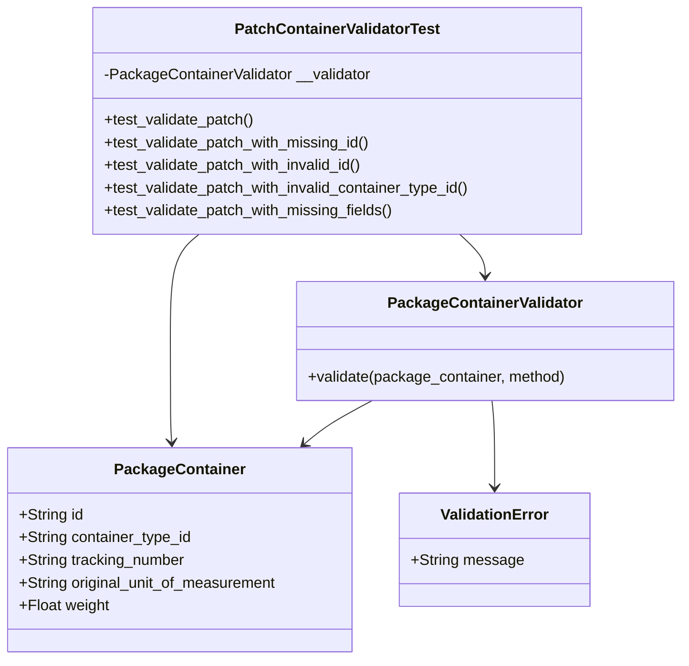
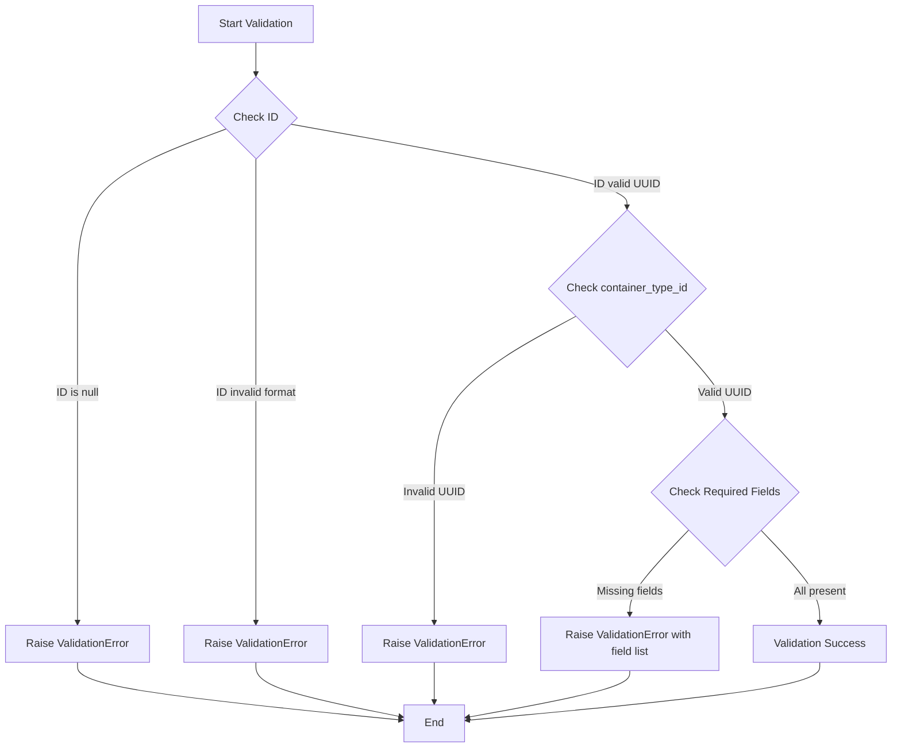
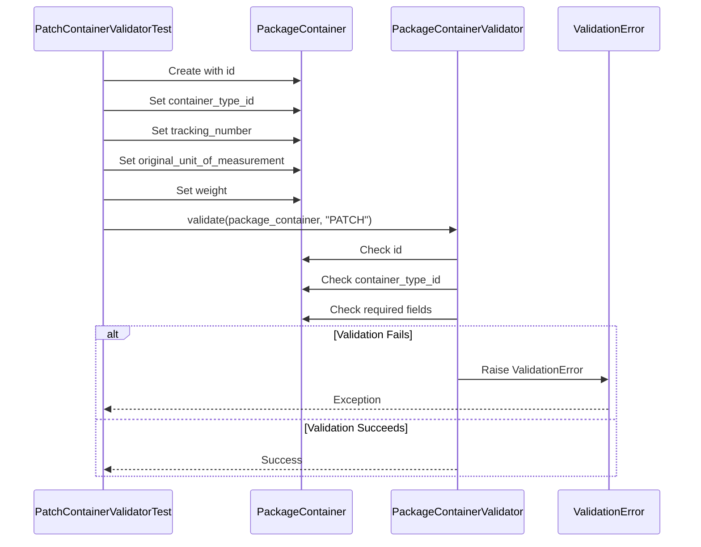
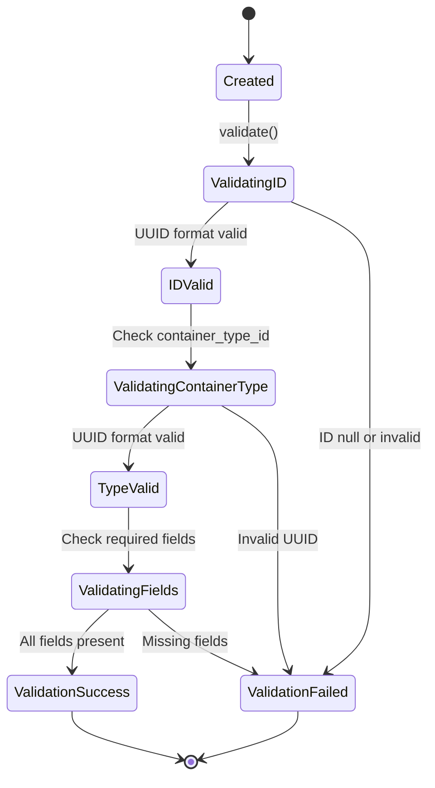

# Diagram: platform/partview_core/partview_service/partview_service/tests/unit/core/validators/package_container/container_patch_validator_test.py

> Auto-generated by Obscura crawlers

## Diagram 1

### SVG

<svg id="container" width="719.46875" xmlns="http://www.w3.org/2000/svg" class="classDiagram" height="698" viewBox="0 0 719.46875 698" role="graphics-document document" aria-roledescription="class"><g><defs><marker id="container_class-aggregationStart" class="marker aggregation class" refX="18" refY="7" markerWidth="190" markerHeight="240" orient="auto"><path d="M 18,7 L9,13 L1,7 L9,1 Z"></path></marker></defs><defs><marker id="container_class-aggregationEnd" class="marker aggregation class" refX="1" refY="7" markerWidth="20" markerHeight="28" orient="auto"><path d="M 18,7 L9,13 L1,7 L9,1 Z"></path></marker></defs><defs><marker id="container_class-extensionStart" class="marker extension class" refX="18" refY="7" markerWidth="190" markerHeight="240" orient="auto"><path d="M 1,7 L18,13 V 1 Z"></path></marker></defs><defs><marker id="container_class-extensionEnd" class="marker extension class" refX="1" refY="7" markerWidth="20" markerHeight="28" orient="auto"><path d="M 1,1 V 13 L18,7 Z"></path></marker></defs><defs><marker id="container_class-compositionStart" class="marker composition class" refX="18" refY="7" markerWidth="190" markerHeight="240" orient="auto"><path d="M 18,7 L9,13 L1,7 L9,1 Z"></path></marker></defs><defs><marker id="container_class-compositionEnd" class="marker composition class" refX="1" refY="7" markerWidth="20" markerHeight="28" orient="auto"><path d="M 18,7 L9,13 L1,7 L9,1 Z"></path></marker></defs><defs><marker id="container_class-dependencyStart" class="marker dependency class" refX="6" refY="7" markerWidth="190" markerHeight="240" orient="auto"><path d="M 5,7 L9,13 L1,7 L9,1 Z"></path></marker></defs><defs><marker id="container_class-dependencyEnd" class="marker dependency class" refX="13" refY="7" markerWidth="20" markerHeight="28" orient="auto"><path d="M 18,7 L9,13 L14,7 L9,1 Z"></path></marker></defs><defs><marker id="container_class-lollipopStart" class="marker lollipop class" refX="13" refY="7" markerWidth="190" markerHeight="240" orient="auto"><circle stroke="black" fill="transparent" cx="7" cy="7" r="6"></circle></marker></defs><defs><marker id="container_class-lollipopEnd" class="marker lollipop class" refX="1" refY="7" markerWidth="190" markerHeight="240" orient="auto"><circle stroke="black" fill="transparent" cx="7" cy="7" r="6"></circle></marker></defs><g class="root"><g class="clusters"></g><g class="edgePaths"><path d="M485.701,248L490.173,252.167C494.646,256.333,503.59,264.667,508.063,272C512.535,279.333,512.535,285.667,512.535,288.833L512.535,292" id="id_PatchContainerValidatorTest_PackageContainerValidator_1" class="edge-thickness-normal edge-pattern-solid relation" style=";;;" data-edge="true" data-et="edge" data-id="id_PatchContainerValidatorTest_PackageContainerValidator_1" data-points="W3sieCI6NDg1LjcwMDkwMjQ3ODQ0ODI2LCJ5IjoyNDh9LHsieCI6NTEyLjUzNTE1NjI1LCJ5IjoyNzN9LHsieCI6NTEyLjUzNTE1NjI1LCJ5IjoyOTh9XQ==" marker-end="url(#container_class-dependencyEnd)"></path><path d="M211.54,248L206.493,252.167C201.446,256.333,191.352,264.667,186.305,283.5C181.258,302.333,181.258,331.667,181.258,361C181.258,390.333,181.258,419.667,181.496,437.503C181.734,455.339,182.211,461.678,182.449,464.847L182.688,468.017" id="id_PatchContainerValidatorTest_PackageContainer_2" class="edge-thickness-normal edge-pattern-solid relation" style=";;;" data-edge="true" data-et="edge" data-id="id_PatchContainerValidatorTest_PackageContainer_2" data-points="W3sieCI6MjExLjU0MDM0MjEzMzYyMDcsInkiOjI0OH0seyJ4IjoxODEuMjU3ODEyNSwieSI6MjczfSx7IngiOjE4MS4yNTc4MTI1LCJ5IjozNjF9LHsieCI6MTgxLjI1NzgxMjUsInkiOjQ0OX0seyJ4IjoxODMuMTM3NTExNzQ4MTIwMywieSI6NDc0fV0=" marker-end="url(#container_class-dependencyEnd)"></path><path d="M393.953,424L386.11,428.167C378.267,432.333,362.582,440.667,350.624,448.35C338.665,456.034,330.434,463.068,326.318,466.585L322.202,470.102" id="id_PackageContainerValidator_PackageContainer_3" class="edge-thickness-normal edge-pattern-solid relation" style=";;;" data-edge="true" data-et="edge" data-id="id_PackageContainerValidator_PackageContainer_3" data-points="W3sieCI6MzkzLjk1MjkyNTI0ODU3OTU2LCJ5Ijo0MjR9LHsieCI6MzQ2Ljg5NjQ4NDM3NSwieSI6NDQ5fSx7IngiOjMxNy42NDEwOTQ5MjQ4MTIsInkiOjQ3NH1d" marker-end="url(#container_class-dependencyEnd)"></path><path d="M519.694,424L520.168,428.167C520.641,432.333,521.588,440.667,522.062,456C522.535,471.333,522.535,493.667,522.535,504.833L522.535,516" id="id_PackageContainerValidator_ValidationError_4" class="edge-thickness-normal edge-pattern-solid relation" style=";;;" data-edge="true" data-et="edge" data-id="id_PackageContainerValidator_ValidationError_4" data-points="W3sieCI6NTE5LjY5NDI0NzE1OTA5MDksInkiOjQyNH0seyJ4Ijo1MjIuNTM1MTU2MjUsInkiOjQ0OX0seyJ4Ijo1MjIuNTM1MTU2MjUsInkiOjUyMn1d" marker-end="url(#container_class-dependencyEnd)"></path></g><g class="edgeLabels"><g class="edgeLabel"><g class="label" data-id="id_PatchContainerValidatorTest_PackageContainerValidator_1" transform="translate(0, 0)"><foreignObject width="0" height="0">

</foreignObject></g></g><g class="edgeLabel"><g class="label" data-id="id_PatchContainerValidatorTest_PackageContainer_2" transform="translate(0, 0)"><foreignObject width="0" height="0">

</foreignObject></g></g><g class="edgeLabel"><g class="label" data-id="id_PackageContainerValidator_PackageContainer_3" transform="translate(0, 0)"><foreignObject width="0" height="0">

</foreignObject></g></g><g class="edgeLabel"><g class="label" data-id="id_PackageContainerValidator_ValidationError_4" transform="translate(0, 0)"><foreignObject width="0" height="0">

</foreignObject></g></g></g><g class="nodes"><g class="node default" id="classId-PatchContainerValidatorTest-0" transform="translate(356.896484375, 128)"><g class="basic label-container"><path d="M-261.13671875 -120 L261.13671875 -120 L261.13671875 120 L-261.13671875 120" stroke="none" stroke-width="0" fill="#ECECFF" style=""></path><path d="M-261.13671875 -120 C-59.915999712532084 -120, 141.30471932493583 -120, 261.13671875 -120 M-261.13671875 -120 C-146.24722489790884 -120, -31.3577310458177 -120, 261.13671875 -120 M261.13671875 -120 C261.13671875 -32.661758650737596, 261.13671875 54.67648269852481, 261.13671875 120 M261.13671875 -120 C261.13671875 -49.37587248962818, 261.13671875 21.248255020743642, 261.13671875 120 M261.13671875 120 C104.95237280511515 120, -51.23197313976971 120, -261.13671875 120 M261.13671875 120 C108.36837340976041 120, -44.39997193047918 120, -261.13671875 120 M-261.13671875 120 C-261.13671875 64.63009823050373, -261.13671875 9.260196461007482, -261.13671875 -120 M-261.13671875 120 C-261.13671875 60.49318942645917, -261.13671875 0.9863788529183353, -261.13671875 -120" stroke="#9370DB" stroke-width="1.3" fill="none" stroke-dasharray="0 0" style=""></path></g><g class="annotation-group text" transform="translate(0, -96)"></g><g class="label-group text" transform="translate(-104.1953125, -96)"><g class="label" style="font-weight: bolder" transform="translate(0,-12)"><foreignObject width="208.390625" height="24">

PatchContainerValidatorTest

</foreignObject></g></g><g class="members-group text" transform="translate(-249.13671875, -48)"><g class="label" style="" transform="translate(0,-12)"><foreignObject width="285.265625" height="24">

-PackageContainerValidator __validator

</foreignObject></g></g><g class="methods-group text" transform="translate(-249.13671875, 0)"><g class="label" style="" transform="translate(0,-12)"><foreignObject width="160.125" height="24">

+test_validate_patch()

</foreignObject></g><g class="label" style="" transform="translate(0,12)"><foreignObject width="285.25" height="24">

+test_validate_patch_with_missing_id()

</foreignObject></g><g class="label" style="" transform="translate(0,36)"><foreignObject width="278.6875" height="24">

+test_validate_patch_with_invalid_id()

</foreignObject></g><g class="label" style="" transform="translate(0,60)"><foreignObject width="394.078125" height="24">

+test_validate_patch_with_invalid_container_type_id()

</foreignObject></g><g class="label" style="" transform="translate(0,84)"><foreignObject width="310.421875" height="24">

+test_validate_patch_with_missing_fields()

</foreignObject></g></g><g class="divider" style=""><path d="M-261.13671875 -72 C-86.91721073148528 -72, 87.30229728702943 -72, 261.13671875 -72 M-261.13671875 -72 C-89.31153966680748 -72, 82.51363941638505 -72, 261.13671875 -72" stroke="#9370DB" stroke-width="1.3" fill="none" stroke-dasharray="0 0" style=""></path></g><g class="divider" style=""><path d="M-261.13671875 -24 C-87.54896525048761 -24, 86.03878824902478 -24, 261.13671875 -24 M-261.13671875 -24 C-150.0570917234154 -24, -38.97746469683079 -24, 261.13671875 -24" stroke="#9370DB" stroke-width="1.3" fill="none" stroke-dasharray="0 0" style=""></path></g></g><g class="node default" id="classId-PackageContainerValidator-1" transform="translate(512.53515625, 361)"><g class="basic label-container"><path d="M-198.93359375 -63 L198.93359375 -63 L198.93359375 63 L-198.93359375 63" stroke="none" stroke-width="0" fill="#ECECFF" style=""></path><path d="M-198.93359375 -63 C-97.22250726353107 -63, 4.488579222937858 -63, 198.93359375 -63 M-198.93359375 -63 C-47.44851476924231 -63, 104.03656421151538 -63, 198.93359375 -63 M198.93359375 -63 C198.93359375 -15.255539268179774, 198.93359375 32.48892146364045, 198.93359375 63 M198.93359375 -63 C198.93359375 -27.483463143105254, 198.93359375 8.033073713789491, 198.93359375 63 M198.93359375 63 C73.73007462464874 63, -51.47344450070253 63, -198.93359375 63 M198.93359375 63 C47.100043631067706 63, -104.73350648786459 63, -198.93359375 63 M-198.93359375 63 C-198.93359375 15.214124965483428, -198.93359375 -32.57175006903314, -198.93359375 -63 M-198.93359375 63 C-198.93359375 23.84410078551207, -198.93359375 -15.311798428975862, -198.93359375 -63" stroke="#9370DB" stroke-width="1.3" fill="none" stroke-dasharray="0 0" style=""></path></g><g class="annotation-group text" transform="translate(0, -39)"></g><g class="label-group text" transform="translate(-98.6328125, -39)"><g class="label" style="font-weight: bolder" transform="translate(0,-12)"><foreignObject width="197.265625" height="24">

PackageContainerValidator

</foreignObject></g></g><g class="members-group text" transform="translate(-186.93359375, 9)"></g><g class="methods-group text" transform="translate(-186.93359375, 39)"><g class="label" style="" transform="translate(0,-12)"><foreignObject width="275.234375" height="24">

+validate(package_container, method)

</foreignObject></g></g><g class="divider" style=""><path d="M-198.93359375 -15 C-71.67350361468462 -15, 55.58658652063076 -15, 198.93359375 -15 M-198.93359375 -15 C-44.268719485892376 -15, 110.39615477821525 -15, 198.93359375 -15" stroke="#9370DB" stroke-width="1.3" fill="none" stroke-dasharray="0 0" style=""></path></g><g class="divider" style=""><path d="M-198.93359375 9 C-47.40135460982805 9, 104.1308845303439 9, 198.93359375 9 M-198.93359375 9 C-86.93932735325204 9, 25.05493904349592 9, 198.93359375 9" stroke="#9370DB" stroke-width="1.3" fill="none" stroke-dasharray="0 0" style=""></path></g></g><g class="node default" id="classId-PackageContainer-2" transform="translate(191.2578125, 582)"><g class="basic label-container"><path d="M-183.2578125 -108 L183.2578125 -108 L183.2578125 108 L-183.2578125 108" stroke="none" stroke-width="0" fill="#ECECFF" style=""></path><path d="M-183.2578125 -108 C-64.47228961134088 -108, 54.31323327731823 -108, 183.2578125 -108 M-183.2578125 -108 C-57.93979629126359 -108, 67.37821991747282 -108, 183.2578125 -108 M183.2578125 -108 C183.2578125 -22.18668540988908, 183.2578125 63.62662918022184, 183.2578125 108 M183.2578125 -108 C183.2578125 -64.46512830794701, 183.2578125 -20.930256615894024, 183.2578125 108 M183.2578125 108 C98.10005604588372 108, 12.942299591767437 108, -183.2578125 108 M183.2578125 108 C65.20982123245041 108, -52.83817003509918 108, -183.2578125 108 M-183.2578125 108 C-183.2578125 22.990783861657604, -183.2578125 -62.01843227668479, -183.2578125 -108 M-183.2578125 108 C-183.2578125 46.283030653494045, -183.2578125 -15.43393869301191, -183.2578125 -108" stroke="#9370DB" stroke-width="1.3" fill="none" stroke-dasharray="0 0" style=""></path></g><g class="annotation-group text" transform="translate(0, -84)"></g><g class="label-group text" transform="translate(-65.453125, -84)"><g class="label" style="font-weight: bolder" transform="translate(0,-12)"><foreignObject width="130.90625" height="24">

PackageContainer

</foreignObject></g></g><g class="members-group text" transform="translate(-171.2578125, -36)"><g class="label" style="" transform="translate(0,-12)"><foreignObject width="68.546875" height="24">

+String id

</foreignObject></g><g class="label" style="" transform="translate(0,12)"><foreignObject width="184.265625" height="24">

+String container_type_id

</foreignObject></g><g class="label" style="" transform="translate(0,36)"><foreignObject width="177.796875" height="24">

+String tracking_number

</foreignObject></g><g class="label" style="" transform="translate(0,60)"><foreignObject width="277.0625" height="24">

+String original_unit_of_measurement

</foreignObject></g><g class="label" style="" transform="translate(0,84)"><foreignObject width="96.375" height="24">

+Float weight

</foreignObject></g></g><g class="methods-group text" transform="translate(-171.2578125, 108)"></g><g class="divider" style=""><path d="M-183.2578125 -60 C-63.97401665635729 -60, 55.309779187285415 -60, 183.2578125 -60 M-183.2578125 -60 C-49.6622983935533 -60, 83.9332157128934 -60, 183.2578125 -60" stroke="#9370DB" stroke-width="1.3" fill="none" stroke-dasharray="0 0" style=""></path></g><g class="divider" style=""><path d="M-183.2578125 84 C-70.52386417152542 84, 42.210084156949165 84, 183.2578125 84 M-183.2578125 84 C-67.70542255140414 84, 47.84696739719172 84, 183.2578125 84" stroke="#9370DB" stroke-width="1.3" fill="none" stroke-dasharray="0 0" style=""></path></g></g><g class="node default" id="classId-ValidationError-3" transform="translate(522.53515625, 582)"><g class="basic label-container"><path d="M-98.01953125 -60 L98.01953125 -60 L98.01953125 60 L-98.01953125 60" stroke="none" stroke-width="0" fill="#ECECFF" style=""></path><path d="M-98.01953125 -60 C-53.281026080110905 -60, -8.54252091022181 -60, 98.01953125 -60 M-98.01953125 -60 C-33.17339639001085 -60, 31.6727384699783 -60, 98.01953125 -60 M98.01953125 -60 C98.01953125 -29.981263503521358, 98.01953125 0.03747299295728368, 98.01953125 60 M98.01953125 -60 C98.01953125 -12.48910001914004, 98.01953125 35.02179996171992, 98.01953125 60 M98.01953125 60 C46.51778992893797 60, -4.983951392124055 60, -98.01953125 60 M98.01953125 60 C46.21526729960597 60, -5.5889966507880615 60, -98.01953125 60 M-98.01953125 60 C-98.01953125 14.629257342679594, -98.01953125 -30.741485314640812, -98.01953125 -60 M-98.01953125 60 C-98.01953125 35.544816933471324, -98.01953125 11.089633866942656, -98.01953125 -60" stroke="#9370DB" stroke-width="1.3" fill="none" stroke-dasharray="0 0" style=""></path></g><g class="annotation-group text" transform="translate(0, -36)"></g><g class="label-group text" transform="translate(-55.1796875, -36)"><g class="label" style="font-weight: bolder" transform="translate(0,-12)"><foreignObject width="110.359375" height="24">

ValidationError

</foreignObject></g></g><g class="members-group text" transform="translate(-86.01953125, 12)"><g class="label" style="" transform="translate(0,-12)"><foreignObject width="116.859375" height="24">

+String message

</foreignObject></g></g><g class="methods-group text" transform="translate(-86.01953125, 60)"></g><g class="divider" style=""><path d="M-98.01953125 -12 C-58.643206553713185 -12, -19.26688185742637 -12, 98.01953125 -12 M-98.01953125 -12 C-25.917959747263893 -12, 46.183611755472214 -12, 98.01953125 -12" stroke="#9370DB" stroke-width="1.3" fill="none" stroke-dasharray="0 0" style=""></path></g><g class="divider" style=""><path d="M-98.01953125 36 C-53.405937982686176 36, -8.792344715372352 36, 98.01953125 36 M-98.01953125 36 C-33.15646384141263 36, 31.70660356717474 36, 98.01953125 36" stroke="#9370DB" stroke-width="1.3" fill="none" stroke-dasharray="0 0" style=""></path></g></g></g></g></g></svg>

## Diagram 2

### SVG

<svg id="container" width="1306.46875" xmlns="http://www.w3.org/2000/svg" class="flowchart" height="1083.734375" viewBox="0 0 1306.46875 1083.734375" role="graphics-document document" aria-roledescription="flowchart-v2"><g><marker id="container_flowchart-v2-pointEnd" class="marker flowchart-v2" viewBox="0 0 10 10" refX="5" refY="5" markerUnits="userSpaceOnUse" markerWidth="8" markerHeight="8" orient="auto"><path d="M 0 0 L 10 5 L 0 10 z" class="arrowMarkerPath" style="stroke-width: 1; stroke-dasharray: 1, 0;"></path></marker><marker id="container_flowchart-v2-pointStart" class="marker flowchart-v2" viewBox="0 0 10 10" refX="4.5" refY="5" markerUnits="userSpaceOnUse" markerWidth="8" markerHeight="8" orient="auto"><path d="M 0 5 L 10 10 L 10 0 z" class="arrowMarkerPath" style="stroke-width: 1; stroke-dasharray: 1, 0;"></path></marker><marker id="container_flowchart-v2-circleEnd" class="marker flowchart-v2" viewBox="0 0 10 10" refX="11" refY="5" markerUnits="userSpaceOnUse" markerWidth="11" markerHeight="11" orient="auto"><circle cx="5" cy="5" r="5" class="arrowMarkerPath" style="stroke-width: 1; stroke-dasharray: 1, 0;"></circle></marker><marker id="container_flowchart-v2-circleStart" class="marker flowchart-v2" viewBox="0 0 10 10" refX="-1" refY="5" markerUnits="userSpaceOnUse" markerWidth="11" markerHeight="11" orient="auto"><circle cx="5" cy="5" r="5" class="arrowMarkerPath" style="stroke-width: 1; stroke-dasharray: 1, 0;"></circle></marker><marker id="container_flowchart-v2-crossEnd" class="marker cross flowchart-v2" viewBox="0 0 11 11" refX="12" refY="5.2" markerUnits="userSpaceOnUse" markerWidth="11" markerHeight="11" orient="auto"><path d="M 1,1 l 9,9 M 10,1 l -9,9" class="arrowMarkerPath" style="stroke-width: 2; stroke-dasharray: 1, 0;"></path></marker><marker id="container_flowchart-v2-crossStart" class="marker cross flowchart-v2" viewBox="0 0 11 11" refX="-1" refY="5.2" markerUnits="userSpaceOnUse" markerWidth="11" markerHeight="11" orient="auto"><path d="M 1,1 l 9,9 M 10,1 l -9,9" class="arrowMarkerPath" style="stroke-width: 2; stroke-dasharray: 1, 0;"></path></marker><g class="root"><g class="clusters"></g><g class="edgePaths"><path d="M376.375,62L376.375,66.167C376.375,70.333,376.375,78.667,376.375,86.333C376.375,94,376.375,101,376.375,104.5L376.375,108" id="L_A_B_0" class="edge-thickness-normal edge-pattern-solid edge-thickness-normal edge-pattern-solid flowchart-link" style=";" data-edge="true" data-et="edge" data-id="L_A_B_0" data-points="W3sieCI6Mzc2LjM3NSwieSI6NjJ9LHsieCI6Mzc2LjM3NSwieSI6ODd9LHsieCI6Mzc2LjM3NSwieSI6MTEyfV0=" marker-end="url(#container_flowchart-v2-pointEnd)"></path><path d="M333.794,185.434L297.182,198.698C260.571,211.961,187.348,238.488,150.736,277.15C114.125,315.813,114.125,366.609,114.125,417.406C114.125,468.203,114.125,519,114.125,568.31C114.125,617.62,114.125,665.443,114.125,713.266C114.125,761.089,114.125,808.911,114.125,840.323C114.125,871.734,114.125,886.734,114.125,894.234L114.125,901.734" id="L_B_C_0" class="edge-thickness-normal edge-pattern-solid edge-thickness-normal edge-pattern-solid flowchart-link" style=";" data-edge="true" data-et="edge" data-id="L_B_C_0" data-points="W3sieCI6MzMzLjc5MzU2OTE3OTI5NTQsInkiOjE4NS40MzQxOTQxNzkyOTU0Mn0seyJ4IjoxMTQuMTI1LCJ5IjoyNjUuMDE1NjI1fSx7IngiOjExNC4xMjUsInkiOjQxNy40MDYyNX0seyJ4IjoxMTQuMTI1LCJ5Ijo1NjkuNzk2ODc1fSx7IngiOjExNC4xMjUsInkiOjcxMy4yNjU2MjV9LHsieCI6MTE0LjEyNSwieSI6ODU2LjczNDM3NX0seyJ4IjoxMTQuMTI1LCJ5Ijo5MDUuNzM0Mzc1fV0=" marker-end="url(#container_flowchart-v2-pointEnd)"></path><path d="M376.375,228.016L376.375,234.182C376.375,240.349,376.375,252.682,376.375,284.247C376.375,315.813,376.375,366.609,376.375,417.406C376.375,468.203,376.375,519,376.375,568.31C376.375,617.62,376.375,665.443,376.375,713.266C376.375,761.089,376.375,808.911,376.375,840.323C376.375,871.734,376.375,886.734,376.375,894.234L376.375,901.734" id="L_B_D_0" class="edge-thickness-normal edge-pattern-solid edge-thickness-normal edge-pattern-solid flowchart-link" style=";" data-edge="true" data-et="edge" data-id="L_B_D_0" data-points="W3sieCI6Mzc2LjM3NSwieSI6MjI4LjAxNTYyNX0seyJ4IjozNzYuMzc1LCJ5IjoyNjUuMDE1NjI1fSx7IngiOjM3Ni4zNzUsInkiOjQxNy40MDYyNX0seyJ4IjozNzYuMzc1LCJ5Ijo1NjkuNzk2ODc1fSx7IngiOjM3Ni4zNzUsInkiOjcxMy4yNjU2MjV9LHsieCI6Mzc2LjM3NSwieSI6ODU2LjczNDM3NX0seyJ4IjozNzYuMzc1LCJ5Ijo5MDUuNzM0Mzc1fV0=" marker-end="url(#container_flowchart-v2-pointEnd)"></path><path d="M425.755,178.636L508.148,193.033C590.542,207.429,755.33,236.222,837.723,256.119C920.117,276.016,920.117,287.016,920.117,292.516L920.117,298.016" id="L_B_E_0" class="edge-thickness-normal edge-pattern-solid edge-thickness-normal edge-pattern-solid flowchart-link" style=";" data-edge="true" data-et="edge" data-id="L_B_E_0" data-points="W3sieCI6NDI1Ljc1NDcxNzk4MTc0NTMzLCJ5IjoxNzguNjM1OTA3MDE4MjU0NjR9LHsieCI6OTIwLjExNzE4NzUsInkiOjI2NS4wMTU2MjV9LHsieCI6OTIwLjExNzE4NzUsInkiOjMwMi4wMTU2MjV9XQ==" marker-end="url(#container_flowchart-v2-pointEnd)"></path><path d="M845.255,457.934L810.816,476.578C776.378,495.222,707.502,532.509,673.063,575.065C638.625,617.62,638.625,665.443,638.625,713.266C638.625,761.089,638.625,808.911,638.625,840.323C638.625,871.734,638.625,886.734,638.625,894.234L638.625,901.734" id="L_E_F_0" class="edge-thickness-normal edge-pattern-solid edge-thickness-normal edge-pattern-solid flowchart-link" style=";" data-edge="true" data-et="edge" data-id="L_E_F_0" data-points="W3sieCI6ODQ1LjI1NDY3MDQ1MDU1NTUsInkiOjQ1Ny45MzQzNTc5NTA1NTU0N30seyJ4Ijo2MzguNjI1LCJ5Ijo1NjkuNzk2ODc1fSx7IngiOjYzOC42MjUsInkiOjcxMy4yNjU2MjV9LHsieCI6NjM4LjYyNSwieSI6ODU2LjczNDM3NX0seyJ4Ijo2MzguNjI1LCJ5Ijo5MDUuNzM0Mzc1fV0=" marker-end="url(#container_flowchart-v2-pointEnd)"></path><path d="M975.991,476.923L990.522,492.402C1005.054,507.881,1034.117,538.839,1048.648,559.818C1063.18,580.797,1063.18,591.797,1063.18,597.297L1063.18,602.797" id="L_E_G_0" class="edge-thickness-normal edge-pattern-solid edge-thickness-normal edge-pattern-solid flowchart-link" style=";" data-edge="true" data-et="edge" data-id="L_E_G_0" data-points="W3sieCI6OTc1Ljk5MDkyODE3OTA0MTcsInkiOjQ3Ni45MjMxMzQzMjA5NTgzfSx7IngiOjEwNjMuMTc5Njg3NSwieSI6NTY5Ljc5Njg3NX0seyJ4IjoxMDYzLjE3OTY4NzUsInkiOjYwNi43OTY4NzV9XQ==" marker-end="url(#container_flowchart-v2-pointEnd)"></path><path d="M1010.897,767.452L996.539,782.332C982.181,797.213,953.466,826.973,939.108,847.354C924.75,867.734,924.75,878.734,924.75,884.234L924.75,889.734" id="L_G_H_0" class="edge-thickness-normal edge-pattern-solid edge-thickness-normal edge-pattern-solid flowchart-link" style=";" data-edge="true" data-et="edge" data-id="L_G_H_0" data-points="W3sieCI6MTAxMC44OTY5MDExMTE2NzMxLCJ5Ijo3NjcuNDUxNTg4NjExNjczMX0seyJ4Ijo5MjQuNzUsInkiOjg1Ni43MzQzNzV9LHsieCI6OTI0Ljc1LCJ5Ijo4OTMuNzM0Mzc1fV0=" marker-end="url(#container_flowchart-v2-pointEnd)"></path><path d="M1115.462,767.452L1129.82,782.332C1144.178,797.213,1172.894,826.973,1187.252,849.354C1201.609,871.734,1201.609,886.734,1201.609,894.234L1201.609,901.734" id="L_G_I_0" class="edge-thickness-normal edge-pattern-solid edge-thickness-normal edge-pattern-solid flowchart-link" style=";" data-edge="true" data-et="edge" data-id="L_G_I_0" data-points="W3sieCI6MTExNS40NjI0NzM4ODgzMjcsInkiOjc2Ny40NTE1ODg2MTE2NzMxfSx7IngiOjEyMDEuNjA5Mzc1LCJ5Ijo4NTYuNzM0Mzc1fSx7IngiOjEyMDEuNjA5Mzc1LCJ5Ijo5MDUuNzM0Mzc1fV0=" marker-end="url(#container_flowchart-v2-pointEnd)"></path><path d="M114.125,959.734L114.125,965.901C114.125,972.068,114.125,984.401,193.598,998.447C273.072,1012.493,432.018,1028.251,511.492,1036.13L590.965,1044.009" id="L_C_J_0" class="edge-thickness-normal edge-pattern-solid edge-thickness-normal edge-pattern-solid flowchart-link" style=";" data-edge="true" data-et="edge" data-id="L_C_J_0" data-points="W3sieCI6MTE0LjEyNSwieSI6OTU5LjczNDM3NX0seyJ4IjoxMTQuMTI1LCJ5Ijo5OTYuNzM0Mzc1fSx7IngiOjU5NC45NDUzMTI1LCJ5IjoxMDQ0LjQwMzg4MTY3MzAyMn1d" marker-end="url(#container_flowchart-v2-pointEnd)"></path><path d="M376.375,959.734L376.375,965.901C376.375,972.068,376.375,984.401,412.149,997.661C447.924,1010.921,519.473,1025.108,555.247,1032.202L591.022,1039.295" id="L_D_J_0" class="edge-thickness-normal edge-pattern-solid edge-thickness-normal edge-pattern-solid flowchart-link" style=";" data-edge="true" data-et="edge" data-id="L_D_J_0" data-points="W3sieCI6Mzc2LjM3NSwieSI6OTU5LjczNDM3NX0seyJ4IjozNzYuMzc1LCJ5Ijo5OTYuNzM0Mzc1fSx7IngiOjU5NC45NDUzMTI1LCJ5IjoxMDQwLjA3MzM4ODM0NjA0Mzl9XQ==" marker-end="url(#container_flowchart-v2-pointEnd)"></path><path d="M638.625,959.734L638.625,965.901C638.625,972.068,638.625,984.401,638.625,994.068C638.625,1003.734,638.625,1010.734,638.625,1014.234L638.625,1017.734" id="L_F_J_0" class="edge-thickness-normal edge-pattern-solid edge-thickness-normal edge-pattern-solid flowchart-link" style=";" data-edge="true" data-et="edge" data-id="L_F_J_0" data-points="W3sieCI6NjM4LjYyNSwieSI6OTU5LjczNDM3NX0seyJ4Ijo2MzguNjI1LCJ5Ijo5OTYuNzM0Mzc1fSx7IngiOjYzOC42MjUsInkiOjEwMjEuNzM0Mzc1fV0=" marker-end="url(#container_flowchart-v2-pointEnd)"></path><path d="M924.75,971.734L924.75,975.901C924.75,980.068,924.75,988.401,884.998,999.792C845.247,1011.183,765.743,1025.632,725.992,1032.856L686.24,1040.081" id="L_H_J_0" class="edge-thickness-normal edge-pattern-solid edge-thickness-normal edge-pattern-solid flowchart-link" style=";" data-edge="true" data-et="edge" data-id="L_H_J_0" data-points="W3sieCI6OTI0Ljc1LCJ5Ijo5NzEuNzM0Mzc1fSx7IngiOjkyNC43NSwieSI6OTk2LjczNDM3NX0seyJ4Ijo2ODIuMzA0Njg3NSwieSI6MTA0MC43OTYwODMxNjk1MDYzfV0=" marker-end="url(#container_flowchart-v2-pointEnd)"></path><path d="M1201.609,959.734L1201.609,965.901C1201.609,972.068,1201.609,984.401,1115.722,998.501C1029.835,1012.6,858.062,1028.466,772.175,1036.399L686.288,1044.332" id="L_I_J_0" class="edge-thickness-normal edge-pattern-solid edge-thickness-normal edge-pattern-solid flowchart-link" style=";" data-edge="true" data-et="edge" data-id="L_I_J_0" data-points="W3sieCI6MTIwMS42MDkzNzUsInkiOjk1OS43MzQzNzV9LHsieCI6MTIwMS42MDkzNzUsInkiOjk5Ni43MzQzNzV9LHsieCI6NjgyLjMwNDY4NzUsInkiOjEwNDQuNjk5OTA0NjgyNzczMn1d" marker-end="url(#container_flowchart-v2-pointEnd)"></path></g><g class="edgeLabels"><g class="edgeLabel"><g class="label" data-id="L_A_B_0" transform="translate(0, 0)"><foreignObject width="0" height="0">

</foreignObject></g></g><g class="edgeLabel" transform="translate(114.125, 569.796875)"><g class="label" data-id="L_B_C_0" transform="translate(-31.78125, -12)"><foreignObject width="63.5625" height="24">

ID is null

</foreignObject></g></g><g class="edgeLabel" transform="translate(376.375, 569.796875)"><g class="label" data-id="L_B_D_0" transform="translate(-60.5625, -12)"><foreignObject width="121.125" height="24">

ID invalid format

</foreignObject></g></g><g class="edgeLabel" transform="translate(920.1171875, 265.015625)"><g class="label" data-id="L_B_E_0" transform="translate(-47.3203125, -12)"><foreignObject width="94.640625" height="24">

ID valid UUID

</foreignObject></g></g><g class="edgeLabel" transform="translate(638.625, 713.265625)"><g class="label" data-id="L_E_F_0" transform="translate(-44.6875, -12)"><foreignObject width="89.375" height="24">

Invalid UUID

</foreignObject></g></g><g class="edgeLabel" transform="translate(1063.1796875, 569.796875)"><g class="label" data-id="L_E_G_0" transform="translate(-38.015625, -12)"><foreignObject width="76.03125" height="24">

Valid UUID

</foreignObject></g></g><g class="edgeLabel" transform="translate(924.75, 856.734375)"><g class="label" data-id="L_G_H_0" transform="translate(-48.8828125, -12)"><foreignObject width="97.765625" height="24">

Missing fields

</foreignObject></g></g><g class="edgeLabel" transform="translate(1201.609375, 856.734375)"><g class="label" data-id="L_G_I_0" transform="translate(-39.03125, -12)"><foreignObject width="78.0625" height="24">

All present

</foreignObject></g></g><g class="edgeLabel"><g class="label" data-id="L_C_J_0" transform="translate(0, 0)"><foreignObject width="0" height="0">

</foreignObject></g></g><g class="edgeLabel"><g class="label" data-id="L_D_J_0" transform="translate(0, 0)"><foreignObject width="0" height="0">

</foreignObject></g></g><g class="edgeLabel"><g class="label" data-id="L_F_J_0" transform="translate(0, 0)"><foreignObject width="0" height="0">

</foreignObject></g></g><g class="edgeLabel"><g class="label" data-id="L_H_J_0" transform="translate(0, 0)"><foreignObject width="0" height="0">

</foreignObject></g></g><g class="edgeLabel"><g class="label" data-id="L_I_J_0" transform="translate(0, 0)"><foreignObject width="0" height="0">

</foreignObject></g></g></g><g class="nodes"><g class="node default" id="flowchart-A-0" transform="translate(376.375, 35)"><rect class="basic label-container" style="" x="-86.28125" y="-27" width="172.5625" height="54"></rect><g class="label" style="" transform="translate(-56.28125, -12)"><rect></rect><foreignObject width="112.5625" height="24">

Start Validation

</foreignObject></g></g><g class="node default" id="flowchart-B-1" transform="translate(376.375, 170.0078125)"><polygon points="58.0078125,0 116.015625,-58.0078125 58.0078125,-116.015625 0,-58.0078125" class="label-container" transform="translate(-57.5078125, 58.0078125)"></polygon><g class="label" style="" transform="translate(-31.0078125, -12)"><rect></rect><foreignObject width="62.015625" height="24">

Check ID

</foreignObject></g></g><g class="node default" id="flowchart-C-3" transform="translate(114.125, 932.734375)"><rect class="basic label-container" style="" x="-106.125" y="-27" width="212.25" height="54"></rect><g class="label" style="" transform="translate(-76.125, -12)"><rect></rect><foreignObject width="152.25" height="24">

Raise ValidationError

</foreignObject></g></g><g class="node default" id="flowchart-D-5" transform="translate(376.375, 932.734375)"><rect class="basic label-container" style="" x="-106.125" y="-27" width="212.25" height="54"></rect><g class="label" style="" transform="translate(-76.125, -12)"><rect></rect><foreignObject width="152.25" height="24">

Raise ValidationError

</foreignObject></g></g><g class="node default" id="flowchart-E-7" transform="translate(920.1171875, 417.40625)"><polygon points="115.390625,0 230.78125,-115.390625 115.390625,-230.78125 0,-115.390625" class="label-container" transform="translate(-114.890625, 115.390625)"></polygon><g class="label" style="" transform="translate(-88.390625, -12)"><rect></rect><foreignObject width="176.78125" height="24">

Check container_type_id

</foreignObject></g></g><g class="node default" id="flowchart-F-9" transform="translate(638.625, 932.734375)"><rect class="basic label-container" style="" x="-106.125" y="-27" width="212.25" height="54"></rect><g class="label" style="" transform="translate(-76.125, -12)"><rect></rect><foreignObject width="152.25" height="24">

Raise ValidationError

</foreignObject></g></g><g class="node default" id="flowchart-G-11" transform="translate(1063.1796875, 713.265625)"><polygon points="106.46875,0 212.9375,-106.46875 106.46875,-212.9375 0,-106.46875" class="label-container" transform="translate(-105.96875, 106.46875)"></polygon><g class="label" style="" transform="translate(-79.46875, -12)"><rect></rect><foreignObject width="158.9375" height="24">

Check Required Fields

</foreignObject></g></g><g class="node default" id="flowchart-H-13" transform="translate(924.75, 932.734375)"><rect class="basic label-container" style="" x="-130" y="-39" width="260" height="78"></rect><g class="label" style="" transform="translate(-100, -24)"><rect></rect><foreignObject width="200" height="48">

Raise ValidationError with field list

</foreignObject></g></g><g class="node default" id="flowchart-I-15" transform="translate(1201.609375, 932.734375)"><rect class="basic label-container" style="" x="-96.859375" y="-27" width="193.71875" height="54"></rect><g class="label" style="" transform="translate(-66.859375, -12)"><rect></rect><foreignObject width="133.71875" height="24">

Validation Success

</foreignObject></g></g><g class="node default" id="flowchart-J-17" transform="translate(638.625, 1048.734375)"><rect class="basic label-container" style="" x="-43.6796875" y="-27" width="87.359375" height="54"></rect><g class="label" style="" transform="translate(-13.6796875, -12)"><rect></rect><foreignObject width="27.359375" height="24">

End

</foreignObject></g></g></g></g></g></svg>

## Diagram 3

### SVG

<svg id="container" width="1087" xmlns="http://www.w3.org/2000/svg" height="847" viewBox="-50 -10 1087 847" role="graphics-document document" aria-roledescription="sequence"><g><rect x="837" y="761" fill="#eaeaea" stroke="#666" width="150" height="65" name="Err" rx="3" ry="3" class="actor actor-bottom"></rect><text x="912" y="793.5" dominant-baseline="central" alignment-baseline="central" class="actor actor-box" style="text-anchor: middle; font-size: 16px; font-weight: 400;"><tspan x="912" dy="0">ValidationError</tspan></text></g><g><rect x="572" y="761" fill="#eaeaea" stroke="#666" width="215" height="65" name="Val" rx="3" ry="3" class="actor actor-bottom"></rect><text x="679.5" y="793.5" dominant-baseline="central" alignment-baseline="central" class="actor actor-box" style="text-anchor: middle; font-size: 16px; font-weight: 400;"><tspan x="679.5" dy="0">PackageContainerValidator</tspan></text></g><g><rect x="357.5" y="761" fill="#eaeaea" stroke="#666" width="150" height="65" name="PC" rx="3" ry="3" class="actor actor-bottom"></rect><text x="432.5" y="793.5" dominant-baseline="central" alignment-baseline="central" class="actor actor-box" style="text-anchor: middle; font-size: 16px; font-weight: 400;"><tspan x="432.5" dy="0">PackageContainer</tspan></text></g><g><rect x="0" y="761" fill="#eaeaea" stroke="#666" width="225" height="65" name="Test" rx="3" ry="3" class="actor actor-bottom"></rect><text x="112.5" y="793.5" dominant-baseline="central" alignment-baseline="central" class="actor actor-box" style="text-anchor: middle; font-size: 16px; font-weight: 400;"><tspan x="112.5" dy="0">PatchContainerValidatorTest</tspan></text></g><g><line id="actor3" x1="912" y1="65" x2="912" y2="761" class="actor-line 200" stroke-width="0.5px" stroke="#999" name="Err"></line><g id="root-3"><rect x="837" y="0" fill="#eaeaea" stroke="#666" width="150" height="65" name="Err" rx="3" ry="3" class="actor actor-top"></rect><text x="912" y="32.5" dominant-baseline="central" alignment-baseline="central" class="actor actor-box" style="text-anchor: middle; font-size: 16px; font-weight: 400;"><tspan x="912" dy="0">ValidationError</tspan></text></g></g><g><line id="actor2" x1="679.5" y1="65" x2="679.5" y2="761" class="actor-line 200" stroke-width="0.5px" stroke="#999" name="Val"></line><g id="root-2"><rect x="572" y="0" fill="#eaeaea" stroke="#666" width="215" height="65" name="Val" rx="3" ry="3" class="actor actor-top"></rect><text x="679.5" y="32.5" dominant-baseline="central" alignment-baseline="central" class="actor actor-box" style="text-anchor: middle; font-size: 16px; font-weight: 400;"><tspan x="679.5" dy="0">PackageContainerValidator</tspan></text></g></g><g><line id="actor1" x1="432.5" y1="65" x2="432.5" y2="761" class="actor-line 200" stroke-width="0.5px" stroke="#999" name="PC"></line><g id="root-1"><rect x="357.5" y="0" fill="#eaeaea" stroke="#666" width="150" height="65" name="PC" rx="3" ry="3" class="actor actor-top"></rect><text x="432.5" y="32.5" dominant-baseline="central" alignment-baseline="central" class="actor actor-box" style="text-anchor: middle; font-size: 16px; font-weight: 400;"><tspan x="432.5" dy="0">PackageContainer</tspan></text></g></g><g><line id="actor0" x1="112.5" y1="65" x2="112.5" y2="761" class="actor-line 200" stroke-width="0.5px" stroke="#999" name="Test"></line><g id="root-0"><rect x="0" y="0" fill="#eaeaea" stroke="#666" width="225" height="65" name="Test" rx="3" ry="3" class="actor actor-top"></rect><text x="112.5" y="32.5" dominant-baseline="central" alignment-baseline="central" class="actor actor-box" style="text-anchor: middle; font-size: 16px; font-weight: 400;"><tspan x="112.5" dy="0">PatchContainerValidatorTest</tspan></text></g></g><g></g><defs><symbol id="computer" width="24" height="24"><path transform="scale(.5)" d="M2 2v13h20v-13h-20zm18 11h-16v-9h16v9zm-10.228 6l.466-1h3.524l.467 1h-4.457zm14.228 3h-24l2-6h2.104l-1.33 4h18.45l-1.297-4h2.073l2 6zm-5-10h-14v-7h14v7z"></path></symbol></defs><defs><symbol id="database" fill-rule="evenodd" clip-rule="evenodd"><path transform="scale(.5)" d="M12.258.001l.256.004.255.005.253.008.251.01.249.012.247.015.246.016.242.019.241.02.239.023.236.024.233.027.231.028.229.031.225.032.223.034.22.036.217.038.214.04.211.041.208.043.205.045.201.046.198.048.194.05.191.051.187.053.183.054.18.056.175.057.172.059.168.06.163.061.16.063.155.064.15.066.074.033.073.033.071.034.07.034.069.035.068.035.067.035.066.035.064.036.064.036.062.036.06.036.06.037.058.037.058.037.055.038.055.038.053.038.052.038.051.039.05.039.048.039.047.039.045.04.044.04.043.04.041.04.04.041.039.041.037.041.036.041.034.041.033.042.032.042.03.042.029.042.027.042.026.043.024.043.023.043.021.043.02.043.018.044.017.043.015.044.013.044.012.044.011.045.009.044.007.045.006.045.004.045.002.045.001.045v17l-.001.045-.002.045-.004.045-.006.045-.007.045-.009.044-.011.045-.012.044-.013.044-.015.044-.017.043-.018.044-.02.043-.021.043-.023.043-.024.043-.026.043-.027.042-.029.042-.03.042-.032.042-.033.042-.034.041-.036.041-.037.041-.039.041-.04.041-.041.04-.043.04-.044.04-.045.04-.047.039-.048.039-.05.039-.051.039-.052.038-.053.038-.055.038-.055.038-.058.037-.058.037-.06.037-.06.036-.062.036-.064.036-.064.036-.066.035-.067.035-.068.035-.069.035-.07.034-.071.034-.073.033-.074.033-.15.066-.155.064-.16.063-.163.061-.168.06-.172.059-.175.057-.18.056-.183.054-.187.053-.191.051-.194.05-.198.048-.201.046-.205.045-.208.043-.211.041-.214.04-.217.038-.22.036-.223.034-.225.032-.229.031-.231.028-.233.027-.236.024-.239.023-.241.02-.242.019-.246.016-.247.015-.249.012-.251.01-.253.008-.255.005-.256.004-.258.001-.258-.001-.256-.004-.255-.005-.253-.008-.251-.01-.249-.012-.247-.015-.245-.016-.243-.019-.241-.02-.238-.023-.236-.024-.234-.027-.231-.028-.228-.031-.226-.032-.223-.034-.22-.036-.217-.038-.214-.04-.211-.041-.208-.043-.204-.045-.201-.046-.198-.048-.195-.05-.19-.051-.187-.053-.184-.054-.179-.056-.176-.057-.172-.059-.167-.06-.164-.061-.159-.063-.155-.064-.151-.066-.074-.033-.072-.033-.072-.034-.07-.034-.069-.035-.068-.035-.067-.035-.066-.035-.064-.036-.063-.036-.062-.036-.061-.036-.06-.037-.058-.037-.057-.037-.056-.038-.055-.038-.053-.038-.052-.038-.051-.039-.049-.039-.049-.039-.046-.039-.046-.04-.044-.04-.043-.04-.041-.04-.04-.041-.039-.041-.037-.041-.036-.041-.034-.041-.033-.042-.032-.042-.03-.042-.029-.042-.027-.042-.026-.043-.024-.043-.023-.043-.021-.043-.02-.043-.018-.044-.017-.043-.015-.044-.013-.044-.012-.044-.011-.045-.009-.044-.007-.045-.006-.045-.004-.045-.002-.045-.001-.045v-17l.001-.045.002-.045.004-.045.006-.045.007-.045.009-.044.011-.045.012-.044.013-.044.015-.044.017-.043.018-.044.02-.043.021-.043.023-.043.024-.043.026-.043.027-.042.029-.042.03-.042.032-.042.033-.042.034-.041.036-.041.037-.041.039-.041.04-.041.041-.04.043-.04.044-.04.046-.04.046-.039.049-.039.049-.039.051-.039.052-.038.053-.038.055-.038.056-.038.057-.037.058-.037.06-.037.061-.036.062-.036.063-.036.064-.036.066-.035.067-.035.068-.035.069-.035.07-.034.072-.034.072-.033.074-.033.151-.066.155-.064.159-.063.164-.061.167-.06.172-.059.176-.057.179-.056.184-.054.187-.053.19-.051.195-.05.198-.048.201-.046.204-.045.208-.043.211-.041.214-.04.217-.038.22-.036.223-.034.226-.032.228-.031.231-.028.234-.027.236-.024.238-.023.241-.02.243-.019.245-.016.247-.015.249-.012.251-.01.253-.008.255-.005.256-.004.258-.001.258.001zm-9.258 20.499v.01l.001.021.003.021.004.022.005.021.006.022.007.022.009.023.01.022.011.023.012.023.013.023.015.023.016.024.017.023.018.024.019.024.021.024.022.025.023.024.024.025.052.049.056.05.061.051.066.051.07.051.075.051.079.052.084.052.088.052.092.052.097.052.102.051.105.052.11.052.114.051.119.051.123.051.127.05.131.05.135.05.139.048.144.049.147.047.152.047.155.047.16.045.163.045.167.043.171.043.176.041.178.041.183.039.187.039.19.037.194.035.197.035.202.033.204.031.209.03.212.029.216.027.219.025.222.024.226.021.23.02.233.018.236.016.24.015.243.012.246.01.249.008.253.005.256.004.259.001.26-.001.257-.004.254-.005.25-.008.247-.011.244-.012.241-.014.237-.016.233-.018.231-.021.226-.021.224-.024.22-.026.216-.027.212-.028.21-.031.205-.031.202-.034.198-.034.194-.036.191-.037.187-.039.183-.04.179-.04.175-.042.172-.043.168-.044.163-.045.16-.046.155-.046.152-.047.148-.048.143-.049.139-.049.136-.05.131-.05.126-.05.123-.051.118-.052.114-.051.11-.052.106-.052.101-.052.096-.052.092-.052.088-.053.083-.051.079-.052.074-.052.07-.051.065-.051.06-.051.056-.05.051-.05.023-.024.023-.025.021-.024.02-.024.019-.024.018-.024.017-.024.015-.023.014-.024.013-.023.012-.023.01-.023.01-.022.008-.022.006-.022.006-.022.004-.022.004-.021.001-.021.001-.021v-4.127l-.077.055-.08.053-.083.054-.085.053-.087.052-.09.052-.093.051-.095.05-.097.05-.1.049-.102.049-.105.048-.106.047-.109.047-.111.046-.114.045-.115.045-.118.044-.12.043-.122.042-.124.042-.126.041-.128.04-.13.04-.132.038-.134.038-.135.037-.138.037-.139.035-.142.035-.143.034-.144.033-.147.032-.148.031-.15.03-.151.03-.153.029-.154.027-.156.027-.158.026-.159.025-.161.024-.162.023-.163.022-.165.021-.166.02-.167.019-.169.018-.169.017-.171.016-.173.015-.173.014-.175.013-.175.012-.177.011-.178.01-.179.008-.179.008-.181.006-.182.005-.182.004-.184.003-.184.002h-.37l-.184-.002-.184-.003-.182-.004-.182-.005-.181-.006-.179-.008-.179-.008-.178-.01-.176-.011-.176-.012-.175-.013-.173-.014-.172-.015-.171-.016-.17-.017-.169-.018-.167-.019-.166-.02-.165-.021-.163-.022-.162-.023-.161-.024-.159-.025-.157-.026-.156-.027-.155-.027-.153-.029-.151-.03-.15-.03-.148-.031-.146-.032-.145-.033-.143-.034-.141-.035-.14-.035-.137-.037-.136-.037-.134-.038-.132-.038-.13-.04-.128-.04-.126-.041-.124-.042-.122-.042-.12-.044-.117-.043-.116-.045-.113-.045-.112-.046-.109-.047-.106-.047-.105-.048-.102-.049-.1-.049-.097-.05-.095-.05-.093-.052-.09-.051-.087-.052-.085-.053-.083-.054-.08-.054-.077-.054v4.127zm0-5.654v.011l.001.021.003.021.004.021.005.022.006.022.007.022.009.022.01.022.011.023.012.023.013.023.015.024.016.023.017.024.018.024.019.024.021.024.022.024.023.025.024.024.052.05.056.05.061.05.066.051.07.051.075.052.079.051.084.052.088.052.092.052.097.052.102.052.105.052.11.051.114.051.119.052.123.05.127.051.131.05.135.049.139.049.144.048.147.048.152.047.155.046.16.045.163.045.167.044.171.042.176.042.178.04.183.04.187.038.19.037.194.036.197.034.202.033.204.032.209.03.212.028.216.027.219.025.222.024.226.022.23.02.233.018.236.016.24.014.243.012.246.01.249.008.253.006.256.003.259.001.26-.001.257-.003.254-.006.25-.008.247-.01.244-.012.241-.015.237-.016.233-.018.231-.02.226-.022.224-.024.22-.025.216-.027.212-.029.21-.03.205-.032.202-.033.198-.035.194-.036.191-.037.187-.039.183-.039.179-.041.175-.042.172-.043.168-.044.163-.045.16-.045.155-.047.152-.047.148-.048.143-.048.139-.05.136-.049.131-.05.126-.051.123-.051.118-.051.114-.052.11-.052.106-.052.101-.052.096-.052.092-.052.088-.052.083-.052.079-.052.074-.051.07-.052.065-.051.06-.05.056-.051.051-.049.023-.025.023-.024.021-.025.02-.024.019-.024.018-.024.017-.024.015-.023.014-.023.013-.024.012-.022.01-.023.01-.023.008-.022.006-.022.006-.022.004-.021.004-.022.001-.021.001-.021v-4.139l-.077.054-.08.054-.083.054-.085.052-.087.053-.09.051-.093.051-.095.051-.097.05-.1.049-.102.049-.105.048-.106.047-.109.047-.111.046-.114.045-.115.044-.118.044-.12.044-.122.042-.124.042-.126.041-.128.04-.13.039-.132.039-.134.038-.135.037-.138.036-.139.036-.142.035-.143.033-.144.033-.147.033-.148.031-.15.03-.151.03-.153.028-.154.028-.156.027-.158.026-.159.025-.161.024-.162.023-.163.022-.165.021-.166.02-.167.019-.169.018-.169.017-.171.016-.173.015-.173.014-.175.013-.175.012-.177.011-.178.009-.179.009-.179.007-.181.007-.182.005-.182.004-.184.003-.184.002h-.37l-.184-.002-.184-.003-.182-.004-.182-.005-.181-.007-.179-.007-.179-.009-.178-.009-.176-.011-.176-.012-.175-.013-.173-.014-.172-.015-.171-.016-.17-.017-.169-.018-.167-.019-.166-.02-.165-.021-.163-.022-.162-.023-.161-.024-.159-.025-.157-.026-.156-.027-.155-.028-.153-.028-.151-.03-.15-.03-.148-.031-.146-.033-.145-.033-.143-.033-.141-.035-.14-.036-.137-.036-.136-.037-.134-.038-.132-.039-.13-.039-.128-.04-.126-.041-.124-.042-.122-.043-.12-.043-.117-.044-.116-.044-.113-.046-.112-.046-.109-.046-.106-.047-.105-.048-.102-.049-.1-.049-.097-.05-.095-.051-.093-.051-.09-.051-.087-.053-.085-.052-.083-.054-.08-.054-.077-.054v4.139zm0-5.666v.011l.001.02.003.022.004.021.005.022.006.021.007.022.009.023.01.022.011.023.012.023.013.023.015.023.016.024.017.024.018.023.019.024.021.025.022.024.023.024.024.025.052.05.056.05.061.05.066.051.07.051.075.052.079.051.084.052.088.052.092.052.097.052.102.052.105.051.11.052.114.051.119.051.123.051.127.05.131.05.135.05.139.049.144.048.147.048.152.047.155.046.16.045.163.045.167.043.171.043.176.042.178.04.183.04.187.038.19.037.194.036.197.034.202.033.204.032.209.03.212.028.216.027.219.025.222.024.226.021.23.02.233.018.236.017.24.014.243.012.246.01.249.008.253.006.256.003.259.001.26-.001.257-.003.254-.006.25-.008.247-.01.244-.013.241-.014.237-.016.233-.018.231-.02.226-.022.224-.024.22-.025.216-.027.212-.029.21-.03.205-.032.202-.033.198-.035.194-.036.191-.037.187-.039.183-.039.179-.041.175-.042.172-.043.168-.044.163-.045.16-.045.155-.047.152-.047.148-.048.143-.049.139-.049.136-.049.131-.051.126-.05.123-.051.118-.052.114-.051.11-.052.106-.052.101-.052.096-.052.092-.052.088-.052.083-.052.079-.052.074-.052.07-.051.065-.051.06-.051.056-.05.051-.049.023-.025.023-.025.021-.024.02-.024.019-.024.018-.024.017-.024.015-.023.014-.024.013-.023.012-.023.01-.022.01-.023.008-.022.006-.022.006-.022.004-.022.004-.021.001-.021.001-.021v-4.153l-.077.054-.08.054-.083.053-.085.053-.087.053-.09.051-.093.051-.095.051-.097.05-.1.049-.102.048-.105.048-.106.048-.109.046-.111.046-.114.046-.115.044-.118.044-.12.043-.122.043-.124.042-.126.041-.128.04-.13.039-.132.039-.134.038-.135.037-.138.036-.139.036-.142.034-.143.034-.144.033-.147.032-.148.032-.15.03-.151.03-.153.028-.154.028-.156.027-.158.026-.159.024-.161.024-.162.023-.163.023-.165.021-.166.02-.167.019-.169.018-.169.017-.171.016-.173.015-.173.014-.175.013-.175.012-.177.01-.178.01-.179.009-.179.007-.181.006-.182.006-.182.004-.184.003-.184.001-.185.001-.185-.001-.184-.001-.184-.003-.182-.004-.182-.006-.181-.006-.179-.007-.179-.009-.178-.01-.176-.01-.176-.012-.175-.013-.173-.014-.172-.015-.171-.016-.17-.017-.169-.018-.167-.019-.166-.02-.165-.021-.163-.023-.162-.023-.161-.024-.159-.024-.157-.026-.156-.027-.155-.028-.153-.028-.151-.03-.15-.03-.148-.032-.146-.032-.145-.033-.143-.034-.141-.034-.14-.036-.137-.036-.136-.037-.134-.038-.132-.039-.13-.039-.128-.041-.126-.041-.124-.041-.122-.043-.12-.043-.117-.044-.116-.044-.113-.046-.112-.046-.109-.046-.106-.048-.105-.048-.102-.048-.1-.05-.097-.049-.095-.051-.093-.051-.09-.052-.087-.052-.085-.053-.083-.053-.08-.054-.077-.054v4.153zm8.74-8.179l-.257.004-.254.005-.25.008-.247.011-.244.012-.241.014-.237.016-.233.018-.231.021-.226.022-.224.023-.22.026-.216.027-.212.028-.21.031-.205.032-.202.033-.198.034-.194.036-.191.038-.187.038-.183.04-.179.041-.175.042-.172.043-.168.043-.163.045-.16.046-.155.046-.152.048-.148.048-.143.048-.139.049-.136.05-.131.05-.126.051-.123.051-.118.051-.114.052-.11.052-.106.052-.101.052-.096.052-.092.052-.088.052-.083.052-.079.052-.074.051-.07.052-.065.051-.06.05-.056.05-.051.05-.023.025-.023.024-.021.024-.02.025-.019.024-.018.024-.017.023-.015.024-.014.023-.013.023-.012.023-.01.023-.01.022-.008.022-.006.023-.006.021-.004.022-.004.021-.001.021-.001.021.001.021.001.021.004.021.004.022.006.021.006.023.008.022.01.022.01.023.012.023.013.023.014.023.015.024.017.023.018.024.019.024.02.025.021.024.023.024.023.025.051.05.056.05.06.05.065.051.07.052.074.051.079.052.083.052.088.052.092.052.096.052.101.052.106.052.11.052.114.052.118.051.123.051.126.051.131.05.136.05.139.049.143.048.148.048.152.048.155.046.16.046.163.045.168.043.172.043.175.042.179.041.183.04.187.038.191.038.194.036.198.034.202.033.205.032.21.031.212.028.216.027.22.026.224.023.226.022.231.021.233.018.237.016.241.014.244.012.247.011.25.008.254.005.257.004.26.001.26-.001.257-.004.254-.005.25-.008.247-.011.244-.012.241-.014.237-.016.233-.018.231-.021.226-.022.224-.023.22-.026.216-.027.212-.028.21-.031.205-.032.202-.033.198-.034.194-.036.191-.038.187-.038.183-.04.179-.041.175-.042.172-.043.168-.043.163-.045.16-.046.155-.046.152-.048.148-.048.143-.048.139-.049.136-.05.131-.05.126-.051.123-.051.118-.051.114-.052.11-.052.106-.052.101-.052.096-.052.092-.052.088-.052.083-.052.079-.052.074-.051.07-.052.065-.051.06-.05.056-.05.051-.05.023-.025.023-.024.021-.024.02-.025.019-.024.018-.024.017-.023.015-.024.014-.023.013-.023.012-.023.01-.023.01-.022.008-.022.006-.023.006-.021.004-.022.004-.021.001-.021.001-.021-.001-.021-.001-.021-.004-.021-.004-.022-.006-.021-.006-.023-.008-.022-.01-.022-.01-.023-.012-.023-.013-.023-.014-.023-.015-.024-.017-.023-.018-.024-.019-.024-.02-.025-.021-.024-.023-.024-.023-.025-.051-.05-.056-.05-.06-.05-.065-.051-.07-.052-.074-.051-.079-.052-.083-.052-.088-.052-.092-.052-.096-.052-.101-.052-.106-.052-.11-.052-.114-.052-.118-.051-.123-.051-.126-.051-.131-.05-.136-.05-.139-.049-.143-.048-.148-.048-.152-.048-.155-.046-.16-.046-.163-.045-.168-.043-.172-.043-.175-.042-.179-.041-.183-.04-.187-.038-.191-.038-.194-.036-.198-.034-.202-.033-.205-.032-.21-.031-.212-.028-.216-.027-.22-.026-.224-.023-.226-.022-.231-.021-.233-.018-.237-.016-.241-.014-.244-.012-.247-.011-.25-.008-.254-.005-.257-.004-.26-.001-.26.001z"></path></symbol></defs><defs><symbol id="clock" width="24" height="24"><path transform="scale(.5)" d="M12 2c5.514 0 10 4.486 10 10s-4.486 10-10 10-10-4.486-10-10 4.486-10 10-10zm0-2c-6.627 0-12 5.373-12 12s5.373 12 12 12 12-5.373 12-12-5.373-12-12-12zm5.848 12.459c.202.038.202.333.001.372-1.907.361-6.045 1.111-6.547 1.111-.719 0-1.301-.582-1.301-1.301 0-.512.77-5.447 1.125-7.445.034-.192.312-.181.343.014l.985 6.238 5.394 1.011z"></path></symbol></defs><defs><marker id="arrowhead" refX="7.9" refY="5" markerUnits="userSpaceOnUse" markerWidth="12" markerHeight="12" orient="auto-start-reverse"><path d="M -1 0 L 10 5 L 0 10 z"></path></marker></defs><defs><marker id="crosshead" markerWidth="15" markerHeight="8" orient="auto" refX="4" refY="4.5"><path fill="none" stroke="#000000" stroke-width="1pt" d="M 1,2 L 6,7 M 6,2 L 1,7" style="stroke-dasharray: 0, 0;"></path></marker></defs><defs><marker id="filled-head" refX="15.5" refY="7" markerWidth="20" markerHeight="28" orient="auto"><path d="M 18,7 L9,13 L14,7 L9,1 Z"></path></marker></defs><defs><marker id="sequencenumber" refX="15" refY="15" markerWidth="60" markerHeight="40" orient="auto"><circle cx="15" cy="15" r="6"></circle></marker></defs><g><line x1="101.5" y1="507" x2="923" y2="507" class="loopLine"></line><line x1="923" y1="507" x2="923" y2="741" class="loopLine"></line><line x1="101.5" y1="741" x2="923" y2="741" class="loopLine"></line><line x1="101.5" y1="507" x2="101.5" y2="741" class="loopLine"></line><line x1="101.5" y1="653" x2="923" y2="653" class="loopLine" style="stroke-dasharray: 3, 3;"></line><polygon points="101.5,507 151.5,507 151.5,520 143.1,527 101.5,527" class="labelBox"></polygon><text x="127" y="520" text-anchor="middle" dominant-baseline="middle" alignment-baseline="middle" class="labelText" style="font-size: 16px; font-weight: 400;">alt</text><text x="537.25" y="525" text-anchor="middle" class="loopText" style="font-size: 16px; font-weight: 400;"><tspan x="537.25">[Validation Fails]</tspan></text><text x="512.25" y="671" text-anchor="middle" class="loopText" style="font-size: 16px; font-weight: 400;">[Validation Succeeds]</text></g><text x="271" y="80" text-anchor="middle" dominant-baseline="middle" alignment-baseline="middle" class="messageText" dy="1em" style="font-size: 16px; font-weight: 400;">Create with id</text><line x1="113.5" y1="113" x2="428.5" y2="113" class="messageLine0" stroke-width="2" stroke="none" marker-end="url(#arrowhead)" style="fill: none;"></line><text x="271" y="128" text-anchor="middle" dominant-baseline="middle" alignment-baseline="middle" class="messageText" dy="1em" style="font-size: 16px; font-weight: 400;">Set container_type_id</text><line x1="113.5" y1="161" x2="428.5" y2="161" class="messageLine0" stroke-width="2" stroke="none" marker-end="url(#arrowhead)" style="fill: none;"></line><text x="271" y="176" text-anchor="middle" dominant-baseline="middle" alignment-baseline="middle" class="messageText" dy="1em" style="font-size: 16px; font-weight: 400;">Set tracking_number</text><line x1="113.5" y1="209" x2="428.5" y2="209" class="messageLine0" stroke-width="2" stroke="none" marker-end="url(#arrowhead)" style="fill: none;"></line><text x="271" y="224" text-anchor="middle" dominant-baseline="middle" alignment-baseline="middle" class="messageText" dy="1em" style="font-size: 16px; font-weight: 400;">Set original_unit_of_measurement</text><line x1="113.5" y1="257" x2="428.5" y2="257" class="messageLine0" stroke-width="2" stroke="none" marker-end="url(#arrowhead)" style="fill: none;"></line><text x="271" y="272" text-anchor="middle" dominant-baseline="middle" alignment-baseline="middle" class="messageText" dy="1em" style="font-size: 16px; font-weight: 400;">Set weight</text><line x1="113.5" y1="305" x2="428.5" y2="305" class="messageLine0" stroke-width="2" stroke="none" marker-end="url(#arrowhead)" style="fill: none;"></line><text x="395" y="320" text-anchor="middle" dominant-baseline="middle" alignment-baseline="middle" class="messageText" dy="1em" style="font-size: 16px; font-weight: 400;">validate(package_container, "PATCH")</text><line x1="113.5" y1="353" x2="675.5" y2="353" class="messageLine0" stroke-width="2" stroke="none" marker-end="url(#arrowhead)" style="fill: none;"></line><text x="558" y="368" text-anchor="middle" dominant-baseline="middle" alignment-baseline="middle" class="messageText" dy="1em" style="font-size: 16px; font-weight: 400;">Check id</text><line x1="678.5" y1="401" x2="436.5" y2="401" class="messageLine0" stroke-width="2" stroke="none" marker-end="url(#arrowhead)" style="fill: none;"></line><text x="558" y="416" text-anchor="middle" dominant-baseline="middle" alignment-baseline="middle" class="messageText" dy="1em" style="font-size: 16px; font-weight: 400;">Check container_type_id</text><line x1="678.5" y1="449" x2="436.5" y2="449" class="messageLine0" stroke-width="2" stroke="none" marker-end="url(#arrowhead)" style="fill: none;"></line><text x="558" y="464" text-anchor="middle" dominant-baseline="middle" alignment-baseline="middle" class="messageText" dy="1em" style="font-size: 16px; font-weight: 400;">Check required fields</text><line x1="678.5" y1="497" x2="436.5" y2="497" class="messageLine0" stroke-width="2" stroke="none" marker-end="url(#arrowhead)" style="fill: none;"></line><text x="794" y="557" text-anchor="middle" dominant-baseline="middle" alignment-baseline="middle" class="messageText" dy="1em" style="font-size: 16px; font-weight: 400;">Raise ValidationError</text><line x1="680.5" y1="590" x2="908" y2="590" class="messageLine0" stroke-width="2" stroke="none" marker-end="url(#arrowhead)" style="fill: none;"></line><text x="514" y="605" text-anchor="middle" dominant-baseline="middle" alignment-baseline="middle" class="messageText" dy="1em" style="font-size: 16px; font-weight: 400;">Exception</text><line x1="911" y1="638" x2="116.5" y2="638" class="messageLine1" stroke-width="2" stroke="none" marker-end="url(#arrowhead)" style="stroke-dasharray: 3, 3; fill: none;"></line><text x="398" y="698" text-anchor="middle" dominant-baseline="middle" alignment-baseline="middle" class="messageText" dy="1em" style="font-size: 16px; font-weight: 400;">Success</text><line x1="678.5" y1="731" x2="116.5" y2="731" class="messageLine1" stroke-width="2" stroke="none" marker-end="url(#arrowhead)" style="stroke-dasharray: 3, 3; fill: none;"></line></svg>

## Diagram 4

### SVG

<svg id="container" width="489.14453125" xmlns="http://www.w3.org/2000/svg" class="statediagram" height="868" viewBox="0 0 489.14453125 868" role="graphics-document document" aria-roledescription="stateDiagram"><g><defs><marker id="container_stateDiagram-barbEnd" refX="19" refY="7" markerWidth="20" markerHeight="14" markerUnits="userSpaceOnUse" orient="auto"><path d="M 19,7 L9,13 L14,7 L9,1 Z"></path></marker></defs><g class="root"><g class="clusters"></g><g class="edgePaths"><path d="M281.762,22L281.762,26.167C281.762,30.333,281.762,38.667,281.845,47.083C281.928,55.5,282.095,64,282.178,68.25L282.262,72.5" id="edge0" class="edge-thickness-normal edge-pattern-solid transition" style="fill:none;;;fill:none" data-edge="true" data-et="edge" data-id="edge0" data-points="W3sieCI6MjgxLjc2MTcxODc1LCJ5IjoyMn0seyJ4IjoyODEuNzYxNzE4NzUsInkiOjQ3fSx7IngiOjI4Mi4yNjE3MTg3NSwieSI6NzIuNX1d" marker-end="url(#container_stateDiagram-barbEnd)"></path><path d="M282.262,112.5L282.178,118.583C282.095,124.667,281.928,136.833,281.928,149.167C281.928,161.5,282.095,174,282.178,180.25L282.262,186.5" id="edge1" class="edge-thickness-normal edge-pattern-solid transition" style="fill:none;;;fill:none" data-edge="true" data-et="edge" data-id="edge1" data-points="W3sieCI6MjgyLjI2MTcxODc1LCJ5IjoxMTIuNX0seyJ4IjoyODEuNzYxNzE4NzUsInkiOjE0OX0seyJ4IjoyODIuMjYxNzE4NzUsInkiOjE4Ni41fV0=" marker-end="url(#container_stateDiagram-barbEnd)"></path><path d="M259.235,226.5L252.052,232.583C244.869,238.667,230.503,250.833,223.403,263.167C216.303,275.5,216.47,288,216.553,294.25L216.637,300.5" id="edge2" class="edge-thickness-normal edge-pattern-solid transition" style="fill:none;;;fill:none" data-edge="true" data-et="edge" data-id="edge2" data-points="W3sieCI6MjU5LjIzNTQwMjk2MDUyNjMsInkiOjIyNi41fSx7IngiOjIxNi4xMzY3MTg3NSwieSI6MjYzfSx7IngiOjIxNi42MzY3MTg3NSwieSI6MzAwLjV9XQ==" marker-end="url(#container_stateDiagram-barbEnd)"></path><path d="M330.509,226.234L345.611,232.362C360.713,238.489,390.917,250.745,406.019,266.372C421.121,282,421.121,301,421.121,320C421.121,339,421.121,358,421.121,377C421.121,396,421.121,415,421.121,434C421.121,453,421.121,472,421.121,491C421.121,510,421.121,529,421.121,548C421.121,567,421.121,586,421.121,605C421.121,624,421.121,643,421.121,662C421.121,681,421.121,700,412.017,715.75C402.912,731.5,384.703,744,375.598,750.25L366.494,756.5" id="edge3" class="edge-thickness-normal edge-pattern-solid transition" style="fill:none;;;fill:none" data-edge="true" data-et="edge" data-id="edge3" data-points="W3sieCI6MzMwLjUwOTM3Mzc4NDg3OTUzLCJ5IjoyMjYuMjMzOTg4NzM5NDU5NjJ9LHsieCI6NDIxLjEyMTA5Mzc1LCJ5IjoyNjN9LHsieCI6NDIxLjEyMTA5Mzc1LCJ5IjozMjB9LHsieCI6NDIxLjEyMTA5Mzc1LCJ5IjozNzd9LHsieCI6NDIxLjEyMTA5Mzc1LCJ5Ijo0MzR9LHsieCI6NDIxLjEyMTA5Mzc1LCJ5Ijo0OTF9LHsieCI6NDIxLjEyMTA5Mzc1LCJ5Ijo1NDh9LHsieCI6NDIxLjEyMTA5Mzc1LCJ5Ijo2MDV9LHsieCI6NDIxLjEyMTA5Mzc1LCJ5Ijo2NjJ9LHsieCI6NDIxLjEyMTA5Mzc1LCJ5Ijo3MTl9LHsieCI6MzY2LjQ5MzgzMjIzNjg0MjEsInkiOjc1Ni41fV0=" marker-end="url(#container_stateDiagram-barbEnd)"></path><path d="M216.637,340.5L216.553,346.583C216.47,352.667,216.303,364.833,216.303,377.167C216.303,389.5,216.47,402,216.553,408.25L216.637,414.5" id="edge4" class="edge-thickness-normal edge-pattern-solid transition" style="fill:none;;;fill:none" data-edge="true" data-et="edge" data-id="edge4" data-points="W3sieCI6MjE2LjYzNjcxODc1LCJ5IjozNDAuNX0seyJ4IjoyMTYuMTM2NzE4NzUsInkiOjM3N30seyJ4IjoyMTYuNjM2NzE4NzUsInkiOjQxNC41fV0=" marker-end="url(#container_stateDiagram-barbEnd)"></path><path d="M191.904,454.5L184.195,460.583C176.485,466.667,161.067,478.833,153.441,491.167C145.815,503.5,145.982,516,146.065,522.25L146.148,528.5" id="edge5" class="edge-thickness-normal edge-pattern-solid transition" style="fill:none;;;fill:none" data-edge="true" data-et="edge" data-id="edge5" data-points="W3sieCI6MTkxLjkwMzk4ODQ4Njg0MjEsInkiOjQ1NC41fSx7IngiOjE0NS42NDg0Mzc1LCJ5Ijo0OTF9LHsieCI6MTQ2LjE0ODQzNzUsInkiOjUyOC41fV0=" marker-end="url(#container_stateDiagram-barbEnd)"></path><path d="M251.496,454.5L262.16,460.583C272.825,466.667,294.155,478.833,304.82,494.417C315.484,510,315.484,529,315.484,548C315.484,567,315.484,586,315.484,605C315.484,624,315.484,643,315.484,662C315.484,681,315.484,700,317.808,715.75C320.132,731.5,324.78,744,327.104,750.25L329.428,756.5" id="edge6" class="edge-thickness-normal edge-pattern-solid transition" style="fill:none;;;fill:none" data-edge="true" data-et="edge" data-id="edge6" data-points="W3sieCI6MjUxLjQ5NTU0NTUwNDM4NTk3LCJ5Ijo0NTQuNX0seyJ4IjozMTUuNDg0Mzc1LCJ5Ijo0OTF9LHsieCI6MzE1LjQ4NDM3NSwieSI6NTQ4fSx7IngiOjMxNS40ODQzNzUsInkiOjYwNX0seyJ4IjozMTUuNDg0Mzc1LCJ5Ijo2NjJ9LHsieCI6MzE1LjQ4NDM3NSwieSI6NzE5fSx7IngiOjMyOS40MjgzMTY4ODU5NjQ5MywieSI6NzU2LjV9XQ==" marker-end="url(#container_stateDiagram-barbEnd)"></path><path d="M146.148,568.5L146.065,574.583C145.982,580.667,145.815,592.833,145.815,605.167C145.815,617.5,145.982,630,146.065,636.25L146.148,642.5" id="edge7" class="edge-thickness-normal edge-pattern-solid transition" style="fill:none;;;fill:none" data-edge="true" data-et="edge" data-id="edge7" data-points="W3sieCI6MTQ2LjE0ODQzNzUsInkiOjU2OC41fSx7IngiOjE0NS42NDg0Mzc1LCJ5Ijo2MDV9LHsieCI6MTQ2LjE0ODQzNzUsInkiOjY0Mi41fV0=" marker-end="url(#container_stateDiagram-barbEnd)"></path><path d="M123.374,682.5L116.269,688.583C109.164,694.667,94.953,706.833,87.931,719.167C80.909,731.5,81.076,744,81.159,750.25L81.242,756.5" id="edge8" class="edge-thickness-normal edge-pattern-solid transition" style="fill:none;;;fill:none" data-edge="true" data-et="edge" data-id="edge8" data-points="W3sieCI6MTIzLjM3NDMxNDY5Mjk4MjQ1LCJ5Ijo2ODIuNX0seyJ4Ijo4MC43NDIxODc1LCJ5Ijo3MTl9LHsieCI6ODEuMjQyMTg3NSwieSI6NzU2LjV9XQ==" marker-end="url(#container_stateDiagram-barbEnd)"></path><path d="M168.923,682.5L175.861,688.583C182.8,694.667,196.677,706.833,217.292,719.167C237.907,731.5,265.259,744,278.935,750.25L292.611,756.5" id="edge9" class="edge-thickness-normal edge-pattern-solid transition" style="fill:none;;;fill:none" data-edge="true" data-et="edge" data-id="edge9" data-points="W3sieCI6MTY4LjkyMjU2MDMwNzAxNzUzLCJ5Ijo2ODIuNX0seyJ4IjoyMTAuNTU0Njg3NSwieSI6NzE5fSx7IngiOjI5Mi42MTA4ODI2NzU0Mzg2LCJ5Ijo3NTYuNX1d" marker-end="url(#container_stateDiagram-barbEnd)"></path><path d="M81.242,796.5L81.159,800.583C81.076,804.667,80.909,812.833,102.256,821.982C123.603,831.13,166.464,841.26,187.894,846.325L209.324,851.39" id="edge10" class="edge-thickness-normal edge-pattern-solid transition" style="fill:none;;;fill:none" data-edge="true" data-et="edge" data-id="edge10" data-points="W3sieCI6ODEuMjQyMTg3NSwieSI6Nzk2LjV9LHsieCI6ODAuNzQyMTg3NSwieSI6ODIxfSx7IngiOjIwOS4zMjQ0MDAwNjMxNjMxMywieSI6ODUxLjM4OTkzMzUwNzkwMzJ9XQ==" marker-end="url(#container_stateDiagram-barbEnd)"></path><path d="M336.695,796.5L336.612,800.583C336.529,804.667,336.362,812.833,317.396,821.95C298.43,831.066,260.665,841.131,241.783,846.164L222.901,851.197" id="edge11" class="edge-thickness-normal edge-pattern-solid transition" style="fill:none;;;fill:none" data-edge="true" data-et="edge" data-id="edge11" data-points="W3sieCI6MzM2LjY5NTMxMjUsInkiOjc5Ni41fSx7IngiOjMzNi4xOTUzMTI1LCJ5Ijo4MjF9LHsieCI6MjIyLjkwMDU4MjQzNDUyMTQsInkiOjg1MS4xOTcxODMyOTkwNTMyfV0=" marker-end="url(#container_stateDiagram-barbEnd)"></path></g><g class="edgeLabels"><g class="edgeLabel"><g class="label" data-id="edge0" transform="translate(0, 0)"><foreignObject width="0" height="0">

</foreignObject></g></g><g class="edgeLabel" transform="translate(281.76171875, 149)"><g class="label" data-id="edge1" transform="translate(-34.1328125, -12)"><foreignObject width="68.265625" height="24">

validate()

</foreignObject></g></g><g class="edgeLabel" transform="translate(216.13671875, 263)"><g class="label" data-id="edge2" transform="translate(-64.265625, -12)"><foreignObject width="128.53125" height="24">

UUID format valid

</foreignObject></g></g><g class="edgeLabel" transform="translate(421.12109375, 491)"><g class="label" data-id="edge3" transform="translate(-60.0234375, -12)"><foreignObject width="120.046875" height="24">

ID null or invalid

</foreignObject></g></g><g class="edgeLabel" transform="translate(216.13671875, 377)"><g class="label" data-id="edge4" transform="translate(-88.390625, -12)"><foreignObject width="176.78125" height="24">

Check container_type_id

</foreignObject></g></g><g class="edgeLabel" transform="translate(145.6484375, 491)"><g class="label" data-id="edge5" transform="translate(-64.265625, -12)"><foreignObject width="128.53125" height="24">

UUID format valid

</foreignObject></g></g><g class="edgeLabel" transform="translate(315.484375, 605)"><g class="label" data-id="edge6" transform="translate(-44.6875, -12)"><foreignObject width="89.375" height="24">

Invalid UUID

</foreignObject></g></g><g class="edgeLabel" transform="translate(145.6484375, 605)"><g class="label" data-id="edge7" transform="translate(-76.2890625, -12)"><foreignObject width="152.578125" height="24">

Check required fields

</foreignObject></g></g><g class="edgeLabel" transform="translate(80.7421875, 719)"><g class="label" data-id="edge8" transform="translate(-60.9296875, -12)"><foreignObject width="121.859375" height="24">

All fields present

</foreignObject></g></g><g class="edgeLabel" transform="translate(210.5546875, 719)"><g class="label" data-id="edge9" transform="translate(-48.8828125, -12)"><foreignObject width="97.765625" height="24">

Missing fields

</foreignObject></g></g><g class="edgeLabel"><g class="label" data-id="edge10" transform="translate(0, 0)"><foreignObject width="0" height="0">

</foreignObject></g></g><g class="edgeLabel"><g class="label" data-id="edge11" transform="translate(0, 0)"><foreignObject width="0" height="0">

</foreignObject></g></g></g><g class="nodes"><g class="node default" id="state-root_start-0" transform="translate(281.76171875, 15)"><circle class="state-start" r="7" width="14" height="14"></circle></g><g class="node  statediagram-state" id="state-Created-1" transform="translate(281.76171875, 92)"><g class="basic label-container outer-path"><path d="M-30.7578125 -20 C-9.221172017596764 -20, 12.315468464806472 -20, 30.7578125 -20 C30.7578125 -20, 30.7578125 -20, 30.7578125 -20 C30.86063181935425 -19.99574736149463, 30.963451138708496 -19.99149472298926, 31.170709227361662 -19.982922465033347 C31.293011439375515 -19.967677510204272, 31.41531365138937 -19.952432555375193, 31.58078545140367 -19.931806517013612 C31.711854052424663 -19.90432432138365, 31.842922653445655 -19.87684212575369, 31.985239935703998 -19.847001329696653 C32.06945197819646 -19.821930318398568, 32.15366402068893 -19.796859307100483, 32.38130984602342 -19.729086208503173 C32.53449194967782 -19.669314366178458, 32.687674053332216 -19.609542523853747, 32.766289623264846 -19.578866633275286 C32.88857675890931 -19.519084095474366, 33.01086389455377 -19.459301557673445, 33.137549465185366 -19.397368756032446 C33.211516891552314 -19.3532937366646, 33.28548431791926 -19.309218717296755, 33.492553290612136 -19.185832391312644 C33.5634502997946 -19.135212899700676, 33.63434730897706 -19.08459340808871, 33.82887606344834 -18.94570254698197 C33.93078081851215 -18.859393622085243, 34.032685573575954 -18.77308469718852, 34.144220358128706 -18.678619553365657 C34.25634377403193 -18.56649613746243, 34.36846718993516 -18.4543727215592, 34.43643205336566 -18.386407858128706 C34.50528992575527 -18.305107521825427, 34.574147798144885 -18.223807185522148, 34.70351504698197 -18.07106356344834 C34.75509821579272 -17.998816840370388, 34.80668138460347 -17.92657011729244, 34.943644891312644 -17.734740790612136 C35.00826215249384 -17.626299034329193, 35.07287941367503 -17.517857278046247, 35.15518125603245 -17.37973696518537 C35.199648893176544 -17.288776959550667, 35.24411653032064 -17.197816953915964, 35.33667913327529 -17.008477123264846 C35.36700942490948 -16.93074724751939, 35.39733971654368 -16.85301737177393, 35.486898708503176 -16.623497346023417 C35.519500674906176 -16.51398927124236, 35.552102641309176 -16.404481196461298, 35.60481382969665 -16.227427435703994 C35.63282570523544 -16.093832675362485, 35.660837580774235 -15.960237915020977, 35.68961901701361 -15.82297295140367 C35.70981437745968 -15.660956252589958, 35.730009737905746 -15.498939553776248, 35.74073496503335 -15.412896727361662 C35.74542106126169 -15.299597366501848, 35.75010715749003 -15.186298005642032, 35.7578125 -15 C35.7578125 -15, 35.7578125 -15, 35.7578125 -15 C35.7578125 -7.171968424282934, 35.7578125 0.6560631514341324, 35.7578125 15 C35.7578125 15, 35.7578125 15, 35.7578125 15 C35.75358990087838 15.102093034017024, 35.749367301756756 15.204186068034046, 35.74073496503335 15.412896727361662 C35.72988695666421 15.499924562758036, 35.71903894829508 15.58695239815441, 35.68961901701361 15.822972951403669 C35.66493745902896 15.940684699024716, 35.64025590104431 16.058396446645766, 35.60481382969665 16.227427435703994 C35.569643653706635 16.345561974423834, 35.53447347771662 16.463696513143674, 35.486898708503176 16.623497346023417 C35.45140492810605 16.714460109365092, 35.415911147708925 16.805422872706767, 35.33667913327529 17.008477123264846 C35.28398643358979 17.11626176324403, 35.23129373390428 17.224046403223213, 35.15518125603245 17.379736965185366 C35.08949800780824 17.48996767855201, 35.02381475958403 17.60019839191865, 34.943644891312644 17.734740790612133 C34.86847434889955 17.840023685915895, 34.79330380648645 17.945306581219654, 34.70351504698197 18.07106356344834 C34.63593299110614 18.150857546040243, 34.568350935230306 18.230651528632144, 34.43643205336566 18.386407858128706 C34.36330380478144 18.459536106712928, 34.29017555619721 18.53266435529715, 34.144220358128706 18.678619553365657 C34.08056832783196 18.73253007303636, 34.016916297535225 18.786440592707066, 33.82887606344834 18.94570254698197 C33.71289906836041 19.028508529882117, 33.596922073272474 19.11131451278226, 33.492553290612136 19.185832391312644 C33.40008116575192 19.240933817634822, 33.30760904089171 19.296035243957004, 33.137549465185366 19.397368756032446 C33.01951077205495 19.455074356845248, 32.901472078924535 19.51277995765805, 32.766289623264846 19.578866633275286 C32.62780630097026 19.63290299331555, 32.48932297867568 19.686939353355815, 32.38130984602342 19.729086208503173 C32.25831582117908 19.76570311619479, 32.13532179633475 19.80232002388641, 31.985239935703998 19.847001329696653 C31.870227421413606 19.871116917968752, 31.75521490712321 19.895232506240852, 31.58078545140367 19.931806517013612 C31.468297505138242 19.945828124892934, 31.355809558872814 19.95984973277226, 31.170709227361662 19.982922465033347 C31.037287798827865 19.988440816136894, 30.90386637029407 19.99395916724044, 30.7578125 20 C30.7578125 20, 30.7578125 20, 30.7578125 20 C16.79661771058921 20, 2.8354229211784236 20, -30.7578125 20 C-30.7578125 20, -30.7578125 20, -30.7578125 20 C-30.861367817870928 19.995716920370807, -30.96492313574186 19.99143384074161, -31.170709227361662 19.982922465033347 C-31.259314786695132 19.971877793580546, -31.3479203460286 19.960833122127745, -31.58078545140367 19.931806517013612 C-31.722653564798314 19.902059901763323, -31.864521678192958 19.87231328651303, -31.985239935703994 19.847001329696653 C-32.10586311783966 19.81109025246082, -32.22648629997533 19.775179175224988, -32.38130984602342 19.729086208503173 C-32.49316159201757 19.68544152178187, -32.60501333801173 19.641796835060564, -32.766289623264846 19.578866633275286 C-32.90689527487032 19.510128718711925, -33.04750092647579 19.44139080414856, -33.137549465185366 19.397368756032446 C-33.27545079202178 19.315197401022555, -33.41335211885819 19.233026046012665, -33.492553290612136 19.185832391312644 C-33.56445691115685 19.134494193002105, -33.63636053170157 19.08315599469157, -33.82887606344834 18.94570254698197 C-33.92975134432509 18.86026554224479, -34.03062662520184 18.774828537507613, -34.144220358128706 18.67861955336566 C-34.25146800009841 18.57137191139595, -34.35871564206812 18.46412426942624, -34.43643205336566 18.386407858128706 C-34.51164467293185 18.297604486011963, -34.58685729249804 18.208801113895216, -34.70351504698197 18.07106356344834 C-34.784920592827376 17.957048002495117, -34.86632613867278 17.843032441541894, -34.943644891312644 17.734740790612133 C-35.00459681024508 17.632450272304414, -35.06554872917753 17.5301597539967, -35.15518125603244 17.37973696518537 C-35.19387604789832 17.30058550330875, -35.23257083976421 17.221434041432126, -35.33667913327528 17.00847712326485 C-35.37526204454586 16.909597595987933, -35.41384495581644 16.810718068711015, -35.486898708503176 16.623497346023417 C-35.51382951620193 16.53303835753988, -35.540760323900685 16.442579369056343, -35.60481382969665 16.227427435703994 C-35.63606552800955 16.078381252038238, -35.667317226322446 15.929335068372481, -35.68961901701361 15.82297295140367 C-35.70734567914092 15.680761313907908, -35.72507234126823 15.538549676412147, -35.74073496503335 15.412896727361664 C-35.746048227454025 15.284433886009221, -35.751361489874704 15.155971044656779, -35.7578125 15 C-35.7578125 15, -35.7578125 15, -35.7578125 15 C-35.7578125 6.8527038252881685, -35.7578125 -1.294592349423663, -35.7578125 -15 C-35.7578125 -15, -35.7578125 -15, -35.7578125 -15 C-35.75193990170308 -15.14198633600465, -35.74606730340617 -15.283972672009297, -35.74073496503335 -15.41289672736166 C-35.720309937766125 -15.57675592164803, -35.6998849104989 -15.740615115934398, -35.68961901701361 -15.822972951403669 C-35.66076392852512 -15.960589178703927, -35.63190884003664 -16.098205406004187, -35.60481382969665 -16.227427435703994 C-35.57271049856016 -16.3352606241491, -35.54060716742368 -16.443093812594203, -35.486898708503176 -16.623497346023417 C-35.44680804663341 -16.72624090692532, -35.40671738476364 -16.828984467827222, -35.33667913327529 -17.008477123264846 C-35.27200015419647 -17.140780089630976, -35.20732117511765 -17.273083055997105, -35.15518125603245 -17.379736965185366 C-35.08949501776907 -17.489972696485193, -35.023808779505686 -17.600208427785017, -34.943644891312644 -17.734740790612133 C-34.89160304256718 -17.80762993490981, -34.839561193821716 -17.88051907920748, -34.70351504698197 -18.07106356344834 C-34.60568820515877 -18.18656749732989, -34.50786136333557 -18.302071431211438, -34.43643205336566 -18.386407858128706 C-34.34038067965478 -18.482459231839588, -34.24432930594389 -18.578510605550466, -34.144220358128706 -18.678619553365657 C-34.06221967662799 -18.74807058788013, -33.98021899512728 -18.8175216223946, -33.82887606344834 -18.945702546981966 C-33.710612719630014 -19.03014095149926, -33.592349375811686 -19.11457935601655, -33.492553290612136 -19.185832391312644 C-33.41060584018655 -19.234662472904713, -33.32865838976096 -19.283492554496778, -33.137549465185366 -19.397368756032446 C-33.05618283997529 -19.437146475264473, -32.97481621476523 -19.4769241944965, -32.766289623264846 -19.578866633275286 C-32.64722965018748 -19.625323978932457, -32.528169677110114 -19.671781324589627, -32.38130984602342 -19.729086208503173 C-32.29008792278273 -19.7562441517202, -32.19886599954205 -19.783402094937227, -31.985239935703994 -19.847001329696653 C-31.876875511817474 -19.869722959998487, -31.76851108793095 -19.89244459030032, -31.580785451403674 -19.931806517013612 C-31.43612866461776 -19.949837966682086, -31.291471877831842 -19.967869416350556, -31.170709227361662 -19.982922465033347 C-31.06257921656817 -19.987394755361414, -30.954449205774676 -19.99186704568948, -30.7578125 -20 C-30.7578125 -20, -30.7578125 -20, -30.7578125 -20" stroke="none" stroke-width="0" fill="#ECECFF" style=""></path><path d="M-30.7578125 -20 C-7.687120586493958 -20, 15.383571327012085 -20, 30.7578125 -20 M-30.7578125 -20 C-7.194825284984752 -20, 16.368161930030496 -20, 30.7578125 -20 M30.7578125 -20 C30.7578125 -20, 30.7578125 -20, 30.7578125 -20 M30.7578125 -20 C30.7578125 -20, 30.7578125 -20, 30.7578125 -20 M30.7578125 -20 C30.906235727269774 -19.993861169911035, 31.05465895453955 -19.98772233982207, 31.170709227361662 -19.982922465033347 M30.7578125 -20 C30.897634322764407 -19.99421692663292, 31.037456145528814 -19.98843385326584, 31.170709227361662 -19.982922465033347 M31.170709227361662 -19.982922465033347 C31.29561254847193 -19.96735328229353, 31.420515869582196 -19.95178409955371, 31.58078545140367 -19.931806517013612 M31.170709227361662 -19.982922465033347 C31.28244055940489 -19.968995169018466, 31.39417189144812 -19.955067873003586, 31.58078545140367 -19.931806517013612 M31.58078545140367 -19.931806517013612 C31.66925309129291 -19.913256803600802, 31.757720731182147 -19.894707090187996, 31.985239935703998 -19.847001329696653 M31.58078545140367 -19.931806517013612 C31.72039347104566 -19.902533793589196, 31.860001490687647 -19.87326107016478, 31.985239935703998 -19.847001329696653 M31.985239935703998 -19.847001329696653 C32.08160621389733 -19.818311845653376, 32.17797249209067 -19.789622361610096, 32.38130984602342 -19.729086208503173 M31.985239935703998 -19.847001329696653 C32.12620319361029 -19.805034749538006, 32.26716645151658 -19.76306816937936, 32.38130984602342 -19.729086208503173 M32.38130984602342 -19.729086208503173 C32.488559273191214 -19.68723735216058, 32.59580870035901 -19.645388495817986, 32.766289623264846 -19.578866633275286 M32.38130984602342 -19.729086208503173 C32.463281558187234 -19.69710074716236, 32.54525327035105 -19.665115285821546, 32.766289623264846 -19.578866633275286 M32.766289623264846 -19.578866633275286 C32.881650142031496 -19.5224703121287, 32.997010660798146 -19.466073990982117, 33.137549465185366 -19.397368756032446 M32.766289623264846 -19.578866633275286 C32.87433847386618 -19.526044768887193, 32.98238732446751 -19.4732229044991, 33.137549465185366 -19.397368756032446 M33.137549465185366 -19.397368756032446 C33.269783078169006 -19.318574625432028, 33.40201669115265 -19.23978049483161, 33.492553290612136 -19.185832391312644 M33.137549465185366 -19.397368756032446 C33.23511616772603 -19.339231620331617, 33.33268287026668 -19.281094484630792, 33.492553290612136 -19.185832391312644 M33.492553290612136 -19.185832391312644 C33.60905432228017 -19.102652253485836, 33.72555535394822 -19.01947211565903, 33.82887606344834 -18.94570254698197 M33.492553290612136 -19.185832391312644 C33.601729648053684 -19.107881970364502, 33.710906005495225 -19.02993154941636, 33.82887606344834 -18.94570254698197 M33.82887606344834 -18.94570254698197 C33.89469759186793 -18.88995455613113, 33.96051912028752 -18.834206565280294, 34.144220358128706 -18.678619553365657 M33.82887606344834 -18.94570254698197 C33.907449033239836 -18.879154636196056, 33.98602200303133 -18.812606725410138, 34.144220358128706 -18.678619553365657 M34.144220358128706 -18.678619553365657 C34.25208899412328 -18.57075091737109, 34.35995763011784 -18.462882281376523, 34.43643205336566 -18.386407858128706 M34.144220358128706 -18.678619553365657 C34.21531276274762 -18.60752714874674, 34.28640516736654 -18.536434744127824, 34.43643205336566 -18.386407858128706 M34.43643205336566 -18.386407858128706 C34.51175467249378 -18.297474609774607, 34.5870772916219 -18.208541361420508, 34.70351504698197 -18.07106356344834 M34.43643205336566 -18.386407858128706 C34.49942640035543 -18.31203057318304, 34.56242074734521 -18.23765328823738, 34.70351504698197 -18.07106356344834 M34.70351504698197 -18.07106356344834 C34.780690323710985 -17.962972863034768, 34.85786560044001 -17.854882162621195, 34.943644891312644 -17.734740790612136 M34.70351504698197 -18.07106356344834 C34.777436435906964 -17.967530216460773, 34.851357824831965 -17.863996869473205, 34.943644891312644 -17.734740790612136 M34.943644891312644 -17.734740790612136 C35.01020274715572 -17.623042296276232, 35.07676060299878 -17.511343801940328, 35.15518125603245 -17.37973696518537 M34.943644891312644 -17.734740790612136 C35.01542148540992 -17.614284123436317, 35.08719807950719 -17.493827456260497, 35.15518125603245 -17.37973696518537 M35.15518125603245 -17.37973696518537 C35.20325351018972 -17.28140359759831, 35.251325764346994 -17.183070230011246, 35.33667913327529 -17.008477123264846 M35.15518125603245 -17.37973696518537 C35.21278240274507 -17.26191193633197, 35.27038354945769 -17.14408690747857, 35.33667913327529 -17.008477123264846 M35.33667913327529 -17.008477123264846 C35.38036822380494 -16.89651158006269, 35.4240573143346 -16.784546036860537, 35.486898708503176 -16.623497346023417 M35.33667913327529 -17.008477123264846 C35.3769631083617 -16.90523814304779, 35.41724708344812 -16.801999162830732, 35.486898708503176 -16.623497346023417 M35.486898708503176 -16.623497346023417 C35.512944370810644 -16.536011508499648, 35.53899003311811 -16.44852567097588, 35.60481382969665 -16.227427435703994 M35.486898708503176 -16.623497346023417 C35.516547800888006 -16.523907800229345, 35.546196893272835 -16.424318254435274, 35.60481382969665 -16.227427435703994 M35.60481382969665 -16.227427435703994 C35.63418941552179 -16.087328842778064, 35.66356500134693 -15.947230249852131, 35.68961901701361 -15.82297295140367 M35.60481382969665 -16.227427435703994 C35.637992643653035 -16.06919041609492, 35.67117145760942 -15.910953396485844, 35.68961901701361 -15.82297295140367 M35.68961901701361 -15.82297295140367 C35.70350218684253 -15.711595620419246, 35.71738535667145 -15.600218289434823, 35.74073496503335 -15.412896727361662 M35.68961901701361 -15.82297295140367 C35.70585874539 -15.69269019719383, 35.722098473766394 -15.562407442983988, 35.74073496503335 -15.412896727361662 M35.74073496503335 -15.412896727361662 C35.74586681392268 -15.28882006080187, 35.750998662812016 -15.164743394242075, 35.7578125 -15 M35.74073496503335 -15.412896727361662 C35.74710821499797 -15.258805750051945, 35.753481464962604 -15.104714772742227, 35.7578125 -15 M35.7578125 -15 C35.7578125 -15, 35.7578125 -15, 35.7578125 -15 M35.7578125 -15 C35.7578125 -15, 35.7578125 -15, 35.7578125 -15 M35.7578125 -15 C35.7578125 -3.9334200555648113, 35.7578125 7.133159888870377, 35.7578125 15 M35.7578125 -15 C35.7578125 -5.2213143276471055, 35.7578125 4.557371344705789, 35.7578125 15 M35.7578125 15 C35.7578125 15, 35.7578125 15, 35.7578125 15 M35.7578125 15 C35.7578125 15, 35.7578125 15, 35.7578125 15 M35.7578125 15 C35.752050212188564 15.139319274362634, 35.746287924377135 15.278638548725267, 35.74073496503335 15.412896727361662 M35.7578125 15 C35.75305647242619 15.114990144906876, 35.74830044485238 15.229980289813755, 35.74073496503335 15.412896727361662 M35.74073496503335 15.412896727361662 C35.72373934043546 15.549243637285887, 35.70674371583757 15.685590547210111, 35.68961901701361 15.822972951403669 M35.74073496503335 15.412896727361662 C35.729027413406726 15.506820223840062, 35.717319861780105 15.60074372031846, 35.68961901701361 15.822972951403669 M35.68961901701361 15.822972951403669 C35.657141714946704 15.977864307398713, 35.624664412879795 16.132755663393755, 35.60481382969665 16.227427435703994 M35.68961901701361 15.822972951403669 C35.66471040885675 15.941767550949441, 35.639801800699885 16.060562150495212, 35.60481382969665 16.227427435703994 M35.60481382969665 16.227427435703994 C35.56395332200896 16.364675461671037, 35.523092814321274 16.50192348763808, 35.486898708503176 16.623497346023417 M35.60481382969665 16.227427435703994 C35.58103103390974 16.307312438569838, 35.55724823812283 16.38719744143568, 35.486898708503176 16.623497346023417 M35.486898708503176 16.623497346023417 C35.42829534146033 16.773684904173074, 35.36969197441747 16.92387246232273, 35.33667913327529 17.008477123264846 M35.486898708503176 16.623497346023417 C35.44303575329262 16.73590846621527, 35.39917279808206 16.84831958640713, 35.33667913327529 17.008477123264846 M35.33667913327529 17.008477123264846 C35.27743839898647 17.129655982111196, 35.218197664697655 17.25083484095755, 35.15518125603245 17.379736965185366 M35.33667913327529 17.008477123264846 C35.284316103784406 17.115587412082466, 35.23195307429352 17.22269770090008, 35.15518125603245 17.379736965185366 M35.15518125603245 17.379736965185366 C35.099357589963866 17.473421164731594, 35.043533923895275 17.567105364277825, 34.943644891312644 17.734740790612133 M35.15518125603245 17.379736965185366 C35.09233110722651 17.48521312425762, 35.02948095842056 17.59068928332987, 34.943644891312644 17.734740790612133 M34.943644891312644 17.734740790612133 C34.86630568300287 17.843061091490195, 34.78896647469309 17.95138139236826, 34.70351504698197 18.07106356344834 M34.943644891312644 17.734740790612133 C34.88237617672525 17.820552964586504, 34.82110746213785 17.906365138560876, 34.70351504698197 18.07106356344834 M34.70351504698197 18.07106356344834 C34.63889194835333 18.147363911820136, 34.5742688497247 18.22366426019193, 34.43643205336566 18.386407858128706 M34.70351504698197 18.07106356344834 C34.646171453387794 18.13876901646708, 34.58882785979362 18.206474469485816, 34.43643205336566 18.386407858128706 M34.43643205336566 18.386407858128706 C34.34767535121628 18.475164560278078, 34.25891864906691 18.563921262427453, 34.144220358128706 18.678619553365657 M34.43643205336566 18.386407858128706 C34.32830431786138 18.494535593632982, 34.220176582357105 18.602663329137258, 34.144220358128706 18.678619553365657 M34.144220358128706 18.678619553365657 C34.042575592399 18.764708278528854, 33.94093082666929 18.85079700369205, 33.82887606344834 18.94570254698197 M34.144220358128706 18.678619553365657 C34.06997047790081 18.741505994063814, 33.995720597672914 18.804392434761976, 33.82887606344834 18.94570254698197 M33.82887606344834 18.94570254698197 C33.716816761841294 19.025711350500636, 33.60475746023425 19.1057201540193, 33.492553290612136 19.185832391312644 M33.82887606344834 18.94570254698197 C33.73126537653895 19.015395237889873, 33.63365468962956 19.085087928797773, 33.492553290612136 19.185832391312644 M33.492553290612136 19.185832391312644 C33.37839596261101 19.253855394001288, 33.26423863460988 19.321878396689932, 33.137549465185366 19.397368756032446 M33.492553290612136 19.185832391312644 C33.37738288421848 19.254459057694422, 33.26221247782481 19.323085724076197, 33.137549465185366 19.397368756032446 M33.137549465185366 19.397368756032446 C33.04671637856177 19.441774346252807, 32.955883291938164 19.486179936473167, 32.766289623264846 19.578866633275286 M33.137549465185366 19.397368756032446 C32.992615070096896 19.468222864335555, 32.84768067500843 19.539076972638668, 32.766289623264846 19.578866633275286 M32.766289623264846 19.578866633275286 C32.67132685028798 19.615921222275425, 32.57636407731112 19.652975811275567, 32.38130984602342 19.729086208503173 M32.766289623264846 19.578866633275286 C32.68757160846477 19.609582497965068, 32.60885359366469 19.64029836265485, 32.38130984602342 19.729086208503173 M32.38130984602342 19.729086208503173 C32.23241215069136 19.773414973029492, 32.08351445535929 19.817743737555812, 31.985239935703998 19.847001329696653 M32.38130984602342 19.729086208503173 C32.26436940345987 19.763900886664864, 32.147428960896306 19.798715564826555, 31.985239935703998 19.847001329696653 M31.985239935703998 19.847001329696653 C31.895799621138114 19.86575499154211, 31.806359306572226 19.88450865338757, 31.58078545140367 19.931806517013612 M31.985239935703998 19.847001329696653 C31.88690602759948 19.867619782007395, 31.788572119494958 19.888238234318138, 31.58078545140367 19.931806517013612 M31.58078545140367 19.931806517013612 C31.433057155385878 19.950220829908563, 31.285328859368086 19.968635142803514, 31.170709227361662 19.982922465033347 M31.58078545140367 19.931806517013612 C31.431926471405287 19.950361769519763, 31.283067491406904 19.968917022025913, 31.170709227361662 19.982922465033347 M31.170709227361662 19.982922465033347 C31.06577749270234 19.987262473682016, 30.960845758043018 19.99160248233068, 30.7578125 20 M31.170709227361662 19.982922465033347 C31.079427488464063 19.986697905681186, 30.98814574956646 19.990473346329026, 30.7578125 20 M30.7578125 20 C30.7578125 20, 30.7578125 20, 30.7578125 20 M30.7578125 20 C30.7578125 20, 30.7578125 20, 30.7578125 20 M30.7578125 20 C8.47437823871947 20, -13.809056022561059 20, -30.7578125 20 M30.7578125 20 C16.253028326711537 20, 1.748244153423073 20, -30.7578125 20 M-30.7578125 20 C-30.7578125 20, -30.7578125 20, -30.7578125 20 M-30.7578125 20 C-30.7578125 20, -30.7578125 20, -30.7578125 20 M-30.7578125 20 C-30.90732765277834 19.993816007537934, -31.05684280555668 19.987632015075867, -31.170709227361662 19.982922465033347 M-30.7578125 20 C-30.851307962765514 19.99613299905571, -30.94480342553103 19.99226599811142, -31.170709227361662 19.982922465033347 M-31.170709227361662 19.982922465033347 C-31.279270926262555 19.96939026337763, -31.38783262516345 19.95585806172191, -31.58078545140367 19.931806517013612 M-31.170709227361662 19.982922465033347 C-31.296023748053035 19.967302026319196, -31.421338268744403 19.951681587605048, -31.58078545140367 19.931806517013612 M-31.58078545140367 19.931806517013612 C-31.668970777995224 19.913315998474445, -31.757156104586777 19.89482547993528, -31.985239935703994 19.847001329696653 M-31.58078545140367 19.931806517013612 C-31.74108333008431 19.898195586350944, -31.901381208764956 19.864584655688276, -31.985239935703994 19.847001329696653 M-31.985239935703994 19.847001329696653 C-32.10856020901866 19.81028729362715, -32.231880482333324 19.773573257557647, -32.38130984602342 19.729086208503173 M-31.985239935703994 19.847001329696653 C-32.06933288210164 19.821965774842212, -32.153425828499294 19.79693021998777, -32.38130984602342 19.729086208503173 M-32.38130984602342 19.729086208503173 C-32.49178591302793 19.685978313389352, -32.602261980032445 19.642870418275532, -32.766289623264846 19.578866633275286 M-32.38130984602342 19.729086208503173 C-32.47848712253183 19.69116751754362, -32.575664399040235 19.65324882658406, -32.766289623264846 19.578866633275286 M-32.766289623264846 19.578866633275286 C-32.88303009967641 19.521795691943705, -32.99977057608798 19.464724750612127, -33.137549465185366 19.397368756032446 M-32.766289623264846 19.578866633275286 C-32.85504477876229 19.535476881682943, -32.94379993425973 19.4920871300906, -33.137549465185366 19.397368756032446 M-33.137549465185366 19.397368756032446 C-33.225314438042545 19.345072183493766, -33.313079410899725 19.292775610955086, -33.492553290612136 19.185832391312644 M-33.137549465185366 19.397368756032446 C-33.21392823301785 19.351856889027523, -33.29030700085034 19.3063450220226, -33.492553290612136 19.185832391312644 M-33.492553290612136 19.185832391312644 C-33.588560579135766 19.117284504848183, -33.684567867659396 19.048736618383717, -33.82887606344834 18.94570254698197 M-33.492553290612136 19.185832391312644 C-33.56760039362972 19.132249789655585, -33.64264749664729 19.07866718799853, -33.82887606344834 18.94570254698197 M-33.82887606344834 18.94570254698197 C-33.908722304823485 18.878076230174496, -33.98856854619863 18.81044991336702, -34.144220358128706 18.67861955336566 M-33.82887606344834 18.94570254698197 C-33.95066466281522 18.842552865012255, -34.0724532621821 18.73940318304254, -34.144220358128706 18.67861955336566 M-34.144220358128706 18.67861955336566 C-34.20887687009265 18.613963041401718, -34.27353338205659 18.54930652943777, -34.43643205336566 18.386407858128706 M-34.144220358128706 18.67861955336566 C-34.231902913319495 18.59093699817487, -34.31958546851028 18.503254442984083, -34.43643205336566 18.386407858128706 M-34.43643205336566 18.386407858128706 C-34.49465731212274 18.317661425019185, -34.552882570879824 18.248914991909665, -34.70351504698197 18.07106356344834 M-34.43643205336566 18.386407858128706 C-34.503766760724766 18.306905919378643, -34.571101468083874 18.22740398062858, -34.70351504698197 18.07106356344834 M-34.70351504698197 18.07106356344834 C-34.78204993567741 17.9610686079939, -34.86058482437286 17.851073652539462, -34.943644891312644 17.734740790612133 M-34.70351504698197 18.07106356344834 C-34.77479004643366 17.97123671553484, -34.84606504588535 17.87140986762134, -34.943644891312644 17.734740790612133 M-34.943644891312644 17.734740790612133 C-35.00163646324273 17.637418375598706, -35.059628035172814 17.540095960585276, -35.15518125603244 17.37973696518537 M-34.943644891312644 17.734740790612133 C-34.999690920366355 17.640683417827066, -35.05573694942007 17.546626045041997, -35.15518125603244 17.37973696518537 M-35.15518125603244 17.37973696518537 C-35.21881914941907 17.249563573640614, -35.282457042805696 17.119390182095863, -35.33667913327528 17.00847712326485 M-35.15518125603244 17.37973696518537 C-35.202346369086555 17.283259184383528, -35.24951148214067 17.186781403581687, -35.33667913327528 17.00847712326485 M-35.33667913327528 17.00847712326485 C-35.38872036814731 16.875106868569294, -35.44076160301934 16.741736613873734, -35.486898708503176 16.623497346023417 M-35.33667913327528 17.00847712326485 C-35.37598745709529 16.907738522952585, -35.4152957809153 16.806999922640323, -35.486898708503176 16.623497346023417 M-35.486898708503176 16.623497346023417 C-35.5241515355511 16.498367305714115, -35.56140436259902 16.373237265404814, -35.60481382969665 16.227427435703994 M-35.486898708503176 16.623497346023417 C-35.529849060086896 16.47922965814954, -35.572799411670616 16.334961970275657, -35.60481382969665 16.227427435703994 M-35.60481382969665 16.227427435703994 C-35.62701882048684 16.121526978632048, -35.649223811277025 16.0156265215601, -35.68961901701361 15.82297295140367 M-35.60481382969665 16.227427435703994 C-35.63478797024681 16.084474204396923, -35.66476211079697 15.941520973089855, -35.68961901701361 15.82297295140367 M-35.68961901701361 15.82297295140367 C-35.70347597559951 15.711805899363139, -35.71733293418541 15.600638847322609, -35.74073496503335 15.412896727361664 M-35.68961901701361 15.82297295140367 C-35.70748984149004 15.679604775605005, -35.725360665966456 15.53623659980634, -35.74073496503335 15.412896727361664 M-35.74073496503335 15.412896727361664 C-35.7452604114466 15.30348152092049, -35.749785857859855 15.194066314479318, -35.7578125 15 M-35.74073496503335 15.412896727361664 C-35.74449072572424 15.32209080595368, -35.748246486415134 15.231284884545698, -35.7578125 15 M-35.7578125 15 C-35.7578125 15, -35.7578125 15, -35.7578125 15 M-35.7578125 15 C-35.7578125 15, -35.7578125 15, -35.7578125 15 M-35.7578125 15 C-35.7578125 7.7094798909881135, -35.7578125 0.41895978197622696, -35.7578125 -15 M-35.7578125 15 C-35.7578125 8.54903967574969, -35.7578125 2.0980793514993774, -35.7578125 -15 M-35.7578125 -15 C-35.7578125 -15, -35.7578125 -15, -35.7578125 -15 M-35.7578125 -15 C-35.7578125 -15, -35.7578125 -15, -35.7578125 -15 M-35.7578125 -15 C-35.75392132241339 -15.09408000008385, -35.75003014482678 -15.188160000167699, -35.74073496503335 -15.41289672736166 M-35.7578125 -15 C-35.75400262888432 -15.092114190859832, -35.750192757768644 -15.184228381719661, -35.74073496503335 -15.41289672736166 M-35.74073496503335 -15.41289672736166 C-35.72483448039521 -15.540457908430383, -35.70893399575707 -15.668019089499108, -35.68961901701361 -15.822972951403669 M-35.74073496503335 -15.41289672736166 C-35.7203057484084 -15.576789530649984, -35.69987653178345 -15.74068233393831, -35.68961901701361 -15.822972951403669 M-35.68961901701361 -15.822972951403669 C-35.669298592740176 -15.919885498622731, -35.64897816846674 -16.016798045841792, -35.60481382969665 -16.227427435703994 M-35.68961901701361 -15.822972951403669 C-35.66665560287825 -15.932490495267825, -35.64369218874289 -16.04200803913198, -35.60481382969665 -16.227427435703994 M-35.60481382969665 -16.227427435703994 C-35.56846932006035 -16.349506491609255, -35.532124810424044 -16.47158554751451, -35.486898708503176 -16.623497346023417 M-35.60481382969665 -16.227427435703994 C-35.56970924727924 -16.345341649497247, -35.53460466486183 -16.463255863290495, -35.486898708503176 -16.623497346023417 M-35.486898708503176 -16.623497346023417 C-35.45247789055367 -16.711710342276174, -35.418057072604164 -16.79992333852893, -35.33667913327529 -17.008477123264846 M-35.486898708503176 -16.623497346023417 C-35.42852279339117 -16.77310199483163, -35.37014687827915 -16.922706643639845, -35.33667913327529 -17.008477123264846 M-35.33667913327529 -17.008477123264846 C-35.28367200192672 -17.116904943491086, -35.230664870578146 -17.225332763717326, -35.15518125603245 -17.379736965185366 M-35.33667913327529 -17.008477123264846 C-35.2738017854758 -17.1370947939453, -35.210924437676304 -17.265712464625757, -35.15518125603245 -17.379736965185366 M-35.15518125603245 -17.379736965185366 C-35.083386875141585 -17.500223482452324, -35.01159249425073 -17.62070999971928, -34.943644891312644 -17.734740790612133 M-35.15518125603245 -17.379736965185366 C-35.10937151767403 -17.456615625649153, -35.06356177931561 -17.53349428611294, -34.943644891312644 -17.734740790612133 M-34.943644891312644 -17.734740790612133 C-34.84842612729025 -17.86810296735992, -34.75320736326787 -18.001465144107712, -34.70351504698197 -18.07106356344834 M-34.943644891312644 -17.734740790612133 C-34.872809212253124 -17.833952332032307, -34.80197353319361 -17.933163873452482, -34.70351504698197 -18.07106356344834 M-34.70351504698197 -18.07106356344834 C-34.60440011619838 -18.1880883410916, -34.505285185414785 -18.305113118734862, -34.43643205336566 -18.386407858128706 M-34.70351504698197 -18.07106356344834 C-34.63385498063244 -18.153311048370337, -34.564194914282915 -18.235558533292338, -34.43643205336566 -18.386407858128706 M-34.43643205336566 -18.386407858128706 C-34.34251852781506 -18.480321383679303, -34.24860500226446 -18.5742349092299, -34.144220358128706 -18.678619553365657 M-34.43643205336566 -18.386407858128706 C-34.356588111899185 -18.466251799595174, -34.27674417043272 -18.546095741061645, -34.144220358128706 -18.678619553365657 M-34.144220358128706 -18.678619553365657 C-34.027152577050046 -18.77777090620113, -33.910084795971386 -18.876922259036608, -33.82887606344834 -18.945702546981966 M-34.144220358128706 -18.678619553365657 C-34.05182176238166 -18.756877172020467, -33.9594231666346 -18.835134790675276, -33.82887606344834 -18.945702546981966 M-33.82887606344834 -18.945702546981966 C-33.74706006345232 -19.004118048189707, -33.6652440634563 -19.062533549397443, -33.492553290612136 -19.185832391312644 M-33.82887606344834 -18.945702546981966 C-33.70511205099971 -19.034068353413705, -33.581348038551084 -19.122434159845444, -33.492553290612136 -19.185832391312644 M-33.492553290612136 -19.185832391312644 C-33.41329142219384 -19.233062213374275, -33.33402955377556 -19.280292035435902, -33.137549465185366 -19.397368756032446 M-33.492553290612136 -19.185832391312644 C-33.38885401223693 -19.247623749040088, -33.28515473386174 -19.30941510676753, -33.137549465185366 -19.397368756032446 M-33.137549465185366 -19.397368756032446 C-33.003199973369426 -19.46304822043966, -32.868850481553494 -19.528727684846874, -32.766289623264846 -19.578866633275286 M-33.137549465185366 -19.397368756032446 C-33.02095418068264 -19.45436871736492, -32.904358896179914 -19.511368678697394, -32.766289623264846 -19.578866633275286 M-32.766289623264846 -19.578866633275286 C-32.6770520222113 -19.61368725325869, -32.58781442115775 -19.648507873242092, -32.38130984602342 -19.729086208503173 M-32.766289623264846 -19.578866633275286 C-32.63497657408967 -19.630105144062316, -32.5036635249145 -19.681343654849346, -32.38130984602342 -19.729086208503173 M-32.38130984602342 -19.729086208503173 C-32.258320446242394 -19.765701739253785, -32.135331046461374 -19.802317270004394, -31.985239935703994 -19.847001329696653 M-32.38130984602342 -19.729086208503173 C-32.275299240268474 -19.760646933263374, -32.169288634513535 -19.79220765802357, -31.985239935703994 -19.847001329696653 M-31.985239935703994 -19.847001329696653 C-31.878990302520357 -19.869279535018283, -31.77274066933672 -19.891557740339913, -31.580785451403674 -19.931806517013612 M-31.985239935703994 -19.847001329696653 C-31.89862490629407 -19.865162591541182, -31.812009876884144 -19.883323853385715, -31.580785451403674 -19.931806517013612 M-31.580785451403674 -19.931806517013612 C-31.429113278142573 -19.950712433694264, -31.277441104881472 -19.969618350374915, -31.170709227361662 -19.982922465033347 M-31.580785451403674 -19.931806517013612 C-31.420739110198866 -19.951756272639862, -31.260692768994062 -19.971706028266112, -31.170709227361662 -19.982922465033347 M-31.170709227361662 -19.982922465033347 C-31.040286904825912 -19.988316772195258, -30.909864582290165 -19.99371107935717, -30.7578125 -20 M-31.170709227361662 -19.982922465033347 C-31.02971165037535 -19.98875416795476, -30.88871407338904 -19.994585870876175, -30.7578125 -20 M-30.7578125 -20 C-30.7578125 -20, -30.7578125 -20, -30.7578125 -20 M-30.7578125 -20 C-30.7578125 -20, -30.7578125 -20, -30.7578125 -20" stroke="#9370DB" stroke-width="1.3" fill="none" stroke-dasharray="0 0" style=""></path></g><g class="label" style="" transform="translate(-27.7578125, -12)"><rect></rect><foreignObject width="55.515625" height="24">

Created

</foreignObject></g></g><g class="node  statediagram-state" id="state-ValidatingID-3" transform="translate(281.76171875, 206)"><g class="basic label-container outer-path"><path d="M-46.640625 -20 C-27.80276974978115 -20, -8.964914499562298 -20, 46.640625 -20 C46.640625 -20, 46.640625 -20, 46.640625 -20 C46.77256333734753 -19.99454299000166, 46.904501674695055 -19.98908598000332, 47.05352172736166 -19.982922465033347 C47.14645973596897 -19.97133775434175, 47.239397744576266 -19.959753043650156, 47.46359795140367 -19.931806517013612 C47.62311821258496 -19.89835863559444, 47.782638473766255 -19.864910754175266, 47.868052435703994 -19.847001329696653 C47.95364899517308 -19.821518129835795, 48.03924555464217 -19.796034929974933, 48.26412234602342 -19.729086208503173 C48.37899005720646 -19.68426468851332, 48.49385776838949 -19.63944316852347, 48.649102123264846 -19.578866633275286 C48.760871173145276 -19.524226074280786, 48.872640223025705 -19.469585515286287, 49.020361965185366 -19.397368756032446 C49.10548827508374 -19.346644485339684, 49.19061458498211 -19.295920214646927, 49.375365790612136 -19.185832391312644 C49.4653000946463 -19.121620532431983, 49.55523439868046 -19.057408673551322, 49.71168856344834 -18.94570254698197 C49.800564024408544 -18.87042887127986, 49.88943948536874 -18.795155195577752, 50.027032858128706 -18.678619553365657 C50.11695124437984 -18.588701167114525, 50.20686963063097 -18.49878278086339, 50.31924455336566 -18.386407858128706 C50.37760690261253 -18.317499562583755, 50.43596925185939 -18.248591267038808, 50.58632754698197 -18.07106356344834 C50.644730514366316 -17.989265118164223, 50.70313348175067 -17.907466672880105, 50.826457391312644 -17.734740790612136 C50.895445553198066 -17.61896371648625, 50.96443371508349 -17.503186642360365, 51.03799375603245 -17.37973696518537 C51.0768578336031 -17.3002392238649, 51.11572191117374 -17.220741482544433, 51.21949163327529 -17.008477123264846 C51.27340454467846 -16.87031017271301, 51.32731745608163 -16.73214322216117, 51.369711208503176 -16.623497346023417 C51.40231134811656 -16.513995407320493, 51.434911487729956 -16.404493468617574, 51.48762632969665 -16.227427435703994 C51.52143051019125 -16.066207906313206, 51.55523469068585 -15.904988376922418, 51.57243151701361 -15.82297295140367 C51.5838820587025 -15.731111309764902, 51.59533260039139 -15.639249668126132, 51.62354746503335 -15.412896727361662 C51.62899812020604 -15.281112035532484, 51.634448775378736 -15.149327343703305, 51.640625 -15 C51.640625 -15, 51.640625 -15, 51.640625 -15 C51.640625 -8.178876982667731, 51.640625 -1.3577539653354638, 51.640625 15 C51.640625 15, 51.640625 15, 51.640625 15 C51.63493490731876 15.137573757047326, 51.62924481463752 15.275147514094652, 51.62354746503335 15.412896727361662 C51.61208969552146 15.504816354002735, 51.60063192600957 15.596735980643805, 51.57243151701361 15.822972951403669 C51.5460484112013 15.948799752725147, 51.519665305388976 16.074626554046628, 51.48762632969665 16.227427435703994 C51.46296750008971 16.310254984301253, 51.43830867048276 16.39308253289851, 51.369711208503176 16.623497346023417 C51.337836520399286 16.705185170711115, 51.305961832295395 16.786872995398816, 51.21949163327529 17.008477123264846 C51.14910976984849 17.152445526018926, 51.078727906421676 17.296413928773006, 51.03799375603245 17.379736965185366 C50.97727929248201 17.481628981944237, 50.91656482893156 17.583520998703108, 50.826457391312644 17.734740790612133 C50.751058334680785 17.840343739992893, 50.675659278048926 17.94594668937365, 50.58632754698197 18.07106356344834 C50.51303160885297 18.157603914068453, 50.43973567072398 18.24414426468856, 50.31924455336566 18.386407858128706 C50.230898856717054 18.47475355477731, 50.14255316006845 18.56309925142591, 50.027032858128706 18.678619553365657 C49.959951206575035 18.73543481406933, 49.89286955502137 18.792250074772998, 49.71168856344834 18.94570254698197 C49.61662662187573 19.013575468696732, 49.521564680303115 19.08144839041149, 49.375365790612136 19.185832391312644 C49.235138395232774 19.26938978232672, 49.094910999853404 19.352947173340795, 49.020361965185366 19.397368756032446 C48.932848285407786 19.44015158712771, 48.845334605630214 19.48293441822297, 48.649102123264846 19.578866633275286 C48.508438956924465 19.63375357110166, 48.36777579058408 19.688640508928035, 48.26412234602342 19.729086208503173 C48.10860643357404 19.77538530163346, 47.95309052112465 19.821684394763746, 47.868052435703994 19.847001329696653 C47.784269971076235 19.86456866516315, 47.700487506448475 19.88213600062965, 47.46359795140367 19.931806517013612 C47.339876056342774 19.947228435149952, 47.21615416128188 19.962650353286296, 47.05352172736166 19.982922465033347 C46.897798279225235 19.98936323449081, 46.74207483108881 19.995804003948273, 46.640625 20 C46.640625 20, 46.640625 20, 46.640625 20 C18.687866348460247 20, -9.264892303079506 20, -46.640625 20 C-46.640625 20, -46.640625 20, -46.640625 20 C-46.738569222919686 19.995948996974665, -46.836513445839365 19.991897993949333, -47.05352172736166 19.982922465033347 C-47.18790251836642 19.966171916903185, -47.32228330937117 19.949421368773027, -47.46359795140367 19.931806517013612 C-47.58873416832377 19.905568211523185, -47.713870385243865 19.879329906032762, -47.868052435703994 19.847001329696653 C-48.004726997536984 19.806311549678764, -48.14140155936997 19.765621769660875, -48.26412234602342 19.729086208503173 C-48.370165242887666 19.687708141745937, -48.47620813975192 19.6463300749887, -48.649102123264846 19.578866633275286 C-48.74934516301791 19.529860797283348, -48.84958820277097 19.48085496129141, -49.020361965185366 19.397368756032446 C-49.106936139336696 19.345781745507768, -49.19351031348802 19.294194734983094, -49.375365790612136 19.185832391312644 C-49.4909508649946 19.103306234417737, -49.606535939377075 19.020780077522826, -49.71168856344834 18.94570254698197 C-49.79334727168532 18.876541149047437, -49.87500597992229 18.807379751112908, -50.027032858128706 18.67861955336566 C-50.10785000788317 18.597802403611194, -50.18866715763763 18.516985253856728, -50.31924455336566 18.386407858128706 C-50.39935209540104 18.29182506197353, -50.47945963743643 18.197242265818353, -50.58632754698197 18.07106356344834 C-50.64042790477167 17.99529129784771, -50.69452826256136 17.919519032247077, -50.826457391312644 17.734740790612133 C-50.87438499569082 17.654307892371065, -50.922312600069 17.573874994129998, -51.03799375603244 17.37973696518537 C-51.09702776063715 17.258980978666845, -51.156061765241844 17.138224992148324, -51.21949163327528 17.00847712326485 C-51.257180746264204 16.91188820467092, -51.294869859253126 16.81529928607699, -51.369711208503176 16.623497346023417 C-51.414771075619036 16.47214392038175, -51.459830942734904 16.320790494740084, -51.48762632969665 16.227427435703994 C-51.51815264510841 16.081840761727246, -51.548678960520164 15.936254087750498, -51.57243151701361 15.82297295140367 C-51.58316038065882 15.736900951131103, -51.59388924430402 15.650828950858536, -51.62354746503335 15.412896727361664 C-51.62811321100297 15.302507167480705, -51.63267895697258 15.192117607599746, -51.640625 15 C-51.640625 15, -51.640625 15, -51.640625 15 C-51.640625 3.767604317193909, -51.640625 -7.464791365612182, -51.640625 -15 C-51.640625 -15, -51.640625 -15, -51.640625 -15 C-51.63616825061461 -15.107754265442376, -51.63171150122922 -15.215508530884753, -51.62354746503335 -15.41289672736166 C-51.60771493768678 -15.539912723011687, -51.59188241034022 -15.666928718661714, -51.57243151701361 -15.822972951403669 C-51.54406699652375 -15.95824955263651, -51.51570247603389 -16.093526153869348, -51.48762632969665 -16.227427435703994 C-51.44712674707723 -16.36346313573715, -51.40662716445781 -16.499498835770307, -51.369711208503176 -16.623497346023417 C-51.3116612180023 -16.772266721639028, -51.25361122750142 -16.92103609725464, -51.21949163327529 -17.008477123264846 C-51.18107942087725 -17.087050559601145, -51.14266720847921 -17.165623995937445, -51.03799375603245 -17.379736965185366 C-50.9852464178247 -17.468258420442645, -50.932499079616946 -17.556779875699924, -50.826457391312644 -17.734740790612133 C-50.764968487520534 -17.82086135875585, -50.70347958372843 -17.90698192689957, -50.58632754698197 -18.07106356344834 C-50.50372432106877 -18.168593007989987, -50.421121095155584 -18.266122452531633, -50.31924455336566 -18.386407858128706 C-50.237325530781305 -18.468326880713057, -50.155406508196954 -18.55024590329741, -50.027032858128706 -18.678619553365657 C-49.96065023456013 -18.734842767566416, -49.89426761099155 -18.791065981767172, -49.71168856344834 -18.945702546981966 C-49.60255056977334 -19.023625576727277, -49.493412576098336 -19.101548606472587, -49.375365790612136 -19.185832391312644 C-49.24458657698845 -19.263759888002603, -49.11380736336478 -19.341687384692563, -49.020361965185366 -19.397368756032446 C-48.930549150884225 -19.441275565507283, -48.840736336583085 -19.48518237498212, -48.649102123264846 -19.578866633275286 C-48.51630430412818 -19.630684503099108, -48.383506484991514 -19.68250237292293, -48.26412234602342 -19.729086208503173 C-48.15657545875316 -19.76110430408692, -48.0490285714829 -19.793122399670672, -47.868052435703994 -19.847001329696653 C-47.71026909778961 -19.880085016605136, -47.55248575987523 -19.91316870351362, -47.46359795140367 -19.931806517013612 C-47.31779238123321 -19.949981162381633, -47.17198681106275 -19.968155807749657, -47.05352172736166 -19.982922465033347 C-46.933978040721044 -19.98786682848639, -46.814434354080426 -19.99281119193943, -46.640625 -20 C-46.640625 -20, -46.640625 -20, -46.640625 -20" stroke="none" stroke-width="0" fill="#ECECFF" style=""></path><path d="M-46.640625 -20 C-26.778053296568086 -20, -6.915481593136171 -20, 46.640625 -20 M-46.640625 -20 C-15.694403167536958 -20, 15.251818664926084 -20, 46.640625 -20 M46.640625 -20 C46.640625 -20, 46.640625 -20, 46.640625 -20 M46.640625 -20 C46.640625 -20, 46.640625 -20, 46.640625 -20 M46.640625 -20 C46.74340735833264 -19.99574889021379, 46.84618971666528 -19.991497780427583, 47.05352172736166 -19.982922465033347 M46.640625 -20 C46.78366716634923 -19.99408373223701, 46.926709332698465 -19.988167464474017, 47.05352172736166 -19.982922465033347 M47.05352172736166 -19.982922465033347 C47.20162847062379 -19.964460978738586, 47.349735213885914 -19.945999492443825, 47.46359795140367 -19.931806517013612 M47.05352172736166 -19.982922465033347 C47.17746662888906 -19.967472749169946, 47.301411530416445 -19.952023033306546, 47.46359795140367 -19.931806517013612 M47.46359795140367 -19.931806517013612 C47.62485299891566 -19.897994889152155, 47.78610804642765 -19.8641832612907, 47.868052435703994 -19.847001329696653 M47.46359795140367 -19.931806517013612 C47.57048888203363 -19.909393845757812, 47.67737981266358 -19.88698117450201, 47.868052435703994 -19.847001329696653 M47.868052435703994 -19.847001329696653 C48.010544652034326 -19.804579558893188, 48.153036868364666 -19.762157788089727, 48.26412234602342 -19.729086208503173 M47.868052435703994 -19.847001329696653 C48.00295522627657 -19.806839028837, 48.137858016849144 -19.766676727977348, 48.26412234602342 -19.729086208503173 M48.26412234602342 -19.729086208503173 C48.34990869553258 -19.6956122710513, 48.435695045041726 -19.662138333599422, 48.649102123264846 -19.578866633275286 M48.26412234602342 -19.729086208503173 C48.4024138140731 -19.67512471022157, 48.54070528212279 -19.621163211939972, 48.649102123264846 -19.578866633275286 M48.649102123264846 -19.578866633275286 C48.79344523987748 -19.508301583405398, 48.93778835649011 -19.437736533535507, 49.020361965185366 -19.397368756032446 M48.649102123264846 -19.578866633275286 C48.73834364480711 -19.535239111812004, 48.82758516634937 -19.49161159034872, 49.020361965185366 -19.397368756032446 M49.020361965185366 -19.397368756032446 C49.131176730555204 -19.331337488354038, 49.24199149592505 -19.26530622067563, 49.375365790612136 -19.185832391312644 M49.020361965185366 -19.397368756032446 C49.105698062103826 -19.346519479408997, 49.19103415902229 -19.295670202785548, 49.375365790612136 -19.185832391312644 M49.375365790612136 -19.185832391312644 C49.448985351413945 -19.13326903520699, 49.522604912215755 -19.08070567910133, 49.71168856344834 -18.94570254698197 M49.375365790612136 -19.185832391312644 C49.47566158637321 -19.11422256953332, 49.575957382134284 -19.042612747754003, 49.71168856344834 -18.94570254698197 M49.71168856344834 -18.94570254698197 C49.78364231760808 -18.88476082586286, 49.855596071767806 -18.823819104743745, 50.027032858128706 -18.678619553365657 M49.71168856344834 -18.94570254698197 C49.83323174279639 -18.8427607251652, 49.95477492214444 -18.739818903348425, 50.027032858128706 -18.678619553365657 M50.027032858128706 -18.678619553365657 C50.115358142363576 -18.590294269130787, 50.203683426598445 -18.501968984895914, 50.31924455336566 -18.386407858128706 M50.027032858128706 -18.678619553365657 C50.12261815999018 -18.58303425150418, 50.21820346185166 -18.487448949642705, 50.31924455336566 -18.386407858128706 M50.31924455336566 -18.386407858128706 C50.373791793671046 -18.322004053199162, 50.428339033976435 -18.257600248269622, 50.58632754698197 -18.07106356344834 M50.31924455336566 -18.386407858128706 C50.39003034187806 -18.30283123556058, 50.460816130390455 -18.21925461299245, 50.58632754698197 -18.07106356344834 M50.58632754698197 -18.07106356344834 C50.65060117880156 -17.981042741030077, 50.71487481062114 -17.891021918611816, 50.826457391312644 -17.734740790612136 M50.58632754698197 -18.07106356344834 C50.665939541154096 -17.959560027910637, 50.74555153532622 -17.848056492372933, 50.826457391312644 -17.734740790612136 M50.826457391312644 -17.734740790612136 C50.89500574125449 -17.61970181616308, 50.963554091196336 -17.504662841714023, 51.03799375603245 -17.37973696518537 M50.826457391312644 -17.734740790612136 C50.904610945666434 -17.603582203278734, 50.98276450002022 -17.47242361594533, 51.03799375603245 -17.37973696518537 M51.03799375603245 -17.37973696518537 C51.0963122282071 -17.26044462364664, 51.154630700381745 -17.141152282107917, 51.21949163327529 -17.008477123264846 M51.03799375603245 -17.37973696518537 C51.07533853654844 -17.303346995663162, 51.112683317064445 -17.22695702614096, 51.21949163327529 -17.008477123264846 M51.21949163327529 -17.008477123264846 C51.25635171894146 -16.91401281961245, 51.29321180460762 -16.819548515960047, 51.369711208503176 -16.623497346023417 M51.21949163327529 -17.008477123264846 C51.24979047603064 -16.93082784408846, 51.280089318786 -16.853178564912067, 51.369711208503176 -16.623497346023417 M51.369711208503176 -16.623497346023417 C51.39631726393247 -16.53412918118439, 51.42292331936176 -16.444761016345364, 51.48762632969665 -16.227427435703994 M51.369711208503176 -16.623497346023417 C51.40403598285923 -16.508202461335735, 51.43836075721528 -16.39290757664805, 51.48762632969665 -16.227427435703994 M51.48762632969665 -16.227427435703994 C51.50608991386358 -16.139370565023885, 51.524553498030514 -16.051313694343776, 51.57243151701361 -15.82297295140367 M51.48762632969665 -16.227427435703994 C51.50811840134418 -16.129696264620463, 51.5286104729917 -16.031965093536932, 51.57243151701361 -15.82297295140367 M51.57243151701361 -15.82297295140367 C51.58852465397506 -15.69386622260758, 51.604617790936494 -15.56475949381149, 51.62354746503335 -15.412896727361662 M51.57243151701361 -15.82297295140367 C51.59220643618103 -15.664329230665498, 51.61198135534844 -15.505685509927325, 51.62354746503335 -15.412896727361662 M51.62354746503335 -15.412896727361662 C51.62925203943229 -15.274972834662114, 51.63495661383123 -15.137048941962567, 51.640625 -15 M51.62354746503335 -15.412896727361662 C51.629228917169485 -15.275531879434038, 51.63491036930562 -15.138167031506413, 51.640625 -15 M51.640625 -15 C51.640625 -15, 51.640625 -15, 51.640625 -15 M51.640625 -15 C51.640625 -15, 51.640625 -15, 51.640625 -15 M51.640625 -15 C51.640625 -6.413930068077201, 51.640625 2.1721398638455973, 51.640625 15 M51.640625 -15 C51.640625 -7.384026815774104, 51.640625 0.2319463684517924, 51.640625 15 M51.640625 15 C51.640625 15, 51.640625 15, 51.640625 15 M51.640625 15 C51.640625 15, 51.640625 15, 51.640625 15 M51.640625 15 C51.63443412150258 15.149681641763262, 51.62824324300516 15.299363283526525, 51.62354746503335 15.412896727361662 M51.640625 15 C51.63397803480686 15.16070880138698, 51.62733106961372 15.321417602773959, 51.62354746503335 15.412896727361662 M51.62354746503335 15.412896727361662 C51.606661769270296 15.548361736367454, 51.58977607350725 15.683826745373247, 51.57243151701361 15.822972951403669 M51.62354746503335 15.412896727361662 C51.61065764025357 15.516304976235634, 51.597767815473794 15.619713225109605, 51.57243151701361 15.822972951403669 M51.57243151701361 15.822972951403669 C51.54371621364431 15.959922512901022, 51.515000910275006 16.096872074398373, 51.48762632969665 16.227427435703994 M51.57243151701361 15.822972951403669 C51.552034433789146 15.920251101924688, 51.53163735056468 16.01752925244571, 51.48762632969665 16.227427435703994 M51.48762632969665 16.227427435703994 C51.45107710616862 16.35019411345044, 51.414527882640584 16.472960791196883, 51.369711208503176 16.623497346023417 M51.48762632969665 16.227427435703994 C51.46355809800662 16.30827120086771, 51.4394898663166 16.389114966031425, 51.369711208503176 16.623497346023417 M51.369711208503176 16.623497346023417 C51.31786925950565 16.75635687479356, 51.26602731050813 16.889216403563704, 51.21949163327529 17.008477123264846 M51.369711208503176 16.623497346023417 C51.32315756042742 16.742804121047868, 51.27660391235165 16.86211089607232, 51.21949163327529 17.008477123264846 M51.21949163327529 17.008477123264846 C51.17232445602711 17.104959126443127, 51.125157278778936 17.201441129621408, 51.03799375603245 17.379736965185366 M51.21949163327529 17.008477123264846 C51.16638335224109 17.117111848480093, 51.11327507120689 17.225746573695343, 51.03799375603245 17.379736965185366 M51.03799375603245 17.379736965185366 C50.956395009692955 17.516677330681954, 50.87479626335345 17.653617696178543, 50.826457391312644 17.734740790612133 M51.03799375603245 17.379736965185366 C50.99435533901635 17.452971678265563, 50.950716922000254 17.526206391345763, 50.826457391312644 17.734740790612133 M50.826457391312644 17.734740790612133 C50.77165782024423 17.811492365341774, 50.71685824917582 17.88824394007142, 50.58632754698197 18.07106356344834 M50.826457391312644 17.734740790612133 C50.7554322977084 17.834217623608517, 50.68440720410416 17.9336944566049, 50.58632754698197 18.07106356344834 M50.58632754698197 18.07106356344834 C50.48183474172895 18.194437985479205, 50.377341936475936 18.317812407510072, 50.31924455336566 18.386407858128706 M50.58632754698197 18.07106356344834 C50.50941003920072 18.16187989327687, 50.43249253141948 18.252696223105392, 50.31924455336566 18.386407858128706 M50.31924455336566 18.386407858128706 C50.202532971648175 18.503119439846188, 50.08582138993069 18.61983102156367, 50.027032858128706 18.678619553365657 M50.31924455336566 18.386407858128706 C50.25224012140749 18.453412290086874, 50.18523568944932 18.520416722045045, 50.027032858128706 18.678619553365657 M50.027032858128706 18.678619553365657 C49.929794382259864 18.76097634138385, 49.83255590639102 18.843333129402044, 49.71168856344834 18.94570254698197 M50.027032858128706 18.678619553365657 C49.90988541743895 18.77783837445016, 49.79273797674919 18.877057195534665, 49.71168856344834 18.94570254698197 M49.71168856344834 18.94570254698197 C49.598626104310775 19.026427591210744, 49.48556364517321 19.107152635439522, 49.375365790612136 19.185832391312644 M49.71168856344834 18.94570254698197 C49.58386031176272 19.036970164453948, 49.4560320600771 19.12823778192593, 49.375365790612136 19.185832391312644 M49.375365790612136 19.185832391312644 C49.255277593942516 19.2573894246452, 49.135189397272896 19.328946457977754, 49.020361965185366 19.397368756032446 M49.375365790612136 19.185832391312644 C49.277954324015255 19.24387702646878, 49.18054285741837 19.301921661624913, 49.020361965185366 19.397368756032446 M49.020361965185366 19.397368756032446 C48.87466183509182 19.468597209369033, 48.72896170499827 19.53982566270562, 48.649102123264846 19.578866633275286 M49.020361965185366 19.397368756032446 C48.87979643176899 19.46608705800824, 48.73923089835261 19.534805359984038, 48.649102123264846 19.578866633275286 M48.649102123264846 19.578866633275286 C48.54531121806338 19.61936597015891, 48.44152031286191 19.65986530704253, 48.26412234602342 19.729086208503173 M48.649102123264846 19.578866633275286 C48.512867734180816 19.6320254568537, 48.376633345096785 19.68518428043211, 48.26412234602342 19.729086208503173 M48.26412234602342 19.729086208503173 C48.17028636758502 19.75702238967116, 48.07645038914662 19.784958570839148, 47.868052435703994 19.847001329696653 M48.26412234602342 19.729086208503173 C48.17445615550925 19.755780990020178, 48.08478996499508 19.78247577153718, 47.868052435703994 19.847001329696653 M47.868052435703994 19.847001329696653 C47.78271597908714 19.864894503018434, 47.69737952247029 19.882787676340218, 47.46359795140367 19.931806517013612 M47.868052435703994 19.847001329696653 C47.77112205261885 19.86732549375793, 47.67419166953371 19.887649657819214, 47.46359795140367 19.931806517013612 M47.46359795140367 19.931806517013612 C47.380849900493004 19.942121050802946, 47.298101849582345 19.95243558459228, 47.05352172736166 19.982922465033347 M47.46359795140367 19.931806517013612 C47.30993473262358 19.950960617259383, 47.156271513843485 19.970114717505158, 47.05352172736166 19.982922465033347 M47.05352172736166 19.982922465033347 C46.90486693191509 19.989070872852952, 46.75621213646851 19.995219280672558, 46.640625 20 M47.05352172736166 19.982922465033347 C46.93863128344066 19.98767436894388, 46.82374083951965 19.99242627285441, 46.640625 20 M46.640625 20 C46.640625 20, 46.640625 20, 46.640625 20 M46.640625 20 C46.640625 20, 46.640625 20, 46.640625 20 M46.640625 20 C16.535858029051568 20, -13.568908941896865 20, -46.640625 20 M46.640625 20 C11.406312259086356 20, -23.82800048182729 20, -46.640625 20 M-46.640625 20 C-46.640625 20, -46.640625 20, -46.640625 20 M-46.640625 20 C-46.640625 20, -46.640625 20, -46.640625 20 M-46.640625 20 C-46.74000407283883 19.995889651143028, -46.83938314567766 19.991779302286055, -47.05352172736166 19.982922465033347 M-46.640625 20 C-46.73560043084239 19.996071787123267, -46.83057586168477 19.99214357424653, -47.05352172736166 19.982922465033347 M-47.05352172736166 19.982922465033347 C-47.210283595894985 19.96338211849864, -47.36704546442831 19.94384177196393, -47.46359795140367 19.931806517013612 M-47.05352172736166 19.982922465033347 C-47.18938159360333 19.965987550367174, -47.325241459844996 19.949052635701005, -47.46359795140367 19.931806517013612 M-47.46359795140367 19.931806517013612 C-47.54735399527253 19.91424472139769, -47.63111003914139 19.896682925781764, -47.868052435703994 19.847001329696653 M-47.46359795140367 19.931806517013612 C-47.54533647695964 19.914667750502524, -47.62707500251561 19.897528983991435, -47.868052435703994 19.847001329696653 M-47.868052435703994 19.847001329696653 C-47.95828202929233 19.820138815817156, -48.04851162288065 19.79327630193766, -48.26412234602342 19.729086208503173 M-47.868052435703994 19.847001329696653 C-48.01779735762411 19.802420334886722, -48.167542279544236 19.757839340076796, -48.26412234602342 19.729086208503173 M-48.26412234602342 19.729086208503173 C-48.38165989425808 19.683222914863038, -48.499197442492736 19.6373596212229, -48.649102123264846 19.578866633275286 M-48.26412234602342 19.729086208503173 C-48.38578613063999 19.681612852430607, -48.507449915256565 19.634139496358042, -48.649102123264846 19.578866633275286 M-48.649102123264846 19.578866633275286 C-48.7654189041794 19.522002824050716, -48.88173568509395 19.46513901482615, -49.020361965185366 19.397368756032446 M-48.649102123264846 19.578866633275286 C-48.794058421059326 19.508001817391666, -48.93901471885381 19.437137001508045, -49.020361965185366 19.397368756032446 M-49.020361965185366 19.397368756032446 C-49.10111298178906 19.349251594254714, -49.18186399839275 19.30113443247698, -49.375365790612136 19.185832391312644 M-49.020361965185366 19.397368756032446 C-49.16173240209843 19.313130260102184, -49.303102839011494 19.228891764171927, -49.375365790612136 19.185832391312644 M-49.375365790612136 19.185832391312644 C-49.50446203255421 19.09365944619863, -49.63355827449628 19.001486501084614, -49.71168856344834 18.94570254698197 M-49.375365790612136 19.185832391312644 C-49.46223650579181 19.123807892831394, -49.549107220971486 19.06178339435014, -49.71168856344834 18.94570254698197 M-49.71168856344834 18.94570254698197 C-49.776637629899746 18.890693493724772, -49.84158669635115 18.83568444046757, -50.027032858128706 18.67861955336566 M-49.71168856344834 18.94570254698197 C-49.7912215753676 18.87834152199102, -49.87075458728686 18.81098049700007, -50.027032858128706 18.67861955336566 M-50.027032858128706 18.67861955336566 C-50.09806531804856 18.607587093445805, -50.16909777796842 18.536554633525945, -50.31924455336566 18.386407858128706 M-50.027032858128706 18.67861955336566 C-50.11945273546892 18.586199676025444, -50.21187261280914 18.493779798685228, -50.31924455336566 18.386407858128706 M-50.31924455336566 18.386407858128706 C-50.40865777618135 18.280837865437896, -50.49807099899704 18.17526787274709, -50.58632754698197 18.07106356344834 M-50.31924455336566 18.386407858128706 C-50.413815029407175 18.274748708060393, -50.508385505448686 18.163089557992084, -50.58632754698197 18.07106356344834 M-50.58632754698197 18.07106356344834 C-50.66246465331918 17.964426911138716, -50.73860175965638 17.857790258829088, -50.826457391312644 17.734740790612133 M-50.58632754698197 18.07106356344834 C-50.66410371186851 17.96213126680642, -50.74187987675505 17.853198970164495, -50.826457391312644 17.734740790612133 M-50.826457391312644 17.734740790612133 C-50.901854023347205 17.608208915905777, -50.977250655381766 17.481677041199422, -51.03799375603244 17.37973696518537 M-50.826457391312644 17.734740790612133 C-50.872521404889994 17.657435401271005, -50.91858541846735 17.580130011929878, -51.03799375603244 17.37973696518537 M-51.03799375603244 17.37973696518537 C-51.092388945351786 17.268469826997762, -51.14678413467113 17.15720268881016, -51.21949163327528 17.00847712326485 M-51.03799375603244 17.37973696518537 C-51.1006199835583 17.251632969234933, -51.163246211084164 17.123528973284497, -51.21949163327528 17.00847712326485 M-51.21949163327528 17.00847712326485 C-51.26261261725072 16.89796751238284, -51.30573360122615 16.787457901500836, -51.369711208503176 16.623497346023417 M-51.21949163327528 17.00847712326485 C-51.27933086322012 16.855122319941025, -51.33917009316496 16.701767516617195, -51.369711208503176 16.623497346023417 M-51.369711208503176 16.623497346023417 C-51.41094285114741 16.485002699712293, -51.45217449379164 16.346508053401173, -51.48762632969665 16.227427435703994 M-51.369711208503176 16.623497346023417 C-51.399469188922524 16.523542051768672, -51.42922716934187 16.423586757513924, -51.48762632969665 16.227427435703994 M-51.48762632969665 16.227427435703994 C-51.51936566018527 16.076055627552286, -51.55110499067389 15.92468381940058, -51.57243151701361 15.82297295140367 M-51.48762632969665 16.227427435703994 C-51.50895892916933 16.12568760360787, -51.53029152864201 16.023947771511743, -51.57243151701361 15.82297295140367 M-51.57243151701361 15.82297295140367 C-51.58618288608976 15.7126529881707, -51.59993425516591 15.60233302493773, -51.62354746503335 15.412896727361664 M-51.57243151701361 15.82297295140367 C-51.59045257391811 15.678399540268082, -51.60847363082261 15.53382612913249, -51.62354746503335 15.412896727361664 M-51.62354746503335 15.412896727361664 C-51.6278115303596 15.309801132950327, -51.63207559568586 15.206705538538989, -51.640625 15 M-51.62354746503335 15.412896727361664 C-51.62750528210798 15.317205533005831, -51.63146309918262 15.221514338649998, -51.640625 15 M-51.640625 15 C-51.640625 15, -51.640625 15, -51.640625 15 M-51.640625 15 C-51.640625 15, -51.640625 15, -51.640625 15 M-51.640625 15 C-51.640625 8.482106212484627, -51.640625 1.964212424969256, -51.640625 -15 M-51.640625 15 C-51.640625 4.859092735884605, -51.640625 -5.28181452823079, -51.640625 -15 M-51.640625 -15 C-51.640625 -15, -51.640625 -15, -51.640625 -15 M-51.640625 -15 C-51.640625 -15, -51.640625 -15, -51.640625 -15 M-51.640625 -15 C-51.63438778627544 -15.150801924268048, -51.62815057255088 -15.301603848536097, -51.62354746503335 -15.41289672736166 M-51.640625 -15 C-51.635540983631024 -15.122920182842709, -51.63045696726205 -15.24584036568542, -51.62354746503335 -15.41289672736166 M-51.62354746503335 -15.41289672736166 C-51.60432358029766 -15.567119790206652, -51.58509969556197 -15.721342853051645, -51.57243151701361 -15.822972951403669 M-51.62354746503335 -15.41289672736166 C-51.60594711244134 -15.554095050240289, -51.58834675984934 -15.695293373118915, -51.57243151701361 -15.822972951403669 M-51.57243151701361 -15.822972951403669 C-51.54285805689876 -15.964015250090256, -51.5132845967839 -16.10505754877684, -51.48762632969665 -16.227427435703994 M-51.57243151701361 -15.822972951403669 C-51.55060528842267 -15.92706700871617, -51.528779059831734 -16.031161066028673, -51.48762632969665 -16.227427435703994 M-51.48762632969665 -16.227427435703994 C-51.45065586995247 -16.351609020959042, -51.41368541020828 -16.47579060621409, -51.369711208503176 -16.623497346023417 M-51.48762632969665 -16.227427435703994 C-51.45634342232434 -16.332504869302646, -51.425060514952015 -16.437582302901298, -51.369711208503176 -16.623497346023417 M-51.369711208503176 -16.623497346023417 C-51.31698214069407 -16.758630365461812, -51.26425307288497 -16.893763384900208, -51.21949163327529 -17.008477123264846 M-51.369711208503176 -16.623497346023417 C-51.31662466413007 -16.759546499379592, -51.26353811975695 -16.895595652735764, -51.21949163327529 -17.008477123264846 M-51.21949163327529 -17.008477123264846 C-51.14939746437844 -17.15185703745181, -51.079303295481594 -17.295236951638774, -51.03799375603245 -17.379736965185366 M-51.21949163327529 -17.008477123264846 C-51.1473687859323 -17.156006765540432, -51.07524593858932 -17.30353640781602, -51.03799375603245 -17.379736965185366 M-51.03799375603245 -17.379736965185366 C-50.98451645045234 -17.469483463758326, -50.93103914487223 -17.559229962331287, -50.826457391312644 -17.734740790612133 M-51.03799375603245 -17.379736965185366 C-50.97835461837116 -17.47982435225452, -50.91871548070986 -17.579911739323677, -50.826457391312644 -17.734740790612133 M-50.826457391312644 -17.734740790612133 C-50.76426734864626 -17.82184336484925, -50.70207730597988 -17.90894593908637, -50.58632754698197 -18.07106356344834 M-50.826457391312644 -17.734740790612133 C-50.74748723072092 -17.845345382288603, -50.6685170701292 -17.955949973965073, -50.58632754698197 -18.07106356344834 M-50.58632754698197 -18.07106356344834 C-50.49468140824701 -18.179269954983223, -50.403035269512046 -18.287476346518105, -50.31924455336566 -18.386407858128706 M-50.58632754698197 -18.07106356344834 C-50.48622747468555 -18.18925149547787, -50.38612740238913 -18.3074394275074, -50.31924455336566 -18.386407858128706 M-50.31924455336566 -18.386407858128706 C-50.25555669899588 -18.450095712498477, -50.191868844626114 -18.513783566868252, -50.027032858128706 -18.678619553365657 M-50.31924455336566 -18.386407858128706 C-50.23135766384956 -18.4742947476448, -50.143470774333466 -18.562181637160897, -50.027032858128706 -18.678619553365657 M-50.027032858128706 -18.678619553365657 C-49.929222391027686 -18.76146079324548, -49.831411923926666 -18.844302033125302, -49.71168856344834 -18.945702546981966 M-50.027032858128706 -18.678619553365657 C-49.922320406220976 -18.767306476186846, -49.81760795431325 -18.855993399008035, -49.71168856344834 -18.945702546981966 M-49.71168856344834 -18.945702546981966 C-49.61495811977484 -19.014766756299327, -49.51822767610134 -19.08383096561669, -49.375365790612136 -19.185832391312644 M-49.71168856344834 -18.945702546981966 C-49.586740919328946 -19.034913450183243, -49.46179327520955 -19.124124353384516, -49.375365790612136 -19.185832391312644 M-49.375365790612136 -19.185832391312644 C-49.246463230282394 -19.262641645360677, -49.11756066995266 -19.339450899408707, -49.020361965185366 -19.397368756032446 M-49.375365790612136 -19.185832391312644 C-49.26753373852144 -19.250086347652747, -49.15970168643075 -19.31434030399285, -49.020361965185366 -19.397368756032446 M-49.020361965185366 -19.397368756032446 C-48.93323607351638 -19.439962009073252, -48.8461101818474 -19.482555262114055, -48.649102123264846 -19.578866633275286 M-49.020361965185366 -19.397368756032446 C-48.910530026804636 -19.451062318919423, -48.8006980884239 -19.504755881806403, -48.649102123264846 -19.578866633275286 M-48.649102123264846 -19.578866633275286 C-48.55309435758806 -19.616328979692252, -48.45708659191127 -19.65379132610922, -48.26412234602342 -19.729086208503173 M-48.649102123264846 -19.578866633275286 C-48.50341538272339 -19.635713775837658, -48.35772864218193 -19.692560918400027, -48.26412234602342 -19.729086208503173 M-48.26412234602342 -19.729086208503173 C-48.12196485986554 -19.771408325816623, -47.97980737370766 -19.813730443130076, -47.868052435703994 -19.847001329696653 M-48.26412234602342 -19.729086208503173 C-48.13590491237893 -19.767258192371155, -48.00768747873445 -19.80543017623914, -47.868052435703994 -19.847001329696653 M-47.868052435703994 -19.847001329696653 C-47.72169834323123 -19.87768855584579, -47.57534425075846 -19.908375781994927, -47.46359795140367 -19.931806517013612 M-47.868052435703994 -19.847001329696653 C-47.72839747830598 -19.87628389493355, -47.588742520907964 -19.90556646017045, -47.46359795140367 -19.931806517013612 M-47.46359795140367 -19.931806517013612 C-47.336101647105984 -19.947698914770672, -47.2086053428083 -19.963591312527733, -47.05352172736166 -19.982922465033347 M-47.46359795140367 -19.931806517013612 C-47.37761911876556 -19.942523767325294, -47.291640286127446 -19.953241017636973, -47.05352172736166 -19.982922465033347 M-47.05352172736166 -19.982922465033347 C-46.96921852625207 -19.986409271223238, -46.88491532514248 -19.989896077413125, -46.640625 -20 M-47.05352172736166 -19.982922465033347 C-46.91782983164497 -19.98853472335421, -46.78213793592829 -19.994146981675076, -46.640625 -20 M-46.640625 -20 C-46.640625 -20, -46.640625 -20, -46.640625 -20 M-46.640625 -20 C-46.640625 -20, -46.640625 -20, -46.640625 -20" stroke="#9370DB" stroke-width="1.3" fill="none" stroke-dasharray="0 0" style=""></path></g><g class="label" style="" transform="translate(-43.640625, -12)"><rect></rect><foreignObject width="87.28125" height="24">

ValidatingID

</foreignObject></g></g><g class="node  statediagram-state" id="state-IDValid-4" transform="translate(216.13671875, 320)"><g class="basic label-container outer-path"><path d="M-28.2578125 -20 C-14.03606333391473 -20, 0.1856858321705417 -20, 28.2578125 -20 C28.2578125 -20, 28.2578125 -20, 28.2578125 -20 C28.340503405388823 -19.99657987885439, 28.423194310777642 -19.993159757708785, 28.670709227361662 -19.982922465033347 C28.761619132473605 -19.971590557178807, 28.852529037585548 -19.96025864932427, 29.08078545140367 -19.931806517013612 C29.18215138424932 -19.910552315969447, 29.283517317094965 -19.889298114925282, 29.485239935703998 -19.847001329696653 C29.635441835617154 -19.802284286643655, 29.785643735530307 -19.757567243590657, 29.881309846023417 -19.729086208503173 C30.015371858701236 -19.67677504882886, 30.149433871379056 -19.624463889154548, 30.266289623264846 -19.578866633275286 C30.387436993541076 -19.519641292810388, 30.508584363817306 -19.460415952345485, 30.63754946518537 -19.397368756032446 C30.72136727714193 -19.34742418087542, 30.80518508909849 -19.297479605718394, 30.992553290612136 -19.185832391312644 C31.07339722794012 -19.12811092950993, 31.154241165268107 -19.070389467707216, 31.32887606344834 -18.94570254698197 C31.43816213745837 -18.853141963836624, 31.5474482114684 -18.760581380691278, 31.644220358128706 -18.678619553365657 C31.72312867773588 -18.599711233758484, 31.802036997343055 -18.520802914151307, 31.936432053365657 -18.386407858128706 C32.026693713308816 -18.27983611761443, 32.11695537325197 -18.173264377100153, 32.20351504698197 -18.07106356344834 C32.27825656046416 -17.96638156054957, 32.35299807394635 -17.8616995576508, 32.443644891312644 -17.734740790612136 C32.503726253398284 -17.63391125520102, 32.56380761548393 -17.53308171978991, 32.65518125603245 -17.37973696518537 C32.69823910733545 -17.29166072258115, 32.74129695863846 -17.203584479976932, 32.83667913327529 -17.008477123264846 C32.87445626734278 -16.91166262597939, 32.912233401410276 -16.81484812869393, 32.986898708503176 -16.623497346023417 C33.01437343729676 -16.531211358787992, 33.04184816609034 -16.438925371552568, 33.10481382969665 -16.227427435703994 C33.13389079809481 -16.088753014591763, 33.16296776649297 -15.950078593479535, 33.18961901701361 -15.82297295140367 C33.20029978695374 -15.737286781497948, 33.21098055689388 -15.651600611592226, 33.24073496503335 -15.412896727361662 C33.247197011134375 -15.256658857412328, 33.2536590572354 -15.100420987462991, 33.2578125 -15 C33.2578125 -15, 33.2578125 -15, 33.2578125 -15 C33.2578125 -4.105051411715145, 33.2578125 6.78989717656971, 33.2578125 15 C33.2578125 15, 33.2578125 15, 33.2578125 15 C33.25309992228203 15.113939624248252, 33.248387344564065 15.227879248496505, 33.24073496503335 15.412896727361662 C33.227554976996934 15.518632802623422, 33.21437498896052 15.624368877885182, 33.18961901701361 15.822972951403669 C33.16519260555863 15.939467849426931, 33.14076619410365 16.05596274745019, 33.10481382969665 16.227427435703994 C33.066620492755945 16.355716593055455, 33.02842715581523 16.484005750406915, 32.986898708503176 16.623497346023417 C32.94362103007344 16.734408530375607, 32.90034335164369 16.845319714727797, 32.83667913327529 17.008477123264846 C32.78390246271819 17.11643352840728, 32.73112579216109 17.224389933549716, 32.65518125603245 17.379736965185366 C32.57289087855407 17.517838037496652, 32.4906005010757 17.655939109807935, 32.443644891312644 17.734740790612133 C32.380215567134215 17.82357908660269, 32.31678624295579 17.91241738259325, 32.20351504698197 18.07106356344834 C32.09761041298592 18.196104928526204, 31.99170577898987 18.32114629360407, 31.936432053365657 18.386407858128706 C31.864317190470423 18.45852272102394, 31.79220232757519 18.530637583919173, 31.644220358128706 18.678619553365657 C31.541004717400337 18.766038741785415, 31.43778907667197 18.853457930205174, 31.32887606344834 18.94570254698197 C31.247222666311725 19.004001951979546, 31.165569269175112 19.062301356977123, 30.992553290612136 19.185832391312644 C30.90648082243905 19.23712044996358, 30.820408354265968 19.28840850861452, 30.63754946518537 19.397368756032446 C30.50241229010847 19.46343329532162, 30.36727511503157 19.529497834610794, 30.266289623264846 19.578866633275286 C30.18711097870425 19.60976223625537, 30.10793233414365 19.640657839235455, 29.881309846023417 19.729086208503173 C29.733689675002264 19.773034637563395, 29.58606950398111 19.816983066623617, 29.485239935703998 19.847001329696653 C29.329966599503763 19.879558724590098, 29.174693263303528 19.912116119483542, 29.08078545140367 19.931806517013612 C28.966442777831823 19.94605931641058, 28.85210010425997 19.960312115807547, 28.670709227361662 19.982922465033347 C28.566870473777215 19.98721726765037, 28.463031720192767 19.991512070267387, 28.2578125 20 C28.2578125 20, 28.2578125 20, 28.2578125 20 C11.40495148843609 20, -5.447909523127819 20, -28.2578125 20 C-28.2578125 20, -28.2578125 20, -28.2578125 20 C-28.3564656920145 19.995919673796, -28.455118884028998 19.991839347592002, -28.670709227361662 19.982922465033347 C-28.75786738822737 19.9720582116114, -28.845025549093084 19.961193958189455, -29.08078545140367 19.931806517013612 C-29.219221447076613 19.9027795411729, -29.357657442749552 19.873752565332186, -29.485239935703994 19.847001329696653 C-29.598150107793902 19.81338651504128, -29.711060279883807 19.779771700385904, -29.881309846023417 19.729086208503173 C-29.997043650765974 19.683926737757698, -30.11277745550853 19.63876726701222, -30.266289623264846 19.578866633275286 C-30.396312634747673 19.515302256221258, -30.5263356462305 19.451737879167233, -30.63754946518537 19.397368756032446 C-30.752823124247207 19.328680564414856, -30.868096783309046 19.259992372797267, -30.992553290612133 19.185832391312644 C-31.101999650974367 19.107689191984473, -31.211446011336605 19.029545992656303, -31.32887606344834 18.94570254698197 C-31.43114902006585 18.85908177127686, -31.533421976683353 18.772460995571745, -31.644220358128706 18.67861955336566 C-31.709225170633896 18.613614740860466, -31.77422998313909 18.548609928355276, -31.936432053365657 18.386407858128706 C-32.02780198947399 18.278527578418853, -32.11917192558232 18.170647298709003, -32.20351504698197 18.07106356344834 C-32.26201058037749 17.98913547139901, -32.320506113773014 17.907207379349675, -32.443644891312644 17.734740790612133 C-32.49487137731467 17.648771654676676, -32.54609786331669 17.562802518741215, -32.65518125603244 17.37973696518537 C-32.69257047507456 17.30325609520508, -32.72995969411668 17.226775225224785, -32.83667913327528 17.00847712326485 C-32.87057167685176 16.921617978200537, -32.904464220428245 16.834758833136227, -32.986898708503176 16.623497346023417 C-33.018801393146326 16.51633811726914, -33.05070407778947 16.409178888514862, -33.10481382969665 16.227427435703994 C-33.128283940638774 16.115493343959233, -33.1517540515809 16.003559252214473, -33.18961901701361 15.82297295140367 C-33.20036925256512 15.736729495626985, -33.21111948811662 15.650486039850302, -33.24073496503335 15.412896727361664 C-33.24417229859822 15.329789664043773, -33.2476096321631 15.24668260072588, -33.2578125 15 C-33.2578125 15, -33.2578125 15, -33.2578125 15 C-33.2578125 4.047536060234824, -33.2578125 -6.9049278795303515, -33.2578125 -15 C-33.2578125 -15, -33.2578125 -15, -33.2578125 -15 C-33.253710743388055 -15.099171331507387, -33.2496089867761 -15.198342663014776, -33.24073496503335 -15.41289672736166 C-33.22495808123424 -15.539466324251253, -33.209181197435136 -15.666035921140843, -33.18961901701361 -15.822972951403669 C-33.162057908387695 -15.954417905759795, -33.13449679976178 -16.085862860115924, -33.10481382969665 -16.227427435703994 C-33.070265307963645 -16.343473874582752, -33.035716786230644 -16.459520313461514, -32.986898708503176 -16.623497346023417 C-32.954104325952855 -16.707542145576603, -32.921309943402534 -16.79158694512979, -32.83667913327529 -17.008477123264846 C-32.7672471968228 -17.150502419335368, -32.69781526037032 -17.29252771540589, -32.65518125603245 -17.379736965185366 C-32.59446930072603 -17.48162477256763, -32.53375734541962 -17.583512579949897, -32.443644891312644 -17.734740790612133 C-32.384615351269936 -17.81741680550627, -32.32558581122723 -17.90009282040041, -32.20351504698197 -18.07106356344834 C-32.14635548307363 -18.1385517330276, -32.089195919165284 -18.206039902606857, -31.93643205336566 -18.386407858128706 C-31.825969749592076 -18.49687016190229, -31.71550744581849 -18.607332465675874, -31.644220358128706 -18.678619553365657 C-31.543739198572535 -18.763722754371727, -31.443258039016364 -18.848825955377794, -31.32887606344834 -18.945702546981966 C-31.248937527944094 -19.002777564307678, -31.168998992439843 -19.05985258163339, -30.992553290612136 -19.185832391312644 C-30.915077065081924 -19.2319982011632, -30.83760083955171 -19.27816401101376, -30.637549465185366 -19.397368756032446 C-30.50595931251956 -19.461699261727208, -30.37436915985376 -19.52602976742197, -30.26628962326485 -19.578866633275286 C-30.17378329678506 -19.614962713877908, -30.08127697030527 -19.65105879448053, -29.88130984602342 -19.729086208503173 C-29.78298469333473 -19.75835887475117, -29.684659540646038 -19.787631540999165, -29.485239935703994 -19.847001329696653 C-29.356336655990773 -19.874029505192745, -29.227433376277553 -19.901057680688837, -29.080785451403674 -19.931806517013612 C-28.918710802697017 -19.952009100906302, -28.75663615399036 -19.972211684798992, -28.670709227361662 -19.982922465033347 C-28.54292459389987 -19.988207676568177, -28.415139960438072 -19.993492888103003, -28.2578125 -20 C-28.2578125 -20, -28.2578125 -20, -28.2578125 -20" stroke="none" stroke-width="0" fill="#ECECFF" style=""></path><path d="M-28.2578125 -20 C-7.959542871309772 -20, 12.338726757380456 -20, 28.2578125 -20 M-28.2578125 -20 C-16.482206997201544 -20, -4.706601494403092 -20, 28.2578125 -20 M28.2578125 -20 C28.2578125 -20, 28.2578125 -20, 28.2578125 -20 M28.2578125 -20 C28.2578125 -20, 28.2578125 -20, 28.2578125 -20 M28.2578125 -20 C28.395215831674935 -19.9943169561643, 28.53261916334987 -19.988633912328602, 28.670709227361662 -19.982922465033347 M28.2578125 -20 C28.35099210105325 -19.996146063192764, 28.4441717021065 -19.992292126385532, 28.670709227361662 -19.982922465033347 M28.670709227361662 -19.982922465033347 C28.76539557495895 -19.971119824113924, 28.86008192255624 -19.959317183194496, 29.08078545140367 -19.931806517013612 M28.670709227361662 -19.982922465033347 C28.75475012477328 -19.97244677809573, 28.8387910221849 -19.961971091158112, 29.08078545140367 -19.931806517013612 M29.08078545140367 -19.931806517013612 C29.209970296900938 -19.904719303381007, 29.339155142398205 -19.877632089748403, 29.485239935703998 -19.847001329696653 M29.08078545140367 -19.931806517013612 C29.229598369124737 -19.900603729425907, 29.378411286845807 -19.8694009418382, 29.485239935703998 -19.847001329696653 M29.485239935703998 -19.847001329696653 C29.62111317688131 -19.806550113174165, 29.75698641805862 -19.766098896651673, 29.881309846023417 -19.729086208503173 M29.485239935703998 -19.847001329696653 C29.610509053297626 -19.809707097547232, 29.73577817089126 -19.772412865397808, 29.881309846023417 -19.729086208503173 M29.881309846023417 -19.729086208503173 C29.98012061139079 -19.69053012821296, 30.078931376758167 -19.651974047922742, 30.266289623264846 -19.578866633275286 M29.881309846023417 -19.729086208503173 C30.00068897886713 -19.68250432631872, 30.120068111710843 -19.635922444134273, 30.266289623264846 -19.578866633275286 M30.266289623264846 -19.578866633275286 C30.34168358475858 -19.54200877141429, 30.41707754625231 -19.505150909553297, 30.63754946518537 -19.397368756032446 M30.266289623264846 -19.578866633275286 C30.378611283590764 -19.523955919495716, 30.490932943916686 -19.46904520571615, 30.63754946518537 -19.397368756032446 M30.63754946518537 -19.397368756032446 C30.753499878831565 -19.328277306212186, 30.86945029247776 -19.259185856391927, 30.992553290612136 -19.185832391312644 M30.63754946518537 -19.397368756032446 C30.765905291834628 -19.320885284544925, 30.89426111848389 -19.2444018130574, 30.992553290612136 -19.185832391312644 M30.992553290612136 -19.185832391312644 C31.097642590219877 -19.110800073569724, 31.202731889827618 -19.0357677558268, 31.32887606344834 -18.94570254698197 M30.992553290612136 -19.185832391312644 C31.097568144689895 -19.110853226656488, 31.20258299876765 -19.035874062000335, 31.32887606344834 -18.94570254698197 M31.32887606344834 -18.94570254698197 C31.405142015834425 -18.881108580267206, 31.48140796822051 -18.81651461355244, 31.644220358128706 -18.678619553365657 M31.32887606344834 -18.94570254698197 C31.39533575804071 -18.889414056953804, 31.461795452633073 -18.833125566925634, 31.644220358128706 -18.678619553365657 M31.644220358128706 -18.678619553365657 C31.75456026208043 -18.56827964941393, 31.86490016603216 -18.457939745462202, 31.936432053365657 -18.386407858128706 M31.644220358128706 -18.678619553365657 C31.759313102691777 -18.563526808802585, 31.87440584725485 -18.448434064239514, 31.936432053365657 -18.386407858128706 M31.936432053365657 -18.386407858128706 C32.01416352498544 -18.294630483012035, 32.09189499660523 -18.20285310789536, 32.20351504698197 -18.07106356344834 M31.936432053365657 -18.386407858128706 C31.99984920062121 -18.31153137385254, 32.06326634787676 -18.236654889576375, 32.20351504698197 -18.07106356344834 M32.20351504698197 -18.07106356344834 C32.276838613086845 -17.96836751941696, 32.35016217919173 -17.865671475385582, 32.443644891312644 -17.734740790612136 M32.20351504698197 -18.07106356344834 C32.25213861274778 -18.00296202234618, 32.300762178513594 -17.934860481244016, 32.443644891312644 -17.734740790612136 M32.443644891312644 -17.734740790612136 C32.512870466407335 -17.61856528571237, 32.58209604150203 -17.50238978081261, 32.65518125603245 -17.37973696518537 M32.443644891312644 -17.734740790612136 C32.52245226501151 -17.602484952841678, 32.60125963871038 -17.47022911507122, 32.65518125603245 -17.37973696518537 M32.65518125603245 -17.37973696518537 C32.709249267268774 -17.269139080463564, 32.763317278505106 -17.15854119574176, 32.83667913327529 -17.008477123264846 M32.65518125603245 -17.37973696518537 C32.707007259130464 -17.27372518141229, 32.75883326222848 -17.16771339763921, 32.83667913327529 -17.008477123264846 M32.83667913327529 -17.008477123264846 C32.87295446890023 -16.915511405534232, 32.909229804525175 -16.82254568780362, 32.986898708503176 -16.623497346023417 M32.83667913327529 -17.008477123264846 C32.87086899878084 -16.920856007399784, 32.905058864286396 -16.833234891534726, 32.986898708503176 -16.623497346023417 M32.986898708503176 -16.623497346023417 C33.02512366077946 -16.495101994631717, 33.06334861305574 -16.36670664324002, 33.10481382969665 -16.227427435703994 M32.986898708503176 -16.623497346023417 C33.030870594953434 -16.475798383018045, 33.07484248140369 -16.32809942001267, 33.10481382969665 -16.227427435703994 M33.10481382969665 -16.227427435703994 C33.12994877108749 -16.10755340346873, 33.15508371247833 -15.987679371233469, 33.18961901701361 -15.82297295140367 M33.10481382969665 -16.227427435703994 C33.12316828308716 -16.139891033562385, 33.14152273647767 -16.052354631420773, 33.18961901701361 -15.82297295140367 M33.18961901701361 -15.82297295140367 C33.20056406210642 -15.735166641680234, 33.21150910719923 -15.647360331956797, 33.24073496503335 -15.412896727361662 M33.18961901701361 -15.82297295140367 C33.2082530436544 -15.673482008173933, 33.226887070295184 -15.523991064944196, 33.24073496503335 -15.412896727361662 M33.24073496503335 -15.412896727361662 C33.2456657346028 -15.293681710523602, 33.25059650417226 -15.174466693685543, 33.2578125 -15 M33.24073496503335 -15.412896727361662 C33.24526496678363 -15.30337138302558, 33.24979496853391 -15.193846038689495, 33.2578125 -15 M33.2578125 -15 C33.2578125 -15, 33.2578125 -15, 33.2578125 -15 M33.2578125 -15 C33.2578125 -15, 33.2578125 -15, 33.2578125 -15 M33.2578125 -15 C33.2578125 -3.552322928770156, 33.2578125 7.895354142459688, 33.2578125 15 M33.2578125 -15 C33.2578125 -8.560855649662422, 33.2578125 -2.1217112993248453, 33.2578125 15 M33.2578125 15 C33.2578125 15, 33.2578125 15, 33.2578125 15 M33.2578125 15 C33.2578125 15, 33.2578125 15, 33.2578125 15 M33.2578125 15 C33.25274194511563 15.122594714152346, 33.24767139023126 15.245189428304691, 33.24073496503335 15.412896727361662 M33.2578125 15 C33.251781526817396 15.145815487701643, 33.245750553634785 15.291630975403288, 33.24073496503335 15.412896727361662 M33.24073496503335 15.412896727361662 C33.22049094449679 15.57530380035295, 33.200246923960236 15.73771087334424, 33.18961901701361 15.822972951403669 M33.24073496503335 15.412896727361662 C33.22666406474014 15.525780120600947, 33.21259316444693 15.638663513840232, 33.18961901701361 15.822972951403669 M33.18961901701361 15.822972951403669 C33.17253256135294 15.904461995074199, 33.15544610569226 15.985951038744728, 33.10481382969665 16.227427435703994 M33.18961901701361 15.822972951403669 C33.15599486245296 15.983333897745734, 33.1223707078923 16.143694844087797, 33.10481382969665 16.227427435703994 M33.10481382969665 16.227427435703994 C33.07867275901351 16.315233744312525, 33.05253168833036 16.40304005292106, 32.986898708503176 16.623497346023417 M33.10481382969665 16.227427435703994 C33.05789780375907 16.385015588924418, 33.010981777821485 16.542603742144838, 32.986898708503176 16.623497346023417 M32.986898708503176 16.623497346023417 C32.94349605202471 16.73472882166444, 32.90009339554624 16.845960297305467, 32.83667913327529 17.008477123264846 M32.986898708503176 16.623497346023417 C32.956152392632085 16.702293400512925, 32.92540607676099 16.78108945500243, 32.83667913327529 17.008477123264846 M32.83667913327529 17.008477123264846 C32.773942169641835 17.136807633543857, 32.71120520600837 17.265138143822863, 32.65518125603245 17.379736965185366 M32.83667913327529 17.008477123264846 C32.78520088004955 17.113777573304606, 32.73372262682381 17.21907802334437, 32.65518125603245 17.379736965185366 M32.65518125603245 17.379736965185366 C32.606875249980845 17.46080490337237, 32.558569243929234 17.541872841559375, 32.443644891312644 17.734740790612133 M32.65518125603245 17.379736965185366 C32.584414538663175 17.49849884053603, 32.51364782129391 17.617260715886694, 32.443644891312644 17.734740790612133 M32.443644891312644 17.734740790612133 C32.37442849875147 17.831684380180434, 32.3052121061903 17.928627969748735, 32.20351504698197 18.07106356344834 M32.443644891312644 17.734740790612133 C32.35805338004545 17.854619160919924, 32.27246186877825 17.974497531227716, 32.20351504698197 18.07106356344834 M32.20351504698197 18.07106356344834 C32.143288639130446 18.142172748828955, 32.083062231278916 18.21328193420957, 31.936432053365657 18.386407858128706 M32.20351504698197 18.07106356344834 C32.12426583036785 18.16463293669362, 32.045016613753724 18.258202309938902, 31.936432053365657 18.386407858128706 M31.936432053365657 18.386407858128706 C31.829762724332323 18.49307718716204, 31.723093395298985 18.599746516195378, 31.644220358128706 18.678619553365657 M31.936432053365657 18.386407858128706 C31.871549910869764 18.4512900006246, 31.806667768373867 18.516172143120496, 31.644220358128706 18.678619553365657 M31.644220358128706 18.678619553365657 C31.579553287877744 18.733389768024306, 31.51488621762678 18.788159982682952, 31.32887606344834 18.94570254698197 M31.644220358128706 18.678619553365657 C31.560507176681657 18.749521001348683, 31.476793995234605 18.82042244933171, 31.32887606344834 18.94570254698197 M31.32887606344834 18.94570254698197 C31.20628880242904 19.033228169042136, 31.083701541409734 19.120753791102302, 30.992553290612136 19.185832391312644 M31.32887606344834 18.94570254698197 C31.212088549508938 19.029087229219037, 31.09530103556953 19.1124719114561, 30.992553290612136 19.185832391312644 M30.992553290612136 19.185832391312644 C30.909927280024252 19.235066806998304, 30.82730126943637 19.28430122268396, 30.63754946518537 19.397368756032446 M30.992553290612136 19.185832391312644 C30.90654342040874 19.2370831496699, 30.820533550205344 19.288333908027155, 30.63754946518537 19.397368756032446 M30.63754946518537 19.397368756032446 C30.49882431546593 19.465187349242058, 30.360099165746497 19.53300594245167, 30.266289623264846 19.578866633275286 M30.63754946518537 19.397368756032446 C30.560089419096723 19.43523666510523, 30.482629373008074 19.47310457417801, 30.266289623264846 19.578866633275286 M30.266289623264846 19.578866633275286 C30.13290709474249 19.630912657409393, 29.99952456622013 19.682958681543496, 29.881309846023417 19.729086208503173 M30.266289623264846 19.578866633275286 C30.11787895277708 19.636776656600947, 29.96946828228931 19.694686679926605, 29.881309846023417 19.729086208503173 M29.881309846023417 19.729086208503173 C29.7758797941977 19.760474094870098, 29.670449742371986 19.791861981237023, 29.485239935703998 19.847001329696653 M29.881309846023417 19.729086208503173 C29.74144644633368 19.770725346683722, 29.601583046643942 19.81236448486427, 29.485239935703998 19.847001329696653 M29.485239935703998 19.847001329696653 C29.360673737100957 19.87312011491464, 29.23610753849792 19.89923890013263, 29.08078545140367 19.931806517013612 M29.485239935703998 19.847001329696653 C29.37215094741998 19.870713596978106, 29.25906195913596 19.89442586425956, 29.08078545140367 19.931806517013612 M29.08078545140367 19.931806517013612 C28.931025389603157 19.950474089249262, 28.781265327802643 19.969141661484915, 28.670709227361662 19.982922465033347 M29.08078545140367 19.931806517013612 C28.98080539650122 19.94426901786048, 28.880825341598776 19.956731518707347, 28.670709227361662 19.982922465033347 M28.670709227361662 19.982922465033347 C28.567591444177182 19.987187448094048, 28.464473660992706 19.99145243115475, 28.2578125 20 M28.670709227361662 19.982922465033347 C28.53146984394957 19.988681448530624, 28.392230460537476 19.9944404320279, 28.2578125 20 M28.2578125 20 C28.2578125 20, 28.2578125 20, 28.2578125 20 M28.2578125 20 C28.2578125 20, 28.2578125 20, 28.2578125 20 M28.2578125 20 C9.210668611382694 20, -9.836475277234612 20, -28.2578125 20 M28.2578125 20 C15.583184600497026 20, 2.908556700994051 20, -28.2578125 20 M-28.2578125 20 C-28.2578125 20, -28.2578125 20, -28.2578125 20 M-28.2578125 20 C-28.2578125 20, -28.2578125 20, -28.2578125 20 M-28.2578125 20 C-28.3807674946966 19.994914543802096, -28.503722489393198 19.989829087604193, -28.670709227361662 19.982922465033347 M-28.2578125 20 C-28.417497096602567 19.993395396230092, -28.577181693205137 19.98679079246018, -28.670709227361662 19.982922465033347 M-28.670709227361662 19.982922465033347 C-28.754760913355412 19.97244543330037, -28.838812599349158 19.961968401567393, -29.08078545140367 19.931806517013612 M-28.670709227361662 19.982922465033347 C-28.804956840381568 19.966188517521687, -28.939204453401473 19.949454570010026, -29.08078545140367 19.931806517013612 M-29.08078545140367 19.931806517013612 C-29.215537463114607 19.90355199137953, -29.350289474825544 19.875297465745447, -29.485239935703994 19.847001329696653 M-29.08078545140367 19.931806517013612 C-29.181824762442684 19.910620801360434, -29.282864073481697 19.88943508570725, -29.485239935703994 19.847001329696653 M-29.485239935703994 19.847001329696653 C-29.594639959263404 19.814431531536087, -29.70403998282281 19.78186173337552, -29.881309846023417 19.729086208503173 M-29.485239935703994 19.847001329696653 C-29.62363032091348 19.805800726927234, -29.76202070612297 19.76460012415782, -29.881309846023417 19.729086208503173 M-29.881309846023417 19.729086208503173 C-29.982956698633117 19.68942348353696, -30.084603551242818 19.649760758570746, -30.266289623264846 19.578866633275286 M-29.881309846023417 19.729086208503173 C-29.994642586725234 19.684863635853695, -30.107975327427052 19.640641063204214, -30.266289623264846 19.578866633275286 M-30.266289623264846 19.578866633275286 C-30.3856844909659 19.52049803911403, -30.50507935866695 19.462129444952776, -30.63754946518537 19.397368756032446 M-30.266289623264846 19.578866633275286 C-30.356802245209757 19.534617708690003, -30.44731486715467 19.49036878410472, -30.63754946518537 19.397368756032446 M-30.63754946518537 19.397368756032446 C-30.734041805331255 19.339871801363774, -30.830534145477145 19.282374846695102, -30.992553290612133 19.185832391312644 M-30.63754946518537 19.397368756032446 C-30.73552648759576 19.33898712275892, -30.833503510006146 19.280605489485392, -30.992553290612133 19.185832391312644 M-30.992553290612133 19.185832391312644 C-31.111892975205386 19.100625494253055, -31.231232659798643 19.01541859719347, -31.32887606344834 18.94570254698197 M-30.992553290612133 19.185832391312644 C-31.083067758652156 19.12120630329359, -31.17358222669218 19.05658021527454, -31.32887606344834 18.94570254698197 M-31.32887606344834 18.94570254698197 C-31.451353447648756 18.84196949401617, -31.573830831849172 18.738236441050365, -31.644220358128706 18.67861955336566 M-31.32887606344834 18.94570254698197 C-31.43057658463893 18.85956659935224, -31.53227710582952 18.77343065172251, -31.644220358128706 18.67861955336566 M-31.644220358128706 18.67861955336566 C-31.74909609067381 18.573743820820557, -31.853971823218913 18.46886808827545, -31.936432053365657 18.386407858128706 M-31.644220358128706 18.67861955336566 C-31.711335210339158 18.61150470115521, -31.77845006254961 18.544389848944753, -31.936432053365657 18.386407858128706 M-31.936432053365657 18.386407858128706 C-32.026082992887915 18.280557193852818, -32.11573393241018 18.17470652957693, -32.20351504698197 18.07106356344834 M-31.936432053365657 18.386407858128706 C-32.005184796879625 18.30523164725435, -32.073937540393594 18.224055436379988, -32.20351504698197 18.07106356344834 M-32.20351504698197 18.07106356344834 C-32.25594735413784 17.997627548120825, -32.308379661293706 17.92419153279331, -32.443644891312644 17.734740790612133 M-32.20351504698197 18.07106356344834 C-32.29669368011273 17.94055876779924, -32.38987231324349 17.81005397215014, -32.443644891312644 17.734740790612133 M-32.443644891312644 17.734740790612133 C-32.48828138709219 17.659831085246, -32.53291788287172 17.584921379879873, -32.65518125603244 17.37973696518537 M-32.443644891312644 17.734740790612133 C-32.50922232480163 17.624687657283992, -32.57479975829061 17.51463452395585, -32.65518125603244 17.37973696518537 M-32.65518125603244 17.37973696518537 C-32.70671599060607 17.274320980701862, -32.75825072517969 17.16890499621836, -32.83667913327528 17.00847712326485 M-32.65518125603244 17.37973696518537 C-32.702132376741844 17.28369691272106, -32.749083497451245 17.187656860256748, -32.83667913327528 17.00847712326485 M-32.83667913327528 17.00847712326485 C-32.87334655015114 16.914506587404446, -32.910013967027005 16.820536051544046, -32.986898708503176 16.623497346023417 M-32.83667913327528 17.00847712326485 C-32.88373048964382 16.887894831202154, -32.930781846012344 16.767312539139454, -32.986898708503176 16.623497346023417 M-32.986898708503176 16.623497346023417 C-33.01170464636766 16.54017566949937, -33.03651058423215 16.456853992975326, -33.10481382969665 16.227427435703994 M-32.986898708503176 16.623497346023417 C-33.019410451993245 16.514292324664787, -33.051922195483314 16.405087303306157, -33.10481382969665 16.227427435703994 M-33.10481382969665 16.227427435703994 C-33.12551153982907 16.12871552971509, -33.14620924996148 16.030003623726188, -33.18961901701361 15.82297295140367 M-33.10481382969665 16.227427435703994 C-33.13319620481442 16.09206568184607, -33.16157857993218 15.956703927988144, -33.18961901701361 15.82297295140367 M-33.18961901701361 15.82297295140367 C-33.20583576941181 15.692874521318588, -33.222052521810014 15.562776091233506, -33.24073496503335 15.412896727361664 M-33.18961901701361 15.82297295140367 C-33.20763080770141 15.678473878225256, -33.225642598389214 15.533974805046842, -33.24073496503335 15.412896727361664 M-33.24073496503335 15.412896727361664 C-33.24705237196755 15.260155910045931, -33.25336977890176 15.107415092730196, -33.2578125 15 M-33.24073496503335 15.412896727361664 C-33.24600587964943 15.285457761525356, -33.251276794265515 15.158018795689049, -33.2578125 15 M-33.2578125 15 C-33.2578125 15, -33.2578125 15, -33.2578125 15 M-33.2578125 15 C-33.2578125 15, -33.2578125 15, -33.2578125 15 M-33.2578125 15 C-33.2578125 3.8655020366562436, -33.2578125 -7.268995926687513, -33.2578125 -15 M-33.2578125 15 C-33.2578125 8.564347351165306, -33.2578125 2.1286947023306126, -33.2578125 -15 M-33.2578125 -15 C-33.2578125 -15, -33.2578125 -15, -33.2578125 -15 M-33.2578125 -15 C-33.2578125 -15, -33.2578125 -15, -33.2578125 -15 M-33.2578125 -15 C-33.25166540187062 -15.148623130056558, -33.24551830374123 -15.297246260113116, -33.24073496503335 -15.41289672736166 M-33.2578125 -15 C-33.25315026051643 -15.112722557951226, -33.248488021032855 -15.225445115902453, -33.24073496503335 -15.41289672736166 M-33.24073496503335 -15.41289672736166 C-33.230247363168964 -15.497033211930878, -33.21975976130457 -15.581169696500096, -33.18961901701361 -15.822972951403669 M-33.24073496503335 -15.41289672736166 C-33.22851102153147 -15.51096296281952, -33.21628707802958 -15.609029198277378, -33.18961901701361 -15.822972951403669 M-33.18961901701361 -15.822972951403669 C-33.16598552840679 -15.935686226960309, -33.142352039799974 -16.048399502516947, -33.10481382969665 -16.227427435703994 M-33.18961901701361 -15.822972951403669 C-33.16196854164019 -15.954844115322185, -33.13431806626677 -16.0867152792407, -33.10481382969665 -16.227427435703994 M-33.10481382969665 -16.227427435703994 C-33.06287537701565 -16.36829621507831, -33.02093692433465 -16.50916499445262, -32.986898708503176 -16.623497346023417 M-33.10481382969665 -16.227427435703994 C-33.073400347067064 -16.33294346386045, -33.04198686443747 -16.438459492016904, -32.986898708503176 -16.623497346023417 M-32.986898708503176 -16.623497346023417 C-32.954164060002434 -16.707389060327454, -32.9214294115017 -16.79128077463149, -32.83667913327529 -17.008477123264846 M-32.986898708503176 -16.623497346023417 C-32.93726197210371 -16.75070539925528, -32.88762523570425 -16.877913452487142, -32.83667913327529 -17.008477123264846 M-32.83667913327529 -17.008477123264846 C-32.77604511713115 -17.13250598569921, -32.715411100987 -17.256534848133576, -32.65518125603245 -17.379736965185366 M-32.83667913327529 -17.008477123264846 C-32.79202746394897 -17.099813572745173, -32.74737579462265 -17.191150022225504, -32.65518125603245 -17.379736965185366 M-32.65518125603245 -17.379736965185366 C-32.600866501282724 -17.47088888480358, -32.546551746533 -17.56204080442179, -32.443644891312644 -17.734740790612133 M-32.65518125603245 -17.379736965185366 C-32.571693523287294 -17.519847458905897, -32.48820579054213 -17.65995795262643, -32.443644891312644 -17.734740790612133 M-32.443644891312644 -17.734740790612133 C-32.373048759398735 -17.833616825379814, -32.30245262748482 -17.932492860147494, -32.20351504698197 -18.07106356344834 M-32.443644891312644 -17.734740790612133 C-32.35091565276293 -17.864616169988484, -32.25818641421321 -17.994491549364838, -32.20351504698197 -18.07106356344834 M-32.20351504698197 -18.07106356344834 C-32.13541878931924 -18.151464662942818, -32.0673225316565 -18.23186576243729, -31.93643205336566 -18.386407858128706 M-32.20351504698197 -18.07106356344834 C-32.10801489566579 -18.183820379039275, -32.01251474434961 -18.29657719463021, -31.93643205336566 -18.386407858128706 M-31.93643205336566 -18.386407858128706 C-31.869127084402074 -18.45371282709229, -31.80182211543849 -18.521017796055876, -31.644220358128706 -18.678619553365657 M-31.93643205336566 -18.386407858128706 C-31.857928687252667 -18.4649112242417, -31.779425321139673 -18.54341459035469, -31.644220358128706 -18.678619553365657 M-31.644220358128706 -18.678619553365657 C-31.54100945018341 -18.766034733322623, -31.437798542238113 -18.853449913279594, -31.32887606344834 -18.945702546981966 M-31.644220358128706 -18.678619553365657 C-31.56469167130726 -18.74597691518562, -31.48516298448581 -18.81333427700558, -31.32887606344834 -18.945702546981966 M-31.32887606344834 -18.945702546981966 C-31.226534610363913 -19.018772940016895, -31.124193157279485 -19.091843333051827, -30.992553290612136 -19.185832391312644 M-31.32887606344834 -18.945702546981966 C-31.24787924474953 -19.003533163985406, -31.166882426050716 -19.06136378098885, -30.992553290612136 -19.185832391312644 M-30.992553290612136 -19.185832391312644 C-30.887874269956246 -19.24820754872216, -30.78319524930036 -19.31058270613168, -30.637549465185366 -19.397368756032446 M-30.992553290612136 -19.185832391312644 C-30.91562902405243 -19.23166930500566, -30.838704757492724 -19.277506218698676, -30.637549465185366 -19.397368756032446 M-30.637549465185366 -19.397368756032446 C-30.511777688565466 -19.45885483100217, -30.386005911945563 -19.520340905971892, -30.26628962326485 -19.578866633275286 M-30.637549465185366 -19.397368756032446 C-30.53304110108023 -19.44845978204022, -30.428532736975097 -19.499550808047996, -30.26628962326485 -19.578866633275286 M-30.26628962326485 -19.578866633275286 C-30.16543958732277 -19.618218439412978, -30.064589551380685 -19.65757024555067, -29.88130984602342 -19.729086208503173 M-30.26628962326485 -19.578866633275286 C-30.12448298826027 -19.63419975395899, -29.982676353255684 -19.689532874642687, -29.88130984602342 -19.729086208503173 M-29.88130984602342 -19.729086208503173 C-29.787598694397104 -19.756985227119067, -29.69388754277079 -19.784884245734965, -29.485239935703994 -19.847001329696653 M-29.88130984602342 -19.729086208503173 C-29.75307923560328 -19.767262115267233, -29.62484862518314 -19.805438022031296, -29.485239935703994 -19.847001329696653 M-29.485239935703994 -19.847001329696653 C-29.325597177861304 -19.880474895964724, -29.16595442001862 -19.913948462232796, -29.080785451403674 -19.931806517013612 M-29.485239935703994 -19.847001329696653 C-29.35824572196054 -19.873629216152935, -29.231251508217085 -19.90025710260922, -29.080785451403674 -19.931806517013612 M-29.080785451403674 -19.931806517013612 C-28.965562341518357 -19.9461690626826, -28.850339231633043 -19.96053160835159, -28.670709227361662 -19.982922465033347 M-29.080785451403674 -19.931806517013612 C-28.91852345095388 -19.95203245427673, -28.756261450504084 -19.972258391539846, -28.670709227361662 -19.982922465033347 M-28.670709227361662 -19.982922465033347 C-28.5078830611915 -19.989657005081714, -28.345056895021333 -19.99639154513008, -28.2578125 -20 M-28.670709227361662 -19.982922465033347 C-28.58298861602427 -19.986550616355792, -28.495268004686874 -19.990178767678238, -28.2578125 -20 M-28.2578125 -20 C-28.2578125 -20, -28.2578125 -20, -28.2578125 -20 M-28.2578125 -20 C-28.2578125 -20, -28.2578125 -20, -28.2578125 -20" stroke="#9370DB" stroke-width="1.3" fill="none" stroke-dasharray="0 0" style=""></path></g><g class="label" style="" transform="translate(-25.2578125, -12)"><rect></rect><foreignObject width="50.515625" height="24">

IDValid

</foreignObject></g></g><g class="node  statediagram-state" id="state-ValidationFailed-11" transform="translate(336.1953125, 776)"><g class="basic label-container outer-path"><path d="M-61.1484375 -20 C-25.72296640178618 -20, 9.702504696427638 -20, 61.1484375 -20 C61.1484375 -20, 61.1484375 -20, 61.1484375 -20 C61.24962162008505 -19.99581499383668, 61.3508057401701 -19.991629987673363, 61.56133422736166 -19.982922465033347 C61.690531023686646 -19.966818101166137, 61.81972782001163 -19.950713737298926, 61.97141045140367 -19.931806517013612 C62.05822022151661 -19.913604422337606, 62.145029991629556 -19.895402327661596, 62.375864935703994 -19.847001329696653 C62.529181241736225 -19.801357087769397, 62.682497547768456 -19.755712845842137, 62.77193484602342 -19.729086208503173 C62.89277330258576 -19.681934896436708, 63.0136117591481 -19.634783584370247, 63.156914623264846 -19.578866633275286 C63.25045720521453 -19.53313645150325, 63.34399978716422 -19.487406269731217, 63.528174465185366 -19.397368756032446 C63.60237827075017 -19.353152885235325, 63.67658207631497 -19.308937014438204, 63.883178290612136 -19.185832391312644 C63.98888705712082 -19.11035778270361, 64.0945958236295 -19.03488317409457, 64.21950106344833 -18.94570254698197 C64.28339575785489 -18.891586501294192, 64.34729045226145 -18.837470455606418, 64.5348453581287 -18.678619553365657 C64.60883438680159 -18.60463052469277, 64.68282341547449 -18.530641496019882, 64.82705705336566 -18.386407858128706 C64.9073129498509 -18.291649900205563, 64.98756884633616 -18.19689194228242, 65.09414004698196 -18.07106356344834 C65.1557866658057 -17.98472210165892, 65.21743328462944 -17.8983806398695, 65.33426989131264 -17.734740790612136 C65.41781229717155 -17.594538543567996, 65.50135470303044 -17.454336296523856, 65.54580625603245 -17.37973696518537 C65.59718593113418 -17.27463815992125, 65.6485656062359 -17.169539354657132, 65.72730413327528 -17.008477123264846 C65.75737640357532 -16.931408499527315, 65.78744867387535 -16.854339875789783, 65.87752370850318 -16.623497346023417 C65.92317785719783 -16.47014776374609, 65.96883200589248 -16.316798181468766, 65.99543882969665 -16.227427435703994 C66.02850834938809 -16.069711664345903, 66.06157786907954 -15.911995892987807, 66.08024401701361 -15.82297295140367 C66.09208405742082 -15.727986567490486, 66.10392409782801 -15.633000183577302, 66.13135996503335 -15.412896727361662 C66.13755052586887 -15.263222765954989, 66.1437410867044 -15.113548804548316, 66.1484375 -15 C66.1484375 -15, 66.1484375 -15, 66.1484375 -15 C66.1484375 -8.987411432863611, 66.1484375 -2.974822865727223, 66.1484375 15 C66.1484375 15, 66.1484375 15, 66.1484375 15 C66.14241663231499 15.145571159296196, 66.13639576463 15.291142318592392, 66.13135996503335 15.412896727361662 C66.11446551794695 15.548431943607481, 66.09757107086057 15.683967159853298, 66.08024401701361 15.822972951403669 C66.0579294238888 15.92939612597832, 66.03561483076398 16.03581930055297, 65.99543882969665 16.227427435703994 C65.95220526318697 16.37264642574498, 65.9089716966773 16.517865415785963, 65.87752370850318 16.623497346023417 C65.81852159980573 16.77470679145457, 65.7595194911083 16.925916236885723, 65.72730413327528 17.008477123264846 C65.67919602941264 17.10688382259635, 65.63108792554999 17.205290521927854, 65.54580625603245 17.379736965185366 C65.47797991244059 17.493564256638145, 65.41015356884871 17.60739154809092, 65.33426989131264 17.734740790612133 C65.27239746667827 17.821398513116947, 65.2105250420439 17.908056235621764, 65.09414004698196 18.07106356344834 C65.00169699128489 18.180210873062414, 64.90925393558781 18.289358182676487, 64.82705705336566 18.386407858128706 C64.74593328522266 18.46753162627171, 64.66480951707965 18.548655394414713, 64.5348453581287 18.678619553365657 C64.42480767688693 18.771816715364224, 64.31476999564515 18.865013877362795, 64.21950106344833 18.94570254698197 C64.11226629025495 19.022266703421955, 64.00503151706158 19.098830859861945, 63.883178290612136 19.185832391312644 C63.80706041392222 19.231188800939545, 63.73094253723231 19.27654521056645, 63.528174465185366 19.397368756032446 C63.384520879081265 19.46759671497716, 63.24086729297717 19.537824673921875, 63.156914623264846 19.578866633275286 C63.045215860296466 19.622451625834696, 62.933517097328085 19.666036618394102, 62.77193484602342 19.729086208503173 C62.62460211589932 19.77294906270065, 62.477269385775216 19.816811916898132, 62.375864935703994 19.847001329696653 C62.245901885669156 19.874251715661725, 62.11593883563432 19.901502101626797, 61.97141045140367 19.931806517013612 C61.84830702261296 19.94715134340977, 61.72520359382224 19.96249616980593, 61.56133422736166 19.982922465033347 C61.44190358517782 19.987862152933072, 61.32247294299397 19.992801840832797, 61.1484375 20 C61.1484375 20, 61.1484375 20, 61.1484375 20 C25.32195705501487 20, -10.50452338997026 20, -61.1484375 20 C-61.1484375 20, -61.1484375 20, -61.1484375 20 C-61.26599020571503 19.99513798412717, -61.383542911430055 19.990275968254334, -61.56133422736166 19.982922465033347 C-61.720688194355766 19.963059013762457, -61.88004216134986 19.943195562491567, -61.97141045140367 19.931806517013612 C-62.06460945690448 19.91226474055656, -62.157808462405285 19.8927229640995, -62.375864935703994 19.847001329696653 C-62.4705678028716 19.818807064572013, -62.565270670039205 19.790612799447374, -62.77193484602342 19.729086208503173 C-62.87824071659 19.687605529088867, -62.98454658715658 19.64612484967456, -63.156914623264846 19.578866633275286 C-63.2479730517668 19.534350880123316, -63.33903148026875 19.489835126971343, -63.528174465185366 19.397368756032446 C-63.618232849872236 19.34370560666695, -63.70829123455911 19.290042457301457, -63.883178290612136 19.185832391312644 C-63.983790746088886 19.11399647884196, -64.08440320156564 19.042160566371276, -64.21950106344833 18.94570254698197 C-64.34560964682373 18.838894025195483, -64.47171823019913 18.732085503408996, -64.5348453581287 18.67861955336566 C-64.61484082014104 18.598624091353322, -64.69483628215339 18.518628629340984, -64.82705705336566 18.386407858128706 C-64.92409018206317 18.271841059563826, -65.02112331076067 18.157274260998946, -65.09414004698196 18.07106356344834 C-65.17546612730308 17.95715930088681, -65.25679220762422 17.84325503832528, -65.33426989131264 17.734740790612133 C-65.4101651779747 17.60737206546371, -65.48606046463676 17.48000334031529, -65.54580625603245 17.37973696518537 C-65.5943379687542 17.280463760082778, -65.64286968147597 17.181190554980184, -65.72730413327528 17.00847712326485 C-65.77675848415335 16.881736484065367, -65.82621283503141 16.754995844865885, -65.87752370850318 16.623497346023417 C-65.90175139740312 16.54211797353307, -65.92597908630307 16.460738601042728, -65.99543882969665 16.227427435703994 C-66.0176889670571 16.12131166476543, -66.03993910441753 16.015195893826867, -66.08024401701361 15.82297295140367 C-66.09199822061858 15.728675190769724, -66.10375242422353 15.634377430135778, -66.13135996503335 15.412896727361664 C-66.13665849734942 15.284790027103494, -66.14195702966548 15.156683326845323, -66.1484375 15 C-66.1484375 15, -66.1484375 15, -66.1484375 15 C-66.1484375 6.262586312119536, -66.1484375 -2.4748273757609276, -66.1484375 -15 C-66.1484375 -15, -66.1484375 -15, -66.1484375 -15 C-66.1418687585669 -15.158817525240506, -66.1353000171338 -15.317635050481012, -66.13135996503335 -15.41289672736166 C-66.11467749025297 -15.546731401874029, -66.0979950154726 -15.680566076386397, -66.08024401701361 -15.822972951403669 C-66.05181821324769 -15.958541825982085, -66.02339240948174 -16.094110700560503, -65.99543882969665 -16.227427435703994 C-65.95916277928418 -16.34927654112985, -65.92288672887173 -16.471125646555706, -65.87752370850318 -16.623497346023417 C-65.83635156115473 -16.72901251667084, -65.7951794138063 -16.83452768731826, -65.72730413327528 -17.008477123264846 C-65.67821919327068 -17.108881972862115, -65.62913425326606 -17.20928682245938, -65.54580625603245 -17.379736965185366 C-65.46378383391074 -17.517388350385936, -65.38176141178904 -17.655039735586506, -65.33426989131264 -17.734740790612133 C-65.27318224163314 -17.820299367404296, -65.21209459195364 -17.905857944196462, -65.09414004698196 -18.07106356344834 C-64.99554999237343 -18.18746862096276, -64.89695993776488 -18.303873678477185, -64.82705705336566 -18.386407858128706 C-64.76524395095981 -18.44822096053456, -64.70343084855395 -18.510034062940413, -64.5348453581287 -18.678619553365657 C-64.44733142629049 -18.75274007272427, -64.35981749445227 -18.82686059208288, -64.21950106344833 -18.945702546981966 C-64.13034436092624 -19.009359209054306, -64.04118765840416 -19.073015871126643, -63.883178290612136 -19.185832391312644 C-63.79715545963825 -19.2370908726128, -63.71113262866436 -19.28834935391296, -63.528174465185366 -19.397368756032446 C-63.44205003755154 -19.43947242313911, -63.355925609917705 -19.481576090245778, -63.156914623264846 -19.578866633275286 C-63.066263076606724 -19.614238976545657, -62.975611529948594 -19.649611319816028, -62.77193484602342 -19.729086208503173 C-62.692234228955904 -19.75281411025954, -62.61253361188838 -19.776542012015902, -62.375864935703994 -19.847001329696653 C-62.23286673828101 -19.876984898649837, -62.08986854085802 -19.906968467603022, -61.97141045140367 -19.931806517013612 C-61.88163277719144 -19.942997292433684, -61.79185510297921 -19.954188067853757, -61.56133422736166 -19.982922465033347 C-61.448253383032984 -19.987599523351104, -61.335172538704306 -19.99227658166886, -61.1484375 -20 C-61.1484375 -20, -61.1484375 -20, -61.1484375 -20" stroke="none" stroke-width="0" fill="#ECECFF" style=""></path><path d="M-61.1484375 -20 C-36.055406285781636 -20, -10.962375071563272 -20, 61.1484375 -20 M-61.1484375 -20 C-21.67176228305695 -20, 17.8049129338861 -20, 61.1484375 -20 M61.1484375 -20 C61.1484375 -20, 61.1484375 -20, 61.1484375 -20 M61.1484375 -20 C61.1484375 -20, 61.1484375 -20, 61.1484375 -20 M61.1484375 -20 C61.26398439006281 -19.99522094527621, 61.37953128012562 -19.990441890552418, 61.56133422736166 -19.982922465033347 M61.1484375 -20 C61.24260930325156 -19.996105025406287, 61.336781106503125 -19.992210050812574, 61.56133422736166 -19.982922465033347 M61.56133422736166 -19.982922465033347 C61.6943593305715 -19.966340903210593, 61.82738443378134 -19.94975934138784, 61.97141045140367 -19.931806517013612 M61.56133422736166 -19.982922465033347 C61.67391624956131 -19.968889130601053, 61.786498271760955 -19.954855796168758, 61.97141045140367 -19.931806517013612 M61.97141045140367 -19.931806517013612 C62.1215180573737 -19.900332261847396, 62.271625663343734 -19.86885800668118, 62.375864935703994 -19.847001329696653 M61.97141045140367 -19.931806517013612 C62.128895844237924 -19.898785302618876, 62.28638123707217 -19.86576408822414, 62.375864935703994 -19.847001329696653 M62.375864935703994 -19.847001329696653 C62.531884948341116 -19.800552159438105, 62.68790496097824 -19.754102989179557, 62.77193484602342 -19.729086208503173 M62.375864935703994 -19.847001329696653 C62.50182992219619 -19.809499928400143, 62.62779490868837 -19.771998527103634, 62.77193484602342 -19.729086208503173 M62.77193484602342 -19.729086208503173 C62.871728815412105 -19.690146480813343, 62.97152278480078 -19.651206753123514, 63.156914623264846 -19.578866633275286 M62.77193484602342 -19.729086208503173 C62.88775658093461 -19.683892427299426, 63.00357831584579 -19.638698646095683, 63.156914623264846 -19.578866633275286 M63.156914623264846 -19.578866633275286 C63.257216281737136 -19.52983214033771, 63.357517940209426 -19.480797647400134, 63.528174465185366 -19.397368756032446 M63.156914623264846 -19.578866633275286 C63.289466266818806 -19.514066083327187, 63.422017910372766 -19.44926553337909, 63.528174465185366 -19.397368756032446 M63.528174465185366 -19.397368756032446 C63.60167196029395 -19.35357375491495, 63.675169455402525 -19.309778753797453, 63.883178290612136 -19.185832391312644 M63.528174465185366 -19.397368756032446 C63.60125428165915 -19.353822637359862, 63.67433409813294 -19.310276518687278, 63.883178290612136 -19.185832391312644 M63.883178290612136 -19.185832391312644 C64.01296827239547 -19.093164125472395, 64.14275825417882 -19.000495859632146, 64.21950106344833 -18.94570254698197 M63.883178290612136 -19.185832391312644 C63.99147450519947 -19.108510380283903, 64.0997707197868 -19.03118836925516, 64.21950106344833 -18.94570254698197 M64.21950106344833 -18.94570254698197 C64.31213876103271 -18.867242419400988, 64.40477645861708 -18.788782291820002, 64.5348453581287 -18.678619553365657 M64.21950106344833 -18.94570254698197 C64.33213363929814 -18.85030762135894, 64.44476621514794 -18.754912695735907, 64.5348453581287 -18.678619553365657 M64.5348453581287 -18.678619553365657 C64.6029742040123 -18.610490707482068, 64.67110304989589 -18.54236186159848, 64.82705705336566 -18.386407858128706 M64.5348453581287 -18.678619553365657 C64.63631354703304 -18.577151364461322, 64.73778173593738 -18.475683175556988, 64.82705705336566 -18.386407858128706 M64.82705705336566 -18.386407858128706 C64.91702959982533 -18.28017747325935, 65.00700214628499 -18.173947088389994, 65.09414004698196 -18.07106356344834 M64.82705705336566 -18.386407858128706 C64.91812923363602 -18.278879138072426, 65.00920141390638 -18.171350418016146, 65.09414004698196 -18.07106356344834 M65.09414004698196 -18.07106356344834 C65.18352827881534 -17.945867555126583, 65.27291651064871 -17.820671546804824, 65.33426989131264 -17.734740790612136 M65.09414004698196 -18.07106356344834 C65.18566936267713 -17.94286878059574, 65.2771986783723 -17.814673997743142, 65.33426989131264 -17.734740790612136 M65.33426989131264 -17.734740790612136 C65.40018791546547 -17.624116072399627, 65.46610593961829 -17.513491354187117, 65.54580625603245 -17.37973696518537 M65.33426989131264 -17.734740790612136 C65.38276513607408 -17.653355268892863, 65.43126038083554 -17.571969747173586, 65.54580625603245 -17.37973696518537 M65.54580625603245 -17.37973696518537 C65.61175196348083 -17.24484286452398, 65.6776976709292 -17.109948763862594, 65.72730413327528 -17.008477123264846 M65.54580625603245 -17.37973696518537 C65.59620482679871 -17.276645040916353, 65.64660339756499 -17.17355311664734, 65.72730413327528 -17.008477123264846 M65.72730413327528 -17.008477123264846 C65.77746243122617 -16.87993242233192, 65.82762072917706 -16.751387721398988, 65.87752370850318 -16.623497346023417 M65.72730413327528 -17.008477123264846 C65.762188367342 -16.919076493287893, 65.79707260140873 -16.829675863310943, 65.87752370850318 -16.623497346023417 M65.87752370850318 -16.623497346023417 C65.91365085335896 -16.502148405545736, 65.94977799821474 -16.38079946506805, 65.99543882969665 -16.227427435703994 M65.87752370850318 -16.623497346023417 C65.92190844856148 -16.47441163219371, 65.9662931886198 -16.325325918364, 65.99543882969665 -16.227427435703994 M65.99543882969665 -16.227427435703994 C66.01971589164854 -16.11164481812209, 66.04399295360045 -15.995862200540186, 66.08024401701361 -15.82297295140367 M65.99543882969665 -16.227427435703994 C66.02410084539939 -16.090732014741953, 66.05276286110212 -15.954036593779911, 66.08024401701361 -15.82297295140367 M66.08024401701361 -15.82297295140367 C66.09787194801882 -15.681553381497684, 66.11549987902403 -15.5401338115917, 66.13135996503335 -15.412896727361662 M66.08024401701361 -15.82297295140367 C66.09768908021475 -15.68302043320067, 66.11513414341589 -15.543067914997671, 66.13135996503335 -15.412896727361662 M66.13135996503335 -15.412896727361662 C66.13798455266107 -15.252728965624163, 66.14460914028878 -15.092561203886666, 66.1484375 -15 M66.13135996503335 -15.412896727361662 C66.13598156779538 -15.301156674752653, 66.1406031705574 -15.189416622143643, 66.1484375 -15 M66.1484375 -15 C66.1484375 -15, 66.1484375 -15, 66.1484375 -15 M66.1484375 -15 C66.1484375 -15, 66.1484375 -15, 66.1484375 -15 M66.1484375 -15 C66.1484375 -4.2293950714168425, 66.1484375 6.541209857166315, 66.1484375 15 M66.1484375 -15 C66.1484375 -7.565278703190036, 66.1484375 -0.1305574063800723, 66.1484375 15 M66.1484375 15 C66.1484375 15, 66.1484375 15, 66.1484375 15 M66.1484375 15 C66.1484375 15, 66.1484375 15, 66.1484375 15 M66.1484375 15 C66.14205137396824 15.154402291910486, 66.13566524793649 15.308804583820974, 66.13135996503335 15.412896727361662 M66.1484375 15 C66.14289849023683 15.133920908872653, 66.13735948047366 15.267841817745307, 66.13135996503335 15.412896727361662 M66.13135996503335 15.412896727361662 C66.11640094596343 15.532905027964745, 66.10144192689351 15.652913328567827, 66.08024401701361 15.822972951403669 M66.13135996503335 15.412896727361662 C66.11226622288028 15.566075725077592, 66.0931724807272 15.719254722793522, 66.08024401701361 15.822972951403669 M66.08024401701361 15.822972951403669 C66.05164172528103 15.959383535691096, 66.02303943354843 16.095794119978525, 65.99543882969665 16.227427435703994 M66.08024401701361 15.822972951403669 C66.0571442957586 15.93314057373031, 66.0340445745036 16.04330819605695, 65.99543882969665 16.227427435703994 M65.99543882969665 16.227427435703994 C65.96503066522168 16.3295666597041, 65.93462250074671 16.431705883704208, 65.87752370850318 16.623497346023417 M65.99543882969665 16.227427435703994 C65.95395318468178 16.36677526093859, 65.9124675396669 16.506123086173183, 65.87752370850318 16.623497346023417 M65.87752370850318 16.623497346023417 C65.82408656649041 16.760445004125113, 65.77064942447765 16.897392662226814, 65.72730413327528 17.008477123264846 M65.87752370850318 16.623497346023417 C65.84582364783897 16.704737638938177, 65.81412358717478 16.785977931852933, 65.72730413327528 17.008477123264846 M65.72730413327528 17.008477123264846 C65.67129144615869 17.123052906080346, 65.6152787590421 17.237628688895846, 65.54580625603245 17.379736965185366 M65.72730413327528 17.008477123264846 C65.65581386295487 17.15471280855884, 65.58432359263446 17.300948493852832, 65.54580625603245 17.379736965185366 M65.54580625603245 17.379736965185366 C65.49543522393057 17.46427046423905, 65.44506419182869 17.548803963292734, 65.33426989131264 17.734740790612133 M65.54580625603245 17.379736965185366 C65.48900112938063 17.475068268112683, 65.43219600272882 17.57039957104, 65.33426989131264 17.734740790612133 M65.33426989131264 17.734740790612133 C65.25673047697066 17.84334149748504, 65.17919106262868 17.95194220435794, 65.09414004698196 18.07106356344834 M65.33426989131264 17.734740790612133 C65.27971488035519 17.811149837594456, 65.22515986939773 17.887558884576777, 65.09414004698196 18.07106356344834 M65.09414004698196 18.07106356344834 C64.99798289452083 18.184596098825303, 64.9018257420597 18.298128634202264, 64.82705705336566 18.386407858128706 M65.09414004698196 18.07106356344834 C65.01407387847132 18.16559750997516, 64.9340077099607 18.26013145650198, 64.82705705336566 18.386407858128706 M64.82705705336566 18.386407858128706 C64.74809941436344 18.46536549713093, 64.66914177536121 18.544323136133155, 64.5348453581287 18.678619553365657 M64.82705705336566 18.386407858128706 C64.75592358977175 18.457541321722612, 64.68479012617784 18.528674785316515, 64.5348453581287 18.678619553365657 M64.5348453581287 18.678619553365657 C64.46205397521197 18.740270709853444, 64.38926259229525 18.801921866341235, 64.21950106344833 18.94570254698197 M64.5348453581287 18.678619553365657 C64.43602602530439 18.762315258926588, 64.33720669248005 18.846010964487515, 64.21950106344833 18.94570254698197 M64.21950106344833 18.94570254698197 C64.09325876911926 19.03583781266602, 63.96701647479019 19.12597307835007, 63.883178290612136 19.185832391312644 M64.21950106344833 18.94570254698197 C64.08988980140887 19.038243209377722, 63.96027853936941 19.130783871773474, 63.883178290612136 19.185832391312644 M63.883178290612136 19.185832391312644 C63.80336301929334 19.23339196992734, 63.72354774797456 19.28095154854203, 63.528174465185366 19.397368756032446 M63.883178290612136 19.185832391312644 C63.80588954461645 19.23188648760872, 63.72860079862077 19.277940583904794, 63.528174465185366 19.397368756032446 M63.528174465185366 19.397368756032446 C63.386361334820776 19.466696970991514, 63.24454820445618 19.53602518595058, 63.156914623264846 19.578866633275286 M63.528174465185366 19.397368756032446 C63.441289940055455 19.439844012162375, 63.35440541492554 19.482319268292308, 63.156914623264846 19.578866633275286 M63.156914623264846 19.578866633275286 C63.05713408717984 19.617801119273757, 62.95735355109484 19.656735605272225, 62.77193484602342 19.729086208503173 M63.156914623264846 19.578866633275286 C63.03701456393165 19.62565178160669, 62.91711450459845 19.672436929938097, 62.77193484602342 19.729086208503173 M62.77193484602342 19.729086208503173 C62.65560085220122 19.763720339052004, 62.53926685837902 19.79835446960083, 62.375864935703994 19.847001329696653 M62.77193484602342 19.729086208503173 C62.64143807172088 19.767936781486192, 62.510941297418334 19.80678735446921, 62.375864935703994 19.847001329696653 M62.375864935703994 19.847001329696653 C62.27540929207117 19.86806466316436, 62.17495364843834 19.88912799663207, 61.97141045140367 19.931806517013612 M62.375864935703994 19.847001329696653 C62.267253372495034 19.86977477966509, 62.158641809286074 19.892548229633526, 61.97141045140367 19.931806517013612 M61.97141045140367 19.931806517013612 C61.84588342604917 19.947453444406396, 61.72035640069466 19.963100371799182, 61.56133422736166 19.982922465033347 M61.97141045140367 19.931806517013612 C61.86781754268637 19.944719359618855, 61.76422463396906 19.9576322022241, 61.56133422736166 19.982922465033347 M61.56133422736166 19.982922465033347 C61.47079944824981 19.98666701119592, 61.380264669137944 19.99041155735849, 61.1484375 20 M61.56133422736166 19.982922465033347 C61.45097902034097 19.987486790158155, 61.34062381332027 19.992051115282965, 61.1484375 20 M61.1484375 20 C61.1484375 20, 61.1484375 20, 61.1484375 20 M61.1484375 20 C61.1484375 20, 61.1484375 20, 61.1484375 20 M61.1484375 20 C34.7541787276282 20, 8.359919955256395 20, -61.1484375 20 M61.1484375 20 C12.719015421331804 20, -35.71040665733639 20, -61.1484375 20 M-61.1484375 20 C-61.1484375 20, -61.1484375 20, -61.1484375 20 M-61.1484375 20 C-61.1484375 20, -61.1484375 20, -61.1484375 20 M-61.1484375 20 C-61.309883112707276 19.993322560065227, -61.47132872541455 19.986645120130458, -61.56133422736166 19.982922465033347 M-61.1484375 20 C-61.27008596207432 19.994968582391078, -61.391734424148645 19.989937164782155, -61.56133422736166 19.982922465033347 M-61.56133422736166 19.982922465033347 C-61.70246294288366 19.965330788989295, -61.84359165840566 19.947739112945246, -61.97141045140367 19.931806517013612 M-61.56133422736166 19.982922465033347 C-61.66185690005109 19.97039232694987, -61.762379572740514 19.957862188866393, -61.97141045140367 19.931806517013612 M-61.97141045140367 19.931806517013612 C-62.09727073077032 19.9054163915934, -62.22313101013697 19.879026266173184, -62.375864935703994 19.847001329696653 M-61.97141045140367 19.931806517013612 C-62.07927687749745 19.90918930586829, -62.18714330359123 19.886572094722965, -62.375864935703994 19.847001329696653 M-62.375864935703994 19.847001329696653 C-62.45512229889469 19.823405390336934, -62.53437966208539 19.79980945097721, -62.77193484602342 19.729086208503173 M-62.375864935703994 19.847001329696653 C-62.47272264267163 19.818165540968344, -62.56958034963925 19.78932975224004, -62.77193484602342 19.729086208503173 M-62.77193484602342 19.729086208503173 C-62.85258840445682 19.69761509234404, -62.93324196289021 19.66614397618491, -63.156914623264846 19.578866633275286 M-62.77193484602342 19.729086208503173 C-62.86320179709061 19.69347373368723, -62.9544687481578 19.657861258871286, -63.156914623264846 19.578866633275286 M-63.156914623264846 19.578866633275286 C-63.292357046294605 19.512652867355, -63.42779946932436 19.446439101434713, -63.528174465185366 19.397368756032446 M-63.156914623264846 19.578866633275286 C-63.26297954776732 19.52701465125768, -63.3690444722698 19.475162669240074, -63.528174465185366 19.397368756032446 M-63.528174465185366 19.397368756032446 C-63.65093134411499 19.324221533233075, -63.77368822304461 19.251074310433705, -63.883178290612136 19.185832391312644 M-63.528174465185366 19.397368756032446 C-63.640198473618604 19.33061693588848, -63.75222248205184 19.263865115744515, -63.883178290612136 19.185832391312644 M-63.883178290612136 19.185832391312644 C-64.00130520036657 19.101491398844644, -64.119432110121 19.01715040637664, -64.21950106344833 18.94570254698197 M-63.883178290612136 19.185832391312644 C-63.952454561789374 19.136370084394457, -64.02173083296661 19.08690777747627, -64.21950106344833 18.94570254698197 M-64.21950106344833 18.94570254698197 C-64.33275629210472 18.849780261332544, -64.4460115207611 18.753857975683122, -64.5348453581287 18.67861955336566 M-64.21950106344833 18.94570254698197 C-64.33797006894774 18.845364417599928, -64.45643907444715 18.745026288217883, -64.5348453581287 18.67861955336566 M-64.5348453581287 18.67861955336566 C-64.62468458085048 18.588780330643882, -64.71452380357226 18.498941107922104, -64.82705705336566 18.386407858128706 M-64.5348453581287 18.67861955336566 C-64.62004330982688 18.59342160166749, -64.70524126152505 18.50822364996932, -64.82705705336566 18.386407858128706 M-64.82705705336566 18.386407858128706 C-64.89942546769338 18.300962632791386, -64.9717938820211 18.215517407454065, -65.09414004698196 18.07106356344834 M-64.82705705336566 18.386407858128706 C-64.93102291864749 18.263655592946183, -65.03498878392931 18.14090332776366, -65.09414004698196 18.07106356344834 M-65.09414004698196 18.07106356344834 C-65.1664970679285 17.969721250139727, -65.23885408887504 17.86837893683111, -65.33426989131264 17.734740790612133 M-65.09414004698196 18.07106356344834 C-65.17783671780823 17.95383908230185, -65.2615333886345 17.83661460115536, -65.33426989131264 17.734740790612133 M-65.33426989131264 17.734740790612133 C-65.39479414042007 17.633167994877088, -65.45531838952749 17.531595199142046, -65.54580625603245 17.37973696518537 M-65.33426989131264 17.734740790612133 C-65.37859892401535 17.660347074866024, -65.42292795671807 17.585953359119916, -65.54580625603245 17.37973696518537 M-65.54580625603245 17.37973696518537 C-65.61180707751984 17.244730126955258, -65.67780789900722 17.109723288725146, -65.72730413327528 17.00847712326485 M-65.54580625603245 17.37973696518537 C-65.58233245018383 17.30502144083542, -65.61885864433522 17.230305916485477, -65.72730413327528 17.00847712326485 M-65.72730413327528 17.00847712326485 C-65.78140603485195 16.869825832407916, -65.83550793642864 16.73117454155098, -65.87752370850318 16.623497346023417 M-65.72730413327528 17.00847712326485 C-65.77685771845658 16.88148216834188, -65.8264113036379 16.75448721341891, -65.87752370850318 16.623497346023417 M-65.87752370850318 16.623497346023417 C-65.91190551100152 16.508010907182417, -65.94628731349987 16.392524468341414, -65.99543882969665 16.227427435703994 M-65.87752370850318 16.623497346023417 C-65.9081980138704 16.52046417052447, -65.93887231923762 16.417430995025526, -65.99543882969665 16.227427435703994 M-65.99543882969665 16.227427435703994 C-66.02252779161077 16.098234252269837, -66.0496167535249 15.96904106883568, -66.08024401701361 15.82297295140367 M-65.99543882969665 16.227427435703994 C-66.0245834011823 16.08843060068346, -66.05372797266794 15.949433765662922, -66.08024401701361 15.82297295140367 M-66.08024401701361 15.82297295140367 C-66.09255237206679 15.724229526701352, -66.10486072711997 15.625486101999034, -66.13135996503335 15.412896727361664 M-66.08024401701361 15.82297295140367 C-66.09596630771502 15.69684132607151, -66.11168859841644 15.570709700739352, -66.13135996503335 15.412896727361664 M-66.13135996503335 15.412896727361664 C-66.13691999509058 15.278467594635883, -66.1424800251478 15.144038461910103, -66.1484375 15 M-66.13135996503335 15.412896727361664 C-66.13779865124216 15.257223647533886, -66.14423733745096 15.101550567706106, -66.1484375 15 M-66.1484375 15 C-66.1484375 15, -66.1484375 15, -66.1484375 15 M-66.1484375 15 C-66.1484375 15, -66.1484375 15, -66.1484375 15 M-66.1484375 15 C-66.1484375 3.4066771744232955, -66.1484375 -8.186645651153409, -66.1484375 -15 M-66.1484375 15 C-66.1484375 3.2887736150681377, -66.1484375 -8.422452769863725, -66.1484375 -15 M-66.1484375 -15 C-66.1484375 -15, -66.1484375 -15, -66.1484375 -15 M-66.1484375 -15 C-66.1484375 -15, -66.1484375 -15, -66.1484375 -15 M-66.1484375 -15 C-66.14403594019471 -15.106419904420541, -66.13963438038942 -15.212839808841082, -66.13135996503335 -15.41289672736166 M-66.1484375 -15 C-66.14167818367771 -15.163425201243996, -66.13491886735542 -15.326850402487993, -66.13135996503335 -15.41289672736166 M-66.13135996503335 -15.41289672736166 C-66.11483977009439 -15.545429516509817, -66.09831957515543 -15.677962305657973, -66.08024401701361 -15.822972951403669 M-66.13135996503335 -15.41289672736166 C-66.1110780793958 -15.575607572037594, -66.09079619375822 -15.738318416713529, -66.08024401701361 -15.822972951403669 M-66.08024401701361 -15.822972951403669 C-66.05541779002068 -15.941374657162747, -66.03059156302777 -16.059776362921824, -65.99543882969665 -16.227427435703994 M-66.08024401701361 -15.822972951403669 C-66.0541518852147 -15.947412034022324, -66.02805975341579 -16.071851116640982, -65.99543882969665 -16.227427435703994 M-65.99543882969665 -16.227427435703994 C-65.95453838430085 -16.364809610067876, -65.91363793890504 -16.502191784431762, -65.87752370850318 -16.623497346023417 M-65.99543882969665 -16.227427435703994 C-65.96295510241586 -16.336538352274506, -65.93047137513507 -16.445649268845017, -65.87752370850318 -16.623497346023417 M-65.87752370850318 -16.623497346023417 C-65.84081076261178 -16.71758456275071, -65.80409781672037 -16.811671779478, -65.72730413327528 -17.008477123264846 M-65.87752370850318 -16.623497346023417 C-65.82478817366515 -16.75864693903651, -65.77205263882713 -16.893796532049603, -65.72730413327528 -17.008477123264846 M-65.72730413327528 -17.008477123264846 C-65.67828452747729 -17.108748329606385, -65.62926492167931 -17.209019535947924, -65.54580625603245 -17.379736965185366 M-65.72730413327528 -17.008477123264846 C-65.67706634829506 -17.111240154951663, -65.62682856331483 -17.214003186638475, -65.54580625603245 -17.379736965185366 M-65.54580625603245 -17.379736965185366 C-65.50290236200829 -17.45173898963377, -65.45999846798412 -17.52374101408218, -65.33426989131264 -17.734740790612133 M-65.54580625603245 -17.379736965185366 C-65.48409651852613 -17.48329926715573, -65.42238678101981 -17.586861569126096, -65.33426989131264 -17.734740790612133 M-65.33426989131264 -17.734740790612133 C-65.2757941656552 -17.81664114019816, -65.21731843999775 -17.898541489784186, -65.09414004698196 -18.07106356344834 M-65.33426989131264 -17.734740790612133 C-65.27383613467909 -17.819383533210658, -65.21340237804553 -17.90402627580918, -65.09414004698196 -18.07106356344834 M-65.09414004698196 -18.07106356344834 C-64.99229912239429 -18.191306915894195, -64.8904581978066 -18.31155026834005, -64.82705705336566 -18.386407858128706 M-65.09414004698196 -18.07106356344834 C-65.01231686058277 -18.167672017076143, -64.93049367418357 -18.264280470703945, -64.82705705336566 -18.386407858128706 M-64.82705705336566 -18.386407858128706 C-64.758222880316 -18.455242031178372, -64.68938870726633 -18.52407620422804, -64.5348453581287 -18.678619553365657 M-64.82705705336566 -18.386407858128706 C-64.76000365388742 -18.453461257606946, -64.69295025440918 -18.520514657085187, -64.5348453581287 -18.678619553365657 M-64.5348453581287 -18.678619553365657 C-64.41365461567358 -18.781262876360625, -64.29246387321845 -18.883906199355593, -64.21950106344833 -18.945702546981966 M-64.5348453581287 -18.678619553365657 C-64.43111506925881 -18.76647462652668, -64.32738478038893 -18.854329699687703, -64.21950106344833 -18.945702546981966 M-64.21950106344833 -18.945702546981966 C-64.14100175393068 -19.001749976704243, -64.06250244441304 -19.05779740642652, -63.883178290612136 -19.185832391312644 M-64.21950106344833 -18.945702546981966 C-64.10559780005552 -19.02702791391034, -63.99169453666271 -19.108353280838713, -63.883178290612136 -19.185832391312644 M-63.883178290612136 -19.185832391312644 C-63.81065203292449 -19.229048660544485, -63.73812577523684 -19.272264929776323, -63.528174465185366 -19.397368756032446 M-63.883178290612136 -19.185832391312644 C-63.79791108679346 -19.236640616559065, -63.71264388297479 -19.28744884180549, -63.528174465185366 -19.397368756032446 M-63.528174465185366 -19.397368756032446 C-63.44622474922377 -19.437431530963188, -63.36427503326217 -19.477494305893927, -63.156914623264846 -19.578866633275286 M-63.528174465185366 -19.397368756032446 C-63.44342841534944 -19.438798575294257, -63.358682365513516 -19.48022839455607, -63.156914623264846 -19.578866633275286 M-63.156914623264846 -19.578866633275286 C-63.07870826686316 -19.60938284823848, -63.00050191046147 -19.639899063201675, -62.77193484602342 -19.729086208503173 M-63.156914623264846 -19.578866633275286 C-63.02537411541285 -19.63019389871343, -62.89383360756085 -19.68152116415157, -62.77193484602342 -19.729086208503173 M-62.77193484602342 -19.729086208503173 C-62.64281148120605 -19.767527899766897, -62.51368811638868 -19.80596959103062, -62.375864935703994 -19.847001329696653 M-62.77193484602342 -19.729086208503173 C-62.61843432374352 -19.77478529398356, -62.46493380146363 -19.820484379463945, -62.375864935703994 -19.847001329696653 M-62.375864935703994 -19.847001329696653 C-62.24022782353198 -19.87544144138135, -62.10459071135997 -19.903881553066054, -61.97141045140367 -19.931806517013612 M-62.375864935703994 -19.847001329696653 C-62.23912523766515 -19.8756726293261, -62.102385539626304 -19.90434392895555, -61.97141045140367 -19.931806517013612 M-61.97141045140367 -19.931806517013612 C-61.84003080782117 -19.948182972507716, -61.70865116423867 -19.96455942800182, -61.56133422736166 -19.982922465033347 M-61.97141045140367 -19.931806517013612 C-61.84484321924791 -19.947583106048953, -61.71827598709216 -19.963359695084296, -61.56133422736166 -19.982922465033347 M-61.56133422736166 -19.982922465033347 C-61.413267657774014 -19.98904654365146, -61.265201088186366 -19.99517062226958, -61.1484375 -20 M-61.56133422736166 -19.982922465033347 C-61.40000138952991 -19.989595240564764, -61.23866855169816 -19.99626801609618, -61.1484375 -20 M-61.1484375 -20 C-61.1484375 -20, -61.1484375 -20, -61.1484375 -20 M-61.1484375 -20 C-61.1484375 -20, -61.1484375 -20, -61.1484375 -20" stroke="#9370DB" stroke-width="1.3" fill="none" stroke-dasharray="0 0" style=""></path></g><g class="label" style="" transform="translate(-58.1484375, -12)"><rect></rect><foreignObject width="116.296875" height="24">

ValidationFailed

</foreignObject></g></g><g class="node  statediagram-state" id="state-ValidatingContainerType-6" transform="translate(216.13671875, 434)"><g class="basic label-container outer-path"><path d="M-91.25 -20 C-29.53466488965214 -20, 32.18067022069572 -20, 91.25 -20 C91.25 -20, 91.25 -20, 91.25 -20 C91.36236610299288 -19.99535250360256, 91.47473220598576 -19.990705007205122, 91.66289672736166 -19.982922465033347 C91.79869597647833 -19.965995106283927, 91.934495225595 -19.949067747534507, 92.07297295140367 -19.931806517013612 C92.19522170351026 -19.90617364922727, 92.31747045561684 -19.880540781440928, 92.477427435704 -19.847001329696653 C92.5942222354654 -19.812230011275805, 92.7110170352268 -19.777458692854953, 92.87349734602341 -19.729086208503173 C92.96319987053658 -19.694084174822876, 93.05290239504976 -19.659082141142584, 93.25847712326485 -19.578866633275286 C93.36577905601102 -19.52640991477662, 93.47308098875719 -19.473953196277957, 93.62973696518537 -19.397368756032446 C93.71195463922534 -19.348377656116195, 93.79417231326532 -19.299386556199945, 93.98474079061214 -19.185832391312644 C94.09432301803761 -19.107592184765863, 94.2039052454631 -19.029351978219083, 94.32106356344833 -18.94570254698197 C94.38698831826272 -18.889867127834478, 94.45291307307711 -18.834031708686982, 94.6364078581287 -18.678619553365657 C94.72960845047014 -18.585418961024228, 94.82280904281157 -18.492218368682803, 94.92861955336566 -18.386407858128706 C95.02970424321822 -18.267057390347397, 95.13078893307078 -18.14770692256609, 95.19570254698196 -18.07106356344834 C95.27393956455354 -17.961485802460526, 95.35217658212513 -17.851908041472708, 95.43583239131264 -17.734740790612136 C95.50804349594155 -17.613554920676673, 95.58025460057046 -17.492369050741214, 95.64736875603245 -17.37973696518537 C95.68789706110451 -17.29683499209933, 95.72842536617657 -17.213933019013293, 95.82886663327528 -17.008477123264846 C95.86320333424965 -16.920479700344018, 95.89754003522401 -16.832482277423185, 95.97908620850318 -16.623497346023417 C96.01331840393725 -16.508513428453043, 96.04755059937133 -16.39352951088267, 96.09700132969665 -16.227427435703994 C96.11427825344299 -16.145030008079623, 96.13155517718933 -16.06263258045525, 96.18180651701361 -15.82297295140367 C96.19282673604472 -15.734563560920556, 96.20384695507583 -15.64615417043744, 96.23292246503335 -15.412896727361662 C96.23925789281382 -15.259720206153947, 96.2455933205943 -15.10654368494623, 96.25 -15 C96.25 -15, 96.25 -15, 96.25 -15 C96.25 -7.152130482396119, 96.25 0.6957390352077617, 96.25 15 C96.25 15, 96.25 15, 96.25 15 C96.2431997980604 15.164413724330958, 96.2363995961208 15.328827448661913, 96.23292246503335 15.412896727361662 C96.21447687383275 15.560875952687667, 96.19603128263215 15.708855178013673, 96.18180651701361 15.822972951403669 C96.15464841113321 15.95249589753409, 96.12749030525279 16.082018843664514, 96.09700132969665 16.227427435703994 C96.05615949804447 16.364612729973597, 96.01531766639228 16.501798024243197, 95.97908620850318 16.623497346023417 C95.91941965097816 16.776409627860847, 95.85975309345312 16.92932190969828, 95.82886663327528 17.008477123264846 C95.76107442884116 17.147148293881244, 95.69328222440704 17.285819464497646, 95.64736875603245 17.379736965185366 C95.5968333901033 17.464546251985553, 95.54629802417413 17.549355538785743, 95.43583239131264 17.734740790612133 C95.36970823068204 17.827353439892526, 95.30358407005143 17.91996608917292, 95.19570254698196 18.07106356344834 C95.13859222468629 18.13849359356538, 95.08148190239062 18.205923623682416, 94.92861955336566 18.386407858128706 C94.81983616331034 18.495191248184028, 94.71105277325502 18.60397463823935, 94.6364078581287 18.678619553365657 C94.56133719004995 18.742201165912576, 94.4862665219712 18.805782778459495, 94.32106356344833 18.94570254698197 C94.22891831291987 19.011492991317976, 94.13677306239141 19.077283435653978, 93.98474079061214 19.185832391312644 C93.86276815542334 19.258512306274454, 93.74079552023453 19.33119222123626, 93.62973696518537 19.397368756032446 C93.4981746019335 19.461685676310555, 93.36661223868164 19.526002596588665, 93.25847712326485 19.578866633275286 C93.13185866645132 19.62827330843841, 93.00524020963779 19.677679983601532, 92.87349734602341 19.729086208503173 C92.76008812492452 19.762849596485736, 92.64667890382565 19.7966129844683, 92.477427435704 19.847001329696653 C92.35032765454751 19.873651351311736, 92.22322787339101 19.90030137292682, 92.07297295140367 19.931806517013612 C91.92800183045651 19.949877148394425, 91.78303070950935 19.967947779775233, 91.66289672736166 19.982922465033347 C91.55630661531906 19.987331064677957, 91.44971650327645 19.991739664322566, 91.25 20 C91.25 20, 91.25 20, 91.25 20 C23.135128517593444 20, -44.97974296481311 20, -91.25 20 C-91.25 20, -91.25 20, -91.25 20 C-91.35407161737847 19.995695566065216, -91.45814323475693 19.99139113213043, -91.66289672736166 19.982922465033347 C-91.80620558263803 19.965059034852317, -91.9495144379144 19.947195604671286, -92.07297295140367 19.931806517013612 C-92.1827148327595 19.908796064252787, -92.29245671411533 19.88578561149196, -92.477427435704 19.847001329696653 C-92.57348339750747 19.818404230845395, -92.66953935931095 19.78980713199414, -92.87349734602341 19.729086208503173 C-92.97764747434418 19.68844670232344, -93.08179760266496 19.647807196143706, -93.25847712326485 19.578866633275286 C-93.3698870445539 19.524401641551012, -93.48129696584297 19.46993664982674, -93.62973696518537 19.397368756032446 C-93.71532762037033 19.346367795606042, -93.80091827555529 19.295366835179642, -93.98474079061214 19.185832391312644 C-94.08387302110299 19.115053339168252, -94.18300525159383 19.04427428702386, -94.32106356344833 18.94570254698197 C-94.39836705900943 18.880229826023466, -94.47567055457054 18.81475710506496, -94.6364078581287 18.67861955336566 C-94.71649472981757 18.5985326816768, -94.79658160150643 18.518445809987938, -94.92861955336566 18.386407858128706 C-94.98417907584113 18.32080885389943, -95.0397385983166 18.25520984967015, -95.19570254698196 18.07106356344834 C-95.27398866996036 17.96141702605905, -95.35227479293874 17.851770488669757, -95.43583239131264 17.734740790612133 C-95.50328794511825 17.621535764710362, -95.57074349892386 17.508330738808596, -95.64736875603245 17.37973696518537 C-95.69606417305016 17.280128897593137, -95.74475959006787 17.18052083000091, -95.82886663327528 17.00847712326485 C-95.86125369363927 16.92547620101144, -95.89364075400324 16.842475278758023, -95.97908620850318 16.623497346023417 C-96.0123120120574 16.511893839188883, -96.04553781561162 16.400290332354345, -96.09700132969665 16.227427435703994 C-96.12607413234717 16.088772881953293, -96.15514693499767 15.95011832820259, -96.18180651701361 15.82297295140367 C-96.19776592497357 15.694939059678967, -96.21372533293352 15.566905167954266, -96.23292246503335 15.412896727361664 C-96.23818409484592 15.28568224737737, -96.24344572465847 15.158467767393075, -96.25 15 C-96.25 15, -96.25 15, -96.25 15 C-96.25 8.395786515568492, -96.25 1.7915730311369842, -96.25 -15 C-96.25 -15, -96.25 -15, -96.25 -15 C-96.24334784112966 -15.160834372924182, -96.23669568225932 -15.321668745848363, -96.23292246503335 -15.41289672736166 C-96.21983512718505 -15.517889519151865, -96.20674778933675 -15.622882310942067, -96.18180651701361 -15.822972951403669 C-96.16470138685547 -15.90455105783653, -96.14759625669733 -15.98612916426939, -96.09700132969665 -16.227427435703994 C-96.05187084738492 -16.379018053607442, -96.0067403650732 -16.530608671510894, -95.97908620850318 -16.623497346023417 C-95.92847044938975 -16.753214419439672, -95.87785469027631 -16.88293149285593, -95.82886663327528 -17.008477123264846 C-95.75690644759779 -17.155674035785502, -95.68494626192029 -17.30287094830616, -95.64736875603245 -17.379736965185366 C-95.56748662140753 -17.51379648451513, -95.4876044867826 -17.647856003844893, -95.43583239131264 -17.734740790612133 C-95.360859652608 -17.839746644584814, -95.28588691390335 -17.9447524985575, -95.19570254698196 -18.07106356344834 C-95.1176103990301 -18.163266788305613, -95.03951825107822 -18.25547001316289, -94.92861955336566 -18.386407858128706 C-94.84404816589814 -18.47097924559623, -94.75947677843061 -18.555550633063753, -94.6364078581287 -18.678619553365657 C-94.53510106501477 -18.764422030324884, -94.43379427190085 -18.85022450728411, -94.32106356344833 -18.945702546981966 C-94.19723899215111 -19.03411159160053, -94.0734144208539 -19.122520636219097, -93.98474079061214 -19.185832391312644 C-93.88148971744718 -19.24735667670443, -93.77823864428223 -19.308880962096218, -93.62973696518537 -19.397368756032446 C-93.50262245993201 -19.459511251032477, -93.37550795467867 -19.521653746032506, -93.25847712326485 -19.578866633275286 C-93.139638676402 -19.62523753913532, -93.02080022953915 -19.671608444995353, -92.87349734602341 -19.729086208503173 C-92.75630861860975 -19.76397480426736, -92.63911989119609 -19.798863400031546, -92.477427435704 -19.847001329696653 C-92.36296964875064 -19.87100060387767, -92.24851186179727 -19.894999878058684, -92.07297295140367 -19.931806517013612 C-91.97782380385897 -19.943666845886323, -91.88267465631425 -19.955527174759034, -91.66289672736167 -19.982922465033347 C-91.49891377096375 -19.98970485027945, -91.33493081456584 -19.996487235525546, -91.25 -20 C-91.25 -20, -91.25 -20, -91.25 -20" stroke="none" stroke-width="0" fill="#ECECFF" style=""></path><path d="M-91.25 -20 C-27.3591380648761 -20, 36.5317238702478 -20, 91.25 -20 M-91.25 -20 C-28.895739213843065 -20, 33.45852157231387 -20, 91.25 -20 M91.25 -20 C91.25 -20, 91.25 -20, 91.25 -20 M91.25 -20 C91.25 -20, 91.25 -20, 91.25 -20 M91.25 -20 C91.40626169864974 -19.99353696833663, 91.56252339729949 -19.987073936673262, 91.66289672736166 -19.982922465033347 M91.25 -20 C91.38643449313057 -19.994357027622904, 91.52286898626114 -19.988714055245808, 91.66289672736166 -19.982922465033347 M91.66289672736166 -19.982922465033347 C91.75256677347852 -19.97174510544137, 91.84223681959537 -19.9605677458494, 92.07297295140367 -19.931806517013612 M91.66289672736166 -19.982922465033347 C91.79382705382903 -19.966602016859234, 91.92475738029643 -19.95028156868512, 92.07297295140367 -19.931806517013612 M92.07297295140367 -19.931806517013612 C92.19664019585792 -19.90587622265909, 92.32030744031218 -19.87994592830456, 92.477427435704 -19.847001329696653 M92.07297295140367 -19.931806517013612 C92.22139485472032 -19.90068571652482, 92.36981675803696 -19.86956491603603, 92.477427435704 -19.847001329696653 M92.477427435704 -19.847001329696653 C92.57841375014681 -19.816936401268226, 92.67940006458963 -19.786871472839795, 92.87349734602341 -19.729086208503173 M92.477427435704 -19.847001329696653 C92.55944461183772 -19.82258375842507, 92.64146178797144 -19.798166187153484, 92.87349734602341 -19.729086208503173 M92.87349734602341 -19.729086208503173 C93.01417550610755 -19.67419342009983, 93.15485366619168 -19.61930063169649, 93.25847712326485 -19.578866633275286 M92.87349734602341 -19.729086208503173 C92.95792850391784 -19.696141068460282, 93.04235966181228 -19.66319592841739, 93.25847712326485 -19.578866633275286 M93.25847712326485 -19.578866633275286 C93.35448216330511 -19.53193262909702, 93.45048720334536 -19.484998624918756, 93.62973696518537 -19.397368756032446 M93.25847712326485 -19.578866633275286 C93.39069740100808 -19.51422807820099, 93.5229176787513 -19.449589523126694, 93.62973696518537 -19.397368756032446 M93.62973696518537 -19.397368756032446 C93.71617273288192 -19.345864217853702, 93.80260850057847 -19.294359679674955, 93.98474079061214 -19.185832391312644 M93.62973696518537 -19.397368756032446 C93.76386773092898 -19.3174441677597, 93.89799849667257 -19.23751957948695, 93.98474079061214 -19.185832391312644 M93.98474079061214 -19.185832391312644 C94.1045631695711 -19.100280857100124, 94.22438554853005 -19.0147293228876, 94.32106356344833 -18.94570254698197 M93.98474079061214 -19.185832391312644 C94.07299748767602 -19.122818320786376, 94.16125418473992 -19.059804250260104, 94.32106356344833 -18.94570254698197 M94.32106356344833 -18.94570254698197 C94.44158622589268 -18.843625058892734, 94.56210888833702 -18.741547570803494, 94.6364078581287 -18.678619553365657 M94.32106356344833 -18.94570254698197 C94.4000121943728 -18.878836467446295, 94.47896082529729 -18.81197038791062, 94.6364078581287 -18.678619553365657 M94.6364078581287 -18.678619553365657 C94.71971742028992 -18.59530999120444, 94.80302698245114 -18.512000429043226, 94.92861955336566 -18.386407858128706 M94.6364078581287 -18.678619553365657 C94.73749819815372 -18.577529213340647, 94.83858853817874 -18.476438873315633, 94.92861955336566 -18.386407858128706 M94.92861955336566 -18.386407858128706 C94.99674103279438 -18.305976979351403, 95.0648625122231 -18.225546100574096, 95.19570254698196 -18.07106356344834 M94.92861955336566 -18.386407858128706 C95.01149937880989 -18.28855183313789, 95.0943792042541 -18.190695808147076, 95.19570254698196 -18.07106356344834 M95.19570254698196 -18.07106356344834 C95.25361481760469 -17.989952381740114, 95.31152708822741 -17.908841200031883, 95.43583239131264 -17.734740790612136 M95.19570254698196 -18.07106356344834 C95.26626882640996 -17.972229339688656, 95.33683510583795 -17.87339511592897, 95.43583239131264 -17.734740790612136 M95.43583239131264 -17.734740790612136 C95.50938501055748 -17.61130356866375, 95.5829376298023 -17.487866346715364, 95.64736875603245 -17.37973696518537 M95.43583239131264 -17.734740790612136 C95.49418205533394 -17.636817419529528, 95.55253171935522 -17.538894048446917, 95.64736875603245 -17.37973696518537 M95.64736875603245 -17.37973696518537 C95.70528864378942 -17.261259941104615, 95.76320853154638 -17.142782917023865, 95.82886663327528 -17.008477123264846 M95.64736875603245 -17.37973696518537 C95.68800533183709 -17.296613520775942, 95.72864190764173 -17.21349007636652, 95.82886663327528 -17.008477123264846 M95.82886663327528 -17.008477123264846 C95.87920586893281 -16.879468718730763, 95.92954510459033 -16.750460314196683, 95.97908620850318 -16.623497346023417 M95.82886663327528 -17.008477123264846 C95.8865208702826 -16.86072197693037, 95.94417510728991 -16.712966830595892, 95.97908620850318 -16.623497346023417 M95.97908620850318 -16.623497346023417 C96.01357469729265 -16.50765255424741, 96.04806318608213 -16.39180776247141, 96.09700132969665 -16.227427435703994 M95.97908620850318 -16.623497346023417 C96.00318646729826 -16.542546003710118, 96.02728672609337 -16.461594661396823, 96.09700132969665 -16.227427435703994 M96.09700132969665 -16.227427435703994 C96.11512278486069 -16.141002253058634, 96.13324424002472 -16.05457707041327, 96.18180651701361 -15.82297295140367 M96.09700132969665 -16.227427435703994 C96.11764354450207 -16.128980199065726, 96.13828575930751 -16.03053296242746, 96.18180651701361 -15.82297295140367 M96.18180651701361 -15.82297295140367 C96.19815814828016 -15.691792459473401, 96.2145097795467 -15.560611967543132, 96.23292246503335 -15.412896727361662 M96.18180651701361 -15.82297295140367 C96.1968885649408 -15.70197765532862, 96.211970612868 -15.580982359253566, 96.23292246503335 -15.412896727361662 M96.23292246503335 -15.412896727361662 C96.23809860156007 -15.287749284453195, 96.24327473808677 -15.16260184154473, 96.25 -15 M96.23292246503335 -15.412896727361662 C96.2387228138917 -15.272657221727838, 96.24452316275004 -15.132417716094015, 96.25 -15 M96.25 -15 C96.25 -15, 96.25 -15, 96.25 -15 M96.25 -15 C96.25 -15, 96.25 -15, 96.25 -15 M96.25 -15 C96.25 -3.0161192917861293, 96.25 8.967761416427741, 96.25 15 M96.25 -15 C96.25 -8.031503354950333, 96.25 -1.063006709900666, 96.25 15 M96.25 15 C96.25 15, 96.25 15, 96.25 15 M96.25 15 C96.25 15, 96.25 15, 96.25 15 M96.25 15 C96.24457964151422 15.131052185475115, 96.23915928302843 15.262104370950228, 96.23292246503335 15.412896727361662 M96.25 15 C96.24485325773931 15.12443675507991, 96.23970651547862 15.248873510159822, 96.23292246503335 15.412896727361662 M96.23292246503335 15.412896727361662 C96.21751792328658 15.536479220836643, 96.20211338153979 15.660061714311622, 96.18180651701361 15.822972951403669 M96.23292246503335 15.412896727361662 C96.21913374784555 15.52351631474709, 96.20534503065774 15.634135902132517, 96.18180651701361 15.822972951403669 M96.18180651701361 15.822972951403669 C96.14869217253757 15.980902501962237, 96.11557782806152 16.138832052520804, 96.09700132969665 16.227427435703994 M96.18180651701361 15.822972951403669 C96.16431558570683 15.906391027884952, 96.14682465440005 15.989809104366236, 96.09700132969665 16.227427435703994 M96.09700132969665 16.227427435703994 C96.05465094972433 16.369679854459562, 96.01230056975203 16.511932273215134, 95.97908620850318 16.623497346023417 M96.09700132969665 16.227427435703994 C96.05179231201035 16.379281849280535, 96.00658329432405 16.53113626285708, 95.97908620850318 16.623497346023417 M95.97908620850318 16.623497346023417 C95.9194096408744 16.776435281558136, 95.85973307324564 16.929373217092856, 95.82886663327528 17.008477123264846 M95.97908620850318 16.623497346023417 C95.91935042723277 16.776587033116034, 95.85961464596237 16.929676720208647, 95.82886663327528 17.008477123264846 M95.82886663327528 17.008477123264846 C95.78705104576777 17.094012274659942, 95.74523545826025 17.17954742605504, 95.64736875603245 17.379736965185366 M95.82886663327528 17.008477123264846 C95.77388232722363 17.12094931898938, 95.718898021172 17.23342151471391, 95.64736875603245 17.379736965185366 M95.64736875603245 17.379736965185366 C95.56662435039142 17.515243561993653, 95.48587994475038 17.650750158801944, 95.43583239131264 17.734740790612133 M95.64736875603245 17.379736965185366 C95.57403817009256 17.502801567169644, 95.50070758415269 17.625866169153923, 95.43583239131264 17.734740790612133 M95.43583239131264 17.734740790612133 C95.35728833126072 17.844748591350548, 95.2787442712088 17.95475639208896, 95.19570254698196 18.07106356344834 M95.43583239131264 17.734740790612133 C95.37034737063432 17.826458268692214, 95.30486234995598 17.918175746772295, 95.19570254698196 18.07106356344834 M95.19570254698196 18.07106356344834 C95.14206797320068 18.13438978504911, 95.08843339941939 18.197716006649877, 94.92861955336566 18.386407858128706 M95.19570254698196 18.07106356344834 C95.09900683445115 18.185231975498006, 95.00231112192034 18.299400387547674, 94.92861955336566 18.386407858128706 M94.92861955336566 18.386407858128706 C94.83021252519296 18.48481488630141, 94.73180549702025 18.583221914474116, 94.6364078581287 18.678619553365657 M94.92861955336566 18.386407858128706 C94.86402840745062 18.450999004043744, 94.79943726153559 18.515590149958786, 94.6364078581287 18.678619553365657 M94.6364078581287 18.678619553365657 C94.5588749555914 18.74428657212182, 94.4813420530541 18.809953590877978, 94.32106356344833 18.94570254698197 M94.6364078581287 18.678619553365657 C94.51728414525724 18.77951219160619, 94.39816043238577 18.880404829846725, 94.32106356344833 18.94570254698197 M94.32106356344833 18.94570254698197 C94.23229137669075 19.00908467007529, 94.14351918993317 19.07246679316861, 93.98474079061214 19.185832391312644 M94.32106356344833 18.94570254698197 C94.2006434534572 19.031680852948593, 94.08022334346607 19.117659158915217, 93.98474079061214 19.185832391312644 M93.98474079061214 19.185832391312644 C93.8868490603436 19.244163201501085, 93.78895733007505 19.30249401168953, 93.62973696518537 19.397368756032446 M93.98474079061214 19.185832391312644 C93.91180251611168 19.229294169275782, 93.83886424161122 19.272755947238917, 93.62973696518537 19.397368756032446 M93.62973696518537 19.397368756032446 C93.49046805441046 19.465453177823964, 93.35119914363554 19.533537599615485, 93.25847712326485 19.578866633275286 M93.62973696518537 19.397368756032446 C93.54632282278749 19.43814744542404, 93.46290868038959 19.478926134815634, 93.25847712326485 19.578866633275286 M93.25847712326485 19.578866633275286 C93.14864685044185 19.621722538717528, 93.03881657761885 19.66457844415977, 92.87349734602341 19.729086208503173 M93.25847712326485 19.578866633275286 C93.12234994620742 19.6319836225911, 92.98622276915 19.68510061190691, 92.87349734602341 19.729086208503173 M92.87349734602341 19.729086208503173 C92.7800687814051 19.756901097321705, 92.6866402167868 19.784715986140238, 92.477427435704 19.847001329696653 M92.87349734602341 19.729086208503173 C92.73560680562764 19.770138001024065, 92.59771626523187 19.811189793544962, 92.477427435704 19.847001329696653 M92.477427435704 19.847001329696653 C92.32853251958389 19.87822131054061, 92.17963760346377 19.909441291384567, 92.07297295140367 19.931806517013612 M92.477427435704 19.847001329696653 C92.32756016101848 19.878425192691704, 92.17769288633298 19.909849055686752, 92.07297295140367 19.931806517013612 M92.07297295140367 19.931806517013612 C91.9147983029645 19.951522966379933, 91.75662365452533 19.971239415746254, 91.66289672736166 19.982922465033347 M92.07297295140367 19.931806517013612 C91.98261301968185 19.943069870756567, 91.89225308796001 19.954333224499518, 91.66289672736166 19.982922465033347 M91.66289672736166 19.982922465033347 C91.4988893550567 19.989705860128833, 91.33488198275175 19.996489255224315, 91.25 20 M91.66289672736166 19.982922465033347 C91.52556903601675 19.988602380361854, 91.38824134467184 19.994282295690365, 91.25 20 M91.25 20 C91.25 20, 91.25 20, 91.25 20 M91.25 20 C91.25 20, 91.25 20, 91.25 20 M91.25 20 C40.55281350508623 20, -10.144372989827545 20, -91.25 20 M91.25 20 C38.91633138893587 20, -13.417337222128253 20, -91.25 20 M-91.25 20 C-91.25 20, -91.25 20, -91.25 20 M-91.25 20 C-91.25 20, -91.25 20, -91.25 20 M-91.25 20 C-91.353798765788 19.995706851290475, -91.457597531576 19.99141370258095, -91.66289672736166 19.982922465033347 M-91.25 20 C-91.35919461294638 19.99548367740118, -91.46838922589278 19.99096735480236, -91.66289672736166 19.982922465033347 M-91.66289672736166 19.982922465033347 C-91.81979782503507 19.963364763604424, -91.97669892270847 19.943807062175505, -92.07297295140367 19.931806517013612 M-91.66289672736166 19.982922465033347 C-91.75457267371678 19.971495070237427, -91.8462486200719 19.960067675441504, -92.07297295140367 19.931806517013612 M-92.07297295140367 19.931806517013612 C-92.20395462827844 19.904342547460477, -92.33493630515319 19.87687857790734, -92.477427435704 19.847001329696653 M-92.07297295140367 19.931806517013612 C-92.22909688848802 19.899070769870143, -92.38522082557235 19.86633502272667, -92.477427435704 19.847001329696653 M-92.477427435704 19.847001329696653 C-92.57896043654554 19.816773645675635, -92.68049343738707 19.78654596165462, -92.87349734602341 19.729086208503173 M-92.477427435704 19.847001329696653 C-92.58685845634021 19.814422303306493, -92.69628947697642 19.781843276916334, -92.87349734602341 19.729086208503173 M-92.87349734602341 19.729086208503173 C-92.96795427725489 19.692228999564573, -93.06241120848637 19.655371790625978, -93.25847712326485 19.578866633275286 M-92.87349734602341 19.729086208503173 C-92.95383958518487 19.69773656950091, -93.03418182434632 19.666386930498646, -93.25847712326485 19.578866633275286 M-93.25847712326485 19.578866633275286 C-93.34884560276157 19.534688175639058, -93.4392140822583 19.49050971800283, -93.62973696518537 19.397368756032446 M-93.25847712326485 19.578866633275286 C-93.38790587966142 19.515592769830647, -93.51733463605798 19.452318906386004, -93.62973696518537 19.397368756032446 M-93.62973696518537 19.397368756032446 C-93.72243012889922 19.342135619142066, -93.81512329261307 19.286902482251687, -93.98474079061214 19.185832391312644 M-93.62973696518537 19.397368756032446 C-93.70922042670493 19.35000689314271, -93.78870388822449 19.30264503025297, -93.98474079061214 19.185832391312644 M-93.98474079061214 19.185832391312644 C-94.08035325867134 19.117566401241522, -94.17596572673054 19.0493004111704, -94.32106356344833 18.94570254698197 M-93.98474079061214 19.185832391312644 C-94.10134531157475 19.102578363549732, -94.21794983253736 19.01932433578682, -94.32106356344833 18.94570254698197 M-94.32106356344833 18.94570254698197 C-94.44310744673044 18.84233665056522, -94.56515133001254 18.738970754148472, -94.6364078581287 18.67861955336566 M-94.32106356344833 18.94570254698197 C-94.42417243644645 18.858373786217, -94.52728130944456 18.77104502545203, -94.6364078581287 18.67861955336566 M-94.6364078581287 18.67861955336566 C-94.73734308990977 18.577684321584588, -94.83827832169085 18.47674908980352, -94.92861955336566 18.386407858128706 M-94.6364078581287 18.67861955336566 C-94.70443031160126 18.610597099893106, -94.77245276507382 18.542574646420547, -94.92861955336566 18.386407858128706 M-94.92861955336566 18.386407858128706 C-95.01163835649969 18.288387742489597, -95.09465715963373 18.190367626850488, -95.19570254698196 18.07106356344834 M-94.92861955336566 18.386407858128706 C-95.01597346817393 18.2832692858078, -95.10332738298219 18.180130713486893, -95.19570254698196 18.07106356344834 M-95.19570254698196 18.07106356344834 C-95.25240665748457 17.991644515272124, -95.30911076798716 17.912225467095908, -95.43583239131264 17.734740790612133 M-95.19570254698196 18.07106356344834 C-95.28157049135581 17.950798024485223, -95.36743843572967 17.83053248552211, -95.43583239131264 17.734740790612133 M-95.43583239131264 17.734740790612133 C-95.51324974062466 17.604817714754383, -95.59066708993666 17.474894638896636, -95.64736875603245 17.37973696518537 M-95.43583239131264 17.734740790612133 C-95.48984236760424 17.644100355242433, -95.54385234389585 17.55345991987273, -95.64736875603245 17.37973696518537 M-95.64736875603245 17.37973696518537 C-95.69287300189923 17.286656542516788, -95.73837724776601 17.193576119848203, -95.82886663327528 17.00847712326485 M-95.64736875603245 17.37973696518537 C-95.68957594570584 17.293400778756645, -95.73178313537925 17.207064592327924, -95.82886663327528 17.00847712326485 M-95.82886663327528 17.00847712326485 C-95.87161898063091 16.89891224707245, -95.91437132798654 16.789347370880048, -95.97908620850318 16.623497346023417 M-95.82886663327528 17.00847712326485 C-95.85927836427709 16.93053853630747, -95.88969009527888 16.852599949350093, -95.97908620850318 16.623497346023417 M-95.97908620850318 16.623497346023417 C-96.01535210591602 16.501682343922116, -96.05161800332887 16.379867341820812, -96.09700132969665 16.227427435703994 M-95.97908620850318 16.623497346023417 C-96.00629785815472 16.53209502604912, -96.03350950780629 16.44069270607482, -96.09700132969665 16.227427435703994 M-96.09700132969665 16.227427435703994 C-96.12947098450132 16.072572551174908, -96.16194063930601 15.917717666645819, -96.18180651701361 15.82297295140367 M-96.09700132969665 16.227427435703994 C-96.12580861869338 16.090039174633148, -96.15461590769011 15.952650913562302, -96.18180651701361 15.82297295140367 M-96.18180651701361 15.82297295140367 C-96.19976275595288 15.678919540531513, -96.21771899489214 15.534866129659354, -96.23292246503335 15.412896727361664 M-96.18180651701361 15.82297295140367 C-96.20129984251834 15.6665883077321, -96.22079316802308 15.51020366406053, -96.23292246503335 15.412896727361664 M-96.23292246503335 15.412896727361664 C-96.23740775187044 15.304452489951302, -96.2418930387075 15.19600825254094, -96.25 15 M-96.23292246503335 15.412896727361664 C-96.23695933467287 15.315294218205677, -96.2409962043124 15.217691709049689, -96.25 15 M-96.25 15 C-96.25 15, -96.25 15, -96.25 15 M-96.25 15 C-96.25 15, -96.25 15, -96.25 15 M-96.25 15 C-96.25 3.5124446425255336, -96.25 -7.975110714948933, -96.25 -15 M-96.25 15 C-96.25 6.838588689730434, -96.25 -1.3228226205391316, -96.25 -15 M-96.25 -15 C-96.25 -15, -96.25 -15, -96.25 -15 M-96.25 -15 C-96.25 -15, -96.25 -15, -96.25 -15 M-96.25 -15 C-96.24479918541071 -15.125744103450893, -96.23959837082143 -15.251488206901788, -96.23292246503335 -15.41289672736166 M-96.25 -15 C-96.24376236591753 -15.150812087585098, -96.23752473183508 -15.301624175170197, -96.23292246503335 -15.41289672736166 M-96.23292246503335 -15.41289672736166 C-96.21803016757093 -15.532369755786064, -96.20313787010849 -15.65184278421047, -96.18180651701361 -15.822972951403669 M-96.23292246503335 -15.41289672736166 C-96.21664432982308 -15.543487599292627, -96.2003661946128 -15.674078471223595, -96.18180651701361 -15.822972951403669 M-96.18180651701361 -15.822972951403669 C-96.15342101176743 -15.958349633528536, -96.12503550652126 -16.093726315653402, -96.09700132969665 -16.227427435703994 M-96.18180651701361 -15.822972951403669 C-96.15310094966307 -15.959876079698363, -96.12439538231254 -16.096779207993055, -96.09700132969665 -16.227427435703994 M-96.09700132969665 -16.227427435703994 C-96.06624081154614 -16.330750194837343, -96.03548029339562 -16.43407295397069, -95.97908620850318 -16.623497346023417 M-96.09700132969665 -16.227427435703994 C-96.05429334815246 -16.370881016965907, -96.01158536660824 -16.514334598227816, -95.97908620850318 -16.623497346023417 M-95.97908620850318 -16.623497346023417 C-95.94709769881702 -16.705476870426814, -95.91510918913086 -16.787456394830212, -95.82886663327528 -17.008477123264846 M-95.97908620850318 -16.623497346023417 C-95.94637677438243 -16.707324441409593, -95.91366734026167 -16.791151536795773, -95.82886663327528 -17.008477123264846 M-95.82886663327528 -17.008477123264846 C-95.76833036950997 -17.13230603001233, -95.70779410574465 -17.256134936759818, -95.64736875603245 -17.379736965185366 M-95.82886663327528 -17.008477123264846 C-95.77759405861941 -17.113356851065355, -95.72632148396353 -17.218236578865863, -95.64736875603245 -17.379736965185366 M-95.64736875603245 -17.379736965185366 C-95.58611516093754 -17.48253376141772, -95.52486156584263 -17.58533055765007, -95.43583239131264 -17.734740790612133 M-95.64736875603245 -17.379736965185366 C-95.56876801511336 -17.511646028407743, -95.49016727419426 -17.643555091630116, -95.43583239131264 -17.734740790612133 M-95.43583239131264 -17.734740790612133 C-95.36004410189436 -17.840888894429543, -95.28425581247606 -17.94703699824695, -95.19570254698196 -18.07106356344834 M-95.43583239131264 -17.734740790612133 C-95.37672933377281 -17.81751977316758, -95.317626276233 -17.90029875572303, -95.19570254698196 -18.07106356344834 M-95.19570254698196 -18.07106356344834 C-95.12982031189895 -18.148850571422596, -95.06393807681593 -18.226637579396854, -94.92861955336566 -18.386407858128706 M-95.19570254698196 -18.07106356344834 C-95.12374794775796 -18.15602019821596, -95.05179334853396 -18.240976832983574, -94.92861955336566 -18.386407858128706 M-94.92861955336566 -18.386407858128706 C-94.8489950237671 -18.466032387727267, -94.76937049416854 -18.54565691732583, -94.6364078581287 -18.678619553365657 M-94.92861955336566 -18.386407858128706 C-94.82569862766726 -18.489328783827105, -94.72277770196885 -18.592249709525507, -94.6364078581287 -18.678619553365657 M-94.6364078581287 -18.678619553365657 C-94.52257561222844 -18.775030547691482, -94.40874336632817 -18.87144154201731, -94.32106356344833 -18.945702546981966 M-94.6364078581287 -18.678619553365657 C-94.51462555374714 -18.781763903754772, -94.39284324936557 -18.88490825414389, -94.32106356344833 -18.945702546981966 M-94.32106356344833 -18.945702546981966 C-94.23301205164462 -19.008570118048304, -94.14496053984091 -19.07143768911464, -93.98474079061214 -19.185832391312644 M-94.32106356344833 -18.945702546981966 C-94.24027283413781 -19.0033860189904, -94.1594821048273 -19.061069490998836, -93.98474079061214 -19.185832391312644 M-93.98474079061214 -19.185832391312644 C-93.84321012354276 -19.270166363692333, -93.70167945647339 -19.35450033607202, -93.62973696518537 -19.397368756032446 M-93.98474079061214 -19.185832391312644 C-93.89454239769168 -19.239578967477073, -93.80434400477121 -19.2933255436415, -93.62973696518537 -19.397368756032446 M-93.62973696518537 -19.397368756032446 C-93.48923808240465 -19.466054474497923, -93.34873919962394 -19.5347401929634, -93.25847712326485 -19.578866633275286 M-93.62973696518537 -19.397368756032446 C-93.51211651215813 -19.454869891717777, -93.39449605913089 -19.512371027403105, -93.25847712326485 -19.578866633275286 M-93.25847712326485 -19.578866633275286 C-93.11158380546289 -19.636184583745674, -92.96469048766092 -19.693502534216066, -92.87349734602341 -19.729086208503173 M-93.25847712326485 -19.578866633275286 C-93.17468153894956 -19.61156377173802, -93.09088595463427 -19.644260910200753, -92.87349734602341 -19.729086208503173 M-92.87349734602341 -19.729086208503173 C-92.72341115841296 -19.77376880251109, -92.5733249708025 -19.818451396519006, -92.477427435704 -19.847001329696653 M-92.87349734602341 -19.729086208503173 C-92.77325827661477 -19.758928672446245, -92.67301920720611 -19.788771136389315, -92.477427435704 -19.847001329696653 M-92.477427435704 -19.847001329696653 C-92.35510798718687 -19.872649020961465, -92.23278853866972 -19.898296712226273, -92.07297295140367 -19.931806517013612 M-92.477427435704 -19.847001329696653 C-92.36469857608292 -19.870638085938165, -92.25196971646182 -19.89427484217968, -92.07297295140367 -19.931806517013612 M-92.07297295140367 -19.931806517013612 C-91.9496597248792 -19.94717749467001, -91.82634649835472 -19.962548472326414, -91.66289672736167 -19.982922465033347 M-92.07297295140367 -19.931806517013612 C-91.93449132317417 -19.949068233970756, -91.79600969494467 -19.9663299509279, -91.66289672736167 -19.982922465033347 M-91.66289672736167 -19.982922465033347 C-91.57565228950513 -19.98653092167494, -91.48840785164857 -19.990139378316538, -91.25 -20 M-91.66289672736167 -19.982922465033347 C-91.53524195856194 -19.98820230532602, -91.40758718976221 -19.993482145618696, -91.25 -20 M-91.25 -20 C-91.25 -20, -91.25 -20, -91.25 -20 M-91.25 -20 C-91.25 -20, -91.25 -20, -91.25 -20" stroke="#9370DB" stroke-width="1.3" fill="none" stroke-dasharray="0 0" style=""></path></g><g class="label" style="" transform="translate(-88.25, -12)"><rect></rect><foreignObject width="176.5" height="24">

ValidatingContainerType

</foreignObject></g></g><g class="node  statediagram-state" id="state-TypeValid-7" transform="translate(145.6484375, 548)"><g class="basic label-container outer-path"><path d="M-37.6484375 -20 C-15.403991359685644 -20, 6.840454780628711 -20, 37.6484375 -20 C37.6484375 -20, 37.6484375 -20, 37.6484375 -20 C37.73550222617254 -19.996398976288635, 37.82256695234509 -19.992797952577273, 38.06133422736166 -19.982922465033347 C38.222871433740465 -19.96278687325696, 38.38440864011927 -19.942651281480572, 38.47141045140367 -19.931806517013612 C38.59798782575668 -19.905266032586383, 38.724565200109694 -19.878725548159153, 38.875864935703994 -19.847001329696653 C39.033867617077355 -19.799961893380956, 39.191870298450716 -19.752922457065257, 39.27193484602342 -19.729086208503173 C39.36594241831704 -19.692404339966227, 39.45994999061067 -19.65572247142928, 39.656914623264846 -19.578866633275286 C39.781011733979085 -19.51819925258016, 39.90510884469332 -19.457531871885035, 40.028174465185366 -19.397368756032446 C40.135924489523354 -19.33316367762371, 40.243674513861336 -19.26895859921497, 40.383178290612136 -19.185832391312644 C40.482428345659606 -19.114969214051772, 40.58167840070708 -19.0441060367909, 40.71950106344834 -18.94570254698197 C40.78674134169446 -18.888752936323023, 40.853981619940576 -18.831803325664072, 41.034845358128706 -18.678619553365657 C41.10461872073705 -18.60884619075731, 41.1743920833454 -18.53907282814896, 41.32705705336566 -18.386407858128706 C41.416936364953386 -18.280287555464632, 41.50681567654112 -18.174167252800558, 41.59414004698197 -18.07106356344834 C41.65653063938782 -17.983680101824415, 41.71892123179367 -17.896296640200486, 41.834269891312644 -17.734740790612136 C41.88228033082176 -17.654168877084494, 41.93029077033088 -17.57359696355685, 42.04580625603245 -17.37973696518537 C42.08700895977453 -17.295455487570536, 42.12821166351661 -17.2111740099557, 42.22730413327529 -17.008477123264846 C42.27396312241072 -16.888900382241463, 42.32062211154615 -16.769323641218076, 42.377523708503176 -16.623497346023417 C42.402569655240875 -16.539369493905216, 42.42761560197857 -16.455241641787012, 42.49543882969665 -16.227427435703994 C42.51786489548821 -16.120472623603778, 42.540290961279766 -16.01351781150356, 42.58024401701361 -15.82297295140367 C42.59801022134248 -15.680444087732269, 42.61577642567134 -15.537915224060866, 42.63135996503335 -15.412896727361662 C42.63568409097509 -15.308349001151083, 42.64000821691683 -15.203801274940503, 42.6484375 -15 C42.6484375 -15, 42.6484375 -15, 42.6484375 -15 C42.6484375 -5.620217875737525, 42.6484375 3.759564248524949, 42.6484375 15 C42.6484375 15, 42.6484375 15, 42.6484375 15 C42.6438150254738 15.111761129923556, 42.63919255094759 15.22352225984711, 42.63135996503335 15.412896727361662 C42.61999908375575 15.504039070927437, 42.60863820247816 15.59518141449321, 42.58024401701361 15.822972951403669 C42.562757789793636 15.906368593066258, 42.54527156257366 15.989764234728849, 42.49543882969665 16.227427435703994 C42.45681075811473 16.357176840974603, 42.4181826865328 16.486926246245215, 42.377523708503176 16.623497346023417 C42.338429222422015 16.723687927178116, 42.29933473634085 16.823878508332815, 42.22730413327529 17.008477123264846 C42.18508404254538 17.094839699226473, 42.14286395181546 17.1812022751881, 42.04580625603245 17.379736965185366 C41.96752984658272 17.511101729972413, 41.889253437133 17.64246649475946, 41.834269891312644 17.734740790612133 C41.75188778793538 17.85012410548976, 41.66950568455811 17.965507420367384, 41.59414004698197 18.07106356344834 C41.5373200451864 18.138150812798635, 41.48050004339083 18.20523806214893, 41.32705705336566 18.386407858128706 C41.25703110785539 18.456433803638976, 41.187005162345116 18.526459749149243, 41.034845358128706 18.678619553365657 C40.934337083421184 18.763745719733453, 40.833828808713655 18.84887188610125, 40.71950106344834 18.94570254698197 C40.59343113612639 19.035714744988386, 40.46736120880444 19.125726942994802, 40.383178290612136 19.185832391312644 C40.25469303826417 19.262392983777026, 40.1262077859162 19.338953576241405, 40.028174465185366 19.397368756032446 C39.89912576742024 19.460456820133757, 39.7700770696551 19.52354488423507, 39.656914623264846 19.578866633275286 C39.53465898344845 19.626570931963464, 39.41240334363205 19.674275230651638, 39.27193484602342 19.729086208503173 C39.18966620196127 19.753578645020728, 39.10739755789912 19.77807108153828, 38.875864935703994 19.847001329696653 C38.741429347419285 19.875189508315252, 38.606993759134575 19.903377686933847, 38.47141045140367 19.931806517013612 C38.3610629377451 19.945561320246732, 38.250715424086536 19.95931612347985, 38.06133422736166 19.982922465033347 C37.92809724460338 19.98843318740319, 37.79486026184509 19.99394390977303, 37.6484375 20 C37.6484375 20, 37.6484375 20, 37.6484375 20 C15.126347719719739 20, -7.395742060560522 20, -37.6484375 20 C-37.6484375 20, -37.6484375 20, -37.6484375 20 C-37.7807756730784 19.994526452673504, -37.913113846156804 19.98905290534701, -38.06133422736166 19.982922465033347 C-38.17780348829457 19.96840458679827, -38.294272749227474 19.953886708563186, -38.47141045140367 19.931806517013612 C-38.56248147105181 19.912710932268723, -38.65355249069996 19.893615347523834, -38.875864935703994 19.847001329696653 C-39.01599038255395 19.80528417669637, -39.156115829403916 19.763567023696087, -39.27193484602342 19.729086208503173 C-39.36755162351294 19.6917764261503, -39.463168401002456 19.654466643797427, -39.656914623264846 19.578866633275286 C-39.78572672571206 19.515894233576958, -39.91453882815928 19.45292183387863, -40.028174465185366 19.397368756032446 C-40.137133278197716 19.33244339591524, -40.24609209121007 19.26751803579804, -40.383178290612136 19.185832391312644 C-40.50591863852336 19.098197467312506, -40.628658986434594 19.01056254331237, -40.71950106344834 18.94570254698197 C-40.82555666911788 18.855878030953477, -40.93161227478741 18.76605351492498, -41.034845358128706 18.67861955336566 C-41.15131605269974 18.56214885879462, -41.26778674727078 18.445678164223583, -41.32705705336566 18.386407858128706 C-41.42463956306097 18.27119240664543, -41.522222072756286 18.155976955162153, -41.59414004698197 18.07106356344834 C-41.68674327640515 17.941364670834627, -41.77934650582833 17.811665778220917, -41.834269891312644 17.734740790612133 C-41.912212025808444 17.603937011580634, -41.990154160304236 17.473133232549134, -42.04580625603244 17.37973696518537 C-42.08544082468823 17.298663159159275, -42.125075393344005 17.21758935313318, -42.22730413327528 17.00847712326485 C-42.2670492471616 16.906619125948744, -42.30679436104791 16.804761128632638, -42.377523708503176 16.623497346023417 C-42.41815943611576 16.48700434301941, -42.45879516372833 16.350511340015405, -42.49543882969665 16.227427435703994 C-42.52331267700557 16.094490962176057, -42.55118652431448 15.961554488648115, -42.58024401701361 15.82297295140367 C-42.59627025093826 15.694402950297633, -42.61229648486291 15.565832949191595, -42.63135996503335 15.412896727361664 C-42.63634256598829 15.29242854316154, -42.64132516694324 15.171960358961417, -42.6484375 15 C-42.6484375 15, -42.6484375 15, -42.6484375 15 C-42.6484375 5.551948128476068, -42.6484375 -3.8961037430478633, -42.6484375 -15 C-42.6484375 -15, -42.6484375 -15, -42.6484375 -15 C-42.6431962520486 -15.126721692015346, -42.63795500409719 -15.25344338403069, -42.63135996503335 -15.41289672736166 C-42.61568228431365 -15.538670470397522, -42.60000460359396 -15.66444421343338, -42.58024401701361 -15.822972951403669 C-42.55220972657636 -15.956674613297862, -42.5241754361391 -16.090376275192053, -42.49543882969665 -16.227427435703994 C-42.46510941881057 -16.329302131062036, -42.43478000792449 -16.431176826420078, -42.377523708503176 -16.623497346023417 C-42.341587783641444 -16.715593228515743, -42.30565185877971 -16.80768911100807, -42.22730413327529 -17.008477123264846 C-42.17911286037399 -17.107053947584102, -42.130921587472685 -17.205630771903362, -42.04580625603245 -17.379736965185366 C-41.9956996507138 -17.46382669883863, -41.94559304539516 -17.547916432491895, -41.834269891312644 -17.734740790612133 C-41.77557403654394 -17.8169494502014, -41.71687818177522 -17.899158109790665, -41.59414004698197 -18.07106356344834 C-41.499858737881695 -18.182381294754283, -41.40557742878143 -18.29369902606022, -41.32705705336566 -18.386407858128706 C-41.24546153478635 -18.468003376708015, -41.16386601620704 -18.549598895287325, -41.034845358128706 -18.678619553365657 C-40.9640517372335 -18.738578691731536, -40.89325811633829 -18.798537830097416, -40.71950106344834 -18.945702546981966 C-40.598536658554195 -19.032069472039794, -40.47757225366004 -19.118436397097618, -40.383178290612136 -19.185832391312644 C-40.27837312341285 -19.248282715746576, -40.17356795621356 -19.310733040180505, -40.028174465185366 -19.397368756032446 C-39.92165138054795 -19.449444718891876, -39.81512829591053 -19.501520681751305, -39.656914623264846 -19.578866633275286 C-39.511423446591344 -19.635637466579585, -39.36593226991784 -19.692408299883883, -39.27193484602342 -19.729086208503173 C-39.11435256719878 -19.776000485557358, -38.95677028837414 -19.822914762611546, -38.875864935703994 -19.847001329696653 C-38.74447769003283 -19.874550338083782, -38.61309044436167 -19.902099346470916, -38.47141045140367 -19.931806517013612 C-38.33747897596487 -19.948501058016884, -38.20354750052608 -19.965195599020156, -38.06133422736166 -19.982922465033347 C-37.97636657673254 -19.986436753058648, -37.89139892610341 -19.98995104108395, -37.6484375 -20 C-37.6484375 -20, -37.6484375 -20, -37.6484375 -20" stroke="none" stroke-width="0" fill="#ECECFF" style=""></path><path d="M-37.6484375 -20 C-9.994619961154434 -20, 17.65919757769113 -20, 37.6484375 -20 M-37.6484375 -20 C-12.283867318770742 -20, 13.080702862458516 -20, 37.6484375 -20 M37.6484375 -20 C37.6484375 -20, 37.6484375 -20, 37.6484375 -20 M37.6484375 -20 C37.6484375 -20, 37.6484375 -20, 37.6484375 -20 M37.6484375 -20 C37.766149298546175 -19.995131403998997, 37.88386109709235 -19.990262807997997, 38.06133422736166 -19.982922465033347 M37.6484375 -20 C37.76327882138584 -19.995250127812554, 37.87812014277168 -19.990500255625104, 38.06133422736166 -19.982922465033347 M38.06133422736166 -19.982922465033347 C38.19266815462017 -19.966551708073084, 38.32400208187868 -19.950180951112824, 38.47141045140367 -19.931806517013612 M38.06133422736166 -19.982922465033347 C38.17581202528757 -19.968652822403214, 38.29028982321347 -19.954383179773078, 38.47141045140367 -19.931806517013612 M38.47141045140367 -19.931806517013612 C38.58892999565851 -19.90716525983686, 38.70644953991335 -19.882524002660105, 38.875864935703994 -19.847001329696653 M38.47141045140367 -19.931806517013612 C38.57470979555043 -19.91014692225046, 38.678009139697195 -19.888487327487304, 38.875864935703994 -19.847001329696653 M38.875864935703994 -19.847001329696653 C38.961572595079836 -19.82148505396048, 39.04728025445568 -19.795968778224307, 39.27193484602342 -19.729086208503173 M38.875864935703994 -19.847001329696653 C38.963233015495454 -19.820990725385048, 39.05060109528691 -19.794980121073444, 39.27193484602342 -19.729086208503173 M39.27193484602342 -19.729086208503173 C39.38146186177663 -19.68634863433676, 39.49098887752984 -19.643611060170343, 39.656914623264846 -19.578866633275286 M39.27193484602342 -19.729086208503173 C39.37356067100143 -19.689431688544307, 39.475186495979436 -19.64977716858544, 39.656914623264846 -19.578866633275286 M39.656914623264846 -19.578866633275286 C39.803861817278204 -19.507028527537134, 39.95080901129156 -19.435190421798982, 40.028174465185366 -19.397368756032446 M39.656914623264846 -19.578866633275286 C39.73993718402812 -19.538279376480016, 39.822959744791405 -19.497692119684743, 40.028174465185366 -19.397368756032446 M40.028174465185366 -19.397368756032446 C40.12972071667202 -19.336860323863903, 40.231266968158664 -19.276351891695363, 40.383178290612136 -19.185832391312644 M40.028174465185366 -19.397368756032446 C40.108548961833144 -19.349475951450366, 40.18892345848092 -19.301583146868285, 40.383178290612136 -19.185832391312644 M40.383178290612136 -19.185832391312644 C40.50565409426794 -19.098386348280446, 40.62812989792374 -19.01094030524825, 40.71950106344834 -18.94570254698197 M40.383178290612136 -19.185832391312644 C40.4918654360957 -19.108231260988877, 40.60055258157926 -19.03063013066511, 40.71950106344834 -18.94570254698197 M40.71950106344834 -18.94570254698197 C40.823322123867285 -18.85777059424054, 40.92714318428624 -18.769838641499117, 41.034845358128706 -18.678619553365657 M40.71950106344834 -18.94570254698197 C40.81871728480143 -18.86167069398415, 40.91793350615452 -18.777638840986327, 41.034845358128706 -18.678619553365657 M41.034845358128706 -18.678619553365657 C41.102347798098585 -18.611117113395775, 41.16985023806847 -18.543614673425893, 41.32705705336566 -18.386407858128706 M41.034845358128706 -18.678619553365657 C41.09487286530154 -18.618592046192827, 41.154900372474366 -18.558564539019997, 41.32705705336566 -18.386407858128706 M41.32705705336566 -18.386407858128706 C41.407902046322555 -18.290954355315808, 41.48874703927945 -18.19550085250291, 41.59414004698197 -18.07106356344834 M41.32705705336566 -18.386407858128706 C41.39118389430546 -18.310693440102924, 41.45531073524527 -18.23497902207714, 41.59414004698197 -18.07106356344834 M41.59414004698197 -18.07106356344834 C41.64501347004995 -17.99981090113315, 41.69588689311794 -17.928558238817956, 41.834269891312644 -17.734740790612136 M41.59414004698197 -18.07106356344834 C41.66656885141249 -17.969620711114914, 41.738997655843015 -17.86817785878149, 41.834269891312644 -17.734740790612136 M41.834269891312644 -17.734740790612136 C41.87862128011994 -17.660309556481614, 41.92297266892723 -17.585878322351096, 42.04580625603245 -17.37973696518537 M41.834269891312644 -17.734740790612136 C41.91627997361036 -17.597110114308247, 41.99829005590807 -17.459479438004358, 42.04580625603245 -17.37973696518537 M42.04580625603245 -17.37973696518537 C42.104022676374136 -17.260653374007518, 42.16223909671583 -17.141569782829666, 42.22730413327529 -17.008477123264846 M42.04580625603245 -17.37973696518537 C42.08386451226272 -17.301887557762736, 42.12192276849299 -17.224038150340103, 42.22730413327529 -17.008477123264846 M42.22730413327529 -17.008477123264846 C42.28047994786242 -16.87219918995737, 42.33365576244954 -16.735921256649895, 42.377523708503176 -16.623497346023417 M42.22730413327529 -17.008477123264846 C42.26962870988701 -16.900008529533974, 42.31195328649873 -16.791539935803105, 42.377523708503176 -16.623497346023417 M42.377523708503176 -16.623497346023417 C42.40950038013524 -16.516089599354142, 42.44147705176731 -16.40868185268487, 42.49543882969665 -16.227427435703994 M42.377523708503176 -16.623497346023417 C42.40824158736754 -16.520317809727572, 42.4389594662319 -16.417138273431732, 42.49543882969665 -16.227427435703994 M42.49543882969665 -16.227427435703994 C42.518413253705354 -16.117857383346163, 42.54138767771405 -16.008287330988328, 42.58024401701361 -15.82297295140367 M42.49543882969665 -16.227427435703994 C42.523071701715224 -16.095640226034426, 42.55070457373379 -15.963853016364856, 42.58024401701361 -15.82297295140367 M42.58024401701361 -15.82297295140367 C42.59857134759611 -15.675942468487854, 42.616898678178615 -15.528911985572037, 42.63135996503335 -15.412896727361662 M42.58024401701361 -15.82297295140367 C42.59834815802459 -15.677733000411438, 42.61645229903558 -15.532493049419205, 42.63135996503335 -15.412896727361662 M42.63135996503335 -15.412896727361662 C42.635376371670425 -15.315788967990022, 42.6393927783075 -15.218681208618381, 42.6484375 -15 M42.63135996503335 -15.412896727361662 C42.634955397761395 -15.325967178702713, 42.638550830489436 -15.239037630043766, 42.6484375 -15 M42.6484375 -15 C42.6484375 -15, 42.6484375 -15, 42.6484375 -15 M42.6484375 -15 C42.6484375 -15, 42.6484375 -15, 42.6484375 -15 M42.6484375 -15 C42.6484375 -7.056406733575256, 42.6484375 0.8871865328494888, 42.6484375 15 M42.6484375 -15 C42.6484375 -4.652512737168291, 42.6484375 5.694974525663419, 42.6484375 15 M42.6484375 15 C42.6484375 15, 42.6484375 15, 42.6484375 15 M42.6484375 15 C42.6484375 15, 42.6484375 15, 42.6484375 15 M42.6484375 15 C42.64437043604909 15.098332540298154, 42.64030337209818 15.196665080596306, 42.63135996503335 15.412896727361662 M42.6484375 15 C42.644261246739774 15.100972494399777, 42.64008499347954 15.201944988799553, 42.63135996503335 15.412896727361662 M42.63135996503335 15.412896727361662 C42.619198655748875 15.510460481610298, 42.6070373464644 15.608024235858933, 42.58024401701361 15.822972951403669 M42.63135996503335 15.412896727361662 C42.61520966021582 15.542462083640338, 42.59905935539829 15.672027439919013, 42.58024401701361 15.822972951403669 M42.58024401701361 15.822972951403669 C42.546443301454964 15.984175955757156, 42.51264258589632 16.14537896011064, 42.49543882969665 16.227427435703994 M42.58024401701361 15.822972951403669 C42.54712761730663 15.980912303808042, 42.514011217599645 16.138851656212413, 42.49543882969665 16.227427435703994 M42.49543882969665 16.227427435703994 C42.46893371516837 16.316456546033276, 42.44242860064008 16.405485656362558, 42.377523708503176 16.623497346023417 M42.49543882969665 16.227427435703994 C42.454258719026775 16.365748989164473, 42.4130786083569 16.504070542624955, 42.377523708503176 16.623497346023417 M42.377523708503176 16.623497346023417 C42.34152076209093 16.715764990029164, 42.305517815678684 16.808032634034912, 42.22730413327529 17.008477123264846 M42.377523708503176 16.623497346023417 C42.3279539104686 16.75053385092834, 42.278384112434026 16.877570355833264, 42.22730413327529 17.008477123264846 M42.22730413327529 17.008477123264846 C42.16001936644201 17.146110313678204, 42.092734599608725 17.28374350409156, 42.04580625603245 17.379736965185366 M42.22730413327529 17.008477123264846 C42.15487009694883 17.156643312780375, 42.082436060622356 17.304809502295903, 42.04580625603245 17.379736965185366 M42.04580625603245 17.379736965185366 C41.96211478148928 17.52018938176058, 41.878423306946104 17.660641798335796, 41.834269891312644 17.734740790612133 M42.04580625603245 17.379736965185366 C41.975737472697205 17.49732755609847, 41.90566868936195 17.614918147011576, 41.834269891312644 17.734740790612133 M41.834269891312644 17.734740790612133 C41.760170621298215 17.838523275566708, 41.68607135128378 17.942305760521283, 41.59414004698197 18.07106356344834 M41.834269891312644 17.734740790612133 C41.75587975866967 17.84453300260048, 41.6774896260267 17.954325214588827, 41.59414004698197 18.07106356344834 M41.59414004698197 18.07106356344834 C41.529984021193776 18.146812439959504, 41.465827995405576 18.222561316470667, 41.32705705336566 18.386407858128706 M41.59414004698197 18.07106356344834 C41.497427385413836 18.18525198718855, 41.40071472384571 18.29944041092876, 41.32705705336566 18.386407858128706 M41.32705705336566 18.386407858128706 C41.253931483753924 18.459533427740443, 41.180805914142184 18.532658997352176, 41.034845358128706 18.678619553365657 M41.32705705336566 18.386407858128706 C41.234582990833054 18.47888192066131, 41.14210892830045 18.57135598319391, 41.034845358128706 18.678619553365657 M41.034845358128706 18.678619553365657 C40.968704647024374 18.73463787816066, 40.90256393592004 18.790656202955667, 40.71950106344834 18.94570254698197 M41.034845358128706 18.678619553365657 C40.93965098746773 18.759245072585298, 40.844456616806745 18.839870591804935, 40.71950106344834 18.94570254698197 M40.71950106344834 18.94570254698197 C40.61598439218815 19.01961202966646, 40.51246772092797 19.093521512350954, 40.383178290612136 19.185832391312644 M40.71950106344834 18.94570254698197 C40.59177117543187 19.036899934144056, 40.4640412874154 19.12809732130614, 40.383178290612136 19.185832391312644 M40.383178290612136 19.185832391312644 C40.307373956967155 19.23100196983758, 40.23156962332217 19.276171548362512, 40.028174465185366 19.397368756032446 M40.383178290612136 19.185832391312644 C40.30166979779609 19.234400910943016, 40.22016130498004 19.282969430573385, 40.028174465185366 19.397368756032446 M40.028174465185366 19.397368756032446 C39.92947260686077 19.44562115433431, 39.83077074853618 19.49387355263618, 39.656914623264846 19.578866633275286 M40.028174465185366 19.397368756032446 C39.939636227780206 19.440652462831252, 39.85109799037504 19.483936169630063, 39.656914623264846 19.578866633275286 M39.656914623264846 19.578866633275286 C39.51636639255632 19.633708723078943, 39.375818161847796 19.688550812882596, 39.27193484602342 19.729086208503173 M39.656914623264846 19.578866633275286 C39.57791853309377 19.609691003311536, 39.49892244292269 19.640515373347785, 39.27193484602342 19.729086208503173 M39.27193484602342 19.729086208503173 C39.18127444843699 19.75607697828983, 39.090614050850554 19.783067748076487, 38.875864935703994 19.847001329696653 M39.27193484602342 19.729086208503173 C39.1176224722839 19.775026992635134, 38.963310098544376 19.82096777676709, 38.875864935703994 19.847001329696653 M38.875864935703994 19.847001329696653 C38.71569197014667 19.880586068831636, 38.55551900458936 19.914170807966624, 38.47141045140367 19.931806517013612 M38.875864935703994 19.847001329696653 C38.78471517441742 19.866113424826903, 38.69356541313085 19.885225519957153, 38.47141045140367 19.931806517013612 M38.47141045140367 19.931806517013612 C38.3806590162813 19.94311867160455, 38.28990758115893 19.954430826195487, 38.06133422736166 19.982922465033347 M38.47141045140367 19.931806517013612 C38.3603628610349 19.945648584717652, 38.24931527066613 19.959490652421692, 38.06133422736166 19.982922465033347 M38.06133422736166 19.982922465033347 C37.89740016827286 19.98970282787178, 37.73346610918406 19.996483190710215, 37.6484375 20 M38.06133422736166 19.982922465033347 C37.954340153778716 19.987347772650853, 37.84734608019577 19.991773080268363, 37.6484375 20 M37.6484375 20 C37.6484375 20, 37.6484375 20, 37.6484375 20 M37.6484375 20 C37.6484375 20, 37.6484375 20, 37.6484375 20 M37.6484375 20 C19.83396748859718 20, 2.0194974771943635 20, -37.6484375 20 M37.6484375 20 C12.935061800602401 20, -11.778313898795197 20, -37.6484375 20 M-37.6484375 20 C-37.6484375 20, -37.6484375 20, -37.6484375 20 M-37.6484375 20 C-37.6484375 20, -37.6484375 20, -37.6484375 20 M-37.6484375 20 C-37.76862414186914 19.995029043722, -37.88881078373828 19.990058087443998, -38.06133422736166 19.982922465033347 M-37.6484375 20 C-37.785431958453565 19.994333867285828, -37.92242641690713 19.988667734571656, -38.06133422736166 19.982922465033347 M-38.06133422736166 19.982922465033347 C-38.16627606028552 19.969841479201108, -38.271217893209375 19.95676049336887, -38.47141045140367 19.931806517013612 M-38.06133422736166 19.982922465033347 C-38.211394937319106 19.96421741704402, -38.36145564727654 19.945512369054686, -38.47141045140367 19.931806517013612 M-38.47141045140367 19.931806517013612 C-38.55742113055272 19.913771974093134, -38.643431809701774 19.895737431172655, -38.875864935703994 19.847001329696653 M-38.47141045140367 19.931806517013612 C-38.6179352944187 19.901083488240737, -38.76446013743373 19.87036045946786, -38.875864935703994 19.847001329696653 M-38.875864935703994 19.847001329696653 C-39.00420370834635 19.808793221643857, -39.13254248098871 19.77058511359106, -39.27193484602342 19.729086208503173 M-38.875864935703994 19.847001329696653 C-39.00166068099222 19.809550313689602, -39.12745642628043 19.772099297682548, -39.27193484602342 19.729086208503173 M-39.27193484602342 19.729086208503173 C-39.34996901711436 19.69863718045672, -39.4280031882053 19.668188152410266, -39.656914623264846 19.578866633275286 M-39.27193484602342 19.729086208503173 C-39.41495634719828 19.673279045568822, -39.557977848373135 19.617471882634476, -39.656914623264846 19.578866633275286 M-39.656914623264846 19.578866633275286 C-39.783909619594596 19.516782562627952, -39.910904615924345 19.45469849198062, -40.028174465185366 19.397368756032446 M-39.656914623264846 19.578866633275286 C-39.73935862936175 19.53856221462182, -39.82180263545866 19.498257795968353, -40.028174465185366 19.397368756032446 M-40.028174465185366 19.397368756032446 C-40.13537616554618 19.333490407795363, -40.242577865906995 19.26961205955828, -40.383178290612136 19.185832391312644 M-40.028174465185366 19.397368756032446 C-40.099750043518505 19.354718968737597, -40.17132562185164 19.312069181442748, -40.383178290612136 19.185832391312644 M-40.383178290612136 19.185832391312644 C-40.47040153136922 19.123556194406955, -40.557624772126296 19.061279997501266, -40.71950106344834 18.94570254698197 M-40.383178290612136 19.185832391312644 C-40.468322843934885 19.125040348708517, -40.55346739725764 19.064248306104385, -40.71950106344834 18.94570254698197 M-40.71950106344834 18.94570254698197 C-40.819110151455625 18.861337952901266, -40.9187192394629 18.776973358820563, -41.034845358128706 18.67861955336566 M-40.71950106344834 18.94570254698197 C-40.83511982865423 18.84777844798817, -40.950738593860116 18.74985434899437, -41.034845358128706 18.67861955336566 M-41.034845358128706 18.67861955336566 C-41.146372220599304 18.56709269089506, -41.2578990830699 18.45556582842446, -41.32705705336566 18.386407858128706 M-41.034845358128706 18.67861955336566 C-41.138880186300426 18.574584725193937, -41.24291501447215 18.470549897022213, -41.32705705336566 18.386407858128706 M-41.32705705336566 18.386407858128706 C-41.39407292760369 18.307282364933364, -41.46108880184172 18.22815687173802, -41.59414004698197 18.07106356344834 M-41.32705705336566 18.386407858128706 C-41.40802157800749 18.29081322452209, -41.48898610264932 18.19521859091547, -41.59414004698197 18.07106356344834 M-41.59414004698197 18.07106356344834 C-41.662660332684126 17.975094932197557, -41.73118061838628 17.879126300946776, -41.834269891312644 17.734740790612133 M-41.59414004698197 18.07106356344834 C-41.647432389207495 17.996422994058964, -41.70072473143301 17.921782424669587, -41.834269891312644 17.734740790612133 M-41.834269891312644 17.734740790612133 C-41.893809536862705 17.634820372849333, -41.95334918241277 17.534899955086534, -42.04580625603244 17.37973696518537 M-41.834269891312644 17.734740790612133 C-41.91279163321103 17.602964304852712, -41.99131337510941 17.471187819093288, -42.04580625603244 17.37973696518537 M-42.04580625603244 17.37973696518537 C-42.112026623155145 17.244281039180247, -42.17824699027785 17.108825113175126, -42.22730413327528 17.00847712326485 M-42.04580625603244 17.37973696518537 C-42.087306935491064 17.294845968500116, -42.128807614949686 17.209954971814863, -42.22730413327528 17.00847712326485 M-42.22730413327528 17.00847712326485 C-42.2799409128351 16.873580618339293, -42.33257769239491 16.738684113413736, -42.377523708503176 16.623497346023417 M-42.22730413327528 17.00847712326485 C-42.27584634380263 16.884074099442742, -42.324388554329964 16.759671075620634, -42.377523708503176 16.623497346023417 M-42.377523708503176 16.623497346023417 C-42.402476262997546 16.539683192920798, -42.42742881749191 16.455869039818175, -42.49543882969665 16.227427435703994 M-42.377523708503176 16.623497346023417 C-42.41859514657066 16.485540817399865, -42.45966658463814 16.347584288776318, -42.49543882969665 16.227427435703994 M-42.49543882969665 16.227427435703994 C-42.519681932434764 16.11180677703916, -42.54392503517287 15.996186118374329, -42.58024401701361 15.82297295140367 M-42.49543882969665 16.227427435703994 C-42.52555589190439 16.083792579756498, -42.55567295411213 15.940157723809003, -42.58024401701361 15.82297295140367 M-42.58024401701361 15.82297295140367 C-42.593126861555945 15.719620701283981, -42.606009706098284 15.61626845116429, -42.63135996503335 15.412896727361664 M-42.58024401701361 15.82297295140367 C-42.600434631559935 15.660994326434249, -42.620625246106265 15.49901570146483, -42.63135996503335 15.412896727361664 M-42.63135996503335 15.412896727361664 C-42.63649687732885 15.2886976389276, -42.641633789624365 15.164498550493535, -42.6484375 15 M-42.63135996503335 15.412896727361664 C-42.63550677475311 15.31263611213677, -42.639653584472875 15.212375496911877, -42.6484375 15 M-42.6484375 15 C-42.6484375 15, -42.6484375 15, -42.6484375 15 M-42.6484375 15 C-42.6484375 15, -42.6484375 15, -42.6484375 15 M-42.6484375 15 C-42.6484375 8.23356234874581, -42.6484375 1.4671246974916201, -42.6484375 -15 M-42.6484375 15 C-42.6484375 6.5954124149665585, -42.6484375 -1.809175170066883, -42.6484375 -15 M-42.6484375 -15 C-42.6484375 -15, -42.6484375 -15, -42.6484375 -15 M-42.6484375 -15 C-42.6484375 -15, -42.6484375 -15, -42.6484375 -15 M-42.6484375 -15 C-42.64252441116379 -15.142965306985841, -42.63661132232758 -15.285930613971683, -42.63135996503335 -15.41289672736166 M-42.6484375 -15 C-42.641920861860136 -15.157557783755346, -42.63540422372027 -15.315115567510691, -42.63135996503335 -15.41289672736166 M-42.63135996503335 -15.41289672736166 C-42.620650581125986 -15.498812451997205, -42.60994119721862 -15.584728176632751, -42.58024401701361 -15.822972951403669 M-42.63135996503335 -15.41289672736166 C-42.61277787431876 -15.56197101611596, -42.59419578360417 -15.71104530487026, -42.58024401701361 -15.822972951403669 M-42.58024401701361 -15.822972951403669 C-42.55278636662171 -15.953924490816556, -42.525328716229815 -16.08487603022944, -42.49543882969665 -16.227427435703994 M-42.58024401701361 -15.822972951403669 C-42.55956804858409 -15.921581166456798, -42.53889208015457 -16.02018938150993, -42.49543882969665 -16.227427435703994 M-42.49543882969665 -16.227427435703994 C-42.45840472678447 -16.351822794592014, -42.42137062387229 -16.476218153480033, -42.377523708503176 -16.623497346023417 M-42.49543882969665 -16.227427435703994 C-42.44911928440222 -16.38301204576177, -42.402799739107785 -16.538596655819546, -42.377523708503176 -16.623497346023417 M-42.377523708503176 -16.623497346023417 C-42.32371848621103 -16.761388313036427, -42.26991326391888 -16.899279280049438, -42.22730413327529 -17.008477123264846 M-42.377523708503176 -16.623497346023417 C-42.33631771111407 -16.729099266890287, -42.29511171372496 -16.834701187757155, -42.22730413327529 -17.008477123264846 M-42.22730413327529 -17.008477123264846 C-42.16339085900417 -17.13921381541234, -42.09947758473304 -17.269950507559834, -42.04580625603245 -17.379736965185366 M-42.22730413327529 -17.008477123264846 C-42.160650629328906 -17.144819044804088, -42.09399712538253 -17.281160966343325, -42.04580625603245 -17.379736965185366 M-42.04580625603245 -17.379736965185366 C-41.97266941965214 -17.50247641345475, -41.899532583271835 -17.625215861724136, -41.834269891312644 -17.734740790612133 M-42.04580625603245 -17.379736965185366 C-41.99464817732 -17.465591298876205, -41.94349009860756 -17.55144563256705, -41.834269891312644 -17.734740790612133 M-41.834269891312644 -17.734740790612133 C-41.779732526079584 -17.81112512321973, -41.72519516084652 -17.887509455827324, -41.59414004698197 -18.07106356344834 M-41.834269891312644 -17.734740790612133 C-41.773837408837565 -17.81938174864068, -41.713404926362486 -17.904022706669227, -41.59414004698197 -18.07106356344834 M-41.59414004698197 -18.07106356344834 C-41.51959697288746 -18.159076404720476, -41.44505389879295 -18.24708924599261, -41.32705705336566 -18.386407858128706 M-41.59414004698197 -18.07106356344834 C-41.50401834395905 -18.17747005713914, -41.413896640936144 -18.283876550829937, -41.32705705336566 -18.386407858128706 M-41.32705705336566 -18.386407858128706 C-41.24482296804332 -18.46864194345104, -41.16258888272099 -18.55087602877337, -41.034845358128706 -18.678619553365657 M-41.32705705336566 -18.386407858128706 C-41.23947853362726 -18.4739863778671, -41.15190001388887 -18.56156489760549, -41.034845358128706 -18.678619553365657 M-41.034845358128706 -18.678619553365657 C-40.935577029784056 -18.762695538734125, -40.8363087014394 -18.846771524102593, -40.71950106344834 -18.945702546981966 M-41.034845358128706 -18.678619553365657 C-40.93566855236469 -18.762618023062426, -40.836491746600664 -18.846616492759196, -40.71950106344834 -18.945702546981966 M-40.71950106344834 -18.945702546981966 C-40.61040553008331 -19.02359526064865, -40.50130999671829 -19.101487974315337, -40.383178290612136 -19.185832391312644 M-40.71950106344834 -18.945702546981966 C-40.633576381957035 -19.00705159039247, -40.54765170046573 -19.06840063380298, -40.383178290612136 -19.185832391312644 M-40.383178290612136 -19.185832391312644 C-40.28331011672991 -19.24534090626697, -40.18344194284768 -19.304849421221295, -40.028174465185366 -19.397368756032446 M-40.383178290612136 -19.185832391312644 C-40.3075997141515 -19.23086744775453, -40.232021137690865 -19.27590250419642, -40.028174465185366 -19.397368756032446 M-40.028174465185366 -19.397368756032446 C-39.91666041035695 -19.451884655542074, -39.80514635552853 -19.506400555051705, -39.656914623264846 -19.578866633275286 M-40.028174465185366 -19.397368756032446 C-39.906442879847894 -19.456879701837586, -39.78471129451042 -19.516390647642726, -39.656914623264846 -19.578866633275286 M-39.656914623264846 -19.578866633275286 C-39.578877485178445 -19.60931681904696, -39.500840347092044 -19.639767004818633, -39.27193484602342 -19.729086208503173 M-39.656914623264846 -19.578866633275286 C-39.56481895468056 -19.614802474669844, -39.47272328609627 -19.650738316064402, -39.27193484602342 -19.729086208503173 M-39.27193484602342 -19.729086208503173 C-39.166271940827954 -19.760543418321838, -39.06060903563249 -19.792000628140507, -38.875864935703994 -19.847001329696653 M-39.27193484602342 -19.729086208503173 C-39.13726380236982 -19.76917951531575, -39.00259275871622 -19.809272822128328, -38.875864935703994 -19.847001329696653 M-38.875864935703994 -19.847001329696653 C-38.781508017313534 -19.866785894955207, -38.687151098923074 -19.886570460213758, -38.47141045140367 -19.931806517013612 M-38.875864935703994 -19.847001329696653 C-38.76159039521681 -19.870962181134214, -38.64731585472962 -19.894923032571775, -38.47141045140367 -19.931806517013612 M-38.47141045140367 -19.931806517013612 C-38.35556678982675 -19.946246414370293, -38.239723128249835 -19.960686311726974, -38.06133422736166 -19.982922465033347 M-38.47141045140367 -19.931806517013612 C-38.33300614982222 -19.94905859521413, -38.19460184824076 -19.966310673414647, -38.06133422736166 -19.982922465033347 M-38.06133422736166 -19.982922465033347 C-37.8989747895406 -19.989637701054402, -37.73661535171954 -19.99635293707546, -37.6484375 -20 M-38.06133422736166 -19.982922465033347 C-37.90545245911132 -19.98936978265916, -37.74957069086099 -19.99581710028497, -37.6484375 -20 M-37.6484375 -20 C-37.6484375 -20, -37.6484375 -20, -37.6484375 -20 M-37.6484375 -20 C-37.6484375 -20, -37.6484375 -20, -37.6484375 -20" stroke="#9370DB" stroke-width="1.3" fill="none" stroke-dasharray="0 0" style=""></path></g><g class="label" style="" transform="translate(-34.6484375, -12)"><rect></rect><foreignObject width="69.296875" height="24">

TypeValid

</foreignObject></g></g><g class="node  statediagram-state" id="state-ValidatingFields-9" transform="translate(145.6484375, 662)"><g class="basic label-container outer-path"><path d="M-60.21875 -20 C-23.03571326089442 -20, 14.147323478211163 -20, 60.21875 -20 C60.21875 -20, 60.21875 -20, 60.21875 -20 C60.36639569569891 -19.993893328854686, 60.514041391397825 -19.98778665770937, 60.63164672736166 -19.982922465033347 C60.71780309816763 -19.972183084612123, 60.803959468973595 -19.961443704190895, 61.04172295140367 -19.931806517013612 C61.141055502144525 -19.910978671361654, 61.240388052885386 -19.890150825709693, 61.446177435703994 -19.847001329696653 C61.58323700577056 -19.80619692776142, 61.72029657583714 -19.765392525826183, 61.84224734602342 -19.729086208503173 C61.97131369969556 -19.678724361021814, 62.10038005336769 -19.628362513540456, 62.227227123264846 -19.578866633275286 C62.35529811349687 -19.516256541261946, 62.483369103728904 -19.45364644924861, 62.598486965185366 -19.397368756032446 C62.69281182142829 -19.341163341433436, 62.78713667767122 -19.284957926834423, 62.953490790612136 -19.185832391312644 C63.07191445377216 -19.101279520985504, 63.190338116932175 -19.016726650658363, 63.28981356344834 -18.94570254698197 C63.39482735460527 -18.85676040283562, 63.4998411457622 -18.767818258689264, 63.605157858128706 -18.678619553365657 C63.67163193556295 -18.61214547593141, 63.7381060129972 -18.545671398497163, 63.89736955336566 -18.386407858128706 C63.98623725580753 -18.281481960126165, 64.07510495824941 -18.176556062123627, 64.16445254698196 -18.07106356344834 C64.25337339992915 -17.946522159985907, 64.34229425287634 -17.82198075652347, 64.40458239131264 -17.734740790612136 C64.45345401187004 -17.652723628808005, 64.50232563242744 -17.570706467003877, 64.61611875603245 -17.37973696518537 C64.67708981887455 -17.25501866271069, 64.73806088171665 -17.13030036023601, 64.79761663327528 -17.008477123264846 C64.85230650650608 -16.86831899019988, 64.90699637973687 -16.72816085713492, 64.94783620850318 -16.623497346023417 C64.98060817032777 -16.513418266686674, 65.01338013215236 -16.403339187349935, 65.06575132969665 -16.227427435703994 C65.09890475640714 -16.06931149342251, 65.13205818311762 -15.91119555114103, 65.15055651701361 -15.82297295140367 C65.17004444762578 -15.66663158810267, 65.18953237823794 -15.510290224801668, 65.20167246503335 -15.412896727361662 C65.20743971122486 -15.27345757042142, 65.21320695741639 -15.13401841348118, 65.21875 -15 C65.21875 -15, 65.21875 -15, 65.21875 -15 C65.21875 -5.5683365648216245, 65.21875 3.863326870356751, 65.21875 15 C65.21875 15, 65.21875 15, 65.21875 15 C65.21298029633677 15.139498573128247, 65.20721059267353 15.278997146256495, 65.20167246503335 15.412896727361662 C65.19064026614691 15.501402225889912, 65.17960806726047 15.589907724418161, 65.15055651701361 15.822972951403669 C65.1220931633499 15.958720909656334, 65.0936298096862 16.094468867908997, 65.06575132969665 16.227427435703994 C65.03501880845018 16.330656154894406, 65.00428628720368 16.433884874084818, 64.94783620850318 16.623497346023417 C64.91576889243682 16.70567883387031, 64.88370157637046 16.7878603217172, 64.79761663327528 17.008477123264846 C64.73067982091135 17.145398561434874, 64.66374300854743 17.282319999604898, 64.61611875603245 17.379736965185366 C64.53794919792008 17.510922410291055, 64.45977963980773 17.642107855396745, 64.40458239131264 17.734740790612133 C64.31511433648092 17.86004859799917, 64.22564628164919 17.985356405386206, 64.16445254698196 18.07106356344834 C64.09238869946236 18.15614918743482, 64.02032485194277 18.2412348114213, 63.89736955336566 18.386407858128706 C63.827712936065254 18.456064475429105, 63.75805631876486 18.525721092729505, 63.605157858128706 18.678619553365657 C63.484303977620364 18.78097756884532, 63.36345009711202 18.883335584324982, 63.28981356344834 18.94570254698197 C63.21646781070691 18.99807040789008, 63.14312205796548 19.05043826879819, 62.953490790612136 19.185832391312644 C62.82200493396176 19.264180955851216, 62.69051907731138 19.342529520389792, 62.598486965185366 19.397368756032446 C62.51914884442191 19.436154799867708, 62.43981072365847 19.474940843702974, 62.227227123264846 19.578866633275286 C62.09706667440433 19.629655398023925, 61.966906225543816 19.68044416277256, 61.84224734602342 19.729086208503173 C61.704590117676005 19.770068541017785, 61.5669328893286 19.8110508735324, 61.446177435703994 19.847001329696653 C61.317758476558396 19.873927953848764, 61.1893395174128 19.900854578000878, 61.04172295140367 19.931806517013612 C60.94211432789844 19.944222718985102, 60.8425057043932 19.95663892095659, 60.63164672736166 19.982922465033347 C60.48660988978995 19.98892123300836, 60.341573052218244 19.994920000983367, 60.21875 20 C60.21875 20, 60.21875 20, 60.21875 20 C35.06324501810767 20, 9.907740036215344 20, -60.21875 20 C-60.21875 20, -60.21875 20, -60.21875 20 C-60.35298242645874 19.994448105774158, -60.48721485291748 19.98889621154832, -60.63164672736166 19.982922465033347 C-60.77459690240493 19.965103744296748, -60.91754707744819 19.94728502356015, -61.04172295140367 19.931806517013612 C-61.20338781270099 19.897908960237583, -61.365052673998306 19.864011403461557, -61.446177435703994 19.847001329696653 C-61.59559972208315 19.802516387648936, -61.7450220084623 19.758031445601215, -61.84224734602342 19.729086208503173 C-61.97315825145059 19.678004614693545, -62.104069156877756 19.62692302088392, -62.227227123264846 19.578866633275286 C-62.35940438226364 19.514249108783652, -62.49158164126244 19.44963158429202, -62.598486965185366 19.397368756032446 C-62.68404068259623 19.34638980574197, -62.769594400007094 19.295410855451497, -62.953490790612136 19.185832391312644 C-63.082975548537206 19.093382051118507, -63.212460306462276 19.000931710924373, -63.28981356344834 18.94570254698197 C-63.373683977032705 18.874667930171622, -63.45755439061706 18.80363331336127, -63.605157858128706 18.67861955336566 C-63.718755657333524 18.565021754160842, -63.83235345653834 18.45142395495602, -63.89736955336566 18.386407858128706 C-63.99838433253261 18.267139933737912, -64.09939911169957 18.14787200934712, -64.16445254698196 18.07106356344834 C-64.22464564045913 17.986757890572655, -64.28483873393631 17.902452217696965, -64.40458239131264 17.734740790612133 C-64.48298843979113 17.603158463463192, -64.56139448826961 17.47157613631425, -64.61611875603245 17.37973696518537 C-64.67686319375784 17.25548223179635, -64.73760763148324 17.13122749840733, -64.79761663327528 17.00847712326485 C-64.85410553758624 16.863708468678713, -64.91059444189719 16.718939814092575, -64.94783620850318 16.623497346023417 C-64.99377847959155 16.469179977685343, -65.03972075067992 16.31486260934727, -65.06575132969665 16.227427435703994 C-65.08649276187876 16.12850700969856, -65.10723419406087 16.029586583693124, -65.15055651701361 15.82297295140367 C-65.16999788613153 15.667005126352194, -65.18943925524945 15.51103730130072, -65.20167246503335 15.412896727361664 C-65.20800743615017 15.259731247263252, -65.21434240726698 15.106565767164842, -65.21875 15 C-65.21875 15, -65.21875 15, -65.21875 15 C-65.21875 3.6020277766926228, -65.21875 -7.7959444466147545, -65.21875 -15 C-65.21875 -15, -65.21875 -15, -65.21875 -15 C-65.21516079452113 -15.086778987655412, -65.21157158904225 -15.173557975310823, -65.20167246503335 -15.41289672736166 C-65.19109150622265 -15.497782165349888, -65.18051054741194 -15.582667603338116, -65.15055651701361 -15.822972951403669 C-65.12815758256265 -15.929798368207285, -65.10575864811167 -16.0366237850109, -65.06575132969665 -16.227427435703994 C-65.0188756282756 -16.384880141261053, -64.97199992685452 -16.54233284681811, -64.94783620850318 -16.623497346023417 C-64.8899073209661 -16.771956361341722, -64.83197843342903 -16.920415376660024, -64.79761663327528 -17.008477123264846 C-64.74939415421245 -17.1071177808078, -64.70117167514961 -17.205758438350756, -64.61611875603245 -17.379736965185366 C-64.53766994948712 -17.511391049629157, -64.4592211429418 -17.64304513407295, -64.40458239131264 -17.734740790612133 C-64.31149284904053 -17.865120806749957, -64.21840330676844 -17.995500822887784, -64.16445254698196 -18.07106356344834 C-64.08024243198157 -18.170490258350142, -63.99603231698119 -18.269916953251943, -63.89736955336566 -18.386407858128706 C-63.80236668554825 -18.48141072594611, -63.70736381773085 -18.576413593763515, -63.605157858128706 -18.678619553365657 C-63.48598800234797 -18.7795512726568, -63.36681814656724 -18.880482991947947, -63.28981356344834 -18.945702546981966 C-63.15912092438286 -19.039015297734185, -63.02842828531738 -19.1323280484864, -62.953490790612136 -19.185832391312644 C-62.850852889659265 -19.246991305372067, -62.74821498870639 -19.30815021943149, -62.598486965185366 -19.397368756032446 C-62.516730821053415 -19.43733689946199, -62.434974676921456 -19.477305042891537, -62.227227123264846 -19.578866633275286 C-62.08304478523372 -19.635126756156538, -61.93886244720258 -19.691386879037793, -61.84224734602342 -19.729086208503173 C-61.75266892806273 -19.755754858998827, -61.66309051010205 -19.782423509494485, -61.446177435703994 -19.847001329696653 C-61.32026121368175 -19.873403185058233, -61.19434499165951 -19.899805040419814, -61.04172295140367 -19.931806517013612 C-60.95326508879606 -19.942832778088736, -60.86480722618845 -19.953859039163856, -60.63164672736166 -19.982922465033347 C-60.524860137940806 -19.987339191042434, -60.41807354851994 -19.991755917051517, -60.21875 -20 C-60.21875 -20, -60.21875 -20, -60.21875 -20" stroke="none" stroke-width="0" fill="#ECECFF" style=""></path><path d="M-60.21875 -20 C-17.75025918337996 -20, 24.71823163324008 -20, 60.21875 -20 M-60.21875 -20 C-24.19706893876772 -20, 11.824612122464558 -20, 60.21875 -20 M60.21875 -20 C60.21875 -20, 60.21875 -20, 60.21875 -20 M60.21875 -20 C60.21875 -20, 60.21875 -20, 60.21875 -20 M60.21875 -20 C60.357018144619886 -19.994281187236314, 60.495286289239765 -19.988562374472625, 60.63164672736166 -19.982922465033347 M60.21875 -20 C60.378206860300324 -19.993404815473227, 60.53766372060065 -19.98680963094645, 60.63164672736166 -19.982922465033347 M60.63164672736166 -19.982922465033347 C60.768209058193406 -19.96589998824734, 60.90477138902514 -19.94887751146133, 61.04172295140367 -19.931806517013612 M60.63164672736166 -19.982922465033347 C60.75778890438179 -19.96719885906541, 60.88393108140191 -19.95147525309747, 61.04172295140367 -19.931806517013612 M61.04172295140367 -19.931806517013612 C61.161540005808725 -19.90668352261743, 61.28135706021378 -19.88156052822125, 61.446177435703994 -19.847001329696653 M61.04172295140367 -19.931806517013612 C61.19623334771417 -19.89940909379256, 61.35074374402467 -19.86701167057151, 61.446177435703994 -19.847001329696653 M61.446177435703994 -19.847001329696653 C61.530424564771096 -19.82191987267272, 61.61467169383819 -19.796838415648786, 61.84224734602342 -19.729086208503173 M61.446177435703994 -19.847001329696653 C61.57579632851768 -19.808412113356628, 61.70541522133137 -19.769822897016603, 61.84224734602342 -19.729086208503173 M61.84224734602342 -19.729086208503173 C61.98860369326703 -19.671977784594837, 62.134960040510634 -19.6148693606865, 62.227227123264846 -19.578866633275286 M61.84224734602342 -19.729086208503173 C61.9828414735109 -19.674226209720793, 62.12343560099839 -19.619366210938413, 62.227227123264846 -19.578866633275286 M62.227227123264846 -19.578866633275286 C62.33294927270622 -19.527182223774115, 62.43867142214759 -19.475497814272945, 62.598486965185366 -19.397368756032446 M62.227227123264846 -19.578866633275286 C62.33156671835212 -19.527858113412876, 62.435906313439396 -19.47684959355047, 62.598486965185366 -19.397368756032446 M62.598486965185366 -19.397368756032446 C62.70791030292542 -19.332166599257906, 62.81733364066547 -19.266964442483367, 62.953490790612136 -19.185832391312644 M62.598486965185366 -19.397368756032446 C62.69799939335545 -19.338072219511368, 62.79751182152554 -19.27877568299029, 62.953490790612136 -19.185832391312644 M62.953490790612136 -19.185832391312644 C63.08558461562668 -19.091519213021762, 63.217678440641215 -18.99720603473088, 63.28981356344834 -18.94570254698197 M62.953490790612136 -19.185832391312644 C63.07039053100075 -19.102367580930967, 63.18729027138936 -19.01890277054929, 63.28981356344834 -18.94570254698197 M63.28981356344834 -18.94570254698197 C63.36365157310081 -18.883164942866944, 63.43748958275329 -18.82062733875192, 63.605157858128706 -18.678619553365657 M63.28981356344834 -18.94570254698197 C63.39692680086514 -18.85498226255694, 63.504040038281936 -18.764261978131913, 63.605157858128706 -18.678619553365657 M63.605157858128706 -18.678619553365657 C63.714037824490134 -18.569739587004225, 63.82291779085157 -18.460859620642797, 63.89736955336566 -18.386407858128706 M63.605157858128706 -18.678619553365657 C63.69462054179878 -18.589156869695582, 63.784083225468855 -18.49969418602551, 63.89736955336566 -18.386407858128706 M63.89736955336566 -18.386407858128706 C63.971848159896105 -18.298471133565627, 64.04632676642655 -18.21053440900255, 64.16445254698196 -18.07106356344834 M63.89736955336566 -18.386407858128706 C63.98146613983794 -18.28711520610674, 64.06556272631023 -18.18782255408477, 64.16445254698196 -18.07106356344834 M64.16445254698196 -18.07106356344834 C64.25796447439802 -17.940091960108113, 64.3514764018141 -17.809120356767885, 64.40458239131264 -17.734740790612136 M64.16445254698196 -18.07106356344834 C64.2227861484117 -17.989362271228483, 64.28111974984144 -17.90766097900862, 64.40458239131264 -17.734740790612136 M64.40458239131264 -17.734740790612136 C64.44775137464583 -17.66229388890158, 64.49092035797901 -17.589846987191024, 64.61611875603245 -17.37973696518537 M64.40458239131264 -17.734740790612136 C64.47816109543518 -17.61125979259063, 64.55173979955771 -17.48777879456912, 64.61611875603245 -17.37973696518537 M64.61611875603245 -17.37973696518537 C64.67160635640082 -17.266235264480912, 64.7270939567692 -17.15273356377645, 64.79761663327528 -17.008477123264846 M64.61611875603245 -17.37973696518537 C64.65592059270809 -17.298321006955874, 64.69572242938374 -17.216905048726375, 64.79761663327528 -17.008477123264846 M64.79761663327528 -17.008477123264846 C64.8508007771177 -16.87217784390549, 64.90398492096011 -16.735878564546137, 64.94783620850318 -16.623497346023417 M64.79761663327528 -17.008477123264846 C64.8544620830298 -16.8627947210181, 64.91130753278433 -16.717112318771356, 64.94783620850318 -16.623497346023417 M64.94783620850318 -16.623497346023417 C64.97528519862126 -16.531297813474975, 65.00273418873935 -16.439098280926533, 65.06575132969665 -16.227427435703994 M64.94783620850318 -16.623497346023417 C64.9767764962433 -16.52628863306249, 65.00571678398343 -16.429079920101557, 65.06575132969665 -16.227427435703994 M65.06575132969665 -16.227427435703994 C65.09376184542737 -16.093839160584604, 65.12177236115807 -15.960250885465216, 65.15055651701361 -15.82297295140367 M65.06575132969665 -16.227427435703994 C65.0942519789534 -16.091501606612024, 65.12275262821012 -15.955575777520057, 65.15055651701361 -15.82297295140367 M65.15055651701361 -15.82297295140367 C65.16608277770482 -15.698413971194983, 65.18160903839602 -15.573854990986295, 65.20167246503335 -15.412896727361662 M65.15055651701361 -15.82297295140367 C65.16939948854531 -15.671805753791174, 65.188242460077 -15.520638556178678, 65.20167246503335 -15.412896727361662 M65.20167246503335 -15.412896727361662 C65.20518345764371 -15.328008752519782, 65.20869445025409 -15.243120777677902, 65.21875 -15 M65.20167246503335 -15.412896727361662 C65.20821869298013 -15.254623528035017, 65.21476492092688 -15.09635032870837, 65.21875 -15 M65.21875 -15 C65.21875 -15, 65.21875 -15, 65.21875 -15 M65.21875 -15 C65.21875 -15, 65.21875 -15, 65.21875 -15 M65.21875 -15 C65.21875 -5.431122519726777, 65.21875 4.137754960546445, 65.21875 15 M65.21875 -15 C65.21875 -3.871924175623498, 65.21875 7.256151648753004, 65.21875 15 M65.21875 15 C65.21875 15, 65.21875 15, 65.21875 15 M65.21875 15 C65.21875 15, 65.21875 15, 65.21875 15 M65.21875 15 C65.21380224294303 15.119625736418909, 65.20885448588605 15.239251472837816, 65.20167246503335 15.412896727361662 M65.21875 15 C65.2137856808964 15.120026169787335, 65.2088213617928 15.24005233957467, 65.20167246503335 15.412896727361662 M65.20167246503335 15.412896727361662 C65.18381977628079 15.556119409836864, 65.16596708752822 15.699342092312067, 65.15055651701361 15.822972951403669 M65.20167246503335 15.412896727361662 C65.18191481172374 15.571401933251703, 65.16215715841415 15.729907139141746, 65.15055651701361 15.822972951403669 M65.15055651701361 15.822972951403669 C65.13072933922321 15.917533098277458, 65.11090216143279 16.012093245151245, 65.06575132969665 16.227427435703994 M65.15055651701361 15.822972951403669 C65.13052366774144 15.918513990552107, 65.11049081846927 16.014055029700543, 65.06575132969665 16.227427435703994 M65.06575132969665 16.227427435703994 C65.03688128318193 16.324400212547776, 65.00801123666722 16.42137298939156, 64.94783620850318 16.623497346023417 M65.06575132969665 16.227427435703994 C65.0208015318217 16.378411145282634, 64.97585173394675 16.529394854861273, 64.94783620850318 16.623497346023417 M64.94783620850318 16.623497346023417 C64.90430038149421 16.735070108484695, 64.86076455448523 16.846642870945974, 64.79761663327528 17.008477123264846 M64.94783620850318 16.623497346023417 C64.89059397512382 16.770196617551463, 64.83335174174448 16.916895889079505, 64.79761663327528 17.008477123264846 M64.79761663327528 17.008477123264846 C64.7475077797336 17.110976421478767, 64.6973989261919 17.21347571969269, 64.61611875603245 17.379736965185366 M64.79761663327528 17.008477123264846 C64.75348542770094 17.098748947124093, 64.70935422212659 17.18902077098334, 64.61611875603245 17.379736965185366 M64.61611875603245 17.379736965185366 C64.55065476184328 17.489599722804634, 64.4851907676541 17.599462480423902, 64.40458239131264 17.734740790612133 M64.61611875603245 17.379736965185366 C64.54079297101933 17.50614994324874, 64.46546718600621 17.632562921312118, 64.40458239131264 17.734740790612133 M64.40458239131264 17.734740790612133 C64.32343115990352 17.848400162035386, 64.2422799284944 17.962059533458643, 64.16445254698196 18.07106356344834 M64.40458239131264 17.734740790612133 C64.31892454590262 17.854712067667577, 64.23326670049258 17.974683344723022, 64.16445254698196 18.07106356344834 M64.16445254698196 18.07106356344834 C64.07590593229504 18.175610353854978, 63.987359317608124 18.280157144261615, 63.89736955336566 18.386407858128706 M64.16445254698196 18.07106356344834 C64.0627703401131 18.19111951823768, 63.96108813324426 18.311175473027024, 63.89736955336566 18.386407858128706 M63.89736955336566 18.386407858128706 C63.82143999773854 18.462337413755826, 63.74551044211142 18.538266969382942, 63.605157858128706 18.678619553365657 M63.89736955336566 18.386407858128706 C63.806287632606185 18.477489778888177, 63.715205711846714 18.56857169964765, 63.605157858128706 18.678619553365657 M63.605157858128706 18.678619553365657 C63.486196887539464 18.779374355924176, 63.36723591695023 18.8801291584827, 63.28981356344834 18.94570254698197 M63.605157858128706 18.678619553365657 C63.50720039942383 18.761585288783397, 63.40924294071895 18.844551024201138, 63.28981356344834 18.94570254698197 M63.28981356344834 18.94570254698197 C63.164449351540576 19.035210873867435, 63.03908513963282 19.1247192007529, 62.953490790612136 19.185832391312644 M63.28981356344834 18.94570254698197 C63.19173346784728 19.015730389253868, 63.09365337224621 19.08575823152577, 62.953490790612136 19.185832391312644 M62.953490790612136 19.185832391312644 C62.815624350155396 19.26798295855236, 62.677757909698656 19.35013352579207, 62.598486965185366 19.397368756032446 M62.953490790612136 19.185832391312644 C62.835380848197076 19.256210640971535, 62.717270905782016 19.32658889063043, 62.598486965185366 19.397368756032446 M62.598486965185366 19.397368756032446 C62.45349420912037 19.46825139527846, 62.308501453055385 19.539134034524476, 62.227227123264846 19.578866633275286 M62.598486965185366 19.397368756032446 C62.459076063487366 19.46552259295649, 62.319665161789366 19.533676429880533, 62.227227123264846 19.578866633275286 M62.227227123264846 19.578866633275286 C62.07565317174802 19.638010972688704, 61.9240792202312 19.697155312102126, 61.84224734602342 19.729086208503173 M62.227227123264846 19.578866633275286 C62.1178853719054 19.621531917050927, 62.008543620545964 19.664197200826568, 61.84224734602342 19.729086208503173 M61.84224734602342 19.729086208503173 C61.7019161789666 19.770864607062613, 61.56158501190978 19.812643005622057, 61.446177435703994 19.847001329696653 M61.84224734602342 19.729086208503173 C61.754561492906824 19.755191418032616, 61.66687563979023 19.781296627562064, 61.446177435703994 19.847001329696653 M61.446177435703994 19.847001329696653 C61.311592006763945 19.875220926596757, 61.177006577823896 19.903440523496858, 61.04172295140367 19.931806517013612 M61.446177435703994 19.847001329696653 C61.317557008484115 19.873970197261663, 61.18893658126423 19.90093906482667, 61.04172295140367 19.931806517013612 M61.04172295140367 19.931806517013612 C60.95420294130645 19.942715874895228, 60.86668293120922 19.953625232776847, 60.63164672736166 19.982922465033347 M61.04172295140367 19.931806517013612 C60.957049343831734 19.942361071190465, 60.8723757362598 19.952915625367318, 60.63164672736166 19.982922465033347 M60.63164672736166 19.982922465033347 C60.4953693779374 19.988558937898674, 60.35909202851314 19.994195410763997, 60.21875 20 M60.63164672736166 19.982922465033347 C60.52161776555528 19.987473296556278, 60.41158880374889 19.992024128079212, 60.21875 20 M60.21875 20 C60.21875 20, 60.21875 20, 60.21875 20 M60.21875 20 C60.21875 20, 60.21875 20, 60.21875 20 M60.21875 20 C14.358145779925486 20, -31.502458440149027 20, -60.21875 20 M60.21875 20 C13.248419115072203 20, -33.721911769855595 20, -60.21875 20 M-60.21875 20 C-60.21875 20, -60.21875 20, -60.21875 20 M-60.21875 20 C-60.21875 20, -60.21875 20, -60.21875 20 M-60.21875 20 C-60.319740557008515 19.995822999664746, -60.42073111401702 19.991645999329492, -60.63164672736166 19.982922465033347 M-60.21875 20 C-60.33926416088595 19.99501549743526, -60.45977832177191 19.990030994870523, -60.63164672736166 19.982922465033347 M-60.63164672736166 19.982922465033347 C-60.79525191370337 19.962529099823406, -60.95885710004508 19.94213573461347, -61.04172295140367 19.931806517013612 M-60.63164672736166 19.982922465033347 C-60.77838220542099 19.96463190676786, -60.92511768348031 19.946341348502372, -61.04172295140367 19.931806517013612 M-61.04172295140367 19.931806517013612 C-61.15548549951433 19.907953019088207, -61.26924804762498 19.884099521162803, -61.446177435703994 19.847001329696653 M-61.04172295140367 19.931806517013612 C-61.2031630868197 19.897956080299785, -61.36460322223572 19.864105643585958, -61.446177435703994 19.847001329696653 M-61.446177435703994 19.847001329696653 C-61.53648334101444 19.820116096833143, -61.62678924632488 19.79323086396963, -61.84224734602342 19.729086208503173 M-61.446177435703994 19.847001329696653 C-61.56349203547367 19.812075260108458, -61.68080663524336 19.777149190520262, -61.84224734602342 19.729086208503173 M-61.84224734602342 19.729086208503173 C-61.96033123211978 19.683009733167875, -62.078415118216135 19.636933257832577, -62.227227123264846 19.578866633275286 M-61.84224734602342 19.729086208503173 C-61.934261494712366 19.693182176270483, -62.02627564340132 19.657278144037797, -62.227227123264846 19.578866633275286 M-62.227227123264846 19.578866633275286 C-62.3019663492857 19.542328852083045, -62.37670557530655 19.505791070890805, -62.598486965185366 19.397368756032446 M-62.227227123264846 19.578866633275286 C-62.30596591226788 19.540373584884176, -62.38470470127092 19.50188053649306, -62.598486965185366 19.397368756032446 M-62.598486965185366 19.397368756032446 C-62.6877911714985 19.344154999434306, -62.77709537781165 19.290941242836166, -62.953490790612136 19.185832391312644 M-62.598486965185366 19.397368756032446 C-62.72569924353141 19.3215666914302, -62.85291152187745 19.24576462682795, -62.953490790612136 19.185832391312644 M-62.953490790612136 19.185832391312644 C-63.08281223306203 19.093498656126553, -63.21213367551192 19.001164920940457, -63.28981356344834 18.94570254698197 M-62.953490790612136 19.185832391312644 C-63.07522975554025 19.098912441020126, -63.196968720468355 19.01199249072761, -63.28981356344834 18.94570254698197 M-63.28981356344834 18.94570254698197 C-63.371943526958546 18.876142016190897, -63.454073490468744 18.80658148539982, -63.605157858128706 18.67861955336566 M-63.28981356344834 18.94570254698197 C-63.401703040514846 18.85093699392392, -63.51359251758135 18.756171440865867, -63.605157858128706 18.67861955336566 M-63.605157858128706 18.67861955336566 C-63.67772062403698 18.606056787457387, -63.75028338994525 18.533494021549114, -63.89736955336566 18.386407858128706 M-63.605157858128706 18.67861955336566 C-63.72001833550231 18.563759075992053, -63.834878812875914 18.44889859861845, -63.89736955336566 18.386407858128706 M-63.89736955336566 18.386407858128706 C-63.99212934968292 18.2745251780332, -64.08688914600019 18.162642497937693, -64.16445254698196 18.07106356344834 M-63.89736955336566 18.386407858128706 C-63.9598352328056 18.31265476977963, -64.02230091224554 18.238901681430555, -64.16445254698196 18.07106356344834 M-64.16445254698196 18.07106356344834 C-64.24128142402697 17.963458025978863, -64.31811030107195 17.855852488509385, -64.40458239131264 17.734740790612133 M-64.16445254698196 18.07106356344834 C-64.22039630027132 17.99270946180977, -64.27634005356067 17.914355360171204, -64.40458239131264 17.734740790612133 M-64.40458239131264 17.734740790612133 C-64.46192664033936 17.63850472359985, -64.51927088936608 17.542268656587574, -64.61611875603245 17.37973696518537 M-64.40458239131264 17.734740790612133 C-64.45556885030891 17.649174471967036, -64.50655530930518 17.563608153321937, -64.61611875603245 17.37973696518537 M-64.61611875603245 17.37973696518537 C-64.66546433161423 17.27879897699358, -64.71480990719603 17.17786098880179, -64.79761663327528 17.00847712326485 M-64.61611875603245 17.37973696518537 C-64.68848211561905 17.231715347251974, -64.76084547520566 17.083693729318576, -64.79761663327528 17.00847712326485 M-64.79761663327528 17.00847712326485 C-64.8355253252872 16.911325471863083, -64.87343401729912 16.814173820461317, -64.94783620850318 16.623497346023417 M-64.79761663327528 17.00847712326485 C-64.85036305248657 16.873299635993703, -64.90310947169786 16.738122148722553, -64.94783620850318 16.623497346023417 M-64.94783620850318 16.623497346023417 C-64.97730826021585 16.524502469364506, -65.00678031192852 16.425507592705596, -65.06575132969665 16.227427435703994 M-64.94783620850318 16.623497346023417 C-64.98249207622483 16.50709033832476, -65.01714794394648 16.390683330626103, -65.06575132969665 16.227427435703994 M-65.06575132969665 16.227427435703994 C-65.09146735874768 16.10478206933965, -65.1171833877987 15.982136702975303, -65.15055651701361 15.82297295140367 M-65.06575132969665 16.227427435703994 C-65.09669150257538 16.07986698496103, -65.12763167545413 15.932306534218064, -65.15055651701361 15.82297295140367 M-65.15055651701361 15.82297295140367 C-65.16675343269878 15.69303366077879, -65.18295034838397 15.563094370153909, -65.20167246503335 15.412896727361664 M-65.15055651701361 15.82297295140367 C-65.16679381940719 15.692709659571197, -65.18303112180078 15.562446367738724, -65.20167246503335 15.412896727361664 M-65.20167246503335 15.412896727361664 C-65.20793599037107 15.261458646939676, -65.21419951570878 15.110020566517688, -65.21875 15 M-65.20167246503335 15.412896727361664 C-65.20678861445813 15.289199638858614, -65.2119047638829 15.165502550355564, -65.21875 15 M-65.21875 15 C-65.21875 15, -65.21875 15, -65.21875 15 M-65.21875 15 C-65.21875 15, -65.21875 15, -65.21875 15 M-65.21875 15 C-65.21875 3.3863315340259152, -65.21875 -8.22733693194817, -65.21875 -15 M-65.21875 15 C-65.21875 8.903288789394539, -65.21875 2.806577578789078, -65.21875 -15 M-65.21875 -15 C-65.21875 -15, -65.21875 -15, -65.21875 -15 M-65.21875 -15 C-65.21875 -15, -65.21875 -15, -65.21875 -15 M-65.21875 -15 C-65.21402138114853 -15.114327463098519, -65.20929276229705 -15.228654926197036, -65.20167246503335 -15.41289672736166 M-65.21875 -15 C-65.21442215132555 -15.10463773358917, -65.21009430265109 -15.20927546717834, -65.20167246503335 -15.41289672736166 M-65.20167246503335 -15.41289672736166 C-65.19027825537357 -15.504306446915773, -65.17888404571379 -15.595716166469886, -65.15055651701361 -15.822972951403669 M-65.20167246503335 -15.41289672736166 C-65.18403121457996 -15.554423152158007, -65.16638996412655 -15.695949576954353, -65.15055651701361 -15.822972951403669 M-65.15055651701361 -15.822972951403669 C-65.11763179751458 -15.979998138977914, -65.08470707801554 -16.137023326552157, -65.06575132969665 -16.227427435703994 M-65.15055651701361 -15.822972951403669 C-65.1269090712462 -15.93575279171145, -65.1032616254788 -16.048532632019228, -65.06575132969665 -16.227427435703994 M-65.06575132969665 -16.227427435703994 C-65.02817292224265 -16.353651081319658, -64.99059451478865 -16.47987472693532, -64.94783620850318 -16.623497346023417 M-65.06575132969665 -16.227427435703994 C-65.03127483546997 -16.34323193845378, -64.99679834124328 -16.459036441203565, -64.94783620850318 -16.623497346023417 M-64.94783620850318 -16.623497346023417 C-64.91182332878032 -16.715790446922533, -64.87581044905745 -16.80808354782165, -64.79761663327528 -17.008477123264846 M-64.94783620850318 -16.623497346023417 C-64.89609987632205 -16.7560862020907, -64.84436354414092 -16.888675058157983, -64.79761663327528 -17.008477123264846 M-64.79761663327528 -17.008477123264846 C-64.75116531102216 -17.103494821646084, -64.70471398876903 -17.19851252002732, -64.61611875603245 -17.379736965185366 M-64.79761663327528 -17.008477123264846 C-64.73914366004345 -17.128085501767416, -64.68067068681161 -17.24769388026999, -64.61611875603245 -17.379736965185366 M-64.61611875603245 -17.379736965185366 C-64.57120790190582 -17.4551071032666, -64.52629704777921 -17.530477241347832, -64.40458239131264 -17.734740790612133 M-64.61611875603245 -17.379736965185366 C-64.5635046504081 -17.468034827317922, -64.51089054478375 -17.556332689450475, -64.40458239131264 -17.734740790612133 M-64.40458239131264 -17.734740790612133 C-64.31203430017383 -17.86436245725361, -64.21948620903504 -17.993984123895086, -64.16445254698196 -18.07106356344834 M-64.40458239131264 -17.734740790612133 C-64.33918166957484 -17.826340200679866, -64.27378094783704 -17.917939610747595, -64.16445254698196 -18.07106356344834 M-64.16445254698196 -18.07106356344834 C-64.08452668468809 -18.165431850738063, -64.00460082239421 -18.259800138027785, -63.89736955336566 -18.386407858128706 M-64.16445254698196 -18.07106356344834 C-64.1046378154773 -18.141686683484682, -64.04482308397266 -18.212309803521027, -63.89736955336566 -18.386407858128706 M-63.89736955336566 -18.386407858128706 C-63.791511969237526 -18.492265442256837, -63.685654385109395 -18.598123026384965, -63.605157858128706 -18.678619553365657 M-63.89736955336566 -18.386407858128706 C-63.791824203232636 -18.491953208261723, -63.68627885309962 -18.597498558394744, -63.605157858128706 -18.678619553365657 M-63.605157858128706 -18.678619553365657 C-63.534205745699616 -18.738712927213346, -63.46325363327052 -18.798806301061035, -63.28981356344834 -18.945702546981966 M-63.605157858128706 -18.678619553365657 C-63.50322138953707 -18.764955338250317, -63.401284920945436 -18.851291123134978, -63.28981356344834 -18.945702546981966 M-63.28981356344834 -18.945702546981966 C-63.19361720934256 -19.014385423677474, -63.09742085523678 -19.08306830037298, -62.953490790612136 -19.185832391312644 M-63.28981356344834 -18.945702546981966 C-63.19600115805218 -19.012683317014563, -63.10218875265602 -19.079664087047156, -62.953490790612136 -19.185832391312644 M-62.953490790612136 -19.185832391312644 C-62.81885689790216 -19.266056778184268, -62.68422300519219 -19.346281165055895, -62.598486965185366 -19.397368756032446 M-62.953490790612136 -19.185832391312644 C-62.83987733466048 -19.253531316602743, -62.72626387870883 -19.32123024189284, -62.598486965185366 -19.397368756032446 M-62.598486965185366 -19.397368756032446 C-62.49279451053072 -19.44903864863696, -62.38710205587608 -19.50070854124148, -62.227227123264846 -19.578866633275286 M-62.598486965185366 -19.397368756032446 C-62.518078044125104 -19.436678282234716, -62.437669123064836 -19.475987808436983, -62.227227123264846 -19.578866633275286 M-62.227227123264846 -19.578866633275286 C-62.11391727565362 -19.623080273013098, -62.000607428042386 -19.66729391275091, -61.84224734602342 -19.729086208503173 M-62.227227123264846 -19.578866633275286 C-62.08737334705336 -19.633437746093325, -61.94751957084187 -19.688008858911363, -61.84224734602342 -19.729086208503173 M-61.84224734602342 -19.729086208503173 C-61.72701178273259 -19.763393322114197, -61.61177621944175 -19.797700435725226, -61.446177435703994 -19.847001329696653 M-61.84224734602342 -19.729086208503173 C-61.74371417362477 -19.758420804902062, -61.64518100122612 -19.787755401300952, -61.446177435703994 -19.847001329696653 M-61.446177435703994 -19.847001329696653 C-61.29592464076418 -19.878506027788482, -61.14567184582435 -19.910010725880312, -61.04172295140367 -19.931806517013612 M-61.446177435703994 -19.847001329696653 C-61.35963812625989 -19.865146714733942, -61.273098816815775 -19.883292099771232, -61.04172295140367 -19.931806517013612 M-61.04172295140367 -19.931806517013612 C-60.9322492335164 -19.945452401717425, -60.82277551562913 -19.95909828642124, -60.63164672736166 -19.982922465033347 M-61.04172295140367 -19.931806517013612 C-60.935660361092324 -19.94502720510851, -60.82959777078098 -19.95824789320341, -60.63164672736166 -19.982922465033347 M-60.63164672736166 -19.982922465033347 C-60.50218505610295 -19.988277039364533, -60.37272338484425 -19.993631613695722, -60.21875 -20 M-60.63164672736166 -19.982922465033347 C-60.541894475698264 -19.986634645621244, -60.452142224034866 -19.990346826209137, -60.21875 -20 M-60.21875 -20 C-60.21875 -20, -60.21875 -20, -60.21875 -20 M-60.21875 -20 C-60.21875 -20, -60.21875 -20, -60.21875 -20" stroke="#9370DB" stroke-width="1.3" fill="none" stroke-dasharray="0 0" style=""></path></g><g class="label" style="" transform="translate(-57.21875, -12)"><rect></rect><foreignObject width="114.4375" height="24">

ValidatingFields

</foreignObject></g></g><g class="node  statediagram-state" id="state-ValidationSuccess-10" transform="translate(80.7421875, 776)"><g class="basic label-container outer-path"><path d="M-67.7421875 -20 C-32.13815877883331 -20, 3.4658699423333843 -20, 67.7421875 -20 C67.7421875 -20, 67.7421875 -20, 67.7421875 -20 C67.84708438900235 -19.995661432578366, 67.9519812780047 -19.991322865156732, 68.15508422736166 -19.982922465033347 C68.28901044869119 -19.966228578954112, 68.42293667002073 -19.949534692874877, 68.56516045140367 -19.931806517013612 C68.66378100658044 -19.91112796113226, 68.7624015617572 -19.89044940525091, 68.969614935704 -19.847001329696653 C69.12727302348718 -19.80006448333765, 69.28493111127035 -19.75312763697865, 69.36568484602341 -19.729086208503173 C69.49753962689012 -19.67763631335416, 69.62939440775682 -19.62618641820515, 69.75066462326485 -19.578866633275286 C69.87168253434872 -19.519704581553068, 69.99270044543259 -19.460542529830846, 70.12192446518537 -19.397368756032446 C70.21923772607286 -19.339382638777444, 70.31655098696037 -19.281396521522442, 70.47692829061214 -19.185832391312644 C70.58545729413102 -19.108344172181415, 70.69398629764991 -19.030855953050185, 70.81325106344833 -18.94570254698197 C70.90247803124154 -18.87013116017863, 70.99170499903475 -18.79455977337529, 71.1285953581287 -18.678619553365657 C71.21165899078639 -18.595555920707977, 71.29472262344407 -18.5124922880503, 71.42080705336566 -18.386407858128706 C71.51177292638724 -18.2790046548039, 71.6027387994088 -18.17160145147909, 71.68789004698196 -18.07106356344834 C71.73809905491997 -18.00074147242241, 71.78830806285798 -17.930419381396476, 71.92801989131264 -17.734740790612136 C71.9762225640183 -17.65384626815512, 72.02442523672396 -17.572951745698106, 72.13955625603245 -17.37973696518537 C72.19160917491136 -17.273261017763495, 72.24366209379029 -17.16678507034162, 72.32105413327528 -17.008477123264846 C72.37166096782299 -16.878782921550346, 72.42226780237071 -16.749088719835846, 72.47127370850318 -16.623497346023417 C72.50173466071323 -16.52118081114675, 72.53219561292327 -16.41886427627008, 72.58918882969665 -16.227427435703994 C72.61961444298505 -16.082321032175976, 72.65004005627347 -15.937214628647958, 72.67399401701361 -15.82297295140367 C72.6913102009037 -15.684054363769887, 72.70862638479379 -15.545135776136103, 72.72510996503335 -15.412896727361662 C72.72957241598387 -15.305004610784051, 72.73403486693438 -15.197112494206438, 72.7421875 -15 C72.7421875 -15, 72.7421875 -15, 72.7421875 -15 C72.7421875 -3.4055702336665306, 72.7421875 8.188859532666939, 72.7421875 15 C72.7421875 15, 72.7421875 15, 72.7421875 15 C72.73834692720672 15.092856488985932, 72.73450635441345 15.185712977971866, 72.72510996503335 15.412896727361662 C72.70914045602092 15.541011654489594, 72.69317094700848 15.669126581617526, 72.67399401701361 15.822972951403669 C72.64251118396164 15.973121467186719, 72.61102835090969 16.12326998296977, 72.58918882969665 16.227427435703994 C72.56431889208653 16.310964083584185, 72.53944895447641 16.394500731464376, 72.47127370850318 16.623497346023417 C72.4372802714011 16.71061505903371, 72.40328683429901 16.797732772044, 72.32105413327528 17.008477123264846 C72.27493455616502 17.102816226110047, 72.22881497905476 17.197155328955247, 72.13955625603245 17.379736965185366 C72.06564282948735 17.503779699911693, 71.99172940294225 17.62782243463802, 71.92801989131264 17.734740790612133 C71.83405627623921 17.86634502187834, 71.74009266116576 17.997949253144547, 71.68789004698196 18.07106356344834 C71.60909564479859 18.164095938309977, 71.5303012426152 18.25712831317161, 71.42080705336566 18.386407858128706 C71.34680915972905 18.460405751765315, 71.27281126609245 18.534403645401923, 71.1285953581287 18.678619553365657 C71.01416346358398 18.775538424186422, 70.89973156903925 18.872457295007187, 70.81325106344833 18.94570254698197 C70.71117571501436 19.01858294494832, 70.60910036658039 19.09146334291467, 70.47692829061214 19.185832391312644 C70.35180317805438 19.26039077505345, 70.22667806549663 19.33494915879426, 70.12192446518537 19.397368756032446 C70.00259969668427 19.455703080783035, 69.88327492818317 19.51403740553362, 69.75066462326485 19.578866633275286 C69.62218925902302 19.62899787596535, 69.49371389478117 19.679129118655414, 69.36568484602341 19.729086208503173 C69.27973144095573 19.754675645901674, 69.19377803588803 19.780265083300176, 68.969614935704 19.847001329696653 C68.85174987767036 19.871715033494397, 68.73388481963673 19.896428737292137, 68.56516045140367 19.931806517013612 C68.48308327217255 19.9420374267353, 68.40100609294144 19.952268336456985, 68.15508422736166 19.982922465033347 C68.05157385688159 19.987203685624703, 67.94806348640151 19.991484906216062, 67.7421875 20 C67.7421875 20, 67.7421875 20, 67.7421875 20 C39.67556318079417 20, 11.608938861588342 20, -67.7421875 20 C-67.7421875 20, -67.7421875 20, -67.7421875 20 C-67.88837349291238 19.993953702608525, -68.03455948582474 19.987907405217047, -68.15508422736166 19.982922465033347 C-68.30575787095697 19.964141014945735, -68.45643151455228 19.945359564858123, -68.56516045140367 19.931806517013612 C-68.6829272287911 19.907113420500337, -68.80069400617852 19.882420323987063, -68.969614935704 19.847001329696653 C-69.05707497678556 19.82096334732278, -69.14453501786711 19.79492536494891, -69.36568484602341 19.729086208503173 C-69.45312466628612 19.694967084761178, -69.54056448654882 19.660847961019186, -69.75066462326485 19.578866633275286 C-69.87800503663013 19.51661369852892, -70.00534544999542 19.454360763782557, -70.12192446518537 19.397368756032446 C-70.25507863418872 19.318026093106507, -70.38823280319207 19.23868343018057, -70.47692829061214 19.185832391312644 C-70.56721097056956 19.121371796803654, -70.65749365052699 19.056911202294664, -70.81325106344833 18.94570254698197 C-70.87806538685304 18.890807615263952, -70.94287971025776 18.83591268354593, -71.1285953581287 18.67861955336566 C-71.23156578686613 18.575649124628235, -71.33453621560355 18.472678695890814, -71.42080705336566 18.386407858128706 C-71.47604824145353 18.321184710600647, -71.53128942954139 18.25596156307259, -71.68789004698196 18.07106356344834 C-71.73802323247887 18.00084766835863, -71.78815641797578 17.930631773268917, -71.92801989131264 17.734740790612133 C-72.00633519504268 17.603310752800684, -72.0846504987727 17.471880714989233, -72.13955625603245 17.37973696518537 C-72.20346115383157 17.249017407385217, -72.2673660516307 17.118297849585062, -72.32105413327528 17.00847712326485 C-72.37624443044048 16.86703651356858, -72.43143472760569 16.725595903872307, -72.47127370850318 16.623497346023417 C-72.4977394680916 16.534600426606932, -72.52420522768001 16.44570350719045, -72.58918882969665 16.227427435703994 C-72.61172087566152 16.119967180980527, -72.63425292162638 16.01250692625706, -72.67399401701361 15.82297295140367 C-72.6942694249964 15.660314073526944, -72.7145448329792 15.497655195650218, -72.72510996503335 15.412896727361664 C-72.73164476727129 15.254899776204924, -72.73817956950924 15.096902825048184, -72.7421875 15 C-72.7421875 15, -72.7421875 15, -72.7421875 15 C-72.7421875 6.329554092782233, -72.7421875 -2.3408918144355333, -72.7421875 -15 C-72.7421875 -15, -72.7421875 -15, -72.7421875 -15 C-72.73819967824258 -15.096416640701133, -72.73421185648516 -15.192833281402264, -72.72510996503335 -15.41289672736166 C-72.71253186962512 -15.513804136310759, -72.69995377421688 -15.614711545259857, -72.67399401701361 -15.822972951403669 C-72.64659343395732 -15.953652324213056, -72.61919285090102 -16.084331697022442, -72.58918882969665 -16.227427435703994 C-72.55749051779496 -16.333900188520683, -72.52579220589325 -16.440372941337372, -72.47127370850318 -16.623497346023417 C-72.42574652400774 -16.74017352034287, -72.3802193395123 -16.856849694662326, -72.32105413327528 -17.008477123264846 C-72.26539279295817 -17.122334214714833, -72.20973145264105 -17.236191306164823, -72.13955625603245 -17.379736965185366 C-72.08506077366096 -17.471192184887116, -72.03056529128945 -17.562647404588866, -71.92801989131264 -17.734740790612133 C-71.84764054860663 -17.847319064641287, -71.76726120590062 -17.959897338670444, -71.68789004698196 -18.07106356344834 C-71.5920112048881 -18.184267498395606, -71.49613236279423 -18.29747143334287, -71.42080705336566 -18.386407858128706 C-71.35953707497715 -18.447677836517208, -71.29826709658866 -18.508947814905707, -71.1285953581287 -18.678619553365657 C-71.02063669015881 -18.770055880943602, -70.9126780221889 -18.86149220852155, -70.81325106344833 -18.945702546981966 C-70.74123798483318 -18.997118896852673, -70.669224906218 -19.04853524672338, -70.47692829061214 -19.185832391312644 C-70.40195326874648 -19.230507807278045, -70.32697824688083 -19.27518322324344, -70.12192446518537 -19.397368756032446 C-70.03826259088541 -19.438268554171266, -69.95460071658545 -19.47916835231009, -69.75066462326485 -19.578866633275286 C-69.66923552618928 -19.610640365551646, -69.58780642911373 -19.642414097828002, -69.36568484602341 -19.729086208503173 C-69.25627625470197 -19.761658557397013, -69.14686766338052 -19.794230906290853, -68.969614935704 -19.847001329696653 C-68.88753770374754 -19.8642111154716, -68.80546047179106 -19.88142090124655, -68.56516045140367 -19.931806517013612 C-68.45629317828899 -19.945376808455357, -68.3474259051743 -19.958947099897102, -68.15508422736167 -19.982922465033347 C-67.99385962083694 -19.98959076408479, -67.83263501431223 -19.99625906313624, -67.7421875 -20 C-67.7421875 -20, -67.7421875 -20, -67.7421875 -20" stroke="none" stroke-width="0" fill="#ECECFF" style=""></path><path d="M-67.7421875 -20 C-23.889198977870123 -20, 19.963789544259754 -20, 67.7421875 -20 M-67.7421875 -20 C-24.43803679014053 -20, 18.86611391971894 -20, 67.7421875 -20 M67.7421875 -20 C67.7421875 -20, 67.7421875 -20, 67.7421875 -20 M67.7421875 -20 C67.7421875 -20, 67.7421875 -20, 67.7421875 -20 M67.7421875 -20 C67.86184927565668 -19.995050752349126, 67.98151105131336 -19.99010150469825, 68.15508422736166 -19.982922465033347 M67.7421875 -20 C67.85820744588446 -19.995201379542696, 67.97422739176893 -19.990402759085395, 68.15508422736166 -19.982922465033347 M68.15508422736166 -19.982922465033347 C68.28634387034315 -19.96656096759856, 68.41760351332465 -19.95019947016377, 68.56516045140367 -19.931806517013612 M68.15508422736166 -19.982922465033347 C68.26863284330423 -19.96876864481665, 68.3821814592468 -19.95461482459995, 68.56516045140367 -19.931806517013612 M68.56516045140367 -19.931806517013612 C68.6567899328801 -19.912593835137166, 68.74841941435652 -19.893381153260723, 68.969614935704 -19.847001329696653 M68.56516045140367 -19.931806517013612 C68.67939206316328 -19.907854666783663, 68.7936236749229 -19.883902816553718, 68.969614935704 -19.847001329696653 M68.969614935704 -19.847001329696653 C69.05002869432704 -19.823061116500423, 69.13044245295008 -19.79912090330419, 69.36568484602341 -19.729086208503173 M68.969614935704 -19.847001329696653 C69.0817107771699 -19.813628951772063, 69.19380661863582 -19.780256573847474, 69.36568484602341 -19.729086208503173 M69.36568484602341 -19.729086208503173 C69.45224986495404 -19.695308433300198, 69.53881488388467 -19.66153065809722, 69.75066462326485 -19.578866633275286 M69.36568484602341 -19.729086208503173 C69.49788875978169 -19.677500081277124, 69.63009267353996 -19.62591395405108, 69.75066462326485 -19.578866633275286 M69.75066462326485 -19.578866633275286 C69.86904940163542 -19.520991841698116, 69.98743418000599 -19.46311705012095, 70.12192446518537 -19.397368756032446 M69.75066462326485 -19.578866633275286 C69.88803815554185 -19.511708805569903, 70.02541168781885 -19.444550977864523, 70.12192446518537 -19.397368756032446 M70.12192446518537 -19.397368756032446 C70.26347970241602 -19.313020143014477, 70.40503493964667 -19.22867152999651, 70.47692829061214 -19.185832391312644 M70.12192446518537 -19.397368756032446 C70.23051779661319 -19.33266117566923, 70.33911112804098 -19.267953595306015, 70.47692829061214 -19.185832391312644 M70.47692829061214 -19.185832391312644 C70.57752399903654 -19.11400843600751, 70.67811970746095 -19.042184480702375, 70.81325106344833 -18.94570254698197 M70.47692829061214 -19.185832391312644 C70.57014177282171 -19.119279244216038, 70.66335525503129 -19.052726097119432, 70.81325106344833 -18.94570254698197 M70.81325106344833 -18.94570254698197 C70.91870460740697 -18.856387951211435, 71.02415815136561 -18.7670733554409, 71.1285953581287 -18.678619553365657 M70.81325106344833 -18.94570254698197 C70.93460459358239 -18.842921349855942, 71.05595812371645 -18.740140152729918, 71.1285953581287 -18.678619553365657 M71.1285953581287 -18.678619553365657 C71.20228339484345 -18.60493151665092, 71.27597143155818 -18.531243479936187, 71.42080705336566 -18.386407858128706 M71.1285953581287 -18.678619553365657 C71.22973548274126 -18.577479428753108, 71.3308756073538 -18.47633930414056, 71.42080705336566 -18.386407858128706 M71.42080705336566 -18.386407858128706 C71.50934847375595 -18.28186720061651, 71.59788989414625 -18.177326543104314, 71.68789004698196 -18.07106356344834 M71.42080705336566 -18.386407858128706 C71.4876065971188 -18.307537785854223, 71.55440614087193 -18.228667713579735, 71.68789004698196 -18.07106356344834 M71.68789004698196 -18.07106356344834 C71.78125240835014 -17.94030144039195, 71.87461476971832 -17.809539317335556, 71.92801989131264 -17.734740790612136 M71.68789004698196 -18.07106356344834 C71.78112368189989 -17.94048173300325, 71.87435731681782 -17.809899902558154, 71.92801989131264 -17.734740790612136 M71.92801989131264 -17.734740790612136 C71.99013642999182 -17.63049578818626, 72.052252968671 -17.526250785760386, 72.13955625603245 -17.37973696518537 M71.92801989131264 -17.734740790612136 C72.01005052288541 -17.59707562817505, 72.09208115445816 -17.459410465737967, 72.13955625603245 -17.37973696518537 M72.13955625603245 -17.37973696518537 C72.1944329754346 -17.267484841469912, 72.24930969483673 -17.15523271775445, 72.32105413327528 -17.008477123264846 M72.13955625603245 -17.37973696518537 C72.20852513215999 -17.23865887414915, 72.27749400828752 -17.097580783112928, 72.32105413327528 -17.008477123264846 M72.32105413327528 -17.008477123264846 C72.38044685852081 -16.856266613415535, 72.43983958376634 -16.704056103566227, 72.47127370850318 -16.623497346023417 M72.32105413327528 -17.008477123264846 C72.37065903069288 -16.881350666350453, 72.42026392811046 -16.754224209436064, 72.47127370850318 -16.623497346023417 M72.47127370850318 -16.623497346023417 C72.50179105020375 -16.520991402186894, 72.53230839190434 -16.418485458350375, 72.58918882969665 -16.227427435703994 M72.47127370850318 -16.623497346023417 C72.50370512731662 -16.514562130497513, 72.53613654613008 -16.405626914971606, 72.58918882969665 -16.227427435703994 M72.58918882969665 -16.227427435703994 C72.61010905251112 -16.127654318073233, 72.63102927532559 -16.027881200442472, 72.67399401701361 -15.82297295140367 M72.58918882969665 -16.227427435703994 C72.62121069405886 -16.074708161722043, 72.65323255842105 -15.92198888774009, 72.67399401701361 -15.82297295140367 M72.67399401701361 -15.82297295140367 C72.68869414730936 -15.705041578551569, 72.7033942776051 -15.587110205699465, 72.72510996503335 -15.412896727361662 M72.67399401701361 -15.82297295140367 C72.694199415923 -15.660875719306508, 72.71440481483238 -15.498778487209345, 72.72510996503335 -15.412896727361662 M72.72510996503335 -15.412896727361662 C72.73001682358112 -15.294259825727053, 72.7349236821289 -15.175622924092444, 72.7421875 -15 M72.72510996503335 -15.412896727361662 C72.73010731869655 -15.29207185556172, 72.73510467235975 -15.171246983761778, 72.7421875 -15 M72.7421875 -15 C72.7421875 -15, 72.7421875 -15, 72.7421875 -15 M72.7421875 -15 C72.7421875 -15, 72.7421875 -15, 72.7421875 -15 M72.7421875 -15 C72.7421875 -7.803283368293251, 72.7421875 -0.6065667365865028, 72.7421875 15 M72.7421875 -15 C72.7421875 -3.0424918475278773, 72.7421875 8.915016304944245, 72.7421875 15 M72.7421875 15 C72.7421875 15, 72.7421875 15, 72.7421875 15 M72.7421875 15 C72.7421875 15, 72.7421875 15, 72.7421875 15 M72.7421875 15 C72.73711727253928 15.122586797778363, 72.73204704507857 15.245173595556727, 72.72510996503335 15.412896727361662 M72.7421875 15 C72.73670703123496 15.13250551803364, 72.73122656246991 15.265011036067278, 72.72510996503335 15.412896727361662 M72.72510996503335 15.412896727361662 C72.71232976290146 15.515425531693237, 72.69954956076957 15.61795433602481, 72.67399401701361 15.822972951403669 M72.72510996503335 15.412896727361662 C72.7074903279792 15.55424975928371, 72.68987069092503 15.695602791205758, 72.67399401701361 15.822972951403669 M72.67399401701361 15.822972951403669 C72.6438467521358 15.966751850489752, 72.61369948725799 16.110530749575833, 72.58918882969665 16.227427435703994 M72.67399401701361 15.822972951403669 C72.64370269684095 15.96743888169428, 72.61341137666827 16.111904811984893, 72.58918882969665 16.227427435703994 M72.58918882969665 16.227427435703994 C72.54664903427555 16.370316089736722, 72.50410923885445 16.51320474376945, 72.47127370850318 16.623497346023417 M72.58918882969665 16.227427435703994 C72.54707328813896 16.368891046129665, 72.50495774658127 16.510354656555336, 72.47127370850318 16.623497346023417 M72.47127370850318 16.623497346023417 C72.42342958596095 16.74611132366699, 72.37558546341872 16.868725301310565, 72.32105413327528 17.008477123264846 M72.47127370850318 16.623497346023417 C72.43662261602455 16.712300485317055, 72.40197152354592 16.80110362461069, 72.32105413327528 17.008477123264846 M72.32105413327528 17.008477123264846 C72.26312516720009 17.126972717342362, 72.20519620112488 17.245468311419877, 72.13955625603245 17.379736965185366 M72.32105413327528 17.008477123264846 C72.26654808846189 17.119971019989933, 72.21204204364848 17.231464916715016, 72.13955625603245 17.379736965185366 M72.13955625603245 17.379736965185366 C72.06445644388846 17.505770711842878, 71.98935663174447 17.63180445850039, 71.92801989131264 17.734740790612133 M72.13955625603245 17.379736965185366 C72.06568576071547 17.503707652014725, 71.99181526539847 17.627678338844085, 71.92801989131264 17.734740790612133 M71.92801989131264 17.734740790612133 C71.87765455400492 17.805281834543504, 71.8272892166972 17.875822878474874, 71.68789004698196 18.07106356344834 M71.92801989131264 17.734740790612133 C71.87852168744809 17.804067338590958, 71.82902348358353 17.873393886569787, 71.68789004698196 18.07106356344834 M71.68789004698196 18.07106356344834 C71.5853924480852 18.19208224978583, 71.48289484918845 18.313100936123316, 71.42080705336566 18.386407858128706 M71.68789004698196 18.07106356344834 C71.60723542664455 18.166292293734163, 71.52658080630712 18.261521024019984, 71.42080705336566 18.386407858128706 M71.42080705336566 18.386407858128706 C71.34527207590186 18.46194283559251, 71.26973709843806 18.537477813056313, 71.1285953581287 18.678619553365657 M71.42080705336566 18.386407858128706 C71.32447421441411 18.482740697080253, 71.22814137546257 18.579073536031803, 71.1285953581287 18.678619553365657 M71.1285953581287 18.678619553365657 C71.00553210829958 18.782848809207536, 70.88246885847043 18.88707806504942, 70.81325106344833 18.94570254698197 M71.1285953581287 18.678619553365657 C71.05050792776744 18.744756233231172, 70.97242049740618 18.810892913096687, 70.81325106344833 18.94570254698197 M70.81325106344833 18.94570254698197 C70.69560336015513 19.029701392612967, 70.57795565686193 19.113700238243965, 70.47692829061214 19.185832391312644 M70.81325106344833 18.94570254698197 C70.72281746413302 19.010270895841376, 70.6323838648177 19.074839244700783, 70.47692829061214 19.185832391312644 M70.47692829061214 19.185832391312644 C70.37237698218001 19.24813144875475, 70.2678256737479 19.310430506196855, 70.12192446518537 19.397368756032446 M70.47692829061214 19.185832391312644 C70.37302063056079 19.24774791756755, 70.26911297050944 19.309663443822455, 70.12192446518537 19.397368756032446 M70.12192446518537 19.397368756032446 C70.02357404253532 19.445449347901963, 69.92522361988526 19.493529939771477, 69.75066462326485 19.578866633275286 M70.12192446518537 19.397368756032446 C70.01757028524972 19.44838440599276, 69.91321610531408 19.499400055953068, 69.75066462326485 19.578866633275286 M69.75066462326485 19.578866633275286 C69.67146132294732 19.609771856961583, 69.59225802262978 19.640677080647876, 69.36568484602341 19.729086208503173 M69.75066462326485 19.578866633275286 C69.59933867167602 19.63791420281651, 69.4480127200872 19.696961772357735, 69.36568484602341 19.729086208503173 M69.36568484602341 19.729086208503173 C69.24511390258645 19.76498173360458, 69.1245429591495 19.800877258705984, 68.969614935704 19.847001329696653 M69.36568484602341 19.729086208503173 C69.27225296964407 19.756902083275683, 69.17882109326474 19.78471795804819, 68.969614935704 19.847001329696653 M68.969614935704 19.847001329696653 C68.88434150807595 19.864881287229245, 68.79906808044788 19.882761244761838, 68.56516045140367 19.931806517013612 M68.969614935704 19.847001329696653 C68.81155133051998 19.880143782471812, 68.65348772533594 19.913286235246975, 68.56516045140367 19.931806517013612 M68.56516045140367 19.931806517013612 C68.4391510504306 19.947513572464548, 68.3131416494575 19.963220627915483, 68.15508422736166 19.982922465033347 M68.56516045140367 19.931806517013612 C68.45910114716045 19.945026795500546, 68.35304184291724 19.95824707398748, 68.15508422736166 19.982922465033347 M68.15508422736166 19.982922465033347 C68.05856028156703 19.986914724962265, 67.9620363357724 19.990906984891183, 67.7421875 20 M68.15508422736166 19.982922465033347 C67.99389003422684 19.98958950617768, 67.83269584109203 19.996256547322016, 67.7421875 20 M67.7421875 20 C67.7421875 20, 67.7421875 20, 67.7421875 20 M67.7421875 20 C67.7421875 20, 67.7421875 20, 67.7421875 20 M67.7421875 20 C13.7619278149226 20, -40.2183318701548 20, -67.7421875 20 M67.7421875 20 C38.159419676736306 20, 8.576651853472619 20, -67.7421875 20 M-67.7421875 20 C-67.7421875 20, -67.7421875 20, -67.7421875 20 M-67.7421875 20 C-67.7421875 20, -67.7421875 20, -67.7421875 20 M-67.7421875 20 C-67.86327081928832 19.994991956869608, -67.98435413857662 19.989983913739216, -68.15508422736166 19.982922465033347 M-67.7421875 20 C-67.89815893915625 19.993548973558084, -68.0541303783125 19.987097947116172, -68.15508422736166 19.982922465033347 M-68.15508422736166 19.982922465033347 C-68.30155721303537 19.964664626409604, -68.44803019870909 19.94640678778586, -68.56516045140367 19.931806517013612 M-68.15508422736166 19.982922465033347 C-68.2530572269035 19.970710143376277, -68.35103022644533 19.958497821719206, -68.56516045140367 19.931806517013612 M-68.56516045140367 19.931806517013612 C-68.67010033304102 19.909802937711802, -68.77504021467836 19.887799358409996, -68.969614935704 19.847001329696653 M-68.56516045140367 19.931806517013612 C-68.69253045836655 19.905099835005288, -68.81990046532944 19.878393152996964, -68.969614935704 19.847001329696653 M-68.969614935704 19.847001329696653 C-69.1095896195425 19.805329060789564, -69.249564303381 19.76365679188248, -69.36568484602341 19.729086208503173 M-68.969614935704 19.847001329696653 C-69.09986221262291 19.808225035303, -69.2301094895418 19.769448740909347, -69.36568484602341 19.729086208503173 M-69.36568484602341 19.729086208503173 C-69.50532934967438 19.674596754091645, -69.64497385332534 19.62010729968012, -69.75066462326485 19.578866633275286 M-69.36568484602341 19.729086208503173 C-69.47195385432751 19.687619912788325, -69.57822286263159 19.64615361707348, -69.75066462326485 19.578866633275286 M-69.75066462326485 19.578866633275286 C-69.88774163736677 19.51185376447271, -70.02481865146868 19.444840895670136, -70.12192446518537 19.397368756032446 M-69.75066462326485 19.578866633275286 C-69.87168096057793 19.519705350922727, -69.992697297891 19.46054406857017, -70.12192446518537 19.397368756032446 M-70.12192446518537 19.397368756032446 C-70.23394919617728 19.330616505336966, -70.34597392716918 19.263864254641486, -70.47692829061214 19.185832391312644 M-70.12192446518537 19.397368756032446 C-70.2077117692527 19.346250618306186, -70.29349907332004 19.295132480579923, -70.47692829061214 19.185832391312644 M-70.47692829061214 19.185832391312644 C-70.57812871684814 19.11357667578878, -70.67932914308413 19.04132096026492, -70.81325106344833 18.94570254698197 M-70.47692829061214 19.185832391312644 C-70.55827102115856 19.127754797997074, -70.63961375170499 19.069677204681508, -70.81325106344833 18.94570254698197 M-70.81325106344833 18.94570254698197 C-70.93469271525552 18.84284671460596, -71.05613436706273 18.739990882229954, -71.1285953581287 18.67861955336566 M-70.81325106344833 18.94570254698197 C-70.89544115847242 18.87609108739653, -70.9776312534965 18.806479627811093, -71.1285953581287 18.67861955336566 M-71.1285953581287 18.67861955336566 C-71.22359383551533 18.58362107597904, -71.31859231290196 18.488622598592414, -71.42080705336566 18.386407858128706 M-71.1285953581287 18.67861955336566 C-71.24144443889053 18.56577047260384, -71.35429351965234 18.452921391842025, -71.42080705336566 18.386407858128706 M-71.42080705336566 18.386407858128706 C-71.49643317937178 18.297116259880912, -71.57205930537788 18.207824661633122, -71.68789004698196 18.07106356344834 M-71.42080705336566 18.386407858128706 C-71.49735437128538 18.296028610643766, -71.57390168920509 18.20564936315883, -71.68789004698196 18.07106356344834 M-71.68789004698196 18.07106356344834 C-71.76703743889061 17.960210743867886, -71.84618483079926 17.849357924287432, -71.92801989131264 17.734740790612133 M-71.68789004698196 18.07106356344834 C-71.7403070794648 17.997648941631496, -71.79272411194765 17.924234319814655, -71.92801989131264 17.734740790612133 M-71.92801989131264 17.734740790612133 C-71.99753536778961 17.618078768418563, -72.06705084426659 17.501416746224994, -72.13955625603245 17.37973696518537 M-71.92801989131264 17.734740790612133 C-71.97103558934806 17.662551134823154, -72.01405128738347 17.590361479034176, -72.13955625603245 17.37973696518537 M-72.13955625603245 17.37973696518537 C-72.18729164384074 17.282092668728897, -72.23502703164903 17.184448372272428, -72.32105413327528 17.00847712326485 M-72.13955625603245 17.37973696518537 C-72.21018961001703 17.235254130272953, -72.2808229640016 17.090771295360533, -72.32105413327528 17.00847712326485 M-72.32105413327528 17.00847712326485 C-72.37425829078433 16.872126553273706, -72.42746244829337 16.73577598328256, -72.47127370850318 16.623497346023417 M-72.32105413327528 17.00847712326485 C-72.37603984665914 16.867560816865588, -72.43102556004301 16.72664451046633, -72.47127370850318 16.623497346023417 M-72.47127370850318 16.623497346023417 C-72.49530979841394 16.542761543193127, -72.51934588832471 16.462025740362837, -72.58918882969665 16.227427435703994 M-72.47127370850318 16.623497346023417 C-72.51739085444412 16.46859258340992, -72.56350800038507 16.31368782079642, -72.58918882969665 16.227427435703994 M-72.58918882969665 16.227427435703994 C-72.61994700000062 16.080734995042125, -72.65070517030459 15.934042554380255, -72.67399401701361 15.82297295140367 M-72.58918882969665 16.227427435703994 C-72.60872545265504 16.134253008365373, -72.62826207561342 16.04107858102675, -72.67399401701361 15.82297295140367 M-72.67399401701361 15.82297295140367 C-72.69291707795989 15.67116323876424, -72.71184013890618 15.51935352612481, -72.72510996503335 15.412896727361664 M-72.67399401701361 15.82297295140367 C-72.69279334010417 15.672155922155884, -72.71159266319472 15.521338892908096, -72.72510996503335 15.412896727361664 M-72.72510996503335 15.412896727361664 C-72.73168220341418 15.253994653720158, -72.73825444179501 15.095092580078653, -72.7421875 15 M-72.72510996503335 15.412896727361664 C-72.72891486394923 15.320902753209415, -72.7327197628651 15.228908779057164, -72.7421875 15 M-72.7421875 15 C-72.7421875 15, -72.7421875 15, -72.7421875 15 M-72.7421875 15 C-72.7421875 15, -72.7421875 15, -72.7421875 15 M-72.7421875 15 C-72.7421875 5.165497283389074, -72.7421875 -4.669005433221852, -72.7421875 -15 M-72.7421875 15 C-72.7421875 5.239660653816033, -72.7421875 -4.520678692367934, -72.7421875 -15 M-72.7421875 -15 C-72.7421875 -15, -72.7421875 -15, -72.7421875 -15 M-72.7421875 -15 C-72.7421875 -15, -72.7421875 -15, -72.7421875 -15 M-72.7421875 -15 C-72.73816070376121 -15.097358956781173, -72.73413390752243 -15.194717913562348, -72.72510996503335 -15.41289672736166 M-72.7421875 -15 C-72.73585707611208 -15.153055538239924, -72.72952665222418 -15.306111076479848, -72.72510996503335 -15.41289672736166 M-72.72510996503335 -15.41289672736166 C-72.714017239063 -15.501887802681265, -72.70292451309264 -15.59087887800087, -72.67399401701361 -15.822972951403669 M-72.72510996503335 -15.41289672736166 C-72.71051479119963 -15.529986090013443, -72.69591961736589 -15.647075452665224, -72.67399401701361 -15.822972951403669 M-72.67399401701361 -15.822972951403669 C-72.64677574813298 -15.952782828039137, -72.61955747925235 -16.082592704674603, -72.58918882969665 -16.227427435703994 M-72.67399401701361 -15.822972951403669 C-72.6501521308691 -15.93668012039185, -72.62631024472459 -16.050387289380033, -72.58918882969665 -16.227427435703994 M-72.58918882969665 -16.227427435703994 C-72.54435580864832 -16.378018898836427, -72.49952278759997 -16.528610361968862, -72.47127370850318 -16.623497346023417 M-72.58918882969665 -16.227427435703994 C-72.55412203008824 -16.34521473927896, -72.51905523047982 -16.463002042853923, -72.47127370850318 -16.623497346023417 M-72.47127370850318 -16.623497346023417 C-72.42880802067613 -16.732327576805663, -72.38634233284907 -16.84115780758791, -72.32105413327528 -17.008477123264846 M-72.47127370850318 -16.623497346023417 C-72.43890986561105 -16.70643876699591, -72.40654602271893 -16.7893801879684, -72.32105413327528 -17.008477123264846 M-72.32105413327528 -17.008477123264846 C-72.28420445950032 -17.083854335760904, -72.24735478572535 -17.159231548256965, -72.13955625603245 -17.379736965185366 M-72.32105413327528 -17.008477123264846 C-72.26653978590122 -17.119988003149246, -72.21202543852714 -17.23149888303364, -72.13955625603245 -17.379736965185366 M-72.13955625603245 -17.379736965185366 C-72.0831001405992 -17.47448255171412, -72.02664402516595 -17.569228138242877, -71.92801989131264 -17.734740790612133 M-72.13955625603245 -17.379736965185366 C-72.06346279041537 -17.507438277533357, -71.9873693247983 -17.635139589881344, -71.92801989131264 -17.734740790612133 M-71.92801989131264 -17.734740790612133 C-71.8593450283356 -17.830925920806866, -71.79067016535855 -17.927111051001603, -71.68789004698196 -18.07106356344834 M-71.92801989131264 -17.734740790612133 C-71.86689756842608 -17.820347930252343, -71.80577524553952 -17.905955069892553, -71.68789004698196 -18.07106356344834 M-71.68789004698196 -18.07106356344834 C-71.62167966786427 -18.149238010352224, -71.55546928874658 -18.227412457256108, -71.42080705336566 -18.386407858128706 M-71.68789004698196 -18.07106356344834 C-71.6123645088613 -18.160236397804194, -71.53683897074066 -18.249409232160048, -71.42080705336566 -18.386407858128706 M-71.42080705336566 -18.386407858128706 C-71.32866441383295 -18.478550497661413, -71.23652177430024 -18.570693137194116, -71.1285953581287 -18.678619553365657 M-71.42080705336566 -18.386407858128706 C-71.31128600833017 -18.495928903164202, -71.20176496329466 -18.605449948199695, -71.1285953581287 -18.678619553365657 M-71.1285953581287 -18.678619553365657 C-71.0524754186743 -18.74308985343556, -70.97635547921989 -18.80756015350546, -70.81325106344833 -18.945702546981966 M-71.1285953581287 -18.678619553365657 C-71.00827270168706 -18.78052764501156, -70.88795004524543 -18.88243573665746, -70.81325106344833 -18.945702546981966 M-70.81325106344833 -18.945702546981966 C-70.73268118416564 -19.00322833510134, -70.65211130488294 -19.06075412322072, -70.47692829061214 -19.185832391312644 M-70.81325106344833 -18.945702546981966 C-70.72734750064132 -19.00703651194171, -70.64144393783431 -19.068370476901453, -70.47692829061214 -19.185832391312644 M-70.47692829061214 -19.185832391312644 C-70.36095447182701 -19.254937787568547, -70.24498065304189 -19.324043183824447, -70.12192446518537 -19.397368756032446 M-70.47692829061214 -19.185832391312644 C-70.36469879568037 -19.252706654832668, -70.2524693007486 -19.31958091835269, -70.12192446518537 -19.397368756032446 M-70.12192446518537 -19.397368756032446 C-70.00888939189062 -19.452628236160596, -69.89585431859585 -19.507887716288746, -69.75066462326485 -19.578866633275286 M-70.12192446518537 -19.397368756032446 C-70.04127872348971 -19.4367940567887, -69.96063298179406 -19.476219357544956, -69.75066462326485 -19.578866633275286 M-69.75066462326485 -19.578866633275286 C-69.62320853312013 -19.62860015397848, -69.4957524429754 -19.67833367468167, -69.36568484602341 -19.729086208503173 M-69.75066462326485 -19.578866633275286 C-69.66513076924521 -19.61224204668142, -69.57959691522557 -19.645617460087557, -69.36568484602341 -19.729086208503173 M-69.36568484602341 -19.729086208503173 C-69.23696822010196 -19.767406808351073, -69.1082515941805 -19.805727408198976, -68.969614935704 -19.847001329696653 M-69.36568484602341 -19.729086208503173 C-69.22204722897142 -19.77184897987596, -69.07840961191941 -19.814611751248744, -68.969614935704 -19.847001329696653 M-68.969614935704 -19.847001329696653 C-68.82557975406873 -19.877202331374114, -68.68154457243345 -19.90740333305158, -68.56516045140367 -19.931806517013612 M-68.969614935704 -19.847001329696653 C-68.84960110870067 -19.87216558296794, -68.72958728169735 -19.89732983623923, -68.56516045140367 -19.931806517013612 M-68.56516045140367 -19.931806517013612 C-68.46924311472213 -19.94376260056237, -68.3733257780406 -19.955718684111126, -68.15508422736167 -19.982922465033347 M-68.56516045140367 -19.931806517013612 C-68.42132760005472 -19.94973526323697, -68.27749474870579 -19.967664009460332, -68.15508422736167 -19.982922465033347 M-68.15508422736167 -19.982922465033347 C-68.03700755910185 -19.987806152157336, -67.91893089084205 -19.992689839281322, -67.7421875 -20 M-68.15508422736167 -19.982922465033347 C-68.02993935450893 -19.988098495261767, -67.9047944816562 -19.99327452549019, -67.7421875 -20 M-67.7421875 -20 C-67.7421875 -20, -67.7421875 -20, -67.7421875 -20 M-67.7421875 -20 C-67.7421875 -20, -67.7421875 -20, -67.7421875 -20" stroke="#9370DB" stroke-width="1.3" fill="none" stroke-dasharray="0 0" style=""></path></g><g class="label" style="" transform="translate(-64.7421875, -12)"><rect></rect><foreignObject width="129.484375" height="24">

ValidationSuccess

</foreignObject></g></g><g class="node default" id="state-root_end-11" transform="translate(216.13671875, 853)"><g><path d="M7 0 C7 0.40517908122283747, 6.964012880168563 0.816513743121899, 6.893654271085456 1.2155372436685123 C6.823295662002349 1.6145607442151257, 6.716427752933756 2.013397210557766, 6.5778483455013586 2.394141003279681 C6.439268938068961 2.7748847960015954, 6.26476736710249 3.149104622578984, 6.062177826491071 3.4999999999999996 C5.859588285879653 3.8508953774210153, 5.622755194947063 4.189128084166967, 5.362311101832846 4.499513267805774 C5.10186700871863 4.809898451444582, 4.809898451444583 5.10186700871863, 4.499513267805775 5.362311101832846 C4.189128084166968 5.622755194947063, 3.8508953774210166 5.859588285879652, 3.500000000000001 6.06217782649107 C3.149104622578985 6.264767367102489, 2.7748847960015963 6.439268938068961, 2.3941410032796817 6.5778483455013586 C2.013397210557767 6.716427752933756, 1.6145607442151264 6.823295662002349, 1.2155372436685128 6.893654271085456 C0.8165137431218992 6.964012880168563, 0.4051790812228379 7, 4.286263797015736e-16 7 C-0.405179081222837 7, -0.8165137431218985 6.964012880168563, -1.2155372436685121 6.893654271085456 C-1.6145607442151257 6.823295662002349, -2.0133972105577667 6.716427752933756, -2.394141003279681 6.5778483455013586 C-2.774884796001595 6.439268938068961, -3.149104622578983 6.26476736710249, -3.4999999999999982 6.062177826491071 C-3.8508953774210135 5.859588285879653, -4.189128084166966 5.6227551949470636, -4.499513267805773 5.362311101832848 C-4.809898451444581 5.101867008718632, -5.101867008718628 4.809898451444586, -5.3623111018328435 4.499513267805779 C-5.622755194947059 4.189128084166971, -5.859588285879649 3.8508953774210206, -6.062177826491068 3.5000000000000053 C-6.264767367102486 3.14910462257899, -6.439268938068958 2.774884796001602, -6.577848345501356 2.394141003279688 C-6.716427752933754 2.0133972105577738, -6.823295662002347 1.614560744215134, -6.893654271085454 1.215537243668521 C-6.9640128801685615 0.816513743121908, -6.999999999999999 0.4051790812228472, -7 1.0183126166254463e-14 C-7.000000000000001 -0.40517908122282686, -6.964012880168565 -0.8165137431218878, -6.893654271085459 -1.215537243668501 C-6.823295662002352 -1.6145607442151142, -6.716427752933759 -2.0133972105577542, -6.577848345501363 -2.394141003279669 C-6.439268938068967 -2.7748847960015834, -6.264767367102496 -3.149104622578972, -6.062177826491078 -3.4999999999999876 C-5.859588285879661 -3.8508953774210033, -5.6227551949470715 -4.1891280841669545, -5.362311101832856 -4.499513267805763 C-5.10186700871864 -4.809898451444571, -4.809898451444594 -5.10186700871862, -4.499513267805787 -5.362311101832836 C-4.189128084166979 -5.622755194947053, -3.850895377421028 -5.859588285879643, -3.5000000000000133 -6.062177826491062 C-3.1491046225789985 -6.264767367102482, -2.774884796001611 -6.439268938068954, -2.3941410032796973 -6.577848345501353 C-2.0133972105577835 -6.716427752933752, -1.6145607442151435 -6.823295662002345, -1.2155372436685306 -6.893654271085453 C-0.8165137431219176 -6.9640128801685615, -0.40517908122285695 -6.999999999999999, -1.9937625952807352e-14 -7 C0.4051790812228171 -7.000000000000001, 0.8165137431218781 -6.964012880168565, 1.2155372436684913 -6.89365427108546 C1.6145607442151044 -6.823295662002354, 2.013397210557745 -6.716427752933763, 2.3941410032796595 -6.5778483455013665 C2.774884796001574 -6.43926893806897, 3.149104622578963 -6.2647673671025, 3.499999999999979 -6.062177826491083 C3.8508953774209953 -5.859588285879665, 4.189128084166947 -5.622755194947077, 4.499513267805756 -5.362311101832862 C4.809898451444564 -5.1018670087186475, 5.101867008718613 -4.809898451444602, 5.362311101832829 -4.499513267805796 C5.622755194947046 -4.189128084166989, 5.859588285879637 -3.8508953774210393, 6.062177826491056 -3.500000000000025 C6.2647673671024755 -3.1491046225790105, 6.439268938068949 -2.774884796001623, 6.577848345501348 -2.3941410032797092 C6.716427752933747 -2.0133972105577955, 6.823295662002342 -1.6145607442151562, 6.893654271085451 -1.2155372436685434 C6.96401288016856 -0.8165137431219307, 6.982275711847575 -0.2025895406114567, 7 -3.2800750208310675e-14 C7.017724288152425 0.2025895406113911, 7.017724288152424 -0.2025895406114242, 7 0" stroke="none" stroke-width="0" fill="#ECECFF" style=""></path><path d="M7 0 C7 0.40517908122283747, 6.964012880168563 0.816513743121899, 6.893654271085456 1.2155372436685123 C6.823295662002349 1.6145607442151257, 6.716427752933756 2.013397210557766, 6.5778483455013586 2.394141003279681 C6.439268938068961 2.7748847960015954, 6.26476736710249 3.149104622578984, 6.062177826491071 3.4999999999999996 C5.859588285879653 3.8508953774210153, 5.622755194947063 4.189128084166967, 5.362311101832846 4.499513267805774 C5.10186700871863 4.809898451444582, 4.809898451444583 5.10186700871863, 4.499513267805775 5.362311101832846 C4.189128084166968 5.622755194947063, 3.8508953774210166 5.859588285879652, 3.500000000000001 6.06217782649107 C3.149104622578985 6.264767367102489, 2.7748847960015963 6.439268938068961, 2.3941410032796817 6.5778483455013586 C2.013397210557767 6.716427752933756, 1.6145607442151264 6.823295662002349, 1.2155372436685128 6.893654271085456 C0.8165137431218992 6.964012880168563, 0.4051790812228379 7, 4.286263797015736e-16 7 C-0.405179081222837 7, -0.8165137431218985 6.964012880168563, -1.2155372436685121 6.893654271085456 C-1.6145607442151257 6.823295662002349, -2.0133972105577667 6.716427752933756, -2.394141003279681 6.5778483455013586 C-2.774884796001595 6.439268938068961, -3.149104622578983 6.26476736710249, -3.4999999999999982 6.062177826491071 C-3.8508953774210135 5.859588285879653, -4.189128084166966 5.6227551949470636, -4.499513267805773 5.362311101832848 C-4.809898451444581 5.101867008718632, -5.101867008718628 4.809898451444586, -5.3623111018328435 4.499513267805779 C-5.622755194947059 4.189128084166971, -5.859588285879649 3.8508953774210206, -6.062177826491068 3.5000000000000053 C-6.264767367102486 3.14910462257899, -6.439268938068958 2.774884796001602, -6.577848345501356 2.394141003279688 C-6.716427752933754 2.0133972105577738, -6.823295662002347 1.614560744215134, -6.893654271085454 1.215537243668521 C-6.9640128801685615 0.816513743121908, -6.999999999999999 0.4051790812228472, -7 1.0183126166254463e-14 C-7.000000000000001 -0.40517908122282686, -6.964012880168565 -0.8165137431218878, -6.893654271085459 -1.215537243668501 C-6.823295662002352 -1.6145607442151142, -6.716427752933759 -2.0133972105577542, -6.577848345501363 -2.394141003279669 C-6.439268938068967 -2.7748847960015834, -6.264767367102496 -3.149104622578972, -6.062177826491078 -3.4999999999999876 C-5.859588285879661 -3.8508953774210033, -5.6227551949470715 -4.1891280841669545, -5.362311101832856 -4.499513267805763 C-5.10186700871864 -4.809898451444571, -4.809898451444594 -5.10186700871862, -4.499513267805787 -5.362311101832836 C-4.189128084166979 -5.622755194947053, -3.850895377421028 -5.859588285879643, -3.5000000000000133 -6.062177826491062 C-3.1491046225789985 -6.264767367102482, -2.774884796001611 -6.439268938068954, -2.3941410032796973 -6.577848345501353 C-2.0133972105577835 -6.716427752933752, -1.6145607442151435 -6.823295662002345, -1.2155372436685306 -6.893654271085453 C-0.8165137431219176 -6.9640128801685615, -0.40517908122285695 -6.999999999999999, -1.9937625952807352e-14 -7 C0.4051790812228171 -7.000000000000001, 0.8165137431218781 -6.964012880168565, 1.2155372436684913 -6.89365427108546 C1.6145607442151044 -6.823295662002354, 2.013397210557745 -6.716427752933763, 2.3941410032796595 -6.5778483455013665 C2.774884796001574 -6.43926893806897, 3.149104622578963 -6.2647673671025, 3.499999999999979 -6.062177826491083 C3.8508953774209953 -5.859588285879665, 4.189128084166947 -5.622755194947077, 4.499513267805756 -5.362311101832862 C4.809898451444564 -5.1018670087186475, 5.101867008718613 -4.809898451444602, 5.362311101832829 -4.499513267805796 C5.622755194947046 -4.189128084166989, 5.859588285879637 -3.8508953774210393, 6.062177826491056 -3.500000000000025 C6.2647673671024755 -3.1491046225790105, 6.439268938068949 -2.774884796001623, 6.577848345501348 -2.3941410032797092 C6.716427752933747 -2.0133972105577955, 6.823295662002342 -1.6145607442151562, 6.893654271085451 -1.2155372436685434 C6.96401288016856 -0.8165137431219307, 6.982275711847575 -0.2025895406114567, 7 -3.2800750208310675e-14 C7.017724288152425 0.2025895406113911, 7.017724288152424 -0.2025895406114242, 7 0" stroke="#333333" stroke-width="2" fill="none" stroke-dasharray="0 0" style=""></path><g><path d="M2.5 0 C2.5 0.14470681472244193, 2.487147457203058 0.29161205111496386, 2.46201938253052 0.4341204441673258 C2.436891307857982 0.5766288372196877, 2.3987241974763416 0.7190704323420595, 2.3492315519647713 0.8550503583141718 C2.299738906453201 0.991030284286284, 2.2374169168223177 1.124680222349637, 2.165063509461097 1.2499999999999998 C2.092710102099876 1.3753197776503625, 2.0081268553382365 1.496117172916774, 1.915111107797445 1.6069690242163481 C1.8220953602566536 1.7178208755159223, 1.7178208755159226 1.8220953602566536, 1.6069690242163484 1.915111107797445 C1.4961171729167742 2.0081268553382365, 1.375319777650363 2.0927101020998755, 1.2500000000000002 2.1650635094610964 C1.1246802223496375 2.2374169168223172, 0.9910302842862845 2.2997389064532, 0.8550503583141721 2.349231551964771 C0.7190704323420597 2.3987241974763416, 0.576628837219688 2.436891307857982, 0.43412044416732604 2.46201938253052 C0.291612051114964 2.487147457203058, 0.14470681472244212 2.5, 1.5308084989341916e-16 2.5 C-0.1447068147224418 2.5, -0.2916120511149638 2.487147457203058, -0.43412044416732576 2.46201938253052 C-0.5766288372196877 2.436891307857982, -0.7190704323420595 2.3987241974763416, -0.8550503583141718 2.3492315519647713 C-0.991030284286284 2.299738906453201, -1.124680222349637 2.2374169168223177, -1.2499999999999996 2.165063509461097 C-1.375319777650362 2.092710102099876, -1.4961171729167733 2.008126855338237, -1.6069690242163475 1.9151111077974459 C-1.7178208755159217 1.8220953602566548, -1.822095360256653 1.7178208755159234, -1.9151111077974443 1.6069690242163495 C-2.0081268553382357 1.4961171729167755, -2.0927101020998746 1.3753197776503645, -2.1650635094610955 1.250000000000002 C-2.2374169168223164 1.1246802223496395, -2.2997389064531992 0.9910302842862865, -2.34923155196477 0.8550503583141743 C-2.3987241974763407 0.7190704323420621, -2.436891307857981 0.5766288372196907, -2.4620193825305194 0.434120444167329 C-2.487147457203058 0.29161205111496724, -2.5 0.14470681472244545, -2.5 3.636830773662308e-15 C-2.5 -0.14470681472243818, -2.4871474572030587 -0.2916120511149599, -2.4620193825305208 -0.4341204441673218 C-2.436891307857983 -0.5766288372196837, -2.398724197476343 -0.7190704323420553, -2.3492315519647726 -0.8550503583141675 C-2.2997389064532023 -0.9910302842862798, -2.23741691682232 -1.1246802223496328, -2.165063509461099 -1.2499999999999956 C-2.092710102099878 -1.3753197776503583, -2.00812685533824 -1.4961171729167695, -1.9151111077974488 -1.606969024216344 C-1.8220953602566576 -1.7178208755159183, -1.7178208755159263 -1.82209536025665, -1.6069690242163523 -1.9151111077974416 C-1.4961171729167784 -2.0081268553382334, -1.3753197776503672 -2.0927101020998724, -1.2500000000000047 -2.1650635094610937 C-1.1246802223496422 -2.237416916822315, -0.9910302842862897 -2.299738906453198, -0.8550503583141776 -2.3492315519647686 C-0.7190704323420656 -2.3987241974763394, -0.5766288372196942 -2.4368913078579806, -0.43412044416733236 -2.462019382530519 C-0.29161205111497057 -2.4871474572030574, -0.1447068147224489 -2.4999999999999996, -7.120580697431198e-15 -2.5 C0.14470681472243463 -2.5000000000000004, 0.29161205111495647 -2.487147457203059, 0.4341204441673183 -2.4620193825305217 C0.5766288372196802 -2.436891307857984, 0.7190704323420518 -2.3987241974763442, 0.8550503583141642 -2.349231551964774 C0.9910302842862766 -2.2997389064532037, 1.1246802223496295 -2.2374169168223212, 1.2499999999999925 -2.165063509461101 C1.3753197776503554 -2.0927101020998804, 1.4961171729167668 -2.008126855338242, 1.6069690242163412 -1.915111107797451 C1.7178208755159157 -1.82209536025666, 1.8220953602566472 -1.7178208755159294, 1.915111107797439 -1.6069690242163557 C2.0081268553382308 -1.496117172916782, 2.09271010209987 -1.3753197776503712, 2.1650635094610915 -1.2500000000000089 C2.237416916822313 -1.1246802223496466, 2.299738906453196 -0.9910302842862939, 2.3492315519647673 -0.855050358314182 C2.3987241974763385 -0.71907043234207, 2.4368913078579792 -0.5766288372196986, 2.462019382530518 -0.4341204441673369 C2.487147457203057 -0.29161205111497523, 2.4936698970884197 -0.07235340736123454, 2.5 -1.1714553645825241e-14 C2.5063301029115803 0.07235340736121111, 2.50633010291158 -0.07235340736122292, 2.5 0" stroke="none" stroke-width="0" fill="#9370DB" style=""></path><path d="M2.5 0 C2.5 0.14470681472244193, 2.487147457203058 0.29161205111496386, 2.46201938253052 0.4341204441673258 C2.436891307857982 0.5766288372196877, 2.3987241974763416 0.7190704323420595, 2.3492315519647713 0.8550503583141718 C2.299738906453201 0.991030284286284, 2.2374169168223177 1.124680222349637, 2.165063509461097 1.2499999999999998 C2.092710102099876 1.3753197776503625, 2.0081268553382365 1.496117172916774, 1.915111107797445 1.6069690242163481 C1.8220953602566536 1.7178208755159223, 1.7178208755159226 1.8220953602566536, 1.6069690242163484 1.915111107797445 C1.4961171729167742 2.0081268553382365, 1.375319777650363 2.0927101020998755, 1.2500000000000002 2.1650635094610964 C1.1246802223496375 2.2374169168223172, 0.9910302842862845 2.2997389064532, 0.8550503583141721 2.349231551964771 C0.7190704323420597 2.3987241974763416, 0.576628837219688 2.436891307857982, 0.43412044416732604 2.46201938253052 C0.291612051114964 2.487147457203058, 0.14470681472244212 2.5, 1.5308084989341916e-16 2.5 C-0.1447068147224418 2.5, -0.2916120511149638 2.487147457203058, -0.43412044416732576 2.46201938253052 C-0.5766288372196877 2.436891307857982, -0.7190704323420595 2.3987241974763416, -0.8550503583141718 2.3492315519647713 C-0.991030284286284 2.299738906453201, -1.124680222349637 2.2374169168223177, -1.2499999999999996 2.165063509461097 C-1.375319777650362 2.092710102099876, -1.4961171729167733 2.008126855338237, -1.6069690242163475 1.9151111077974459 C-1.7178208755159217 1.8220953602566548, -1.822095360256653 1.7178208755159234, -1.9151111077974443 1.6069690242163495 C-2.0081268553382357 1.4961171729167755, -2.0927101020998746 1.3753197776503645, -2.1650635094610955 1.250000000000002 C-2.2374169168223164 1.1246802223496395, -2.2997389064531992 0.9910302842862865, -2.34923155196477 0.8550503583141743 C-2.3987241974763407 0.7190704323420621, -2.436891307857981 0.5766288372196907, -2.4620193825305194 0.434120444167329 C-2.487147457203058 0.29161205111496724, -2.5 0.14470681472244545, -2.5 3.636830773662308e-15 C-2.5 -0.14470681472243818, -2.4871474572030587 -0.2916120511149599, -2.4620193825305208 -0.4341204441673218 C-2.436891307857983 -0.5766288372196837, -2.398724197476343 -0.7190704323420553, -2.3492315519647726 -0.8550503583141675 C-2.2997389064532023 -0.9910302842862798, -2.23741691682232 -1.1246802223496328, -2.165063509461099 -1.2499999999999956 C-2.092710102099878 -1.3753197776503583, -2.00812685533824 -1.4961171729167695, -1.9151111077974488 -1.606969024216344 C-1.8220953602566576 -1.7178208755159183, -1.7178208755159263 -1.82209536025665, -1.6069690242163523 -1.9151111077974416 C-1.4961171729167784 -2.0081268553382334, -1.3753197776503672 -2.0927101020998724, -1.2500000000000047 -2.1650635094610937 C-1.1246802223496422 -2.237416916822315, -0.9910302842862897 -2.299738906453198, -0.8550503583141776 -2.3492315519647686 C-0.7190704323420656 -2.3987241974763394, -0.5766288372196942 -2.4368913078579806, -0.43412044416733236 -2.462019382530519 C-0.29161205111497057 -2.4871474572030574, -0.1447068147224489 -2.4999999999999996, -7.120580697431198e-15 -2.5 C0.14470681472243463 -2.5000000000000004, 0.29161205111495647 -2.487147457203059, 0.4341204441673183 -2.4620193825305217 C0.5766288372196802 -2.436891307857984, 0.7190704323420518 -2.3987241974763442, 0.8550503583141642 -2.349231551964774 C0.9910302842862766 -2.2997389064532037, 1.1246802223496295 -2.2374169168223212, 1.2499999999999925 -2.165063509461101 C1.3753197776503554 -2.0927101020998804, 1.4961171729167668 -2.008126855338242, 1.6069690242163412 -1.915111107797451 C1.7178208755159157 -1.82209536025666, 1.8220953602566472 -1.7178208755159294, 1.915111107797439 -1.6069690242163557 C2.0081268553382308 -1.496117172916782, 2.09271010209987 -1.3753197776503712, 2.1650635094610915 -1.2500000000000089 C2.237416916822313 -1.1246802223496466, 2.299738906453196 -0.9910302842862939, 2.3492315519647673 -0.855050358314182 C2.3987241974763385 -0.71907043234207, 2.4368913078579792 -0.5766288372196986, 2.462019382530518 -0.4341204441673369 C2.487147457203057 -0.29161205111497523, 2.4936698970884197 -0.07235340736123454, 2.5 -1.1714553645825241e-14 C2.5063301029115803 0.07235340736121111, 2.50633010291158 -0.07235340736122292, 2.5 0" stroke="#9370DB" stroke-width="2" fill="none" stroke-dasharray="0 0" style=""></path></g></g></g></g></g></g></svg>
