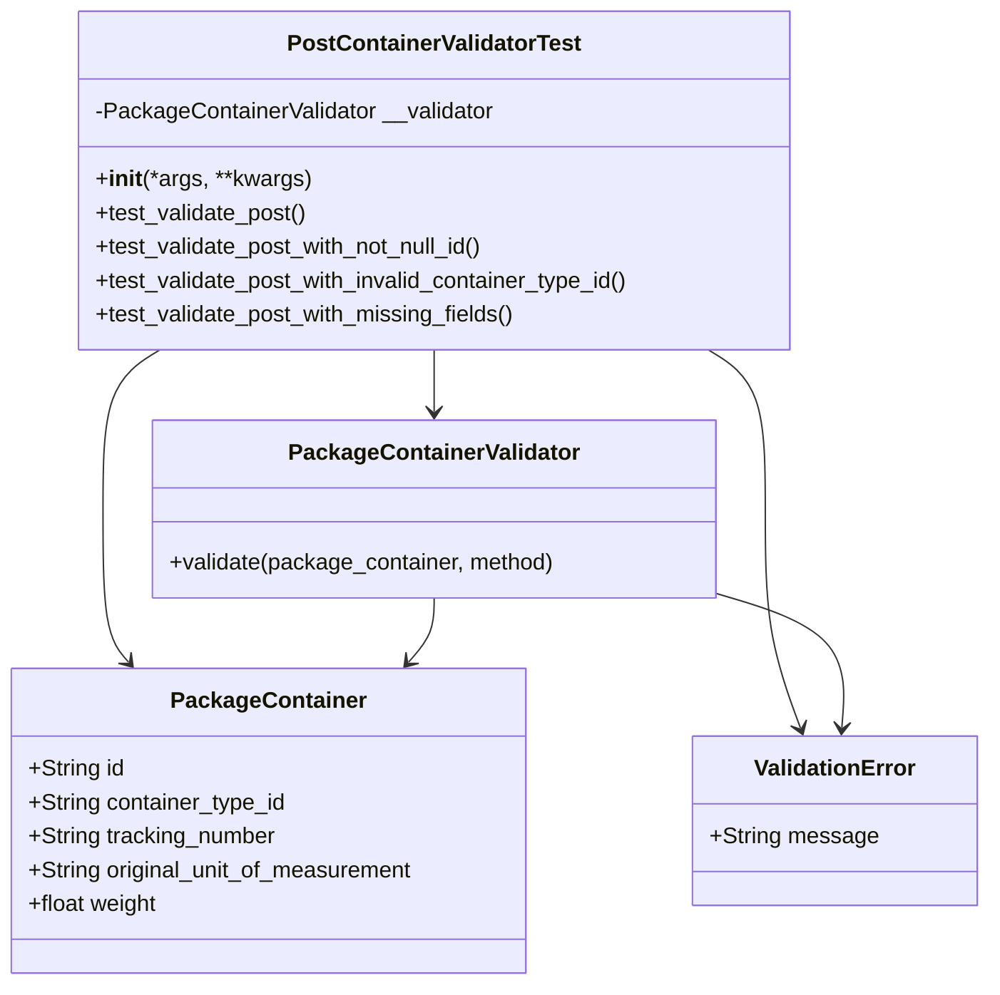
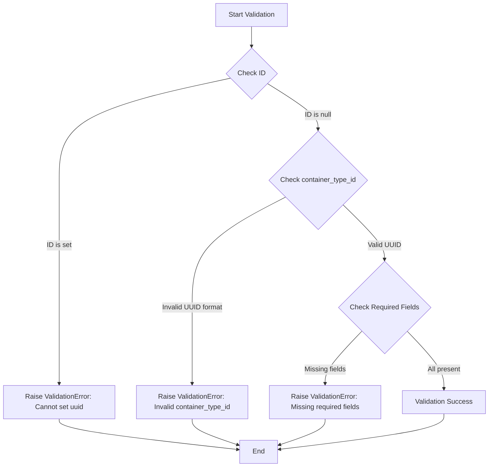
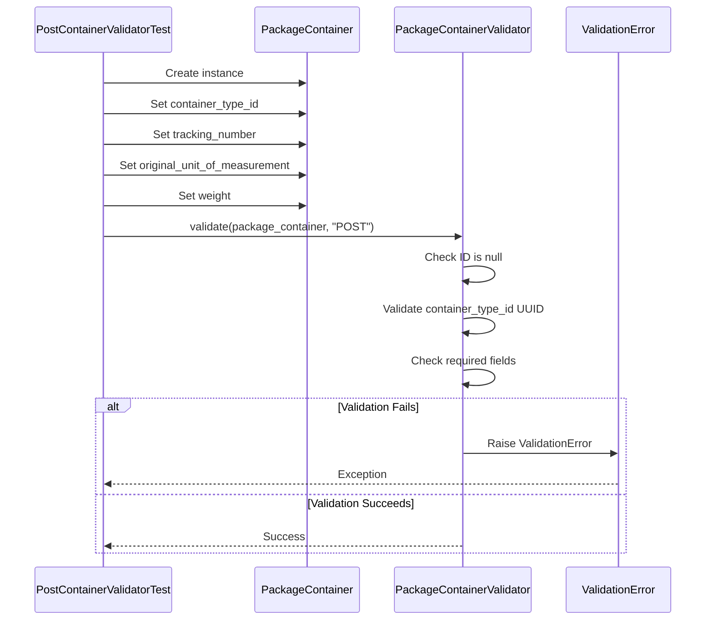
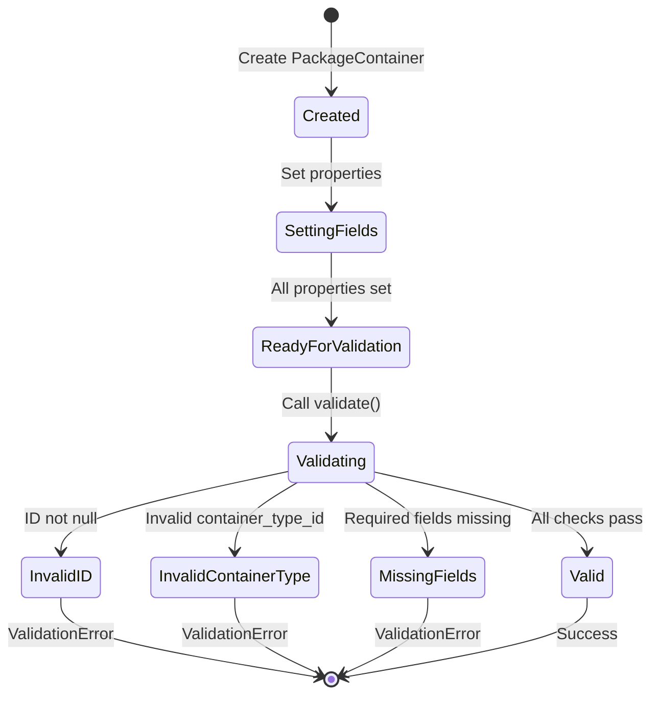

# Diagram: platform/partview_core/partview_service/partview_service/tests/unit/core/validators/package_container/container_post_validator_test.py

> Auto-generated by Obscura crawlers

## Diagram 1

### SVG

<svg id="container" width="696.849609375" xmlns="http://www.w3.org/2000/svg" class="classDiagram" height="698" viewBox="0 0 696.849609375 698" role="graphics-document document" aria-roledescription="class"><g><defs><marker id="container_class-aggregationStart" class="marker aggregation class" refX="18" refY="7" markerWidth="190" markerHeight="240" orient="auto"><path d="M 18,7 L9,13 L1,7 L9,1 Z"></path></marker></defs><defs><marker id="container_class-aggregationEnd" class="marker aggregation class" refX="1" refY="7" markerWidth="20" markerHeight="28" orient="auto"><path d="M 18,7 L9,13 L1,7 L9,1 Z"></path></marker></defs><defs><marker id="container_class-extensionStart" class="marker extension class" refX="18" refY="7" markerWidth="190" markerHeight="240" orient="auto"><path d="M 1,7 L18,13 V 1 Z"></path></marker></defs><defs><marker id="container_class-extensionEnd" class="marker extension class" refX="1" refY="7" markerWidth="20" markerHeight="28" orient="auto"><path d="M 1,1 V 13 L18,7 Z"></path></marker></defs><defs><marker id="container_class-compositionStart" class="marker composition class" refX="18" refY="7" markerWidth="190" markerHeight="240" orient="auto"><path d="M 18,7 L9,13 L1,7 L9,1 Z"></path></marker></defs><defs><marker id="container_class-compositionEnd" class="marker composition class" refX="1" refY="7" markerWidth="20" markerHeight="28" orient="auto"><path d="M 18,7 L9,13 L1,7 L9,1 Z"></path></marker></defs><defs><marker id="container_class-dependencyStart" class="marker dependency class" refX="6" refY="7" markerWidth="190" markerHeight="240" orient="auto"><path d="M 5,7 L9,13 L1,7 L9,1 Z"></path></marker></defs><defs><marker id="container_class-dependencyEnd" class="marker dependency class" refX="13" refY="7" markerWidth="20" markerHeight="28" orient="auto"><path d="M 18,7 L9,13 L14,7 L9,1 Z"></path></marker></defs><defs><marker id="container_class-lollipopStart" class="marker lollipop class" refX="13" refY="7" markerWidth="190" markerHeight="240" orient="auto"><circle stroke="black" fill="transparent" cx="7" cy="7" r="6"></circle></marker></defs><defs><marker id="container_class-lollipopEnd" class="marker lollipop class" refX="1" refY="7" markerWidth="190" markerHeight="240" orient="auto"><circle stroke="black" fill="transparent" cx="7" cy="7" r="6"></circle></marker></defs><g class="root"><g class="clusters"></g><g class="edgePaths"><path d="M308.225,248L308.225,252.167C308.225,256.333,308.225,264.667,308.225,272C308.225,279.333,308.225,285.667,308.225,288.833L308.225,292" id="id_PostContainerValidatorTest_PackageContainerValidator_1" class="edge-thickness-normal edge-pattern-solid relation" style=";;;" data-edge="true" data-et="edge" data-id="id_PostContainerValidatorTest_PackageContainerValidator_1" data-points="W3sieCI6MzA4LjIyNDYwOTM3NSwieSI6MjQ4fSx7IngiOjMwOC4yMjQ2MDkzNzUsInkiOjI3M30seyJ4IjozMDguMjI0NjA5Mzc1LCJ5IjoyOTh9XQ==" marker-end="url(#container_class-dependencyEnd)"></path><path d="M114.624,248L107.902,252.167C101.18,256.333,87.735,264.667,81.013,283.5C74.291,302.333,74.291,331.667,74.291,361C74.291,390.333,74.291,419.667,77.295,437.749C80.299,455.831,86.307,462.663,89.311,466.079L92.315,469.494" id="id_PostContainerValidatorTest_PackageContainer_2" class="edge-thickness-normal edge-pattern-solid relation" style=";;;" data-edge="true" data-et="edge" data-id="id_PostContainerValidatorTest_PackageContainer_2" data-points="W3sieCI6MTE0LjYyNDM5Mzg1Nzc1ODYzLCJ5IjoyNDh9LHsieCI6NzQuMjkxMDE1NjI1LCJ5IjoyNzN9LHsieCI6NzQuMjkxMDE1NjI1LCJ5IjozNjF9LHsieCI6NzQuMjkxMDE1NjI1LCJ5Ijo0NDl9LHsieCI6OTYuMjc3MjU1NjM5MDk3NzUsInkiOjQ3NH1d" marker-end="url(#container_class-dependencyEnd)"></path><path d="M501.825,248L508.547,252.167C515.269,256.333,528.714,264.667,535.436,283.5C542.158,302.333,542.158,331.667,542.158,361C542.158,390.333,542.158,419.667,546.267,445.561C550.376,471.455,558.593,493.91,562.702,505.138L566.811,516.365" id="id_PostContainerValidatorTest_ValidationError_3" class="edge-thickness-normal edge-pattern-solid relation" style=";;;" data-edge="true" data-et="edge" data-id="id_PostContainerValidatorTest_ValidationError_3" data-points="W3sieCI6NTAxLjgyNDgyNDg5MjI0MTQsInkiOjI0OH0seyJ4Ijo1NDIuMTU4MjAzMTI1LCJ5IjoyNzN9LHsieCI6NTQyLjE1ODIwMzEyNSwieSI6MzYxfSx7IngiOjU0Mi4xNTgyMDMxMjUsInkiOjQ0OX0seyJ4Ijo1NjguODcyODQxMjgyODk0NywieSI6NTIyfV0=" marker-end="url(#container_class-dependencyEnd)"></path><path d="M308.225,424L308.225,428.167C308.225,432.333,308.225,440.667,305.221,448.249C302.217,455.831,296.209,462.663,293.205,466.079L290.201,469.494" id="id_PackageContainerValidator_PackageContainer_4" class="edge-thickness-normal edge-pattern-solid relation" style=";;;" data-edge="true" data-et="edge" data-id="id_PackageContainerValidator_PackageContainer_4" data-points="W3sieCI6MzA4LjIyNDYwOTM3NSwieSI6NDI0fSx7IngiOjMwOC4yMjQ2MDkzNzUsInkiOjQ0OX0seyJ4IjoyODYuMjM4MzY5MzYwOTAyMjUsInkiOjQ3NH1d" marker-end="url(#container_class-dependencyEnd)"></path><path d="M507.158,420.829L522.77,425.524C538.382,430.219,569.606,439.61,584.378,455.474C599.15,471.339,597.471,493.678,596.631,504.847L595.791,516.017" id="id_PackageContainerValidator_ValidationError_5" class="edge-thickness-normal edge-pattern-solid relation" style=";;;" data-edge="true" data-et="edge" data-id="id_PackageContainerValidator_ValidationError_5" data-points="W3sieCI6NTA3LjE1ODIwMzEyNSwieSI6NDIwLjgyODUzNDA0ODg4NzI2fSx7IngiOjYwMC44MzAwNzgxMjUsInkiOjQ0OX0seyJ4Ijo1OTUuMzQxMzU2MzIwNDg4NywieSI6NTIyfV0=" marker-end="url(#container_class-dependencyEnd)"></path></g><g class="edgeLabels"><g class="edgeLabel"><g class="label" data-id="id_PostContainerValidatorTest_PackageContainerValidator_1" transform="translate(0, 0)"><foreignObject width="0" height="0">

</foreignObject></g></g><g class="edgeLabel"><g class="label" data-id="id_PostContainerValidatorTest_PackageContainer_2" transform="translate(0, 0)"><foreignObject width="0" height="0">

</foreignObject></g></g><g class="edgeLabel"><g class="label" data-id="id_PostContainerValidatorTest_ValidationError_3" transform="translate(0, 0)"><foreignObject width="0" height="0">

</foreignObject></g></g><g class="edgeLabel"><g class="label" data-id="id_PackageContainerValidator_PackageContainer_4" transform="translate(0, 0)"><foreignObject width="0" height="0">

</foreignObject></g></g><g class="edgeLabel"><g class="label" data-id="id_PackageContainerValidator_ValidationError_5" transform="translate(0, 0)"><foreignObject width="0" height="0">

</foreignObject></g></g></g><g class="nodes"><g class="node default" id="classId-PostContainerValidatorTest-0" transform="translate(308.224609375, 128)"><g class="basic label-container"><path d="M-254.890625 -120 L254.890625 -120 L254.890625 120 L-254.890625 120" stroke="none" stroke-width="0" fill="#ECECFF" style=""></path><path d="M-254.890625 -120 C-78.37801976604175 -120, 98.13458546791651 -120, 254.890625 -120 M-254.890625 -120 C-139.169759018192 -120, -23.448893036383964 -120, 254.890625 -120 M254.890625 -120 C254.890625 -63.77565864650224, 254.890625 -7.551317293004473, 254.890625 120 M254.890625 -120 C254.890625 -60.082976294142675, 254.890625 -0.1659525882853501, 254.890625 120 M254.890625 120 C87.41821293648715 120, -80.0541991270257 120, -254.890625 120 M254.890625 120 C57.48751165612907 120, -139.91560168774186 120, -254.890625 120 M-254.890625 120 C-254.890625 55.17463007299993, -254.890625 -9.650739854000136, -254.890625 -120 M-254.890625 120 C-254.890625 71.00369461430465, -254.890625 22.0073892286093, -254.890625 -120" stroke="#9370DB" stroke-width="1.3" fill="none" stroke-dasharray="0 0" style=""></path></g><g class="annotation-group text" transform="translate(0, -96)"></g><g class="label-group text" transform="translate(-100.21875, -96)"><g class="label" style="font-weight: bolder" transform="translate(0,-12)"><foreignObject width="200.4375" height="24">

PostContainerValidatorTest

</foreignObject></g></g><g class="members-group text" transform="translate(-242.890625, -48)"><g class="label" style="" transform="translate(0,-12)"><foreignObject width="285.265625" height="24">

-PackageContainerValidator __validator

</foreignObject></g></g><g class="methods-group text" transform="translate(-242.890625, 0)"><g class="label" style="" transform="translate(0,-12)"><foreignObject width="151.8125" height="24">

+<strong>init</strong>(*args, **kwargs)

</foreignObject></g><g class="label" style="" transform="translate(0,12)"><foreignObject width="151.609375" height="24">

+test_validate_post()

</foreignObject></g><g class="label" style="" transform="translate(0,36)"><foreignObject width="282.34375" height="24">

+test_validate_post_with_not_null_id()

</foreignObject></g><g class="label" style="" transform="translate(0,60)"><foreignObject width="385.5625" height="24">

+test_validate_post_with_invalid_container_type_id()

</foreignObject></g><g class="label" style="" transform="translate(0,84)"><foreignObject width="301.90625" height="24">

+test_validate_post_with_missing_fields()

</foreignObject></g></g><g class="divider" style=""><path d="M-254.890625 -72 C-71.30868204699928 -72, 112.27326090600144 -72, 254.890625 -72 M-254.890625 -72 C-97.11207990515652 -72, 60.66646518968696 -72, 254.890625 -72" stroke="#9370DB" stroke-width="1.3" fill="none" stroke-dasharray="0 0" style=""></path></g><g class="divider" style=""><path d="M-254.890625 -24 C-150.2231613093773 -24, -45.55569761875458 -24, 254.890625 -24 M-254.890625 -24 C-138.77851098294917 -24, -22.666396965898343 -24, 254.890625 -24" stroke="#9370DB" stroke-width="1.3" fill="none" stroke-dasharray="0 0" style=""></path></g></g><g class="node default" id="classId-PackageContainerValidator-1" transform="translate(308.224609375, 361)"><g class="basic label-container"><path d="M-198.93359375 -63 L198.93359375 -63 L198.93359375 63 L-198.93359375 63" stroke="none" stroke-width="0" fill="#ECECFF" style=""></path><path d="M-198.93359375 -63 C-84.37572336065529 -63, 30.18214702868943 -63, 198.93359375 -63 M-198.93359375 -63 C-77.4285574210094 -63, 44.0764789079812 -63, 198.93359375 -63 M198.93359375 -63 C198.93359375 -35.179850415658436, 198.93359375 -7.359700831316864, 198.93359375 63 M198.93359375 -63 C198.93359375 -16.85744073688702, 198.93359375 29.285118526225958, 198.93359375 63 M198.93359375 63 C94.57920791000122 63, -9.775177929997568 63, -198.93359375 63 M198.93359375 63 C108.23298550743007 63, 17.532377264860145 63, -198.93359375 63 M-198.93359375 63 C-198.93359375 35.6236083843139, -198.93359375 8.247216768627801, -198.93359375 -63 M-198.93359375 63 C-198.93359375 16.021117326264985, -198.93359375 -30.95776534747003, -198.93359375 -63" stroke="#9370DB" stroke-width="1.3" fill="none" stroke-dasharray="0 0" style=""></path></g><g class="annotation-group text" transform="translate(0, -39)"></g><g class="label-group text" transform="translate(-98.6328125, -39)"><g class="label" style="font-weight: bolder" transform="translate(0,-12)"><foreignObject width="197.265625" height="24">

PackageContainerValidator

</foreignObject></g></g><g class="members-group text" transform="translate(-186.93359375, 9)"></g><g class="methods-group text" transform="translate(-186.93359375, 39)"><g class="label" style="" transform="translate(0,-12)"><foreignObject width="275.234375" height="24">

+validate(package_container, method)

</foreignObject></g></g><g class="divider" style=""><path d="M-198.93359375 -15 C-100.15791926598 -15, -1.3822447819599972 -15, 198.93359375 -15 M-198.93359375 -15 C-92.36179528005441 -15, 14.210003189891182 -15, 198.93359375 -15" stroke="#9370DB" stroke-width="1.3" fill="none" stroke-dasharray="0 0" style=""></path></g><g class="divider" style=""><path d="M-198.93359375 9 C-113.08226328861231 9, -27.23093282722462 9, 198.93359375 9 M-198.93359375 9 C-84.2767897386817 9, 30.3800142726366 9, 198.93359375 9" stroke="#9370DB" stroke-width="1.3" fill="none" stroke-dasharray="0 0" style=""></path></g></g><g class="node default" id="classId-PackageContainer-2" transform="translate(191.2578125, 582)"><g class="basic label-container"><path d="M-183.2578125 -108 L183.2578125 -108 L183.2578125 108 L-183.2578125 108" stroke="none" stroke-width="0" fill="#ECECFF" style=""></path><path d="M-183.2578125 -108 C-101.67283055960533 -108, -20.08784861921066 -108, 183.2578125 -108 M-183.2578125 -108 C-101.0209673775389 -108, -18.78412225507779 -108, 183.2578125 -108 M183.2578125 -108 C183.2578125 -50.88124870167142, 183.2578125 6.2375025966571656, 183.2578125 108 M183.2578125 -108 C183.2578125 -63.896103060453285, 183.2578125 -19.79220612090657, 183.2578125 108 M183.2578125 108 C95.74844296622172 108, 8.239073432443433 108, -183.2578125 108 M183.2578125 108 C79.65377279913743 108, -23.950266901725143 108, -183.2578125 108 M-183.2578125 108 C-183.2578125 36.60643066084029, -183.2578125 -34.78713867831942, -183.2578125 -108 M-183.2578125 108 C-183.2578125 45.30512038186898, -183.2578125 -17.389759236262037, -183.2578125 -108" stroke="#9370DB" stroke-width="1.3" fill="none" stroke-dasharray="0 0" style=""></path></g><g class="annotation-group text" transform="translate(0, -84)"></g><g class="label-group text" transform="translate(-65.453125, -84)"><g class="label" style="font-weight: bolder" transform="translate(0,-12)"><foreignObject width="130.90625" height="24">

PackageContainer

</foreignObject></g></g><g class="members-group text" transform="translate(-171.2578125, -36)"><g class="label" style="" transform="translate(0,-12)"><foreignObject width="68.546875" height="24">

+String id

</foreignObject></g><g class="label" style="" transform="translate(0,12)"><foreignObject width="184.265625" height="24">

+String container_type_id

</foreignObject></g><g class="label" style="" transform="translate(0,36)"><foreignObject width="177.796875" height="24">

+String tracking_number

</foreignObject></g><g class="label" style="" transform="translate(0,60)"><foreignObject width="277.0625" height="24">

+String original_unit_of_measurement

</foreignObject></g><g class="label" style="" transform="translate(0,84)"><foreignObject width="93.21875" height="24">

+float weight

</foreignObject></g></g><g class="methods-group text" transform="translate(-171.2578125, 108)"></g><g class="divider" style=""><path d="M-183.2578125 -60 C-77.65016209012492 -60, 27.957488319750155 -60, 183.2578125 -60 M-183.2578125 -60 C-46.259622782402545 -60, 90.73856693519491 -60, 183.2578125 -60" stroke="#9370DB" stroke-width="1.3" fill="none" stroke-dasharray="0 0" style=""></path></g><g class="divider" style=""><path d="M-183.2578125 84 C-90.09746973080078 84, 3.062873038398436 84, 183.2578125 84 M-183.2578125 84 C-66.44565585271 84, 50.36650079457999 84, 183.2578125 84" stroke="#9370DB" stroke-width="1.3" fill="none" stroke-dasharray="0 0" style=""></path></g></g><g class="node default" id="classId-ValidationError-3" transform="translate(590.830078125, 582)"><g class="basic label-container"><path d="M-98.01953125 -60 L98.01953125 -60 L98.01953125 60 L-98.01953125 60" stroke="none" stroke-width="0" fill="#ECECFF" style=""></path><path d="M-98.01953125 -60 C-47.35991867506143 -60, 3.2996938998771412 -60, 98.01953125 -60 M-98.01953125 -60 C-35.72611518297477 -60, 26.567300884050454 -60, 98.01953125 -60 M98.01953125 -60 C98.01953125 -19.112060723979965, 98.01953125 21.77587855204007, 98.01953125 60 M98.01953125 -60 C98.01953125 -20.99696523432054, 98.01953125 18.006069531358918, 98.01953125 60 M98.01953125 60 C24.177110582256063 60, -49.665310085487874 60, -98.01953125 60 M98.01953125 60 C41.105247819026395 60, -15.809035611947209 60, -98.01953125 60 M-98.01953125 60 C-98.01953125 12.724899749830627, -98.01953125 -34.55020050033875, -98.01953125 -60 M-98.01953125 60 C-98.01953125 16.73335543786483, -98.01953125 -26.53328912427034, -98.01953125 -60" stroke="#9370DB" stroke-width="1.3" fill="none" stroke-dasharray="0 0" style=""></path></g><g class="annotation-group text" transform="translate(0, -36)"></g><g class="label-group text" transform="translate(-55.1796875, -36)"><g class="label" style="font-weight: bolder" transform="translate(0,-12)"><foreignObject width="110.359375" height="24">

ValidationError

</foreignObject></g></g><g class="members-group text" transform="translate(-86.01953125, 12)"><g class="label" style="" transform="translate(0,-12)"><foreignObject width="116.859375" height="24">

+String message

</foreignObject></g></g><g class="methods-group text" transform="translate(-86.01953125, 60)"></g><g class="divider" style=""><path d="M-98.01953125 -12 C-56.84927507459439 -12, -15.679018899188776 -12, 98.01953125 -12 M-98.01953125 -12 C-50.42116038300273 -12, -2.8227895160054572 -12, 98.01953125 -12" stroke="#9370DB" stroke-width="1.3" fill="none" stroke-dasharray="0 0" style=""></path></g><g class="divider" style=""><path d="M-98.01953125 36 C-47.970832458468614 36, 2.0778663330627722 36, 98.01953125 36 M-98.01953125 36 C-31.754793403773974 36, 34.50994444245205 36, 98.01953125 36" stroke="#9370DB" stroke-width="1.3" fill="none" stroke-dasharray="0 0" style=""></path></g></g></g></g></g></svg>

## Diagram 2

### SVG

<svg id="container" width="1139.71875" xmlns="http://www.w3.org/2000/svg" class="flowchart" height="1083.734375" viewBox="0 0 1139.71875 1083.734375" role="graphics-document document" aria-roledescription="flowchart-v2"><g><marker id="container_flowchart-v2-pointEnd" class="marker flowchart-v2" viewBox="0 0 10 10" refX="5" refY="5" markerUnits="userSpaceOnUse" markerWidth="8" markerHeight="8" orient="auto"><path d="M 0 0 L 10 5 L 0 10 z" class="arrowMarkerPath" style="stroke-width: 1; stroke-dasharray: 1, 0;"></path></marker><marker id="container_flowchart-v2-pointStart" class="marker flowchart-v2" viewBox="0 0 10 10" refX="4.5" refY="5" markerUnits="userSpaceOnUse" markerWidth="8" markerHeight="8" orient="auto"><path d="M 0 5 L 10 10 L 10 0 z" class="arrowMarkerPath" style="stroke-width: 1; stroke-dasharray: 1, 0;"></path></marker><marker id="container_flowchart-v2-circleEnd" class="marker flowchart-v2" viewBox="0 0 10 10" refX="11" refY="5" markerUnits="userSpaceOnUse" markerWidth="11" markerHeight="11" orient="auto"><circle cx="5" cy="5" r="5" class="arrowMarkerPath" style="stroke-width: 1; stroke-dasharray: 1, 0;"></circle></marker><marker id="container_flowchart-v2-circleStart" class="marker flowchart-v2" viewBox="0 0 10 10" refX="-1" refY="5" markerUnits="userSpaceOnUse" markerWidth="11" markerHeight="11" orient="auto"><circle cx="5" cy="5" r="5" class="arrowMarkerPath" style="stroke-width: 1; stroke-dasharray: 1, 0;"></circle></marker><marker id="container_flowchart-v2-crossEnd" class="marker cross flowchart-v2" viewBox="0 0 11 11" refX="12" refY="5.2" markerUnits="userSpaceOnUse" markerWidth="11" markerHeight="11" orient="auto"><path d="M 1,1 l 9,9 M 10,1 l -9,9" class="arrowMarkerPath" style="stroke-width: 2; stroke-dasharray: 1, 0;"></path></marker><marker id="container_flowchart-v2-crossStart" class="marker cross flowchart-v2" viewBox="0 0 11 11" refX="-1" refY="5.2" markerUnits="userSpaceOnUse" markerWidth="11" markerHeight="11" orient="auto"><path d="M 1,1 l 9,9 M 10,1 l -9,9" class="arrowMarkerPath" style="stroke-width: 2; stroke-dasharray: 1, 0;"></path></marker><g class="root"><g class="clusters"></g><g class="edgePaths"><path d="M586.43,62L586.43,66.167C586.43,70.333,586.43,78.667,586.43,86.333C586.43,94,586.43,101,586.43,104.5L586.43,108" id="L_A_B_0" class="edge-thickness-normal edge-pattern-solid edge-thickness-normal edge-pattern-solid flowchart-link" style=";" data-edge="true" data-et="edge" data-id="L_A_B_0" data-points="W3sieCI6NTg2LjQyOTY4NzUsInkiOjYyfSx7IngiOjU4Ni40Mjk2ODc1LCJ5Ijo4N30seyJ4Ijo1ODYuNDI5Njg3NSwieSI6MTEyfV0=" marker-end="url(#container_flowchart-v2-pointEnd)"></path><path d="M538.563,180.149L471.803,194.294C405.042,208.438,271.521,236.727,204.761,276.27C138,315.813,138,366.609,138,417.406C138,468.203,138,519,138,568.31C138,617.62,138,665.443,138,713.266C138,761.089,138,808.911,138,838.323C138,867.734,138,878.734,138,884.234L138,889.734" id="L_B_C_0" class="edge-thickness-normal edge-pattern-solid edge-thickness-normal edge-pattern-solid flowchart-link" style=";" data-edge="true" data-et="edge" data-id="L_B_C_0" data-points="W3sieCI6NTM4LjU2MzIzNTA4OTMxMTQsInkiOjE4MC4xNDkxNzI1ODkzMTEzOH0seyJ4IjoxMzgsInkiOjI2NS4wMTU2MjV9LHsieCI6MTM4LCJ5Ijo0MTcuNDA2MjV9LHsieCI6MTM4LCJ5Ijo1NjkuNzk2ODc1fSx7IngiOjEzOCwieSI6NzEzLjI2NTYyNX0seyJ4IjoxMzgsInkiOjg1Ni43MzQzNzV9LHsieCI6MTM4LCJ5Ijo4OTMuNzM0Mzc1fV0=" marker-end="url(#container_flowchart-v2-pointEnd)"></path><path d="M622.393,192.052L642.233,204.213C662.072,216.373,701.751,240.694,721.59,258.355C741.43,276.016,741.43,287.016,741.43,292.516L741.43,298.016" id="L_B_D_0" class="edge-thickness-normal edge-pattern-solid edge-thickness-normal edge-pattern-solid flowchart-link" style=";" data-edge="true" data-et="edge" data-id="L_B_D_0" data-points="W3sieCI6NjIyLjM5MzQwNzM4Mzc1MzYsInkiOjE5Mi4wNTE5MDUxMTYyNDYzNn0seyJ4Ijo3NDEuNDI5Njg3NSwieSI6MjY1LjAxNTYyNX0seyJ4Ijo3NDEuNDI5Njg3NSwieSI6MzAyLjAxNTYyNX1d" marker-end="url(#container_flowchart-v2-pointEnd)"></path><path d="M665.482,456.849L629.235,475.674C592.988,494.498,520.494,532.148,484.247,574.884C448,617.62,448,665.443,448,713.266C448,761.089,448,808.911,448,838.323C448,867.734,448,878.734,448,884.234L448,889.734" id="L_D_E_0" class="edge-thickness-normal edge-pattern-solid edge-thickness-normal edge-pattern-solid flowchart-link" style=";" data-edge="true" data-et="edge" data-id="L_D_E_0" data-points="W3sieCI6NjY1LjQ4MTk3MDI1ODY5NjMsInkiOjQ1Ni44NDkxNTc3NTg2OTYyfSx7IngiOjQ0OCwieSI6NTY5Ljc5Njg3NX0seyJ4Ijo0NDgsInkiOjcxMy4yNjU2MjV9LHsieCI6NDQ4LCJ5Ijo4NTYuNzM0Mzc1fSx7IngiOjQ0OCwieSI6ODkzLjczNDM3NX1d" marker-end="url(#container_flowchart-v2-pointEnd)"></path><path d="M799.615,474.612L815.751,490.476C831.886,506.34,864.158,538.069,880.294,559.433C896.43,580.797,896.43,591.797,896.43,597.297L896.43,602.797" id="L_D_F_0" class="edge-thickness-normal edge-pattern-solid edge-thickness-normal edge-pattern-solid flowchart-link" style=";" data-edge="true" data-et="edge" data-id="L_D_F_0" data-points="W3sieCI6Nzk5LjYxNDc2MzQ5MjQ3NywieSI6NDc0LjYxMTc5OTAwNzUyM30seyJ4Ijo4OTYuNDI5Njg3NSwieSI6NTY5Ljc5Njg3NX0seyJ4Ijo4OTYuNDI5Njg3NSwieSI6NjA2Ljc5Njg3NX1d" marker-end="url(#container_flowchart-v2-pointEnd)"></path><path d="M844.147,767.452L829.789,782.332C815.431,797.213,786.716,826.973,772.358,847.354C758,867.734,758,878.734,758,884.234L758,889.734" id="L_F_G_0" class="edge-thickness-normal edge-pattern-solid edge-thickness-normal edge-pattern-solid flowchart-link" style=";" data-edge="true" data-et="edge" data-id="L_F_G_0" data-points="W3sieCI6ODQ0LjE0NjkwMTExMTY3MzEsInkiOjc2Ny40NTE1ODg2MTE2NzMxfSx7IngiOjc1OCwieSI6ODU2LjczNDM3NX0seyJ4Ijo3NTgsInkiOjg5My43MzQzNzV9XQ==" marker-end="url(#container_flowchart-v2-pointEnd)"></path><path d="M948.712,767.452L963.07,782.332C977.428,797.213,1006.144,826.973,1020.502,849.354C1034.859,871.734,1034.859,886.734,1034.859,894.234L1034.859,901.734" id="L_F_H_0" class="edge-thickness-normal edge-pattern-solid edge-thickness-normal edge-pattern-solid flowchart-link" style=";" data-edge="true" data-et="edge" data-id="L_F_H_0" data-points="W3sieCI6OTQ4LjcxMjQ3Mzg4ODMyNjksInkiOjc2Ny40NTE1ODg2MTE2NzMxfSx7IngiOjEwMzQuODU5Mzc1LCJ5Ijo4NTYuNzM0Mzc1fSx7IngiOjEwMzQuODU5Mzc1LCJ5Ijo5MDUuNzM0Mzc1fV0=" marker-end="url(#container_flowchart-v2-pointEnd)"></path><path d="M138,971.734L138,975.901C138,980.068,138,988.401,207.558,1000.346C277.115,1012.291,416.23,1027.848,485.788,1035.627L555.345,1043.405" id="L_C_I_0" class="edge-thickness-normal edge-pattern-solid edge-thickness-normal edge-pattern-solid flowchart-link" style=";" data-edge="true" data-et="edge" data-id="L_C_I_0" data-points="W3sieCI6MTM4LCJ5Ijo5NzEuNzM0Mzc1fSx7IngiOjEzOCwieSI6OTk2LjczNDM3NX0seyJ4Ijo1NTkuMzIwMzEyNSwieSI6MTA0My44NDk3NjQ3ODQ5NDYzfV0=" marker-end="url(#container_flowchart-v2-pointEnd)"></path><path d="M448,971.734L448,975.901C448,980.068,448,988.401,465.921,998.58C483.843,1008.759,519.685,1020.784,537.607,1026.796L555.528,1032.808" id="L_E_I_0" class="edge-thickness-normal edge-pattern-solid edge-thickness-normal edge-pattern-solid flowchart-link" style=";" data-edge="true" data-et="edge" data-id="L_E_I_0" data-points="W3sieCI6NDQ4LCJ5Ijo5NzEuNzM0Mzc1fSx7IngiOjQ0OCwieSI6OTk2LjczNDM3NX0seyJ4Ijo1NTkuMzIwMzEyNSwieSI6MTAzNC4wODA1NDQzNTQ4Mzg4fV0=" marker-end="url(#container_flowchart-v2-pointEnd)"></path><path d="M758,971.734L758,975.901C758,980.068,758,988.401,740.079,998.58C722.157,1008.759,686.315,1020.784,668.393,1026.796L650.472,1032.808" id="L_G_I_0" class="edge-thickness-normal edge-pattern-solid edge-thickness-normal edge-pattern-solid flowchart-link" style=";" data-edge="true" data-et="edge" data-id="L_G_I_0" data-points="W3sieCI6NzU4LCJ5Ijo5NzEuNzM0Mzc1fSx7IngiOjc1OCwieSI6OTk2LjczNDM3NX0seyJ4Ijo2NDYuNjc5Njg3NSwieSI6MTAzNC4wODA1NDQzNTQ4Mzg4fV0=" marker-end="url(#container_flowchart-v2-pointEnd)"></path><path d="M1034.859,959.734L1034.859,965.901C1034.859,972.068,1034.859,984.401,970.825,998.278C906.79,1012.155,778.72,1027.576,714.686,1035.286L650.651,1042.997" id="L_H_I_0" class="edge-thickness-normal edge-pattern-solid edge-thickness-normal edge-pattern-solid flowchart-link" style=";" data-edge="true" data-et="edge" data-id="L_H_I_0" data-points="W3sieCI6MTAzNC44NTkzNzUsInkiOjk1OS43MzQzNzV9LHsieCI6MTAzNC44NTkzNzUsInkiOjk5Ni43MzQzNzV9LHsieCI6NjQ2LjY3OTY4NzUsInkiOjEwNDMuNDc0OTIyNzc2NjkyNH1d" marker-end="url(#container_flowchart-v2-pointEnd)"></path></g><g class="edgeLabels"><g class="edgeLabel"><g class="label" data-id="L_A_B_0" transform="translate(0, 0)"><foreignObject width="0" height="0">

</foreignObject></g></g><g class="edgeLabel" transform="translate(138, 569.796875)"><g class="label" data-id="L_B_C_0" transform="translate(-28.734375, -12)"><foreignObject width="57.46875" height="24">

ID is set

</foreignObject></g></g><g class="edgeLabel" transform="translate(741.4296875, 265.015625)"><g class="label" data-id="L_B_D_0" transform="translate(-31.78125, -12)"><foreignObject width="63.5625" height="24">

ID is null

</foreignObject></g></g><g class="edgeLabel" transform="translate(448, 713.265625)"><g class="label" data-id="L_D_E_0" transform="translate(-71.2578125, -12)"><foreignObject width="142.515625" height="24">

Invalid UUID format

</foreignObject></g></g><g class="edgeLabel" transform="translate(896.4296875, 569.796875)"><g class="label" data-id="L_D_F_0" transform="translate(-38.015625, -12)"><foreignObject width="76.03125" height="24">

Valid UUID

</foreignObject></g></g><g class="edgeLabel" transform="translate(758, 856.734375)"><g class="label" data-id="L_F_G_0" transform="translate(-48.8828125, -12)"><foreignObject width="97.765625" height="24">

Missing fields

</foreignObject></g></g><g class="edgeLabel" transform="translate(1034.859375, 856.734375)"><g class="label" data-id="L_F_H_0" transform="translate(-39.03125, -12)"><foreignObject width="78.0625" height="24">

All present

</foreignObject></g></g><g class="edgeLabel"><g class="label" data-id="L_C_I_0" transform="translate(0, 0)"><foreignObject width="0" height="0">

</foreignObject></g></g><g class="edgeLabel"><g class="label" data-id="L_E_I_0" transform="translate(0, 0)"><foreignObject width="0" height="0">

</foreignObject></g></g><g class="edgeLabel"><g class="label" data-id="L_G_I_0" transform="translate(0, 0)"><foreignObject width="0" height="0">

</foreignObject></g></g><g class="edgeLabel"><g class="label" data-id="L_H_I_0" transform="translate(0, 0)"><foreignObject width="0" height="0">

</foreignObject></g></g></g><g class="nodes"><g class="node default" id="flowchart-A-0" transform="translate(586.4296875, 35)"><rect class="basic label-container" style="" x="-86.28125" y="-27" width="172.5625" height="54"></rect><g class="label" style="" transform="translate(-56.28125, -12)"><rect></rect><foreignObject width="112.5625" height="24">

Start Validation

</foreignObject></g></g><g class="node default" id="flowchart-B-1" transform="translate(586.4296875, 170.0078125)"><polygon points="58.0078125,0 116.015625,-58.0078125 58.0078125,-116.015625 0,-58.0078125" class="label-container" transform="translate(-57.5078125, 58.0078125)"></polygon><g class="label" style="" transform="translate(-31.0078125, -12)"><rect></rect><foreignObject width="62.015625" height="24">

Check ID

</foreignObject></g></g><g class="node default" id="flowchart-C-3" transform="translate(138, 932.734375)"><rect class="basic label-container" style="" x="-130" y="-39" width="260" height="78"></rect><g class="label" style="" transform="translate(-100, -24)"><rect></rect><foreignObject width="200" height="48">

Raise ValidationError: Cannot set uuid

</foreignObject></g></g><g class="node default" id="flowchart-D-5" transform="translate(741.4296875, 417.40625)"><polygon points="115.390625,0 230.78125,-115.390625 115.390625,-230.78125 0,-115.390625" class="label-container" transform="translate(-114.890625, 115.390625)"></polygon><g class="label" style="" transform="translate(-88.390625, -12)"><rect></rect><foreignObject width="176.78125" height="24">

Check container_type_id

</foreignObject></g></g><g class="node default" id="flowchart-E-7" transform="translate(448, 932.734375)"><rect class="basic label-container" style="" x="-130" y="-39" width="260" height="78"></rect><g class="label" style="" transform="translate(-100, -24)"><rect></rect><foreignObject width="200" height="48">

Raise ValidationError: Invalid container_type_id

</foreignObject></g></g><g class="node default" id="flowchart-F-9" transform="translate(896.4296875, 713.265625)"><polygon points="106.46875,0 212.9375,-106.46875 106.46875,-212.9375 0,-106.46875" class="label-container" transform="translate(-105.96875, 106.46875)"></polygon><g class="label" style="" transform="translate(-79.46875, -12)"><rect></rect><foreignObject width="158.9375" height="24">

Check Required Fields

</foreignObject></g></g><g class="node default" id="flowchart-G-11" transform="translate(758, 932.734375)"><rect class="basic label-container" style="" x="-130" y="-39" width="260" height="78"></rect><g class="label" style="" transform="translate(-100, -24)"><rect></rect><foreignObject width="200" height="48">

Raise ValidationError: Missing required fields

</foreignObject></g></g><g class="node default" id="flowchart-H-13" transform="translate(1034.859375, 932.734375)"><rect class="basic label-container" style="" x="-96.859375" y="-27" width="193.71875" height="54"></rect><g class="label" style="" transform="translate(-66.859375, -12)"><rect></rect><foreignObject width="133.71875" height="24">

Validation Success

</foreignObject></g></g><g class="node default" id="flowchart-I-15" transform="translate(603, 1048.734375)"><rect class="basic label-container" style="" x="-43.6796875" y="-27" width="87.359375" height="54"></rect><g class="label" style="" transform="translate(-13.6796875, -12)"><rect></rect><foreignObject width="27.359375" height="24">

End

</foreignObject></g></g></g></g></g></svg>

## Diagram 3

### SVG

<svg id="container" width="1068.5" xmlns="http://www.w3.org/2000/svg" height="937" viewBox="-50 -10 1068.5 937" role="graphics-document document" aria-roledescription="sequence"><g><rect x="818.5" y="851" fill="#eaeaea" stroke="#666" width="150" height="65" name="Error" rx="3" ry="3" class="actor actor-bottom"></rect><text x="893.5" y="883.5" dominant-baseline="central" alignment-baseline="central" class="actor actor-box" style="text-anchor: middle; font-size: 16px; font-weight: 400;"><tspan x="893.5" dy="0">ValidationError</tspan></text></g><g><rect x="553.5" y="851" fill="#eaeaea" stroke="#666" width="215" height="65" name="Validator" rx="3" ry="3" class="actor actor-bottom"></rect><text x="661" y="883.5" dominant-baseline="central" alignment-baseline="central" class="actor actor-box" style="text-anchor: middle; font-size: 16px; font-weight: 400;"><tspan x="661" dy="0">PackageContainerValidator</tspan></text></g><g><rect x="353.5" y="851" fill="#eaeaea" stroke="#666" width="150" height="65" name="PC" rx="3" ry="3" class="actor actor-bottom"></rect><text x="428.5" y="883.5" dominant-baseline="central" alignment-baseline="central" class="actor actor-box" style="text-anchor: middle; font-size: 16px; font-weight: 400;"><tspan x="428.5" dy="0">PackageContainer</tspan></text></g><g><rect x="0" y="851" fill="#eaeaea" stroke="#666" width="217" height="65" name="Test" rx="3" ry="3" class="actor actor-bottom"></rect><text x="108.5" y="883.5" dominant-baseline="central" alignment-baseline="central" class="actor actor-box" style="text-anchor: middle; font-size: 16px; font-weight: 400;"><tspan x="108.5" dy="0">PostContainerValidatorTest</tspan></text></g><g><line id="actor3" x1="893.5" y1="65" x2="893.5" y2="851" class="actor-line 200" stroke-width="0.5px" stroke="#999" name="Error"></line><g id="root-3"><rect x="818.5" y="0" fill="#eaeaea" stroke="#666" width="150" height="65" name="Error" rx="3" ry="3" class="actor actor-top"></rect><text x="893.5" y="32.5" dominant-baseline="central" alignment-baseline="central" class="actor actor-box" style="text-anchor: middle; font-size: 16px; font-weight: 400;"><tspan x="893.5" dy="0">ValidationError</tspan></text></g></g><g><line id="actor2" x1="661" y1="65" x2="661" y2="851" class="actor-line 200" stroke-width="0.5px" stroke="#999" name="Validator"></line><g id="root-2"><rect x="553.5" y="0" fill="#eaeaea" stroke="#666" width="215" height="65" name="Validator" rx="3" ry="3" class="actor actor-top"></rect><text x="661" y="32.5" dominant-baseline="central" alignment-baseline="central" class="actor actor-box" style="text-anchor: middle; font-size: 16px; font-weight: 400;"><tspan x="661" dy="0">PackageContainerValidator</tspan></text></g></g><g><line id="actor1" x1="428.5" y1="65" x2="428.5" y2="851" class="actor-line 200" stroke-width="0.5px" stroke="#999" name="PC"></line><g id="root-1"><rect x="353.5" y="0" fill="#eaeaea" stroke="#666" width="150" height="65" name="PC" rx="3" ry="3" class="actor actor-top"></rect><text x="428.5" y="32.5" dominant-baseline="central" alignment-baseline="central" class="actor actor-box" style="text-anchor: middle; font-size: 16px; font-weight: 400;"><tspan x="428.5" dy="0">PackageContainer</tspan></text></g></g><g><line id="actor0" x1="108.5" y1="65" x2="108.5" y2="851" class="actor-line 200" stroke-width="0.5px" stroke="#999" name="Test"></line><g id="root-0"><rect x="0" y="0" fill="#eaeaea" stroke="#666" width="217" height="65" name="Test" rx="3" ry="3" class="actor actor-top"></rect><text x="108.5" y="32.5" dominant-baseline="central" alignment-baseline="central" class="actor actor-box" style="text-anchor: middle; font-size: 16px; font-weight: 400;"><tspan x="108.5" dy="0">PostContainerValidatorTest</tspan></text></g></g><g></g><defs><symbol id="computer" width="24" height="24"><path transform="scale(.5)" d="M2 2v13h20v-13h-20zm18 11h-16v-9h16v9zm-10.228 6l.466-1h3.524l.467 1h-4.457zm14.228 3h-24l2-6h2.104l-1.33 4h18.45l-1.297-4h2.073l2 6zm-5-10h-14v-7h14v7z"></path></symbol></defs><defs><symbol id="database" fill-rule="evenodd" clip-rule="evenodd"><path transform="scale(.5)" d="M12.258.001l.256.004.255.005.253.008.251.01.249.012.247.015.246.016.242.019.241.02.239.023.236.024.233.027.231.028.229.031.225.032.223.034.22.036.217.038.214.04.211.041.208.043.205.045.201.046.198.048.194.05.191.051.187.053.183.054.18.056.175.057.172.059.168.06.163.061.16.063.155.064.15.066.074.033.073.033.071.034.07.034.069.035.068.035.067.035.066.035.064.036.064.036.062.036.06.036.06.037.058.037.058.037.055.038.055.038.053.038.052.038.051.039.05.039.048.039.047.039.045.04.044.04.043.04.041.04.04.041.039.041.037.041.036.041.034.041.033.042.032.042.03.042.029.042.027.042.026.043.024.043.023.043.021.043.02.043.018.044.017.043.015.044.013.044.012.044.011.045.009.044.007.045.006.045.004.045.002.045.001.045v17l-.001.045-.002.045-.004.045-.006.045-.007.045-.009.044-.011.045-.012.044-.013.044-.015.044-.017.043-.018.044-.02.043-.021.043-.023.043-.024.043-.026.043-.027.042-.029.042-.03.042-.032.042-.033.042-.034.041-.036.041-.037.041-.039.041-.04.041-.041.04-.043.04-.044.04-.045.04-.047.039-.048.039-.05.039-.051.039-.052.038-.053.038-.055.038-.055.038-.058.037-.058.037-.06.037-.06.036-.062.036-.064.036-.064.036-.066.035-.067.035-.068.035-.069.035-.07.034-.071.034-.073.033-.074.033-.15.066-.155.064-.16.063-.163.061-.168.06-.172.059-.175.057-.18.056-.183.054-.187.053-.191.051-.194.05-.198.048-.201.046-.205.045-.208.043-.211.041-.214.04-.217.038-.22.036-.223.034-.225.032-.229.031-.231.028-.233.027-.236.024-.239.023-.241.02-.242.019-.246.016-.247.015-.249.012-.251.01-.253.008-.255.005-.256.004-.258.001-.258-.001-.256-.004-.255-.005-.253-.008-.251-.01-.249-.012-.247-.015-.245-.016-.243-.019-.241-.02-.238-.023-.236-.024-.234-.027-.231-.028-.228-.031-.226-.032-.223-.034-.22-.036-.217-.038-.214-.04-.211-.041-.208-.043-.204-.045-.201-.046-.198-.048-.195-.05-.19-.051-.187-.053-.184-.054-.179-.056-.176-.057-.172-.059-.167-.06-.164-.061-.159-.063-.155-.064-.151-.066-.074-.033-.072-.033-.072-.034-.07-.034-.069-.035-.068-.035-.067-.035-.066-.035-.064-.036-.063-.036-.062-.036-.061-.036-.06-.037-.058-.037-.057-.037-.056-.038-.055-.038-.053-.038-.052-.038-.051-.039-.049-.039-.049-.039-.046-.039-.046-.04-.044-.04-.043-.04-.041-.04-.04-.041-.039-.041-.037-.041-.036-.041-.034-.041-.033-.042-.032-.042-.03-.042-.029-.042-.027-.042-.026-.043-.024-.043-.023-.043-.021-.043-.02-.043-.018-.044-.017-.043-.015-.044-.013-.044-.012-.044-.011-.045-.009-.044-.007-.045-.006-.045-.004-.045-.002-.045-.001-.045v-17l.001-.045.002-.045.004-.045.006-.045.007-.045.009-.044.011-.045.012-.044.013-.044.015-.044.017-.043.018-.044.02-.043.021-.043.023-.043.024-.043.026-.043.027-.042.029-.042.03-.042.032-.042.033-.042.034-.041.036-.041.037-.041.039-.041.04-.041.041-.04.043-.04.044-.04.046-.04.046-.039.049-.039.049-.039.051-.039.052-.038.053-.038.055-.038.056-.038.057-.037.058-.037.06-.037.061-.036.062-.036.063-.036.064-.036.066-.035.067-.035.068-.035.069-.035.07-.034.072-.034.072-.033.074-.033.151-.066.155-.064.159-.063.164-.061.167-.06.172-.059.176-.057.179-.056.184-.054.187-.053.19-.051.195-.05.198-.048.201-.046.204-.045.208-.043.211-.041.214-.04.217-.038.22-.036.223-.034.226-.032.228-.031.231-.028.234-.027.236-.024.238-.023.241-.02.243-.019.245-.016.247-.015.249-.012.251-.01.253-.008.255-.005.256-.004.258-.001.258.001zm-9.258 20.499v.01l.001.021.003.021.004.022.005.021.006.022.007.022.009.023.01.022.011.023.012.023.013.023.015.023.016.024.017.023.018.024.019.024.021.024.022.025.023.024.024.025.052.049.056.05.061.051.066.051.07.051.075.051.079.052.084.052.088.052.092.052.097.052.102.051.105.052.11.052.114.051.119.051.123.051.127.05.131.05.135.05.139.048.144.049.147.047.152.047.155.047.16.045.163.045.167.043.171.043.176.041.178.041.183.039.187.039.19.037.194.035.197.035.202.033.204.031.209.03.212.029.216.027.219.025.222.024.226.021.23.02.233.018.236.016.24.015.243.012.246.01.249.008.253.005.256.004.259.001.26-.001.257-.004.254-.005.25-.008.247-.011.244-.012.241-.014.237-.016.233-.018.231-.021.226-.021.224-.024.22-.026.216-.027.212-.028.21-.031.205-.031.202-.034.198-.034.194-.036.191-.037.187-.039.183-.04.179-.04.175-.042.172-.043.168-.044.163-.045.16-.046.155-.046.152-.047.148-.048.143-.049.139-.049.136-.05.131-.05.126-.05.123-.051.118-.052.114-.051.11-.052.106-.052.101-.052.096-.052.092-.052.088-.053.083-.051.079-.052.074-.052.07-.051.065-.051.06-.051.056-.05.051-.05.023-.024.023-.025.021-.024.02-.024.019-.024.018-.024.017-.024.015-.023.014-.024.013-.023.012-.023.01-.023.01-.022.008-.022.006-.022.006-.022.004-.022.004-.021.001-.021.001-.021v-4.127l-.077.055-.08.053-.083.054-.085.053-.087.052-.09.052-.093.051-.095.05-.097.05-.1.049-.102.049-.105.048-.106.047-.109.047-.111.046-.114.045-.115.045-.118.044-.12.043-.122.042-.124.042-.126.041-.128.04-.13.04-.132.038-.134.038-.135.037-.138.037-.139.035-.142.035-.143.034-.144.033-.147.032-.148.031-.15.03-.151.03-.153.029-.154.027-.156.027-.158.026-.159.025-.161.024-.162.023-.163.022-.165.021-.166.02-.167.019-.169.018-.169.017-.171.016-.173.015-.173.014-.175.013-.175.012-.177.011-.178.01-.179.008-.179.008-.181.006-.182.005-.182.004-.184.003-.184.002h-.37l-.184-.002-.184-.003-.182-.004-.182-.005-.181-.006-.179-.008-.179-.008-.178-.01-.176-.011-.176-.012-.175-.013-.173-.014-.172-.015-.171-.016-.17-.017-.169-.018-.167-.019-.166-.02-.165-.021-.163-.022-.162-.023-.161-.024-.159-.025-.157-.026-.156-.027-.155-.027-.153-.029-.151-.03-.15-.03-.148-.031-.146-.032-.145-.033-.143-.034-.141-.035-.14-.035-.137-.037-.136-.037-.134-.038-.132-.038-.13-.04-.128-.04-.126-.041-.124-.042-.122-.042-.12-.044-.117-.043-.116-.045-.113-.045-.112-.046-.109-.047-.106-.047-.105-.048-.102-.049-.1-.049-.097-.05-.095-.05-.093-.052-.09-.051-.087-.052-.085-.053-.083-.054-.08-.054-.077-.054v4.127zm0-5.654v.011l.001.021.003.021.004.021.005.022.006.022.007.022.009.022.01.022.011.023.012.023.013.023.015.024.016.023.017.024.018.024.019.024.021.024.022.024.023.025.024.024.052.05.056.05.061.05.066.051.07.051.075.052.079.051.084.052.088.052.092.052.097.052.102.052.105.052.11.051.114.051.119.052.123.05.127.051.131.05.135.049.139.049.144.048.147.048.152.047.155.046.16.045.163.045.167.044.171.042.176.042.178.04.183.04.187.038.19.037.194.036.197.034.202.033.204.032.209.03.212.028.216.027.219.025.222.024.226.022.23.02.233.018.236.016.24.014.243.012.246.01.249.008.253.006.256.003.259.001.26-.001.257-.003.254-.006.25-.008.247-.01.244-.012.241-.015.237-.016.233-.018.231-.02.226-.022.224-.024.22-.025.216-.027.212-.029.21-.03.205-.032.202-.033.198-.035.194-.036.191-.037.187-.039.183-.039.179-.041.175-.042.172-.043.168-.044.163-.045.16-.045.155-.047.152-.047.148-.048.143-.048.139-.05.136-.049.131-.05.126-.051.123-.051.118-.051.114-.052.11-.052.106-.052.101-.052.096-.052.092-.052.088-.052.083-.052.079-.052.074-.051.07-.052.065-.051.06-.05.056-.051.051-.049.023-.025.023-.024.021-.025.02-.024.019-.024.018-.024.017-.024.015-.023.014-.023.013-.024.012-.022.01-.023.01-.023.008-.022.006-.022.006-.022.004-.021.004-.022.001-.021.001-.021v-4.139l-.077.054-.08.054-.083.054-.085.052-.087.053-.09.051-.093.051-.095.051-.097.05-.1.049-.102.049-.105.048-.106.047-.109.047-.111.046-.114.045-.115.044-.118.044-.12.044-.122.042-.124.042-.126.041-.128.04-.13.039-.132.039-.134.038-.135.037-.138.036-.139.036-.142.035-.143.033-.144.033-.147.033-.148.031-.15.03-.151.03-.153.028-.154.028-.156.027-.158.026-.159.025-.161.024-.162.023-.163.022-.165.021-.166.02-.167.019-.169.018-.169.017-.171.016-.173.015-.173.014-.175.013-.175.012-.177.011-.178.009-.179.009-.179.007-.181.007-.182.005-.182.004-.184.003-.184.002h-.37l-.184-.002-.184-.003-.182-.004-.182-.005-.181-.007-.179-.007-.179-.009-.178-.009-.176-.011-.176-.012-.175-.013-.173-.014-.172-.015-.171-.016-.17-.017-.169-.018-.167-.019-.166-.02-.165-.021-.163-.022-.162-.023-.161-.024-.159-.025-.157-.026-.156-.027-.155-.028-.153-.028-.151-.03-.15-.03-.148-.031-.146-.033-.145-.033-.143-.033-.141-.035-.14-.036-.137-.036-.136-.037-.134-.038-.132-.039-.13-.039-.128-.04-.126-.041-.124-.042-.122-.043-.12-.043-.117-.044-.116-.044-.113-.046-.112-.046-.109-.046-.106-.047-.105-.048-.102-.049-.1-.049-.097-.05-.095-.051-.093-.051-.09-.051-.087-.053-.085-.052-.083-.054-.08-.054-.077-.054v4.139zm0-5.666v.011l.001.02.003.022.004.021.005.022.006.021.007.022.009.023.01.022.011.023.012.023.013.023.015.023.016.024.017.024.018.023.019.024.021.025.022.024.023.024.024.025.052.05.056.05.061.05.066.051.07.051.075.052.079.051.084.052.088.052.092.052.097.052.102.052.105.051.11.052.114.051.119.051.123.051.127.05.131.05.135.05.139.049.144.048.147.048.152.047.155.046.16.045.163.045.167.043.171.043.176.042.178.04.183.04.187.038.19.037.194.036.197.034.202.033.204.032.209.03.212.028.216.027.219.025.222.024.226.021.23.02.233.018.236.017.24.014.243.012.246.01.249.008.253.006.256.003.259.001.26-.001.257-.003.254-.006.25-.008.247-.01.244-.013.241-.014.237-.016.233-.018.231-.02.226-.022.224-.024.22-.025.216-.027.212-.029.21-.03.205-.032.202-.033.198-.035.194-.036.191-.037.187-.039.183-.039.179-.041.175-.042.172-.043.168-.044.163-.045.16-.045.155-.047.152-.047.148-.048.143-.049.139-.049.136-.049.131-.051.126-.05.123-.051.118-.052.114-.051.11-.052.106-.052.101-.052.096-.052.092-.052.088-.052.083-.052.079-.052.074-.052.07-.051.065-.051.06-.051.056-.05.051-.049.023-.025.023-.025.021-.024.02-.024.019-.024.018-.024.017-.024.015-.023.014-.024.013-.023.012-.023.01-.022.01-.023.008-.022.006-.022.006-.022.004-.022.004-.021.001-.021.001-.021v-4.153l-.077.054-.08.054-.083.053-.085.053-.087.053-.09.051-.093.051-.095.051-.097.05-.1.049-.102.048-.105.048-.106.048-.109.046-.111.046-.114.046-.115.044-.118.044-.12.043-.122.043-.124.042-.126.041-.128.04-.13.039-.132.039-.134.038-.135.037-.138.036-.139.036-.142.034-.143.034-.144.033-.147.032-.148.032-.15.03-.151.03-.153.028-.154.028-.156.027-.158.026-.159.024-.161.024-.162.023-.163.023-.165.021-.166.02-.167.019-.169.018-.169.017-.171.016-.173.015-.173.014-.175.013-.175.012-.177.01-.178.01-.179.009-.179.007-.181.006-.182.006-.182.004-.184.003-.184.001-.185.001-.185-.001-.184-.001-.184-.003-.182-.004-.182-.006-.181-.006-.179-.007-.179-.009-.178-.01-.176-.01-.176-.012-.175-.013-.173-.014-.172-.015-.171-.016-.17-.017-.169-.018-.167-.019-.166-.02-.165-.021-.163-.023-.162-.023-.161-.024-.159-.024-.157-.026-.156-.027-.155-.028-.153-.028-.151-.03-.15-.03-.148-.032-.146-.032-.145-.033-.143-.034-.141-.034-.14-.036-.137-.036-.136-.037-.134-.038-.132-.039-.13-.039-.128-.041-.126-.041-.124-.041-.122-.043-.12-.043-.117-.044-.116-.044-.113-.046-.112-.046-.109-.046-.106-.048-.105-.048-.102-.048-.1-.05-.097-.049-.095-.051-.093-.051-.09-.052-.087-.052-.085-.053-.083-.053-.08-.054-.077-.054v4.153zm8.74-8.179l-.257.004-.254.005-.25.008-.247.011-.244.012-.241.014-.237.016-.233.018-.231.021-.226.022-.224.023-.22.026-.216.027-.212.028-.21.031-.205.032-.202.033-.198.034-.194.036-.191.038-.187.038-.183.04-.179.041-.175.042-.172.043-.168.043-.163.045-.16.046-.155.046-.152.048-.148.048-.143.048-.139.049-.136.05-.131.05-.126.051-.123.051-.118.051-.114.052-.11.052-.106.052-.101.052-.096.052-.092.052-.088.052-.083.052-.079.052-.074.051-.07.052-.065.051-.06.05-.056.05-.051.05-.023.025-.023.024-.021.024-.02.025-.019.024-.018.024-.017.023-.015.024-.014.023-.013.023-.012.023-.01.023-.01.022-.008.022-.006.023-.006.021-.004.022-.004.021-.001.021-.001.021.001.021.001.021.004.021.004.022.006.021.006.023.008.022.01.022.01.023.012.023.013.023.014.023.015.024.017.023.018.024.019.024.02.025.021.024.023.024.023.025.051.05.056.05.06.05.065.051.07.052.074.051.079.052.083.052.088.052.092.052.096.052.101.052.106.052.11.052.114.052.118.051.123.051.126.051.131.05.136.05.139.049.143.048.148.048.152.048.155.046.16.046.163.045.168.043.172.043.175.042.179.041.183.04.187.038.191.038.194.036.198.034.202.033.205.032.21.031.212.028.216.027.22.026.224.023.226.022.231.021.233.018.237.016.241.014.244.012.247.011.25.008.254.005.257.004.26.001.26-.001.257-.004.254-.005.25-.008.247-.011.244-.012.241-.014.237-.016.233-.018.231-.021.226-.022.224-.023.22-.026.216-.027.212-.028.21-.031.205-.032.202-.033.198-.034.194-.036.191-.038.187-.038.183-.04.179-.041.175-.042.172-.043.168-.043.163-.045.16-.046.155-.046.152-.048.148-.048.143-.048.139-.049.136-.05.131-.05.126-.051.123-.051.118-.051.114-.052.11-.052.106-.052.101-.052.096-.052.092-.052.088-.052.083-.052.079-.052.074-.051.07-.052.065-.051.06-.05.056-.05.051-.05.023-.025.023-.024.021-.024.02-.025.019-.024.018-.024.017-.023.015-.024.014-.023.013-.023.012-.023.01-.023.01-.022.008-.022.006-.023.006-.021.004-.022.004-.021.001-.021.001-.021-.001-.021-.001-.021-.004-.021-.004-.022-.006-.021-.006-.023-.008-.022-.01-.022-.01-.023-.012-.023-.013-.023-.014-.023-.015-.024-.017-.023-.018-.024-.019-.024-.02-.025-.021-.024-.023-.024-.023-.025-.051-.05-.056-.05-.06-.05-.065-.051-.07-.052-.074-.051-.079-.052-.083-.052-.088-.052-.092-.052-.096-.052-.101-.052-.106-.052-.11-.052-.114-.052-.118-.051-.123-.051-.126-.051-.131-.05-.136-.05-.139-.049-.143-.048-.148-.048-.152-.048-.155-.046-.16-.046-.163-.045-.168-.043-.172-.043-.175-.042-.179-.041-.183-.04-.187-.038-.191-.038-.194-.036-.198-.034-.202-.033-.205-.032-.21-.031-.212-.028-.216-.027-.22-.026-.224-.023-.226-.022-.231-.021-.233-.018-.237-.016-.241-.014-.244-.012-.247-.011-.25-.008-.254-.005-.257-.004-.26-.001-.26.001z"></path></symbol></defs><defs><symbol id="clock" width="24" height="24"><path transform="scale(.5)" d="M12 2c5.514 0 10 4.486 10 10s-4.486 10-10 10-10-4.486-10-10 4.486-10 10-10zm0-2c-6.627 0-12 5.373-12 12s5.373 12 12 12 12-5.373 12-12-5.373-12-12-12zm5.848 12.459c.202.038.202.333.001.372-1.907.361-6.045 1.111-6.547 1.111-.719 0-1.301-.582-1.301-1.301 0-.512.77-5.447 1.125-7.445.034-.192.312-.181.343.014l.985 6.238 5.394 1.011z"></path></symbol></defs><defs><marker id="arrowhead" refX="7.9" refY="5" markerUnits="userSpaceOnUse" markerWidth="12" markerHeight="12" orient="auto-start-reverse"><path d="M -1 0 L 10 5 L 0 10 z"></path></marker></defs><defs><marker id="crosshead" markerWidth="15" markerHeight="8" orient="auto" refX="4" refY="4.5"><path fill="none" stroke="#000000" stroke-width="1pt" d="M 1,2 L 6,7 M 6,2 L 1,7" style="stroke-dasharray: 0, 0;"></path></marker></defs><defs><marker id="filled-head" refX="15.5" refY="7" markerWidth="20" markerHeight="28" orient="auto"><path d="M 18,7 L9,13 L14,7 L9,1 Z"></path></marker></defs><defs><marker id="sequencenumber" refX="15" refY="15" markerWidth="60" markerHeight="40" orient="auto"><circle cx="15" cy="15" r="6"></circle></marker></defs><g><line x1="97.5" y1="597" x2="904.5" y2="597" class="loopLine"></line><line x1="904.5" y1="597" x2="904.5" y2="831" class="loopLine"></line><line x1="97.5" y1="831" x2="904.5" y2="831" class="loopLine"></line><line x1="97.5" y1="597" x2="97.5" y2="831" class="loopLine"></line><line x1="97.5" y1="743" x2="904.5" y2="743" class="loopLine" style="stroke-dasharray: 3, 3;"></line><polygon points="97.5,597 147.5,597 147.5,610 139.1,617 97.5,617" class="labelBox"></polygon><text x="123" y="610" text-anchor="middle" dominant-baseline="middle" alignment-baseline="middle" class="labelText" style="font-size: 16px; font-weight: 400;">alt</text><text x="526" y="615" text-anchor="middle" class="loopText" style="font-size: 16px; font-weight: 400;"><tspan x="526">[Validation Fails]</tspan></text><text x="501" y="761" text-anchor="middle" class="loopText" style="font-size: 16px; font-weight: 400;">[Validation Succeeds]</text></g><text x="267" y="80" text-anchor="middle" dominant-baseline="middle" alignment-baseline="middle" class="messageText" dy="1em" style="font-size: 16px; font-weight: 400;">Create instance</text><line x1="109.5" y1="113" x2="424.5" y2="113" class="messageLine0" stroke-width="2" stroke="none" marker-end="url(#arrowhead)" style="fill: none;"></line><text x="267" y="128" text-anchor="middle" dominant-baseline="middle" alignment-baseline="middle" class="messageText" dy="1em" style="font-size: 16px; font-weight: 400;">Set container_type_id</text><line x1="109.5" y1="161" x2="424.5" y2="161" class="messageLine0" stroke-width="2" stroke="none" marker-end="url(#arrowhead)" style="fill: none;"></line><text x="267" y="176" text-anchor="middle" dominant-baseline="middle" alignment-baseline="middle" class="messageText" dy="1em" style="font-size: 16px; font-weight: 400;">Set tracking_number</text><line x1="109.5" y1="209" x2="424.5" y2="209" class="messageLine0" stroke-width="2" stroke="none" marker-end="url(#arrowhead)" style="fill: none;"></line><text x="267" y="224" text-anchor="middle" dominant-baseline="middle" alignment-baseline="middle" class="messageText" dy="1em" style="font-size: 16px; font-weight: 400;">Set original_unit_of_measurement</text><line x1="109.5" y1="257" x2="424.5" y2="257" class="messageLine0" stroke-width="2" stroke="none" marker-end="url(#arrowhead)" style="fill: none;"></line><text x="267" y="272" text-anchor="middle" dominant-baseline="middle" alignment-baseline="middle" class="messageText" dy="1em" style="font-size: 16px; font-weight: 400;">Set weight</text><line x1="109.5" y1="305" x2="424.5" y2="305" class="messageLine0" stroke-width="2" stroke="none" marker-end="url(#arrowhead)" style="fill: none;"></line><text x="383" y="320" text-anchor="middle" dominant-baseline="middle" alignment-baseline="middle" class="messageText" dy="1em" style="font-size: 16px; font-weight: 400;">validate(package_container, "POST")</text><line x1="109.5" y1="353" x2="657" y2="353" class="messageLine0" stroke-width="2" stroke="none" marker-end="url(#arrowhead)" style="fill: none;"></line><text x="662" y="368" text-anchor="middle" dominant-baseline="middle" alignment-baseline="middle" class="messageText" dy="1em" style="font-size: 16px; font-weight: 400;">Check ID is null</text><path d="M 662,401 C 722,391 722,431 662,421" class="messageLine0" stroke-width="2" stroke="none" marker-end="url(#arrowhead)" style="fill: none;"></path><text x="662" y="446" text-anchor="middle" dominant-baseline="middle" alignment-baseline="middle" class="messageText" dy="1em" style="font-size: 16px; font-weight: 400;">Validate container_type_id UUID</text><path d="M 662,479 C 722,469 722,509 662,499" class="messageLine0" stroke-width="2" stroke="none" marker-end="url(#arrowhead)" style="fill: none;"></path><text x="662" y="524" text-anchor="middle" dominant-baseline="middle" alignment-baseline="middle" class="messageText" dy="1em" style="font-size: 16px; font-weight: 400;">Check required fields</text><path d="M 662,557 C 722,547 722,587 662,577" class="messageLine0" stroke-width="2" stroke="none" marker-end="url(#arrowhead)" style="fill: none;"></path><text x="776" y="647" text-anchor="middle" dominant-baseline="middle" alignment-baseline="middle" class="messageText" dy="1em" style="font-size: 16px; font-weight: 400;">Raise ValidationError</text><line x1="662" y1="680" x2="889.5" y2="680" class="messageLine0" stroke-width="2" stroke="none" marker-end="url(#arrowhead)" style="fill: none;"></line><text x="503" y="695" text-anchor="middle" dominant-baseline="middle" alignment-baseline="middle" class="messageText" dy="1em" style="font-size: 16px; font-weight: 400;">Exception</text><line x1="892.5" y1="728" x2="112.5" y2="728" class="messageLine1" stroke-width="2" stroke="none" marker-end="url(#arrowhead)" style="stroke-dasharray: 3, 3; fill: none;"></line><text x="386" y="788" text-anchor="middle" dominant-baseline="middle" alignment-baseline="middle" class="messageText" dy="1em" style="font-size: 16px; font-weight: 400;">Success</text><line x1="660" y1="821" x2="112.5" y2="821" class="messageLine1" stroke-width="2" stroke="none" marker-end="url(#arrowhead)" style="stroke-dasharray: 3, 3; fill: none;"></line></svg>

## Diagram 4

### SVG

<svg id="container" width="654.0625" xmlns="http://www.w3.org/2000/svg" class="statediagram" height="688" viewBox="0 0 654.0625 688" role="graphics-document document" aria-roledescription="stateDiagram"><g><defs><marker id="container_stateDiagram-barbEnd" refX="19" refY="7" markerWidth="20" markerHeight="14" markerUnits="userSpaceOnUse" orient="auto"><path d="M 19,7 L9,13 L14,7 L9,1 Z"></path></marker></defs><g class="root"><g class="clusters"></g><g class="edgePaths"><path d="M335.027,22L335.027,28.167C335.027,34.333,335.027,46.667,335.111,59.083C335.194,71.5,335.361,84,335.444,90.25L335.527,96.5" id="edge0" class="edge-thickness-normal edge-pattern-solid transition" style="fill:none;;;fill:none" data-edge="true" data-et="edge" data-id="edge0" data-points="W3sieCI6MzM1LjAyNzM0Mzc1LCJ5IjoyMn0seyJ4IjozMzUuMDI3MzQzNzUsInkiOjU5fSx7IngiOjMzNS41MjczNDM3NSwieSI6OTYuNX1d" marker-end="url(#container_stateDiagram-barbEnd)"></path><path d="M335.527,136.5L335.444,142.583C335.361,148.667,335.194,160.833,335.194,173.167C335.194,185.5,335.361,198,335.444,204.25L335.527,210.5" id="edge1" class="edge-thickness-normal edge-pattern-solid transition" style="fill:none;;;fill:none" data-edge="true" data-et="edge" data-id="edge1" data-points="W3sieCI6MzM1LjUyNzM0Mzc1LCJ5IjoxMzYuNX0seyJ4IjozMzUuMDI3MzQzNzUsInkiOjE3M30seyJ4IjozMzUuNTI3MzQzNzUsInkiOjIxMC41fV0=" marker-end="url(#container_stateDiagram-barbEnd)"></path><path d="M335.527,250.5L335.444,256.583C335.361,262.667,335.194,274.833,335.194,287.167C335.194,299.5,335.361,312,335.444,318.25L335.527,324.5" id="edge2" class="edge-thickness-normal edge-pattern-solid transition" style="fill:none;;;fill:none" data-edge="true" data-et="edge" data-id="edge2" data-points="W3sieCI6MzM1LjUyNzM0Mzc1LCJ5IjoyNTAuNX0seyJ4IjozMzUuMDI3MzQzNzUsInkiOjI4N30seyJ4IjozMzUuNTI3MzQzNzUsInkiOjMyNC41fV0=" marker-end="url(#container_stateDiagram-barbEnd)"></path><path d="M335.527,364.5L335.444,370.583C335.361,376.667,335.194,388.833,335.194,401.167C335.194,413.5,335.361,426,335.444,432.25L335.527,438.5" id="edge3" class="edge-thickness-normal edge-pattern-solid transition" style="fill:none;;;fill:none" data-edge="true" data-et="edge" data-id="edge3" data-points="W3sieCI6MzM1LjUyNzM0Mzc1LCJ5IjozNjQuNX0seyJ4IjozMzUuMDI3MzQzNzUsInkiOjQwMX0seyJ4IjozMzUuNTI3MzQzNzUsInkiOjQzOC41fV0=" marker-end="url(#container_stateDiagram-barbEnd)"></path><path d="M291.395,467.732L253.252,475.61C215.109,483.488,138.824,499.244,100.765,513.372C62.706,527.5,62.872,540,62.956,546.25L63.039,552.5" id="edge4" class="edge-thickness-normal edge-pattern-solid transition" style="fill:none;;;fill:none" data-edge="true" data-et="edge" data-id="edge4" data-points="W3sieCI6MjkxLjM5NDUzMTI1LCJ5Ijo0NjcuNzMxODQ3Njk5ODcyNH0seyJ4Ijo2Mi41MzkwNjI1LCJ5Ijo1MTV9LHsieCI6NjMuMDM5MDYyNSwieSI6NTUyLjV9XQ==" marker-end="url(#container_stateDiagram-barbEnd)"></path><path d="M301.162,478.5L290.483,484.583C279.803,490.667,258.445,502.833,247.849,515.167C237.253,527.5,237.419,540,237.503,546.25L237.586,552.5" id="edge5" class="edge-thickness-normal edge-pattern-solid transition" style="fill:none;;;fill:none" data-edge="true" data-et="edge" data-id="edge5" data-points="W3sieCI6MzAxLjE2MTkzODA0ODI0NTYsInkiOjQ3OC41fSx7IngiOjIzNy4wODU5Mzc1LCJ5Ijo1MTV9LHsieCI6MjM3LjU4NTkzNzUsInkiOjU1Mi41fV0=" marker-end="url(#container_stateDiagram-barbEnd)"></path><path d="M369.893,478.5L380.405,484.583C390.918,490.667,411.943,502.833,422.539,515.167C433.135,527.5,433.302,540,433.385,546.25L433.469,552.5" id="edge6" class="edge-thickness-normal edge-pattern-solid transition" style="fill:none;;;fill:none" data-edge="true" data-et="edge" data-id="edge6" data-points="W3sieCI6MzY5Ljg5Mjc0OTQ1MTc1NDQsInkiOjQ3OC41fSx7IngiOjQzMi45Njg3NSwieSI6NTE1fSx7IngiOjQzMy40Njg3NSwieSI6NTUyLjV9XQ==" marker-end="url(#container_stateDiagram-barbEnd)"></path><path d="M379.66,468.3L415.003,476.083C450.346,483.867,521.033,499.433,556.459,513.467C591.885,527.5,592.052,540,592.135,546.25L592.219,552.5" id="edge7" class="edge-thickness-normal edge-pattern-solid transition" style="fill:none;;;fill:none" data-edge="true" data-et="edge" data-id="edge7" data-points="W3sieCI6Mzc5LjY2MDE1NjI1LCJ5Ijo0NjguMjk5OTc4Njk1MjM1M30seyJ4Ijo1OTEuNzE4NzUsInkiOjUxNX0seyJ4Ijo1OTIuMjE4NzUsInkiOjU1Mi41fV0=" marker-end="url(#container_stateDiagram-barbEnd)"></path><path d="M63.039,592.5L62.956,598.583C62.872,604.667,62.706,616.833,106.885,630.064C151.065,643.295,239.591,657.589,283.854,664.737L328.117,671.884" id="edge8" class="edge-thickness-normal edge-pattern-solid transition" style="fill:none;;;fill:none" data-edge="true" data-et="edge" data-id="edge8" data-points="W3sieCI6NjMuMDM5MDYyNSwieSI6NTkyLjV9LHsieCI6NjIuNTM5MDYyNSwieSI6NjI5fSx7IngiOjMyOC4xMTY4NTY0NTc4OTAxNSwieSI6NjcxLjg4NDEzMDIxMTE4NTZ9XQ==" marker-end="url(#container_stateDiagram-barbEnd)"></path><path d="M237.586,592.5L237.503,598.583C237.419,604.667,237.253,616.833,252.429,629.772C267.605,642.71,298.123,656.421,313.383,663.276L328.642,670.131" id="edge9" class="edge-thickness-normal edge-pattern-solid transition" style="fill:none;;;fill:none" data-edge="true" data-et="edge" data-id="edge9" data-points="W3sieCI6MjM3LjU4NTkzNzUsInkiOjU5Mi41fSx7IngiOjIzNy4wODU5Mzc1LCJ5Ijo2Mjl9LHsieCI6MzI4LjY0MjA5ODAzMjg4MzMsInkiOjY3MC4xMzE0Mzk4ODUyMzExfV0=" marker-end="url(#container_stateDiagram-barbEnd)"></path><path d="M433.469,592.5L433.385,598.583C433.302,604.667,433.135,616.833,417.793,629.772C402.45,642.71,371.931,656.421,356.672,663.276L341.413,670.131" id="edge10" class="edge-thickness-normal edge-pattern-solid transition" style="fill:none;;;fill:none" data-edge="true" data-et="edge" data-id="edge10" data-points="W3sieCI6NDMzLjQ2ODc1LCJ5Ijo1OTIuNX0seyJ4Ijo0MzIuOTY4NzUsInkiOjYyOX0seyJ4IjozNDEuNDEyNTg5NDY3MTE2NywieSI6NjcwLjEzMTQzOTg4NTIzMTF9XQ==" marker-end="url(#container_stateDiagram-barbEnd)"></path><path d="M592.219,592.5L592.135,598.583C592.052,604.667,591.885,616.833,550.17,630.053C508.455,643.272,425.191,657.545,383.559,664.681L341.927,671.817" id="edge11" class="edge-thickness-normal edge-pattern-solid transition" style="fill:none;;;fill:none" data-edge="true" data-et="edge" data-id="edge11" data-points="W3sieCI6NTkyLjIxODc1LCJ5Ijo1OTIuNX0seyJ4Ijo1OTEuNzE4NzUsInkiOjYyOX0seyJ4IjozNDEuOTI2NzE4NTE2Mzg3OSwieSI6NjcxLjgxNzM2NDAzMTk0ODJ9XQ==" marker-end="url(#container_stateDiagram-barbEnd)"></path></g><g class="edgeLabels"><g class="edgeLabel" transform="translate(335.02734375, 59)"><g class="label" data-id="edge0" transform="translate(-89.375, -12)"><foreignObject width="178.75" height="24">

Create PackageContainer

</foreignObject></g></g><g class="edgeLabel" transform="translate(335.02734375, 173)"><g class="label" data-id="edge1" transform="translate(-51.4453125, -12)"><foreignObject width="102.890625" height="24">

Set properties

</foreignObject></g></g><g class="edgeLabel" transform="translate(335.02734375, 287)"><g class="label" data-id="edge2" transform="translate(-62.2109375, -12)"><foreignObject width="124.421875" height="24">

All properties set

</foreignObject></g></g><g class="edgeLabel" transform="translate(335.02734375, 401)"><g class="label" data-id="edge3" transform="translate(-49.609375, -12)"><foreignObject width="99.21875" height="24">

Call validate()

</foreignObject></g></g><g class="edgeLabel" transform="translate(62.5390625, 515)"><g class="label" data-id="edge4" transform="translate(-38.0390625, -12)"><foreignObject width="76.078125" height="24">

ID not null

</foreignObject></g></g><g class="edgeLabel" transform="translate(237.0859375, 515)"><g class="label" data-id="edge5" transform="translate(-91.4765625, -12)"><foreignObject width="182.953125" height="24">

Invalid container_type_id

</foreignObject></g></g><g class="edgeLabel" transform="translate(432.96875, 515)"><g class="label" data-id="edge6" transform="translate(-84.40625, -12)"><foreignObject width="168.8125" height="24">

Required fields missing

</foreignObject></g></g><g class="edgeLabel" transform="translate(591.71875, 515)"><g class="label" data-id="edge7" transform="translate(-54.34375, -12)"><foreignObject width="108.6875" height="24">

All checks pass

</foreignObject></g></g><g class="edgeLabel" transform="translate(62.5390625, 629)"><g class="label" data-id="edge8" transform="translate(-54.5390625, -12)"><foreignObject width="109.078125" height="24">

ValidationError

</foreignObject></g></g><g class="edgeLabel" transform="translate(237.0859375, 629)"><g class="label" data-id="edge9" transform="translate(-54.5390625, -12)"><foreignObject width="109.078125" height="24">

ValidationError

</foreignObject></g></g><g class="edgeLabel" transform="translate(432.96875, 629)"><g class="label" data-id="edge10" transform="translate(-54.5390625, -12)"><foreignObject width="109.078125" height="24">

ValidationError

</foreignObject></g></g><g class="edgeLabel" transform="translate(591.71875, 629)"><g class="label" data-id="edge11" transform="translate(-28.1015625, -12)"><foreignObject width="56.203125" height="24">

Success

</foreignObject></g></g></g><g class="nodes"><g class="node default" id="state-root_start-0" transform="translate(335.02734375, 15)"><circle class="state-start" r="7" width="14" height="14"></circle></g><g class="node  statediagram-state" id="state-Created-1" transform="translate(335.02734375, 116)"><g class="basic label-container outer-path"><path d="M-30.7578125 -20 C-11.823465638749799 -20, 7.110881222500403 -20, 30.7578125 -20 C30.7578125 -20, 30.7578125 -20, 30.7578125 -20 C30.909381597125982 -19.993731055771324, 31.06095069425196 -19.987462111542648, 31.170709227361662 -19.982922465033347 C31.334102948723803 -19.962555458905623, 31.497496670085944 -19.942188452777895, 31.58078545140367 -19.931806517013612 C31.729961516490327 -19.900527585430577, 31.879137581576988 -19.869248653847546, 31.985239935703998 -19.847001329696653 C32.14183424868644 -19.80038118281742, 32.29842856166889 -19.75376103593819, 32.38130984602342 -19.729086208503173 C32.46255049146184 -19.69738601028381, 32.54379113690025 -19.665685812064453, 32.766289623264846 -19.578866633275286 C32.87451053051681 -19.5259606555161, 32.98273143776877 -19.473054677756917, 33.137549465185366 -19.397368756032446 C33.26556050428758 -19.321090733329076, 33.39357154338978 -19.24481271062571, 33.492553290612136 -19.185832391312644 C33.58008863015581 -19.12333336015637, 33.667623969699484 -19.060834329000095, 33.82887606344834 -18.94570254698197 C33.952221731018895 -18.84123409551454, 34.07556739858945 -18.73676564404711, 34.144220358128706 -18.678619553365657 C34.21131189875639 -18.61152801273797, 34.27840343938408 -18.54443647211028, 34.43643205336566 -18.386407858128706 C34.509396412951645 -18.300259001554547, 34.58236077253764 -18.21411014498039, 34.70351504698197 -18.07106356344834 C34.76909038679092 -17.979219585555064, 34.834665726599866 -17.88737560766179, 34.943644891312644 -17.734740790612136 C35.01477116678704 -17.615375498903475, 35.08589744226144 -17.496010207194814, 35.15518125603245 -17.37973696518537 C35.20143877148335 -17.28511570495453, 35.247696286934264 -17.190494444723694, 35.33667913327529 -17.008477123264846 C35.36819160582738 -16.92771757747978, 35.399704078379465 -16.846958031694715, 35.486898708503176 -16.623497346023417 C35.51982979485478 -16.512883776822225, 35.55276088120639 -16.40227020762103, 35.60481382969665 -16.227427435703994 C35.635509026043934 -16.081035331613283, 35.666204222391215 -15.934643227522571, 35.68961901701361 -15.82297295140367 C35.70851746915235 -15.6713606622156, 35.727415921291076 -15.519748373027529, 35.74073496503335 -15.412896727361662 C35.74744988597428 -15.250544907475721, 35.754164806915206 -15.088193087589781, 35.7578125 -15 C35.7578125 -15, 35.7578125 -15, 35.7578125 -15 C35.7578125 -4.669587500004495, 35.7578125 5.660824999991011, 35.7578125 15 C35.7578125 15, 35.7578125 15, 35.7578125 15 C35.75160128776347 15.150173266248249, 35.74539007552694 15.300346532496498, 35.74073496503335 15.412896727361662 C35.72259473248128 15.558426221705085, 35.704454499929206 15.703955716048506, 35.68961901701361 15.822972951403669 C35.666557229008426 15.932959661766327, 35.64349544100324 16.042946372128988, 35.60481382969665 16.227427435703994 C35.579590481988 16.31215116717971, 35.55436713427934 16.39687489865543, 35.486898708503176 16.623497346023417 C35.43995709868642 16.743798381778536, 35.393015488869665 16.86409941753365, 35.33667913327529 17.008477123264846 C35.27643363501486 17.131711259665593, 35.21618813675443 17.25494539606634, 35.15518125603245 17.379736965185366 C35.07728266971845 17.510467660938023, 34.99938408340444 17.64119835669068, 34.943644891312644 17.734740790612133 C34.881735644223575 17.821450086173602, 34.819826397134506 17.90815938173507, 34.70351504698197 18.07106356344834 C34.63753106618746 18.148970702357154, 34.57154708539295 18.226877841265967, 34.43643205336566 18.386407858128706 C34.35487405828549 18.467965853208877, 34.273316063205314 18.54952384828905, 34.144220358128706 18.678619553365657 C34.076037281188555 18.736367673786248, 34.007854204248396 18.794115794206835, 33.82887606344834 18.94570254698197 C33.75338927660524 18.999599076856516, 33.67790248976215 19.053495606731058, 33.492553290612136 19.185832391312644 C33.41624025557916 19.23130509007076, 33.339927220546194 19.276777788828873, 33.137549465185366 19.397368756032446 C33.03981637973021 19.445147550137253, 32.94208329427505 19.49292634424206, 32.766289623264846 19.578866633275286 C32.68672413632646 19.60991318261959, 32.60715864938807 19.640959731963893, 32.38130984602342 19.729086208503173 C32.26974259017759 19.762301219670455, 32.158175334331766 19.79551623083774, 31.985239935703998 19.847001329696653 C31.891164418814014 19.866726891265333, 31.79708890192403 19.886452452834014, 31.58078545140367 19.931806517013612 C31.484529036583872 19.943804866608225, 31.388272621764074 19.95580321620284, 31.170709227361662 19.982922465033347 C31.0604496429069 19.987482835179573, 30.95019005845214 19.9920432053258, 30.7578125 20 C30.7578125 20, 30.7578125 20, 30.7578125 20 C6.992369781257924 20, -16.77307293748415 20, -30.7578125 20 C-30.7578125 20, -30.7578125 20, -30.7578125 20 C-30.87245710652014 19.99525826399958, -30.987101713040285 19.990516527999162, -31.170709227361662 19.982922465033347 C-31.266785478071743 19.97094657287159, -31.362861728781823 19.958970680709832, -31.58078545140367 19.931806517013612 C-31.712565484386857 19.904175149787935, -31.844345517370044 19.87654378256226, -31.985239935703994 19.847001329696653 C-32.0815143796156 19.818339185903614, -32.1777888235272 19.789677042110576, -32.38130984602342 19.729086208503173 C-32.525069008368675 19.672991209286945, -32.66882817071393 19.61689621007072, -32.766289623264846 19.578866633275286 C-32.85243920262539 19.536750670238675, -32.93858878198594 19.494634707202064, -33.137549465185366 19.397368756032446 C-33.2146981619066 19.351398110990353, -33.29184685862783 19.30542746594826, -33.492553290612136 19.185832391312644 C-33.59488748922809 19.112767177868648, -33.69722168784405 19.039701964424655, -33.82887606344834 18.94570254698197 C-33.95270545254234 18.840824404282653, -34.07653484163633 18.735946261583333, -34.144220358128706 18.67861955336566 C-34.25093369301687 18.571906218477494, -34.35764702790504 18.465192883589328, -34.43643205336566 18.386407858128706 C-34.50360677949019 18.307094808865376, -34.570781505614725 18.227781759602045, -34.70351504698197 18.07106356344834 C-34.77649467943197 17.968849228472333, -34.84947431188198 17.86663489349632, -34.943644891312644 17.734740790612133 C-34.99070771937712 17.655759174281425, -35.0377705474416 17.576777557950717, -35.15518125603244 17.37973696518537 C-35.224469308566825 17.23800598837358, -35.2937573611012 17.096275011561787, -35.33667913327528 17.00847712326485 C-35.37241039413186 16.916905749665545, -35.40814165498845 16.82533437606624, -35.486898708503176 16.623497346023417 C-35.52685623586009 16.489282377521878, -35.566813763217 16.35506740902034, -35.60481382969665 16.227427435703994 C-35.6360291125913 16.078554925131524, -35.66724439548595 15.92968241455905, -35.68961901701361 15.82297295140367 C-35.704531522637936 15.703337803581192, -35.71944402826226 15.583702655758714, -35.74073496503335 15.412896727361664 C-35.74625585913023 15.279413814917659, -35.75177675322711 15.145930902473655, -35.7578125 15 C-35.7578125 15, -35.7578125 15, -35.7578125 15 C-35.7578125 3.166161353321378, -35.7578125 -8.667677293357244, -35.7578125 -15 C-35.7578125 -15, -35.7578125 -15, -35.7578125 -15 C-35.75110997780858 -15.162052045761312, -35.74440745561716 -15.324104091522624, -35.74073496503335 -15.41289672736166 C-35.720346985753004 -15.576458705237975, -35.69995900647265 -15.740020683114292, -35.68961901701361 -15.822972951403669 C-35.66170688028495 -15.95609203554785, -35.633794743556294 -16.08921111969203, -35.60481382969665 -16.227427435703994 C-35.57847225069317 -16.31590723988842, -35.55213067168969 -16.40438704407285, -35.486898708503176 -16.623497346023417 C-35.44864210236628 -16.721540624912024, -35.41038549622938 -16.819583903800634, -35.33667913327529 -17.008477123264846 C-35.26660272578484 -17.15182070591431, -35.196526318294396 -17.295164288563775, -35.15518125603245 -17.379736965185366 C-35.07226268760844 -17.51889227792993, -34.989344119184445 -17.65804759067449, -34.943644891312644 -17.734740790612133 C-34.847820839484996 -17.868950725678324, -34.75199678765735 -18.00316066074452, -34.70351504698197 -18.07106356344834 C-34.60849570251613 -18.183252691463796, -34.51347635805028 -18.29544181947925, -34.43643205336566 -18.386407858128706 C-34.35774626704125 -18.465093644453113, -34.27906048071684 -18.54377943077752, -34.144220358128706 -18.678619553365657 C-34.066858374054576 -18.744141811567786, -33.98949638998045 -18.809664069769916, -33.82887606344834 -18.945702546981966 C-33.719563081089134 -19.023750516246366, -33.61025009872993 -19.101798485510766, -33.492553290612136 -19.185832391312644 C-33.35747547018615 -19.266321301686602, -33.22239764976017 -19.346810212060557, -33.137549465185366 -19.397368756032446 C-33.058047467313 -19.436234914504517, -32.97854546944063 -19.47510107297659, -32.766289623264846 -19.578866633275286 C-32.66048586439467 -19.62015138809768, -32.55468210552449 -19.66143614292007, -32.38130984602342 -19.729086208503173 C-32.270877485910454 -19.761963346571804, -32.16044512579749 -19.794840484640435, -31.985239935703994 -19.847001329696653 C-31.87085189097043 -19.87098598047196, -31.75646384623687 -19.89497063124727, -31.580785451403674 -19.931806517013612 C-31.440387389378298 -19.949307117194287, -31.29998932735292 -19.966807717374966, -31.170709227361662 -19.982922465033347 C-31.025965833706426 -19.988909096078196, -30.881222440051186 -19.994895727123044, -30.7578125 -20 C-30.7578125 -20, -30.7578125 -20, -30.7578125 -20" stroke="none" stroke-width="0" fill="#ECECFF" style=""></path><path d="M-30.7578125 -20 C-6.9412306058961875 -20, 16.875351288207625 -20, 30.7578125 -20 M-30.7578125 -20 C-14.249489939682487 -20, 2.258832620635026 -20, 30.7578125 -20 M30.7578125 -20 C30.7578125 -20, 30.7578125 -20, 30.7578125 -20 M30.7578125 -20 C30.7578125 -20, 30.7578125 -20, 30.7578125 -20 M30.7578125 -20 C30.868796708132802 -19.995409659196756, 30.979780916265604 -19.990819318393513, 31.170709227361662 -19.982922465033347 M30.7578125 -20 C30.90675709826427 -19.993839605847192, 31.055701696528534 -19.987679211694385, 31.170709227361662 -19.982922465033347 M31.170709227361662 -19.982922465033347 C31.27365812501726 -19.970089898323227, 31.37660702267286 -19.95725733161311, 31.58078545140367 -19.931806517013612 M31.170709227361662 -19.982922465033347 C31.28958346996274 -19.96810480614596, 31.40845771256382 -19.953287147258575, 31.58078545140367 -19.931806517013612 M31.58078545140367 -19.931806517013612 C31.723207789179227 -19.901943693131045, 31.865630126954784 -19.872080869248478, 31.985239935703998 -19.847001329696653 M31.58078545140367 -19.931806517013612 C31.70474358809079 -19.9058152289719, 31.828701724777908 -19.879823940930187, 31.985239935703998 -19.847001329696653 M31.985239935703998 -19.847001329696653 C32.120428453415265 -19.806753964182228, 32.25561697112653 -19.766506598667803, 32.38130984602342 -19.729086208503173 M31.985239935703998 -19.847001329696653 C32.13260130533572 -19.803129949148335, 32.279962674967436 -19.759258568600018, 32.38130984602342 -19.729086208503173 M32.38130984602342 -19.729086208503173 C32.502999622614475 -19.681602710330694, 32.62468939920553 -19.634119212158215, 32.766289623264846 -19.578866633275286 M32.38130984602342 -19.729086208503173 C32.4684285817282 -19.69509237234446, 32.55554731743297 -19.661098536185754, 32.766289623264846 -19.578866633275286 M32.766289623264846 -19.578866633275286 C32.90900062223316 -19.5090994771025, 33.05171162120147 -19.439332320929708, 33.137549465185366 -19.397368756032446 M32.766289623264846 -19.578866633275286 C32.89005372936604 -19.518362048615597, 33.01381783546722 -19.457857463955907, 33.137549465185366 -19.397368756032446 M33.137549465185366 -19.397368756032446 C33.23523124557502 -19.339163048817472, 33.332913025964686 -19.280957341602498, 33.492553290612136 -19.185832391312644 M33.137549465185366 -19.397368756032446 C33.25987190639438 -19.32448040192556, 33.38219434760339 -19.251592047818672, 33.492553290612136 -19.185832391312644 M33.492553290612136 -19.185832391312644 C33.593493322098766 -19.113762594066344, 33.6944333535854 -19.041692796820044, 33.82887606344834 -18.94570254698197 M33.492553290612136 -19.185832391312644 C33.562611397279284 -19.135811864584067, 33.632669503946424 -19.085791337855486, 33.82887606344834 -18.94570254698197 M33.82887606344834 -18.94570254698197 C33.892938961120926 -18.891444040394834, 33.95700185879352 -18.8371855338077, 34.144220358128706 -18.678619553365657 M33.82887606344834 -18.94570254698197 C33.93459983789784 -18.856159077660575, 34.040323612347336 -18.766615608339183, 34.144220358128706 -18.678619553365657 M34.144220358128706 -18.678619553365657 C34.21306614478903 -18.609773766705334, 34.28191193144935 -18.540927980045012, 34.43643205336566 -18.386407858128706 M34.144220358128706 -18.678619553365657 C34.20724411966388 -18.615595791830476, 34.27026788119907 -18.5525720302953, 34.43643205336566 -18.386407858128706 M34.43643205336566 -18.386407858128706 C34.5266825294085 -18.279849322420585, 34.61693300545134 -18.17329078671246, 34.70351504698197 -18.07106356344834 M34.43643205336566 -18.386407858128706 C34.52177178430342 -18.285647428209902, 34.60711151524118 -18.184886998291102, 34.70351504698197 -18.07106356344834 M34.70351504698197 -18.07106356344834 C34.77949594692426 -17.964645691807235, 34.855476846866544 -17.858227820166128, 34.943644891312644 -17.734740790612136 M34.70351504698197 -18.07106356344834 C34.76828698903267 -17.980344814126717, 34.83305893108336 -17.88962606480509, 34.943644891312644 -17.734740790612136 M34.943644891312644 -17.734740790612136 C35.01700027575781 -17.6116345713662, 35.090355660202974 -17.488528352120266, 35.15518125603245 -17.37973696518537 M34.943644891312644 -17.734740790612136 C35.01910300924888 -17.608105729248805, 35.09456112718512 -17.481470667885475, 35.15518125603245 -17.37973696518537 M35.15518125603245 -17.37973696518537 C35.196155441022654 -17.295922930148848, 35.23712962601286 -17.212108895112326, 35.33667913327529 -17.008477123264846 M35.15518125603245 -17.37973696518537 C35.22254811819298 -17.241935846096045, 35.28991498035351 -17.104134727006716, 35.33667913327529 -17.008477123264846 M35.33667913327529 -17.008477123264846 C35.38396472718386 -16.88729453183471, 35.43125032109243 -16.76611194040457, 35.486898708503176 -16.623497346023417 M35.33667913327529 -17.008477123264846 C35.3700639027201 -16.92291929177303, 35.40344867216491 -16.837361460281215, 35.486898708503176 -16.623497346023417 M35.486898708503176 -16.623497346023417 C35.51928490058634 -16.51471404440665, 35.55167109266951 -16.40593074278988, 35.60481382969665 -16.227427435703994 M35.486898708503176 -16.623497346023417 C35.53369267660673 -16.466319177840454, 35.58048664471028 -16.309141009657495, 35.60481382969665 -16.227427435703994 M35.60481382969665 -16.227427435703994 C35.63127423151463 -16.101231992827724, 35.6577346333326 -15.975036549951453, 35.68961901701361 -15.82297295140367 M35.60481382969665 -16.227427435703994 C35.63441161538548 -16.086269123035386, 35.66400940107431 -15.945110810366778, 35.68961901701361 -15.82297295140367 M35.68961901701361 -15.82297295140367 C35.702906877204114 -15.716371474885714, 35.716194737394616 -15.609769998367756, 35.74073496503335 -15.412896727361662 M35.68961901701361 -15.82297295140367 C35.703209557157805 -15.713943233655474, 35.716800097302006 -15.604913515907278, 35.74073496503335 -15.412896727361662 M35.74073496503335 -15.412896727361662 C35.745531792848865 -15.296920123559474, 35.75032862066438 -15.180943519757287, 35.7578125 -15 M35.74073496503335 -15.412896727361662 C35.744177796534316 -15.329656736204562, 35.74762062803529 -15.246416745047464, 35.7578125 -15 M35.7578125 -15 C35.7578125 -15, 35.7578125 -15, 35.7578125 -15 M35.7578125 -15 C35.7578125 -15, 35.7578125 -15, 35.7578125 -15 M35.7578125 -15 C35.7578125 -5.750059237168864, 35.7578125 3.4998815256622713, 35.7578125 15 M35.7578125 -15 C35.7578125 -5.276767247027431, 35.7578125 4.446465505945138, 35.7578125 15 M35.7578125 15 C35.7578125 15, 35.7578125 15, 35.7578125 15 M35.7578125 15 C35.7578125 15, 35.7578125 15, 35.7578125 15 M35.7578125 15 C35.751197647476694 15.159932388613846, 35.74458279495339 15.319864777227691, 35.74073496503335 15.412896727361662 M35.7578125 15 C35.75153777070833 15.151708967053375, 35.74526304141667 15.30341793410675, 35.74073496503335 15.412896727361662 M35.74073496503335 15.412896727361662 C35.7297061722925 15.50137490018477, 35.71867737955166 15.589853073007877, 35.68961901701361 15.822972951403669 M35.74073496503335 15.412896727361662 C35.72511363789576 15.538218375404512, 35.70949231075818 15.663540023447363, 35.68961901701361 15.822972951403669 M35.68961901701361 15.822972951403669 C35.663762511891605 15.946288278871137, 35.6379060067696 16.069603606338603, 35.60481382969665 16.227427435703994 M35.68961901701361 15.822972951403669 C35.667508443185206 15.92842311333692, 35.6453978693568 16.033873275270174, 35.60481382969665 16.227427435703994 M35.60481382969665 16.227427435703994 C35.57648390120839 16.322585988077368, 35.54815397272012 16.41774454045074, 35.486898708503176 16.623497346023417 M35.60481382969665 16.227427435703994 C35.571497143613904 16.339336211570682, 35.538180457531155 16.451244987437374, 35.486898708503176 16.623497346023417 M35.486898708503176 16.623497346023417 C35.44037910345199 16.74271687625306, 35.3938594984008 16.861936406482698, 35.33667913327529 17.008477123264846 M35.486898708503176 16.623497346023417 C35.452939725542905 16.710526760635723, 35.418980742582626 16.797556175248026, 35.33667913327529 17.008477123264846 M35.33667913327529 17.008477123264846 C35.27885705437745 17.126754076126428, 35.22103497547961 17.245031028988006, 35.15518125603245 17.379736965185366 M35.33667913327529 17.008477123264846 C35.299309875020406 17.084917162802242, 35.26194061676552 17.161357202339634, 35.15518125603245 17.379736965185366 M35.15518125603245 17.379736965185366 C35.07112867583251 17.520795395245333, 34.987076095632574 17.6618538253053, 34.943644891312644 17.734740790612133 M35.15518125603245 17.379736965185366 C35.08334831037555 17.500288202480437, 35.01151536471864 17.62083943977551, 34.943644891312644 17.734740790612133 M34.943644891312644 17.734740790612133 C34.85688606800503 17.856254083156653, 34.77012724469742 17.97776737570117, 34.70351504698197 18.07106356344834 M34.943644891312644 17.734740790612133 C34.869629082723904 17.83840638056687, 34.79561327413517 17.942071970521603, 34.70351504698197 18.07106356344834 M34.70351504698197 18.07106356344834 C34.61267634110819 18.178316620805468, 34.52183763523441 18.285569678162595, 34.43643205336566 18.386407858128706 M34.70351504698197 18.07106356344834 C34.63618839831429 18.15055598731941, 34.568861749646615 18.230048411190477, 34.43643205336566 18.386407858128706 M34.43643205336566 18.386407858128706 C34.365838734297526 18.457001177196837, 34.295245415229395 18.527594496264964, 34.144220358128706 18.678619553365657 M34.43643205336566 18.386407858128706 C34.34232474212194 18.480515169372424, 34.24821743087822 18.574622480616146, 34.144220358128706 18.678619553365657 M34.144220358128706 18.678619553365657 C34.06841847928182 18.74282046984233, 33.99261660043492 18.807021386319, 33.82887606344834 18.94570254698197 M34.144220358128706 18.678619553365657 C34.06202974916999 18.74823144823153, 33.97983914021127 18.817843343097405, 33.82887606344834 18.94570254698197 M33.82887606344834 18.94570254698197 C33.714112846851 19.02764190869694, 33.599349630253656 19.10958127041191, 33.492553290612136 19.185832391312644 M33.82887606344834 18.94570254698197 C33.74560812472165 19.005154712517946, 33.66234018599496 19.064606878053922, 33.492553290612136 19.185832391312644 M33.492553290612136 19.185832391312644 C33.416729348627925 19.23101365387167, 33.340905406643714 19.276194916430697, 33.137549465185366 19.397368756032446 M33.492553290612136 19.185832391312644 C33.41942354907547 19.229408258865533, 33.34629380753879 19.27298412641842, 33.137549465185366 19.397368756032446 M33.137549465185366 19.397368756032446 C33.01726230002867 19.456173567839087, 32.89697513487197 19.514978379645726, 32.766289623264846 19.578866633275286 M33.137549465185366 19.397368756032446 C32.99831360446787 19.465437020635427, 32.85907774375036 19.533505285238405, 32.766289623264846 19.578866633275286 M32.766289623264846 19.578866633275286 C32.642027614049454 19.62735381973234, 32.51776560483406 19.675841006189394, 32.38130984602342 19.729086208503173 M32.766289623264846 19.578866633275286 C32.641260460180035 19.627653164101087, 32.516231297095224 19.676439694926884, 32.38130984602342 19.729086208503173 M32.38130984602342 19.729086208503173 C32.26191951010433 19.764630251517893, 32.142529174185235 19.800174294532614, 31.985239935703998 19.847001329696653 M32.38130984602342 19.729086208503173 C32.24593800683835 19.769388151185005, 32.110566167653275 19.809690093866838, 31.985239935703998 19.847001329696653 M31.985239935703998 19.847001329696653 C31.886006116566943 19.867808473508283, 31.78677229742989 19.88861561731991, 31.58078545140367 19.931806517013612 M31.985239935703998 19.847001329696653 C31.868956456367425 19.871383411314724, 31.75267297703085 19.895765492932796, 31.58078545140367 19.931806517013612 M31.58078545140367 19.931806517013612 C31.475199715620814 19.944967765253523, 31.369613979837954 19.958129013493433, 31.170709227361662 19.982922465033347 M31.58078545140367 19.931806517013612 C31.486493189141694 19.94356003524722, 31.392200926879713 19.955313553480828, 31.170709227361662 19.982922465033347 M31.170709227361662 19.982922465033347 C31.087316974913882 19.986371594107887, 31.0039247224661 19.989820723182426, 30.7578125 20 M31.170709227361662 19.982922465033347 C31.036791514528957 19.98846134260733, 30.902873801696252 19.994000220181313, 30.7578125 20 M30.7578125 20 C30.7578125 20, 30.7578125 20, 30.7578125 20 M30.7578125 20 C30.7578125 20, 30.7578125 20, 30.7578125 20 M30.7578125 20 C12.36652898838462 20, -6.0247545232307615 20, -30.7578125 20 M30.7578125 20 C12.927040372888005 20, -4.90373175422399 20, -30.7578125 20 M-30.7578125 20 C-30.7578125 20, -30.7578125 20, -30.7578125 20 M-30.7578125 20 C-30.7578125 20, -30.7578125 20, -30.7578125 20 M-30.7578125 20 C-30.857068459792643 19.995894743136283, -30.956324419585282 19.991789486272566, -31.170709227361662 19.982922465033347 M-30.7578125 20 C-30.86622344061933 19.995516090328387, -30.974634381238662 19.991032180656774, -31.170709227361662 19.982922465033347 M-31.170709227361662 19.982922465033347 C-31.284716100442207 19.96871152312397, -31.398722973522755 19.954500581214592, -31.58078545140367 19.931806517013612 M-31.170709227361662 19.982922465033347 C-31.328360185546586 19.96327129358914, -31.486011143731513 19.943620122144935, -31.58078545140367 19.931806517013612 M-31.58078545140367 19.931806517013612 C-31.733938014013226 19.89969380158002, -31.88709057662278 19.867581086146433, -31.985239935703994 19.847001329696653 M-31.58078545140367 19.931806517013612 C-31.720422336438613 19.902527741152763, -31.860059221473556 19.87324896529191, -31.985239935703994 19.847001329696653 M-31.985239935703994 19.847001329696653 C-32.10089654516991 19.812568865208245, -32.21655315463582 19.778136400719838, -32.38130984602342 19.729086208503173 M-31.985239935703994 19.847001329696653 C-32.08298390146277 19.817901690294402, -32.18072786722155 19.788802050892148, -32.38130984602342 19.729086208503173 M-32.38130984602342 19.729086208503173 C-32.52362060198317 19.673556379212357, -32.66593135794292 19.618026549921538, -32.766289623264846 19.578866633275286 M-32.38130984602342 19.729086208503173 C-32.50897696828325 19.679270342813137, -32.63664409054308 19.629454477123105, -32.766289623264846 19.578866633275286 M-32.766289623264846 19.578866633275286 C-32.87664433513649 19.524917502001518, -32.986999047008126 19.47096837072775, -33.137549465185366 19.397368756032446 M-32.766289623264846 19.578866633275286 C-32.91222445529284 19.507523441154493, -33.05815928732083 19.4361802490337, -33.137549465185366 19.397368756032446 M-33.137549465185366 19.397368756032446 C-33.223572484627596 19.346110162429532, -33.309595504069826 19.29485156882662, -33.492553290612136 19.185832391312644 M-33.137549465185366 19.397368756032446 C-33.27892937511277 19.313124615410857, -33.42030928504016 19.228880474789268, -33.492553290612136 19.185832391312644 M-33.492553290612136 19.185832391312644 C-33.56190907280287 19.13631331462198, -33.6312648549936 19.08679423793131, -33.82887606344834 18.94570254698197 M-33.492553290612136 19.185832391312644 C-33.611439152013126 19.100949517784358, -33.73032501341412 19.016066644256075, -33.82887606344834 18.94570254698197 M-33.82887606344834 18.94570254698197 C-33.94039306003663 18.85125246879651, -34.05191005662492 18.756802390611046, -34.144220358128706 18.67861955336566 M-33.82887606344834 18.94570254698197 C-33.927745191215614 18.861964667255677, -34.026614318982894 18.77822678752938, -34.144220358128706 18.67861955336566 M-34.144220358128706 18.67861955336566 C-34.25175409748644 18.571085814007922, -34.35928783684418 18.463552074650185, -34.43643205336566 18.386407858128706 M-34.144220358128706 18.67861955336566 C-34.257856838664054 18.56498307283031, -34.37149331919941 18.451346592294957, -34.43643205336566 18.386407858128706 M-34.43643205336566 18.386407858128706 C-34.50944329999236 18.300203642130185, -34.58245454661907 18.21399942613166, -34.70351504698197 18.07106356344834 M-34.43643205336566 18.386407858128706 C-34.54144760057095 18.26241623584107, -34.64646314777624 18.13842461355343, -34.70351504698197 18.07106356344834 M-34.70351504698197 18.07106356344834 C-34.75690839918409 17.996281520784336, -34.81030175138621 17.92149947812033, -34.943644891312644 17.734740790612133 M-34.70351504698197 18.07106356344834 C-34.781388020730525 17.961995677558868, -34.85926099447908 17.852927791669394, -34.943644891312644 17.734740790612133 M-34.943644891312644 17.734740790612133 C-34.998122445497145 17.643315658290277, -35.05259999968165 17.55189052596842, -35.15518125603244 17.37973696518537 M-34.943644891312644 17.734740790612133 C-35.00035509844247 17.6395687831963, -35.05706530557229 17.544396775780466, -35.15518125603244 17.37973696518537 M-35.15518125603244 17.37973696518537 C-35.20262113789921 17.282697135793768, -35.25006101976597 17.185657306402167, -35.33667913327528 17.00847712326485 M-35.15518125603244 17.37973696518537 C-35.1980518634643 17.29204373604147, -35.24092247089616 17.20435050689757, -35.33667913327528 17.00847712326485 M-35.33667913327528 17.00847712326485 C-35.37168166647693 16.918773318588176, -35.40668419967858 16.8290695139115, -35.486898708503176 16.623497346023417 M-35.33667913327528 17.00847712326485 C-35.38631399217235 16.881273881659276, -35.435948851069405 16.754070640053698, -35.486898708503176 16.623497346023417 M-35.486898708503176 16.623497346023417 C-35.52492132698942 16.495781621852252, -35.56294394547566 16.368065897681088, -35.60481382969665 16.227427435703994 M-35.486898708503176 16.623497346023417 C-35.51077967324559 16.543282599448656, -35.53466063798799 16.4630678528739, -35.60481382969665 16.227427435703994 M-35.60481382969665 16.227427435703994 C-35.63203963473122 16.097581617502325, -35.65926543976578 15.967735799300652, -35.68961901701361 15.82297295140367 M-35.60481382969665 16.227427435703994 C-35.63794386778164 16.06942303889238, -35.67107390586662 15.911418642080767, -35.68961901701361 15.82297295140367 M-35.68961901701361 15.82297295140367 C-35.70902516597534 15.667287679043065, -35.72843131493707 15.51160240668246, -35.74073496503335 15.412896727361664 M-35.68961901701361 15.82297295140367 C-35.704770595785945 15.701419846121642, -35.71992217455828 15.579866740839613, -35.74073496503335 15.412896727361664 M-35.74073496503335 15.412896727361664 C-35.74588037738037 15.288492126629835, -35.751025789727386 15.164087525898008, -35.7578125 15 M-35.74073496503335 15.412896727361664 C-35.746068332449255 15.283947792041367, -35.75140169986516 15.15499885672107, -35.7578125 15 M-35.7578125 15 C-35.7578125 15, -35.7578125 15, -35.7578125 15 M-35.7578125 15 C-35.7578125 15, -35.7578125 15, -35.7578125 15 M-35.7578125 15 C-35.7578125 8.35038725899582, -35.7578125 1.700774517991638, -35.7578125 -15 M-35.7578125 15 C-35.7578125 4.939948419267955, -35.7578125 -5.12010316146409, -35.7578125 -15 M-35.7578125 -15 C-35.7578125 -15, -35.7578125 -15, -35.7578125 -15 M-35.7578125 -15 C-35.7578125 -15, -35.7578125 -15, -35.7578125 -15 M-35.7578125 -15 C-35.75278292697996 -15.121603864026977, -35.74775335395992 -15.243207728053953, -35.74073496503335 -15.41289672736166 M-35.7578125 -15 C-35.75338496456409 -15.107047937265822, -35.74895742912818 -15.214095874531646, -35.74073496503335 -15.41289672736166 M-35.74073496503335 -15.41289672736166 C-35.72485355058652 -15.540304918368628, -35.70897213613969 -15.667713109375596, -35.68961901701361 -15.822972951403669 M-35.74073496503335 -15.41289672736166 C-35.720882512856456 -15.572162454440225, -35.70103006067957 -15.731428181518789, -35.68961901701361 -15.822972951403669 M-35.68961901701361 -15.822972951403669 C-35.65776279472021 -15.97490224213534, -35.62590657242682 -16.126831532867012, -35.60481382969665 -16.227427435703994 M-35.68961901701361 -15.822972951403669 C-35.666768283293244 -15.931953097726698, -35.64391754957288 -16.04093324404973, -35.60481382969665 -16.227427435703994 M-35.60481382969665 -16.227427435703994 C-35.57970280880849 -16.311773868040557, -35.55459178792033 -16.396120300377117, -35.486898708503176 -16.623497346023417 M-35.60481382969665 -16.227427435703994 C-35.5619816355819 -16.371298239635728, -35.51914944146715 -16.515169043567457, -35.486898708503176 -16.623497346023417 M-35.486898708503176 -16.623497346023417 C-35.4417019921857 -16.73932660298644, -35.396505275868215 -16.855155859949466, -35.33667913327529 -17.008477123264846 M-35.486898708503176 -16.623497346023417 C-35.429900324940796 -16.769571684029493, -35.37290194137841 -16.915646022035574, -35.33667913327529 -17.008477123264846 M-35.33667913327529 -17.008477123264846 C-35.265871377422705 -17.153316702900288, -35.19506362157012 -17.29815628253573, -35.15518125603245 -17.379736965185366 M-35.33667913327529 -17.008477123264846 C-35.29670363893123 -17.090248303932785, -35.256728144587164 -17.172019484600728, -35.15518125603245 -17.379736965185366 M-35.15518125603245 -17.379736965185366 C-35.07999960808852 -17.505908050035654, -35.004817960144585 -17.63207913488594, -34.943644891312644 -17.734740790612133 M-35.15518125603245 -17.379736965185366 C-35.10987898953032 -17.455763977987917, -35.064576723028196 -17.531790990790466, -34.943644891312644 -17.734740790612133 M-34.943644891312644 -17.734740790612133 C-34.890262873190196 -17.809506958909857, -34.836880855067754 -17.88427312720758, -34.70351504698197 -18.07106356344834 M-34.943644891312644 -17.734740790612133 C-34.86603778281124 -17.843436309054432, -34.78843067430984 -17.952131827496736, -34.70351504698197 -18.07106356344834 M-34.70351504698197 -18.07106356344834 C-34.62703800190675 -18.16135983994257, -34.550560956831525 -18.2516561164368, -34.43643205336566 -18.386407858128706 M-34.70351504698197 -18.07106356344834 C-34.617276440239806 -18.172885294023946, -34.531037833497635 -18.27470702459955, -34.43643205336566 -18.386407858128706 M-34.43643205336566 -18.386407858128706 C-34.37470868332069 -18.44813122817367, -34.31298531327573 -18.509854598218634, -34.144220358128706 -18.678619553365657 M-34.43643205336566 -18.386407858128706 C-34.34619840880384 -18.476641502690523, -34.25596476424202 -18.566875147252336, -34.144220358128706 -18.678619553365657 M-34.144220358128706 -18.678619553365657 C-34.03927615099473 -18.76750276285084, -33.934331943860755 -18.85638597233602, -33.82887606344834 -18.945702546981966 M-34.144220358128706 -18.678619553365657 C-34.03579105128121 -18.77045449173968, -33.9273617444337 -18.86228943011371, -33.82887606344834 -18.945702546981966 M-33.82887606344834 -18.945702546981966 C-33.74021541424224 -19.0090050337942, -33.651554765036146 -19.072307520606433, -33.492553290612136 -19.185832391312644 M-33.82887606344834 -18.945702546981966 C-33.734302034116155 -19.013227106052856, -33.63972800478396 -19.080751665123746, -33.492553290612136 -19.185832391312644 M-33.492553290612136 -19.185832391312644 C-33.379473478956875 -19.253213333622202, -33.26639366730161 -19.320594275931764, -33.137549465185366 -19.397368756032446 M-33.492553290612136 -19.185832391312644 C-33.38755900282226 -19.248395407158224, -33.28256471503238 -19.3109584230038, -33.137549465185366 -19.397368756032446 M-33.137549465185366 -19.397368756032446 C-33.00173723824454 -19.463763308068753, -32.865925011303716 -19.530157860105056, -32.766289623264846 -19.578866633275286 M-33.137549465185366 -19.397368756032446 C-33.059429687084105 -19.435559188433416, -32.98130990898284 -19.47374962083439, -32.766289623264846 -19.578866633275286 M-32.766289623264846 -19.578866633275286 C-32.65022530740275 -19.624155069859803, -32.534160991540645 -19.66944350644432, -32.38130984602342 -19.729086208503173 M-32.766289623264846 -19.578866633275286 C-32.6797390018235 -19.612638790560514, -32.593188380382145 -19.64641094784574, -32.38130984602342 -19.729086208503173 M-32.38130984602342 -19.729086208503173 C-32.30162766632678 -19.752808621216403, -32.22194548663014 -19.776531033929636, -31.985239935703994 -19.847001329696653 M-32.38130984602342 -19.729086208503173 C-32.268770862711435 -19.76259051547141, -32.156231879399456 -19.796094822439645, -31.985239935703994 -19.847001329696653 M-31.985239935703994 -19.847001329696653 C-31.89248599546286 -19.866449785782244, -31.799732055221728 -19.885898241867835, -31.580785451403674 -19.931806517013612 M-31.985239935703994 -19.847001329696653 C-31.859481129668993 -19.873370178396662, -31.73372232363399 -19.899739027096672, -31.580785451403674 -19.931806517013612 M-31.580785451403674 -19.931806517013612 C-31.433419215231684 -19.95017569919585, -31.286052979059694 -19.968544881378087, -31.170709227361662 -19.982922465033347 M-31.580785451403674 -19.931806517013612 C-31.4245697171593 -19.951278787980197, -31.26835398291493 -19.97075105894678, -31.170709227361662 -19.982922465033347 M-31.170709227361662 -19.982922465033347 C-31.016719855391145 -19.98929151257006, -30.862730483420627 -19.99566056010677, -30.7578125 -20 M-31.170709227361662 -19.982922465033347 C-31.082604606951534 -19.986566499088525, -30.99449998654141 -19.990210533143703, -30.7578125 -20 M-30.7578125 -20 C-30.7578125 -20, -30.7578125 -20, -30.7578125 -20 M-30.7578125 -20 C-30.7578125 -20, -30.7578125 -20, -30.7578125 -20" stroke="#9370DB" stroke-width="1.3" fill="none" stroke-dasharray="0 0" style=""></path></g><g class="label" style="" transform="translate(-27.7578125, -12)"><rect></rect><foreignObject width="55.515625" height="24">

Created

</foreignObject></g></g><g class="node  statediagram-state" id="state-SettingFields-2" transform="translate(335.02734375, 230)"><g class="basic label-container outer-path"><path d="M-49.6953125 -20 C-11.145452459589713 -20, 27.404407580820575 -20, 49.6953125 -20 C49.6953125 -20, 49.6953125 -20, 49.6953125 -20 C49.82690084037476 -19.994557465983533, 49.95848918074953 -19.989114931967066, 50.10820922736166 -19.982922465033347 C50.23478119561928 -19.967145285643525, 50.36135316387689 -19.951368106253703, 50.51828545140367 -19.931806517013612 C50.664705342482264 -19.901105494347664, 50.811125233560865 -19.870404471681713, 50.922739935703994 -19.847001329696653 C51.03370472325923 -19.813965681110695, 51.14466951081446 -19.78093003252474, 51.31880984602342 -19.729086208503173 C51.443103313897474 -19.680586746839417, 51.567396781771535 -19.63208728517566, 51.703789623264846 -19.578866633275286 C51.78598248051802 -19.538684993810037, 51.8681753377712 -19.498503354344788, 52.075049465185366 -19.397368756032446 C52.21244965017371 -19.315496016747677, 52.34984983516205 -19.233623277462904, 52.430053290612136 -19.185832391312644 C52.55637199667504 -19.09564256869926, 52.68269070273795 -19.00545274608588, 52.76637606344834 -18.94570254698197 C52.839031228667444 -18.884166760998983, 52.911686393886555 -18.822630975015997, 53.081720358128706 -18.678619553365657 C53.19485042416842 -18.56548948732594, 53.30798049020814 -18.45235942128622, 53.37393205336566 -18.386407858128706 C53.466444878315116 -18.27717817211401, 53.558957703264575 -18.16794848609931, 53.64101504698197 -18.07106356344834 C53.73572312136133 -17.938416652049096, 53.8304311957407 -17.805769740649854, 53.881144891312644 -17.734740790612136 C53.96423756962569 -17.59529328377255, 54.04733024793873 -17.455845776932964, 54.09268125603245 -17.37973696518537 C54.159377053877925 -17.24330853009274, 54.2260728517234 -17.10688009500011, 54.27417913327529 -17.008477123264846 C54.323073946253366 -16.883170456806727, 54.37196875923144 -16.757863790348605, 54.424398708503176 -16.623497346023417 C54.46584244620796 -16.48429028496209, 54.50728618391274 -16.34508322390076, 54.54231382969665 -16.227427435703994 C54.56641067348007 -16.112504317979354, 54.59050751726348 -15.997581200254716, 54.62711901701361 -15.82297295140367 C54.64738231022201 -15.660411263956416, 54.6676456034304 -15.497849576509159, 54.67823496503335 -15.412896727361662 C54.682740166009275 -15.303971010465158, 54.68724536698521 -15.195045293568652, 54.6953125 -15 C54.6953125 -15, 54.6953125 -15, 54.6953125 -15 C54.6953125 -3.261079053380527, 54.6953125 8.477841893238946, 54.6953125 15 C54.6953125 15, 54.6953125 15, 54.6953125 15 C54.691306676359844 15.096851886097003, 54.68730085271969 15.193703772194008, 54.67823496503335 15.412896727361662 C54.66035660283966 15.556325374280465, 54.64247824064597 15.699754021199269, 54.62711901701361 15.822972951403669 C54.60203656251119 15.942596662189754, 54.57695410800877 16.062220372975837, 54.54231382969665 16.227427435703994 C54.49664652729561 16.380821200502254, 54.45097922489457 16.534214965300514, 54.424398708503176 16.623497346023417 C54.39096773916272 16.709173577700476, 54.35753676982226 16.79484980937754, 54.27417913327529 17.008477123264846 C54.21664068367029 17.126173903134745, 54.15910223406529 17.243870683004644, 54.09268125603245 17.379736965185366 C54.02105239474683 17.499945704713625, 53.949423533461214 17.620154444241884, 53.881144891312644 17.734740790612133 C53.82566173907056 17.812449780345435, 53.77017858682847 17.890158770078735, 53.64101504698197 18.07106356344834 C53.57017783578082 18.15470090067035, 53.49934062457967 18.238338237892354, 53.37393205336566 18.386407858128706 C53.296094424696 18.464245486798365, 53.21825679602634 18.542083115468024, 53.081720358128706 18.678619553365657 C52.98552331637458 18.760094291682286, 52.889326274620466 18.84156902999891, 52.76637606344834 18.94570254698197 C52.66922222812653 19.015069052125874, 52.57206839280472 19.08443555726978, 52.430053290612136 19.185832391312644 C52.29718055536499 19.265007356119764, 52.16430782011784 19.344182320926887, 52.075049465185366 19.397368756032446 C51.974381536223135 19.446582307701707, 51.87371360726091 19.49579585937097, 51.703789623264846 19.578866633275286 C51.61381157967215 19.613976174834022, 51.52383353607946 19.649085716392758, 51.31880984602342 19.729086208503173 C51.164996920695465 19.774878300400644, 51.0111839953675 19.820670392298112, 50.922739935703994 19.847001329696653 C50.767346471551015 19.87958391277302, 50.611953007398036 19.912166495849387, 50.51828545140367 19.931806517013612 C50.42565434718409 19.943352972113175, 50.33302324296452 19.954899427212734, 50.10820922736166 19.982922465033347 C50.012077324132605 19.986898509961808, 49.915945420903554 19.990874554890272, 49.6953125 20 C49.6953125 20, 49.6953125 20, 49.6953125 20 C15.535369152719419 20, -18.624574194561163 20, -49.6953125 20 C-49.6953125 20, -49.6953125 20, -49.6953125 20 C-49.81844608729362 19.994907157157645, -49.941579674587246 19.989814314315286, -50.10820922736166 19.982922465033347 C-50.208135786018694 19.970466632486517, -50.308062344675726 19.958010799939686, -50.51828545140367 19.931806517013612 C-50.60267130998669 19.91411266313926, -50.687057168569716 19.89641880926491, -50.922739935703994 19.847001329696653 C-51.03584240259757 19.813329266397826, -51.14894486949114 19.779657203098996, -51.31880984602342 19.729086208503173 C-51.41199255607332 19.6927262022125, -51.505175266123224 19.656366195921827, -51.703789623264846 19.578866633275286 C-51.8435094276578 19.510561783025594, -51.98322923205075 19.4422569327759, -52.075049465185366 19.397368756032446 C-52.193217658334994 19.326955796469743, -52.31138585148462 19.25654283690704, -52.430053290612136 19.185832391312644 C-52.51733396950934 19.123515184363153, -52.60461464840653 19.061197977413663, -52.76637606344834 18.94570254698197 C-52.83426883888066 18.888200299396473, -52.90216161431298 18.830698051810977, -53.081720358128706 18.67861955336566 C-53.149927949011776 18.61041196248259, -53.218135539894845 18.542204371599517, -53.37393205336566 18.386407858128706 C-53.44967695832951 18.296976017830513, -53.52542186329336 18.20754417753232, -53.64101504698197 18.07106356344834 C-53.73190903387106 17.943758613953683, -53.82280302076015 17.816453664459026, -53.881144891312644 17.734740790612133 C-53.95249415075267 17.61500128352489, -54.0238434101927 17.495261776437648, -54.09268125603244 17.37973696518537 C-54.13354099544185 17.296157032326132, -54.17440073485126 17.2125770994669, -54.27417913327528 17.00847712326485 C-54.32821690329751 16.86999018749618, -54.38225467331974 16.731503251727517, -54.424398708503176 16.623497346023417 C-54.450591023466075 16.535518910913375, -54.47678333842897 16.447540475803333, -54.54231382969665 16.227427435703994 C-54.5609084709579 16.138745525080306, -54.57950311221915 16.050063614456615, -54.62711901701361 15.82297295140367 C-54.64348687354126 15.691662292782455, -54.65985473006891 15.56035163416124, -54.67823496503335 15.412896727361664 C-54.682342460272764 15.313586648634148, -54.68644995551219 15.214276569906632, -54.6953125 15 C-54.6953125 15, -54.6953125 15, -54.6953125 15 C-54.6953125 3.385508346724288, -54.6953125 -8.228983306551424, -54.6953125 -15 C-54.6953125 -15, -54.6953125 -15, -54.6953125 -15 C-54.68980687192852 -15.133113813979898, -54.684301243857036 -15.266227627959797, -54.67823496503335 -15.41289672736166 C-54.666625759198936 -15.506031247548245, -54.65501655336453 -15.59916576773483, -54.62711901701361 -15.822972951403669 C-54.593736749986185 -15.982180283201567, -54.56035448295876 -16.141387614999463, -54.54231382969665 -16.227427435703994 C-54.50187362298326 -16.363263695584454, -54.46143341626986 -16.499099955464914, -54.424398708503176 -16.623497346023417 C-54.380951408962794 -16.734843232026783, -54.33750410942241 -16.846189118030146, -54.27417913327529 -17.008477123264846 C-54.227139679900056 -17.104697863085125, -54.18010022652482 -17.200918602905407, -54.09268125603245 -17.379736965185366 C-54.03481343785957 -17.476851694596945, -53.97694561968669 -17.573966424008525, -53.881144891312644 -17.734740790612133 C-53.81028595304421 -17.833984908581296, -53.73942701477577 -17.93322902655046, -53.64101504698197 -18.07106356344834 C-53.55712731988327 -18.170109615673898, -53.473239592784566 -18.26915566789945, -53.37393205336566 -18.386407858128706 C-53.3017977097079 -18.458542201786468, -53.22966336605013 -18.530676545444226, -53.081720358128706 -18.678619553365657 C-52.9856206365351 -18.760011865710897, -52.88952091494149 -18.84140417805614, -52.76637606344834 -18.945702546981966 C-52.68458774827136 -19.004098281608837, -52.60279943309438 -19.062494016235707, -52.430053290612136 -19.185832391312644 C-52.31020028729029 -19.257249279829196, -52.19034728396845 -19.328666168345748, -52.075049465185366 -19.397368756032446 C-51.9995130949014 -19.434296237308764, -51.92397672461744 -19.47122371858508, -51.703789623264846 -19.578866633275286 C-51.57840123473657 -19.627793334304094, -51.45301284620828 -19.6767200353329, -51.31880984602342 -19.729086208503173 C-51.183100875351435 -19.769488519577305, -51.04739190467946 -19.809890830651437, -50.922739935703994 -19.847001329696653 C-50.840348861224186 -19.86427692132866, -50.75795778674438 -19.881552512960663, -50.51828545140367 -19.931806517013612 C-50.35769871496155 -19.951823632835946, -50.19711197851943 -19.97184074865828, -50.10820922736166 -19.982922465033347 C-50.022054067096875 -19.98648586882049, -49.93589890683208 -19.990049272607635, -49.6953125 -20 C-49.6953125 -20, -49.6953125 -20, -49.6953125 -20" stroke="none" stroke-width="0" fill="#ECECFF" style=""></path><path d="M-49.6953125 -20 C-19.418051546924836 -20, 10.859209406150327 -20, 49.6953125 -20 M-49.6953125 -20 C-15.646049027380762 -20, 18.403214445238476 -20, 49.6953125 -20 M49.6953125 -20 C49.6953125 -20, 49.6953125 -20, 49.6953125 -20 M49.6953125 -20 C49.6953125 -20, 49.6953125 -20, 49.6953125 -20 M49.6953125 -20 C49.825857334551024 -19.994600625703654, 49.956402169102056 -19.989201251407312, 50.10820922736166 -19.982922465033347 M49.6953125 -20 C49.80292232601201 -19.995549224673642, 49.91053215202402 -19.991098449347284, 50.10820922736166 -19.982922465033347 M50.10820922736166 -19.982922465033347 C50.259295973875545 -19.964089521720634, 50.41038272038942 -19.94525657840792, 50.51828545140367 -19.931806517013612 M50.10820922736166 -19.982922465033347 C50.23134068114391 -19.967574145325635, 50.35447213492617 -19.952225825617923, 50.51828545140367 -19.931806517013612 M50.51828545140367 -19.931806517013612 C50.61250107901865 -19.91205157731528, 50.70671670663362 -19.892296637616948, 50.922739935703994 -19.847001329696653 M50.51828545140367 -19.931806517013612 C50.674905299385024 -19.898966788289652, 50.83152514736638 -19.866127059565688, 50.922739935703994 -19.847001329696653 M50.922739935703994 -19.847001329696653 C51.07482256137754 -19.801724370325374, 51.22690518705109 -19.756447410954095, 51.31880984602342 -19.729086208503173 M50.922739935703994 -19.847001329696653 C51.01017155214471 -19.820971809705007, 51.09760316858542 -19.79494228971336, 51.31880984602342 -19.729086208503173 M51.31880984602342 -19.729086208503173 C51.46467937402511 -19.672167742052494, 51.6105489020268 -19.615249275601816, 51.703789623264846 -19.578866633275286 M51.31880984602342 -19.729086208503173 C51.41028281047006 -19.693393347017118, 51.5017557749167 -19.657700485531066, 51.703789623264846 -19.578866633275286 M51.703789623264846 -19.578866633275286 C51.81504660105958 -19.52447641106935, 51.926303578854316 -19.470086188863412, 52.075049465185366 -19.397368756032446 M51.703789623264846 -19.578866633275286 C51.83654037285966 -19.51396874631499, 51.96929112245448 -19.449070859354695, 52.075049465185366 -19.397368756032446 M52.075049465185366 -19.397368756032446 C52.20732148818011 -19.318551738033257, 52.33959351117486 -19.239734720034065, 52.430053290612136 -19.185832391312644 M52.075049465185366 -19.397368756032446 C52.169108465535366 -19.341321757160536, 52.26316746588537 -19.285274758288626, 52.430053290612136 -19.185832391312644 M52.430053290612136 -19.185832391312644 C52.560478836946785 -19.092710341104837, 52.69090438328143 -18.99958829089703, 52.76637606344834 -18.94570254698197 M52.430053290612136 -19.185832391312644 C52.50457362823628 -19.132625892917517, 52.579093965860416 -19.07941939452239, 52.76637606344834 -18.94570254698197 M52.76637606344834 -18.94570254698197 C52.83977953512565 -18.883532977758346, 52.91318300680295 -18.821363408534726, 53.081720358128706 -18.678619553365657 M52.76637606344834 -18.94570254698197 C52.84698895097717 -18.877426914004126, 52.92760183850599 -18.809151281026278, 53.081720358128706 -18.678619553365657 M53.081720358128706 -18.678619553365657 C53.18233175255339 -18.578008158940975, 53.28294314697807 -18.47739676451629, 53.37393205336566 -18.386407858128706 M53.081720358128706 -18.678619553365657 C53.14696720784709 -18.613372703647272, 53.212214057565475 -18.548125853928887, 53.37393205336566 -18.386407858128706 M53.37393205336566 -18.386407858128706 C53.42843480447317 -18.322056581495836, 53.48293755558068 -18.25770530486297, 53.64101504698197 -18.07106356344834 M53.37393205336566 -18.386407858128706 C53.480074615381845 -18.261085571968298, 53.586217177398034 -18.13576328580789, 53.64101504698197 -18.07106356344834 M53.64101504698197 -18.07106356344834 C53.71472097573714 -17.96783198720466, 53.7884269044923 -17.864600410960982, 53.881144891312644 -17.734740790612136 M53.64101504698197 -18.07106356344834 C53.72014872611471 -17.960229949805534, 53.799282405247446 -17.849396336162727, 53.881144891312644 -17.734740790612136 M53.881144891312644 -17.734740790612136 C53.93426928952681 -17.645586547016688, 53.98739368774098 -17.55643230342124, 54.09268125603245 -17.37973696518537 M53.881144891312644 -17.734740790612136 C53.942908929943236 -17.63108735959705, 54.00467296857383 -17.527433928581964, 54.09268125603245 -17.37973696518537 M54.09268125603245 -17.37973696518537 C54.145187404320744 -17.272333922188423, 54.19769355260904 -17.164930879191473, 54.27417913327529 -17.008477123264846 M54.09268125603245 -17.37973696518537 C54.14466475615522 -17.27340301609883, 54.19664825627799 -17.16706906701229, 54.27417913327529 -17.008477123264846 M54.27417913327529 -17.008477123264846 C54.30450539672202 -16.930757570879113, 54.334831660168746 -16.853038018493375, 54.424398708503176 -16.623497346023417 M54.27417913327529 -17.008477123264846 C54.32939487464549 -16.8669713056597, 54.38461061601569 -16.725465488054553, 54.424398708503176 -16.623497346023417 M54.424398708503176 -16.623497346023417 C54.461814338019366 -16.497820461862766, 54.499229967535555 -16.372143577702115, 54.54231382969665 -16.227427435703994 M54.424398708503176 -16.623497346023417 C54.45660023716915 -16.51533431789106, 54.48880176583512 -16.407171289758704, 54.54231382969665 -16.227427435703994 M54.54231382969665 -16.227427435703994 C54.57056936432538 -16.092670611876944, 54.598824898954106 -15.957913788049895, 54.62711901701361 -15.82297295140367 M54.54231382969665 -16.227427435703994 C54.569185969051134 -16.099268326473535, 54.59605810840562 -15.971109217243077, 54.62711901701361 -15.82297295140367 M54.62711901701361 -15.82297295140367 C54.63945484203665 -15.724009149657553, 54.651790667059686 -15.625045347911437, 54.67823496503335 -15.412896727361662 M54.62711901701361 -15.82297295140367 C54.64386014806483 -15.688667708644111, 54.660601279116044 -15.55436246588455, 54.67823496503335 -15.412896727361662 M54.67823496503335 -15.412896727361662 C54.682358142267184 -15.313207492966471, 54.68648131950102 -15.213518258571282, 54.6953125 -15 M54.67823496503335 -15.412896727361662 C54.68401260427197 -15.273206289709952, 54.68979024351059 -15.133515852058244, 54.6953125 -15 M54.6953125 -15 C54.6953125 -15, 54.6953125 -15, 54.6953125 -15 M54.6953125 -15 C54.6953125 -15, 54.6953125 -15, 54.6953125 -15 M54.6953125 -15 C54.6953125 -8.205559679861379, 54.6953125 -1.4111193597227576, 54.6953125 15 M54.6953125 -15 C54.6953125 -6.920231514272766, 54.6953125 1.159536971454468, 54.6953125 15 M54.6953125 15 C54.6953125 15, 54.6953125 15, 54.6953125 15 M54.6953125 15 C54.6953125 15, 54.6953125 15, 54.6953125 15 M54.6953125 15 C54.68872390548771 15.159297528440012, 54.682135310975426 15.318595056880024, 54.67823496503335 15.412896727361662 M54.6953125 15 C54.68984159654581 15.132274250139636, 54.684370693091616 15.26454850027927, 54.67823496503335 15.412896727361662 M54.67823496503335 15.412896727361662 C54.660439379777436 15.55566129867599, 54.64264379452152 15.698425869990315, 54.62711901701361 15.822972951403669 M54.67823496503335 15.412896727361662 C54.66359026553173 15.530383408260795, 54.64894556603012 15.647870089159927, 54.62711901701361 15.822972951403669 M54.62711901701361 15.822972951403669 C54.602027975651694 15.942637614800555, 54.57693693428977 16.06230227819744, 54.54231382969665 16.227427435703994 M54.62711901701361 15.822972951403669 C54.606698087056564 15.92036483220738, 54.58627715709952 16.01775671301109, 54.54231382969665 16.227427435703994 M54.54231382969665 16.227427435703994 C54.507658432468496 16.343832863042845, 54.473003035240346 16.460238290381692, 54.424398708503176 16.623497346023417 M54.54231382969665 16.227427435703994 C54.51600381100861 16.315801230657538, 54.48969379232057 16.404175025611078, 54.424398708503176 16.623497346023417 M54.424398708503176 16.623497346023417 C54.3808380024291 16.735133868064146, 54.337277296355026 16.846770390104876, 54.27417913327529 17.008477123264846 M54.424398708503176 16.623497346023417 C54.37940051155782 16.738817841438273, 54.33440231461246 16.85413833685313, 54.27417913327529 17.008477123264846 M54.27417913327529 17.008477123264846 C54.20395247466173 17.15212804949905, 54.13372581604817 17.295778975733256, 54.09268125603245 17.379736965185366 M54.27417913327529 17.008477123264846 C54.213616466470334 17.132360038293154, 54.15305379966538 17.25624295332146, 54.09268125603245 17.379736965185366 M54.09268125603245 17.379736965185366 C54.046237725692755 17.45767926583308, 53.99979419535306 17.53562156648079, 53.881144891312644 17.734740790612133 M54.09268125603245 17.379736965185366 C54.02609671481971 17.491480243349947, 53.95951217360697 17.603223521514533, 53.881144891312644 17.734740790612133 M53.881144891312644 17.734740790612133 C53.78754249536064 17.86583910302073, 53.693940099408636 17.996937415429326, 53.64101504698197 18.07106356344834 M53.881144891312644 17.734740790612133 C53.81496065960216 17.827437574674725, 53.74877642789168 17.920134358737315, 53.64101504698197 18.07106356344834 M53.64101504698197 18.07106356344834 C53.55903851020095 18.16785307752982, 53.477061973419936 18.264642591611295, 53.37393205336566 18.386407858128706 M53.64101504698197 18.07106356344834 C53.57147589782974 18.15316828170526, 53.501936748677515 18.235272999962177, 53.37393205336566 18.386407858128706 M53.37393205336566 18.386407858128706 C53.31401626101966 18.446323650474703, 53.25410046867366 18.506239442820704, 53.081720358128706 18.678619553365657 M53.37393205336566 18.386407858128706 C53.25843758885117 18.501902322643193, 53.14294312433668 18.617396787157677, 53.081720358128706 18.678619553365657 M53.081720358128706 18.678619553365657 C52.96898761799439 18.774099313810225, 52.856254877860074 18.869579074254798, 52.76637606344834 18.94570254698197 M53.081720358128706 18.678619553365657 C52.97847471201933 18.766064155046795, 52.87522906590995 18.85350875672793, 52.76637606344834 18.94570254698197 M52.76637606344834 18.94570254698197 C52.69449448945546 18.99702500435705, 52.62261291546258 19.048347461732128, 52.430053290612136 19.185832391312644 M52.76637606344834 18.94570254698197 C52.69742549029367 18.994932309981714, 52.628474917138995 19.044162072981457, 52.430053290612136 19.185832391312644 M52.430053290612136 19.185832391312644 C52.315669643829374 19.253990250723685, 52.201285997046604 19.322148110134727, 52.075049465185366 19.397368756032446 M52.430053290612136 19.185832391312644 C52.30992392841017 19.257413953978237, 52.189794566208214 19.32899551664383, 52.075049465185366 19.397368756032446 M52.075049465185366 19.397368756032446 C51.987104933542504 19.440362217769987, 51.89916040189964 19.483355679507525, 51.703789623264846 19.578866633275286 M52.075049465185366 19.397368756032446 C51.930431436887744 19.46806820203577, 51.78581340859012 19.538767648039098, 51.703789623264846 19.578866633275286 M51.703789623264846 19.578866633275286 C51.62470059808295 19.60972726666529, 51.54561157290106 19.640587900055287, 51.31880984602342 19.729086208503173 M51.703789623264846 19.578866633275286 C51.616772115244096 19.61282097026912, 51.52975460722334 19.646775307262953, 51.31880984602342 19.729086208503173 M51.31880984602342 19.729086208503173 C51.219952288302494 19.75851737859674, 51.121094730581575 19.787948548690302, 50.922739935703994 19.847001329696653 M51.31880984602342 19.729086208503173 C51.17085396555435 19.77313458259634, 51.02289808508528 19.817182956689514, 50.922739935703994 19.847001329696653 M50.922739935703994 19.847001329696653 C50.77695275962006 19.877569685979307, 50.63116558353612 19.908138042261957, 50.51828545140367 19.931806517013612 M50.922739935703994 19.847001329696653 C50.799316263295886 19.872880552363757, 50.67589259088778 19.89875977503086, 50.51828545140367 19.931806517013612 M50.51828545140367 19.931806517013612 C50.42632161664964 19.943269797061035, 50.334357781895605 19.954733077108454, 50.10820922736166 19.982922465033347 M50.51828545140367 19.931806517013612 C50.40066714275758 19.946467623896773, 50.28304883411149 19.961128730779933, 50.10820922736166 19.982922465033347 M50.10820922736166 19.982922465033347 C49.98339068748742 19.988084998029937, 49.85857214761318 19.99324753102653, 49.6953125 20 M50.10820922736166 19.982922465033347 C49.98549863861287 19.987997812526476, 49.86278804986408 19.993073160019605, 49.6953125 20 M49.6953125 20 C49.6953125 20, 49.6953125 20, 49.6953125 20 M49.6953125 20 C49.6953125 20, 49.6953125 20, 49.6953125 20 M49.6953125 20 C28.355670314141726 20, 7.016028128283452 20, -49.6953125 20 M49.6953125 20 C23.975864799104006 20, -1.7435829017919886 20, -49.6953125 20 M-49.6953125 20 C-49.6953125 20, -49.6953125 20, -49.6953125 20 M-49.6953125 20 C-49.6953125 20, -49.6953125 20, -49.6953125 20 M-49.6953125 20 C-49.80994077209071 19.99525893959658, -49.924569044181425 19.99051787919316, -50.10820922736166 19.982922465033347 M-49.6953125 20 C-49.787479795438244 19.99618793246271, -49.87964709087649 19.99237586492542, -50.10820922736166 19.982922465033347 M-50.10820922736166 19.982922465033347 C-50.24953791684422 19.965305862261108, -50.39086660632678 19.947689259488868, -50.51828545140367 19.931806517013612 M-50.10820922736166 19.982922465033347 C-50.253771528633315 19.964778143101938, -50.39933382990497 19.94663382117053, -50.51828545140367 19.931806517013612 M-50.51828545140367 19.931806517013612 C-50.674630279245775 19.89902445394878, -50.83097510708787 19.866242390883947, -50.922739935703994 19.847001329696653 M-50.51828545140367 19.931806517013612 C-50.63826379327059 19.906649704192994, -50.758242135137515 19.88149289137238, -50.922739935703994 19.847001329696653 M-50.922739935703994 19.847001329696653 C-51.072395844232894 19.802446835321472, -51.22205175276179 19.757892340946288, -51.31880984602342 19.729086208503173 M-50.922739935703994 19.847001329696653 C-51.0569547885519 19.80704383677132, -51.191169641399796 19.76708634384599, -51.31880984602342 19.729086208503173 M-51.31880984602342 19.729086208503173 C-51.42870613047581 19.686204545243214, -51.5386024149282 19.643322881983256, -51.703789623264846 19.578866633275286 M-51.31880984602342 19.729086208503173 C-51.47240863728248 19.66915177417058, -51.62600742854154 19.609217339837986, -51.703789623264846 19.578866633275286 M-51.703789623264846 19.578866633275286 C-51.82948340075615 19.517418689756013, -51.95517717824746 19.45597074623674, -52.075049465185366 19.397368756032446 M-51.703789623264846 19.578866633275286 C-51.79326576890058 19.53512441108193, -51.88274191453631 19.49138218888858, -52.075049465185366 19.397368756032446 M-52.075049465185366 19.397368756032446 C-52.15885090159683 19.34743393858233, -52.242652338008284 19.29749912113222, -52.430053290612136 19.185832391312644 M-52.075049465185366 19.397368756032446 C-52.17262507290629 19.33922631399595, -52.27020068062721 19.281083871959456, -52.430053290612136 19.185832391312644 M-52.430053290612136 19.185832391312644 C-52.54054540114279 19.106942540715412, -52.65103751167345 19.028052690118184, -52.76637606344834 18.94570254698197 M-52.430053290612136 19.185832391312644 C-52.50334503579796 19.133503091058074, -52.57663678098378 19.081173790803504, -52.76637606344834 18.94570254698197 M-52.76637606344834 18.94570254698197 C-52.87300496040196 18.85539247800405, -52.97963385735558 18.765082409026128, -53.081720358128706 18.67861955336566 M-52.76637606344834 18.94570254698197 C-52.850823944631756 18.874178840063845, -52.93527182581518 18.802655133145716, -53.081720358128706 18.67861955336566 M-53.081720358128706 18.67861955336566 C-53.198338637200095 18.562001274294268, -53.31495691627149 18.445382995222875, -53.37393205336566 18.386407858128706 M-53.081720358128706 18.67861955336566 C-53.184663783675305 18.575676127819058, -53.2876072092219 18.47273270227246, -53.37393205336566 18.386407858128706 M-53.37393205336566 18.386407858128706 C-53.443056835013856 18.304792382659308, -53.512181616662055 18.223176907189906, -53.64101504698197 18.07106356344834 M-53.37393205336566 18.386407858128706 C-53.43940774111681 18.30910085968215, -53.504883428867956 18.23179386123559, -53.64101504698197 18.07106356344834 M-53.64101504698197 18.07106356344834 C-53.71029628710902 17.974029149212964, -53.779577527236064 17.876994734977586, -53.881144891312644 17.734740790612133 M-53.64101504698197 18.07106356344834 C-53.691772036110656 17.999973977011635, -53.74252902523935 17.92888439057493, -53.881144891312644 17.734740790612133 M-53.881144891312644 17.734740790612133 C-53.9451290813852 17.62736146473274, -54.00911327145775 17.519982138853347, -54.09268125603244 17.37973696518537 M-53.881144891312644 17.734740790612133 C-53.96369958297397 17.596196141868077, -54.0462542746353 17.457651493124022, -54.09268125603244 17.37973696518537 M-54.09268125603244 17.37973696518537 C-54.15807574165257 17.24597040679573, -54.223470227272685 17.11220384840609, -54.27417913327528 17.00847712326485 M-54.09268125603244 17.37973696518537 C-54.15048901889655 17.26148929623885, -54.20829678176066 17.14324162729233, -54.27417913327528 17.00847712326485 M-54.27417913327528 17.00847712326485 C-54.314293245025546 16.90567346546975, -54.35440735677581 16.80286980767465, -54.424398708503176 16.623497346023417 M-54.27417913327528 17.00847712326485 C-54.30569385591814 16.927711810991354, -54.337208578561 16.84694649871786, -54.424398708503176 16.623497346023417 M-54.424398708503176 16.623497346023417 C-54.46722600283569 16.479643000170114, -54.51005329716819 16.33578865431681, -54.54231382969665 16.227427435703994 M-54.424398708503176 16.623497346023417 C-54.471468027259924 16.4653942912999, -54.51853734601667 16.30729123657639, -54.54231382969665 16.227427435703994 M-54.54231382969665 16.227427435703994 C-54.57416610373891 16.075516975045435, -54.60601837778117 15.923606514386877, -54.62711901701361 15.82297295140367 M-54.54231382969665 16.227427435703994 C-54.57411806647755 16.075746075250084, -54.60592230325846 15.924064714796174, -54.62711901701361 15.82297295140367 M-54.62711901701361 15.82297295140367 C-54.64288995401583 15.69645106252124, -54.658660891018044 15.56992917363881, -54.67823496503335 15.412896727361664 M-54.62711901701361 15.82297295140367 C-54.64292891269586 15.696138517630295, -54.6587388083781 15.569304083856922, -54.67823496503335 15.412896727361664 M-54.67823496503335 15.412896727361664 C-54.68186966139096 15.325017871663622, -54.68550435774858 15.237139015965582, -54.6953125 15 M-54.67823496503335 15.412896727361664 C-54.682756410460115 15.303578255855035, -54.687277855886876 15.194259784348406, -54.6953125 15 M-54.6953125 15 C-54.6953125 15, -54.6953125 15, -54.6953125 15 M-54.6953125 15 C-54.6953125 15, -54.6953125 15, -54.6953125 15 M-54.6953125 15 C-54.6953125 7.187239540939927, -54.6953125 -0.6255209181201469, -54.6953125 -15 M-54.6953125 15 C-54.6953125 3.4169994238936816, -54.6953125 -8.166001152212637, -54.6953125 -15 M-54.6953125 -15 C-54.6953125 -15, -54.6953125 -15, -54.6953125 -15 M-54.6953125 -15 C-54.6953125 -15, -54.6953125 -15, -54.6953125 -15 M-54.6953125 -15 C-54.69146590036115 -15.093002204677186, -54.687619300722304 -15.186004409354371, -54.67823496503335 -15.41289672736166 M-54.6953125 -15 C-54.68985969508486 -15.131836667809416, -54.684406890169726 -15.263673335618833, -54.67823496503335 -15.41289672736166 M-54.67823496503335 -15.41289672736166 C-54.66039317845975 -15.556031947419376, -54.64255139188616 -15.699167167477093, -54.62711901701361 -15.822972951403669 M-54.67823496503335 -15.41289672736166 C-54.664424667971424 -15.52368943866705, -54.6506143709095 -15.63448214997244, -54.62711901701361 -15.822972951403669 M-54.62711901701361 -15.822972951403669 C-54.60958883654687 -15.906578215712194, -54.59205865608013 -15.99018348002072, -54.54231382969665 -16.227427435703994 M-54.62711901701361 -15.822972951403669 C-54.59825192535727 -15.960646424436396, -54.56938483370092 -16.098319897469125, -54.54231382969665 -16.227427435703994 M-54.54231382969665 -16.227427435703994 C-54.50870079433225 -16.34033163126089, -54.475087758967845 -16.45323582681779, -54.424398708503176 -16.623497346023417 M-54.54231382969665 -16.227427435703994 C-54.51527322224818 -16.31825523504556, -54.48823261479971 -16.409083034387127, -54.424398708503176 -16.623497346023417 M-54.424398708503176 -16.623497346023417 C-54.36893649168459 -16.765634826067167, -54.31347427486601 -16.907772306110914, -54.27417913327529 -17.008477123264846 M-54.424398708503176 -16.623497346023417 C-54.372440845294136 -16.756653937458395, -54.3204829820851 -16.889810528893374, -54.27417913327529 -17.008477123264846 M-54.27417913327529 -17.008477123264846 C-54.22927893822324 -17.100321940242623, -54.184378743171195 -17.192166757220402, -54.09268125603245 -17.379736965185366 M-54.27417913327529 -17.008477123264846 C-54.2273534664739 -17.10426055565864, -54.18052779967251 -17.200043988052435, -54.09268125603245 -17.379736965185366 M-54.09268125603245 -17.379736965185366 C-54.03236469539317 -17.48096121469865, -53.97204813475389 -17.58218546421193, -53.881144891312644 -17.734740790612133 M-54.09268125603245 -17.379736965185366 C-54.0486714530857 -17.45359494427595, -54.00466165013896 -17.527452923366532, -53.881144891312644 -17.734740790612133 M-53.881144891312644 -17.734740790612133 C-53.794817752385775 -17.85564947156276, -53.708490613458906 -17.976558152513388, -53.64101504698197 -18.07106356344834 M-53.881144891312644 -17.734740790612133 C-53.823996677572616 -17.81478184407326, -53.76684846383258 -17.894822897534382, -53.64101504698197 -18.07106356344834 M-53.64101504698197 -18.07106356344834 C-53.5498370474267 -18.17871722409822, -53.45865904787142 -18.2863708847481, -53.37393205336566 -18.386407858128706 M-53.64101504698197 -18.07106356344834 C-53.54717914888598 -18.18185539897527, -53.45334325078999 -18.292647234502194, -53.37393205336566 -18.386407858128706 M-53.37393205336566 -18.386407858128706 C-53.30153984005405 -18.458800071440315, -53.22914762674244 -18.531192284751924, -53.081720358128706 -18.678619553365657 M-53.37393205336566 -18.386407858128706 C-53.31312205531284 -18.44721785618152, -53.25231205726003 -18.50802785423434, -53.081720358128706 -18.678619553365657 M-53.081720358128706 -18.678619553365657 C-52.97975875966338 -18.764976622167634, -52.87779716119806 -18.851333690969607, -52.76637606344834 -18.945702546981966 M-53.081720358128706 -18.678619553365657 C-52.95867415017108 -18.78283437547864, -52.83562794221345 -18.88704919759162, -52.76637606344834 -18.945702546981966 M-52.76637606344834 -18.945702546981966 C-52.65713227850714 -19.023701110239532, -52.547888493565935 -19.101699673497098, -52.430053290612136 -19.185832391312644 M-52.76637606344834 -18.945702546981966 C-52.658413761835405 -19.022786148729395, -52.55045146022246 -19.099869750476824, -52.430053290612136 -19.185832391312644 M-52.430053290612136 -19.185832391312644 C-52.33787557512111 -19.2407583877289, -52.24569785963009 -19.29568438414515, -52.075049465185366 -19.397368756032446 M-52.430053290612136 -19.185832391312644 C-52.34701391239465 -19.235313120641695, -52.263974534177166 -19.284793849970743, -52.075049465185366 -19.397368756032446 M-52.075049465185366 -19.397368756032446 C-51.93910689356214 -19.463827029701136, -51.803164321938915 -19.530285303369826, -51.703789623264846 -19.578866633275286 M-52.075049465185366 -19.397368756032446 C-51.933364181807214 -19.466634470408284, -51.791678898429055 -19.535900184784122, -51.703789623264846 -19.578866633275286 M-51.703789623264846 -19.578866633275286 C-51.551277433012125 -19.63837707457951, -51.3987652427594 -19.697887515883732, -51.31880984602342 -19.729086208503173 M-51.703789623264846 -19.578866633275286 C-51.623785811016845 -19.61008421768614, -51.54378199876884 -19.641301802096997, -51.31880984602342 -19.729086208503173 M-51.31880984602342 -19.729086208503173 C-51.2147277026554 -19.760072805135618, -51.11064555928738 -19.791059401768067, -50.922739935703994 -19.847001329696653 M-51.31880984602342 -19.729086208503173 C-51.168520751757136 -19.773829210439814, -51.01823165749085 -19.818572212376456, -50.922739935703994 -19.847001329696653 M-50.922739935703994 -19.847001329696653 C-50.795252903649896 -19.873732549286256, -50.6677658715958 -19.900463768875856, -50.51828545140367 -19.931806517013612 M-50.922739935703994 -19.847001329696653 C-50.78492340221924 -19.875898417975367, -50.6471068687345 -19.904795506254082, -50.51828545140367 -19.931806517013612 M-50.51828545140367 -19.931806517013612 C-50.35485909784045 -19.95217759074096, -50.19143274427723 -19.97254866446831, -50.10820922736166 -19.982922465033347 M-50.51828545140367 -19.931806517013612 C-50.413383225023 -19.94488256589539, -50.30848099864232 -19.957958614777173, -50.10820922736166 -19.982922465033347 M-50.10820922736166 -19.982922465033347 C-49.98849818344777 -19.987873750434414, -49.86878713953387 -19.99282503583548, -49.6953125 -20 M-50.10820922736166 -19.982922465033347 C-50.012697807521356 -19.98687284657902, -49.91718638768105 -19.99082322812469, -49.6953125 -20 M-49.6953125 -20 C-49.6953125 -20, -49.6953125 -20, -49.6953125 -20 M-49.6953125 -20 C-49.6953125 -20, -49.6953125 -20, -49.6953125 -20" stroke="#9370DB" stroke-width="1.3" fill="none" stroke-dasharray="0 0" style=""></path></g><g class="label" style="" transform="translate(-46.6953125, -12)"><rect></rect><foreignObject width="93.390625" height="24">

SettingFields

</foreignObject></g></g><g class="node  statediagram-state" id="state-ReadyForValidation-3" transform="translate(335.02734375, 344)"><g class="basic label-container outer-path"><path d="M-73.125 -20 C-34.80618413722137 -20, 3.512631725557256 -20, 73.125 -20 C73.125 -20, 73.125 -20, 73.125 -20 C73.26213725818965 -19.994327961045055, 73.39927451637932 -19.98865592209011, 73.53789672736166 -19.982922465033347 C73.68098599331593 -19.96508640663277, 73.82407525927022 -19.947250348232195, 73.94797295140367 -19.931806517013612 C74.0359348846408 -19.913362839135146, 74.12389681787792 -19.89491916125668, 74.352427435704 -19.847001329696653 C74.49243345687175 -19.805319731262433, 74.63243947803949 -19.763638132828213, 74.74849734602341 -19.729086208503173 C74.90136302262957 -19.669437836395826, 75.05422869923574 -19.60978946428848, 75.13347712326485 -19.578866633275286 C75.2462401440493 -19.523740151515245, 75.35900316483375 -19.4686136697552, 75.50473696518537 -19.397368756032446 C75.61622024706432 -19.33093913897872, 75.72770352894328 -19.264509521925, 75.85974079061214 -19.185832391312644 C75.97312811505942 -19.104875397710966, 76.08651543950671 -19.023918404109285, 76.19606356344833 -18.94570254698197 C76.32123128503888 -18.839690894478732, 76.4463990066294 -18.733679241975494, 76.5114078581287 -18.678619553365657 C76.5858206917528 -18.604206719741562, 76.6602335253769 -18.529793886117464, 76.80361955336566 -18.386407858128706 C76.87647711274029 -18.30038510032582, 76.94933467211492 -18.214362342522932, 77.07070254698196 -18.07106356344834 C77.13190383552603 -17.985345825523414, 77.1931051240701 -17.89962808759849, 77.31083239131264 -17.734740790612136 C77.39050575261487 -17.601031638124976, 77.4701791139171 -17.46732248563782, 77.52236875603245 -17.37973696518537 C77.56278335364361 -17.297067584428227, 77.60319795125477 -17.214398203671085, 77.70386663327528 -17.008477123264846 C77.74661320969959 -16.898927036701895, 77.78935978612391 -16.789376950138948, 77.85408620850318 -16.623497346023417 C77.89559325260626 -16.484077642518553, 77.93710029670936 -16.34465793901369, 77.97200132969665 -16.227427435703994 C78.00040434763037 -16.091967231742476, 78.02880736556406 -15.95650702778096, 78.05680651701361 -15.82297295140367 C78.07722237488923 -15.659187318297986, 78.09763823276484 -15.4954016851923, 78.10792246503335 -15.412896727361662 C78.11308684773094 -15.288033465840675, 78.11825123042851 -15.163170204319687, 78.125 -15 C78.125 -15, 78.125 -15, 78.125 -15 C78.125 -5.925747449954191, 78.125 3.1485051000916187, 78.125 15 C78.125 15, 78.125 15, 78.125 15 C78.11968772720783 15.128438914341016, 78.11437545441568 15.256877828682034, 78.10792246503335 15.412896727361662 C78.0956276149967 15.51153180845701, 78.08333276496005 15.610166889552357, 78.05680651701361 15.822972951403669 C78.02972493791191 15.95213092459089, 78.00264335881019 16.08128889777811, 77.97200132969665 16.227427435703994 C77.93435804247603 16.353869008614204, 77.8967147552554 16.480310581524414, 77.85408620850318 16.623497346023417 C77.81018382686487 16.73600950749001, 77.76628144522655 16.848521668956607, 77.70386663327528 17.008477123264846 C77.64116760756895 17.136730030273576, 77.5784685818626 17.26498293728231, 77.52236875603245 17.379736965185366 C77.45449342100574 17.49364647487428, 77.38661808597901 17.607555984563195, 77.31083239131264 17.734740790612133 C77.22646746241179 17.852901225426695, 77.14210253351092 17.971061660241258, 77.07070254698196 18.07106356344834 C77.00008480767053 18.154441770699822, 76.92946706835909 18.237819977951304, 76.80361955336566 18.386407858128706 C76.6968791505279 18.493148260966464, 76.59013874769015 18.599888663804222, 76.5114078581287 18.678619553365657 C76.40259127164495 18.770782500859752, 76.2937746851612 18.86294544835385, 76.19606356344833 18.94570254698197 C76.09151963457235 19.020345477506726, 75.98697570569637 19.094988408031487, 75.85974079061214 19.185832391312644 C75.72806371159368 19.264294899650416, 75.5963866325752 19.342757407988184, 75.50473696518537 19.397368756032446 C75.36879977935368 19.46382439674809, 75.232862593522 19.530280037463733, 75.13347712326485 19.578866633275286 C74.98658841159994 19.636182786425422, 74.83969969993503 19.693498939575555, 74.74849734602341 19.729086208503173 C74.664670803328 19.754042451539128, 74.58084426063257 19.778998694575087, 74.352427435704 19.847001329696653 C74.23976876967554 19.87062336788953, 74.12711010364707 19.894245406082405, 73.94797295140367 19.931806517013612 C73.85818777170412 19.9429982279917, 73.76840259200459 19.95418993896979, 73.53789672736166 19.982922465033347 C73.39524943616266 19.988822400639318, 73.25260214496366 19.994722336245285, 73.125 20 C73.125 20, 73.125 20, 73.125 20 C34.139971446109904 20, -4.8450571077801925 20, -73.125 20 C-73.125 20, -73.125 20, -73.125 20 C-73.22407517921766 19.99590222027617, -73.32315035843533 19.991804440552347, -73.53789672736166 19.982922465033347 C-73.62414711380062 19.97217136557569, -73.7103975002396 19.961420266118033, -73.94797295140367 19.931806517013612 C-74.07680362939826 19.904793564497083, -74.20563430739286 19.877780611980555, -74.352427435704 19.847001329696653 C-74.45932502230991 19.815176539295983, -74.56622260891582 19.783351748895317, -74.74849734602341 19.729086208503173 C-74.85651924888954 19.686935931207746, -74.96454115175568 19.64478565391232, -75.13347712326485 19.578866633275286 C-75.21656795153703 19.538246002528542, -75.29965877980919 19.497625371781794, -75.50473696518537 19.397368756032446 C-75.64268670588635 19.315168552620996, -75.78063644658731 19.232968349209546, -75.85974079061214 19.185832391312644 C-75.92811902214686 19.1370112723751, -75.99649725368158 19.08819015343756, -76.19606356344833 18.94570254698197 C-76.25942878433291 18.892034942492202, -76.32279400521747 18.83836733800244, -76.5114078581287 18.67861955336566 C-76.5925565060035 18.59747090549086, -76.67370515387832 18.516322257616054, -76.80361955336566 18.386407858128706 C-76.90915772897674 18.261799169648388, -77.0146959045878 18.13719048116807, -77.07070254698196 18.07106356344834 C-77.14503438131032 17.96695535190555, -77.21936621563869 17.86284714036276, -77.31083239131264 17.734740790612133 C-77.38675774885179 17.60732160002051, -77.46268310639094 17.479902409428885, -77.52236875603245 17.37973696518537 C-77.56889262432126 17.284570871516262, -77.61541649261008 17.189404777847155, -77.70386663327528 17.00847712326485 C-77.7385556178308 16.91957687490071, -77.77324460238633 16.830676626536565, -77.85408620850318 16.623497346023417 C-77.88566854016064 16.51741416397991, -77.9172508718181 16.411330981936405, -77.97200132969665 16.227427435703994 C-77.99056449553413 16.13889563825964, -78.0091276613716 16.050363840815287, -78.05680651701361 15.82297295140367 C-78.06912505202801 15.724147858254947, -78.08144358704241 15.625322765106224, -78.10792246503335 15.412896727361664 C-78.11461053306043 15.251194151073797, -78.12129860108752 15.08949157478593, -78.125 15 C-78.125 15, -78.125 15, -78.125 15 C-78.125 4.895777993333262, -78.125 -5.208444013333477, -78.125 -15 C-78.125 -15, -78.125 -15, -78.125 -15 C-78.12062729602347 -15.105722234804846, -78.11625459204693 -15.211444469609692, -78.10792246503335 -15.41289672736166 C-78.09621429285959 -15.506825202161735, -78.08450612068582 -15.60075367696181, -78.05680651701361 -15.822972951403669 C-78.03067521102636 -15.94759886429349, -78.0045439050391 -16.07222477718331, -77.97200132969665 -16.227427435703994 C-77.92728961317565 -16.37761144411158, -77.88257789665464 -16.527795452519165, -77.85408620850318 -16.623497346023417 C-77.81664906694039 -16.71944051719491, -77.7792119253776 -16.81538368836641, -77.70386663327528 -17.008477123264846 C-77.645762361606 -17.127331310666612, -77.58765808993672 -17.246185498068378, -77.52236875603245 -17.379736965185366 C-77.4519004776764 -17.497997995248774, -77.38143219932037 -17.61625902531218, -77.31083239131264 -17.734740790612133 C-77.25095176789871 -17.81860882193439, -77.19107114448478 -17.902476853256644, -77.07070254698196 -18.07106356344834 C-77.00177477247466 -18.15244643302603, -76.93284699796735 -18.233829302603716, -76.80361955336566 -18.386407858128706 C-76.73310147065158 -18.45692594084279, -76.66258338793749 -18.52744402355687, -76.5114078581287 -18.678619553365657 C-76.41535986930386 -18.7599680502908, -76.31931188047899 -18.841316547215946, -76.19606356344833 -18.945702546981966 C-76.07923885755785 -19.02911378376171, -75.96241415166736 -19.11252502054145, -75.85974079061214 -19.185832391312644 C-75.74489360533023 -19.25426645971636, -75.63004642004833 -19.322700528120073, -75.50473696518537 -19.397368756032446 C-75.40729826947315 -19.44500363176152, -75.30985957376092 -19.492638507490597, -75.13347712326485 -19.578866633275286 C-75.00586384141734 -19.62866149037124, -74.87825055956982 -19.678456347467197, -74.74849734602341 -19.729086208503173 C-74.6191140131187 -19.76760529561982, -74.48973068021398 -19.806124382736463, -74.352427435704 -19.847001329696653 C-74.25940547557424 -19.866505983643172, -74.16638351544448 -19.88601063758969, -73.94797295140367 -19.931806517013612 C-73.80958987324975 -19.949055949716648, -73.67120679509583 -19.96630538241968, -73.53789672736167 -19.982922465033347 C-73.43647675325433 -19.987117226191184, -73.33505677914698 -19.99131198734902, -73.125 -20 C-73.125 -20, -73.125 -20, -73.125 -20" stroke="none" stroke-width="0" fill="#ECECFF" style=""></path><path d="M-73.125 -20 C-32.25048617333299 -20, 8.624027653334025 -20, 73.125 -20 M-73.125 -20 C-26.727261086143095 -20, 19.67047782771381 -20, 73.125 -20 M73.125 -20 C73.125 -20, 73.125 -20, 73.125 -20 M73.125 -20 C73.125 -20, 73.125 -20, 73.125 -20 M73.125 -20 C73.21580582116665 -19.996244243455116, 73.30661164233331 -19.992488486910236, 73.53789672736166 -19.982922465033347 M73.125 -20 C73.2196062132262 -19.99608705807683, 73.31421242645241 -19.99217411615366, 73.53789672736166 -19.982922465033347 M73.53789672736166 -19.982922465033347 C73.64573207823028 -19.969480802565432, 73.75356742909891 -19.956039140097513, 73.94797295140367 -19.931806517013612 M73.53789672736166 -19.982922465033347 C73.66008872353008 -19.967691248595077, 73.7822807196985 -19.952460032156804, 73.94797295140367 -19.931806517013612 M73.94797295140367 -19.931806517013612 C74.03226523035289 -19.91413228472508, 74.11655750930213 -19.89645805243655, 74.352427435704 -19.847001329696653 M73.94797295140367 -19.931806517013612 C74.04493791244433 -19.911475102717493, 74.14190287348497 -19.89114368842137, 74.352427435704 -19.847001329696653 M74.352427435704 -19.847001329696653 C74.50455859553995 -19.801709921079183, 74.65668975537591 -19.756418512461714, 74.74849734602341 -19.729086208503173 M74.352427435704 -19.847001329696653 C74.50529908800391 -19.801489466921076, 74.65817074030383 -19.7559776041455, 74.74849734602341 -19.729086208503173 M74.74849734602341 -19.729086208503173 C74.89547852709607 -19.67173397367817, 75.04245970816874 -19.61438173885317, 75.13347712326485 -19.578866633275286 M74.74849734602341 -19.729086208503173 C74.83938011954922 -19.693623640229056, 74.93026289307502 -19.658161071954943, 75.13347712326485 -19.578866633275286 M75.13347712326485 -19.578866633275286 C75.23287795045287 -19.5302725299177, 75.33227877764088 -19.481678426560112, 75.50473696518537 -19.397368756032446 M75.13347712326485 -19.578866633275286 C75.21913479018798 -19.53699115157573, 75.30479245711112 -19.495115669876174, 75.50473696518537 -19.397368756032446 M75.50473696518537 -19.397368756032446 C75.58679330379425 -19.348473791166438, 75.66884964240313 -19.29957882630043, 75.85974079061214 -19.185832391312644 M75.50473696518537 -19.397368756032446 C75.634734588801 -19.319906985898548, 75.76473221241662 -19.242445215764647, 75.85974079061214 -19.185832391312644 M75.85974079061214 -19.185832391312644 C75.94024096273526 -19.128356373148584, 76.0207411348584 -19.070880354984528, 76.19606356344833 -18.94570254698197 M75.85974079061214 -19.185832391312644 C75.98932680580644 -19.093309754817863, 76.11891282100073 -19.000787118323085, 76.19606356344833 -18.94570254698197 M76.19606356344833 -18.94570254698197 C76.30372742054183 -18.85451591147947, 76.41139127763533 -18.763329275976975, 76.5114078581287 -18.678619553365657 M76.19606356344833 -18.94570254698197 C76.31310775104407 -18.84657117680721, 76.43015193863981 -18.74743980663245, 76.5114078581287 -18.678619553365657 M76.5114078581287 -18.678619553365657 C76.59541800450036 -18.59460940699401, 76.679428150872 -18.510599260622364, 76.80361955336566 -18.386407858128706 M76.5114078581287 -18.678619553365657 C76.62140229351533 -18.568625117979032, 76.73139672890196 -18.458630682592407, 76.80361955336566 -18.386407858128706 M76.80361955336566 -18.386407858128706 C76.86468243245433 -18.31431105302462, 76.92574531154301 -18.242214247920536, 77.07070254698196 -18.07106356344834 M76.80361955336566 -18.386407858128706 C76.88779581165156 -18.287021137774165, 76.97197206993745 -18.187634417419623, 77.07070254698196 -18.07106356344834 M77.07070254698196 -18.07106356344834 C77.12683608432992 -17.992443652697176, 77.18296962167787 -17.913823741946015, 77.31083239131264 -17.734740790612136 M77.07070254698196 -18.07106356344834 C77.1279646709892 -17.990862968731413, 77.18522679499644 -17.910662374014485, 77.31083239131264 -17.734740790612136 M77.31083239131264 -17.734740790612136 C77.37782187925806 -17.622317924144216, 77.44481136720349 -17.509895057676296, 77.52236875603245 -17.37973696518537 M77.31083239131264 -17.734740790612136 C77.38228617798485 -17.614825864195286, 77.45373996465707 -17.494910937778435, 77.52236875603245 -17.37973696518537 M77.52236875603245 -17.37973696518537 C77.57217357730434 -17.27785957491958, 77.62197839857622 -17.175982184653797, 77.70386663327528 -17.008477123264846 M77.52236875603245 -17.37973696518537 C77.56394990290724 -17.294681369769474, 77.60553104978204 -17.20962577435358, 77.70386663327528 -17.008477123264846 M77.70386663327528 -17.008477123264846 C77.73587497035922 -16.9264467855958, 77.76788330744317 -16.844416447926754, 77.85408620850318 -16.623497346023417 M77.70386663327528 -17.008477123264846 C77.74416960617866 -16.905189455815584, 77.78447257908203 -16.801901788366326, 77.85408620850318 -16.623497346023417 M77.85408620850318 -16.623497346023417 C77.87776508623705 -16.543961397744717, 77.90144396397093 -16.464425449466013, 77.97200132969665 -16.227427435703994 M77.85408620850318 -16.623497346023417 C77.89773630625055 -16.476879252217874, 77.94138640399792 -16.330261158412327, 77.97200132969665 -16.227427435703994 M77.97200132969665 -16.227427435703994 C78.00540387516308 -16.068123391595833, 78.03880642062951 -15.908819347487675, 78.05680651701361 -15.82297295140367 M77.97200132969665 -16.227427435703994 C78.00057768297046 -16.091140557598948, 78.02915403624426 -15.954853679493901, 78.05680651701361 -15.82297295140367 M78.05680651701361 -15.82297295140367 C78.073517715046 -15.68890784542754, 78.09022891307838 -15.55484273945141, 78.10792246503335 -15.412896727361662 M78.05680651701361 -15.82297295140367 C78.07503000509642 -15.676775541957515, 78.09325349317922 -15.530578132511359, 78.10792246503335 -15.412896727361662 M78.10792246503335 -15.412896727361662 C78.11336191387663 -15.281382979597467, 78.11880136271989 -15.149869231833271, 78.125 -15 M78.10792246503335 -15.412896727361662 C78.11413643214652 -15.26265685433715, 78.12035039925969 -15.11241698131264, 78.125 -15 M78.125 -15 C78.125 -15, 78.125 -15, 78.125 -15 M78.125 -15 C78.125 -15, 78.125 -15, 78.125 -15 M78.125 -15 C78.125 -7.934107777322419, 78.125 -0.8682155546448378, 78.125 15 M78.125 -15 C78.125 -8.569057829983619, 78.125 -2.1381156599672373, 78.125 15 M78.125 15 C78.125 15, 78.125 15, 78.125 15 M78.125 15 C78.125 15, 78.125 15, 78.125 15 M78.125 15 C78.1205512658452 15.107560475034122, 78.11610253169037 15.215120950068245, 78.10792246503335 15.412896727361662 M78.125 15 C78.12046530258478 15.109638875047162, 78.11593060516955 15.219277750094323, 78.10792246503335 15.412896727361662 M78.10792246503335 15.412896727361662 C78.0953260089005 15.513951434696361, 78.08272955276765 15.61500614203106, 78.05680651701361 15.822972951403669 M78.10792246503335 15.412896727361662 C78.09201819563819 15.540488271534919, 78.07611392624301 15.668079815708175, 78.05680651701361 15.822972951403669 M78.05680651701361 15.822972951403669 C78.03488963264981 15.927499365922445, 78.01297274828599 16.03202578044122, 77.97200132969665 16.227427435703994 M78.05680651701361 15.822972951403669 C78.03016296855526 15.950041860660084, 78.00351942009692 16.0771107699165, 77.97200132969665 16.227427435703994 M77.97200132969665 16.227427435703994 C77.94019820561462 16.334252246428477, 77.90839508153259 16.441077057152963, 77.85408620850318 16.623497346023417 M77.97200132969665 16.227427435703994 C77.93365617423069 16.356226542492603, 77.89531101876472 16.485025649281212, 77.85408620850318 16.623497346023417 M77.85408620850318 16.623497346023417 C77.81152776274665 16.732565295005642, 77.76896931699012 16.84163324398787, 77.70386663327528 17.008477123264846 M77.85408620850318 16.623497346023417 C77.79604783025906 16.772236961975448, 77.73800945201494 16.92097657792748, 77.70386663327528 17.008477123264846 M77.70386663327528 17.008477123264846 C77.65250108835592 17.11354702477896, 77.60113554343656 17.218616926293073, 77.52236875603245 17.379736965185366 M77.70386663327528 17.008477123264846 C77.64337990151925 17.132204710667917, 77.58289316976321 17.255932298070988, 77.52236875603245 17.379736965185366 M77.52236875603245 17.379736965185366 C77.44377035429855 17.511642102748464, 77.36517195256465 17.643547240311563, 77.31083239131264 17.734740790612133 M77.52236875603245 17.379736965185366 C77.47332957883991 17.462035323305468, 77.42429040164735 17.54433368142557, 77.31083239131264 17.734740790612133 M77.31083239131264 17.734740790612133 C77.22663118249069 17.852671921188975, 77.14242997366874 17.97060305176582, 77.07070254698196 18.07106356344834 M77.31083239131264 17.734740790612133 C77.22109077653944 17.860431742536296, 77.13134916176622 17.986122694460455, 77.07070254698196 18.07106356344834 M77.07070254698196 18.07106356344834 C76.97548631250906 18.183485159055863, 76.88027007803616 18.295906754663385, 76.80361955336566 18.386407858128706 M77.07070254698196 18.07106356344834 C77.01016006337917 18.142545938763277, 76.9496175797764 18.214028314078213, 76.80361955336566 18.386407858128706 M76.80361955336566 18.386407858128706 C76.70746110053916 18.482566310955203, 76.61130264771266 18.5787247637817, 76.5114078581287 18.678619553365657 M76.80361955336566 18.386407858128706 C76.72591507257891 18.46411233891546, 76.64821059179215 18.541816819702213, 76.5114078581287 18.678619553365657 M76.5114078581287 18.678619553365657 C76.43053975365724 18.747111344067644, 76.3496716491858 18.815603134769628, 76.19606356344833 18.94570254698197 M76.5114078581287 18.678619553365657 C76.43552883778776 18.742885805355012, 76.35964981744681 18.807152057344368, 76.19606356344833 18.94570254698197 M76.19606356344833 18.94570254698197 C76.09297452828324 19.01930670336317, 75.98988549311814 19.092910859744368, 75.85974079061214 19.185832391312644 M76.19606356344833 18.94570254698197 C76.11176640152279 19.005889563757542, 76.02746923959724 19.066076580533114, 75.85974079061214 19.185832391312644 M75.85974079061214 19.185832391312644 C75.75156050654299 19.250293848872523, 75.64338022247385 19.314755306432403, 75.50473696518537 19.397368756032446 M75.85974079061214 19.185832391312644 C75.77209876158429 19.238055705230263, 75.68445673255644 19.290279019147885, 75.50473696518537 19.397368756032446 M75.50473696518537 19.397368756032446 C75.36641240318306 19.464991513840275, 75.22808784118077 19.532614271648104, 75.13347712326485 19.578866633275286 M75.50473696518537 19.397368756032446 C75.42230963498078 19.437665022338916, 75.3398823047762 19.47796128864539, 75.13347712326485 19.578866633275286 M75.13347712326485 19.578866633275286 C75.01492844371792 19.625124471577788, 74.89637976417097 19.67138230988029, 74.74849734602341 19.729086208503173 M75.13347712326485 19.578866633275286 C75.05395535610738 19.60989612310814, 74.97443358894989 19.640925612940993, 74.74849734602341 19.729086208503173 M74.74849734602341 19.729086208503173 C74.64694488417145 19.75931968631802, 74.5453924223195 19.789553164132865, 74.352427435704 19.847001329696653 M74.74849734602341 19.729086208503173 C74.62416497654118 19.766101558656754, 74.49983260705895 19.80311690881033, 74.352427435704 19.847001329696653 M74.352427435704 19.847001329696653 C74.21776281520658 19.8752375313202, 74.08309819470915 19.903473732943745, 73.94797295140367 19.931806517013612 M74.352427435704 19.847001329696653 C74.24033876440025 19.870503852563886, 74.12825009309651 19.89400637543112, 73.94797295140367 19.931806517013612 M73.94797295140367 19.931806517013612 C73.79881871810278 19.95039857280554, 73.64966448480189 19.968990628597467, 73.53789672736166 19.982922465033347 M73.94797295140367 19.931806517013612 C73.8121376236381 19.94873837296193, 73.6763022958725 19.965670228910245, 73.53789672736166 19.982922465033347 M73.53789672736166 19.982922465033347 C73.4239242430473 19.987636401853702, 73.30995175873294 19.99235033867406, 73.125 20 M73.53789672736166 19.982922465033347 C73.43626508222064 19.987125980969896, 73.33463343707963 19.99132949690645, 73.125 20 M73.125 20 C73.125 20, 73.125 20, 73.125 20 M73.125 20 C73.125 20, 73.125 20, 73.125 20 M73.125 20 C29.652965842095227 20, -13.819068315809545 20, -73.125 20 M73.125 20 C22.33539939913598 20, -28.45420120172804 20, -73.125 20 M-73.125 20 C-73.125 20, -73.125 20, -73.125 20 M-73.125 20 C-73.125 20, -73.125 20, -73.125 20 M-73.125 20 C-73.23037150209778 19.995641802435532, -73.33574300419558 19.991283604871068, -73.53789672736166 19.982922465033347 M-73.125 20 C-73.26050623023855 19.994395420860116, -73.3960124604771 19.988790841720228, -73.53789672736166 19.982922465033347 M-73.53789672736166 19.982922465033347 C-73.63979919799124 19.970220335315993, -73.74170166862082 19.95751820559864, -73.94797295140367 19.931806517013612 M-73.53789672736166 19.982922465033347 C-73.64176616163793 19.969975153553126, -73.7456355959142 19.957027842072904, -73.94797295140367 19.931806517013612 M-73.94797295140367 19.931806517013612 C-74.07537752321865 19.90509258751794, -74.20278209503363 19.878378658022275, -74.352427435704 19.847001329696653 M-73.94797295140367 19.931806517013612 C-74.03361435603827 19.913849402816474, -74.11925576067289 19.895892288619336, -74.352427435704 19.847001329696653 M-74.352427435704 19.847001329696653 C-74.49386917729296 19.80489229877373, -74.63531091888191 19.76278326785081, -74.74849734602341 19.729086208503173 M-74.352427435704 19.847001329696653 C-74.50188990877882 19.802504423551266, -74.65135238185364 19.75800751740588, -74.74849734602341 19.729086208503173 M-74.74849734602341 19.729086208503173 C-74.86914849285264 19.682007984921373, -74.98979963968188 19.63492976133957, -75.13347712326485 19.578866633275286 M-74.74849734602341 19.729086208503173 C-74.83771958170676 19.694271584105824, -74.92694181739012 19.65945695970848, -75.13347712326485 19.578866633275286 M-75.13347712326485 19.578866633275286 C-75.21696974735892 19.538049576520322, -75.300462371453 19.49723251976536, -75.50473696518537 19.397368756032446 M-75.13347712326485 19.578866633275286 C-75.22077518796208 19.53618920996984, -75.3080732526593 19.493511786664396, -75.50473696518537 19.397368756032446 M-75.50473696518537 19.397368756032446 C-75.58774252050921 19.347908180773445, -75.67074807583306 19.298447605514443, -75.85974079061214 19.185832391312644 M-75.50473696518537 19.397368756032446 C-75.61364817259623 19.332471762696557, -75.72255938000708 19.267574769360664, -75.85974079061214 19.185832391312644 M-75.85974079061214 19.185832391312644 C-75.9381233524889 19.129868317803783, -76.01650591436568 19.073904244294926, -76.19606356344833 18.94570254698197 M-75.85974079061214 19.185832391312644 C-75.9543769287141 19.118263487432476, -76.04901306681607 19.050694583552307, -76.19606356344833 18.94570254698197 M-76.19606356344833 18.94570254698197 C-76.2653928559728 18.886983631481996, -76.33472214849726 18.828264715982023, -76.5114078581287 18.67861955336566 M-76.19606356344833 18.94570254698197 C-76.29453144162329 18.86230450832498, -76.39299931979826 18.778906469667987, -76.5114078581287 18.67861955336566 M-76.5114078581287 18.67861955336566 C-76.57186666925709 18.618160742237276, -76.63232548038548 18.55770193110889, -76.80361955336566 18.386407858128706 M-76.5114078581287 18.67861955336566 C-76.59762379916621 18.592403612328148, -76.68383974020374 18.506187671290636, -76.80361955336566 18.386407858128706 M-76.80361955336566 18.386407858128706 C-76.87843425857605 18.29807430260408, -76.95324896378644 18.20974074707945, -77.07070254698196 18.07106356344834 M-76.80361955336566 18.386407858128706 C-76.90161242410196 18.27070789427988, -76.99960529483826 18.155007930431054, -77.07070254698196 18.07106356344834 M-77.07070254698196 18.07106356344834 C-77.16426543432506 17.94002058628946, -77.25782832166814 17.80897760913058, -77.31083239131264 17.734740790612133 M-77.07070254698196 18.07106356344834 C-77.12239410551534 17.998665031118342, -77.17408566404873 17.926266498788344, -77.31083239131264 17.734740790612133 M-77.31083239131264 17.734740790612133 C-77.35847487533991 17.654786386058973, -77.40611735936717 17.57483198150581, -77.52236875603245 17.37973696518537 M-77.31083239131264 17.734740790612133 C-77.37204425063062 17.63201403605081, -77.4332561099486 17.529287281489484, -77.52236875603245 17.37973696518537 M-77.52236875603245 17.37973696518537 C-77.57835077106064 17.26522392312949, -77.63433278608885 17.150710881073614, -77.70386663327528 17.00847712326485 M-77.52236875603245 17.37973696518537 C-77.57764504525883 17.266667508330606, -77.63292133448522 17.15359805147584, -77.70386663327528 17.00847712326485 M-77.70386663327528 17.00847712326485 C-77.76223812804446 16.858883802824465, -77.82060962281362 16.70929048238408, -77.85408620850318 16.623497346023417 M-77.70386663327528 17.00847712326485 C-77.73733661549869 16.92270091013755, -77.77080659772209 16.836924697010254, -77.85408620850318 16.623497346023417 M-77.85408620850318 16.623497346023417 C-77.89039678903907 16.501532255957482, -77.92670736957497 16.379567165891547, -77.97200132969665 16.227427435703994 M-77.85408620850318 16.623497346023417 C-77.8902152697812 16.502141968396923, -77.9263443310592 16.38078659077043, -77.97200132969665 16.227427435703994 M-77.97200132969665 16.227427435703994 C-78.00393800810157 16.075114432181564, -78.0358746865065 15.922801428659131, -78.05680651701361 15.82297295140367 M-77.97200132969665 16.227427435703994 C-77.99141336533 16.13484719256435, -78.01082540096336 16.042266949424707, -78.05680651701361 15.82297295140367 M-78.05680651701361 15.82297295140367 C-78.06860589143415 15.72831280919988, -78.08040526585468 15.633652666996086, -78.10792246503335 15.412896727361664 M-78.05680651701361 15.82297295140367 C-78.07420932441013 15.68335942917892, -78.09161213180664 15.543745906954168, -78.10792246503335 15.412896727361664 M-78.10792246503335 15.412896727361664 C-78.1137792290321 15.271293229389775, -78.11963599303085 15.129689731417884, -78.125 15 M-78.10792246503335 15.412896727361664 C-78.11451685865647 15.253458989348632, -78.12111125227959 15.0940212513356, -78.125 15 M-78.125 15 C-78.125 15, -78.125 15, -78.125 15 M-78.125 15 C-78.125 15, -78.125 15, -78.125 15 M-78.125 15 C-78.125 3.899023403958605, -78.125 -7.20195319208279, -78.125 -15 M-78.125 15 C-78.125 4.766914710234072, -78.125 -5.466170579531855, -78.125 -15 M-78.125 -15 C-78.125 -15, -78.125 -15, -78.125 -15 M-78.125 -15 C-78.125 -15, -78.125 -15, -78.125 -15 M-78.125 -15 C-78.12130231316029 -15.089401825141112, -78.11760462632056 -15.178803650282223, -78.10792246503335 -15.41289672736166 M-78.125 -15 C-78.12054123448826 -15.10780301088342, -78.11608246897651 -15.215606021766838, -78.10792246503335 -15.41289672736166 M-78.10792246503335 -15.41289672736166 C-78.09752121611108 -15.496340447934411, -78.08711996718878 -15.57978416850716, -78.05680651701361 -15.822972951403669 M-78.10792246503335 -15.41289672736166 C-78.09653188500617 -15.504277328292492, -78.085141304979 -15.595657929223323, -78.05680651701361 -15.822972951403669 M-78.05680651701361 -15.822972951403669 C-78.03929747445368 -15.906477404412014, -78.02178843189373 -15.98998185742036, -77.97200132969665 -16.227427435703994 M-78.05680651701361 -15.822972951403669 C-78.0363061007007 -15.920743920021362, -78.01580568438777 -16.018514888639057, -77.97200132969665 -16.227427435703994 M-77.97200132969665 -16.227427435703994 C-77.93785401849196 -16.342126232173886, -77.90370670728726 -16.456825028643774, -77.85408620850318 -16.623497346023417 M-77.97200132969665 -16.227427435703994 C-77.93090557989483 -16.3654656260037, -77.889809830093 -16.503503816303407, -77.85408620850318 -16.623497346023417 M-77.85408620850318 -16.623497346023417 C-77.81644980005893 -16.71995119444532, -77.77881339161468 -16.81640504286722, -77.70386663327528 -17.008477123264846 M-77.85408620850318 -16.623497346023417 C-77.8115563307372 -16.732492081520498, -77.76902645297123 -16.84148681701758, -77.70386663327528 -17.008477123264846 M-77.70386663327528 -17.008477123264846 C-77.6648144123336 -17.088359718002053, -77.62576219139193 -17.16824231273926, -77.52236875603245 -17.379736965185366 M-77.70386663327528 -17.008477123264846 C-77.65989826077862 -17.098415866739938, -77.61592988828194 -17.18835461021503, -77.52236875603245 -17.379736965185366 M-77.52236875603245 -17.379736965185366 C-77.46573993949416 -17.474772381564534, -77.40911112295588 -17.569807797943707, -77.31083239131264 -17.734740790612133 M-77.52236875603245 -17.379736965185366 C-77.44793855278618 -17.504646963117484, -77.3735083495399 -17.629556961049598, -77.31083239131264 -17.734740790612133 M-77.31083239131264 -17.734740790612133 C-77.23059666098011 -17.847117922997285, -77.15036093064758 -17.959495055382437, -77.07070254698196 -18.07106356344834 M-77.31083239131264 -17.734740790612133 C-77.25504981950884 -17.812869143534197, -77.19926724770505 -17.89099749645626, -77.07070254698196 -18.07106356344834 M-77.07070254698196 -18.07106356344834 C-76.97822009054052 -18.18025739343339, -76.88573763409907 -18.28945122341844, -76.80361955336566 -18.386407858128706 M-77.07070254698196 -18.07106356344834 C-76.96470286778974 -18.19621714817728, -76.85870318859752 -18.321370732906217, -76.80361955336566 -18.386407858128706 M-76.80361955336566 -18.386407858128706 C-76.73684895458568 -18.45317845690868, -76.67007835580571 -18.519949055688656, -76.5114078581287 -18.678619553365657 M-76.80361955336566 -18.386407858128706 C-76.71263538340132 -18.477392028093053, -76.62165121343696 -18.5683761980574, -76.5114078581287 -18.678619553365657 M-76.5114078581287 -18.678619553365657 C-76.44245108967313 -18.73702295707362, -76.37349432121756 -18.795426360781587, -76.19606356344833 -18.945702546981966 M-76.5114078581287 -18.678619553365657 C-76.41222022448788 -18.76262719380627, -76.31303259084707 -18.84663483424688, -76.19606356344833 -18.945702546981966 M-76.19606356344833 -18.945702546981966 C-76.1275449791793 -18.99462387584569, -76.05902639491029 -19.043545204709414, -75.85974079061214 -19.185832391312644 M-76.19606356344833 -18.945702546981966 C-76.09978305645306 -19.014445507685707, -76.00350254945779 -19.08318846838945, -75.85974079061214 -19.185832391312644 M-75.85974079061214 -19.185832391312644 C-75.77269350275509 -19.237701316414682, -75.68564621489804 -19.28957024151672, -75.50473696518537 -19.397368756032446 M-75.85974079061214 -19.185832391312644 C-75.73173311843 -19.262108407767123, -75.60372544624785 -19.338384424221598, -75.50473696518537 -19.397368756032446 M-75.50473696518537 -19.397368756032446 C-75.42805744837635 -19.43485508759163, -75.35137793156734 -19.472341419150816, -75.13347712326485 -19.578866633275286 M-75.50473696518537 -19.397368756032446 C-75.41302830976593 -19.442202385754744, -75.3213196543465 -19.48703601547704, -75.13347712326485 -19.578866633275286 M-75.13347712326485 -19.578866633275286 C-74.99080881087207 -19.634535981519214, -74.84814049847928 -19.690205329763142, -74.74849734602341 -19.729086208503173 M-75.13347712326485 -19.578866633275286 C-75.02464427517613 -19.62133334237849, -74.9158114270874 -19.6638000514817, -74.74849734602341 -19.729086208503173 M-74.74849734602341 -19.729086208503173 C-74.64886170258609 -19.758749024751012, -74.54922605914876 -19.78841184099885, -74.352427435704 -19.847001329696653 M-74.74849734602341 -19.729086208503173 C-74.61803482394434 -19.767926584157447, -74.48757230186528 -19.806766959811718, -74.352427435704 -19.847001329696653 M-74.352427435704 -19.847001329696653 C-74.19680669249925 -19.879631568178777, -74.04118594929449 -19.912261806660897, -73.94797295140367 -19.931806517013612 M-74.352427435704 -19.847001329696653 C-74.2206739732784 -19.874627125662276, -74.08892051085277 -19.9022529216279, -73.94797295140367 -19.931806517013612 M-73.94797295140367 -19.931806517013612 C-73.81047852169965 -19.948945179802884, -73.67298409199563 -19.966083842592155, -73.53789672736167 -19.982922465033347 M-73.94797295140367 -19.931806517013612 C-73.85417584271671 -19.94349831441846, -73.76037873402977 -19.955190111823306, -73.53789672736167 -19.982922465033347 M-73.53789672736167 -19.982922465033347 C-73.39836175631092 -19.98869367412579, -73.25882678526018 -19.994464883218235, -73.125 -20 M-73.53789672736167 -19.982922465033347 C-73.42846816727297 -19.98744846375755, -73.31903960718428 -19.991974462481746, -73.125 -20 M-73.125 -20 C-73.125 -20, -73.125 -20, -73.125 -20 M-73.125 -20 C-73.125 -20, -73.125 -20, -73.125 -20" stroke="#9370DB" stroke-width="1.3" fill="none" stroke-dasharray="0 0" style=""></path></g><g class="label" style="" transform="translate(-70.125, -12)"><rect></rect><foreignObject width="140.25" height="24">

ReadyForValidation

</foreignObject></g></g><g class="node  statediagram-state" id="state-Validating-7" transform="translate(335.02734375, 458)"><g class="basic label-container outer-path"><path d="M-39.1328125 -20 C-12.989289108392391 -20, 13.154234283215217 -20, 39.1328125 -20 C39.1328125 -20, 39.1328125 -20, 39.1328125 -20 C39.241000129649734 -19.99552532653841, 39.34918775929947 -19.99105065307682, 39.54570922736166 -19.982922465033347 C39.702648641123744 -19.96335998750895, 39.85958805488583 -19.94379750998456, 39.95578545140367 -19.931806517013612 C40.047792372571394 -19.91251469435628, 40.13979929373912 -19.893222871698946, 40.360239935703994 -19.847001329696653 C40.44049766503139 -19.823107568434352, 40.52075539435878 -19.799213807172052, 40.75630984602342 -19.729086208503173 C40.85506314207857 -19.690552552808175, 40.95381643813372 -19.652018897113177, 41.141289623264846 -19.578866633275286 C41.27303735980675 -19.514459089517768, 41.404785096348654 -19.450051545760253, 41.512549465185366 -19.397368756032446 C41.591563225889196 -19.350286774079052, 41.67057698659303 -19.30320479212566, 41.867553290612136 -19.185832391312644 C41.96691679377837 -19.114888213651867, 42.0662802969446 -19.043944035991085, 42.20387606344834 -18.94570254698197 C42.314839968882666 -18.85172091310844, 42.42580387431699 -18.757739279234908, 42.519220358128706 -18.678619553365657 C42.59044128403288 -18.607398627461485, 42.66166220993705 -18.536177701557314, 42.81143205336566 -18.386407858128706 C42.88563102384768 -18.29880129922411, 42.9598299943297 -18.211194740319517, 43.07851504698197 -18.07106356344834 C43.13421687806959 -17.993048294935345, 43.189918709157205 -17.915033026422346, 43.318644891312644 -17.734740790612136 C43.393946078626655 -17.608369092814176, 43.46924726594066 -17.48199739501622, 43.53018125603245 -17.37973696518537 C43.59304063954754 -17.251156041035998, 43.65590002306263 -17.122575116886626, 43.71167913327529 -17.008477123264846 C43.762659652979245 -16.877825248570698, 43.81364017268321 -16.74717337387655, 43.861898708503176 -16.623497346023417 C43.888798368856285 -16.533142979629666, 43.915698029209395 -16.44278861323592, 43.97981382969665 -16.227427435703994 C44.01222572724718 -16.07284800815085, 44.0446376247977 -15.918268580597704, 44.06461901701361 -15.82297295140367 C44.08467831098579 -15.662047841966539, 44.10473760495797 -15.501122732529405, 44.11573496503335 -15.412896727361662 C44.12254848086009 -15.248161102918132, 44.129361996686825 -15.083425478474602, 44.1328125 -15 C44.1328125 -15, 44.1328125 -15, 44.1328125 -15 C44.1328125 -8.272601459173522, 44.1328125 -1.5452029183470462, 44.1328125 15 C44.1328125 15, 44.1328125 15, 44.1328125 15 C44.12669233944401 15.147971839579325, 44.12057217888802 15.29594367915865, 44.11573496503335 15.412896727361662 C44.10108551521657 15.530421517527722, 44.08643606539979 15.647946307693783, 44.06461901701361 15.822972951403669 C44.03156112132917 15.980633285330352, 43.99850322564472 16.138293619257038, 43.97981382969665 16.227427435703994 C43.9454423324341 16.34287925986815, 43.91107083517154 16.458331084032302, 43.861898708503176 16.623497346023417 C43.805244360646924 16.76868999607831, 43.74859001279068 16.913882646133207, 43.71167913327529 17.008477123264846 C43.64685264351047 17.141081827562008, 43.58202615374565 17.273686531859166, 43.53018125603245 17.379736965185366 C43.472693106553486 17.476214528316273, 43.41520495707452 17.57269209144718, 43.318644891312644 17.734740790612133 C43.23842522246477 17.84709542748837, 43.15820555361689 17.95945006436461, 43.07851504698197 18.07106356344834 C42.97659992994248 18.191394514756514, 42.874684812902984 18.311725466064686, 42.81143205336566 18.386407858128706 C42.716336695537656 18.481503215956703, 42.62124133770966 18.5765985737847, 42.519220358128706 18.678619553365657 C42.39673629310406 18.782358264700946, 42.27425222807942 18.88609697603624, 42.20387606344834 18.94570254698197 C42.11673158772537 19.007922506734225, 42.029587112002396 19.07014246648648, 41.867553290612136 19.185832391312644 C41.73056200833589 19.26746147746738, 41.59357072605964 19.349090563622113, 41.512549465185366 19.397368756032446 C41.389715569715534 19.45741858842454, 41.26688167424571 19.517468420816634, 41.141289623264846 19.578866633275286 C41.00419341443373 19.632361739962537, 40.86709720560261 19.685856846649788, 40.75630984602342 19.729086208503173 C40.61402897916393 19.771445057842975, 40.47174811230445 19.813803907182777, 40.360239935703994 19.847001329696653 C40.271492736766874 19.86560966047765, 40.18274553782976 19.884217991258645, 39.95578545140367 19.931806517013612 C39.808011624244735 19.95022650535939, 39.66023779708579 19.968646493705165, 39.54570922736166 19.982922465033347 C39.39304826961545 19.989236568951323, 39.24038731186923 19.9955506728693, 39.1328125 20 C39.1328125 20, 39.1328125 20, 39.1328125 20 C20.582220036037665 20, 2.0316275720753296 20, -39.1328125 20 C-39.1328125 20, -39.1328125 20, -39.1328125 20 C-39.28011114961945 19.99390768278671, -39.4274097992389 19.987815365573418, -39.54570922736166 19.982922465033347 C-39.66472370267815 19.968087326156212, -39.78373817799464 19.95325218727908, -39.95578545140367 19.931806517013612 C-40.07505584696227 19.90679814492395, -40.194326242520866 19.88178977283429, -40.360239935703994 19.847001329696653 C-40.49937279386348 19.805579683152892, -40.638505652022964 19.76415803660913, -40.75630984602342 19.729086208503173 C-40.879689176137546 19.680943444500212, -41.00306850625168 19.632800680497255, -41.141289623264846 19.578866633275286 C-41.26926684487685 19.516302381947, -41.39724406648886 19.453738130618714, -41.512549465185366 19.397368756032446 C-41.63403579216771 19.324978617863902, -41.75552211915005 19.25258847969536, -41.867553290612136 19.185832391312644 C-41.966128074080444 19.115451348692307, -42.06470285754876 19.045070306071967, -42.20387606344834 18.94570254698197 C-42.30938744314209 18.856338966842493, -42.41489882283585 18.766975386703017, -42.519220358128706 18.67861955336566 C-42.603985402750205 18.59385450874416, -42.68875044737171 18.509089464122653, -42.81143205336566 18.386407858128706 C-42.91504666576456 18.26407031644138, -43.018661278163464 18.141732774754058, -43.07851504698197 18.07106356344834 C-43.14244273483452 17.981527265702816, -43.20637042268707 17.89199096795729, -43.318644891312644 17.734740790612133 C-43.3995033790096 17.59904273941103, -43.48036186670656 17.463344688209926, -43.53018125603244 17.37973696518537 C-43.580086286902784 17.277654592909617, -43.62999131777313 17.175572220633864, -43.71167913327528 17.00847712326485 C-43.76853054907373 16.862779431357893, -43.825381964872186 16.717081739450936, -43.861898708503176 16.623497346023417 C-43.89410833166402 16.515307128962046, -43.926317954824874 16.40711691190068, -43.97981382969665 16.227427435703994 C-43.998050730583635 16.14045166715915, -44.016287631470625 16.053475898614305, -44.06461901701361 15.82297295140367 C-44.08405067361777 15.667083044714749, -44.10348233022192 15.511193138025828, -44.11573496503335 15.412896727361664 C-44.12208021299921 15.259482775961958, -44.12842546096506 15.106068824562254, -44.1328125 15 C-44.1328125 15, -44.1328125 15, -44.1328125 15 C-44.1328125 7.402811205602417, -44.1328125 -0.19437758879516664, -44.1328125 -15 C-44.1328125 -15, -44.1328125 -15, -44.1328125 -15 C-44.128605004005365 -15.101727874073394, -44.12439750801073 -15.203455748146789, -44.11573496503335 -15.41289672736166 C-44.09579838855269 -15.572837339249705, -44.07586181207203 -15.73277795113775, -44.06461901701361 -15.822972951403669 C-44.047287709956336 -15.905629744930962, -44.02995640289906 -15.988286538458258, -43.97981382969665 -16.227427435703994 C-43.93861692548471 -16.365805397677924, -43.897420021272765 -16.504183359651854, -43.861898708503176 -16.623497346023417 C-43.802217311764174 -16.776447657507017, -43.742535915025165 -16.92939796899062, -43.71167913327529 -17.008477123264846 C-43.645575633663796 -17.14369399295484, -43.5794721340523 -17.278910862644832, -43.53018125603245 -17.379736965185366 C-43.46208500264504 -17.49401722372049, -43.39398874925764 -17.608297482255615, -43.318644891312644 -17.734740790612133 C-43.23408438678485 -17.853175146135445, -43.14952388225705 -17.97160950165876, -43.07851504698197 -18.07106356344834 C-42.99993099665735 -18.16384757633965, -42.921346946332726 -18.256631589230953, -42.81143205336566 -18.386407858128706 C-42.71716049008416 -18.4806794214102, -42.622888926802666 -18.574950984691693, -42.519220358128706 -18.678619553365657 C-42.43774654634549 -18.747624351992027, -42.35627273456227 -18.8166291506184, -42.20387606344834 -18.945702546981966 C-42.11525720234687 -19.00897519766097, -42.026638341245395 -19.072247848339973, -41.867553290612136 -19.185832391312644 C-41.750985535187105 -19.255291696987772, -41.63441777976208 -19.324751002662897, -41.512549465185366 -19.397368756032446 C-41.39094239083601 -19.456818832124558, -41.269335316486654 -19.51626890821667, -41.141289623264846 -19.578866633275286 C-41.00487356533575 -19.632096344257015, -40.86845750740665 -19.685326055238743, -40.75630984602342 -19.729086208503173 C-40.63802936739392 -19.764299832686774, -40.51974888876442 -19.799513456870372, -40.360239935703994 -19.847001329696653 C-40.21085717737913 -19.878323600294244, -40.06147441905427 -19.909645870891836, -39.95578545140367 -19.931806517013612 C-39.862127776410425 -19.943480934026663, -39.76847010141718 -19.955155351039714, -39.54570922736166 -19.982922465033347 C-39.44268226638867 -19.987183691659595, -39.339655305415675 -19.991444918285843, -39.1328125 -20 C-39.1328125 -20, -39.1328125 -20, -39.1328125 -20" stroke="none" stroke-width="0" fill="#ECECFF" style=""></path><path d="M-39.1328125 -20 C-11.714916583576223 -20, 15.702979332847555 -20, 39.1328125 -20 M-39.1328125 -20 C-11.675278016669953 -20, 15.782256466660094 -20, 39.1328125 -20 M39.1328125 -20 C39.1328125 -20, 39.1328125 -20, 39.1328125 -20 M39.1328125 -20 C39.1328125 -20, 39.1328125 -20, 39.1328125 -20 M39.1328125 -20 C39.230673625551646 -19.99595243390723, 39.32853475110329 -19.991904867814462, 39.54570922736166 -19.982922465033347 M39.1328125 -20 C39.2917246805022 -19.993427343596316, 39.4506368610044 -19.986854687192633, 39.54570922736166 -19.982922465033347 M39.54570922736166 -19.982922465033347 C39.679188493662586 -19.966284291840328, 39.8126677599635 -19.94964611864731, 39.95578545140367 -19.931806517013612 M39.54570922736166 -19.982922465033347 C39.634259421903465 -19.971884694794632, 39.72280961644527 -19.960846924555913, 39.95578545140367 -19.931806517013612 M39.95578545140367 -19.931806517013612 C40.08245133856364 -19.905247473402433, 40.209117225723595 -19.878688429791254, 40.360239935703994 -19.847001329696653 M39.95578545140367 -19.931806517013612 C40.0407648225345 -19.913988216644672, 40.125744193665334 -19.896169916275735, 40.360239935703994 -19.847001329696653 M40.360239935703994 -19.847001329696653 C40.4578795989455 -19.81793274249919, 40.555519262187005 -19.78886415530172, 40.75630984602342 -19.729086208503173 M40.360239935703994 -19.847001329696653 C40.48596436809651 -19.809571544458514, 40.61168880048903 -19.772141759220375, 40.75630984602342 -19.729086208503173 M40.75630984602342 -19.729086208503173 C40.89441732201641 -19.67519650414488, 41.032524798009405 -19.621306799786584, 41.141289623264846 -19.578866633275286 M40.75630984602342 -19.729086208503173 C40.83482630028509 -19.698448992979536, 40.913342754546754 -19.6678117774559, 41.141289623264846 -19.578866633275286 M41.141289623264846 -19.578866633275286 C41.24061514545233 -19.530309344289194, 41.33994066763982 -19.4817520553031, 41.512549465185366 -19.397368756032446 M41.141289623264846 -19.578866633275286 C41.28524354337583 -19.508491849981265, 41.429197463486815 -19.438117066687244, 41.512549465185366 -19.397368756032446 M41.512549465185366 -19.397368756032446 C41.614029719380696 -19.33689964971362, 41.715509973576026 -19.276430543394792, 41.867553290612136 -19.185832391312644 M41.512549465185366 -19.397368756032446 C41.62477564295014 -19.330496469114916, 41.73700182071492 -19.26362418219739, 41.867553290612136 -19.185832391312644 M41.867553290612136 -19.185832391312644 C41.94373807923701 -19.131437497744834, 42.01992286786189 -19.077042604177024, 42.20387606344834 -18.94570254698197 M41.867553290612136 -19.185832391312644 C41.94605769097908 -19.129781326793832, 42.024562091346034 -19.073730262275017, 42.20387606344834 -18.94570254698197 M42.20387606344834 -18.94570254698197 C42.30453928241693 -18.860445149519183, 42.40520250138553 -18.775187752056393, 42.519220358128706 -18.678619553365657 M42.20387606344834 -18.94570254698197 C42.315459984764615 -18.851195786443288, 42.42704390608088 -18.756689025904606, 42.519220358128706 -18.678619553365657 M42.519220358128706 -18.678619553365657 C42.58830529938067 -18.609534612113688, 42.657390240632644 -18.54044967086172, 42.81143205336566 -18.386407858128706 M42.519220358128706 -18.678619553365657 C42.58648970517248 -18.611350206321877, 42.653759052216266 -18.5440808592781, 42.81143205336566 -18.386407858128706 M42.81143205336566 -18.386407858128706 C42.908892669640124 -18.271336325935465, 43.0063532859146 -18.156264793742224, 43.07851504698197 -18.07106356344834 M42.81143205336566 -18.386407858128706 C42.906339446052925 -18.27435091132844, 43.001246838740194 -18.16229396452818, 43.07851504698197 -18.07106356344834 M43.07851504698197 -18.07106356344834 C43.141917946551345 -17.9822622774255, 43.20532084612073 -17.89346099140266, 43.318644891312644 -17.734740790612136 M43.07851504698197 -18.07106356344834 C43.15652762394454 -17.961800151092067, 43.23454020090711 -17.852536738735793, 43.318644891312644 -17.734740790612136 M43.318644891312644 -17.734740790612136 C43.40241886484845 -17.59414992286321, 43.48619283838425 -17.45355905511428, 43.53018125603245 -17.37973696518537 M43.318644891312644 -17.734740790612136 C43.369927259252016 -17.64867787268531, 43.42120962719138 -17.56261495475849, 43.53018125603245 -17.37973696518537 M43.53018125603245 -17.37973696518537 C43.5734105032712 -17.29131012659084, 43.616639750509954 -17.20288328799631, 43.71167913327529 -17.008477123264846 M43.53018125603245 -17.37973696518537 C43.574601645921696 -17.288873605355185, 43.61902203581095 -17.198010245525, 43.71167913327529 -17.008477123264846 M43.71167913327529 -17.008477123264846 C43.75558767031256 -16.89594918686267, 43.79949620734983 -16.783421250460492, 43.861898708503176 -16.623497346023417 M43.71167913327529 -17.008477123264846 C43.75867388457194 -16.88803989756869, 43.8056686358686 -16.76760267187253, 43.861898708503176 -16.623497346023417 M43.861898708503176 -16.623497346023417 C43.90521347711934 -16.478005602914724, 43.94852824573551 -16.33251385980603, 43.97981382969665 -16.227427435703994 M43.861898708503176 -16.623497346023417 C43.887278084268296 -16.53824952554447, 43.91265746003342 -16.45300170506552, 43.97981382969665 -16.227427435703994 M43.97981382969665 -16.227427435703994 C44.00619868355928 -16.101592297548308, 44.03258353742191 -15.97575715939262, 44.06461901701361 -15.82297295140367 M43.97981382969665 -16.227427435703994 C44.012532712733716 -16.071383927231125, 44.04525159577078 -15.915340418758255, 44.06461901701361 -15.82297295140367 M44.06461901701361 -15.82297295140367 C44.07570026678728 -15.73407394354224, 44.08678151656094 -15.645174935680812, 44.11573496503335 -15.412896727361662 M44.06461901701361 -15.82297295140367 C44.08328563658413 -15.673220532331843, 44.10195225615464 -15.523468113260014, 44.11573496503335 -15.412896727361662 M44.11573496503335 -15.412896727361662 C44.119594629534234 -15.31957864344378, 44.12345429403511 -15.2262605595259, 44.1328125 -15 M44.11573496503335 -15.412896727361662 C44.11999364412727 -15.309931360041482, 44.12425232322119 -15.206965992721303, 44.1328125 -15 M44.1328125 -15 C44.1328125 -15, 44.1328125 -15, 44.1328125 -15 M44.1328125 -15 C44.1328125 -15, 44.1328125 -15, 44.1328125 -15 M44.1328125 -15 C44.1328125 -6.769589080388284, 44.1328125 1.4608218392234313, 44.1328125 15 M44.1328125 -15 C44.1328125 -6.871147041105685, 44.1328125 1.2577059177886305, 44.1328125 15 M44.1328125 15 C44.1328125 15, 44.1328125 15, 44.1328125 15 M44.1328125 15 C44.1328125 15, 44.1328125 15, 44.1328125 15 M44.1328125 15 C44.12901966308112 15.091702341952837, 44.12522682616223 15.183404683905675, 44.11573496503335 15.412896727361662 M44.1328125 15 C44.129390748753686 15.082730317590256, 44.125968997507364 15.16546063518051, 44.11573496503335 15.412896727361662 M44.11573496503335 15.412896727361662 C44.10204042845434 15.522760753519542, 44.08834589187533 15.63262477967742, 44.06461901701361 15.822972951403669 M44.11573496503335 15.412896727361662 C44.10361102539471 15.510160684700466, 44.09148708575608 15.60742464203927, 44.06461901701361 15.822972951403669 M44.06461901701361 15.822972951403669 C44.045655455559775 15.913414323104714, 44.02669189410594 16.00385569480576, 43.97981382969665 16.227427435703994 M44.06461901701361 15.822972951403669 C44.045621405647296 15.913576714583682, 44.02662379428097 16.004180477763693, 43.97981382969665 16.227427435703994 M43.97981382969665 16.227427435703994 C43.941537962621055 16.355993806891927, 43.90326209554546 16.48456017807986, 43.861898708503176 16.623497346023417 M43.97981382969665 16.227427435703994 C43.947990863382394 16.334318895311668, 43.916167897068135 16.441210354919345, 43.861898708503176 16.623497346023417 M43.861898708503176 16.623497346023417 C43.81943516859317 16.732322072166056, 43.77697162868316 16.841146798308696, 43.71167913327529 17.008477123264846 M43.861898708503176 16.623497346023417 C43.80569870787448 16.767525603926448, 43.74949870724577 16.91155386182948, 43.71167913327529 17.008477123264846 M43.71167913327529 17.008477123264846 C43.67271448490894 17.088180585436067, 43.63374983654258 17.167884047607288, 43.53018125603245 17.379736965185366 M43.71167913327529 17.008477123264846 C43.64099065902952 17.153072708473676, 43.57030218478374 17.297668293682506, 43.53018125603245 17.379736965185366 M43.53018125603245 17.379736965185366 C43.44674416065362 17.519762478440338, 43.363307065274796 17.65978799169531, 43.318644891312644 17.734740790612133 M43.53018125603245 17.379736965185366 C43.474736588057596 17.47278512386324, 43.41929192008275 17.56583328254111, 43.318644891312644 17.734740790612133 M43.318644891312644 17.734740790612133 C43.24977975536754 17.831192414679755, 43.18091461942244 17.927644038747378, 43.07851504698197 18.07106356344834 M43.318644891312644 17.734740790612133 C43.23590212790079 17.85062924129752, 43.153159364488936 17.966517691982908, 43.07851504698197 18.07106356344834 M43.07851504698197 18.07106356344834 C43.01535448804793 18.14563709446576, 42.9521939291139 18.220210625483176, 42.81143205336566 18.386407858128706 M43.07851504698197 18.07106356344834 C42.99485296994133 18.16984319115379, 42.91119089290068 18.268622818859242, 42.81143205336566 18.386407858128706 M42.81143205336566 18.386407858128706 C42.70552917021834 18.49231074127602, 42.599626287071025 18.59821362442334, 42.519220358128706 18.678619553365657 M42.81143205336566 18.386407858128706 C42.71157857235729 18.486261339137076, 42.611725091348916 18.586114820145447, 42.519220358128706 18.678619553365657 M42.519220358128706 18.678619553365657 C42.419240213348424 18.76329841650214, 42.31926006856815 18.847977279638624, 42.20387606344834 18.94570254698197 M42.519220358128706 18.678619553365657 C42.408992971267715 18.771977387827754, 42.29876558440673 18.86533522228985, 42.20387606344834 18.94570254698197 M42.20387606344834 18.94570254698197 C42.11382054912628 19.010000948344782, 42.023765034804214 19.07429934970759, 41.867553290612136 19.185832391312644 M42.20387606344834 18.94570254698197 C42.117464289931064 19.007399367414486, 42.03105251641378 19.069096187847006, 41.867553290612136 19.185832391312644 M41.867553290612136 19.185832391312644 C41.74889393626577 19.25653801942314, 41.63023458191941 19.32724364753363, 41.512549465185366 19.397368756032446 M41.867553290612136 19.185832391312644 C41.75084089938321 19.255377881220088, 41.634128508154284 19.324923371127536, 41.512549465185366 19.397368756032446 M41.512549465185366 19.397368756032446 C41.39579853936995 19.45444480576629, 41.27904761355453 19.511520855500134, 41.141289623264846 19.578866633275286 M41.512549465185366 19.397368756032446 C41.41032367029865 19.447343901944866, 41.30809787541194 19.49731904785729, 41.141289623264846 19.578866633275286 M41.141289623264846 19.578866633275286 C41.016397884481954 19.627599540972078, 40.89150614569907 19.67633244866887, 40.75630984602342 19.729086208503173 M41.141289623264846 19.578866633275286 C41.05766932560949 19.61149537467107, 40.97404902795413 19.644124116066855, 40.75630984602342 19.729086208503173 M40.75630984602342 19.729086208503173 C40.6637328978726 19.756647560114363, 40.57115594972178 19.784208911725553, 40.360239935703994 19.847001329696653 M40.75630984602342 19.729086208503173 C40.66253616839648 19.757003841915974, 40.56876249076953 19.78492147532878, 40.360239935703994 19.847001329696653 M40.360239935703994 19.847001329696653 C40.211798216375186 19.87812628516626, 40.06335649704638 19.90925124063587, 39.95578545140367 19.931806517013612 M40.360239935703994 19.847001329696653 C40.247912542745524 19.870553907231177, 40.135585149787055 19.894106484765697, 39.95578545140367 19.931806517013612 M39.95578545140367 19.931806517013612 C39.85476847909433 19.944398269480455, 39.753751506784994 19.956990021947302, 39.54570922736166 19.982922465033347 M39.95578545140367 19.931806517013612 C39.85621211795319 19.944218320084364, 39.756638784502705 19.956630123155115, 39.54570922736166 19.982922465033347 M39.54570922736166 19.982922465033347 C39.42636738541371 19.987858480128146, 39.30702554346576 19.99279449522295, 39.1328125 20 M39.54570922736166 19.982922465033347 C39.41076687146193 19.988503722158065, 39.275824515562206 19.994084979282785, 39.1328125 20 M39.1328125 20 C39.1328125 20, 39.1328125 20, 39.1328125 20 M39.1328125 20 C39.1328125 20, 39.1328125 20, 39.1328125 20 M39.1328125 20 C13.221410177664684 20, -12.689992144670633 20, -39.1328125 20 M39.1328125 20 C11.958053559596838 20, -15.216705380806324 20, -39.1328125 20 M-39.1328125 20 C-39.1328125 20, -39.1328125 20, -39.1328125 20 M-39.1328125 20 C-39.1328125 20, -39.1328125 20, -39.1328125 20 M-39.1328125 20 C-39.28317258519014 19.99378106087488, -39.43353267038027 19.98756212174976, -39.54570922736166 19.982922465033347 M-39.1328125 20 C-39.23033702863173 19.99596635565882, -39.32786155726346 19.991932711317638, -39.54570922736166 19.982922465033347 M-39.54570922736166 19.982922465033347 C-39.68954479676413 19.96499338000497, -39.8333803661666 19.947064294976588, -39.95578545140367 19.931806517013612 M-39.54570922736166 19.982922465033347 C-39.671288186282865 19.967269064128224, -39.796867145204075 19.9516156632231, -39.95578545140367 19.931806517013612 M-39.95578545140367 19.931806517013612 C-40.04411760234947 19.913285212644773, -40.13244975329527 19.894763908275934, -40.360239935703994 19.847001329696653 M-39.95578545140367 19.931806517013612 C-40.11333557005521 19.898771731042164, -40.270885688706755 19.86573694507072, -40.360239935703994 19.847001329696653 M-40.360239935703994 19.847001329696653 C-40.509889444346435 19.802448740650224, -40.659538952988875 19.75789615160379, -40.75630984602342 19.729086208503173 M-40.360239935703994 19.847001329696653 C-40.48086864126161 19.81108860806686, -40.60149734681922 19.775175886437065, -40.75630984602342 19.729086208503173 M-40.75630984602342 19.729086208503173 C-40.90235659141703 19.672098591611583, -41.048403336810644 19.615110974719993, -41.141289623264846 19.578866633275286 M-40.75630984602342 19.729086208503173 C-40.892237364136385 19.676047126349243, -41.02816488224935 19.62300804419531, -41.141289623264846 19.578866633275286 M-41.141289623264846 19.578866633275286 C-41.23118412242047 19.534919890508405, -41.3210786215761 19.490973147741524, -41.512549465185366 19.397368756032446 M-41.141289623264846 19.578866633275286 C-41.23198849589687 19.5345266562773, -41.3226873685289 19.490186679279315, -41.512549465185366 19.397368756032446 M-41.512549465185366 19.397368756032446 C-41.583894947253164 19.35485607635171, -41.65524042932097 19.312343396670972, -41.867553290612136 19.185832391312644 M-41.512549465185366 19.397368756032446 C-41.63833910426725 19.32241440043132, -41.76412874334914 19.24746004483019, -41.867553290612136 19.185832391312644 M-41.867553290612136 19.185832391312644 C-41.972785659241154 19.11069792425192, -42.07801802787017 19.03556345719119, -42.20387606344834 18.94570254698197 M-41.867553290612136 19.185832391312644 C-41.974427376084584 19.10952576095556, -42.08130146155703 19.03321913059847, -42.20387606344834 18.94570254698197 M-42.20387606344834 18.94570254698197 C-42.329720894520314 18.839117412001457, -42.45556572559229 18.732532277020944, -42.519220358128706 18.67861955336566 M-42.20387606344834 18.94570254698197 C-42.30357947280896 18.86125806679, -42.403282882169584 18.776813586598028, -42.519220358128706 18.67861955336566 M-42.519220358128706 18.67861955336566 C-42.59809869883669 18.59974121265768, -42.67697703954467 18.520862871949696, -42.81143205336566 18.386407858128706 M-42.519220358128706 18.67861955336566 C-42.57819062487889 18.619649286615473, -42.63716089162908 18.560679019865287, -42.81143205336566 18.386407858128706 M-42.81143205336566 18.386407858128706 C-42.91729131179268 18.261420067883957, -43.0231505702197 18.13643227763921, -43.07851504698197 18.07106356344834 M-42.81143205336566 18.386407858128706 C-42.881755275495244 18.30337738665674, -42.95207849762484 18.220346915184777, -43.07851504698197 18.07106356344834 M-43.07851504698197 18.07106356344834 C-43.15126583550878 17.969169744329115, -43.22401662403559 17.86727592520989, -43.318644891312644 17.734740790612133 M-43.07851504698197 18.07106356344834 C-43.15717048676317 17.960899765693, -43.23582592654438 17.85073596793766, -43.318644891312644 17.734740790612133 M-43.318644891312644 17.734740790612133 C-43.38384604872354 17.62531913002067, -43.44904720613444 17.51589746942921, -43.53018125603244 17.37973696518537 M-43.318644891312644 17.734740790612133 C-43.36231207373189 17.661457802956676, -43.40597925615114 17.58817481530122, -43.53018125603244 17.37973696518537 M-43.53018125603244 17.37973696518537 C-43.58738092714255 17.262733167803038, -43.64458059825266 17.14572937042071, -43.71167913327528 17.00847712326485 M-43.53018125603244 17.37973696518537 C-43.57005689706501 17.29817003773078, -43.60993253809757 17.216603110276193, -43.71167913327528 17.00847712326485 M-43.71167913327528 17.00847712326485 C-43.74632826677136 16.919679004413226, -43.78097740026743 16.8308808855616, -43.861898708503176 16.623497346023417 M-43.71167913327528 17.00847712326485 C-43.76739704759107 16.865684346696902, -43.82311496190685 16.72289157012895, -43.861898708503176 16.623497346023417 M-43.861898708503176 16.623497346023417 C-43.89091779388507 16.526023956449386, -43.91993687926698 16.428550566875355, -43.97981382969665 16.227427435703994 M-43.861898708503176 16.623497346023417 C-43.88559801868951 16.543892766346744, -43.90929732887583 16.464288186670068, -43.97981382969665 16.227427435703994 M-43.97981382969665 16.227427435703994 C-44.000248751601646 16.129968824240645, -44.02068367350663 16.032510212777293, -44.06461901701361 15.82297295140367 M-43.97981382969665 16.227427435703994 C-44.00674639150486 16.098980158577962, -44.03367895331307 15.970532881451932, -44.06461901701361 15.82297295140367 M-44.06461901701361 15.82297295140367 C-44.082821545110534 15.676943692841922, -44.10102407320745 15.530914434280175, -44.11573496503335 15.412896727361664 M-44.06461901701361 15.82297295140367 C-44.07870145582874 15.709996990703843, -44.09278389464388 15.597021030004015, -44.11573496503335 15.412896727361664 M-44.11573496503335 15.412896727361664 C-44.11966031832818 15.317990434835208, -44.12358567162302 15.223084142308752, -44.1328125 15 M-44.11573496503335 15.412896727361664 C-44.11977543396682 15.315207195301276, -44.12381590290029 15.217517663240889, -44.1328125 15 M-44.1328125 15 C-44.1328125 15, -44.1328125 15, -44.1328125 15 M-44.1328125 15 C-44.1328125 15, -44.1328125 15, -44.1328125 15 M-44.1328125 15 C-44.1328125 7.70860246097114, -44.1328125 0.41720492194228065, -44.1328125 -15 M-44.1328125 15 C-44.1328125 5.017853358499451, -44.1328125 -4.964293283001098, -44.1328125 -15 M-44.1328125 -15 C-44.1328125 -15, -44.1328125 -15, -44.1328125 -15 M-44.1328125 -15 C-44.1328125 -15, -44.1328125 -15, -44.1328125 -15 M-44.1328125 -15 C-44.12769062927652 -15.123835416752101, -44.122568758553044 -15.247670833504202, -44.11573496503335 -15.41289672736166 M-44.1328125 -15 C-44.12676351466706 -15.14625098134517, -44.12071452933412 -15.29250196269034, -44.11573496503335 -15.41289672736166 M-44.11573496503335 -15.41289672736166 C-44.098460955494396 -15.551476972475454, -44.081186945955444 -15.690057217589246, -44.06461901701361 -15.822972951403669 M-44.11573496503335 -15.41289672736166 C-44.10176723844378 -15.524952412528446, -44.087799511854215 -15.637008097695231, -44.06461901701361 -15.822972951403669 M-44.06461901701361 -15.822972951403669 C-44.0387529096265 -15.946334074173317, -44.01288680223939 -16.069695196942963, -43.97981382969665 -16.227427435703994 M-44.06461901701361 -15.822972951403669 C-44.0450485411051 -15.916308830864729, -44.025478065196594 -16.00964471032579, -43.97981382969665 -16.227427435703994 M-43.97981382969665 -16.227427435703994 C-43.93271661583338 -16.385624188438648, -43.88561940197011 -16.5438209411733, -43.861898708503176 -16.623497346023417 M-43.97981382969665 -16.227427435703994 C-43.94067393886092 -16.358896011543262, -43.901534048025184 -16.490364587382533, -43.861898708503176 -16.623497346023417 M-43.861898708503176 -16.623497346023417 C-43.824262513011526 -16.719950648694585, -43.78662631751988 -16.81640395136575, -43.71167913327529 -17.008477123264846 M-43.861898708503176 -16.623497346023417 C-43.82408538378484 -16.720404591998108, -43.786272059066505 -16.8173118379728, -43.71167913327529 -17.008477123264846 M-43.71167913327529 -17.008477123264846 C-43.67350699400461 -17.08655948217, -43.63533485473394 -17.164641841075156, -43.53018125603245 -17.379736965185366 M-43.71167913327529 -17.008477123264846 C-43.659105164678266 -17.116018894920668, -43.60653119608124 -17.22356066657649, -43.53018125603245 -17.379736965185366 M-43.53018125603245 -17.379736965185366 C-43.461813434672955 -17.494472973582134, -43.39344561331347 -17.609208981978902, -43.318644891312644 -17.734740790612133 M-43.53018125603245 -17.379736965185366 C-43.45466447027588 -17.50647048385496, -43.37914768451931 -17.63320400252456, -43.318644891312644 -17.734740790612133 M-43.318644891312644 -17.734740790612133 C-43.24729258461155 -17.834675914065283, -43.175940277910456 -17.934611037518433, -43.07851504698197 -18.07106356344834 M-43.318644891312644 -17.734740790612133 C-43.26762222754668 -17.80620247753026, -43.21659956378072 -17.87766416444839, -43.07851504698197 -18.07106356344834 M-43.07851504698197 -18.07106356344834 C-43.01366500312019 -18.147631865550583, -42.9488149592584 -18.224200167652825, -42.81143205336566 -18.386407858128706 M-43.07851504698197 -18.07106356344834 C-43.02382517127018 -18.135635777683984, -42.9691352955584 -18.200207991919626, -42.81143205336566 -18.386407858128706 M-42.81143205336566 -18.386407858128706 C-42.73551744126407 -18.462322470230287, -42.659602829162495 -18.538237082331868, -42.519220358128706 -18.678619553365657 M-42.81143205336566 -18.386407858128706 C-42.708347445555184 -18.48949246593918, -42.60526283774471 -18.59257707374965, -42.519220358128706 -18.678619553365657 M-42.519220358128706 -18.678619553365657 C-42.43655207151811 -18.74863602056532, -42.35388378490752 -18.818652487764986, -42.20387606344834 -18.945702546981966 M-42.519220358128706 -18.678619553365657 C-42.40197742534182 -18.777919252130832, -42.28473449255493 -18.87721895089601, -42.20387606344834 -18.945702546981966 M-42.20387606344834 -18.945702546981966 C-42.08745447704573 -19.02882596197951, -41.97103289064313 -19.11194937697705, -41.867553290612136 -19.185832391312644 M-42.20387606344834 -18.945702546981966 C-42.12057403354313 -19.00517905315156, -42.037272003637916 -19.064655559321157, -41.867553290612136 -19.185832391312644 M-41.867553290612136 -19.185832391312644 C-41.7278008613511 -19.26910676395103, -41.58804843209006 -19.352381136589415, -41.512549465185366 -19.397368756032446 M-41.867553290612136 -19.185832391312644 C-41.786512049891655 -19.234122489127177, -41.70547080917118 -19.28241258694171, -41.512549465185366 -19.397368756032446 M-41.512549465185366 -19.397368756032446 C-41.42945084496787 -19.437993196029147, -41.34635222475037 -19.47861763602585, -41.141289623264846 -19.578866633275286 M-41.512549465185366 -19.397368756032446 C-41.43786161529225 -19.43388142096628, -41.36317376539914 -19.470394085900114, -41.141289623264846 -19.578866633275286 M-41.141289623264846 -19.578866633275286 C-41.05973833629194 -19.61068804419754, -40.97818704931903 -19.642509455119793, -40.75630984602342 -19.729086208503173 M-41.141289623264846 -19.578866633275286 C-41.00001505536635 -19.633992140729944, -40.85874048746785 -19.689117648184606, -40.75630984602342 -19.729086208503173 M-40.75630984602342 -19.729086208503173 C-40.64232941448485 -19.763019653201653, -40.52834898294627 -19.796953097900133, -40.360239935703994 -19.847001329696653 M-40.75630984602342 -19.729086208503173 C-40.66748479910626 -19.755530570721465, -40.578659752189104 -19.781974932939757, -40.360239935703994 -19.847001329696653 M-40.360239935703994 -19.847001329696653 C-40.210605297288076 -19.878376413995497, -40.06097065887216 -19.909751498294337, -39.95578545140367 -19.931806517013612 M-40.360239935703994 -19.847001329696653 C-40.2322670742737 -19.87383441699412, -40.1042942128434 -19.900667504291594, -39.95578545140367 -19.931806517013612 M-39.95578545140367 -19.931806517013612 C-39.82402157381611 -19.9482308672265, -39.69225769622856 -19.964655217439386, -39.54570922736166 -19.982922465033347 M-39.95578545140367 -19.931806517013612 C-39.86805602064399 -19.94274197915358, -39.78032658988431 -19.95367744129355, -39.54570922736166 -19.982922465033347 M-39.54570922736166 -19.982922465033347 C-39.40717154389981 -19.988652426006002, -39.26863386043795 -19.994382386978657, -39.1328125 -20 M-39.54570922736166 -19.982922465033347 C-39.46077283868069 -19.98643546005491, -39.37583644999971 -19.98994845507647, -39.1328125 -20 M-39.1328125 -20 C-39.1328125 -20, -39.1328125 -20, -39.1328125 -20 M-39.1328125 -20 C-39.1328125 -20, -39.1328125 -20, -39.1328125 -20" stroke="#9370DB" stroke-width="1.3" fill="none" stroke-dasharray="0 0" style=""></path></g><g class="label" style="" transform="translate(-36.1328125, -12)"><rect></rect><foreignObject width="72.265625" height="24">

Validating

</foreignObject></g></g><g class="node  statediagram-state" id="state-InvalidID-8" transform="translate(62.5390625, 572)"><g class="basic label-container outer-path"><path d="M-34.96875 -20 C-13.183579068468731 -20, 8.601591863062538 -20, 34.96875 -20 C34.96875 -20, 34.96875 -20, 34.96875 -20 C35.1232140031241 -19.993611321573564, 35.2776780062482 -19.98722264314713, 35.38164672736166 -19.982922465033347 C35.46975155441406 -19.97194020979429, 35.557856381466465 -19.960957954555234, 35.79172295140367 -19.931806517013612 C35.908051545915946 -19.907414975737964, 36.02438014042822 -19.883023434462316, 36.196177435703994 -19.847001329696653 C36.33548745504765 -19.805526939983167, 36.4747974743913 -19.76405255026968, 36.59224734602342 -19.729086208503173 C36.74101525496757 -19.671036790299272, 36.88978316391172 -19.612987372095375, 36.977227123264846 -19.578866633275286 C37.10977854738329 -19.514066190602676, 37.24232997150173 -19.449265747930063, 37.348486965185366 -19.397368756032446 C37.46660744528098 -19.32698422727886, 37.58472792537658 -19.256599698525278, 37.703490790612136 -19.185832391312644 C37.779013156322044 -19.131910458615458, 37.85453552203195 -19.077988525918272, 38.03981356344834 -18.94570254698197 C38.12845029657136 -18.87063106344408, 38.21708702969437 -18.795559579906186, 38.355157858128706 -18.678619553365657 C38.4281405471559 -18.605636864338468, 38.50112323618308 -18.53265417531128, 38.64736955336566 -18.386407858128706 C38.72912701044374 -18.2898770109637, 38.810884467521824 -18.193346163798697, 38.91445254698197 -18.07106356344834 C38.9800239511295 -17.979225097791847, 39.04559535527704 -17.887386632135357, 39.154582391312644 -17.734740790612136 C39.234939989822955 -17.59988333992721, 39.31529758833327 -17.465025889242284, 39.36611875603245 -17.37973696518537 C39.43076361638806 -17.24750378978306, 39.49540847674368 -17.115270614380755, 39.54761663327529 -17.008477123264846 C39.60573904983232 -16.8595221355749, 39.66386146638935 -16.71056714788495, 39.697836208503176 -16.623497346023417 C39.73235291188709 -16.50755778309528, 39.76686961527101 -16.391618220167143, 39.81575132969665 -16.227427435703994 C39.83296520701424 -16.14533069028592, 39.85017908433182 -16.063233944867847, 39.90055651701361 -15.82297295140367 C39.916659646711885 -15.693786056163493, 39.932762776410165 -15.564599160923317, 39.95167246503335 -15.412896727361662 C39.95732841106784 -15.276148560115207, 39.962984357102336 -15.139400392868751, 39.96875 -15 C39.96875 -15, 39.96875 -15, 39.96875 -15 C39.96875 -6.086429743327233, 39.96875 2.827140513345533, 39.96875 15 C39.96875 15, 39.96875 15, 39.96875 15 C39.96244385176408 15.152468607088455, 39.95613770352816 15.30493721417691, 39.95167246503335 15.412896727361662 C39.934225281267864 15.552866257731182, 39.91677809750239 15.692835788100702, 39.90055651701361 15.822972951403669 C39.871780464555 15.960212238593098, 39.8430044120964 16.097451525782528, 39.81575132969665 16.227427435703994 C39.778543094956284 16.352407693092545, 39.74133486021591 16.477387950481095, 39.697836208503176 16.623497346023417 C39.640941800904905 16.76930521647064, 39.58404739330664 16.915113086917867, 39.54761663327529 17.008477123264846 C39.498570207286896 17.108803191182727, 39.44952378129851 17.209129259100607, 39.36611875603245 17.379736965185366 C39.30468258589018 17.48284016188143, 39.243246415747905 17.585943358577495, 39.154582391312644 17.734740790612133 C39.08745183704868 17.828762981877112, 39.020321282784714 17.92278517314209, 38.91445254698197 18.07106356344834 C38.83050722348585 18.170177619611827, 38.74656189998973 18.26929167577531, 38.64736955336566 18.386407858128706 C38.53396478059857 18.499812630895793, 38.42056000783148 18.61321740366288, 38.355157858128706 18.678619553365657 C38.28728067884844 18.73610859168417, 38.21940349956818 18.793597630002683, 38.03981356344834 18.94570254698197 C37.93498234201184 19.02055060045232, 37.830151120575344 19.095398653922672, 37.703490790612136 19.185832391312644 C37.60962490377154 19.241764319509727, 37.51575901693094 19.297696247706813, 37.348486965185366 19.397368756032446 C37.2263822780092 19.45706210021218, 37.10427759083303 19.51675544439192, 36.977227123264846 19.578866633275286 C36.83321748231976 19.635059369544457, 36.689207841374675 19.69125210581363, 36.59224734602342 19.729086208503173 C36.46451969782811 19.767112376925212, 36.3367920496328 19.805138545347248, 36.196177435703994 19.847001329696653 C36.03833467703779 19.88009747582659, 35.88049191837158 19.913193621956534, 35.79172295140367 19.931806517013612 C35.66092856393496 19.948110020409214, 35.53013417646625 19.96441352380481, 35.38164672736166 19.982922465033347 C35.216678315488416 19.9897456090194, 35.05170990361516 19.99656875300545, 34.96875 20 C34.96875 20, 34.96875 20, 34.96875 20 C11.62071761605046 20, -11.727314767899081 20, -34.96875 20 C-34.96875 20, -34.96875 20, -34.96875 20 C-35.10878246162685 19.994208214545125, -35.248814923253704 19.98841642909025, -35.38164672736166 19.982922465033347 C-35.49824809510374 19.968388119701675, -35.61484946284581 19.953853774370007, -35.79172295140367 19.931806517013612 C-35.948856607767304 19.898859054001132, -36.10599026413093 19.865911590988652, -36.196177435703994 19.847001329696653 C-36.33570289029294 19.805462802131753, -36.47522834488189 19.76392427456685, -36.59224734602342 19.729086208503173 C-36.72008142541255 19.679205195939126, -36.84791550480169 19.62932418337508, -36.977227123264846 19.578866633275286 C-37.061926925206784 19.537459423231166, -37.146626727148714 19.496052213187046, -37.348486965185366 19.397368756032446 C-37.434854764686996 19.34590471810705, -37.52122256418863 19.29444068018165, -37.703490790612136 19.185832391312644 C-37.79869457528725 19.11785819556926, -37.893898359962364 19.049883999825877, -38.03981356344834 18.94570254698197 C-38.13339970076483 18.866439131923798, -38.22698583808133 18.787175716865626, -38.355157858128706 18.67861955336566 C-38.43223088284712 18.60154652864724, -38.509303907565545 18.52447350392882, -38.64736955336566 18.386407858128706 C-38.72595098138729 18.293626941384684, -38.804532409408935 18.20084602464066, -38.91445254698197 18.07106356344834 C-38.99807883320629 17.953937662070466, -39.081705119430616 17.83681176069259, -39.154582391312644 17.734740790612133 C-39.20039845589679 17.65785151337171, -39.24621452048093 17.580962236131292, -39.36611875603244 17.37973696518537 C-39.43259464567641 17.24375835950876, -39.49907053532038 17.10777975383215, -39.54761663327528 17.00847712326485 C-39.59095384423608 16.897413370111213, -39.63429105519689 16.786349616957576, -39.697836208503176 16.623497346023417 C-39.7257440086242 16.52975669784133, -39.753651808745225 16.43601604965924, -39.81575132969665 16.227427435703994 C-39.83971696849074 16.113130063266585, -39.86368260728483 15.998832690829172, -39.90055651701361 15.82297295140367 C-39.91757387453621 15.686451689715543, -39.93459123205881 15.549930428027414, -39.95167246503335 15.412896727361664 C-39.957044818963944 15.283005185022366, -39.96241717289454 15.153113642683067, -39.96875 15 C-39.96875 15, -39.96875 15, -39.96875 15 C-39.96875 8.88226829402949, -39.96875 2.7645365880589807, -39.96875 -15 C-39.96875 -15, -39.96875 -15, -39.96875 -15 C-39.96343548063438 -15.128493231479144, -39.95812096126877 -15.256986462958288, -39.95167246503335 -15.41289672736166 C-39.9314332281541 -15.575265423599644, -39.91119399127486 -15.737634119837628, -39.90055651701361 -15.822972951403669 C-39.87834015325801 -15.928927648634824, -39.85612378950241 -16.03488234586598, -39.81575132969665 -16.227427435703994 C-39.772534923539475 -16.372588785136994, -39.729318517382296 -16.517750134569997, -39.697836208503176 -16.623497346023417 C-39.64704886550728 -16.75365415124393, -39.596261522511384 -16.883810956464444, -39.54761663327529 -17.008477123264846 C-39.499700433534215 -17.106491276441428, -39.451784233793134 -17.204505429618013, -39.36611875603245 -17.379736965185366 C-39.28642890962574 -17.51347378324748, -39.206739063219025 -17.647210601309595, -39.154582391312644 -17.734740790612133 C-39.07648637247717 -17.84412107058286, -38.99839035364169 -17.953501350553587, -38.91445254698197 -18.07106356344834 C-38.83859505252481 -18.160628337910083, -38.762737558067656 -18.250193112371825, -38.64736955336566 -18.386407858128706 C-38.54466423855369 -18.48911317294067, -38.44195892374173 -18.591818487752633, -38.355157858128706 -18.678619553365657 C-38.26967227822338 -18.75102214626902, -38.18418669831806 -18.82342473917238, -38.03981356344834 -18.945702546981966 C-37.91965314744772 -19.031495435003233, -37.7994927314471 -19.1172883230245, -37.703490790612136 -19.185832391312644 C-37.597919496958866 -19.248739228024426, -37.492348203305596 -19.311646064736205, -37.348486965185366 -19.397368756032446 C-37.21922327770369 -19.460561922201837, -37.08995959022202 -19.523755088371228, -36.977227123264846 -19.578866633275286 C-36.87541060109946 -19.61859556350757, -36.77359407893408 -19.65832449373985, -36.59224734602342 -19.729086208503173 C-36.49738575977228 -19.757327726346293, -36.40252417352113 -19.785569244189414, -36.196177435703994 -19.847001329696653 C-36.06471167953967 -19.874566800003077, -35.933245923375345 -19.902132270309504, -35.79172295140367 -19.931806517013612 C-35.701394647947204 -19.9430659282974, -35.61106634449074 -19.95432533958119, -35.38164672736166 -19.982922465033347 C-35.2601113107248 -19.98794920704839, -35.138575894087936 -19.992975949063435, -34.96875 -20 C-34.96875 -20, -34.96875 -20, -34.96875 -20" stroke="none" stroke-width="0" fill="#ECECFF" style=""></path><path d="M-34.96875 -20 C-15.544541570981359 -20, 3.8796668580372824 -20, 34.96875 -20 M-34.96875 -20 C-8.30391464396341 -20, 18.36092071207318 -20, 34.96875 -20 M34.96875 -20 C34.96875 -20, 34.96875 -20, 34.96875 -20 M34.96875 -20 C34.96875 -20, 34.96875 -20, 34.96875 -20 M34.96875 -20 C35.080069544713815 -19.99539578957317, 35.19138908942763 -19.990791579146343, 35.38164672736166 -19.982922465033347 M34.96875 -20 C35.11711949849949 -19.99386339214941, 35.26548899699898 -19.98772678429882, 35.38164672736166 -19.982922465033347 M35.38164672736166 -19.982922465033347 C35.47652751190496 -19.971095587573878, 35.571408296448254 -19.959268710114408, 35.79172295140367 -19.931806517013612 M35.38164672736166 -19.982922465033347 C35.50602277799073 -19.96741900649047, 35.6303988286198 -19.95191554794759, 35.79172295140367 -19.931806517013612 M35.79172295140367 -19.931806517013612 C35.89943491618892 -19.909221692998884, 36.00714688097417 -19.886636868984155, 36.196177435703994 -19.847001329696653 M35.79172295140367 -19.931806517013612 C35.940210360698316 -19.900671981365612, 36.088697769992955 -19.86953744571761, 36.196177435703994 -19.847001329696653 M36.196177435703994 -19.847001329696653 C36.28811313201506 -19.81963088702964, 36.38004882832614 -19.792260444362626, 36.59224734602342 -19.729086208503173 M36.196177435703994 -19.847001329696653 C36.30847145133441 -19.813569952767047, 36.42076546696484 -19.78013857583744, 36.59224734602342 -19.729086208503173 M36.59224734602342 -19.729086208503173 C36.69939247845687 -19.687278048092203, 36.806537610890324 -19.645469887681234, 36.977227123264846 -19.578866633275286 M36.59224734602342 -19.729086208503173 C36.74070498285439 -19.67115785885353, 36.88916261968535 -19.613229509203883, 36.977227123264846 -19.578866633275286 M36.977227123264846 -19.578866633275286 C37.05452857609491 -19.541076255722285, 37.13183002892497 -19.503285878169283, 37.348486965185366 -19.397368756032446 M36.977227123264846 -19.578866633275286 C37.06346669958233 -19.536706673407352, 37.14970627589981 -19.494546713539417, 37.348486965185366 -19.397368756032446 M37.348486965185366 -19.397368756032446 C37.46097720757022 -19.330339120754758, 37.57346744995506 -19.263309485477073, 37.703490790612136 -19.185832391312644 M37.348486965185366 -19.397368756032446 C37.43412057882114 -19.346342197925487, 37.51975419245691 -19.295315639818533, 37.703490790612136 -19.185832391312644 M37.703490790612136 -19.185832391312644 C37.828667325959536 -19.09645806291573, 37.953843861306936 -19.007083734518815, 38.03981356344834 -18.94570254698197 M37.703490790612136 -19.185832391312644 C37.78309235756936 -19.12899796490517, 37.86269392452658 -19.0721635384977, 38.03981356344834 -18.94570254698197 M38.03981356344834 -18.94570254698197 C38.153510192570096 -18.84940641420842, 38.26720682169184 -18.75311028143487, 38.355157858128706 -18.678619553365657 M38.03981356344834 -18.94570254698197 C38.16259322928528 -18.841713474529655, 38.28537289512222 -18.73772440207734, 38.355157858128706 -18.678619553365657 M38.355157858128706 -18.678619553365657 C38.46196362681114 -18.571813784683222, 38.568769395493575 -18.465008016000787, 38.64736955336566 -18.386407858128706 M38.355157858128706 -18.678619553365657 C38.43831198221147 -18.595465429282896, 38.52146610629423 -18.51231130520014, 38.64736955336566 -18.386407858128706 M38.64736955336566 -18.386407858128706 C38.71887079207705 -18.301986505106854, 38.79037203078844 -18.217565152085, 38.91445254698197 -18.07106356344834 M38.64736955336566 -18.386407858128706 C38.725959292517636 -18.293617128451636, 38.80454903166961 -18.200826398774566, 38.91445254698197 -18.07106356344834 M38.91445254698197 -18.07106356344834 C38.97918919215635 -17.980394250477904, 39.043925837330725 -17.889724937507463, 39.154582391312644 -17.734740790612136 M38.91445254698197 -18.07106356344834 C38.96588596415417 -17.99902658059012, 39.017319381326374 -17.926989597731897, 39.154582391312644 -17.734740790612136 M39.154582391312644 -17.734740790612136 C39.235365331644516 -17.599169524248435, 39.316148271976395 -17.463598257884737, 39.36611875603245 -17.37973696518537 M39.154582391312644 -17.734740790612136 C39.21266412077191 -17.63726707174231, 39.27074585023118 -17.539793352872486, 39.36611875603245 -17.37973696518537 M39.36611875603245 -17.37973696518537 C39.431244474897426 -17.246520177980628, 39.4963701937624 -17.113303390775886, 39.54761663327529 -17.008477123264846 M39.36611875603245 -17.37973696518537 C39.410164812786014 -17.289639316022935, 39.45421086953959 -17.199541666860505, 39.54761663327529 -17.008477123264846 M39.54761663327529 -17.008477123264846 C39.59993218753527 -16.87440384822917, 39.65224774179526 -16.740330573193496, 39.697836208503176 -16.623497346023417 M39.54761663327529 -17.008477123264846 C39.603518552957816 -16.865212781356682, 39.65942047264034 -16.721948439448518, 39.697836208503176 -16.623497346023417 M39.697836208503176 -16.623497346023417 C39.72995675085896 -16.515606346111785, 39.76207729321474 -16.407715346200153, 39.81575132969665 -16.227427435703994 M39.697836208503176 -16.623497346023417 C39.7379834976045 -16.48864497905819, 39.77813078670584 -16.353792612092967, 39.81575132969665 -16.227427435703994 M39.81575132969665 -16.227427435703994 C39.84673341520568 -16.079667094461353, 39.8777155007147 -15.931906753218708, 39.90055651701361 -15.82297295140367 M39.81575132969665 -16.227427435703994 C39.837025609671905 -16.12596574204494, 39.858299889647164 -16.024504048385886, 39.90055651701361 -15.82297295140367 M39.90055651701361 -15.82297295140367 C39.91081789744253 -15.740651321799499, 39.921079277871435 -15.658329692195327, 39.95167246503335 -15.412896727361662 M39.90055651701361 -15.82297295140367 C39.91842480822277 -15.67962509866884, 39.93629309943193 -15.536277245934007, 39.95167246503335 -15.412896727361662 M39.95167246503335 -15.412896727361662 C39.955437791055495 -15.32185953756636, 39.95920311707764 -15.230822347771056, 39.96875 -15 M39.95167246503335 -15.412896727361662 C39.95666326056283 -15.292230416616068, 39.961654056092314 -15.171564105870473, 39.96875 -15 M39.96875 -15 C39.96875 -15, 39.96875 -15, 39.96875 -15 M39.96875 -15 C39.96875 -15, 39.96875 -15, 39.96875 -15 M39.96875 -15 C39.96875 -6.682814044519876, 39.96875 1.6343719109602475, 39.96875 15 M39.96875 -15 C39.96875 -5.526807124279882, 39.96875 3.9463857514402356, 39.96875 15 M39.96875 15 C39.96875 15, 39.96875 15, 39.96875 15 M39.96875 15 C39.96875 15, 39.96875 15, 39.96875 15 M39.96875 15 C39.96476730226711 15.096292753209982, 39.96078460453423 15.192585506419961, 39.95167246503335 15.412896727361662 M39.96875 15 C39.96220231060248 15.158308533947977, 39.955654621204964 15.316617067895956, 39.95167246503335 15.412896727361662 M39.95167246503335 15.412896727361662 C39.932807043855604 15.564244026614402, 39.91394162267786 15.715591325867143, 39.90055651701361 15.822972951403669 M39.95167246503335 15.412896727361662 C39.93188884704363 15.571610234151779, 39.91210522905391 15.730323740941895, 39.90055651701361 15.822972951403669 M39.90055651701361 15.822972951403669 C39.877047201786176 15.935094016958644, 39.85353788655874 16.04721508251362, 39.81575132969665 16.227427435703994 M39.90055651701361 15.822972951403669 C39.881853157554495 15.912173362888513, 39.86314979809537 16.001373774373356, 39.81575132969665 16.227427435703994 M39.81575132969665 16.227427435703994 C39.7809077043515 16.344465110142835, 39.746064079006345 16.461502784581675, 39.697836208503176 16.623497346023417 M39.81575132969665 16.227427435703994 C39.78302946097421 16.337338255276627, 39.75030759225177 16.44724907484926, 39.697836208503176 16.623497346023417 M39.697836208503176 16.623497346023417 C39.652707833532354 16.73915145912538, 39.60757945856153 16.854805572227345, 39.54761663327529 17.008477123264846 M39.697836208503176 16.623497346023417 C39.66169705000171 16.716114071696353, 39.62555789150025 16.80873079736929, 39.54761663327529 17.008477123264846 M39.54761663327529 17.008477123264846 C39.47586476573324 17.155247914228536, 39.404112898191194 17.302018705192225, 39.36611875603245 17.379736965185366 M39.54761663327529 17.008477123264846 C39.476907151612686 17.15311567983163, 39.40619766995009 17.29775423639841, 39.36611875603245 17.379736965185366 M39.36611875603245 17.379736965185366 C39.28515323987161 17.51561463332447, 39.204187723710774 17.651492301463577, 39.154582391312644 17.734740790612133 M39.36611875603245 17.379736965185366 C39.318481715336965 17.45968223464912, 39.27084467464148 17.53962750411287, 39.154582391312644 17.734740790612133 M39.154582391312644 17.734740790612133 C39.060816514702076 17.866068071929394, 38.96705063809151 17.997395353246656, 38.91445254698197 18.07106356344834 M39.154582391312644 17.734740790612133 C39.10118446229161 17.809529243509864, 39.04778653327058 17.8843176964076, 38.91445254698197 18.07106356344834 M38.91445254698197 18.07106356344834 C38.85887547231646 18.136683291509236, 38.803298397650956 18.20230301957013, 38.64736955336566 18.386407858128706 M38.91445254698197 18.07106356344834 C38.815117170294435 18.188348621078557, 38.715781793606894 18.305633678708773, 38.64736955336566 18.386407858128706 M38.64736955336566 18.386407858128706 C38.563694178888404 18.470083232605955, 38.48001880441116 18.553758607083207, 38.355157858128706 18.678619553365657 M38.64736955336566 18.386407858128706 C38.53217314741987 18.501604264074494, 38.41697674147408 18.61680067002028, 38.355157858128706 18.678619553365657 M38.355157858128706 18.678619553365657 C38.26091007903127 18.758443350427044, 38.16666229993383 18.838267147488434, 38.03981356344834 18.94570254698197 M38.355157858128706 18.678619553365657 C38.29065145072088 18.733253693537367, 38.22614504331305 18.787887833709078, 38.03981356344834 18.94570254698197 M38.03981356344834 18.94570254698197 C37.921089143859085 19.030470153272198, 37.80236472426983 19.11523775956243, 37.703490790612136 19.185832391312644 M38.03981356344834 18.94570254698197 C37.9583148971493 19.003891476284945, 37.87681623085026 19.06208040558792, 37.703490790612136 19.185832391312644 M37.703490790612136 19.185832391312644 C37.597213765329506 19.249159752798104, 37.490936740046884 19.31248711428356, 37.348486965185366 19.397368756032446 M37.703490790612136 19.185832391312644 C37.6238498280609 19.233288104446498, 37.54420886550967 19.280743817580355, 37.348486965185366 19.397368756032446 M37.348486965185366 19.397368756032446 C37.22912861978789 19.455719495527447, 37.10977027439042 19.514070235022444, 36.977227123264846 19.578866633275286 M37.348486965185366 19.397368756032446 C37.230716089571764 19.4549434288393, 37.11294521395817 19.512518101646155, 36.977227123264846 19.578866633275286 M36.977227123264846 19.578866633275286 C36.8661825753111 19.622196350343835, 36.75513802735736 19.665526067412383, 36.59224734602342 19.729086208503173 M36.977227123264846 19.578866633275286 C36.89705759535518 19.610148880137977, 36.81688806744551 19.64143112700067, 36.59224734602342 19.729086208503173 M36.59224734602342 19.729086208503173 C36.506532792246006 19.754604536791625, 36.420818238468584 19.780122865080077, 36.196177435703994 19.847001329696653 M36.59224734602342 19.729086208503173 C36.45470595039468 19.770034056123315, 36.31716455476595 19.810981903743453, 36.196177435703994 19.847001329696653 M36.196177435703994 19.847001329696653 C36.071167542204094 19.873213147951237, 35.946157648704194 19.899424966205824, 35.79172295140367 19.931806517013612 M36.196177435703994 19.847001329696653 C36.0481109994158 19.878047596587468, 35.9000445631276 19.909093863478287, 35.79172295140367 19.931806517013612 M35.79172295140367 19.931806517013612 C35.63313719865707 19.951574210478412, 35.47455144591047 19.971341903943216, 35.38164672736166 19.982922465033347 M35.79172295140367 19.931806517013612 C35.63935102154969 19.950799658262603, 35.48697909169572 19.969792799511595, 35.38164672736166 19.982922465033347 M35.38164672736166 19.982922465033347 C35.29436904711201 19.986532296590493, 35.207091366862365 19.990142128147635, 34.96875 20 M35.38164672736166 19.982922465033347 C35.28811566669651 19.986790938317657, 35.194584606031356 19.990659411601964, 34.96875 20 M34.96875 20 C34.96875 20, 34.96875 20, 34.96875 20 M34.96875 20 C34.96875 20, 34.96875 20, 34.96875 20 M34.96875 20 C15.441294463691047 20, -4.086161072617905 20, -34.96875 20 M34.96875 20 C19.307919494932555 20, 3.6470889898651073 20, -34.96875 20 M-34.96875 20 C-34.96875 20, -34.96875 20, -34.96875 20 M-34.96875 20 C-34.96875 20, -34.96875 20, -34.96875 20 M-34.96875 20 C-35.104883086163476 19.99436949390728, -35.241016172326944 19.988738987814553, -35.38164672736166 19.982922465033347 M-34.96875 20 C-35.13178204373022 19.993256944792762, -35.294814087460445 19.986513889585524, -35.38164672736166 19.982922465033347 M-35.38164672736166 19.982922465033347 C-35.46749163005511 19.97222190907186, -35.55333653274855 19.96152135311037, -35.79172295140367 19.931806517013612 M-35.38164672736166 19.982922465033347 C-35.47702020757839 19.97103417312223, -35.57239368779512 19.959145881211114, -35.79172295140367 19.931806517013612 M-35.79172295140367 19.931806517013612 C-35.92626199953479 19.903596645146468, -36.0608010476659 19.87538677327932, -36.196177435703994 19.847001329696653 M-35.79172295140367 19.931806517013612 C-35.90459172708585 19.908140423459173, -36.01746050276804 19.884474329904737, -36.196177435703994 19.847001329696653 M-36.196177435703994 19.847001329696653 C-36.32919904562948 19.80739908058092, -36.462220655554965 19.76779683146519, -36.59224734602342 19.729086208503173 M-36.196177435703994 19.847001329696653 C-36.35426550019768 19.79993647372468, -36.51235356469136 19.75287161775271, -36.59224734602342 19.729086208503173 M-36.59224734602342 19.729086208503173 C-36.70205812832275 19.686237908286866, -36.811868910622074 19.643389608070564, -36.977227123264846 19.578866633275286 M-36.59224734602342 19.729086208503173 C-36.72269136003781 19.678186796288145, -36.85313537405219 19.627287384073117, -36.977227123264846 19.578866633275286 M-36.977227123264846 19.578866633275286 C-37.101994142363765 19.517871754326816, -37.226761161462676 19.456876875378345, -37.348486965185366 19.397368756032446 M-36.977227123264846 19.578866633275286 C-37.057437682876625 19.539654080076186, -37.1376482424884 19.500441526877083, -37.348486965185366 19.397368756032446 M-37.348486965185366 19.397368756032446 C-37.421361395888475 19.353945020715145, -37.494235826591584 19.310521285397847, -37.703490790612136 19.185832391312644 M-37.348486965185366 19.397368756032446 C-37.489171842756974 19.3135387648013, -37.62985672032859 19.229708773570156, -37.703490790612136 19.185832391312644 M-37.703490790612136 19.185832391312644 C-37.81456839106856 19.1065245089433, -37.92564599152499 19.02721662657395, -38.03981356344834 18.94570254698197 M-37.703490790612136 19.185832391312644 C-37.81205348644845 19.10832011632915, -37.92061618228476 19.030807841345652, -38.03981356344834 18.94570254698197 M-38.03981356344834 18.94570254698197 C-38.11080225975339 18.885578188171895, -38.18179095605844 18.82545382936182, -38.355157858128706 18.67861955336566 M-38.03981356344834 18.94570254698197 C-38.13494889155511 18.865127034254904, -38.230084219661876 18.78455152152784, -38.355157858128706 18.67861955336566 M-38.355157858128706 18.67861955336566 C-38.460224393687874 18.57355301780649, -38.56529092924705 18.468486482247318, -38.64736955336566 18.386407858128706 M-38.355157858128706 18.67861955336566 C-38.4222542029025 18.61152320859187, -38.48935054767629 18.544426863818074, -38.64736955336566 18.386407858128706 M-38.64736955336566 18.386407858128706 C-38.735101270234715 18.282823215757524, -38.82283298710377 18.17923857338634, -38.91445254698197 18.07106356344834 M-38.64736955336566 18.386407858128706 C-38.723359045023685 18.29668723486639, -38.79934853668172 18.20696661160407, -38.91445254698197 18.07106356344834 M-38.91445254698197 18.07106356344834 C-39.00865507577819 17.939124712693513, -39.102857604574396 17.80718586193868, -39.154582391312644 17.734740790612133 M-38.91445254698197 18.07106356344834 C-38.9991965544393 17.952372196081054, -39.08394056189663 17.833680828713767, -39.154582391312644 17.734740790612133 M-39.154582391312644 17.734740790612133 C-39.21114763421713 17.63981206455652, -39.26771287712161 17.54488333850091, -39.36611875603244 17.37973696518537 M-39.154582391312644 17.734740790612133 C-39.2123901562125 17.637726843596436, -39.270197921112356 17.540712896580743, -39.36611875603244 17.37973696518537 M-39.36611875603244 17.37973696518537 C-39.41066395608987 17.28861830207555, -39.45520915614729 17.19749963896573, -39.54761663327528 17.00847712326485 M-39.36611875603244 17.37973696518537 C-39.42794354303822 17.25327234202163, -39.489768330043994 17.126807718857897, -39.54761663327528 17.00847712326485 M-39.54761663327528 17.00847712326485 C-39.60692152884988 16.85649170157131, -39.66622642442448 16.704506279877776, -39.697836208503176 16.623497346023417 M-39.54761663327528 17.00847712326485 C-39.59514148624664 16.886681363407398, -39.642666339217996 16.764885603549946, -39.697836208503176 16.623497346023417 M-39.697836208503176 16.623497346023417 C-39.742925673603494 16.472044502504467, -39.78801513870381 16.320591658985517, -39.81575132969665 16.227427435703994 M-39.697836208503176 16.623497346023417 C-39.7402415333544 16.48106037067288, -39.782646858205624 16.338623395322344, -39.81575132969665 16.227427435703994 M-39.81575132969665 16.227427435703994 C-39.84645677893955 16.080986433311892, -39.87716222818245 15.934545430919789, -39.90055651701361 15.82297295140367 M-39.81575132969665 16.227427435703994 C-39.835975375025356 16.130974540749396, -39.85619942035406 16.0345216457948, -39.90055651701361 15.82297295140367 M-39.90055651701361 15.82297295140367 C-39.91422822509293 15.71329206622857, -39.927899933172235 15.60361118105347, -39.95167246503335 15.412896727361664 M-39.90055651701361 15.82297295140367 C-39.914087559939816 15.71442054837702, -39.92761860286602 15.60586814535037, -39.95167246503335 15.412896727361664 M-39.95167246503335 15.412896727361664 C-39.95526770561604 15.325971824349075, -39.95886294619873 15.239046921336488, -39.96875 15 M-39.95167246503335 15.412896727361664 C-39.95824919605372 15.253886031710783, -39.964825927074095 15.094875336059904, -39.96875 15 M-39.96875 15 C-39.96875 15, -39.96875 15, -39.96875 15 M-39.96875 15 C-39.96875 15, -39.96875 15, -39.96875 15 M-39.96875 15 C-39.96875 3.5047518671641154, -39.96875 -7.990496265671769, -39.96875 -15 M-39.96875 15 C-39.96875 4.366508257515516, -39.96875 -6.266983484968968, -39.96875 -15 M-39.96875 -15 C-39.96875 -15, -39.96875 -15, -39.96875 -15 M-39.96875 -15 C-39.96875 -15, -39.96875 -15, -39.96875 -15 M-39.96875 -15 C-39.964858372480656 -15.094090878454326, -39.96096674496132 -15.188181756908653, -39.95167246503335 -15.41289672736166 M-39.96875 -15 C-39.963028633856354 -15.138329879655474, -39.95730726771271 -15.276659759310949, -39.95167246503335 -15.41289672736166 M-39.95167246503335 -15.41289672736166 C-39.93150383370724 -15.574698992578607, -39.91133520238114 -15.736501257795556, -39.90055651701361 -15.822972951403669 M-39.95167246503335 -15.41289672736166 C-39.9410977412468 -15.497732145047738, -39.93052301746025 -15.582567562733816, -39.90055651701361 -15.822972951403669 M-39.90055651701361 -15.822972951403669 C-39.86894129599535 -15.973752854349852, -39.83732607497708 -16.124532757296034, -39.81575132969665 -16.227427435703994 M-39.90055651701361 -15.822972951403669 C-39.86716080894069 -15.982244386486965, -39.83376510086776 -16.14151582157026, -39.81575132969665 -16.227427435703994 M-39.81575132969665 -16.227427435703994 C-39.77235988899892 -16.373176715794898, -39.72896844830119 -16.5189259958858, -39.697836208503176 -16.623497346023417 M-39.81575132969665 -16.227427435703994 C-39.76878604207753 -16.385181055995922, -39.721820754458406 -16.54293467628785, -39.697836208503176 -16.623497346023417 M-39.697836208503176 -16.623497346023417 C-39.65733785806381 -16.72728572318491, -39.616839507624455 -16.8310741003464, -39.54761663327529 -17.008477123264846 M-39.697836208503176 -16.623497346023417 C-39.65942027647496 -16.7219489421773, -39.62100434444675 -16.820400538331178, -39.54761663327529 -17.008477123264846 M-39.54761663327529 -17.008477123264846 C-39.47557002136519 -17.15585082346996, -39.4035234094551 -17.303224523675073, -39.36611875603245 -17.379736965185366 M-39.54761663327529 -17.008477123264846 C-39.49032798398497 -17.125662928423917, -39.43303933469465 -17.24284873358299, -39.36611875603245 -17.379736965185366 M-39.36611875603245 -17.379736965185366 C-39.318410840154115 -17.459801178553025, -39.27070292427579 -17.539865391920685, -39.154582391312644 -17.734740790612133 M-39.36611875603245 -17.379736965185366 C-39.30832526790807 -17.476726952680362, -39.25053177978369 -17.57371694017536, -39.154582391312644 -17.734740790612133 M-39.154582391312644 -17.734740790612133 C-39.093248669456315 -17.820644012931638, -39.03191494759998 -17.906547235251146, -38.91445254698197 -18.07106356344834 M-39.154582391312644 -17.734740790612133 C-39.08882990116465 -17.82683288299281, -39.02307741101666 -17.91892497537349, -38.91445254698197 -18.07106356344834 M-38.91445254698197 -18.07106356344834 C-38.850786756421726 -18.146233620319613, -38.78712096586148 -18.22140367719088, -38.64736955336566 -18.386407858128706 M-38.91445254698197 -18.07106356344834 C-38.81770899216856 -18.185288462774327, -38.72096543735515 -18.299513362100313, -38.64736955336566 -18.386407858128706 M-38.64736955336566 -18.386407858128706 C-38.56606827472138 -18.467709136772985, -38.4847669960771 -18.54901041541726, -38.355157858128706 -18.678619553365657 M-38.64736955336566 -18.386407858128706 C-38.53055035458687 -18.50322705690749, -38.41373115580809 -18.62004625568628, -38.355157858128706 -18.678619553365657 M-38.355157858128706 -18.678619553365657 C-38.29051581125978 -18.733368574300815, -38.22587376439086 -18.78811759523597, -38.03981356344834 -18.945702546981966 M-38.355157858128706 -18.678619553365657 C-38.25907382142308 -18.759998581288425, -38.162989784717446 -18.84137760921119, -38.03981356344834 -18.945702546981966 M-38.03981356344834 -18.945702546981966 C-37.941399800081854 -19.01596862345934, -37.84298603671537 -19.08623469993671, -37.703490790612136 -19.185832391312644 M-38.03981356344834 -18.945702546981966 C-37.967034511547965 -18.997665791266595, -37.894255459647596 -19.049629035551224, -37.703490790612136 -19.185832391312644 M-37.703490790612136 -19.185832391312644 C-37.57684331330938 -19.261297907542932, -37.45019583600663 -19.336763423773217, -37.348486965185366 -19.397368756032446 M-37.703490790612136 -19.185832391312644 C-37.56843938174877 -19.26630556381128, -37.4333879728854 -19.34677873630992, -37.348486965185366 -19.397368756032446 M-37.348486965185366 -19.397368756032446 C-37.27180411152148 -19.434856718880575, -37.1951212578576 -19.4723446817287, -36.977227123264846 -19.578866633275286 M-37.348486965185366 -19.397368756032446 C-37.201596192665406 -19.46917927898322, -37.054705420145446 -19.54098980193399, -36.977227123264846 -19.578866633275286 M-36.977227123264846 -19.578866633275286 C-36.838798183150146 -19.632881773323113, -36.700369243035446 -19.68689691337094, -36.59224734602342 -19.729086208503173 M-36.977227123264846 -19.578866633275286 C-36.87810136114198 -19.617545625680904, -36.77897559901911 -19.656224618086522, -36.59224734602342 -19.729086208503173 M-36.59224734602342 -19.729086208503173 C-36.496539940417925 -19.75757953767828, -36.40083253481242 -19.786072866853385, -36.196177435703994 -19.847001329696653 M-36.59224734602342 -19.729086208503173 C-36.474661954994815 -19.764092896142078, -36.35707656396621 -19.79909958378098, -36.196177435703994 -19.847001329696653 M-36.196177435703994 -19.847001329696653 C-36.061791086202625 -19.875179184028077, -35.927404736701256 -19.903357038359502, -35.79172295140367 -19.931806517013612 M-36.196177435703994 -19.847001329696653 C-36.068249890622745 -19.873824915154934, -35.94032234554149 -19.90064850061321, -35.79172295140367 -19.931806517013612 M-35.79172295140367 -19.931806517013612 C-35.70605980304968 -19.942484417320316, -35.620396654695696 -19.953162317627015, -35.38164672736166 -19.982922465033347 M-35.79172295140367 -19.931806517013612 C-35.67732716430021 -19.94606593700539, -35.562931377196755 -19.960325356997167, -35.38164672736166 -19.982922465033347 M-35.38164672736166 -19.982922465033347 C-35.23232832756414 -19.989098319731934, -35.083009927766625 -19.995274174430516, -34.96875 -20 M-35.38164672736166 -19.982922465033347 C-35.25281910814459 -19.98825081477811, -35.12399148892752 -19.99357916452287, -34.96875 -20 M-34.96875 -20 C-34.96875 -20, -34.96875 -20, -34.96875 -20 M-34.96875 -20 C-34.96875 -20, -34.96875 -20, -34.96875 -20" stroke="#9370DB" stroke-width="1.3" fill="none" stroke-dasharray="0 0" style=""></path></g><g class="label" style="" transform="translate(-31.96875, -12)"><rect></rect><foreignObject width="63.9375" height="24">

InvalidID

</foreignObject></g></g><g class="node  statediagram-state" id="state-InvalidContainerType-9" transform="translate(237.0859375, 572)"><g class="basic label-container outer-path"><path d="M-79.578125 -20 C-31.358271575821483 -20, 16.861581848357034 -20, 79.578125 -20 C79.578125 -20, 79.578125 -20, 79.578125 -20 C79.70759729893753 -19.994644986104767, 79.83706959787504 -19.98928997220953, 79.99102172736166 -19.982922465033347 C80.15160388524347 -19.96290591992796, 80.31218604312528 -19.942889374822574, 80.40109795140367 -19.931806517013612 C80.5052248663589 -19.909973398899492, 80.60935178131413 -19.888140280785368, 80.805552435704 -19.847001329696653 C80.93162061747341 -19.809469205835, 81.05768879924283 -19.771937081973345, 81.20162234602341 -19.729086208503173 C81.31097225030531 -19.686417743447322, 81.4203221545872 -19.643749278391468, 81.58660212326485 -19.578866633275286 C81.66923405816824 -19.53847034182655, 81.75186599307162 -19.498074050377816, 81.95786196518537 -19.397368756032446 C82.05634512776003 -19.338685528683815, 82.15482829033469 -19.280002301335184, 82.31286579061214 -19.185832391312644 C82.42537645637937 -19.105501319977833, 82.5378871221466 -19.025170248643022, 82.64918856344833 -18.94570254698197 C82.74365397015146 -18.865694428740845, 82.83811937685456 -18.785686310499724, 82.9645328581287 -18.678619553365657 C83.05998561069919 -18.583166800795183, 83.15543836326965 -18.487714048224706, 83.25674455336566 -18.386407858128706 C83.33391838345983 -18.29528888911718, 83.411092213554 -18.20416992010566, 83.52382754698196 -18.07106356344834 C83.59759276228522 -17.967748951227605, 83.67135797758847 -17.864434339006873, 83.76395739131264 -17.734740790612136 C83.82229424013572 -17.636838926207083, 83.88063108895881 -17.538937061802034, 83.97549375603245 -17.37973696518537 C84.02711873141334 -17.274136390180203, 84.07874370679423 -17.16853581517504, 84.15699163327528 -17.008477123264846 C84.19917374672937 -16.900373631316544, 84.24135586018345 -16.792270139368245, 84.30721120850318 -16.623497346023417 C84.35126186377775 -16.47553380320107, 84.39531251905233 -16.327570260378728, 84.42512632969665 -16.227427435703994 C84.45141122843972 -16.102069005372588, 84.4776961271828 -15.976710575041178, 84.50993151701361 -15.82297295140367 C84.52936878565151 -15.667038022335285, 84.54880605428941 -15.5111030932669, 84.56104746503335 -15.412896727361662 C84.56730816056081 -15.261527065443588, 84.57356885608827 -15.110157403525514, 84.578125 -15 C84.578125 -15, 84.578125 -15, 84.578125 -15 C84.578125 -8.060465250267779, 84.578125 -1.1209305005355557, 84.578125 15 C84.578125 15, 84.578125 15, 84.578125 15 C84.5734529243034 15.112960375656106, 84.56878084860679 15.225920751312213, 84.56104746503335 15.412896727361662 C84.54488184671146 15.542584935789014, 84.52871622838957 15.672273144216367, 84.50993151701361 15.822972951403669 C84.47634607517098 15.983149268327452, 84.44276063332833 16.143325585251237, 84.42512632969665 16.227427435703994 C84.39315275336108 16.334824785455623, 84.3611791770255 16.442222135207253, 84.30721120850318 16.623497346023417 C84.26145256018603 16.740766711279424, 84.2156939118689 16.85803607653543, 84.15699163327528 17.008477123264846 C84.11761740492523 17.089018394683816, 84.07824317657519 17.169559666102785, 83.97549375603245 17.379736965185366 C83.90860980715803 17.491982714239036, 83.84172585828362 17.60422846329271, 83.76395739131264 17.734740790612133 C83.69847739041278 17.826451238055043, 83.6329973895129 17.918161685497953, 83.52382754698196 18.07106356344834 C83.42553518682992 18.187117133782152, 83.32724282667789 18.30317070411596, 83.25674455336566 18.386407858128706 C83.19394522313613 18.449207188358244, 83.13114589290659 18.512006518587782, 82.9645328581287 18.678619553365657 C82.88750471523306 18.743859062512712, 82.81047657233744 18.80909857165977, 82.64918856344833 18.94570254698197 C82.51996086504829 19.03796935020296, 82.39073316664823 19.13023615342395, 82.31286579061214 19.185832391312644 C82.21935911941472 19.24155027344637, 82.12585244821732 19.297268155580095, 81.95786196518537 19.397368756032446 C81.81545791893434 19.466985852165582, 81.6730538726833 19.53660294829872, 81.58660212326485 19.578866633275286 C81.43279438459962 19.63888259913877, 81.27898664593438 19.698898565002253, 81.20162234602341 19.729086208503173 C81.0526231614572 19.773445187683603, 80.90362397689101 19.817804166864033, 80.805552435704 19.847001329696653 C80.68972941468893 19.871286863357607, 80.57390639367385 19.89557239701856, 80.40109795140367 19.931806517013612 C80.30292687881224 19.944043528450567, 80.20475580622082 19.95628053988752, 79.99102172736166 19.982922465033347 C79.84308317600335 19.98904124877833, 79.69514462464502 19.995160032523316, 79.578125 20 C79.578125 20, 79.578125 20, 79.578125 20 C32.4914288944745 20, -14.595267211050995 20, -79.578125 20 C-79.578125 20, -79.578125 20, -79.578125 20 C-79.68254917757078 19.9956809840678, -79.78697335514157 19.991361968135596, -79.99102172736166 19.982922465033347 C-80.08048957050075 19.971770310016268, -80.16995741363984 19.960618154999185, -80.40109795140367 19.931806517013612 C-80.55650090200913 19.899221944837333, -80.7119038526146 19.86663737266105, -80.805552435704 19.847001329696653 C-80.89676962393544 19.819844796152957, -80.98798681216688 19.792688262609257, -81.20162234602341 19.729086208503173 C-81.34752077549672 19.672156464663278, -81.49341920497001 19.615226720823383, -81.58660212326485 19.578866633275286 C-81.68372600085361 19.531385662748644, -81.78084987844238 19.483904692222, -81.95786196518537 19.397368756032446 C-82.04653452009171 19.344531381976676, -82.13520707499805 19.291694007920903, -82.31286579061214 19.185832391312644 C-82.38346939982411 19.135422383253175, -82.45407300903608 19.08501237519371, -82.64918856344833 18.94570254698197 C-82.7472979745256 18.862608114469694, -82.84540738560287 18.779513681957418, -82.9645328581287 18.67861955336566 C-83.05065550182285 18.592496909671514, -83.136778145517 18.50637426597737, -83.25674455336566 18.386407858128706 C-83.32232038793369 18.3089826165589, -83.38789622250171 18.231557374989098, -83.52382754698196 18.07106356344834 C-83.61136857362892 17.948454726962826, -83.69890960027587 17.82584589047731, -83.76395739131264 17.734740790612133 C-83.84330334551596 17.601581098132648, -83.9226492997193 17.468421405653164, -83.97549375603245 17.37973696518537 C-84.03874330748559 17.25035793976228, -84.10199285893873 17.120978914339194, -84.15699163327528 17.00847712326485 C-84.20750413005148 16.879024688538518, -84.25801662682767 16.749572253812186, -84.30721120850318 16.623497346023417 C-84.33133011346717 16.54248337233282, -84.35544901843116 16.461469398642226, -84.42512632969665 16.227427435703994 C-84.45896744754964 16.066031743973276, -84.49280856540261 15.904636052242559, -84.50993151701361 15.82297295140367 C-84.52104587075942 15.73380836787709, -84.53216022450522 15.64464378435051, -84.56104746503335 15.412896727361664 C-84.5656657885806 15.301235958856148, -84.57028411212785 15.189575190350633, -84.578125 15 C-84.578125 15, -84.578125 15, -84.578125 15 C-84.578125 6.713827927953572, -84.578125 -1.572344144092856, -84.578125 -15 C-84.578125 -15, -84.578125 -15, -84.578125 -15 C-84.57364205747298 -15.108387557218949, -84.56915911494596 -15.216775114437898, -84.56104746503335 -15.41289672736166 C-84.54063341290424 -15.576667873917863, -84.52021936077514 -15.740439020474065, -84.50993151701361 -15.822972951403669 C-84.48651028493035 -15.934673929181248, -84.46308905284708 -16.046374906958828, -84.42512632969665 -16.227427435703994 C-84.38686021205373 -16.355961059124812, -84.34859409441081 -16.484494682545634, -84.30721120850318 -16.623497346023417 C-84.26817952251322 -16.723526984337706, -84.22914783652325 -16.823556622651992, -84.15699163327528 -17.008477123264846 C-84.10106516687298 -17.122876538790283, -84.0451387004707 -17.237275954315724, -83.97549375603245 -17.379736965185366 C-83.9097166356717 -17.4901252163239, -83.84393951531095 -17.600513467462434, -83.76395739131264 -17.734740790612133 C-83.68679683471984 -17.842810874192157, -83.60963627812704 -17.95088095777218, -83.52382754698196 -18.07106356344834 C-83.46922587867361 -18.135531631399555, -83.41462421036525 -18.19999969935077, -83.25674455336566 -18.386407858128706 C-83.14633293500484 -18.496819476489527, -83.03592131664402 -18.60723109485035, -82.9645328581287 -18.678619553365657 C-82.87999021035775 -18.750223523489183, -82.79544756258677 -18.82182749361271, -82.64918856344833 -18.945702546981966 C-82.53169663299393 -19.02959017294379, -82.41420470253952 -19.113477798905617, -82.31286579061214 -19.185832391312644 C-82.1820141792252 -19.263803027705773, -82.05116256783828 -19.3417736640989, -81.95786196518537 -19.397368756032446 C-81.86453519648526 -19.442993433135634, -81.77120842778514 -19.48861811023882, -81.58660212326485 -19.578866633275286 C-81.46203835876997 -19.627471565007767, -81.33747459427511 -19.67607649674025, -81.20162234602341 -19.729086208503173 C-81.08851982236293 -19.762758288702244, -80.97541729870245 -19.796430368901316, -80.805552435704 -19.847001329696653 C-80.661521791402 -19.877201379995373, -80.5174911471 -19.907401430294097, -80.40109795140367 -19.931806517013612 C-80.24996512242589 -19.95064520449946, -80.09883229344811 -19.96948389198531, -79.99102172736167 -19.982922465033347 C-79.88347288296038 -19.98737071814163, -79.77592403855908 -19.991818971249913, -79.578125 -20 C-79.578125 -20, -79.578125 -20, -79.578125 -20" stroke="none" stroke-width="0" fill="#ECECFF" style=""></path><path d="M-79.578125 -20 C-43.67708402774648 -20, -7.776043055492963 -20, 79.578125 -20 M-79.578125 -20 C-26.50888033625599 -20, 26.560364327488017 -20, 79.578125 -20 M79.578125 -20 C79.578125 -20, 79.578125 -20, 79.578125 -20 M79.578125 -20 C79.578125 -20, 79.578125 -20, 79.578125 -20 M79.578125 -20 C79.66701553024902 -19.99632346047344, 79.75590606049803 -19.992646920946882, 79.99102172736166 -19.982922465033347 M79.578125 -20 C79.68793361448759 -19.99545828210959, 79.79774222897517 -19.990916564219173, 79.99102172736166 -19.982922465033347 M79.99102172736166 -19.982922465033347 C80.09530408203884 -19.96992368307883, 80.19958643671602 -19.95692490112431, 80.40109795140367 -19.931806517013612 M79.99102172736166 -19.982922465033347 C80.07986747311976 -19.971847854373937, 80.16871321887788 -19.960773243714527, 80.40109795140367 -19.931806517013612 M80.40109795140367 -19.931806517013612 C80.54666612448949 -19.90128408083075, 80.69223429757531 -19.87076164464788, 80.805552435704 -19.847001329696653 M80.40109795140367 -19.931806517013612 C80.55578987860905 -19.89937103076658, 80.71048180581442 -19.86693554451955, 80.805552435704 -19.847001329696653 M80.805552435704 -19.847001329696653 C80.93956784173095 -19.807103214662572, 81.07358324775791 -19.767205099628494, 81.20162234602341 -19.729086208503173 M80.805552435704 -19.847001329696653 C80.89632988562678 -19.81997571191961, 80.98710733554957 -19.79295009414257, 81.20162234602341 -19.729086208503173 M81.20162234602341 -19.729086208503173 C81.29603130766118 -19.692247717358125, 81.39044026929895 -19.655409226213074, 81.58660212326485 -19.578866633275286 M81.20162234602341 -19.729086208503173 C81.34597177508455 -19.67276088649969, 81.4903212041457 -19.61643556449621, 81.58660212326485 -19.578866633275286 M81.58660212326485 -19.578866633275286 C81.6775731611408 -19.534393602797085, 81.76854419901676 -19.489920572318884, 81.95786196518537 -19.397368756032446 M81.58660212326485 -19.578866633275286 C81.67782584465746 -19.53427007335299, 81.76904956605007 -19.48967351343069, 81.95786196518537 -19.397368756032446 M81.95786196518537 -19.397368756032446 C82.09761175257961 -19.314095957604984, 82.23736153997383 -19.23082315917752, 82.31286579061214 -19.185832391312644 M81.95786196518537 -19.397368756032446 C82.04036423123337 -19.348208076087776, 82.12286649728136 -19.299047396143106, 82.31286579061214 -19.185832391312644 M82.31286579061214 -19.185832391312644 C82.41256524641928 -19.114648348076653, 82.5122647022264 -19.04346430484066, 82.64918856344833 -18.94570254698197 M82.31286579061214 -19.185832391312644 C82.38741960439106 -19.132601991402414, 82.46197341816996 -19.079371591492183, 82.64918856344833 -18.94570254698197 M82.64918856344833 -18.94570254698197 C82.76225157563198 -18.849943060380525, 82.87531458781564 -18.75418357377908, 82.9645328581287 -18.678619553365657 M82.64918856344833 -18.94570254698197 C82.76551774172736 -18.84717675880755, 82.88184692000641 -18.74865097063313, 82.9645328581287 -18.678619553365657 M82.9645328581287 -18.678619553365657 C83.07957437565433 -18.563578035840028, 83.19461589317997 -18.4485365183144, 83.25674455336566 -18.386407858128706 M82.9645328581287 -18.678619553365657 C83.07573457419952 -18.56741783729485, 83.18693629027032 -18.456216121224045, 83.25674455336566 -18.386407858128706 M83.25674455336566 -18.386407858128706 C83.31704368108826 -18.31521281255855, 83.37734280881088 -18.244017766988392, 83.52382754698196 -18.07106356344834 M83.25674455336566 -18.386407858128706 C83.3262801612635 -18.30430732102295, 83.39581576916132 -18.222206783917198, 83.52382754698196 -18.07106356344834 M83.52382754698196 -18.07106356344834 C83.60197857539796 -17.96160623776635, 83.68012960381395 -17.852148912084363, 83.76395739131264 -17.734740790612136 M83.52382754698196 -18.07106356344834 C83.5980844809561 -17.96706025637874, 83.67234141493024 -17.863056949309144, 83.76395739131264 -17.734740790612136 M83.76395739131264 -17.734740790612136 C83.84466489394036 -17.599296125051062, 83.92537239656806 -17.46385145948999, 83.97549375603245 -17.37973696518537 M83.76395739131264 -17.734740790612136 C83.8202766700604 -17.640224845671835, 83.87659594880814 -17.545708900731533, 83.97549375603245 -17.37973696518537 M83.97549375603245 -17.37973696518537 C84.01410960393304 -17.300746985770804, 84.05272545183362 -17.221757006356242, 84.15699163327528 -17.008477123264846 M83.97549375603245 -17.37973696518537 C84.04740876919857 -17.232632454513627, 84.11932378236469 -17.085527943841885, 84.15699163327528 -17.008477123264846 M84.15699163327528 -17.008477123264846 C84.20455372651888 -16.88658592476905, 84.25211581976248 -16.764694726273255, 84.30721120850318 -16.623497346023417 M84.15699163327528 -17.008477123264846 C84.19022373977171 -16.923310533379027, 84.22345584626812 -16.83814394349321, 84.30721120850318 -16.623497346023417 M84.30721120850318 -16.623497346023417 C84.35179628447801 -16.47373871571202, 84.39638136045285 -16.323980085400628, 84.42512632969665 -16.227427435703994 M84.30721120850318 -16.623497346023417 C84.35322547980431 -16.46893813323384, 84.39923975110543 -16.31437892044427, 84.42512632969665 -16.227427435703994 M84.42512632969665 -16.227427435703994 C84.44853566909018 -16.115783176764563, 84.47194500848371 -16.004138917825134, 84.50993151701361 -15.82297295140367 M84.42512632969665 -16.227427435703994 C84.45198637806543 -16.09932599102854, 84.4788464264342 -15.971224546353085, 84.50993151701361 -15.82297295140367 M84.50993151701361 -15.82297295140367 C84.53022160238525 -15.660196324596672, 84.55051168775691 -15.497419697789676, 84.56104746503335 -15.412896727361662 M84.50993151701361 -15.82297295140367 C84.5218926698941 -15.727014946154064, 84.53385382277457 -15.63105694090446, 84.56104746503335 -15.412896727361662 M84.56104746503335 -15.412896727361662 C84.56691035115111 -15.271145210199318, 84.57277323726886 -15.129393693036974, 84.578125 -15 M84.56104746503335 -15.412896727361662 C84.56582177355438 -15.29746458990172, 84.57059608207541 -15.182032452441778, 84.578125 -15 M84.578125 -15 C84.578125 -15, 84.578125 -15, 84.578125 -15 M84.578125 -15 C84.578125 -15, 84.578125 -15, 84.578125 -15 M84.578125 -15 C84.578125 -6.709656804488203, 84.578125 1.580686391023594, 84.578125 15 M84.578125 -15 C84.578125 -6.6635254011422145, 84.578125 1.672949197715571, 84.578125 15 M84.578125 15 C84.578125 15, 84.578125 15, 84.578125 15 M84.578125 15 C84.578125 15, 84.578125 15, 84.578125 15 M84.578125 15 C84.5716045443283 15.157650083165498, 84.56508408865659 15.315300166330998, 84.56104746503335 15.412896727361662 M84.578125 15 C84.57307128792573 15.12218749254906, 84.56801757585147 15.24437498509812, 84.56104746503335 15.412896727361662 M84.56104746503335 15.412896727361662 C84.5475646081096 15.521062559568458, 84.53408175118584 15.629228391775253, 84.50993151701361 15.822972951403669 M84.56104746503335 15.412896727361662 C84.54981880066758 15.502978364552, 84.53859013630179 15.593060001742336, 84.50993151701361 15.822972951403669 M84.50993151701361 15.822972951403669 C84.487109303476 15.931817078738085, 84.4642870899384 16.040661206072503, 84.42512632969665 16.227427435703994 M84.50993151701361 15.822972951403669 C84.48320679196705 15.950429009561747, 84.45648206692047 16.077885067719826, 84.42512632969665 16.227427435703994 M84.42512632969665 16.227427435703994 C84.39647656877926 16.32366028626947, 84.36782680786189 16.419893136834943, 84.30721120850318 16.623497346023417 M84.42512632969665 16.227427435703994 C84.38495304895858 16.36236710703805, 84.34477976822052 16.49730677837211, 84.30721120850318 16.623497346023417 M84.30721120850318 16.623497346023417 C84.25465828497803 16.758178946350164, 84.20210536145288 16.89286054667691, 84.15699163327528 17.008477123264846 M84.30721120850318 16.623497346023417 C84.25459307544371 16.758346064064074, 84.20197494238424 16.893194782104736, 84.15699163327528 17.008477123264846 M84.15699163327528 17.008477123264846 C84.10303986725545 17.11883722459571, 84.04908810123563 17.22919732592657, 83.97549375603245 17.379736965185366 M84.15699163327528 17.008477123264846 C84.10700744809628 17.110721408266873, 84.0570232629173 17.212965693268895, 83.97549375603245 17.379736965185366 M83.97549375603245 17.379736965185366 C83.92492851092636 17.464596395714395, 83.87436326582028 17.549455826243424, 83.76395739131264 17.734740790612133 M83.97549375603245 17.379736965185366 C83.9264664337162 17.462015428256024, 83.87743911139995 17.544293891326685, 83.76395739131264 17.734740790612133 M83.76395739131264 17.734740790612133 C83.7020140998356 17.821497768305736, 83.64007080835853 17.908254745999336, 83.52382754698196 18.07106356344834 M83.76395739131264 17.734740790612133 C83.71330776019879 17.805680012793474, 83.66265812908492 17.876619234974815, 83.52382754698196 18.07106356344834 M83.52382754698196 18.07106356344834 C83.44784312128253 18.160778205344652, 83.3718586955831 18.25049284724096, 83.25674455336566 18.386407858128706 M83.52382754698196 18.07106356344834 C83.45283038789145 18.154889750786467, 83.38183322880094 18.238715938124592, 83.25674455336566 18.386407858128706 M83.25674455336566 18.386407858128706 C83.19090098415722 18.45225142733715, 83.12505741494877 18.518094996545592, 82.9645328581287 18.678619553365657 M83.25674455336566 18.386407858128706 C83.15952653432913 18.483625877165228, 83.06230851529261 18.580843896201753, 82.9645328581287 18.678619553365657 M82.9645328581287 18.678619553365657 C82.86997767293656 18.758703710108243, 82.77542248774442 18.83878786685083, 82.64918856344833 18.94570254698197 M82.9645328581287 18.678619553365657 C82.84127578328786 18.78301297061854, 82.718018708447 18.887406387871422, 82.64918856344833 18.94570254698197 M82.64918856344833 18.94570254698197 C82.53684873561686 19.025911642375124, 82.42450890778537 19.106120737768276, 82.31286579061214 19.185832391312644 M82.64918856344833 18.94570254698197 C82.53062691984896 19.030353933449263, 82.41206527624958 19.115005319916555, 82.31286579061214 19.185832391312644 M82.31286579061214 19.185832391312644 C82.20017067866263 19.25298410235359, 82.08747556671314 19.320135813394536, 81.95786196518537 19.397368756032446 M82.31286579061214 19.185832391312644 C82.19271205424498 19.25742847782821, 82.0725583178778 19.329024564343776, 81.95786196518537 19.397368756032446 M81.95786196518537 19.397368756032446 C81.82873364354138 19.460495745876212, 81.6996053218974 19.52362273571998, 81.58660212326485 19.578866633275286 M81.95786196518537 19.397368756032446 C81.84331830489066 19.453365739405527, 81.72877464459593 19.50936272277861, 81.58660212326485 19.578866633275286 M81.58660212326485 19.578866633275286 C81.44708079534895 19.633308024365842, 81.30755946743305 19.687749415456402, 81.20162234602341 19.729086208503173 M81.58660212326485 19.578866633275286 C81.47535299875159 19.62227617636507, 81.36410387423831 19.665685719454853, 81.20162234602341 19.729086208503173 M81.20162234602341 19.729086208503173 C81.10000459389892 19.759339124074334, 80.9983868417744 19.78959203964549, 80.805552435704 19.847001329696653 M81.20162234602341 19.729086208503173 C81.10804337917932 19.75694587400435, 81.01446441233524 19.78480553950553, 80.805552435704 19.847001329696653 M80.805552435704 19.847001329696653 C80.70458197872155 19.868172608172372, 80.6036115217391 19.889343886648092, 80.40109795140367 19.931806517013612 M80.805552435704 19.847001329696653 C80.70376002302187 19.868344954158836, 80.60196761033976 19.889688578621023, 80.40109795140367 19.931806517013612 M80.40109795140367 19.931806517013612 C80.30560996973506 19.94370908151582, 80.21012198806645 19.95561164601803, 79.99102172736166 19.982922465033347 M80.40109795140367 19.931806517013612 C80.28394731008616 19.94640932922506, 80.16679666876865 19.961012141436505, 79.99102172736166 19.982922465033347 M79.99102172736166 19.982922465033347 C79.84731967877157 19.988866025727706, 79.7036176301815 19.99480958642207, 79.578125 20 M79.99102172736166 19.982922465033347 C79.83577684509959 19.989343440859834, 79.68053196283752 19.99576441668632, 79.578125 20 M79.578125 20 C79.578125 20, 79.578125 20, 79.578125 20 M79.578125 20 C79.578125 20, 79.578125 20, 79.578125 20 M79.578125 20 C38.46480253186002 20, -2.6485199362799534 20, -79.578125 20 M79.578125 20 C22.309753205948873 20, -34.958618588102254 20, -79.578125 20 M-79.578125 20 C-79.578125 20, -79.578125 20, -79.578125 20 M-79.578125 20 C-79.578125 20, -79.578125 20, -79.578125 20 M-79.578125 20 C-79.69797336995073 19.995043034752037, -79.81782173990146 19.99008606950407, -79.99102172736166 19.982922465033347 M-79.578125 20 C-79.72418083958989 19.99395908578976, -79.87023667917977 19.987918171579523, -79.99102172736166 19.982922465033347 M-79.99102172736166 19.982922465033347 C-80.09174864531114 19.970366867804753, -80.19247556326063 19.95781127057616, -80.40109795140367 19.931806517013612 M-79.99102172736166 19.982922465033347 C-80.08160300418486 19.97163152065228, -80.17218428100806 19.960340576271214, -80.40109795140367 19.931806517013612 M-80.40109795140367 19.931806517013612 C-80.55766879355693 19.898977063731248, -80.71423963571019 19.86614761044888, -80.805552435704 19.847001329696653 M-80.40109795140367 19.931806517013612 C-80.51048360313895 19.908870757749515, -80.61986925487422 19.885934998485414, -80.805552435704 19.847001329696653 M-80.805552435704 19.847001329696653 C-80.89116660850424 19.821512886119915, -80.97678078130447 19.796024442543178, -81.20162234602341 19.729086208503173 M-80.805552435704 19.847001329696653 C-80.94216583276537 19.806329759220237, -81.07877922982672 19.76565818874382, -81.20162234602341 19.729086208503173 M-81.20162234602341 19.729086208503173 C-81.34711352156147 19.67231537564193, -81.49260469709952 19.615544542780682, -81.58660212326485 19.578866633275286 M-81.20162234602341 19.729086208503173 C-81.30960128176189 19.686952697032986, -81.41758021750036 19.6448191855628, -81.58660212326485 19.578866633275286 M-81.58660212326485 19.578866633275286 C-81.730180987808 19.508675203475836, -81.87375985235114 19.43848377367639, -81.95786196518537 19.397368756032446 M-81.58660212326485 19.578866633275286 C-81.69430316983221 19.52621479991866, -81.80200421639957 19.47356296656203, -81.95786196518537 19.397368756032446 M-81.95786196518537 19.397368756032446 C-82.09106986893654 19.317994074146714, -82.22427777268771 19.23861939226098, -82.31286579061214 19.185832391312644 M-81.95786196518537 19.397368756032446 C-82.06547963343547 19.33324254473351, -82.17309730168557 19.26911633343457, -82.31286579061214 19.185832391312644 M-82.31286579061214 19.185832391312644 C-82.43126404789554 19.10129766043275, -82.54966230517896 19.016762929552858, -82.64918856344833 18.94570254698197 M-82.31286579061214 19.185832391312644 C-82.42550475579795 19.105409715953666, -82.53814372098375 19.02498704059469, -82.64918856344833 18.94570254698197 M-82.64918856344833 18.94570254698197 C-82.73483818860711 18.87316101483626, -82.82048781376591 18.800619482690546, -82.9645328581287 18.67861955336566 M-82.64918856344833 18.94570254698197 C-82.76086674523097 18.851115951900663, -82.8725449270136 18.756529356819357, -82.9645328581287 18.67861955336566 M-82.9645328581287 18.67861955336566 C-83.06616540129097 18.5769870102034, -83.16779794445323 18.47535446704114, -83.25674455336566 18.386407858128706 M-82.9645328581287 18.67861955336566 C-83.02659568472362 18.616556726770753, -83.08865851131853 18.554493900175846, -83.25674455336566 18.386407858128706 M-83.25674455336566 18.386407858128706 C-83.35305564802162 18.27269356354577, -83.44936674267758 18.158979268962828, -83.52382754698196 18.07106356344834 M-83.25674455336566 18.386407858128706 C-83.32148047181798 18.309974303642804, -83.38621639027028 18.2335407491569, -83.52382754698196 18.07106356344834 M-83.52382754698196 18.07106356344834 C-83.61675606836444 17.94090907109844, -83.7096845897469 17.810754578748536, -83.76395739131264 17.734740790612133 M-83.52382754698196 18.07106356344834 C-83.59090693517813 17.977113034720123, -83.6579863233743 17.883162505991905, -83.76395739131264 17.734740790612133 M-83.76395739131264 17.734740790612133 C-83.84426646371111 17.599964777250594, -83.92457553610956 17.465188763889056, -83.97549375603245 17.37973696518537 M-83.76395739131264 17.734740790612133 C-83.8094458509025 17.658401305490685, -83.85493431049237 17.582061820369237, -83.97549375603245 17.37973696518537 M-83.97549375603245 17.37973696518537 C-84.03871101617206 17.25042399269986, -84.10192827631167 17.12111102021435, -84.15699163327528 17.00847712326485 M-83.97549375603245 17.37973696518537 C-84.04500900192384 17.237541256933763, -84.11452424781525 17.095345548682157, -84.15699163327528 17.00847712326485 M-84.15699163327528 17.00847712326485 C-84.19088312825187 16.921620665531748, -84.22477462322846 16.83476420779865, -84.30721120850318 16.623497346023417 M-84.15699163327528 17.00847712326485 C-84.19713046713265 16.905610108139154, -84.23726930099004 16.80274309301346, -84.30721120850318 16.623497346023417 M-84.30721120850318 16.623497346023417 C-84.34890483232476 16.483450932291515, -84.39059845614635 16.343404518559613, -84.42512632969665 16.227427435703994 M-84.30721120850318 16.623497346023417 C-84.33275689024195 16.537690913625973, -84.35830257198073 16.45188448122853, -84.42512632969665 16.227427435703994 M-84.42512632969665 16.227427435703994 C-84.45566193032731 16.081796478487732, -84.48619753095797 15.936165521271473, -84.50993151701361 15.82297295140367 M-84.42512632969665 16.227427435703994 C-84.4586543053378 16.06752518766234, -84.49218228097895 15.907622939620687, -84.50993151701361 15.82297295140367 M-84.50993151701361 15.82297295140367 C-84.52249033203853 15.722220218775622, -84.53504914706346 15.621467486147575, -84.56104746503335 15.412896727361664 M-84.50993151701361 15.82297295140367 C-84.52725207442559 15.684019277316214, -84.54457263183757 15.545065603228757, -84.56104746503335 15.412896727361664 M-84.56104746503335 15.412896727361664 C-84.56453224818728 15.328642438751968, -84.56801703134121 15.244388150142273, -84.578125 15 M-84.56104746503335 15.412896727361664 C-84.56720169500329 15.264101165298301, -84.57335592497323 15.115305603234939, -84.578125 15 M-84.578125 15 C-84.578125 15, -84.578125 15, -84.578125 15 M-84.578125 15 C-84.578125 15, -84.578125 15, -84.578125 15 M-84.578125 15 C-84.578125 6.619814416990664, -84.578125 -1.7603711660186718, -84.578125 -15 M-84.578125 15 C-84.578125 3.441639783546064, -84.578125 -8.116720432907872, -84.578125 -15 M-84.578125 -15 C-84.578125 -15, -84.578125 -15, -84.578125 -15 M-84.578125 -15 C-84.578125 -15, -84.578125 -15, -84.578125 -15 M-84.578125 -15 C-84.57217480135951 -15.143862539330746, -84.56622460271902 -15.287725078661492, -84.56104746503335 -15.41289672736166 M-84.578125 -15 C-84.5733289266201 -15.11595836323057, -84.56853285324021 -15.231916726461138, -84.56104746503335 -15.41289672736166 M-84.56104746503335 -15.41289672736166 C-84.5427373128321 -15.55978939720753, -84.52442716063085 -15.7066820670534, -84.50993151701361 -15.822972951403669 M-84.56104746503335 -15.41289672736166 C-84.54834969992017 -15.514764183079782, -84.53565193480696 -15.616631638797905, -84.50993151701361 -15.822972951403669 M-84.50993151701361 -15.822972951403669 C-84.49034456806038 -15.916387394417484, -84.47075761910715 -16.009801837431297, -84.42512632969665 -16.227427435703994 M-84.50993151701361 -15.822972951403669 C-84.47713873094463 -15.979368919597587, -84.44434594487564 -16.135764887791503, -84.42512632969665 -16.227427435703994 M-84.42512632969665 -16.227427435703994 C-84.39473304158861 -16.329516690868424, -84.36433975348056 -16.431605946032853, -84.30721120850318 -16.623497346023417 M-84.42512632969665 -16.227427435703994 C-84.38321473732121 -16.368205992902315, -84.34130314494578 -16.50898455010064, -84.30721120850318 -16.623497346023417 M-84.30721120850318 -16.623497346023417 C-84.26402436582696 -16.7341757382904, -84.22083752315073 -16.844854130557383, -84.15699163327528 -17.008477123264846 M-84.30721120850318 -16.623497346023417 C-84.25117897870801 -16.767095644129082, -84.19514674891286 -16.910693942234744, -84.15699163327528 -17.008477123264846 M-84.15699163327528 -17.008477123264846 C-84.10710577958102 -17.11052026799993, -84.05721992588676 -17.212563412735015, -83.97549375603245 -17.379736965185366 M-84.15699163327528 -17.008477123264846 C-84.10038365641473 -17.124270590714424, -84.0437756795542 -17.240064058164002, -83.97549375603245 -17.379736965185366 M-83.97549375603245 -17.379736965185366 C-83.93140832536652 -17.453721863964923, -83.88732289470059 -17.527706762744483, -83.76395739131264 -17.734740790612133 M-83.97549375603245 -17.379736965185366 C-83.8983735173948 -17.509161424996115, -83.82125327875715 -17.638585884806865, -83.76395739131264 -17.734740790612133 M-83.76395739131264 -17.734740790612133 C-83.71453781541157 -17.803957213276146, -83.66511823951052 -17.87317363594016, -83.52382754698196 -18.07106356344834 M-83.76395739131264 -17.734740790612133 C-83.68601778589034 -17.843901999967237, -83.60807818046803 -17.95306320932234, -83.52382754698196 -18.07106356344834 M-83.52382754698196 -18.07106356344834 C-83.43425923989273 -18.176816663794916, -83.3446909328035 -18.282569764141495, -83.25674455336566 -18.386407858128706 M-83.52382754698196 -18.07106356344834 C-83.4402199763483 -18.169778835560674, -83.35661240571464 -18.26849410767301, -83.25674455336566 -18.386407858128706 M-83.25674455336566 -18.386407858128706 C-83.14585580258736 -18.497296608907007, -83.03496705180905 -18.60818535968531, -82.9645328581287 -18.678619553365657 M-83.25674455336566 -18.386407858128706 C-83.18842063280678 -18.454731778687588, -83.1200967122479 -18.52305569924647, -82.9645328581287 -18.678619553365657 M-82.9645328581287 -18.678619553365657 C-82.89026516187319 -18.741521083469497, -82.81599746561767 -18.804422613573333, -82.64918856344833 -18.945702546981966 M-82.9645328581287 -18.678619553365657 C-82.89035096774978 -18.741448409599133, -82.81616907737086 -18.804277265832607, -82.64918856344833 -18.945702546981966 M-82.64918856344833 -18.945702546981966 C-82.52771201950698 -19.03243513229124, -82.40623547556561 -19.119167717600515, -82.31286579061214 -19.185832391312644 M-82.64918856344833 -18.945702546981966 C-82.54157437243383 -19.022537602539362, -82.43396018141931 -19.099372658096758, -82.31286579061214 -19.185832391312644 M-82.31286579061214 -19.185832391312644 C-82.20241070239751 -19.251649337926214, -82.0919556141829 -19.31746628453978, -81.95786196518537 -19.397368756032446 M-82.31286579061214 -19.185832391312644 C-82.20851313931298 -19.248013074797274, -82.10416048801385 -19.310193758281905, -81.95786196518537 -19.397368756032446 M-81.95786196518537 -19.397368756032446 C-81.8496657748062 -19.450262650448813, -81.74146958442704 -19.50315654486518, -81.58660212326485 -19.578866633275286 M-81.95786196518537 -19.397368756032446 C-81.82203286881285 -19.463771555031382, -81.68620377244034 -19.530174354030322, -81.58660212326485 -19.578866633275286 M-81.58660212326485 -19.578866633275286 C-81.44797861996578 -19.632957692113237, -81.30935511666671 -19.68704875095119, -81.20162234602341 -19.729086208503173 M-81.58660212326485 -19.578866633275286 C-81.43689977486191 -19.637280670887456, -81.28719742645897 -19.695694708499627, -81.20162234602341 -19.729086208503173 M-81.20162234602341 -19.729086208503173 C-81.0919355891385 -19.761741370873306, -80.98224883225357 -19.79439653324344, -80.805552435704 -19.847001329696653 M-81.20162234602341 -19.729086208503173 C-81.07248281374244 -19.767532713029357, -80.94334328146145 -19.805979217555542, -80.805552435704 -19.847001329696653 M-80.805552435704 -19.847001329696653 C-80.67639131883642 -19.87408356795882, -80.54723020196883 -19.901165806220988, -80.40109795140367 -19.931806517013612 M-80.805552435704 -19.847001329696653 C-80.67284361741599 -19.87482744272145, -80.540134799128 -19.902653555746245, -80.40109795140367 -19.931806517013612 M-80.40109795140367 -19.931806517013612 C-80.28648678434105 -19.946092784089302, -80.17187561727842 -19.960379051164992, -79.99102172736167 -19.982922465033347 M-80.40109795140367 -19.931806517013612 C-80.242553309523 -19.95156908601432, -80.08400866764232 -19.971331655015028, -79.99102172736167 -19.982922465033347 M-79.99102172736167 -19.982922465033347 C-79.83665535240917 -19.989307105528734, -79.68228897745666 -19.995691746024125, -79.578125 -20 M-79.99102172736167 -19.982922465033347 C-79.88928234720832 -19.987130436922968, -79.78754296705497 -19.991338408812588, -79.578125 -20 M-79.578125 -20 C-79.578125 -20, -79.578125 -20, -79.578125 -20 M-79.578125 -20 C-79.578125 -20, -79.578125 -20, -79.578125 -20" stroke="#9370DB" stroke-width="1.3" fill="none" stroke-dasharray="0 0" style=""></path></g><g class="label" style="" transform="translate(-76.578125, -12)"><rect></rect><foreignObject width="153.15625" height="24">

InvalidContainerType

</foreignObject></g></g><g class="node  statediagram-state" id="state-MissingFields-10" transform="translate(432.96875, 572)"><g class="basic label-container outer-path"><path d="M-51.0703125 -20 C-26.684364794238338 -20, -2.2984170884766755 -20, 51.0703125 -20 C51.0703125 -20, 51.0703125 -20, 51.0703125 -20 C51.21497808316066 -19.994016587221015, 51.35964366632132 -19.988033174442027, 51.48320922736166 -19.982922465033347 C51.64483150647371 -19.96277626895182, 51.80645378558575 -19.942630072870294, 51.89328545140367 -19.931806517013612 C51.98542002263063 -19.912487928953485, 52.07755459385758 -19.893169340893355, 52.297739935703994 -19.847001329696653 C52.38138185792338 -19.822100050557825, 52.46502378014276 -19.797198771418998, 52.69380984602342 -19.729086208503173 C52.80674077682522 -19.685020422563205, 52.91967170762703 -19.64095463662324, 53.078789623264846 -19.578866633275286 C53.188388349354994 -19.525287080930006, 53.29798707544514 -19.471707528584723, 53.450049465185366 -19.397368756032446 C53.52301811367768 -19.353888879098655, 53.595986762169986 -19.310409002164867, 53.805053290612136 -19.185832391312644 C53.918869066494025 -19.10456948926645, 54.032684842375915 -19.023306587220258, 54.14137606344834 -18.94570254698197 C54.21112201046626 -18.88663074312697, 54.28086795748418 -18.827558939271977, 54.456720358128706 -18.678619553365657 C54.54395975614052 -18.59138015535385, 54.63119915415232 -18.50414075734204, 54.74893205336566 -18.386407858128706 C54.847303819742905 -18.270260533041963, 54.94567558612015 -18.15411320795522, 55.01601504698197 -18.07106356344834 C55.068920347496714 -17.996965079703237, 55.12182564801145 -17.92286659595813, 55.256144891312644 -17.734740790612136 C55.33971089579678 -17.594498939964883, 55.42327690028091 -17.454257089317633, 55.46768125603245 -17.37973696518537 C55.5128142354303 -17.287415980217443, 55.55794721482815 -17.195094995249512, 55.64917913327529 -17.008477123264846 C55.68561393354349 -16.9151027326782, 55.7220487338117 -16.82172834209155, 55.799398708503176 -16.623497346023417 C55.832430231237275 -16.51254641696029, 55.86546175397137 -16.40159548789716, 55.91731382969665 -16.227427435703994 C55.94490699197808 -16.095829610454956, 55.97250015425951 -15.964231785205918, 56.00211901701361 -15.82297295140367 C56.02123548689748 -15.66961162112055, 56.04035195678135 -15.51625029083743, 56.05323496503335 -15.412896727361662 C56.05819871992129 -15.292884199051176, 56.06316247480924 -15.17287167074069, 56.0703125 -15 C56.0703125 -15, 56.0703125 -15, 56.0703125 -15 C56.0703125 -5.217968639023569, 56.0703125 4.564062721952862, 56.0703125 15 C56.0703125 15, 56.0703125 15, 56.0703125 15 C56.06661005148438 15.089516951849914, 56.06290760296876 15.179033903699828, 56.05323496503335 15.412896727361662 C56.03815097340754 15.533907616702992, 56.023066981781724 15.654918506044321, 56.00211901701361 15.822972951403669 C55.96966745558496 15.977741544665655, 55.93721589415631 16.13251013792764, 55.91731382969665 16.227427435703994 C55.88524621696022 16.3351406481582, 55.85317860422379 16.44285386061241, 55.799398708503176 16.623497346023417 C55.75933205515118 16.72617937836748, 55.719265401799184 16.828861410711543, 55.64917913327529 17.008477123264846 C55.59340440899959 17.12256614530918, 55.53762968472388 17.236655167353508, 55.46768125603245 17.379736965185366 C55.39343843019306 17.504332503254616, 55.319195604353666 17.628928041323867, 55.256144891312644 17.734740790612133 C55.17704661136917 17.845524824605555, 55.09794833142569 17.956308858598977, 55.01601504698197 18.07106356344834 C54.92844829828241 18.174453428269853, 54.840881549582846 18.27784329309137, 54.74893205336566 18.386407858128706 C54.68107284273031 18.45426706876405, 54.61321363209497 18.522126279399398, 54.456720358128706 18.678619553365657 C54.39070829830066 18.734528916087832, 54.32469623847261 18.79043827881001, 54.14137606344834 18.94570254698197 C54.02487785471708 19.028880669270656, 53.908379645985825 19.112058791559342, 53.805053290612136 19.185832391312644 C53.702485395495216 19.2469495909482, 53.599917500378304 19.30806679058376, 53.450049465185366 19.397368756032446 C53.37551600299745 19.43380594541627, 53.30098254080953 19.470243134800093, 53.078789623264846 19.578866633275286 C52.94972865779121 19.629226378275067, 52.82066769231758 19.679586123274845, 52.69380984602342 19.729086208503173 C52.5730098650331 19.765049921038557, 52.45220988404278 19.801013633573945, 52.297739935703994 19.847001329696653 C52.16901198705178 19.873992742135222, 52.04028403839957 19.90098415457379, 51.89328545140367 19.931806517013612 C51.78253749743294 19.94561123507959, 51.671789543462204 19.959415953145566, 51.48320922736166 19.982922465033347 C51.39381138538581 19.986619987128137, 51.30441354340995 19.990317509222926, 51.0703125 20 C51.0703125 20, 51.0703125 20, 51.0703125 20 C14.312720133295642 20, -22.444872233408717 20, -51.0703125 20 C-51.0703125 20, -51.0703125 20, -51.0703125 20 C-51.22023883615826 19.99379900086754, -51.370165172316526 19.987598001735083, -51.48320922736166 19.982922465033347 C-51.60206434699202 19.968107189821776, -51.720919466622384 19.9532919146102, -51.89328545140367 19.931806517013612 C-52.00168288256577 19.909077965813886, -52.11008031372786 19.88634941461416, -52.297739935703994 19.847001329696653 C-52.3975793634355 19.817277844235832, -52.497418791167 19.78755435877501, -52.69380984602342 19.729086208503173 C-52.81506821049868 19.681771047860646, -52.93632657497395 19.63445588721812, -53.078789623264846 19.578866633275286 C-53.21724040525416 19.51118217027578, -53.355691187243465 19.44349770727628, -53.450049465185366 19.397368756032446 C-53.56334539758664 19.329859033710736, -53.67664132998791 19.26234931138903, -53.805053290612136 19.185832391312644 C-53.87281293925819 19.137452932068587, -53.94057258790424 19.089073472824527, -54.14137606344834 18.94570254698197 C-54.25101254095243 18.852845187215813, -54.36064901845652 18.75998782744966, -54.456720358128706 18.67861955336566 C-54.55011822644241 18.58522168505196, -54.6435160947561 18.491823816738258, -54.74893205336566 18.386407858128706 C-54.84236426900759 18.27609264957464, -54.935796484649515 18.165777441020573, -55.01601504698197 18.07106356344834 C-55.085750167819135 17.97339344972551, -55.155485288656294 17.87572333600268, -55.256144891312644 17.734740790612133 C-55.32902696087691 17.612428896226483, -55.40190903044117 17.490117001840833, -55.46768125603244 17.37973696518537 C-55.538729430771085 17.234405600858068, -55.609777605509734 17.089074236530767, -55.64917913327528 17.00847712326485 C-55.68782821875028 16.90942800603643, -55.726477304225284 16.81037888880801, -55.799398708503176 16.623497346023417 C-55.8305098525179 16.518996855372798, -55.86162099653262 16.414496364722183, -55.91731382969665 16.227427435703994 C-55.94941719944698 16.07431944470174, -55.9815205691973 15.921211453699486, -56.00211901701361 15.82297295140367 C-56.01619127126103 15.710078696105674, -56.030263525508445 15.597184440807677, -56.05323496503335 15.412896727361664 C-56.05774894253349 15.303758813673639, -56.06226292003364 15.194620899985614, -56.0703125 15 C-56.0703125 15, -56.0703125 15, -56.0703125 15 C-56.0703125 5.476929592305856, -56.0703125 -4.046140815388288, -56.0703125 -15 C-56.0703125 -15, -56.0703125 -15, -56.0703125 -15 C-56.06649437842911 -15.092313668475311, -56.06267625685823 -15.184627336950623, -56.05323496503335 -15.41289672736166 C-56.04275223555087 -15.496994123387047, -56.03226950606839 -15.581091519412436, -56.00211901701361 -15.822972951403669 C-55.98274014172621 -15.915395045601654, -55.96336126643881 -16.00781713979964, -55.91731382969665 -16.227427435703994 C-55.878160448402504 -16.358941325194316, -55.83900706710835 -16.49045521468464, -55.799398708503176 -16.623497346023417 C-55.740095484932745 -16.775478482737523, -55.680792261362306 -16.927459619451632, -55.64917913327529 -17.008477123264846 C-55.60601570629821 -17.09676932436215, -55.56285227932113 -17.185061525459457, -55.46768125603245 -17.379736965185366 C-55.41473403002191 -17.468593875458797, -55.36178680401138 -17.557450785732232, -55.256144891312644 -17.734740790612133 C-55.194062960101846 -17.821691945334447, -55.13198102889105 -17.908643100056764, -55.01601504698197 -18.07106356344834 C-54.937665110246584 -18.163571158947164, -54.85931517351119 -18.256078754445983, -54.74893205336566 -18.386407858128706 C-54.63591806426103 -18.49942184723334, -54.52290407515639 -18.61243583633797, -54.456720358128706 -18.678619553365657 C-54.36188665858904 -18.758939599727796, -54.26705295904938 -18.839259646089936, -54.14137606344834 -18.945702546981966 C-54.02895944967204 -19.02596646648596, -53.91654283589574 -19.106230385989953, -53.805053290612136 -19.185832391312644 C-53.71865156378647 -19.237316645535092, -53.63224983696081 -19.288800899757543, -53.450049465185366 -19.397368756032446 C-53.3094211130533 -19.466117768207035, -53.16879276092123 -19.53486678038162, -53.078789623264846 -19.578866633275286 C-52.966220994168665 -19.622791048651028, -52.85365236507249 -19.666715464026773, -52.69380984602342 -19.729086208503173 C-52.55326891718462 -19.77092705585082, -52.41272798834582 -19.812767903198466, -52.297739935703994 -19.847001329696653 C-52.16991474735888 -19.873803453204285, -52.042089559013775 -19.900605576711918, -51.89328545140367 -19.931806517013612 C-51.746506805270485 -19.950102456173894, -51.59972815913729 -19.968398395334177, -51.48320922736166 -19.982922465033347 C-51.38142012260546 -19.987132493547755, -51.27963101784926 -19.991342522062162, -51.0703125 -20 C-51.0703125 -20, -51.0703125 -20, -51.0703125 -20" stroke="none" stroke-width="0" fill="#ECECFF" style=""></path><path d="M-51.0703125 -20 C-27.278146179643045 -20, -3.4859798592860898 -20, 51.0703125 -20 M-51.0703125 -20 C-13.106532646384387 -20, 24.857247207231225 -20, 51.0703125 -20 M51.0703125 -20 C51.0703125 -20, 51.0703125 -20, 51.0703125 -20 M51.0703125 -20 C51.0703125 -20, 51.0703125 -20, 51.0703125 -20 M51.0703125 -20 C51.22271025124497 -19.99369678238344, 51.37510800248994 -19.987393564766883, 51.48320922736166 -19.982922465033347 M51.0703125 -20 C51.223917679641346 -19.99364684277556, 51.3775228592827 -19.987293685551126, 51.48320922736166 -19.982922465033347 M51.48320922736166 -19.982922465033347 C51.58460108785023 -19.970283982803693, 51.68599294833881 -19.957645500574042, 51.89328545140367 -19.931806517013612 M51.48320922736166 -19.982922465033347 C51.591476368513675 -19.969426979962737, 51.69974350966569 -19.955931494892123, 51.89328545140367 -19.931806517013612 M51.89328545140367 -19.931806517013612 C52.04132494330642 -19.900765899766313, 52.189364435209164 -19.869725282519013, 52.297739935703994 -19.847001329696653 M51.89328545140367 -19.931806517013612 C52.046139619891576 -19.899756368247875, 52.19899378837948 -19.867706219482137, 52.297739935703994 -19.847001329696653 M52.297739935703994 -19.847001329696653 C52.3859693932868 -19.820734282105683, 52.47419885086961 -19.794467234514713, 52.69380984602342 -19.729086208503173 M52.297739935703994 -19.847001329696653 C52.44555440549754 -19.802995055385637, 52.593368875291084 -19.75898878107462, 52.69380984602342 -19.729086208503173 M52.69380984602342 -19.729086208503173 C52.825242854887215 -19.67780088930039, 52.956675863751016 -19.62651557009761, 53.078789623264846 -19.578866633275286 M52.69380984602342 -19.729086208503173 C52.809979741879154 -19.6837565744773, 52.92614963773489 -19.638426940451424, 53.078789623264846 -19.578866633275286 M53.078789623264846 -19.578866633275286 C53.19496567412101 -19.522071622784054, 53.31114172497716 -19.465276612292822, 53.450049465185366 -19.397368756032446 M53.078789623264846 -19.578866633275286 C53.22512464410838 -19.507327800763814, 53.37145966495191 -19.435788968252343, 53.450049465185366 -19.397368756032446 M53.450049465185366 -19.397368756032446 C53.54731219787833 -19.339412747046207, 53.64457493057129 -19.281456738059973, 53.805053290612136 -19.185832391312644 M53.450049465185366 -19.397368756032446 C53.54040250510806 -19.343530030256314, 53.63075554503076 -19.28969130448018, 53.805053290612136 -19.185832391312644 M53.805053290612136 -19.185832391312644 C53.939161107386134 -19.090081250544216, 54.07326892416014 -18.994330109775788, 54.14137606344834 -18.94570254698197 M53.805053290612136 -19.185832391312644 C53.8923540076975 -19.123500877371796, 53.97965472478286 -19.06116936343095, 54.14137606344834 -18.94570254698197 M54.14137606344834 -18.94570254698197 C54.22215572793941 -18.877285661122453, 54.30293539243048 -18.808868775262937, 54.456720358128706 -18.678619553365657 M54.14137606344834 -18.94570254698197 C54.25567797692605 -18.848893764509327, 54.36997989040376 -18.75208498203669, 54.456720358128706 -18.678619553365657 M54.456720358128706 -18.678619553365657 C54.54968812282384 -18.58565178867053, 54.64265588751896 -18.4926840239754, 54.74893205336566 -18.386407858128706 M54.456720358128706 -18.678619553365657 C54.529802292115434 -18.605537619378925, 54.60288422610217 -18.532455685392193, 54.74893205336566 -18.386407858128706 M54.74893205336566 -18.386407858128706 C54.82381614071873 -18.297992383263004, 54.89870022807181 -18.209576908397302, 55.01601504698197 -18.07106356344834 M54.74893205336566 -18.386407858128706 C54.80246474511147 -18.323201928419916, 54.85599743685729 -18.25999599871113, 55.01601504698197 -18.07106356344834 M55.01601504698197 -18.07106356344834 C55.1014519167671 -17.951401782012244, 55.18688878655223 -17.83174000057615, 55.256144891312644 -17.734740790612136 M55.01601504698197 -18.07106356344834 C55.1020826043773 -17.950518449053583, 55.188150161772626 -17.829973334658828, 55.256144891312644 -17.734740790612136 M55.256144891312644 -17.734740790612136 C55.33279832806409 -17.606099725446267, 55.409451764815536 -17.477458660280398, 55.46768125603245 -17.37973696518537 M55.256144891312644 -17.734740790612136 C55.332191444863284 -17.607118206869817, 55.408237998413924 -17.479495623127498, 55.46768125603245 -17.37973696518537 M55.46768125603245 -17.37973696518537 C55.51043163235779 -17.292289672700758, 55.553182008683144 -17.204842380216142, 55.64917913327529 -17.008477123264846 M55.46768125603245 -17.37973696518537 C55.5174126411116 -17.278009791052806, 55.567144026190746 -17.176282616920243, 55.64917913327529 -17.008477123264846 M55.64917913327529 -17.008477123264846 C55.67997783558259 -16.92954681384544, 55.710776537889885 -16.850616504426036, 55.799398708503176 -16.623497346023417 M55.64917913327529 -17.008477123264846 C55.680486741869856 -16.928242598806808, 55.71179435046442 -16.848008074348765, 55.799398708503176 -16.623497346023417 M55.799398708503176 -16.623497346023417 C55.82987878117799 -16.52111658663775, 55.860358853852794 -16.418735827252082, 55.91731382969665 -16.227427435703994 M55.799398708503176 -16.623497346023417 C55.83600339155165 -16.500544383031567, 55.87260807460013 -16.377591420039717, 55.91731382969665 -16.227427435703994 M55.91731382969665 -16.227427435703994 C55.93626106007384 -16.13706395047893, 55.955208290451026 -16.046700465253863, 56.00211901701361 -15.82297295140367 M55.91731382969665 -16.227427435703994 C55.9347288877694 -16.14437121526847, 55.952143945842145 -16.06131499483295, 56.00211901701361 -15.82297295140367 M56.00211901701361 -15.82297295140367 C56.01256292115429 -15.73918703056714, 56.02300682529497 -15.655401109730608, 56.05323496503335 -15.412896727361662 M56.00211901701361 -15.82297295140367 C56.01806009302764 -15.695086127188329, 56.03400116904167 -15.56719930297299, 56.05323496503335 -15.412896727361662 M56.05323496503335 -15.412896727361662 C56.06005180111776 -15.248080826488925, 56.06686863720217 -15.083264925616188, 56.0703125 -15 M56.05323496503335 -15.412896727361662 C56.05927297797749 -15.266911033918667, 56.06531099092163 -15.120925340475672, 56.0703125 -15 M56.0703125 -15 C56.0703125 -15, 56.0703125 -15, 56.0703125 -15 M56.0703125 -15 C56.0703125 -15, 56.0703125 -15, 56.0703125 -15 M56.0703125 -15 C56.0703125 -5.972539486966319, 56.0703125 3.054921026067362, 56.0703125 15 M56.0703125 -15 C56.0703125 -7.012003050327275, 56.0703125 0.9759938993454504, 56.0703125 15 M56.0703125 15 C56.0703125 15, 56.0703125 15, 56.0703125 15 M56.0703125 15 C56.0703125 15, 56.0703125 15, 56.0703125 15 M56.0703125 15 C56.06559206462649 15.114129604843342, 56.06087162925299 15.228259209686684, 56.05323496503335 15.412896727361662 M56.0703125 15 C56.065710211458345 15.111273077814486, 56.06110792291669 15.222546155628974, 56.05323496503335 15.412896727361662 M56.05323496503335 15.412896727361662 C56.03740736476838 15.539873195641196, 56.0215797645034 15.666849663920727, 56.00211901701361 15.822972951403669 M56.05323496503335 15.412896727361662 C56.036987985059206 15.543237657306058, 56.020741005085064 15.673578587250455, 56.00211901701361 15.822972951403669 M56.00211901701361 15.822972951403669 C55.97053732462643 15.973592948975865, 55.93895563223924 16.12421294654806, 55.91731382969665 16.227427435703994 M56.00211901701361 15.822972951403669 C55.98100031100037 15.923692678815508, 55.95988160498714 16.024412406227345, 55.91731382969665 16.227427435703994 M55.91731382969665 16.227427435703994 C55.889313098792556 16.32148023288398, 55.86131236788846 16.415533030063973, 55.799398708503176 16.623497346023417 M55.91731382969665 16.227427435703994 C55.88891684880954 16.322811213114928, 55.86051986792242 16.418194990525862, 55.799398708503176 16.623497346023417 M55.799398708503176 16.623497346023417 C55.76537189167016 16.71070060395259, 55.73134507483715 16.797903861881757, 55.64917913327529 17.008477123264846 M55.799398708503176 16.623497346023417 C55.75247149793937 16.743761479655863, 55.70554428737556 16.864025613288312, 55.64917913327529 17.008477123264846 M55.64917913327529 17.008477123264846 C55.61227410885938 17.08396755730663, 55.575369084443466 17.15945799134841, 55.46768125603245 17.379736965185366 M55.64917913327529 17.008477123264846 C55.60832999279796 17.092035375661975, 55.56748085232064 17.175593628059108, 55.46768125603245 17.379736965185366 M55.46768125603245 17.379736965185366 C55.4049639638709 17.48499016203996, 55.34224667170935 17.59024335889455, 55.256144891312644 17.734740790612133 M55.46768125603245 17.379736965185366 C55.42401281699038 17.453022061726028, 55.380344377948305 17.52630715826669, 55.256144891312644 17.734740790612133 M55.256144891312644 17.734740790612133 C55.183642093830095 17.83628727666297, 55.11113929634754 17.9378337627138, 55.01601504698197 18.07106356344834 M55.256144891312644 17.734740790612133 C55.184611029581426 17.834930197706388, 55.11307716785021 17.93511960480064, 55.01601504698197 18.07106356344834 M55.01601504698197 18.07106356344834 C54.930196482952795 18.172389350529865, 54.84437791892361 18.273715137611394, 54.74893205336566 18.386407858128706 M55.01601504698197 18.07106356344834 C54.962284059436236 18.134503620565678, 54.90855307189051 18.197943677683014, 54.74893205336566 18.386407858128706 M54.74893205336566 18.386407858128706 C54.6892214183815 18.446118493112863, 54.62951078339734 18.50582912809702, 54.456720358128706 18.678619553365657 M54.74893205336566 18.386407858128706 C54.677499441792826 18.457840469701534, 54.60606683022 18.529273081274365, 54.456720358128706 18.678619553365657 M54.456720358128706 18.678619553365657 C54.38944774560831 18.73559654975796, 54.32217513308792 18.79257354615027, 54.14137606344834 18.94570254698197 M54.456720358128706 18.678619553365657 C54.33968517777368 18.777743294796682, 54.22264999741865 18.876867036227708, 54.14137606344834 18.94570254698197 M54.14137606344834 18.94570254698197 C54.012452330000606 19.037752323398422, 53.88352859655288 19.12980209981487, 53.805053290612136 19.185832391312644 M54.14137606344834 18.94570254698197 C54.042653751544094 19.016188922880986, 53.94393143963984 19.08667529878, 53.805053290612136 19.185832391312644 M53.805053290612136 19.185832391312644 C53.66729185545559 19.267920388974545, 53.52953042029905 19.350008386636446, 53.450049465185366 19.397368756032446 M53.805053290612136 19.185832391312644 C53.67547806624592 19.263042466125867, 53.545902841879716 19.34025254093909, 53.450049465185366 19.397368756032446 M53.450049465185366 19.397368756032446 C53.35546588008516 19.44360785323429, 53.26088229498496 19.489846950436135, 53.078789623264846 19.578866633275286 M53.450049465185366 19.397368756032446 C53.35020591667428 19.44617929265664, 53.250362368163195 19.494989829280836, 53.078789623264846 19.578866633275286 M53.078789623264846 19.578866633275286 C52.982480516249275 19.61644656344752, 52.886171409233704 19.65402649361976, 52.69380984602342 19.729086208503173 M53.078789623264846 19.578866633275286 C52.93386772054079 19.635415335195212, 52.788945817816725 19.69196403711514, 52.69380984602342 19.729086208503173 M52.69380984602342 19.729086208503173 C52.57536110459217 19.76434992669327, 52.45691236316091 19.79961364488337, 52.297739935703994 19.847001329696653 M52.69380984602342 19.729086208503173 C52.56093658157424 19.768644293257108, 52.42806331712506 19.80820237801104, 52.297739935703994 19.847001329696653 M52.297739935703994 19.847001329696653 C52.21517578674554 19.864313211230616, 52.13261163778709 19.881625092764576, 51.89328545140367 19.931806517013612 M52.297739935703994 19.847001329696653 C52.19847092402591 19.867815852608157, 52.09920191234784 19.888630375519657, 51.89328545140367 19.931806517013612 M51.89328545140367 19.931806517013612 C51.74482530217976 19.95031205531557, 51.596365152955855 19.968817593617526, 51.48320922736166 19.982922465033347 M51.89328545140367 19.931806517013612 C51.80038650456161 19.943386358661247, 51.707487557719546 19.954966200308885, 51.48320922736166 19.982922465033347 M51.48320922736166 19.982922465033347 C51.39514775192906 19.986564714599055, 51.307086276496456 19.990206964164763, 51.0703125 20 M51.48320922736166 19.982922465033347 C51.31870652844135 19.989726346989183, 51.154203829521045 19.996530228945023, 51.0703125 20 M51.0703125 20 C51.0703125 20, 51.0703125 20, 51.0703125 20 M51.0703125 20 C51.0703125 20, 51.0703125 20, 51.0703125 20 M51.0703125 20 C29.433058075357472 20, 7.795803650714944 20, -51.0703125 20 M51.0703125 20 C25.204705064690394 20, -0.6609023706192119 20, -51.0703125 20 M-51.0703125 20 C-51.0703125 20, -51.0703125 20, -51.0703125 20 M-51.0703125 20 C-51.0703125 20, -51.0703125 20, -51.0703125 20 M-51.0703125 20 C-51.15470260284769 19.996509599527634, -51.23909270569539 19.993019199055272, -51.48320922736166 19.982922465033347 M-51.0703125 20 C-51.1536920728448 19.99655139535772, -51.237071645689596 19.99310279071544, -51.48320922736166 19.982922465033347 M-51.48320922736166 19.982922465033347 C-51.57186365787193 19.97187170179471, -51.6605180883822 19.960820938556076, -51.89328545140367 19.931806517013612 M-51.48320922736166 19.982922465033347 C-51.60769304806046 19.967405572965287, -51.732176868759254 19.951888680897227, -51.89328545140367 19.931806517013612 M-51.89328545140367 19.931806517013612 C-51.988658674288075 19.91180885511174, -52.08403189717248 19.89181119320987, -52.297739935703994 19.847001329696653 M-51.89328545140367 19.931806517013612 C-52.02388122838673 19.904423462158846, -52.15447700536978 19.87704040730408, -52.297739935703994 19.847001329696653 M-52.297739935703994 19.847001329696653 C-52.40737191763689 19.814362474536278, -52.51700389956978 19.781723619375903, -52.69380984602342 19.729086208503173 M-52.297739935703994 19.847001329696653 C-52.453993282462086 19.800482692860523, -52.610246629220185 19.753964056024394, -52.69380984602342 19.729086208503173 M-52.69380984602342 19.729086208503173 C-52.809926499526455 19.68377734970779, -52.92604315302949 19.63846849091241, -53.078789623264846 19.578866633275286 M-52.69380984602342 19.729086208503173 C-52.80429799864821 19.685973597565685, -52.914786151273 19.6428609866282, -53.078789623264846 19.578866633275286 M-53.078789623264846 19.578866633275286 C-53.15330281218708 19.542439354887133, -53.22781600110932 19.50601207649898, -53.450049465185366 19.397368756032446 M-53.078789623264846 19.578866633275286 C-53.20192782262283 19.518668035777193, -53.32506602198081 19.458469438279096, -53.450049465185366 19.397368756032446 M-53.450049465185366 19.397368756032446 C-53.582096352221356 19.3186858899462, -53.714143239257346 19.240003023859952, -53.805053290612136 19.185832391312644 M-53.450049465185366 19.397368756032446 C-53.571320502000304 19.325106902958627, -53.692591538815236 19.252845049884808, -53.805053290612136 19.185832391312644 M-53.805053290612136 19.185832391312644 C-53.915062460009636 19.10728735405692, -54.02507162940714 19.028742316801193, -54.14137606344834 18.94570254698197 M-53.805053290612136 19.185832391312644 C-53.91377947741145 19.10820338602521, -54.02250566421076 19.03057438073777, -54.14137606344834 18.94570254698197 M-54.14137606344834 18.94570254698197 C-54.23228873296974 18.86870344364307, -54.32320140249114 18.79170434030417, -54.456720358128706 18.67861955336566 M-54.14137606344834 18.94570254698197 C-54.2253970865362 18.874540370429017, -54.30941810962406 18.803378193876064, -54.456720358128706 18.67861955336566 M-54.456720358128706 18.67861955336566 C-54.530416895349866 18.604923016144497, -54.60411343257103 18.531226478923333, -54.74893205336566 18.386407858128706 M-54.456720358128706 18.67861955336566 C-54.51833457576545 18.61700533572892, -54.57994879340219 18.555391118092174, -54.74893205336566 18.386407858128706 M-54.74893205336566 18.386407858128706 C-54.8198246122845 18.302705171979902, -54.89071717120334 18.2190024858311, -55.01601504698197 18.07106356344834 M-54.74893205336566 18.386407858128706 C-54.804515566943934 18.32078052765787, -54.86009908052221 18.255153197187035, -55.01601504698197 18.07106356344834 M-55.01601504698197 18.07106356344834 C-55.09674177471692 17.957998746413672, -55.177468502451866 17.844933929379, -55.256144891312644 17.734740790612133 M-55.01601504698197 18.07106356344834 C-55.07007394167252 17.995349370531322, -55.124132836363074 17.9196351776143, -55.256144891312644 17.734740790612133 M-55.256144891312644 17.734740790612133 C-55.33071534809048 17.609595416883987, -55.40528580486831 17.484450043155846, -55.46768125603244 17.37973696518537 M-55.256144891312644 17.734740790612133 C-55.29881921478389 17.663124035262015, -55.341493538255136 17.591507279911898, -55.46768125603244 17.37973696518537 M-55.46768125603244 17.37973696518537 C-55.52856472920133 17.255197830250967, -55.58944820237022 17.130658695316566, -55.64917913327528 17.00847712326485 M-55.46768125603244 17.37973696518537 C-55.52917793352763 17.25394350075299, -55.59067461102281 17.128150036320605, -55.64917913327528 17.00847712326485 M-55.64917913327528 17.00847712326485 C-55.6963260910686 16.88764982574822, -55.743473048861915 16.76682252823159, -55.799398708503176 16.623497346023417 M-55.64917913327528 17.00847712326485 C-55.70449006018569 16.866727366026613, -55.75980098709609 16.724977608788375, -55.799398708503176 16.623497346023417 M-55.799398708503176 16.623497346023417 C-55.83951431974488 16.488751383113033, -55.87962993098658 16.354005420202647, -55.91731382969665 16.227427435703994 M-55.799398708503176 16.623497346023417 C-55.845202389880136 16.469645492320062, -55.891006071257095 16.315793638616704, -55.91731382969665 16.227427435703994 M-55.91731382969665 16.227427435703994 C-55.940734174047854 16.11573069171477, -55.964154518399056 16.004033947725546, -56.00211901701361 15.82297295140367 M-55.91731382969665 16.227427435703994 C-55.93580891822045 16.139220313856327, -55.954304006744245 16.051013192008657, -56.00211901701361 15.82297295140367 M-56.00211901701361 15.82297295140367 C-56.01381015221833 15.729181155198217, -56.02550128742305 15.635389358992763, -56.05323496503335 15.412896727361664 M-56.00211901701361 15.82297295140367 C-56.01564158399449 15.714488546404851, -56.02916415097536 15.606004141406032, -56.05323496503335 15.412896727361664 M-56.05323496503335 15.412896727361664 C-56.05826770149104 15.29121637846397, -56.06330043794873 15.169536029566276, -56.0703125 15 M-56.05323496503335 15.412896727361664 C-56.05823737702304 15.291949556502933, -56.06323978901273 15.171002385644202, -56.0703125 15 M-56.0703125 15 C-56.0703125 15, -56.0703125 15, -56.0703125 15 M-56.0703125 15 C-56.0703125 15, -56.0703125 15, -56.0703125 15 M-56.0703125 15 C-56.0703125 5.851526995782855, -56.0703125 -3.29694600843429, -56.0703125 -15 M-56.0703125 15 C-56.0703125 3.852169236001709, -56.0703125 -7.295661527996582, -56.0703125 -15 M-56.0703125 -15 C-56.0703125 -15, -56.0703125 -15, -56.0703125 -15 M-56.0703125 -15 C-56.0703125 -15, -56.0703125 -15, -56.0703125 -15 M-56.0703125 -15 C-56.066715523423056 -15.086966875483856, -56.06311854684611 -15.173933750967715, -56.05323496503335 -15.41289672736166 M-56.0703125 -15 C-56.06485071367668 -15.132053818238582, -56.05938892735335 -15.264107636477165, -56.05323496503335 -15.41289672736166 M-56.05323496503335 -15.41289672736166 C-56.04072279053949 -15.513275287669602, -56.02821061604563 -15.613653847977542, -56.00211901701361 -15.822972951403669 M-56.05323496503335 -15.41289672736166 C-56.03509522076224 -15.558422304485111, -56.01695547649113 -15.70394788160856, -56.00211901701361 -15.822972951403669 M-56.00211901701361 -15.822972951403669 C-55.97138876439813 -15.96953224650389, -55.94065851178264 -16.11609154160411, -55.91731382969665 -16.227427435703994 M-56.00211901701361 -15.822972951403669 C-55.969362662622856 -15.979195168956878, -55.93660630823211 -16.13541738651009, -55.91731382969665 -16.227427435703994 M-55.91731382969665 -16.227427435703994 C-55.87430549409172 -16.371889888471873, -55.8312971584868 -16.51635234123975, -55.799398708503176 -16.623497346023417 M-55.91731382969665 -16.227427435703994 C-55.87521615787746 -16.368831022736117, -55.83311848605826 -16.51023460976824, -55.799398708503176 -16.623497346023417 M-55.799398708503176 -16.623497346023417 C-55.76222552549492 -16.718764049395226, -55.725052342486656 -16.814030752767035, -55.64917913327529 -17.008477123264846 M-55.799398708503176 -16.623497346023417 C-55.769017961505675 -16.701356527783066, -55.73863721450818 -16.77921570954272, -55.64917913327529 -17.008477123264846 M-55.64917913327529 -17.008477123264846 C-55.59802609096708 -17.113112343740113, -55.54687304865888 -17.21774756421538, -55.46768125603245 -17.379736965185366 M-55.64917913327529 -17.008477123264846 C-55.58631061486517 -17.13707673314067, -55.52344209645504 -17.265676343016494, -55.46768125603245 -17.379736965185366 M-55.46768125603245 -17.379736965185366 C-55.38784428895797 -17.513720683585046, -55.308007321883494 -17.64770440198473, -55.256144891312644 -17.734740790612133 M-55.46768125603245 -17.379736965185366 C-55.4009266747257 -17.49176560744764, -55.33417209341896 -17.603794249709914, -55.256144891312644 -17.734740790612133 M-55.256144891312644 -17.734740790612133 C-55.19214562739167 -17.824377336878907, -55.12814636347069 -17.914013883145678, -55.01601504698197 -18.07106356344834 M-55.256144891312644 -17.734740790612133 C-55.18562726758116 -17.833506867828813, -55.11510964384968 -17.93227294504549, -55.01601504698197 -18.07106356344834 M-55.01601504698197 -18.07106356344834 C-54.93253014328518 -18.169634002981986, -54.84904523958839 -18.268204442515636, -54.74893205336566 -18.386407858128706 M-55.01601504698197 -18.07106356344834 C-54.947407552407775 -18.152068279223574, -54.87880005783357 -18.233072994998807, -54.74893205336566 -18.386407858128706 M-54.74893205336566 -18.386407858128706 C-54.649089443305044 -18.48625046818932, -54.54924683324443 -18.58609307824993, -54.456720358128706 -18.678619553365657 M-54.74893205336566 -18.386407858128706 C-54.68250281150235 -18.452837099992013, -54.61607356963904 -18.519266341855317, -54.456720358128706 -18.678619553365657 M-54.456720358128706 -18.678619553365657 C-54.337830128090715 -18.779314441733508, -54.218939898052724 -18.88000933010136, -54.14137606344834 -18.945702546981966 M-54.456720358128706 -18.678619553365657 C-54.368481335054234 -18.7533541936749, -54.280242311979755 -18.828088833984147, -54.14137606344834 -18.945702546981966 M-54.14137606344834 -18.945702546981966 C-54.01417411754315 -19.036522990721732, -53.886972171637964 -19.127343434461498, -53.805053290612136 -19.185832391312644 M-54.14137606344834 -18.945702546981966 C-54.00766347546892 -19.041171499814933, -53.873950887489485 -19.1366404526479, -53.805053290612136 -19.185832391312644 M-53.805053290612136 -19.185832391312644 C-53.692502268423965 -19.252898243492016, -53.579951246235794 -19.319964095671388, -53.450049465185366 -19.397368756032446 M-53.805053290612136 -19.185832391312644 C-53.72809863960159 -19.231687410208515, -53.651143988591045 -19.27754242910439, -53.450049465185366 -19.397368756032446 M-53.450049465185366 -19.397368756032446 C-53.35198647473175 -19.44530883086345, -53.25392348427814 -19.49324890569445, -53.078789623264846 -19.578866633275286 M-53.450049465185366 -19.397368756032446 C-53.362958499376646 -19.439944934860574, -53.27586753356793 -19.482521113688705, -53.078789623264846 -19.578866633275286 M-53.078789623264846 -19.578866633275286 C-52.99870373170789 -19.610116245131877, -52.918617840150944 -19.64136585698847, -52.69380984602342 -19.729086208503173 M-53.078789623264846 -19.578866633275286 C-52.983497273504035 -19.616049823535587, -52.88820492374322 -19.65323301379589, -52.69380984602342 -19.729086208503173 M-52.69380984602342 -19.729086208503173 C-52.58425943111889 -19.761700780107073, -52.474709016214355 -19.794315351710978, -52.297739935703994 -19.847001329696653 M-52.69380984602342 -19.729086208503173 C-52.59082742246841 -19.759745404362043, -52.48784499891339 -19.79040460022091, -52.297739935703994 -19.847001329696653 M-52.297739935703994 -19.847001329696653 C-52.21530751832748 -19.864285590022504, -52.132875100950955 -19.88156985034836, -51.89328545140367 -19.931806517013612 M-52.297739935703994 -19.847001329696653 C-52.20914814460035 -19.865577074881642, -52.1205563534967 -19.884152820066635, -51.89328545140367 -19.931806517013612 M-51.89328545140367 -19.931806517013612 C-51.762101461348166 -19.94815858432101, -51.630917471292655 -19.96451065162841, -51.48320922736166 -19.982922465033347 M-51.89328545140367 -19.931806517013612 C-51.74076586227693 -19.95081806397176, -51.58824627315018 -19.969829610929906, -51.48320922736166 -19.982922465033347 M-51.48320922736166 -19.982922465033347 C-51.3681678648723 -19.98768061098204, -51.25312650238293 -19.992438756930728, -51.0703125 -20 M-51.48320922736166 -19.982922465033347 C-51.38862290548411 -19.98683458424425, -51.29403658360657 -19.990746703455155, -51.0703125 -20 M-51.0703125 -20 C-51.0703125 -20, -51.0703125 -20, -51.0703125 -20 M-51.0703125 -20 C-51.0703125 -20, -51.0703125 -20, -51.0703125 -20" stroke="#9370DB" stroke-width="1.3" fill="none" stroke-dasharray="0 0" style=""></path></g><g class="label" style="" transform="translate(-48.0703125, -12)"><rect></rect><foreignObject width="96.140625" height="24">

MissingFields

</foreignObject></g></g><g class="node  statediagram-state" id="state-Valid-11" transform="translate(591.71875, 572)"><g class="basic label-container outer-path"><path d="M-20.7890625 -20 C-5.648229120747244 -20, 9.492604258505512 -20, 20.7890625 -20 C20.7890625 -20, 20.7890625 -20, 20.7890625 -20 C20.878961627903664 -19.99628174456587, 20.96886075580733 -19.992563489131744, 21.201959227361662 -19.982922465033347 C21.3259355938122 -19.967468827071365, 21.449911960262742 -19.952015189109385, 21.61203545140367 -19.931806517013612 C21.74748948416967 -19.903404793043535, 21.88294351693567 -19.875003069073458, 22.016489935703998 -19.847001329696653 C22.137689377287728 -19.810918692589983, 22.258888818871455 -19.77483605548331, 22.412559846023417 -19.729086208503173 C22.523060870710253 -19.68596857487149, 22.63356189539709 -19.642850941239807, 22.797539623264846 -19.578866633275286 C22.923394099220317 -19.517340129063935, 23.049248575175792 -19.455813624852585, 23.16879946518537 -19.397368756032446 C23.310498738378563 -19.312934316210022, 23.452198011571756 -19.2284998763876, 23.523803290612136 -19.185832391312644 C23.614117524355493 -19.121349267833526, 23.70443175809885 -19.05686614435441, 23.86012606344834 -18.94570254698197 C23.92901164613296 -18.887359434546525, 23.997897228817582 -18.82901632211108, 24.175470358128706 -18.678619553365657 C24.250838776520624 -18.60325113497374, 24.326207194912545 -18.527882716581818, 24.467682053365657 -18.386407858128706 C24.521408440549784 -18.322973232648053, 24.57513482773391 -18.2595386071674, 24.73476504698197 -18.07106356344834 C24.823142112913786 -17.947283781088654, 24.9115191788456 -17.82350399872897, 24.974894891312644 -17.734740790612136 C25.03681419059347 -17.630826798606293, 25.0987334898743 -17.52691280660045, 25.186431256032446 -17.37973696518537 C25.23064363050559 -17.28929910768983, 25.274856004978737 -17.198861250194287, 25.367929133275286 -17.008477123264846 C25.416998695588752 -16.882722612641878, 25.466068257902222 -16.756968102018906, 25.518148708503173 -16.623497346023417 C25.547455069259886 -16.525059015475005, 25.576761430016596 -16.426620684926593, 25.636063829696653 -16.227427435703994 C25.667727908100176 -16.076414521202945, 25.699391986503695 -15.9254016067019, 25.720869017013612 -15.82297295140367 C25.732851904521112 -15.726840580733398, 25.744834792028612 -15.630708210063126, 25.771984965033347 -15.412896727361662 C25.77820627023053 -15.262479435823298, 25.784427575427717 -15.112062144284932, 25.7890625 -15 C25.7890625 -15, 25.7890625 -15, 25.7890625 -15 C25.7890625 -4.627265386181973, 25.7890625 5.745469227636054, 25.7890625 15 C25.7890625 15, 25.7890625 15, 25.7890625 15 C25.783080193824308 15.144638827959758, 25.777097887648615 15.289277655919516, 25.771984965033347 15.412896727361662 C25.75785006092 15.526293589408692, 25.743715156806655 15.639690451455722, 25.720869017013612 15.822972951403669 C25.695212775803757 15.945333176478503, 25.6695565345939 16.06769340155334, 25.636063829696653 16.227427435703994 C25.60807658805406 16.32143492325328, 25.580089346411473 16.415442410802566, 25.518148708503173 16.623497346023417 C25.484228696044756 16.7104268877989, 25.45030868358634 16.797356429574382, 25.367929133275286 17.008477123264846 C25.30834238201314 17.13036377114306, 25.248755630750995 17.252250419021273, 25.186431256032446 17.379736965185366 C25.13724667523116 17.462279342046173, 25.08806209442988 17.544821718906984, 24.974894891312644 17.734740790612133 C24.899662160258444 17.84011078652712, 24.82442942920424 17.945480782442107, 24.73476504698197 18.07106356344834 C24.633920226062063 18.190130818516028, 24.53307540514216 18.30919807358372, 24.467682053365657 18.386407858128706 C24.354105277247136 18.499984634247227, 24.240528501128615 18.613561410365747, 24.175470358128706 18.678619553365657 C24.07520049079424 18.763543798988504, 23.974930623459777 18.848468044611355, 23.86012606344834 18.94570254698197 C23.758536622127053 19.018236013938136, 23.656947180805762 19.090769480894302, 23.523803290612136 19.185832391312644 C23.418796396445273 19.24840291892843, 23.31378950227841 19.310973446544214, 23.16879946518537 19.397368756032446 C23.034479312457155 19.463033877433656, 22.90015915972894 19.528698998834866, 22.797539623264846 19.578866633275286 C22.645536542304818 19.63817841951705, 22.49353346134479 19.697490205758815, 22.412559846023417 19.729086208503173 C22.27884018924517 19.768896275171052, 22.145120532466926 19.80870634183893, 22.016489935703998 19.847001329696653 C21.884147829309082 19.874750551323302, 21.75180572291417 19.90249977294995, 21.61203545140367 19.931806517013612 C21.45616277975951 19.951236025271676, 21.30029010811535 19.97066553352974, 21.201959227361662 19.982922465033347 C21.06628086442488 19.988534163634295, 20.9306025014881 19.994145862235243, 20.7890625 20 C20.7890625 20, 20.7890625 20, 20.7890625 20 C11.149669527674893 20, 1.5102765553497868 20, -20.7890625 20 C-20.7890625 20, -20.7890625 20, -20.7890625 20 C-20.9321143556464 19.994083331484713, -21.075166211292807 19.988166662969427, -21.201959227361662 19.982922465033347 C-21.300037356914306 19.970697038934095, -21.398115486466946 19.958471612834845, -21.61203545140367 19.931806517013612 C-21.70585591390184 19.91213443472706, -21.799676376400004 19.892462352440507, -22.016489935703994 19.847001329696653 C-22.145689976228788 19.80853681108579, -22.27489001675358 19.770072292474932, -22.412559846023417 19.729086208503173 C-22.50136413455691 19.694434667589764, -22.590168423090404 19.659783126676356, -22.797539623264846 19.578866633275286 C-22.93146742934204 19.513393318464132, -23.065395235419235 19.44792000365298, -23.16879946518537 19.397368756032446 C-23.26996839552541 19.337085158465584, -23.37113732586545 19.276801560898726, -23.523803290612133 19.185832391312644 C-23.60541803929512 19.12756058078057, -23.687032787978104 19.0692887702485, -23.86012606344834 18.94570254698197 C-23.983685778834474 18.841052806262365, -24.107245494220606 18.736403065542756, -24.175470358128706 18.67861955336566 C-24.254603784326694 18.599486127167673, -24.33373721052468 18.52035270096968, -24.467682053365657 18.386407858128706 C-24.57216565566177 18.263044302008524, -24.676649257957887 18.139680745888338, -24.734765046981966 18.07106356344834 C-24.793550012808176 17.988730096057562, -24.852334978634385 17.906396628666783, -24.974894891312644 17.734740790612133 C-25.05425607761824 17.601555535366725, -25.13361726392384 17.468370280121313, -25.186431256032446 17.37973696518537 C-25.224977118003 17.300890144278856, -25.26352297997356 17.22204332337234, -25.367929133275286 17.00847712326485 C-25.403205089876796 16.918072594468747, -25.438481046478305 16.827668065672643, -25.518148708503173 16.623497346023417 C-25.56464876028978 16.467306425346244, -25.611148812076387 16.31111550466907, -25.636063829696653 16.227427435703994 C-25.662132403099015 16.103100708230468, -25.688200976501374 15.97877398075694, -25.720869017013612 15.82297295140367 C-25.740507970310944 15.66542001295092, -25.760146923608275 15.50786707449817, -25.771984965033347 15.412896727361664 C-25.776173996498216 15.311615284458076, -25.780363027963084 15.21033384155449, -25.7890625 15 C-25.7890625 15, -25.7890625 15, -25.7890625 15 C-25.7890625 4.828040227508232, -25.7890625 -5.343919544983535, -25.7890625 -15 C-25.7890625 -15, -25.7890625 -15, -25.7890625 -15 C-25.783388746483503 -15.137178712466003, -25.777714992967006 -15.274357424932008, -25.771984965033347 -15.41289672736166 C-25.761056665795387 -15.50056869394583, -25.750128366557423 -15.58824066053, -25.720869017013612 -15.822972951403669 C-25.69827340737241 -15.930736355200269, -25.675677797731208 -16.03849975899687, -25.636063829696653 -16.227427435703994 C-25.60425685437733 -16.334265182506506, -25.572449879058006 -16.441102929309015, -25.518148708503173 -16.623497346023417 C-25.463782676875546 -16.76282554418769, -25.409416645247923 -16.902153742351967, -25.36792913327529 -17.008477123264846 C-25.301559254687774 -17.144238879859476, -25.23518937610026 -17.28000063645411, -25.186431256032446 -17.379736965185366 C-25.12880276844652 -17.47645004604814, -25.07117428086059 -17.573163126910913, -24.974894891312644 -17.734740790612133 C-24.879242524798112 -17.868710265435983, -24.78359015828358 -18.00267974025983, -24.73476504698197 -18.07106356344834 C-24.632252207187953 -18.192100244679217, -24.529739367393933 -18.313136925910097, -24.46768205336566 -18.386407858128706 C-24.35419399862747 -18.499895912866894, -24.240705943889278 -18.613383967605085, -24.175470358128706 -18.678619553365657 C-24.102787714993607 -18.740178611956345, -24.030105071858507 -18.801737670547038, -23.86012606344834 -18.945702546981966 C-23.792692907497475 -18.993848894922234, -23.72525975154661 -19.041995242862505, -23.523803290612136 -19.185832391312644 C-23.426779941760852 -19.2436457584905, -23.329756592909572 -19.301459125668355, -23.168799465185366 -19.397368756032446 C-23.039525253784372 -19.460567067032496, -22.91025104238338 -19.523765378032547, -22.79753962326485 -19.578866633275286 C-22.703756482963637 -19.615460928177043, -22.609973342662425 -19.6520552230788, -22.41255984602342 -19.729086208503173 C-22.27260810455241 -19.770751647171522, -22.132656363081406 -19.81241708583987, -22.016489935703994 -19.847001329696653 C-21.904220278086 -19.870541801403316, -21.79195062046801 -19.89408227310998, -21.612035451403674 -19.931806517013612 C-21.507301814006365 -19.94486155130053, -21.402568176609055 -19.95791658558745, -21.201959227361662 -19.982922465033347 C-21.0973543414722 -19.987248955116897, -20.992749455582736 -19.991575445200446, -20.7890625 -20 C-20.7890625 -20, -20.7890625 -20, -20.7890625 -20" stroke="none" stroke-width="0" fill="#ECECFF" style=""></path><path d="M-20.7890625 -20 C-8.820920157792044 -20, 3.147222184415913 -20, 20.7890625 -20 M-20.7890625 -20 C-4.692284274065962 -20, 11.404493951868076 -20, 20.7890625 -20 M20.7890625 -20 C20.7890625 -20, 20.7890625 -20, 20.7890625 -20 M20.7890625 -20 C20.7890625 -20, 20.7890625 -20, 20.7890625 -20 M20.7890625 -20 C20.90218961676731 -19.995321027840024, 21.01531673353462 -19.99064205568005, 21.201959227361662 -19.982922465033347 M20.7890625 -20 C20.953877939074392 -19.99318318301571, 21.11869337814878 -19.98636636603142, 21.201959227361662 -19.982922465033347 M21.201959227361662 -19.982922465033347 C21.296658896784457 -19.971118163550106, 21.391358566207252 -19.95931386206686, 21.61203545140367 -19.931806517013612 M21.201959227361662 -19.982922465033347 C21.31010318481009 -19.969442334795374, 21.418247142258515 -19.9559622045574, 21.61203545140367 -19.931806517013612 M21.61203545140367 -19.931806517013612 C21.76388112395457 -19.89996782760898, 21.915726796505467 -19.86812913820435, 22.016489935703998 -19.847001329696653 M21.61203545140367 -19.931806517013612 C21.693311455534474 -19.91476473104699, 21.774587459665273 -19.897722945080368, 22.016489935703998 -19.847001329696653 M22.016489935703998 -19.847001329696653 C22.158095126646618 -19.80484363779282, 22.299700317589238 -19.762685945888986, 22.412559846023417 -19.729086208503173 M22.016489935703998 -19.847001329696653 C22.131348840162932 -19.81280635227839, 22.246207744621866 -19.77861137486013, 22.412559846023417 -19.729086208503173 M22.412559846023417 -19.729086208503173 C22.56425614655068 -19.669894128357736, 22.71595244707794 -19.6107020482123, 22.797539623264846 -19.578866633275286 M22.412559846023417 -19.729086208503173 C22.535137351780993 -19.68125631733502, 22.657714857538572 -19.633426426166867, 22.797539623264846 -19.578866633275286 M22.797539623264846 -19.578866633275286 C22.907706066179216 -19.52500954108638, 23.017872509093586 -19.47115244889747, 23.16879946518537 -19.397368756032446 M22.797539623264846 -19.578866633275286 C22.937551602765765 -19.51041894731892, 23.077563582266684 -19.44197126136256, 23.16879946518537 -19.397368756032446 M23.16879946518537 -19.397368756032446 C23.243044520505943 -19.35312830571602, 23.317289575826518 -19.30888785539959, 23.523803290612136 -19.185832391312644 M23.16879946518537 -19.397368756032446 C23.254373516948313 -19.346377689098123, 23.33994756871126 -19.295386622163797, 23.523803290612136 -19.185832391312644 M23.523803290612136 -19.185832391312644 C23.64139010469685 -19.1018770197409, 23.758976918781567 -19.017921648169157, 23.86012606344834 -18.94570254698197 M23.523803290612136 -19.185832391312644 C23.649051929810177 -19.096406581755875, 23.774300569008222 -19.006980772199107, 23.86012606344834 -18.94570254698197 M23.86012606344834 -18.94570254698197 C23.97057696034469 -18.85215540917634, 24.081027857241036 -18.75860827137071, 24.175470358128706 -18.678619553365657 M23.86012606344834 -18.94570254698197 C23.92864548741492 -18.88766955516137, 23.997164911381493 -18.82963656334077, 24.175470358128706 -18.678619553365657 M24.175470358128706 -18.678619553365657 C24.256703401160287 -18.597386510334076, 24.337936444191865 -18.516153467302498, 24.467682053365657 -18.386407858128706 M24.175470358128706 -18.678619553365657 C24.241150721627587 -18.612939189866776, 24.306831085126472 -18.54725882636789, 24.467682053365657 -18.386407858128706 M24.467682053365657 -18.386407858128706 C24.537469059145025 -18.30401049610511, 24.607256064924393 -18.22161313408151, 24.73476504698197 -18.07106356344834 M24.467682053365657 -18.386407858128706 C24.54710946430532 -18.292628091240825, 24.626536875244977 -18.198848324352948, 24.73476504698197 -18.07106356344834 M24.73476504698197 -18.07106356344834 C24.800141515149765 -17.97949812261895, 24.865517983317563 -17.88793268178956, 24.974894891312644 -17.734740790612136 M24.73476504698197 -18.07106356344834 C24.80225145248918 -17.97654297150693, 24.86973785799639 -17.882022379565523, 24.974894891312644 -17.734740790612136 M24.974894891312644 -17.734740790612136 C25.041950177961127 -17.62220749967263, 25.109005464609606 -17.50967420873312, 25.186431256032446 -17.37973696518537 M24.974894891312644 -17.734740790612136 C25.02719901132316 -17.646963151462913, 25.079503131333674 -17.55918551231369, 25.186431256032446 -17.37973696518537 M25.186431256032446 -17.37973696518537 C25.246188040689262 -17.25750250843916, 25.30594482534608 -17.13526805169295, 25.367929133275286 -17.008477123264846 M25.186431256032446 -17.37973696518537 C25.24295613914518 -17.26411346871367, 25.299481022257908 -17.14848997224197, 25.367929133275286 -17.008477123264846 M25.367929133275286 -17.008477123264846 C25.41577197853878 -16.88586641900614, 25.463614823802267 -16.76325571474743, 25.518148708503173 -16.623497346023417 M25.367929133275286 -17.008477123264846 C25.42173288155261 -16.87058993382808, 25.475536629829936 -16.732702744391307, 25.518148708503173 -16.623497346023417 M25.518148708503173 -16.623497346023417 C25.549819172209226 -16.51711813364701, 25.58148963591528 -16.410738921270603, 25.636063829696653 -16.227427435703994 M25.518148708503173 -16.623497346023417 C25.550805287011848 -16.513805832412984, 25.583461865520523 -16.404114318802552, 25.636063829696653 -16.227427435703994 M25.636063829696653 -16.227427435703994 C25.662182970607258 -16.10285954072508, 25.68830211151786 -15.97829164574617, 25.720869017013612 -15.82297295140367 M25.636063829696653 -16.227427435703994 C25.666033540441333 -16.08449533110802, 25.69600325118601 -15.941563226512045, 25.720869017013612 -15.82297295140367 M25.720869017013612 -15.82297295140367 C25.732060664435235 -15.733188281584056, 25.743252311856857 -15.643403611764441, 25.771984965033347 -15.412896727361662 M25.720869017013612 -15.82297295140367 C25.732424428496667 -15.730269994854897, 25.743979839979723 -15.637567038306123, 25.771984965033347 -15.412896727361662 M25.771984965033347 -15.412896727361662 C25.777652435798167 -15.27586991782613, 25.783319906562987 -15.1388431082906, 25.7890625 -15 M25.771984965033347 -15.412896727361662 C25.777757969427384 -15.273318349920393, 25.78353097382142 -15.133739972479125, 25.7890625 -15 M25.7890625 -15 C25.7890625 -15, 25.7890625 -15, 25.7890625 -15 M25.7890625 -15 C25.7890625 -15, 25.7890625 -15, 25.7890625 -15 M25.7890625 -15 C25.7890625 -8.25950017309707, 25.7890625 -1.5190003461941401, 25.7890625 15 M25.7890625 -15 C25.7890625 -4.817352325414792, 25.7890625 5.365295349170417, 25.7890625 15 M25.7890625 15 C25.7890625 15, 25.7890625 15, 25.7890625 15 M25.7890625 15 C25.7890625 15, 25.7890625 15, 25.7890625 15 M25.7890625 15 C25.784732238322125 15.104696074632916, 25.780401976644246 15.209392149265831, 25.771984965033347 15.412896727361662 M25.7890625 15 C25.78415327955303 15.11869400709228, 25.779244059106063 15.237388014184559, 25.771984965033347 15.412896727361662 M25.771984965033347 15.412896727361662 C25.760678059996664 15.503606048085867, 25.749371154959984 15.594315368810072, 25.720869017013612 15.822972951403669 M25.771984965033347 15.412896727361662 C25.754954651032115 15.549521932027304, 25.737924337030886 15.686147136692947, 25.720869017013612 15.822972951403669 M25.720869017013612 15.822972951403669 C25.700717544484725 15.919079730805047, 25.680566071955838 16.015186510206423, 25.636063829696653 16.227427435703994 M25.720869017013612 15.822972951403669 C25.69257096952093 15.95793252837603, 25.66427292202825 16.09289210534839, 25.636063829696653 16.227427435703994 M25.636063829696653 16.227427435703994 C25.60924225819499 16.317519506269388, 25.582420686693325 16.407611576834782, 25.518148708503173 16.623497346023417 M25.636063829696653 16.227427435703994 C25.597443534718092 16.35715071982435, 25.55882323973953 16.48687400394471, 25.518148708503173 16.623497346023417 M25.518148708503173 16.623497346023417 C25.462384021321306 16.766409991173994, 25.40661933413944 16.90932263632457, 25.367929133275286 17.008477123264846 M25.518148708503173 16.623497346023417 C25.462775976980605 16.76540549490793, 25.40740324545804 16.907313643792445, 25.367929133275286 17.008477123264846 M25.367929133275286 17.008477123264846 C25.321913848549315 17.102602892628166, 25.275898563823347 17.196728661991482, 25.186431256032446 17.379736965185366 M25.367929133275286 17.008477123264846 C25.33002910594537 17.086002868298557, 25.292129078615453 17.163528613332268, 25.186431256032446 17.379736965185366 M25.186431256032446 17.379736965185366 C25.138214263704278 17.460655519069686, 25.08999727137611 17.541574072954006, 24.974894891312644 17.734740790612133 M25.186431256032446 17.379736965185366 C25.106786874655665 17.5133974830824, 25.027142493278888 17.647058000979438, 24.974894891312644 17.734740790612133 M24.974894891312644 17.734740790612133 C24.9080507162905 17.828361882792738, 24.841206541268352 17.921982974973346, 24.73476504698197 18.07106356344834 M24.974894891312644 17.734740790612133 C24.91555489868022 17.817851621412213, 24.856214906047796 17.900962452212298, 24.73476504698197 18.07106356344834 M24.73476504698197 18.07106356344834 C24.681019378934888 18.134520953800866, 24.627273710887806 18.197978344153395, 24.467682053365657 18.386407858128706 M24.73476504698197 18.07106356344834 C24.642316530202105 18.180217320950675, 24.54986801342224 18.28937107845301, 24.467682053365657 18.386407858128706 M24.467682053365657 18.386407858128706 C24.404382686938323 18.44970722455604, 24.341083320510993 18.51300659098337, 24.175470358128706 18.678619553365657 M24.467682053365657 18.386407858128706 C24.381836822372378 18.472253089121985, 24.2959915913791 18.558098320115263, 24.175470358128706 18.678619553365657 M24.175470358128706 18.678619553365657 C24.092486624168544 18.748903190841975, 24.009502890208378 18.819186828318294, 23.86012606344834 18.94570254698197 M24.175470358128706 18.678619553365657 C24.060266925576773 18.776191883545383, 23.945063493024836 18.87376421372511, 23.86012606344834 18.94570254698197 M23.86012606344834 18.94570254698197 C23.762946740201944 19.01508725015425, 23.665767416955543 19.084471953326528, 23.523803290612136 19.185832391312644 M23.86012606344834 18.94570254698197 C23.763302035527225 19.014833574167838, 23.66647800760611 19.083964601353706, 23.523803290612136 19.185832391312644 M23.523803290612136 19.185832391312644 C23.38807318954499 19.26670997658452, 23.252343088477843 19.347587561856397, 23.16879946518537 19.397368756032446 M23.523803290612136 19.185832391312644 C23.408612440709803 19.254471239381484, 23.293421590807466 19.32311008745032, 23.16879946518537 19.397368756032446 M23.16879946518537 19.397368756032446 C23.037792809729915 19.461414007322887, 22.906786154274457 19.525459258613328, 22.797539623264846 19.578866633275286 M23.16879946518537 19.397368756032446 C23.08543260244982 19.438124331805536, 23.00206573971427 19.478879907578627, 22.797539623264846 19.578866633275286 M22.797539623264846 19.578866633275286 C22.684487077015564 19.622979873710115, 22.571434530766286 19.667093114144944, 22.412559846023417 19.729086208503173 M22.797539623264846 19.578866633275286 C22.667614614952047 19.629563528837124, 22.537689606639244 19.680260424398963, 22.412559846023417 19.729086208503173 M22.412559846023417 19.729086208503173 C22.322722373029883 19.755831983023647, 22.232884900036353 19.782577757544125, 22.016489935703998 19.847001329696653 M22.412559846023417 19.729086208503173 C22.315871740973805 19.757871504552796, 22.219183635924196 19.786656800602422, 22.016489935703998 19.847001329696653 M22.016489935703998 19.847001329696653 C21.870594479691537 19.877592389892794, 21.724699023679076 19.90818345008893, 21.61203545140367 19.931806517013612 M22.016489935703998 19.847001329696653 C21.86306078107432 19.87917204037813, 21.709631626444647 19.91134275105961, 21.61203545140367 19.931806517013612 M21.61203545140367 19.931806517013612 C21.498973711907883 19.94589964814451, 21.385911972412092 19.95999277927541, 21.201959227361662 19.982922465033347 M21.61203545140367 19.931806517013612 C21.451084376594526 19.951869047566035, 21.290133301785378 19.971931578118458, 21.201959227361662 19.982922465033347 M21.201959227361662 19.982922465033347 C21.050826752472307 19.989173350432733, 20.899694277582956 19.99542423583212, 20.7890625 20 M21.201959227361662 19.982922465033347 C21.038963299606163 19.989664026472823, 20.87596737185066 19.996405587912296, 20.7890625 20 M20.7890625 20 C20.7890625 20, 20.7890625 20, 20.7890625 20 M20.7890625 20 C20.7890625 20, 20.7890625 20, 20.7890625 20 M20.7890625 20 C12.13627780903857 20, 3.4834931180771385 20, -20.7890625 20 M20.7890625 20 C7.094183752761619 20, -6.600694994476761 20, -20.7890625 20 M-20.7890625 20 C-20.7890625 20, -20.7890625 20, -20.7890625 20 M-20.7890625 20 C-20.7890625 20, -20.7890625 20, -20.7890625 20 M-20.7890625 20 C-20.89634190897859 19.995562890823233, -21.003621317957183 19.991125781646463, -21.201959227361662 19.982922465033347 M-20.7890625 20 C-20.952791522184715 19.993228117550647, -21.11652054436943 19.986456235101297, -21.201959227361662 19.982922465033347 M-21.201959227361662 19.982922465033347 C-21.3120655813581 19.969197722320764, -21.42217193535454 19.955472979608178, -21.61203545140367 19.931806517013612 M-21.201959227361662 19.982922465033347 C-21.320091490100864 19.968197293839292, -21.43822375284007 19.953472122645234, -21.61203545140367 19.931806517013612 M-21.61203545140367 19.931806517013612 C-21.739719732239195 19.90503393870379, -21.867404013074722 19.878261360393974, -22.016489935703994 19.847001329696653 M-21.61203545140367 19.931806517013612 C-21.69312817547111 19.914803160835035, -21.77422089953855 19.897799804656454, -22.016489935703994 19.847001329696653 M-22.016489935703994 19.847001329696653 C-22.16752021384932 19.802037667758718, -22.318550491994642 19.757074005820783, -22.412559846023417 19.729086208503173 M-22.016489935703994 19.847001329696653 C-22.170182771904734 19.80124498988138, -22.323875608105475 19.75548865006611, -22.412559846023417 19.729086208503173 M-22.412559846023417 19.729086208503173 C-22.498173734966894 19.69567956537285, -22.58378762391037 19.662272922242522, -22.797539623264846 19.578866633275286 M-22.412559846023417 19.729086208503173 C-22.545408615183536 19.67724845791851, -22.678257384343652 19.625410707333845, -22.797539623264846 19.578866633275286 M-22.797539623264846 19.578866633275286 C-22.94014407963595 19.509151562604472, -23.082748536007056 19.439436491933655, -23.16879946518537 19.397368756032446 M-22.797539623264846 19.578866633275286 C-22.895059260135046 19.531192187825237, -22.992578897005245 19.483517742375188, -23.16879946518537 19.397368756032446 M-23.16879946518537 19.397368756032446 C-23.293898088625447 19.32282615637974, -23.41899671206553 19.24828355672704, -23.523803290612133 19.185832391312644 M-23.16879946518537 19.397368756032446 C-23.262830735579744 19.34133828062757, -23.356862005974115 19.285307805222697, -23.523803290612133 19.185832391312644 M-23.523803290612133 19.185832391312644 C-23.64179972977629 19.101584553055606, -23.75979616894045 19.01733671479857, -23.86012606344834 18.94570254698197 M-23.523803290612133 19.185832391312644 C-23.60017034899657 19.131307359637855, -23.676537407381012 19.076782327963066, -23.86012606344834 18.94570254698197 M-23.86012606344834 18.94570254698197 C-23.92810901986241 18.888123920001064, -23.996091976276485 18.83054529302016, -24.175470358128706 18.67861955336566 M-23.86012606344834 18.94570254698197 C-23.933171447782488 18.883836262267376, -24.006216832116635 18.821969977552786, -24.175470358128706 18.67861955336566 M-24.175470358128706 18.67861955336566 C-24.287041608942545 18.567048302551818, -24.398612859756387 18.45547705173798, -24.467682053365657 18.386407858128706 M-24.175470358128706 18.67861955336566 C-24.238173941955495 18.61591596953887, -24.30087752578228 18.553212385712083, -24.467682053365657 18.386407858128706 M-24.467682053365657 18.386407858128706 C-24.525048658536953 18.318675235392202, -24.58241526370825 18.2509426126557, -24.734765046981966 18.07106356344834 M-24.467682053365657 18.386407858128706 C-24.538458691051552 18.302842039921014, -24.60923532873745 18.219276221713322, -24.734765046981966 18.07106356344834 M-24.734765046981966 18.07106356344834 C-24.819018239648067 17.953059624967686, -24.90327143231417 17.83505568648703, -24.974894891312644 17.734740790612133 M-24.734765046981966 18.07106356344834 C-24.79761577420458 17.983035642915592, -24.860466501427197 17.895007722382847, -24.974894891312644 17.734740790612133 M-24.974894891312644 17.734740790612133 C-25.023878696858944 17.652535358104437, -25.072862502405243 17.57032992559674, -25.186431256032446 17.37973696518537 M-24.974894891312644 17.734740790612133 C-25.050819119970058 17.607323494528504, -25.126743348627468 17.479906198444873, -25.186431256032446 17.37973696518537 M-25.186431256032446 17.37973696518537 C-25.246275528953486 17.257323548334288, -25.30611980187453 17.134910131483206, -25.367929133275286 17.00847712326485 M-25.186431256032446 17.37973696518537 C-25.256953016206563 17.23548239906078, -25.327474776380683 17.09122783293619, -25.367929133275286 17.00847712326485 M-25.367929133275286 17.00847712326485 C-25.40284912367444 16.918984857661346, -25.437769114073596 16.829492592057843, -25.518148708503173 16.623497346023417 M-25.367929133275286 17.00847712326485 C-25.40631184707284 16.910110658140134, -25.444694560870392 16.811744193015414, -25.518148708503173 16.623497346023417 M-25.518148708503173 16.623497346023417 C-25.56260880935885 16.474158499737477, -25.60706891021453 16.32481965345154, -25.636063829696653 16.227427435703994 M-25.518148708503173 16.623497346023417 C-25.545455098954324 16.53177679731288, -25.57276148940548 16.440056248602346, -25.636063829696653 16.227427435703994 M-25.636063829696653 16.227427435703994 C-25.662029467954326 16.103591628446292, -25.687995106212 15.979755821188594, -25.720869017013612 15.82297295140367 M-25.636063829696653 16.227427435703994 C-25.65838385476823 16.120978354987333, -25.680703879839804 16.014529274270675, -25.720869017013612 15.82297295140367 M-25.720869017013612 15.82297295140367 C-25.735759944780934 15.703510911318888, -25.750650872548253 15.584048871234106, -25.771984965033347 15.412896727361664 M-25.720869017013612 15.82297295140367 C-25.73883676403097 15.678827217305649, -25.756804511048333 15.534681483207628, -25.771984965033347 15.412896727361664 M-25.771984965033347 15.412896727361664 C-25.776991864787444 15.29184105236341, -25.78199876454154 15.170785377365153, -25.7890625 15 M-25.771984965033347 15.412896727361664 C-25.776859013837353 15.295053092193903, -25.781733062641358 15.17720945702614, -25.7890625 15 M-25.7890625 15 C-25.7890625 15, -25.7890625 15, -25.7890625 15 M-25.7890625 15 C-25.7890625 15, -25.7890625 15, -25.7890625 15 M-25.7890625 15 C-25.7890625 4.237223735718295, -25.7890625 -6.525552528563409, -25.7890625 -15 M-25.7890625 15 C-25.7890625 8.293681803110783, -25.7890625 1.587363606221567, -25.7890625 -15 M-25.7890625 -15 C-25.7890625 -15, -25.7890625 -15, -25.7890625 -15 M-25.7890625 -15 C-25.7890625 -15, -25.7890625 -15, -25.7890625 -15 M-25.7890625 -15 C-25.78505749836394 -15.096832011870305, -25.781052496727884 -15.193664023740611, -25.771984965033347 -15.41289672736166 M-25.7890625 -15 C-25.783545000014794 -15.133400850389577, -25.77802750002959 -15.266801700779155, -25.771984965033347 -15.41289672736166 M-25.771984965033347 -15.41289672736166 C-25.75672739283007 -15.535300161897448, -25.741469820626794 -15.657703596433237, -25.720869017013612 -15.822972951403669 M-25.771984965033347 -15.41289672736166 C-25.75211878827707 -15.572272559483956, -25.732252611520792 -15.731648391606251, -25.720869017013612 -15.822972951403669 M-25.720869017013612 -15.822972951403669 C-25.694299657277885 -15.949688038417623, -25.66773029754216 -16.076403125431575, -25.636063829696653 -16.227427435703994 M-25.720869017013612 -15.822972951403669 C-25.687213372835615 -15.983484078617286, -25.653557728657617 -16.143995205830905, -25.636063829696653 -16.227427435703994 M-25.636063829696653 -16.227427435703994 C-25.60473123676144 -16.332671760166512, -25.57339864382623 -16.43791608462903, -25.518148708503173 -16.623497346023417 M-25.636063829696653 -16.227427435703994 C-25.602514404230142 -16.340117969380216, -25.568964978763628 -16.452808503056435, -25.518148708503173 -16.623497346023417 M-25.518148708503173 -16.623497346023417 C-25.472428508960533 -16.740668175515232, -25.426708309417894 -16.857839005007044, -25.36792913327529 -17.008477123264846 M-25.518148708503173 -16.623497346023417 C-25.48751003290898 -16.702017542125233, -25.456871357314785 -16.780537738227054, -25.36792913327529 -17.008477123264846 M-25.36792913327529 -17.008477123264846 C-25.303629473998537 -17.14000417857409, -25.23932981472179 -17.271531233883337, -25.186431256032446 -17.379736965185366 M-25.36792913327529 -17.008477123264846 C-25.31131506298897 -17.12428305501607, -25.25470099270265 -17.24008898676729, -25.186431256032446 -17.379736965185366 M-25.186431256032446 -17.379736965185366 C-25.115547059806666 -17.49869599549576, -25.04466286358089 -17.61765502580615, -24.974894891312644 -17.734740790612133 M-25.186431256032446 -17.379736965185366 C-25.10536069132283 -17.51579092753621, -25.024290126613213 -17.651844889887048, -24.974894891312644 -17.734740790612133 M-24.974894891312644 -17.734740790612133 C-24.894387006892558 -17.847499098513477, -24.813879122472475 -17.96025740641482, -24.73476504698197 -18.07106356344834 M-24.974894891312644 -17.734740790612133 C-24.923662197452515 -17.806496642979983, -24.87242950359239 -17.878252495347834, -24.73476504698197 -18.07106356344834 M-24.73476504698197 -18.07106356344834 C-24.647054582373496 -18.17462311332287, -24.559344117765022 -18.278182663197395, -24.46768205336566 -18.386407858128706 M-24.73476504698197 -18.07106356344834 C-24.681108826471633 -18.1344153432938, -24.627452605961295 -18.197767123139258, -24.46768205336566 -18.386407858128706 M-24.46768205336566 -18.386407858128706 C-24.373589015615376 -18.48050089587899, -24.279495977865093 -18.57459393362927, -24.175470358128706 -18.678619553365657 M-24.46768205336566 -18.386407858128706 C-24.377306178925018 -18.47678373256935, -24.286930304484372 -18.56715960700999, -24.175470358128706 -18.678619553365657 M-24.175470358128706 -18.678619553365657 C-24.068005294567854 -18.769637819334577, -23.960540231007005 -18.860656085303496, -23.86012606344834 -18.945702546981966 M-24.175470358128706 -18.678619553365657 C-24.056794959405778 -18.779132488891115, -23.93811956068285 -18.879645424416573, -23.86012606344834 -18.945702546981966 M-23.86012606344834 -18.945702546981966 C-23.779818846159483 -19.003040798042342, -23.69951162887062 -19.060379049102718, -23.523803290612136 -19.185832391312644 M-23.86012606344834 -18.945702546981966 C-23.773336273914786 -19.00766926566246, -23.68654648438123 -19.069635984342955, -23.523803290612136 -19.185832391312644 M-23.523803290612136 -19.185832391312644 C-23.422113091174356 -19.24642659784222, -23.32042289173658 -19.307020804371795, -23.168799465185366 -19.397368756032446 M-23.523803290612136 -19.185832391312644 C-23.449235384842343 -19.230265218740204, -23.37466747907255 -19.27469804616776, -23.168799465185366 -19.397368756032446 M-23.168799465185366 -19.397368756032446 C-23.093213427086226 -19.434320518424048, -23.017627388987087 -19.471272280815647, -22.79753962326485 -19.578866633275286 M-23.168799465185366 -19.397368756032446 C-23.05049442083703 -19.455204568021344, -22.932189376488694 -19.513040380010242, -22.79753962326485 -19.578866633275286 M-22.79753962326485 -19.578866633275286 C-22.66087023482062 -19.632195194130762, -22.52420084637639 -19.68552375498624, -22.41255984602342 -19.729086208503173 M-22.79753962326485 -19.578866633275286 C-22.69960920943368 -19.61707919933011, -22.601678795602513 -19.65529176538493, -22.41255984602342 -19.729086208503173 M-22.41255984602342 -19.729086208503173 C-22.256116639659332 -19.775661368993, -22.099673433295244 -19.822236529482822, -22.016489935703994 -19.847001329696653 M-22.41255984602342 -19.729086208503173 C-22.325876648021517 -19.75489291467176, -22.239193450019613 -19.780699620840352, -22.016489935703994 -19.847001329696653 M-22.016489935703994 -19.847001329696653 C-21.896764790852863 -19.87210505268594, -21.777039646001732 -19.897208775675228, -21.612035451403674 -19.931806517013612 M-22.016489935703994 -19.847001329696653 C-21.882498337078225 -19.875096413473546, -21.748506738452456 -19.903191497250436, -21.612035451403674 -19.931806517013612 M-21.612035451403674 -19.931806517013612 C-21.481931979486284 -19.948023897875554, -21.351828507568893 -19.964241278737497, -21.201959227361662 -19.982922465033347 M-21.612035451403674 -19.931806517013612 C-21.465951092804886 -19.950015913322986, -21.3198667342061 -19.968225309632356, -21.201959227361662 -19.982922465033347 M-21.201959227361662 -19.982922465033347 C-21.05601327382491 -19.98895883432281, -20.910067320288157 -19.994995203612273, -20.7890625 -20 M-21.201959227361662 -19.982922465033347 C-21.117146729062263 -19.986430335910825, -21.032334230762864 -19.9899382067883, -20.7890625 -20 M-20.7890625 -20 C-20.7890625 -20, -20.7890625 -20, -20.7890625 -20 M-20.7890625 -20 C-20.7890625 -20, -20.7890625 -20, -20.7890625 -20" stroke="#9370DB" stroke-width="1.3" fill="none" stroke-dasharray="0 0" style=""></path></g><g class="label" style="" transform="translate(-17.7890625, -12)"><rect></rect><foreignObject width="35.578125" height="24">

Valid

</foreignObject></g></g><g class="node default" id="state-root_end-11" transform="translate(335.02734375, 673)"><g><path d="M7 0 C7 0.40517908122283747, 6.964012880168563 0.816513743121899, 6.893654271085456 1.2155372436685123 C6.823295662002349 1.6145607442151257, 6.716427752933756 2.013397210557766, 6.5778483455013586 2.394141003279681 C6.439268938068961 2.7748847960015954, 6.26476736710249 3.149104622578984, 6.062177826491071 3.4999999999999996 C5.859588285879653 3.8508953774210153, 5.622755194947063 4.189128084166967, 5.362311101832846 4.499513267805774 C5.10186700871863 4.809898451444582, 4.809898451444583 5.10186700871863, 4.499513267805775 5.362311101832846 C4.189128084166968 5.622755194947063, 3.8508953774210166 5.859588285879652, 3.500000000000001 6.06217782649107 C3.149104622578985 6.264767367102489, 2.7748847960015963 6.439268938068961, 2.3941410032796817 6.5778483455013586 C2.013397210557767 6.716427752933756, 1.6145607442151264 6.823295662002349, 1.2155372436685128 6.893654271085456 C0.8165137431218992 6.964012880168563, 0.4051790812228379 7, 4.286263797015736e-16 7 C-0.405179081222837 7, -0.8165137431218985 6.964012880168563, -1.2155372436685121 6.893654271085456 C-1.6145607442151257 6.823295662002349, -2.0133972105577667 6.716427752933756, -2.394141003279681 6.5778483455013586 C-2.774884796001595 6.439268938068961, -3.149104622578983 6.26476736710249, -3.4999999999999982 6.062177826491071 C-3.8508953774210135 5.859588285879653, -4.189128084166966 5.6227551949470636, -4.499513267805773 5.362311101832848 C-4.809898451444581 5.101867008718632, -5.101867008718628 4.809898451444586, -5.3623111018328435 4.499513267805779 C-5.622755194947059 4.189128084166971, -5.859588285879649 3.8508953774210206, -6.062177826491068 3.5000000000000053 C-6.264767367102486 3.14910462257899, -6.439268938068958 2.774884796001602, -6.577848345501356 2.394141003279688 C-6.716427752933754 2.0133972105577738, -6.823295662002347 1.614560744215134, -6.893654271085454 1.215537243668521 C-6.9640128801685615 0.816513743121908, -6.999999999999999 0.4051790812228472, -7 1.0183126166254463e-14 C-7.000000000000001 -0.40517908122282686, -6.964012880168565 -0.8165137431218878, -6.893654271085459 -1.215537243668501 C-6.823295662002352 -1.6145607442151142, -6.716427752933759 -2.0133972105577542, -6.577848345501363 -2.394141003279669 C-6.439268938068967 -2.7748847960015834, -6.264767367102496 -3.149104622578972, -6.062177826491078 -3.4999999999999876 C-5.859588285879661 -3.8508953774210033, -5.6227551949470715 -4.1891280841669545, -5.362311101832856 -4.499513267805763 C-5.10186700871864 -4.809898451444571, -4.809898451444594 -5.10186700871862, -4.499513267805787 -5.362311101832836 C-4.189128084166979 -5.622755194947053, -3.850895377421028 -5.859588285879643, -3.5000000000000133 -6.062177826491062 C-3.1491046225789985 -6.264767367102482, -2.774884796001611 -6.439268938068954, -2.3941410032796973 -6.577848345501353 C-2.0133972105577835 -6.716427752933752, -1.6145607442151435 -6.823295662002345, -1.2155372436685306 -6.893654271085453 C-0.8165137431219176 -6.9640128801685615, -0.40517908122285695 -6.999999999999999, -1.9937625952807352e-14 -7 C0.4051790812228171 -7.000000000000001, 0.8165137431218781 -6.964012880168565, 1.2155372436684913 -6.89365427108546 C1.6145607442151044 -6.823295662002354, 2.013397210557745 -6.716427752933763, 2.3941410032796595 -6.5778483455013665 C2.774884796001574 -6.43926893806897, 3.149104622578963 -6.2647673671025, 3.499999999999979 -6.062177826491083 C3.8508953774209953 -5.859588285879665, 4.189128084166947 -5.622755194947077, 4.499513267805756 -5.362311101832862 C4.809898451444564 -5.1018670087186475, 5.101867008718613 -4.809898451444602, 5.362311101832829 -4.499513267805796 C5.622755194947046 -4.189128084166989, 5.859588285879637 -3.8508953774210393, 6.062177826491056 -3.500000000000025 C6.2647673671024755 -3.1491046225790105, 6.439268938068949 -2.774884796001623, 6.577848345501348 -2.3941410032797092 C6.716427752933747 -2.0133972105577955, 6.823295662002342 -1.6145607442151562, 6.893654271085451 -1.2155372436685434 C6.96401288016856 -0.8165137431219307, 6.982275711847575 -0.2025895406114567, 7 -3.2800750208310675e-14 C7.017724288152425 0.2025895406113911, 7.017724288152424 -0.2025895406114242, 7 0" stroke="none" stroke-width="0" fill="#ECECFF" style=""></path><path d="M7 0 C7 0.40517908122283747, 6.964012880168563 0.816513743121899, 6.893654271085456 1.2155372436685123 C6.823295662002349 1.6145607442151257, 6.716427752933756 2.013397210557766, 6.5778483455013586 2.394141003279681 C6.439268938068961 2.7748847960015954, 6.26476736710249 3.149104622578984, 6.062177826491071 3.4999999999999996 C5.859588285879653 3.8508953774210153, 5.622755194947063 4.189128084166967, 5.362311101832846 4.499513267805774 C5.10186700871863 4.809898451444582, 4.809898451444583 5.10186700871863, 4.499513267805775 5.362311101832846 C4.189128084166968 5.622755194947063, 3.8508953774210166 5.859588285879652, 3.500000000000001 6.06217782649107 C3.149104622578985 6.264767367102489, 2.7748847960015963 6.439268938068961, 2.3941410032796817 6.5778483455013586 C2.013397210557767 6.716427752933756, 1.6145607442151264 6.823295662002349, 1.2155372436685128 6.893654271085456 C0.8165137431218992 6.964012880168563, 0.4051790812228379 7, 4.286263797015736e-16 7 C-0.405179081222837 7, -0.8165137431218985 6.964012880168563, -1.2155372436685121 6.893654271085456 C-1.6145607442151257 6.823295662002349, -2.0133972105577667 6.716427752933756, -2.394141003279681 6.5778483455013586 C-2.774884796001595 6.439268938068961, -3.149104622578983 6.26476736710249, -3.4999999999999982 6.062177826491071 C-3.8508953774210135 5.859588285879653, -4.189128084166966 5.6227551949470636, -4.499513267805773 5.362311101832848 C-4.809898451444581 5.101867008718632, -5.101867008718628 4.809898451444586, -5.3623111018328435 4.499513267805779 C-5.622755194947059 4.189128084166971, -5.859588285879649 3.8508953774210206, -6.062177826491068 3.5000000000000053 C-6.264767367102486 3.14910462257899, -6.439268938068958 2.774884796001602, -6.577848345501356 2.394141003279688 C-6.716427752933754 2.0133972105577738, -6.823295662002347 1.614560744215134, -6.893654271085454 1.215537243668521 C-6.9640128801685615 0.816513743121908, -6.999999999999999 0.4051790812228472, -7 1.0183126166254463e-14 C-7.000000000000001 -0.40517908122282686, -6.964012880168565 -0.8165137431218878, -6.893654271085459 -1.215537243668501 C-6.823295662002352 -1.6145607442151142, -6.716427752933759 -2.0133972105577542, -6.577848345501363 -2.394141003279669 C-6.439268938068967 -2.7748847960015834, -6.264767367102496 -3.149104622578972, -6.062177826491078 -3.4999999999999876 C-5.859588285879661 -3.8508953774210033, -5.6227551949470715 -4.1891280841669545, -5.362311101832856 -4.499513267805763 C-5.10186700871864 -4.809898451444571, -4.809898451444594 -5.10186700871862, -4.499513267805787 -5.362311101832836 C-4.189128084166979 -5.622755194947053, -3.850895377421028 -5.859588285879643, -3.5000000000000133 -6.062177826491062 C-3.1491046225789985 -6.264767367102482, -2.774884796001611 -6.439268938068954, -2.3941410032796973 -6.577848345501353 C-2.0133972105577835 -6.716427752933752, -1.6145607442151435 -6.823295662002345, -1.2155372436685306 -6.893654271085453 C-0.8165137431219176 -6.9640128801685615, -0.40517908122285695 -6.999999999999999, -1.9937625952807352e-14 -7 C0.4051790812228171 -7.000000000000001, 0.8165137431218781 -6.964012880168565, 1.2155372436684913 -6.89365427108546 C1.6145607442151044 -6.823295662002354, 2.013397210557745 -6.716427752933763, 2.3941410032796595 -6.5778483455013665 C2.774884796001574 -6.43926893806897, 3.149104622578963 -6.2647673671025, 3.499999999999979 -6.062177826491083 C3.8508953774209953 -5.859588285879665, 4.189128084166947 -5.622755194947077, 4.499513267805756 -5.362311101832862 C4.809898451444564 -5.1018670087186475, 5.101867008718613 -4.809898451444602, 5.362311101832829 -4.499513267805796 C5.622755194947046 -4.189128084166989, 5.859588285879637 -3.8508953774210393, 6.062177826491056 -3.500000000000025 C6.2647673671024755 -3.1491046225790105, 6.439268938068949 -2.774884796001623, 6.577848345501348 -2.3941410032797092 C6.716427752933747 -2.0133972105577955, 6.823295662002342 -1.6145607442151562, 6.893654271085451 -1.2155372436685434 C6.96401288016856 -0.8165137431219307, 6.982275711847575 -0.2025895406114567, 7 -3.2800750208310675e-14 C7.017724288152425 0.2025895406113911, 7.017724288152424 -0.2025895406114242, 7 0" stroke="#333333" stroke-width="2" fill="none" stroke-dasharray="0 0" style=""></path><g><path d="M2.5 0 C2.5 0.14470681472244193, 2.487147457203058 0.29161205111496386, 2.46201938253052 0.4341204441673258 C2.436891307857982 0.5766288372196877, 2.3987241974763416 0.7190704323420595, 2.3492315519647713 0.8550503583141718 C2.299738906453201 0.991030284286284, 2.2374169168223177 1.124680222349637, 2.165063509461097 1.2499999999999998 C2.092710102099876 1.3753197776503625, 2.0081268553382365 1.496117172916774, 1.915111107797445 1.6069690242163481 C1.8220953602566536 1.7178208755159223, 1.7178208755159226 1.8220953602566536, 1.6069690242163484 1.915111107797445 C1.4961171729167742 2.0081268553382365, 1.375319777650363 2.0927101020998755, 1.2500000000000002 2.1650635094610964 C1.1246802223496375 2.2374169168223172, 0.9910302842862845 2.2997389064532, 0.8550503583141721 2.349231551964771 C0.7190704323420597 2.3987241974763416, 0.576628837219688 2.436891307857982, 0.43412044416732604 2.46201938253052 C0.291612051114964 2.487147457203058, 0.14470681472244212 2.5, 1.5308084989341916e-16 2.5 C-0.1447068147224418 2.5, -0.2916120511149638 2.487147457203058, -0.43412044416732576 2.46201938253052 C-0.5766288372196877 2.436891307857982, -0.7190704323420595 2.3987241974763416, -0.8550503583141718 2.3492315519647713 C-0.991030284286284 2.299738906453201, -1.124680222349637 2.2374169168223177, -1.2499999999999996 2.165063509461097 C-1.375319777650362 2.092710102099876, -1.4961171729167733 2.008126855338237, -1.6069690242163475 1.9151111077974459 C-1.7178208755159217 1.8220953602566548, -1.822095360256653 1.7178208755159234, -1.9151111077974443 1.6069690242163495 C-2.0081268553382357 1.4961171729167755, -2.0927101020998746 1.3753197776503645, -2.1650635094610955 1.250000000000002 C-2.2374169168223164 1.1246802223496395, -2.2997389064531992 0.9910302842862865, -2.34923155196477 0.8550503583141743 C-2.3987241974763407 0.7190704323420621, -2.436891307857981 0.5766288372196907, -2.4620193825305194 0.434120444167329 C-2.487147457203058 0.29161205111496724, -2.5 0.14470681472244545, -2.5 3.636830773662308e-15 C-2.5 -0.14470681472243818, -2.4871474572030587 -0.2916120511149599, -2.4620193825305208 -0.4341204441673218 C-2.436891307857983 -0.5766288372196837, -2.398724197476343 -0.7190704323420553, -2.3492315519647726 -0.8550503583141675 C-2.2997389064532023 -0.9910302842862798, -2.23741691682232 -1.1246802223496328, -2.165063509461099 -1.2499999999999956 C-2.092710102099878 -1.3753197776503583, -2.00812685533824 -1.4961171729167695, -1.9151111077974488 -1.606969024216344 C-1.8220953602566576 -1.7178208755159183, -1.7178208755159263 -1.82209536025665, -1.6069690242163523 -1.9151111077974416 C-1.4961171729167784 -2.0081268553382334, -1.3753197776503672 -2.0927101020998724, -1.2500000000000047 -2.1650635094610937 C-1.1246802223496422 -2.237416916822315, -0.9910302842862897 -2.299738906453198, -0.8550503583141776 -2.3492315519647686 C-0.7190704323420656 -2.3987241974763394, -0.5766288372196942 -2.4368913078579806, -0.43412044416733236 -2.462019382530519 C-0.29161205111497057 -2.4871474572030574, -0.1447068147224489 -2.4999999999999996, -7.120580697431198e-15 -2.5 C0.14470681472243463 -2.5000000000000004, 0.29161205111495647 -2.487147457203059, 0.4341204441673183 -2.4620193825305217 C0.5766288372196802 -2.436891307857984, 0.7190704323420518 -2.3987241974763442, 0.8550503583141642 -2.349231551964774 C0.9910302842862766 -2.2997389064532037, 1.1246802223496295 -2.2374169168223212, 1.2499999999999925 -2.165063509461101 C1.3753197776503554 -2.0927101020998804, 1.4961171729167668 -2.008126855338242, 1.6069690242163412 -1.915111107797451 C1.7178208755159157 -1.82209536025666, 1.8220953602566472 -1.7178208755159294, 1.915111107797439 -1.6069690242163557 C2.0081268553382308 -1.496117172916782, 2.09271010209987 -1.3753197776503712, 2.1650635094610915 -1.2500000000000089 C2.237416916822313 -1.1246802223496466, 2.299738906453196 -0.9910302842862939, 2.3492315519647673 -0.855050358314182 C2.3987241974763385 -0.71907043234207, 2.4368913078579792 -0.5766288372196986, 2.462019382530518 -0.4341204441673369 C2.487147457203057 -0.29161205111497523, 2.4936698970884197 -0.07235340736123454, 2.5 -1.1714553645825241e-14 C2.5063301029115803 0.07235340736121111, 2.50633010291158 -0.07235340736122292, 2.5 0" stroke="none" stroke-width="0" fill="#9370DB" style=""></path><path d="M2.5 0 C2.5 0.14470681472244193, 2.487147457203058 0.29161205111496386, 2.46201938253052 0.4341204441673258 C2.436891307857982 0.5766288372196877, 2.3987241974763416 0.7190704323420595, 2.3492315519647713 0.8550503583141718 C2.299738906453201 0.991030284286284, 2.2374169168223177 1.124680222349637, 2.165063509461097 1.2499999999999998 C2.092710102099876 1.3753197776503625, 2.0081268553382365 1.496117172916774, 1.915111107797445 1.6069690242163481 C1.8220953602566536 1.7178208755159223, 1.7178208755159226 1.8220953602566536, 1.6069690242163484 1.915111107797445 C1.4961171729167742 2.0081268553382365, 1.375319777650363 2.0927101020998755, 1.2500000000000002 2.1650635094610964 C1.1246802223496375 2.2374169168223172, 0.9910302842862845 2.2997389064532, 0.8550503583141721 2.349231551964771 C0.7190704323420597 2.3987241974763416, 0.576628837219688 2.436891307857982, 0.43412044416732604 2.46201938253052 C0.291612051114964 2.487147457203058, 0.14470681472244212 2.5, 1.5308084989341916e-16 2.5 C-0.1447068147224418 2.5, -0.2916120511149638 2.487147457203058, -0.43412044416732576 2.46201938253052 C-0.5766288372196877 2.436891307857982, -0.7190704323420595 2.3987241974763416, -0.8550503583141718 2.3492315519647713 C-0.991030284286284 2.299738906453201, -1.124680222349637 2.2374169168223177, -1.2499999999999996 2.165063509461097 C-1.375319777650362 2.092710102099876, -1.4961171729167733 2.008126855338237, -1.6069690242163475 1.9151111077974459 C-1.7178208755159217 1.8220953602566548, -1.822095360256653 1.7178208755159234, -1.9151111077974443 1.6069690242163495 C-2.0081268553382357 1.4961171729167755, -2.0927101020998746 1.3753197776503645, -2.1650635094610955 1.250000000000002 C-2.2374169168223164 1.1246802223496395, -2.2997389064531992 0.9910302842862865, -2.34923155196477 0.8550503583141743 C-2.3987241974763407 0.7190704323420621, -2.436891307857981 0.5766288372196907, -2.4620193825305194 0.434120444167329 C-2.487147457203058 0.29161205111496724, -2.5 0.14470681472244545, -2.5 3.636830773662308e-15 C-2.5 -0.14470681472243818, -2.4871474572030587 -0.2916120511149599, -2.4620193825305208 -0.4341204441673218 C-2.436891307857983 -0.5766288372196837, -2.398724197476343 -0.7190704323420553, -2.3492315519647726 -0.8550503583141675 C-2.2997389064532023 -0.9910302842862798, -2.23741691682232 -1.1246802223496328, -2.165063509461099 -1.2499999999999956 C-2.092710102099878 -1.3753197776503583, -2.00812685533824 -1.4961171729167695, -1.9151111077974488 -1.606969024216344 C-1.8220953602566576 -1.7178208755159183, -1.7178208755159263 -1.82209536025665, -1.6069690242163523 -1.9151111077974416 C-1.4961171729167784 -2.0081268553382334, -1.3753197776503672 -2.0927101020998724, -1.2500000000000047 -2.1650635094610937 C-1.1246802223496422 -2.237416916822315, -0.9910302842862897 -2.299738906453198, -0.8550503583141776 -2.3492315519647686 C-0.7190704323420656 -2.3987241974763394, -0.5766288372196942 -2.4368913078579806, -0.43412044416733236 -2.462019382530519 C-0.29161205111497057 -2.4871474572030574, -0.1447068147224489 -2.4999999999999996, -7.120580697431198e-15 -2.5 C0.14470681472243463 -2.5000000000000004, 0.29161205111495647 -2.487147457203059, 0.4341204441673183 -2.4620193825305217 C0.5766288372196802 -2.436891307857984, 0.7190704323420518 -2.3987241974763442, 0.8550503583141642 -2.349231551964774 C0.9910302842862766 -2.2997389064532037, 1.1246802223496295 -2.2374169168223212, 1.2499999999999925 -2.165063509461101 C1.3753197776503554 -2.0927101020998804, 1.4961171729167668 -2.008126855338242, 1.6069690242163412 -1.915111107797451 C1.7178208755159157 -1.82209536025666, 1.8220953602566472 -1.7178208755159294, 1.915111107797439 -1.6069690242163557 C2.0081268553382308 -1.496117172916782, 2.09271010209987 -1.3753197776503712, 2.1650635094610915 -1.2500000000000089 C2.237416916822313 -1.1246802223496466, 2.299738906453196 -0.9910302842862939, 2.3492315519647673 -0.855050358314182 C2.3987241974763385 -0.71907043234207, 2.4368913078579792 -0.5766288372196986, 2.462019382530518 -0.4341204441673369 C2.487147457203057 -0.29161205111497523, 2.4936698970884197 -0.07235340736123454, 2.5 -1.1714553645825241e-14 C2.5063301029115803 0.07235340736121111, 2.50633010291158 -0.07235340736122292, 2.5 0" stroke="#9370DB" stroke-width="2" fill="none" stroke-dasharray="0 0" style=""></path></g></g></g></g></g></g></svg>
