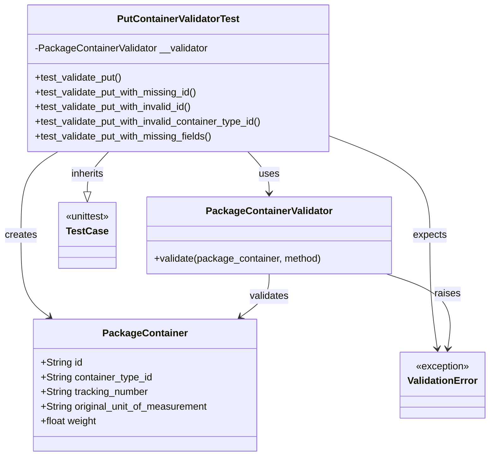
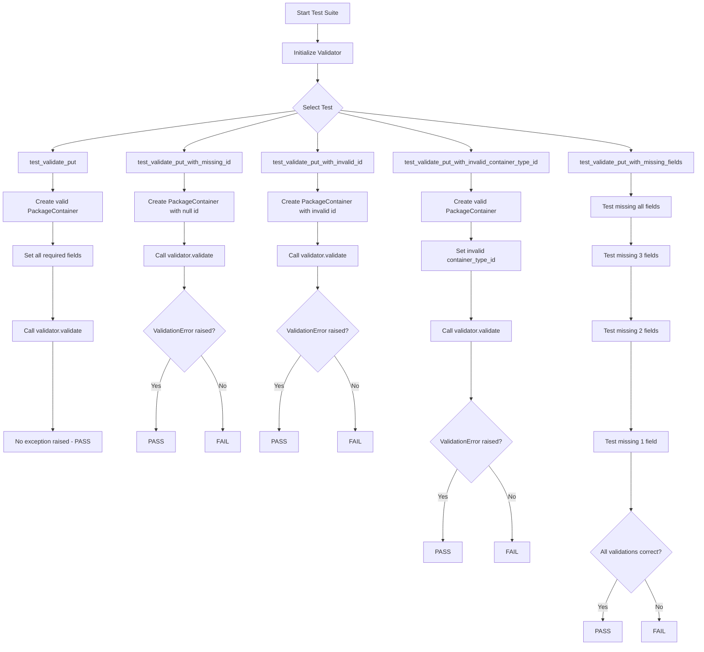
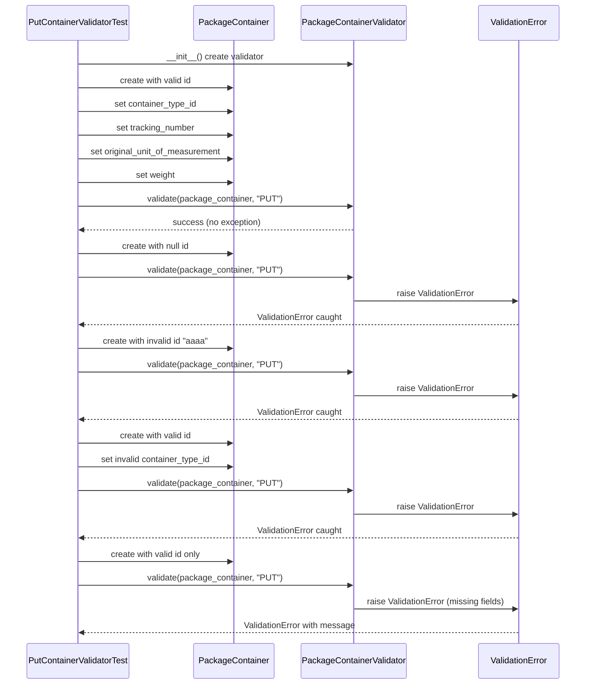
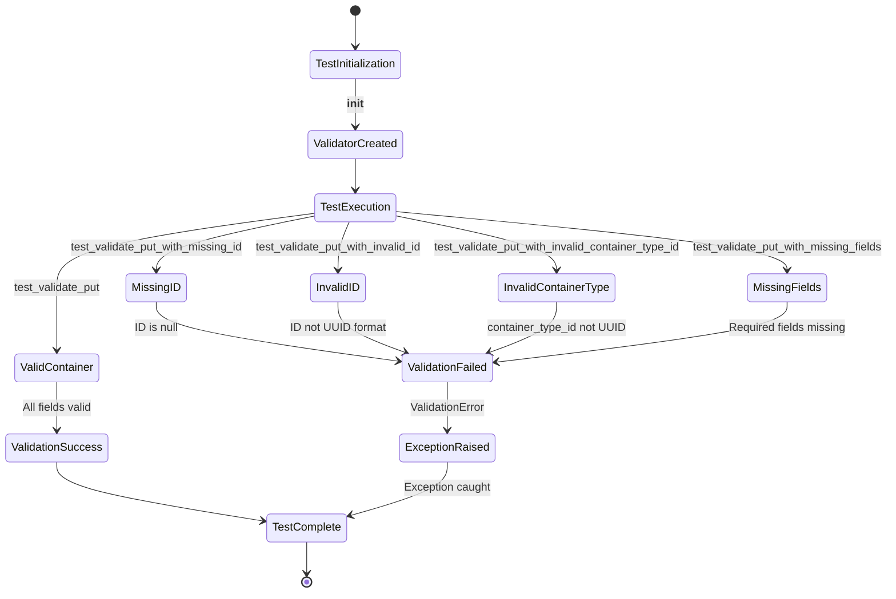

# Diagram: platform/partview_core/partview_service/partview_service/tests/unit/core/validators/package_container/container_put_validator_test.py


> Auto-generated by Obscura crawlers

## Diagram 1

```mermaid
classDiagram
      class PutContainerValidatorTest {
          -PackageContainerValidator __validator
          +test_validate_put()...
  └ 233 lines...
```

> SVG rendering failed for this diagram.

## Diagram 2



### SVG

<svg id="container" width="800.5" xmlns="http://www.w3.org/2000/svg" class="classDiagram" height="746" viewBox="0 0 800.5 746" role="graphics-document document" aria-roledescription="class"><style>#container{font-family:"trebuchet ms",verdana,arial,sans-serif;font-size:16px;fill:#333;}@keyframes edge-animation-frame{from{stroke-dashoffset:0;}}@keyframes dash{to{stroke-dashoffset:0;}}#container .edge-animation-slow{stroke-dasharray:9,5!important;stroke-dashoffset:900;animation:dash 50s linear infinite;stroke-linecap:round;}#container .edge-animation-fast{stroke-dasharray:9,5!important;stroke-dashoffset:900;animation:dash 20s linear infinite;stroke-linecap:round;}#container .error-icon{fill:#552222;}#container .error-text{fill:#552222;stroke:#552222;}#container .edge-thickness-normal{stroke-width:1px;}#container .edge-thickness-thick{stroke-width:3.5px;}#container .edge-pattern-solid{stroke-dasharray:0;}#container .edge-thickness-invisible{stroke-width:0;fill:none;}#container .edge-pattern-dashed{stroke-dasharray:3;}#container .edge-pattern-dotted{stroke-dasharray:2;}#container .marker{fill:#333333;stroke:#333333;}#container .marker.cross{stroke:#333333;}#container svg{font-family:"trebuchet ms",verdana,arial,sans-serif;font-size:16px;}#container p{margin:0;}#container g.classGroup text{fill:#9370DB;stroke:none;font-family:"trebuchet ms",verdana,arial,sans-serif;font-size:10px;}#container g.classGroup text .title{font-weight:bolder;}#container .nodeLabel,#container .edgeLabel{color:#131300;}#container .edgeLabel .label rect{fill:#ECECFF;}#container .label text{fill:#131300;}#container .labelBkg{background:#ECECFF;}#container .edgeLabel .label span{background:#ECECFF;}#container .classTitle{font-weight:bolder;}#container .node rect,#container .node circle,#container .node ellipse,#container .node polygon,#container .node path{fill:#ECECFF;stroke:#9370DB;stroke-width:1px;}#container .divider{stroke:#9370DB;stroke-width:1;}#container g.clickable{cursor:pointer;}#container g.classGroup rect{fill:#ECECFF;stroke:#9370DB;}#container g.classGroup line{stroke:#9370DB;stroke-width:1;}#container .classLabel .box{stroke:none;stroke-width:0;fill:#ECECFF;opacity:0.5;}#container .classLabel .label{fill:#9370DB;font-size:10px;}#container .relation{stroke:#333333;stroke-width:1;fill:none;}#container .dashed-line{stroke-dasharray:3;}#container .dotted-line{stroke-dasharray:1 2;}#container #compositionStart,#container .composition{fill:#333333!important;stroke:#333333!important;stroke-width:1;}#container #compositionEnd,#container .composition{fill:#333333!important;stroke:#333333!important;stroke-width:1;}#container #dependencyStart,#container .dependency{fill:#333333!important;stroke:#333333!important;stroke-width:1;}#container #dependencyStart,#container .dependency{fill:#333333!important;stroke:#333333!important;stroke-width:1;}#container #extensionStart,#container .extension{fill:transparent!important;stroke:#333333!important;stroke-width:1;}#container #extensionEnd,#container .extension{fill:transparent!important;stroke:#333333!important;stroke-width:1;}#container #aggregationStart,#container .aggregation{fill:transparent!important;stroke:#333333!important;stroke-width:1;}#container #aggregationEnd,#container .aggregation{fill:transparent!important;stroke:#333333!important;stroke-width:1;}#container #lollipopStart,#container .lollipop{fill:#ECECFF!important;stroke:#333333!important;stroke-width:1;}#container #lollipopEnd,#container .lollipop{fill:#ECECFF!important;stroke:#333333!important;stroke-width:1;}#container .edgeTerminals{font-size:11px;line-height:initial;}#container .classTitleText{text-anchor:middle;font-size:18px;fill:#333;}#container .label-icon{display:inline-block;height:1em;overflow:visible;vertical-align:-0.125em;}#container .node .label-icon path{fill:currentColor;stroke:revert;stroke-width:revert;}#container :root{--mermaid-font-family:"trebuchet ms",verdana,arial,sans-serif;}</style><g><defs><marker id="container_class-aggregationStart" class="marker aggregation class" refX="18" refY="7" markerWidth="190" markerHeight="240" orient="auto"><path d="M 18,7 L9,13 L1,7 L9,1 Z"></path></marker></defs><defs><marker id="container_class-aggregationEnd" class="marker aggregation class" refX="1" refY="7" markerWidth="20" markerHeight="28" orient="auto"><path d="M 18,7 L9,13 L1,7 L9,1 Z"></path></marker></defs><defs><marker id="container_class-extensionStart" class="marker extension class" refX="18" refY="7" markerWidth="190" markerHeight="240" orient="auto"><path d="M 1,7 L18,13 V 1 Z"></path></marker></defs><defs><marker id="container_class-extensionEnd" class="marker extension class" refX="1" refY="7" markerWidth="20" markerHeight="28" orient="auto"><path d="M 1,1 V 13 L18,7 Z"></path></marker></defs><defs><marker id="container_class-compositionStart" class="marker composition class" refX="18" refY="7" markerWidth="190" markerHeight="240" orient="auto"><path d="M 18,7 L9,13 L1,7 L9,1 Z"></path></marker></defs><defs><marker id="container_class-compositionEnd" class="marker composition class" refX="1" refY="7" markerWidth="20" markerHeight="28" orient="auto"><path d="M 18,7 L9,13 L1,7 L9,1 Z"></path></marker></defs><defs><marker id="container_class-dependencyStart" class="marker dependency class" refX="6" refY="7" markerWidth="190" markerHeight="240" orient="auto"><path d="M 5,7 L9,13 L1,7 L9,1 Z"></path></marker></defs><defs><marker id="container_class-dependencyEnd" class="marker dependency class" refX="13" refY="7" markerWidth="20" markerHeight="28" orient="auto"><path d="M 18,7 L9,13 L14,7 L9,1 Z"></path></marker></defs><defs><marker id="container_class-lollipopStart" class="marker lollipop class" refX="13" refY="7" markerWidth="190" markerHeight="240" orient="auto"><circle stroke="black" fill="transparent" cx="7" cy="7" r="6"></circle></marker></defs><defs><marker id="container_class-lollipopEnd" class="marker lollipop class" refX="1" refY="7" markerWidth="190" markerHeight="240" orient="auto"><circle stroke="black" fill="transparent" cx="7" cy="7" r="6"></circle></marker></defs><g class="root"><g class="clusters"></g><g class="edgePaths"><path d="M407.876,248L413.735,254.167C419.593,260.333,431.31,272.667,437.169,284C443.027,295.333,443.027,305.667,443.027,310.833L443.027,316" id="id_PutContainerValidatorTest_PackageContainerValidator_1" class="edge-thickness-normal edge-pattern-solid relation" style=";;;" data-edge="true" data-et="edge" data-id="id_PutContainerValidatorTest_PackageContainerValidator_1" data-points="W3sieCI6NDA3Ljg3NjMzMTExMDY2ODgsInkiOjI0OH0seyJ4Ijo0NDMuMDI3MzQzNzUsInkiOjI4NX0seyJ4Ijo0NDMuMDI3MzQzNzUsInkiOjMyMn1d" marker-end="url(#container_class-dependencyEnd)"></path><path d="M95.375,248L85.175,254.167C74.974,260.333,54.573,272.667,44.372,295.5C34.172,318.333,34.172,351.667,34.172,385C34.172,418.333,34.172,451.667,42.05,473.921C49.929,496.176,65.685,507.353,73.564,512.941L81.442,518.529" id="id_PutContainerValidatorTest_PackageContainer_2" class="edge-thickness-normal edge-pattern-solid relation" style=";;;" data-edge="true" data-et="edge" data-id="id_PutContainerValidatorTest_PackageContainer_2" data-points="W3sieCI6OTUuMzc1MzM1ODg3NzM4ODYsInkiOjI0OH0seyJ4IjozNC4xNzE4NzUsInkiOjI4NX0seyJ4IjozNC4xNzE4NzUsInkiOjM4NX0seyJ4IjozNC4xNzE4NzUsInkiOjQ4NX0seyJ4Ijo4Ni4zMzYxOTM0MjY3MjQxNSwieSI6NTIyfV0=" marker-end="url(#container_class-dependencyEnd)"></path><path d="M543.049,223.225L569.99,233.521C596.931,243.817,650.813,264.408,677.754,291.371C704.695,318.333,704.695,351.667,704.695,385C704.695,418.333,704.695,451.667,706.712,482.51C708.728,513.353,712.761,541.707,714.778,555.883L716.794,570.06" id="id_PutContainerValidatorTest_ValidationError_3" class="edge-thickness-normal edge-pattern-solid relation" style=";;;" data-edge="true" data-et="edge" data-id="id_PutContainerValidatorTest_ValidationError_3" data-points="W3sieCI6NTQzLjA0ODgyODEyNSwieSI6MjIzLjIyNTExNTQwNzgzNzczfSx7IngiOjcwNC42OTUzMTI1LCJ5IjoyODV9LHsieCI6NzA0LjY5NTMxMjUsInkiOjM4NX0seyJ4Ijo3MDQuNjk1MzEyNSwieSI6NDg1fSx7IngiOjcxNy42MzkyNzgwMTcyNDE0LCJ5Ijo1NzZ9XQ==" marker-end="url(#container_class-dependencyEnd)"></path><path d="M179.87,248L174.011,254.167C168.153,260.333,156.436,272.667,150.577,283.625C144.719,294.583,144.719,304.167,144.719,308.958L144.719,313.75" id="id_PutContainerValidatorTest_TestCase_4" class="edge-thickness-normal edge-pattern-solid relation" style=";;;" data-edge="true" data-et="edge" data-id="id_PutContainerValidatorTest_TestCase_4" data-points="W3sieCI6MTc5Ljg2OTc2MjYzOTMzMTIsInkiOjI0OH0seyJ4IjoxNDQuNzE4NzUsInkiOjI4NX0seyJ4IjoxNDQuNzE4NzUsInkiOjMzMX1d" marker-end="url(#container_class-extensionEnd)"></path><path d="M443.027,448L443.027,454.167C443.027,460.333,443.027,472.667,435.149,484.421C427.271,496.176,411.514,507.353,403.635,512.941L395.757,518.529" id="id_PackageContainerValidator_PackageContainer_5" class="edge-thickness-normal edge-pattern-solid relation" style=";;;" data-edge="true" data-et="edge" data-id="id_PackageContainerValidator_PackageContainer_5" data-points="W3sieCI6NDQzLjAyNzM0Mzc1LCJ5Ijo0NDh9LHsieCI6NDQzLjAyNzM0Mzc1LCJ5Ijo0ODV9LHsieCI6MzkwLjg2MzAyNTMyMzI3NTg1LCJ5Ijo1MjJ9XQ==" marker-end="url(#container_class-dependencyEnd)"></path><path d="M633.866,448L652.546,454.167C671.226,460.333,708.585,472.667,725.249,493.01C741.912,513.353,737.879,541.707,735.863,555.883L733.846,570.06" id="id_PackageContainerValidator_ValidationError_6" class="edge-thickness-normal edge-pattern-solid relation" style=";;;" data-edge="true" data-et="edge" data-id="id_PackageContainerValidator_ValidationError_6" data-points="W3sieCI6NjMzLjg2NTY2NDA2MjUsInkiOjQ0OH0seyJ4Ijo3NDUuOTQ1MzEyNSwieSI6NDg1fSx7IngiOjczMy4wMDEzNDY5ODI3NTg2LCJ5Ijo1NzZ9XQ==" marker-end="url(#container_class-dependencyEnd)"></path></g><g class="edgeLabels"><g class="edgeLabel" transform="translate(443.02734375, 285)"><g class="label" data-id="id_PutContainerValidatorTest_PackageContainerValidator_1" transform="translate(-16.4921875, -12)"><foreignObject width="32.984375" height="24"><div xmlns="http://www.w3.org/1999/xhtml" class="labelBkg" style="display: table-cell; white-space: nowrap; line-height: 1.5; max-width: 200px; text-align: center;"><span class="edgeLabel"><p>uses</p></span></div></foreignObject></g></g><g class="edgeLabel" transform="translate(34.171875, 385)"><g class="label" data-id="id_PutContainerValidatorTest_PackageContainer_2" transform="translate(-26.171875, -12)"><foreignObject width="52.34375" height="24"><div xmlns="http://www.w3.org/1999/xhtml" class="labelBkg" style="display: table-cell; white-space: nowrap; line-height: 1.5; max-width: 200px; text-align: center;"><span class="edgeLabel"><p>creates</p></span></div></foreignObject></g></g><g class="edgeLabel" transform="translate(704.6953125, 385)"><g class="label" data-id="id_PutContainerValidatorTest_ValidationError_3" transform="translate(-27.734375, -12)"><foreignObject width="55.46875" height="24"><div xmlns="http://www.w3.org/1999/xhtml" class="labelBkg" style="display: table-cell; white-space: nowrap; line-height: 1.5; max-width: 200px; text-align: center;"><span class="edgeLabel"><p>expects</p></span></div></foreignObject></g></g><g class="edgeLabel" transform="translate(144.71875, 285)"><g class="label" data-id="id_PutContainerValidatorTest_TestCase_4" transform="translate(-27.9609375, -12)"><foreignObject width="55.921875" height="24"><div xmlns="http://www.w3.org/1999/xhtml" class="labelBkg" style="display: table-cell; white-space: nowrap; line-height: 1.5; max-width: 200px; text-align: center;"><span class="edgeLabel"><p>inherits</p></span></div></foreignObject></g></g><g class="edgeLabel" transform="translate(443.02734375, 485)"><g class="label" data-id="id_PackageContainerValidator_PackageContainer_5" transform="translate(-32.6875, -12)"><foreignObject width="65.375" height="24"><div xmlns="http://www.w3.org/1999/xhtml" class="labelBkg" style="display: table-cell; white-space: nowrap; line-height: 1.5; max-width: 200px; text-align: center;"><span class="edgeLabel"><p>validates</p></span></div></foreignObject></g></g><g class="edgeLabel" transform="translate(733.54692, 480.90701)"><g class="label" data-id="id_PackageContainerValidator_ValidationError_6" transform="translate(-21.25, -12)"><foreignObject width="42.5" height="24"><div xmlns="http://www.w3.org/1999/xhtml" class="labelBkg" style="display: table-cell; white-space: nowrap; line-height: 1.5; max-width: 200px; text-align: center;"><span class="edgeLabel"><p>raises</p></span></div></foreignObject></g></g></g><g class="nodes"><g class="node default" id="classId-PutContainerValidatorTest-0" transform="translate(293.873046875, 128)"><g class="basic label-container"><path d="M-249.17578125 -120 L249.17578125 -120 L249.17578125 120 L-249.17578125 120" stroke="none" stroke-width="0" fill="#ECECFF" style=""></path><path d="M-249.17578125 -120 C-139.23064826296172 -120, -29.285515275923473 -120, 249.17578125 -120 M-249.17578125 -120 C-136.68403290771684 -120, -24.19228456543368 -120, 249.17578125 -120 M249.17578125 -120 C249.17578125 -59.6649294903479, 249.17578125 0.6701410193041966, 249.17578125 120 M249.17578125 -120 C249.17578125 -27.443956567284275, 249.17578125 65.11208686543145, 249.17578125 120 M249.17578125 120 C139.27831408511267 120, 29.380846920225338 120, -249.17578125 120 M249.17578125 120 C144.6148858404291 120, 40.05399043085822 120, -249.17578125 120 M-249.17578125 120 C-249.17578125 40.80083118111477, -249.17578125 -38.39833763777045, -249.17578125 -120 M-249.17578125 120 C-249.17578125 30.373484220827535, -249.17578125 -59.25303155834493, -249.17578125 -120" stroke="#9370DB" stroke-width="1.3" fill="none" stroke-dasharray="0 0" style=""></path></g><g class="annotation-group text" transform="translate(0, -96)"></g><g class="label-group text" transform="translate(-96.2890625, -96)"><g class="label" style="font-weight: bolder" transform="translate(0,-12)"><foreignObject width="192.578125" height="24"><div xmlns="http://www.w3.org/1999/xhtml" style="display: table-cell; white-space: nowrap; line-height: 1.5; max-width: 239px; text-align: center;"><span class="nodeLabel markdown-node-label" style=""><p>PutContainerValidatorTest</p></span></div></foreignObject></g></g><g class="members-group text" transform="translate(-237.17578125, -48)"><g class="label" style="" transform="translate(0,-12)"><foreignObject width="285.265625" height="24"><div xmlns="http://www.w3.org/1999/xhtml" style="display: table-cell; white-space: nowrap; line-height: 1.5; max-width: 343px; text-align: center;"><span class="nodeLabel markdown-node-label" style=""><p>-PackageContainerValidator __validator</p></span></div></foreignObject></g></g><g class="methods-group text" transform="translate(-237.17578125, 0)"><g class="label" style="" transform="translate(0,-12)"><foreignObject width="144.109375" height="24"><div xmlns="http://www.w3.org/1999/xhtml" style="display: table-cell; white-space: nowrap; line-height: 1.5; max-width: 201px; text-align: center;"><span class="nodeLabel markdown-node-label" style=""><p>+test_validate_put()</p></span></div></foreignObject></g><g class="label" style="" transform="translate(0,12)"><foreignObject width="269.234375" height="24"><div xmlns="http://www.w3.org/1999/xhtml" style="display: table-cell; white-space: nowrap; line-height: 1.5; max-width: 327px; text-align: center;"><span class="nodeLabel markdown-node-label" style=""><p>+test_validate_put_with_missing_id()</p></span></div></foreignObject></g><g class="label" style="" transform="translate(0,36)"><foreignObject width="262.671875" height="24"><div xmlns="http://www.w3.org/1999/xhtml" style="display: table-cell; white-space: nowrap; line-height: 1.5; max-width: 320px; text-align: center;"><span class="nodeLabel markdown-node-label" style=""><p>+test_validate_put_with_invalid_id()</p></span></div></foreignObject></g><g class="label" style="" transform="translate(0,60)"><foreignObject width="378.0625" height="24"><div xmlns="http://www.w3.org/1999/xhtml" style="display: table-cell; white-space: nowrap; line-height: 1.5; max-width: 435px; text-align: center;"><span class="nodeLabel markdown-node-label" style=""><p>+test_validate_put_with_invalid_container_type_id()</p></span></div></foreignObject></g><g class="label" style="" transform="translate(0,84)"><foreignObject width="294.40625" height="24"><div xmlns="http://www.w3.org/1999/xhtml" style="display: table-cell; white-space: nowrap; line-height: 1.5; max-width: 352px; text-align: center;"><span class="nodeLabel markdown-node-label" style=""><p>+test_validate_put_with_missing_fields()</p></span></div></foreignObject></g></g><g class="divider" style=""><path d="M-249.17578125 -72 C-50.54072703571754 -72, 148.09432717856492 -72, 249.17578125 -72 M-249.17578125 -72 C-54.04328597193927 -72, 141.08920930612146 -72, 249.17578125 -72" stroke="#9370DB" stroke-width="1.3" fill="none" stroke-dasharray="0 0" style=""></path></g><g class="divider" style=""><path d="M-249.17578125 -24 C-77.65308713925918 -24, 93.86960697148163 -24, 249.17578125 -24 M-249.17578125 -24 C-72.02586448312891 -24, 105.12405228374217 -24, 249.17578125 -24" stroke="#9370DB" stroke-width="1.3" fill="none" stroke-dasharray="0 0" style=""></path></g></g><g class="node default" id="classId-PackageContainerValidator-1" transform="translate(443.02734375, 385)"><g class="basic label-container"><path d="M-198.93359375 -63 L198.93359375 -63 L198.93359375 63 L-198.93359375 63" stroke="none" stroke-width="0" fill="#ECECFF" style=""></path><path d="M-198.93359375 -63 C-116.32020727800548 -63, -33.70682080601097 -63, 198.93359375 -63 M-198.93359375 -63 C-62.39195365166279 -63, 74.14968644667442 -63, 198.93359375 -63 M198.93359375 -63 C198.93359375 -25.408606097676206, 198.93359375 12.182787804647589, 198.93359375 63 M198.93359375 -63 C198.93359375 -26.826335799968412, 198.93359375 9.347328400063176, 198.93359375 63 M198.93359375 63 C113.99711974194298 63, 29.060645733885963 63, -198.93359375 63 M198.93359375 63 C86.33590267535234 63, -26.261788399295313 63, -198.93359375 63 M-198.93359375 63 C-198.93359375 21.96482458437179, -198.93359375 -19.07035083125642, -198.93359375 -63 M-198.93359375 63 C-198.93359375 17.304998762411685, -198.93359375 -28.39000247517663, -198.93359375 -63" stroke="#9370DB" stroke-width="1.3" fill="none" stroke-dasharray="0 0" style=""></path></g><g class="annotation-group text" transform="translate(0, -39)"></g><g class="label-group text" transform="translate(-98.6328125, -39)"><g class="label" style="font-weight: bolder" transform="translate(0,-12)"><foreignObject width="197.265625" height="24"><div xmlns="http://www.w3.org/1999/xhtml" style="display: table-cell; white-space: nowrap; line-height: 1.5; max-width: 245px; text-align: center;"><span class="nodeLabel markdown-node-label" style=""><p>PackageContainerValidator</p></span></div></foreignObject></g></g><g class="members-group text" transform="translate(-186.93359375, 9)"></g><g class="methods-group text" transform="translate(-186.93359375, 39)"><g class="label" style="" transform="translate(0,-12)"><foreignObject width="275.234375" height="24"><div xmlns="http://www.w3.org/1999/xhtml" style="display: table-cell; white-space: nowrap; line-height: 1.5; max-width: 333px; text-align: center;"><span class="nodeLabel markdown-node-label" style=""><p>+validate(package_container, method)</p></span></div></foreignObject></g></g><g class="divider" style=""><path d="M-198.93359375 -15 C-61.00103450712297 -15, 76.93152473575407 -15, 198.93359375 -15 M-198.93359375 -15 C-60.02446018837492 -15, 78.88467337325017 -15, 198.93359375 -15" stroke="#9370DB" stroke-width="1.3" fill="none" stroke-dasharray="0 0" style=""></path></g><g class="divider" style=""><path d="M-198.93359375 9 C-46.99549756435542 9, 104.94259862128916 9, 198.93359375 9 M-198.93359375 9 C-77.74712305712386 9, 43.439347635752284 9, 198.93359375 9" stroke="#9370DB" stroke-width="1.3" fill="none" stroke-dasharray="0 0" style=""></path></g></g><g class="node default" id="classId-PackageContainer-2" transform="translate(238.599609375, 630)"><g class="basic label-container"><path d="M-183.2578125 -108 L183.2578125 -108 L183.2578125 108 L-183.2578125 108" stroke="none" stroke-width="0" fill="#ECECFF" style=""></path><path d="M-183.2578125 -108 C-103.16051664365135 -108, -23.063220787302697 -108, 183.2578125 -108 M-183.2578125 -108 C-37.72801774717817 -108, 107.80177700564366 -108, 183.2578125 -108 M183.2578125 -108 C183.2578125 -29.39877809936293, 183.2578125 49.20244380127414, 183.2578125 108 M183.2578125 -108 C183.2578125 -47.64996426311382, 183.2578125 12.700071473772354, 183.2578125 108 M183.2578125 108 C89.47123829045007 108, -4.3153359190998515 108, -183.2578125 108 M183.2578125 108 C109.13294087990857 108, 35.00806925981715 108, -183.2578125 108 M-183.2578125 108 C-183.2578125 45.86837039596419, -183.2578125 -16.263259208071617, -183.2578125 -108 M-183.2578125 108 C-183.2578125 49.291417617664564, -183.2578125 -9.417164764670872, -183.2578125 -108" stroke="#9370DB" stroke-width="1.3" fill="none" stroke-dasharray="0 0" style=""></path></g><g class="annotation-group text" transform="translate(0, -84)"></g><g class="label-group text" transform="translate(-65.453125, -84)"><g class="label" style="font-weight: bolder" transform="translate(0,-12)"><foreignObject width="130.90625" height="24"><div xmlns="http://www.w3.org/1999/xhtml" style="display: table-cell; white-space: nowrap; line-height: 1.5; max-width: 179px; text-align: center;"><span class="nodeLabel markdown-node-label" style=""><p>PackageContainer</p></span></div></foreignObject></g></g><g class="members-group text" transform="translate(-171.2578125, -36)"><g class="label" style="" transform="translate(0,-12)"><foreignObject width="68.546875" height="24"><div xmlns="http://www.w3.org/1999/xhtml" style="display: table-cell; white-space: nowrap; line-height: 1.5; max-width: 126px; text-align: center;"><span class="nodeLabel markdown-node-label" style=""><p>+String id</p></span></div></foreignObject></g><g class="label" style="" transform="translate(0,12)"><foreignObject width="184.265625" height="24"><div xmlns="http://www.w3.org/1999/xhtml" style="display: table-cell; white-space: nowrap; line-height: 1.5; max-width: 242px; text-align: center;"><span class="nodeLabel markdown-node-label" style=""><p>+String container_type_id</p></span></div></foreignObject></g><g class="label" style="" transform="translate(0,36)"><foreignObject width="177.796875" height="24"><div xmlns="http://www.w3.org/1999/xhtml" style="display: table-cell; white-space: nowrap; line-height: 1.5; max-width: 236px; text-align: center;"><span class="nodeLabel markdown-node-label" style=""><p>+String tracking_number</p></span></div></foreignObject></g><g class="label" style="" transform="translate(0,60)"><foreignObject width="277.0625" height="24"><div xmlns="http://www.w3.org/1999/xhtml" style="display: table-cell; white-space: nowrap; line-height: 1.5; max-width: 335px; text-align: center;"><span class="nodeLabel markdown-node-label" style=""><p>+String original_unit_of_measurement</p></span></div></foreignObject></g><g class="label" style="" transform="translate(0,84)"><foreignObject width="93.21875" height="24"><div xmlns="http://www.w3.org/1999/xhtml" style="display: table-cell; white-space: nowrap; line-height: 1.5; max-width: 151px; text-align: center;"><span class="nodeLabel markdown-node-label" style=""><p>+float weight</p></span></div></foreignObject></g></g><g class="methods-group text" transform="translate(-171.2578125, 108)"></g><g class="divider" style=""><path d="M-183.2578125 -60 C-89.95208612035607 -60, 3.3536402592878574 -60, 183.2578125 -60 M-183.2578125 -60 C-68.71392547895502 -60, 45.82996154208996 -60, 183.2578125 -60" stroke="#9370DB" stroke-width="1.3" fill="none" stroke-dasharray="0 0" style=""></path></g><g class="divider" style=""><path d="M-183.2578125 84 C-53.14666219310928 84, 76.96448811378144 84, 183.2578125 84 M-183.2578125 84 C-100.01734780967527 84, -16.776883119350543 84, 183.2578125 84" stroke="#9370DB" stroke-width="1.3" fill="none" stroke-dasharray="0 0" style=""></path></g></g><g class="node default" id="classId-ValidationError-3" transform="translate(725.3203125, 630)"><g class="basic label-container"><path d="M-67.1796875 -54 L67.1796875 -54 L67.1796875 54 L-67.1796875 54" stroke="none" stroke-width="0" fill="#ECECFF" style=""></path><path d="M-67.1796875 -54 C-38.55575717044424 -54, -9.931826840888483 -54, 67.1796875 -54 M-67.1796875 -54 C-18.971536087341363 -54, 29.236615325317274 -54, 67.1796875 -54 M67.1796875 -54 C67.1796875 -19.503198969120852, 67.1796875 14.993602061758295, 67.1796875 54 M67.1796875 -54 C67.1796875 -28.803590603179604, 67.1796875 -3.6071812063592077, 67.1796875 54 M67.1796875 54 C17.55101044733275 54, -32.0776666053345 54, -67.1796875 54 M67.1796875 54 C38.15642505186241 54, 9.13316260372482 54, -67.1796875 54 M-67.1796875 54 C-67.1796875 12.390725916433631, -67.1796875 -29.218548167132738, -67.1796875 -54 M-67.1796875 54 C-67.1796875 15.235753469788023, -67.1796875 -23.528493060423955, -67.1796875 -54" stroke="#9370DB" stroke-width="1.3" fill="none" stroke-dasharray="0 0" style=""></path></g><g class="annotation-group text" transform="translate(-44.3515625, -30)"><g class="label" style="" transform="translate(0,-12)"><foreignObject width="88.703125" height="24"><div xmlns="http://www.w3.org/1999/xhtml" style="display: table-cell; white-space: nowrap; line-height: 1.5; max-width: 139px; text-align: center;"><span class="nodeLabel markdown-node-label" style=""><p>«exception»</p></span></div></foreignObject></g></g><g class="label-group text" transform="translate(-55.1796875, -6)"><g class="label" style="font-weight: bolder" transform="translate(0,-12)"><foreignObject width="110.359375" height="24"><div xmlns="http://www.w3.org/1999/xhtml" style="display: table-cell; white-space: nowrap; line-height: 1.5; max-width: 160px; text-align: center;"><span class="nodeLabel markdown-node-label" style=""><p>ValidationError</p></span></div></foreignObject></g></g><g class="members-group text" transform="translate(-55.1796875, 42)"></g><g class="methods-group text" transform="translate(-55.1796875, 72)"></g><g class="divider" style=""><path d="M-67.1796875 18 C-18.933409067822147 18, 29.312869364355706 18, 67.1796875 18 M-67.1796875 18 C-16.607868123838408 18, 33.963951252323184 18, 67.1796875 18" stroke="#9370DB" stroke-width="1.3" fill="none" stroke-dasharray="0 0" style=""></path></g><g class="divider" style=""><path d="M-67.1796875 36 C-21.774034094081294 36, 23.63161931183741 36, 67.1796875 36 M-67.1796875 36 C-26.109214431322314 36, 14.961258637355371 36, 67.1796875 36" stroke="#9370DB" stroke-width="1.3" fill="none" stroke-dasharray="0 0" style=""></path></g></g><g class="node default" id="classId-TestCase-4" transform="translate(144.71875, 385)"><g class="basic label-container"><path d="M-49.375 -54 L49.375 -54 L49.375 54 L-49.375 54" stroke="none" stroke-width="0" fill="#ECECFF" style=""></path><path d="M-49.375 -54 C-14.997150179190037 -54, 19.380699641619927 -54, 49.375 -54 M-49.375 -54 C-25.685559213860177 -54, -1.9961184277203543 -54, 49.375 -54 M49.375 -54 C49.375 -26.575575534632893, 49.375 0.8488489307342135, 49.375 54 M49.375 -54 C49.375 -11.244871447548519, 49.375 31.510257104902962, 49.375 54 M49.375 54 C14.505380242649224 54, -20.364239514701552 54, -49.375 54 M49.375 54 C10.75554555780289 54, -27.86390888439422 54, -49.375 54 M-49.375 54 C-49.375 27.040635281515993, -49.375 0.08127056303198543, -49.375 -54 M-49.375 54 C-49.375 17.124107769263787, -49.375 -19.751784461472425, -49.375 -54" stroke="#9370DB" stroke-width="1.3" fill="none" stroke-dasharray="0 0" style=""></path></g><g class="annotation-group text" transform="translate(-37.375, -30)"><g class="label" style="" transform="translate(0,-12)"><foreignObject width="74.75" height="24"><div xmlns="http://www.w3.org/1999/xhtml" style="display: table-cell; white-space: nowrap; line-height: 1.5; max-width: 125px; text-align: center;"><span class="nodeLabel markdown-node-label" style=""><p>«unittest»</p></span></div></foreignObject></g></g><g class="label-group text" transform="translate(-32.359375, -6)"><g class="label" style="font-weight: bolder" transform="translate(0,-12)"><foreignObject width="64.71875" height="24"><div xmlns="http://www.w3.org/1999/xhtml" style="display: table-cell; white-space: nowrap; line-height: 1.5; max-width: 113px; text-align: center;"><span class="nodeLabel markdown-node-label" style=""><p>TestCase</p></span></div></foreignObject></g></g><g class="members-group text" transform="translate(-37.375, 42)"></g><g class="methods-group text" transform="translate(-37.375, 72)"></g><g class="divider" style=""><path d="M-49.375 18 C-14.33659150236602 18, 20.70181699526796 18, 49.375 18 M-49.375 18 C-24.56770478736208 18, 0.23959042527584273 18, 49.375 18" stroke="#9370DB" stroke-width="1.3" fill="none" stroke-dasharray="0 0" style=""></path></g><g class="divider" style=""><path d="M-49.375 36 C-23.178089697198054 36, 3.018820605603892 36, 49.375 36 M-49.375 36 C-21.428583079523285 36, 6.517833840953429 36, 49.375 36" stroke="#9370DB" stroke-width="1.3" fill="none" stroke-dasharray="0 0" style=""></path></g></g></g></g></g></svg>

## Diagram 3



### SVG

<svg id="container" width="1849.85546875" xmlns="http://www.w3.org/2000/svg" class="flowchart" height="1699" viewBox="0 0 1849.85546875 1699" role="graphics-document document" aria-roledescription="flowchart-v2"><style>#container{font-family:"trebuchet ms",verdana,arial,sans-serif;font-size:16px;fill:#333;}@keyframes edge-animation-frame{from{stroke-dashoffset:0;}}@keyframes dash{to{stroke-dashoffset:0;}}#container .edge-animation-slow{stroke-dasharray:9,5!important;stroke-dashoffset:900;animation:dash 50s linear infinite;stroke-linecap:round;}#container .edge-animation-fast{stroke-dasharray:9,5!important;stroke-dashoffset:900;animation:dash 20s linear infinite;stroke-linecap:round;}#container .error-icon{fill:#552222;}#container .error-text{fill:#552222;stroke:#552222;}#container .edge-thickness-normal{stroke-width:1px;}#container .edge-thickness-thick{stroke-width:3.5px;}#container .edge-pattern-solid{stroke-dasharray:0;}#container .edge-thickness-invisible{stroke-width:0;fill:none;}#container .edge-pattern-dashed{stroke-dasharray:3;}#container .edge-pattern-dotted{stroke-dasharray:2;}#container .marker{fill:#333333;stroke:#333333;}#container .marker.cross{stroke:#333333;}#container svg{font-family:"trebuchet ms",verdana,arial,sans-serif;font-size:16px;}#container p{margin:0;}#container .label{font-family:"trebuchet ms",verdana,arial,sans-serif;color:#333;}#container .cluster-label text{fill:#333;}#container .cluster-label span{color:#333;}#container .cluster-label span p{background-color:transparent;}#container .label text,#container span{fill:#333;color:#333;}#container .node rect,#container .node circle,#container .node ellipse,#container .node polygon,#container .node path{fill:#ECECFF;stroke:#9370DB;stroke-width:1px;}#container .rough-node .label text,#container .node .label text,#container .image-shape .label,#container .icon-shape .label{text-anchor:middle;}#container .node .katex path{fill:#000;stroke:#000;stroke-width:1px;}#container .rough-node .label,#container .node .label,#container .image-shape .label,#container .icon-shape .label{text-align:center;}#container .node.clickable{cursor:pointer;}#container .root .anchor path{fill:#333333!important;stroke-width:0;stroke:#333333;}#container .arrowheadPath{fill:#333333;}#container .edgePath .path{stroke:#333333;stroke-width:2.0px;}#container .flowchart-link{stroke:#333333;fill:none;}#container .edgeLabel{background-color:rgba(232,232,232, 0.8);text-align:center;}#container .edgeLabel p{background-color:rgba(232,232,232, 0.8);}#container .edgeLabel rect{opacity:0.5;background-color:rgba(232,232,232, 0.8);fill:rgba(232,232,232, 0.8);}#container .labelBkg{background-color:rgba(232, 232, 232, 0.5);}#container .cluster rect{fill:#ffffde;stroke:#aaaa33;stroke-width:1px;}#container .cluster text{fill:#333;}#container .cluster span{color:#333;}#container div.mermaidTooltip{position:absolute;text-align:center;max-width:200px;padding:2px;font-family:"trebuchet ms",verdana,arial,sans-serif;font-size:12px;background:hsl(80, 100%, 96.2745098039%);border:1px solid #aaaa33;border-radius:2px;pointer-events:none;z-index:100;}#container .flowchartTitleText{text-anchor:middle;font-size:18px;fill:#333;}#container rect.text{fill:none;stroke-width:0;}#container .icon-shape,#container .image-shape{background-color:rgba(232,232,232, 0.8);text-align:center;}#container .icon-shape p,#container .image-shape p{background-color:rgba(232,232,232, 0.8);padding:2px;}#container .icon-shape rect,#container .image-shape rect{opacity:0.5;background-color:rgba(232,232,232, 0.8);fill:rgba(232,232,232, 0.8);}#container .label-icon{display:inline-block;height:1em;overflow:visible;vertical-align:-0.125em;}#container .node .label-icon path{fill:currentColor;stroke:revert;stroke-width:revert;}#container :root{--mermaid-font-family:"trebuchet ms",verdana,arial,sans-serif;}</style><g><marker id="container_flowchart-v2-pointEnd" class="marker flowchart-v2" viewBox="0 0 10 10" refX="5" refY="5" markerUnits="userSpaceOnUse" markerWidth="8" markerHeight="8" orient="auto"><path d="M 0 0 L 10 5 L 0 10 z" class="arrowMarkerPath" style="stroke-width: 1; stroke-dasharray: 1, 0;"></path></marker><marker id="container_flowchart-v2-pointStart" class="marker flowchart-v2" viewBox="0 0 10 10" refX="4.5" refY="5" markerUnits="userSpaceOnUse" markerWidth="8" markerHeight="8" orient="auto"><path d="M 0 5 L 10 10 L 10 0 z" class="arrowMarkerPath" style="stroke-width: 1; stroke-dasharray: 1, 0;"></path></marker><marker id="container_flowchart-v2-circleEnd" class="marker flowchart-v2" viewBox="0 0 10 10" refX="11" refY="5" markerUnits="userSpaceOnUse" markerWidth="11" markerHeight="11" orient="auto"><circle cx="5" cy="5" r="5" class="arrowMarkerPath" style="stroke-width: 1; stroke-dasharray: 1, 0;"></circle></marker><marker id="container_flowchart-v2-circleStart" class="marker flowchart-v2" viewBox="0 0 10 10" refX="-1" refY="5" markerUnits="userSpaceOnUse" markerWidth="11" markerHeight="11" orient="auto"><circle cx="5" cy="5" r="5" class="arrowMarkerPath" style="stroke-width: 1; stroke-dasharray: 1, 0;"></circle></marker><marker id="container_flowchart-v2-crossEnd" class="marker cross flowchart-v2" viewBox="0 0 11 11" refX="12" refY="5.2" markerUnits="userSpaceOnUse" markerWidth="11" markerHeight="11" orient="auto"><path d="M 1,1 l 9,9 M 10,1 l -9,9" class="arrowMarkerPath" style="stroke-width: 2; stroke-dasharray: 1, 0;"></path></marker><marker id="container_flowchart-v2-crossStart" class="marker cross flowchart-v2" viewBox="0 0 11 11" refX="-1" refY="5.2" markerUnits="userSpaceOnUse" markerWidth="11" markerHeight="11" orient="auto"><path d="M 1,1 l 9,9 M 10,1 l -9,9" class="arrowMarkerPath" style="stroke-width: 2; stroke-dasharray: 1, 0;"></path></marker><g class="root"><g class="clusters"></g><g class="edgePaths"><path d="M833.738,62L833.738,66.167C833.738,70.333,833.738,78.667,833.738,86.333C833.738,94,833.738,101,833.738,104.5L833.738,108" id="L_A_B_0" class="edge-thickness-normal edge-pattern-solid edge-thickness-normal edge-pattern-solid flowchart-link" style=";" data-edge="true" data-et="edge" data-id="L_A_B_0" data-points="W3sieCI6ODMzLjczODI4MTI1LCJ5Ijo2Mn0seyJ4Ijo4MzMuNzM4MjgxMjUsInkiOjg3fSx7IngiOjgzMy43MzgyODEyNSwieSI6MTEyfV0=" marker-end="url(#container_flowchart-v2-pointEnd)"></path><path d="M833.738,166L833.738,170.167C833.738,174.333,833.738,182.667,833.738,190.333C833.738,198,833.738,205,833.738,208.5L833.738,212" id="L_B_C_0" class="edge-thickness-normal edge-pattern-solid edge-thickness-normal edge-pattern-solid flowchart-link" style=";" data-edge="true" data-et="edge" data-id="L_B_C_0" data-points="W3sieCI6ODMzLjczODI4MTI1LCJ5IjoxNjZ9LHsieCI6ODMzLjczODI4MTI1LCJ5IjoxOTF9LHsieCI6ODMzLjczODI4MTI1LCJ5IjoyMTZ9XQ==" marker-end="url(#container_flowchart-v2-pointEnd)"></path><path d="M775.455,289.513L669.212,303.394C562.97,317.274,350.485,345.036,244.242,362.416C138,379.797,138,386.797,138,390.297L138,393.797" id="L_C_D_0" class="edge-thickness-normal edge-pattern-solid edge-thickness-normal edge-pattern-solid flowchart-link" style=";" data-edge="true" data-et="edge" data-id="L_C_D_0" data-points="W3sieCI6Nzc1LjQ1NDYyMzA0OTg1MjYsInkiOjI4OS41MTMyMTY3OTk4NTI1fSx7IngiOjEzOCwieSI6MzcyLjc5Njg3NX0seyJ4IjoxMzgsInkiOjM5Ny43OTY4NzV9XQ==" marker-end="url(#container_flowchart-v2-pointEnd)"></path><path d="M781.193,295.252L730.338,308.176C679.482,321.1,577.77,346.949,526.914,363.373C476.059,379.797,476.059,386.797,476.059,390.297L476.059,393.797" id="L_C_E_0" class="edge-thickness-normal edge-pattern-solid edge-thickness-normal edge-pattern-solid flowchart-link" style=";" data-edge="true" data-et="edge" data-id="L_C_E_0" data-points="W3sieCI6NzgxLjE5MzI5MjQ5OTczODcsInkiOjI5NS4yNTE4ODYyNDk3Mzg3M30seyJ4Ijo0NzYuMDU4NTkzNzUsInkiOjM3Mi43OTY4NzV9LHsieCI6NDc2LjA1ODU5Mzc1LCJ5IjozOTcuNzk2ODc1fV0=" marker-end="url(#container_flowchart-v2-pointEnd)"></path><path d="M833.738,347.797L833.738,351.964C833.738,356.13,833.738,364.464,833.738,372.13C833.738,379.797,833.738,386.797,833.738,390.297L833.738,393.797" id="L_C_F_0" class="edge-thickness-normal edge-pattern-solid edge-thickness-normal edge-pattern-solid flowchart-link" style=";" data-edge="true" data-et="edge" data-id="L_C_F_0" data-points="W3sieCI6ODMzLjczODI4MTI1LCJ5IjozNDcuNzk2ODc1fSx7IngiOjgzMy43MzgyODEyNSwieSI6MzcyLjc5Njg3NX0seyJ4Ijo4MzMuNzM4MjgxMjUsInkiOjM5Ny43OTY4NzV9XQ==" marker-end="url(#container_flowchart-v2-pointEnd)"></path><path d="M887.728,293.807L947.41,306.972C1007.093,320.137,1126.459,346.467,1186.141,363.132C1245.824,379.797,1245.824,386.797,1245.824,390.297L1245.824,393.797" id="L_C_G_0" class="edge-thickness-normal edge-pattern-solid edge-thickness-normal edge-pattern-solid flowchart-link" style=";" data-edge="true" data-et="edge" data-id="L_C_G_0" data-points="W3sieCI6ODg3LjcyNzY3MDg3NDYyMzMsInkiOjI5My44MDc0ODUzNzUzNzY2NH0seyJ4IjoxMjQ1LjgyNDIxODc1LCJ5IjozNzIuNzk2ODc1fSx7IngiOjEyNDUuODI0MjE4NzUsInkiOjM5Ny43OTY4NzV9XQ==" marker-end="url(#container_flowchart-v2-pointEnd)"></path><path d="M893.202,288.333L1023.299,302.41C1153.397,316.488,1413.591,344.642,1543.688,362.22C1673.785,379.797,1673.785,386.797,1673.785,390.297L1673.785,393.797" id="L_C_H_0" class="edge-thickness-normal edge-pattern-solid edge-thickness-normal edge-pattern-solid flowchart-link" style=";" data-edge="true" data-et="edge" data-id="L_C_H_0" data-points="W3sieCI6ODkzLjIwMjMyODk3MjE5OTMsInkiOjI4OC4zMzI4MjcyNzc4MDA2fSx7IngiOjE2NzMuNzg1MTU2MjUsInkiOjM3Mi43OTY4NzV9LHsieCI6MTY3My43ODUxNTYyNSwieSI6Mzk3Ljc5Njg3NX1d" marker-end="url(#container_flowchart-v2-pointEnd)"></path><path d="M138,451.797L138,455.964C138,460.13,138,468.464,138,476.13C138,483.797,138,490.797,138,494.297L138,497.797" id="L_D_D1_0" class="edge-thickness-normal edge-pattern-solid edge-thickness-normal edge-pattern-solid flowchart-link" style=";" data-edge="true" data-et="edge" data-id="L_D_D1_0" data-points="W3sieCI6MTM4LCJ5Ijo0NTEuNzk2ODc1fSx7IngiOjEzOCwieSI6NDc2Ljc5Njg3NX0seyJ4IjoxMzgsInkiOjUwMS43OTY4NzV9XQ==" marker-end="url(#container_flowchart-v2-pointEnd)"></path><path d="M138,579.797L138,583.964C138,588.13,138,596.464,138,606.13C138,615.797,138,626.797,138,632.297L138,637.797" id="L_D1_D2_0" class="edge-thickness-normal edge-pattern-solid edge-thickness-normal edge-pattern-solid flowchart-link" style=";" data-edge="true" data-et="edge" data-id="L_D1_D2_0" data-points="W3sieCI6MTM4LCJ5Ijo1NzkuNzk2ODc1fSx7IngiOjEzOCwieSI6NjA0Ljc5Njg3NX0seyJ4IjoxMzgsInkiOjY0MS43OTY4NzV9XQ==" marker-end="url(#container_flowchart-v2-pointEnd)"></path><path d="M138,695.797L138,701.964C138,708.13,138,720.464,138,743.901C138,767.339,138,801.88,138,819.151L138,836.422" id="L_D2_D3_0" class="edge-thickness-normal edge-pattern-solid edge-thickness-normal edge-pattern-solid flowchart-link" style=";" data-edge="true" data-et="edge" data-id="L_D2_D3_0" data-points="W3sieCI6MTM4LCJ5Ijo2OTUuNzk2ODc1fSx7IngiOjEzOCwieSI6NzMyLjc5Njg3NX0seyJ4IjoxMzgsInkiOjg0MC40MjE4NzV9XQ==" marker-end="url(#container_flowchart-v2-pointEnd)"></path><path d="M138,894.422L138,914.359C138,934.297,138,974.172,138,1013.38C138,1052.589,138,1091.13,138,1110.401L138,1129.672" id="L_D3_D4_0" class="edge-thickness-normal edge-pattern-solid edge-thickness-normal edge-pattern-solid flowchart-link" style=";" data-edge="true" data-et="edge" data-id="L_D3_D4_0" data-points="W3sieCI6MTM4LCJ5Ijo4OTQuNDIxODc1fSx7IngiOjEzOCwieSI6MTAxNC4wNDY4NzV9LHsieCI6MTM4LCJ5IjoxMTMzLjY3MTg3NX1d" marker-end="url(#container_flowchart-v2-pointEnd)"></path><path d="M476.059,451.797L476.059,455.964C476.059,460.13,476.059,468.464,476.059,476.13C476.059,483.797,476.059,490.797,476.059,494.297L476.059,497.797" id="L_E_E1_0" class="edge-thickness-normal edge-pattern-solid edge-thickness-normal edge-pattern-solid flowchart-link" style=";" data-edge="true" data-et="edge" data-id="L_E_E1_0" data-points="W3sieCI6NDc2LjA1ODU5Mzc1LCJ5Ijo0NTEuNzk2ODc1fSx7IngiOjQ3Ni4wNTg1OTM3NSwieSI6NDc2Ljc5Njg3NX0seyJ4Ijo0NzYuMDU4NTkzNzUsInkiOjUwMS43OTY4NzV9XQ==" marker-end="url(#container_flowchart-v2-pointEnd)"></path><path d="M476.059,579.797L476.059,583.964C476.059,588.13,476.059,596.464,476.059,606.13C476.059,615.797,476.059,626.797,476.059,632.297L476.059,637.797" id="L_E1_E2_0" class="edge-thickness-normal edge-pattern-solid edge-thickness-normal edge-pattern-solid flowchart-link" style=";" data-edge="true" data-et="edge" data-id="L_E1_E2_0" data-points="W3sieCI6NDc2LjA1ODU5Mzc1LCJ5Ijo1NzkuNzk2ODc1fSx7IngiOjQ3Ni4wNTg1OTM3NSwieSI6NjA0Ljc5Njg3NX0seyJ4Ijo0NzYuMDU4NTkzNzUsInkiOjY0MS43OTY4NzV9XQ==" marker-end="url(#container_flowchart-v2-pointEnd)"></path><path d="M476.059,695.797L476.059,701.964C476.059,708.13,476.059,720.464,476.059,730.13C476.059,739.797,476.059,746.797,476.059,750.297L476.059,753.797" id="L_E2_E3_0" class="edge-thickness-normal edge-pattern-solid edge-thickness-normal edge-pattern-solid flowchart-link" style=";" data-edge="true" data-et="edge" data-id="L_E2_E3_0" data-points="W3sieCI6NDc2LjA1ODU5Mzc1LCJ5Ijo2OTUuNzk2ODc1fSx7IngiOjQ3Ni4wNTg1OTM3NSwieSI6NzMyLjc5Njg3NX0seyJ4Ijo0NzYuMDU4NTkzNzUsInkiOjc1Ny43OTY4NzV9XQ==" marker-end="url(#container_flowchart-v2-pointEnd)"></path><path d="M440.32,941.308L434.456,953.431C428.592,965.555,416.864,989.801,411.001,1021.195C405.137,1052.589,405.137,1091.13,405.137,1110.401L405.137,1129.672" id="L_E3_E4_0" class="edge-thickness-normal edge-pattern-solid edge-thickness-normal edge-pattern-solid flowchart-link" style=";" data-edge="true" data-et="edge" data-id="L_E3_E4_0" data-points="W3sieCI6NDQwLjMyMDA0MDYzNjQ0NjksInkiOjk0MS4zMDgzMjE4ODY0NDY4fSx7IngiOjQwNS4xMzY3MTg3NSwieSI6MTAxNC4wNDY4NzV9LHsieCI6NDA1LjEzNjcxODc1LCJ5IjoxMTMzLjY3MTg3NX1d" marker-end="url(#container_flowchart-v2-pointEnd)"></path><path d="M522.536,930.569L532.776,944.482C543.016,958.395,563.496,986.221,573.736,1019.405C583.977,1052.589,583.977,1091.13,583.977,1110.401L583.977,1129.672" id="L_E3_E5_0" class="edge-thickness-normal edge-pattern-solid edge-thickness-normal edge-pattern-solid flowchart-link" style=";" data-edge="true" data-et="edge" data-id="L_E3_E5_0" data-points="W3sieCI6NTIyLjUzNjA0MDY5MDc0ODYsInkiOjkzMC41Njk0MjgwNTkyNTE0fSx7IngiOjU4My45NzY1NjI1LCJ5IjoxMDE0LjA0Njg3NX0seyJ4Ijo1ODMuOTc2NTYyNSwieSI6MTEzMy42NzE4NzV9XQ==" marker-end="url(#container_flowchart-v2-pointEnd)"></path><path d="M833.738,451.797L833.738,455.964C833.738,460.13,833.738,468.464,833.738,476.13C833.738,483.797,833.738,490.797,833.738,494.297L833.738,497.797" id="L_F_F1_0" class="edge-thickness-normal edge-pattern-solid edge-thickness-normal edge-pattern-solid flowchart-link" style=";" data-edge="true" data-et="edge" data-id="L_F_F1_0" data-points="W3sieCI6ODMzLjczODI4MTI1LCJ5Ijo0NTEuNzk2ODc1fSx7IngiOjgzMy43MzgyODEyNSwieSI6NDc2Ljc5Njg3NX0seyJ4Ijo4MzMuNzM4MjgxMjUsInkiOjUwMS43OTY4NzV9XQ==" marker-end="url(#container_flowchart-v2-pointEnd)"></path><path d="M833.738,579.797L833.738,583.964C833.738,588.13,833.738,596.464,833.738,606.13C833.738,615.797,833.738,626.797,833.738,632.297L833.738,637.797" id="L_F1_F2_0" class="edge-thickness-normal edge-pattern-solid edge-thickness-normal edge-pattern-solid flowchart-link" style=";" data-edge="true" data-et="edge" data-id="L_F1_F2_0" data-points="W3sieCI6ODMzLjczODI4MTI1LCJ5Ijo1NzkuNzk2ODc1fSx7IngiOjgzMy43MzgyODEyNSwieSI6NjA0Ljc5Njg3NX0seyJ4Ijo4MzMuNzM4MjgxMjUsInkiOjY0MS43OTY4NzV9XQ==" marker-end="url(#container_flowchart-v2-pointEnd)"></path><path d="M833.738,695.797L833.738,701.964C833.738,708.13,833.738,720.464,833.738,730.13C833.738,739.797,833.738,746.797,833.738,750.297L833.738,753.797" id="L_F2_F3_0" class="edge-thickness-normal edge-pattern-solid edge-thickness-normal edge-pattern-solid flowchart-link" style=";" data-edge="true" data-et="edge" data-id="L_F2_F3_0" data-points="W3sieCI6ODMzLjczODI4MTI1LCJ5Ijo2OTUuNzk2ODc1fSx7IngiOjgzMy43MzgyODEyNSwieSI6NzMyLjc5Njg3NX0seyJ4Ijo4MzMuNzM4MjgxMjUsInkiOjc1Ny43OTY4NzV9XQ==" marker-end="url(#container_flowchart-v2-pointEnd)"></path><path d="M787.261,930.569L777.021,944.482C766.781,958.395,746.3,986.221,736.06,1019.405C725.82,1052.589,725.82,1091.13,725.82,1110.401L725.82,1129.672" id="L_F3_F4_0" class="edge-thickness-normal edge-pattern-solid edge-thickness-normal edge-pattern-solid flowchart-link" style=";" data-edge="true" data-et="edge" data-id="L_F3_F4_0" data-points="W3sieCI6Nzg3LjI2MDgzNDMwOTI1MTQsInkiOjkzMC41Njk0MjgwNTkyNTE0fSx7IngiOjcyNS44MjAzMTI1LCJ5IjoxMDE0LjA0Njg3NX0seyJ4Ijo3MjUuODIwMzEyNSwieSI6MTEzMy42NzE4NzV9XQ==" marker-end="url(#container_flowchart-v2-pointEnd)"></path><path d="M879.229,931.557L888.98,945.305C898.732,959.053,918.235,986.55,927.987,1019.569C937.738,1052.589,937.738,1091.13,937.738,1110.401L937.738,1129.672" id="L_F3_F5_0" class="edge-thickness-normal edge-pattern-solid edge-thickness-normal edge-pattern-solid flowchart-link" style=";" data-edge="true" data-et="edge" data-id="L_F3_F5_0" data-points="W3sieCI6ODc5LjIyODU1NTU2NDIxNDUsInkiOjkzMS41NTY2MDA2ODU3ODU1fSx7IngiOjkzNy43MzgyODEyNSwieSI6MTAxNC4wNDY4NzV9LHsieCI6OTM3LjczODI4MTI1LCJ5IjoxMTMzLjY3MTg3NX1d" marker-end="url(#container_flowchart-v2-pointEnd)"></path><path d="M1245.824,451.797L1245.824,455.964C1245.824,460.13,1245.824,468.464,1245.824,476.13C1245.824,483.797,1245.824,490.797,1245.824,494.297L1245.824,497.797" id="L_G_G1_0" class="edge-thickness-normal edge-pattern-solid edge-thickness-normal edge-pattern-solid flowchart-link" style=";" data-edge="true" data-et="edge" data-id="L_G_G1_0" data-points="W3sieCI6MTI0NS44MjQyMTg3NSwieSI6NDUxLjc5Njg3NX0seyJ4IjoxMjQ1LjgyNDIxODc1LCJ5Ijo0NzYuNzk2ODc1fSx7IngiOjEyNDUuODI0MjE4NzUsInkiOjUwMS43OTY4NzV9XQ==" marker-end="url(#container_flowchart-v2-pointEnd)"></path><path d="M1245.824,579.797L1245.824,583.964C1245.824,588.13,1245.824,596.464,1245.824,604.13C1245.824,611.797,1245.824,618.797,1245.824,622.297L1245.824,625.797" id="L_G1_G2_0" class="edge-thickness-normal edge-pattern-solid edge-thickness-normal edge-pattern-solid flowchart-link" style=";" data-edge="true" data-et="edge" data-id="L_G1_G2_0" data-points="W3sieCI6MTI0NS44MjQyMTg3NSwieSI6NTc5Ljc5Njg3NX0seyJ4IjoxMjQ1LjgyNDIxODc1LCJ5Ijo2MDQuNzk2ODc1fSx7IngiOjEyNDUuODI0MjE4NzUsInkiOjYyOS43OTY4NzV9XQ==" marker-end="url(#container_flowchart-v2-pointEnd)"></path><path d="M1245.824,707.797L1245.824,711.964C1245.824,716.13,1245.824,724.464,1245.824,745.901C1245.824,767.339,1245.824,801.88,1245.824,819.151L1245.824,836.422" id="L_G2_G3_0" class="edge-thickness-normal edge-pattern-solid edge-thickness-normal edge-pattern-solid flowchart-link" style=";" data-edge="true" data-et="edge" data-id="L_G2_G3_0" data-points="W3sieCI6MTI0NS44MjQyMTg3NSwieSI6NzA3Ljc5Njg3NX0seyJ4IjoxMjQ1LjgyNDIxODc1LCJ5Ijo3MzIuNzk2ODc1fSx7IngiOjEyNDUuODI0MjE4NzUsInkiOjg0MC40MjE4NzV9XQ==" marker-end="url(#container_flowchart-v2-pointEnd)"></path><path d="M1245.824,894.422L1245.824,914.359C1245.824,934.297,1245.824,974.172,1245.824,999.609C1245.824,1025.047,1245.824,1036.047,1245.824,1041.547L1245.824,1047.047" id="L_G3_G4_0" class="edge-thickness-normal edge-pattern-solid edge-thickness-normal edge-pattern-solid flowchart-link" style=";" data-edge="true" data-et="edge" data-id="L_G3_G4_0" data-points="W3sieCI6MTI0NS44MjQyMTg3NSwieSI6ODk0LjQyMTg3NX0seyJ4IjoxMjQ1LjgyNDIxODc1LCJ5IjoxMDE0LjA0Njg3NX0seyJ4IjoxMjQ1LjgyNDIxODc1LCJ5IjoxMDUxLjA0Njg3NX1d" marker-end="url(#container_flowchart-v2-pointEnd)"></path><path d="M1210.086,1234.558L1204.222,1246.681C1198.358,1258.805,1186.63,1283.051,1180.766,1314.399C1174.902,1345.747,1174.902,1384.198,1174.902,1403.423L1174.902,1422.648" id="L_G4_G5_0" class="edge-thickness-normal edge-pattern-solid edge-thickness-normal edge-pattern-solid flowchart-link" style=";" data-edge="true" data-et="edge" data-id="L_G4_G5_0" data-points="W3sieCI6MTIxMC4wODU2NjU2MzY0NDcsInkiOjEyMzQuNTU4MzIxODg2NDQ3fSx7IngiOjExNzQuOTAyMzQzNzUsInkiOjEzMDcuMjk2ODc1fSx7IngiOjExNzQuOTAyMzQzNzUsInkiOjE0MjYuNjQ4NDM3NX1d" marker-end="url(#container_flowchart-v2-pointEnd)"></path><path d="M1293.316,1222.805L1304.08,1236.887C1314.844,1250.969,1336.371,1279.133,1347.135,1312.44C1357.898,1345.747,1357.898,1384.198,1357.898,1403.423L1357.898,1422.648" id="L_G4_G6_0" class="edge-thickness-normal edge-pattern-solid edge-thickness-normal edge-pattern-solid flowchart-link" style=";" data-edge="true" data-et="edge" data-id="L_G4_G6_0" data-points="W3sieCI6MTI5My4zMTYxOTE0MzQ4NTY2LCJ5IjoxMjIyLjgwNDkwMjMxNTE0MzR9LHsieCI6MTM1Ny44OTg0Mzc1LCJ5IjoxMzA3LjI5Njg3NX0seyJ4IjoxMzU3Ljg5ODQzNzUsInkiOjE0MjYuNjQ4NDM3NX1d" marker-end="url(#container_flowchart-v2-pointEnd)"></path><path d="M1673.785,451.797L1673.785,455.964C1673.785,460.13,1673.785,468.464,1673.785,478.13C1673.785,487.797,1673.785,498.797,1673.785,504.297L1673.785,509.797" id="L_H_H1_0" class="edge-thickness-normal edge-pattern-solid edge-thickness-normal edge-pattern-solid flowchart-link" style=";" data-edge="true" data-et="edge" data-id="L_H_H1_0" data-points="W3sieCI6MTY3My43ODUxNTYyNSwieSI6NDUxLjc5Njg3NX0seyJ4IjoxNjczLjc4NTE1NjI1LCJ5Ijo0NzYuNzk2ODc1fSx7IngiOjE2NzMuNzg1MTU2MjUsInkiOjUxMy43OTY4NzV9XQ==" marker-end="url(#container_flowchart-v2-pointEnd)"></path><path d="M1673.785,567.797L1673.785,573.964C1673.785,580.13,1673.785,592.464,1673.785,604.13C1673.785,615.797,1673.785,626.797,1673.785,632.297L1673.785,637.797" id="L_H1_H2_0" class="edge-thickness-normal edge-pattern-solid edge-thickness-normal edge-pattern-solid flowchart-link" style=";" data-edge="true" data-et="edge" data-id="L_H1_H2_0" data-points="W3sieCI6MTY3My43ODUxNTYyNSwieSI6NTY3Ljc5Njg3NX0seyJ4IjoxNjczLjc4NTE1NjI1LCJ5Ijo2MDQuNzk2ODc1fSx7IngiOjE2NzMuNzg1MTU2MjUsInkiOjY0MS43OTY4NzV9XQ==" marker-end="url(#container_flowchart-v2-pointEnd)"></path><path d="M1673.785,695.797L1673.785,701.964C1673.785,708.13,1673.785,720.464,1673.785,743.901C1673.785,767.339,1673.785,801.88,1673.785,819.151L1673.785,836.422" id="L_H2_H3_0" class="edge-thickness-normal edge-pattern-solid edge-thickness-normal edge-pattern-solid flowchart-link" style=";" data-edge="true" data-et="edge" data-id="L_H2_H3_0" data-points="W3sieCI6MTY3My43ODUxNTYyNSwieSI6Njk1Ljc5Njg3NX0seyJ4IjoxNjczLjc4NTE1NjI1LCJ5Ijo3MzIuNzk2ODc1fSx7IngiOjE2NzMuNzg1MTU2MjUsInkiOjg0MC40MjE4NzV9XQ==" marker-end="url(#container_flowchart-v2-pointEnd)"></path><path d="M1673.785,894.422L1673.785,914.359C1673.785,934.297,1673.785,974.172,1673.785,1013.38C1673.785,1052.589,1673.785,1091.13,1673.785,1110.401L1673.785,1129.672" id="L_H3_H4_0" class="edge-thickness-normal edge-pattern-solid edge-thickness-normal edge-pattern-solid flowchart-link" style=";" data-edge="true" data-et="edge" data-id="L_H3_H4_0" data-points="W3sieCI6MTY3My43ODUxNTYyNSwieSI6ODk0LjQyMTg3NX0seyJ4IjoxNjczLjc4NTE1NjI1LCJ5IjoxMDE0LjA0Njg3NX0seyJ4IjoxNjczLjc4NTE1NjI1LCJ5IjoxMTMzLjY3MTg3NX1d" marker-end="url(#container_flowchart-v2-pointEnd)"></path><path d="M1673.785,1187.672L1673.785,1207.609C1673.785,1227.547,1673.785,1267.422,1673.785,1292.859C1673.785,1318.297,1673.785,1329.297,1673.785,1334.797L1673.785,1340.297" id="L_H4_H5_0" class="edge-thickness-normal edge-pattern-solid edge-thickness-normal edge-pattern-solid flowchart-link" style=";" data-edge="true" data-et="edge" data-id="L_H4_H5_0" data-points="W3sieCI6MTY3My43ODUxNTYyNSwieSI6MTE4Ny42NzE4NzV9LHsieCI6MTY3My43ODUxNTYyNSwieSI6MTMwNy4yOTY4NzV9LHsieCI6MTY3My43ODUxNTYyNSwieSI6MTM0NC4yOTY4NzV9XQ==" marker-end="url(#container_flowchart-v2-pointEnd)"></path><path d="M1638.091,1527.306L1632.22,1539.421C1626.348,1551.537,1614.606,1575.769,1608.735,1593.384C1602.863,1611,1602.863,1622,1602.863,1627.5L1602.863,1633" id="L_H5_H6_0" class="edge-thickness-normal edge-pattern-solid edge-thickness-normal edge-pattern-solid flowchart-link" style=";" data-edge="true" data-et="edge" data-id="L_H5_H6_0" data-points="W3sieCI6MTYzOC4wOTA4ODExNjU1MDEsInkiOjE1MjcuMzA1NzI0OTE1NTAxfSx7IngiOjE2MDIuODYzMjgxMjUsInkiOjE2MDB9LHsieCI6MTYwMi44NjMyODEyNSwieSI6MTYzN31d" marker-end="url(#container_flowchart-v2-pointEnd)"></path><path d="M1709.479,1527.306L1715.351,1539.421C1721.222,1551.537,1732.964,1575.769,1738.836,1593.384C1744.707,1611,1744.707,1622,1744.707,1627.5L1744.707,1633" id="L_H5_H7_0" class="edge-thickness-normal edge-pattern-solid edge-thickness-normal edge-pattern-solid flowchart-link" style=";" data-edge="true" data-et="edge" data-id="L_H5_H7_0" data-points="W3sieCI6MTcwOS40Nzk0MzEzMzQ0OTksInkiOjE1MjcuMzA1NzI0OTE1NTAxfSx7IngiOjE3NDQuNzA3MDMxMjUsInkiOjE2MDB9LHsieCI6MTc0NC43MDcwMzEyNSwieSI6MTYzN31d" marker-end="url(#container_flowchart-v2-pointEnd)"></path></g><g class="edgeLabels"><g class="edgeLabel"><g class="label" data-id="L_A_B_0" transform="translate(0, 0)"><foreignObject width="0" height="0"><div xmlns="http://www.w3.org/1999/xhtml" class="labelBkg" style="display: table-cell; white-space: nowrap; line-height: 1.5; max-width: 200px; text-align: center;"><span class="edgeLabel"></span></div></foreignObject></g></g><g class="edgeLabel"><g class="label" data-id="L_B_C_0" transform="translate(0, 0)"><foreignObject width="0" height="0"><div xmlns="http://www.w3.org/1999/xhtml" class="labelBkg" style="display: table-cell; white-space: nowrap; line-height: 1.5; max-width: 200px; text-align: center;"><span class="edgeLabel"></span></div></foreignObject></g></g><g class="edgeLabel"><g class="label" data-id="L_C_D_0" transform="translate(0, 0)"><foreignObject width="0" height="0"><div xmlns="http://www.w3.org/1999/xhtml" class="labelBkg" style="display: table-cell; white-space: nowrap; line-height: 1.5; max-width: 200px; text-align: center;"><span class="edgeLabel"></span></div></foreignObject></g></g><g class="edgeLabel"><g class="label" data-id="L_C_E_0" transform="translate(0, 0)"><foreignObject width="0" height="0"><div xmlns="http://www.w3.org/1999/xhtml" class="labelBkg" style="display: table-cell; white-space: nowrap; line-height: 1.5; max-width: 200px; text-align: center;"><span class="edgeLabel"></span></div></foreignObject></g></g><g class="edgeLabel"><g class="label" data-id="L_C_F_0" transform="translate(0, 0)"><foreignObject width="0" height="0"><div xmlns="http://www.w3.org/1999/xhtml" class="labelBkg" style="display: table-cell; white-space: nowrap; line-height: 1.5; max-width: 200px; text-align: center;"><span class="edgeLabel"></span></div></foreignObject></g></g><g class="edgeLabel"><g class="label" data-id="L_C_G_0" transform="translate(0, 0)"><foreignObject width="0" height="0"><div xmlns="http://www.w3.org/1999/xhtml" class="labelBkg" style="display: table-cell; white-space: nowrap; line-height: 1.5; max-width: 200px; text-align: center;"><span class="edgeLabel"></span></div></foreignObject></g></g><g class="edgeLabel"><g class="label" data-id="L_C_H_0" transform="translate(0, 0)"><foreignObject width="0" height="0"><div xmlns="http://www.w3.org/1999/xhtml" class="labelBkg" style="display: table-cell; white-space: nowrap; line-height: 1.5; max-width: 200px; text-align: center;"><span class="edgeLabel"></span></div></foreignObject></g></g><g class="edgeLabel"><g class="label" data-id="L_D_D1_0" transform="translate(0, 0)"><foreignObject width="0" height="0"><div xmlns="http://www.w3.org/1999/xhtml" class="labelBkg" style="display: table-cell; white-space: nowrap; line-height: 1.5; max-width: 200px; text-align: center;"><span class="edgeLabel"></span></div></foreignObject></g></g><g class="edgeLabel"><g class="label" data-id="L_D1_D2_0" transform="translate(0, 0)"><foreignObject width="0" height="0"><div xmlns="http://www.w3.org/1999/xhtml" class="labelBkg" style="display: table-cell; white-space: nowrap; line-height: 1.5; max-width: 200px; text-align: center;"><span class="edgeLabel"></span></div></foreignObject></g></g><g class="edgeLabel"><g class="label" data-id="L_D2_D3_0" transform="translate(0, 0)"><foreignObject width="0" height="0"><div xmlns="http://www.w3.org/1999/xhtml" class="labelBkg" style="display: table-cell; white-space: nowrap; line-height: 1.5; max-width: 200px; text-align: center;"><span class="edgeLabel"></span></div></foreignObject></g></g><g class="edgeLabel"><g class="label" data-id="L_D3_D4_0" transform="translate(0, 0)"><foreignObject width="0" height="0"><div xmlns="http://www.w3.org/1999/xhtml" class="labelBkg" style="display: table-cell; white-space: nowrap; line-height: 1.5; max-width: 200px; text-align: center;"><span class="edgeLabel"></span></div></foreignObject></g></g><g class="edgeLabel"><g class="label" data-id="L_E_E1_0" transform="translate(0, 0)"><foreignObject width="0" height="0"><div xmlns="http://www.w3.org/1999/xhtml" class="labelBkg" style="display: table-cell; white-space: nowrap; line-height: 1.5; max-width: 200px; text-align: center;"><span class="edgeLabel"></span></div></foreignObject></g></g><g class="edgeLabel"><g class="label" data-id="L_E1_E2_0" transform="translate(0, 0)"><foreignObject width="0" height="0"><div xmlns="http://www.w3.org/1999/xhtml" class="labelBkg" style="display: table-cell; white-space: nowrap; line-height: 1.5; max-width: 200px; text-align: center;"><span class="edgeLabel"></span></div></foreignObject></g></g><g class="edgeLabel"><g class="label" data-id="L_E2_E3_0" transform="translate(0, 0)"><foreignObject width="0" height="0"><div xmlns="http://www.w3.org/1999/xhtml" class="labelBkg" style="display: table-cell; white-space: nowrap; line-height: 1.5; max-width: 200px; text-align: center;"><span class="edgeLabel"></span></div></foreignObject></g></g><g class="edgeLabel" transform="translate(405.13671875, 1014.046875)"><g class="label" data-id="L_E3_E4_0" transform="translate(-12.03125, -12)"><foreignObject width="24.0625" height="24"><div xmlns="http://www.w3.org/1999/xhtml" class="labelBkg" style="display: table-cell; white-space: nowrap; line-height: 1.5; max-width: 200px; text-align: center;"><span class="edgeLabel"><p>Yes</p></span></div></foreignObject></g></g><g class="edgeLabel" transform="translate(583.9765625, 1014.046875)"><g class="label" data-id="L_E3_E5_0" transform="translate(-10.140625, -12)"><foreignObject width="20.28125" height="24"><div xmlns="http://www.w3.org/1999/xhtml" class="labelBkg" style="display: table-cell; white-space: nowrap; line-height: 1.5; max-width: 200px; text-align: center;"><span class="edgeLabel"><p>No</p></span></div></foreignObject></g></g><g class="edgeLabel"><g class="label" data-id="L_F_F1_0" transform="translate(0, 0)"><foreignObject width="0" height="0"><div xmlns="http://www.w3.org/1999/xhtml" class="labelBkg" style="display: table-cell; white-space: nowrap; line-height: 1.5; max-width: 200px; text-align: center;"><span class="edgeLabel"></span></div></foreignObject></g></g><g class="edgeLabel"><g class="label" data-id="L_F1_F2_0" transform="translate(0, 0)"><foreignObject width="0" height="0"><div xmlns="http://www.w3.org/1999/xhtml" class="labelBkg" style="display: table-cell; white-space: nowrap; line-height: 1.5; max-width: 200px; text-align: center;"><span class="edgeLabel"></span></div></foreignObject></g></g><g class="edgeLabel"><g class="label" data-id="L_F2_F3_0" transform="translate(0, 0)"><foreignObject width="0" height="0"><div xmlns="http://www.w3.org/1999/xhtml" class="labelBkg" style="display: table-cell; white-space: nowrap; line-height: 1.5; max-width: 200px; text-align: center;"><span class="edgeLabel"></span></div></foreignObject></g></g><g class="edgeLabel" transform="translate(725.8203125, 1014.046875)"><g class="label" data-id="L_F3_F4_0" transform="translate(-12.03125, -12)"><foreignObject width="24.0625" height="24"><div xmlns="http://www.w3.org/1999/xhtml" class="labelBkg" style="display: table-cell; white-space: nowrap; line-height: 1.5; max-width: 200px; text-align: center;"><span class="edgeLabel"><p>Yes</p></span></div></foreignObject></g></g><g class="edgeLabel" transform="translate(937.73828125, 1014.046875)"><g class="label" data-id="L_F3_F5_0" transform="translate(-10.140625, -12)"><foreignObject width="20.28125" height="24"><div xmlns="http://www.w3.org/1999/xhtml" class="labelBkg" style="display: table-cell; white-space: nowrap; line-height: 1.5; max-width: 200px; text-align: center;"><span class="edgeLabel"><p>No</p></span></div></foreignObject></g></g><g class="edgeLabel"><g class="label" data-id="L_G_G1_0" transform="translate(0, 0)"><foreignObject width="0" height="0"><div xmlns="http://www.w3.org/1999/xhtml" class="labelBkg" style="display: table-cell; white-space: nowrap; line-height: 1.5; max-width: 200px; text-align: center;"><span class="edgeLabel"></span></div></foreignObject></g></g><g class="edgeLabel"><g class="label" data-id="L_G1_G2_0" transform="translate(0, 0)"><foreignObject width="0" height="0"><div xmlns="http://www.w3.org/1999/xhtml" class="labelBkg" style="display: table-cell; white-space: nowrap; line-height: 1.5; max-width: 200px; text-align: center;"><span class="edgeLabel"></span></div></foreignObject></g></g><g class="edgeLabel"><g class="label" data-id="L_G2_G3_0" transform="translate(0, 0)"><foreignObject width="0" height="0"><div xmlns="http://www.w3.org/1999/xhtml" class="labelBkg" style="display: table-cell; white-space: nowrap; line-height: 1.5; max-width: 200px; text-align: center;"><span class="edgeLabel"></span></div></foreignObject></g></g><g class="edgeLabel"><g class="label" data-id="L_G3_G4_0" transform="translate(0, 0)"><foreignObject width="0" height="0"><div xmlns="http://www.w3.org/1999/xhtml" class="labelBkg" style="display: table-cell; white-space: nowrap; line-height: 1.5; max-width: 200px; text-align: center;"><span class="edgeLabel"></span></div></foreignObject></g></g><g class="edgeLabel" transform="translate(1174.90234375, 1307.296875)"><g class="label" data-id="L_G4_G5_0" transform="translate(-12.03125, -12)"><foreignObject width="24.0625" height="24"><div xmlns="http://www.w3.org/1999/xhtml" class="labelBkg" style="display: table-cell; white-space: nowrap; line-height: 1.5; max-width: 200px; text-align: center;"><span class="edgeLabel"><p>Yes</p></span></div></foreignObject></g></g><g class="edgeLabel" transform="translate(1357.8984375, 1307.296875)"><g class="label" data-id="L_G4_G6_0" transform="translate(-10.140625, -12)"><foreignObject width="20.28125" height="24"><div xmlns="http://www.w3.org/1999/xhtml" class="labelBkg" style="display: table-cell; white-space: nowrap; line-height: 1.5; max-width: 200px; text-align: center;"><span class="edgeLabel"><p>No</p></span></div></foreignObject></g></g><g class="edgeLabel"><g class="label" data-id="L_H_H1_0" transform="translate(0, 0)"><foreignObject width="0" height="0"><div xmlns="http://www.w3.org/1999/xhtml" class="labelBkg" style="display: table-cell; white-space: nowrap; line-height: 1.5; max-width: 200px; text-align: center;"><span class="edgeLabel"></span></div></foreignObject></g></g><g class="edgeLabel"><g class="label" data-id="L_H1_H2_0" transform="translate(0, 0)"><foreignObject width="0" height="0"><div xmlns="http://www.w3.org/1999/xhtml" class="labelBkg" style="display: table-cell; white-space: nowrap; line-height: 1.5; max-width: 200px; text-align: center;"><span class="edgeLabel"></span></div></foreignObject></g></g><g class="edgeLabel"><g class="label" data-id="L_H2_H3_0" transform="translate(0, 0)"><foreignObject width="0" height="0"><div xmlns="http://www.w3.org/1999/xhtml" class="labelBkg" style="display: table-cell; white-space: nowrap; line-height: 1.5; max-width: 200px; text-align: center;"><span class="edgeLabel"></span></div></foreignObject></g></g><g class="edgeLabel"><g class="label" data-id="L_H3_H4_0" transform="translate(0, 0)"><foreignObject width="0" height="0"><div xmlns="http://www.w3.org/1999/xhtml" class="labelBkg" style="display: table-cell; white-space: nowrap; line-height: 1.5; max-width: 200px; text-align: center;"><span class="edgeLabel"></span></div></foreignObject></g></g><g class="edgeLabel"><g class="label" data-id="L_H4_H5_0" transform="translate(0, 0)"><foreignObject width="0" height="0"><div xmlns="http://www.w3.org/1999/xhtml" class="labelBkg" style="display: table-cell; white-space: nowrap; line-height: 1.5; max-width: 200px; text-align: center;"><span class="edgeLabel"></span></div></foreignObject></g></g><g class="edgeLabel" transform="translate(1602.86328125, 1600)"><g class="label" data-id="L_H5_H6_0" transform="translate(-12.03125, -12)"><foreignObject width="24.0625" height="24"><div xmlns="http://www.w3.org/1999/xhtml" class="labelBkg" style="display: table-cell; white-space: nowrap; line-height: 1.5; max-width: 200px; text-align: center;"><span class="edgeLabel"><p>Yes</p></span></div></foreignObject></g></g><g class="edgeLabel" transform="translate(1744.70703125, 1600)"><g class="label" data-id="L_H5_H7_0" transform="translate(-10.140625, -12)"><foreignObject width="20.28125" height="24"><div xmlns="http://www.w3.org/1999/xhtml" class="labelBkg" style="display: table-cell; white-space: nowrap; line-height: 1.5; max-width: 200px; text-align: center;"><span class="edgeLabel"><p>No</p></span></div></foreignObject></g></g></g><g class="nodes"><g class="node default" id="flowchart-A-0" transform="translate(833.73828125, 35)"><rect class="basic label-container" style="" x="-84.84375" y="-27" width="169.6875" height="54"></rect><g class="label" style="" transform="translate(-54.84375, -12)"><rect></rect><foreignObject width="109.6875" height="24"><div xmlns="http://www.w3.org/1999/xhtml" style="display: table-cell; white-space: nowrap; line-height: 1.5; max-width: 200px; text-align: center;"><span class="nodeLabel"><p>Start Test Suite</p></span></div></foreignObject></g></g><g class="node default" id="flowchart-B-1" transform="translate(833.73828125, 139)"><rect class="basic label-container" style="" x="-95.90625" y="-27" width="191.8125" height="54"></rect><g class="label" style="" transform="translate(-65.90625, -12)"><rect></rect><foreignObject width="131.8125" height="24"><div xmlns="http://www.w3.org/1999/xhtml" style="display: table-cell; white-space: nowrap; line-height: 1.5; max-width: 200px; text-align: center;"><span class="nodeLabel"><p>Initialize Validator</p></span></div></foreignObject></g></g><g class="node default" id="flowchart-C-3" transform="translate(833.73828125, 281.8984375)"><polygon points="65.8984375,0 131.796875,-65.8984375 65.8984375,-131.796875 0,-65.8984375" class="label-container" transform="translate(-65.3984375, 65.8984375)"></polygon><g class="label" style="" transform="translate(-38.8984375, -12)"><rect></rect><foreignObject width="77.796875" height="24"><div xmlns="http://www.w3.org/1999/xhtml" style="display: table-cell; white-space: nowrap; line-height: 1.5; max-width: 200px; text-align: center;"><span class="nodeLabel"><p>Select Test</p></span></div></foreignObject></g></g><g class="node default" id="flowchart-D-5" transform="translate(138, 424.796875)"><rect class="basic label-container" style="" x="-92.9140625" y="-27" width="185.828125" height="54"></rect><g class="label" style="" transform="translate(-62.9140625, -12)"><rect></rect><foreignObject width="125.828125" height="24"><div xmlns="http://www.w3.org/1999/xhtml" style="display: table-cell; white-space: nowrap; line-height: 1.5; max-width: 200px; text-align: center;"><span class="nodeLabel"><p>test_validate_put</p></span></div></foreignObject></g></g><g class="node default" id="flowchart-E-7" transform="translate(476.05859375, 424.796875)"><rect class="basic label-container" style="" x="-155.484375" y="-27" width="310.96875" height="54"></rect><g class="label" style="" transform="translate(-125.484375, -12)"><rect></rect><foreignObject width="250.96875" height="24"><div xmlns="http://www.w3.org/1999/xhtml" style="display: table; white-space: break-spaces; line-height: 1.5; max-width: 200px; text-align: center; width: 200px;"><span class="nodeLabel"><p>test_validate_put_with_missing_id</p></span></div></foreignObject></g></g><g class="node default" id="flowchart-F-9" transform="translate(833.73828125, 424.796875)"><rect class="basic label-container" style="" x="-152.1953125" y="-27" width="304.390625" height="54"></rect><g class="label" style="" transform="translate(-122.1953125, -12)"><rect></rect><foreignObject width="244.390625" height="24"><div xmlns="http://www.w3.org/1999/xhtml" style="display: table; white-space: break-spaces; line-height: 1.5; max-width: 200px; text-align: center; width: 200px;"><span class="nodeLabel"><p>test_validate_put_with_invalid_id</p></span></div></foreignObject></g></g><g class="node default" id="flowchart-G-11" transform="translate(1245.82421875, 424.796875)"><rect class="basic label-container" style="" x="-209.890625" y="-27" width="419.78125" height="54"></rect><g class="label" style="" transform="translate(-179.890625, -12)"><rect></rect><foreignObject width="359.78125" height="24"><div xmlns="http://www.w3.org/1999/xhtml" style="display: table; white-space: break-spaces; line-height: 1.5; max-width: 200px; text-align: center; width: 200px;"><span class="nodeLabel"><p>test_validate_put_with_invalid_container_type_id</p></span></div></foreignObject></g></g><g class="node default" id="flowchart-H-13" transform="translate(1673.78515625, 424.796875)"><rect class="basic label-container" style="" x="-168.0703125" y="-27" width="336.140625" height="54"></rect><g class="label" style="" transform="translate(-138.0703125, -12)"><rect></rect><foreignObject width="276.140625" height="24"><div xmlns="http://www.w3.org/1999/xhtml" style="display: table; white-space: break-spaces; line-height: 1.5; max-width: 200px; text-align: center; width: 200px;"><span class="nodeLabel"><p>test_validate_put_with_missing_fields</p></span></div></foreignObject></g></g><g class="node default" id="flowchart-D1-15" transform="translate(138, 540.796875)"><rect class="basic label-container" style="" x="-130" y="-39" width="260" height="78"></rect><g class="label" style="" transform="translate(-100, -24)"><rect></rect><foreignObject width="200" height="48"><div xmlns="http://www.w3.org/1999/xhtml" style="display: table; white-space: break-spaces; line-height: 1.5; max-width: 200px; text-align: center; width: 200px;"><span class="nodeLabel"><p>Create valid PackageContainer</p></span></div></foreignObject></g></g><g class="node default" id="flowchart-D2-17" transform="translate(138, 668.796875)"><rect class="basic label-container" style="" x="-107.609375" y="-27" width="215.21875" height="54"></rect><g class="label" style="" transform="translate(-77.609375, -12)"><rect></rect><foreignObject width="155.21875" height="24"><div xmlns="http://www.w3.org/1999/xhtml" style="display: table-cell; white-space: nowrap; line-height: 1.5; max-width: 200px; text-align: center;"><span class="nodeLabel"><p>Set all required fields</p></span></div></foreignObject></g></g><g class="node default" id="flowchart-D3-19" transform="translate(138, 867.421875)"><rect class="basic label-container" style="" x="-107.734375" y="-27" width="215.46875" height="54"></rect><g class="label" style="" transform="translate(-77.734375, -12)"><rect></rect><foreignObject width="155.46875" height="24"><div xmlns="http://www.w3.org/1999/xhtml" style="display: table-cell; white-space: nowrap; line-height: 1.5; max-width: 200px; text-align: center;"><span class="nodeLabel"><p>Call validator.validate</p></span></div></foreignObject></g></g><g class="node default" id="flowchart-D4-21" transform="translate(138, 1160.671875)"><rect class="basic label-container" style="" x="-126.890625" y="-27" width="253.78125" height="54"></rect><g class="label" style="" transform="translate(-96.890625, -12)"><rect></rect><foreignObject width="193.78125" height="24"><div xmlns="http://www.w3.org/1999/xhtml" style="display: table-cell; white-space: nowrap; line-height: 1.5; max-width: 200px; text-align: center;"><span class="nodeLabel"><p>No exception raised - PASS</p></span></div></foreignObject></g></g><g class="node default" id="flowchart-E1-23" transform="translate(476.05859375, 540.796875)"><rect class="basic label-container" style="" x="-130" y="-39" width="260" height="78"></rect><g class="label" style="" transform="translate(-100, -24)"><rect></rect><foreignObject width="200" height="48"><div xmlns="http://www.w3.org/1999/xhtml" style="display: table; white-space: break-spaces; line-height: 1.5; max-width: 200px; text-align: center; width: 200px;"><span class="nodeLabel"><p>Create PackageContainer with null id</p></span></div></foreignObject></g></g><g class="node default" id="flowchart-E2-25" transform="translate(476.05859375, 668.796875)"><rect class="basic label-container" style="" x="-107.734375" y="-27" width="215.46875" height="54"></rect><g class="label" style="" transform="translate(-77.734375, -12)"><rect></rect><foreignObject width="155.46875" height="24"><div xmlns="http://www.w3.org/1999/xhtml" style="display: table-cell; white-space: nowrap; line-height: 1.5; max-width: 200px; text-align: center;"><span class="nodeLabel"><p>Call validator.validate</p></span></div></foreignObject></g></g><g class="node default" id="flowchart-E3-27" transform="translate(476.05859375, 867.421875)"><polygon points="109.625,0 219.25,-109.625 109.625,-219.25 0,-109.625" class="label-container" transform="translate(-109.125, 109.625)"></polygon><g class="label" style="" transform="translate(-82.625, -12)"><rect></rect><foreignObject width="165.25" height="24"><div xmlns="http://www.w3.org/1999/xhtml" style="display: table-cell; white-space: nowrap; line-height: 1.5; max-width: 200px; text-align: center;"><span class="nodeLabel"><p>ValidationError raised?</p></span></div></foreignObject></g></g><g class="node default" id="flowchart-E4-29" transform="translate(405.13671875, 1160.671875)"><rect class="basic label-container" style="" x="-47.3828125" y="-27" width="94.765625" height="54"></rect><g class="label" style="" transform="translate(-17.3828125, -12)"><rect></rect><foreignObject width="34.765625" height="24"><div xmlns="http://www.w3.org/1999/xhtml" style="display: table-cell; white-space: nowrap; line-height: 1.5; max-width: 200px; text-align: center;"><span class="nodeLabel"><p>PASS</p></span></div></foreignObject></g></g><g class="node default" id="flowchart-E5-31" transform="translate(583.9765625, 1160.671875)"><rect class="basic label-container" style="" x="-44.4609375" y="-27" width="88.921875" height="54"></rect><g class="label" style="" transform="translate(-14.4609375, -12)"><rect></rect><foreignObject width="28.921875" height="24"><div xmlns="http://www.w3.org/1999/xhtml" style="display: table-cell; white-space: nowrap; line-height: 1.5; max-width: 200px; text-align: center;"><span class="nodeLabel"><p>FAIL</p></span></div></foreignObject></g></g><g class="node default" id="flowchart-F1-33" transform="translate(833.73828125, 540.796875)"><rect class="basic label-container" style="" x="-130" y="-39" width="260" height="78"></rect><g class="label" style="" transform="translate(-100, -24)"><rect></rect><foreignObject width="200" height="48"><div xmlns="http://www.w3.org/1999/xhtml" style="display: table; white-space: break-spaces; line-height: 1.5; max-width: 200px; text-align: center; width: 200px;"><span class="nodeLabel"><p>Create PackageContainer with invalid id</p></span></div></foreignObject></g></g><g class="node default" id="flowchart-F2-35" transform="translate(833.73828125, 668.796875)"><rect class="basic label-container" style="" x="-107.734375" y="-27" width="215.46875" height="54"></rect><g class="label" style="" transform="translate(-77.734375, -12)"><rect></rect><foreignObject width="155.46875" height="24"><div xmlns="http://www.w3.org/1999/xhtml" style="display: table-cell; white-space: nowrap; line-height: 1.5; max-width: 200px; text-align: center;"><span class="nodeLabel"><p>Call validator.validate</p></span></div></foreignObject></g></g><g class="node default" id="flowchart-F3-37" transform="translate(833.73828125, 867.421875)"><polygon points="109.625,0 219.25,-109.625 109.625,-219.25 0,-109.625" class="label-container" transform="translate(-109.125, 109.625)"></polygon><g class="label" style="" transform="translate(-82.625, -12)"><rect></rect><foreignObject width="165.25" height="24"><div xmlns="http://www.w3.org/1999/xhtml" style="display: table-cell; white-space: nowrap; line-height: 1.5; max-width: 200px; text-align: center;"><span class="nodeLabel"><p>ValidationError raised?</p></span></div></foreignObject></g></g><g class="node default" id="flowchart-F4-39" transform="translate(725.8203125, 1160.671875)"><rect class="basic label-container" style="" x="-47.3828125" y="-27" width="94.765625" height="54"></rect><g class="label" style="" transform="translate(-17.3828125, -12)"><rect></rect><foreignObject width="34.765625" height="24"><div xmlns="http://www.w3.org/1999/xhtml" style="display: table-cell; white-space: nowrap; line-height: 1.5; max-width: 200px; text-align: center;"><span class="nodeLabel"><p>PASS</p></span></div></foreignObject></g></g><g class="node default" id="flowchart-F5-41" transform="translate(937.73828125, 1160.671875)"><rect class="basic label-container" style="" x="-44.4609375" y="-27" width="88.921875" height="54"></rect><g class="label" style="" transform="translate(-14.4609375, -12)"><rect></rect><foreignObject width="28.921875" height="24"><div xmlns="http://www.w3.org/1999/xhtml" style="display: table-cell; white-space: nowrap; line-height: 1.5; max-width: 200px; text-align: center;"><span class="nodeLabel"><p>FAIL</p></span></div></foreignObject></g></g><g class="node default" id="flowchart-G1-43" transform="translate(1245.82421875, 540.796875)"><rect class="basic label-container" style="" x="-130" y="-39" width="260" height="78"></rect><g class="label" style="" transform="translate(-100, -24)"><rect></rect><foreignObject width="200" height="48"><div xmlns="http://www.w3.org/1999/xhtml" style="display: table; white-space: break-spaces; line-height: 1.5; max-width: 200px; text-align: center; width: 200px;"><span class="nodeLabel"><p>Create valid PackageContainer</p></span></div></foreignObject></g></g><g class="node default" id="flowchart-G2-45" transform="translate(1245.82421875, 668.796875)"><rect class="basic label-container" style="" x="-130" y="-39" width="260" height="78"></rect><g class="label" style="" transform="translate(-100, -24)"><rect></rect><foreignObject width="200" height="48"><div xmlns="http://www.w3.org/1999/xhtml" style="display: table; white-space: break-spaces; line-height: 1.5; max-width: 200px; text-align: center; width: 200px;"><span class="nodeLabel"><p>Set invalid container_type_id</p></span></div></foreignObject></g></g><g class="node default" id="flowchart-G3-47" transform="translate(1245.82421875, 867.421875)"><rect class="basic label-container" style="" x="-107.734375" y="-27" width="215.46875" height="54"></rect><g class="label" style="" transform="translate(-77.734375, -12)"><rect></rect><foreignObject width="155.46875" height="24"><div xmlns="http://www.w3.org/1999/xhtml" style="display: table-cell; white-space: nowrap; line-height: 1.5; max-width: 200px; text-align: center;"><span class="nodeLabel"><p>Call validator.validate</p></span></div></foreignObject></g></g><g class="node default" id="flowchart-G4-49" transform="translate(1245.82421875, 1160.671875)"><polygon points="109.625,0 219.25,-109.625 109.625,-219.25 0,-109.625" class="label-container" transform="translate(-109.125, 109.625)"></polygon><g class="label" style="" transform="translate(-82.625, -12)"><rect></rect><foreignObject width="165.25" height="24"><div xmlns="http://www.w3.org/1999/xhtml" style="display: table-cell; white-space: nowrap; line-height: 1.5; max-width: 200px; text-align: center;"><span class="nodeLabel"><p>ValidationError raised?</p></span></div></foreignObject></g></g><g class="node default" id="flowchart-G5-51" transform="translate(1174.90234375, 1453.6484375)"><rect class="basic label-container" style="" x="-47.3828125" y="-27" width="94.765625" height="54"></rect><g class="label" style="" transform="translate(-17.3828125, -12)"><rect></rect><foreignObject width="34.765625" height="24"><div xmlns="http://www.w3.org/1999/xhtml" style="display: table-cell; white-space: nowrap; line-height: 1.5; max-width: 200px; text-align: center;"><span class="nodeLabel"><p>PASS</p></span></div></foreignObject></g></g><g class="node default" id="flowchart-G6-53" transform="translate(1357.8984375, 1453.6484375)"><rect class="basic label-container" style="" x="-44.4609375" y="-27" width="88.921875" height="54"></rect><g class="label" style="" transform="translate(-14.4609375, -12)"><rect></rect><foreignObject width="28.921875" height="24"><div xmlns="http://www.w3.org/1999/xhtml" style="display: table-cell; white-space: nowrap; line-height: 1.5; max-width: 200px; text-align: center;"><span class="nodeLabel"><p>FAIL</p></span></div></foreignObject></g></g><g class="node default" id="flowchart-H1-55" transform="translate(1673.78515625, 540.796875)"><rect class="basic label-container" style="" x="-107.3984375" y="-27" width="214.796875" height="54"></rect><g class="label" style="" transform="translate(-77.3984375, -12)"><rect></rect><foreignObject width="154.796875" height="24"><div xmlns="http://www.w3.org/1999/xhtml" style="display: table-cell; white-space: nowrap; line-height: 1.5; max-width: 200px; text-align: center;"><span class="nodeLabel"><p>Test missing all fields</p></span></div></foreignObject></g></g><g class="node default" id="flowchart-H2-57" transform="translate(1673.78515625, 668.796875)"><rect class="basic label-container" style="" x="-102.4296875" y="-27" width="204.859375" height="54"></rect><g class="label" style="" transform="translate(-72.4296875, -12)"><rect></rect><foreignObject width="144.859375" height="24"><div xmlns="http://www.w3.org/1999/xhtml" style="display: table-cell; white-space: nowrap; line-height: 1.5; max-width: 200px; text-align: center;"><span class="nodeLabel"><p>Test missing 3 fields</p></span></div></foreignObject></g></g><g class="node default" id="flowchart-H3-59" transform="translate(1673.78515625, 867.421875)"><rect class="basic label-container" style="" x="-102.3984375" y="-27" width="204.796875" height="54"></rect><g class="label" style="" transform="translate(-72.3984375, -12)"><rect></rect><foreignObject width="144.796875" height="24"><div xmlns="http://www.w3.org/1999/xhtml" style="display: table-cell; white-space: nowrap; line-height: 1.5; max-width: 200px; text-align: center;"><span class="nodeLabel"><p>Test missing 2 fields</p></span></div></foreignObject></g></g><g class="node default" id="flowchart-H4-61" transform="translate(1673.78515625, 1160.671875)"><rect class="basic label-container" style="" x="-98.1640625" y="-27" width="196.328125" height="54"></rect><g class="label" style="" transform="translate(-68.1640625, -12)"><rect></rect><foreignObject width="136.328125" height="24"><div xmlns="http://www.w3.org/1999/xhtml" style="display: table-cell; white-space: nowrap; line-height: 1.5; max-width: 200px; text-align: center;"><span class="nodeLabel"><p>Test missing 1 field</p></span></div></foreignObject></g></g><g class="node default" id="flowchart-H5-63" transform="translate(1673.78515625, 1453.6484375)"><polygon points="109.3515625,0 218.703125,-109.3515625 109.3515625,-218.703125 0,-109.3515625" class="label-container" transform="translate(-108.8515625, 109.3515625)"></polygon><g class="label" style="" transform="translate(-82.3515625, -12)"><rect></rect><foreignObject width="164.703125" height="24"><div xmlns="http://www.w3.org/1999/xhtml" style="display: table-cell; white-space: nowrap; line-height: 1.5; max-width: 200px; text-align: center;"><span class="nodeLabel"><p>All validations correct?</p></span></div></foreignObject></g></g><g class="node default" id="flowchart-H6-65" transform="translate(1602.86328125, 1664)"><rect class="basic label-container" style="" x="-47.3828125" y="-27" width="94.765625" height="54"></rect><g class="label" style="" transform="translate(-17.3828125, -12)"><rect></rect><foreignObject width="34.765625" height="24"><div xmlns="http://www.w3.org/1999/xhtml" style="display: table-cell; white-space: nowrap; line-height: 1.5; max-width: 200px; text-align: center;"><span class="nodeLabel"><p>PASS</p></span></div></foreignObject></g></g><g class="node default" id="flowchart-H7-67" transform="translate(1744.70703125, 1664)"><rect class="basic label-container" style="" x="-44.4609375" y="-27" width="88.921875" height="54"></rect><g class="label" style="" transform="translate(-14.4609375, -12)"><rect></rect><foreignObject width="28.921875" height="24"><div xmlns="http://www.w3.org/1999/xhtml" style="display: table-cell; white-space: nowrap; line-height: 1.5; max-width: 200px; text-align: center;"><span class="nodeLabel"><p>FAIL</p></span></div></foreignObject></g></g></g></g></g></svg>

## Diagram 4



### SVG

<svg id="container" width="1163" xmlns="http://www.w3.org/2000/svg" height="1371" viewBox="-50 -10 1163 1371" role="graphics-document document" aria-roledescription="sequence"><g><rect x="913" y="1285" fill="#eaeaea" stroke="#666" width="150" height="65" name="Err" rx="3" ry="3" class="actor actor-bottom"></rect><text x="988" y="1317.5" dominant-baseline="central" alignment-baseline="central" class="actor actor-box" style="text-anchor: middle; font-size: 16px; font-weight: 400;"><tspan x="988" dy="0">ValidationError</tspan></text></g><g><rect x="548.5" y="1285" fill="#eaeaea" stroke="#666" width="215" height="65" name="Val" rx="3" ry="3" class="actor actor-bottom"></rect><text x="656" y="1317.5" dominant-baseline="central" alignment-baseline="central" class="actor actor-box" style="text-anchor: middle; font-size: 16px; font-weight: 400;"><tspan x="656" dy="0">PackageContainerValidator</tspan></text></g><g><rect x="348.5" y="1285" fill="#eaeaea" stroke="#666" width="150" height="65" name="PC" rx="3" ry="3" class="actor actor-bottom"></rect><text x="423.5" y="1317.5" dominant-baseline="central" alignment-baseline="central" class="actor actor-box" style="text-anchor: middle; font-size: 16px; font-weight: 400;"><tspan x="423.5" dy="0">PackageContainer</tspan></text></g><g><rect x="0" y="1285" fill="#eaeaea" stroke="#666" width="209" height="65" name="Test" rx="3" ry="3" class="actor actor-bottom"></rect><text x="104.5" y="1317.5" dominant-baseline="central" alignment-baseline="central" class="actor actor-box" style="text-anchor: middle; font-size: 16px; font-weight: 400;"><tspan x="104.5" dy="0">PutContainerValidatorTest</tspan></text></g><g><line id="actor3" x1="988" y1="65" x2="988" y2="1285" class="actor-line 200" stroke-width="0.5px" stroke="#999" name="Err"></line><g id="root-3"><rect x="913" y="0" fill="#eaeaea" stroke="#666" width="150" height="65" name="Err" rx="3" ry="3" class="actor actor-top"></rect><text x="988" y="32.5" dominant-baseline="central" alignment-baseline="central" class="actor actor-box" style="text-anchor: middle; font-size: 16px; font-weight: 400;"><tspan x="988" dy="0">ValidationError</tspan></text></g></g><g><line id="actor2" x1="656" y1="65" x2="656" y2="1285" class="actor-line 200" stroke-width="0.5px" stroke="#999" name="Val"></line><g id="root-2"><rect x="548.5" y="0" fill="#eaeaea" stroke="#666" width="215" height="65" name="Val" rx="3" ry="3" class="actor actor-top"></rect><text x="656" y="32.5" dominant-baseline="central" alignment-baseline="central" class="actor actor-box" style="text-anchor: middle; font-size: 16px; font-weight: 400;"><tspan x="656" dy="0">PackageContainerValidator</tspan></text></g></g><g><line id="actor1" x1="423.5" y1="65" x2="423.5" y2="1285" class="actor-line 200" stroke-width="0.5px" stroke="#999" name="PC"></line><g id="root-1"><rect x="348.5" y="0" fill="#eaeaea" stroke="#666" width="150" height="65" name="PC" rx="3" ry="3" class="actor actor-top"></rect><text x="423.5" y="32.5" dominant-baseline="central" alignment-baseline="central" class="actor actor-box" style="text-anchor: middle; font-size: 16px; font-weight: 400;"><tspan x="423.5" dy="0">PackageContainer</tspan></text></g></g><g><line id="actor0" x1="104.5" y1="65" x2="104.5" y2="1285" class="actor-line 200" stroke-width="0.5px" stroke="#999" name="Test"></line><g id="root-0"><rect x="0" y="0" fill="#eaeaea" stroke="#666" width="209" height="65" name="Test" rx="3" ry="3" class="actor actor-top"></rect><text x="104.5" y="32.5" dominant-baseline="central" alignment-baseline="central" class="actor actor-box" style="text-anchor: middle; font-size: 16px; font-weight: 400;"><tspan x="104.5" dy="0">PutContainerValidatorTest</tspan></text></g></g><style>#container{font-family:"trebuchet ms",verdana,arial,sans-serif;font-size:16px;fill:#333;}@keyframes edge-animation-frame{from{stroke-dashoffset:0;}}@keyframes dash{to{stroke-dashoffset:0;}}#container .edge-animation-slow{stroke-dasharray:9,5!important;stroke-dashoffset:900;animation:dash 50s linear infinite;stroke-linecap:round;}#container .edge-animation-fast{stroke-dasharray:9,5!important;stroke-dashoffset:900;animation:dash 20s linear infinite;stroke-linecap:round;}#container .error-icon{fill:#552222;}#container .error-text{fill:#552222;stroke:#552222;}#container .edge-thickness-normal{stroke-width:1px;}#container .edge-thickness-thick{stroke-width:3.5px;}#container .edge-pattern-solid{stroke-dasharray:0;}#container .edge-thickness-invisible{stroke-width:0;fill:none;}#container .edge-pattern-dashed{stroke-dasharray:3;}#container .edge-pattern-dotted{stroke-dasharray:2;}#container .marker{fill:#333333;stroke:#333333;}#container .marker.cross{stroke:#333333;}#container svg{font-family:"trebuchet ms",verdana,arial,sans-serif;font-size:16px;}#container p{margin:0;}#container .actor{stroke:hsl(259.6261682243, 59.7765363128%, 87.9019607843%);fill:#ECECFF;}#container text.actor&gt;tspan{fill:black;stroke:none;}#container .actor-line{stroke:hsl(259.6261682243, 59.7765363128%, 87.9019607843%);}#container .innerArc{stroke-width:1.5;stroke-dasharray:none;}#container .messageLine0{stroke-width:1.5;stroke-dasharray:none;stroke:#333;}#container .messageLine1{stroke-width:1.5;stroke-dasharray:2,2;stroke:#333;}#container #arrowhead path{fill:#333;stroke:#333;}#container .sequenceNumber{fill:white;}#container #sequencenumber{fill:#333;}#container #crosshead path{fill:#333;stroke:#333;}#container .messageText{fill:#333;stroke:none;}#container .labelBox{stroke:hsl(259.6261682243, 59.7765363128%, 87.9019607843%);fill:#ECECFF;}#container .labelText,#container .labelText&gt;tspan{fill:black;stroke:none;}#container .loopText,#container .loopText&gt;tspan{fill:black;stroke:none;}#container .loopLine{stroke-width:2px;stroke-dasharray:2,2;stroke:hsl(259.6261682243, 59.7765363128%, 87.9019607843%);fill:hsl(259.6261682243, 59.7765363128%, 87.9019607843%);}#container .note{stroke:#aaaa33;fill:#fff5ad;}#container .noteText,#container .noteText&gt;tspan{fill:black;stroke:none;}#container .activation0{fill:#f4f4f4;stroke:#666;}#container .activation1{fill:#f4f4f4;stroke:#666;}#container .activation2{fill:#f4f4f4;stroke:#666;}#container .actorPopupMenu{position:absolute;}#container .actorPopupMenuPanel{position:absolute;fill:#ECECFF;box-shadow:0px 8px 16px 0px rgba(0,0,0,0.2);filter:drop-shadow(3px 5px 2px rgb(0 0 0 / 0.4));}#container .actor-man line{stroke:hsl(259.6261682243, 59.7765363128%, 87.9019607843%);fill:#ECECFF;}#container .actor-man circle,#container line{stroke:hsl(259.6261682243, 59.7765363128%, 87.9019607843%);fill:#ECECFF;stroke-width:2px;}#container :root{--mermaid-font-family:"trebuchet ms",verdana,arial,sans-serif;}</style><g></g><defs><symbol id="computer" width="24" height="24"><path transform="scale(.5)" d="M2 2v13h20v-13h-20zm18 11h-16v-9h16v9zm-10.228 6l.466-1h3.524l.467 1h-4.457zm14.228 3h-24l2-6h2.104l-1.33 4h18.45l-1.297-4h2.073l2 6zm-5-10h-14v-7h14v7z"></path></symbol></defs><defs><symbol id="database" fill-rule="evenodd" clip-rule="evenodd"><path transform="scale(.5)" d="M12.258.001l.256.004.255.005.253.008.251.01.249.012.247.015.246.016.242.019.241.02.239.023.236.024.233.027.231.028.229.031.225.032.223.034.22.036.217.038.214.04.211.041.208.043.205.045.201.046.198.048.194.05.191.051.187.053.183.054.18.056.175.057.172.059.168.06.163.061.16.063.155.064.15.066.074.033.073.033.071.034.07.034.069.035.068.035.067.035.066.035.064.036.064.036.062.036.06.036.06.037.058.037.058.037.055.038.055.038.053.038.052.038.051.039.05.039.048.039.047.039.045.04.044.04.043.04.041.04.04.041.039.041.037.041.036.041.034.041.033.042.032.042.03.042.029.042.027.042.026.043.024.043.023.043.021.043.02.043.018.044.017.043.015.044.013.044.012.044.011.045.009.044.007.045.006.045.004.045.002.045.001.045v17l-.001.045-.002.045-.004.045-.006.045-.007.045-.009.044-.011.045-.012.044-.013.044-.015.044-.017.043-.018.044-.02.043-.021.043-.023.043-.024.043-.026.043-.027.042-.029.042-.03.042-.032.042-.033.042-.034.041-.036.041-.037.041-.039.041-.04.041-.041.04-.043.04-.044.04-.045.04-.047.039-.048.039-.05.039-.051.039-.052.038-.053.038-.055.038-.055.038-.058.037-.058.037-.06.037-.06.036-.062.036-.064.036-.064.036-.066.035-.067.035-.068.035-.069.035-.07.034-.071.034-.073.033-.074.033-.15.066-.155.064-.16.063-.163.061-.168.06-.172.059-.175.057-.18.056-.183.054-.187.053-.191.051-.194.05-.198.048-.201.046-.205.045-.208.043-.211.041-.214.04-.217.038-.22.036-.223.034-.225.032-.229.031-.231.028-.233.027-.236.024-.239.023-.241.02-.242.019-.246.016-.247.015-.249.012-.251.01-.253.008-.255.005-.256.004-.258.001-.258-.001-.256-.004-.255-.005-.253-.008-.251-.01-.249-.012-.247-.015-.245-.016-.243-.019-.241-.02-.238-.023-.236-.024-.234-.027-.231-.028-.228-.031-.226-.032-.223-.034-.22-.036-.217-.038-.214-.04-.211-.041-.208-.043-.204-.045-.201-.046-.198-.048-.195-.05-.19-.051-.187-.053-.184-.054-.179-.056-.176-.057-.172-.059-.167-.06-.164-.061-.159-.063-.155-.064-.151-.066-.074-.033-.072-.033-.072-.034-.07-.034-.069-.035-.068-.035-.067-.035-.066-.035-.064-.036-.063-.036-.062-.036-.061-.036-.06-.037-.058-.037-.057-.037-.056-.038-.055-.038-.053-.038-.052-.038-.051-.039-.049-.039-.049-.039-.046-.039-.046-.04-.044-.04-.043-.04-.041-.04-.04-.041-.039-.041-.037-.041-.036-.041-.034-.041-.033-.042-.032-.042-.03-.042-.029-.042-.027-.042-.026-.043-.024-.043-.023-.043-.021-.043-.02-.043-.018-.044-.017-.043-.015-.044-.013-.044-.012-.044-.011-.045-.009-.044-.007-.045-.006-.045-.004-.045-.002-.045-.001-.045v-17l.001-.045.002-.045.004-.045.006-.045.007-.045.009-.044.011-.045.012-.044.013-.044.015-.044.017-.043.018-.044.02-.043.021-.043.023-.043.024-.043.026-.043.027-.042.029-.042.03-.042.032-.042.033-.042.034-.041.036-.041.037-.041.039-.041.04-.041.041-.04.043-.04.044-.04.046-.04.046-.039.049-.039.049-.039.051-.039.052-.038.053-.038.055-.038.056-.038.057-.037.058-.037.06-.037.061-.036.062-.036.063-.036.064-.036.066-.035.067-.035.068-.035.069-.035.07-.034.072-.034.072-.033.074-.033.151-.066.155-.064.159-.063.164-.061.167-.06.172-.059.176-.057.179-.056.184-.054.187-.053.19-.051.195-.05.198-.048.201-.046.204-.045.208-.043.211-.041.214-.04.217-.038.22-.036.223-.034.226-.032.228-.031.231-.028.234-.027.236-.024.238-.023.241-.02.243-.019.245-.016.247-.015.249-.012.251-.01.253-.008.255-.005.256-.004.258-.001.258.001zm-9.258 20.499v.01l.001.021.003.021.004.022.005.021.006.022.007.022.009.023.01.022.011.023.012.023.013.023.015.023.016.024.017.023.018.024.019.024.021.024.022.025.023.024.024.025.052.049.056.05.061.051.066.051.07.051.075.051.079.052.084.052.088.052.092.052.097.052.102.051.105.052.11.052.114.051.119.051.123.051.127.05.131.05.135.05.139.048.144.049.147.047.152.047.155.047.16.045.163.045.167.043.171.043.176.041.178.041.183.039.187.039.19.037.194.035.197.035.202.033.204.031.209.03.212.029.216.027.219.025.222.024.226.021.23.02.233.018.236.016.24.015.243.012.246.01.249.008.253.005.256.004.259.001.26-.001.257-.004.254-.005.25-.008.247-.011.244-.012.241-.014.237-.016.233-.018.231-.021.226-.021.224-.024.22-.026.216-.027.212-.028.21-.031.205-.031.202-.034.198-.034.194-.036.191-.037.187-.039.183-.04.179-.04.175-.042.172-.043.168-.044.163-.045.16-.046.155-.046.152-.047.148-.048.143-.049.139-.049.136-.05.131-.05.126-.05.123-.051.118-.052.114-.051.11-.052.106-.052.101-.052.096-.052.092-.052.088-.053.083-.051.079-.052.074-.052.07-.051.065-.051.06-.051.056-.05.051-.05.023-.024.023-.025.021-.024.02-.024.019-.024.018-.024.017-.024.015-.023.014-.024.013-.023.012-.023.01-.023.01-.022.008-.022.006-.022.006-.022.004-.022.004-.021.001-.021.001-.021v-4.127l-.077.055-.08.053-.083.054-.085.053-.087.052-.09.052-.093.051-.095.05-.097.05-.1.049-.102.049-.105.048-.106.047-.109.047-.111.046-.114.045-.115.045-.118.044-.12.043-.122.042-.124.042-.126.041-.128.04-.13.04-.132.038-.134.038-.135.037-.138.037-.139.035-.142.035-.143.034-.144.033-.147.032-.148.031-.15.03-.151.03-.153.029-.154.027-.156.027-.158.026-.159.025-.161.024-.162.023-.163.022-.165.021-.166.02-.167.019-.169.018-.169.017-.171.016-.173.015-.173.014-.175.013-.175.012-.177.011-.178.01-.179.008-.179.008-.181.006-.182.005-.182.004-.184.003-.184.002h-.37l-.184-.002-.184-.003-.182-.004-.182-.005-.181-.006-.179-.008-.179-.008-.178-.01-.176-.011-.176-.012-.175-.013-.173-.014-.172-.015-.171-.016-.17-.017-.169-.018-.167-.019-.166-.02-.165-.021-.163-.022-.162-.023-.161-.024-.159-.025-.157-.026-.156-.027-.155-.027-.153-.029-.151-.03-.15-.03-.148-.031-.146-.032-.145-.033-.143-.034-.141-.035-.14-.035-.137-.037-.136-.037-.134-.038-.132-.038-.13-.04-.128-.04-.126-.041-.124-.042-.122-.042-.12-.044-.117-.043-.116-.045-.113-.045-.112-.046-.109-.047-.106-.047-.105-.048-.102-.049-.1-.049-.097-.05-.095-.05-.093-.052-.09-.051-.087-.052-.085-.053-.083-.054-.08-.054-.077-.054v4.127zm0-5.654v.011l.001.021.003.021.004.021.005.022.006.022.007.022.009.022.01.022.011.023.012.023.013.023.015.024.016.023.017.024.018.024.019.024.021.024.022.024.023.025.024.024.052.05.056.05.061.05.066.051.07.051.075.052.079.051.084.052.088.052.092.052.097.052.102.052.105.052.11.051.114.051.119.052.123.05.127.051.131.05.135.049.139.049.144.048.147.048.152.047.155.046.16.045.163.045.167.044.171.042.176.042.178.04.183.04.187.038.19.037.194.036.197.034.202.033.204.032.209.03.212.028.216.027.219.025.222.024.226.022.23.02.233.018.236.016.24.014.243.012.246.01.249.008.253.006.256.003.259.001.26-.001.257-.003.254-.006.25-.008.247-.01.244-.012.241-.015.237-.016.233-.018.231-.02.226-.022.224-.024.22-.025.216-.027.212-.029.21-.03.205-.032.202-.033.198-.035.194-.036.191-.037.187-.039.183-.039.179-.041.175-.042.172-.043.168-.044.163-.045.16-.045.155-.047.152-.047.148-.048.143-.048.139-.05.136-.049.131-.05.126-.051.123-.051.118-.051.114-.052.11-.052.106-.052.101-.052.096-.052.092-.052.088-.052.083-.052.079-.052.074-.051.07-.052.065-.051.06-.05.056-.051.051-.049.023-.025.023-.024.021-.025.02-.024.019-.024.018-.024.017-.024.015-.023.014-.023.013-.024.012-.022.01-.023.01-.023.008-.022.006-.022.006-.022.004-.021.004-.022.001-.021.001-.021v-4.139l-.077.054-.08.054-.083.054-.085.052-.087.053-.09.051-.093.051-.095.051-.097.05-.1.049-.102.049-.105.048-.106.047-.109.047-.111.046-.114.045-.115.044-.118.044-.12.044-.122.042-.124.042-.126.041-.128.04-.13.039-.132.039-.134.038-.135.037-.138.036-.139.036-.142.035-.143.033-.144.033-.147.033-.148.031-.15.03-.151.03-.153.028-.154.028-.156.027-.158.026-.159.025-.161.024-.162.023-.163.022-.165.021-.166.02-.167.019-.169.018-.169.017-.171.016-.173.015-.173.014-.175.013-.175.012-.177.011-.178.009-.179.009-.179.007-.181.007-.182.005-.182.004-.184.003-.184.002h-.37l-.184-.002-.184-.003-.182-.004-.182-.005-.181-.007-.179-.007-.179-.009-.178-.009-.176-.011-.176-.012-.175-.013-.173-.014-.172-.015-.171-.016-.17-.017-.169-.018-.167-.019-.166-.02-.165-.021-.163-.022-.162-.023-.161-.024-.159-.025-.157-.026-.156-.027-.155-.028-.153-.028-.151-.03-.15-.03-.148-.031-.146-.033-.145-.033-.143-.033-.141-.035-.14-.036-.137-.036-.136-.037-.134-.038-.132-.039-.13-.039-.128-.04-.126-.041-.124-.042-.122-.043-.12-.043-.117-.044-.116-.044-.113-.046-.112-.046-.109-.046-.106-.047-.105-.048-.102-.049-.1-.049-.097-.05-.095-.051-.093-.051-.09-.051-.087-.053-.085-.052-.083-.054-.08-.054-.077-.054v4.139zm0-5.666v.011l.001.02.003.022.004.021.005.022.006.021.007.022.009.023.01.022.011.023.012.023.013.023.015.023.016.024.017.024.018.023.019.024.021.025.022.024.023.024.024.025.052.05.056.05.061.05.066.051.07.051.075.052.079.051.084.052.088.052.092.052.097.052.102.052.105.051.11.052.114.051.119.051.123.051.127.05.131.05.135.05.139.049.144.048.147.048.152.047.155.046.16.045.163.045.167.043.171.043.176.042.178.04.183.04.187.038.19.037.194.036.197.034.202.033.204.032.209.03.212.028.216.027.219.025.222.024.226.021.23.02.233.018.236.017.24.014.243.012.246.01.249.008.253.006.256.003.259.001.26-.001.257-.003.254-.006.25-.008.247-.01.244-.013.241-.014.237-.016.233-.018.231-.02.226-.022.224-.024.22-.025.216-.027.212-.029.21-.03.205-.032.202-.033.198-.035.194-.036.191-.037.187-.039.183-.039.179-.041.175-.042.172-.043.168-.044.163-.045.16-.045.155-.047.152-.047.148-.048.143-.049.139-.049.136-.049.131-.051.126-.05.123-.051.118-.052.114-.051.11-.052.106-.052.101-.052.096-.052.092-.052.088-.052.083-.052.079-.052.074-.052.07-.051.065-.051.06-.051.056-.05.051-.049.023-.025.023-.025.021-.024.02-.024.019-.024.018-.024.017-.024.015-.023.014-.024.013-.023.012-.023.01-.022.01-.023.008-.022.006-.022.006-.022.004-.022.004-.021.001-.021.001-.021v-4.153l-.077.054-.08.054-.083.053-.085.053-.087.053-.09.051-.093.051-.095.051-.097.05-.1.049-.102.048-.105.048-.106.048-.109.046-.111.046-.114.046-.115.044-.118.044-.12.043-.122.043-.124.042-.126.041-.128.04-.13.039-.132.039-.134.038-.135.037-.138.036-.139.036-.142.034-.143.034-.144.033-.147.032-.148.032-.15.03-.151.03-.153.028-.154.028-.156.027-.158.026-.159.024-.161.024-.162.023-.163.023-.165.021-.166.02-.167.019-.169.018-.169.017-.171.016-.173.015-.173.014-.175.013-.175.012-.177.01-.178.01-.179.009-.179.007-.181.006-.182.006-.182.004-.184.003-.184.001-.185.001-.185-.001-.184-.001-.184-.003-.182-.004-.182-.006-.181-.006-.179-.007-.179-.009-.178-.01-.176-.01-.176-.012-.175-.013-.173-.014-.172-.015-.171-.016-.17-.017-.169-.018-.167-.019-.166-.02-.165-.021-.163-.023-.162-.023-.161-.024-.159-.024-.157-.026-.156-.027-.155-.028-.153-.028-.151-.03-.15-.03-.148-.032-.146-.032-.145-.033-.143-.034-.141-.034-.14-.036-.137-.036-.136-.037-.134-.038-.132-.039-.13-.039-.128-.041-.126-.041-.124-.041-.122-.043-.12-.043-.117-.044-.116-.044-.113-.046-.112-.046-.109-.046-.106-.048-.105-.048-.102-.048-.1-.05-.097-.049-.095-.051-.093-.051-.09-.052-.087-.052-.085-.053-.083-.053-.08-.054-.077-.054v4.153zm8.74-8.179l-.257.004-.254.005-.25.008-.247.011-.244.012-.241.014-.237.016-.233.018-.231.021-.226.022-.224.023-.22.026-.216.027-.212.028-.21.031-.205.032-.202.033-.198.034-.194.036-.191.038-.187.038-.183.04-.179.041-.175.042-.172.043-.168.043-.163.045-.16.046-.155.046-.152.048-.148.048-.143.048-.139.049-.136.05-.131.05-.126.051-.123.051-.118.051-.114.052-.11.052-.106.052-.101.052-.096.052-.092.052-.088.052-.083.052-.079.052-.074.051-.07.052-.065.051-.06.05-.056.05-.051.05-.023.025-.023.024-.021.024-.02.025-.019.024-.018.024-.017.023-.015.024-.014.023-.013.023-.012.023-.01.023-.01.022-.008.022-.006.023-.006.021-.004.022-.004.021-.001.021-.001.021.001.021.001.021.004.021.004.022.006.021.006.023.008.022.01.022.01.023.012.023.013.023.014.023.015.024.017.023.018.024.019.024.02.025.021.024.023.024.023.025.051.05.056.05.06.05.065.051.07.052.074.051.079.052.083.052.088.052.092.052.096.052.101.052.106.052.11.052.114.052.118.051.123.051.126.051.131.05.136.05.139.049.143.048.148.048.152.048.155.046.16.046.163.045.168.043.172.043.175.042.179.041.183.04.187.038.191.038.194.036.198.034.202.033.205.032.21.031.212.028.216.027.22.026.224.023.226.022.231.021.233.018.237.016.241.014.244.012.247.011.25.008.254.005.257.004.26.001.26-.001.257-.004.254-.005.25-.008.247-.011.244-.012.241-.014.237-.016.233-.018.231-.021.226-.022.224-.023.22-.026.216-.027.212-.028.21-.031.205-.032.202-.033.198-.034.194-.036.191-.038.187-.038.183-.04.179-.041.175-.042.172-.043.168-.043.163-.045.16-.046.155-.046.152-.048.148-.048.143-.048.139-.049.136-.05.131-.05.126-.051.123-.051.118-.051.114-.052.11-.052.106-.052.101-.052.096-.052.092-.052.088-.052.083-.052.079-.052.074-.051.07-.052.065-.051.06-.05.056-.05.051-.05.023-.025.023-.024.021-.024.02-.025.019-.024.018-.024.017-.023.015-.024.014-.023.013-.023.012-.023.01-.023.01-.022.008-.022.006-.023.006-.021.004-.022.004-.021.001-.021.001-.021-.001-.021-.001-.021-.004-.021-.004-.022-.006-.021-.006-.023-.008-.022-.01-.022-.01-.023-.012-.023-.013-.023-.014-.023-.015-.024-.017-.023-.018-.024-.019-.024-.02-.025-.021-.024-.023-.024-.023-.025-.051-.05-.056-.05-.06-.05-.065-.051-.07-.052-.074-.051-.079-.052-.083-.052-.088-.052-.092-.052-.096-.052-.101-.052-.106-.052-.11-.052-.114-.052-.118-.051-.123-.051-.126-.051-.131-.05-.136-.05-.139-.049-.143-.048-.148-.048-.152-.048-.155-.046-.16-.046-.163-.045-.168-.043-.172-.043-.175-.042-.179-.041-.183-.04-.187-.038-.191-.038-.194-.036-.198-.034-.202-.033-.205-.032-.21-.031-.212-.028-.216-.027-.22-.026-.224-.023-.226-.022-.231-.021-.233-.018-.237-.016-.241-.014-.244-.012-.247-.011-.25-.008-.254-.005-.257-.004-.26-.001-.26.001z"></path></symbol></defs><defs><symbol id="clock" width="24" height="24"><path transform="scale(.5)" d="M12 2c5.514 0 10 4.486 10 10s-4.486 10-10 10-10-4.486-10-10 4.486-10 10-10zm0-2c-6.627 0-12 5.373-12 12s5.373 12 12 12 12-5.373 12-12-5.373-12-12-12zm5.848 12.459c.202.038.202.333.001.372-1.907.361-6.045 1.111-6.547 1.111-.719 0-1.301-.582-1.301-1.301 0-.512.77-5.447 1.125-7.445.034-.192.312-.181.343.014l.985 6.238 5.394 1.011z"></path></symbol></defs><defs><marker id="arrowhead" refX="7.9" refY="5" markerUnits="userSpaceOnUse" markerWidth="12" markerHeight="12" orient="auto-start-reverse"><path d="M -1 0 L 10 5 L 0 10 z"></path></marker></defs><defs><marker id="crosshead" markerWidth="15" markerHeight="8" orient="auto" refX="4" refY="4.5"><path fill="none" stroke="#000000" stroke-width="1pt" d="M 1,2 L 6,7 M 6,2 L 1,7" style="stroke-dasharray: 0, 0;"></path></marker></defs><defs><marker id="filled-head" refX="15.5" refY="7" markerWidth="20" markerHeight="28" orient="auto"><path d="M 18,7 L9,13 L14,7 L9,1 Z"></path></marker></defs><defs><marker id="sequencenumber" refX="15" refY="15" markerWidth="60" markerHeight="40" orient="auto"><circle cx="15" cy="15" r="6"></circle></marker></defs><text x="379" y="80" text-anchor="middle" dominant-baseline="middle" alignment-baseline="middle" class="messageText" dy="1em" style="font-size: 16px; font-weight: 400;">__init__() create validator</text><line x1="105.5" y1="113" x2="652" y2="113" class="messageLine0" stroke-width="2" stroke="none" marker-end="url(#arrowhead)" style="fill: none;"></line><text x="263" y="128" text-anchor="middle" dominant-baseline="middle" alignment-baseline="middle" class="messageText" dy="1em" style="font-size: 16px; font-weight: 400;">create with valid id</text><line x1="105.5" y1="161" x2="419.5" y2="161" class="messageLine0" stroke-width="2" stroke="none" marker-end="url(#arrowhead)" style="fill: none;"></line><text x="263" y="176" text-anchor="middle" dominant-baseline="middle" alignment-baseline="middle" class="messageText" dy="1em" style="font-size: 16px; font-weight: 400;">set container_type_id</text><line x1="105.5" y1="209" x2="419.5" y2="209" class="messageLine0" stroke-width="2" stroke="none" marker-end="url(#arrowhead)" style="fill: none;"></line><text x="263" y="224" text-anchor="middle" dominant-baseline="middle" alignment-baseline="middle" class="messageText" dy="1em" style="font-size: 16px; font-weight: 400;">set tracking_number</text><line x1="105.5" y1="257" x2="419.5" y2="257" class="messageLine0" stroke-width="2" stroke="none" marker-end="url(#arrowhead)" style="fill: none;"></line><text x="263" y="272" text-anchor="middle" dominant-baseline="middle" alignment-baseline="middle" class="messageText" dy="1em" style="font-size: 16px; font-weight: 400;">set original_unit_of_measurement</text><line x1="105.5" y1="305" x2="419.5" y2="305" class="messageLine0" stroke-width="2" stroke="none" marker-end="url(#arrowhead)" style="fill: none;"></line><text x="263" y="320" text-anchor="middle" dominant-baseline="middle" alignment-baseline="middle" class="messageText" dy="1em" style="font-size: 16px; font-weight: 400;">set weight</text><line x1="105.5" y1="353" x2="419.5" y2="353" class="messageLine0" stroke-width="2" stroke="none" marker-end="url(#arrowhead)" style="fill: none;"></line><text x="379" y="368" text-anchor="middle" dominant-baseline="middle" alignment-baseline="middle" class="messageText" dy="1em" style="font-size: 16px; font-weight: 400;">validate(package_container, "PUT")</text><line x1="105.5" y1="401" x2="652" y2="401" class="messageLine0" stroke-width="2" stroke="none" marker-end="url(#arrowhead)" style="fill: none;"></line><text x="382" y="416" text-anchor="middle" dominant-baseline="middle" alignment-baseline="middle" class="messageText" dy="1em" style="font-size: 16px; font-weight: 400;">success (no exception)</text><line x1="655" y1="449" x2="108.5" y2="449" class="messageLine1" stroke-width="2" stroke="none" marker-end="url(#arrowhead)" style="stroke-dasharray: 3, 3; fill: none;"></line><text x="263" y="464" text-anchor="middle" dominant-baseline="middle" alignment-baseline="middle" class="messageText" dy="1em" style="font-size: 16px; font-weight: 400;">create with null id</text><line x1="105.5" y1="497" x2="419.5" y2="497" class="messageLine0" stroke-width="2" stroke="none" marker-end="url(#arrowhead)" style="fill: none;"></line><text x="379" y="512" text-anchor="middle" dominant-baseline="middle" alignment-baseline="middle" class="messageText" dy="1em" style="font-size: 16px; font-weight: 400;">validate(package_container, "PUT")</text><line x1="105.5" y1="545" x2="652" y2="545" class="messageLine0" stroke-width="2" stroke="none" marker-end="url(#arrowhead)" style="fill: none;"></line><text x="821" y="560" text-anchor="middle" dominant-baseline="middle" alignment-baseline="middle" class="messageText" dy="1em" style="font-size: 16px; font-weight: 400;">raise ValidationError</text><line x1="657" y1="593" x2="984" y2="593" class="messageLine0" stroke-width="2" stroke="none" marker-end="url(#arrowhead)" style="fill: none;"></line><text x="548" y="608" text-anchor="middle" dominant-baseline="middle" alignment-baseline="middle" class="messageText" dy="1em" style="font-size: 16px; font-weight: 400;">ValidationError caught</text><line x1="987" y1="641" x2="108.5" y2="641" class="messageLine1" stroke-width="2" stroke="none" marker-end="url(#arrowhead)" style="stroke-dasharray: 3, 3; fill: none;"></line><text x="263" y="656" text-anchor="middle" dominant-baseline="middle" alignment-baseline="middle" class="messageText" dy="1em" style="font-size: 16px; font-weight: 400;">create with invalid id "aaaa"</text><line x1="105.5" y1="689" x2="419.5" y2="689" class="messageLine0" stroke-width="2" stroke="none" marker-end="url(#arrowhead)" style="fill: none;"></line><text x="379" y="704" text-anchor="middle" dominant-baseline="middle" alignment-baseline="middle" class="messageText" dy="1em" style="font-size: 16px; font-weight: 400;">validate(package_container, "PUT")</text><line x1="105.5" y1="737" x2="652" y2="737" class="messageLine0" stroke-width="2" stroke="none" marker-end="url(#arrowhead)" style="fill: none;"></line><text x="821" y="752" text-anchor="middle" dominant-baseline="middle" alignment-baseline="middle" class="messageText" dy="1em" style="font-size: 16px; font-weight: 400;">raise ValidationError</text><line x1="657" y1="785" x2="984" y2="785" class="messageLine0" stroke-width="2" stroke="none" marker-end="url(#arrowhead)" style="fill: none;"></line><text x="548" y="800" text-anchor="middle" dominant-baseline="middle" alignment-baseline="middle" class="messageText" dy="1em" style="font-size: 16px; font-weight: 400;">ValidationError caught</text><line x1="987" y1="833" x2="108.5" y2="833" class="messageLine1" stroke-width="2" stroke="none" marker-end="url(#arrowhead)" style="stroke-dasharray: 3, 3; fill: none;"></line><text x="263" y="848" text-anchor="middle" dominant-baseline="middle" alignment-baseline="middle" class="messageText" dy="1em" style="font-size: 16px; font-weight: 400;">create with valid id</text><line x1="105.5" y1="881" x2="419.5" y2="881" class="messageLine0" stroke-width="2" stroke="none" marker-end="url(#arrowhead)" style="fill: none;"></line><text x="263" y="896" text-anchor="middle" dominant-baseline="middle" alignment-baseline="middle" class="messageText" dy="1em" style="font-size: 16px; font-weight: 400;">set invalid container_type_id</text><line x1="105.5" y1="929" x2="419.5" y2="929" class="messageLine0" stroke-width="2" stroke="none" marker-end="url(#arrowhead)" style="fill: none;"></line><text x="379" y="944" text-anchor="middle" dominant-baseline="middle" alignment-baseline="middle" class="messageText" dy="1em" style="font-size: 16px; font-weight: 400;">validate(package_container, "PUT")</text><line x1="105.5" y1="977" x2="652" y2="977" class="messageLine0" stroke-width="2" stroke="none" marker-end="url(#arrowhead)" style="fill: none;"></line><text x="821" y="992" text-anchor="middle" dominant-baseline="middle" alignment-baseline="middle" class="messageText" dy="1em" style="font-size: 16px; font-weight: 400;">raise ValidationError</text><line x1="657" y1="1025" x2="984" y2="1025" class="messageLine0" stroke-width="2" stroke="none" marker-end="url(#arrowhead)" style="fill: none;"></line><text x="548" y="1040" text-anchor="middle" dominant-baseline="middle" alignment-baseline="middle" class="messageText" dy="1em" style="font-size: 16px; font-weight: 400;">ValidationError caught</text><line x1="987" y1="1073" x2="108.5" y2="1073" class="messageLine1" stroke-width="2" stroke="none" marker-end="url(#arrowhead)" style="stroke-dasharray: 3, 3; fill: none;"></line><text x="263" y="1088" text-anchor="middle" dominant-baseline="middle" alignment-baseline="middle" class="messageText" dy="1em" style="font-size: 16px; font-weight: 400;">create with valid id only</text><line x1="105.5" y1="1121" x2="419.5" y2="1121" class="messageLine0" stroke-width="2" stroke="none" marker-end="url(#arrowhead)" style="fill: none;"></line><text x="379" y="1136" text-anchor="middle" dominant-baseline="middle" alignment-baseline="middle" class="messageText" dy="1em" style="font-size: 16px; font-weight: 400;">validate(package_container, "PUT")</text><line x1="105.5" y1="1169" x2="652" y2="1169" class="messageLine0" stroke-width="2" stroke="none" marker-end="url(#arrowhead)" style="fill: none;"></line><text x="821" y="1184" text-anchor="middle" dominant-baseline="middle" alignment-baseline="middle" class="messageText" dy="1em" style="font-size: 16px; font-weight: 400;">raise ValidationError (missing fields)</text><line x1="657" y1="1217" x2="984" y2="1217" class="messageLine0" stroke-width="2" stroke="none" marker-end="url(#arrowhead)" style="fill: none;"></line><text x="548" y="1232" text-anchor="middle" dominant-baseline="middle" alignment-baseline="middle" class="messageText" dy="1em" style="font-size: 16px; font-weight: 400;">ValidationError with message</text><line x1="987" y1="1265" x2="108.5" y2="1265" class="messageLine1" stroke-width="2" stroke="none" marker-end="url(#arrowhead)" style="stroke-dasharray: 3, 3; fill: none;"></line></svg>

## Diagram 5



### SVG

<svg id="container" width="1300.0234375" xmlns="http://www.w3.org/2000/svg" class="statediagram" height="844" viewBox="0 0 1300.0234375 844" role="graphics-document document" aria-roledescription="stateDiagram"><style>#container{font-family:"trebuchet ms",verdana,arial,sans-serif;font-size:16px;fill:#333;}@keyframes edge-animation-frame{from{stroke-dashoffset:0;}}@keyframes dash{to{stroke-dashoffset:0;}}#container .edge-animation-slow{stroke-dasharray:9,5!important;stroke-dashoffset:900;animation:dash 50s linear infinite;stroke-linecap:round;}#container .edge-animation-fast{stroke-dasharray:9,5!important;stroke-dashoffset:900;animation:dash 20s linear infinite;stroke-linecap:round;}#container .error-icon{fill:#552222;}#container .error-text{fill:#552222;stroke:#552222;}#container .edge-thickness-normal{stroke-width:1px;}#container .edge-thickness-thick{stroke-width:3.5px;}#container .edge-pattern-solid{stroke-dasharray:0;}#container .edge-thickness-invisible{stroke-width:0;fill:none;}#container .edge-pattern-dashed{stroke-dasharray:3;}#container .edge-pattern-dotted{stroke-dasharray:2;}#container .marker{fill:#333333;stroke:#333333;}#container .marker.cross{stroke:#333333;}#container svg{font-family:"trebuchet ms",verdana,arial,sans-serif;font-size:16px;}#container p{margin:0;}#container defs #statediagram-barbEnd{fill:#333333;stroke:#333333;}#container g.stateGroup text{fill:#9370DB;stroke:none;font-size:10px;}#container g.stateGroup text{fill:#333;stroke:none;font-size:10px;}#container g.stateGroup .state-title{font-weight:bolder;fill:#131300;}#container g.stateGroup rect{fill:#ECECFF;stroke:#9370DB;}#container g.stateGroup line{stroke:#333333;stroke-width:1;}#container .transition{stroke:#333333;stroke-width:1;fill:none;}#container .stateGroup .composit{fill:white;border-bottom:1px;}#container .stateGroup .alt-composit{fill:#e0e0e0;border-bottom:1px;}#container .state-note{stroke:#aaaa33;fill:#fff5ad;}#container .state-note text{fill:black;stroke:none;font-size:10px;}#container .stateLabel .box{stroke:none;stroke-width:0;fill:#ECECFF;opacity:0.5;}#container .edgeLabel .label rect{fill:#ECECFF;opacity:0.5;}#container .edgeLabel{background-color:rgba(232,232,232, 0.8);text-align:center;}#container .edgeLabel p{background-color:rgba(232,232,232, 0.8);}#container .edgeLabel rect{opacity:0.5;background-color:rgba(232,232,232, 0.8);fill:rgba(232,232,232, 0.8);}#container .edgeLabel .label text{fill:#333;}#container .label div .edgeLabel{color:#333;}#container .stateLabel text{fill:#131300;font-size:10px;font-weight:bold;}#container .node circle.state-start{fill:#333333;stroke:#333333;}#container .node .fork-join{fill:#333333;stroke:#333333;}#container .node circle.state-end{fill:#9370DB;stroke:white;stroke-width:1.5;}#container .end-state-inner{fill:white;stroke-width:1.5;}#container .node rect{fill:#ECECFF;stroke:#9370DB;stroke-width:1px;}#container .node polygon{fill:#ECECFF;stroke:#9370DB;stroke-width:1px;}#container #statediagram-barbEnd{fill:#333333;}#container .statediagram-cluster rect{fill:#ECECFF;stroke:#9370DB;stroke-width:1px;}#container .cluster-label,#container .nodeLabel{color:#131300;}#container .statediagram-cluster rect.outer{rx:5px;ry:5px;}#container .statediagram-state .divider{stroke:#9370DB;}#container .statediagram-state .title-state{rx:5px;ry:5px;}#container .statediagram-cluster.statediagram-cluster .inner{fill:white;}#container .statediagram-cluster.statediagram-cluster-alt .inner{fill:#f0f0f0;}#container .statediagram-cluster .inner{rx:0;ry:0;}#container .statediagram-state rect.basic{rx:5px;ry:5px;}#container .statediagram-state rect.divider{stroke-dasharray:10,10;fill:#f0f0f0;}#container .note-edge{stroke-dasharray:5;}#container .statediagram-note rect{fill:#fff5ad;stroke:#aaaa33;stroke-width:1px;rx:0;ry:0;}#container .statediagram-note rect{fill:#fff5ad;stroke:#aaaa33;stroke-width:1px;rx:0;ry:0;}#container .statediagram-note text{fill:black;}#container .statediagram-note .nodeLabel{color:black;}#container .statediagram .edgeLabel{color:red;}#container #dependencyStart,#container #dependencyEnd{fill:#333333;stroke:#333333;stroke-width:1;}#container .statediagramTitleText{text-anchor:middle;font-size:18px;fill:#333;}#container :root{--mermaid-font-family:"trebuchet ms",verdana,arial,sans-serif;}</style><g><defs><marker id="container_stateDiagram-barbEnd" refX="19" refY="7" markerWidth="20" markerHeight="14" markerUnits="userSpaceOnUse" orient="auto"><path d="M 19,7 L9,13 L14,7 L9,1 Z"></path></marker></defs><g class="root"><g class="clusters"></g><g class="edgePaths"><path d="M516.344,22L516.344,26.167C516.344,30.333,516.344,38.667,516.427,47.083C516.51,55.5,516.677,64,516.76,68.25L516.844,72.5" id="edge0" class="edge-thickness-normal edge-pattern-solid transition" style="fill:none;;;fill:none" data-edge="true" data-et="edge" data-id="edge0" data-points="W3sieCI6NTE2LjM0Mzc1LCJ5IjoyMn0seyJ4Ijo1MTYuMzQzNzUsInkiOjQ3fSx7IngiOjUxNi44NDM3NSwieSI6NzIuNX1d" marker-end="url(#container_stateDiagram-barbEnd)"></path><path d="M516.844,112.5L516.76,118.583C516.677,124.667,516.51,136.833,516.51,149.167C516.51,161.5,516.677,174,516.76,180.25L516.844,186.5" id="edge1" class="edge-thickness-normal edge-pattern-solid transition" style="fill:none;;;fill:none" data-edge="true" data-et="edge" data-id="edge1" data-points="W3sieCI6NTE2Ljg0Mzc1LCJ5IjoxMTIuNX0seyJ4Ijo1MTYuMzQzNzUsInkiOjE0OX0seyJ4Ijo1MTYuODQzNzUsInkiOjE4Ni41fV0=" marker-end="url(#container_stateDiagram-barbEnd)"></path><path d="M516.844,226.5L516.76,230.583C516.677,234.667,516.51,242.833,516.51,251.167C516.51,259.5,516.677,268,516.76,272.25L516.844,276.5" id="edge2" class="edge-thickness-normal edge-pattern-solid transition" style="fill:none;;;fill:none" data-edge="true" data-et="edge" data-id="edge2" data-points="W3sieCI6NTE2Ljg0Mzc1LCJ5IjoyMjYuNX0seyJ4Ijo1MTYuMzQzNzUsInkiOjI1MX0seyJ4Ijo1MTYuODQzNzUsInkiOjI3Ni41fV0=" marker-end="url(#container_stateDiagram-barbEnd)"></path><path d="M458.805,304.095L395.794,312.246C332.784,320.396,206.763,336.698,143.753,354.349C80.742,372,80.742,391,80.742,410C80.742,429,80.742,448,80.826,463.75C80.909,479.5,81.076,492,81.159,498.25L81.242,504.5" id="edge3" class="edge-thickness-normal edge-pattern-solid transition" style="fill:none;;;fill:none" data-edge="true" data-et="edge" data-id="edge3" data-points="W3sieCI6NDU4LjgwNDY4NzUsInkiOjMwNC4wOTQ2MTU5MjI2NjQ0NX0seyJ4Ijo4MC43NDIxODc1LCJ5IjozNTN9LHsieCI6ODAuNzQyMTg3NSwieSI6NDEwfSx7IngiOjgwLjc0MjE4NzUsInkiOjQ2N30seyJ4Ijo4MS4yNDIxODc1LCJ5Ijo1MDQuNX1d" marker-end="url(#container_stateDiagram-barbEnd)"></path><path d="M458.805,307.903L420.042,315.419C381.279,322.935,303.753,337.968,265.073,351.734C226.393,365.5,226.56,378,226.643,384.25L226.727,390.5" id="edge4" class="edge-thickness-normal edge-pattern-solid transition" style="fill:none;;;fill:none" data-edge="true" data-et="edge" data-id="edge4" data-points="W3sieCI6NDU4LjgwNDY4NzUsInkiOjMwNy45MDMwNjk4ODAxNjd9LHsieCI6MjI2LjIyNjU2MjUsInkiOjM1M30seyJ4IjoyMjYuNzI2NTYyNSwieSI6MzkwLjV9XQ==" marker-end="url(#container_stateDiagram-barbEnd)"></path><path d="M508.971,316.5L506.46,322.583C503.949,328.667,498.928,340.833,496.5,353.167C494.073,365.5,494.24,378,494.323,384.25L494.406,390.5" id="edge5" class="edge-thickness-normal edge-pattern-solid transition" style="fill:none;;;fill:none" data-edge="true" data-et="edge" data-id="edge5" data-points="W3sieCI6NTA4Ljk3MDk0Mjk4MjQ1NjE3LCJ5IjozMTYuNX0seyJ4Ijo0OTMuOTA2MjUsInkiOjM1M30seyJ4Ijo0OTQuNDA2MjUsInkiOjM5MC41fV0=" marker-end="url(#container_stateDiagram-barbEnd)"></path><path d="M574.883,307.54L615.068,315.117C655.253,322.694,735.622,337.847,775.891,351.673C816.159,365.5,816.326,378,816.409,384.25L816.492,390.5" id="edge6" class="edge-thickness-normal edge-pattern-solid transition" style="fill:none;;;fill:none" data-edge="true" data-et="edge" data-id="edge6" data-points="W3sieCI6NTc0Ljg4MjgxMjUsInkiOjMwNy41NDAzNTk3OTY2MzY2Nn0seyJ4Ijo4MTUuOTkyMTg3NSwieSI6MzUzfSx7IngiOjgxNi40OTIxODc1LCJ5IjozOTAuNX1d" marker-end="url(#container_stateDiagram-barbEnd)"></path><path d="M574.883,301.688L671.395,310.24C767.906,318.792,960.93,335.896,1057.525,350.698C1154.12,365.5,1154.286,378,1154.37,384.25L1154.453,390.5" id="edge7" class="edge-thickness-normal edge-pattern-solid transition" style="fill:none;;;fill:none" data-edge="true" data-et="edge" data-id="edge7" data-points="W3sieCI6NTc0Ljg4MjgxMjUsInkiOjMwMS42ODg0ODQ4MTg3ODExfSx7IngiOjExNTMuOTUzMTI1LCJ5IjozNTN9LHsieCI6MTE1NC40NTMxMjUsInkiOjM5MC41fV0=" marker-end="url(#container_stateDiagram-barbEnd)"></path><path d="M81.242,544.5L81.159,550.583C81.076,556.667,80.909,568.833,80.909,581.167C80.909,593.5,81.076,606,81.159,612.25L81.242,618.5" id="edge8" class="edge-thickness-normal edge-pattern-solid transition" style="fill:none;;;fill:none" data-edge="true" data-et="edge" data-id="edge8" data-points="W3sieCI6ODEuMjQyMTg3NSwieSI6NTQ0LjV9LHsieCI6ODAuNzQyMTg3NSwieSI6NTgxfSx7IngiOjgxLjI0MjE4NzUsInkiOjYxOC41fV0=" marker-end="url(#container_stateDiagram-barbEnd)"></path><path d="M81.242,658.5L81.159,664.583C81.076,670.667,80.909,682.833,132.667,697.025C184.424,711.217,288.107,727.433,339.948,735.542L391.789,743.65" id="edge9" class="edge-thickness-normal edge-pattern-solid transition" style="fill:none;;;fill:none" data-edge="true" data-et="edge" data-id="edge9" data-points="W3sieCI6ODEuMjQyMTg3NSwieSI6NjU4LjV9LHsieCI6ODAuNzQyMTg3NSwieSI6Njk1fSx7IngiOjM5MS43ODkwNjI1LCJ5Ijo3NDMuNjUwMDc2NTA0NTkwM31d" marker-end="url(#container_stateDiagram-barbEnd)"></path><path d="M226.727,430.5L226.643,436.583C226.56,442.667,226.393,454.833,286.822,469.034C347.251,483.235,468.276,499.47,528.788,507.588L589.301,515.705" id="edge10" class="edge-thickness-normal edge-pattern-solid transition" style="fill:none;;;fill:none" data-edge="true" data-et="edge" data-id="edge10" data-points="W3sieCI6MjI2LjcyNjU2MjUsInkiOjQzMC41fSx7IngiOjIyNi4yMjY1NjI1LCJ5Ijo0Njd9LHsieCI6NTg5LjMwMDc4MTI1LCJ5Ijo1MTUuNzA1MzYxMTI5MDgwOH1d" marker-end="url(#container_stateDiagram-barbEnd)"></path><path d="M494.406,430.5L494.323,436.583C494.24,442.667,494.073,454.833,511.496,467.167C528.918,479.5,563.931,492,581.437,498.25L598.943,504.5" id="edge11" class="edge-thickness-normal edge-pattern-solid transition" style="fill:none;;;fill:none" data-edge="true" data-et="edge" data-id="edge11" data-points="W3sieCI6NDk0LjQwNjI1LCJ5Ijo0MzAuNX0seyJ4Ijo0OTMuOTA2MjUsInkiOjQ2N30seyJ4Ijo1OTguOTQyOTEzOTI1NDM4NiwieSI6NTA0LjV9XQ==" marker-end="url(#container_stateDiagram-barbEnd)"></path><path d="M816.492,430.5L816.409,436.583C816.326,442.667,816.159,454.833,798.736,467.167C781.313,479.5,746.634,492,729.295,498.25L711.956,504.5" id="edge12" class="edge-thickness-normal edge-pattern-solid transition" style="fill:none;;;fill:none" data-edge="true" data-et="edge" data-id="edge12" data-points="W3sieCI6ODE2LjQ5MjE4NzUsInkiOjQzMC41fSx7IngiOjgxNS45OTIxODc1LCJ5Ijo0Njd9LHsieCI6NzExLjk1NTUyMzU3NDU2MTQsInkiOjUwNC41fV0=" marker-end="url(#container_stateDiagram-barbEnd)"></path><path d="M1154.453,430.5L1154.37,436.583C1154.286,442.667,1154.12,454.833,1081.977,469.241C1009.835,483.648,865.716,500.296,793.657,508.62L721.598,516.944" id="edge13" class="edge-thickness-normal edge-pattern-solid transition" style="fill:none;;;fill:none" data-edge="true" data-et="edge" data-id="edge13" data-points="W3sieCI6MTE1NC40NTMxMjUsInkiOjQzMC41fSx7IngiOjExNTMuOTUzMTI1LCJ5Ijo0Njd9LHsieCI6NzIxLjU5NzY1NjI1LCJ5Ijo1MTYuOTQ0MDI1MjA2NDY2fV0=" marker-end="url(#container_stateDiagram-barbEnd)"></path><path d="M655.449,544.5L655.366,550.583C655.283,556.667,655.116,568.833,655.116,581.167C655.116,593.5,655.283,606,655.366,612.25L655.449,618.5" id="edge14" class="edge-thickness-normal edge-pattern-solid transition" style="fill:none;;;fill:none" data-edge="true" data-et="edge" data-id="edge14" data-points="W3sieCI6NjU1LjQ0OTIxODc1LCJ5Ijo1NDQuNX0seyJ4Ijo2NTQuOTQ5MjE4NzUsInkiOjU4MX0seyJ4Ijo2NTUuNDQ5MjE4NzUsInkiOjYxOC41fV0=" marker-end="url(#container_stateDiagram-barbEnd)"></path><path d="M655.449,658.5L655.366,664.583C655.283,670.667,655.116,682.833,630.189,695.878C605.262,708.922,555.575,722.845,530.732,729.806L505.888,736.767" id="edge15" class="edge-thickness-normal edge-pattern-solid transition" style="fill:none;;;fill:none" data-edge="true" data-et="edge" data-id="edge15" data-points="W3sieCI6NjU1LjQ0OTIxODc1LCJ5Ijo2NTguNX0seyJ4Ijo2NTQuOTQ5MjE4NzUsInkiOjY5NX0seyJ4Ijo1MDUuODg4MzA0ODE1MjcyMTQsInkiOjczNi43NjY3NjQ3OTQwOTE4fV0=" marker-end="url(#container_stateDiagram-barbEnd)"></path><path d="M448.867,772.5L448.784,776.583C448.701,780.667,448.534,788.833,448.451,797.083C448.367,805.333,448.367,813.667,448.367,817.833L448.367,822" id="edge16" class="edge-thickness-normal edge-pattern-solid transition" style="fill:none;;;fill:none" data-edge="true" data-et="edge" data-id="edge16" data-points="W3sieCI6NDQ4Ljg2NzE4NzUsInkiOjc3Mi41fSx7IngiOjQ0OC4zNjcxODc1LCJ5Ijo3OTd9LHsieCI6NDQ4LjM2NzE4NzUsInkiOjgyMn1d" marker-end="url(#container_stateDiagram-barbEnd)"></path></g><g class="edgeLabels"><g class="edgeLabel"><g class="label" data-id="edge0" transform="translate(0, 0)"><foreignObject width="0" height="0"><div xmlns="http://www.w3.org/1999/xhtml" class="labelBkg" style="display: table-cell; white-space: nowrap; line-height: 1.5; max-width: 200px; text-align: center;"><span class="edgeLabel"></span></div></foreignObject></g></g><g class="edgeLabel" transform="translate(516.34375, 149)"><g class="label" data-id="edge1" transform="translate(-12.21875, -12)"><foreignObject width="24.4375" height="24"><div xmlns="http://www.w3.org/1999/xhtml" class="labelBkg" style="display: table-cell; white-space: nowrap; line-height: 1.5; max-width: 200px; text-align: center;"><span class="edgeLabel"><p><strong>init</strong></p></span></div></foreignObject></g></g><g class="edgeLabel"><g class="label" data-id="edge2" transform="translate(0, 0)"><foreignObject width="0" height="0"><div xmlns="http://www.w3.org/1999/xhtml" class="labelBkg" style="display: table-cell; white-space: nowrap; line-height: 1.5; max-width: 200px; text-align: center;"><span class="edgeLabel"></span></div></foreignObject></g></g><g class="edgeLabel" transform="translate(80.7421875, 410)"><g class="label" data-id="edge3" transform="translate(-62.9140625, -12)"><foreignObject width="125.828125" height="24"><div xmlns="http://www.w3.org/1999/xhtml" class="labelBkg" style="display: table-cell; white-space: nowrap; line-height: 1.5; max-width: 200px; text-align: center;"><span class="edgeLabel"><p>test_validate_put</p></span></div></foreignObject></g></g><g class="edgeLabel" transform="translate(226.2265625, 353)"><g class="label" data-id="edge4" transform="translate(-125.484375, -12)"><foreignObject width="250.96875" height="24"><div xmlns="http://www.w3.org/1999/xhtml" class="labelBkg" style="display: table; white-space: break-spaces; line-height: 1.5; max-width: 200px; text-align: center; width: 200px;"><span class="edgeLabel"><p>test_validate_put_with_missing_id</p></span></div></foreignObject></g></g><g class="edgeLabel" transform="translate(493.90625, 353)"><g class="label" data-id="edge5" transform="translate(-122.1953125, -12)"><foreignObject width="244.390625" height="24"><div xmlns="http://www.w3.org/1999/xhtml" class="labelBkg" style="display: table; white-space: break-spaces; line-height: 1.5; max-width: 200px; text-align: center; width: 200px;"><span class="edgeLabel"><p>test_validate_put_with_invalid_id</p></span></div></foreignObject></g></g><g class="edgeLabel" transform="translate(815.9921875, 353)"><g class="label" data-id="edge6" transform="translate(-179.890625, -12)"><foreignObject width="359.78125" height="24"><div xmlns="http://www.w3.org/1999/xhtml" class="labelBkg" style="display: table; white-space: break-spaces; line-height: 1.5; max-width: 200px; text-align: center; width: 200px;"><span class="edgeLabel"><p>test_validate_put_with_invalid_container_type_id</p></span></div></foreignObject></g></g><g class="edgeLabel" transform="translate(1153.953125, 353)"><g class="label" data-id="edge7" transform="translate(-138.0703125, -12)"><foreignObject width="276.140625" height="24"><div xmlns="http://www.w3.org/1999/xhtml" class="labelBkg" style="display: table; white-space: break-spaces; line-height: 1.5; max-width: 200px; text-align: center; width: 200px;"><span class="edgeLabel"><p>test_validate_put_with_missing_fields</p></span></div></foreignObject></g></g><g class="edgeLabel" transform="translate(80.7421875, 581)"><g class="label" data-id="edge8" transform="translate(-50.765625, -12)"><foreignObject width="101.53125" height="24"><div xmlns="http://www.w3.org/1999/xhtml" class="labelBkg" style="display: table-cell; white-space: nowrap; line-height: 1.5; max-width: 200px; text-align: center;"><span class="edgeLabel"><p>All fields valid</p></span></div></foreignObject></g></g><g class="edgeLabel"><g class="label" data-id="edge9" transform="translate(0, 0)"><foreignObject width="0" height="0"><div xmlns="http://www.w3.org/1999/xhtml" class="labelBkg" style="display: table-cell; white-space: nowrap; line-height: 1.5; max-width: 200px; text-align: center;"><span class="edgeLabel"></span></div></foreignObject></g></g><g class="edgeLabel" transform="translate(226.2265625, 467)"><g class="label" data-id="edge10" transform="translate(-31.78125, -12)"><foreignObject width="63.5625" height="24"><div xmlns="http://www.w3.org/1999/xhtml" class="labelBkg" style="display: table-cell; white-space: nowrap; line-height: 1.5; max-width: 200px; text-align: center;"><span class="edgeLabel"><p>ID is null</p></span></div></foreignObject></g></g><g class="edgeLabel" transform="translate(493.90625, 467)"><g class="label" data-id="edge11" transform="translate(-68.6875, -12)"><foreignObject width="137.375" height="24"><div xmlns="http://www.w3.org/1999/xhtml" class="labelBkg" style="display: table-cell; white-space: nowrap; line-height: 1.5; max-width: 200px; text-align: center;"><span class="edgeLabel"><p>ID not UUID format</p></span></div></foreignObject></g></g><g class="edgeLabel" transform="translate(815.9921875, 467)"><g class="label" data-id="edge12" transform="translate(-99.4921875, -12)"><foreignObject width="198.984375" height="24"><div xmlns="http://www.w3.org/1999/xhtml" class="labelBkg" style="display: table-cell; white-space: nowrap; line-height: 1.5; max-width: 200px; text-align: center;"><span class="edgeLabel"><p>container_type_id not UUID</p></span></div></foreignObject></g></g><g class="edgeLabel" transform="translate(1153.953125, 467)"><g class="label" data-id="edge13" transform="translate(-84.40625, -12)"><foreignObject width="168.8125" height="24"><div xmlns="http://www.w3.org/1999/xhtml" class="labelBkg" style="display: table-cell; white-space: nowrap; line-height: 1.5; max-width: 200px; text-align: center;"><span class="edgeLabel"><p>Required fields missing</p></span></div></foreignObject></g></g><g class="edgeLabel" transform="translate(654.94921875, 581)"><g class="label" data-id="edge14" transform="translate(-54.5390625, -12)"><foreignObject width="109.078125" height="24"><div xmlns="http://www.w3.org/1999/xhtml" class="labelBkg" style="display: table-cell; white-space: nowrap; line-height: 1.5; max-width: 200px; text-align: center;"><span class="edgeLabel"><p>ValidationError</p></span></div></foreignObject></g></g><g class="edgeLabel" transform="translate(654.94921875, 695)"><g class="label" data-id="edge15" transform="translate(-61.9765625, -12)"><foreignObject width="123.953125" height="24"><div xmlns="http://www.w3.org/1999/xhtml" class="labelBkg" style="display: table-cell; white-space: nowrap; line-height: 1.5; max-width: 200px; text-align: center;"><span class="edgeLabel"><p>Exception caught</p></span></div></foreignObject></g></g><g class="edgeLabel"><g class="label" data-id="edge16" transform="translate(0, 0)"><foreignObject width="0" height="0"><div xmlns="http://www.w3.org/1999/xhtml" class="labelBkg" style="display: table-cell; white-space: nowrap; line-height: 1.5; max-width: 200px; text-align: center;"><span class="edgeLabel"></span></div></foreignObject></g></g></g><g class="nodes"><g class="node default" id="state-root_start-0" transform="translate(516.34375, 15)"><circle class="state-start" r="7" width="14" height="14"></circle></g><g class="node  statediagram-state" id="state-TestInitialization-1" transform="translate(516.34375, 92)"><g class="basic label-container outer-path"><path d="M-63.234375 -20 C-25.54450676289857 -20, 12.145361474202858 -20, 63.234375 -20 C63.234375 -20, 63.234375 -20, 63.234375 -20 C63.337452845044886 -19.995736668792972, 63.44053069008977 -19.99147333758594, 63.64727172736166 -19.982922465033347 C63.751558433298314 -19.969923140694902, 63.85584513923496 -19.956923816356458, 64.05734795140367 -19.931806517013612 C64.18261438825446 -19.90554090727501, 64.30788082510526 -19.87927529753641, 64.461802435704 -19.847001329696653 C64.56508978149873 -19.81625135455384, 64.66837712729345 -19.785501379411027, 64.85787234602341 -19.729086208503173 C64.98790767983532 -19.678346263798, 65.11794301364722 -19.62760631909283, 65.24285212326485 -19.578866633275286 C65.32249004013227 -19.539934028055427, 65.40212795699969 -19.50100142283557, 65.61411196518537 -19.397368756032446 C65.68924442107799 -19.352599529749067, 65.76437687697062 -19.30783030346569, 65.96911579061214 -19.185832391312644 C66.08368893088593 -19.104028741484207, 66.19826207115972 -19.022225091655766, 66.30543856344833 -18.94570254698197 C66.40691426732381 -18.85975700990524, 66.5083899711993 -18.77381147282851, 66.6207828581287 -18.678619553365657 C66.70029730302994 -18.599105108464425, 66.77981174793118 -18.519590663563196, 66.91299455336566 -18.386407858128706 C67.0119166669308 -18.269610739345087, 67.11083878049592 -18.15281362056147, 67.18007754698196 -18.07106356344834 C67.24937919207125 -17.97400057028518, 67.31868083716054 -17.87693757712202, 67.42020739131264 -17.734740790612136 C67.47563784070711 -17.64171649379099, 67.53106829010159 -17.54869219696985, 67.63174375603245 -17.37973696518537 C67.68360823219264 -17.273646483505733, 67.73547270835283 -17.167556001826096, 67.81324163327528 -17.008477123264846 C67.86619798990385 -16.872761612503638, 67.91915434653242 -16.737046101742433, 67.96346120850318 -16.623497346023417 C67.99481914387054 -16.518167897831788, 68.02617707923793 -16.41283844964016, 68.08137632969665 -16.227427435703994 C68.10886677859922 -16.096319473021055, 68.13635722750179 -15.965211510338117, 68.16618151701361 -15.82297295140367 C68.17655474636709 -15.739754017016471, 68.18692797572056 -15.65653508262927, 68.21729746503335 -15.412896727361662 C68.2237631417304 -15.256571077693492, 68.23022881842746 -15.100245428025321, 68.234375 -15 C68.234375 -15, 68.234375 -15, 68.234375 -15 C68.234375 -8.526905539211217, 68.234375 -2.0538110784224344, 68.234375 15 C68.234375 15, 68.234375 15, 68.234375 15 C68.22790734309847 15.156373526598365, 68.22143968619693 15.31274705319673, 68.21729746503335 15.412896727361662 C68.20294897534453 15.52800707355003, 68.1886004856557 15.6431174197384, 68.16618151701361 15.822972951403669 C68.13766480258927 15.95897539879324, 68.10914808816493 16.09497784618281, 68.08137632969665 16.227427435703994 C68.05137862752058 16.32818794114563, 68.0213809253445 16.42894844658726, 67.96346120850318 16.623497346023417 C67.92897355094108 16.711881637522655, 67.89448589337898 16.800265929021897, 67.81324163327528 17.008477123264846 C67.76728201793404 17.10248901908163, 67.72132240259278 17.196500914898415, 67.63174375603245 17.379736965185366 C67.55225328153773 17.513139194007774, 67.47276280704303 17.64654142283018, 67.42020739131264 17.734740790612133 C67.34101600530349 17.845655227764166, 67.26182461929433 17.956569664916202, 67.18007754698196 18.07106356344834 C67.10577478934661 18.158792663613315, 67.03147203171126 18.246521763778286, 66.91299455336566 18.386407858128706 C66.8381427340266 18.461259677467762, 66.76329091468754 18.536111496806814, 66.6207828581287 18.678619553365657 C66.52792114574889 18.757269411800156, 66.43505943336908 18.835919270234655, 66.30543856344833 18.94570254698197 C66.21685846780241 19.0089475196577, 66.12827837215649 19.07219249233343, 65.96911579061214 19.185832391312644 C65.89485213557289 19.230083924655762, 65.82058848053364 19.27433545799888, 65.61411196518537 19.397368756032446 C65.51363317804056 19.44648984190152, 65.41315439089577 19.495610927770596, 65.24285212326485 19.578866633275286 C65.10459026204641 19.632816578935483, 64.96632840082798 19.686766524595683, 64.85787234602341 19.729086208503173 C64.72650395524805 19.7681962729531, 64.59513556447268 19.80730633740303, 64.461802435704 19.847001329696653 C64.315364213619 19.877706195970454, 64.16892599153401 19.908411062244255, 64.05734795140367 19.931806517013612 C63.93751674030327 19.94674346190004, 63.81768552920287 19.961680406786467, 63.64727172736166 19.982922465033347 C63.502447960358126 19.98891242034447, 63.35762419335458 19.99490237565559, 63.234375 20 C63.234375 20, 63.234375 20, 63.234375 20 C24.054120606919597 20, -15.126133786160807 20, -63.234375 20 C-63.234375 20, -63.234375 20, -63.234375 20 C-63.37502953450182 19.994182485420698, -63.51568406900365 19.988364970841392, -63.64727172736166 19.982922465033347 C-63.74995237477841 19.97012333568063, -63.85263302219516 19.957324206327915, -64.05734795140367 19.931806517013612 C-64.19378506748637 19.90319866214857, -64.33022218356908 19.87459080728353, -64.461802435704 19.847001329696653 C-64.5726250455403 19.814008009251562, -64.68344765537661 19.781014688806476, -64.85787234602341 19.729086208503173 C-64.9351721340901 19.698923737602005, -65.01247192215678 19.66876126670084, -65.24285212326485 19.578866633275286 C-65.36916415426616 19.51711644403215, -65.49547618526746 19.455366254789016, -65.61411196518537 19.397368756032446 C-65.6910163396112 19.35154369547843, -65.76792071403702 19.30571863492441, -65.96911579061214 19.185832391312644 C-66.06305095782479 19.11876397102778, -66.15698612503743 19.051695550742913, -66.30543856344833 18.94570254698197 C-66.4119773559448 18.855468792586436, -66.51851614844125 18.765235038190905, -66.6207828581287 18.67861955336566 C-66.72992235177664 18.569480059717726, -66.83906184542458 18.460340566069792, -66.91299455336566 18.386407858128706 C-66.9871666774216 18.298832996739492, -67.06133880147753 18.211258135350278, -67.18007754698196 18.07106356344834 C-67.2658077937103 17.950990882037292, -67.35153804043861 17.830918200626243, -67.42020739131264 17.734740790612133 C-67.47400935776811 17.64444944078926, -67.52781132422359 17.554158090966386, -67.63174375603245 17.37973696518537 C-67.67702719232317 17.28710821572394, -67.72231062861387 17.194479466262514, -67.81324163327528 17.00847712326485 C-67.86340279572963 16.87992508123872, -67.91356395818397 16.751373039212588, -67.96346120850318 16.623497346023417 C-67.991989791408 16.527671525227174, -68.02051837431281 16.43184570443093, -68.08137632969665 16.227427435703994 C-68.10283788300043 16.125072594586513, -68.12429943630421 16.02271775346903, -68.16618151701361 15.82297295140367 C-68.17908348160681 15.71946731122544, -68.1919854462 15.615961671047211, -68.21729746503335 15.412896727361664 C-68.22231582146777 15.291564055371659, -68.2273341779022 15.170231383381651, -68.234375 15 C-68.234375 15, -68.234375 15, -68.234375 15 C-68.234375 4.800578399352691, -68.234375 -5.398843201294618, -68.234375 -15 C-68.234375 -15, -68.234375 -15, -68.234375 -15 C-68.22946001505214 -15.118833379874005, -68.22454503010428 -15.237666759748011, -68.21729746503335 -15.41289672736166 C-68.19805341308515 -15.567281581089532, -68.17880936113694 -15.721666434817402, -68.16618151701361 -15.822972951403669 C-68.14512512366468 -15.923395496092283, -68.12406873031577 -16.023818040780895, -68.08137632969665 -16.227427435703994 C-68.04068742823274 -16.364099046526185, -67.99999852676883 -16.500770657348376, -67.96346120850318 -16.623497346023417 C-67.90509582785084 -16.77307499732526, -67.8467304471985 -16.922652648627103, -67.81324163327528 -17.008477123264846 C-67.76466249155769 -17.107847345929088, -67.7160833498401 -17.207217568593332, -67.63174375603245 -17.379736965185366 C-67.55136808832427 -17.51462473989696, -67.47099242061608 -17.649512514608556, -67.42020739131264 -17.734740790612133 C-67.32660362902446 -17.86584101669362, -67.23299986673626 -17.996941242775105, -67.18007754698196 -18.07106356344834 C-67.10931364576368 -18.154614343737144, -67.03854974454539 -18.23816512402595, -66.91299455336566 -18.386407858128706 C-66.8203573701853 -18.47904504130906, -66.72772018700495 -18.571682224489415, -66.6207828581287 -18.678619553365657 C-66.52473258242036 -18.759969987182316, -66.42868230671202 -18.841320420998972, -66.30543856344833 -18.945702546981966 C-66.17481608726433 -19.03896520239968, -66.04419361108033 -19.132227857817394, -65.96911579061214 -19.185832391312644 C-65.84112572247346 -19.262097918034073, -65.71313565433479 -19.338363444755505, -65.61411196518537 -19.397368756032446 C-65.5230319841624 -19.441895045569915, -65.43195200313943 -19.486421335107384, -65.24285212326485 -19.578866633275286 C-65.15015318576292 -19.615037870931967, -65.057454248261 -19.65120910858865, -64.85787234602341 -19.729086208503173 C-64.72715641599652 -19.768002026972212, -64.59644048596964 -19.80691784544125, -64.461802435704 -19.847001329696653 C-64.33948095199379 -19.872649447696574, -64.21715946828358 -19.898297565696495, -64.05734795140367 -19.931806517013612 C-63.95878372278505 -19.94409253529825, -63.86021949416643 -19.956378553582883, -63.64727172736166 -19.982922465033347 C-63.5059269683962 -19.988768527507638, -63.36458220943074 -19.994614589981925, -63.234375 -20 C-63.234375 -20, -63.234375 -20, -63.234375 -20" stroke="none" stroke-width="0" fill="#ECECFF" style=""></path><path d="M-63.234375 -20 C-20.519830759007938 -20, 22.194713481984124 -20, 63.234375 -20 M-63.234375 -20 C-13.3368794118335 -20, 36.560616176333 -20, 63.234375 -20 M63.234375 -20 C63.234375 -20, 63.234375 -20, 63.234375 -20 M63.234375 -20 C63.234375 -20, 63.234375 -20, 63.234375 -20 M63.234375 -20 C63.35747837063437 -19.994908406927916, 63.48058174126874 -19.98981681385583, 63.64727172736166 -19.982922465033347 M63.234375 -20 C63.390730637507104 -19.993533082996752, 63.54708627501421 -19.987066165993504, 63.64727172736166 -19.982922465033347 M63.64727172736166 -19.982922465033347 C63.77236864919006 -19.96732914998918, 63.89746557101846 -19.951735834945016, 64.05734795140367 -19.931806517013612 M63.64727172736166 -19.982922465033347 C63.76283886242706 -19.96851703667038, 63.87840599749246 -19.954111608307414, 64.05734795140367 -19.931806517013612 M64.05734795140367 -19.931806517013612 C64.16631378134834 -19.90895878512212, 64.275279611293 -19.886111053230632, 64.461802435704 -19.847001329696653 M64.05734795140367 -19.931806517013612 C64.21360745302073 -19.899042344976767, 64.36986695463779 -19.86627817293992, 64.461802435704 -19.847001329696653 M64.461802435704 -19.847001329696653 C64.57332732626205 -19.81379893122201, 64.68485221682009 -19.780596532747367, 64.85787234602341 -19.729086208503173 M64.461802435704 -19.847001329696653 C64.5415061200186 -19.823272514781266, 64.6212098043332 -19.79954369986588, 64.85787234602341 -19.729086208503173 M64.85787234602341 -19.729086208503173 C64.94115370898561 -19.696589719835053, 65.02443507194782 -19.664093231166934, 65.24285212326485 -19.578866633275286 M64.85787234602341 -19.729086208503173 C64.98618344104034 -19.679019063863574, 65.11449453605726 -19.628951919223976, 65.24285212326485 -19.578866633275286 M65.24285212326485 -19.578866633275286 C65.3453593615179 -19.528753898084993, 65.44786659977093 -19.478641162894704, 65.61411196518537 -19.397368756032446 M65.24285212326485 -19.578866633275286 C65.34004319565608 -19.531352813211388, 65.4372342680473 -19.483838993147486, 65.61411196518537 -19.397368756032446 M65.61411196518537 -19.397368756032446 C65.70226436183218 -19.344841329023488, 65.790416758479 -19.292313902014534, 65.96911579061214 -19.185832391312644 M65.61411196518537 -19.397368756032446 C65.70328391527613 -19.344233807037185, 65.79245586536689 -19.29109885804192, 65.96911579061214 -19.185832391312644 M65.96911579061214 -19.185832391312644 C66.03855705180406 -19.136252283788185, 66.10799831299599 -19.086672176263722, 66.30543856344833 -18.94570254698197 M65.96911579061214 -19.185832391312644 C66.05150577824247 -19.127007070811036, 66.13389576587281 -19.068181750309428, 66.30543856344833 -18.94570254698197 M66.30543856344833 -18.94570254698197 C66.38249368575424 -18.880440187440016, 66.45954880806016 -18.81517782789806, 66.6207828581287 -18.678619553365657 M66.30543856344833 -18.94570254698197 C66.41642806780288 -18.85169923192898, 66.52741757215742 -18.757695916875985, 66.6207828581287 -18.678619553365657 M66.6207828581287 -18.678619553365657 C66.73209129629959 -18.56731111519478, 66.84339973447047 -18.456002677023903, 66.91299455336566 -18.386407858128706 M66.6207828581287 -18.678619553365657 C66.71975657899999 -18.57964583249437, 66.81873029987128 -18.480672111623086, 66.91299455336566 -18.386407858128706 M66.91299455336566 -18.386407858128706 C67.00215259585651 -18.2811391562781, 67.09131063834738 -18.175870454427496, 67.18007754698196 -18.07106356344834 M66.91299455336566 -18.386407858128706 C66.99251010552094 -18.292524023104196, 67.0720256576762 -18.19864018807969, 67.18007754698196 -18.07106356344834 M67.18007754698196 -18.07106356344834 C67.24390907656442 -17.9816619437397, 67.30774060614687 -17.89226032403106, 67.42020739131264 -17.734740790612136 M67.18007754698196 -18.07106356344834 C67.24567574610805 -17.979187569089373, 67.31127394523413 -17.887311574730404, 67.42020739131264 -17.734740790612136 M67.42020739131264 -17.734740790612136 C67.48130413850168 -17.632207219129178, 67.54240088569074 -17.529673647646224, 67.63174375603245 -17.37973696518537 M67.42020739131264 -17.734740790612136 C67.46723506334271 -17.65581817371974, 67.5142627353728 -17.576895556827342, 67.63174375603245 -17.37973696518537 M67.63174375603245 -17.37973696518537 C67.6914955890086 -17.25751263726386, 67.75124742198474 -17.135288309342357, 67.81324163327528 -17.008477123264846 M67.63174375603245 -17.37973696518537 C67.67523548835685 -17.290773204766268, 67.71872722068125 -17.20180944434717, 67.81324163327528 -17.008477123264846 M67.81324163327528 -17.008477123264846 C67.86377566164735 -16.878969507787456, 67.91430969001942 -16.74946189231007, 67.96346120850318 -16.623497346023417 M67.81324163327528 -17.008477123264846 C67.85011758501314 -16.913972158355534, 67.88699353675098 -16.819467193446222, 67.96346120850318 -16.623497346023417 M67.96346120850318 -16.623497346023417 C67.99755046488183 -16.508993552276763, 68.03163972126049 -16.39448975853011, 68.08137632969665 -16.227427435703994 M67.96346120850318 -16.623497346023417 C67.99843126603018 -16.50603499337178, 68.0334013235572 -16.38857264072015, 68.08137632969665 -16.227427435703994 M68.08137632969665 -16.227427435703994 C68.11283007201948 -16.07741765997001, 68.14428381434232 -15.927407884236025, 68.16618151701361 -15.82297295140367 M68.08137632969665 -16.227427435703994 C68.10548838710932 -16.11243176085442, 68.12960044452198 -15.997436086004845, 68.16618151701361 -15.82297295140367 M68.16618151701361 -15.82297295140367 C68.18652283189694 -15.659785337311494, 68.20686414678025 -15.496597723219315, 68.21729746503335 -15.412896727361662 M68.16618151701361 -15.82297295140367 C68.18322782222437 -15.686219457719208, 68.20027412743512 -15.549465964034745, 68.21729746503335 -15.412896727361662 M68.21729746503335 -15.412896727361662 C68.22264632246285 -15.283573278042008, 68.22799517989235 -15.154249828722353, 68.234375 -15 M68.21729746503335 -15.412896727361662 C68.22292147527685 -15.276920696352187, 68.22854548552036 -15.140944665342712, 68.234375 -15 M68.234375 -15 C68.234375 -15, 68.234375 -15, 68.234375 -15 M68.234375 -15 C68.234375 -15, 68.234375 -15, 68.234375 -15 M68.234375 -15 C68.234375 -4.660758373262235, 68.234375 5.67848325347553, 68.234375 15 M68.234375 -15 C68.234375 -3.1625998483188535, 68.234375 8.674800303362293, 68.234375 15 M68.234375 15 C68.234375 15, 68.234375 15, 68.234375 15 M68.234375 15 C68.234375 15, 68.234375 15, 68.234375 15 M68.234375 15 C68.22876146354403 15.13572279817458, 68.22314792708805 15.271445596349158, 68.21729746503335 15.412896727361662 M68.234375 15 C68.22817990301806 15.149783635315524, 68.22198480603612 15.299567270631048, 68.21729746503335 15.412896727361662 M68.21729746503335 15.412896727361662 C68.20404967754793 15.519176721754713, 68.1908018900625 15.625456716147763, 68.16618151701361 15.822972951403669 M68.21729746503335 15.412896727361662 C68.20533988383868 15.50882607886458, 68.193382302644 15.604755430367495, 68.16618151701361 15.822972951403669 M68.16618151701361 15.822972951403669 C68.13567005162234 15.968488802385194, 68.10515858623107 16.114004653366717, 68.08137632969665 16.227427435703994 M68.16618151701361 15.822972951403669 C68.13318517851879 15.980339705631149, 68.10018884002396 16.13770645985863, 68.08137632969665 16.227427435703994 M68.08137632969665 16.227427435703994 C68.05361777330081 16.320666783049948, 68.02585921690496 16.413906130395898, 67.96346120850318 16.623497346023417 M68.08137632969665 16.227427435703994 C68.05654415018194 16.310837256377418, 68.0317119706672 16.39424707705084, 67.96346120850318 16.623497346023417 M67.96346120850318 16.623497346023417 C67.90621051868565 16.77021828954515, 67.84895982886812 16.91693923306688, 67.81324163327528 17.008477123264846 M67.96346120850318 16.623497346023417 C67.91249895076982 16.75410241929797, 67.86153669303644 16.88470749257252, 67.81324163327528 17.008477123264846 M67.81324163327528 17.008477123264846 C67.74084126953119 17.15657443441222, 67.6684409057871 17.304671745559595, 67.63174375603245 17.379736965185366 M67.81324163327528 17.008477123264846 C67.77660251100318 17.083423645777874, 67.73996338873108 17.158370168290897, 67.63174375603245 17.379736965185366 M67.63174375603245 17.379736965185366 C67.55294031410929 17.5119862045848, 67.47413687218614 17.644235443984233, 67.42020739131264 17.734740790612133 M67.63174375603245 17.379736965185366 C67.57602335908287 17.47324785678834, 67.52030296213327 17.566758748391315, 67.42020739131264 17.734740790612133 M67.42020739131264 17.734740790612133 C67.35762252477598 17.822396350086066, 67.29503765823932 17.91005190956, 67.18007754698196 18.07106356344834 M67.42020739131264 17.734740790612133 C67.3298013108131 17.86136238469016, 67.23939523031356 17.987983978768188, 67.18007754698196 18.07106356344834 M67.18007754698196 18.07106356344834 C67.09385887238564 18.172861760183824, 67.00764019778931 18.274659956919304, 66.91299455336566 18.386407858128706 M67.18007754698196 18.07106356344834 C67.1221513247101 18.139456924846936, 67.06422510243824 18.20785028624553, 66.91299455336566 18.386407858128706 M66.91299455336566 18.386407858128706 C66.80699182581388 18.49241058568048, 66.7009890982621 18.59841331323226, 66.6207828581287 18.678619553365657 M66.91299455336566 18.386407858128706 C66.83600198823272 18.46340042326165, 66.75900942309977 18.540392988394597, 66.6207828581287 18.678619553365657 M66.6207828581287 18.678619553365657 C66.51772993880813 18.765900923783143, 66.41467701948756 18.853182294200632, 66.30543856344833 18.94570254698197 M66.6207828581287 18.678619553365657 C66.53119553267697 18.75449614753705, 66.44160820722524 18.830372741708445, 66.30543856344833 18.94570254698197 M66.30543856344833 18.94570254698197 C66.1986460493594 19.02195093649066, 66.09185353527046 19.098199325999353, 65.96911579061214 19.185832391312644 M66.30543856344833 18.94570254698197 C66.21089093299204 19.01320825761775, 66.11634330253575 19.08071396825353, 65.96911579061214 19.185832391312644 M65.96911579061214 19.185832391312644 C65.88876170400069 19.233713034152856, 65.80840761738922 19.281593676993065, 65.61411196518537 19.397368756032446 M65.96911579061214 19.185832391312644 C65.8790126739128 19.23952219517205, 65.78890955721347 19.293211999031453, 65.61411196518537 19.397368756032446 M65.61411196518537 19.397368756032446 C65.52369900209634 19.441568960371832, 65.43328603900731 19.485769164711215, 65.24285212326485 19.578866633275286 M65.61411196518537 19.397368756032446 C65.53224905254092 19.43738909540722, 65.45038613989647 19.477409434781993, 65.24285212326485 19.578866633275286 M65.24285212326485 19.578866633275286 C65.0902574633179 19.638409254354055, 64.93766280337093 19.697951875432828, 64.85787234602341 19.729086208503173 M65.24285212326485 19.578866633275286 C65.11578057406865 19.628450105634748, 64.98870902487245 19.67803357799421, 64.85787234602341 19.729086208503173 M64.85787234602341 19.729086208503173 C64.73288278289503 19.766297213682325, 64.60789321976667 19.803508218861477, 64.461802435704 19.847001329696653 M64.85787234602341 19.729086208503173 C64.71445381884388 19.771783753994892, 64.57103529166436 19.814481299486612, 64.461802435704 19.847001329696653 M64.461802435704 19.847001329696653 C64.353210865995 19.869770587468995, 64.244619296286 19.89253984524134, 64.05734795140367 19.931806517013612 M64.461802435704 19.847001329696653 C64.36198492403796 19.86793086096145, 64.26216741237191 19.88886039222625, 64.05734795140367 19.931806517013612 M64.05734795140367 19.931806517013612 C63.90726760000752 19.950514013305725, 63.75718724861138 19.969221509597837, 63.64727172736166 19.982922465033347 M64.05734795140367 19.931806517013612 C63.90937058225119 19.950251876842422, 63.761393213098714 19.968697236671236, 63.64727172736166 19.982922465033347 M63.64727172736166 19.982922465033347 C63.49952031845352 19.989033508509337, 63.35176890954538 19.995144551985327, 63.234375 20 M63.64727172736166 19.982922465033347 C63.52799568647047 19.98785575857631, 63.408719645579275 19.99278905211927, 63.234375 20 M63.234375 20 C63.234375 20, 63.234375 20, 63.234375 20 M63.234375 20 C63.234375 20, 63.234375 20, 63.234375 20 M63.234375 20 C31.980883239252226 20, 0.7273914785044511 20, -63.234375 20 M63.234375 20 C26.244670967159514 20, -10.745033065680971 20, -63.234375 20 M-63.234375 20 C-63.234375 20, -63.234375 20, -63.234375 20 M-63.234375 20 C-63.234375 20, -63.234375 20, -63.234375 20 M-63.234375 20 C-63.37043039930394 19.994372707059554, -63.50648579860788 19.988745414119112, -63.64727172736166 19.982922465033347 M-63.234375 20 C-63.348711676070316 19.995271000097194, -63.463048352140625 19.99054200019439, -63.64727172736166 19.982922465033347 M-63.64727172736166 19.982922465033347 C-63.77999175517914 19.966378930818593, -63.91271178299662 19.94983539660384, -64.05734795140367 19.931806517013612 M-63.64727172736166 19.982922465033347 C-63.78692379789124 19.96551485259565, -63.92657586842081 19.94810724015795, -64.05734795140367 19.931806517013612 M-64.05734795140367 19.931806517013612 C-64.14640748886298 19.913132695731438, -64.23546702632227 19.894458874449267, -64.461802435704 19.847001329696653 M-64.05734795140367 19.931806517013612 C-64.21570532867509 19.89860246670927, -64.37406270594649 19.865398416404933, -64.461802435704 19.847001329696653 M-64.461802435704 19.847001329696653 C-64.61153033024229 19.80242540415793, -64.76125822478058 19.757849478619207, -64.85787234602341 19.729086208503173 M-64.461802435704 19.847001329696653 C-64.58905048215718 19.80911794489961, -64.71629852861035 19.77123456010257, -64.85787234602341 19.729086208503173 M-64.85787234602341 19.729086208503173 C-64.97536060000519 19.6832421495402, -65.09284885398698 19.637398090577225, -65.24285212326485 19.578866633275286 M-64.85787234602341 19.729086208503173 C-65.0088811779628 19.670162379433137, -65.1598900099022 19.6112385503631, -65.24285212326485 19.578866633275286 M-65.24285212326485 19.578866633275286 C-65.37757392854078 19.513005155908342, -65.5122957338167 19.447143678541398, -65.61411196518537 19.397368756032446 M-65.24285212326485 19.578866633275286 C-65.32493503653694 19.538738742147267, -65.40701794980903 19.49861085101925, -65.61411196518537 19.397368756032446 M-65.61411196518537 19.397368756032446 C-65.69689128877555 19.34804298562651, -65.77967061236572 19.298717215220577, -65.96911579061214 19.185832391312644 M-65.61411196518537 19.397368756032446 C-65.73006016729411 19.328278624002472, -65.84600836940287 19.2591884919725, -65.96911579061214 19.185832391312644 M-65.96911579061214 19.185832391312644 C-66.05647549684969 19.123458759926667, -66.14383520308722 19.06108512854069, -66.30543856344833 18.94570254698197 M-65.96911579061214 19.185832391312644 C-66.04524152983853 19.13147965820499, -66.12136726906493 19.07712692509734, -66.30543856344833 18.94570254698197 M-66.30543856344833 18.94570254698197 C-66.40741509672483 18.859332829040174, -66.50939163000132 18.772963111098377, -66.6207828581287 18.67861955336566 M-66.30543856344833 18.94570254698197 C-66.42247925895373 18.846574134456862, -66.53951995445912 18.747445721931754, -66.6207828581287 18.67861955336566 M-66.6207828581287 18.67861955336566 C-66.68522776087784 18.614174650616526, -66.74967266362698 18.549729747867392, -66.91299455336566 18.386407858128706 M-66.6207828581287 18.67861955336566 C-66.70972711275436 18.58967529874, -66.79867136738002 18.500731044114346, -66.91299455336566 18.386407858128706 M-66.91299455336566 18.386407858128706 C-67.0118930447615 18.26963862998766, -67.11079153615735 18.15286940184662, -67.18007754698196 18.07106356344834 M-66.91299455336566 18.386407858128706 C-66.97600852161919 18.31200740640071, -67.0390224898727 18.237606954672714, -67.18007754698196 18.07106356344834 M-67.18007754698196 18.07106356344834 C-67.26415116799177 17.953311130720895, -67.34822478900159 17.835558697993452, -67.42020739131264 17.734740790612133 M-67.18007754698196 18.07106356344834 C-67.23968331755763 17.98758048747782, -67.29928908813329 17.904097411507305, -67.42020739131264 17.734740790612133 M-67.42020739131264 17.734740790612133 C-67.5000990452519 17.600665295811634, -67.57999069919116 17.46658980101114, -67.63174375603245 17.37973696518537 M-67.42020739131264 17.734740790612133 C-67.46545168675264 17.658811065804695, -67.51069598219266 17.582881340997258, -67.63174375603245 17.37973696518537 M-67.63174375603245 17.37973696518537 C-67.68709248694984 17.2665193264832, -67.74244121786722 17.15330168778103, -67.81324163327528 17.00847712326485 M-67.63174375603245 17.37973696518537 C-67.67218016348434 17.297022971685937, -67.71261657093623 17.21430897818651, -67.81324163327528 17.00847712326485 M-67.81324163327528 17.00847712326485 C-67.8521765024108 16.908695605283743, -67.89111137154632 16.808914087302636, -67.96346120850318 16.623497346023417 M-67.81324163327528 17.00847712326485 C-67.84885282504183 16.917213460371453, -67.88446401680838 16.825949797478057, -67.96346120850318 16.623497346023417 M-67.96346120850318 16.623497346023417 C-67.9917326559773 16.528535227913846, -68.02000410345144 16.43357310980428, -68.08137632969665 16.227427435703994 M-67.96346120850318 16.623497346023417 C-68.00349798462321 16.489016185618897, -68.04353476074323 16.35453502521438, -68.08137632969665 16.227427435703994 M-68.08137632969665 16.227427435703994 C-68.10455763239268 16.116870733644138, -68.1277389350887 16.00631403158428, -68.16618151701361 15.82297295140367 M-68.08137632969665 16.227427435703994 C-68.10751042576936 16.102788216286477, -68.13364452184207 15.97814899686896, -68.16618151701361 15.82297295140367 M-68.16618151701361 15.82297295140367 C-68.18346655449882 15.68430423490795, -68.20075159198403 15.54563551841223, -68.21729746503335 15.412896727361664 M-68.16618151701361 15.82297295140367 C-68.17659573809468 15.739425162059932, -68.18700995917573 15.655877372716194, -68.21729746503335 15.412896727361664 M-68.21729746503335 15.412896727361664 C-68.22151712572484 15.31087473803506, -68.22573678641633 15.208852748708457, -68.234375 15 M-68.21729746503335 15.412896727361664 C-68.2214288515168 15.313009011610413, -68.22556023800024 15.21312129585916, -68.234375 15 M-68.234375 15 C-68.234375 15, -68.234375 15, -68.234375 15 M-68.234375 15 C-68.234375 15, -68.234375 15, -68.234375 15 M-68.234375 15 C-68.234375 3.693992936881852, -68.234375 -7.612014126236296, -68.234375 -15 M-68.234375 15 C-68.234375 8.576883351376225, -68.234375 2.153766702752449, -68.234375 -15 M-68.234375 -15 C-68.234375 -15, -68.234375 -15, -68.234375 -15 M-68.234375 -15 C-68.234375 -15, -68.234375 -15, -68.234375 -15 M-68.234375 -15 C-68.22843554874241 -15.14360269156941, -68.22249609748484 -15.287205383138819, -68.21729746503335 -15.41289672736166 M-68.234375 -15 C-68.22809420370731 -15.151855653614016, -68.22181340741463 -15.303711307228031, -68.21729746503335 -15.41289672736166 M-68.21729746503335 -15.41289672736166 C-68.20131675652613 -15.54110150211471, -68.1853360480189 -15.669306276867758, -68.16618151701361 -15.822972951403669 M-68.21729746503335 -15.41289672736166 C-68.2001880712301 -15.550156347466462, -68.18307867742685 -15.687415967571264, -68.16618151701361 -15.822972951403669 M-68.16618151701361 -15.822972951403669 C-68.14788233083883 -15.910245772107166, -68.12958314466404 -15.997518592810662, -68.08137632969665 -16.227427435703994 M-68.16618151701361 -15.822972951403669 C-68.13585559149928 -15.96760392213647, -68.10552966598495 -16.112234892869274, -68.08137632969665 -16.227427435703994 M-68.08137632969665 -16.227427435703994 C-68.04506358358809 -16.349399799800285, -68.00875083747954 -16.47137216389657, -67.96346120850318 -16.623497346023417 M-68.08137632969665 -16.227427435703994 C-68.0368326018415 -16.377047180129633, -67.99228887398633 -16.526666924555276, -67.96346120850318 -16.623497346023417 M-67.96346120850318 -16.623497346023417 C-67.9326789207068 -16.702385588656558, -67.90189663291045 -16.781273831289703, -67.81324163327528 -17.008477123264846 M-67.96346120850318 -16.623497346023417 C-67.91593614845934 -16.745293636562145, -67.86841108841551 -16.867089927100874, -67.81324163327528 -17.008477123264846 M-67.81324163327528 -17.008477123264846 C-67.74394354493978 -17.15022862863594, -67.6746454566043 -17.291980134007034, -67.63174375603245 -17.379736965185366 M-67.81324163327528 -17.008477123264846 C-67.76539903100306 -17.10634073041266, -67.71755642873082 -17.204204337560476, -67.63174375603245 -17.379736965185366 M-67.63174375603245 -17.379736965185366 C-67.55942257844018 -17.501107561388206, -67.4871014008479 -17.622478157591047, -67.42020739131264 -17.734740790612133 M-67.63174375603245 -17.379736965185366 C-67.57200754675195 -17.479987259451143, -67.51227133747143 -17.580237553716923, -67.42020739131264 -17.734740790612133 M-67.42020739131264 -17.734740790612133 C-67.32470557429782 -17.86849940774215, -67.22920375728302 -18.00225802487217, -67.18007754698196 -18.07106356344834 M-67.42020739131264 -17.734740790612133 C-67.3689311148117 -17.80655768426641, -67.31765483831076 -17.87837457792068, -67.18007754698196 -18.07106356344834 M-67.18007754698196 -18.07106356344834 C-67.11723173826675 -18.145265469584636, -67.05438592955153 -18.219467375720928, -66.91299455336566 -18.386407858128706 M-67.18007754698196 -18.07106356344834 C-67.09787401175805 -18.1681210940849, -67.01567047653414 -18.265178624721454, -66.91299455336566 -18.386407858128706 M-66.91299455336566 -18.386407858128706 C-66.8193537260863 -18.480048685408057, -66.72571289880696 -18.573689512687412, -66.6207828581287 -18.678619553365657 M-66.91299455336566 -18.386407858128706 C-66.85290347557942 -18.44649893591495, -66.79281239779317 -18.50659001370119, -66.6207828581287 -18.678619553365657 M-66.6207828581287 -18.678619553365657 C-66.52506216399165 -18.75969084583051, -66.4293414698546 -18.84076213829536, -66.30543856344833 -18.945702546981966 M-66.6207828581287 -18.678619553365657 C-66.51731901653673 -18.766248957193742, -66.41385517494476 -18.853878361021827, -66.30543856344833 -18.945702546981966 M-66.30543856344833 -18.945702546981966 C-66.21102844672369 -19.013110074700496, -66.11661832999906 -19.08051760241903, -65.96911579061214 -19.185832391312644 M-66.30543856344833 -18.945702546981966 C-66.191771827174 -19.0268590367937, -66.07810509089964 -19.108015526605435, -65.96911579061214 -19.185832391312644 M-65.96911579061214 -19.185832391312644 C-65.8317644232763 -19.26767604159047, -65.69441305594044 -19.349519691868295, -65.61411196518537 -19.397368756032446 M-65.96911579061214 -19.185832391312644 C-65.82923444711801 -19.269183580160533, -65.68935310362389 -19.352534769008418, -65.61411196518537 -19.397368756032446 M-65.61411196518537 -19.397368756032446 C-65.52727602834236 -19.43982025879631, -65.44044009149934 -19.482271761560177, -65.24285212326485 -19.578866633275286 M-65.61411196518537 -19.397368756032446 C-65.47543618979712 -19.465163211602356, -65.33676041440887 -19.532957667172262, -65.24285212326485 -19.578866633275286 M-65.24285212326485 -19.578866633275286 C-65.1155125343625 -19.628554695052642, -64.98817294546014 -19.67824275683, -64.85787234602341 -19.729086208503173 M-65.24285212326485 -19.578866633275286 C-65.14875786101257 -19.615582328339066, -65.05466359876029 -19.65229802340285, -64.85787234602341 -19.729086208503173 M-64.85787234602341 -19.729086208503173 C-64.7190415953555 -19.77041791374982, -64.5802108446876 -19.81174961899647, -64.461802435704 -19.847001329696653 M-64.85787234602341 -19.729086208503173 C-64.71857093856738 -19.770558034346628, -64.57926953111135 -19.812029860190083, -64.461802435704 -19.847001329696653 M-64.461802435704 -19.847001329696653 C-64.33531540569687 -19.8735228709066, -64.20882837568975 -19.900044412116554, -64.05734795140367 -19.931806517013612 M-64.461802435704 -19.847001329696653 C-64.35447156067946 -19.86950624759142, -64.24714068565491 -19.89201116548619, -64.05734795140367 -19.931806517013612 M-64.05734795140367 -19.931806517013612 C-63.90131175455638 -19.95125640866699, -63.74527555770909 -19.970706300320366, -63.64727172736166 -19.982922465033347 M-64.05734795140367 -19.931806517013612 C-63.905279218039404 -19.950761864859576, -63.75321048467513 -19.969717212705536, -63.64727172736166 -19.982922465033347 M-63.64727172736166 -19.982922465033347 C-63.53222912734339 -19.98768066216661, -63.417186527325114 -19.992438859299877, -63.234375 -20 M-63.64727172736166 -19.982922465033347 C-63.51456156779564 -19.988411397834778, -63.381851408229615 -19.993900330636208, -63.234375 -20 M-63.234375 -20 C-63.234375 -20, -63.234375 -20, -63.234375 -20 M-63.234375 -20 C-63.234375 -20, -63.234375 -20, -63.234375 -20" stroke="#9370DB" stroke-width="1.3" fill="none" stroke-dasharray="0 0" style=""></path></g><g class="label" style="" transform="translate(-60.234375, -12)"><rect></rect><foreignObject width="120.46875" height="24"><div xmlns="http://www.w3.org/1999/xhtml" style="display: table-cell; white-space: nowrap; line-height: 1.5; max-width: 200px; text-align: center;"><span class="nodeLabel"><p>TestInitialization</p></span></div></foreignObject></g></g><g class="node  statediagram-state" id="state-ValidatorCreated-2" transform="translate(516.34375, 206)"><g class="basic label-container outer-path"><path d="M-63.421875 -20 C-28.89464754237097 -20, 5.632579915258063 -20, 63.421875 -20 C63.421875 -20, 63.421875 -20, 63.421875 -20 C63.58482399698505 -19.99326037963155, 63.7477729939701 -19.9865207592631, 63.83477172736166 -19.982922465033347 C63.98199939156574 -19.964570555828896, 64.12922705576983 -19.946218646624445, 64.24484795140367 -19.931806517013612 C64.37202074666588 -19.905141185950487, 64.4991935419281 -19.878475854887366, 64.649302435704 -19.847001329696653 C64.75788798090154 -19.814674012250343, 64.86647352609907 -19.78234669480403, 65.04537234602341 -19.729086208503173 C65.12304751180588 -19.69877726476279, 65.20072267758833 -19.668468321022402, 65.43035212326485 -19.578866633275286 C65.57557256104108 -19.507872687223063, 65.72079299881732 -19.436878741170837, 65.80161196518537 -19.397368756032446 C65.92523480205254 -19.323705534302952, 66.04885763891971 -19.250042312573456, 66.15661579061214 -19.185832391312644 C66.25708111350275 -19.114101529489304, 66.35754643639338 -19.042370667665967, 66.49293856344833 -18.94570254698197 C66.60892914276306 -18.84746353750166, 66.72491972207777 -18.749224528021355, 66.8082828581287 -18.678619553365657 C66.88507182579389 -18.601830585700476, 66.96186079345907 -18.5250416180353, 67.10049455336566 -18.386407858128706 C67.17504858095502 -18.298382084089642, 67.24960260854436 -18.21035631005058, 67.36757754698196 -18.07106356344834 C67.4599833192061 -17.941641226849075, 67.55238909143024 -17.81221889024981, 67.60770739131264 -17.734740790612136 C67.68858343997731 -17.59901326830463, 67.76945948864197 -17.463285745997126, 67.81924375603245 -17.37973696518537 C67.88101472472766 -17.253382429135453, 67.94278569342288 -17.127027893085533, 68.00074163327528 -17.008477123264846 C68.05266177896371 -16.875417193550945, 68.10458192465215 -16.742357263837043, 68.15096120850318 -16.623497346023417 C68.19134388625854 -16.487854322506706, 68.2317265640139 -16.352211298989992, 68.26887632969665 -16.227427435703994 C68.29054873478027 -16.124066996337465, 68.31222113986388 -16.020706556970936, 68.35368151701361 -15.82297295140367 C68.36511634458482 -15.731237375822403, 68.37655117215603 -15.639501800241135, 68.40479746503335 -15.412896727361662 C68.41001365055735 -15.286780988973454, 68.41522983608135 -15.160665250585247, 68.421875 -15 C68.421875 -15, 68.421875 -15, 68.421875 -15 C68.421875 -3.5525565641858403, 68.421875 7.894886871628319, 68.421875 15 C68.421875 15, 68.421875 15, 68.421875 15 C68.4157345575731 15.148462210007064, 68.40959411514619 15.296924420014129, 68.40479746503335 15.412896727361662 C68.3864151540243 15.560368289169382, 68.36803284301527 15.707839850977104, 68.35368151701361 15.822972951403669 C68.33567588694832 15.908845738823398, 68.31767025688303 15.994718526243128, 68.26887632969665 16.227427435703994 C68.23002400408784 16.35793009697284, 68.19117167847901 16.488432758241682, 68.15096120850318 16.623497346023417 C68.10101431771888 16.75150025682163, 68.05106742693458 16.879503167619838, 68.00074163327528 17.008477123264846 C67.94297743526253 17.126635678883577, 67.88521323724979 17.244794234502304, 67.81924375603245 17.379736965185366 C67.77638145567607 17.451669186452666, 67.7335191553197 17.523601407719966, 67.60770739131264 17.734740790612133 C67.53932342418389 17.830518495821533, 67.47093945705514 17.926296201030933, 67.36757754698196 18.07106356344834 C67.30067727982791 18.150052559617574, 67.23377701267384 18.229041555786807, 67.10049455336566 18.386407858128706 C66.99497574255653 18.491926668937836, 66.8894569317474 18.597445479746963, 66.8082828581287 18.678619553365657 C66.70170564365053 18.76888584951974, 66.59512842917235 18.859152145673825, 66.49293856344833 18.94570254698197 C66.37628944079036 19.028988419743282, 66.2596403181324 19.112274292504598, 66.15661579061214 19.185832391312644 C66.06285654691544 19.241700773988903, 65.96909730321873 19.297569156665162, 65.80161196518537 19.397368756032446 C65.66453215932175 19.464382989644157, 65.52745235345812 19.53139722325587, 65.43035212326485 19.578866633275286 C65.32084581420652 19.621596127664287, 65.21133950514817 19.66432562205329, 65.04537234602341 19.729086208503173 C64.93802598284721 19.76104460547757, 64.83067961967102 19.793003002451965, 64.649302435704 19.847001329696653 C64.51412015548996 19.87534607314861, 64.37893787527591 19.903690816600562, 64.24484795140367 19.931806517013612 C64.11315451216886 19.948222087094987, 63.981461072934046 19.96463765717636, 63.83477172736166 19.982922465033347 C63.720726178022275 19.987639423845494, 63.60668062868289 19.992356382657636, 63.421875 20 C63.421875 20, 63.421875 20, 63.421875 20 C30.734878946961523 20, -1.9521171060769547 20, -63.421875 20 C-63.421875 20, -63.421875 20, -63.421875 20 C-63.51770378051241 19.996036492319835, -63.61353256102482 19.992072984639673, -63.83477172736166 19.982922465033347 C-63.95170593719608 19.968346630978132, -64.06864014703051 19.95377079692292, -64.24484795140367 19.931806517013612 C-64.38882351197441 19.901618016558764, -64.53279907254515 19.87142951610392, -64.649302435704 19.847001329696653 C-64.76812126504788 19.811627431561217, -64.88694009439175 19.77625353342578, -65.04537234602341 19.729086208503173 C-65.17134898094548 19.679929973019238, -65.29732561586756 19.630773737535307, -65.43035212326485 19.578866633275286 C-65.53607721814392 19.527180783837373, -65.64180231302298 19.47549493439946, -65.80161196518537 19.397368756032446 C-65.8973296080361 19.340333420754433, -65.99304725088685 19.28329808547642, -66.15661579061214 19.185832391312644 C-66.27868572796446 19.098676131251292, -66.40075566531677 19.011519871189936, -66.49293856344833 18.94570254698197 C-66.57078022261294 18.879774024701856, -66.64862188177753 18.81384550242174, -66.8082828581287 18.67861955336566 C-66.90361983156166 18.583282579932717, -66.99895680499459 18.48794560649978, -67.10049455336566 18.386407858128706 C-67.20489613713814 18.2631411410964, -67.30929772091059 18.139874424064097, -67.36757754698196 18.07106356344834 C-67.4277726371977 17.98675509396628, -67.48796772741345 17.90244662448422, -67.60770739131264 17.734740790612133 C-67.65956607456883 17.647710690790166, -67.71142475782501 17.5606805909682, -67.81924375603245 17.37973696518537 C-67.86864406899593 17.278687009889683, -67.91804438195943 17.177637054594, -68.00074163327528 17.00847712326485 C-68.04988389651817 16.882536296127746, -68.09902615976105 16.75659546899064, -68.15096120850318 16.623497346023417 C-68.18582047119462 16.506407146664273, -68.22067973388607 16.389316947305126, -68.26887632969665 16.227427435703994 C-68.30238322621103 16.067625718627664, -68.33589012272543 15.907824001551331, -68.35368151701361 15.82297295140367 C-68.37276215977332 15.669899043194553, -68.39184280253303 15.516825134985435, -68.40479746503335 15.412896727361664 C-68.40940238585085 15.301560006984936, -68.41400730666835 15.190223286608207, -68.421875 15 C-68.421875 15, -68.421875 15, -68.421875 15 C-68.421875 6.293620329631571, -68.421875 -2.4127593407368586, -68.421875 -15 C-68.421875 -15, -68.421875 -15, -68.421875 -15 C-68.41703872268656 -15.116930404723757, -68.41220244537311 -15.233860809447513, -68.40479746503335 -15.41289672736166 C-68.39157781441976 -15.51895099450898, -68.37835816380618 -15.6250052616563, -68.35368151701361 -15.822972951403669 C-68.33265736300068 -15.923241739648558, -68.31163320898774 -16.023510527893446, -68.26887632969665 -16.227427435703994 C-68.23952064036087 -16.326031458028783, -68.21016495102506 -16.424635480353572, -68.15096120850318 -16.623497346023417 C-68.09835154352982 -16.758324362219295, -68.04574187855646 -16.893151378415176, -68.00074163327528 -17.008477123264846 C-67.92946899662613 -17.15426763176882, -67.85819635997697 -17.300058140272792, -67.81924375603245 -17.379736965185366 C-67.75078769452278 -17.494621059661362, -67.68233163301313 -17.609505154137356, -67.60770739131264 -17.734740790612133 C-67.53918320563977 -17.83071488411176, -67.4706590199669 -17.926688977611384, -67.36757754698196 -18.07106356344834 C-67.28737515544564 -18.165758348197656, -67.20717276390933 -18.26045313294697, -67.10049455336566 -18.386407858128706 C-66.99852953733372 -18.488372874160646, -66.89656452130178 -18.590337890192586, -66.8082828581287 -18.678619553365657 C-66.74217140770816 -18.734613095625665, -66.6760599572876 -18.79060663788567, -66.49293856344833 -18.945702546981966 C-66.37365155057338 -19.03087183715752, -66.25436453769844 -19.11604112733307, -66.15661579061214 -19.185832391312644 C-66.03093263743628 -19.26072329508638, -65.90524948426042 -19.335614198860114, -65.80161196518537 -19.397368756032446 C-65.67369555149028 -19.45990328018156, -65.54577913779521 -19.52243780433067, -65.43035212326485 -19.578866633275286 C-65.28213373598379 -19.636701627460866, -65.13391534870273 -19.694536621646442, -65.04537234602341 -19.729086208503173 C-64.93926790992701 -19.760674867766337, -64.83316347383062 -19.792263527029505, -64.649302435704 -19.847001329696653 C-64.543357441198 -19.86921565900473, -64.437412446692 -19.891429988312805, -64.24484795140367 -19.931806517013612 C-64.09140749118302 -19.950932850433908, -63.93796703096236 -19.970059183854204, -63.83477172736166 -19.982922465033347 C-63.70609825074823 -19.98824443939286, -63.57742477413479 -19.99356641375238, -63.421875 -20 C-63.421875 -20, -63.421875 -20, -63.421875 -20" stroke="none" stroke-width="0" fill="#ECECFF" style=""></path><path d="M-63.421875 -20 C-21.043354447095034 -20, 21.335166105809932 -20, 63.421875 -20 M-63.421875 -20 C-19.023513107001968 -20, 25.374848785996065 -20, 63.421875 -20 M63.421875 -20 C63.421875 -20, 63.421875 -20, 63.421875 -20 M63.421875 -20 C63.421875 -20, 63.421875 -20, 63.421875 -20 M63.421875 -20 C63.557541496892725 -19.994388792182267, 63.69320799378544 -19.98877758436453, 63.83477172736166 -19.982922465033347 M63.421875 -20 C63.54577236638089 -19.994875567020923, 63.669669732761776 -19.989751134041843, 63.83477172736166 -19.982922465033347 M63.83477172736166 -19.982922465033347 C63.92026420482794 -19.972265838830612, 64.0057566822942 -19.961609212627877, 64.24484795140367 -19.931806517013612 M63.83477172736166 -19.982922465033347 C63.92678528296034 -19.971452987289105, 64.01879883855902 -19.959983509544863, 64.24484795140367 -19.931806517013612 M64.24484795140367 -19.931806517013612 C64.33685244176336 -19.912515204043125, 64.42885693212304 -19.89322389107264, 64.649302435704 -19.847001329696653 M64.24484795140367 -19.931806517013612 C64.40497599464018 -19.898231197098784, 64.56510403787668 -19.864655877183957, 64.649302435704 -19.847001329696653 M64.649302435704 -19.847001329696653 C64.74023186109382 -19.81993046686275, 64.83116128648362 -19.79285960402885, 65.04537234602341 -19.729086208503173 M64.649302435704 -19.847001329696653 C64.76977476620709 -19.811135162937664, 64.89024709671018 -19.775268996178678, 65.04537234602341 -19.729086208503173 M65.04537234602341 -19.729086208503173 C65.15388223769811 -19.68674551738377, 65.2623921293728 -19.644404826264363, 65.43035212326485 -19.578866633275286 M65.04537234602341 -19.729086208503173 C65.19027050436155 -19.672546771671385, 65.3351686626997 -19.616007334839594, 65.43035212326485 -19.578866633275286 M65.43035212326485 -19.578866633275286 C65.50489392972032 -19.542425364627626, 65.57943573617578 -19.505984095979965, 65.80161196518537 -19.397368756032446 M65.43035212326485 -19.578866633275286 C65.53089274983304 -19.529715315954252, 65.63143337640123 -19.480563998633222, 65.80161196518537 -19.397368756032446 M65.80161196518537 -19.397368756032446 C65.91207452985263 -19.33154735442009, 66.0225370945199 -19.265725952807728, 66.15661579061214 -19.185832391312644 M65.80161196518537 -19.397368756032446 C65.9358249629946 -19.317395168084253, 66.07003796080383 -19.23742158013606, 66.15661579061214 -19.185832391312644 M66.15661579061214 -19.185832391312644 C66.22900707783046 -19.134146005689573, 66.30139836504878 -19.0824596200665, 66.49293856344833 -18.94570254698197 M66.15661579061214 -19.185832391312644 C66.27610886449571 -19.100515976404782, 66.39560193837927 -19.015199561496924, 66.49293856344833 -18.94570254698197 M66.49293856344833 -18.94570254698197 C66.56059937478886 -18.888396762960557, 66.6282601861294 -18.831090978939148, 66.8082828581287 -18.678619553365657 M66.49293856344833 -18.94570254698197 C66.573625518733 -18.877364181814915, 66.65431247401767 -18.80902581664786, 66.8082828581287 -18.678619553365657 M66.8082828581287 -18.678619553365657 C66.88812522734622 -18.598777184148137, 66.96796759656375 -18.518934814930613, 67.10049455336566 -18.386407858128706 M66.8082828581287 -18.678619553365657 C66.87007940408007 -18.616823007414297, 66.93187595003143 -18.555026461462937, 67.10049455336566 -18.386407858128706 M67.10049455336566 -18.386407858128706 C67.19836691962378 -18.270850173648412, 67.2962392858819 -18.15529248916812, 67.36757754698196 -18.07106356344834 M67.10049455336566 -18.386407858128706 C67.15949359163903 -18.316747825270664, 67.2184926299124 -18.24708779241262, 67.36757754698196 -18.07106356344834 M67.36757754698196 -18.07106356344834 C67.45787926564792 -17.944588137212747, 67.54818098431387 -17.818112710977154, 67.60770739131264 -17.734740790612136 M67.36757754698196 -18.07106356344834 C67.4293661266859 -17.98452327307518, 67.49115470638984 -17.89798298270202, 67.60770739131264 -17.734740790612136 M67.60770739131264 -17.734740790612136 C67.67596815242203 -17.620184452497547, 67.7442289135314 -17.505628114382958, 67.81924375603245 -17.37973696518537 M67.60770739131264 -17.734740790612136 C67.65418072626711 -17.656748471367035, 67.70065406122158 -17.578756152121933, 67.81924375603245 -17.37973696518537 M67.81924375603245 -17.37973696518537 C67.87789903503213 -17.25975567427425, 67.9365543140318 -17.139774383363125, 68.00074163327528 -17.008477123264846 M67.81924375603245 -17.37973696518537 C67.88188077862605 -17.251610887570926, 67.94451780121965 -17.123484809956484, 68.00074163327528 -17.008477123264846 M68.00074163327528 -17.008477123264846 C68.04881261417434 -16.885281757479678, 68.09688359507338 -16.76208639169451, 68.15096120850318 -16.623497346023417 M68.00074163327528 -17.008477123264846 C68.03680448679114 -16.91605595051048, 68.072867340307 -16.823634777756112, 68.15096120850318 -16.623497346023417 M68.15096120850318 -16.623497346023417 C68.17831215328242 -16.53162714196287, 68.20566309806168 -16.439756937902317, 68.26887632969665 -16.227427435703994 M68.15096120850318 -16.623497346023417 C68.19238955545343 -16.48434198159523, 68.2338179024037 -16.345186617167045, 68.26887632969665 -16.227427435703994 M68.26887632969665 -16.227427435703994 C68.28897113547053 -16.131590912449667, 68.30906594124441 -16.035754389195336, 68.35368151701361 -15.82297295140367 M68.26887632969665 -16.227427435703994 C68.28784358575552 -16.136968443623587, 68.3068108418144 -16.046509451543177, 68.35368151701361 -15.82297295140367 M68.35368151701361 -15.82297295140367 C68.36994585632833 -15.692492756648333, 68.38621019564306 -15.562012561892995, 68.40479746503335 -15.412896727361662 M68.35368151701361 -15.82297295140367 C68.37059618619516 -15.687275503980578, 68.38751085537672 -15.551578056557485, 68.40479746503335 -15.412896727361662 M68.40479746503335 -15.412896727361662 C68.40868848478678 -15.318820543332334, 68.4125795045402 -15.224744359303005, 68.421875 -15 M68.40479746503335 -15.412896727361662 C68.40825042507576 -15.329411850650315, 68.41170338511819 -15.245926973938968, 68.421875 -15 M68.421875 -15 C68.421875 -15, 68.421875 -15, 68.421875 -15 M68.421875 -15 C68.421875 -15, 68.421875 -15, 68.421875 -15 M68.421875 -15 C68.421875 -7.272298768861196, 68.421875 0.4554024622776076, 68.421875 15 M68.421875 -15 C68.421875 -3.083332087131847, 68.421875 8.833335825736306, 68.421875 15 M68.421875 15 C68.421875 15, 68.421875 15, 68.421875 15 M68.421875 15 C68.421875 15, 68.421875 15, 68.421875 15 M68.421875 15 C68.4176177411889 15.10293102804725, 68.41336048237783 15.205862056094498, 68.40479746503335 15.412896727361662 M68.421875 15 C68.41526198605526 15.159887935882777, 68.40864897211051 15.319775871765554, 68.40479746503335 15.412896727361662 M68.40479746503335 15.412896727361662 C68.38948039162291 15.535777508621981, 68.37416331821247 15.658658289882302, 68.35368151701361 15.822972951403669 M68.40479746503335 15.412896727361662 C68.38871961792374 15.541880793760832, 68.37264177081413 15.670864860160002, 68.35368151701361 15.822972951403669 M68.35368151701361 15.822972951403669 C68.33533231783956 15.910484295038005, 68.31698311866549 15.99799563867234, 68.26887632969665 16.227427435703994 M68.35368151701361 15.822972951403669 C68.33445502735032 15.914668285235189, 68.31522853768702 16.00636361906671, 68.26887632969665 16.227427435703994 M68.26887632969665 16.227427435703994 C68.22867456624957 16.362462778771192, 68.18847280280248 16.497498121838387, 68.15096120850318 16.623497346023417 M68.26887632969665 16.227427435703994 C68.23684399502415 16.335022151230312, 68.20481166035162 16.44261686675663, 68.15096120850318 16.623497346023417 M68.15096120850318 16.623497346023417 C68.11379131947766 16.718755607640954, 68.07662143045214 16.81401386925849, 68.00074163327528 17.008477123264846 M68.15096120850318 16.623497346023417 C68.11035127549394 16.72757168480363, 68.06974134248469 16.831646023583843, 68.00074163327528 17.008477123264846 M68.00074163327528 17.008477123264846 C67.9529518125758 17.10623276397992, 67.90516199187633 17.203988404695, 67.81924375603245 17.379736965185366 M68.00074163327528 17.008477123264846 C67.9433176900044 17.125939676684546, 67.88589374673353 17.243402230104245, 67.81924375603245 17.379736965185366 M67.81924375603245 17.379736965185366 C67.7550991741688 17.487385463220953, 67.69095459230515 17.595033961256544, 67.60770739131264 17.734740790612133 M67.81924375603245 17.379736965185366 C67.76341584072944 17.473428295867073, 67.70758792542644 17.56711962654878, 67.60770739131264 17.734740790612133 M67.60770739131264 17.734740790612133 C67.52171735951308 17.855177323654143, 67.43572732771351 17.975613856696153, 67.36757754698196 18.07106356344834 M67.60770739131264 17.734740790612133 C67.53348122827651 17.83870100030154, 67.4592550652404 17.94266120999095, 67.36757754698196 18.07106356344834 M67.36757754698196 18.07106356344834 C67.26552686697868 18.191554573645416, 67.1634761869754 18.312045583842494, 67.10049455336566 18.386407858128706 M67.36757754698196 18.07106356344834 C67.31048354249587 18.138474327164023, 67.25338953800977 18.205885090879704, 67.10049455336566 18.386407858128706 M67.10049455336566 18.386407858128706 C67.00585171623095 18.481050695263416, 66.91120887909624 18.57569353239813, 66.8082828581287 18.678619553365657 M67.10049455336566 18.386407858128706 C67.02138261340284 18.46551979809153, 66.94227067344 18.54463173805436, 66.8082828581287 18.678619553365657 M66.8082828581287 18.678619553365657 C66.73962203206958 18.736772306649584, 66.67096120601045 18.794925059933508, 66.49293856344833 18.94570254698197 M66.8082828581287 18.678619553365657 C66.69820009175565 18.77185490052258, 66.58811732538261 18.8650902476795, 66.49293856344833 18.94570254698197 M66.49293856344833 18.94570254698197 C66.38135383858427 19.025372509218922, 66.26976911372022 19.105042471455874, 66.15661579061214 19.185832391312644 M66.49293856344833 18.94570254698197 C66.41066089740394 19.00444767141264, 66.32838323135955 19.063192795843307, 66.15661579061214 19.185832391312644 M66.15661579061214 19.185832391312644 C66.03530455005213 19.25811820061868, 65.91399330949214 19.330404009924713, 65.80161196518537 19.397368756032446 M66.15661579061214 19.185832391312644 C66.08526073088004 19.228350778042554, 66.01390567114794 19.270869164772463, 65.80161196518537 19.397368756032446 M65.80161196518537 19.397368756032446 C65.6617469806391 19.46574458053432, 65.52188199609283 19.534120405036195, 65.43035212326485 19.578866633275286 M65.80161196518537 19.397368756032446 C65.69055817623602 19.451659645264673, 65.57950438728668 19.5059505344969, 65.43035212326485 19.578866633275286 M65.43035212326485 19.578866633275286 C65.29411967978473 19.632024697676698, 65.1578872363046 19.68518276207811, 65.04537234602341 19.729086208503173 M65.43035212326485 19.578866633275286 C65.2790734185893 19.63789576701374, 65.12779471391376 19.696924900752194, 65.04537234602341 19.729086208503173 M65.04537234602341 19.729086208503173 C64.91885902435668 19.7667508562541, 64.79234570268996 19.80441550400503, 64.649302435704 19.847001329696653 M65.04537234602341 19.729086208503173 C64.89364502915032 19.774257387861443, 64.74191771227723 19.819428567219713, 64.649302435704 19.847001329696653 M64.649302435704 19.847001329696653 C64.55088455613969 19.86763738897098, 64.4524666765754 19.888273448245304, 64.24484795140367 19.931806517013612 M64.649302435704 19.847001329696653 C64.52160852674123 19.87377592681246, 64.39391461777846 19.900550523928263, 64.24484795140367 19.931806517013612 M64.24484795140367 19.931806517013612 C64.12354399562233 19.946927039333072, 64.00224003984098 19.962047561652533, 63.83477172736166 19.982922465033347 M64.24484795140367 19.931806517013612 C64.11174500278462 19.948397782256507, 63.978642054165554 19.9649890474994, 63.83477172736166 19.982922465033347 M63.83477172736166 19.982922465033347 C63.73557030487406 19.987025466217442, 63.636368882386456 19.991128467401538, 63.421875 20 M63.83477172736166 19.982922465033347 C63.74815002183681 19.986505165275183, 63.66152831631196 19.99008786551702, 63.421875 20 M63.421875 20 C63.421875 20, 63.421875 20, 63.421875 20 M63.421875 20 C63.421875 20, 63.421875 20, 63.421875 20 M63.421875 20 C34.63675597459077 20, 5.851636949181547 20, -63.421875 20 M63.421875 20 C22.277278416458145 20, -18.86731816708371 20, -63.421875 20 M-63.421875 20 C-63.421875 20, -63.421875 20, -63.421875 20 M-63.421875 20 C-63.421875 20, -63.421875 20, -63.421875 20 M-63.421875 20 C-63.53655514243052 19.995256794223454, -63.651235284861045 19.990513588446913, -63.83477172736166 19.982922465033347 M-63.421875 20 C-63.54770967012072 19.994795439545538, -63.673544340241435 19.989590879091075, -63.83477172736166 19.982922465033347 M-63.83477172736166 19.982922465033347 C-63.96683165715279 19.96646121195177, -64.0988915869439 19.949999958870194, -64.24484795140367 19.931806517013612 M-63.83477172736166 19.982922465033347 C-63.920217901267556 19.972271610563396, -64.00566407517346 19.961620756093442, -64.24484795140367 19.931806517013612 M-64.24484795140367 19.931806517013612 C-64.33915834980137 19.912031705971796, -64.43346874819908 19.89225689492998, -64.649302435704 19.847001329696653 M-64.24484795140367 19.931806517013612 C-64.38697388349836 19.90200584286671, -64.52909981559304 19.87220516871981, -64.649302435704 19.847001329696653 M-64.649302435704 19.847001329696653 C-64.795209038805 19.80356305190951, -64.941115641906 19.76012477412237, -65.04537234602341 19.729086208503173 M-64.649302435704 19.847001329696653 C-64.7744220153192 19.809751616932292, -64.8995415949344 19.772501904167935, -65.04537234602341 19.729086208503173 M-65.04537234602341 19.729086208503173 C-65.19359668207022 19.671248893101996, -65.34182101811703 19.613411577700823, -65.43035212326485 19.578866633275286 M-65.04537234602341 19.729086208503173 C-65.17995011168922 19.676573801388454, -65.31452787735503 19.62406139427374, -65.43035212326485 19.578866633275286 M-65.43035212326485 19.578866633275286 C-65.56231918537303 19.514351867781915, -65.6942862474812 19.449837102288548, -65.80161196518537 19.397368756032446 M-65.43035212326485 19.578866633275286 C-65.56834086311251 19.511408048915047, -65.70632960296015 19.443949464554812, -65.80161196518537 19.397368756032446 M-65.80161196518537 19.397368756032446 C-65.90494092823674 19.335798058342423, -66.00826989128811 19.2742273606524, -66.15661579061214 19.185832391312644 M-65.80161196518537 19.397368756032446 C-65.90555062509289 19.3354347578727, -66.00948928500041 19.273500759712952, -66.15661579061214 19.185832391312644 M-66.15661579061214 19.185832391312644 C-66.2323569260956 19.131754259999386, -66.30809806157909 19.077676128686125, -66.49293856344833 18.94570254698197 M-66.15661579061214 19.185832391312644 C-66.26892004410145 19.105648695511597, -66.38122429759076 19.02546499971055, -66.49293856344833 18.94570254698197 M-66.49293856344833 18.94570254698197 C-66.57388043425276 18.87714827938293, -66.65482230505717 18.808594011783892, -66.8082828581287 18.67861955336566 M-66.49293856344833 18.94570254698197 C-66.57663035713938 18.874819213504257, -66.66032215083042 18.80393588002654, -66.8082828581287 18.67861955336566 M-66.8082828581287 18.67861955336566 C-66.88670516239512 18.600197249099253, -66.96512746666153 18.521774944832845, -67.10049455336566 18.386407858128706 M-66.8082828581287 18.67861955336566 C-66.8752850155299 18.611617395964466, -66.94228717293109 18.544615238563274, -67.10049455336566 18.386407858128706 M-67.10049455336566 18.386407858128706 C-67.16547177074783 18.309689402534673, -67.23044898813001 18.23297094694064, -67.36757754698196 18.07106356344834 M-67.10049455336566 18.386407858128706 C-67.16702827707772 18.30785163898366, -67.23356200078977 18.229295419838618, -67.36757754698196 18.07106356344834 M-67.36757754698196 18.07106356344834 C-67.4370841007094 17.97371357788091, -67.50659065443683 17.876363592313485, -67.60770739131264 17.734740790612133 M-67.36757754698196 18.07106356344834 C-67.43946410333042 17.97038017680747, -67.51135065967887 17.8696967901666, -67.60770739131264 17.734740790612133 M-67.60770739131264 17.734740790612133 C-67.66993256537557 17.63031347448874, -67.73215773943852 17.52588615836535, -67.81924375603245 17.37973696518537 M-67.60770739131264 17.734740790612133 C-67.66313141902107 17.641727270770705, -67.7185554467295 17.548713750929277, -67.81924375603245 17.37973696518537 M-67.81924375603245 17.37973696518537 C-67.8575959996268 17.301286196997683, -67.89594824322114 17.222835428809997, -68.00074163327528 17.00847712326485 M-67.81924375603245 17.37973696518537 C-67.87198526709726 17.271852479933926, -67.92472677816208 17.163967994682483, -68.00074163327528 17.00847712326485 M-68.00074163327528 17.00847712326485 C-68.03291837374297 16.926015204711177, -68.06509511421068 16.84355328615751, -68.15096120850318 16.623497346023417 M-68.00074163327528 17.00847712326485 C-68.04581837215467 16.892955342123933, -68.09089511103406 16.77743356098302, -68.15096120850318 16.623497346023417 M-68.15096120850318 16.623497346023417 C-68.19256099996983 16.48376610961591, -68.2341607914365 16.344034873208408, -68.26887632969665 16.227427435703994 M-68.15096120850318 16.623497346023417 C-68.19711058882788 16.468484310023438, -68.2432599691526 16.31347127402346, -68.26887632969665 16.227427435703994 M-68.26887632969665 16.227427435703994 C-68.29621432425002 16.097046561152553, -68.32355231880337 15.966665686601107, -68.35368151701361 15.82297295140367 M-68.26887632969665 16.227427435703994 C-68.2960296816139 16.097927162263506, -68.32318303353117 15.968426888823016, -68.35368151701361 15.82297295140367 M-68.35368151701361 15.82297295140367 C-68.37137561884151 15.681022527974218, -68.38906972066941 15.539072104544765, -68.40479746503335 15.412896727361664 M-68.35368151701361 15.82297295140367 C-68.3729756207725 15.668186558463002, -68.39226972453139 15.513400165522334, -68.40479746503335 15.412896727361664 M-68.40479746503335 15.412896727361664 C-68.40880237690314 15.316066885839723, -68.41280728877292 15.219237044317781, -68.421875 15 M-68.40479746503335 15.412896727361664 C-68.41100957157973 15.262701838694705, -68.41722167812611 15.112506950027745, -68.421875 15 M-68.421875 15 C-68.421875 15, -68.421875 15, -68.421875 15 M-68.421875 15 C-68.421875 15, -68.421875 15, -68.421875 15 M-68.421875 15 C-68.421875 4.671037053382831, -68.421875 -5.657925893234339, -68.421875 -15 M-68.421875 15 C-68.421875 5.325496750422774, -68.421875 -4.349006499154452, -68.421875 -15 M-68.421875 -15 C-68.421875 -15, -68.421875 -15, -68.421875 -15 M-68.421875 -15 C-68.421875 -15, -68.421875 -15, -68.421875 -15 M-68.421875 -15 C-68.41667487365459 -15.125727463248205, -68.41147474730917 -15.251454926496411, -68.40479746503335 -15.41289672736166 M-68.421875 -15 C-68.41675578084912 -15.123771307637668, -68.41163656169822 -15.247542615275334, -68.40479746503335 -15.41289672736166 M-68.40479746503335 -15.41289672736166 C-68.38515741279153 -15.570458482065002, -68.3655173605497 -15.728020236768344, -68.35368151701361 -15.822972951403669 M-68.40479746503335 -15.41289672736166 C-68.38606649681614 -15.563165381602438, -68.36733552859891 -15.713434035843216, -68.35368151701361 -15.822972951403669 M-68.35368151701361 -15.822972951403669 C-68.32569100925316 -15.956465804137354, -68.29770050149273 -16.08995865687104, -68.26887632969665 -16.227427435703994 M-68.35368151701361 -15.822972951403669 C-68.33275085265153 -15.922795867058444, -68.31182018828946 -16.022618782713216, -68.26887632969665 -16.227427435703994 M-68.26887632969665 -16.227427435703994 C-68.22333246890898 -16.380406567431926, -68.17778860812132 -16.533385699159858, -68.15096120850318 -16.623497346023417 M-68.26887632969665 -16.227427435703994 C-68.22909818804243 -16.361039858251647, -68.18932004638822 -16.4946522807993, -68.15096120850318 -16.623497346023417 M-68.15096120850318 -16.623497346023417 C-68.09951804165924 -16.75533488372199, -68.04807487481531 -16.887172421420562, -68.00074163327528 -17.008477123264846 M-68.15096120850318 -16.623497346023417 C-68.11378182794633 -16.71877993235105, -68.07660244738946 -16.814062518678682, -68.00074163327528 -17.008477123264846 M-68.00074163327528 -17.008477123264846 C-67.96192651157887 -17.087874723743965, -67.92311138988246 -17.167272324223084, -67.81924375603245 -17.379736965185366 M-68.00074163327528 -17.008477123264846 C-67.93288033838192 -17.147289620674517, -67.86501904348856 -17.28610211808419, -67.81924375603245 -17.379736965185366 M-67.81924375603245 -17.379736965185366 C-67.77660228213267 -17.45129859184142, -67.7339608082329 -17.522860218497478, -67.60770739131264 -17.734740790612133 M-67.81924375603245 -17.379736965185366 C-67.76049963671348 -17.478322317671626, -67.70175551739449 -17.576907670157887, -67.60770739131264 -17.734740790612133 M-67.60770739131264 -17.734740790612133 C-67.52620444048121 -17.84889277573654, -67.44470148964976 -17.963044760860953, -67.36757754698196 -18.07106356344834 M-67.60770739131264 -17.734740790612133 C-67.54481516025182 -17.8228268408871, -67.481922929191 -17.910912891162063, -67.36757754698196 -18.07106356344834 M-67.36757754698196 -18.07106356344834 C-67.30237164461441 -18.1480520268944, -67.23716574224686 -18.225040490340465, -67.10049455336566 -18.386407858128706 M-67.36757754698196 -18.07106356344834 C-67.28427727014125 -18.169416014464943, -67.20097699330053 -18.26776846548154, -67.10049455336566 -18.386407858128706 M-67.10049455336566 -18.386407858128706 C-67.00448767332604 -18.482414738168323, -66.90848079328642 -18.578421618207944, -66.8082828581287 -18.678619553365657 M-67.10049455336566 -18.386407858128706 C-66.99620537982241 -18.490697031671953, -66.89191620627916 -18.5949862052152, -66.8082828581287 -18.678619553365657 M-66.8082828581287 -18.678619553365657 C-66.74010835556969 -18.73636041165586, -66.67193385301069 -18.794101269946065, -66.49293856344833 -18.945702546981966 M-66.8082828581287 -18.678619553365657 C-66.70302449144943 -18.767768842412917, -66.59776612477015 -18.85691813146018, -66.49293856344833 -18.945702546981966 M-66.49293856344833 -18.945702546981966 C-66.41298429243636 -19.002788799244247, -66.33303002142439 -19.05987505150653, -66.15661579061214 -19.185832391312644 M-66.49293856344833 -18.945702546981966 C-66.37708210367508 -19.028422469321583, -66.26122564390182 -19.1111423916612, -66.15661579061214 -19.185832391312644 M-66.15661579061214 -19.185832391312644 C-66.05439567860529 -19.24674235719593, -65.95217556659843 -19.307652323079218, -65.80161196518537 -19.397368756032446 M-66.15661579061214 -19.185832391312644 C-66.05476570420646 -19.24652186979574, -65.95291561780078 -19.307211348278837, -65.80161196518537 -19.397368756032446 M-65.80161196518537 -19.397368756032446 C-65.65387253327928 -19.46959416327635, -65.5061331013732 -19.541819570520257, -65.43035212326485 -19.578866633275286 M-65.80161196518537 -19.397368756032446 C-65.67803691941972 -19.45778091472602, -65.55446187365406 -19.51819307341959, -65.43035212326485 -19.578866633275286 M-65.43035212326485 -19.578866633275286 C-65.30259795784247 -19.628716463312745, -65.17484379242006 -19.678566293350205, -65.04537234602341 -19.729086208503173 M-65.43035212326485 -19.578866633275286 C-65.30553930303515 -19.627568746857065, -65.18072648280544 -19.676270860438848, -65.04537234602341 -19.729086208503173 M-65.04537234602341 -19.729086208503173 C-64.93331624188865 -19.76244675611171, -64.82126013775387 -19.795807303720252, -64.649302435704 -19.847001329696653 M-65.04537234602341 -19.729086208503173 C-64.91901847907646 -19.766703384527222, -64.7926646121295 -19.804320560551275, -64.649302435704 -19.847001329696653 M-64.649302435704 -19.847001329696653 C-64.51930948201881 -19.87425798579784, -64.38931652833361 -19.90151464189903, -64.24484795140367 -19.931806517013612 M-64.649302435704 -19.847001329696653 C-64.50294421668853 -19.877689421090803, -64.35658599767308 -19.908377512484957, -64.24484795140367 -19.931806517013612 M-64.24484795140367 -19.931806517013612 C-64.15556289273913 -19.942935887969703, -64.06627783407457 -19.95406525892579, -63.83477172736166 -19.982922465033347 M-64.24484795140367 -19.931806517013612 C-64.08896970556562 -19.951236720094222, -63.93309145972756 -19.97066692317483, -63.83477172736166 -19.982922465033347 M-63.83477172736166 -19.982922465033347 C-63.74833905703227 -19.986497346721663, -63.66190638670288 -19.990072228409982, -63.421875 -20 M-63.83477172736166 -19.982922465033347 C-63.72146556934136 -19.987608842394323, -63.608159411321054 -19.9922952197553, -63.421875 -20 M-63.421875 -20 C-63.421875 -20, -63.421875 -20, -63.421875 -20 M-63.421875 -20 C-63.421875 -20, -63.421875 -20, -63.421875 -20" stroke="#9370DB" stroke-width="1.3" fill="none" stroke-dasharray="0 0" style=""></path></g><g class="label" style="" transform="translate(-60.421875, -12)"><rect></rect><foreignObject width="120.84375" height="24"><div xmlns="http://www.w3.org/1999/xhtml" style="display: table-cell; white-space: nowrap; line-height: 1.5; max-width: 200px; text-align: center;"><span class="nodeLabel"><p>ValidatorCreated</p></span></div></foreignObject></g></g><g class="node  statediagram-state" id="state-TestExecution-7" transform="translate(516.34375, 296)"><g class="basic label-container outer-path"><path d="M-53.0390625 -20 C-16.60918045532948 -20, 19.82070158934104 -20, 53.0390625 -20 C53.0390625 -20, 53.0390625 -20, 53.0390625 -20 C53.173158485843814 -19.994453748999735, 53.30725447168763 -19.98890749799947, 53.45195922736166 -19.982922465033347 C53.547024091856414 -19.971072642031857, 53.642088956351174 -19.95922281903037, 53.86203545140367 -19.931806517013612 C53.949569500730355 -19.913452556956518, 54.03710355005704 -19.89509859689942, 54.266489935703994 -19.847001329696653 C54.38248815087806 -19.812467164782568, 54.49848636605213 -19.777932999868483, 54.66255984602342 -19.729086208503173 C54.81504905388849 -19.66958473495444, 54.96753826175356 -19.61008326140571, 55.047539623264846 -19.578866633275286 C55.154916444315894 -19.526373304115218, 55.262293265366935 -19.473879974955146, 55.418799465185366 -19.397368756032446 C55.490503533276105 -19.354642405460584, 55.56220760136684 -19.311916054888727, 55.773803290612136 -19.185832391312644 C55.889478064261276 -19.103242190372306, 56.00515283791041 -19.02065198943197, 56.11012606344834 -18.94570254698197 C56.223459724996076 -18.849713832062147, 56.3367933865438 -18.753725117142324, 56.425470358128706 -18.678619553365657 C56.536310072630684 -18.56777983886368, 56.64714978713266 -18.4569401243617, 56.71768205336566 -18.386407858128706 C56.81424451787032 -18.27239677172623, 56.910806982374986 -18.158385685323754, 56.98476504698197 -18.07106356344834 C57.03792285205275 -17.99661142506827, 57.091080657123534 -17.9221592866882, 57.224894891312644 -17.734740790612136 C57.28591633408629 -17.63233359624441, 57.346937776859924 -17.529926401876683, 57.43643125603245 -17.37973696518537 C57.50131717635432 -17.247010693740698, 57.56620309667619 -17.114284422296027, 57.61792913327529 -17.008477123264846 C57.67723092366162 -16.856499659486815, 57.73653271404795 -16.704522195708787, 57.768148708503176 -16.623497346023417 C57.796619872589595 -16.527864391638406, 57.82509103667602 -16.4322314372534, 57.88606382969665 -16.227427435703994 C57.9118673680722 -16.104364718233665, 57.93767090644775 -15.981302000763334, 57.97086901701361 -15.82297295140367 C57.98472943158771 -15.711778173797104, 57.998589846161806 -15.600583396190537, 58.02198496503335 -15.412896727361662 C58.02540655818667 -15.330170232107681, 58.02882815133999 -15.247443736853699, 58.0390625 -15 C58.0390625 -15, 58.0390625 -15, 58.0390625 -15 C58.0390625 -4.708146310004363, 58.0390625 5.583707379991274, 58.0390625 15 C58.0390625 15, 58.0390625 15, 58.0390625 15 C58.03404264405698 15.12136892676534, 58.029022788113956 15.24273785353068, 58.02198496503335 15.412896727361662 C58.002877443893325 15.566186266604442, 57.983769922753304 15.71947580584722, 57.97086901701361 15.822972951403669 C57.95199907279112 15.912967842055357, 57.933129128568616 16.002962732707047, 57.88606382969665 16.227427435703994 C57.85794062113765 16.321891628074884, 57.829817412578656 16.41635582044577, 57.768148708503176 16.623497346023417 C57.71960506526144 16.74790404157784, 57.671061422019704 16.872310737132267, 57.61792913327529 17.008477123264846 C57.545980096521106 17.15565123029835, 57.47403105976692 17.302825337331857, 57.43643125603245 17.379736965185366 C57.38798361236878 17.46104260195518, 57.33953596870511 17.542348238724998, 57.224894891312644 17.734740790612133 C57.172492262828406 17.808135238373712, 57.120089634344176 17.881529686135288, 56.98476504698197 18.07106356344834 C56.90808909899682 18.16159468416455, 56.831413151011674 18.252125804880762, 56.71768205336566 18.386407858128706 C56.64752816521407 18.456561746280293, 56.57737427706248 18.52671563443188, 56.425470358128706 18.678619553365657 C56.32682402525737 18.76216873544061, 56.22817769238603 18.845717917515564, 56.11012606344834 18.94570254698197 C56.027921239740564 19.00439566298394, 55.94571641603279 19.063088778985907, 55.773803290612136 19.185832391312644 C55.64903019306578 19.26018101963533, 55.52425709551941 19.334529647958018, 55.418799465185366 19.397368756032446 C55.27169706847312 19.46928273574675, 55.12459467176087 19.54119671546105, 55.047539623264846 19.578866633275286 C54.913834894683006 19.631038380262734, 54.78013016610117 19.68321012725018, 54.66255984602342 19.729086208503173 C54.52526559622286 19.76996047762234, 54.3879713464223 19.81083474674151, 54.266489935703994 19.847001329696653 C54.12353586734024 19.876975645759146, 53.98058179897648 19.906949961821635, 53.86203545140367 19.931806517013612 C53.75869101699408 19.9446883873287, 53.655346582584485 19.957570257643784, 53.45195922736166 19.982922465033347 C53.36533863424515 19.986505119265633, 53.278718041128634 19.99008777349792, 53.0390625 20 C53.0390625 20, 53.0390625 20, 53.0390625 20 C25.760899048437242 20, -1.517264403125516 20, -53.0390625 20 C-53.0390625 20, -53.0390625 20, -53.0390625 20 C-53.12730147922432 19.99635040882316, -53.21554045844865 19.99270081764632, -53.45195922736166 19.982922465033347 C-53.59187232368604 19.96548231576426, -53.731785420010425 19.948042166495167, -53.86203545140367 19.931806517013612 C-53.94734897903672 19.91391815139416, -54.03266250666976 19.896029785774708, -54.266489935703994 19.847001329696653 C-54.356288940198105 19.820267007744658, -54.44608794469222 19.793532685792663, -54.66255984602342 19.729086208503173 C-54.781595158551276 19.68263848542228, -54.900630471079126 19.636190762341393, -55.047539623264846 19.578866633275286 C-55.171129797427156 19.518447078759248, -55.29471997158947 19.45802752424321, -55.418799465185366 19.397368756032446 C-55.49543686509613 19.35170277775964, -55.5720742650069 19.30603679948684, -55.773803290612136 19.185832391312644 C-55.86487015818908 19.120811897605, -55.95593702576602 19.055791403897363, -56.11012606344834 18.94570254698197 C-56.181102901639655 18.885588231481922, -56.25207973983096 18.82547391598187, -56.425470358128706 18.67861955336566 C-56.49652752979676 18.60756238169761, -56.56758470146481 18.536505210029553, -56.71768205336566 18.386407858128706 C-56.77868692180381 18.314379546070267, -56.839691790241964 18.242351234011828, -56.98476504698197 18.07106356344834 C-57.0442965487461 17.987684507420457, -57.103828050510224 17.90430545139257, -57.224894891312644 17.734740790612133 C-57.28133298740934 17.640025444431956, -57.33777108350605 17.545310098251775, -57.43643125603244 17.37973696518537 C-57.48898062509621 17.2722455126791, -57.54152999415998 17.164754060172832, -57.61792913327528 17.00847712326485 C-57.65726738189973 16.907661832251467, -57.696605630524175 16.806846541238084, -57.768148708503176 16.623497346023417 C-57.80563387969551 16.49758687549015, -57.84311905088786 16.37167640495688, -57.88606382969665 16.227427435703994 C-57.91839686156266 16.073224135847394, -57.95072989342867 15.919020835990793, -57.97086901701361 15.82297295140367 C-57.98175782091523 15.735617835020339, -57.99264662481684 15.648262718637008, -58.02198496503335 15.412896727361664 C-58.02727302597892 15.28504320149972, -58.032561086924495 15.157189675637778, -58.0390625 15 C-58.0390625 15, -58.0390625 15, -58.0390625 15 C-58.0390625 6.441983996724407, -58.0390625 -2.116032006551187, -58.0390625 -15 C-58.0390625 -15, -58.0390625 -15, -58.0390625 -15 C-58.03481219004672 -15.102763020155248, -58.03056188009345 -15.205526040310493, -58.02198496503335 -15.41289672736166 C-58.01147394740164 -15.497221064251304, -58.00096292976993 -15.58154540114095, -57.97086901701361 -15.822972951403669 C-57.9472732794171 -15.935506184136425, -57.92367754182058 -16.048039416869184, -57.88606382969665 -16.227427435703994 C-57.84242904737556 -16.373994085899476, -57.79879426505447 -16.520560736094957, -57.768148708503176 -16.623497346023417 C-57.715023712271346 -16.759645043047954, -57.66189871603952 -16.895792740072487, -57.61792913327529 -17.008477123264846 C-57.5608917604464 -17.12514893420665, -57.50385438761751 -17.241820745148452, -57.43643125603245 -17.379736965185366 C-57.38814099557184 -17.460778478861183, -57.33985073511122 -17.541819992537, -57.224894891312644 -17.734740790612133 C-57.15801242829434 -17.82841550846792, -57.091129965276046 -17.922090226323704, -56.98476504698197 -18.07106356344834 C-56.89367122318017 -18.178617837973892, -56.80257739937838 -18.286172112499443, -56.71768205336566 -18.386407858128706 C-56.632289699126915 -18.471800212367448, -56.54689734488817 -18.55719256660619, -56.425470358128706 -18.678619553365657 C-56.34796907635874 -18.744259790698017, -56.27046779458877 -18.809900028030373, -56.11012606344834 -18.945702546981966 C-55.99465047654729 -19.028150531317678, -55.87917488964624 -19.110598515653393, -55.773803290612136 -19.185832391312644 C-55.66682508399151 -19.24957756618665, -55.55984687737089 -19.31332274106066, -55.418799465185366 -19.397368756032446 C-55.30069024857547 -19.45510883367354, -55.182581031965576 -19.51284891131463, -55.047539623264846 -19.578866633275286 C-54.970531036093625 -19.608915477234447, -54.89352244892241 -19.63896432119361, -54.66255984602342 -19.729086208503173 C-54.52979051070887 -19.768613352213148, -54.39702117539432 -19.808140495923123, -54.266489935703994 -19.847001329696653 C-54.15459397468874 -19.870463445465568, -54.04269801367347 -19.89392556123448, -53.86203545140367 -19.931806517013612 C-53.744605557500776 -19.946444138023526, -53.62717566359789 -19.96108175903344, -53.45195922736166 -19.982922465033347 C-53.297841284946315 -19.989296830282992, -53.143723342530976 -19.995671195532637, -53.0390625 -20 C-53.0390625 -20, -53.0390625 -20, -53.0390625 -20" stroke="none" stroke-width="0" fill="#ECECFF" style=""></path><path d="M-53.0390625 -20 C-26.153094626264217 -20, 0.7328732474715665 -20, 53.0390625 -20 M-53.0390625 -20 C-14.250507663232476 -20, 24.53804717353505 -20, 53.0390625 -20 M53.0390625 -20 C53.0390625 -20, 53.0390625 -20, 53.0390625 -20 M53.0390625 -20 C53.0390625 -20, 53.0390625 -20, 53.0390625 -20 M53.0390625 -20 C53.191338444556145 -19.993701820345358, 53.3436143891123 -19.987403640690715, 53.45195922736166 -19.982922465033347 M53.0390625 -20 C53.1401917409196 -19.995817263655756, 53.2413209818392 -19.99163452731151, 53.45195922736166 -19.982922465033347 M53.45195922736166 -19.982922465033347 C53.60030192697699 -19.964431566809832, 53.74864462659231 -19.945940668586317, 53.86203545140367 -19.931806517013612 M53.45195922736166 -19.982922465033347 C53.56890022163214 -19.96834578529906, 53.68584121590263 -19.953769105564774, 53.86203545140367 -19.931806517013612 M53.86203545140367 -19.931806517013612 C53.999454044173326 -19.902992868128436, 54.13687263694299 -19.874179219243263, 54.266489935703994 -19.847001329696653 M53.86203545140367 -19.931806517013612 C53.954965615736974 -19.912321110621555, 54.04789578007028 -19.892835704229498, 54.266489935703994 -19.847001329696653 M54.266489935703994 -19.847001329696653 C54.372067437034715 -19.81556954571014, 54.477644938365444 -19.78413776172363, 54.66255984602342 -19.729086208503173 M54.266489935703994 -19.847001329696653 C54.35145797067005 -19.821705249687664, 54.43642600563609 -19.79640916967867, 54.66255984602342 -19.729086208503173 M54.66255984602342 -19.729086208503173 C54.79687321810811 -19.676676968083942, 54.9311865901928 -19.624267727664716, 55.047539623264846 -19.578866633275286 M54.66255984602342 -19.729086208503173 C54.78761197612246 -19.680290715920613, 54.9126641062215 -19.63149522333805, 55.047539623264846 -19.578866633275286 M55.047539623264846 -19.578866633275286 C55.15704459190003 -19.525332916156792, 55.266549560535225 -19.471799199038294, 55.418799465185366 -19.397368756032446 M55.047539623264846 -19.578866633275286 C55.15913375349274 -19.52431158728822, 55.27072788372064 -19.469756541301155, 55.418799465185366 -19.397368756032446 M55.418799465185366 -19.397368756032446 C55.51369291577494 -19.340824532743287, 55.60858636636451 -19.284280309454132, 55.773803290612136 -19.185832391312644 M55.418799465185366 -19.397368756032446 C55.50404553440135 -19.346573124275736, 55.58929160361734 -19.295777492519022, 55.773803290612136 -19.185832391312644 M55.773803290612136 -19.185832391312644 C55.88822453177349 -19.104137195365922, 56.00264577293485 -19.0224419994192, 56.11012606344834 -18.94570254698197 M55.773803290612136 -19.185832391312644 C55.85347782262166 -19.12894586885915, 55.9331523546312 -19.07205934640566, 56.11012606344834 -18.94570254698197 M56.11012606344834 -18.94570254698197 C56.22177308321543 -18.851142344781515, 56.33342010298253 -18.75658214258106, 56.425470358128706 -18.678619553365657 M56.11012606344834 -18.94570254698197 C56.21342936341349 -18.858209114975843, 56.316732663378644 -18.77071568296972, 56.425470358128706 -18.678619553365657 M56.425470358128706 -18.678619553365657 C56.52617331075888 -18.577916600735485, 56.62687626338905 -18.477213648105312, 56.71768205336566 -18.386407858128706 M56.425470358128706 -18.678619553365657 C56.535450813881326 -18.568639097613033, 56.64543126963395 -18.458658641860413, 56.71768205336566 -18.386407858128706 M56.71768205336566 -18.386407858128706 C56.7906989145013 -18.300197013092014, 56.86371577563693 -18.213986168055317, 56.98476504698197 -18.07106356344834 M56.71768205336566 -18.386407858128706 C56.79860913435309 -18.2908574341613, 56.87953621534052 -18.19530701019389, 56.98476504698197 -18.07106356344834 M56.98476504698197 -18.07106356344834 C57.052947321009164 -17.975568347003996, 57.12112959503636 -17.880073130559655, 57.224894891312644 -17.734740790612136 M56.98476504698197 -18.07106356344834 C57.03923282823044 -17.994776689274985, 57.09370060947891 -17.918489815101633, 57.224894891312644 -17.734740790612136 M57.224894891312644 -17.734740790612136 C57.287574737793825 -17.629550435717572, 57.35025458427501 -17.52436008082301, 57.43643125603245 -17.37973696518537 M57.224894891312644 -17.734740790612136 C57.28641798020104 -17.631491725438966, 57.34794106908943 -17.5282426602658, 57.43643125603245 -17.37973696518537 M57.43643125603245 -17.37973696518537 C57.5045455862175 -17.24040687581363, 57.572659916402564 -17.101076786441887, 57.61792913327529 -17.008477123264846 M57.43643125603245 -17.37973696518537 C57.487332787955005 -17.275616217427, 57.53823431987757 -17.17149546966863, 57.61792913327529 -17.008477123264846 M57.61792913327529 -17.008477123264846 C57.67675283707298 -16.857724890407056, 57.73557654087068 -16.706972657549265, 57.768148708503176 -16.623497346023417 M57.61792913327529 -17.008477123264846 C57.6617849515614 -16.896084293442797, 57.70564076984751 -16.78369146362075, 57.768148708503176 -16.623497346023417 M57.768148708503176 -16.623497346023417 C57.808598154509575 -16.487630051904805, 57.84904760051598 -16.351762757786194, 57.88606382969665 -16.227427435703994 M57.768148708503176 -16.623497346023417 C57.81511187402201 -16.465750853740726, 57.862075039540834 -16.308004361458035, 57.88606382969665 -16.227427435703994 M57.88606382969665 -16.227427435703994 C57.90329431090186 -16.145251502714725, 57.92052479210708 -16.063075569725452, 57.97086901701361 -15.82297295140367 M57.88606382969665 -16.227427435703994 C57.90628869107992 -16.13097064880671, 57.92651355246319 -16.034513861909428, 57.97086901701361 -15.82297295140367 M57.97086901701361 -15.82297295140367 C57.989438292925286 -15.67400146903746, 58.008007568836966 -15.525029986671251, 58.02198496503335 -15.412896727361662 M57.97086901701361 -15.82297295140367 C57.98940693545776 -15.674253033419605, 58.0079448539019 -15.525533115435541, 58.02198496503335 -15.412896727361662 M58.02198496503335 -15.412896727361662 C58.025455177786604 -15.328994718560876, 58.02892539053986 -15.245092709760089, 58.0390625 -15 M58.02198496503335 -15.412896727361662 C58.02818374060216 -15.263024152015804, 58.034382516170965 -15.113151576669946, 58.0390625 -15 M58.0390625 -15 C58.0390625 -15, 58.0390625 -15, 58.0390625 -15 M58.0390625 -15 C58.0390625 -15, 58.0390625 -15, 58.0390625 -15 M58.0390625 -15 C58.0390625 -6.139160565301115, 58.0390625 2.7216788693977705, 58.0390625 15 M58.0390625 -15 C58.0390625 -6.497330926481894, 58.0390625 2.0053381470362126, 58.0390625 15 M58.0390625 15 C58.0390625 15, 58.0390625 15, 58.0390625 15 M58.0390625 15 C58.0390625 15, 58.0390625 15, 58.0390625 15 M58.0390625 15 C58.0356282120917 15.083033426131083, 58.0321939241834 15.166066852262166, 58.02198496503335 15.412896727361662 M58.0390625 15 C58.03223797507143 15.165001799984983, 58.025413450142864 15.330003599969967, 58.02198496503335 15.412896727361662 M58.02198496503335 15.412896727361662 C58.005171157465426 15.547785015387907, 57.98835734989751 15.68267330341415, 57.97086901701361 15.822972951403669 M58.02198496503335 15.412896727361662 C58.00684096241594 15.534389053158515, 57.99169695979853 15.655881378955367, 57.97086901701361 15.822972951403669 M57.97086901701361 15.822972951403669 C57.9522755669059 15.911649181155651, 57.93368211679819 16.000325410907635, 57.88606382969665 16.227427435703994 M57.97086901701361 15.822972951403669 C57.94436142661562 15.94939344693765, 57.91785383621764 16.075813942471633, 57.88606382969665 16.227427435703994 M57.88606382969665 16.227427435703994 C57.844049889972865 16.36854977158544, 57.80203595024907 16.50967210746688, 57.768148708503176 16.623497346023417 M57.88606382969665 16.227427435703994 C57.847804216341466 16.355939211607453, 57.80954460298628 16.484450987510915, 57.768148708503176 16.623497346023417 M57.768148708503176 16.623497346023417 C57.71329055545475 16.764086743300183, 57.65843240240632 16.90467614057695, 57.61792913327529 17.008477123264846 M57.768148708503176 16.623497346023417 C57.72120013378938 16.743816231279887, 57.674251559075586 16.86413511653636, 57.61792913327529 17.008477123264846 M57.61792913327529 17.008477123264846 C57.56407167291989 17.118644319275816, 57.510214212564485 17.228811515286786, 57.43643125603245 17.379736965185366 M57.61792913327529 17.008477123264846 C57.57611706472061 17.094005076526848, 57.53430499616594 17.179533029788853, 57.43643125603245 17.379736965185366 M57.43643125603245 17.379736965185366 C57.35657962748876 17.513745288705127, 57.27672799894508 17.64775361222489, 57.224894891312644 17.734740790612133 M57.43643125603245 17.379736965185366 C57.35376810118385 17.51846363864393, 57.271104946335264 17.65719031210249, 57.224894891312644 17.734740790612133 M57.224894891312644 17.734740790612133 C57.134077085245565 17.86193904222687, 57.04325927917849 17.9891372938416, 56.98476504698197 18.07106356344834 M57.224894891312644 17.734740790612133 C57.15795296568775 17.82849879103026, 57.09101104006285 17.922256791448387, 56.98476504698197 18.07106356344834 M56.98476504698197 18.07106356344834 C56.90269742496488 18.167960621664832, 56.820629802947785 18.264857679881324, 56.71768205336566 18.386407858128706 M56.98476504698197 18.07106356344834 C56.89712485601883 18.174540141386608, 56.80948466505569 18.278016719324874, 56.71768205336566 18.386407858128706 M56.71768205336566 18.386407858128706 C56.6515983231816 18.45249158831276, 56.58551459299755 18.518575318496815, 56.425470358128706 18.678619553365657 M56.71768205336566 18.386407858128706 C56.61583659039645 18.48825332109792, 56.51399112742723 18.59009878406713, 56.425470358128706 18.678619553365657 M56.425470358128706 18.678619553365657 C56.35980356690149 18.734236488499743, 56.29413677567428 18.789853423633826, 56.11012606344834 18.94570254698197 M56.425470358128706 18.678619553365657 C56.34459607511135 18.747116577029086, 56.26372179209399 18.81561360069252, 56.11012606344834 18.94570254698197 M56.11012606344834 18.94570254698197 C55.98723650791979 19.033444003173248, 55.864346952391244 19.121185459364522, 55.773803290612136 19.185832391312644 M56.11012606344834 18.94570254698197 C55.99702024705906 19.026458547693462, 55.88391443066978 19.107214548404954, 55.773803290612136 19.185832391312644 M55.773803290612136 19.185832391312644 C55.646206802963576 19.2618633949666, 55.518610315315016 19.337894398620556, 55.418799465185366 19.397368756032446 M55.773803290612136 19.185832391312644 C55.67798296402781 19.24292891281504, 55.582162637443496 19.30002543431743, 55.418799465185366 19.397368756032446 M55.418799465185366 19.397368756032446 C55.32885445381652 19.441340192715664, 55.238909442447664 19.48531162939888, 55.047539623264846 19.578866633275286 M55.418799465185366 19.397368756032446 C55.276101647890826 19.467129468077598, 55.133403830596286 19.53689018012275, 55.047539623264846 19.578866633275286 M55.047539623264846 19.578866633275286 C54.91630989631508 19.630072631629073, 54.78508016936531 19.68127862998286, 54.66255984602342 19.729086208503173 M55.047539623264846 19.578866633275286 C54.95965748300723 19.613158350814874, 54.87177534274961 19.647450068354466, 54.66255984602342 19.729086208503173 M54.66255984602342 19.729086208503173 C54.54760600422147 19.76330944999304, 54.43265216241952 19.797532691482914, 54.266489935703994 19.847001329696653 M54.66255984602342 19.729086208503173 C54.54009896351987 19.765544392842955, 54.41763808101632 19.802002577182737, 54.266489935703994 19.847001329696653 M54.266489935703994 19.847001329696653 C54.17903171543703 19.865339390071924, 54.09157349517006 19.88367745044719, 53.86203545140367 19.931806517013612 M54.266489935703994 19.847001329696653 C54.16035309319281 19.869255885301254, 54.054216250681634 19.891510440905854, 53.86203545140367 19.931806517013612 M53.86203545140367 19.931806517013612 C53.77350133228699 19.942842283452677, 53.68496721317032 19.953878049891742, 53.45195922736166 19.982922465033347 M53.86203545140367 19.931806517013612 C53.70262565843116 19.951676926985453, 53.54321586545865 19.971547336957297, 53.45195922736166 19.982922465033347 M53.45195922736166 19.982922465033347 C53.29256287924823 19.989515146757558, 53.133166531134805 19.99610782848177, 53.0390625 20 M53.45195922736166 19.982922465033347 C53.33056768755069 19.987943256258852, 53.20917614773972 19.99296404748436, 53.0390625 20 M53.0390625 20 C53.0390625 20, 53.0390625 20, 53.0390625 20 M53.0390625 20 C53.0390625 20, 53.0390625 20, 53.0390625 20 M53.0390625 20 C25.623852463932135 20, -1.7913575721357304 20, -53.0390625 20 M53.0390625 20 C17.329282221229022 20, -18.380498057541956 20, -53.0390625 20 M-53.0390625 20 C-53.0390625 20, -53.0390625 20, -53.0390625 20 M-53.0390625 20 C-53.0390625 20, -53.0390625 20, -53.0390625 20 M-53.0390625 20 C-53.12646179980725 19.996385138220745, -53.21386109961451 19.99277027644149, -53.45195922736166 19.982922465033347 M-53.0390625 20 C-53.12184360028962 19.9965761483657, -53.204624700579245 19.993152296731402, -53.45195922736166 19.982922465033347 M-53.45195922736166 19.982922465033347 C-53.60072213052634 19.96437918849203, -53.74948503369103 19.94583591195071, -53.86203545140367 19.931806517013612 M-53.45195922736166 19.982922465033347 C-53.537905829450686 19.97220923225542, -53.62385243153971 19.961495999477492, -53.86203545140367 19.931806517013612 M-53.86203545140367 19.931806517013612 C-53.959845282875875 19.91129795201701, -54.05765511434807 19.89078938702041, -54.266489935703994 19.847001329696653 M-53.86203545140367 19.931806517013612 C-53.97128743555696 19.908898784894145, -54.08053941971025 19.885991052774678, -54.266489935703994 19.847001329696653 M-54.266489935703994 19.847001329696653 C-54.371506009225456 19.815736690010795, -54.476522082746925 19.784472050324936, -54.66255984602342 19.729086208503173 M-54.266489935703994 19.847001329696653 C-54.41583592453715 19.80253910241254, -54.565181913370296 19.758076875128424, -54.66255984602342 19.729086208503173 M-54.66255984602342 19.729086208503173 C-54.744580663815725 19.697081586086664, -54.82660148160802 19.665076963670156, -55.047539623264846 19.578866633275286 M-54.66255984602342 19.729086208503173 C-54.75208691514058 19.694152637730845, -54.84161398425775 19.65921906695852, -55.047539623264846 19.578866633275286 M-55.047539623264846 19.578866633275286 C-55.12506294324592 19.54096779148136, -55.202586263227005 19.503068949687435, -55.418799465185366 19.397368756032446 M-55.047539623264846 19.578866633275286 C-55.14075794758912 19.533294971396995, -55.23397627191339 19.4877233095187, -55.418799465185366 19.397368756032446 M-55.418799465185366 19.397368756032446 C-55.49143012285999 19.35409027791118, -55.56406078053461 19.310811799789917, -55.773803290612136 19.185832391312644 M-55.418799465185366 19.397368756032446 C-55.5328081328469 19.32943433567887, -55.64681680050845 19.26149991532529, -55.773803290612136 19.185832391312644 M-55.773803290612136 19.185832391312644 C-55.905745463032595 19.09162749089276, -56.03768763545305 18.99742259047287, -56.11012606344834 18.94570254698197 M-55.773803290612136 19.185832391312644 C-55.866097903203055 19.119935304513795, -55.958392515793975 19.054038217714943, -56.11012606344834 18.94570254698197 M-56.11012606344834 18.94570254698197 C-56.18571295538978 18.881683715126027, -56.26129984733122 18.817664883270087, -56.425470358128706 18.67861955336566 M-56.11012606344834 18.94570254698197 C-56.22448582216537 18.848844772090747, -56.33884558088239 18.751986997199523, -56.425470358128706 18.67861955336566 M-56.425470358128706 18.67861955336566 C-56.52253902950832 18.581550881986043, -56.61960770088794 18.484482210606426, -56.71768205336566 18.386407858128706 M-56.425470358128706 18.67861955336566 C-56.5223182716492 18.581771639845172, -56.61916618516968 18.48492372632468, -56.71768205336566 18.386407858128706 M-56.71768205336566 18.386407858128706 C-56.794547840335824 18.29565259494643, -56.871413627306 18.204897331764148, -56.98476504698197 18.07106356344834 M-56.71768205336566 18.386407858128706 C-56.78751889348606 18.303951656809833, -56.85735573360646 18.22149545549096, -56.98476504698197 18.07106356344834 M-56.98476504698197 18.07106356344834 C-57.04205665585478 17.990821672607744, -57.099348264727595 17.910579781767144, -57.224894891312644 17.734740790612133 M-56.98476504698197 18.07106356344834 C-57.07277645617118 17.94779591522143, -57.16078786536038 17.82452826699452, -57.224894891312644 17.734740790612133 M-57.224894891312644 17.734740790612133 C-57.275885287323824 17.64916786480351, -57.326875683335 17.563594938994886, -57.43643125603244 17.37973696518537 M-57.224894891312644 17.734740790612133 C-57.29320217703285 17.620106374126273, -57.36150946275307 17.505471957640413, -57.43643125603244 17.37973696518537 M-57.43643125603244 17.37973696518537 C-57.50146329527473 17.246711802711665, -57.56649533451702 17.11368664023796, -57.61792913327528 17.00847712326485 M-57.43643125603244 17.37973696518537 C-57.50178323951525 17.246057346307204, -57.567135222998054 17.112377727429042, -57.61792913327528 17.00847712326485 M-57.61792913327528 17.00847712326485 C-57.66229625074872 16.894773945926914, -57.706663368222145 16.78107076858898, -57.768148708503176 16.623497346023417 M-57.61792913327528 17.00847712326485 C-57.66728616049624 16.88198590322247, -57.7166431877172 16.75549468318009, -57.768148708503176 16.623497346023417 M-57.768148708503176 16.623497346023417 C-57.79942121543247 16.51845484689708, -57.83069372236176 16.41341234777074, -57.88606382969665 16.227427435703994 M-57.768148708503176 16.623497346023417 C-57.81404774831801 16.469325188973418, -57.85994678813285 16.31515303192342, -57.88606382969665 16.227427435703994 M-57.88606382969665 16.227427435703994 C-57.90719571100422 16.1266448724322, -57.92832759231179 16.025862309160402, -57.97086901701361 15.82297295140367 M-57.88606382969665 16.227427435703994 C-57.91680204149591 16.08083018151579, -57.947540253295166 15.934232927327583, -57.97086901701361 15.82297295140367 M-57.97086901701361 15.82297295140367 C-57.98767358571873 15.688158781888704, -58.00447815442386 15.553344612373738, -58.02198496503335 15.412896727361664 M-57.97086901701361 15.82297295140367 C-57.98149886086636 15.73769533457051, -57.99212870471911 15.652417717737352, -58.02198496503335 15.412896727361664 M-58.02198496503335 15.412896727361664 C-58.0270609913777 15.29016972550354, -58.03213701772205 15.167442723645415, -58.0390625 15 M-58.02198496503335 15.412896727361664 C-58.0286214539207 15.25244121969554, -58.03525794280805 15.091985712029416, -58.0390625 15 M-58.0390625 15 C-58.0390625 15, -58.0390625 15, -58.0390625 15 M-58.0390625 15 C-58.0390625 15, -58.0390625 15, -58.0390625 15 M-58.0390625 15 C-58.0390625 5.978882238784985, -58.0390625 -3.0422355224300297, -58.0390625 -15 M-58.0390625 15 C-58.0390625 4.862241205618412, -58.0390625 -5.275517588763176, -58.0390625 -15 M-58.0390625 -15 C-58.0390625 -15, -58.0390625 -15, -58.0390625 -15 M-58.0390625 -15 C-58.0390625 -15, -58.0390625 -15, -58.0390625 -15 M-58.0390625 -15 C-58.03280414347035 -15.151313110164851, -58.02654578694071 -15.302626220329705, -58.02198496503335 -15.41289672736166 M-58.0390625 -15 C-58.034145211997235 -15.118889062607776, -58.02922792399447 -15.237778125215552, -58.02198496503335 -15.41289672736166 M-58.02198496503335 -15.41289672736166 C-58.00810273398976 -15.524266526967732, -57.99422050294618 -15.635636326573806, -57.97086901701361 -15.822972951403669 M-58.02198496503335 -15.41289672736166 C-58.00389139980938 -15.558051834406447, -57.98579783458542 -15.703206941451231, -57.97086901701361 -15.822972951403669 M-57.97086901701361 -15.822972951403669 C-57.942759858303766 -15.95703167646275, -57.91465069959391 -16.091090401521832, -57.88606382969665 -16.227427435703994 M-57.97086901701361 -15.822972951403669 C-57.94082145897234 -15.966276326781486, -57.91077390093106 -16.109579702159305, -57.88606382969665 -16.227427435703994 M-57.88606382969665 -16.227427435703994 C-57.85300162188096 -16.338481434139325, -57.819939414065274 -16.449535432574656, -57.768148708503176 -16.623497346023417 M-57.88606382969665 -16.227427435703994 C-57.85359310412857 -16.33649468029136, -57.82112237856048 -16.445561924878728, -57.768148708503176 -16.623497346023417 M-57.768148708503176 -16.623497346023417 C-57.72141136998284 -16.743274879311755, -57.674674031462494 -16.86305241260009, -57.61792913327529 -17.008477123264846 M-57.768148708503176 -16.623497346023417 C-57.71961775085302 -16.74787153119288, -57.67108679320285 -16.87224571636235, -57.61792913327529 -17.008477123264846 M-57.61792913327529 -17.008477123264846 C-57.56331485023542 -17.120192424820992, -57.508700567195554 -17.23190772637714, -57.43643125603245 -17.379736965185366 M-57.61792913327529 -17.008477123264846 C-57.54994799200933 -17.147534770348006, -57.48196685074337 -17.286592417431162, -57.43643125603245 -17.379736965185366 M-57.43643125603245 -17.379736965185366 C-57.362544377877974 -17.503735145963514, -57.288657499723506 -17.627733326741666, -57.224894891312644 -17.734740790612133 M-57.43643125603245 -17.379736965185366 C-57.38388764784226 -17.46791651735811, -57.331344039652066 -17.556096069530856, -57.224894891312644 -17.734740790612133 M-57.224894891312644 -17.734740790612133 C-57.14634224648285 -17.844760615080066, -57.06778960165306 -17.954780439548003, -56.98476504698197 -18.07106356344834 M-57.224894891312644 -17.734740790612133 C-57.15176997544846 -17.83715860767026, -57.07864505958428 -17.93957642472839, -56.98476504698197 -18.07106356344834 M-56.98476504698197 -18.07106356344834 C-56.91151716357436 -18.15754717596612, -56.838269280166756 -18.2440307884839, -56.71768205336566 -18.386407858128706 M-56.98476504698197 -18.07106356344834 C-56.92230609206544 -18.144808712167624, -56.859847137148904 -18.21855386088691, -56.71768205336566 -18.386407858128706 M-56.71768205336566 -18.386407858128706 C-56.614961827910534 -18.489128083583825, -56.51224160245542 -18.591848309038948, -56.425470358128706 -18.678619553365657 M-56.71768205336566 -18.386407858128706 C-56.62061596505135 -18.48347394644301, -56.52354987673705 -18.580540034757313, -56.425470358128706 -18.678619553365657 M-56.425470358128706 -18.678619553365657 C-56.34095044408771 -18.750204269002076, -56.25643053004672 -18.8217889846385, -56.11012606344834 -18.945702546981966 M-56.425470358128706 -18.678619553365657 C-56.32177928042606 -18.766441416362085, -56.218088202723415 -18.854263279358513, -56.11012606344834 -18.945702546981966 M-56.11012606344834 -18.945702546981966 C-55.98659604552688 -19.033901284532494, -55.86306602760542 -19.12210002208302, -55.773803290612136 -19.185832391312644 M-56.11012606344834 -18.945702546981966 C-55.99167397393336 -19.030275713336444, -55.873221884418385 -19.11484887969092, -55.773803290612136 -19.185832391312644 M-55.773803290612136 -19.185832391312644 C-55.69478787721592 -19.232915358056943, -55.61577246381971 -19.27999832480124, -55.418799465185366 -19.397368756032446 M-55.773803290612136 -19.185832391312644 C-55.664027333947764 -19.251244663359298, -55.5542513772834 -19.316656935405955, -55.418799465185366 -19.397368756032446 M-55.418799465185366 -19.397368756032446 C-55.27447118220676 -19.46792655418054, -55.13014289922815 -19.538484352328634, -55.047539623264846 -19.578866633275286 M-55.418799465185366 -19.397368756032446 C-55.30844340902199 -19.451318544490395, -55.19808735285862 -19.505268332948344, -55.047539623264846 -19.578866633275286 M-55.047539623264846 -19.578866633275286 C-54.93280896485823 -19.62363467510583, -54.81807830645161 -19.668402716936374, -54.66255984602342 -19.729086208503173 M-55.047539623264846 -19.578866633275286 C-54.95585784218197 -19.61464097526564, -54.864176061099094 -19.650415317255998, -54.66255984602342 -19.729086208503173 M-54.66255984602342 -19.729086208503173 C-54.50417002107041 -19.776240902456284, -54.34578019611739 -19.823395596409394, -54.266489935703994 -19.847001329696653 M-54.66255984602342 -19.729086208503173 C-54.53707695491774 -19.766444083784588, -54.41159406381205 -19.803801959066007, -54.266489935703994 -19.847001329696653 M-54.266489935703994 -19.847001329696653 C-54.180542802664554 -19.86502254839911, -54.09459566962511 -19.883043767101565, -53.86203545140367 -19.931806517013612 M-54.266489935703994 -19.847001329696653 C-54.14917976703481 -19.87159868542973, -54.03186959836562 -19.896196041162813, -53.86203545140367 -19.931806517013612 M-53.86203545140367 -19.931806517013612 C-53.75795371517021 -19.9447802919052, -53.65387197893675 -19.957754066796788, -53.45195922736166 -19.982922465033347 M-53.86203545140367 -19.931806517013612 C-53.71945328790409 -19.94957936515913, -53.57687112440451 -19.967352213304647, -53.45195922736166 -19.982922465033347 M-53.45195922736166 -19.982922465033347 C-53.31231094025345 -19.988698360912597, -53.17266265314524 -19.994474256791847, -53.0390625 -20 M-53.45195922736166 -19.982922465033347 C-53.337448086964656 -19.98765868083408, -53.22293694656765 -19.992394896634814, -53.0390625 -20 M-53.0390625 -20 C-53.0390625 -20, -53.0390625 -20, -53.0390625 -20 M-53.0390625 -20 C-53.0390625 -20, -53.0390625 -20, -53.0390625 -20" stroke="#9370DB" stroke-width="1.3" fill="none" stroke-dasharray="0 0" style=""></path></g><g class="label" style="" transform="translate(-50.0390625, -12)"><rect></rect><foreignObject width="100.078125" height="24"><div xmlns="http://www.w3.org/1999/xhtml" style="display: table-cell; white-space: nowrap; line-height: 1.5; max-width: 200px; text-align: center;"><span class="nodeLabel"><p>TestExecution</p></span></div></foreignObject></g></g><g class="node  statediagram-state" id="state-ValidContainer-8" transform="translate(80.7421875, 524)"><g class="basic label-container outer-path"><path d="M-56.046875 -20 C-11.820329916694313 -20, 32.406215166611375 -20, 56.046875 -20 C56.046875 -20, 56.046875 -20, 56.046875 -20 C56.1946906032978 -19.993886301424414, 56.342506206595594 -19.98777260284883, 56.45977172736166 -19.982922465033347 C56.59739601963954 -19.965767614891124, 56.735020311917424 -19.948612764748905, 56.86984795140367 -19.931806517013612 C56.987955071025716 -19.90704205823813, 57.10606219064777 -19.882277599462647, 57.274302435703994 -19.847001329696653 C57.38886913226077 -19.812893346340044, 57.50343582881755 -19.77878536298343, 57.67037234602342 -19.729086208503173 C57.81272322572111 -19.673540722881228, 57.955074105418795 -19.617995237259287, 58.055352123264846 -19.578866633275286 C58.15516095659082 -19.53007306787096, 58.2549697899168 -19.48127950246663, 58.426611965185366 -19.397368756032446 C58.50076734575668 -19.353181740268287, 58.57492272632799 -19.30899472450413, 58.781615790612136 -19.185832391312644 C58.86171836722216 -19.1286402508886, 58.94182094383219 -19.07144811046456, 59.11793856344834 -18.94570254698197 C59.18803701293545 -18.88633218876491, 59.25813546242256 -18.82696183054785, 59.433282858128706 -18.678619553365657 C59.51345177573747 -18.59845063575689, 59.59362069334624 -18.518281718148128, 59.72549455336566 -18.386407858128706 C59.806074783605105 -18.291266960065595, 59.88665501384455 -18.19612606200248, 59.99257754698197 -18.07106356344834 C60.05725967083621 -17.98047061233796, 60.12194179469045 -17.889877661227576, 60.232707391312644 -17.734740790612136 C60.28841364381394 -17.641253636456188, 60.344119896315235 -17.54776648230024, 60.44424375603245 -17.37973696518537 C60.51643691377338 -17.232063500692004, 60.58863007151431 -17.08439003619864, 60.62574163327529 -17.008477123264846 C60.67545312718803 -16.881077482946125, 60.72516462110076 -16.753677842627404, 60.775961208503176 -16.623497346023417 C60.803503405936986 -16.530984735620287, 60.831045603370804 -16.43847212521716, 60.89387632969665 -16.227427435703994 C60.92534280083521 -16.077356953464164, 60.95680927197376 -15.927286471224331, 60.97868151701361 -15.82297295140367 C60.997127993104286 -15.674986627072482, 61.01557446919496 -15.527000302741293, 61.02979746503335 -15.412896727361662 C61.03593012830928 -15.264622599884298, 61.04206279158522 -15.116348472406935, 61.046875 -15 C61.046875 -15, 61.046875 -15, 61.046875 -15 C61.046875 -7.248351041661522, 61.046875 0.5032979166769564, 61.046875 15 C61.046875 15, 61.046875 15, 61.046875 15 C61.04066709897295 15.150093208584087, 61.034459197945914 15.300186417168174, 61.02979746503335 15.412896727361662 C61.01635287544824 15.520755560943797, 61.00290828586314 15.628614394525934, 60.97868151701361 15.822972951403669 C60.958063837815374 15.921303172365578, 60.937446158617135 16.019633393327485, 60.89387632969665 16.227427435703994 C60.865132813617144 16.323975204307786, 60.836389297537636 16.420522972911577, 60.775961208503176 16.623497346023417 C60.72523971563127 16.7534853918394, 60.67451822275936 16.883473437655383, 60.62574163327529 17.008477123264846 C60.57233338020955 17.117725451078115, 60.51892512714381 17.226973778891384, 60.44424375603245 17.379736965185366 C60.371409085313616 17.501969314044782, 60.29857441459479 17.6242016629042, 60.232707391312644 17.734740790612133 C60.174951793087175 17.81563253897497, 60.117196194861705 17.896524287337805, 59.99257754698197 18.07106356344834 C59.937625565044314 18.13594524592009, 59.88267358310666 18.200826928391844, 59.72549455336566 18.386407858128706 C59.61277213880826 18.499130272686102, 59.500049724250864 18.6118526872435, 59.433282858128706 18.678619553365657 C59.31803714385738 18.77622769433499, 59.20279142958605 18.873835835304323, 59.11793856344834 18.94570254698197 C58.99124864571001 19.03615740963734, 58.864558727971676 19.126612272292707, 58.781615790612136 19.185832391312644 C58.70253752638026 19.232952809026038, 58.62345926214839 19.280073226739432, 58.426611965185366 19.397368756032446 C58.32732476708593 19.445907309513526, 58.228037568986494 19.494445862994606, 58.055352123264846 19.578866633275286 C57.972745150949315 19.611099973896497, 57.89013817863379 19.643333314517708, 57.67037234602342 19.729086208503173 C57.525396044780614 19.7722475234272, 57.3804197435378 19.815408838351228, 57.274302435703994 19.847001329696653 C57.18386153339534 19.865964792729258, 57.09342063108667 19.884928255761864, 56.86984795140367 19.931806517013612 C56.74574677893115 19.94727571203001, 56.62164560645863 19.962744907046407, 56.45977172736166 19.982922465033347 C56.31427448808715 19.988940275363642, 56.16877724881263 19.994958085693938, 56.046875 20 C56.046875 20, 56.046875 20, 56.046875 20 C20.56199161731405 20, -14.9228917653719 20, -56.046875 20 C-56.046875 20, -56.046875 20, -56.046875 20 C-56.1310478653606 19.996518584536563, -56.2152207307212 19.99303716907313, -56.45977172736166 19.982922465033347 C-56.614884610718434 19.96358766428654, -56.76999749407521 19.944252863539727, -56.86984795140367 19.931806517013612 C-56.97926576618878 19.90886401386714, -57.08868358097389 19.885921510720674, -57.274302435703994 19.847001329696653 C-57.419220650726146 19.803857307789766, -57.56413886574829 19.760713285882883, -57.67037234602342 19.729086208503173 C-57.78150423761524 19.68572240984129, -57.89263612920705 19.642358611179404, -58.055352123264846 19.578866633275286 C-58.175485859815026 19.520136828143883, -58.2956195963652 19.46140702301248, -58.426611965185366 19.397368756032446 C-58.54959595119028 19.32408620678962, -58.67257993719518 19.250803657546793, -58.781615790612136 19.185832391312644 C-58.89292835114662 19.106356750672003, -59.00424091168111 19.026881110031358, -59.11793856344834 18.94570254698197 C-59.21815624538012 18.8608225001406, -59.31837392731191 18.775942453299233, -59.433282858128706 18.67861955336566 C-59.51581575607468 18.596086655419686, -59.598348654020654 18.513553757473712, -59.72549455336566 18.386407858128706 C-59.77957573667855 18.322554325650394, -59.83365691999145 18.258700793172082, -59.99257754698197 18.07106356344834 C-60.07510967907381 17.955470120281866, -60.157641811165654 17.83987667711539, -60.232707391312644 17.734740790612133 C-60.280858361200984 17.653933036678133, -60.329009331089324 17.573125282744137, -60.44424375603244 17.37973696518537 C-60.51317983033135 17.238725971362047, -60.58211590463027 17.09771497753873, -60.62574163327528 17.00847712326485 C-60.663121322597526 16.912681189567135, -60.70050101191976 16.816885255869423, -60.775961208503176 16.623497346023417 C-60.81798820390447 16.482331156894272, -60.86001519930576 16.341164967765128, -60.89387632969665 16.227427435703994 C-60.9243681673535 16.082005193680327, -60.954860005010346 15.93658295165666, -60.97868151701361 15.82297295140367 C-60.995268025074175 15.689908167143166, -61.01185453313474 15.556843382882661, -61.02979746503335 15.412896727361664 C-61.03429812159371 15.304080884303563, -61.03879877815406 15.195265041245461, -61.046875 15 C-61.046875 15, -61.046875 15, -61.046875 15 C-61.046875 7.197050021233485, -61.046875 -0.6058999575330297, -61.046875 -15 C-61.046875 -15, -61.046875 -15, -61.046875 -15 C-61.04109015218028 -15.13986472507363, -61.03530530436057 -15.27972945014726, -61.02979746503335 -15.41289672736166 C-61.01722053803308 -15.51379476279145, -61.004643611032805 -15.614692798221242, -60.97868151701361 -15.822972951403669 C-60.95523479582014 -15.934795492322035, -60.93178807462666 -16.046618033240403, -60.89387632969665 -16.227427435703994 C-60.85892670217164 -16.344821165188584, -60.82397707464662 -16.462214894673174, -60.775961208503176 -16.623497346023417 C-60.72919170276757 -16.7433573168193, -60.68242219703197 -16.86321728761518, -60.62574163327529 -17.008477123264846 C-60.55968127436153 -17.14360574724716, -60.493620915447764 -17.278734371229476, -60.44424375603245 -17.379736965185366 C-60.39313818054484 -17.46550318709605, -60.34203260505723 -17.551269409006736, -60.232707391312644 -17.734740790612133 C-60.18144107151158 -17.806543739040563, -60.13017475171051 -17.87834668746899, -59.99257754698197 -18.07106356344834 C-59.90531849570548 -18.17409013060893, -59.81805944442899 -18.27711669776952, -59.72549455336566 -18.386407858128706 C-59.61314062206015 -18.498761789434212, -59.500786690754644 -18.611115720739722, -59.433282858128706 -18.678619553365657 C-59.34586296698914 -18.7526604243154, -59.25844307584957 -18.826701295265146, -59.11793856344834 -18.945702546981966 C-59.00903857823487 -19.023455641952015, -58.9001385930214 -19.101208736922064, -58.781615790612136 -19.185832391312644 C-58.6657977720585 -19.25484495078136, -58.54997975350486 -19.32385751025008, -58.426611965185366 -19.397368756032446 C-58.287046310887966 -19.465598246892405, -58.14748065659057 -19.533827737752365, -58.055352123264846 -19.578866633275286 C-57.94230829354953 -19.622976472508007, -57.82926446383421 -19.667086311740732, -57.67037234602342 -19.729086208503173 C-57.53634320361321 -19.768988413035732, -57.402314061203 -19.80889061756829, -57.274302435703994 -19.847001329696653 C-57.15484088392834 -19.87204978303012, -57.03537933215268 -19.897098236363593, -56.86984795140367 -19.931806517013612 C-56.76130509710215 -19.94533636969247, -56.65276224280063 -19.958866222371327, -56.45977172736166 -19.982922465033347 C-56.3299221371989 -19.988293083809086, -56.200072547036136 -19.993663702584826, -56.046875 -20 C-56.046875 -20, -56.046875 -20, -56.046875 -20" stroke="none" stroke-width="0" fill="#ECECFF" style=""></path><path d="M-56.046875 -20 C-28.12856725483647 -20, -0.21025950967293738 -20, 56.046875 -20 M-56.046875 -20 C-21.937607373069405 -20, 12.17166025386119 -20, 56.046875 -20 M56.046875 -20 C56.046875 -20, 56.046875 -20, 56.046875 -20 M56.046875 -20 C56.046875 -20, 56.046875 -20, 56.046875 -20 M56.046875 -20 C56.14710565212125 -19.995854429563373, 56.247336304242495 -19.991708859126742, 56.45977172736166 -19.982922465033347 M56.046875 -20 C56.16295212153609 -19.995199014740255, 56.27902924307217 -19.990398029480506, 56.45977172736166 -19.982922465033347 M56.45977172736166 -19.982922465033347 C56.57821481915858 -19.968158549037653, 56.6966579109555 -19.953394633041956, 56.86984795140367 -19.931806517013612 M56.45977172736166 -19.982922465033347 C56.565102577607 -19.969792988242556, 56.67043342785233 -19.956663511451765, 56.86984795140367 -19.931806517013612 M56.86984795140367 -19.931806517013612 C56.957239119273716 -19.9134825160475, 57.04463028714377 -19.895158515081388, 57.274302435703994 -19.847001329696653 M56.86984795140367 -19.931806517013612 C57.00435278182486 -19.903603819845753, 57.138857612246056 -19.875401122677893, 57.274302435703994 -19.847001329696653 M57.274302435703994 -19.847001329696653 C57.39829314809648 -19.810087695265715, 57.52228386048896 -19.773174060834776, 57.67037234602342 -19.729086208503173 M57.274302435703994 -19.847001329696653 C57.43099802886075 -19.80035103040312, 57.58769362201751 -19.75370073110959, 57.67037234602342 -19.729086208503173 M57.67037234602342 -19.729086208503173 C57.754847146078916 -19.696124039236192, 57.839321946134405 -19.66316186996921, 58.055352123264846 -19.578866633275286 M57.67037234602342 -19.729086208503173 C57.79704738497799 -19.6796574549201, 57.92372242393257 -19.63022870133703, 58.055352123264846 -19.578866633275286 M58.055352123264846 -19.578866633275286 C58.157472302915615 -19.52894311950554, 58.25959248256639 -19.479019605735797, 58.426611965185366 -19.397368756032446 M58.055352123264846 -19.578866633275286 C58.13896735700258 -19.53798963631796, 58.22258259074031 -19.497112639360637, 58.426611965185366 -19.397368756032446 M58.426611965185366 -19.397368756032446 C58.54259649065664 -19.32825697997637, 58.658581016127926 -19.25914520392029, 58.781615790612136 -19.185832391312644 M58.426611965185366 -19.397368756032446 C58.56274479386544 -19.316251197190965, 58.69887762254552 -19.235133638349485, 58.781615790612136 -19.185832391312644 M58.781615790612136 -19.185832391312644 C58.91459102029436 -19.090889902184855, 59.04756624997659 -18.99594741305707, 59.11793856344834 -18.94570254698197 M58.781615790612136 -19.185832391312644 C58.87869806978766 -19.1165169762752, 58.975780348963184 -19.047201561237756, 59.11793856344834 -18.94570254698197 M59.11793856344834 -18.94570254698197 C59.217245915403886 -18.86159351030103, 59.31655326735943 -18.777484473620092, 59.433282858128706 -18.678619553365657 M59.11793856344834 -18.94570254698197 C59.2186427938242 -18.86041041462906, 59.31934702420007 -18.77511828227615, 59.433282858128706 -18.678619553365657 M59.433282858128706 -18.678619553365657 C59.52933750449662 -18.582564906997746, 59.62539215086453 -18.48651026062984, 59.72549455336566 -18.386407858128706 M59.433282858128706 -18.678619553365657 C59.532208125513264 -18.5796942859811, 59.63113339289782 -18.48076901859654, 59.72549455336566 -18.386407858128706 M59.72549455336566 -18.386407858128706 C59.81028946762639 -18.286290692044947, 59.895084381887116 -18.186173525961188, 59.99257754698197 -18.07106356344834 M59.72549455336566 -18.386407858128706 C59.81776320844844 -18.277466462930835, 59.910031863531216 -18.168525067732965, 59.99257754698197 -18.07106356344834 M59.99257754698197 -18.07106356344834 C60.081232082669665 -17.94689516051575, 60.16988661835735 -17.822726757583165, 60.232707391312644 -17.734740790612136 M59.99257754698197 -18.07106356344834 C60.060099700021645 -17.976492903972535, 60.12762185306132 -17.881922244496728, 60.232707391312644 -17.734740790612136 M60.232707391312644 -17.734740790612136 C60.290906165475135 -17.637070645385812, 60.34910493963762 -17.539400500159488, 60.44424375603245 -17.37973696518537 M60.232707391312644 -17.734740790612136 C60.313201039357295 -17.59965501934885, 60.39369468740194 -17.464569248085567, 60.44424375603245 -17.37973696518537 M60.44424375603245 -17.37973696518537 C60.49270879037664 -17.280600152884134, 60.54117382472083 -17.181463340582898, 60.62574163327529 -17.008477123264846 M60.44424375603245 -17.37973696518537 C60.48385976110285 -17.298701131580113, 60.52347576617324 -17.217665297974854, 60.62574163327529 -17.008477123264846 M60.62574163327529 -17.008477123264846 C60.6780349517092 -16.874460833767543, 60.73032827014311 -16.740444544270243, 60.775961208503176 -16.623497346023417 M60.62574163327529 -17.008477123264846 C60.67329515839592 -16.886607882986322, 60.72084868351655 -16.764738642707798, 60.775961208503176 -16.623497346023417 M60.775961208503176 -16.623497346023417 C60.819243536863226 -16.47811456781422, 60.86252586522328 -16.332731789605024, 60.89387632969665 -16.227427435703994 M60.775961208503176 -16.623497346023417 C60.81428649372977 -16.49476498219236, 60.85261177895636 -16.366032618361302, 60.89387632969665 -16.227427435703994 M60.89387632969665 -16.227427435703994 C60.91844520519567 -16.110253095499406, 60.943014080694674 -15.993078755294816, 60.97868151701361 -15.82297295140367 M60.89387632969665 -16.227427435703994 C60.911249314687566 -16.144571870996657, 60.92862229967849 -16.061716306289316, 60.97868151701361 -15.82297295140367 M60.97868151701361 -15.82297295140367 C60.996712533858826 -15.678319636929935, 61.01474355070403 -15.533666322456197, 61.02979746503335 -15.412896727361662 M60.97868151701361 -15.82297295140367 C60.992487558818404 -15.71221437777633, 61.006293600623195 -15.601455804148989, 61.02979746503335 -15.412896727361662 M61.02979746503335 -15.412896727361662 C61.03478040300713 -15.292420394797313, 61.03976334098092 -15.171944062232964, 61.046875 -15 M61.02979746503335 -15.412896727361662 C61.034070511729944 -15.309583983436141, 61.03834355842655 -15.20627123951062, 61.046875 -15 M61.046875 -15 C61.046875 -15, 61.046875 -15, 61.046875 -15 M61.046875 -15 C61.046875 -15, 61.046875 -15, 61.046875 -15 M61.046875 -15 C61.046875 -6.184847587292998, 61.046875 2.6303048254140045, 61.046875 15 M61.046875 -15 C61.046875 -6.733486935780906, 61.046875 1.5330261284381876, 61.046875 15 M61.046875 15 C61.046875 15, 61.046875 15, 61.046875 15 M61.046875 15 C61.046875 15, 61.046875 15, 61.046875 15 M61.046875 15 C61.04115547365459 15.138285397435245, 61.03543594730918 15.27657079487049, 61.02979746503335 15.412896727361662 M61.046875 15 C61.04177667411977 15.123266154927036, 61.03667834823953 15.24653230985407, 61.02979746503335 15.412896727361662 M61.02979746503335 15.412896727361662 C61.01196550776137 15.555953092129615, 60.994133550489394 15.699009456897567, 60.97868151701361 15.822972951403669 M61.02979746503335 15.412896727361662 C61.01144646883548 15.56011706699669, 60.993095472637606 15.707337406631718, 60.97868151701361 15.822972951403669 M60.97868151701361 15.822972951403669 C60.953551895517194 15.942821611899042, 60.928422274020775 16.062670272394413, 60.89387632969665 16.227427435703994 M60.97868151701361 15.822972951403669 C60.958913995166306 15.91724858603868, 60.939146473319 16.01152422067369, 60.89387632969665 16.227427435703994 M60.89387632969665 16.227427435703994 C60.85983977439022 16.3417542096695, 60.82580321908378 16.456080983635, 60.775961208503176 16.623497346023417 M60.89387632969665 16.227427435703994 C60.86114726955986 16.337362410811625, 60.82841820942307 16.447297385919256, 60.775961208503176 16.623497346023417 M60.775961208503176 16.623497346023417 C60.73609499787012 16.725665687703867, 60.69622878723706 16.827834029384313, 60.62574163327529 17.008477123264846 M60.775961208503176 16.623497346023417 C60.72103934106221 16.764250029294104, 60.666117473621235 16.90500271256479, 60.62574163327529 17.008477123264846 M60.62574163327529 17.008477123264846 C60.581821228634645 17.098317746922138, 60.537900823994 17.18815837057943, 60.44424375603245 17.379736965185366 M60.62574163327529 17.008477123264846 C60.58918307641757 17.08325884658869, 60.55262451955985 17.158040569912533, 60.44424375603245 17.379736965185366 M60.44424375603245 17.379736965185366 C60.378372443353804 17.490283291429442, 60.31250113067516 17.600829617673522, 60.232707391312644 17.734740790612133 M60.44424375603245 17.379736965185366 C60.359651856931926 17.521700489142948, 60.27505995783141 17.663664013100533, 60.232707391312644 17.734740790612133 M60.232707391312644 17.734740790612133 C60.14736109428374 17.854275717010278, 60.062014797254825 17.973810643408424, 59.99257754698197 18.07106356344834 M60.232707391312644 17.734740790612133 C60.16979580353701 17.822853951653006, 60.10688421576138 17.91096711269388, 59.99257754698197 18.07106356344834 M59.99257754698197 18.07106356344834 C59.928616874747824 18.14658178645408, 59.864656202513686 18.222100009459826, 59.72549455336566 18.386407858128706 M59.99257754698197 18.07106356344834 C59.93745137851076 18.136150907571636, 59.882325210039554 18.201238251694928, 59.72549455336566 18.386407858128706 M59.72549455336566 18.386407858128706 C59.66480031010494 18.44710210138943, 59.60410606684421 18.50779634465015, 59.433282858128706 18.678619553365657 M59.72549455336566 18.386407858128706 C59.63232575759154 18.479576653902825, 59.53915696181742 18.572745449676944, 59.433282858128706 18.678619553365657 M59.433282858128706 18.678619553365657 C59.32626183977509 18.769261732228358, 59.21924082142148 18.859903911091056, 59.11793856344834 18.94570254698197 M59.433282858128706 18.678619553365657 C59.368293511671475 18.73366272204755, 59.30330416521424 18.78870589072945, 59.11793856344834 18.94570254698197 M59.11793856344834 18.94570254698197 C59.02604389098963 19.01131408201494, 58.93414921853092 19.076925617047912, 58.781615790612136 19.185832391312644 M59.11793856344834 18.94570254698197 C59.03325150721496 19.006167942942678, 58.948564450981586 19.066633338903383, 58.781615790612136 19.185832391312644 M58.781615790612136 19.185832391312644 C58.68121128900492 19.245660488223884, 58.58080678739771 19.305488585135123, 58.426611965185366 19.397368756032446 M58.781615790612136 19.185832391312644 C58.69502522051075 19.237429171702946, 58.608434650409365 19.28902595209325, 58.426611965185366 19.397368756032446 M58.426611965185366 19.397368756032446 C58.3191291503135 19.44991390241406, 58.21164633544163 19.50245904879568, 58.055352123264846 19.578866633275286 M58.426611965185366 19.397368756032446 C58.295347161905745 19.461540208104147, 58.164082358626125 19.52571166017585, 58.055352123264846 19.578866633275286 M58.055352123264846 19.578866633275286 C57.957846450158065 19.616913464985164, 57.86034077705128 19.654960296695037, 57.67037234602342 19.729086208503173 M58.055352123264846 19.578866633275286 C57.91481348717666 19.633704979246467, 57.77427485108848 19.688543325217648, 57.67037234602342 19.729086208503173 M57.67037234602342 19.729086208503173 C57.55865232355689 19.76234670026397, 57.446932301090364 19.795607192024768, 57.274302435703994 19.847001329696653 M57.67037234602342 19.729086208503173 C57.577539981140404 19.75672360097015, 57.48470761625739 19.784360993437126, 57.274302435703994 19.847001329696653 M57.274302435703994 19.847001329696653 C57.191201806799164 19.864425699246226, 57.10810117789433 19.8818500687958, 56.86984795140367 19.931806517013612 M57.274302435703994 19.847001329696653 C57.13130580103208 19.8769845709754, 56.98830916636016 19.90696781225414, 56.86984795140367 19.931806517013612 M56.86984795140367 19.931806517013612 C56.75767143390438 19.94578930533772, 56.64549491640508 19.95977209366183, 56.45977172736166 19.982922465033347 M56.86984795140367 19.931806517013612 C56.70701744934886 19.952103317927893, 56.544186947294044 19.972400118842177, 56.45977172736166 19.982922465033347 M56.45977172736166 19.982922465033347 C56.37518189591376 19.98642112634172, 56.29059206446586 19.989919787650095, 56.046875 20 M56.45977172736166 19.982922465033347 C56.297614897268154 19.989629321136807, 56.135458067174646 19.996336177240263, 56.046875 20 M56.046875 20 C56.046875 20, 56.046875 20, 56.046875 20 M56.046875 20 C56.046875 20, 56.046875 20, 56.046875 20 M56.046875 20 C25.277542479332823 20, -5.4917900413343546 20, -56.046875 20 M56.046875 20 C21.832133315240945 20, -12.38260836951811 20, -56.046875 20 M-56.046875 20 C-56.046875 20, -56.046875 20, -56.046875 20 M-56.046875 20 C-56.046875 20, -56.046875 20, -56.046875 20 M-56.046875 20 C-56.17508672722115 19.994697123736618, -56.30329845444229 19.989394247473236, -56.45977172736166 19.982922465033347 M-56.046875 20 C-56.20484309924265 19.99346639108605, -56.362811198485296 19.986932782172094, -56.45977172736166 19.982922465033347 M-56.45977172736166 19.982922465033347 C-56.54356606021469 19.972477512335907, -56.62736039306772 19.962032559638466, -56.86984795140367 19.931806517013612 M-56.45977172736166 19.982922465033347 C-56.54576836646888 19.972202995147608, -56.63176500557609 19.961483525261865, -56.86984795140367 19.931806517013612 M-56.86984795140367 19.931806517013612 C-56.961591865723754 19.912569841093045, -57.05333578004384 19.893333165172475, -57.274302435703994 19.847001329696653 M-56.86984795140367 19.931806517013612 C-56.98455172422912 19.9077556650191, -57.099255497054564 19.883704813024586, -57.274302435703994 19.847001329696653 M-57.274302435703994 19.847001329696653 C-57.41791174933652 19.804246984616928, -57.56152106296905 19.761492639537206, -57.67037234602342 19.729086208503173 M-57.274302435703994 19.847001329696653 C-57.380343218143786 19.815431620948125, -57.486384000583584 19.783861912199598, -57.67037234602342 19.729086208503173 M-57.67037234602342 19.729086208503173 C-57.778870302407114 19.686750174548767, -57.88736825879081 19.64441414059436, -58.055352123264846 19.578866633275286 M-57.67037234602342 19.729086208503173 C-57.8058149090491 19.676236356411504, -57.94125747207477 19.623386504319836, -58.055352123264846 19.578866633275286 M-58.055352123264846 19.578866633275286 C-58.17040918401883 19.522618663711373, -58.28546624477282 19.466370694147457, -58.426611965185366 19.397368756032446 M-58.055352123264846 19.578866633275286 C-58.135375693506155 19.539745493609175, -58.215399263747464 19.500624353943063, -58.426611965185366 19.397368756032446 M-58.426611965185366 19.397368756032446 C-58.519338953182384 19.34211546424404, -58.6120659411794 19.286862172455635, -58.781615790612136 19.185832391312644 M-58.426611965185366 19.397368756032446 C-58.5598802225451 19.317958111201982, -58.693148479904835 19.238547466371518, -58.781615790612136 19.185832391312644 M-58.781615790612136 19.185832391312644 C-58.90612668463147 19.096933321689143, -59.0306375786508 19.00803425206564, -59.11793856344834 18.94570254698197 M-58.781615790612136 19.185832391312644 C-58.90517434689668 19.097613277762516, -59.02873290318123 19.009394164212388, -59.11793856344834 18.94570254698197 M-59.11793856344834 18.94570254698197 C-59.205111914014644 18.871870485246365, -59.29228526458094 18.79803842351076, -59.433282858128706 18.67861955336566 M-59.11793856344834 18.94570254698197 C-59.205383955763295 18.871640077638414, -59.29282934807825 18.797577608294855, -59.433282858128706 18.67861955336566 M-59.433282858128706 18.67861955336566 C-59.52752321891627 18.584379192578094, -59.62176357970383 18.490138831790528, -59.72549455336566 18.386407858128706 M-59.433282858128706 18.67861955336566 C-59.50180964451697 18.610092766977402, -59.57033643090522 18.54156598058914, -59.72549455336566 18.386407858128706 M-59.72549455336566 18.386407858128706 C-59.818873817369536 18.27615516945555, -59.912253081373414 18.16590248078239, -59.99257754698197 18.07106356344834 M-59.72549455336566 18.386407858128706 C-59.78165151335311 18.320103460761953, -59.837808473340566 18.2537990633952, -59.99257754698197 18.07106356344834 M-59.99257754698197 18.07106356344834 C-60.08421917428611 17.9427114784001, -60.175860801590254 17.814359393351857, -60.232707391312644 17.734740790612133 M-59.99257754698197 18.07106356344834 C-60.07550832574834 17.95491178087456, -60.15843910451471 17.838759998300784, -60.232707391312644 17.734740790612133 M-60.232707391312644 17.734740790612133 C-60.30403147734292 17.615043529957422, -60.3753555633732 17.495346269302715, -60.44424375603244 17.37973696518537 M-60.232707391312644 17.734740790612133 C-60.28397180260825 17.648708007821824, -60.33523621390385 17.562675225031516, -60.44424375603244 17.37973696518537 M-60.44424375603244 17.37973696518537 C-60.50191629586648 17.26176589936793, -60.559588835700524 17.14379483355049, -60.62574163327528 17.00847712326485 M-60.44424375603244 17.37973696518537 C-60.51251613640498 17.240083578987726, -60.580788516777524 17.100430192790082, -60.62574163327528 17.00847712326485 M-60.62574163327528 17.00847712326485 C-60.68159955186158 16.86532554650198, -60.73745747044787 16.722173969739107, -60.775961208503176 16.623497346023417 M-60.62574163327528 17.00847712326485 C-60.669814619100435 16.895527740738697, -60.71388760492559 16.782578358212543, -60.775961208503176 16.623497346023417 M-60.775961208503176 16.623497346023417 C-60.80721671955129 16.518511935055624, -60.83847223059941 16.413526524087832, -60.89387632969665 16.227427435703994 M-60.775961208503176 16.623497346023417 C-60.82233483909178 16.467731066664907, -60.86870846968039 16.311964787306398, -60.89387632969665 16.227427435703994 M-60.89387632969665 16.227427435703994 C-60.91970071872856 16.104265276893653, -60.945525107760474 15.981103118083315, -60.97868151701361 15.82297295140367 M-60.89387632969665 16.227427435703994 C-60.91374919095114 16.132649414399538, -60.93362205220563 16.03787139309508, -60.97868151701361 15.82297295140367 M-60.97868151701361 15.82297295140367 C-60.99896073009745 15.660283547213144, -61.01923994318129 15.497594143022617, -61.02979746503335 15.412896727361664 M-60.97868151701361 15.82297295140367 C-60.99747101989148 15.672234704529982, -61.01626052276934 15.521496457656292, -61.02979746503335 15.412896727361664 M-61.02979746503335 15.412896727361664 C-61.03519316060931 15.282440836069057, -61.04058885618527 15.151984944776451, -61.046875 15 M-61.02979746503335 15.412896727361664 C-61.03453968639355 15.298240385923938, -61.03928190775375 15.18358404448621, -61.046875 15 M-61.046875 15 C-61.046875 15, -61.046875 15, -61.046875 15 M-61.046875 15 C-61.046875 15, -61.046875 15, -61.046875 15 M-61.046875 15 C-61.046875 3.89671198091815, -61.046875 -7.2065760381637, -61.046875 -15 M-61.046875 15 C-61.046875 5.263272420431054, -61.046875 -4.473455159137892, -61.046875 -15 M-61.046875 -15 C-61.046875 -15, -61.046875 -15, -61.046875 -15 M-61.046875 -15 C-61.046875 -15, -61.046875 -15, -61.046875 -15 M-61.046875 -15 C-61.04067923922884 -15.14979968425908, -61.03448347845768 -15.29959936851816, -61.02979746503335 -15.41289672736166 M-61.046875 -15 C-61.042968703670375 -15.094445537588147, -61.03906240734076 -15.188891075176295, -61.02979746503335 -15.41289672736166 M-61.02979746503335 -15.41289672736166 C-61.015506582058606 -15.527544925341797, -61.00121569908386 -15.642193123321931, -60.97868151701361 -15.822972951403669 M-61.02979746503335 -15.41289672736166 C-61.01781351592663 -15.509037614681096, -61.005829566819926 -15.605178502000532, -60.97868151701361 -15.822972951403669 M-60.97868151701361 -15.822972951403669 C-60.95908141400373 -15.916450128990313, -60.93948131099384 -16.00992730657696, -60.89387632969665 -16.227427435703994 M-60.97868151701361 -15.822972951403669 C-60.95178920407608 -15.951228272863439, -60.924896891138545 -16.07948359432321, -60.89387632969665 -16.227427435703994 M-60.89387632969665 -16.227427435703994 C-60.86809445944421 -16.314027211334114, -60.84231258919176 -16.40062698696423, -60.775961208503176 -16.623497346023417 M-60.89387632969665 -16.227427435703994 C-60.86334730782391 -16.32997261254724, -60.83281828595116 -16.43251778939049, -60.775961208503176 -16.623497346023417 M-60.775961208503176 -16.623497346023417 C-60.73118476197047 -16.73824954383568, -60.68640831543776 -16.853001741647937, -60.62574163327529 -17.008477123264846 M-60.775961208503176 -16.623497346023417 C-60.72274587364131 -16.75987656111487, -60.66953053877944 -16.89625577620632, -60.62574163327529 -17.008477123264846 M-60.62574163327529 -17.008477123264846 C-60.55717644950372 -17.148729448388327, -60.488611265732146 -17.28898177351181, -60.44424375603245 -17.379736965185366 M-60.62574163327529 -17.008477123264846 C-60.57806537259105 -17.10600047325593, -60.530389111906814 -17.20352382324701, -60.44424375603245 -17.379736965185366 M-60.44424375603245 -17.379736965185366 C-60.36497933187719 -17.51275983258994, -60.285714907721925 -17.645782699994516, -60.232707391312644 -17.734740790612133 M-60.44424375603245 -17.379736965185366 C-60.37542179796721 -17.495235113311725, -60.30659983990198 -17.610733261438085, -60.232707391312644 -17.734740790612133 M-60.232707391312644 -17.734740790612133 C-60.142227666947356 -17.861465529341753, -60.05174794258207 -17.98819026807137, -59.99257754698197 -18.07106356344834 M-60.232707391312644 -17.734740790612133 C-60.15980983494841 -17.83684017087759, -60.08691227858418 -17.938939551143047, -59.99257754698197 -18.07106356344834 M-59.99257754698197 -18.07106356344834 C-59.914513416178416 -18.1632337085211, -59.83644928537486 -18.255403853593858, -59.72549455336566 -18.386407858128706 M-59.99257754698197 -18.07106356344834 C-59.92280499058634 -18.153443865116795, -59.853032434190716 -18.235824166785246, -59.72549455336566 -18.386407858128706 M-59.72549455336566 -18.386407858128706 C-59.65047523537672 -18.46142717611765, -59.57545591738777 -18.53644649410659, -59.433282858128706 -18.678619553365657 M-59.72549455336566 -18.386407858128706 C-59.627294198248535 -18.484608213245828, -59.52909384313141 -18.58280856836295, -59.433282858128706 -18.678619553365657 M-59.433282858128706 -18.678619553365657 C-59.309240117595195 -18.783678395516713, -59.185197377061684 -18.888737237667772, -59.11793856344834 -18.945702546981966 M-59.433282858128706 -18.678619553365657 C-59.323624400858314 -18.771495529044266, -59.21396594358792 -18.86437150472288, -59.11793856344834 -18.945702546981966 M-59.11793856344834 -18.945702546981966 C-59.02379432090887 -19.012920244180968, -58.9296500783694 -19.08013794137997, -58.781615790612136 -19.185832391312644 M-59.11793856344834 -18.945702546981966 C-58.99529449615166 -19.033268727944613, -58.872650428854975 -19.120834908907256, -58.781615790612136 -19.185832391312644 M-58.781615790612136 -19.185832391312644 C-58.69422322164053 -19.237907059301236, -58.60683065266892 -19.289981727289828, -58.426611965185366 -19.397368756032446 M-58.781615790612136 -19.185832391312644 C-58.70595827580764 -19.2309144847978, -58.63030076100315 -19.275996578282953, -58.426611965185366 -19.397368756032446 M-58.426611965185366 -19.397368756032446 C-58.29740417395236 -19.46053459619096, -58.168196382719344 -19.523700436349475, -58.055352123264846 -19.578866633275286 M-58.426611965185366 -19.397368756032446 C-58.337030200490936 -19.441162612237306, -58.24744843579651 -19.484956468442167, -58.055352123264846 -19.578866633275286 M-58.055352123264846 -19.578866633275286 C-57.90897830479622 -19.63598187447678, -57.76260448632759 -19.69309711567827, -57.67037234602342 -19.729086208503173 M-58.055352123264846 -19.578866633275286 C-57.92628952719588 -19.62922701453534, -57.79722693112691 -19.679587395795394, -57.67037234602342 -19.729086208503173 M-57.67037234602342 -19.729086208503173 C-57.52391563754514 -19.772688259756922, -57.37745892906685 -19.81629031101067, -57.274302435703994 -19.847001329696653 M-57.67037234602342 -19.729086208503173 C-57.52077106614898 -19.77362443922327, -57.37116978627454 -19.818162669943366, -57.274302435703994 -19.847001329696653 M-57.274302435703994 -19.847001329696653 C-57.127412180181764 -19.877800977415106, -56.98052192465954 -19.90860062513356, -56.86984795140367 -19.931806517013612 M-57.274302435703994 -19.847001329696653 C-57.14382157333472 -19.874360289490724, -57.01334071096544 -19.9017192492848, -56.86984795140367 -19.931806517013612 M-56.86984795140367 -19.931806517013612 C-56.733150915837086 -19.948845784727308, -56.5964538802705 -19.965885052441003, -56.45977172736166 -19.982922465033347 M-56.86984795140367 -19.931806517013612 C-56.74626833194848 -19.947210700514198, -56.62268871249328 -19.962614884014783, -56.45977172736166 -19.982922465033347 M-56.45977172736166 -19.982922465033347 C-56.305897172944206 -19.989286763680937, -56.15202261852675 -19.995651062328527, -56.046875 -20 M-56.45977172736166 -19.982922465033347 C-56.31232795240241 -19.98902078467509, -56.16488417744316 -19.99511910431684, -56.046875 -20 M-56.046875 -20 C-56.046875 -20, -56.046875 -20, -56.046875 -20 M-56.046875 -20 C-56.046875 -20, -56.046875 -20, -56.046875 -20" stroke="#9370DB" stroke-width="1.3" fill="none" stroke-dasharray="0 0" style=""></path></g><g class="label" style="" transform="translate(-53.046875, -12)"><rect></rect><foreignObject width="106.09375" height="24"><div xmlns="http://www.w3.org/1999/xhtml" style="display: table-cell; white-space: nowrap; line-height: 1.5; max-width: 200px; text-align: center;"><span class="nodeLabel"><p>ValidContainer</p></span></div></foreignObject></g></g><g class="node  statediagram-state" id="state-MissingID-10" transform="translate(226.2265625, 410)"><g class="basic label-container outer-path"><path d="M-37.4921875 -20 C-17.03578178890688 -20, 3.4206239221862376 -20, 37.4921875 -20 C37.4921875 -20, 37.4921875 -20, 37.4921875 -20 C37.62935707361087 -19.99432662446935, 37.766526647221745 -19.988653248938693, 37.90508422736166 -19.982922465033347 C38.01579316319365 -19.969122610573294, 38.126502099025636 -19.95532275611324, 38.31516045140367 -19.931806517013612 C38.43383685356101 -19.906922692242905, 38.55251325571835 -19.882038867472197, 38.719614935703994 -19.847001329696653 C38.86045819390385 -19.805070474998484, 39.00130145210371 -19.763139620300315, 39.11568484602342 -19.729086208503173 C39.222684107270986 -19.68733496720556, 39.32968336851856 -19.64558372590795, 39.500664623264846 -19.578866633275286 C39.60875648030068 -19.526023744322487, 39.7168483373365 -19.47318085536969, 39.871924465185366 -19.397368756032446 C40.01243274610197 -19.31364399356715, 40.15294102701857 -19.22991923110186, 40.226928290612136 -19.185832391312644 C40.34992630181307 -19.098013499259658, 40.47292431301401 -19.01019460720667, 40.56325106344834 -18.94570254698197 C40.64439104877899 -18.876980484938446, 40.72553103410965 -18.808258422894927, 40.878595358128706 -18.678619553365657 C40.98395560607891 -18.573259305415455, 41.08931585402911 -18.467899057465253, 41.17080705336566 -18.386407858128706 C41.24790172420713 -18.295382352270234, 41.32499639504861 -18.20435684641176, 41.43789004698197 -18.07106356344834 C41.499830324340536 -17.984310807290345, 41.5617706016991 -17.89755805113235, 41.678019891312644 -17.734740790612136 C41.75463828828341 -17.606158529785652, 41.831256685254175 -17.477576268959172, 41.88955625603245 -17.37973696518537 C41.92753993251497 -17.30204011307513, 41.965523608997486 -17.22434326096489, 42.07105413327529 -17.008477123264846 C42.119829536856905 -16.8834764768629, 42.16860494043853 -16.75847583046095, 42.221273708503176 -16.623497346023417 C42.26758619266148 -16.467936453903803, 42.31389867681978 -16.31237556178419, 42.33918882969665 -16.227427435703994 C42.36704575224954 -16.09457168003883, 42.39490267480242 -15.961715924373662, 42.42399401701361 -15.82297295140367 C42.435150855885 -15.733467532178, 42.446307694756385 -15.643962112952332, 42.47510996503335 -15.412896727361662 C42.481318295316896 -15.2627931403122, 42.487526625600445 -15.112689553262735, 42.4921875 -15 C42.4921875 -15, 42.4921875 -15, 42.4921875 -15 C42.4921875 -5.760364986128172, 42.4921875 3.479270027743656, 42.4921875 15 C42.4921875 15, 42.4921875 15, 42.4921875 15 C42.48756050167666 15.111870505254098, 42.48293350335332 15.223741010508194, 42.47510996503335 15.412896727361662 C42.45665630657176 15.560940672057098, 42.43820264811017 15.708984616752536, 42.42399401701361 15.822972951403669 C42.39994720524971 15.937657455485768, 42.375900393485814 16.05234195956787, 42.33918882969665 16.227427435703994 C42.296711577781444 16.370106009803635, 42.254234325866236 16.512784583903276, 42.221273708503176 16.623497346023417 C42.17370230889146 16.74541239469666, 42.126130909279745 16.867327443369902, 42.07105413327529 17.008477123264846 C42.01564357080847 17.121821240422946, 41.960233008341646 17.23516535758105, 41.88955625603245 17.379736965185366 C41.84085785450253 17.461463427953078, 41.79215945297261 17.54318989072079, 41.678019891312644 17.734740790612133 C41.6247352760386 17.809370537732608, 41.571450660764555 17.884000284853087, 41.43789004698197 18.07106356344834 C41.3690974341658 18.15228684791885, 41.300304821349634 18.233510132389362, 41.17080705336566 18.386407858128706 C41.070015203475286 18.48719970801908, 40.96922335358491 18.58799155790945, 40.878595358128706 18.678619553365657 C40.77953019033724 18.762523470522822, 40.680465022545775 18.84642738767999, 40.56325106344834 18.94570254698197 C40.47220077485727 19.010711203521215, 40.38115048626621 19.075719860060463, 40.226928290612136 19.185832391312644 C40.091202172048014 19.266707603527806, 39.955476053483885 19.347582815742964, 39.871924465185366 19.397368756032446 C39.75979993191805 19.452183100265287, 39.64767539865073 19.506997444498133, 39.500664623264846 19.578866633275286 C39.395795599223014 19.619786653435845, 39.29092657518119 19.660706673596405, 39.11568484602342 19.729086208503173 C38.97673627543477 19.77045299025998, 38.837787704846114 19.811819772016786, 38.719614935703994 19.847001329696653 C38.57580990987461 19.877154072776456, 38.43200488404522 19.907306815856256, 38.31516045140367 19.931806517013612 C38.201840269786764 19.945931862921313, 38.08852008816986 19.96005720882901, 37.90508422736166 19.982922465033347 C37.81753477748552 19.98654353706539, 37.72998532760937 19.99016460909743, 37.4921875 20 C37.4921875 20, 37.4921875 20, 37.4921875 20 C11.308914550080566 20, -14.874358399838869 20, -37.4921875 20 C-37.4921875 20, -37.4921875 20, -37.4921875 20 C-37.6053989159888 19.995317541198432, -37.71861033197761 19.990635082396864, -37.90508422736166 19.982922465033347 C-38.021938110489124 19.968356643691713, -38.138791993616586 19.95379082235008, -38.31516045140367 19.931806517013612 C-38.466751087512954 19.900021303127346, -38.61834172362224 19.868236089241083, -38.719614935703994 19.847001329696653 C-38.81427761278592 19.81881902967893, -38.90894028986785 19.790636729661205, -39.11568484602342 19.729086208503173 C-39.23199862577771 19.68370043080586, -39.348312405532006 19.63831465310855, -39.500664623264846 19.578866633275286 C-39.64351618963731 19.509030757885974, -39.78636775600978 19.43919488249666, -39.871924465185366 19.397368756032446 C-40.007578383559064 19.316536565792603, -40.143232301932755 19.23570437555276, -40.226928290612136 19.185832391312644 C-40.30074476519064 19.133128441472742, -40.37456123976914 19.080424491632844, -40.56325106344834 18.94570254698197 C-40.62983175196165 18.889311580330126, -40.69641244047496 18.83292061367828, -40.878595358128706 18.67861955336566 C-40.96503926862834 18.592175642866025, -41.05148317912798 18.50573173236639, -41.17080705336566 18.386407858128706 C-41.26292730081201 18.277641687496057, -41.35504754825836 18.168875516863405, -41.43789004698197 18.07106356344834 C-41.51583259200069 17.96189823693228, -41.59377513701942 17.852732910416226, -41.678019891312644 17.734740790612133 C-41.76125674798203 17.59505132127067, -41.84449360465141 17.455361851929204, -41.88955625603244 17.37973696518537 C-41.94569596660515 17.264901351737397, -42.00183567717785 17.150065738289424, -42.07105413327528 17.00847712326485 C-42.107604184232294 16.914807370476325, -42.144154235189305 16.821137617687803, -42.221273708503176 16.623497346023417 C-42.24815062824387 16.533219364000296, -42.275027547984564 16.442941381977178, -42.33918882969665 16.227427435703994 C-42.35755665536748 16.13982725823314, -42.37592448103832 16.05222708076229, -42.42399401701361 15.82297295140367 C-42.44406389487412 15.66196293302657, -42.46413377273463 15.50095291464947, -42.47510996503335 15.412896727361664 C-42.478551233345144 15.329694530634283, -42.48199250165694 15.246492333906904, -42.4921875 15 C-42.4921875 15, -42.4921875 15, -42.4921875 15 C-42.4921875 3.544649377430906, -42.4921875 -7.910701245138188, -42.4921875 -15 C-42.4921875 -15, -42.4921875 -15, -42.4921875 -15 C-42.48675260397828 -15.13140367068786, -42.48131770795656 -15.262807341375717, -42.47510996503335 -15.41289672736166 C-42.464597028193744 -15.497236461041512, -42.45408409135413 -15.581576194721363, -42.42399401701361 -15.822972951403669 C-42.39425011792487 -15.964828110829886, -42.364506218836134 -16.106683270256102, -42.33918882969665 -16.227427435703994 C-42.308288003191116 -16.331221482294183, -42.27738717668558 -16.435015528884374, -42.221273708503176 -16.623497346023417 C-42.16797992158328 -16.760077616508454, -42.114686134663394 -16.896657886993488, -42.07105413327529 -17.008477123264846 C-42.010065245442995 -17.133231887339743, -41.94907635761071 -17.257986651414637, -41.88955625603245 -17.379736965185366 C-41.82795533285878 -17.48311665314323, -41.7663544096851 -17.586496341101096, -41.678019891312644 -17.734740790612133 C-41.58514081714667 -17.864826027826307, -41.4922617429807 -17.994911265040482, -41.43789004698197 -18.07106356344834 C-41.36190712276109 -18.16077643255227, -41.28592419854021 -18.2504893016562, -41.17080705336566 -18.386407858128706 C-41.10405505215379 -18.45315985934057, -41.03730305094193 -18.519911860552437, -40.878595358128706 -18.678619553365657 C-40.754313546119974 -18.7838808787275, -40.63003173411124 -18.889142204089346, -40.56325106344834 -18.945702546981966 C-40.487291557612494 -18.999936591730044, -40.411332051776654 -19.054170636478123, -40.226928290612136 -19.185832391312644 C-40.13039134941702 -19.243355922438074, -40.033854408221906 -19.300879453563507, -39.871924465185366 -19.397368756032446 C-39.77503470193796 -19.444735275031636, -39.67814493869056 -19.49210179403083, -39.500664623264846 -19.578866633275286 C-39.39353667246205 -19.62066808939317, -39.28640872165924 -19.66246954551106, -39.11568484602342 -19.729086208503173 C-38.961218803534386 -19.775072741804028, -38.80675276104535 -19.821059275104886, -38.719614935703994 -19.847001329696653 C-38.600703786749726 -19.871934375694615, -38.48179263779546 -19.896867421692576, -38.31516045140367 -19.931806517013612 C-38.21464553497031 -19.94433568828078, -38.11413061853695 -19.95686485954795, -37.90508422736166 -19.982922465033347 C-37.82102870713886 -19.986399027065982, -37.736973186916046 -19.98987558909862, -37.4921875 -20 C-37.4921875 -20, -37.4921875 -20, -37.4921875 -20" stroke="none" stroke-width="0" fill="#ECECFF" style=""></path><path d="M-37.4921875 -20 C-18.448814604621376 -20, 0.5945582907572486 -20, 37.4921875 -20 M-37.4921875 -20 C-16.84403603146398 -20, 3.804115437072042 -20, 37.4921875 -20 M37.4921875 -20 C37.4921875 -20, 37.4921875 -20, 37.4921875 -20 M37.4921875 -20 C37.4921875 -20, 37.4921875 -20, 37.4921875 -20 M37.4921875 -20 C37.58271274794212 -19.996255848049525, 37.67323799588424 -19.992511696099047, 37.90508422736166 -19.982922465033347 M37.4921875 -20 C37.6110688083396 -19.99508303271614, 37.729950116679206 -19.990166065432277, 37.90508422736166 -19.982922465033347 M37.90508422736166 -19.982922465033347 C38.060959015888024 -19.96349269290619, 38.216833804414385 -19.944062920779036, 38.31516045140367 -19.931806517013612 M37.90508422736166 -19.982922465033347 C37.99470638563147 -19.971751074655284, 38.08432854390127 -19.960579684277217, 38.31516045140367 -19.931806517013612 M38.31516045140367 -19.931806517013612 C38.44699837024098 -19.904163012400684, 38.57883628907829 -19.87651950778775, 38.719614935703994 -19.847001329696653 M38.31516045140367 -19.931806517013612 C38.44197372211034 -19.90521657032243, 38.56878699281701 -19.878626623631245, 38.719614935703994 -19.847001329696653 M38.719614935703994 -19.847001329696653 C38.81682412285596 -19.81806090078374, 38.91403331000793 -19.78912047187082, 39.11568484602342 -19.729086208503173 M38.719614935703994 -19.847001329696653 C38.86422652460944 -19.803948594339868, 39.00883811351489 -19.760895858983083, 39.11568484602342 -19.729086208503173 M39.11568484602342 -19.729086208503173 C39.211133434581185 -19.69184205367512, 39.30658202313896 -19.654597898847065, 39.500664623264846 -19.578866633275286 M39.11568484602342 -19.729086208503173 C39.24122332930603 -19.680100940319484, 39.36676181258865 -19.6311156721358, 39.500664623264846 -19.578866633275286 M39.500664623264846 -19.578866633275286 C39.61094504579286 -19.52495381984861, 39.72122546832088 -19.47104100642193, 39.871924465185366 -19.397368756032446 M39.500664623264846 -19.578866633275286 C39.645705884221044 -19.507960281432872, 39.79074714517724 -19.437053929590462, 39.871924465185366 -19.397368756032446 M39.871924465185366 -19.397368756032446 C39.96937309480363 -19.339301976522133, 40.066821724421885 -19.281235197011824, 40.226928290612136 -19.185832391312644 M39.871924465185366 -19.397368756032446 C39.98622915827455 -19.32925794281112, 40.10053385136373 -19.261147129589798, 40.226928290612136 -19.185832391312644 M40.226928290612136 -19.185832391312644 C40.31456548240527 -19.12326063904801, 40.4022026741984 -19.06068888678337, 40.56325106344834 -18.94570254698197 M40.226928290612136 -19.185832391312644 C40.33730388205057 -19.10702573374823, 40.447679473489 -19.028219076183813, 40.56325106344834 -18.94570254698197 M40.56325106344834 -18.94570254698197 C40.66773064908918 -18.857212851828194, 40.772210234730025 -18.76872315667442, 40.878595358128706 -18.678619553365657 M40.56325106344834 -18.94570254698197 C40.66106068861016 -18.862862020188274, 40.75887031377198 -18.780021493394578, 40.878595358128706 -18.678619553365657 M40.878595358128706 -18.678619553365657 C40.978018322088325 -18.57919658940604, 41.07744128604794 -18.479773625446423, 41.17080705336566 -18.386407858128706 M40.878595358128706 -18.678619553365657 C40.948646351895434 -18.60856855959893, 41.01869734566216 -18.5385175658322, 41.17080705336566 -18.386407858128706 M41.17080705336566 -18.386407858128706 C41.225687693019474 -18.321610409332315, 41.28056833267328 -18.256812960535928, 41.43789004698197 -18.07106356344834 M41.17080705336566 -18.386407858128706 C41.240178674113906 -18.30450094028459, 41.30955029486216 -18.222594022440475, 41.43789004698197 -18.07106356344834 M41.43789004698197 -18.07106356344834 C41.49835181369463 -17.986381590293114, 41.5588135804073 -17.901699617137883, 41.678019891312644 -17.734740790612136 M41.43789004698197 -18.07106356344834 C41.50090915410929 -17.98279981218577, 41.56392826123661 -17.8945360609232, 41.678019891312644 -17.734740790612136 M41.678019891312644 -17.734740790612136 C41.74488307591735 -17.62252988849927, 41.81174626052205 -17.510318986386398, 41.88955625603245 -17.37973696518537 M41.678019891312644 -17.734740790612136 C41.724749649262435 -17.656318138055845, 41.771479407212226 -17.57789548549955, 41.88955625603245 -17.37973696518537 M41.88955625603245 -17.37973696518537 C41.96002776691744 -17.235585185624576, 42.030499277802434 -17.09143340606378, 42.07105413327529 -17.008477123264846 M41.88955625603245 -17.37973696518537 C41.94369217117995 -17.26900018079316, 41.99782808632745 -17.15826339640095, 42.07105413327529 -17.008477123264846 M42.07105413327529 -17.008477123264846 C42.12999497195651 -16.857424699427952, 42.18893581063774 -16.706372275591054, 42.221273708503176 -16.623497346023417 M42.07105413327529 -17.008477123264846 C42.1084591162181 -16.912616367573072, 42.14586409916091 -16.816755611881298, 42.221273708503176 -16.623497346023417 M42.221273708503176 -16.623497346023417 C42.26541696423191 -16.475222763758428, 42.30956021996065 -16.32694818149344, 42.33918882969665 -16.227427435703994 M42.221273708503176 -16.623497346023417 C42.266135185191885 -16.47281030207984, 42.310996661880594 -16.322123258136266, 42.33918882969665 -16.227427435703994 M42.33918882969665 -16.227427435703994 C42.35746503947021 -16.140264194482636, 42.375741249243774 -16.05310095326128, 42.42399401701361 -15.82297295140367 M42.33918882969665 -16.227427435703994 C42.36750540721085 -16.092379485006727, 42.39582198472504 -15.95733153430946, 42.42399401701361 -15.82297295140367 M42.42399401701361 -15.82297295140367 C42.43927672885104 -15.700367834875363, 42.45455944068847 -15.577762718347056, 42.47510996503335 -15.412896727361662 M42.42399401701361 -15.82297295140367 C42.4415657823917 -15.682003968627187, 42.459137547769785 -15.541034985850706, 42.47510996503335 -15.412896727361662 M42.47510996503335 -15.412896727361662 C42.47989396827522 -15.297230193162537, 42.484677971517094 -15.18156365896341, 42.4921875 -15 M42.47510996503335 -15.412896727361662 C42.479227595187076 -15.313341608998176, 42.48334522534081 -15.21378649063469, 42.4921875 -15 M42.4921875 -15 C42.4921875 -15, 42.4921875 -15, 42.4921875 -15 M42.4921875 -15 C42.4921875 -15, 42.4921875 -15, 42.4921875 -15 M42.4921875 -15 C42.4921875 -5.181198782812652, 42.4921875 4.6376024343746955, 42.4921875 15 M42.4921875 -15 C42.4921875 -4.246566079817526, 42.4921875 6.506867840364947, 42.4921875 15 M42.4921875 15 C42.4921875 15, 42.4921875 15, 42.4921875 15 M42.4921875 15 C42.4921875 15, 42.4921875 15, 42.4921875 15 M42.4921875 15 C42.485873885672106 15.152649120549333, 42.47956027134422 15.305298241098667, 42.47510996503335 15.412896727361662 M42.4921875 15 C42.486041260098325 15.148602380023666, 42.47989502019664 15.297204760047334, 42.47510996503335 15.412896727361662 M42.47510996503335 15.412896727361662 C42.46374541547364 15.504068499615261, 42.45238086591394 15.59524027186886, 42.42399401701361 15.822972951403669 M42.47510996503335 15.412896727361662 C42.46240297419465 15.514838196197491, 42.44969598335596 15.616779665033322, 42.42399401701361 15.822972951403669 M42.42399401701361 15.822972951403669 C42.4008966387548 15.933129399469056, 42.377799260496 16.04328584753444, 42.33918882969665 16.227427435703994 M42.42399401701361 15.822972951403669 C42.40261906773893 15.924914758966992, 42.38124411846425 16.026856566530313, 42.33918882969665 16.227427435703994 M42.33918882969665 16.227427435703994 C42.31409670886288 16.311710383876942, 42.28900458802911 16.395993332049894, 42.221273708503176 16.623497346023417 M42.33918882969665 16.227427435703994 C42.303768227299095 16.346403141898975, 42.26834762490154 16.465378848093952, 42.221273708503176 16.623497346023417 M42.221273708503176 16.623497346023417 C42.175413082493215 16.74102805770785, 42.12955245648325 16.85855876939229, 42.07105413327529 17.008477123264846 M42.221273708503176 16.623497346023417 C42.19103213314432 16.70099986144073, 42.16079055778547 16.77850237685805, 42.07105413327529 17.008477123264846 M42.07105413327529 17.008477123264846 C42.01298463564831 17.12726017922616, 41.954915138021335 17.246043235187475, 41.88955625603245 17.379736965185366 M42.07105413327529 17.008477123264846 C42.023189624946696 17.106385539967164, 41.975325116618095 17.20429395666948, 41.88955625603245 17.379736965185366 M41.88955625603245 17.379736965185366 C41.82055970073887 17.49552812526763, 41.75156314544528 17.611319285349893, 41.678019891312644 17.734740790612133 M41.88955625603245 17.379736965185366 C41.84273552953397 17.458312282664405, 41.795914803035494 17.53688760014344, 41.678019891312644 17.734740790612133 M41.678019891312644 17.734740790612133 C41.628574455997004 17.803993431639743, 41.57912902068137 17.873246072667357, 41.43789004698197 18.07106356344834 M41.678019891312644 17.734740790612133 C41.58392427514163 17.866529900918593, 41.48982865897061 17.99831901122505, 41.43789004698197 18.07106356344834 M41.43789004698197 18.07106356344834 C41.3838554894224 18.13486204500373, 41.32982093186283 18.19866052655912, 41.17080705336566 18.386407858128706 M41.43789004698197 18.07106356344834 C41.34123133006958 18.185188294853873, 41.24457261315719 18.2993130262594, 41.17080705336566 18.386407858128706 M41.17080705336566 18.386407858128706 C41.05933548633756 18.497879425156807, 40.947863919309455 18.609350992184908, 40.878595358128706 18.678619553365657 M41.17080705336566 18.386407858128706 C41.10837891810823 18.44883599338613, 41.04595078285081 18.511264128643557, 40.878595358128706 18.678619553365657 M40.878595358128706 18.678619553365657 C40.769787827180615 18.770774831212275, 40.66098029623253 18.862930109058894, 40.56325106344834 18.94570254698197 M40.878595358128706 18.678619553365657 C40.79894183891392 18.746082642829585, 40.719288319699125 18.813545732293512, 40.56325106344834 18.94570254698197 M40.56325106344834 18.94570254698197 C40.47445871787459 19.009099063193393, 40.38566637230083 19.072495579404812, 40.226928290612136 19.185832391312644 M40.56325106344834 18.94570254698197 C40.43180204104748 19.039555345055536, 40.300353018646625 19.1334081431291, 40.226928290612136 19.185832391312644 M40.226928290612136 19.185832391312644 C40.126228994980586 19.24583614733453, 40.02552969934903 19.30583990335641, 39.871924465185366 19.397368756032446 M40.226928290612136 19.185832391312644 C40.11372966557112 19.253284131033112, 40.0005310405301 19.32073587075358, 39.871924465185366 19.397368756032446 M39.871924465185366 19.397368756032446 C39.744101430752266 19.459857629842052, 39.61627839631917 19.52234650365166, 39.500664623264846 19.578866633275286 M39.871924465185366 19.397368756032446 C39.733087585322394 19.465241970780898, 39.59425070545943 19.53311518552935, 39.500664623264846 19.578866633275286 M39.500664623264846 19.578866633275286 C39.348363325183804 19.638294784198763, 39.19606202710277 19.697722935122236, 39.11568484602342 19.729086208503173 M39.500664623264846 19.578866633275286 C39.40125038373476 19.617658189914497, 39.301836144204685 19.65644974655371, 39.11568484602342 19.729086208503173 M39.11568484602342 19.729086208503173 C39.01382307663928 19.759411771160096, 38.91196130725514 19.789737333817015, 38.719614935703994 19.847001329696653 M39.11568484602342 19.729086208503173 C38.984547875120604 19.768127376271966, 38.85341090421779 19.80716854404076, 38.719614935703994 19.847001329696653 M38.719614935703994 19.847001329696653 C38.59252400397567 19.873649495781773, 38.46543307224734 19.900297661866897, 38.31516045140367 19.931806517013612 M38.719614935703994 19.847001329696653 C38.57727028907709 19.8768478634584, 38.43492564245019 19.906694397220154, 38.31516045140367 19.931806517013612 M38.31516045140367 19.931806517013612 C38.2019186368016 19.945922094483098, 38.08867682219954 19.960037671952588, 37.90508422736166 19.982922465033347 M38.31516045140367 19.931806517013612 C38.19968520964129 19.9462004908883, 38.0842099678789 19.960594464762995, 37.90508422736166 19.982922465033347 M37.90508422736166 19.982922465033347 C37.763177529303476 19.988791769480432, 37.62127083124529 19.994661073927517, 37.4921875 20 M37.90508422736166 19.982922465033347 C37.77012078833632 19.988504594162592, 37.63515734931099 19.994086723291833, 37.4921875 20 M37.4921875 20 C37.4921875 20, 37.4921875 20, 37.4921875 20 M37.4921875 20 C37.4921875 20, 37.4921875 20, 37.4921875 20 M37.4921875 20 C17.77942903859335 20, -1.9333294228133013 20, -37.4921875 20 M37.4921875 20 C15.170954302956456 20, -7.150278894087087 20, -37.4921875 20 M-37.4921875 20 C-37.4921875 20, -37.4921875 20, -37.4921875 20 M-37.4921875 20 C-37.4921875 20, -37.4921875 20, -37.4921875 20 M-37.4921875 20 C-37.62778560498232 19.994391620892603, -37.76338370996464 19.988783241785207, -37.90508422736166 19.982922465033347 M-37.4921875 20 C-37.59010303166647 19.995950183653676, -37.688018563332946 19.991900367307355, -37.90508422736166 19.982922465033347 M-37.90508422736166 19.982922465033347 C-38.03093084509809 19.9672357004917, -38.15677746283452 19.951548935950054, -38.31516045140367 19.931806517013612 M-37.90508422736166 19.982922465033347 C-38.057473408575675 19.96392717340457, -38.20986258978969 19.944931881775794, -38.31516045140367 19.931806517013612 M-38.31516045140367 19.931806517013612 C-38.470017990959185 19.899336305508434, -38.62487553051471 19.866866094003257, -38.719614935703994 19.847001329696653 M-38.31516045140367 19.931806517013612 C-38.40520564514077 19.912926025343268, -38.49525083887786 19.89404553367292, -38.719614935703994 19.847001329696653 M-38.719614935703994 19.847001329696653 C-38.8041020105529 19.821848437718423, -38.88858908540181 19.796695545740192, -39.11568484602342 19.729086208503173 M-38.719614935703994 19.847001329696653 C-38.856618346585684 19.806213647075154, -38.993621757467366 19.765425964453655, -39.11568484602342 19.729086208503173 M-39.11568484602342 19.729086208503173 C-39.19375200968365 19.698624306716233, -39.27181917334388 19.668162404929298, -39.500664623264846 19.578866633275286 M-39.11568484602342 19.729086208503173 C-39.21191746242159 19.691536125062463, -39.308150078819764 19.653986041621753, -39.500664623264846 19.578866633275286 M-39.500664623264846 19.578866633275286 C-39.60150906462865 19.529566789951026, -39.70235350599246 19.480266946626767, -39.871924465185366 19.397368756032446 M-39.500664623264846 19.578866633275286 C-39.57873980246067 19.540698003950624, -39.656814981656495 19.502529374625965, -39.871924465185366 19.397368756032446 M-39.871924465185366 19.397368756032446 C-39.971652130313615 19.337943966122467, -40.07137979544187 19.27851917621249, -40.226928290612136 19.185832391312644 M-39.871924465185366 19.397368756032446 C-39.96901392337821 19.33951599623742, -40.06610338157106 19.281663236442395, -40.226928290612136 19.185832391312644 M-40.226928290612136 19.185832391312644 C-40.33526689954912 19.108480111300047, -40.4436055084861 19.03112783128745, -40.56325106344834 18.94570254698197 M-40.226928290612136 19.185832391312644 C-40.35576169191233 19.093847110809882, -40.48459509321251 19.001861830307117, -40.56325106344834 18.94570254698197 M-40.56325106344834 18.94570254698197 C-40.66606573804583 18.858622959551926, -40.76888041264332 18.771543372121883, -40.878595358128706 18.67861955336566 M-40.56325106344834 18.94570254698197 C-40.687397194422296 18.840556137594685, -40.81154332539625 18.7354097282074, -40.878595358128706 18.67861955336566 M-40.878595358128706 18.67861955336566 C-40.95207430862074 18.605140602873625, -41.025553259112776 18.53166165238159, -41.17080705336566 18.386407858128706 M-40.878595358128706 18.67861955336566 C-40.94386936095946 18.613345550534902, -41.00914336379022 18.548071547704144, -41.17080705336566 18.386407858128706 M-41.17080705336566 18.386407858128706 C-41.246753673276785 18.296737853442306, -41.322700293187914 18.207067848755905, -41.43789004698197 18.07106356344834 M-41.17080705336566 18.386407858128706 C-41.26694191050615 18.272901646787087, -41.36307676764664 18.159395435445468, -41.43789004698197 18.07106356344834 M-41.43789004698197 18.07106356344834 C-41.523394587522894 17.951307003221658, -41.608899128063825 17.831550442994974, -41.678019891312644 17.734740790612133 M-41.43789004698197 18.07106356344834 C-41.50051409137722 17.983353131969345, -41.56313813577246 17.895642700490352, -41.678019891312644 17.734740790612133 M-41.678019891312644 17.734740790612133 C-41.74273667041807 17.626132021703036, -41.807453449523486 17.517523252793936, -41.88955625603244 17.37973696518537 M-41.678019891312644 17.734740790612133 C-41.72493108630976 17.656013647402617, -41.77184228130687 17.577286504193104, -41.88955625603244 17.37973696518537 M-41.88955625603244 17.37973696518537 C-41.94614586325218 17.263981073436657, -42.00273547047191 17.148225181687945, -42.07105413327528 17.00847712326485 M-41.88955625603244 17.37973696518537 C-41.93601639415592 17.284701233653102, -41.98247653227939 17.18966550212083, -42.07105413327528 17.00847712326485 M-42.07105413327528 17.00847712326485 C-42.10703065810586 16.916277191969698, -42.14300718293645 16.824077260674546, -42.221273708503176 16.623497346023417 M-42.07105413327528 17.00847712326485 C-42.12906362099343 16.859811547385405, -42.187073108711566 16.711145971505964, -42.221273708503176 16.623497346023417 M-42.221273708503176 16.623497346023417 C-42.25997261877626 16.493509997783576, -42.298671529049344 16.363522649543736, -42.33918882969665 16.227427435703994 M-42.221273708503176 16.623497346023417 C-42.25259185349393 16.518301551350852, -42.28390999848469 16.41310575667829, -42.33918882969665 16.227427435703994 M-42.33918882969665 16.227427435703994 C-42.364759336612835 16.10547609622487, -42.39032984352901 15.983524756745744, -42.42399401701361 15.82297295140367 M-42.33918882969665 16.227427435703994 C-42.35658298359459 16.144470911849663, -42.373977137492524 16.06151438799533, -42.42399401701361 15.82297295140367 M-42.42399401701361 15.82297295140367 C-42.43579149057661 15.728328058774807, -42.44758896413961 15.633683166145943, -42.47510996503335 15.412896727361664 M-42.42399401701361 15.82297295140367 C-42.43471484461468 15.736965420064223, -42.44543567221576 15.650957888724776, -42.47510996503335 15.412896727361664 M-42.47510996503335 15.412896727361664 C-42.47858078117984 15.328980129857404, -42.48205159732633 15.245063532353145, -42.4921875 15 M-42.47510996503335 15.412896727361664 C-42.48128783740398 15.263529544751675, -42.48746570977461 15.114162362141684, -42.4921875 15 M-42.4921875 15 C-42.4921875 15, -42.4921875 15, -42.4921875 15 M-42.4921875 15 C-42.4921875 15, -42.4921875 15, -42.4921875 15 M-42.4921875 15 C-42.4921875 7.201773312808127, -42.4921875 -0.5964533743837457, -42.4921875 -15 M-42.4921875 15 C-42.4921875 4.9994254231423465, -42.4921875 -5.001149153715307, -42.4921875 -15 M-42.4921875 -15 C-42.4921875 -15, -42.4921875 -15, -42.4921875 -15 M-42.4921875 -15 C-42.4921875 -15, -42.4921875 -15, -42.4921875 -15 M-42.4921875 -15 C-42.48672853548483 -15.131985593207627, -42.48126957096966 -15.263971186415253, -42.47510996503335 -15.41289672736166 M-42.4921875 -15 C-42.48861609938698 -15.086348505688449, -42.48504469877396 -15.172697011376897, -42.47510996503335 -15.41289672736166 M-42.47510996503335 -15.41289672736166 C-42.46002507241549 -15.533914844885773, -42.44494017979764 -15.654932962409884, -42.42399401701361 -15.822972951403669 M-42.47510996503335 -15.41289672736166 C-42.457054868765006 -15.55774321831545, -42.43899977249667 -15.702589709269239, -42.42399401701361 -15.822972951403669 M-42.42399401701361 -15.822972951403669 C-42.40541367127766 -15.911586683540964, -42.3868333255417 -16.00020041567826, -42.33918882969665 -16.227427435703994 M-42.42399401701361 -15.822972951403669 C-42.40004292877228 -15.937200929072947, -42.37609184053094 -16.051428906742228, -42.33918882969665 -16.227427435703994 M-42.33918882969665 -16.227427435703994 C-42.30740123390606 -16.334200087816964, -42.27561363811547 -16.44097273992993, -42.221273708503176 -16.623497346023417 M-42.33918882969665 -16.227427435703994 C-42.29600294458015 -16.37248626676851, -42.25281705946365 -16.51754509783303, -42.221273708503176 -16.623497346023417 M-42.221273708503176 -16.623497346023417 C-42.1625226058498 -16.774063518094355, -42.10377150319643 -16.924629690165293, -42.07105413327529 -17.008477123264846 M-42.221273708503176 -16.623497346023417 C-42.16527097720302 -16.767020045965413, -42.10926824590286 -16.91054274590741, -42.07105413327529 -17.008477123264846 M-42.07105413327529 -17.008477123264846 C-42.0186762530668 -17.11561778971086, -41.96629837285832 -17.222758456156875, -41.88955625603245 -17.379736965185366 M-42.07105413327529 -17.008477123264846 C-42.03184819179359 -17.088674158392504, -41.992642250311896 -17.168871193520165, -41.88955625603245 -17.379736965185366 M-41.88955625603245 -17.379736965185366 C-41.832548914971454 -17.475407627678162, -41.77554157391046 -17.57107829017096, -41.678019891312644 -17.734740790612133 M-41.88955625603245 -17.379736965185366 C-41.81677993290475 -17.501871394152452, -41.74400360977705 -17.624005823119543, -41.678019891312644 -17.734740790612133 M-41.678019891312644 -17.734740790612133 C-41.596054642239686 -17.849540264710264, -41.51408939316673 -17.9643397388084, -41.43789004698197 -18.07106356344834 M-41.678019891312644 -17.734740790612133 C-41.58449981617837 -17.86572380554174, -41.49097974104409 -17.996706820471353, -41.43789004698197 -18.07106356344834 M-41.43789004698197 -18.07106356344834 C-41.353086964947934 -18.17119037320382, -41.2682838829139 -18.2713171829593, -41.17080705336566 -18.386407858128706 M-41.43789004698197 -18.07106356344834 C-41.3828736575273 -18.136021291731737, -41.32785726807263 -18.20097902001513, -41.17080705336566 -18.386407858128706 M-41.17080705336566 -18.386407858128706 C-41.097530906366494 -18.45968400512787, -41.02425475936733 -18.53296015212703, -40.878595358128706 -18.678619553365657 M-41.17080705336566 -18.386407858128706 C-41.06852336046095 -18.488691551033412, -40.966239667556245 -18.590975243938114, -40.878595358128706 -18.678619553365657 M-40.878595358128706 -18.678619553365657 C-40.79970290147952 -18.745438055717088, -40.72081044483033 -18.81225655806852, -40.56325106344834 -18.945702546981966 M-40.878595358128706 -18.678619553365657 C-40.768556384340854 -18.771817810094912, -40.658517410552996 -18.865016066824168, -40.56325106344834 -18.945702546981966 M-40.56325106344834 -18.945702546981966 C-40.44006874571784 -19.033653031367763, -40.316886427987335 -19.12160351575356, -40.226928290612136 -19.185832391312644 M-40.56325106344834 -18.945702546981966 C-40.460358172453844 -19.01916665911711, -40.35746528145934 -19.09263077125226, -40.226928290612136 -19.185832391312644 M-40.226928290612136 -19.185832391312644 C-40.118026195432705 -19.250723954937158, -40.009124100253274 -19.315615518561668, -39.871924465185366 -19.397368756032446 M-40.226928290612136 -19.185832391312644 C-40.125495494349714 -19.24627321884154, -40.024062698087285 -19.306714046370438, -39.871924465185366 -19.397368756032446 M-39.871924465185366 -19.397368756032446 C-39.74177110979387 -19.4609968543406, -39.611617754402374 -19.524624952648757, -39.500664623264846 -19.578866633275286 M-39.871924465185366 -19.397368756032446 C-39.79353717167848 -19.4356899687462, -39.715149878171594 -19.474011181459957, -39.500664623264846 -19.578866633275286 M-39.500664623264846 -19.578866633275286 C-39.388307724773995 -19.62270843111246, -39.275950826283136 -19.666550228949635, -39.11568484602342 -19.729086208503173 M-39.500664623264846 -19.578866633275286 C-39.38211889165337 -19.625123321289806, -39.26357316004189 -19.671380009304322, -39.11568484602342 -19.729086208503173 M-39.11568484602342 -19.729086208503173 C-39.01902377681562 -19.757863455633956, -38.922362707607824 -19.786640702764736, -38.719614935703994 -19.847001329696653 M-39.11568484602342 -19.729086208503173 C-39.017374025548925 -19.75835460786613, -38.91906320507443 -19.787623007229094, -38.719614935703994 -19.847001329696653 M-38.719614935703994 -19.847001329696653 C-38.61454488354548 -19.86903220288655, -38.50947483138695 -19.89106307607645, -38.31516045140367 -19.931806517013612 M-38.719614935703994 -19.847001329696653 C-38.61725882604561 -19.868463148985494, -38.51490271638722 -19.889924968274336, -38.31516045140367 -19.931806517013612 M-38.31516045140367 -19.931806517013612 C-38.214694957291215 -19.944329527794903, -38.11422946317875 -19.956852538576197, -37.90508422736166 -19.982922465033347 M-38.31516045140367 -19.931806517013612 C-38.19604569491374 -19.94665415592598, -38.076930938423814 -19.961501794838345, -37.90508422736166 -19.982922465033347 M-37.90508422736166 -19.982922465033347 C-37.77356585191719 -19.988362105278892, -37.64204747647272 -19.993801745524436, -37.4921875 -20 M-37.90508422736166 -19.982922465033347 C-37.788357097623745 -19.987750334831187, -37.671629967885835 -19.992578204629027, -37.4921875 -20 M-37.4921875 -20 C-37.4921875 -20, -37.4921875 -20, -37.4921875 -20 M-37.4921875 -20 C-37.4921875 -20, -37.4921875 -20, -37.4921875 -20" stroke="#9370DB" stroke-width="1.3" fill="none" stroke-dasharray="0 0" style=""></path></g><g class="label" style="" transform="translate(-34.4921875, -12)"><rect></rect><foreignObject width="68.984375" height="24"><div xmlns="http://www.w3.org/1999/xhtml" style="display: table-cell; white-space: nowrap; line-height: 1.5; max-width: 200px; text-align: center;"><span class="nodeLabel"><p>MissingID</p></span></div></foreignObject></g></g><g class="node  statediagram-state" id="state-InvalidID-11" transform="translate(493.90625, 410)"><g class="basic label-container outer-path"><path d="M-34.96875 -20 C-8.181014587147263 -20, 18.606720825705473 -20, 34.96875 -20 C34.96875 -20, 34.96875 -20, 34.96875 -20 C35.05453260917453 -19.99645200503993, 35.14031521834905 -19.992904010079858, 35.38164672736166 -19.982922465033347 C35.52982865872841 -19.96445160655112, 35.67801059009516 -19.94598074806889, 35.79172295140367 -19.931806517013612 C35.91647166027716 -19.90564946341618, 36.04122036915066 -19.87949240981875, 36.196177435703994 -19.847001329696653 C36.32470703674392 -19.80873640956841, 36.45323663778385 -19.77047148944017, 36.59224734602342 -19.729086208503173 C36.72163086147007 -19.678600604113367, 36.851014376916716 -19.62811499972356, 36.977227123264846 -19.578866633275286 C37.09890536642007 -19.519381764874037, 37.22058360957529 -19.459896896472785, 37.348486965185366 -19.397368756032446 C37.460802797297525 -19.330443046719527, 37.573118629409684 -19.263517337406608, 37.703490790612136 -19.185832391312644 C37.77484884795939 -19.134883717638143, 37.846206905306644 -19.083935043963642, 38.03981356344834 -18.94570254698197 C38.11136681061184 -18.88510003798536, 38.18292005777535 -18.82449752898875, 38.355157858128706 -18.678619553365657 C38.455126538520055 -18.578650872974304, 38.55509521891141 -18.47868219258295, 38.64736955336566 -18.386407858128706 C38.748326102780865 -18.26720868547589, 38.849282652196074 -18.14800951282307, 38.91445254698197 -18.07106356344834 C38.97968010578556 -17.979706683160064, 39.044907664589154 -17.888349802871783, 39.154582391312644 -17.734740790612136 C39.200026554396 -17.65847564462045, 39.24547071747934 -17.58221049862876, 39.36611875603245 -17.37973696518537 C39.41865690366943 -17.27226846647448, 39.4711950513064 -17.16479996776359, 39.54761663327529 -17.008477123264846 C39.58549281535612 -16.911408787676002, 39.62336899743695 -16.81434045208716, 39.697836208503176 -16.623497346023417 C39.7391693621402 -16.484661730297983, 39.78050251577722 -16.345826114572553, 39.81575132969665 -16.227427435703994 C39.84076332816157 -16.108139745168742, 39.86577532662649 -15.988852054633494, 39.90055651701361 -15.82297295140367 C39.91536156749352 -15.704199859389256, 39.93016661797343 -15.585426767374841, 39.95167246503335 -15.412896727361662 C39.95674207990789 -15.290324740551481, 39.96181169478243 -15.1677527537413, 39.96875 -15 C39.96875 -15, 39.96875 -15, 39.96875 -15 C39.96875 -8.146632201127478, 39.96875 -1.2932644022549553, 39.96875 15 C39.96875 15, 39.96875 15, 39.96875 15 C39.965304720137496 15.083299187081147, 39.961859440275 15.166598374162295, 39.95167246503335 15.412896727361662 C39.938253813507124 15.520547473611842, 39.924835161980894 15.628198219862023, 39.90055651701361 15.822972951403669 C39.87453956104063 15.947053504068334, 39.848522605067636 16.071134056732998, 39.81575132969665 16.227427435703994 C39.77702867555737 16.357494538184536, 39.738306021418076 16.487561640665078, 39.697836208503176 16.623497346023417 C39.66324185548688 16.7121550745373, 39.628647502470585 16.800812803051183, 39.54761663327529 17.008477123264846 C39.50162530993374 17.102553878832907, 39.455633986592204 17.19663063440097, 39.36611875603245 17.379736965185366 C39.28259019260483 17.519915981632423, 39.1990616291772 17.660094998079483, 39.154582391312644 17.734740790612133 C39.10550016548338 17.803484725102596, 39.056417939654104 17.87222865959306, 38.91445254698197 18.07106356344834 C38.84587514230666 18.152032752147086, 38.77729773763135 18.23300194084583, 38.64736955336566 18.386407858128706 C38.54490889683562 18.488868514658744, 38.44244824030558 18.59132917118878, 38.355157858128706 18.678619553365657 C38.2866221839549 18.73666630840972, 38.21808650978108 18.79471306345378, 38.03981356344834 18.94570254698197 C37.933440347627304 19.02165156328156, 37.82706713180626 19.097600579581144, 37.703490790612136 19.185832391312644 C37.619807480505116 19.23569682076345, 37.53612417039809 19.285561250214258, 37.348486965185366 19.397368756032446 C37.25693801053781 19.4421243128047, 37.16538905589026 19.486879869576956, 36.977227123264846 19.578866633275286 C36.88879377959805 19.61337343105255, 36.80036043593127 19.64788022882982, 36.59224734602342 19.729086208503173 C36.45263603475777 19.77065029670819, 36.31302472349211 19.812214384913208, 36.196177435703994 19.847001329696653 C36.103257015011636 19.866484693062045, 36.01033659431928 19.88596805642744, 35.79172295140367 19.931806517013612 C35.68231998151881 19.945443582988123, 35.57291701163395 19.959080648962633, 35.38164672736166 19.982922465033347 C35.21930632196104 19.98963691386767, 35.05696591656042 19.996351362701994, 34.96875 20 C34.96875 20, 34.96875 20, 34.96875 20 C13.584179055704208 20, -7.800391888591584 20, -34.96875 20 C-34.96875 20, -34.96875 20, -34.96875 20 C-35.05924939036546 19.996256917526804, -35.14974878073091 19.99251383505361, -35.38164672736166 19.982922465033347 C-35.50095744589721 19.96805039947747, -35.62026816443275 19.95317833392159, -35.79172295140367 19.931806517013612 C-35.92366522768126 19.904141130946492, -36.05560750395885 19.876475744879368, -36.196177435703994 19.847001329696653 C-36.281014951658946 19.821744106880825, -36.365852467613905 19.796486884065, -36.59224734602342 19.729086208503173 C-36.73372529030992 19.67388134333566, -36.87520323459643 19.618676478168144, -36.977227123264846 19.578866633275286 C-37.10213081379361 19.517804939736077, -37.22703450432236 19.456743246196865, -37.348486965185366 19.397368756032446 C-37.449282382379195 19.33730772399155, -37.55007779957302 19.277246691950655, -37.703490790612136 19.185832391312644 C-37.79208449327056 19.122577703416724, -37.88067819592897 19.059323015520807, -38.03981356344834 18.94570254698197 C-38.14822170721637 18.853885532821934, -38.25662985098441 18.7620685186619, -38.355157858128706 18.67861955336566 C-38.46217791031235 18.571599501182018, -38.569197962495984 18.46457944899838, -38.64736955336566 18.386407858128706 C-38.73892278137733 18.27831116607752, -38.830476009389 18.17021447402633, -38.91445254698197 18.07106356344834 C-38.97539826194524 17.98570377859501, -39.0363439769085 17.90034399374168, -39.154582391312644 17.734740790612133 C-39.20411819856332 17.65160897971576, -39.25365400581399 17.568477168819385, -39.36611875603244 17.37973696518537 C-39.43638796195514 17.23599900703925, -39.50665716787784 17.09226104889313, -39.54761663327528 17.00847712326485 C-39.60581603679031 16.859324834910893, -39.66401544030534 16.710172546556937, -39.697836208503176 16.623497346023417 C-39.72428245820041 16.534665959176227, -39.75072870789766 16.445834572329037, -39.81575132969665 16.227427435703994 C-39.84846769594444 16.07139593034955, -39.88118406219223 15.9153644249951, -39.90055651701361 15.82297295140367 C-39.91157955001101 15.73454098595683, -39.92260258300841 15.64610902050999, -39.95167246503335 15.412896727361664 C-39.95749784763219 15.272051961686193, -39.96332323023104 15.131207196010722, -39.96875 15 C-39.96875 15, -39.96875 15, -39.96875 15 C-39.96875 4.806956283152882, -39.96875 -5.386087433694236, -39.96875 -15 C-39.96875 -15, -39.96875 -15, -39.96875 -15 C-39.962905221676515 -15.141313711061583, -39.95706044335303 -15.282627422123166, -39.95167246503335 -15.41289672736166 C-39.94012597271895 -15.505528130136168, -39.92857948040456 -15.598159532910678, -39.90055651701361 -15.822972951403669 C-39.88346682823134 -15.904477414538123, -39.86637713944908 -15.985981877672577, -39.81575132969665 -16.227427435703994 C-39.77644955988647 -16.359439753433556, -39.73714779007629 -16.491452071163117, -39.697836208503176 -16.623497346023417 C-39.65882901183291 -16.723464223590145, -39.619821815162645 -16.823431101156874, -39.54761663327529 -17.008477123264846 C-39.498305431511326 -17.109344798688433, -39.448994229747356 -17.21021247411202, -39.36611875603245 -17.379736965185366 C-39.29498520430333 -17.499114468025027, -39.22385165257421 -17.618491970864692, -39.154582391312644 -17.734740790612133 C-39.07578302637104 -17.84510616809681, -38.99698366142945 -17.95547154558148, -38.91445254698197 -18.07106356344834 C-38.811647828589074 -18.19244486508971, -38.708843110196185 -18.313826166731072, -38.64736955336566 -18.386407858128706 C-38.54973767915839 -18.484039732335976, -38.45210580495112 -18.581671606543246, -38.355157858128706 -18.678619553365657 C-38.259820018866414 -18.75936658429226, -38.16448217960412 -18.840113615218865, -38.03981356344834 -18.945702546981966 C-37.962226816561454 -19.001098419509294, -37.88464006967457 -19.05649429203662, -37.703490790612136 -19.185832391312644 C-37.62349038864886 -19.233502283847155, -37.543489986685586 -19.281172176381663, -37.348486965185366 -19.397368756032446 C-37.26467434641207 -19.438342248653747, -37.18086172763878 -19.479315741275048, -36.977227123264846 -19.578866633275286 C-36.857461494998574 -19.625599326441602, -36.7376958667323 -19.672332019607918, -36.59224734602342 -19.729086208503173 C-36.4952116432488 -19.757974988879184, -36.398175940474175 -19.786863769255195, -36.196177435703994 -19.847001329696653 C-36.051095278507205 -19.87742185906402, -35.906013121310416 -19.90784238843139, -35.79172295140367 -19.931806517013612 C-35.66899325465419 -19.947104757759416, -35.5462635579047 -19.96240299850522, -35.38164672736166 -19.982922465033347 C-35.269732017530124 -19.987551291671533, -35.15781730769859 -19.992180118309715, -34.96875 -20 C-34.96875 -20, -34.96875 -20, -34.96875 -20" stroke="none" stroke-width="0" fill="#ECECFF" style=""></path><path d="M-34.96875 -20 C-9.7123575865092 -20, 15.544034826981601 -20, 34.96875 -20 M-34.96875 -20 C-17.06137466737963 -20, 0.8460006652407372 -20, 34.96875 -20 M34.96875 -20 C34.96875 -20, 34.96875 -20, 34.96875 -20 M34.96875 -20 C34.96875 -20, 34.96875 -20, 34.96875 -20 M34.96875 -20 C35.12037746386044 -19.99372864170533, 35.272004927720886 -19.98745728341066, 35.38164672736166 -19.982922465033347 M34.96875 -20 C35.11462635179975 -19.993966509459675, 35.2605027035995 -19.98793301891935, 35.38164672736166 -19.982922465033347 M35.38164672736166 -19.982922465033347 C35.47582513018074 -19.9711831393645, 35.57000353299981 -19.959443813695646, 35.79172295140367 -19.931806517013612 M35.38164672736166 -19.982922465033347 C35.47023317459978 -19.971880175900747, 35.558819621837884 -19.96083788676815, 35.79172295140367 -19.931806517013612 M35.79172295140367 -19.931806517013612 C35.93865532596931 -19.90099803786046, 36.085587700534944 -19.870189558707313, 36.196177435703994 -19.847001329696653 M35.79172295140367 -19.931806517013612 C35.90281286292043 -19.9085134120515, 36.013902774437184 -19.885220307089394, 36.196177435703994 -19.847001329696653 M36.196177435703994 -19.847001329696653 C36.307989470989256 -19.813713444532848, 36.419801506274524 -19.780425559369043, 36.59224734602342 -19.729086208503173 M36.196177435703994 -19.847001329696653 C36.34557458683272 -19.802523870737208, 36.494971737961436 -19.75804641177776, 36.59224734602342 -19.729086208503173 M36.59224734602342 -19.729086208503173 C36.7197039736775 -19.67935247806318, 36.84716060133157 -19.629618747623184, 36.977227123264846 -19.578866633275286 M36.59224734602342 -19.729086208503173 C36.70296254676958 -19.68588500311381, 36.813677747515726 -19.64268379772445, 36.977227123264846 -19.578866633275286 M36.977227123264846 -19.578866633275286 C37.110953860121526 -19.513491615216385, 37.244680596978206 -19.44811659715748, 37.348486965185366 -19.397368756032446 M36.977227123264846 -19.578866633275286 C37.07510379054223 -19.531017646294753, 37.17298045781961 -19.483168659314224, 37.348486965185366 -19.397368756032446 M37.348486965185366 -19.397368756032446 C37.469375702388426 -19.325334704081705, 37.59026443959149 -19.253300652130967, 37.703490790612136 -19.185832391312644 M37.348486965185366 -19.397368756032446 C37.43299552942087 -19.3470125818572, 37.51750409365638 -19.296656407681954, 37.703490790612136 -19.185832391312644 M37.703490790612136 -19.185832391312644 C37.834285616228975 -19.0924466807651, 37.965080441845814 -18.99906097021756, 38.03981356344834 -18.94570254698197 M37.703490790612136 -19.185832391312644 C37.82951172710247 -19.09585517208768, 37.95553266359281 -19.00587795286272, 38.03981356344834 -18.94570254698197 M38.03981356344834 -18.94570254698197 C38.1275579696782 -18.87138682577093, 38.21530237590807 -18.797071104559894, 38.355157858128706 -18.678619553365657 M38.03981356344834 -18.94570254698197 C38.1504148080716 -18.852028071147192, 38.26101605269487 -18.75835359531241, 38.355157858128706 -18.678619553365657 M38.355157858128706 -18.678619553365657 C38.43591958752895 -18.597857823965413, 38.516681316929194 -18.517096094565172, 38.64736955336566 -18.386407858128706 M38.355157858128706 -18.678619553365657 C38.46616389065451 -18.567613520839853, 38.577169923180314 -18.45660748831405, 38.64736955336566 -18.386407858128706 M38.64736955336566 -18.386407858128706 C38.716085098381605 -18.305275567437974, 38.784800643397546 -18.224143276747238, 38.91445254698197 -18.07106356344834 M38.64736955336566 -18.386407858128706 C38.72424745475554 -18.295638291478102, 38.80112535614542 -18.204868724827495, 38.91445254698197 -18.07106356344834 M38.91445254698197 -18.07106356344834 C38.97213980566235 -17.99026753057377, 39.02982706434274 -17.9094714976992, 39.154582391312644 -17.734740790612136 M38.91445254698197 -18.07106356344834 C38.97267637205759 -17.98951602257876, 39.03090019713321 -17.907968481709176, 39.154582391312644 -17.734740790612136 M39.154582391312644 -17.734740790612136 C39.20125295301767 -17.65641748217273, 39.24792351472269 -17.578094173733323, 39.36611875603245 -17.37973696518537 M39.154582391312644 -17.734740790612136 C39.205372265189375 -17.649504384365557, 39.256162139066106 -17.564267978118977, 39.36611875603245 -17.37973696518537 M39.36611875603245 -17.37973696518537 C39.417958454793435 -17.273697166485903, 39.46979815355442 -17.167657367786436, 39.54761663327529 -17.008477123264846 M39.36611875603245 -17.37973696518537 C39.41042430776475 -17.289108510559828, 39.45472985949704 -17.19848005593429, 39.54761663327529 -17.008477123264846 M39.54761663327529 -17.008477123264846 C39.58237972833093 -16.919386945966455, 39.61714282338656 -16.830296768668063, 39.697836208503176 -16.623497346023417 M39.54761663327529 -17.008477123264846 C39.60469874392433 -16.862188211125385, 39.66178085457338 -16.715899298985924, 39.697836208503176 -16.623497346023417 M39.697836208503176 -16.623497346023417 C39.73608113715347 -16.495034895174207, 39.77432606580377 -16.366572444324994, 39.81575132969665 -16.227427435703994 M39.697836208503176 -16.623497346023417 C39.7425355382898 -16.473354943923212, 39.78723486807642 -16.323212541823008, 39.81575132969665 -16.227427435703994 M39.81575132969665 -16.227427435703994 C39.84702670731206 -16.078268320266144, 39.878302084927476 -15.929109204828293, 39.90055651701361 -15.82297295140367 M39.81575132969665 -16.227427435703994 C39.83919965934639 -16.115597223705947, 39.86264798899614 -16.003767011707897, 39.90055651701361 -15.82297295140367 M39.90055651701361 -15.82297295140367 C39.920435558376106 -15.663493913347727, 39.94031459973859 -15.504014875291782, 39.95167246503335 -15.412896727361662 M39.90055651701361 -15.82297295140367 C39.91803098717248 -15.682784516727342, 39.935505457331345 -15.542596082051015, 39.95167246503335 -15.412896727361662 M39.95167246503335 -15.412896727361662 C39.95626618068623 -15.301830922887675, 39.96085989633911 -15.190765118413687, 39.96875 -15 M39.95167246503335 -15.412896727361662 C39.955749596265925 -15.314320782634162, 39.9598267274985 -15.215744837906662, 39.96875 -15 M39.96875 -15 C39.96875 -15, 39.96875 -15, 39.96875 -15 M39.96875 -15 C39.96875 -15, 39.96875 -15, 39.96875 -15 M39.96875 -15 C39.96875 -8.327743075171806, 39.96875 -1.6554861503436147, 39.96875 15 M39.96875 -15 C39.96875 -8.008934070844822, 39.96875 -1.0178681416896431, 39.96875 15 M39.96875 15 C39.96875 15, 39.96875 15, 39.96875 15 M39.96875 15 C39.96875 15, 39.96875 15, 39.96875 15 M39.96875 15 C39.96499641558132 15.090753303997111, 39.961242831162636 15.181506607994221, 39.95167246503335 15.412896727361662 M39.96875 15 C39.96357921303025 15.125018102546056, 39.958408426060494 15.250036205092114, 39.95167246503335 15.412896727361662 M39.95167246503335 15.412896727361662 C39.93160424529583 15.573893443494743, 39.91153602555831 15.734890159627824, 39.90055651701361 15.822972951403669 M39.95167246503335 15.412896727361662 C39.94144887754903 15.494915164153925, 39.93122529006471 15.576933600946187, 39.90055651701361 15.822972951403669 M39.90055651701361 15.822972951403669 C39.87563714700667 15.941818876565966, 39.85071777699973 16.06066480172826, 39.81575132969665 16.227427435703994 M39.90055651701361 15.822972951403669 C39.87147751975989 15.961657048571748, 39.84239852250618 16.10034114573983, 39.81575132969665 16.227427435703994 M39.81575132969665 16.227427435703994 C39.786972096933475 16.324095174533447, 39.7581928641703 16.4207629133629, 39.697836208503176 16.623497346023417 M39.81575132969665 16.227427435703994 C39.78368261507301 16.335144349332086, 39.75161390044938 16.442861262960175, 39.697836208503176 16.623497346023417 M39.697836208503176 16.623497346023417 C39.6548094762384 16.733765410472362, 39.61178274397361 16.84403347492131, 39.54761663327529 17.008477123264846 M39.697836208503176 16.623497346023417 C39.65491205926147 16.733502512715457, 39.61198791001976 16.843507679407498, 39.54761663327529 17.008477123264846 M39.54761663327529 17.008477123264846 C39.480416694712424 17.14593679467762, 39.413216756149566 17.283396466090394, 39.36611875603245 17.379736965185366 M39.54761663327529 17.008477123264846 C39.49895369806938 17.108018748249044, 39.45029076286347 17.207560373233243, 39.36611875603245 17.379736965185366 M39.36611875603245 17.379736965185366 C39.300545591842216 17.489782933705737, 39.23497242765199 17.599828902226104, 39.154582391312644 17.734740790612133 M39.36611875603245 17.379736965185366 C39.282351459162 17.520316628044085, 39.198584162291546 17.66089629090281, 39.154582391312644 17.734740790612133 M39.154582391312644 17.734740790612133 C39.07213300962586 17.85021833462514, 38.989683627939066 17.965695878638144, 38.91445254698197 18.07106356344834 M39.154582391312644 17.734740790612133 C39.10126007699001 17.809423338535396, 39.04793776266738 17.88410588645866, 38.91445254698197 18.07106356344834 M38.91445254698197 18.07106356344834 C38.84152309076584 18.157171209691576, 38.76859363454971 18.243278855934815, 38.64736955336566 18.386407858128706 M38.91445254698197 18.07106356344834 C38.858908162303166 18.136644694514867, 38.80336377762436 18.202225825581394, 38.64736955336566 18.386407858128706 M38.64736955336566 18.386407858128706 C38.57837147382833 18.455405937666036, 38.509373394290996 18.524404017203366, 38.355157858128706 18.678619553365657 M38.64736955336566 18.386407858128706 C38.58334691424668 18.450430497247684, 38.5193242751277 18.514453136366658, 38.355157858128706 18.678619553365657 M38.355157858128706 18.678619553365657 C38.26431304603187 18.755561184397628, 38.17346823393504 18.832502815429596, 38.03981356344834 18.94570254698197 M38.355157858128706 18.678619553365657 C38.28167285894594 18.74085817286413, 38.20818785976317 18.803096792362606, 38.03981356344834 18.94570254698197 M38.03981356344834 18.94570254698197 C37.95924504881823 19.00322736075812, 37.87867653418812 19.060752174534272, 37.703490790612136 19.185832391312644 M38.03981356344834 18.94570254698197 C37.9680858138811 18.996915175828125, 37.896358064313866 19.04812780467428, 37.703490790612136 19.185832391312644 M37.703490790612136 19.185832391312644 C37.60734363479949 19.24312366076391, 37.51119647898685 19.300414930215176, 37.348486965185366 19.397368756032446 M37.703490790612136 19.185832391312644 C37.57118671945648 19.264668505870713, 37.438882648300826 19.34350462042878, 37.348486965185366 19.397368756032446 M37.348486965185366 19.397368756032446 C37.239992172049654 19.4504086284414, 37.131497378913934 19.503448500850357, 36.977227123264846 19.578866633275286 M37.348486965185366 19.397368756032446 C37.2698284120799 19.435822579483386, 37.19116985897444 19.474276402934322, 36.977227123264846 19.578866633275286 M36.977227123264846 19.578866633275286 C36.84225989335157 19.63153100981095, 36.70729266343829 19.68419538634661, 36.59224734602342 19.729086208503173 M36.977227123264846 19.578866633275286 C36.86186864405072 19.623879651545106, 36.74651016483661 19.66889266981493, 36.59224734602342 19.729086208503173 M36.59224734602342 19.729086208503173 C36.49808638323128 19.757119141705232, 36.403925420439144 19.78515207490729, 36.196177435703994 19.847001329696653 M36.59224734602342 19.729086208503173 C36.4421747656539 19.773764751459943, 36.292102185284385 19.81844329441671, 36.196177435703994 19.847001329696653 M36.196177435703994 19.847001329696653 C36.08834942251362 19.86961048650312, 35.980521409323245 19.892219643309588, 35.79172295140367 19.931806517013612 M36.196177435703994 19.847001329696653 C36.055878546518436 19.876418913230992, 35.915579657332884 19.90583649676533, 35.79172295140367 19.931806517013612 M35.79172295140367 19.931806517013612 C35.640089828578965 19.950707566062444, 35.48845670575426 19.969608615111277, 35.38164672736166 19.982922465033347 M35.79172295140367 19.931806517013612 C35.665717309715845 19.94751310387013, 35.539711668028026 19.963219690726646, 35.38164672736166 19.982922465033347 M35.38164672736166 19.982922465033347 C35.278662689410424 19.987181916350284, 35.17567865145919 19.99144136766722, 34.96875 20 M35.38164672736166 19.982922465033347 C35.275079222251364 19.98733012964832, 35.16851171714107 19.991737794263294, 34.96875 20 M34.96875 20 C34.96875 20, 34.96875 20, 34.96875 20 M34.96875 20 C34.96875 20, 34.96875 20, 34.96875 20 M34.96875 20 C9.047920834756056 20, -16.87290833048789 20, -34.96875 20 M34.96875 20 C10.049215245953704 20, -14.870319508092592 20, -34.96875 20 M-34.96875 20 C-34.96875 20, -34.96875 20, -34.96875 20 M-34.96875 20 C-34.96875 20, -34.96875 20, -34.96875 20 M-34.96875 20 C-35.08293793647983 19.995277152012164, -35.19712587295966 19.99055430402433, -35.38164672736166 19.982922465033347 M-34.96875 20 C-35.08065123745601 19.99537173058339, -35.19255247491202 19.99074346116678, -35.38164672736166 19.982922465033347 M-35.38164672736166 19.982922465033347 C-35.47534743725007 19.971242683726206, -35.56904814713848 19.95956290241907, -35.79172295140367 19.931806517013612 M-35.38164672736166 19.982922465033347 C-35.51913340932495 19.96578476799895, -35.65662009128824 19.948647070964554, -35.79172295140367 19.931806517013612 M-35.79172295140367 19.931806517013612 C-35.91243201037543 19.906496488928095, -36.0331410693472 19.881186460842578, -36.196177435703994 19.847001329696653 M-35.79172295140367 19.931806517013612 C-35.87589733132313 19.914157005552, -35.9600717112426 19.89650749409039, -36.196177435703994 19.847001329696653 M-36.196177435703994 19.847001329696653 C-36.28780387424985 19.819722957055447, -36.37943031279571 19.79244458441424, -36.59224734602342 19.729086208503173 M-36.196177435703994 19.847001329696653 C-36.34091787695782 19.803910233333696, -36.48565831821165 19.760819136970735, -36.59224734602342 19.729086208503173 M-36.59224734602342 19.729086208503173 C-36.74104276242299 19.67102605685686, -36.889838178822565 19.61296590521055, -36.977227123264846 19.578866633275286 M-36.59224734602342 19.729086208503173 C-36.74399657995846 19.669873473677924, -36.89574581389351 19.610660738852676, -36.977227123264846 19.578866633275286 M-36.977227123264846 19.578866633275286 C-37.11463958657076 19.511689773349584, -37.25205204987667 19.444512913423882, -37.348486965185366 19.397368756032446 M-36.977227123264846 19.578866633275286 C-37.11118521367196 19.513378513357377, -37.245143304079065 19.44789039343947, -37.348486965185366 19.397368756032446 M-37.348486965185366 19.397368756032446 C-37.47397179995605 19.322596024378235, -37.59945663472672 19.247823292724025, -37.703490790612136 19.185832391312644 M-37.348486965185366 19.397368756032446 C-37.47343786411591 19.32291418108114, -37.59838876304645 19.248459606129828, -37.703490790612136 19.185832391312644 M-37.703490790612136 19.185832391312644 C-37.81534710633373 19.10596851693055, -37.92720342205532 19.026104642548454, -38.03981356344834 18.94570254698197 M-37.703490790612136 19.185832391312644 C-37.826560341091195 19.09796242119684, -37.94962989157025 19.010092451081036, -38.03981356344834 18.94570254698197 M-38.03981356344834 18.94570254698197 C-38.13490971251909 18.865160217205737, -38.230005861589845 18.784617887429505, -38.355157858128706 18.67861955336566 M-38.03981356344834 18.94570254698197 C-38.165480091938086 18.839268426585306, -38.29114662042783 18.732834306188646, -38.355157858128706 18.67861955336566 M-38.355157858128706 18.67861955336566 C-38.41470709919154 18.619070312302828, -38.474256340254364 18.55952107124, -38.64736955336566 18.386407858128706 M-38.355157858128706 18.67861955336566 C-38.45983286624591 18.57394454524845, -38.564507874363116 18.469269537131243, -38.64736955336566 18.386407858128706 M-38.64736955336566 18.386407858128706 C-38.726746423721046 18.292687764395918, -38.80612329407643 18.198967670663134, -38.91445254698197 18.07106356344834 M-38.64736955336566 18.386407858128706 C-38.71204394583303 18.310046947235953, -38.776718338300405 18.2336860363432, -38.91445254698197 18.07106356344834 M-38.91445254698197 18.07106356344834 C-39.00082155304167 17.950096243929718, -39.08719055910137 17.829128924411098, -39.154582391312644 17.734740790612133 M-38.91445254698197 18.07106356344834 C-38.98314111766343 17.97485923441904, -39.05182968834488 17.878654905389737, -39.154582391312644 17.734740790612133 M-39.154582391312644 17.734740790612133 C-39.227879063073885 17.611733103963275, -39.301175734835134 17.488725417314416, -39.36611875603244 17.37973696518537 M-39.154582391312644 17.734740790612133 C-39.201800303550804 17.65549890945654, -39.249018215788965 17.576257028300947, -39.36611875603244 17.37973696518537 M-39.36611875603244 17.37973696518537 C-39.40900119246143 17.29201953944109, -39.45188362889042 17.204302113696805, -39.54761663327528 17.00847712326485 M-39.36611875603244 17.37973696518537 C-39.413366267793464 17.28309063513455, -39.460613779554485 17.186444305083732, -39.54761663327528 17.00847712326485 M-39.54761663327528 17.00847712326485 C-39.594620000460004 16.88801781693996, -39.641623367644726 16.76755851061507, -39.697836208503176 16.623497346023417 M-39.54761663327528 17.00847712326485 C-39.59030084539808 16.89908686270905, -39.63298505752088 16.789696602153253, -39.697836208503176 16.623497346023417 M-39.697836208503176 16.623497346023417 C-39.72329454261693 16.53798430912656, -39.74875287673068 16.4524712722297, -39.81575132969665 16.227427435703994 M-39.697836208503176 16.623497346023417 C-39.7381513769632 16.488081082232497, -39.77846654542322 16.352664818441582, -39.81575132969665 16.227427435703994 M-39.81575132969665 16.227427435703994 C-39.8355756003261 16.132881153716596, -39.85539987095555 16.038334871729198, -39.90055651701361 15.82297295140367 M-39.81575132969665 16.227427435703994 C-39.83278349509772 16.146197314154236, -39.84981566049879 16.064967192604477, -39.90055651701361 15.82297295140367 M-39.90055651701361 15.82297295140367 C-39.910900603892244 15.739987811683406, -39.92124469077088 15.657002671963141, -39.95167246503335 15.412896727361664 M-39.90055651701361 15.82297295140367 C-39.91535038744321 15.704289551021587, -39.930144257872804 15.585606150639505, -39.95167246503335 15.412896727361664 M-39.95167246503335 15.412896727361664 C-39.95776431037445 15.265609486559843, -39.963856155715554 15.118322245758021, -39.96875 15 M-39.95167246503335 15.412896727361664 C-39.95602469203212 15.307669580233062, -39.9603769190309 15.202442433104459, -39.96875 15 M-39.96875 15 C-39.96875 15, -39.96875 15, -39.96875 15 M-39.96875 15 C-39.96875 15, -39.96875 15, -39.96875 15 M-39.96875 15 C-39.96875 4.353238842646084, -39.96875 -6.2935223147078325, -39.96875 -15 M-39.96875 15 C-39.96875 7.6182992267375855, -39.96875 0.23659845347517106, -39.96875 -15 M-39.96875 -15 C-39.96875 -15, -39.96875 -15, -39.96875 -15 M-39.96875 -15 C-39.96875 -15, -39.96875 -15, -39.96875 -15 M-39.96875 -15 C-39.96526223789167 -15.084326313086578, -39.96177447578334 -15.168652626173156, -39.95167246503335 -15.41289672736166 M-39.96875 -15 C-39.962988501324155 -15.13930019482321, -39.95722700264831 -15.27860038964642, -39.95167246503335 -15.41289672736166 M-39.95167246503335 -15.41289672736166 C-39.93627979851847 -15.536383952129976, -39.92088713200359 -15.659871176898292, -39.90055651701361 -15.822972951403669 M-39.95167246503335 -15.41289672736166 C-39.936665800687756 -15.533287260819652, -39.92165913634216 -15.653677794277641, -39.90055651701361 -15.822972951403669 M-39.90055651701361 -15.822972951403669 C-39.87573718810424 -15.941341758693746, -39.85091785919487 -16.05971056598382, -39.81575132969665 -16.227427435703994 M-39.90055651701361 -15.822972951403669 C-39.87217543913936 -15.958328518423574, -39.84379436126512 -16.093684085443478, -39.81575132969665 -16.227427435703994 M-39.81575132969665 -16.227427435703994 C-39.77677891430771 -16.35833347143372, -39.73780649891878 -16.489239507163447, -39.697836208503176 -16.623497346023417 M-39.81575132969665 -16.227427435703994 C-39.77205532935523 -16.37419971360503, -39.72835932901381 -16.52097199150607, -39.697836208503176 -16.623497346023417 M-39.697836208503176 -16.623497346023417 C-39.65323506388395 -16.737800283534558, -39.60863391926472 -16.852103221045695, -39.54761663327529 -17.008477123264846 M-39.697836208503176 -16.623497346023417 C-39.64048303012013 -16.770480945228105, -39.58312985173708 -16.917464544432793, -39.54761663327529 -17.008477123264846 M-39.54761663327529 -17.008477123264846 C-39.48060494104697 -17.145551730645657, -39.41359324881865 -17.282626338026468, -39.36611875603245 -17.379736965185366 M-39.54761663327529 -17.008477123264846 C-39.49989082020732 -17.10610183427696, -39.45216500713934 -17.203726545289072, -39.36611875603245 -17.379736965185366 M-39.36611875603245 -17.379736965185366 C-39.28700503761464 -17.51250691572914, -39.20789131919683 -17.645276866272916, -39.154582391312644 -17.734740790612133 M-39.36611875603245 -17.379736965185366 C-39.29288745056623 -17.50263495303696, -39.219656145100004 -17.625532940888554, -39.154582391312644 -17.734740790612133 M-39.154582391312644 -17.734740790612133 C-39.090125614619105 -17.82501812338633, -39.025668837925565 -17.915295456160525, -38.91445254698197 -18.07106356344834 M-39.154582391312644 -17.734740790612133 C-39.07580407165724 -17.84507669233952, -38.99702575200184 -17.95541259406691, -38.91445254698197 -18.07106356344834 M-38.91445254698197 -18.07106356344834 C-38.83449330714047 -18.165471259534073, -38.75453406729897 -18.259878955619804, -38.64736955336566 -18.386407858128706 M-38.91445254698197 -18.07106356344834 C-38.8597374811768 -18.135665519571045, -38.805022415371624 -18.20026747569375, -38.64736955336566 -18.386407858128706 M-38.64736955336566 -18.386407858128706 C-38.58069172508243 -18.45308568641193, -38.514013896799206 -18.519763514695153, -38.355157858128706 -18.678619553365657 M-38.64736955336566 -18.386407858128706 C-38.554057372616164 -18.4797200388782, -38.46074519186667 -18.573032219627688, -38.355157858128706 -18.678619553365657 M-38.355157858128706 -18.678619553365657 C-38.231120572790076 -18.78367377520233, -38.10708328745145 -18.88872799703901, -38.03981356344834 -18.945702546981966 M-38.355157858128706 -18.678619553365657 C-38.2385848684451 -18.777351839266238, -38.122011878761505 -18.87608412516682, -38.03981356344834 -18.945702546981966 M-38.03981356344834 -18.945702546981966 C-37.95973244194991 -19.002879368750765, -37.87965132045148 -19.060056190519564, -37.703490790612136 -19.185832391312644 M-38.03981356344834 -18.945702546981966 C-37.9473553017796 -19.011716476976567, -37.85489704011086 -19.07773040697117, -37.703490790612136 -19.185832391312644 M-37.703490790612136 -19.185832391312644 C-37.63215289227032 -19.22834055207355, -37.56081499392851 -19.270848712834457, -37.348486965185366 -19.397368756032446 M-37.703490790612136 -19.185832391312644 C-37.62886059123472 -19.23030233767346, -37.554230391857296 -19.274772284034277, -37.348486965185366 -19.397368756032446 M-37.348486965185366 -19.397368756032446 C-37.20849656584528 -19.46580589209103, -37.06850616650519 -19.534243028149618, -36.977227123264846 -19.578866633275286 M-37.348486965185366 -19.397368756032446 C-37.21012483121149 -19.465009881657945, -37.0717626972376 -19.532651007283444, -36.977227123264846 -19.578866633275286 M-36.977227123264846 -19.578866633275286 C-36.83320127250984 -19.635065694631916, -36.68917542175483 -19.69126475598854, -36.59224734602342 -19.729086208503173 M-36.977227123264846 -19.578866633275286 C-36.89547858913968 -19.610765010275188, -36.81373005501451 -19.64266338727509, -36.59224734602342 -19.729086208503173 M-36.59224734602342 -19.729086208503173 C-36.47794396966351 -19.76311579804062, -36.3636405933036 -19.797145387578063, -36.196177435703994 -19.847001329696653 M-36.59224734602342 -19.729086208503173 C-36.50291325056616 -19.755682121038053, -36.4135791551089 -19.78227803357293, -36.196177435703994 -19.847001329696653 M-36.196177435703994 -19.847001329696653 C-36.09328497262243 -19.868575610471982, -35.99039250954086 -19.890149891247308, -35.79172295140367 -19.931806517013612 M-36.196177435703994 -19.847001329696653 C-36.06928364076918 -19.873608160542954, -35.94238984583436 -19.900214991389255, -35.79172295140367 -19.931806517013612 M-35.79172295140367 -19.931806517013612 C-35.635152721681166 -19.951322975795463, -35.47858249195866 -19.970839434577318, -35.38164672736166 -19.982922465033347 M-35.79172295140367 -19.931806517013612 C-35.65140749652387 -19.94929682022433, -35.511092041644076 -19.966787123435047, -35.38164672736166 -19.982922465033347 M-35.38164672736166 -19.982922465033347 C-35.28984300667253 -19.98671949500778, -35.19803928598339 -19.990516524982212, -34.96875 -20 M-35.38164672736166 -19.982922465033347 C-35.220091016378625 -19.989604458666488, -35.058535305395594 -19.99628645229963, -34.96875 -20 M-34.96875 -20 C-34.96875 -20, -34.96875 -20, -34.96875 -20 M-34.96875 -20 C-34.96875 -20, -34.96875 -20, -34.96875 -20" stroke="#9370DB" stroke-width="1.3" fill="none" stroke-dasharray="0 0" style=""></path></g><g class="label" style="" transform="translate(-31.96875, -12)"><rect></rect><foreignObject width="63.9375" height="24"><div xmlns="http://www.w3.org/1999/xhtml" style="display: table-cell; white-space: nowrap; line-height: 1.5; max-width: 200px; text-align: center;"><span class="nodeLabel"><p>InvalidID</p></span></div></foreignObject></g></g><g class="node  statediagram-state" id="state-InvalidContainerType-12" transform="translate(815.9921875, 410)"><g class="basic label-container outer-path"><path d="M-79.578125 -20 C-27.751770520861527 -20, 24.074583958276946 -20, 79.578125 -20 C79.578125 -20, 79.578125 -20, 79.578125 -20 C79.6720519268533 -19.996115153569036, 79.76597885370661 -19.992230307138072, 79.99102172736166 -19.982922465033347 C80.07467509135611 -19.972495084085804, 80.15832845535057 -19.96206770313826, 80.40109795140367 -19.931806517013612 C80.48805479635986 -19.91357358398591, 80.57501164131605 -19.89534065095821, 80.805552435704 -19.847001329696653 C80.95344557496938 -19.802971634469117, 81.10133871423474 -19.758941939241584, 81.20162234602341 -19.729086208503173 C81.32420168569446 -19.681255601739764, 81.44678102536551 -19.63342499497636, 81.58660212326485 -19.578866633275286 C81.73461514022988 -19.506507478445897, 81.88262815719492 -19.43414832361651, 81.95786196518537 -19.397368756032446 C82.07469202912587 -19.32775314840837, 82.19152209306638 -19.25813754078429, 82.31286579061214 -19.185832391312644 C82.4353704752152 -19.098365727680445, 82.55787515981827 -19.010899064048246, 82.64918856344833 -18.94570254698197 C82.76447611757058 -18.84805896946654, 82.87976367169283 -18.75041539195111, 82.9645328581287 -18.678619553365657 C83.07490203618758 -18.56825037530679, 83.18527121424644 -18.45788119724792, 83.25674455336566 -18.386407858128706 C83.32100491610377 -18.310535791213564, 83.38526527884187 -18.23466372429842, 83.52382754698196 -18.07106356344834 C83.61586628871682 -17.94215528503379, 83.70790503045167 -17.81324700661924, 83.76395739131264 -17.734740790612136 C83.80906182692642 -17.65904578087792, 83.85416626254019 -17.58335077114371, 83.97549375603245 -17.37973696518537 C84.03880391948323 -17.25023395593941, 84.10211408293402 -17.120730946693453, 84.15699163327528 -17.008477123264846 C84.20544494012081 -16.884301940052502, 84.25389824696634 -16.76012675684016, 84.30721120850318 -16.623497346023417 C84.3318637612348 -16.54069088107872, 84.35651631396641 -16.45788441613403, 84.42512632969665 -16.227427435703994 C84.45470493605676 -16.086360593448383, 84.48428354241686 -15.94529375119277, 84.50993151701361 -15.82297295140367 C84.5294790176528 -15.666153689272694, 84.54902651829201 -15.509334427141718, 84.56104746503335 -15.412896727361662 C84.56543086691813 -15.306915840982455, 84.56981426880292 -15.200934954603248, 84.578125 -15 C84.578125 -15, 84.578125 -15, 84.578125 -15 C84.578125 -5.2741674051193925, 84.578125 4.451665189761215, 84.578125 15 C84.578125 15, 84.578125 15, 84.578125 15 C84.57418673524127 15.09521846294207, 84.57024847048254 15.19043692588414, 84.56104746503335 15.412896727361662 C84.54642596049388 15.530197327343638, 84.53180445595439 15.647497927325615, 84.50993151701361 15.822972951403669 C84.49123474609239 15.91214194071046, 84.47253797517115 16.001310930017254, 84.42512632969665 16.227427435703994 C84.37813343602731 16.385273783084035, 84.33114054235797 16.543120130464075, 84.30721120850318 16.623497346023417 C84.26700227996506 16.726543998420322, 84.22679335142695 16.829590650817227, 84.15699163327528 17.008477123264846 C84.10048810630443 17.124056935050106, 84.04398457933358 17.239636746835366, 83.97549375603245 17.379736965185366 C83.89275931550908 17.518583271442186, 83.8100248749857 17.657429577699006, 83.76395739131264 17.734740790612133 C83.69768395550648 17.827562512784322, 83.63141051970031 17.920384234956508, 83.52382754698196 18.07106356344834 C83.41935767644597 18.194410906509997, 83.31488780590996 18.31775824957165, 83.25674455336566 18.386407858128706 C83.14413682945424 18.499015582040126, 83.03152910554282 18.611623305951543, 82.9645328581287 18.678619553365657 C82.88869522881706 18.742850748941425, 82.81285759950542 18.807081944517194, 82.64918856344833 18.94570254698197 C82.539598279704 19.023948505629853, 82.43000799595966 19.102194464277733, 82.31286579061214 19.185832391312644 C82.18049014180617 19.26471115689264, 82.0481144930002 19.34358992247264, 81.95786196518537 19.397368756032446 C81.8357275461832 19.45707663521624, 81.713593127181 19.51678451440003, 81.58660212326485 19.578866633275286 C81.5057732344313 19.610406163568857, 81.42494434559774 19.64194569386243, 81.20162234602341 19.729086208503173 C81.07775240464993 19.765963887843935, 80.95388246327646 19.802841567184693, 80.805552435704 19.847001329696653 C80.65600196767225 19.878358765321856, 80.50645149964049 19.909716200947056, 80.40109795140367 19.931806517013612 C80.30253406966449 19.944092492059774, 80.2039701879253 19.95637846710593, 79.99102172736166 19.982922465033347 C79.88845568962812 19.987164627733396, 79.78588965189456 19.991406790433444, 79.578125 20 C79.578125 20, 79.578125 20, 79.578125 20 C46.62783491720611 20, 13.677544834412217 20, -79.578125 20 C-79.578125 20, -79.578125 20, -79.578125 20 C-79.7376525312476 19.993401892501225, -79.89718006249521 19.98680378500245, -79.99102172736166 19.982922465033347 C-80.13888446141223 19.964491394455088, -80.2867471954628 19.946060323876825, -80.40109795140367 19.931806517013612 C-80.53292603757464 19.90416507409401, -80.66475412374561 19.876523631174404, -80.805552435704 19.847001329696653 C-80.94278767053476 19.806144630095226, -81.08002290536551 19.7652879304938, -81.20162234602341 19.729086208503173 C-81.35142571278577 19.67063275340484, -81.50122907954812 19.612179298306508, -81.58660212326485 19.578866633275286 C-81.6981887824302 19.52431523966815, -81.80977544159552 19.469763846061017, -81.95786196518537 19.397368756032446 C-82.03084018591929 19.353883175280707, -82.1038184066532 19.31039759452897, -82.31286579061214 19.185832391312644 C-82.402635624927 19.121737961554484, -82.49240545924187 19.057643531796327, -82.64918856344833 18.94570254698197 C-82.72491456297061 18.881565897014994, -82.80064056249289 18.81742924704802, -82.9645328581287 18.67861955336566 C-83.05005831017947 18.593094101314897, -83.13558376223024 18.507568649264133, -83.25674455336566 18.386407858128706 C-83.35423252900198 18.271304022797967, -83.4517205046383 18.156200187467224, -83.52382754698196 18.07106356344834 C-83.60436637821938 17.958261911832505, -83.68490520945679 17.84546026021667, -83.76395739131264 17.734740790612133 C-83.80660884601855 17.6631624140022, -83.84926030072444 17.59158403739227, -83.97549375603245 17.37973696518537 C-84.0244144197241 17.27966814815724, -84.07333508341574 17.17959933112911, -84.15699163327528 17.00847712326485 C-84.19415332393552 16.913239872256845, -84.23131501459576 16.818002621248844, -84.30721120850318 16.623497346023417 C-84.3445686346246 16.49801596361958, -84.38192606074601 16.372534581215742, -84.42512632969665 16.227427435703994 C-84.45849317358518 16.068293660228374, -84.49186001747371 15.909159884752755, -84.50993151701361 15.82297295140367 C-84.52902891768831 15.669764603303204, -84.54812631836299 15.516556255202737, -84.56104746503335 15.412896727361664 C-84.56774842707787 15.250882402474586, -84.57444938912239 15.08886807758751, -84.578125 15 C-84.578125 15, -84.578125 15, -84.578125 15 C-84.578125 3.7729696141484617, -84.578125 -7.454060771703077, -84.578125 -15 C-84.578125 -15, -84.578125 -15, -84.578125 -15 C-84.5723481808164 -15.13967061054916, -84.56657136163281 -15.27934122109832, -84.56104746503335 -15.41289672736166 C-84.54838585111075 -15.514474161192153, -84.53572423718815 -15.616051595022647, -84.50993151701361 -15.822972951403669 C-84.48204703875338 -15.955960126263317, -84.45416256049315 -16.088947301122968, -84.42512632969665 -16.227427435703994 C-84.39041392014106 -16.344024364075, -84.35570151058548 -16.460621292446007, -84.30721120850318 -16.623497346023417 C-84.27112681978133 -16.71597370878075, -84.2350424310595 -16.808450071538083, -84.15699163327528 -17.008477123264846 C-84.08759605928697 -17.15042803872605, -84.01820048529865 -17.292378954187257, -83.97549375603245 -17.379736965185366 C-83.91155436168673 -17.4870411141352, -83.84761496734102 -17.594345263085035, -83.76395739131264 -17.734740790612133 C-83.68340616424423 -17.847559803669498, -83.60285493717582 -17.960378816726863, -83.52382754698196 -18.07106356344834 C-83.4232133308044 -18.18985854401125, -83.32259911462684 -18.308653524574158, -83.25674455336566 -18.386407858128706 C-83.14122522661991 -18.501927184874457, -83.02570589987415 -18.617446511620205, -82.9645328581287 -18.678619553365657 C-82.86932138437712 -18.75925955816413, -82.77410991062553 -18.839899562962604, -82.64918856344833 -18.945702546981966 C-82.5470618460481 -19.018619621685282, -82.44493512864784 -19.091536696388598, -82.31286579061214 -19.185832391312644 C-82.23726431605277 -19.230881092059796, -82.16166284149341 -19.275929792806945, -81.95786196518537 -19.397368756032446 C-81.84363276103593 -19.453212011163444, -81.72940355688651 -19.509055266294443, -81.58660212326485 -19.578866633275286 C-81.45090390717797 -19.63181624150099, -81.31520569109111 -19.684765849726688, -81.20162234602341 -19.729086208503173 C-81.06293627338381 -19.770374841234595, -80.92425020074423 -19.811663473966018, -80.805552435704 -19.847001329696653 C-80.68560852023417 -19.872150924060886, -80.56566460476434 -19.89730051842512, -80.40109795140367 -19.931806517013612 C-80.29211454967009 -19.945391283872606, -80.1831311479365 -19.958976050731604, -79.99102172736167 -19.982922465033347 C-79.9068157164126 -19.986405251408463, -79.82260970546353 -19.98988803778358, -79.578125 -20 C-79.578125 -20, -79.578125 -20, -79.578125 -20" stroke="none" stroke-width="0" fill="#ECECFF" style=""></path><path d="M-79.578125 -20 C-23.859587574774437 -20, 31.858949850451125 -20, 79.578125 -20 M-79.578125 -20 C-33.54365760910228 -20, 12.490809781795434 -20, 79.578125 -20 M79.578125 -20 C79.578125 -20, 79.578125 -20, 79.578125 -20 M79.578125 -20 C79.578125 -20, 79.578125 -20, 79.578125 -20 M79.578125 -20 C79.71780704894715 -19.994222707720763, 79.8574890978943 -19.988445415441525, 79.99102172736166 -19.982922465033347 M79.578125 -20 C79.72715852658312 -19.99383592774472, 79.87619205316625 -19.987671855489435, 79.99102172736166 -19.982922465033347 M79.99102172736166 -19.982922465033347 C80.09770225401327 -19.96962475125396, 80.20438278066489 -19.956327037474576, 80.40109795140367 -19.931806517013612 M79.99102172736166 -19.982922465033347 C80.07645373469722 -19.972273376424546, 80.1618857420328 -19.96162428781574, 80.40109795140367 -19.931806517013612 M80.40109795140367 -19.931806517013612 C80.50275411217785 -19.910491461572228, 80.60441027295204 -19.889176406130847, 80.805552435704 -19.847001329696653 M80.40109795140367 -19.931806517013612 C80.53410128648655 -19.903918650310896, 80.66710462156942 -19.87603078360818, 80.805552435704 -19.847001329696653 M80.805552435704 -19.847001329696653 C80.9230552387309 -19.812019229571156, 81.0405580417578 -19.77703712944566, 81.20162234602341 -19.729086208503173 M80.805552435704 -19.847001329696653 C80.94916635947418 -19.804245612119484, 81.09278028324437 -19.76148989454231, 81.20162234602341 -19.729086208503173 M81.20162234602341 -19.729086208503173 C81.32366541790495 -19.681464854080566, 81.4457084897865 -19.633843499657956, 81.58660212326485 -19.578866633275286 M81.20162234602341 -19.729086208503173 C81.33052101698323 -19.6787897910192, 81.45941968794305 -19.62849337353522, 81.58660212326485 -19.578866633275286 M81.58660212326485 -19.578866633275286 C81.72088340029751 -19.513220517043564, 81.85516467733017 -19.447574400811842, 81.95786196518537 -19.397368756032446 M81.58660212326485 -19.578866633275286 C81.69019130947257 -19.528224965960142, 81.79378049568027 -19.477583298644998, 81.95786196518537 -19.397368756032446 M81.95786196518537 -19.397368756032446 C82.09746487281232 -19.31418347894925, 82.23706778043928 -19.230998201866058, 82.31286579061214 -19.185832391312644 M81.95786196518537 -19.397368756032446 C82.03634754215221 -19.35060150327244, 82.11483311911907 -19.30383425051243, 82.31286579061214 -19.185832391312644 M82.31286579061214 -19.185832391312644 C82.4024361305739 -19.121880397784867, 82.49200647053567 -19.05792840425709, 82.64918856344833 -18.94570254698197 M82.31286579061214 -19.185832391312644 C82.44703789527748 -19.090035349872043, 82.58120999994281 -18.99423830843144, 82.64918856344833 -18.94570254698197 M82.64918856344833 -18.94570254698197 C82.71540644894189 -18.889618858813495, 82.78162433443545 -18.833535170645025, 82.9645328581287 -18.678619553365657 M82.64918856344833 -18.94570254698197 C82.74046752141115 -18.86839321315814, 82.83174647937396 -18.791083879334305, 82.9645328581287 -18.678619553365657 M82.9645328581287 -18.678619553365657 C83.02855239236405 -18.61460001913031, 83.0925719265994 -18.550580484894965, 83.25674455336566 -18.386407858128706 M82.9645328581287 -18.678619553365657 C83.07931216043245 -18.56384025106191, 83.1940914627362 -18.449060948758166, 83.25674455336566 -18.386407858128706 M83.25674455336566 -18.386407858128706 C83.33509097191904 -18.29390441653952, 83.41343739047244 -18.201400974950335, 83.52382754698196 -18.07106356344834 M83.25674455336566 -18.386407858128706 C83.3527177803445 -18.273092483158326, 83.44869100732335 -18.159777108187946, 83.52382754698196 -18.07106356344834 M83.52382754698196 -18.07106356344834 C83.59578778404862 -17.9702769805408, 83.66774802111529 -17.869490397633253, 83.76395739131264 -17.734740790612136 M83.52382754698196 -18.07106356344834 C83.59614716047534 -17.96977364253772, 83.66846677396872 -17.8684837216271, 83.76395739131264 -17.734740790612136 M83.76395739131264 -17.734740790612136 C83.83787876176496 -17.610684724289353, 83.91180013221727 -17.48662865796657, 83.97549375603245 -17.37973696518537 M83.76395739131264 -17.734740790612136 C83.83890786106049 -17.608957672833487, 83.91385833080834 -17.48317455505484, 83.97549375603245 -17.37973696518537 M83.97549375603245 -17.37973696518537 C84.04285506521974 -17.241947204884358, 84.11021637440703 -17.104157444583347, 84.15699163327528 -17.008477123264846 M83.97549375603245 -17.37973696518537 C84.02327114369693 -17.282006756649874, 84.07104853136141 -17.18427654811438, 84.15699163327528 -17.008477123264846 M84.15699163327528 -17.008477123264846 C84.20738227665242 -16.879336972036533, 84.25777292002955 -16.750196820808224, 84.30721120850318 -16.623497346023417 M84.15699163327528 -17.008477123264846 C84.20413824782133 -16.887650705415577, 84.25128486236738 -16.76682428756631, 84.30721120850318 -16.623497346023417 M84.30721120850318 -16.623497346023417 C84.35048537279961 -16.478141990420518, 84.39375953709605 -16.332786634817623, 84.42512632969665 -16.227427435703994 M84.30721120850318 -16.623497346023417 C84.33424524592238 -16.53269161502117, 84.36127928334156 -16.44188588401893, 84.42512632969665 -16.227427435703994 M84.42512632969665 -16.227427435703994 C84.4551767003355 -16.084110646433306, 84.48522707097433 -15.940793857162614, 84.50993151701361 -15.82297295140367 M84.42512632969665 -16.227427435703994 C84.45406522757527 -16.089411503093974, 84.4830041254539 -15.951395570483955, 84.50993151701361 -15.82297295140367 M84.50993151701361 -15.82297295140367 C84.52406339994398 -15.70960032671022, 84.53819528287437 -15.596227702016769, 84.56104746503335 -15.412896727361662 M84.50993151701361 -15.82297295140367 C84.52625340289184 -15.692031090996418, 84.54257528877005 -15.561089230589165, 84.56104746503335 -15.412896727361662 M84.56104746503335 -15.412896727361662 C84.56701825711633 -15.268536284497111, 84.57298904919932 -15.12417584163256, 84.578125 -15 M84.56104746503335 -15.412896727361662 C84.56549487688676 -15.305368222627843, 84.56994228874018 -15.197839717894023, 84.578125 -15 M84.578125 -15 C84.578125 -15, 84.578125 -15, 84.578125 -15 M84.578125 -15 C84.578125 -15, 84.578125 -15, 84.578125 -15 M84.578125 -15 C84.578125 -4.505257785373617, 84.578125 5.989484429252766, 84.578125 15 M84.578125 -15 C84.578125 -6.978952920680582, 84.578125 1.042094158638836, 84.578125 15 M84.578125 15 C84.578125 15, 84.578125 15, 84.578125 15 M84.578125 15 C84.578125 15, 84.578125 15, 84.578125 15 M84.578125 15 C84.57286215620634 15.127243831340952, 84.5675993124127 15.254487662681903, 84.56104746503335 15.412896727361662 M84.578125 15 C84.57308254806718 15.12191524742941, 84.56804009613434 15.24383049485882, 84.56104746503335 15.412896727361662 M84.56104746503335 15.412896727361662 C84.54933180419441 15.506885279762837, 84.53761614335548 15.60087383216401, 84.50993151701361 15.822972951403669 M84.56104746503335 15.412896727361662 C84.54462412487833 15.544652501789075, 84.5282007847233 15.676408276216486, 84.50993151701361 15.822972951403669 M84.50993151701361 15.822972951403669 C84.49238330800712 15.906664197760888, 84.47483509900063 15.990355444118107, 84.42512632969665 16.227427435703994 M84.50993151701361 15.822972951403669 C84.4765107026793 15.98236412373797, 84.443089888345 16.14175529607227, 84.42512632969665 16.227427435703994 M84.42512632969665 16.227427435703994 C84.40013833834988 16.311360619095627, 84.37515034700311 16.395293802487263, 84.30721120850318 16.623497346023417 M84.42512632969665 16.227427435703994 C84.39315229349633 16.33482633011411, 84.36117825729599 16.44222522452423, 84.30721120850318 16.623497346023417 M84.30721120850318 16.623497346023417 C84.25567021248824 16.755585598400177, 84.2041292164733 16.887673850776935, 84.15699163327528 17.008477123264846 M84.30721120850318 16.623497346023417 C84.27647663922006 16.702263296587944, 84.24574206993695 16.78102924715247, 84.15699163327528 17.008477123264846 M84.15699163327528 17.008477123264846 C84.09119579686241 17.1430646578231, 84.02539996044955 17.277652192381357, 83.97549375603245 17.379736965185366 M84.15699163327528 17.008477123264846 C84.10297368882404 17.118972594740846, 84.04895574437279 17.229468066216846, 83.97549375603245 17.379736965185366 M83.97549375603245 17.379736965185366 C83.91994827045667 17.472954317628325, 83.8644027848809 17.56617167007128, 83.76395739131264 17.734740790612133 M83.97549375603245 17.379736965185366 C83.92384251307028 17.466418935275485, 83.87219127010812 17.553100905365607, 83.76395739131264 17.734740790612133 M83.76395739131264 17.734740790612133 C83.70261537184017 17.820655634466128, 83.6412733523677 17.906570478320123, 83.52382754698196 18.07106356344834 M83.76395739131264 17.734740790612133 C83.70170949897617 17.821924388353448, 83.63946160663971 17.909107986094764, 83.52382754698196 18.07106356344834 M83.52382754698196 18.07106356344834 C83.44188399115451 18.167814136991527, 83.35994043532706 18.264564710534717, 83.25674455336566 18.386407858128706 M83.52382754698196 18.07106356344834 C83.45585820702293 18.15131481149323, 83.3878888670639 18.231566059538114, 83.25674455336566 18.386407858128706 M83.25674455336566 18.386407858128706 C83.1695855427229 18.473566868771464, 83.08242653208015 18.56072587941422, 82.9645328581287 18.678619553365657 M83.25674455336566 18.386407858128706 C83.15547165714753 18.487680754346844, 83.05419876092938 18.58895365056498, 82.9645328581287 18.678619553365657 M82.9645328581287 18.678619553365657 C82.86334362133506 18.76432246520045, 82.7621543845414 18.850025377035248, 82.64918856344833 18.94570254698197 M82.9645328581287 18.678619553365657 C82.8974336446639 18.73544968824932, 82.83033443119909 18.79227982313299, 82.64918856344833 18.94570254698197 M82.64918856344833 18.94570254698197 C82.55172054725863 19.01529337295394, 82.45425253106892 19.084884198925913, 82.31286579061214 19.185832391312644 M82.64918856344833 18.94570254698197 C82.52599088974523 19.033663995321465, 82.40279321604213 19.121625443660964, 82.31286579061214 19.185832391312644 M82.31286579061214 19.185832391312644 C82.18552489745542 19.261711093707365, 82.0581840042987 19.337589796102083, 81.95786196518537 19.397368756032446 M82.31286579061214 19.185832391312644 C82.2298818809894 19.23528006853339, 82.14689797136666 19.28472774575413, 81.95786196518537 19.397368756032446 M81.95786196518537 19.397368756032446 C81.8103737668744 19.46947134265571, 81.66288556856342 19.541573929278968, 81.58660212326485 19.578866633275286 M81.95786196518537 19.397368756032446 C81.85789614238313 19.44623906891516, 81.75793031958088 19.495109381797867, 81.58660212326485 19.578866633275286 M81.58660212326485 19.578866633275286 C81.46671899757496 19.625645174078567, 81.34683587188506 19.672423714881848, 81.20162234602341 19.729086208503173 M81.58660212326485 19.578866633275286 C81.47138759532089 19.62382348158519, 81.35617306737691 19.668780329895096, 81.20162234602341 19.729086208503173 M81.20162234602341 19.729086208503173 C81.06940392875484 19.76844933680459, 80.93718551148626 19.80781246510601, 80.805552435704 19.847001329696653 M81.20162234602341 19.729086208503173 C81.07577068204097 19.76655387222679, 80.94991901805854 19.804021535950405, 80.805552435704 19.847001329696653 M80.805552435704 19.847001329696653 C80.65241602000422 19.879110659479295, 80.49927960430445 19.911219989261934, 80.40109795140367 19.931806517013612 M80.805552435704 19.847001329696653 C80.70383840254785 19.868328519700473, 80.6021243693917 19.889655709704297, 80.40109795140367 19.931806517013612 M80.40109795140367 19.931806517013612 C80.29525351683891 19.94500001202306, 80.18940908227415 19.958193507032504, 79.99102172736166 19.982922465033347 M80.40109795140367 19.931806517013612 C80.30330399790076 19.943996520605207, 80.20551004439783 19.956186524196802, 79.99102172736166 19.982922465033347 M79.99102172736166 19.982922465033347 C79.8988350119433 19.986735335786957, 79.80664829652497 19.990548206540563, 79.578125 20 M79.99102172736166 19.982922465033347 C79.86709407078243 19.988048150824298, 79.74316641420322 19.993173836615245, 79.578125 20 M79.578125 20 C79.578125 20, 79.578125 20, 79.578125 20 M79.578125 20 C79.578125 20, 79.578125 20, 79.578125 20 M79.578125 20 C17.954819899586596 20, -43.66848520082681 20, -79.578125 20 M79.578125 20 C34.99716354618901 20, -9.583797907621985 20, -79.578125 20 M-79.578125 20 C-79.578125 20, -79.578125 20, -79.578125 20 M-79.578125 20 C-79.578125 20, -79.578125 20, -79.578125 20 M-79.578125 20 C-79.68407359274835 19.99561793378967, -79.79002218549671 19.991235867579338, -79.99102172736166 19.982922465033347 M-79.578125 20 C-79.66440632271016 19.99643137809552, -79.75068764542034 19.992862756191034, -79.99102172736166 19.982922465033347 M-79.99102172736166 19.982922465033347 C-80.10972383705895 19.968126262490042, -80.22842594675625 19.953330059946737, -80.40109795140367 19.931806517013612 M-79.99102172736166 19.982922465033347 C-80.12965396164904 19.965641975050666, -80.26828619593643 19.948361485067984, -80.40109795140367 19.931806517013612 M-80.40109795140367 19.931806517013612 C-80.51026999434893 19.908915546802803, -80.61944203729418 19.886024576591993, -80.805552435704 19.847001329696653 M-80.40109795140367 19.931806517013612 C-80.52160737434046 19.906538348202744, -80.64211679727727 19.881270179391873, -80.805552435704 19.847001329696653 M-80.805552435704 19.847001329696653 C-80.95677325412164 19.801980941461878, -81.10799407253928 19.7569605532271, -81.20162234602341 19.729086208503173 M-80.805552435704 19.847001329696653 C-80.89521755629423 19.820306866709807, -80.98488267688445 19.79361240372296, -81.20162234602341 19.729086208503173 M-81.20162234602341 19.729086208503173 C-81.3425939383081 19.67407892249988, -81.48356553059277 19.61907163649659, -81.58660212326485 19.578866633275286 M-81.20162234602341 19.729086208503173 C-81.30211046961726 19.689875621001978, -81.40259859321112 19.650665033500783, -81.58660212326485 19.578866633275286 M-81.58660212326485 19.578866633275286 C-81.7174947601433 19.51487712227064, -81.84838739702175 19.450887611265994, -81.95786196518537 19.397368756032446 M-81.58660212326485 19.578866633275286 C-81.68979300818944 19.52841968359245, -81.79298389311403 19.477972733909613, -81.95786196518537 19.397368756032446 M-81.95786196518537 19.397368756032446 C-82.04773920472189 19.343813545747736, -82.13761644425841 19.29025833546303, -82.31286579061214 19.185832391312644 M-81.95786196518537 19.397368756032446 C-82.06607095287356 19.332890194828064, -82.17427994056175 19.268411633623685, -82.31286579061214 19.185832391312644 M-82.31286579061214 19.185832391312644 C-82.44578888649993 19.09092712499863, -82.57871198238773 18.99602185868461, -82.64918856344833 18.94570254698197 M-82.31286579061214 19.185832391312644 C-82.4190787843605 19.10999777137416, -82.52529177810887 19.034163151435678, -82.64918856344833 18.94570254698197 M-82.64918856344833 18.94570254698197 C-82.73050261440794 18.876833058870975, -82.81181666536754 18.80796357075998, -82.9645328581287 18.67861955336566 M-82.64918856344833 18.94570254698197 C-82.73214801255791 18.87543947772491, -82.81510746166748 18.805176408467855, -82.9645328581287 18.67861955336566 M-82.9645328581287 18.67861955336566 C-83.05457480394249 18.588577607551883, -83.14461674975627 18.498535661738103, -83.25674455336566 18.386407858128706 M-82.9645328581287 18.67861955336566 C-83.04991885711217 18.5932335543822, -83.13530485609563 18.507847555398737, -83.25674455336566 18.386407858128706 M-83.25674455336566 18.386407858128706 C-83.33295632163905 18.29642479336256, -83.40916808991241 18.206441728596417, -83.52382754698196 18.07106356344834 M-83.25674455336566 18.386407858128706 C-83.34354426478302 18.283923632514973, -83.43034397620036 18.181439406901244, -83.52382754698196 18.07106356344834 M-83.52382754698196 18.07106356344834 C-83.59315110046944 17.973969885664328, -83.66247465395692 17.87687620788031, -83.76395739131264 17.734740790612133 M-83.52382754698196 18.07106356344834 C-83.6054612466058 17.956728453246214, -83.68709494622965 17.842393343044087, -83.76395739131264 17.734740790612133 M-83.76395739131264 17.734740790612133 C-83.80848182914012 17.660019142754248, -83.8530062669676 17.585297494896363, -83.97549375603245 17.37973696518537 M-83.76395739131264 17.734740790612133 C-83.82048360906721 17.63987755720847, -83.87700982682178 17.54501432380481, -83.97549375603245 17.37973696518537 M-83.97549375603245 17.37973696518537 C-84.03549192860757 17.257008741560163, -84.09549010118269 17.134280517934954, -84.15699163327528 17.00847712326485 M-83.97549375603245 17.37973696518537 C-84.02899637795021 17.270295602799926, -84.08249899986797 17.160854240414483, -84.15699163327528 17.00847712326485 M-84.15699163327528 17.00847712326485 C-84.21216392092559 16.867082667999668, -84.2673362085759 16.72568821273449, -84.30721120850318 16.623497346023417 M-84.15699163327528 17.00847712326485 C-84.18922505608145 16.925869940327324, -84.22145847888763 16.843262757389798, -84.30721120850318 16.623497346023417 M-84.30721120850318 16.623497346023417 C-84.33508986501523 16.529854589498264, -84.36296852152728 16.436211832973108, -84.42512632969665 16.227427435703994 M-84.30721120850318 16.623497346023417 C-84.33357637516211 16.534938312300966, -84.35994154182104 16.44637927857852, -84.42512632969665 16.227427435703994 M-84.42512632969665 16.227427435703994 C-84.45579139294514 16.081179042951216, -84.48645645619362 15.934930650198442, -84.50993151701361 15.82297295140367 M-84.42512632969665 16.227427435703994 C-84.45509079653888 16.08452034042559, -84.48505526338111 15.941613245147185, -84.50993151701361 15.82297295140367 M-84.50993151701361 15.82297295140367 C-84.5295424697283 15.66564464682057, -84.54915342244298 15.50831634223747, -84.56104746503335 15.412896727361664 M-84.50993151701361 15.82297295140367 C-84.52875251226152 15.671982057896383, -84.54757350750943 15.520991164389097, -84.56104746503335 15.412896727361664 M-84.56104746503335 15.412896727361664 C-84.5669724872481 15.26964289788392, -84.57289750946283 15.126389068406173, -84.578125 15 M-84.56104746503335 15.412896727361664 C-84.566560235286 15.279610231362025, -84.57207300553866 15.146323735362387, -84.578125 15 M-84.578125 15 C-84.578125 15, -84.578125 15, -84.578125 15 M-84.578125 15 C-84.578125 15, -84.578125 15, -84.578125 15 M-84.578125 15 C-84.578125 6.308668423774769, -84.578125 -2.382663152450462, -84.578125 -15 M-84.578125 15 C-84.578125 8.468761284995692, -84.578125 1.9375225699913834, -84.578125 -15 M-84.578125 -15 C-84.578125 -15, -84.578125 -15, -84.578125 -15 M-84.578125 -15 C-84.578125 -15, -84.578125 -15, -84.578125 -15 M-84.578125 -15 C-84.57198426416122 -15.148469304052401, -84.56584352832242 -15.296938608104803, -84.56104746503335 -15.41289672736166 M-84.578125 -15 C-84.57440738546437 -15.089883632406526, -84.57068977092875 -15.179767264813053, -84.56104746503335 -15.41289672736166 M-84.56104746503335 -15.41289672736166 C-84.54396016320756 -15.549979115212139, -84.52687286138178 -15.687061503062617, -84.50993151701361 -15.822972951403669 M-84.56104746503335 -15.41289672736166 C-84.54195054247154 -15.566101239815353, -84.52285361990972 -15.719305752269047, -84.50993151701361 -15.822972951403669 M-84.50993151701361 -15.822972951403669 C-84.48690437872081 -15.932794409710457, -84.463877240428 -16.042615868017247, -84.42512632969665 -16.227427435703994 M-84.50993151701361 -15.822972951403669 C-84.47905873209874 -15.970212014209968, -84.44818594718386 -16.117451077016266, -84.42512632969665 -16.227427435703994 M-84.42512632969665 -16.227427435703994 C-84.39926954376642 -16.314278848660045, -84.37341275783618 -16.401130261616096, -84.30721120850318 -16.623497346023417 M-84.42512632969665 -16.227427435703994 C-84.39624386574803 -16.324441921973026, -84.3673614017994 -16.421456408242058, -84.30721120850318 -16.623497346023417 M-84.30721120850318 -16.623497346023417 C-84.24880984909007 -16.773167202986794, -84.19040848967694 -16.922837059950172, -84.15699163327528 -17.008477123264846 M-84.30721120850318 -16.623497346023417 C-84.26575468070811 -16.729741321294526, -84.22429815291304 -16.835985296565635, -84.15699163327528 -17.008477123264846 M-84.15699163327528 -17.008477123264846 C-84.0899215282075 -17.145671216018577, -84.02285142313971 -17.282865308772305, -83.97549375603245 -17.379736965185366 M-84.15699163327528 -17.008477123264846 C-84.11318390043787 -17.098087273064852, -84.06937616760047 -17.18769742286486, -83.97549375603245 -17.379736965185366 M-83.97549375603245 -17.379736965185366 C-83.93304856902583 -17.450969179931338, -83.89060338201921 -17.52220139467731, -83.76395739131264 -17.734740790612133 M-83.97549375603245 -17.379736965185366 C-83.90648098340486 -17.49555534146573, -83.83746821077729 -17.611373717746094, -83.76395739131264 -17.734740790612133 M-83.76395739131264 -17.734740790612133 C-83.68948556950765 -17.839045066815004, -83.61501374770265 -17.94334934301788, -83.52382754698196 -18.07106356344834 M-83.76395739131264 -17.734740790612133 C-83.67960785111681 -17.852879672204278, -83.59525831092097 -17.97101855379642, -83.52382754698196 -18.07106356344834 M-83.52382754698196 -18.07106356344834 C-83.42459728243446 -18.18822451540934, -83.32536701788696 -18.305385467370332, -83.25674455336566 -18.386407858128706 M-83.52382754698196 -18.07106356344834 C-83.42879981050199 -18.183262599896175, -83.333772074022 -18.29546163634401, -83.25674455336566 -18.386407858128706 M-83.25674455336566 -18.386407858128706 C-83.15702396621178 -18.48612844528258, -83.0573033790579 -18.58584903243646, -82.9645328581287 -18.678619553365657 M-83.25674455336566 -18.386407858128706 C-83.15744063806827 -18.485711773426097, -83.05813672277088 -18.585015688723487, -82.9645328581287 -18.678619553365657 M-82.9645328581287 -18.678619553365657 C-82.86126128138677 -18.766086117172264, -82.75798970464486 -18.853552680978872, -82.64918856344833 -18.945702546981966 M-82.9645328581287 -18.678619553365657 C-82.84169755094372 -18.782655751635854, -82.71886224375875 -18.886691949906055, -82.64918856344833 -18.945702546981966 M-82.64918856344833 -18.945702546981966 C-82.52643276397694 -19.033348503184012, -82.40367696450556 -19.120994459386058, -82.31286579061214 -19.185832391312644 M-82.64918856344833 -18.945702546981966 C-82.53759898905105 -19.025375971719097, -82.42600941465375 -19.10504939645623, -82.31286579061214 -19.185832391312644 M-82.31286579061214 -19.185832391312644 C-82.22554813865081 -19.23786241845267, -82.13823048668948 -19.2898924455927, -81.95786196518537 -19.397368756032446 M-82.31286579061214 -19.185832391312644 C-82.18338173177956 -19.262988143258923, -82.05389767294699 -19.3401438952052, -81.95786196518537 -19.397368756032446 M-81.95786196518537 -19.397368756032446 C-81.85499291576245 -19.447658369925687, -81.75212386633953 -19.49794798381893, -81.58660212326485 -19.578866633275286 M-81.95786196518537 -19.397368756032446 C-81.81044911431006 -19.469434507538942, -81.66303626343473 -19.541500259045442, -81.58660212326485 -19.578866633275286 M-81.58660212326485 -19.578866633275286 C-81.46133072677043 -19.62774768387082, -81.33605933027602 -19.67662873446635, -81.20162234602341 -19.729086208503173 M-81.58660212326485 -19.578866633275286 C-81.47703624125852 -19.621619373100728, -81.36747035925218 -19.664372112926173, -81.20162234602341 -19.729086208503173 M-81.20162234602341 -19.729086208503173 C-81.05222093767291 -19.77356493489246, -80.9028195293224 -19.818043661281745, -80.805552435704 -19.847001329696653 M-81.20162234602341 -19.729086208503173 C-81.06860399745575 -19.76868748667061, -80.9355856488881 -19.808288764838053, -80.805552435704 -19.847001329696653 M-80.805552435704 -19.847001329696653 C-80.65414143609937 -19.8787488777688, -80.50273043649472 -19.910496425840943, -80.40109795140367 -19.931806517013612 M-80.805552435704 -19.847001329696653 C-80.65030299970672 -19.879553713244523, -80.49505356370946 -19.912106096792396, -80.40109795140367 -19.931806517013612 M-80.40109795140367 -19.931806517013612 C-80.25683690729151 -19.949788637409245, -80.11257586317934 -19.967770757804878, -79.99102172736167 -19.982922465033347 M-80.40109795140367 -19.931806517013612 C-80.30763541706186 -19.94345660976983, -80.21417288272005 -19.95510670252605, -79.99102172736167 -19.982922465033347 M-79.99102172736167 -19.982922465033347 C-79.85727641687731 -19.988454211993457, -79.72353110639294 -19.99398595895357, -79.578125 -20 M-79.99102172736167 -19.982922465033347 C-79.88936510140074 -19.987127014184253, -79.78770847543983 -19.991331563335155, -79.578125 -20 M-79.578125 -20 C-79.578125 -20, -79.578125 -20, -79.578125 -20 M-79.578125 -20 C-79.578125 -20, -79.578125 -20, -79.578125 -20" stroke="#9370DB" stroke-width="1.3" fill="none" stroke-dasharray="0 0" style=""></path></g><g class="label" style="" transform="translate(-76.578125, -12)"><rect></rect><foreignObject width="153.15625" height="24"><div xmlns="http://www.w3.org/1999/xhtml" style="display: table-cell; white-space: nowrap; line-height: 1.5; max-width: 200px; text-align: center;"><span class="nodeLabel"><p>InvalidContainerType</p></span></div></foreignObject></g></g><g class="node  statediagram-state" id="state-MissingFields-13" transform="translate(1153.953125, 410)"><g class="basic label-container outer-path"><path d="M-51.0703125 -20 C-30.078565350860735 -20, -9.08681820172147 -20, 51.0703125 -20 C51.0703125 -20, 51.0703125 -20, 51.0703125 -20 C51.167969663453896 -19.995960869841994, 51.2656268269078 -19.99192173968399, 51.48320922736166 -19.982922465033347 C51.57061105784933 -19.9720278382247, 51.658012888336984 -19.96113321141605, 51.89328545140367 -19.931806517013612 C52.034563432918674 -19.90218363940634, 52.17584141443368 -19.87256076179906, 52.297739935703994 -19.847001329696653 C52.38484785583768 -19.82106817827096, 52.47195577597135 -19.795135026845266, 52.69380984602342 -19.729086208503173 C52.82691774670234 -19.677147344486105, 52.960025647381265 -19.625208480469038, 53.078789623264846 -19.578866633275286 C53.187272494914275 -19.525832588925844, 53.29575536656371 -19.472798544576403, 53.450049465185366 -19.397368756032446 C53.531591811483 -19.348780064105572, 53.61313415778062 -19.300191372178695, 53.805053290612136 -19.185832391312644 C53.93646492384067 -19.09200628859502, 54.06787655706919 -18.998180185877395, 54.14137606344834 -18.94570254698197 C54.213866092013674 -18.884306624610247, 54.28635612057901 -18.822910702238524, 54.456720358128706 -18.678619553365657 C54.53245076613462 -18.60288914535974, 54.60818117414054 -18.52715873735382, 54.74893205336566 -18.386407858128706 C54.83625891760633 -18.283301224352606, 54.923585781846995 -18.1801945905765, 55.01601504698197 -18.07106356344834 C55.105231777705455 -17.946107757376257, 55.19444850842894 -17.821151951304174, 55.256144891312644 -17.734740790612136 C55.33815425951907 -17.59711131270805, 55.4201636277255 -17.459481834803967, 55.46768125603245 -17.37973696518537 C55.51861688025665 -17.275546480509355, 55.569552504480846 -17.171355995833338, 55.64917913327529 -17.008477123264846 C55.686296581952966 -16.913353254740887, 55.72341403063064 -16.818229386216924, 55.799398708503176 -16.623497346023417 C55.834797180540555 -16.504595974397933, 55.870195652577934 -16.38569460277245, 55.91731382969665 -16.227427435703994 C55.936722840841895 -16.134861617009562, 55.95613185198714 -16.042295798315134, 56.00211901701361 -15.82297295140367 C56.01800263172399 -15.695547108845597, 56.03388624643436 -15.568121266287525, 56.05323496503335 -15.412896727361662 C56.05923402460752 -15.267852839572285, 56.065233084181685 -15.122808951782906, 56.0703125 -15 C56.0703125 -15, 56.0703125 -15, 56.0703125 -15 C56.0703125 -8.607980865697908, 56.0703125 -2.2159617313958133, 56.0703125 15 C56.0703125 15, 56.0703125 15, 56.0703125 15 C56.066762340320594 15.085834947262583, 56.06321218064119 15.171669894525166, 56.05323496503335 15.412896727361662 C56.035870573662216 15.552202058126774, 56.018506182291084 15.691507388891887, 56.00211901701361 15.822972951403669 C55.968559227433964 15.983026927075375, 55.93499943785432 16.143080902747084, 55.91731382969665 16.227427435703994 C55.87189981799585 16.379970412037512, 55.826485806295054 16.53251338837103, 55.799398708503176 16.623497346023417 C55.746943864234055 16.757927590759, 55.694489019964934 16.892357835494586, 55.64917913327529 17.008477123264846 C55.60127724693189 17.106461997918505, 55.55337536058849 17.204446872572166, 55.46768125603245 17.379736965185366 C55.39446089706519 17.502616582441387, 55.32124053809792 17.625496199697412, 55.256144891312644 17.734740790612133 C55.19109481349269 17.825849093316442, 55.12604473567274 17.91695739602075, 55.01601504698197 18.07106356344834 C54.916939611115396 18.188041709531195, 54.81786417524882 18.30501985561405, 54.74893205336566 18.386407858128706 C54.678687652697306 18.456652258797057, 54.608443252028955 18.52689665946541, 54.456720358128706 18.678619553365657 C54.37037246074041 18.75175249192196, 54.28402456335212 18.824885430478265, 54.14137606344834 18.94570254698197 C54.066100836372634 18.999448026085904, 53.99082560929693 19.05319350518984, 53.805053290612136 19.185832391312644 C53.718406068812065 19.237462928788183, 53.631758847012 19.289093466263722, 53.450049465185366 19.397368756032446 C53.35728916262686 19.44271650471348, 53.26452886006835 19.488064253394516, 53.078789623264846 19.578866633275286 C52.97209728699637 19.62049811207442, 52.86540495072789 19.66212959087355, 52.69380984602342 19.729086208503173 C52.550479953851585 19.7717573662098, 52.40715006167975 19.81442852391643, 52.297739935703994 19.847001329696653 C52.13697801645254 19.880709559435132, 51.97621609720109 19.914417789173612, 51.89328545140367 19.931806517013612 C51.73282435246169 19.951807972137885, 51.57236325351971 19.97180942726216, 51.48320922736166 19.982922465033347 C51.35461840257699 19.988241020887937, 51.226027577792316 19.99355957674253, 51.0703125 20 C51.0703125 20, 51.0703125 20, 51.0703125 20 C18.031976923928084 20, -15.006358652143831 20, -51.0703125 20 C-51.0703125 20, -51.0703125 20, -51.0703125 20 C-51.192278728817975 19.994955439461343, -51.31424495763595 19.989910878922682, -51.48320922736166 19.982922465033347 C-51.598060705207104 19.96860624324982, -51.712912183052545 19.95429002146629, -51.89328545140367 19.931806517013612 C-51.97849675246275 19.91393958605267, -52.063708053521836 19.89607265509173, -52.297739935703994 19.847001329696653 C-52.441121372061055 19.804314826621216, -52.58450280841811 19.761628323545782, -52.69380984602342 19.729086208503173 C-52.80401897147073 19.686082474308197, -52.91422809691804 19.643078740113218, -53.078789623264846 19.578866633275286 C-53.20991751391613 19.514762113709082, -53.34104540456742 19.45065759414288, -53.450049465185366 19.397368756032446 C-53.55805678794673 19.333010361041655, -53.666064110708106 19.26865196605086, -53.805053290612136 19.185832391312644 C-53.91249109217659 19.109123275401938, -54.01992889374104 19.032414159491235, -54.14137606344834 18.94570254698197 C-54.22040706977794 18.878766699037065, -54.299438076107535 18.811830851092157, -54.456720358128706 18.67861955336566 C-54.52502221632895 18.610317695165413, -54.5933240745292 18.542015836965167, -54.74893205336566 18.386407858128706 C-54.810566087545325 18.313636691482976, -54.872200121724994 18.240865524837243, -55.01601504698197 18.07106356344834 C-55.101224653545636 17.951720083958506, -55.1864342601093 17.832376604468674, -55.256144891312644 17.734740790612133 C-55.30834519380698 17.647137379735376, -55.36054549630131 17.559533968858624, -55.46768125603244 17.37973696518537 C-55.52799764288691 17.256357823847832, -55.58831402974138 17.1329786825103, -55.64917913327528 17.00847712326485 C-55.70451583892494 16.866661300779924, -55.7598525445746 16.724845478295, -55.799398708503176 16.623497346023417 C-55.825970300784675 16.53424494085725, -55.852541893066174 16.444992535691085, -55.91731382969665 16.227427435703994 C-55.94973651775898 16.072796545840312, -55.982159205821304 15.918165655976628, -56.00211901701361 15.82297295140367 C-56.01362867687145 15.7306370359534, -56.02513833672929 15.638301120503128, -56.05323496503335 15.412896727361664 C-56.05970066775329 15.25657044851817, -56.066166370473226 15.100244169674676, -56.0703125 15 C-56.0703125 15, -56.0703125 15, -56.0703125 15 C-56.0703125 5.680975085635433, -56.0703125 -3.638049828729134, -56.0703125 -15 C-56.0703125 -15, -56.0703125 -15, -56.0703125 -15 C-56.06384730630246 -15.156313971816521, -56.05738211260492 -15.312627943633043, -56.05323496503335 -15.41289672736166 C-56.040640433006786 -15.513935998608927, -56.02804590098023 -15.614975269856194, -56.00211901701361 -15.822972951403669 C-55.96841908745252 -15.983695285294024, -55.93471915789142 -16.144417619184377, -55.91731382969665 -16.227427435703994 C-55.87307820178913 -16.376012290648166, -55.8288425738816 -16.524597145592338, -55.799398708503176 -16.623497346023417 C-55.76547409834308 -16.710438670698473, -55.731549488182985 -16.797379995373525, -55.64917913327529 -17.008477123264846 C-55.587608010782404 -17.13442286737398, -55.52603688828952 -17.260368611483116, -55.46768125603245 -17.379736965185366 C-55.42510560516741 -17.451188126536007, -55.38252995430238 -17.522639287886644, -55.256144891312644 -17.734740790612133 C-55.187793241785464 -17.83047323220425, -55.11944159225828 -17.92620567379636, -55.01601504698197 -18.07106356344834 C-54.939362120341 -18.161567502914842, -54.862709193700034 -18.25207144238134, -54.74893205336566 -18.386407858128706 C-54.65773453017595 -18.477605381318416, -54.56653700698624 -18.568802904508125, -54.456720358128706 -18.678619553365657 C-54.38930563872524 -18.735716908148408, -54.321890919321774 -18.79281426293116, -54.14137606344834 -18.945702546981966 C-54.03856120027926 -19.019110948320566, -53.93574633711018 -19.092519349659167, -53.805053290612136 -19.185832391312644 C-53.69717042411291 -19.250116626468035, -53.58928755761369 -19.314400861623426, -53.450049465185366 -19.397368756032446 C-53.339676205300925 -19.451326954877143, -53.229302945416485 -19.50528515372184, -53.078789623264846 -19.578866633275286 C-52.9966758243597 -19.610907537034613, -52.91456202545454 -19.64294844079394, -52.69380984602342 -19.729086208503173 C-52.60271756209692 -19.756205556424153, -52.51162527817041 -19.783324904345136, -52.297739935703994 -19.847001329696653 C-52.14474187178833 -19.879081650160764, -51.99174380787265 -19.91116197062487, -51.89328545140367 -19.931806517013612 C-51.79132442195598 -19.94451594608003, -51.68936339250829 -19.95722537514645, -51.48320922736166 -19.982922465033347 C-51.360691369040694 -19.987989841137015, -51.23817351071972 -19.993057217240686, -51.0703125 -20 C-51.0703125 -20, -51.0703125 -20, -51.0703125 -20" stroke="none" stroke-width="0" fill="#ECECFF" style=""></path><path d="M-51.0703125 -20 C-23.826065357215683 -20, 3.4181817855686347 -20, 51.0703125 -20 M-51.0703125 -20 C-25.249740825763247 -20, 0.5708308484735056 -20, 51.0703125 -20 M51.0703125 -20 C51.0703125 -20, 51.0703125 -20, 51.0703125 -20 M51.0703125 -20 C51.0703125 -20, 51.0703125 -20, 51.0703125 -20 M51.0703125 -20 C51.1941100081321 -19.994879697188644, 51.31790751626419 -19.989759394377284, 51.48320922736166 -19.982922465033347 M51.0703125 -20 C51.20204087675909 -19.994551674035833, 51.33376925351819 -19.989103348071666, 51.48320922736166 -19.982922465033347 M51.48320922736166 -19.982922465033347 C51.573372606272976 -19.971683611572676, 51.66353598518429 -19.960444758112, 51.89328545140367 -19.931806517013612 M51.48320922736166 -19.982922465033347 C51.625327120754385 -19.965207488096297, 51.76744501414711 -19.947492511159247, 51.89328545140367 -19.931806517013612 M51.89328545140367 -19.931806517013612 C52.04680620578199 -19.899616599884578, 52.20032696016032 -19.86742668275554, 52.297739935703994 -19.847001329696653 M51.89328545140367 -19.931806517013612 C51.974426649499314 -19.91479299690015, 52.05556784759496 -19.89777947678669, 52.297739935703994 -19.847001329696653 M52.297739935703994 -19.847001329696653 C52.42199071735154 -19.81001026929386, 52.546241498999095 -19.773019208891064, 52.69380984602342 -19.729086208503173 M52.297739935703994 -19.847001329696653 C52.443786878780685 -19.803521270888506, 52.58983382185738 -19.760041212080363, 52.69380984602342 -19.729086208503173 M52.69380984602342 -19.729086208503173 C52.77832588383549 -19.69610794821364, 52.86284192164757 -19.66312968792411, 53.078789623264846 -19.578866633275286 M52.69380984602342 -19.729086208503173 C52.83752969135195 -19.673006550834476, 52.981249536680494 -19.61692689316578, 53.078789623264846 -19.578866633275286 M53.078789623264846 -19.578866633275286 C53.22662881310044 -19.506592457351335, 53.37446800293604 -19.434318281427384, 53.450049465185366 -19.397368756032446 M53.078789623264846 -19.578866633275286 C53.21546930734209 -19.512048007285696, 53.35214899141934 -19.4452293812961, 53.450049465185366 -19.397368756032446 M53.450049465185366 -19.397368756032446 C53.52384748207282 -19.35339468280342, 53.59764549896027 -19.309420609574392, 53.805053290612136 -19.185832391312644 M53.450049465185366 -19.397368756032446 C53.58392519489626 -19.31759613624952, 53.717800924607154 -19.237823516466598, 53.805053290612136 -19.185832391312644 M53.805053290612136 -19.185832391312644 C53.87707863740659 -19.134407282130287, 53.949103984201045 -19.08298217294793, 54.14137606344834 -18.94570254698197 M53.805053290612136 -19.185832391312644 C53.930004834914776 -19.096618703434054, 54.05495637921742 -19.007405015555463, 54.14137606344834 -18.94570254698197 M54.14137606344834 -18.94570254698197 C54.25345352824914 -18.8507777764347, 54.36553099304994 -18.75585300588743, 54.456720358128706 -18.678619553365657 M54.14137606344834 -18.94570254698197 C54.20475432656005 -18.892023896289288, 54.26813258967175 -18.83834524559661, 54.456720358128706 -18.678619553365657 M54.456720358128706 -18.678619553365657 C54.52890612324455 -18.60643378824981, 54.6010918883604 -18.534248023133966, 54.74893205336566 -18.386407858128706 M54.456720358128706 -18.678619553365657 C54.518215334803855 -18.617124576690504, 54.57971031147901 -18.55562960001535, 54.74893205336566 -18.386407858128706 M54.74893205336566 -18.386407858128706 C54.84709375064932 -18.270508561152074, 54.945255447932986 -18.154609264175445, 55.01601504698197 -18.07106356344834 M54.74893205336566 -18.386407858128706 C54.85305736198129 -18.263467338557685, 54.95718267059693 -18.140526818986665, 55.01601504698197 -18.07106356344834 M55.01601504698197 -18.07106356344834 C55.109485542982824 -17.94014998841561, 55.20295603898367 -17.80923641338288, 55.256144891312644 -17.734740790612136 M55.01601504698197 -18.07106356344834 C55.082802592143324 -17.977521786322715, 55.149590137304685 -17.883980009197092, 55.256144891312644 -17.734740790612136 M55.256144891312644 -17.734740790612136 C55.324925203152006 -17.619312533870737, 55.393705514991375 -17.503884277129337, 55.46768125603245 -17.37973696518537 M55.256144891312644 -17.734740790612136 C55.31424010207851 -17.63724444719065, 55.37233531284436 -17.539748103769167, 55.46768125603245 -17.37973696518537 M55.46768125603245 -17.37973696518537 C55.505809543436904 -17.30174430670629, 55.543937830841365 -17.223751648227207, 55.64917913327529 -17.008477123264846 M55.46768125603245 -17.37973696518537 C55.53419210122154 -17.24368685679835, 55.60070294641063 -17.10763674841133, 55.64917913327529 -17.008477123264846 M55.64917913327529 -17.008477123264846 C55.68397852068106 -16.919293936644284, 55.71877790808682 -16.830110750023717, 55.799398708503176 -16.623497346023417 M55.64917913327529 -17.008477123264846 C55.68605577574775 -16.913970388154457, 55.722932418220196 -16.819463653044064, 55.799398708503176 -16.623497346023417 M55.799398708503176 -16.623497346023417 C55.82379825038846 -16.54154072953077, 55.84819779227374 -16.459584113038122, 55.91731382969665 -16.227427435703994 M55.799398708503176 -16.623497346023417 C55.83620602410679 -16.49986375227678, 55.87301333971039 -16.376230158530145, 55.91731382969665 -16.227427435703994 M55.91731382969665 -16.227427435703994 C55.943096253769674 -16.104465416959865, 55.9688786778427 -15.981503398215738, 56.00211901701361 -15.82297295140367 M55.91731382969665 -16.227427435703994 C55.947592555095305 -16.083021572645023, 55.97787128049396 -15.938615709586056, 56.00211901701361 -15.82297295140367 M56.00211901701361 -15.82297295140367 C56.01906182520942 -15.687049759547314, 56.036004633405234 -15.55112656769096, 56.05323496503335 -15.412896727361662 M56.00211901701361 -15.82297295140367 C56.01368953975259 -15.730148765238491, 56.025260062491576 -15.63732457907331, 56.05323496503335 -15.412896727361662 M56.05323496503335 -15.412896727361662 C56.05725537401043 -15.315692200330393, 56.061275782987515 -15.218487673299125, 56.0703125 -15 M56.05323496503335 -15.412896727361662 C56.05766035509741 -15.30590066040469, 56.06208574516148 -15.19890459344772, 56.0703125 -15 M56.0703125 -15 C56.0703125 -15, 56.0703125 -15, 56.0703125 -15 M56.0703125 -15 C56.0703125 -15, 56.0703125 -15, 56.0703125 -15 M56.0703125 -15 C56.0703125 -6.83428013153517, 56.0703125 1.33143973692966, 56.0703125 15 M56.0703125 -15 C56.0703125 -7.4249947415820134, 56.0703125 0.1500105168359731, 56.0703125 15 M56.0703125 15 C56.0703125 15, 56.0703125 15, 56.0703125 15 M56.0703125 15 C56.0703125 15, 56.0703125 15, 56.0703125 15 M56.0703125 15 C56.06642461411744 15.094000414017653, 56.062536728234875 15.188000828035307, 56.05323496503335 15.412896727361662 M56.0703125 15 C56.066298560771585 15.097048102930309, 56.06228462154318 15.19409620586062, 56.05323496503335 15.412896727361662 M56.05323496503335 15.412896727361662 C56.034094181444935 15.566453113640787, 56.014953397856516 15.720009499919911, 56.00211901701361 15.822972951403669 M56.05323496503335 15.412896727361662 C56.04236475596617 15.500102667220087, 56.03149454689899 15.587308607078514, 56.00211901701361 15.822972951403669 M56.00211901701361 15.822972951403669 C55.96900942353641 15.98087984340975, 55.93589983005921 16.13878673541583, 55.91731382969665 16.227427435703994 M56.00211901701361 15.822972951403669 C55.97982257578514 15.929309555615006, 55.95752613455668 16.035646159826346, 55.91731382969665 16.227427435703994 M55.91731382969665 16.227427435703994 C55.88852088775792 16.324141222842417, 55.85972794581918 16.420855009980844, 55.799398708503176 16.623497346023417 M55.91731382969665 16.227427435703994 C55.88211697999197 16.34565156985203, 55.84692013028729 16.463875704000067, 55.799398708503176 16.623497346023417 M55.799398708503176 16.623497346023417 C55.752849858208684 16.742791825388252, 55.7063010079142 16.862086304753085, 55.64917913327529 17.008477123264846 M55.799398708503176 16.623497346023417 C55.74775853479243 16.75583976905126, 55.69611836108169 16.8881821920791, 55.64917913327529 17.008477123264846 M55.64917913327529 17.008477123264846 C55.593502193169584 17.122366124592418, 55.537825253063886 17.23625512591999, 55.46768125603245 17.379736965185366 M55.64917913327529 17.008477123264846 C55.58497627965667 17.139806159435352, 55.520773426038055 17.271135195605854, 55.46768125603245 17.379736965185366 M55.46768125603245 17.379736965185366 C55.387989047777616 17.513477746940058, 55.30829683952278 17.647218528694754, 55.256144891312644 17.734740790612133 M55.46768125603245 17.379736965185366 C55.40361047892243 17.48726160286291, 55.33953970181241 17.594786240540458, 55.256144891312644 17.734740790612133 M55.256144891312644 17.734740790612133 C55.185392254378066 17.833836024299718, 55.11463961744348 17.932931257987306, 55.01601504698197 18.07106356344834 M55.256144891312644 17.734740790612133 C55.174643122375016 17.848891120391265, 55.09314135343739 17.9630414501704, 55.01601504698197 18.07106356344834 M55.01601504698197 18.07106356344834 C54.92427029245109 18.179386390433447, 54.832525537920205 18.287709217418556, 54.74893205336566 18.386407858128706 M55.01601504698197 18.07106356344834 C54.92660267570082 18.176632550734208, 54.83719030441968 18.28220153802008, 54.74893205336566 18.386407858128706 M54.74893205336566 18.386407858128706 C54.683818358193584 18.45152155330078, 54.61870466302151 18.516635248472852, 54.456720358128706 18.678619553365657 M54.74893205336566 18.386407858128706 C54.67009903890307 18.465240872591295, 54.59126602444048 18.544073887053884, 54.456720358128706 18.678619553365657 M54.456720358128706 18.678619553365657 C54.3411878608986 18.77647058711105, 54.225655363668494 18.87432162085644, 54.14137606344834 18.94570254698197 M54.456720358128706 18.678619553365657 C54.33087269059733 18.78520709070474, 54.20502502306595 18.891794628043826, 54.14137606344834 18.94570254698197 M54.14137606344834 18.94570254698197 C54.03835997933723 19.019254617311756, 53.93534389522612 19.09280668764154, 53.805053290612136 19.185832391312644 M54.14137606344834 18.94570254698197 C54.06678901730992 18.998956674340825, 53.99220197117151 19.05221080169968, 53.805053290612136 19.185832391312644 M53.805053290612136 19.185832391312644 C53.68662599741914 19.25639974098989, 53.568198704226155 19.32696709066714, 53.450049465185366 19.397368756032446 M53.805053290612136 19.185832391312644 C53.73318355560926 19.22865745793723, 53.66131382060638 19.271482524561815, 53.450049465185366 19.397368756032446 M53.450049465185366 19.397368756032446 C53.3431373797086 19.449634889814273, 53.23622529423183 19.501901023596105, 53.078789623264846 19.578866633275286 M53.450049465185366 19.397368756032446 C53.33237299955472 19.454897274611017, 53.21469653392407 19.51242579318959, 53.078789623264846 19.578866633275286 M53.078789623264846 19.578866633275286 C52.92832236542615 19.637579139475474, 52.77785510758745 19.696291645675664, 52.69380984602342 19.729086208503173 M53.078789623264846 19.578866633275286 C52.94891272518695 19.629544756165213, 52.819035827109055 19.680222879055137, 52.69380984602342 19.729086208503173 M52.69380984602342 19.729086208503173 C52.56225105287686 19.768252958195, 52.43069225973029 19.807419707886826, 52.297739935703994 19.847001329696653 M52.69380984602342 19.729086208503173 C52.593037185223686 19.759087529486145, 52.49226452442395 19.789088850469117, 52.297739935703994 19.847001329696653 M52.297739935703994 19.847001329696653 C52.198883839977626 19.867729273237693, 52.100027744251264 19.888457216778733, 51.89328545140367 19.931806517013612 M52.297739935703994 19.847001329696653 C52.16258168488678 19.87534103471393, 52.02742343406956 19.903680739731207, 51.89328545140367 19.931806517013612 M51.89328545140367 19.931806517013612 C51.809447346124635 19.942256925938263, 51.7256092408456 19.952707334862918, 51.48320922736166 19.982922465033347 M51.89328545140367 19.931806517013612 C51.755060481927835 19.949036241490475, 51.616835512452 19.966265965967338, 51.48320922736166 19.982922465033347 M51.48320922736166 19.982922465033347 C51.319753960646736 19.989683024872715, 51.15629869393182 19.996443584712082, 51.0703125 20 M51.48320922736166 19.982922465033347 C51.38420987396061 19.9870171085782, 51.28521052055956 19.991111752123054, 51.0703125 20 M51.0703125 20 C51.0703125 20, 51.0703125 20, 51.0703125 20 M51.0703125 20 C51.0703125 20, 51.0703125 20, 51.0703125 20 M51.0703125 20 C29.622710303461638 20, 8.175108106923275 20, -51.0703125 20 M51.0703125 20 C20.383182414350255 20, -10.30394767129949 20, -51.0703125 20 M-51.0703125 20 C-51.0703125 20, -51.0703125 20, -51.0703125 20 M-51.0703125 20 C-51.0703125 20, -51.0703125 20, -51.0703125 20 M-51.0703125 20 C-51.2006572342896 19.99460890191169, -51.3310019685792 19.989217803823376, -51.48320922736166 19.982922465033347 M-51.0703125 20 C-51.15542113400917 19.996479880858967, -51.24052976801834 19.992959761717934, -51.48320922736166 19.982922465033347 M-51.48320922736166 19.982922465033347 C-51.5924532268499 19.96930521469811, -51.70169722633813 19.955687964362873, -51.89328545140367 19.931806517013612 M-51.48320922736166 19.982922465033347 C-51.646375762931726 19.96258377758507, -51.80954229850179 19.942245090136797, -51.89328545140367 19.931806517013612 M-51.89328545140367 19.931806517013612 C-52.044901946288675 19.900015881112253, -52.19651844117368 19.868225245210894, -52.297739935703994 19.847001329696653 M-51.89328545140367 19.931806517013612 C-52.01542182612459 19.906197212287175, -52.137558200845504 19.880587907560734, -52.297739935703994 19.847001329696653 M-52.297739935703994 19.847001329696653 C-52.435603274021624 19.8059576355853, -52.57346661233925 19.76491394147395, -52.69380984602342 19.729086208503173 M-52.297739935703994 19.847001329696653 C-52.39212409958178 19.818901946652336, -52.48650826345956 19.79080256360802, -52.69380984602342 19.729086208503173 M-52.69380984602342 19.729086208503173 C-52.83644152078113 19.673431156308812, -52.97907319553883 19.61777610411445, -53.078789623264846 19.578866633275286 M-52.69380984602342 19.729086208503173 C-52.828226210076316 19.676636780493244, -52.96264257412921 19.62418735248331, -53.078789623264846 19.578866633275286 M-53.078789623264846 19.578866633275286 C-53.19859822874976 19.52029577503635, -53.31840683423468 19.46172491679741, -53.450049465185366 19.397368756032446 M-53.078789623264846 19.578866633275286 C-53.18125098204435 19.5287763271929, -53.283712340823854 19.478686021110516, -53.450049465185366 19.397368756032446 M-53.450049465185366 19.397368756032446 C-53.5384065256468 19.344719375860638, -53.62676358610823 19.292069995688834, -53.805053290612136 19.185832391312644 M-53.450049465185366 19.397368756032446 C-53.525828171075155 19.352214448334983, -53.60160687696494 19.30706014063752, -53.805053290612136 19.185832391312644 M-53.805053290612136 19.185832391312644 C-53.88877342168564 19.126057366646634, -53.97249355275915 19.066282341980628, -54.14137606344834 18.94570254698197 M-53.805053290612136 19.185832391312644 C-53.87952616799613 19.13265977887767, -53.95399904538012 19.079487166442693, -54.14137606344834 18.94570254698197 M-54.14137606344834 18.94570254698197 C-54.22208797564301 18.877343044390372, -54.30279988783767 18.808983541798774, -54.456720358128706 18.67861955336566 M-54.14137606344834 18.94570254698197 C-54.2104159217887 18.887228769731365, -54.279455780129055 18.82875499248076, -54.456720358128706 18.67861955336566 M-54.456720358128706 18.67861955336566 C-54.55456808790234 18.580771823592027, -54.65241581767597 18.48292409381839, -54.74893205336566 18.386407858128706 M-54.456720358128706 18.67861955336566 C-54.563984602818465 18.5713553086759, -54.67124884750822 18.464091063986142, -54.74893205336566 18.386407858128706 M-54.74893205336566 18.386407858128706 C-54.82677888403074 18.294494278844624, -54.904625714695825 18.202580699560546, -55.01601504698197 18.07106356344834 M-54.74893205336566 18.386407858128706 C-54.812536715937775 18.311309974936634, -54.87614137850989 18.236212091744562, -55.01601504698197 18.07106356344834 M-55.01601504698197 18.07106356344834 C-55.107597323134314 17.942794604860286, -55.19917959928666 17.81452564627223, -55.256144891312644 17.734740790612133 M-55.01601504698197 18.07106356344834 C-55.10539339145635 17.945881403234473, -55.19477173593073 17.820699243020606, -55.256144891312644 17.734740790612133 M-55.256144891312644 17.734740790612133 C-55.30985157213023 17.644609350722487, -55.36355825294781 17.554477910832844, -55.46768125603244 17.37973696518537 M-55.256144891312644 17.734740790612133 C-55.307905528604216 17.647875233149353, -55.35966616589579 17.56100967568657, -55.46768125603244 17.37973696518537 M-55.46768125603244 17.37973696518537 C-55.509743014237614 17.293698263579746, -55.551804772442786 17.207659561974125, -55.64917913327528 17.00847712326485 M-55.46768125603244 17.37973696518537 C-55.51600857871195 17.280881846596692, -55.56433590139145 17.182026728008015, -55.64917913327528 17.00847712326485 M-55.64917913327528 17.00847712326485 C-55.69539925686873 16.890025098233608, -55.741619380462176 16.77157307320236, -55.799398708503176 16.623497346023417 M-55.64917913327528 17.00847712326485 C-55.7081319084722 16.857394108759966, -55.76708468366912 16.70631109425508, -55.799398708503176 16.623497346023417 M-55.799398708503176 16.623497346023417 C-55.840112701361214 16.486741454694023, -55.880826694219245 16.34998556336463, -55.91731382969665 16.227427435703994 M-55.799398708503176 16.623497346023417 C-55.82428566728452 16.5399035250369, -55.849172626065865 16.456309704050387, -55.91731382969665 16.227427435703994 M-55.91731382969665 16.227427435703994 C-55.94031068170855 16.117750419294133, -55.96330753372045 16.00807340288427, -56.00211901701361 15.82297295140367 M-55.91731382969665 16.227427435703994 C-55.94695731769588 16.086051158722487, -55.976600805695114 15.944674881740978, -56.00211901701361 15.82297295140367 M-56.00211901701361 15.82297295140367 C-56.014025368000276 15.727454592772308, -56.025931718986946 15.631936234140943, -56.05323496503335 15.412896727361664 M-56.00211901701361 15.82297295140367 C-56.01902690434426 15.687329911184571, -56.0359347916749 15.551686870965474, -56.05323496503335 15.412896727361664 M-56.05323496503335 15.412896727361664 C-56.05775259567347 15.303670488892402, -56.062270226313586 15.194444250423139, -56.0703125 15 M-56.05323496503335 15.412896727361664 C-56.05908010333029 15.27157431294434, -56.06492524162723 15.130251898527018, -56.0703125 15 M-56.0703125 15 C-56.0703125 15, -56.0703125 15, -56.0703125 15 M-56.0703125 15 C-56.0703125 15, -56.0703125 15, -56.0703125 15 M-56.0703125 15 C-56.0703125 5.127100218115462, -56.0703125 -4.745799563769076, -56.0703125 -15 M-56.0703125 15 C-56.0703125 7.5878851996679115, -56.0703125 0.17577039933582306, -56.0703125 -15 M-56.0703125 -15 C-56.0703125 -15, -56.0703125 -15, -56.0703125 -15 M-56.0703125 -15 C-56.0703125 -15, -56.0703125 -15, -56.0703125 -15 M-56.0703125 -15 C-56.06562793247535 -15.11326240021233, -56.060943364950695 -15.22652480042466, -56.05323496503335 -15.41289672736166 M-56.0703125 -15 C-56.06421649384186 -15.14738784008267, -56.05812048768372 -15.29477568016534, -56.05323496503335 -15.41289672736166 M-56.05323496503335 -15.41289672736166 C-56.03769622496312 -15.537555823029976, -56.022157484892894 -15.662214918698291, -56.00211901701361 -15.822972951403669 M-56.05323496503335 -15.41289672736166 C-56.03546666032136 -15.55544244129628, -56.01769835560938 -15.697988155230902, -56.00211901701361 -15.822972951403669 M-56.00211901701361 -15.822972951403669 C-55.96935622378071 -15.97922587720322, -55.936593430547795 -16.13547880300277, -55.91731382969665 -16.227427435703994 M-56.00211901701361 -15.822972951403669 C-55.97080382651957 -15.972321943166365, -55.93948863602553 -16.12167093492906, -55.91731382969665 -16.227427435703994 M-55.91731382969665 -16.227427435703994 C-55.87566353694766 -16.367328302928684, -55.834013244198665 -16.50722917015337, -55.799398708503176 -16.623497346023417 M-55.91731382969665 -16.227427435703994 C-55.88680352163363 -16.32990975396843, -55.85629321357061 -16.43239207223286, -55.799398708503176 -16.623497346023417 M-55.799398708503176 -16.623497346023417 C-55.75070094411452 -16.74829902022639, -55.702003179725864 -16.873100694429368, -55.64917913327529 -17.008477123264846 M-55.799398708503176 -16.623497346023417 C-55.74654602154999 -16.758947174176527, -55.693693334596794 -16.894397002329633, -55.64917913327529 -17.008477123264846 M-55.64917913327529 -17.008477123264846 C-55.61260200393723 -17.083296837204443, -55.57602487459918 -17.15811655114404, -55.46768125603245 -17.379736965185366 M-55.64917913327529 -17.008477123264846 C-55.59579593572225 -17.1176741992077, -55.54241273816921 -17.226871275150554, -55.46768125603245 -17.379736965185366 M-55.46768125603245 -17.379736965185366 C-55.40239764767774 -17.48929699631422, -55.33711403932302 -17.598857027443074, -55.256144891312644 -17.734740790612133 M-55.46768125603245 -17.379736965185366 C-55.417854952293276 -17.46335629209265, -55.368028648554095 -17.546975618999934, -55.256144891312644 -17.734740790612133 M-55.256144891312644 -17.734740790612133 C-55.1935160404344 -17.82245795398941, -55.13088718955617 -17.91017511736669, -55.01601504698197 -18.07106356344834 M-55.256144891312644 -17.734740790612133 C-55.177520911229955 -17.844860526318183, -55.098896931147266 -17.954980262024232, -55.01601504698197 -18.07106356344834 M-55.01601504698197 -18.07106356344834 C-54.942660941132 -18.157672592566833, -54.86930683528202 -18.244281621685328, -54.74893205336566 -18.386407858128706 M-55.01601504698197 -18.07106356344834 C-54.91597482081842 -18.189180835282315, -54.81593459465486 -18.307298107116292, -54.74893205336566 -18.386407858128706 M-54.74893205336566 -18.386407858128706 C-54.66666924256055 -18.46867066893381, -54.58440643175545 -18.550933479738916, -54.456720358128706 -18.678619553365657 M-54.74893205336566 -18.386407858128706 C-54.648149504738704 -18.48719040675566, -54.54736695611175 -18.58797295538261, -54.456720358128706 -18.678619553365657 M-54.456720358128706 -18.678619553365657 C-54.38420264166352 -18.740038926192337, -54.311684925198335 -18.80145829901902, -54.14137606344834 -18.945702546981966 M-54.456720358128706 -18.678619553365657 C-54.35831403656948 -18.76196545622858, -54.25990771501026 -18.8453113590915, -54.14137606344834 -18.945702546981966 M-54.14137606344834 -18.945702546981966 C-54.04898188831873 -19.011670720067112, -53.956587713189116 -19.07763889315226, -53.805053290612136 -19.185832391312644 M-54.14137606344834 -18.945702546981966 C-54.026644247300794 -19.027619489206703, -53.91191243115325 -19.10953643143144, -53.805053290612136 -19.185832391312644 M-53.805053290612136 -19.185832391312644 C-53.71542059892925 -19.239241882705745, -53.62578790724636 -19.292651374098845, -53.450049465185366 -19.397368756032446 M-53.805053290612136 -19.185832391312644 C-53.674319320953686 -19.26373292845106, -53.54358535129523 -19.341633465589478, -53.450049465185366 -19.397368756032446 M-53.450049465185366 -19.397368756032446 C-53.3291857204109 -19.456455440438464, -53.20832197563644 -19.515542124844483, -53.078789623264846 -19.578866633275286 M-53.450049465185366 -19.397368756032446 C-53.3552835885983 -19.443696970111933, -53.26051771201123 -19.49002518419142, -53.078789623264846 -19.578866633275286 M-53.078789623264846 -19.578866633275286 C-52.93816149578942 -19.633739898894127, -52.79753336831399 -19.688613164512972, -52.69380984602342 -19.729086208503173 M-53.078789623264846 -19.578866633275286 C-52.9756424570288 -19.619114782435137, -52.87249529079275 -19.659362931594988, -52.69380984602342 -19.729086208503173 M-52.69380984602342 -19.729086208503173 C-52.56622268633468 -19.767070551684647, -52.43863552664595 -19.80505489486612, -52.297739935703994 -19.847001329696653 M-52.69380984602342 -19.729086208503173 C-52.57492905404889 -19.76447855371301, -52.45604826207436 -19.799870898922844, -52.297739935703994 -19.847001329696653 M-52.297739935703994 -19.847001329696653 C-52.198360240037765 -19.867839060599938, -52.098980544371535 -19.888676791503222, -51.89328545140367 -19.931806517013612 M-52.297739935703994 -19.847001329696653 C-52.20447023313976 -19.86655792976907, -52.11120053057552 -19.886114529841485, -51.89328545140367 -19.931806517013612 M-51.89328545140367 -19.931806517013612 C-51.80059065493068 -19.943360911344282, -51.7078958584577 -19.95491530567495, -51.48320922736166 -19.982922465033347 M-51.89328545140367 -19.931806517013612 C-51.74960753667485 -19.949715950407413, -51.60592962194603 -19.967625383801217, -51.48320922736166 -19.982922465033347 M-51.48320922736166 -19.982922465033347 C-51.342618292323245 -19.988737349119386, -51.20202735728483 -19.994552233205425, -51.0703125 -20 M-51.48320922736166 -19.982922465033347 C-51.394870478242964 -19.986576182723542, -51.306531729124266 -19.990229900413738, -51.0703125 -20 M-51.0703125 -20 C-51.0703125 -20, -51.0703125 -20, -51.0703125 -20 M-51.0703125 -20 C-51.0703125 -20, -51.0703125 -20, -51.0703125 -20" stroke="#9370DB" stroke-width="1.3" fill="none" stroke-dasharray="0 0" style=""></path></g><g class="label" style="" transform="translate(-48.0703125, -12)"><rect></rect><foreignObject width="96.140625" height="24"><div xmlns="http://www.w3.org/1999/xhtml" style="display: table-cell; white-space: nowrap; line-height: 1.5; max-width: 200px; text-align: center;"><span class="nodeLabel"><p>MissingFields</p></span></div></foreignObject></g></g><g class="node  statediagram-state" id="state-ValidationSuccess-9" transform="translate(80.7421875, 638)"><g class="basic label-container outer-path"><path d="M-67.7421875 -20 C-26.2384466997065 -20, 15.265294100586999 -20, 67.7421875 -20 C67.7421875 -20, 67.7421875 -20, 67.7421875 -20 C67.82895378575103 -19.996411319875776, 67.91572007150205 -19.99282263975155, 68.15508422736166 -19.982922465033347 C68.25245509954675 -19.97078519847302, 68.34982597173186 -19.958647931912697, 68.56516045140367 -19.931806517013612 C68.65365530328967 -19.913251097845095, 68.74215015517568 -19.894695678676577, 68.969614935704 -19.847001329696653 C69.08883326607945 -19.811508494950967, 69.20805159645491 -19.77601566020528, 69.36568484602341 -19.729086208503173 C69.51766402470287 -19.669783748960235, 69.66964320338231 -19.610481289417297, 69.75066462326485 -19.578866633275286 C69.86641578735778 -19.52227933726563, 69.98216695145071 -19.465692041255977, 70.12192446518537 -19.397368756032446 C70.23245755795622 -19.33150532879226, 70.34299065072707 -19.265641901552076, 70.47692829061214 -19.185832391312644 C70.57787971144184 -19.113754462231686, 70.67883113227155 -19.041676533150728, 70.81325106344833 -18.94570254698197 C70.9087617441313 -18.86480912683941, 71.00427242481427 -18.78391570669685, 71.1285953581287 -18.678619553365657 C71.20879872784127 -18.59841618365309, 71.28900209755385 -18.518212813940522, 71.42080705336566 -18.386407858128706 C71.48653891011773 -18.30879840151429, 71.5522707668698 -18.231188944899877, 71.68789004698196 -18.07106356344834 C71.77952308114425 -17.942723513844122, 71.87115611530653 -17.8143834642399, 71.92801989131264 -17.734740790612136 C71.99038642178772 -17.630076247820295, 72.0527529522628 -17.525411705028453, 72.13955625603245 -17.37973696518537 C72.20290302450651 -17.2501590791675, 72.26624979298057 -17.12058119314963, 72.32105413327528 -17.008477123264846 C72.36561655979426 -16.89427341174063, 72.41017898631326 -16.78006970021642, 72.47127370850318 -16.623497346023417 C72.51251552076447 -16.484968540570726, 72.55375733302577 -16.346439735118036, 72.58918882969665 -16.227427435703994 C72.6113692510805 -16.1216441555039, 72.63354967246437 -16.01586087530381, 72.67399401701361 -15.82297295140367 C72.68842177759046 -15.707226656794125, 72.70284953816733 -15.591480362184578, 72.72510996503335 -15.412896727361662 C72.73006900378597 -15.29299822469046, 72.73502804253859 -15.173099722019257, 72.7421875 -15 C72.7421875 -15, 72.7421875 -15, 72.7421875 -15 C72.7421875 -4.728721658352038, 72.7421875 5.542556683295924, 72.7421875 15 C72.7421875 15, 72.7421875 15, 72.7421875 15 C72.73694034764738 15.126864447275338, 72.73169319529474 15.253728894550676, 72.72510996503335 15.412896727361662 C72.7097447808385 15.536163476007351, 72.69437959664364 15.659430224653041, 72.67399401701361 15.822972951403669 C72.65584226574346 15.909542622804501, 72.63769051447332 15.996112294205334, 72.58918882969665 16.227427435703994 C72.55437430190993 16.344367373166932, 72.51955977412321 16.46130731062987, 72.47127370850318 16.623497346023417 C72.43318511679692 16.72111004082879, 72.39509652509066 16.818722735634168, 72.32105413327528 17.008477123264846 C72.2724495741737 17.107899338019052, 72.22384501507211 17.207321552773262, 72.13955625603245 17.379736965185366 C72.08649971884498 17.4687773232836, 72.0334431816575 17.557817681381838, 71.92801989131264 17.734740790612133 C71.83961606963791 17.858558046721363, 71.7512122479632 17.982375302830594, 71.68789004698196 18.07106356344834 C71.59701912074142 18.17835466332062, 71.5061481945009 18.2856457631929, 71.42080705336566 18.386407858128706 C71.34462666782268 18.462588243671682, 71.26844628227971 18.53876862921466, 71.1285953581287 18.678619553365657 C71.04383942209803 18.750404169430357, 70.95908348606737 18.822188785495058, 70.81325106344833 18.94570254698197 C70.7376424413335 18.99968606556854, 70.66203381921868 19.05366958415511, 70.47692829061214 19.185832391312644 C70.3376204449044 19.268841849654493, 70.19831259919668 19.35185130799634, 70.12192446518537 19.397368756032446 C70.00158007965699 19.456201541174263, 69.88123569412862 19.515034326316076, 69.75066462326485 19.578866633275286 C69.60576320894319 19.635407340595787, 69.46086179462154 19.691948047916288, 69.36568484602341 19.729086208503173 C69.27580496251761 19.755844609180205, 69.18592507901181 19.782603009857233, 68.969614935704 19.847001329696653 C68.82792840297105 19.876709871485957, 68.6862418702381 19.90641841327526, 68.56516045140367 19.931806517013612 C68.43971067682513 19.947443815107217, 68.31426090224659 19.96308111320082, 68.15508422736166 19.982922465033347 C68.07220750140489 19.986350271774494, 67.98933077544811 19.989778078515645, 67.7421875 20 C67.7421875 20, 67.7421875 20, 67.7421875 20 C37.141277692019884 20, 6.5403678840397745 20, -67.7421875 20 C-67.7421875 20, -67.7421875 20, -67.7421875 20 C-67.84638142727343 19.99569050729054, -67.95057535454684 19.99138101458108, -68.15508422736166 19.982922465033347 C-68.25139114311018 19.970917820504532, -68.34769805885873 19.958913175975717, -68.56516045140367 19.931806517013612 C-68.69930953200762 19.903678412738305, -68.83345861261157 19.875550308462998, -68.969614935704 19.847001329696653 C-69.06721498128529 19.817944537187657, -69.16481502686659 19.788887744678664, -69.36568484602341 19.729086208503173 C-69.46799479841248 19.68916474120015, -69.57030475080153 19.649243273897124, -69.75066462326485 19.578866633275286 C-69.87314564851226 19.518989308623272, -69.99562667375966 19.459111983971255, -70.12192446518537 19.397368756032446 C-70.2063280176241 19.34707515530614, -70.29073157006282 19.296781554579834, -70.47692829061214 19.185832391312644 C-70.57256134435485 19.117551703346, -70.66819439809757 19.049271015379354, -70.81325106344833 18.94570254698197 C-70.89400170520332 18.87731024212603, -70.97475234695833 18.80891793727009, -71.1285953581287 18.67861955336566 C-71.22556166688959 18.581653244604784, -71.32252797565046 18.484686935843904, -71.42080705336566 18.386407858128706 C-71.52056123319828 18.268628320559472, -71.6203154130309 18.150848782990238, -71.68789004698196 18.07106356344834 C-71.75002134888075 17.984043260775138, -71.81215265077954 17.897022958101935, -71.92801989131264 17.734740790612133 C-71.99917035111545 17.615334912363597, -72.07032081091826 17.495929034115058, -72.13955625603245 17.37973696518537 C-72.20844469403346 17.238823412966862, -72.27733313203447 17.097909860748356, -72.32105413327528 17.00847712326485 C-72.35777169674674 16.914378072694063, -72.39448926021821 16.820279022123277, -72.47127370850318 16.623497346023417 C-72.51689204627532 16.470268050514417, -72.56251038404747 16.317038755005413, -72.58918882969665 16.227427435703994 C-72.60916562135652 16.132153747567813, -72.62914241301638 16.036880059431635, -72.67399401701361 15.82297295140367 C-72.69314523446178 15.669332859784475, -72.71229645190996 15.515692768165282, -72.72510996503335 15.412896727361664 C-72.72921258150237 15.313704606426993, -72.7333151979714 15.214512485492321, -72.7421875 15 C-72.7421875 15, -72.7421875 15, -72.7421875 15 C-72.7421875 8.284594543027282, -72.7421875 1.569189086054564, -72.7421875 -15 C-72.7421875 -15, -72.7421875 -15, -72.7421875 -15 C-72.73859105034711 -15.08695413563476, -72.73499460069424 -15.17390827126952, -72.72510996503335 -15.41289672736166 C-72.71205633127335 -15.51761912907205, -72.69900269751334 -15.622341530782439, -72.67399401701361 -15.822972951403669 C-72.6432389764205 -15.969650465790012, -72.6124839358274 -16.116327980176354, -72.58918882969665 -16.227427435703994 C-72.55466616857416 -16.343387010323248, -72.52014350745166 -16.459346584942505, -72.47127370850318 -16.623497346023417 C-72.42357257807336 -16.745744866289503, -72.37587144764355 -16.867992386555592, -72.32105413327528 -17.008477123264846 C-72.27879544666474 -17.094918648362167, -72.23653676005421 -17.181360173459492, -72.13955625603245 -17.379736965185366 C-72.05765155200069 -17.517190793940696, -71.97574684796894 -17.654644622696022, -71.92801989131264 -17.734740790612133 C-71.83945126391359 -17.858788871500096, -71.75088263651453 -17.98283695238806, -71.68789004698196 -18.07106356344834 C-71.60624341104311 -18.167463564341514, -71.52459677510426 -18.263863565234686, -71.42080705336566 -18.386407858128706 C-71.31813189939601 -18.48908301209836, -71.21545674542635 -18.591758166068015, -71.1285953581287 -18.678619553365657 C-71.02466640007346 -18.766642890743476, -70.9207374420182 -18.8546662281213, -70.81325106344833 -18.945702546981966 C-70.68539395131624 -19.03699077041667, -70.55753683918415 -19.12827899385137, -70.47692829061214 -19.185832391312644 C-70.34358888329425 -19.265285432315828, -70.21024947597635 -19.344738473319016, -70.12192446518537 -19.397368756032446 C-70.01771865150754 -19.448311874149, -69.9135128378297 -19.499254992265552, -69.75066462326485 -19.578866633275286 C-69.65233505242207 -19.61723495087935, -69.55400548157931 -19.655603268483414, -69.36568484602341 -19.729086208503173 C-69.25154286690783 -19.763067747999127, -69.13740088779224 -19.79704928749508, -68.969614935704 -19.847001329696653 C-68.81687977481567 -19.879026525192824, -68.66414461392735 -19.91105172068899, -68.56516045140367 -19.931806517013612 C-68.42682675146577 -19.949049794728438, -68.28849305152787 -19.966293072443264, -68.15508422736167 -19.982922465033347 C-68.06758758838976 -19.986541352790233, -67.98009094941783 -19.99016024054712, -67.7421875 -20 C-67.7421875 -20, -67.7421875 -20, -67.7421875 -20" stroke="none" stroke-width="0" fill="#ECECFF" style=""></path><path d="M-67.7421875 -20 C-16.91489646955892 -20, 33.91239456088216 -20, 67.7421875 -20 M-67.7421875 -20 C-35.43120944724403 -20, -3.1202313944880586 -20, 67.7421875 -20 M67.7421875 -20 C67.7421875 -20, 67.7421875 -20, 67.7421875 -20 M67.7421875 -20 C67.7421875 -20, 67.7421875 -20, 67.7421875 -20 M67.7421875 -20 C67.84661234674802 -19.995680956390423, 67.95103719349602 -19.991361912780846, 68.15508422736166 -19.982922465033347 M67.7421875 -20 C67.8405608500111 -19.995931248146878, 67.93893420002222 -19.991862496293752, 68.15508422736166 -19.982922465033347 M68.15508422736166 -19.982922465033347 C68.2847462100375 -19.966760115747974, 68.41440819271335 -19.9505977664626, 68.56516045140367 -19.931806517013612 M68.15508422736166 -19.982922465033347 C68.26316320886873 -19.96945043403802, 68.37124219037581 -19.95597840304269, 68.56516045140367 -19.931806517013612 M68.56516045140367 -19.931806517013612 C68.68204661403021 -19.907298065998532, 68.79893277665676 -19.882789614983448, 68.969614935704 -19.847001329696653 M68.56516045140367 -19.931806517013612 C68.65157335261846 -19.91368763699477, 68.73798625383323 -19.895568756975923, 68.969614935704 -19.847001329696653 M68.969614935704 -19.847001329696653 C69.06572911646423 -19.818386898311005, 69.16184329722445 -19.78977246692536, 69.36568484602341 -19.729086208503173 M68.969614935704 -19.847001329696653 C69.08351274650181 -19.813092482258423, 69.1974105572996 -19.77918363482019, 69.36568484602341 -19.729086208503173 M69.36568484602341 -19.729086208503173 C69.51947181534513 -19.66907834686268, 69.67325878466684 -19.609070485222187, 69.75066462326485 -19.578866633275286 M69.36568484602341 -19.729086208503173 C69.44641485805491 -19.69758526005749, 69.5271448700864 -19.666084311611808, 69.75066462326485 -19.578866633275286 M69.75066462326485 -19.578866633275286 C69.89049704402072 -19.5105067282405, 70.03032946477657 -19.44214682320571, 70.12192446518537 -19.397368756032446 M69.75066462326485 -19.578866633275286 C69.8346898817472 -19.537789187434562, 69.91871514022952 -19.496711741593842, 70.12192446518537 -19.397368756032446 M70.12192446518537 -19.397368756032446 C70.25937496143024 -19.315466037745903, 70.39682545767512 -19.23356331945936, 70.47692829061214 -19.185832391312644 M70.12192446518537 -19.397368756032446 C70.22934667519405 -19.333359012565353, 70.33676888520273 -19.269349269098264, 70.47692829061214 -19.185832391312644 M70.47692829061214 -19.185832391312644 C70.54534655842106 -19.136982687024755, 70.61376482622998 -19.088132982736866, 70.81325106344833 -18.94570254698197 M70.47692829061214 -19.185832391312644 C70.5995716792284 -19.0982666949185, 70.72221506784467 -19.010700998524356, 70.81325106344833 -18.94570254698197 M70.81325106344833 -18.94570254698197 C70.9005122200626 -18.871796117317267, 70.98777337667687 -18.797889687652564, 71.1285953581287 -18.678619553365657 M70.81325106344833 -18.94570254698197 C70.93740399408873 -18.84055037857098, 71.06155692472912 -18.735398210159996, 71.1285953581287 -18.678619553365657 M71.1285953581287 -18.678619553365657 C71.2395905167172 -18.56762439477716, 71.35058567530571 -18.45662923618866, 71.42080705336566 -18.386407858128706 M71.1285953581287 -18.678619553365657 C71.18832352401822 -18.618891387476147, 71.24805168990773 -18.55916322158664, 71.42080705336566 -18.386407858128706 M71.42080705336566 -18.386407858128706 C71.47661066623519 -18.320520656915747, 71.53241427910471 -18.254633455702784, 71.68789004698196 -18.07106356344834 M71.42080705336566 -18.386407858128706 C71.49033062093935 -18.304321537006807, 71.55985418851303 -18.222235215884908, 71.68789004698196 -18.07106356344834 M71.68789004698196 -18.07106356344834 C71.77891885976149 -17.943569778544866, 71.86994767254103 -17.816075993641395, 71.92801989131264 -17.734740790612136 M71.68789004698196 -18.07106356344834 C71.78317539671546 -17.9376081276096, 71.87846074644898 -17.80415269177086, 71.92801989131264 -17.734740790612136 M71.92801989131264 -17.734740790612136 C71.98121460066112 -17.645468549708365, 72.0344093100096 -17.55619630880459, 72.13955625603245 -17.37973696518537 M71.92801989131264 -17.734740790612136 C71.9716914984068 -17.661450377394086, 72.01536310550095 -17.588159964176032, 72.13955625603245 -17.37973696518537 M72.13955625603245 -17.37973696518537 C72.20558438233688 -17.24467427405926, 72.27161250864133 -17.10961158293315, 72.32105413327528 -17.008477123264846 M72.13955625603245 -17.37973696518537 C72.17907526487899 -17.298899540527277, 72.21859427372553 -17.218062115869184, 72.32105413327528 -17.008477123264846 M72.32105413327528 -17.008477123264846 C72.37784370884242 -16.862937914288207, 72.43463328440957 -16.717398705311567, 72.47127370850318 -16.623497346023417 M72.32105413327528 -17.008477123264846 C72.36062086450684 -16.9070762815131, 72.4001875957384 -16.80567543976135, 72.47127370850318 -16.623497346023417 M72.47127370850318 -16.623497346023417 C72.50417745887154 -16.51297559677136, 72.53708120923991 -16.402453847519297, 72.58918882969665 -16.227427435703994 M72.47127370850318 -16.623497346023417 C72.51348342990546 -16.481717391076135, 72.55569315130776 -16.339937436128857, 72.58918882969665 -16.227427435703994 M72.58918882969665 -16.227427435703994 C72.60649986293625 -16.144867332446868, 72.62381089617585 -16.06230722918974, 72.67399401701361 -15.82297295140367 M72.58918882969665 -16.227427435703994 C72.60842962691943 -16.13566386599236, 72.62767042414222 -16.04390029628072, 72.67399401701361 -15.82297295140367 M72.67399401701361 -15.82297295140367 C72.69329001495183 -15.668171362463786, 72.71258601289004 -15.5133697735239, 72.72510996503335 -15.412896727361662 M72.67399401701361 -15.82297295140367 C72.68470217054332 -15.737067097437581, 72.69541032407301 -15.651161243471492, 72.72510996503335 -15.412896727361662 M72.72510996503335 -15.412896727361662 C72.72991936556559 -15.296616143295505, 72.73472876609783 -15.180335559229349, 72.7421875 -15 M72.72510996503335 -15.412896727361662 C72.73091561326153 -15.272529094778228, 72.73672126148972 -15.132161462194793, 72.7421875 -15 M72.7421875 -15 C72.7421875 -15, 72.7421875 -15, 72.7421875 -15 M72.7421875 -15 C72.7421875 -15, 72.7421875 -15, 72.7421875 -15 M72.7421875 -15 C72.7421875 -4.7017941641320835, 72.7421875 5.596411671735833, 72.7421875 15 M72.7421875 -15 C72.7421875 -7.506972076582688, 72.7421875 -0.013944153165375894, 72.7421875 15 M72.7421875 15 C72.7421875 15, 72.7421875 15, 72.7421875 15 M72.7421875 15 C72.7421875 15, 72.7421875 15, 72.7421875 15 M72.7421875 15 C72.73642946975498 15.139216335897357, 72.73067143950998 15.278432671794713, 72.72510996503335 15.412896727361662 M72.7421875 15 C72.7377880079871 15.10636990980984, 72.73338851597421 15.21273981961968, 72.72510996503335 15.412896727361662 M72.72510996503335 15.412896727361662 C72.71155667251554 15.521627627097532, 72.69800337999774 15.6303585268334, 72.67399401701361 15.822972951403669 M72.72510996503335 15.412896727361662 C72.70648531126032 15.562312477029117, 72.6878606574873 15.711728226696572, 72.67399401701361 15.822972951403669 M72.67399401701361 15.822972951403669 C72.64291092074568 15.971215035045509, 72.61182782447776 16.119457118687347, 72.58918882969665 16.227427435703994 M72.67399401701361 15.822972951403669 C72.64417745472238 15.965174657533199, 72.61436089243116 16.10737636366273, 72.58918882969665 16.227427435703994 M72.58918882969665 16.227427435703994 C72.56052046984752 16.323722758979955, 72.5318521099984 16.42001808225592, 72.47127370850318 16.623497346023417 M72.58918882969665 16.227427435703994 C72.54695501636941 16.369288314000705, 72.50472120304217 16.511149192297417, 72.47127370850318 16.623497346023417 M72.47127370850318 16.623497346023417 C72.42149406129555 16.75107164826781, 72.37171441408793 16.8786459505122, 72.32105413327528 17.008477123264846 M72.47127370850318 16.623497346023417 C72.41931223271087 16.756663195715838, 72.36735075691857 16.889829045408263, 72.32105413327528 17.008477123264846 M72.32105413327528 17.008477123264846 C72.2845128451252 17.083223522882612, 72.24797155697513 17.157969922500378, 72.13955625603245 17.379736965185366 M72.32105413327528 17.008477123264846 C72.26447568141037 17.124210196370534, 72.20789722954548 17.239943269476218, 72.13955625603245 17.379736965185366 M72.13955625603245 17.379736965185366 C72.06898135796156 17.498176926217383, 71.99840645989067 17.616616887249396, 71.92801989131264 17.734740790612133 M72.13955625603245 17.379736965185366 C72.09171385737079 17.460026869783935, 72.04387145870913 17.5403167743825, 71.92801989131264 17.734740790612133 M71.92801989131264 17.734740790612133 C71.87203405654726 17.81315383102503, 71.81604822178187 17.89156687143793, 71.68789004698196 18.07106356344834 M71.92801989131264 17.734740790612133 C71.87063496540402 17.815113380093393, 71.8132500394954 17.895485969574658, 71.68789004698196 18.07106356344834 M71.68789004698196 18.07106356344834 C71.6249569945893 18.145368477999952, 71.56202394219663 18.21967339255156, 71.42080705336566 18.386407858128706 M71.68789004698196 18.07106356344834 C71.58685081451631 18.190360359794344, 71.48581158205067 18.309657156140347, 71.42080705336566 18.386407858128706 M71.42080705336566 18.386407858128706 C71.32644598698661 18.480768924507753, 71.23208492060756 18.575129990886804, 71.1285953581287 18.678619553365657 M71.42080705336566 18.386407858128706 C71.32544732958077 18.481767581913598, 71.23008760579587 18.577127305698493, 71.1285953581287 18.678619553365657 M71.1285953581287 18.678619553365657 C71.04916329499328 18.74589507909804, 70.96973123185785 18.813170604830425, 70.81325106344833 18.94570254698197 M71.1285953581287 18.678619553365657 C71.0501273858155 18.74507853582372, 70.9716594135023 18.81153751828178, 70.81325106344833 18.94570254698197 M70.81325106344833 18.94570254698197 C70.70116909678823 19.02572753303747, 70.58908713012814 19.105752519092974, 70.47692829061214 19.185832391312644 M70.81325106344833 18.94570254698197 C70.70819236016827 19.020713019366813, 70.6031336568882 19.095723491751656, 70.47692829061214 19.185832391312644 M70.47692829061214 19.185832391312644 C70.34654530628809 19.263523786587246, 70.21616232196405 19.34121518186185, 70.12192446518537 19.397368756032446 M70.47692829061214 19.185832391312644 C70.3928327295591 19.23594246900785, 70.30873716850607 19.286052546703054, 70.12192446518537 19.397368756032446 M70.12192446518537 19.397368756032446 C70.0403305315559 19.43725759957942, 69.95873659792643 19.477146443126394, 69.75066462326485 19.578866633275286 M70.12192446518537 19.397368756032446 C69.97395789546962 19.46970520418528, 69.82599132575388 19.542041652338114, 69.75066462326485 19.578866633275286 M69.75066462326485 19.578866633275286 C69.66194257499102 19.613486083939794, 69.5732205267172 19.6481055346043, 69.36568484602341 19.729086208503173 M69.75066462326485 19.578866633275286 C69.65883784481026 19.61469755341565, 69.56701106635569 19.65052847355601, 69.36568484602341 19.729086208503173 M69.36568484602341 19.729086208503173 C69.28183229372124 19.754050194934557, 69.19797974141906 19.77901418136594, 68.969614935704 19.847001329696653 M69.36568484602341 19.729086208503173 C69.2762383729591 19.755715577301228, 69.18679189989477 19.782344946099286, 68.969614935704 19.847001329696653 M68.969614935704 19.847001329696653 C68.81776816109084 19.878840250179444, 68.66592138647766 19.91067917066223, 68.56516045140367 19.931806517013612 M68.969614935704 19.847001329696653 C68.86240876626191 19.869480099580482, 68.75520259681981 19.891958869464315, 68.56516045140367 19.931806517013612 M68.56516045140367 19.931806517013612 C68.42161402115075 19.949699560884586, 68.27806759089782 19.96759260475556, 68.15508422736166 19.982922465033347 M68.56516045140367 19.931806517013612 C68.40202065549725 19.95214187136629, 68.23888085959082 19.97247722571897, 68.15508422736166 19.982922465033347 M68.15508422736166 19.982922465033347 C67.99193675173048 19.989670294539323, 67.8287892760993 19.996418124045302, 67.7421875 20 M68.15508422736166 19.982922465033347 C68.03472777724119 19.987900444632576, 67.91437132712072 19.992878424231805, 67.7421875 20 M67.7421875 20 C67.7421875 20, 67.7421875 20, 67.7421875 20 M67.7421875 20 C67.7421875 20, 67.7421875 20, 67.7421875 20 M67.7421875 20 C16.090465716263346 20, -35.56125606747331 20, -67.7421875 20 M67.7421875 20 C38.74948536999526 20, 9.756783239990526 20, -67.7421875 20 M-67.7421875 20 C-67.7421875 20, -67.7421875 20, -67.7421875 20 M-67.7421875 20 C-67.7421875 20, -67.7421875 20, -67.7421875 20 M-67.7421875 20 C-67.90191815097295 19.993393491407243, -68.06164880194589 19.986786982814483, -68.15508422736166 19.982922465033347 M-67.7421875 20 C-67.89310092746777 19.993758174468987, -68.04401435493554 19.987516348937973, -68.15508422736166 19.982922465033347 M-68.15508422736166 19.982922465033347 C-68.27850032692164 19.967538664266442, -68.40191642648163 19.952154863499537, -68.56516045140367 19.931806517013612 M-68.15508422736166 19.982922465033347 C-68.28138739248394 19.9671787919194, -68.40769055760623 19.951435118805456, -68.56516045140367 19.931806517013612 M-68.56516045140367 19.931806517013612 C-68.71455455880508 19.900481866764913, -68.86394866620647 19.869157216516214, -68.969614935704 19.847001329696653 M-68.56516045140367 19.931806517013612 C-68.65327471787172 19.913330898215502, -68.74138898433976 19.894855279417392, -68.969614935704 19.847001329696653 M-68.969614935704 19.847001329696653 C-69.0926339525863 19.810376981552963, -69.2156529694686 19.773752633409273, -69.36568484602341 19.729086208503173 M-68.969614935704 19.847001329696653 C-69.12469174729516 19.800832962555802, -69.27976855888632 19.75466459541495, -69.36568484602341 19.729086208503173 M-69.36568484602341 19.729086208503173 C-69.48009922152578 19.684441580644837, -69.59451359702814 19.6397969527865, -69.75066462326485 19.578866633275286 M-69.36568484602341 19.729086208503173 C-69.49069274373592 19.680307975451395, -69.61570064144844 19.631529742399614, -69.75066462326485 19.578866633275286 M-69.75066462326485 19.578866633275286 C-69.82677091431108 19.541660534715685, -69.90287720535731 19.504454436156088, -70.12192446518537 19.397368756032446 M-69.75066462326485 19.578866633275286 C-69.87712474685124 19.51704404597884, -70.00358487043762 19.45522145868239, -70.12192446518537 19.397368756032446 M-70.12192446518537 19.397368756032446 C-70.25005630948617 19.321018749055337, -70.37818815378697 19.244668742078225, -70.47692829061214 19.185832391312644 M-70.12192446518537 19.397368756032446 C-70.22281124541848 19.33725328343678, -70.32369802565161 19.277137810841115, -70.47692829061214 19.185832391312644 M-70.47692829061214 19.185832391312644 C-70.56118723329911 19.12567266254892, -70.64544617598608 19.065512933785193, -70.81325106344833 18.94570254698197 M-70.47692829061214 19.185832391312644 C-70.54564060227867 19.136772743745684, -70.61435291394521 19.087713096178724, -70.81325106344833 18.94570254698197 M-70.81325106344833 18.94570254698197 C-70.92640392527001 18.849866961618936, -71.03955678709168 18.754031376255906, -71.1285953581287 18.67861955336566 M-70.81325106344833 18.94570254698197 C-70.922230403524 18.853401754227054, -71.03120974359966 18.76110096147214, -71.1285953581287 18.67861955336566 M-71.1285953581287 18.67861955336566 C-71.20358988620431 18.60362502529006, -71.2785844142799 18.52863049721446, -71.42080705336566 18.386407858128706 M-71.1285953581287 18.67861955336566 C-71.2164473288084 18.59076758268597, -71.30429929948808 18.502915612006284, -71.42080705336566 18.386407858128706 M-71.42080705336566 18.386407858128706 C-71.47845647547933 18.31834131405933, -71.53610589759299 18.25027476998996, -71.68789004698196 18.07106356344834 M-71.42080705336566 18.386407858128706 C-71.47491426445377 18.32252359471426, -71.5290214755419 18.25863933129981, -71.68789004698196 18.07106356344834 M-71.68789004698196 18.07106356344834 C-71.7448355871478 17.99130637198964, -71.80178112731365 17.911549180530937, -71.92801989131264 17.734740790612133 M-71.68789004698196 18.07106356344834 C-71.74307669089283 17.993769859471794, -71.7982633348037 17.91647615549525, -71.92801989131264 17.734740790612133 M-71.92801989131264 17.734740790612133 C-71.97507241866371 17.65577646110901, -72.02212494601478 17.576812131605887, -72.13955625603245 17.37973696518537 M-71.92801989131264 17.734740790612133 C-71.99933240504635 17.61506295077692, -72.07064491878003 17.495385110941704, -72.13955625603245 17.37973696518537 M-72.13955625603245 17.37973696518537 C-72.20204475621448 17.251914695019703, -72.26453325639649 17.124092424854037, -72.32105413327528 17.00847712326485 M-72.13955625603245 17.37973696518537 C-72.19799081962773 17.260207154850157, -72.25642538322302 17.14067734451494, -72.32105413327528 17.00847712326485 M-72.32105413327528 17.00847712326485 C-72.35726291750471 16.915681962143672, -72.39347170173413 16.8228868010225, -72.47127370850318 16.623497346023417 M-72.32105413327528 17.00847712326485 C-72.3809619582531 16.854946525937628, -72.44086978323092 16.701415928610405, -72.47127370850318 16.623497346023417 M-72.47127370850318 16.623497346023417 C-72.50361841835176 16.514853380776437, -72.53596312820035 16.406209415529457, -72.58918882969665 16.227427435703994 M-72.47127370850318 16.623497346023417 C-72.51641093849719 16.471884063054723, -72.5615481684912 16.32027078008603, -72.58918882969665 16.227427435703994 M-72.58918882969665 16.227427435703994 C-72.61935903625326 16.083539122734685, -72.64952924280985 15.939650809765377, -72.67399401701361 15.82297295140367 M-72.58918882969665 16.227427435703994 C-72.6148134472701 16.10521803066696, -72.64043806484354 15.98300862562993, -72.67399401701361 15.82297295140367 M-72.67399401701361 15.82297295140367 C-72.68759884511067 15.71382860896421, -72.70120367320774 15.60468426652475, -72.72510996503335 15.412896727361664 M-72.67399401701361 15.82297295140367 C-72.68600534305055 15.726612433448269, -72.69801666908748 15.630251915492869, -72.72510996503335 15.412896727361664 M-72.72510996503335 15.412896727361664 C-72.72929856984435 15.311625599997802, -72.73348717465532 15.210354472633941, -72.7421875 15 M-72.72510996503335 15.412896727361664 C-72.72893253729237 15.320475451168619, -72.73275510955138 15.228054174975572, -72.7421875 15 M-72.7421875 15 C-72.7421875 15, -72.7421875 15, -72.7421875 15 M-72.7421875 15 C-72.7421875 15, -72.7421875 15, -72.7421875 15 M-72.7421875 15 C-72.7421875 8.458049210763232, -72.7421875 1.9160984215264634, -72.7421875 -15 M-72.7421875 15 C-72.7421875 8.298431601524367, -72.7421875 1.5968632030487342, -72.7421875 -15 M-72.7421875 -15 C-72.7421875 -15, -72.7421875 -15, -72.7421875 -15 M-72.7421875 -15 C-72.7421875 -15, -72.7421875 -15, -72.7421875 -15 M-72.7421875 -15 C-72.7365101798491 -15.137264945735408, -72.7308328596982 -15.274529891470817, -72.72510996503335 -15.41289672736166 M-72.7421875 -15 C-72.7373343643957 -15.117338000616968, -72.73248122879143 -15.234676001233938, -72.72510996503335 -15.41289672736166 M-72.72510996503335 -15.41289672736166 C-72.70736882406146 -15.555224520972015, -72.68962768308957 -15.697552314582367, -72.67399401701361 -15.822972951403669 M-72.72510996503335 -15.41289672736166 C-72.70813295359669 -15.549094313734868, -72.69115594216002 -15.685291900108076, -72.67399401701361 -15.822972951403669 M-72.67399401701361 -15.822972951403669 C-72.6504937057911 -15.93505107489004, -72.6269933945686 -16.04712919837641, -72.58918882969665 -16.227427435703994 M-72.67399401701361 -15.822972951403669 C-72.65659143891311 -15.905969652122316, -72.63918886081261 -15.988966352840963, -72.58918882969665 -16.227427435703994 M-72.58918882969665 -16.227427435703994 C-72.5654686079295 -16.30710225614246, -72.54174838616237 -16.386777076580927, -72.47127370850318 -16.623497346023417 M-72.58918882969665 -16.227427435703994 C-72.56002490124963 -16.32538734455758, -72.53086097280261 -16.423347253411166, -72.47127370850318 -16.623497346023417 M-72.47127370850318 -16.623497346023417 C-72.42523227678555 -16.741491423024623, -72.37919084506792 -16.859485500025833, -72.32105413327528 -17.008477123264846 M-72.47127370850318 -16.623497346023417 C-72.41163737579053 -16.776332168305267, -72.35200104307789 -16.929166990587117, -72.32105413327528 -17.008477123264846 M-72.32105413327528 -17.008477123264846 C-72.26515731690439 -17.122815888681664, -72.20926050053349 -17.237154654098482, -72.13955625603245 -17.379736965185366 M-72.32105413327528 -17.008477123264846 C-72.27870648789147 -17.09510061644139, -72.23635884250766 -17.181724109617935, -72.13955625603245 -17.379736965185366 M-72.13955625603245 -17.379736965185366 C-72.0719315089508 -17.493225934040932, -72.00430676186913 -17.606714902896496, -71.92801989131264 -17.734740790612133 M-72.13955625603245 -17.379736965185366 C-72.08730016406567 -17.467434002877358, -72.03504407209888 -17.55513104056935, -71.92801989131264 -17.734740790612133 M-71.92801989131264 -17.734740790612133 C-71.86363708182851 -17.82491452586375, -71.79925427234438 -17.91508826111537, -71.68789004698196 -18.07106356344834 M-71.92801989131264 -17.734740790612133 C-71.8526131152719 -17.840354551697743, -71.77720633923114 -17.94596831278335, -71.68789004698196 -18.07106356344834 M-71.68789004698196 -18.07106356344834 C-71.60367566591715 -18.170495295282898, -71.51946128485234 -18.269927027117454, -71.42080705336566 -18.386407858128706 M-71.68789004698196 -18.07106356344834 C-71.61753102571998 -18.154136302876054, -71.54717200445799 -18.23720904230377, -71.42080705336566 -18.386407858128706 M-71.42080705336566 -18.386407858128706 C-71.3444043021093 -18.462810609385077, -71.26800155085292 -18.53921336064145, -71.1285953581287 -18.678619553365657 M-71.42080705336566 -18.386407858128706 C-71.3406925446851 -18.466522366809276, -71.26057803600452 -18.546636875489845, -71.1285953581287 -18.678619553365657 M-71.1285953581287 -18.678619553365657 C-71.03935641970403 -18.754201078776674, -70.95011748127935 -18.82978260418769, -70.81325106344833 -18.945702546981966 M-71.1285953581287 -18.678619553365657 C-71.04047208666289 -18.753256157063237, -70.95234881519708 -18.827892760760818, -70.81325106344833 -18.945702546981966 M-70.81325106344833 -18.945702546981966 C-70.73786050043473 -18.999530374362763, -70.66246993742114 -19.053358201743556, -70.47692829061214 -19.185832391312644 M-70.81325106344833 -18.945702546981966 C-70.6857592825685 -19.036729928916127, -70.55826750168865 -19.12775731085029, -70.47692829061214 -19.185832391312644 M-70.47692829061214 -19.185832391312644 C-70.39130544982989 -19.23685253019223, -70.30568260904765 -19.28787266907182, -70.12192446518537 -19.397368756032446 M-70.47692829061214 -19.185832391312644 C-70.35461235954291 -19.258716866218222, -70.23229642847369 -19.3316013411238, -70.12192446518537 -19.397368756032446 M-70.12192446518537 -19.397368756032446 C-69.97606092454176 -19.46867709591912, -69.83019738389814 -19.539985435805796, -69.75066462326485 -19.578866633275286 M-70.12192446518537 -19.397368756032446 C-70.03446695889791 -19.440124125581743, -69.94700945261046 -19.48287949513104, -69.75066462326485 -19.578866633275286 M-69.75066462326485 -19.578866633275286 C-69.6398908388717 -19.622090698074643, -69.52911705447852 -19.665314762874004, -69.36568484602341 -19.729086208503173 M-69.75066462326485 -19.578866633275286 C-69.63616251631139 -19.62354549405207, -69.52166040935792 -19.668224354828855, -69.36568484602341 -19.729086208503173 M-69.36568484602341 -19.729086208503173 C-69.25465277940667 -19.762141886933573, -69.14362071278993 -19.79519756536397, -68.969614935704 -19.847001329696653 M-69.36568484602341 -19.729086208503173 C-69.28286362759904 -19.753743153535996, -69.20004240917467 -19.77840009856882, -68.969614935704 -19.847001329696653 M-68.969614935704 -19.847001329696653 C-68.86033953041532 -19.869913972711785, -68.75106412512663 -19.892826615726918, -68.56516045140367 -19.931806517013612 M-68.969614935704 -19.847001329696653 C-68.80925848955661 -19.88062454066571, -68.64890204340922 -19.91424775163477, -68.56516045140367 -19.931806517013612 M-68.56516045140367 -19.931806517013612 C-68.46465320210692 -19.9443347325732, -68.36414595281015 -19.956862948132787, -68.15508422736167 -19.982922465033347 M-68.56516045140367 -19.931806517013612 C-68.42084145563871 -19.949795861075234, -68.27652245987373 -19.967785205136856, -68.15508422736167 -19.982922465033347 M-68.15508422736167 -19.982922465033347 C-68.06042058653448 -19.986837782179663, -67.96575694570728 -19.990753099325982, -67.7421875 -20 M-68.15508422736167 -19.982922465033347 C-68.0383124446257 -19.987752181692848, -67.92154066188975 -19.99258189835235, -67.7421875 -20 M-67.7421875 -20 C-67.7421875 -20, -67.7421875 -20, -67.7421875 -20 M-67.7421875 -20 C-67.7421875 -20, -67.7421875 -20, -67.7421875 -20" stroke="#9370DB" stroke-width="1.3" fill="none" stroke-dasharray="0 0" style=""></path></g><g class="label" style="" transform="translate(-64.7421875, -12)"><rect></rect><foreignObject width="129.484375" height="24"><div xmlns="http://www.w3.org/1999/xhtml" style="display: table-cell; white-space: nowrap; line-height: 1.5; max-width: 200px; text-align: center;"><span class="nodeLabel"><p>ValidationSuccess</p></span></div></foreignObject></g></g><g class="node  statediagram-state" id="state-TestComplete-16" transform="translate(448.3671875, 752)"><g class="basic label-container outer-path"><path d="M-52.078125 -20 C-21.476675900762896 -20, 9.124773198474209 -20, 52.078125 -20 C52.078125 -20, 52.078125 -20, 52.078125 -20 C52.20320597464584 -19.994826612620965, 52.32828694929167 -19.98965322524193, 52.49102172736166 -19.982922465033347 C52.63484294411125 -19.964995169061286, 52.77866416086084 -19.94706787308922, 52.90109795140367 -19.931806517013612 C53.02622771870741 -19.905569563865527, 53.15135748601115 -19.879332610717437, 53.305552435703994 -19.847001329696653 C53.444395373294796 -19.805665996245864, 53.58323831088559 -19.76433066279507, 53.70162234602342 -19.729086208503173 C53.78907139267341 -19.694963484613687, 53.87652043932339 -19.660840760724202, 54.086602123264846 -19.578866633275286 C54.22934215651091 -19.509085283109005, 54.37208218975697 -19.439303932942728, 54.457861965185366 -19.397368756032446 C54.55073310468946 -19.342029568589982, 54.64360424419357 -19.286690381147523, 54.812865790612136 -19.185832391312644 C54.92410599338645 -19.106408413119777, 55.03534619616076 -19.02698443492691, 55.14918856344834 -18.94570254698197 C55.27523856872828 -18.838943638311555, 55.40128857400821 -18.732184729641144, 55.464532858128706 -18.678619553365657 C55.56787344770386 -18.575278963790502, 55.671214037279015 -18.47193837421535, 55.75674455336566 -18.386407858128706 C55.845654979347486 -18.281431516537864, 55.934565405329316 -18.176455174947023, 56.02382754698197 -18.07106356344834 C56.112388556535215 -17.947026152017276, 56.20094956608846 -17.822988740586208, 56.263957391312644 -17.734740790612136 C56.32607231528611 -17.630498498012077, 56.38818723925959 -17.526256205412018, 56.47549375603245 -17.37973696518537 C56.526174120217185 -17.276068623265726, 56.57685448440193 -17.172400281346082, 56.65699163327529 -17.008477123264846 C56.70082144159417 -16.89615095127601, 56.744651249913055 -16.783824779287176, 56.807211208503176 -16.623497346023417 C56.83547283776159 -16.528568206719097, 56.86373446702001 -16.433639067414777, 56.92512632969665 -16.227427435703994 C56.9458573983264 -16.128556435746162, 56.966588466956146 -16.029685435788327, 57.00993151701361 -15.82297295140367 C57.02839179064046 -15.674875936734992, 57.04685206426732 -15.526778922066311, 57.06104746503335 -15.412896727361662 C57.06617125136661 -15.289014995435082, 57.071295037699876 -15.165133263508501, 57.078125 -15 C57.078125 -15, 57.078125 -15, 57.078125 -15 C57.078125 -6.488464340316915, 57.078125 2.0230713193661707, 57.078125 15 C57.078125 15, 57.078125 15, 57.078125 15 C57.07259295072457 15.133752619794937, 57.06706090144913 15.267505239589873, 57.06104746503335 15.412896727361662 C57.04647591995172 15.529796529028753, 57.03190437487009 15.64669633069584, 57.00993151701361 15.822972951403669 C56.98041489643868 15.963744169894156, 56.95089827586375 16.10451538838464, 56.92512632969665 16.227427435703994 C56.892702773557744 16.336336240971665, 56.860279217418835 16.445245046239332, 56.807211208503176 16.623497346023417 C56.774553608391145 16.707191602230022, 56.74189600827911 16.790885858436624, 56.65699163327529 17.008477123264846 C56.60001725190607 17.125020083116414, 56.543042870536844 17.241563042967982, 56.47549375603245 17.379736965185366 C56.41803050041453 17.476172751027004, 56.360567244796606 17.572608536868643, 56.263957391312644 17.734740790612133 C56.1991857333631 17.825459142025338, 56.13441407541356 17.916177493438546, 56.02382754698197 18.07106356344834 C55.96985409138302 18.13478990205515, 55.91588063578406 18.19851624066196, 55.75674455336566 18.386407858128706 C55.69533646467151 18.447815946822853, 55.63392837597736 18.509224035517, 55.464532858128706 18.678619553365657 C55.35331420382723 18.772816948523623, 55.24209554952575 18.867014343681586, 55.14918856344834 18.94570254698197 C55.01716880205031 19.039962844867066, 54.88514904065227 19.134223142752166, 54.812865790612136 19.185832391312644 C54.685063283676655 19.26198615581563, 54.55726077674117 19.338139920318618, 54.457861965185366 19.397368756032446 C54.312919400121125 19.468226858393336, 54.16797683505688 19.539084960754227, 54.086602123264846 19.578866633275286 C53.939483001250736 19.63627269282267, 53.792363879236625 19.69367875237005, 53.70162234602342 19.729086208503173 C53.546362282854666 19.775309132002427, 53.39110221968592 19.821532055501677, 53.305552435703994 19.847001329696653 C53.209319541189934 19.867179245783888, 53.113086646675875 19.887357161871122, 52.90109795140367 19.931806517013612 C52.79041770085803 19.945602795856452, 52.67973745031239 19.95939907469929, 52.49102172736166 19.982922465033347 C52.361483588484184 19.988280202088642, 52.2319454496067 19.993637939143937, 52.078125 20 C52.078125 20, 52.078125 20, 52.078125 20 C15.011265611315906 20, -22.055593777368188 20, -52.078125 20 C-52.078125 20, -52.078125 20, -52.078125 20 C-52.20355607475815 19.99481213237321, -52.328987149516294 19.98962426474642, -52.49102172736166 19.982922465033347 C-52.6518293848003 19.962877811437515, -52.81263704223893 19.942833157841683, -52.90109795140367 19.931806517013612 C-53.01897108945519 19.90709111901428, -53.13684422750672 19.882375721014945, -53.305552435703994 19.847001329696653 C-53.44573141840799 19.80526823838207, -53.585910401111974 19.763535147067483, -53.70162234602342 19.729086208503173 C-53.7797223354804 19.698611498050596, -53.85782232493739 19.668136787598016, -54.086602123264846 19.578866633275286 C-54.161589774760685 19.54220740426868, -54.236577426256524 19.505548175262074, -54.457861965185366 19.397368756032446 C-54.564683898321285 19.333716699943334, -54.6715058314572 19.270064643854223, -54.812865790612136 19.185832391312644 C-54.92626773912535 19.104864956328584, -55.03966968763857 19.023897521344526, -55.14918856344834 18.94570254698197 C-55.22060731593595 18.885213949165202, -55.29202606842356 18.824725351348437, -55.464532858128706 18.67861955336566 C-55.55614737516971 18.58700503632466, -55.6477618922107 18.49539051928366, -55.75674455336566 18.386407858128706 C-55.81525621395235 18.317323271017948, -55.87376787453905 18.248238683907186, -56.02382754698197 18.07106356344834 C-56.118959136614244 17.937823482030623, -56.21409072624652 17.804583400612906, -56.263957391312644 17.734740790612133 C-56.3424141701473 17.603073326940535, -56.420870948981964 17.47140586326894, -56.47549375603244 17.37973696518537 C-56.51185447040085 17.305359935141823, -56.54821518476925 17.230982905098273, -56.65699163327528 17.00847712326485 C-56.69699199348994 16.90596498567125, -56.736992353704586 16.80345284807765, -56.807211208503176 16.623497346023417 C-56.835397776213526 16.528820334014643, -56.863584343923876 16.434143322005873, -56.92512632969665 16.227427435703994 C-56.95631152859335 16.07869840229679, -56.987496727490054 15.929969368889589, -57.00993151701361 15.82297295140367 C-57.02385576971072 15.711266034289787, -57.03778002240784 15.599559117175902, -57.06104746503335 15.412896727361664 C-57.0647632610556 15.32305706255464, -57.068479057077866 15.233217397747616, -57.078125 15 C-57.078125 15, -57.078125 15, -57.078125 15 C-57.078125 5.777257120395687, -57.078125 -3.4454857592086263, -57.078125 -15 C-57.078125 -15, -57.078125 -15, -57.078125 -15 C-57.073711325405654 -15.106712813014473, -57.06929765081131 -15.213425626028949, -57.06104746503335 -15.41289672736166 C-57.045693902341185 -15.53607024283602, -57.030340339649015 -15.65924375831038, -57.00993151701361 -15.822972951403669 C-56.99293539094444 -15.904031193498218, -56.97593926487526 -15.98508943559277, -56.92512632969665 -16.227427435703994 C-56.88283469827971 -16.36948252154058, -56.840543066862764 -16.511537607377164, -56.807211208503176 -16.623497346023417 C-56.75975117058096 -16.745126999145818, -56.712291132658756 -16.866756652268222, -56.65699163327529 -17.008477123264846 C-56.59962567955863 -17.12582105715544, -56.542259725841966 -17.24316499104604, -56.47549375603245 -17.379736965185366 C-56.4298575504286 -17.45632440011074, -56.38422134482475 -17.532911835036117, -56.263957391312644 -17.734740790612133 C-56.16833149758655 -17.868673187988826, -56.07270560386046 -18.00260558536552, -56.02382754698197 -18.07106356344834 C-55.96195657860508 -18.14411447777211, -55.900085610228196 -18.21716539209588, -55.75674455336566 -18.386407858128706 C-55.652882098575006 -18.490270312919357, -55.549019643784355 -18.594132767710004, -55.464532858128706 -18.678619553365657 C-55.34865680603866 -18.776761563234643, -55.23278075394862 -18.874903573103627, -55.14918856344834 -18.945702546981966 C-55.06102514826079 -19.00865001552867, -54.97286173307324 -19.071597484075376, -54.812865790612136 -19.185832391312644 C-54.68392643401451 -19.262663571177207, -54.55498707741688 -19.33949475104177, -54.457861965185366 -19.397368756032446 C-54.37921497169639 -19.43581692833123, -54.30056797820742 -19.474265100630017, -54.086602123264846 -19.578866633275286 C-53.93626774616776 -19.6375272892492, -53.78593336907067 -19.696187945223116, -53.70162234602342 -19.729086208503173 C-53.58127816820769 -19.764914222554093, -53.46093399039196 -19.800742236605014, -53.305552435703994 -19.847001329696653 C-53.19392176435306 -19.870407820072476, -53.08229109300211 -19.893814310448303, -52.90109795140367 -19.931806517013612 C-52.75878864268212 -19.949545353846517, -52.61647933396057 -19.967284190679422, -52.49102172736166 -19.982922465033347 C-52.340799376773525 -19.98913570741319, -52.19057702618539 -19.995348949793033, -52.078125 -20 C-52.078125 -20, -52.078125 -20, -52.078125 -20" stroke="none" stroke-width="0" fill="#ECECFF" style=""></path><path d="M-52.078125 -20 C-18.846421922992036 -20, 14.385281154015928 -20, 52.078125 -20 M-52.078125 -20 C-20.971236007622117 -20, 10.135652984755765 -20, 52.078125 -20 M52.078125 -20 C52.078125 -20, 52.078125 -20, 52.078125 -20 M52.078125 -20 C52.078125 -20, 52.078125 -20, 52.078125 -20 M52.078125 -20 C52.19245750144298 -19.995271172761058, 52.30679000288596 -19.99054234552212, 52.49102172736166 -19.982922465033347 M52.078125 -20 C52.17744360126414 -19.995892152265856, 52.27676220252828 -19.991784304531716, 52.49102172736166 -19.982922465033347 M52.49102172736166 -19.982922465033347 C52.58898148355722 -19.97071179415767, 52.686941239752784 -19.95850112328199, 52.90109795140367 -19.931806517013612 M52.49102172736166 -19.982922465033347 C52.637327087382694 -19.96468552092542, 52.78363244740372 -19.946448576817495, 52.90109795140367 -19.931806517013612 M52.90109795140367 -19.931806517013612 C53.03388467218294 -19.90396406955411, 53.16667139296222 -19.87612162209461, 53.305552435703994 -19.847001329696653 M52.90109795140367 -19.931806517013612 C53.01238514721888 -19.90847204588415, 53.12367234303409 -19.885137574754687, 53.305552435703994 -19.847001329696653 M53.305552435703994 -19.847001329696653 C53.4074702714674 -19.816659075355425, 53.50938810723082 -19.786316821014196, 53.70162234602342 -19.729086208503173 M53.305552435703994 -19.847001329696653 C53.40078414433516 -19.818649621646802, 53.49601585296634 -19.79029791359695, 53.70162234602342 -19.729086208503173 M53.70162234602342 -19.729086208503173 C53.81189615103661 -19.686057236263274, 53.92216995604981 -19.64302826402337, 54.086602123264846 -19.578866633275286 M53.70162234602342 -19.729086208503173 C53.84197009934773 -19.674322345217583, 53.98231785267205 -19.619558481931993, 54.086602123264846 -19.578866633275286 M54.086602123264846 -19.578866633275286 C54.217087330661876 -19.515076302407177, 54.3475725380589 -19.451285971539065, 54.457861965185366 -19.397368756032446 M54.086602123264846 -19.578866633275286 C54.202976236751006 -19.52197479586434, 54.319350350237166 -19.465082958453397, 54.457861965185366 -19.397368756032446 M54.457861965185366 -19.397368756032446 C54.53249281230083 -19.352898423703532, 54.60712365941629 -19.30842809137462, 54.812865790612136 -19.185832391312644 M54.457861965185366 -19.397368756032446 C54.53995376853229 -19.348452658769475, 54.62204557187923 -19.299536561506507, 54.812865790612136 -19.185832391312644 M54.812865790612136 -19.185832391312644 C54.8835604182452 -19.135357397349594, 54.95425504587827 -19.084882403386544, 55.14918856344834 -18.94570254698197 M54.812865790612136 -19.185832391312644 C54.93623849865493 -19.097745970856668, 55.059611206697724 -19.00965955040069, 55.14918856344834 -18.94570254698197 M55.14918856344834 -18.94570254698197 C55.272831434085795 -18.84098237735709, 55.39647430472325 -18.736262207732214, 55.464532858128706 -18.678619553365657 M55.14918856344834 -18.94570254698197 C55.21698969329361 -18.888277919249294, 55.28479082313888 -18.830853291516622, 55.464532858128706 -18.678619553365657 M55.464532858128706 -18.678619553365657 C55.56252125463339 -18.580631156860978, 55.660509651138064 -18.4826427603563, 55.75674455336566 -18.386407858128706 M55.464532858128706 -18.678619553365657 C55.532687200708054 -18.61046521078631, 55.6008415432874 -18.542310868206958, 55.75674455336566 -18.386407858128706 M55.75674455336566 -18.386407858128706 C55.843392270151845 -18.284103092236883, 55.93003998693803 -18.18179832634506, 56.02382754698197 -18.07106356344834 M55.75674455336566 -18.386407858128706 C55.820823157979646 -18.310750392625195, 55.884901762593636 -18.235092927121684, 56.02382754698197 -18.07106356344834 M56.02382754698197 -18.07106356344834 C56.082281250130904 -17.989194058304605, 56.14073495327984 -17.907324553160873, 56.263957391312644 -17.734740790612136 M56.02382754698197 -18.07106356344834 C56.10608906284766 -17.955849141889146, 56.18835057871335 -17.84063472032995, 56.263957391312644 -17.734740790612136 M56.263957391312644 -17.734740790612136 C56.34693972556581 -17.59547846499859, 56.42992205981897 -17.456216139385038, 56.47549375603245 -17.37973696518537 M56.263957391312644 -17.734740790612136 C56.320800049574956 -17.639346501515426, 56.377642707837275 -17.543952212418716, 56.47549375603245 -17.37973696518537 M56.47549375603245 -17.37973696518537 C56.542990954563756 -17.241669238788315, 56.61048815309506 -17.10360151239126, 56.65699163327529 -17.008477123264846 M56.47549375603245 -17.37973696518537 C56.54337014258365 -17.240893597296182, 56.611246529134846 -17.10205022940699, 56.65699163327529 -17.008477123264846 M56.65699163327529 -17.008477123264846 C56.70948123287112 -16.873957808260524, 56.76197083246696 -16.7394384932562, 56.807211208503176 -16.623497346023417 M56.65699163327529 -17.008477123264846 C56.690823674750604 -16.921773031797194, 56.724655716225925 -16.835068940329542, 56.807211208503176 -16.623497346023417 M56.807211208503176 -16.623497346023417 C56.83315053023476 -16.53636870019758, 56.85908985196635 -16.44924005437175, 56.92512632969665 -16.227427435703994 M56.807211208503176 -16.623497346023417 C56.84406961994063 -16.499692124396283, 56.88092803137808 -16.375886902769146, 56.92512632969665 -16.227427435703994 M56.92512632969665 -16.227427435703994 C56.943205476743664 -16.14120402972105, 56.96128462379068 -16.0549806237381, 57.00993151701361 -15.82297295140367 M56.92512632969665 -16.227427435703994 C56.95868843883398 -16.06736239755444, 56.99225054797131 -15.907297359404884, 57.00993151701361 -15.82297295140367 M57.00993151701361 -15.82297295140367 C57.024026387863806 -15.709897255059813, 57.038121258714 -15.596821558715956, 57.06104746503335 -15.412896727361662 M57.00993151701361 -15.82297295140367 C57.02408852571092 -15.709398755967023, 57.03824553440823 -15.595824560530374, 57.06104746503335 -15.412896727361662 M57.06104746503335 -15.412896727361662 C57.06450274980856 -15.329355643793425, 57.067958034583775 -15.245814560225186, 57.078125 -15 M57.06104746503335 -15.412896727361662 C57.067424600239946 -15.258711813561828, 57.073801735446544 -15.104526899761993, 57.078125 -15 M57.078125 -15 C57.078125 -15, 57.078125 -15, 57.078125 -15 M57.078125 -15 C57.078125 -15, 57.078125 -15, 57.078125 -15 M57.078125 -15 C57.078125 -5.228075116117424, 57.078125 4.543849767765153, 57.078125 15 M57.078125 -15 C57.078125 -8.806655621627694, 57.078125 -2.6133112432553904, 57.078125 15 M57.078125 15 C57.078125 15, 57.078125 15, 57.078125 15 M57.078125 15 C57.078125 15, 57.078125 15, 57.078125 15 M57.078125 15 C57.072187214456164 15.143562418323967, 57.06624942891233 15.287124836647935, 57.06104746503335 15.412896727361662 M57.078125 15 C57.071904756394524 15.150391624617255, 57.06568451278905 15.300783249234508, 57.06104746503335 15.412896727361662 M57.06104746503335 15.412896727361662 C57.04531172440663 15.539136254333132, 57.02957598377991 15.6653757813046, 57.00993151701361 15.822972951403669 M57.06104746503335 15.412896727361662 C57.04225827532762 15.563632461820855, 57.0234690856219 15.71436819628005, 57.00993151701361 15.822972951403669 M57.00993151701361 15.822972951403669 C56.990085710590535 15.91762194230054, 56.97023990416746 16.01227093319741, 56.92512632969665 16.227427435703994 M57.00993151701361 15.822972951403669 C56.979462126335214 15.96828813887821, 56.94899273565681 16.11360332635275, 56.92512632969665 16.227427435703994 M56.92512632969665 16.227427435703994 C56.8919817849002 16.338757999182523, 56.85883724010375 16.450088562661048, 56.807211208503176 16.623497346023417 M56.92512632969665 16.227427435703994 C56.88931700193433 16.347708847382744, 56.85350767417201 16.46799025906149, 56.807211208503176 16.623497346023417 M56.807211208503176 16.623497346023417 C56.77353313437307 16.70980685300253, 56.73985506024295 16.796116359981642, 56.65699163327529 17.008477123264846 M56.807211208503176 16.623497346023417 C56.75499086459603 16.757326617836668, 56.70277052068889 16.89115588964992, 56.65699163327529 17.008477123264846 M56.65699163327529 17.008477123264846 C56.58730046180341 17.15103269304316, 56.51760929033152 17.293588262821473, 56.47549375603245 17.379736965185366 M56.65699163327529 17.008477123264846 C56.611103404261556 17.102342996014738, 56.56521517524782 17.196208868764632, 56.47549375603245 17.379736965185366 M56.47549375603245 17.379736965185366 C56.43245657025606 17.451962682056593, 56.389419384479666 17.52418839892782, 56.263957391312644 17.734740790612133 M56.47549375603245 17.379736965185366 C56.4061321544321 17.496140752016373, 56.33677055283175 17.612544538847384, 56.263957391312644 17.734740790612133 M56.263957391312644 17.734740790612133 C56.215109981152004 17.80315584529593, 56.166262570991364 17.871570899979723, 56.02382754698197 18.07106356344834 M56.263957391312644 17.734740790612133 C56.20342895745929 17.819516136907534, 56.14290052360593 17.904291483202936, 56.02382754698197 18.07106356344834 M56.02382754698197 18.07106356344834 C55.92879932167887 18.18326317704853, 55.83377109637577 18.295462790648724, 55.75674455336566 18.386407858128706 M56.02382754698197 18.07106356344834 C55.9286014557757 18.183496796878956, 55.83337536456942 18.295930030309574, 55.75674455336566 18.386407858128706 M55.75674455336566 18.386407858128706 C55.66111589289356 18.482036518600804, 55.56548723242146 18.577665179072902, 55.464532858128706 18.678619553365657 M55.75674455336566 18.386407858128706 C55.667835891801566 18.475316519692797, 55.578927230237475 18.564225181256887, 55.464532858128706 18.678619553365657 M55.464532858128706 18.678619553365657 C55.38162610051228 18.74883799520448, 55.29871934289585 18.819056437043297, 55.14918856344834 18.94570254698197 M55.464532858128706 18.678619553365657 C55.389022847111335 18.742573270400435, 55.31351283609396 18.806526987435213, 55.14918856344834 18.94570254698197 M55.14918856344834 18.94570254698197 C55.048770787940725 19.01739946062635, 54.94835301243311 19.089096374270735, 54.812865790612136 19.185832391312644 M55.14918856344834 18.94570254698197 C55.04673241622052 19.018854830061294, 54.9442762689927 19.092007113140617, 54.812865790612136 19.185832391312644 M54.812865790612136 19.185832391312644 C54.718193486860606 19.242244839688862, 54.62352118310908 19.29865728806508, 54.457861965185366 19.397368756032446 M54.812865790612136 19.185832391312644 C54.69531484785689 19.255877549473787, 54.57776390510165 19.325922707634934, 54.457861965185366 19.397368756032446 M54.457861965185366 19.397368756032446 C54.321732559503204 19.463918367306945, 54.18560315382104 19.53046797858144, 54.086602123264846 19.578866633275286 M54.457861965185366 19.397368756032446 C54.326470954591606 19.461601907100437, 54.19507994399785 19.52583505816843, 54.086602123264846 19.578866633275286 M54.086602123264846 19.578866633275286 C53.94087406836904 19.635729896748746, 53.795146013473236 19.69259316022221, 53.70162234602342 19.729086208503173 M54.086602123264846 19.578866633275286 C53.962081595596715 19.627454693945623, 53.837561067928576 19.676042754615963, 53.70162234602342 19.729086208503173 M53.70162234602342 19.729086208503173 C53.550240171854725 19.77415463442636, 53.39885799768604 19.819223060349543, 53.305552435703994 19.847001329696653 M53.70162234602342 19.729086208503173 C53.609469499705014 19.75652129952838, 53.51731665338661 19.783956390553588, 53.305552435703994 19.847001329696653 M53.305552435703994 19.847001329696653 C53.161374982550086 19.87723216257455, 53.01719752939618 19.90746299545245, 52.90109795140367 19.931806517013612 M53.305552435703994 19.847001329696653 C53.15262730311102 19.879066358070496, 52.99970217051804 19.911131386444342, 52.90109795140367 19.931806517013612 M52.90109795140367 19.931806517013612 C52.741158907018146 19.951742898105287, 52.58121986263262 19.971679279196962, 52.49102172736166 19.982922465033347 M52.90109795140367 19.931806517013612 C52.77845203060535 19.947094315097992, 52.65580610980704 19.96238211318237, 52.49102172736166 19.982922465033347 M52.49102172736166 19.982922465033347 C52.37659681953916 19.987655114228417, 52.262171911716656 19.992387763423487, 52.078125 20 M52.49102172736166 19.982922465033347 C52.395334504384806 19.986880117850532, 52.29964728140796 19.990837770667717, 52.078125 20 M52.078125 20 C52.078125 20, 52.078125 20, 52.078125 20 M52.078125 20 C52.078125 20, 52.078125 20, 52.078125 20 M52.078125 20 C29.706458714061196 20, 7.334792428122391 20, -52.078125 20 M52.078125 20 C25.717402928974145 20, -0.643319142051709 20, -52.078125 20 M-52.078125 20 C-52.078125 20, -52.078125 20, -52.078125 20 M-52.078125 20 C-52.078125 20, -52.078125 20, -52.078125 20 M-52.078125 20 C-52.2331151312548 19.993589560753115, -52.388105262509605 19.987179121506227, -52.49102172736166 19.982922465033347 M-52.078125 20 C-52.228357687800795 19.99378633006988, -52.37859037560158 19.987572660139758, -52.49102172736166 19.982922465033347 M-52.49102172736166 19.982922465033347 C-52.638277424621116 19.964567061512188, -52.78553312188057 19.946211657991032, -52.90109795140367 19.931806517013612 M-52.49102172736166 19.982922465033347 C-52.62383040621823 19.966367880478096, -52.7566390850748 19.94981329592284, -52.90109795140367 19.931806517013612 M-52.90109795140367 19.931806517013612 C-53.01065132920296 19.908835589292174, -53.120204707002245 19.885864661570736, -53.305552435703994 19.847001329696653 M-52.90109795140367 19.931806517013612 C-53.01122150290262 19.90871603643943, -53.12134505440157 19.885625555865246, -53.305552435703994 19.847001329696653 M-53.305552435703994 19.847001329696653 C-53.4068894257688 19.816832000612205, -53.50822641583361 19.786662671527758, -53.70162234602342 19.729086208503173 M-53.305552435703994 19.847001329696653 C-53.44528999573861 19.805399655604635, -53.58502755577322 19.76379798151262, -53.70162234602342 19.729086208503173 M-53.70162234602342 19.729086208503173 C-53.79827872996886 19.691370770452405, -53.89493511391429 19.65365533240164, -54.086602123264846 19.578866633275286 M-53.70162234602342 19.729086208503173 C-53.82120316673603 19.682425627468067, -53.94078398744865 19.63576504643296, -54.086602123264846 19.578866633275286 M-54.086602123264846 19.578866633275286 C-54.18812618693297 19.52923454285174, -54.28965025060109 19.47960245242819, -54.457861965185366 19.397368756032446 M-54.086602123264846 19.578866633275286 C-54.178055607044634 19.534157749366297, -54.26950909082442 19.48944886545731, -54.457861965185366 19.397368756032446 M-54.457861965185366 19.397368756032446 C-54.58496113267664 19.321634090870187, -54.71206030016791 19.24589942570793, -54.812865790612136 19.185832391312644 M-54.457861965185366 19.397368756032446 C-54.59556062573429 19.315318163917592, -54.73325928628321 19.233267571802738, -54.812865790612136 19.185832391312644 M-54.812865790612136 19.185832391312644 C-54.91708364804535 19.11142227132323, -55.02130150547856 19.03701215133382, -55.14918856344834 18.94570254698197 M-54.812865790612136 19.185832391312644 C-54.88130907470946 19.136964825738144, -54.94975235880679 19.088097260163643, -55.14918856344834 18.94570254698197 M-55.14918856344834 18.94570254698197 C-55.21586716665882 18.88922865081188, -55.282545769869294 18.832754754641794, -55.464532858128706 18.67861955336566 M-55.14918856344834 18.94570254698197 C-55.25270514298308 18.85802847639483, -55.356221722517816 18.770354405807684, -55.464532858128706 18.67861955336566 M-55.464532858128706 18.67861955336566 C-55.54667770138877 18.596474710105596, -55.62882254464883 18.514329866845536, -55.75674455336566 18.386407858128706 M-55.464532858128706 18.67861955336566 C-55.54384854857233 18.599303862922035, -55.623164239015956 18.51998817247841, -55.75674455336566 18.386407858128706 M-55.75674455336566 18.386407858128706 C-55.85935903357424 18.265251170287115, -55.96197351378283 18.14409448244552, -56.02382754698197 18.07106356344834 M-55.75674455336566 18.386407858128706 C-55.82554317139893 18.305177483311756, -55.894341789432204 18.223947108494805, -56.02382754698197 18.07106356344834 M-56.02382754698197 18.07106356344834 C-56.083855668577094 17.986988948069758, -56.14388379017221 17.90291433269118, -56.263957391312644 17.734740790612133 M-56.02382754698197 18.07106356344834 C-56.103822697331594 17.95902338429432, -56.183817847681226 17.8469832051403, -56.263957391312644 17.734740790612133 M-56.263957391312644 17.734740790612133 C-56.33736405501173 17.611548513674265, -56.410770718710815 17.488356236736397, -56.47549375603244 17.37973696518537 M-56.263957391312644 17.734740790612133 C-56.338767617392534 17.609193032076234, -56.413577843472424 17.48364527354034, -56.47549375603244 17.37973696518537 M-56.47549375603244 17.37973696518537 C-56.54778922055757 17.23185422882005, -56.62008468508269 17.08397149245473, -56.65699163327528 17.00847712326485 M-56.47549375603244 17.37973696518537 C-56.530633106308194 17.26694762143131, -56.58577245658394 17.15415827767725, -56.65699163327528 17.00847712326485 M-56.65699163327528 17.00847712326485 C-56.698601759857716 16.901839508037995, -56.74021188644016 16.795201892811136, -56.807211208503176 16.623497346023417 M-56.65699163327528 17.00847712326485 C-56.70789538425454 16.878021989950714, -56.758799135233794 16.747566856636578, -56.807211208503176 16.623497346023417 M-56.807211208503176 16.623497346023417 C-56.851224243744504 16.475660166665264, -56.89523727898583 16.32782298730711, -56.92512632969665 16.227427435703994 M-56.807211208503176 16.623497346023417 C-56.84293927356486 16.503488890944546, -56.87866733862654 16.383480435865675, -56.92512632969665 16.227427435703994 M-56.92512632969665 16.227427435703994 C-56.956803566967054 16.076351763689082, -56.98848080423746 15.925276091674174, -57.00993151701361 15.82297295140367 M-56.92512632969665 16.227427435703994 C-56.9554555526508 16.0827807387596, -56.98578477560495 15.9381340418152, -57.00993151701361 15.82297295140367 M-57.00993151701361 15.82297295140367 C-57.02717171127029 15.68466398842015, -57.04441190552697 15.54635502543663, -57.06104746503335 15.412896727361664 M-57.00993151701361 15.82297295140367 C-57.02666760793872 15.688708142911004, -57.04340369886382 15.554443334418337, -57.06104746503335 15.412896727361664 M-57.06104746503335 15.412896727361664 C-57.066585016442474 15.279011078238964, -57.0721225678516 15.145125429116264, -57.078125 15 M-57.06104746503335 15.412896727361664 C-57.065290828467475 15.310301658554627, -57.06953419190161 15.207706589747591, -57.078125 15 M-57.078125 15 C-57.078125 15, -57.078125 15, -57.078125 15 M-57.078125 15 C-57.078125 15, -57.078125 15, -57.078125 15 M-57.078125 15 C-57.078125 4.235902580614278, -57.078125 -6.528194838771444, -57.078125 -15 M-57.078125 15 C-57.078125 8.339579740023382, -57.078125 1.6791594800467635, -57.078125 -15 M-57.078125 -15 C-57.078125 -15, -57.078125 -15, -57.078125 -15 M-57.078125 -15 C-57.078125 -15, -57.078125 -15, -57.078125 -15 M-57.078125 -15 C-57.07282266164679 -15.128198721752314, -57.06752032329358 -15.256397443504627, -57.06104746503335 -15.41289672736166 M-57.078125 -15 C-57.0738066429351 -15.104408247628237, -57.06948828587019 -15.208816495256476, -57.06104746503335 -15.41289672736166 M-57.06104746503335 -15.41289672736166 C-57.04888296061113 -15.510486114511028, -57.036718456188915 -15.608075501660394, -57.00993151701361 -15.822972951403669 M-57.06104746503335 -15.41289672736166 C-57.04950503331789 -15.505495554097886, -57.03796260160243 -15.598094380834109, -57.00993151701361 -15.822972951403669 M-57.00993151701361 -15.822972951403669 C-56.99092110094703 -15.913637782999492, -56.97191068488045 -16.004302614595314, -56.92512632969665 -16.227427435703994 M-57.00993151701361 -15.822972951403669 C-56.98059951792052 -15.96286366967255, -56.951267518827414 -16.102754387941435, -56.92512632969665 -16.227427435703994 M-56.92512632969665 -16.227427435703994 C-56.88338417876687 -16.367636849119027, -56.84164202783708 -16.507846262534063, -56.807211208503176 -16.623497346023417 M-56.92512632969665 -16.227427435703994 C-56.88157732583632 -16.373705961128742, -56.83802832197599 -16.51998448655349, -56.807211208503176 -16.623497346023417 M-56.807211208503176 -16.623497346023417 C-56.761966220739076 -16.739450312101837, -56.716721232974976 -16.855403278180262, -56.65699163327529 -17.008477123264846 M-56.807211208503176 -16.623497346023417 C-56.765998152363494 -16.729117356917627, -56.72478509622381 -16.834737367811837, -56.65699163327529 -17.008477123264846 M-56.65699163327529 -17.008477123264846 C-56.60391737676808 -17.11704225019772, -56.55084312026087 -17.22560737713059, -56.47549375603245 -17.379736965185366 M-56.65699163327529 -17.008477123264846 C-56.60692211108429 -17.110895967914995, -56.55685258889329 -17.213314812565148, -56.47549375603245 -17.379736965185366 M-56.47549375603245 -17.379736965185366 C-56.39733035752232 -17.510912073144734, -56.319166959012186 -17.642087181104102, -56.263957391312644 -17.734740790612133 M-56.47549375603245 -17.379736965185366 C-56.415799610343925 -17.47991666763548, -56.35610546465541 -17.580096370085588, -56.263957391312644 -17.734740790612133 M-56.263957391312644 -17.734740790612133 C-56.18298872737677 -17.848144460379466, -56.10202006344089 -17.961548130146802, -56.02382754698197 -18.07106356344834 M-56.263957391312644 -17.734740790612133 C-56.174479398367374 -17.860062517193242, -56.0850014054221 -17.985384243774348, -56.02382754698197 -18.07106356344834 M-56.02382754698197 -18.07106356344834 C-55.95917819433541 -18.147394909880532, -55.89452884168884 -18.22372625631272, -55.75674455336566 -18.386407858128706 M-56.02382754698197 -18.07106356344834 C-55.9626939570853 -18.143243856645665, -55.90156036718863 -18.215424149842985, -55.75674455336566 -18.386407858128706 M-55.75674455336566 -18.386407858128706 C-55.663769300434744 -18.479383111059615, -55.57079404750384 -18.572358363990524, -55.464532858128706 -18.678619553365657 M-55.75674455336566 -18.386407858128706 C-55.654819120535386 -18.488333290958977, -55.552893687705115 -18.590258723789248, -55.464532858128706 -18.678619553365657 M-55.464532858128706 -18.678619553365657 C-55.339122691454094 -18.784836546380628, -55.21371252477948 -18.8910535393956, -55.14918856344834 -18.945702546981966 M-55.464532858128706 -18.678619553365657 C-55.38487252000994 -18.746088418146645, -55.305212181891186 -18.813557282927636, -55.14918856344834 -18.945702546981966 M-55.14918856344834 -18.945702546981966 C-55.077990789240275 -18.996536780694708, -55.00679301503221 -19.047371014407453, -54.812865790612136 -19.185832391312644 M-55.14918856344834 -18.945702546981966 C-55.07541384380395 -18.998376684371927, -55.00163912415956 -19.05105082176189, -54.812865790612136 -19.185832391312644 M-54.812865790612136 -19.185832391312644 C-54.70960297572534 -19.247363673252007, -54.60634016083854 -19.30889495519137, -54.457861965185366 -19.397368756032446 M-54.812865790612136 -19.185832391312644 C-54.69360429419372 -19.256896818218657, -54.5743427977753 -19.327961245124673, -54.457861965185366 -19.397368756032446 M-54.457861965185366 -19.397368756032446 C-54.33678521652528 -19.456559571692964, -54.21570846786519 -19.51575038735348, -54.086602123264846 -19.578866633275286 M-54.457861965185366 -19.397368756032446 C-54.336235656443556 -19.456828235246057, -54.21460934770174 -19.516287714459665, -54.086602123264846 -19.578866633275286 M-54.086602123264846 -19.578866633275286 C-53.9760569846744 -19.622001480205572, -53.865511846083955 -19.66513632713586, -53.70162234602342 -19.729086208503173 M-54.086602123264846 -19.578866633275286 C-54.00778800614937 -19.609619997204902, -53.928973889033884 -19.640373361134518, -53.70162234602342 -19.729086208503173 M-53.70162234602342 -19.729086208503173 C-53.61820743941602 -19.753919902166047, -53.53479253280862 -19.77875359582892, -53.305552435703994 -19.847001329696653 M-53.70162234602342 -19.729086208503173 C-53.56663641710394 -19.769273260721096, -53.43165048818447 -19.809460312939017, -53.305552435703994 -19.847001329696653 M-53.305552435703994 -19.847001329696653 C-53.14412191274479 -19.880849750890235, -52.982691389785586 -19.914698172083817, -52.90109795140367 -19.931806517013612 M-53.305552435703994 -19.847001329696653 C-53.146213226055956 -19.88041124860141, -52.986874016407924 -19.91382116750616, -52.90109795140367 -19.931806517013612 M-52.90109795140367 -19.931806517013612 C-52.77456422969193 -19.947578928976462, -52.64803050798019 -19.963351340939315, -52.49102172736166 -19.982922465033347 M-52.90109795140367 -19.931806517013612 C-52.7960675776823 -19.94489853944475, -52.691037203960924 -19.957990561875892, -52.49102172736166 -19.982922465033347 M-52.49102172736166 -19.982922465033347 C-52.363421305202294 -19.98820005753235, -52.23582088304293 -19.993477650031352, -52.078125 -20 M-52.49102172736166 -19.982922465033347 C-52.40683705885832 -19.98640436867838, -52.32265239035498 -19.98988627232341, -52.078125 -20 M-52.078125 -20 C-52.078125 -20, -52.078125 -20, -52.078125 -20 M-52.078125 -20 C-52.078125 -20, -52.078125 -20, -52.078125 -20" stroke="#9370DB" stroke-width="1.3" fill="none" stroke-dasharray="0 0" style=""></path></g><g class="label" style="" transform="translate(-49.078125, -12)"><rect></rect><foreignObject width="98.15625" height="24"><div xmlns="http://www.w3.org/1999/xhtml" style="display: table-cell; white-space: nowrap; line-height: 1.5; max-width: 200px; text-align: center;"><span class="nodeLabel"><p>TestComplete</p></span></div></foreignObject></g></g><g class="node  statediagram-state" id="state-ValidationFailed-14" transform="translate(654.94921875, 524)"><g class="basic label-container outer-path"><path d="M-61.1484375 -20 C-19.54380763791621 -20, 22.06082222416758 -20, 61.1484375 -20 C61.1484375 -20, 61.1484375 -20, 61.1484375 -20 C61.29517009286789 -19.993931095067136, 61.44190268573578 -19.98786219013427, 61.56133422736166 -19.982922465033347 C61.68331908336709 -19.967717068589465, 61.805303939372514 -19.952511672145587, 61.97141045140367 -19.931806517013612 C62.12993038608035 -19.898568382005703, 62.288450320757036 -19.865330246997793, 62.375864935703994 -19.847001329696653 C62.460084952915096 -19.821927944221965, 62.5443049701262 -19.796854558747278, 62.77193484602342 -19.729086208503173 C62.896530493822674 -19.680468835866716, 63.02112614162193 -19.631851463230255, 63.156914623264846 -19.578866633275286 C63.26804306924162 -19.52453924644631, 63.379171515218395 -19.470211859617336, 63.528174465185366 -19.397368756032446 C63.60524463806767 -19.351444901042292, 63.68231481094996 -19.305521046052142, 63.883178290612136 -19.185832391312644 C64.01287070814453 -19.093233785008664, 64.14256312567693 -19.00063517870468, 64.21950106344833 -18.94570254698197 C64.3396777414699 -18.843918092751085, 64.45985441949148 -18.7421336385202, 64.5348453581287 -18.678619553365657 C64.5978814480997 -18.615583463394668, 64.66091753807069 -18.552547373423682, 64.82705705336566 -18.386407858128706 C64.88214821724223 -18.321361843852202, 64.9372393811188 -18.256315829575698, 65.09414004698196 -18.07106356344834 C65.18974753858409 -17.937156939849903, 65.28535503018621 -17.803250316251464, 65.33426989131264 -17.734740790612136 C65.38776708448592 -17.644960916351447, 65.44126427765919 -17.555181042090762, 65.54580625603245 -17.37973696518537 C65.60790956468439 -17.25270261688821, 65.67001287333633 -17.125668268591053, 65.72730413327528 -17.008477123264846 C65.76302716555644 -16.916926837697044, 65.79875019783759 -16.825376552129246, 65.87752370850318 -16.623497346023417 C65.90707010415603 -16.524252752471348, 65.93661649980889 -16.425008158919283, 65.99543882969665 -16.227427435703994 C66.02152695133533 -16.103007478416444, 66.04761507297403 -15.978587521128894, 66.08024401701361 -15.82297295140367 C66.09612956705337 -15.695531582721308, 66.11201511709312 -15.568090214038945, 66.13135996503335 -15.412896727361662 C66.13777228670638 -15.2578610832388, 66.14418460837942 -15.10282543911594, 66.1484375 -15 C66.1484375 -15, 66.1484375 -15, 66.1484375 -15 C66.1484375 -8.931838478551278, 66.1484375 -2.8636769571025535, 66.1484375 15 C66.1484375 15, 66.1484375 15, 66.1484375 15 C66.14312410984752 15.12846592962278, 66.13781071969504 15.256931859245562, 66.13135996503335 15.412896727361662 C66.11361079932118 15.555288899220265, 66.09586163360902 15.69768107107887, 66.08024401701361 15.822972951403669 C66.05678106174462 15.93487291617844, 66.0333181064756 16.04677288095321, 65.99543882969665 16.227427435703994 C65.97110195666528 16.309173551226998, 65.9467650836339 16.390919666750005, 65.87752370850318 16.623497346023417 C65.82408471977156 16.76044973685993, 65.77064573103995 16.89740212769644, 65.72730413327528 17.008477123264846 C65.67705650938134 17.11126028077133, 65.62680888548742 17.214043438277812, 65.54580625603245 17.379736965185366 C65.46769645027747 17.510822132896774, 65.38958664452251 17.64190730060818, 65.33426989131264 17.734740790612133 C65.24958399639875 17.853350766298178, 65.16489810148487 17.97196074198422, 65.09414004698196 18.07106356344834 C65.00547008080974 18.17575599467846, 64.91680011463754 18.280448425908578, 64.82705705336566 18.386407858128706 C64.71570949585131 18.497755415643056, 64.60436193833696 18.609102973157405, 64.5348453581287 18.678619553365657 C64.44402726832502 18.755538551769828, 64.35320917852134 18.832457550174, 64.21950106344833 18.94570254698197 C64.09650715081276 19.033518512715535, 63.97351323817718 19.121334478449096, 63.883178290612136 19.185832391312644 C63.78123509190967 19.246577352681733, 63.679291893207214 19.30732231405082, 63.528174465185366 19.397368756032446 C63.38863443290589 19.4655857210511, 63.24909440062641 19.533802686069752, 63.156914623264846 19.578866633275286 C63.0273562091058 19.629420483354444, 62.897797794946754 19.679974333433602, 62.77193484602342 19.729086208503173 C62.644130703676076 19.767135150220966, 62.51632656132874 19.80518409193876, 62.375864935703994 19.847001329696653 C62.24081832186791 19.875317626900532, 62.10577170803184 19.903633924104412, 61.97141045140367 19.931806517013612 C61.853954784743166 19.94644735059441, 61.73649911808266 19.96108818417521, 61.56133422736166 19.982922465033347 C61.444230516107666 19.987765910357904, 61.32712680485368 19.99260935568246, 61.1484375 20 C61.1484375 20, 61.1484375 20, 61.1484375 20 C32.577395438678266 20, 4.00635337735654 20, -61.1484375 20 C-61.1484375 20, -61.1484375 20, -61.1484375 20 C-61.31222683661844 19.993225622927216, -61.476016173236886 19.986451245854433, -61.56133422736166 19.982922465033347 C-61.71417119275935 19.963871357164283, -61.86700815815704 19.944820249295223, -61.97141045140367 19.931806517013612 C-62.12901071912539 19.898761215887912, -62.28661098684711 19.865715914762216, -62.375864935703994 19.847001329696653 C-62.48055671557795 19.81583323641271, -62.58524849545191 19.784665143128766, -62.77193484602342 19.729086208503173 C-62.87683109620686 19.68815556466919, -62.981727346390294 19.64722492083521, -63.156914623264846 19.578866633275286 C-63.28347537196055 19.51699485336042, -63.41003612065626 19.45512307344555, -63.528174465185366 19.397368756032446 C-63.639109718096385 19.331265693363026, -63.750044971007405 19.26516263069361, -63.883178290612136 19.185832391312644 C-63.95791180986399 19.132473684160896, -64.03264532911584 19.079114977009148, -64.21950106344833 18.94570254698197 C-64.316232543286 18.86377516269818, -64.41296402312366 18.781847778414388, -64.5348453581287 18.67861955336566 C-64.63665582169817 18.576809089796203, -64.73846628526762 18.474998626226746, -64.82705705336566 18.386407858128706 C-64.9238654041567 18.27210645433649, -65.02067375494774 18.15780505054428, -65.09414004698196 18.07106356344834 C-65.16622723956058 17.97009916828289, -65.23831443213922 17.869134773117437, -65.33426989131264 17.734740790612133 C-65.39156801873214 17.638582125643786, -65.44886614615164 17.542423460675444, -65.54580625603245 17.37973696518537 C-65.60994157270288 17.24854607805048, -65.67407688937331 17.117355190915596, -65.72730413327528 17.00847712326485 C-65.78051284088961 16.872114892353252, -65.83372154850393 16.735752661441655, -65.87752370850318 16.623497346023417 C-65.90875235661163 16.518602166079372, -65.9399810047201 16.413706986135328, -65.99543882969665 16.227427435703994 C-66.01357744720313 16.140920402094295, -66.03171606470961 16.0544133684846, -66.08024401701361 15.82297295140367 C-66.0992691785338 15.670344139844248, -66.11829434005398 15.517715328284826, -66.13135996503335 15.412896727361664 C-66.13767790950116 15.260142913681646, -66.14399585396896 15.107389100001628, -66.1484375 15 C-66.1484375 15, -66.1484375 15, -66.1484375 15 C-66.1484375 5.678998933622687, -66.1484375 -3.6420021327546266, -66.1484375 -15 C-66.1484375 -15, -66.1484375 -15, -66.1484375 -15 C-66.14273752155113 -15.137812772871879, -66.13703754310227 -15.275625545743756, -66.13135996503335 -15.41289672736166 C-66.118821777182 -15.513483979082485, -66.10628358933066 -15.614071230803308, -66.08024401701361 -15.822972951403669 C-66.05787114254107 -15.929674082471085, -66.03549826806855 -16.0363752135385, -65.99543882969665 -16.227427435703994 C-65.96732254554846 -16.321868369388987, -65.93920626140026 -16.41630930307398, -65.87752370850318 -16.623497346023417 C-65.83483547112635 -16.732897922421184, -65.79214723374953 -16.842298498818955, -65.72730413327528 -17.008477123264846 C-65.68482367518186 -17.095372289181157, -65.64234321708844 -17.182267455097463, -65.54580625603245 -17.379736965185366 C-65.49288639892312 -17.468547944516203, -65.43996654181379 -17.55735892384704, -65.33426989131264 -17.734740790612133 C-65.25563813130044 -17.844871422787428, -65.17700637128826 -17.955002054962723, -65.09414004698196 -18.07106356344834 C-65.01796203854616 -18.161006768049592, -64.94178403011034 -18.25094997265084, -64.82705705336566 -18.386407858128706 C-64.7349619867969 -18.47850292469747, -64.64286692022813 -18.57059799126623, -64.5348453581287 -18.678619553365657 C-64.45139923987696 -18.749294810360315, -64.36795312162523 -18.819970067354973, -64.21950106344833 -18.945702546981966 C-64.13153102571418 -19.008511946680734, -64.04356098798003 -19.0713213463795, -63.883178290612136 -19.185832391312644 C-63.79140319784718 -19.240518476658295, -63.699628105082226 -19.295204562003946, -63.528174465185366 -19.397368756032446 C-63.38930109343081 -19.465259810579635, -63.25042772167625 -19.533150865126828, -63.156914623264846 -19.578866633275286 C-63.06272716144822 -19.615618694921924, -62.968539699631606 -19.652370756568562, -62.77193484602342 -19.729086208503173 C-62.64364552077531 -19.76727959542888, -62.5153561955272 -19.80547298235459, -62.375864935703994 -19.847001329696653 C-62.27917079525707 -19.86727595888574, -62.18247665481015 -19.887550588074834, -61.97141045140367 -19.931806517013612 C-61.83291221964984 -19.949070303597907, -61.69441398789601 -19.966334090182198, -61.56133422736166 -19.982922465033347 C-61.39714650154102 -19.989713319605418, -61.232958775720384 -19.99650417417749, -61.1484375 -20 C-61.1484375 -20, -61.1484375 -20, -61.1484375 -20" stroke="none" stroke-width="0" fill="#ECECFF" style=""></path><path d="M-61.1484375 -20 C-14.743368338466524 -20, 31.66170082306695 -20, 61.1484375 -20 M-61.1484375 -20 C-13.386453406015228 -20, 34.375530687969544 -20, 61.1484375 -20 M61.1484375 -20 C61.1484375 -20, 61.1484375 -20, 61.1484375 -20 M61.1484375 -20 C61.1484375 -20, 61.1484375 -20, 61.1484375 -20 M61.1484375 -20 C61.29173619533529 -19.994073122119662, 61.43503489067058 -19.98814624423932, 61.56133422736166 -19.982922465033347 M61.1484375 -20 C61.306361953701334 -19.99346819627899, 61.46428640740266 -19.98693639255798, 61.56133422736166 -19.982922465033347 M61.56133422736166 -19.982922465033347 C61.67483241400887 -19.96877493082176, 61.788330600656074 -19.954627396610174, 61.97141045140367 -19.931806517013612 M61.56133422736166 -19.982922465033347 C61.70991718539506 -19.964401618629253, 61.85850014342845 -19.945880772225156, 61.97141045140367 -19.931806517013612 M61.97141045140367 -19.931806517013612 C62.11712886741376 -19.901252578202318, 62.262847283423845 -19.870698639391023, 62.375864935703994 -19.847001329696653 M61.97141045140367 -19.931806517013612 C62.10846091472964 -19.903070056755688, 62.24551137805561 -19.874333596497767, 62.375864935703994 -19.847001329696653 M62.375864935703994 -19.847001329696653 C62.48159058402536 -19.815525440440084, 62.58731623234672 -19.784049551183518, 62.77193484602342 -19.729086208503173 M62.375864935703994 -19.847001329696653 C62.463172824905946 -19.82100864489994, 62.550480714107906 -19.795015960103225, 62.77193484602342 -19.729086208503173 M62.77193484602342 -19.729086208503173 C62.9003734660366 -19.678969303455624, 63.028812086049776 -19.628852398408075, 63.156914623264846 -19.578866633275286 M62.77193484602342 -19.729086208503173 C62.863873010134135 -19.693211825544914, 62.95581117424486 -19.657337442586655, 63.156914623264846 -19.578866633275286 M63.156914623264846 -19.578866633275286 C63.28928014821619 -19.514157071167713, 63.42164567316754 -19.44944750906014, 63.528174465185366 -19.397368756032446 M63.156914623264846 -19.578866633275286 C63.26565447036258 -19.525706961284225, 63.3743943174603 -19.47254728929316, 63.528174465185366 -19.397368756032446 M63.528174465185366 -19.397368756032446 C63.60340170521736 -19.352543050661126, 63.67862894524935 -19.307717345289806, 63.883178290612136 -19.185832391312644 M63.528174465185366 -19.397368756032446 C63.66338307387973 -19.31680191276634, 63.798591682574084 -19.236235069500232, 63.883178290612136 -19.185832391312644 M63.883178290612136 -19.185832391312644 C64.00597911647098 -19.09815428688787, 64.12877994232981 -19.010476182463094, 64.21950106344833 -18.94570254698197 M63.883178290612136 -19.185832391312644 C63.99418510737229 -19.10657504753105, 64.10519192413244 -19.02731770374945, 64.21950106344833 -18.94570254698197 M64.21950106344833 -18.94570254698197 C64.30994239722543 -18.869102644655143, 64.40038373100252 -18.79250274232832, 64.5348453581287 -18.678619553365657 M64.21950106344833 -18.94570254698197 C64.32676795504582 -18.854852124104298, 64.4340348466433 -18.764001701226626, 64.5348453581287 -18.678619553365657 M64.5348453581287 -18.678619553365657 C64.59999842659647 -18.6134664848979, 64.66515149506422 -18.54831341643014, 64.82705705336566 -18.386407858128706 M64.5348453581287 -18.678619553365657 C64.6453866018267 -18.568078309667666, 64.7559278455247 -18.457537065969674, 64.82705705336566 -18.386407858128706 M64.82705705336566 -18.386407858128706 C64.9314095803961 -18.26319906228226, 65.03576210742655 -18.139990266435817, 65.09414004698196 -18.07106356344834 M64.82705705336566 -18.386407858128706 C64.9296880994588 -18.265231610984188, 65.03231914555192 -18.144055363839666, 65.09414004698196 -18.07106356344834 M65.09414004698196 -18.07106356344834 C65.16145039748069 -17.976789551888437, 65.22876074797942 -17.882515540328534, 65.33426989131264 -17.734740790612136 M65.09414004698196 -18.07106356344834 C65.16165607134371 -17.976501487720054, 65.22917209570545 -17.88193941199177, 65.33426989131264 -17.734740790612136 M65.33426989131264 -17.734740790612136 C65.39824494535777 -17.62737679696505, 65.4622199994029 -17.52001280331796, 65.54580625603245 -17.37973696518537 M65.33426989131264 -17.734740790612136 C65.37781075075375 -17.661669800267592, 65.42135161019485 -17.58859880992305, 65.54580625603245 -17.37973696518537 M65.54580625603245 -17.37973696518537 C65.58555070481931 -17.298438395758662, 65.62529515360616 -17.21713982633195, 65.72730413327528 -17.008477123264846 M65.54580625603245 -17.37973696518537 C65.61707608518346 -17.23395219951066, 65.68834591433445 -17.088167433835952, 65.72730413327528 -17.008477123264846 M65.72730413327528 -17.008477123264846 C65.77347347909841 -16.890155230506164, 65.81964282492153 -16.771833337747477, 65.87752370850318 -16.623497346023417 M65.72730413327528 -17.008477123264846 C65.77825154792049 -16.877910089565116, 65.8291989625657 -16.747343055865386, 65.87752370850318 -16.623497346023417 M65.87752370850318 -16.623497346023417 C65.905450348789 -16.529693414843297, 65.93337698907482 -16.435889483663175, 65.99543882969665 -16.227427435703994 M65.87752370850318 -16.623497346023417 C65.90598735409148 -16.527889645828417, 65.93445099967978 -16.432281945633417, 65.99543882969665 -16.227427435703994 M65.99543882969665 -16.227427435703994 C66.0254447704368 -16.084322542336512, 66.05545071117695 -15.94121764896903, 66.08024401701361 -15.82297295140367 M65.99543882969665 -16.227427435703994 C66.01447521701756 -16.13663874151665, 66.03351160433847 -16.045850047329303, 66.08024401701361 -15.82297295140367 M66.08024401701361 -15.82297295140367 C66.09152159599263 -15.732498898134367, 66.10279917497164 -15.642024844865063, 66.13135996503335 -15.412896727361662 M66.08024401701361 -15.82297295140367 C66.09574971379104 -15.698578944602298, 66.11125541056846 -15.574184937800926, 66.13135996503335 -15.412896727361662 M66.13135996503335 -15.412896727361662 C66.13541508011959 -15.314853083975613, 66.13947019520583 -15.216809440589564, 66.1484375 -15 M66.13135996503335 -15.412896727361662 C66.1376523657138 -15.260760505519322, 66.14394476639426 -15.10862428367698, 66.1484375 -15 M66.1484375 -15 C66.1484375 -15, 66.1484375 -15, 66.1484375 -15 M66.1484375 -15 C66.1484375 -15, 66.1484375 -15, 66.1484375 -15 M66.1484375 -15 C66.1484375 -7.317449307125875, 66.1484375 0.36510138574825035, 66.1484375 15 M66.1484375 -15 C66.1484375 -4.558162515715274, 66.1484375 5.883674968569451, 66.1484375 15 M66.1484375 15 C66.1484375 15, 66.1484375 15, 66.1484375 15 M66.1484375 15 C66.1484375 15, 66.1484375 15, 66.1484375 15 M66.1484375 15 C66.14444052742985 15.09663788695439, 66.14044355485971 15.193275773908782, 66.13135996503335 15.412896727361662 M66.1484375 15 C66.1441874663239 15.102756340389098, 66.1399374326478 15.205512680778197, 66.13135996503335 15.412896727361662 M66.13135996503335 15.412896727361662 C66.11784734440474 15.52130133803531, 66.10433472377612 15.629705948708956, 66.08024401701361 15.822972951403669 M66.13135996503335 15.412896727361662 C66.11550537872223 15.540089690420945, 66.0996507924111 15.667282653480228, 66.08024401701361 15.822972951403669 M66.08024401701361 15.822972951403669 C66.05655532147871 15.935949520873493, 66.03286662594381 16.048926090343315, 65.99543882969665 16.227427435703994 M66.08024401701361 15.822972951403669 C66.05013595107975 15.966564902153628, 66.0200278851459 16.11015685290359, 65.99543882969665 16.227427435703994 M65.99543882969665 16.227427435703994 C65.9578908085675 16.353549015453652, 65.92034278743836 16.479670595203313, 65.87752370850318 16.623497346023417 M65.99543882969665 16.227427435703994 C65.96038734546882 16.345163295822424, 65.92533586124098 16.46289915594085, 65.87752370850318 16.623497346023417 M65.87752370850318 16.623497346023417 C65.83134965727872 16.741831297692215, 65.78517560605427 16.860165249361017, 65.72730413327528 17.008477123264846 M65.87752370850318 16.623497346023417 C65.81793229915266 16.776217039595046, 65.75834088980214 16.92893673316668, 65.72730413327528 17.008477123264846 M65.72730413327528 17.008477123264846 C65.66455588152539 17.13683072375509, 65.60180762977551 17.26518432424533, 65.54580625603245 17.379736965185366 M65.72730413327528 17.008477123264846 C65.68289787188527 17.0993115827879, 65.63849161049528 17.190146042310957, 65.54580625603245 17.379736965185366 M65.54580625603245 17.379736965185366 C65.47603146948018 17.496834165835494, 65.4062566829279 17.613931366485627, 65.33426989131264 17.734740790612133 M65.54580625603245 17.379736965185366 C65.49529598564253 17.464504136236616, 65.4447857152526 17.549271307287867, 65.33426989131264 17.734740790612133 M65.33426989131264 17.734740790612133 C65.23862006617222 17.86870670602007, 65.14297024103179 18.00267262142801, 65.09414004698196 18.07106356344834 M65.33426989131264 17.734740790612133 C65.23997576969674 17.866807925092687, 65.14568164808084 17.998875059573244, 65.09414004698196 18.07106356344834 M65.09414004698196 18.07106356344834 C65.01202371264695 18.16801813618993, 64.92990737831194 18.264972708931516, 64.82705705336566 18.386407858128706 M65.09414004698196 18.07106356344834 C65.02619822248735 18.151282324045763, 64.95825639799276 18.231501084643185, 64.82705705336566 18.386407858128706 M64.82705705336566 18.386407858128706 C64.74726913552539 18.466195775968984, 64.66748121768511 18.545983693809262, 64.5348453581287 18.678619553365657 M64.82705705336566 18.386407858128706 C64.7327031187513 18.480761792743067, 64.63834918413694 18.575115727357428, 64.5348453581287 18.678619553365657 M64.5348453581287 18.678619553365657 C64.44960104948166 18.750817799937025, 64.36435674083461 18.82301604650839, 64.21950106344833 18.94570254698197 M64.5348453581287 18.678619553365657 C64.45092114264813 18.749699738057668, 64.36699692716755 18.820779922749683, 64.21950106344833 18.94570254698197 M64.21950106344833 18.94570254698197 C64.1292301836109 19.01015471636722, 64.03895930377347 19.074606885752473, 63.883178290612136 19.185832391312644 M64.21950106344833 18.94570254698197 C64.10686351071122 19.026124213871963, 63.9942259579741 19.106545880761956, 63.883178290612136 19.185832391312644 M63.883178290612136 19.185832391312644 C63.802327001714175 19.23400930240881, 63.721475712816215 19.282186213504982, 63.528174465185366 19.397368756032446 M63.883178290612136 19.185832391312644 C63.80220283206742 19.23408329145851, 63.7212273735227 19.28233419160438, 63.528174465185366 19.397368756032446 M63.528174465185366 19.397368756032446 C63.421497653693805 19.44951987137149, 63.31482084220225 19.501670986710533, 63.156914623264846 19.578866633275286 M63.528174465185366 19.397368756032446 C63.40121598866549 19.45943497323262, 63.27425751214562 19.521501190432797, 63.156914623264846 19.578866633275286 M63.156914623264846 19.578866633275286 C63.01592509046414 19.63388091968966, 62.87493555766343 19.68889520610403, 62.77193484602342 19.729086208503173 M63.156914623264846 19.578866633275286 C63.068450572522 19.61338541299081, 62.97998652177917 19.64790419270633, 62.77193484602342 19.729086208503173 M62.77193484602342 19.729086208503173 C62.687142437388125 19.7543300022881, 62.602350028752824 19.779573796073027, 62.375864935703994 19.847001329696653 M62.77193484602342 19.729086208503173 C62.64994265645203 19.7654048569114, 62.52795046688064 19.80172350531962, 62.375864935703994 19.847001329696653 M62.375864935703994 19.847001329696653 C62.22432898980298 19.87877507625214, 62.07279304390196 19.910548822807627, 61.97141045140367 19.931806517013612 M62.375864935703994 19.847001329696653 C62.21472809163099 19.880788172903287, 62.05359124755798 19.91457501610992, 61.97141045140367 19.931806517013612 M61.97141045140367 19.931806517013612 C61.84661518075714 19.94736223127717, 61.72181991011061 19.96291794554073, 61.56133422736166 19.982922465033347 M61.97141045140367 19.931806517013612 C61.82740875692509 19.949756309511134, 61.68340706244651 19.967706102008655, 61.56133422736166 19.982922465033347 M61.56133422736166 19.982922465033347 C61.45496707791766 19.987321842876664, 61.348599928473654 19.99172122071998, 61.1484375 20 M61.56133422736166 19.982922465033347 C61.4330348710618 19.988228965662234, 61.304735514761944 19.99353546629112, 61.1484375 20 M61.1484375 20 C61.1484375 20, 61.1484375 20, 61.1484375 20 M61.1484375 20 C61.1484375 20, 61.1484375 20, 61.1484375 20 M61.1484375 20 C32.40407082628336 20, 3.659704152566718 20, -61.1484375 20 M61.1484375 20 C24.247224368451782 20, -12.653988763096436 20, -61.1484375 20 M-61.1484375 20 C-61.1484375 20, -61.1484375 20, -61.1484375 20 M-61.1484375 20 C-61.1484375 20, -61.1484375 20, -61.1484375 20 M-61.1484375 20 C-61.273983771541175 19.99480736779902, -61.39953004308234 19.989614735598042, -61.56133422736166 19.982922465033347 M-61.1484375 20 C-61.26205433294879 19.995300773028934, -61.375671165897586 19.990601546057864, -61.56133422736166 19.982922465033347 M-61.56133422736166 19.982922465033347 C-61.64909839390021 19.97198267308306, -61.736862560438766 19.96104288113277, -61.97141045140367 19.931806517013612 M-61.56133422736166 19.982922465033347 C-61.72296787422407 19.962774851963218, -61.884601521086466 19.942627238893085, -61.97141045140367 19.931806517013612 M-61.97141045140367 19.931806517013612 C-62.091473930008554 19.906631852896272, -62.21153740861343 19.88145718877893, -62.375864935703994 19.847001329696653 M-61.97141045140367 19.931806517013612 C-62.111651073305346 19.902401150843936, -62.25189169520703 19.87299578467426, -62.375864935703994 19.847001329696653 M-62.375864935703994 19.847001329696653 C-62.484500858906706 19.81465901406838, -62.59313678210941 19.782316698440106, -62.77193484602342 19.729086208503173 M-62.375864935703994 19.847001329696653 C-62.47787652408553 19.816631163991698, -62.57988811246706 19.78626099828674, -62.77193484602342 19.729086208503173 M-62.77193484602342 19.729086208503173 C-62.925209336309685 19.66927831680284, -63.078483826595956 19.609470425102504, -63.156914623264846 19.578866633275286 M-62.77193484602342 19.729086208503173 C-62.89727146879384 19.680179706535764, -63.02260809156426 19.631273204568355, -63.156914623264846 19.578866633275286 M-63.156914623264846 19.578866633275286 C-63.27621724472968 19.52054313555099, -63.39551986619451 19.462219637826696, -63.528174465185366 19.397368756032446 M-63.156914623264846 19.578866633275286 C-63.279542436925524 19.51891754814071, -63.402170250586195 19.45896846300613, -63.528174465185366 19.397368756032446 M-63.528174465185366 19.397368756032446 C-63.64933366505262 19.325173543314754, -63.77049286491989 19.252978330597063, -63.883178290612136 19.185832391312644 M-63.528174465185366 19.397368756032446 C-63.6590291390115 19.319396294821644, -63.78988381283763 19.24142383361084, -63.883178290612136 19.185832391312644 M-63.883178290612136 19.185832391312644 C-64.01564497406284 19.09125299721521, -64.14811165751354 18.996673603117774, -64.21950106344833 18.94570254698197 M-63.883178290612136 19.185832391312644 C-63.986457678251526 19.11209232587707, -64.08973706589092 19.0383522604415, -64.21950106344833 18.94570254698197 M-64.21950106344833 18.94570254698197 C-64.30543843578259 18.87291730541032, -64.39137580811685 18.800132063838667, -64.5348453581287 18.67861955336566 M-64.21950106344833 18.94570254698197 C-64.30592219065845 18.872507585930364, -64.39234331786858 18.799312624878763, -64.5348453581287 18.67861955336566 M-64.5348453581287 18.67861955336566 C-64.60307172075971 18.610393190734655, -64.67129808339072 18.542166828103646, -64.82705705336566 18.386407858128706 M-64.5348453581287 18.67861955336566 C-64.64520091075251 18.56826400074186, -64.75555646337631 18.457908448118058, -64.82705705336566 18.386407858128706 M-64.82705705336566 18.386407858128706 C-64.90348410622626 18.29617060733075, -64.97991115908685 18.2059333565328, -65.09414004698196 18.07106356344834 M-64.82705705336566 18.386407858128706 C-64.91865696341655 18.27825604869796, -65.01025687346745 18.170104239267207, -65.09414004698196 18.07106356344834 M-65.09414004698196 18.07106356344834 C-65.18736273951322 17.940497058769335, -65.28058543204449 17.809930554090325, -65.33426989131264 17.734740790612133 M-65.09414004698196 18.07106356344834 C-65.18498539440859 17.9438267377595, -65.27583074183521 17.816589912070665, -65.33426989131264 17.734740790612133 M-65.33426989131264 17.734740790612133 C-65.38294416030342 17.653054827470683, -65.4316184292942 17.571368864329237, -65.54580625603245 17.37973696518537 M-65.33426989131264 17.734740790612133 C-65.39217805988352 17.637558344495375, -65.45008622845438 17.540375898378617, -65.54580625603245 17.37973696518537 M-65.54580625603245 17.37973696518537 C-65.60165019131256 17.265506369768673, -65.65749412659268 17.151275774351973, -65.72730413327528 17.00847712326485 M-65.54580625603245 17.37973696518537 C-65.60654430722533 17.255495295657408, -65.66728235841822 17.131253626129443, -65.72730413327528 17.00847712326485 M-65.72730413327528 17.00847712326485 C-65.75792937825142 16.92999134688722, -65.78855462322757 16.851505570509588, -65.87752370850318 16.623497346023417 M-65.72730413327528 17.00847712326485 C-65.77582779254739 16.88412164223533, -65.8243514518195 16.759766161205807, -65.87752370850318 16.623497346023417 M-65.87752370850318 16.623497346023417 C-65.91402025780087 16.500907597897807, -65.95051680709858 16.378317849772202, -65.99543882969665 16.227427435703994 M-65.87752370850318 16.623497346023417 C-65.91192454078293 16.507946987273428, -65.94632537306268 16.392396628523436, -65.99543882969665 16.227427435703994 M-65.99543882969665 16.227427435703994 C-66.02481173025058 16.087341649423728, -66.0541846308045 15.94725586314346, -66.08024401701361 15.82297295140367 M-65.99543882969665 16.227427435703994 C-66.02388929021302 16.091740967690612, -66.05233975072937 15.956054499677231, -66.08024401701361 15.82297295140367 M-66.08024401701361 15.82297295140367 C-66.09409802525988 15.711829568378032, -66.10795203350615 15.600686185352393, -66.13135996503335 15.412896727361664 M-66.08024401701361 15.82297295140367 C-66.09103240580818 15.736423412330945, -66.10182079460274 15.64987387325822, -66.13135996503335 15.412896727361664 M-66.13135996503335 15.412896727361664 C-66.13608595206043 15.298632895910561, -66.14081193908748 15.184369064459458, -66.1484375 15 M-66.13135996503335 15.412896727361664 C-66.13762327398885 15.26146387857939, -66.14388658294435 15.110031029797115, -66.1484375 15 M-66.1484375 15 C-66.1484375 15, -66.1484375 15, -66.1484375 15 M-66.1484375 15 C-66.1484375 15, -66.1484375 15, -66.1484375 15 M-66.1484375 15 C-66.1484375 4.843246754651084, -66.1484375 -5.313506490697833, -66.1484375 -15 M-66.1484375 15 C-66.1484375 7.389920238067199, -66.1484375 -0.22015952386560222, -66.1484375 -15 M-66.1484375 -15 C-66.1484375 -15, -66.1484375 -15, -66.1484375 -15 M-66.1484375 -15 C-66.1484375 -15, -66.1484375 -15, -66.1484375 -15 M-66.1484375 -15 C-66.14209996690464 -15.15322742302871, -66.13576243380928 -15.306454846057418, -66.13135996503335 -15.41289672736166 M-66.1484375 -15 C-66.14411053597368 -15.104616344769275, -66.13978357194736 -15.20923268953855, -66.13135996503335 -15.41289672736166 M-66.13135996503335 -15.41289672736166 C-66.11251759468533 -15.564059101995372, -66.09367522433732 -15.715221476629084, -66.08024401701361 -15.822972951403669 M-66.13135996503335 -15.41289672736166 C-66.11754719697062 -15.523709262200057, -66.10373442890788 -15.634521797038452, -66.08024401701361 -15.822972951403669 M-66.08024401701361 -15.822972951403669 C-66.05196088431032 -15.957861396483764, -66.02367775160701 -16.09274984156386, -65.99543882969665 -16.227427435703994 M-66.08024401701361 -15.822972951403669 C-66.04721894738638 -15.980476730684789, -66.01419387775915 -16.13798050996591, -65.99543882969665 -16.227427435703994 M-65.99543882969665 -16.227427435703994 C-65.96742124606229 -16.321536840207106, -65.93940366242792 -16.41564624471022, -65.87752370850318 -16.623497346023417 M-65.99543882969665 -16.227427435703994 C-65.96401497721422 -16.332978295582137, -65.93259112473179 -16.438529155460277, -65.87752370850318 -16.623497346023417 M-65.87752370850318 -16.623497346023417 C-65.82881342095361 -16.748331114337226, -65.78010313340404 -16.87316488265104, -65.72730413327528 -17.008477123264846 M-65.87752370850318 -16.623497346023417 C-65.831384027841 -16.74174321349022, -65.78524434717882 -16.859989080957025, -65.72730413327528 -17.008477123264846 M-65.72730413327528 -17.008477123264846 C-65.65635215192223 -17.153611720876903, -65.58540017056919 -17.29874631848896, -65.54580625603245 -17.379736965185366 M-65.72730413327528 -17.008477123264846 C-65.67036476243443 -17.124948467935972, -65.61342539159358 -17.241419812607102, -65.54580625603245 -17.379736965185366 M-65.54580625603245 -17.379736965185366 C-65.48561764491177 -17.480746487700642, -65.42542903379109 -17.58175601021592, -65.33426989131264 -17.734740790612133 M-65.54580625603245 -17.379736965185366 C-65.48460164176616 -17.482451560981133, -65.42339702749987 -17.5851661567769, -65.33426989131264 -17.734740790612133 M-65.33426989131264 -17.734740790612133 C-65.274300412945 -17.818733271040234, -65.21433093457735 -17.902725751468335, -65.09414004698196 -18.07106356344834 M-65.33426989131264 -17.734740790612133 C-65.25787532422655 -17.841738039136715, -65.18148075714045 -17.948735287661297, -65.09414004698196 -18.07106356344834 M-65.09414004698196 -18.07106356344834 C-65.00292864052656 -18.178756667550672, -64.91171723407116 -18.286449771653, -64.82705705336566 -18.386407858128706 M-65.09414004698196 -18.07106356344834 C-65.01872975847289 -18.160100322844944, -64.94331946996381 -18.249137082241543, -64.82705705336566 -18.386407858128706 M-64.82705705336566 -18.386407858128706 C-64.75880876055844 -18.454656150935932, -64.69056046775121 -18.522904443743155, -64.5348453581287 -18.678619553365657 M-64.82705705336566 -18.386407858128706 C-64.7320623658899 -18.48140254560447, -64.63706767841413 -18.576397233080236, -64.5348453581287 -18.678619553365657 M-64.5348453581287 -18.678619553365657 C-64.41546160614193 -18.779732433502243, -64.29607785415517 -18.88084531363883, -64.21950106344833 -18.945702546981966 M-64.5348453581287 -18.678619553365657 C-64.47104876853263 -18.732652508517425, -64.40725217893656 -18.786685463669198, -64.21950106344833 -18.945702546981966 M-64.21950106344833 -18.945702546981966 C-64.149971812018 -18.995345478329128, -64.08044256058767 -19.04498840967629, -63.883178290612136 -19.185832391312644 M-64.21950106344833 -18.945702546981966 C-64.1374036268074 -19.00431899009192, -64.05530619016646 -19.062935433201876, -63.883178290612136 -19.185832391312644 M-63.883178290612136 -19.185832391312644 C-63.79549754291699 -19.238078776548207, -63.707816795221845 -19.290325161783766, -63.528174465185366 -19.397368756032446 M-63.883178290612136 -19.185832391312644 C-63.80560689347564 -19.232054911131307, -63.72803549633915 -19.278277430949966, -63.528174465185366 -19.397368756032446 M-63.528174465185366 -19.397368756032446 C-63.40921963455547 -19.455522229177895, -63.29026480392557 -19.513675702323344, -63.156914623264846 -19.578866633275286 M-63.528174465185366 -19.397368756032446 C-63.40329866278819 -19.45841681589489, -63.278422860391004 -19.51946487575733, -63.156914623264846 -19.578866633275286 M-63.156914623264846 -19.578866633275286 C-63.07541485553684 -19.610667941325797, -62.993915087808844 -19.64246924937631, -62.77193484602342 -19.729086208503173 M-63.156914623264846 -19.578866633275286 C-63.053211664096295 -19.619331653510375, -62.949508704927744 -19.659796673745465, -62.77193484602342 -19.729086208503173 M-62.77193484602342 -19.729086208503173 C-62.66639931577639 -19.760505497156686, -62.560863785529364 -19.791924785810195, -62.375864935703994 -19.847001329696653 M-62.77193484602342 -19.729086208503173 C-62.634713659524664 -19.769938725734953, -62.49749247302591 -19.810791242966733, -62.375864935703994 -19.847001329696653 M-62.375864935703994 -19.847001329696653 C-62.286456421582905 -19.865748323690024, -62.197047907461815 -19.884495317683395, -61.97141045140367 -19.931806517013612 M-62.375864935703994 -19.847001329696653 C-62.24618921622701 -19.87419146877925, -62.11651349675003 -19.90138160786185, -61.97141045140367 -19.931806517013612 M-61.97141045140367 -19.931806517013612 C-61.82596691594449 -19.949936034801937, -61.68052338048532 -19.968065552590257, -61.56133422736166 -19.982922465033347 M-61.97141045140367 -19.931806517013612 C-61.85592510176566 -19.946201750833684, -61.740439752127664 -19.96059698465376, -61.56133422736166 -19.982922465033347 M-61.56133422736166 -19.982922465033347 C-61.46689654471605 -19.986828436480142, -61.372458862070445 -19.99073440792694, -61.1484375 -20 M-61.56133422736166 -19.982922465033347 C-61.411246841211714 -19.989130125242735, -61.261159455061765 -19.995337785452122, -61.1484375 -20 M-61.1484375 -20 C-61.1484375 -20, -61.1484375 -20, -61.1484375 -20 M-61.1484375 -20 C-61.1484375 -20, -61.1484375 -20, -61.1484375 -20" stroke="#9370DB" stroke-width="1.3" fill="none" stroke-dasharray="0 0" style=""></path></g><g class="label" style="" transform="translate(-58.1484375, -12)"><rect></rect><foreignObject width="116.296875" height="24"><div xmlns="http://www.w3.org/1999/xhtml" style="display: table-cell; white-space: nowrap; line-height: 1.5; max-width: 200px; text-align: center;"><span class="nodeLabel"><p>ValidationFailed</p></span></div></foreignObject></g></g><g class="node  statediagram-state" id="state-ExceptionRaised-15" transform="translate(654.94921875, 638)"><g class="basic label-container outer-path"><path d="M-62.6171875 -20 C-33.827945221417124 -20, -5.038702942834242 -20, 62.6171875 -20 C62.6171875 -20, 62.6171875 -20, 62.6171875 -20 C62.7540926394922 -19.994337561545397, 62.89099777898439 -19.988675123090793, 63.03008422736166 -19.982922465033347 C63.19105524582112 -19.962857448507506, 63.35202626428058 -19.942792431981665, 63.44016045140367 -19.931806517013612 C63.57186577801999 -19.904190814065824, 63.70357110463631 -19.876575111118036, 63.844614935703994 -19.847001329696653 C63.93231231097845 -19.82089268987219, 64.02000968625292 -19.79478405004772, 64.24068484602341 -19.729086208503173 C64.34345982863975 -19.688983285842387, 64.44623481125609 -19.6488803631816, 64.62566462326485 -19.578866633275286 C64.72076818287871 -19.532373336023255, 64.81587174249256 -19.485880038771224, 64.99692446518537 -19.397368756032446 C65.08515082172903 -19.344797258490747, 65.17337717827267 -19.292225760949044, 65.35192829061214 -19.185832391312644 C65.4467250667641 -19.11814879406927, 65.54152184291605 -19.050465196825893, 65.68825106344833 -18.94570254698197 C65.76339043371412 -18.8820627466508, 65.83852980397992 -18.81842294631963, 66.0035953581287 -18.678619553365657 C66.11687951664038 -18.56533539485398, 66.23016367515206 -18.452051236342307, 66.29580705336566 -18.386407858128706 C66.37380051383151 -18.29432115336601, 66.45179397429735 -18.20223444860331, 66.56289004698196 -18.07106356344834 C66.64918771612994 -17.950196157491163, 66.73548538527793 -17.829328751533982, 66.80301989131264 -17.734740790612136 C66.85656372471605 -17.644882643945962, 66.91010755811945 -17.55502449727979, 67.01455625603245 -17.37973696518537 C67.05892445369888 -17.288980366253362, 67.10329265136531 -17.198223767321355, 67.19605413327528 -17.008477123264846 C67.22739074558984 -16.928168268642814, 67.2587273579044 -16.84785941402078, 67.34627370850318 -16.623497346023417 C67.37648827802686 -16.522008396001937, 67.40670284755052 -16.42051944598046, 67.46418882969665 -16.227427435703994 C67.48333505753182 -16.136114888083192, 67.502481285367 -16.044802340462393, 67.54899401701361 -15.82297295140367 C67.5616529924436 -15.721416684804419, 67.57431196787357 -15.619860418205167, 67.60010996503335 -15.412896727361662 C67.60668161704855 -15.254008830734167, 67.61325326906373 -15.09512093410667, 67.6171875 -15 C67.6171875 -15, 67.6171875 -15, 67.6171875 -15 C67.6171875 -5.203625344227174, 67.6171875 4.592749311545653, 67.6171875 15 C67.6171875 15, 67.6171875 15, 67.6171875 15 C67.61049985297429 15.161692397413484, 67.60381220594856 15.323384794826968, 67.60010996503335 15.412896727361662 C67.58672626358295 15.520267087632996, 67.57334256213252 15.62763744790433, 67.54899401701361 15.822972951403669 C67.53035547791643 15.911864220406926, 67.51171693881925 16.00075548941018, 67.46418882969665 16.227427435703994 C67.43024637587753 16.3414381283454, 67.3963039220584 16.455448820986803, 67.34627370850318 16.623497346023417 C67.30287862646436 16.73470941003926, 67.25948354442554 16.845921474055107, 67.19605413327528 17.008477123264846 C67.1362580003473 17.130792068186228, 67.0764618674193 17.253107013107606, 67.01455625603245 17.379736965185366 C66.95856262150318 17.47370640861307, 66.9025689869739 17.567675852040775, 66.80301989131264 17.734740790612133 C66.74672693181792 17.813583985972517, 66.69043397232319 17.892427181332902, 66.56289004698196 18.07106356344834 C66.47504607548434 18.174780744609023, 66.38720210398672 18.278497925769706, 66.29580705336566 18.386407858128706 C66.20055000718173 18.48166490431264, 66.10529296099779 18.576921950496573, 66.0035953581287 18.678619553365657 C65.89089127114804 18.774075045827004, 65.77818718416736 18.869530538288355, 65.68825106344833 18.94570254698197 C65.61075993289936 19.001030150756204, 65.53326880235038 19.056357754530442, 65.35192829061214 19.185832391312644 C65.21892969739112 19.265082351194067, 65.0859311041701 19.344332311075487, 64.99692446518537 19.397368756032446 C64.86803300372895 19.460379951986347, 64.73914154227253 19.523391147940245, 64.62566462326485 19.578866633275286 C64.54599230527475 19.609954868225323, 64.46631998728465 19.641043103175356, 64.24068484602341 19.729086208503173 C64.14426372568259 19.757792019761162, 64.04784260534178 19.786497831019155, 63.844614935703994 19.847001329696653 C63.687456448623216 19.87995399916301, 63.53029796154244 19.912906668629372, 63.44016045140367 19.931806517013612 C63.32322379506444 19.94638265602533, 63.20628713872521 19.960958795037055, 63.03008422736166 19.982922465033347 C62.883766460209685 19.98897421264769, 62.73744869305771 19.99502596026203, 62.6171875 20 C62.6171875 20, 62.6171875 20, 62.6171875 20 C37.2969088502626 20, 11.976630200525186 20, -62.6171875 20 C-62.6171875 20, -62.6171875 20, -62.6171875 20 C-62.73351853894202 19.99518851263866, -62.84984957788405 19.99037702527732, -63.03008422736166 19.982922465033347 C-63.15574680812639 19.9672586406763, -63.281409388891106 19.95159481631925, -63.44016045140367 19.931806517013612 C-63.52958898606539 19.913055325154314, -63.619017520727105 19.89430413329502, -63.844614935703994 19.847001329696653 C-63.970633825099135 19.80948388081064, -64.09665271449428 19.77196643192463, -64.24068484602341 19.729086208503173 C-64.33269593567378 19.693183369911043, -64.42470702532414 19.657280531318918, -64.62566462326485 19.578866633275286 C-64.7072496226894 19.538982157394955, -64.78883462211395 19.499097681514627, -64.99692446518537 19.397368756032446 C-65.1194412707293 19.324364585920506, -65.24195807627322 19.251360415808566, -65.35192829061214 19.185832391312644 C-65.45813965707158 19.109998933236117, -65.56435102353103 19.034165475159586, -65.68825106344833 18.94570254698197 C-65.80994589135244 18.842632285389968, -65.93164071925655 18.73956202379797, -66.0035953581287 18.67861955336566 C-66.10806981159836 18.574145099896015, -66.212544265068 18.46967064642637, -66.29580705336566 18.386407858128706 C-66.35407765260298 18.317607891615324, -66.4123482518403 18.248807925101943, -66.56289004698196 18.07106356344834 C-66.6322056706344 17.97398099208933, -66.70152129428685 17.87689842073032, -66.80301989131264 17.734740790612133 C-66.8544322449667 17.64845972850935, -66.90584459862077 17.56217866640657, -67.01455625603245 17.37973696518537 C-67.0699921770468 17.266340976289193, -67.12542809806116 17.152944987393017, -67.19605413327528 17.00847712326485 C-67.24968742889203 16.87102676655909, -67.3033207245088 16.733576409853328, -67.34627370850318 16.623497346023417 C-67.3710916925066 16.54013520723196, -67.39590967651002 16.456773068440505, -67.46418882969665 16.227427435703994 C-67.48512042661282 16.127600072494797, -67.50605202352901 16.0277727092856, -67.54899401701361 15.82297295140367 C-67.56327553276473 15.708399901705908, -67.57755704851584 15.593826852008146, -67.60010996503335 15.412896727361664 C-67.60445290902173 15.307894022731457, -67.60879585301011 15.20289131810125, -67.6171875 15 C-67.6171875 15, -67.6171875 15, -67.6171875 15 C-67.6171875 5.415683273116059, -67.6171875 -4.168633453767882, -67.6171875 -15 C-67.6171875 -15, -67.6171875 -15, -67.6171875 -15 C-67.61369940710952 -15.08433431066156, -67.61021131421904 -15.168668621323121, -67.60010996503335 -15.41289672736166 C-67.58419886272908 -15.54054308835179, -67.56828776042482 -15.668189449341918, -67.54899401701361 -15.822972951403669 C-67.51566732440415 -15.981915236648735, -67.4823406317947 -16.140857521893803, -67.46418882969665 -16.227427435703994 C-67.41956243976617 -16.377324837146226, -67.37493604983568 -16.527222238588458, -67.34627370850318 -16.623497346023417 C-67.30059772176075 -16.740554867819124, -67.25492173501833 -16.857612389614832, -67.19605413327528 -17.008477123264846 C-67.14110197751576 -17.12088355451571, -67.08614982175622 -17.233289985766575, -67.01455625603245 -17.379736965185366 C-66.96616232729991 -17.46095245666948, -66.91776839856738 -17.542167948153597, -66.80301989131264 -17.734740790612133 C-66.75429605423454 -17.802982770425178, -66.70557221715646 -17.871224750238223, -66.56289004698196 -18.07106356344834 C-66.5009792148214 -18.144161544852555, -66.43906838266084 -18.217259526256772, -66.29580705336566 -18.386407858128706 C-66.20968886620187 -18.472526045292497, -66.12357067903808 -18.558644232456288, -66.0035953581287 -18.678619553365657 C-65.89907287058487 -18.767145584577754, -65.79455038304103 -18.855671615789852, -65.68825106344833 -18.945702546981966 C-65.5974366076588 -19.010542822137328, -65.5066221518693 -19.07538309729269, -65.35192829061214 -19.185832391312644 C-65.22638800187552 -19.260638166358287, -65.10084771313892 -19.335443941403927, -64.99692446518537 -19.397368756032446 C-64.92246835106528 -19.433768132250034, -64.8480122369452 -19.470167508467622, -64.62566462326485 -19.578866633275286 C-64.49202510436506 -19.631012935365842, -64.35838558546526 -19.683159237456398, -64.24068484602341 -19.729086208503173 C-64.08226989660331 -19.776248382334217, -63.9238549471832 -19.823410556165264, -63.844614935703994 -19.847001329696653 C-63.7326638057887 -19.870475013167454, -63.6207126758734 -19.893948696638258, -63.44016045140367 -19.931806517013612 C-63.29209991785619 -19.95026224327345, -63.144039384308705 -19.968717969533287, -63.03008422736166 -19.982922465033347 C-62.91511029737911 -19.987677821952925, -62.800136367396554 -19.992433178872503, -62.6171875 -20 C-62.6171875 -20, -62.6171875 -20, -62.6171875 -20" stroke="none" stroke-width="0" fill="#ECECFF" style=""></path><path d="M-62.6171875 -20 C-21.379573038292897 -20, 19.858041423414207 -20, 62.6171875 -20 M-62.6171875 -20 C-23.40601971720782 -20, 15.805148065584362 -20, 62.6171875 -20 M62.6171875 -20 C62.6171875 -20, 62.6171875 -20, 62.6171875 -20 M62.6171875 -20 C62.6171875 -20, 62.6171875 -20, 62.6171875 -20 M62.6171875 -20 C62.7643232680585 -19.9939144196179, 62.911459036117 -19.987828839235807, 63.03008422736166 -19.982922465033347 M62.6171875 -20 C62.730010483154146 -19.99533360689931, 62.84283346630829 -19.990667213798623, 63.03008422736166 -19.982922465033347 M63.03008422736166 -19.982922465033347 C63.15463323455015 -19.967397447477822, 63.27918224173863 -19.951872429922293, 63.44016045140367 -19.931806517013612 M63.03008422736166 -19.982922465033347 C63.152068301715175 -19.967717166022275, 63.27405237606869 -19.952511867011204, 63.44016045140367 -19.931806517013612 M63.44016045140367 -19.931806517013612 C63.54357778203069 -19.910122183087097, 63.64699511265771 -19.88843784916058, 63.844614935703994 -19.847001329696653 M63.44016045140367 -19.931806517013612 C63.530877522517955 -19.912785147471865, 63.62159459363224 -19.893763777930122, 63.844614935703994 -19.847001329696653 M63.844614935703994 -19.847001329696653 C63.93270116469221 -19.820776923105793, 64.02078739368042 -19.79455251651493, 64.24068484602341 -19.729086208503173 M63.844614935703994 -19.847001329696653 C63.989446042856024 -19.803883240926304, 64.13427715000806 -19.76076515215595, 64.24068484602341 -19.729086208503173 M64.24068484602341 -19.729086208503173 C64.38435608352945 -19.67302551766567, 64.5280273210355 -19.61696482682817, 64.62566462326485 -19.578866633275286 M64.24068484602341 -19.729086208503173 C64.34572104143314 -19.688100957872447, 64.45075723684286 -19.64711570724172, 64.62566462326485 -19.578866633275286 M64.62566462326485 -19.578866633275286 C64.77174468576395 -19.50745244230345, 64.91782474826303 -19.43603825133161, 64.99692446518537 -19.397368756032446 M64.62566462326485 -19.578866633275286 C64.73079597323127 -19.527471048038077, 64.83592732319768 -19.47607546280087, 64.99692446518537 -19.397368756032446 M64.99692446518537 -19.397368756032446 C65.09696992306854 -19.33775460274299, 65.19701538095171 -19.278140449453534, 65.35192829061214 -19.185832391312644 M64.99692446518537 -19.397368756032446 C65.08051328951349 -19.34756062788533, 65.16410211384162 -19.29775249973821, 65.35192829061214 -19.185832391312644 M65.35192829061214 -19.185832391312644 C65.45537010103847 -19.111976358236173, 65.55881191146482 -19.038120325159706, 65.68825106344833 -18.94570254698197 M65.35192829061214 -19.185832391312644 C65.48137910405383 -19.093406287013803, 65.61082991749552 -19.00098018271496, 65.68825106344833 -18.94570254698197 M65.68825106344833 -18.94570254698197 C65.79943342961857 -18.851535886303395, 65.9106157957888 -18.75736922562482, 66.0035953581287 -18.678619553365657 M65.68825106344833 -18.94570254698197 C65.8022978507736 -18.849109845338116, 65.91634463809885 -18.752517143694263, 66.0035953581287 -18.678619553365657 M66.0035953581287 -18.678619553365657 C66.08963506549483 -18.592579845999527, 66.17567477286097 -18.5065401386334, 66.29580705336566 -18.386407858128706 M66.0035953581287 -18.678619553365657 C66.06527829824898 -18.61693661324538, 66.12696123836926 -18.555253673125105, 66.29580705336566 -18.386407858128706 M66.29580705336566 -18.386407858128706 C66.37920626727578 -18.287938592335, 66.46260548118589 -18.18946932654129, 66.56289004698196 -18.07106356344834 M66.29580705336566 -18.386407858128706 C66.3567906654917 -18.31440464335056, 66.41777427761772 -18.242401428572414, 66.56289004698196 -18.07106356344834 M66.56289004698196 -18.07106356344834 C66.64573408602253 -17.955033267419395, 66.7285781250631 -17.839002971390453, 66.80301989131264 -17.734740790612136 M66.56289004698196 -18.07106356344834 C66.61540550257402 -17.99751109149006, 66.66792095816608 -17.923958619531785, 66.80301989131264 -17.734740790612136 M66.80301989131264 -17.734740790612136 C66.8684096441497 -17.62500262605772, 66.93379939698676 -17.515264461503307, 67.01455625603245 -17.37973696518537 M66.80301989131264 -17.734740790612136 C66.87041928072787 -17.62163002071908, 66.9378186701431 -17.508519250826026, 67.01455625603245 -17.37973696518537 M67.01455625603245 -17.37973696518537 C67.08307820932954 -17.239573069410838, 67.15160016262664 -17.099409173636307, 67.19605413327528 -17.008477123264846 M67.01455625603245 -17.37973696518537 C67.08486411389924 -17.23591994322388, 67.15517197176604 -17.092102921262388, 67.19605413327528 -17.008477123264846 M67.19605413327528 -17.008477123264846 C67.22943113424948 -16.92293920065695, 67.26280813522368 -16.837401278049047, 67.34627370850318 -16.623497346023417 M67.19605413327528 -17.008477123264846 C67.23769794078949 -16.9017531912075, 67.2793417483037 -16.795029259150155, 67.34627370850318 -16.623497346023417 M67.34627370850318 -16.623497346023417 C67.38640177981259 -16.48870953048338, 67.42652985112198 -16.353921714943343, 67.46418882969665 -16.227427435703994 M67.34627370850318 -16.623497346023417 C67.3711952903226 -16.539787228302036, 67.39611687214202 -16.456077110580654, 67.46418882969665 -16.227427435703994 M67.46418882969665 -16.227427435703994 C67.48720816524225 -16.11764319040502, 67.51022750078785 -16.007858945106047, 67.54899401701361 -15.82297295140367 M67.46418882969665 -16.227427435703994 C67.48787828893015 -16.114447223988577, 67.51156774816364 -16.001467012273157, 67.54899401701361 -15.82297295140367 M67.54899401701361 -15.82297295140367 C67.56449298272305 -15.698632944401744, 67.5799919484325 -15.57429293739982, 67.60010996503335 -15.412896727361662 M67.54899401701361 -15.82297295140367 C67.56077661586725 -15.728447390703229, 67.57255921472088 -15.633921830002787, 67.60010996503335 -15.412896727361662 M67.60010996503335 -15.412896727361662 C67.60476324378463 -15.300390819942477, 67.60941652253591 -15.187884912523293, 67.6171875 -15 M67.60010996503335 -15.412896727361662 C67.60378404452061 -15.324065675379341, 67.60745812400785 -15.235234623397018, 67.6171875 -15 M67.6171875 -15 C67.6171875 -15, 67.6171875 -15, 67.6171875 -15 M67.6171875 -15 C67.6171875 -15, 67.6171875 -15, 67.6171875 -15 M67.6171875 -15 C67.6171875 -3.803341814808613, 67.6171875 7.393316370382774, 67.6171875 15 M67.6171875 -15 C67.6171875 -4.940917120992662, 67.6171875 5.118165758014676, 67.6171875 15 M67.6171875 15 C67.6171875 15, 67.6171875 15, 67.6171875 15 M67.6171875 15 C67.6171875 15, 67.6171875 15, 67.6171875 15 M67.6171875 15 C67.6126401837948 15.109943969259902, 67.60809286758959 15.219887938519806, 67.60010996503335 15.412896727361662 M67.6171875 15 C67.61045146689077 15.162862265053816, 67.60371543378153 15.325724530107632, 67.60010996503335 15.412896727361662 M67.60010996503335 15.412896727361662 C67.58088483470976 15.567129782899817, 67.56165970438617 15.721362838437972, 67.54899401701361 15.822972951403669 M67.60010996503335 15.412896727361662 C67.58378869526952 15.543833645008982, 67.56746742550568 15.674770562656303, 67.54899401701361 15.822972951403669 M67.54899401701361 15.822972951403669 C67.51769154233149 15.972261298678498, 67.48638906764937 16.121549645953326, 67.46418882969665 16.227427435703994 M67.54899401701361 15.822972951403669 C67.52251197438473 15.94927160403976, 67.49602993175586 16.075570256675853, 67.46418882969665 16.227427435703994 M67.46418882969665 16.227427435703994 C67.42973058049087 16.34317065450885, 67.3952723312851 16.458913873313705, 67.34627370850318 16.623497346023417 M67.46418882969665 16.227427435703994 C67.42483581523118 16.359611881196496, 67.3854828007657 16.491796326689, 67.34627370850318 16.623497346023417 M67.34627370850318 16.623497346023417 C67.30279132399166 16.73493314710177, 67.25930893948014 16.846368948180125, 67.19605413327528 17.008477123264846 M67.34627370850318 16.623497346023417 C67.29438878536831 16.75646700806878, 67.24250386223343 16.889436670114144, 67.19605413327528 17.008477123264846 M67.19605413327528 17.008477123264846 C67.13153428559309 17.140454581156423, 67.0670144379109 17.272432039047995, 67.01455625603245 17.379736965185366 M67.19605413327528 17.008477123264846 C67.1301325587814 17.143321859178805, 67.0642109842875 17.278166595092763, 67.01455625603245 17.379736965185366 M67.01455625603245 17.379736965185366 C66.93825604065947 17.50778524839272, 66.86195582528647 17.635833531600078, 66.80301989131264 17.734740790612133 M67.01455625603245 17.379736965185366 C66.96537201889598 17.462278765302194, 66.91618778175952 17.54482056541902, 66.80301989131264 17.734740790612133 M66.80301989131264 17.734740790612133 C66.7204368359668 17.850405556233493, 66.63785378062094 17.966070321854854, 66.56289004698196 18.07106356344834 M66.80301989131264 17.734740790612133 C66.71481355609176 17.858281449733035, 66.62660722087085 17.981822108853933, 66.56289004698196 18.07106356344834 M66.56289004698196 18.07106356344834 C66.46763979504564 18.18352532339902, 66.37238954310934 18.295987083349697, 66.29580705336566 18.386407858128706 M66.56289004698196 18.07106356344834 C66.50838426101912 18.13541842332814, 66.45387847505626 18.19977328320794, 66.29580705336566 18.386407858128706 M66.29580705336566 18.386407858128706 C66.18730140585221 18.494913505642156, 66.07879575833876 18.603419153155606, 66.0035953581287 18.678619553365657 M66.29580705336566 18.386407858128706 C66.22251838977319 18.459696521721188, 66.14922972618069 18.53298518531367, 66.0035953581287 18.678619553365657 M66.0035953581287 18.678619553365657 C65.88670748131342 18.777618535062544, 65.76981960449814 18.876617516759435, 65.68825106344833 18.94570254698197 M66.0035953581287 18.678619553365657 C65.92918073044679 18.741645528039705, 65.85476610276487 18.80467150271375, 65.68825106344833 18.94570254698197 M65.68825106344833 18.94570254698197 C65.55720543637638 19.03926732632663, 65.42615980930444 19.132832105671287, 65.35192829061214 19.185832391312644 M65.68825106344833 18.94570254698197 C65.56657885214396 19.03257483610322, 65.4449066408396 19.119447125224468, 65.35192829061214 19.185832391312644 M65.35192829061214 19.185832391312644 C65.24660968256366 19.248588660085645, 65.14129107451517 19.31134492885865, 64.99692446518537 19.397368756032446 M65.35192829061214 19.185832391312644 C65.24780497012583 19.247876423293846, 65.14368164963953 19.309920455275048, 64.99692446518537 19.397368756032446 M64.99692446518537 19.397368756032446 C64.86757165902353 19.460605489669817, 64.73821885286166 19.52384222330719, 64.62566462326485 19.578866633275286 M64.99692446518537 19.397368756032446 C64.85217600877391 19.468131964455303, 64.70742755236245 19.53889517287816, 64.62566462326485 19.578866633275286 M64.62566462326485 19.578866633275286 C64.50408116573732 19.62630864562044, 64.3824977082098 19.673750657965595, 64.24068484602341 19.729086208503173 M64.62566462326485 19.578866633275286 C64.49653233889698 19.629254206993952, 64.36740005452911 19.679641780712615, 64.24068484602341 19.729086208503173 M64.24068484602341 19.729086208503173 C64.13414421825884 19.760804727652378, 64.02760359049425 19.79252324680158, 63.844614935703994 19.847001329696653 M64.24068484602341 19.729086208503173 C64.11067000257299 19.76779330445511, 63.980655159122556 19.806500400407046, 63.844614935703994 19.847001329696653 M63.844614935703994 19.847001329696653 C63.760951601876826 19.864543686061047, 63.67728826804966 19.882086042425446, 63.44016045140367 19.931806517013612 M63.844614935703994 19.847001329696653 C63.703115794039746 19.87667057971074, 63.5616166523755 19.90633982972483, 63.44016045140367 19.931806517013612 M63.44016045140367 19.931806517013612 C63.2862661555829 19.950989420982467, 63.13237185976213 19.97017232495132, 63.03008422736166 19.982922465033347 M63.44016045140367 19.931806517013612 C63.30742328054902 19.948352188105723, 63.17468610969437 19.96489785919783, 63.03008422736166 19.982922465033347 M63.03008422736166 19.982922465033347 C62.9052295279126 19.988086493601017, 62.78037482846354 19.993250522168683, 62.6171875 20 M63.03008422736166 19.982922465033347 C62.87152932913185 19.989480344132936, 62.712974430902044 19.996038223232524, 62.6171875 20 M62.6171875 20 C62.6171875 20, 62.6171875 20, 62.6171875 20 M62.6171875 20 C62.6171875 20, 62.6171875 20, 62.6171875 20 M62.6171875 20 C16.398342873215093 20, -29.820501753569815 20, -62.6171875 20 M62.6171875 20 C36.85595819205659 20, 11.094728884113188 20, -62.6171875 20 M-62.6171875 20 C-62.6171875 20, -62.6171875 20, -62.6171875 20 M-62.6171875 20 C-62.6171875 20, -62.6171875 20, -62.6171875 20 M-62.6171875 20 C-62.7498910347351 19.9945113412036, -62.8825945694702 19.989022682407207, -63.03008422736166 19.982922465033347 M-62.6171875 20 C-62.74988792729029 19.994511469728472, -62.88258835458058 19.98902293945694, -63.03008422736166 19.982922465033347 M-63.03008422736166 19.982922465033347 C-63.11413621029304 19.972445396287135, -63.19818819322441 19.96196832754092, -63.44016045140367 19.931806517013612 M-63.03008422736166 19.982922465033347 C-63.17867508592829 19.964400633828813, -63.32726594449492 19.945878802624275, -63.44016045140367 19.931806517013612 M-63.44016045140367 19.931806517013612 C-63.52828937728363 19.91332782446006, -63.61641830316358 19.894849131906504, -63.844614935703994 19.847001329696653 M-63.44016045140367 19.931806517013612 C-63.580571982193554 19.902365315018542, -63.72098351298344 19.872924113023476, -63.844614935703994 19.847001329696653 M-63.844614935703994 19.847001329696653 C-63.95392323786955 19.814458838178147, -64.0632315400351 19.781916346659642, -64.24068484602341 19.729086208503173 M-63.844614935703994 19.847001329696653 C-63.95549509207471 19.81399087690598, -64.06637524844544 19.780980424115306, -64.24068484602341 19.729086208503173 M-64.24068484602341 19.729086208503173 C-64.31962145638109 19.698285047562134, -64.39855806673876 19.667483886621095, -64.62566462326485 19.578866633275286 M-64.24068484602341 19.729086208503173 C-64.31771364004275 19.699029479807404, -64.39474243406211 19.66897275111164, -64.62566462326485 19.578866633275286 M-64.62566462326485 19.578866633275286 C-64.72385048679602 19.53086648945694, -64.82203635032718 19.48286634563859, -64.99692446518537 19.397368756032446 M-64.62566462326485 19.578866633275286 C-64.71717053756672 19.53413211764591, -64.80867645186858 19.489397602016535, -64.99692446518537 19.397368756032446 M-64.99692446518537 19.397368756032446 C-65.06835290434827 19.35480664465247, -65.13978134351119 19.312244533272498, -65.35192829061214 19.185832391312644 M-64.99692446518537 19.397368756032446 C-65.09943535307532 19.336285525331, -65.20194624096527 19.27520229462956, -65.35192829061214 19.185832391312644 M-65.35192829061214 19.185832391312644 C-65.44462305953174 19.1196495983866, -65.53731782845134 19.05346680546056, -65.68825106344833 18.94570254698197 M-65.35192829061214 19.185832391312644 C-65.47525013448016 19.09778228717942, -65.59857197834819 19.0097321830462, -65.68825106344833 18.94570254698197 M-65.68825106344833 18.94570254698197 C-65.7844251275299 18.864247269761282, -65.88059919161147 18.7827919925406, -66.0035953581287 18.67861955336566 M-65.68825106344833 18.94570254698197 C-65.77264976770886 18.87422049079293, -65.85704847196936 18.802738434603885, -66.0035953581287 18.67861955336566 M-66.0035953581287 18.67861955336566 C-66.06614833348486 18.61606657800951, -66.128701308841 18.55351360265336, -66.29580705336566 18.386407858128706 M-66.0035953581287 18.67861955336566 C-66.09189096085514 18.590323950639224, -66.18018656358157 18.50202834791279, -66.29580705336566 18.386407858128706 M-66.29580705336566 18.386407858128706 C-66.3739720797484 18.294118585870706, -66.45213710613113 18.201829313612706, -66.56289004698196 18.07106356344834 M-66.29580705336566 18.386407858128706 C-66.39035923943759 18.274770302986678, -66.48491142550951 18.163132747844653, -66.56289004698196 18.07106356344834 M-66.56289004698196 18.07106356344834 C-66.63293383692655 17.972961131741926, -66.70297762687115 17.874858700035507, -66.80301989131264 17.734740790612133 M-66.56289004698196 18.07106356344834 C-66.63788455211257 17.9660272236993, -66.71287905724316 17.860990883950258, -66.80301989131264 17.734740790612133 M-66.80301989131264 17.734740790612133 C-66.88502846080942 17.5971126531158, -66.96703703030619 17.45948451561947, -67.01455625603245 17.37973696518537 M-66.80301989131264 17.734740790612133 C-66.88661893405693 17.594443494610356, -66.9702179768012 17.454146198608584, -67.01455625603245 17.37973696518537 M-67.01455625603245 17.37973696518537 C-67.0533336772968 17.300416482172622, -67.09211109856116 17.22109599915987, -67.19605413327528 17.00847712326485 M-67.01455625603245 17.37973696518537 C-67.0648031115538 17.27695537941012, -67.11504996707515 17.17417379363487, -67.19605413327528 17.00847712326485 M-67.19605413327528 17.00847712326485 C-67.24966468992461 16.87108504153822, -67.30327524657396 16.733692959811588, -67.34627370850318 16.623497346023417 M-67.19605413327528 17.00847712326485 C-67.23027988978816 16.920764026631062, -67.26450564630106 16.833050929997274, -67.34627370850318 16.623497346023417 M-67.34627370850318 16.623497346023417 C-67.37915929511493 16.51303660775432, -67.4120448817267 16.40257586948522, -67.46418882969665 16.227427435703994 M-67.34627370850318 16.623497346023417 C-67.37544724913164 16.525505150421502, -67.4046207897601 16.427512954819587, -67.46418882969665 16.227427435703994 M-67.46418882969665 16.227427435703994 C-67.49663433716246 16.07268771511474, -67.52907984462827 15.917947994525484, -67.54899401701361 15.82297295140367 M-67.46418882969665 16.227427435703994 C-67.48950707268575 16.106679198060522, -67.51482531567486 15.985930960417054, -67.54899401701361 15.82297295140367 M-67.54899401701361 15.82297295140367 C-67.56722779035184 15.676693028791481, -67.58546156369006 15.530413106179294, -67.60010996503335 15.412896727361664 M-67.54899401701361 15.82297295140367 C-67.5667802185421 15.68028366077298, -67.58456642007059 15.53759437014229, -67.60010996503335 15.412896727361664 M-67.60010996503335 15.412896727361664 C-67.60380215310593 15.32362785015248, -67.60749434117852 15.234358972943296, -67.6171875 15 M-67.60010996503335 15.412896727361664 C-67.60523666669623 15.288944509263771, -67.6103633683591 15.164992291165879, -67.6171875 15 M-67.6171875 15 C-67.6171875 15, -67.6171875 15, -67.6171875 15 M-67.6171875 15 C-67.6171875 15, -67.6171875 15, -67.6171875 15 M-67.6171875 15 C-67.6171875 3.1987548447119973, -67.6171875 -8.602490310576005, -67.6171875 -15 M-67.6171875 15 C-67.6171875 7.872478890917755, -67.6171875 0.7449577818355095, -67.6171875 -15 M-67.6171875 -15 C-67.6171875 -15, -67.6171875 -15, -67.6171875 -15 M-67.6171875 -15 C-67.6171875 -15, -67.6171875 -15, -67.6171875 -15 M-67.6171875 -15 C-67.61250759828293 -15.113149591385621, -67.60782769656588 -15.226299182771244, -67.60010996503335 -15.41289672736166 M-67.6171875 -15 C-67.61215799821431 -15.121602141739034, -67.60712849642864 -15.243204283478066, -67.60010996503335 -15.41289672736166 M-67.60010996503335 -15.41289672736166 C-67.58973949654863 -15.496093512758646, -67.57936902806391 -15.579290298155632, -67.54899401701361 -15.822972951403669 M-67.60010996503335 -15.41289672736166 C-67.58373340116057 -15.544277240408936, -67.5673568372878 -15.675657753456212, -67.54899401701361 -15.822972951403669 M-67.54899401701361 -15.822972951403669 C-67.52153171302145 -15.95394668485394, -67.49406940902928 -16.08492041830421, -67.46418882969665 -16.227427435703994 M-67.54899401701361 -15.822972951403669 C-67.52228985075556 -15.950330960203326, -67.49558568449751 -16.077688969002985, -67.46418882969665 -16.227427435703994 M-67.46418882969665 -16.227427435703994 C-67.41805604910299 -16.382384714190245, -67.37192326850932 -16.5373419926765, -67.34627370850318 -16.623497346023417 M-67.46418882969665 -16.227427435703994 C-67.4383019194178 -16.314380034563378, -67.41241500913895 -16.40133263342276, -67.34627370850318 -16.623497346023417 M-67.34627370850318 -16.623497346023417 C-67.31061220621808 -16.714889943725698, -67.27495070393299 -16.806282541427976, -67.19605413327528 -17.008477123264846 M-67.34627370850318 -16.623497346023417 C-67.2921779570684 -16.762132875417446, -67.23808220563363 -16.900768404811476, -67.19605413327528 -17.008477123264846 M-67.19605413327528 -17.008477123264846 C-67.12917590203632 -17.145278731828462, -67.06229767079736 -17.282080340392078, -67.01455625603245 -17.379736965185366 M-67.19605413327528 -17.008477123264846 C-67.15882797473061 -17.084624447666382, -67.12160181618596 -17.16077177206792, -67.01455625603245 -17.379736965185366 M-67.01455625603245 -17.379736965185366 C-66.9531922698484 -17.482719021569046, -66.89182828366434 -17.585701077952727, -66.80301989131264 -17.734740790612133 M-67.01455625603245 -17.379736965185366 C-66.96500162757962 -17.462900362134434, -66.9154469991268 -17.546063759083502, -66.80301989131264 -17.734740790612133 M-66.80301989131264 -17.734740790612133 C-66.70895737502934 -17.866483541641394, -66.61489485874603 -17.998226292670655, -66.56289004698196 -18.07106356344834 M-66.80301989131264 -17.734740790612133 C-66.71119981238667 -17.863342812707714, -66.6193797334607 -17.991944834803295, -66.56289004698196 -18.07106356344834 M-66.56289004698196 -18.07106356344834 C-66.5051422775793 -18.13924622594241, -66.44739450817664 -18.207428888436482, -66.29580705336566 -18.386407858128706 M-66.56289004698196 -18.07106356344834 C-66.46016731068764 -18.19234806900885, -66.3574445743933 -18.313632574569358, -66.29580705336566 -18.386407858128706 M-66.29580705336566 -18.386407858128706 C-66.17963849906477 -18.502576412429608, -66.06346994476385 -18.618744966730507, -66.0035953581287 -18.678619553365657 M-66.29580705336566 -18.386407858128706 C-66.19265196599795 -18.48956294549641, -66.08949687863026 -18.592718032864113, -66.0035953581287 -18.678619553365657 M-66.0035953581287 -18.678619553365657 C-65.93074331281844 -18.740322088279942, -65.85789126750818 -18.802024623194228, -65.68825106344833 -18.945702546981966 M-66.0035953581287 -18.678619553365657 C-65.89440305704278 -18.7711007148956, -65.78521075595687 -18.863581876425542, -65.68825106344833 -18.945702546981966 M-65.68825106344833 -18.945702546981966 C-65.57869050250856 -19.023927283955285, -65.4691299415688 -19.102152020928607, -65.35192829061214 -19.185832391312644 M-65.68825106344833 -18.945702546981966 C-65.61385450439029 -18.99882066917956, -65.53945794533225 -19.05193879137715, -65.35192829061214 -19.185832391312644 M-65.35192829061214 -19.185832391312644 C-65.22999896032078 -19.25848650215651, -65.10806963002943 -19.33114061300038, -64.99692446518537 -19.397368756032446 M-65.35192829061214 -19.185832391312644 C-65.21221574382925 -19.26908299915235, -65.07250319704634 -19.352333606992055, -64.99692446518537 -19.397368756032446 M-64.99692446518537 -19.397368756032446 C-64.89254876893628 -19.44839492467745, -64.78817307268717 -19.499421093322457, -64.62566462326485 -19.578866633275286 M-64.99692446518537 -19.397368756032446 C-64.87583988966473 -19.456563398011937, -64.75475531414408 -19.51575803999143, -64.62566462326485 -19.578866633275286 M-64.62566462326485 -19.578866633275286 C-64.49897226084931 -19.628302146493798, -64.37227989843379 -19.67773765971231, -64.24068484602341 -19.729086208503173 M-64.62566462326485 -19.578866633275286 C-64.54330753038339 -19.61100247063876, -64.46095043750194 -19.64313830800223, -64.24068484602341 -19.729086208503173 M-64.24068484602341 -19.729086208503173 C-64.09861032063715 -19.771383627324806, -63.95653579525089 -19.81368104614644, -63.844614935703994 -19.847001329696653 M-64.24068484602341 -19.729086208503173 C-64.14956522251835 -19.756213695769347, -64.05844559901328 -19.783341183035517, -63.844614935703994 -19.847001329696653 M-63.844614935703994 -19.847001329696653 C-63.72442505358773 -19.87220249784319, -63.60423517147146 -19.897403665989728, -63.44016045140367 -19.931806517013612 M-63.844614935703994 -19.847001329696653 C-63.69531593656126 -19.878306037840606, -63.54601693741852 -19.90961074598456, -63.44016045140367 -19.931806517013612 M-63.44016045140367 -19.931806517013612 C-63.321181011432536 -19.946637288739502, -63.2022015714614 -19.96146806046539, -63.03008422736166 -19.982922465033347 M-63.44016045140367 -19.931806517013612 C-63.27998830402256 -19.951771954363384, -63.119816156641456 -19.97173739171316, -63.03008422736166 -19.982922465033347 M-63.03008422736166 -19.982922465033347 C-62.89308841725487 -19.98858865365231, -62.756092607148084 -19.99425484227127, -62.6171875 -20 M-63.03008422736166 -19.982922465033347 C-62.87813540686822 -19.989207114736676, -62.72618658637478 -19.995491764440004, -62.6171875 -20 M-62.6171875 -20 C-62.6171875 -20, -62.6171875 -20, -62.6171875 -20 M-62.6171875 -20 C-62.6171875 -20, -62.6171875 -20, -62.6171875 -20" stroke="#9370DB" stroke-width="1.3" fill="none" stroke-dasharray="0 0" style=""></path></g><g class="label" style="" transform="translate(-59.6171875, -12)"><rect></rect><foreignObject width="119.234375" height="24"><div xmlns="http://www.w3.org/1999/xhtml" style="display: table-cell; white-space: nowrap; line-height: 1.5; max-width: 200px; text-align: center;"><span class="nodeLabel"><p>ExceptionRaised</p></span></div></foreignObject></g></g><g class="node default" id="state-root_end-16" transform="translate(448.3671875, 829)"><g><path d="M7 0 C7 0.40517908122283747, 6.964012880168563 0.816513743121899, 6.893654271085456 1.2155372436685123 C6.823295662002349 1.6145607442151257, 6.716427752933756 2.013397210557766, 6.5778483455013586 2.394141003279681 C6.439268938068961 2.7748847960015954, 6.26476736710249 3.149104622578984, 6.062177826491071 3.4999999999999996 C5.859588285879653 3.8508953774210153, 5.622755194947063 4.189128084166967, 5.362311101832846 4.499513267805774 C5.10186700871863 4.809898451444582, 4.809898451444583 5.10186700871863, 4.499513267805775 5.362311101832846 C4.189128084166968 5.622755194947063, 3.8508953774210166 5.859588285879652, 3.500000000000001 6.06217782649107 C3.149104622578985 6.264767367102489, 2.7748847960015963 6.439268938068961, 2.3941410032796817 6.5778483455013586 C2.013397210557767 6.716427752933756, 1.6145607442151264 6.823295662002349, 1.2155372436685128 6.893654271085456 C0.8165137431218992 6.964012880168563, 0.4051790812228379 7, 4.286263797015736e-16 7 C-0.405179081222837 7, -0.8165137431218985 6.964012880168563, -1.2155372436685121 6.893654271085456 C-1.6145607442151257 6.823295662002349, -2.0133972105577667 6.716427752933756, -2.394141003279681 6.5778483455013586 C-2.774884796001595 6.439268938068961, -3.149104622578983 6.26476736710249, -3.4999999999999982 6.062177826491071 C-3.8508953774210135 5.859588285879653, -4.189128084166966 5.6227551949470636, -4.499513267805773 5.362311101832848 C-4.809898451444581 5.101867008718632, -5.101867008718628 4.809898451444586, -5.3623111018328435 4.499513267805779 C-5.622755194947059 4.189128084166971, -5.859588285879649 3.8508953774210206, -6.062177826491068 3.5000000000000053 C-6.264767367102486 3.14910462257899, -6.439268938068958 2.774884796001602, -6.577848345501356 2.394141003279688 C-6.716427752933754 2.0133972105577738, -6.823295662002347 1.614560744215134, -6.893654271085454 1.215537243668521 C-6.9640128801685615 0.816513743121908, -6.999999999999999 0.4051790812228472, -7 1.0183126166254463e-14 C-7.000000000000001 -0.40517908122282686, -6.964012880168565 -0.8165137431218878, -6.893654271085459 -1.215537243668501 C-6.823295662002352 -1.6145607442151142, -6.716427752933759 -2.0133972105577542, -6.577848345501363 -2.394141003279669 C-6.439268938068967 -2.7748847960015834, -6.264767367102496 -3.149104622578972, -6.062177826491078 -3.4999999999999876 C-5.859588285879661 -3.8508953774210033, -5.6227551949470715 -4.1891280841669545, -5.362311101832856 -4.499513267805763 C-5.10186700871864 -4.809898451444571, -4.809898451444594 -5.10186700871862, -4.499513267805787 -5.362311101832836 C-4.189128084166979 -5.622755194947053, -3.850895377421028 -5.859588285879643, -3.5000000000000133 -6.062177826491062 C-3.1491046225789985 -6.264767367102482, -2.774884796001611 -6.439268938068954, -2.3941410032796973 -6.577848345501353 C-2.0133972105577835 -6.716427752933752, -1.6145607442151435 -6.823295662002345, -1.2155372436685306 -6.893654271085453 C-0.8165137431219176 -6.9640128801685615, -0.40517908122285695 -6.999999999999999, -1.9937625952807352e-14 -7 C0.4051790812228171 -7.000000000000001, 0.8165137431218781 -6.964012880168565, 1.2155372436684913 -6.89365427108546 C1.6145607442151044 -6.823295662002354, 2.013397210557745 -6.716427752933763, 2.3941410032796595 -6.5778483455013665 C2.774884796001574 -6.43926893806897, 3.149104622578963 -6.2647673671025, 3.499999999999979 -6.062177826491083 C3.8508953774209953 -5.859588285879665, 4.189128084166947 -5.622755194947077, 4.499513267805756 -5.362311101832862 C4.809898451444564 -5.1018670087186475, 5.101867008718613 -4.809898451444602, 5.362311101832829 -4.499513267805796 C5.622755194947046 -4.189128084166989, 5.859588285879637 -3.8508953774210393, 6.062177826491056 -3.500000000000025 C6.2647673671024755 -3.1491046225790105, 6.439268938068949 -2.774884796001623, 6.577848345501348 -2.3941410032797092 C6.716427752933747 -2.0133972105577955, 6.823295662002342 -1.6145607442151562, 6.893654271085451 -1.2155372436685434 C6.96401288016856 -0.8165137431219307, 6.982275711847575 -0.2025895406114567, 7 -3.2800750208310675e-14 C7.017724288152425 0.2025895406113911, 7.017724288152424 -0.2025895406114242, 7 0" stroke="none" stroke-width="0" fill="#ECECFF" style=""></path><path d="M7 0 C7 0.40517908122283747, 6.964012880168563 0.816513743121899, 6.893654271085456 1.2155372436685123 C6.823295662002349 1.6145607442151257, 6.716427752933756 2.013397210557766, 6.5778483455013586 2.394141003279681 C6.439268938068961 2.7748847960015954, 6.26476736710249 3.149104622578984, 6.062177826491071 3.4999999999999996 C5.859588285879653 3.8508953774210153, 5.622755194947063 4.189128084166967, 5.362311101832846 4.499513267805774 C5.10186700871863 4.809898451444582, 4.809898451444583 5.10186700871863, 4.499513267805775 5.362311101832846 C4.189128084166968 5.622755194947063, 3.8508953774210166 5.859588285879652, 3.500000000000001 6.06217782649107 C3.149104622578985 6.264767367102489, 2.7748847960015963 6.439268938068961, 2.3941410032796817 6.5778483455013586 C2.013397210557767 6.716427752933756, 1.6145607442151264 6.823295662002349, 1.2155372436685128 6.893654271085456 C0.8165137431218992 6.964012880168563, 0.4051790812228379 7, 4.286263797015736e-16 7 C-0.405179081222837 7, -0.8165137431218985 6.964012880168563, -1.2155372436685121 6.893654271085456 C-1.6145607442151257 6.823295662002349, -2.0133972105577667 6.716427752933756, -2.394141003279681 6.5778483455013586 C-2.774884796001595 6.439268938068961, -3.149104622578983 6.26476736710249, -3.4999999999999982 6.062177826491071 C-3.8508953774210135 5.859588285879653, -4.189128084166966 5.6227551949470636, -4.499513267805773 5.362311101832848 C-4.809898451444581 5.101867008718632, -5.101867008718628 4.809898451444586, -5.3623111018328435 4.499513267805779 C-5.622755194947059 4.189128084166971, -5.859588285879649 3.8508953774210206, -6.062177826491068 3.5000000000000053 C-6.264767367102486 3.14910462257899, -6.439268938068958 2.774884796001602, -6.577848345501356 2.394141003279688 C-6.716427752933754 2.0133972105577738, -6.823295662002347 1.614560744215134, -6.893654271085454 1.215537243668521 C-6.9640128801685615 0.816513743121908, -6.999999999999999 0.4051790812228472, -7 1.0183126166254463e-14 C-7.000000000000001 -0.40517908122282686, -6.964012880168565 -0.8165137431218878, -6.893654271085459 -1.215537243668501 C-6.823295662002352 -1.6145607442151142, -6.716427752933759 -2.0133972105577542, -6.577848345501363 -2.394141003279669 C-6.439268938068967 -2.7748847960015834, -6.264767367102496 -3.149104622578972, -6.062177826491078 -3.4999999999999876 C-5.859588285879661 -3.8508953774210033, -5.6227551949470715 -4.1891280841669545, -5.362311101832856 -4.499513267805763 C-5.10186700871864 -4.809898451444571, -4.809898451444594 -5.10186700871862, -4.499513267805787 -5.362311101832836 C-4.189128084166979 -5.622755194947053, -3.850895377421028 -5.859588285879643, -3.5000000000000133 -6.062177826491062 C-3.1491046225789985 -6.264767367102482, -2.774884796001611 -6.439268938068954, -2.3941410032796973 -6.577848345501353 C-2.0133972105577835 -6.716427752933752, -1.6145607442151435 -6.823295662002345, -1.2155372436685306 -6.893654271085453 C-0.8165137431219176 -6.9640128801685615, -0.40517908122285695 -6.999999999999999, -1.9937625952807352e-14 -7 C0.4051790812228171 -7.000000000000001, 0.8165137431218781 -6.964012880168565, 1.2155372436684913 -6.89365427108546 C1.6145607442151044 -6.823295662002354, 2.013397210557745 -6.716427752933763, 2.3941410032796595 -6.5778483455013665 C2.774884796001574 -6.43926893806897, 3.149104622578963 -6.2647673671025, 3.499999999999979 -6.062177826491083 C3.8508953774209953 -5.859588285879665, 4.189128084166947 -5.622755194947077, 4.499513267805756 -5.362311101832862 C4.809898451444564 -5.1018670087186475, 5.101867008718613 -4.809898451444602, 5.362311101832829 -4.499513267805796 C5.622755194947046 -4.189128084166989, 5.859588285879637 -3.8508953774210393, 6.062177826491056 -3.500000000000025 C6.2647673671024755 -3.1491046225790105, 6.439268938068949 -2.774884796001623, 6.577848345501348 -2.3941410032797092 C6.716427752933747 -2.0133972105577955, 6.823295662002342 -1.6145607442151562, 6.893654271085451 -1.2155372436685434 C6.96401288016856 -0.8165137431219307, 6.982275711847575 -0.2025895406114567, 7 -3.2800750208310675e-14 C7.017724288152425 0.2025895406113911, 7.017724288152424 -0.2025895406114242, 7 0" stroke="#333333" stroke-width="2" fill="none" stroke-dasharray="0 0" style=""></path><g><path d="M2.5 0 C2.5 0.14470681472244193, 2.487147457203058 0.29161205111496386, 2.46201938253052 0.4341204441673258 C2.436891307857982 0.5766288372196877, 2.3987241974763416 0.7190704323420595, 2.3492315519647713 0.8550503583141718 C2.299738906453201 0.991030284286284, 2.2374169168223177 1.124680222349637, 2.165063509461097 1.2499999999999998 C2.092710102099876 1.3753197776503625, 2.0081268553382365 1.496117172916774, 1.915111107797445 1.6069690242163481 C1.8220953602566536 1.7178208755159223, 1.7178208755159226 1.8220953602566536, 1.6069690242163484 1.915111107797445 C1.4961171729167742 2.0081268553382365, 1.375319777650363 2.0927101020998755, 1.2500000000000002 2.1650635094610964 C1.1246802223496375 2.2374169168223172, 0.9910302842862845 2.2997389064532, 0.8550503583141721 2.349231551964771 C0.7190704323420597 2.3987241974763416, 0.576628837219688 2.436891307857982, 0.43412044416732604 2.46201938253052 C0.291612051114964 2.487147457203058, 0.14470681472244212 2.5, 1.5308084989341916e-16 2.5 C-0.1447068147224418 2.5, -0.2916120511149638 2.487147457203058, -0.43412044416732576 2.46201938253052 C-0.5766288372196877 2.436891307857982, -0.7190704323420595 2.3987241974763416, -0.8550503583141718 2.3492315519647713 C-0.991030284286284 2.299738906453201, -1.124680222349637 2.2374169168223177, -1.2499999999999996 2.165063509461097 C-1.375319777650362 2.092710102099876, -1.4961171729167733 2.008126855338237, -1.6069690242163475 1.9151111077974459 C-1.7178208755159217 1.8220953602566548, -1.822095360256653 1.7178208755159234, -1.9151111077974443 1.6069690242163495 C-2.0081268553382357 1.4961171729167755, -2.0927101020998746 1.3753197776503645, -2.1650635094610955 1.250000000000002 C-2.2374169168223164 1.1246802223496395, -2.2997389064531992 0.9910302842862865, -2.34923155196477 0.8550503583141743 C-2.3987241974763407 0.7190704323420621, -2.436891307857981 0.5766288372196907, -2.4620193825305194 0.434120444167329 C-2.487147457203058 0.29161205111496724, -2.5 0.14470681472244545, -2.5 3.636830773662308e-15 C-2.5 -0.14470681472243818, -2.4871474572030587 -0.2916120511149599, -2.4620193825305208 -0.4341204441673218 C-2.436891307857983 -0.5766288372196837, -2.398724197476343 -0.7190704323420553, -2.3492315519647726 -0.8550503583141675 C-2.2997389064532023 -0.9910302842862798, -2.23741691682232 -1.1246802223496328, -2.165063509461099 -1.2499999999999956 C-2.092710102099878 -1.3753197776503583, -2.00812685533824 -1.4961171729167695, -1.9151111077974488 -1.606969024216344 C-1.8220953602566576 -1.7178208755159183, -1.7178208755159263 -1.82209536025665, -1.6069690242163523 -1.9151111077974416 C-1.4961171729167784 -2.0081268553382334, -1.3753197776503672 -2.0927101020998724, -1.2500000000000047 -2.1650635094610937 C-1.1246802223496422 -2.237416916822315, -0.9910302842862897 -2.299738906453198, -0.8550503583141776 -2.3492315519647686 C-0.7190704323420656 -2.3987241974763394, -0.5766288372196942 -2.4368913078579806, -0.43412044416733236 -2.462019382530519 C-0.29161205111497057 -2.4871474572030574, -0.1447068147224489 -2.4999999999999996, -7.120580697431198e-15 -2.5 C0.14470681472243463 -2.5000000000000004, 0.29161205111495647 -2.487147457203059, 0.4341204441673183 -2.4620193825305217 C0.5766288372196802 -2.436891307857984, 0.7190704323420518 -2.3987241974763442, 0.8550503583141642 -2.349231551964774 C0.9910302842862766 -2.2997389064532037, 1.1246802223496295 -2.2374169168223212, 1.2499999999999925 -2.165063509461101 C1.3753197776503554 -2.0927101020998804, 1.4961171729167668 -2.008126855338242, 1.6069690242163412 -1.915111107797451 C1.7178208755159157 -1.82209536025666, 1.8220953602566472 -1.7178208755159294, 1.915111107797439 -1.6069690242163557 C2.0081268553382308 -1.496117172916782, 2.09271010209987 -1.3753197776503712, 2.1650635094610915 -1.2500000000000089 C2.237416916822313 -1.1246802223496466, 2.299738906453196 -0.9910302842862939, 2.3492315519647673 -0.855050358314182 C2.3987241974763385 -0.71907043234207, 2.4368913078579792 -0.5766288372196986, 2.462019382530518 -0.4341204441673369 C2.487147457203057 -0.29161205111497523, 2.4936698970884197 -0.07235340736123454, 2.5 -1.1714553645825241e-14 C2.5063301029115803 0.07235340736121111, 2.50633010291158 -0.07235340736122292, 2.5 0" stroke="none" stroke-width="0" fill="#9370DB" style=""></path><path d="M2.5 0 C2.5 0.14470681472244193, 2.487147457203058 0.29161205111496386, 2.46201938253052 0.4341204441673258 C2.436891307857982 0.5766288372196877, 2.3987241974763416 0.7190704323420595, 2.3492315519647713 0.8550503583141718 C2.299738906453201 0.991030284286284, 2.2374169168223177 1.124680222349637, 2.165063509461097 1.2499999999999998 C2.092710102099876 1.3753197776503625, 2.0081268553382365 1.496117172916774, 1.915111107797445 1.6069690242163481 C1.8220953602566536 1.7178208755159223, 1.7178208755159226 1.8220953602566536, 1.6069690242163484 1.915111107797445 C1.4961171729167742 2.0081268553382365, 1.375319777650363 2.0927101020998755, 1.2500000000000002 2.1650635094610964 C1.1246802223496375 2.2374169168223172, 0.9910302842862845 2.2997389064532, 0.8550503583141721 2.349231551964771 C0.7190704323420597 2.3987241974763416, 0.576628837219688 2.436891307857982, 0.43412044416732604 2.46201938253052 C0.291612051114964 2.487147457203058, 0.14470681472244212 2.5, 1.5308084989341916e-16 2.5 C-0.1447068147224418 2.5, -0.2916120511149638 2.487147457203058, -0.43412044416732576 2.46201938253052 C-0.5766288372196877 2.436891307857982, -0.7190704323420595 2.3987241974763416, -0.8550503583141718 2.3492315519647713 C-0.991030284286284 2.299738906453201, -1.124680222349637 2.2374169168223177, -1.2499999999999996 2.165063509461097 C-1.375319777650362 2.092710102099876, -1.4961171729167733 2.008126855338237, -1.6069690242163475 1.9151111077974459 C-1.7178208755159217 1.8220953602566548, -1.822095360256653 1.7178208755159234, -1.9151111077974443 1.6069690242163495 C-2.0081268553382357 1.4961171729167755, -2.0927101020998746 1.3753197776503645, -2.1650635094610955 1.250000000000002 C-2.2374169168223164 1.1246802223496395, -2.2997389064531992 0.9910302842862865, -2.34923155196477 0.8550503583141743 C-2.3987241974763407 0.7190704323420621, -2.436891307857981 0.5766288372196907, -2.4620193825305194 0.434120444167329 C-2.487147457203058 0.29161205111496724, -2.5 0.14470681472244545, -2.5 3.636830773662308e-15 C-2.5 -0.14470681472243818, -2.4871474572030587 -0.2916120511149599, -2.4620193825305208 -0.4341204441673218 C-2.436891307857983 -0.5766288372196837, -2.398724197476343 -0.7190704323420553, -2.3492315519647726 -0.8550503583141675 C-2.2997389064532023 -0.9910302842862798, -2.23741691682232 -1.1246802223496328, -2.165063509461099 -1.2499999999999956 C-2.092710102099878 -1.3753197776503583, -2.00812685533824 -1.4961171729167695, -1.9151111077974488 -1.606969024216344 C-1.8220953602566576 -1.7178208755159183, -1.7178208755159263 -1.82209536025665, -1.6069690242163523 -1.9151111077974416 C-1.4961171729167784 -2.0081268553382334, -1.3753197776503672 -2.0927101020998724, -1.2500000000000047 -2.1650635094610937 C-1.1246802223496422 -2.237416916822315, -0.9910302842862897 -2.299738906453198, -0.8550503583141776 -2.3492315519647686 C-0.7190704323420656 -2.3987241974763394, -0.5766288372196942 -2.4368913078579806, -0.43412044416733236 -2.462019382530519 C-0.29161205111497057 -2.4871474572030574, -0.1447068147224489 -2.4999999999999996, -7.120580697431198e-15 -2.5 C0.14470681472243463 -2.5000000000000004, 0.29161205111495647 -2.487147457203059, 0.4341204441673183 -2.4620193825305217 C0.5766288372196802 -2.436891307857984, 0.7190704323420518 -2.3987241974763442, 0.8550503583141642 -2.349231551964774 C0.9910302842862766 -2.2997389064532037, 1.1246802223496295 -2.2374169168223212, 1.2499999999999925 -2.165063509461101 C1.3753197776503554 -2.0927101020998804, 1.4961171729167668 -2.008126855338242, 1.6069690242163412 -1.915111107797451 C1.7178208755159157 -1.82209536025666, 1.8220953602566472 -1.7178208755159294, 1.915111107797439 -1.6069690242163557 C2.0081268553382308 -1.496117172916782, 2.09271010209987 -1.3753197776503712, 2.1650635094610915 -1.2500000000000089 C2.237416916822313 -1.1246802223496466, 2.299738906453196 -0.9910302842862939, 2.3492315519647673 -0.855050358314182 C2.3987241974763385 -0.71907043234207, 2.4368913078579792 -0.5766288372196986, 2.462019382530518 -0.4341204441673369 C2.487147457203057 -0.29161205111497523, 2.4936698970884197 -0.07235340736123454, 2.5 -1.1714553645825241e-14 C2.5063301029115803 0.07235340736121111, 2.50633010291158 -0.07235340736122292, 2.5 0" stroke="#9370DB" stroke-width="2" fill="none" stroke-dasharray="0 0" style=""></path></g></g></g></g></g></g></svg>
