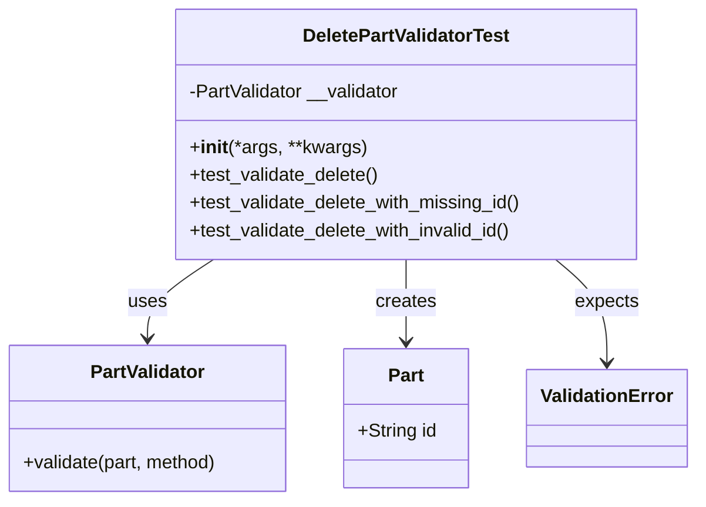
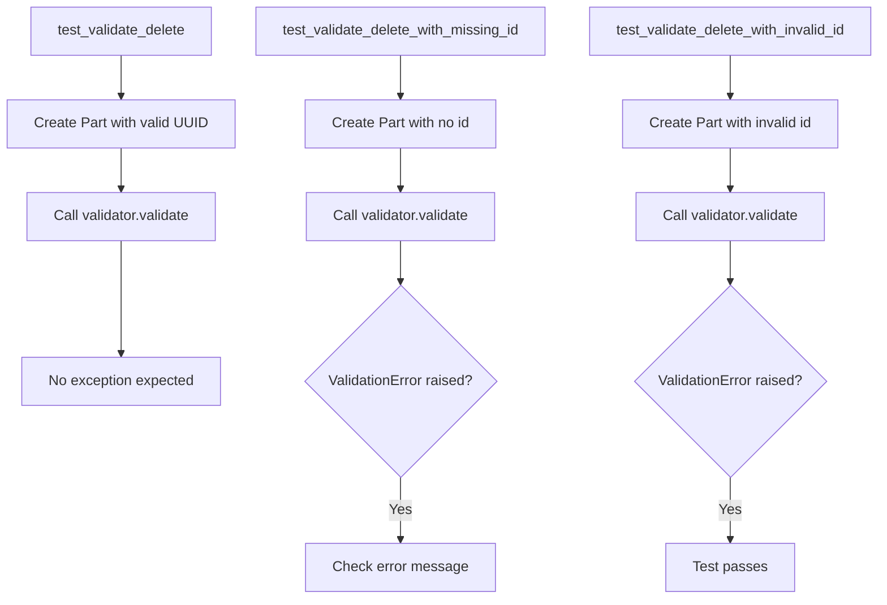

# Diagram: platform/partview_core/partview_service/partview_service/tests/unit/core/validators/part/part_delete_validator_test.py

> Auto-generated by Obscura crawlers

## Diagram 1

### SVG

<svg id="container" width="600.9609375" xmlns="http://www.w3.org/2000/svg" class="classDiagram" height="432" viewBox="0 0 600.9609375 432" role="graphics-document document" aria-roledescription="class"><g><defs><marker id="container_class-aggregationStart" class="marker aggregation class" refX="18" refY="7" markerWidth="190" markerHeight="240" orient="auto"><path d="M 18,7 L9,13 L1,7 L9,1 Z"></path></marker></defs><defs><marker id="container_class-aggregationEnd" class="marker aggregation class" refX="1" refY="7" markerWidth="20" markerHeight="28" orient="auto"><path d="M 18,7 L9,13 L1,7 L9,1 Z"></path></marker></defs><defs><marker id="container_class-extensionStart" class="marker extension class" refX="18" refY="7" markerWidth="190" markerHeight="240" orient="auto"><path d="M 1,7 L18,13 V 1 Z"></path></marker></defs><defs><marker id="container_class-extensionEnd" class="marker extension class" refX="1" refY="7" markerWidth="20" markerHeight="28" orient="auto"><path d="M 1,1 V 13 L18,7 Z"></path></marker></defs><defs><marker id="container_class-compositionStart" class="marker composition class" refX="18" refY="7" markerWidth="190" markerHeight="240" orient="auto"><path d="M 18,7 L9,13 L1,7 L9,1 Z"></path></marker></defs><defs><marker id="container_class-compositionEnd" class="marker composition class" refX="1" refY="7" markerWidth="20" markerHeight="28" orient="auto"><path d="M 18,7 L9,13 L1,7 L9,1 Z"></path></marker></defs><defs><marker id="container_class-dependencyStart" class="marker dependency class" refX="6" refY="7" markerWidth="190" markerHeight="240" orient="auto"><path d="M 5,7 L9,13 L1,7 L9,1 Z"></path></marker></defs><defs><marker id="container_class-dependencyEnd" class="marker dependency class" refX="13" refY="7" markerWidth="20" markerHeight="28" orient="auto"><path d="M 18,7 L9,13 L14,7 L9,1 Z"></path></marker></defs><defs><marker id="container_class-lollipopStart" class="marker lollipop class" refX="13" refY="7" markerWidth="190" markerHeight="240" orient="auto"><circle stroke="black" fill="transparent" cx="7" cy="7" r="6"></circle></marker></defs><defs><marker id="container_class-lollipopEnd" class="marker lollipop class" refX="1" refY="7" markerWidth="190" markerHeight="240" orient="auto"><circle stroke="black" fill="transparent" cx="7" cy="7" r="6"></circle></marker></defs><g class="root"><g class="clusters"></g><g class="edgePaths"><path d="M186.983,224L177.401,230.167C167.819,236.333,148.656,248.667,139.074,260C129.492,271.333,129.492,281.667,129.492,286.833L129.492,292" id="id_DeletePartValidatorTest_PartValidator_1" class="edge-thickness-normal edge-pattern-solid relation" style=";;;" data-edge="true" data-et="edge" data-id="id_DeletePartValidatorTest_PartValidator_1" data-points="W3sieCI6MTg2Ljk4MjczMTY4MTAzNDUsInkiOjIyNH0seyJ4IjoxMjkuNDkyMTg3NSwieSI6MjYxfSx7IngiOjEyOS40OTIxODc1LCJ5IjoyOTh9XQ==" marker-end="url(#container_class-dependencyEnd)"></path><path d="M354.793,224L354.793,230.167C354.793,236.333,354.793,248.667,354.793,260.5C354.793,272.333,354.793,283.667,354.793,289.333L354.793,295" id="id_DeletePartValidatorTest_Part_2" class="edge-thickness-normal edge-pattern-solid relation" style=";;;" data-edge="true" data-et="edge" data-id="id_DeletePartValidatorTest_Part_2" data-points="W3sieCI6MzU0Ljc5Mjk2ODc1LCJ5IjoyMjR9LHsieCI6MzU0Ljc5Mjk2ODc1LCJ5IjoyNjF9LHsieCI6MzU0Ljc5Mjk2ODc1LCJ5IjozMDF9XQ==" marker-end="url(#container_class-dependencyEnd)"></path><path d="M482.15,224L489.422,230.167C496.694,236.333,511.237,248.667,518.509,263.5C525.781,278.333,525.781,295.667,525.781,304.333L525.781,313" id="id_DeletePartValidatorTest_ValidationError_3" class="edge-thickness-normal edge-pattern-solid relation" style=";;;" data-edge="true" data-et="edge" data-id="id_DeletePartValidatorTest_ValidationError_3" data-points="W3sieCI6NDgyLjE0OTc1NzU0MzEwMzQsInkiOjIyNH0seyJ4Ijo1MjUuNzgxMjUsInkiOjI2MX0seyJ4Ijo1MjUuNzgxMjUsInkiOjMxOX1d" marker-end="url(#container_class-dependencyEnd)"></path></g><g class="edgeLabels"><g class="edgeLabel" transform="translate(129.4921875, 261)"><g class="label" data-id="id_DeletePartValidatorTest_PartValidator_1" transform="translate(-16.4921875, -12)"><foreignObject width="32.984375" height="24">

uses

</foreignObject></g></g><g class="edgeLabel" transform="translate(354.79296875, 261)"><g class="label" data-id="id_DeletePartValidatorTest_Part_2" transform="translate(-26.171875, -12)"><foreignObject width="52.34375" height="24">

creates

</foreignObject></g></g><g class="edgeLabel" transform="translate(525.78125, 261)"><g class="label" data-id="id_DeletePartValidatorTest_ValidationError_3" transform="translate(-27.734375, -12)"><foreignObject width="55.46875" height="24">

expects

</foreignObject></g></g></g><g class="nodes"><g class="node default" id="classId-DeletePartValidatorTest-0" transform="translate(354.79296875, 116)"><g class="basic label-container"><path d="M-200.5546875 -108 L200.5546875 -108 L200.5546875 108 L-200.5546875 108" stroke="none" stroke-width="0" fill="#ECECFF" style=""></path><path d="M-200.5546875 -108 C-70.50304855542666 -108, 59.54859038914668 -108, 200.5546875 -108 M-200.5546875 -108 C-84.69865232718074 -108, 31.157382845638523 -108, 200.5546875 -108 M200.5546875 -108 C200.5546875 -63.77270478471524, 200.5546875 -19.545409569430475, 200.5546875 108 M200.5546875 -108 C200.5546875 -59.200113630404395, 200.5546875 -10.40022726080879, 200.5546875 108 M200.5546875 108 C97.55742514023684 108, -5.439837219526311 108, -200.5546875 108 M200.5546875 108 C54.66247723060607 108, -91.22973303878786 108, -200.5546875 108 M-200.5546875 108 C-200.5546875 60.46206773156099, -200.5546875 12.924135463121985, -200.5546875 -108 M-200.5546875 108 C-200.5546875 62.016299071890586, -200.5546875 16.032598143781172, -200.5546875 -108" stroke="#9370DB" stroke-width="1.3" fill="none" stroke-dasharray="0 0" style=""></path></g><g class="annotation-group text" transform="translate(0, -84)"></g><g class="label-group text" transform="translate(-87.234375, -84)"><g class="label" style="font-weight: bolder" transform="translate(0,-12)"><foreignObject width="174.46875" height="24">

DeletePartValidatorTest

</foreignObject></g></g><g class="members-group text" transform="translate(-188.5546875, -36)"><g class="label" style="" transform="translate(0,-12)"><foreignObject width="185.78125" height="24">

-PartValidator __validator

</foreignObject></g></g><g class="methods-group text" transform="translate(-188.5546875, 12)"><g class="label" style="" transform="translate(0,-12)"><foreignObject width="151.8125" height="24">

+<strong>init</strong>(*args, **kwargs)

</foreignObject></g><g class="label" style="" transform="translate(0,12)"><foreignObject width="165.0625" height="24">

+test_validate_delete()

</foreignObject></g><g class="label" style="" transform="translate(0,36)"><foreignObject width="289.875" height="24">

+test_validate_delete_with_missing_id()

</foreignObject></g><g class="label" style="" transform="translate(0,60)"><foreignObject width="283.296875" height="24">

+test_validate_delete_with_invalid_id()

</foreignObject></g></g><g class="divider" style=""><path d="M-200.5546875 -60 C-59.872885942850985 -60, 80.80891561429803 -60, 200.5546875 -60 M-200.5546875 -60 C-40.64170622553635 -60, 119.2712750489273 -60, 200.5546875 -60" stroke="#9370DB" stroke-width="1.3" fill="none" stroke-dasharray="0 0" style=""></path></g><g class="divider" style=""><path d="M-200.5546875 -12 C-55.13345960891516 -12, 90.28776828216968 -12, 200.5546875 -12 M-200.5546875 -12 C-45.05944443914893 -12, 110.43579862170213 -12, 200.5546875 -12" stroke="#9370DB" stroke-width="1.3" fill="none" stroke-dasharray="0 0" style=""></path></g></g><g class="node default" id="classId-PartValidator-1" transform="translate(129.4921875, 361)"><g class="basic label-container"><path d="M-121.4921875 -63 L121.4921875 -63 L121.4921875 63 L-121.4921875 63" stroke="none" stroke-width="0" fill="#ECECFF" style=""></path><path d="M-121.4921875 -63 C-59.848613528381115 -63, 1.7949604432377697 -63, 121.4921875 -63 M-121.4921875 -63 C-67.17520008166542 -63, -12.85821266333086 -63, 121.4921875 -63 M121.4921875 -63 C121.4921875 -37.46825612399422, 121.4921875 -11.936512247988446, 121.4921875 63 M121.4921875 -63 C121.4921875 -16.623780631061138, 121.4921875 29.752438737877725, 121.4921875 63 M121.4921875 63 C47.9907944593793 63, -25.510598581241396 63, -121.4921875 63 M121.4921875 63 C68.63819928857366 63, 15.784211077147319 63, -121.4921875 63 M-121.4921875 63 C-121.4921875 20.169603826048352, -121.4921875 -22.660792347903296, -121.4921875 -63 M-121.4921875 63 C-121.4921875 17.912351154378683, -121.4921875 -27.175297691242633, -121.4921875 -63" stroke="#9370DB" stroke-width="1.3" fill="none" stroke-dasharray="0 0" style=""></path></g><g class="annotation-group text" transform="translate(0, -39)"></g><g class="label-group text" transform="translate(-48.25, -39)"><g class="label" style="font-weight: bolder" transform="translate(0,-12)"><foreignObject width="96.5" height="24">

PartValidator

</foreignObject></g></g><g class="members-group text" transform="translate(-109.4921875, 9)"></g><g class="methods-group text" transform="translate(-109.4921875, 39)"><g class="label" style="" transform="translate(0,-12)"><foreignObject width="170.734375" height="24">

+validate(part, method)

</foreignObject></g></g><g class="divider" style=""><path d="M-121.4921875 -15 C-53.65416797324917 -15, 14.183851553501654 -15, 121.4921875 -15 M-121.4921875 -15 C-50.87849021053917 -15, 19.73520707892166 -15, 121.4921875 -15" stroke="#9370DB" stroke-width="1.3" fill="none" stroke-dasharray="0 0" style=""></path></g><g class="divider" style=""><path d="M-121.4921875 9 C-24.596009078231816 9, 72.30016934353637 9, 121.4921875 9 M-121.4921875 9 C-62.82091966266035 9, -4.149651825320703 9, 121.4921875 9" stroke="#9370DB" stroke-width="1.3" fill="none" stroke-dasharray="0 0" style=""></path></g></g><g class="node default" id="classId-Part-2" transform="translate(354.79296875, 361)"><g class="basic label-container"><path d="M-53.80859375 -60 L53.80859375 -60 L53.80859375 60 L-53.80859375 60" stroke="none" stroke-width="0" fill="#ECECFF" style=""></path><path d="M-53.80859375 -60 C-11.989048322601008 -60, 29.830497104797985 -60, 53.80859375 -60 M-53.80859375 -60 C-24.78517149953471 -60, 4.2382507509305825 -60, 53.80859375 -60 M53.80859375 -60 C53.80859375 -14.022722864250376, 53.80859375 31.954554271499248, 53.80859375 60 M53.80859375 -60 C53.80859375 -19.75542703405148, 53.80859375 20.489145931897042, 53.80859375 60 M53.80859375 60 C16.42544251791366 60, -20.957708714172682 60, -53.80859375 60 M53.80859375 60 C11.235872033153619 60, -31.336849683692762 60, -53.80859375 60 M-53.80859375 60 C-53.80859375 25.91920692099646, -53.80859375 -8.161586158007083, -53.80859375 -60 M-53.80859375 60 C-53.80859375 14.66169229152191, -53.80859375 -30.67661541695618, -53.80859375 -60" stroke="#9370DB" stroke-width="1.3" fill="none" stroke-dasharray="0 0" style=""></path></g><g class="annotation-group text" transform="translate(0, -36)"></g><g class="label-group text" transform="translate(-15.0703125, -36)"><g class="label" style="font-weight: bolder" transform="translate(0,-12)"><foreignObject width="30.140625" height="24">

Part

</foreignObject></g></g><g class="members-group text" transform="translate(-41.80859375, 12)"><g class="label" style="" transform="translate(0,-12)"><foreignObject width="68.546875" height="24">

+String id

</foreignObject></g></g><g class="methods-group text" transform="translate(-41.80859375, 60)"></g><g class="divider" style=""><path d="M-53.80859375 -12 C-11.901765288076682 -12, 30.005063173846636 -12, 53.80859375 -12 M-53.80859375 -12 C-31.52911285038154 -12, -9.249631950763082 -12, 53.80859375 -12" stroke="#9370DB" stroke-width="1.3" fill="none" stroke-dasharray="0 0" style=""></path></g><g class="divider" style=""><path d="M-53.80859375 36 C-16.997527297612102 36, 19.813539154775796 36, 53.80859375 36 M-53.80859375 36 C-28.455223225798367 36, -3.1018527015967337 36, 53.80859375 36" stroke="#9370DB" stroke-width="1.3" fill="none" stroke-dasharray="0 0" style=""></path></g></g><g class="node default" id="classId-ValidationError-3" transform="translate(525.78125, 361)"><g class="basic label-container"><path d="M-67.1796875 -42 L67.1796875 -42 L67.1796875 42 L-67.1796875 42" stroke="none" stroke-width="0" fill="#ECECFF" style=""></path><path d="M-67.1796875 -42 C-16.346235701299555 -42, 34.48721609740089 -42, 67.1796875 -42 M-67.1796875 -42 C-32.46638067761083 -42, 2.2469261447783424 -42, 67.1796875 -42 M67.1796875 -42 C67.1796875 -25.087890272212658, 67.1796875 -8.175780544425315, 67.1796875 42 M67.1796875 -42 C67.1796875 -17.968027338467433, 67.1796875 6.063945323065134, 67.1796875 42 M67.1796875 42 C29.319889851913594 42, -8.539907796172812 42, -67.1796875 42 M67.1796875 42 C28.593851430436338 42, -9.991984639127324 42, -67.1796875 42 M-67.1796875 42 C-67.1796875 21.905834088433576, -67.1796875 1.8116681768671512, -67.1796875 -42 M-67.1796875 42 C-67.1796875 9.159287436663455, -67.1796875 -23.68142512667309, -67.1796875 -42" stroke="#9370DB" stroke-width="1.3" fill="none" stroke-dasharray="0 0" style=""></path></g><g class="annotation-group text" transform="translate(0, -18)"></g><g class="label-group text" transform="translate(-55.1796875, -18)"><g class="label" style="font-weight: bolder" transform="translate(0,-12)"><foreignObject width="110.359375" height="24">

ValidationError

</foreignObject></g></g><g class="members-group text" transform="translate(-55.1796875, 30)"></g><g class="methods-group text" transform="translate(-55.1796875, 60)"></g><g class="divider" style=""><path d="M-67.1796875 6 C-30.530000914110317 6, 6.119685671779365 6, 67.1796875 6 M-67.1796875 6 C-36.5268668169747 6, -5.874046133949399 6, 67.1796875 6" stroke="#9370DB" stroke-width="1.3" fill="none" stroke-dasharray="0 0" style=""></path></g><g class="divider" style=""><path d="M-67.1796875 24 C-29.11016200918108 24, 8.959363481637837 24, 67.1796875 24 M-67.1796875 24 C-27.87059769780587 24, 11.43849210438826 24, 67.1796875 24" stroke="#9370DB" stroke-width="1.3" fill="none" stroke-dasharray="0 0" style=""></path></g></g></g></g></g></svg>

## Diagram 2

### SVG

<svg id="container" width="1003.1640625" xmlns="http://www.w3.org/2000/svg" class="flowchart" height="675.25" viewBox="0 0 1003.1640625 675.25" role="graphics-document document" aria-roledescription="flowchart-v2"><g><marker id="container_flowchart-v2-pointEnd" class="marker flowchart-v2" viewBox="0 0 10 10" refX="5" refY="5" markerUnits="userSpaceOnUse" markerWidth="8" markerHeight="8" orient="auto"><path d="M 0 0 L 10 5 L 0 10 z" class="arrowMarkerPath" style="stroke-width: 1; stroke-dasharray: 1, 0;"></path></marker><marker id="container_flowchart-v2-pointStart" class="marker flowchart-v2" viewBox="0 0 10 10" refX="4.5" refY="5" markerUnits="userSpaceOnUse" markerWidth="8" markerHeight="8" orient="auto"><path d="M 0 5 L 10 10 L 10 0 z" class="arrowMarkerPath" style="stroke-width: 1; stroke-dasharray: 1, 0;"></path></marker><marker id="container_flowchart-v2-circleEnd" class="marker flowchart-v2" viewBox="0 0 10 10" refX="11" refY="5" markerUnits="userSpaceOnUse" markerWidth="11" markerHeight="11" orient="auto"><circle cx="5" cy="5" r="5" class="arrowMarkerPath" style="stroke-width: 1; stroke-dasharray: 1, 0;"></circle></marker><marker id="container_flowchart-v2-circleStart" class="marker flowchart-v2" viewBox="0 0 10 10" refX="-1" refY="5" markerUnits="userSpaceOnUse" markerWidth="11" markerHeight="11" orient="auto"><circle cx="5" cy="5" r="5" class="arrowMarkerPath" style="stroke-width: 1; stroke-dasharray: 1, 0;"></circle></marker><marker id="container_flowchart-v2-crossEnd" class="marker cross flowchart-v2" viewBox="0 0 11 11" refX="12" refY="5.2" markerUnits="userSpaceOnUse" markerWidth="11" markerHeight="11" orient="auto"><path d="M 1,1 l 9,9 M 10,1 l -9,9" class="arrowMarkerPath" style="stroke-width: 2; stroke-dasharray: 1, 0;"></path></marker><marker id="container_flowchart-v2-crossStart" class="marker cross flowchart-v2" viewBox="0 0 11 11" refX="-1" refY="5.2" markerUnits="userSpaceOnUse" markerWidth="11" markerHeight="11" orient="auto"><path d="M 1,1 l 9,9 M 10,1 l -9,9" class="arrowMarkerPath" style="stroke-width: 2; stroke-dasharray: 1, 0;"></path></marker><g class="root"><g class="clusters"></g><g class="edgePaths"><path d="M135.125,62L135.125,66.167C135.125,70.333,135.125,78.667,135.125,86.333C135.125,94,135.125,101,135.125,104.5L135.125,108" id="L_A_B_0" class="edge-thickness-normal edge-pattern-solid edge-thickness-normal edge-pattern-solid flowchart-link" style=";" data-edge="true" data-et="edge" data-id="L_A_B_0" data-points="W3sieCI6MTM1LjEyNSwieSI6NjJ9LHsieCI6MTM1LjEyNSwieSI6ODd9LHsieCI6MTM1LjEyNSwieSI6MTEyfV0=" marker-end="url(#container_flowchart-v2-pointEnd)"></path><path d="M135.125,166L135.125,170.167C135.125,174.333,135.125,182.667,135.125,190.333C135.125,198,135.125,205,135.125,208.5L135.125,212" id="L_B_C_0" class="edge-thickness-normal edge-pattern-solid edge-thickness-normal edge-pattern-solid flowchart-link" style=";" data-edge="true" data-et="edge" data-id="L_B_C_0" data-points="W3sieCI6MTM1LjEyNSwieSI6MTY2fSx7IngiOjEzNS4xMjUsInkiOjE5MX0seyJ4IjoxMzUuMTI1LCJ5IjoyMTZ9XQ==" marker-end="url(#container_flowchart-v2-pointEnd)"></path><path d="M135.125,270L135.125,274.167C135.125,278.333,135.125,286.667,135.125,308.104C135.125,329.542,135.125,364.083,135.125,381.354L135.125,398.625" id="L_C_D_0" class="edge-thickness-normal edge-pattern-solid edge-thickness-normal edge-pattern-solid flowchart-link" style=";" data-edge="true" data-et="edge" data-id="L_C_D_0" data-points="W3sieCI6MTM1LjEyNSwieSI6MjcwfSx7IngiOjEzNS4xMjUsInkiOjI5NX0seyJ4IjoxMzUuMTI1LCJ5Ijo0MDIuNjI1fV0=" marker-end="url(#container_flowchart-v2-pointEnd)"></path><path d="M454.328,62L454.328,66.167C454.328,70.333,454.328,78.667,454.328,86.333C454.328,94,454.328,101,454.328,104.5L454.328,108" id="L_E_F_0" class="edge-thickness-normal edge-pattern-solid edge-thickness-normal edge-pattern-solid flowchart-link" style=";" data-edge="true" data-et="edge" data-id="L_E_F_0" data-points="W3sieCI6NDU0LjMyODEyNSwieSI6NjJ9LHsieCI6NDU0LjMyODEyNSwieSI6ODd9LHsieCI6NDU0LjMyODEyNSwieSI6MTEyfV0=" marker-end="url(#container_flowchart-v2-pointEnd)"></path><path d="M454.328,166L454.328,170.167C454.328,174.333,454.328,182.667,454.328,190.333C454.328,198,454.328,205,454.328,208.5L454.328,212" id="L_F_G_0" class="edge-thickness-normal edge-pattern-solid edge-thickness-normal edge-pattern-solid flowchart-link" style=";" data-edge="true" data-et="edge" data-id="L_F_G_0" data-points="W3sieCI6NDU0LjMyODEyNSwieSI6MTY2fSx7IngiOjQ1NC4zMjgxMjUsInkiOjE5MX0seyJ4Ijo0NTQuMzI4MTI1LCJ5IjoyMTZ9XQ==" marker-end="url(#container_flowchart-v2-pointEnd)"></path><path d="M454.328,270L454.328,274.167C454.328,278.333,454.328,286.667,454.328,294.333C454.328,302,454.328,309,454.328,312.5L454.328,316" id="L_G_H_0" class="edge-thickness-normal edge-pattern-solid edge-thickness-normal edge-pattern-solid flowchart-link" style=";" data-edge="true" data-et="edge" data-id="L_G_H_0" data-points="W3sieCI6NDU0LjMyODEyNSwieSI6MjcwfSx7IngiOjQ1NC4zMjgxMjUsInkiOjI5NX0seyJ4Ijo0NTQuMzI4MTI1LCJ5IjozMjB9XQ==" marker-end="url(#container_flowchart-v2-pointEnd)"></path><path d="M454.328,539.25L454.328,545.417C454.328,551.583,454.328,563.917,454.328,575.583C454.328,587.25,454.328,598.25,454.328,603.75L454.328,609.25" id="L_H_I_0" class="edge-thickness-normal edge-pattern-solid edge-thickness-normal edge-pattern-solid flowchart-link" style=";" data-edge="true" data-et="edge" data-id="L_H_I_0" data-points="W3sieCI6NDU0LjMyODEyNSwieSI6NTM5LjI1fSx7IngiOjQ1NC4zMjgxMjUsInkiOjU3Ni4yNX0seyJ4Ijo0NTQuMzI4MTI1LCJ5Ijo2MTMuMjV9XQ==" marker-end="url(#container_flowchart-v2-pointEnd)"></path><path d="M832.648,62L832.648,66.167C832.648,70.333,832.648,78.667,832.648,86.333C832.648,94,832.648,101,832.648,104.5L832.648,108" id="L_J_K_0" class="edge-thickness-normal edge-pattern-solid edge-thickness-normal edge-pattern-solid flowchart-link" style=";" data-edge="true" data-et="edge" data-id="L_J_K_0" data-points="W3sieCI6ODMyLjY0ODQzNzUsInkiOjYyfSx7IngiOjgzMi42NDg0Mzc1LCJ5Ijo4N30seyJ4Ijo4MzIuNjQ4NDM3NSwieSI6MTEyfV0=" marker-end="url(#container_flowchart-v2-pointEnd)"></path><path d="M832.648,166L832.648,170.167C832.648,174.333,832.648,182.667,832.648,190.333C832.648,198,832.648,205,832.648,208.5L832.648,212" id="L_K_L_0" class="edge-thickness-normal edge-pattern-solid edge-thickness-normal edge-pattern-solid flowchart-link" style=";" data-edge="true" data-et="edge" data-id="L_K_L_0" data-points="W3sieCI6ODMyLjY0ODQzNzUsInkiOjE2Nn0seyJ4Ijo4MzIuNjQ4NDM3NSwieSI6MTkxfSx7IngiOjgzMi42NDg0Mzc1LCJ5IjoyMTZ9XQ==" marker-end="url(#container_flowchart-v2-pointEnd)"></path><path d="M832.648,270L832.648,274.167C832.648,278.333,832.648,286.667,832.648,294.333C832.648,302,832.648,309,832.648,312.5L832.648,316" id="L_L_M_0" class="edge-thickness-normal edge-pattern-solid edge-thickness-normal edge-pattern-solid flowchart-link" style=";" data-edge="true" data-et="edge" data-id="L_L_M_0" data-points="W3sieCI6ODMyLjY0ODQzNzUsInkiOjI3MH0seyJ4Ijo4MzIuNjQ4NDM3NSwieSI6Mjk1fSx7IngiOjgzMi42NDg0Mzc1LCJ5IjozMjB9XQ==" marker-end="url(#container_flowchart-v2-pointEnd)"></path><path d="M832.648,539.25L832.648,545.417C832.648,551.583,832.648,563.917,832.648,575.583C832.648,587.25,832.648,598.25,832.648,603.75L832.648,609.25" id="L_M_N_0" class="edge-thickness-normal edge-pattern-solid edge-thickness-normal edge-pattern-solid flowchart-link" style=";" data-edge="true" data-et="edge" data-id="L_M_N_0" data-points="W3sieCI6ODMyLjY0ODQzNzUsInkiOjUzOS4yNX0seyJ4Ijo4MzIuNjQ4NDM3NSwieSI6NTc2LjI1fSx7IngiOjgzMi42NDg0Mzc1LCJ5Ijo2MTMuMjV9XQ==" marker-end="url(#container_flowchart-v2-pointEnd)"></path></g><g class="edgeLabels"><g class="edgeLabel"><g class="label" data-id="L_A_B_0" transform="translate(0, 0)"><foreignObject width="0" height="0">

</foreignObject></g></g><g class="edgeLabel"><g class="label" data-id="L_B_C_0" transform="translate(0, 0)"><foreignObject width="0" height="0">

</foreignObject></g></g><g class="edgeLabel"><g class="label" data-id="L_C_D_0" transform="translate(0, 0)"><foreignObject width="0" height="0">

</foreignObject></g></g><g class="edgeLabel"><g class="label" data-id="L_E_F_0" transform="translate(0, 0)"><foreignObject width="0" height="0">

</foreignObject></g></g><g class="edgeLabel"><g class="label" data-id="L_F_G_0" transform="translate(0, 0)"><foreignObject width="0" height="0">

</foreignObject></g></g><g class="edgeLabel"><g class="label" data-id="L_G_H_0" transform="translate(0, 0)"><foreignObject width="0" height="0">

</foreignObject></g></g><g class="edgeLabel" transform="translate(454.328125, 576.25)"><g class="label" data-id="L_H_I_0" transform="translate(-12.03125, -12)"><foreignObject width="24.0625" height="24">

Yes

</foreignObject></g></g><g class="edgeLabel"><g class="label" data-id="L_J_K_0" transform="translate(0, 0)"><foreignObject width="0" height="0">

</foreignObject></g></g><g class="edgeLabel"><g class="label" data-id="L_K_L_0" transform="translate(0, 0)"><foreignObject width="0" height="0">

</foreignObject></g></g><g class="edgeLabel"><g class="label" data-id="L_L_M_0" transform="translate(0, 0)"><foreignObject width="0" height="0">

</foreignObject></g></g><g class="edgeLabel" transform="translate(832.6484375, 576.25)"><g class="label" data-id="L_M_N_0" transform="translate(-12.03125, -12)"><foreignObject width="24.0625" height="24">

Yes

</foreignObject></g></g></g><g class="nodes"><g class="node default" id="flowchart-A-0" transform="translate(135.125, 35)"><rect class="basic label-container" style="" x="-103.3984375" y="-27" width="206.796875" height="54"></rect><g class="label" style="" transform="translate(-73.3984375, -12)"><rect></rect><foreignObject width="146.796875" height="24">

test_validate_delete

</foreignObject></g></g><g class="node default" id="flowchart-B-1" transform="translate(135.125, 139)"><rect class="basic label-container" style="" x="-127.125" y="-27" width="254.25" height="54"></rect><g class="label" style="" transform="translate(-97.125, -12)"><rect></rect><foreignObject width="194.25" height="24">

Create Part with valid UUID

</foreignObject></g></g><g class="node default" id="flowchart-C-3" transform="translate(135.125, 243)"><rect class="basic label-container" style="" x="-107.734375" y="-27" width="215.46875" height="54"></rect><g class="label" style="" transform="translate(-77.734375, -12)"><rect></rect><foreignObject width="155.46875" height="24">

Call validator.validate

</foreignObject></g></g><g class="node default" id="flowchart-D-5" transform="translate(135.125, 429.625)"><rect class="basic label-container" style="" x="-112.7734375" y="-27" width="225.546875" height="54"></rect><g class="label" style="" transform="translate(-82.7734375, -12)"><rect></rect><foreignObject width="165.546875" height="24">

No exception expected

</foreignObject></g></g><g class="node default" id="flowchart-E-6" transform="translate(454.328125, 35)"><rect class="basic label-container" style="" x="-165.8046875" y="-27" width="331.609375" height="54"></rect><g class="label" style="" transform="translate(-135.8046875, -12)"><rect></rect><foreignObject width="271.609375" height="24">

test_validate_delete_with_missing_id

</foreignObject></g></g><g class="node default" id="flowchart-F-7" transform="translate(454.328125, 139)"><rect class="basic label-container" style="" x="-107.953125" y="-27" width="215.90625" height="54"></rect><g class="label" style="" transform="translate(-77.953125, -12)"><rect></rect><foreignObject width="155.90625" height="24">

Create Part with no id

</foreignObject></g></g><g class="node default" id="flowchart-G-9" transform="translate(454.328125, 243)"><rect class="basic label-container" style="" x="-107.734375" y="-27" width="215.46875" height="54"></rect><g class="label" style="" transform="translate(-77.734375, -12)"><rect></rect><foreignObject width="155.46875" height="24">

Call validator.validate

</foreignObject></g></g><g class="node default" id="flowchart-H-11" transform="translate(454.328125, 429.625)"><polygon points="109.625,0 219.25,-109.625 109.625,-219.25 0,-109.625" class="label-container" transform="translate(-109.125, 109.625)"></polygon><g class="label" style="" transform="translate(-82.625, -12)"><rect></rect><foreignObject width="165.25" height="24">

ValidationError raised?

</foreignObject></g></g><g class="node default" id="flowchart-I-13" transform="translate(454.328125, 640.25)"><rect class="basic label-container" style="" x="-104.859375" y="-27" width="209.71875" height="54"></rect><g class="label" style="" transform="translate(-74.859375, -12)"><rect></rect><foreignObject width="149.71875" height="24">

Check error message

</foreignObject></g></g><g class="node default" id="flowchart-J-14" transform="translate(832.6484375, 35)"><rect class="basic label-container" style="" x="-162.515625" y="-27" width="325.03125" height="54"></rect><g class="label" style="" transform="translate(-132.515625, -12)"><rect></rect><foreignObject width="265.03125" height="24">

test_validate_delete_with_invalid_id

</foreignObject></g></g><g class="node default" id="flowchart-K-15" transform="translate(832.6484375, 139)"><rect class="basic label-container" style="" x="-122.9453125" y="-27" width="245.890625" height="54"></rect><g class="label" style="" transform="translate(-92.9453125, -12)"><rect></rect><foreignObject width="185.890625" height="24">

Create Part with invalid id

</foreignObject></g></g><g class="node default" id="flowchart-L-17" transform="translate(832.6484375, 243)"><rect class="basic label-container" style="" x="-107.734375" y="-27" width="215.46875" height="54"></rect><g class="label" style="" transform="translate(-77.734375, -12)"><rect></rect><foreignObject width="155.46875" height="24">

Call validator.validate

</foreignObject></g></g><g class="node default" id="flowchart-M-19" transform="translate(832.6484375, 429.625)"><polygon points="109.625,0 219.25,-109.625 109.625,-219.25 0,-109.625" class="label-container" transform="translate(-109.125, 109.625)"></polygon><g class="label" style="" transform="translate(-82.625, -12)"><rect></rect><foreignObject width="165.25" height="24">

ValidationError raised?

</foreignObject></g></g><g class="node default" id="flowchart-N-21" transform="translate(832.6484375, 640.25)"><rect class="basic label-container" style="" x="-71.234375" y="-27" width="142.46875" height="54"></rect><g class="label" style="" transform="translate(-41.234375, -12)"><rect></rect><foreignObject width="82.46875" height="24">

Test passes

</foreignObject></g></g></g></g></g></svg>
