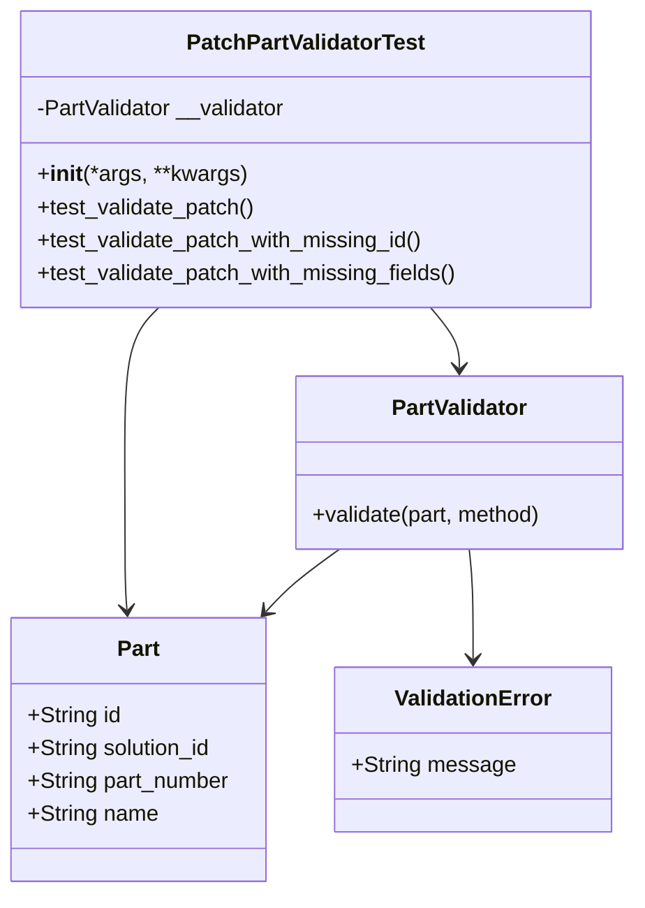
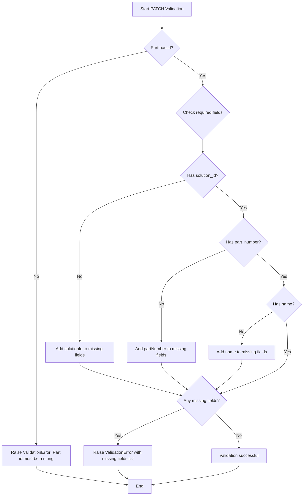
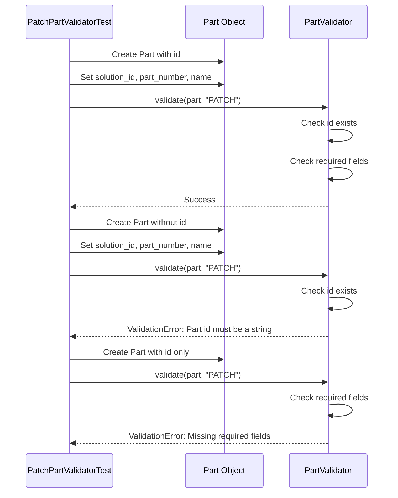

# Diagram: platform/partview_core/partview_service/partview_service/tests/unit/core/validators/part/part_patch_validator_test.py

> Auto-generated by Obscura crawlers

## Diagram 1

### SVG

<svg id="container" width="464.17578125" xmlns="http://www.w3.org/2000/svg" class="classDiagram" height="650" viewBox="0 0 464.17578125 650" role="graphics-document document" aria-roledescription="class"><g><defs><marker id="container_class-aggregationStart" class="marker aggregation class" refX="18" refY="7" markerWidth="190" markerHeight="240" orient="auto"><path d="M 18,7 L9,13 L1,7 L9,1 Z"></path></marker></defs><defs><marker id="container_class-aggregationEnd" class="marker aggregation class" refX="1" refY="7" markerWidth="20" markerHeight="28" orient="auto"><path d="M 18,7 L9,13 L1,7 L9,1 Z"></path></marker></defs><defs><marker id="container_class-extensionStart" class="marker extension class" refX="18" refY="7" markerWidth="190" markerHeight="240" orient="auto"><path d="M 1,7 L18,13 V 1 Z"></path></marker></defs><defs><marker id="container_class-extensionEnd" class="marker extension class" refX="1" refY="7" markerWidth="20" markerHeight="28" orient="auto"><path d="M 1,1 V 13 L18,7 Z"></path></marker></defs><defs><marker id="container_class-compositionStart" class="marker composition class" refX="18" refY="7" markerWidth="190" markerHeight="240" orient="auto"><path d="M 18,7 L9,13 L1,7 L9,1 Z"></path></marker></defs><defs><marker id="container_class-compositionEnd" class="marker composition class" refX="1" refY="7" markerWidth="20" markerHeight="28" orient="auto"><path d="M 18,7 L9,13 L1,7 L9,1 Z"></path></marker></defs><defs><marker id="container_class-dependencyStart" class="marker dependency class" refX="6" refY="7" markerWidth="190" markerHeight="240" orient="auto"><path d="M 5,7 L9,13 L1,7 L9,1 Z"></path></marker></defs><defs><marker id="container_class-dependencyEnd" class="marker dependency class" refX="13" refY="7" markerWidth="20" markerHeight="28" orient="auto"><path d="M 18,7 L9,13 L14,7 L9,1 Z"></path></marker></defs><defs><marker id="container_class-lollipopStart" class="marker lollipop class" refX="13" refY="7" markerWidth="190" markerHeight="240" orient="auto"><circle stroke="black" fill="transparent" cx="7" cy="7" r="6"></circle></marker></defs><defs><marker id="container_class-lollipopEnd" class="marker lollipop class" refX="1" refY="7" markerWidth="190" markerHeight="240" orient="auto"><circle stroke="black" fill="transparent" cx="7" cy="7" r="6"></circle></marker></defs><g class="root"><g class="clusters"></g><g class="edgePaths"><path d="M313.786,224L317.269,228.167C320.752,232.333,327.718,240.667,331.201,248C334.684,255.333,334.684,261.667,334.684,264.833L334.684,268" id="id_PatchPartValidatorTest_PartValidator_1" class="edge-thickness-normal edge-pattern-solid relation" style=";;;" data-edge="true" data-et="edge" data-id="id_PatchPartValidatorTest_PartValidator_1" data-points="W3sieCI6MzEzLjc4NTg5MDUwNzUxODgsInkiOjIyNH0seyJ4IjozMzQuNjgzNTkzNzUsInkiOjI0OX0seyJ4IjozMzQuNjgzNTkzNzUsInkiOjI3NH1d" marker-end="url(#container_class-dependencyEnd)"></path><path d="M116.989,224L112.88,228.167C108.77,232.333,100.551,240.667,96.442,259.5C92.332,278.333,92.332,307.667,92.332,337C92.332,366.333,92.332,395.667,92.594,413.503C92.856,431.34,93.38,437.68,93.642,440.85L93.904,444.02" id="id_PatchPartValidatorTest_Part_2" class="edge-thickness-normal edge-pattern-solid relation" style=";;;" data-edge="true" data-et="edge" data-id="id_PatchPartValidatorTest_Part_2" data-points="W3sieCI6MTE2Ljk4OTEzMjk4ODcyMTgsInkiOjIyNH0seyJ4Ijo5Mi4zMzIwMzEyNSwieSI6MjQ5fSx7IngiOjkyLjMzMjAzMTI1LCJ5IjozMzd9LHsieCI6OTIuMzMyMDMxMjUsInkiOjQyNX0seyJ4Ijo5NC4zOTgxNDY5NTI0NzkzNCwieSI6NDUwfV0=" marker-end="url(#container_class-dependencyEnd)"></path><path d="M247.933,400L242.195,404.167C236.458,408.333,224.983,416.667,216.094,424.264C207.204,431.861,200.901,438.721,197.749,442.151L194.597,445.582" id="id_PartValidator_Part_3" class="edge-thickness-normal edge-pattern-solid relation" style=";;;" data-edge="true" data-et="edge" data-id="id_PartValidator_Part_3" data-points="W3sieCI6MjQ3LjkzMjc1MDM1NTExMzYzLCJ5Ijo0MDB9LHsieCI6MjEzLjUwNzgxMjUsInkiOjQyNX0seyJ4IjoxOTAuNTM3NjA5NzYyMzk2NywieSI6NDUwfV0=" marker-end="url(#container_class-dependencyEnd)"></path><path d="M341.843,400L342.316,404.167C342.79,408.333,343.737,416.667,344.21,430C344.684,443.333,344.684,461.667,344.684,470.833L344.684,480" id="id_PartValidator_ValidationError_4" class="edge-thickness-normal edge-pattern-solid relation" style=";;;" data-edge="true" data-et="edge" data-id="id_PartValidator_ValidationError_4" data-points="W3sieCI6MzQxLjg0MjY4NDY1OTA5MDkzLCJ5Ijo0MDB9LHsieCI6MzQ0LjY4MzU5Mzc1LCJ5Ijo0MjV9LHsieCI6MzQ0LjY4MzU5Mzc1LCJ5Ijo0ODZ9XQ==" marker-end="url(#container_class-dependencyEnd)"></path></g><g class="edgeLabels"><g class="edgeLabel"><g class="label" data-id="id_PatchPartValidatorTest_PartValidator_1" transform="translate(0, 0)"><foreignObject width="0" height="0">

</foreignObject></g></g><g class="edgeLabel"><g class="label" data-id="id_PatchPartValidatorTest_Part_2" transform="translate(0, 0)"><foreignObject width="0" height="0">

</foreignObject></g></g><g class="edgeLabel"><g class="label" data-id="id_PartValidator_Part_3" transform="translate(0, 0)"><foreignObject width="0" height="0">

</foreignObject></g></g><g class="edgeLabel"><g class="label" data-id="id_PartValidator_ValidationError_4" transform="translate(0, 0)"><foreignObject width="0" height="0">

</foreignObject></g></g></g><g class="nodes"><g class="node default" id="classId-PatchPartValidatorTest-0" transform="translate(223.5078125, 116)"><g class="basic label-container"><path d="M-209.0390625 -108 L209.0390625 -108 L209.0390625 108 L-209.0390625 108" stroke="none" stroke-width="0" fill="#ECECFF" style=""></path><path d="M-209.0390625 -108 C-74.64499855326079 -108, 59.74906539347842 -108, 209.0390625 -108 M-209.0390625 -108 C-73.06739829321319 -108, 62.904265913573624 -108, 209.0390625 -108 M209.0390625 -108 C209.0390625 -61.286821256872685, 209.0390625 -14.57364251374537, 209.0390625 108 M209.0390625 -108 C209.0390625 -29.152510438403652, 209.0390625 49.694979123192695, 209.0390625 108 M209.0390625 108 C100.12271611808343 108, -8.793630263833137 108, -209.0390625 108 M209.0390625 108 C48.37506605682296 108, -112.28893038635408 108, -209.0390625 108 M-209.0390625 108 C-209.0390625 39.673131590509925, -209.0390625 -28.65373681898015, -209.0390625 -108 M-209.0390625 108 C-209.0390625 27.313798552167015, -209.0390625 -53.37240289566597, -209.0390625 -108" stroke="#9370DB" stroke-width="1.3" fill="none" stroke-dasharray="0 0" style=""></path></g><g class="annotation-group text" transform="translate(0, -84)"></g><g class="label-group text" transform="translate(-83.65625, -84)"><g class="label" style="font-weight: bolder" transform="translate(0,-12)"><foreignObject width="167.3125" height="24">

PatchPartValidatorTest

</foreignObject></g></g><g class="members-group text" transform="translate(-197.0390625, -36)"><g class="label" style="" transform="translate(0,-12)"><foreignObject width="185.78125" height="24">

-PartValidator __validator

</foreignObject></g></g><g class="methods-group text" transform="translate(-197.0390625, 12)"><g class="label" style="" transform="translate(0,-12)"><foreignObject width="151.8125" height="24">

+<strong>init</strong>(*args, **kwargs)

</foreignObject></g><g class="label" style="" transform="translate(0,12)"><foreignObject width="160.125" height="24">

+test_validate_patch()

</foreignObject></g><g class="label" style="" transform="translate(0,36)"><foreignObject width="285.25" height="24">

+test_validate_patch_with_missing_id()

</foreignObject></g><g class="label" style="" transform="translate(0,60)"><foreignObject width="310.421875" height="24">

+test_validate_patch_with_missing_fields()

</foreignObject></g></g><g class="divider" style=""><path d="M-209.0390625 -60 C-74.64137303233906 -60, 59.75631643532188 -60, 209.0390625 -60 M-209.0390625 -60 C-75.24119781042492 -60, 58.55666687915016 -60, 209.0390625 -60" stroke="#9370DB" stroke-width="1.3" fill="none" stroke-dasharray="0 0" style=""></path></g><g class="divider" style=""><path d="M-209.0390625 -12 C-52.064921894886766 -12, 104.90921871022647 -12, 209.0390625 -12 M-209.0390625 -12 C-123.81435615646761 -12, -38.58964981293522 -12, 209.0390625 -12" stroke="#9370DB" stroke-width="1.3" fill="none" stroke-dasharray="0 0" style=""></path></g></g><g class="node default" id="classId-PartValidator-1" transform="translate(334.68359375, 337)"><g class="basic label-container"><path d="M-121.4921875 -63 L121.4921875 -63 L121.4921875 63 L-121.4921875 63" stroke="none" stroke-width="0" fill="#ECECFF" style=""></path><path d="M-121.4921875 -63 C-29.90044087155276 -63, 61.69130575689448 -63, 121.4921875 -63 M-121.4921875 -63 C-35.99064088196705 -63, 49.510905736065894 -63, 121.4921875 -63 M121.4921875 -63 C121.4921875 -15.654672933105836, 121.4921875 31.69065413378833, 121.4921875 63 M121.4921875 -63 C121.4921875 -25.137965483461564, 121.4921875 12.724069033076873, 121.4921875 63 M121.4921875 63 C30.089728495248195 63, -61.31273050950361 63, -121.4921875 63 M121.4921875 63 C53.74921673744008 63, -13.993754025119841 63, -121.4921875 63 M-121.4921875 63 C-121.4921875 27.864334661109105, -121.4921875 -7.2713306777817905, -121.4921875 -63 M-121.4921875 63 C-121.4921875 26.522364723478347, -121.4921875 -9.955270553043306, -121.4921875 -63" stroke="#9370DB" stroke-width="1.3" fill="none" stroke-dasharray="0 0" style=""></path></g><g class="annotation-group text" transform="translate(0, -39)"></g><g class="label-group text" transform="translate(-48.25, -39)"><g class="label" style="font-weight: bolder" transform="translate(0,-12)"><foreignObject width="96.5" height="24">

PartValidator

</foreignObject></g></g><g class="members-group text" transform="translate(-109.4921875, 9)"></g><g class="methods-group text" transform="translate(-109.4921875, 39)"><g class="label" style="" transform="translate(0,-12)"><foreignObject width="170.734375" height="24">

+validate(part, method)

</foreignObject></g></g><g class="divider" style=""><path d="M-121.4921875 -15 C-33.709495095968876 -15, 54.07319730806225 -15, 121.4921875 -15 M-121.4921875 -15 C-57.97621906035792 -15, 5.53974937928416 -15, 121.4921875 -15" stroke="#9370DB" stroke-width="1.3" fill="none" stroke-dasharray="0 0" style=""></path></g><g class="divider" style=""><path d="M-121.4921875 9 C-56.98142716791459 9, 7.529333164170822 9, 121.4921875 9 M-121.4921875 9 C-71.88282071871029 9, -22.273453937420598 9, 121.4921875 9" stroke="#9370DB" stroke-width="1.3" fill="none" stroke-dasharray="0 0" style=""></path></g></g><g class="node default" id="classId-Part-2" transform="translate(102.33203125, 546)"><g class="basic label-container"><path d="M-94.33203125 -96 L94.33203125 -96 L94.33203125 96 L-94.33203125 96" stroke="none" stroke-width="0" fill="#ECECFF" style=""></path><path d="M-94.33203125 -96 C-50.32785079666185 -96, -6.323670343323698 -96, 94.33203125 -96 M-94.33203125 -96 C-41.916536695168055 -96, 10.49895785966389 -96, 94.33203125 -96 M94.33203125 -96 C94.33203125 -28.236578474514317, 94.33203125 39.526843050971365, 94.33203125 96 M94.33203125 -96 C94.33203125 -29.684142735771346, 94.33203125 36.63171452845731, 94.33203125 96 M94.33203125 96 C39.73521138449941 96, -14.861608481001184 96, -94.33203125 96 M94.33203125 96 C23.20055107859605 96, -47.9309290928079 96, -94.33203125 96 M-94.33203125 96 C-94.33203125 32.586659217238584, -94.33203125 -30.826681565522833, -94.33203125 -96 M-94.33203125 96 C-94.33203125 50.485820271326446, -94.33203125 4.971640542652892, -94.33203125 -96" stroke="#9370DB" stroke-width="1.3" fill="none" stroke-dasharray="0 0" style=""></path></g><g class="annotation-group text" transform="translate(0, -72)"></g><g class="label-group text" transform="translate(-15.0703125, -72)"><g class="label" style="font-weight: bolder" transform="translate(0,-12)"><foreignObject width="30.140625" height="24">

Part

</foreignObject></g></g><g class="members-group text" transform="translate(-82.33203125, -24)"><g class="label" style="" transform="translate(0,-12)"><foreignObject width="68.546875" height="24">

+String id

</foreignObject></g><g class="label" style="" transform="translate(0,12)"><foreignObject width="136.703125" height="24">

+String solution_id

</foreignObject></g><g class="label" style="" transform="translate(0,36)"><foreignObject width="149.59375" height="24">

+String part_number

</foreignObject></g><g class="label" style="" transform="translate(0,60)"><foreignObject width="94.984375" height="24">

+String name

</foreignObject></g></g><g class="methods-group text" transform="translate(-82.33203125, 96)"></g><g class="divider" style=""><path d="M-94.33203125 -48 C-37.17984660828763 -48, 19.972338033424734 -48, 94.33203125 -48 M-94.33203125 -48 C-21.897448325708154 -48, 50.53713459858369 -48, 94.33203125 -48" stroke="#9370DB" stroke-width="1.3" fill="none" stroke-dasharray="0 0" style=""></path></g><g class="divider" style=""><path d="M-94.33203125 72 C-42.91407892053476 72, 8.503873408930474 72, 94.33203125 72 M-94.33203125 72 C-26.899515688807128 72, 40.532999872385744 72, 94.33203125 72" stroke="#9370DB" stroke-width="1.3" fill="none" stroke-dasharray="0 0" style=""></path></g></g><g class="node default" id="classId-ValidationError-3" transform="translate(344.68359375, 546)"><g class="basic label-container"><path d="M-98.01953125 -60 L98.01953125 -60 L98.01953125 60 L-98.01953125 60" stroke="none" stroke-width="0" fill="#ECECFF" style=""></path><path d="M-98.01953125 -60 C-47.75582760513985 -60, 2.5078760397203013 -60, 98.01953125 -60 M-98.01953125 -60 C-47.38387890493659 -60, 3.2517734401268257 -60, 98.01953125 -60 M98.01953125 -60 C98.01953125 -24.852980109527437, 98.01953125 10.294039780945127, 98.01953125 60 M98.01953125 -60 C98.01953125 -27.76894379291511, 98.01953125 4.4621124141697805, 98.01953125 60 M98.01953125 60 C39.88602262218333 60, -18.247486005633334 60, -98.01953125 60 M98.01953125 60 C58.660704066743094 60, 19.301876883486187 60, -98.01953125 60 M-98.01953125 60 C-98.01953125 35.45571834724561, -98.01953125 10.911436694491215, -98.01953125 -60 M-98.01953125 60 C-98.01953125 19.150965630656124, -98.01953125 -21.698068738687752, -98.01953125 -60" stroke="#9370DB" stroke-width="1.3" fill="none" stroke-dasharray="0 0" style=""></path></g><g class="annotation-group text" transform="translate(0, -36)"></g><g class="label-group text" transform="translate(-55.1796875, -36)"><g class="label" style="font-weight: bolder" transform="translate(0,-12)"><foreignObject width="110.359375" height="24">

ValidationError

</foreignObject></g></g><g class="members-group text" transform="translate(-86.01953125, 12)"><g class="label" style="" transform="translate(0,-12)"><foreignObject width="116.859375" height="24">

+String message

</foreignObject></g></g><g class="methods-group text" transform="translate(-86.01953125, 60)"></g><g class="divider" style=""><path d="M-98.01953125 -12 C-22.750031326345123 -12, 52.51946859730975 -12, 98.01953125 -12 M-98.01953125 -12 C-32.95578248651442 -12, 32.107966276971155 -12, 98.01953125 -12" stroke="#9370DB" stroke-width="1.3" fill="none" stroke-dasharray="0 0" style=""></path></g><g class="divider" style=""><path d="M-98.01953125 36 C-34.50217827803384 36, 29.015174693932323 36, 98.01953125 36 M-98.01953125 36 C-57.75858083982725 36, -17.497630429654507 36, 98.01953125 36" stroke="#9370DB" stroke-width="1.3" fill="none" stroke-dasharray="0 0" style=""></path></g></g></g></g></g></svg>

## Diagram 2

### SVG

<svg id="container" width="1155.28515625" xmlns="http://www.w3.org/2000/svg" class="flowchart" height="1879.59375" viewBox="0 0 1155.28515625 1879.59375" role="graphics-document document" aria-roledescription="flowchart-v2"><g><marker id="container_flowchart-v2-pointEnd" class="marker flowchart-v2" viewBox="0 0 10 10" refX="5" refY="5" markerUnits="userSpaceOnUse" markerWidth="8" markerHeight="8" orient="auto"><path d="M 0 0 L 10 5 L 0 10 z" class="arrowMarkerPath" style="stroke-width: 1; stroke-dasharray: 1, 0;"></path></marker><marker id="container_flowchart-v2-pointStart" class="marker flowchart-v2" viewBox="0 0 10 10" refX="4.5" refY="5" markerUnits="userSpaceOnUse" markerWidth="8" markerHeight="8" orient="auto"><path d="M 0 5 L 10 10 L 10 0 z" class="arrowMarkerPath" style="stroke-width: 1; stroke-dasharray: 1, 0;"></path></marker><marker id="container_flowchart-v2-circleEnd" class="marker flowchart-v2" viewBox="0 0 10 10" refX="11" refY="5" markerUnits="userSpaceOnUse" markerWidth="11" markerHeight="11" orient="auto"><circle cx="5" cy="5" r="5" class="arrowMarkerPath" style="stroke-width: 1; stroke-dasharray: 1, 0;"></circle></marker><marker id="container_flowchart-v2-circleStart" class="marker flowchart-v2" viewBox="0 0 10 10" refX="-1" refY="5" markerUnits="userSpaceOnUse" markerWidth="11" markerHeight="11" orient="auto"><circle cx="5" cy="5" r="5" class="arrowMarkerPath" style="stroke-width: 1; stroke-dasharray: 1, 0;"></circle></marker><marker id="container_flowchart-v2-crossEnd" class="marker cross flowchart-v2" viewBox="0 0 11 11" refX="12" refY="5.2" markerUnits="userSpaceOnUse" markerWidth="11" markerHeight="11" orient="auto"><path d="M 1,1 l 9,9 M 10,1 l -9,9" class="arrowMarkerPath" style="stroke-width: 2; stroke-dasharray: 1, 0;"></path></marker><marker id="container_flowchart-v2-crossStart" class="marker cross flowchart-v2" viewBox="0 0 11 11" refX="-1" refY="5.2" markerUnits="userSpaceOnUse" markerWidth="11" markerHeight="11" orient="auto"><path d="M 1,1 l 9,9 M 10,1 l -9,9" class="arrowMarkerPath" style="stroke-width: 2; stroke-dasharray: 1, 0;"></path></marker><g class="root"><g class="clusters"></g><g class="edgePaths"><path d="M616.742,62L616.742,66.167C616.742,70.333,616.742,78.667,616.742,86.333C616.742,94,616.742,101,616.742,104.5L616.742,108" id="L_A_B_0" class="edge-thickness-normal edge-pattern-solid edge-thickness-normal edge-pattern-solid flowchart-link" style=";" data-edge="true" data-et="edge" data-id="L_A_B_0" data-points="W3sieCI6NjE2Ljc0MjE4NzUsInkiOjYyfSx7IngiOjYxNi43NDIxODc1LCJ5Ijo4N30seyJ4Ijo2MTYuNzQyMTg3NSwieSI6MTEyfV0=" marker-end="url(#container_flowchart-v2-pointEnd)"></path><path d="M560.115,193.748L489.762,209.352C419.41,224.957,278.705,256.166,208.352,295.152C138,334.138,138,380.901,138,425.664C138,470.427,138,513.19,138,553.298C138,593.406,138,630.859,138,670.313C138,709.766,138,751.219,138,793.706C138,836.193,138,879.714,138,923.234C138,966.755,138,1010.276,138,1049.233C138,1088.19,138,1122.583,138,1156.977C138,1191.37,138,1225.763,138,1255.626C138,1285.49,138,1310.823,138,1334.156C138,1357.49,138,1378.823,138,1409.526C138,1440.229,138,1480.302,138,1522.375C138,1564.448,138,1608.521,138,1636.057C138,1663.594,138,1674.594,138,1680.094L138,1685.594" id="L_B_C_0" class="edge-thickness-normal edge-pattern-solid edge-thickness-normal edge-pattern-solid flowchart-link" style=";" data-edge="true" data-et="edge" data-id="L_B_C_0" data-points="W3sieCI6NTYwLjExNDkxMTA4NDU2NTUsInkiOjE5My43NDc3MjM1ODQ1NjU0NX0seyJ4IjoxMzgsInkiOjI4Ny4zNzV9LHsieCI6MTM4LCJ5Ijo0MjcuNjY0MDYyNX0seyJ4IjoxMzgsInkiOjU1NS45NTMxMjV9LHsieCI6MTM4LCJ5Ijo2NjguMzEyNX0seyJ4IjoxMzgsInkiOjc5Mi42NzE4NzV9LHsieCI6MTM4LCJ5Ijo5MjMuMjM0Mzc1fSx7IngiOjEzOCwieSI6MTA1My43OTY4NzV9LHsieCI6MTM4LCJ5IjoxMTU2Ljk3NjU2MjV9LHsieCI6MTM4LCJ5IjoxMjYwLjE1NjI1fSx7IngiOjEzOCwieSI6MTMzNi4xNTYyNX0seyJ4IjoxMzgsInkiOjE0MDAuMTU2MjV9LHsieCI6MTM4LCJ5IjoxNTIwLjM3NX0seyJ4IjoxMzgsInkiOjE2NTIuNTkzNzV9LHsieCI6MTM4LCJ5IjoxNjg5LjU5Mzc1fV0=" marker-end="url(#container_flowchart-v2-pointEnd)"></path><path d="M657.801,209.316L676.791,222.326C695.781,235.336,733.762,261.355,752.752,279.865C771.742,298.375,771.742,309.375,771.742,314.875L771.742,320.375" id="L_B_D_0" class="edge-thickness-normal edge-pattern-solid edge-thickness-normal edge-pattern-solid flowchart-link" style=";" data-edge="true" data-et="edge" data-id="L_B_D_0" data-points="W3sieCI6NjU3LjgwMTA1MzI1NzM1ODMsInkiOjIwOS4zMTYxMzQyNDI2NDE3N30seyJ4Ijo3NzEuNzQyMTg3NSwieSI6Mjg3LjM3NX0seyJ4Ijo3NzEuNzQyMTg3NSwieSI6MzI0LjM3NX1d" marker-end="url(#container_flowchart-v2-pointEnd)"></path><path d="M771.742,530.953L771.742,535.12C771.742,539.286,771.742,547.62,771.742,555.286C771.742,562.953,771.742,569.953,771.742,573.453L771.742,576.953" id="L_D_E_0" class="edge-thickness-normal edge-pattern-solid edge-thickness-normal edge-pattern-solid flowchart-link" style=";" data-edge="true" data-et="edge" data-id="L_D_E_0" data-points="W3sieCI6NzcxLjc0MjE4NzUsInkiOjUzMC45NTMxMjV9LHsieCI6NzcxLjc0MjE4NzUsInkiOjU1NS45NTMxMjV9LHsieCI6NzcxLjc0MjE4NzUsInkiOjU4MC45NTMxMjV9XQ==" marker-end="url(#container_flowchart-v2-pointEnd)"></path><path d="M702.7,686.63L636.083,704.303C569.467,721.977,436.233,757.324,369.617,796.759C303,836.193,303,879.714,303,923.234C303,966.755,303,1010.276,303,1049.233C303,1088.19,303,1122.583,303,1156.977C303,1191.37,303,1225.763,303,1248.46C303,1271.156,303,1282.156,303,1287.656L303,1293.156" id="L_E_F_0" class="edge-thickness-normal edge-pattern-solid edge-thickness-normal edge-pattern-solid flowchart-link" style=";" data-edge="true" data-et="edge" data-id="L_E_F_0" data-points="W3sieCI6NzAyLjcwMDAwODAwNjI3NjYsInkiOjY4Ni42Mjk2OTU1MDYyNzY2fSx7IngiOjMwMywieSI6NzkyLjY3MTg3NX0seyJ4IjozMDMsInkiOjkyMy4yMzQzNzV9LHsieCI6MzAzLCJ5IjoxMDUzLjc5Njg3NX0seyJ4IjozMDMsInkiOjExNTYuOTc2NTYyNX0seyJ4IjozMDMsInkiOjEyNjAuMTU2MjV9LHsieCI6MzAzLCJ5IjoxMjk3LjE1NjI1fV0=" marker-end="url(#container_flowchart-v2-pointEnd)"></path><path d="M820.213,707.201L837.968,721.446C855.723,735.692,891.232,764.182,908.987,783.927C926.742,803.672,926.742,814.672,926.742,820.172L926.742,825.672" id="L_E_G_0" class="edge-thickness-normal edge-pattern-solid edge-thickness-normal edge-pattern-solid flowchart-link" style=";" data-edge="true" data-et="edge" data-id="L_E_G_0" data-points="W3sieCI6ODIwLjIxMjczOTU0NDI5NzcsInkiOjcwNy4yMDEzMjI5NTU3MDIzfSx7IngiOjkyNi43NDIxODc1LCJ5Ijo3OTIuNjcxODc1fSx7IngiOjkyNi43NDIxODc1LCJ5Ijo4MjkuNjcxODc1fV0=" marker-end="url(#container_flowchart-v2-pointEnd)"></path><path d="M860.674,950.728L819.395,967.907C778.116,985.085,695.558,1019.441,654.279,1053.815C613,1088.19,613,1122.583,613,1156.977C613,1191.37,613,1225.763,613,1248.46C613,1271.156,613,1282.156,613,1287.656L613,1293.156" id="L_G_H_0" class="edge-thickness-normal edge-pattern-solid edge-thickness-normal edge-pattern-solid flowchart-link" style=";" data-edge="true" data-et="edge" data-id="L_G_H_0" data-points="W3sieCI6ODYwLjY3Mzc3OTM5MjE3NywieSI6OTUwLjcyODQ2Njg5MjE3N30seyJ4Ijo2MTMsInkiOjEwNTMuNzk2ODc1fSx7IngiOjYxMywieSI6MTE1Ni45NzY1NjI1fSx7IngiOjYxMywieSI6MTI2MC4xNTYyNX0seyJ4Ijo2MTMsInkiOjEyOTcuMTU2MjV9XQ==" marker-end="url(#container_flowchart-v2-pointEnd)"></path><path d="M977.356,966.183L994.564,980.785C1011.772,995.388,1046.189,1024.592,1063.397,1044.695C1080.605,1064.797,1080.605,1075.797,1080.605,1081.297L1080.605,1086.797" id="L_G_I_0" class="edge-thickness-normal edge-pattern-solid edge-thickness-normal edge-pattern-solid flowchart-link" style=";" data-edge="true" data-et="edge" data-id="L_G_I_0" data-points="W3sieCI6OTc3LjM1NTg1OTY4MDc5MTksInkiOjk2Ni4xODMyMDI4MTkyMDgxfSx7IngiOjEwODAuNjA1NDY4NzUsInkiOjEwNTMuNzk2ODc1fSx7IngiOjEwODAuNjA1NDY4NzUsInkiOjEwOTAuNzk2ODc1fV0=" marker-end="url(#container_flowchart-v2-pointEnd)"></path><path d="M1040.383,1182.934L1020.441,1195.805C1000.498,1208.675,960.612,1234.416,940.669,1254.786C920.727,1275.156,920.727,1290.156,920.727,1297.656L920.727,1305.156" id="L_I_J_0" class="edge-thickness-normal edge-pattern-solid edge-thickness-normal edge-pattern-solid flowchart-link" style=";" data-edge="true" data-et="edge" data-id="L_I_J_0" data-points="W3sieCI6MTA0MC4zODM0OTQyMzYxMzA3LCJ5IjoxMTgyLjkzNDI3NTQ4NjEzMDd9LHsieCI6OTIwLjcyNjU2MjUsInkiOjEyNjAuMTU2MjV9LHsieCI6OTIwLjcyNjU2MjUsInkiOjEzMDkuMTU2MjV9XQ==" marker-end="url(#container_flowchart-v2-pointEnd)"></path><path d="M1088.946,1214.816L1090.036,1222.372C1091.126,1229.929,1093.305,1245.043,1094.395,1265.266C1095.484,1285.49,1095.484,1310.823,1095.484,1334.156C1095.484,1357.49,1095.484,1378.823,1052.959,1405.046C1010.435,1431.27,925.385,1462.383,882.86,1477.94L840.335,1493.497" id="L_I_K_0" class="edge-thickness-normal edge-pattern-solid edge-thickness-normal edge-pattern-solid flowchart-link" style=";" data-edge="true" data-et="edge" data-id="L_I_K_0" data-points="W3sieCI6MTA4OC45NDYwODQ0OTU4NzI0LCJ5IjoxMjE0LjgxNTYzNDI1NDEyNzZ9LHsieCI6MTA5NS40ODQzNzUsInkiOjEyNjAuMTU2MjV9LHsieCI6MTA5NS40ODQzNzUsInkiOjEzMzYuMTU2MjV9LHsieCI6MTA5NS40ODQzNzUsInkiOjE0MDAuMTU2MjV9LHsieCI6ODM2LjU3ODMyNTk1MDc0NzYsInkiOjE0OTQuODcxMjk0NzAwNzQ3NX1d" marker-end="url(#container_flowchart-v2-pointEnd)"></path><path d="M303,1375.156L303,1379.323C303,1383.49,303,1391.823,367.062,1412.592C431.124,1433.362,559.247,1466.567,623.309,1483.17L687.371,1499.773" id="L_F_K_0" class="edge-thickness-normal edge-pattern-solid edge-thickness-normal edge-pattern-solid flowchart-link" style=";" data-edge="true" data-et="edge" data-id="L_F_K_0" data-points="W3sieCI6MzAzLCJ5IjoxMzc1LjE1NjI1fSx7IngiOjMwMywieSI6MTQwMC4xNTYyNX0seyJ4Ijo2OTEuMjQyOTQxMjE0ODg4OCwieSI6MTUwMC43NzY1OTAwMzUxMTEyfV0=" marker-end="url(#container_flowchart-v2-pointEnd)"></path><path d="M613,1375.156L613,1379.323C613,1383.49,613,1391.823,629.21,1408.655C645.419,1425.487,677.838,1450.817,694.048,1463.482L710.258,1476.147" id="L_H_K_0" class="edge-thickness-normal edge-pattern-solid edge-thickness-normal edge-pattern-solid flowchart-link" style=";" data-edge="true" data-et="edge" data-id="L_H_K_0" data-points="W3sieCI6NjEzLCJ5IjoxMzc1LjE1NjI1fSx7IngiOjYxMywieSI6MTQwMC4xNTYyNX0seyJ4Ijo3MTMuNDA5Njg4Mzc5NjIzLCJ5IjoxNDc4LjYwOTg0Mjg3MDM3N31d" marker-end="url(#container_flowchart-v2-pointEnd)"></path><path d="M920.727,1363.156L920.727,1369.323C920.727,1375.49,920.727,1387.823,904.517,1406.655C888.307,1425.487,855.888,1450.817,839.678,1463.482L823.469,1476.147" id="L_J_K_0" class="edge-thickness-normal edge-pattern-solid edge-thickness-normal edge-pattern-solid flowchart-link" style=";" data-edge="true" data-et="edge" data-id="L_J_K_0" data-points="W3sieCI6OTIwLjcyNjU2MjUsInkiOjEzNjMuMTU2MjV9LHsieCI6OTIwLjcyNjU2MjUsInkiOjE0MDAuMTU2MjV9LHsieCI6ODIwLjMxNjg3NDEyMDM3NywieSI6MTQ3OC42MDk4NDI4NzAzNzd9XQ==" marker-end="url(#container_flowchart-v2-pointEnd)"></path><path d="M699.555,1548.285L657.629,1565.67C615.703,1583.055,531.852,1617.824,489.926,1640.709C448,1663.594,448,1674.594,448,1680.094L448,1685.594" id="L_K_L_0" class="edge-thickness-normal edge-pattern-solid edge-thickness-normal edge-pattern-solid flowchart-link" style=";" data-edge="true" data-et="edge" data-id="L_K_L_0" data-points="W3sieCI6Njk5LjU1NDU0MTQ2ODQ4NSwieSI6MTU0OC4yODUwMTAyMTg0ODV9LHsieCI6NDQ4LCJ5IjoxNjUyLjU5Mzc1fSx7IngiOjQ0OCwieSI6MTY4OS41OTM3NX1d" marker-end="url(#container_flowchart-v2-pointEnd)"></path><path d="M816.331,1566.126L831.912,1580.538C847.494,1594.949,878.657,1623.771,894.239,1645.683C909.82,1667.594,909.82,1682.594,909.82,1690.094L909.82,1697.594" id="L_K_M_0" class="edge-thickness-normal edge-pattern-solid edge-thickness-normal edge-pattern-solid flowchart-link" style=";" data-edge="true" data-et="edge" data-id="L_K_M_0" data-points="W3sieCI6ODE2LjMzMDUzMzYyNzc0MTUsInkiOjE1NjYuMTI2NDk3NjIyMjU4NX0seyJ4Ijo5MDkuODIwMzEyNSwieSI6MTY1Mi41OTM3NX0seyJ4Ijo5MDkuODIwMzEyNSwieSI6MTcwMS41OTM3NX1d" marker-end="url(#container_flowchart-v2-pointEnd)"></path><path d="M138,1767.594L138,1771.76C138,1775.927,138,1784.26,195.476,1796.042C252.952,1807.823,367.903,1823.052,425.379,1830.667L482.855,1838.282" id="L_C_N_0" class="edge-thickness-normal edge-pattern-solid edge-thickness-normal edge-pattern-solid flowchart-link" style=";" data-edge="true" data-et="edge" data-id="L_C_N_0" data-points="W3sieCI6MTM4LCJ5IjoxNzY3LjU5Mzc1fSx7IngiOjEzOCwieSI6MTc5Mi41OTM3NX0seyJ4Ijo0ODYuODIwMzEyNSwieSI6MTgzOC44MDY4ODY5NDI2NzUyfV0=" marker-end="url(#container_flowchart-v2-pointEnd)"></path><path d="M448,1767.594L448,1771.76C448,1775.927,448,1784.26,454.047,1792.238C460.093,1800.216,472.186,1807.838,478.233,1811.65L484.28,1815.461" id="L_L_N_0" class="edge-thickness-normal edge-pattern-solid edge-thickness-normal edge-pattern-solid flowchart-link" style=";" data-edge="true" data-et="edge" data-id="L_L_N_0" data-points="W3sieCI6NDQ4LCJ5IjoxNzY3LjU5Mzc1fSx7IngiOjQ0OCwieSI6MTc5Mi41OTM3NX0seyJ4Ijo0ODcuNjYzNDYxNTM4NDYxNTUsInkiOjE4MTcuNTkzNzV9XQ==" marker-end="url(#container_flowchart-v2-pointEnd)"></path><path d="M909.82,1755.594L909.82,1761.76C909.82,1767.927,909.82,1780.26,854.541,1794.005C799.261,1807.75,688.702,1822.906,633.422,1830.484L578.143,1838.063" id="L_M_N_0" class="edge-thickness-normal edge-pattern-solid edge-thickness-normal edge-pattern-solid flowchart-link" style=";" data-edge="true" data-et="edge" data-id="L_M_N_0" data-points="W3sieCI6OTA5LjgyMDMxMjUsInkiOjE3NTUuNTkzNzV9LHsieCI6OTA5LjgyMDMxMjUsInkiOjE3OTIuNTkzNzV9LHsieCI6NTc0LjE3OTY4NzUsInkiOjE4MzguNjA1ODE5Mjg1MTExfV0=" marker-end="url(#container_flowchart-v2-pointEnd)"></path></g><g class="edgeLabels"><g class="edgeLabel"><g class="label" data-id="L_A_B_0" transform="translate(0, 0)"><foreignObject width="0" height="0">

</foreignObject></g></g><g class="edgeLabel" transform="translate(138, 1053.796875)"><g class="label" data-id="L_B_C_0" transform="translate(-10.140625, -12)"><foreignObject width="20.28125" height="24">

No

</foreignObject></g></g><g class="edgeLabel" transform="translate(771.7421875, 287.375)"><g class="label" data-id="L_B_D_0" transform="translate(-12.03125, -12)"><foreignObject width="24.0625" height="24">

Yes

</foreignObject></g></g><g class="edgeLabel"><g class="label" data-id="L_D_E_0" transform="translate(0, 0)"><foreignObject width="0" height="0">

</foreignObject></g></g><g class="edgeLabel" transform="translate(303, 1053.796875)"><g class="label" data-id="L_E_F_0" transform="translate(-10.140625, -12)"><foreignObject width="20.28125" height="24">

No

</foreignObject></g></g><g class="edgeLabel" transform="translate(926.7421875, 792.671875)"><g class="label" data-id="L_E_G_0" transform="translate(-12.03125, -12)"><foreignObject width="24.0625" height="24">

Yes

</foreignObject></g></g><g class="edgeLabel" transform="translate(613, 1156.9765625)"><g class="label" data-id="L_G_H_0" transform="translate(-10.140625, -12)"><foreignObject width="20.28125" height="24">

No

</foreignObject></g></g><g class="edgeLabel" transform="translate(1080.60546875, 1053.796875)"><g class="label" data-id="L_G_I_0" transform="translate(-12.03125, -12)"><foreignObject width="24.0625" height="24">

Yes

</foreignObject></g></g><g class="edgeLabel" transform="translate(920.7265625, 1260.15625)"><g class="label" data-id="L_I_J_0" transform="translate(-10.140625, -12)"><foreignObject width="20.28125" height="24">

No

</foreignObject></g></g><g class="edgeLabel" transform="translate(1095.484375, 1336.15625)"><g class="label" data-id="L_I_K_0" transform="translate(-12.03125, -12)"><foreignObject width="24.0625" height="24">

Yes

</foreignObject></g></g><g class="edgeLabel"><g class="label" data-id="L_F_K_0" transform="translate(0, 0)"><foreignObject width="0" height="0">

</foreignObject></g></g><g class="edgeLabel"><g class="label" data-id="L_H_K_0" transform="translate(0, 0)"><foreignObject width="0" height="0">

</foreignObject></g></g><g class="edgeLabel"><g class="label" data-id="L_J_K_0" transform="translate(0, 0)"><foreignObject width="0" height="0">

</foreignObject></g></g><g class="edgeLabel" transform="translate(448, 1652.59375)"><g class="label" data-id="L_K_L_0" transform="translate(-12.03125, -12)"><foreignObject width="24.0625" height="24">

Yes

</foreignObject></g></g><g class="edgeLabel" transform="translate(909.8203125, 1652.59375)"><g class="label" data-id="L_K_M_0" transform="translate(-10.140625, -12)"><foreignObject width="20.28125" height="24">

No

</foreignObject></g></g><g class="edgeLabel"><g class="label" data-id="L_C_N_0" transform="translate(0, 0)"><foreignObject width="0" height="0">

</foreignObject></g></g><g class="edgeLabel"><g class="label" data-id="L_L_N_0" transform="translate(0, 0)"><foreignObject width="0" height="0">

</foreignObject></g></g><g class="edgeLabel"><g class="label" data-id="L_M_N_0" transform="translate(0, 0)"><foreignObject width="0" height="0">

</foreignObject></g></g></g><g class="nodes"><g class="node default" id="flowchart-A-0" transform="translate(616.7421875, 35)"><rect class="basic label-container" style="" x="-110.53125" y="-27" width="221.0625" height="54"></rect><g class="label" style="" transform="translate(-80.53125, -12)"><rect></rect><foreignObject width="161.0625" height="24">

Start PATCH Validation

</foreignObject></g></g><g class="node default" id="flowchart-B-1" transform="translate(616.7421875, 181.1875)"><polygon points="69.1875,0 138.375,-69.1875 69.1875,-138.375 0,-69.1875" class="label-container" transform="translate(-68.6875, 69.1875)"></polygon><g class="label" style="" transform="translate(-42.1875, -12)"><rect></rect><foreignObject width="84.375" height="24">

Part has id?

</foreignObject></g></g><g class="node default" id="flowchart-C-3" transform="translate(138, 1728.59375)"><rect class="basic label-container" style="" x="-130" y="-39" width="260" height="78"></rect><g class="label" style="" transform="translate(-100, -24)"><rect></rect><foreignObject width="200" height="48">

Raise ValidationError: Part id must be a string

</foreignObject></g></g><g class="node default" id="flowchart-D-5" transform="translate(771.7421875, 427.6640625)"><polygon points="103.2890625,0 206.578125,-103.2890625 103.2890625,-206.578125 0,-103.2890625" class="label-container" transform="translate(-102.7890625, 103.2890625)"></polygon><g class="label" style="" transform="translate(-76.2890625, -12)"><rect></rect><foreignObject width="152.578125" height="24">

Check required fields

</foreignObject></g></g><g class="node default" id="flowchart-E-7" transform="translate(771.7421875, 668.3125)"><polygon points="87.359375,0 174.71875,-87.359375 87.359375,-174.71875 0,-87.359375" class="label-container" transform="translate(-86.859375, 87.359375)"></polygon><g class="label" style="" transform="translate(-60.359375, -12)"><rect></rect><foreignObject width="120.71875" height="24">

Has solution_id?

</foreignObject></g></g><g class="node default" id="flowchart-F-9" transform="translate(303, 1336.15625)"><rect class="basic label-container" style="" x="-130" y="-39" width="260" height="78"></rect><g class="label" style="" transform="translate(-100, -24)"><rect></rect><foreignObject width="200" height="48">

Add solutionId to missing fields

</foreignObject></g></g><g class="node default" id="flowchart-G-11" transform="translate(926.7421875, 923.234375)"><polygon points="93.5625,0 187.125,-93.5625 93.5625,-187.125 0,-93.5625" class="label-container" transform="translate(-93.0625, 93.5625)"></polygon><g class="label" style="" transform="translate(-66.5625, -12)"><rect></rect><foreignObject width="133.125" height="24">

Has part_number?

</foreignObject></g></g><g class="node default" id="flowchart-H-13" transform="translate(613, 1336.15625)"><rect class="basic label-container" style="" x="-130" y="-39" width="260" height="78"></rect><g class="label" style="" transform="translate(-100, -24)"><rect></rect><foreignObject width="200" height="48">

Add partNumber to missing fields

</foreignObject></g></g><g class="node default" id="flowchart-I-15" transform="translate(1080.60546875, 1156.9765625)"><polygon points="66.1796875,0 132.359375,-66.1796875 66.1796875,-132.359375 0,-66.1796875" class="label-container" transform="translate(-65.6796875, 66.1796875)"></polygon><g class="label" style="" transform="translate(-39.1796875, -12)"><rect></rect><foreignObject width="78.359375" height="24">

Has name?

</foreignObject></g></g><g class="node default" id="flowchart-J-17" transform="translate(920.7265625, 1336.15625)"><rect class="basic label-container" style="" x="-127.7265625" y="-27" width="255.453125" height="54"></rect><g class="label" style="" transform="translate(-97.7265625, -12)"><rect></rect><foreignObject width="195.453125" height="24">

Add name to missing fields

</foreignObject></g></g><g class="node default" id="flowchart-K-19" transform="translate(766.86328125, 1520.375)"><polygon points="95.21875,0 190.4375,-95.21875 95.21875,-190.4375 0,-95.21875" class="label-container" transform="translate(-94.71875, 95.21875)"></polygon><g class="label" style="" transform="translate(-68.21875, -12)"><rect></rect><foreignObject width="136.4375" height="24">

Any missing fields?

</foreignObject></g></g><g class="node default" id="flowchart-L-27" transform="translate(448, 1728.59375)"><rect class="basic label-container" style="" x="-130" y="-39" width="260" height="78"></rect><g class="label" style="" transform="translate(-100, -24)"><rect></rect><foreignObject width="200" height="48">

Raise ValidationError with missing fields list

</foreignObject></g></g><g class="node default" id="flowchart-M-29" transform="translate(909.8203125, 1728.59375)"><rect class="basic label-container" style="" x="-105.9140625" y="-27" width="211.828125" height="54"></rect><g class="label" style="" transform="translate(-75.9140625, -12)"><rect></rect><foreignObject width="151.828125" height="24">

Validation successful

</foreignObject></g></g><g class="node default" id="flowchart-N-31" transform="translate(530.5, 1844.59375)"><rect class="basic label-container" style="" x="-43.6796875" y="-27" width="87.359375" height="54"></rect><g class="label" style="" transform="translate(-13.6796875, -12)"><rect></rect><foreignObject width="27.359375" height="24">

End

</foreignObject></g></g></g></g></g></svg>

## Diagram 3

### SVG

<svg id="container" width="799.5" xmlns="http://www.w3.org/2000/svg" height="1011" viewBox="-50 -10 799.5 1011" role="graphics-document document" aria-roledescription="sequence"><g><rect x="547" y="925" fill="#eaeaea" stroke="#666" width="150" height="65" name="Validator" rx="3" ry="3" class="actor actor-bottom"></rect><text x="622" y="957.5" dominant-baseline="central" alignment-baseline="central" class="actor actor-box" style="text-anchor: middle; font-size: 16px; font-weight: 400;"><tspan x="622" dy="0">PartValidator</tspan></text></g><g><rect x="347" y="925" fill="#eaeaea" stroke="#666" width="150" height="65" name="Part" rx="3" ry="3" class="actor actor-bottom"></rect><text x="422" y="957.5" dominant-baseline="central" alignment-baseline="central" class="actor actor-box" style="text-anchor: middle; font-size: 16px; font-weight: 400;"><tspan x="422" dy="0">Part Object</tspan></text></g><g><rect x="0" y="925" fill="#eaeaea" stroke="#666" width="184" height="65" name="Test" rx="3" ry="3" class="actor actor-bottom"></rect><text x="92" y="957.5" dominant-baseline="central" alignment-baseline="central" class="actor actor-box" style="text-anchor: middle; font-size: 16px; font-weight: 400;"><tspan x="92" dy="0">PatchPartValidatorTest</tspan></text></g><g><line id="actor2" x1="622" y1="65" x2="622" y2="925" class="actor-line 200" stroke-width="0.5px" stroke="#999" name="Validator"></line><g id="root-2"><rect x="547" y="0" fill="#eaeaea" stroke="#666" width="150" height="65" name="Validator" rx="3" ry="3" class="actor actor-top"></rect><text x="622" y="32.5" dominant-baseline="central" alignment-baseline="central" class="actor actor-box" style="text-anchor: middle; font-size: 16px; font-weight: 400;"><tspan x="622" dy="0">PartValidator</tspan></text></g></g><g><line id="actor1" x1="422" y1="65" x2="422" y2="925" class="actor-line 200" stroke-width="0.5px" stroke="#999" name="Part"></line><g id="root-1"><rect x="347" y="0" fill="#eaeaea" stroke="#666" width="150" height="65" name="Part" rx="3" ry="3" class="actor actor-top"></rect><text x="422" y="32.5" dominant-baseline="central" alignment-baseline="central" class="actor actor-box" style="text-anchor: middle; font-size: 16px; font-weight: 400;"><tspan x="422" dy="0">Part Object</tspan></text></g></g><g><line id="actor0" x1="92" y1="65" x2="92" y2="925" class="actor-line 200" stroke-width="0.5px" stroke="#999" name="Test"></line><g id="root-0"><rect x="0" y="0" fill="#eaeaea" stroke="#666" width="184" height="65" name="Test" rx="3" ry="3" class="actor actor-top"></rect><text x="92" y="32.5" dominant-baseline="central" alignment-baseline="central" class="actor actor-box" style="text-anchor: middle; font-size: 16px; font-weight: 400;"><tspan x="92" dy="0">PatchPartValidatorTest</tspan></text></g></g><g></g><defs><symbol id="computer" width="24" height="24"><path transform="scale(.5)" d="M2 2v13h20v-13h-20zm18 11h-16v-9h16v9zm-10.228 6l.466-1h3.524l.467 1h-4.457zm14.228 3h-24l2-6h2.104l-1.33 4h18.45l-1.297-4h2.073l2 6zm-5-10h-14v-7h14v7z"></path></symbol></defs><defs><symbol id="database" fill-rule="evenodd" clip-rule="evenodd"><path transform="scale(.5)" d="M12.258.001l.256.004.255.005.253.008.251.01.249.012.247.015.246.016.242.019.241.02.239.023.236.024.233.027.231.028.229.031.225.032.223.034.22.036.217.038.214.04.211.041.208.043.205.045.201.046.198.048.194.05.191.051.187.053.183.054.18.056.175.057.172.059.168.06.163.061.16.063.155.064.15.066.074.033.073.033.071.034.07.034.069.035.068.035.067.035.066.035.064.036.064.036.062.036.06.036.06.037.058.037.058.037.055.038.055.038.053.038.052.038.051.039.05.039.048.039.047.039.045.04.044.04.043.04.041.04.04.041.039.041.037.041.036.041.034.041.033.042.032.042.03.042.029.042.027.042.026.043.024.043.023.043.021.043.02.043.018.044.017.043.015.044.013.044.012.044.011.045.009.044.007.045.006.045.004.045.002.045.001.045v17l-.001.045-.002.045-.004.045-.006.045-.007.045-.009.044-.011.045-.012.044-.013.044-.015.044-.017.043-.018.044-.02.043-.021.043-.023.043-.024.043-.026.043-.027.042-.029.042-.03.042-.032.042-.033.042-.034.041-.036.041-.037.041-.039.041-.04.041-.041.04-.043.04-.044.04-.045.04-.047.039-.048.039-.05.039-.051.039-.052.038-.053.038-.055.038-.055.038-.058.037-.058.037-.06.037-.06.036-.062.036-.064.036-.064.036-.066.035-.067.035-.068.035-.069.035-.07.034-.071.034-.073.033-.074.033-.15.066-.155.064-.16.063-.163.061-.168.06-.172.059-.175.057-.18.056-.183.054-.187.053-.191.051-.194.05-.198.048-.201.046-.205.045-.208.043-.211.041-.214.04-.217.038-.22.036-.223.034-.225.032-.229.031-.231.028-.233.027-.236.024-.239.023-.241.02-.242.019-.246.016-.247.015-.249.012-.251.01-.253.008-.255.005-.256.004-.258.001-.258-.001-.256-.004-.255-.005-.253-.008-.251-.01-.249-.012-.247-.015-.245-.016-.243-.019-.241-.02-.238-.023-.236-.024-.234-.027-.231-.028-.228-.031-.226-.032-.223-.034-.22-.036-.217-.038-.214-.04-.211-.041-.208-.043-.204-.045-.201-.046-.198-.048-.195-.05-.19-.051-.187-.053-.184-.054-.179-.056-.176-.057-.172-.059-.167-.06-.164-.061-.159-.063-.155-.064-.151-.066-.074-.033-.072-.033-.072-.034-.07-.034-.069-.035-.068-.035-.067-.035-.066-.035-.064-.036-.063-.036-.062-.036-.061-.036-.06-.037-.058-.037-.057-.037-.056-.038-.055-.038-.053-.038-.052-.038-.051-.039-.049-.039-.049-.039-.046-.039-.046-.04-.044-.04-.043-.04-.041-.04-.04-.041-.039-.041-.037-.041-.036-.041-.034-.041-.033-.042-.032-.042-.03-.042-.029-.042-.027-.042-.026-.043-.024-.043-.023-.043-.021-.043-.02-.043-.018-.044-.017-.043-.015-.044-.013-.044-.012-.044-.011-.045-.009-.044-.007-.045-.006-.045-.004-.045-.002-.045-.001-.045v-17l.001-.045.002-.045.004-.045.006-.045.007-.045.009-.044.011-.045.012-.044.013-.044.015-.044.017-.043.018-.044.02-.043.021-.043.023-.043.024-.043.026-.043.027-.042.029-.042.03-.042.032-.042.033-.042.034-.041.036-.041.037-.041.039-.041.04-.041.041-.04.043-.04.044-.04.046-.04.046-.039.049-.039.049-.039.051-.039.052-.038.053-.038.055-.038.056-.038.057-.037.058-.037.06-.037.061-.036.062-.036.063-.036.064-.036.066-.035.067-.035.068-.035.069-.035.07-.034.072-.034.072-.033.074-.033.151-.066.155-.064.159-.063.164-.061.167-.06.172-.059.176-.057.179-.056.184-.054.187-.053.19-.051.195-.05.198-.048.201-.046.204-.045.208-.043.211-.041.214-.04.217-.038.22-.036.223-.034.226-.032.228-.031.231-.028.234-.027.236-.024.238-.023.241-.02.243-.019.245-.016.247-.015.249-.012.251-.01.253-.008.255-.005.256-.004.258-.001.258.001zm-9.258 20.499v.01l.001.021.003.021.004.022.005.021.006.022.007.022.009.023.01.022.011.023.012.023.013.023.015.023.016.024.017.023.018.024.019.024.021.024.022.025.023.024.024.025.052.049.056.05.061.051.066.051.07.051.075.051.079.052.084.052.088.052.092.052.097.052.102.051.105.052.11.052.114.051.119.051.123.051.127.05.131.05.135.05.139.048.144.049.147.047.152.047.155.047.16.045.163.045.167.043.171.043.176.041.178.041.183.039.187.039.19.037.194.035.197.035.202.033.204.031.209.03.212.029.216.027.219.025.222.024.226.021.23.02.233.018.236.016.24.015.243.012.246.01.249.008.253.005.256.004.259.001.26-.001.257-.004.254-.005.25-.008.247-.011.244-.012.241-.014.237-.016.233-.018.231-.021.226-.021.224-.024.22-.026.216-.027.212-.028.21-.031.205-.031.202-.034.198-.034.194-.036.191-.037.187-.039.183-.04.179-.04.175-.042.172-.043.168-.044.163-.045.16-.046.155-.046.152-.047.148-.048.143-.049.139-.049.136-.05.131-.05.126-.05.123-.051.118-.052.114-.051.11-.052.106-.052.101-.052.096-.052.092-.052.088-.053.083-.051.079-.052.074-.052.07-.051.065-.051.06-.051.056-.05.051-.05.023-.024.023-.025.021-.024.02-.024.019-.024.018-.024.017-.024.015-.023.014-.024.013-.023.012-.023.01-.023.01-.022.008-.022.006-.022.006-.022.004-.022.004-.021.001-.021.001-.021v-4.127l-.077.055-.08.053-.083.054-.085.053-.087.052-.09.052-.093.051-.095.05-.097.05-.1.049-.102.049-.105.048-.106.047-.109.047-.111.046-.114.045-.115.045-.118.044-.12.043-.122.042-.124.042-.126.041-.128.04-.13.04-.132.038-.134.038-.135.037-.138.037-.139.035-.142.035-.143.034-.144.033-.147.032-.148.031-.15.03-.151.03-.153.029-.154.027-.156.027-.158.026-.159.025-.161.024-.162.023-.163.022-.165.021-.166.02-.167.019-.169.018-.169.017-.171.016-.173.015-.173.014-.175.013-.175.012-.177.011-.178.01-.179.008-.179.008-.181.006-.182.005-.182.004-.184.003-.184.002h-.37l-.184-.002-.184-.003-.182-.004-.182-.005-.181-.006-.179-.008-.179-.008-.178-.01-.176-.011-.176-.012-.175-.013-.173-.014-.172-.015-.171-.016-.17-.017-.169-.018-.167-.019-.166-.02-.165-.021-.163-.022-.162-.023-.161-.024-.159-.025-.157-.026-.156-.027-.155-.027-.153-.029-.151-.03-.15-.03-.148-.031-.146-.032-.145-.033-.143-.034-.141-.035-.14-.035-.137-.037-.136-.037-.134-.038-.132-.038-.13-.04-.128-.04-.126-.041-.124-.042-.122-.042-.12-.044-.117-.043-.116-.045-.113-.045-.112-.046-.109-.047-.106-.047-.105-.048-.102-.049-.1-.049-.097-.05-.095-.05-.093-.052-.09-.051-.087-.052-.085-.053-.083-.054-.08-.054-.077-.054v4.127zm0-5.654v.011l.001.021.003.021.004.021.005.022.006.022.007.022.009.022.01.022.011.023.012.023.013.023.015.024.016.023.017.024.018.024.019.024.021.024.022.024.023.025.024.024.052.05.056.05.061.05.066.051.07.051.075.052.079.051.084.052.088.052.092.052.097.052.102.052.105.052.11.051.114.051.119.052.123.05.127.051.131.05.135.049.139.049.144.048.147.048.152.047.155.046.16.045.163.045.167.044.171.042.176.042.178.04.183.04.187.038.19.037.194.036.197.034.202.033.204.032.209.03.212.028.216.027.219.025.222.024.226.022.23.02.233.018.236.016.24.014.243.012.246.01.249.008.253.006.256.003.259.001.26-.001.257-.003.254-.006.25-.008.247-.01.244-.012.241-.015.237-.016.233-.018.231-.02.226-.022.224-.024.22-.025.216-.027.212-.029.21-.03.205-.032.202-.033.198-.035.194-.036.191-.037.187-.039.183-.039.179-.041.175-.042.172-.043.168-.044.163-.045.16-.045.155-.047.152-.047.148-.048.143-.048.139-.05.136-.049.131-.05.126-.051.123-.051.118-.051.114-.052.11-.052.106-.052.101-.052.096-.052.092-.052.088-.052.083-.052.079-.052.074-.051.07-.052.065-.051.06-.05.056-.051.051-.049.023-.025.023-.024.021-.025.02-.024.019-.024.018-.024.017-.024.015-.023.014-.023.013-.024.012-.022.01-.023.01-.023.008-.022.006-.022.006-.022.004-.021.004-.022.001-.021.001-.021v-4.139l-.077.054-.08.054-.083.054-.085.052-.087.053-.09.051-.093.051-.095.051-.097.05-.1.049-.102.049-.105.048-.106.047-.109.047-.111.046-.114.045-.115.044-.118.044-.12.044-.122.042-.124.042-.126.041-.128.04-.13.039-.132.039-.134.038-.135.037-.138.036-.139.036-.142.035-.143.033-.144.033-.147.033-.148.031-.15.03-.151.03-.153.028-.154.028-.156.027-.158.026-.159.025-.161.024-.162.023-.163.022-.165.021-.166.02-.167.019-.169.018-.169.017-.171.016-.173.015-.173.014-.175.013-.175.012-.177.011-.178.009-.179.009-.179.007-.181.007-.182.005-.182.004-.184.003-.184.002h-.37l-.184-.002-.184-.003-.182-.004-.182-.005-.181-.007-.179-.007-.179-.009-.178-.009-.176-.011-.176-.012-.175-.013-.173-.014-.172-.015-.171-.016-.17-.017-.169-.018-.167-.019-.166-.02-.165-.021-.163-.022-.162-.023-.161-.024-.159-.025-.157-.026-.156-.027-.155-.028-.153-.028-.151-.03-.15-.03-.148-.031-.146-.033-.145-.033-.143-.033-.141-.035-.14-.036-.137-.036-.136-.037-.134-.038-.132-.039-.13-.039-.128-.04-.126-.041-.124-.042-.122-.043-.12-.043-.117-.044-.116-.044-.113-.046-.112-.046-.109-.046-.106-.047-.105-.048-.102-.049-.1-.049-.097-.05-.095-.051-.093-.051-.09-.051-.087-.053-.085-.052-.083-.054-.08-.054-.077-.054v4.139zm0-5.666v.011l.001.02.003.022.004.021.005.022.006.021.007.022.009.023.01.022.011.023.012.023.013.023.015.023.016.024.017.024.018.023.019.024.021.025.022.024.023.024.024.025.052.05.056.05.061.05.066.051.07.051.075.052.079.051.084.052.088.052.092.052.097.052.102.052.105.051.11.052.114.051.119.051.123.051.127.05.131.05.135.05.139.049.144.048.147.048.152.047.155.046.16.045.163.045.167.043.171.043.176.042.178.04.183.04.187.038.19.037.194.036.197.034.202.033.204.032.209.03.212.028.216.027.219.025.222.024.226.021.23.02.233.018.236.017.24.014.243.012.246.01.249.008.253.006.256.003.259.001.26-.001.257-.003.254-.006.25-.008.247-.01.244-.013.241-.014.237-.016.233-.018.231-.02.226-.022.224-.024.22-.025.216-.027.212-.029.21-.03.205-.032.202-.033.198-.035.194-.036.191-.037.187-.039.183-.039.179-.041.175-.042.172-.043.168-.044.163-.045.16-.045.155-.047.152-.047.148-.048.143-.049.139-.049.136-.049.131-.051.126-.05.123-.051.118-.052.114-.051.11-.052.106-.052.101-.052.096-.052.092-.052.088-.052.083-.052.079-.052.074-.052.07-.051.065-.051.06-.051.056-.05.051-.049.023-.025.023-.025.021-.024.02-.024.019-.024.018-.024.017-.024.015-.023.014-.024.013-.023.012-.023.01-.022.01-.023.008-.022.006-.022.006-.022.004-.022.004-.021.001-.021.001-.021v-4.153l-.077.054-.08.054-.083.053-.085.053-.087.053-.09.051-.093.051-.095.051-.097.05-.1.049-.102.048-.105.048-.106.048-.109.046-.111.046-.114.046-.115.044-.118.044-.12.043-.122.043-.124.042-.126.041-.128.04-.13.039-.132.039-.134.038-.135.037-.138.036-.139.036-.142.034-.143.034-.144.033-.147.032-.148.032-.15.03-.151.03-.153.028-.154.028-.156.027-.158.026-.159.024-.161.024-.162.023-.163.023-.165.021-.166.02-.167.019-.169.018-.169.017-.171.016-.173.015-.173.014-.175.013-.175.012-.177.01-.178.01-.179.009-.179.007-.181.006-.182.006-.182.004-.184.003-.184.001-.185.001-.185-.001-.184-.001-.184-.003-.182-.004-.182-.006-.181-.006-.179-.007-.179-.009-.178-.01-.176-.01-.176-.012-.175-.013-.173-.014-.172-.015-.171-.016-.17-.017-.169-.018-.167-.019-.166-.02-.165-.021-.163-.023-.162-.023-.161-.024-.159-.024-.157-.026-.156-.027-.155-.028-.153-.028-.151-.03-.15-.03-.148-.032-.146-.032-.145-.033-.143-.034-.141-.034-.14-.036-.137-.036-.136-.037-.134-.038-.132-.039-.13-.039-.128-.041-.126-.041-.124-.041-.122-.043-.12-.043-.117-.044-.116-.044-.113-.046-.112-.046-.109-.046-.106-.048-.105-.048-.102-.048-.1-.05-.097-.049-.095-.051-.093-.051-.09-.052-.087-.052-.085-.053-.083-.053-.08-.054-.077-.054v4.153zm8.74-8.179l-.257.004-.254.005-.25.008-.247.011-.244.012-.241.014-.237.016-.233.018-.231.021-.226.022-.224.023-.22.026-.216.027-.212.028-.21.031-.205.032-.202.033-.198.034-.194.036-.191.038-.187.038-.183.04-.179.041-.175.042-.172.043-.168.043-.163.045-.16.046-.155.046-.152.048-.148.048-.143.048-.139.049-.136.05-.131.05-.126.051-.123.051-.118.051-.114.052-.11.052-.106.052-.101.052-.096.052-.092.052-.088.052-.083.052-.079.052-.074.051-.07.052-.065.051-.06.05-.056.05-.051.05-.023.025-.023.024-.021.024-.02.025-.019.024-.018.024-.017.023-.015.024-.014.023-.013.023-.012.023-.01.023-.01.022-.008.022-.006.023-.006.021-.004.022-.004.021-.001.021-.001.021.001.021.001.021.004.021.004.022.006.021.006.023.008.022.01.022.01.023.012.023.013.023.014.023.015.024.017.023.018.024.019.024.02.025.021.024.023.024.023.025.051.05.056.05.06.05.065.051.07.052.074.051.079.052.083.052.088.052.092.052.096.052.101.052.106.052.11.052.114.052.118.051.123.051.126.051.131.05.136.05.139.049.143.048.148.048.152.048.155.046.16.046.163.045.168.043.172.043.175.042.179.041.183.04.187.038.191.038.194.036.198.034.202.033.205.032.21.031.212.028.216.027.22.026.224.023.226.022.231.021.233.018.237.016.241.014.244.012.247.011.25.008.254.005.257.004.26.001.26-.001.257-.004.254-.005.25-.008.247-.011.244-.012.241-.014.237-.016.233-.018.231-.021.226-.022.224-.023.22-.026.216-.027.212-.028.21-.031.205-.032.202-.033.198-.034.194-.036.191-.038.187-.038.183-.04.179-.041.175-.042.172-.043.168-.043.163-.045.16-.046.155-.046.152-.048.148-.048.143-.048.139-.049.136-.05.131-.05.126-.051.123-.051.118-.051.114-.052.11-.052.106-.052.101-.052.096-.052.092-.052.088-.052.083-.052.079-.052.074-.051.07-.052.065-.051.06-.05.056-.05.051-.05.023-.025.023-.024.021-.024.02-.025.019-.024.018-.024.017-.023.015-.024.014-.023.013-.023.012-.023.01-.023.01-.022.008-.022.006-.023.006-.021.004-.022.004-.021.001-.021.001-.021-.001-.021-.001-.021-.004-.021-.004-.022-.006-.021-.006-.023-.008-.022-.01-.022-.01-.023-.012-.023-.013-.023-.014-.023-.015-.024-.017-.023-.018-.024-.019-.024-.02-.025-.021-.024-.023-.024-.023-.025-.051-.05-.056-.05-.06-.05-.065-.051-.07-.052-.074-.051-.079-.052-.083-.052-.088-.052-.092-.052-.096-.052-.101-.052-.106-.052-.11-.052-.114-.052-.118-.051-.123-.051-.126-.051-.131-.05-.136-.05-.139-.049-.143-.048-.148-.048-.152-.048-.155-.046-.16-.046-.163-.045-.168-.043-.172-.043-.175-.042-.179-.041-.183-.04-.187-.038-.191-.038-.194-.036-.198-.034-.202-.033-.205-.032-.21-.031-.212-.028-.216-.027-.22-.026-.224-.023-.226-.022-.231-.021-.233-.018-.237-.016-.241-.014-.244-.012-.247-.011-.25-.008-.254-.005-.257-.004-.26-.001-.26.001z"></path></symbol></defs><defs><symbol id="clock" width="24" height="24"><path transform="scale(.5)" d="M12 2c5.514 0 10 4.486 10 10s-4.486 10-10 10-10-4.486-10-10 4.486-10 10-10zm0-2c-6.627 0-12 5.373-12 12s5.373 12 12 12 12-5.373 12-12-5.373-12-12-12zm5.848 12.459c.202.038.202.333.001.372-1.907.361-6.045 1.111-6.547 1.111-.719 0-1.301-.582-1.301-1.301 0-.512.77-5.447 1.125-7.445.034-.192.312-.181.343.014l.985 6.238 5.394 1.011z"></path></symbol></defs><defs><marker id="arrowhead" refX="7.9" refY="5" markerUnits="userSpaceOnUse" markerWidth="12" markerHeight="12" orient="auto-start-reverse"><path d="M -1 0 L 10 5 L 0 10 z"></path></marker></defs><defs><marker id="crosshead" markerWidth="15" markerHeight="8" orient="auto" refX="4" refY="4.5"><path fill="none" stroke="#000000" stroke-width="1pt" d="M 1,2 L 6,7 M 6,2 L 1,7" style="stroke-dasharray: 0, 0;"></path></marker></defs><defs><marker id="filled-head" refX="15.5" refY="7" markerWidth="20" markerHeight="28" orient="auto"><path d="M 18,7 L9,13 L14,7 L9,1 Z"></path></marker></defs><defs><marker id="sequencenumber" refX="15" refY="15" markerWidth="60" markerHeight="40" orient="auto"><circle cx="15" cy="15" r="6"></circle></marker></defs><text x="256" y="80" text-anchor="middle" dominant-baseline="middle" alignment-baseline="middle" class="messageText" dy="1em" style="font-size: 16px; font-weight: 400;">Create Part with id</text><line x1="93" y1="113" x2="418" y2="113" class="messageLine0" stroke-width="2" stroke="none" marker-end="url(#arrowhead)" style="fill: none;"></line><text x="256" y="128" text-anchor="middle" dominant-baseline="middle" alignment-baseline="middle" class="messageText" dy="1em" style="font-size: 16px; font-weight: 400;">Set solution_id, part_number, name</text><line x1="93" y1="161" x2="418" y2="161" class="messageLine0" stroke-width="2" stroke="none" marker-end="url(#arrowhead)" style="fill: none;"></line><text x="356" y="176" text-anchor="middle" dominant-baseline="middle" alignment-baseline="middle" class="messageText" dy="1em" style="font-size: 16px; font-weight: 400;">validate(part, "PATCH")</text><line x1="93" y1="209" x2="618" y2="209" class="messageLine0" stroke-width="2" stroke="none" marker-end="url(#arrowhead)" style="fill: none;"></line><text x="623" y="224" text-anchor="middle" dominant-baseline="middle" alignment-baseline="middle" class="messageText" dy="1em" style="font-size: 16px; font-weight: 400;">Check id exists</text><path d="M 623,257 C 683,247 683,287 623,277" class="messageLine0" stroke-width="2" stroke="none" marker-end="url(#arrowhead)" style="fill: none;"></path><text x="623" y="302" text-anchor="middle" dominant-baseline="middle" alignment-baseline="middle" class="messageText" dy="1em" style="font-size: 16px; font-weight: 400;">Check required fields</text><path d="M 623,335 C 683,325 683,365 623,355" class="messageLine0" stroke-width="2" stroke="none" marker-end="url(#arrowhead)" style="fill: none;"></path><text x="359" y="380" text-anchor="middle" dominant-baseline="middle" alignment-baseline="middle" class="messageText" dy="1em" style="font-size: 16px; font-weight: 400;">Success</text><line x1="621" y1="413" x2="96" y2="413" class="messageLine1" stroke-width="2" stroke="none" marker-end="url(#arrowhead)" style="stroke-dasharray: 3, 3; fill: none;"></line><text x="256" y="428" text-anchor="middle" dominant-baseline="middle" alignment-baseline="middle" class="messageText" dy="1em" style="font-size: 16px; font-weight: 400;">Create Part without id</text><line x1="93" y1="461" x2="418" y2="461" class="messageLine0" stroke-width="2" stroke="none" marker-end="url(#arrowhead)" style="fill: none;"></line><text x="256" y="476" text-anchor="middle" dominant-baseline="middle" alignment-baseline="middle" class="messageText" dy="1em" style="font-size: 16px; font-weight: 400;">Set solution_id, part_number, name</text><line x1="93" y1="509" x2="418" y2="509" class="messageLine0" stroke-width="2" stroke="none" marker-end="url(#arrowhead)" style="fill: none;"></line><text x="356" y="524" text-anchor="middle" dominant-baseline="middle" alignment-baseline="middle" class="messageText" dy="1em" style="font-size: 16px; font-weight: 400;">validate(part, "PATCH")</text><line x1="93" y1="557" x2="618" y2="557" class="messageLine0" stroke-width="2" stroke="none" marker-end="url(#arrowhead)" style="fill: none;"></line><text x="623" y="572" text-anchor="middle" dominant-baseline="middle" alignment-baseline="middle" class="messageText" dy="1em" style="font-size: 16px; font-weight: 400;">Check id exists</text><path d="M 623,605 C 683,595 683,635 623,625" class="messageLine0" stroke-width="2" stroke="none" marker-end="url(#arrowhead)" style="fill: none;"></path><text x="359" y="650" text-anchor="middle" dominant-baseline="middle" alignment-baseline="middle" class="messageText" dy="1em" style="font-size: 16px; font-weight: 400;">ValidationError: Part id must be a string</text><line x1="621" y1="683" x2="96" y2="683" class="messageLine1" stroke-width="2" stroke="none" marker-end="url(#arrowhead)" style="stroke-dasharray: 3, 3; fill: none;"></line><text x="256" y="698" text-anchor="middle" dominant-baseline="middle" alignment-baseline="middle" class="messageText" dy="1em" style="font-size: 16px; font-weight: 400;">Create Part with id only</text><line x1="93" y1="731" x2="418" y2="731" class="messageLine0" stroke-width="2" stroke="none" marker-end="url(#arrowhead)" style="fill: none;"></line><text x="356" y="746" text-anchor="middle" dominant-baseline="middle" alignment-baseline="middle" class="messageText" dy="1em" style="font-size: 16px; font-weight: 400;">validate(part, "PATCH")</text><line x1="93" y1="779" x2="618" y2="779" class="messageLine0" stroke-width="2" stroke="none" marker-end="url(#arrowhead)" style="fill: none;"></line><text x="623" y="794" text-anchor="middle" dominant-baseline="middle" alignment-baseline="middle" class="messageText" dy="1em" style="font-size: 16px; font-weight: 400;">Check required fields</text><path d="M 623,827 C 683,817 683,857 623,847" class="messageLine0" stroke-width="2" stroke="none" marker-end="url(#arrowhead)" style="fill: none;"></path><text x="359" y="872" text-anchor="middle" dominant-baseline="middle" alignment-baseline="middle" class="messageText" dy="1em" style="font-size: 16px; font-weight: 400;">ValidationError: Missing required fields</text><line x1="621" y1="905" x2="96" y2="905" class="messageLine1" stroke-width="2" stroke="none" marker-end="url(#arrowhead)" style="stroke-dasharray: 3, 3; fill: none;"></line></svg>
